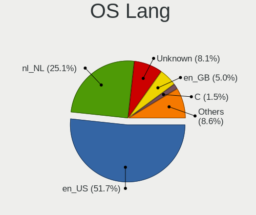
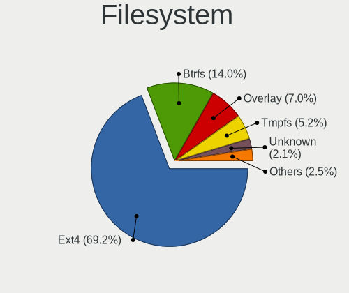
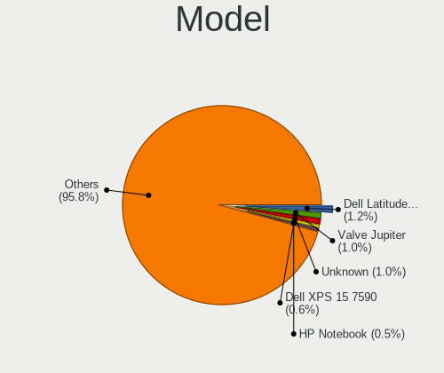
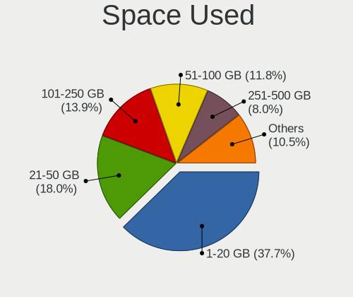
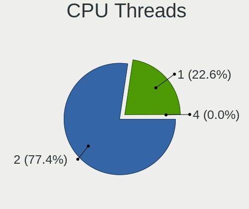
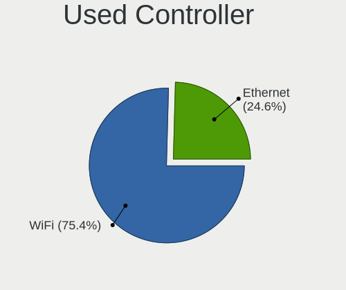
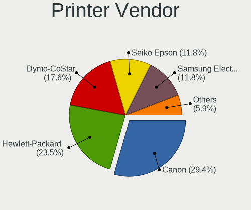
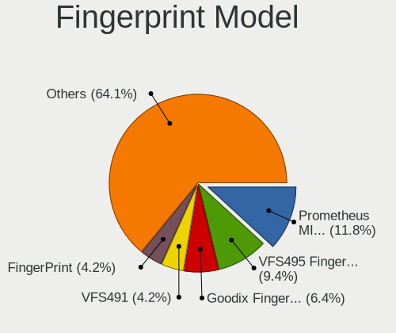

Linux in Netherlands - Tested Hardware & Statistics (Notebooks)
---------------------------------------------------------------

A project to collect tested hardware configurations for Linux in Netherlands.

Anyone can contribute to this report by the [hw-probe](https://github.com/linuxhw/hw-probe) tool:

    sudo -E hw-probe -all -upload

Please contribute! Especially if your hardware is rare.

Contents
--------

* [ Test Cases ](#test-cases)

* [ System ](#system)
  - [ OS                       ](#os)
  - [ OS Family                ](#os-family)
  - [ Kernel                   ](#kernel)
  - [ Kernel Family            ](#kernel-family)
  - [ Kernel Major Ver.        ](#kernel-major-ver)
  - [ Arch                     ](#arch)
  - [ DE                       ](#de)
  - [ Display Server           ](#display-server)
  - [ Display Manager          ](#display-manager)
  - [ OS Lang                  ](#os-lang)
  - [ Boot Mode                ](#boot-mode)
  - [ Filesystem               ](#filesystem)
  - [ Part. scheme             ](#part-scheme)
  - [ Dual Boot with Linux/BSD ](#dual-boot-with-linuxbsd)
  - [ Dual Boot (Win)          ](#dual-boot-win)

* [ Board ](#board)
  - [ Vendor                   ](#vendor)
  - [ Model                    ](#model)
  - [ Model Family             ](#model-family)
  - [ MFG Year                 ](#mfg-year)
  - [ Form Factor              ](#form-factor)
  - [ Secure Boot              ](#secure-boot)
  - [ Coreboot                 ](#coreboot)
  - [ RAM Size                 ](#ram-size)
  - [ RAM Used                 ](#ram-used)
  - [ Total Drives             ](#total-drives)
  - [ Has CD-ROM               ](#has-cd-rom)
  - [ Has Ethernet             ](#has-ethernet)
  - [ Has WiFi                 ](#has-wifi)
  - [ Has Bluetooth            ](#has-bluetooth)

* [ Location ](#location)
  - [ Country                  ](#country)
  - [ City                     ](#city)

* [ Drives ](#drives)
  - [ Drive Vendor             ](#drive-vendor)
  - [ Drive Model              ](#drive-model)
  - [ HDD Vendor               ](#hdd-vendor)
  - [ SSD Vendor               ](#ssd-vendor)
  - [ Drive Kind               ](#drive-kind)
  - [ Drive Connector          ](#drive-connector)
  - [ Drive Size               ](#drive-size)
  - [ Space Total              ](#space-total)
  - [ Space Used               ](#space-used)
  - [ Malfunc. Drives          ](#malfunc-drives)
  - [ Malfunc. Drive Vendor    ](#malfunc-drive-vendor)
  - [ Malfunc. HDD Vendor      ](#malfunc-hdd-vendor)
  - [ Malfunc. Drive Kind      ](#malfunc-drive-kind)
  - [ Failed Drives            ](#failed-drives)
  - [ Failed Drive Vendor      ](#failed-drive-vendor)
  - [ Drive Status             ](#drive-status)

* [ Storage controller ](#storage-controller)
  - [ Storage Vendor           ](#storage-vendor)
  - [ Storage Model            ](#storage-model)
  - [ Storage Kind             ](#storage-kind)

* [ Processor ](#processor)
  - [ CPU Vendor               ](#cpu-vendor)
  - [ CPU Model                ](#cpu-model)
  - [ CPU Model Family         ](#cpu-model-family)
  - [ CPU Cores                ](#cpu-cores)
  - [ CPU Sockets              ](#cpu-sockets)
  - [ CPU Threads              ](#cpu-threads)
  - [ CPU Op-Modes             ](#cpu-op-modes)
  - [ CPU Microcode            ](#cpu-microcode)
  - [ CPU Microarch            ](#cpu-microarch)

* [ Graphics ](#graphics)
  - [ GPU Vendor               ](#gpu-vendor)
  - [ GPU Model                ](#gpu-model)
  - [ GPU Combo                ](#gpu-combo)
  - [ GPU Driver               ](#gpu-driver)
  - [ GPU Memory               ](#gpu-memory)

* [ Monitor ](#monitor)
  - [ Monitor Vendor           ](#monitor-vendor)
  - [ Monitor Model            ](#monitor-model)
  - [ Monitor Resolution       ](#monitor-resolution)
  - [ Monitor Diagonal         ](#monitor-diagonal)
  - [ Monitor Width            ](#monitor-width)
  - [ Aspect Ratio             ](#aspect-ratio)
  - [ Monitor Area             ](#monitor-area)
  - [ Pixel Density            ](#pixel-density)
  - [ Multiple Monitors        ](#multiple-monitors)

* [ Network ](#network)
  - [ Net Controller Vendor    ](#net-controller-vendor)
  - [ Net Controller Model     ](#net-controller-model)
  - [ Wireless Vendor          ](#wireless-vendor)
  - [ Wireless Model           ](#wireless-model)
  - [ Ethernet Vendor          ](#ethernet-vendor)
  - [ Ethernet Model           ](#ethernet-model)
  - [ Net Controller Kind      ](#net-controller-kind)
  - [ Used Controller          ](#used-controller)
  - [ NICs                     ](#nics)
  - [ IPv6                     ](#ipv6)

* [ Bluetooth ](#bluetooth)
  - [ Bluetooth Vendor         ](#bluetooth-vendor)
  - [ Bluetooth Model          ](#bluetooth-model)

* [ Sound ](#sound)
  - [ Sound Vendor             ](#sound-vendor)
  - [ Sound Model              ](#sound-model)

* [ Memory ](#memory)
  - [ Memory Vendor            ](#memory-vendor)
  - [ Memory Model             ](#memory-model)
  - [ Memory Kind              ](#memory-kind)
  - [ Memory Form Factor       ](#memory-form-factor)
  - [ Memory Size              ](#memory-size)
  - [ Memory Speed             ](#memory-speed)

* [ Printers & scanners ](#printers--scanners)
  - [ Printer Vendor           ](#printer-vendor)
  - [ Printer Model            ](#printer-model)
  - [ Scanner Vendor           ](#scanner-vendor)
  - [ Scanner Model            ](#scanner-model)

* [ Camera ](#camera)
  - [ Camera Vendor            ](#camera-vendor)
  - [ Camera Model             ](#camera-model)

* [ Security ](#security)
  - [ Fingerprint Vendor       ](#fingerprint-vendor)
  - [ Fingerprint Model        ](#fingerprint-model)
  - [ Chipcard Vendor          ](#chipcard-vendor)
  - [ Chipcard Model           ](#chipcard-model)

* [ Unsupported ](#unsupported)
  - [ Unsupported Devices      ](#unsupported-devices)
  - [ Unsupported Device Types ](#unsupported-device-types)

Test Cases
----------

Total: 3295

| Vendor        | Model                       | Probe                                                      | Date         |
|---------------|-----------------------------|------------------------------------------------------------|--------------|
| HP            | Pro Tablet 608 G1           | [14fcb9ce4b](https://linux-hardware.org/?probe=14fcb9ce4b) | Sep 30, 2023 |
| HP            | Pro Tablet 608 G1           | [ab84386c83](https://linux-hardware.org/?probe=ab84386c83) | Sep 30, 2023 |
| ASUSTek       | ROG Strix G713PI_G713PI     | [a3af35a207](https://linux-hardware.org/?probe=a3af35a207) | Sep 29, 2023 |
| Dell          | Latitude 3301               | [3859ed5445](https://linux-hardware.org/?probe=3859ed5445) | Sep 29, 2023 |
| SKIKK         | Sindri 14                   | [9766c80aa9](https://linux-hardware.org/?probe=9766c80aa9) | Sep 29, 2023 |
| ASUSTek       | VivoBook_ASUSLaptop X412... | [5828bffdb6](https://linux-hardware.org/?probe=5828bffdb6) | Sep 29, 2023 |
| ASUSTek       | VivoBook_ASUSLaptop X513... | [58fdd789af](https://linux-hardware.org/?probe=58fdd789af) | Sep 28, 2023 |
| Lenovo        | ThinkPad X1 Carbon 7th 2... | [a95feaee78](https://linux-hardware.org/?probe=a95feaee78) | Sep 27, 2023 |
| Lenovo        | ThinkPad T16 Gen 1 21CHC... | [f1623258a8](https://linux-hardware.org/?probe=f1623258a8) | Sep 27, 2023 |
| HP            | Laptop 14-ck0xxx            | [f4326ad956](https://linux-hardware.org/?probe=f4326ad956) | Sep 26, 2023 |
| HP            | Laptop 14-ck0xxx            | [3ff273b73c](https://linux-hardware.org/?probe=3ff273b73c) | Sep 26, 2023 |
| HP            | OMEN by Gaming Laptop 16... | [cb2b1325cc](https://linux-hardware.org/?probe=cb2b1325cc) | Sep 25, 2023 |
| HP            | ProBook 450 15.6 inch G9... | [2e717c304e](https://linux-hardware.org/?probe=2e717c304e) | Sep 25, 2023 |
| MSI           | Katana 15 B12VGK            | [9a6d33a191](https://linux-hardware.org/?probe=9a6d33a191) | Sep 24, 2023 |
| Lenovo        | ThinkPad X1 Carbon 6th 2... | [42309ddc8c](https://linux-hardware.org/?probe=42309ddc8c) | Sep 23, 2023 |
| System76      | Gazelle                     | [2e31a65d58](https://linux-hardware.org/?probe=2e31a65d58) | Sep 23, 2023 |
| Notebook      | NH50_70RH                   | [57070abf3c](https://linux-hardware.org/?probe=57070abf3c) | Sep 21, 2023 |
| Acer          | Aspire A114-33              | [4b581786a8](https://linux-hardware.org/?probe=4b581786a8) | Sep 21, 2023 |
| Acer          | Aspire 7520                 | [5e16126a55](https://linux-hardware.org/?probe=5e16126a55) | Sep 21, 2023 |
| Lenovo        | ThinkPad L540 20AU006CRI    | [e8885911a0](https://linux-hardware.org/?probe=e8885911a0) | Sep 21, 2023 |
| Lenovo        | ThinkPad T14 Gen 1 20UD0... | [4ab55a6c83](https://linux-hardware.org/?probe=4ab55a6c83) | Sep 21, 2023 |
| Acer          | Aspire VN7-572G             | [8936ef0637](https://linux-hardware.org/?probe=8936ef0637) | Sep 21, 2023 |
| Lenovo        | ThinkPad T14 Gen 1 20UD0... | [a41b85a029](https://linux-hardware.org/?probe=a41b85a029) | Sep 21, 2023 |
| Chuwi         | MiniBook X                  | [50d0819b3b](https://linux-hardware.org/?probe=50d0819b3b) | Sep 20, 2023 |
| Clevo         | E7130                       | [38de5c7699](https://linux-hardware.org/?probe=38de5c7699) | Sep 20, 2023 |
| Acer          | Aspire 7520                 | [bbba1d5ea4](https://linux-hardware.org/?probe=bbba1d5ea4) | Sep 20, 2023 |
| Medion        | Akoya E7416                 | [f820e8515d](https://linux-hardware.org/?probe=f820e8515d) | Sep 19, 2023 |
| HP            | EliteBook 8570w             | [d90f46756b](https://linux-hardware.org/?probe=d90f46756b) | Sep 19, 2023 |
| ASUSTek       | ASUS TUF Gaming F15 FX50... | [acd1c47b9d](https://linux-hardware.org/?probe=acd1c47b9d) | Sep 19, 2023 |
| Lenovo        | IdeaPad 520-15IKB 81BF      | [9e9652809d](https://linux-hardware.org/?probe=9e9652809d) | Sep 18, 2023 |
| Lenovo        | Z50-75 80EC                 | [410df263b8](https://linux-hardware.org/?probe=410df263b8) | Sep 18, 2023 |
| Lenovo        | ThinkPad L13 Gen 2 20VH0... | [ebfe5ca0b0](https://linux-hardware.org/?probe=ebfe5ca0b0) | Sep 18, 2023 |
| Lenovo        | ThinkPad A475 20KMS08300    | [5f99185bbb](https://linux-hardware.org/?probe=5f99185bbb) | Sep 17, 2023 |
| HP            | Laptop 15-dy2xxx            | [faa9a71ce1](https://linux-hardware.org/?probe=faa9a71ce1) | Sep 17, 2023 |
| HP            | Pavilion Gaming Laptop 1... | [416798463e](https://linux-hardware.org/?probe=416798463e) | Sep 16, 2023 |
| ASUSTek       | K54L                        | [4b62e4c882](https://linux-hardware.org/?probe=4b62e4c882) | Sep 15, 2023 |
| HP            | EliteBook Revolve 810 G3    | [960947648b](https://linux-hardware.org/?probe=960947648b) | Sep 15, 2023 |
| Acer          | Aspire E5-774               | [3d3f930e69](https://linux-hardware.org/?probe=3d3f930e69) | Sep 14, 2023 |
| Lenovo        | ThinkPad T480 20L6S1FU00    | [d0e8034434](https://linux-hardware.org/?probe=d0e8034434) | Sep 14, 2023 |
| Medion        | E11201                      | [c62ac67427](https://linux-hardware.org/?probe=c62ac67427) | Sep 10, 2023 |
| HP            | Pavilion g6                 | [f39fbfabcc](https://linux-hardware.org/?probe=f39fbfabcc) | Sep 10, 2023 |
| HP            | Pavilion g6                 | [e82f904ef8](https://linux-hardware.org/?probe=e82f904ef8) | Sep 10, 2023 |
| ASUSTek       | VivoBook_ASUSLaptop X513... | [ecef237a9c](https://linux-hardware.org/?probe=ecef237a9c) | Sep 07, 2023 |
| Valve         | Jupiter                     | [85a4fe79c2](https://linux-hardware.org/?probe=85a4fe79c2) | Sep 07, 2023 |
| ASUSTek       | N751JX                      | [8ece217753](https://linux-hardware.org/?probe=8ece217753) | Sep 06, 2023 |
| Lenovo        | IdeaPad 1 14AMN7 82VF       | [dccf0aaf61](https://linux-hardware.org/?probe=dccf0aaf61) | Sep 06, 2023 |
| Lenovo        | IdeaPad 1 14AMN7 82VF       | [51e417460a](https://linux-hardware.org/?probe=51e417460a) | Sep 05, 2023 |
| Framework     | Laptop                      | [bd2852cd9e](https://linux-hardware.org/?probe=bd2852cd9e) | Sep 05, 2023 |
| Lenovo        | IdeaPad 3 15ALC6 82KU       | [312d4a06dc](https://linux-hardware.org/?probe=312d4a06dc) | Sep 05, 2023 |
| Toshiba       | Satellite A200              | [a26939af7b](https://linux-hardware.org/?probe=a26939af7b) | Sep 05, 2023 |
| HP            | ProBook 6550b               | [5881531377](https://linux-hardware.org/?probe=5881531377) | Sep 05, 2023 |
| ASUSTek       | ASUS TUF Gaming F15 FX50... | [9accfe317a](https://linux-hardware.org/?probe=9accfe317a) | Sep 04, 2023 |
| Lenovo        | Legion 5 Pro 16ACH6H 82J... | [945acb9ea2](https://linux-hardware.org/?probe=945acb9ea2) | Sep 04, 2023 |
| MSI           | Prestige 14Evo A12M         | [d7b4b0f2f1](https://linux-hardware.org/?probe=d7b4b0f2f1) | Sep 04, 2023 |
| Lenovo        | Z50-75 80EC                 | [12894bacfb](https://linux-hardware.org/?probe=12894bacfb) | Sep 03, 2023 |
| HUAWEI        | HN-WX9X                     | [efd67d7c17](https://linux-hardware.org/?probe=efd67d7c17) | Sep 02, 2023 |
| ASUSTek       | ROG Strix G814JI_G814JI     | [5032531f3e](https://linux-hardware.org/?probe=5032531f3e) | Sep 02, 2023 |
| Dell          | Latitude 5420               | [2acb1da32c](https://linux-hardware.org/?probe=2acb1da32c) | Sep 02, 2023 |
| Lenovo        | 14w Gen 2 82N9              | [87c8a118b5](https://linux-hardware.org/?probe=87c8a118b5) | Sep 02, 2023 |
| Acer          | Aspire V3-772               | [5cb3aa2368](https://linux-hardware.org/?probe=5cb3aa2368) | Aug 31, 2023 |
| HP            | EliteBook 2570p             | [436e4af3ce](https://linux-hardware.org/?probe=436e4af3ce) | Aug 31, 2023 |
| MSI           | Katana GF76 11UC            | [dd25d90357](https://linux-hardware.org/?probe=dd25d90357) | Aug 30, 2023 |
| ASUSTek       | VivoBook_ASUSLaptop X712... | [338a8026f3](https://linux-hardware.org/?probe=338a8026f3) | Aug 29, 2023 |
| Lenovo        | Legion 5 Pro 16ACH6H 82J... | [87b94b4ea0](https://linux-hardware.org/?probe=87b94b4ea0) | Aug 28, 2023 |
| Lenovo        | Yoga 300-11IBR 80M1         | [8c0be85e0e](https://linux-hardware.org/?probe=8c0be85e0e) | Aug 28, 2023 |
| Valve         | Jupiter                     | [4d894addd1](https://linux-hardware.org/?probe=4d894addd1) | Aug 27, 2023 |
| Dell          | XPS 13 9310                 | [40802d54a7](https://linux-hardware.org/?probe=40802d54a7) | Aug 27, 2023 |
| ASUSTek       | VivoBook_ASUSLaptop X760... | [5ef3048a11](https://linux-hardware.org/?probe=5ef3048a11) | Aug 26, 2023 |
| HP            | EliteBook 840 G3            | [25b5ca25b8](https://linux-hardware.org/?probe=25b5ca25b8) | Aug 26, 2023 |
| Lenovo        | IdeaPad Y700-15ISK 80NV     | [14605463c1](https://linux-hardware.org/?probe=14605463c1) | Aug 26, 2023 |
| Lenovo        | IdeaPad Y700-15ISK 80NV     | [738c091241](https://linux-hardware.org/?probe=738c091241) | Aug 26, 2023 |
| HP            | Notebook                    | [b27d20b450](https://linux-hardware.org/?probe=b27d20b450) | Aug 26, 2023 |
| Lenovo        | IdeaPad L340-15IRH Gamin... | [6496a666d7](https://linux-hardware.org/?probe=6496a666d7) | Aug 26, 2023 |
| Lenovo        | ThinkPad P50 20EQS5C701     | [adb5d31da7](https://linux-hardware.org/?probe=adb5d31da7) | Aug 25, 2023 |
| Google        | Rammus                      | [28554e7ce5](https://linux-hardware.org/?probe=28554e7ce5) | Aug 25, 2023 |
| Google        | Rammus                      | [57b3596f63](https://linux-hardware.org/?probe=57b3596f63) | Aug 24, 2023 |
| Lenovo        | Legion 5 15ACH6H 82JU       | [3746b277b6](https://linux-hardware.org/?probe=3746b277b6) | Aug 24, 2023 |
| Lenovo        | Legion 5 15ACH6H 82JU       | [3e241db8f7](https://linux-hardware.org/?probe=3e241db8f7) | Aug 24, 2023 |
| Dell          | XPS 15 7590                 | [66b46e04d3](https://linux-hardware.org/?probe=66b46e04d3) | Aug 23, 2023 |
| HP            | Victus by Laptop 16-d0xx... | [845b1d4d76](https://linux-hardware.org/?probe=845b1d4d76) | Aug 22, 2023 |
| Positivo      | Mobile                      | [e39dbd02a9](https://linux-hardware.org/?probe=e39dbd02a9) | Aug 22, 2023 |
| Dell          | XPS 15 9500                 | [23474c1faa](https://linux-hardware.org/?probe=23474c1faa) | Aug 22, 2023 |
| Lenovo        | ThinkPad P51 20HJS3MY00     | [010dac0caa](https://linux-hardware.org/?probe=010dac0caa) | Aug 22, 2023 |
| Lenovo        | IdeaPad 510-15ISK 80SR      | [81bc5661ca](https://linux-hardware.org/?probe=81bc5661ca) | Aug 21, 2023 |
| Lenovo        | ThinkPad X230 23243VG       | [be77bad24e](https://linux-hardware.org/?probe=be77bad24e) | Aug 21, 2023 |
| HP            | Presario CQ42               | [183f035603](https://linux-hardware.org/?probe=183f035603) | Aug 20, 2023 |
| ASUSTek       | ROG Zephyrus G14 GA402XY... | [19675df004](https://linux-hardware.org/?probe=19675df004) | Aug 20, 2023 |
| Apple         | MacBookAir7,2               | [fb3c8c793c](https://linux-hardware.org/?probe=fb3c8c793c) | Aug 19, 2023 |
| HP            | EliteBook 2540p             | [dc150253e5](https://linux-hardware.org/?probe=dc150253e5) | Aug 18, 2023 |
| HP            | ProBook 445 G8 Notebook ... | [24a295f95b](https://linux-hardware.org/?probe=24a295f95b) | Aug 17, 2023 |
| ASUSTek       | Vivobook Go E1404FA_E140... | [43fd1aad67](https://linux-hardware.org/?probe=43fd1aad67) | Aug 17, 2023 |
| Acer          | Aspire A515-52G             | [2d38a6554a](https://linux-hardware.org/?probe=2d38a6554a) | Aug 16, 2023 |
| Dell          | XPS 15 9500                 | [56759a6a05](https://linux-hardware.org/?probe=56759a6a05) | Aug 16, 2023 |
| HP            | Laptop 17-ca0xxx            | [bbf606d6e8](https://linux-hardware.org/?probe=bbf606d6e8) | Aug 16, 2023 |
| HP            | Pavilion Laptop 15-cc5xx    | [7aac45ad2d](https://linux-hardware.org/?probe=7aac45ad2d) | Aug 15, 2023 |
| Apple         | MacBookPro9,2               | [61ff7ac5f1](https://linux-hardware.org/?probe=61ff7ac5f1) | Aug 14, 2023 |
| Valve         | Jupiter                     | [ed10f1ef39](https://linux-hardware.org/?probe=ed10f1ef39) | Aug 13, 2023 |
| Lenovo        | IdeaPad 5 14ITL05 82FE      | [7ad086cf8b](https://linux-hardware.org/?probe=7ad086cf8b) | Aug 13, 2023 |
| AMI           | Unknown                     | [326999bd6b](https://linux-hardware.org/?probe=326999bd6b) | Aug 12, 2023 |
| AMI           | Unknown                     | [614b443c5c](https://linux-hardware.org/?probe=614b443c5c) | Aug 12, 2023 |
| Lenovo        | ThinkPad T490 20N3S8FN0F    | [cff61d75ae](https://linux-hardware.org/?probe=cff61d75ae) | Aug 12, 2023 |
| HP            | ProBook 6560b               | [01c0e5d78c](https://linux-hardware.org/?probe=01c0e5d78c) | Aug 12, 2023 |
| Dell          | Inspiron 1720               | [1cb123d894](https://linux-hardware.org/?probe=1cb123d894) | Aug 12, 2023 |
| ASUSTek       | ZenBook UX425EA_UX425EA     | [0d45e9e048](https://linux-hardware.org/?probe=0d45e9e048) | Aug 12, 2023 |
| ASUSTek       | X751LD                      | [e98d8d116d](https://linux-hardware.org/?probe=e98d8d116d) | Aug 10, 2023 |
| Apple         | MacBookAir5,2               | [7f91d6f9d8](https://linux-hardware.org/?probe=7f91d6f9d8) | Aug 10, 2023 |
| ASUSTek       | K75VJ                       | [7d1e95601c](https://linux-hardware.org/?probe=7d1e95601c) | Aug 09, 2023 |
| HP            | ProBook 4310s               | [ac0c1be078](https://linux-hardware.org/?probe=ac0c1be078) | Aug 09, 2023 |
| MSI           | Cyborg 15 A12VF             | [b041192310](https://linux-hardware.org/?probe=b041192310) | Aug 09, 2023 |
| HP            | EliteBook 2540p             | [2a02492c01](https://linux-hardware.org/?probe=2a02492c01) | Aug 09, 2023 |
| HP            | EliteBook 2540p             | [509b979b88](https://linux-hardware.org/?probe=509b979b88) | Aug 09, 2023 |
| HONOR         | BOHK-WAX9X                  | [8a6ead436f](https://linux-hardware.org/?probe=8a6ead436f) | Aug 08, 2023 |
| Lenovo        | IdeaPad Gaming 3 15IHU6 ... | [c06b23398a](https://linux-hardware.org/?probe=c06b23398a) | Aug 08, 2023 |
| HP            | EliteBook 840 G6            | [60a28c22c7](https://linux-hardware.org/?probe=60a28c22c7) | Aug 08, 2023 |
| HP            | EliteBook 840 G6            | [9f044dbe9e](https://linux-hardware.org/?probe=9f044dbe9e) | Aug 08, 2023 |
| Lenovo        | IdeaPad Gaming 3 15IHU6 ... | [543719cf07](https://linux-hardware.org/?probe=543719cf07) | Aug 07, 2023 |
| ASUSTek       | ROG Flow X13 GV301QE_GV3... | [c1062b9705](https://linux-hardware.org/?probe=c1062b9705) | Aug 07, 2023 |
| ASUSTek       | ROG Flow X13 GV301QE_GV3... | [46a7513850](https://linux-hardware.org/?probe=46a7513850) | Aug 07, 2023 |
| LG Electro... | 14Z90N-V.AA78B              | [af79c7f5f5](https://linux-hardware.org/?probe=af79c7f5f5) | Aug 07, 2023 |
| Dell          | XPS 15 9500                 | [309b546405](https://linux-hardware.org/?probe=309b546405) | Aug 07, 2023 |
| Apple         | MacBookPro9,2               | [16936ef482](https://linux-hardware.org/?probe=16936ef482) | Aug 06, 2023 |
| Dell          | Latitude 7480               | [eeb7f6e8fe](https://linux-hardware.org/?probe=eeb7f6e8fe) | Aug 06, 2023 |
| Lenovo        | ThinkPad X1 Carbon 4th 2... | [fcc05278d6](https://linux-hardware.org/?probe=fcc05278d6) | Aug 04, 2023 |
| Notebook      | PB50_70RF,RD,RC             | [deb7c70ef0](https://linux-hardware.org/?probe=deb7c70ef0) | Aug 02, 2023 |
| Dell          | Latitude E6440              | [57ce920c06](https://linux-hardware.org/?probe=57ce920c06) | Aug 01, 2023 |
| Apple         | MacBookAir3,1               | [9a3416654f](https://linux-hardware.org/?probe=9a3416654f) | Jul 30, 2023 |
| Lenovo        | ThinkPad X1 Carbon Gen 1... | [4d875892d6](https://linux-hardware.org/?probe=4d875892d6) | Jul 30, 2023 |
| Lenovo        | Legion Y540-17IRH 81Q4      | [f1db906c7c](https://linux-hardware.org/?probe=f1db906c7c) | Jul 30, 2023 |
| HP            | EliteBook 840 G5            | [c8391bd952](https://linux-hardware.org/?probe=c8391bd952) | Jul 29, 2023 |
| Acer          | TravelMate B115-M           | [ca01eab0e3](https://linux-hardware.org/?probe=ca01eab0e3) | Jul 29, 2023 |
| Lenovo        | ThinkPad T470 W10DG 20JN... | [95e189ee7a](https://linux-hardware.org/?probe=95e189ee7a) | Jul 29, 2023 |
| HP            | ZBook 15 G5                 | [dfe51162d1](https://linux-hardware.org/?probe=dfe51162d1) | Jul 29, 2023 |
| VALE          | Notebook Classic C140       | [ec65662265](https://linux-hardware.org/?probe=ec65662265) | Jul 28, 2023 |
| HP            | ZBook 15 G5                 | [8996d2d4fd](https://linux-hardware.org/?probe=8996d2d4fd) | Jul 28, 2023 |
| Dell          | XPS 15 9530                 | [d6855eabe2](https://linux-hardware.org/?probe=d6855eabe2) | Jul 26, 2023 |
| Minix         | NEO Z83-4A                  | [3a884d55d3](https://linux-hardware.org/?probe=3a884d55d3) | Jul 26, 2023 |
| Dell          | Latitude E7440              | [9b8234d640](https://linux-hardware.org/?probe=9b8234d640) | Jul 26, 2023 |
| MSI           | Prestige 14Evo A12M         | [4872d1fdf6](https://linux-hardware.org/?probe=4872d1fdf6) | Jul 25, 2023 |
| ASUSTek       | TUF Gaming FX705GD_FX705... | [c73107bcac](https://linux-hardware.org/?probe=c73107bcac) | Jul 25, 2023 |
| ASUSTek       | TUF Gaming FX705GD_FX705... | [1aeabb238f](https://linux-hardware.org/?probe=1aeabb238f) | Jul 25, 2023 |
| Lenovo        | IdeaPad 5 14ARE05 81YM      | [7970e46266](https://linux-hardware.org/?probe=7970e46266) | Jul 25, 2023 |
| Notebook      | NH50_70RH                   | [12c8f156b9](https://linux-hardware.org/?probe=12c8f156b9) | Jul 25, 2023 |
| Notebook      | NH50_70RH                   | [52d2901ce2](https://linux-hardware.org/?probe=52d2901ce2) | Jul 25, 2023 |
| Lenovo        | IdeaPad 5 15ARE05 81YQ      | [02cae62d32](https://linux-hardware.org/?probe=02cae62d32) | Jul 24, 2023 |
| Sony          | SVF1521A6EW                 | [3c39100c6f](https://linux-hardware.org/?probe=3c39100c6f) | Jul 23, 2023 |
| Medion        | E4251 MD61435               | [4cd0b97344](https://linux-hardware.org/?probe=4cd0b97344) | Jul 23, 2023 |
| Lenovo        | Legion 5 Pro 16IAH7H 82R... | [de58b924e1](https://linux-hardware.org/?probe=de58b924e1) | Jul 23, 2023 |
| HP            | EliteBook 820 G4            | [3051483589](https://linux-hardware.org/?probe=3051483589) | Jul 22, 2023 |
| Standard      | Unknown                     | [74acf0f707](https://linux-hardware.org/?probe=74acf0f707) | Jul 21, 2023 |
| Lenovo        | Legion Y540-17IRH 81Q4      | [2a3971e2fc](https://linux-hardware.org/?probe=2a3971e2fc) | Jul 21, 2023 |
| HP            | EliteBook 820 G4            | [c85c21d42e](https://linux-hardware.org/?probe=c85c21d42e) | Jul 21, 2023 |
| Lenovo        | G50-70 20351                | [a55acd567e](https://linux-hardware.org/?probe=a55acd567e) | Jul 19, 2023 |
| Notebook      | NH5x_7xDPx                  | [098f2f58c7](https://linux-hardware.org/?probe=098f2f58c7) | Jul 18, 2023 |
| HP            | Notebook                    | [4498c757a7](https://linux-hardware.org/?probe=4498c757a7) | Jul 18, 2023 |
| Dell          | Latitude E5510              | [3b006db4ec](https://linux-hardware.org/?probe=3b006db4ec) | Jul 18, 2023 |
| HP            | Pavilion 17                 | [7c39d851fd](https://linux-hardware.org/?probe=7c39d851fd) | Jul 16, 2023 |
| ASUSTek       | N53SM                       | [d06ca4b9c2](https://linux-hardware.org/?probe=d06ca4b9c2) | Jul 16, 2023 |
| ASUSTek       | N53SM                       | [103e7e5196](https://linux-hardware.org/?probe=103e7e5196) | Jul 16, 2023 |
| Lenovo        | ThinkPad T470s 20HGS1VD0... | [b62ed55325](https://linux-hardware.org/?probe=b62ed55325) | Jul 15, 2023 |
| HP            | EliteBook 850 G8 Noteboo... | [7872b8a730](https://linux-hardware.org/?probe=7872b8a730) | Jul 15, 2023 |
| HP            | ZBook 17 G2                 | [bf8b4001a4](https://linux-hardware.org/?probe=bf8b4001a4) | Jul 15, 2023 |
| Lenovo        | ThinkPad X1 Carbon Gen 1... | [038a62a49f](https://linux-hardware.org/?probe=038a62a49f) | Jul 15, 2023 |
| Apple         | MacBookPro8,1               | [4de092adb7](https://linux-hardware.org/?probe=4de092adb7) | Jul 14, 2023 |
| Dell          | Precision 7540              | [c862752535](https://linux-hardware.org/?probe=c862752535) | Jul 14, 2023 |
| HP            | ProBook 6570b               | [0c933d2dd8](https://linux-hardware.org/?probe=0c933d2dd8) | Jul 12, 2023 |
| Toshiba       | Satellite C850-1GL          | [e160b642b4](https://linux-hardware.org/?probe=e160b642b4) | Jul 12, 2023 |
| Acer          | Extensa 7630G               | [47c7ddbf85](https://linux-hardware.org/?probe=47c7ddbf85) | Jul 11, 2023 |
| Toshiba       | Satellite C850-1GL          | [f7305d0265](https://linux-hardware.org/?probe=f7305d0265) | Jul 11, 2023 |
| Dell          | XPS 15 9530                 | [f60d21d84f](https://linux-hardware.org/?probe=f60d21d84f) | Jul 10, 2023 |
| Acer          | TravelMate P2510-G2-M       | [c96a405528](https://linux-hardware.org/?probe=c96a405528) | Jul 09, 2023 |
| Apple         | MacBookPro11,2              | [e6693c16ff](https://linux-hardware.org/?probe=e6693c16ff) | Jul 09, 2023 |
| MSI           | Cyborg 15 A12VF             | [a34d0d8290](https://linux-hardware.org/?probe=a34d0d8290) | Jul 08, 2023 |
| Lenovo        | ThinkBook 15 G2 ITL 20VE    | [a3fd5e4b9d](https://linux-hardware.org/?probe=a3fd5e4b9d) | Jul 07, 2023 |
| ASUSTek       | G73Jw                       | [79053de50e](https://linux-hardware.org/?probe=79053de50e) | Jul 07, 2023 |
| ASUSTek       | Strix GL504GM_GL504GM       | [b482f282a5](https://linux-hardware.org/?probe=b482f282a5) | Jul 06, 2023 |
| Notebook      | NJx0PU                      | [29ebf426d1](https://linux-hardware.org/?probe=29ebf426d1) | Jul 06, 2023 |
| Acer          | TravelMate P215-53          | [d759c2c726](https://linux-hardware.org/?probe=d759c2c726) | Jul 06, 2023 |
| Dell          | Inspiron 5593               | [a40b38a093](https://linux-hardware.org/?probe=a40b38a093) | Jul 05, 2023 |
| HP            | EliteBook 820 G4            | [58ced183c2](https://linux-hardware.org/?probe=58ced183c2) | Jul 04, 2023 |
| HP            | Compaq Presario CQ60        | [983745a0d2](https://linux-hardware.org/?probe=983745a0d2) | Jul 03, 2023 |
| HP            | Compaq Presario CQ60        | [a5bd493e91](https://linux-hardware.org/?probe=a5bd493e91) | Jul 03, 2023 |
| ASUSTek       | UX430UAR                    | [6a51948293](https://linux-hardware.org/?probe=6a51948293) | Jul 03, 2023 |
| Packard Be... | EasyNote TJ67               | [92be4d3a56](https://linux-hardware.org/?probe=92be4d3a56) | Jul 02, 2023 |
| Lenovo        | ThinkPad T14 Gen 1 20UDC... | [54987b03a1](https://linux-hardware.org/?probe=54987b03a1) | Jul 02, 2023 |
| HP            | ZBook Fury 16 G9 Mobile ... | [6ee8b4e949](https://linux-hardware.org/?probe=6ee8b4e949) | Jul 01, 2023 |
| HP            | Pavilion TS 11              | [88b4565c0b](https://linux-hardware.org/?probe=88b4565c0b) | Jul 01, 2023 |
| HP            | Pavilion TS 11              | [7e1b98b585](https://linux-hardware.org/?probe=7e1b98b585) | Jul 01, 2023 |
| HP            | EliteBook 2540p             | [7b546735a4](https://linux-hardware.org/?probe=7b546735a4) | Jun 30, 2023 |
| Lenovo        | ThinkPad L512 44444NG       | [300a79aa88](https://linux-hardware.org/?probe=300a79aa88) | Jun 30, 2023 |
| Apple         | MacBookAir7,1               | [70ce1e280f](https://linux-hardware.org/?probe=70ce1e280f) | Jun 30, 2023 |
| Apple         | MacBookAir7,1               | [b5e0044759](https://linux-hardware.org/?probe=b5e0044759) | Jun 30, 2023 |
| ASUSTek       | X751MA                      | [b36ca5687c](https://linux-hardware.org/?probe=b36ca5687c) | Jun 29, 2023 |
| Acer          | Aspire 5745G                | [c3394b9eb0](https://linux-hardware.org/?probe=c3394b9eb0) | Jun 28, 2023 |
| Dell          | Latitude 7370               | [cb11921012](https://linux-hardware.org/?probe=cb11921012) | Jun 28, 2023 |
| Acer          | Aspire A315-51              | [771e2e233a](https://linux-hardware.org/?probe=771e2e233a) | Jun 28, 2023 |
| Lenovo        | ThinkPad X1 Carbon Gen 8... | [3ea9e41d03](https://linux-hardware.org/?probe=3ea9e41d03) | Jun 28, 2023 |
| Lenovo        | ThinkPad X280 20KF001RUK    | [a1da72b9a5](https://linux-hardware.org/?probe=a1da72b9a5) | Jun 27, 2023 |
| Intel Clie... | LAPRC710                    | [5aabe7850a](https://linux-hardware.org/?probe=5aabe7850a) | Jun 27, 2023 |
| HP            | EliteBook 850 G8 Noteboo... | [e16689358e](https://linux-hardware.org/?probe=e16689358e) | Jun 26, 2023 |
| HP            | EliteBook 2540p             | [f5e04da161](https://linux-hardware.org/?probe=f5e04da161) | Jun 26, 2023 |
| MSI           | GF75 Thin 9SC               | [554a954c22](https://linux-hardware.org/?probe=554a954c22) | Jun 26, 2023 |
| Dell          | XPS 15 9530                 | [9c925666a5](https://linux-hardware.org/?probe=9c925666a5) | Jun 26, 2023 |
| Dell          | XPS 15 9530                 | [ea814b3f7b](https://linux-hardware.org/?probe=ea814b3f7b) | Jun 26, 2023 |
| Apple         | MacBookPro11,2              | [2d7e4f3505](https://linux-hardware.org/?probe=2d7e4f3505) | Jun 24, 2023 |
| Lenovo        | Legion 5 Pro 16ARH7H 82R... | [23c2fe2245](https://linux-hardware.org/?probe=23c2fe2245) | Jun 24, 2023 |
| ASUSTek       | VivoBook_ASUSLaptop M350... | [d7e8503e88](https://linux-hardware.org/?probe=d7e8503e88) | Jun 23, 2023 |
| Lenovo        | Flex 2-14 20404             | [4ab121533a](https://linux-hardware.org/?probe=4ab121533a) | Jun 23, 2023 |
| ASUSTek       | X751LD                      | [c7be73b6ca](https://linux-hardware.org/?probe=c7be73b6ca) | Jun 23, 2023 |
| ASUSTek       | X751LD                      | [346bbb0b47](https://linux-hardware.org/?probe=346bbb0b47) | Jun 23, 2023 |
| HP            | EliteBook 2540p             | [b33e52fa0a](https://linux-hardware.org/?probe=b33e52fa0a) | Jun 22, 2023 |
| ASUSTek       | ROG Zephyrus G15 GA503RS... | [7782ddf809](https://linux-hardware.org/?probe=7782ddf809) | Jun 22, 2023 |
| HP            | EliteBook 865 16 inch G9... | [e4407d328d](https://linux-hardware.org/?probe=e4407d328d) | Jun 22, 2023 |
| Dell          | Latitude E6410              | [b34442d8c3](https://linux-hardware.org/?probe=b34442d8c3) | Jun 20, 2023 |
| Dell          | Venue 11 Pro 7140           | [f9bf8920f7](https://linux-hardware.org/?probe=f9bf8920f7) | Jun 20, 2023 |
| Dell          | Venue 11 Pro 7140           | [c436287876](https://linux-hardware.org/?probe=c436287876) | Jun 20, 2023 |
| Lenovo        | ThinkPad Z16 Gen 1 21D4C... | [9e06717237](https://linux-hardware.org/?probe=9e06717237) | Jun 19, 2023 |
| HP            | ProBook 450 15.6 inch G9... | [bcd39f0607](https://linux-hardware.org/?probe=bcd39f0607) | Jun 19, 2023 |
| HP            | HDX18                       | [dec8492b2f](https://linux-hardware.org/?probe=dec8492b2f) | Jun 19, 2023 |
| ASUSTek       | X541NA                      | [2fa7c42c59](https://linux-hardware.org/?probe=2fa7c42c59) | Jun 18, 2023 |
| Dell          | Latitude 5430               | [cb097e3c83](https://linux-hardware.org/?probe=cb097e3c83) | Jun 18, 2023 |
| Dell          | Precision 7540              | [8b9ddcc1d8](https://linux-hardware.org/?probe=8b9ddcc1d8) | Jun 18, 2023 |
| HUAWEI        | MACHC-WAX9                  | [8f32e75d6e](https://linux-hardware.org/?probe=8f32e75d6e) | Jun 18, 2023 |
| Dell          | Latitude 3189               | [c7f2d1b100](https://linux-hardware.org/?probe=c7f2d1b100) | Jun 17, 2023 |
| HP            | EliteBook 2540p             | [a62dc4b2ed](https://linux-hardware.org/?probe=a62dc4b2ed) | Jun 17, 2023 |
| Acer          | Aspire V5-571P              | [2adeb26f8a](https://linux-hardware.org/?probe=2adeb26f8a) | Jun 15, 2023 |
| HP            | HDX18                       | [9a49d14af9](https://linux-hardware.org/?probe=9a49d14af9) | Jun 15, 2023 |
| Dell          | Inspiron 15 3511            | [175aa8aae4](https://linux-hardware.org/?probe=175aa8aae4) | Jun 15, 2023 |
| Razer         | Blade 16 - RZ09-0483        | [a8cc966bac](https://linux-hardware.org/?probe=a8cc966bac) | Jun 15, 2023 |
| Lenovo        | IdeaPad 5 Pro 16ACH6 82L... | [bc3ba9b05e](https://linux-hardware.org/?probe=bc3ba9b05e) | Jun 15, 2023 |
| Dell          | Latitude 3310               | [40aa328d98](https://linux-hardware.org/?probe=40aa328d98) | Jun 15, 2023 |
| Acer          | Aspire V3-772               | [1f5318c2b4](https://linux-hardware.org/?probe=1f5318c2b4) | Jun 14, 2023 |
| Dell          | Latitude E5270              | [49f184b9e9](https://linux-hardware.org/?probe=49f184b9e9) | Jun 13, 2023 |
| Samsung       | 750XED                      | [8997330d6a](https://linux-hardware.org/?probe=8997330d6a) | Jun 13, 2023 |
| HP            | ProBook 440 14 inch G9 N... | [39d97bb85b](https://linux-hardware.org/?probe=39d97bb85b) | Jun 12, 2023 |
| HP            | ProBook 440 14 inch G9 N... | [aca09b2a54](https://linux-hardware.org/?probe=aca09b2a54) | Jun 12, 2023 |
| Lenovo        | ThinkPad X230 Tablet 343... | [b815ac19d4](https://linux-hardware.org/?probe=b815ac19d4) | Jun 12, 2023 |
| Lenovo        | IdeaPad 330S-14IKB 81F4     | [b9c83e1b8a](https://linux-hardware.org/?probe=b9c83e1b8a) | Jun 12, 2023 |
| Notebook      | NJx0MU                      | [d2cb2b5360](https://linux-hardware.org/?probe=d2cb2b5360) | Jun 11, 2023 |
| Google        | Snappy                      | [737988d62e](https://linux-hardware.org/?probe=737988d62e) | Jun 11, 2023 |
| Google        | Snappy                      | [f228dabe46](https://linux-hardware.org/?probe=f228dabe46) | Jun 11, 2023 |
| Samsung       | N150/N210/N220              | [977d645961](https://linux-hardware.org/?probe=977d645961) | Jun 10, 2023 |
| Apple         | MacBookPro9,2               | [f502f89e9d](https://linux-hardware.org/?probe=f502f89e9d) | Jun 10, 2023 |
| Valve         | Jupiter                     | [7a36bdb92a](https://linux-hardware.org/?probe=7a36bdb92a) | Jun 09, 2023 |
| HUAWEI        | MACHC-WAX9                  | [6f26f51ef6](https://linux-hardware.org/?probe=6f26f51ef6) | Jun 09, 2023 |
| Lenovo        | Legion Y540-17IRH 81Q4      | [ab95a219f5](https://linux-hardware.org/?probe=ab95a219f5) | Jun 09, 2023 |
| Dell          | Precision 7540              | [41fe2f93ff](https://linux-hardware.org/?probe=41fe2f93ff) | Jun 09, 2023 |
| Lenovo        | ThinkPad T590 20N5000AMH    | [91c0d99427](https://linux-hardware.org/?probe=91c0d99427) | Jun 06, 2023 |
| Dell          | Latitude 7480               | [61c800a3b4](https://linux-hardware.org/?probe=61c800a3b4) | Jun 06, 2023 |
| Dell          | XPS 15 9560                 | [0d326774c9](https://linux-hardware.org/?probe=0d326774c9) | Jun 06, 2023 |
| Dell          | Precision 7540              | [a10ecca056](https://linux-hardware.org/?probe=a10ecca056) | Jun 04, 2023 |
| Toshiba       | Satellite Pro C70-B         | [d4bc6d6c8c](https://linux-hardware.org/?probe=d4bc6d6c8c) | Jun 04, 2023 |
| HP            | Laptop 17-cp0xxx            | [253c561829](https://linux-hardware.org/?probe=253c561829) | Jun 04, 2023 |
| AMI           | Intel                       | [cd2beb79d2](https://linux-hardware.org/?probe=cd2beb79d2) | Jun 04, 2023 |
| Lenovo        | IdeaPad Gaming 3 16IAH7 ... | [6d8d7f6384](https://linux-hardware.org/?probe=6d8d7f6384) | Jun 04, 2023 |
| ASUSTek       | X553MA                      | [d07b3215b1](https://linux-hardware.org/?probe=d07b3215b1) | Jun 03, 2023 |
| Dell          | Latitude E6420              | [4d1ad8d52a](https://linux-hardware.org/?probe=4d1ad8d52a) | Jun 03, 2023 |
| Dell          | XPS 17 9720                 | [71c4a65aae](https://linux-hardware.org/?probe=71c4a65aae) | Jun 03, 2023 |
| Apple         | MacBookAir6,1               | [20a14caf03](https://linux-hardware.org/?probe=20a14caf03) | Jun 03, 2023 |
| Dell          | XPS 15 9530                 | [31400c0b8a](https://linux-hardware.org/?probe=31400c0b8a) | Jun 02, 2023 |
| HUAWEI        | MACHC-WAX9                  | [c87d784c98](https://linux-hardware.org/?probe=c87d784c98) | Jun 02, 2023 |
| Lenovo        | ThinkBook 15 G4 ABA 21DL    | [6b1168349b](https://linux-hardware.org/?probe=6b1168349b) | Jun 02, 2023 |
| Lenovo        | ThinkBook 15 G4 ABA 21DL    | [3da98cc9bb](https://linux-hardware.org/?probe=3da98cc9bb) | Jun 02, 2023 |
| Lenovo        | ThinkBook 15 G4 IAP 21DJ    | [98b0b355db](https://linux-hardware.org/?probe=98b0b355db) | Jun 01, 2023 |
| Dell          | Precision 7540              | [de2fc5bc92](https://linux-hardware.org/?probe=de2fc5bc92) | Jun 01, 2023 |
| Valve         | Jupiter                     | [06000e9b0e](https://linux-hardware.org/?probe=06000e9b0e) | Jun 01, 2023 |
| ASUSTek       | X200LA                      | [ae3925153d](https://linux-hardware.org/?probe=ae3925153d) | May 31, 2023 |
| HP            | Laptop 15s-fq1xxx           | [743741a477](https://linux-hardware.org/?probe=743741a477) | May 31, 2023 |
| HP            | Laptop 15s-fq1xxx           | [4c7348e8b3](https://linux-hardware.org/?probe=4c7348e8b3) | May 31, 2023 |
| Lenovo        | Legion Y540-17IRH 81Q4      | [87d9c3f3a1](https://linux-hardware.org/?probe=87d9c3f3a1) | May 31, 2023 |
| Lenovo        | ThinkBook 15 G4 ABA 21DL    | [7210e5c07e](https://linux-hardware.org/?probe=7210e5c07e) | May 31, 2023 |
| Lenovo        | ThinkBook 15 G2 ITL 20VE    | [6d6d7c65a8](https://linux-hardware.org/?probe=6d6d7c65a8) | May 31, 2023 |
| Dell          | XPS 13 9310                 | [a3e4ffb4fd](https://linux-hardware.org/?probe=a3e4ffb4fd) | May 30, 2023 |
| Acer          | Aspire 5750                 | [fa8eeaabff](https://linux-hardware.org/?probe=fa8eeaabff) | May 30, 2023 |
| HP            | OMEN by Laptop 15-dc1xxx    | [541e16d421](https://linux-hardware.org/?probe=541e16d421) | May 29, 2023 |
| HP            | EliteBook 850 G8 Noteboo... | [9178413d40](https://linux-hardware.org/?probe=9178413d40) | May 28, 2023 |
| Lenovo        | ThinkBook 15 G4 ABA 21DL    | [cc9d03264f](https://linux-hardware.org/?probe=cc9d03264f) | May 27, 2023 |
| Toshiba       | Satellite Pro C70-B         | [3058a75499](https://linux-hardware.org/?probe=3058a75499) | May 26, 2023 |
| MSI           | CX700                       | [ecb1aaf9c1](https://linux-hardware.org/?probe=ecb1aaf9c1) | May 26, 2023 |
| Dell          | XPS 13 9310                 | [689eec8b51](https://linux-hardware.org/?probe=689eec8b51) | May 26, 2023 |
| Dell          | Latitude 5290               | [fb6cbb6a2f](https://linux-hardware.org/?probe=fb6cbb6a2f) | May 26, 2023 |
| Dell          | Precision 7540              | [99c7b41c6b](https://linux-hardware.org/?probe=99c7b41c6b) | May 25, 2023 |
| Dell          | Inspiron 5759               | [52b95d45ca](https://linux-hardware.org/?probe=52b95d45ca) | May 23, 2023 |
| Apple         | MacBookPro9,1               | [b880d4f8c1](https://linux-hardware.org/?probe=b880d4f8c1) | May 23, 2023 |
| Lenovo        | ThinkBook 15 G4 ABA 21DL    | [c77cb59a5c](https://linux-hardware.org/?probe=c77cb59a5c) | May 23, 2023 |
| Dell          | Precision 7540              | [95bbab11f1](https://linux-hardware.org/?probe=95bbab11f1) | May 23, 2023 |
| Packard Be... | EasyNote MH35               | [ea7710b373](https://linux-hardware.org/?probe=ea7710b373) | May 22, 2023 |
| ASUSTek       | X551MA                      | [7a302f637c](https://linux-hardware.org/?probe=7a302f637c) | May 22, 2023 |
| ASUSTek       | X551MA                      | [d0466f101a](https://linux-hardware.org/?probe=d0466f101a) | May 22, 2023 |
| Dell          | XPS 9315                    | [6c3fdbf590](https://linux-hardware.org/?probe=6c3fdbf590) | May 22, 2023 |
| HP            | ZBook 14u G5                | [a655c52b88](https://linux-hardware.org/?probe=a655c52b88) | May 22, 2023 |
| HUAWEI        | MACHC-WAX9                  | [536b91dce1](https://linux-hardware.org/?probe=536b91dce1) | May 21, 2023 |
| MSI           | GF63 Thin 11UC              | [ca280c2e18](https://linux-hardware.org/?probe=ca280c2e18) | May 21, 2023 |
| Lenovo        | ThinkPad T410 2537V32       | [cece14e931](https://linux-hardware.org/?probe=cece14e931) | May 21, 2023 |
| Toshiba       | Satellite C870-1FZ          | [1f2563578e](https://linux-hardware.org/?probe=1f2563578e) | May 20, 2023 |
| HP            | ProBook 650 G3              | [ce80a21736](https://linux-hardware.org/?probe=ce80a21736) | May 19, 2023 |
| Sony          | SVF1521A6EW                 | [49a9f77ea9](https://linux-hardware.org/?probe=49a9f77ea9) | May 18, 2023 |
| Dell          | Latitude 5500               | [f03dddbf42](https://linux-hardware.org/?probe=f03dddbf42) | May 18, 2023 |
| Acer          | Aspire A114-32              | [d17a909427](https://linux-hardware.org/?probe=d17a909427) | May 18, 2023 |
| Acer          | Aspire 7535                 | [32b02980a7](https://linux-hardware.org/?probe=32b02980a7) | May 18, 2023 |
| Lenovo        | V15 G2 ALC 82KD             | [6c83146909](https://linux-hardware.org/?probe=6c83146909) | May 18, 2023 |
| Lenovo        | V15 G2 ALC 82KD             | [1ed7f81c69](https://linux-hardware.org/?probe=1ed7f81c69) | May 18, 2023 |
| HP            | EliteBook 840 14 inch G9... | [004f548439](https://linux-hardware.org/?probe=004f548439) | May 17, 2023 |
| Dell          | Latitude E5510              | [74ecc09f16](https://linux-hardware.org/?probe=74ecc09f16) | May 17, 2023 |
| Dell          | Inspiron 5759               | [228fa2798d](https://linux-hardware.org/?probe=228fa2798d) | May 16, 2023 |
| Dell          | Inspiron 5759               | [32d4567b37](https://linux-hardware.org/?probe=32d4567b37) | May 16, 2023 |
| Framework     | Laptop                      | [b8739c141d](https://linux-hardware.org/?probe=b8739c141d) | May 16, 2023 |
| Lenovo        | V14 G2 ALC 82KC             | [de2456eae8](https://linux-hardware.org/?probe=de2456eae8) | May 16, 2023 |
| Dell          | Latitude 5320               | [c33be8e25c](https://linux-hardware.org/?probe=c33be8e25c) | May 16, 2023 |
| Dell          | Latitude 5320               | [5e8463c682](https://linux-hardware.org/?probe=5e8463c682) | May 16, 2023 |
| Dell          | Latitude 5320               | [093e6a63c8](https://linux-hardware.org/?probe=093e6a63c8) | May 16, 2023 |
| Samsung       | N150/N210/N220              | [3f18889439](https://linux-hardware.org/?probe=3f18889439) | May 15, 2023 |
| HP            | Pavilion Gaming Laptop 1... | [7978974828](https://linux-hardware.org/?probe=7978974828) | May 14, 2023 |
| HP            | ZBook 15u G5                | [4f1f52ce64](https://linux-hardware.org/?probe=4f1f52ce64) | May 14, 2023 |
| Lenovo        | Legion 5 Pro 16ARH7H 82R... | [acc449dad2](https://linux-hardware.org/?probe=acc449dad2) | May 14, 2023 |
| SKIKK         | Niflheim 17 II              | [ce9c27f16f](https://linux-hardware.org/?probe=ce9c27f16f) | May 14, 2023 |
| Lenovo        | ThinkPad X1 Carbon Gen 1... | [58557ae6a2](https://linux-hardware.org/?probe=58557ae6a2) | May 12, 2023 |
| MSI           | Stealth GS77 12UH           | [08fdf9cb20](https://linux-hardware.org/?probe=08fdf9cb20) | May 12, 2023 |
| HP            | EliteBook 720 G2            | [d6a156003b](https://linux-hardware.org/?probe=d6a156003b) | May 12, 2023 |
| Dell          | Latitude E7450              | [9dbbae1356](https://linux-hardware.org/?probe=9dbbae1356) | May 12, 2023 |
| HP            | 255 G7 Notebook PC          | [341a5673f2](https://linux-hardware.org/?probe=341a5673f2) | May 12, 2023 |
| HP            | EliteBook 820 G4            | [34bd8e2402](https://linux-hardware.org/?probe=34bd8e2402) | May 12, 2023 |
| Lenovo        | Legion 5 Pro 16ARH7H 82R... | [e855bafa57](https://linux-hardware.org/?probe=e855bafa57) | May 11, 2023 |
| Notebook      | N14xWU                      | [0e4f386b46](https://linux-hardware.org/?probe=0e4f386b46) | May 11, 2023 |
| HP            | EliteBook 820 G4            | [a7327f2e2e](https://linux-hardware.org/?probe=a7327f2e2e) | May 11, 2023 |
| Acer          | TravelMate P653-M           | [a0f805c8ca](https://linux-hardware.org/?probe=a0f805c8ca) | May 10, 2023 |
| Dell          | XPS 9315                    | [291a190f04](https://linux-hardware.org/?probe=291a190f04) | May 10, 2023 |
| Dell          | XPS 15 9520                 | [86136dd98f](https://linux-hardware.org/?probe=86136dd98f) | May 09, 2023 |
| Toshiba       | Satellite L650              | [ba32d27df1](https://linux-hardware.org/?probe=ba32d27df1) | May 08, 2023 |
| Acer          | Aspire 5732Z                | [ec45ea6206](https://linux-hardware.org/?probe=ec45ea6206) | May 08, 2023 |
| PC Special... | NP5x_NP6x_NP7xPNP           | [72d9dac16b](https://linux-hardware.org/?probe=72d9dac16b) | May 07, 2023 |
| Lenovo        | ThinkPad T420 4236WR1       | [148433c97e](https://linux-hardware.org/?probe=148433c97e) | May 07, 2023 |
| Timi          | TM1701                      | [c41d566374](https://linux-hardware.org/?probe=c41d566374) | May 07, 2023 |
| Lenovo        | ThinkPad T420 4236WR1       | [0d6a9b046a](https://linux-hardware.org/?probe=0d6a9b046a) | May 07, 2023 |
| SKIKK         | Niflheim 17 II              | [0304fddec7](https://linux-hardware.org/?probe=0304fddec7) | May 07, 2023 |
| SKIKK         | Niflheim 17 II              | [2a30823af1](https://linux-hardware.org/?probe=2a30823af1) | May 07, 2023 |
| Dell          | Latitude E5530 non-vPro     | [3bea2bcd99](https://linux-hardware.org/?probe=3bea2bcd99) | May 05, 2023 |
| Unknown       | Cherry Trail CR             | [9569a530e8](https://linux-hardware.org/?probe=9569a530e8) | May 05, 2023 |
| Dell          | Precision 7720              | [b6c3392263](https://linux-hardware.org/?probe=b6c3392263) | May 05, 2023 |
| Acer          | TravelMate P214-53          | [8e78c8d139](https://linux-hardware.org/?probe=8e78c8d139) | May 05, 2023 |
| HP            | EliteBook 8470p             | [9684be9c3a](https://linux-hardware.org/?probe=9684be9c3a) | May 04, 2023 |
| Lenovo        | IdeaPad 5 Pro 16ACH6 82L... | [4aec6123b0](https://linux-hardware.org/?probe=4aec6123b0) | May 04, 2023 |
| Valve         | Jupiter                     | [0a6a9a6675](https://linux-hardware.org/?probe=0a6a9a6675) | May 03, 2023 |
| Dell          | Latitude 7420               | [7986f6779d](https://linux-hardware.org/?probe=7986f6779d) | May 03, 2023 |
| HP            | EliteBook Folio G1          | [a31ef5e00e](https://linux-hardware.org/?probe=a31ef5e00e) | May 02, 2023 |
| Toshiba       | Satellite C870-1FZ          | [dfbf38e06f](https://linux-hardware.org/?probe=dfbf38e06f) | May 01, 2023 |
| Lenovo        | Legion 5 15ARH05 82B5       | [6c1969f77e](https://linux-hardware.org/?probe=6c1969f77e) | May 01, 2023 |
| Intel         | CHERRYVIEW D1 PLATFORM      | [6c58138c35](https://linux-hardware.org/?probe=6c58138c35) | May 01, 2023 |
| VIOS          | LTH17                       | [4d1a86ee61](https://linux-hardware.org/?probe=4d1a86ee61) | Apr 30, 2023 |
| HP            | Compaq Mini CQ10-500        | [9a1134210f](https://linux-hardware.org/?probe=9a1134210f) | Apr 30, 2023 |
| Intel         | CHERRYVIEW D1 PLATFORM      | [edf1d60e46](https://linux-hardware.org/?probe=edf1d60e46) | Apr 29, 2023 |
| Insyde        | M890BAP                     | [151efb0278](https://linux-hardware.org/?probe=151efb0278) | Apr 29, 2023 |
| Insyde        | CherryTrail                 | [a9f658c8af](https://linux-hardware.org/?probe=a9f658c8af) | Apr 29, 2023 |
| Lenovo        | ThinkPad P50 20EQS5C701     | [e84690f2d5](https://linux-hardware.org/?probe=e84690f2d5) | Apr 29, 2023 |
| Dell          | Latitude 3301               | [3a0aad0e75](https://linux-hardware.org/?probe=3a0aad0e75) | Apr 29, 2023 |
| HP            | Pavilion dv7                | [e3f05fe37f](https://linux-hardware.org/?probe=e3f05fe37f) | Apr 28, 2023 |
| HP            | Pavilion dv7                | [da542ba626](https://linux-hardware.org/?probe=da542ba626) | Apr 28, 2023 |
| Lenovo        | ThinkPad P14s Gen 2a 21A... | [b5a953a984](https://linux-hardware.org/?probe=b5a953a984) | Apr 28, 2023 |
| Dell          | Latitude 3301               | [855564b077](https://linux-hardware.org/?probe=855564b077) | Apr 28, 2023 |
| HUAWEI        | BOHB-WAX9                   | [858404838d](https://linux-hardware.org/?probe=858404838d) | Apr 27, 2023 |
| HUAWEI        | BOHB-WAX9                   | [0bf066e179](https://linux-hardware.org/?probe=0bf066e179) | Apr 27, 2023 |
| Medion        | E2215T MD60198              | [390ccbba6f](https://linux-hardware.org/?probe=390ccbba6f) | Apr 26, 2023 |
| Acer          | Swift SF114-34              | [693f0cea98](https://linux-hardware.org/?probe=693f0cea98) | Apr 25, 2023 |
| Lenovo        | ThinkPad X1 Carbon Gen 9... | [5236dde38f](https://linux-hardware.org/?probe=5236dde38f) | Apr 25, 2023 |
| HUAWEI        | BOHB-WAX9                   | [40df32580a](https://linux-hardware.org/?probe=40df32580a) | Apr 25, 2023 |
| Notebook      | P95_96_97Ex,Rx              | [297da8c979](https://linux-hardware.org/?probe=297da8c979) | Apr 24, 2023 |
| Apple         | MacBookPro15,2              | [09eb88ba6c](https://linux-hardware.org/?probe=09eb88ba6c) | Apr 24, 2023 |
| ASUSTek       | ROG Strix G733QS_G733QS     | [6cacf7a9f9](https://linux-hardware.org/?probe=6cacf7a9f9) | Apr 24, 2023 |
| BTO           | 17X1183                     | [134a6ead50](https://linux-hardware.org/?probe=134a6ead50) | Apr 23, 2023 |
| BTO           | 17X1183                     | [181163b5e8](https://linux-hardware.org/?probe=181163b5e8) | Apr 23, 2023 |
| Dell          | Latitude 9520               | [0ab9a83db6](https://linux-hardware.org/?probe=0ab9a83db6) | Apr 23, 2023 |
| HUAWEI        | BOHB-WAX9                   | [b906572f4b](https://linux-hardware.org/?probe=b906572f4b) | Apr 23, 2023 |
| Notebook      | NLxxPUx                     | [3648be5b0f](https://linux-hardware.org/?probe=3648be5b0f) | Apr 23, 2023 |
| Notebook      | W54_55_94_95_97AU,AUQ       | [f4e4c58948](https://linux-hardware.org/?probe=f4e4c58948) | Apr 23, 2023 |
| Apple         | MacBookPro12,1              | [65ba6571a2](https://linux-hardware.org/?probe=65ba6571a2) | Apr 23, 2023 |
| ASUSTek       | ROG Strix G733QS_G733QS     | [72088721ec](https://linux-hardware.org/?probe=72088721ec) | Apr 22, 2023 |
| Lenovo        | IdeaPad S540-15IWL GTX 8... | [112a18b586](https://linux-hardware.org/?probe=112a18b586) | Apr 22, 2023 |
| Dell          | Latitude E4300              | [f58f44d242](https://linux-hardware.org/?probe=f58f44d242) | Apr 22, 2023 |
| Medion        | E4251                       | [76820d982c](https://linux-hardware.org/?probe=76820d982c) | Apr 22, 2023 |
| HP            | EliteBook 2570p             | [a26039eb50](https://linux-hardware.org/?probe=a26039eb50) | Apr 22, 2023 |
| HP            | EliteBook 2570p             | [7e7a982c3c](https://linux-hardware.org/?probe=7e7a982c3c) | Apr 22, 2023 |
| Lenovo        | IdeaPad 5 Pro 14ACN6 82L... | [1c76d0f5a4](https://linux-hardware.org/?probe=1c76d0f5a4) | Apr 22, 2023 |
| Acer          | TP-SW3-013-181M             | [d231dc8846](https://linux-hardware.org/?probe=d231dc8846) | Apr 22, 2023 |
| Notebook      | N13_N140ZU                  | [51ee77485d](https://linux-hardware.org/?probe=51ee77485d) | Apr 21, 2023 |
| ASUSTek       | ZenBook UX333FN_RX333FN     | [8027ff2b04](https://linux-hardware.org/?probe=8027ff2b04) | Apr 21, 2023 |
| Apple         | MacBookAir7,2               | [8c9f6ec7ef](https://linux-hardware.org/?probe=8c9f6ec7ef) | Apr 20, 2023 |
| Chuwi         | HeroBook Pro                | [e8332849a1](https://linux-hardware.org/?probe=e8332849a1) | Apr 20, 2023 |
| Dell          | Latitude 5400               | [f0e05c9726](https://linux-hardware.org/?probe=f0e05c9726) | Apr 20, 2023 |
| Lenovo        | Yoga 300-11IBR 80M1         | [9093d27c30](https://linux-hardware.org/?probe=9093d27c30) | Apr 19, 2023 |
| ASUSTek       | K501LX                      | [00676747c4](https://linux-hardware.org/?probe=00676747c4) | Apr 19, 2023 |
| Lenovo        | Yoga 300-11IBR 80M1         | [f691871296](https://linux-hardware.org/?probe=f691871296) | Apr 19, 2023 |
| Acer          | Swift SF314-57              | [5fc25cc033](https://linux-hardware.org/?probe=5fc25cc033) | Apr 19, 2023 |
| Dell          | XPS 15 7590                 | [abcb6ed7e8](https://linux-hardware.org/?probe=abcb6ed7e8) | Apr 19, 2023 |
| Lenovo        | ThinkPad T440s 20AQ006HU... | [17b3242021](https://linux-hardware.org/?probe=17b3242021) | Apr 18, 2023 |
| Acer          | Iconia                      | [1ebc88d3ab](https://linux-hardware.org/?probe=1ebc88d3ab) | Apr 18, 2023 |
| Apple         | MacBookPro12,1              | [f045e3f800](https://linux-hardware.org/?probe=f045e3f800) | Apr 18, 2023 |
| Apple         | MacBookPro9,2               | [9f2a7943c7](https://linux-hardware.org/?probe=9f2a7943c7) | Apr 17, 2023 |
| Dell          | Latitude 5500               | [f4ac637463](https://linux-hardware.org/?probe=f4ac637463) | Apr 16, 2023 |
| HP            | EliteBook 840 G1            | [5994a04ee0](https://linux-hardware.org/?probe=5994a04ee0) | Apr 16, 2023 |
| HP            | ZBook 14u G5                | [fcf729207a](https://linux-hardware.org/?probe=fcf729207a) | Apr 15, 2023 |
| HP            | EliteBook 830 G6            | [75ce029800](https://linux-hardware.org/?probe=75ce029800) | Apr 13, 2023 |
| ASUSTek       | GL502VM                     | [4d31e0eb90](https://linux-hardware.org/?probe=4d31e0eb90) | Apr 13, 2023 |
| HP            | ProBook 640 G8 Notebook ... | [6b481f17c2](https://linux-hardware.org/?probe=6b481f17c2) | Apr 13, 2023 |
| Wortmann      | TERRA_MOBILE_1160           | [d40eed27fd](https://linux-hardware.org/?probe=d40eed27fd) | Apr 13, 2023 |
| HP            | Compaq Presario C700        | [0519471935](https://linux-hardware.org/?probe=0519471935) | Apr 13, 2023 |
| HP            | OMEN Laptop 15-en1xxx       | [0a09da06be](https://linux-hardware.org/?probe=0a09da06be) | Apr 13, 2023 |
| HP            | ZBook 15 G3                 | [5411d789c3](https://linux-hardware.org/?probe=5411d789c3) | Apr 12, 2023 |
| SLIMBOOK      | PROX-AMD5                   | [dc40d51336](https://linux-hardware.org/?probe=dc40d51336) | Apr 12, 2023 |
| Notebook      | NH55RGQ                     | [7fc1310fc2](https://linux-hardware.org/?probe=7fc1310fc2) | Apr 11, 2023 |
| Apple         | MacBookAir7,2               | [94efe20a0f](https://linux-hardware.org/?probe=94efe20a0f) | Apr 10, 2023 |
| Apple         | MacBookPro8,1               | [5a903505c7](https://linux-hardware.org/?probe=5a903505c7) | Apr 10, 2023 |
| HP            | EliteBook 8570p             | [854ec28c71](https://linux-hardware.org/?probe=854ec28c71) | Apr 09, 2023 |
| ASUSTek       | Zenbook UX8402ZA_UX8402Z... | [02bbb66fe9](https://linux-hardware.org/?probe=02bbb66fe9) | Apr 09, 2023 |
| Lenovo        | IdeaPad 5 Pro 16ACH6 82L... | [ea22560713](https://linux-hardware.org/?probe=ea22560713) | Apr 09, 2023 |
| Lenovo        | ThinkBook 13s-IWL 20R9      | [76af734c86](https://linux-hardware.org/?probe=76af734c86) | Apr 07, 2023 |
| Notebook      | N141CU                      | [8648ddb323](https://linux-hardware.org/?probe=8648ddb323) | Apr 07, 2023 |
| Lenovo        | IdeaPad 5 Pro 16ACH6 82L... | [8d68ef79c3](https://linux-hardware.org/?probe=8d68ef79c3) | Apr 06, 2023 |
| Lenovo        | V15 G2 ALC 82KD             | [c2195f003d](https://linux-hardware.org/?probe=c2195f003d) | Apr 06, 2023 |
| Lenovo        | Legion 5 Pro 16ACH6H 82J... | [405f73f1fd](https://linux-hardware.org/?probe=405f73f1fd) | Apr 05, 2023 |
| ASUSTek       | VivoBook_ASUSLaptop M650... | [0af2f7cc7f](https://linux-hardware.org/?probe=0af2f7cc7f) | Apr 05, 2023 |
| Lenovo        | Yoga Slim 7 13ACN5 82CY     | [10213d8aa1](https://linux-hardware.org/?probe=10213d8aa1) | Apr 05, 2023 |
| Valve         | Jupiter                     | [e8a69f8de9](https://linux-hardware.org/?probe=e8a69f8de9) | Apr 05, 2023 |
| Dell          | XPS 9320                    | [c78c87474d](https://linux-hardware.org/?probe=c78c87474d) | Apr 05, 2023 |
| HP            | EliteBook 2530p             | [519d2a4d5a](https://linux-hardware.org/?probe=519d2a4d5a) | Apr 04, 2023 |
| HP            | ProBook 6570b               | [d42564b34f](https://linux-hardware.org/?probe=d42564b34f) | Apr 04, 2023 |
| HP            | EliteBook 850 G6            | [1af731cc92](https://linux-hardware.org/?probe=1af731cc92) | Apr 03, 2023 |
| Lenovo        | ThinkPad P14s Gen 2a 21A... | [3125aa5d21](https://linux-hardware.org/?probe=3125aa5d21) | Apr 03, 2023 |
| Toxic         | GM5MPHY                     | [9ce64fb49a](https://linux-hardware.org/?probe=9ce64fb49a) | Apr 02, 2023 |
| ilife         | S806                        | [d089301e66](https://linux-hardware.org/?probe=d089301e66) | Apr 02, 2023 |
| Apple         | MacBookPro11,2              | [f78d5a9d04](https://linux-hardware.org/?probe=f78d5a9d04) | Apr 02, 2023 |
| ASUSTek       | VivoBook_ASUSLaptop X509... | [ac5393930b](https://linux-hardware.org/?probe=ac5393930b) | Apr 02, 2023 |
| ilife         | S806                        | [3a3ccd7c55](https://linux-hardware.org/?probe=3a3ccd7c55) | Apr 02, 2023 |
| HUAWEI        | MACHC-WAX9                  | [3494157f4b](https://linux-hardware.org/?probe=3494157f4b) | Apr 01, 2023 |
| Dell          | Latitude E7450              | [8bf693a890](https://linux-hardware.org/?probe=8bf693a890) | Apr 01, 2023 |
| Acer          | Aspire 7741                 | [34bd6f42b1](https://linux-hardware.org/?probe=34bd6f42b1) | Mar 30, 2023 |
| HUAWEI        | BOHB-WAX9                   | [6ade0ea04f](https://linux-hardware.org/?probe=6ade0ea04f) | Mar 30, 2023 |
| Apple         | MacBookPro11,3              | [0028f21c3e](https://linux-hardware.org/?probe=0028f21c3e) | Mar 30, 2023 |
| Lenovo        | ThinkPad T480 20L5CTO1WW    | [de3828d539](https://linux-hardware.org/?probe=de3828d539) | Mar 29, 2023 |
| HP            | ZBook 15 G5                 | [059358e49b](https://linux-hardware.org/?probe=059358e49b) | Mar 29, 2023 |
| Notebook      | N85_N87,HJ,HJ1,HK1          | [61ede0b764](https://linux-hardware.org/?probe=61ede0b764) | Mar 29, 2023 |
| Acer          | Aspire E5-773G              | [3cb72ca21c](https://linux-hardware.org/?probe=3cb72ca21c) | Mar 29, 2023 |
| HP            | Pavilion g7                 | [5b1e547f92](https://linux-hardware.org/?probe=5b1e547f92) | Mar 29, 2023 |
| HP            | Pavilion g7                 | [ce74564fd9](https://linux-hardware.org/?probe=ce74564fd9) | Mar 28, 2023 |
| Apple         | MacBookPro11,2              | [422e4056ea](https://linux-hardware.org/?probe=422e4056ea) | Mar 28, 2023 |
| Valve         | Jupiter                     | [68175ccbea](https://linux-hardware.org/?probe=68175ccbea) | Mar 27, 2023 |
| Unknown       | Unknown                     | [1988691e71](https://linux-hardware.org/?probe=1988691e71) | Mar 27, 2023 |
| Unknown       | Unknown                     | [dd081eb573](https://linux-hardware.org/?probe=dd081eb573) | Mar 27, 2023 |
| ASUSTek       | N76VM                       | [0a05b4b5ce](https://linux-hardware.org/?probe=0a05b4b5ce) | Mar 26, 2023 |
| Lenovo        | ThinkPad E15 Gen 4 21EES... | [79c876bced](https://linux-hardware.org/?probe=79c876bced) | Mar 25, 2023 |
| Haier         | S15                         | [497105206c](https://linux-hardware.org/?probe=497105206c) | Mar 25, 2023 |
| MSI           | Summit E16FlipEvo A11MT     | [62839dd4ac](https://linux-hardware.org/?probe=62839dd4ac) | Mar 24, 2023 |
| Acer          | Aspire 5733Z                | [8a7f87172d](https://linux-hardware.org/?probe=8a7f87172d) | Mar 24, 2023 |
| Framework     | Laptop                      | [4e1bd28ce3](https://linux-hardware.org/?probe=4e1bd28ce3) | Mar 24, 2023 |
| Dell          | XPS 15 9520                 | [06d6af1db0](https://linux-hardware.org/?probe=06d6af1db0) | Mar 23, 2023 |
| Dell          | XPS 13 9310                 | [386f37d114](https://linux-hardware.org/?probe=386f37d114) | Mar 22, 2023 |
| HP            | EliteBook 725 G2            | [5112f86dde](https://linux-hardware.org/?probe=5112f86dde) | Mar 21, 2023 |
| HP            | ZBook 15 G5                 | [83ddb49a8a](https://linux-hardware.org/?probe=83ddb49a8a) | Mar 21, 2023 |
| Hampoo        | Cherry Trail CR Hampoo_r... | [e7eb855568](https://linux-hardware.org/?probe=e7eb855568) | Mar 20, 2023 |
| Dell          | Latitude E6520              | [82f97b14f4](https://linux-hardware.org/?probe=82f97b14f4) | Mar 20, 2023 |
| Valve         | Jupiter                     | [b73f7b46c4](https://linux-hardware.org/?probe=b73f7b46c4) | Mar 20, 2023 |
| Dell          | Latitude E6520              | [7f92514d4e](https://linux-hardware.org/?probe=7f92514d4e) | Mar 20, 2023 |
| Dell          | XPS 9315                    | [3a6814a18f](https://linux-hardware.org/?probe=3a6814a18f) | Mar 20, 2023 |
| Dell          | XPS 9315                    | [a6054e6f0e](https://linux-hardware.org/?probe=a6054e6f0e) | Mar 20, 2023 |
| Lenovo        | ThinkPad E15 Gen 2 20TD0... | [92ae74e13d](https://linux-hardware.org/?probe=92ae74e13d) | Mar 19, 2023 |
| Dell          | Inspiron 15-3567            | [e90a87f6f2](https://linux-hardware.org/?probe=e90a87f6f2) | Mar 18, 2023 |
| Dell          | Latitude E7240              | [cbcae7df75](https://linux-hardware.org/?probe=cbcae7df75) | Mar 17, 2023 |
| HP            | Compaq 6730s                | [7e2310fcf0](https://linux-hardware.org/?probe=7e2310fcf0) | Mar 17, 2023 |
| Dell          | Latitude E7440              | [edf7e8521c](https://linux-hardware.org/?probe=edf7e8521c) | Mar 17, 2023 |
| Lenovo        | Yoga 300-11IBR 80M1         | [a78f938382](https://linux-hardware.org/?probe=a78f938382) | Mar 15, 2023 |
| HP            | EliteBook 2570p             | [1c6475f7da](https://linux-hardware.org/?probe=1c6475f7da) | Mar 15, 2023 |
| HUAWEI        | MACHC-WAX9                  | [fcb50f0e4f](https://linux-hardware.org/?probe=fcb50f0e4f) | Mar 14, 2023 |
| HUAWEI        | MACHC-WAX9                  | [fc7320db54](https://linux-hardware.org/?probe=fc7320db54) | Mar 14, 2023 |
| Lenovo        | IdeaPad 5 15ARE05 81YQ      | [b3e091147a](https://linux-hardware.org/?probe=b3e091147a) | Mar 14, 2023 |
| Lenovo        | ThinkPad L15 Gen 3 21C30... | [e6d2f2a3b4](https://linux-hardware.org/?probe=e6d2f2a3b4) | Mar 14, 2023 |
| Acer          | Aspire A715-74G             | [57000f8a86](https://linux-hardware.org/?probe=57000f8a86) | Mar 13, 2023 |
| Lenovo        | ThinkPad X1 Extreme 2nd ... | [a826b1cd32](https://linux-hardware.org/?probe=a826b1cd32) | Mar 13, 2023 |
| HP            | Pavilion dv7                | [66f70aa8f4](https://linux-hardware.org/?probe=66f70aa8f4) | Mar 12, 2023 |
| HP            | Compaq nc6120 (PY505EA#A... | [2b864d8f97](https://linux-hardware.org/?probe=2b864d8f97) | Mar 12, 2023 |
| Lenovo        | ThinkPad L15 Gen 3 21C30... | [eb987f6db2](https://linux-hardware.org/?probe=eb987f6db2) | Mar 12, 2023 |
| Medion        | E4251                       | [8b057f3a15](https://linux-hardware.org/?probe=8b057f3a15) | Mar 12, 2023 |
| Acer          | Aspire 8930                 | [7434247d21](https://linux-hardware.org/?probe=7434247d21) | Mar 12, 2023 |
| HP            | Pavilion Laptop 15-eh2xx... | [66094e937a](https://linux-hardware.org/?probe=66094e937a) | Mar 11, 2023 |
| HP            | Compaq nc6120 (PY505EA#A... | [c8d3cf3a4b](https://linux-hardware.org/?probe=c8d3cf3a4b) | Mar 11, 2023 |
| Lenovo        | ThinkPad T510 4384VJZ       | [d9c87b4795](https://linux-hardware.org/?probe=d9c87b4795) | Mar 11, 2023 |
| ASUSTek       | T100TAM                     | [1d647e564b](https://linux-hardware.org/?probe=1d647e564b) | Mar 10, 2023 |
| Acer          | Aspire A715-75G             | [3283454c2d](https://linux-hardware.org/?probe=3283454c2d) | Mar 10, 2023 |
| HP            | ProBook 430 G2              | [21595cd5ed](https://linux-hardware.org/?probe=21595cd5ed) | Mar 09, 2023 |
| Lenovo        | ThinkPad X1 Carbon Gen 1... | [276ce8bd7c](https://linux-hardware.org/?probe=276ce8bd7c) | Mar 09, 2023 |
| Lenovo        | ThinkPad X1 Carbon Gen 1... | [3daf833362](https://linux-hardware.org/?probe=3daf833362) | Mar 09, 2023 |
| HP            | Laptop 15s-fq4xxx           | [e8e1e04dbd](https://linux-hardware.org/?probe=e8e1e04dbd) | Mar 08, 2023 |
| HP            | Laptop 15s-fq4xxx           | [2dd91e2cd2](https://linux-hardware.org/?probe=2dd91e2cd2) | Mar 08, 2023 |
| Lenovo        | ThinkPad X1 Extreme Gen ... | [8a6c736217](https://linux-hardware.org/?probe=8a6c736217) | Mar 07, 2023 |
| HP            | ZBook 15 G3                 | [b00f87c99b](https://linux-hardware.org/?probe=b00f87c99b) | Mar 06, 2023 |
| Fujitsu       | LIFEBOOK U9312              | [19a72f502b](https://linux-hardware.org/?probe=19a72f502b) | Mar 06, 2023 |
| Lenovo        | ThinkPad X1 Carbon 6th 2... | [98a2c9f264](https://linux-hardware.org/?probe=98a2c9f264) | Mar 06, 2023 |
| Google        | Rammus                      | [0d905c6981](https://linux-hardware.org/?probe=0d905c6981) | Mar 05, 2023 |
| HUAWEI        | MACHC-WAX9                  | [53b112adac](https://linux-hardware.org/?probe=53b112adac) | Mar 05, 2023 |
| ASUSTek       | T200TA                      | [4d2a27cffa](https://linux-hardware.org/?probe=4d2a27cffa) | Mar 05, 2023 |
| Dell          | Studio XPS 1647             | [484c629656](https://linux-hardware.org/?probe=484c629656) | Mar 04, 2023 |
| ASUSTek       | ROG Strix G733QS_G733QS     | [4a80c78c43](https://linux-hardware.org/?probe=4a80c78c43) | Mar 03, 2023 |
| Alienware     | m15                         | [180a0251f5](https://linux-hardware.org/?probe=180a0251f5) | Mar 02, 2023 |
| HP            | Notebook                    | [453811c44a](https://linux-hardware.org/?probe=453811c44a) | Mar 02, 2023 |
| Apple         | MacBookAir5,2               | [6b7925d129](https://linux-hardware.org/?probe=6b7925d129) | Mar 02, 2023 |
| HP            | Pavilion Plus Laptop 14-... | [5cb58db69b](https://linux-hardware.org/?probe=5cb58db69b) | Mar 02, 2023 |
| ASUSTek       | N76VB                       | [0043164762](https://linux-hardware.org/?probe=0043164762) | Feb 28, 2023 |
| TECNO         | MEGABOOK T1                 | [3b70c27ca4](https://linux-hardware.org/?probe=3b70c27ca4) | Feb 28, 2023 |
| HP            | ProBook 6570b               | [3692011e3f](https://linux-hardware.org/?probe=3692011e3f) | Feb 28, 2023 |
| Sony          | VGN-FW11M                   | [06b355e1de](https://linux-hardware.org/?probe=06b355e1de) | Feb 28, 2023 |
| Unknown       | Unknown                     | [1dfaaf5a59](https://linux-hardware.org/?probe=1dfaaf5a59) | Feb 25, 2023 |
| HP            | Pavilion Gaming Laptop 1... | [3aae5788cf](https://linux-hardware.org/?probe=3aae5788cf) | Feb 25, 2023 |
| HP            | Pavilion g7                 | [8f46d24897](https://linux-hardware.org/?probe=8f46d24897) | Feb 25, 2023 |
| HP            | Pavilion Gaming Laptop 1... | [b5f840e593](https://linux-hardware.org/?probe=b5f840e593) | Feb 25, 2023 |
| HUAWEI        | NBLK-WAX9X                  | [2978ec71b8](https://linux-hardware.org/?probe=2978ec71b8) | Feb 25, 2023 |
| HP            | Laptop 15s-fq1xxx           | [ca2ef50547](https://linux-hardware.org/?probe=ca2ef50547) | Feb 25, 2023 |
| HP            | Laptop 15s-fq1xxx           | [3899b2f13e](https://linux-hardware.org/?probe=3899b2f13e) | Feb 24, 2023 |
| ASUSTek       | VivoBook_ASUSLaptop X512... | [2bbce041f5](https://linux-hardware.org/?probe=2bbce041f5) | Feb 24, 2023 |
| Acer          | Aspire 5732Z                | [2cb9f58eae](https://linux-hardware.org/?probe=2cb9f58eae) | Feb 24, 2023 |
| ASUSTek       | VivoBook_ASUSLaptop X340... | [a0bf98bcab](https://linux-hardware.org/?probe=a0bf98bcab) | Feb 23, 2023 |
| HP            | Laptop 14s-dq1xxx           | [1cca7fe830](https://linux-hardware.org/?probe=1cca7fe830) | Feb 22, 2023 |
| HP            | EliteBook 820 G4            | [de79cbb975](https://linux-hardware.org/?probe=de79cbb975) | Feb 22, 2023 |
| Valve         | Jupiter                     | [5e92cdeee7](https://linux-hardware.org/?probe=5e92cdeee7) | Feb 22, 2023 |
| HP            | Pavilion dv7                | [1ecf49cbaf](https://linux-hardware.org/?probe=1ecf49cbaf) | Feb 21, 2023 |
| TUXEDO        | Pulse 15 Gen1               | [e1c694b371](https://linux-hardware.org/?probe=e1c694b371) | Feb 20, 2023 |
| Dell          | Latitude 7300               | [65690f7efc](https://linux-hardware.org/?probe=65690f7efc) | Feb 20, 2023 |
| Dell          | Latitude E6320              | [0b5bcfefc5](https://linux-hardware.org/?probe=0b5bcfefc5) | Feb 20, 2023 |
| Lenovo        | Legion 5 15ACH6A 82NW       | [8ca2b786db](https://linux-hardware.org/?probe=8ca2b786db) | Feb 19, 2023 |
| Unknown       | Unknown                     | [f73ae7038f](https://linux-hardware.org/?probe=f73ae7038f) | Feb 19, 2023 |
| Dell          | Inspiron 15-3567            | [c2e0245ec5](https://linux-hardware.org/?probe=c2e0245ec5) | Feb 19, 2023 |
| Dell          | Latitude E6320              | [8110ff7717](https://linux-hardware.org/?probe=8110ff7717) | Feb 19, 2023 |
| Lenovo        | ThinkPad T440p 20AWS08S0... | [2daf635e15](https://linux-hardware.org/?probe=2daf635e15) | Feb 18, 2023 |
| HP            | Pavilion Laptop 15-eg0xx... | [c4a1fe4a4f](https://linux-hardware.org/?probe=c4a1fe4a4f) | Feb 17, 2023 |
| Lenovo        | ThinkPad P15 Gen 1 20ST0... | [3886d9287f](https://linux-hardware.org/?probe=3886d9287f) | Feb 17, 2023 |
| Lenovo        | ThinkPad P15 Gen 1 20ST0... | [1b401aa3cf](https://linux-hardware.org/?probe=1b401aa3cf) | Feb 17, 2023 |
| Unknown       | Unknown                     | [c59694e05c](https://linux-hardware.org/?probe=c59694e05c) | Feb 17, 2023 |
| Unknown       | Unknown                     | [c614caec4a](https://linux-hardware.org/?probe=c614caec4a) | Feb 17, 2023 |
| Alienware     | 15 R3                       | [c273319d9d](https://linux-hardware.org/?probe=c273319d9d) | Feb 17, 2023 |
| HP            | EliteBook 2570p             | [4fe16ec4fe](https://linux-hardware.org/?probe=4fe16ec4fe) | Feb 16, 2023 |
| HP            | Notebook                    | [3de841fd56](https://linux-hardware.org/?probe=3de841fd56) | Feb 16, 2023 |
| HP            | Pavilion dv7                | [130fe12846](https://linux-hardware.org/?probe=130fe12846) | Feb 16, 2023 |
| HP            | Pavilion dv7                | [7ca9bf386b](https://linux-hardware.org/?probe=7ca9bf386b) | Feb 16, 2023 |
| Google        | Helios                      | [4505c27d12](https://linux-hardware.org/?probe=4505c27d12) | Feb 16, 2023 |
| HP            | Pavilion Laptop 15-eg0xx... | [ddc2c7ec7a](https://linux-hardware.org/?probe=ddc2c7ec7a) | Feb 16, 2023 |
| Dell          | Latitude 3320               | [fecee449d4](https://linux-hardware.org/?probe=fecee449d4) | Feb 15, 2023 |
| Lenovo        | ThinkPad P15 Gen 1 20ST0... | [3039ccd4b0](https://linux-hardware.org/?probe=3039ccd4b0) | Feb 14, 2023 |
| HP            | EliteBook 8570w             | [0d16c9013f](https://linux-hardware.org/?probe=0d16c9013f) | Feb 14, 2023 |
| Toshiba       | Satellite P870              | [dcfa5b1fc5](https://linux-hardware.org/?probe=dcfa5b1fc5) | Feb 13, 2023 |
| Toshiba       | Satellite P870              | [3a4a4dedc3](https://linux-hardware.org/?probe=3a4a4dedc3) | Feb 13, 2023 |
| Dell          | Latitude E5570              | [16e090c63c](https://linux-hardware.org/?probe=16e090c63c) | Feb 13, 2023 |
| Acer          | TravelMate P215-53          | [7c1423b767](https://linux-hardware.org/?probe=7c1423b767) | Feb 13, 2023 |
| Dell          | Precision 3571              | [8f7f52dcaa](https://linux-hardware.org/?probe=8f7f52dcaa) | Feb 13, 2023 |
| Acer          | Predator PH315-52           | [480da10129](https://linux-hardware.org/?probe=480da10129) | Feb 12, 2023 |
| Valve         | Jupiter                     | [5629f3ed8c](https://linux-hardware.org/?probe=5629f3ed8c) | Feb 12, 2023 |
| HP            | Compaq 6820s                | [6c67866714](https://linux-hardware.org/?probe=6c67866714) | Feb 12, 2023 |
| Acer          | Aspire V3-772               | [95875d4afc](https://linux-hardware.org/?probe=95875d4afc) | Feb 11, 2023 |
| ASUSTek       | ASUS TUF Gaming F15 FX50... | [e4340c10db](https://linux-hardware.org/?probe=e4340c10db) | Feb 10, 2023 |
| ASUSTek       | N751JX                      | [fd591a3e67](https://linux-hardware.org/?probe=fd591a3e67) | Feb 10, 2023 |
| HP            | OMEN Laptop 15-en1xxx       | [7ac6f508b2](https://linux-hardware.org/?probe=7ac6f508b2) | Feb 10, 2023 |
| Dell          | Precision 3571              | [85985612ac](https://linux-hardware.org/?probe=85985612ac) | Feb 10, 2023 |
| Lenovo        | ThinkPad E14 Gen 2 20TA0... | [353bd3a5b2](https://linux-hardware.org/?probe=353bd3a5b2) | Feb 09, 2023 |
| Acer          | TravelMate P215-53          | [f3eb8a2592](https://linux-hardware.org/?probe=f3eb8a2592) | Feb 09, 2023 |
| HP            | EliteBook 850 G3            | [7091e6ba95](https://linux-hardware.org/?probe=7091e6ba95) | Feb 08, 2023 |
| Dell          | Latitude E7450              | [2513ec83c8](https://linux-hardware.org/?probe=2513ec83c8) | Feb 08, 2023 |
| HP            | ZBook 15 G2                 | [20d7058e4f](https://linux-hardware.org/?probe=20d7058e4f) | Feb 08, 2023 |
| Valve         | Jupiter                     | [b376c55e80](https://linux-hardware.org/?probe=b376c55e80) | Feb 07, 2023 |
| Dell          | Latitude E6320              | [6d1fe4f041](https://linux-hardware.org/?probe=6d1fe4f041) | Feb 06, 2023 |
| Lenovo        | ThinkPad T510 4349AF5       | [5d737e59ae](https://linux-hardware.org/?probe=5d737e59ae) | Feb 06, 2023 |
| Apple         | MacBookPro8,2               | [ffc97bf3de](https://linux-hardware.org/?probe=ffc97bf3de) | Feb 06, 2023 |
| Standard      | Unknown                     | [c983c471de](https://linux-hardware.org/?probe=c983c471de) | Feb 05, 2023 |
| HP            | OMEN by Laptop 16-c0xxx     | [b6333de3ab](https://linux-hardware.org/?probe=b6333de3ab) | Feb 05, 2023 |
| Valve         | Jupiter                     | [8dee1d9415](https://linux-hardware.org/?probe=8dee1d9415) | Feb 03, 2023 |
| HP            | Compaq Presario CQ60        | [c6d48c9847](https://linux-hardware.org/?probe=c6d48c9847) | Feb 03, 2023 |
| HP            | ZBook Power 15.6 inch G9... | [1e38d08821](https://linux-hardware.org/?probe=1e38d08821) | Feb 03, 2023 |
| Toshiba       | Satellite C660              | [2a25e1c4d6](https://linux-hardware.org/?probe=2a25e1c4d6) | Feb 02, 2023 |
| Lenovo        | Yoga Slim 7 Pro 14IAP7 8... | [b829e9afbd](https://linux-hardware.org/?probe=b829e9afbd) | Feb 01, 2023 |
| ASUSTek       | ROG Strix G713QE_G713QE     | [f05a20fe00](https://linux-hardware.org/?probe=f05a20fe00) | Feb 01, 2023 |
| Lenovo        | ThinkPad T14 Gen 2a 20XK... | [db8bdbd72b](https://linux-hardware.org/?probe=db8bdbd72b) | Jan 31, 2023 |
| HP            | EliteBook 2560p             | [798466ab86](https://linux-hardware.org/?probe=798466ab86) | Jan 31, 2023 |
| Lenovo        | IdeaPad 310-15ABR 80ST      | [2469884587](https://linux-hardware.org/?probe=2469884587) | Jan 30, 2023 |
| Lenovo        | IdeaPad 510-15ISK 80SR      | [debdb8208f](https://linux-hardware.org/?probe=debdb8208f) | Jan 29, 2023 |
| HP            | Pavilion Sleekbook 15       | [d17dc00a8a](https://linux-hardware.org/?probe=d17dc00a8a) | Jan 29, 2023 |
| Lenovo        | G550 2958                   | [8bee986aca](https://linux-hardware.org/?probe=8bee986aca) | Jan 28, 2023 |
| HP            | Compaq nc6320 (RH569ET#A... | [bf4432a140](https://linux-hardware.org/?probe=bf4432a140) | Jan 28, 2023 |
| Lenovo        | G550 2958                   | [a50b0e3645](https://linux-hardware.org/?probe=a50b0e3645) | Jan 28, 2023 |
| Acer          | Aspire E5-774               | [86e3285b31](https://linux-hardware.org/?probe=86e3285b31) | Jan 27, 2023 |
| Lenovo        | ThinkPad E560 20EVCTO1WW    | [d3adeb692c](https://linux-hardware.org/?probe=d3adeb692c) | Jan 27, 2023 |
| HP            | ZBook 15 G2                 | [b9793eca79](https://linux-hardware.org/?probe=b9793eca79) | Jan 27, 2023 |
| Lenovo        | ThinkPad E560 20EVCTO1WW    | [46b1227255](https://linux-hardware.org/?probe=46b1227255) | Jan 27, 2023 |
| HP            | Pavilion Laptop 15-eh2xx... | [ee769c62bf](https://linux-hardware.org/?probe=ee769c62bf) | Jan 27, 2023 |
| Dell          | XPS 13 9305                 | [c0468fe8fd](https://linux-hardware.org/?probe=c0468fe8fd) | Jan 27, 2023 |
| Lenovo        | ThinkPad T440 20B7S0JC0P    | [1a36af70e8](https://linux-hardware.org/?probe=1a36af70e8) | Jan 26, 2023 |
| Valve         | Jupiter                     | [cb8c4c9711](https://linux-hardware.org/?probe=cb8c4c9711) | Jan 26, 2023 |
| Valve         | Jupiter                     | [076783b777](https://linux-hardware.org/?probe=076783b777) | Jan 26, 2023 |
| Toshiba       | Satellite C870-12F          | [fc9a6d3a7e](https://linux-hardware.org/?probe=fc9a6d3a7e) | Jan 25, 2023 |
| HP            | Laptop 17-cp0xxx            | [70019cbdbf](https://linux-hardware.org/?probe=70019cbdbf) | Jan 25, 2023 |
| HP            | ZBook Power 15.6 inch G9... | [dd2f21ab84](https://linux-hardware.org/?probe=dd2f21ab84) | Jan 25, 2023 |
| ASUSTek       | K72Jr                       | [9b7c80b059](https://linux-hardware.org/?probe=9b7c80b059) | Jan 25, 2023 |
| MSI           | CX700ND/CX70 0NF/CX70 0N... | [dad68fd07f](https://linux-hardware.org/?probe=dad68fd07f) | Jan 24, 2023 |
| MSI           | CX700ND/CX70 0NF/CX70 0N... | [b61b0f981e](https://linux-hardware.org/?probe=b61b0f981e) | Jan 24, 2023 |
| HP            | ZBook 15 G3                 | [0bde1ca99a](https://linux-hardware.org/?probe=0bde1ca99a) | Jan 24, 2023 |
| MSI           | GE70 2QD                    | [3194fb8316](https://linux-hardware.org/?probe=3194fb8316) | Jan 24, 2023 |
| MSI           | GE70 2QD                    | [8e124bc501](https://linux-hardware.org/?probe=8e124bc501) | Jan 24, 2023 |
| Acer          | Aspire A715-51G             | [75362fb07d](https://linux-hardware.org/?probe=75362fb07d) | Jan 24, 2023 |
| Valve         | Jupiter                     | [8c427938e2](https://linux-hardware.org/?probe=8c427938e2) | Jan 24, 2023 |
| HP            | EliteBook 735 G6            | [bb321263f8](https://linux-hardware.org/?probe=bb321263f8) | Jan 24, 2023 |
| Valve         | Jupiter                     | [5ca72b0d88](https://linux-hardware.org/?probe=5ca72b0d88) | Jan 24, 2023 |
| Acer          | Aspire SW5-012              | [247455614c](https://linux-hardware.org/?probe=247455614c) | Jan 23, 2023 |
| HP            | ZBook 15 G2                 | [5e4253b22d](https://linux-hardware.org/?probe=5e4253b22d) | Jan 23, 2023 |
| realme        | CloudProXXXX                | [8ba70a4617](https://linux-hardware.org/?probe=8ba70a4617) | Jan 23, 2023 |
| Acer          | Aspire 5680                 | [b4b7ebe3f9](https://linux-hardware.org/?probe=b4b7ebe3f9) | Jan 23, 2023 |
| Lenovo        | Erazer Z500 20226           | [6e7a21c6d5](https://linux-hardware.org/?probe=6e7a21c6d5) | Jan 23, 2023 |
| Lenovo        | Erazer Z500 20226           | [7d6077c27c](https://linux-hardware.org/?probe=7d6077c27c) | Jan 23, 2023 |
| ASUSTek       | K72Jr                       | [54313c1c76](https://linux-hardware.org/?probe=54313c1c76) | Jan 23, 2023 |
| HP            | EliteBook 840 G4            | [459ab8ae3d](https://linux-hardware.org/?probe=459ab8ae3d) | Jan 23, 2023 |
| Medion        | E4251                       | [7c90da8c5f](https://linux-hardware.org/?probe=7c90da8c5f) | Jan 23, 2023 |
| Acer          | Aspire 5680                 | [b2792832c2](https://linux-hardware.org/?probe=b2792832c2) | Jan 22, 2023 |
| Dell          | Latitude 5520               | [a3541758f7](https://linux-hardware.org/?probe=a3541758f7) | Jan 22, 2023 |
| ASUSTek       | GL553VD                     | [eeea0542b8](https://linux-hardware.org/?probe=eeea0542b8) | Jan 21, 2023 |
| Dell          | XPS 13 9310                 | [5d606f2c60](https://linux-hardware.org/?probe=5d606f2c60) | Jan 21, 2023 |
| Lenovo        | ThinkPad T490 20N3S0E000    | [d324a863a5](https://linux-hardware.org/?probe=d324a863a5) | Jan 20, 2023 |
| HP            | ProBook 650 G1              | [9620f447dd](https://linux-hardware.org/?probe=9620f447dd) | Jan 19, 2023 |
| HP            | ProBook 650 G1              | [2135c30983](https://linux-hardware.org/?probe=2135c30983) | Jan 19, 2023 |
| HP            | Notebook                    | [63f0c0b90c](https://linux-hardware.org/?probe=63f0c0b90c) | Jan 19, 2023 |
| Lenovo        | Yoga Slim 7 13ACN5 82CY     | [da0d1f442a](https://linux-hardware.org/?probe=da0d1f442a) | Jan 19, 2023 |
| HP            | ProBook 430 G1              | [3591fb1d6c](https://linux-hardware.org/?probe=3591fb1d6c) | Jan 19, 2023 |
| Acer          | Aspire A715-75G             | [68d2fcbdcf](https://linux-hardware.org/?probe=68d2fcbdcf) | Jan 18, 2023 |
| Dell          | Latitude E6540              | [440b0eec1c](https://linux-hardware.org/?probe=440b0eec1c) | Jan 18, 2023 |
| Dell          | Precision M6800             | [62d01a5b26](https://linux-hardware.org/?probe=62d01a5b26) | Jan 18, 2023 |
| Dell          | Precision M6800             | [09e31ee1c8](https://linux-hardware.org/?probe=09e31ee1c8) | Jan 18, 2023 |
| Dell          | Latitude 5530               | [f9325236bb](https://linux-hardware.org/?probe=f9325236bb) | Jan 17, 2023 |
| Dell          | Latitude 5530               | [fafa35ef88](https://linux-hardware.org/?probe=fafa35ef88) | Jan 17, 2023 |
| HP            | ProBook 4540s               | [3f9e3a1cbb](https://linux-hardware.org/?probe=3f9e3a1cbb) | Jan 17, 2023 |
| HP            | Pavilion Laptop 15-eh2xx... | [856324369f](https://linux-hardware.org/?probe=856324369f) | Jan 17, 2023 |
| HP            | Pavilion Gaming Laptop 1... | [d6b6c22af1](https://linux-hardware.org/?probe=d6b6c22af1) | Jan 17, 2023 |
| HP            | ProBook 4540s               | [7b9cd1b51c](https://linux-hardware.org/?probe=7b9cd1b51c) | Jan 16, 2023 |
| Dell          | XPS 15 9550                 | [4da81f73f5](https://linux-hardware.org/?probe=4da81f73f5) | Jan 16, 2023 |
| Google        | Banon                       | [6bb3ed04f9](https://linux-hardware.org/?probe=6bb3ed04f9) | Jan 16, 2023 |
| Lenovo        | ThinkPad T490s 20NX0076M... | [4c896e2c0e](https://linux-hardware.org/?probe=4c896e2c0e) | Jan 16, 2023 |
| Acer          | Aspire 5680                 | [dc5f6d7ac6](https://linux-hardware.org/?probe=dc5f6d7ac6) | Jan 16, 2023 |
| HP            | Pavilion 17                 | [895f75daf7](https://linux-hardware.org/?probe=895f75daf7) | Jan 16, 2023 |
| Dell          | Latitude E5430 non-vPro     | [57cd4eaca3](https://linux-hardware.org/?probe=57cd4eaca3) | Jan 15, 2023 |
| Acer          | Aspire 5736Z                | [bdfc087b4d](https://linux-hardware.org/?probe=bdfc087b4d) | Jan 15, 2023 |
| Acer          | Nitro AN515-43              | [4621c0d31b](https://linux-hardware.org/?probe=4621c0d31b) | Jan 15, 2023 |
| Apple         | MacBookPro5,5               | [2f2fec82c8](https://linux-hardware.org/?probe=2f2fec82c8) | Jan 15, 2023 |
| HP            | Pavilion Laptop 14-ce0xx... | [dd0a234ebb](https://linux-hardware.org/?probe=dd0a234ebb) | Jan 14, 2023 |
| Dell          | Latitude E5410              | [909ca0fd93](https://linux-hardware.org/?probe=909ca0fd93) | Jan 14, 2023 |
| Lenovo        | Yoga Slim 7 13ACN5 82CY     | [116b26047d](https://linux-hardware.org/?probe=116b26047d) | Jan 14, 2023 |
| Apple         | MacBookAir5,2               | [c4cfa1aa47](https://linux-hardware.org/?probe=c4cfa1aa47) | Jan 13, 2023 |
| HP            | ZBook Studio G4             | [67168cc8a9](https://linux-hardware.org/?probe=67168cc8a9) | Jan 13, 2023 |
| Lenovo        | ThinkPad X270 20K5S1A524    | [e4eaef80f8](https://linux-hardware.org/?probe=e4eaef80f8) | Jan 13, 2023 |
| realme        | CloudProXXXX                | [25d1a9b890](https://linux-hardware.org/?probe=25d1a9b890) | Jan 13, 2023 |
| Dell          | Latitude 3350               | [065c4a4a95](https://linux-hardware.org/?probe=065c4a4a95) | Jan 12, 2023 |
| Lenovo        | G770 1037                   | [da21020be1](https://linux-hardware.org/?probe=da21020be1) | Jan 12, 2023 |
| Notebook      | NS50MU                      | [7d94a36b67](https://linux-hardware.org/?probe=7d94a36b67) | Jan 12, 2023 |
| Standard      | Unknown                     | [b6f4b12847](https://linux-hardware.org/?probe=b6f4b12847) | Jan 12, 2023 |
| HP            | Pavilion dv9500             | [0f8c99e8d7](https://linux-hardware.org/?probe=0f8c99e8d7) | Jan 11, 2023 |
| Sony          | VPCEB3L9E                   | [5a7ea474fd](https://linux-hardware.org/?probe=5a7ea474fd) | Jan 11, 2023 |
| Dell          | XPS 15 9500                 | [69b3403f94](https://linux-hardware.org/?probe=69b3403f94) | Jan 10, 2023 |
| Acer          | Aspire 5735                 | [27b63fd8b1](https://linux-hardware.org/?probe=27b63fd8b1) | Jan 10, 2023 |
| ASUSTek       | VivoBook_ASUSLaptop X712... | [5663965a51](https://linux-hardware.org/?probe=5663965a51) | Jan 09, 2023 |
| Lenovo        | ThinkPad Edge E540 20C60... | [774902b83f](https://linux-hardware.org/?probe=774902b83f) | Jan 09, 2023 |
| Acer          | Aspire One 721              | [4b9311cfed](https://linux-hardware.org/?probe=4b9311cfed) | Jan 08, 2023 |
| HP            | ZBook 15 G3                 | [648dcae4c6](https://linux-hardware.org/?probe=648dcae4c6) | Jan 08, 2023 |
| Acer          | TravelMate P614-51-G2       | [0d0c035342](https://linux-hardware.org/?probe=0d0c035342) | Jan 08, 2023 |
| Lenovo        | ThinkPad Edge E145 20BC0... | [8ca4d7b38b](https://linux-hardware.org/?probe=8ca4d7b38b) | Jan 08, 2023 |
| Apple         | MacBookAir7,2               | [a4e777ea7d](https://linux-hardware.org/?probe=a4e777ea7d) | Jan 08, 2023 |
| Lenovo        | IdeaPad 3 15ADA05 81W1      | [782467ee8c](https://linux-hardware.org/?probe=782467ee8c) | Jan 07, 2023 |
| Medion        | E4251 MD61435               | [7f3f24b812](https://linux-hardware.org/?probe=7f3f24b812) | Jan 05, 2023 |
| HP            | Pavilion 17                 | [fe325358d6](https://linux-hardware.org/?probe=fe325358d6) | Jan 04, 2023 |
| Dell          | Latitude E6330              | [0341a89f2f](https://linux-hardware.org/?probe=0341a89f2f) | Jan 04, 2023 |
| Sony          | VPCEB3L1E                   | [e8ac8a5d95](https://linux-hardware.org/?probe=e8ac8a5d95) | Jan 04, 2023 |
| Apple         | MacBookAir7,2               | [2f148d690a](https://linux-hardware.org/?probe=2f148d690a) | Jan 03, 2023 |
| Acer          | Aspire E5-774               | [96c68886cf](https://linux-hardware.org/?probe=96c68886cf) | Jan 03, 2023 |
| HP            | 240 G8 Notebook PC          | [a316608c78](https://linux-hardware.org/?probe=a316608c78) | Jan 03, 2023 |
| Acer          | Aspire V3-574G              | [a889bba557](https://linux-hardware.org/?probe=a889bba557) | Jan 02, 2023 |
| Lenovo        | IdeaPad 100-15IBD 80QQ      | [08fb8de608](https://linux-hardware.org/?probe=08fb8de608) | Jan 02, 2023 |
| Lenovo        | IdeaPad 100-15IBD 80QQ      | [bca75efbe5](https://linux-hardware.org/?probe=bca75efbe5) | Jan 02, 2023 |
| Lenovo        | ThinkPad T460s 20FAS1E70... | [e8b6dd6f1f](https://linux-hardware.org/?probe=e8b6dd6f1f) | Jan 01, 2023 |
| Notebook      | PB50_70RF,RD,RC             | [d1f655b9b1](https://linux-hardware.org/?probe=d1f655b9b1) | Dec 31, 2022 |
| HP            | Pavilion 17                 | [c87d61d0cd](https://linux-hardware.org/?probe=c87d61d0cd) | Dec 31, 2022 |
| HP            | Pavilion 17                 | [bbf52af119](https://linux-hardware.org/?probe=bbf52af119) | Dec 31, 2022 |
| Lenovo        | IdeaPad 320-15ISK 80XH      | [fc108fb0d8](https://linux-hardware.org/?probe=fc108fb0d8) | Dec 31, 2022 |
| HP            | EliteBook 820 G4            | [9e794046d8](https://linux-hardware.org/?probe=9e794046d8) | Dec 30, 2022 |
| Acer          | Aspire 5680                 | [c14cfe5386](https://linux-hardware.org/?probe=c14cfe5386) | Dec 29, 2022 |
| Acer          | Aspire V3-772               | [9f431b484a](https://linux-hardware.org/?probe=9f431b484a) | Dec 29, 2022 |
| Alienware     | x17 R2                      | [5a7ea2683a](https://linux-hardware.org/?probe=5a7ea2683a) | Dec 28, 2022 |
| Dell          | Latitude 2120               | [b52922b482](https://linux-hardware.org/?probe=b52922b482) | Dec 27, 2022 |
| Valve         | Jupiter                     | [488d26f3e8](https://linux-hardware.org/?probe=488d26f3e8) | Dec 27, 2022 |
| HP            | Pavilion Gaming Laptop 1... | [0763603d12](https://linux-hardware.org/?probe=0763603d12) | Dec 27, 2022 |
| LG Electro... | 17Z90Q-G.AA79G              | [59d7266746](https://linux-hardware.org/?probe=59d7266746) | Dec 26, 2022 |
| Apple         | MacBookPro8,2               | [3d8320e362](https://linux-hardware.org/?probe=3d8320e362) | Dec 25, 2022 |
| Medion        | E4251 MD61435               | [0ef8f76193](https://linux-hardware.org/?probe=0ef8f76193) | Dec 23, 2022 |
| Lenovo        | ThinkPad T16 Gen 1 21CHC... | [0c1d9b9b28](https://linux-hardware.org/?probe=0c1d9b9b28) | Dec 23, 2022 |
| Lenovo        | ThinkPad T16 Gen 1 21CHC... | [000660b461](https://linux-hardware.org/?probe=000660b461) | Dec 23, 2022 |
| Toshiba       | Satellite C70D-B            | [82cc0b362d](https://linux-hardware.org/?probe=82cc0b362d) | Dec 23, 2022 |
| Lenovo        | IdeaPad 3 14IAU7 82RJ       | [b5c5aba33a](https://linux-hardware.org/?probe=b5c5aba33a) | Dec 22, 2022 |
| Lenovo        | ThinkPad T470s 20HF003QU... | [5145350f9a](https://linux-hardware.org/?probe=5145350f9a) | Dec 21, 2022 |
| Acer          | Aspire 5680                 | [9b188c358e](https://linux-hardware.org/?probe=9b188c358e) | Dec 21, 2022 |
| Valve         | Jupiter                     | [90331ea7da](https://linux-hardware.org/?probe=90331ea7da) | Dec 21, 2022 |
| Dell          | Latitude 5521               | [6fcbfd9271](https://linux-hardware.org/?probe=6fcbfd9271) | Dec 21, 2022 |
| Lenovo        | ThinkPad T16 Gen 1 21CHC... | [638667a90f](https://linux-hardware.org/?probe=638667a90f) | Dec 20, 2022 |
| Lenovo        | ThinkPad T490 20N2CTO1WW    | [2aeb8fd0cd](https://linux-hardware.org/?probe=2aeb8fd0cd) | Dec 19, 2022 |
| ASUSTek       | N750JK                      | [8d876c21b0](https://linux-hardware.org/?probe=8d876c21b0) | Dec 18, 2022 |
| ASUSTek       | N750JK                      | [71575f3d8c](https://linux-hardware.org/?probe=71575f3d8c) | Dec 18, 2022 |
| Acer          | Aspire 5680                 | [64f5eb2f4b](https://linux-hardware.org/?probe=64f5eb2f4b) | Dec 17, 2022 |
| ASUSTek       | K50IE                       | [5681babfa5](https://linux-hardware.org/?probe=5681babfa5) | Dec 17, 2022 |
| Lenovo        | ThinkPad X230 Tablet 343... | [30f6db8749](https://linux-hardware.org/?probe=30f6db8749) | Dec 17, 2022 |
| Acer          | Aspire E5-575               | [3fd939cef5](https://linux-hardware.org/?probe=3fd939cef5) | Dec 17, 2022 |
| Toshiba       | Satellite C70D-B            | [182e467ce6](https://linux-hardware.org/?probe=182e467ce6) | Dec 17, 2022 |
| Lenovo        | G50-70 20351                | [4d39c63e0a](https://linux-hardware.org/?probe=4d39c63e0a) | Dec 17, 2022 |
| Dell          | XPS 15 7590                 | [e070540587](https://linux-hardware.org/?probe=e070540587) | Dec 16, 2022 |
| Dell          | Latitude 3120               | [e886df2722](https://linux-hardware.org/?probe=e886df2722) | Dec 16, 2022 |
| Acer          | Nitro AN517-54              | [cb963df304](https://linux-hardware.org/?probe=cb963df304) | Dec 16, 2022 |
| MSI           | GP75 Leopard 10SEK          | [9eda9896f3](https://linux-hardware.org/?probe=9eda9896f3) | Dec 15, 2022 |
| Lenovo        | ThinkPad T16 Gen 1 21CHC... | [de26ffa293](https://linux-hardware.org/?probe=de26ffa293) | Dec 14, 2022 |
| Dell          | Inspiron 15-3567            | [e94792b948](https://linux-hardware.org/?probe=e94792b948) | Dec 13, 2022 |
| Acer          | Aspire 5742G                | [ee22896cd2](https://linux-hardware.org/?probe=ee22896cd2) | Dec 12, 2022 |
| MSI           | Summit E16Flip A12UCT       | [1db3976bb5](https://linux-hardware.org/?probe=1db3976bb5) | Dec 12, 2022 |
| Toshiba       | Satellite C70D-B            | [56adac1fcb](https://linux-hardware.org/?probe=56adac1fcb) | Dec 12, 2022 |
| Medion        | E4251                       | [f7303bf4c9](https://linux-hardware.org/?probe=f7303bf4c9) | Dec 11, 2022 |
| Lenovo        | ThinkPad X201 Tablet 309... | [cd7399049b](https://linux-hardware.org/?probe=cd7399049b) | Dec 11, 2022 |
| Medion        | E4251                       | [a16b01515b](https://linux-hardware.org/?probe=a16b01515b) | Dec 10, 2022 |
| Lenovo        | IdeaPad 5 15ARE05 81YQ      | [173f4b722f](https://linux-hardware.org/?probe=173f4b722f) | Dec 10, 2022 |
| Lenovo        | ThinkPad P14s Gen 2a 21A... | [25d5b5623b](https://linux-hardware.org/?probe=25d5b5623b) | Dec 10, 2022 |
| Acer          | Aspire 5742G                | [869e2a9671](https://linux-hardware.org/?probe=869e2a9671) | Dec 09, 2022 |
| HP            | Compaq Presario CQ71        | [503b61f120](https://linux-hardware.org/?probe=503b61f120) | Dec 09, 2022 |
| HP            | EliteBook 850 G8 Noteboo... | [95d47d14cb](https://linux-hardware.org/?probe=95d47d14cb) | Dec 09, 2022 |
| MSI           | Modern 15 A11MU             | [e5ba0c8749](https://linux-hardware.org/?probe=e5ba0c8749) | Dec 09, 2022 |
| Apple         | MacBookPro9,2               | [27dc9420ed](https://linux-hardware.org/?probe=27dc9420ed) | Dec 07, 2022 |
| Apple         | MacBookPro9,2               | [9b7c1953a6](https://linux-hardware.org/?probe=9b7c1953a6) | Dec 07, 2022 |
| Lenovo        | ThinkPad T510 4349AF5       | [a7d8d66fb7](https://linux-hardware.org/?probe=a7d8d66fb7) | Dec 07, 2022 |
| Dell          | XPS 9320                    | [34c3b0b6a0](https://linux-hardware.org/?probe=34c3b0b6a0) | Dec 06, 2022 |
| Medion        | E4251                       | [a515c5c071](https://linux-hardware.org/?probe=a515c5c071) | Dec 05, 2022 |
| Acer          | Aspire 5742G                | [da82fb083d](https://linux-hardware.org/?probe=da82fb083d) | Dec 05, 2022 |
| Samsung       | 300E4A/300E5A/300E7A/343... | [1798adf382](https://linux-hardware.org/?probe=1798adf382) | Dec 05, 2022 |
| ASUSTek       | X756UQK                     | [b473216b84](https://linux-hardware.org/?probe=b473216b84) | Dec 05, 2022 |
| Lenovo        | ThinkPad E15 Gen 2 20TD0... | [05f6a48b4a](https://linux-hardware.org/?probe=05f6a48b4a) | Dec 05, 2022 |
| Lenovo        | IdeaPad Gaming 3 15ACH6 ... | [c22a748043](https://linux-hardware.org/?probe=c22a748043) | Dec 05, 2022 |
| Acer          | Aspire V3-772               | [942312fe9e](https://linux-hardware.org/?probe=942312fe9e) | Dec 05, 2022 |
| Lenovo        | ThinkBook 15 G2 ITL 20VE    | [344b0c3082](https://linux-hardware.org/?probe=344b0c3082) | Dec 05, 2022 |
| Medion        | E4251 MD61435               | [481a9c958a](https://linux-hardware.org/?probe=481a9c958a) | Dec 04, 2022 |
| Acer          | Aspire ES1-732              | [7000f5ee26](https://linux-hardware.org/?probe=7000f5ee26) | Dec 04, 2022 |
| Valve         | Jupiter                     | [d8890572a5](https://linux-hardware.org/?probe=d8890572a5) | Dec 03, 2022 |
| HP            | Pavilion Laptop 15-cw1xx... | [2cf560b162](https://linux-hardware.org/?probe=2cf560b162) | Dec 03, 2022 |
| Medion        | E4251 MD61435               | [c3f4fd226e](https://linux-hardware.org/?probe=c3f4fd226e) | Dec 03, 2022 |
| Medion        | E4251                       | [3167cbece1](https://linux-hardware.org/?probe=3167cbece1) | Dec 03, 2022 |
| HP            | EliteBook 820 G4            | [b0437249b0](https://linux-hardware.org/?probe=b0437249b0) | Dec 03, 2022 |
| Packard Be... | EasyNote TE11HC             | [5864876eff](https://linux-hardware.org/?probe=5864876eff) | Dec 02, 2022 |
| Acer          | Iconia W4-820               | [cf25eeba85](https://linux-hardware.org/?probe=cf25eeba85) | Dec 01, 2022 |
| MSI           | GL62M 7RE                   | [5fcb394edb](https://linux-hardware.org/?probe=5fcb394edb) | Dec 01, 2022 |
| Lenovo        | ThinkPad L560 20F2S2UR02    | [29c5e0f7b1](https://linux-hardware.org/?probe=29c5e0f7b1) | Dec 01, 2022 |
| THUNDEROBO... | 911MT                       | [cdd03a3498](https://linux-hardware.org/?probe=cdd03a3498) | Dec 01, 2022 |
| Lenovo        | 3000 V100 076346G           | [bb04272723](https://linux-hardware.org/?probe=bb04272723) | Dec 01, 2022 |
| THUNDEROBO... | 911MT                       | [2731961e4c](https://linux-hardware.org/?probe=2731961e4c) | Nov 30, 2022 |
| HP            | Victus by Laptop 16-d0xx... | [dae405ee81](https://linux-hardware.org/?probe=dae405ee81) | Nov 29, 2022 |
| Lenovo        | ThinkPad L14 Gen 1 20U50... | [9216162e85](https://linux-hardware.org/?probe=9216162e85) | Nov 29, 2022 |
| Lenovo        | IdeaPad 5 Pro 16ACH6 82L... | [39e771bd92](https://linux-hardware.org/?probe=39e771bd92) | Nov 28, 2022 |
| Lenovo        | ThinkPad T420 4236WR1       | [43fa54b5bc](https://linux-hardware.org/?probe=43fa54b5bc) | Nov 28, 2022 |
| Dell          | Latitude E6320              | [bcbdb4bf67](https://linux-hardware.org/?probe=bcbdb4bf67) | Nov 28, 2022 |
| Dell          | Latitude E6320              | [f77e444066](https://linux-hardware.org/?probe=f77e444066) | Nov 28, 2022 |
| HUAWEI        | BOHK-WAX9X                  | [4c6d3faf86](https://linux-hardware.org/?probe=4c6d3faf86) | Nov 28, 2022 |
| HUAWEI        | BOHK-WAX9X                  | [cd98ebccb9](https://linux-hardware.org/?probe=cd98ebccb9) | Nov 28, 2022 |
| Valve         | Jupiter                     | [81b0ea6c7a](https://linux-hardware.org/?probe=81b0ea6c7a) | Nov 27, 2022 |
| HP            | ProBook 5330m               | [3763f505a0](https://linux-hardware.org/?probe=3763f505a0) | Nov 27, 2022 |
| Valve         | Jupiter                     | [bee2852cb0](https://linux-hardware.org/?probe=bee2852cb0) | Nov 27, 2022 |
| HP            | EliteBook 830 G5            | [bda395e731](https://linux-hardware.org/?probe=bda395e731) | Nov 26, 2022 |
| HP            | EliteBook 830 G5            | [0138561b29](https://linux-hardware.org/?probe=0138561b29) | Nov 26, 2022 |
| ASUSTek       | A6R                         | [68f38deab1](https://linux-hardware.org/?probe=68f38deab1) | Nov 26, 2022 |
| HP            | ProBook 450 G5              | [9a8373739a](https://linux-hardware.org/?probe=9a8373739a) | Nov 26, 2022 |
| Lenovo        | ThinkPad T16 Gen 1 21CHC... | [8de1db7f12](https://linux-hardware.org/?probe=8de1db7f12) | Nov 25, 2022 |
| Lenovo        | Yoga Slim 7 Pro 14IAH7 8... | [fa4e2d1d61](https://linux-hardware.org/?probe=fa4e2d1d61) | Nov 23, 2022 |
| Schenker      | XMG FUSION 15 (XFU15L19)    | [eaab6a8319](https://linux-hardware.org/?probe=eaab6a8319) | Nov 23, 2022 |
| Valve         | Jupiter                     | [6049221fab](https://linux-hardware.org/?probe=6049221fab) | Nov 23, 2022 |
| ASUSTek       | X551MA                      | [4adc436e33](https://linux-hardware.org/?probe=4adc436e33) | Nov 23, 2022 |
| ASUSTek       | X551MA                      | [84a0005ad3](https://linux-hardware.org/?probe=84a0005ad3) | Nov 23, 2022 |
| Lenovo        | ThinkPad X1 Carbon 2nd 2... | [c799c028af](https://linux-hardware.org/?probe=c799c028af) | Nov 23, 2022 |
| Dell          | Latitude 5401               | [f964652e0c](https://linux-hardware.org/?probe=f964652e0c) | Nov 22, 2022 |
| Dell          | Latitude E6530              | [e40986d2fb](https://linux-hardware.org/?probe=e40986d2fb) | Nov 22, 2022 |
| Dell          | Latitude E6530              | [14debbe3e5](https://linux-hardware.org/?probe=14debbe3e5) | Nov 22, 2022 |
| Acer          | Aspire A715-74G             | [7e8b56ff73](https://linux-hardware.org/?probe=7e8b56ff73) | Nov 21, 2022 |
| ASUSTek       | E200HA                      | [635e9fe863](https://linux-hardware.org/?probe=635e9fe863) | Nov 21, 2022 |
| Dell          | XPS 15 9510                 | [09e98d8c02](https://linux-hardware.org/?probe=09e98d8c02) | Nov 21, 2022 |
| Apple         | MacBookPro11,5              | [e80e97466d](https://linux-hardware.org/?probe=e80e97466d) | Nov 21, 2022 |
| Apple         | MacBookPro11,5              | [12799c9216](https://linux-hardware.org/?probe=12799c9216) | Nov 21, 2022 |
| Valve         | Jupiter                     | [1e7b9730a4](https://linux-hardware.org/?probe=1e7b9730a4) | Nov 21, 2022 |
| HP            | Unknown                     | [4530507592](https://linux-hardware.org/?probe=4530507592) | Nov 20, 2022 |
| HP            | Compaq Presario CQ71        | [52c86bac3f](https://linux-hardware.org/?probe=52c86bac3f) | Nov 20, 2022 |
| Apple         | MacBookPro11,2              | [03447c1967](https://linux-hardware.org/?probe=03447c1967) | Nov 20, 2022 |
| Acer          | Aspire 5742G                | [9c9af5a79e](https://linux-hardware.org/?probe=9c9af5a79e) | Nov 20, 2022 |
| Apple         | MacBookPro11,5              | [3b5c35b319](https://linux-hardware.org/?probe=3b5c35b319) | Nov 19, 2022 |
| HP            | Notebook                    | [ded915d6cd](https://linux-hardware.org/?probe=ded915d6cd) | Nov 18, 2022 |
| Apple         | MacBookAir7,2               | [f0fa194e20](https://linux-hardware.org/?probe=f0fa194e20) | Nov 18, 2022 |
| Lenovo        | ThinkPad L560 20F2S2UR02    | [5170b27e5c](https://linux-hardware.org/?probe=5170b27e5c) | Nov 17, 2022 |
| Acer          | Aspire 7741                 | [4197d5fccf](https://linux-hardware.org/?probe=4197d5fccf) | Nov 17, 2022 |
| Apple         | MacBookPro11,5              | [62586ed7f9](https://linux-hardware.org/?probe=62586ed7f9) | Nov 16, 2022 |
| HP            | EliteBook 8570w             | [d5a16ba775](https://linux-hardware.org/?probe=d5a16ba775) | Nov 16, 2022 |
| HP            | Pavilion dv9500             | [65a473401c](https://linux-hardware.org/?probe=65a473401c) | Nov 16, 2022 |
| Acer          | Aspire 5742G                | [4a80ba0608](https://linux-hardware.org/?probe=4a80ba0608) | Nov 15, 2022 |
| Schenker      | XMG FUSION 15 (XFU15L19)    | [d2cf28fbb9](https://linux-hardware.org/?probe=d2cf28fbb9) | Nov 15, 2022 |
| Lenovo        | IdeaPad 5 14ITL05 82FE      | [e9182b2177](https://linux-hardware.org/?probe=e9182b2177) | Nov 15, 2022 |
| Dell          | Latitude E6510              | [21a6415538](https://linux-hardware.org/?probe=21a6415538) | Nov 15, 2022 |
| Dell          | Latitude E6510              | [3ce2f9981f](https://linux-hardware.org/?probe=3ce2f9981f) | Nov 15, 2022 |
| Dell          | Latitude E7450              | [3020a4edfc](https://linux-hardware.org/?probe=3020a4edfc) | Nov 15, 2022 |
| Lenovo        | Yoga Slim 7 Pro 14IAH7 8... | [1798f04a0b](https://linux-hardware.org/?probe=1798f04a0b) | Nov 14, 2022 |
| SLIMBOOK      | PROX14                      | [a109c5bf52](https://linux-hardware.org/?probe=a109c5bf52) | Nov 14, 2022 |
| Valve         | Jupiter                     | [92eb4009f3](https://linux-hardware.org/?probe=92eb4009f3) | Nov 14, 2022 |
| Dell          | XPS 15 9510                 | [85c469c069](https://linux-hardware.org/?probe=85c469c069) | Nov 13, 2022 |
| Dell          | XPS 15 9510                 | [dc86aa7d1e](https://linux-hardware.org/?probe=dc86aa7d1e) | Nov 13, 2022 |
| Dell          | Latitude 3380               | [f770a70f68](https://linux-hardware.org/?probe=f770a70f68) | Nov 12, 2022 |
| HP            | Compaq 6820s                | [c852376664](https://linux-hardware.org/?probe=c852376664) | Nov 12, 2022 |
| HP            | Compaq 6820s                | [dee9dbd56f](https://linux-hardware.org/?probe=dee9dbd56f) | Nov 12, 2022 |
| Lenovo        | Yoga Slim 7 13ACN5 82CY     | [70d68c6ca1](https://linux-hardware.org/?probe=70d68c6ca1) | Nov 10, 2022 |
| ASUSTek       | N752VX                      | [a5b6d827b2](https://linux-hardware.org/?probe=a5b6d827b2) | Nov 10, 2022 |
| Panasonic     | CF-R9KWCTDR                 | [2a414f5dc5](https://linux-hardware.org/?probe=2a414f5dc5) | Nov 10, 2022 |
| HP            | ProBook 430 G4              | [ef9d0cf774](https://linux-hardware.org/?probe=ef9d0cf774) | Nov 09, 2022 |
| Lenovo        | ThinkPad X200 7458FDG       | [e7de2507a0](https://linux-hardware.org/?probe=e7de2507a0) | Nov 09, 2022 |
| Acer          | Aspire 5750G                | [8383f208a6](https://linux-hardware.org/?probe=8383f208a6) | Nov 09, 2022 |
| MSI           | Modern 15 A11MU             | [b10bd50d9c](https://linux-hardware.org/?probe=b10bd50d9c) | Nov 09, 2022 |
| MSI           | MS-1688                     | [d8c76d2264](https://linux-hardware.org/?probe=d8c76d2264) | Nov 09, 2022 |
| Dell          | Precision 5550              | [16b375ce77](https://linux-hardware.org/?probe=16b375ce77) | Nov 08, 2022 |
| Dell          | Precision 5550              | [1499c28fe9](https://linux-hardware.org/?probe=1499c28fe9) | Nov 08, 2022 |
| Acer          | SW5-017                     | [d4ff3ee29e](https://linux-hardware.org/?probe=d4ff3ee29e) | Nov 08, 2022 |
| ASUSTek       | FX503VD                     | [0373b83f63](https://linux-hardware.org/?probe=0373b83f63) | Nov 06, 2022 |
| Lenovo        | ThinkPad Edge E431 6277C... | [0eef83e969](https://linux-hardware.org/?probe=0eef83e969) | Nov 06, 2022 |
| Lenovo        | ThinkPad Edge E431 6277C... | [3268b6af5f](https://linux-hardware.org/?probe=3268b6af5f) | Nov 06, 2022 |
| Lenovo        | IdeaPad 5 15ARE05 81YQ      | [3d53b3616f](https://linux-hardware.org/?probe=3d53b3616f) | Nov 06, 2022 |
| HP            | Pavilion g6                 | [43eefaca07](https://linux-hardware.org/?probe=43eefaca07) | Nov 06, 2022 |
| ASUSTek       | K56CA                       | [032fa97b2a](https://linux-hardware.org/?probe=032fa97b2a) | Nov 05, 2022 |
| ASUSTek       | FX503VD                     | [f80b5eaa0b](https://linux-hardware.org/?probe=f80b5eaa0b) | Nov 05, 2022 |
| Lenovo        | ThinkPad L380 20M50013MH    | [80ac51627a](https://linux-hardware.org/?probe=80ac51627a) | Nov 05, 2022 |
| Lenovo        | ThinkPad T16 Gen 1 21CHC... | [eeda582315](https://linux-hardware.org/?probe=eeda582315) | Nov 04, 2022 |
| Lenovo        | Yoga Slim 7 13ACN5 82CY     | [afeb473322](https://linux-hardware.org/?probe=afeb473322) | Nov 04, 2022 |
| HP            | EliteBook 745 G6            | [d4d0f735d4](https://linux-hardware.org/?probe=d4d0f735d4) | Nov 03, 2022 |
| HP            | EliteBook 745 G6            | [04e15fb2d7](https://linux-hardware.org/?probe=04e15fb2d7) | Nov 03, 2022 |
| HP            | ProBook 450 15.6 inch G9... | [29617200dd](https://linux-hardware.org/?probe=29617200dd) | Nov 03, 2022 |
| HP            | ProBook 450 15.6 inch G9... | [24f27140f8](https://linux-hardware.org/?probe=24f27140f8) | Nov 03, 2022 |
| HP            | OMEN by Laptop 15-dc0xxx    | [11d229ea2c](https://linux-hardware.org/?probe=11d229ea2c) | Nov 03, 2022 |
| Dell          | XPS 15 9520                 | [24eea2c3f7](https://linux-hardware.org/?probe=24eea2c3f7) | Nov 03, 2022 |
| Lenovo        | IdeaPad L340-15IRH Gamin... | [08a8e0079a](https://linux-hardware.org/?probe=08a8e0079a) | Nov 03, 2022 |
| Lenovo        | IdeaPad L340-15IRH Gamin... | [0235661dbe](https://linux-hardware.org/?probe=0235661dbe) | Nov 03, 2022 |
| Apple         | MacBookPro8,1               | [b4f9d04f4d](https://linux-hardware.org/?probe=b4f9d04f4d) | Nov 03, 2022 |
| Dell          | XPS 15 9510                 | [fea56b5428](https://linux-hardware.org/?probe=fea56b5428) | Nov 03, 2022 |
| HP            | EliteBook 865 16 inch G9... | [d1b0eff99b](https://linux-hardware.org/?probe=d1b0eff99b) | Nov 03, 2022 |
| HP            | Pavilion Gaming Laptop 1... | [020d8fd7e0](https://linux-hardware.org/?probe=020d8fd7e0) | Nov 03, 2022 |
| HP            | Pavilion g6                 | [22b32d9bac](https://linux-hardware.org/?probe=22b32d9bac) | Nov 02, 2022 |
| HP            | Pavilion g6                 | [24c2a01761](https://linux-hardware.org/?probe=24c2a01761) | Nov 02, 2022 |
| Acer          | Aspire one 1-431            | [09aeb9ec38](https://linux-hardware.org/?probe=09aeb9ec38) | Nov 02, 2022 |
| HP            | ProBook 4530s               | [6490664312](https://linux-hardware.org/?probe=6490664312) | Nov 01, 2022 |
| SLIMBOOK      | PROX-AMD5                   | [a85aef0a90](https://linux-hardware.org/?probe=a85aef0a90) | Oct 31, 2022 |
| ASUSTek       | X510UAR                     | [46f1da66b6](https://linux-hardware.org/?probe=46f1da66b6) | Oct 31, 2022 |
| ASUSTek       | X510UAR                     | [1409a7f78d](https://linux-hardware.org/?probe=1409a7f78d) | Oct 31, 2022 |
| Schenker      | XMG FUSION 15 (XFU15L19)    | [221710c9ea](https://linux-hardware.org/?probe=221710c9ea) | Oct 31, 2022 |
| Lenovo        | ThinkPad T490 20N3000KMH    | [3cb8d29f84](https://linux-hardware.org/?probe=3cb8d29f84) | Oct 31, 2022 |
| Lenovo        | ThinkPad T490 20N3000KMH    | [c54736f079](https://linux-hardware.org/?probe=c54736f079) | Oct 30, 2022 |
| Lenovo        | Legion Y740-17ICHg 81HH     | [ea1c9e069e](https://linux-hardware.org/?probe=ea1c9e069e) | Oct 29, 2022 |
| Medion        | X682X                       | [f05dd25a08](https://linux-hardware.org/?probe=f05dd25a08) | Oct 29, 2022 |
| HP            | Pavilion Gaming Laptop 1... | [3e6896ee0a](https://linux-hardware.org/?probe=3e6896ee0a) | Oct 28, 2022 |
| HP            | ZBook 15 G3                 | [2b886c255e](https://linux-hardware.org/?probe=2b886c255e) | Oct 27, 2022 |
| Dell          | Inspiron 7773               | [34d97b7ea2](https://linux-hardware.org/?probe=34d97b7ea2) | Oct 26, 2022 |
| Dell          | Inspiron 7773               | [c2cff54e7c](https://linux-hardware.org/?probe=c2cff54e7c) | Oct 26, 2022 |
| HP            | ZBook 15 G5                 | [0cb3fb3efc](https://linux-hardware.org/?probe=0cb3fb3efc) | Oct 25, 2022 |
| Lenovo        | ThinkPad X1 Extreme 2nd ... | [28c38a498d](https://linux-hardware.org/?probe=28c38a498d) | Oct 25, 2022 |
| Dell          | XPS 15 9510                 | [b14c37f999](https://linux-hardware.org/?probe=b14c37f999) | Oct 25, 2022 |
| Acer          | Aspire VN7-792G             | [2c1e50d1a2](https://linux-hardware.org/?probe=2c1e50d1a2) | Oct 22, 2022 |
| HP            | Pavilion TS 11              | [6437fb22e1](https://linux-hardware.org/?probe=6437fb22e1) | Oct 22, 2022 |
| HP            | Pavilion TS 11              | [a19b5987c6](https://linux-hardware.org/?probe=a19b5987c6) | Oct 22, 2022 |
| ASUSTek       | X756UQK                     | [2570a4e51f](https://linux-hardware.org/?probe=2570a4e51f) | Oct 22, 2022 |
| Dell          | Latitude 7480               | [2b377dce0a](https://linux-hardware.org/?probe=2b377dce0a) | Oct 21, 2022 |
| Dell          | Latitude 3380               | [352bedd96b](https://linux-hardware.org/?probe=352bedd96b) | Oct 18, 2022 |
| Dell          | Precision 5530              | [9b344fe820](https://linux-hardware.org/?probe=9b344fe820) | Oct 18, 2022 |
| Dell          | Latitude 7480               | [7919e68317](https://linux-hardware.org/?probe=7919e68317) | Oct 18, 2022 |
| Dell          | Latitude E6540              | [8ba8f257d2](https://linux-hardware.org/?probe=8ba8f257d2) | Oct 18, 2022 |
| HP            | ZBook 14u G5                | [151433ee2e](https://linux-hardware.org/?probe=151433ee2e) | Oct 18, 2022 |
| Dell          | Inspiron 7720               | [1117fe6b9e](https://linux-hardware.org/?probe=1117fe6b9e) | Oct 17, 2022 |
| Dell          | Latitude 7480               | [8d55df4648](https://linux-hardware.org/?probe=8d55df4648) | Oct 17, 2022 |
| ASUSTek       | TUF Gaming FX705GD_FX705... | [6243f8cdb8](https://linux-hardware.org/?probe=6243f8cdb8) | Oct 17, 2022 |
| Dell          | XPS 15 9510                 | [9e1f6ae49e](https://linux-hardware.org/?probe=9e1f6ae49e) | Oct 17, 2022 |
| HP            | Pavilion g6                 | [c19a6241e1](https://linux-hardware.org/?probe=c19a6241e1) | Oct 17, 2022 |
| Dell          | XPS 15 9510                 | [2fd734cbfb](https://linux-hardware.org/?probe=2fd734cbfb) | Oct 17, 2022 |
| Dell          | Latitude 3380               | [ab6969eabd](https://linux-hardware.org/?probe=ab6969eabd) | Oct 17, 2022 |
| HP            | ZBook Studio G5             | [0a9b0167c7](https://linux-hardware.org/?probe=0a9b0167c7) | Oct 17, 2022 |
| Acer          | Aspire 5742G                | [79a5162024](https://linux-hardware.org/?probe=79a5162024) | Oct 16, 2022 |
| Dell          | Latitude E7450              | [500311a1b8](https://linux-hardware.org/?probe=500311a1b8) | Oct 16, 2022 |
| Packard Be... | EasyNote TJ66               | [e5f4bf84f8](https://linux-hardware.org/?probe=e5f4bf84f8) | Oct 14, 2022 |
| Acer          | Aspire E5-553G              | [fcf93f53f4](https://linux-hardware.org/?probe=fcf93f53f4) | Oct 13, 2022 |
| Acer          | Aspire 5732Z                | [b75d98cfc2](https://linux-hardware.org/?probe=b75d98cfc2) | Oct 13, 2022 |
| Dell          | Latitude E7250              | [f397f81353](https://linux-hardware.org/?probe=f397f81353) | Oct 12, 2022 |
| Lenovo        | Y310                        | [0fe2ca4221](https://linux-hardware.org/?probe=0fe2ca4221) | Oct 12, 2022 |
| Dell          | Latitude E6420              | [0083bd14b8](https://linux-hardware.org/?probe=0083bd14b8) | Oct 12, 2022 |
| Acer          | Aspire A715-75G             | [93ca81946a](https://linux-hardware.org/?probe=93ca81946a) | Oct 11, 2022 |
| Acer          | Aspire A715-75G             | [921c4a26d1](https://linux-hardware.org/?probe=921c4a26d1) | Oct 11, 2022 |
| Acer          | Predator PH317-52           | [379aad9180](https://linux-hardware.org/?probe=379aad9180) | Oct 10, 2022 |
| Lenovo        | Yoga Slim 7 Pro 14IAP7 8... | [cc663da2bc](https://linux-hardware.org/?probe=cc663da2bc) | Oct 10, 2022 |
| ASUSTek       | VivoBook_ASUS Laptop E21... | [6c2f880759](https://linux-hardware.org/?probe=6c2f880759) | Oct 09, 2022 |
| HP            | Pavilion TS 11              | [1a6ea38863](https://linux-hardware.org/?probe=1a6ea38863) | Oct 09, 2022 |
| MSI           | GP60 2PE                    | [530a81df09](https://linux-hardware.org/?probe=530a81df09) | Oct 09, 2022 |
| Packard Be... | EasyNote LE69KB             | [8858f6d8f3](https://linux-hardware.org/?probe=8858f6d8f3) | Oct 08, 2022 |
| Lenovo        | IdeaPad 120S-14IAP 81A5     | [b3b9f964b7](https://linux-hardware.org/?probe=b3b9f964b7) | Oct 08, 2022 |
| Toshiba       | Satellite Pro P200          | [1ca9c6c574](https://linux-hardware.org/?probe=1ca9c6c574) | Oct 07, 2022 |
| Dell          | Latitude E6510              | [67f07a2413](https://linux-hardware.org/?probe=67f07a2413) | Oct 07, 2022 |
| ASUSTek       | VivoBook_ASUSLaptop X760... | [afeba82ecf](https://linux-hardware.org/?probe=afeba82ecf) | Oct 07, 2022 |
| Lenovo        | ThinkPad X220 4291WSH       | [c8c6a428db](https://linux-hardware.org/?probe=c8c6a428db) | Oct 06, 2022 |
| HP            | ZBook 15 G5                 | [ae7f5753fd](https://linux-hardware.org/?probe=ae7f5753fd) | Oct 05, 2022 |
| Acer          | Aspire 7741                 | [55afdd2a98](https://linux-hardware.org/?probe=55afdd2a98) | Oct 04, 2022 |
| Dell          | Precision 7560              | [877583cc90](https://linux-hardware.org/?probe=877583cc90) | Oct 04, 2022 |
| Lenovo        | ThinkPad T430s 2356B46      | [defefb2514](https://linux-hardware.org/?probe=defefb2514) | Oct 04, 2022 |
| Toshiba       | Satellite Pro P200          | [d08fe22261](https://linux-hardware.org/?probe=d08fe22261) | Oct 03, 2022 |
| Lenovo        | Yoga Slim 7 Pro 14IAP7 8... | [0d67980efe](https://linux-hardware.org/?probe=0d67980efe) | Oct 03, 2022 |
| Samsung       | 550XED                      | [f2e8965164](https://linux-hardware.org/?probe=f2e8965164) | Oct 03, 2022 |
| HP            | OMEN by Laptop              | [971859f63e](https://linux-hardware.org/?probe=971859f63e) | Oct 02, 2022 |
| Dell          | Inspiron 16 Plus 7620       | [23475045f2](https://linux-hardware.org/?probe=23475045f2) | Oct 02, 2022 |
| Apple         | MacBookPro5,5               | [42113dd7e3](https://linux-hardware.org/?probe=42113dd7e3) | Oct 01, 2022 |
| HP            | Pavilion TS 11              | [5bc67115db](https://linux-hardware.org/?probe=5bc67115db) | Oct 01, 2022 |
| HUAWEI        | BOHK-WAX9X                  | [6525098252](https://linux-hardware.org/?probe=6525098252) | Oct 01, 2022 |
| HP            | Pavilion TS 11              | [4758af490a](https://linux-hardware.org/?probe=4758af490a) | Oct 01, 2022 |
| System76      | Darter Pro                  | [2829e72506](https://linux-hardware.org/?probe=2829e72506) | Oct 01, 2022 |
| System76      | Darter Pro                  | [c142cf370a](https://linux-hardware.org/?probe=c142cf370a) | Oct 01, 2022 |
| ASUSTek       | X580VD                      | [e7ef06706d](https://linux-hardware.org/?probe=e7ef06706d) | Sep 30, 2022 |
| Dell          | Inspiron 16 Plus 7620       | [73e2559339](https://linux-hardware.org/?probe=73e2559339) | Sep 30, 2022 |
| Dell          | Latitude 5400               | [66a5bc26f0](https://linux-hardware.org/?probe=66a5bc26f0) | Sep 30, 2022 |
| Dell          | Latitude 3310               | [3c4874fa51](https://linux-hardware.org/?probe=3c4874fa51) | Sep 30, 2022 |
| Lenovo        | Yoga 300-11IBY 80M0         | [d5c0e2c5d3](https://linux-hardware.org/?probe=d5c0e2c5d3) | Sep 30, 2022 |
| Dell          | Latitude 5400               | [4536a4b473](https://linux-hardware.org/?probe=4536a4b473) | Sep 29, 2022 |
| Dell          | Latitude 5400               | [972e4ab3fa](https://linux-hardware.org/?probe=972e4ab3fa) | Sep 29, 2022 |
| Dell          | Latitude E6520              | [e228fa6546](https://linux-hardware.org/?probe=e228fa6546) | Sep 28, 2022 |
| Dell          | Latitude 3310               | [c21a321dce](https://linux-hardware.org/?probe=c21a321dce) | Sep 28, 2022 |
| Acer          | Aspire A715-75G             | [9489561c26](https://linux-hardware.org/?probe=9489561c26) | Sep 28, 2022 |
| Dell          | XPS 13 9310                 | [4073c084df](https://linux-hardware.org/?probe=4073c084df) | Sep 28, 2022 |
| Lenovo        | ThinkPad E550 20DF00CUFR    | [7b5e707097](https://linux-hardware.org/?probe=7b5e707097) | Sep 27, 2022 |
| Samsung       | 750XED                      | [dcb54d69f8](https://linux-hardware.org/?probe=dcb54d69f8) | Sep 27, 2022 |
| HUAWEI        | BOHK-WAX9X                  | [d0f8e8a0f6](https://linux-hardware.org/?probe=d0f8e8a0f6) | Sep 27, 2022 |
| Dell          | Latitude 3300               | [365349d964](https://linux-hardware.org/?probe=365349d964) | Sep 27, 2022 |
| Dell          | Latitude 3310               | [313ab64584](https://linux-hardware.org/?probe=313ab64584) | Sep 27, 2022 |
| Dell          | Precision M6800             | [a2f07e79d3](https://linux-hardware.org/?probe=a2f07e79d3) | Sep 27, 2022 |
| Dell          | Latitude 3420               | [ee7c1fce66](https://linux-hardware.org/?probe=ee7c1fce66) | Sep 26, 2022 |
| Dell          | Latitude 3310               | [0f1fb4687f](https://linux-hardware.org/?probe=0f1fb4687f) | Sep 26, 2022 |
| Dell          | Latitude 3310               | [a6ce17cd6b](https://linux-hardware.org/?probe=a6ce17cd6b) | Sep 26, 2022 |
| Dell          | Latitude 3310               | [87af9a8980](https://linux-hardware.org/?probe=87af9a8980) | Sep 26, 2022 |
| Valve         | Jupiter                     | [8c94cd9bd3](https://linux-hardware.org/?probe=8c94cd9bd3) | Sep 26, 2022 |
| Dell          | Latitude 13                 | [28d623103e](https://linux-hardware.org/?probe=28d623103e) | Sep 25, 2022 |
| Dell          | Precision M6800             | [83c3e91298](https://linux-hardware.org/?probe=83c3e91298) | Sep 24, 2022 |
| Lenovo        | Yoga Slim 7 Pro 14IAP7 8... | [ccba8f6c1a](https://linux-hardware.org/?probe=ccba8f6c1a) | Sep 24, 2022 |
| Dell          | Inspiron 16 Plus 7620       | [977d73b98a](https://linux-hardware.org/?probe=977d73b98a) | Sep 24, 2022 |
| Dell          | Latitude E5570              | [df18be69a3](https://linux-hardware.org/?probe=df18be69a3) | Sep 24, 2022 |
| Dell          | Latitude E6520              | [81612aa665](https://linux-hardware.org/?probe=81612aa665) | Sep 24, 2022 |
| Dell          | Latitude E6520              | [fc343204c6](https://linux-hardware.org/?probe=fc343204c6) | Sep 23, 2022 |
| Dell          | Latitude E6520              | [79aa87fb47](https://linux-hardware.org/?probe=79aa87fb47) | Sep 23, 2022 |
| Dell          | Latitude 3310               | [4c5dc33267](https://linux-hardware.org/?probe=4c5dc33267) | Sep 23, 2022 |
| Dell          | Latitude E6320              | [452304d040](https://linux-hardware.org/?probe=452304d040) | Sep 22, 2022 |
| Dell          | XPS 9320                    | [6866f3105c](https://linux-hardware.org/?probe=6866f3105c) | Sep 22, 2022 |
| ASUSTek       | ASUS BR1100CKA BR1100CKA... | [efaa235d34](https://linux-hardware.org/?probe=efaa235d34) | Sep 22, 2022 |
| Valve         | Jupiter                     | [ce15d6d4bb](https://linux-hardware.org/?probe=ce15d6d4bb) | Sep 22, 2022 |
| ASUSTek       | 1201PN                      | [3dd4546344](https://linux-hardware.org/?probe=3dd4546344) | Sep 21, 2022 |
| ASUSTek       | 1201PN                      | [080d9c8964](https://linux-hardware.org/?probe=080d9c8964) | Sep 21, 2022 |
| Lenovo        | ThinkBook 15 G2 ITL 20VE    | [3e80cdec5b](https://linux-hardware.org/?probe=3e80cdec5b) | Sep 20, 2022 |
| Notebook      | NH55RGQ                     | [f4aade3998](https://linux-hardware.org/?probe=f4aade3998) | Sep 20, 2022 |
| Notebook      | NH55RGQ                     | [95c8201663](https://linux-hardware.org/?probe=95c8201663) | Sep 20, 2022 |
| ASUSTek       | X555LAB                     | [71339e0cfb](https://linux-hardware.org/?probe=71339e0cfb) | Sep 19, 2022 |
| ASUSTek       | X555LAB                     | [a0acb674df](https://linux-hardware.org/?probe=a0acb674df) | Sep 19, 2022 |
| Dell          | Latitude 3310               | [0e1784b38d](https://linux-hardware.org/?probe=0e1784b38d) | Sep 19, 2022 |
| HUAWEI        | WRT-WX9                     | [4c8883345d](https://linux-hardware.org/?probe=4c8883345d) | Sep 19, 2022 |
| Dell          | Latitude 3310               | [55332651e0](https://linux-hardware.org/?probe=55332651e0) | Sep 19, 2022 |
| Dell          | Latitude 3120               | [558e95141d](https://linux-hardware.org/?probe=558e95141d) | Sep 19, 2022 |
| Dell          | Latitude 3300               | [a2513a9849](https://linux-hardware.org/?probe=a2513a9849) | Sep 19, 2022 |
| Chuwi         | GemiBook                    | [c6ec4f6320](https://linux-hardware.org/?probe=c6ec4f6320) | Sep 18, 2022 |
| ASUSTek       | VivoBook_ASUSLaptop X513... | [daa76ef1c9](https://linux-hardware.org/?probe=daa76ef1c9) | Sep 18, 2022 |
| ASUSTek       | VivoBook_ASUSLaptop X513... | [b0a2728114](https://linux-hardware.org/?probe=b0a2728114) | Sep 17, 2022 |
| Acer          | Swift SF314-57              | [8c905d820d](https://linux-hardware.org/?probe=8c905d820d) | Sep 17, 2022 |
| HP            | ENVY Laptop 13-ad1xx        | [59369fa3fb](https://linux-hardware.org/?probe=59369fa3fb) | Sep 17, 2022 |
| HP            | EliteBook 855 G7 Noteboo... | [cf4e574788](https://linux-hardware.org/?probe=cf4e574788) | Sep 16, 2022 |
| ASUSTek       | X75VC                       | [c8abec750c](https://linux-hardware.org/?probe=c8abec750c) | Sep 14, 2022 |
| ASUSTek       | VivoBook_ASUSLaptop X515... | [54ea6ab133](https://linux-hardware.org/?probe=54ea6ab133) | Sep 14, 2022 |
| Valve         | Jupiter                     | [9817414c4e](https://linux-hardware.org/?probe=9817414c4e) | Sep 14, 2022 |
| Lenovo        | G50-70 20351                | [4105fc929e](https://linux-hardware.org/?probe=4105fc929e) | Sep 13, 2022 |
| Lenovo        | Yoga Slim 7 Pro 14IAP7 8... | [b7eb07ec8d](https://linux-hardware.org/?probe=b7eb07ec8d) | Sep 12, 2022 |
| Lenovo        | ThinkPad X220 4291WSH       | [7064ea27f5](https://linux-hardware.org/?probe=7064ea27f5) | Sep 11, 2022 |
| Packard Be... | EasyNote LE69KB             | [a008db4da9](https://linux-hardware.org/?probe=a008db4da9) | Sep 11, 2022 |
| HP            | Laptop 15s-eq2xxx           | [c0adc468b3](https://linux-hardware.org/?probe=c0adc468b3) | Sep 10, 2022 |
| Packard Be... | EasyNote MH36               | [32025f0e69](https://linux-hardware.org/?probe=32025f0e69) | Sep 10, 2022 |
| SKIKK         | Standard                    | [3d7a0b8762](https://linux-hardware.org/?probe=3d7a0b8762) | Sep 08, 2022 |
| Dell          | XPS 15 9510                 | [db80996c7a](https://linux-hardware.org/?probe=db80996c7a) | Sep 08, 2022 |
| Lenovo        | ThinkPad T14 Gen 1 20S00... | [ea53dc8c02](https://linux-hardware.org/?probe=ea53dc8c02) | Sep 07, 2022 |
| Alienware     | x15 R2                      | [28e491fc3f](https://linux-hardware.org/?probe=28e491fc3f) | Sep 07, 2022 |
| Alienware     | x15 R2                      | [8acf26b5a3](https://linux-hardware.org/?probe=8acf26b5a3) | Sep 06, 2022 |
| HP            | ZBook 15u G6                | [af658eb920](https://linux-hardware.org/?probe=af658eb920) | Sep 06, 2022 |
| Dell          | Latitude 5530               | [4a2fb0c4c2](https://linux-hardware.org/?probe=4a2fb0c4c2) | Sep 06, 2022 |
| Dell          | Latitude 5530               | [a0896a063c](https://linux-hardware.org/?probe=a0896a063c) | Sep 06, 2022 |
| Apple         | MacBookPro5,5               | [70de682c06](https://linux-hardware.org/?probe=70de682c06) | Sep 03, 2022 |
| HP            | EliteBook 8460p             | [8aac8566b3](https://linux-hardware.org/?probe=8aac8566b3) | Sep 03, 2022 |
| Dell          | Latitude 3120               | [8716f564d8](https://linux-hardware.org/?probe=8716f564d8) | Sep 02, 2022 |
| Dell          | Inspiron 5490               | [3ef6519b6d](https://linux-hardware.org/?probe=3ef6519b6d) | Sep 01, 2022 |
| Lenovo        | ThinkPad X1 Extreme Gen ... | [d34c9cb705](https://linux-hardware.org/?probe=d34c9cb705) | Sep 01, 2022 |
| Dell          | Latitude 3190               | [d30269b33c](https://linux-hardware.org/?probe=d30269b33c) | Sep 01, 2022 |
| HP            | ProBook 6460b               | [a0e3db2eed](https://linux-hardware.org/?probe=a0e3db2eed) | Sep 01, 2022 |
| Lenovo        | ThinkPad X220 4291WSH       | [c86e73aed6](https://linux-hardware.org/?probe=c86e73aed6) | Sep 01, 2022 |
| ASUSTek       | UX550VD                     | [a43d53b3b7](https://linux-hardware.org/?probe=a43d53b3b7) | Sep 01, 2022 |
| Lenovo        | ThinkPad L15 Gen 2a 20X8... | [df33320d10](https://linux-hardware.org/?probe=df33320d10) | Aug 30, 2022 |
| Acer          | Aspire SW5-271              | [3446f93f1d](https://linux-hardware.org/?probe=3446f93f1d) | Aug 29, 2022 |
| Apple         | MacBookPro7,1               | [a879fb8249](https://linux-hardware.org/?probe=a879fb8249) | Aug 29, 2022 |
| ASUSTek       | N550JV                      | [059ab7e21e](https://linux-hardware.org/?probe=059ab7e21e) | Aug 29, 2022 |
| Dell          | XPS 15 9510                 | [45bba02b35](https://linux-hardware.org/?probe=45bba02b35) | Aug 29, 2022 |
| Dell          | Latitude 3300               | [bea8e53929](https://linux-hardware.org/?probe=bea8e53929) | Aug 29, 2022 |
| Dell          | Vostro 14 5410              | [2d4b907d84](https://linux-hardware.org/?probe=2d4b907d84) | Aug 29, 2022 |

...

See full list of test cases in the file [Test_Cases.md](</Location/Netherlands/Notebook/Test_Cases.md>).

System
------

OS
--

Installed operating systems

| Name                         | Notebooks | Percent |
|------------------------------|-----------|---------|
| Ubuntu 20.04                 | 299       | 12.59%  |
| Ubuntu 18.04                 | 156       | 6.57%   |
| Ubuntu 22.04                 | 147       | 6.19%   |
| OpenMandriva 4.3             | 85        | 3.58%   |
| Debian 11                    | 55        | 2.32%   |
| Zorin 16                     | 53        | 2.23%   |
| Linux Mint 20.3              | 42        | 1.77%   |
| Pop!_OS 22.04                | 38        | 1.6%    |
| openSUSE Tumbleweed-XXXXXXXX | 38        | 1.6%    |
| Arch                         | 38        | 1.6%    |
| Fedora 34                    | 37        | 1.56%   |
| Arch Rolling                 | 35        | 1.47%   |
| Manjaro                      | 33        | 1.39%   |
| Linux Mint 21.1              | 32        | 1.35%   |
| Linux Mint 20.2              | 32        | 1.35%   |
| Fedora 36                    | 32        | 1.35%   |
| Fedora 38                    | 31        | 1.31%   |
| Xubuntu 20.04                | 30        | 1.26%   |
| Fedora 37                    | 30        | 1.26%   |
| Ubuntu 21.10                 | 28        | 1.18%   |
| KDE neon 20.04               | 26        | 1.09%   |
| Fedora 31                    | 26        | 1.09%   |
| Ubuntu 21.04                 | 25        | 1.05%   |
| Linux Mint 20.1              | 25        | 1.05%   |
| Fedora 35                    | 25        | 1.05%   |
| Pop!_OS 20.10                | 24        | 1.01%   |
| Ubuntu 20.10                 | 23        | 0.97%   |
| Pop!_OS 21.04                | 23        | 0.97%   |
| Fedora 33                    | 23        | 0.97%   |
| Ubuntu 22.10                 | 22        | 0.93%   |
| Fedora 32                    | 22        | 0.93%   |
| OpenMandriva 4.2             | 21        | 0.88%   |
| Linux Mint 19.3              | 21        | 0.88%   |
| Zorin 15                     | 20        | 0.84%   |
| Pop!_OS 20.04                | 20        | 0.84%   |
| OpenMandriva 23.01           | 20        | 0.84%   |
| Ubuntu 19.04                 | 19        | 0.8%    |
| Linux Mint 21                | 19        | 0.8%    |
| Linux Mint 20                | 19        | 0.8%    |
| ArcoLinux Rolling            | 19        | 0.8%    |

OS Family
---------

OS without a version

| Name          | Notebooks | Percent |
|---------------|-----------|---------|
| Ubuntu        | 739       | 32.76%  |
| Fedora        | 210       | 9.31%   |
| Linux Mint    | 206       | 9.13%   |
| OpenMandriva  | 154       | 6.83%   |
| Pop!_OS       | 112       | 4.96%   |
| Manjaro       | 98        | 4.34%   |
| Debian        | 97        | 4.3%    |
| Zorin         | 78        | 3.46%   |
| Arch          | 72        | 3.19%   |
| Xubuntu       | 51        | 2.26%   |
| openSUSE      | 47        | 2.08%   |
| Kubuntu       | 47        | 2.08%   |
| KDE neon      | 38        | 1.68%   |
| SteamOS       | 23        | 1.02%   |
| Kali          | 21        | 0.93%   |
| Gentoo        | 20        | 0.89%   |
| EndeavourOS   | 20        | 0.89%   |
| ArcoLinux     | 20        | 0.89%   |
| Elementary    | 19        | 0.84%   |
| Lubuntu       | 17        | 0.75%   |
| Clear Linux   | 12        | 0.53%   |
| Ubuntu MATE   | 11        | 0.49%   |
| ROSA          | 11        | 0.49%   |
| Parrot        | 11        | 0.49%   |
| MX            | 11        | 0.49%   |
| Ubuntu Budgie | 10        | 0.44%   |
| Ubuntu Unity  | 9         | 0.4%    |
| Peppermint    | 9         | 0.4%    |
| Solus         | 7         | 0.31%   |
| LMDE          | 7         | 0.31%   |
| Endless       | 7         | 0.31%   |
| Garuda Linux  | 5         | 0.22%   |
| Xero          | 3         | 0.13%   |
| RHEL          | 3         | 0.13%   |
| Oracle Linux  | 3         | 0.13%   |
| NixOS         | 3         | 0.13%   |
| Chrome OS     | 3         | 0.13%   |
| CentOS        | 3         | 0.13%   |
| BlackPanther  | 3         | 0.13%   |
| Artix         | 3         | 0.13%   |

Kernel
------

Version of the Linux kernel

| Version                  | Notebooks | Percent |
|--------------------------|-----------|---------|
| 5.16.7-desktop-1omv4003  | 85        | 3.24%   |
| 5.4.0-42-generic         | 30        | 1.14%   |
| 5.15.0-56-generic        | 23        | 0.88%   |
| 5.15.0-58-generic        | 22        | 0.84%   |
| 5.10.14-desktop-1omv4002 | 21        | 0.8%    |
| 5.4.0-58-generic         | 20        | 0.76%   |
| 5.15.0-46-generic        | 18        | 0.69%   |
| 5.11.0-38-generic        | 18        | 0.69%   |
| 5.8.0-50-generic         | 17        | 0.65%   |
| 5.4.0-48-generic         | 17        | 0.65%   |
| 5.15.0-43-generic        | 17        | 0.65%   |
| 5.8.0-43-generic         | 16        | 0.61%   |
| 5.4.0-26-generic         | 15        | 0.57%   |
| 5.13.0-28-generic        | 15        | 0.57%   |
| 6.2.6-desktop-1omv2390   | 14        | 0.53%   |
| 6.2.0-26-generic         | 14        | 0.53%   |
| 6.1.1-desktop-1omv2290   | 14        | 0.53%   |
| 5.4.0-29-generic         | 14        | 0.53%   |
| 5.15.0-60-generic        | 14        | 0.53%   |
| 5.8.0-53-generic         | 13        | 0.5%    |
| 5.4.0-77-generic         | 13        | 0.5%    |
| 5.4.0-52-generic         | 13        | 0.5%    |
| 5.4.0-33-generic         | 13        | 0.5%    |
| 5.15.0-52-generic        | 13        | 0.5%    |
| 5.15.0-48-generic        | 13        | 0.5%    |
| 5.11.0-27-generic        | 13        | 0.5%    |
| 5.8.0-7630-generic       | 12        | 0.46%   |
| 5.4.0-74-generic         | 12        | 0.46%   |
| 5.4.0-45-generic         | 12        | 0.46%   |
| 5.3.0-46-generic         | 12        | 0.46%   |
| 5.19.0-35-generic        | 12        | 0.46%   |
| 5.13.0-valve36-1-neptune | 11        | 0.42%   |
| 5.13.0-39-generic        | 11        | 0.42%   |
| 5.4.0-89-generic         | 10        | 0.38%   |
| 5.4.0-7634-generic       | 10        | 0.38%   |
| 5.4.0-65-generic         | 10        | 0.38%   |
| 5.4.0-37-generic         | 10        | 0.38%   |
| 5.15.0-41-generic        | 10        | 0.38%   |
| 6.4.6-76060406-generic   | 9         | 0.34%   |
| 6.2.0-20-generic         | 9         | 0.34%   |

Kernel Family
-------------

Linux kernel without a distro release

| Version | Notebooks | Percent |
|---------|-----------|---------|
| 5.4.0   | 361       | 14.69%  |
| 5.15.0  | 225       | 9.15%   |
| 5.8.0   | 137       | 5.57%   |
| 4.15.0  | 125       | 5.09%   |
| 5.13.0  | 122       | 4.96%   |
| 5.11.0  | 121       | 4.92%   |
| 5.19.0  | 86        | 3.5%    |
| 5.16.7  | 86        | 3.5%    |
| 5.10.0  | 71        | 2.89%   |
| 5.3.0   | 70        | 2.85%   |
| 5.0.0   | 53        | 2.16%   |
| 6.2.0   | 45        | 1.83%   |
| 4.18.0  | 40        | 1.63%   |
| 6.1.0   | 25        | 1.02%   |
| 6.2.6   | 22        | 0.9%    |
| 5.10.14 | 22        | 0.9%    |
| 4.19.0  | 19        | 0.77%   |
| 6.1.1   | 17        | 0.69%   |
| 5.14.0  | 16        | 0.65%   |
| 6.4.6   | 11        | 0.45%   |
| 5.6.0   | 11        | 0.45%   |
| 6.3.0   | 9         | 0.37%   |
| 6.0.0   | 9         | 0.37%   |
| 5.9.16  | 9         | 0.37%   |
| 6.2.9   | 8         | 0.33%   |
| 6.0.6   | 8         | 0.33%   |
| 5.17.1  | 8         | 0.33%   |
| 6.4.11  | 7         | 0.28%   |
| 6.2.10  | 7         | 0.28%   |
| 6.1.4   | 7         | 0.28%   |
| 5.4.8   | 7         | 0.28%   |
| 5.18.0  | 7         | 0.28%   |
| 5.17.0  | 7         | 0.28%   |
| 4.4.0   | 7         | 0.28%   |
| 6.1.11  | 6         | 0.24%   |
| 5.17.4  | 6         | 0.24%   |
| 5.16.0  | 6         | 0.24%   |
| 5.15.78 | 6         | 0.24%   |
| 5.11.12 | 6         | 0.24%   |
| 4.9.0   | 6         | 0.24%   |

Kernel Major Ver.
-----------------

Linux kernel major version

| Version | Notebooks | Percent |
|---------|-----------|---------|
| 5.4     | 399       | 16.43%  |
| 5.15    | 282       | 11.61%  |
| 5.8     | 167       | 6.88%   |
| 5.11    | 151       | 6.22%   |
| 5.13    | 148       | 6.09%   |
| 4.15    | 125       | 5.15%   |
| 5.10    | 122       | 5.02%   |
| 5.16    | 116       | 4.78%   |
| 5.19    | 109       | 4.49%   |
| 6.2     | 103       | 4.24%   |
| 5.3     | 88        | 3.62%   |
| 6.1     | 83        | 3.42%   |
| 5.0     | 56        | 2.31%   |
| 6.0     | 49        | 2.02%   |
| 5.17    | 46        | 1.89%   |
| 4.18    | 45        | 1.85%   |
| 5.14    | 43        | 1.77%   |
| 6.3     | 40        | 1.65%   |
| 5.9     | 32        | 1.32%   |
| 5.18    | 31        | 1.28%   |
| 6.4     | 30        | 1.24%   |
| 5.6     | 30        | 1.24%   |
| 5.7     | 23        | 0.95%   |
| 5.12    | 23        | 0.95%   |
| 4.19    | 23        | 0.95%   |
| 5.5     | 15        | 0.62%   |
| 4.9     | 11        | 0.45%   |
| 6.5     | 8         | 0.33%   |
| 4.4     | 8         | 0.33%   |
| 5.2     | 6         | 0.25%   |
| 4.16    | 3         | 0.12%   |
| 4.12    | 3         | 0.12%   |
| 4.10    | 3         | 0.12%   |
| 4.20    | 2         | 0.08%   |
| 5.17.1  | 1         | 0.04%   |
| 5.1     | 1         | 0.04%   |
| 4.7     | 1         | 0.04%   |
| 4.17    | 1         | 0.04%   |
| 4.14    | 1         | 0.04%   |
| 3.16    | 1         | 0.04%   |

Arch
----

OS architecture (x86_64, i586, etc.)

| Name    | Notebooks | Percent |
|---------|-----------|---------|
| x86_64  | 2122      | 97.16%  |
| i686    | 61        | 2.79%   |
| aarch64 | 1         | 0.05%   |

DE
--

Desktop Environment

| Name             | Notebooks | Percent |
|------------------|-----------|---------|
| GNOME            | 1034      | 45.39%  |
| KDE5             | 400       | 17.56%  |
| Unknown          | 262       | 11.5%   |
| XFCE             | 167       | 7.33%   |
| X-Cinnamon       | 162       | 7.11%   |
| KDE              | 50        | 2.19%   |
| MATE             | 49        | 2.15%   |
| Cinnamon         | 22        | 0.97%   |
| Pantheon         | 19        | 0.83%   |
| LXQt             | 16        | 0.7%    |
| Budgie           | 16        | 0.7%    |
| LXDE             | 14        | 0.61%   |
| i3               | 14        | 0.61%   |
| Unity            | 9         | 0.4%    |
| KDE4             | 7         | 0.31%   |
| GNOME Flashback  | 6         | 0.26%   |
| sway             | 5         | 0.22%   |
| icewm            | 5         | 0.22%   |
| Deepin           | 4         | 0.18%   |
| qtile            | 3         | 0.13%   |
| GNOME Classic    | 2         | 0.09%   |
| awesome          | 2         | 0.09%   |
| xmonad           | 1         | 0.04%   |
| Trinity          | 1         | 0.04%   |
| openbox          | 1         | 0.04%   |
| lightdm-xsession | 1         | 0.04%   |
| herbstluftwm     | 1         | 0.04%   |
| fluxbox          | 1         | 0.04%   |
| enlightenment    | 1         | 0.04%   |
| DWM              | 1         | 0.04%   |
| Core             | 1         | 0.04%   |
| bspwm            | 1         | 0.04%   |

Display Server
--------------

X11 or Wayland

| Name    | Notebooks | Percent |
|---------|-----------|---------|
| X11     | 1640      | 73.18%  |
| Wayland | 439       | 19.59%  |
| Unknown | 138       | 6.16%   |
| Tty     | 24        | 1.07%   |

Display Manager
---------------

SDDM, LightDM, etc.

| Name    | Notebooks | Percent |
|---------|-----------|---------|
| Unknown | 1091      | 48.34%  |
| SDDM    | 307       | 13.6%   |
| GDM     | 296       | 13.11%  |
| GDM3    | 274       | 12.14%  |
| LightDM | 225       | 9.97%   |
| TDM     | 47        | 2.08%   |
| KDM     | 7         | 0.31%   |
| XDM     | 4         | 0.18%   |
| GREETD  | 2         | 0.09%   |
| SLiM    | 1         | 0.04%   |
| NODM    | 1         | 0.04%   |
| Ly      | 1         | 0.04%   |
| LXDM    | 1         | 0.04%   |

OS Lang
-------

Language

| Lang        | Notebooks | Percent |
|-------------|-----------|---------|
| en_US       | 1131      | 50.4%   |
| nl_NL       | 571       | 25.45%  |
| Unknown     | 228       | 10.16%  |
| en_GB       | 106       | 4.72%   |
| C           | 25        | 1.11%   |
| ru_RU       | 24        | 1.07%   |
| pl_PL       | 24        | 1.07%   |
| de_DE       | 22        | 0.98%   |
| POSIX       | 11        | 0.49%   |
| fr_FR       | 9         | 0.4%    |
| en_NL       | 9         | 0.4%    |
| en_IE       | 7         | 0.31%   |
| en_IN       | 6         | 0.27%   |
| es_ES       | 5         | 0.22%   |
| nl_BE       | 4         | 0.18%   |
| it_IT       | 4         | 0.18%   |
| es_MX       | 4         | 0.18%   |
| en_DK       | 4         | 0.18%   |
| sk_SK       | 3         | 0.13%   |
| pt_PT       | 3         | 0.13%   |
| nb_NO       | 3         | 0.13%   |
| en_CA       | 3         | 0.13%   |
| cs_CZ       | 3         | 0.13%   |
| zh_CN       | 2         | 0.09%   |
| uk_UA       | 2         | 0.09%   |
| sv_SE       | 2         | 0.09%   |
| hu_HU       | 2         | 0.09%   |
| fr_BE       | 2         | 0.09%   |
| en_ZA       | 2         | 0.09%   |
| en_US.utf-8 | 2         | 0.09%   |
| en_SG       | 2         | 0.09%   |
| tr_TR       | 1         | 0.04%   |
| ru_UA       | 1         | 0.04%   |
| ro_RO       | 1         | 0.04%   |
| pt_BR       | 1         | 0.04%   |
| nl_AW       | 1         | 0.04%   |
| lt_LT       | 1         | 0.04%   |
| hr_HR       | 1         | 0.04%   |
| fi_FI       | 1         | 0.04%   |
| es_CR       | 1         | 0.04%   |

Boot Mode
---------

EFI or BIOS

| Mode | Notebooks | Percent |
|------|-----------|---------|
| EFI  | 1233      | 55.12%  |
| BIOS | 1004      | 44.88%  |

Filesystem
----------

Type of filesystem

| Type    | Notebooks | Percent |
|---------|-----------|---------|
| Ext4    | 1662      | 74.1%   |
| Btrfs   | 248       | 11.06%  |
| Overlay | 172       | 7.67%   |
| Unknown | 62        | 2.76%   |
| Tmpfs   | 44        | 1.96%   |
| Xfs     | 28        | 1.25%   |
| Zfs     | 13        | 0.58%   |
| F2fs    | 6         | 0.27%   |
| Ext2    | 3         | 0.13%   |
| Ext3    | 2         | 0.09%   |
| Aufs    | 2         | 0.09%   |
| Jfs     | 1         | 0.04%   |

Part. scheme
------------

Scheme of partitioning

| Type    | Notebooks | Percent |
|---------|-----------|---------|
| Unknown | 1179      | 52.89%  |
| GPT     | 878       | 39.39%  |
| MBR     | 172       | 7.72%   |

Dual Boot with Linux/BSD
------------------------

Hosting more than one Linux/BSD

| Dual boot | Notebooks | Percent |
|-----------|-----------|---------|
| No        | 1947      | 87.58%  |
| Yes       | 276       | 12.42%  |

Dual Boot (Win)
---------------

Hosting Linux and Windows

| Dual boot | Notebooks | Percent |
|-----------|-----------|---------|
| No        | 1630      | 73.89%  |
| Yes       | 576       | 26.11%  |

Board
-----

Vendor
------

Motherboard manufacturer

| Name                 | Notebooks | Percent |
|----------------------|-----------|---------|
| Hewlett-Packard      | 438       | 20.08%  |
| Dell                 | 419       | 19.21%  |
| Lenovo               | 394       | 18.07%  |
| ASUSTek Computer     | 205       | 9.4%    |
| Acer                 | 194       | 8.9%    |
| Apple                | 80        | 3.67%   |
| Toshiba              | 57        | 2.61%   |
| Notebook             | 55        | 2.52%   |
| MSI                  | 46        | 2.11%   |
| Medion               | 27        | 1.24%   |
| Samsung Electronics  | 23        | 1.05%   |
| Valve                | 21        | 0.96%   |
| Packard Bell         | 21        | 0.96%   |
| Sony                 | 17        | 0.78%   |
| Google               | 17        | 0.78%   |
| HUAWEI               | 14        | 0.64%   |
| Fujitsu              | 14        | 0.64%   |
| Alienware            | 9         | 0.41%   |
| Unknown              | 9         | 0.41%   |
| Fujitsu Siemens      | 7         | 0.32%   |
| TUXEDO               | 6         | 0.28%   |
| Timi                 | 6         | 0.28%   |
| Insyde               | 6         | 0.28%   |
| System76             | 5         | 0.23%   |
| PC Specialist        | 5         | 0.23%   |
| Gigabyte Technology  | 5         | 0.23%   |
| Chuwi                | 5         | 0.23%   |
| SLIMBOOK             | 4         | 0.18%   |
| TrekStor             | 3         | 0.14%   |
| SKIKK                | 3         | 0.14%   |
| Intel Client Systems | 3         | 0.14%   |
| Intel                | 3         | 0.14%   |
| Hampoo               | 3         | 0.14%   |
| Clevo                | 3         | 0.14%   |
| Toxic                | 2         | 0.09%   |
| TongFang             | 2         | 0.09%   |
| Standard             | 2         | 0.09%   |
| Schenker             | 2         | 0.09%   |
| Razer                | 2         | 0.09%   |
| Panasonic            | 2         | 0.09%   |

Model
-----

Motherboard model

| Name                                  | Notebooks | Percent |
|---------------------------------------|-----------|---------|
| Dell Latitude 3310                    | 32        | 1.47%   |
| Valve Jupiter                         | 21        | 0.96%   |
| Unknown                               | 19        | 0.87%   |
| Dell XPS 15 7590                      | 13        | 0.6%    |
| HP Notebook                           | 11        | 0.5%    |
| Apple MacBookPro9,2                   | 10        | 0.46%   |
| HP Pavilion dv7                       | 9         | 0.41%   |
| Dell XPS 15 9560                      | 9         | 0.41%   |
| Dell XPS 15 9500                      | 9         | 0.41%   |
| HP ZBook Studio G5                    | 8         | 0.37%   |
| HP Pavilion Gaming Laptop 15-cx0xxx   | 8         | 0.37%   |
| HP Pavilion g7                        | 8         | 0.37%   |
| HP Pavilion g6                        | 8         | 0.37%   |
| Dell XPS 13 9310                      | 8         | 0.37%   |
| Dell Latitude E6410                   | 8         | 0.37%   |
| Dell Latitude 3300                    | 8         | 0.37%   |
| HP ProBook 6570b                      | 7         | 0.32%   |
| HP Pavilion Laptop 15-cw1xxx          | 7         | 0.32%   |
| HP EliteBook 8570w                    | 7         | 0.32%   |
| Dell Latitude 3189                    | 7         | 0.32%   |
| Lenovo ThinkBook 15 G2 ITL 20VE       | 6         | 0.28%   |
| Lenovo IdeaPad 5 15ARE05 81YQ         | 6         | 0.28%   |
| HP Pavilion dv6                       | 6         | 0.28%   |
| HP EliteBook 8460p                    | 6         | 0.28%   |
| Dell XPS 15 9570                      | 6         | 0.28%   |
| Dell XPS 15 9550                      | 6         | 0.28%   |
| Dell XPS 13 9360                      | 6         | 0.28%   |
| Dell Latitude E6320                   | 6         | 0.28%   |
| Dell Latitude D630                    | 6         | 0.28%   |
| Apple MacBookPro8,1                   | 6         | 0.28%   |
| Apple MacBookPro12,1                  | 6         | 0.28%   |
| Lenovo Yoga Slim 7 13ACN5 82CY        | 5         | 0.23%   |
| Lenovo Legion 5 Pro 16ACH6H 82JQ      | 5         | 0.23%   |
| Lenovo IdeaPad L340-15IRH Gaming 81LK | 5         | 0.23%   |
| HP ProBook 650 G1                     | 5         | 0.23%   |
| HP Laptop 17-cp0xxx                   | 5         | 0.23%   |
| HP EliteBook 850 G3                   | 5         | 0.23%   |
| HP EliteBook 8470p                    | 5         | 0.23%   |
| HP EliteBook 840 G1                   | 5         | 0.23%   |
| Dell XPS 15 9510                      | 5         | 0.23%   |

Model Family
------------

Motherboard model prefix

| Name                  | Notebooks | Percent |
|-----------------------|-----------|---------|
| Lenovo ThinkPad       | 225       | 10.32%  |
| Dell Latitude         | 224       | 10.27%  |
| Acer Aspire           | 139       | 6.37%   |
| HP EliteBook          | 108       | 4.95%   |
| Dell XPS              | 95        | 4.36%   |
| HP Pavilion           | 93        | 4.26%   |
| Lenovo IdeaPad        | 78        | 3.58%   |
| HP ProBook            | 72        | 3.3%    |
| Toshiba Satellite     | 53        | 2.43%   |
| Dell Inspiron         | 42        | 1.93%   |
| HP ZBook              | 37        | 1.7%    |
| HP Compaq             | 34        | 1.56%   |
| Lenovo Legion         | 29        | 1.33%   |
| Dell Precision        | 25        | 1.15%   |
| ASUS VivoBook         | 24        | 1.1%    |
| HP Laptop             | 23        | 1.05%   |
| Valve Jupiter         | 21        | 0.96%   |
| Packard Bell EasyNote | 21        | 0.96%   |
| Unknown               | 19        | 0.87%   |
| Lenovo ThinkBook      | 16        | 0.73%   |
| ASUS ROG              | 16        | 0.73%   |
| Acer TravelMate       | 15        | 0.69%   |
| Lenovo Yoga           | 14        | 0.64%   |
| Acer Swift            | 14        | 0.64%   |
| Fujitsu LIFEBOOK      | 13        | 0.6%    |
| ASUS ZenBook          | 13        | 0.6%    |
| HP Notebook           | 11        | 0.5%    |
| Apple MacBookPro9     | 11        | 0.5%    |
| Apple MacBookPro8     | 11        | 0.5%    |
| Apple MacBookPro11    | 10        | 0.46%   |
| HP OMEN               | 9         | 0.41%   |
| HP ENVY               | 9         | 0.41%   |
| Dell System           | 9         | 0.41%   |
| Dell Vostro           | 7         | 0.32%   |
| Dell Studio           | 7         | 0.32%   |
| Acer Nitro            | 7         | 0.32%   |
| ASUS ASUS             | 6         | 0.28%   |
| Apple MacBookPro5     | 6         | 0.28%   |
| Apple MacBookPro12    | 6         | 0.28%   |
| HP Presario           | 5         | 0.23%   |

MFG Year
--------

Motherboard manufacture year

| Year    | Notebooks | Percent |
|---------|-----------|---------|
| 2019    | 261       | 11.97%  |
| 2018    | 183       | 8.39%   |
| 2020    | 181       | 8.3%    |
| 2021    | 169       | 7.75%   |
| 2012    | 165       | 7.57%   |
| 2011    | 148       | 6.79%   |
| 2017    | 134       | 6.14%   |
| 2013    | 132       | 6.05%   |
| 2015    | 125       | 5.73%   |
| 2010    | 116       | 5.32%   |
| 2014    | 108       | 4.95%   |
| 2016    | 107       | 4.91%   |
| 2022    | 97        | 4.45%   |
| 2008    | 83        | 3.81%   |
| 2009    | 76        | 3.48%   |
| 2007    | 59        | 2.71%   |
| 2006    | 17        | 0.78%   |
| 2023    | 14        | 0.64%   |
| 2005    | 3         | 0.14%   |
| Unknown | 2         | 0.09%   |
| 2004    | 1         | 0.05%   |

Form Factor
-----------

Physical design of the computer

| Name     | Notebooks | Percent |
|----------|-----------|---------|
| Notebook | 2181      | 100%    |

Secure Boot
-----------

Enabled or disabled

| State    | Notebooks | Percent |
|----------|-----------|---------|
| Disabled | 1958      | 89.04%  |
| Enabled  | 241       | 10.96%  |

Coreboot
--------

Have coreboot on board

| Used | Notebooks | Percent |
|------|-----------|---------|
| No   | 2157      | 98.9%   |
| Yes  | 24        | 1.1%    |

RAM Size
--------

Total RAM memory

| Size in GB  | Notebooks | Percent |
|-------------|-----------|---------|
| 4.01-8.0    | 574       | 25.98%  |
| 3.01-4.0    | 449       | 20.33%  |
| 16.01-24.0  | 401       | 18.15%  |
| 8.01-16.0   | 359       | 16.25%  |
| 32.01-64.0  | 190       | 8.6%    |
| 1.01-2.0    | 93        | 4.21%   |
| 2.01-3.0    | 55        | 2.49%   |
| 24.01-32.0  | 36        | 1.63%   |
| 64.01-256.0 | 33        | 1.49%   |
| 0.51-1.0    | 19        | 0.86%   |

RAM Used
--------

Used RAM memory

| Used GB    | Notebooks | Percent |
|------------|-----------|---------|
| 1.01-2.0   | 831       | 34.38%  |
| 2.01-3.0   | 603       | 24.95%  |
| 4.01-8.0   | 357       | 14.77%  |
| 3.01-4.0   | 315       | 13.03%  |
| 0.51-1.0   | 153       | 6.33%   |
| 8.01-16.0  | 123       | 5.09%   |
| 16.01-24.0 | 18        | 0.74%   |
| 0.01-0.5   | 13        | 0.54%   |
| 24.01-32.0 | 3         | 0.12%   |
| 32.01-64.0 | 1         | 0.04%   |

Total Drives
------------

Number of drives on board

| Drives | Notebooks | Percent |
|--------|-----------|---------|
| 1      | 1586      | 71.44%  |
| 2      | 524       | 23.6%   |
| 3      | 64        | 2.88%   |
| 0      | 35        | 1.58%   |
| 4      | 8         | 0.36%   |
| 5      | 2         | 0.09%   |
| 7      | 1         | 0.05%   |

Has CD-ROM
----------

Has CD-ROM on board

| Presented | Notebooks | Percent |
|-----------|-----------|---------|
| No        | 1468      | 66.97%  |
| Yes       | 724       | 33.03%  |

Has Ethernet
------------

Has Ethernet on board

| Presented | Notebooks | Percent |
|-----------|-----------|---------|
| Yes       | 1765      | 80.63%  |
| No        | 424       | 19.37%  |

Has WiFi
--------

Has WiFi module

| Presented | Notebooks | Percent |
|-----------|-----------|---------|
| Yes       | 2128      | 97.48%  |
| No        | 55        | 2.52%   |

Has Bluetooth
-------------

Has Bluetooth module

| Presented | Notebooks | Percent |
|-----------|-----------|---------|
| Yes       | 1696      | 76.53%  |
| No        | 520       | 23.47%  |

Location
--------

Country
-------

Geographic location (country)

| Country     | Notebooks | Percent |
|-------------|-----------|---------|
| Netherlands | 2181      | 100%    |

City
----

Geographic location (city)

| City                   | Notebooks | Percent |
|------------------------|-----------|---------|
| Amsterdam              | 426       | 18.39%  |
| The Hague              | 118       | 5.09%   |
| Rotterdam              | 79        | 3.41%   |
| Utrecht                | 63        | 2.72%   |
| Schagen                | 58        | 2.5%    |
| Delft                  | 58        | 2.5%    |
| Haarlem                | 48        | 2.07%   |
| Eindhoven              | 39        | 1.68%   |
| Groningen              | 36        | 1.55%   |
| Naaldwijk              | 35        | 1.51%   |
| Almere Stad            | 33        | 1.42%   |
| Tilburg                | 26        | 1.12%   |
| Enschede               | 26        | 1.12%   |
| Amersfoort             | 25        | 1.08%   |
| Leiden                 | 20        | 0.86%   |
| Apeldoorn              | 20        | 0.86%   |
| Zoetermeer             | 18        | 0.78%   |
| Breda                  | 17        | 0.73%   |
| Nijmegen               | 16        | 0.69%   |
| Heerlen                | 16        | 0.69%   |
| Zwolle                 | 15        | 0.65%   |
| Arnhem                 | 15        | 0.65%   |
| Capelle aan den IJssel | 14        | 0.6%    |
| Zeist                  | 13        | 0.56%   |
| Maastricht             | 13        | 0.56%   |
| Dordrecht              | 13        | 0.56%   |
| Amstelveen             | 13        | 0.56%   |
| Alkmaar                | 13        | 0.56%   |
| Roosendaal             | 12        | 0.52%   |
| Almelo                 | 12        | 0.52%   |
| Meppel                 | 11        | 0.47%   |
| Leeuwarden             | 11        | 0.47%   |
| 's-Hertogenbosch       | 11        | 0.47%   |
| Rijswijk               | 10        | 0.43%   |
| Oss                    | 10        | 0.43%   |
| Nieuwegein             | 10        | 0.43%   |
| Hilversum              | 10        | 0.43%   |
| Gouda                  | 10        | 0.43%   |
| Ede                    | 10        | 0.43%   |
| Venlo                  | 9         | 0.39%   |

Drives
------

Drive Vendor
------------

Hard drive vendors

| Vendor                      | Notebooks | Drives | Percent |
|-----------------------------|-----------|--------|---------|
| Samsung Electronics         | 605       | 880    | 22.63%  |
| WDC                         | 248       | 306    | 9.27%   |
| Seagate                     | 219       | 279    | 8.19%   |
| Toshiba                     | 190       | 236    | 7.11%   |
| SanDisk                     | 161       | 192    | 6.02%   |
| Unknown                     | 156       | 184    | 5.83%   |
| SK hynix                    | 155       | 190    | 5.8%    |
| Kingston                    | 144       | 183    | 5.39%   |
| Crucial                     | 92        | 110    | 3.44%   |
| Intel                       | 89        | 109    | 3.33%   |
| Hitachi                     | 87        | 99     | 3.25%   |
| Micron Technology           | 70        | 83     | 2.62%   |
| HGST                        | 68        | 87     | 2.54%   |
| Apple                       | 45        | 64     | 1.68%   |
| KIOXIA                      | 35        | 36     | 1.31%   |
| LITEON                      | 33        | 43     | 1.23%   |
| A-DATA Technology           | 22        | 24     | 0.82%   |
| LITEONIT                    | 20        | 22     | 0.75%   |
| Fujitsu                     | 19        | 21     | 0.71%   |
| Phison                      | 13        | 18     | 0.49%   |
| China                       | 12        | 23     | 0.45%   |
| OCZ                         | 10        | 13     | 0.37%   |
| Unknown                     | 10        | 11     | 0.37%   |
| PNY                         | 9         | 10     | 0.34%   |
| Intenso                     | 9         | 9      | 0.34%   |
| Phison Electronics          | 8         | 11     | 0.3%    |
| SPCC                        | 7         | 7      | 0.26%   |
| Kingston Technology Company | 7         | 9      | 0.26%   |
| GOODRAM                     | 7         | 7      | 0.26%   |
| Transcend                   | 6         | 7      | 0.22%   |
| O2 Micro                    | 6         | 6      | 0.22%   |
| KingFast                    | 6         | 9      | 0.22%   |
| Corsair                     | 6         | 6      | 0.22%   |
| ASMT                        | 6         | 7      | 0.22%   |
| SSSTC                       | 5         | 6      | 0.19%   |
| Netac                       | 4         | 4      | 0.15%   |
| Gigabyte Technology         | 4         | 5      | 0.15%   |
| Union Memory (Shenzhen)     | 3         | 3      | 0.11%   |
| Team                        | 3         | 5      | 0.11%   |
| Realtek                     | 3         | 3      | 0.11%   |

Drive Model
-----------

Hard drive models

| Model                                               | Notebooks | Percent |
|-----------------------------------------------------|-----------|---------|
| Samsung NVMe SSD Controller SM981/PM981/PM983 256GB | 35        | 1.24%   |
| Unknown MMC Card  32GB                              | 30        | 1.07%   |
| Samsung SSD 850 EVO 250GB                           | 30        | 1.07%   |
| HGST HTS721010A9E630 1TB                            | 25        | 0.89%   |
| Seagate ST1000LM035-1RK172 1TB                      | 23        | 0.82%   |
| Toshiba MQ01ABF050 500GB                            | 20        | 0.71%   |
| Seagate ST9500325AS 500GB                           | 20        | 0.71%   |
| Samsung SSD 850 EVO 500GB                           | 20        | 0.71%   |
| Kingston SA400S37120G 120GB SSD                     | 20        | 0.71%   |
| Unknown MMC Card  64GB                              | 19        | 0.68%   |
| Samsung SSD 860 EVO 500GB                           | 18        | 0.64%   |
| Samsung NVMe SSD Drive 1TB                          | 18        | 0.64%   |
| SanDisk NVMe SSD Drive 512GB                        | 17        | 0.6%    |
| Samsung PM963 2.5" NVMe PCIe SSD 256GB              | 17        | 0.6%    |
| Samsung NVMe SSD Controller PM9A1/PM9A3/980PRO 1TB  | 17        | 0.6%    |
| Toshiba MQ01ABD100 1TB                              | 16        | 0.57%   |
| Samsung NVMe SSD Drive 512GB                        | 16        | 0.57%   |
| Samsung SSD 980 1TB                                 | 15        | 0.53%   |
| Samsung NVMe SSD Drive 500GB                        | 15        | 0.53%   |
| Samsung NVMe SSD Drive 1024GB                       | 15        | 0.53%   |
| Kingston SA400S37240G 240GB SSD                     | 15        | 0.53%   |
| Toshiba NVMe SSD Drive 512GB                        | 14        | 0.5%    |
| Seagate ST500LT012-1DG142 500GB                     | 13        | 0.46%   |
| Seagate ST1000LM024 HN-M101MBB 1TB                  | 13        | 0.46%   |
| Samsung SSD 840 EVO 250GB                           | 13        | 0.46%   |
| HGST HTS725050A7E630 500GB                          | 13        | 0.46%   |
| Toshiba KBG30ZMS128G 128GB NVMe SSD                 | 12        | 0.43%   |
| SK hynix NVMe SSD Drive 512GB                       | 12        | 0.43%   |
| Samsung SSD 970 EVO Plus 1TB                        | 12        | 0.43%   |
| Crucial CT240BX500SSD1 240GB                        | 12        | 0.43%   |
| WDC WDS240G2G0A-00JH30 240GB SSD                    | 11        | 0.39%   |
| Seagate Expansion 1TB                               | 11        | 0.39%   |
| SanDisk NVMe SSD Drive 256GB                        | 11        | 0.39%   |
| Samsung SSD 860 EVO 1TB                             | 11        | 0.39%   |
| Kingston SV300S37A120G 120GB SSD                    | 11        | 0.39%   |
| HGST HTS541010A9E680 1TB                            | 11        | 0.39%   |
| Seagate ST1000LM049-2GH172 1TB                      | 10        | 0.36%   |
| Samsung SSD 970 EVO 1TB                             | 10        | 0.36%   |
| Crucial CT500MX500SSD1 500GB                        | 10        | 0.36%   |
| Crucial CT1000MX500SSD1 1TB                         | 10        | 0.36%   |

HDD Vendor
----------

Hard disk drive vendors

| Vendor              | Notebooks | Drives | Percent |
|---------------------|-----------|--------|---------|
| Seagate             | 215       | 272    | 31.34%  |
| WDC                 | 159       | 188    | 23.18%  |
| Toshiba             | 106       | 137    | 15.45%  |
| Hitachi             | 87        | 99     | 12.68%  |
| HGST                | 68        | 87     | 9.91%   |
| Fujitsu             | 19        | 21     | 2.77%   |
| Samsung Electronics | 15        | 17     | 2.19%   |
| Unknown             | 4         | 4      | 0.58%   |
| Apple               | 3         | 4      | 0.44%   |
| SABRENT             | 2         | 2      | 0.29%   |
| External            | 2         | 4      | 0.29%   |
| SSK                 | 1         | 1      | 0.15%   |
| KESU                | 1         | 1      | 0.15%   |
| Intenso             | 1         | 1      | 0.15%   |
| HGST HTS            | 1         | 1      | 0.15%   |
| ASMT                | 1         | 2      | 0.15%   |
| ASMedia             | 1         | 1      | 0.15%   |

SSD Vendor
----------

Solid state drive vendors

| Vendor              | Notebooks | Drives | Percent |
|---------------------|-----------|--------|---------|
| Samsung Electronics | 286       | 404    | 30.65%  |
| Kingston            | 106       | 133    | 11.36%  |
| Crucial             | 88        | 106    | 9.43%   |
| SanDisk             | 86        | 96     | 9.22%   |
| SK hynix            | 36        | 50     | 3.86%   |
| WDC                 | 35        | 53     | 3.75%   |
| Micron Technology   | 32        | 41     | 3.43%   |
| Intel               | 30        | 32     | 3.22%   |
| Apple               | 30        | 39     | 3.22%   |
| LITEON              | 25        | 35     | 2.68%   |
| LITEONIT            | 20        | 22     | 2.14%   |
| Toshiba             | 19        | 25     | 2.04%   |
| A-DATA Technology   | 18        | 20     | 1.93%   |
| China               | 12        | 23     | 1.29%   |
| OCZ                 | 10        | 13     | 1.07%   |
| PNY                 | 9         | 10     | 0.96%   |
| Intenso             | 8         | 8      | 0.86%   |
| SPCC                | 7         | 7      | 0.75%   |
| GOODRAM             | 7         | 7      | 0.75%   |
| Corsair             | 6         | 6      | 0.64%   |
| Transcend           | 5         | 6      | 0.54%   |
| ASMT                | 5         | 5      | 0.54%   |
| Netac               | 4         | 4      | 0.43%   |
| KingFast            | 4         | 5      | 0.43%   |
| Team                | 3         | 5      | 0.32%   |
| KingSpec            | 3         | 3      | 0.32%   |
| Vaseky              | 2         | 2      | 0.21%   |
| Unknown             | 2         | 2      | 0.21%   |
| SSSTC               | 2         | 2      | 0.21%   |
| Phison              | 2         | 5      | 0.21%   |
| Patriot             | 2         | 4      | 0.21%   |
| KingDian            | 2         | 3      | 0.21%   |
| JMicron Technology  | 2         | 2      | 0.21%   |
| WDC WDS2            | 1         | 1      | 0.11%   |
| WALRAM              | 1         | 1      | 0.11%   |
| ValueTech           | 1         | 1      | 0.11%   |
| TrekStor            | 1         | 1      | 0.11%   |
| Teclast             | 1         | 2      | 0.11%   |
| StoreJet            | 1         | 1      | 0.11%   |
| Seagate             | 1         | 1      | 0.11%   |

Drive Kind
----------

HDD or SSD

| Kind    | Notebooks | Drives | Percent |
|---------|-----------|--------|---------|
| SSD     | 876       | 1206   | 34.1%   |
| NVMe    | 853       | 1155   | 33.2%   |
| HDD     | 661       | 842    | 25.73%  |
| MMC     | 162       | 189    | 6.31%   |
| Unknown | 17        | 19     | 0.66%   |

Drive Connector
---------------

SATA, SAS, NVMe, etc.

| Type | Notebooks | Drives | Percent |
|------|-----------|--------|---------|
| SATA | 1348      | 1947   | 54.73%  |
| NVMe | 852       | 1148   | 34.59%  |
| MMC  | 162       | 189    | 6.58%   |
| SAS  | 101       | 127    | 4.1%    |

Drive Size
----------

Size of hard drive

| Size in TB | Notebooks | Drives | Percent |
|------------|-----------|--------|---------|
| 0.01-0.5   | 1117      | 1525   | 74.32%  |
| 0.51-1.0   | 339       | 461    | 22.55%  |
| 1.01-2.0   | 33        | 41     | 2.2%    |
| 4.01-10.0  | 6         | 8      | 0.4%    |
| 3.01-4.0   | 4         | 9      | 0.27%   |
| 2.01-3.0   | 3         | 3      | 0.2%    |
| 10.01-20.0 | 1         | 1      | 0.07%   |

Space Total
-----------

Amount of disk space available on the file system

| Size in GB     | Notebooks | Percent |
|----------------|-----------|---------|
| 101-250        | 676       | 29.4%   |
| 251-500        | 539       | 23.44%  |
| 501-1000       | 298       | 12.96%  |
| 1-20           | 212       | 9.22%   |
| 51-100         | 162       | 7.05%   |
| 1001-2000      | 158       | 6.87%   |
| 21-50          | 107       | 4.65%   |
| Unknown        | 57        | 2.48%   |
| More than 3000 | 56        | 2.44%   |
| 2001-3000      | 34        | 1.48%   |

Space Used
----------

Amount of used disk space

| Used GB        | Notebooks | Percent |
|----------------|-----------|---------|
| 1-20           | 961       | 40.24%  |
| 21-50          | 406       | 17%     |
| 101-250        | 313       | 13.11%  |
| 51-100         | 284       | 11.89%  |
| 251-500        | 191       | 8%      |
| 501-1000       | 106       | 4.44%   |
| Unknown        | 57        | 2.39%   |
| 1001-2000      | 43        | 1.8%    |
| More than 3000 | 15        | 0.63%   |
| 2001-3000      | 11        | 0.46%   |
| 0              | 1         | 0.04%   |

Malfunc. Drives
---------------

Drive models with a malfunction

| Model                                 | Notebooks | Drives | Percent |
|---------------------------------------|-----------|--------|---------|
| HGST HTS721010A9E630 1TB              | 4         | 5      | 4.17%   |
| Seagate ST9250410AS 250GB             | 3         | 3      | 3.13%   |
| HGST HTS725050A7E630 500GB            | 3         | 3      | 3.13%   |
| Toshiba MQ01ABF050 500GB              | 2         | 2      | 2.08%   |
| SK hynix HFS128G39TND-N210A 128GB SSD | 2         | 2      | 2.08%   |
| Seagate ST9500325AS 500GB             | 2         | 2      | 2.08%   |
| Seagate ST500LT012-9WS142 500GB       | 2         | 2      | 2.08%   |
| Kingston SA400S37120G 120GB SSD       | 2         | 3      | 2.08%   |
| Hitachi HTS725050A7E630 500GB         | 2         | 2      | 2.08%   |
| Fujitsu MHZ2320BH G2 320GB            | 2         | 2      | 2.08%   |
| WDC WDS240G2G0A-00JH30 240GB SSD      | 1         | 1      | 1.04%   |
| WDC WD7500BPVT-08HXZT3 752GB          | 1         | 1      | 1.04%   |
| WDC WD600UE-22HCT0 64GB               | 1         | 1      | 1.04%   |
| WDC WD3200BPVT-80ZEST0 320GB          | 1         | 1      | 1.04%   |
| WDC WD3200BPVT-22JJ5T0 320GB          | 1         | 1      | 1.04%   |
| WDC WD3200BEVT-60ZCT1 320GB           | 1         | 1      | 1.04%   |
| WDC WD2500BEVT-22ZCT0 250GB           | 1         | 1      | 1.04%   |
| WDC WD1600BEVT-75A23T0 160GB          | 1         | 1      | 1.04%   |
| WDC WD1600BEVT-22A23T0 160GB          | 1         | 1      | 1.04%   |
| WDC WD10SPZX-24Z10T0 1TB              | 1         | 1      | 1.04%   |
| WDC WD10JPVX-22JC3T0 1TB              | 1         | 1      | 1.04%   |
| Toshiba THNSNK128GCS8 SATA 128GB SSD  | 1         | 1      | 1.04%   |
| Toshiba MQ01ABD100 1TB                | 1         | 1      | 1.04%   |
| Toshiba MK5061GSYN 500GB              | 1         | 1      | 1.04%   |
| Toshiba MK3265GSX 320GB               | 1         | 1      | 1.04%   |
| Toshiba MK1252GSX 120GB               | 1         | 1      | 1.04%   |
| Toshiba MK1234GSX 120GB               | 1         | 1      | 1.04%   |
| SK hynix SC401 SATA 512GB SSD         | 1         | 1      | 1.04%   |
| SK hynix SC210 mSATA 256GB SSD        | 1         | 1      | 1.04%   |
| SK hynix BC711 HFM512GD3JX013N 512GB  | 1         | 1      | 1.04%   |
| Seagate ST9320320AS 320GB             | 1         | 1      | 1.04%   |
| Seagate ST9200420ASG 200GB            | 1         | 2      | 1.04%   |
| Seagate ST9160821A 137GB              | 1         | 1      | 1.04%   |
| Seagate ST1000LX015-1U7172 1TB        | 1         | 1      | 1.04%   |
| Seagate ST1000LM035-1RK172 1TB        | 1         | 1      | 1.04%   |
| Seagate ST1000LM024 HN-M101MBB 1TB    | 1         | 1      | 1.04%   |
| SanDisk SDSSDX240GG25 240GB           | 1         | 1      | 1.04%   |
| SanDisk SDSSDP064G 64GB               | 1         | 1      | 1.04%   |
| SanDisk SD9SN8W-256G-1006 256GB SSD   | 1         | 1      | 1.04%   |
| SanDisk SD8SN8U-256G-1006 256GB SSD   | 1         | 1      | 1.04%   |

Malfunc. Drive Vendor
---------------------

Vendors of faulty drives

| Vendor                      | Notebooks | Drives | Percent |
|-----------------------------|-----------|--------|---------|
| Seagate                     | 13        | 14     | 13.54%  |
| WDC                         | 11        | 11     | 11.46%  |
| Hitachi                     | 10        | 10     | 10.42%  |
| HGST                        | 10        | 11     | 10.42%  |
| Toshiba                     | 8         | 8      | 8.33%   |
| Kingston                    | 6         | 8      | 6.25%   |
| SK hynix                    | 5         | 5      | 5.21%   |
| SanDisk                     | 5         | 5      | 5.21%   |
| Micron Technology           | 4         | 4      | 4.17%   |
| Intel                       | 4         | 4      | 4.17%   |
| Fujitsu                     | 4         | 4      | 4.17%   |
| Samsung Electronics         | 3         | 3      | 3.13%   |
| LITEON                      | 3         | 6      | 3.13%   |
| Crucial                     | 2         | 2      | 2.08%   |
| Realtek                     | 1         | 1      | 1.04%   |
| OCZ                         | 1         | 1      | 1.04%   |
| Kingston Technology Company | 1         | 1      | 1.04%   |
| Intenso                     | 1         | 1      | 1.04%   |
| GOODRAM                     | 1         | 1      | 1.04%   |
| Corsair                     | 1         | 1      | 1.04%   |
| Apple                       | 1         | 1      | 1.04%   |
| A-DATA Technology           | 1         | 1      | 1.04%   |

Malfunc. HDD Vendor
-------------------

Vendors of faulty HDD drives

| Vendor              | Notebooks | Drives | Percent |
|---------------------|-----------|--------|---------|
| Seagate             | 13        | 14     | 23.21%  |
| WDC                 | 10        | 10     | 17.86%  |
| Hitachi             | 10        | 10     | 17.86%  |
| HGST                | 10        | 11     | 17.86%  |
| Toshiba             | 7         | 7      | 12.5%   |
| Fujitsu             | 4         | 4      | 7.14%   |
| Samsung Electronics | 1         | 1      | 1.79%   |
| Apple               | 1         | 1      | 1.79%   |

Malfunc. Drive Kind
-------------------

Kinds of faulty drives

| Kind | Notebooks | Drives | Percent |
|------|-----------|--------|---------|
| HDD  | 56        | 58     | 58.33%  |
| SSD  | 34        | 39     | 35.42%  |
| NVMe | 6         | 6      | 6.25%   |

Failed Drives
-------------

Failed drive models

| Model                        | Notebooks | Drives | Percent |
|------------------------------|-----------|--------|---------|
| Toshiba MK5065GSXN 500GB     | 1         | 1      | 50%     |
| Crucial M4-CT256M4SSD3 256GB | 1         | 1      | 50%     |

Failed Drive Vendor
-------------------

Failed drive vendors

| Vendor  | Notebooks | Drives | Percent |
|---------|-----------|--------|---------|
| Toshiba | 1         | 1      | 50%     |
| Crucial | 1         | 1      | 50%     |

Drive Status
------------

Number of failed and malfunc. drives

| Status   | Notebooks | Drives | Percent |
|----------|-----------|--------|---------|
| Detected | 1395      | 2219   | 60.76%  |
| Works    | 804       | 1087   | 35.02%  |
| Malfunc  | 95        | 103    | 4.14%   |
| Failed   | 2         | 2      | 0.09%   |

Storage controller
------------------

Storage Vendor
--------------

Storage controller vendors

| Vendor                                  | Notebooks | Percent |
|-----------------------------------------|-----------|---------|
| Intel                                   | 1472      | 57.64%  |
| Samsung Electronics                     | 351       | 13.74%  |
| AMD                                     | 164       | 6.42%   |
| SanDisk                                 | 124       | 4.86%   |
| SK hynix                                | 117       | 4.58%   |
| Toshiba America Info Systems            | 73        | 2.86%   |
| Kingston Technology Company             | 45        | 1.76%   |
| Micron Technology                       | 38        | 1.49%   |
| KIOXIA                                  | 34        | 1.33%   |
| Nvidia                                  | 27        | 1.06%   |
| Phison Electronics                      | 22        | 0.86%   |
| Silicon Integrated Systems [SiS]        | 13        | 0.51%   |
| Apple                                   | 13        | 0.51%   |
| Lite-On Technology                      | 11        | 0.43%   |
| Solid State Storage Technology          | 6         | 0.23%   |
| O2 Micro                                | 6         | 0.23%   |
| Micron/Crucial Technology               | 6         | 0.23%   |
| Union Memory (Shenzhen)                 | 5         | 0.2%    |
| Realtek Semiconductor                   | 4         | 0.16%   |
| VIA Technologies                        | 3         | 0.12%   |
| Seagate Technology                      | 3         | 0.12%   |
| JMicron Technology                      | 3         | 0.12%   |
| Silicon Motion                          | 2         | 0.08%   |
| MAXIO Technology (Hangzhou)             | 2         | 0.08%   |
| ASMedia Technology                      | 2         | 0.08%   |
| ADATA Technology                        | 2         | 0.08%   |
| Transcend                               | 1         | 0.04%   |
| Silicon Image                           | 1         | 0.04%   |
| Shenzhen Unionmemory Information System | 1         | 0.04%   |
| Marvell Technology Group                | 1         | 0.04%   |
| Lenovo                                  | 1         | 0.04%   |
| Biwin Storage Technology                | 1         | 0.04%   |

Storage Model
-------------

Storage controller models

| Model                                                                          | Notebooks | Percent |
|--------------------------------------------------------------------------------|-----------|---------|
| Intel 7 Series Chipset Family 6-port SATA Controller [AHCI mode]               | 176       | 6.43%   |
| Samsung NVMe SSD Controller SM981/PM981/PM983                                  | 164       | 5.99%   |
| Intel 82801 Mobile SATA Controller [RAID mode]                                 | 146       | 5.33%   |
| Intel Sunrise Point-LP SATA Controller [AHCI mode]                             | 138       | 5.04%   |
| AMD FCH SATA Controller [AHCI mode]                                            | 134       | 4.9%    |
| Intel 6 Series/C200 Series Chipset Family 6 port Mobile SATA AHCI Controller   | 112       | 4.09%   |
| Intel Cannon Lake Mobile PCH SATA AHCI Controller                              | 95        | 3.47%   |
| Samsung NVMe SSD Controller 980                                                | 82        | 3%      |
| Intel 82801IBM/IEM (ICH9M/ICH9M-E) 4 port SATA Controller [AHCI mode]          | 77        | 2.81%   |
| Intel 8 Series/C220 Series Chipset Family 6-port SATA Controller 1 [AHCI mode] | 66        | 2.41%   |
| Intel 8 Series SATA Controller 1 [AHCI mode]                                   | 65        | 2.37%   |
| Intel Volume Management Device NVMe RAID Controller                            | 59        | 2.16%   |
| Intel HM170/QM170 Chipset SATA Controller [AHCI Mode]                          | 57        | 2.08%   |
| Intel 5 Series/3400 Series Chipset 4 port SATA AHCI Controller                 | 57        | 2.08%   |
| Intel Wildcat Point-LP SATA Controller [AHCI Mode]                             | 49        | 1.79%   |
| Intel 82801HM/HEM (ICH8M/ICH8M-E) IDE Controller                               | 46        | 1.68%   |
| Samsung NVMe SSD Controller SM961/PM961/SM963                                  | 40        | 1.46%   |
| Samsung NVMe SSD Controller PM9A1/PM9A3/980PRO                                 | 38        | 1.39%   |
| Intel 82801HM/HEM (ICH8M/ICH8M-E) SATA Controller [AHCI mode]                  | 37        | 1.35%   |
| Intel 5 Series/3400 Series Chipset 6 port SATA AHCI Controller                 | 37        | 1.35%   |
| SK hynix Gold P31/BC711/PC711 NVMe Solid State Drive                           | 36        | 1.32%   |
| SanDisk WD Black SN750 / PC SN730 NVMe SSD                                     | 36        | 1.32%   |
| Intel Cannon Point-LP SATA Controller [AHCI Mode]                              | 30        | 1.1%    |
| KIOXIA NVMe SSD Controller BG4 (DRAM-less)                                     | 29        | 1.06%   |
| Toshiba America Info Systems XG6 NVMe SSD Controller                           | 25        | 0.91%   |
| Intel Tiger Lake-LP SATA Controller                                            | 24        | 0.88%   |
| Intel Celeron N3350/Pentium N4200/Atom E3900 Series SATA AHCI Controller       | 24        | 0.88%   |
| SK hynix BC511 NVMe SSD                                                        | 22        | 0.8%    |
| Toshiba America Info Systems XG5 NVMe SSD Controller                           | 21        | 0.77%   |
| Intel SSD 660P Series                                                          | 21        | 0.77%   |
| Intel Comet Lake SATA AHCI Controller                                          | 20        | 0.73%   |
| SK hynix BC501 NVMe Solid State Drive                                          | 19        | 0.69%   |
| Intel Atom Processor E3800 Series SATA AHCI Controller                         | 19        | 0.69%   |
| SK hynix PC611 NVMe Solid State Drive                                          | 18        | 0.66%   |
| SanDisk WD Blue SN500 / PC SN520 NVMe SSD                                      | 18        | 0.66%   |
| Intel Q170/Q150/B150/H170/H110/Z170/CM236 Chipset SATA Controller [AHCI Mode]  | 18        | 0.66%   |
| AMD SB7x0/SB8x0/SB9x0 SATA Controller [AHCI mode]                              | 18        | 0.66%   |
| Intel 82801GBM/GHM (ICH7-M Family) SATA Controller [IDE mode]                  | 17        | 0.62%   |
| Intel Celeron/Pentium Silver Processor SATA Controller                         | 16        | 0.58%   |
| SanDisk WD Blue SN550 NVMe SSD                                                 | 15        | 0.55%   |

Storage Kind
------------

Kind of storage controller (IDE, SATA, NVMe, SAS, ...)

| Kind | Notebooks | Percent |
|------|-----------|---------|
| SATA | 1389      | 53%     |
| NVMe | 859       | 32.77%  |
| RAID | 214       | 8.16%   |
| IDE  | 159       | 6.07%   |

Processor
---------

CPU Vendor
----------

Processor vendors

| Vendor | Notebooks | Percent |
|--------|-----------|---------|
| Intel  | 1866      | 85.56%  |
| AMD    | 314       | 14.4%   |
| ARM    | 1         | 0.05%   |

CPU Model
---------

Processor models

| Model                                         | Notebooks | Percent |
|-----------------------------------------------|-----------|---------|
| Intel Core i7-9750H CPU @ 2.60GHz             | 46        | 2.11%   |
| Intel Core i5-8265U CPU @ 1.60GHz             | 41        | 1.88%   |
| Intel Core i7-7700HQ CPU @ 2.80GHz            | 36        | 1.65%   |
| Intel Core i7-8750H CPU @ 2.20GHz             | 35        | 1.6%    |
| Intel Core i7-8565U CPU @ 1.80GHz             | 32        | 1.47%   |
| Intel 11th Gen Core i5-1135G7 @ 2.40GHz       | 31        | 1.42%   |
| Intel Core i5-8250U CPU @ 1.60GHz             | 30        | 1.38%   |
| Intel Core i7-6700HQ CPU @ 2.60GHz            | 28        | 1.28%   |
| Intel Core i5-3210M CPU @ 2.50GHz             | 27        | 1.24%   |
| AMD Ryzen 7 5800H with Radeon Graphics        | 25        | 1.15%   |
| Intel Core i5-6300U CPU @ 2.40GHz             | 24        | 1.1%    |
| Intel 11th Gen Core i7-1165G7 @ 2.80GHz       | 24        | 1.1%    |
| Intel Core i7-8550U CPU @ 1.80GHz             | 23        | 1.05%   |
| Intel Core i5-2520M CPU @ 2.50GHz             | 23        | 1.05%   |
| Intel Core i5-3320M CPU @ 2.60GHz             | 21        | 0.96%   |
| Intel Core i3-8145U CPU @ 2.10GHz             | 21        | 0.96%   |
| AMD Custom APU 0405                           | 21        | 0.96%   |
| Intel Core i5-10210U CPU @ 1.60GHz            | 19        | 0.87%   |
| AMD Ryzen 5 3500U with Radeon Vega Mobile Gfx | 19        | 0.87%   |
| Intel Core i7-3630QM CPU @ 2.40GHz            | 17        | 0.78%   |
| Intel Core i5-7200U CPU @ 2.50GHz             | 17        | 0.78%   |
| Intel Core i5-6200U CPU @ 2.30GHz             | 17        | 0.78%   |
| Intel Core i5-5200U CPU @ 2.20GHz             | 17        | 0.78%   |
| Intel Core i7-10510U CPU @ 1.80GHz            | 16        | 0.73%   |
| Intel Core i7-8665U CPU @ 1.90GHz             | 15        | 0.69%   |
| Intel Core i7-10750H CPU @ 2.60GHz            | 15        | 0.69%   |
| Intel Core i5 CPU M 520 @ 2.40GHz             | 15        | 0.69%   |
| Intel Pentium CPU N4200 @ 1.10GHz             | 14        | 0.64%   |
| Intel 11th Gen Core i7-1185G7 @ 3.00GHz       | 14        | 0.64%   |
| AMD Ryzen 5 4500U with Radeon Graphics        | 14        | 0.64%   |
| Intel Core i7-7500U CPU @ 2.70GHz             | 13        | 0.6%    |
| Intel Core i5-8300H CPU @ 2.30GHz             | 13        | 0.6%    |
| Intel 11th Gen Core i7-11800H @ 2.30GHz       | 13        | 0.6%    |
| AMD Ryzen 7 PRO 4750U with Radeon Graphics    | 13        | 0.6%    |
| Intel Core i5-4210U CPU @ 1.70GHz             | 12        | 0.55%   |
| Intel Core i5-2540M CPU @ 2.60GHz             | 12        | 0.55%   |
| Intel Core i5-2430M CPU @ 2.40GHz             | 12        | 0.55%   |
| Intel 12th Gen Core i7-12700H                 | 12        | 0.55%   |
| Intel Core i5-5300U CPU @ 2.30GHz             | 11        | 0.5%    |
| Intel Core i5-3337U CPU @ 1.80GHz             | 11        | 0.5%    |

CPU Model Family
----------------

Processor model prefix

| Model                          | Notebooks | Percent |
|--------------------------------|-----------|---------|
| Intel Core i5                  | 537       | 24.62%  |
| Intel Core i7                  | 532       | 24.39%  |
| Other                          | 200       | 9.17%   |
| Intel Core i3                  | 173       | 7.93%   |
| Intel Core 2 Duo               | 102       | 4.68%   |
| Intel Celeron                  | 84        | 3.85%   |
| AMD Ryzen 7                    | 84        | 3.85%   |
| Intel Pentium                  | 61        | 2.8%    |
| Intel Atom                     | 59        | 2.71%   |
| AMD Ryzen 5                    | 57        | 2.61%   |
| Intel Pentium Dual-Core        | 28        | 1.28%   |
| AMD Ryzen 7 PRO                | 25        | 1.15%   |
| Intel Pentium Dual             | 21        | 0.96%   |
| Intel Core i9                  | 21        | 0.96%   |
| Intel Genuine                  | 20        | 0.92%   |
| AMD A6                         | 17        | 0.78%   |
| Intel Core 2                   | 15        | 0.69%   |
| AMD Ryzen 9                    | 15        | 0.69%   |
| AMD Ryzen 5 PRO                | 15        | 0.69%   |
| Intel Pentium Silver           | 9         | 0.41%   |
| AMD E1                         | 8         | 0.37%   |
| AMD A10                        | 8         | 0.37%   |
| Intel Core m3                  | 7         | 0.32%   |
| AMD E                          | 7         | 0.32%   |
| AMD A4                         | 7         | 0.32%   |
| Intel Xeon                     | 6         | 0.28%   |
| AMD A8                         | 6         | 0.28%   |
| Intel Celeron M                | 4         | 0.18%   |
| Intel Celeron Dual-Core        | 4         | 0.18%   |
| AMD E2                         | 4         | 0.18%   |
| AMD Athlon X2                  | 4         | 0.18%   |
| Intel Core m5                  | 3         | 0.14%   |
| AMD Ryzen 3                    | 3         | 0.14%   |
| AMD Athlon II                  | 3         | 0.14%   |
| AMD Athlon 64 X2               | 3         | 0.14%   |
| Intel Core m7                  | 2         | 0.09%   |
| Intel Core Duo                 | 2         | 0.09%   |
| AMD Turion X2 Dual-Core Mobile | 2         | 0.09%   |
| AMD Turion 64 X2 Mobile        | 2         | 0.09%   |
| AMD Ryzen 3 PRO                | 2         | 0.09%   |

CPU Cores
---------

Number of processor cores

| Number | Notebooks | Percent |
|--------|-----------|---------|
| 2      | 1026      | 47.02%  |
| 4      | 731       | 33.5%   |
| 6      | 165       | 7.56%   |
| 8      | 152       | 6.97%   |
| 1      | 46        | 2.11%   |
| 10     | 24        | 1.1%    |
| 14     | 20        | 0.92%   |
| 12     | 13        | 0.6%    |
| 24     | 3         | 0.14%   |
| 16     | 2         | 0.09%   |

CPU Sockets
-----------

Number of sockets

| Number | Notebooks | Percent |
|--------|-----------|---------|
| 1      | 2181      | 100%    |

CPU Threads
-----------

Threads per core (Hyper-Threading)

| Number | Notebooks | Percent |
|--------|-----------|---------|
| 2      | 1649      | 75.61%  |
| 1      | 530       | 24.3%   |
| 8      | 1         | 0.05%   |
| 4      | 1         | 0.05%   |

CPU Op-Modes
------------

CPU Operation Modes (32-bit, 64-bit)

| Op mode        | Notebooks | Percent |
|----------------|-----------|---------|
| 32-bit, 64-bit | 2136      | 97.62%  |
| Unknown        | 30        | 1.37%   |
| 32-bit         | 21        | 0.96%   |
| 64-bit         | 1         | 0.05%   |

CPU Microcode
-------------

Microcode number

| Number     | Notebooks | Percent |
|------------|-----------|---------|
| Unknown    | 617       | 27.26%  |
| 0x306a9    | 138       | 6.1%    |
| 0x206a7    | 118       | 5.21%   |
| 0x806ec    | 104       | 4.6%    |
| 0x906ea    | 80        | 3.54%   |
| 0x40651    | 66        | 2.92%   |
| 0x1067a    | 65        | 2.87%   |
| 0x406e3    | 62        | 2.74%   |
| 0x806c1    | 60        | 2.65%   |
| 0x806ea    | 59        | 2.61%   |
| 0x20655    | 56        | 2.47%   |
| 0x306c3    | 50        | 2.21%   |
| 0x806e9    | 49        | 2.17%   |
| 0x6fd      | 48        | 2.12%   |
| 0x306d4    | 45        | 1.99%   |
| 0x0a50000c | 37        | 1.63%   |
| 0x806eb    | 31        | 1.37%   |
| 0x08600106 | 31        | 1.37%   |
| 0x906e9    | 30        | 1.33%   |
| 0x30678    | 30        | 1.33%   |
| 0xa0652    | 27        | 1.19%   |
| 0x506e3    | 25        | 1.1%    |
| 0x08108102 | 21        | 0.93%   |
| 0x20652    | 20        | 0.88%   |
| 0x506c9    | 18        | 0.8%    |
| 0x906a3    | 17        | 0.75%   |
| 0x706e5    | 16        | 0.71%   |
| 0x08108109 | 16        | 0.71%   |
| 0x906a4    | 15        | 0.66%   |
| 0x10676    | 15        | 0.66%   |
| 0x906ed    | 14        | 0.62%   |
| 0x806d1    | 14        | 0.62%   |
| 0x08608103 | 14        | 0.62%   |
| 0x406c4    | 13        | 0.57%   |
| 0x406c3    | 13        | 0.57%   |
| 0x08600103 | 13        | 0.57%   |
| 0x40661    | 11        | 0.49%   |
| 0x706a8    | 10        | 0.44%   |
| 0x6f6      | 10        | 0.44%   |
| 0x6e8      | 10        | 0.44%   |

CPU Microarch
-------------

Microarchitecture

| Name             | Notebooks | Percent |
|------------------|-----------|---------|
| KabyLake         | 491       | 22.48%  |
| IvyBridge        | 177       | 8.1%    |
| Haswell          | 157       | 7.19%   |
| SandyBridge      | 152       | 6.96%   |
| Skylake          | 125       | 5.72%   |
| Penryn           | 106       | 4.85%   |
| Westmere         | 100       | 4.58%   |
| TigerLake        | 88        | 4.03%   |
| Core             | 84        | 3.85%   |
| Unknown          | 84        | 3.85%   |
| Silvermont       | 83        | 3.8%    |
| Broadwell        | 65        | 2.98%   |
| Zen 2            | 62        | 2.84%   |
| Zen 3            | 61        | 2.79%   |
| CometLake        | 43        | 1.97%   |
| Alderlake Hybrid | 41        | 1.88%   |
| Zen+             | 40        | 1.83%   |
| IceLake          | 34        | 1.56%   |
| Goldmont         | 27        | 1.24%   |
| Goldmont plus    | 18        | 0.82%   |
| P6               | 16        | 0.73%   |
| Excavator        | 15        | 0.69%   |
| Bonnell          | 15        | 0.69%   |
| Jaguar           | 11        | 0.5%    |
| Bobcat           | 11        | 0.5%    |
| Piledriver       | 9         | 0.41%   |
| Nehalem          | 9         | 0.41%   |
| K8 Hammer        | 9         | 0.41%   |
| K8 & K10 hybrid  | 9         | 0.41%   |
| Zen              | 8         | 0.37%   |
| Puma             | 8         | 0.37%   |
| K10 Llano        | 8         | 0.37%   |
| K10              | 7         | 0.32%   |
| Tremont          | 6         | 0.27%   |
| Steamroller      | 4         | 0.18%   |
| Gracemont        | 1         | 0.05%   |

Graphics
--------

GPU Vendor
----------

Vendors of graphics cards

| Vendor                           | Notebooks | Percent |
|----------------------------------|-----------|---------|
| Intel                            | 1658      | 60.27%  |
| Nvidia                           | 648       | 23.56%  |
| AMD                              | 434       | 15.78%  |
| Silicon Integrated Systems [SiS] | 8         | 0.29%   |
| VIA Technologies                 | 3         | 0.11%   |

GPU Model
---------

Graphics card models

| Model                                                                                    | Notebooks | Percent |
|------------------------------------------------------------------------------------------|-----------|---------|
| Intel 3rd Gen Core processor Graphics Controller                                         | 160       | 5.67%   |
| Intel 2nd Generation Core Processor Family Integrated Graphics Controller                | 140       | 4.96%   |
| Intel WhiskeyLake-U GT2 [UHD Graphics 620]                                               | 120       | 4.25%   |
| Intel CoffeeLake-H GT2 [UHD Graphics 630]                                                | 115       | 4.07%   |
| Intel TigerLake-LP GT2 [Iris Xe Graphics]                                                | 83        | 2.94%   |
| Intel UHD Graphics 620                                                                   | 77        | 2.73%   |
| Intel Haswell-ULT Integrated Graphics Controller                                         | 75        | 2.66%   |
| Intel Skylake GT2 [HD Graphics 520]                                                      | 70        | 2.48%   |
| Intel Core Processor Integrated Graphics Controller                                      | 65        | 2.3%    |
| Intel 4th Gen Core Processor Integrated Graphics Controller                              | 64        | 2.27%   |
| Intel Mobile 4 Series Chipset Integrated Graphics Controller                             | 60        | 2.12%   |
| AMD Renoir                                                                               | 59        | 2.09%   |
| Intel HD Graphics 620                                                                    | 57        | 2.02%   |
| AMD Cezanne [Radeon Vega Series / Radeon Vega Mobile Series]                             | 49        | 1.74%   |
| Intel HD Graphics 5500                                                                   | 46        | 1.63%   |
| Intel HD Graphics 630                                                                    | 44        | 1.56%   |
| Intel Atom Processor Z36xxx/Z37xxx Series Graphics & Display                             | 44        | 1.56%   |
| Intel CometLake-U GT2 [UHD Graphics]                                                     | 43        | 1.52%   |
| Nvidia GP107M [GeForce GTX 1050 Mobile]                                                  | 41        | 1.45%   |
| AMD Picasso/Raven 2 [Radeon Vega Series / Radeon Vega Mobile Series]                     | 41        | 1.45%   |
| Intel Atom/Celeron/Pentium Processor x5-E8000/J3xxx/N3xxx Integrated Graphics Controller | 39        | 1.38%   |
| Intel CometLake-H GT2 [UHD Graphics]                                                     | 38        | 1.35%   |
| Nvidia TU117M [GeForce GTX 1650 Mobile / Max-Q]                                          | 35        | 1.24%   |
| Intel HD Graphics 530                                                                    | 31        | 1.1%    |
| Intel Mobile GM965/GL960 Integrated Graphics Controller (secondary)                      | 30        | 1.06%   |
| Intel Mobile GM965/GL960 Integrated Graphics Controller (primary)                        | 30        | 1.06%   |
| Intel Alder Lake-P Integrated Graphics Controller                                        | 29        | 1.03%   |
| Nvidia GP107M [GeForce GTX 1050 Ti Mobile]                                               | 22        | 0.78%   |
| AMD VanGogh [AMD Custom GPU 0405]                                                        | 21        | 0.74%   |
| Nvidia GA106M [GeForce RTX 3060 Mobile / Max-Q]                                          | 20        | 0.71%   |
| Intel TigerLake-H GT1 [UHD Graphics]                                                     | 20        | 0.71%   |
| AMD Park [Mobility Radeon HD 5430/5450/5470]                                             | 19        | 0.67%   |
| Nvidia GM107M [GeForce GTX 960M]                                                         | 18        | 0.64%   |
| Nvidia GM107M [GeForce GTX 950M]                                                         | 17        | 0.6%    |
| Intel Mobile 945GM/GMS/GME, 943/940GML Express Integrated Graphics Controller            | 17        | 0.6%    |
| AMD Thames [Radeon HD 7500M/7600M Series]                                                | 17        | 0.6%    |
| AMD Lucienne                                                                             | 17        | 0.6%    |
| Nvidia GP106M [GeForce GTX 1060 Mobile]                                                  | 16        | 0.57%   |
| Nvidia TU117M [GeForce GTX 1650 Ti Mobile]                                               | 15        | 0.53%   |
| Nvidia GA107M [GeForce RTX 3050 Ti Mobile]                                               | 15        | 0.53%   |

GPU Combo
---------

Combinations of graphics cards

| Name           | Notebooks | Percent |
|----------------|-----------|---------|
| 1 x Intel      | 1125      | 51.28%  |
| Intel + Nvidia | 463       | 21.1%   |
| 1 x AMD        | 312       | 14.22%  |
| 1 x Nvidia     | 149       | 6.79%   |
| Intel + AMD    | 64        | 2.92%   |
| AMD + Nvidia   | 37        | 1.69%   |
| 2 x AMD        | 20        | 0.91%   |
| 1 x SiS        | 8         | 0.36%   |
| 2 x Intel      | 6         | 0.27%   |
| 2 x Nvidia     | 4         | 0.18%   |
| Other          | 3         | 0.14%   |
| 1 x VIA        | 3         | 0.14%   |

GPU Driver
----------

Free vs proprietary

| Driver      | Notebooks | Percent |
|-------------|-----------|---------|
| Free        | 1843      | 83.17%  |
| Proprietary | 313       | 14.12%  |
| Unknown     | 60        | 2.71%   |

GPU Memory
----------

Total video memory

| Size in GB | Notebooks | Percent |
|------------|-----------|---------|
| Unknown    | 1498      | 66.96%  |
| 0.01-0.5   | 227       | 10.15%  |
| 1.01-2.0   | 201       | 8.99%   |
| 3.01-4.0   | 133       | 5.95%   |
| 0.51-1.0   | 111       | 4.96%   |
| 7.01-8.0   | 32        | 1.43%   |
| 5.01-6.0   | 22        | 0.98%   |
| 2.01-3.0   | 11        | 0.49%   |
| 8.01-16.0  | 2         | 0.09%   |

Monitor
-------

Monitor Vendor
--------------

Monitor vendors

| Vendor                  | Notebooks | Percent |
|-------------------------|-----------|---------|
| AU Optronics            | 528       | 21.2%   |
| LG Display              | 352       | 14.14%  |
| Chimei Innolux          | 280       | 11.24%  |
| Samsung Electronics     | 267       | 10.72%  |
| BOE                     | 259       | 10.4%   |
| Sharp                   | 88        | 3.53%   |
| Apple                   | 80        | 3.21%   |
| Dell                    | 75        | 3.01%   |
| Chi Mei Optoelectronics | 59        | 2.37%   |
| Goldstar                | 57        | 2.29%   |
| Iiyama                  | 42        | 1.69%   |
| Philips                 | 40        | 1.61%   |
| Lenovo                  | 37        | 1.49%   |
| Hewlett-Packard         | 36        | 1.45%   |
| LG Philips              | 35        | 1.41%   |
| CSO                     | 21        | 0.84%   |
| Acer                    | 21        | 0.84%   |
| PANDA                   | 20        | 0.8%    |
| InfoVision              | 18        | 0.72%   |
| AOC                     | 17        | 0.68%   |
| Valve                   | 14        | 0.56%   |
| Sony                    | 12        | 0.48%   |
| BenQ                    | 11        | 0.44%   |
| Ancor Communications    | 10        | 0.4%    |
| LGD                     | 8         | 0.32%   |
| Toshiba                 | 6         | 0.24%   |
| Seiko/Epson             | 6         | 0.24%   |
| CPT                     | 6         | 0.24%   |
| MSI                     | 5         | 0.2%    |
| HannStar                | 5         | 0.2%    |
| Unknown                 | 4         | 0.16%   |
| Quanta Display          | 4         | 0.16%   |
| Panasonic               | 4         | 0.16%   |
| JDI                     | 4         | 0.16%   |
| ASUSTek Computer        | 4         | 0.16%   |
| Analogix                | 4         | 0.16%   |
| ViewSonic               | 3         | 0.12%   |
| Vestel Elektronik       | 3         | 0.12%   |
| RTK                     | 3         | 0.12%   |
| LPL                     | 3         | 0.12%   |

Monitor Model
-------------

Monitor models

| Model                                                                     | Notebooks | Percent |
|---------------------------------------------------------------------------|-----------|---------|
| AU Optronics LCD Monitor AUO21ED 1920x1080 344x194mm 15.5-inch            | 25        | 0.99%   |
| AU Optronics LCD Monitor AUO202D 1920x1080 293x165mm 13.2-inch            | 23        | 0.91%   |
| Samsung Electronics LCD Monitor SEC5441 1366x768 344x194mm 15.5-inch      | 18        | 0.71%   |
| AU Optronics LCD Monitor AUO403D 1920x1080 309x173mm 13.9-inch            | 17        | 0.67%   |
| AU Optronics LCD Monitor AUO38ED 1920x1080 344x193mm 15.5-inch            | 17        | 0.67%   |
| Samsung Electronics LCD Monitor SDCA029 3840x2160 344x194mm 15.5-inch     | 15        | 0.59%   |
| Valve ANX7530 U VLV3001 800x1280 100x150mm 7.1-inch                       | 14        | 0.55%   |
| AU Optronics LCD Monitor AUO573D 1920x1080 309x174mm 14.0-inch            | 14        | 0.55%   |
| Chimei Innolux LCD Monitor CMN15E8 1920x1080 344x193mm 15.5-inch          | 12        | 0.47%   |
| Chimei Innolux LCD Monitor CMN14D4 1920x1080 309x173mm 13.9-inch          | 12        | 0.47%   |
| Chimei Innolux LCD Monitor CMN14C9 1920x1080 309x173mm 13.9-inch          | 12        | 0.47%   |
| LG Display LCD Monitor LGD046F 1920x1080 345x194mm 15.6-inch              | 11        | 0.44%   |
| Chimei Innolux LCD Monitor CMN15E7 1920x1080 344x193mm 15.5-inch          | 11        | 0.44%   |
| Samsung Electronics LCD Monitor SEC544B 1600x900 382x215mm 17.3-inch      | 10        | 0.4%    |
| LG Display LCD Monitor LGD05E5 1920x1080 344x194mm 15.5-inch              | 10        | 0.4%    |
| LG Display LCD Monitor LGD02DC 1366x768 344x194mm 15.5-inch               | 9         | 0.36%   |
| Chimei Innolux LCD Monitor CMN151E 1920x1080 344x193mm 15.5-inch          | 9         | 0.36%   |
| Chi Mei Optoelectronics LCD Monitor CMO1720 1920x1080 380x210mm 17.1-inch | 9         | 0.36%   |
| AU Optronics LCD Monitor AUO26EC 1366x768 344x193mm 15.5-inch             | 9         | 0.36%   |
| LGD LCD Monitor 1920x1080                                                 | 8         | 0.32%   |
| Chimei Innolux LCD Monitor CMN1735 1920x1080 381x214mm 17.2-inch          | 8         | 0.32%   |
| BOE LCD Monitor BOE07B9 1920x1080 293x165mm 13.2-inch                     | 8         | 0.32%   |
| AU Optronics LCD Monitor AUO45EC 1366x768 344x193mm 15.5-inch             | 8         | 0.32%   |
| Apple Color LCD APP9CC7 1280x800 286x179mm 13.3-inch                      | 8         | 0.32%   |
| LG Philips LCD Monitor LPLA002 1440x900 367x230mm 17.1-inch               | 7         | 0.28%   |
| LG Display LCD Monitor LGD02D8 1366x768 277x156mm 12.5-inch               | 7         | 0.28%   |
| Chimei Innolux LCD Monitor CMN15F5 1920x1080 344x193mm 15.5-inch          | 7         | 0.28%   |
| AU Optronics LCD Monitor AUO35ED 1920x1080 344x193mm 15.5-inch            | 7         | 0.28%   |
| AU Optronics LCD Monitor AUO235C 1366x768 256x144mm 11.6-inch             | 7         | 0.28%   |
| AU Optronics LCD Monitor AUO21EC 1366x768 344x193mm 15.5-inch             | 7         | 0.28%   |
| AU Optronics LCD Monitor AUO213D 1920x1080 309x173mm 13.9-inch            | 7         | 0.28%   |
| AU Optronics LCD Monitor AUO133D 1920x1080 309x173mm 13.9-inch            | 7         | 0.28%   |
| AU Optronics LCD Monitor AUO109D 1920x1080 381x214mm 17.2-inch            | 7         | 0.28%   |
| Sharp LCD Monitor SHP14FA 3840x2400 288x180mm 13.4-inch                   | 6         | 0.24%   |
| Sharp LCD Monitor SHP14D1 1920x1200 336x210mm 15.6-inch                   | 6         | 0.24%   |
| Sharp LCD Monitor SHP14D0 3840x2400 336x210mm 15.6-inch                   | 6         | 0.24%   |
| Sharp LCD Monitor SHP143E 3840x2160 346x194mm 15.6-inch                   | 6         | 0.24%   |
| LG Display LCD Monitor LGD033A 1366x768 344x194mm 15.5-inch               | 6         | 0.24%   |
| LG Display LCD Monitor LGD0258 1600x900 345x194mm 15.6-inch               | 6         | 0.24%   |
| Goldstar ULTRAWIDE GSM59F1 2560x1080 673x284mm 28.8-inch                  | 6         | 0.24%   |

Monitor Resolution
------------------

Monitor screen resolution

| Resolution         | Notebooks | Percent |
|--------------------|-----------|---------|
| 1920x1080 (FHD)    | 1028      | 43.47%  |
| 1366x768 (WXGA)    | 482       | 20.38%  |
| 1600x900 (HD+)     | 168       | 7.1%    |
| 1280x800 (WXGA)    | 111       | 4.69%   |
| 3840x2160 (4K)     | 109       | 4.61%   |
| 2560x1440 (QHD)    | 87        | 3.68%   |
| 1440x900 (WXGA+)   | 67        | 2.83%   |
| 1920x1200 (WUXGA)  | 46        | 1.95%   |
| 2560x1600          | 39        | 1.65%   |
| 3840x2400          | 28        | 1.18%   |
| 2880x1800          | 27        | 1.14%   |
| 1680x1050 (WSXGA+) | 20        | 0.85%   |
| 3440x1440          | 18        | 0.76%   |
| 800x1280           | 17        | 0.72%   |
| 1280x1024 (SXGA)   | 17        | 0.72%   |
| 2560x1080          | 15        | 0.63%   |
| 1360x768           | 14        | 0.59%   |
| Unknown            | 8         | 0.34%   |
| 3456x2160          | 7         | 0.3%    |
| 3200x1800 (QHD+)   | 5         | 0.21%   |
| 3000x2000          | 5         | 0.21%   |
| 1024x600           | 5         | 0.21%   |
| 2160x1440          | 4         | 0.17%   |
| 1024x768 (XGA)     | 4         | 0.17%   |
| 3840x1600          | 3         | 0.13%   |
| 3072x1920          | 3         | 0.13%   |
| 1920x540           | 3         | 0.13%   |
| 1680x945           | 3         | 0.13%   |
| 3840x1080          | 2         | 0.08%   |
| 2304x1440          | 2         | 0.08%   |
| 2256x1504          | 2         | 0.08%   |
| 1280x720 (HD)      | 2         | 0.08%   |
| 8960x2160          | 1         | 0.04%   |
| 5440x1800          | 1         | 0.04%   |
| 4480x1600          | 1         | 0.04%   |
| 3840x1200          | 1         | 0.04%   |
| 3840x1100          | 1         | 0.04%   |
| 3600x1080          | 1         | 0.04%   |
| 3200x1080          | 1         | 0.04%   |
| 2880x864           | 1         | 0.04%   |

Monitor Diagonal
----------------

Diagonal size in inches

| Inches  | Notebooks | Percent |
|---------|-----------|---------|
| 15      | 925       | 37.16%  |
| 13      | 337       | 13.54%  |
| 17      | 279       | 11.21%  |
| 14      | 247       | 9.92%   |
| 24      | 94        | 3.78%   |
| 27      | 89        | 3.58%   |
| 12      | 76        | 3.05%   |
| 11      | 62        | 2.49%   |
| 23      | 52        | 2.09%   |
| Unknown | 50        | 2.01%   |
| 21      | 36        | 1.45%   |
| 16      | 35        | 1.41%   |
| 34      | 31        | 1.25%   |
| 31      | 30        | 1.21%   |
| 18      | 20        | 0.8%    |
| 7       | 14        | 0.56%   |
| 19      | 13        | 0.52%   |
| 22      | 11        | 0.44%   |
| 10      | 11        | 0.44%   |
| 25      | 9         | 0.36%   |
| 72      | 8         | 0.32%   |
| 54      | 7         | 0.28%   |
| 84      | 6         | 0.24%   |
| 20      | 5         | 0.2%    |
| 40      | 4         | 0.16%   |
| 37      | 4         | 0.16%   |
| 3       | 4         | 0.16%   |
| 86      | 3         | 0.12%   |
| 65      | 3         | 0.12%   |
| 32      | 3         | 0.12%   |
| 29      | 3         | 0.12%   |
| 28      | 3         | 0.12%   |
| 46      | 2         | 0.08%   |
| 35      | 2         | 0.08%   |
| 8       | 2         | 0.08%   |
| 60      | 1         | 0.04%   |
| 57      | 1         | 0.04%   |
| 50      | 1         | 0.04%   |
| 49      | 1         | 0.04%   |
| 47      | 1         | 0.04%   |

Monitor Width
-------------

Physical width

| Width in mm | Notebooks | Percent |
|-------------|-----------|---------|
| 301-350     | 1298      | 52.61%  |
| 201-300     | 364       | 14.75%  |
| 351-400     | 317       | 12.85%  |
| 501-600     | 221       | 8.96%   |
| 401-500     | 71        | 2.88%   |
| Unknown     | 50        | 2.03%   |
| 601-700     | 45        | 1.82%   |
| 701-800     | 36        | 1.46%   |
| 1001-1500   | 18        | 0.73%   |
| 1-100       | 17        | 0.69%   |
| 1501-2000   | 15        | 0.61%   |
| 801-900     | 12        | 0.49%   |
| 101-200     | 2         | 0.08%   |
| 901-1000    | 1         | 0.04%   |

Aspect Ratio
------------

Proportional relationship between the width and the height

| Ratio   | Notebooks | Percent |
|---------|-----------|---------|
| 16/9    | 1727      | 78.11%  |
| 16/10   | 340       | 15.38%  |
| Unknown | 39        | 1.76%   |
| 21/9    | 36        | 1.63%   |
| 3/2     | 21        | 0.95%   |
| 5/4     | 17        | 0.77%   |
| 0.67    | 14        | 0.63%   |
| 4/3     | 6         | 0.27%   |
| 6/5     | 4         | 0.18%   |
| 0.56    | 3         | 0.14%   |
| 32/9    | 1         | 0.05%   |
| 3.40    | 1         | 0.05%   |
| 3.33    | 1         | 0.05%   |
| 0.62    | 1         | 0.05%   |

Monitor Area
------------

Area in inch

| Area in inch | Notebooks | Percent |
|----------------|-----------|---------|
| 101-110        | 914       | 36.77%  |
| 81-90          | 411       | 16.53%  |
| 121-130        | 227       | 9.13%   |
| 71-80          | 169       | 6.8%    |
| 201-250        | 153       | 6.15%   |
| 301-350        | 89        | 3.58%   |
| 61-70          | 76        | 3.06%   |
| 351-500        | 75        | 3.02%   |
| 51-60          | 64        | 2.57%   |
| Unknown        | 50        | 2.01%   |
| 131-140        | 46        | 1.85%   |
| 111-120        | 43        | 1.73%   |
| 251-300        | 37        | 1.49%   |
| 151-200        | 31        | 1.25%   |
| More than 1000 | 30        | 1.21%   |
| 141-150        | 22        | 0.88%   |
| 1-40           | 19        | 0.76%   |
| 501-1000       | 13        | 0.52%   |
| 41-50          | 10        | 0.4%    |
| 91-100         | 7         | 0.28%   |

Pixel Density
-------------

Pixels per inch

| Density       | Notebooks | Percent |
|---------------|-----------|---------|
| 121-160       | 1013      | 41.41%  |
| 101-120       | 600       | 24.53%  |
| 51-100        | 394       | 16.11%  |
| 161-240       | 225       | 9.2%    |
| More than 240 | 128       | 5.23%   |
| Unknown       | 50        | 2.04%   |
| 1-50          | 36        | 1.47%   |

Multiple Monitors
-----------------

Total monitors connected

| Total | Notebooks | Percent |
|-------|-----------|---------|
| 1     | 1715      | 76.53%  |
| 2     | 399       | 17.8%   |
| 0     | 84        | 3.75%   |
| 3     | 39        | 1.74%   |
| 4     | 3         | 0.13%   |
| 5     | 1         | 0.04%   |

Network
-------

Net Controller Vendor
---------------------

Controller vendors

| Vendor                                 | Notebooks | Percent |
|----------------------------------------|-----------|---------|
| Intel                                  | 1294      | 37.14%  |
| Realtek Semiconductor                  | 1041      | 29.88%  |
| Qualcomm Atheros                       | 423       | 12.14%  |
| Broadcom                               | 247       | 7.09%   |
| Broadcom Limited                       | 62        | 1.78%   |
| MediaTek                               | 41        | 1.18%   |
| Ralink                                 | 35        | 1%      |
| ASIX Electronics                       | 35        | 1%      |
| Marvell Technology Group               | 33        | 0.95%   |
| Dell                                   | 30        | 0.86%   |
| DisplayLink                            | 28        | 0.8%    |
| TP-Link                                | 25        | 0.72%   |
| Hewlett-Packard                        | 24        | 0.69%   |
| Nvidia                                 | 20        | 0.57%   |
| Ralink Technology                      | 18        | 0.52%   |
| Silicon Integrated Systems [SiS]       | 12        | 0.34%   |
| JMicron Technology                     | 12        | 0.34%   |
| Ericsson Business Mobile Networks      | 12        | 0.34%   |
| Sierra Wireless                        | 10        | 0.29%   |
| Qualcomm                               | 10        | 0.29%   |
| Lenovo                                 | 10        | 0.29%   |
| Samsung Electronics                    | 9         | 0.26%   |
| Huawei Technologies                    | 7         | 0.2%    |
| NetGear                                | 4         | 0.11%   |
| ASUSTek Computer                       | 4         | 0.11%   |
| ZTE WCDMA Technologies MSM             | 3         | 0.09%   |
| Xiaomi                                 | 3         | 0.09%   |
| VIA Technologies                       | 3         | 0.09%   |
| Sitecom Europe                         | 3         | 0.09%   |
| Fibocom                                | 3         | 0.09%   |
| MosChip Semiconductor                  | 2         | 0.06%   |
| Dresden Elektronik                     | 2         | 0.06%   |
| D-Link                                 | 2         | 0.06%   |
| Arduino SA                             | 2         | 0.06%   |
| Apple                                  | 2         | 0.06%   |
| Spreadtrum Communications              | 1         | 0.03%   |
| Sony Ericsson Mobile Communications AB | 1         | 0.03%   |
| Senao                                  | 1         | 0.03%   |
| Sagem                                  | 1         | 0.03%   |
| Prusa                                  | 1         | 0.03%   |

Net Controller Model
--------------------

Controller models

| Model                                                                   | Notebooks | Percent |
|-------------------------------------------------------------------------|-----------|---------|
| Realtek RTL8111/8168/8411 PCI Express Gigabit Ethernet Controller       | 674       | 16.06%  |
| Intel Wi-Fi 6 AX200                                                     | 149       | 3.55%   |
| Realtek RTL810xE PCI Express Fast Ethernet controller                   | 142       | 3.38%   |
| Realtek RTL8153 Gigabit Ethernet Adapter                                | 110       | 2.62%   |
| Intel 82579LM Gigabit Network Connection (Lewisville)                   | 104       | 2.48%   |
| Intel Wireless 8265 / 8275                                              | 101       | 2.41%   |
| Intel Cannon Point-LP CNVi [Wireless-AC]                                | 100       | 2.38%   |
| Intel Wireless 7265                                                     | 85        | 2.02%   |
| Intel Wi-Fi 6 AX201                                                     | 69        | 1.64%   |
| Intel Wireless 7260                                                     | 66        | 1.57%   |
| Qualcomm Atheros QCA6174 802.11ac Wireless Network Adapter              | 63        | 1.5%    |
| Intel Centrino Advanced-N 6205 [Taylor Peak]                            | 59        | 1.41%   |
| Qualcomm Atheros AR9485 Wireless Network Adapter                        | 58        | 1.38%   |
| Qualcomm Atheros AR9285 Wireless Network Adapter (PCI-Express)          | 58        | 1.38%   |
| Intel Cannon Lake PCH CNVi WiFi                                         | 54        | 1.29%   |
| Intel Wireless 8260                                                     | 53        | 1.26%   |
| Realtek RTL8821CE 802.11ac PCIe Wireless Network Adapter                | 47        | 1.12%   |
| Qualcomm Atheros QCA9377 802.11ac Wireless Network Adapter              | 47        | 1.12%   |
| Intel Alder Lake-P PCH CNVi WiFi                                        | 45        | 1.07%   |
| Realtek RTL8822CE 802.11ac PCIe Wireless Network Adapter                | 43        | 1.02%   |
| Qualcomm Atheros QCA9565 / AR9565 Wireless Network Adapter              | 41        | 0.98%   |
| Intel PRO/Wireless 3945ABG [Golan] Network Connection                   | 39        | 0.93%   |
| Intel Centrino Ultimate-N 6300                                          | 36        | 0.86%   |
| Intel 82577LM Gigabit Network Connection                                | 34        | 0.81%   |
| Intel Ethernet Connection (4) I219-LM                                   | 33        | 0.79%   |
| Qualcomm Atheros AR9462 Wireless Network Adapter                        | 32        | 0.76%   |
| Broadcom BCM4313 802.11bgn Wireless Network Adapter                     | 32        | 0.76%   |
| ASIX AX88179 Gigabit Ethernet                                           | 32        | 0.76%   |
| MediaTek MT7921 802.11ax PCI Express Wireless Network Adapter           | 31        | 0.74%   |
| Intel Wireless-AC 9260                                                  | 31        | 0.74%   |
| Intel Wireless 3165                                                     | 31        | 0.74%   |
| Intel Ethernet Connection I219-LM                                       | 31        | 0.74%   |
| Intel Centrino Advanced-N 6200                                          | 31        | 0.74%   |
| Qualcomm Atheros AR242x / AR542x Wireless Network Adapter (PCI-Express) | 29        | 0.69%   |
| Intel Comet Lake PCH-LP CNVi WiFi                                       | 27        | 0.64%   |
| Intel Wireless 3160                                                     | 26        | 0.62%   |
| Intel Comet Lake PCH CNVi WiFi                                          | 26        | 0.62%   |
| Qualcomm Atheros AR8151 v2.0 Gigabit Ethernet                           | 25        | 0.6%    |
| Intel Ethernet Connection I218-LM                                       | 25        | 0.6%    |
| Realtek RTL8822BE 802.11a/b/g/n/ac WiFi adapter                         | 23        | 0.55%   |

Wireless Vendor
---------------

Wireless vendors

| Vendor                                | Notebooks | Percent |
|---------------------------------------|-----------|---------|
| Intel                                 | 1244      | 55.56%  |
| Qualcomm Atheros                      | 363       | 16.21%  |
| Realtek Semiconductor                 | 253       | 11.3%   |
| Broadcom                              | 179       | 7.99%   |
| MediaTek                              | 40        | 1.79%   |
| Ralink                                | 35        | 1.56%   |
| Broadcom Limited                      | 30        | 1.34%   |
| TP-Link                               | 19        | 0.85%   |
| Ralink Technology                     | 18        | 0.8%    |
| Dell                                  | 12        | 0.54%   |
| Sierra Wireless                       | 10        | 0.45%   |
| Qualcomm                              | 8         | 0.36%   |
| Hewlett-Packard                       | 5         | 0.22%   |
| NetGear                               | 4         | 0.18%   |
| ASUSTek Computer                      | 4         | 0.18%   |
| Sitecom Europe                        | 3         | 0.13%   |
| Fibocom                               | 3         | 0.13%   |
| D-Link                                | 2         | 0.09%   |
| Silicon Integrated Systems [SiS]      | 1         | 0.04%   |
| Senao                                 | 1         | 0.04%   |
| Sagem                                 | 1         | 0.04%   |
| Microsoft                             | 1         | 0.04%   |
| Linksys                               | 1         | 0.04%   |
| BUFFALO                               | 1         | 0.04%   |
| 802.11g Adapter [Linksys WUSB54GC v3] | 1         | 0.04%   |

Wireless Model
--------------

Wireless models

| Model                                                                   | Notebooks | Percent |
|-------------------------------------------------------------------------|-----------|---------|
| Intel Wi-Fi 6 AX200                                                     | 149       | 6.62%   |
| Intel Wireless 8265 / 8275                                              | 101       | 4.49%   |
| Intel Cannon Point-LP CNVi [Wireless-AC]                                | 100       | 4.44%   |
| Intel Wireless 7265                                                     | 85        | 3.78%   |
| Intel Wi-Fi 6 AX201                                                     | 69        | 3.07%   |
| Intel Wireless 7260                                                     | 66        | 2.93%   |
| Qualcomm Atheros QCA6174 802.11ac Wireless Network Adapter              | 63        | 2.8%    |
| Intel Centrino Advanced-N 6205 [Taylor Peak]                            | 59        | 2.62%   |
| Qualcomm Atheros AR9485 Wireless Network Adapter                        | 58        | 2.58%   |
| Qualcomm Atheros AR9285 Wireless Network Adapter (PCI-Express)          | 58        | 2.58%   |
| Intel Cannon Lake PCH CNVi WiFi                                         | 54        | 2.4%    |
| Intel Wireless 8260                                                     | 53        | 2.35%   |
| Realtek RTL8821CE 802.11ac PCIe Wireless Network Adapter                | 47        | 2.09%   |
| Qualcomm Atheros QCA9377 802.11ac Wireless Network Adapter              | 47        | 2.09%   |
| Intel Alder Lake-P PCH CNVi WiFi                                        | 45        | 2%      |
| Realtek RTL8822CE 802.11ac PCIe Wireless Network Adapter                | 43        | 1.91%   |
| Qualcomm Atheros QCA9565 / AR9565 Wireless Network Adapter              | 41        | 1.82%   |
| Intel PRO/Wireless 3945ABG [Golan] Network Connection                   | 39        | 1.73%   |
| Intel Centrino Ultimate-N 6300                                          | 36        | 1.6%    |
| Qualcomm Atheros AR9462 Wireless Network Adapter                        | 32        | 1.42%   |
| Broadcom BCM4313 802.11bgn Wireless Network Adapter                     | 32        | 1.42%   |
| MediaTek MT7921 802.11ax PCI Express Wireless Network Adapter           | 31        | 1.38%   |
| Intel Wireless-AC 9260                                                  | 31        | 1.38%   |
| Intel Wireless 3165                                                     | 31        | 1.38%   |
| Intel Centrino Advanced-N 6200                                          | 31        | 1.38%   |
| Qualcomm Atheros AR242x / AR542x Wireless Network Adapter (PCI-Express) | 29        | 1.29%   |
| Intel Comet Lake PCH-LP CNVi WiFi                                       | 27        | 1.2%    |
| Intel Wireless 3160                                                     | 26        | 1.16%   |
| Intel Comet Lake PCH CNVi WiFi                                          | 26        | 1.16%   |
| Realtek RTL8822BE 802.11a/b/g/n/ac WiFi adapter                         | 23        | 1.02%   |
| Realtek RTL8723BE PCIe Wireless Network Adapter                         | 21        | 0.93%   |
| Intel Wi-Fi 6 AX210/AX211/AX411 160MHz                                  | 21        | 0.93%   |
| Intel Centrino Advanced-N 6235                                          | 21        | 0.93%   |
| Broadcom BCM4331 802.11a/b/g/n                                          | 21        | 0.93%   |
| Broadcom BCM43228 802.11a/b/g/n                                         | 20        | 0.89%   |
| Broadcom BCM43142 802.11b/g/n                                           | 20        | 0.89%   |
| Intel PRO/Wireless 4965 AG or AGN [Kedron] Network Connection           | 19        | 0.84%   |
| Realtek RTL8188CE 802.11b/g/n WiFi Adapter                              | 18        | 0.8%    |
| Realtek RTL8852AE 802.11ax PCIe Wireless Network Adapter                | 17        | 0.76%   |
| Qualcomm Atheros AR928X Wireless Network Adapter (PCI-Express)          | 17        | 0.76%   |

Ethernet Vendor
---------------

Ethernet vendors

| Vendor                                 | Notebooks | Percent |
|----------------------------------------|-----------|---------|
| Realtek Semiconductor                  | 937       | 50.54%  |
| Intel                                  | 461       | 24.87%  |
| Qualcomm Atheros                       | 119       | 6.42%   |
| Broadcom                               | 113       | 6.09%   |
| ASIX Electronics                       | 35        | 1.89%   |
| Marvell Technology Group               | 33        | 1.78%   |
| Broadcom Limited                       | 32        | 1.73%   |
| DisplayLink                            | 28        | 1.51%   |
| Nvidia                                 | 19        | 1.02%   |
| JMicron Technology                     | 12        | 0.65%   |
| Silicon Integrated Systems [SiS]       | 11        | 0.59%   |
| Lenovo                                 | 10        | 0.54%   |
| Samsung Electronics                    | 9         | 0.49%   |
| TP-Link                                | 6         | 0.32%   |
| Hewlett-Packard                        | 5         | 0.27%   |
| Huawei Technologies                    | 4         | 0.22%   |
| ZTE WCDMA Technologies MSM             | 3         | 0.16%   |
| Xiaomi                                 | 3         | 0.16%   |
| VIA Technologies                       | 3         | 0.16%   |
| Qualcomm                               | 2         | 0.11%   |
| MosChip Semiconductor                  | 2         | 0.11%   |
| Apple                                  | 2         | 0.11%   |
| Spreadtrum Communications              | 1         | 0.05%   |
| Sony Ericsson Mobile Communications AB | 1         | 0.05%   |
| Motorola PCS                           | 1         | 0.05%   |
| Jolla Oy                               | 1         | 0.05%   |
| ADMtek                                 | 1         | 0.05%   |

Ethernet Model
--------------

Ethernet models

| Model                                                             | Notebooks | Percent |
|-------------------------------------------------------------------|-----------|---------|
| Realtek RTL8111/8168/8411 PCI Express Gigabit Ethernet Controller | 674       | 35.68%  |
| Realtek RTL810xE PCI Express Fast Ethernet controller             | 142       | 7.52%   |
| Realtek RTL8153 Gigabit Ethernet Adapter                          | 110       | 5.82%   |
| Intel 82579LM Gigabit Network Connection (Lewisville)             | 104       | 5.51%   |
| Intel 82577LM Gigabit Network Connection                          | 34        | 1.8%    |
| Intel Ethernet Connection (4) I219-LM                             | 33        | 1.75%   |
| ASIX AX88179 Gigabit Ethernet                                     | 32        | 1.69%   |
| Intel Ethernet Connection I219-LM                                 | 31        | 1.64%   |
| Qualcomm Atheros AR8151 v2.0 Gigabit Ethernet                     | 25        | 1.32%   |
| Intel Ethernet Connection I218-LM                                 | 25        | 1.32%   |
| Broadcom NetXtreme BCM57765 Gigabit Ethernet PCIe                 | 22        | 1.16%   |
| Intel Ethernet Connection (6) I219-V                              | 20        | 1.06%   |
| Intel Ethernet Connection (3) I218-LM                             | 19        | 1.01%   |
| Intel Ethernet Connection I217-LM                                 | 18        | 0.95%   |
| Intel Ethernet Connection (6) I219-LM                             | 18        | 0.95%   |
| Broadcom NetLink BCM57780 Gigabit Ethernet PCIe                   | 17        | 0.9%    |
| Intel Ethernet Connection (4) I219-V                              | 16        | 0.85%   |
| Intel Ethernet Connection (7) I219-LM                             | 14        | 0.74%   |
| Intel 82579V Gigabit Network Connection                           | 14        | 0.74%   |
| Realtek RTL8152 Fast Ethernet Adapter                             | 13        | 0.69%   |
| Qualcomm Atheros AR8161 Gigabit Ethernet                          | 13        | 0.69%   |
| Broadcom Limited NetLink BCM5787M Gigabit Ethernet PCI Express    | 13        | 0.69%   |
| Realtek RTL-8100/8101L/8139 PCI Fast Ethernet Adapter             | 12        | 0.64%   |
| Intel 82567LM Gigabit Network Connection                          | 12        | 0.64%   |
| Silicon Integrated Systems [SiS] 191 Gigabit Ethernet Adapter     | 11        | 0.58%   |
| Qualcomm Atheros Killer E2500 Gigabit Ethernet Controller         | 11        | 0.58%   |
| Nvidia MCP79 Ethernet                                             | 11        | 0.58%   |
| JMicron JMC250 PCI Express Gigabit Ethernet Controller            | 11        | 0.58%   |
| Intel Ethernet Connection (2) I219-LM                             | 11        | 0.58%   |
| Qualcomm Atheros Killer E2400 Gigabit Ethernet Controller         | 10        | 0.53%   |
| Broadcom NetLink BCM5784M Gigabit Ethernet PCIe                   | 10        | 0.53%   |
| Broadcom NetLink BCM57785 Gigabit Ethernet PCIe                   | 10        | 0.53%   |
| Qualcomm Atheros QCA8171 Gigabit Ethernet                         | 9         | 0.48%   |
| Marvell Group 88E8040 PCI-E Fast Ethernet Controller              | 9         | 0.48%   |
| Intel Ethernet Connection I217-V                                  | 9         | 0.48%   |
| Intel Ethernet Connection (13) I219-V                             | 9         | 0.48%   |
| Realtek RTL8125 2.5GbE Controller                                 | 8         | 0.42%   |
| Qualcomm Atheros Killer E220x Gigabit Ethernet Controller         | 8         | 0.42%   |
| DisplayLink Dell Universal Dock D6000                             | 8         | 0.42%   |
| Broadcom NetXtreme BCM5764M Gigabit Ethernet PCIe                 | 8         | 0.42%   |

Net Controller Kind
-------------------

Ethernet, WiFi or modem

| Kind     | Notebooks | Percent |
|----------|-----------|---------|
| WiFi     | 2127      | 53.89%  |
| Ethernet | 1764      | 44.69%  |
| Modem    | 53        | 1.34%   |
| Unknown  | 3         | 0.08%   |

Used Controller
---------------

Currently used network controller

| Kind     | Notebooks | Percent |
|----------|-----------|---------|
| WiFi     | 1776      | 75.51%  |
| Ethernet | 576       | 24.49%  |

NICs
----

Total network controllers on board

| Total | Notebooks | Percent |
|-------|-----------|---------|
| 2     | 1584      | 72.49%  |
| 1     | 540       | 24.71%  |
| 0     | 37        | 1.69%   |
| 3     | 24        | 1.1%    |

IPv6
----

IPv6 vs IPv4

| Used | Notebooks | Percent |
|------|-----------|---------|
| No   | 1731      | 77.48%  |
| Yes  | 503       | 22.52%  |

Bluetooth
---------

Bluetooth Vendor
----------------

Controller vendors

| Vendor                          | Notebooks | Percent |
|---------------------------------|-----------|---------|
| Intel                           | 943       | 55.15%  |
| Realtek Semiconductor           | 124       | 7.25%   |
| Qualcomm Atheros Communications | 109       | 6.37%   |
| Broadcom                        | 96        | 5.61%   |
| IMC Networks                    | 75        | 4.39%   |
| Apple                           | 68        | 3.98%   |
| Foxconn / Hon Hai               | 65        | 3.8%    |
| Lite-On Technology              | 55        | 3.22%   |
| Hewlett-Packard                 | 44        | 2.57%   |
| Dell                            | 35        | 2.05%   |
| Cambridge Silicon Radio         | 31        | 1.81%   |
| Toshiba                         | 20        | 1.17%   |
| ASUSTek Computer                | 11        | 0.64%   |
| Ralink                          | 9         | 0.53%   |
| Realtek                         | 5         | 0.29%   |
| Alps Electric                   | 4         | 0.23%   |
| Ralink Technology               | 3         | 0.18%   |
| Integrated System Solution      | 3         | 0.18%   |
| USI                             | 2         | 0.12%   |
| Foxconn International           | 2         | 0.12%   |
| TP-Link                         | 1         | 0.06%   |
| Sitecom Europe                  | 1         | 0.06%   |
| Micro Star International        | 1         | 0.06%   |
| MediaTek                        | 1         | 0.06%   |
| Chicony Electronics             | 1         | 0.06%   |
| Unknown                         | 1         | 0.06%   |

Bluetooth Model
---------------

Controller models

| Model                                               | Notebooks | Percent |
|-----------------------------------------------------|-----------|---------|
| Intel Bluetooth wireless interface                  | 340       | 19.85%  |
| Intel Bluetooth 9460/9560 Jefferson Peak (JfP)      | 160       | 9.34%   |
| Intel AX200 Bluetooth                               | 146       | 8.52%   |
| Intel AX201 Bluetooth                               | 145       | 8.46%   |
| Realtek Bluetooth Radio                             | 73        | 4.26%   |
| Intel Bluetooth Device                              | 45        | 2.63%   |
| Apple Bluetooth Host Controller                     | 41        | 2.39%   |
| Qualcomm Atheros  Bluetooth Device                  | 40        | 2.34%   |
| Realtek  Bluetooth 4.2 Adapter                      | 38        | 2.22%   |
| IMC Networks Bluetooth Radio                        | 33        | 1.93%   |
| Intel Centrino Bluetooth Wireless Transceiver       | 31        | 1.81%   |
| Cambridge Silicon Radio Bluetooth Dongle (HCI mode) | 31        | 1.81%   |
| Intel Wireless-AC 9260 Bluetooth Adapter            | 29        | 1.69%   |
| Qualcomm Atheros QCA61x4 Bluetooth 4.0              | 26        | 1.52%   |
| Foxconn / Hon Hai Bluetooth Device                  | 25        | 1.46%   |
| Qualcomm Atheros AR3012 Bluetooth 4.0               | 23        | 1.34%   |
| HP Broadcom 2070 Bluetooth Combo                    | 23        | 1.34%   |
| Lite-On Bluetooth Device                            | 21        | 1.23%   |
| Apple Bluetooth USB Host Controller                 | 21        | 1.23%   |
| Intel AX210 Bluetooth                               | 20        | 1.17%   |
| HP Bluetooth 2.0 Interface [Broadcom BCM2045]       | 20        | 1.17%   |
| Dell DW375 Bluetooth Module                         | 19        | 1.11%   |
| Broadcom HP Portable SoftSailing                    | 19        | 1.11%   |
| Broadcom BCM2045B (BDC-2.1)                         | 17        | 0.99%   |
| Lite-On Qualcomm Atheros QCA9377 Bluetooth          | 15        | 0.88%   |
| Intel Wireless-AC 3168 Bluetooth                    | 15        | 0.88%   |
| IMC Networks Bluetooth Device                       | 15        | 0.88%   |
| Foxconn / Hon Hai MediaTek Bluetooth Adapter        | 15        | 0.88%   |
| Intel Centrino Advanced-N 6230 Bluetooth adapter    | 14        | 0.82%   |
| Broadcom BCM20702 Bluetooth 4.0 [ThinkPad]          | 13        | 0.76%   |
| IMC Networks Wireless_Device                        | 12        | 0.7%    |
| Dell BCM20702A0 Bluetooth Module                    | 12        | 0.7%    |
| Qualcomm Atheros AR3011 Bluetooth                   | 11        | 0.64%   |
| Broadcom BCM2045 Bluetooth                          | 11        | 0.64%   |
| Ralink RT3290 Bluetooth                             | 9         | 0.53%   |
| IMC Networks Atheros AR3012 Bluetooth 4.0 Adapter   | 9         | 0.53%   |
| Broadcom HP Portable Bumble Bee                     | 9         | 0.53%   |
| Lite-On Atheros AR3012 Bluetooth                    | 7         | 0.41%   |
| Realtek RTL8723B Bluetooth                          | 6         | 0.35%   |
| Foxconn / Hon Hai Wireless_Device                   | 6         | 0.35%   |

Sound
-----

Sound Vendor
------------

Sound card vendors

| Vendor                           | Notebooks | Percent |
|----------------------------------|-----------|---------|
| Intel                            | 1782      | 65.35%  |
| AMD                              | 384       | 14.08%  |
| Nvidia                           | 344       | 12.61%  |
| Realtek Semiconductor            | 29        | 1.06%   |
| C-Media Electronics              | 24        | 0.88%   |
| GN Netcom                        | 21        | 0.77%   |
| Logitech                         | 19        | 0.7%    |
| Hewlett-Packard                  | 14        | 0.51%   |
| Silicon Integrated Systems [SiS] | 13        | 0.48%   |
| Plantronics                      | 8         | 0.29%   |
| Lenovo                           | 7         | 0.26%   |
| Apple                            | 7         | 0.26%   |
| Texas Instruments                | 5         | 0.18%   |
| JMTek                            | 5         | 0.18%   |
| BEHRINGER International          | 5         | 0.18%   |
| SteelSeries ApS                  | 4         | 0.15%   |
| Kingston Technology              | 4         | 0.15%   |
| VIA Technologies                 | 3         | 0.11%   |
| Razer USA                        | 3         | 0.11%   |
| No brand                         | 3         | 0.11%   |
| GYROCOM C&C                      | 3         | 0.11%   |
| Veho                             | 2         | 0.07%   |
| Sony                             | 2         | 0.07%   |
| Focusrite-Novation               | 2         | 0.07%   |
| DSEA A/S                         | 2         | 0.07%   |
| Creative Technology              | 2         | 0.07%   |
| Corsair                          | 2         | 0.07%   |
| YZ Technology                    | 1         | 0.04%   |
| XMOS                             | 1         | 0.04%   |
| Tenx Technology                  | 1         | 0.04%   |
| Syntek                           | 1         | 0.04%   |
| Shenzhen Riitek Technology       | 1         | 0.04%   |
| Sennheiser Communications        | 1         | 0.04%   |
| SAVITECH                         | 1         | 0.04%   |
| RODE Microphones                 | 1         | 0.04%   |
| PreSonus Audio Electronics       | 1         | 0.04%   |
| Polycom                          | 1         | 0.04%   |
| Pioneer DJ                       | 1         | 0.04%   |
| Philips (or NXP)                 | 1         | 0.04%   |
| Other World Computing            | 1         | 0.04%   |

Sound Model
-----------

Sound card models

| Model                                                                      | Notebooks | Percent |
|----------------------------------------------------------------------------|-----------|---------|
| Intel Sunrise Point-LP HD Audio                                            | 231       | 7.24%   |
| Intel 7 Series/C216 Chipset Family High Definition Audio Controller        | 200       | 6.27%   |
| AMD Family 17h/19h HD Audio Controller                                     | 199       | 6.24%   |
| Intel 6 Series/C200 Series Chipset Family High Definition Audio Controller | 129       | 4.04%   |
| Intel Cannon Point-LP High Definition Audio Controller                     | 125       | 3.92%   |
| Intel Cannon Lake PCH cAVS                                                 | 125       | 3.92%   |
| AMD Renoir Radeon High Definition Audio Controller                         | 111       | 3.48%   |
| Intel 5 Series/3400 Series Chipset High Definition Audio                   | 109       | 3.42%   |
| Intel Tiger Lake-LP Smart Sound Technology Audio Controller                | 88        | 2.76%   |
| Intel 82801I (ICH9 Family) HD Audio Controller                             | 87        | 2.73%   |
| Intel 8 Series/C220 Series Chipset High Definition Audio Controller        | 79        | 2.48%   |
| Intel Haswell-ULT HD Audio Controller                                      | 76        | 2.38%   |
| Intel 8 Series HD Audio Controller                                         | 76        | 2.38%   |
| Intel Broadwell-U Audio Controller                                         | 65        | 2.04%   |
| Intel Wildcat Point-LP High Definition Audio Controller                    | 64        | 2.01%   |
| Intel Xeon E3-1200 v3/4th Gen Core Processor HD Audio Controller           | 56        | 1.76%   |
| Intel 82801H (ICH8 Family) HD Audio Controller                             | 53        | 1.66%   |
| Intel CM238 HD Audio Controller                                            | 49        | 1.54%   |
| Intel Alder Lake PCH-P High Definition Audio Controller                    | 48        | 1.5%    |
| Intel Comet Lake PCH-LP cAVS                                               | 45        | 1.41%   |
| AMD Raven/Raven2/Fenghuang HDMI/DP Audio Controller                        | 45        | 1.41%   |
| AMD FCH Azalia Controller                                                  | 45        | 1.41%   |
| Intel Comet Lake PCH cAVS                                                  | 41        | 1.29%   |
| Nvidia GP107GL High Definition Audio Controller                            | 40        | 1.25%   |
| Intel NM10/ICH7 Family High Definition Audio Controller                    | 39        | 1.22%   |
| Intel 100 Series/C230 Series Chipset Family HD Audio Controller            | 38        | 1.19%   |
| Nvidia GF108 High Definition Audio Controller                              | 34        | 1.07%   |
| AMD Rembrandt Radeon High Definition Audio Controller                      | 33        | 1.03%   |
| Nvidia TU107 GeForce GTX 1650 High Definition Audio Controller             | 32        | 1%      |
| Realtek Semiconductor USB Audio                                            | 28        | 0.88%   |
| Intel Celeron N3350/Pentium N4200/Atom E3900 Series Audio Cluster          | 27        | 0.85%   |
| Nvidia TU106 High Definition Audio Controller                              | 26        | 0.82%   |
| AMD Kabini HDMI/DP Audio                                                   | 25        | 0.78%   |
| Intel Atom Processor Z36xxx/Z37xxx Series High Definition Audio Controller | 23        | 0.72%   |
| Intel Tiger Lake-H HD Audio Controller                                     | 22        | 0.69%   |
| Nvidia GA104 High Definition Audio Controller                              | 21        | 0.66%   |
| AMD SBx00 Azalia (Intel HDA)                                               | 21        | 0.66%   |
| AMD Cedar HDMI Audio [Radeon HD 5400/6300/7300 Series]                     | 21        | 0.66%   |
| Nvidia High Definition Audio Controller                                    | 20        | 0.63%   |
| Nvidia GA106 High Definition Audio Controller                              | 20        | 0.63%   |

Memory
------

Memory Vendor
-------------

Memory module vendors

| Vendor              | Notebooks | Percent |
|---------------------|-----------|---------|
| SK hynix            | 363       | 28.16%  |
| Samsung Electronics | 348       | 27%     |
| Micron Technology   | 162       | 12.57%  |
| Kingston            | 101       | 7.84%   |
| Unknown             | 76        | 5.9%    |
| Crucial             | 54        | 4.19%   |
| Corsair             | 26        | 2.02%   |
| Ramaxel Technology  | 25        | 1.94%   |
| A-DATA Technology   | 23        | 1.78%   |
| Elpida              | 18        | 1.4%    |
| Nanya Technology    | 17        | 1.32%   |
| G.Skill             | 12        | 0.93%   |
| Unknown             | 8         | 0.62%   |
| Team                | 7         | 0.54%   |
| Unknown (ABCD)      | 6         | 0.47%   |
| GOODRAM             | 6         | 0.47%   |
| ASint Technology    | 5         | 0.39%   |
| Qimonda             | 4         | 0.31%   |
| 48spaces            | 4         | 0.31%   |
| Wilk                | 3         | 0.23%   |
| Transcend           | 3         | 0.23%   |
| Toshiba             | 2         | 0.16%   |
| Lexar               | 2         | 0.16%   |
| Goldkey             | 2         | 0.16%   |
| ZIFEI               | 1         | 0.08%   |
| Unifosa             | 1         | 0.08%   |
| Timetec             | 1         | 0.08%   |
| tigo                | 1         | 0.08%   |
| Smart               | 1         | 0.08%   |
| SHARETRONIC         | 1         | 0.08%   |
| Sesame              | 1         | 0.08%   |
| PKI/Kingston        | 1         | 0.08%   |
| Micron/Elpida       | 1         | 0.08%   |
| Kllisre             | 1         | 0.08%   |
| Golden Empire       | 1         | 0.08%   |
| Apacer              | 1         | 0.08%   |

Memory Model
------------

Memory module models

| Model                                                            | Notebooks | Percent |
|------------------------------------------------------------------|-----------|---------|
| SK hynix RAM HMA81GS6AFR8N-UH 8GB SODIMM DDR4 2667MT/s           | 27        | 1.98%   |
| Samsung RAM M471A1G44AB0-CWE 8GB SODIMM DDR4 3200MT/s            | 20        | 1.47%   |
| SK hynix RAM HMAA1GS6CJR6N-XN 8GB SODIMM DDR4 3200MT/s           | 16        | 1.18%   |
| SK hynix RAM HMA81GS6JJR8N-VK 8GB SODIMM DDR4 2667MT/s           | 15        | 1.1%    |
| Micron RAM 4ATF1G64HZ-3G2E2 8GB SODIMM DDR4 3200MT/s             | 14        | 1.03%   |
| Samsung RAM M471A5244CB0-CTD 4GB SODIMM DDR4 3266MT/s            | 13        | 0.96%   |
| Samsung RAM M471B5173QH0-YK0 4GB SODIMM DDR3 1600MT/s            | 12        | 0.88%   |
| Samsung RAM M471A4G43MB1-CTD 32GB SODIMM DDR4 2667MT/s           | 12        | 0.88%   |
| SK hynix RAM HMT451S6AFR8A-PB 4GB SODIMM DDR3 1600MT/s           | 11        | 0.81%   |
| SK hynix RAM HMA82GS6JJR8N-VK 16GB SODIMM DDR4 2667MT/s          | 11        | 0.81%   |
| SK hynix RAM HMA81GS6CJR8N-VK 8GB SODIMM DDR4 2667MT/s           | 11        | 0.81%   |
| Samsung RAM M471A1K43DB1-CWE 8GB SODIMM DDR4 3200MT/s            | 11        | 0.81%   |
| SK hynix RAM HMT451S6BFR8A-PB 4GB SODIMM DDR3 1600MT/s           | 10        | 0.73%   |
| SK hynix RAM HMT351S6CFR8C-PB 4GB SODIMM DDR3 1600MT/s           | 10        | 0.73%   |
| Samsung RAM M471A1K43DB1-CTD 8GB SODIMM DDR4 2667MT/s            | 10        | 0.73%   |
| Samsung RAM M471A1G44AB0-CWE 8GB Row Of Chips DDR4 3200MT/s      | 10        | 0.73%   |
| Samsung RAM M471A1K43CB1-CTD 8GB SODIMM DDR4 2667MT/s            | 9         | 0.66%   |
| SK hynix RAM HMT41GS6BFR8A-PB 8GB SODIMM DDR3 1600MT/s           | 8         | 0.59%   |
| SK hynix RAM HMT351S6BFR8C-H9 4GB SODIMM DDR3 1333MT/s           | 8         | 0.59%   |
| SK hynix RAM HMA81GS6DJR8N-XN 8GB SODIMM DDR4 3200MT/s           | 8         | 0.59%   |
| Samsung RAM M471B5273DH0-CH9 4GB SODIMM DDR3 1334MT/s            | 8         | 0.59%   |
| Samsung RAM M471B5273CH0-CH9 4GB SODIMM DDR3 1334MT/s            | 8         | 0.59%   |
| Samsung RAM M471B5173EB0-YK0 4GB SODIMM DDR3 1600MT/s            | 8         | 0.59%   |
| Samsung RAM M471B1G73DB0-YK0 8GB SODIMM DDR3 1600MT/s            | 8         | 0.59%   |
| Samsung RAM M471A5244CB0-CRC 4GB SODIMM DDR4 2667MT/s            | 8         | 0.59%   |
| Micron RAM 4ATF51264HZ-2G6E1 4GB SODIMM DDR4 2667MT/s            | 8         | 0.59%   |
| Unknown                                                          | 8         | 0.59%   |
| Unknown RAM Module 2GB Row Of Chips LPDDR4 4267MT/s              | 7         | 0.51%   |
| SK hynix RAM HMA41GS6AFR8N-TF 8GB SODIMM DDR4 2667MT/s           | 7         | 0.51%   |
| SK hynix RAM H9CCNNNCLGALAR-NVD 8GB Row Of Chips LPDDR3 2133MT/s | 7         | 0.51%   |
| Samsung RAM M471A2K43CB1-CTD 16GB SODIMM DDR4 8400MT/s           | 7         | 0.51%   |
| Samsung RAM M471A1K43EB1-CWE 8GB SODIMM DDR4 3200MT/s            | 7         | 0.51%   |
| Samsung RAM M471A1K43BB1-CRC 8GB SODIMM DDR4 2667MT/s            | 7         | 0.51%   |
| Micron RAM 8ATF1G64HZ-3G2J1 8GB SODIMM DDR4 3200MT/s             | 7         | 0.51%   |
| Unknown RAM Module 1GB SODIMM DDR3 1333MT/s                      | 6         | 0.44%   |
| Unknown (ABCD) RAM 123456789012345678 1GB SODIMM LPDDR4 2400MT/s | 6         | 0.44%   |
| SK hynix RAM Module 4GB SODIMM DDR3 1600MT/s                     | 6         | 0.44%   |
| SK hynix RAM HMT351S6CFR8C-H9 4GB SODIMM DDR3 1333MT/s           | 6         | 0.44%   |
| SK hynix RAM HMA851S6CJR6N-VK 4096MB SODIMM DDR4 2667MT/s        | 6         | 0.44%   |
| Samsung RAM M471B5273DH0-CK0 4GB SODIMM DDR3 1600MT/s            | 6         | 0.44%   |

Memory Kind
-----------

Memory module kinds

| Kind    | Notebooks | Percent |
|---------|-----------|---------|
| DDR4    | 559       | 50%     |
| DDR3    | 344       | 30.77%  |
| LPDDR3  | 52        | 4.65%   |
| LPDDR4  | 51        | 4.56%   |
| DDR2    | 39        | 3.49%   |
| SDRAM   | 23        | 2.06%   |
| DDR5    | 22        | 1.97%   |
| LPDDR5  | 16        | 1.43%   |
| DDR     | 5         | 0.45%   |
| Unknown | 4         | 0.36%   |
| DRAM    | 3         | 0.27%   |

Memory Form Factor
------------------

Physical design of the memory module

| Name         | Notebooks | Percent |
|--------------|-----------|---------|
| SODIMM       | 982       | 86.98%  |
| Row Of Chips | 121       | 10.72%  |
| DIMM         | 12        | 1.06%   |
| Unknown      | 8         | 0.71%   |
| Chip         | 6         | 0.53%   |

Memory Size
-----------

Memory module size

| Size  | Notebooks | Percent |
|-------|-----------|---------|
| 8192  | 474       | 38.79%  |
| 4096  | 293       | 23.98%  |
| 16384 | 207       | 16.94%  |
| 2048  | 151       | 12.36%  |
| 1024  | 47        | 3.85%   |
| 32768 | 43        | 3.52%   |
| 512   | 5         | 0.41%   |
| 3072  | 1         | 0.08%   |
| 64    | 1         | 0.08%   |

Memory Speed
------------

Memory module speed

| Speed   | Notebooks | Percent |
|---------|-----------|---------|
| 2667    | 251       | 21.24%  |
| 3200    | 226       | 19.12%  |
| 1600    | 220       | 18.61%  |
| 2133    | 73        | 6.18%   |
| 2400    | 69        | 5.84%   |
| 1334    | 57        | 4.82%   |
| 1333    | 50        | 4.23%   |
| 4267    | 27        | 2.28%   |
| 667     | 23        | 1.95%   |
| Unknown | 22        | 1.86%   |
| 1867    | 21        | 1.78%   |
| 4800    | 20        | 1.69%   |
| 6400    | 16        | 1.35%   |
| 800     | 14        | 1.18%   |
| 3266    | 13        | 1.1%    |
| 1067    | 13        | 1.1%    |
| 8400    | 12        | 1.02%   |
| 4199    | 8         | 0.68%   |
| 2048    | 8         | 0.68%   |
| 1066    | 8         | 0.68%   |
| 4266    | 7         | 0.59%   |
| 1866    | 6         | 0.51%   |
| 1639    | 5         | 0.42%   |
| 533     | 3         | 0.25%   |
| 3000    | 2         | 0.17%   |
| 31582   | 1         | 0.08%   |
| 5600    | 1         | 0.08%   |
| 5200    | 1         | 0.08%   |
| 3733    | 1         | 0.08%   |
| 3600    | 1         | 0.08%   |
| 3500    | 1         | 0.08%   |
| 3400    | 1         | 0.08%   |
| 975     | 1         | 0.08%   |

Printers & scanners
-------------------

Printer Vendor
--------------

Printer device vendors

| Vendor          | Notebooks | Percent |
|-----------------|-----------|---------|
| Hewlett-Packard | 4         | 36.36%  |
| Canon           | 4         | 36.36%  |
| Seiko Epson     | 2         | 18.18%  |
| Dymo-CoStar     | 1         | 9.09%   |

Printer Model
-------------

Printer device models

| Model                       | Notebooks | Percent |
|-----------------------------|-----------|---------|
| HP DeskJet 2700 series      | 2         | 18.18%  |
| Seiko Epson XP-200 Series   | 1         | 9.09%   |
| Seiko Epson ET-2720 Series  | 1         | 9.09%   |
| HP Printing Support         | 1         | 9.09%   |
| HP OfficeJet 3830 series    | 1         | 9.09%   |
| Dymo-CoStar LabelWriter 400 | 1         | 9.09%   |
| Canon PIXMA MX920 Series    | 1         | 9.09%   |
| Canon MG5600 series         | 1         | 9.09%   |
| Canon LBP6680/3480 UFR II   | 1         | 9.09%   |
| Canon LBP2900               | 1         | 9.09%   |

Scanner Vendor
--------------

Scanner device vendors

| Vendor         | Notebooks | Percent |
|----------------|-----------|---------|
| Canon          | 4         | 66.67%  |
| Seiko Epson    | 1         | 16.67%  |
| Mustek Systems | 1         | 16.67%  |

Scanner Model
-------------

Scanner device models

| Model                                         | Notebooks | Percent |
|-----------------------------------------------|-----------|---------|
| Canon CanoScan N650U/N656U                    | 2         | 33.33%  |
| Seiko Epson GT-9300UF [Perfection 2400 PHOTO] | 1         | 16.67%  |
| Mustek Systems BearPaw 2400 CU Plus           | 1         | 16.67%  |
| Canon CanoScan LiDE 210                       | 1         | 16.67%  |
| Canon CanoScan 5600F                          | 1         | 16.67%  |

Camera
------

Camera Vendor
-------------

Camera device vendors

| Vendor                                 | Notebooks | Percent |
|----------------------------------------|-----------|---------|
| Chicony Electronics                    | 484       | 25.35%  |
| Microdia                               | 196       | 10.27%  |
| IMC Networks                           | 186       | 9.74%   |
| Realtek Semiconductor                  | 155       | 8.12%   |
| Sunplus Innovation Technology          | 122       | 6.39%   |
| Bison Electronics                      | 109       | 5.71%   |
| Cheng Uei Precision Industry (Foxlink) | 95        | 4.98%   |
| Quanta                                 | 75        | 3.93%   |
| Suyin                                  | 74        | 3.88%   |
| Apple                                  | 56        | 2.93%   |
| Lite-On Technology                     | 46        | 2.41%   |
| Acer                                   | 46        | 2.41%   |
| Logitech                               | 39        | 2.04%   |
| Syntek                                 | 27        | 1.41%   |
| Luxvisions Innotech Limited            | 26        | 1.36%   |
| Silicon Motion                         | 18        | 0.94%   |
| Ricoh                                  | 18        | 0.94%   |
| Lenovo                                 | 15        | 0.79%   |
| Primax Electronics                     | 14        | 0.73%   |
| Alcor Micro                            | 14        | 0.73%   |
| Samsung Electronics                    | 11        | 0.58%   |
| Sonix Technology                       | 8         | 0.42%   |
| Importek                               | 7         | 0.37%   |
| Microsoft                              | 6         | 0.31%   |
| SunplusIT                              | 5         | 0.26%   |
| ALi                                    | 5         | 0.26%   |
| Z-Star Microelectronics                | 3         | 0.16%   |
| Y Media                                | 3         | 0.16%   |
| Jieli Technology                       | 3         | 0.16%   |
| Alpha Imaging Technology               | 3         | 0.16%   |
| Tobii Technology AB                    | 2         | 0.1%    |
| OmniVision Technologies                | 2         | 0.1%    |
| MacroSilicon                           | 2         | 0.1%    |
| Intel                                  | 2         | 0.1%    |
| icSpring                               | 2         | 0.1%    |
| Genesys Logic                          | 2         | 0.1%    |
| Generalplus Technology                 | 2         | 0.1%    |
| DigiTech                               | 2         | 0.1%    |
| Creative Technology                    | 2         | 0.1%    |
| ARC International                      | 2         | 0.1%    |

Camera Model
------------

Camera device models

| Model                                                                      | Notebooks | Percent |
|----------------------------------------------------------------------------|-----------|---------|
| Microdia Integrated_Webcam_HD                                              | 116       | 6.04%   |
| Chicony Integrated Camera                                                  | 79        | 4.11%   |
| Realtek Integrated_Webcam_HD                                               | 73        | 3.8%    |
| IMC Networks Integrated Camera                                             | 65        | 3.38%   |
| Chicony HD WebCam                                                          | 57        | 2.97%   |
| Sunplus Integrated_Webcam_HD                                               | 46        | 2.39%   |
| IMC Networks USB2.0 HD UVC WebCam                                          | 43        | 2.24%   |
| Bison Integrated Camera                                                    | 38        | 1.98%   |
| Chicony HP HD Camera                                                       | 32        | 1.67%   |
| Chicony USB2.0 Camera                                                      | 27        | 1.41%   |
| Acer BisonCam,NB Pro                                                       | 23        | 1.2%    |
| Apple FaceTime HD Camera                                                   | 21        | 1.09%   |
| Sunplus HD WebCam                                                          | 19        | 0.99%   |
| Chicony USB 2.0 Camera                                                     | 18        | 0.94%   |
| Suyin Acer/HP Integrated Webcam [CN0314]                                   | 17        | 0.88%   |
| Cheng Uei Precision Industry (Foxlink) HP HD Camera                        | 17        | 0.88%   |
| Syntek Integrated Camera                                                   | 15        | 0.78%   |
| Chicony TOSHIBA Web Camera - HD                                            | 15        | 0.78%   |
| Chicony HP Wide Vision HD Camera                                           | 15        | 0.78%   |
| Cheng Uei Precision Industry (Foxlink) HP Wide Vision HD Integrated Webcam | 15        | 0.78%   |
| Quanta HD User Facing                                                      | 14        | 0.73%   |
| Microdia Integrated Webcam                                                 | 14        | 0.73%   |
| Lite-On HP HD Camera                                                       | 14        | 0.73%   |
| Chicony Integrated HP HD Webcam                                            | 14        | 0.73%   |
| Lite-On Integrated Camera                                                  | 13        | 0.68%   |
| Apple Built-in iSight                                                      | 13        | 0.68%   |
| Quanta HP HD Camera                                                        | 12        | 0.62%   |
| Primax HP HD Webcam [Fixed]                                                | 12        | 0.62%   |
| IMC Networks Integrated Webcam                                             | 12        | 0.62%   |
| Chicony USB2.0 HD UVC WebCam                                               | 12        | 0.62%   |
| Cheng Uei Precision Industry (Foxlink) HP HD Webcam                        | 12        | 0.62%   |
| Bison SunplusIT Integrated Camera                                          | 12        | 0.62%   |
| Samsung Galaxy series, misc. (MTP mode)                                    | 11        | 0.57%   |
| Quanta HP Wide Vision HD Camera                                            | 11        | 0.57%   |
| Lite-On HP HD Webcam                                                       | 11        | 0.57%   |
| IMC Networks USB2.0 VGA UVC WebCam                                         | 11        | 0.57%   |
| IMC Networks USB2.0 UVC HD Webcam                                          | 11        | 0.57%   |
| Chicony Integrated Camera (1280x720@30)                                    | 11        | 0.57%   |
| Chicony HP HD Webcam                                                       | 11        | 0.57%   |
| Chicony FJ Camera                                                          | 11        | 0.57%   |

Security
--------

Fingerprint Vendor
------------------

Fingerprint sensor vendors

| Vendor                             | Notebooks | Percent |
|------------------------------------|-----------|---------|
| Validity Sensors                   | 155       | 35.23%  |
| Synaptics                          | 127       | 28.86%  |
| Shenzhen Goodix Technology         | 55        | 12.5%   |
| AuthenTec                          | 33        | 7.5%    |
| Elan Microelectronics              | 24        | 5.45%   |
| LighTuning Technology              | 22        | 5%      |
| Upek                               | 20        | 4.55%   |
| STMicroelectronics                 | 3         | 0.68%   |
| Realtek USB2.0 Finger Print Bridge | 1         | 0.23%   |

Fingerprint Model
-----------------

Fingerprint sensor models

| Model                                                                      | Notebooks | Percent |
|----------------------------------------------------------------------------|-----------|---------|
| Synaptics Prometheus MIS Touch Fingerprint Reader                          | 54        | 12.27%  |
| Validity Sensors VFS495 Fingerprint Reader                                 | 41        | 9.32%   |
| Shenzhen Goodix  Fingerprint Device                                        | 25        | 5.68%   |
| Shenzhen Goodix FingerPrint                                                | 21        | 4.77%   |
| Validity Sensors VFS491                                                    | 20        | 4.55%   |
| Upek Biometric Touchchip/Touchstrip Fingerprint Sensor                     | 19        | 4.32%   |
| Validity Sensors VFS471 Fingerprint Reader                                 | 14        | 3.18%   |
| Validity Sensors VFS451 Fingerprint Reader                                 | 14        | 3.18%   |
| Validity Sensors Synaptics VFS7552 Touch Fingerprint Sensor with PurePrint | 14        | 3.18%   |
| LighTuning EgisTec Touch Fingerprint Sensor                                | 14        | 3.18%   |
| Validity Sensors VFS5011 Fingerprint Reader                                | 13        | 2.95%   |
| Synaptics Metallica MIS Touch Fingerprint Reader                           | 13        | 2.95%   |
| Synaptics Fingerprint reader [HP G6]                                       | 12        | 2.73%   |
| Elan ELAN:ARM-M4                                                           | 12        | 2.73%   |
| AuthenTec AES2501 Fingerprint Sensor                                       | 12        | 2.73%   |
| Validity Sensors VFS 5011 fingerprint sensor                               | 9         | 2.05%   |
| Shenzhen Goodix Fingerprint Reader                                         | 9         | 2.05%   |
| AuthenTec AES2810                                                          | 9         | 2.05%   |
| Elan ELAN:Fingerprint                                                      | 8         | 1.82%   |
| Validity Sensors Synaptics WBDI                                            | 7         | 1.59%   |
| AuthenTec AES1600                                                          | 7         | 1.59%   |
| Unknown                                                                    | 7         | 1.59%   |
| Synaptics WBDI Fingerprint Reader USB 086                                  | 6         | 1.36%   |
| Synaptics UWP WBDI                                                         | 6         | 1.36%   |
| LighTuning ES603 Swipe Fingerprint Sensor                                  | 6         | 1.36%   |
| Validity Sensors VFS101 Fingerprint Reader                                 | 5         | 1.14%   |
| Validity Sensors Fingerprint scanner                                       | 5         | 1.14%   |
| Synaptics  WBDI                                                            | 5         | 1.14%   |
| Synaptics Metallica MOH Touch Fingerprint Reader                           | 5         | 1.14%   |
| Synaptics FS7604 Touch Fingerprint Sensor with PurePrint                   | 5         | 1.14%   |
| Validity Sensors VFS7500 Touch Fingerprint Sensor                          | 4         | 0.91%   |
| Synaptics WBDI Device                                                      | 4         | 0.91%   |
| Synaptics WBDI                                                             | 4         | 0.91%   |
| Elan WBF Fingerprint Sensor                                                | 4         | 0.91%   |
| Synaptics UWP WBDI Device                                                  | 3         | 0.68%   |
| Synaptics  FS7604 Touch Fingerprint Sensor with PurePrint                  | 3         | 0.68%   |
| STMicroelectronics Fingerprint Reader                                      | 3         | 0.68%   |
| AuthenTec Fingerprint Sensor                                               | 3         | 0.68%   |
| Validity Sensors VFS7552 Touch Fingerprint Sensor                          | 2         | 0.45%   |
| Validity Sensors VFS301 Fingerprint Reader                                 | 2         | 0.45%   |

Chipcard Vendor
---------------

Chipcard module vendors

| Vendor                    | Notebooks | Percent |
|---------------------------|-----------|---------|
| Broadcom                  | 113       | 53.3%   |
| Alcor Micro               | 56        | 26.42%  |
| O2 Micro                  | 23        | 10.85%  |
| Upek                      | 8         | 3.77%   |
| Lenovo                    | 6         | 2.83%   |
| Gemalto (was Gemplus)     | 2         | 0.94%   |
| Yubico.com                | 1         | 0.47%   |
| SCM Microsystems          | 1         | 0.47%   |
| Fujitsu Siemens Computers | 1         | 0.47%   |
| Advanced Card Systems     | 1         | 0.47%   |

Chipcard Model
--------------

Chipcard module models

| Model                                                                        | Notebooks | Percent |
|------------------------------------------------------------------------------|-----------|---------|
| Alcor Micro AU9540 Smartcard Reader                                          | 56        | 26.42%  |
| Broadcom BCM5880 Secure Applications Processor                               | 37        | 17.45%  |
| Broadcom 58200                                                               | 29        | 13.68%  |
| Broadcom 5880                                                                | 25        | 11.79%  |
| Broadcom BCM5880 Secure Applications Processor with fingerprint swipe sensor | 22        | 10.38%  |
| O2 Micro OZ776 CCID Smartcard Reader                                         | 21        | 9.91%   |
| Upek TouchChip Fingerprint Coprocessor (WBF advanced mode)                   | 8         | 3.77%   |
| Lenovo Integrated Smart Card Reader                                          | 6         | 2.83%   |
| O2 Micro Oz776 SmartCard Reader                                              | 2         | 0.94%   |
| Yubico.com Yubikey 4/5 U2F+CCID                                              | 1         | 0.47%   |
| SCM Microsystems SCR3340 - ExpressCard54 Smart Card Reader                   | 1         | 0.47%   |
| Gemalto (was Gemplus) GemPC Twin SmartCard Reader                            | 1         | 0.47%   |
| Gemalto (was Gemplus) Compact Smart Card Reader Writer                       | 1         | 0.47%   |
| Fujitsu Siemens Computers Keyboard KB SCR                                    | 1         | 0.47%   |
| Advanced Card Systems ACR122U                                                | 1         | 0.47%   |

Unsupported
-----------

Unsupported Devices
-------------------

Total unsupported devices on board

| Total | Notebooks | Percent |
|-------|-----------|---------|
| 0     | 1280      | 56.91%  |
| 1     | 747       | 33.21%  |
| 2     | 184       | 8.18%   |
| 3     | 28        | 1.24%   |
| 4     | 5         | 0.22%   |
| 5     | 3         | 0.13%   |
| 8     | 1         | 0.04%   |
| 6     | 1         | 0.04%   |

Unsupported Device Types
------------------------

Types of unsupported devices

| Type                     | Notebooks | Percent |
|--------------------------|-----------|---------|
| Fingerprint reader       | 437       | 36.63%  |
| Graphics card            | 237       | 19.87%  |
| Chipcard                 | 186       | 15.59%  |
| Net/wireless             | 105       | 8.8%    |
| Multimedia controller    | 79        | 6.62%   |
| Camera                   | 35        | 2.93%   |
| Storage                  | 20        | 1.68%   |
| Bluetooth                | 20        | 1.68%   |
| Communication controller | 19        | 1.59%   |
| Card reader              | 15        | 1.26%   |
| Sound                    | 11        | 0.92%   |
| Net/ethernet             | 9         | 0.75%   |
| Flash memory             | 8         | 0.67%   |
| Network                  | 5         | 0.42%   |
| Modem                    | 3         | 0.25%   |
| Storage/nvme             | 1         | 0.08%   |
| Storage/ide              | 1         | 0.08%   |
| Storage/ata              | 1         | 0.08%   |
| Firewire controller      | 1         | 0.08%   |

