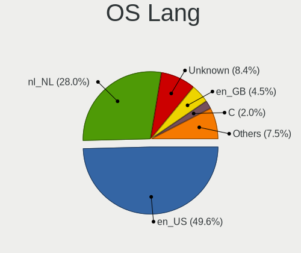
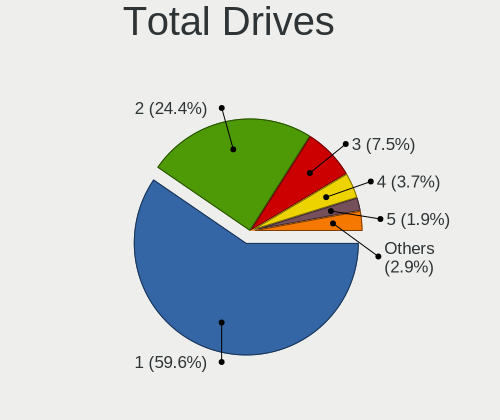
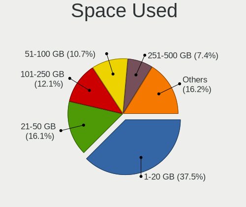
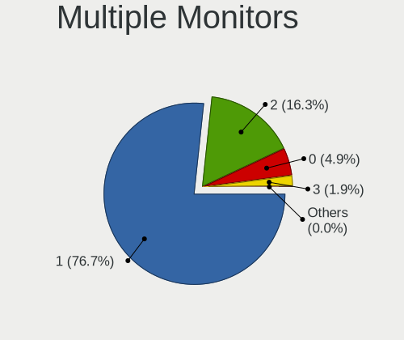

Linux in Netherlands - Tested Hardware & Statistics
---------------------------------------------------

A project to collect tested hardware configurations for Linux in Netherlands.

Anyone can contribute to this report by the [hw-probe](https://github.com/linuxhw/hw-probe) tool:

    sudo -E hw-probe -all -upload

Please contribute! Especially if your hardware is rare.

This is a report for all computer types. See also reports for [desktops](/Location/Netherlands/Desktop/README.md) and [notebooks](/Location/Netherlands/Notebook/README.md).

Contents
--------

* [ Test Cases ](#test-cases)

* [ System ](#system)
  - [ OS                       ](#os)
  - [ OS Family                ](#os-family)
  - [ Kernel                   ](#kernel)
  - [ Kernel Family            ](#kernel-family)
  - [ Kernel Major Ver.        ](#kernel-major-ver)
  - [ Arch                     ](#arch)
  - [ DE                       ](#de)
  - [ Display Server           ](#display-server)
  - [ Display Manager          ](#display-manager)
  - [ OS Lang                  ](#os-lang)
  - [ Boot Mode                ](#boot-mode)
  - [ Filesystem               ](#filesystem)
  - [ Part. scheme             ](#part-scheme)
  - [ Dual Boot with Linux/BSD ](#dual-boot-with-linuxbsd)
  - [ Dual Boot (Win)          ](#dual-boot-win)

* [ Board ](#board)
  - [ Vendor                   ](#vendor)
  - [ Model                    ](#model)
  - [ Model Family             ](#model-family)
  - [ MFG Year                 ](#mfg-year)
  - [ Form Factor              ](#form-factor)
  - [ Secure Boot              ](#secure-boot)
  - [ Coreboot                 ](#coreboot)
  - [ RAM Size                 ](#ram-size)
  - [ RAM Used                 ](#ram-used)
  - [ Total Drives             ](#total-drives)
  - [ Has CD-ROM               ](#has-cd-rom)
  - [ Has Ethernet             ](#has-ethernet)
  - [ Has WiFi                 ](#has-wifi)
  - [ Has Bluetooth            ](#has-bluetooth)

* [ Location ](#location)
  - [ Country                  ](#country)
  - [ City                     ](#city)

* [ Drives ](#drives)
  - [ Drive Vendor             ](#drive-vendor)
  - [ Drive Model              ](#drive-model)
  - [ HDD Vendor               ](#hdd-vendor)
  - [ SSD Vendor               ](#ssd-vendor)
  - [ Drive Kind               ](#drive-kind)
  - [ Drive Connector          ](#drive-connector)
  - [ Drive Size               ](#drive-size)
  - [ Space Total              ](#space-total)
  - [ Space Used               ](#space-used)
  - [ Malfunc. Drives          ](#malfunc-drives)
  - [ Malfunc. Drive Vendor    ](#malfunc-drive-vendor)
  - [ Malfunc. HDD Vendor      ](#malfunc-hdd-vendor)
  - [ Malfunc. Drive Kind      ](#malfunc-drive-kind)
  - [ Failed Drives            ](#failed-drives)
  - [ Failed Drive Vendor      ](#failed-drive-vendor)
  - [ Drive Status             ](#drive-status)

* [ Storage controller ](#storage-controller)
  - [ Storage Vendor           ](#storage-vendor)
  - [ Storage Model            ](#storage-model)
  - [ Storage Kind             ](#storage-kind)

* [ Processor ](#processor)
  - [ CPU Vendor               ](#cpu-vendor)
  - [ CPU Model                ](#cpu-model)
  - [ CPU Model Family         ](#cpu-model-family)
  - [ CPU Cores                ](#cpu-cores)
  - [ CPU Sockets              ](#cpu-sockets)
  - [ CPU Threads              ](#cpu-threads)
  - [ CPU Op-Modes             ](#cpu-op-modes)
  - [ CPU Microcode            ](#cpu-microcode)
  - [ CPU Microarch            ](#cpu-microarch)

* [ Graphics ](#graphics)
  - [ GPU Vendor               ](#gpu-vendor)
  - [ GPU Model                ](#gpu-model)
  - [ GPU Combo                ](#gpu-combo)
  - [ GPU Driver               ](#gpu-driver)
  - [ GPU Memory               ](#gpu-memory)

* [ Monitor ](#monitor)
  - [ Monitor Vendor           ](#monitor-vendor)
  - [ Monitor Model            ](#monitor-model)
  - [ Monitor Resolution       ](#monitor-resolution)
  - [ Monitor Diagonal         ](#monitor-diagonal)
  - [ Monitor Width            ](#monitor-width)
  - [ Aspect Ratio             ](#aspect-ratio)
  - [ Monitor Area             ](#monitor-area)
  - [ Pixel Density            ](#pixel-density)
  - [ Multiple Monitors        ](#multiple-monitors)

* [ Network ](#network)
  - [ Net Controller Vendor    ](#net-controller-vendor)
  - [ Net Controller Model     ](#net-controller-model)
  - [ Wireless Vendor          ](#wireless-vendor)
  - [ Wireless Model           ](#wireless-model)
  - [ Ethernet Vendor          ](#ethernet-vendor)
  - [ Ethernet Model           ](#ethernet-model)
  - [ Net Controller Kind      ](#net-controller-kind)
  - [ Used Controller          ](#used-controller)
  - [ NICs                     ](#nics)
  - [ IPv6                     ](#ipv6)

* [ Bluetooth ](#bluetooth)
  - [ Bluetooth Vendor         ](#bluetooth-vendor)
  - [ Bluetooth Model          ](#bluetooth-model)

* [ Sound ](#sound)
  - [ Sound Vendor             ](#sound-vendor)
  - [ Sound Model              ](#sound-model)

* [ Memory ](#memory)
  - [ Memory Vendor            ](#memory-vendor)
  - [ Memory Model             ](#memory-model)
  - [ Memory Kind              ](#memory-kind)
  - [ Memory Form Factor       ](#memory-form-factor)
  - [ Memory Size              ](#memory-size)
  - [ Memory Speed             ](#memory-speed)

* [ Printers & scanners ](#printers--scanners)
  - [ Printer Vendor           ](#printer-vendor)
  - [ Printer Model            ](#printer-model)
  - [ Scanner Vendor           ](#scanner-vendor)
  - [ Scanner Model            ](#scanner-model)

* [ Camera ](#camera)
  - [ Camera Vendor            ](#camera-vendor)
  - [ Camera Model             ](#camera-model)

* [ Security ](#security)
  - [ Fingerprint Vendor       ](#fingerprint-vendor)
  - [ Fingerprint Model        ](#fingerprint-model)
  - [ Chipcard Vendor          ](#chipcard-vendor)
  - [ Chipcard Model           ](#chipcard-model)

* [ Unsupported ](#unsupported)
  - [ Unsupported Devices      ](#unsupported-devices)
  - [ Unsupported Device Types ](#unsupported-device-types)

Test Cases
----------

Total: 4584

| Vendor        | Model                       | Form-Factor | Probe                                                      | Date         |
|---------------|-----------------------------|-------------|------------------------------------------------------------|--------------|
| Apple         | MacBookPro5,5               | Notebook    | [42113dd7e3](https://linux-hardware.org/?probe=42113dd7e3) | Oct 01, 2022 |
| HP            | 843B                        | Desktop     | [b683039e3b](https://linux-hardware.org/?probe=b683039e3b) | Oct 01, 2022 |
| HP            | Pavilion TS 11              | Notebook    | [5bc67115db](https://linux-hardware.org/?probe=5bc67115db) | Oct 01, 2022 |
| HUAWEI        | BOHK-WAX9X                  | Notebook    | [6525098252](https://linux-hardware.org/?probe=6525098252) | Oct 01, 2022 |
| HP            | Pavilion TS 11              | Notebook    | [9b59ddb3b2](https://linux-hardware.org/?probe=9b59ddb3b2) | Oct 01, 2022 |
| HP            | Pavilion TS 11              | Notebook    | [4758af490a](https://linux-hardware.org/?probe=4758af490a) | Oct 01, 2022 |
| ASUSTek       | M5A99X EVO                  | Desktop     | [4c5134b8fc](https://linux-hardware.org/?probe=4c5134b8fc) | Oct 01, 2022 |
| System76      | Darter Pro                  | Notebook    | [2829e72506](https://linux-hardware.org/?probe=2829e72506) | Oct 01, 2022 |
| System76      | Darter Pro                  | Notebook    | [c142cf370a](https://linux-hardware.org/?probe=c142cf370a) | Oct 01, 2022 |
| ASUSTek       | X580VD                      | Notebook    | [e7ef06706d](https://linux-hardware.org/?probe=e7ef06706d) | Sep 30, 2022 |
| Dell          | Inspiron 16 Plus 7620       | Notebook    | [73e2559339](https://linux-hardware.org/?probe=73e2559339) | Sep 30, 2022 |
| Dell          | Latitude 5400               | Notebook    | [66a5bc26f0](https://linux-hardware.org/?probe=66a5bc26f0) | Sep 30, 2022 |
| Dell          | Latitude 3190 2-in-1        | Convertible | [11e4602764](https://linux-hardware.org/?probe=11e4602764) | Sep 30, 2022 |
| Dell          | Latitude 3310               | Notebook    | [3c4874fa51](https://linux-hardware.org/?probe=3c4874fa51) | Sep 30, 2022 |
| Lenovo        | Yoga 300-11IBY 80M0         | Notebook    | [d5c0e2c5d3](https://linux-hardware.org/?probe=d5c0e2c5d3) | Sep 30, 2022 |
| Dell          | Latitude 5400               | Notebook    | [4536a4b473](https://linux-hardware.org/?probe=4536a4b473) | Sep 29, 2022 |
| Dell          | Latitude 5400               | Notebook    | [972e4ab3fa](https://linux-hardware.org/?probe=972e4ab3fa) | Sep 29, 2022 |
| ASRock        | B250M-HDV                   | Desktop     | [dc21fe6a18](https://linux-hardware.org/?probe=dc21fe6a18) | Sep 29, 2022 |
| ASRock        | B250M-HDV                   | Desktop     | [b248539946](https://linux-hardware.org/?probe=b248539946) | Sep 29, 2022 |
| Dell          | Latitude E6520              | Notebook    | [e228fa6546](https://linux-hardware.org/?probe=e228fa6546) | Sep 28, 2022 |
| Dell          | Latitude 3310               | Notebook    | [c21a321dce](https://linux-hardware.org/?probe=c21a321dce) | Sep 28, 2022 |
| Dell          | Latitude 3120               | Convertible | [2e9902fee0](https://linux-hardware.org/?probe=2e9902fee0) | Sep 28, 2022 |
| Gigabyte      | X570S AORUS ELITE AX        | Desktop     | [10b723415e](https://linux-hardware.org/?probe=10b723415e) | Sep 28, 2022 |
| Dell          | Latitude 3120               | Convertible | [932a938506](https://linux-hardware.org/?probe=932a938506) | Sep 28, 2022 |
| Acer          | Aspire A715-75G             | Notebook    | [9489561c26](https://linux-hardware.org/?probe=9489561c26) | Sep 28, 2022 |
| Dell          | Latitude 3190 2-in-1        | Convertible | [c3041b210f](https://linux-hardware.org/?probe=c3041b210f) | Sep 28, 2022 |
| Dell          | XPS 13 9310                 | Notebook    | [4073c084df](https://linux-hardware.org/?probe=4073c084df) | Sep 28, 2022 |
| Lenovo        | ThinkPad E550 20DF00CUFR    | Notebook    | [7b5e707097](https://linux-hardware.org/?probe=7b5e707097) | Sep 27, 2022 |
| Samsung       | 750XED                      | Notebook    | [dcb54d69f8](https://linux-hardware.org/?probe=dcb54d69f8) | Sep 27, 2022 |
| HUAWEI        | BOHK-WAX9X                  | Notebook    | [d0f8e8a0f6](https://linux-hardware.org/?probe=d0f8e8a0f6) | Sep 27, 2022 |
| Dell          | Latitude 3300               | Notebook    | [365349d964](https://linux-hardware.org/?probe=365349d964) | Sep 27, 2022 |
| Dell          | Latitude 3190 2-in-1        | Convertible | [af23e43e99](https://linux-hardware.org/?probe=af23e43e99) | Sep 27, 2022 |
| Dell          | Latitude 3310               | Notebook    | [313ab64584](https://linux-hardware.org/?probe=313ab64584) | Sep 27, 2022 |
| Dell          | Latitude 3190 2-in-1        | Convertible | [d46d96565b](https://linux-hardware.org/?probe=d46d96565b) | Sep 27, 2022 |
| Dell          | Latitude 3190 2-in-1        | Convertible | [f5f99a7234](https://linux-hardware.org/?probe=f5f99a7234) | Sep 27, 2022 |
| Dell          | Latitude 3190 2-in-1        | Convertible | [7cea84adb2](https://linux-hardware.org/?probe=7cea84adb2) | Sep 27, 2022 |
| Dell          | Precision M6800             | Notebook    | [a2f07e79d3](https://linux-hardware.org/?probe=a2f07e79d3) | Sep 27, 2022 |
| Dell          | Latitude 3120               | Convertible | [bc34bf4d73](https://linux-hardware.org/?probe=bc34bf4d73) | Sep 27, 2022 |
| Dell          | Latitude 3120               | Convertible | [56ac60a3dc](https://linux-hardware.org/?probe=56ac60a3dc) | Sep 26, 2022 |
| Dell          | Latitude 3120               | Convertible | [8736347f60](https://linux-hardware.org/?probe=8736347f60) | Sep 26, 2022 |
| Dell          | Latitude 3420               | Notebook    | [ee7c1fce66](https://linux-hardware.org/?probe=ee7c1fce66) | Sep 26, 2022 |
| Dell          | Latitude 3190 2-in-1        | Convertible | [9d1392e945](https://linux-hardware.org/?probe=9d1392e945) | Sep 26, 2022 |
| Dell          | Latitude 3310               | Notebook    | [0f1fb4687f](https://linux-hardware.org/?probe=0f1fb4687f) | Sep 26, 2022 |
| Dell          | Latitude 3190 2-in-1        | Convertible | [6ce0a09785](https://linux-hardware.org/?probe=6ce0a09785) | Sep 26, 2022 |
| Dell          | Latitude 3310               | Notebook    | [a6ce17cd6b](https://linux-hardware.org/?probe=a6ce17cd6b) | Sep 26, 2022 |
| Dell          | Latitude 3310               | Notebook    | [87af9a8980](https://linux-hardware.org/?probe=87af9a8980) | Sep 26, 2022 |
| Dell          | Latitude 3120               | Convertible | [9458cffde8](https://linux-hardware.org/?probe=9458cffde8) | Sep 26, 2022 |
| Valve         | Jupiter                     | Notebook    | [8c94cd9bd3](https://linux-hardware.org/?probe=8c94cd9bd3) | Sep 26, 2022 |
| ASRock        | B450M Pro4-F                | Desktop     | [ac1ee4aab2](https://linux-hardware.org/?probe=ac1ee4aab2) | Sep 25, 2022 |
| Dell          | Latitude 13                 | Notebook    | [28d623103e](https://linux-hardware.org/?probe=28d623103e) | Sep 25, 2022 |
| Dell          | Precision M6800             | Notebook    | [83c3e91298](https://linux-hardware.org/?probe=83c3e91298) | Sep 24, 2022 |
| Apple         | Mac-F226BEC8 PVT            | All in one  | [08bd4079f4](https://linux-hardware.org/?probe=08bd4079f4) | Sep 24, 2022 |
| Lenovo        | Yoga Slim 7 Pro 14IAP7 8... | Notebook    | [ccba8f6c1a](https://linux-hardware.org/?probe=ccba8f6c1a) | Sep 24, 2022 |
| Gigabyte      | Z270X-Ultra Gaming-CF       | Desktop     | [e0eae2efbd](https://linux-hardware.org/?probe=e0eae2efbd) | Sep 24, 2022 |
| Dell          | Inspiron 16 Plus 7620       | Notebook    | [977d73b98a](https://linux-hardware.org/?probe=977d73b98a) | Sep 24, 2022 |
| ASUSTek       | PRIME A320M-K               | Desktop     | [5588f73920](https://linux-hardware.org/?probe=5588f73920) | Sep 24, 2022 |
| Gigabyte      | Z270X-Ultra Gaming-CF       | Desktop     | [165b95bd2c](https://linux-hardware.org/?probe=165b95bd2c) | Sep 24, 2022 |
| Dell          | Latitude E5570              | Notebook    | [df18be69a3](https://linux-hardware.org/?probe=df18be69a3) | Sep 24, 2022 |
| Dell          | Latitude E6520              | Notebook    | [81612aa665](https://linux-hardware.org/?probe=81612aa665) | Sep 24, 2022 |
| Dell          | Latitude E6520              | Notebook    | [fc343204c6](https://linux-hardware.org/?probe=fc343204c6) | Sep 23, 2022 |
| Medion        | H110H4-EM                   | Desktop     | [2fa25ddedf](https://linux-hardware.org/?probe=2fa25ddedf) | Sep 23, 2022 |
| Medion        | H110H4-EM                   | Desktop     | [8e7d4a7aeb](https://linux-hardware.org/?probe=8e7d4a7aeb) | Sep 23, 2022 |
| Dell          | Latitude 3120               | Convertible | [5281ee08e1](https://linux-hardware.org/?probe=5281ee08e1) | Sep 23, 2022 |
| Dell          | Latitude E6520              | Notebook    | [79aa87fb47](https://linux-hardware.org/?probe=79aa87fb47) | Sep 23, 2022 |
| ASUSTek       | PRIME A320M-K               | Desktop     | [a83e57d8c1](https://linux-hardware.org/?probe=a83e57d8c1) | Sep 23, 2022 |
| Dell          | Latitude 3310               | Notebook    | [4c5dc33267](https://linux-hardware.org/?probe=4c5dc33267) | Sep 23, 2022 |
| HP            | EliteBook x360 1030 G2      | Convertible | [985fa1c4c7](https://linux-hardware.org/?probe=985fa1c4c7) | Sep 23, 2022 |
| Dell          | Latitude 3190 2-in-1        | Convertible | [9c4d48864b](https://linux-hardware.org/?probe=9c4d48864b) | Sep 23, 2022 |
| Dell          | Latitude 3190 2-in-1        | Convertible | [443df1ca5c](https://linux-hardware.org/?probe=443df1ca5c) | Sep 23, 2022 |
| Dell          | Latitude 3190 2-in-1        | Convertible | [061ef6f153](https://linux-hardware.org/?probe=061ef6f153) | Sep 23, 2022 |
| Apple         | Mac-942B5BF58194151B        | All in one  | [939f154314](https://linux-hardware.org/?probe=939f154314) | Sep 22, 2022 |
| Dell          | Latitude E6320              | Notebook    | [452304d040](https://linux-hardware.org/?probe=452304d040) | Sep 22, 2022 |
| Dell          | Latitude 3120               | Convertible | [524d713bc2](https://linux-hardware.org/?probe=524d713bc2) | Sep 22, 2022 |
| Dell          | XPS 9320                    | Notebook    | [6866f3105c](https://linux-hardware.org/?probe=6866f3105c) | Sep 22, 2022 |
| ASUSTek       | ASUS BR1100CKA BR1100CKA... | Notebook    | [efaa235d34](https://linux-hardware.org/?probe=efaa235d34) | Sep 22, 2022 |
| Lenovo        | SHARKBAY SDK0J40700 WIN     | Desktop     | [a4ab03ccc4](https://linux-hardware.org/?probe=a4ab03ccc4) | Sep 22, 2022 |
| Valve         | Jupiter                     | Notebook    | [ce15d6d4bb](https://linux-hardware.org/?probe=ce15d6d4bb) | Sep 22, 2022 |
| ASUSTek       | 1201PN                      | Notebook    | [3dd4546344](https://linux-hardware.org/?probe=3dd4546344) | Sep 21, 2022 |
| ASUSTek       | 1201PN                      | Notebook    | [080d9c8964](https://linux-hardware.org/?probe=080d9c8964) | Sep 21, 2022 |
| Gigabyte      | GB-BRR7H-4800               | Desktop     | [d0f94bde46](https://linux-hardware.org/?probe=d0f94bde46) | Sep 21, 2022 |
| Lenovo        | ThinkBook 15 G2 ITL 20VE    | Notebook    | [3e80cdec5b](https://linux-hardware.org/?probe=3e80cdec5b) | Sep 20, 2022 |
| Notebook      | NH55RGQ                     | Notebook    | [f4aade3998](https://linux-hardware.org/?probe=f4aade3998) | Sep 20, 2022 |
| Notebook      | NH55RGQ                     | Notebook    | [95c8201663](https://linux-hardware.org/?probe=95c8201663) | Sep 20, 2022 |
| ASUSTek       | X555LAB                     | Notebook    | [71339e0cfb](https://linux-hardware.org/?probe=71339e0cfb) | Sep 19, 2022 |
| ASUSTek       | X555LAB                     | Notebook    | [a0acb674df](https://linux-hardware.org/?probe=a0acb674df) | Sep 19, 2022 |
| HP            | 82B4                        | Desktop     | [f4b85399b3](https://linux-hardware.org/?probe=f4b85399b3) | Sep 19, 2022 |
| ASRock        | X570 Steel Legend           | Desktop     | [6fd34fa73b](https://linux-hardware.org/?probe=6fd34fa73b) | Sep 19, 2022 |
| Dell          | Latitude 3310               | Notebook    | [0e1784b38d](https://linux-hardware.org/?probe=0e1784b38d) | Sep 19, 2022 |
| Dell          | Latitude 3120               | Convertible | [983266d6ba](https://linux-hardware.org/?probe=983266d6ba) | Sep 19, 2022 |
| Dell          | Latitude 3120               | Convertible | [374de3c13c](https://linux-hardware.org/?probe=374de3c13c) | Sep 19, 2022 |
| HUAWEI        | WRT-WX9                     | Notebook    | [4c8883345d](https://linux-hardware.org/?probe=4c8883345d) | Sep 19, 2022 |
| Lenovo        | SHARKBAY SDK0J40700 WIN     | Desktop     | [1abf3ddee3](https://linux-hardware.org/?probe=1abf3ddee3) | Sep 19, 2022 |
| Dell          | Latitude 3190 2-in-1        | Convertible | [bc2dd8505b](https://linux-hardware.org/?probe=bc2dd8505b) | Sep 19, 2022 |
| Dell          | Latitude 3310               | Notebook    | [55332651e0](https://linux-hardware.org/?probe=55332651e0) | Sep 19, 2022 |
| Dell          | Latitude 3120               | Convertible | [e6b9b405e8](https://linux-hardware.org/?probe=e6b9b405e8) | Sep 19, 2022 |
| Dell          | Latitude 3190 2-in-1        | Convertible | [448ba707f6](https://linux-hardware.org/?probe=448ba707f6) | Sep 19, 2022 |
| Dell          | Latitude 3120               | Notebook    | [558e95141d](https://linux-hardware.org/?probe=558e95141d) | Sep 19, 2022 |
| Dell          | Latitude 3300               | Notebook    | [a2513a9849](https://linux-hardware.org/?probe=a2513a9849) | Sep 19, 2022 |
| HP            | 212B                        | Desktop     | [c823e0060e](https://linux-hardware.org/?probe=c823e0060e) | Sep 19, 2022 |
| HP            | 212B                        | Desktop     | [3285adbb26](https://linux-hardware.org/?probe=3285adbb26) | Sep 19, 2022 |
| HP            | 0AA8h                       | Desktop     | [c79bdb21ed](https://linux-hardware.org/?probe=c79bdb21ed) | Sep 18, 2022 |
| HP            | 0AA8h                       | Desktop     | [5e6f953759](https://linux-hardware.org/?probe=5e6f953759) | Sep 18, 2022 |
| Chuwi         | GemiBook                    | Notebook    | [c6ec4f6320](https://linux-hardware.org/?probe=c6ec4f6320) | Sep 18, 2022 |
| Acer          | Aspire G7750                | Desktop     | [c54e28dc84](https://linux-hardware.org/?probe=c54e28dc84) | Sep 18, 2022 |
| ASUSTek       | VivoBook_ASUSLaptop X513... | Notebook    | [daa76ef1c9](https://linux-hardware.org/?probe=daa76ef1c9) | Sep 18, 2022 |
| Acer          | Switch SA5-271P             | Tablet      | [c9900a8e2f](https://linux-hardware.org/?probe=c9900a8e2f) | Sep 17, 2022 |
| ASUSTek       | VivoBook_ASUSLaptop X513... | Notebook    | [b0a2728114](https://linux-hardware.org/?probe=b0a2728114) | Sep 17, 2022 |
| Acer          | Swift SF314-57              | Notebook    | [8c905d820d](https://linux-hardware.org/?probe=8c905d820d) | Sep 17, 2022 |
| HP            | ENVY Laptop 13-ad1xx        | Notebook    | [59369fa3fb](https://linux-hardware.org/?probe=59369fa3fb) | Sep 17, 2022 |
| HP            | EliteBook 855 G7 Noteboo... | Notebook    | [cf4e574788](https://linux-hardware.org/?probe=cf4e574788) | Sep 16, 2022 |
| Dell          | Latitude 3120               | Convertible | [e472e7fdde](https://linux-hardware.org/?probe=e472e7fdde) | Sep 16, 2022 |
| Dell          | Latitude 3190 2-in-1        | Convertible | [1ccce4a76a](https://linux-hardware.org/?probe=1ccce4a76a) | Sep 16, 2022 |
| Dell          | Latitude 3120               | Convertible | [e04ec1834f](https://linux-hardware.org/?probe=e04ec1834f) | Sep 16, 2022 |
| Gigabyte      | Z97P-D3                     | Desktop     | [ca9e537823](https://linux-hardware.org/?probe=ca9e537823) | Sep 15, 2022 |
| Samsung       | 930MBE                      | Convertible | [7de986bc11](https://linux-hardware.org/?probe=7de986bc11) | Sep 14, 2022 |
| ASUSTek       | X75VC                       | Notebook    | [c8abec750c](https://linux-hardware.org/?probe=c8abec750c) | Sep 14, 2022 |
| ASUSTek       | VivoBook_ASUSLaptop X515... | Notebook    | [54ea6ab133](https://linux-hardware.org/?probe=54ea6ab133) | Sep 14, 2022 |
| Valve         | Jupiter                     | Notebook    | [9817414c4e](https://linux-hardware.org/?probe=9817414c4e) | Sep 14, 2022 |
| Dell          | Latitude 3120               | Convertible | [a8315e1147](https://linux-hardware.org/?probe=a8315e1147) | Sep 13, 2022 |
| Lenovo        | G50-70 20351                | Notebook    | [4105fc929e](https://linux-hardware.org/?probe=4105fc929e) | Sep 13, 2022 |
| Lenovo        | Yoga Slim 7 Pro 14IAP7 8... | Notebook    | [b7eb07ec8d](https://linux-hardware.org/?probe=b7eb07ec8d) | Sep 12, 2022 |
| ASUSTek       | PRIME A320M-K               | Desktop     | [7b7a1cfeb9](https://linux-hardware.org/?probe=7b7a1cfeb9) | Sep 11, 2022 |
| HP            | 0AA8h                       | Desktop     | [fc09b092c1](https://linux-hardware.org/?probe=fc09b092c1) | Sep 11, 2022 |
| Lenovo        | ThinkPad X220 4291WSH       | Notebook    | [7064ea27f5](https://linux-hardware.org/?probe=7064ea27f5) | Sep 11, 2022 |
| HP            | 82B4                        | Desktop     | [855d078f26](https://linux-hardware.org/?probe=855d078f26) | Sep 11, 2022 |
| HP            | 82B4                        | Desktop     | [e39fbcb897](https://linux-hardware.org/?probe=e39fbcb897) | Sep 11, 2022 |
| Gigabyte      | X570S AERO G                | Desktop     | [37681cbc64](https://linux-hardware.org/?probe=37681cbc64) | Sep 11, 2022 |
| Raspberry ... | Raspberry Pi                | Soc         | [81653ec6fc](https://linux-hardware.org/?probe=81653ec6fc) | Sep 11, 2022 |
| Packard Be... | EasyNote LE69KB             | Notebook    | [a008db4da9](https://linux-hardware.org/?probe=a008db4da9) | Sep 11, 2022 |
| HP            | Laptop 15s-eq2xxx           | Notebook    | [c0adc468b3](https://linux-hardware.org/?probe=c0adc468b3) | Sep 10, 2022 |
| HP            | 3031h                       | Desktop     | [ea434d67b5](https://linux-hardware.org/?probe=ea434d67b5) | Sep 10, 2022 |
| HP            | 3031h                       | Desktop     | [feddf42c9f](https://linux-hardware.org/?probe=feddf42c9f) | Sep 10, 2022 |
| Packard Be... | EasyNote MH36               | Notebook    | [32025f0e69](https://linux-hardware.org/?probe=32025f0e69) | Sep 10, 2022 |
| HP            | 0AA8h                       | Desktop     | [4e9a1e883c](https://linux-hardware.org/?probe=4e9a1e883c) | Sep 09, 2022 |
| Dell          | Latitude 3120               | Convertible | [6b2b6b7aa9](https://linux-hardware.org/?probe=6b2b6b7aa9) | Sep 09, 2022 |
| ASRock        | X570 Phantom Gaming 4       | Desktop     | [248f47cae7](https://linux-hardware.org/?probe=248f47cae7) | Sep 08, 2022 |
| SKIKK         | Standard                    | Notebook    | [3d7a0b8762](https://linux-hardware.org/?probe=3d7a0b8762) | Sep 08, 2022 |
| Dell          | XPS 15 9510                 | Notebook    | [db80996c7a](https://linux-hardware.org/?probe=db80996c7a) | Sep 08, 2022 |
| Dell          | Latitude 3190 2-in-1        | Convertible | [ee7071f4e7](https://linux-hardware.org/?probe=ee7071f4e7) | Sep 08, 2022 |
| Lenovo        | ThinkPad T14 Gen 1 20S00... | Notebook    | [ea53dc8c02](https://linux-hardware.org/?probe=ea53dc8c02) | Sep 07, 2022 |
| Alienware     | x15 R2                      | Notebook    | [28e491fc3f](https://linux-hardware.org/?probe=28e491fc3f) | Sep 07, 2022 |
| Alienware     | x15 R2                      | Notebook    | [8acf26b5a3](https://linux-hardware.org/?probe=8acf26b5a3) | Sep 06, 2022 |
| HP            | ENVY x360 Convertible 15... | Convertible | [e7d57afa70](https://linux-hardware.org/?probe=e7d57afa70) | Sep 06, 2022 |
| HP            | ZBook 15u G6                | Notebook    | [af658eb920](https://linux-hardware.org/?probe=af658eb920) | Sep 06, 2022 |
| Dell          | Latitude 5530               | Notebook    | [4a2fb0c4c2](https://linux-hardware.org/?probe=4a2fb0c4c2) | Sep 06, 2022 |
| Dell          | Latitude 5530               | Notebook    | [a0896a063c](https://linux-hardware.org/?probe=a0896a063c) | Sep 06, 2022 |
| Dell          | XPS 13 9310 2-in-1          | Convertible | [962cc1e746](https://linux-hardware.org/?probe=962cc1e746) | Sep 05, 2022 |
| Biostar       | H77MU3                      | Desktop     | [20ba4d44ed](https://linux-hardware.org/?probe=20ba4d44ed) | Sep 05, 2022 |
| Dell          | Latitude 3190 2-in-1        | Convertible | [15c616f2ca](https://linux-hardware.org/?probe=15c616f2ca) | Sep 05, 2022 |
| ASUSTek       | SABERTOOTH Z77              | Desktop     | [b36d7be7c1](https://linux-hardware.org/?probe=b36d7be7c1) | Sep 04, 2022 |
| Apple         | MacBookPro5,5               | Notebook    | [5f36c97ec4](https://linux-hardware.org/?probe=5f36c97ec4) | Sep 03, 2022 |
| Apple         | MacBookPro5,5               | Notebook    | [70de682c06](https://linux-hardware.org/?probe=70de682c06) | Sep 03, 2022 |
| HP            | EliteBook 8460p             | Notebook    | [8aac8566b3](https://linux-hardware.org/?probe=8aac8566b3) | Sep 03, 2022 |
| ASUSTek       | P8H61 PRO                   | Desktop     | [082520f2d8](https://linux-hardware.org/?probe=082520f2d8) | Sep 03, 2022 |
| MSI           | Z170A GAMING M5             | Desktop     | [8f502f30ee](https://linux-hardware.org/?probe=8f502f30ee) | Sep 03, 2022 |
| Dell          | Latitude 3120               | Notebook    | [8716f564d8](https://linux-hardware.org/?probe=8716f564d8) | Sep 02, 2022 |
| Dell          | Latitude 3120               | Convertible | [44a711d7ce](https://linux-hardware.org/?probe=44a711d7ce) | Sep 02, 2022 |
| Dell          | Latitude 3120               | Convertible | [cb976a52d2](https://linux-hardware.org/?probe=cb976a52d2) | Sep 02, 2022 |
| Dell          | Inspiron 5490               | Notebook    | [3ef6519b6d](https://linux-hardware.org/?probe=3ef6519b6d) | Sep 01, 2022 |
| Lenovo        | ThinkPad X1 Extreme Gen ... | Notebook    | [d34c9cb705](https://linux-hardware.org/?probe=d34c9cb705) | Sep 01, 2022 |
| Gigabyte      | P55A-UD3                    | Desktop     | [297cab0eb2](https://linux-hardware.org/?probe=297cab0eb2) | Sep 01, 2022 |
| Dell          | Latitude 3190               | Notebook    | [d30269b33c](https://linux-hardware.org/?probe=d30269b33c) | Sep 01, 2022 |
| Apple         | Mac-FFE5EF870D7BA81A iMa... | All in one  | [52f8474c3a](https://linux-hardware.org/?probe=52f8474c3a) | Sep 01, 2022 |
| Dell          | Latitude 3190 2-in-1        | Convertible | [7140822520](https://linux-hardware.org/?probe=7140822520) | Sep 01, 2022 |
| HP            | ProBook 6460b               | Notebook    | [a0e3db2eed](https://linux-hardware.org/?probe=a0e3db2eed) | Sep 01, 2022 |
| Lenovo        | ThinkPad X220 4291WSH       | Notebook    | [c86e73aed6](https://linux-hardware.org/?probe=c86e73aed6) | Sep 01, 2022 |
| ASUSTek       | UX550VD                     | Notebook    | [a43d53b3b7](https://linux-hardware.org/?probe=a43d53b3b7) | Sep 01, 2022 |
| HP            | 1906                        | Desktop     | [a23cef9946](https://linux-hardware.org/?probe=a23cef9946) | Aug 31, 2022 |
| MSI           | B450 GAMING PRO CARBON A... | Desktop     | [2c72dfccbb](https://linux-hardware.org/?probe=2c72dfccbb) | Aug 30, 2022 |
| HP            | 2B38                        | Desktop     | [9170225d70](https://linux-hardware.org/?probe=9170225d70) | Aug 30, 2022 |
| Lenovo        | Yoga 9 14IAP7 82LU          | Convertible | [dcdfb21686](https://linux-hardware.org/?probe=dcdfb21686) | Aug 30, 2022 |
| HP            | ENVY x360 Convertible 15... | Convertible | [8286ea1021](https://linux-hardware.org/?probe=8286ea1021) | Aug 30, 2022 |
| Acer          | Predator G3-710             | Desktop     | [b14bf667d5](https://linux-hardware.org/?probe=b14bf667d5) | Aug 30, 2022 |
| Lenovo        | ThinkPad L15 Gen 2a 20X8... | Notebook    | [df33320d10](https://linux-hardware.org/?probe=df33320d10) | Aug 30, 2022 |
| Acer          | Aspire SW5-271              | Notebook    | [3446f93f1d](https://linux-hardware.org/?probe=3446f93f1d) | Aug 29, 2022 |
| Apple         | MacBookPro7,1               | Notebook    | [a879fb8249](https://linux-hardware.org/?probe=a879fb8249) | Aug 29, 2022 |
| ASUSTek       | N550JV                      | Notebook    | [059ab7e21e](https://linux-hardware.org/?probe=059ab7e21e) | Aug 29, 2022 |
| Dell          | XPS 15 9510                 | Notebook    | [45bba02b35](https://linux-hardware.org/?probe=45bba02b35) | Aug 29, 2022 |
| Dell          | Latitude 3190 2-in-1        | Convertible | [536742931b](https://linux-hardware.org/?probe=536742931b) | Aug 29, 2022 |
| Dell          | Latitude 3300               | Notebook    | [bea8e53929](https://linux-hardware.org/?probe=bea8e53929) | Aug 29, 2022 |
| Dell          | Vostro 14 5410              | Notebook    | [2d4b907d84](https://linux-hardware.org/?probe=2d4b907d84) | Aug 29, 2022 |
| Dell          | Latitude 5590               | Notebook    | [e06f40dae9](https://linux-hardware.org/?probe=e06f40dae9) | Aug 29, 2022 |
| Fujitsu       | LIFEBOOK E746               | Notebook    | [5b0eba15c2](https://linux-hardware.org/?probe=5b0eba15c2) | Aug 29, 2022 |
| Shuttle       | XH310V2                     | Desktop     | [375b995195](https://linux-hardware.org/?probe=375b995195) | Aug 28, 2022 |
| ASUSTek       | Crosshair IV Formula        | Desktop     | [3a7218e2b1](https://linux-hardware.org/?probe=3a7218e2b1) | Aug 27, 2022 |
| HP            | 805D                        | Desktop     | [419598ebba](https://linux-hardware.org/?probe=419598ebba) | Aug 27, 2022 |
| Raspberry ... | Raspberry Pi                | Soc         | [717302bb55](https://linux-hardware.org/?probe=717302bb55) | Aug 27, 2022 |
| ASUSTek       | VivoBook_ASUSLaptop X513... | Notebook    | [c63d9bede8](https://linux-hardware.org/?probe=c63d9bede8) | Aug 27, 2022 |
| ASUSTek       | VivoBook_ASUSLaptop X513... | Notebook    | [a4a7c87b06](https://linux-hardware.org/?probe=a4a7c87b06) | Aug 27, 2022 |
| Acer          | Nitro AN515-57              | Notebook    | [8d314e1557](https://linux-hardware.org/?probe=8d314e1557) | Aug 27, 2022 |
| ASUSTek       | N76VB                       | Notebook    | [e488dd7682](https://linux-hardware.org/?probe=e488dd7682) | Aug 27, 2022 |
| Lenovo        | ThinkPad X1 Carbon Gen 9... | Notebook    | [b28edd3886](https://linux-hardware.org/?probe=b28edd3886) | Aug 26, 2022 |
| Lenovo        | ThinkPad X1 Carbon Gen 9... | Notebook    | [97770c5716](https://linux-hardware.org/?probe=97770c5716) | Aug 26, 2022 |
| Lenovo        | ThinkPad E580 20KS003GMH    | Notebook    | [5cadf3c5d2](https://linux-hardware.org/?probe=5cadf3c5d2) | Aug 26, 2022 |
| Lenovo        | IdeaPad 320-15IKB 80XL      | Notebook    | [4378f177a8](https://linux-hardware.org/?probe=4378f177a8) | Aug 24, 2022 |
| MSI           | B450-A PRO                  | Desktop     | [36f10ad555](https://linux-hardware.org/?probe=36f10ad555) | Aug 24, 2022 |
| ASUSTek       | TUF Gaming X570-PLUS        | Desktop     | [0df091061c](https://linux-hardware.org/?probe=0df091061c) | Aug 24, 2022 |
| Raspberry ... | Raspberry Pi                | Soc         | [c42643096a](https://linux-hardware.org/?probe=c42643096a) | Aug 23, 2022 |
| MSI           | Prestige 15 A10SC           | Notebook    | [35ffc8d54b](https://linux-hardware.org/?probe=35ffc8d54b) | Aug 23, 2022 |
| TEKNOSERVI... | PORTATIL TTL 15             | Notebook    | [054d000bb1](https://linux-hardware.org/?probe=054d000bb1) | Aug 23, 2022 |
| Lenovo        | IdeaPad 720S-13IKB 81BV     | Notebook    | [1b1c9cb460](https://linux-hardware.org/?probe=1b1c9cb460) | Aug 23, 2022 |
| ASUSTek       | TUF Gaming X570-PLUS        | Desktop     | [0c80683e2a](https://linux-hardware.org/?probe=0c80683e2a) | Aug 23, 2022 |
| HP            | Spectre x360 Convertible... | Convertible | [e2f0008c16](https://linux-hardware.org/?probe=e2f0008c16) | Aug 23, 2022 |
| MSI           | PS63 Modern 8RC             | Notebook    | [33a1092c01](https://linux-hardware.org/?probe=33a1092c01) | Aug 22, 2022 |
| Dell          | XPS 15 9520                 | Notebook    | [33ff4e4962](https://linux-hardware.org/?probe=33ff4e4962) | Aug 22, 2022 |
| Dell          | Latitude 7420               | Notebook    | [ebbef2bf39](https://linux-hardware.org/?probe=ebbef2bf39) | Aug 22, 2022 |
| Dell          | Latitude 3300               | Notebook    | [e8b139ecad](https://linux-hardware.org/?probe=e8b139ecad) | Aug 22, 2022 |
| Dell          | Latitude 3310               | Notebook    | [dedda1b96c](https://linux-hardware.org/?probe=dedda1b96c) | Aug 22, 2022 |
| ASUSTek       | PRIME H370-PLUS             | Desktop     | [eb81df27ce](https://linux-hardware.org/?probe=eb81df27ce) | Aug 22, 2022 |
| ASUSTek       | Zenbook UM5401QA_UM5401Q... | Notebook    | [1380621999](https://linux-hardware.org/?probe=1380621999) | Aug 21, 2022 |
| Apple         | MacBookPro8,2               | Notebook    | [b01d72c341](https://linux-hardware.org/?probe=b01d72c341) | Aug 20, 2022 |
| HP            | ENVY Notebook               | Notebook    | [7d790e2b4d](https://linux-hardware.org/?probe=7d790e2b4d) | Aug 20, 2022 |
| Dell          | Latitude E6430              | Notebook    | [c7a98ce916](https://linux-hardware.org/?probe=c7a98ce916) | Aug 20, 2022 |
| MSI           | Z170A PC MATE               | Desktop     | [8df71394cd](https://linux-hardware.org/?probe=8df71394cd) | Aug 20, 2022 |
| HP            | Laptop 17-cp0xxx            | Notebook    | [9e72f598eb](https://linux-hardware.org/?probe=9e72f598eb) | Aug 19, 2022 |
| Dell          | Inspiron 5490               | Notebook    | [98f795ee5f](https://linux-hardware.org/?probe=98f795ee5f) | Aug 19, 2022 |
| Dell          | Latitude E6420              | Notebook    | [588755599f](https://linux-hardware.org/?probe=588755599f) | Aug 18, 2022 |
| HP            | ENVY x360 Convertible 13... | Convertible | [4817b02964](https://linux-hardware.org/?probe=4817b02964) | Aug 18, 2022 |
| ASUSTek       | ASUS TUF Gaming F15 FX50... | Notebook    | [9619850e97](https://linux-hardware.org/?probe=9619850e97) | Aug 18, 2022 |
| Dell          | Latitude 3380               | Notebook    | [a99b3cef26](https://linux-hardware.org/?probe=a99b3cef26) | Aug 17, 2022 |
| Dell          | Latitude 3310               | Notebook    | [92f66bf3aa](https://linux-hardware.org/?probe=92f66bf3aa) | Aug 17, 2022 |
| Unknown       | Unknown                     | Notebook    | [66053f0e50](https://linux-hardware.org/?probe=66053f0e50) | Aug 17, 2022 |
| Dell          | Latitude 3310               | Notebook    | [1694bfcea7](https://linux-hardware.org/?probe=1694bfcea7) | Aug 16, 2022 |
| ASUSTek       | K53TA                       | Notebook    | [db6525efb3](https://linux-hardware.org/?probe=db6525efb3) | Aug 15, 2022 |
| ASUSTek       | Z97-PRO GAMER               | Desktop     | [bbbda98d21](https://linux-hardware.org/?probe=bbbda98d21) | Aug 15, 2022 |
| Lenovo        | Legion 5 17ACH6H 82JY       | Notebook    | [ffe1757df5](https://linux-hardware.org/?probe=ffe1757df5) | Aug 15, 2022 |
| HP            | Pavilion Laptop 15-eh1xx... | Notebook    | [caf6393a95](https://linux-hardware.org/?probe=caf6393a95) | Aug 15, 2022 |
| HP            | Elite x2 1012 G1            | Notebook    | [94fb37c745](https://linux-hardware.org/?probe=94fb37c745) | Aug 14, 2022 |
| MSI           | CX705                       | Notebook    | [d2c7d43ba9](https://linux-hardware.org/?probe=d2c7d43ba9) | Aug 14, 2022 |
| ASRock        | J3455-ITX                   | Desktop     | [4386fccad1](https://linux-hardware.org/?probe=4386fccad1) | Aug 14, 2022 |
| Dell          | 04YP6J A01                  | Desktop     | [c402ff86c1](https://linux-hardware.org/?probe=c402ff86c1) | Aug 13, 2022 |
| Lenovo        | 364F SDK0J40700 WIN 3258... | Desktop     | [0c80c167e4](https://linux-hardware.org/?probe=0c80c167e4) | Aug 13, 2022 |
| HP            | EliteBook 745 G3            | Notebook    | [913928c7ee](https://linux-hardware.org/?probe=913928c7ee) | Aug 13, 2022 |
| HP            | EliteBook 745 G3            | Notebook    | [bfc035a690](https://linux-hardware.org/?probe=bfc035a690) | Aug 13, 2022 |
| Dell          | 0WR7PY A03                  | Desktop     | [2f9e03051e](https://linux-hardware.org/?probe=2f9e03051e) | Aug 13, 2022 |
| Apple         | MacBookPro9,2               | Notebook    | [f48110428f](https://linux-hardware.org/?probe=f48110428f) | Aug 11, 2022 |
| Dell          | 04YP6J A01                  | Desktop     | [43257ffabd](https://linux-hardware.org/?probe=43257ffabd) | Aug 11, 2022 |
| Apple         | MacBookPro14,2              | Notebook    | [9e297d5dde](https://linux-hardware.org/?probe=9e297d5dde) | Aug 11, 2022 |
| HP            | 18E7                        | Desktop     | [531c621cdb](https://linux-hardware.org/?probe=531c621cdb) | Aug 11, 2022 |
| HP            | Elite x2 1012 G1            | Notebook    | [a76e460266](https://linux-hardware.org/?probe=a76e460266) | Aug 11, 2022 |
| Dell          | Latitude E6420              | Notebook    | [c5ce4b0bff](https://linux-hardware.org/?probe=c5ce4b0bff) | Aug 10, 2022 |
| Lenovo        | ThinkBook 15 G3 ACL 21A4    | Notebook    | [bd5bfb000b](https://linux-hardware.org/?probe=bd5bfb000b) | Aug 10, 2022 |
| Gigabyte      | A320M-S2H-CF                | Desktop     | [613aea18b5](https://linux-hardware.org/?probe=613aea18b5) | Aug 09, 2022 |
| Gigabyte      | X570 AORUS PRO              | Desktop     | [8558001fa2](https://linux-hardware.org/?probe=8558001fa2) | Aug 09, 2022 |
| ASUSTek       | P5VD2-VM                    | Desktop     | [1d8a97ade8](https://linux-hardware.org/?probe=1d8a97ade8) | Aug 09, 2022 |
| Dell          | Latitude 3190 2-in-1        | Convertible | [0afee77b44](https://linux-hardware.org/?probe=0afee77b44) | Aug 09, 2022 |
| MSI           | MAG X570S TORPEDO MAX       | Desktop     | [d0b0186eb9](https://linux-hardware.org/?probe=d0b0186eb9) | Aug 09, 2022 |
| Acer          | Aspire 7720                 | Notebook    | [0ceb259a2f](https://linux-hardware.org/?probe=0ceb259a2f) | Aug 08, 2022 |
| ASUSTek       | VivoBook_ASUSLaptop X760... | Notebook    | [9cdc2bc860](https://linux-hardware.org/?probe=9cdc2bc860) | Aug 08, 2022 |
| Lenovo        | MAHOBAY Win8 STD MM DPK ... | Desktop     | [254f5e8412](https://linux-hardware.org/?probe=254f5e8412) | Aug 08, 2022 |
| Notebook      | P64_HJ,HK1                  | Notebook    | [942bd9a76d](https://linux-hardware.org/?probe=942bd9a76d) | Aug 08, 2022 |
| Notebook      | P64_HJ,HK1                  | Notebook    | [0de18680fd](https://linux-hardware.org/?probe=0de18680fd) | Aug 08, 2022 |
| Dell          | Latitude E6420              | Notebook    | [54981e31fa](https://linux-hardware.org/?probe=54981e31fa) | Aug 08, 2022 |
| HP            | ProBook 430 G4              | Notebook    | [616a031820](https://linux-hardware.org/?probe=616a031820) | Aug 08, 2022 |
| Dell          | Latitude 3190 2-in-1        | Convertible | [362398e54e](https://linux-hardware.org/?probe=362398e54e) | Aug 08, 2022 |
| Gigabyte      | B150M-D3H-CF                | Desktop     | [5235533a87](https://linux-hardware.org/?probe=5235533a87) | Aug 07, 2022 |
| Unknown       | Unknown                     | Soc         | [c66faf607d](https://linux-hardware.org/?probe=c66faf607d) | Aug 06, 2022 |
| HP            | ProBook 455 G7              | Notebook    | [c563966e9c](https://linux-hardware.org/?probe=c563966e9c) | Aug 06, 2022 |
| HP            | Notebook                    | Notebook    | [d9806ef95e](https://linux-hardware.org/?probe=d9806ef95e) | Aug 06, 2022 |
| Dell          | Precision 3570              | Notebook    | [fd1c9b5ad9](https://linux-hardware.org/?probe=fd1c9b5ad9) | Aug 06, 2022 |
| MP            | MS-7848                     | Desktop     | [8d4402905d](https://linux-hardware.org/?probe=8d4402905d) | Aug 06, 2022 |
| MSI           | B550-A PRO                  | Desktop     | [a0177bc58d](https://linux-hardware.org/?probe=a0177bc58d) | Aug 05, 2022 |
| Lenovo        | IdeaPad L340-15API 81LW     | Notebook    | [eedde9d976](https://linux-hardware.org/?probe=eedde9d976) | Aug 05, 2022 |
| MSI           | 2A9C                        | Desktop     | [d125bcbfe9](https://linux-hardware.org/?probe=d125bcbfe9) | Aug 05, 2022 |
| Dell          | Latitude 3190 2-in-1        | Convertible | [f52779262f](https://linux-hardware.org/?probe=f52779262f) | Aug 05, 2022 |
| Dell          | Latitude 3310               | Notebook    | [97ac18f196](https://linux-hardware.org/?probe=97ac18f196) | Aug 05, 2022 |
| Dell          | Latitude 3410               | Notebook    | [8181c3588f](https://linux-hardware.org/?probe=8181c3588f) | Aug 05, 2022 |
| HP            | 339A                        | Desktop     | [53a3b6e834](https://linux-hardware.org/?probe=53a3b6e834) | Aug 05, 2022 |
| HP            | 339A                        | Desktop     | [8883c2cb6c](https://linux-hardware.org/?probe=8883c2cb6c) | Aug 05, 2022 |
| Apple         | MacBookPro14,2              | Notebook    | [d1079f3fba](https://linux-hardware.org/?probe=d1079f3fba) | Aug 04, 2022 |
| Dell          | 0KG317                      | Desktop     | [65c105e2be](https://linux-hardware.org/?probe=65c105e2be) | Aug 04, 2022 |
| Medion        | E7419 MD60990               | Notebook    | [e1b74852bd](https://linux-hardware.org/?probe=e1b74852bd) | Aug 04, 2022 |
| HONOR         | BOHK-WAX9X                  | Notebook    | [3d426cb1de](https://linux-hardware.org/?probe=3d426cb1de) | Aug 04, 2022 |
| Dell          | Latitude 3490               | Notebook    | [fa1c5f753f](https://linux-hardware.org/?probe=fa1c5f753f) | Aug 04, 2022 |
| Dell          | Latitude 3190 2-in-1        | Convertible | [1b51c25d37](https://linux-hardware.org/?probe=1b51c25d37) | Aug 04, 2022 |
| Dell          | Latitude 3310               | Notebook    | [9b9bed6ac6](https://linux-hardware.org/?probe=9b9bed6ac6) | Aug 04, 2022 |
| Dell          | Latitude 3190 2-in-1        | Convertible | [9a4f5806f8](https://linux-hardware.org/?probe=9a4f5806f8) | Aug 04, 2022 |
| Dell          | Latitude 3120               | Convertible | [d3e0c77946](https://linux-hardware.org/?probe=d3e0c77946) | Aug 04, 2022 |
| Dell          | Latitude 3190 2-in-1        | Convertible | [dabb21caca](https://linux-hardware.org/?probe=dabb21caca) | Aug 04, 2022 |
| Standard      | X50-V2                      | Desktop     | [cb09d559a8](https://linux-hardware.org/?probe=cb09d559a8) | Aug 04, 2022 |
| Apple         | MacBookPro16,1              | Notebook    | [0886c5ef7f](https://linux-hardware.org/?probe=0886c5ef7f) | Aug 04, 2022 |
| Apple         | MacBookPro9,2               | Notebook    | [f0479b116f](https://linux-hardware.org/?probe=f0479b116f) | Aug 03, 2022 |
| Apple         | MacBookPro9,2               | Notebook    | [245834865d](https://linux-hardware.org/?probe=245834865d) | Aug 03, 2022 |
| Toshiba       | Satellite P200              | Notebook    | [87bf7fcb48](https://linux-hardware.org/?probe=87bf7fcb48) | Aug 03, 2022 |
| ASUSTek       | X756UQK                     | Notebook    | [97b2316a06](https://linux-hardware.org/?probe=97b2316a06) | Aug 03, 2022 |
| Dell          | XPS 13 7390                 | Notebook    | [05e8b8d782](https://linux-hardware.org/?probe=05e8b8d782) | Aug 03, 2022 |
| Dell          | Latitude E6420              | Notebook    | [59c6623274](https://linux-hardware.org/?probe=59c6623274) | Aug 02, 2022 |
| HP            | Laptop 17-cp0xxx            | Notebook    | [eedeb321f6](https://linux-hardware.org/?probe=eedeb321f6) | Aug 02, 2022 |
| Dell          | Latitude 3190 2-in-1        | Convertible | [9818d8a931](https://linux-hardware.org/?probe=9818d8a931) | Aug 02, 2022 |
| HP            | Notebook                    | Notebook    | [8bfc6db465](https://linux-hardware.org/?probe=8bfc6db465) | Aug 02, 2022 |
| Dell          | XPS 13 9360                 | Notebook    | [f34ae117a3](https://linux-hardware.org/?probe=f34ae117a3) | Aug 02, 2022 |
| MSI           | H81M-E34                    | Desktop     | [c0be356e96](https://linux-hardware.org/?probe=c0be356e96) | Aug 01, 2022 |
| HP            | 3646h                       | Desktop     | [7988eaa5e3](https://linux-hardware.org/?probe=7988eaa5e3) | Aug 01, 2022 |
| Apple         | MacBookPro5,5               | Notebook    | [4eeca116f8](https://linux-hardware.org/?probe=4eeca116f8) | Aug 01, 2022 |
| HP            | ZBook Fury 15 G7 Mobile ... | Notebook    | [16a3f81537](https://linux-hardware.org/?probe=16a3f81537) | Aug 01, 2022 |
| HP            | EliteBook 745 G6            | Notebook    | [2546e4a593](https://linux-hardware.org/?probe=2546e4a593) | Aug 01, 2022 |
| ASUSTek       | P8H67-M PRO                 | Desktop     | [3a3a7c1a8a](https://linux-hardware.org/?probe=3a3a7c1a8a) | Aug 01, 2022 |
| HP            | ProBook 6570b               | Notebook    | [333a24bdee](https://linux-hardware.org/?probe=333a24bdee) | Jul 31, 2022 |
| HP            | Notebook                    | Notebook    | [2268ecaee2](https://linux-hardware.org/?probe=2268ecaee2) | Jul 31, 2022 |
| ASRock        | X570 Steel Legend           | Desktop     | [f43e0c2c81](https://linux-hardware.org/?probe=f43e0c2c81) | Jul 31, 2022 |
| Dell          | 0D24M8 A00                  | Desktop     | [6367e245e6](https://linux-hardware.org/?probe=6367e245e6) | Jul 31, 2022 |
| Fujitsu       | LIFEBOOK S936               | Notebook    | [90a08a49a3](https://linux-hardware.org/?probe=90a08a49a3) | Jul 31, 2022 |
| Fujitsu       | LIFEBOOK S936               | Notebook    | [1af46d1c56](https://linux-hardware.org/?probe=1af46d1c56) | Jul 31, 2022 |
| HP            | 3646h                       | Desktop     | [443cfc9c15](https://linux-hardware.org/?probe=443cfc9c15) | Jul 31, 2022 |
| ASUSTek       | M4N68T-M-LE-V2              | Desktop     | [7cc8e19d03](https://linux-hardware.org/?probe=7cc8e19d03) | Jul 30, 2022 |
| Dell          | Latitude E7470              | Notebook    | [ca7878faab](https://linux-hardware.org/?probe=ca7878faab) | Jul 30, 2022 |
| HP            | Notebook                    | Notebook    | [ac46775f8b](https://linux-hardware.org/?probe=ac46775f8b) | Jul 30, 2022 |
| Dell          | 051FJ8 A00                  | Desktop     | [f2bdee0d64](https://linux-hardware.org/?probe=f2bdee0d64) | Jul 30, 2022 |
| Lenovo        | G700 20251                  | Notebook    | [24a9e92897](https://linux-hardware.org/?probe=24a9e92897) | Jul 29, 2022 |
| Lenovo        | ThinkPad T14 Gen 1 20UES... | Notebook    | [ef7aa9cb2e](https://linux-hardware.org/?probe=ef7aa9cb2e) | Jul 29, 2022 |
| ASUSTek       | PRIME A320M-K               | Desktop     | [9a97caa028](https://linux-hardware.org/?probe=9a97caa028) | Jul 28, 2022 |
| ASUSTek       | PRIME A320M-K               | Desktop     | [d00325cd68](https://linux-hardware.org/?probe=d00325cd68) | Jul 28, 2022 |
| ASUSTek       | N76VB                       | Notebook    | [15cea344b9](https://linux-hardware.org/?probe=15cea344b9) | Jul 27, 2022 |
| HP            | Pavilion g7                 | Notebook    | [75fa7f0ce4](https://linux-hardware.org/?probe=75fa7f0ce4) | Jul 27, 2022 |
| ASRock        | H310CM-ITX/ac               | Desktop     | [df9564b6b3](https://linux-hardware.org/?probe=df9564b6b3) | Jul 27, 2022 |
| Lenovo        | ThinkPad E550 20DF0040CA    | Notebook    | [f54dc4ee78](https://linux-hardware.org/?probe=f54dc4ee78) | Jul 26, 2022 |
| Dell          | Latitude 3300               | Notebook    | [64cf4b87d9](https://linux-hardware.org/?probe=64cf4b87d9) | Jul 26, 2022 |
| MSI           | MPG Z690 EDGE WIFI DDR4     | Desktop     | [60a2d97137](https://linux-hardware.org/?probe=60a2d97137) | Jul 25, 2022 |
| Lenovo        | ThinkCentre M58p 6137B28    | Desktop     | [5473e97fa6](https://linux-hardware.org/?probe=5473e97fa6) | Jul 25, 2022 |
| Dell          | Latitude 3310               | Notebook    | [0fe12d0d48](https://linux-hardware.org/?probe=0fe12d0d48) | Jul 25, 2022 |
| Lenovo        | ThinkPad E550 20DF0040CA    | Notebook    | [276e2a32dc](https://linux-hardware.org/?probe=276e2a32dc) | Jul 25, 2022 |
| MSI           | GP60 2PE                    | Notebook    | [0fa37c70f5](https://linux-hardware.org/?probe=0fa37c70f5) | Jul 24, 2022 |
| HP            | 3646h                       | Desktop     | [65d1da3eba](https://linux-hardware.org/?probe=65d1da3eba) | Jul 24, 2022 |
| ASUSTek       | X751MA                      | Notebook    | [4986a5eabc](https://linux-hardware.org/?probe=4986a5eabc) | Jul 24, 2022 |
| ASUSTek       | GL702VI                     | Notebook    | [7bb350de7e](https://linux-hardware.org/?probe=7bb350de7e) | Jul 24, 2022 |
| MSI           | MAG B550M BAZOOKA           | Desktop     | [76f5f39b78](https://linux-hardware.org/?probe=76f5f39b78) | Jul 24, 2022 |
| HP            | EliteBook 840 G4            | Notebook    | [d8d889ef85](https://linux-hardware.org/?probe=d8d889ef85) | Jul 23, 2022 |
| ASUSTek       | GL702VI                     | Notebook    | [ca8b9fbf8f](https://linux-hardware.org/?probe=ca8b9fbf8f) | Jul 22, 2022 |
| Shuttle       | NC01U V1.0                  | Desktop     | [827d6c81ae](https://linux-hardware.org/?probe=827d6c81ae) | Jul 22, 2022 |
| MP            | MS-7848                     | Desktop     | [f7696965e0](https://linux-hardware.org/?probe=f7696965e0) | Jul 22, 2022 |
| ASRock        | B550 Phantom Gaming 4/ac    | Desktop     | [b4454d2aa5](https://linux-hardware.org/?probe=b4454d2aa5) | Jul 22, 2022 |
| ASUSTek       | P8B75-M LE                  | Desktop     | [f5c169fed7](https://linux-hardware.org/?probe=f5c169fed7) | Jul 22, 2022 |
| ASUSTek       | PRIME Z390-A                | Desktop     | [83d47fc3dc](https://linux-hardware.org/?probe=83d47fc3dc) | Jul 22, 2022 |
| Shuttle       | NC01U V1.0                  | Desktop     | [1177e7dbe0](https://linux-hardware.org/?probe=1177e7dbe0) | Jul 21, 2022 |
| Gigabyte      | Z690 GAMING X DDR4          | Desktop     | [b3f65d7c35](https://linux-hardware.org/?probe=b3f65d7c35) | Jul 21, 2022 |
| Apple         | Mac-942B5BF58194151B        | All in one  | [56ce195301](https://linux-hardware.org/?probe=56ce195301) | Jul 21, 2022 |
| Dell          | Latitude 3310               | Notebook    | [bc6103f96b](https://linux-hardware.org/?probe=bc6103f96b) | Jul 21, 2022 |
| Shuttle       | NC01U V1.0                  | Desktop     | [fecfaf6008](https://linux-hardware.org/?probe=fecfaf6008) | Jul 21, 2022 |
| Dell          | Latitude 3310               | Notebook    | [abe159e82a](https://linux-hardware.org/?probe=abe159e82a) | Jul 21, 2022 |
| Dell          | Latitude 3310               | Notebook    | [d90f147df3](https://linux-hardware.org/?probe=d90f147df3) | Jul 21, 2022 |
| Dell          | Latitude 3310               | Notebook    | [324b95a49a](https://linux-hardware.org/?probe=324b95a49a) | Jul 21, 2022 |
| ASUSTek       | Z87M-PLUS                   | Desktop     | [da502f8dfd](https://linux-hardware.org/?probe=da502f8dfd) | Jul 20, 2022 |
| Dell          | Latitude 3190 2-in-1        | Convertible | [762e21d62f](https://linux-hardware.org/?probe=762e21d62f) | Jul 20, 2022 |
| Dell          | Latitude 3310               | Notebook    | [086f88be40](https://linux-hardware.org/?probe=086f88be40) | Jul 20, 2022 |
| Dell          | Latitude 3310               | Notebook    | [0cb2abc6bc](https://linux-hardware.org/?probe=0cb2abc6bc) | Jul 20, 2022 |
| Dell          | Latitude 3310               | Notebook    | [dbd9b101c2](https://linux-hardware.org/?probe=dbd9b101c2) | Jul 20, 2022 |
| eMachines     | EL1870                      | Desktop     | [58e76fb684](https://linux-hardware.org/?probe=58e76fb684) | Jul 19, 2022 |
| Acer          | Aspire 7560                 | Notebook    | [a0f1f7abee](https://linux-hardware.org/?probe=a0f1f7abee) | Jul 19, 2022 |
| Apple         | MacBookPro14,2              | Notebook    | [4f1ce227b5](https://linux-hardware.org/?probe=4f1ce227b5) | Jul 18, 2022 |
| Sony          | VPCEA1C5E                   | Notebook    | [4592d973d6](https://linux-hardware.org/?probe=4592d973d6) | Jul 18, 2022 |
| ASUSTek       | P8B75-M LE                  | Desktop     | [34f50b057e](https://linux-hardware.org/?probe=34f50b057e) | Jul 18, 2022 |
| HP            | Pavilion g7                 | Notebook    | [5129e33508](https://linux-hardware.org/?probe=5129e33508) | Jul 18, 2022 |
| Intel         | NUC11TNBi3 M11908-403       | Mini pc     | [97de1889a5](https://linux-hardware.org/?probe=97de1889a5) | Jul 18, 2022 |
| MSI           | B450 GAMING PRO CARBON A... | Desktop     | [03d7fde009](https://linux-hardware.org/?probe=03d7fde009) | Jul 18, 2022 |
| HP            | 8906 SMVB                   | Desktop     | [3b89e3e952](https://linux-hardware.org/?probe=3b89e3e952) | Jul 17, 2022 |
| Acer          | Aspire 7560                 | Notebook    | [5bf15dc370](https://linux-hardware.org/?probe=5bf15dc370) | Jul 17, 2022 |
| ASUSTek       | PRIME X570-PRO              | Desktop     | [b1633a8844](https://linux-hardware.org/?probe=b1633a8844) | Jul 17, 2022 |
| ASUSTek       | 1201N                       | Notebook    | [05eb1e3b1b](https://linux-hardware.org/?probe=05eb1e3b1b) | Jul 17, 2022 |
| HP            | Pavilion g7                 | Notebook    | [9230cd5f0e](https://linux-hardware.org/?probe=9230cd5f0e) | Jul 16, 2022 |
| Dell          | Latitude E6510              | Notebook    | [42fcd7f8c8](https://linux-hardware.org/?probe=42fcd7f8c8) | Jul 16, 2022 |
| Raspberry ... | Raspberry Pi 4 Model B R... | Soc         | [9b474187be](https://linux-hardware.org/?probe=9b474187be) | Jul 16, 2022 |
| Lenovo        | IdeaPadFlex 5 14ALC05 82... | Convertible | [c72b02d7d4](https://linux-hardware.org/?probe=c72b02d7d4) | Jul 16, 2022 |
| HP            | Laptop 17-cp0xxx            | Notebook    | [476ab880f4](https://linux-hardware.org/?probe=476ab880f4) | Jul 15, 2022 |
| Raspberry ... | Raspberry Pi 4 Model B R... | Soc         | [00dca5c97f](https://linux-hardware.org/?probe=00dca5c97f) | Jul 15, 2022 |
| Gigabyte      | X570S AORUS MASTER          | Desktop     | [14a754a395](https://linux-hardware.org/?probe=14a754a395) | Jul 14, 2022 |
| HP            | Pavilion Laptop 13-an0xx... | Notebook    | [6021e75347](https://linux-hardware.org/?probe=6021e75347) | Jul 13, 2022 |
| Apple         | MacBookPro11,2              | Notebook    | [11e98244ac](https://linux-hardware.org/?probe=11e98244ac) | Jul 12, 2022 |
| Jumper        | EZbook                      | Notebook    | [2515427610](https://linux-hardware.org/?probe=2515427610) | Jul 12, 2022 |
| Lenovo        | ThinkBook 14-IIL 20SL       | Notebook    | [9703351d30](https://linux-hardware.org/?probe=9703351d30) | Jul 12, 2022 |
| Gigabyte      | A320M-H-CF                  | Desktop     | [9b24417251](https://linux-hardware.org/?probe=9b24417251) | Jul 12, 2022 |
| Gigabyte      | GB-BRR7H-4800               | Desktop     | [a3c14e06c9](https://linux-hardware.org/?probe=a3c14e06c9) | Jul 11, 2022 |
| Notebook      | NL5xRU                      | Notebook    | [a4bc7e790c](https://linux-hardware.org/?probe=a4bc7e790c) | Jul 11, 2022 |
| Dell          | Latitude 3190 2-in-1        | Convertible | [d2b0adf1ae](https://linux-hardware.org/?probe=d2b0adf1ae) | Jul 11, 2022 |
| MSI           | Z77A-G45                    | Desktop     | [ff2bae4518](https://linux-hardware.org/?probe=ff2bae4518) | Jul 11, 2022 |
| Dell          | Latitude 3190 2-in-1        | Convertible | [9f8f272886](https://linux-hardware.org/?probe=9f8f272886) | Jul 11, 2022 |
| Dell          | Latitude 3120               | Convertible | [948677f521](https://linux-hardware.org/?probe=948677f521) | Jul 11, 2022 |
| Insyde        | Skylake                     | Notebook    | [3c3afd7b46](https://linux-hardware.org/?probe=3c3afd7b46) | Jul 10, 2022 |
| MSI           | Z77A-G45                    | Desktop     | [2d4a011972](https://linux-hardware.org/?probe=2d4a011972) | Jul 10, 2022 |
| Microsoft     | Surface Pro                 | Tablet      | [c696783c30](https://linux-hardware.org/?probe=c696783c30) | Jul 09, 2022 |
| Intel         | NUC8BEB J72693-305          | Mini pc     | [b73dab7637](https://linux-hardware.org/?probe=b73dab7637) | Jul 08, 2022 |
| Dell          | XPS 13 9333                 | Notebook    | [e464cd5823](https://linux-hardware.org/?probe=e464cd5823) | Jul 08, 2022 |
| Notebook      | NH55RGQ                     | Notebook    | [37de891a60](https://linux-hardware.org/?probe=37de891a60) | Jul 08, 2022 |
| HP            | ProBook 4540s               | Notebook    | [6b67ccac52](https://linux-hardware.org/?probe=6b67ccac52) | Jul 08, 2022 |
| HP            | ProBook 4540s               | Notebook    | [e209d1f716](https://linux-hardware.org/?probe=e209d1f716) | Jul 08, 2022 |
| Lenovo        | ThinkPad X200 7458FDG       | Notebook    | [435e7998bd](https://linux-hardware.org/?probe=435e7998bd) | Jul 08, 2022 |
| AZW           | T3 MRD                      | Notebook    | [7f8d8245e1](https://linux-hardware.org/?probe=7f8d8245e1) | Jul 08, 2022 |
| HP            | EliteBook 745 G4            | Notebook    | [cb445678be](https://linux-hardware.org/?probe=cb445678be) | Jul 08, 2022 |
| ASUSTek       | PRIME X570-PRO              | Desktop     | [55e633cda2](https://linux-hardware.org/?probe=55e633cda2) | Jul 07, 2022 |
| Acer          | Aspire V3-771               | Notebook    | [e8488fb0e2](https://linux-hardware.org/?probe=e8488fb0e2) | Jul 07, 2022 |
| Google        | Cave                        | Notebook    | [fd843b1768](https://linux-hardware.org/?probe=fd843b1768) | Jul 07, 2022 |
| Dell          | Inspiron 16 5625            | Notebook    | [dcbe63005c](https://linux-hardware.org/?probe=dcbe63005c) | Jul 06, 2022 |
| Alienware     | 13 R2                       | Notebook    | [ec877e9a2e](https://linux-hardware.org/?probe=ec877e9a2e) | Jul 06, 2022 |
| Alienware     | m15                         | Notebook    | [9578c619e6](https://linux-hardware.org/?probe=9578c619e6) | Jul 06, 2022 |
| Purism        | Librem 15 v3                | Notebook    | [1e39d0bba8](https://linux-hardware.org/?probe=1e39d0bba8) | Jul 06, 2022 |
| HONOR         | BOHK-WAX9X                  | Notebook    | [4070d60511](https://linux-hardware.org/?probe=4070d60511) | Jul 05, 2022 |
| HP            | 3646h                       | Desktop     | [36c53efdac](https://linux-hardware.org/?probe=36c53efdac) | Jul 05, 2022 |
| HP            | 3646h                       | Desktop     | [675a46eda3](https://linux-hardware.org/?probe=675a46eda3) | Jul 05, 2022 |
| Dell          | Latitude 5421               | Notebook    | [8a40be5ce5](https://linux-hardware.org/?probe=8a40be5ce5) | Jul 05, 2022 |
| Toshiba       | Satellite P50-A-12P         | Notebook    | [6fc4be2ae8](https://linux-hardware.org/?probe=6fc4be2ae8) | Jul 04, 2022 |
| Lenovo        | Legion 5 17ACH6 82K0        | Notebook    | [2afdf76afd](https://linux-hardware.org/?probe=2afdf76afd) | Jul 04, 2022 |
| Intel         | NUC5i5RYB H40999-508        | Mini pc     | [e5622d318c](https://linux-hardware.org/?probe=e5622d318c) | Jul 04, 2022 |
| Medion        | B250H4-EM                   | Desktop     | [2c42d7ef06](https://linux-hardware.org/?probe=2c42d7ef06) | Jul 04, 2022 |
| Apple         | MacBookPro11,2              | Notebook    | [fe19e0e611](https://linux-hardware.org/?probe=fe19e0e611) | Jul 03, 2022 |
| Lenovo        | Legion 5 15ACH6 82JW        | Notebook    | [763752db1c](https://linux-hardware.org/?probe=763752db1c) | Jul 03, 2022 |
| Lenovo        | Tablet 10 20L3000RUK        | Tablet      | [05a11b612c](https://linux-hardware.org/?probe=05a11b612c) | Jul 02, 2022 |
| Dell          | Latitude E7450              | Notebook    | [6dc8d46993](https://linux-hardware.org/?probe=6dc8d46993) | Jul 02, 2022 |
| Lenovo        | IdeaPad Gaming 3 15IHU6 ... | Notebook    | [e13cada6ae](https://linux-hardware.org/?probe=e13cada6ae) | Jul 02, 2022 |
| Medion        | E122X                       | Notebook    | [ccc1d37532](https://linux-hardware.org/?probe=ccc1d37532) | Jul 02, 2022 |
| MSI           | MPG X570 GAMING EDGE WIF... | Desktop     | [7da3547526](https://linux-hardware.org/?probe=7da3547526) | Jul 01, 2022 |
| Gigabyte      | P55A-UD3                    | Desktop     | [36dcdacdb1](https://linux-hardware.org/?probe=36dcdacdb1) | Jul 01, 2022 |
| HP            | ProBook 4540s               | Notebook    | [c47e971697](https://linux-hardware.org/?probe=c47e971697) | Jul 01, 2022 |
| Dell          | Latitude 3120               | Convertible | [42c26ea983](https://linux-hardware.org/?probe=42c26ea983) | Jul 01, 2022 |
| ASRock        | B450M Pro4                  | Desktop     | [5dd727cd5e](https://linux-hardware.org/?probe=5dd727cd5e) | Jul 01, 2022 |
| ASUSTek       | X756UQK                     | Notebook    | [62595fe324](https://linux-hardware.org/?probe=62595fe324) | Jul 01, 2022 |
| Dell          | 0HHV7N A00                  | Desktop     | [41255f7150](https://linux-hardware.org/?probe=41255f7150) | Jun 30, 2022 |
| Intel         | NUC11PABi5 K90634-305       | Mini pc     | [d409d12ee2](https://linux-hardware.org/?probe=d409d12ee2) | Jun 29, 2022 |
| Gigabyte      | X570S AORUS ELITE AX        | Desktop     | [ec8f2e717c](https://linux-hardware.org/?probe=ec8f2e717c) | Jun 29, 2022 |
| Gigabyte      | GB-BRR7H-4700               | Desktop     | [5ac6d883d6](https://linux-hardware.org/?probe=5ac6d883d6) | Jun 29, 2022 |
| ASUSTek       | PRIME Z270-A                | Desktop     | [da80c0d1cd](https://linux-hardware.org/?probe=da80c0d1cd) | Jun 29, 2022 |
| HP            | 212B                        | Desktop     | [72b9156d16](https://linux-hardware.org/?probe=72b9156d16) | Jun 29, 2022 |
| HP            | 212B                        | Desktop     | [687ca162d2](https://linux-hardware.org/?probe=687ca162d2) | Jun 27, 2022 |
| Intel         | NUC11PABi5 K90634-305       | Mini pc     | [30672ab543](https://linux-hardware.org/?probe=30672ab543) | Jun 27, 2022 |
| Fujitsu       | LIFEBOOK U938               | Notebook    | [c959653e4f](https://linux-hardware.org/?probe=c959653e4f) | Jun 27, 2022 |
| Fujitsu       | LIFEBOOK U938               | Notebook    | [be4fb4ad71](https://linux-hardware.org/?probe=be4fb4ad71) | Jun 27, 2022 |
| Apple         | MacBookPro14,2              | Notebook    | [7fe621e5a7](https://linux-hardware.org/?probe=7fe621e5a7) | Jun 27, 2022 |
| HP            | ENVY x360 Convertible 15... | Convertible | [f374c07d1d](https://linux-hardware.org/?probe=f374c07d1d) | Jun 26, 2022 |
| Raspberry ... | Raspberry Pi                | Soc         | [af50fdf3b9](https://linux-hardware.org/?probe=af50fdf3b9) | Jun 26, 2022 |
| ASUSTek       | ASUS EXPERTBOOK B1500CEA... | Notebook    | [f1b7197958](https://linux-hardware.org/?probe=f1b7197958) | Jun 25, 2022 |
| Lenovo        | ThinkPad T520 4243VE1       | Notebook    | [7fcfec26eb](https://linux-hardware.org/?probe=7fcfec26eb) | Jun 24, 2022 |
| Lenovo        | Legion 5 15ACH6H 82JU       | Notebook    | [b450b0c2dc](https://linux-hardware.org/?probe=b450b0c2dc) | Jun 24, 2022 |
| HP            | 17E2                        | Mini pc     | [af384322c4](https://linux-hardware.org/?probe=af384322c4) | Jun 24, 2022 |
| Dell          | Latitude 3420               | Notebook    | [027b943645](https://linux-hardware.org/?probe=027b943645) | Jun 24, 2022 |
| Gigabyte      | X570S AORUS MASTER          | Desktop     | [95d5b870bb](https://linux-hardware.org/?probe=95d5b870bb) | Jun 23, 2022 |
| HP            | Pavilion Laptop 15-cw1xx... | Notebook    | [223e43004a](https://linux-hardware.org/?probe=223e43004a) | Jun 23, 2022 |
| Dell          | 0GY6Y8 A01                  | Desktop     | [d97ba1924c](https://linux-hardware.org/?probe=d97ba1924c) | Jun 23, 2022 |
| Dell          | Latitude 3300               | Notebook    | [5275529516](https://linux-hardware.org/?probe=5275529516) | Jun 22, 2022 |
| MSI           | MPG X570 GAMING EDGE WIF... | Desktop     | [21d1dc43e6](https://linux-hardware.org/?probe=21d1dc43e6) | Jun 22, 2022 |
| HP            | EliteBook 830 G6            | Notebook    | [7c7d9af667](https://linux-hardware.org/?probe=7c7d9af667) | Jun 21, 2022 |
| Microsoft     | Surface Laptop              | Tablet      | [8c621a2c68](https://linux-hardware.org/?probe=8c621a2c68) | Jun 21, 2022 |
| Dell          | XPS 15 9570                 | Notebook    | [c6c4eda2cb](https://linux-hardware.org/?probe=c6c4eda2cb) | Jun 21, 2022 |
| Lenovo        | ThinkPad T470s 20HGS1D00... | Notebook    | [eacaed715b](https://linux-hardware.org/?probe=eacaed715b) | Jun 21, 2022 |
| Dell          | Latitude 3190               | Notebook    | [14521bc3eb](https://linux-hardware.org/?probe=14521bc3eb) | Jun 20, 2022 |
| Dell          | Latitude 3120               | Convertible | [fb8f95e22f](https://linux-hardware.org/?probe=fb8f95e22f) | Jun 20, 2022 |
| ASUSTek       | ROG Strix G713QE_G713QE     | Notebook    | [ff63b72fd2](https://linux-hardware.org/?probe=ff63b72fd2) | Jun 19, 2022 |
| Sony          | SVD1321Z9RW                 | Notebook    | [adc9da6fe8](https://linux-hardware.org/?probe=adc9da6fe8) | Jun 19, 2022 |
| Apple         | Mac-942B5BF58194151B        | All in one  | [0d3fa4ad21](https://linux-hardware.org/?probe=0d3fa4ad21) | Jun 19, 2022 |
| Lenovo        | ThinkPad X240 20AMS75900    | Notebook    | [47b7f42708](https://linux-hardware.org/?probe=47b7f42708) | Jun 18, 2022 |
| MSI           | MPG X570 GAMING EDGE WIF... | Desktop     | [6ba04b0f37](https://linux-hardware.org/?probe=6ba04b0f37) | Jun 18, 2022 |
| MSI           | Z270 GAMING PRO CARBON      | Desktop     | [63e3deaaf4](https://linux-hardware.org/?probe=63e3deaaf4) | Jun 17, 2022 |
| Dell          | Latitude 3380               | Notebook    | [0ccd773de6](https://linux-hardware.org/?probe=0ccd773de6) | Jun 17, 2022 |
| HP            | ENVY x360 Convertible 15... | Convertible | [617dc7c353](https://linux-hardware.org/?probe=617dc7c353) | Jun 17, 2022 |
| ASUSTek       | TUF Gaming X570-PLUS        | Desktop     | [fe7fa5fe7a](https://linux-hardware.org/?probe=fe7fa5fe7a) | Jun 17, 2022 |
| ASRock        | QC6000M                     | Desktop     | [176afb6dcc](https://linux-hardware.org/?probe=176afb6dcc) | Jun 17, 2022 |
| ASUSTek       | ROG Strix G713QE_G713QE     | Notebook    | [3ec9bac70f](https://linux-hardware.org/?probe=3ec9bac70f) | Jun 17, 2022 |
| Dell          | Latitude 3190 2-in-1        | Convertible | [27ed69d223](https://linux-hardware.org/?probe=27ed69d223) | Jun 17, 2022 |
| Dell          | Latitude 3420               | Notebook    | [178e3cbcba](https://linux-hardware.org/?probe=178e3cbcba) | Jun 17, 2022 |
| Dell          | Latitude 3300               | Notebook    | [ed133c13de](https://linux-hardware.org/?probe=ed133c13de) | Jun 17, 2022 |
| Dell          | Latitude 3310               | Notebook    | [4715235090](https://linux-hardware.org/?probe=4715235090) | Jun 17, 2022 |
| Dell          | Latitude 3120               | Convertible | [59aff9d5de](https://linux-hardware.org/?probe=59aff9d5de) | Jun 17, 2022 |
| Raspberry ... | Raspberry Pi                | Soc         | [14ddb3f22e](https://linux-hardware.org/?probe=14ddb3f22e) | Jun 17, 2022 |
| Dell          | Latitude E6420              | Notebook    | [5ed4263a65](https://linux-hardware.org/?probe=5ed4263a65) | Jun 17, 2022 |
| Lenovo        | G500 20236                  | Notebook    | [512450d910](https://linux-hardware.org/?probe=512450d910) | Jun 17, 2022 |
| Lenovo        | IdeaPad 5 14ALC05 82LM      | Notebook    | [e21faf995b](https://linux-hardware.org/?probe=e21faf995b) | Jun 16, 2022 |
| Dell          | Latitude 3120               | Convertible | [2206867528](https://linux-hardware.org/?probe=2206867528) | Jun 16, 2022 |
| Gigabyte      | A320M-S2H-CF                | Desktop     | [59fa9b4918](https://linux-hardware.org/?probe=59fa9b4918) | Jun 16, 2022 |
| Acer          | Aspire A515-44              | Notebook    | [5da40d4fd6](https://linux-hardware.org/?probe=5da40d4fd6) | Jun 16, 2022 |
| Dell          | Latitude 3120               | Convertible | [6497f52b7d](https://linux-hardware.org/?probe=6497f52b7d) | Jun 16, 2022 |
| Notebook      | PA70ES                      | Notebook    | [7024a9dc03](https://linux-hardware.org/?probe=7024a9dc03) | Jun 16, 2022 |
| Dell          | Latitude 3120               | Convertible | [ef26bd9916](https://linux-hardware.org/?probe=ef26bd9916) | Jun 16, 2022 |
| Dell          | Latitude 3310               | Notebook    | [549b7595b7](https://linux-hardware.org/?probe=549b7595b7) | Jun 16, 2022 |
| ASUSTek       | ROG Zephyrus G14 GA401QC... | Notebook    | [6fa09c2dd0](https://linux-hardware.org/?probe=6fa09c2dd0) | Jun 16, 2022 |
| Dell          | Inspiron 7500 2n1 Black     | Convertible | [d08495e5aa](https://linux-hardware.org/?probe=d08495e5aa) | Jun 16, 2022 |
| ASUSTek       | ROG Zephyrus G14 GA401QC... | Notebook    | [d3f9fd8f0c](https://linux-hardware.org/?probe=d3f9fd8f0c) | Jun 16, 2022 |
| Acer          | Spin SP313-51N              | Convertible | [91316a0904](https://linux-hardware.org/?probe=91316a0904) | Jun 15, 2022 |
| MSI           | B550-A PRO                  | Desktop     | [f7201ee1de](https://linux-hardware.org/?probe=f7201ee1de) | Jun 14, 2022 |
| HP            | Spectre x360 Convertible... | Convertible | [b1b05bb0eb](https://linux-hardware.org/?probe=b1b05bb0eb) | Jun 14, 2022 |
| Dell          | XPS 15 9510                 | Notebook    | [61104911ed](https://linux-hardware.org/?probe=61104911ed) | Jun 14, 2022 |
| Google        | Quawks                      | Notebook    | [c513bb8294](https://linux-hardware.org/?probe=c513bb8294) | Jun 14, 2022 |
| HP            | 212B                        | Desktop     | [2680c53ca7](https://linux-hardware.org/?probe=2680c53ca7) | Jun 13, 2022 |
| Lenovo        | G50-70 20351                | Notebook    | [b4b03244a8](https://linux-hardware.org/?probe=b4b03244a8) | Jun 12, 2022 |
| ASRock        | B460M Pro4                  | Desktop     | [603eff18a0](https://linux-hardware.org/?probe=603eff18a0) | Jun 12, 2022 |
| Lenovo        | ThinkPad L15 Gen 1 20U70... | Notebook    | [0da40dea6c](https://linux-hardware.org/?probe=0da40dea6c) | Jun 12, 2022 |
| HP            | Pavilion Laptop 15-cw1xx... | Notebook    | [dbe7d6b6bf](https://linux-hardware.org/?probe=dbe7d6b6bf) | Jun 12, 2022 |
| HP            | Pavilion Laptop 15-cw1xx... | Notebook    | [554002fe47](https://linux-hardware.org/?probe=554002fe47) | Jun 12, 2022 |
| Lenovo        | ThinkPad A485 20MUCTO1WW    | Notebook    | [283958f1a4](https://linux-hardware.org/?probe=283958f1a4) | Jun 12, 2022 |
| Gigabyte      | H370 AORUS GAMING 3 WIFI... | Desktop     | [14ed78a258](https://linux-hardware.org/?probe=14ed78a258) | Jun 11, 2022 |
| Unknown       | Intel X79                   | Desktop     | [e59708e6d6](https://linux-hardware.org/?probe=e59708e6d6) | Jun 11, 2022 |
| HP            | ProBook 4540s               | Notebook    | [6688afd4f5](https://linux-hardware.org/?probe=6688afd4f5) | Jun 11, 2022 |
| ASUSTek       | PRIME H570M-PLUS            | Desktop     | [a332c946a2](https://linux-hardware.org/?probe=a332c946a2) | Jun 11, 2022 |
| HP            | Pavilion dv7                | Notebook    | [7f7678265b](https://linux-hardware.org/?probe=7f7678265b) | Jun 11, 2022 |
| HP            | Laptop 17-bs1xx             | Notebook    | [aa23e1d53e](https://linux-hardware.org/?probe=aa23e1d53e) | Jun 11, 2022 |
| HP            | Pavilion dv7                | Notebook    | [c8d1e1be32](https://linux-hardware.org/?probe=c8d1e1be32) | Jun 10, 2022 |
| Lenovo        | ThinkPad X13 Gen 1 20UF0... | Notebook    | [1967d32245](https://linux-hardware.org/?probe=1967d32245) | Jun 10, 2022 |
| MSI           | X470 GAMING PLUS MAX        | Desktop     | [661f4f701b](https://linux-hardware.org/?probe=661f4f701b) | Jun 10, 2022 |
| Gigabyte      | A320M-S2H-CF                | Desktop     | [f65aaff4bd](https://linux-hardware.org/?probe=f65aaff4bd) | Jun 10, 2022 |
| Lenovo        | IdeaPad C340-15IML 81TL     | Convertible | [042c11425c](https://linux-hardware.org/?probe=042c11425c) | Jun 10, 2022 |
| Gigabyte      | X570 AORUS ELITE            | Desktop     | [1fef4f1cf3](https://linux-hardware.org/?probe=1fef4f1cf3) | Jun 10, 2022 |
| HP            | ProBook 4540s               | Notebook    | [d0a6dcaa92](https://linux-hardware.org/?probe=d0a6dcaa92) | Jun 09, 2022 |
| Dell          | Latitude 3190 2-in-1        | Convertible | [2d093d9205](https://linux-hardware.org/?probe=2d093d9205) | Jun 09, 2022 |
| HONOR         | BOHK-WAX9X                  | Notebook    | [30b6c5f641](https://linux-hardware.org/?probe=30b6c5f641) | Jun 09, 2022 |
| Gigabyte      | EP45-DS3P                   | Desktop     | [cbc045c8d5](https://linux-hardware.org/?probe=cbc045c8d5) | Jun 08, 2022 |
| Gigabyte      | Z77-D3H                     | Desktop     | [942421d880](https://linux-hardware.org/?probe=942421d880) | Jun 07, 2022 |
| Apple         | MacBookPro5,5               | Notebook    | [0970e891ee](https://linux-hardware.org/?probe=0970e891ee) | Jun 07, 2022 |
| Acer          | Aspire X3995                | Desktop     | [cfe006603b](https://linux-hardware.org/?probe=cfe006603b) | Jun 07, 2022 |
| Apple         | MacBookPro5,5               | Notebook    | [3b33a1b625](https://linux-hardware.org/?probe=3b33a1b625) | Jun 07, 2022 |
| Dell          | XPS 13 9310 2-in-1          | Convertible | [75d7cde897](https://linux-hardware.org/?probe=75d7cde897) | Jun 06, 2022 |
| Lenovo        | Legion 5 17ACH6H 82JY       | Notebook    | [56ab62d27b](https://linux-hardware.org/?probe=56ab62d27b) | Jun 06, 2022 |
| Gigabyte      | X570 AORUS MASTER           | Desktop     | [9998592ce0](https://linux-hardware.org/?probe=9998592ce0) | Jun 06, 2022 |
| Gigabyte      | GB-BRR7H-4700               | Desktop     | [4ca3d47b50](https://linux-hardware.org/?probe=4ca3d47b50) | Jun 06, 2022 |
| Gigabyte      | Z77-D3H                     | Desktop     | [4377bcad2a](https://linux-hardware.org/?probe=4377bcad2a) | Jun 06, 2022 |
| HP            | EliteBook 2560p             | Notebook    | [9cd1c3d383](https://linux-hardware.org/?probe=9cd1c3d383) | Jun 05, 2022 |
| Gigabyte      | B460M DS3H V2               | Desktop     | [afb7427d61](https://linux-hardware.org/?probe=afb7427d61) | Jun 05, 2022 |
| Intel         | NUC11PABi5 K90634-305       | Mini pc     | [475335a422](https://linux-hardware.org/?probe=475335a422) | Jun 05, 2022 |
| ASUSTek       | TUF Gaming B550-PLUS        | Desktop     | [c076ddaf30](https://linux-hardware.org/?probe=c076ddaf30) | Jun 05, 2022 |
| HP            | ProBook 450 G3              | Notebook    | [654b62a3bb](https://linux-hardware.org/?probe=654b62a3bb) | Jun 05, 2022 |
| HP            | ProBook 4540s               | Notebook    | [b74c4304e9](https://linux-hardware.org/?probe=b74c4304e9) | Jun 05, 2022 |
| HP            | EliteBook 845 G7 Noteboo... | Notebook    | [de4976b9dd](https://linux-hardware.org/?probe=de4976b9dd) | Jun 04, 2022 |
| Medion        | Z370H4-EM                   | Desktop     | [9f8f6c5f2d](https://linux-hardware.org/?probe=9f8f6c5f2d) | Jun 04, 2022 |
| HP            | 3397                        | Desktop     | [f2e8417afc](https://linux-hardware.org/?probe=f2e8417afc) | Jun 04, 2022 |
| ASUSTek       | ROG Strix G531GT_G531GT     | Notebook    | [7583c09b9d](https://linux-hardware.org/?probe=7583c09b9d) | Jun 04, 2022 |
| Schenker      | VIA_14_SVI14E20             | Notebook    | [3adb69bbf5](https://linux-hardware.org/?probe=3adb69bbf5) | Jun 03, 2022 |
| Gigabyte      | GB-BRR7H-4700               | Desktop     | [9737a9fa38](https://linux-hardware.org/?probe=9737a9fa38) | Jun 03, 2022 |
| HP            | Pavilion dm1                | Notebook    | [a808588581](https://linux-hardware.org/?probe=a808588581) | Jun 03, 2022 |
| HP            | 1998                        | Desktop     | [e1bd6ae3e1](https://linux-hardware.org/?probe=e1bd6ae3e1) | Jun 03, 2022 |
| Dell          | Latitude 3189               | Notebook    | [f1899ceede](https://linux-hardware.org/?probe=f1899ceede) | Jun 03, 2022 |
| MSI           | IONA                        | Desktop     | [0393c6e1b6](https://linux-hardware.org/?probe=0393c6e1b6) | Jun 02, 2022 |
| Raspberry ... | Raspberry Pi 4 Model B R... | Soc         | [9231dd5b13](https://linux-hardware.org/?probe=9231dd5b13) | Jun 02, 2022 |
| Dell          | XPS 15 9510                 | Notebook    | [5eff529610](https://linux-hardware.org/?probe=5eff529610) | Jun 02, 2022 |
| ASUSTek       | M5A78L-M/USB3               | Desktop     | [07a415d261](https://linux-hardware.org/?probe=07a415d261) | Jun 02, 2022 |
| HP            | ProBook 4540s               | Notebook    | [da53c77e1a](https://linux-hardware.org/?probe=da53c77e1a) | Jun 02, 2022 |
| ASUSTek       | P8Z68-V PRO GEN3            | Desktop     | [f0bd3f4809](https://linux-hardware.org/?probe=f0bd3f4809) | Jun 01, 2022 |
| ASUSTek       | P8B75-M LE                  | Desktop     | [8ee7ddfd56](https://linux-hardware.org/?probe=8ee7ddfd56) | Jun 01, 2022 |
| HP            | EliteBook 2560p             | Notebook    | [af6a91d3c7](https://linux-hardware.org/?probe=af6a91d3c7) | Jun 01, 2022 |
| Dell          | Inspiron 14 7420 2-in-1     | Notebook    | [131a117ca2](https://linux-hardware.org/?probe=131a117ca2) | May 31, 2022 |
| Acer          | Aspire XC-886 V:2.0         | Desktop     | [2fe8cdaf93](https://linux-hardware.org/?probe=2fe8cdaf93) | May 31, 2022 |
| Dell          | Inspiron 5491 2n1           | Convertible | [652f774655](https://linux-hardware.org/?probe=652f774655) | May 30, 2022 |
| MSI           | B450 TOMAHAWK               | Desktop     | [0020802901](https://linux-hardware.org/?probe=0020802901) | May 30, 2022 |
| HP            | 829A                        | Mini pc     | [534d46fcab](https://linux-hardware.org/?probe=534d46fcab) | May 30, 2022 |
| HONOR         | BOHK-WAX9X                  | Notebook    | [7941caaa08](https://linux-hardware.org/?probe=7941caaa08) | May 29, 2022 |
| ASUSTek       | F1A55-M LX                  | Desktop     | [eeeb2c5bfa](https://linux-hardware.org/?probe=eeeb2c5bfa) | May 29, 2022 |
| ASUSTek       | P7P55D DELUXE               | Desktop     | [ba2d55d308](https://linux-hardware.org/?probe=ba2d55d308) | May 29, 2022 |
| Medion        | X6816                       | Notebook    | [6d7996894c](https://linux-hardware.org/?probe=6d7996894c) | May 28, 2022 |
| Microsoft     | Surface Pro 4               | Tablet      | [4111506bc3](https://linux-hardware.org/?probe=4111506bc3) | May 28, 2022 |
| BESSTAR Te... | HM80                        | Desktop     | [f507d65c2e](https://linux-hardware.org/?probe=f507d65c2e) | May 28, 2022 |
| Raspberry ... | Raspberry Pi                | Soc         | [1bb179225c](https://linux-hardware.org/?probe=1bb179225c) | May 28, 2022 |
| Lenovo        | ThinkPad P14s Gen 2a 21A... | Notebook    | [61cbe48681](https://linux-hardware.org/?probe=61cbe48681) | May 28, 2022 |
| Unknown       | Unknown                     | Notebook    | [7ca69b6206](https://linux-hardware.org/?probe=7ca69b6206) | May 28, 2022 |
| HP            | Pavilion Power Laptop 15... | Notebook    | [4813c4e0b4](https://linux-hardware.org/?probe=4813c4e0b4) | May 28, 2022 |
| Medion        | P6812                       | Notebook    | [b5416af5fd](https://linux-hardware.org/?probe=b5416af5fd) | May 28, 2022 |
| Medion        | X6816                       | Notebook    | [69e3c742fe](https://linux-hardware.org/?probe=69e3c742fe) | May 27, 2022 |
| Alienware     | 17 R4                       | Notebook    | [0a7c1705c9](https://linux-hardware.org/?probe=0a7c1705c9) | May 27, 2022 |
| Dell          | XPS 15 9570                 | Notebook    | [93d1ebbb72](https://linux-hardware.org/?probe=93d1ebbb72) | May 27, 2022 |
| ASRock        | IMB-185                     | Desktop     | [f7b3b565a0](https://linux-hardware.org/?probe=f7b3b565a0) | May 27, 2022 |
| ASUSTek       | F1A55-M LX                  | Desktop     | [ec77008f63](https://linux-hardware.org/?probe=ec77008f63) | May 26, 2022 |
| Acer          | Aspire 7750G                | Notebook    | [d059ef8864](https://linux-hardware.org/?probe=d059ef8864) | May 26, 2022 |
| ASUSTek       | P5KPL-SE                    | Desktop     | [c4b27d79ef](https://linux-hardware.org/?probe=c4b27d79ef) | May 26, 2022 |
| ASUSTek       | P8B75-M LE                  | Desktop     | [af3a0a674a](https://linux-hardware.org/?probe=af3a0a674a) | May 26, 2022 |
| MSI           | GP62MVR 7RF                 | Notebook    | [2690f91679](https://linux-hardware.org/?probe=2690f91679) | May 25, 2022 |
| Valve         | Jupiter                     | Notebook    | [dee0bbedd1](https://linux-hardware.org/?probe=dee0bbedd1) | May 25, 2022 |
| Acer          | TravelMate 8372             | Notebook    | [fda4340056](https://linux-hardware.org/?probe=fda4340056) | May 25, 2022 |
| Lenovo        | ThinkPad W520 428223G       | Notebook    | [5672a27a7e](https://linux-hardware.org/?probe=5672a27a7e) | May 24, 2022 |
| MSI           | B450 TOMAHAWK               | Desktop     | [66b453536a](https://linux-hardware.org/?probe=66b453536a) | May 24, 2022 |
| HP            | 8158 A01                    | Mini pc     | [0d32a2b2e3](https://linux-hardware.org/?probe=0d32a2b2e3) | May 24, 2022 |
| MSI           | MAG B550 TOMAHAWK           | Desktop     | [5c9c033d2f](https://linux-hardware.org/?probe=5c9c033d2f) | May 24, 2022 |
| MSI           | H97M-G43                    | Desktop     | [4c1e9752b6](https://linux-hardware.org/?probe=4c1e9752b6) | May 23, 2022 |
| Gigabyte      | GB-BRR7H-4700               | Desktop     | [4e378acf87](https://linux-hardware.org/?probe=4e378acf87) | May 23, 2022 |
| Gigabyte      | GB-BRR7H-4700               | Desktop     | [9ba025f6fd](https://linux-hardware.org/?probe=9ba025f6fd) | May 23, 2022 |
| Notebook      | NL5xRU                      | Notebook    | [fa1c36e965](https://linux-hardware.org/?probe=fa1c36e965) | May 23, 2022 |
| Raspberry ... | Raspberry Pi 4 Model B R... | Soc         | [80ccb1775d](https://linux-hardware.org/?probe=80ccb1775d) | May 23, 2022 |
| Raspberry ... | Raspberry Pi 4 Model B R... | Soc         | [b58e8317a1](https://linux-hardware.org/?probe=b58e8317a1) | May 23, 2022 |
| Dell          | XPS 13 9310                 | Notebook    | [a76a3417d7](https://linux-hardware.org/?probe=a76a3417d7) | May 23, 2022 |
| Lenovo        | Yoga Slim 7 14ARE05 82A2    | Notebook    | [952fd6afe9](https://linux-hardware.org/?probe=952fd6afe9) | May 22, 2022 |
| Lenovo        | ThinkPad Edge 03193TG       | Notebook    | [1ef9886070](https://linux-hardware.org/?probe=1ef9886070) | May 22, 2022 |
| ASUSTek       | PRIME X570-PRO              | Desktop     | [7a2b254899](https://linux-hardware.org/?probe=7a2b254899) | May 22, 2022 |
| Raspberry ... | Raspberry Pi 4 Model B R... | Soc         | [5ecfcfab7b](https://linux-hardware.org/?probe=5ecfcfab7b) | May 22, 2022 |
| Acer          | Aspire E5-573               | Notebook    | [e31114a6b2](https://linux-hardware.org/?probe=e31114a6b2) | May 21, 2022 |
| ASUSTek       | ROG STRIX B450-F GAMING     | Desktop     | [654070d432](https://linux-hardware.org/?probe=654070d432) | May 21, 2022 |
| Gigabyte      | GB-BRR7H-4700               | Desktop     | [1f9eed3fb4](https://linux-hardware.org/?probe=1f9eed3fb4) | May 20, 2022 |
| ASUSTek       | ROG STRIX B450-F GAMING     | Desktop     | [5c133a0848](https://linux-hardware.org/?probe=5c133a0848) | May 20, 2022 |
| Lenovo        | Legion Y540-17IRH-PG0 81... | Notebook    | [086fceea4f](https://linux-hardware.org/?probe=086fceea4f) | May 19, 2022 |
| ASUSTek       | A8R-MX                      | Desktop     | [50420da989](https://linux-hardware.org/?probe=50420da989) | May 19, 2022 |
| Acer          | Aspire G7750                | Desktop     | [28f3018ecc](https://linux-hardware.org/?probe=28f3018ecc) | May 18, 2022 |
| Dell          | XPS 15 9560                 | Notebook    | [d1575ec23a](https://linux-hardware.org/?probe=d1575ec23a) | May 17, 2022 |
| Lenovo        | Legion 5 15ACH6H 82JU       | Notebook    | [124aa63eaf](https://linux-hardware.org/?probe=124aa63eaf) | May 17, 2022 |
| Lenovo        | Legion 5 15ACH6A 82NW       | Notebook    | [e0697c999e](https://linux-hardware.org/?probe=e0697c999e) | May 17, 2022 |
| ASUSTek       | UL30A                       | Notebook    | [c121dd37ba](https://linux-hardware.org/?probe=c121dd37ba) | May 16, 2022 |
| Lenovo        | ThinkPad P15s Gen 2i 20W... | Notebook    | [a32c82c654](https://linux-hardware.org/?probe=a32c82c654) | May 16, 2022 |
| Packard Be... | EasyNote LE69KB             | Notebook    | [71c0982b04](https://linux-hardware.org/?probe=71c0982b04) | May 15, 2022 |
| HP            | 0A54h                       | Desktop     | [c785131d66](https://linux-hardware.org/?probe=c785131d66) | May 15, 2022 |
| Gigabyte      | B550 AORUS ELITE V2         | Desktop     | [e8443680c9](https://linux-hardware.org/?probe=e8443680c9) | May 15, 2022 |
| MSI           | H87-G41 PC Mate             | Desktop     | [b8c903e438](https://linux-hardware.org/?probe=b8c903e438) | May 14, 2022 |
| MSI           | H87-G41 PC Mate             | Desktop     | [ea3683a2da](https://linux-hardware.org/?probe=ea3683a2da) | May 14, 2022 |
| Dell          | Precision 3551              | Notebook    | [8685d59ac6](https://linux-hardware.org/?probe=8685d59ac6) | May 14, 2022 |
| Lenovo        | IdeaPad L340-15IWL 81LG     | Notebook    | [4fe9787a82](https://linux-hardware.org/?probe=4fe9787a82) | May 14, 2022 |
| HP            | Pavilion Laptop 15-eh0xx... | Notebook    | [5dea5cd6ff](https://linux-hardware.org/?probe=5dea5cd6ff) | May 14, 2022 |
| Raspberry ... | Raspberry Pi 4 Model B R... | Soc         | [eab6a0ee2a](https://linux-hardware.org/?probe=eab6a0ee2a) | May 14, 2022 |
| Intel         | NUC11PABi5 K90634-305       | Mini pc     | [8af018aabb](https://linux-hardware.org/?probe=8af018aabb) | May 13, 2022 |
| Dell          | Latitude 3190 2-in-1        | Convertible | [49c8fb1741](https://linux-hardware.org/?probe=49c8fb1741) | May 13, 2022 |
| Dell          | G3 3779                     | Notebook    | [75a0c428dd](https://linux-hardware.org/?probe=75a0c428dd) | May 13, 2022 |
| HP            | ZBook Studio G5             | Notebook    | [32358d7f08](https://linux-hardware.org/?probe=32358d7f08) | May 13, 2022 |
| HONOR         | BOHK-WAX9X                  | Notebook    | [e6c4aaa3d8](https://linux-hardware.org/?probe=e6c4aaa3d8) | May 12, 2022 |
| Dell          | Inspiron 1525               | Notebook    | [a9e9868b12](https://linux-hardware.org/?probe=a9e9868b12) | May 12, 2022 |
| HP            | ZBook 15 G6                 | Notebook    | [a4ce7187a6](https://linux-hardware.org/?probe=a4ce7187a6) | May 12, 2022 |
| Acer          | Swift SF514-55T             | Notebook    | [02cae91736](https://linux-hardware.org/?probe=02cae91736) | May 12, 2022 |
| Lenovo        | ThinkBook 15 G2 ITL 20VE    | Notebook    | [cbced4dcff](https://linux-hardware.org/?probe=cbced4dcff) | May 11, 2022 |
| Dell          | 0WMJ54 A00                  | Desktop     | [393406b0e8](https://linux-hardware.org/?probe=393406b0e8) | May 11, 2022 |
| Dell          | Latitude 3120               | Convertible | [fdb8aed8ce](https://linux-hardware.org/?probe=fdb8aed8ce) | May 11, 2022 |
| Dell          | Latitude 3120               | Convertible | [216d204154](https://linux-hardware.org/?probe=216d204154) | May 10, 2022 |
| Lenovo        | ThinkPad T14s Gen 1 20UH... | Notebook    | [a63f7cf593](https://linux-hardware.org/?probe=a63f7cf593) | May 10, 2022 |
| Gigabyte      | A320M-S2H-CF                | Desktop     | [7ea6059ac1](https://linux-hardware.org/?probe=7ea6059ac1) | May 10, 2022 |
| MSI           | Z170A GAMING M5             | Desktop     | [766ec913a6](https://linux-hardware.org/?probe=766ec913a6) | May 09, 2022 |
| Dell          | 0GXM1W A02                  | Desktop     | [1606b44e03](https://linux-hardware.org/?probe=1606b44e03) | May 09, 2022 |
| Dell          | 0GXM1W A02                  | Desktop     | [bf028580b1](https://linux-hardware.org/?probe=bf028580b1) | May 09, 2022 |
| HP            | ProBook x360 11 G1 EE       | Notebook    | [cfe7a62390](https://linux-hardware.org/?probe=cfe7a62390) | May 08, 2022 |
| Panasonic     | CF-AX2LDCZMF                | Notebook    | [0eb2c8ff07](https://linux-hardware.org/?probe=0eb2c8ff07) | May 08, 2022 |
| Supermicro    | H8QG6                       | Server      | [d341c929e0](https://linux-hardware.org/?probe=d341c929e0) | May 08, 2022 |
| Apple         | Mac-8ED6AF5B48C039E1 Mac... | Mini pc     | [8a10210f97](https://linux-hardware.org/?probe=8a10210f97) | May 08, 2022 |
| ASUSTek       | P8Z68-V LX                  | Desktop     | [2cd65296c2](https://linux-hardware.org/?probe=2cd65296c2) | May 08, 2022 |
| MSI           | GS63 7RD                    | Notebook    | [eff12e3973](https://linux-hardware.org/?probe=eff12e3973) | May 08, 2022 |
| HP            | 0A54h                       | Desktop     | [ccc66dd2d8](https://linux-hardware.org/?probe=ccc66dd2d8) | May 07, 2022 |
| Foxconn       | 2ABF                        | Desktop     | [8d9c902ae4](https://linux-hardware.org/?probe=8d9c902ae4) | May 07, 2022 |
| Dell          | Latitude 3120               | Notebook    | [0da044ae6c](https://linux-hardware.org/?probe=0da044ae6c) | May 06, 2022 |
| HP            | Pavilion Laptop 15-cw1xx... | Notebook    | [ef836a5eca](https://linux-hardware.org/?probe=ef836a5eca) | May 06, 2022 |
| ASRock        | B85M DASH/OL R2.0           | Desktop     | [61c86467ba](https://linux-hardware.org/?probe=61c86467ba) | May 06, 2022 |
| MSI           | B450 GAMING PRO CARBON A... | Desktop     | [0021b7ff7f](https://linux-hardware.org/?probe=0021b7ff7f) | May 05, 2022 |
| ASUSTek       | UX430UAR                    | Notebook    | [6d471de246](https://linux-hardware.org/?probe=6d471de246) | May 05, 2022 |
| ASUSTek       | UX430UAR                    | Notebook    | [4aea04443a](https://linux-hardware.org/?probe=4aea04443a) | May 05, 2022 |
| Lenovo        | ThinkPad T14 Gen 1 20UES... | Notebook    | [8919eebaa3](https://linux-hardware.org/?probe=8919eebaa3) | May 05, 2022 |
| HP            | 1906                        | Desktop     | [6f7f0536a9](https://linux-hardware.org/?probe=6f7f0536a9) | May 05, 2022 |
| HP            | ProBook 6560b               | Notebook    | [10ed31948a](https://linux-hardware.org/?probe=10ed31948a) | May 04, 2022 |
| Dell          | Latitude 3520               | Notebook    | [586dc3475e](https://linux-hardware.org/?probe=586dc3475e) | May 04, 2022 |
| ASUSTek       | Z97M-PLUS                   | Desktop     | [c2ab1a3ec2](https://linux-hardware.org/?probe=c2ab1a3ec2) | May 04, 2022 |
| Acer          | Aspire XC100A               | Desktop     | [dbad5c417d](https://linux-hardware.org/?probe=dbad5c417d) | May 04, 2022 |
| Gigabyte      | EP45-DS3P                   | Desktop     | [871c09cebe](https://linux-hardware.org/?probe=871c09cebe) | May 03, 2022 |
| HP            | 1906                        | Desktop     | [60ce09d82e](https://linux-hardware.org/?probe=60ce09d82e) | May 03, 2022 |
| Acer          | Aspire X3995                | Desktop     | [7db1de12e9](https://linux-hardware.org/?probe=7db1de12e9) | May 03, 2022 |
| Dell          | Latitude 3120               | Convertible | [a7375cad0b](https://linux-hardware.org/?probe=a7375cad0b) | May 03, 2022 |
| Lenovo        | ThinkPad X240 20AMS1S800    | Notebook    | [a00b8586b6](https://linux-hardware.org/?probe=a00b8586b6) | May 03, 2022 |
| Intel         | NUC10i7FNB M38062-307       | Mini pc     | [f64b812cc5](https://linux-hardware.org/?probe=f64b812cc5) | May 02, 2022 |
| Dell          | 0M017G A00                  | Desktop     | [93884340db](https://linux-hardware.org/?probe=93884340db) | May 02, 2022 |
| Dell          | Latitude 3190 2-in-1        | Convertible | [b5bb3e821e](https://linux-hardware.org/?probe=b5bb3e821e) | May 02, 2022 |
| Lenovo        | ThinkBook 15 G2 ITL 20VE    | Notebook    | [2cf6d0c3f9](https://linux-hardware.org/?probe=2cf6d0c3f9) | May 02, 2022 |
| Dell          | Latitude 3310               | Notebook    | [2b74207996](https://linux-hardware.org/?probe=2b74207996) | May 02, 2022 |
| Dell          | Latitude 3120               | Convertible | [ce61c0c036](https://linux-hardware.org/?probe=ce61c0c036) | May 02, 2022 |
| Dell          | Latitude E6510              | Notebook    | [916f405c55](https://linux-hardware.org/?probe=916f405c55) | May 02, 2022 |
| Lenovo        | ThinkPad X201 3680AC2       | Notebook    | [5c4515d51e](https://linux-hardware.org/?probe=5c4515d51e) | May 01, 2022 |
| Notebook      | PB50_70RF,RD,RC             | Notebook    | [43afa2936d](https://linux-hardware.org/?probe=43afa2936d) | May 01, 2022 |
| Gigabyte      | P55A-UD3                    | Desktop     | [b212517217](https://linux-hardware.org/?probe=b212517217) | May 01, 2022 |
| Acer          | Aspire E1-532               | Notebook    | [38d01733a6](https://linux-hardware.org/?probe=38d01733a6) | May 01, 2022 |
| ASRock        | B450M Pro4                  | Desktop     | [79a3d8d3f6](https://linux-hardware.org/?probe=79a3d8d3f6) | May 01, 2022 |
| HP            | 18E7                        | Desktop     | [90a161bd80](https://linux-hardware.org/?probe=90a161bd80) | Apr 30, 2022 |
| Gigabyte      | B550 AORUS ELITE V2         | Desktop     | [7cd33daa8a](https://linux-hardware.org/?probe=7cd33daa8a) | Apr 29, 2022 |
| Lenovo        | Legion 7 16ACHg6 82N6       | Notebook    | [bad5b7036e](https://linux-hardware.org/?probe=bad5b7036e) | Apr 29, 2022 |
| HP            | EliteBook 8570w             | Notebook    | [e6f47edf47](https://linux-hardware.org/?probe=e6f47edf47) | Apr 29, 2022 |
| MSI           | Z390-A PRO                  | Desktop     | [e2f7ad0f81](https://linux-hardware.org/?probe=e2f7ad0f81) | Apr 29, 2022 |
| Gigabyte      | B550 AORUS ELITE AX V2      | Desktop     | [ab83eedd1f](https://linux-hardware.org/?probe=ab83eedd1f) | Apr 28, 2022 |
| ASUSTek       | M5A78L-M/USB3               | Desktop     | [f45e5abc4a](https://linux-hardware.org/?probe=f45e5abc4a) | Apr 28, 2022 |
| ASUSTek       | M5A78L-M/USB3               | Desktop     | [6f3ea2d512](https://linux-hardware.org/?probe=6f3ea2d512) | Apr 28, 2022 |
| Dell          | Latitude 3120               | Convertible | [952eee1425](https://linux-hardware.org/?probe=952eee1425) | Apr 28, 2022 |
| Gigabyte      | X570 AORUS PRO              | Desktop     | [44e25caaa1](https://linux-hardware.org/?probe=44e25caaa1) | Apr 28, 2022 |
| Lenovo        | Legion 5 15ACH6 82JW        | Notebook    | [e962d2016e](https://linux-hardware.org/?probe=e962d2016e) | Apr 28, 2022 |
| Packard Be... | EasyNote_MX37-U-057NL       | Notebook    | [41760b3852](https://linux-hardware.org/?probe=41760b3852) | Apr 27, 2022 |
| Unknown       | Unknown                     | Desktop     | [82ad7e86b5](https://linux-hardware.org/?probe=82ad7e86b5) | Apr 27, 2022 |
| Raspberry ... | Raspberry Pi 4 Model B R... | Soc         | [f3eb691337](https://linux-hardware.org/?probe=f3eb691337) | Apr 27, 2022 |
| ASUSTek       | Hematite                    | Desktop     | [a6eec927f0](https://linux-hardware.org/?probe=a6eec927f0) | Apr 26, 2022 |
| HP            | Compaq Presario CQ70        | Notebook    | [ebfb06702f](https://linux-hardware.org/?probe=ebfb06702f) | Apr 25, 2022 |
| Lenovo        | Legion 7 16ACHg6 82N6       | Notebook    | [a65d23d316](https://linux-hardware.org/?probe=a65d23d316) | Apr 25, 2022 |
| Raspberry ... | Raspberry Pi 3 Model B P... | Soc         | [319157372c](https://linux-hardware.org/?probe=319157372c) | Apr 25, 2022 |
| Dell          | Latitude 3120               | Convertible | [57a9cd74db](https://linux-hardware.org/?probe=57a9cd74db) | Apr 25, 2022 |
| TUXEDO        | Pulse 15 Gen1               | Notebook    | [190d52b2d6](https://linux-hardware.org/?probe=190d52b2d6) | Apr 25, 2022 |
| Lenovo        | IdeaPad 5 Pro 14ACN6 82L... | Notebook    | [803959fe3c](https://linux-hardware.org/?probe=803959fe3c) | Apr 24, 2022 |
| Dell          | Latitude 3380               | Notebook    | [2aa3eacaee](https://linux-hardware.org/?probe=2aa3eacaee) | Apr 24, 2022 |
| Lenovo        | ThinkPad X390 Yoga 20NN0... | Convertible | [3c1ff82bb0](https://linux-hardware.org/?probe=3c1ff82bb0) | Apr 24, 2022 |
| HP            | 3646h                       | Desktop     | [131d2ef893](https://linux-hardware.org/?probe=131d2ef893) | Apr 23, 2022 |
| Dell          | Inspiron N5110              | Notebook    | [30209dbcd1](https://linux-hardware.org/?probe=30209dbcd1) | Apr 23, 2022 |
| Dell          | Latitude 5580               | Notebook    | [cbd7aaec4a](https://linux-hardware.org/?probe=cbd7aaec4a) | Apr 23, 2022 |
| HP            | 3646h                       | Desktop     | [e232464dd6](https://linux-hardware.org/?probe=e232464dd6) | Apr 22, 2022 |
| ASRock        | AB350M Pro4                 | Desktop     | [544c5dbbf7](https://linux-hardware.org/?probe=544c5dbbf7) | Apr 22, 2022 |
| Fujitsu       | CELSIUS H720                | Notebook    | [4c3233cd10](https://linux-hardware.org/?probe=4c3233cd10) | Apr 22, 2022 |
| HP            | Pavilion Gaming Laptop 1... | Notebook    | [6be9414efd](https://linux-hardware.org/?probe=6be9414efd) | Apr 22, 2022 |
| Dell          | Precision 3560              | Notebook    | [cc7a9c5fe2](https://linux-hardware.org/?probe=cc7a9c5fe2) | Apr 22, 2022 |
| Dell          | Latitude 3310               | Notebook    | [3130a4d7c3](https://linux-hardware.org/?probe=3130a4d7c3) | Apr 21, 2022 |
| Dell          | XPS 13 9333                 | Notebook    | [e3fcba68df](https://linux-hardware.org/?probe=e3fcba68df) | Apr 20, 2022 |
| Valve         | Jupiter                     | Notebook    | [f2e59fcb97](https://linux-hardware.org/?probe=f2e59fcb97) | Apr 20, 2022 |
| Toshiba       | dynabook Satellite B552/... | Notebook    | [60e6d780aa](https://linux-hardware.org/?probe=60e6d780aa) | Apr 19, 2022 |
| Dell          | Inspiron 5558               | Notebook    | [51a3d5d920](https://linux-hardware.org/?probe=51a3d5d920) | Apr 19, 2022 |
| Lenovo        | IdeaPad S510p 20298         | Notebook    | [80943ca395](https://linux-hardware.org/?probe=80943ca395) | Apr 18, 2022 |
| Lenovo        | IdeaPad C340-14API 81N6     | Notebook    | [9e1d98199a](https://linux-hardware.org/?probe=9e1d98199a) | Apr 18, 2022 |
| Packard Be... | EasyNote LE69KB             | Notebook    | [0afcb896ee](https://linux-hardware.org/?probe=0afcb896ee) | Apr 18, 2022 |
| Unknown       | Unknown                     | Desktop     | [f5deab7689](https://linux-hardware.org/?probe=f5deab7689) | Apr 17, 2022 |
| Chuwi         | HeroBook Air                | Notebook    | [647f782e9f](https://linux-hardware.org/?probe=647f782e9f) | Apr 17, 2022 |
| Lenovo        | ThinkPad X230 2325YGM       | Notebook    | [3606442649](https://linux-hardware.org/?probe=3606442649) | Apr 16, 2022 |
| Dell          | Latitude E6320              | Notebook    | [84523d9bd9](https://linux-hardware.org/?probe=84523d9bd9) | Apr 16, 2022 |
| ASUSTek       | Maximus VI HERO             | Desktop     | [923a82e975](https://linux-hardware.org/?probe=923a82e975) | Apr 16, 2022 |
| MSI           | H110M PRO-VD                | Desktop     | [2fc240d0aa](https://linux-hardware.org/?probe=2fc240d0aa) | Apr 16, 2022 |
| Dell          | XPS 15 9560                 | Notebook    | [9529ed78e9](https://linux-hardware.org/?probe=9529ed78e9) | Apr 16, 2022 |
| Dell          | XPS 15 9560                 | Notebook    | [1ef9e4e85d](https://linux-hardware.org/?probe=1ef9e4e85d) | Apr 16, 2022 |
| Dell          | XPS 15 9560                 | Notebook    | [abee14fa00](https://linux-hardware.org/?probe=abee14fa00) | Apr 16, 2022 |
| Acer          | ConceptD CC314-72           | Convertible | [07f3c16543](https://linux-hardware.org/?probe=07f3c16543) | Apr 16, 2022 |
| Lenovo        | IdeaPad 330-15IKB 81DC      | Notebook    | [9f099000d4](https://linux-hardware.org/?probe=9f099000d4) | Apr 16, 2022 |
| Lenovo        | IdeaPad 3 15ALC6 82KU       | Notebook    | [4645168704](https://linux-hardware.org/?probe=4645168704) | Apr 15, 2022 |
| MSI           | CX700                       | Notebook    | [b7715b0ff7](https://linux-hardware.org/?probe=b7715b0ff7) | Apr 15, 2022 |
| Dell          | 0TWFTR A01                  | All in one  | [77c3745dab](https://linux-hardware.org/?probe=77c3745dab) | Apr 15, 2022 |
| Notebook      | NH55RGQ                     | Notebook    | [a5b036d6a3](https://linux-hardware.org/?probe=a5b036d6a3) | Apr 15, 2022 |
| ASUSTek       | GX501VIK                    | Notebook    | [076208c6fd](https://linux-hardware.org/?probe=076208c6fd) | Apr 15, 2022 |
| ASUSTek       | GX501VIK                    | Notebook    | [15c4c7877b](https://linux-hardware.org/?probe=15c4c7877b) | Apr 15, 2022 |
| Dell          | XPS 13 9333                 | Notebook    | [0d1712dd76](https://linux-hardware.org/?probe=0d1712dd76) | Apr 14, 2022 |
| HP            | ProBook 650 G5              | Notebook    | [db89b961c4](https://linux-hardware.org/?probe=db89b961c4) | Apr 14, 2022 |
| Lenovo        | IdeaPad 330-15ICH 81FK      | Notebook    | [afe37cb756](https://linux-hardware.org/?probe=afe37cb756) | Apr 14, 2022 |
| ASRock        | B550M Pro4                  | Desktop     | [e1b00199f8](https://linux-hardware.org/?probe=e1b00199f8) | Apr 14, 2022 |
| Notebook      | P7xxTM1                     | Notebook    | [b502ccf767](https://linux-hardware.org/?probe=b502ccf767) | Apr 14, 2022 |
| Dell          | XPS 13 9370                 | Notebook    | [0175e41474](https://linux-hardware.org/?probe=0175e41474) | Apr 14, 2022 |
| Gigabyte      | B550 AORUS ELITE V2         | Desktop     | [76bb4d06e3](https://linux-hardware.org/?probe=76bb4d06e3) | Apr 13, 2022 |
| MSI           | Z270 SLI PLUS               | Desktop     | [fa00f6ccd6](https://linux-hardware.org/?probe=fa00f6ccd6) | Apr 13, 2022 |
| Lenovo        | IdeaPad L340-15IRH Gamin... | Notebook    | [b5375b9ffb](https://linux-hardware.org/?probe=b5375b9ffb) | Apr 13, 2022 |
| Dell          | XPS 13 9360                 | Notebook    | [20f315a2e7](https://linux-hardware.org/?probe=20f315a2e7) | Apr 13, 2022 |
| Lenovo        | ThinkPad P1 Gen 4i 20Y30... | Notebook    | [6dc0087ab4](https://linux-hardware.org/?probe=6dc0087ab4) | Apr 13, 2022 |
| Lenovo        | ThinkPad T14 Gen 1 20UD0... | Notebook    | [90505ddcfa](https://linux-hardware.org/?probe=90505ddcfa) | Apr 13, 2022 |
| Gigabyte      | X570 AORUS MASTER           | Desktop     | [5923be4543](https://linux-hardware.org/?probe=5923be4543) | Apr 13, 2022 |
| ASUSTek       | PRIME B550-PLUS             | Desktop     | [1f7a434559](https://linux-hardware.org/?probe=1f7a434559) | Apr 13, 2022 |
| Lenovo        | ThinkPad T480 20L5CTO1WW    | Notebook    | [5584985b1e](https://linux-hardware.org/?probe=5584985b1e) | Apr 13, 2022 |
| Google        | Kip                         | Notebook    | [4641a94428](https://linux-hardware.org/?probe=4641a94428) | Apr 13, 2022 |
| Raspberry ... | Raspberry Pi 4 Model B R... | Soc         | [ac864fd90c](https://linux-hardware.org/?probe=ac864fd90c) | Apr 13, 2022 |
| ASUSTek       | H87-PLUS                    | Desktop     | [8555858306](https://linux-hardware.org/?probe=8555858306) | Apr 13, 2022 |
| Dell          | 0JP3NX A00                  | Desktop     | [c76114b4b3](https://linux-hardware.org/?probe=c76114b4b3) | Apr 13, 2022 |
| TongFang      | GM5TG8W                     | Notebook    | [a37f30bc86](https://linux-hardware.org/?probe=a37f30bc86) | Apr 12, 2022 |
| ASUSTek       | ROG Zephyrus G15 GA503QS... | Notebook    | [1e2fd3e919](https://linux-hardware.org/?probe=1e2fd3e919) | Apr 12, 2022 |
| Lenovo        | Y310                        | Notebook    | [09b47046f3](https://linux-hardware.org/?probe=09b47046f3) | Apr 11, 2022 |
| Clevo         | P770ZM                      | Notebook    | [0bc9b7a8b9](https://linux-hardware.org/?probe=0bc9b7a8b9) | Apr 11, 2022 |
| Lenovo        | 3135 SDK0J40697 WIN 3305... | Mini pc     | [214517d875](https://linux-hardware.org/?probe=214517d875) | Apr 10, 2022 |
| Notebook      | NS50_70MU                   | Notebook    | [cf76bb9e39](https://linux-hardware.org/?probe=cf76bb9e39) | Apr 10, 2022 |
| Gigabyte      | P55A-UD3                    | Desktop     | [9c6781cf90](https://linux-hardware.org/?probe=9c6781cf90) | Apr 10, 2022 |
| Gigabyte      | H81M-S2PV                   | Desktop     | [4c37e32ae6](https://linux-hardware.org/?probe=4c37e32ae6) | Apr 10, 2022 |
| TongFang      | GM5TG8W                     | Notebook    | [b4004b859e](https://linux-hardware.org/?probe=b4004b859e) | Apr 10, 2022 |
| Gigabyte      | Z77-DS3H                    | Desktop     | [88fba1bae6](https://linux-hardware.org/?probe=88fba1bae6) | Apr 09, 2022 |
| Timi          | A35                         | Notebook    | [d7e8ca818b](https://linux-hardware.org/?probe=d7e8ca818b) | Apr 09, 2022 |
| Microsoft     | Surface Pro                 | Tablet      | [487adfbcb9](https://linux-hardware.org/?probe=487adfbcb9) | Apr 09, 2022 |
| Microsoft     | Surface Book                | Tablet      | [bb26ae58f4](https://linux-hardware.org/?probe=bb26ae58f4) | Apr 09, 2022 |
| Raspberry ... | Raspberry Pi 4 Model B R... | Soc         | [cd14172a62](https://linux-hardware.org/?probe=cd14172a62) | Apr 09, 2022 |
| Acer          | EG43M                       | Desktop     | [cf64046a46](https://linux-hardware.org/?probe=cf64046a46) | Apr 08, 2022 |
| HP            | Pavilion dv7                | Notebook    | [7dbbd223a6](https://linux-hardware.org/?probe=7dbbd223a6) | Apr 08, 2022 |
| Dell          | 0TP406                      | Desktop     | [13fa76c1c5](https://linux-hardware.org/?probe=13fa76c1c5) | Apr 07, 2022 |
| ASRock        | H310CM-ITX/ac               | Desktop     | [60948d1473](https://linux-hardware.org/?probe=60948d1473) | Apr 07, 2022 |
| Dell          | Latitude E6530              | Notebook    | [46bbc49e43](https://linux-hardware.org/?probe=46bbc49e43) | Apr 07, 2022 |
| ASUSTek       | N750JV                      | Notebook    | [9b4200359d](https://linux-hardware.org/?probe=9b4200359d) | Apr 07, 2022 |
| Biostar       | A55ML2                      | Desktop     | [11d2b22b90](https://linux-hardware.org/?probe=11d2b22b90) | Apr 06, 2022 |
| BESSTAR Te... | HM90                        | Desktop     | [202fc7c2a2](https://linux-hardware.org/?probe=202fc7c2a2) | Apr 06, 2022 |
| Dell          | Latitude E7250              | Notebook    | [a39d4e32a0](https://linux-hardware.org/?probe=a39d4e32a0) | Apr 06, 2022 |
| Dell          | 0TP406                      | Desktop     | [28425b209c](https://linux-hardware.org/?probe=28425b209c) | Apr 06, 2022 |
| Dell          | 0TP406                      | Desktop     | [8805b80b73](https://linux-hardware.org/?probe=8805b80b73) | Apr 06, 2022 |
| Lenovo        | IdeaPad 510-15ISK 80SR      | Notebook    | [fe1e7bc4e4](https://linux-hardware.org/?probe=fe1e7bc4e4) | Apr 06, 2022 |
| Dell          | Latitude 3120               | Convertible | [f24c4b6564](https://linux-hardware.org/?probe=f24c4b6564) | Apr 06, 2022 |
| HP            | Laptop 14-df0xxx            | Notebook    | [11e5440dde](https://linux-hardware.org/?probe=11e5440dde) | Apr 06, 2022 |
| HP            | Laptop 14-df0xxx            | Notebook    | [509c236d89](https://linux-hardware.org/?probe=509c236d89) | Apr 06, 2022 |
| ASUSTek       | X756UQK                     | Notebook    | [136b45b510](https://linux-hardware.org/?probe=136b45b510) | Apr 06, 2022 |
| Dell          | 0D24M8 A00                  | Desktop     | [4f81a4a54a](https://linux-hardware.org/?probe=4f81a4a54a) | Apr 06, 2022 |
| Medion        | E15303                      | Notebook    | [21bdec99bb](https://linux-hardware.org/?probe=21bdec99bb) | Apr 05, 2022 |
| Lenovo        | Legion 5 15ACH6 82JW        | Notebook    | [de29cbd8d8](https://linux-hardware.org/?probe=de29cbd8d8) | Apr 05, 2022 |
| Dell          | 09D2HH A00                  | Desktop     | [ed5450f496](https://linux-hardware.org/?probe=ed5450f496) | Apr 05, 2022 |
| ASUSTek       | X756UQK                     | Notebook    | [fc8869d11f](https://linux-hardware.org/?probe=fc8869d11f) | Apr 05, 2022 |
| Dell          | Latitude 3120               | Convertible | [12457a7d44](https://linux-hardware.org/?probe=12457a7d44) | Apr 05, 2022 |
| Dell          | Latitude 3120               | Convertible | [1d02403c4e](https://linux-hardware.org/?probe=1d02403c4e) | Apr 05, 2022 |
| Dell          | Latitude 3189               | Notebook    | [326c734059](https://linux-hardware.org/?probe=326c734059) | Apr 05, 2022 |
| Dell          | Latitude 3310               | Notebook    | [69ee7c1eaf](https://linux-hardware.org/?probe=69ee7c1eaf) | Apr 05, 2022 |
| MSI           | Modern 15 A5M               | Notebook    | [e422a0e166](https://linux-hardware.org/?probe=e422a0e166) | Apr 05, 2022 |
| MSI           | MS-7204                     | Desktop     | [e04077c3ac](https://linux-hardware.org/?probe=e04077c3ac) | Apr 05, 2022 |
| MSI           | MS-7204                     | Desktop     | [817c6f06bf](https://linux-hardware.org/?probe=817c6f06bf) | Apr 05, 2022 |
| Dell          | Latitude 3190               | Notebook    | [bac14a83cf](https://linux-hardware.org/?probe=bac14a83cf) | Apr 04, 2022 |
| Apple         | MacBookPro10,1              | Notebook    | [1bbdbe7117](https://linux-hardware.org/?probe=1bbdbe7117) | Apr 04, 2022 |
| HP            | 2820h                       | Desktop     | [c4461b3710](https://linux-hardware.org/?probe=c4461b3710) | Apr 04, 2022 |
| ASUSTek       | VivoBook_ASUSLaptop TP41... | Convertible | [8f4a6e4775](https://linux-hardware.org/?probe=8f4a6e4775) | Apr 04, 2022 |
| ASRock        | X470 Master SLI             | Desktop     | [255ce25970](https://linux-hardware.org/?probe=255ce25970) | Apr 04, 2022 |
| Dell          | Latitude 3190 2-in-1        | Convertible | [1834881ac9](https://linux-hardware.org/?probe=1834881ac9) | Apr 04, 2022 |
| HUAWEI        | KPL-W0X                     | Notebook    | [c1419a6f3c](https://linux-hardware.org/?probe=c1419a6f3c) | Apr 03, 2022 |
| HP            | 0AA8h                       | Desktop     | [f599c9dc5b](https://linux-hardware.org/?probe=f599c9dc5b) | Apr 03, 2022 |
| Dell          | Latitude 5520               | Notebook    | [0fc592dd2c](https://linux-hardware.org/?probe=0fc592dd2c) | Apr 03, 2022 |
| Framework     | Laptop                      | Notebook    | [a0e35b1871](https://linux-hardware.org/?probe=a0e35b1871) | Apr 03, 2022 |
| Minix         | NEO Z83-4 V1.1              | Desktop     | [81925864d4](https://linux-hardware.org/?probe=81925864d4) | Apr 02, 2022 |
| Apple         | Mac-F2218FC8                | All in one  | [cee74cf184](https://linux-hardware.org/?probe=cee74cf184) | Apr 02, 2022 |
| Gigabyte      | GA-880GM-UD2H               | Desktop     | [0fd3382ba7](https://linux-hardware.org/?probe=0fd3382ba7) | Apr 02, 2022 |
| MSI           | B450 GAMING PRO CARBON A... | Desktop     | [0d1d941941](https://linux-hardware.org/?probe=0d1d941941) | Apr 02, 2022 |
| Dell          | XPS 13 9360                 | Notebook    | [0c15b6cd16](https://linux-hardware.org/?probe=0c15b6cd16) | Apr 02, 2022 |
| Lenovo        | ThinkPad X1 Extreme 20MF... | Notebook    | [96c05c62d7](https://linux-hardware.org/?probe=96c05c62d7) | Apr 02, 2022 |
| Lenovo        | 3135 SDK0J40697 WIN 3305... | Mini pc     | [38edda489a](https://linux-hardware.org/?probe=38edda489a) | Apr 01, 2022 |
| HP            | Compaq 6730b (NN204ET#AB... | Notebook    | [4f09568c52](https://linux-hardware.org/?probe=4f09568c52) | Apr 01, 2022 |
| ASUSTek       | Strix GL504GW_GL504GW       | Notebook    | [aa7f16fc39](https://linux-hardware.org/?probe=aa7f16fc39) | Apr 01, 2022 |
| Dell          | Latitude 3390 2-in-1        | Convertible | [d75716478b](https://linux-hardware.org/?probe=d75716478b) | Apr 01, 2022 |
| Lenovo        | ThinkPad Edge E531 6885D... | Notebook    | [913c396bde](https://linux-hardware.org/?probe=913c396bde) | Apr 01, 2022 |
| Lenovo        | ThinkPad Edge E531 6885D... | Notebook    | [6774f9f9c8](https://linux-hardware.org/?probe=6774f9f9c8) | Apr 01, 2022 |
| Lenovo        | 3135 SDK0J40697 WIN 3305... | Mini pc     | [51316d9a43](https://linux-hardware.org/?probe=51316d9a43) | Mar 31, 2022 |
| Acer          | Aspire V3-372               | Notebook    | [f330b12de2](https://linux-hardware.org/?probe=f330b12de2) | Mar 31, 2022 |
| Dell          | Latitude 3189               | Notebook    | [36115f4eb5](https://linux-hardware.org/?probe=36115f4eb5) | Mar 31, 2022 |
| Intel         | D33217GKE G76540-201        | Desktop     | [04874b84db](https://linux-hardware.org/?probe=04874b84db) | Mar 31, 2022 |
| Acer          | EG43M                       | Desktop     | [28b4dd5236](https://linux-hardware.org/?probe=28b4dd5236) | Mar 31, 2022 |
| Toshiba       | Satellite C660D             | Notebook    | [ccdf4d5f94](https://linux-hardware.org/?probe=ccdf4d5f94) | Mar 30, 2022 |
| HP            | EliteBook 830 G5            | Notebook    | [271af2d869](https://linux-hardware.org/?probe=271af2d869) | Mar 30, 2022 |
| HP            | 250 G7 Notebook PC          | Notebook    | [001de10f82](https://linux-hardware.org/?probe=001de10f82) | Mar 30, 2022 |
| HP            | 0AA8h                       | Desktop     | [374efb9d66](https://linux-hardware.org/?probe=374efb9d66) | Mar 29, 2022 |
| Gigabyte      | G1.Sniper 5                 | Desktop     | [918167d1e1](https://linux-hardware.org/?probe=918167d1e1) | Mar 29, 2022 |
| Fujitsu Si... | ESPRIMO Mobile V6555        | Notebook    | [b6b724342d](https://linux-hardware.org/?probe=b6b724342d) | Mar 29, 2022 |
| Gigabyte      | EX58-UD4P                   | Desktop     | [b3a7b518b6](https://linux-hardware.org/?probe=b3a7b518b6) | Mar 29, 2022 |
| Lenovo        | ThinkPad X200 7458FDG       | Notebook    | [273e92c386](https://linux-hardware.org/?probe=273e92c386) | Mar 28, 2022 |
| Google        | Guado                       | Desktop     | [b9e3791c3d](https://linux-hardware.org/?probe=b9e3791c3d) | Mar 28, 2022 |
| MeLE          | Rev GMLR1                   | Mini pc     | [1bf135bca8](https://linux-hardware.org/?probe=1bf135bca8) | Mar 28, 2022 |
| Acer          | FMP55                       | Desktop     | [3464cd398f](https://linux-hardware.org/?probe=3464cd398f) | Mar 28, 2022 |
| Lenovo        | ThinkPad X200 7458FDG       | Notebook    | [c53390efae](https://linux-hardware.org/?probe=c53390efae) | Mar 27, 2022 |
| Medion        | MS-7848                     | Desktop     | [8d6108a1a8](https://linux-hardware.org/?probe=8d6108a1a8) | Mar 27, 2022 |
| Dell          | XPS 13 9310 2-in-1          | Convertible | [fd1c735c98](https://linux-hardware.org/?probe=fd1c735c98) | Mar 27, 2022 |
| Samsung       | RV420/RV520/RV720/E3530/... | Notebook    | [972823a7b3](https://linux-hardware.org/?probe=972823a7b3) | Mar 27, 2022 |
| Gigabyte      | Z87P-D3                     | Desktop     | [3313178485](https://linux-hardware.org/?probe=3313178485) | Mar 25, 2022 |
| Samsung       | RV420/RV520/RV720/E3530/... | Notebook    | [a087e0e731](https://linux-hardware.org/?probe=a087e0e731) | Mar 25, 2022 |
| Gigabyte      | G1.Sniper 5                 | Desktop     | [272dabac8d](https://linux-hardware.org/?probe=272dabac8d) | Mar 25, 2022 |
| Dell          | Latitude 3300               | Notebook    | [0dbed1a827](https://linux-hardware.org/?probe=0dbed1a827) | Mar 25, 2022 |
| MSI           | Z97 GAMING 5                | Desktop     | [0bb5a2b0d1](https://linux-hardware.org/?probe=0bb5a2b0d1) | Mar 24, 2022 |
| Gigabyte      | X570S AORUS ELITE AX        | Desktop     | [090041bea7](https://linux-hardware.org/?probe=090041bea7) | Mar 24, 2022 |
| Dell          | XPS 13 9310 2-in-1          | Convertible | [337b027d96](https://linux-hardware.org/?probe=337b027d96) | Mar 23, 2022 |
| Dell          | Latitude 3120               | Convertible | [6296dda66d](https://linux-hardware.org/?probe=6296dda66d) | Mar 23, 2022 |
| Dell          | Latitude 3120               | Convertible | [72ad8d3201](https://linux-hardware.org/?probe=72ad8d3201) | Mar 23, 2022 |
| HP            | Laptop 15s-fq1xxx           | Notebook    | [d081c85de2](https://linux-hardware.org/?probe=d081c85de2) | Mar 23, 2022 |
| Dell          | Latitude 3120               | Convertible | [111659c2f2](https://linux-hardware.org/?probe=111659c2f2) | Mar 23, 2022 |
| Dell          | Latitude 3120               | Convertible | [b38c76b426](https://linux-hardware.org/?probe=b38c76b426) | Mar 23, 2022 |
| MSI           | B450 TOMAHAWK               | Desktop     | [4345817b16](https://linux-hardware.org/?probe=4345817b16) | Mar 23, 2022 |
| Lenovo        | ThinkPad L14 Gen 1 20U1S... | Notebook    | [f140780c32](https://linux-hardware.org/?probe=f140780c32) | Mar 22, 2022 |
| Gigabyte      | Z370 HD3-OP-CF              | Desktop     | [7bbd4d76d8](https://linux-hardware.org/?probe=7bbd4d76d8) | Mar 22, 2022 |
| Dell          | Latitude 3189               | Notebook    | [1ba82561d5](https://linux-hardware.org/?probe=1ba82561d5) | Mar 22, 2022 |
| Dell          | Latitude 3120               | Convertible | [f674dfe98c](https://linux-hardware.org/?probe=f674dfe98c) | Mar 22, 2022 |
| ASUSTek       | X501A                       | Notebook    | [5c8c010850](https://linux-hardware.org/?probe=5c8c010850) | Mar 22, 2022 |
| HP            | 15 Notebook PC              | Notebook    | [0f99b7ff76](https://linux-hardware.org/?probe=0f99b7ff76) | Mar 21, 2022 |
| Apple         | MacBookPro7,1               | Notebook    | [9ff3211d28](https://linux-hardware.org/?probe=9ff3211d28) | Mar 20, 2022 |
| Acer          | Aspire X1440                | Desktop     | [dba7164067](https://linux-hardware.org/?probe=dba7164067) | Mar 20, 2022 |
| HP            | x2 210 G2                   | Tablet      | [1bb8e71c3a](https://linux-hardware.org/?probe=1bb8e71c3a) | Mar 20, 2022 |
| HP            | x2 210 G2                   | Tablet      | [af84bc2d89](https://linux-hardware.org/?probe=af84bc2d89) | Mar 20, 2022 |
| Gigabyte      | X570 AORUS PRO              | Desktop     | [861e43b0c6](https://linux-hardware.org/?probe=861e43b0c6) | Mar 19, 2022 |
| Gigabyte      | X570 AORUS PRO              | Desktop     | [8328ee30d7](https://linux-hardware.org/?probe=8328ee30d7) | Mar 19, 2022 |
| Online Lab... | SR 42                       | Desktop     | [2e13340a50](https://linux-hardware.org/?probe=2e13340a50) | Mar 19, 2022 |
| HP            | EliteBook 8470p             | Notebook    | [0207f22677](https://linux-hardware.org/?probe=0207f22677) | Mar 19, 2022 |
| ASUSTek       | ROG CROSSHAIR VIII HERO     | Desktop     | [2c1ca9145b](https://linux-hardware.org/?probe=2c1ca9145b) | Mar 18, 2022 |
| ASRock        | H370M-ITX/ac                | Desktop     | [e425e911e9](https://linux-hardware.org/?probe=e425e911e9) | Mar 18, 2022 |
| Dell          | Latitude 3190 2-in-1        | Convertible | [687497e8c2](https://linux-hardware.org/?probe=687497e8c2) | Mar 18, 2022 |
| Dell          | Latitude 3189               | Notebook    | [89ec672f05](https://linux-hardware.org/?probe=89ec672f05) | Mar 18, 2022 |
| Acer          | Aspire A317-51G             | Notebook    | [f2a7cadaff](https://linux-hardware.org/?probe=f2a7cadaff) | Mar 18, 2022 |
| ASUSTek       | Hematite                    | Desktop     | [e4258e3376](https://linux-hardware.org/?probe=e4258e3376) | Mar 17, 2022 |
| ASUSTek       | M2A-VM HDMI                 | Desktop     | [ea35877485](https://linux-hardware.org/?probe=ea35877485) | Mar 17, 2022 |
| Fujitsu       | LIFEBOOK S751               | Notebook    | [80788c6cd4](https://linux-hardware.org/?probe=80788c6cd4) | Mar 17, 2022 |
| Raspberry ... | Raspberry Pi 4 Model B R... | Soc         | [07ed5bde71](https://linux-hardware.org/?probe=07ed5bde71) | Mar 17, 2022 |
| Timi          | TM1613                      | Notebook    | [1127e193e2](https://linux-hardware.org/?probe=1127e193e2) | Mar 17, 2022 |
| ASUSTek       | Rampage IV FORMULA          | Desktop     | [433ed3c3d7](https://linux-hardware.org/?probe=433ed3c3d7) | Mar 17, 2022 |
| Dell          | Latitude 3390 2-in-1        | Convertible | [2df1532313](https://linux-hardware.org/?probe=2df1532313) | Mar 17, 2022 |
| Dell          | Inspiron 3521               | Notebook    | [781207a46b](https://linux-hardware.org/?probe=781207a46b) | Mar 17, 2022 |
| Lenovo        | Yoga 9 14ITL5 82BG          | Convertible | [e704011071](https://linux-hardware.org/?probe=e704011071) | Mar 16, 2022 |
| Dell          | Latitude 3120               | Convertible | [5a7e1993ff](https://linux-hardware.org/?probe=5a7e1993ff) | Mar 16, 2022 |
| HP            | 826A A01                    | All in one  | [e7df5fb705](https://linux-hardware.org/?probe=e7df5fb705) | Mar 16, 2022 |
| Samsung       | RV420/RV520/RV720/E3530/... | Notebook    | [13baa252d4](https://linux-hardware.org/?probe=13baa252d4) | Mar 16, 2022 |
| Dell          | XPS 15 7590                 | Notebook    | [624b149362](https://linux-hardware.org/?probe=624b149362) | Mar 15, 2022 |
| ASRock        | Z87 Professional            | Desktop     | [e75eb7a802](https://linux-hardware.org/?probe=e75eb7a802) | Mar 15, 2022 |
| Dell          | 06X1TJ A00                  | Desktop     | [0480518e2e](https://linux-hardware.org/?probe=0480518e2e) | Mar 15, 2022 |
| Dell          | Precision 7540              | Notebook    | [0af29774c8](https://linux-hardware.org/?probe=0af29774c8) | Mar 15, 2022 |
| Dell          | Latitude 3120               | Convertible | [68195969f8](https://linux-hardware.org/?probe=68195969f8) | Mar 15, 2022 |
| Lenovo        | ThinkPad X200 7458FDG       | Notebook    | [0fa518d174](https://linux-hardware.org/?probe=0fa518d174) | Mar 15, 2022 |
| HP            | Victus by Laptop 16-e0xx... | Notebook    | [7c09492e3b](https://linux-hardware.org/?probe=7c09492e3b) | Mar 14, 2022 |
| HP            | Victus by Laptop 16-e0xx... | Notebook    | [f7e85dbf71](https://linux-hardware.org/?probe=f7e85dbf71) | Mar 14, 2022 |
| Apple         | Mac-F2268CC8                | All in one  | [d3cf4d161d](https://linux-hardware.org/?probe=d3cf4d161d) | Mar 13, 2022 |
| ASUSTek       | M4A87TD                     | Desktop     | [aded9135ae](https://linux-hardware.org/?probe=aded9135ae) | Mar 13, 2022 |
| Samsung       | RV420/RV520/RV720/E3530/... | Notebook    | [a4b13c65c3](https://linux-hardware.org/?probe=a4b13c65c3) | Mar 13, 2022 |
| Acer          | TravelMate B113             | Notebook    | [e4b608fade](https://linux-hardware.org/?probe=e4b608fade) | Mar 13, 2022 |
| Raspberry ... | Raspberry Pi 4 Model B R... | Soc         | [6b82f2f5f8](https://linux-hardware.org/?probe=6b82f2f5f8) | Mar 13, 2022 |
| ASUSTek       | P5QL-E                      | Desktop     | [e73adbc339](https://linux-hardware.org/?probe=e73adbc339) | Mar 12, 2022 |
| ASUSTek       | F5RL                        | Notebook    | [aed8a7279f](https://linux-hardware.org/?probe=aed8a7279f) | Mar 12, 2022 |
| Lenovo        | Y310                        | Notebook    | [96745135a2](https://linux-hardware.org/?probe=96745135a2) | Mar 12, 2022 |
| HP            | 8767 A                      | Desktop     | [6eca88e86f](https://linux-hardware.org/?probe=6eca88e86f) | Mar 12, 2022 |
| Dell          | 0WMJ54 A01                  | Desktop     | [48767ec6ab](https://linux-hardware.org/?probe=48767ec6ab) | Mar 11, 2022 |
| Dell          | Latitude 3310               | Notebook    | [d0f00ace6c](https://linux-hardware.org/?probe=d0f00ace6c) | Mar 11, 2022 |
| Dell          | Latitude 3390 2-in-1        | Notebook    | [b482b781bd](https://linux-hardware.org/?probe=b482b781bd) | Mar 11, 2022 |
| Raspberry ... | Raspberry Pi                | Soc         | [43bb230e40](https://linux-hardware.org/?probe=43bb230e40) | Mar 11, 2022 |
| HUAWEI        | BOHK-WAX9X                  | Notebook    | [2b1ac5c4f4](https://linux-hardware.org/?probe=2b1ac5c4f4) | Mar 11, 2022 |
| Dell          | Latitude 3120               | Convertible | [11a913c19d](https://linux-hardware.org/?probe=11a913c19d) | Mar 11, 2022 |
| Apple         | Mac-F2268CC8                | All in one  | [fe9ab2819c](https://linux-hardware.org/?probe=fe9ab2819c) | Mar 11, 2022 |
| MSI           | B450 GAMING PRO CARBON A... | Desktop     | [889e5fe7a3](https://linux-hardware.org/?probe=889e5fe7a3) | Mar 11, 2022 |
| HP            | ProBook 450 G5              | Notebook    | [02df6e8b6e](https://linux-hardware.org/?probe=02df6e8b6e) | Mar 10, 2022 |
| Dell          | Latitude 3120               | Convertible | [8cb0c8f9c9](https://linux-hardware.org/?probe=8cb0c8f9c9) | Mar 10, 2022 |
| ASUSTek       | P8P67                       | Desktop     | [33bf33cb8d](https://linux-hardware.org/?probe=33bf33cb8d) | Mar 10, 2022 |
| Intel         | NUC8BEB J72692-310          | Mini pc     | [2068efcd75](https://linux-hardware.org/?probe=2068efcd75) | Mar 10, 2022 |
| Intel         | NUC8BEB J72692-309          | Mini pc     | [6536e752dd](https://linux-hardware.org/?probe=6536e752dd) | Mar 10, 2022 |
| Unknown       | Unknown                     | Desktop     | [b60fd7636c](https://linux-hardware.org/?probe=b60fd7636c) | Mar 10, 2022 |
| Apple         | Mac-F60DEB81FF30ACF6 Mac... | Desktop     | [0bd936f5b1](https://linux-hardware.org/?probe=0bd936f5b1) | Mar 09, 2022 |
| HP            | Laptop 15s-fq1xxx           | Notebook    | [85bfdc09db](https://linux-hardware.org/?probe=85bfdc09db) | Mar 09, 2022 |
| Gigabyte      | B660 GAMING X DDR4          | Desktop     | [77b32e1116](https://linux-hardware.org/?probe=77b32e1116) | Mar 09, 2022 |
| Toshiba       | Satellite L350D             | Notebook    | [8023f07e6c](https://linux-hardware.org/?probe=8023f07e6c) | Mar 09, 2022 |
| HP            | ZBook 15 G6                 | Notebook    | [41ac7effbe](https://linux-hardware.org/?probe=41ac7effbe) | Mar 09, 2022 |
| Dell          | Latitude 3120               | Convertible | [2de1ff0870](https://linux-hardware.org/?probe=2de1ff0870) | Mar 09, 2022 |
| Toshiba       | TECRA Z50-A                 | Notebook    | [cc5f0f79dd](https://linux-hardware.org/?probe=cc5f0f79dd) | Mar 09, 2022 |
| MSI           | MAG B550 TOMAHAWK           | Desktop     | [95b7c99a5a](https://linux-hardware.org/?probe=95b7c99a5a) | Mar 08, 2022 |
| Dell          | Latitude 3180               | Notebook    | [87f27d2503](https://linux-hardware.org/?probe=87f27d2503) | Mar 08, 2022 |
| Lenovo        | Legion 5 15ACH6 82JW        | Notebook    | [7cf1e6f3af](https://linux-hardware.org/?probe=7cf1e6f3af) | Mar 08, 2022 |
| Dell          | Latitude 3310               | Notebook    | [0268bb19d1](https://linux-hardware.org/?probe=0268bb19d1) | Mar 07, 2022 |
| Dell          | Latitude 3120               | Convertible | [18f9eef1a1](https://linux-hardware.org/?probe=18f9eef1a1) | Mar 07, 2022 |
| Acer          | EG43M                       | Desktop     | [3df7717081](https://linux-hardware.org/?probe=3df7717081) | Mar 06, 2022 |
| Lenovo        | IdeaPad 5 14ITL05 82FE      | Notebook    | [f9c159a911](https://linux-hardware.org/?probe=f9c159a911) | Mar 06, 2022 |
| HPE           | ProLiant MicroServer Gen... | Server      | [f7739e263e](https://linux-hardware.org/?probe=f7739e263e) | Mar 06, 2022 |
| Lenovo        | IdeaPad 5 14ITL05 82FE      | Notebook    | [ec13383aff](https://linux-hardware.org/?probe=ec13383aff) | Mar 06, 2022 |
| Lenovo        | IdeaPadFlex 5 14IIL05 81... | Convertible | [be661f5a39](https://linux-hardware.org/?probe=be661f5a39) | Mar 05, 2022 |
| Acer          | TravelMate B113             | Notebook    | [12d09f53a2](https://linux-hardware.org/?probe=12d09f53a2) | Mar 05, 2022 |
| Dell          | 0WR7PY A00                  | Desktop     | [19895058a5](https://linux-hardware.org/?probe=19895058a5) | Mar 05, 2022 |
| ASRock        | FM2A58M-DG3+                | Desktop     | [0b7875b1b5](https://linux-hardware.org/?probe=0b7875b1b5) | Mar 05, 2022 |
| Apple         | Mac-F226BEC8 PVT            | All in one  | [3345ff19cd](https://linux-hardware.org/?probe=3345ff19cd) | Mar 04, 2022 |
| HP            | ProBook 4720s               | Notebook    | [631600dd74](https://linux-hardware.org/?probe=631600dd74) | Mar 04, 2022 |
| ASUSTek       | P6T DELUXE V2               | Desktop     | [d37684f01f](https://linux-hardware.org/?probe=d37684f01f) | Mar 04, 2022 |
| ASUSTek       | P6T DELUXE V2               | Desktop     | [30da3f764c](https://linux-hardware.org/?probe=30da3f764c) | Mar 04, 2022 |
| HP            | Pavilion dv7                | Notebook    | [db550138fb](https://linux-hardware.org/?probe=db550138fb) | Mar 03, 2022 |
| Unknown       | TB-4000                     | Desktop     | [d92c05a18a](https://linux-hardware.org/?probe=d92c05a18a) | Mar 03, 2022 |
| HP            | ProBook 4720s               | Notebook    | [8afd2b3c97](https://linux-hardware.org/?probe=8afd2b3c97) | Mar 03, 2022 |
| Dell          | Latitude 3120               | Convertible | [6f02843a83](https://linux-hardware.org/?probe=6f02843a83) | Mar 03, 2022 |
| ASRock        | AB350M Pro4                 | Desktop     | [6ea2fbdb95](https://linux-hardware.org/?probe=6ea2fbdb95) | Mar 03, 2022 |
| HP            | EliteBook 8570w             | Notebook    | [851e340c24](https://linux-hardware.org/?probe=851e340c24) | Mar 03, 2022 |
| Dell          | Latitude 3120               | Convertible | [b4cda44b20](https://linux-hardware.org/?probe=b4cda44b20) | Mar 03, 2022 |
| Dell          | Latitude 3190 2-in-1        | Convertible | [70d2afda85](https://linux-hardware.org/?probe=70d2afda85) | Mar 03, 2022 |
| Dell          | Latitude 3190 2-in-1        | Convertible | [d4bbdbf3d7](https://linux-hardware.org/?probe=d4bbdbf3d7) | Mar 03, 2022 |
| Gigabyte      | Z590 UD AC                  | Desktop     | [5e75b405ea](https://linux-hardware.org/?probe=5e75b405ea) | Mar 02, 2022 |
| Gigabyte      | Z590 UD AC                  | Desktop     | [74601a3854](https://linux-hardware.org/?probe=74601a3854) | Mar 02, 2022 |
| HP            | Compaq 6730b (NN204ET#AB... | Notebook    | [f20f8759b1](https://linux-hardware.org/?probe=f20f8759b1) | Mar 02, 2022 |
| Dell          | XPS 13 9333                 | Notebook    | [93ec468fa7](https://linux-hardware.org/?probe=93ec468fa7) | Mar 02, 2022 |
| ASUSTek       | ROG STRIX B550-I GAMING     | Desktop     | [7af526bbb7](https://linux-hardware.org/?probe=7af526bbb7) | Mar 01, 2022 |
| Lenovo        | IdeaPadFlex 5 14ARE05 81... | Convertible | [dcd6f3190e](https://linux-hardware.org/?probe=dcd6f3190e) | Mar 01, 2022 |
| Dell          | XPS 15 7590                 | Notebook    | [96f81d9300](https://linux-hardware.org/?probe=96f81d9300) | Mar 01, 2022 |
| Gigabyte      | P55A-UD3                    | Desktop     | [677fa0d0a3](https://linux-hardware.org/?probe=677fa0d0a3) | Mar 01, 2022 |
| ASRock        | B450M Pro4                  | Desktop     | [e81420b85c](https://linux-hardware.org/?probe=e81420b85c) | Mar 01, 2022 |
| ASUSTek       | ROG Strix G513QY_G513QY     | Notebook    | [01f6429898](https://linux-hardware.org/?probe=01f6429898) | Mar 01, 2022 |
| Lenovo        | IdeaPad 100-14IBY 80MH      | Notebook    | [159807ca18](https://linux-hardware.org/?probe=159807ca18) | Feb 28, 2022 |
| HP            | Pavilion Notebook           | Notebook    | [1c7889cec5](https://linux-hardware.org/?probe=1c7889cec5) | Feb 28, 2022 |
| HP            | EliteBook 840 G4            | Notebook    | [c00d2254e9](https://linux-hardware.org/?probe=c00d2254e9) | Feb 28, 2022 |
| HP            | EliteBook 840 G4            | Notebook    | [4e9488a678](https://linux-hardware.org/?probe=4e9488a678) | Feb 28, 2022 |
| Medion        | E6226                       | Notebook    | [ef3a4be7c2](https://linux-hardware.org/?probe=ef3a4be7c2) | Feb 27, 2022 |
| Medion        | P6812                       | Notebook    | [b458fbb9de](https://linux-hardware.org/?probe=b458fbb9de) | Feb 27, 2022 |
| Lenovo        | G70-70 80HW007LNX           | Notebook    | [a0ba78ccea](https://linux-hardware.org/?probe=a0ba78ccea) | Feb 27, 2022 |
| HP            | ZBook 15 G6                 | Notebook    | [e7a8b4af9f](https://linux-hardware.org/?probe=e7a8b4af9f) | Feb 27, 2022 |
| TYAN Compu... | S7012                       | Server      | [fec98b51da](https://linux-hardware.org/?probe=fec98b51da) | Feb 27, 2022 |
| ASRock        | B450M Pro4                  | Desktop     | [71a4f46379](https://linux-hardware.org/?probe=71a4f46379) | Feb 27, 2022 |
| HP            | 0B54h D                     | Desktop     | [56502d78cd](https://linux-hardware.org/?probe=56502d78cd) | Feb 26, 2022 |
| Medion        | WIM2140                     | Notebook    | [ce6005769a](https://linux-hardware.org/?probe=ce6005769a) | Feb 26, 2022 |
| TYAN Compu... | S7012                       | Server      | [81a490184b](https://linux-hardware.org/?probe=81a490184b) | Feb 26, 2022 |
| HP            | Pavilion x360 Convertibl... | Convertible | [71a28af480](https://linux-hardware.org/?probe=71a28af480) | Feb 25, 2022 |
| Microsoft     | Surface Book                | Tablet      | [dc0e450d2c](https://linux-hardware.org/?probe=dc0e450d2c) | Feb 25, 2022 |
| HP            | Compaq nc6320 (RH380ET#A... | Notebook    | [a1a7a8fd65](https://linux-hardware.org/?probe=a1a7a8fd65) | Feb 25, 2022 |
| Dell          | Latitude 3540               | Notebook    | [6fb057646a](https://linux-hardware.org/?probe=6fb057646a) | Feb 25, 2022 |
| HP            | Pavilion Notebook           | Notebook    | [34d4439b39](https://linux-hardware.org/?probe=34d4439b39) | Feb 25, 2022 |
| Dell          | 0FJ030                      | Desktop     | [7a5ba0085b](https://linux-hardware.org/?probe=7a5ba0085b) | Feb 25, 2022 |
| HP            | EliteBook 820 G4            | Notebook    | [2d4387b0f4](https://linux-hardware.org/?probe=2d4387b0f4) | Feb 24, 2022 |
| Samsung       | 950QCG                      | Convertible | [5b950e3462](https://linux-hardware.org/?probe=5b950e3462) | Feb 24, 2022 |
| ASUSTek       | Q87M-E                      | Desktop     | [9d4c111e9a](https://linux-hardware.org/?probe=9d4c111e9a) | Feb 23, 2022 |
| Raspberry ... | Raspberry Pi 4 Model B R... | Soc         | [46cf1eb748](https://linux-hardware.org/?probe=46cf1eb748) | Feb 23, 2022 |
| Raspberry ... | Raspberry Pi 4 Model B R... | Soc         | [dd889a3b3e](https://linux-hardware.org/?probe=dd889a3b3e) | Feb 23, 2022 |
| ASUSTek       | P8H67                       | Desktop     | [8f3572d865](https://linux-hardware.org/?probe=8f3572d865) | Feb 23, 2022 |
| ASUSTek       | Z170 PRO GAMING             | Desktop     | [52bbb8515e](https://linux-hardware.org/?probe=52bbb8515e) | Feb 23, 2022 |
| TYAN Compu... | D1691 S26361-D1691          | Desktop     | [2e2ef200f8](https://linux-hardware.org/?probe=2e2ef200f8) | Feb 23, 2022 |
| TYAN Compu... | D1691 S26361-D1691          | Desktop     | [7d04325630](https://linux-hardware.org/?probe=7d04325630) | Feb 22, 2022 |
| Dell          | XPS 15 9510                 | Notebook    | [6c5203e00a](https://linux-hardware.org/?probe=6c5203e00a) | Feb 22, 2022 |
| Toshiba       | Satellite C50-A-19T         | Notebook    | [c0735b93a0](https://linux-hardware.org/?probe=c0735b93a0) | Feb 22, 2022 |
| Toshiba       | Satellite C50-A-19T         | Notebook    | [c307c3abc8](https://linux-hardware.org/?probe=c307c3abc8) | Feb 22, 2022 |
| Acer          | Aspire E5-774               | Notebook    | [39ee56bc80](https://linux-hardware.org/?probe=39ee56bc80) | Feb 21, 2022 |
| ASUSTek       | F1A55-M LX                  | Desktop     | [c032200973](https://linux-hardware.org/?probe=c032200973) | Feb 21, 2022 |
| ASUSTek       | F1A55-M LX                  | Desktop     | [1980619c3c](https://linux-hardware.org/?probe=1980619c3c) | Feb 21, 2022 |
| ASUSTek       | K52F                        | Notebook    | [51504b5b77](https://linux-hardware.org/?probe=51504b5b77) | Feb 21, 2022 |
| MSI           | GT70 2OC/2OD                | Notebook    | [bae169d343](https://linux-hardware.org/?probe=bae169d343) | Feb 21, 2022 |
| Raspberry ... | Raspberry Pi 4 Model B R... | Soc         | [6808e089af](https://linux-hardware.org/?probe=6808e089af) | Feb 21, 2022 |
| Raspberry ... | Raspberry Pi                | Soc         | [41a38c1e60](https://linux-hardware.org/?probe=41a38c1e60) | Feb 21, 2022 |
| MSI           | B450 GAMING PRO CARBON A... | Desktop     | [e1943c32e9](https://linux-hardware.org/?probe=e1943c32e9) | Feb 20, 2022 |
| MSI           | B450 TOMAHAWK               | Desktop     | [362c220f2d](https://linux-hardware.org/?probe=362c220f2d) | Feb 20, 2022 |
| HP            | 1998                        | Desktop     | [1cd99a92d0](https://linux-hardware.org/?probe=1cd99a92d0) | Feb 20, 2022 |
| Lenovo        | ThinkPad E15 Gen 2 20TD0... | Notebook    | [39a12eaef0](https://linux-hardware.org/?probe=39a12eaef0) | Feb 20, 2022 |
| Gigabyte      | B450M DS3H V2               | Desktop     | [9d3a5fd18e](https://linux-hardware.org/?probe=9d3a5fd18e) | Feb 20, 2022 |
| Lenovo        | G505 20240                  | Notebook    | [7813a47a19](https://linux-hardware.org/?probe=7813a47a19) | Feb 20, 2022 |
| HP            | 3397                        | Desktop     | [05cb6a1cf3](https://linux-hardware.org/?probe=05cb6a1cf3) | Feb 19, 2022 |
| MSI           | MS-AAA71 100                | Desktop     | [cf1a921cae](https://linux-hardware.org/?probe=cf1a921cae) | Feb 19, 2022 |
| ASRock        | FM2A75 Pro4-M               | Desktop     | [fd9cad1813](https://linux-hardware.org/?probe=fd9cad1813) | Feb 19, 2022 |
| ASUSTek       | X705UDR                     | Notebook    | [6788479ad3](https://linux-hardware.org/?probe=6788479ad3) | Feb 18, 2022 |
| MSI           | MS-B9181                    | Desktop     | [e9c63013e3](https://linux-hardware.org/?probe=e9c63013e3) | Feb 18, 2022 |
| Biostar       | A960A3+                     | Desktop     | [cafdbc0ef4](https://linux-hardware.org/?probe=cafdbc0ef4) | Feb 18, 2022 |
| ASUSTek       | ROG STRIX Z370-F GAMING     | Desktop     | [ff74abc44d](https://linux-hardware.org/?probe=ff74abc44d) | Feb 18, 2022 |
| ASUSTek       | ROG ZENITH II EXTREME AL... | Desktop     | [15efc7df1a](https://linux-hardware.org/?probe=15efc7df1a) | Feb 18, 2022 |
| ASUSTek       | B150M-PLUS                  | Desktop     | [40b6be481b](https://linux-hardware.org/?probe=40b6be481b) | Feb 17, 2022 |
| Acer          | Extensa 5230                | Notebook    | [3c58103e6a](https://linux-hardware.org/?probe=3c58103e6a) | Feb 17, 2022 |
| HP            | ProBook 470 G4              | Notebook    | [e612c279bf](https://linux-hardware.org/?probe=e612c279bf) | Feb 17, 2022 |
| Lenovo        | Flex 2-14 20404             | Notebook    | [41713d7553](https://linux-hardware.org/?probe=41713d7553) | Feb 17, 2022 |
| Google        | Buddy                       | Desktop     | [ad6c39107e](https://linux-hardware.org/?probe=ad6c39107e) | Feb 17, 2022 |
| Google        | Buddy                       | Desktop     | [bfc46ff8aa](https://linux-hardware.org/?probe=bfc46ff8aa) | Feb 17, 2022 |
| Dell          | Latitude E5550              | Notebook    | [302c0a3b5f](https://linux-hardware.org/?probe=302c0a3b5f) | Feb 16, 2022 |
| Raspberry ... | Raspberry Pi                | Soc         | [41039ffe41](https://linux-hardware.org/?probe=41039ffe41) | Feb 16, 2022 |
| HP            | Pavilion g7                 | Notebook    | [d550adc412](https://linux-hardware.org/?probe=d550adc412) | Feb 16, 2022 |
| HP            | Spectre x360 Convertible... | Convertible | [4ebe999152](https://linux-hardware.org/?probe=4ebe999152) | Feb 16, 2022 |
| HP            | 3031h                       | Desktop     | [2c5079d9d8](https://linux-hardware.org/?probe=2c5079d9d8) | Feb 16, 2022 |
| ASUSTek       | P5B-Deluxe                  | Desktop     | [9a95256627](https://linux-hardware.org/?probe=9a95256627) | Feb 16, 2022 |
| Lenovo        | 310B SDK0J40697 WIN 3305... | Mini pc     | [c7930b0d92](https://linux-hardware.org/?probe=c7930b0d92) | Feb 15, 2022 |
| Lenovo        | 310B SDK0J40697 WIN 3305... | Mini pc     | [b0d7840143](https://linux-hardware.org/?probe=b0d7840143) | Feb 15, 2022 |
| Google        | Chell                       | Notebook    | [a7795e2fb9](https://linux-hardware.org/?probe=a7795e2fb9) | Feb 15, 2022 |
| Google        | Chell                       | Notebook    | [9ec35bc2d1](https://linux-hardware.org/?probe=9ec35bc2d1) | Feb 15, 2022 |
| Lenovo        | ThinkPad X1 Carbon 6th 2... | Notebook    | [832c433c19](https://linux-hardware.org/?probe=832c433c19) | Feb 15, 2022 |
| ASUSTek       | ROG STRIX B550-F GAMING     | Desktop     | [bd1fb80901](https://linux-hardware.org/?probe=bd1fb80901) | Feb 15, 2022 |
| ASUSTek       | F5VL                        | Notebook    | [acdfe6952b](https://linux-hardware.org/?probe=acdfe6952b) | Feb 13, 2022 |
| Acer          | Aspire A114-32              | Notebook    | [ac87b42a18](https://linux-hardware.org/?probe=ac87b42a18) | Feb 13, 2022 |
| ASUSTek       | TUF Gaming B550-PLUS        | Desktop     | [73752ed315](https://linux-hardware.org/?probe=73752ed315) | Feb 13, 2022 |
| ASUSTek       | TUF Gaming B550-PLUS        | Desktop     | [74ae2ff1b5](https://linux-hardware.org/?probe=74ae2ff1b5) | Feb 13, 2022 |

...

See full list of test cases in the file [Test_Cases.md](</Location/Netherlands/All/Test_Cases.md>).

System
------

OS
--

Installed operating systems

| Name                         | Computers | Percent |
|------------------------------|-----------|---------|
| Ubuntu 20.04                 | 547       | 16.57%  |
| Ubuntu 18.04                 | 300       | 9.09%   |
| OpenMandriva 4.3             | 184       | 5.57%   |
| Ubuntu 22.04                 | 75        | 2.27%   |
| Ubuntu 20.10                 | 66        | 2%      |
| Arch                         | 66        | 2%      |
| Zorin 16                     | 56        | 1.7%    |
| Debian 11                    | 56        | 1.7%    |
| Linux Mint 20.3              | 55        | 1.67%   |
| Xubuntu 20.04                | 54        | 1.64%   |
| OpenMandriva 4.2             | 54        | 1.64%   |
| KDE neon 20.04               | 54        | 1.64%   |
| Fedora 34                    | 53        | 1.61%   |
| Ubuntu 21.10                 | 51        | 1.54%   |
| Linux Mint 20.2              | 51        | 1.54%   |
| Ubuntu 21.04                 | 46        | 1.39%   |
| Linux Mint 19.3              | 46        | 1.39%   |
| Linux Mint 20.1              | 45        | 1.36%   |
| Ubuntu 19.10                 | 43        | 1.3%    |
| Pop!_OS 20.10                | 41        | 1.24%   |
| Fedora 33                    | 41        | 1.24%   |
| Manjaro                      | 40        | 1.21%   |
| Pop!_OS 20.04                | 39        | 1.18%   |
| Pop!_OS 21.04                | 38        | 1.15%   |
| Fedora 36                    | 38        | 1.15%   |
| Fedora 35                    | 38        | 1.15%   |
| Fedora 31                    | 38        | 1.15%   |
| Zorin 15                     | 36        | 1.09%   |
| openSUSE Tumbleweed-XXXXXXXX | 36        | 1.09%   |
| Linux Mint 20                | 36        | 1.09%   |
| Arch Rolling                 | 36        | 1.09%   |
| Ubuntu 19.04                 | 35        | 1.06%   |
| Pop!_OS 21.10                | 35        | 1.06%   |
| Kubuntu 20.04                | 35        | 1.06%   |
| Fedora 32                    | 33        | 1%      |
| Debian 10                    | 30        | 0.91%   |
| ArcoLinux Rolling            | 29        | 0.88%   |
| Pop!_OS 22.04                | 24        | 0.73%   |
| Xubuntu 18.04                | 23        | 0.7%    |
| Linux Mint 19.1              | 18        | 0.55%   |

OS Family
---------

OS without a version

| Name          | Computers | Percent |
|---------------|-----------|---------|
| Ubuntu        | 1149      | 36.57%  |
| Linux Mint    | 268       | 8.53%   |
| OpenMandriva  | 246       | 7.83%   |
| Fedora        | 218       | 6.94%   |
| Pop!_OS       | 170       | 5.41%   |
| Manjaro       | 120       | 3.82%   |
| Debian        | 107       | 3.41%   |
| Arch          | 103       | 3.28%   |
| Zorin         | 101       | 3.21%   |
| Xubuntu       | 86        | 2.74%   |
| Kubuntu       | 67        | 2.13%   |
| KDE neon      | 61        | 1.94%   |
| openSUSE      | 49        | 1.56%   |
| ArcoLinux     | 32        | 1.02%   |
| ROSA          | 26        | 0.83%   |
| Gentoo        | 25        | 0.8%    |
| Ubuntu Unity  | 21        | 0.67%   |
| Lubuntu       | 21        | 0.67%   |
| Kali          | 21        | 0.67%   |
| Elementary    | 21        | 0.67%   |
| Clear Linux   | 20        | 0.64%   |
| Ubuntu MATE   | 19        | 0.6%    |
| EndeavourOS   | 19        | 0.6%    |
| Endless       | 15        | 0.48%   |
| Parrot        | 11        | 0.35%   |
| LMDE          | 11        | 0.35%   |
| Ubuntu Budgie | 10        | 0.32%   |
| Peppermint    | 10        | 0.32%   |
| CentOS        | 10        | 0.32%   |
| Raspbian      | 9         | 0.29%   |
| MX            | 9         | 0.29%   |
| Solus         | 8         | 0.25%   |
| Garuda Linux  | 7         | 0.22%   |
| SteamOS       | 6         | 0.19%   |
| BlackPanther  | 6         | 0.19%   |
| Reborn OS     | 5         | 0.16%   |
| RHEL          | 4         | 0.13%   |
| LinuxFX       | 4         | 0.13%   |
| Void Linux    | 3         | 0.1%    |
| Devuan        | 3         | 0.1%    |

Kernel
------

Version of the Linux kernel

| Version                  | Computers | Percent |
|--------------------------|-----------|---------|
| 5.16.7-desktop-1omv4003  | 183       | 4.99%   |
| 5.4.0-42-generic         | 69        | 1.88%   |
| 5.10.14-desktop-1omv4002 | 53        | 1.45%   |
| 5.4.0-58-generic         | 43        | 1.17%   |
| 5.8.0-50-generic         | 38        | 1.04%   |
| 5.4.0-52-generic         | 36        | 0.98%   |
| 5.4.0-48-generic         | 35        | 0.95%   |
| 5.11.0-38-generic        | 33        | 0.9%    |
| 5.15.0-46-generic        | 28        | 0.76%   |
| 5.8.0-43-generic         | 26        | 0.71%   |
| 5.11.0-27-generic        | 26        | 0.71%   |
| 5.4.0-77-generic         | 25        | 0.68%   |
| 5.4.0-26-generic         | 25        | 0.68%   |
| 5.13.0-28-generic        | 25        | 0.68%   |
| 5.4.0-40-generic         | 24        | 0.65%   |
| 5.4.0-37-generic         | 22        | 0.6%    |
| 5.8.0-53-generic         | 21        | 0.57%   |
| 5.4.0-65-generic         | 21        | 0.57%   |
| 5.15.0-43-generic        | 21        | 0.57%   |
| 5.11.0-7620-generic      | 21        | 0.57%   |
| 5.8.0-7630-generic       | 20        | 0.55%   |
| 5.4.0-56-generic         | 20        | 0.55%   |
| 5.4.0-33-generic         | 20        | 0.55%   |
| 5.4.0-29-generic         | 20        | 0.55%   |
| 5.13.0-39-generic        | 20        | 0.55%   |
| 5.3.0-46-generic         | 19        | 0.52%   |
| 5.8.0-48-generic         | 18        | 0.49%   |
| 5.4.0-54-generic         | 18        | 0.49%   |
| 5.4.0-47-generic         | 18        | 0.49%   |
| 5.11.0-43-generic        | 18        | 0.49%   |
| 4.15.0-29-generic        | 18        | 0.49%   |
| 5.8.0-44-generic         | 17        | 0.46%   |
| 5.4.0-74-generic         | 17        | 0.46%   |
| 5.4.0-45-generic         | 17        | 0.46%   |
| 5.3.0-28-generic         | 17        | 0.46%   |
| 5.11.0-41-generic        | 17        | 0.46%   |
| 5.11.0-40-generic        | 17        | 0.46%   |
| 5.11.0-37-generic        | 17        | 0.46%   |
| 5.4.0-91-generic         | 16        | 0.44%   |
| 5.4.0-72-generic         | 16        | 0.44%   |

Kernel Family
-------------

Linux kernel without a distro release

| Version | Computers | Percent |
|---------|-----------|---------|
| 5.4.0   | 679       | 19.81%  |
| 5.8.0   | 280       | 8.17%   |
| 4.15.0  | 237       | 6.91%   |
| 5.11.0  | 232       | 6.77%   |
| 5.16.7  | 186       | 5.43%   |
| 5.13.0  | 184       | 5.37%   |
| 5.3.0   | 141       | 4.11%   |
| 5.15.0  | 137       | 4%      |
| 5.0.0   | 106       | 3.09%   |
| 5.10.0  | 72        | 2.1%    |
| 4.18.0  | 72        | 2.1%    |
| 5.10.14 | 56        | 1.63%   |
| 4.19.0  | 36        | 1.05%   |
| 4.4.0   | 18        | 0.53%   |
| 5.6.0   | 16        | 0.47%   |
| 5.16.11 | 16        | 0.47%   |
| 5.9.16  | 14        | 0.41%   |
| 5.17.5  | 14        | 0.41%   |
| 5.14.0  | 14        | 0.41%   |
| 5.3.18  | 11        | 0.32%   |
| 5.17.1  | 11        | 0.32%   |
| 5.16.0  | 10        | 0.29%   |
| 5.9.8   | 9         | 0.26%   |
| 5.9.0   | 9         | 0.26%   |
| 5.8.16  | 9         | 0.26%   |
| 5.19.0  | 9         | 0.26%   |
| 5.18.0  | 9         | 0.26%   |
| 5.16.19 | 9         | 0.26%   |
| 5.15.5  | 9         | 0.26%   |
| 5.15.12 | 9         | 0.26%   |
| 5.14.14 | 9         | 0.26%   |
| 5.4.8   | 8         | 0.23%   |
| 5.11.12 | 8         | 0.23%   |
| 5.9.1   | 7         | 0.2%    |
| 5.7.0   | 7         | 0.2%    |
| 5.18.12 | 7         | 0.2%    |
| 5.17.0  | 7         | 0.2%    |
| 5.16.14 | 7         | 0.2%    |
| 5.6.15  | 6         | 0.18%   |
| 5.5.5   | 6         | 0.18%   |

Kernel Major Ver.
-----------------

Linux kernel major version

| Version | Computers | Percent |
|---------|-----------|---------|
| 5.4     | 741       | 21.85%  |
| 5.8     | 331       | 9.76%   |
| 5.11    | 278       | 8.2%    |
| 5.16    | 252       | 7.43%   |
| 4.15    | 238       | 7.02%   |
| 5.13    | 224       | 6.61%   |
| 5.15    | 220       | 6.49%   |
| 5.10    | 192       | 5.66%   |
| 5.3     | 173       | 5.1%    |
| 5.0     | 110       | 3.24%   |
| 4.18    | 86        | 2.54%   |
| 5.17    | 65        | 1.92%   |
| 5.18    | 58        | 1.71%   |
| 5.9     | 56        | 1.65%   |
| 5.6     | 51        | 1.5%    |
| 5.14    | 51        | 1.5%    |
| 4.19    | 49        | 1.45%   |
| 5.12    | 36        | 1.06%   |
| 5.19    | 33        | 0.97%   |
| 5.7     | 32        | 0.94%   |
| 5.5     | 28        | 0.83%   |
| 4.9     | 25        | 0.74%   |
| 4.4     | 20        | 0.59%   |
| 5.2     | 9         | 0.27%   |
| 4.16    | 5         | 0.15%   |
| 4.10    | 5         | 0.15%   |
| 4.20    | 4         | 0.12%   |
| 4.14    | 4         | 0.12%   |
| 4.12    | 4         | 0.12%   |
| 4.1     | 2         | 0.06%   |
| 3.16    | 2         | 0.06%   |
| 3.10    | 2         | 0.06%   |
| 5.17.1  | 1         | 0.03%   |
| 5.1     | 1         | 0.03%   |
| 4.7     | 1         | 0.03%   |
| 4.17    | 1         | 0.03%   |
| Unknown | 1         | 0.03%   |

Arch
----

OS architecture (x86_64, i586, etc.)

| Name    | Computers | Percent |
|---------|-----------|---------|
| x86_64  | 2924      | 95.52%  |
| i686    | 92        | 3.01%   |
| aarch64 | 36        | 1.18%   |
| armv7l  | 7         | 0.23%   |
| armv8l  | 1         | 0.03%   |
| armv6l  | 1         | 0.03%   |

DE
--

Desktop Environment

| Name             | Computers | Percent |
|------------------|-----------|---------|
| GNOME            | 1379      | 43.52%  |
| Unknown          | 505       | 15.94%  |
| KDE5             | 502       | 15.84%  |
| XFCE             | 225       | 7.1%    |
| X-Cinnamon       | 194       | 6.12%   |
| KDE              | 92        | 2.9%    |
| MATE             | 63        | 1.99%   |
| Cinnamon         | 31        | 0.98%   |
| LXQt             | 22        | 0.69%   |
| Unity            | 21        | 0.66%   |
| Pantheon         | 21        | 0.66%   |
| LXDE             | 21        | 0.66%   |
| Budgie           | 19        | 0.6%    |
| KDE4             | 15        | 0.47%   |
| i3               | 12        | 0.38%   |
| GNOME Flashback  | 9         | 0.28%   |
| Deepin           | 6         | 0.19%   |
| sway             | 4         | 0.13%   |
| Openbox          | 4         | 0.13%   |
| awesome          | 4         | 0.13%   |
| enlightenment    | 3         | 0.09%   |
| trinity          | 2         | 0.06%   |
| qtile            | 2         | 0.06%   |
| icewm            | 2         | 0.06%   |
| GNOME Classic    | 2         | 0.06%   |
| xmonad           | 1         | 0.03%   |
| lightdm-xsession | 1         | 0.03%   |
| jwm              | 1         | 0.03%   |
| herbstluftwm     | 1         | 0.03%   |
| fluxbox          | 1         | 0.03%   |
| DWM              | 1         | 0.03%   |
| dusk             | 1         | 0.03%   |
| Core             | 1         | 0.03%   |
| bspwm            | 1         | 0.03%   |

Display Server
--------------

X11 or Wayland

| Name    | Computers | Percent |
|---------|-----------|---------|
| X11     | 2458      | 78.61%  |
| Wayland | 359       | 11.48%  |
| Unknown | 247       | 7.9%    |
| Tty     | 63        | 2.01%   |

Display Manager
---------------

SDDM, LightDM, etc.

| Name    | Computers | Percent |
|---------|-----------|---------|
| Unknown | 1750      | 55.4%   |
| SDDM    | 450       | 14.25%  |
| GDM     | 373       | 11.81%  |
| LightDM | 234       | 7.41%   |
| GDM3    | 227       | 7.19%   |
| TDM     | 94        | 2.98%   |
| KDM     | 14        | 0.44%   |
| XDM     | 6         | 0.19%   |
| Ly      | 4         | 0.13%   |
| SLiM    | 3         | 0.09%   |
| GREETD  | 2         | 0.06%   |
| NODM    | 1         | 0.03%   |
| MDM     | 1         | 0.03%   |

OS Lang
-------

Language

| Lang        | Computers | Percent |
|-------------|-----------|---------|
| en_US       | 1445      | 46.11%  |
| nl_NL       | 898       | 28.65%  |
| Unknown     | 425       | 13.56%  |
| en_GB       | 122       | 3.89%   |
| C           | 53        | 1.69%   |
| de_DE       | 28        | 0.89%   |
| pl_PL       | 23        | 0.73%   |
| ru_RU       | 17        | 0.54%   |
| en_IE       | 10        | 0.32%   |
| POSIX       | 9         | 0.29%   |
| en_NL       | 9         | 0.29%   |
| fr_FR       | 6         | 0.19%   |
| en_CA       | 6         | 0.19%   |
| it_IT       | 5         | 0.16%   |
| fr_BE       | 5         | 0.16%   |
| en_IN       | 5         | 0.16%   |
| en_DK       | 5         | 0.16%   |
| ru_UA       | 4         | 0.13%   |
| nl_BE       | 4         | 0.13%   |
| es_ES       | 4         | 0.13%   |
| de_AT       | 4         | 0.13%   |
| sv_SE       | 3         | 0.1%    |
| pt_PT       | 3         | 0.1%    |
| es_MX       | 3         | 0.1%    |
| cs_CZ       | 3         | 0.1%    |
| C.UTF8      | 3         | 0.1%    |
| uk_UA       | 2         | 0.06%   |
| sk_SK       | 2         | 0.06%   |
| pt_BR       | 2         | 0.06%   |
| hu_HU       | 2         | 0.06%   |
| en_ZA       | 2         | 0.06%   |
| en_US.utf-8 | 2         | 0.06%   |
| en_SG       | 2         | 0.06%   |
| en_AU       | 2         | 0.06%   |
| en_AG       | 2         | 0.06%   |
| ar_KW       | 2         | 0.06%   |
| zh_CN       | 1         | 0.03%   |
| tr_TR       | 1         | 0.03%   |
| nl_AW       | 1         | 0.03%   |
| nb_NO       | 1         | 0.03%   |

Boot Mode
---------

EFI or BIOS

| Mode | Computers | Percent |
|------|-----------|---------|
| EFI  | 1587      | 50.87%  |
| BIOS | 1533      | 49.13%  |

Filesystem
----------

Type of filesystem

| Type    | Computers | Percent |
|---------|-----------|---------|
| Ext4    | 2384      | 76.43%  |
| Overlay | 297       | 9.52%   |
| Btrfs   | 212       | 6.8%    |
| Unknown | 125       | 4.01%   |
| Xfs     | 42        | 1.35%   |
| Zfs     | 30        | 0.96%   |
| Ext2    | 10        | 0.32%   |
| F2fs    | 8         | 0.26%   |
| Ext3    | 4         | 0.13%   |
| Tmpfs   | 3         | 0.1%    |
| Aufs    | 3         | 0.1%    |
| Jfs     | 1         | 0.03%   |

Part. scheme
------------

Scheme of partitioning

| Type    | Computers | Percent |
|---------|-----------|---------|
| Unknown | 1904      | 61.58%  |
| GPT     | 950       | 30.72%  |
| MBR     | 238       | 7.7%    |

Dual Boot with Linux/BSD
------------------------

Hosting more than one Linux/BSD

| Dual boot | Computers | Percent |
|-----------|-----------|---------|
| No        | 2670      | 85.82%  |
| Yes       | 441       | 14.18%  |

Dual Boot (Win)
---------------

Hosting Linux and Windows

| Dual boot | Computers | Percent |
|-----------|-----------|---------|
| No        | 2171      | 69.94%  |
| Yes       | 933       | 30.06%  |

Board
-----

Vendor
------

Motherboard manufacturer

| Name                    | Computers | Percent |
|-------------------------|-----------|---------|
| Dell                    | 518       | 16.96%  |
| Hewlett-Packard         | 481       | 15.74%  |
| ASUSTek Computer        | 438       | 14.34%  |
| Lenovo                  | 325       | 10.64%  |
| Acer                    | 186       | 6.09%   |
| Gigabyte Technology     | 173       | 5.66%   |
| MSI                     | 172       | 5.63%   |
| ASRock                  | 127       | 4.16%   |
| Apple                   | 84        | 2.75%   |
| Intel                   | 60        | 1.96%   |
| Toshiba                 | 49        | 1.6%    |
| Medion                  | 49        | 1.6%    |
| Notebook                | 44        | 1.44%   |
| Raspberry Pi Foundation | 39        | 1.28%   |
| Packard Bell            | 23        | 0.75%   |
| Samsung Electronics     | 21        | 0.69%   |
| Unknown                 | 21        | 0.69%   |
| Fujitsu                 | 18        | 0.59%   |
| Google                  | 15        | 0.49%   |
| Microsoft               | 13        | 0.43%   |
| Sony                    | 12        | 0.39%   |
| Fujitsu Siemens         | 12        | 0.39%   |
| Foxconn                 | 10        | 0.33%   |
| HUAWEI                  | 9         | 0.29%   |
| Supermicro              | 7         | 0.23%   |
| Pegatron                | 7         | 0.23%   |
| Biostar                 | 7         | 0.23%   |
| Alienware               | 7         | 0.23%   |
| Timi                    | 6         | 0.2%    |
| Shuttle                 | 6         | 0.2%    |
| Valve                   | 5         | 0.16%   |
| TUXEDO                  | 5         | 0.16%   |
| System76                | 4         | 0.13%   |
| PC Specialist           | 4         | 0.13%   |
| Insyde                  | 4         | 0.13%   |
| Chuwi                   | 4         | 0.13%   |
| AMI                     | 4         | 0.13%   |
| ZOTAC                   | 3         | 0.1%    |
| TrekStor                | 3         | 0.1%    |
| MP                      | 3         | 0.1%    |

Model
-----

Motherboard model

| Name                               | Computers | Percent |
|------------------------------------|-----------|---------|
| Dell Latitude 3120                 | 51        | 1.67%   |
| Dell Latitude 3190 2-in-1          | 40        | 1.31%   |
| Dell Latitude 3310                 | 31        | 1.01%   |
| Unknown                            | 29        | 0.95%   |
| ASUS All Series                    | 24        | 0.79%   |
| RPi Raspberry Pi                   | 17        | 0.56%   |
| RPi Raspberry Pi 4 Model B Rev 1.4 | 10        | 0.33%   |
| Dell XPS 15 7590                   | 10        | 0.33%   |
| HP ZBook Studio G5                 | 8         | 0.26%   |
| Dell XPS 15 9560                   | 8         | 0.26%   |
| Dell OptiPlex 7010                 | 8         | 0.26%   |
| Dell OptiPlex 3020                 | 8         | 0.26%   |
| Dell Latitude 3300                 | 8         | 0.26%   |
| ASRock B450M Pro4                  | 8         | 0.26%   |
| MSI MS-7C02                        | 7         | 0.23%   |
| MSI MS-7817                        | 7         | 0.23%   |
| HP Pavilion Laptop 15-cw1xxx       | 7         | 0.23%   |
| HP Pavilion g7                     | 7         | 0.23%   |
| HP Notebook                        | 7         | 0.23%   |
| Dell Latitude E6410                | 7         | 0.23%   |
| MSI MS-7C37                        | 6         | 0.2%    |
| MSI MS-7B86                        | 6         | 0.2%    |
| Intel NUC8i3BEH                    | 6         | 0.2%    |
| HP Pavilion g6                     | 6         | 0.2%    |
| HP Pavilion dv7                    | 6         | 0.2%    |
| HP Pavilion dv6                    | 6         | 0.2%    |
| HP EliteBook 8460p                 | 6         | 0.2%    |
| HP Compaq dc7900 Small Form Factor | 6         | 0.2%    |
| Dell XPS 15 9570                   | 6         | 0.2%    |
| Dell XPS 13 9360                   | 6         | 0.2%    |
| Dell Latitude D630                 | 6         | 0.2%    |
| Dell Latitude 3189                 | 6         | 0.2%    |
| ASUS PRIME A320M-K                 | 6         | 0.2%    |
| ASUS M4A78LT-M                     | 6         | 0.2%    |
| Apple MacBookPro9,2                | 6         | 0.2%    |
| Valve Jupiter                      | 5         | 0.16%   |
| MSI MS-7816                        | 5         | 0.16%   |
| MSI MS-7721                        | 5         | 0.16%   |
| HP ProBook 6570b                   | 5         | 0.16%   |
| HP Compaq dc7800 Small Form Factor | 5         | 0.16%   |

Model Family
------------

Motherboard model prefix

| Name                  | Computers | Percent |
|-----------------------|-----------|---------|
| Dell Latitude         | 271       | 8.87%   |
| Lenovo ThinkPad       | 170       | 5.56%   |
| Acer Aspire           | 127       | 4.16%   |
| HP Compaq             | 85        | 2.78%   |
| HP EliteBook          | 80        | 2.62%   |
| HP Pavilion           | 79        | 2.59%   |
| Dell XPS              | 77        | 2.52%   |
| HP ProBook            | 55        | 1.8%    |
| Dell OptiPlex         | 54        | 1.77%   |
| Lenovo IdeaPad        | 53        | 1.73%   |
| ASUS PRIME            | 49        | 1.6%    |
| Toshiba Satellite     | 44        | 1.44%   |
| Dell Inspiron         | 41        | 1.34%   |
| RPi Raspberry         | 39        | 1.28%   |
| ASUS ROG              | 34        | 1.11%   |
| Unknown               | 29        | 0.95%   |
| HP ENVY               | 27        | 0.88%   |
| Dell Precision        | 27        | 0.88%   |
| HP ZBook              | 26        | 0.85%   |
| ASUS All              | 24        | 0.79%   |
| Lenovo Yoga           | 19        | 0.62%   |
| Lenovo Legion         | 19        | 0.62%   |
| Gigabyte X570         | 18        | 0.59%   |
| HP Laptop             | 17        | 0.56%   |
| Packard Bell EasyNote | 16        | 0.52%   |
| ASUS VivoBook         | 14        | 0.46%   |
| Microsoft Surface     | 13        | 0.43%   |
| ASUS TUF              | 13        | 0.43%   |
| Lenovo ThinkCentre    | 12        | 0.39%   |
| Lenovo ThinkBook      | 12        | 0.39%   |
| Fujitsu LIFEBOOK      | 12        | 0.39%   |
| Acer Swift            | 12        | 0.39%   |
| HP Spectre            | 11        | 0.36%   |
| HP ProDesk            | 11        | 0.36%   |
| ASUS ZenBook          | 11        | 0.36%   |
| ASRock B450M          | 11        | 0.36%   |
| Dell Studio           | 10        | 0.33%   |
| ASUS P8H61-M          | 10        | 0.33%   |
| Acer TravelMate       | 10        | 0.33%   |
| Dell System           | 9         | 0.29%   |

MFG Year
--------

Motherboard manufacture year

| Year    | Computers | Percent |
|---------|-----------|---------|
| 2019    | 381       | 12.47%  |
| 2018    | 269       | 8.81%   |
| 2020    | 233       | 7.63%   |
| 2012    | 228       | 7.46%   |
| 2011    | 222       | 7.27%   |
| 2017    | 200       | 6.55%   |
| 2021    | 199       | 6.51%   |
| 2013    | 197       | 6.45%   |
| 2014    | 174       | 5.7%    |
| 2010    | 160       | 5.24%   |
| 2015    | 158       | 5.17%   |
| 2016    | 151       | 4.94%   |
| 2008    | 132       | 4.32%   |
| 2009    | 129       | 4.22%   |
| 2007    | 99        | 3.24%   |
| 2006    | 42        | 1.37%   |
| Unknown | 40        | 1.31%   |
| 2022    | 21        | 0.69%   |
| 2005    | 11        | 0.36%   |
| 2004    | 6         | 0.2%    |
| 2003    | 2         | 0.07%   |
| 2002    | 1         | 0.03%   |

Form Factor
-----------

Physical design of the computer

| Name           | Computers | Percent |
|----------------|-----------|---------|
| Notebook       | 1601      | 52.41%  |
| Desktop        | 1091      | 35.71%  |
| Convertible    | 167       | 5.47%   |
| Mini pc        | 62        | 2.03%   |
| System on chip | 43        | 1.41%   |
| All in one     | 38        | 1.24%   |
| Tablet         | 32        | 1.05%   |
| Server         | 20        | 0.65%   |
| Phone          | 1         | 0.03%   |

Secure Boot
-----------

Enabled or disabled

| State    | Computers | Percent |
|----------|-----------|---------|
| Disabled | 2828      | 92.03%  |
| Enabled  | 245       | 7.97%   |

Coreboot
--------

Have coreboot on board

| Used | Computers | Percent |
|------|-----------|---------|
| No   | 3034      | 99.31%  |
| Yes  | 21        | 0.69%   |

RAM Size
--------

Total RAM memory

| Size in GB  | Computers | Percent |
|-------------|-----------|---------|
| 4.01-8.0    | 739       | 23.82%  |
| 16.01-24.0  | 624       | 20.11%  |
| 3.01-4.0    | 599       | 19.3%   |
| 8.01-16.0   | 521       | 16.79%  |
| 32.01-64.0  | 291       | 9.38%   |
| 1.01-2.0    | 118       | 3.8%    |
| 64.01-256.0 | 71        | 2.29%   |
| 2.01-3.0    | 63        | 2.03%   |
| 24.01-32.0  | 45        | 1.45%   |
| 0.51-1.0    | 31        | 1%      |
| 0.01-0.5    | 1         | 0.03%   |

RAM Used
--------

Used RAM memory

| Used GB     | Computers | Percent |
|-------------|-----------|---------|
| 1.01-2.0    | 1311      | 39.12%  |
| 2.01-3.0    | 782       | 23.34%  |
| 4.01-8.0    | 412       | 12.29%  |
| 3.01-4.0    | 407       | 12.15%  |
| 0.51-1.0    | 225       | 6.71%   |
| 8.01-16.0   | 140       | 4.18%   |
| 0.01-0.5    | 33        | 0.98%   |
| 16.01-24.0  | 28        | 0.84%   |
| 32.01-64.0  | 9         | 0.27%   |
| 24.01-32.0  | 3         | 0.09%   |
| 64.01-256.0 | 1         | 0.03%   |

Total Drives
------------

Number of drives on board

| Drives  | Computers | Percent |
|---------|-----------|---------|
| 1       | 1849      | 58.96%  |
| 2       | 770       | 24.55%  |
| 3       | 244       | 7.78%   |
| 4       | 120       | 3.83%   |
| 5       | 55        | 1.75%   |
| 0       | 43        | 1.37%   |
| 6       | 25        | 0.8%    |
| 7       | 16        | 0.51%   |
| 8       | 5         | 0.16%   |
| Unknown | 4         | 0.13%   |
| 9       | 2         | 0.06%   |
| 28      | 1         | 0.03%   |
| 27      | 1         | 0.03%   |
| 10      | 1         | 0.03%   |

Has CD-ROM
----------

Has CD-ROM on board

| Presented | Computers | Percent |
|-----------|-----------|---------|
| No        | 1885      | 61.12%  |
| Yes       | 1199      | 38.88%  |

Has Ethernet
------------

Has Ethernet on board

| Presented | Computers | Percent |
|-----------|-----------|---------|
| Yes       | 2565      | 83.74%  |
| No        | 498       | 16.26%  |

Has WiFi
--------

Has WiFi module

| Presented | Computers | Percent |
|-----------|-----------|---------|
| Yes       | 2247      | 73.22%  |
| No        | 822       | 26.78%  |

Has Bluetooth
-------------

Has Bluetooth module

| Presented | Computers | Percent |
|-----------|-----------|---------|
| Yes       | 1799      | 57.99%  |
| No        | 1303      | 42.01%  |

Location
--------

Country
-------

Geographic location (country)

| Country     | Computers | Percent |
|-------------|-----------|---------|
| Netherlands | 3055      | 100%    |

City
----

Geographic location (city)

| City                   | Computers | Percent |
|------------------------|-----------|---------|
| Amsterdam              | 552       | 17.15%  |
| The Hague              | 160       | 4.97%   |
| Schagen                | 140       | 4.35%   |
| Rotterdam              | 100       | 3.11%   |
| Utrecht                | 83        | 2.58%   |
| Haarlem                | 65        | 2.02%   |
| Delft                  | 63        | 1.96%   |
| Groningen              | 52        | 1.62%   |
| Eindhoven              | 48        | 1.49%   |
| Almere Stad            | 42        | 1.3%    |
| Tilburg                | 39        | 1.21%   |
| Amersfoort             | 36        | 1.12%   |
| Naaldwijk              | 34        | 1.06%   |
| Leiden                 | 32        | 0.99%   |
| Nijmegen               | 28        | 0.87%   |
| Zoetermeer             | 27        | 0.84%   |
| Breda                  | 27        | 0.84%   |
| Enschede               | 25        | 0.78%   |
| Arnhem                 | 24        | 0.75%   |
| Almelo                 | 24        | 0.75%   |
| Apeldoorn              | 22        | 0.68%   |
| Zwolle                 | 21        | 0.65%   |
| Zeist                  | 20        | 0.62%   |
| Hilversum              | 20        | 0.62%   |
| Capelle aan den IJssel | 19        | 0.59%   |
| Assen                  | 19        | 0.59%   |
| Lelystad               | 18        | 0.56%   |
| Dordrecht              | 18        | 0.56%   |
| 's-Hertogenbosch       | 18        | 0.56%   |
| Maastricht             | 17        | 0.53%   |
| Amstelveen             | 17        | 0.53%   |
| Schiedam               | 14        | 0.43%   |
| Gouda                  | 14        | 0.43%   |
| Alkmaar                | 14        | 0.43%   |
| Roosendaal             | 13        | 0.4%    |
| Meppel                 | 13        | 0.4%    |
| Helmond                | 13        | 0.4%    |
| Heerlen                | 13        | 0.4%    |
| Ede                    | 12        | 0.37%   |
| Diemen                 | 12        | 0.37%   |

Drives
------

Drive Vendor
------------

Hard drive vendors

| Vendor                    | Computers | Drives | Percent |
|---------------------------|-----------|--------|---------|
| Samsung Electronics       | 996       | 1606   | 22.86%  |
| WDC                       | 600       | 908    | 13.77%  |
| Seagate                   | 562       | 873    | 12.9%   |
| Kingston                  | 266       | 345    | 6.11%   |
| Toshiba                   | 256       | 343    | 5.88%   |
| SanDisk                   | 193       | 261    | 4.43%   |
| Crucial                   | 179       | 229    | 4.11%   |
| Unknown                   | 175       | 216    | 4.02%   |
| SK hynix                  | 150       | 172    | 3.44%   |
| Hitachi                   | 141       | 175    | 3.24%   |
| Intel                     | 135       | 174    | 3.1%    |
| HGST                      | 81        | 97     | 1.86%   |
| Micron Technology         | 51        | 60     | 1.17%   |
| A-DATA Technology         | 51        | 56     | 1.17%   |
| KIOXIA                    | 39        | 51     | 0.9%    |
| LITEON                    | 36        | 45     | 0.83%   |
| Apple                     | 36        | 51     | 0.83%   |
| OCZ                       | 27        | 34     | 0.62%   |
| Maxtor                    | 27        | 33     | 0.62%   |
| Phison                    | 24        | 34     | 0.55%   |
| Corsair                   | 22        | 28     | 0.5%    |
| LITEONIT                  | 20        | 22     | 0.46%   |
| Fujitsu                   | 20        | 22     | 0.46%   |
| Transcend                 | 18        | 23     | 0.41%   |
| SSSTC                     | 17        | 17     | 0.39%   |
| China                     | 15        | 24     | 0.34%   |
| ASMT                      | 14        | 16     | 0.32%   |
| PNY                       | 11        | 13     | 0.25%   |
| Patriot                   | 11        | 14     | 0.25%   |
| Gigabyte Technology       | 11        | 15     | 0.25%   |
| KingFast                  | 10        | 13     | 0.23%   |
| Intenso                   | 10        | 10     | 0.23%   |
| GOODRAM                   | 10        | 11     | 0.23%   |
| SPCC                      | 9         | 10     | 0.21%   |
| XPG                       | 8         | 10     | 0.18%   |
| Micron/Crucial Technology | 8         | 11     | 0.18%   |
| JMicron Technology        | 7         | 13     | 0.16%   |
| Silicon Motion            | 5         | 6      | 0.11%   |
| Mushkin                   | 5         | 7      | 0.11%   |
| Unknown                   | 5         | 6      | 0.11%   |

Drive Model
-----------

Hard drive models

| Model                            | Computers | Percent |
|----------------------------------|-----------|---------|
| Samsung SSD 850 EVO 250GB        | 81        | 1.65%   |
| Samsung SSD 860 EVO 500GB        | 58        | 1.18%   |
| Samsung SSD 850 EVO 500GB        | 53        | 1.08%   |
| Samsung NVMe SSD Drive 500GB     | 47        | 0.96%   |
| Samsung NVMe SSD Drive 1TB       | 46        | 0.94%   |
| Kingston SA400S37240G 240GB SSD  | 38        | 0.78%   |
| Kingston SA400S37120G 120GB SSD  | 36        | 0.73%   |
| Samsung SSD 840 EVO 250GB        | 32        | 0.65%   |
| Unknown MMC Card  32GB           | 30        | 0.61%   |
| Samsung SSD 840 EVO 120GB        | 29        | 0.59%   |
| Samsung NVMe SSD Drive 256GB     | 28        | 0.57%   |
| Unknown MMC Card  64GB           | 26        | 0.53%   |
| Seagate Expansion 1TB            | 26        | 0.53%   |
| Samsung SSD 970 EVO 1TB          | 26        | 0.53%   |
| Samsung SSD 860 EVO 1TB          | 26        | 0.53%   |
| Seagate ST2000DM008-2FR102 2TB   | 25        | 0.51%   |
| Samsung NVMe SSD Drive 512GB     | 25        | 0.51%   |
| Crucial CT500MX500SSD1 500GB     | 25        | 0.51%   |
| Kingston SV300S37A120G 120GB SSD | 24        | 0.49%   |
| SK hynix BC711 NVMe 128GB        | 22        | 0.45%   |
| Seagate ST9500325AS 500GB        | 22        | 0.45%   |
| Seagate ST500DM002-1BD142 500GB  | 22        | 0.45%   |
| Seagate ST1000LM035-1RK172 1TB   | 22        | 0.45%   |
| Samsung NVMe SSD Drive 1024GB    | 22        | 0.45%   |
| HGST HTS721010A9E630 1TB         | 20        | 0.41%   |
| Toshiba MQ01ABF050 500GB         | 18        | 0.37%   |
| Toshiba DT01ACA100 1TB           | 18        | 0.37%   |
| SanDisk NVMe SSD Drive 512GB     | 18        | 0.37%   |
| Samsung SSD 860 QVO 1TB          | 18        | 0.37%   |
| Samsung SSD 980 1TB              | 17        | 0.35%   |
| Samsung SSD 970 EVO Plus 1TB     | 17        | 0.35%   |
| Samsung SSD 860 EVO 250GB        | 17        | 0.35%   |
| Samsung HD103SJ 1TB              | 17        | 0.35%   |
| Kingston NVMe SSD Drive 1TB      | 17        | 0.35%   |
| Crucial CT1000MX500SSD1 1TB      | 17        | 0.35%   |
| Toshiba MQ01ABD100 1TB           | 16        | 0.33%   |
| Seagate ST1000DM010-2EP102 1TB   | 16        | 0.33%   |
| Samsung PM991a NVMe 128GB        | 16        | 0.33%   |
| Samsung NVMe SSD Drive 250GB     | 16        | 0.33%   |
| Crucial CT240BX500SSD1 240GB     | 16        | 0.33%   |

HDD Vendor
----------

Hard disk drive vendors

| Vendor              | Computers | Drives | Percent |
|---------------------|-----------|--------|---------|
| Seagate             | 554       | 858    | 33.72%  |
| WDC                 | 485       | 746    | 29.52%  |
| Toshiba             | 172       | 240    | 10.47%  |
| Hitachi             | 141       | 175    | 8.58%   |
| Samsung Electronics | 124       | 187    | 7.55%   |
| HGST                | 81        | 97     | 4.93%   |
| Maxtor              | 27        | 33     | 1.64%   |
| Fujitsu             | 20        | 22     | 1.22%   |
| Unknown             | 8         | 11     | 0.49%   |
| Apple               | 8         | 10     | 0.49%   |
| ASMT                | 4         | 6      | 0.24%   |
| JMicron Technology  | 3         | 5      | 0.18%   |
| Intenso             | 3         | 3      | 0.18%   |
| IBM/Hitachi         | 2         | 2      | 0.12%   |
| ExcelStor           | 2         | 2      | 0.12%   |
| ASMedia             | 2         | 2      | 0.12%   |
| NAS                 | 1         | 10     | 0.06%   |
| Maxtor 6            | 1         | 2      | 0.06%   |
| Magnetic Data       | 1         | 1      | 0.06%   |
| LIO-ORG             | 1         | 4      | 0.06%   |
| LaCie               | 1         | 1      | 0.06%   |
| KESU                | 1         | 1      | 0.06%   |
| Hewlett-Packard     | 1         | 1      | 0.06%   |

SSD Vendor
----------

Solid state drive vendors

| Vendor              | Computers | Drives | Percent |
|---------------------|-----------|--------|---------|
| Samsung Electronics | 550       | 814    | 34.88%  |
| Kingston            | 200       | 246    | 12.68%  |
| Crucial             | 172       | 222    | 10.91%  |
| SanDisk             | 132       | 162    | 8.37%   |
| WDC                 | 62        | 84     | 3.93%   |
| Intel               | 60        | 76     | 3.8%    |
| A-DATA Technology   | 43        | 48     | 2.73%   |
| SK hynix            | 36        | 42     | 2.28%   |
| LITEON              | 31        | 40     | 1.97%   |
| Micron Technology   | 30        | 36     | 1.9%    |
| OCZ                 | 27        | 34     | 1.71%   |
| Toshiba             | 23        | 25     | 1.46%   |
| LITEONIT            | 20        | 22     | 1.27%   |
| Apple               | 18        | 21     | 1.14%   |
| Corsair             | 16        | 21     | 1.01%   |
| Transcend           | 15        | 20     | 0.95%   |
| China               | 15        | 24     | 0.95%   |
| PNY                 | 11        | 13     | 0.7%    |
| Patriot             | 11        | 14     | 0.7%    |
| GOODRAM             | 10        | 11     | 0.63%   |
| ASMT                | 10        | 10     | 0.63%   |
| SPCC                | 9         | 10     | 0.57%   |
| Mushkin             | 5         | 7      | 0.32%   |
| Intenso             | 5         | 5      | 0.32%   |
| Gigabyte Technology | 5         | 8      | 0.32%   |
| Netac               | 4         | 4      | 0.25%   |
| KingSpec            | 4         | 5      | 0.25%   |
| ACASIS              | 4         | 4      | 0.25%   |
| SSSTC               | 3         | 3      | 0.19%   |
| Plextor             | 3         | 4      | 0.19%   |
| Leven               | 3         | 3      | 0.19%   |
| KingFast            | 3         | 3      | 0.19%   |
| Apacer              | 3         | 3      | 0.19%   |
| Vaseky              | 2         | 2      | 0.13%   |
| Unknown             | 2         | 2      | 0.13%   |
| Team                | 2         | 3      | 0.13%   |
| Seagate             | 2         | 2      | 0.13%   |
| KingDian            | 2         | 2      | 0.13%   |
| FORESEE             | 2         | 2      | 0.13%   |
| Unknown             | 2         | 3      | 0.13%   |

Drive Kind
----------

HDD or SSD

| Kind    | Computers | Drives | Percent |
|---------|-----------|--------|---------|
| SSD     | 1398      | 2085   | 35.34%  |
| HDD     | 1357      | 2419   | 34.3%   |
| NVMe    | 994       | 1421   | 25.13%  |
| MMC     | 166       | 201    | 4.2%    |
| Unknown | 41        | 52     | 1.04%   |

Drive Connector
---------------

SATA, SAS, NVMe, etc.

| Type | Computers | Drives | Percent |
|------|-----------|--------|---------|
| SATA | 2207      | 4287   | 62.47%  |
| NVMe | 989       | 1410   | 27.99%  |
| SAS  | 171       | 280    | 4.84%   |
| MMC  | 166       | 201    | 4.7%    |

Drive Size
----------

Size of hard drive

| Size in TB | Computers | Drives | Percent |
|------------|-----------|--------|---------|
| 0.01-0.5   | 1815      | 2757   | 62.8%   |
| 0.51-1.0   | 692       | 1045   | 23.94%  |
| 1.01-2.0   | 233       | 390    | 8.06%   |
| 3.01-4.0   | 57        | 122    | 1.97%   |
| 2.01-3.0   | 50        | 73     | 1.73%   |
| 4.01-10.0  | 41        | 103    | 1.42%   |
| 10.01-20.0 | 2         | 14     | 0.07%   |

Space Total
-----------

Amount of disk space available on the file system

| Size in GB     | Computers | Percent |
|----------------|-----------|---------|
| 101-250        | 880       | 27.35%  |
| 251-500        | 620       | 19.27%  |
| 501-1000       | 399       | 12.4%   |
| 1-20           | 353       | 10.97%  |
| 1001-2000      | 254       | 7.89%   |
| 51-100         | 215       | 6.68%   |
| More than 3000 | 179       | 5.56%   |
| 21-50          | 141       | 4.38%   |
| 2001-3000      | 93        | 2.89%   |
| Unknown        | 84        | 2.61%   |

Space Used
----------

Amount of used disk space

| Used GB        | Computers | Percent |
|----------------|-----------|---------|
| 1-20           | 1397      | 42.1%   |
| 21-50          | 460       | 13.86%  |
| 101-250        | 376       | 11.33%  |
| 51-100         | 345       | 10.4%   |
| 251-500        | 230       | 6.93%   |
| 501-1000       | 198       | 5.97%   |
| 1001-2000      | 105       | 3.16%   |
| Unknown        | 84        | 2.53%   |
| More than 3000 | 76        | 2.29%   |
| 2001-3000      | 45        | 1.36%   |
| 0              | 2         | 0.06%   |

Malfunc. Drives
---------------

Drive models with a malfunction

| Model                                 | Computers | Drives | Percent |
|---------------------------------------|-----------|--------|---------|
| Seagate ST500DM002-1BD142 500GB       | 4         | 4      | 2.23%   |
| SanDisk SD6SF1M128G1022I 128GB SSD    | 4         | 4      | 2.23%   |
| WDC WD10EADS-22M2B0 1TB               | 3         | 3      | 1.68%   |
| Seagate ST9250410AS 250GB             | 3         | 3      | 1.68%   |
| HGST HTS725050A7E630 500GB            | 3         | 3      | 1.68%   |
| HGST HTS721010A9E630 1TB              | 3         | 3      | 1.68%   |
| Crucial CT128MX100SSD1 128GB          | 3         | 3      | 1.68%   |
| WDC WDS240G2G0A-00JH30 240GB SSD      | 2         | 2      | 1.12%   |
| Toshiba MQ01ABF050 500GB              | 2         | 2      | 1.12%   |
| Toshiba MQ01ABD050 500GB              | 2         | 3      | 1.12%   |
| Seagate ST9500325AS 500GB             | 2         | 2      | 1.12%   |
| Seagate ST500LT012-9WS142 500GB       | 2         | 2      | 1.12%   |
| Seagate ST380011A 80GB                | 2         | 2      | 1.12%   |
| Seagate ST3500418AS 500GB             | 2         | 2      | 1.12%   |
| Seagate ST31000524AS 1TB              | 2         | 2      | 1.12%   |
| Samsung Electronics SSD 870 EVO 500GB | 2         | 2      | 1.12%   |
| Samsung Electronics HM500JI 500GB     | 2         | 2      | 1.12%   |
| Intel SSDSC2CW120A3 120GB             | 2         | 2      | 1.12%   |
| Intel SSDSC2BW120A4 120GB             | 2         | 3      | 1.12%   |
| Intel SSDSA2M080G2GC 80GB             | 2         | 3      | 1.12%   |
| Hitachi HTS545050A7E380 500GB         | 2         | 3      | 1.12%   |
| Crucial CT525MX300SSD1 528GB          | 2         | 2      | 1.12%   |
| WDC WD7500BPVT-08HXZT3 752GB          | 1         | 1      | 0.56%   |
| WDC WD6400AACS-00G8B1 640GB           | 1         | 1      | 0.56%   |
| WDC WD60EFRX-68MYMN1 6TB              | 1         | 1      | 0.56%   |
| WDC WD5000BPVT-22HXZT3 500GB          | 1         | 1      | 0.56%   |
| WDC WD5000AVDS-63U7B1 500GB           | 1         | 1      | 0.56%   |
| WDC WD5000AAKX-001CA0 500GB           | 1         | 1      | 0.56%   |
| WDC WD5000AAKS-75V0A0 500GB           | 1         | 1      | 0.56%   |
| WDC WD5000AAKS-60Z1A0 500GB           | 1         | 1      | 0.56%   |
| WDC WD5000AAKS-41YGA1 500GB           | 1         | 1      | 0.56%   |
| WDC WD5000AACS-00G8B1 500GB           | 1         | 1      | 0.56%   |
| WDC WD3200BPVT-80ZEST0 320GB          | 1         | 1      | 0.56%   |
| WDC WD3200BEVT-60ZCT1 320GB           | 1         | 1      | 0.56%   |
| WDC WD30EZRX-00MMMB0 3TB              | 1         | 1      | 0.56%   |
| WDC WD30EFRX-68EUZN0 3TB              | 1         | 2      | 0.56%   |
| WDC WD2500AAKX-00ERMA0 250GB          | 1         | 1      | 0.56%   |
| WDC WD2500AAJS-40VWA1 250GB           | 1         | 1      | 0.56%   |
| WDC WD20PURZ-85AKKY0 2TB              | 1         | 1      | 0.56%   |
| WDC WD20EZRZ-00Z5HB0 2TB              | 1         | 1      | 0.56%   |

Malfunc. Drive Vendor
---------------------

Vendors of faulty drives

| Vendor              | Computers | Drives | Percent |
|---------------------|-----------|--------|---------|
| WDC                 | 36        | 44     | 20.34%  |
| Seagate             | 36        | 50     | 20.34%  |
| Intel               | 13        | 15     | 7.34%   |
| Samsung Electronics | 12        | 13     | 6.78%   |
| Hitachi             | 12        | 13     | 6.78%   |
| Crucial             | 11        | 15     | 6.21%   |
| HGST                | 10        | 11     | 5.65%   |
| Kingston            | 9         | 11     | 5.08%   |
| SanDisk             | 8         | 8      | 4.52%   |
| Toshiba             | 7         | 8      | 3.95%   |
| SK hynix            | 4         | 4      | 2.26%   |
| Micron Technology   | 3         | 3      | 1.69%   |
| Fujitsu             | 3         | 3      | 1.69%   |
| OCZ                 | 2         | 2      | 1.13%   |
| Maxtor              | 2         | 2      | 1.13%   |
| A-DATA Technology   | 2         | 2      | 1.13%   |
| Patriot             | 1         | 1      | 0.56%   |
| LITEONIT            | 1         | 1      | 0.56%   |
| LITEON              | 1         | 3      | 0.56%   |
| GOODRAM             | 1         | 1      | 0.56%   |
| Corsair             | 1         | 1      | 0.56%   |
| Apple               | 1         | 1      | 0.56%   |
| Anobit              | 1         | 1      | 0.56%   |

Malfunc. HDD Vendor
-------------------

Vendors of faulty HDD drives

| Vendor              | Computers | Drives | Percent |
|---------------------|-----------|--------|---------|
| Seagate             | 36        | 50     | 32.43%  |
| WDC                 | 34        | 42     | 30.63%  |
| Hitachi             | 12        | 13     | 10.81%  |
| HGST                | 10        | 11     | 9.01%   |
| Toshiba             | 7         | 8      | 6.31%   |
| Samsung Electronics | 6         | 6      | 5.41%   |
| Fujitsu             | 3         | 3      | 2.7%    |
| Maxtor              | 2         | 2      | 1.8%    |
| Apple               | 1         | 1      | 0.9%    |

Malfunc. Drive Kind
-------------------

Kinds of faulty drives

| Kind | Computers | Drives | Percent |
|------|-----------|--------|---------|
| HDD  | 104       | 136    | 61.18%  |
| SSD  | 61        | 71     | 35.88%  |
| NVMe | 5         | 6      | 2.94%   |

Failed Drives
-------------

Failed drive models

| Model                             | Computers | Drives | Percent |
|-----------------------------------|-----------|--------|---------|
| WDC WD2500BEVT-22ZCT0 250GB       | 1         | 1      | 20%     |
| Toshiba MK5065GSXN 500GB          | 1         | 1      | 20%     |
| Seagate ST2000DL001-9VT156 2TB    | 1         | 1      | 20%     |
| Samsung Electronics HD502HJ 500GB | 1         | 1      | 20%     |
| Samsung Electronics HD161HJ 160GB | 1         | 1      | 20%     |

Failed Drive Vendor
-------------------

Failed drive vendors

| Vendor              | Computers | Drives | Percent |
|---------------------|-----------|--------|---------|
| Samsung Electronics | 2         | 2      | 40%     |
| WDC                 | 1         | 1      | 20%     |
| Toshiba             | 1         | 1      | 20%     |
| Seagate             | 1         | 1      | 20%     |

Drive Status
------------

Number of failed and malfunc. drives

| Status   | Computers | Drives | Percent |
|----------|-----------|--------|---------|
| Detected | 2016      | 4150   | 62.41%  |
| Works    | 1047      | 1810   | 32.41%  |
| Malfunc  | 162       | 213    | 5.02%   |
| Failed   | 5         | 5      | 0.15%   |

Storage controller
------------------

Storage Vendor
--------------

Storage controller vendors

| Vendor                           | Computers | Percent |
|----------------------------------|-----------|---------|
| Intel                            | 2026      | 53.83%  |
| AMD                              | 485       | 12.89%  |
| Samsung Electronics              | 436       | 11.58%  |
| SanDisk                          | 122       | 3.24%   |
| SK hynix                         | 112       | 2.98%   |
| Toshiba America Info Systems     | 70        | 1.86%   |
| Kingston Technology Company      | 70        | 1.86%   |
| ASMedia Technology               | 55        | 1.46%   |
| Nvidia                           | 53        | 1.41%   |
| JMicron Technology               | 49        | 1.3%    |
| Marvell Technology Group         | 43        | 1.14%   |
| KIOXIA                           | 40        | 1.06%   |
| Phison Electronics               | 38        | 1.01%   |
| Micron Technology                | 22        | 0.58%   |
| Solid State Storage Technology   | 15        | 0.4%    |
| VIA Technologies                 | 13        | 0.35%   |
| Silicon Integrated Systems [SiS] | 13        | 0.35%   |
| Micron/Crucial Technology        | 13        | 0.35%   |
| ADATA Technology                 | 12        | 0.32%   |
| Apple                            | 11        | 0.29%   |
| Silicon Motion                   | 8         | 0.21%   |
| Silicon Image                    | 7         | 0.19%   |
| Lite-On Technology               | 7         | 0.19%   |
| Seagate Technology               | 6         | 0.16%   |
| LSI Logic / Symbios Logic        | 6         | 0.16%   |
| Broadcom / LSI                   | 6         | 0.16%   |
| Realtek Semiconductor            | 5         | 0.13%   |
| Union Memory (Shenzhen)          | 4         | 0.11%   |
| Integrated Technology Express    | 3         | 0.08%   |
| Hewlett-Packard                  | 3         | 0.08%   |
| Adaptec                          | 3         | 0.08%   |
| ULi Electronics                  | 2         | 0.05%   |
| Promise Technology               | 2         | 0.05%   |
| Lite-On IT Corp. / Plextor       | 1         | 0.03%   |
| Lenovo                           | 1         | 0.03%   |
| HighPoint Technologies           | 1         | 0.03%   |
| Biwin Storage Technology         | 1         | 0.03%   |

Storage Model
-------------

Storage controller models

| Model                                                                          | Computers | Percent |
|--------------------------------------------------------------------------------|-----------|---------|
| AMD FCH SATA Controller [AHCI mode]                                            | 313       | 7.14%   |
| Samsung NVMe SSD Controller SM981/PM981/PM983                                  | 238       | 5.43%   |
| Intel 8 Series/C220 Series Chipset Family 6-port SATA Controller 1 [AHCI mode] | 146       | 3.33%   |
| Intel 7 Series Chipset Family 6-port SATA Controller [AHCI mode]               | 141       | 3.22%   |
| Intel Sunrise Point-LP SATA Controller [AHCI mode]                             | 140       | 3.19%   |
| Intel 82801 Mobile SATA Controller [RAID mode]                                 | 125       | 2.85%   |
| Samsung NVMe SSD Controller 980                                                | 97        | 2.21%   |
| Intel 6 Series/C200 Series Chipset Family 6 port Mobile SATA AHCI Controller   | 96        | 2.19%   |
| AMD 400 Series Chipset SATA Controller                                         | 81        | 1.85%   |
| Intel Q170/Q150/B150/H170/H110/Z170/CM236 Chipset SATA Controller [AHCI Mode]  | 74        | 1.69%   |
| Intel Cannon Lake Mobile PCH SATA AHCI Controller                              | 71        | 1.62%   |
| AMD SB7x0/SB8x0/SB9x0 IDE Controller                                           | 64        | 1.46%   |
| Intel 6 Series/C200 Series Chipset Family 6 port Desktop SATA AHCI Controller  | 62        | 1.41%   |
| Intel 82801IBM/IEM (ICH9M/ICH9M-E) 4 port SATA Controller [AHCI mode]          | 61        | 1.39%   |
| Intel 8 Series SATA Controller 1 [AHCI mode]                                   | 61        | 1.39%   |
| Samsung NVMe SSD Controller SM961/PM961/SM963                                  | 59        | 1.35%   |
| Intel SATA Controller [RAID mode]                                              | 59        | 1.35%   |
| Intel Celeron/Pentium Silver Processor SATA Controller                         | 56        | 1.28%   |
| AMD SB7x0/SB8x0/SB9x0 SATA Controller [AHCI mode]                              | 54        | 1.23%   |
| Intel 82801G (ICH7 Family) IDE Controller                                      | 53        | 1.21%   |
| ASMedia ASM1062 Serial ATA Controller                                          | 51        | 1.16%   |
| Intel 200 Series PCH SATA controller [AHCI mode]                               | 50        | 1.14%   |
| Intel HM170/QM170 Chipset SATA Controller [AHCI Mode]                          | 49        | 1.12%   |
| Intel 7 Series/C210 Series Chipset Family 6-port SATA Controller [AHCI mode]   | 48        | 1.09%   |
| Intel 5 Series/3400 Series Chipset 6 port SATA AHCI Controller                 | 46        | 1.05%   |
| Intel NM10/ICH7 Family SATA Controller [IDE mode]                              | 45        | 1.03%   |
| Intel 82801HM/HEM (ICH8M/ICH8M-E) IDE Controller                               | 45        | 1.03%   |
| Intel 5 Series/3400 Series Chipset 4 port SATA AHCI Controller                 | 43        | 0.98%   |
| Kingston Company A2000 NVMe SSD                                                | 42        | 0.96%   |
| SK hynix Gold P31 SSD                                                          | 41        | 0.94%   |
| Intel Wildcat Point-LP SATA Controller [AHCI Mode]                             | 41        | 0.94%   |
| AMD SB7x0/SB8x0/SB9x0 SATA Controller [IDE mode]                               | 41        | 0.94%   |
| AMD 500 Series Chipset SATA Controller                                         | 41        | 0.94%   |
| KIOXIA NVMe SSD Controller BG4                                                 | 39        | 0.89%   |
| Intel SSD 660P Series                                                          | 38        | 0.87%   |
| SanDisk WD Black SN750 / PC SN730 NVMe SSD                                     | 37        | 0.84%   |
| Intel Cannon Point-LP SATA Controller [AHCI Mode]                              | 36        | 0.82%   |
| Intel 82801HM/HEM (ICH8M/ICH8M-E) SATA Controller [AHCI mode]                  | 36        | 0.82%   |
| Intel Volume Management Device NVMe RAID Controller                            | 34        | 0.78%   |
| Intel Comet Lake SATA AHCI Controller                                          | 34        | 0.78%   |

Storage Kind
------------

Kind of storage controller (IDE, SATA, NVMe, SAS, ...)

| Kind | Computers | Percent |
|------|-----------|---------|
| SATA | 2082      | 54.29%  |
| NVMe | 1001      | 26.1%   |
| IDE  | 483       | 12.59%  |
| RAID | 259       | 6.75%   |
| SAS  | 5         | 0.13%   |
| SCSI | 5         | 0.13%   |

Processor
---------

CPU Vendor
----------

Processor vendors

| Vendor       | Computers | Percent |
|--------------|-----------|---------|
| Intel        | 2406      | 78.76%  |
| AMD          | 602       | 19.71%  |
| ARM          | 44        | 1.44%   |
| CentaurHauls | 2         | 0.07%   |
| QUALCOMM     | 1         | 0.03%   |

CPU Model
---------

Processor models

| Model                                         | Computers | Percent |
|-----------------------------------------------|-----------|---------|
| Intel Pentium Silver N6000 @ 1.10GHz          | 52        | 1.7%    |
| Intel Core i7-9750H CPU @ 2.60GHz             | 37        | 1.21%   |
| Intel Core i5-8265U CPU @ 1.60GHz             | 36        | 1.18%   |
| ARM Processor                                 | 34        | 1.11%   |
| Intel Core i7-7700HQ CPU @ 2.80GHz            | 32        | 1.05%   |
| Intel Core i7-8750H CPU @ 2.20GHz             | 29        | 0.95%   |
| AMD Ryzen 5 3600 6-Core Processor             | 29        | 0.95%   |
| Intel Pentium Silver N5030 CPU @ 1.10GHz      | 28        | 0.91%   |
| Intel 11th Gen Core i7-1165G7 @ 2.80GHz       | 27        | 0.88%   |
| Intel Core i7-8565U CPU @ 1.80GHz             | 26        | 0.85%   |
| Intel Core i5-8250U CPU @ 1.60GHz             | 25        | 0.82%   |
| AMD Ryzen 7 3700X 8-Core Processor            | 25        | 0.82%   |
| Intel Core i7-10510U CPU @ 1.80GHz            | 24        | 0.78%   |
| Intel Core i7-8550U CPU @ 1.80GHz             | 22        | 0.72%   |
| Intel Core i7-6700HQ CPU @ 2.60GHz            | 22        | 0.72%   |
| Intel Core i5-3210M CPU @ 2.50GHz             | 22        | 0.72%   |
| Intel Core i5-2520M CPU @ 2.50GHz             | 22        | 0.72%   |
| Intel Core i5-10210U CPU @ 1.60GHz            | 21        | 0.69%   |
| Intel Core i5-6300U CPU @ 2.40GHz             | 20        | 0.65%   |
| Intel Core i3-8145U CPU @ 2.10GHz             | 19        | 0.62%   |
| Intel Core 2 Duo CPU E8400 @ 3.00GHz          | 19        | 0.62%   |
| AMD Ryzen 5 2600 Six-Core Processor           | 19        | 0.62%   |
| Intel Core i5-6200U CPU @ 2.30GHz             | 18        | 0.59%   |
| Intel Core i7-2600 CPU @ 3.40GHz              | 17        | 0.56%   |
| Intel Core i5-4460 CPU @ 3.20GHz              | 17        | 0.56%   |
| Intel Core i5-3320M CPU @ 2.60GHz             | 17        | 0.56%   |
| AMD Ryzen 7 5800H with Radeon Graphics        | 17        | 0.56%   |
| AMD Ryzen 7 4700U with Radeon Graphics        | 17        | 0.56%   |
| Intel Pentium Silver N5000 CPU @ 1.10GHz      | 16        | 0.52%   |
| Intel Atom x5-Z8350 CPU @ 1.44GHz             | 16        | 0.52%   |
| Intel 11th Gen Core i5-1135G7 @ 2.40GHz       | 16        | 0.52%   |
| AMD Ryzen 5 4500U with Radeon Graphics        | 16        | 0.52%   |
| AMD Ryzen 5 3500U with Radeon Vega Mobile Gfx | 16        | 0.52%   |
| Intel Core i7-7500U CPU @ 2.70GHz             | 15        | 0.49%   |
| Intel Pentium CPU N4200 @ 1.10GHz             | 14        | 0.46%   |
| Intel Core i7-3770 CPU @ 3.40GHz              | 14        | 0.46%   |
| Intel Core i5-7200U CPU @ 2.50GHz             | 14        | 0.46%   |
| Intel Core i5-4590 CPU @ 3.30GHz              | 14        | 0.46%   |
| AMD Ryzen 9 3900X 12-Core Processor           | 14        | 0.46%   |
| Intel Core i5-5200U CPU @ 2.20GHz             | 13        | 0.42%   |

CPU Model Family
----------------

Processor model prefix

| Model                   | Computers | Percent |
|-------------------------|-----------|---------|
| Intel Core i5           | 685       | 22.39%  |
| Intel Core i7           | 625       | 20.43%  |
| Intel Core i3           | 241       | 7.88%   |
| AMD Ryzen 5             | 147       | 4.81%   |
| Intel Core 2 Duo        | 146       | 4.77%   |
| Other                   | 133       | 4.35%   |
| AMD Ryzen 7             | 127       | 4.15%   |
| Intel Celeron           | 105       | 3.43%   |
| Intel Pentium Silver    | 97        | 3.17%   |
| Intel Pentium           | 73        | 2.39%   |
| Intel Atom              | 63        | 2.06%   |
| Intel Xeon              | 62        | 2.03%   |
| Intel Pentium Dual-Core | 44        | 1.44%   |
| Intel Core 2 Quad       | 35        | 1.14%   |
| AMD Ryzen 9             | 34        | 1.11%   |
| AMD FX                  | 31        | 1.01%   |
| Intel Core 2            | 26        | 0.85%   |
| Intel Core i9           | 25        | 0.82%   |
| Intel Pentium Dual      | 24        | 0.78%   |
| AMD A6                  | 24        | 0.78%   |
| Intel Genuine           | 21        | 0.69%   |
| AMD Athlon 64 X2        | 19        | 0.62%   |
| AMD A8                  | 19        | 0.62%   |
| AMD Ryzen 7 PRO         | 17        | 0.56%   |
| AMD Ryzen 5 PRO         | 17        | 0.56%   |
| AMD Phenom II X4        | 14        | 0.46%   |
| AMD A4                  | 14        | 0.46%   |
| Intel Pentium D         | 13        | 0.42%   |
| Intel Pentium 4         | 13        | 0.42%   |
| AMD Athlon II X2        | 13        | 0.42%   |
| AMD Ryzen 3             | 12        | 0.39%   |
| AMD E                   | 12        | 0.39%   |
| AMD A10                 | 12        | 0.39%   |
| ARM BCM                 | 9         | 0.29%   |
| AMD Athlon              | 8         | 0.26%   |
| AMD E1                  | 7         | 0.23%   |
| AMD Ryzen Threadripper  | 6         | 0.2%    |
| AMD E2                  | 6         | 0.2%    |
| AMD Athlon II X4        | 6         | 0.2%    |
| Intel Core m3           | 5         | 0.16%   |

CPU Cores
---------

Number of processor cores

| Number  | Computers | Percent |
|---------|-----------|---------|
| 4       | 1231      | 40.23%  |
| 2       | 1195      | 39.05%  |
| 6       | 289       | 9.44%   |
| 8       | 191       | 6.24%   |
| 1       | 76        | 2.48%   |
| 12      | 38        | 1.24%   |
| 10      | 9         | 0.29%   |
| 16      | 8         | 0.26%   |
| 3       | 8         | 0.26%   |
| 14      | 4         | 0.13%   |
| Unknown | 4         | 0.13%   |
| 24      | 3         | 0.1%    |
| 64      | 1         | 0.03%   |
| 48      | 1         | 0.03%   |
| 32      | 1         | 0.03%   |
| 5       | 1         | 0.03%   |

CPU Sockets
-----------

Number of sockets

| Number  | Computers | Percent |
|---------|-----------|---------|
| 1       | 3029      | 99.15%  |
| 2       | 22        | 0.72%   |
| Unknown | 2         | 0.07%   |
| 4       | 1         | 0.03%   |
| 3       | 1         | 0.03%   |

CPU Threads
-----------

Threads per core (Hyper-Threading)

| Number  | Computers | Percent |
|---------|-----------|---------|
| 2       | 1910      | 62.46%  |
| 1       | 1143      | 37.38%  |
| Unknown | 4         | 0.13%   |
| 16      | 1         | 0.03%   |

CPU Op-Modes
------------

CPU Operation Modes (32-bit, 64-bit)

| Op mode        | Computers | Percent |
|----------------|-----------|---------|
| 32-bit, 64-bit | 2946      | 96.12%  |
| Unknown        | 91        | 2.97%   |
| 32-bit         | 26        | 0.85%   |
| 64-bit         | 2         | 0.07%   |

CPU Microcode
-------------

Microcode number

| Number     | Computers | Percent |
|------------|-----------|---------|
| Unknown    | 667       | 21.13%  |
| 0x206a7    | 178       | 5.64%   |
| 0x306a9    | 173       | 5.48%   |
| 0x306c3    | 153       | 4.85%   |
| 0x1067a    | 124       | 3.93%   |
| 0x806ec    | 107       | 3.39%   |
| 0x906ea    | 89        | 2.82%   |
| 0x506e3    | 69        | 2.19%   |
| 0x806ea    | 65        | 2.06%   |
| 0x406e3    | 64        | 2.03%   |
| 0x40651    | 64        | 2.03%   |
| 0x806e9    | 61        | 1.93%   |
| 0x806c1    | 56        | 1.77%   |
| 0x906e9    | 53        | 1.68%   |
| 0x906c0    | 52        | 1.65%   |
| 0x6fd      | 52        | 1.65%   |
| 0x20655    | 50        | 1.58%   |
| 0x08701021 | 45        | 1.43%   |
| 0x306d4    | 40        | 1.27%   |
| 0x08600106 | 38        | 1.2%    |
| 0x706a8    | 34        | 1.08%   |
| 0x30678    | 34        | 1.08%   |
| 0x6fb      | 31        | 0.98%   |
| 0x806eb    | 30        | 0.95%   |
| 0x08701013 | 29        | 0.92%   |
| 0x010000c8 | 29        | 0.92%   |
| 0x10676    | 25        | 0.79%   |
| 0x706a1    | 24        | 0.76%   |
| 0x106e5    | 24        | 0.76%   |
| 0x08108102 | 23        | 0.73%   |
| 0x0800820d | 23        | 0.73%   |
| 0xa0652    | 21        | 0.67%   |
| 0x906ed    | 21        | 0.67%   |
| 0x20652    | 21        | 0.67%   |
| 0x0a50000c | 21        | 0.67%   |
| 0x706e5    | 20        | 0.63%   |
| 0x506c9    | 20        | 0.63%   |
| 0x406c4    | 20        | 0.63%   |
| 0x06001119 | 20        | 0.63%   |
| 0x06000852 | 20        | 0.63%   |

CPU Microarch
-------------

Microarchitecture

| Name             | Computers | Percent |
|------------------|-----------|---------|
| KabyLake         | 550       | 18%     |
| Haswell          | 278       | 9.1%    |
| SandyBridge      | 225       | 7.36%   |
| IvyBridge        | 214       | 7%      |
| Penryn           | 177       | 5.79%   |
| Skylake          | 176       | 5.76%   |
| Zen 2            | 160       | 5.24%   |
| Core             | 132       | 4.32%   |
| Westmere         | 102       | 3.34%   |
| Silvermont       | 94        | 3.08%   |
| Zen+             | 84        | 2.75%   |
| Unknown          | 79        | 2.59%   |
| Zen 3            | 67        | 2.19%   |
| TigerLake        | 62        | 2.03%   |
| Goldmont plus    | 58        | 1.9%    |
| Broadwell        | 55        | 1.8%    |
| Piledriver       | 49        | 1.6%    |
| CometLake        | 49        | 1.6%    |
| Tremont          | 48        | 1.57%   |
| Nehalem          | 47        | 1.54%   |
| K10              | 47        | 1.54%   |
| Zen              | 43        | 1.41%   |
| K8 Hammer        | 35        | 1.15%   |
| NetBurst         | 30        | 0.98%   |
| IceLake          | 30        | 0.98%   |
| Goldmont         | 23        | 0.75%   |
| Excavator        | 19        | 0.62%   |
| Bobcat           | 19        | 0.62%   |
| Bonnell          | 18        | 0.59%   |
| K10 Llano        | 15        | 0.49%   |
| P6               | 13        | 0.43%   |
| Jaguar           | 13        | 0.43%   |
| Steamroller      | 11        | 0.36%   |
| Puma             | 9         | 0.29%   |
| Alderlake Hybrid | 9         | 0.29%   |
| K8 & K10 hybrid  | 8         | 0.26%   |
| Bulldozer        | 7         | 0.23%   |
| CannonLake       | 1         | 0.03%   |

Graphics
--------

GPU Vendor
----------

Vendors of graphics cards

| Vendor                           | Computers | Percent |
|----------------------------------|-----------|---------|
| Intel                            | 1804      | 51.02%  |
| Nvidia                           | 985       | 27.86%  |
| AMD                              | 715       | 20.22%  |
| Matrox Electronics Systems       | 13        | 0.37%   |
| VIA Technologies                 | 7         | 0.2%    |
| Silicon Integrated Systems [SiS] | 7         | 0.2%    |
| ASPEED Technology                | 5         | 0.14%   |

GPU Model
---------

Graphics card models

| Model                                                                                    | Computers | Percent |
|------------------------------------------------------------------------------------------|-----------|---------|
| Intel 2nd Generation Core Processor Family Integrated Graphics Controller                | 162       | 4.46%   |
| Intel 3rd Gen Core processor Graphics Controller                                         | 130       | 3.58%   |
| Intel WhiskeyLake-U GT2 [UHD Graphics 620]                                               | 101       | 2.78%   |
| Intel CoffeeLake-H GT2 [UHD Graphics 630]                                                | 88        | 2.42%   |
| AMD Renoir                                                                               | 72        | 1.98%   |
| Intel UHD Graphics 620                                                                   | 70        | 1.93%   |
| Intel Haswell-ULT Integrated Graphics Controller                                         | 68        | 1.87%   |
| Intel Skylake GT2 [HD Graphics 520]                                                      | 66        | 1.82%   |
| Intel Xeon E3-1200 v3/4th Gen Core Processor Integrated Graphics Controller              | 64        | 1.76%   |
| AMD Ellesmere [Radeon RX 470/480/570/570X/580/580X/590]                                  | 59        | 1.62%   |
| Intel TigerLake-LP GT2 [Iris Xe Graphics]                                                | 57        | 1.57%   |
| Intel Core Processor Integrated Graphics Controller                                      | 57        | 1.57%   |
| Intel HD Graphics 620                                                                    | 55        | 1.51%   |
| Intel CometLake-U GT2 [UHD Graphics]                                                     | 54        | 1.49%   |
| Intel JasperLake [UHD Graphics]                                                          | 53        | 1.46%   |
| Intel HD Graphics 630                                                                    | 52        | 1.43%   |
| Intel Mobile 4 Series Chipset Integrated Graphics Controller                             | 51        | 1.4%    |
| Intel 4th Gen Core Processor Integrated Graphics Controller                              | 50        | 1.38%   |
| Intel Atom Processor Z36xxx/Z37xxx Series Graphics & Display                             | 48        | 1.32%   |
| Intel GeminiLake [UHD Graphics 605]                                                      | 45        | 1.24%   |
| Intel Atom/Celeron/Pentium Processor x5-E8000/J3xxx/N3xxx Integrated Graphics Controller | 45        | 1.24%   |
| Intel HD Graphics 530                                                                    | 44        | 1.21%   |
| AMD Picasso/Raven 2 [Radeon Vega Series / Radeon Vega Mobile Series]                     | 41        | 1.13%   |
| Intel HD Graphics 5500                                                                   | 37        | 1.02%   |
| Nvidia GP107M [GeForce GTX 1050 Mobile]                                                  | 34        | 0.94%   |
| Nvidia GK208B [GeForce GT 710]                                                           | 32        | 0.88%   |
| Intel Mobile GM965/GL960 Integrated Graphics Controller (secondary)                      | 29        | 0.8%    |
| Intel Mobile GM965/GL960 Integrated Graphics Controller (primary)                        | 29        | 0.8%    |
| AMD Cezanne                                                                              | 28        | 0.77%   |
| Intel Xeon E3-1200 v2/3rd Gen Core processor Graphics Controller                         | 27        | 0.74%   |
| Intel 4 Series Chipset Integrated Graphics Controller                                    | 27        | 0.74%   |
| Nvidia TU117M [GeForce GTX 1650 Mobile / Max-Q]                                          | 26        | 0.72%   |
| Nvidia GP107 [GeForce GTX 1050 Ti]                                                       | 25        | 0.69%   |
| Intel CometLake-H GT2 [UHD Graphics]                                                     | 25        | 0.69%   |
| Nvidia GP106 [GeForce GTX 1060 6GB]                                                      | 24        | 0.66%   |
| Nvidia GT218 [GeForce 210]                                                               | 21        | 0.58%   |
| Intel CoffeeLake-S GT2 [UHD Graphics 630]                                                | 21        | 0.58%   |
| Nvidia GP107M [GeForce GTX 1050 Ti Mobile]                                               | 20        | 0.55%   |
| AMD Navi 10 [Radeon RX 5600 OEM/5600 XT / 5700/5700 XT]                                  | 20        | 0.55%   |
| Nvidia GM204 [GeForce GTX 970]                                                           | 18        | 0.5%    |

GPU Combo
---------

Combinations of graphics cards

| Name                     | Computers | Percent |
|--------------------------|-----------|---------|
| 1 x Intel                | 1332      | 43.26%  |
| 1 x AMD                  | 592       | 19.23%  |
| 1 x Nvidia               | 566       | 18.38%  |
| Intel + Nvidia           | 377       | 12.24%  |
| Intel + AMD              | 57        | 1.85%   |
| Other                    | 49        | 1.59%   |
| 2 x AMD                  | 34        | 1.1%    |
| AMD + Nvidia             | 29        | 0.94%   |
| 1 x Matrox               | 10        | 0.32%   |
| 2 x Nvidia               | 9         | 0.29%   |
| 1 x VIA                  | 7         | 0.23%   |
| 1 x SiS                  | 7         | 0.23%   |
| Nvidia + ASPEED          | 3         | 0.1%    |
| Nvidia + Matrox          | 2         | 0.06%   |
| Intel + AMD + 1 x Nvidia | 2         | 0.06%   |
| 1 x ASPEED               | 1         | 0.03%   |
| AMD + Matrox             | 1         | 0.03%   |
| AMD + ASPEED             | 1         | 0.03%   |

GPU Driver
----------

Free vs proprietary

| Driver      | Computers | Percent |
|-------------|-----------|---------|
| Free        | 2431      | 78.22%  |
| Proprietary | 528       | 16.99%  |
| Unknown     | 149       | 4.79%   |

GPU Memory
----------

Total video memory

| Size in GB | Computers | Percent |
|------------|-----------|---------|
| Unknown    | 1757      | 55.92%  |
| 1.01-2.0   | 358       | 11.39%  |
| 0.01-0.5   | 328       | 10.44%  |
| 0.51-1.0   | 247       | 7.86%   |
| 3.01-4.0   | 215       | 6.84%   |
| 7.01-8.0   | 132       | 4.2%    |
| 5.01-6.0   | 65        | 2.07%   |
| 2.01-3.0   | 22        | 0.7%    |
| 8.01-16.0  | 17        | 0.54%   |
| 16.01-24.0 | 1         | 0.03%   |

Monitor
-------

Monitor Vendor
--------------

Monitor vendors

| Vendor                  | Computers | Percent |
|-------------------------|-----------|---------|
| AU Optronics            | 441       | 13.07%  |
| Samsung Electronics     | 430       | 12.74%  |
| LG Display              | 285       | 8.45%   |
| BOE                     | 253       | 7.5%    |
| Chimei Innolux          | 221       | 6.55%   |
| Dell                    | 186       | 5.51%   |
| Philips                 | 154       | 4.56%   |
| Iiyama                  | 149       | 4.42%   |
| Goldstar                | 146       | 4.33%   |
| Hewlett-Packard         | 119       | 3.53%   |
| Acer                    | 108       | 3.2%    |
| Sharp                   | 77        | 2.28%   |
| Apple                   | 77        | 2.28%   |
| BenQ                    | 70        | 2.07%   |
| AOC                     | 68        | 2.02%   |
| Ancor Communications    | 52        | 1.54%   |
| Chi Mei Optoelectronics | 49        | 1.45%   |
| Lenovo                  | 40        | 1.19%   |
| LG Philips              | 28        | 0.83%   |
| Sony                    | 26        | 0.77%   |
| Medion                  | 26        | 0.77%   |
| Idek Iiyama             | 26        | 0.77%   |
| LG Electronics          | 20        | 0.59%   |
| InfoVision              | 20        | 0.59%   |
| Eizo                    | 16        | 0.47%   |
| PANDA                   | 14        | 0.41%   |
| Unknown                 | 13        | 0.39%   |
| Packard Bell            | 11        | 0.33%   |
| MSI                     | 11        | 0.33%   |
| CSO                     | 11        | 0.33%   |
| Vestel Elektronik       | 9         | 0.27%   |
| Toshiba                 | 9         | 0.27%   |
| Panasonic               | 9         | 0.27%   |
| NEC Computers           | 9         | 0.27%   |
| Fujitsu Siemens         | 9         | 0.27%   |
| ASUSTek Computer        | 9         | 0.27%   |
| LGD                     | 8         | 0.24%   |
| HannStar                | 8         | 0.24%   |
| ViewSonic               | 7         | 0.21%   |
| Gigabyte Technology     | 7         | 0.21%   |

Monitor Model
-------------

Monitor models

| Model                                                                     | Computers | Percent |
|---------------------------------------------------------------------------|-----------|---------|
| BOE LCD Monitor BOE093D 1366x768 256x144mm 11.6-inch                      | 32        | 0.91%   |
| AU Optronics LCD Monitor AUO202D 1920x1080 293x165mm 13.2-inch            | 22        | 0.63%   |
| AU Optronics LCD Monitor AUO21ED 1920x1080 344x193mm 15.5-inch            | 18        | 0.51%   |
| Samsung Electronics LCD Monitor SEC5441 1366x768 353x198mm 15.9-inch      | 17        | 0.48%   |
| AU Optronics LCD Monitor AUO405C 1366x768 256x144mm 11.6-inch             | 16        | 0.46%   |
| Samsung Electronics LCD Monitor SDCA029 3840x2160 344x194mm 15.5-inch     | 13        | 0.37%   |
| BOE LCD Monitor BOE0744 1366x768 256x144mm 11.6-inch                      | 13        | 0.37%   |
| Goldstar ULTRAWIDE GSM59F1 2560x1080 673x284mm 28.8-inch                  | 12        | 0.34%   |
| Chimei Innolux LCD Monitor CMN14D4 1920x1080 309x173mm 13.9-inch          | 12        | 0.34%   |
| AU Optronics LCD Monitor AUO7E91 1366x768 256x144mm 11.6-inch             | 12        | 0.34%   |
| AU Optronics LCD Monitor AUO38ED 1920x1080 344x193mm 15.5-inch            | 12        | 0.34%   |
| Chimei Innolux LCD Monitor CMN14C9 1920x1080 309x173mm 13.9-inch          | 11        | 0.31%   |
| AU Optronics LCD Monitor AUO573D 1920x1080 309x174mm 14.0-inch            | 11        | 0.31%   |
| Chimei Innolux LCD Monitor CMN15E8 1920x1080 344x193mm 15.5-inch          | 10        | 0.28%   |
| AU Optronics LCD Monitor AUO403D 1920x1080 309x174mm 14.0-inch            | 10        | 0.28%   |
| Vestel Elektronik 24W_LCD_TV VES3700 1920x1080 706x398mm 31.9-inch        | 9         | 0.26%   |
| LG Display LCD Monitor LGD05E5 1920x1080 344x194mm 15.5-inch              | 9         | 0.26%   |
| LG Display LCD Monitor LGD046F 1920x1080 345x194mm 15.6-inch              | 9         | 0.26%   |
| LGD LCD Monitor 1920x1080                                                 | 8         | 0.23%   |
| BOE LCD Monitor BOE097B 1366x768 256x144mm 11.6-inch                      | 8         | 0.23%   |
| BOE LCD Monitor BOE07B9 1920x1080 293x165mm 13.2-inch                     | 8         | 0.23%   |
| AU Optronics LCD Monitor AUO26EC 1366x768 344x193mm 15.5-inch             | 8         | 0.23%   |
| Samsung Electronics LCD Monitor SEC544B 1600x900 382x215mm 17.3-inch      | 7         | 0.2%    |
| Samsung Electronics C27F390 SAM0D32 1920x1080 600x340mm 27.2-inch         | 7         | 0.2%    |
| Philips PHL 223V5 PHLC0CF 1920x1080 477x268mm 21.5-inch                   | 7         | 0.2%    |
| Iiyama PLT1931 IVM483F 1280x1024 376x301mm 19.0-inch                      | 7         | 0.2%    |
| Goldstar IPS FULLHD GSM5AB8 1920x1080 480x270mm 21.7-inch                 | 7         | 0.2%    |
| Chimei Innolux LCD Monitor CMN1735 1920x1080 382x215mm 17.3-inch          | 7         | 0.2%    |
| Chi Mei Optoelectronics LCD Monitor CMO1720 1920x1080 382x215mm 17.3-inch | 7         | 0.2%    |
| BOE LCD Monitor BOE0700 1920x1080 344x194mm 15.5-inch                     | 7         | 0.2%    |
| AU Optronics LCD Monitor AUO235C 1366x768 256x144mm 11.6-inch             | 7         | 0.2%    |
| AU Optronics LCD Monitor AUO21EC 1366x768 344x193mm 15.5-inch             | 7         | 0.2%    |
| AU Optronics LCD Monitor AUO213D 1920x1080 309x173mm 13.9-inch            | 7         | 0.2%    |
| Acer AL1716 ACRAD46 1280x1024 338x270mm 17.0-inch                         | 7         | 0.2%    |
| Philips PHL 243V5 PHLC0D1 1920x1080 521x293mm 23.5-inch                   | 6         | 0.17%   |
| LG Philips LCD Monitor LPLA002 1440x900 367x230mm 17.1-inch               | 6         | 0.17%   |
| LG Display LCD Monitor LGD02DC 1366x768 344x194mm 15.5-inch               | 6         | 0.17%   |
| Iiyama PL2409HD IVM560C 1920x1080 521x293mm 23.5-inch                     | 6         | 0.17%   |
| Hewlett-Packard L1740 HWP2649 1280x1024 338x270mm 17.0-inch               | 6         | 0.17%   |
| Goldstar Ultra HD GSM5B09 3840x2160 600x340mm 27.2-inch                   | 6         | 0.17%   |

Monitor Resolution
------------------

Monitor screen resolution

| Resolution         | Computers | Percent |
|--------------------|-----------|---------|
| 1920x1080 (FHD)    | 1365      | 41.92%  |
| 1366x768 (WXGA)    | 488       | 14.99%  |
| 3840x2160 (4K)     | 200       | 6.14%   |
| 2560x1440 (QHD)    | 175       | 5.37%   |
| 1600x900 (HD+)     | 144       | 4.42%   |
| 1280x1024 (SXGA)   | 132       | 4.05%   |
| 1680x1050 (WSXGA+) | 126       | 3.87%   |
| 1280x800 (WXGA)    | 98        | 3.01%   |
| 1440x900 (WXGA+)   | 83        | 2.55%   |
| 1920x1200 (WUXGA)  | 82        | 2.52%   |
| Unknown            | 50        | 1.54%   |
| 3440x1440          | 47        | 1.44%   |
| 2560x1080          | 33        | 1.01%   |
| 1360x768           | 25        | 0.77%   |
| 2880x1800          | 18        | 0.55%   |
| 2560x1600          | 18        | 0.55%   |
| 3840x2400          | 16        | 0.49%   |
| 3840x1080          | 16        | 0.49%   |
| 1024x768 (XGA)     | 16        | 0.49%   |
| 1920x540           | 12        | 0.37%   |
| 2736x1824          | 7         | 0.21%   |
| 2160x1440          | 6         | 0.18%   |
| 1600x1200          | 6         | 0.18%   |
| 3600x1080          | 5         | 0.15%   |
| 3200x1800 (QHD+)   | 5         | 0.15%   |
| 1280x720 (HD)      | 5         | 0.15%   |
| 800x1280           | 4         | 0.12%   |
| 7680x2160          | 4         | 0.12%   |
| 3000x2000          | 4         | 0.12%   |
| 2048x1152          | 4         | 0.12%   |
| 1400x1050          | 4         | 0.12%   |
| 1280x960           | 4         | 0.12%   |
| 5760x1080          | 3         | 0.09%   |
| 3840x1200          | 3         | 0.09%   |
| 3456x2160          | 3         | 0.09%   |
| 3072x1920          | 3         | 0.09%   |
| 2256x1504          | 3         | 0.09%   |
| 1024x600           | 3         | 0.09%   |
| 5760x2160          | 2         | 0.06%   |
| 3840x1600          | 2         | 0.06%   |

Monitor Diagonal
----------------

Diagonal size in inches

| Inches  | Computers | Percent |
|---------|-----------|---------|
| 15      | 746       | 22.12%  |
| 13      | 289       | 8.57%   |
| 17      | 270       | 8%      |
| 27      | 246       | 7.29%   |
| 24      | 237       | 7.03%   |
| Unknown | 216       | 6.4%    |
| 23      | 208       | 6.17%   |
| 14      | 194       | 5.75%   |
| 21      | 152       | 4.51%   |
| 11      | 131       | 3.88%   |
| 19      | 101       | 2.99%   |
| 22      | 78        | 2.31%   |
| 12      | 77        | 2.28%   |
| 34      | 64        | 1.9%    |
| 31      | 52        | 1.54%   |
| 20      | 49        | 1.45%   |
| 18      | 34        | 1.01%   |
| 25      | 27        | 0.8%    |
| 84      | 24        | 0.71%   |
| 72      | 20        | 0.59%   |
| 40      | 17        | 0.5%    |
| 16      | 16        | 0.47%   |
| 54      | 13        | 0.39%   |
| 10      | 13        | 0.39%   |
| 65      | 11        | 0.33%   |
| 32      | 10        | 0.3%    |
| 33      | 8         | 0.24%   |
| 26      | 7         | 0.21%   |
| 29      | 6         | 0.18%   |
| 28      | 6         | 0.18%   |
| 46      | 5         | 0.15%   |
| 52      | 4         | 0.12%   |
| 47      | 4         | 0.12%   |
| 43      | 4         | 0.12%   |
| 42      | 4         | 0.12%   |
| 37      | 4         | 0.12%   |
| 39      | 3         | 0.09%   |
| 36      | 3         | 0.09%   |
| 35      | 3         | 0.09%   |
| 60      | 2         | 0.06%   |

Monitor Width
-------------

Physical width

| Width in mm | Computers | Percent |
|-------------|-----------|---------|
| 301-350     | 1084      | 32.67%  |
| 501-600     | 660       | 19.89%  |
| 201-300     | 407       | 12.27%  |
| 401-500     | 334       | 10.07%  |
| 351-400     | 313       | 9.43%   |
| Unknown     | 216       | 6.51%   |
| 601-700     | 90        | 2.71%   |
| 701-800     | 80        | 2.41%   |
| 1001-1500   | 48        | 1.45%   |
| 1501-2000   | 45        | 1.36%   |
| 801-900     | 30        | 0.9%    |
| 901-1000    | 9         | 0.27%   |
| 101-200     | 2         | 0.06%   |

Aspect Ratio
------------

Proportional relationship between the width and the height

| Ratio   | Computers | Percent |
|---------|-----------|---------|
| 16/9    | 2158      | 70.52%  |
| 16/10   | 437       | 14.28%  |
| Unknown | 180       | 5.88%   |
| 5/4     | 125       | 4.08%   |
| 21/9    | 75        | 2.45%   |
| 3/2     | 35        | 1.14%   |
| 4/3     | 33        | 1.08%   |
| 6/5     | 5         | 0.16%   |
| 0.62    | 5         | 0.16%   |
| 32/9    | 4         | 0.13%   |
| 3.40    | 1         | 0.03%   |
| 0.80    | 1         | 0.03%   |
| 0.45    | 1         | 0.03%   |

Monitor Area
------------

Area in inch

| Area in inch | Computers | Percent |
|----------------|-----------|---------|
| 101-110        | 742       | 22.16%  |
| 201-250        | 533       | 15.92%  |
| 81-90          | 321       | 9.58%   |
| 301-350        | 252       | 7.52%   |
| Unknown        | 216       | 6.45%   |
| 151-200        | 200       | 5.97%   |
| 121-130        | 171       | 5.11%   |
| 71-80          | 169       | 5.05%   |
| 351-500        | 146       | 4.36%   |
| 51-60          | 133       | 3.97%   |
| 251-300        | 116       | 3.46%   |
| More than 1000 | 82        | 2.45%   |
| 141-150        | 82        | 2.45%   |
| 61-70          | 66        | 1.97%   |
| 501-1000       | 48        | 1.43%   |
| 131-140        | 37        | 1.1%    |
| 111-120        | 18        | 0.54%   |
| 41-50          | 12        | 0.36%   |
| 91-100         | 3         | 0.09%   |
| 1-40           | 2         | 0.06%   |

Pixel Density
-------------

Pixels per inch

| Density       | Computers | Percent |
|---------------|-----------|---------|
| 51-100        | 1061      | 32.61%  |
| 121-160       | 910       | 27.97%  |
| 101-120       | 692       | 21.27%  |
| Unknown       | 216       | 6.64%   |
| 161-240       | 189       | 5.81%   |
| More than 240 | 112       | 3.44%   |
| 1-50          | 74        | 2.27%   |

Multiple Monitors
-----------------

Total monitors connected

| Total | Computers | Percent |
|-------|-----------|---------|
| 1     | 2442      | 77.99%  |
| 2     | 500       | 15.97%  |
| 0     | 136       | 4.34%   |
| 3     | 49        | 1.56%   |
| 4     | 4         | 0.13%   |

Network
-------

Net Controller Vendor
---------------------

Controller vendors

| Vendor                            | Computers | Percent |
|-----------------------------------|-----------|---------|
| Intel                             | 1629      | 36.16%  |
| Realtek Semiconductor             | 1463      | 32.48%  |
| Qualcomm Atheros                  | 461       | 10.23%  |
| Broadcom                          | 280       | 6.22%   |
| Broadcom Limited                  | 67        | 1.49%   |
| Marvell Technology Group          | 62        | 1.38%   |
| TP-Link                           | 58        | 1.29%   |
| Ralink Technology                 | 52        | 1.15%   |
| Ralink                            | 49        | 1.09%   |
| Nvidia                            | 42        | 0.93%   |
| Dell                              | 26        | 0.58%   |
| MediaTek                          | 22        | 0.49%   |
| Hewlett-Packard                   | 22        | 0.49%   |
| ASIX Electronics                  | 18        | 0.4%    |
| DisplayLink                       | 16        | 0.36%   |
| Sitecom Europe                    | 15        | 0.33%   |
| Microsoft                         | 13        | 0.29%   |
| JMicron Technology                | 12        | 0.27%   |
| Ericsson Business Mobile Networks | 12        | 0.27%   |
| Sierra Wireless                   | 11        | 0.24%   |
| ASUSTek Computer                  | 11        | 0.24%   |
| NetGear                           | 10        | 0.22%   |
| IMC Networks                      | 10        | 0.22%   |
| Huawei Technologies               | 10        | 0.22%   |
| Silicon Integrated Systems [SiS]  | 9         | 0.2%    |
| Lenovo                            | 8         | 0.18%   |
| VIA Technologies                  | 6         | 0.13%   |
| Samsung Electronics               | 6         | 0.13%   |
| Gemtek                            | 6         | 0.13%   |
| Qualcomm                          | 5         | 0.11%   |
| Mellanox Technologies             | 5         | 0.11%   |
| Xiaomi                            | 4         | 0.09%   |
| Microchip Technology              | 4         | 0.09%   |
| Linksys                           | 4         | 0.09%   |
| ULi Electronics                   | 3         | 0.07%   |
| U-Blox                            | 3         | 0.07%   |
| Standard Microsystems             | 3         | 0.07%   |
| Sigma Designs                     | 3         | 0.07%   |
| Qualcomm Atheros Communications   | 3         | 0.07%   |
| OnePlus Technology (Shenzhen)     | 3         | 0.07%   |

Net Controller Model
--------------------

Controller models

| Model                                                                   | Computers | Percent |
|-------------------------------------------------------------------------|-----------|---------|
| Realtek RTL8111/8168/8411 PCI Express Gigabit Ethernet Controller       | 1082      | 20.68%  |
| Intel Wi-Fi 6 AX200                                                     | 160       | 3.06%   |
| Intel Wireless 8265 / 8275                                              | 137       | 2.62%   |
| Intel 82579LM Gigabit Network Connection (Lewisville)                   | 129       | 2.47%   |
| Realtek RTL810xE PCI Express Fast Ethernet controller                   | 128       | 2.45%   |
| Intel Cannon Point-LP CNVi [Wireless-AC]                                | 98        | 1.87%   |
| Realtek RTL8153 Gigabit Ethernet Adapter                                | 94        | 1.8%    |
| Intel I211 Gigabit Network Connection                                   | 81        | 1.55%   |
| Intel Wireless 7265                                                     | 75        | 1.43%   |
| Qualcomm Atheros QCA6174 802.11ac Wireless Network Adapter              | 62        | 1.19%   |
| Intel Wireless 7260                                                     | 58        | 1.11%   |
| Intel Ethernet Connection (2) I219-V                                    | 57        | 1.09%   |
| Qualcomm Atheros AR9485 Wireless Network Adapter                        | 55        | 1.05%   |
| Intel Wi-Fi 6 AX201                                                     | 53        | 1.01%   |
| Intel Wi-Fi 6 AX201 160MHz                                              | 52        | 0.99%   |
| Qualcomm Atheros AR9285 Wireless Network Adapter (PCI-Express)          | 51        | 0.97%   |
| Intel Cannon Lake PCH CNVi WiFi                                         | 51        | 0.97%   |
| Intel Wireless 8260                                                     | 50        | 0.96%   |
| Intel Centrino Advanced-N 6205 [Taylor Peak]                            | 49        | 0.94%   |
| Intel Wireless 3165                                                     | 43        | 0.82%   |
| Realtek RTL8125 2.5GbE Controller                                       | 39        | 0.75%   |
| Qualcomm Atheros QCA9565 / AR9565 Wireless Network Adapter              | 39        | 0.75%   |
| Intel Comet Lake PCH-LP CNVi WiFi                                       | 39        | 0.75%   |
| Realtek RTL8821CE 802.11ac PCIe Wireless Network Adapter                | 37        | 0.71%   |
| Intel Dual Band Wireless-AC 3168NGW [Stone Peak]                        | 37        | 0.71%   |
| Intel Wireless-AC 9260                                                  | 36        | 0.69%   |
| Intel 82579V Gigabit Network Connection                                 | 36        | 0.69%   |
| Intel PRO/Wireless 3945ABG [Golan] Network Connection                   | 35        | 0.67%   |
| Intel Ethernet Connection I217-LM                                       | 35        | 0.67%   |
| Qualcomm Atheros QCA9377 802.11ac Wireless Network Adapter              | 34        | 0.65%   |
| Qualcomm Atheros AR9462 Wireless Network Adapter                        | 34        | 0.65%   |
| Realtek RTL8822BE 802.11a/b/g/n/ac WiFi adapter                         | 30        | 0.57%   |
| Qualcomm Atheros AR8151 v2.0 Gigabit Ethernet                           | 29        | 0.55%   |
| Intel Ethernet Connection I219-LM                                       | 29        | 0.55%   |
| Qualcomm Atheros AR242x / AR542x Wireless Network Adapter (PCI-Express) | 28        | 0.54%   |
| Intel Centrino Ultimate-N 6300                                          | 28        | 0.54%   |
| Realtek RTL-8100/8101L/8139 PCI Fast Ethernet Adapter                   | 27        | 0.52%   |
| Intel Wireless 3160                                                     | 27        | 0.52%   |
| Realtek RTL8822CE 802.11ac PCIe Wireless Network Adapter                | 26        | 0.5%    |
| Intel Ethernet Connection (6) I219-V                                    | 26        | 0.5%    |

Wireless Vendor
---------------

Wireless vendors

| Vendor                                | Computers | Percent |
|---------------------------------------|-----------|---------|
| Intel                                 | 1237      | 52.11%  |
| Qualcomm Atheros                      | 365       | 15.37%  |
| Realtek Semiconductor                 | 266       | 11.2%   |
| Broadcom                              | 171       | 7.2%    |
| TP-Link                               | 52        | 2.19%   |
| Ralink Technology                     | 52        | 2.19%   |
| Ralink                                | 49        | 2.06%   |
| Broadcom Limited                      | 30        | 1.26%   |
| MediaTek                              | 20        | 0.84%   |
| Sitecom Europe                        | 15        | 0.63%   |
| Sierra Wireless                       | 11        | 0.46%   |
| Microsoft                             | 11        | 0.46%   |
| Dell                                  | 11        | 0.46%   |
| ASUSTek Computer                      | 11        | 0.46%   |
| NetGear                               | 10        | 0.42%   |
| Marvell Technology Group              | 10        | 0.42%   |
| IMC Networks                          | 10        | 0.42%   |
| Gemtek                                | 6         | 0.25%   |
| Linksys                               | 4         | 0.17%   |
| Hewlett-Packard                       | 4         | 0.17%   |
| Qualcomm Atheros Communications       | 3         | 0.13%   |
| Qualcomm                              | 3         | 0.13%   |
| Edimax Technology                     | 3         | 0.13%   |
| D-Link                                | 3         | 0.13%   |
| Belkin Components                     | 3         | 0.13%   |
| Senao                                 | 2         | 0.08%   |
| Sagem                                 | 2         | 0.08%   |
| Fibocom                               | 2         | 0.08%   |
| 802.11g Adapter [Linksys WUSB54GC v3] | 2         | 0.08%   |
| Wilocity                              | 1         | 0.04%   |
| Tenda                                 | 1         | 0.04%   |
| Samsung Electronics                   | 1         | 0.04%   |
| CyberTAN Technology                   | 1         | 0.04%   |
| Cinterion                             | 1         | 0.04%   |
| BUFFALO                               | 1         | 0.04%   |

Wireless Model
--------------

Wireless models

| Model                                                                   | Computers | Percent |
|-------------------------------------------------------------------------|-----------|---------|
| Intel Wi-Fi 6 AX200                                                     | 160       | 6.71%   |
| Intel Wireless 8265 / 8275                                              | 137       | 5.75%   |
| Intel Cannon Point-LP CNVi [Wireless-AC]                                | 98        | 4.11%   |
| Intel Wireless 7265                                                     | 75        | 3.15%   |
| Qualcomm Atheros QCA6174 802.11ac Wireless Network Adapter              | 62        | 2.6%    |
| Intel Wireless 7260                                                     | 58        | 2.43%   |
| Qualcomm Atheros AR9485 Wireless Network Adapter                        | 55        | 2.31%   |
| Intel Wi-Fi 6 AX201                                                     | 53        | 2.22%   |
| Intel Wi-Fi 6 AX201 160MHz                                              | 52        | 2.18%   |
| Qualcomm Atheros AR9285 Wireless Network Adapter (PCI-Express)          | 51        | 2.14%   |
| Intel Cannon Lake PCH CNVi WiFi                                         | 51        | 2.14%   |
| Intel Wireless 8260                                                     | 50        | 2.1%    |
| Intel Centrino Advanced-N 6205 [Taylor Peak]                            | 49        | 2.06%   |
| Intel Wireless 3165                                                     | 43        | 1.8%    |
| Qualcomm Atheros QCA9565 / AR9565 Wireless Network Adapter              | 39        | 1.64%   |
| Intel Comet Lake PCH-LP CNVi WiFi                                       | 39        | 1.64%   |
| Realtek RTL8821CE 802.11ac PCIe Wireless Network Adapter                | 37        | 1.55%   |
| Intel Dual Band Wireless-AC 3168NGW [Stone Peak]                        | 37        | 1.55%   |
| Intel Wireless-AC 9260                                                  | 36        | 1.51%   |
| Intel PRO/Wireless 3945ABG [Golan] Network Connection                   | 35        | 1.47%   |
| Qualcomm Atheros QCA9377 802.11ac Wireless Network Adapter              | 34        | 1.43%   |
| Qualcomm Atheros AR9462 Wireless Network Adapter                        | 34        | 1.43%   |
| Realtek RTL8822BE 802.11a/b/g/n/ac WiFi adapter                         | 30        | 1.26%   |
| Qualcomm Atheros AR242x / AR542x Wireless Network Adapter (PCI-Express) | 28        | 1.17%   |
| Intel Centrino Ultimate-N 6300                                          | 28        | 1.17%   |
| Intel Wireless 3160                                                     | 27        | 1.13%   |
| Realtek RTL8822CE 802.11ac PCIe Wireless Network Adapter                | 26        | 1.09%   |
| Broadcom BCM4313 802.11bgn Wireless Network Adapter                     | 26        | 1.09%   |
| Intel Centrino Advanced-N 6200                                          | 22        | 0.92%   |
| Realtek RTL8723BE PCIe Wireless Network Adapter                         | 21        | 0.88%   |
| Intel Comet Lake PCH CNVi WiFi                                          | 20        | 0.84%   |
| Broadcom BCM43228 802.11a/b/g/n                                         | 20        | 0.84%   |
| Broadcom BCM4360 802.11ac Wireless Network Adapter                      | 19        | 0.8%    |
| Qualcomm Atheros AR928X Wireless Network Adapter (PCI-Express)          | 18        | 0.76%   |
| Intel Ice Lake-LP PCH CNVi WiFi                                         | 18        | 0.76%   |
| Realtek RTL8188CE 802.11b/g/n WiFi Adapter                              | 17        | 0.71%   |
| Broadcom BCM43142 802.11b/g/n                                           | 17        | 0.71%   |
| Intel PRO/Wireless 4965 AG or AGN [Kedron] Network Connection           | 16        | 0.67%   |
| Intel Centrino Advanced-N 6235                                          | 16        | 0.67%   |
| Broadcom BCM4322 802.11a/b/g/n Wireless LAN Controller                  | 16        | 0.67%   |

Ethernet Vendor
---------------

Ethernet vendors

| Vendor                                 | Computers | Percent |
|----------------------------------------|-----------|---------|
| Realtek Semiconductor                  | 1357      | 50.11%  |
| Intel                                  | 788       | 29.1%   |
| Qualcomm Atheros                       | 154       | 5.69%   |
| Broadcom                               | 143       | 5.28%   |
| Marvell Technology Group               | 52        | 1.92%   |
| Nvidia                                 | 41        | 1.51%   |
| Broadcom Limited                       | 37        | 1.37%   |
| ASIX Electronics                       | 18        | 0.66%   |
| DisplayLink                            | 16        | 0.59%   |
| JMicron Technology                     | 12        | 0.44%   |
| Silicon Integrated Systems [SiS]       | 9         | 0.33%   |
| Lenovo                                 | 8         | 0.3%    |
| VIA Technologies                       | 6         | 0.22%   |
| TP-Link                                | 6         | 0.22%   |
| Huawei Technologies                    | 6         | 0.22%   |
| Samsung Electronics                    | 5         | 0.18%   |
| Hewlett-Packard                        | 5         | 0.18%   |
| Xiaomi                                 | 4         | 0.15%   |
| Mellanox Technologies                  | 4         | 0.15%   |
| Standard Microsystems                  | 3         | 0.11%   |
| Aquantia                               | 3         | 0.11%   |
| ZTE WCDMA Technologies MSM             | 2         | 0.07%   |
| ULi Electronics                        | 2         | 0.07%   |
| Sundance Technology Inc / IC Plus      | 2         | 0.07%   |
| Qualcomm                               | 2         | 0.07%   |
| Motorola PCS                           | 2         | 0.07%   |
| Microsoft                              | 2         | 0.07%   |
| Microchip Technology                   | 2         | 0.07%   |
| ICS Advent                             | 2         | 0.07%   |
| Accton Technology                      | 2         | 0.07%   |
| 3Com                                   | 2         | 0.07%   |
| Spreadtrum Communications              | 1         | 0.04%   |
| Sony Ericsson Mobile Communications AB | 1         | 0.04%   |
| QLogic                                 | 1         | 0.04%   |
| OnePlus Technology (Shenzhen)          | 1         | 0.04%   |
| MosChip Semiconductor                  | 1         | 0.04%   |
| MediaTek                               | 1         | 0.04%   |
| Jolla Oy                               | 1         | 0.04%   |
| Google                                 | 1         | 0.04%   |
| Emulex                                 | 1         | 0.04%   |

Ethernet Model
--------------

Ethernet models

| Model                                                             | Computers | Percent |
|-------------------------------------------------------------------|-----------|---------|
| Realtek RTL8111/8168/8411 PCI Express Gigabit Ethernet Controller | 1082      | 39.02%  |
| Intel 82579LM Gigabit Network Connection (Lewisville)             | 129       | 4.65%   |
| Realtek RTL810xE PCI Express Fast Ethernet controller             | 128       | 4.62%   |
| Realtek RTL8153 Gigabit Ethernet Adapter                          | 94        | 3.39%   |
| Intel I211 Gigabit Network Connection                             | 81        | 2.92%   |
| Intel Ethernet Connection (2) I219-V                              | 57        | 2.06%   |
| Realtek RTL8125 2.5GbE Controller                                 | 39        | 1.41%   |
| Intel 82579V Gigabit Network Connection                           | 36        | 1.3%    |
| Intel Ethernet Connection I217-LM                                 | 35        | 1.26%   |
| Qualcomm Atheros AR8151 v2.0 Gigabit Ethernet                     | 29        | 1.05%   |
| Intel Ethernet Connection I219-LM                                 | 29        | 1.05%   |
| Realtek RTL-8100/8101L/8139 PCI Fast Ethernet Adapter             | 27        | 0.97%   |
| Intel Ethernet Connection (6) I219-V                              | 26        | 0.94%   |
| Intel 82577LM Gigabit Network Connection                          | 26        | 0.94%   |
| Qualcomm Atheros Killer E220x Gigabit Ethernet Controller         | 23        | 0.83%   |
| Intel Ethernet Connection (4) I219-LM                             | 23        | 0.83%   |
| Intel Ethernet Connection I218-LM                                 | 22        | 0.79%   |
| Intel 82567LM-3 Gigabit Network Connection                        | 22        | 0.79%   |
| Intel Ethernet Connection I217-V                                  | 20        | 0.72%   |
| Broadcom NetXtreme BCM57765 Gigabit Ethernet PCIe                 | 19        | 0.69%   |
| Intel Ethernet Connection (7) I219-V                              | 18        | 0.65%   |
| Intel Ethernet Connection (4) I219-V                              | 18        | 0.65%   |
| Broadcom NetLink BCM57780 Gigabit Ethernet PCIe                   | 17        | 0.61%   |
| Nvidia MCP79 Ethernet                                             | 16        | 0.58%   |
| Intel Ethernet Connection (2) I219-LM                             | 16        | 0.58%   |
| Intel 82566DM-2 Gigabit Network Connection                        | 16        | 0.58%   |
| Intel Ethernet Connection (3) I218-LM                             | 15        | 0.54%   |
| Intel 82574L Gigabit Network Connection                           | 15        | 0.54%   |
| Qualcomm Atheros Killer E2400 Gigabit Ethernet Controller         | 14        | 0.5%    |
| Qualcomm Atheros AR8121/AR8113/AR8114 Gigabit or Fast Ethernet    | 14        | 0.5%    |
| Qualcomm Atheros AR8161 Gigabit Ethernet                          | 13        | 0.47%   |
| Intel I210 Gigabit Network Connection                             | 13        | 0.47%   |
| ASIX AX88179 Gigabit Ethernet                                     | 13        | 0.47%   |
| Qualcomm Atheros QCA8171 Gigabit Ethernet                         | 12        | 0.43%   |
| Intel Ethernet Connection (6) I219-LM                             | 12        | 0.43%   |
| Intel Ethernet Connection (2) I218-V                              | 12        | 0.43%   |
| Broadcom NetXtreme BCM5764M Gigabit Ethernet PCIe                 | 12        | 0.43%   |
| Broadcom NetXtreme BCM5761 Gigabit Ethernet PCIe                  | 12        | 0.43%   |
| Broadcom Limited NetLink BCM5787M Gigabit Ethernet PCI Express    | 12        | 0.43%   |
| Qualcomm Atheros Killer E2500 Gigabit Ethernet Controller         | 11        | 0.4%    |

Net Controller Kind
-------------------

Ethernet, WiFi or modem

| Kind     | Computers | Percent |
|----------|-----------|---------|
| Ethernet | 2565      | 52.53%  |
| WiFi     | 2247      | 46.02%  |
| Modem    | 63        | 1.29%   |
| Unknown  | 8         | 0.16%   |

Used Controller
---------------

Currently used network controller

| Kind     | Computers | Percent |
|----------|-----------|---------|
| WiFi     | 1728      | 54%     |
| Ethernet | 1471      | 45.97%  |
| Unknown  | 1         | 0.03%   |

NICs
----

Total network controllers on board

| Total | Computers | Percent |
|-------|-----------|---------|
| 2     | 1597      | 52.14%  |
| 1     | 1310      | 42.77%  |
| 0     | 81        | 2.64%   |
| 3     | 56        | 1.83%   |
| 4     | 13        | 0.42%   |
| 7     | 3         | 0.1%    |
| 6     | 2         | 0.07%   |
| 8     | 1         | 0.03%   |

IPv6
----

IPv6 vs IPv4

| Used | Computers | Percent |
|------|-----------|---------|
| No   | 2613      | 83.64%  |
| Yes  | 511       | 16.36%  |

Bluetooth
---------

Bluetooth Vendor
----------------

Controller vendors

| Vendor                          | Computers | Percent |
|---------------------------------|-----------|---------|
| Intel                           | 978       | 53.88%  |
| Cambridge Silicon Radio         | 149       | 8.21%   |
| Realtek Semiconductor           | 113       | 6.23%   |
| Qualcomm Atheros Communications | 108       | 5.95%   |
| Broadcom                        | 84        | 4.63%   |
| Apple                           | 74        | 4.08%   |
| Lite-On Technology              | 52        | 2.87%   |
| IMC Networks                    | 52        | 2.87%   |
| Foxconn / Hon Hai               | 40        | 2.2%    |
| Hewlett-Packard                 | 37        | 2.04%   |
| ASUSTek Computer                | 36        | 1.98%   |
| Dell                            | 31        | 1.71%   |
| Toshiba                         | 17        | 0.94%   |
| Marvell Semiconductor           | 10        | 0.55%   |
| Ralink                          | 9         | 0.5%    |
| MediaTek                        | 5         | 0.28%   |
| Alps Electric                   | 3         | 0.17%   |
| TP-Link                         | 2         | 0.11%   |
| Sitecom Europe                  | 2         | 0.11%   |
| Realtek                         | 2         | 0.11%   |
| Ralink Technology               | 2         | 0.11%   |
| Integrated System Solution      | 2         | 0.11%   |
| Foxconn International           | 2         | 0.11%   |
| Roper                           | 1         | 0.06%   |
| Micro Star International        | 1         | 0.06%   |
| Chicony Electronics             | 1         | 0.06%   |
| Belkin Components               | 1         | 0.06%   |
| Unknown                         | 1         | 0.06%   |

Bluetooth Model
---------------

Controller models

| Model                                               | Computers | Percent |
|-----------------------------------------------------|-----------|---------|
| Intel Bluetooth wireless interface                  | 370       | 20.37%  |
| Intel AX201 Bluetooth                               | 175       | 9.64%   |
| Intel Bluetooth 9460/9560 Jefferson Peak (JfP)      | 153       | 8.43%   |
| Intel AX200 Bluetooth                               | 153       | 8.43%   |
| Cambridge Silicon Radio Bluetooth Dongle (HCI mode) | 149       | 8.2%    |
| Realtek Bluetooth Radio                             | 66        | 3.63%   |
| Intel Wireless-AC 3168 Bluetooth                    | 37        | 2.04%   |
| Realtek  Bluetooth 4.2 Adapter                      | 35        | 1.93%   |
| Qualcomm Atheros  Bluetooth Device                  | 34        | 1.87%   |
| Intel Wireless-AC 9260 Bluetooth Adapter            | 34        | 1.87%   |
| Apple Bluetooth Host Controller                     | 33        | 1.82%   |
| Lite-On Bluetooth Device                            | 25        | 1.38%   |
| Qualcomm Atheros QCA61x4 Bluetooth 4.0              | 24        | 1.32%   |
| Intel Centrino Bluetooth Wireless Transceiver       | 23        | 1.27%   |
| Qualcomm Atheros AR3012 Bluetooth 4.0               | 22        | 1.21%   |
| Foxconn / Hon Hai Bluetooth Device                  | 21        | 1.16%   |
| HP Broadcom 2070 Bluetooth Combo                    | 20        | 1.1%    |
| Qualcomm Atheros AR3011 Bluetooth                   | 19        | 1.05%   |
| HP Bluetooth 2.0 Interface [Broadcom BCM2045]       | 17        | 0.94%   |
| Apple Built-in Bluetooth 2.0+EDR HCI                | 17        | 0.94%   |
| Dell DW375 Bluetooth Module                         | 16        | 0.88%   |
| Apple Bluetooth USB Host Controller                 | 15        | 0.83%   |
| IMC Networks Bluetooth Device                       | 14        | 0.77%   |
| ASUS Broadcom BCM20702A0 Bluetooth                  | 14        | 0.77%   |
| Intel Centrino Advanced-N 6230 Bluetooth adapter    | 13        | 0.72%   |
| Intel AX210 Bluetooth                               | 13        | 0.72%   |
| IMC Networks Bluetooth Radio                        | 13        | 0.72%   |
| Broadcom BCM2045B (BDC-2.1)                         | 13        | 0.72%   |
| Lite-On Qualcomm Atheros QCA9377 Bluetooth          | 12        | 0.66%   |
| Dell BCM20702A0 Bluetooth Module                    | 11        | 0.61%   |
| Broadcom BCM20702 Bluetooth 4.0 [ThinkPad]          | 11        | 0.61%   |
| Broadcom BCM2045 Bluetooth                          | 11        | 0.61%   |
| Broadcom HP Portable SoftSailing                    | 10        | 0.55%   |
| Ralink RT3290 Bluetooth                             | 9         | 0.5%    |
| Apple Bluetooth HCI                                 | 9         | 0.5%    |
| Marvell Bluetooth and Wireless LAN Composite        | 8         | 0.44%   |
| Intel Bluetooth Device                              | 8         | 0.44%   |
| Broadcom HP Portable Bumble Bee                     | 8         | 0.44%   |
| Realtek RTL8822BE Bluetooth 4.2 Adapter             | 7         | 0.39%   |
| Lite-On Atheros AR3012 Bluetooth                    | 7         | 0.39%   |

Sound
-----

Sound Vendor
------------

Sound card vendors

| Vendor                           | Computers | Percent |
|----------------------------------|-----------|---------|
| Intel                            | 2259      | 54.25%  |
| AMD                              | 769       | 18.47%  |
| Nvidia                           | 695       | 16.69%  |
| C-Media Electronics              | 62        | 1.49%   |
| Logitech                         | 29        | 0.7%    |
| Realtek Semiconductor            | 28        | 0.67%   |
| Creative Labs                    | 27        | 0.65%   |
| GN Netcom                        | 22        | 0.53%   |
| Texas Instruments                | 20        | 0.48%   |
| Focusrite-Novation               | 16        | 0.38%   |
| Creative Technology              | 13        | 0.31%   |
| Silicon Integrated Systems [SiS] | 12        | 0.29%   |
| VIA Technologies                 | 10        | 0.24%   |
| Plantronics                      | 10        | 0.24%   |
| Kingston Technology              | 10        | 0.24%   |
| JMTek                            | 10        | 0.24%   |
| Corsair                          | 10        | 0.24%   |
| BEHRINGER International          | 10        | 0.24%   |
| SteelSeries ApS                  | 8         | 0.19%   |
| Apple                            | 7         | 0.17%   |
| Sony                             | 6         | 0.14%   |
| GYROCOM C&C                      | 6         | 0.14%   |
| Sennheiser Communications        | 5         | 0.12%   |
| RODE Microphones                 | 5         | 0.12%   |
| Hewlett-Packard                  | 5         | 0.12%   |
| Generalplus Technology           | 5         | 0.12%   |
| Yamaha                           | 4         | 0.1%    |
| XMOS                             | 4         | 0.1%    |
| SAVITECH                         | 4         | 0.1%    |
| Razer USA                        | 4         | 0.1%    |
| Native Instruments               | 4         | 0.1%    |
| Lenovo                           | 4         | 0.1%    |
| Tenx Technology                  | 3         | 0.07%   |
| Samson Technologies              | 3         | 0.07%   |
| No brand                         | 3         | 0.07%   |
| M-Audio                          | 3         | 0.07%   |
| Guillemot                        | 3         | 0.07%   |
| Cambridge Silicon Radio          | 3         | 0.07%   |
| Blue Microphones                 | 3         | 0.07%   |
| AKAI Professional M.I.           | 3         | 0.07%   |

Sound Model
-----------

Sound card models

| Model                                                                      | Computers | Percent |
|----------------------------------------------------------------------------|-----------|---------|
| Intel Sunrise Point-LP HD Audio                                            | 229       | 4.73%   |
| Intel 7 Series/C216 Chipset Family High Definition Audio Controller        | 216       | 4.46%   |
| Intel 6 Series/C200 Series Chipset Family High Definition Audio Controller | 203       | 4.19%   |
| AMD Family 17h/19h HD Audio Controller                                     | 178       | 3.67%   |
| Intel 8 Series/C220 Series Chipset High Definition Audio Controller        | 162       | 3.34%   |
| Intel Cannon Lake PCH cAVS                                                 | 128       | 2.64%   |
| AMD Starship/Matisse HD Audio Controller                                   | 120       | 2.48%   |
| Intel Cannon Point-LP High Definition Audio Controller                     | 117       | 2.41%   |
| Intel Xeon E3-1200 v3/4th Gen Core Processor HD Audio Controller           | 115       | 2.37%   |
| Intel 5 Series/3400 Series Chipset High Definition Audio                   | 114       | 2.35%   |
| Intel 82801I (ICH9 Family) HD Audio Controller                             | 103       | 2.13%   |
| AMD SBx00 Azalia (Intel HDA)                                               | 99        | 2.04%   |
| AMD Renoir Radeon High Definition Audio Controller                         | 97        | 2%      |
| Intel NM10/ICH7 Family High Definition Audio Controller                    | 87        | 1.8%    |
| Intel 100 Series/C230 Series Chipset Family HD Audio Controller            | 87        | 1.8%    |
| AMD FCH Azalia Controller                                                  | 77        | 1.59%   |
| Intel Haswell-ULT HD Audio Controller                                      | 70        | 1.44%   |
| Intel 8 Series HD Audio Controller                                         | 70        | 1.44%   |
| Nvidia GP107GL High Definition Audio Controller                            | 66        | 1.36%   |
| Intel 82801H (ICH8 Family) HD Audio Controller                             | 65        | 1.34%   |
| Intel Tiger Lake-LP Smart Sound Technology Audio Controller                | 62        | 1.28%   |
| AMD Family 17h (Models 00h-0fh) HD Audio Controller                        | 61        | 1.26%   |
| AMD Ellesmere HDMI Audio [Radeon RX 470/480 / 570/580/590]                 | 60        | 1.24%   |
| Intel Celeron/Pentium Silver Processor High Definition Audio               | 58        | 1.2%    |
| Nvidia GK208 HDMI/DP Audio Controller                                      | 57        | 1.18%   |
| Intel Comet Lake PCH-LP cAVS                                               | 57        | 1.18%   |
| AMD Raven/Raven2/Fenghuang HDMI/DP Audio Controller                        | 57        | 1.18%   |
| Intel Jasper Lake HD Audio                                                 | 53        | 1.09%   |
| Intel 200 Series PCH HD Audio                                              | 51        | 1.05%   |
| Intel Broadwell-U Audio Controller                                         | 50        | 1.03%   |
| Nvidia High Definition Audio Controller                                    | 49        | 1.01%   |
| Intel 82801JI (ICH10 Family) HD Audio Controller                           | 48        | 0.99%   |
| Intel Wildcat Point-LP High Definition Audio Controller                    | 47        | 0.97%   |
| Nvidia GF108 High Definition Audio Controller                              | 44        | 0.91%   |
| Intel CM238 HD Audio Controller                                            | 43        | 0.89%   |
| AMD Oland/Hainan/Cape Verde/Pitcairn HDMI Audio [Radeon HD 7000 Series]    | 43        | 0.89%   |
| Nvidia TU106 High Definition Audio Controller                              | 42        | 0.87%   |
| Nvidia GP106 High Definition Audio Controller                              | 40        | 0.83%   |
| Nvidia GK107 HDMI Audio Controller                                         | 37        | 0.76%   |
| Intel Comet Lake PCH cAVS                                                  | 37        | 0.76%   |

Memory
------

Memory Vendor
-------------

Memory module vendors

| Vendor              | Computers | Percent |
|---------------------|-----------|---------|
| SK hynix            | 385       | 23.32%  |
| Samsung Electronics | 319       | 19.32%  |
| Kingston            | 182       | 11.02%  |
| Micron Technology   | 169       | 10.24%  |
| Corsair             | 139       | 8.42%   |
| Unknown             | 128       | 7.75%   |
| Crucial             | 108       | 6.54%   |
| G.Skill             | 44        | 2.67%   |
| A-DATA Technology   | 26        | 1.57%   |
| Ramaxel Technology  | 24        | 1.45%   |
| Nanya Technology    | 19        | 1.15%   |
| Elpida              | 18        | 1.09%   |
| Transcend           | 10        | 0.61%   |
| Unknown             | 10        | 0.61%   |
| Team                | 7         | 0.42%   |
| Unknown (ABCD)      | 6         | 0.36%   |
| Qimonda             | 5         | 0.3%    |
| ASint Technology    | 5         | 0.3%    |
| Goodram             | 4         | 0.24%   |
| 48spaces            | 4         | 0.24%   |
| GeIL                | 3         | 0.18%   |
| Axiom               | 3         | 0.18%   |
| Wilk                | 2         | 0.12%   |
| Toshiba             | 2         | 0.12%   |
| TakeMS              | 2         | 0.12%   |
| Patriot             | 2         | 0.12%   |
| Goldkey             | 2         | 0.12%   |
| AMD                 | 2         | 0.12%   |
| zApacer             | 1         | 0.06%   |
| Unknown (AD8A)      | 1         | 0.06%   |
| Unknown (0x873E)    | 1         | 0.06%   |
| Unknown (08C8)      | 1         | 0.06%   |
| SHARETRONIC         | 1         | 0.06%   |
| Sesame              | 1         | 0.06%   |
| PKI/Kingston        | 1         | 0.06%   |
| OCZ                 | 1         | 0.06%   |
| Micron/Elpida       | 1         | 0.06%   |
| Kllisre             | 1         | 0.06%   |
| Kingmax             | 1         | 0.06%   |
| Juhor               | 1         | 0.06%   |

Memory Model
------------

Memory module models

| Model                                                          | Computers | Percent |
|----------------------------------------------------------------|-----------|---------|
| SK hynix RAM HCNNNBKMMLXR-NEE 4GB Row Of Chips LPDDR4 4267MT/s | 42        | 2.38%   |
| SK hynix RAM HMA81GS6AFR8N-UH 8192MB SODIMM DDR4 2667MT/s      | 25        | 1.42%   |
| Micron RAM 0000000000-00000 8GB SODIMM DDR4 2400MT/s           | 19        | 1.08%   |
| Corsair RAM CMK16GX4M2B3200C16 8GB DIMM DDR4 3600MT/s          | 17        | 0.96%   |
| SK hynix RAM 0000000000-00000 4GB SODIMM DDR4 2400MT/s         | 16        | 0.91%   |
| Samsung RAM M471A1G44AB0-CWE 8GB SODIMM DDR4 3200MT/s          | 15        | 0.85%   |
| SK hynix RAM HMAA1GS6CJR6N-XN 8GB SODIMM DDR4 3200MT/s         | 12        | 0.68%   |
| Micron RAM 4ATF1G64HZ-3G2E2 8GB SODIMM DDR4 3200MT/s           | 12        | 0.68%   |
| SK hynix RAM HMA81GS6JJR8N-VK 8GB SODIMM DDR4 2667MT/s         | 11        | 0.62%   |
| Samsung RAM M471A5244CB0-CTD 4GB SODIMM DDR4 3266MT/s          | 11        | 0.62%   |
| SK hynix RAM HMA81GS6DJR8N-XN 8GB SODIMM DDR4 3200MT/s         | 10        | 0.57%   |
| SK hynix RAM HMA81GS6CJR8N-VK 8192MB SODIMM DDR4 2667MT/s      | 10        | 0.57%   |
| Samsung RAM M471A4G43MB1-CTD 32GB SODIMM DDR4 2667MT/s         | 10        | 0.57%   |
| Samsung RAM M471A1K43CB1-CTD 8GB SODIMM DDR4 2667MT/s          | 10        | 0.57%   |
| Unknown                                                        | 10        | 0.57%   |
| SK hynix RAM HMT451S6BFR8A-PB 4096MB SODIMM DDR3 1600MT/s      | 9         | 0.51%   |
| SK hynix RAM HMT451S6AFR8A-PB 4GB SODIMM DDR3 1600MT/s         | 9         | 0.51%   |
| Samsung RAM M471B5173QH0-YK0 4GB SODIMM DDR3 1600MT/s          | 9         | 0.51%   |
| Samsung RAM M471A1K43DB1-CWE 8192MB SODIMM DDR4 3200MT/s       | 9         | 0.51%   |
| Samsung RAM M471A1K43DB1-CTD 8GB SODIMM DDR4 2667MT/s          | 9         | 0.51%   |
| SK hynix RAM HMT351S6CFR8C-PB 4GB SODIMM DDR3 1600MT/s         | 8         | 0.45%   |
| SK hynix RAM HMA82GS6JJR8N-VK 16GB SODIMM DDR4 2667MT/s        | 8         | 0.45%   |
| Corsair RAM CMK32GX4M2B3200C16 16GB DIMM DDR4 3400MT/s         | 8         | 0.45%   |
| SK hynix RAM HMT351S6BFR8C-H9 4GB SODIMM DDR3 1333MT/s         | 7         | 0.4%    |
| Samsung RAM M471B5273DH0-CH9 4GB SODIMM DDR3 1334MT/s          | 7         | 0.4%    |
| Samsung RAM M471B5273CH0-CH9 4GB SODIMM DDR3 1334MT/s          | 7         | 0.4%    |
| Samsung RAM M471B1G73DB0-YK0 8GB SODIMM DDR3 1600MT/s          | 7         | 0.4%    |
| Samsung RAM M471A5244CB0-CRC 4GB SODIMM DDR4 2667MT/s          | 7         | 0.4%    |
| Samsung RAM M471A1G44AB0-CWE 8GB Row Of Chips DDR4 3200MT/s    | 7         | 0.4%    |
| Crucial RAM BLS4G3D1609DS1S00. 4GB DIMM DDR3 1600MT/s          | 7         | 0.4%    |
| Corsair RAM CMK16GX4M2B3000C15 8GB DIMM DDR4 3200MT/s          | 7         | 0.4%    |
| Unknown RAM Module 1GB SODIMM DDR3 1333MT/s                    | 6         | 0.34%   |
| SK hynix RAM HMA851S6CJR6N-VK 4GB SODIMM DDR4 2667MT/s         | 6         | 0.34%   |
| SK hynix RAM HMA41GS6AFR8N-TF 8GB SODIMM DDR4 2667MT/s         | 6         | 0.34%   |
| Samsung RAM M471A2K43CB1-CTD 16384MB SODIMM DDR4 8400MT/s      | 6         | 0.34%   |
| Samsung RAM M471A1K43BB1-CRC 8GB SODIMM DDR4 2667MT/s          | 6         | 0.34%   |
| Micron RAM 8ATF1G64HZ-3G2J1 8GB SODIMM DDR4 3200MT/s           | 6         | 0.34%   |
| Micron RAM 8ATF1G64HZ-2G6E1 8GB SODIMM DDR4 2667MT/s           | 6         | 0.34%   |
| Crucial RAM BLS8G3D1609DS1S00. 8GB DIMM DDR3 1600MT/s          | 6         | 0.34%   |
| Corsair RAM CMK16GX4M2A2666C16 8GB DIMM DDR4 3400MT/s          | 6         | 0.34%   |

Memory Kind
-----------

Memory module kinds

| Kind    | Computers | Percent |
|---------|-----------|---------|
| DDR4    | 710       | 48.6%   |
| DDR3    | 455       | 31.14%  |
| LPDDR4  | 94        | 6.43%   |
| DDR2    | 64        | 4.38%   |
| LPDDR3  | 54        | 3.7%    |
| SDRAM   | 44        | 3.01%   |
| Unknown | 23        | 1.57%   |
| DDR     | 8         | 0.55%   |
| LPDDR5  | 3         | 0.21%   |
| DRAM    | 3         | 0.21%   |
| DDR5    | 2         | 0.14%   |
| EEPROM  | 1         | 0.07%   |

Memory Form Factor
------------------

Physical design of the memory module

| Name         | Computers | Percent |
|--------------|-----------|---------|
| SODIMM       | 836       | 57.3%   |
| DIMM         | 452       | 30.98%  |
| Row Of Chips | 155       | 10.62%  |
| Chip         | 7         | 0.48%   |
| Unknown      | 7         | 0.48%   |
| RIMM         | 1         | 0.07%   |
| FB-DIMM      | 1         | 0.07%   |

Memory Size
-----------

Memory module size

| Size  | Computers | Percent |
|-------|-----------|---------|
| 8192  | 615       | 38.85%  |
| 4096  | 432       | 27.29%  |
| 16384 | 229       | 14.47%  |
| 2048  | 197       | 12.44%  |
| 1024  | 60        | 3.79%   |
| 32768 | 39        | 2.46%   |
| 512   | 8         | 0.51%   |
| 256   | 1         | 0.06%   |
| 64    | 1         | 0.06%   |
| 1     | 1         | 0.06%   |

Memory Speed
------------

Memory module speed

| Speed   | Computers | Percent |
|---------|-----------|---------|
| 1600    | 267       | 17.24%  |
| 2667    | 247       | 15.95%  |
| 3200    | 200       | 12.91%  |
| 2400    | 120       | 7.75%   |
| 1333    | 109       | 7.04%   |
| 2133    | 92        | 5.94%   |
| 4267    | 76        | 4.91%   |
| 1334    | 49        | 3.16%   |
| 3600    | 46        | 2.97%   |
| 1867    | 43        | 2.78%   |
| 800     | 39        | 2.52%   |
| 667     | 35        | 2.26%   |
| Unknown | 27        | 1.74%   |
| 3400    | 14        | 0.9%    |
| 3000    | 14        | 0.9%    |
| 3466    | 13        | 0.84%   |
| 3266    | 13        | 0.84%   |
| 2933    | 13        | 0.84%   |
| 1066    | 13        | 0.84%   |
| 1866    | 12        | 0.77%   |
| 1067    | 12        | 0.77%   |
| 8400    | 10        | 0.65%   |
| 400     | 8         | 0.52%   |
| 4199    | 7         | 0.45%   |
| 2048    | 6         | 0.39%   |
| 1639    | 6         | 0.39%   |
| 4800    | 4         | 0.26%   |
| 2800    | 4         | 0.26%   |
| 49926   | 3         | 0.19%   |
| 6400    | 3         | 0.19%   |
| 3866    | 3         | 0.19%   |
| 2666    | 3         | 0.19%   |
| 1800    | 3         | 0.19%   |
| 533     | 3         | 0.19%   |
| 333     | 3         | 0.19%   |
| 4400    | 2         | 0.13%   |
| 4266    | 2         | 0.13%   |
| 4200    | 2         | 0.13%   |
| 3800    | 2         | 0.13%   |
| 3733    | 2         | 0.13%   |

Printers & scanners
-------------------

Printer Vendor
--------------

Printer device vendors

| Vendor              | Computers | Percent |
|---------------------|-----------|---------|
| Hewlett-Packard     | 20        | 28.99%  |
| Canon               | 14        | 20.29%  |
| Brother Industries  | 12        | 17.39%  |
| Samsung Electronics | 9         | 13.04%  |
| Seiko Epson         | 5         | 7.25%   |
| Dymo-CoStar         | 5         | 7.25%   |
| Citizen             | 3         | 4.35%   |
| Prolific Technology | 1         | 1.45%   |

Printer Model
-------------

Printer device models

| Model                                                 | Computers | Percent |
|-------------------------------------------------------|-----------|---------|
| HP Deskjet 2540 series                                | 3         | 4.35%   |
| Dymo-CoStar LabelWriter 450                           | 3         | 4.35%   |
| Citizen Thermal Receipt Printer [CT-E351]             | 3         | 4.35%   |
| Samsung SCX-4600 Series                               | 2         | 2.9%    |
| Samsung ML-1640 Series Laser Printer                  | 2         | 2.9%    |
| HP DeskJet 2620 All-in-One Printer                    | 2         | 2.9%    |
| Canon TS3100 series                                   | 2         | 2.9%    |
| Canon PIXMA MX920 Series                              | 2         | 2.9%    |
| Canon MG5600 series                                   | 2         | 2.9%    |
| Brother Printer                                       | 2         | 2.9%    |
| Brother HL-2030 Laser Printer                         | 2         | 2.9%    |
| Seiko Epson XP-202 203 206 Series                     | 1         | 1.45%   |
| Seiko Epson TM-T20                                    | 1         | 1.45%   |
| Seiko Epson Printer                                   | 1         | 1.45%   |
| Seiko Epson L3160 Series                              | 1         | 1.45%   |
| Seiko Epson ET-2820 Series                            | 1         | 1.45%   |
| Samsung SCX-4300 Series                               | 1         | 1.45%   |
| Samsung ML-2240 Series                                | 1         | 1.45%   |
| Samsung ML-216x Series Laser Printer                  | 1         | 1.45%   |
| Samsung C48x Series Color Laser Multifunction Printer | 1         | 1.45%   |
| Samsung C43x Series                                   | 1         | 1.45%   |
| Prolific PL2305 Parallel Port                         | 1         | 1.45%   |
| HP Printing Support                                   | 1         | 1.45%   |
| HP OfficeJet 6950                                     | 1         | 1.45%   |
| HP OfficeJet 3830 series                              | 1         | 1.45%   |
| HP LaserJet Professional P1102w                       | 1         | 1.45%   |
| HP LaserJet P1005                                     | 1         | 1.45%   |
| HP LaserJet 1320                                      | 1         | 1.45%   |
| HP Laser 107w                                         | 1         | 1.45%   |
| HP ENVY 5000 series                                   | 1         | 1.45%   |
| HP DeskJet F2100 Printer series                       | 1         | 1.45%   |
| HP Deskjet D1500 series                               | 1         | 1.45%   |
| HP DeskJet 916C                                       | 1         | 1.45%   |
| HP DeskJet 6940 series                                | 1         | 1.45%   |
| HP DeskJet 3630 series                                | 1         | 1.45%   |
| HP DeskJet 2700 series                                | 1         | 1.45%   |
| HP designjet 30/130 series                            | 1         | 1.45%   |
| Dymo-CoStar LabelWriter 400                           | 1         | 1.45%   |
| Dymo-CoStar DYMO LabelWriter 4XL                      | 1         | 1.45%   |
| Canon PIXMA MG2500 Series                             | 1         | 1.45%   |

Scanner Vendor
--------------

Scanner device vendors

| Vendor          | Computers | Percent |
|-----------------|-----------|---------|
| Canon           | 21        | 63.64%  |
| Seiko Epson     | 7         | 21.21%  |
| Mustek Systems  | 2         | 6.06%   |
| Hewlett-Packard | 2         | 6.06%   |
| Plustek         | 1         | 3.03%   |

Scanner Model
-------------

Scanner device models

| Model                                         | Computers | Percent |
|-----------------------------------------------|-----------|---------|
| Canon CanoScan LiDE 220                       | 4         | 11.76%  |
| Canon CanoScan LiDE 210                       | 3         | 8.82%   |
| Seiko Epson Scanner                           | 2         | 5.88%   |
| Seiko Epson GT-X820 [Perfection V600 Photo]   | 2         | 5.88%   |
| Seiko Epson GT-X770 [Perfection V500]         | 2         | 5.88%   |
| Mustek Systems ScanExpress 1200 UB            | 2         | 5.88%   |
| Canon CanoScan N650U/N656U                    | 2         | 5.88%   |
| Canon CanoScan LiDE 200                       | 2         | 5.88%   |
| Canon CanoScan LiDE 120                       | 2         | 5.88%   |
| Canon CanoScan LiDE 110                       | 2         | 5.88%   |
| Seiko Epson GT-9300UF [Perfection 2400 PHOTO] | 1         | 2.94%   |
| Seiko Epson GT-7700U [Perfection 1240U]       | 1         | 2.94%   |
| Plustek 600dpi USB Scanner                    | 1         | 2.94%   |
| HP ScanJet 5590                               | 1         | 2.94%   |
| HP ScanJet 3300c                              | 1         | 2.94%   |
| Canon CanoScan N670U/N676U/LiDE 20            | 1         | 2.94%   |
| Canon CanoScan N1240U/LiDE 30                 | 1         | 2.94%   |
| Canon CanoScan LiDE 60                        | 1         | 2.94%   |
| Canon CanoScan FB630U                         | 1         | 2.94%   |
| Canon CanoScan 9000F Mark II                  | 1         | 2.94%   |
| Canon CanoScan 5600F                          | 1         | 2.94%   |

Camera
------

Camera Vendor
-------------

Camera device vendors

| Vendor                                 | Computers | Percent |
|----------------------------------------|-----------|---------|
| Chicony Electronics                    | 391       | 21.02%  |
| Microdia                               | 224       | 12.04%  |
| Realtek Semiconductor                  | 195       | 10.48%  |
| Sunplus Innovation Technology          | 139       | 7.47%   |
| IMC Networks                           | 139       | 7.47%   |
| Acer                                   | 123       | 6.61%   |
| Logitech                               | 117       | 6.29%   |
| Cheng Uei Precision Industry (Foxlink) | 88        | 4.73%   |
| Apple                                  | 73        | 3.92%   |
| Suyin                                  | 56        | 3.01%   |
| Quanta                                 | 54        | 2.9%    |
| Lite-On Technology                     | 37        | 1.99%   |
| Syntek                                 | 22        | 1.18%   |
| Silicon Motion                         | 18        | 0.97%   |
| Samsung Electronics                    | 16        | 0.86%   |
| Ricoh                                  | 15        | 0.81%   |
| Lenovo                                 | 12        | 0.65%   |
| Alcor Micro                            | 12        | 0.65%   |
| Microsoft                              | 11        | 0.59%   |
| Primax Electronics                     | 10        | 0.54%   |
| Trust                                  | 9         | 0.48%   |
| Luxvisions Innotech Limited            | 9         | 0.48%   |
| Importek                               | 6         | 0.32%   |
| Generalplus Technology                 | 6         | 0.32%   |
| MacroSilicon                           | 5         | 0.27%   |
| Sonix Technology                       | 4         | 0.22%   |
| Jieli Technology                       | 4         | 0.22%   |
| Creative Technology                    | 4         | 0.22%   |
| Z-Star Microelectronics                | 3         | 0.16%   |
| Y Media                                | 3         | 0.16%   |
| Sweex                                  | 3         | 0.16%   |
| ARC International                      | 3         | 0.16%   |
| Valve Software                         | 2         | 0.11%   |
| Unknown                                | 2         | 0.11%   |
| Tobii Technology AB                    | 2         | 0.11%   |
| Pixart Imaging                         | 2         | 0.11%   |
| OmniVision Technologies                | 2         | 0.11%   |
| Genesys Logic                          | 2         | 0.11%   |
| DigiTech                               | 2         | 0.11%   |
| Cubeternet                             | 2         | 0.11%   |

Camera Model
------------

Camera device models

| Model                                                                      | Computers | Percent |
|----------------------------------------------------------------------------|-----------|---------|
| Microdia Integrated_Webcam_HD                                              | 139       | 7.3%    |
| Realtek Integrated_Webcam_HD                                               | 72        | 3.78%   |
| Realtek Integrated_Webcam_5M                                               | 65        | 3.41%   |
| Chicony Integrated Camera                                                  | 62        | 3.26%   |
| Sunplus Integrated_Webcam_HD                                               | 61        | 3.2%    |
| Chicony HD WebCam                                                          | 51        | 2.68%   |
| IMC Networks Integrated Camera                                             | 46        | 2.42%   |
| Acer Integrated Camera                                                     | 30        | 1.58%   |
| IMC Networks USB2.0 HD UVC WebCam                                          | 27        | 1.42%   |
| Apple Built-in iSight                                                      | 24        | 1.26%   |
| Logitech Webcam C270                                                       | 23        | 1.21%   |
| Chicony HP HD Camera                                                       | 22        | 1.16%   |
| Chicony USB2.0 Camera                                                      | 21        | 1.1%    |
| Apple iPhone5/5C/5S/6                                                      | 20        | 1.05%   |
| Logitech HD Pro Webcam C920                                                | 19        | 1%      |
| Microdia Integrated_Webcam_5M                                              | 18        | 0.95%   |
| Chicony HP Wide Vision HD Camera                                           | 18        | 0.95%   |
| Samsung Galaxy A5 (MTP)                                                    | 16        | 0.84%   |
| Chicony USB 2.0 Camera                                                     | 16        | 0.84%   |
| Chicony TOSHIBA Web Camera - HD                                            | 16        | 0.84%   |
| Acer BisonCam,NB Pro                                                       | 16        | 0.84%   |
| Cheng Uei Precision Industry (Foxlink) HP Wide Vision HD Integrated Webcam | 15        | 0.79%   |
| Sunplus HD WebCam                                                          | 14        | 0.74%   |
| Logitech Webcam C310                                                       | 13        | 0.68%   |
| Cheng Uei Precision Industry (Foxlink) HP HD Camera                        | 13        | 0.68%   |
| Apple FaceTime HD Camera (Built-in)                                        | 13        | 0.68%   |
| Syntek Integrated Camera                                                   | 12        | 0.63%   |
| Microdia Integrated Webcam                                                 | 12        | 0.63%   |
| Apple FaceTime HD Camera                                                   | 12        | 0.63%   |
| Acer BisonCam, NB Pro                                                      | 12        | 0.63%   |
| Suyin Acer/HP Integrated Webcam [CN0314]                                   | 11        | 0.58%   |
| IMC Networks USB2.0 UVC HD Webcam                                          | 11        | 0.58%   |
| Chicony USB2.0 HD UVC WebCam                                               | 11        | 0.58%   |
| Acer SunplusIT Integrated Camera                                           | 11        | 0.58%   |
| Realtek USB Camera                                                         | 10        | 0.53%   |
| Microdia Sonix USB 2.0 Camera                                              | 10        | 0.53%   |
| Logitech HD Webcam C525                                                    | 10        | 0.53%   |
| Lite-On Integrated Camera                                                  | 10        | 0.53%   |
| Lite-On HP HD Camera                                                       | 10        | 0.53%   |
| IMC Networks Integrated Webcam                                             | 10        | 0.53%   |

Security
--------

Fingerprint Vendor
------------------

Fingerprint sensor vendors

| Vendor                     | Computers | Percent |
|----------------------------|-----------|---------|
| Validity Sensors           | 124       | 33.51%  |
| Synaptics                  | 119       | 32.16%  |
| Shenzhen Goodix Technology | 42        | 11.35%  |
| AuthenTec                  | 28        | 7.57%   |
| Elan Microelectronics      | 20        | 5.41%   |
| Upek                       | 17        | 4.59%   |
| LighTuning Technology      | 16        | 4.32%   |
| STMicroelectronics         | 3         | 0.81%   |
| Samsung Electronics        | 1         | 0.27%   |

Fingerprint Model
-----------------

Fingerprint sensor models

| Model                                                                      | Computers | Percent |
|----------------------------------------------------------------------------|-----------|---------|
| Unknown                                                                    | 44        | 11.89%  |
| Synaptics Prometheus MIS Touch Fingerprint Reader                          | 39        | 10.54%  |
| Validity Sensors VFS495 Fingerprint Reader                                 | 34        | 9.19%   |
| Upek Biometric Touchchip/Touchstrip Fingerprint Sensor                     | 17        | 4.59%   |
| Shenzhen Goodix  Fingerprint Device                                        | 15        | 4.05%   |
| Shenzhen Goodix FingerPrint                                                | 15        | 4.05%   |
| Validity Sensors VFS491                                                    | 13        | 3.51%   |
| Validity Sensors VFS471 Fingerprint Reader                                 | 12        | 3.24%   |
| Validity Sensors VFS451 Fingerprint Reader                                 | 12        | 3.24%   |
| Shenzhen Goodix Fingerprint Reader                                         | 12        | 3.24%   |
| Elan ELAN:Fingerprint                                                      | 12        | 3.24%   |
| Validity Sensors VFS5011 Fingerprint Reader                                | 10        | 2.7%    |
| Validity Sensors Synaptics VFS7552 Touch Fingerprint Sensor with PurePrint | 10        | 2.7%    |
| LighTuning EgisTec Touch Fingerprint Sensor                                | 10        | 2.7%    |
| AuthenTec AES2501 Fingerprint Sensor                                       | 10        | 2.7%    |
| Synaptics Metallica MIS Touch Fingerprint Reader                           | 9         | 2.43%   |
| Validity Sensors VFS 5011 fingerprint sensor                               | 8         | 2.16%   |
| Synaptics  WBDI                                                            | 8         | 2.16%   |
| Synaptics  VFS7552 Touch Fingerprint Sensor with PurePrint                 | 8         | 2.16%   |
| Elan ELAN:ARM-M4                                                           | 8         | 2.16%   |
| AuthenTec AES2810                                                          | 8         | 2.16%   |
| Validity Sensors Synaptics WBDI                                            | 5         | 1.35%   |
| Validity Sensors Fingerprint scanner                                       | 5         | 1.35%   |
| AuthenTec AES1600                                                          | 5         | 1.35%   |
| Validity Sensors VFS7500 Touch Fingerprint Sensor                          | 4         | 1.08%   |
| Synaptics WBDI Device                                                      | 4         | 1.08%   |
| Synaptics Metallica MOH Touch Fingerprint Reader                           | 4         | 1.08%   |
| LighTuning ES603 Swipe Fingerprint Sensor                                  | 4         | 1.08%   |
| Validity Sensors VFS101 Fingerprint Reader                                 | 3         | 0.81%   |
| Validity Sensors Synaptics VFS7552 Touch Fingerprint Sensor                | 3         | 0.81%   |
| Synaptics  FS7604 Touch Fingerprint Sensor with PurePrint                  | 3         | 0.81%   |
| STMicroelectronics Fingerprint Reader                                      | 3         | 0.81%   |
| AuthenTec Fingerprint Sensor                                               | 3         | 0.81%   |
| Validity Sensors Swipe Fingerprint Sensor                                  | 2         | 0.54%   |
| LighTuning Fingerprint Reader                                              | 2         | 0.54%   |
| AuthenTec AES1660 Fingerprint Sensor                                       | 2         | 0.54%   |
| Validity Sensors VFS7552 Touch Fingerprint Sensor                          | 1         | 0.27%   |
| Validity Sensors VFS301 Fingerprint Reader                                 | 1         | 0.27%   |
| Validity Sensors VFS Fingerprint sensor                                    | 1         | 0.27%   |
| Samsung Fingerprint Sensor Device - 730B                                   | 1         | 0.27%   |

Chipcard Vendor
---------------

Chipcard module vendors

| Vendor                            | Computers | Percent |
|-----------------------------------|-----------|---------|
| Broadcom                          | 89        | 53.29%  |
| Alcor Micro                       | 38        | 22.75%  |
| O2 Micro                          | 23        | 13.77%  |
| Lenovo                            | 6         | 3.59%   |
| Upek                              | 5         | 2.99%   |
| VASCO Data Security International | 1         | 0.6%    |
| SCM Microsystems                  | 1         | 0.6%    |
| Gemalto (was Gemplus)             | 1         | 0.6%    |
| Clay Logic                        | 1         | 0.6%    |
| Chicony Electronics               | 1         | 0.6%    |
| Advanced Card Systems             | 1         | 0.6%    |

Chipcard Model
--------------

Chipcard module models

| Model                                                                        | Computers | Percent |
|------------------------------------------------------------------------------|-----------|---------|
| Alcor Micro AU9540 Smartcard Reader                                          | 38        | 22.75%  |
| Broadcom BCM5880 Secure Applications Processor                               | 30        | 17.96%  |
| Broadcom 58200                                                               | 22        | 13.17%  |
| O2 Micro OZ776 CCID Smartcard Reader                                         | 21        | 12.57%  |
| Broadcom 5880                                                                | 19        | 11.38%  |
| Broadcom BCM5880 Secure Applications Processor with fingerprint swipe sensor | 18        | 10.78%  |
| Lenovo Integrated Smart Card Reader                                          | 6         | 3.59%   |
| Upek TouchChip Fingerprint Coprocessor (WBF advanced mode)                   | 5         | 2.99%   |
| O2 Micro Oz776 SmartCard Reader                                              | 2         | 1.2%    |
| VASCO Data Security International Digipass 905 SmartCard Reader              | 1         | 0.6%    |
| SCM Microsystems SCR3340 - ExpressCard54 Smart Card Reader                   | 1         | 0.6%    |
| Gemalto (was Gemplus) Compact Smart Card Reader Writer                       | 1         | 0.6%    |
| Clay Logic Nitrokey HSM                                                      | 1         | 0.6%    |
| Chicony Electronics HP Skylab USB Smartcard Keyboard                         | 1         | 0.6%    |
| Advanced Card Systems ACR122U                                                | 1         | 0.6%    |

Unsupported
-----------

Unsupported Devices
-------------------

Total unsupported devices on board

| Total | Computers | Percent |
|-------|-----------|---------|
| 0     | 2157      | 68.96%  |
| 1     | 767       | 24.52%  |
| 2     | 163       | 5.21%   |
| 3     | 25        | 0.8%    |
| 4     | 9         | 0.29%   |
| 5     | 5         | 0.16%   |
| 6     | 2         | 0.06%   |

Unsupported Device Types
------------------------

Types of unsupported devices

| Type                     | Computers | Percent |
|--------------------------|-----------|---------|
| Fingerprint reader       | 366       | 30.81%  |
| Graphics card            | 225       | 18.94%  |
| Chipcard                 | 147       | 12.37%  |
| Net/wireless             | 118       | 9.93%   |
| Multimedia controller    | 115       | 9.68%   |
| Communication controller | 45        | 3.79%   |
| Camera                   | 31        | 2.61%   |
| Bluetooth                | 23        | 1.94%   |
| Unassigned class         | 21        | 1.77%   |
| Sound                    | 19        | 1.6%    |
| Storage                  | 18        | 1.52%   |
| Network                  | 13        | 1.09%   |
| Card reader              | 13        | 1.09%   |
| Net/ethernet             | 12        | 1.01%   |
| Flash memory             | 7         | 0.59%   |
| Storage/ide              | 4         | 0.34%   |
| Storage/ata              | 4         | 0.34%   |
| Tv card                  | 2         | 0.17%   |
| Storage/nvme             | 2         | 0.17%   |
| Modem                    | 1         | 0.08%   |
| Firewire controller      | 1         | 0.08%   |
| Dvb card                 | 1         | 0.08%   |

