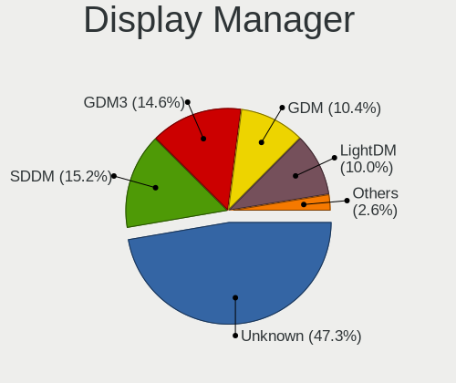
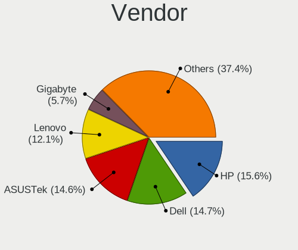
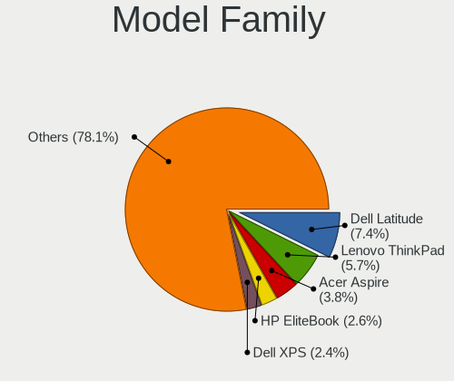
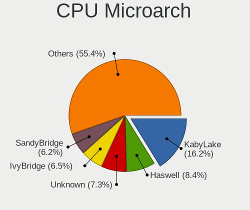
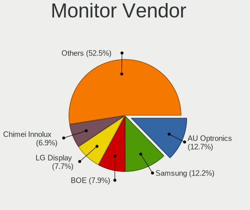
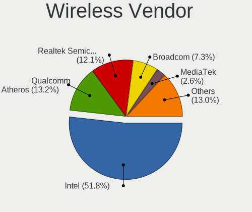
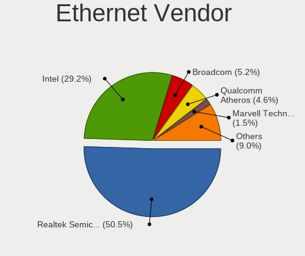
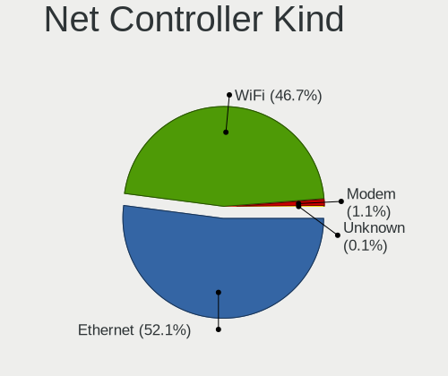

Linux in Netherlands - Tested Hardware & Statistics
---------------------------------------------------

A project to collect tested hardware configurations for Linux in Netherlands.

Anyone can contribute to this report by the [hw-probe](https://github.com/linuxhw/hw-probe) tool:

    sudo -E hw-probe -all -upload

Please contribute! Especially if your hardware is rare.

This is a report for all computer types. See also reports for [desktops](/Location/Netherlands/Desktop/README.md) and [notebooks](/Location/Netherlands/Notebook/README.md).

Contents
--------

* [ Test Cases ](#test-cases)

* [ System ](#system)
  - [ OS                       ](#os)
  - [ OS Family                ](#os-family)
  - [ Kernel                   ](#kernel)
  - [ Kernel Family            ](#kernel-family)
  - [ Kernel Major Ver.        ](#kernel-major-ver)
  - [ Arch                     ](#arch)
  - [ DE                       ](#de)
  - [ Display Server           ](#display-server)
  - [ Display Manager          ](#display-manager)
  - [ OS Lang                  ](#os-lang)
  - [ Boot Mode                ](#boot-mode)
  - [ Filesystem               ](#filesystem)
  - [ Part. scheme             ](#part-scheme)
  - [ Dual Boot with Linux/BSD ](#dual-boot-with-linuxbsd)
  - [ Dual Boot (Win)          ](#dual-boot-win)

* [ Board ](#board)
  - [ Vendor                   ](#vendor)
  - [ Model                    ](#model)
  - [ Model Family             ](#model-family)
  - [ MFG Year                 ](#mfg-year)
  - [ Form Factor              ](#form-factor)
  - [ Secure Boot              ](#secure-boot)
  - [ Coreboot                 ](#coreboot)
  - [ RAM Size                 ](#ram-size)
  - [ RAM Used                 ](#ram-used)
  - [ Total Drives             ](#total-drives)
  - [ Has CD-ROM               ](#has-cd-rom)
  - [ Has Ethernet             ](#has-ethernet)
  - [ Has WiFi                 ](#has-wifi)
  - [ Has Bluetooth            ](#has-bluetooth)

* [ Location ](#location)
  - [ Country                  ](#country)
  - [ City                     ](#city)

* [ Drives ](#drives)
  - [ Drive Vendor             ](#drive-vendor)
  - [ Drive Model              ](#drive-model)
  - [ HDD Vendor               ](#hdd-vendor)
  - [ SSD Vendor               ](#ssd-vendor)
  - [ Drive Kind               ](#drive-kind)
  - [ Drive Connector          ](#drive-connector)
  - [ Drive Size               ](#drive-size)
  - [ Space Total              ](#space-total)
  - [ Space Used               ](#space-used)
  - [ Malfunc. Drives          ](#malfunc-drives)
  - [ Malfunc. Drive Vendor    ](#malfunc-drive-vendor)
  - [ Malfunc. HDD Vendor      ](#malfunc-hdd-vendor)
  - [ Malfunc. Drive Kind      ](#malfunc-drive-kind)
  - [ Failed Drives            ](#failed-drives)
  - [ Failed Drive Vendor      ](#failed-drive-vendor)
  - [ Drive Status             ](#drive-status)

* [ Storage controller ](#storage-controller)
  - [ Storage Vendor           ](#storage-vendor)
  - [ Storage Model            ](#storage-model)
  - [ Storage Kind             ](#storage-kind)

* [ Processor ](#processor)
  - [ CPU Vendor               ](#cpu-vendor)
  - [ CPU Model                ](#cpu-model)
  - [ CPU Model Family         ](#cpu-model-family)
  - [ CPU Cores                ](#cpu-cores)
  - [ CPU Sockets              ](#cpu-sockets)
  - [ CPU Threads              ](#cpu-threads)
  - [ CPU Op-Modes             ](#cpu-op-modes)
  - [ CPU Microcode            ](#cpu-microcode)
  - [ CPU Microarch            ](#cpu-microarch)

* [ Graphics ](#graphics)
  - [ GPU Vendor               ](#gpu-vendor)
  - [ GPU Model                ](#gpu-model)
  - [ GPU Combo                ](#gpu-combo)
  - [ GPU Driver               ](#gpu-driver)
  - [ GPU Memory               ](#gpu-memory)

* [ Monitor ](#monitor)
  - [ Monitor Vendor           ](#monitor-vendor)
  - [ Monitor Model            ](#monitor-model)
  - [ Monitor Resolution       ](#monitor-resolution)
  - [ Monitor Diagonal         ](#monitor-diagonal)
  - [ Monitor Width            ](#monitor-width)
  - [ Aspect Ratio             ](#aspect-ratio)
  - [ Monitor Area             ](#monitor-area)
  - [ Pixel Density            ](#pixel-density)
  - [ Multiple Monitors        ](#multiple-monitors)

* [ Network ](#network)
  - [ Net Controller Vendor    ](#net-controller-vendor)
  - [ Net Controller Model     ](#net-controller-model)
  - [ Wireless Vendor          ](#wireless-vendor)
  - [ Wireless Model           ](#wireless-model)
  - [ Ethernet Vendor          ](#ethernet-vendor)
  - [ Ethernet Model           ](#ethernet-model)
  - [ Net Controller Kind      ](#net-controller-kind)
  - [ Used Controller          ](#used-controller)
  - [ NICs                     ](#nics)
  - [ IPv6                     ](#ipv6)

* [ Bluetooth ](#bluetooth)
  - [ Bluetooth Vendor         ](#bluetooth-vendor)
  - [ Bluetooth Model          ](#bluetooth-model)

* [ Sound ](#sound)
  - [ Sound Vendor             ](#sound-vendor)
  - [ Sound Model              ](#sound-model)

* [ Memory ](#memory)
  - [ Memory Vendor            ](#memory-vendor)
  - [ Memory Model             ](#memory-model)
  - [ Memory Kind              ](#memory-kind)
  - [ Memory Form Factor       ](#memory-form-factor)
  - [ Memory Size              ](#memory-size)
  - [ Memory Speed             ](#memory-speed)

* [ Printers & scanners ](#printers--scanners)
  - [ Printer Vendor           ](#printer-vendor)
  - [ Printer Model            ](#printer-model)
  - [ Scanner Vendor           ](#scanner-vendor)
  - [ Scanner Model            ](#scanner-model)

* [ Camera ](#camera)
  - [ Camera Vendor            ](#camera-vendor)
  - [ Camera Model             ](#camera-model)

* [ Security ](#security)
  - [ Fingerprint Vendor       ](#fingerprint-vendor)
  - [ Fingerprint Model        ](#fingerprint-model)
  - [ Chipcard Vendor          ](#chipcard-vendor)
  - [ Chipcard Model           ](#chipcard-model)

* [ Unsupported ](#unsupported)
  - [ Unsupported Devices      ](#unsupported-devices)
  - [ Unsupported Device Types ](#unsupported-device-types)

Test Cases
----------

Total: 7114

| Vendor        | Model                       | Form-Factor | Probe                                                      | Date         |
|---------------|-----------------------------|-------------|------------------------------------------------------------|--------------|
| Gigabyte      | H410M H V2                  | Desktop     | [fdb662e09b](https://linux-hardware.org/?probe=fdb662e09b) | May 09, 2024 |
| ASRock        | B450 Gaming-ITX/ac          | Desktop     | [9b4c39c111](https://linux-hardware.org/?probe=9b4c39c111) | May 07, 2024 |
| Dell          | 0XHGV1 A00                  | Desktop     | [b56a1f70d1](https://linux-hardware.org/?probe=b56a1f70d1) | May 07, 2024 |
| Dell          | 0XHGV1 A00                  | Desktop     | [35681eda7f](https://linux-hardware.org/?probe=35681eda7f) | May 07, 2024 |
| Unknown       | Unknown                     | Desktop     | [857bd41fc3](https://linux-hardware.org/?probe=857bd41fc3) | May 07, 2024 |
| Intel         | SKYBAY                      | Desktop     | [7e692c7e40](https://linux-hardware.org/?probe=7e692c7e40) | May 07, 2024 |
| ASRock        | H310CM-HDV                  | Desktop     | [1312cfac28](https://linux-hardware.org/?probe=1312cfac28) | May 06, 2024 |
| Timi          | TM1701                      | Notebook    | [305b97ebea](https://linux-hardware.org/?probe=305b97ebea) | May 05, 2024 |
| ASUSTek       | TUF Gaming A520M-PLUS WI... | Desktop     | [e4b1fdc5b2](https://linux-hardware.org/?probe=e4b1fdc5b2) | May 05, 2024 |
| Gigabyte      | G1.Sniper B5-CF             | Desktop     | [ec489a912b](https://linux-hardware.org/?probe=ec489a912b) | May 05, 2024 |
| Lenovo        | IdeaPad 5 Pro 16ACH6 82L... | Notebook    | [94542ba081](https://linux-hardware.org/?probe=94542ba081) | May 05, 2024 |
| Shenzhen M... | F7BFD                       | Desktop     | [41da20c6a7](https://linux-hardware.org/?probe=41da20c6a7) | May 05, 2024 |
| ASUSTek       | M4A88T-I DELUXE             | Desktop     | [98c3cc204a](https://linux-hardware.org/?probe=98c3cc204a) | May 04, 2024 |
| Lenovo        | ThinkPad T440p 20AWS3D60... | Notebook    | [ee74f28516](https://linux-hardware.org/?probe=ee74f28516) | May 04, 2024 |
| Lenovo        | IdeaPad 5 15IIL05 81YK      | Notebook    | [1a042bfbb0](https://linux-hardware.org/?probe=1a042bfbb0) | May 04, 2024 |
| Lenovo        | ThinkPad T495 20NJCTO1WW    | Notebook    | [2dfceb527c](https://linux-hardware.org/?probe=2dfceb527c) | May 04, 2024 |
| Medion        | MS-7848                     | Desktop     | [44af6191bc](https://linux-hardware.org/?probe=44af6191bc) | May 04, 2024 |
| Medion        | MS-7848                     | Desktop     | [e10e1b6256](https://linux-hardware.org/?probe=e10e1b6256) | May 04, 2024 |
| ASUSTek       | P8H61-I R2.0                | Desktop     | [2085626941](https://linux-hardware.org/?probe=2085626941) | May 04, 2024 |
| MSI           | Raider GE68HX 13VG          | Notebook    | [b3f866a8e6](https://linux-hardware.org/?probe=b3f866a8e6) | May 04, 2024 |
| Framework     | Laptop 13 (AMD Ryzen 704... | Notebook    | [90520db800](https://linux-hardware.org/?probe=90520db800) | May 03, 2024 |
| Google        | Teemo                       | Desktop     | [7371576eab](https://linux-hardware.org/?probe=7371576eab) | May 02, 2024 |
| Dell          | XPS 15 9570                 | Notebook    | [e0133e5a64](https://linux-hardware.org/?probe=e0133e5a64) | May 01, 2024 |
| Lenovo        | V330-14ARR 81B1             | Notebook    | [edceb0e782](https://linux-hardware.org/?probe=edceb0e782) | May 01, 2024 |
| MSI           | B450-A PRO MAX              | Desktop     | [2f0452583f](https://linux-hardware.org/?probe=2f0452583f) | Apr 30, 2024 |
| SolidRun      | Bedrock R7000               | Soc         | [ab7e5c672f](https://linux-hardware.org/?probe=ab7e5c672f) | Apr 30, 2024 |
| Valve         | Jupiter                     | Notebook    | [5266501940](https://linux-hardware.org/?probe=5266501940) | Apr 30, 2024 |
| SolidRun      | Bedrock R7000               | Soc         | [a2c2713a29](https://linux-hardware.org/?probe=a2c2713a29) | Apr 29, 2024 |
| HP            | ZBook Studio G3             | Notebook    | [f22beb97bc](https://linux-hardware.org/?probe=f22beb97bc) | Apr 29, 2024 |
| Intel         | AB2L .A002                  | Mini pc     | [8ab1948087](https://linux-hardware.org/?probe=8ab1948087) | Apr 29, 2024 |
| ASUSTek       | ROG Zephyrus G14 GA403UI... | Notebook    | [c1bfbd0de5](https://linux-hardware.org/?probe=c1bfbd0de5) | Apr 28, 2024 |
| ASRock        | 970 Pro3 R2.0               | Desktop     | [7918dabd8f](https://linux-hardware.org/?probe=7918dabd8f) | Apr 28, 2024 |
| ASRock        | 970 Pro3 R2.0               | Desktop     | [0902f17c99](https://linux-hardware.org/?probe=0902f17c99) | Apr 27, 2024 |
| ASRock        | 970 Pro3 R2.0               | Desktop     | [91449c8a93](https://linux-hardware.org/?probe=91449c8a93) | Apr 27, 2024 |
| Lenovo        | Yoga Pro 7 14APH8 82Y8      | Notebook    | [0a2f393a3e](https://linux-hardware.org/?probe=0a2f393a3e) | Apr 27, 2024 |
| Dell          | Precision 5680              | Notebook    | [95bc853549](https://linux-hardware.org/?probe=95bc853549) | Apr 27, 2024 |
| Apple         | MacBookPro9,2               | Notebook    | [a066471974](https://linux-hardware.org/?probe=a066471974) | Apr 26, 2024 |
| ASUSTek       | VivoBook_ASUSLaptop M760... | Notebook    | [936e0bf88e](https://linux-hardware.org/?probe=936e0bf88e) | Apr 26, 2024 |
| ASUSTek       | V-P8H67E                    | Desktop     | [685214183e](https://linux-hardware.org/?probe=685214183e) | Apr 26, 2024 |
| ASUSTek       | M2R-FVM                     | Desktop     | [90232f8ff9](https://linux-hardware.org/?probe=90232f8ff9) | Apr 26, 2024 |
| Microsoft     | Surface Pro                 | Tablet      | [58f89df0a1](https://linux-hardware.org/?probe=58f89df0a1) | Apr 26, 2024 |
| Dell          | Latitude 5420               | Notebook    | [92305ad5a6](https://linux-hardware.org/?probe=92305ad5a6) | Apr 26, 2024 |
| ASUSTek       | M2R-FVM                     | Desktop     | [fc2624bc84](https://linux-hardware.org/?probe=fc2624bc84) | Apr 26, 2024 |
| MSI           | GS60 2QE                    | Notebook    | [f461221321](https://linux-hardware.org/?probe=f461221321) | Apr 25, 2024 |
| Valve         | Jupiter                     | Notebook    | [4cad19c61a](https://linux-hardware.org/?probe=4cad19c61a) | Apr 25, 2024 |
| ASUSTek       | P8H77-M PRO                 | Desktop     | [ee55351883](https://linux-hardware.org/?probe=ee55351883) | Apr 25, 2024 |
| Acidanther... | MacBookAir9,1               | Notebook    | [ba60edeb99](https://linux-hardware.org/?probe=ba60edeb99) | Apr 25, 2024 |
| SKIKK         | Freya                       | Notebook    | [c743ce4dbf](https://linux-hardware.org/?probe=c743ce4dbf) | Apr 24, 2024 |
| Supermicro    | X11SCH-F                    | Desktop     | [23f91828f4](https://linux-hardware.org/?probe=23f91828f4) | Apr 24, 2024 |
| HP            | ProBook 440 G2              | Notebook    | [e5a4a84406](https://linux-hardware.org/?probe=e5a4a84406) | Apr 23, 2024 |
| Lenovo        | ThinkPad P16s Gen 2 21K9... | Notebook    | [95453a6898](https://linux-hardware.org/?probe=95453a6898) | Apr 23, 2024 |
| HP            | EliteBook 840 G3            | Notebook    | [efcac49277](https://linux-hardware.org/?probe=efcac49277) | Apr 23, 2024 |
| HP            | EliteBook 840 G3            | Notebook    | [ae4c858581](https://linux-hardware.org/?probe=ae4c858581) | Apr 23, 2024 |
| Dell          | Latitude 7490               | Notebook    | [13f0f49982](https://linux-hardware.org/?probe=13f0f49982) | Apr 23, 2024 |
| Dell          | Latitude 7490               | Notebook    | [1f22d48915](https://linux-hardware.org/?probe=1f22d48915) | Apr 23, 2024 |
| Gigabyte      | B550 GAMING X V2            | Desktop     | [bf5d255cb3](https://linux-hardware.org/?probe=bf5d255cb3) | Apr 23, 2024 |
| Google        | Blipper                     | Notebook    | [9e3d9fd3bb](https://linux-hardware.org/?probe=9e3d9fd3bb) | Apr 23, 2024 |
| Dell          | XPS 15 9560                 | Notebook    | [b5992402c8](https://linux-hardware.org/?probe=b5992402c8) | Apr 23, 2024 |
| Unknown       | Unknown                     | Soc         | [3417db08f3](https://linux-hardware.org/?probe=3417db08f3) | Apr 22, 2024 |
| Valve         | Galileo                     | Notebook    | [3baa035f72](https://linux-hardware.org/?probe=3baa035f72) | Apr 21, 2024 |
| MSI           | Modern 15 B12M              | Notebook    | [dbf027e01f](https://linux-hardware.org/?probe=dbf027e01f) | Apr 21, 2024 |
| Gigabyte      | Z390 DESIGNARE-CF           | Desktop     | [8ca3407fb3](https://linux-hardware.org/?probe=8ca3407fb3) | Apr 20, 2024 |
| Notebook      | W330SU2                     | Notebook    | [7efde9ff70](https://linux-hardware.org/?probe=7efde9ff70) | Apr 20, 2024 |
| Dell          | Latitude E5520              | Notebook    | [1cc2969282](https://linux-hardware.org/?probe=1cc2969282) | Apr 20, 2024 |
| Apple         | MacBookPro9,2               | Notebook    | [7f328c0dca](https://linux-hardware.org/?probe=7f328c0dca) | Apr 19, 2024 |
| Gigabyte      | Z390 GAMING SLI-CF          | Desktop     | [95968f8653](https://linux-hardware.org/?probe=95968f8653) | Apr 19, 2024 |
| Lenovo        | ThinkPad Edge E145 20BCA... | Notebook    | [572cb1f325](https://linux-hardware.org/?probe=572cb1f325) | Apr 19, 2024 |
| HP            | Spectre x360 Convertible... | Convertible | [4af30719ae](https://linux-hardware.org/?probe=4af30719ae) | Apr 19, 2024 |
| HP            | OMEN by Latpop 16-c0100n... | Notebook    | [0ee401b99c](https://linux-hardware.org/?probe=0ee401b99c) | Apr 19, 2024 |
| Dell          | XPS 15 9570                 | Notebook    | [7c799f03c5](https://linux-hardware.org/?probe=7c799f03c5) | Apr 19, 2024 |
| Dell          | Latitude E5570              | Notebook    | [3a04ef9eff](https://linux-hardware.org/?probe=3a04ef9eff) | Apr 18, 2024 |
| Valve         | Jupiter                     | Notebook    | [541aacb1a1](https://linux-hardware.org/?probe=541aacb1a1) | Apr 17, 2024 |
| ASRock        | A520M-HDV                   | Desktop     | [9a415b8705](https://linux-hardware.org/?probe=9a415b8705) | Apr 17, 2024 |
| ASRock        | H97 Anniversary             | Desktop     | [03e08a5b5a](https://linux-hardware.org/?probe=03e08a5b5a) | Apr 17, 2024 |
| Gigabyte      | B550M DS3H                  | Desktop     | [1952388280](https://linux-hardware.org/?probe=1952388280) | Apr 17, 2024 |
| ASUSTek       | PRIME X370-PRO              | Desktop     | [bfa1eb7573](https://linux-hardware.org/?probe=bfa1eb7573) | Apr 17, 2024 |
| ASUSTek       | PRIME X370-PRO              | Desktop     | [2e7cde0526](https://linux-hardware.org/?probe=2e7cde0526) | Apr 17, 2024 |
| Acer          | Aspire ES1-731              | Notebook    | [cd5f5f6530](https://linux-hardware.org/?probe=cd5f5f6530) | Apr 17, 2024 |
| ASUSTek       | P7P55 LX                    | Desktop     | [96dbbe51b4](https://linux-hardware.org/?probe=96dbbe51b4) | Apr 16, 2024 |
| ASUSTek       | P7P55 LX                    | Desktop     | [70ce7a6cb4](https://linux-hardware.org/?probe=70ce7a6cb4) | Apr 16, 2024 |
| Gigabyte      | AORUS 16X ASG               | Notebook    | [58a22b5fcc](https://linux-hardware.org/?probe=58a22b5fcc) | Apr 16, 2024 |
| Lenovo        | ThinkBook 15 G2 ITL 20VE    | Notebook    | [080c39059e](https://linux-hardware.org/?probe=080c39059e) | Apr 16, 2024 |
| Gigabyte      | B650 GAMING X AX V2         | Desktop     | [bf309bc034](https://linux-hardware.org/?probe=bf309bc034) | Apr 16, 2024 |
| HP            | ProBook 450 G6              | Notebook    | [d1f51a03b0](https://linux-hardware.org/?probe=d1f51a03b0) | Apr 15, 2024 |
| ASUSTek       | H110M-A                     | Desktop     | [fcc681df4b](https://linux-hardware.org/?probe=fcc681df4b) | Apr 15, 2024 |
| Packard Be... | ENNS45HR                    | Notebook    | [668c3b801a](https://linux-hardware.org/?probe=668c3b801a) | Apr 15, 2024 |
| ASUSTek       | H110M-A                     | Desktop     | [d46d720322](https://linux-hardware.org/?probe=d46d720322) | Apr 15, 2024 |
| Pegatron      | 2A94h                       | Desktop     | [6f40582b45](https://linux-hardware.org/?probe=6f40582b45) | Apr 15, 2024 |
| Apple         | Mac-FFE5EF870D7BA81A iMa... | All in one  | [326bfaca84](https://linux-hardware.org/?probe=326bfaca84) | Apr 15, 2024 |
| Dell          | Latitude E6440              | Notebook    | [9a85d3d85f](https://linux-hardware.org/?probe=9a85d3d85f) | Apr 15, 2024 |
| Toshiba       | Satellite C70D-B            | Notebook    | [aec8c6b18e](https://linux-hardware.org/?probe=aec8c6b18e) | Apr 15, 2024 |
| HP            | ProBook 450 15.6 inch G9... | Notebook    | [d866d51612](https://linux-hardware.org/?probe=d866d51612) | Apr 14, 2024 |
| Unknown       | Unknown                     | Notebook    | [773a23ae2c](https://linux-hardware.org/?probe=773a23ae2c) | Apr 14, 2024 |
| Dell          | Latitude 5290 2-in-1        | Tablet      | [756e837ab6](https://linux-hardware.org/?probe=756e837ab6) | Apr 13, 2024 |
| HP            | EliteBook 840 G3            | Notebook    | [5b025453c2](https://linux-hardware.org/?probe=5b025453c2) | Apr 13, 2024 |
| Acer          | Spin SP513-55N              | Convertible | [7592d772c2](https://linux-hardware.org/?probe=7592d772c2) | Apr 13, 2024 |
| HP            | ProBook 6570b               | Notebook    | [d17831e754](https://linux-hardware.org/?probe=d17831e754) | Apr 12, 2024 |
| Lenovo        | MIIX 320-10ICR 80XF         | Tablet      | [5177e52394](https://linux-hardware.org/?probe=5177e52394) | Apr 12, 2024 |
| Samsung       | RV411/RV511/E3511/S3511/... | Notebook    | [86056cf6ca](https://linux-hardware.org/?probe=86056cf6ca) | Apr 11, 2024 |
| Lenovo        | MIIX 320-10ICR 80XF         | Tablet      | [ca00a8ab5f](https://linux-hardware.org/?probe=ca00a8ab5f) | Apr 11, 2024 |
| Lenovo        | Yoga Slim 7 Pro 14ACH5 8... | Notebook    | [2b93085de2](https://linux-hardware.org/?probe=2b93085de2) | Apr 11, 2024 |
| Apple         | Mac-FFE5EF870D7BA81A iMa... | All in one  | [7ee8e88f7e](https://linux-hardware.org/?probe=7ee8e88f7e) | Apr 11, 2024 |
| HP            | ENVY Pro 4-b000 Ultraboo... | Notebook    | [64bbd1ee8c](https://linux-hardware.org/?probe=64bbd1ee8c) | Apr 10, 2024 |
| HP            | ENVY Pro 4-b000 Ultraboo... | Notebook    | [55a4b4a105](https://linux-hardware.org/?probe=55a4b4a105) | Apr 10, 2024 |
| ASUSTek       | M2N-MX SE Plus              | Desktop     | [cd00417980](https://linux-hardware.org/?probe=cd00417980) | Apr 10, 2024 |
| Dell          | Precision 7670              | Notebook    | [d0d89414ce](https://linux-hardware.org/?probe=d0d89414ce) | Apr 10, 2024 |
| Dell          | Latitude E5510              | Notebook    | [923127ad28](https://linux-hardware.org/?probe=923127ad28) | Apr 09, 2024 |
| Foxconn       | H55MX-S Series              | Desktop     | [e659b4546f](https://linux-hardware.org/?probe=e659b4546f) | Apr 09, 2024 |
| Foxconn       | H55MX-S Series              | Desktop     | [93deba6ce5](https://linux-hardware.org/?probe=93deba6ce5) | Apr 09, 2024 |
| Dell          | 03NJH0 A01                  | Desktop     | [7c5c2e6bfb](https://linux-hardware.org/?probe=7c5c2e6bfb) | Apr 08, 2024 |
| MSI           | MPG B650I EDGE WIFI         | Desktop     | [295a425d96](https://linux-hardware.org/?probe=295a425d96) | Apr 08, 2024 |
| ASRock        | B650M Pro RS                | Desktop     | [8a6331a3b2](https://linux-hardware.org/?probe=8a6331a3b2) | Apr 08, 2024 |
| ASRock        | B650M Pro RS                | Desktop     | [9c421a9dbb](https://linux-hardware.org/?probe=9c421a9dbb) | Apr 08, 2024 |
| HP            | Compaq Presario A900        | Notebook    | [cafbe365ac](https://linux-hardware.org/?probe=cafbe365ac) | Apr 07, 2024 |
| SolidRun      | CEX7 Platform               | Desktop     | [921a652a7e](https://linux-hardware.org/?probe=921a652a7e) | Apr 07, 2024 |
| Lenovo        | IdeaPad 710S-13ISK 80SW     | Notebook    | [75363d665b](https://linux-hardware.org/?probe=75363d665b) | Apr 06, 2024 |
| HP            | Pavilion dv6                | Notebook    | [bc5b62eec9](https://linux-hardware.org/?probe=bc5b62eec9) | Apr 06, 2024 |
| Gigabyte      | Z390 DESIGNARE-CF           | Desktop     | [fc997cf3eb](https://linux-hardware.org/?probe=fc997cf3eb) | Apr 06, 2024 |
| Intel         | VALLEYVIEW C0 PLATFORM      | Tablet      | [8de81fb9d7](https://linux-hardware.org/?probe=8de81fb9d7) | Apr 06, 2024 |
| ASUSTek       | ROG Strix G713PI_G713PI     | Notebook    | [ed719f8ced](https://linux-hardware.org/?probe=ed719f8ced) | Apr 06, 2024 |
| Razer         | Blade 15 Base Model (Ear... | Notebook    | [9a21465a8e](https://linux-hardware.org/?probe=9a21465a8e) | Apr 06, 2024 |
| MSI           | MAG B550 TOMAHAWK           | Desktop     | [9207cd6c9a](https://linux-hardware.org/?probe=9207cd6c9a) | Apr 06, 2024 |
| Foxconn       | H55MX-S Series              | Desktop     | [57dab83b95](https://linux-hardware.org/?probe=57dab83b95) | Apr 06, 2024 |
| Foxconn       | H55MX-S Series              | Desktop     | [111eb94f46](https://linux-hardware.org/?probe=111eb94f46) | Apr 06, 2024 |
| ASUSTek       | TUF Gaming B650M-PLUS       | Desktop     | [836a40664c](https://linux-hardware.org/?probe=836a40664c) | Apr 05, 2024 |
| ASRock        | AB350M Pro4                 | Desktop     | [705e1fd7bf](https://linux-hardware.org/?probe=705e1fd7bf) | Apr 05, 2024 |
| Packard Be... | EasyNote LS11HR             | Notebook    | [3d77de9e9d](https://linux-hardware.org/?probe=3d77de9e9d) | Apr 05, 2024 |
| Dell          | Precision M6500             | Notebook    | [d7df43ff91](https://linux-hardware.org/?probe=d7df43ff91) | Apr 04, 2024 |
| Apple         | Mac-FFE5EF870D7BA81A iMa... | All in one  | [24b125fe5d](https://linux-hardware.org/?probe=24b125fe5d) | Apr 04, 2024 |
| Lenovo        | IdeaPad 5 Pro 16ACH6 82L... | Notebook    | [d461adfb56](https://linux-hardware.org/?probe=d461adfb56) | Apr 03, 2024 |
| HP            | ProBook 650 G2              | Notebook    | [ff7fdcd8cd](https://linux-hardware.org/?probe=ff7fdcd8cd) | Apr 03, 2024 |
| HP            | ZBook Studio G3             | Notebook    | [99e8b4ea7b](https://linux-hardware.org/?probe=99e8b4ea7b) | Apr 03, 2024 |
| Google        | Fizz                        | Desktop     | [55cd95ea52](https://linux-hardware.org/?probe=55cd95ea52) | Apr 03, 2024 |
| Lenovo        | 3709 SDK0J40700 WIN 3258... | Desktop     | [1e11e401a4](https://linux-hardware.org/?probe=1e11e401a4) | Apr 03, 2024 |
| ASUSTek       | M5A97 PLUS                  | Desktop     | [b45101bd55](https://linux-hardware.org/?probe=b45101bd55) | Apr 02, 2024 |
| Google        | Blipper                     | Notebook    | [630fe7bf83](https://linux-hardware.org/?probe=630fe7bf83) | Apr 02, 2024 |
| Dell          | Inspiron 3737               | Notebook    | [57f0d2bdd7](https://linux-hardware.org/?probe=57f0d2bdd7) | Apr 02, 2024 |
| Medion        | MS-7800                     | Desktop     | [f8676e23e7](https://linux-hardware.org/?probe=f8676e23e7) | Apr 02, 2024 |
| Medion        | MS-7800                     | Desktop     | [77cda7e8e5](https://linux-hardware.org/?probe=77cda7e8e5) | Apr 02, 2024 |
| HP            | EliteBook 840 G3            | Notebook    | [992cf5c5a6](https://linux-hardware.org/?probe=992cf5c5a6) | Apr 02, 2024 |
| Lenovo        | ThinkBook 15 G3 ACL 21A4    | Notebook    | [3b12de1ede](https://linux-hardware.org/?probe=3b12de1ede) | Apr 02, 2024 |
| Intel         | DG965RY AAD41691-301        | Desktop     | [7879a92b59](https://linux-hardware.org/?probe=7879a92b59) | Apr 02, 2024 |
| Dell          | Inspiron 3737               | Notebook    | [88d5ff86da](https://linux-hardware.org/?probe=88d5ff86da) | Apr 02, 2024 |
| Dell          | 0GY6Y8 A01                  | Desktop     | [ae35aaa6fe](https://linux-hardware.org/?probe=ae35aaa6fe) | Apr 02, 2024 |
| MSI           | MAG Z690 TOMAHAWK WIFI D... | Desktop     | [378f4bbcad](https://linux-hardware.org/?probe=378f4bbcad) | Apr 02, 2024 |
| ASUSTek       | VivoBook_ASUSLaptop X412... | Notebook    | [d21f6d3fe4](https://linux-hardware.org/?probe=d21f6d3fe4) | Apr 01, 2024 |
| Apple         | Mac-FFE5EF870D7BA81A iMa... | All in one  | [d279e7f18b](https://linux-hardware.org/?probe=d279e7f18b) | Apr 01, 2024 |
| ASUSTek       | PRIME B250M-A               | Desktop     | [7f30a26ad7](https://linux-hardware.org/?probe=7f30a26ad7) | Apr 01, 2024 |
| HP            | ProBook 450 15.6 inch G9... | Notebook    | [dfb241ae3d](https://linux-hardware.org/?probe=dfb241ae3d) | Apr 01, 2024 |
| Fujitsu       | D3221-A1 S26361-D3221-A1    | Desktop     | [f297f586b1](https://linux-hardware.org/?probe=f297f586b1) | Apr 01, 2024 |
| Google        | Blipper                     | Notebook    | [730ed40cc1](https://linux-hardware.org/?probe=730ed40cc1) | Apr 01, 2024 |
| HP            | ProBook 6570b               | Notebook    | [cf9fba8256](https://linux-hardware.org/?probe=cf9fba8256) | Apr 01, 2024 |
| HP            | ProBook 6570b               | Notebook    | [a26b2f6f54](https://linux-hardware.org/?probe=a26b2f6f54) | Apr 01, 2024 |
| HP            | ProBook 4540s               | Notebook    | [c641dc440f](https://linux-hardware.org/?probe=c641dc440f) | Mar 31, 2024 |
| Dell          | Latitude 7390 2-in-1        | Notebook    | [e1a08cb929](https://linux-hardware.org/?probe=e1a08cb929) | Mar 31, 2024 |
| Google        | Bobba                       | Notebook    | [d69b117fd0](https://linux-hardware.org/?probe=d69b117fd0) | Mar 30, 2024 |
| Foxconn       | H61MXL-K                    | Desktop     | [967587e883](https://linux-hardware.org/?probe=967587e883) | Mar 30, 2024 |
| ASUSTek       | Q87M-E                      | Desktop     | [ee9a533b40](https://linux-hardware.org/?probe=ee9a533b40) | Mar 30, 2024 |
| Lenovo        | ThinkPad Yoga 11e 3rd Ge... | Convertible | [d558b17c2d](https://linux-hardware.org/?probe=d558b17c2d) | Mar 30, 2024 |
| ASUSTek       | PRIME H310M-K R2.0          | Desktop     | [6f6c4699f5](https://linux-hardware.org/?probe=6f6c4699f5) | Mar 29, 2024 |
| ASUSTek       | P6X58D-E                    | Desktop     | [e5ee0e61a8](https://linux-hardware.org/?probe=e5ee0e61a8) | Mar 28, 2024 |
| ASUSTek       | Vivobook Go E1404FA_E140... | Notebook    | [04c0b7c41b](https://linux-hardware.org/?probe=04c0b7c41b) | Mar 28, 2024 |
| Intel         | NUC12WSBi5 M63398-302       | Mini pc     | [cda61bcc8d](https://linux-hardware.org/?probe=cda61bcc8d) | Mar 28, 2024 |
| Gigabyte      | B550M AORUS ELITE           | Desktop     | [ba5d17c1d9](https://linux-hardware.org/?probe=ba5d17c1d9) | Mar 28, 2024 |
| Lenovo        | IdeaPad 5 15ALC05 82LN      | Notebook    | [80ad3b2985](https://linux-hardware.org/?probe=80ad3b2985) | Mar 27, 2024 |
| Dell          | Latitude E6220              | Notebook    | [56c93ecfd7](https://linux-hardware.org/?probe=56c93ecfd7) | Mar 27, 2024 |
| ASUSTek       | VivoBook_ASUSLaptop X760... | Notebook    | [ec5f9e5af3](https://linux-hardware.org/?probe=ec5f9e5af3) | Mar 26, 2024 |
| Lenovo        | ThinkPad T410 2537CQ7       | Notebook    | [8b91ec68dd](https://linux-hardware.org/?probe=8b91ec68dd) | Mar 26, 2024 |
| Lenovo        | IdeaPad Gaming 3 15IMH05... | Notebook    | [23261ca606](https://linux-hardware.org/?probe=23261ca606) | Mar 26, 2024 |
| Intel         | X99                         | Desktop     | [2479fc825c](https://linux-hardware.org/?probe=2479fc825c) | Mar 25, 2024 |
| HP            | 829A                        | Mini pc     | [0157c34672](https://linux-hardware.org/?probe=0157c34672) | Mar 25, 2024 |
| Dell          | 088DT1 A01                  | Desktop     | [753576c615](https://linux-hardware.org/?probe=753576c615) | Mar 25, 2024 |
| Notebook      | W330SU2                     | Notebook    | [5228fe58bf](https://linux-hardware.org/?probe=5228fe58bf) | Mar 24, 2024 |
| Valve         | Jupiter                     | Notebook    | [4342049244](https://linux-hardware.org/?probe=4342049244) | Mar 24, 2024 |
| Valve         | Jupiter                     | Notebook    | [b61c5a739b](https://linux-hardware.org/?probe=b61c5a739b) | Mar 24, 2024 |
| MSI           | X570-A PRO                  | Desktop     | [1545d7db10](https://linux-hardware.org/?probe=1545d7db10) | Mar 24, 2024 |
| ASUSTek       | 1025C                       | Notebook    | [3de65ffcfb](https://linux-hardware.org/?probe=3de65ffcfb) | Mar 24, 2024 |
| Medion        | MS-7616                     | Desktop     | [56b5e8ba1d](https://linux-hardware.org/?probe=56b5e8ba1d) | Mar 24, 2024 |
| Dell          | Latitude E6540              | Notebook    | [d934512cbf](https://linux-hardware.org/?probe=d934512cbf) | Mar 24, 2024 |
| Dell          | 0XD433 A00                  | Desktop     | [dd7aca8bce](https://linux-hardware.org/?probe=dd7aca8bce) | Mar 24, 2024 |
| Dell          | Latitude E6540              | Notebook    | [d0f97030d5](https://linux-hardware.org/?probe=d0f97030d5) | Mar 24, 2024 |
| HP            | ENVY x360 Convertible 15... | Convertible | [b88bb8f602](https://linux-hardware.org/?probe=b88bb8f602) | Mar 24, 2024 |
| Samsung       | 535U3C                      | Notebook    | [6b29450ac6](https://linux-hardware.org/?probe=6b29450ac6) | Mar 23, 2024 |
| Dell          | XPS 15 9570                 | Notebook    | [df6fb5f11e](https://linux-hardware.org/?probe=df6fb5f11e) | Mar 23, 2024 |
| Dell          | 0XD433 A00                  | Desktop     | [7493f7d748](https://linux-hardware.org/?probe=7493f7d748) | Mar 23, 2024 |
| Gigabyte      | B550M AORUS PRO-P           | Desktop     | [97671bb0a9](https://linux-hardware.org/?probe=97671bb0a9) | Mar 23, 2024 |
| HP            | 8876 11                     | Desktop     | [7bae1a5b49](https://linux-hardware.org/?probe=7bae1a5b49) | Mar 22, 2024 |
| Lenovo        | ThinkPad L560 20F2S2UR02    | Notebook    | [cb8ac02893](https://linux-hardware.org/?probe=cb8ac02893) | Mar 22, 2024 |
| ASUSTek       | ZenBook UX481FL_UX481FL     | Notebook    | [12d5c69f60](https://linux-hardware.org/?probe=12d5c69f60) | Mar 22, 2024 |
| Acer          | Aspire E5-774G              | Notebook    | [0de719fa5b](https://linux-hardware.org/?probe=0de719fa5b) | Mar 21, 2024 |
| MSI           | Z97 GAMING 3                | Desktop     | [0022a19da8](https://linux-hardware.org/?probe=0022a19da8) | Mar 21, 2024 |
| Apple         | MacBookPro6,1               | Notebook    | [a993d0d4bc](https://linux-hardware.org/?probe=a993d0d4bc) | Mar 21, 2024 |
| Notebook      | N24_25BU                    | Notebook    | [6ae3f85d1b](https://linux-hardware.org/?probe=6ae3f85d1b) | Mar 20, 2024 |
| ASUSTek       | VivoBook_ASUSLaptop X712... | Notebook    | [00f9ee02d9](https://linux-hardware.org/?probe=00f9ee02d9) | Mar 20, 2024 |
| Lenovo        | ThinkPad Edge E145 20BCA... | Notebook    | [850480e2ec](https://linux-hardware.org/?probe=850480e2ec) | Mar 20, 2024 |
| Apple         | Mac-F2218FC8                | All in one  | [d6900b6f66](https://linux-hardware.org/?probe=d6900b6f66) | Mar 20, 2024 |
| Unknown       | Unknown                     | Soc         | [38fe1a48a2](https://linux-hardware.org/?probe=38fe1a48a2) | Mar 19, 2024 |
| HP            | EliteBook 840 G3            | Notebook    | [febfdac13f](https://linux-hardware.org/?probe=febfdac13f) | Mar 19, 2024 |
| Intel         | NUC12WSBi7 M46422-304       | Mini pc     | [1306604093](https://linux-hardware.org/?probe=1306604093) | Mar 19, 2024 |
| HP            | Pavilion Notebook           | Notebook    | [25ea07c0ef](https://linux-hardware.org/?probe=25ea07c0ef) | Mar 19, 2024 |
| Apple         | Mac-F2218EA9                | All in one  | [04aea2f042](https://linux-hardware.org/?probe=04aea2f042) | Mar 19, 2024 |
| Microsoft     | Surface Pro 6               | Tablet      | [88197088cf](https://linux-hardware.org/?probe=88197088cf) | Mar 18, 2024 |
| HP            | Pavilion g6                 | Notebook    | [ada7f202fa](https://linux-hardware.org/?probe=ada7f202fa) | Mar 18, 2024 |
| HP            | Laptop 15s-eq2xxx           | Notebook    | [e24d05dacc](https://linux-hardware.org/?probe=e24d05dacc) | Mar 18, 2024 |
| Shenzhen M... | F7BFD                       | Desktop     | [3cd8223dd4](https://linux-hardware.org/?probe=3cd8223dd4) | Mar 18, 2024 |
| Shenzhen M... | F7BFD                       | Desktop     | [1cd52375ce](https://linux-hardware.org/?probe=1cd52375ce) | Mar 18, 2024 |
| MSI           | X470 GAMING PLUS MAX        | Desktop     | [d0cd5bb06c](https://linux-hardware.org/?probe=d0cd5bb06c) | Mar 17, 2024 |
| HP            | ZBook 15 G3                 | Notebook    | [d565c68c67](https://linux-hardware.org/?probe=d565c68c67) | Mar 17, 2024 |
| HP            | ProBook 450 G3              | Notebook    | [9860e411fc](https://linux-hardware.org/?probe=9860e411fc) | Mar 17, 2024 |
| HP            | ProBook 450 G3              | Notebook    | [a1ef1bfc67](https://linux-hardware.org/?probe=a1ef1bfc67) | Mar 17, 2024 |
| HP            | EliteBook 840 G3            | Notebook    | [1de394a543](https://linux-hardware.org/?probe=1de394a543) | Mar 17, 2024 |
| Lenovo        | IdeaPad 3 15IIL05 81WE      | Notebook    | [5499d7f4db](https://linux-hardware.org/?probe=5499d7f4db) | Mar 17, 2024 |
| HP            | Pavilion g6                 | Notebook    | [19c3a7e428](https://linux-hardware.org/?probe=19c3a7e428) | Mar 17, 2024 |
| MSI           | Creator Z16 A12UET          | Notebook    | [3e3a98e47d](https://linux-hardware.org/?probe=3e3a98e47d) | Mar 16, 2024 |
| Unknown       | Unknown                     | Notebook    | [7c385c1bef](https://linux-hardware.org/?probe=7c385c1bef) | Mar 16, 2024 |
| Medion        | E4251                       | Notebook    | [e85db20237](https://linux-hardware.org/?probe=e85db20237) | Mar 16, 2024 |
| Apple         | Mac-F2218EA9                | All in one  | [d24745dec4](https://linux-hardware.org/?probe=d24745dec4) | Mar 16, 2024 |
| Microsoft     | Surface Laptop              | Tablet      | [f35f1a27c3](https://linux-hardware.org/?probe=f35f1a27c3) | Mar 15, 2024 |
| Microsoft     | Surface Laptop              | Tablet      | [9d6aaa7ef0](https://linux-hardware.org/?probe=9d6aaa7ef0) | Mar 15, 2024 |
| Micro Comp... | Venus series                | Notebook    | [ffb53207eb](https://linux-hardware.org/?probe=ffb53207eb) | Mar 15, 2024 |
| Micro Comp... | Venus series                | Notebook    | [41aa3958de](https://linux-hardware.org/?probe=41aa3958de) | Mar 15, 2024 |
| Lenovo        | B50-10 80QR                 | Notebook    | [f120e923bd](https://linux-hardware.org/?probe=f120e923bd) | Mar 15, 2024 |
| Apple         | MacBookPro9,1               | Notebook    | [244a8aa50d](https://linux-hardware.org/?probe=244a8aa50d) | Mar 15, 2024 |
| HP            | Pavilion Laptop 15-eh1xx... | Notebook    | [0bcd3f4115](https://linux-hardware.org/?probe=0bcd3f4115) | Mar 14, 2024 |
| Acer          | Aspire MC605 v1.0           | Desktop     | [904ac049ec](https://linux-hardware.org/?probe=904ac049ec) | Mar 14, 2024 |
| Acer          | Aspire MC605 v1.0           | Desktop     | [0ffe490879](https://linux-hardware.org/?probe=0ffe490879) | Mar 14, 2024 |
| HP            | Spectre x360 Laptop         | Convertible | [e3685c5c4e](https://linux-hardware.org/?probe=e3685c5c4e) | Mar 14, 2024 |
| ASUSTek       | M2N-MX SE Plus              | Desktop     | [de771fafaf](https://linux-hardware.org/?probe=de771fafaf) | Mar 14, 2024 |
| Valve         | Jupiter                     | Notebook    | [14ec218ad2](https://linux-hardware.org/?probe=14ec218ad2) | Mar 14, 2024 |
| ASUSTek       | PRIME X570-PRO              | Desktop     | [4011f682bd](https://linux-hardware.org/?probe=4011f682bd) | Mar 13, 2024 |
| Google        | Bobba                       | Notebook    | [f01b89f659](https://linux-hardware.org/?probe=f01b89f659) | Mar 13, 2024 |
| ASUSTek       | Z97-K                       | Desktop     | [893ca1a5dc](https://linux-hardware.org/?probe=893ca1a5dc) | Mar 13, 2024 |
| Acer          | NG-G3-572-75Y3              | Notebook    | [23a29d65ee](https://linux-hardware.org/?probe=23a29d65ee) | Mar 13, 2024 |
| ASUSTek       | M4N68T-M-V2                 | Desktop     | [7b684fbb84](https://linux-hardware.org/?probe=7b684fbb84) | Mar 13, 2024 |
| HP            | ZBook Studio x360 G5        | Convertible | [872cc7e381](https://linux-hardware.org/?probe=872cc7e381) | Mar 13, 2024 |
| HP            | ZBook Studio x360 G5        | Convertible | [6012c05b34](https://linux-hardware.org/?probe=6012c05b34) | Mar 13, 2024 |
| Dell          | XPS 15 7590                 | Notebook    | [cb98a0205a](https://linux-hardware.org/?probe=cb98a0205a) | Mar 12, 2024 |
| ASRock        | H110M-HDS                   | Desktop     | [0b9ca9c2ca](https://linux-hardware.org/?probe=0b9ca9c2ca) | Mar 12, 2024 |
| ASRock        | H110M-HDS                   | Desktop     | [0d754901a3](https://linux-hardware.org/?probe=0d754901a3) | Mar 12, 2024 |
| Toshiba       | TECRA Z40-A                 | Notebook    | [35673f4d11](https://linux-hardware.org/?probe=35673f4d11) | Mar 12, 2024 |
| Google        | Bobba                       | Notebook    | [8b2b9ab225](https://linux-hardware.org/?probe=8b2b9ab225) | Mar 12, 2024 |
| Lenovo        | 36E9 SDK0R32862 WIN 3258... | Desktop     | [e7e3f4e472](https://linux-hardware.org/?probe=e7e3f4e472) | Mar 12, 2024 |
| Unknown       | Unknown                     | Notebook    | [1a12cdf91f](https://linux-hardware.org/?probe=1a12cdf91f) | Mar 12, 2024 |
| ASUSTek       | K52JU                       | Notebook    | [f6f18b0e61](https://linux-hardware.org/?probe=f6f18b0e61) | Mar 12, 2024 |
| Alienware     | M17x                        | Notebook    | [073de6c7bd](https://linux-hardware.org/?probe=073de6c7bd) | Mar 12, 2024 |
| ASUSTek       | M2N-MX                      | Desktop     | [1d1290a81e](https://linux-hardware.org/?probe=1d1290a81e) | Mar 12, 2024 |
| HP            | 81C5 MVB                    | Desktop     | [3461cce880](https://linux-hardware.org/?probe=3461cce880) | Mar 11, 2024 |
| Lenovo        | 36EE SDK0J40700 WIN 3258... | Desktop     | [1f32685a18](https://linux-hardware.org/?probe=1f32685a18) | Mar 11, 2024 |
| HP            | OMEN by Laptop 16-c0xxx     | Notebook    | [0d85faece4](https://linux-hardware.org/?probe=0d85faece4) | Mar 11, 2024 |
| HP            | ENVY x360 Convertible 13... | Convertible | [a2495ce9f0](https://linux-hardware.org/?probe=a2495ce9f0) | Mar 11, 2024 |
| Acer          | NG-G3-572-75Y3              | Notebook    | [b1da1a8b09](https://linux-hardware.org/?probe=b1da1a8b09) | Mar 09, 2024 |
| Acer          | Aspire 9410                 | Notebook    | [3307f5eede](https://linux-hardware.org/?probe=3307f5eede) | Mar 09, 2024 |
| Valve         | Galileo                     | Notebook    | [1b9852cbf9](https://linux-hardware.org/?probe=1b9852cbf9) | Mar 09, 2024 |
| Unknown       | Unknown                     | Notebook    | [e4a0023214](https://linux-hardware.org/?probe=e4a0023214) | Mar 08, 2024 |
| HP            | Pavilion Notebook           | Notebook    | [9659d66a4e](https://linux-hardware.org/?probe=9659d66a4e) | Mar 08, 2024 |
| Lenovo        | IdeaPad Z570 HuronRiver ... | Notebook    | [84b92381d6](https://linux-hardware.org/?probe=84b92381d6) | Mar 08, 2024 |
| Lenovo        | IdeaPad Z570 HuronRiver ... | Notebook    | [f60a7cfce5](https://linux-hardware.org/?probe=f60a7cfce5) | Mar 08, 2024 |
| ASUSTek       | ROG STRIX X670E-I GAMING... | Desktop     | [d6cad978b8](https://linux-hardware.org/?probe=d6cad978b8) | Mar 07, 2024 |
| HP            | 3048h                       | Desktop     | [a832768efe](https://linux-hardware.org/?probe=a832768efe) | Mar 07, 2024 |
| HP            | 3048h                       | Desktop     | [a235ce01a0](https://linux-hardware.org/?probe=a235ce01a0) | Mar 07, 2024 |
| MSI           | X470 GAMING PLUS            | Desktop     | [e98e94009f](https://linux-hardware.org/?probe=e98e94009f) | Mar 06, 2024 |
| MSI           | B350 PC MATE                | Desktop     | [d8d878b292](https://linux-hardware.org/?probe=d8d878b292) | Mar 06, 2024 |
| HP            | EliteBook 840 G1            | Notebook    | [a9efafb13a](https://linux-hardware.org/?probe=a9efafb13a) | Mar 06, 2024 |
| TongFang      | GM7PX0N                     | Notebook    | [632d2a6962](https://linux-hardware.org/?probe=632d2a6962) | Mar 06, 2024 |
| Gigabyte      | Z170-HD3-CF                 | Desktop     | [97c364bb47](https://linux-hardware.org/?probe=97c364bb47) | Mar 06, 2024 |
| HP            | Spectre x360 Convertible... | Convertible | [a4a2677630](https://linux-hardware.org/?probe=a4a2677630) | Mar 05, 2024 |
| Apple         | MacBookAir7,2               | Notebook    | [4c046066f7](https://linux-hardware.org/?probe=4c046066f7) | Mar 05, 2024 |
| ASUSTek       | Z97-K                       | Desktop     | [6fc76b614f](https://linux-hardware.org/?probe=6fc76b614f) | Mar 05, 2024 |
| HP            | 3048h                       | Desktop     | [23c4d82b12](https://linux-hardware.org/?probe=23c4d82b12) | Mar 05, 2024 |
| TongFang      | GM7PX0N                     | Notebook    | [4282677961](https://linux-hardware.org/?probe=4282677961) | Mar 05, 2024 |
| Unknown       | Unknown                     | Soc         | [d0fcde9f17](https://linux-hardware.org/?probe=d0fcde9f17) | Mar 05, 2024 |
| Dell          | 02YYK5 A01                  | Desktop     | [fa518467ad](https://linux-hardware.org/?probe=fa518467ad) | Mar 04, 2024 |
| Dell          | 0XCR8D A01                  | Desktop     | [100fbdf257](https://linux-hardware.org/?probe=100fbdf257) | Mar 04, 2024 |
| Acer          | Nitro AN515-58              | Notebook    | [48b8cfbcad](https://linux-hardware.org/?probe=48b8cfbcad) | Mar 04, 2024 |
| ASRock        | 980DE3/U3S3                 | Desktop     | [3818d7195f](https://linux-hardware.org/?probe=3818d7195f) | Mar 03, 2024 |
| Dell          | Latitude E5550              | Notebook    | [a518091c09](https://linux-hardware.org/?probe=a518091c09) | Mar 02, 2024 |
| ASUSTek       | F1A75-M LE                  | Desktop     | [41138f47f9](https://linux-hardware.org/?probe=41138f47f9) | Mar 01, 2024 |
| Lenovo        | Legion R9000P ARX8 82WM     | Notebook    | [8a0a1f3b4a](https://linux-hardware.org/?probe=8a0a1f3b4a) | Mar 01, 2024 |
| Medion        | E4251                       | Notebook    | [99fbdc8707](https://linux-hardware.org/?probe=99fbdc8707) | Feb 29, 2024 |
| ASUSTek       | Z170M-PLUS                  | Desktop     | [fc61c496ae](https://linux-hardware.org/?probe=fc61c496ae) | Feb 29, 2024 |
| Gigabyte      | Z390 UD                     | Desktop     | [bd6ca078d8](https://linux-hardware.org/?probe=bd6ca078d8) | Feb 29, 2024 |
| HP            | 1494                        | Desktop     | [71fe25b3da](https://linux-hardware.org/?probe=71fe25b3da) | Feb 29, 2024 |
| Micro Comp... | Venus series                | Notebook    | [48e8bb7676](https://linux-hardware.org/?probe=48e8bb7676) | Feb 29, 2024 |
| HP            | 3031h                       | Desktop     | [7f8ca0e8e8](https://linux-hardware.org/?probe=7f8ca0e8e8) | Feb 29, 2024 |
| Gigabyte      | GA-770TA-UD3                | Desktop     | [3ea09274a4](https://linux-hardware.org/?probe=3ea09274a4) | Feb 29, 2024 |
| Insyde        | VESPA2                      | Notebook    | [e4ffb3787d](https://linux-hardware.org/?probe=e4ffb3787d) | Feb 29, 2024 |
| HP            | Pavilion dv9500             | Notebook    | [233bd911e6](https://linux-hardware.org/?probe=233bd911e6) | Feb 28, 2024 |
| Raspberry ... | Raspberry Pi 2 Model B R... | Soc         | [c4741b9f1d](https://linux-hardware.org/?probe=c4741b9f1d) | Feb 28, 2024 |
| Lenovo        | SHARKBAY 31900058 STD       | Desktop     | [37c0d2130b](https://linux-hardware.org/?probe=37c0d2130b) | Feb 28, 2024 |
| ASUSTek       | ProArt X670E-CREATOR WIF... | Desktop     | [a31c198126](https://linux-hardware.org/?probe=a31c198126) | Feb 28, 2024 |
| Lenovo        | Legion 5 Pro 16ARH7H 82R... | Notebook    | [366278e847](https://linux-hardware.org/?probe=366278e847) | Feb 28, 2024 |
| HP            | Pavilion dv9500             | Notebook    | [8c5ec97398](https://linux-hardware.org/?probe=8c5ec97398) | Feb 27, 2024 |
| Lenovo        | Legion R9000P ARX8 82WM     | Notebook    | [f6c8d11592](https://linux-hardware.org/?probe=f6c8d11592) | Feb 26, 2024 |
| ASUSTek       | VivoBook_ASUSLaptop X760... | Notebook    | [f5ff681189](https://linux-hardware.org/?probe=f5ff681189) | Feb 26, 2024 |
| Toshiba       | TECRA Z40-A                 | Notebook    | [92f0adb70a](https://linux-hardware.org/?probe=92f0adb70a) | Feb 25, 2024 |
| MSI           | X470 GAMING PLUS            | Desktop     | [b7b1a97ad5](https://linux-hardware.org/?probe=b7b1a97ad5) | Feb 25, 2024 |
| Lenovo        | IdeaPad 330-17AST 81D7      | Notebook    | [f2a3d2b20d](https://linux-hardware.org/?probe=f2a3d2b20d) | Feb 25, 2024 |
| Lenovo        | IdeaPad 330-17AST 81D7      | Notebook    | [3bc039c267](https://linux-hardware.org/?probe=3bc039c267) | Feb 25, 2024 |
| Dell          | XPS 15 9570                 | Notebook    | [be7639bd6b](https://linux-hardware.org/?probe=be7639bd6b) | Feb 24, 2024 |
| Gigabyte      | X570 I AORUS PRO WIFI       | Desktop     | [8bb9b8a42a](https://linux-hardware.org/?probe=8bb9b8a42a) | Feb 24, 2024 |
| HP            | ZBook Fury 17.3 inch G8 ... | Notebook    | [125a06b18a](https://linux-hardware.org/?probe=125a06b18a) | Feb 24, 2024 |
| ASUSTek       | Pro WS WRX80E-SAGE SE WI... | Desktop     | [b72538d4d2](https://linux-hardware.org/?probe=b72538d4d2) | Feb 24, 2024 |
| TUXEDO        | Pulse 14 Gen3               | Notebook    | [f63d2faf13](https://linux-hardware.org/?probe=f63d2faf13) | Feb 24, 2024 |
| ASUSTek       | ROG STRIX B550-F GAMING     | Desktop     | [064fa8c5e8](https://linux-hardware.org/?probe=064fa8c5e8) | Feb 23, 2024 |
| Dell          | 088DT1 A01                  | Desktop     | [84b4b61957](https://linux-hardware.org/?probe=84b4b61957) | Feb 22, 2024 |
| Micro Comp... | Venus series                | Notebook    | [8882e4e331](https://linux-hardware.org/?probe=8882e4e331) | Feb 22, 2024 |
| HP            | ProBook 4730s               | Notebook    | [84e5bf925d](https://linux-hardware.org/?probe=84e5bf925d) | Feb 22, 2024 |
| HP            | Pavilion g6                 | Notebook    | [e64c45e817](https://linux-hardware.org/?probe=e64c45e817) | Feb 21, 2024 |
| Lenovo        | ThinkPad X270 20K5S1A524    | Notebook    | [e8d9d9d1b9](https://linux-hardware.org/?probe=e8d9d9d1b9) | Feb 21, 2024 |
| Dream Mach... | Gaming Laptop               | Notebook    | [fb169a7c4d](https://linux-hardware.org/?probe=fb169a7c4d) | Feb 20, 2024 |
| ASRock        | H410M-HVS                   | Desktop     | [d07941ad3f](https://linux-hardware.org/?probe=d07941ad3f) | Feb 20, 2024 |
| Gigabyte      | Z790 AORUS PRO X            | Desktop     | [741b69bf98](https://linux-hardware.org/?probe=741b69bf98) | Feb 20, 2024 |
| Alienware     | 17                          | Notebook    | [99fe55256a](https://linux-hardware.org/?probe=99fe55256a) | Feb 20, 2024 |
| Gigabyte      | B550M AORUS ELITE           | Desktop     | [8ecbb265e1](https://linux-hardware.org/?probe=8ecbb265e1) | Feb 19, 2024 |
| Gigabyte      | B550M AORUS ELITE           | Desktop     | [954b7c6acf](https://linux-hardware.org/?probe=954b7c6acf) | Feb 19, 2024 |
| Chuwi         | Hero Book                   | Notebook    | [491887ab46](https://linux-hardware.org/?probe=491887ab46) | Feb 19, 2024 |
| Lenovo        | ThinkPad X1 Carbon Gen 1... | Notebook    | [77bd529ae3](https://linux-hardware.org/?probe=77bd529ae3) | Feb 19, 2024 |
| Gigabyte      | Z490 AORUS ELITE AC         | Desktop     | [31c62326ca](https://linux-hardware.org/?probe=31c62326ca) | Feb 19, 2024 |
| Gigabyte      | Z790 AORUS ELITE AX         | Desktop     | [6eb913e53f](https://linux-hardware.org/?probe=6eb913e53f) | Feb 19, 2024 |
| Dell          | Latitude E5470              | Notebook    | [09ae343306](https://linux-hardware.org/?probe=09ae343306) | Feb 19, 2024 |
| Apple         | Mac-F2208EC8                | Mini pc     | [cd85e2e22b](https://linux-hardware.org/?probe=cd85e2e22b) | Feb 19, 2024 |
| Lenovo        | G50-70 20351                | Notebook    | [c190bc6464](https://linux-hardware.org/?probe=c190bc6464) | Feb 19, 2024 |
| Chuwi         | LarkBox X                   | Mini pc     | [838f19b0f9](https://linux-hardware.org/?probe=838f19b0f9) | Feb 18, 2024 |
| Acer          | Aspire E5-571               | Notebook    | [877b123282](https://linux-hardware.org/?probe=877b123282) | Feb 18, 2024 |
| Dell          | XPS 15 9530                 | Notebook    | [c399133475](https://linux-hardware.org/?probe=c399133475) | Feb 18, 2024 |
| HP            | 8055                        | Desktop     | [f7f9e50963](https://linux-hardware.org/?probe=f7f9e50963) | Feb 18, 2024 |
| ASUSTek       | T100TAM                     | Notebook    | [c1216daf6a](https://linux-hardware.org/?probe=c1216daf6a) | Feb 17, 2024 |
| ASUSTek       | ROG Strix G531GW_G531GW     | Notebook    | [4a22ae8966](https://linux-hardware.org/?probe=4a22ae8966) | Feb 17, 2024 |
| Lenovo        | G50-70 20351                | Notebook    | [8a338b52ec](https://linux-hardware.org/?probe=8a338b52ec) | Feb 17, 2024 |
| HP            | Spectre x360 2-in-1 Lapt... | Convertible | [03d2a2b583](https://linux-hardware.org/?probe=03d2a2b583) | Feb 17, 2024 |
| Dell          | 0773VG A00                  | Desktop     | [e16acfce98](https://linux-hardware.org/?probe=e16acfce98) | Feb 17, 2024 |
| HP            | EliteBook x360 1030 G2      | Convertible | [9ba5899cee](https://linux-hardware.org/?probe=9ba5899cee) | Feb 17, 2024 |
| Framework     | Laptop 13 (AMD Ryzen 704... | Notebook    | [72f0f8a3fc](https://linux-hardware.org/?probe=72f0f8a3fc) | Feb 17, 2024 |
| ASUSTek       | VivoBook_ASUSLaptop TP41... | Convertible | [466959853d](https://linux-hardware.org/?probe=466959853d) | Feb 16, 2024 |
| Apple         | MacBookPro8,1               | Notebook    | [300632fc70](https://linux-hardware.org/?probe=300632fc70) | Feb 16, 2024 |
| Apple         | MacBookPro8,1               | Notebook    | [9fc9b01aab](https://linux-hardware.org/?probe=9fc9b01aab) | Feb 16, 2024 |
| Gigabyte      | B650M GAMING X AX           | Desktop     | [843ade06e7](https://linux-hardware.org/?probe=843ade06e7) | Feb 16, 2024 |
| MSI           | 2AE0                        | Desktop     | [85d065236b](https://linux-hardware.org/?probe=85d065236b) | Feb 15, 2024 |
| Gigabyte      | X570 AORUS ELITE            | Desktop     | [317a98ac74](https://linux-hardware.org/?probe=317a98ac74) | Feb 15, 2024 |
| Dell          | Latitude E7440              | Notebook    | [64e8b40f82](https://linux-hardware.org/?probe=64e8b40f82) | Feb 15, 2024 |
| MSI           | CR61 3M                     | Notebook    | [6a7b9ef9b5](https://linux-hardware.org/?probe=6a7b9ef9b5) | Feb 15, 2024 |
| MSI           | MPG X570 GAMING PLUS        | Desktop     | [853ba00e19](https://linux-hardware.org/?probe=853ba00e19) | Feb 15, 2024 |
| Lenovo        | IdeaPad 5 15IIL05 81YK      | Notebook    | [a7a5d13378](https://linux-hardware.org/?probe=a7a5d13378) | Feb 14, 2024 |
| HP            | Notebook                    | Notebook    | [145f1a6992](https://linux-hardware.org/?probe=145f1a6992) | Feb 13, 2024 |
| ASUSTek       | M80CJ                       | Desktop     | [6be6ccea0d](https://linux-hardware.org/?probe=6be6ccea0d) | Feb 13, 2024 |
| ASRock        | B450M Pro4-F                | Desktop     | [a98775e16e](https://linux-hardware.org/?probe=a98775e16e) | Feb 13, 2024 |
| HP            | ZBook 14u G5                | Notebook    | [936eb1d963](https://linux-hardware.org/?probe=936eb1d963) | Feb 13, 2024 |
| ASRock        | Q270 Pro BTC+               | Desktop     | [7ec14e5949](https://linux-hardware.org/?probe=7ec14e5949) | Feb 13, 2024 |
| Dell          | Precision M4500             | Notebook    | [eb039bd770](https://linux-hardware.org/?probe=eb039bd770) | Feb 12, 2024 |
| Framework     | Laptop (13th Gen Intel C... | Notebook    | [02462bca6d](https://linux-hardware.org/?probe=02462bca6d) | Feb 12, 2024 |
| Dell          | Latitude 5290 2-in-1        | Tablet      | [3cec12b3d9](https://linux-hardware.org/?probe=3cec12b3d9) | Feb 12, 2024 |
| Gigabyte      | H310M S2H                   | Desktop     | [0ccb8813c9](https://linux-hardware.org/?probe=0ccb8813c9) | Feb 12, 2024 |
| Dell          | Latitude 5290 2-in-1        | Tablet      | [e179e87544](https://linux-hardware.org/?probe=e179e87544) | Feb 11, 2024 |
| Dell          | 0773VG A00                  | Desktop     | [b8953dd719](https://linux-hardware.org/?probe=b8953dd719) | Feb 10, 2024 |
| Gigabyte      | X570 AORUS ELITE            | Desktop     | [0c36321ae6](https://linux-hardware.org/?probe=0c36321ae6) | Feb 10, 2024 |
| HP            | ENVY 17 Leap Motion SE N... | Notebook    | [9fee66c070](https://linux-hardware.org/?probe=9fee66c070) | Feb 10, 2024 |
| ASUSTek       | M80CJ                       | Desktop     | [197e08e3e9](https://linux-hardware.org/?probe=197e08e3e9) | Feb 09, 2024 |
| HP            | EliteBook 840 G2            | Notebook    | [1d2b728697](https://linux-hardware.org/?probe=1d2b728697) | Feb 09, 2024 |
| Gigabyte      | H310M S2H                   | Desktop     | [329de876ea](https://linux-hardware.org/?probe=329de876ea) | Feb 09, 2024 |
| Dell          | XPS 15 9570                 | Notebook    | [a9d4939178](https://linux-hardware.org/?probe=a9d4939178) | Feb 09, 2024 |
| HP            | ProBook x360 11 G1 EE       | Notebook    | [247a43a5fe](https://linux-hardware.org/?probe=247a43a5fe) | Feb 09, 2024 |
| Lenovo        | IdeaPad 3 14ALC6 82KT       | Notebook    | [beabedadb4](https://linux-hardware.org/?probe=beabedadb4) | Feb 08, 2024 |
| Acer          | Predator PO3-630            | Desktop     | [c0f6de019d](https://linux-hardware.org/?probe=c0f6de019d) | Feb 08, 2024 |
| Gigabyte      | Z390 GAMING SLI-CF          | Desktop     | [fefa1b06db](https://linux-hardware.org/?probe=fefa1b06db) | Feb 08, 2024 |
| Gigabyte      | Z390 GAMING SLI-CF          | Desktop     | [cddf54149e](https://linux-hardware.org/?probe=cddf54149e) | Feb 08, 2024 |
| Gigabyte      | Z390 UD                     | Desktop     | [215f7c67af](https://linux-hardware.org/?probe=215f7c67af) | Feb 08, 2024 |
| Dell          | XPS 15 9570                 | Notebook    | [bfe9d20b8b](https://linux-hardware.org/?probe=bfe9d20b8b) | Feb 08, 2024 |
| Packard Be... | EasyNote LS11SB             | Notebook    | [68b272971a](https://linux-hardware.org/?probe=68b272971a) | Feb 07, 2024 |
| HP            | Spectre x360 2-in-1 Lapt... | Convertible | [6c82fe4a83](https://linux-hardware.org/?probe=6c82fe4a83) | Feb 07, 2024 |
| Google        | Lulu                        | Notebook    | [4eb0a88435](https://linux-hardware.org/?probe=4eb0a88435) | Feb 05, 2024 |
| Dell          | Latitude E5430 non-vPro     | Notebook    | [80dfa96476](https://linux-hardware.org/?probe=80dfa96476) | Feb 05, 2024 |
| HP            | 3398                        | Desktop     | [4f02ccf76d](https://linux-hardware.org/?probe=4f02ccf76d) | Feb 05, 2024 |
| HP            | 3398                        | Desktop     | [38516d645c](https://linux-hardware.org/?probe=38516d645c) | Feb 05, 2024 |
| HP            | EliteBook x360 1030 G2      | Convertible | [9af8c5b8ed](https://linux-hardware.org/?probe=9af8c5b8ed) | Feb 05, 2024 |
| HP            | ProBook 6570b               | Notebook    | [e1cd57f73e](https://linux-hardware.org/?probe=e1cd57f73e) | Feb 05, 2024 |
| Alienware     | 17                          | Notebook    | [df4a452076](https://linux-hardware.org/?probe=df4a452076) | Feb 05, 2024 |
| ASUSTek       | ASUS TUF Gaming A17 FA70... | Notebook    | [30c5e8cad8](https://linux-hardware.org/?probe=30c5e8cad8) | Feb 04, 2024 |
| ASUSTek       | ASUS TUF Gaming F15 FX50... | Notebook    | [c4e7517d41](https://linux-hardware.org/?probe=c4e7517d41) | Feb 04, 2024 |
| HP            | Pavilion dv5                | Notebook    | [9e1140f1c3](https://linux-hardware.org/?probe=9e1140f1c3) | Feb 04, 2024 |
| HP            | Pavilion dv5                | Notebook    | [e6f06d92e9](https://linux-hardware.org/?probe=e6f06d92e9) | Feb 04, 2024 |
| Apple         | Mac-F4238CC8 PVT            | All in one  | [4a035ce727](https://linux-hardware.org/?probe=4a035ce727) | Feb 03, 2024 |
| Micro Comp... | Venus series                | Notebook    | [d379353977](https://linux-hardware.org/?probe=d379353977) | Feb 03, 2024 |
| Micro Comp... | Venus series                | Notebook    | [657c184103](https://linux-hardware.org/?probe=657c184103) | Feb 03, 2024 |
| Gigabyte      | Z390 UD                     | Desktop     | [9b59064471](https://linux-hardware.org/?probe=9b59064471) | Feb 03, 2024 |
| Acer          | Aspire ES1-523              | Notebook    | [b0ac3a4236](https://linux-hardware.org/?probe=b0ac3a4236) | Feb 03, 2024 |
| Gigabyte      | GA-770TA-UD3                | Desktop     | [949f1167af](https://linux-hardware.org/?probe=949f1167af) | Feb 03, 2024 |
| Lenovo        | G50-30 80G0                 | Notebook    | [faed137f72](https://linux-hardware.org/?probe=faed137f72) | Feb 03, 2024 |
| HP            | ZBook 14u G5                | Notebook    | [1ef80a7153](https://linux-hardware.org/?probe=1ef80a7153) | Feb 03, 2024 |
| ASRock        | G31M-S                      | Desktop     | [a596a04111](https://linux-hardware.org/?probe=a596a04111) | Feb 03, 2024 |
| Lenovo        | ThinkPad T540p 20BE0060M... | Notebook    | [71296d9e0f](https://linux-hardware.org/?probe=71296d9e0f) | Feb 02, 2024 |
| ASUSTek       | UX331UN                     | Notebook    | [9b0463c9de](https://linux-hardware.org/?probe=9b0463c9de) | Feb 02, 2024 |
| Dell          | Latitude 5290 2-in-1        | Tablet      | [51e59eeeb8](https://linux-hardware.org/?probe=51e59eeeb8) | Feb 02, 2024 |
| Acer          | NC-F5-771G-72XY             | Notebook    | [2f4c6fbadb](https://linux-hardware.org/?probe=2f4c6fbadb) | Feb 02, 2024 |
| ASUSTek       | N53SV                       | Notebook    | [ee79ea1cbb](https://linux-hardware.org/?probe=ee79ea1cbb) | Feb 01, 2024 |
| Dell          | Vostro 3525                 | Notebook    | [495877fada](https://linux-hardware.org/?probe=495877fada) | Feb 01, 2024 |
| ASUSTek       | N53SV                       | Notebook    | [29807f0dfa](https://linux-hardware.org/?probe=29807f0dfa) | Feb 01, 2024 |
| ASUSTek       | GL552VW                     | Notebook    | [1579728415](https://linux-hardware.org/?probe=1579728415) | Feb 01, 2024 |
| Acer          | AOD255                      | Notebook    | [43304c651c](https://linux-hardware.org/?probe=43304c651c) | Feb 01, 2024 |
| Dell          | Latitude 5290 2-in-1        | Tablet      | [cfd409b2af](https://linux-hardware.org/?probe=cfd409b2af) | Jan 31, 2024 |
| Lenovo        | ThinkPad T16 Gen 2 21K7C... | Notebook    | [3e6a5bfa72](https://linux-hardware.org/?probe=3e6a5bfa72) | Jan 31, 2024 |
| Lenovo        | Legion 5 Pro 16IAH7H 82R... | Notebook    | [cbcf46b2fa](https://linux-hardware.org/?probe=cbcf46b2fa) | Jan 31, 2024 |
| Packard Be... | EasyNote LS11SB             | Notebook    | [3dcf56426c](https://linux-hardware.org/?probe=3dcf56426c) | Jan 31, 2024 |
| HP            | EliteBook 8560p             | Notebook    | [5d0eb85b93](https://linux-hardware.org/?probe=5d0eb85b93) | Jan 31, 2024 |
| Intel         | NUC8BEB J72692-309          | Mini pc     | [a2536bd0a5](https://linux-hardware.org/?probe=a2536bd0a5) | Jan 31, 2024 |
| Lenovo        | ThinkPad T430 23491R8       | Notebook    | [65c338c5ed](https://linux-hardware.org/?probe=65c338c5ed) | Jan 31, 2024 |
| Dell          | XPS 15 9570                 | Notebook    | [a8a446cfdd](https://linux-hardware.org/?probe=a8a446cfdd) | Jan 30, 2024 |
| ASUSTek       | X540LA                      | Notebook    | [503b80e997](https://linux-hardware.org/?probe=503b80e997) | Jan 30, 2024 |
| Pegatron      | Benicia                     | Desktop     | [b127dc2bc0](https://linux-hardware.org/?probe=b127dc2bc0) | Jan 29, 2024 |
| Dell          | Latitude E6540              | Notebook    | [a64ea19d4b](https://linux-hardware.org/?probe=a64ea19d4b) | Jan 29, 2024 |
| Lenovo        | IdeaPad 330-17AST 81D7      | Notebook    | [4983e50390](https://linux-hardware.org/?probe=4983e50390) | Jan 29, 2024 |
| Dell          | Latitude E6540              | Notebook    | [adb3309384](https://linux-hardware.org/?probe=adb3309384) | Jan 28, 2024 |
| ASRock        | G31M-S                      | Desktop     | [3030db55a6](https://linux-hardware.org/?probe=3030db55a6) | Jan 28, 2024 |
| Unknown       | Unknown                     | Desktop     | [52ae8cfe76](https://linux-hardware.org/?probe=52ae8cfe76) | Jan 28, 2024 |
| Unknown       | Unknown                     | Desktop     | [1834dd7444](https://linux-hardware.org/?probe=1834dd7444) | Jan 28, 2024 |
| ASRock        | X570 Phantom Gaming 4       | Desktop     | [23980d6bfb](https://linux-hardware.org/?probe=23980d6bfb) | Jan 28, 2024 |
| Unknown       | Unknown                     | Soc         | [58cb0745cc](https://linux-hardware.org/?probe=58cb0745cc) | Jan 28, 2024 |
| Medion        | Akoya P7628                 | Notebook    | [77cd29bced](https://linux-hardware.org/?probe=77cd29bced) | Jan 27, 2024 |
| Medion        | MS-7616                     | Desktop     | [3645021c62](https://linux-hardware.org/?probe=3645021c62) | Jan 27, 2024 |
| Apple         | Mac-942B59F58194171B iMa... | All in one  | [6431000318](https://linux-hardware.org/?probe=6431000318) | Jan 26, 2024 |
| Dell          | Latitude 5440               | Notebook    | [af460e243b](https://linux-hardware.org/?probe=af460e243b) | Jan 26, 2024 |
| ASRock        | H97 Anniversary             | Desktop     | [b33697ceee](https://linux-hardware.org/?probe=b33697ceee) | Jan 26, 2024 |
| Lenovo        | ThinkPad T580 20LAS62M07    | Notebook    | [d55ac7557b](https://linux-hardware.org/?probe=d55ac7557b) | Jan 26, 2024 |
| Notebook      | NS5x_NS7xAU                 | Notebook    | [25b199fd9d](https://linux-hardware.org/?probe=25b199fd9d) | Jan 26, 2024 |
| HP            | 8299                        | Desktop     | [60a7b54af3](https://linux-hardware.org/?probe=60a7b54af3) | Jan 25, 2024 |
| HP            | 8299                        | Desktop     | [7c8a8d7fc1](https://linux-hardware.org/?probe=7c8a8d7fc1) | Jan 25, 2024 |
| Dell          | Latitude E7240              | Notebook    | [d8e5d4a8da](https://linux-hardware.org/?probe=d8e5d4a8da) | Jan 25, 2024 |
| MSI           | B450 GAMING PRO CARBON A... | Desktop     | [af91485fb2](https://linux-hardware.org/?probe=af91485fb2) | Jan 25, 2024 |
| Unknown       | Unknown                     | Desktop     | [a743ba7b8b](https://linux-hardware.org/?probe=a743ba7b8b) | Jan 24, 2024 |
| Gigabyte      | X99-Gaming 5P               | Desktop     | [e306ef8710](https://linux-hardware.org/?probe=e306ef8710) | Jan 24, 2024 |
| HP            | ProBook 4530s               | Notebook    | [db169567f6](https://linux-hardware.org/?probe=db169567f6) | Jan 24, 2024 |
| Dell          | 0Y7WYT A00                  | Desktop     | [4069a89cac](https://linux-hardware.org/?probe=4069a89cac) | Jan 23, 2024 |
| TUXEDO        | Pulse 14 Gen1               | Notebook    | [7cd83ff81e](https://linux-hardware.org/?probe=7cd83ff81e) | Jan 23, 2024 |
| Acer          | Aspire 5680                 | Notebook    | [0c6c1413f7](https://linux-hardware.org/?probe=0c6c1413f7) | Jan 23, 2024 |
| TUXEDO        | Pulse 14 Gen1               | Notebook    | [b8a8ce8fc0](https://linux-hardware.org/?probe=b8a8ce8fc0) | Jan 23, 2024 |
| Dell          | XPS 15 9500                 | Notebook    | [909b4a8f7c](https://linux-hardware.org/?probe=909b4a8f7c) | Jan 23, 2024 |
| HP            | ZBook Studio G5             | Notebook    | [114d79aa75](https://linux-hardware.org/?probe=114d79aa75) | Jan 23, 2024 |
| Lenovo        | G710 20252                  | Notebook    | [2cbd0dd7d8](https://linux-hardware.org/?probe=2cbd0dd7d8) | Jan 23, 2024 |
| Acer          | Aspire A715-74G             | Notebook    | [5692c7ee1e](https://linux-hardware.org/?probe=5692c7ee1e) | Jan 23, 2024 |
| Acer          | Aspire A715-74G             | Notebook    | [c4c4e2b5b1](https://linux-hardware.org/?probe=c4c4e2b5b1) | Jan 23, 2024 |
| Unknown       | Unknown                     | Notebook    | [b35ba11b64](https://linux-hardware.org/?probe=b35ba11b64) | Jan 22, 2024 |
| HP            | Laptop 15-fc0xxx            | Notebook    | [8dacf655a4](https://linux-hardware.org/?probe=8dacf655a4) | Jan 22, 2024 |
| HP            | Laptop 15-fc0xxx            | Notebook    | [c3f3bb78c6](https://linux-hardware.org/?probe=c3f3bb78c6) | Jan 22, 2024 |
| Clevo         | W150ER                      | Notebook    | [ff97b73a0d](https://linux-hardware.org/?probe=ff97b73a0d) | Jan 22, 2024 |
| Clevo         | W150ER                      | Notebook    | [d477c19fae](https://linux-hardware.org/?probe=d477c19fae) | Jan 22, 2024 |
| Clevo         | W150ER                      | Notebook    | [af918f19aa](https://linux-hardware.org/?probe=af918f19aa) | Jan 22, 2024 |
| HP            | ENVY x360 Convertible 13... | Convertible | [23f12deb76](https://linux-hardware.org/?probe=23f12deb76) | Jan 21, 2024 |
| HP            | ENVY x360 Convertible 13... | Convertible | [12bc62b3a4](https://linux-hardware.org/?probe=12bc62b3a4) | Jan 21, 2024 |
| Lenovo        | IdeaPad Gaming 3 15ACH6 ... | Notebook    | [edfd27fb22](https://linux-hardware.org/?probe=edfd27fb22) | Jan 21, 2024 |
| HP            | 212B                        | Desktop     | [cb5e65ba08](https://linux-hardware.org/?probe=cb5e65ba08) | Jan 21, 2024 |
| Acer          | Aspire A715-51G             | Notebook    | [1053d8db44](https://linux-hardware.org/?probe=1053d8db44) | Jan 21, 2024 |
| HP            | 8055                        | Desktop     | [803d8b26db](https://linux-hardware.org/?probe=803d8b26db) | Jan 21, 2024 |
| MSI           | B450 GAMING PRO CARBON A... | Desktop     | [195dbfe0e7](https://linux-hardware.org/?probe=195dbfe0e7) | Jan 20, 2024 |
| Lenovo        | IdeaPad Gaming 3 15ACH6 ... | Notebook    | [d1e6b15e7c](https://linux-hardware.org/?probe=d1e6b15e7c) | Jan 20, 2024 |
| ASUSTek       | H97M-E                      | Desktop     | [d6fe598f33](https://linux-hardware.org/?probe=d6fe598f33) | Jan 20, 2024 |
| Lenovo        | ThinkPad X395 20NLCTO1WW    | Notebook    | [07799fb2f9](https://linux-hardware.org/?probe=07799fb2f9) | Jan 19, 2024 |
| MSI           | B85M-E45                    | Desktop     | [641e17fe01](https://linux-hardware.org/?probe=641e17fe01) | Jan 19, 2024 |
| HP            | ProLiant MicroServer        | Desktop     | [81dd188b0f](https://linux-hardware.org/?probe=81dd188b0f) | Jan 19, 2024 |
| Lenovo        | ThinkPad T14 Gen 1 20UD0... | Notebook    | [9226bd619b](https://linux-hardware.org/?probe=9226bd619b) | Jan 19, 2024 |
| ASUSTek       | PRIME X299-DELUXE II        | Desktop     | [1fff56f3cf](https://linux-hardware.org/?probe=1fff56f3cf) | Jan 19, 2024 |
| MSI           | B85M-E45                    | Desktop     | [32fd96fdd0](https://linux-hardware.org/?probe=32fd96fdd0) | Jan 19, 2024 |
| Dell          | 0D24M8 A00                  | Desktop     | [521b297c38](https://linux-hardware.org/?probe=521b297c38) | Jan 19, 2024 |
| Intel         | HM570                       | Desktop     | [3f05344c2c](https://linux-hardware.org/?probe=3f05344c2c) | Jan 18, 2024 |
| Dell          | Latitude 9420               | Notebook    | [8fe55c7fc3](https://linux-hardware.org/?probe=8fe55c7fc3) | Jan 18, 2024 |
| Acer          | Aspire V3-772               | Notebook    | [6c1d2a4e4d](https://linux-hardware.org/?probe=6c1d2a4e4d) | Jan 18, 2024 |
| ASUSTek       | X550VQ                      | Notebook    | [f20c1955ef](https://linux-hardware.org/?probe=f20c1955ef) | Jan 18, 2024 |
| MSI           | B450 TOMAHAWK               | Desktop     | [9bed697ae6](https://linux-hardware.org/?probe=9bed697ae6) | Jan 18, 2024 |
| Lenovo        | IdeaPad 5 14IIL05 81YH      | Notebook    | [817d6ac197](https://linux-hardware.org/?probe=817d6ac197) | Jan 18, 2024 |
| MSI           | B450 TOMAHAWK               | Desktop     | [d0f45c11a7](https://linux-hardware.org/?probe=d0f45c11a7) | Jan 18, 2024 |
| Dell          | XPS 15 9570                 | Notebook    | [1d01e5da12](https://linux-hardware.org/?probe=1d01e5da12) | Jan 18, 2024 |
| ASUSTek       | P8Z77-V                     | Desktop     | [cc154717f4](https://linux-hardware.org/?probe=cc154717f4) | Jan 18, 2024 |
| ASRock        | B450M Pro4                  | Desktop     | [195a26ad26](https://linux-hardware.org/?probe=195a26ad26) | Jan 17, 2024 |
| Microsoft     | Surface Pro 3               | Tablet      | [daced9894a](https://linux-hardware.org/?probe=daced9894a) | Jan 17, 2024 |
| Packard Be... | IMEDIA S3810                | Desktop     | [616954684d](https://linux-hardware.org/?probe=616954684d) | Jan 17, 2024 |
| UNOWHY        | Y13G012S4EI                 | Notebook    | [4fdd521da4](https://linux-hardware.org/?probe=4fdd521da4) | Jan 17, 2024 |
| ASUSTek       | Zenbook UM3402YAR_UM3402... | Notebook    | [09c8624b31](https://linux-hardware.org/?probe=09c8624b31) | Jan 16, 2024 |
| ASUSTek       | ROG Zephyrus G14 GA402RK... | Notebook    | [a28b135223](https://linux-hardware.org/?probe=a28b135223) | Jan 16, 2024 |
| Intel         | Unknown                     | Notebook    | [dfd975eff3](https://linux-hardware.org/?probe=dfd975eff3) | Jan 15, 2024 |
| ASUSTek       | N551JB                      | Notebook    | [b227f8fa88](https://linux-hardware.org/?probe=b227f8fa88) | Jan 15, 2024 |
| ASUSTek       | N551JB                      | Notebook    | [46cc56760e](https://linux-hardware.org/?probe=46cc56760e) | Jan 15, 2024 |
| ASUSTek       | ASUS EXPERTBOOK B7402FBA... | Convertible | [128765ce37](https://linux-hardware.org/?probe=128765ce37) | Jan 15, 2024 |
| ASUSTek       | ASUS EXPERTBOOK B7402FBA... | Convertible | [3af1df104e](https://linux-hardware.org/?probe=3af1df104e) | Jan 15, 2024 |
| Lenovo        | ThinkPad X270 20K5S1A524    | Notebook    | [2943099ca8](https://linux-hardware.org/?probe=2943099ca8) | Jan 15, 2024 |
| ASUSTek       | M4A87TD/USB3                | Desktop     | [7d6c792c7c](https://linux-hardware.org/?probe=7d6c792c7c) | Jan 14, 2024 |
| ASUSTek       | PRIME N100I-D D4            | Desktop     | [da3a345b8c](https://linux-hardware.org/?probe=da3a345b8c) | Jan 14, 2024 |
| Notebook      | NH50_70_55_58_ED,EDQ        | Notebook    | [12af552024](https://linux-hardware.org/?probe=12af552024) | Jan 14, 2024 |
| Acer          | Aspire GX-781               | Desktop     | [a12a5666f0](https://linux-hardware.org/?probe=a12a5666f0) | Jan 14, 2024 |
| ASUSTek       | UX410UAK                    | Notebook    | [1b0a0718e2](https://linux-hardware.org/?probe=1b0a0718e2) | Jan 14, 2024 |
| HP            | ProBook 430 G8 Notebook ... | Notebook    | [5551053ab1](https://linux-hardware.org/?probe=5551053ab1) | Jan 13, 2024 |
| Intel         | NUC12WSBi3 M36953-304       | Mini pc     | [9b934c4a38](https://linux-hardware.org/?probe=9b934c4a38) | Jan 13, 2024 |
| Lenovo        | Legion Y740-15IRHg 81UH     | Notebook    | [f1b5487574](https://linux-hardware.org/?probe=f1b5487574) | Jan 13, 2024 |
| Gigabyte      | B550M AORUS ELITE           | Desktop     | [e2a832747d](https://linux-hardware.org/?probe=e2a832747d) | Jan 13, 2024 |
| Dell          | Latitude E6440              | Notebook    | [faec13f702](https://linux-hardware.org/?probe=faec13f702) | Jan 13, 2024 |
| Dell          | Latitude 3350               | Notebook    | [cadeab67e5](https://linux-hardware.org/?probe=cadeab67e5) | Jan 12, 2024 |
| ASUSTek       | PRIME B560M-A               | Desktop     | [ee518e7cc7](https://linux-hardware.org/?probe=ee518e7cc7) | Jan 12, 2024 |
| Intel         | NUC12WSBi7 M63355-302       | Mini pc     | [0a521ffd8c](https://linux-hardware.org/?probe=0a521ffd8c) | Jan 12, 2024 |
| Intel         | NUC12WSBi7 M63355-302       | Mini pc     | [9920d0aef9](https://linux-hardware.org/?probe=9920d0aef9) | Jan 12, 2024 |
| Dell          | Latitude E6430              | Notebook    | [d09873629d](https://linux-hardware.org/?probe=d09873629d) | Jan 12, 2024 |
| Dell          | Inspiron 15 7000 Gaming     | Notebook    | [ab72da32d1](https://linux-hardware.org/?probe=ab72da32d1) | Jan 11, 2024 |
| Dell          | Latitude E5510              | Notebook    | [a107ab666c](https://linux-hardware.org/?probe=a107ab666c) | Jan 11, 2024 |
| Gigabyte      | B450M DS3H-CF               | Desktop     | [f5226841b7](https://linux-hardware.org/?probe=f5226841b7) | Jan 11, 2024 |
| MSI           | Z97S SLI Krait Edition      | Desktop     | [24a9b78491](https://linux-hardware.org/?probe=24a9b78491) | Jan 11, 2024 |
| Apple         | MacBookPro5,5               | Notebook    | [38c0ed167d](https://linux-hardware.org/?probe=38c0ed167d) | Jan 11, 2024 |
| Medion        | E4251 MD61435               | Notebook    | [6a9251fa94](https://linux-hardware.org/?probe=6a9251fa94) | Jan 11, 2024 |
| HP            | Laptop 17-cp0xxx            | Notebook    | [49486d60b3](https://linux-hardware.org/?probe=49486d60b3) | Jan 10, 2024 |
| Dell          | Latitude 3120               | Convertible | [e381cd8485](https://linux-hardware.org/?probe=e381cd8485) | Jan 10, 2024 |
| Pegatron      | NARRA3                      | Desktop     | [08c60d9c7a](https://linux-hardware.org/?probe=08c60d9c7a) | Jan 10, 2024 |
| HP            | ZBook Firefly 14 inch G1... | Notebook    | [6bc95e50e2](https://linux-hardware.org/?probe=6bc95e50e2) | Jan 10, 2024 |
| Medion        | MS-7616                     | Desktop     | [c8a2c8be49](https://linux-hardware.org/?probe=c8a2c8be49) | Jan 10, 2024 |
| Valve         | Jupiter                     | Notebook    | [941126dfcc](https://linux-hardware.org/?probe=941126dfcc) | Jan 10, 2024 |
| HP            | ProBook 450 G1              | Notebook    | [028d205023](https://linux-hardware.org/?probe=028d205023) | Jan 09, 2024 |
| HP            | Compaq 6710b (GB887ET#AB... | Notebook    | [2aaeccac56](https://linux-hardware.org/?probe=2aaeccac56) | Jan 08, 2024 |
| Gigabyte      | B550M AORUS ELITE           | Desktop     | [c5b2a8a90a](https://linux-hardware.org/?probe=c5b2a8a90a) | Jan 08, 2024 |
| Dell          | XPS 9315                    | Notebook    | [af18bb67fd](https://linux-hardware.org/?probe=af18bb67fd) | Jan 08, 2024 |
| ASUSTek       | ROG STRIX B550-A GAMING     | Desktop     | [74497839e7](https://linux-hardware.org/?probe=74497839e7) | Jan 07, 2024 |
| HUAWEI        | WRT-WX9                     | Notebook    | [33092c4e45](https://linux-hardware.org/?probe=33092c4e45) | Jan 07, 2024 |
| HP            | Spectre x360 2-in-1 Lapt... | Convertible | [083aded553](https://linux-hardware.org/?probe=083aded553) | Jan 07, 2024 |
| HP            | Spectre x360 2-in-1 Lapt... | Convertible | [65cd40e96f](https://linux-hardware.org/?probe=65cd40e96f) | Jan 07, 2024 |
| Google        | Zako                        | Desktop     | [1daf09e8e8](https://linux-hardware.org/?probe=1daf09e8e8) | Jan 06, 2024 |
| HP            | EliteBook 8560p             | Notebook    | [01d2d230da](https://linux-hardware.org/?probe=01d2d230da) | Jan 06, 2024 |
| HP            | 8055                        | Desktop     | [d6ed47cf06](https://linux-hardware.org/?probe=d6ed47cf06) | Jan 06, 2024 |
| Apple         | Mac-FFE5EF870D7BA81A iMa... | All in one  | [fc6839b76a](https://linux-hardware.org/?probe=fc6839b76a) | Jan 06, 2024 |
| Apple         | MacBookPro6,2               | Notebook    | [aefa04bfd2](https://linux-hardware.org/?probe=aefa04bfd2) | Jan 06, 2024 |
| OEM           | Unknown                     | Notebook    | [de6b4bdba5](https://linux-hardware.org/?probe=de6b4bdba5) | Jan 06, 2024 |
| Apple         | MacBook4,1                  | Notebook    | [6d15625c9b](https://linux-hardware.org/?probe=6d15625c9b) | Jan 05, 2024 |
| HUAWEI        | WRT-WX9                     | Notebook    | [1c7bfceeec](https://linux-hardware.org/?probe=1c7bfceeec) | Jan 04, 2024 |
| Apple         | MacBookAir7,1               | Notebook    | [5596e9e3a7](https://linux-hardware.org/?probe=5596e9e3a7) | Jan 04, 2024 |
| Valve         | Jupiter                     | Notebook    | [9d4ea07ea6](https://linux-hardware.org/?probe=9d4ea07ea6) | Jan 03, 2024 |
| Apple         | MacBookPro5,5               | Notebook    | [76f1cdbedb](https://linux-hardware.org/?probe=76f1cdbedb) | Jan 03, 2024 |
| Lenovo        | ThinkBook 13s-IWL 20R9      | Notebook    | [cdec50a425](https://linux-hardware.org/?probe=cdec50a425) | Jan 03, 2024 |
| Gigabyte      | X670 GAMING X AX V2         | Desktop     | [e4a3d2463f](https://linux-hardware.org/?probe=e4a3d2463f) | Jan 03, 2024 |
| TUXEDO        | Pulse 15 Gen1               | Notebook    | [84278ca428](https://linux-hardware.org/?probe=84278ca428) | Jan 02, 2024 |
| ASUSTek       | M4A87TD/USB3                | Desktop     | [8c2ae70cdd](https://linux-hardware.org/?probe=8c2ae70cdd) | Jan 02, 2024 |
| Gigabyte      | Z590 UD AC                  | Desktop     | [0db9ec67ac](https://linux-hardware.org/?probe=0db9ec67ac) | Jan 02, 2024 |
| Valve         | Jupiter                     | Notebook    | [95183ba54e](https://linux-hardware.org/?probe=95183ba54e) | Jan 01, 2024 |
| ASUSTek       | TUF Gaming X670E-PLUS WI... | Desktop     | [c6c9c3c74e](https://linux-hardware.org/?probe=c6c9c3c74e) | Jan 01, 2024 |
| HP            | Pavilion Notebook           | Notebook    | [a7ff16d496](https://linux-hardware.org/?probe=a7ff16d496) | Jan 01, 2024 |
| Microsoft     | Surface Pro 7+              | Tablet      | [b4c9aa37e6](https://linux-hardware.org/?probe=b4c9aa37e6) | Dec 31, 2023 |
| Lenovo        | 312D SDK0J40697 WIN 3305... | Mini pc     | [53e87c1e24](https://linux-hardware.org/?probe=53e87c1e24) | Dec 31, 2023 |
| Dell          | Latitude E4300              | Notebook    | [528165bb06](https://linux-hardware.org/?probe=528165bb06) | Dec 31, 2023 |
| ASUSTek       | PN50                        | Mini pc     | [bf96c5a66e](https://linux-hardware.org/?probe=bf96c5a66e) | Dec 30, 2023 |
| ASUSTek       | PN50                        | Mini pc     | [458091606d](https://linux-hardware.org/?probe=458091606d) | Dec 30, 2023 |
| Seeed Stud... | ODYSSEY-X86J41X5 SD-BS-C... | Desktop     | [90b5ba3d1e](https://linux-hardware.org/?probe=90b5ba3d1e) | Dec 30, 2023 |
| Dell          | Latitude E7450              | Notebook    | [dd5f4a17c4](https://linux-hardware.org/?probe=dd5f4a17c4) | Dec 30, 2023 |
| Fujitsu       | D3222-A1 S26361-D3222-A1    | Desktop     | [7e628cb2ca](https://linux-hardware.org/?probe=7e628cb2ca) | Dec 30, 2023 |
| Dell          | Latitude E6440              | Notebook    | [8c8ec73113](https://linux-hardware.org/?probe=8c8ec73113) | Dec 30, 2023 |
| Lenovo        | ThinkPad P15v Gen 1 20TR... | Notebook    | [017090bd57](https://linux-hardware.org/?probe=017090bd57) | Dec 30, 2023 |
| Dell          | Latitude E7450              | Notebook    | [0d3dc05a2d](https://linux-hardware.org/?probe=0d3dc05a2d) | Dec 29, 2023 |
| Gigabyte      | X670 GAMING X AX V2         | Desktop     | [fb8e3461de](https://linux-hardware.org/?probe=fb8e3461de) | Dec 29, 2023 |
| Lenovo        | ThinkBook 13s-IWL 20R9      | Notebook    | [53fc03e451](https://linux-hardware.org/?probe=53fc03e451) | Dec 29, 2023 |
| ASUSTek       | M4A87TD/USB3                | Desktop     | [62939d6430](https://linux-hardware.org/?probe=62939d6430) | Dec 29, 2023 |
| ASRock        | B85M Pro3                   | Desktop     | [f61d357d7f](https://linux-hardware.org/?probe=f61d357d7f) | Dec 29, 2023 |
| ASUSTek       | ROG STRIX Z790-F GAMING ... | Desktop     | [4f4c0766c2](https://linux-hardware.org/?probe=4f4c0766c2) | Dec 28, 2023 |
| ASUSTek       | K75VM                       | Notebook    | [4f1fddffba](https://linux-hardware.org/?probe=4f1fddffba) | Dec 27, 2023 |
| ASUSTek       | VivoBook_ASUSLaptop X160... | Notebook    | [242659bbee](https://linux-hardware.org/?probe=242659bbee) | Dec 27, 2023 |
| Lenovo        | ThinkBook 13s-IWL 20R9      | Notebook    | [eaa68fe0f5](https://linux-hardware.org/?probe=eaa68fe0f5) | Dec 27, 2023 |
| Acer          | Aspire 5736Z                | Notebook    | [36f131247e](https://linux-hardware.org/?probe=36f131247e) | Dec 27, 2023 |
| Medion        | Iron238G                    | All in one  | [702f3f3bc5](https://linux-hardware.org/?probe=702f3f3bc5) | Dec 26, 2023 |
| Medion        | P6613                       | Notebook    | [1f30069d6d](https://linux-hardware.org/?probe=1f30069d6d) | Dec 26, 2023 |
| Pegatron      | EVANS                       | Desktop     | [657b94df2b](https://linux-hardware.org/?probe=657b94df2b) | Dec 26, 2023 |
| ASUSTek       | PRIME X370-PRO              | Desktop     | [f8483f02ab](https://linux-hardware.org/?probe=f8483f02ab) | Dec 26, 2023 |
| Dell          | XPS 13 9380                 | Notebook    | [541f2d959f](https://linux-hardware.org/?probe=541f2d959f) | Dec 26, 2023 |
| ASUSTek       | M4A87TD/USB3                | Desktop     | [ac88b7e1f2](https://linux-hardware.org/?probe=ac88b7e1f2) | Dec 26, 2023 |
| HP            | 2ADE                        | Desktop     | [294857f38f](https://linux-hardware.org/?probe=294857f38f) | Dec 25, 2023 |
| Lenovo        | ThinkPad T460p 20FWCTO1W... | Notebook    | [00e7af074b](https://linux-hardware.org/?probe=00e7af074b) | Dec 25, 2023 |
| Dell          | Latitude E6230              | Notebook    | [618343f74c](https://linux-hardware.org/?probe=618343f74c) | Dec 25, 2023 |
| Lenovo        | Legion 5 Pro 16ACH6H 82J... | Notebook    | [23f36cddd3](https://linux-hardware.org/?probe=23f36cddd3) | Dec 24, 2023 |
| Lenovo        | Yoga 2 Pro 20266            | Notebook    | [e6d150acea](https://linux-hardware.org/?probe=e6d150acea) | Dec 24, 2023 |
| HP            | 0B4Ch D                     | Desktop     | [2f8f606e9f](https://linux-hardware.org/?probe=2f8f606e9f) | Dec 24, 2023 |
| HP            | 0B4Ch D                     | Desktop     | [6ee70cb266](https://linux-hardware.org/?probe=6ee70cb266) | Dec 24, 2023 |
| Lenovo        | IdeaPad Pro 5 14APH8 83A... | Notebook    | [39e33e4510](https://linux-hardware.org/?probe=39e33e4510) | Dec 24, 2023 |
| Dell          | Latitude E7450              | Notebook    | [6758499db8](https://linux-hardware.org/?probe=6758499db8) | Dec 24, 2023 |
| Dell          | Latitude E7450              | Notebook    | [d3eb47d0a5](https://linux-hardware.org/?probe=d3eb47d0a5) | Dec 24, 2023 |
| ASUSTek       | ROG STRIX B450-F GAMING     | Desktop     | [a84743b247](https://linux-hardware.org/?probe=a84743b247) | Dec 23, 2023 |
| Raspberry ... | Raspberry Pi Zero W Rev ... | Soc         | [861b433642](https://linux-hardware.org/?probe=861b433642) | Dec 23, 2023 |
| Lenovo        | Legion Slim 7 16APH8 82Y... | Notebook    | [9a5d0ca94a](https://linux-hardware.org/?probe=9a5d0ca94a) | Dec 23, 2023 |
| ASUSTek       | Maximus VIII RANGER         | Desktop     | [3fa9465c1a](https://linux-hardware.org/?probe=3fa9465c1a) | Dec 22, 2023 |
| Dell          | Latitude 5540               | Notebook    | [3716993a6e](https://linux-hardware.org/?probe=3716993a6e) | Dec 22, 2023 |
| Entroware     | Hybris                      | Notebook    | [870d0c5323](https://linux-hardware.org/?probe=870d0c5323) | Dec 22, 2023 |
| Lenovo        | ThinkBook 13s-IWL 20R9      | Notebook    | [e864a3cd22](https://linux-hardware.org/?probe=e864a3cd22) | Dec 21, 2023 |
| Fujitsu       | LIFEBOOK AH530              | Notebook    | [cb7f868a54](https://linux-hardware.org/?probe=cb7f868a54) | Dec 21, 2023 |
| ASUSTek       | X411UA                      | Notebook    | [a4a14550e8](https://linux-hardware.org/?probe=a4a14550e8) | Dec 21, 2023 |
| Lenovo        | ThinkPad X201 3680WXT       | Notebook    | [a6e0d33afd](https://linux-hardware.org/?probe=a6e0d33afd) | Dec 21, 2023 |
| ASUSTek       | ROG STRIX Z390-F GAMING     | Desktop     | [761fb59fa5](https://linux-hardware.org/?probe=761fb59fa5) | Dec 20, 2023 |
| Dell          | Latitude E5510              | Notebook    | [e1edf60996](https://linux-hardware.org/?probe=e1edf60996) | Dec 20, 2023 |
| HP            | 18E7                        | Desktop     | [fad52327eb](https://linux-hardware.org/?probe=fad52327eb) | Dec 20, 2023 |
| Framework     | Laptop                      | Notebook    | [2aab7ea892](https://linux-hardware.org/?probe=2aab7ea892) | Dec 19, 2023 |
| Medion        | E15415                      | Notebook    | [03ee2b7f5e](https://linux-hardware.org/?probe=03ee2b7f5e) | Dec 19, 2023 |
| Lenovo        | 330B SDK0T76530 WIN 3556... | Mini pc     | [97d6dd408b](https://linux-hardware.org/?probe=97d6dd408b) | Dec 19, 2023 |
| HP            | EliteBook x360 1030 G2      | Convertible | [d41e584b48](https://linux-hardware.org/?probe=d41e584b48) | Dec 19, 2023 |
| ASUSTek       | ROG STRIX B560-E GAMING ... | Desktop     | [fd9a0ec0c4](https://linux-hardware.org/?probe=fd9a0ec0c4) | Dec 19, 2023 |
| Framework     | Laptop 13 (AMD Ryzen 704... | Notebook    | [923f390d62](https://linux-hardware.org/?probe=923f390d62) | Dec 18, 2023 |
| Lenovo        | MAHOBAY No DPK              | All in one  | [e1acdde6d8](https://linux-hardware.org/?probe=e1acdde6d8) | Dec 18, 2023 |
| MSI           | 2A9C                        | Desktop     | [342d099a7f](https://linux-hardware.org/?probe=342d099a7f) | Dec 17, 2023 |
| MSI           | Prestige 14Evo A11M         | Notebook    | [50ef2b12e3](https://linux-hardware.org/?probe=50ef2b12e3) | Dec 17, 2023 |
| Lenovo        | ThinkPad A475 20KMS08300    | Notebook    | [b652245cca](https://linux-hardware.org/?probe=b652245cca) | Dec 17, 2023 |
| Intel         | NUC12WSBi5 M46425-303       | Mini pc     | [8297f20357](https://linux-hardware.org/?probe=8297f20357) | Dec 16, 2023 |
| ASUSTek       | VivoBook_ASUSLaptop X760... | Notebook    | [a7be5e66cd](https://linux-hardware.org/?probe=a7be5e66cd) | Dec 15, 2023 |
| MSI           | X470 GAMING PLUS MAX        | Desktop     | [20a11e4c01](https://linux-hardware.org/?probe=20a11e4c01) | Dec 15, 2023 |
| Google        | Guado                       | Desktop     | [e981ac3399](https://linux-hardware.org/?probe=e981ac3399) | Dec 15, 2023 |
| Medion        | E4251 MD61435               | Notebook    | [7d20d738b1](https://linux-hardware.org/?probe=7d20d738b1) | Dec 14, 2023 |
| ASUSTek       | Maximus VIII HERO           | Desktop     | [b65075cb67](https://linux-hardware.org/?probe=b65075cb67) | Dec 14, 2023 |
| ASUSTek       | M4A78T-E                    | Desktop     | [f34b148b2e](https://linux-hardware.org/?probe=f34b148b2e) | Dec 14, 2023 |
| Google        | Guado                       | Desktop     | [50ceaa2515](https://linux-hardware.org/?probe=50ceaa2515) | Dec 14, 2023 |
| HP            | Laptop 17-cp0xxx            | Notebook    | [7d584c6a4d](https://linux-hardware.org/?probe=7d584c6a4d) | Dec 13, 2023 |
| ASUSTek       | PRIME H570M-PLUS            | Desktop     | [06f64404ec](https://linux-hardware.org/?probe=06f64404ec) | Dec 12, 2023 |
| Huanan        | X99-F8 V2.0                 | Desktop     | [7ac710e7da](https://linux-hardware.org/?probe=7ac710e7da) | Dec 11, 2023 |
| HP            | ProBook 450 G8 Notebook ... | Notebook    | [9a6a483608](https://linux-hardware.org/?probe=9a6a483608) | Dec 11, 2023 |
| Shuttle       | SH55J V10                   | Desktop     | [d7ca143ac0](https://linux-hardware.org/?probe=d7ca143ac0) | Dec 11, 2023 |
| HP            | EliteBook 840 G7 Noteboo... | Notebook    | [860c083099](https://linux-hardware.org/?probe=860c083099) | Dec 11, 2023 |
| Gigabyte      | B550 AORUS ELITE V2         | Desktop     | [508ad0be0e](https://linux-hardware.org/?probe=508ad0be0e) | Dec 10, 2023 |
| HP            | Pavilion Notebook           | Notebook    | [0e463b364d](https://linux-hardware.org/?probe=0e463b364d) | Dec 10, 2023 |
| Lenovo        | ThinkPad T470s W10DG 20J... | Notebook    | [37214745c0](https://linux-hardware.org/?probe=37214745c0) | Dec 10, 2023 |
| Fujitsu       | LIFEBOOK AH530              | Notebook    | [c0797a823b](https://linux-hardware.org/?probe=c0797a823b) | Dec 10, 2023 |
| Gigabyte      | A520M S2H                   | Desktop     | [27101e8e16](https://linux-hardware.org/?probe=27101e8e16) | Dec 10, 2023 |
| Apple         | MacBookPro11,2              | Notebook    | [817f57a6bf](https://linux-hardware.org/?probe=817f57a6bf) | Dec 10, 2023 |
| ASUSTek       | PRIME A320M-C R2.0          | Desktop     | [a8685fb67b](https://linux-hardware.org/?probe=a8685fb67b) | Dec 10, 2023 |
| Dell          | Latitude E7240              | Notebook    | [93f24d2411](https://linux-hardware.org/?probe=93f24d2411) | Dec 09, 2023 |
| Gigabyte      | B550 AORUS ELITE V2         | Desktop     | [e468ba51f6](https://linux-hardware.org/?probe=e468ba51f6) | Dec 09, 2023 |
| MSI           | Z97S SLI Krait Edition      | Desktop     | [2b1117b052](https://linux-hardware.org/?probe=2b1117b052) | Dec 09, 2023 |
| Dell          | Latitude 7400               | Notebook    | [71ba2c1398](https://linux-hardware.org/?probe=71ba2c1398) | Dec 08, 2023 |
| Medion        | E11201                      | Notebook    | [8e7e346f7f](https://linux-hardware.org/?probe=8e7e346f7f) | Dec 08, 2023 |
| HP            | EliteBook 840 G6            | Notebook    | [2d85c45e57](https://linux-hardware.org/?probe=2d85c45e57) | Dec 08, 2023 |
| HP            | EliteBook 840 G6            | Notebook    | [01177d538f](https://linux-hardware.org/?probe=01177d538f) | Dec 08, 2023 |
| Fujitsu       | LIFEBOOK E744               | Notebook    | [2b97f06319](https://linux-hardware.org/?probe=2b97f06319) | Dec 07, 2023 |
| HP            | EliteBook 840 G6            | Notebook    | [6e7af6d32b](https://linux-hardware.org/?probe=6e7af6d32b) | Dec 07, 2023 |
| HP            | 3398                        | Desktop     | [7046f0cd90](https://linux-hardware.org/?probe=7046f0cd90) | Dec 07, 2023 |
| ASUSTek       | K52Jc                       | Notebook    | [54e52154d1](https://linux-hardware.org/?probe=54e52154d1) | Dec 07, 2023 |
| HP            | Pavilion 17                 | Notebook    | [93ecaf88d6](https://linux-hardware.org/?probe=93ecaf88d6) | Dec 06, 2023 |
| Lenovo        | ThinkBook 14-IIL 20SL       | Notebook    | [36fe4a1de9](https://linux-hardware.org/?probe=36fe4a1de9) | Dec 06, 2023 |
| ASRock        | B450M Pro4 R2.0             | Desktop     | [38c8286c83](https://linux-hardware.org/?probe=38c8286c83) | Dec 06, 2023 |
| Lenovo        | IdeaPad 5 Pro 16ACH6 82L... | Notebook    | [52ee43b1e5](https://linux-hardware.org/?probe=52ee43b1e5) | Dec 06, 2023 |
| HP            | Pavilion Notebook           | Notebook    | [e36be09527](https://linux-hardware.org/?probe=e36be09527) | Dec 06, 2023 |
| ASUSTek       | X540SAA                     | Notebook    | [86295630b8](https://linux-hardware.org/?probe=86295630b8) | Dec 06, 2023 |
| Apple         | MacBookAir7,2               | Notebook    | [1748ab2263](https://linux-hardware.org/?probe=1748ab2263) | Dec 05, 2023 |
| HP            | 339A                        | Desktop     | [53b6aa6808](https://linux-hardware.org/?probe=53b6aa6808) | Dec 05, 2023 |
| Acer          | Aspire A315-510P            | Notebook    | [3937003fd0](https://linux-hardware.org/?probe=3937003fd0) | Dec 05, 2023 |
| Lenovo        | IdeaPad 5 Pro 16ACH6 82L... | Notebook    | [c64bc46e3a](https://linux-hardware.org/?probe=c64bc46e3a) | Dec 05, 2023 |
| HP            | Compaq 6730b (NA373UC#AB... | Notebook    | [7e0d2ebaaf](https://linux-hardware.org/?probe=7e0d2ebaaf) | Dec 04, 2023 |
| Gigabyte      | B650M AORUS ELITE AX        | Desktop     | [1c38809a61](https://linux-hardware.org/?probe=1c38809a61) | Dec 04, 2023 |
| Dell          | Precision 5680              | Notebook    | [6982d86e8c](https://linux-hardware.org/?probe=6982d86e8c) | Dec 03, 2023 |
| MSI           | 870A-G54                    | Desktop     | [46f9552be9](https://linux-hardware.org/?probe=46f9552be9) | Dec 03, 2023 |
| ASUSTek       | VivoBook_ASUSLaptop X513... | Notebook    | [58a0ae4fcc](https://linux-hardware.org/?probe=58a0ae4fcc) | Dec 02, 2023 |
| HP            | ENVY x360 Convertible 13... | Convertible | [aab717794b](https://linux-hardware.org/?probe=aab717794b) | Dec 01, 2023 |
| ASUSTek       | ProArt X670E-CREATOR WIF... | Desktop     | [8da975749c](https://linux-hardware.org/?probe=8da975749c) | Nov 30, 2023 |
| ASUSTek       | N71Jq                       | Notebook    | [f13e32bb82](https://linux-hardware.org/?probe=f13e32bb82) | Nov 29, 2023 |
| Acer          | TravelMate P614-51-G2       | Notebook    | [17c4552f25](https://linux-hardware.org/?probe=17c4552f25) | Nov 29, 2023 |
| Toshiba       | Satellite L70-A             | Notebook    | [3ac84816d0](https://linux-hardware.org/?probe=3ac84816d0) | Nov 28, 2023 |
| Apple         | Mac-F22C86C8                | Mini pc     | [d185d53d8a](https://linux-hardware.org/?probe=d185d53d8a) | Nov 27, 2023 |
| Dell          | Latitude 13                 | Notebook    | [bf50df43fa](https://linux-hardware.org/?probe=bf50df43fa) | Nov 27, 2023 |
| HP            | ZBook 15 G3                 | Notebook    | [03586846aa](https://linux-hardware.org/?probe=03586846aa) | Nov 27, 2023 |
| HP            | 83EE                        | Desktop     | [4a9e67adc6](https://linux-hardware.org/?probe=4a9e67adc6) | Nov 27, 2023 |
| SLIMBOOK      | PROX-AMD5                   | Notebook    | [be532e0503](https://linux-hardware.org/?probe=be532e0503) | Nov 27, 2023 |
| ASUSTek       | TUF Gaming X570-PLUS        | Desktop     | [f6d20427d3](https://linux-hardware.org/?probe=f6d20427d3) | Nov 26, 2023 |
| Lenovo        | G50-45 80E3                 | Notebook    | [6f475bfe64](https://linux-hardware.org/?probe=6f475bfe64) | Nov 26, 2023 |
| Samsung       | R520/R522/R620              | Notebook    | [36cde2f22a](https://linux-hardware.org/?probe=36cde2f22a) | Nov 25, 2023 |
| Dell          | Latitude 7490               | Notebook    | [a9d03c8349](https://linux-hardware.org/?probe=a9d03c8349) | Nov 25, 2023 |
| MSI           | MAG B650 TOMAHAWK WIFI      | Desktop     | [a44be8cd81](https://linux-hardware.org/?probe=a44be8cd81) | Nov 25, 2023 |
| MSI           | Z87-S02                     | Desktop     | [2d40c55867](https://linux-hardware.org/?probe=2d40c55867) | Nov 25, 2023 |
| Dell          | Latitude E5540              | Notebook    | [33e3a21810](https://linux-hardware.org/?probe=33e3a21810) | Nov 25, 2023 |
| Apple         | Mac-FFE5EF870D7BA81A iMa... | All in one  | [862134fc6e](https://linux-hardware.org/?probe=862134fc6e) | Nov 24, 2023 |
| Lenovo        | Z710 20250                  | Notebook    | [c9522c065e](https://linux-hardware.org/?probe=c9522c065e) | Nov 24, 2023 |
| MSI           | A320M PRO-VD/S              | Desktop     | [79b6cf831c](https://linux-hardware.org/?probe=79b6cf831c) | Nov 24, 2023 |
| Toshiba       | Satellite Pro C70-B         | Notebook    | [97f5f12369](https://linux-hardware.org/?probe=97f5f12369) | Nov 24, 2023 |
| Dell          | Latitude E5450              | Notebook    | [fad9a32575](https://linux-hardware.org/?probe=fad9a32575) | Nov 23, 2023 |
| HP            | 1998                        | Desktop     | [260f73efb3](https://linux-hardware.org/?probe=260f73efb3) | Nov 22, 2023 |
| ASUSTek       | ROG Flow X13 GV301QE_GV3... | Notebook    | [ce955eaeb4](https://linux-hardware.org/?probe=ce955eaeb4) | Nov 22, 2023 |
| ASUSTek       | ROG Flow X13 GV301QE_GV3... | Notebook    | [194465c3c5](https://linux-hardware.org/?probe=194465c3c5) | Nov 22, 2023 |
| HP            | 1998                        | Desktop     | [cc59ee230b](https://linux-hardware.org/?probe=cc59ee230b) | Nov 22, 2023 |
| Dell          | Latitude 3580               | Notebook    | [c5c5d11d39](https://linux-hardware.org/?probe=c5c5d11d39) | Nov 22, 2023 |
| Sony          | VPCF23P1E                   | Notebook    | [0bfcf70f1a](https://linux-hardware.org/?probe=0bfcf70f1a) | Nov 21, 2023 |
| HP            | EliteBook 725 G2            | Notebook    | [b6cfe558cb](https://linux-hardware.org/?probe=b6cfe558cb) | Nov 21, 2023 |
| Foxconn       | 2ABF                        | Desktop     | [c05c0dccd3](https://linux-hardware.org/?probe=c05c0dccd3) | Nov 21, 2023 |
| Foxconn       | 2ABF                        | Desktop     | [043a7040bc](https://linux-hardware.org/?probe=043a7040bc) | Nov 21, 2023 |
| ASUSTek       | VivoBook_ASUSLaptop M150... | Notebook    | [243ff5e0c9](https://linux-hardware.org/?probe=243ff5e0c9) | Nov 21, 2023 |
| HP            | ProBook 6560b               | Notebook    | [84d3b269c8](https://linux-hardware.org/?probe=84d3b269c8) | Nov 21, 2023 |
| Rockchip      | Orange Pi 5                 | Soc         | [09b6107952](https://linux-hardware.org/?probe=09b6107952) | Nov 20, 2023 |
| Toshiba       | Satellite Pro C70-B         | Notebook    | [da5735e87b](https://linux-hardware.org/?probe=da5735e87b) | Nov 20, 2023 |
| HP            | ENVY x360 Convertible 13... | Convertible | [6df3bded78](https://linux-hardware.org/?probe=6df3bded78) | Nov 20, 2023 |
| BTO           | 17X1183                     | Notebook    | [6cd57738ff](https://linux-hardware.org/?probe=6cd57738ff) | Nov 20, 2023 |
| Apple         | MacBookPro11,2              | Notebook    | [b4c20e35e9](https://linux-hardware.org/?probe=b4c20e35e9) | Nov 19, 2023 |
| Apple         | MacBookPro11,2              | Notebook    | [050c215616](https://linux-hardware.org/?probe=050c215616) | Nov 19, 2023 |
| Lenovo        | IdeaPad 330S-14IKB U 81F... | Notebook    | [0b06f82d9d](https://linux-hardware.org/?probe=0b06f82d9d) | Nov 19, 2023 |
| Lenovo        | G510 20238                  | Notebook    | [2567713f24](https://linux-hardware.org/?probe=2567713f24) | Nov 19, 2023 |
| ASUSTek       | M4A87TD/USB3                | Desktop     | [1c63aea539](https://linux-hardware.org/?probe=1c63aea539) | Nov 19, 2023 |
| Lenovo        | ThinkPad X1 Carbon Gen 8... | Notebook    | [deea1f8184](https://linux-hardware.org/?probe=deea1f8184) | Nov 19, 2023 |
| Packard Be... | ENLE11BZ                    | Notebook    | [905ad855b3](https://linux-hardware.org/?probe=905ad855b3) | Nov 19, 2023 |
| ASRock        | B450 Pro4                   | Desktop     | [cfc45028e8](https://linux-hardware.org/?probe=cfc45028e8) | Nov 19, 2023 |
| HP            | 8754                        | Mini pc     | [869f3e6995](https://linux-hardware.org/?probe=869f3e6995) | Nov 18, 2023 |
| Apple         | Mac-942B5BF58194151B        | All in one  | [5a27242e70](https://linux-hardware.org/?probe=5a27242e70) | Nov 18, 2023 |
| ASUSTek       | TUF Gaming X570-PLUS        | Desktop     | [7ed36f1817](https://linux-hardware.org/?probe=7ed36f1817) | Nov 18, 2023 |
| Apple         | MacBookAir7,2               | Notebook    | [186bca6f10](https://linux-hardware.org/?probe=186bca6f10) | Nov 18, 2023 |
| ASUSTek       | TUF Gaming X570-PLUS        | Desktop     | [f2070cd827](https://linux-hardware.org/?probe=f2070cd827) | Nov 18, 2023 |
| Dell          | Latitude 3189               | Notebook    | [97c8d8041c](https://linux-hardware.org/?probe=97c8d8041c) | Nov 18, 2023 |
| Apple         | MacBookPro14,3              | Notebook    | [8f5057710c](https://linux-hardware.org/?probe=8f5057710c) | Nov 18, 2023 |
| Framework     | Laptop 13 (AMD Ryzen 704... | Notebook    | [2be4a499cb](https://linux-hardware.org/?probe=2be4a499cb) | Nov 18, 2023 |
| HP            | ProBook 650 G1              | Notebook    | [d61fe67d3f](https://linux-hardware.org/?probe=d61fe67d3f) | Nov 18, 2023 |
| Dell          | Precision 5480              | Notebook    | [ee10103325](https://linux-hardware.org/?probe=ee10103325) | Nov 18, 2023 |
| Medion        | E4251 MD61435               | Notebook    | [01ea5c9a87](https://linux-hardware.org/?probe=01ea5c9a87) | Nov 17, 2023 |
| HP            | ProBook 650 G1              | Notebook    | [8cba43dfd6](https://linux-hardware.org/?probe=8cba43dfd6) | Nov 17, 2023 |
| HP            | Pavilion Laptop 14-ce0xx... | Notebook    | [644a0b97d3](https://linux-hardware.org/?probe=644a0b97d3) | Nov 16, 2023 |
| HP            | 83E8                        | Desktop     | [393ca40cd9](https://linux-hardware.org/?probe=393ca40cd9) | Nov 16, 2023 |
| HP            | EliteBook 840 14 inch G1... | Notebook    | [fd50b727cb](https://linux-hardware.org/?probe=fd50b727cb) | Nov 16, 2023 |
| Lenovo        | G50-70 20351                | Notebook    | [7f136c3e39](https://linux-hardware.org/?probe=7f136c3e39) | Nov 16, 2023 |
| Dell          | XPS 9320                    | Notebook    | [f0435ea4b7](https://linux-hardware.org/?probe=f0435ea4b7) | Nov 15, 2023 |
| HP            | EliteBook 830 G5            | Notebook    | [b87f339bd3](https://linux-hardware.org/?probe=b87f339bd3) | Nov 15, 2023 |
| ASRock        | B550 Phantom Gaming 4/ac    | Desktop     | [37ee3fb832](https://linux-hardware.org/?probe=37ee3fb832) | Nov 15, 2023 |
| ASRock        | B550 Phantom Gaming 4/ac    | Desktop     | [28e8fe53e2](https://linux-hardware.org/?probe=28e8fe53e2) | Nov 15, 2023 |
| Dell          | Latitude E6410              | Notebook    | [1e9606e755](https://linux-hardware.org/?probe=1e9606e755) | Nov 14, 2023 |
| HP            | EliteBook x360 1040 G8 N... | Convertible | [3baab940f8](https://linux-hardware.org/?probe=3baab940f8) | Nov 14, 2023 |
| HP            | EliteBook 850 G8 Noteboo... | Notebook    | [1baa2ce489](https://linux-hardware.org/?probe=1baa2ce489) | Nov 13, 2023 |
| Toshiba       | Satellite C870-15J          | Notebook    | [e71fa72088](https://linux-hardware.org/?probe=e71fa72088) | Nov 13, 2023 |
| Toshiba       | Satellite C870-15J          | Notebook    | [86aac4739f](https://linux-hardware.org/?probe=86aac4739f) | Nov 13, 2023 |
| ASRock        | B760M Steel Legend WiFi     | Desktop     | [8fd2ed0ba7](https://linux-hardware.org/?probe=8fd2ed0ba7) | Nov 13, 2023 |
| Lenovo        | ThinkPad T14 Gen 1 20UD0... | Notebook    | [d74ee5702a](https://linux-hardware.org/?probe=d74ee5702a) | Nov 13, 2023 |
| HP            | Spectre x2 Pro              | Notebook    | [8363c9eb12](https://linux-hardware.org/?probe=8363c9eb12) | Nov 12, 2023 |
| ASUSTek       | VivoBook_ASUSLaptop X160... | Notebook    | [c00b5e7c16](https://linux-hardware.org/?probe=c00b5e7c16) | Nov 12, 2023 |
| Lenovo        | IdeaPad 5 15ALC05 82LN      | Notebook    | [99b19c5226](https://linux-hardware.org/?probe=99b19c5226) | Nov 11, 2023 |
| Pegatron      | Maureen                     | Desktop     | [e0c211d925](https://linux-hardware.org/?probe=e0c211d925) | Nov 11, 2023 |
| Dell          | Latitude 5580               | Notebook    | [41900c8211](https://linux-hardware.org/?probe=41900c8211) | Nov 10, 2023 |
| Notebook      | NS5x_NS7xAU                 | Notebook    | [0ecd643e18](https://linux-hardware.org/?probe=0ecd643e18) | Nov 10, 2023 |
| Lenovo        | ThinkPad P16v Gen 1 21FC... | Notebook    | [f2e379d36f](https://linux-hardware.org/?probe=f2e379d36f) | Nov 10, 2023 |
| ASRock        | N68C-GS FX                  | Desktop     | [fae6b5df26](https://linux-hardware.org/?probe=fae6b5df26) | Nov 09, 2023 |
| ASUSTek       | Maximus VI HERO             | Desktop     | [5d5c032d3a](https://linux-hardware.org/?probe=5d5c032d3a) | Nov 09, 2023 |
| HP            | EliteBook 840 G8 Noteboo... | Notebook    | [ecb49b0454](https://linux-hardware.org/?probe=ecb49b0454) | Nov 09, 2023 |
| HP            | EliteBook 840 G8 Noteboo... | Notebook    | [5b67ed0642](https://linux-hardware.org/?probe=5b67ed0642) | Nov 09, 2023 |
| MSI           | Prestige 14Evo A12M         | Notebook    | [fc8b4307d1](https://linux-hardware.org/?probe=fc8b4307d1) | Nov 09, 2023 |
| Apple         | MacBookAir6,1               | Notebook    | [e3e009b3ce](https://linux-hardware.org/?probe=e3e009b3ce) | Nov 09, 2023 |
| ASRock        | Z77 Extreme4                | Desktop     | [ebe40897c3](https://linux-hardware.org/?probe=ebe40897c3) | Nov 08, 2023 |
| ASUSTek       | PRIME Z370-A II             | Desktop     | [b322a9ec80](https://linux-hardware.org/?probe=b322a9ec80) | Nov 08, 2023 |
| ASUSTek       | PRIME Z370-A II             | Desktop     | [ca850731e5](https://linux-hardware.org/?probe=ca850731e5) | Nov 08, 2023 |
| Medion        | P6613                       | Notebook    | [549455ad75](https://linux-hardware.org/?probe=549455ad75) | Nov 08, 2023 |
| Medion        | P6613                       | Notebook    | [ad65262643](https://linux-hardware.org/?probe=ad65262643) | Nov 08, 2023 |
| Lenovo        | 31A7 SDK0K17763 WIN 1801... | Mini pc     | [29f9da7451](https://linux-hardware.org/?probe=29f9da7451) | Nov 07, 2023 |
| Valve         | Jupiter                     | Notebook    | [ef2daabe89](https://linux-hardware.org/?probe=ef2daabe89) | Nov 07, 2023 |
| Valve         | Jupiter                     | Notebook    | [21df431e01](https://linux-hardware.org/?probe=21df431e01) | Nov 07, 2023 |
| ASUSTek       | N71Jq                       | Notebook    | [680e4d8cc9](https://linux-hardware.org/?probe=680e4d8cc9) | Nov 07, 2023 |
| ASUSTek       | PRIME X570-PRO              | Desktop     | [1786e4735e](https://linux-hardware.org/?probe=1786e4735e) | Nov 07, 2023 |
| Dell          | XPS 15 9500                 | Notebook    | [e07422acdd](https://linux-hardware.org/?probe=e07422acdd) | Nov 06, 2023 |
| Lenovo        | 3750 SDK0T76461 WIN 3422... | Desktop     | [995234c08b](https://linux-hardware.org/?probe=995234c08b) | Nov 06, 2023 |
| Intel         | NUC7i7DNB J83500-206        | Mini pc     | [4f84ffcc50](https://linux-hardware.org/?probe=4f84ffcc50) | Nov 06, 2023 |
| Lenovo        | ThinkBook 15 G2 ITL 20VE    | Notebook    | [4a41a28625](https://linux-hardware.org/?probe=4a41a28625) | Nov 06, 2023 |
| Medion        | MS-7708                     | Desktop     | [9170f4dd42](https://linux-hardware.org/?probe=9170f4dd42) | Nov 06, 2023 |
| Dell          | Inspiron 15-3567            | Notebook    | [b42102e397](https://linux-hardware.org/?probe=b42102e397) | Nov 06, 2023 |
| Apple         | Mac-942B59F58194171B iMa... | All in one  | [17dda27251](https://linux-hardware.org/?probe=17dda27251) | Nov 06, 2023 |
| Dell          | Latitude 5590               | Notebook    | [913308d97b](https://linux-hardware.org/?probe=913308d97b) | Nov 05, 2023 |
| Lenovo        | IdeaPad 1 11IGL05 81VT      | Notebook    | [27923cd021](https://linux-hardware.org/?probe=27923cd021) | Nov 05, 2023 |
| ASUSTek       | P8H61-M LE R2.0             | Desktop     | [1c86a5a6de](https://linux-hardware.org/?probe=1c86a5a6de) | Nov 05, 2023 |
| Acidanther... | Mac-CFF7D910A743CAAF iMa... | All in one  | [4601ae11d9](https://linux-hardware.org/?probe=4601ae11d9) | Nov 05, 2023 |
| HP            | Compaq 6710b                | Notebook    | [7a0b2fd29b](https://linux-hardware.org/?probe=7a0b2fd29b) | Nov 05, 2023 |
| ASUSTek       | Maximus IX FORMULA          | Desktop     | [45e65903ff](https://linux-hardware.org/?probe=45e65903ff) | Nov 04, 2023 |
| Lenovo        | IdeaPad L340-15IRH Gamin... | Notebook    | [b390f8cd05](https://linux-hardware.org/?probe=b390f8cd05) | Nov 04, 2023 |
| Gigabyte      | B550M S2H                   | Desktop     | [7fb9150b16](https://linux-hardware.org/?probe=7fb9150b16) | Nov 04, 2023 |
| Lenovo        | IdeaPad 3 14ABA7 82RM       | Notebook    | [a8bb556bfe](https://linux-hardware.org/?probe=a8bb556bfe) | Nov 04, 2023 |
| Apple         | Mac-F221BEC8                | Desktop     | [03f4055831](https://linux-hardware.org/?probe=03f4055831) | Nov 04, 2023 |
| ASUSTek       | VivoBook_ASUSLaptop X415... | Notebook    | [aba7da7a37](https://linux-hardware.org/?probe=aba7da7a37) | Nov 04, 2023 |
| ASRock        | B450M Steel Legend          | Desktop     | [ea9a865ed2](https://linux-hardware.org/?probe=ea9a865ed2) | Nov 03, 2023 |
| Dell          | Latitude E6420              | Notebook    | [1f2c5ea57b](https://linux-hardware.org/?probe=1f2c5ea57b) | Nov 03, 2023 |
| Irbis         | NB211                       | Notebook    | [694ca0f127](https://linux-hardware.org/?probe=694ca0f127) | Nov 03, 2023 |
| Packard Be... | EasyNote TK87               | Notebook    | [3ff2e66179](https://linux-hardware.org/?probe=3ff2e66179) | Nov 03, 2023 |
| ASUSTek       | VivoBook_ASUSLaptop X160... | Notebook    | [a0c7507d6d](https://linux-hardware.org/?probe=a0c7507d6d) | Nov 03, 2023 |
| Medion        | ERAZER X7855 MD60892        | Notebook    | [b34c69b29d](https://linux-hardware.org/?probe=b34c69b29d) | Nov 03, 2023 |
| Gigabyte      | B550M DS3H                  | Desktop     | [49ec48adb9](https://linux-hardware.org/?probe=49ec48adb9) | Nov 03, 2023 |
| Gigabyte      | B550M DS3H                  | Desktop     | [3c4533c5a9](https://linux-hardware.org/?probe=3c4533c5a9) | Nov 03, 2023 |
| Irbis         | NB211                       | Notebook    | [3ebca4338a](https://linux-hardware.org/?probe=3ebca4338a) | Nov 03, 2023 |
| Fujitsu       | LIFEBOOK A3510              | Notebook    | [0929326be0](https://linux-hardware.org/?probe=0929326be0) | Nov 03, 2023 |
| Lenovo        | 31A7 SDK0K17763 WIN 1801... | Mini pc     | [4291eb9ffb](https://linux-hardware.org/?probe=4291eb9ffb) | Nov 02, 2023 |
| Lenovo        | 31A7 SDK0K17763 WIN 1801... | Mini pc     | [b616f22a15](https://linux-hardware.org/?probe=b616f22a15) | Nov 02, 2023 |
| HP            | EliteBook Folio 1040 G2     | Notebook    | [5c4a8fa3ed](https://linux-hardware.org/?probe=5c4a8fa3ed) | Nov 02, 2023 |
| ASUSTek       | Zenbook UP6502ZD_UP6502Z... | Convertible | [849d24e533](https://linux-hardware.org/?probe=849d24e533) | Nov 02, 2023 |
| HP            | 8924 0101                   | All in one  | [2a4ccfce66](https://linux-hardware.org/?probe=2a4ccfce66) | Nov 02, 2023 |
| MSI           | Titan GT77HX 13VI           | Notebook    | [1fb8b0ccb3](https://linux-hardware.org/?probe=1fb8b0ccb3) | Nov 01, 2023 |
| ASUSTek       | P8H61-M LE R2.0             | Desktop     | [9893d57e1b](https://linux-hardware.org/?probe=9893d57e1b) | Nov 01, 2023 |
| Lenovo        | ThinkPad P16s Gen 2 21K9... | Notebook    | [317aadad91](https://linux-hardware.org/?probe=317aadad91) | Nov 01, 2023 |
| HP            | EliteBook 8470w             | Notebook    | [d4b6365e3f](https://linux-hardware.org/?probe=d4b6365e3f) | Nov 01, 2023 |
| Gigabyte      | P55A-UD3                    | Desktop     | [6af2aaed4e](https://linux-hardware.org/?probe=6af2aaed4e) | Nov 01, 2023 |
| Medion        | MS-7800                     | Desktop     | [8ebfbd5941](https://linux-hardware.org/?probe=8ebfbd5941) | Nov 01, 2023 |
| Lenovo        | ThinkPad T420 4236WR1       | Notebook    | [2abdc4603a](https://linux-hardware.org/?probe=2abdc4603a) | Nov 01, 2023 |
| Lenovo        | 31A7 SDK0K17763 WIN 1801... | Mini pc     | [cba0718bc1](https://linux-hardware.org/?probe=cba0718bc1) | Oct 31, 2023 |
| HP            | Spectre x360 2-in-1 Lapt... | Convertible | [aef5a9f17c](https://linux-hardware.org/?probe=aef5a9f17c) | Oct 31, 2023 |
| ASUSTek       | PRIME B660-PLUS D4          | Desktop     | [53e53337bb](https://linux-hardware.org/?probe=53e53337bb) | Oct 30, 2023 |
| ASUSTek       | Zenbook UM3402YAR_UM3402... | Notebook    | [48f8f53d3e](https://linux-hardware.org/?probe=48f8f53d3e) | Oct 30, 2023 |
| Dell          | Latitude 7430               | Notebook    | [b72f3f4264](https://linux-hardware.org/?probe=b72f3f4264) | Oct 30, 2023 |
| ASUSTek       | ZenBook UX425EA_UX425EA     | Notebook    | [5863bd6189](https://linux-hardware.org/?probe=5863bd6189) | Oct 30, 2023 |
| ASUSTek       | VivoBook_ASUSLaptop X160... | Notebook    | [1267d6df00](https://linux-hardware.org/?probe=1267d6df00) | Oct 29, 2023 |
| Lenovo        | ThinkPad L14 Gen 4 21H10... | Notebook    | [0a7d468516](https://linux-hardware.org/?probe=0a7d468516) | Oct 29, 2023 |
| HP            | 1998                        | Desktop     | [2182b05a45](https://linux-hardware.org/?probe=2182b05a45) | Oct 29, 2023 |
| ASUSTek       | M4A88T-M                    | Desktop     | [af4673599a](https://linux-hardware.org/?probe=af4673599a) | Oct 29, 2023 |
| Dell          | XPS 9315                    | Notebook    | [6f3e496918](https://linux-hardware.org/?probe=6f3e496918) | Oct 29, 2023 |
| Notebook      | N85_N87HCHNHZ               | Notebook    | [751a447386](https://linux-hardware.org/?probe=751a447386) | Oct 28, 2023 |
| Lenovo        | ThinkPad E15 Gen 3 20YGC... | Notebook    | [91f7b242b9](https://linux-hardware.org/?probe=91f7b242b9) | Oct 28, 2023 |
| Lenovo        | Legion Y540-17IRH 81Q4      | Notebook    | [aaf303e411](https://linux-hardware.org/?probe=aaf303e411) | Oct 28, 2023 |
| Intel         | NUC12WSBi3 M36953-304       | Mini pc     | [c976a3e607](https://linux-hardware.org/?probe=c976a3e607) | Oct 28, 2023 |
| HP            | ENVY x360 Convertible 15... | Convertible | [9a6fdf5543](https://linux-hardware.org/?probe=9a6fdf5543) | Oct 28, 2023 |
| HP            | ENVY x360 Convertible 15... | Convertible | [85b2c39c93](https://linux-hardware.org/?probe=85b2c39c93) | Oct 28, 2023 |
| MSI           | MPG X570S CARBON MAX WIF... | Desktop     | [8b0a272a4e](https://linux-hardware.org/?probe=8b0a272a4e) | Oct 28, 2023 |
| Gigabyte      | G1.Sniper B5-CF             | Desktop     | [291bf42f9d](https://linux-hardware.org/?probe=291bf42f9d) | Oct 27, 2023 |
| Lenovo        | G50-70 20351                | Notebook    | [39e2fb6be6](https://linux-hardware.org/?probe=39e2fb6be6) | Oct 27, 2023 |
| Dell          | Latitude 5440               | Notebook    | [e7d56ee207](https://linux-hardware.org/?probe=e7d56ee207) | Oct 26, 2023 |
| Dell          | Latitude 7490               | Notebook    | [58324a8dfd](https://linux-hardware.org/?probe=58324a8dfd) | Oct 26, 2023 |
| Samsung       | 900X3C/900X3D/900X3E/900... | Notebook    | [d7ffb73521](https://linux-hardware.org/?probe=d7ffb73521) | Oct 26, 2023 |
| ASUSTek       | P5E-VM HDMI                 | Desktop     | [4491bc9ec0](https://linux-hardware.org/?probe=4491bc9ec0) | Oct 26, 2023 |
| Acer          | Aspire SW5-171              | Notebook    | [3b2a04a910](https://linux-hardware.org/?probe=3b2a04a910) | Oct 26, 2023 |
| MSI           | MAG B650 TOMAHAWK WIFI      | Desktop     | [3a1039b4b6](https://linux-hardware.org/?probe=3a1039b4b6) | Oct 26, 2023 |
| ASUSTek       | CROSSHAIR V FORMULA-Z       | Desktop     | [da8b82a004](https://linux-hardware.org/?probe=da8b82a004) | Oct 26, 2023 |
| Apple         | Mac-F226BEC8 PVT            | All in one  | [4b51bd3321](https://linux-hardware.org/?probe=4b51bd3321) | Oct 25, 2023 |
| MSI           | 2A9C                        | Desktop     | [d87ee22b95](https://linux-hardware.org/?probe=d87ee22b95) | Oct 24, 2023 |
| Lenovo        | SHARKBAY 31900058 STD       | Desktop     | [b8ac729343](https://linux-hardware.org/?probe=b8ac729343) | Oct 24, 2023 |
| Lenovo        | IdeaPad MIIX 700-12ISK 8... | Notebook    | [0206625e43](https://linux-hardware.org/?probe=0206625e43) | Oct 24, 2023 |
| Dell          | 0RCPW3 A03                  | Desktop     | [a461b9f3e7](https://linux-hardware.org/?probe=a461b9f3e7) | Oct 23, 2023 |
| Lenovo        | Legion 5 Pro 16IAH7H 82R... | Notebook    | [f1e5521102](https://linux-hardware.org/?probe=f1e5521102) | Oct 23, 2023 |
| ASRockRack    | ROMED8-2T                   | Desktop     | [d71e04d478](https://linux-hardware.org/?probe=d71e04d478) | Oct 23, 2023 |
| Dell          | XPS 9315                    | Notebook    | [c03a4ad29d](https://linux-hardware.org/?probe=c03a4ad29d) | Oct 23, 2023 |
| ASRock        | B550M-ITX/ac                | Desktop     | [d4d7110981](https://linux-hardware.org/?probe=d4d7110981) | Oct 23, 2023 |
| Medion        | P6613                       | Notebook    | [c36f8ad846](https://linux-hardware.org/?probe=c36f8ad846) | Oct 23, 2023 |
| MSI           | X58 Pro SLI                 | Desktop     | [e127c69a3f](https://linux-hardware.org/?probe=e127c69a3f) | Oct 23, 2023 |
| Acer          | Aspire A317-33              | Notebook    | [f48b2b4e3c](https://linux-hardware.org/?probe=f48b2b4e3c) | Oct 23, 2023 |
| Medion        | P6613                       | Notebook    | [18975f3ee4](https://linux-hardware.org/?probe=18975f3ee4) | Oct 23, 2023 |
| Apple         | Mac-F226BEC8 PVT            | All in one  | [60926fccde](https://linux-hardware.org/?probe=60926fccde) | Oct 22, 2023 |
| Lenovo        | V15 G2 ALC 82KD             | Notebook    | [93043f297f](https://linux-hardware.org/?probe=93043f297f) | Oct 22, 2023 |
| MSI           | B760 GAMING PLUS WIFI       | Desktop     | [817e15f7e6](https://linux-hardware.org/?probe=817e15f7e6) | Oct 22, 2023 |
| ASRock        | 970 Pro3 R2.0               | Desktop     | [ed30fdba07](https://linux-hardware.org/?probe=ed30fdba07) | Oct 22, 2023 |
| HP            | ProBook 6550b               | Notebook    | [da6e693794](https://linux-hardware.org/?probe=da6e693794) | Oct 22, 2023 |
| Gigabyte      | GA-78LMT-USB3 SEx           | Desktop     | [d38a6fb326](https://linux-hardware.org/?probe=d38a6fb326) | Oct 22, 2023 |
| ASUSTek       | ProArt X670E-CREATOR WIF... | Desktop     | [ec48996f11](https://linux-hardware.org/?probe=ec48996f11) | Oct 21, 2023 |
| Apple         | MacBookAir4,2               | Notebook    | [dcef0a70af](https://linux-hardware.org/?probe=dcef0a70af) | Oct 21, 2023 |
| Lenovo        | ThinkPad T540p 20BE0086M... | Notebook    | [a149fbf417](https://linux-hardware.org/?probe=a149fbf417) | Oct 21, 2023 |
| HP            | Laptop 14s-dq2xxx           | Notebook    | [330cbe85c6](https://linux-hardware.org/?probe=330cbe85c6) | Oct 21, 2023 |
| Lenovo        | ThinkPad T540p 20BE0086M... | Notebook    | [f4f7d19069](https://linux-hardware.org/?probe=f4f7d19069) | Oct 20, 2023 |
| Intel         | NUC7i7BNB J31145-303        | Mini pc     | [53a5331f12](https://linux-hardware.org/?probe=53a5331f12) | Oct 20, 2023 |
| HP            | EliteBook 8570p             | Notebook    | [5cea3b7124](https://linux-hardware.org/?probe=5cea3b7124) | Oct 18, 2023 |
| Acer          | Swift SF314-54              | Notebook    | [0df63f5012](https://linux-hardware.org/?probe=0df63f5012) | Oct 17, 2023 |
| Acer          | Swift SF314-54              | Notebook    | [0bb3061070](https://linux-hardware.org/?probe=0bb3061070) | Oct 17, 2023 |
| Dell          | XPS 15 9530                 | Notebook    | [96f3c530df](https://linux-hardware.org/?probe=96f3c530df) | Oct 17, 2023 |
| Lenovo        | IdeaPad S540-13IML 81XA     | Notebook    | [d4a36e5a56](https://linux-hardware.org/?probe=d4a36e5a56) | Oct 17, 2023 |
| Gigabyte      | AORUS 15G XB                | Notebook    | [9e4c6d48d4](https://linux-hardware.org/?probe=9e4c6d48d4) | Oct 16, 2023 |
| BESSTAR Te... | GB7                         | Mini pc     | [04ff7db18a](https://linux-hardware.org/?probe=04ff7db18a) | Oct 16, 2023 |
| Apple         | Mac-F226BEC8 PVT            | All in one  | [07b407d18a](https://linux-hardware.org/?probe=07b407d18a) | Oct 16, 2023 |
| Gigabyte      | 970A-DS3P                   | Desktop     | [37983381b0](https://linux-hardware.org/?probe=37983381b0) | Oct 15, 2023 |
| HP            | 8055                        | Desktop     | [5fe9038a50](https://linux-hardware.org/?probe=5fe9038a50) | Oct 15, 2023 |
| HP            | 8055                        | Desktop     | [8a74853b61](https://linux-hardware.org/?probe=8a74853b61) | Oct 15, 2023 |
| Gigabyte      | 970A-DS3P                   | Desktop     | [8bbdd141fe](https://linux-hardware.org/?probe=8bbdd141fe) | Oct 15, 2023 |
| HUAWEI        | NBLB-WAX9N                  | Notebook    | [c3e8cf453e](https://linux-hardware.org/?probe=c3e8cf453e) | Oct 15, 2023 |
| HUAWEI        | NBLB-WAX9N                  | Notebook    | [46cc5e4c0a](https://linux-hardware.org/?probe=46cc5e4c0a) | Oct 15, 2023 |
| ASUSTek       | ROG Strix G713QE_G713QE     | Notebook    | [398445f93d](https://linux-hardware.org/?probe=398445f93d) | Oct 14, 2023 |
| Lenovo        | G50-70 20351                | Notebook    | [bdd8aeaf43](https://linux-hardware.org/?probe=bdd8aeaf43) | Oct 14, 2023 |
| MSI           | B450 TOMAHAWK               | Desktop     | [729234c285](https://linux-hardware.org/?probe=729234c285) | Oct 14, 2023 |
| ASRockRack    | X470D4U2-2T                 | Desktop     | [5f59c8dd03](https://linux-hardware.org/?probe=5f59c8dd03) | Oct 14, 2023 |
| MSI           | GF75 Thin 9SC               | Notebook    | [e9bee28805](https://linux-hardware.org/?probe=e9bee28805) | Oct 14, 2023 |
| Dell          | Inspiron 3793               | Notebook    | [ef66b70c6f](https://linux-hardware.org/?probe=ef66b70c6f) | Oct 12, 2023 |
| Acer          | Aspire E5-575               | Notebook    | [ab55bb1001](https://linux-hardware.org/?probe=ab55bb1001) | Oct 12, 2023 |
| Notebook      | PB50_70RF,RD,RC             | Notebook    | [2dbab85ec9](https://linux-hardware.org/?probe=2dbab85ec9) | Oct 12, 2023 |
| Dell          | Inspiron 3793               | Notebook    | [ec7d122a78](https://linux-hardware.org/?probe=ec7d122a78) | Oct 12, 2023 |
| Acer          | Aspire MC605 v1.0           | Desktop     | [e7252be8a1](https://linux-hardware.org/?probe=e7252be8a1) | Oct 12, 2023 |
| Acer          | Aspire MC605 v1.0           | Desktop     | [1328071174](https://linux-hardware.org/?probe=1328071174) | Oct 12, 2023 |
| ASUSTek       | ProArt X570-CREATOR WIFI    | Desktop     | [f33ca79691](https://linux-hardware.org/?probe=f33ca79691) | Oct 12, 2023 |
| ASUSTek       | P5QL-ASUS-SE                | Desktop     | [6edb73b1b7](https://linux-hardware.org/?probe=6edb73b1b7) | Oct 11, 2023 |
| HP            | ProBook 650 G1              | Notebook    | [b506ceb439](https://linux-hardware.org/?probe=b506ceb439) | Oct 11, 2023 |
| ASUSTek       | ROG Strix G713QE_G713QE     | Notebook    | [5e8749954f](https://linux-hardware.org/?probe=5e8749954f) | Oct 11, 2023 |
| Gigabyte      | Z390 DESIGNARE-CF           | Desktop     | [3df74e5b96](https://linux-hardware.org/?probe=3df74e5b96) | Oct 11, 2023 |
| Acer          | Aspire A515-44G             | Notebook    | [58d145f207](https://linux-hardware.org/?probe=58d145f207) | Oct 11, 2023 |
| Lenovo        | Yoga 7 14ACN6 82N7          | Convertible | [875dd4eedb](https://linux-hardware.org/?probe=875dd4eedb) | Oct 10, 2023 |
| Acer          | Aspire A315-55G             | Notebook    | [df54ad11e5](https://linux-hardware.org/?probe=df54ad11e5) | Oct 10, 2023 |
| Acer          | Aspire 5732Z                | Notebook    | [d9c5086891](https://linux-hardware.org/?probe=d9c5086891) | Oct 09, 2023 |
| Notebook      | PCx0Dx                      | Notebook    | [9e8bfb1d9e](https://linux-hardware.org/?probe=9e8bfb1d9e) | Oct 09, 2023 |
| HP            | ProBook 650 G1              | Notebook    | [33dc949dff](https://linux-hardware.org/?probe=33dc949dff) | Oct 09, 2023 |
| Dell          | Vostro 3700                 | Notebook    | [5776334e3a](https://linux-hardware.org/?probe=5776334e3a) | Oct 09, 2023 |
| Acer          | Aspire A315-55G             | Notebook    | [53e4e70567](https://linux-hardware.org/?probe=53e4e70567) | Oct 09, 2023 |
| HP            | EliteBook 2540p             | Notebook    | [5cc0f3a697](https://linux-hardware.org/?probe=5cc0f3a697) | Oct 09, 2023 |
| Lenovo        | ThinkPad L13 Yoga Gen 3 ... | Convertible | [b3f3a17f8c](https://linux-hardware.org/?probe=b3f3a17f8c) | Oct 08, 2023 |
| ASUSTek       | G551JW                      | Notebook    | [7f805877ed](https://linux-hardware.org/?probe=7f805877ed) | Oct 08, 2023 |
| HP            | OMEN by Laptop 17-an0xx     | Notebook    | [c975944c8e](https://linux-hardware.org/?probe=c975944c8e) | Oct 07, 2023 |
| ASRock        | 970 Pro3 R2.0               | Desktop     | [84ff0a9a08](https://linux-hardware.org/?probe=84ff0a9a08) | Oct 07, 2023 |
| ASRock        | 970 Pro3 R2.0               | Desktop     | [1505f63948](https://linux-hardware.org/?probe=1505f63948) | Oct 07, 2023 |
| MSI           | B450 TOMAHAWK               | Desktop     | [7d321bffa1](https://linux-hardware.org/?probe=7d321bffa1) | Oct 07, 2023 |
| Samsung       | 950QED                      | Convertible | [739568d199](https://linux-hardware.org/?probe=739568d199) | Oct 07, 2023 |
| Gigabyte      | H61M-D2H-USB3               | Desktop     | [00fa623097](https://linux-hardware.org/?probe=00fa623097) | Oct 07, 2023 |
| Unknown       | Unknown                     | Soc         | [d0bfdb9730](https://linux-hardware.org/?probe=d0bfdb9730) | Oct 06, 2023 |
| Unknown       | Unknown                     | Soc         | [bc57962bed](https://linux-hardware.org/?probe=bc57962bed) | Oct 06, 2023 |
| Lenovo        | ThinkBook 15 G2 ARE 20VG    | Notebook    | [1c741fc115](https://linux-hardware.org/?probe=1c741fc115) | Oct 06, 2023 |
| ASUSTek       | TUF Gaming X570-PLUS        | Desktop     | [16098f839a](https://linux-hardware.org/?probe=16098f839a) | Oct 06, 2023 |
| Gigabyte      | GA-A75M-S2V                 | Desktop     | [3da2ab0f79](https://linux-hardware.org/?probe=3da2ab0f79) | Oct 06, 2023 |
| Medion        | E4251 MD61435               | Notebook    | [b8f2dc6919](https://linux-hardware.org/?probe=b8f2dc6919) | Oct 05, 2023 |
| HP            | ZBook Studio G5             | Notebook    | [47a1dadfc2](https://linux-hardware.org/?probe=47a1dadfc2) | Oct 05, 2023 |
| ASRock        | B450 Pro4 R2.0              | Desktop     | [cef2fbcb68](https://linux-hardware.org/?probe=cef2fbcb68) | Oct 05, 2023 |
| OrangePi      | Zero3                       | Soc         | [a97205648a](https://linux-hardware.org/?probe=a97205648a) | Oct 05, 2023 |
| Gigabyte      | H61M-D2H-USB3               | Desktop     | [7849b5efb5](https://linux-hardware.org/?probe=7849b5efb5) | Oct 05, 2023 |
| Dell          | Latitude 5530               | Notebook    | [1a05adb467](https://linux-hardware.org/?probe=1a05adb467) | Oct 04, 2023 |
| ASUSTek       | E402BA                      | Notebook    | [ff16ab19fd](https://linux-hardware.org/?probe=ff16ab19fd) | Oct 04, 2023 |
| ASRock        | Z790 PG Riptide             | Desktop     | [82630a534f](https://linux-hardware.org/?probe=82630a534f) | Oct 03, 2023 |
| ASUSTek       | VivoBook_ASUSLaptop K360... | Notebook    | [85af984a69](https://linux-hardware.org/?probe=85af984a69) | Oct 03, 2023 |
| Gigabyte      | EP45T-UD3R                  | Desktop     | [a9fd86c33d](https://linux-hardware.org/?probe=a9fd86c33d) | Oct 03, 2023 |
| ECS           | H67H2-EM                    | Desktop     | [15b851571b](https://linux-hardware.org/?probe=15b851571b) | Oct 02, 2023 |
| HP            | Pavilion dv6                | Notebook    | [b210c95b8e](https://linux-hardware.org/?probe=b210c95b8e) | Oct 02, 2023 |
| HP            | Pavilion dv6                | Notebook    | [2519f8a695](https://linux-hardware.org/?probe=2519f8a695) | Oct 02, 2023 |
| VALE          | Notebook Classic C140       | Notebook    | [0516711124](https://linux-hardware.org/?probe=0516711124) | Oct 02, 2023 |
| ASUSTek       | A88X-PLUS                   | Desktop     | [8c7e1a3205](https://linux-hardware.org/?probe=8c7e1a3205) | Oct 02, 2023 |
| Lenovo        | Yoga Slim 7 Pro 14ACH5 8... | Notebook    | [127980fc54](https://linux-hardware.org/?probe=127980fc54) | Oct 01, 2023 |
| HP            | ProLiant MicroServer Gen... | Desktop     | [aeb0b469c8](https://linux-hardware.org/?probe=aeb0b469c8) | Oct 01, 2023 |
| HP            | Pro Tablet 608 G1           | Notebook    | [14fcb9ce4b](https://linux-hardware.org/?probe=14fcb9ce4b) | Sep 30, 2023 |
| MSI           | B550M PRO-VDH WIFI          | Desktop     | [bc2e88dd9c](https://linux-hardware.org/?probe=bc2e88dd9c) | Sep 30, 2023 |
| Dell          | 0V8WGR A02                  | Desktop     | [9c9ded765b](https://linux-hardware.org/?probe=9c9ded765b) | Sep 30, 2023 |
| Medion        | MS-7667                     | Desktop     | [a91527e825](https://linux-hardware.org/?probe=a91527e825) | Sep 30, 2023 |
| HP            | Pro Tablet 608 G1           | Notebook    | [ab84386c83](https://linux-hardware.org/?probe=ab84386c83) | Sep 30, 2023 |
| MP            | MS-7848                     | Desktop     | [63d5662351](https://linux-hardware.org/?probe=63d5662351) | Sep 30, 2023 |
| ASUSTek       | ROG Strix G713PI_G713PI     | Notebook    | [a3af35a207](https://linux-hardware.org/?probe=a3af35a207) | Sep 29, 2023 |
| Dell          | Latitude 3301               | Notebook    | [3859ed5445](https://linux-hardware.org/?probe=3859ed5445) | Sep 29, 2023 |
| MSI           | PRO B660M-A DDR4            | Desktop     | [4b5a46a1e2](https://linux-hardware.org/?probe=4b5a46a1e2) | Sep 29, 2023 |
| SKIKK         | Sindri 14                   | Notebook    | [9766c80aa9](https://linux-hardware.org/?probe=9766c80aa9) | Sep 29, 2023 |
| ASUSTek       | VivoBook_ASUSLaptop X412... | Notebook    | [5828bffdb6](https://linux-hardware.org/?probe=5828bffdb6) | Sep 29, 2023 |
| HP            | EliteBook x360 1040 G6      | Convertible | [76c2234d3e](https://linux-hardware.org/?probe=76c2234d3e) | Sep 29, 2023 |
| HP            | EliteBook x360 1040 G6      | Convertible | [6bb37fb224](https://linux-hardware.org/?probe=6bb37fb224) | Sep 29, 2023 |
| HP            | EliteBook x360 1040 G6      | Convertible | [50e5cd4da6](https://linux-hardware.org/?probe=50e5cd4da6) | Sep 28, 2023 |
| ASUSTek       | P7P55 LX                    | Desktop     | [6e4c4376c5](https://linux-hardware.org/?probe=6e4c4376c5) | Sep 28, 2023 |
| Unknown       | Unknown                     | Desktop     | [a329c5630e](https://linux-hardware.org/?probe=a329c5630e) | Sep 28, 2023 |
| ASUSTek       | VivoBook_ASUSLaptop X513... | Notebook    | [58fdd789af](https://linux-hardware.org/?probe=58fdd789af) | Sep 28, 2023 |
| Lenovo        | ThinkPad X1 Carbon 7th 2... | Notebook    | [a95feaee78](https://linux-hardware.org/?probe=a95feaee78) | Sep 27, 2023 |
| Lenovo        | ThinkPad T16 Gen 1 21CHC... | Notebook    | [f1623258a8](https://linux-hardware.org/?probe=f1623258a8) | Sep 27, 2023 |
| Intel         | X79G V2.x                   | Desktop     | [3d001a09ab](https://linux-hardware.org/?probe=3d001a09ab) | Sep 27, 2023 |
| HP            | Laptop 14-ck0xxx            | Notebook    | [f4326ad956](https://linux-hardware.org/?probe=f4326ad956) | Sep 26, 2023 |
| Gigabyte      | B550M S2H                   | Desktop     | [f61801ddb3](https://linux-hardware.org/?probe=f61801ddb3) | Sep 26, 2023 |
| Acer          | FX58M                       | Desktop     | [e24f36e0bd](https://linux-hardware.org/?probe=e24f36e0bd) | Sep 26, 2023 |
| MSI           | B450 GAMING PRO CARBON A... | Desktop     | [b49d28bbd4](https://linux-hardware.org/?probe=b49d28bbd4) | Sep 26, 2023 |
| HP            | Laptop 14-ck0xxx            | Notebook    | [3ff273b73c](https://linux-hardware.org/?probe=3ff273b73c) | Sep 26, 2023 |
| HP            | 2ADE                        | Desktop     | [ec7d683b49](https://linux-hardware.org/?probe=ec7d683b49) | Sep 25, 2023 |
| HP            | OMEN by Gaming Laptop 16... | Notebook    | [cb2b1325cc](https://linux-hardware.org/?probe=cb2b1325cc) | Sep 25, 2023 |
| HP            | ProBook 450 15.6 inch G9... | Notebook    | [2e717c304e](https://linux-hardware.org/?probe=2e717c304e) | Sep 25, 2023 |
| MSI           | Katana 15 B12VGK            | Notebook    | [9a6d33a191](https://linux-hardware.org/?probe=9a6d33a191) | Sep 24, 2023 |
| ASUSTek       | ROG STRIX X670E-F GAMING... | Desktop     | [7a121f2a9e](https://linux-hardware.org/?probe=7a121f2a9e) | Sep 24, 2023 |
| MSI           | H61MA-E35                   | Desktop     | [888c822527](https://linux-hardware.org/?probe=888c822527) | Sep 24, 2023 |
| Lenovo        | ThinkPad X1 Carbon 6th 2... | Notebook    | [42309ddc8c](https://linux-hardware.org/?probe=42309ddc8c) | Sep 23, 2023 |
| System76      | Gazelle                     | Notebook    | [2e31a65d58](https://linux-hardware.org/?probe=2e31a65d58) | Sep 23, 2023 |
| MSI           | H110M PRO-D                 | Desktop     | [40380b4dce](https://linux-hardware.org/?probe=40380b4dce) | Sep 22, 2023 |
| ASUSTek       | A88X-PLUS                   | Desktop     | [4e3033c305](https://linux-hardware.org/?probe=4e3033c305) | Sep 22, 2023 |
| Notebook      | NH50_70RH                   | Notebook    | [57070abf3c](https://linux-hardware.org/?probe=57070abf3c) | Sep 21, 2023 |
| Gigabyte      | AB350N-Gaming WIFI-CF       | Desktop     | [6c9da4e4fa](https://linux-hardware.org/?probe=6c9da4e4fa) | Sep 21, 2023 |
| Acer          | Aspire A114-33              | Notebook    | [4b581786a8](https://linux-hardware.org/?probe=4b581786a8) | Sep 21, 2023 |
| Acer          | Aspire 7520                 | Notebook    | [5e16126a55](https://linux-hardware.org/?probe=5e16126a55) | Sep 21, 2023 |
| ASUSTek       | P7P55D                      | Desktop     | [ff8d00073e](https://linux-hardware.org/?probe=ff8d00073e) | Sep 21, 2023 |
| Lenovo        | ThinkPad L540 20AU006CRI    | Notebook    | [e8885911a0](https://linux-hardware.org/?probe=e8885911a0) | Sep 21, 2023 |
| Lenovo        | ThinkPad T14 Gen 1 20UD0... | Notebook    | [4ab55a6c83](https://linux-hardware.org/?probe=4ab55a6c83) | Sep 21, 2023 |
| Acer          | Aspire VN7-572G             | Notebook    | [8936ef0637](https://linux-hardware.org/?probe=8936ef0637) | Sep 21, 2023 |
| Lenovo        | ThinkPad T14 Gen 1 20UD0... | Notebook    | [a41b85a029](https://linux-hardware.org/?probe=a41b85a029) | Sep 21, 2023 |
| HP            | 0B40h                       | Desktop     | [b9c00a29ab](https://linux-hardware.org/?probe=b9c00a29ab) | Sep 21, 2023 |
| Chuwi         | MiniBook X                  | Notebook    | [50d0819b3b](https://linux-hardware.org/?probe=50d0819b3b) | Sep 20, 2023 |
| Clevo         | E7130                       | Notebook    | [38de5c7699](https://linux-hardware.org/?probe=38de5c7699) | Sep 20, 2023 |
| Acer          | Aspire 7520                 | Notebook    | [bbba1d5ea4](https://linux-hardware.org/?probe=bbba1d5ea4) | Sep 20, 2023 |
| HP            | Spectre x360 2-in-1 Lapt... | Convertible | [dde4d0b10f](https://linux-hardware.org/?probe=dde4d0b10f) | Sep 20, 2023 |
| Medion        | Akoya E7416                 | Notebook    | [f820e8515d](https://linux-hardware.org/?probe=f820e8515d) | Sep 19, 2023 |
| HP            | EliteBook 8570w             | Notebook    | [d90f46756b](https://linux-hardware.org/?probe=d90f46756b) | Sep 19, 2023 |
| ASUSTek       | ASUS TUF Gaming F15 FX50... | Notebook    | [acd1c47b9d](https://linux-hardware.org/?probe=acd1c47b9d) | Sep 19, 2023 |
| Lenovo        | IdeaPad 520-15IKB 81BF      | Notebook    | [9e9652809d](https://linux-hardware.org/?probe=9e9652809d) | Sep 18, 2023 |
| Raspberry ... | Raspberry Pi 4 Model B R... | Soc         | [cf0fa1658a](https://linux-hardware.org/?probe=cf0fa1658a) | Sep 18, 2023 |
| Lenovo        | Z50-75 80EC                 | Notebook    | [410df263b8](https://linux-hardware.org/?probe=410df263b8) | Sep 18, 2023 |
| Lenovo        | ThinkPad L13 Gen 2 20VH0... | Notebook    | [ebfe5ca0b0](https://linux-hardware.org/?probe=ebfe5ca0b0) | Sep 18, 2023 |
| Lenovo        | Yoga 6 13ALC7 82UD          | Convertible | [a7f191e99f](https://linux-hardware.org/?probe=a7f191e99f) | Sep 18, 2023 |
| Lenovo        | Yoga 6 13ALC7 82UD          | Convertible | [50a48f1548](https://linux-hardware.org/?probe=50a48f1548) | Sep 18, 2023 |
| Lenovo        | ThinkPad A475 20KMS08300    | Notebook    | [5f99185bbb](https://linux-hardware.org/?probe=5f99185bbb) | Sep 17, 2023 |
| Dell          | 0T568R A00                  | Desktop     | [675cec7d95](https://linux-hardware.org/?probe=675cec7d95) | Sep 17, 2023 |
| HP            | Laptop 15-dy2xxx            | Notebook    | [faa9a71ce1](https://linux-hardware.org/?probe=faa9a71ce1) | Sep 17, 2023 |
| HP            | Pavilion Gaming Laptop 1... | Notebook    | [416798463e](https://linux-hardware.org/?probe=416798463e) | Sep 16, 2023 |
| ASUSTek       | ROG STRIX B650E-F GAMING... | Desktop     | [c47a157971](https://linux-hardware.org/?probe=c47a157971) | Sep 16, 2023 |
| HP            | 2ADE                        | Desktop     | [5b1bf011de](https://linux-hardware.org/?probe=5b1bf011de) | Sep 16, 2023 |
| ASUSTek       | K54L                        | Notebook    | [4b62e4c882](https://linux-hardware.org/?probe=4b62e4c882) | Sep 15, 2023 |
| HP            | EliteBook Revolve 810 G3    | Notebook    | [960947648b](https://linux-hardware.org/?probe=960947648b) | Sep 15, 2023 |
| Dell          | 0GY6Y8 A02                  | Desktop     | [623cd3e438](https://linux-hardware.org/?probe=623cd3e438) | Sep 14, 2023 |
| Acer          | Aspire E5-774               | Notebook    | [3d3f930e69](https://linux-hardware.org/?probe=3d3f930e69) | Sep 14, 2023 |
| Lenovo        | ThinkPad T480 20L6S1FU00    | Notebook    | [d0e8034434](https://linux-hardware.org/?probe=d0e8034434) | Sep 14, 2023 |
| SolidRun      | CEX7 Platform               | Desktop     | [2a695cf7f9](https://linux-hardware.org/?probe=2a695cf7f9) | Sep 13, 2023 |
| SolidRun      | CEX7 Platform               | Desktop     | [06b4774756](https://linux-hardware.org/?probe=06b4774756) | Sep 13, 2023 |
| ASUSTek       | TUF Gaming B550M-PLUS       | Desktop     | [0c8393b2d4](https://linux-hardware.org/?probe=0c8393b2d4) | Sep 13, 2023 |
| ASUSTek       | PRIME B550-PLUS             | Desktop     | [775b7ba530](https://linux-hardware.org/?probe=775b7ba530) | Sep 13, 2023 |
| Lenovo        | Yoga 7 14ARB7 82QF          | Convertible | [caa54219cf](https://linux-hardware.org/?probe=caa54219cf) | Sep 13, 2023 |
| Lenovo        | MIIX 320-10ICR 80XF         | Tablet      | [97909e20b1](https://linux-hardware.org/?probe=97909e20b1) | Sep 12, 2023 |
| ASRock        | A300M-STX                   | Desktop     | [923e3060e8](https://linux-hardware.org/?probe=923e3060e8) | Sep 10, 2023 |
| Medion        | E11201                      | Notebook    | [c62ac67427](https://linux-hardware.org/?probe=c62ac67427) | Sep 10, 2023 |
| HP            | Pavilion g6                 | Notebook    | [f39fbfabcc](https://linux-hardware.org/?probe=f39fbfabcc) | Sep 10, 2023 |
| HP            | Pavilion g6                 | Notebook    | [e82f904ef8](https://linux-hardware.org/?probe=e82f904ef8) | Sep 10, 2023 |
| Gigabyte      | X570 AORUS MASTER           | Desktop     | [6ed0b47516](https://linux-hardware.org/?probe=6ed0b47516) | Sep 08, 2023 |
| MSI           | H61MA-E35                   | Desktop     | [e64c5d24b0](https://linux-hardware.org/?probe=e64c5d24b0) | Sep 08, 2023 |
| HP            | 339A                        | Desktop     | [4ba272aaf9](https://linux-hardware.org/?probe=4ba272aaf9) | Sep 08, 2023 |
| MSI           | MS-B1711                    | Desktop     | [4c68221aae](https://linux-hardware.org/?probe=4c68221aae) | Sep 08, 2023 |
| ASUSTek       | P8H61-I R2.0                | Desktop     | [16e39e16a0](https://linux-hardware.org/?probe=16e39e16a0) | Sep 08, 2023 |
| ASUSTek       | VivoBook_ASUSLaptop X513... | Notebook    | [ecef237a9c](https://linux-hardware.org/?probe=ecef237a9c) | Sep 07, 2023 |
| Valve         | Jupiter                     | Notebook    | [85a4fe79c2](https://linux-hardware.org/?probe=85a4fe79c2) | Sep 07, 2023 |
| ASUSTek       | N751JX                      | Notebook    | [8ece217753](https://linux-hardware.org/?probe=8ece217753) | Sep 06, 2023 |
| Gigabyte      | AB350M-Gaming 3-CF          | Desktop     | [a738df6114](https://linux-hardware.org/?probe=a738df6114) | Sep 06, 2023 |
| HP            | 21F5                        | Desktop     | [af9bc6bde6](https://linux-hardware.org/?probe=af9bc6bde6) | Sep 06, 2023 |
| ASUSTek       | B150M-PLUS                  | Desktop     | [a5a6f0acfb](https://linux-hardware.org/?probe=a5a6f0acfb) | Sep 06, 2023 |
| Lenovo        | IdeaPad 1 14AMN7 82VF       | Notebook    | [dccf0aaf61](https://linux-hardware.org/?probe=dccf0aaf61) | Sep 06, 2023 |
| Intel         | D33217GKE G76540-205        | Desktop     | [98630bd8bd](https://linux-hardware.org/?probe=98630bd8bd) | Sep 05, 2023 |
| Lenovo        | IdeaPad 1 14AMN7 82VF       | Notebook    | [51e417460a](https://linux-hardware.org/?probe=51e417460a) | Sep 05, 2023 |
| Framework     | Laptop                      | Notebook    | [bd2852cd9e](https://linux-hardware.org/?probe=bd2852cd9e) | Sep 05, 2023 |
| Lenovo        | IdeaPad 3 15ALC6 82KU       | Notebook    | [312d4a06dc](https://linux-hardware.org/?probe=312d4a06dc) | Sep 05, 2023 |
| Toshiba       | Satellite A200              | Notebook    | [a26939af7b](https://linux-hardware.org/?probe=a26939af7b) | Sep 05, 2023 |
| HP            | ProBook 6550b               | Notebook    | [5881531377](https://linux-hardware.org/?probe=5881531377) | Sep 05, 2023 |
| Medion        | H110H4-EM                   | Desktop     | [e4752c330e](https://linux-hardware.org/?probe=e4752c330e) | Sep 04, 2023 |
| ASUSTek       | ASUS TUF Gaming F15 FX50... | Notebook    | [9accfe317a](https://linux-hardware.org/?probe=9accfe317a) | Sep 04, 2023 |
| Lenovo        | Legion 5 Pro 16ACH6H 82J... | Notebook    | [945acb9ea2](https://linux-hardware.org/?probe=945acb9ea2) | Sep 04, 2023 |
| MSI           | Prestige 14Evo A12M         | Notebook    | [d7b4b0f2f1](https://linux-hardware.org/?probe=d7b4b0f2f1) | Sep 04, 2023 |
| Lenovo        | Z50-75 80EC                 | Notebook    | [12894bacfb](https://linux-hardware.org/?probe=12894bacfb) | Sep 03, 2023 |
| ASUSTek       | M2N-MX SE Plus              | Desktop     | [5656c8fd0b](https://linux-hardware.org/?probe=5656c8fd0b) | Sep 03, 2023 |

...

See full list of test cases in the file [Test_Cases.md](</Location/Netherlands/All/Test_Cases.md>).

System
------

OS
--

Installed operating systems

| Name                         | Computers | Percent |
|------------------------------|-----------|---------|
| Ubuntu 20.04                 | 586       | 11.45%  |
| Ubuntu 22.04                 | 364       | 7.11%   |
| Ubuntu 18.04                 | 305       | 5.96%   |
| OpenMandriva 4.3             | 199       | 3.89%   |
| Zorin 16                     | 119       | 2.33%   |
| Debian 11                    | 112       | 2.19%   |
| Arch Rolling                 | 102       | 1.99%   |
| Pop!_OS 22.04                | 86        | 1.68%   |
| Linux Mint 20.3              | 80        | 1.56%   |
| Fedora 38                    | 74        | 1.45%   |
| Manjaro                      | 67        | 1.31%   |
| Ubuntu 20.10                 | 66        | 1.29%   |
| Linux Mint 21.1              | 66        | 1.29%   |
| Arch                         | 66        | 1.29%   |
| Debian 12                    | 64        | 1.25%   |
| openSUSE Tumbleweed-XXXXXXXX | 60        | 1.17%   |
| Linux Mint 21.2              | 58        | 1.13%   |
| Xubuntu 20.04                | 56        | 1.09%   |
| OpenMandriva 4.2             | 55        | 1.07%   |
| Fedora 39                    | 55        | 1.07%   |
| KDE neon 20.04               | 54        | 1.06%   |
| Linux Mint 20.2              | 53        | 1.04%   |
| Fedora 36                    | 53        | 1.04%   |
| Fedora 34                    | 53        | 1.04%   |
| Fedora 37                    | 52        | 1.02%   |
| Ubuntu 21.10                 | 51        | 1%      |
| ArcoLinux Rolling            | 50        | 0.98%   |
| Linux Mint 19.3              | 49        | 0.96%   |
| Ubuntu 21.04                 | 47        | 0.92%   |
| Linux Mint 20.1              | 46        | 0.9%    |
| Fedora 35                    | 44        | 0.86%   |
| Ubuntu 19.10                 | 43        | 0.84%   |
| Pop!_OS 20.10                | 42        | 0.82%   |
| Fedora 33                    | 41        | 0.8%    |
| Pop!_OS 20.04                | 40        | 0.78%   |
| Zorin 15                     | 39        | 0.76%   |
| Pop!_OS 21.04                | 39        | 0.76%   |
| Linux Mint 20                | 39        | 0.76%   |
| EndeavourOS Rolling          | 39        | 0.76%   |
| Ubuntu 22.10                 | 38        | 0.74%   |

OS Family
---------

OS without a version

| Name          | Computers | Percent |
|---------------|-----------|---------|
| Ubuntu        | 1567      | 32.42%  |
| Linux Mint    | 446       | 9.23%   |
| Fedora        | 409       | 8.46%   |
| OpenMandriva  | 364       | 7.53%   |
| Debian        | 235       | 4.86%   |
| Pop!_OS       | 233       | 4.82%   |
| Zorin         | 191       | 3.95%   |
| Manjaro       | 172       | 3.56%   |
| Arch          | 169       | 3.5%    |
| Kubuntu       | 106       | 2.19%   |
| Xubuntu       | 104       | 2.15%   |
| KDE neon      | 93        | 1.92%   |
| openSUSE      | 83        | 1.72%   |
| ArcoLinux     | 53        | 1.1%    |
| EndeavourOS   | 43        | 0.89%   |
| Kali          | 41        | 0.85%   |
| Elementary    | 39        | 0.81%   |
| Gentoo        | 34        | 0.7%    |
| SteamOS       | 31        | 0.64%   |
| ROSA          | 30        | 0.62%   |
| Lubuntu       | 29        | 0.6%    |
| Ubuntu Unity  | 24        | 0.5%    |
| Ubuntu MATE   | 21        | 0.43%   |
| LMDE          | 20        | 0.41%   |
| Clear Linux   | 20        | 0.41%   |
| Parrot        | 18        | 0.37%   |
| Ubuntu Budgie | 16        | 0.33%   |
| Endless       | 16        | 0.33%   |
| Nobara        | 15        | 0.31%   |
| MX            | 15        | 0.31%   |
| Garuda Linux  | 14        | 0.29%   |
| Raspbian      | 13        | 0.27%   |
| NixOS         | 13        | 0.27%   |
| Solus         | 10        | 0.21%   |
| Peppermint    | 10        | 0.21%   |
| CentOS        | 9         | 0.19%   |
| BlackPanther  | 7         | 0.14%   |
| Xero          | 6         | 0.12%   |
| RHEL          | 6         | 0.12%   |
| Void Linux    | 5         | 0.1%    |

Kernel
------

Version of the Linux kernel

| Version                  | Computers | Percent |
|--------------------------|-----------|---------|
| 5.16.7-desktop-1omv4003  | 197       | 3.46%   |
| 5.4.0-42-generic         | 69        | 1.21%   |
| 5.10.14-desktop-1omv4002 | 54        | 0.95%   |
| 5.4.0-58-generic         | 43        | 0.76%   |
| 5.8.0-50-generic         | 42        | 0.74%   |
| 5.15.0-56-generic        | 38        | 0.67%   |
| 5.15.0-58-generic        | 37        | 0.65%   |
| 5.4.0-52-generic         | 36        | 0.63%   |
| 5.4.0-48-generic         | 35        | 0.62%   |
| 5.11.0-38-generic        | 34        | 0.6%    |
| 5.15.0-46-generic        | 31        | 0.54%   |
| 6.2.6-desktop-1omv2390   | 28        | 0.49%   |
| 6.1.1-desktop-1omv2290   | 28        | 0.49%   |
| 5.15.0-91-generic        | 27        | 0.47%   |
| 5.13.0-28-generic        | 27        | 0.47%   |
| 5.8.0-43-generic         | 26        | 0.46%   |
| 5.4.0-26-generic         | 26        | 0.46%   |
| 5.11.0-27-generic        | 26        | 0.46%   |
| 6.5.0-26-generic         | 25        | 0.44%   |
| 5.4.0-77-generic         | 25        | 0.44%   |
| 5.15.0-52-generic        | 25        | 0.44%   |
| 5.4.0-40-generic         | 24        | 0.42%   |
| 5.19.0-35-generic        | 24        | 0.42%   |
| 5.15.0-43-generic        | 24        | 0.42%   |
| 5.15.0-76-generic        | 23        | 0.4%    |
| 6.5.0-14-generic         | 22        | 0.39%   |
| 5.4.0-37-generic         | 22        | 0.39%   |
| 5.15.0-67-generic        | 22        | 0.39%   |
| 5.15.0-48-generic        | 22        | 0.39%   |
| 6.2.0-26-generic         | 21        | 0.37%   |
| 5.8.0-53-generic         | 21        | 0.37%   |
| 5.4.0-65-generic         | 21        | 0.37%   |
| 5.13.0-39-generic        | 21        | 0.37%   |
| 5.11.0-7620-generic      | 21        | 0.37%   |
| 6.4.11-desktop-1omv2390  | 20        | 0.35%   |
| 6.2.0-36-generic         | 20        | 0.35%   |
| 5.8.0-7630-generic       | 20        | 0.35%   |
| 5.4.0-56-generic         | 20        | 0.35%   |
| 5.4.0-33-generic         | 20        | 0.35%   |
| 5.4.0-29-generic         | 20        | 0.35%   |

Kernel Family
-------------

Linux kernel without a distro release

| Version | Computers | Percent |
|---------|-----------|---------|
| 5.4.0   | 730       | 13.67%  |
| 5.15.0  | 500       | 9.36%   |
| 5.8.0   | 287       | 5.37%   |
| 4.15.0  | 243       | 4.55%   |
| 5.11.0  | 235       | 4.4%    |
| 5.13.0  | 206       | 3.86%   |
| 5.16.7  | 200       | 3.75%   |
| 5.19.0  | 159       | 2.98%   |
| 6.5.0   | 150       | 2.81%   |
| 6.2.0   | 150       | 2.81%   |
| 5.3.0   | 141       | 2.64%   |
| 5.10.0  | 130       | 2.43%   |
| 5.0.0   | 108       | 2.02%   |
| 6.1.0   | 77        | 1.44%   |
| 4.18.0  | 73        | 1.37%   |
| 5.10.14 | 57        | 1.07%   |
| 6.2.6   | 44        | 0.82%   |
| 4.19.0  | 37        | 0.69%   |
| 6.1.1   | 33        | 0.62%   |
| 5.14.0  | 27        | 0.51%   |
| 6.4.11  | 24        | 0.45%   |
| 4.4.0   | 18        | 0.34%   |
| 6.8.0   | 16        | 0.3%    |
| 5.6.0   | 16        | 0.3%    |
| 5.16.11 | 16        | 0.3%    |
| 6.6.2   | 15        | 0.28%   |
| 6.4.6   | 15        | 0.28%   |
| 6.3.0   | 15        | 0.28%   |
| 5.17.5  | 15        | 0.28%   |
| 6.7.9   | 14        | 0.26%   |
| 6.5.6   | 14        | 0.26%   |
| 6.2.9   | 14        | 0.26%   |
| 6.0.6   | 14        | 0.26%   |
| 5.9.16  | 14        | 0.26%   |
| 6.7.4   | 13        | 0.24%   |
| 6.0.0   | 13        | 0.24%   |
| 6.3.8   | 12        | 0.22%   |
| 6.6.9   | 11        | 0.21%   |
| 6.0.12  | 11        | 0.21%   |
| 5.3.18  | 11        | 0.21%   |

Kernel Major Ver.
-----------------

Linux kernel major version

| Version | Computers | Percent |
|---------|-----------|---------|
| 5.4     | 794       | 15.05%  |
| 5.15    | 613       | 11.62%  |
| 5.8     | 338       | 6.41%   |
| 5.11    | 282       | 5.35%   |
| 5.16    | 268       | 5.08%   |
| 6.2     | 254       | 4.82%   |
| 5.10    | 254       | 4.82%   |
| 5.13    | 249       | 4.72%   |
| 4.15    | 244       | 4.63%   |
| 6.5     | 214       | 4.06%   |
| 6.1     | 209       | 3.96%   |
| 5.19    | 197       | 3.73%   |
| 5.3     | 173       | 3.28%   |
| 5.0     | 112       | 2.12%   |
| 6.6     | 92        | 1.74%   |
| 4.18    | 88        | 1.67%   |
| 6.0     | 86        | 1.63%   |
| 6.4     | 83        | 1.57%   |
| 6.3     | 76        | 1.44%   |
| 5.14    | 71        | 1.35%   |
| 5.17    | 69        | 1.31%   |
| 5.18    | 61        | 1.16%   |
| 6.7     | 60        | 1.14%   |
| 5.9     | 56        | 1.06%   |
| 5.6     | 51        | 0.97%   |
| 4.19    | 50        | 0.95%   |
| 6.8     | 43        | 0.82%   |
| 5.12    | 35        | 0.66%   |
| 5.7     | 32        | 0.61%   |
| 5.5     | 28        | 0.53%   |
| 4.9     | 27        | 0.51%   |
| 4.4     | 20        | 0.38%   |
| 5.2     | 9         | 0.17%   |
| 4.16    | 5         | 0.09%   |
| 4.10    | 5         | 0.09%   |
| 4.20    | 4         | 0.08%   |
| 4.14    | 4         | 0.08%   |
| 4.12    | 4         | 0.08%   |
| 6.9     | 2         | 0.04%   |
| 4.1     | 2         | 0.04%   |

Arch
----

OS architecture (x86_64, i586, etc.)

| Name    | Computers | Percent |
|---------|-----------|---------|
| x86_64  | 4510      | 96.41%  |
| i686    | 106       | 2.27%   |
| aarch64 | 51        | 1.09%   |
| armv7l  | 8         | 0.17%   |
| armv6l  | 2         | 0.04%   |
| armv8l  | 1         | 0.02%   |

DE
--

Desktop Environment

| Name             | Computers | Percent |
|------------------|-----------|---------|
| GNOME            | 2200      | 45.13%  |
| KDE5             | 853       | 17.5%   |
| Unknown          | 563       | 11.55%  |
| X-Cinnamon       | 352       | 7.22%   |
| XFCE             | 341       | 6.99%   |
| MATE             | 111       | 2.28%   |
| KDE              | 94        | 1.93%   |
| Cinnamon         | 40        | 0.82%   |
| Pantheon         | 39        | 0.8%    |
| LXQt             | 35        | 0.72%   |
| LXDE             | 31        | 0.64%   |
| i3               | 28        | 0.57%   |
| Budgie           | 28        | 0.57%   |
| KDE6             | 25        | 0.51%   |
| Unity            | 24        | 0.49%   |
| KDE4             | 17        | 0.35%   |
| GNOME Flashback  | 15        | 0.31%   |
| sway             | 9         | 0.18%   |
| Openbox          | 9         | 0.18%   |
| Hyprland         | 9         | 0.18%   |
| Deepin           | 8         | 0.16%   |
| ICEWM            | 6         | 0.12%   |
| awesome          | 6         | 0.12%   |
| enlightenment    | 5         | 0.1%    |
| qtile            | 4         | 0.08%   |
| none+i3          | 4         | 0.08%   |
| lightdm-xsession | 3         | 0.06%   |
| trinity          | 2         | 0.04%   |
| GNOME Classic    | 2         | 0.04%   |
| dusk             | 2         | 0.04%   |
| xmonad           | 1         | 0.02%   |
| LeftWM           | 1         | 0.02%   |
| jwm              | 1         | 0.02%   |
| herbstluftwm     | 1         | 0.02%   |
| gamescope        | 1         | 0.02%   |
| fluxbox          | 1         | 0.02%   |
| DWM              | 1         | 0.02%   |
| Core             | 1         | 0.02%   |
| chadwm           | 1         | 0.02%   |
| bspwm            | 1         | 0.02%   |

Display Server
--------------

X11 or Wayland

| Name    | Computers | Percent |
|---------|-----------|---------|
| X11     | 3402      | 70.54%  |
| Wayland | 1027      | 21.29%  |
| Unknown | 276       | 5.72%   |
| Tty     | 116       | 2.41%   |
| Web     | 2         | 0.04%   |

Display Manager
---------------

SDDM, LightDM, etc.

| Name    | Computers | Percent |
|---------|-----------|---------|
| Unknown | 2347      | 48.29%  |
| SDDM    | 716       | 14.73%  |
| GDM3    | 659       | 13.56%  |
| GDM     | 527       | 10.84%  |
| LightDM | 476       | 9.79%   |
| TDM     | 94        | 1.93%   |
| KDM     | 16        | 0.33%   |
| XDM     | 8         | 0.16%   |
| SLiM    | 5         | 0.1%    |
| Ly      | 4         | 0.08%   |
| GREETD  | 3         | 0.06%   |
| LXDM    | 2         | 0.04%   |
| NODM    | 1         | 0.02%   |
| MDM     | 1         | 0.02%   |
| LY-DM   | 1         | 0.02%   |

OS Lang
-------

Language

| Lang        | Computers | Percent |
|-------------|-----------|---------|
| en_US       | 2375      | 49.51%  |
| nl_NL       | 1350      | 28.14%  |
| Unknown     | 438       | 9.13%   |
| en_GB       | 199       | 4.15%   |
| C           | 86        | 1.79%   |
| de_DE       | 55        | 1.15%   |
| pl_PL       | 42        | 0.88%   |
| ru_RU       | 39        | 0.81%   |
| fr_FR       | 18        | 0.38%   |
| en_IE       | 16        | 0.33%   |
| en_NL       | 15        | 0.31%   |
| it_IT       | 13        | 0.27%   |
| POSIX       | 12        | 0.25%   |
| es_ES       | 11        | 0.23%   |
| nl_BE       | 9         | 0.19%   |
| en_IN       | 7         | 0.15%   |
| en_DK       | 7         | 0.15%   |
| en_CA       | 7         | 0.15%   |
| sk_SK       | 6         | 0.13%   |
| en_AG       | 6         | 0.13%   |
| C.UTF8      | 6         | 0.13%   |
| fr_BE       | 5         | 0.1%    |
| cs_CZ       | 5         | 0.1%    |
| sv_SE       | 4         | 0.08%   |
| ru_UA       | 4         | 0.08%   |
| pt_PT       | 4         | 0.08%   |
| hu_HU       | 4         | 0.08%   |
| es_MX       | 4         | 0.08%   |
| uk_UA       | 3         | 0.06%   |
| tr_TR       | 3         | 0.06%   |
| pt_BR       | 3         | 0.06%   |
| nb_NO       | 3         | 0.06%   |
| en_ZA       | 3         | 0.06%   |
| en_US.utf-8 | 3         | 0.06%   |
| en_AU       | 3         | 0.06%   |
| de_AT       | 3         | 0.06%   |
| zh_CN       | 2         | 0.04%   |
| nl_AW       | 2         | 0.04%   |
| en_SG       | 2         | 0.04%   |
| ca_ES       | 2         | 0.04%   |

Boot Mode
---------

EFI or BIOS

| Mode | Computers | Percent |
|------|-----------|---------|
| EFI  | 2486      | 51.99%  |
| BIOS | 2296      | 48.01%  |

Filesystem
----------

Type of filesystem

| Type    | Computers | Percent |
|---------|-----------|---------|
| Ext4    | 3454      | 71.67%  |
| Btrfs   | 515       | 10.69%  |
| Overlay | 385       | 7.99%   |
| Tmpfs   | 206       | 4.27%   |
| Unknown | 126       | 2.61%   |
| Xfs     | 59        | 1.22%   |
| Zfs     | 45        | 0.93%   |
| Ext2    | 10        | 0.21%   |
| F2fs    | 9         | 0.19%   |
| Ext3    | 6         | 0.12%   |
| Aufs    | 3         | 0.06%   |
| Jfs     | 1         | 0.02%   |

Part. scheme
------------

Scheme of partitioning

| Type    | Computers | Percent |
|---------|-----------|---------|
| Unknown | 2450      | 51.13%  |
| GPT     | 1953      | 40.76%  |
| MBR     | 389       | 8.12%   |

Dual Boot with Linux/BSD
------------------------

Hosting more than one Linux/BSD

| Dual boot | Computers | Percent |
|-----------|-----------|---------|
| No        | 4064      | 85.32%  |
| Yes       | 699       | 14.68%  |

Dual Boot (Win)
---------------

Hosting Linux and Windows

| Dual boot | Computers | Percent |
|-----------|-----------|---------|
| No        | 3405      | 71.73%  |
| Yes       | 1342      | 28.27%  |

Board
-----

Vendor
------

Motherboard manufacturer

| Name                    | Computers | Percent |
|-------------------------|-----------|---------|
| Hewlett-Packard         | 726       | 15.54%  |
| Dell                    | 716       | 15.33%  |
| ASUSTek Computer        | 673       | 14.41%  |
| Lenovo                  | 553       | 11.84%  |
| Acer                    | 269       | 5.76%   |
| Gigabyte Technology     | 266       | 5.69%   |
| MSI                     | 258       | 5.52%   |
| ASRock                  | 186       | 3.98%   |
| Apple                   | 151       | 3.23%   |
| Intel                   | 103       | 2.21%   |
| Medion                  | 72        | 1.54%   |
| Toshiba                 | 62        | 1.33%   |
| Notebook                | 61        | 1.31%   |
| Raspberry Pi Foundation | 47        | 1.01%   |
| Unknown                 | 42        | 0.9%    |
| Packard Bell            | 34        | 0.73%   |
| Samsung Electronics     | 30        | 0.64%   |
| Valve                   | 28        | 0.6%    |
| Google                  | 28        | 0.6%    |
| Fujitsu                 | 27        | 0.58%   |
| Microsoft               | 20        | 0.43%   |
| Sony                    | 17        | 0.36%   |
| HUAWEI                  | 16        | 0.34%   |
| Foxconn                 | 16        | 0.34%   |
| Pegatron                | 14        | 0.3%    |
| Fujitsu Siemens         | 13        | 0.28%   |
| Alienware               | 12        | 0.26%   |
| Supermicro              | 10        | 0.21%   |
| TUXEDO                  | 9         | 0.19%   |
| Chuwi                   | 8         | 0.17%   |
| BESSTAR Tech            | 8         | 0.17%   |
| AMI                     | 8         | 0.17%   |
| Shuttle                 | 7         | 0.15%   |
| Insyde                  | 7         | 0.15%   |
| Biostar                 | 7         | 0.15%   |
| Timi                    | 6         | 0.13%   |
| Framework               | 6         | 0.13%   |
| ZOTAC                   | 5         | 0.11%   |
| System76                | 5         | 0.11%   |
| PC Specialist           | 5         | 0.11%   |

Model
-----

Motherboard model

| Name                                | Computers | Percent |
|-------------------------------------|-----------|---------|
| Dell Latitude 3120                  | 57        | 1.22%   |
| Unknown                             | 57        | 1.22%   |
| Dell Latitude 3190 2-in-1           | 41        | 0.88%   |
| ASUS All Series                     | 33        | 0.71%   |
| Dell Latitude 3310                  | 32        | 0.69%   |
| Valve Jupiter                       | 26        | 0.56%   |
| RPi Raspberry Pi                    | 17        | 0.36%   |
| Dell OptiPlex 7010                  | 15        | 0.32%   |
| Dell XPS 15 7590                    | 14        | 0.3%    |
| HP Notebook                         | 12        | 0.26%   |
| RPi Raspberry Pi 4 Model B Rev 1.4  | 11        | 0.24%   |
| MSI MS-7C02                         | 11        | 0.24%   |
| Dell XPS 15 9500                    | 11        | 0.24%   |
| Apple MacBookPro9,2                 | 11        | 0.24%   |
| MSI MS-7C37                         | 10        | 0.21%   |
| HP Pavilion g6                      | 10        | 0.21%   |
| Dell XPS 15 9560                    | 10        | 0.21%   |
| HP ZBook Studio G5                  | 9         | 0.19%   |
| HP ProBook 6570b                    | 9         | 0.19%   |
| HP Pavilion dv7                     | 9         | 0.19%   |
| Dell Latitude E6410                 | 9         | 0.19%   |
| ASRock B450M Pro4                   | 9         | 0.19%   |
| MSI MS-7B86                         | 8         | 0.17%   |
| MSI MS-7817                         | 8         | 0.17%   |
| Lenovo ThinkBook 15 G2 ITL 20VE     | 8         | 0.17%   |
| HP Pavilion Gaming Laptop 15-cx0xxx | 8         | 0.17%   |
| HP Pavilion g7                      | 8         | 0.17%   |
| HP Pavilion dv6                     | 8         | 0.17%   |
| Gigabyte B550 AORUS ELITE V2        | 8         | 0.17%   |
| Dell XPS 13 9310                    | 8         | 0.17%   |
| Dell OptiPlex 3020                  | 8         | 0.17%   |
| Dell Latitude 3300                  | 8         | 0.17%   |
| Dell Latitude 3189                  | 8         | 0.17%   |
| HP Pavilion Laptop 15-cw1xxx        | 7         | 0.15%   |
| HP EliteDesk 800 G1 SFF             | 7         | 0.15%   |
| HP EliteBook 8570w                  | 7         | 0.15%   |
| Gigabyte B450M DS3H                 | 7         | 0.15%   |
| Dell XPS 15 9570                    | 7         | 0.15%   |
| ASUS ROG STRIX B450-F GAMING        | 7         | 0.15%   |
| Apple MacBookPro8,1                 | 7         | 0.15%   |

Model Family
------------

Motherboard model prefix

| Name                  | Computers | Percent |
|-----------------------|-----------|---------|
| Dell Latitude         | 362       | 7.75%   |
| Lenovo ThinkPad       | 259       | 5.54%   |
| Acer Aspire           | 183       | 3.92%   |
| HP EliteBook          | 126       | 2.7%    |
| Dell XPS              | 119       | 2.55%   |
| HP Pavilion           | 117       | 2.5%    |
| HP Compaq             | 115       | 2.46%   |
| Lenovo IdeaPad        | 100       | 2.14%   |
| HP ProBook            | 87        | 1.86%   |
| Dell OptiPlex         | 74        | 1.58%   |
| ASUS PRIME            | 74        | 1.58%   |
| ASUS ROG              | 71        | 1.52%   |
| Unknown               | 57        | 1.22%   |
| Toshiba Satellite     | 56        | 1.2%    |
| Dell Inspiron         | 56        | 1.2%    |
| RPi Raspberry         | 47        | 1.01%   |
| Dell Precision        | 44        | 0.94%   |
| HP ZBook              | 43        | 0.92%   |
| Lenovo Legion         | 41        | 0.88%   |
| Lenovo Yoga           | 40        | 0.86%   |
| ASUS VivoBook         | 39        | 0.83%   |
| HP ENVY               | 33        | 0.71%   |
| ASUS All              | 33        | 0.71%   |
| ASUS TUF              | 27        | 0.58%   |
| Valve Jupiter         | 26        | 0.56%   |
| HP Laptop             | 26        | 0.56%   |
| Gigabyte X570         | 26        | 0.56%   |
| Packard Bell EasyNote | 24        | 0.51%   |
| Lenovo ThinkBook      | 23        | 0.49%   |
| Microsoft Surface     | 20        | 0.43%   |
| Lenovo ThinkCentre    | 19        | 0.41%   |
| HP Spectre            | 19        | 0.41%   |
| HP ProDesk            | 19        | 0.41%   |
| ASUS Zenbook          | 19        | 0.41%   |
| HP EliteDesk          | 16        | 0.34%   |
| Fujitsu LIFEBOOK      | 16        | 0.34%   |
| Acer TravelMate       | 16        | 0.34%   |
| Gigabyte B550         | 15        | 0.32%   |
| ASRock B450M          | 15        | 0.32%   |
| Acer Swift            | 15        | 0.32%   |

MFG Year
--------

Motherboard manufacture year

| Year    | Computers | Percent |
|---------|-----------|---------|
| 2019    | 501       | 10.73%  |
| 2018    | 397       | 8.5%    |
| 2020    | 383       | 8.2%    |
| 2021    | 356       | 7.62%   |
| 2012    | 339       | 7.26%   |
| 2013    | 306       | 6.55%   |
| 2011    | 293       | 6.27%   |
| 2017    | 272       | 5.82%   |
| 2014    | 251       | 5.37%   |
| 2010    | 233       | 4.99%   |
| 2015    | 214       | 4.58%   |
| 2016    | 213       | 4.56%   |
| 2022    | 201       | 4.3%    |
| 2009    | 176       | 3.77%   |
| 2008    | 176       | 3.77%   |
| 2007    | 130       | 2.78%   |
| 2023    | 89        | 1.91%   |
| Unknown | 56        | 1.2%    |
| 2006    | 55        | 1.18%   |
| 2005    | 13        | 0.28%   |
| 2004    | 7         | 0.15%   |
| 2024    | 6         | 0.13%   |
| 2003    | 3         | 0.06%   |
| 2002    | 1         | 0.02%   |

Form Factor
-----------

Physical design of the computer

| Name           | Computers | Percent |
|----------------|-----------|---------|
| Notebook       | 2503      | 53.59%  |
| Desktop        | 1630      | 34.9%   |
| Convertible    | 223       | 4.77%   |
| Mini pc        | 114       | 2.44%   |
| All in one     | 63        | 1.35%   |
| System on chip | 59        | 1.26%   |
| Tablet         | 50        | 1.07%   |
| Server         | 27        | 0.58%   |
| Phone          | 2         | 0.04%   |

Secure Boot
-----------

Enabled or disabled

| State    | Computers | Percent |
|----------|-----------|---------|
| Disabled | 4324      | 91.88%  |
| Enabled  | 382       | 8.12%   |

Coreboot
--------

Have coreboot on board

| Used | Computers | Percent |
|------|-----------|---------|
| No   | 4636      | 99.25%  |
| Yes  | 35        | 0.75%   |

RAM Size
--------

Total RAM memory

| Size in GB      | Computers | Percent |
|-----------------|-----------|---------|
| 4.01-8.0        | 1060      | 22.3%   |
| 16.01-24.0      | 992       | 20.87%  |
| 3.01-4.0        | 831       | 17.48%  |
| 8.01-16.0       | 828       | 17.42%  |
| 32.01-64.0      | 515       | 10.83%  |
| 1.01-2.0        | 159       | 3.34%   |
| 64.01-256.0     | 140       | 2.94%   |
| 24.01-32.0      | 105       | 2.21%   |
| 2.01-3.0        | 81        | 1.7%    |
| 0.51-1.0        | 38        | 0.8%    |
| More than 256.0 | 3         | 0.06%   |
| 0.01-0.5        | 2         | 0.04%   |

RAM Used
--------

Used RAM memory

| Used GB     | Computers | Percent |
|-------------|-----------|---------|
| 1.01-2.0    | 1783      | 34.28%  |
| 2.01-3.0    | 1244      | 23.92%  |
| 4.01-8.0    | 785       | 15.09%  |
| 3.01-4.0    | 688       | 13.23%  |
| 0.51-1.0    | 308       | 5.92%   |
| 8.01-16.0   | 270       | 5.19%   |
| 16.01-24.0  | 52        | 1%      |
| 0.01-0.5    | 48        | 0.92%   |
| 32.01-64.0  | 13        | 0.25%   |
| 24.01-32.0  | 9         | 0.17%   |
| 64.01-256.0 | 1         | 0.02%   |

Total Drives
------------

Number of drives on board

| Drives  | Computers | Percent |
|---------|-----------|---------|
| 1       | 2852      | 59.39%  |
| 2       | 1170      | 24.36%  |
| 3       | 364       | 7.58%   |
| 4       | 182       | 3.79%   |
| 5       | 93        | 1.94%   |
| 0       | 56        | 1.17%   |
| 6       | 37        | 0.77%   |
| 7       | 28        | 0.58%   |
| 8       | 7         | 0.15%   |
| 9       | 6         | 0.12%   |
| Unknown | 4         | 0.08%   |
| 28      | 1         | 0.02%   |
| 27      | 1         | 0.02%   |
| 10      | 1         | 0.02%   |

Has CD-ROM
----------

Has CD-ROM on board

| Presented | Computers | Percent |
|-----------|-----------|---------|
| No        | 3049      | 64.75%  |
| Yes       | 1660      | 35.25%  |

Has Ethernet
------------

Has Ethernet on board

| Presented | Computers | Percent |
|-----------|-----------|---------|
| Yes       | 3878      | 82.7%   |
| No        | 811       | 17.3%   |

Has WiFi
--------

Has WiFi module

| Presented | Computers | Percent |
|-----------|-----------|---------|
| Yes       | 3513      | 74.86%  |
| No        | 1180      | 25.14%  |

Has Bluetooth
-------------

Has Bluetooth module

| Presented | Computers | Percent |
|-----------|-----------|---------|
| Yes       | 2905      | 61.17%  |
| No        | 1844      | 38.83%  |

Location
--------

Country
-------

Geographic location (country)

| Country     | Computers | Percent |
|-------------|-----------|---------|
| Netherlands | 4671      | 100%    |

City
----

Geographic location (city)

| City                   | Computers | Percent |
|------------------------|-----------|---------|
| Amsterdam              | 899       | 18.01%  |
| The Hague              | 240       | 4.81%   |
| Rotterdam              | 173       | 3.46%   |
| Schagen                | 142       | 2.84%   |
| Utrecht                | 116       | 2.32%   |
| Delft                  | 105       | 2.1%    |
| Haarlem                | 94        | 1.88%   |
| Naaldwijk              | 86        | 1.72%   |
| Groningen              | 81        | 1.62%   |
| Almere Stad            | 78        | 1.56%   |
| Eindhoven              | 73        | 1.46%   |
| Enschede               | 57        | 1.14%   |
| Amersfoort             | 53        | 1.06%   |
| Tilburg                | 50        | 1%      |
| Leiden                 | 47        | 0.94%   |
| Arnhem                 | 39        | 0.78%   |
| Zoetermeer             | 38        | 0.76%   |
| Nijmegen               | 38        | 0.76%   |
| Breda                  | 38        | 0.76%   |
| Apeldoorn              | 37        | 0.74%   |
| Almelo                 | 34        | 0.68%   |
| Zwolle                 | 29        | 0.58%   |
| Roosendaal             | 29        | 0.58%   |
| Capelle aan den IJssel | 28        | 0.56%   |
| Amstelveen             | 28        | 0.56%   |
| Zeist                  | 27        | 0.54%   |
| Lelystad               | 27        | 0.54%   |
| Hilversum              | 27        | 0.54%   |
| Gouda                  | 27        | 0.54%   |
| Maastricht             | 26        | 0.52%   |
| Leeuwarden             | 26        | 0.52%   |
| Heerlen                | 25        | 0.5%    |
| Dordrecht              | 25        | 0.5%    |
| Hoofddorp              | 24        | 0.48%   |
| Assen                  | 24        | 0.48%   |
| Purmerend              | 23        | 0.46%   |
| Alkmaar                | 22        | 0.44%   |
| 's-Hertogenbosch       | 22        | 0.44%   |
| Hengelo                | 21        | 0.42%   |
| Meppel                 | 20        | 0.4%    |

Drives
------

Drive Vendor
------------

Hard drive vendors

| Vendor                      | Computers | Drives | Percent |
|-----------------------------|-----------|--------|---------|
| Samsung Electronics         | 1544      | 2524   | 22.88%  |
| WDC                         | 832       | 1297   | 12.33%  |
| Seagate                     | 777       | 1218   | 11.52%  |
| Kingston                    | 421       | 552    | 6.24%   |
| Toshiba                     | 358       | 498    | 5.31%   |
| SanDisk                     | 341       | 445    | 5.05%   |
| Unknown                     | 301       | 387    | 4.46%   |
| Crucial                     | 284       | 393    | 4.21%   |
| SK hynix                    | 243       | 293    | 3.6%    |
| Intel                       | 202       | 268    | 2.99%   |
| Hitachi                     | 191       | 244    | 2.83%   |
| HGST                        | 106       | 133    | 1.57%   |
| Micron Technology           | 101       | 124    | 1.5%    |
| A-DATA Technology           | 75        | 85     | 1.11%   |
| KIOXIA                      | 66        | 82     | 0.98%   |
| Apple                       | 60        | 88     | 0.89%   |
| LITEON                      | 45        | 57     | 0.67%   |
| Maxtor                      | 34        | 47     | 0.5%    |
| China                       | 34        | 48     | 0.5%    |
| OCZ                         | 33        | 42     | 0.49%   |
| Phison                      | 32        | 51     | 0.47%   |
| PNY                         | 29        | 38     | 0.43%   |
| Kingston Technology Company | 29        | 38     | 0.43%   |
| Corsair                     | 29        | 39     | 0.43%   |
| Transcend                   | 28        | 33     | 0.41%   |
| LITEONIT                    | 28        | 31     | 0.41%   |
| Fujitsu                     | 25        | 28     | 0.37%   |
| Unknown                     | 25        | 30     | 0.37%   |
| Intenso                     | 24        | 24     | 0.36%   |
| Micron/Crucial Technology   | 23        | 30     | 0.34%   |
| Phison Electronics          | 21        | 30     | 0.31%   |
| Gigabyte Technology         | 21        | 27     | 0.31%   |
| SSSTC                       | 20        | 23     | 0.3%    |
| SPCC                        | 20        | 24     | 0.3%    |
| JMicron Technology          | 19        | 27     | 0.28%   |
| GOODRAM                     | 19        | 21     | 0.28%   |
| Patriot                     | 18        | 22     | 0.27%   |
| ASMT                        | 17        | 20     | 0.25%   |
| KingFast                    | 14        | 19     | 0.21%   |
| Silicon Motion              | 10        | 11     | 0.15%   |

Drive Model
-----------

Hard drive models

| Model                                              | Computers | Percent |
|----------------------------------------------------|-----------|---------|
| Samsung SSD 850 EVO 250GB                          | 113       | 1.49%   |
| Samsung NVMe SSD Controller SM981/PM981/PM983 1TB  | 96        | 1.27%   |
| Samsung SSD 850 EVO 500GB                          | 77        | 1.02%   |
| Samsung SSD 860 EVO 500GB                          | 74        | 0.98%   |
| Kingston SA400S37240G 240GB SSD                    | 60        | 0.79%   |
| Samsung NVMe SSD Controller PM9A1/PM9A3/980PRO 1TB | 56        | 0.74%   |
| Unknown MMC Card  32GB                             | 49        | 0.65%   |
| Unknown MMC Card  64GB                             | 48        | 0.63%   |
| Samsung SSD 980 1TB                                | 47        | 0.62%   |
| Samsung SSD 840 EVO 250GB                          | 47        | 0.62%   |
| Samsung NVMe SSD Drive 500GB                       | 47        | 0.62%   |
| Kingston SA400S37120G 120GB SSD                    | 47        | 0.62%   |
| Samsung NVMe SSD Drive 1TB                         | 46        | 0.61%   |
| Samsung SSD 860 EVO 1TB                            | 42        | 0.55%   |
| Crucial CT500MX500SSD1 500GB                       | 39        | 0.51%   |
| Kingston SV300S37A120G 120GB SSD                   | 38        | 0.5%    |
| Seagate Expansion 2TB                              | 36        | 0.47%   |
| Samsung SSD 840 EVO 120GB                          | 35        | 0.46%   |
| Seagate ST500DM002-1BD142 500GB                    | 33        | 0.44%   |
| Seagate ST2000DM008-2FR102 2TB                     | 33        | 0.44%   |
| Samsung SSD 970 EVO 1TB                            | 32        | 0.42%   |
| Crucial CT1000MX500SSD1 1TB                        | 32        | 0.42%   |
| Kingston SA400S37480G 480GB SSD                    | 30        | 0.4%    |
| HGST HTS721010A9E630 1TB                           | 30        | 0.4%    |
| Crucial CT240BX500SSD1 240GB                       | 30        | 0.4%    |
| Seagate ST1000LM035-1RK172 1TB                     | 29        | 0.38%   |
| Toshiba DT01ACA100 1TB                             | 28        | 0.37%   |
| Samsung PM963 2.5" NVMe PCIe SSD 256GB             | 28        | 0.37%   |
| Samsung SSD 860 QVO 1TB                            | 26        | 0.34%   |
| Seagate ST9500325AS 500GB                          | 25        | 0.33%   |
| Samsung SSD 870 QVO 1TB                            | 25        | 0.33%   |
| Samsung NVMe SSD Drive 512GB                       | 25        | 0.33%   |
| Unknown                                            | 25        | 0.33%   |
| Toshiba MQ01ABF050 500GB                           | 24        | 0.32%   |
| Samsung SSD 860 EVO 250GB                          | 23        | 0.3%    |
| Toshiba MQ01ABD100 1TB                             | 22        | 0.29%   |
| SK hynix BC711 NVMe 128GB                          | 22        | 0.29%   |
| Samsung SSD 970 EVO Plus 1TB                       | 22        | 0.29%   |
| Samsung SSD 870 EVO 500GB                          | 22        | 0.29%   |
| Samsung NVMe SSD Drive 1024GB                      | 22        | 0.29%   |

HDD Vendor
----------

Hard disk drive vendors

| Vendor              | Computers | Drives | Percent |
|---------------------|-----------|--------|---------|
| Seagate             | 761       | 1190   | 33.61%  |
| WDC                 | 673       | 1060   | 29.73%  |
| Toshiba             | 239       | 336    | 10.56%  |
| Hitachi             | 191       | 244    | 8.44%   |
| Samsung Electronics | 151       | 240    | 6.67%   |
| HGST                | 106       | 133    | 4.68%   |
| Maxtor              | 34        | 47     | 1.5%    |
| Fujitsu             | 25        | 28     | 1.1%    |
| Unknown             | 15        | 25     | 0.66%   |
| Apple               | 13        | 18     | 0.57%   |
| JMicron Technology  | 12        | 16     | 0.53%   |
| Hewlett-Packard     | 7         | 9      | 0.31%   |
| ASMT                | 5         | 8      | 0.22%   |
| Intenso             | 4         | 4      | 0.18%   |
| HGST HTS            | 3         | 4      | 0.13%   |
| ASMedia             | 3         | 3      | 0.13%   |
| SAGE                | 2         | 2      | 0.09%   |
| SABRENT             | 2         | 2      | 0.09%   |
| IBM/Hitachi         | 2         | 2      | 0.09%   |
| ExcelStor           | 2         | 2      | 0.09%   |
| TO Exter            | 1         | 1      | 0.04%   |
| TDAS                | 1         | 5      | 0.04%   |
| Synology            | 1         | 1      | 0.04%   |
| StoreJet            | 1         | 1      | 0.04%   |
| Shenzhen            | 1         | 1      | 0.04%   |
| QNAP                | 1         | 1      | 0.04%   |
| NAS                 | 1         | 10     | 0.04%   |
| Maxtor 6            | 1         | 2      | 0.04%   |
| Magnetic Data       | 1         | 1      | 0.04%   |
| LIO-ORG             | 1         | 4      | 0.04%   |
| LaCie               | 1         | 1      | 0.04%   |
| KESU                | 1         | 1      | 0.04%   |
| Inateck             | 1         | 1      | 0.04%   |
| External            | 1         | 1      | 0.04%   |

SSD Vendor
----------

Solid state drive vendors

| Vendor              | Computers | Drives | Percent |
|---------------------|-----------|--------|---------|
| Samsung Electronics | 804       | 1212   | 33.39%  |
| Kingston            | 317       | 405    | 13.16%  |
| Crucial             | 272       | 380    | 11.3%   |
| SanDisk             | 188       | 234    | 7.81%   |
| WDC                 | 91        | 131    | 3.78%   |
| Intel               | 77        | 95     | 3.2%    |
| SK hynix            | 62        | 80     | 2.57%   |
| A-DATA Technology   | 59        | 69     | 2.45%   |
| Micron Technology   | 44        | 59     | 1.83%   |
| LITEON              | 37        | 49     | 1.54%   |
| China               | 34        | 48     | 1.41%   |
| Apple               | 34        | 47     | 1.41%   |
| OCZ                 | 33        | 42     | 1.37%   |
| Toshiba             | 31        | 43     | 1.29%   |
| PNY                 | 29        | 38     | 1.2%    |
| LITEONIT            | 28        | 31     | 1.16%   |
| Transcend           | 24        | 29     | 1%      |
| SPCC                | 20        | 24     | 0.83%   |
| Corsair             | 20        | 28     | 0.83%   |
| GOODRAM             | 19        | 21     | 0.79%   |
| Patriot             | 18        | 22     | 0.75%   |
| Intenso             | 16        | 16     | 0.66%   |
| ASMT                | 11        | 11     | 0.46%   |
| Unknown             | 10        | 15     | 0.42%   |
| Gigabyte Technology | 8         | 12     | 0.33%   |
| KingSpec            | 7         | 9      | 0.29%   |
| Netac               | 5         | 5      | 0.21%   |
| Mushkin             | 5         | 7      | 0.21%   |
| KingFast            | 5         | 7      | 0.21%   |
| Apacer              | 5         | 5      | 0.21%   |
| Unknown             | 4         | 4      | 0.17%   |
| Phison              | 4         | 13     | 0.17%   |
| KingDian            | 4         | 5      | 0.17%   |
| ACASIS              | 4         | 4      | 0.17%   |
| VICKTER             | 3         | 5      | 0.12%   |
| Team                | 3         | 5      | 0.12%   |
| SSSTC               | 3         | 3      | 0.12%   |
| Seagate             | 3         | 3      | 0.12%   |
| Plextor             | 3         | 4      | 0.12%   |
| Leven               | 3         | 3      | 0.12%   |

Drive Kind
----------

HDD or SSD

| Kind    | Computers | Drives | Percent |
|---------|-----------|--------|---------|
| SSD     | 2105      | 3295   | 34.5%   |
| HDD     | 1866      | 3404   | 30.59%  |
| NVMe    | 1760      | 2535   | 28.85%  |
| MMC     | 294       | 354    | 4.82%   |
| Unknown | 76        | 104    | 1.25%   |

Drive Connector
---------------

SATA, SAS, NVMe, etc.

| Type | Computers | Drives | Percent |
|------|-----------|--------|---------|
| SATA | 3164      | 6338   | 57.39%  |
| NVMe | 1757      | 2522   | 31.87%  |
| SAS  | 298       | 478    | 5.41%   |
| MMC  | 294       | 354    | 5.33%   |

Drive Size
----------

Size of hard drive

| Size in TB | Computers | Drives | Percent |
|------------|-----------|--------|---------|
| 0.01-0.5   | 2565      | 4093   | 61.3%   |
| 0.51-1.0   | 1003      | 1514   | 23.97%  |
| 1.01-2.0   | 343       | 566    | 8.2%    |
| 3.01-4.0   | 120       | 241    | 2.87%   |
| 2.01-3.0   | 73        | 102    | 1.74%   |
| 4.01-10.0  | 66        | 156    | 1.58%   |
| 10.01-20.0 | 13        | 26     | 0.31%   |
| 20.01-50.0 | 1         | 1      | 0.02%   |

Space Total
-----------

Amount of disk space available on the file system

| Size in GB     | Computers | Percent |
|----------------|-----------|---------|
| 101-250        | 1282      | 25.83%  |
| 251-500        | 974       | 19.63%  |
| 501-1000       | 662       | 13.34%  |
| 1-20           | 478       | 9.63%   |
| 1001-2000      | 451       | 9.09%   |
| 51-100         | 327       | 6.59%   |
| More than 3000 | 298       | 6%      |
| 21-50          | 205       | 4.13%   |
| 2001-3000      | 145       | 2.92%   |
| Unknown        | 141       | 2.84%   |

Space Used
----------

Amount of used disk space

| Used GB        | Computers | Percent |
|----------------|-----------|---------|
| 1-20           | 1952      | 37.98%  |
| 21-50          | 820       | 15.95%  |
| 101-250        | 624       | 12.14%  |
| 51-100         | 550       | 10.7%   |
| 251-500        | 387       | 7.53%   |
| 501-1000       | 313       | 6.09%   |
| 1001-2000      | 170       | 3.31%   |
| Unknown        | 141       | 2.74%   |
| More than 3000 | 118       | 2.3%    |
| 2001-3000      | 62        | 1.21%   |
| 0              | 3         | 0.06%   |

Malfunc. Drives
---------------

Drive models with a malfunction

| Model                                                         | Computers | Drives | Percent |
|---------------------------------------------------------------|-----------|--------|---------|
| Kingston SV300S37A120G 120GB SSD                              | 5         | 6      | 1.61%   |
| HGST HTS721010A9E630 1TB                                      | 5         | 7      | 1.61%   |
| Toshiba MQ01ABF050 500GB                                      | 4         | 4      | 1.29%   |
| Seagate ST500DM002-1BD142 500GB                               | 4         | 4      | 1.29%   |
| SanDisk SD6SF1M128G1022I 128GB SSD                            | 4         | 4      | 1.29%   |
| Crucial CT128MX100SSD1 128GB                                  | 4         | 4      | 1.29%   |
| WDC WD10EADS-22M2B0 1TB                                       | 3         | 3      | 0.96%   |
| Seagate ST9500325AS 500GB                                     | 3         | 3      | 0.96%   |
| Seagate ST9250410AS 250GB                                     | 3         | 3      | 0.96%   |
| Seagate ST3500418AS 500GB                                     | 3         | 3      | 0.96%   |
| Seagate ST2000DM001-1CH164 2TB                                | 3         | 3      | 0.96%   |
| Seagate ST1000DM003-1ER162 1TB                                | 3         | 3      | 0.96%   |
| Samsung Electronics SSD 870 EVO 500GB                         | 3         | 3      | 0.96%   |
| Kingston SA400S37120G 120GB SSD                               | 3         | 4      | 0.96%   |
| Intel SSDSC2BW120A4 120GB                                     | 3         | 4      | 0.96%   |
| Intel SSDSA2M080G2GC 80GB                                     | 3         | 4      | 0.96%   |
| HGST HTS725050A7E630 500GB                                    | 3         | 3      | 0.96%   |
| WDC WDS240G2G0A-00JH30 240GB SSD                              | 2         | 2      | 0.64%   |
| WDC WD60EFRX-68MYMN1 6TB                                      | 2         | 2      | 0.64%   |
| WDC WD60EFRX-68L0BN1 6TB                                      | 2         | 2      | 0.64%   |
| WDC WD20EZRZ-00Z5HB0 2TB                                      | 2         | 2      | 0.64%   |
| WDC WD20EARX-00PASB0 2TB                                      | 2         | 2      | 0.64%   |
| WDC WD10SPZX-60Z10T0 1TB                                      | 2         | 2      | 0.64%   |
| WDC WD1002FAEX-00Z3A0 1TB                                     | 2         | 3      | 0.64%   |
| WDC WD1002FAEX-00Y9A0 1TB                                     | 2         | 2      | 0.64%   |
| Toshiba MQ01ABD100 1TB                                        | 2         | 2      | 0.64%   |
| Toshiba MQ01ABD050 500GB                                      | 2         | 3      | 0.64%   |
| SK hynix SC401 SATA 512GB SSD                                 | 2         | 2      | 0.64%   |
| SK hynix HFS128G39TND-N210A 128GB SSD                         | 2         | 2      | 0.64%   |
| Seagate ST500LT012-9WS142 500GB                               | 2         | 2      | 0.64%   |
| Seagate ST380011A 80GB                                        | 2         | 2      | 0.64%   |
| Seagate ST31000524AS 1TB                                      | 2         | 2      | 0.64%   |
| Seagate ST1000LM024 HN-M101MBB 1TB                            | 2         | 2      | 0.64%   |
| Samsung Electronics NVMe SSD Controller SM981/PM981/PM983 1TB | 2         | 5      | 0.64%   |
| Samsung Electronics HM500JI 500GB                             | 2         | 2      | 0.64%   |
| Samsung Electronics HD753LJ 752GB                             | 2         | 2      | 0.64%   |
| Samsung Electronics HD103UJ 1TB                               | 2         | 2      | 0.64%   |
| Kingston SUV400S37240G 240GB SSD                              | 2         | 2      | 0.64%   |
| Intel SSDSC2CW120A3 120GB                                     | 2         | 2      | 0.64%   |
| Intel SSDMAEXC024G3H 24GB                                     | 2         | 2      | 0.64%   |

Malfunc. Drive Vendor
---------------------

Vendors of faulty drives

| Vendor                      | Computers | Drives | Percent |
|-----------------------------|-----------|--------|---------|
| WDC                         | 73        | 88     | 23.86%  |
| Seagate                     | 59        | 74     | 19.28%  |
| Samsung Electronics         | 23        | 29     | 7.52%   |
| Intel                       | 20        | 25     | 6.54%   |
| Hitachi                     | 19        | 21     | 6.21%   |
| Kingston                    | 17        | 19     | 5.56%   |
| Toshiba                     | 15        | 16     | 4.9%    |
| HGST                        | 13        | 18     | 4.25%   |
| Crucial                     | 13        | 22     | 4.25%   |
| SK hynix                    | 9         | 9      | 2.94%   |
| SanDisk                     | 8         | 8      | 2.61%   |
| Maxtor                      | 5         | 8      | 1.63%   |
| Micron Technology           | 4         | 4      | 1.31%   |
| Fujitsu                     | 4         | 4      | 1.31%   |
| LITEON                      | 3         | 6      | 0.98%   |
| A-DATA Technology           | 3         | 3      | 0.98%   |
| OCZ                         | 2         | 2      | 0.65%   |
| LITEONIT                    | 2         | 2      | 0.65%   |
| Corsair                     | 2         | 4      | 0.65%   |
| Transcend                   | 1         | 1      | 0.33%   |
| Realtek                     | 1         | 1      | 0.33%   |
| PNY                         | 1         | 1      | 0.33%   |
| Patriot                     | 1         | 1      | 0.33%   |
| Micron/Crucial Technology   | 1         | 1      | 0.33%   |
| Kingston Technology Company | 1         | 1      | 0.33%   |
| Intenso                     | 1         | 1      | 0.33%   |
| GOODRAM                     | 1         | 1      | 0.33%   |
| China                       | 1         | 2      | 0.33%   |
| C-Series                    | 1         | 1      | 0.33%   |
| Apple                       | 1         | 1      | 0.33%   |
| Anobit                      | 1         | 1      | 0.33%   |

Malfunc. HDD Vendor
-------------------

Vendors of faulty HDD drives

| Vendor              | Computers | Drives | Percent |
|---------------------|-----------|--------|---------|
| WDC                 | 69        | 84     | 35.38%  |
| Seagate             | 59        | 74     | 30.26%  |
| Hitachi             | 19        | 21     | 9.74%   |
| Toshiba             | 14        | 15     | 7.18%   |
| HGST                | 13        | 18     | 6.67%   |
| Samsung Electronics | 11        | 11     | 5.64%   |
| Maxtor              | 5         | 8      | 2.56%   |
| Fujitsu             | 4         | 4      | 2.05%   |
| Apple               | 1         | 1      | 0.51%   |

Malfunc. Drive Kind
-------------------

Kinds of faulty drives

| Kind | Computers | Drives | Percent |
|------|-----------|--------|---------|
| HDD  | 184       | 236    | 62.8%   |
| SSD  | 94        | 116    | 32.08%  |
| NVMe | 15        | 23     | 5.12%   |

Failed Drives
-------------

Failed drive models

| Model                             | Computers | Drives | Percent |
|-----------------------------------|-----------|--------|---------|
| WDC WD2500BEVT-22ZCT0 250GB       | 1         | 1      | 11.11%  |
| Toshiba MK5065GSXN 500GB          | 1         | 1      | 11.11%  |
| Toshiba HDWG180 8TB               | 1         | 4      | 11.11%  |
| Seagate ST2000DL001-9VT156 2TB    | 1         | 1      | 11.11%  |
| Samsung Electronics HD502HJ 500GB | 1         | 1      | 11.11%  |
| Samsung Electronics HD161HJ 160GB | 1         | 1      | 11.11%  |
| Crucial M4-CT256M4SSD3 256GB      | 1         | 1      | 11.11%  |
| Apple SSD TS256C 256GB            | 1         | 2      | 11.11%  |
| Apple HDD HTS541010A9E662 1TB     | 1         | 1      | 11.11%  |

Failed Drive Vendor
-------------------

Failed drive vendors

| Vendor              | Computers | Drives | Percent |
|---------------------|-----------|--------|---------|
| Toshiba             | 2         | 5      | 22.22%  |
| Samsung Electronics | 2         | 2      | 22.22%  |
| Apple               | 2         | 3      | 22.22%  |
| WDC                 | 1         | 1      | 11.11%  |
| Seagate             | 1         | 1      | 11.11%  |
| Crucial             | 1         | 1      | 11.11%  |

Drive Status
------------

Number of failed and malfunc. drives

| Status   | Computers | Drives | Percent |
|----------|-----------|--------|---------|
| Detected | 2956      | 6224   | 58.99%  |
| Works    | 1766      | 3080   | 35.24%  |
| Malfunc  | 280       | 375    | 5.59%   |
| Failed   | 9         | 13     | 0.18%   |

Storage controller
------------------

Storage Vendor
--------------

Storage controller vendors

| Vendor                                  | Computers | Percent |
|-----------------------------------------|-----------|---------|
| Intel                                   | 3000      | 50.74%  |
| Samsung Electronics                     | 769       | 13.01%  |
| AMD                                     | 755       | 12.77%  |
| SanDisk                                 | 226       | 3.82%   |
| SK hynix                                | 179       | 3.03%   |
| Kingston Technology Company             | 131       | 2.22%   |
| Toshiba America Info Systems            | 100       | 1.69%   |
| ASMedia Technology                      | 91        | 1.54%   |
| Phison Electronics                      | 71        | 1.2%    |
| Nvidia                                  | 71        | 1.2%    |
| JMicron Technology                      | 70        | 1.18%   |
| KIOXIA                                  | 66        | 1.12%   |
| Marvell Technology Group                | 61        | 1.03%   |
| Micron Technology                       | 58        | 0.98%   |
| Micron/Crucial Technology               | 33        | 0.56%   |
| Solid State Storage Technology          | 21        | 0.36%   |
| ADATA Technology                        | 20        | 0.34%   |
| Silicon Motion                          | 19        | 0.32%   |
| VIA Technologies                        | 15        | 0.25%   |
| Silicon Integrated Systems [SiS]        | 15        | 0.25%   |
| Apple                                   | 14        | 0.24%   |
| Seagate Technology                      | 13        | 0.22%   |
| Broadcom / LSI                          | 12        | 0.2%    |
| Lite-On Technology                      | 11        | 0.19%   |
| Union Memory (Shenzhen)                 | 10        | 0.17%   |
| MAXIO Technology (Hangzhou)             | 10        | 0.17%   |
| Silicon Image                           | 9         | 0.15%   |
| Shenzhen Longsys Electronics            | 9         | 0.15%   |
| LSI Logic / Symbios Logic               | 9         | 0.15%   |
| Realtek Semiconductor                   | 8         | 0.14%   |
| O2 Micro                                | 7         | 0.12%   |
| Hewlett-Packard                         | 5         | 0.08%   |
| Adaptec                                 | 4         | 0.07%   |
| Integrated Technology Express           | 3         | 0.05%   |
| INNOGRIT                                | 3         | 0.05%   |
| ULi Electronics                         | 2         | 0.03%   |
| Transcend                               | 2         | 0.03%   |
| Shenzhen Unionmemory Information System | 2         | 0.03%   |
| Promise Technology                      | 2         | 0.03%   |
| HighPoint Technologies                  | 2         | 0.03%   |

Storage Model
-------------

Storage controller models

| Model                                                                          | Computers | Percent |
|--------------------------------------------------------------------------------|-----------|---------|
| AMD FCH SATA Controller [AHCI mode]                                            | 465       | 6.85%   |
| Samsung NVMe SSD Controller SM981/PM981/PM983                                  | 365       | 5.38%   |
| Intel 8 Series/C220 Series Chipset Family 6-port SATA Controller 1 [AHCI mode] | 212       | 3.12%   |
| Intel Sunrise Point-LP SATA Controller [AHCI mode]                             | 201       | 2.96%   |
| Intel 7 Series Chipset Family 6-port SATA Controller [AHCI mode]               | 199       | 2.93%   |
| Samsung NVMe SSD Controller 980 (DRAM-less)                                    | 180       | 2.65%   |
| Intel 82801 Mobile SATA Controller [RAID mode]                                 | 176       | 2.59%   |
| Intel 6 Series/C200 Series Chipset Family 6 port Mobile SATA AHCI Controller   | 128       | 1.89%   |
| AMD 400 Series Chipset SATA Controller                                         | 114       | 1.68%   |
| Samsung NVMe SSD Controller PM9A1/PM9A3/980PRO                                 | 106       | 1.56%   |
| Intel Cannon Lake Mobile PCH SATA AHCI Controller                              | 105       | 1.55%   |
| Intel Q170/Q150/B150/H170/H110/Z170/CM236 Chipset SATA Controller [AHCI Mode]  | 104       | 1.53%   |
| Intel Volume Management Device NVMe RAID Controller                            | 100       | 1.47%   |
| Intel 6 Series/C200 Series Chipset Family 6 port Desktop SATA AHCI Controller  | 87        | 1.28%   |
| Intel SATA Controller [RAID mode]                                              | 86        | 1.27%   |
| Samsung NVMe SSD Controller SM961/PM961/SM963                                  | 85        | 1.25%   |
| Intel 8 Series SATA Controller 1 [AHCI mode]                                   | 85        | 1.25%   |
| Intel 82801IBM/IEM (ICH9M/ICH9M-E) 4 port SATA Controller [AHCI mode]          | 84        | 1.24%   |
| ASMedia ASM1061/ASM1062 Serial ATA Controller                                  | 82        | 1.21%   |
| AMD SB7x0/SB8x0/SB9x0 IDE Controller                                           | 82        | 1.21%   |
| AMD 500 Series Chipset SATA Controller                                         | 82        | 1.21%   |
| Intel Celeron/Pentium Silver Processor SATA Controller                         | 76        | 1.12%   |
| Intel 5 Series/3400 Series Chipset 6 port SATA AHCI Controller                 | 73        | 1.08%   |
| Intel 200 Series PCH SATA controller [AHCI mode]                               | 73        | 1.08%   |
| AMD SB7x0/SB8x0/SB9x0 SATA Controller [AHCI mode]                              | 73        | 1.08%   |
| Intel 7 Series/C210 Series Chipset Family 6-port SATA Controller [AHCI mode]   | 72        | 1.06%   |
| SK hynix Gold P31/BC711/PC711 NVMe Solid State Drive                           | 71        | 1.05%   |
| Intel HM170/QM170 Chipset SATA Controller [AHCI Mode]                          | 67        | 0.99%   |
| Intel 5 Series/3400 Series Chipset 4 port SATA AHCI Controller                 | 66        | 0.97%   |
| Intel Wildcat Point-LP SATA Controller [AHCI Mode]                             | 65        | 0.96%   |
| Intel 82801G (ICH7 Family) IDE Controller                                      | 61        | 0.9%    |
| Intel 82801HM/HEM (ICH8M/ICH8M-E) IDE Controller                               | 60        | 0.88%   |
| Intel NM10/ICH7 Family SATA Controller [IDE mode]                              | 56        | 0.83%   |
| KIOXIA NVMe SSD Controller BG4 (DRAM-less)                                     | 55        | 0.81%   |
| Kingston Company A2000 NVMe SSD SM2263EN                                       | 55        | 0.81%   |
| Intel SSD 660P Series                                                          | 54        | 0.8%    |
| SanDisk Extreme Pro / WD Black SN750 / PC SN730 / Red SN700 NVMe SSD           | 52        | 0.77%   |
| AMD SB7x0/SB8x0/SB9x0 SATA Controller [IDE mode]                               | 52        | 0.77%   |
| Intel 82801HM/HEM (ICH8M/ICH8M-E) SATA Controller [AHCI mode]                  | 51        | 0.75%   |
| Intel Comet Lake SATA AHCI Controller                                          | 49        | 0.72%   |

Storage Kind
------------

Kind of storage controller (IDE, SATA, NVMe, SAS, ...)

| Kind | Computers | Percent |
|------|-----------|---------|
| SATA | 3127      | 52.41%  |
| NVMe | 1769      | 29.65%  |
| IDE  | 625       | 10.48%  |
| RAID | 427       | 7.16%   |
| SAS  | 11        | 0.18%   |
| SCSI | 7         | 0.12%   |

Processor
---------

CPU Vendor
----------

Processor vendors

| Vendor       | Computers | Percent |
|--------------|-----------|---------|
| Intel        | 3601      | 77.09%  |
| AMD          | 1006      | 21.54%  |
| ARM          | 61        | 1.31%   |
| CentaurHauls | 2         | 0.04%   |
| QUALCOMM     | 1         | 0.02%   |

CPU Model
---------

Processor models

| Model                                         | Computers | Percent |
|-----------------------------------------------|-----------|---------|
| Intel Pentium Silver N6000 @ 1.10GHz          | 61        | 1.3%    |
| Intel Core i7-9750H CPU @ 2.60GHz             | 53        | 1.13%   |
| ARM Processor                                 | 47        | 1%      |
| AMD Ryzen 5 3600 6-Core Processor             | 47        | 1%      |
| Intel Core i5-8265U CPU @ 1.60GHz             | 45        | 0.96%   |
| Intel 11th Gen Core i7-1165G7 @ 2.80GHz       | 44        | 0.94%   |
| Intel Core i7-7700HQ CPU @ 2.80GHz            | 42        | 0.9%    |
| Intel 11th Gen Core i5-1135G7 @ 2.40GHz       | 41        | 0.88%   |
| Intel Core i7-8750H CPU @ 2.20GHz             | 37        | 0.79%   |
| Intel Core i5-8250U CPU @ 1.60GHz             | 37        | 0.79%   |
| Intel Core i7-8565U CPU @ 1.80GHz             | 36        | 0.77%   |
| AMD Ryzen 7 3700X 8-Core Processor            | 34        | 0.73%   |
| Intel Core i5-3210M CPU @ 2.50GHz             | 32        | 0.68%   |
| Intel Core i7-6700HQ CPU @ 2.60GHz            | 31        | 0.66%   |
| Intel Pentium Silver N5030 CPU @ 1.10GHz      | 30        | 0.64%   |
| Intel Core i7-8550U CPU @ 1.80GHz             | 30        | 0.64%   |
| Intel Core i7-10510U CPU @ 1.80GHz            | 30        | 0.64%   |
| Intel Core i5-6300U CPU @ 2.40GHz             | 29        | 0.62%   |
| AMD Ryzen 7 5800H with Radeon Graphics        | 29        | 0.62%   |
| Intel Core i5-10210U CPU @ 1.60GHz            | 28        | 0.6%    |
| Intel Atom x5-Z8350 CPU @ 1.44GHz             | 26        | 0.56%   |
| AMD Custom APU 0405                           | 26        | 0.56%   |
| AMD Ryzen 9 3900X 12-Core Processor           | 25        | 0.53%   |
| Intel Core i5-7200U CPU @ 2.50GHz             | 24        | 0.51%   |
| Intel Core i5-6200U CPU @ 2.30GHz             | 24        | 0.51%   |
| Intel Core i5-3320M CPU @ 2.60GHz             | 24        | 0.51%   |
| Intel Core i5-2520M CPU @ 2.50GHz             | 24        | 0.51%   |
| Intel Core i7-3770 CPU @ 3.40GHz              | 23        | 0.49%   |
| Intel 11th Gen Core i7-1185G7 @ 3.00GHz       | 23        | 0.49%   |
| Intel Core i7-2600 CPU @ 3.40GHz              | 22        | 0.47%   |
| Intel Core i5-5200U CPU @ 2.20GHz             | 22        | 0.47%   |
| Intel Core i5-4460 CPU @ 3.20GHz              | 22        | 0.47%   |
| Intel Core 2 Duo CPU E8400 @ 3.00GHz          | 22        | 0.47%   |
| AMD Ryzen 5 2600 Six-Core Processor           | 22        | 0.47%   |
| Intel Core i3-8145U CPU @ 2.10GHz             | 21        | 0.45%   |
| AMD Ryzen 5 3500U with Radeon Vega Mobile Gfx | 21        | 0.45%   |
| AMD Ryzen 7 4700U with Radeon Graphics        | 20        | 0.43%   |
| Intel Core i7-3630QM CPU @ 2.40GHz            | 19        | 0.41%   |
| Intel Core i5 CPU M 520 @ 2.40GHz             | 19        | 0.41%   |
| AMD Ryzen 5 5600X 6-Core Processor            | 19        | 0.41%   |

CPU Model Family
----------------

Processor model prefix

| Model                   | Computers | Percent |
|-------------------------|-----------|---------|
| Intel Core i5           | 995       | 21.28%  |
| Intel Core i7           | 904       | 19.33%  |
| Other                   | 400       | 8.55%   |
| Intel Core i3           | 327       | 6.99%   |
| AMD Ryzen 7             | 240       | 5.13%   |
| AMD Ryzen 5             | 240       | 5.13%   |
| Intel Core 2 Duo        | 194       | 4.15%   |
| Intel Celeron           | 170       | 3.64%   |
| Intel Pentium Silver    | 110       | 2.35%   |
| Intel Atom              | 103       | 2.2%    |
| Intel Xeon              | 97        | 2.07%   |
| Intel Pentium           | 96        | 2.05%   |
| AMD Ryzen 9             | 89        | 1.9%    |
| Intel Pentium Dual-Core | 61        | 1.3%    |
| Intel Core 2 Quad       | 47        | 1.01%   |
| Intel Core i9           | 46        | 0.98%   |
| AMD FX                  | 44        | 0.94%   |
| AMD A6                  | 34        | 0.73%   |
| AMD Ryzen 7 PRO         | 32        | 0.68%   |
| Intel Core 2            | 30        | 0.64%   |
| Intel Pentium Dual      | 27        | 0.58%   |
| AMD A8                  | 27        | 0.58%   |
| Intel Genuine           | 24        | 0.51%   |
| AMD Ryzen 5 PRO         | 24        | 0.51%   |
| AMD Ryzen 3             | 24        | 0.51%   |
| AMD Athlon 64 X2        | 23        | 0.49%   |
| AMD Phenom II X4        | 21        | 0.45%   |
| AMD A10                 | 17        | 0.36%   |
| AMD A4                  | 16        | 0.34%   |
| Intel Pentium 4         | 15        | 0.32%   |
| AMD E1                  | 14        | 0.3%    |
| AMD Athlon II X2        | 14        | 0.3%    |
| Intel Pentium D         | 13        | 0.28%   |
| ARM BCM                 | 13        | 0.28%   |
| AMD E                   | 13        | 0.28%   |
| AMD Ryzen Threadripper  | 9         | 0.19%   |
| AMD Athlon II X4        | 9         | 0.19%   |
| AMD Athlon              | 9         | 0.19%   |
| Intel Core m3           | 8         | 0.17%   |
| AMD Phenom II X6        | 7         | 0.15%   |

CPU Cores
---------

Number of processor cores

| Number  | Computers | Percent |
|---------|-----------|---------|
| 4       | 1814      | 38.76%  |
| 2       | 1654      | 35.34%  |
| 6       | 456       | 9.74%   |
| 8       | 380       | 8.12%   |
| 12      | 99        | 2.12%   |
| 1       | 99        | 2.12%   |
| 10      | 55        | 1.18%   |
| 16      | 38        | 0.81%   |
| 14      | 36        | 0.77%   |
| 3       | 15        | 0.32%   |
| 24      | 14        | 0.3%    |
| Unknown | 14        | 0.3%    |
| 32      | 2         | 0.04%   |
| 64      | 1         | 0.02%   |
| 48      | 1         | 0.02%   |
| 18      | 1         | 0.02%   |
| 5       | 1         | 0.02%   |

CPU Sockets
-----------

Number of sockets

| Number  | Computers | Percent |
|---------|-----------|---------|
| 1       | 4627      | 99.06%  |
| 2       | 30        | 0.64%   |
| Unknown | 11        | 0.24%   |
| 3       | 2         | 0.04%   |
| 4       | 1         | 0.02%   |

CPU Threads
-----------

Threads per core (Hyper-Threading)

| Number  | Computers | Percent |
|---------|-----------|---------|
| 2       | 3073      | 65.72%  |
| 1       | 1586      | 33.92%  |
| Unknown | 14        | 0.3%    |
| 16      | 1         | 0.02%   |
| 8       | 1         | 0.02%   |
| 4       | 1         | 0.02%   |

CPU Op-Modes
------------

CPU Operation Modes (32-bit, 64-bit)

| Op mode        | Computers | Percent |
|----------------|-----------|---------|
| 32-bit, 64-bit | 4544      | 97.07%  |
| Unknown        | 97        | 2.07%   |
| 32-bit         | 32        | 0.68%   |
| 64-bit         | 8         | 0.17%   |

CPU Microcode
-------------

Microcode number

| Number     | Computers | Percent |
|------------|-----------|---------|
| Unknown    | 1596      | 32.78%  |
| 0x306a9    | 219       | 4.5%    |
| 0x206a7    | 207       | 4.25%   |
| 0x306c3    | 184       | 3.78%   |
| 0x1067a    | 146       | 3%      |
| 0x806ec    | 127       | 2.61%   |
| 0x906ea    | 118       | 2.42%   |
| 0x806ea    | 81        | 1.66%   |
| 0x806c1    | 81        | 1.66%   |
| 0x406e3    | 78        | 1.6%    |
| 0x506e3    | 77        | 1.58%   |
| 0x40651    | 75        | 1.54%   |
| 0x20655    | 74        | 1.52%   |
| 0x806e9    | 69        | 1.42%   |
| 0x906e9    | 65        | 1.33%   |
| 0x906c0    | 61        | 1.25%   |
| 0x08701021 | 61        | 1.25%   |
| 0x6fd      | 59        | 1.21%   |
| 0x306d4    | 55        | 1.13%   |
| 0x08600106 | 48        | 0.99%   |
| 0x0a50000c | 47        | 0.97%   |
| 0x706a8    | 43        | 0.88%   |
| 0x30678    | 42        | 0.86%   |
| 0x08701013 | 36        | 0.74%   |
| 0x6fb      | 35        | 0.72%   |
| 0x010000c8 | 35        | 0.72%   |
| 0x806eb    | 33        | 0.68%   |
| 0x10676    | 31        | 0.64%   |
| 0xa0652    | 28        | 0.58%   |
| 0x406c4    | 28        | 0.58%   |
| 0x0800820d | 28        | 0.58%   |
| 0x906ed    | 27        | 0.55%   |
| 0x706e5    | 27        | 0.55%   |
| 0x706a1    | 27        | 0.55%   |
| 0x20652    | 27        | 0.55%   |
| 0x106e5    | 27        | 0.55%   |
| 0x08108109 | 27        | 0.55%   |
| 0x06001119 | 26        | 0.53%   |
| 0x506c9    | 25        | 0.51%   |
| 0x06000852 | 25        | 0.51%   |

CPU Microarch
-------------

Microarchitecture

| Name             | Computers | Percent |
|------------------|-----------|---------|
| KabyLake         | 778       | 16.61%  |
| Haswell          | 398       | 8.5%    |
| IvyBridge        | 317       | 6.77%   |
| SandyBridge      | 296       | 6.32%   |
| Unknown          | 273       | 5.83%   |
| Skylake          | 246       | 5.25%   |
| Penryn           | 238       | 5.08%   |
| Zen 2            | 231       | 4.93%   |
| Zen 3            | 166       | 3.54%   |
| Core             | 160       | 3.42%   |
| Westmere         | 154       | 3.29%   |
| Silvermont       | 143       | 3.05%   |
| TigerLake        | 135       | 2.88%   |
| Zen+             | 108       | 2.31%   |
| Broadwell        | 97        | 2.07%   |
| Alderlake Hybrid | 97        | 2.07%   |
| CometLake        | 84        | 1.79%   |
| Goldmont plus    | 83        | 1.77%   |
| Nehalem          | 72        | 1.54%   |
| Piledriver       | 71        | 1.52%   |
| K10              | 68        | 1.45%   |
| IceLake          | 64        | 1.37%   |
| Zen              | 63        | 1.34%   |
| Tremont          | 54        | 1.15%   |
| K8 Hammer        | 40        | 0.85%   |
| Goldmont         | 39        | 0.83%   |
| NetBurst         | 32        | 0.68%   |
| Excavator        | 28        | 0.6%    |
| Bonnell          | 23        | 0.49%   |
| Bobcat           | 22        | 0.47%   |
| K10 Llano        | 21        | 0.45%   |
| Jaguar           | 18        | 0.38%   |
| P6               | 17        | 0.36%   |
| Puma             | 15        | 0.32%   |
| Steamroller      | 13        | 0.28%   |
| K8 & K10 hybrid  | 9         | 0.19%   |
| Bulldozer        | 7         | 0.15%   |
| Gracemont        | 4         | 0.09%   |
| CannonLake       | 1         | 0.02%   |

Graphics
--------

GPU Vendor
----------

Vendors of graphics cards

| Vendor                           | Computers | Percent |
|----------------------------------|-----------|---------|
| Intel                            | 2727      | 50.12%  |
| Nvidia                           | 1509      | 27.73%  |
| AMD                              | 1159      | 21.3%   |
| Matrox Electronics Systems       | 18        | 0.33%   |
| ASPEED Technology                | 12        | 0.22%   |
| Silicon Integrated Systems [SiS] | 8         | 0.15%   |
| VIA Technologies                 | 7         | 0.13%   |
| ATI Technologies                 | 1         | 0.02%   |

GPU Model
---------

Graphics card models

| Model                                                                                    | Computers | Percent |
|------------------------------------------------------------------------------------------|-----------|---------|
| Intel 2nd Generation Core Processor Family Integrated Graphics Controller                | 214       | 3.83%   |
| Intel 3rd Gen Core processor Graphics Controller                                         | 184       | 3.29%   |
| Intel WhiskeyLake-U GT2 [UHD Graphics 620]                                               | 132       | 2.36%   |
| Intel CoffeeLake-H GT2 [UHD Graphics 630]                                                | 126       | 2.25%   |
| Intel TigerLake-LP GT2 [Iris Xe Graphics]                                                | 125       | 2.23%   |
| Intel UHD Graphics 620                                                                   | 106       | 1.9%    |
| Intel Haswell-ULT Integrated Graphics Controller                                         | 93        | 1.66%   |
| Intel Skylake GT2 [HD Graphics 520]                                                      | 92        | 1.64%   |
| AMD Renoir [Radeon RX Vega 6 (Ryzen 4000/5000 Mobile Series)]                            | 92        | 1.64%   |
| Intel HD Graphics 620                                                                    | 85        | 1.52%   |
| Intel Core Processor Integrated Graphics Controller                                      | 85        | 1.52%   |
| Intel Xeon E3-1200 v3/4th Gen Core Processor Integrated Graphics Controller              | 84        | 1.5%    |
| Intel 4th Gen Core Processor Integrated Graphics Controller                              | 82        | 1.47%   |
| AMD Ellesmere [Radeon RX 470/480/570/570X/580/580X/590]                                  | 82        | 1.47%   |
| AMD Cezanne [Radeon Vega Series / Radeon Vega Mobile Series]                             | 75        | 1.34%   |
| Intel HD Graphics 630                                                                    | 74        | 1.32%   |
| Intel Atom Processor Z36xxx/Z37xxx Series Graphics & Display                             | 71        | 1.27%   |
| Intel CometLake-U GT2 [UHD Graphics]                                                     | 70        | 1.25%   |
| Intel Atom/Celeron/Pentium Processor x5-E8000/J3xxx/N3xxx Integrated Graphics Controller | 70        | 1.25%   |
| Intel JasperLake [UHD Graphics]                                                          | 69        | 1.23%   |
| Intel HD Graphics 530                                                                    | 68        | 1.22%   |
| Intel Mobile 4 Series Chipset Integrated Graphics Controller                             | 63        | 1.13%   |
| AMD Picasso/Raven 2 [Radeon Vega Series / Radeon Vega Mobile Series]                     | 59        | 1.05%   |
| Intel HD Graphics 5500                                                                   | 58        | 1.04%   |
| Nvidia GK208B [GeForce GT 710]                                                           | 52        | 0.93%   |
| Nvidia TU117M [GeForce GTX 1650 Mobile / Max-Q]                                          | 51        | 0.91%   |
| Intel GeminiLake [UHD Graphics 605]                                                      | 49        | 0.88%   |
| Intel CometLake-H GT2 [UHD Graphics]                                                     | 46        | 0.82%   |
| Intel Xeon E3-1200 v2/3rd Gen Core processor Graphics Controller                         | 44        | 0.79%   |
| Nvidia GP107M [GeForce GTX 1050 Mobile]                                                  | 43        | 0.77%   |
| Nvidia GP107 [GeForce GTX 1050 Ti]                                                       | 40        | 0.72%   |
| Intel CoffeeLake-S GT2 [UHD Graphics 630]                                                | 37        | 0.66%   |
| Intel Alder Lake-P GT2 [Iris Xe Graphics]                                                | 35        | 0.63%   |
| Intel Mobile GM965/GL960 Integrated Graphics Controller (secondary)                      | 34        | 0.61%   |
| Intel Mobile GM965/GL960 Integrated Graphics Controller (primary)                        | 34        | 0.61%   |
| Intel 4 Series Chipset Integrated Graphics Controller                                    | 34        | 0.61%   |
| Intel GeminiLake [UHD Graphics 600]                                                      | 33        | 0.59%   |
| Nvidia GT218 [GeForce 210]                                                               | 32        | 0.57%   |
| AMD Lucienne                                                                             | 29        | 0.52%   |
| Nvidia GP106 [GeForce GTX 1060 6GB]                                                      | 28        | 0.5%    |

GPU Combo
---------

Combinations of graphics cards

| Name                     | Computers | Percent |
|--------------------------|-----------|---------|
| 1 x Intel                | 1984      | 42.13%  |
| 1 x AMD                  | 938       | 19.92%  |
| 1 x Nvidia               | 840       | 17.84%  |
| Intel + Nvidia           | 582       | 12.36%  |
| Intel + AMD              | 85        | 1.81%   |
| AMD + Nvidia             | 72        | 1.53%   |
| Other                    | 69        | 1.47%   |
| 2 x AMD                  | 62        | 1.32%   |
| 2 x Intel                | 16        | 0.34%   |
| 1 x Matrox               | 14        | 0.3%    |
| 2 x Nvidia               | 13        | 0.28%   |
| 1 x SiS                  | 8         | 0.17%   |
| 1 x VIA                  | 7         | 0.15%   |
| 1 x ASPEED               | 7         | 0.15%   |
| Nvidia + ASPEED          | 4         | 0.08%   |
| Nvidia + Matrox          | 3         | 0.06%   |
| Intel + AMD + 1 x Nvidia | 2         | 0.04%   |
| Intel + 2 x AMD          | 1         | 0.02%   |
| AMD + Matrox             | 1         | 0.02%   |
| AMD + ASPEED             | 1         | 0.02%   |

GPU Driver
----------

Free vs proprietary

| Driver      | Computers | Percent |
|-------------|-----------|---------|
| Free        | 3737      | 78.57%  |
| Proprietary | 804       | 16.9%   |
| Unknown     | 215       | 4.52%   |

GPU Memory
----------

Total video memory

| Size in GB | Computers | Percent |
|------------|-----------|---------|
| Unknown    | 2870      | 59.72%  |
| 1.01-2.0   | 468       | 9.74%   |
| 0.01-0.5   | 464       | 9.65%   |
| 0.51-1.0   | 323       | 6.72%   |
| 3.01-4.0   | 290       | 6.03%   |
| 7.01-8.0   | 207       | 4.31%   |
| 5.01-6.0   | 92        | 1.91%   |
| 8.01-16.0  | 55        | 1.14%   |
| 2.01-3.0   | 29        | 0.6%    |
| 16.01-24.0 | 8         | 0.17%   |

Monitor
-------

Monitor Vendor
--------------

Monitor vendors

| Vendor                  | Computers | Percent |
|-------------------------|-----------|---------|
| AU Optronics            | 663       | 12.89%  |
| Samsung Electronics     | 632       | 12.29%  |
| LG Display              | 411       | 7.99%   |
| BOE                     | 402       | 7.81%   |
| Chimei Innolux          | 356       | 6.92%   |
| Dell                    | 276       | 5.37%   |
| Goldstar                | 245       | 4.76%   |
| Iiyama                  | 230       | 4.47%   |
| Philips                 | 225       | 4.37%   |
| Hewlett-Packard         | 180       | 3.5%    |
| Acer                    | 159       | 3.09%   |
| Apple                   | 134       | 2.6%    |
| AOC                     | 122       | 2.37%   |
| Sharp                   | 114       | 2.22%   |
| BenQ                    | 96        | 1.87%   |
| Chi Mei Optoelectronics | 71        | 1.38%   |
| Lenovo                  | 64        | 1.24%   |
| Ancor Communications    | 64        | 1.24%   |
| Sony                    | 41        | 0.8%    |
| LG Philips              | 37        | 0.72%   |
| Medion                  | 33        | 0.64%   |
| InfoVision              | 33        | 0.64%   |
| Idek Iiyama             | 30        | 0.58%   |
| Eizo                    | 27        | 0.52%   |
| CSO                     | 27        | 0.52%   |
| ASUSTek Computer        | 26        | 0.51%   |
| Valve                   | 24        | 0.47%   |
| PANDA                   | 23        | 0.45%   |
| MSI                     | 22        | 0.43%   |
| LG Electronics          | 22        | 0.43%   |
| Unknown                 | 19        | 0.37%   |
| Panasonic               | 18        | 0.35%   |
| Gigabyte Technology     | 16        | 0.31%   |
| Fujitsu Siemens         | 14        | 0.27%   |
| Toshiba                 | 13        | 0.25%   |
| ViewSonic               | 12        | 0.23%   |
| Vestel Elektronik       | 12        | 0.23%   |
| Packard Bell            | 12        | 0.23%   |
| NEC Computers           | 12        | 0.23%   |
| HannStar                | 10        | 0.19%   |

Monitor Model
-------------

Monitor models

| Model                                                                     | Computers | Percent |
|---------------------------------------------------------------------------|-----------|---------|
| BOE LCD Monitor BOE093D 1366x768 256x144mm 11.6-inch                      | 33        | 0.62%   |
| AU Optronics LCD Monitor AUO21ED 1920x1080 344x193mm 15.5-inch            | 28        | 0.52%   |
| AU Optronics LCD Monitor AUO202D 1920x1080 293x165mm 13.2-inch            | 23        | 0.43%   |
| Chimei Innolux LCD Monitor CMN14D4 1920x1080 309x173mm 13.9-inch          | 22        | 0.41%   |
| Samsung Electronics LCD Monitor SEC5441 1366x768 344x194mm 15.5-inch      | 21        | 0.39%   |
| AU Optronics LCD Monitor AUO403D 1920x1080 309x174mm 14.0-inch            | 20        | 0.37%   |
| AU Optronics LCD Monitor AUO38ED 1920x1080 344x193mm 15.5-inch            | 20        | 0.37%   |
| Valve ANX7530 U VLV3001 800x1280 100x150mm 7.1-inch                       | 19        | 0.35%   |
| AU Optronics LCD Monitor AUO405C 1366x768 256x144mm 11.6-inch             | 19        | 0.35%   |
| Goldstar ULTRAWIDE GSM59F1 2560x1080 673x284mm 28.8-inch                  | 18        | 0.34%   |
| Samsung Electronics LCD Monitor SDCA029 3840x2160 344x194mm 15.5-inch     | 17        | 0.32%   |
| Chimei Innolux LCD Monitor CMN15E7 1920x1080 344x193mm 15.5-inch          | 15        | 0.28%   |
| AU Optronics LCD Monitor AUO573D 1920x1080 309x174mm 14.0-inch            | 15        | 0.28%   |
| Chimei Innolux LCD Monitor CMN15E8 1920x1080 344x193mm 15.5-inch          | 13        | 0.24%   |
| BOE LCD Monitor BOE0744 1366x768 256x144mm 11.6-inch                      | 13        | 0.24%   |
| Vestel Elektronik 22W_LCD_TV VES3700 1920x540                             | 12        | 0.22%   |
| LG Display LCD Monitor LGD046F 1920x1080 340x190mm 15.3-inch              | 12        | 0.22%   |
| Goldstar Ultra HD GSM5B09 3840x2160 600x340mm 27.2-inch                   | 12        | 0.22%   |
| Chimei Innolux LCD Monitor CMN14C9 1920x1080 309x173mm 13.9-inch          | 12        | 0.22%   |
| AU Optronics LCD Monitor AUO7E91 1366x768 256x144mm 11.6-inch             | 12        | 0.22%   |
| AOC 27G2G3 AOC2702 1920x1080 598x336mm 27.0-inch                          | 12        | 0.22%   |
| Samsung Electronics LCD Monitor SEC544B 1600x900 310x174mm 14.0-inch      | 11        | 0.21%   |
| LG Display LCD Monitor LGD05E5 1920x1080 344x194mm 15.5-inch              | 11        | 0.21%   |
| Dell U2412M DELA07A 1920x1200 518x324mm 24.1-inch                         | 11        | 0.21%   |
| Goldstar HDR 4K GSM7706 3840x2160 600x340mm 27.2-inch                     | 10        | 0.19%   |
| Chimei Innolux LCD Monitor CMN151E 1920x1080 344x193mm 15.5-inch          | 10        | 0.19%   |
| Chi Mei Optoelectronics LCD Monitor CMO1720 1920x1080 382x215mm 17.3-inch | 10        | 0.19%   |
| Samsung Electronics C27F390 SAM0D32 1920x1080 598x336mm 27.0-inch         | 9         | 0.17%   |
| Philips PHL 243V7 PHLC155 1920x1080 527x296mm 23.8-inch                   | 9         | 0.17%   |
| Philips PHL 223V5 PHLC0CF 1920x1080 477x268mm 21.5-inch                   | 9         | 0.17%   |
| LG Display LCD Monitor LGD02DC 1366x768 344x194mm 15.5-inch               | 9         | 0.17%   |
| Goldstar IPS FULLHD GSM5AB8 1920x1080 480x270mm 21.7-inch                 | 9         | 0.17%   |
| Chimei Innolux LCD Monitor CMN1735 1920x1080 382x215mm 17.3-inch          | 9         | 0.17%   |
| BOE LCD Monitor BOE0700 1920x1080 344x194mm 15.5-inch                     | 9         | 0.17%   |
| AU Optronics LCD Monitor AUO26EC 1366x768 344x193mm 15.5-inch             | 9         | 0.17%   |
| AU Optronics LCD Monitor AUO243D 1920x1080 309x173mm 13.9-inch            | 9         | 0.17%   |
| AU Optronics LCD Monitor AUO133D 1920x1080 309x173mm 13.9-inch            | 9         | 0.17%   |
| AOC 2490W1 AOC2490 1920x1080 527x296mm 23.8-inch                          | 9         | 0.17%   |
| Philips PHL 276E8V PHLC18F 3840x2160 597x336mm 27.0-inch                  | 8         | 0.15%   |
| Philips PHL 243V5 PHLC0D1 1920x1080 521x293mm 23.5-inch                   | 8         | 0.15%   |

Monitor Resolution
------------------

Monitor screen resolution

| Resolution         | Computers | Percent |
|--------------------|-----------|---------|
| 1920x1080 (FHD)    | 2087      | 42.02%  |
| 1366x768 (WXGA)    | 644       | 12.97%  |
| 3840x2160 (4K)     | 362       | 7.29%   |
| 2560x1440 (QHD)    | 300       | 6.04%   |
| 1600x900 (HD+)     | 208       | 4.19%   |
| 1680x1050 (WSXGA+) | 163       | 3.28%   |
| 1280x1024 (SXGA)   | 160       | 3.22%   |
| 1920x1200 (WUXGA)  | 152       | 3.06%   |
| 1280x800 (WXGA)    | 128       | 2.58%   |
| 1440x900 (WXGA+)   | 120       | 2.42%   |
| 3440x1440          | 84        | 1.69%   |
| 2560x1600          | 66        | 1.33%   |
| Unknown            | 60        | 1.21%   |
| 2560x1080          | 59        | 1.19%   |
| 1360x768           | 39        | 0.79%   |
| 2880x1800          | 37        | 0.74%   |
| 3840x2400          | 36        | 0.72%   |
| 3840x1080          | 27        | 0.54%   |
| 800x1280           | 24        | 0.48%   |
| 1024x768 (XGA)     | 19        | 0.38%   |
| 1920x540           | 13        | 0.26%   |
| 2736x1824          | 12        | 0.24%   |
| 2256x1504          | 10        | 0.2%    |
| 2160x1440          | 10        | 0.2%    |
| 1600x1200          | 10        | 0.2%    |
| 3840x1600          | 9         | 0.18%   |
| 1280x720 (HD)      | 9         | 0.18%   |
| 3456x2160          | 7         | 0.14%   |
| 3200x1800 (QHD+)   | 7         | 0.14%   |
| 1400x1050          | 7         | 0.14%   |
| 3840x1200          | 6         | 0.12%   |
| 1024x600           | 6         | 0.12%   |
| 3600x1080          | 5         | 0.1%    |
| 3000x2000          | 5         | 0.1%    |
| 2288x1287          | 5         | 0.1%    |
| 2048x1152          | 5         | 0.1%    |
| 7680x2160          | 4         | 0.08%   |
| 5760x1080          | 4         | 0.08%   |
| 3072x1920          | 4         | 0.08%   |
| 1280x960           | 4         | 0.08%   |

Monitor Diagonal
----------------

Diagonal size in inches

| Inches  | Computers | Percent |
|---------|-----------|---------|
| 15      | 1092      | 21.18%  |
| 13      | 453       | 8.79%   |
| 17      | 394       | 7.64%   |
| 27      | 390       | 7.57%   |
| 24      | 385       | 7.47%   |
| 14      | 331       | 6.42%   |
| 23      | 307       | 5.96%   |
| Unknown | 262       | 5.08%   |
| 21      | 235       | 4.56%   |
| 11      | 159       | 3.08%   |
| 19      | 126       | 2.44%   |
| 34      | 116       | 2.25%   |
| 31      | 112       | 2.17%   |
| 12      | 106       | 2.06%   |
| 22      | 102       | 1.98%   |
| 16      | 72        | 1.4%    |
| 20      | 67        | 1.3%    |
| 18      | 54        | 1.05%   |
| 84      | 41        | 0.8%    |
| 25      | 36        | 0.7%    |
| 72      | 33        | 0.64%   |
| 40      | 32        | 0.62%   |
| 7       | 22        | 0.43%   |
| 28      | 20        | 0.39%   |
| 54      | 19        | 0.37%   |
| 65      | 17        | 0.33%   |
| 10      | 17        | 0.33%   |
| 26      | 14        | 0.27%   |
| 37      | 11        | 0.21%   |
| 33      | 11        | 0.21%   |
| 32      | 11        | 0.21%   |
| 29      | 11        | 0.21%   |
| 52      | 9         | 0.17%   |
| 35      | 8         | 0.16%   |
| 48      | 7         | 0.14%   |
| 36      | 7         | 0.14%   |
| 49      | 6         | 0.12%   |
| 46      | 6         | 0.12%   |
| 39      | 6         | 0.12%   |
| 58      | 5         | 0.1%    |

Monitor Width
-------------

Physical width

| Width in mm    | Computers | Percent |
|----------------|-----------|---------|
| 301-350        | 1679      | 33.16%  |
| 501-600        | 1026      | 20.26%  |
| 201-300        | 577       | 11.4%   |
| 401-500        | 486       | 9.6%    |
| 351-400        | 448       | 8.85%   |
| Unknown        | 262       | 5.17%   |
| 601-700        | 180       | 3.56%   |
| 701-800        | 142       | 2.8%    |
| 1001-1500      | 83        | 1.64%   |
| 1501-2000      | 77        | 1.52%   |
| 801-900        | 60        | 1.19%   |
| 1-100          | 24        | 0.47%   |
| 901-1000       | 12        | 0.24%   |
| More than 2000 | 4         | 0.08%   |
| 101-200        | 3         | 0.06%   |

Aspect Ratio
------------

Proportional relationship between the width and the height

| Ratio   | Computers | Percent |
|---------|-----------|---------|
| 16/9    | 3285      | 70.31%  |
| 16/10   | 713       | 15.26%  |
| Unknown | 214       | 4.58%   |
| 5/4     | 153       | 3.27%   |
| 21/9    | 145       | 3.1%    |
| 3/2     | 59        | 1.26%   |
| 4/3     | 44        | 0.94%   |
| 0.67    | 19        | 0.41%   |
| 32/9    | 13        | 0.28%   |
| 6/5     | 11        | 0.24%   |
| 1.00    | 4         | 0.09%   |
| 0.62    | 3         | 0.06%   |
| 0.56    | 3         | 0.06%   |
| 3.73    | 1         | 0.02%   |
| 3.40    | 1         | 0.02%   |
| 3.33    | 1         | 0.02%   |
| 0.80    | 1         | 0.02%   |
| 0.45    | 1         | 0.02%   |
| 0.25    | 1         | 0.02%   |

Monitor Area
------------

Area in inch

| Area in inch | Computers | Percent |
|----------------|-----------|---------|
| 101-110        | 1078      | 21.09%  |
| 201-250        | 813       | 15.9%   |
| 81-90          | 548       | 10.72%  |
| 301-350        | 404       | 7.9%    |
| 351-500        | 281       | 5.5%    |
| 121-130        | 269       | 5.26%   |
| 151-200        | 266       | 5.2%    |
| Unknown        | 262       | 5.13%   |
| 71-80          | 245       | 4.79%   |
| 251-300        | 169       | 3.31%   |
| 51-60          | 161       | 3.15%   |
| More than 1000 | 145       | 2.84%   |
| 141-150        | 111       | 2.17%   |
| 61-70          | 90        | 1.76%   |
| 501-1000       | 86        | 1.68%   |
| 111-120        | 78        | 1.53%   |
| 131-140        | 54        | 1.06%   |
| 1-40           | 27        | 0.53%   |
| 41-50          | 16        | 0.31%   |
| 91-100         | 9         | 0.18%   |

Pixel Density
-------------

Pixels per inch

| Density       | Computers | Percent |
|---------------|-----------|---------|
| 51-100        | 1557      | 31.3%   |
| 121-160       | 1429      | 28.73%  |
| 101-120       | 1053      | 21.17%  |
| 161-240       | 373       | 7.5%    |
| Unknown       | 262       | 5.27%   |
| More than 240 | 179       | 3.6%    |
| 1-50          | 121       | 2.43%   |

Multiple Monitors
-----------------

Total monitors connected

| Total | Computers | Percent |
|-------|-----------|---------|
| 1     | 3682      | 76.84%  |
| 2     | 778       | 16.24%  |
| 0     | 232       | 4.84%   |
| 3     | 91        | 1.9%    |
| 4     | 8         | 0.17%   |
| 5     | 1         | 0.02%   |

Network
-------

Net Controller Vendor
---------------------

Controller vendors

| Vendor                            | Computers | Percent |
|-----------------------------------|-----------|---------|
| Intel                             | 2469      | 35.93%  |
| Realtek Semiconductor             | 2266      | 32.98%  |
| Qualcomm Atheros                  | 626       | 9.11%   |
| Broadcom                          | 421       | 6.13%   |
| MediaTek                          | 107       | 1.56%   |
| Broadcom Limited                  | 97        | 1.41%   |
| TP-Link                           | 84        | 1.22%   |
| Marvell Technology Group          | 84        | 1.22%   |
| Ralink Technology                 | 79        | 1.15%   |
| Ralink                            | 65        | 0.95%   |
| Nvidia                            | 57        | 0.83%   |
| ASIX Electronics                  | 45        | 0.65%   |
| DisplayLink                       | 42        | 0.61%   |
| Dell                              | 35        | 0.51%   |
| Hewlett-Packard                   | 30        | 0.44%   |
| Qualcomm                          | 18        | 0.26%   |
| Microsoft                         | 18        | 0.26%   |
| NetGear                           | 17        | 0.25%   |
| Sitecom Europe                    | 16        | 0.23%   |
| Sierra Wireless                   | 16        | 0.23%   |
| Samsung Electronics               | 16        | 0.23%   |
| JMicron Technology                | 16        | 0.23%   |
| IMC Networks                      | 14        | 0.2%    |
| Aquantia                          | 14        | 0.2%    |
| Lenovo                            | 13        | 0.19%   |
| Huawei Technologies               | 13        | 0.19%   |
| Ericsson Business Mobile Networks | 13        | 0.19%   |
| Silicon Integrated Systems [SiS]  | 12        | 0.17%   |
| ASUSTek Computer                  | 12        | 0.17%   |
| Edimax Technology                 | 7         | 0.1%    |
| VIA Technologies                  | 6         | 0.09%   |
| Qualcomm Atheros Communications   | 6         | 0.09%   |
| Mellanox Technologies             | 6         | 0.09%   |
| Gemtek                            | 6         | 0.09%   |
| D-Link                            | 6         | 0.09%   |
| Xiaomi                            | 5         | 0.07%   |
| Microchip Technology              | 5         | 0.07%   |
| Linksys                           | 5         | 0.07%   |
| ICS Advent                        | 5         | 0.07%   |
| FIBOCOM                           | 5         | 0.07%   |

Net Controller Model
--------------------

Controller models

| Model                                                                  | Computers | Percent |
|------------------------------------------------------------------------|-----------|---------|
| Realtek RTL8111/8168/8211/8411 PCI Express Gigabit Ethernet Controller | 1594      | 19.81%  |
| Intel Wi-Fi 6 AX200                                                    | 236       | 2.93%   |
| Intel Wireless 8265 / 8275                                             | 184       | 2.29%   |
| Realtek RTL810xE PCI Express Fast Ethernet controller                  | 182       | 2.26%   |
| Intel 82579LM Gigabit Network Connection (Lewisville)                  | 178       | 2.21%   |
| Realtek RTL8153 Gigabit Ethernet Adapter                               | 175       | 2.18%   |
| Intel Cannon Point-LP CNVi [Wireless-AC]                               | 124       | 1.54%   |
| Intel Wireless 7265                                                    | 116       | 1.44%   |
| Intel I211 Gigabit Network Connection                                  | 110       | 1.37%   |
| Intel Wi-Fi 6 AX201                                                    | 107       | 1.33%   |
| Realtek RTL8125 2.5GbE Controller                                      | 105       | 1.31%   |
| Intel Wireless 7260                                                    | 92        | 1.14%   |
| Qualcomm Atheros QCA6174 802.11ac Wireless Network Adapter             | 85        | 1.06%   |
| Intel Wireless 8260                                                    | 80        | 0.99%   |
| Intel Cannon Lake PCH CNVi WiFi                                        | 72        | 0.89%   |
| Qualcomm Atheros AR9285 Wireless Network Adapter (PCI-Express)         | 71        | 0.88%   |
| Intel Ethernet Connection (2) I219-V                                   | 70        | 0.87%   |
| Intel Alder Lake-P PCH CNVi WiFi                                       | 69        | 0.86%   |
| Realtek RTL8821CE 802.11ac PCIe Wireless Network Adapter               | 67        | 0.83%   |
| Qualcomm Atheros AR9485 Wireless Network Adapter                       | 67        | 0.83%   |
| Intel Centrino Advanced-N 6205 [Taylor Peak]                           | 67        | 0.83%   |
| Intel Wi-Fi 6 AX201 160MHz                                             | 63        | 0.78%   |
| Realtek RTL8822CE 802.11ac PCIe Wireless Network Adapter               | 62        | 0.77%   |
| Qualcomm Atheros QCA9377 802.11ac Wireless Network Adapter             | 62        | 0.77%   |
| Intel Ethernet Connection I217-LM                                      | 61        | 0.76%   |
| Intel Ethernet Controller I225-V                                       | 55        | 0.68%   |
| Intel Wireless 3165                                                    | 54        | 0.67%   |
| Intel Comet Lake PCH-LP CNVi WiFi                                      | 53        | 0.66%   |
| Intel Dual Band Wireless-AC 3168NGW [Stone Peak]                       | 52        | 0.65%   |
| Qualcomm Atheros QCA9565 / AR9565 Wireless Network Adapter             | 51        | 0.63%   |
| Intel 82579V Gigabit Network Connection                                | 51        | 0.63%   |
| Intel Wi-Fi 5(802.11ac) Wireless-AC 9x6x [Thunder Peak]                | 50        | 0.62%   |
| Intel Wi-Fi 6E(802.11ax) AX210/AX1675* 2x2 [Typhoon Peak]              | 48        | 0.6%    |
| MediaTek MT7921 802.11ax PCI Express Wireless Network Adapter          | 46        | 0.57%   |
| Qualcomm Atheros AR9462 Wireless Network Adapter                       | 43        | 0.53%   |
| Intel Ethernet Connection I219-LM                                      | 42        | 0.52%   |
| Intel Centrino Ultimate-N 6300                                         | 42        | 0.52%   |
| Intel PRO/Wireless 3945ABG [Golan] Network Connection                  | 41        | 0.51%   |
| Intel Ethernet Connection (4) I219-LM                                  | 40        | 0.5%    |
| Realtek RTL8822BE 802.11a/b/g/n/ac WiFi adapter                        | 39        | 0.48%   |

Wireless Vendor
---------------

Wireless vendors

| Vendor                                | Computers | Percent |
|---------------------------------------|-----------|---------|
| Intel                                 | 1910      | 51.54%  |
| Qualcomm Atheros                      | 498       | 13.44%  |
| Realtek Semiconductor                 | 448       | 12.09%  |
| Broadcom                              | 268       | 7.23%   |
| MediaTek                              | 104       | 2.81%   |
| Ralink Technology                     | 79        | 2.13%   |
| TP-Link                               | 75        | 2.02%   |
| Ralink                                | 65        | 1.75%   |
| Broadcom Limited                      | 50        | 1.35%   |
| Dell                                  | 18        | 0.49%   |
| NetGear                               | 17        | 0.46%   |
| Marvell Technology Group              | 17        | 0.46%   |
| Sitecom Europe                        | 16        | 0.43%   |
| Sierra Wireless                       | 16        | 0.43%   |
| Microsoft                             | 16        | 0.43%   |
| Qualcomm                              | 15        | 0.4%    |
| IMC Networks                          | 14        | 0.38%   |
| ASUSTek Computer                      | 12        | 0.32%   |
| Hewlett-Packard                       | 7         | 0.19%   |
| Edimax Technology                     | 7         | 0.19%   |
| Qualcomm Atheros Communications       | 6         | 0.16%   |
| Gemtek                                | 6         | 0.16%   |
| D-Link                                | 6         | 0.16%   |
| Linksys                               | 5         | 0.13%   |
| FIBOCOM                               | 5         | 0.13%   |
| Belkin Components                     | 5         | 0.13%   |
| 802.11g Adapter [Linksys WUSB54GC v3] | 5         | 0.13%   |
| Senao                                 | 2         | 0.05%   |
| Sagem                                 | 2         | 0.05%   |
| CyberTAN Technology                   | 2         | 0.05%   |
| AVM                                   | 2         | 0.05%   |
| ZyXEL Communications                  | 1         | 0.03%   |
| Wilocity                              | 1         | 0.03%   |
| Tenda                                 | 1         | 0.03%   |
| Silicon Integrated Systems [SiS]      | 1         | 0.03%   |
| Samsung Electronics                   | 1         | 0.03%   |
| D-Link System                         | 1         | 0.03%   |
| Cinterion                             | 1         | 0.03%   |
| BUFFALO                               | 1         | 0.03%   |

Wireless Model
--------------

Wireless models

| Model                                                                   | Computers | Percent |
|-------------------------------------------------------------------------|-----------|---------|
| Intel Wi-Fi 6 AX200                                                     | 236       | 6.33%   |
| Intel Wireless 8265 / 8275                                              | 184       | 4.94%   |
| Intel Cannon Point-LP CNVi [Wireless-AC]                                | 124       | 3.33%   |
| Intel Wireless 7265                                                     | 116       | 3.11%   |
| Intel Wi-Fi 6 AX201                                                     | 107       | 2.87%   |
| Intel Wireless 7260                                                     | 92        | 2.47%   |
| Qualcomm Atheros QCA6174 802.11ac Wireless Network Adapter              | 85        | 2.28%   |
| Intel Wireless 8260                                                     | 80        | 2.15%   |
| Intel Cannon Lake PCH CNVi WiFi                                         | 72        | 1.93%   |
| Qualcomm Atheros AR9285 Wireless Network Adapter (PCI-Express)          | 71        | 1.91%   |
| Intel Alder Lake-P PCH CNVi WiFi                                        | 69        | 1.85%   |
| Realtek RTL8821CE 802.11ac PCIe Wireless Network Adapter                | 67        | 1.8%    |
| Qualcomm Atheros AR9485 Wireless Network Adapter                        | 67        | 1.8%    |
| Intel Centrino Advanced-N 6205 [Taylor Peak]                            | 67        | 1.8%    |
| Intel Wi-Fi 6 AX201 160MHz                                              | 63        | 1.69%   |
| Realtek RTL8822CE 802.11ac PCIe Wireless Network Adapter                | 62        | 1.66%   |
| Qualcomm Atheros QCA9377 802.11ac Wireless Network Adapter              | 62        | 1.66%   |
| Intel Wireless 3165                                                     | 54        | 1.45%   |
| Intel Comet Lake PCH-LP CNVi WiFi                                       | 53        | 1.42%   |
| Intel Dual Band Wireless-AC 3168NGW [Stone Peak]                        | 52        | 1.4%    |
| Qualcomm Atheros QCA9565 / AR9565 Wireless Network Adapter              | 51        | 1.37%   |
| Intel Wi-Fi 5(802.11ac) Wireless-AC 9x6x [Thunder Peak]                 | 50        | 1.34%   |
| Intel Wi-Fi 6E(802.11ax) AX210/AX1675* 2x2 [Typhoon Peak]               | 48        | 1.29%   |
| MediaTek MT7921 802.11ax PCI Express Wireless Network Adapter           | 46        | 1.23%   |
| Qualcomm Atheros AR9462 Wireless Network Adapter                        | 43        | 1.15%   |
| Intel Centrino Ultimate-N 6300                                          | 42        | 1.13%   |
| Intel PRO/Wireless 3945ABG [Golan] Network Connection                   | 41        | 1.1%    |
| Realtek RTL8822BE 802.11a/b/g/n/ac WiFi adapter                         | 39        | 1.05%   |
| MediaTek MT7922 802.11ax PCI Express Wireless Network Adapter           | 37        | 0.99%   |
| Intel Centrino Advanced-N 6200                                          | 36        | 0.97%   |
| Broadcom BCM4313 802.11bgn Wireless Network Adapter                     | 36        | 0.97%   |
| Intel Wireless 3160                                                     | 35        | 0.94%   |
| Intel Comet Lake PCH CNVi WiFi                                          | 35        | 0.94%   |
| Qualcomm Atheros AR242x / AR542x Wireless Network Adapter (PCI-Express) | 33        | 0.89%   |
| Broadcom BCM43142 802.11b/g/n                                           | 30        | 0.8%    |
| Realtek RTL8723BE PCIe Wireless Network Adapter                         | 29        | 0.78%   |
| Intel Ice Lake-LP PCH CNVi WiFi                                         | 29        | 0.78%   |
| Broadcom BCM4331 802.11a/b/g/n                                          | 29        | 0.78%   |
| Realtek RTL8852AE 802.11ax PCIe Wireless Network Adapter                | 26        | 0.7%    |
| Qualcomm Atheros AR928X Wireless Network Adapter (PCI-Express)          | 26        | 0.7%    |

Ethernet Vendor
---------------

Ethernet vendors

| Vendor                                 | Computers | Percent |
|----------------------------------------|-----------|---------|
| Realtek Semiconductor                  | 2082      | 50.56%  |
| Intel                                  | 1203      | 29.21%  |
| Broadcom                               | 216       | 5.25%   |
| Qualcomm Atheros                       | 198       | 4.81%   |
| Marvell Technology Group               | 67        | 1.63%   |
| Nvidia                                 | 56        | 1.36%   |
| Broadcom Limited                       | 47        | 1.14%   |
| ASIX Electronics                       | 45        | 1.09%   |
| DisplayLink                            | 42        | 1.02%   |
| JMicron Technology                     | 16        | 0.39%   |
| Samsung Electronics                    | 15        | 0.36%   |
| Aquantia                               | 14        | 0.34%   |
| Lenovo                                 | 13        | 0.32%   |
| Silicon Integrated Systems [SiS]       | 11        | 0.27%   |
| TP-Link                                | 9         | 0.22%   |
| Huawei Technologies                    | 9         | 0.22%   |
| Hewlett-Packard                        | 9         | 0.22%   |
| VIA Technologies                       | 6         | 0.15%   |
| Xiaomi                                 | 5         | 0.12%   |
| Mellanox Technologies                  | 5         | 0.12%   |
| ICS Advent                             | 5         | 0.12%   |
| ZTE WCDMA Technologies MSM             | 4         | 0.1%    |
| Standard Microsystems                  | 3         | 0.07%   |
| Qualcomm                               | 3         | 0.07%   |
| Microchip Technology                   | 3         | 0.07%   |
| Google                                 | 3         | 0.07%   |
| 3Com                                   | 3         | 0.07%   |
| ULi Electronics                        | 2         | 0.05%   |
| Sundance Technology Inc / IC Plus      | 2         | 0.05%   |
| Motorola PCS                           | 2         | 0.05%   |
| MosChip Semiconductor                  | 2         | 0.05%   |
| Microsoft                              | 2         | 0.05%   |
| Apple                                  | 2         | 0.05%   |
| Accton Technology                      | 2         | 0.05%   |
| Suzhou Motorcomm Electronic Technology | 1         | 0.02%   |
| Spreadtrum Communications              | 1         | 0.02%   |
| Sony Ericsson Mobile Communications AB | 1         | 0.02%   |
| QLogic                                 | 1         | 0.02%   |
| OnePlus Technology (Shenzhen)          | 1         | 0.02%   |
| MediaTek                               | 1         | 0.02%   |

Ethernet Model
--------------

Ethernet models

| Model                                                                  | Computers | Percent |
|------------------------------------------------------------------------|-----------|---------|
| Realtek RTL8111/8168/8211/8411 PCI Express Gigabit Ethernet Controller | 1594      | 37.73%  |
| Realtek RTL810xE PCI Express Fast Ethernet controller                  | 182       | 4.31%   |
| Intel 82579LM Gigabit Network Connection (Lewisville)                  | 178       | 4.21%   |
| Realtek RTL8153 Gigabit Ethernet Adapter                               | 175       | 4.14%   |
| Intel I211 Gigabit Network Connection                                  | 110       | 2.6%    |
| Realtek RTL8125 2.5GbE Controller                                      | 105       | 2.49%   |
| Intel Ethernet Connection (2) I219-V                                   | 70        | 1.66%   |
| Intel Ethernet Connection I217-LM                                      | 61        | 1.44%   |
| Intel Ethernet Controller I225-V                                       | 55        | 1.3%    |
| Intel 82579V Gigabit Network Connection                                | 51        | 1.21%   |
| Intel Ethernet Connection I219-LM                                      | 42        | 0.99%   |
| Intel Ethernet Connection (4) I219-LM                                  | 40        | 0.95%   |
| Intel 82577LM Gigabit Network Connection                               | 38        | 0.9%    |
| ASIX AX88179 Gigabit Ethernet                                          | 38        | 0.9%    |
| Qualcomm Atheros AR8151 v2.0 Gigabit Ethernet                          | 37        | 0.88%   |
| Broadcom NetXtreme BCM57765 Gigabit Ethernet PCIe                      | 37        | 0.88%   |
| Intel Ethernet Connection (6) I219-V                                   | 36        | 0.85%   |
| Intel Ethernet Connection I217-V                                       | 35        | 0.83%   |
| Realtek RTL-8100/8101L/8139 PCI Fast Ethernet Adapter                  | 34        | 0.8%    |
| Intel Ethernet Connection I218-LM                                      | 32        | 0.76%   |
| Intel Ethernet Connection (7) I219-V                                   | 31        | 0.73%   |
| Qualcomm Atheros Killer E220x Gigabit Ethernet Controller              | 30        | 0.71%   |
| Intel Ethernet Connection (2) I219-LM                                  | 28        | 0.66%   |
| Intel 82567LM-3 Gigabit Network Connection                             | 28        | 0.66%   |
| Intel Ethernet Connection (4) I219-V                                   | 25        | 0.59%   |
| Broadcom NetLink BCM57780 Gigabit Ethernet PCIe                        | 25        | 0.59%   |
| Intel Ethernet Connection (3) I218-LM                                  | 24        | 0.57%   |
| Nvidia MCP79 Ethernet                                                  | 23        | 0.54%   |
| Intel I210 Gigabit Network Connection                                  | 21        | 0.5%    |
| Intel Ethernet Connection (6) I219-LM                                  | 20        | 0.47%   |
| Intel 82566DM-2 Gigabit Network Connection                             | 20        | 0.47%   |
| Broadcom NetXtreme BCM5764M Gigabit Ethernet PCIe                      | 19        | 0.45%   |
| Qualcomm Atheros AR8161 Gigabit Ethernet                               | 18        | 0.43%   |
| Qualcomm Atheros AR8121/AR8113/AR8114 Gigabit or Fast Ethernet         | 18        | 0.43%   |
| Intel 82574L Gigabit Network Connection                                | 18        | 0.43%   |
| Intel Ethernet Connection (7) I219-LM                                  | 17        | 0.4%    |
| Broadcom NetXtreme BCM5761 Gigabit Ethernet PCIe                       | 17        | 0.4%    |
| Realtek RTL8152 Fast Ethernet Adapter                                  | 16        | 0.38%   |
| Intel Ethernet Connection (5) I219-LM                                  | 16        | 0.38%   |
| Broadcom Limited NetLink BCM5787M Gigabit Ethernet PCI Express         | 16        | 0.38%   |

Net Controller Kind
-------------------

Ethernet, WiFi or modem

| Kind     | Computers | Percent |
|----------|-----------|---------|
| Ethernet | 3876      | 51.85%  |
| WiFi     | 3509      | 46.94%  |
| Modem    | 79        | 1.06%   |
| Unknown  | 11        | 0.15%   |

Used Controller
---------------

Currently used network controller

| Kind     | Computers | Percent |
|----------|-----------|---------|
| WiFi     | 2667      | 54.47%  |
| Ethernet | 2228      | 45.51%  |
| Unknown  | 1         | 0.02%   |

NICs
----

Total network controllers on board

| Total | Computers | Percent |
|-------|-----------|---------|
| 2     | 2400      | 51.24%  |
| 1     | 2021      | 43.15%  |
| 0     | 123       | 2.63%   |
| 3     | 107       | 2.28%   |
| 4     | 22        | 0.47%   |
| 5     | 4         | 0.09%   |
| 7     | 3         | 0.06%   |
| 6     | 3         | 0.06%   |
| 8     | 1         | 0.02%   |

IPv6
----

IPv6 vs IPv4

| Used | Computers | Percent |
|------|-----------|---------|
| No   | 3670      | 76.7%   |
| Yes  | 1115      | 23.3%   |

Bluetooth
---------

Bluetooth Vendor
----------------

Controller vendors

| Vendor                          | Computers | Percent |
|---------------------------------|-----------|---------|
| Intel                           | 1551      | 52.86%  |
| Cambridge Silicon Radio         | 223       | 7.6%    |
| Realtek Semiconductor           | 205       | 6.99%   |
| Qualcomm Atheros Communications | 147       | 5.01%   |
| Apple                           | 137       | 4.67%   |
| Broadcom                        | 117       | 3.99%   |
| IMC Networks                    | 112       | 3.82%   |
| Foxconn / Hon Hai               | 96        | 3.27%   |
| Lite-On Technology              | 75        | 2.56%   |
| ASUSTek Computer                | 51        | 1.74%   |
| Hewlett-Packard                 | 48        | 1.64%   |
| Dell                            | 40        | 1.36%   |
| MediaTek                        | 24        | 0.82%   |
| Toshiba                         | 22        | 0.75%   |
| Marvell Semiconductor           | 16        | 0.55%   |
| TP-Link                         | 12        | 0.41%   |
| Ralink                          | 11        | 0.37%   |
| Realtek                         | 8         | 0.27%   |
| Foxconn International           | 6         | 0.2%    |
| USI                             | 5         | 0.17%   |
| Integrated System Solution      | 5         | 0.17%   |
| Alps Electric                   | 4         | 0.14%   |
| Ralink Technology               | 3         | 0.1%    |
| Sitecom Europe                  | 2         | 0.07%   |
| Micro Star International        | 2         | 0.07%   |
| Edimax Technology               | 2         | 0.07%   |
| Chicony Electronics             | 2         | 0.07%   |
| Actions                         | 2         | 0.07%   |
| Roper                           | 1         | 0.03%   |
| Logitech                        | 1         | 0.03%   |
| Conwise Technology              | 1         | 0.03%   |
| Belkin Components               | 1         | 0.03%   |
| Askey Computer                  | 1         | 0.03%   |
| Unknown                         | 1         | 0.03%   |

Bluetooth Model
---------------

Controller models

| Model                                               | Computers | Percent |
|-----------------------------------------------------|-----------|---------|
| Intel AX201 Bluetooth                               | 290       | 9.87%   |
| Intel Bluetooth wireless interface                  | 288       | 9.8%    |
| Intel Bluetooth Device                              | 245       | 8.34%   |
| Intel AX200 Bluetooth                               | 226       | 7.69%   |
| Cambridge Silicon Radio Bluetooth Dongle (HCI mode) | 223       | 7.59%   |
| Intel Bluetooth 9460/9560 Jefferson Peak (JfP)      | 220       | 7.49%   |
| Realtek Bluetooth Radio                             | 138       | 4.7%    |
| Intel AX211 Bluetooth                               | 89        | 3.03%   |
| Qualcomm Atheros  Bluetooth Device                  | 52        | 1.77%   |
| Intel Wireless-AC 3168 Bluetooth                    | 52        | 1.77%   |
| Apple Bluetooth Host Controller                     | 52        | 1.77%   |
| Intel Wireless-AC 9260 Bluetooth Adapter            | 48        | 1.63%   |
| Intel AX210 Bluetooth                               | 46        | 1.57%   |
| IMC Networks Bluetooth Radio                        | 45        | 1.53%   |
| Apple Bluetooth USB Host Controller                 | 40        | 1.36%   |
| Intel Centrino Bluetooth Wireless Transceiver       | 34        | 1.16%   |
| Qualcomm Atheros QCA61x4 Bluetooth 4.0              | 31        | 1.05%   |
| Lite-On Bluetooth Device                            | 31        | 1.05%   |
| Apple Built-in Bluetooth 2.0+EDR HCI                | 30        | 1.02%   |
| Qualcomm Atheros AR3012 Bluetooth 4.0               | 29        | 0.99%   |
| Foxconn / Hon Hai Bluetooth Device                  | 27        | 0.92%   |
| Realtek  Bluetooth 4.2 Adapter                      | 26        | 0.88%   |
| IMC Networks Bluetooth Device                       | 26        | 0.88%   |
| HP Broadcom 2070 Bluetooth Combo                    | 25        | 0.85%   |
| Foxconn / Hon Hai Wireless_Device                   | 25        | 0.85%   |
| Qualcomm Atheros AR3011 Bluetooth                   | 24        | 0.82%   |
| Foxconn / Hon Hai MediaTek Bluetooth Adapter        | 24        | 0.82%   |
| MediaTek Wireless_Device                            | 22        | 0.75%   |
| IMC Networks Wireless_Device                        | 22        | 0.75%   |
| HP Bluetooth 2.0 Interface [Broadcom BCM2045]       | 22        | 0.75%   |
| Dell DW375 Bluetooth Module                         | 22        | 0.75%   |
| Lite-On Qualcomm Atheros QCA9377 Bluetooth          | 21        | 0.71%   |
| Broadcom HP Portable SoftSailing                    | 21        | 0.71%   |
| Broadcom BCM2045B (BDC-2.1)                         | 18        | 0.61%   |
| Realtek 802.11ac WLAN Adapter                       | 17        | 0.58%   |
| ASUS Broadcom BCM20702A0 Bluetooth                  | 17        | 0.58%   |
| Intel Centrino Advanced-N 6230 Bluetooth adapter    | 16        | 0.54%   |
| Broadcom BCM20702 Bluetooth 4.0 [ThinkPad]          | 14        | 0.48%   |
| Apple Bluetooth HCI                                 | 14        | 0.48%   |
| Marvell Bluetooth and Wireless LAN Composite        | 13        | 0.44%   |

Sound
-----

Sound Vendor
------------

Sound card vendors

| Vendor                                       | Computers | Percent |
|----------------------------------------------|-----------|---------|
| Intel                                        | 3384      | 52.34%  |
| AMD                                          | 1254      | 19.4%   |
| Nvidia                                       | 1091      | 16.88%  |
| C-Media Electronics                          | 97        | 1.5%    |
| Logitech                                     | 52        | 0.8%    |
| Realtek Semiconductor                        | 43        | 0.67%   |
| GN Netcom                                    | 37        | 0.57%   |
| Creative Labs                                | 36        | 0.56%   |
| Texas Instruments                            | 28        | 0.43%   |
| Hewlett-Packard                              | 21        | 0.32%   |
| Focusrite-Novation                           | 21        | 0.32%   |
| SteelSeries ApS                              | 20        | 0.31%   |
| JMTek                                        | 18        | 0.28%   |
| Creative Technology                          | 17        | 0.26%   |
| BEHRINGER International                      | 16        | 0.25%   |
| ASUSTek Computer                             | 15        | 0.23%   |
| Silicon Integrated Systems [SiS]             | 14        | 0.22%   |
| Kingston Technology                          | 14        | 0.22%   |
| Plantronics                                  | 13        | 0.2%    |
| VIA Technologies                             | 11        | 0.17%   |
| Sony                                         | 11        | 0.17%   |
| RODE Microphones                             | 11        | 0.17%   |
| Generalplus Technology                       | 11        | 0.17%   |
| Corsair                                      | 11        | 0.17%   |
| Razer USA                                    | 10        | 0.15%   |
| Micro Star International                     | 9         | 0.14%   |
| Lenovo                                       | 9         | 0.14%   |
| GYROCOM C&C                                  | 9         | 0.14%   |
| Apple                                        | 9         | 0.14%   |
| DSEA A/S                                     | 8         | 0.12%   |
| Cambridge Silicon Radio                      | 6         | 0.09%   |
| Yamaha                                       | 5         | 0.08%   |
| XMOS                                         | 5         | 0.08%   |
| Schiit Audio                                 | 5         | 0.08%   |
| Samson Technologies                          | 5         | 0.08%   |
| Native Instruments                           | 5         | 0.08%   |
| Blue Microphones                             | 5         | 0.08%   |
| Zoran Co. Personal Media Division (Nogatech) | 4         | 0.06%   |
| Trust                                        | 4         | 0.06%   |
| SAVITECH                                     | 4         | 0.06%   |

Sound Model
-----------

Sound card models

| Model                                                                      | Computers | Percent |
|----------------------------------------------------------------------------|-----------|---------|
| AMD Family 17h/19h HD Audio Controller                                     | 371       | 4.89%   |
| Intel Sunrise Point-LP HD Audio                                            | 326       | 4.3%    |
| Intel 7 Series/C216 Chipset Family High Definition Audio Controller        | 309       | 4.07%   |
| Intel 6 Series/C200 Series Chipset Family High Definition Audio Controller | 270       | 3.56%   |
| Intel 8 Series/C220 Series Chipset High Definition Audio Controller        | 235       | 3.1%    |
| AMD Starship/Matisse HD Audio Controller                                   | 201       | 2.65%   |
| AMD Renoir Radeon High Definition Audio Controller                         | 195       | 2.57%   |
| Intel Cannon Lake PCH cAVS                                                 | 191       | 2.52%   |
| Intel 5 Series/3400 Series Chipset High Definition Audio                   | 178       | 2.35%   |
| Intel Xeon E3-1200 v3/4th Gen Core Processor HD Audio Controller           | 170       | 2.24%   |
| Intel Cannon Point-LP High Definition Audio Controller                     | 151       | 1.99%   |
| Intel 82801I (ICH9 Family) HD Audio Controller                             | 137       | 1.81%   |
| Intel Tiger Lake-LP Smart Sound Technology Audio Controller                | 134       | 1.77%   |
| AMD SBx00 Azalia (Intel HDA)                                               | 130       | 1.71%   |
| Intel 100 Series/C230 Series Chipset Family HD Audio Controller            | 125       | 1.65%   |
| Intel NM10/ICH7 Family High Definition Audio Controller                    | 106       | 1.4%    |
| AMD FCH Azalia Controller                                                  | 106       | 1.4%    |
| Nvidia GP107GL High Definition Audio Controller                            | 100       | 1.32%   |
| Intel Haswell-ULT HD Audio Controller                                      | 97        | 1.28%   |
| Intel 8 Series HD Audio Controller                                         | 97        | 1.28%   |
| Intel Broadwell-U Audio Controller                                         | 89        | 1.17%   |
| AMD Rembrandt Radeon High Definition Audio Controller                      | 87        | 1.15%   |
| Nvidia GK208 HDMI/DP Audio Controller                                      | 84        | 1.11%   |
| Intel Wildcat Point-LP High Definition Audio Controller                    | 84        | 1.11%   |
| Intel 82801H (ICH8 Family) HD Audio Controller                             | 84        | 1.11%   |
| AMD Ellesmere HDMI Audio [Radeon RX 470/480 / 570/580/590]                 | 83        | 1.09%   |
| Intel Celeron/Pentium Silver Processor High Definition Audio               | 82        | 1.08%   |
| AMD Raven/Raven2/Fenghuang HDMI/DP Audio Controller                        | 81        | 1.07%   |
| Intel 200 Series PCH HD Audio                                              | 79        | 1.04%   |
| AMD Family 17h (Models 00h-0fh) HD Audio Controller                        | 78        | 1.03%   |
| Nvidia High Definition Audio Controller                                    | 77        | 1.01%   |
| Intel Comet Lake PCH-LP cAVS                                               | 73        | 0.96%   |
| Intel Alder Lake PCH-P High Definition Audio Controller                    | 73        | 0.96%   |
| Intel Jasper Lake HD Audio                                                 | 68        | 0.9%    |
| Intel Comet Lake PCH cAVS                                                  | 65        | 0.86%   |
| Nvidia TU106 High Definition Audio Controller                              | 63        | 0.83%   |
| Intel CM238 HD Audio Controller                                            | 61        | 0.8%    |
| Intel 82801JI (ICH10 Family) HD Audio Controller                           | 60        | 0.79%   |
| AMD Oland/Hainan/Cape Verde/Pitcairn HDMI Audio [Radeon HD 7000 Series]    | 58        | 0.76%   |
| Nvidia GP106 High Definition Audio Controller                              | 55        | 0.72%   |

Memory
------

Memory Vendor
-------------

Memory module vendors

| Vendor                       | Computers | Percent |
|------------------------------|-----------|---------|
| SK hynix                     | 595       | 22.03%  |
| Samsung Electronics          | 543       | 20.1%   |
| Kingston                     | 295       | 10.92%  |
| Micron Technology            | 292       | 10.81%  |
| Corsair                      | 222       | 8.22%   |
| Unknown                      | 189       | 7%      |
| Crucial                      | 172       | 6.37%   |
| G.Skill                      | 98        | 3.63%   |
| Ramaxel Technology           | 41        | 1.52%   |
| Nanya Technology             | 38        | 1.41%   |
| A-DATA Technology            | 35        | 1.3%    |
| Elpida                       | 26        | 0.96%   |
| Unknown                      | 22        | 0.81%   |
| Unknown (ABCD)               | 15        | 0.56%   |
| Transcend                    | 13        | 0.48%   |
| Team                         | 9         | 0.33%   |
| GOODRAM                      | 8         | 0.3%    |
| Qimonda                      | 7         | 0.26%   |
| ASint Technology             | 5         | 0.19%   |
| Patriot                      | 4         | 0.15%   |
| A Force                      | 4         | 0.15%   |
| 48spaces                     | 4         | 0.15%   |
| Wilk                         | 3         | 0.11%   |
| TakeMS                       | 3         | 0.11%   |
| GeIL                         | 3         | 0.11%   |
| Axiom                        | 3         | 0.11%   |
| Toshiba                      | 2         | 0.07%   |
| PNY                          | 2         | 0.07%   |
| Lexar                        | 2         | 0.07%   |
| Hewlett-Packard              | 2         | 0.07%   |
| Goldkey                      | 2         | 0.07%   |
| Avant                        | 2         | 0.07%   |
| Atermiter                    | 2         | 0.07%   |
| AMD                          | 2         | 0.07%   |
| A-DA                         | 2         | 0.07%   |
| ZIFEI                        | 1         | 0.04%   |
| zApacer                      | 1         | 0.04%   |
| Unknown (AD8A)               | 1         | 0.04%   |
| Unknown (768A)               | 1         | 0.04%   |
| Unknown (0xFFFF000000000000) | 1         | 0.04%   |

Memory Model
------------

Memory module models

| Model                                                            | Computers | Percent |
|------------------------------------------------------------------|-----------|---------|
| SK hynix RAM HCNNNBKMMLXR-NEE 4GB Row Of Chips LPDDR4 4267MT/s   | 43        | 1.49%   |
| SK hynix RAM HMA81GS6AFR8N-UH 8GB SODIMM DDR4 2667MT/s           | 31        | 1.07%   |
| Corsair RAM CMK16GX4M2B3200C16 8GB DIMM DDR4 3600MT/s            | 31        | 1.07%   |
| Samsung RAM M471A1G44AB0-CWE 8192MB SODIMM DDR4 3200MT/s         | 26        | 0.9%    |
| Unknown                                                          | 22        | 0.76%   |
| SK hynix RAM HMAA1GS6CJR6N-XN 8GB SODIMM DDR4 3200MT/s           | 19        | 0.66%   |
| Micron RAM 0000000000-00000 8GB SODIMM DDR4 2400MT/s             | 19        | 0.66%   |
| SK hynix RAM HMT451S6BFR8A-PB 4GB SODIMM DDR3 1600MT/s           | 17        | 0.59%   |
| SK hynix RAM HMA81GS6JJR8N-VK 8GB SODIMM DDR4 2667MT/s           | 17        | 0.59%   |
| SK hynix RAM 0000000000-00000 8GB SODIMM DDR4 2400MT/s           | 17        | 0.59%   |
| SK hynix RAM HMA81GS6CJR8N-VK 8GB SODIMM DDR4 2667MT/s           | 15        | 0.52%   |
| Samsung RAM M471B5173QH0-YK0 4GB SODIMM DDR3 1600MT/s            | 15        | 0.52%   |
| Samsung RAM M471A1K43EB1-CWE 8GB SODIMM DDR4 3200MT/s            | 15        | 0.52%   |
| Samsung RAM M471A1K43DB1-CWE 8GB SODIMM DDR4 3200MT/s            | 15        | 0.52%   |
| SK hynix RAM HMT351S6CFR8C-PB 4GB SODIMM DDR3 1600MT/s           | 14        | 0.48%   |
| Samsung RAM M471A5244CB0-CTD 4GB SODIMM DDR4 3266MT/s            | 14        | 0.48%   |
| Samsung RAM M471A1K43CB1-CTD 8GB SODIMM DDR4 2667MT/s            | 14        | 0.48%   |
| Micron RAM 4ATF1G64HZ-3G2E2 8GB SODIMM DDR4 3200MT/s             | 14        | 0.48%   |
| SK hynix RAM HMT451S6AFR8A-PB 4096MB SODIMM DDR3 1600MT/s        | 13        | 0.45%   |
| Samsung RAM M471A4G43MB1-CTD 32GB SODIMM DDR4 2667MT/s           | 12        | 0.42%   |
| Samsung RAM M471A1K43DB1-CTD 8GB SODIMM DDR4 2667MT/s            | 12        | 0.42%   |
| Samsung RAM M471A1G44AB0-CWE 8GB Row Of Chips DDR4 3200MT/s      | 12        | 0.42%   |
| Corsair RAM CMK16GX4M2B3000C15 8GB DIMM DDR4 3600MT/s            | 12        | 0.42%   |
| SK hynix RAM HMA82GS6JJR8N-VK 16GB SODIMM DDR4 2667MT/s          | 11        | 0.38%   |
| Samsung RAM M471B5273CH0-CH9 4GB SODIMM DDR3 1334MT/s            | 11        | 0.38%   |
| Samsung RAM M471A5244CB0-CRC 4GB SODIMM DDR4 2667MT/s            | 11        | 0.38%   |
| Micron RAM 8KTF51264HZ-1G6E1 4GB SODIMM DDR3 1600MT/s            | 11        | 0.38%   |
| Samsung RAM M471B5173EB0-YK0 4GB SODIMM DDR3 1600MT/s            | 10        | 0.35%   |
| Micron RAM 4ATF51264HZ-2G6E1 4GB SODIMM DDR4 2667MT/s            | 10        | 0.35%   |
| Unknown (ABCD) RAM 123456789012345678 2GB SODIMM LPDDR4 2400MT/s | 9         | 0.31%   |
| SK hynix RAM HMT41GS6BFR8A-PB 8GB SODIMM DDR3 1600MT/s           | 9         | 0.31%   |
| SK hynix RAM HMA851S6CJR6N-VK 8GB SODIMM DDR4 2667MT/s           | 9         | 0.31%   |
| SK hynix RAM HMA41GS6AFR8N-TF 8GB SODIMM DDR4 2667MT/s           | 9         | 0.31%   |
| Samsung RAM M471B1G73DB0-YK0 8GB SODIMM DDR3 1600MT/s            | 9         | 0.31%   |
| Micron RAM 8ATF1G64HZ-3G2J1 8GB SODIMM DDR4 3200MT/s             | 9         | 0.31%   |
| Micron RAM 4ATF1G64HZ-3G2E1 8GB Row Of Chips DDR4 3200MT/s       | 9         | 0.31%   |
| Corsair RAM CMK32GX4M2D3600C18 16GB DIMM DDR4 3800MT/s           | 9         | 0.31%   |
| Unknown RAM Module 1GB SODIMM DDR3 1333MT/s                      | 8         | 0.28%   |
| SK hynix RAM Module 4GB SODIMM DDR3 1600MT/s                     | 8         | 0.28%   |
| SK hynix RAM HMT351S6BFR8C-H9 4GB SODIMM DDR3 1333MT/s           | 8         | 0.28%   |

Memory Kind
-----------

Memory module kinds

| Kind    | Computers | Percent |
|---------|-----------|---------|
| DDR4    | 1134      | 47.79%  |
| DDR3    | 701       | 29.54%  |
| LPDDR4  | 143       | 6.03%   |
| DDR2    | 93        | 3.92%   |
| LPDDR3  | 72        | 3.03%   |
| DDR5    | 72        | 3.03%   |
| SDRAM   | 66        | 2.78%   |
| LPDDR5  | 35        | 1.47%   |
| Unknown | 35        | 1.47%   |
| DDR     | 16        | 0.67%   |
| DRAM    | 5         | 0.21%   |
| EEPROM  | 1         | 0.04%   |

Memory Form Factor
------------------

Physical design of the memory module

| Name            | Computers | Percent |
|-----------------|-----------|---------|
| SODIMM          | 1364      | 57.53%  |
| DIMM            | 731       | 30.83%  |
| Row Of Chips    | 248       | 10.46%  |
| Unknown         | 13        | 0.55%   |
| Chip            | 9         | 0.38%   |
| FB-DIMM         | 2         | 0.08%   |
| DIP             | 2         | 0.08%   |
| RIMM            | 1         | 0.04%   |
| Proprietary Car | 1         | 0.04%   |

Memory Size
-----------

Memory module size

| Size  | Computers | Percent |
|-------|-----------|---------|
| 8192  | 981       | 38.25%  |
| 4096  | 640       | 24.95%  |
| 16384 | 440       | 17.15%  |
| 2048  | 310       | 12.09%  |
| 32768 | 90        | 3.51%   |
| 1024  | 88        | 3.43%   |
| 512   | 12        | 0.47%   |
| 3072  | 1         | 0.04%   |
| 256   | 1         | 0.04%   |
| 64    | 1         | 0.04%   |
| 1     | 1         | 0.04%   |

Memory Speed
------------

Memory module speed

| Speed   | Computers | Percent |
|---------|-----------|---------|
| 1600    | 429       | 16.97%  |
| 3200    | 392       | 15.51%  |
| 2667    | 357       | 14.12%  |
| 2400    | 187       | 7.4%    |
| 1333    | 152       | 6.01%   |
| 2133    | 124       | 4.91%   |
| 4267    | 99        | 3.92%   |
| 3600    | 81        | 3.2%    |
| 1334    | 71        | 2.81%   |
| 1867    | 58        | 2.29%   |
| 667     | 52        | 2.06%   |
| 800     | 51        | 2.02%   |
| 4800    | 46        | 1.82%   |
| Unknown | 38        | 1.5%    |
| 6400    | 30        | 1.19%   |
| 1066    | 28        | 1.11%   |
| 3800    | 21        | 0.83%   |
| 1067    | 20        | 0.79%   |
| 2933    | 19        | 0.75%   |
| 3266    | 17        | 0.67%   |
| 1866    | 17        | 0.67%   |
| 3733    | 16        | 0.63%   |
| 3866    | 15        | 0.59%   |
| 1800    | 15        | 0.59%   |
| 3000    | 13        | 0.51%   |
| 8400    | 12        | 0.47%   |
| 6000    | 11        | 0.44%   |
| 2666    | 11        | 0.44%   |
| 4199    | 10        | 0.4%    |
| 3400    | 10        | 0.4%    |
| 2048    | 10        | 0.4%    |
| 5600    | 9         | 0.36%   |
| 4266    | 9         | 0.36%   |
| 3466    | 9         | 0.36%   |
| 1639    | 9         | 0.36%   |
| 533     | 8         | 0.32%   |
| 400     | 8         | 0.32%   |
| 7500    | 4         | 0.16%   |
| 3666    | 4         | 0.16%   |
| 2800    | 4         | 0.16%   |

Printers & scanners
-------------------

Printer Vendor
--------------

Printer device vendors

| Vendor                | Computers | Percent |
|-----------------------|-----------|---------|
| Hewlett-Packard       | 32        | 29.09%  |
| Brother Industries    | 22        | 20%     |
| Canon                 | 18        | 16.36%  |
| Samsung Electronics   | 12        | 10.91%  |
| Dymo-CoStar           | 9         | 8.18%   |
| Seiko Epson           | 7         | 6.36%   |
| Citizen               | 4         | 3.64%   |
| Zebra                 | 1         | 0.91%   |
| STMicroelectronics    | 1         | 0.91%   |
| Ricoh                 | 1         | 0.91%   |
| Prolific Technology   | 1         | 0.91%   |
| Lexmark International | 1         | 0.91%   |
| Apple                 | 1         | 0.91%   |

Printer Model
-------------

Printer device models

| Model                                                     | Computers | Percent |
|-----------------------------------------------------------|-----------|---------|
| Dymo-CoStar LabelWriter 450                               | 6         | 5.45%   |
| HP DeskJet 2600 series                                    | 5         | 4.55%   |
| Citizen Thermal Receipt Printer [CT-E351]                 | 4         | 3.64%   |
| HP ENVY 5000 series                                       | 3         | 2.73%   |
| HP Deskjet 2540 series                                    | 3         | 2.73%   |
| Brother Printer                                           | 3         | 2.73%   |
| Seiko Epson ET-2820 Series                                | 2         | 1.82%   |
| Samsung SCX-4600 Series                                   | 2         | 1.82%   |
| Samsung ML-216x Series Laser Printer                      | 2         | 1.82%   |
| Samsung ML-1640 Series Laser Printer                      | 2         | 1.82%   |
| HP DeskJet 2700 series                                    | 2         | 1.82%   |
| Canon TS3100 series                                       | 2         | 1.82%   |
| Canon PIXMA MX920 Series                                  | 2         | 1.82%   |
| Canon PIXMA MG5600 Series                                 | 2         | 1.82%   |
| Canon PIXMA MG2500 Series                                 | 2         | 1.82%   |
| Brother HL-2030 Laser Printer                             | 2         | 1.82%   |
| Zebra Thrmal 2844                                         | 1         | 0.91%   |
| STMicroelectronics LED badge -- mini LED display -- 11x44 | 1         | 0.91%   |
| Seiko Epson XP-4200 Series                                | 1         | 0.91%   |
| Seiko Epson XP-205 207 Series                             | 1         | 0.91%   |
| Seiko Epson Thermal Receipt Printer [TM-T20]              | 1         | 0.91%   |
| Seiko Epson Printer                                       | 1         | 0.91%   |
| Seiko Epson ET-2720 Series                                | 1         | 0.91%   |
| Samsung SCX-4300 Series                                   | 1         | 0.91%   |
| Samsung SCX-3400 Series                                   | 1         | 0.91%   |
| Samsung ML-2240 Series                                    | 1         | 0.91%   |
| Samsung CLX-3180 Series                                   | 1         | 0.91%   |
| Samsung C48x Series Color Laser Multifunction Printer     | 1         | 0.91%   |
| Samsung C43x Series                                       | 1         | 0.91%   |
| Ricoh Aficio SP 3510DN                                    | 1         | 0.91%   |
| Prolific PL2305 Parallel Port                             | 1         | 0.91%   |
| Lexmark International MC3326adwe                          | 1         | 0.91%   |
| HP Printing Support                                       | 1         | 0.91%   |
| HP OfficeJet Pro 8020 series                              | 1         | 0.91%   |
| HP OfficeJet 8010 series                                  | 1         | 0.91%   |
| HP OfficeJet 6950                                         | 1         | 0.91%   |
| HP OfficeJet 3830 series                                  | 1         | 0.91%   |
| HP LaserJet Professional P1102w                           | 1         | 0.91%   |
| HP LaserJet P1005                                         | 1         | 0.91%   |
| HP LaserJet 1320                                          | 1         | 0.91%   |

Scanner Vendor
--------------

Scanner device vendors

| Vendor          | Computers | Percent |
|-----------------|-----------|---------|
| Canon           | 24        | 58.54%  |
| Seiko Epson     | 8         | 19.51%  |
| Mustek Systems  | 4         | 9.76%   |
| Hewlett-Packard | 4         | 9.76%   |
| Plustek         | 1         | 2.44%   |

Scanner Model
-------------

Scanner device models

| Model                                         | Computers | Percent |
|-----------------------------------------------|-----------|---------|
| Canon CanoScan LiDE 220                       | 4         | 9.52%   |
| Canon CanoScan LiDE 210                       | 4         | 9.52%   |
| Seiko Epson GT-X820 [Perfection V600 Photo]   | 3         | 7.14%   |
| Mustek Systems ScanExpress 1200 UB            | 3         | 7.14%   |
| Canon CanoScan LiDE 120                       | 3         | 7.14%   |
| Seiko Epson Scanner                           | 2         | 4.76%   |
| Seiko Epson GT-X770 [Perfection V500]         | 2         | 4.76%   |
| Canon CanoScan N670U/N676U/LiDE 20            | 2         | 4.76%   |
| Canon CanoScan N650U/N656U                    | 2         | 4.76%   |
| Canon CanoScan LiDE 200                       | 2         | 4.76%   |
| Canon CanoScan LiDE 110                       | 2         | 4.76%   |
| Seiko Epson GT-9300UF [Perfection 2400 PHOTO] | 1         | 2.38%   |
| Seiko Epson GT-7700U [Perfection 1240U]       | 1         | 2.38%   |
| Plustek 600dpi USB Scanner                    | 1         | 2.38%   |
| Mustek Systems BearPaw 2400 CU Plus           | 1         | 2.38%   |
| HP Scanjet N6350                              | 1         | 2.38%   |
| HP ScanJet 5590                               | 1         | 2.38%   |
| HP ScanJet 5300c/5370c                        | 1         | 2.38%   |
| HP ScanJet 3300c                              | 1         | 2.38%   |
| Canon CanoScan N1240U/LiDE 30                 | 1         | 2.38%   |
| Canon CanoScan LiDE 60                        | 1         | 2.38%   |
| Canon CanoScan FB630U                         | 1         | 2.38%   |
| Canon CanoScan 9000F Mark II                  | 1         | 2.38%   |
| Canon CanoScan 5600F                          | 1         | 2.38%   |

Camera
------

Camera Vendor
-------------

Camera device vendors

| Vendor                                 | Computers | Percent |
|----------------------------------------|-----------|---------|
| Chicony Electronics                    | 591       | 20.78%  |
| Microdia                               | 313       | 11.01%  |
| Realtek Semiconductor                  | 264       | 9.28%   |
| IMC Networks                           | 235       | 8.26%   |
| Logitech                               | 189       | 6.65%   |
| Sunplus Innovation Technology          | 182       | 6.4%    |
| Bison Electronics                      | 139       | 4.89%   |
| Apple                                  | 118       | 4.15%   |
| Cheng Uei Precision Industry (Foxlink) | 114       | 4.01%   |
| Quanta                                 | 95        | 3.34%   |
| Suyin                                  | 83        | 2.92%   |
| Acer                                   | 60        | 2.11%   |
| Lite-On Technology                     | 52        | 1.83%   |
| Syntek                                 | 43        | 1.51%   |
| Luxvisions Innotech Limited            | 42        | 1.48%   |
| Samsung Electronics                    | 28        | 0.98%   |
| Silicon Motion                         | 24        | 0.84%   |
| Microsoft                              | 21        | 0.74%   |
| Ricoh                                  | 20        | 0.7%    |
| Alcor Micro                            | 19        | 0.67%   |
| Lenovo                                 | 18        | 0.63%   |
| Sonix Technology                       | 15        | 0.53%   |
| Primax Electronics                     | 14        | 0.49%   |
| Trust                                  | 13        | 0.46%   |
| Importek                               | 9         | 0.32%   |
| MacroSilicon                           | 8         | 0.28%   |
| Jieli Technology                       | 8         | 0.28%   |
| Generalplus Technology                 | 8         | 0.28%   |
| Z-Star Microelectronics                | 7         | 0.25%   |
| ARC International                      | 6         | 0.21%   |
| ALi                                    | 6         | 0.21%   |
| OmniVision Technologies                | 5         | 0.18%   |
| Sweex                                  | 4         | 0.14%   |
| SunplusIT                              | 4         | 0.14%   |
| Creative Technology                    | 4         | 0.14%   |
| Y Media                                | 3         | 0.11%   |
| Valve Software                         | 3         | 0.11%   |
| ShineTech                              | 3         | 0.11%   |
| Ruision                                | 3         | 0.11%   |
| LG Electronics                         | 3         | 0.11%   |

Camera Model
------------

Camera device models

| Model                                                                      | Computers | Percent |
|----------------------------------------------------------------------------|-----------|---------|
| Microdia Integrated_Webcam_HD                                              | 180       | 6.21%   |
| Chicony Integrated Camera                                                  | 99        | 3.42%   |
| Realtek Integrated_Webcam_HD                                               | 95        | 3.28%   |
| IMC Networks Integrated Camera                                             | 82        | 2.83%   |
| Sunplus Integrated_Webcam_HD                                               | 73        | 2.52%   |
| Chicony HD WebCam                                                          | 71        | 2.45%   |
| Realtek Integrated_Webcam_5M                                               | 68        | 2.35%   |
| IMC Networks USB2.0 HD UVC WebCam                                          | 59        | 2.04%   |
| Chicony HP HD Camera                                                       | 43        | 1.48%   |
| Bison Integrated Camera                                                    | 40        | 1.38%   |
| Apple Built-in iSight                                                      | 39        | 1.35%   |
| Logitech Webcam C270                                                       | 36        | 1.24%   |
| Chicony USB2.0 Camera                                                      | 30        | 1.04%   |
| Samsung Galaxy series, misc. (MTP mode)                                    | 28        | 0.97%   |
| Acer Integrated Camera                                                     | 28        | 0.97%   |
| Syntek Integrated Camera                                                   | 27        | 0.93%   |
| Apple iPhone 5/5C/5S/6/SE/7/8/X                                            | 27        | 0.93%   |
| Logitech HD Pro Webcam C920                                                | 25        | 0.86%   |
| Chicony HP Wide Vision HD Camera                                           | 25        | 0.86%   |
| Bison BisonCam,NB Pro                                                      | 24        | 0.83%   |
| Apple FaceTime HD Camera                                                   | 24        | 0.83%   |
| Cheng Uei Precision Industry (Foxlink) HP HD Camera                        | 22        | 0.76%   |
| Apple FaceTime HD Camera (Built-in)                                        | 22        | 0.76%   |
| Microdia Integrated_Webcam_5M                                              | 21        | 0.72%   |
| Microdia Integrated Webcam                                                 | 20        | 0.69%   |
| Chicony TOSHIBA Web Camera - HD                                            | 20        | 0.69%   |
| Sunplus HD WebCam                                                          | 18        | 0.62%   |
| Realtek USB Camera                                                         | 18        | 0.62%   |
| Logitech C922 Pro Stream Webcam                                            | 18        | 0.62%   |
| Suyin Acer/HP Integrated Webcam [CN0314]                                   | 17        | 0.59%   |
| Quanta HP HD Camera                                                        | 17        | 0.59%   |
| Chicony Integrated HP HD Webcam                                            | 17        | 0.59%   |
| Quanta HD User Facing                                                      | 16        | 0.55%   |
| Logitech Webcam C310                                                       | 16        | 0.55%   |
| Cheng Uei Precision Industry (Foxlink) HP Wide Vision HD Integrated Webcam | 16        | 0.55%   |
| Lite-On HP HD Camera                                                       | 15        | 0.52%   |
| Chicony USB2.0 HD UVC WebCam                                               | 15        | 0.52%   |
| Microdia USB 2.0 Camera                                                    | 14        | 0.48%   |
| Lite-On Integrated Camera                                                  | 14        | 0.48%   |
| IMC Networks USB2.0 VGA UVC WebCam                                         | 14        | 0.48%   |

Security
--------

Fingerprint Vendor
------------------

Fingerprint sensor vendors

| Vendor                             | Computers | Percent |
|------------------------------------|-----------|---------|
| Validity Sensors                   | 180       | 33.09%  |
| Synaptics                          | 178       | 32.72%  |
| Shenzhen Goodix Technology         | 75        | 13.79%  |
| AuthenTec                          | 34        | 6.25%   |
| Elan Microelectronics              | 27        | 4.96%   |
| LighTuning Technology              | 24        | 4.41%   |
| Upek                               | 20        | 3.68%   |
| STMicroelectronics                 | 3         | 0.55%   |
| Realtek USB2.0 Finger Print Bridge | 2         | 0.37%   |
| Samsung Electronics                | 1         | 0.18%   |

Fingerprint Model
-----------------

Fingerprint sensor models

| Model                                                                      | Computers | Percent |
|----------------------------------------------------------------------------|-----------|---------|
| Synaptics Prometheus MIS Touch Fingerprint Reader                          | 61        | 11.21%  |
| Validity Sensors VFS495 Fingerprint Reader                                 | 46        | 8.46%   |
| Shenzhen Goodix  FingerPrint Device                                        | 33        | 6.07%   |
| Shenzhen Goodix FingerPrint                                                | 23        | 4.23%   |
| Validity Sensors VFS491                                                    | 22        | 4.04%   |
| Upek Biometric Touchchip/Touchstrip Fingerprint Sensor                     | 19        | 3.49%   |
| Shenzhen Goodix Fingerprint Reader                                         | 19        | 3.49%   |
| Synaptics UWP WBDI                                                         | 18        | 3.31%   |
| Validity Sensors Synaptics VFS7552 Touch Fingerprint Sensor with PurePrint | 17        | 3.13%   |
| LighTuning EgisTec Touch Fingerprint Sensor                                | 16        | 2.94%   |
| Validity Sensors VFS471 Fingerprint Reader                                 | 15        | 2.76%   |
| Elan ELAN:ARM-M4                                                           | 15        | 2.76%   |
| Validity Sensors VFS451 Fingerprint Reader                                 | 14        | 2.57%   |
| Synaptics Metallica MIS Touch Fingerprint Reader                           | 14        | 2.57%   |
| Synaptics Fingerprint reader [HP G6]                                       | 14        | 2.57%   |
| Validity Sensors VFS5011 Fingerprint Reader                                | 13        | 2.39%   |
| Synaptics  WBDI                                                            | 13        | 2.39%   |
| AuthenTec AES2501 Fingerprint Sensor                                       | 13        | 2.39%   |
| Elan ELAN:Fingerprint                                                      | 12        | 2.21%   |
| Validity Sensors VFS 5011 fingerprint sensor                               | 11        | 2.02%   |
| Synaptics WBDI                                                             | 11        | 2.02%   |
| Validity Sensors Synaptics WBDI                                            | 9         | 1.65%   |
| AuthenTec AES2810                                                          | 9         | 1.65%   |
| Validity Sensors VFS7500 Touch Fingerprint Sensor                          | 7         | 1.29%   |
| Synaptics WBDI Fingerprint Reader USB 086                                  | 7         | 1.29%   |
| Synaptics TouchPad                                                         | 7         | 1.29%   |
| AuthenTec AES1600                                                          | 7         | 1.29%   |
| Unknown                                                                    | 7         | 1.29%   |
| Validity Sensors Fingerprint scanner                                       | 6         | 1.1%    |
| Synaptics FS7604 Touch Fingerprint Sensor with PurePrint                   | 6         | 1.1%    |
| LighTuning ES603 Swipe Fingerprint Sensor                                  | 6         | 1.1%    |
| Validity Sensors VFS101 Fingerprint Reader                                 | 5         | 0.92%   |
| Synaptics  FS7604 Touch Fingerprint Sensor with PurePrint                  | 5         | 0.92%   |
| Synaptics Metallica MOH Touch Fingerprint Reader                           | 5         | 0.92%   |
| Validity Sensors Synaptics VFS7552 Touch Fingerprint Sensor                | 4         | 0.74%   |
| Synaptics WBDI Device                                                      | 4         | 0.74%   |
| Synaptics UWP WBDI Device                                                  | 4         | 0.74%   |
| Validity Sensors VFS7552 Touch Fingerprint Sensor                          | 3         | 0.55%   |
| Validity Sensors Swipe Fingerprint Sensor                                  | 3         | 0.55%   |
| STMicroelectronics Fingerprint Reader                                      | 3         | 0.55%   |

Chipcard Vendor
---------------

Chipcard module vendors

| Vendor                            | Computers | Percent |
|-----------------------------------|-----------|---------|
| Broadcom                          | 143       | 53.56%  |
| Alcor Micro                       | 70        | 26.22%  |
| O2 Micro                          | 26        | 9.74%   |
| Upek                              | 8         | 3%      |
| Lenovo                            | 6         | 2.25%   |
| Yubico.com                        | 2         | 0.75%   |
| SCM Microsystems                  | 2         | 0.75%   |
| OmniKey                           | 2         | 0.75%   |
| Gemalto (was Gemplus)             | 2         | 0.75%   |
| Chicony Electronics               | 2         | 0.75%   |
| VASCO Data Security International | 1         | 0.37%   |
| Fujitsu Siemens Computers         | 1         | 0.37%   |
| Clay Logic                        | 1         | 0.37%   |
| Advanced Card Systems             | 1         | 0.37%   |

Chipcard Model
--------------

Chipcard module models

| Model                                                                        | Computers | Percent |
|------------------------------------------------------------------------------|-----------|---------|
| Alcor Micro AU9540 Smartcard Reader                                          | 70        | 26.22%  |
| Broadcom BCM5880 Secure Applications Processor                               | 43        | 16.1%   |
| Broadcom 58200                                                               | 42        | 15.73%  |
| Broadcom 5880                                                                | 32        | 11.99%  |
| Broadcom BCM5880 Secure Applications Processor with fingerprint swipe sensor | 26        | 9.74%   |
| O2 Micro OZ776 CCID Smartcard Reader                                         | 24        | 8.99%   |
| Upek TouchChip Fingerprint Coprocessor (WBF advanced mode)                   | 8         | 3%      |
| Lenovo Integrated Smart Card Reader                                          | 6         | 2.25%   |
| Yubico.com Yubikey 4/5 U2F+CCID                                              | 2         | 0.75%   |
| SCM Microsystems SCR3340 - ExpressCard54 Smart Card Reader                   | 2         | 0.75%   |
| O2 Micro Oz776 SmartCard Reader                                              | 2         | 0.75%   |
| Chicony Electronics HP Skylab USB Smartcard Keyboard                         | 2         | 0.75%   |
| VASCO Data Security International Digipass 905 SmartCard Reader              | 1         | 0.37%   |
| OmniKey 5422 Smartcard Reader                                                | 1         | 0.37%   |
| OmniKey 3x21 Smart Card Reader                                               | 1         | 0.37%   |
| Gemalto (was Gemplus) GemPC Twin SmartCard Reader                            | 1         | 0.37%   |
| Gemalto (was Gemplus) Compact Smart Card Reader Writer                       | 1         | 0.37%   |
| Fujitsu Siemens Computers Keyboard KB SCR                                    | 1         | 0.37%   |
| Clay Logic Nitrokey HSM                                                      | 1         | 0.37%   |
| Advanced Card Systems ACR122U                                                | 1         | 0.37%   |

Unsupported
-----------

Unsupported Devices
-------------------

Total unsupported devices on board

| Total | Computers | Percent |
|-------|-----------|---------|
| 0     | 3258      | 67.95%  |
| 1     | 1223      | 25.51%  |
| 2     | 250       | 5.21%   |
| 3     | 44        | 0.92%   |
| 4     | 11        | 0.23%   |
| 5     | 4         | 0.08%   |
| 6     | 3         | 0.06%   |
| 9     | 1         | 0.02%   |
| 8     | 1         | 0.02%   |

Unsupported Device Types
------------------------

Types of unsupported devices

| Type                     | Computers | Percent |
|--------------------------|-----------|---------|
| Fingerprint reader       | 539       | 28.89%  |
| Graphics card            | 387       | 20.74%  |
| Chipcard                 | 227       | 12.17%  |
| Net/wireless             | 190       | 10.18%  |
| Multimedia controller    | 183       | 9.81%   |
| Communication controller | 70        | 3.75%   |
| Camera                   | 61        | 3.27%   |
| Bluetooth                | 38        | 2.04%   |
| Unassigned class         | 32        | 1.71%   |
| Sound                    | 29        | 1.55%   |
| Storage                  | 24        | 1.29%   |
| Card reader              | 19        | 1.02%   |
| Network                  | 17        | 0.91%   |
| Net/ethernet             | 17        | 0.91%   |
| Flash memory             | 8         | 0.43%   |
| Storage/ide              | 5         | 0.27%   |
| Storage/ata              | 5         | 0.27%   |
| Storage/raid             | 4         | 0.21%   |
| Modem                    | 4         | 0.21%   |
| Tv card                  | 3         | 0.16%   |
| Storage/nvme             | 2         | 0.11%   |
| Firewire controller      | 1         | 0.05%   |
| Dvb card                 | 1         | 0.05%   |

