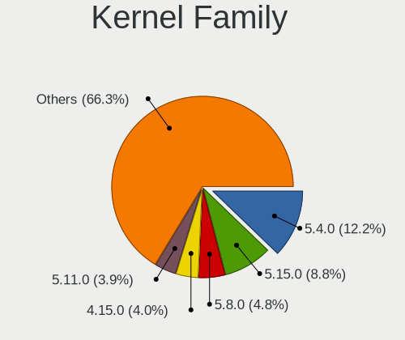
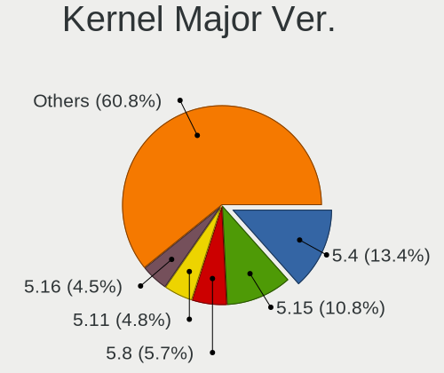
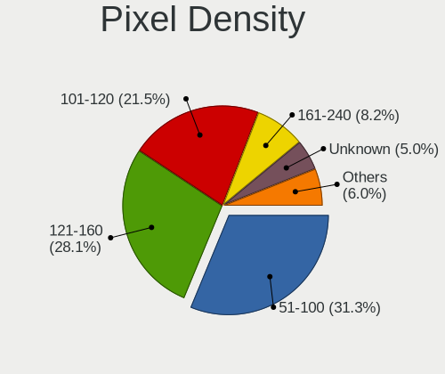
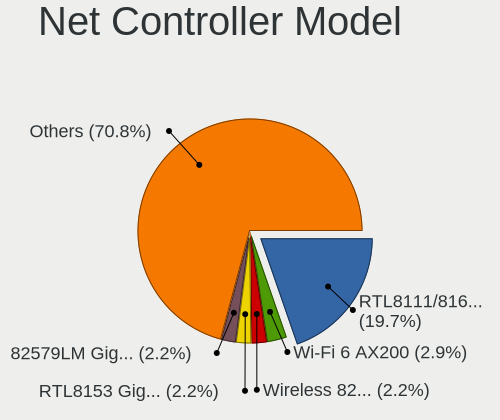
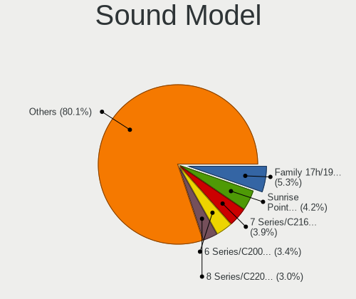
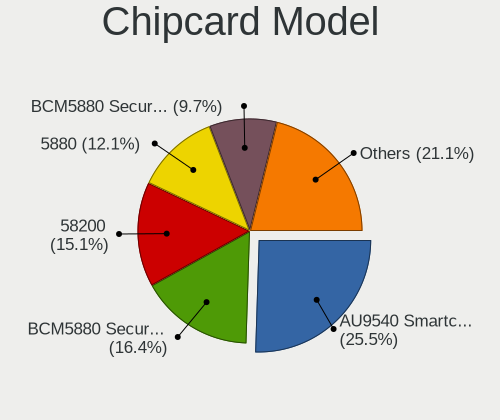

Linux in Netherlands - Tested Hardware & Statistics
---------------------------------------------------

A project to collect tested hardware configurations for Linux in Netherlands.

Anyone can contribute to this report by the [hw-probe](https://github.com/linuxhw/hw-probe) tool:

    sudo -E hw-probe -all -upload

Please contribute! Especially if your hardware is rare.

This is a report for all computer types. See also reports for [desktops](/Location/Netherlands/Desktop/README.md) and [notebooks](/Location/Netherlands/Notebook/README.md).

Contents
--------

* [ Test Cases ](#test-cases)

* [ System ](#system)
  - [ OS                       ](#os)
  - [ OS Family                ](#os-family)
  - [ Kernel                   ](#kernel)
  - [ Kernel Family            ](#kernel-family)
  - [ Kernel Major Ver.        ](#kernel-major-ver)
  - [ Arch                     ](#arch)
  - [ DE                       ](#de)
  - [ Display Server           ](#display-server)
  - [ Display Manager          ](#display-manager)
  - [ OS Lang                  ](#os-lang)
  - [ Boot Mode                ](#boot-mode)
  - [ Filesystem               ](#filesystem)
  - [ Part. scheme             ](#part-scheme)
  - [ Dual Boot with Linux/BSD ](#dual-boot-with-linuxbsd)
  - [ Dual Boot (Win)          ](#dual-boot-win)

* [ Board ](#board)
  - [ Vendor                   ](#vendor)
  - [ Model                    ](#model)
  - [ Model Family             ](#model-family)
  - [ MFG Year                 ](#mfg-year)
  - [ Form Factor              ](#form-factor)
  - [ Secure Boot              ](#secure-boot)
  - [ Coreboot                 ](#coreboot)
  - [ RAM Size                 ](#ram-size)
  - [ RAM Used                 ](#ram-used)
  - [ Total Drives             ](#total-drives)
  - [ Has CD-ROM               ](#has-cd-rom)
  - [ Has Ethernet             ](#has-ethernet)
  - [ Has WiFi                 ](#has-wifi)
  - [ Has Bluetooth            ](#has-bluetooth)

* [ Location ](#location)
  - [ Country                  ](#country)
  - [ City                     ](#city)

* [ Drives ](#drives)
  - [ Drive Vendor             ](#drive-vendor)
  - [ Drive Model              ](#drive-model)
  - [ HDD Vendor               ](#hdd-vendor)
  - [ SSD Vendor               ](#ssd-vendor)
  - [ Drive Kind               ](#drive-kind)
  - [ Drive Connector          ](#drive-connector)
  - [ Drive Size               ](#drive-size)
  - [ Space Total              ](#space-total)
  - [ Space Used               ](#space-used)
  - [ Malfunc. Drives          ](#malfunc-drives)
  - [ Malfunc. Drive Vendor    ](#malfunc-drive-vendor)
  - [ Malfunc. HDD Vendor      ](#malfunc-hdd-vendor)
  - [ Malfunc. Drive Kind      ](#malfunc-drive-kind)
  - [ Failed Drives            ](#failed-drives)
  - [ Failed Drive Vendor      ](#failed-drive-vendor)
  - [ Drive Status             ](#drive-status)

* [ Storage controller ](#storage-controller)
  - [ Storage Vendor           ](#storage-vendor)
  - [ Storage Model            ](#storage-model)
  - [ Storage Kind             ](#storage-kind)

* [ Processor ](#processor)
  - [ CPU Vendor               ](#cpu-vendor)
  - [ CPU Model                ](#cpu-model)
  - [ CPU Model Family         ](#cpu-model-family)
  - [ CPU Cores                ](#cpu-cores)
  - [ CPU Sockets              ](#cpu-sockets)
  - [ CPU Threads              ](#cpu-threads)
  - [ CPU Op-Modes             ](#cpu-op-modes)
  - [ CPU Microcode            ](#cpu-microcode)
  - [ CPU Microarch            ](#cpu-microarch)

* [ Graphics ](#graphics)
  - [ GPU Vendor               ](#gpu-vendor)
  - [ GPU Model                ](#gpu-model)
  - [ GPU Combo                ](#gpu-combo)
  - [ GPU Driver               ](#gpu-driver)
  - [ GPU Memory               ](#gpu-memory)

* [ Monitor ](#monitor)
  - [ Monitor Vendor           ](#monitor-vendor)
  - [ Monitor Model            ](#monitor-model)
  - [ Monitor Resolution       ](#monitor-resolution)
  - [ Monitor Diagonal         ](#monitor-diagonal)
  - [ Monitor Width            ](#monitor-width)
  - [ Aspect Ratio             ](#aspect-ratio)
  - [ Monitor Area             ](#monitor-area)
  - [ Pixel Density            ](#pixel-density)
  - [ Multiple Monitors        ](#multiple-monitors)

* [ Network ](#network)
  - [ Net Controller Vendor    ](#net-controller-vendor)
  - [ Net Controller Model     ](#net-controller-model)
  - [ Wireless Vendor          ](#wireless-vendor)
  - [ Wireless Model           ](#wireless-model)
  - [ Ethernet Vendor          ](#ethernet-vendor)
  - [ Ethernet Model           ](#ethernet-model)
  - [ Net Controller Kind      ](#net-controller-kind)
  - [ Used Controller          ](#used-controller)
  - [ NICs                     ](#nics)
  - [ IPv6                     ](#ipv6)

* [ Bluetooth ](#bluetooth)
  - [ Bluetooth Vendor         ](#bluetooth-vendor)
  - [ Bluetooth Model          ](#bluetooth-model)

* [ Sound ](#sound)
  - [ Sound Vendor             ](#sound-vendor)
  - [ Sound Model              ](#sound-model)

* [ Memory ](#memory)
  - [ Memory Vendor            ](#memory-vendor)
  - [ Memory Model             ](#memory-model)
  - [ Memory Kind              ](#memory-kind)
  - [ Memory Form Factor       ](#memory-form-factor)
  - [ Memory Size              ](#memory-size)
  - [ Memory Speed             ](#memory-speed)

* [ Printers & scanners ](#printers--scanners)
  - [ Printer Vendor           ](#printer-vendor)
  - [ Printer Model            ](#printer-model)
  - [ Scanner Vendor           ](#scanner-vendor)
  - [ Scanner Model            ](#scanner-model)

* [ Camera ](#camera)
  - [ Camera Vendor            ](#camera-vendor)
  - [ Camera Model             ](#camera-model)

* [ Security ](#security)
  - [ Fingerprint Vendor       ](#fingerprint-vendor)
  - [ Fingerprint Model        ](#fingerprint-model)
  - [ Chipcard Vendor          ](#chipcard-vendor)
  - [ Chipcard Model           ](#chipcard-model)

* [ Unsupported ](#unsupported)
  - [ Unsupported Devices      ](#unsupported-devices)
  - [ Unsupported Device Types ](#unsupported-device-types)

Test Cases
----------

Total: 4959

| Vendor        | Model                       | Form-Factor | Probe                                                      | Date         |
|---------------|-----------------------------|-------------|------------------------------------------------------------|--------------|
| Gigabyte      | AB350-Gaming 3-CF           | Desktop     | [500ce7ae28](https://linux-hardware.org/?probe=500ce7ae28) | Dec 31, 2022 |
| Notebook      | PB50_70RF,RD,RC             | Notebook    | [d1f655b9b1](https://linux-hardware.org/?probe=d1f655b9b1) | Dec 31, 2022 |
| ASUSTek       | VivoBook_ASUSLaptop TP14... | Convertible | [195eb3e6eb](https://linux-hardware.org/?probe=195eb3e6eb) | Dec 31, 2022 |
| HP            | Pavilion 17                 | Notebook    | [c87d61d0cd](https://linux-hardware.org/?probe=c87d61d0cd) | Dec 31, 2022 |
| HP            | Pavilion 17                 | Notebook    | [bbf52af119](https://linux-hardware.org/?probe=bbf52af119) | Dec 31, 2022 |
| Lenovo        | IdeaPad 320-15ISK 80XH      | Notebook    | [fc108fb0d8](https://linux-hardware.org/?probe=fc108fb0d8) | Dec 31, 2022 |
| HP            | EliteBook 820 G4            | Notebook    | [9e794046d8](https://linux-hardware.org/?probe=9e794046d8) | Dec 30, 2022 |
| Acer          | Aspire 5680                 | Notebook    | [c14cfe5386](https://linux-hardware.org/?probe=c14cfe5386) | Dec 29, 2022 |
| Acer          | Aspire V3-772               | Notebook    | [9f431b484a](https://linux-hardware.org/?probe=9f431b484a) | Dec 29, 2022 |
| Pine Micro... | Pine64 PinePhone (1.2)      | Phone       | [b8cb61c70a](https://linux-hardware.org/?probe=b8cb61c70a) | Dec 29, 2022 |
| ASRock        | Z790 PG Riptide             | Desktop     | [19c8814aba](https://linux-hardware.org/?probe=19c8814aba) | Dec 29, 2022 |
| Alienware     | x17 R2                      | Notebook    | [5a7ea2683a](https://linux-hardware.org/?probe=5a7ea2683a) | Dec 28, 2022 |
| Gigabyte      | GB-BRR3H-4300               | Desktop     | [241d631981](https://linux-hardware.org/?probe=241d631981) | Dec 28, 2022 |
| Dell          | Latitude 2120               | Notebook    | [b52922b482](https://linux-hardware.org/?probe=b52922b482) | Dec 27, 2022 |
| Valve         | Jupiter                     | Notebook    | [488d26f3e8](https://linux-hardware.org/?probe=488d26f3e8) | Dec 27, 2022 |
| HP            | Pavilion Gaming Laptop 1... | Notebook    | [0763603d12](https://linux-hardware.org/?probe=0763603d12) | Dec 27, 2022 |
| LG Electro... | 17Z90Q-G.AA79G              | Notebook    | [59d7266746](https://linux-hardware.org/?probe=59d7266746) | Dec 26, 2022 |
| Gigabyte      | GB-BRR7H-4700               | Desktop     | [43c2d92e5f](https://linux-hardware.org/?probe=43c2d92e5f) | Dec 26, 2022 |
| Apple         | MacBookPro8,2               | Notebook    | [3d8320e362](https://linux-hardware.org/?probe=3d8320e362) | Dec 25, 2022 |
| ASUSTek       | ROG STRIX X670E-E GAMING... | Desktop     | [5d95c28ac6](https://linux-hardware.org/?probe=5d95c28ac6) | Dec 25, 2022 |
| ASUSTek       | ROG STRIX X670E-E GAMING... | Desktop     | [a98ca87f6a](https://linux-hardware.org/?probe=a98ca87f6a) | Dec 25, 2022 |
| ASUSTek       | ROG STRIX X670E-E GAMING... | Desktop     | [00af244895](https://linux-hardware.org/?probe=00af244895) | Dec 25, 2022 |
| Gigabyte      | B550 AORUS ELITE AX V2      | Desktop     | [5047d29893](https://linux-hardware.org/?probe=5047d29893) | Dec 24, 2022 |
| Dell          | 0M863N A00                  | Desktop     | [ce9fc7a224](https://linux-hardware.org/?probe=ce9fc7a224) | Dec 24, 2022 |
| Medion        | E4251 MD61435               | Notebook    | [0ef8f76193](https://linux-hardware.org/?probe=0ef8f76193) | Dec 23, 2022 |
| Lenovo        | ThinkPad T16 Gen 1 21CHC... | Notebook    | [0c1d9b9b28](https://linux-hardware.org/?probe=0c1d9b9b28) | Dec 23, 2022 |
| Lenovo        | ThinkPad T16 Gen 1 21CHC... | Notebook    | [000660b461](https://linux-hardware.org/?probe=000660b461) | Dec 23, 2022 |
| Toshiba       | Satellite C70D-B            | Notebook    | [82cc0b362d](https://linux-hardware.org/?probe=82cc0b362d) | Dec 23, 2022 |
| Intel         | X99                         | Desktop     | [191fefa053](https://linux-hardware.org/?probe=191fefa053) | Dec 23, 2022 |
| HP            | ENVY x360 Convertible 15... | Convertible | [313bf04928](https://linux-hardware.org/?probe=313bf04928) | Dec 22, 2022 |
| Lenovo        | IdeaPad 3 14IAU7 82RJ       | Notebook    | [b5c5aba33a](https://linux-hardware.org/?probe=b5c5aba33a) | Dec 22, 2022 |
| Lenovo        | ThinkPad T470s 20HF003QU... | Notebook    | [5145350f9a](https://linux-hardware.org/?probe=5145350f9a) | Dec 21, 2022 |
| Acer          | Aspire 5680                 | Notebook    | [9b188c358e](https://linux-hardware.org/?probe=9b188c358e) | Dec 21, 2022 |
| ASUSTek       | B85-PRO GAMER               | Desktop     | [6a6ba7eba1](https://linux-hardware.org/?probe=6a6ba7eba1) | Dec 21, 2022 |
| Valve         | Jupiter                     | Notebook    | [90331ea7da](https://linux-hardware.org/?probe=90331ea7da) | Dec 21, 2022 |
| Dell          | Latitude 5521               | Notebook    | [6fcbfd9271](https://linux-hardware.org/?probe=6fcbfd9271) | Dec 21, 2022 |
| Lenovo        | ThinkPad T16 Gen 1 21CHC... | Notebook    | [638667a90f](https://linux-hardware.org/?probe=638667a90f) | Dec 20, 2022 |
| ASUSTek       | P8H61-M LX3 PLUS R2.0       | Desktop     | [82687103ac](https://linux-hardware.org/?probe=82687103ac) | Dec 20, 2022 |
| ASUSTek       | P8H61-M LX3 PLUS R2.0       | Desktop     | [7f18d05353](https://linux-hardware.org/?probe=7f18d05353) | Dec 20, 2022 |
| HP            | 3048h                       | Desktop     | [4535cf0f5a](https://linux-hardware.org/?probe=4535cf0f5a) | Dec 20, 2022 |
| HP            | 3048h                       | Desktop     | [1d795fdd33](https://linux-hardware.org/?probe=1d795fdd33) | Dec 19, 2022 |
| Lenovo        | ThinkPad T490 20N2CTO1WW    | Notebook    | [2aeb8fd0cd](https://linux-hardware.org/?probe=2aeb8fd0cd) | Dec 19, 2022 |
| Fujitsu       | D3041-A1 S26361-D3041-A1    | Desktop     | [2fa8510855](https://linux-hardware.org/?probe=2fa8510855) | Dec 19, 2022 |
| ASUSTek       | N750JK                      | Notebook    | [8d876c21b0](https://linux-hardware.org/?probe=8d876c21b0) | Dec 18, 2022 |
| ASUSTek       | N750JK                      | Notebook    | [71575f3d8c](https://linux-hardware.org/?probe=71575f3d8c) | Dec 18, 2022 |
| HP            | ProLiant ML350 G6           | Desktop     | [3b242628e4](https://linux-hardware.org/?probe=3b242628e4) | Dec 18, 2022 |
| ASUSTek       | M5A97 R2.0                  | Desktop     | [06f90011b2](https://linux-hardware.org/?probe=06f90011b2) | Dec 18, 2022 |
| Acer          | Aspire 5680                 | Notebook    | [64f5eb2f4b](https://linux-hardware.org/?probe=64f5eb2f4b) | Dec 17, 2022 |
| ASUSTek       | K50IE                       | Notebook    | [5681babfa5](https://linux-hardware.org/?probe=5681babfa5) | Dec 17, 2022 |
| ASUSTek       | P8H61-M LX2                 | Desktop     | [db147cf534](https://linux-hardware.org/?probe=db147cf534) | Dec 17, 2022 |
| ASUSTek       | P8H61-M LX2                 | Desktop     | [fa2cc2d975](https://linux-hardware.org/?probe=fa2cc2d975) | Dec 17, 2022 |
| Acer          | Aspire XC-1660 V:1.1        | Desktop     | [88aa1f841a](https://linux-hardware.org/?probe=88aa1f841a) | Dec 17, 2022 |
| Lenovo        | ThinkPad X230 Tablet 343... | Notebook    | [30f6db8749](https://linux-hardware.org/?probe=30f6db8749) | Dec 17, 2022 |
| Acer          | Aspire E5-575               | Notebook    | [3fd939cef5](https://linux-hardware.org/?probe=3fd939cef5) | Dec 17, 2022 |
| Toshiba       | Satellite C70D-B            | Notebook    | [182e467ce6](https://linux-hardware.org/?probe=182e467ce6) | Dec 17, 2022 |
| Lenovo        | G50-70 20351                | Notebook    | [4d39c63e0a](https://linux-hardware.org/?probe=4d39c63e0a) | Dec 17, 2022 |
| Dell          | XPS 15 7590                 | Notebook    | [e070540587](https://linux-hardware.org/?probe=e070540587) | Dec 16, 2022 |
| ASUSTek       | X99-WS/IPMI                 | Desktop     | [41f02987e9](https://linux-hardware.org/?probe=41f02987e9) | Dec 16, 2022 |
| Gigabyte      | B550M DS3H                  | Desktop     | [7b3f9b5af0](https://linux-hardware.org/?probe=7b3f9b5af0) | Dec 16, 2022 |
| Dell          | Latitude 3120               | Notebook    | [e886df2722](https://linux-hardware.org/?probe=e886df2722) | Dec 16, 2022 |
| Acer          | Nitro AN517-54              | Notebook    | [cb963df304](https://linux-hardware.org/?probe=cb963df304) | Dec 16, 2022 |
| MSI           | GP75 Leopard 10SEK          | Notebook    | [9eda9896f3](https://linux-hardware.org/?probe=9eda9896f3) | Dec 15, 2022 |
| ASUSTek       | PRIME H370-A                | Desktop     | [eeb913fa7c](https://linux-hardware.org/?probe=eeb913fa7c) | Dec 15, 2022 |
| ASUSTek       | PRIME H370-A                | Desktop     | [7a72cfa484](https://linux-hardware.org/?probe=7a72cfa484) | Dec 15, 2022 |
| ASUSTek       | M5A97 R2.0                  | Desktop     | [bc8782be9a](https://linux-hardware.org/?probe=bc8782be9a) | Dec 15, 2022 |
| ASUSTek       | M5A97 R2.0                  | Desktop     | [d320b71c77](https://linux-hardware.org/?probe=d320b71c77) | Dec 15, 2022 |
| HP            | 3048h                       | Desktop     | [63f57e3458](https://linux-hardware.org/?probe=63f57e3458) | Dec 15, 2022 |
| ASUSTek       | TUF Gaming B650-PLUS WIF... | Desktop     | [72175490ae](https://linux-hardware.org/?probe=72175490ae) | Dec 15, 2022 |
| Gigabyte      | B550 AORUS ELITE AX V2      | Desktop     | [35ef32b165](https://linux-hardware.org/?probe=35ef32b165) | Dec 14, 2022 |
| ASRock        | A320M-HDV R4.0              | Desktop     | [b90d5cfed0](https://linux-hardware.org/?probe=b90d5cfed0) | Dec 14, 2022 |
| Lenovo        | ThinkPad T16 Gen 1 21CHC... | Notebook    | [de26ffa293](https://linux-hardware.org/?probe=de26ffa293) | Dec 14, 2022 |
| Microsoft     | Surface Pro 4               | Tablet      | [dd65da9c9b](https://linux-hardware.org/?probe=dd65da9c9b) | Dec 14, 2022 |
| Dell          | Inspiron 15-3567            | Notebook    | [e94792b948](https://linux-hardware.org/?probe=e94792b948) | Dec 13, 2022 |
| Gigabyte      | P35-DS4                     | Desktop     | [3f787740f8](https://linux-hardware.org/?probe=3f787740f8) | Dec 12, 2022 |
| Acer          | Aspire 5742G                | Notebook    | [ee22896cd2](https://linux-hardware.org/?probe=ee22896cd2) | Dec 12, 2022 |
| Intel         | NUC6CAYB J23203-410         | Mini pc     | [e9c5ef16cd](https://linux-hardware.org/?probe=e9c5ef16cd) | Dec 12, 2022 |
| MSI           | Summit E16Flip A12UCT       | Notebook    | [1db3976bb5](https://linux-hardware.org/?probe=1db3976bb5) | Dec 12, 2022 |
| HP            | 339A                        | Desktop     | [63c184fafd](https://linux-hardware.org/?probe=63c184fafd) | Dec 12, 2022 |
| Dell          | Inspiron 7306 2n1           | Convertible | [f1aa6058e3](https://linux-hardware.org/?probe=f1aa6058e3) | Dec 12, 2022 |
| Toshiba       | Satellite C70D-B            | Notebook    | [56adac1fcb](https://linux-hardware.org/?probe=56adac1fcb) | Dec 12, 2022 |
| ASUSTek       | PRIME B450M-A               | Desktop     | [2c52e941ea](https://linux-hardware.org/?probe=2c52e941ea) | Dec 11, 2022 |
| Medion        | E4251                       | Notebook    | [f7303bf4c9](https://linux-hardware.org/?probe=f7303bf4c9) | Dec 11, 2022 |
| Lenovo        | ThinkPad X201 Tablet 309... | Notebook    | [cd7399049b](https://linux-hardware.org/?probe=cd7399049b) | Dec 11, 2022 |
| Supermicro    | C7SIM-Q                     | Desktop     | [76cf2b62db](https://linux-hardware.org/?probe=76cf2b62db) | Dec 11, 2022 |
| Medion        | E4251                       | Notebook    | [a16b01515b](https://linux-hardware.org/?probe=a16b01515b) | Dec 10, 2022 |
| HP            | 3048h                       | Desktop     | [c2fd939c1f](https://linux-hardware.org/?probe=c2fd939c1f) | Dec 10, 2022 |
| Lenovo        | IdeaPad 5 15ARE05 81YQ      | Notebook    | [173f4b722f](https://linux-hardware.org/?probe=173f4b722f) | Dec 10, 2022 |
| Lenovo        | ThinkPad P14s Gen 2a 21A... | Notebook    | [25d5b5623b](https://linux-hardware.org/?probe=25d5b5623b) | Dec 10, 2022 |
| Acer          | Aspire 5742G                | Notebook    | [869e2a9671](https://linux-hardware.org/?probe=869e2a9671) | Dec 09, 2022 |
| HP            | Compaq Presario CQ71        | Notebook    | [503b61f120](https://linux-hardware.org/?probe=503b61f120) | Dec 09, 2022 |
| HP            | EliteBook 850 G8 Noteboo... | Notebook    | [95d47d14cb](https://linux-hardware.org/?probe=95d47d14cb) | Dec 09, 2022 |
| MSI           | Modern 15 A11MU             | Notebook    | [e5ba0c8749](https://linux-hardware.org/?probe=e5ba0c8749) | Dec 09, 2022 |
| Intel         | NUC8i7HVB J68196-504        | Mini pc     | [1a4bdc4874](https://linux-hardware.org/?probe=1a4bdc4874) | Dec 07, 2022 |
| MSI           | B450 GAMING PRO CARBON A... | Desktop     | [61a9d5f84c](https://linux-hardware.org/?probe=61a9d5f84c) | Dec 07, 2022 |
| ASUSTek       | ProArt Z690-CREATOR WIFI    | Desktop     | [611fd80398](https://linux-hardware.org/?probe=611fd80398) | Dec 07, 2022 |
| Apple         | MacBookPro9,2               | Notebook    | [27dc9420ed](https://linux-hardware.org/?probe=27dc9420ed) | Dec 07, 2022 |
| Apple         | MacBookPro9,2               | Notebook    | [9b7c1953a6](https://linux-hardware.org/?probe=9b7c1953a6) | Dec 07, 2022 |
| ASUSTek       | PRIME A320M-K               | Desktop     | [ce802653d4](https://linux-hardware.org/?probe=ce802653d4) | Dec 07, 2022 |
| Lenovo        | ThinkPad T510 4349AF5       | Notebook    | [a7d8d66fb7](https://linux-hardware.org/?probe=a7d8d66fb7) | Dec 07, 2022 |
| Dell          | XPS 9320                    | Notebook    | [34c3b0b6a0](https://linux-hardware.org/?probe=34c3b0b6a0) | Dec 06, 2022 |
| Medion        | E4251                       | Notebook    | [a515c5c071](https://linux-hardware.org/?probe=a515c5c071) | Dec 05, 2022 |
| Acer          | Aspire 5742G                | Notebook    | [da82fb083d](https://linux-hardware.org/?probe=da82fb083d) | Dec 05, 2022 |
| Samsung       | 300E4A/300E5A/300E7A/343... | Notebook    | [1798adf382](https://linux-hardware.org/?probe=1798adf382) | Dec 05, 2022 |
| ASUSTek       | X756UQK                     | Notebook    | [b473216b84](https://linux-hardware.org/?probe=b473216b84) | Dec 05, 2022 |
| Lenovo        | ThinkPad E15 Gen 2 20TD0... | Notebook    | [05f6a48b4a](https://linux-hardware.org/?probe=05f6a48b4a) | Dec 05, 2022 |
| Lenovo        | IdeaPad Gaming 3 15ACH6 ... | Notebook    | [c22a748043](https://linux-hardware.org/?probe=c22a748043) | Dec 05, 2022 |
| Apple         | Mac-942B5BF58194151B        | All in one  | [86e9e1e21e](https://linux-hardware.org/?probe=86e9e1e21e) | Dec 05, 2022 |
| Acer          | Aspire V3-772               | Notebook    | [942312fe9e](https://linux-hardware.org/?probe=942312fe9e) | Dec 05, 2022 |
| Lenovo        | ThinkBook 15 G2 ITL 20VE    | Notebook    | [344b0c3082](https://linux-hardware.org/?probe=344b0c3082) | Dec 05, 2022 |
| Medion        | E4251 MD61435               | Notebook    | [481a9c958a](https://linux-hardware.org/?probe=481a9c958a) | Dec 04, 2022 |
| ASRock        | X300-ITX                    | Desktop     | [77d8c41481](https://linux-hardware.org/?probe=77d8c41481) | Dec 04, 2022 |
| Intel         | Unknown                     | Desktop     | [d00187a52a](https://linux-hardware.org/?probe=d00187a52a) | Dec 04, 2022 |
| Acer          | Aspire ES1-732              | Notebook    | [7000f5ee26](https://linux-hardware.org/?probe=7000f5ee26) | Dec 04, 2022 |
| ASUSTek       | TUF B450M-PLUS GAMING       | Desktop     | [101ea9ca8e](https://linux-hardware.org/?probe=101ea9ca8e) | Dec 04, 2022 |
| Valve         | Jupiter                     | Notebook    | [d8890572a5](https://linux-hardware.org/?probe=d8890572a5) | Dec 03, 2022 |
| HP            | Pavilion Laptop 15-cw1xx... | Notebook    | [2cf560b162](https://linux-hardware.org/?probe=2cf560b162) | Dec 03, 2022 |
| Medion        | E4251 MD61435               | Notebook    | [c3f4fd226e](https://linux-hardware.org/?probe=c3f4fd226e) | Dec 03, 2022 |
| Medion        | E4251                       | Notebook    | [3167cbece1](https://linux-hardware.org/?probe=3167cbece1) | Dec 03, 2022 |
| ASRock        | Z87 Extreme4                | Desktop     | [422dde5ae5](https://linux-hardware.org/?probe=422dde5ae5) | Dec 03, 2022 |
| Raspberry ... | Raspberry Pi 4 Model B R... | Soc         | [c300b0a438](https://linux-hardware.org/?probe=c300b0a438) | Dec 03, 2022 |
| HP            | EliteBook 820 G4            | Notebook    | [b0437249b0](https://linux-hardware.org/?probe=b0437249b0) | Dec 03, 2022 |
| Dell          | 0GY6Y8 A01                  | Desktop     | [f86e02dee0](https://linux-hardware.org/?probe=f86e02dee0) | Dec 03, 2022 |
| Packard Be... | EasyNote TE11HC             | Notebook    | [5864876eff](https://linux-hardware.org/?probe=5864876eff) | Dec 02, 2022 |
| Acer          | Iconia W4-820               | Notebook    | [cf25eeba85](https://linux-hardware.org/?probe=cf25eeba85) | Dec 01, 2022 |
| MSI           | GL62M 7RE                   | Notebook    | [5fcb394edb](https://linux-hardware.org/?probe=5fcb394edb) | Dec 01, 2022 |
| MSI           | MEG X570 UNIFY              | Desktop     | [df74bf8e13](https://linux-hardware.org/?probe=df74bf8e13) | Dec 01, 2022 |
| ASUSTek       | H97-PLUS                    | Desktop     | [e8d75cbeed](https://linux-hardware.org/?probe=e8d75cbeed) | Dec 01, 2022 |
| ASUSTek       | P7H55-M                     | Desktop     | [b461d54421](https://linux-hardware.org/?probe=b461d54421) | Dec 01, 2022 |
| Lenovo        | ThinkPad L560 20F2S2UR02    | Notebook    | [29c5e0f7b1](https://linux-hardware.org/?probe=29c5e0f7b1) | Dec 01, 2022 |
| THUNDEROBO... | 911MT                       | Notebook    | [cdd03a3498](https://linux-hardware.org/?probe=cdd03a3498) | Dec 01, 2022 |
| Lenovo        | 3000 V100 076346G           | Notebook    | [bb04272723](https://linux-hardware.org/?probe=bb04272723) | Dec 01, 2022 |
| THUNDEROBO... | 911MT                       | Notebook    | [2731961e4c](https://linux-hardware.org/?probe=2731961e4c) | Nov 30, 2022 |
| Gigabyte      | GB-BRR7H-4700               | Desktop     | [8398d00a16](https://linux-hardware.org/?probe=8398d00a16) | Nov 30, 2022 |
| AMI           | Aptio CRB                   | Mini pc     | [d7025eb475](https://linux-hardware.org/?probe=d7025eb475) | Nov 30, 2022 |
| ASUSTek       | P7H55-M                     | Desktop     | [729bb4ef87](https://linux-hardware.org/?probe=729bb4ef87) | Nov 30, 2022 |
| Lenovo        | Yoga 530-14IKB 81EK         | Convertible | [e214cb1bb9](https://linux-hardware.org/?probe=e214cb1bb9) | Nov 30, 2022 |
| ASUSTek       | SABERTOOTH Z97 MARK S       | Desktop     | [2c5c1d6071](https://linux-hardware.org/?probe=2c5c1d6071) | Nov 30, 2022 |
| HP            | Victus by Laptop 16-d0xx... | Notebook    | [dae405ee81](https://linux-hardware.org/?probe=dae405ee81) | Nov 29, 2022 |
| Lenovo        | ThinkPad L14 Gen 1 20U50... | Notebook    | [9216162e85](https://linux-hardware.org/?probe=9216162e85) | Nov 29, 2022 |
| Lenovo        | IdeaPad 5 Pro 16ACH6 82L... | Notebook    | [39e771bd92](https://linux-hardware.org/?probe=39e771bd92) | Nov 28, 2022 |
| Lenovo        | ThinkPad T420 4236WR1       | Notebook    | [43fa54b5bc](https://linux-hardware.org/?probe=43fa54b5bc) | Nov 28, 2022 |
| ASRock        | B450M Pro4                  | Desktop     | [219a616346](https://linux-hardware.org/?probe=219a616346) | Nov 28, 2022 |
| Dell          | Latitude E6320              | Notebook    | [bcbdb4bf67](https://linux-hardware.org/?probe=bcbdb4bf67) | Nov 28, 2022 |
| Dell          | Latitude E6320              | Notebook    | [f77e444066](https://linux-hardware.org/?probe=f77e444066) | Nov 28, 2022 |
| HUAWEI        | BOHK-WAX9X                  | Notebook    | [4c6d3faf86](https://linux-hardware.org/?probe=4c6d3faf86) | Nov 28, 2022 |
| HUAWEI        | BOHK-WAX9X                  | Notebook    | [cd98ebccb9](https://linux-hardware.org/?probe=cd98ebccb9) | Nov 28, 2022 |
| Microsoft     | Surface Book 2              | Tablet      | [c4bbe90221](https://linux-hardware.org/?probe=c4bbe90221) | Nov 28, 2022 |
| Valve         | Jupiter                     | Notebook    | [81b0ea6c7a](https://linux-hardware.org/?probe=81b0ea6c7a) | Nov 27, 2022 |
| HP            | ProBook 5330m               | Notebook    | [3763f505a0](https://linux-hardware.org/?probe=3763f505a0) | Nov 27, 2022 |
| Valve         | Jupiter                     | Notebook    | [bee2852cb0](https://linux-hardware.org/?probe=bee2852cb0) | Nov 27, 2022 |
| HP            | EliteBook 830 G5            | Notebook    | [bda395e731](https://linux-hardware.org/?probe=bda395e731) | Nov 26, 2022 |
| HP            | EliteBook 830 G5            | Notebook    | [0138561b29](https://linux-hardware.org/?probe=0138561b29) | Nov 26, 2022 |
| MSI           | B450 TOMAHAWK MAX           | Desktop     | [521f5c20a9](https://linux-hardware.org/?probe=521f5c20a9) | Nov 26, 2022 |
| ASUSTek       | A6R                         | Notebook    | [68f38deab1](https://linux-hardware.org/?probe=68f38deab1) | Nov 26, 2022 |
| HP            | ProBook 450 G5              | Notebook    | [9a8373739a](https://linux-hardware.org/?probe=9a8373739a) | Nov 26, 2022 |
| Lenovo        | ThinkPad T16 Gen 1 21CHC... | Notebook    | [8de1db7f12](https://linux-hardware.org/?probe=8de1db7f12) | Nov 25, 2022 |
| Dell          | Latitude 3120               | Convertible | [bb40e36093](https://linux-hardware.org/?probe=bb40e36093) | Nov 24, 2022 |
| MSI           | B560M-A PRO                 | Desktop     | [e2a8d64086](https://linux-hardware.org/?probe=e2a8d64086) | Nov 24, 2022 |
| Lenovo        | Yoga Slim 7 Pro 14IAH7 8... | Notebook    | [fa4e2d1d61](https://linux-hardware.org/?probe=fa4e2d1d61) | Nov 23, 2022 |
| Schenker      | XMG FUSION 15 (XFU15L19)    | Notebook    | [eaab6a8319](https://linux-hardware.org/?probe=eaab6a8319) | Nov 23, 2022 |
| Valve         | Jupiter                     | Notebook    | [6049221fab](https://linux-hardware.org/?probe=6049221fab) | Nov 23, 2022 |
| ASUSTek       | X551MA                      | Notebook    | [4adc436e33](https://linux-hardware.org/?probe=4adc436e33) | Nov 23, 2022 |
| ASUSTek       | X551MA                      | Notebook    | [84a0005ad3](https://linux-hardware.org/?probe=84a0005ad3) | Nov 23, 2022 |
| Lenovo        | ThinkPad X1 Carbon 2nd 2... | Notebook    | [c799c028af](https://linux-hardware.org/?probe=c799c028af) | Nov 23, 2022 |
| HP            | 3397                        | Desktop     | [eb8968148c](https://linux-hardware.org/?probe=eb8968148c) | Nov 23, 2022 |
| Gigabyte      | A320M-S2H-CF                | Desktop     | [5d3424245f](https://linux-hardware.org/?probe=5d3424245f) | Nov 22, 2022 |
| Dell          | Latitude 5401               | Notebook    | [f964652e0c](https://linux-hardware.org/?probe=f964652e0c) | Nov 22, 2022 |
| Dell          | Latitude E6530              | Notebook    | [e40986d2fb](https://linux-hardware.org/?probe=e40986d2fb) | Nov 22, 2022 |
| Dell          | Latitude E6530              | Notebook    | [14debbe3e5](https://linux-hardware.org/?probe=14debbe3e5) | Nov 22, 2022 |
| Acer          | Aspire A715-74G             | Notebook    | [7e8b56ff73](https://linux-hardware.org/?probe=7e8b56ff73) | Nov 21, 2022 |
| Dell          | 0F3KHR A00                  | Desktop     | [72406b1647](https://linux-hardware.org/?probe=72406b1647) | Nov 21, 2022 |
| ASUSTek       | E200HA                      | Notebook    | [635e9fe863](https://linux-hardware.org/?probe=635e9fe863) | Nov 21, 2022 |
| Dell          | XPS 15 9510                 | Notebook    | [09e98d8c02](https://linux-hardware.org/?probe=09e98d8c02) | Nov 21, 2022 |
| Apple         | MacBookPro11,5              | Notebook    | [e80e97466d](https://linux-hardware.org/?probe=e80e97466d) | Nov 21, 2022 |
| Apple         | MacBookPro11,5              | Notebook    | [12799c9216](https://linux-hardware.org/?probe=12799c9216) | Nov 21, 2022 |
| Valve         | Jupiter                     | Notebook    | [1e7b9730a4](https://linux-hardware.org/?probe=1e7b9730a4) | Nov 21, 2022 |
| HP            | Unknown                     | Notebook    | [4530507592](https://linux-hardware.org/?probe=4530507592) | Nov 20, 2022 |
| HP            | Compaq Presario CQ71        | Notebook    | [52c86bac3f](https://linux-hardware.org/?probe=52c86bac3f) | Nov 20, 2022 |
| Apple         | MacBookPro11,2              | Notebook    | [03447c1967](https://linux-hardware.org/?probe=03447c1967) | Nov 20, 2022 |
| Acer          | Aspire 5742G                | Notebook    | [9c9af5a79e](https://linux-hardware.org/?probe=9c9af5a79e) | Nov 20, 2022 |
| Lenovo        | Yoga 530-14ARR 81H9         | Convertible | [acb3ae70b9](https://linux-hardware.org/?probe=acb3ae70b9) | Nov 20, 2022 |
| Unknown       | X99H                        | Desktop     | [1c931e307d](https://linux-hardware.org/?probe=1c931e307d) | Nov 20, 2022 |
| Unknown       | X99H                        | Desktop     | [06c69ccbcb](https://linux-hardware.org/?probe=06c69ccbcb) | Nov 20, 2022 |
| ASRock        | B550M Pro4                  | Desktop     | [7d1d0390ba](https://linux-hardware.org/?probe=7d1d0390ba) | Nov 20, 2022 |
| Apple         | MacBookPro11,5              | Notebook    | [3b5c35b319](https://linux-hardware.org/?probe=3b5c35b319) | Nov 19, 2022 |
| Lenovo        | Yoga 520-14IKB 80X8         | Convertible | [39a6819014](https://linux-hardware.org/?probe=39a6819014) | Nov 19, 2022 |
| Lenovo        | Yoga 530-14ARR 81H9         | Convertible | [3e2911ed20](https://linux-hardware.org/?probe=3e2911ed20) | Nov 19, 2022 |
| ASUSTek       | V-P7H55E                    | Desktop     | [3b08108f59](https://linux-hardware.org/?probe=3b08108f59) | Nov 19, 2022 |
| Intel         | X99                         | Desktop     | [c95c1d173b](https://linux-hardware.org/?probe=c95c1d173b) | Nov 18, 2022 |
| HP            | Notebook                    | Notebook    | [ded915d6cd](https://linux-hardware.org/?probe=ded915d6cd) | Nov 18, 2022 |
| Lenovo        | Yoga 520-14IKB 80X8         | Convertible | [a09398bb26](https://linux-hardware.org/?probe=a09398bb26) | Nov 18, 2022 |
| Apple         | MacBookAir7,2               | Notebook    | [f0fa194e20](https://linux-hardware.org/?probe=f0fa194e20) | Nov 18, 2022 |
| Lenovo        | ThinkPad L560 20F2S2UR02    | Notebook    | [5170b27e5c](https://linux-hardware.org/?probe=5170b27e5c) | Nov 17, 2022 |
| Acer          | Aspire 7741                 | Notebook    | [4197d5fccf](https://linux-hardware.org/?probe=4197d5fccf) | Nov 17, 2022 |
| Lenovo        | 3716 SDK0R32862 WIN 3258... | Desktop     | [cd01bd7dad](https://linux-hardware.org/?probe=cd01bd7dad) | Nov 16, 2022 |
| Apple         | MacBookPro11,5              | Notebook    | [62586ed7f9](https://linux-hardware.org/?probe=62586ed7f9) | Nov 16, 2022 |
| HP            | EliteBook 8570w             | Notebook    | [d5a16ba775](https://linux-hardware.org/?probe=d5a16ba775) | Nov 16, 2022 |
| HP            | Pavilion dv9500             | Notebook    | [65a473401c](https://linux-hardware.org/?probe=65a473401c) | Nov 16, 2022 |
| Acer          | Aspire X3470                | Desktop     | [ccaec6d2cb](https://linux-hardware.org/?probe=ccaec6d2cb) | Nov 15, 2022 |
| Acer          | Aspire 5742G                | Notebook    | [4a80ba0608](https://linux-hardware.org/?probe=4a80ba0608) | Nov 15, 2022 |
| Intel         | NUC5i7RYB H73774-102        | Mini pc     | [6f1cef8a17](https://linux-hardware.org/?probe=6f1cef8a17) | Nov 15, 2022 |
| Schenker      | XMG FUSION 15 (XFU15L19)    | Notebook    | [d2cf28fbb9](https://linux-hardware.org/?probe=d2cf28fbb9) | Nov 15, 2022 |
| Lenovo        | IdeaPad 5 14ITL05 82FE      | Notebook    | [e9182b2177](https://linux-hardware.org/?probe=e9182b2177) | Nov 15, 2022 |
| Dell          | Latitude E6510              | Notebook    | [21a6415538](https://linux-hardware.org/?probe=21a6415538) | Nov 15, 2022 |
| Dell          | Latitude E6510              | Notebook    | [3ce2f9981f](https://linux-hardware.org/?probe=3ce2f9981f) | Nov 15, 2022 |
| Dell          | Latitude E7450              | Notebook    | [3020a4edfc](https://linux-hardware.org/?probe=3020a4edfc) | Nov 15, 2022 |
| ZOTAC         | ZBOX-CI320NANO series Re... | Mini pc     | [ab1c46c857](https://linux-hardware.org/?probe=ab1c46c857) | Nov 15, 2022 |
| ASUSTek       | PRIME B560M-A               | Desktop     | [db1488b844](https://linux-hardware.org/?probe=db1488b844) | Nov 15, 2022 |
| Apple         | Mac-031AEE4D24BFF0B1 Mac... | Mini pc     | [54afa1ee72](https://linux-hardware.org/?probe=54afa1ee72) | Nov 15, 2022 |
| ASUSTek       | PRIME B560M-A               | Desktop     | [35f0fc8a5a](https://linux-hardware.org/?probe=35f0fc8a5a) | Nov 15, 2022 |
| Lenovo        | Yoga Slim 7 Pro 14IAH7 8... | Notebook    | [1798f04a0b](https://linux-hardware.org/?probe=1798f04a0b) | Nov 14, 2022 |
| HP            | ENVY x360 2-in-1 Laptop ... | Convertible | [bcce834785](https://linux-hardware.org/?probe=bcce834785) | Nov 14, 2022 |
| HP            | ENVY x360 2-in-1 Laptop ... | Convertible | [26fad3df24](https://linux-hardware.org/?probe=26fad3df24) | Nov 14, 2022 |
| SLIMBOOK      | PROX14                      | Notebook    | [a109c5bf52](https://linux-hardware.org/?probe=a109c5bf52) | Nov 14, 2022 |
| Valve         | Jupiter                     | Notebook    | [92eb4009f3](https://linux-hardware.org/?probe=92eb4009f3) | Nov 14, 2022 |
| Dell          | XPS 15 9510                 | Notebook    | [85c469c069](https://linux-hardware.org/?probe=85c469c069) | Nov 13, 2022 |
| Dell          | XPS 15 9510                 | Notebook    | [dc86aa7d1e](https://linux-hardware.org/?probe=dc86aa7d1e) | Nov 13, 2022 |
| Acer          | Predator G3-710             | Desktop     | [4be3a9e016](https://linux-hardware.org/?probe=4be3a9e016) | Nov 13, 2022 |
| Dell          | Latitude 3380               | Notebook    | [f770a70f68](https://linux-hardware.org/?probe=f770a70f68) | Nov 12, 2022 |
| MSI           | MAG B550M MORTAR            | Desktop     | [b4f06e5e2f](https://linux-hardware.org/?probe=b4f06e5e2f) | Nov 12, 2022 |
| HP            | Compaq 6820s                | Notebook    | [c852376664](https://linux-hardware.org/?probe=c852376664) | Nov 12, 2022 |
| HP            | Compaq 6820s                | Notebook    | [dee9dbd56f](https://linux-hardware.org/?probe=dee9dbd56f) | Nov 12, 2022 |
| ASUSTek       | Q170M2                      | Desktop     | [c62954095d](https://linux-hardware.org/?probe=c62954095d) | Nov 11, 2022 |
| Apple         | Mac-031AEE4D24BFF0B1 Mac... | Mini pc     | [7e2577bf51](https://linux-hardware.org/?probe=7e2577bf51) | Nov 10, 2022 |
| Lenovo        | Yoga Slim 7 13ACN5 82CY     | Notebook    | [70d68c6ca1](https://linux-hardware.org/?probe=70d68c6ca1) | Nov 10, 2022 |
| Gigabyte      | B75M-D3H                    | Desktop     | [6dd51f8707](https://linux-hardware.org/?probe=6dd51f8707) | Nov 10, 2022 |
| ASUSTek       | N752VX                      | Notebook    | [a5b6d827b2](https://linux-hardware.org/?probe=a5b6d827b2) | Nov 10, 2022 |
| Panasonic     | CF-R9KWCTDR                 | Notebook    | [2a414f5dc5](https://linux-hardware.org/?probe=2a414f5dc5) | Nov 10, 2022 |
| HP            | ENVY x360 Convertible 15... | Convertible | [89aa240b37](https://linux-hardware.org/?probe=89aa240b37) | Nov 09, 2022 |
| HP            | ProBook 430 G4              | Notebook    | [ef9d0cf774](https://linux-hardware.org/?probe=ef9d0cf774) | Nov 09, 2022 |
| Lenovo        | ThinkPad X200 7458FDG       | Notebook    | [e7de2507a0](https://linux-hardware.org/?probe=e7de2507a0) | Nov 09, 2022 |
| Acer          | Aspire 5750G                | Notebook    | [8383f208a6](https://linux-hardware.org/?probe=8383f208a6) | Nov 09, 2022 |
| MSI           | Modern 15 A11MU             | Notebook    | [b10bd50d9c](https://linux-hardware.org/?probe=b10bd50d9c) | Nov 09, 2022 |
| MSI           | MS-1688                     | Notebook    | [d8c76d2264](https://linux-hardware.org/?probe=d8c76d2264) | Nov 09, 2022 |
| Dell          | Precision 5550              | Notebook    | [16b375ce77](https://linux-hardware.org/?probe=16b375ce77) | Nov 08, 2022 |
| Dell          | Precision 5550              | Notebook    | [1499c28fe9](https://linux-hardware.org/?probe=1499c28fe9) | Nov 08, 2022 |
| ASUSTek       | B85-PRO GAMER               | Desktop     | [d29c069985](https://linux-hardware.org/?probe=d29c069985) | Nov 08, 2022 |
| Acer          | SW5-017                     | Notebook    | [d4ff3ee29e](https://linux-hardware.org/?probe=d4ff3ee29e) | Nov 08, 2022 |
| ASUSTek       | ROG STRIX X570-I GAMING     | Desktop     | [8ef47e1adb](https://linux-hardware.org/?probe=8ef47e1adb) | Nov 06, 2022 |
| ASUSTek       | FX503VD                     | Notebook    | [0373b83f63](https://linux-hardware.org/?probe=0373b83f63) | Nov 06, 2022 |
| MSI           | MPG Z390 GAMING PRO CARB... | Desktop     | [05529fe361](https://linux-hardware.org/?probe=05529fe361) | Nov 06, 2022 |
| Lenovo        | ThinkPad Edge E431 6277C... | Notebook    | [0eef83e969](https://linux-hardware.org/?probe=0eef83e969) | Nov 06, 2022 |
| Lenovo        | ThinkPad Edge E431 6277C... | Notebook    | [3268b6af5f](https://linux-hardware.org/?probe=3268b6af5f) | Nov 06, 2022 |
| Lenovo        | IdeaPad 5 15ARE05 81YQ      | Notebook    | [3d53b3616f](https://linux-hardware.org/?probe=3d53b3616f) | Nov 06, 2022 |
| MSI           | MPG Z390 GAMING PRO CARB... | Desktop     | [677dcff84a](https://linux-hardware.org/?probe=677dcff84a) | Nov 06, 2022 |
| Gigabyte      | GA-990FX-GAMING             | Desktop     | [c383da71e1](https://linux-hardware.org/?probe=c383da71e1) | Nov 06, 2022 |
| HP            | Pavilion g6                 | Notebook    | [43eefaca07](https://linux-hardware.org/?probe=43eefaca07) | Nov 06, 2022 |
| ASUSTek       | K56CA                       | Notebook    | [032fa97b2a](https://linux-hardware.org/?probe=032fa97b2a) | Nov 05, 2022 |
| ASUSTek       | FX503VD                     | Notebook    | [f80b5eaa0b](https://linux-hardware.org/?probe=f80b5eaa0b) | Nov 05, 2022 |
| Lenovo        | ThinkPad L380 20M50013MH    | Notebook    | [80ac51627a](https://linux-hardware.org/?probe=80ac51627a) | Nov 05, 2022 |
| ASRock        | X370 Taichi                 | Desktop     | [02a767e075](https://linux-hardware.org/?probe=02a767e075) | Nov 04, 2022 |
| Lenovo        | ThinkPad T16 Gen 1 21CHC... | Notebook    | [eeda582315](https://linux-hardware.org/?probe=eeda582315) | Nov 04, 2022 |
| Lenovo        | Yoga Slim 7 13ACN5 82CY     | Notebook    | [afeb473322](https://linux-hardware.org/?probe=afeb473322) | Nov 04, 2022 |
| Gigabyte      | A320M-S2H-CF                | Desktop     | [2ff0e6e61e](https://linux-hardware.org/?probe=2ff0e6e61e) | Nov 04, 2022 |
| Intel         | NUC10i3FNB K61362-303       | Mini pc     | [c165c40a7e](https://linux-hardware.org/?probe=c165c40a7e) | Nov 03, 2022 |
| HP            | EliteBook 745 G6            | Notebook    | [d4d0f735d4](https://linux-hardware.org/?probe=d4d0f735d4) | Nov 03, 2022 |
| HP            | EliteBook 745 G6            | Notebook    | [04e15fb2d7](https://linux-hardware.org/?probe=04e15fb2d7) | Nov 03, 2022 |
| HP            | ProBook 450 15.6 inch G9... | Notebook    | [29617200dd](https://linux-hardware.org/?probe=29617200dd) | Nov 03, 2022 |
| HP            | ProBook 450 15.6 inch G9... | Notebook    | [24f27140f8](https://linux-hardware.org/?probe=24f27140f8) | Nov 03, 2022 |
| HP            | OMEN by Laptop 15-dc0xxx    | Notebook    | [11d229ea2c](https://linux-hardware.org/?probe=11d229ea2c) | Nov 03, 2022 |
| Dell          | XPS 15 9520                 | Notebook    | [24eea2c3f7](https://linux-hardware.org/?probe=24eea2c3f7) | Nov 03, 2022 |
| Lenovo        | IdeaPad L340-15IRH Gamin... | Notebook    | [08a8e0079a](https://linux-hardware.org/?probe=08a8e0079a) | Nov 03, 2022 |
| HP            | 3646h                       | Desktop     | [e49a380102](https://linux-hardware.org/?probe=e49a380102) | Nov 03, 2022 |
| Lenovo        | IdeaPad L340-15IRH Gamin... | Notebook    | [0235661dbe](https://linux-hardware.org/?probe=0235661dbe) | Nov 03, 2022 |
| Apple         | MacBookPro8,1               | Notebook    | [b4f9d04f4d](https://linux-hardware.org/?probe=b4f9d04f4d) | Nov 03, 2022 |
| Dell          | XPS 15 9510                 | Notebook    | [fea56b5428](https://linux-hardware.org/?probe=fea56b5428) | Nov 03, 2022 |
| HP            | EliteBook 865 16 inch G9... | Notebook    | [d1b0eff99b](https://linux-hardware.org/?probe=d1b0eff99b) | Nov 03, 2022 |
| HP            | Pavilion Gaming Laptop 1... | Notebook    | [020d8fd7e0](https://linux-hardware.org/?probe=020d8fd7e0) | Nov 03, 2022 |
| Dell          | XPS 13 9310 2-in-1          | Convertible | [2ece2f7351](https://linux-hardware.org/?probe=2ece2f7351) | Nov 02, 2022 |
| HP            | 1589                        | Desktop     | [81a347a6a7](https://linux-hardware.org/?probe=81a347a6a7) | Nov 02, 2022 |
| HP            | Pavilion g6                 | Notebook    | [22b32d9bac](https://linux-hardware.org/?probe=22b32d9bac) | Nov 02, 2022 |
| HP            | 212A                        | Desktop     | [80abe48959](https://linux-hardware.org/?probe=80abe48959) | Nov 02, 2022 |
| HP            | Pavilion g6                 | Notebook    | [24c2a01761](https://linux-hardware.org/?probe=24c2a01761) | Nov 02, 2022 |
| Acer          | Aspire one 1-431            | Notebook    | [09aeb9ec38](https://linux-hardware.org/?probe=09aeb9ec38) | Nov 02, 2022 |
| HP            | ProBook 4530s               | Notebook    | [6490664312](https://linux-hardware.org/?probe=6490664312) | Nov 01, 2022 |
| HP            | 3646h                       | Desktop     | [f88c9632b4](https://linux-hardware.org/?probe=f88c9632b4) | Nov 01, 2022 |
| Gigabyte      | P55A-UD3                    | Desktop     | [cd300a0714](https://linux-hardware.org/?probe=cd300a0714) | Nov 01, 2022 |
| ASRock        | B450M Pro4                  | Desktop     | [45a2f4473b](https://linux-hardware.org/?probe=45a2f4473b) | Nov 01, 2022 |
| SLIMBOOK      | PROX-AMD5                   | Notebook    | [a85aef0a90](https://linux-hardware.org/?probe=a85aef0a90) | Oct 31, 2022 |
| ASUSTek       | X510UAR                     | Notebook    | [46f1da66b6](https://linux-hardware.org/?probe=46f1da66b6) | Oct 31, 2022 |
| ASUSTek       | X510UAR                     | Notebook    | [1409a7f78d](https://linux-hardware.org/?probe=1409a7f78d) | Oct 31, 2022 |
| ASUSTek       | B85-PRO GAMER               | Desktop     | [678ca55a4c](https://linux-hardware.org/?probe=678ca55a4c) | Oct 31, 2022 |
| Schenker      | XMG FUSION 15 (XFU15L19)    | Notebook    | [221710c9ea](https://linux-hardware.org/?probe=221710c9ea) | Oct 31, 2022 |
| Lenovo        | ThinkPad T490 20N3000KMH    | Notebook    | [3cb8d29f84](https://linux-hardware.org/?probe=3cb8d29f84) | Oct 31, 2022 |
| ASUSTek       | ROG STRIX B450-F GAMING     | Desktop     | [71de876615](https://linux-hardware.org/?probe=71de876615) | Oct 30, 2022 |
| Dell          | XPS 15 9575                 | Convertible | [21aa0f31b3](https://linux-hardware.org/?probe=21aa0f31b3) | Oct 30, 2022 |
| Lenovo        | ThinkPad T490 20N3000KMH    | Notebook    | [c54736f079](https://linux-hardware.org/?probe=c54736f079) | Oct 30, 2022 |
| Gigabyte      | 970A-UD3P                   | Desktop     | [5f7d9d2a04](https://linux-hardware.org/?probe=5f7d9d2a04) | Oct 30, 2022 |
| Lenovo        | Legion Y740-17ICHg 81HH     | Notebook    | [ea1c9e069e](https://linux-hardware.org/?probe=ea1c9e069e) | Oct 29, 2022 |
| Medion        | X682X                       | Notebook    | [f05dd25a08](https://linux-hardware.org/?probe=f05dd25a08) | Oct 29, 2022 |
| ASRock        | B85 Pro4                    | Desktop     | [856d32288b](https://linux-hardware.org/?probe=856d32288b) | Oct 29, 2022 |
| Apple         | Mac-942B59F58194171B iMa... | All in one  | [a0714fbb29](https://linux-hardware.org/?probe=a0714fbb29) | Oct 28, 2022 |
| Gigabyte      | Z370M DS3H-CF               | Desktop     | [1b93a2f7df](https://linux-hardware.org/?probe=1b93a2f7df) | Oct 28, 2022 |
| Gigabyte      | Z370M DS3H-CF               | Desktop     | [9a01d62b1e](https://linux-hardware.org/?probe=9a01d62b1e) | Oct 28, 2022 |
| HP            | Pavilion Gaming Laptop 1... | Notebook    | [3e6896ee0a](https://linux-hardware.org/?probe=3e6896ee0a) | Oct 28, 2022 |
| HP            | ZBook 15 G3                 | Notebook    | [2b886c255e](https://linux-hardware.org/?probe=2b886c255e) | Oct 27, 2022 |
| ASRock        | B550M Pro4                  | Desktop     | [b21b6b2908](https://linux-hardware.org/?probe=b21b6b2908) | Oct 27, 2022 |
| ASUSTek       | V-P7H55E                    | Desktop     | [8e25520b70](https://linux-hardware.org/?probe=8e25520b70) | Oct 27, 2022 |
| Dell          | Inspiron 7773               | Notebook    | [34d97b7ea2](https://linux-hardware.org/?probe=34d97b7ea2) | Oct 26, 2022 |
| Dell          | Inspiron 7773               | Notebook    | [c2cff54e7c](https://linux-hardware.org/?probe=c2cff54e7c) | Oct 26, 2022 |
| Dell          | XPS 13 9310 2-in-1          | Convertible | [6cb48a4d86](https://linux-hardware.org/?probe=6cb48a4d86) | Oct 25, 2022 |
| HP            | ZBook 15 G5                 | Notebook    | [0cb3fb3efc](https://linux-hardware.org/?probe=0cb3fb3efc) | Oct 25, 2022 |
| Lenovo        | ThinkPad X1 Extreme 2nd ... | Notebook    | [28c38a498d](https://linux-hardware.org/?probe=28c38a498d) | Oct 25, 2022 |
| Dell          | XPS 15 9510                 | Notebook    | [b14c37f999](https://linux-hardware.org/?probe=b14c37f999) | Oct 25, 2022 |
| BESSTAR Te... | GB7                         | Mini pc     | [d761710495](https://linux-hardware.org/?probe=d761710495) | Oct 25, 2022 |
| ASUSTek       | ROG CROSSHAIR X670E HERO    | Desktop     | [54710cefe5](https://linux-hardware.org/?probe=54710cefe5) | Oct 24, 2022 |
| HP            | 1589                        | Desktop     | [0be048ec45](https://linux-hardware.org/?probe=0be048ec45) | Oct 24, 2022 |
| Acer          | Aspire VN7-792G             | Notebook    | [2c1e50d1a2](https://linux-hardware.org/?probe=2c1e50d1a2) | Oct 22, 2022 |
| ASUSTek       | STRIX Z270E GAMING          | Desktop     | [ca0e86eb6b](https://linux-hardware.org/?probe=ca0e86eb6b) | Oct 22, 2022 |
| HP            | Pavilion TS 11              | Notebook    | [6437fb22e1](https://linux-hardware.org/?probe=6437fb22e1) | Oct 22, 2022 |
| HP            | Pavilion TS 11              | Notebook    | [a19b5987c6](https://linux-hardware.org/?probe=a19b5987c6) | Oct 22, 2022 |
| ASUSTek       | X756UQK                     | Notebook    | [2570a4e51f](https://linux-hardware.org/?probe=2570a4e51f) | Oct 22, 2022 |
| ASUSTek       | B85-PRO GAMER               | Desktop     | [0fd183c6a8](https://linux-hardware.org/?probe=0fd183c6a8) | Oct 21, 2022 |
| Dell          | Latitude 7480               | Notebook    | [2b377dce0a](https://linux-hardware.org/?probe=2b377dce0a) | Oct 21, 2022 |
| Gigabyte      | H170N-WIFI-CF               | Desktop     | [b864fd7ffa](https://linux-hardware.org/?probe=b864fd7ffa) | Oct 20, 2022 |
| Gigabyte      | GA-6LXSV 00000001           | Desktop     | [ac15415eca](https://linux-hardware.org/?probe=ac15415eca) | Oct 20, 2022 |
| ASUSTek       | V-P7H55E                    | Desktop     | [51f4793383](https://linux-hardware.org/?probe=51f4793383) | Oct 20, 2022 |
| Dell          | 0YXT71 A03                  | Desktop     | [c37d6f2369](https://linux-hardware.org/?probe=c37d6f2369) | Oct 20, 2022 |
| Lenovo        | Yoga 7 14ARB7 82QF          | Convertible | [e389da5691](https://linux-hardware.org/?probe=e389da5691) | Oct 20, 2022 |
| Lenovo        | Yoga 7 14ARB7 82QF          | Convertible | [ad9d78fb43](https://linux-hardware.org/?probe=ad9d78fb43) | Oct 19, 2022 |
| Dell          | 0782GW A00                  | Desktop     | [d54932d557](https://linux-hardware.org/?probe=d54932d557) | Oct 19, 2022 |
| Dell          | Latitude 3380               | Notebook    | [352bedd96b](https://linux-hardware.org/?probe=352bedd96b) | Oct 18, 2022 |
| Acer          | Aspire M1930                | Desktop     | [5b9cbd4f58](https://linux-hardware.org/?probe=5b9cbd4f58) | Oct 18, 2022 |
| Dell          | Precision 5530              | Notebook    | [9b344fe820](https://linux-hardware.org/?probe=9b344fe820) | Oct 18, 2022 |
| ASUSTek       | ROG ZENITH II EXTREME AL... | Desktop     | [ff225777df](https://linux-hardware.org/?probe=ff225777df) | Oct 18, 2022 |
| Dell          | Latitude 7480               | Notebook    | [7919e68317](https://linux-hardware.org/?probe=7919e68317) | Oct 18, 2022 |
| Dell          | Latitude E6540              | Notebook    | [8ba8f257d2](https://linux-hardware.org/?probe=8ba8f257d2) | Oct 18, 2022 |
| HP            | ZBook 14u G5                | Notebook    | [151433ee2e](https://linux-hardware.org/?probe=151433ee2e) | Oct 18, 2022 |
| Dell          | Inspiron 7720               | Notebook    | [1117fe6b9e](https://linux-hardware.org/?probe=1117fe6b9e) | Oct 17, 2022 |
| Dell          | Latitude 7480               | Notebook    | [8d55df4648](https://linux-hardware.org/?probe=8d55df4648) | Oct 17, 2022 |
| ASUSTek       | TUF Gaming FX705GD_FX705... | Notebook    | [6243f8cdb8](https://linux-hardware.org/?probe=6243f8cdb8) | Oct 17, 2022 |
| Dell          | XPS 15 9510                 | Notebook    | [9e1f6ae49e](https://linux-hardware.org/?probe=9e1f6ae49e) | Oct 17, 2022 |
| Dell          | Latitude 9420               | Convertible | [319c3b9f03](https://linux-hardware.org/?probe=319c3b9f03) | Oct 17, 2022 |
| Dell          | Latitude 9420               | Convertible | [d1b9bb0a39](https://linux-hardware.org/?probe=d1b9bb0a39) | Oct 17, 2022 |
| HP            | Pavilion g6                 | Notebook    | [c19a6241e1](https://linux-hardware.org/?probe=c19a6241e1) | Oct 17, 2022 |
| Dell          | XPS 15 9510                 | Notebook    | [2fd734cbfb](https://linux-hardware.org/?probe=2fd734cbfb) | Oct 17, 2022 |
| Dell          | Latitude 3380               | Notebook    | [ab6969eabd](https://linux-hardware.org/?probe=ab6969eabd) | Oct 17, 2022 |
| HP            | ZBook Studio G5             | Notebook    | [0a9b0167c7](https://linux-hardware.org/?probe=0a9b0167c7) | Oct 17, 2022 |
| MSI           | MPG Z390 GAMING PRO CARB... | Desktop     | [a4919afa07](https://linux-hardware.org/?probe=a4919afa07) | Oct 16, 2022 |
| Acer          | Aspire M1930                | Desktop     | [9fa87ae442](https://linux-hardware.org/?probe=9fa87ae442) | Oct 16, 2022 |
| HP            | 3646h                       | Desktop     | [c7436e0f9e](https://linux-hardware.org/?probe=c7436e0f9e) | Oct 16, 2022 |
| Acer          | Aspire 5742G                | Notebook    | [79a5162024](https://linux-hardware.org/?probe=79a5162024) | Oct 16, 2022 |
| Acer          | Predator G3-710             | Desktop     | [289b6c8a18](https://linux-hardware.org/?probe=289b6c8a18) | Oct 16, 2022 |
| ASUSTek       | V-P7H55E                    | Desktop     | [289b913df1](https://linux-hardware.org/?probe=289b913df1) | Oct 16, 2022 |
| Dell          | Latitude E7450              | Notebook    | [500311a1b8](https://linux-hardware.org/?probe=500311a1b8) | Oct 16, 2022 |
| Lenovo        | ThinkCentre M58 7373A5G     | Desktop     | [ed6ebf5f98](https://linux-hardware.org/?probe=ed6ebf5f98) | Oct 16, 2022 |
| Dell          | 0782GW A00                  | Desktop     | [6a6f7314c0](https://linux-hardware.org/?probe=6a6f7314c0) | Oct 15, 2022 |
| Packard Be... | EasyNote TJ66               | Notebook    | [e5f4bf84f8](https://linux-hardware.org/?probe=e5f4bf84f8) | Oct 14, 2022 |
| Acer          | Aspire E5-553G              | Notebook    | [fcf93f53f4](https://linux-hardware.org/?probe=fcf93f53f4) | Oct 13, 2022 |
| Dell          | 0JD6X3 A05                  | Server      | [746232aa34](https://linux-hardware.org/?probe=746232aa34) | Oct 13, 2022 |
| Acer          | Aspire 5732Z                | Notebook    | [b75d98cfc2](https://linux-hardware.org/?probe=b75d98cfc2) | Oct 13, 2022 |
| Dell          | Latitude E7250              | Notebook    | [f397f81353](https://linux-hardware.org/?probe=f397f81353) | Oct 12, 2022 |
| Fujitsu       | D3161-A1 S26361-D3161-A1    | Desktop     | [c39709c3b2](https://linux-hardware.org/?probe=c39709c3b2) | Oct 12, 2022 |
| Lenovo        | Y310                        | Notebook    | [0fe2ca4221](https://linux-hardware.org/?probe=0fe2ca4221) | Oct 12, 2022 |
| Dell          | Latitude E6420              | Notebook    | [0083bd14b8](https://linux-hardware.org/?probe=0083bd14b8) | Oct 12, 2022 |
| MSI           | MPG Z390 GAMING PRO CARB... | Desktop     | [a920c57a3e](https://linux-hardware.org/?probe=a920c57a3e) | Oct 11, 2022 |
| ASUSTek       | P7P55-M                     | Desktop     | [5f84ed0900](https://linux-hardware.org/?probe=5f84ed0900) | Oct 11, 2022 |
| Acer          | Aspire A715-75G             | Notebook    | [93ca81946a](https://linux-hardware.org/?probe=93ca81946a) | Oct 11, 2022 |
| Acer          | Aspire A715-75G             | Notebook    | [921c4a26d1](https://linux-hardware.org/?probe=921c4a26d1) | Oct 11, 2022 |
| HP            | ENVY x360 Convertible 15... | Convertible | [5be6738277](https://linux-hardware.org/?probe=5be6738277) | Oct 11, 2022 |
| HP            | 304Ah                       | Desktop     | [69f11e2008](https://linux-hardware.org/?probe=69f11e2008) | Oct 11, 2022 |
| Dell          | 0D441T A01                  | Desktop     | [f74cee10ac](https://linux-hardware.org/?probe=f74cee10ac) | Oct 11, 2022 |
| Standard      | X50-V2                      | Desktop     | [fbcfd56903](https://linux-hardware.org/?probe=fbcfd56903) | Oct 11, 2022 |
| Acer          | Predator PH317-52           | Notebook    | [379aad9180](https://linux-hardware.org/?probe=379aad9180) | Oct 10, 2022 |
| Lenovo        | Yoga Slim 7 Pro 14IAP7 8... | Notebook    | [cc663da2bc](https://linux-hardware.org/?probe=cc663da2bc) | Oct 10, 2022 |
| Apple         | Mac-942B5BF58194151B        | All in one  | [11b9941d1c](https://linux-hardware.org/?probe=11b9941d1c) | Oct 10, 2022 |
| ASUSTek       | VivoBook_ASUS Laptop E21... | Notebook    | [6c2f880759](https://linux-hardware.org/?probe=6c2f880759) | Oct 09, 2022 |
| HP            | Pavilion TS 11              | Notebook    | [1a6ea38863](https://linux-hardware.org/?probe=1a6ea38863) | Oct 09, 2022 |
| Acer          | Aspire G7750                | Desktop     | [bd21d9c12b](https://linux-hardware.org/?probe=bd21d9c12b) | Oct 09, 2022 |
| Medion        | H110H4-EM2                  | Desktop     | [7bd38709d3](https://linux-hardware.org/?probe=7bd38709d3) | Oct 09, 2022 |
| MSI           | GP60 2PE                    | Notebook    | [530a81df09](https://linux-hardware.org/?probe=530a81df09) | Oct 09, 2022 |
| Packard Be... | EasyNote LE69KB             | Notebook    | [8858f6d8f3](https://linux-hardware.org/?probe=8858f6d8f3) | Oct 08, 2022 |
| ASUSTek       | M5A99X EVO                  | Desktop     | [baed8b1258](https://linux-hardware.org/?probe=baed8b1258) | Oct 08, 2022 |
| Lenovo        | IdeaPad 120S-14IAP 81A5     | Notebook    | [b3b9f964b7](https://linux-hardware.org/?probe=b3b9f964b7) | Oct 08, 2022 |
| Fujitsu       | D2990-A3 S26361-D2990-A3    | Desktop     | [8ac874aef9](https://linux-hardware.org/?probe=8ac874aef9) | Oct 07, 2022 |
| Toshiba       | Satellite Pro P200          | Notebook    | [1ca9c6c574](https://linux-hardware.org/?probe=1ca9c6c574) | Oct 07, 2022 |
| Dell          | Latitude E6510              | Notebook    | [67f07a2413](https://linux-hardware.org/?probe=67f07a2413) | Oct 07, 2022 |
| HP            | 339A                        | Desktop     | [0cdc6fdbc0](https://linux-hardware.org/?probe=0cdc6fdbc0) | Oct 07, 2022 |
| Intel         | NUC6CAYB J26842-410         | Mini pc     | [e86f93cf49](https://linux-hardware.org/?probe=e86f93cf49) | Oct 07, 2022 |
| HP            | 339A                        | Desktop     | [2e2105c60b](https://linux-hardware.org/?probe=2e2105c60b) | Oct 07, 2022 |
| ASUSTek       | VivoBook_ASUSLaptop X760... | Notebook    | [afeba82ecf](https://linux-hardware.org/?probe=afeba82ecf) | Oct 07, 2022 |
| Dell          | 0D24M8 A00                  | Desktop     | [8130af2fab](https://linux-hardware.org/?probe=8130af2fab) | Oct 06, 2022 |
| HP            | 843B                        | Desktop     | [5a744e115f](https://linux-hardware.org/?probe=5a744e115f) | Oct 06, 2022 |
| Lenovo        | ThinkPad X220 4291WSH       | Notebook    | [c8c6a428db](https://linux-hardware.org/?probe=c8c6a428db) | Oct 06, 2022 |
| HP            | ZBook 15 G5                 | Notebook    | [ae7f5753fd](https://linux-hardware.org/?probe=ae7f5753fd) | Oct 05, 2022 |
| ASRock        | H61M-VG4                    | Desktop     | [7fe9bf7f20](https://linux-hardware.org/?probe=7fe9bf7f20) | Oct 05, 2022 |
| Lenovo        | 374F SDK0R32862 WIN 3258... | Desktop     | [b30ac8d979](https://linux-hardware.org/?probe=b30ac8d979) | Oct 05, 2022 |
| Acer          | Aspire 7741                 | Notebook    | [55afdd2a98](https://linux-hardware.org/?probe=55afdd2a98) | Oct 04, 2022 |
| Dell          | Precision 7560              | Notebook    | [877583cc90](https://linux-hardware.org/?probe=877583cc90) | Oct 04, 2022 |
| Dell          | Latitude 3120               | Convertible | [60de9a1977](https://linux-hardware.org/?probe=60de9a1977) | Oct 04, 2022 |
| Lenovo        | ThinkPad T430s 2356B46      | Notebook    | [defefb2514](https://linux-hardware.org/?probe=defefb2514) | Oct 04, 2022 |
| Toshiba       | Satellite Pro P200          | Notebook    | [d08fe22261](https://linux-hardware.org/?probe=d08fe22261) | Oct 03, 2022 |
| ASUSTek       | P7H55-USB3                  | Desktop     | [9f15eece8f](https://linux-hardware.org/?probe=9f15eece8f) | Oct 03, 2022 |
| Lenovo        | Yoga Slim 7 Pro 14IAP7 8... | Notebook    | [0d67980efe](https://linux-hardware.org/?probe=0d67980efe) | Oct 03, 2022 |
| Samsung       | 550XED                      | Notebook    | [f2e8965164](https://linux-hardware.org/?probe=f2e8965164) | Oct 03, 2022 |
| Dell          | Latitude 3190 2-in-1        | Convertible | [36b32fe8c0](https://linux-hardware.org/?probe=36b32fe8c0) | Oct 03, 2022 |
| HP            | OMEN by Laptop              | Notebook    | [971859f63e](https://linux-hardware.org/?probe=971859f63e) | Oct 02, 2022 |
| Dell          | Inspiron 16 Plus 7620       | Notebook    | [23475045f2](https://linux-hardware.org/?probe=23475045f2) | Oct 02, 2022 |
| Apple         | MacBookPro5,5               | Notebook    | [42113dd7e3](https://linux-hardware.org/?probe=42113dd7e3) | Oct 01, 2022 |
| HP            | 843B                        | Desktop     | [b683039e3b](https://linux-hardware.org/?probe=b683039e3b) | Oct 01, 2022 |
| HP            | Pavilion TS 11              | Notebook    | [5bc67115db](https://linux-hardware.org/?probe=5bc67115db) | Oct 01, 2022 |
| HUAWEI        | BOHK-WAX9X                  | Notebook    | [6525098252](https://linux-hardware.org/?probe=6525098252) | Oct 01, 2022 |
| HP            | Pavilion TS 11              | Notebook    | [4758af490a](https://linux-hardware.org/?probe=4758af490a) | Oct 01, 2022 |
| ASUSTek       | M5A99X EVO                  | Desktop     | [4c5134b8fc](https://linux-hardware.org/?probe=4c5134b8fc) | Oct 01, 2022 |
| System76      | Darter Pro                  | Notebook    | [2829e72506](https://linux-hardware.org/?probe=2829e72506) | Oct 01, 2022 |
| System76      | Darter Pro                  | Notebook    | [c142cf370a](https://linux-hardware.org/?probe=c142cf370a) | Oct 01, 2022 |
| ASUSTek       | X580VD                      | Notebook    | [e7ef06706d](https://linux-hardware.org/?probe=e7ef06706d) | Sep 30, 2022 |
| Dell          | Inspiron 16 Plus 7620       | Notebook    | [73e2559339](https://linux-hardware.org/?probe=73e2559339) | Sep 30, 2022 |
| Dell          | Latitude 5400               | Notebook    | [66a5bc26f0](https://linux-hardware.org/?probe=66a5bc26f0) | Sep 30, 2022 |
| Dell          | Latitude 3190 2-in-1        | Convertible | [11e4602764](https://linux-hardware.org/?probe=11e4602764) | Sep 30, 2022 |
| Dell          | Latitude 3310               | Notebook    | [3c4874fa51](https://linux-hardware.org/?probe=3c4874fa51) | Sep 30, 2022 |
| Lenovo        | Yoga 300-11IBY 80M0         | Notebook    | [d5c0e2c5d3](https://linux-hardware.org/?probe=d5c0e2c5d3) | Sep 30, 2022 |
| Dell          | Latitude 5400               | Notebook    | [4536a4b473](https://linux-hardware.org/?probe=4536a4b473) | Sep 29, 2022 |
| Dell          | Latitude 5400               | Notebook    | [972e4ab3fa](https://linux-hardware.org/?probe=972e4ab3fa) | Sep 29, 2022 |
| ASRock        | B250M-HDV                   | Desktop     | [b248539946](https://linux-hardware.org/?probe=b248539946) | Sep 29, 2022 |
| Dell          | Latitude E6520              | Notebook    | [e228fa6546](https://linux-hardware.org/?probe=e228fa6546) | Sep 28, 2022 |
| Dell          | Latitude 3310               | Notebook    | [c21a321dce](https://linux-hardware.org/?probe=c21a321dce) | Sep 28, 2022 |
| Dell          | Latitude 3120               | Convertible | [2e9902fee0](https://linux-hardware.org/?probe=2e9902fee0) | Sep 28, 2022 |
| Gigabyte      | X570S AORUS ELITE AX        | Desktop     | [10b723415e](https://linux-hardware.org/?probe=10b723415e) | Sep 28, 2022 |
| Dell          | Latitude 3120               | Convertible | [932a938506](https://linux-hardware.org/?probe=932a938506) | Sep 28, 2022 |
| Acer          | Aspire A715-75G             | Notebook    | [9489561c26](https://linux-hardware.org/?probe=9489561c26) | Sep 28, 2022 |
| Dell          | Latitude 3190 2-in-1        | Convertible | [c3041b210f](https://linux-hardware.org/?probe=c3041b210f) | Sep 28, 2022 |
| Dell          | XPS 13 9310                 | Notebook    | [4073c084df](https://linux-hardware.org/?probe=4073c084df) | Sep 28, 2022 |
| Lenovo        | ThinkPad E550 20DF00CUFR    | Notebook    | [7b5e707097](https://linux-hardware.org/?probe=7b5e707097) | Sep 27, 2022 |
| Samsung       | 750XED                      | Notebook    | [dcb54d69f8](https://linux-hardware.org/?probe=dcb54d69f8) | Sep 27, 2022 |
| HUAWEI        | BOHK-WAX9X                  | Notebook    | [d0f8e8a0f6](https://linux-hardware.org/?probe=d0f8e8a0f6) | Sep 27, 2022 |
| Dell          | Latitude 3300               | Notebook    | [365349d964](https://linux-hardware.org/?probe=365349d964) | Sep 27, 2022 |
| Dell          | Latitude 3190 2-in-1        | Convertible | [af23e43e99](https://linux-hardware.org/?probe=af23e43e99) | Sep 27, 2022 |
| Dell          | Latitude 3310               | Notebook    | [313ab64584](https://linux-hardware.org/?probe=313ab64584) | Sep 27, 2022 |
| Dell          | Latitude 3190 2-in-1        | Convertible | [d46d96565b](https://linux-hardware.org/?probe=d46d96565b) | Sep 27, 2022 |
| Dell          | Latitude 3190 2-in-1        | Convertible | [f5f99a7234](https://linux-hardware.org/?probe=f5f99a7234) | Sep 27, 2022 |
| Dell          | Latitude 3190 2-in-1        | Convertible | [7cea84adb2](https://linux-hardware.org/?probe=7cea84adb2) | Sep 27, 2022 |
| Dell          | Precision M6800             | Notebook    | [a2f07e79d3](https://linux-hardware.org/?probe=a2f07e79d3) | Sep 27, 2022 |
| Dell          | Latitude 3120               | Convertible | [bc34bf4d73](https://linux-hardware.org/?probe=bc34bf4d73) | Sep 27, 2022 |
| Dell          | Latitude 3120               | Convertible | [56ac60a3dc](https://linux-hardware.org/?probe=56ac60a3dc) | Sep 26, 2022 |
| Dell          | Latitude 3120               | Convertible | [8736347f60](https://linux-hardware.org/?probe=8736347f60) | Sep 26, 2022 |
| Dell          | Latitude 3420               | Notebook    | [ee7c1fce66](https://linux-hardware.org/?probe=ee7c1fce66) | Sep 26, 2022 |
| Dell          | Latitude 3190 2-in-1        | Convertible | [9d1392e945](https://linux-hardware.org/?probe=9d1392e945) | Sep 26, 2022 |
| Dell          | Latitude 3310               | Notebook    | [0f1fb4687f](https://linux-hardware.org/?probe=0f1fb4687f) | Sep 26, 2022 |
| Dell          | Latitude 3190 2-in-1        | Convertible | [6ce0a09785](https://linux-hardware.org/?probe=6ce0a09785) | Sep 26, 2022 |
| Dell          | Latitude 3310               | Notebook    | [a6ce17cd6b](https://linux-hardware.org/?probe=a6ce17cd6b) | Sep 26, 2022 |
| Dell          | Latitude 3310               | Notebook    | [87af9a8980](https://linux-hardware.org/?probe=87af9a8980) | Sep 26, 2022 |
| Dell          | Latitude 3120               | Convertible | [9458cffde8](https://linux-hardware.org/?probe=9458cffde8) | Sep 26, 2022 |
| Valve         | Jupiter                     | Notebook    | [8c94cd9bd3](https://linux-hardware.org/?probe=8c94cd9bd3) | Sep 26, 2022 |
| ASRock        | B450M Pro4-F                | Desktop     | [ac1ee4aab2](https://linux-hardware.org/?probe=ac1ee4aab2) | Sep 25, 2022 |
| Dell          | Latitude 13                 | Notebook    | [28d623103e](https://linux-hardware.org/?probe=28d623103e) | Sep 25, 2022 |
| Dell          | Precision M6800             | Notebook    | [83c3e91298](https://linux-hardware.org/?probe=83c3e91298) | Sep 24, 2022 |
| Apple         | Mac-F226BEC8 PVT            | All in one  | [08bd4079f4](https://linux-hardware.org/?probe=08bd4079f4) | Sep 24, 2022 |
| Lenovo        | Yoga Slim 7 Pro 14IAP7 8... | Notebook    | [ccba8f6c1a](https://linux-hardware.org/?probe=ccba8f6c1a) | Sep 24, 2022 |
| Gigabyte      | Z270X-Ultra Gaming-CF       | Desktop     | [e0eae2efbd](https://linux-hardware.org/?probe=e0eae2efbd) | Sep 24, 2022 |
| Dell          | Inspiron 16 Plus 7620       | Notebook    | [977d73b98a](https://linux-hardware.org/?probe=977d73b98a) | Sep 24, 2022 |
| ASUSTek       | PRIME A320M-K               | Desktop     | [5588f73920](https://linux-hardware.org/?probe=5588f73920) | Sep 24, 2022 |
| Gigabyte      | Z270X-Ultra Gaming-CF       | Desktop     | [165b95bd2c](https://linux-hardware.org/?probe=165b95bd2c) | Sep 24, 2022 |
| Dell          | Latitude E5570              | Notebook    | [df18be69a3](https://linux-hardware.org/?probe=df18be69a3) | Sep 24, 2022 |
| Dell          | Latitude E6520              | Notebook    | [81612aa665](https://linux-hardware.org/?probe=81612aa665) | Sep 24, 2022 |
| Dell          | Latitude E6520              | Notebook    | [fc343204c6](https://linux-hardware.org/?probe=fc343204c6) | Sep 23, 2022 |
| Medion        | H110H4-EM                   | Desktop     | [2fa25ddedf](https://linux-hardware.org/?probe=2fa25ddedf) | Sep 23, 2022 |
| Medion        | H110H4-EM                   | Desktop     | [8e7d4a7aeb](https://linux-hardware.org/?probe=8e7d4a7aeb) | Sep 23, 2022 |
| Dell          | Latitude 3120               | Convertible | [5281ee08e1](https://linux-hardware.org/?probe=5281ee08e1) | Sep 23, 2022 |
| Dell          | Latitude E6520              | Notebook    | [79aa87fb47](https://linux-hardware.org/?probe=79aa87fb47) | Sep 23, 2022 |
| ASUSTek       | PRIME A320M-K               | Desktop     | [a83e57d8c1](https://linux-hardware.org/?probe=a83e57d8c1) | Sep 23, 2022 |
| Dell          | Latitude 3310               | Notebook    | [4c5dc33267](https://linux-hardware.org/?probe=4c5dc33267) | Sep 23, 2022 |
| HP            | EliteBook x360 1030 G2      | Convertible | [985fa1c4c7](https://linux-hardware.org/?probe=985fa1c4c7) | Sep 23, 2022 |
| Dell          | Latitude 3190 2-in-1        | Convertible | [9c4d48864b](https://linux-hardware.org/?probe=9c4d48864b) | Sep 23, 2022 |
| Dell          | Latitude 3190 2-in-1        | Convertible | [443df1ca5c](https://linux-hardware.org/?probe=443df1ca5c) | Sep 23, 2022 |
| Dell          | Latitude 3190 2-in-1        | Convertible | [061ef6f153](https://linux-hardware.org/?probe=061ef6f153) | Sep 23, 2022 |
| Apple         | Mac-942B5BF58194151B        | All in one  | [939f154314](https://linux-hardware.org/?probe=939f154314) | Sep 22, 2022 |
| Dell          | Latitude E6320              | Notebook    | [452304d040](https://linux-hardware.org/?probe=452304d040) | Sep 22, 2022 |
| Dell          | Latitude 3120               | Convertible | [524d713bc2](https://linux-hardware.org/?probe=524d713bc2) | Sep 22, 2022 |
| Dell          | XPS 9320                    | Notebook    | [6866f3105c](https://linux-hardware.org/?probe=6866f3105c) | Sep 22, 2022 |
| ASUSTek       | ASUS BR1100CKA BR1100CKA... | Notebook    | [efaa235d34](https://linux-hardware.org/?probe=efaa235d34) | Sep 22, 2022 |
| Lenovo        | SHARKBAY SDK0J40700 WIN     | Desktop     | [a4ab03ccc4](https://linux-hardware.org/?probe=a4ab03ccc4) | Sep 22, 2022 |
| Valve         | Jupiter                     | Notebook    | [ce15d6d4bb](https://linux-hardware.org/?probe=ce15d6d4bb) | Sep 22, 2022 |
| ASUSTek       | 1201PN                      | Notebook    | [3dd4546344](https://linux-hardware.org/?probe=3dd4546344) | Sep 21, 2022 |
| ASUSTek       | 1201PN                      | Notebook    | [080d9c8964](https://linux-hardware.org/?probe=080d9c8964) | Sep 21, 2022 |
| Gigabyte      | GB-BRR7H-4800               | Desktop     | [d0f94bde46](https://linux-hardware.org/?probe=d0f94bde46) | Sep 21, 2022 |
| Lenovo        | ThinkBook 15 G2 ITL 20VE    | Notebook    | [3e80cdec5b](https://linux-hardware.org/?probe=3e80cdec5b) | Sep 20, 2022 |
| Notebook      | NH55RGQ                     | Notebook    | [f4aade3998](https://linux-hardware.org/?probe=f4aade3998) | Sep 20, 2022 |
| Notebook      | NH55RGQ                     | Notebook    | [95c8201663](https://linux-hardware.org/?probe=95c8201663) | Sep 20, 2022 |
| ASUSTek       | X555LAB                     | Notebook    | [71339e0cfb](https://linux-hardware.org/?probe=71339e0cfb) | Sep 19, 2022 |
| ASUSTek       | X555LAB                     | Notebook    | [a0acb674df](https://linux-hardware.org/?probe=a0acb674df) | Sep 19, 2022 |
| HP            | 82B4                        | Desktop     | [f4b85399b3](https://linux-hardware.org/?probe=f4b85399b3) | Sep 19, 2022 |
| ASRock        | X570 Steel Legend           | Desktop     | [6fd34fa73b](https://linux-hardware.org/?probe=6fd34fa73b) | Sep 19, 2022 |
| Dell          | Latitude 3310               | Notebook    | [0e1784b38d](https://linux-hardware.org/?probe=0e1784b38d) | Sep 19, 2022 |
| Dell          | Latitude 3120               | Convertible | [983266d6ba](https://linux-hardware.org/?probe=983266d6ba) | Sep 19, 2022 |
| Dell          | Latitude 3120               | Convertible | [374de3c13c](https://linux-hardware.org/?probe=374de3c13c) | Sep 19, 2022 |
| HUAWEI        | WRT-WX9                     | Notebook    | [4c8883345d](https://linux-hardware.org/?probe=4c8883345d) | Sep 19, 2022 |
| Lenovo        | SHARKBAY SDK0J40700 WIN     | Desktop     | [1abf3ddee3](https://linux-hardware.org/?probe=1abf3ddee3) | Sep 19, 2022 |
| Dell          | Latitude 3190 2-in-1        | Convertible | [bc2dd8505b](https://linux-hardware.org/?probe=bc2dd8505b) | Sep 19, 2022 |
| Dell          | Latitude 3310               | Notebook    | [55332651e0](https://linux-hardware.org/?probe=55332651e0) | Sep 19, 2022 |
| Dell          | Latitude 3120               | Convertible | [e6b9b405e8](https://linux-hardware.org/?probe=e6b9b405e8) | Sep 19, 2022 |
| Dell          | Latitude 3190 2-in-1        | Convertible | [448ba707f6](https://linux-hardware.org/?probe=448ba707f6) | Sep 19, 2022 |
| Dell          | Latitude 3120               | Notebook    | [558e95141d](https://linux-hardware.org/?probe=558e95141d) | Sep 19, 2022 |
| Dell          | Latitude 3300               | Notebook    | [a2513a9849](https://linux-hardware.org/?probe=a2513a9849) | Sep 19, 2022 |
| HP            | 212B                        | Desktop     | [c823e0060e](https://linux-hardware.org/?probe=c823e0060e) | Sep 19, 2022 |
| HP            | 0AA8h                       | Desktop     | [c79bdb21ed](https://linux-hardware.org/?probe=c79bdb21ed) | Sep 18, 2022 |
| Chuwi         | GemiBook                    | Notebook    | [c6ec4f6320](https://linux-hardware.org/?probe=c6ec4f6320) | Sep 18, 2022 |
| Acer          | Aspire G7750                | Desktop     | [c54e28dc84](https://linux-hardware.org/?probe=c54e28dc84) | Sep 18, 2022 |
| ASUSTek       | VivoBook_ASUSLaptop X513... | Notebook    | [daa76ef1c9](https://linux-hardware.org/?probe=daa76ef1c9) | Sep 18, 2022 |
| Acer          | Switch SA5-271P             | Tablet      | [c9900a8e2f](https://linux-hardware.org/?probe=c9900a8e2f) | Sep 17, 2022 |
| ASUSTek       | VivoBook_ASUSLaptop X513... | Notebook    | [b0a2728114](https://linux-hardware.org/?probe=b0a2728114) | Sep 17, 2022 |
| Acer          | Swift SF314-57              | Notebook    | [8c905d820d](https://linux-hardware.org/?probe=8c905d820d) | Sep 17, 2022 |
| HP            | ENVY Laptop 13-ad1xx        | Notebook    | [59369fa3fb](https://linux-hardware.org/?probe=59369fa3fb) | Sep 17, 2022 |
| HP            | EliteBook 855 G7 Noteboo... | Notebook    | [cf4e574788](https://linux-hardware.org/?probe=cf4e574788) | Sep 16, 2022 |
| Dell          | Latitude 3120               | Convertible | [e472e7fdde](https://linux-hardware.org/?probe=e472e7fdde) | Sep 16, 2022 |
| Dell          | Latitude 3190 2-in-1        | Convertible | [1ccce4a76a](https://linux-hardware.org/?probe=1ccce4a76a) | Sep 16, 2022 |
| Dell          | Latitude 3120               | Convertible | [e04ec1834f](https://linux-hardware.org/?probe=e04ec1834f) | Sep 16, 2022 |
| Gigabyte      | Z97P-D3                     | Desktop     | [ca9e537823](https://linux-hardware.org/?probe=ca9e537823) | Sep 15, 2022 |
| Samsung       | 930MBE                      | Convertible | [7de986bc11](https://linux-hardware.org/?probe=7de986bc11) | Sep 14, 2022 |
| ASUSTek       | X75VC                       | Notebook    | [c8abec750c](https://linux-hardware.org/?probe=c8abec750c) | Sep 14, 2022 |
| ASUSTek       | VivoBook_ASUSLaptop X515... | Notebook    | [54ea6ab133](https://linux-hardware.org/?probe=54ea6ab133) | Sep 14, 2022 |
| Valve         | Jupiter                     | Notebook    | [9817414c4e](https://linux-hardware.org/?probe=9817414c4e) | Sep 14, 2022 |
| Dell          | Latitude 3120               | Convertible | [a8315e1147](https://linux-hardware.org/?probe=a8315e1147) | Sep 13, 2022 |
| Lenovo        | G50-70 20351                | Notebook    | [4105fc929e](https://linux-hardware.org/?probe=4105fc929e) | Sep 13, 2022 |
| Lenovo        | Yoga Slim 7 Pro 14IAP7 8... | Notebook    | [b7eb07ec8d](https://linux-hardware.org/?probe=b7eb07ec8d) | Sep 12, 2022 |
| ASUSTek       | PRIME A320M-K               | Desktop     | [7b7a1cfeb9](https://linux-hardware.org/?probe=7b7a1cfeb9) | Sep 11, 2022 |
| Lenovo        | ThinkPad X220 4291WSH       | Notebook    | [7064ea27f5](https://linux-hardware.org/?probe=7064ea27f5) | Sep 11, 2022 |
| HP            | 82B4                        | Desktop     | [855d078f26](https://linux-hardware.org/?probe=855d078f26) | Sep 11, 2022 |
| HP            | 82B4                        | Desktop     | [e39fbcb897](https://linux-hardware.org/?probe=e39fbcb897) | Sep 11, 2022 |
| Gigabyte      | X570S AERO G                | Desktop     | [37681cbc64](https://linux-hardware.org/?probe=37681cbc64) | Sep 11, 2022 |
| Raspberry ... | Raspberry Pi                | Soc         | [81653ec6fc](https://linux-hardware.org/?probe=81653ec6fc) | Sep 11, 2022 |
| Packard Be... | EasyNote LE69KB             | Notebook    | [a008db4da9](https://linux-hardware.org/?probe=a008db4da9) | Sep 11, 2022 |
| HP            | Laptop 15s-eq2xxx           | Notebook    | [c0adc468b3](https://linux-hardware.org/?probe=c0adc468b3) | Sep 10, 2022 |
| HP            | 3031h                       | Desktop     | [ea434d67b5](https://linux-hardware.org/?probe=ea434d67b5) | Sep 10, 2022 |
| HP            | 3031h                       | Desktop     | [feddf42c9f](https://linux-hardware.org/?probe=feddf42c9f) | Sep 10, 2022 |
| Packard Be... | EasyNote MH36               | Notebook    | [32025f0e69](https://linux-hardware.org/?probe=32025f0e69) | Sep 10, 2022 |
| HP            | 0AA8h                       | Desktop     | [4e9a1e883c](https://linux-hardware.org/?probe=4e9a1e883c) | Sep 09, 2022 |
| Dell          | Latitude 3120               | Convertible | [6b2b6b7aa9](https://linux-hardware.org/?probe=6b2b6b7aa9) | Sep 09, 2022 |
| ASRock        | X570 Phantom Gaming 4       | Desktop     | [248f47cae7](https://linux-hardware.org/?probe=248f47cae7) | Sep 08, 2022 |
| SKIKK         | Standard                    | Notebook    | [3d7a0b8762](https://linux-hardware.org/?probe=3d7a0b8762) | Sep 08, 2022 |
| Dell          | XPS 15 9510                 | Notebook    | [db80996c7a](https://linux-hardware.org/?probe=db80996c7a) | Sep 08, 2022 |
| Dell          | Latitude 3190 2-in-1        | Convertible | [ee7071f4e7](https://linux-hardware.org/?probe=ee7071f4e7) | Sep 08, 2022 |
| Lenovo        | ThinkPad T14 Gen 1 20S00... | Notebook    | [ea53dc8c02](https://linux-hardware.org/?probe=ea53dc8c02) | Sep 07, 2022 |
| Alienware     | x15 R2                      | Notebook    | [28e491fc3f](https://linux-hardware.org/?probe=28e491fc3f) | Sep 07, 2022 |
| Alienware     | x15 R2                      | Notebook    | [8acf26b5a3](https://linux-hardware.org/?probe=8acf26b5a3) | Sep 06, 2022 |
| HP            | ENVY x360 Convertible 15... | Convertible | [e7d57afa70](https://linux-hardware.org/?probe=e7d57afa70) | Sep 06, 2022 |
| HP            | ZBook 15u G6                | Notebook    | [af658eb920](https://linux-hardware.org/?probe=af658eb920) | Sep 06, 2022 |
| Dell          | Latitude 5530               | Notebook    | [4a2fb0c4c2](https://linux-hardware.org/?probe=4a2fb0c4c2) | Sep 06, 2022 |
| Dell          | Latitude 5530               | Notebook    | [a0896a063c](https://linux-hardware.org/?probe=a0896a063c) | Sep 06, 2022 |
| Dell          | XPS 13 9310 2-in-1          | Convertible | [962cc1e746](https://linux-hardware.org/?probe=962cc1e746) | Sep 05, 2022 |
| Biostar       | H77MU3                      | Desktop     | [20ba4d44ed](https://linux-hardware.org/?probe=20ba4d44ed) | Sep 05, 2022 |
| Dell          | Latitude 3190 2-in-1        | Convertible | [15c616f2ca](https://linux-hardware.org/?probe=15c616f2ca) | Sep 05, 2022 |
| ASUSTek       | SABERTOOTH Z77              | Desktop     | [b36d7be7c1](https://linux-hardware.org/?probe=b36d7be7c1) | Sep 04, 2022 |
| Apple         | MacBookPro5,5               | Notebook    | [70de682c06](https://linux-hardware.org/?probe=70de682c06) | Sep 03, 2022 |
| HP            | EliteBook 8460p             | Notebook    | [8aac8566b3](https://linux-hardware.org/?probe=8aac8566b3) | Sep 03, 2022 |
| ASUSTek       | P8H61 PRO                   | Desktop     | [082520f2d8](https://linux-hardware.org/?probe=082520f2d8) | Sep 03, 2022 |
| MSI           | Z170A GAMING M5             | Desktop     | [8f502f30ee](https://linux-hardware.org/?probe=8f502f30ee) | Sep 03, 2022 |
| Dell          | Latitude 3120               | Notebook    | [8716f564d8](https://linux-hardware.org/?probe=8716f564d8) | Sep 02, 2022 |
| Dell          | Latitude 3120               | Convertible | [44a711d7ce](https://linux-hardware.org/?probe=44a711d7ce) | Sep 02, 2022 |
| Dell          | Latitude 3120               | Convertible | [cb976a52d2](https://linux-hardware.org/?probe=cb976a52d2) | Sep 02, 2022 |
| Dell          | Inspiron 5490               | Notebook    | [3ef6519b6d](https://linux-hardware.org/?probe=3ef6519b6d) | Sep 01, 2022 |
| Lenovo        | ThinkPad X1 Extreme Gen ... | Notebook    | [d34c9cb705](https://linux-hardware.org/?probe=d34c9cb705) | Sep 01, 2022 |
| Gigabyte      | P55A-UD3                    | Desktop     | [297cab0eb2](https://linux-hardware.org/?probe=297cab0eb2) | Sep 01, 2022 |
| Dell          | Latitude 3190               | Notebook    | [d30269b33c](https://linux-hardware.org/?probe=d30269b33c) | Sep 01, 2022 |
| Apple         | Mac-FFE5EF870D7BA81A iMa... | All in one  | [52f8474c3a](https://linux-hardware.org/?probe=52f8474c3a) | Sep 01, 2022 |
| Dell          | Latitude 3190 2-in-1        | Convertible | [7140822520](https://linux-hardware.org/?probe=7140822520) | Sep 01, 2022 |
| HP            | ProBook 6460b               | Notebook    | [a0e3db2eed](https://linux-hardware.org/?probe=a0e3db2eed) | Sep 01, 2022 |
| Lenovo        | ThinkPad X220 4291WSH       | Notebook    | [c86e73aed6](https://linux-hardware.org/?probe=c86e73aed6) | Sep 01, 2022 |
| ASUSTek       | UX550VD                     | Notebook    | [a43d53b3b7](https://linux-hardware.org/?probe=a43d53b3b7) | Sep 01, 2022 |
| HP            | 1906                        | Desktop     | [a23cef9946](https://linux-hardware.org/?probe=a23cef9946) | Aug 31, 2022 |
| MSI           | B450 GAMING PRO CARBON A... | Desktop     | [2c72dfccbb](https://linux-hardware.org/?probe=2c72dfccbb) | Aug 30, 2022 |
| HP            | 2B38                        | Desktop     | [9170225d70](https://linux-hardware.org/?probe=9170225d70) | Aug 30, 2022 |
| Lenovo        | Yoga 9 14IAP7 82LU          | Convertible | [dcdfb21686](https://linux-hardware.org/?probe=dcdfb21686) | Aug 30, 2022 |
| HP            | ENVY x360 Convertible 15... | Convertible | [8286ea1021](https://linux-hardware.org/?probe=8286ea1021) | Aug 30, 2022 |
| Acer          | Predator G3-710             | Desktop     | [b14bf667d5](https://linux-hardware.org/?probe=b14bf667d5) | Aug 30, 2022 |
| Lenovo        | ThinkPad L15 Gen 2a 20X8... | Notebook    | [df33320d10](https://linux-hardware.org/?probe=df33320d10) | Aug 30, 2022 |
| Acer          | Aspire SW5-271              | Notebook    | [3446f93f1d](https://linux-hardware.org/?probe=3446f93f1d) | Aug 29, 2022 |
| Apple         | MacBookPro7,1               | Notebook    | [a879fb8249](https://linux-hardware.org/?probe=a879fb8249) | Aug 29, 2022 |
| ASUSTek       | N550JV                      | Notebook    | [059ab7e21e](https://linux-hardware.org/?probe=059ab7e21e) | Aug 29, 2022 |
| Dell          | XPS 15 9510                 | Notebook    | [45bba02b35](https://linux-hardware.org/?probe=45bba02b35) | Aug 29, 2022 |
| Dell          | Latitude 3190 2-in-1        | Convertible | [536742931b](https://linux-hardware.org/?probe=536742931b) | Aug 29, 2022 |
| Dell          | Latitude 3300               | Notebook    | [bea8e53929](https://linux-hardware.org/?probe=bea8e53929) | Aug 29, 2022 |
| Dell          | Vostro 14 5410              | Notebook    | [2d4b907d84](https://linux-hardware.org/?probe=2d4b907d84) | Aug 29, 2022 |
| Dell          | Latitude 5590               | Notebook    | [e06f40dae9](https://linux-hardware.org/?probe=e06f40dae9) | Aug 29, 2022 |
| Fujitsu       | LIFEBOOK E746               | Notebook    | [5b0eba15c2](https://linux-hardware.org/?probe=5b0eba15c2) | Aug 29, 2022 |
| Shuttle       | XH310V2                     | Desktop     | [375b995195](https://linux-hardware.org/?probe=375b995195) | Aug 28, 2022 |
| ASUSTek       | Crosshair IV Formula        | Desktop     | [3a7218e2b1](https://linux-hardware.org/?probe=3a7218e2b1) | Aug 27, 2022 |
| HP            | 805D                        | Desktop     | [419598ebba](https://linux-hardware.org/?probe=419598ebba) | Aug 27, 2022 |
| Raspberry ... | Raspberry Pi                | Soc         | [717302bb55](https://linux-hardware.org/?probe=717302bb55) | Aug 27, 2022 |
| ASUSTek       | VivoBook_ASUSLaptop X513... | Notebook    | [c63d9bede8](https://linux-hardware.org/?probe=c63d9bede8) | Aug 27, 2022 |
| ASUSTek       | VivoBook_ASUSLaptop X513... | Notebook    | [a4a7c87b06](https://linux-hardware.org/?probe=a4a7c87b06) | Aug 27, 2022 |
| Acer          | Nitro AN515-57              | Notebook    | [8d314e1557](https://linux-hardware.org/?probe=8d314e1557) | Aug 27, 2022 |
| ASUSTek       | N76VB                       | Notebook    | [e488dd7682](https://linux-hardware.org/?probe=e488dd7682) | Aug 27, 2022 |
| Lenovo        | ThinkPad X1 Carbon Gen 9... | Notebook    | [b28edd3886](https://linux-hardware.org/?probe=b28edd3886) | Aug 26, 2022 |
| Lenovo        | ThinkPad X1 Carbon Gen 9... | Notebook    | [97770c5716](https://linux-hardware.org/?probe=97770c5716) | Aug 26, 2022 |
| Lenovo        | ThinkPad E580 20KS003GMH    | Notebook    | [5cadf3c5d2](https://linux-hardware.org/?probe=5cadf3c5d2) | Aug 26, 2022 |
| Lenovo        | IdeaPad 320-15IKB 80XL      | Notebook    | [4378f177a8](https://linux-hardware.org/?probe=4378f177a8) | Aug 24, 2022 |
| MSI           | B450-A PRO                  | Desktop     | [36f10ad555](https://linux-hardware.org/?probe=36f10ad555) | Aug 24, 2022 |
| ASUSTek       | TUF Gaming X570-PLUS        | Desktop     | [0df091061c](https://linux-hardware.org/?probe=0df091061c) | Aug 24, 2022 |
| Raspberry ... | Raspberry Pi                | Soc         | [c42643096a](https://linux-hardware.org/?probe=c42643096a) | Aug 23, 2022 |
| MSI           | Prestige 15 A10SC           | Notebook    | [35ffc8d54b](https://linux-hardware.org/?probe=35ffc8d54b) | Aug 23, 2022 |
| TEKNOSERVI... | PORTATIL TTL 15             | Notebook    | [054d000bb1](https://linux-hardware.org/?probe=054d000bb1) | Aug 23, 2022 |
| Lenovo        | IdeaPad 720S-13IKB 81BV     | Notebook    | [1b1c9cb460](https://linux-hardware.org/?probe=1b1c9cb460) | Aug 23, 2022 |
| ASUSTek       | TUF Gaming X570-PLUS        | Desktop     | [0c80683e2a](https://linux-hardware.org/?probe=0c80683e2a) | Aug 23, 2022 |
| HP            | Spectre x360 Convertible... | Convertible | [e2f0008c16](https://linux-hardware.org/?probe=e2f0008c16) | Aug 23, 2022 |
| MSI           | PS63 Modern 8RC             | Notebook    | [33a1092c01](https://linux-hardware.org/?probe=33a1092c01) | Aug 22, 2022 |
| Dell          | XPS 15 9520                 | Notebook    | [33ff4e4962](https://linux-hardware.org/?probe=33ff4e4962) | Aug 22, 2022 |
| Dell          | Latitude 7420               | Notebook    | [ebbef2bf39](https://linux-hardware.org/?probe=ebbef2bf39) | Aug 22, 2022 |
| Dell          | Latitude 3300               | Notebook    | [e8b139ecad](https://linux-hardware.org/?probe=e8b139ecad) | Aug 22, 2022 |
| Dell          | Latitude 3310               | Notebook    | [dedda1b96c](https://linux-hardware.org/?probe=dedda1b96c) | Aug 22, 2022 |
| ASUSTek       | PRIME H370-PLUS             | Desktop     | [eb81df27ce](https://linux-hardware.org/?probe=eb81df27ce) | Aug 22, 2022 |
| ASUSTek       | Zenbook UM5401QA_UM5401Q... | Notebook    | [1380621999](https://linux-hardware.org/?probe=1380621999) | Aug 21, 2022 |
| Apple         | MacBookPro8,2               | Notebook    | [b01d72c341](https://linux-hardware.org/?probe=b01d72c341) | Aug 20, 2022 |
| HP            | ENVY Notebook               | Notebook    | [7d790e2b4d](https://linux-hardware.org/?probe=7d790e2b4d) | Aug 20, 2022 |
| Dell          | Latitude E6430              | Notebook    | [c7a98ce916](https://linux-hardware.org/?probe=c7a98ce916) | Aug 20, 2022 |
| MSI           | Z170A PC MATE               | Desktop     | [8df71394cd](https://linux-hardware.org/?probe=8df71394cd) | Aug 20, 2022 |
| HP            | Laptop 17-cp0xxx            | Notebook    | [9e72f598eb](https://linux-hardware.org/?probe=9e72f598eb) | Aug 19, 2022 |
| Dell          | Inspiron 5490               | Notebook    | [98f795ee5f](https://linux-hardware.org/?probe=98f795ee5f) | Aug 19, 2022 |
| Dell          | Latitude E6420              | Notebook    | [588755599f](https://linux-hardware.org/?probe=588755599f) | Aug 18, 2022 |
| HP            | ENVY x360 Convertible 13... | Convertible | [4817b02964](https://linux-hardware.org/?probe=4817b02964) | Aug 18, 2022 |
| ASUSTek       | ASUS TUF Gaming F15 FX50... | Notebook    | [9619850e97](https://linux-hardware.org/?probe=9619850e97) | Aug 18, 2022 |
| Dell          | Latitude 3380               | Notebook    | [a99b3cef26](https://linux-hardware.org/?probe=a99b3cef26) | Aug 17, 2022 |
| Dell          | Latitude 3310               | Notebook    | [92f66bf3aa](https://linux-hardware.org/?probe=92f66bf3aa) | Aug 17, 2022 |
| Unknown       | Unknown                     | Notebook    | [66053f0e50](https://linux-hardware.org/?probe=66053f0e50) | Aug 17, 2022 |
| Dell          | Latitude 3310               | Notebook    | [1694bfcea7](https://linux-hardware.org/?probe=1694bfcea7) | Aug 16, 2022 |
| ASUSTek       | K53TA                       | Notebook    | [db6525efb3](https://linux-hardware.org/?probe=db6525efb3) | Aug 15, 2022 |
| ASUSTek       | Z97-PRO GAMER               | Desktop     | [bbbda98d21](https://linux-hardware.org/?probe=bbbda98d21) | Aug 15, 2022 |
| Lenovo        | Legion 5 17ACH6H 82JY       | Notebook    | [ffe1757df5](https://linux-hardware.org/?probe=ffe1757df5) | Aug 15, 2022 |
| HP            | Pavilion Laptop 15-eh1xx... | Notebook    | [caf6393a95](https://linux-hardware.org/?probe=caf6393a95) | Aug 15, 2022 |
| HP            | Elite x2 1012 G1            | Notebook    | [94fb37c745](https://linux-hardware.org/?probe=94fb37c745) | Aug 14, 2022 |
| MSI           | CX705                       | Notebook    | [d2c7d43ba9](https://linux-hardware.org/?probe=d2c7d43ba9) | Aug 14, 2022 |
| ASRock        | J3455-ITX                   | Desktop     | [4386fccad1](https://linux-hardware.org/?probe=4386fccad1) | Aug 14, 2022 |
| Dell          | 04YP6J A01                  | Desktop     | [c402ff86c1](https://linux-hardware.org/?probe=c402ff86c1) | Aug 13, 2022 |
| Lenovo        | 364F SDK0J40700 WIN 3258... | Desktop     | [0c80c167e4](https://linux-hardware.org/?probe=0c80c167e4) | Aug 13, 2022 |
| HP            | EliteBook 745 G3            | Notebook    | [913928c7ee](https://linux-hardware.org/?probe=913928c7ee) | Aug 13, 2022 |
| HP            | EliteBook 745 G3            | Notebook    | [bfc035a690](https://linux-hardware.org/?probe=bfc035a690) | Aug 13, 2022 |
| Dell          | 0WR7PY A03                  | Desktop     | [2f9e03051e](https://linux-hardware.org/?probe=2f9e03051e) | Aug 13, 2022 |
| Apple         | MacBookPro9,2               | Notebook    | [f48110428f](https://linux-hardware.org/?probe=f48110428f) | Aug 11, 2022 |
| Dell          | 04YP6J A01                  | Desktop     | [43257ffabd](https://linux-hardware.org/?probe=43257ffabd) | Aug 11, 2022 |
| Apple         | MacBookPro14,2              | Notebook    | [9e297d5dde](https://linux-hardware.org/?probe=9e297d5dde) | Aug 11, 2022 |
| HP            | 18E7                        | Desktop     | [531c621cdb](https://linux-hardware.org/?probe=531c621cdb) | Aug 11, 2022 |
| HP            | Elite x2 1012 G1            | Notebook    | [a76e460266](https://linux-hardware.org/?probe=a76e460266) | Aug 11, 2022 |
| Dell          | Latitude E6420              | Notebook    | [c5ce4b0bff](https://linux-hardware.org/?probe=c5ce4b0bff) | Aug 10, 2022 |
| Lenovo        | ThinkBook 15 G3 ACL 21A4    | Notebook    | [bd5bfb000b](https://linux-hardware.org/?probe=bd5bfb000b) | Aug 10, 2022 |
| Gigabyte      | A320M-S2H-CF                | Desktop     | [613aea18b5](https://linux-hardware.org/?probe=613aea18b5) | Aug 09, 2022 |
| Gigabyte      | X570 AORUS PRO              | Desktop     | [8558001fa2](https://linux-hardware.org/?probe=8558001fa2) | Aug 09, 2022 |
| ASUSTek       | P5VD2-VM                    | Desktop     | [1d8a97ade8](https://linux-hardware.org/?probe=1d8a97ade8) | Aug 09, 2022 |
| Dell          | Latitude 3190 2-in-1        | Convertible | [0afee77b44](https://linux-hardware.org/?probe=0afee77b44) | Aug 09, 2022 |
| MSI           | MAG X570S TORPEDO MAX       | Desktop     | [d0b0186eb9](https://linux-hardware.org/?probe=d0b0186eb9) | Aug 09, 2022 |
| Acer          | Aspire 7720                 | Notebook    | [0ceb259a2f](https://linux-hardware.org/?probe=0ceb259a2f) | Aug 08, 2022 |
| ASUSTek       | VivoBook_ASUSLaptop X760... | Notebook    | [9cdc2bc860](https://linux-hardware.org/?probe=9cdc2bc860) | Aug 08, 2022 |
| Lenovo        | MAHOBAY Win8 STD MM DPK ... | Desktop     | [254f5e8412](https://linux-hardware.org/?probe=254f5e8412) | Aug 08, 2022 |
| Notebook      | P64_HJ,HK1                  | Notebook    | [942bd9a76d](https://linux-hardware.org/?probe=942bd9a76d) | Aug 08, 2022 |
| Notebook      | P64_HJ,HK1                  | Notebook    | [0de18680fd](https://linux-hardware.org/?probe=0de18680fd) | Aug 08, 2022 |
| Dell          | Latitude E6420              | Notebook    | [54981e31fa](https://linux-hardware.org/?probe=54981e31fa) | Aug 08, 2022 |
| HP            | ProBook 430 G4              | Notebook    | [616a031820](https://linux-hardware.org/?probe=616a031820) | Aug 08, 2022 |
| Dell          | Latitude 3190 2-in-1        | Convertible | [362398e54e](https://linux-hardware.org/?probe=362398e54e) | Aug 08, 2022 |
| Gigabyte      | B150M-D3H-CF                | Desktop     | [5235533a87](https://linux-hardware.org/?probe=5235533a87) | Aug 07, 2022 |
| Unknown       | Unknown                     | Soc         | [c66faf607d](https://linux-hardware.org/?probe=c66faf607d) | Aug 06, 2022 |
| HP            | ProBook 455 G7              | Notebook    | [c563966e9c](https://linux-hardware.org/?probe=c563966e9c) | Aug 06, 2022 |
| HP            | Notebook                    | Notebook    | [d9806ef95e](https://linux-hardware.org/?probe=d9806ef95e) | Aug 06, 2022 |
| Dell          | Precision 3570              | Notebook    | [fd1c9b5ad9](https://linux-hardware.org/?probe=fd1c9b5ad9) | Aug 06, 2022 |
| MP            | MS-7848                     | Desktop     | [8d4402905d](https://linux-hardware.org/?probe=8d4402905d) | Aug 06, 2022 |
| MSI           | B550-A PRO                  | Desktop     | [a0177bc58d](https://linux-hardware.org/?probe=a0177bc58d) | Aug 05, 2022 |
| Lenovo        | IdeaPad L340-15API 81LW     | Notebook    | [eedde9d976](https://linux-hardware.org/?probe=eedde9d976) | Aug 05, 2022 |
| MSI           | 2A9C                        | Desktop     | [d125bcbfe9](https://linux-hardware.org/?probe=d125bcbfe9) | Aug 05, 2022 |
| Dell          | Latitude 3190 2-in-1        | Convertible | [f52779262f](https://linux-hardware.org/?probe=f52779262f) | Aug 05, 2022 |
| Dell          | Latitude 3310               | Notebook    | [97ac18f196](https://linux-hardware.org/?probe=97ac18f196) | Aug 05, 2022 |
| Dell          | Latitude 3410               | Notebook    | [8181c3588f](https://linux-hardware.org/?probe=8181c3588f) | Aug 05, 2022 |
| HP            | 339A                        | Desktop     | [53a3b6e834](https://linux-hardware.org/?probe=53a3b6e834) | Aug 05, 2022 |
| HP            | 339A                        | Desktop     | [8883c2cb6c](https://linux-hardware.org/?probe=8883c2cb6c) | Aug 05, 2022 |
| Apple         | MacBookPro14,2              | Notebook    | [d1079f3fba](https://linux-hardware.org/?probe=d1079f3fba) | Aug 04, 2022 |
| Dell          | 0KG317                      | Desktop     | [65c105e2be](https://linux-hardware.org/?probe=65c105e2be) | Aug 04, 2022 |
| Medion        | E7419 MD60990               | Notebook    | [e1b74852bd](https://linux-hardware.org/?probe=e1b74852bd) | Aug 04, 2022 |
| HONOR         | BOHK-WAX9X                  | Notebook    | [3d426cb1de](https://linux-hardware.org/?probe=3d426cb1de) | Aug 04, 2022 |
| Dell          | Latitude 3490               | Notebook    | [fa1c5f753f](https://linux-hardware.org/?probe=fa1c5f753f) | Aug 04, 2022 |
| Dell          | Latitude 3190 2-in-1        | Convertible | [1b51c25d37](https://linux-hardware.org/?probe=1b51c25d37) | Aug 04, 2022 |
| Dell          | Latitude 3310               | Notebook    | [9b9bed6ac6](https://linux-hardware.org/?probe=9b9bed6ac6) | Aug 04, 2022 |
| Dell          | Latitude 3190 2-in-1        | Convertible | [9a4f5806f8](https://linux-hardware.org/?probe=9a4f5806f8) | Aug 04, 2022 |
| Dell          | Latitude 3120               | Convertible | [d3e0c77946](https://linux-hardware.org/?probe=d3e0c77946) | Aug 04, 2022 |
| Dell          | Latitude 3190 2-in-1        | Convertible | [dabb21caca](https://linux-hardware.org/?probe=dabb21caca) | Aug 04, 2022 |
| Standard      | X50-V2                      | Desktop     | [cb09d559a8](https://linux-hardware.org/?probe=cb09d559a8) | Aug 04, 2022 |
| Apple         | MacBookPro16,1              | Notebook    | [0886c5ef7f](https://linux-hardware.org/?probe=0886c5ef7f) | Aug 04, 2022 |
| Apple         | MacBookPro9,2               | Notebook    | [f0479b116f](https://linux-hardware.org/?probe=f0479b116f) | Aug 03, 2022 |
| Apple         | MacBookPro9,2               | Notebook    | [245834865d](https://linux-hardware.org/?probe=245834865d) | Aug 03, 2022 |
| Toshiba       | Satellite P200              | Notebook    | [87bf7fcb48](https://linux-hardware.org/?probe=87bf7fcb48) | Aug 03, 2022 |
| ASUSTek       | X756UQK                     | Notebook    | [97b2316a06](https://linux-hardware.org/?probe=97b2316a06) | Aug 03, 2022 |
| Dell          | XPS 13 7390                 | Notebook    | [05e8b8d782](https://linux-hardware.org/?probe=05e8b8d782) | Aug 03, 2022 |
| Dell          | Latitude E6420              | Notebook    | [59c6623274](https://linux-hardware.org/?probe=59c6623274) | Aug 02, 2022 |
| HP            | Laptop 17-cp0xxx            | Notebook    | [eedeb321f6](https://linux-hardware.org/?probe=eedeb321f6) | Aug 02, 2022 |
| Dell          | Latitude 3190 2-in-1        | Convertible | [9818d8a931](https://linux-hardware.org/?probe=9818d8a931) | Aug 02, 2022 |
| Dell          | XPS 13 9360                 | Notebook    | [f34ae117a3](https://linux-hardware.org/?probe=f34ae117a3) | Aug 02, 2022 |
| MSI           | H81M-E34                    | Desktop     | [c0be356e96](https://linux-hardware.org/?probe=c0be356e96) | Aug 01, 2022 |
| Apple         | MacBookPro5,5               | Notebook    | [4eeca116f8](https://linux-hardware.org/?probe=4eeca116f8) | Aug 01, 2022 |
| HP            | ZBook Fury 15 G7 Mobile ... | Notebook    | [16a3f81537](https://linux-hardware.org/?probe=16a3f81537) | Aug 01, 2022 |
| HP            | EliteBook 745 G6            | Notebook    | [2546e4a593](https://linux-hardware.org/?probe=2546e4a593) | Aug 01, 2022 |
| ASUSTek       | P8H67-M PRO                 | Desktop     | [3a3a7c1a8a](https://linux-hardware.org/?probe=3a3a7c1a8a) | Aug 01, 2022 |
| HP            | ProBook 6570b               | Notebook    | [333a24bdee](https://linux-hardware.org/?probe=333a24bdee) | Jul 31, 2022 |
| ASRock        | X570 Steel Legend           | Desktop     | [f43e0c2c81](https://linux-hardware.org/?probe=f43e0c2c81) | Jul 31, 2022 |
| Dell          | 0D24M8 A00                  | Desktop     | [6367e245e6](https://linux-hardware.org/?probe=6367e245e6) | Jul 31, 2022 |
| Fujitsu       | LIFEBOOK S936               | Notebook    | [90a08a49a3](https://linux-hardware.org/?probe=90a08a49a3) | Jul 31, 2022 |
| Fujitsu       | LIFEBOOK S936               | Notebook    | [1af46d1c56](https://linux-hardware.org/?probe=1af46d1c56) | Jul 31, 2022 |
| ASUSTek       | M4N68T-M-LE-V2              | Desktop     | [7cc8e19d03](https://linux-hardware.org/?probe=7cc8e19d03) | Jul 30, 2022 |
| Dell          | Latitude E7470              | Notebook    | [ca7878faab](https://linux-hardware.org/?probe=ca7878faab) | Jul 30, 2022 |
| HP            | Notebook                    | Notebook    | [ac46775f8b](https://linux-hardware.org/?probe=ac46775f8b) | Jul 30, 2022 |
| Dell          | 051FJ8 A00                  | Desktop     | [f2bdee0d64](https://linux-hardware.org/?probe=f2bdee0d64) | Jul 30, 2022 |
| Lenovo        | G700 20251                  | Notebook    | [24a9e92897](https://linux-hardware.org/?probe=24a9e92897) | Jul 29, 2022 |
| Lenovo        | ThinkPad T14 Gen 1 20UES... | Notebook    | [ef7aa9cb2e](https://linux-hardware.org/?probe=ef7aa9cb2e) | Jul 29, 2022 |
| ASUSTek       | PRIME A320M-K               | Desktop     | [9a97caa028](https://linux-hardware.org/?probe=9a97caa028) | Jul 28, 2022 |
| ASUSTek       | PRIME A320M-K               | Desktop     | [d00325cd68](https://linux-hardware.org/?probe=d00325cd68) | Jul 28, 2022 |
| ASUSTek       | N76VB                       | Notebook    | [15cea344b9](https://linux-hardware.org/?probe=15cea344b9) | Jul 27, 2022 |
| HP            | Pavilion g7                 | Notebook    | [75fa7f0ce4](https://linux-hardware.org/?probe=75fa7f0ce4) | Jul 27, 2022 |
| ASRock        | H310CM-ITX/ac               | Desktop     | [df9564b6b3](https://linux-hardware.org/?probe=df9564b6b3) | Jul 27, 2022 |
| Lenovo        | ThinkPad E550 20DF0040CA    | Notebook    | [f54dc4ee78](https://linux-hardware.org/?probe=f54dc4ee78) | Jul 26, 2022 |
| Dell          | Latitude 3300               | Notebook    | [64cf4b87d9](https://linux-hardware.org/?probe=64cf4b87d9) | Jul 26, 2022 |
| MSI           | MPG Z690 EDGE WIFI DDR4     | Desktop     | [60a2d97137](https://linux-hardware.org/?probe=60a2d97137) | Jul 25, 2022 |
| Lenovo        | ThinkCentre M58p 6137B28    | Desktop     | [5473e97fa6](https://linux-hardware.org/?probe=5473e97fa6) | Jul 25, 2022 |
| Dell          | Latitude 3310               | Notebook    | [0fe12d0d48](https://linux-hardware.org/?probe=0fe12d0d48) | Jul 25, 2022 |
| Lenovo        | ThinkPad E550 20DF0040CA    | Notebook    | [276e2a32dc](https://linux-hardware.org/?probe=276e2a32dc) | Jul 25, 2022 |
| MSI           | GP60 2PE                    | Notebook    | [0fa37c70f5](https://linux-hardware.org/?probe=0fa37c70f5) | Jul 24, 2022 |
| ASUSTek       | X751MA                      | Notebook    | [4986a5eabc](https://linux-hardware.org/?probe=4986a5eabc) | Jul 24, 2022 |
| ASUSTek       | GL702VI                     | Notebook    | [7bb350de7e](https://linux-hardware.org/?probe=7bb350de7e) | Jul 24, 2022 |
| MSI           | MAG B550M BAZOOKA           | Desktop     | [76f5f39b78](https://linux-hardware.org/?probe=76f5f39b78) | Jul 24, 2022 |
| HP            | EliteBook 840 G4            | Notebook    | [d8d889ef85](https://linux-hardware.org/?probe=d8d889ef85) | Jul 23, 2022 |
| ASUSTek       | GL702VI                     | Notebook    | [ca8b9fbf8f](https://linux-hardware.org/?probe=ca8b9fbf8f) | Jul 22, 2022 |
| Shuttle       | NC01U V1.0                  | Desktop     | [827d6c81ae](https://linux-hardware.org/?probe=827d6c81ae) | Jul 22, 2022 |
| MP            | MS-7848                     | Desktop     | [f7696965e0](https://linux-hardware.org/?probe=f7696965e0) | Jul 22, 2022 |
| ASRock        | B550 Phantom Gaming 4/ac    | Desktop     | [b4454d2aa5](https://linux-hardware.org/?probe=b4454d2aa5) | Jul 22, 2022 |
| ASUSTek       | P8B75-M LE                  | Desktop     | [f5c169fed7](https://linux-hardware.org/?probe=f5c169fed7) | Jul 22, 2022 |
| ASUSTek       | PRIME Z390-A                | Desktop     | [83d47fc3dc](https://linux-hardware.org/?probe=83d47fc3dc) | Jul 22, 2022 |
| Gigabyte      | Z690 GAMING X DDR4          | Desktop     | [b3f65d7c35](https://linux-hardware.org/?probe=b3f65d7c35) | Jul 21, 2022 |
| Apple         | Mac-942B5BF58194151B        | All in one  | [56ce195301](https://linux-hardware.org/?probe=56ce195301) | Jul 21, 2022 |
| Dell          | Latitude 3310               | Notebook    | [bc6103f96b](https://linux-hardware.org/?probe=bc6103f96b) | Jul 21, 2022 |
| Shuttle       | NC01U V1.0                  | Desktop     | [fecfaf6008](https://linux-hardware.org/?probe=fecfaf6008) | Jul 21, 2022 |
| Dell          | Latitude 3310               | Notebook    | [abe159e82a](https://linux-hardware.org/?probe=abe159e82a) | Jul 21, 2022 |
| Dell          | Latitude 3310               | Notebook    | [d90f147df3](https://linux-hardware.org/?probe=d90f147df3) | Jul 21, 2022 |
| Dell          | Latitude 3310               | Notebook    | [324b95a49a](https://linux-hardware.org/?probe=324b95a49a) | Jul 21, 2022 |
| ASUSTek       | Z87M-PLUS                   | Desktop     | [da502f8dfd](https://linux-hardware.org/?probe=da502f8dfd) | Jul 20, 2022 |
| Dell          | Latitude 3190 2-in-1        | Convertible | [762e21d62f](https://linux-hardware.org/?probe=762e21d62f) | Jul 20, 2022 |
| Dell          | Latitude 3310               | Notebook    | [086f88be40](https://linux-hardware.org/?probe=086f88be40) | Jul 20, 2022 |
| Dell          | Latitude 3310               | Notebook    | [0cb2abc6bc](https://linux-hardware.org/?probe=0cb2abc6bc) | Jul 20, 2022 |
| Dell          | Latitude 3310               | Notebook    | [dbd9b101c2](https://linux-hardware.org/?probe=dbd9b101c2) | Jul 20, 2022 |
| eMachines     | EL1870                      | Desktop     | [58e76fb684](https://linux-hardware.org/?probe=58e76fb684) | Jul 19, 2022 |
| Acer          | Aspire 7560                 | Notebook    | [a0f1f7abee](https://linux-hardware.org/?probe=a0f1f7abee) | Jul 19, 2022 |
| Apple         | MacBookPro14,2              | Notebook    | [4f1ce227b5](https://linux-hardware.org/?probe=4f1ce227b5) | Jul 18, 2022 |
| Sony          | VPCEA1C5E                   | Notebook    | [4592d973d6](https://linux-hardware.org/?probe=4592d973d6) | Jul 18, 2022 |
| ASUSTek       | P8B75-M LE                  | Desktop     | [34f50b057e](https://linux-hardware.org/?probe=34f50b057e) | Jul 18, 2022 |
| HP            | Pavilion g7                 | Notebook    | [5129e33508](https://linux-hardware.org/?probe=5129e33508) | Jul 18, 2022 |
| Intel         | NUC11TNBi3 M11908-403       | Mini pc     | [97de1889a5](https://linux-hardware.org/?probe=97de1889a5) | Jul 18, 2022 |
| MSI           | B450 GAMING PRO CARBON A... | Desktop     | [03d7fde009](https://linux-hardware.org/?probe=03d7fde009) | Jul 18, 2022 |
| HP            | 8906 SMVB                   | Desktop     | [3b89e3e952](https://linux-hardware.org/?probe=3b89e3e952) | Jul 17, 2022 |
| Acer          | Aspire 7560                 | Notebook    | [5bf15dc370](https://linux-hardware.org/?probe=5bf15dc370) | Jul 17, 2022 |
| ASUSTek       | PRIME X570-PRO              | Desktop     | [b1633a8844](https://linux-hardware.org/?probe=b1633a8844) | Jul 17, 2022 |
| ASUSTek       | 1201N                       | Notebook    | [05eb1e3b1b](https://linux-hardware.org/?probe=05eb1e3b1b) | Jul 17, 2022 |
| HP            | Pavilion g7                 | Notebook    | [9230cd5f0e](https://linux-hardware.org/?probe=9230cd5f0e) | Jul 16, 2022 |
| Dell          | Latitude E6510              | Notebook    | [42fcd7f8c8](https://linux-hardware.org/?probe=42fcd7f8c8) | Jul 16, 2022 |
| Raspberry ... | Raspberry Pi 4 Model B R... | Soc         | [9b474187be](https://linux-hardware.org/?probe=9b474187be) | Jul 16, 2022 |
| Lenovo        | IdeaPadFlex 5 14ALC05 82... | Convertible | [c72b02d7d4](https://linux-hardware.org/?probe=c72b02d7d4) | Jul 16, 2022 |
| HP            | Laptop 17-cp0xxx            | Notebook    | [476ab880f4](https://linux-hardware.org/?probe=476ab880f4) | Jul 15, 2022 |
| Raspberry ... | Raspberry Pi 4 Model B R... | Soc         | [00dca5c97f](https://linux-hardware.org/?probe=00dca5c97f) | Jul 15, 2022 |
| Gigabyte      | X570S AORUS MASTER          | Desktop     | [14a754a395](https://linux-hardware.org/?probe=14a754a395) | Jul 14, 2022 |
| HP            | Pavilion Laptop 13-an0xx... | Notebook    | [6021e75347](https://linux-hardware.org/?probe=6021e75347) | Jul 13, 2022 |
| Apple         | MacBookPro11,2              | Notebook    | [11e98244ac](https://linux-hardware.org/?probe=11e98244ac) | Jul 12, 2022 |
| Jumper        | EZbook                      | Notebook    | [2515427610](https://linux-hardware.org/?probe=2515427610) | Jul 12, 2022 |
| Lenovo        | ThinkBook 14-IIL 20SL       | Notebook    | [9703351d30](https://linux-hardware.org/?probe=9703351d30) | Jul 12, 2022 |
| Gigabyte      | A320M-H-CF                  | Desktop     | [9b24417251](https://linux-hardware.org/?probe=9b24417251) | Jul 12, 2022 |
| Gigabyte      | GB-BRR7H-4800               | Desktop     | [a3c14e06c9](https://linux-hardware.org/?probe=a3c14e06c9) | Jul 11, 2022 |
| Notebook      | NL5xRU                      | Notebook    | [a4bc7e790c](https://linux-hardware.org/?probe=a4bc7e790c) | Jul 11, 2022 |
| Dell          | Latitude 3190 2-in-1        | Convertible | [d2b0adf1ae](https://linux-hardware.org/?probe=d2b0adf1ae) | Jul 11, 2022 |
| MSI           | Z77A-G45                    | Desktop     | [ff2bae4518](https://linux-hardware.org/?probe=ff2bae4518) | Jul 11, 2022 |
| Dell          | Latitude 3190 2-in-1        | Convertible | [9f8f272886](https://linux-hardware.org/?probe=9f8f272886) | Jul 11, 2022 |
| Dell          | Latitude 3120               | Convertible | [948677f521](https://linux-hardware.org/?probe=948677f521) | Jul 11, 2022 |
| Insyde        | Skylake                     | Notebook    | [3c3afd7b46](https://linux-hardware.org/?probe=3c3afd7b46) | Jul 10, 2022 |
| MSI           | Z77A-G45                    | Desktop     | [2d4a011972](https://linux-hardware.org/?probe=2d4a011972) | Jul 10, 2022 |
| Microsoft     | Surface Pro                 | Tablet      | [c696783c30](https://linux-hardware.org/?probe=c696783c30) | Jul 09, 2022 |
| Intel         | NUC8BEB J72693-305          | Mini pc     | [b73dab7637](https://linux-hardware.org/?probe=b73dab7637) | Jul 08, 2022 |
| Dell          | XPS 13 9333                 | Notebook    | [e464cd5823](https://linux-hardware.org/?probe=e464cd5823) | Jul 08, 2022 |
| Notebook      | NH55RGQ                     | Notebook    | [37de891a60](https://linux-hardware.org/?probe=37de891a60) | Jul 08, 2022 |
| HP            | ProBook 4540s               | Notebook    | [6b67ccac52](https://linux-hardware.org/?probe=6b67ccac52) | Jul 08, 2022 |
| Lenovo        | ThinkPad X200 7458FDG       | Notebook    | [435e7998bd](https://linux-hardware.org/?probe=435e7998bd) | Jul 08, 2022 |
| AZW           | T3 MRD                      | Notebook    | [7f8d8245e1](https://linux-hardware.org/?probe=7f8d8245e1) | Jul 08, 2022 |
| HP            | EliteBook 745 G4            | Notebook    | [cb445678be](https://linux-hardware.org/?probe=cb445678be) | Jul 08, 2022 |
| ASUSTek       | PRIME X570-PRO              | Desktop     | [55e633cda2](https://linux-hardware.org/?probe=55e633cda2) | Jul 07, 2022 |
| Acer          | Aspire V3-771               | Notebook    | [e8488fb0e2](https://linux-hardware.org/?probe=e8488fb0e2) | Jul 07, 2022 |
| Google        | Cave                        | Notebook    | [fd843b1768](https://linux-hardware.org/?probe=fd843b1768) | Jul 07, 2022 |
| Dell          | Inspiron 16 5625            | Notebook    | [dcbe63005c](https://linux-hardware.org/?probe=dcbe63005c) | Jul 06, 2022 |
| Alienware     | 13 R2                       | Notebook    | [ec877e9a2e](https://linux-hardware.org/?probe=ec877e9a2e) | Jul 06, 2022 |
| Alienware     | m15                         | Notebook    | [9578c619e6](https://linux-hardware.org/?probe=9578c619e6) | Jul 06, 2022 |
| Purism        | Librem 15 v3                | Notebook    | [1e39d0bba8](https://linux-hardware.org/?probe=1e39d0bba8) | Jul 06, 2022 |
| HP            | 3646h                       | Desktop     | [675a46eda3](https://linux-hardware.org/?probe=675a46eda3) | Jul 05, 2022 |
| Dell          | Latitude 5421               | Notebook    | [8a40be5ce5](https://linux-hardware.org/?probe=8a40be5ce5) | Jul 05, 2022 |
| Toshiba       | Satellite P50-A-12P         | Notebook    | [6fc4be2ae8](https://linux-hardware.org/?probe=6fc4be2ae8) | Jul 04, 2022 |
| Lenovo        | Legion 5 17ACH6 82K0        | Notebook    | [2afdf76afd](https://linux-hardware.org/?probe=2afdf76afd) | Jul 04, 2022 |
| Intel         | NUC5i5RYB H40999-508        | Mini pc     | [e5622d318c](https://linux-hardware.org/?probe=e5622d318c) | Jul 04, 2022 |
| Medion        | B250H4-EM                   | Desktop     | [2c42d7ef06](https://linux-hardware.org/?probe=2c42d7ef06) | Jul 04, 2022 |
| Apple         | MacBookPro11,2              | Notebook    | [fe19e0e611](https://linux-hardware.org/?probe=fe19e0e611) | Jul 03, 2022 |
| Lenovo        | Legion 5 15ACH6 82JW        | Notebook    | [763752db1c](https://linux-hardware.org/?probe=763752db1c) | Jul 03, 2022 |
| Lenovo        | Tablet 10 20L3000RUK        | Tablet      | [05a11b612c](https://linux-hardware.org/?probe=05a11b612c) | Jul 02, 2022 |
| Dell          | Latitude E7450              | Notebook    | [6dc8d46993](https://linux-hardware.org/?probe=6dc8d46993) | Jul 02, 2022 |
| Lenovo        | IdeaPad Gaming 3 15IHU6 ... | Notebook    | [e13cada6ae](https://linux-hardware.org/?probe=e13cada6ae) | Jul 02, 2022 |
| Medion        | E122X                       | Notebook    | [ccc1d37532](https://linux-hardware.org/?probe=ccc1d37532) | Jul 02, 2022 |
| MSI           | MPG X570 GAMING EDGE WIF... | Desktop     | [7da3547526](https://linux-hardware.org/?probe=7da3547526) | Jul 01, 2022 |
| Gigabyte      | P55A-UD3                    | Desktop     | [36dcdacdb1](https://linux-hardware.org/?probe=36dcdacdb1) | Jul 01, 2022 |
| HP            | ProBook 4540s               | Notebook    | [c47e971697](https://linux-hardware.org/?probe=c47e971697) | Jul 01, 2022 |
| Dell          | Latitude 3120               | Convertible | [42c26ea983](https://linux-hardware.org/?probe=42c26ea983) | Jul 01, 2022 |
| ASRock        | B450M Pro4                  | Desktop     | [5dd727cd5e](https://linux-hardware.org/?probe=5dd727cd5e) | Jul 01, 2022 |
| ASUSTek       | X756UQK                     | Notebook    | [62595fe324](https://linux-hardware.org/?probe=62595fe324) | Jul 01, 2022 |
| Dell          | 0HHV7N A00                  | Desktop     | [41255f7150](https://linux-hardware.org/?probe=41255f7150) | Jun 30, 2022 |
| Intel         | NUC11PABi5 K90634-305       | Mini pc     | [d409d12ee2](https://linux-hardware.org/?probe=d409d12ee2) | Jun 29, 2022 |
| Gigabyte      | X570S AORUS ELITE AX        | Desktop     | [ec8f2e717c](https://linux-hardware.org/?probe=ec8f2e717c) | Jun 29, 2022 |
| Gigabyte      | GB-BRR7H-4700               | Desktop     | [5ac6d883d6](https://linux-hardware.org/?probe=5ac6d883d6) | Jun 29, 2022 |
| ASUSTek       | PRIME Z270-A                | Desktop     | [da80c0d1cd](https://linux-hardware.org/?probe=da80c0d1cd) | Jun 29, 2022 |
| HP            | 212B                        | Desktop     | [687ca162d2](https://linux-hardware.org/?probe=687ca162d2) | Jun 27, 2022 |
| Fujitsu       | LIFEBOOK U938               | Notebook    | [c959653e4f](https://linux-hardware.org/?probe=c959653e4f) | Jun 27, 2022 |
| Fujitsu       | LIFEBOOK U938               | Notebook    | [be4fb4ad71](https://linux-hardware.org/?probe=be4fb4ad71) | Jun 27, 2022 |
| Apple         | MacBookPro14,2              | Notebook    | [7fe621e5a7](https://linux-hardware.org/?probe=7fe621e5a7) | Jun 27, 2022 |
| HP            | ENVY x360 Convertible 15... | Convertible | [f374c07d1d](https://linux-hardware.org/?probe=f374c07d1d) | Jun 26, 2022 |
| Raspberry ... | Raspberry Pi                | Soc         | [af50fdf3b9](https://linux-hardware.org/?probe=af50fdf3b9) | Jun 26, 2022 |
| ASUSTek       | ASUS EXPERTBOOK B1500CEA... | Notebook    | [f1b7197958](https://linux-hardware.org/?probe=f1b7197958) | Jun 25, 2022 |
| Lenovo        | ThinkPad T520 4243VE1       | Notebook    | [7fcfec26eb](https://linux-hardware.org/?probe=7fcfec26eb) | Jun 24, 2022 |
| Lenovo        | Legion 5 15ACH6H 82JU       | Notebook    | [b450b0c2dc](https://linux-hardware.org/?probe=b450b0c2dc) | Jun 24, 2022 |
| HP            | 17E2                        | Mini pc     | [af384322c4](https://linux-hardware.org/?probe=af384322c4) | Jun 24, 2022 |
| Dell          | Latitude 3420               | Notebook    | [027b943645](https://linux-hardware.org/?probe=027b943645) | Jun 24, 2022 |
| Gigabyte      | X570S AORUS MASTER          | Desktop     | [95d5b870bb](https://linux-hardware.org/?probe=95d5b870bb) | Jun 23, 2022 |
| HP            | Pavilion Laptop 15-cw1xx... | Notebook    | [223e43004a](https://linux-hardware.org/?probe=223e43004a) | Jun 23, 2022 |
| Dell          | 0GY6Y8 A01                  | Desktop     | [d97ba1924c](https://linux-hardware.org/?probe=d97ba1924c) | Jun 23, 2022 |
| Dell          | Latitude 3300               | Notebook    | [5275529516](https://linux-hardware.org/?probe=5275529516) | Jun 22, 2022 |
| MSI           | MPG X570 GAMING EDGE WIF... | Desktop     | [21d1dc43e6](https://linux-hardware.org/?probe=21d1dc43e6) | Jun 22, 2022 |
| HP            | EliteBook 830 G6            | Notebook    | [7c7d9af667](https://linux-hardware.org/?probe=7c7d9af667) | Jun 21, 2022 |
| Microsoft     | Surface Laptop              | Tablet      | [8c621a2c68](https://linux-hardware.org/?probe=8c621a2c68) | Jun 21, 2022 |
| Dell          | XPS 15 9570                 | Notebook    | [c6c4eda2cb](https://linux-hardware.org/?probe=c6c4eda2cb) | Jun 21, 2022 |
| Lenovo        | ThinkPad T470s 20HGS1D00... | Notebook    | [eacaed715b](https://linux-hardware.org/?probe=eacaed715b) | Jun 21, 2022 |
| Dell          | Latitude 3190               | Notebook    | [14521bc3eb](https://linux-hardware.org/?probe=14521bc3eb) | Jun 20, 2022 |
| Dell          | Latitude 3120               | Convertible | [fb8f95e22f](https://linux-hardware.org/?probe=fb8f95e22f) | Jun 20, 2022 |
| ASUSTek       | ROG Strix G713QE_G713QE     | Notebook    | [ff63b72fd2](https://linux-hardware.org/?probe=ff63b72fd2) | Jun 19, 2022 |
| Sony          | SVD1321Z9RW                 | Notebook    | [adc9da6fe8](https://linux-hardware.org/?probe=adc9da6fe8) | Jun 19, 2022 |
| Apple         | Mac-942B5BF58194151B        | All in one  | [0d3fa4ad21](https://linux-hardware.org/?probe=0d3fa4ad21) | Jun 19, 2022 |
| Lenovo        | ThinkPad X240 20AMS75900    | Notebook    | [47b7f42708](https://linux-hardware.org/?probe=47b7f42708) | Jun 18, 2022 |
| MSI           | MPG X570 GAMING EDGE WIF... | Desktop     | [6ba04b0f37](https://linux-hardware.org/?probe=6ba04b0f37) | Jun 18, 2022 |
| MSI           | Z270 GAMING PRO CARBON      | Desktop     | [63e3deaaf4](https://linux-hardware.org/?probe=63e3deaaf4) | Jun 17, 2022 |
| Dell          | Latitude 3380               | Notebook    | [0ccd773de6](https://linux-hardware.org/?probe=0ccd773de6) | Jun 17, 2022 |
| HP            | ENVY x360 Convertible 15... | Convertible | [617dc7c353](https://linux-hardware.org/?probe=617dc7c353) | Jun 17, 2022 |
| ASUSTek       | TUF Gaming X570-PLUS        | Desktop     | [fe7fa5fe7a](https://linux-hardware.org/?probe=fe7fa5fe7a) | Jun 17, 2022 |
| ASRock        | QC6000M                     | Desktop     | [176afb6dcc](https://linux-hardware.org/?probe=176afb6dcc) | Jun 17, 2022 |
| ASUSTek       | ROG Strix G713QE_G713QE     | Notebook    | [3ec9bac70f](https://linux-hardware.org/?probe=3ec9bac70f) | Jun 17, 2022 |
| Dell          | Latitude 3190 2-in-1        | Convertible | [27ed69d223](https://linux-hardware.org/?probe=27ed69d223) | Jun 17, 2022 |
| Dell          | Latitude 3420               | Notebook    | [178e3cbcba](https://linux-hardware.org/?probe=178e3cbcba) | Jun 17, 2022 |
| Dell          | Latitude 3300               | Notebook    | [ed133c13de](https://linux-hardware.org/?probe=ed133c13de) | Jun 17, 2022 |
| Dell          | Latitude 3310               | Notebook    | [4715235090](https://linux-hardware.org/?probe=4715235090) | Jun 17, 2022 |
| Dell          | Latitude 3120               | Convertible | [59aff9d5de](https://linux-hardware.org/?probe=59aff9d5de) | Jun 17, 2022 |
| Raspberry ... | Raspberry Pi                | Soc         | [14ddb3f22e](https://linux-hardware.org/?probe=14ddb3f22e) | Jun 17, 2022 |
| Dell          | Latitude E6420              | Notebook    | [5ed4263a65](https://linux-hardware.org/?probe=5ed4263a65) | Jun 17, 2022 |
| Lenovo        | G500 20236                  | Notebook    | [512450d910](https://linux-hardware.org/?probe=512450d910) | Jun 17, 2022 |
| Lenovo        | IdeaPad 5 14ALC05 82LM      | Notebook    | [e21faf995b](https://linux-hardware.org/?probe=e21faf995b) | Jun 16, 2022 |
| Dell          | Latitude 3120               | Convertible | [2206867528](https://linux-hardware.org/?probe=2206867528) | Jun 16, 2022 |
| Gigabyte      | A320M-S2H-CF                | Desktop     | [59fa9b4918](https://linux-hardware.org/?probe=59fa9b4918) | Jun 16, 2022 |
| Acer          | Aspire A515-44              | Notebook    | [5da40d4fd6](https://linux-hardware.org/?probe=5da40d4fd6) | Jun 16, 2022 |
| Dell          | Latitude 3120               | Convertible | [6497f52b7d](https://linux-hardware.org/?probe=6497f52b7d) | Jun 16, 2022 |
| Notebook      | PA70ES                      | Notebook    | [7024a9dc03](https://linux-hardware.org/?probe=7024a9dc03) | Jun 16, 2022 |
| Dell          | Latitude 3120               | Convertible | [ef26bd9916](https://linux-hardware.org/?probe=ef26bd9916) | Jun 16, 2022 |
| Dell          | Latitude 3310               | Notebook    | [549b7595b7](https://linux-hardware.org/?probe=549b7595b7) | Jun 16, 2022 |
| ASUSTek       | ROG Zephyrus G14 GA401QC... | Notebook    | [6fa09c2dd0](https://linux-hardware.org/?probe=6fa09c2dd0) | Jun 16, 2022 |
| Dell          | Inspiron 7500 2n1 Black     | Convertible | [d08495e5aa](https://linux-hardware.org/?probe=d08495e5aa) | Jun 16, 2022 |
| ASUSTek       | ROG Zephyrus G14 GA401QC... | Notebook    | [d3f9fd8f0c](https://linux-hardware.org/?probe=d3f9fd8f0c) | Jun 16, 2022 |
| Acer          | Spin SP313-51N              | Convertible | [91316a0904](https://linux-hardware.org/?probe=91316a0904) | Jun 15, 2022 |
| MSI           | B550-A PRO                  | Desktop     | [f7201ee1de](https://linux-hardware.org/?probe=f7201ee1de) | Jun 14, 2022 |
| HP            | Spectre x360 Convertible... | Convertible | [b1b05bb0eb](https://linux-hardware.org/?probe=b1b05bb0eb) | Jun 14, 2022 |
| Dell          | XPS 15 9510                 | Notebook    | [61104911ed](https://linux-hardware.org/?probe=61104911ed) | Jun 14, 2022 |
| Google        | Quawks                      | Notebook    | [c513bb8294](https://linux-hardware.org/?probe=c513bb8294) | Jun 14, 2022 |
| HP            | 212B                        | Desktop     | [2680c53ca7](https://linux-hardware.org/?probe=2680c53ca7) | Jun 13, 2022 |
| Lenovo        | G50-70 20351                | Notebook    | [b4b03244a8](https://linux-hardware.org/?probe=b4b03244a8) | Jun 12, 2022 |
| ASRock        | B460M Pro4                  | Desktop     | [603eff18a0](https://linux-hardware.org/?probe=603eff18a0) | Jun 12, 2022 |
| Lenovo        | ThinkPad L15 Gen 1 20U70... | Notebook    | [0da40dea6c](https://linux-hardware.org/?probe=0da40dea6c) | Jun 12, 2022 |
| HP            | Pavilion Laptop 15-cw1xx... | Notebook    | [dbe7d6b6bf](https://linux-hardware.org/?probe=dbe7d6b6bf) | Jun 12, 2022 |
| HP            | Pavilion Laptop 15-cw1xx... | Notebook    | [554002fe47](https://linux-hardware.org/?probe=554002fe47) | Jun 12, 2022 |
| Lenovo        | ThinkPad A485 20MUCTO1WW    | Notebook    | [283958f1a4](https://linux-hardware.org/?probe=283958f1a4) | Jun 12, 2022 |
| Gigabyte      | H370 AORUS GAMING 3 WIFI... | Desktop     | [14ed78a258](https://linux-hardware.org/?probe=14ed78a258) | Jun 11, 2022 |
| Unknown       | Intel X79                   | Desktop     | [e59708e6d6](https://linux-hardware.org/?probe=e59708e6d6) | Jun 11, 2022 |
| HP            | ProBook 4540s               | Notebook    | [6688afd4f5](https://linux-hardware.org/?probe=6688afd4f5) | Jun 11, 2022 |
| ASUSTek       | PRIME H570M-PLUS            | Desktop     | [a332c946a2](https://linux-hardware.org/?probe=a332c946a2) | Jun 11, 2022 |
| HP            | Pavilion dv7                | Notebook    | [7f7678265b](https://linux-hardware.org/?probe=7f7678265b) | Jun 11, 2022 |
| HP            | Laptop 17-bs1xx             | Notebook    | [aa23e1d53e](https://linux-hardware.org/?probe=aa23e1d53e) | Jun 11, 2022 |
| HP            | Pavilion dv7                | Notebook    | [c8d1e1be32](https://linux-hardware.org/?probe=c8d1e1be32) | Jun 10, 2022 |
| Lenovo        | ThinkPad X13 Gen 1 20UF0... | Notebook    | [1967d32245](https://linux-hardware.org/?probe=1967d32245) | Jun 10, 2022 |
| MSI           | X470 GAMING PLUS MAX        | Desktop     | [661f4f701b](https://linux-hardware.org/?probe=661f4f701b) | Jun 10, 2022 |
| Gigabyte      | A320M-S2H-CF                | Desktop     | [f65aaff4bd](https://linux-hardware.org/?probe=f65aaff4bd) | Jun 10, 2022 |
| Lenovo        | IdeaPad C340-15IML 81TL     | Convertible | [042c11425c](https://linux-hardware.org/?probe=042c11425c) | Jun 10, 2022 |
| Gigabyte      | X570 AORUS ELITE            | Desktop     | [1fef4f1cf3](https://linux-hardware.org/?probe=1fef4f1cf3) | Jun 10, 2022 |
| HP            | ProBook 4540s               | Notebook    | [d0a6dcaa92](https://linux-hardware.org/?probe=d0a6dcaa92) | Jun 09, 2022 |
| Dell          | Latitude 3190 2-in-1        | Convertible | [2d093d9205](https://linux-hardware.org/?probe=2d093d9205) | Jun 09, 2022 |
| Gigabyte      | EP45-DS3P                   | Desktop     | [cbc045c8d5](https://linux-hardware.org/?probe=cbc045c8d5) | Jun 08, 2022 |
| Gigabyte      | Z77-D3H                     | Desktop     | [942421d880](https://linux-hardware.org/?probe=942421d880) | Jun 07, 2022 |
| Apple         | MacBookPro5,5               | Notebook    | [0970e891ee](https://linux-hardware.org/?probe=0970e891ee) | Jun 07, 2022 |
| Acer          | Aspire X3995                | Desktop     | [cfe006603b](https://linux-hardware.org/?probe=cfe006603b) | Jun 07, 2022 |
| Apple         | MacBookPro5,5               | Notebook    | [3b33a1b625](https://linux-hardware.org/?probe=3b33a1b625) | Jun 07, 2022 |
| Dell          | XPS 13 9310 2-in-1          | Convertible | [75d7cde897](https://linux-hardware.org/?probe=75d7cde897) | Jun 06, 2022 |
| Lenovo        | Legion 5 17ACH6H 82JY       | Notebook    | [56ab62d27b](https://linux-hardware.org/?probe=56ab62d27b) | Jun 06, 2022 |
| Gigabyte      | X570 AORUS MASTER           | Desktop     | [9998592ce0](https://linux-hardware.org/?probe=9998592ce0) | Jun 06, 2022 |
| Gigabyte      | Z77-D3H                     | Desktop     | [4377bcad2a](https://linux-hardware.org/?probe=4377bcad2a) | Jun 06, 2022 |
| HP            | EliteBook 2560p             | Notebook    | [9cd1c3d383](https://linux-hardware.org/?probe=9cd1c3d383) | Jun 05, 2022 |
| Gigabyte      | B460M DS3H V2               | Desktop     | [afb7427d61](https://linux-hardware.org/?probe=afb7427d61) | Jun 05, 2022 |
| Intel         | NUC11PABi5 K90634-305       | Mini pc     | [475335a422](https://linux-hardware.org/?probe=475335a422) | Jun 05, 2022 |
| ASUSTek       | TUF Gaming B550-PLUS        | Desktop     | [c076ddaf30](https://linux-hardware.org/?probe=c076ddaf30) | Jun 05, 2022 |
| HP            | ProBook 450 G3              | Notebook    | [654b62a3bb](https://linux-hardware.org/?probe=654b62a3bb) | Jun 05, 2022 |
| HP            | ProBook 4540s               | Notebook    | [b74c4304e9](https://linux-hardware.org/?probe=b74c4304e9) | Jun 05, 2022 |
| HP            | EliteBook 845 G7 Noteboo... | Notebook    | [de4976b9dd](https://linux-hardware.org/?probe=de4976b9dd) | Jun 04, 2022 |
| Medion        | Z370H4-EM                   | Desktop     | [9f8f6c5f2d](https://linux-hardware.org/?probe=9f8f6c5f2d) | Jun 04, 2022 |
| HP            | 3397                        | Desktop     | [f2e8417afc](https://linux-hardware.org/?probe=f2e8417afc) | Jun 04, 2022 |
| ASUSTek       | ROG Strix G531GT_G531GT     | Notebook    | [7583c09b9d](https://linux-hardware.org/?probe=7583c09b9d) | Jun 04, 2022 |
| Schenker      | VIA_14_SVI14E20             | Notebook    | [3adb69bbf5](https://linux-hardware.org/?probe=3adb69bbf5) | Jun 03, 2022 |
| HP            | Pavilion dm1                | Notebook    | [a808588581](https://linux-hardware.org/?probe=a808588581) | Jun 03, 2022 |
| HP            | 1998                        | Desktop     | [e1bd6ae3e1](https://linux-hardware.org/?probe=e1bd6ae3e1) | Jun 03, 2022 |
| Dell          | Latitude 3189               | Notebook    | [f1899ceede](https://linux-hardware.org/?probe=f1899ceede) | Jun 03, 2022 |
| MSI           | IONA                        | Desktop     | [0393c6e1b6](https://linux-hardware.org/?probe=0393c6e1b6) | Jun 02, 2022 |
| Raspberry ... | Raspberry Pi 4 Model B R... | Soc         | [9231dd5b13](https://linux-hardware.org/?probe=9231dd5b13) | Jun 02, 2022 |
| Dell          | XPS 15 9510                 | Notebook    | [5eff529610](https://linux-hardware.org/?probe=5eff529610) | Jun 02, 2022 |
| ASUSTek       | M5A78L-M/USB3               | Desktop     | [07a415d261](https://linux-hardware.org/?probe=07a415d261) | Jun 02, 2022 |
| HP            | ProBook 4540s               | Notebook    | [da53c77e1a](https://linux-hardware.org/?probe=da53c77e1a) | Jun 02, 2022 |
| ASUSTek       | P8Z68-V PRO GEN3            | Desktop     | [f0bd3f4809](https://linux-hardware.org/?probe=f0bd3f4809) | Jun 01, 2022 |
| ASUSTek       | P8B75-M LE                  | Desktop     | [8ee7ddfd56](https://linux-hardware.org/?probe=8ee7ddfd56) | Jun 01, 2022 |
| HP            | EliteBook 2560p             | Notebook    | [af6a91d3c7](https://linux-hardware.org/?probe=af6a91d3c7) | Jun 01, 2022 |
| Dell          | Inspiron 14 7420 2-in-1     | Notebook    | [131a117ca2](https://linux-hardware.org/?probe=131a117ca2) | May 31, 2022 |
| Acer          | Aspire XC-886 V:2.0         | Desktop     | [2fe8cdaf93](https://linux-hardware.org/?probe=2fe8cdaf93) | May 31, 2022 |
| Dell          | Inspiron 5491 2n1           | Convertible | [652f774655](https://linux-hardware.org/?probe=652f774655) | May 30, 2022 |
| MSI           | B450 TOMAHAWK               | Desktop     | [0020802901](https://linux-hardware.org/?probe=0020802901) | May 30, 2022 |
| HP            | 829A                        | Mini pc     | [534d46fcab](https://linux-hardware.org/?probe=534d46fcab) | May 30, 2022 |
| ASUSTek       | F1A55-M LX                  | Desktop     | [eeeb2c5bfa](https://linux-hardware.org/?probe=eeeb2c5bfa) | May 29, 2022 |
| ASUSTek       | P7P55D DELUXE               | Desktop     | [ba2d55d308](https://linux-hardware.org/?probe=ba2d55d308) | May 29, 2022 |
| Medion        | X6816                       | Notebook    | [6d7996894c](https://linux-hardware.org/?probe=6d7996894c) | May 28, 2022 |
| Microsoft     | Surface Pro 4               | Tablet      | [4111506bc3](https://linux-hardware.org/?probe=4111506bc3) | May 28, 2022 |
| BESSTAR Te... | HM80                        | Desktop     | [f507d65c2e](https://linux-hardware.org/?probe=f507d65c2e) | May 28, 2022 |
| Raspberry ... | Raspberry Pi                | Soc         | [1bb179225c](https://linux-hardware.org/?probe=1bb179225c) | May 28, 2022 |
| Lenovo        | ThinkPad P14s Gen 2a 21A... | Notebook    | [61cbe48681](https://linux-hardware.org/?probe=61cbe48681) | May 28, 2022 |
| Unknown       | Unknown                     | Notebook    | [7ca69b6206](https://linux-hardware.org/?probe=7ca69b6206) | May 28, 2022 |
| HP            | Pavilion Power Laptop 15... | Notebook    | [4813c4e0b4](https://linux-hardware.org/?probe=4813c4e0b4) | May 28, 2022 |
| Medion        | P6812                       | Notebook    | [b5416af5fd](https://linux-hardware.org/?probe=b5416af5fd) | May 28, 2022 |
| Medion        | X6816                       | Notebook    | [69e3c742fe](https://linux-hardware.org/?probe=69e3c742fe) | May 27, 2022 |
| Alienware     | 17 R4                       | Notebook    | [0a7c1705c9](https://linux-hardware.org/?probe=0a7c1705c9) | May 27, 2022 |
| Dell          | XPS 15 9570                 | Notebook    | [93d1ebbb72](https://linux-hardware.org/?probe=93d1ebbb72) | May 27, 2022 |
| ASRock        | IMB-185                     | Desktop     | [f7b3b565a0](https://linux-hardware.org/?probe=f7b3b565a0) | May 27, 2022 |
| ASUSTek       | F1A55-M LX                  | Desktop     | [ec77008f63](https://linux-hardware.org/?probe=ec77008f63) | May 26, 2022 |
| Acer          | Aspire 7750G                | Notebook    | [d059ef8864](https://linux-hardware.org/?probe=d059ef8864) | May 26, 2022 |
| ASUSTek       | P5KPL-SE                    | Desktop     | [c4b27d79ef](https://linux-hardware.org/?probe=c4b27d79ef) | May 26, 2022 |
| ASUSTek       | P8B75-M LE                  | Desktop     | [af3a0a674a](https://linux-hardware.org/?probe=af3a0a674a) | May 26, 2022 |
| MSI           | GP62MVR 7RF                 | Notebook    | [2690f91679](https://linux-hardware.org/?probe=2690f91679) | May 25, 2022 |
| Valve         | Jupiter                     | Notebook    | [dee0bbedd1](https://linux-hardware.org/?probe=dee0bbedd1) | May 25, 2022 |
| Acer          | TravelMate 8372             | Notebook    | [fda4340056](https://linux-hardware.org/?probe=fda4340056) | May 25, 2022 |
| Lenovo        | ThinkPad W520 428223G       | Notebook    | [5672a27a7e](https://linux-hardware.org/?probe=5672a27a7e) | May 24, 2022 |
| MSI           | B450 TOMAHAWK               | Desktop     | [66b453536a](https://linux-hardware.org/?probe=66b453536a) | May 24, 2022 |
| HP            | 8158 A01                    | Mini pc     | [0d32a2b2e3](https://linux-hardware.org/?probe=0d32a2b2e3) | May 24, 2022 |
| MSI           | MAG B550 TOMAHAWK           | Desktop     | [5c9c033d2f](https://linux-hardware.org/?probe=5c9c033d2f) | May 24, 2022 |
| MSI           | H97M-G43                    | Desktop     | [4c1e9752b6](https://linux-hardware.org/?probe=4c1e9752b6) | May 23, 2022 |
| Gigabyte      | GB-BRR7H-4700               | Desktop     | [9ba025f6fd](https://linux-hardware.org/?probe=9ba025f6fd) | May 23, 2022 |
| Notebook      | NL5xRU                      | Notebook    | [fa1c36e965](https://linux-hardware.org/?probe=fa1c36e965) | May 23, 2022 |
| Raspberry ... | Raspberry Pi 4 Model B R... | Soc         | [80ccb1775d](https://linux-hardware.org/?probe=80ccb1775d) | May 23, 2022 |
| Raspberry ... | Raspberry Pi 4 Model B R... | Soc         | [b58e8317a1](https://linux-hardware.org/?probe=b58e8317a1) | May 23, 2022 |
| Dell          | XPS 13 9310                 | Notebook    | [a76a3417d7](https://linux-hardware.org/?probe=a76a3417d7) | May 23, 2022 |
| Lenovo        | Yoga Slim 7 14ARE05 82A2    | Notebook    | [952fd6afe9](https://linux-hardware.org/?probe=952fd6afe9) | May 22, 2022 |
| Lenovo        | ThinkPad Edge 03193TG       | Notebook    | [1ef9886070](https://linux-hardware.org/?probe=1ef9886070) | May 22, 2022 |
| ASUSTek       | PRIME X570-PRO              | Desktop     | [7a2b254899](https://linux-hardware.org/?probe=7a2b254899) | May 22, 2022 |
| Raspberry ... | Raspberry Pi 4 Model B R... | Soc         | [5ecfcfab7b](https://linux-hardware.org/?probe=5ecfcfab7b) | May 22, 2022 |
| Acer          | Aspire E5-573               | Notebook    | [e31114a6b2](https://linux-hardware.org/?probe=e31114a6b2) | May 21, 2022 |
| ASUSTek       | ROG STRIX B450-F GAMING     | Desktop     | [654070d432](https://linux-hardware.org/?probe=654070d432) | May 21, 2022 |
| Gigabyte      | GB-BRR7H-4700               | Desktop     | [1f9eed3fb4](https://linux-hardware.org/?probe=1f9eed3fb4) | May 20, 2022 |
| ASUSTek       | ROG STRIX B450-F GAMING     | Desktop     | [5c133a0848](https://linux-hardware.org/?probe=5c133a0848) | May 20, 2022 |
| Lenovo        | Legion Y540-17IRH-PG0 81... | Notebook    | [086fceea4f](https://linux-hardware.org/?probe=086fceea4f) | May 19, 2022 |
| ASUSTek       | A8R-MX                      | Desktop     | [50420da989](https://linux-hardware.org/?probe=50420da989) | May 19, 2022 |
| Acer          | Aspire G7750                | Desktop     | [28f3018ecc](https://linux-hardware.org/?probe=28f3018ecc) | May 18, 2022 |
| Dell          | XPS 15 9560                 | Notebook    | [d1575ec23a](https://linux-hardware.org/?probe=d1575ec23a) | May 17, 2022 |
| Lenovo        | Legion 5 15ACH6H 82JU       | Notebook    | [124aa63eaf](https://linux-hardware.org/?probe=124aa63eaf) | May 17, 2022 |
| Lenovo        | Legion 5 15ACH6A 82NW       | Notebook    | [e0697c999e](https://linux-hardware.org/?probe=e0697c999e) | May 17, 2022 |
| ASUSTek       | UL30A                       | Notebook    | [c121dd37ba](https://linux-hardware.org/?probe=c121dd37ba) | May 16, 2022 |
| Lenovo        | ThinkPad P15s Gen 2i 20W... | Notebook    | [a32c82c654](https://linux-hardware.org/?probe=a32c82c654) | May 16, 2022 |
| Packard Be... | EasyNote LE69KB             | Notebook    | [71c0982b04](https://linux-hardware.org/?probe=71c0982b04) | May 15, 2022 |
| HP            | 0A54h                       | Desktop     | [c785131d66](https://linux-hardware.org/?probe=c785131d66) | May 15, 2022 |
| Gigabyte      | B550 AORUS ELITE V2         | Desktop     | [e8443680c9](https://linux-hardware.org/?probe=e8443680c9) | May 15, 2022 |
| MSI           | H87-G41 PC Mate             | Desktop     | [b8c903e438](https://linux-hardware.org/?probe=b8c903e438) | May 14, 2022 |
| MSI           | H87-G41 PC Mate             | Desktop     | [ea3683a2da](https://linux-hardware.org/?probe=ea3683a2da) | May 14, 2022 |
| Dell          | Precision 3551              | Notebook    | [8685d59ac6](https://linux-hardware.org/?probe=8685d59ac6) | May 14, 2022 |
| Lenovo        | IdeaPad L340-15IWL 81LG     | Notebook    | [4fe9787a82](https://linux-hardware.org/?probe=4fe9787a82) | May 14, 2022 |
| HP            | Pavilion Laptop 15-eh0xx... | Notebook    | [5dea5cd6ff](https://linux-hardware.org/?probe=5dea5cd6ff) | May 14, 2022 |
| Raspberry ... | Raspberry Pi 4 Model B R... | Soc         | [eab6a0ee2a](https://linux-hardware.org/?probe=eab6a0ee2a) | May 14, 2022 |
| Intel         | NUC11PABi5 K90634-305       | Mini pc     | [8af018aabb](https://linux-hardware.org/?probe=8af018aabb) | May 13, 2022 |
| Dell          | Latitude 3190 2-in-1        | Convertible | [49c8fb1741](https://linux-hardware.org/?probe=49c8fb1741) | May 13, 2022 |
| Dell          | G3 3779                     | Notebook    | [75a0c428dd](https://linux-hardware.org/?probe=75a0c428dd) | May 13, 2022 |
| HP            | ZBook Studio G5             | Notebook    | [32358d7f08](https://linux-hardware.org/?probe=32358d7f08) | May 13, 2022 |
| HONOR         | BOHK-WAX9X                  | Notebook    | [e6c4aaa3d8](https://linux-hardware.org/?probe=e6c4aaa3d8) | May 12, 2022 |
| Dell          | Inspiron 1525               | Notebook    | [a9e9868b12](https://linux-hardware.org/?probe=a9e9868b12) | May 12, 2022 |
| HP            | ZBook 15 G6                 | Notebook    | [a4ce7187a6](https://linux-hardware.org/?probe=a4ce7187a6) | May 12, 2022 |
| Acer          | Swift SF514-55T             | Notebook    | [02cae91736](https://linux-hardware.org/?probe=02cae91736) | May 12, 2022 |
| Lenovo        | ThinkBook 15 G2 ITL 20VE    | Notebook    | [cbced4dcff](https://linux-hardware.org/?probe=cbced4dcff) | May 11, 2022 |
| Dell          | 0WMJ54 A00                  | Desktop     | [393406b0e8](https://linux-hardware.org/?probe=393406b0e8) | May 11, 2022 |
| Dell          | Latitude 3120               | Convertible | [fdb8aed8ce](https://linux-hardware.org/?probe=fdb8aed8ce) | May 11, 2022 |
| Dell          | Latitude 3120               | Convertible | [216d204154](https://linux-hardware.org/?probe=216d204154) | May 10, 2022 |
| Lenovo        | ThinkPad T14s Gen 1 20UH... | Notebook    | [a63f7cf593](https://linux-hardware.org/?probe=a63f7cf593) | May 10, 2022 |
| Gigabyte      | A320M-S2H-CF                | Desktop     | [7ea6059ac1](https://linux-hardware.org/?probe=7ea6059ac1) | May 10, 2022 |
| MSI           | Z170A GAMING M5             | Desktop     | [766ec913a6](https://linux-hardware.org/?probe=766ec913a6) | May 09, 2022 |
| Dell          | 0GXM1W A02                  | Desktop     | [1606b44e03](https://linux-hardware.org/?probe=1606b44e03) | May 09, 2022 |
| Dell          | 0GXM1W A02                  | Desktop     | [bf028580b1](https://linux-hardware.org/?probe=bf028580b1) | May 09, 2022 |
| HP            | ProBook x360 11 G1 EE       | Notebook    | [cfe7a62390](https://linux-hardware.org/?probe=cfe7a62390) | May 08, 2022 |
| Panasonic     | CF-AX2LDCZMF                | Notebook    | [0eb2c8ff07](https://linux-hardware.org/?probe=0eb2c8ff07) | May 08, 2022 |
| Supermicro    | H8QG6                       | Server      | [d341c929e0](https://linux-hardware.org/?probe=d341c929e0) | May 08, 2022 |
| Apple         | Mac-8ED6AF5B48C039E1 Mac... | Mini pc     | [8a10210f97](https://linux-hardware.org/?probe=8a10210f97) | May 08, 2022 |
| ASUSTek       | P8Z68-V LX                  | Desktop     | [2cd65296c2](https://linux-hardware.org/?probe=2cd65296c2) | May 08, 2022 |
| MSI           | GS63 7RD                    | Notebook    | [eff12e3973](https://linux-hardware.org/?probe=eff12e3973) | May 08, 2022 |
| HP            | 0A54h                       | Desktop     | [ccc66dd2d8](https://linux-hardware.org/?probe=ccc66dd2d8) | May 07, 2022 |
| Foxconn       | 2ABF                        | Desktop     | [8d9c902ae4](https://linux-hardware.org/?probe=8d9c902ae4) | May 07, 2022 |
| Dell          | Latitude 3120               | Notebook    | [0da044ae6c](https://linux-hardware.org/?probe=0da044ae6c) | May 06, 2022 |
| HP            | Pavilion Laptop 15-cw1xx... | Notebook    | [ef836a5eca](https://linux-hardware.org/?probe=ef836a5eca) | May 06, 2022 |
| ASRock        | B85M DASH/OL R2.0           | Desktop     | [61c86467ba](https://linux-hardware.org/?probe=61c86467ba) | May 06, 2022 |
| MSI           | B450 GAMING PRO CARBON A... | Desktop     | [0021b7ff7f](https://linux-hardware.org/?probe=0021b7ff7f) | May 05, 2022 |

...

See full list of test cases in the file [Test_Cases.md](</Location/Netherlands/All/Test_Cases.md>).

System
------

OS
--

Installed operating systems

| Name                         | Computers | Percent |
|------------------------------|-----------|---------|
| Ubuntu 20.04                 | 559       | 15.64%  |
| Ubuntu 18.04                 | 302       | 8.45%   |
| OpenMandriva 4.3             | 191       | 5.34%   |
| Ubuntu 22.04                 | 122       | 3.41%   |
| Debian 11                    | 75        | 2.1%    |
| Linux Mint 20.3              | 67        | 1.87%   |
| Ubuntu 20.10                 | 66        | 1.85%   |
| Arch                         | 66        | 1.85%   |
| Zorin 16                     | 64        | 1.79%   |
| Xubuntu 20.04                | 55        | 1.54%   |
| OpenMandriva 4.2             | 54        | 1.51%   |
| KDE neon 20.04               | 54        | 1.51%   |
| Fedora 34                    | 53        | 1.48%   |
| Linux Mint 20.2              | 52        | 1.45%   |
| Ubuntu 21.10                 | 51        | 1.43%   |
| Fedora 36                    | 50        | 1.4%    |
| Ubuntu 21.04                 | 46        | 1.29%   |
| Linux Mint 20.1              | 46        | 1.29%   |
| Linux Mint 19.3              | 46        | 1.29%   |
| Manjaro                      | 44        | 1.23%   |
| Arch Rolling                 | 44        | 1.23%   |
| Ubuntu 19.10                 | 43        | 1.2%    |
| Pop!_OS 20.10                | 41        | 1.15%   |
| Fedora 33                    | 41        | 1.15%   |
| Pop!_OS 21.04                | 39        | 1.09%   |
| Pop!_OS 20.04                | 39        | 1.09%   |
| openSUSE Tumbleweed-XXXXXXXX | 39        | 1.09%   |
| Fedora 35                    | 39        | 1.09%   |
| Fedora 31                    | 38        | 1.06%   |
| Zorin 15                     | 37        | 1.03%   |
| Linux Mint 20                | 37        | 1.03%   |
| Kubuntu 20.04                | 37        | 1.03%   |
| Pop!_OS 22.04                | 36        | 1.01%   |
| Ubuntu 19.04                 | 35        | 0.98%   |
| Pop!_OS 21.10                | 35        | 0.98%   |
| Fedora 32                    | 33        | 0.92%   |
| Debian 10                    | 30        | 0.84%   |
| ArcoLinux Rolling            | 30        | 0.84%   |
| Linux Mint 21                | 25        | 0.7%    |
| Xubuntu 18.04                | 24        | 0.67%   |

OS Family
---------

OS without a version

| Name          | Computers | Percent |
|---------------|-----------|---------|
| Ubuntu        | 1220      | 35.96%  |
| Linux Mint    | 295       | 8.69%   |
| OpenMandriva  | 258       | 7.6%    |
| Fedora        | 245       | 7.22%   |
| Pop!_OS       | 182       | 5.36%   |
| Manjaro       | 130       | 3.83%   |
| Debian        | 124       | 3.65%   |
| Arch          | 111       | 3.27%   |
| Zorin         | 110       | 3.24%   |
| Xubuntu       | 90        | 2.65%   |
| Kubuntu       | 74        | 2.18%   |
| KDE neon      | 65        | 1.92%   |
| openSUSE      | 53        | 1.56%   |
| ArcoLinux     | 33        | 0.97%   |
| Gentoo        | 27        | 0.8%    |
| ROSA          | 26        | 0.77%   |
| Kali          | 25        | 0.74%   |
| Ubuntu Unity  | 22        | 0.65%   |
| Lubuntu       | 22        | 0.65%   |
| Elementary    | 22        | 0.65%   |
| Ubuntu MATE   | 20        | 0.59%   |
| EndeavourOS   | 20        | 0.59%   |
| Clear Linux   | 20        | 0.59%   |
| Endless       | 15        | 0.44%   |
| Ubuntu Budgie | 12        | 0.35%   |
| SteamOS       | 12        | 0.35%   |
| Parrot        | 12        | 0.35%   |
| MX            | 11        | 0.32%   |
| LMDE          | 11        | 0.32%   |
| Peppermint    | 10        | 0.29%   |
| CentOS        | 10        | 0.29%   |
| Raspbian      | 9         | 0.27%   |
| Solus         | 8         | 0.24%   |
| Garuda Linux  | 8         | 0.24%   |
| BlackPanther  | 6         | 0.18%   |
| Reborn OS     | 5         | 0.15%   |
| RHEL          | 4         | 0.12%   |
| LinuxFX       | 4         | 0.12%   |
| Devuan        | 4         | 0.12%   |
| Void Linux    | 3         | 0.09%   |

Kernel
------

Version of the Linux kernel

| Version                  | Computers | Percent |
|--------------------------|-----------|---------|
| 5.16.7-desktop-1omv4003  | 190       | 4.8%    |
| 5.4.0-42-generic         | 69        | 1.74%   |
| 5.10.14-desktop-1omv4002 | 53        | 1.34%   |
| 5.4.0-58-generic         | 43        | 1.09%   |
| 5.8.0-50-generic         | 40        | 1.01%   |
| 5.4.0-52-generic         | 36        | 0.91%   |
| 5.4.0-48-generic         | 35        | 0.88%   |
| 5.11.0-38-generic        | 33        | 0.83%   |
| 5.15.0-46-generic        | 29        | 0.73%   |
| 5.8.0-43-generic         | 26        | 0.66%   |
| 5.13.0-28-generic        | 26        | 0.66%   |
| 5.11.0-27-generic        | 26        | 0.66%   |
| 5.4.0-77-generic         | 25        | 0.63%   |
| 5.4.0-26-generic         | 25        | 0.63%   |
| 5.4.0-40-generic         | 24        | 0.61%   |
| 5.15.0-56-generic        | 23        | 0.58%   |
| 5.15.0-52-generic        | 23        | 0.58%   |
| 5.4.0-37-generic         | 22        | 0.56%   |
| 5.15.0-48-generic        | 22        | 0.56%   |
| 5.15.0-43-generic        | 22        | 0.56%   |
| 5.8.0-53-generic         | 21        | 0.53%   |
| 5.4.0-65-generic         | 21        | 0.53%   |
| 5.11.0-7620-generic      | 21        | 0.53%   |
| 5.8.0-7630-generic       | 20        | 0.5%    |
| 5.4.0-56-generic         | 20        | 0.5%    |
| 5.4.0-33-generic         | 20        | 0.5%    |
| 5.4.0-29-generic         | 20        | 0.5%    |
| 5.13.0-39-generic        | 20        | 0.5%    |
| 5.3.0-46-generic         | 19        | 0.48%   |
| 5.8.0-48-generic         | 18        | 0.45%   |
| 5.4.0-54-generic         | 18        | 0.45%   |
| 5.4.0-47-generic         | 18        | 0.45%   |
| 5.11.0-43-generic        | 18        | 0.45%   |
| 4.15.0-29-generic        | 18        | 0.45%   |
| 5.8.0-44-generic         | 17        | 0.43%   |
| 5.4.0-91-generic         | 17        | 0.43%   |
| 5.4.0-74-generic         | 17        | 0.43%   |
| 5.4.0-45-generic         | 17        | 0.43%   |
| 5.3.0-28-generic         | 17        | 0.43%   |
| 5.15.0-41-generic        | 17        | 0.43%   |

Kernel Family
-------------

Linux kernel without a distro release

| Version | Computers | Percent |
|---------|-----------|---------|
| 5.4.0   | 697       | 18.77%  |
| 5.8.0   | 282       | 7.59%   |
| 4.15.0  | 239       | 6.44%   |
| 5.11.0  | 235       | 6.33%   |
| 5.15.0  | 226       | 6.09%   |
| 5.16.7  | 193       | 5.2%    |
| 5.13.0  | 192       | 5.17%   |
| 5.3.0   | 141       | 3.8%    |
| 5.0.0   | 106       | 2.85%   |
| 5.10.0  | 91        | 2.45%   |
| 4.18.0  | 72        | 1.94%   |
| 5.10.14 | 56        | 1.51%   |
| 4.19.0  | 36        | 0.97%   |
| 5.19.0  | 29        | 0.78%   |
| 5.14.0  | 18        | 0.48%   |
| 4.4.0   | 18        | 0.48%   |
| 5.6.0   | 16        | 0.43%   |
| 5.16.11 | 16        | 0.43%   |
| 5.17.5  | 15        | 0.4%    |
| 6.0.6   | 14        | 0.38%   |
| 5.9.16  | 14        | 0.38%   |
| 5.3.18  | 11        | 0.3%    |
| 5.18.0  | 11        | 0.3%    |
| 5.17.1  | 11        | 0.3%    |
| 5.16.0  | 10        | 0.27%   |
| 5.9.8   | 9         | 0.24%   |
| 5.9.0   | 9         | 0.24%   |
| 5.8.16  | 9         | 0.24%   |
| 5.16.19 | 9         | 0.24%   |
| 5.15.5  | 9         | 0.24%   |
| 5.15.12 | 9         | 0.24%   |
| 5.14.14 | 9         | 0.24%   |
| 6.0.5   | 8         | 0.22%   |
| 5.4.8   | 8         | 0.22%   |
| 5.17.0  | 8         | 0.22%   |
| 5.11.12 | 8         | 0.22%   |
| 6.0.9   | 7         | 0.19%   |
| 6.0.8   | 7         | 0.19%   |
| 5.9.1   | 7         | 0.19%   |
| 5.7.0   | 7         | 0.19%   |

Kernel Major Ver.
-----------------

Linux kernel major version

| Version | Computers | Percent |
|---------|-----------|---------|
| 5.4     | 760       | 20.69%  |
| 5.8     | 333       | 9.07%   |
| 5.15    | 325       | 8.85%   |
| 5.11    | 281       | 7.65%   |
| 5.16    | 259       | 7.05%   |
| 4.15    | 240       | 6.53%   |
| 5.13    | 233       | 6.34%   |
| 5.10    | 213       | 5.8%    |
| 5.3     | 173       | 4.71%   |
| 5.0     | 110       | 2.99%   |
| 4.18    | 86        | 2.34%   |
| 5.17    | 67        | 1.82%   |
| 5.19    | 66        | 1.8%    |
| 6.0     | 64        | 1.74%   |
| 5.18    | 61        | 1.66%   |
| 5.9     | 56        | 1.52%   |
| 5.14    | 56        | 1.52%   |
| 5.6     | 51        | 1.39%   |
| 4.19    | 49        | 1.33%   |
| 5.12    | 36        | 0.98%   |
| 5.7     | 32        | 0.87%   |
| 5.5     | 28        | 0.76%   |
| 4.9     | 26        | 0.71%   |
| 4.4     | 20        | 0.54%   |
| 5.2     | 9         | 0.25%   |
| 6.1     | 6         | 0.16%   |
| 4.16    | 5         | 0.14%   |
| 4.10    | 5         | 0.14%   |
| 4.20    | 4         | 0.11%   |
| 4.14    | 4         | 0.11%   |
| 4.12    | 4         | 0.11%   |
| 4.1     | 2         | 0.05%   |
| 3.16    | 2         | 0.05%   |
| 3.10    | 2         | 0.05%   |
| 5.17.1  | 1         | 0.03%   |
| 5.1     | 1         | 0.03%   |
| 4.7     | 1         | 0.03%   |
| 4.17    | 1         | 0.03%   |
| Unknown | 1         | 0.03%   |

Arch
----

OS architecture (x86_64, i586, etc.)

| Name    | Computers | Percent |
|---------|-----------|---------|
| x86_64  | 3155      | 95.64%  |
| i686    | 97        | 2.94%   |
| aarch64 | 38        | 1.15%   |
| armv7l  | 7         | 0.21%   |
| armv8l  | 1         | 0.03%   |
| armv6l  | 1         | 0.03%   |

DE
--

Desktop Environment

| Name             | Computers | Percent |
|------------------|-----------|---------|
| GNOME            | 1510      | 44.15%  |
| KDE5             | 555       | 16.23%  |
| Unknown          | 509       | 14.88%  |
| XFCE             | 246       | 7.19%   |
| X-Cinnamon       | 210       | 6.14%   |
| KDE              | 93        | 2.72%   |
| MATE             | 75        | 2.19%   |
| Cinnamon         | 31        | 0.91%   |
| LXQt             | 23        | 0.67%   |
| Unity            | 22        | 0.64%   |
| Pantheon         | 22        | 0.64%   |
| LXDE             | 21        | 0.61%   |
| Budgie           | 21        | 0.61%   |
| KDE4             | 15        | 0.44%   |
| i3               | 15        | 0.44%   |
| GNOME Flashback  | 9         | 0.26%   |
| Deepin           | 6         | 0.18%   |
| sway             | 5         | 0.15%   |
| Openbox          | 5         | 0.15%   |
| icewm            | 5         | 0.15%   |
| awesome          | 4         | 0.12%   |
| Enlightenment    | 3         | 0.09%   |
| trinity          | 2         | 0.06%   |
| qtile            | 2         | 0.06%   |
| GNOME Classic    | 2         | 0.06%   |
| xmonad           | 1         | 0.03%   |
| lightdm-xsession | 1         | 0.03%   |
| jwm              | 1         | 0.03%   |
| herbstluftwm     | 1         | 0.03%   |
| fluxbox          | 1         | 0.03%   |
| DWM              | 1         | 0.03%   |
| dusk             | 1         | 0.03%   |
| Core             | 1         | 0.03%   |
| bspwm            | 1         | 0.03%   |

Display Server
--------------

X11 or Wayland

| Name    | Computers | Percent |
|---------|-----------|---------|
| X11     | 2617      | 77.52%  |
| Wayland | 441       | 13.06%  |
| Unknown | 249       | 7.38%   |
| Tty     | 68        | 2.01%   |
| Web     | 1         | 0.03%   |

Display Manager
---------------

SDDM, LightDM, etc.

| Name    | Computers | Percent |
|---------|-----------|---------|
| Unknown | 1836      | 53.78%  |
| SDDM    | 481       | 14.09%  |
| GDM     | 403       | 11.8%   |
| GDM3    | 295       | 8.64%   |
| LightDM | 271       | 7.94%   |
| TDM     | 94        | 2.75%   |
| KDM     | 14        | 0.41%   |
| XDM     | 7         | 0.21%   |
| Ly      | 4         | 0.12%   |
| SLiM    | 3         | 0.09%   |
| GREETD  | 3         | 0.09%   |
| NODM    | 1         | 0.03%   |
| MDM     | 1         | 0.03%   |
| LXDM    | 1         | 0.03%   |

OS Lang
-------

Language

| Lang        | Computers | Percent |
|-------------|-----------|---------|
| en_US       | 1578      | 46.73%  |
| nl_NL       | 966       | 28.61%  |
| Unknown     | 425       | 12.59%  |
| en_GB       | 137       | 4.06%   |
| C           | 56        | 1.66%   |
| de_DE       | 32        | 0.95%   |
| pl_PL       | 27        | 0.8%    |
| ru_RU       | 19        | 0.56%   |
| en_IE       | 11        | 0.33%   |
| en_NL       | 10        | 0.3%    |
| POSIX       | 9         | 0.27%   |
| fr_FR       | 8         | 0.24%   |
| en_CA       | 7         | 0.21%   |
| it_IT       | 6         | 0.18%   |
| en_IN       | 6         | 0.18%   |
| fr_BE       | 5         | 0.15%   |
| en_DK       | 5         | 0.15%   |
| ru_UA       | 4         | 0.12%   |
| pt_PT       | 4         | 0.12%   |
| nl_BE       | 4         | 0.12%   |
| es_ES       | 4         | 0.12%   |
| en_AG       | 4         | 0.12%   |
| de_AT       | 4         | 0.12%   |
| C.UTF8      | 4         | 0.12%   |
| sv_SE       | 3         | 0.09%   |
| es_MX       | 3         | 0.09%   |
| en_AU       | 3         | 0.09%   |
| cs_CZ       | 3         | 0.09%   |
| uk_UA       | 2         | 0.06%   |
| sk_SK       | 2         | 0.06%   |
| pt_BR       | 2         | 0.06%   |
| hu_HU       | 2         | 0.06%   |
| en_ZA       | 2         | 0.06%   |
| en_US.utf-8 | 2         | 0.06%   |
| en_SG       | 2         | 0.06%   |
| ar_KW       | 2         | 0.06%   |
| zh_CN       | 1         | 0.03%   |
| tr_TR       | 1         | 0.03%   |
| nl_AW       | 1         | 0.03%   |
| nb_NO       | 1         | 0.03%   |

Boot Mode
---------

EFI or BIOS

| Mode | Computers | Percent |
|------|-----------|---------|
| EFI  | 1712      | 50.92%  |
| BIOS | 1650      | 49.08%  |

Filesystem
----------

Type of filesystem

| Type    | Computers | Percent |
|---------|-----------|---------|
| Ext4    | 2568      | 76.41%  |
| Overlay | 309       | 9.19%   |
| Btrfs   | 251       | 7.47%   |
| Unknown | 125       | 3.72%   |
| Xfs     | 45        | 1.34%   |
| Zfs     | 34        | 1.01%   |
| Ext2    | 10        | 0.3%    |
| F2fs    | 8         | 0.24%   |
| Ext3    | 4         | 0.12%   |
| Tmpfs   | 3         | 0.09%   |
| Aufs    | 3         | 0.09%   |
| Jfs     | 1         | 0.03%   |

Part. scheme
------------

Scheme of partitioning

| Type    | Computers | Percent |
|---------|-----------|---------|
| Unknown | 1985      | 59.29%  |
| GPT     | 1091      | 32.59%  |
| MBR     | 272       | 8.12%   |

Dual Boot with Linux/BSD
------------------------

Hosting more than one Linux/BSD

| Dual boot | Computers | Percent |
|-----------|-----------|---------|
| No        | 2883      | 85.98%  |
| Yes       | 470       | 14.02%  |

Dual Boot (Win)
---------------

Hosting Linux and Windows

| Dual boot | Computers | Percent |
|-----------|-----------|---------|
| No        | 2340      | 69.96%  |
| Yes       | 1005      | 30.04%  |

Board
-----

Vendor
------

Motherboard manufacturer

| Name                    | Computers | Percent |
|-------------------------|-----------|---------|
| Dell                    | 554       | 16.83%  |
| Hewlett-Packard         | 516       | 15.67%  |
| ASUSTek Computer        | 470       | 14.28%  |
| Lenovo                  | 361       | 10.97%  |
| Acer                    | 206       | 6.26%   |
| Gigabyte Technology     | 183       | 5.56%   |
| MSI                     | 181       | 5.5%    |
| ASRock                  | 134       | 4.07%   |
| Apple                   | 95        | 2.89%   |
| Intel                   | 67        | 2.04%   |
| Medion                  | 53        | 1.61%   |
| Toshiba                 | 51        | 1.55%   |
| Notebook                | 44        | 1.34%   |
| Raspberry Pi Foundation | 40        | 1.22%   |
| Packard Bell            | 26        | 0.79%   |
| Samsung Electronics     | 23        | 0.7%    |
| Unknown                 | 22        | 0.67%   |
| Fujitsu                 | 20        | 0.61%   |
| Microsoft               | 15        | 0.46%   |
| Google                  | 15        | 0.46%   |
| Sony                    | 12        | 0.36%   |
| Fujitsu Siemens         | 12        | 0.36%   |
| Valve                   | 10        | 0.3%    |
| HUAWEI                  | 10        | 0.3%    |
| Foxconn                 | 10        | 0.3%    |
| Alienware               | 8         | 0.24%   |
| Supermicro              | 7         | 0.21%   |
| Pegatron                | 7         | 0.21%   |
| Biostar                 | 7         | 0.21%   |
| Timi                    | 6         | 0.18%   |
| Shuttle                 | 6         | 0.18%   |
| TUXEDO                  | 5         | 0.15%   |
| AMI                     | 5         | 0.15%   |
| ZOTAC                   | 4         | 0.12%   |
| System76                | 4         | 0.12%   |
| PC Specialist           | 4         | 0.12%   |
| Insyde                  | 4         | 0.12%   |
| Chuwi                   | 4         | 0.12%   |
| TrekStor                | 3         | 0.09%   |
| SLIMBOOK                | 3         | 0.09%   |

Model
-----

Motherboard model

| Name                                | Computers | Percent |
|-------------------------------------|-----------|---------|
| Dell Latitude 3120                  | 54        | 1.64%   |
| Dell Latitude 3190 2-in-1           | 41        | 1.25%   |
| Dell Latitude 3310                  | 31        | 0.94%   |
| Unknown                             | 31        | 0.94%   |
| ASUS All Series                     | 26        | 0.79%   |
| RPi Raspberry Pi                    | 17        | 0.52%   |
| Dell XPS 15 7590                    | 11        | 0.33%   |
| Valve Jupiter                       | 10        | 0.3%    |
| RPi Raspberry Pi 4 Model B Rev 1.4  | 10        | 0.3%    |
| Dell OptiPlex 7010                  | 10        | 0.3%    |
| MSI MS-7C02                         | 8         | 0.24%   |
| HP ZBook Studio G5                  | 8         | 0.24%   |
| HP Notebook                         | 8         | 0.24%   |
| Dell XPS 15 9560                    | 8         | 0.24%   |
| Dell OptiPlex 3020                  | 8         | 0.24%   |
| Dell Latitude 3300                  | 8         | 0.24%   |
| ASRock B450M Pro4                   | 8         | 0.24%   |
| MSI MS-7817                         | 7         | 0.21%   |
| HP Pavilion Laptop 15-cw1xxx        | 7         | 0.21%   |
| HP Pavilion g7                      | 7         | 0.21%   |
| HP Pavilion g6                      | 7         | 0.21%   |
| Dell Latitude E6410                 | 7         | 0.21%   |
| Apple MacBookPro9,2                 | 7         | 0.21%   |
| MSI MS-7C37                         | 6         | 0.18%   |
| MSI MS-7B86                         | 6         | 0.18%   |
| Intel NUC8i3BEH                     | 6         | 0.18%   |
| HP Pavilion Gaming Laptop 15-cx0xxx | 6         | 0.18%   |
| HP Pavilion dv7                     | 6         | 0.18%   |
| HP Pavilion dv6                     | 6         | 0.18%   |
| HP EliteBook 8460p                  | 6         | 0.18%   |
| HP Compaq dc7900 Small Form Factor  | 6         | 0.18%   |
| Dell XPS 15 9570                    | 6         | 0.18%   |
| Dell XPS 13 9360                    | 6         | 0.18%   |
| Dell Latitude D630                  | 6         | 0.18%   |
| Dell Latitude 3189                  | 6         | 0.18%   |
| ASUS PRIME A320M-K                  | 6         | 0.18%   |
| ASUS M4A78LT-M                      | 6         | 0.18%   |
| Apple iMac12,1                      | 6         | 0.18%   |
| MSI MS-7816                         | 5         | 0.15%   |
| MSI MS-7721                         | 5         | 0.15%   |

Model Family
------------

Motherboard model prefix

| Name                  | Computers | Percent |
|-----------------------|-----------|---------|
| Dell Latitude         | 288       | 8.75%   |
| Lenovo ThinkPad       | 186       | 5.65%   |
| Acer Aspire           | 143       | 4.34%   |
| HP Compaq             | 92        | 2.79%   |
| HP Pavilion           | 85        | 2.58%   |
| HP EliteBook          | 85        | 2.58%   |
| Dell XPS              | 83        | 2.52%   |
| Lenovo IdeaPad        | 61        | 1.85%   |
| HP ProBook            | 59        | 1.79%   |
| Dell OptiPlex         | 59        | 1.79%   |
| ASUS PRIME            | 52        | 1.58%   |
| Toshiba Satellite     | 46        | 1.4%    |
| Dell Inspiron         | 45        | 1.37%   |
| RPi Raspberry         | 40        | 1.22%   |
| ASUS ROG              | 38        | 1.15%   |
| Unknown               | 31        | 0.94%   |
| Dell Precision        | 30        | 0.91%   |
| HP ZBook              | 29        | 0.88%   |
| HP ENVY               | 29        | 0.88%   |
| Lenovo Yoga           | 26        | 0.79%   |
| ASUS All              | 26        | 0.79%   |
| Lenovo Legion         | 21        | 0.64%   |
| Packard Bell EasyNote | 19        | 0.58%   |
| Gigabyte X570         | 18        | 0.55%   |
| HP Laptop             | 17        | 0.52%   |
| ASUS VivoBook         | 17        | 0.52%   |
| Microsoft Surface     | 15        | 0.46%   |
| ASUS TUF              | 15        | 0.46%   |
| Lenovo ThinkCentre    | 13        | 0.39%   |
| Lenovo ThinkBook      | 12        | 0.36%   |
| Fujitsu LIFEBOOK      | 12        | 0.36%   |
| Acer Swift            | 12        | 0.36%   |
| HP Spectre            | 11        | 0.33%   |
| HP ProDesk            | 11        | 0.33%   |
| ASUS ZenBook          | 11        | 0.33%   |
| ASRock B450M          | 11        | 0.33%   |
| Valve Jupiter         | 10        | 0.3%    |
| Dell Studio           | 10        | 0.3%    |
| ASUS P8H61-M          | 10        | 0.3%    |
| Acer TravelMate       | 10        | 0.3%    |

MFG Year
--------

Motherboard manufacture year

| Year    | Computers | Percent |
|---------|-----------|---------|
| 2019    | 401       | 12.18%  |
| 2018    | 294       | 8.93%   |
| 2020    | 251       | 7.62%   |
| 2012    | 244       | 7.41%   |
| 2011    | 235       | 7.14%   |
| 2021    | 229       | 6.96%   |
| 2013    | 212       | 6.44%   |
| 2017    | 210       | 6.38%   |
| 2014    | 188       | 5.71%   |
| 2010    | 173       | 5.26%   |
| 2016    | 167       | 5.07%   |
| 2015    | 164       | 4.98%   |
| 2009    | 138       | 4.19%   |
| 2008    | 133       | 4.04%   |
| 2007    | 102       | 3.1%    |
| 2006    | 45        | 1.37%   |
| 2022    | 44        | 1.34%   |
| Unknown | 42        | 1.28%   |
| 2005    | 11        | 0.33%   |
| 2004    | 6         | 0.18%   |
| 2003    | 2         | 0.06%   |
| 2002    | 1         | 0.03%   |

Form Factor
-----------

Physical design of the computer

| Name           | Computers | Percent |
|----------------|-----------|---------|
| Notebook       | 1742      | 52.92%  |
| Desktop        | 1156      | 35.12%  |
| Convertible    | 181       | 5.5%    |
| Mini pc        | 72        | 2.19%   |
| System on chip | 44        | 1.34%   |
| All in one     | 40        | 1.22%   |
| Tablet         | 34        | 1.03%   |
| Server         | 21        | 0.64%   |
| Phone          | 2         | 0.06%   |

Secure Boot
-----------

Enabled or disabled

| State    | Computers | Percent |
|----------|-----------|---------|
| Disabled | 3045      | 91.88%  |
| Enabled  | 269       | 8.12%   |

Coreboot
--------

Have coreboot on board

| Used | Computers | Percent |
|------|-----------|---------|
| No   | 3271      | 99.36%  |
| Yes  | 21        | 0.64%   |

RAM Size
--------

Total RAM memory

| Size in GB  | Computers | Percent |
|-------------|-----------|---------|
| 4.01-8.0    | 795       | 23.76%  |
| 16.01-24.0  | 674       | 20.14%  |
| 3.01-4.0    | 639       | 19.1%   |
| 8.01-16.0   | 563       | 16.83%  |
| 32.01-64.0  | 319       | 9.53%   |
| 1.01-2.0    | 125       | 3.74%   |
| 64.01-256.0 | 80        | 2.39%   |
| 2.01-3.0    | 63        | 1.88%   |
| 24.01-32.0  | 56        | 1.67%   |
| 0.51-1.0    | 31        | 0.93%   |
| 0.01-0.5    | 1         | 0.03%   |

RAM Used
--------

Used RAM memory

| Used GB     | Computers | Percent |
|-------------|-----------|---------|
| 1.01-2.0    | 1382      | 38.11%  |
| 2.01-3.0    | 850       | 23.44%  |
| 4.01-8.0    | 457       | 12.6%   |
| 3.01-4.0    | 454       | 12.52%  |
| 0.51-1.0    | 242       | 6.67%   |
| 8.01-16.0   | 160       | 4.41%   |
| 0.01-0.5    | 35        | 0.97%   |
| 16.01-24.0  | 32        | 0.88%   |
| 32.01-64.0  | 10        | 0.28%   |
| 24.01-32.0  | 3         | 0.08%   |
| 64.01-256.0 | 1         | 0.03%   |

Total Drives
------------

Number of drives on board

| Drives  | Computers | Percent |
|---------|-----------|---------|
| 1       | 1991      | 58.96%  |
| 2       | 837       | 24.79%  |
| 3       | 260       | 7.7%    |
| 4       | 125       | 3.7%    |
| 5       | 59        | 1.75%   |
| 0       | 46        | 1.36%   |
| 6       | 27        | 0.8%    |
| 7       | 17        | 0.5%    |
| 8       | 5         | 0.15%   |
| Unknown | 4         | 0.12%   |
| 9       | 3         | 0.09%   |
| 28      | 1         | 0.03%   |
| 27      | 1         | 0.03%   |
| 10      | 1         | 0.03%   |

Has CD-ROM
----------

Has CD-ROM on board

| Presented | Computers | Percent |
|-----------|-----------|---------|
| No        | 2045      | 61.58%  |
| Yes       | 1276      | 38.42%  |

Has Ethernet
------------

Has Ethernet on board

| Presented | Computers | Percent |
|-----------|-----------|---------|
| Yes       | 2763      | 83.68%  |
| No        | 539       | 16.32%  |

Has WiFi
--------

Has WiFi module

| Presented | Computers | Percent |
|-----------|-----------|---------|
| Yes       | 2440      | 73.76%  |
| No        | 868       | 26.24%  |

Has Bluetooth
-------------

Has Bluetooth module

| Presented | Computers | Percent |
|-----------|-----------|---------|
| Yes       | 1971      | 58.94%  |
| No        | 1373      | 41.06%  |

Location
--------

Country
-------

Geographic location (country)

| Country     | Computers | Percent |
|-------------|-----------|---------|
| Netherlands | 3292      | 100%    |

City
----

Geographic location (city)

| City                   | Computers | Percent |
|------------------------|-----------|---------|
| Amsterdam              | 606       | 17.41%  |
| The Hague              | 169       | 4.85%   |
| Schagen                | 142       | 4.08%   |
| Rotterdam              | 113       | 3.25%   |
| Utrecht                | 84        | 2.41%   |
| Haarlem                | 70        | 2.01%   |
| Delft                  | 67        | 1.92%   |
| Groningen              | 56        | 1.61%   |
| Eindhoven              | 49        | 1.41%   |
| Almere Stad            | 46        | 1.32%   |
| Tilburg                | 42        | 1.21%   |
| Amersfoort             | 40        | 1.15%   |
| Naaldwijk              | 37        | 1.06%   |
| Leiden                 | 33        | 0.95%   |
| Zoetermeer             | 31        | 0.89%   |
| Nijmegen               | 30        | 0.86%   |
| Enschede               | 29        | 0.83%   |
| Arnhem                 | 28        | 0.8%    |
| Breda                  | 27        | 0.78%   |
| Apeldoorn              | 24        | 0.69%   |
| Almelo                 | 24        | 0.69%   |
| Hilversum              | 23        | 0.66%   |
| Zwolle                 | 22        | 0.63%   |
| Zeist                  | 22        | 0.63%   |
| Amstelveen             | 21        | 0.6%    |
| Dordrecht              | 20        | 0.57%   |
| Capelle aan den IJssel | 20        | 0.57%   |
| Lelystad               | 19        | 0.55%   |
| Assen                  | 19        | 0.55%   |
| Maastricht             | 18        | 0.52%   |
| 's-Hertogenbosch       | 18        | 0.52%   |
| Schiedam               | 16        | 0.46%   |
| Roosendaal             | 16        | 0.46%   |
| Purmerend              | 15        | 0.43%   |
| Gouda                  | 15        | 0.43%   |
| Heerlen                | 14        | 0.4%    |
| Alkmaar                | 14        | 0.4%    |
| Rijswijk               | 13        | 0.37%   |
| Meppel                 | 13        | 0.37%   |
| Helmond                | 13        | 0.37%   |

Drives
------

Drive Vendor
------------

Hard drive vendors

| Vendor                      | Computers | Drives | Percent |
|-----------------------------|-----------|--------|---------|
| Samsung Electronics         | 1080      | 1742   | 22.98%  |
| WDC                         | 637       | 971    | 13.55%  |
| Seagate                     | 590       | 925    | 12.55%  |
| Kingston                    | 287       | 373    | 6.11%   |
| Toshiba                     | 269       | 370    | 5.72%   |
| SanDisk                     | 205       | 276    | 4.36%   |
| Crucial                     | 196       | 250    | 4.17%   |
| Unknown                     | 194       | 240    | 4.13%   |
| SK hynix                    | 167       | 193    | 3.55%   |
| Intel                       | 147       | 195    | 3.13%   |
| Hitachi                     | 145       | 183    | 3.09%   |
| HGST                        | 86        | 105    | 1.83%   |
| Micron Technology           | 54        | 64     | 1.15%   |
| A-DATA Technology           | 52        | 57     | 1.11%   |
| KIOXIA                      | 43        | 57     | 0.91%   |
| Apple                       | 40        | 55     | 0.85%   |
| LITEON                      | 38        | 47     | 0.81%   |
| OCZ                         | 28        | 35     | 0.6%    |
| Maxtor                      | 28        | 35     | 0.6%    |
| Phison                      | 25        | 35     | 0.53%   |
| Corsair                     | 23        | 30     | 0.49%   |
| LITEONIT                    | 22        | 24     | 0.47%   |
| Transcend                   | 21        | 26     | 0.45%   |
| China                       | 21        | 30     | 0.45%   |
| Fujitsu                     | 20        | 22     | 0.43%   |
| SSSTC                       | 19        | 20     | 0.4%    |
| ASMT                        | 15        | 17     | 0.32%   |
| PNY                         | 14        | 17     | 0.3%    |
| Gigabyte Technology         | 12        | 17     | 0.26%   |
| Patriot                     | 11        | 14     | 0.23%   |
| KingFast                    | 11        | 14     | 0.23%   |
| Intenso                     | 11        | 11     | 0.23%   |
| GOODRAM                     | 11        | 12     | 0.23%   |
| SPCC                        | 9         | 10     | 0.19%   |
| Kingston Technology Company | 9         | 10     | 0.19%   |
| XPG                         | 8         | 10     | 0.17%   |
| Micron/Crucial Technology   | 8         | 11     | 0.17%   |
| JMicron Technology          | 8         | 14     | 0.17%   |
| Silicon Motion              | 6         | 7      | 0.13%   |
| Unknown                     | 6         | 7      | 0.13%   |

Drive Model
-----------

Hard drive models

| Model                                               | Computers | Percent |
|-----------------------------------------------------|-----------|---------|
| Samsung SSD 850 EVO 250GB                           | 84        | 1.59%   |
| Samsung SSD 860 EVO 500GB                           | 60        | 1.13%   |
| Samsung SSD 850 EVO 500GB                           | 55        | 1.04%   |
| Samsung NVMe SSD Drive 500GB                        | 47        | 0.89%   |
| Samsung NVMe SSD Drive 1TB                          | 46        | 0.87%   |
| Kingston SA400S37240G 240GB SSD                     | 42        | 0.79%   |
| Kingston SA400S37120G 120GB SSD                     | 39        | 0.74%   |
| Samsung SSD 840 EVO 250GB                           | 35        | 0.66%   |
| Unknown MMC Card  32GB                              | 34        | 0.64%   |
| Samsung SSD 860 EVO 1TB                             | 29        | 0.55%   |
| Samsung SSD 840 EVO 120GB                           | 29        | 0.55%   |
| Seagate Expansion 4TB                               | 28        | 0.53%   |
| Samsung SM963 2.5" NVMe PCIe SSD 256GB              | 28        | 0.53%   |
| Crucial CT500MX500SSD1 500GB                        | 27        | 0.51%   |
| Unknown MMC Card  64GB                              | 26        | 0.49%   |
| Samsung SSD 970 EVO 1TB                             | 26        | 0.49%   |
| Seagate ST2000DM008-2FR102 2TB                      | 25        | 0.47%   |
| Seagate ST1000LM035-1RK172 1TB                      | 25        | 0.47%   |
| Samsung NVMe SSD Drive 512GB                        | 25        | 0.47%   |
| Kingston SV300S37A120G 120GB SSD                    | 25        | 0.47%   |
| Samsung NVMe SSD Controller SM981/PM981/PM983 500GB | 24        | 0.45%   |
| Seagate ST500DM002-1BD142 500GB                     | 23        | 0.43%   |
| HGST HTS721010A9E630 1TB                            | 23        | 0.43%   |
| SK hynix BC711 NVMe 128GB                           | 22        | 0.42%   |
| Seagate ST9500325AS 500GB                           | 22        | 0.42%   |
| Samsung NVMe SSD Drive 1024GB                       | 22        | 0.42%   |
| Toshiba MQ01ABF050 500GB                            | 20        | 0.38%   |
| Toshiba DT01ACA100 1TB                              | 19        | 0.36%   |
| Samsung SSD 980 1TB                                 | 19        | 0.36%   |
| Samsung SSD 860 QVO 1TB                             | 19        | 0.36%   |
| SanDisk NVMe SSD Drive 512GB                        | 18        | 0.34%   |
| Crucial CT1000MX500SSD1 1TB                         | 18        | 0.34%   |
| Toshiba MQ01ABD100 1TB                              | 17        | 0.32%   |
| Seagate ST1000DM010-2EP102 1TB                      | 17        | 0.32%   |
| Samsung SSD 970 EVO Plus 1TB                        | 17        | 0.32%   |
| Samsung SSD 860 EVO 250GB                           | 17        | 0.32%   |
| Samsung HD103SJ 1TB                                 | 17        | 0.32%   |
| Kingston NVMe SSD Drive 1TB                         | 17        | 0.32%   |
| Crucial CT240BX500SSD1 240GB                        | 17        | 0.32%   |
| WDC WDS240G2G0A-00JH30 240GB SSD                    | 16        | 0.3%    |

HDD Vendor
----------

Hard disk drive vendors

| Vendor              | Computers | Drives | Percent |
|---------------------|-----------|--------|---------|
| Seagate             | 582       | 910    | 33.56%  |
| WDC                 | 512       | 790    | 29.53%  |
| Toshiba             | 182       | 262    | 10.5%   |
| Hitachi             | 145       | 183    | 8.36%   |
| Samsung Electronics | 127       | 198    | 7.32%   |
| HGST                | 86        | 105    | 4.96%   |
| Maxtor              | 28        | 35     | 1.61%   |
| Fujitsu             | 20        | 22     | 1.15%   |
| ASMT                | 12        | 14     | 0.69%   |
| Unknown             | 8         | 13     | 0.46%   |
| Apple               | 8         | 10     | 0.46%   |
| JMicron Technology  | 3         | 5      | 0.17%   |
| Intenso             | 3         | 3      | 0.17%   |
| HGST HTS            | 3         | 3      | 0.17%   |
| IBM/Hitachi         | 2         | 2      | 0.12%   |
| ExcelStor           | 2         | 2      | 0.12%   |
| ASMedia             | 2         | 2      | 0.12%   |
| Synology            | 1         | 1      | 0.06%   |
| QNAP                | 1         | 1      | 0.06%   |
| NAS                 | 1         | 10     | 0.06%   |
| Maxtor 6            | 1         | 2      | 0.06%   |
| Magnetic Data       | 1         | 1      | 0.06%   |
| LIO-ORG             | 1         | 4      | 0.06%   |
| LaCie               | 1         | 1      | 0.06%   |
| KESU                | 1         | 1      | 0.06%   |
| Hewlett-Packard     | 1         | 1      | 0.06%   |

SSD Vendor
----------

Solid state drive vendors

| Vendor              | Computers | Drives | Percent |
|---------------------|-----------|--------|---------|
| Samsung Electronics | 584       | 864    | 34.41%  |
| Kingston            | 217       | 268    | 12.79%  |
| Crucial             | 187       | 241    | 11.02%  |
| SanDisk             | 140       | 173    | 8.25%   |
| WDC                 | 69        | 95     | 4.07%   |
| Intel               | 64        | 81     | 3.77%   |
| A-DATA Technology   | 44        | 49     | 2.59%   |
| SK hynix            | 39        | 47     | 2.3%    |
| LITEON              | 32        | 41     | 1.89%   |
| Micron Technology   | 31        | 38     | 1.83%   |
| OCZ                 | 28        | 35     | 1.65%   |
| Toshiba             | 24        | 28     | 1.41%   |
| LITEONIT            | 22        | 24     | 1.3%    |
| Apple               | 22        | 25     | 1.3%    |
| China               | 21        | 30     | 1.24%   |
| Transcend           | 18        | 23     | 1.06%   |
| Corsair             | 17        | 23     | 1%      |
| PNY                 | 14        | 17     | 0.82%   |
| Patriot             | 11        | 14     | 0.65%   |
| GOODRAM             | 11        | 12     | 0.65%   |
| SPCC                | 9         | 10     | 0.53%   |
| Intenso             | 6         | 6      | 0.35%   |
| Mushkin             | 5         | 7      | 0.29%   |
| KingSpec            | 5         | 6      | 0.29%   |
| Gigabyte Technology | 5         | 9      | 0.29%   |
| Netac               | 4         | 4      | 0.24%   |
| KingFast            | 4         | 4      | 0.24%   |
| JMicron Technology  | 4         | 4      | 0.24%   |
| ACASIS              | 4         | 4      | 0.24%   |
| SSSTC               | 3         | 3      | 0.18%   |
| Plextor             | 3         | 4      | 0.18%   |
| Leven               | 3         | 3      | 0.18%   |
| ASMT                | 3         | 3      | 0.18%   |
| Apacer              | 3         | 3      | 0.18%   |
| Unknown             | 3         | 4      | 0.18%   |
| Vaseky              | 2         | 2      | 0.12%   |
| Unknown             | 2         | 2      | 0.12%   |
| Team                | 2         | 4      | 0.12%   |
| Seagate             | 2         | 2      | 0.12%   |
| Phison              | 2         | 2      | 0.12%   |

Drive Kind
----------

HDD or SSD

| Kind    | Computers | Drives | Percent |
|---------|-----------|--------|---------|
| SSD     | 1502      | 2248   | 35.19%  |
| HDD     | 1434      | 2581   | 33.6%   |
| NVMe    | 1101      | 1578   | 25.8%   |
| MMC     | 186       | 224    | 4.36%   |
| Unknown | 45        | 57     | 1.05%   |

Drive Connector
---------------

SATA, SAS, NVMe, etc.

| Type | Computers | Drives | Percent |
|------|-----------|--------|---------|
| SATA | 2354      | 4595   | 61.57%  |
| NVMe | 1098      | 1569   | 28.72%  |
| MMC  | 186       | 224    | 4.87%   |
| SAS  | 185       | 300    | 4.84%   |

Drive Size
----------

Size of hard drive

| Size in TB | Computers | Drives | Percent |
|------------|-----------|--------|---------|
| 0.01-0.5   | 1933      | 2957   | 62.68%  |
| 0.51-1.0   | 711       | 1075   | 23.05%  |
| 1.01-2.0   | 240       | 394    | 7.78%   |
| 3.01-4.0   | 91        | 175    | 2.95%   |
| 4.01-10.0  | 54        | 136    | 1.75%   |
| 2.01-3.0   | 52        | 76     | 1.69%   |
| 10.01-20.0 | 2         | 14     | 0.06%   |
| 20.01-50.0 | 1         | 2      | 0.03%   |

Space Total
-----------

Amount of disk space available on the file system

| Size in GB     | Computers | Percent |
|----------------|-----------|---------|
| 101-250        | 954       | 27.41%  |
| 251-500        | 672       | 19.31%  |
| 501-1000       | 440       | 12.64%  |
| 1-20           | 369       | 10.6%   |
| 1001-2000      | 281       | 8.07%   |
| 51-100         | 228       | 6.55%   |
| More than 3000 | 196       | 5.63%   |
| 21-50          | 150       | 4.31%   |
| 2001-3000      | 101       | 2.9%    |
| Unknown        | 89        | 2.56%   |

Space Used
----------

Amount of used disk space

| Used GB        | Computers | Percent |
|----------------|-----------|---------|
| 1-20           | 1482      | 41.29%  |
| 21-50          | 508       | 14.15%  |
| 101-250        | 419       | 11.67%  |
| 51-100         | 377       | 10.5%   |
| 251-500        | 252       | 7.02%   |
| 501-1000       | 215       | 5.99%   |
| 1001-2000      | 113       | 3.15%   |
| Unknown        | 89        | 2.48%   |
| More than 3000 | 84        | 2.34%   |
| 2001-3000      | 48        | 1.34%   |
| 0              | 2         | 0.06%   |

Malfunc. Drives
---------------

Drive models with a malfunction

| Model                                 | Computers | Drives | Percent |
|---------------------------------------|-----------|--------|---------|
| Seagate ST500DM002-1BD142 500GB       | 4         | 4      | 2.03%   |
| SanDisk SD6SF1M128G1022I 128GB SSD    | 4         | 4      | 2.03%   |
| WDC WD10EADS-22M2B0 1TB               | 3         | 3      | 1.52%   |
| Seagate ST9250410AS 250GB             | 3         | 3      | 1.52%   |
| HGST HTS725050A7E630 500GB            | 3         | 3      | 1.52%   |
| HGST HTS721010A9E630 1TB              | 3         | 3      | 1.52%   |
| Crucial CT128MX100SSD1 128GB          | 3         | 3      | 1.52%   |
| WDC WDS240G2G0A-00JH30 240GB SSD      | 2         | 2      | 1.02%   |
| WDC WD60EFRX-68MYMN1 6TB              | 2         | 2      | 1.02%   |
| WDC WD1002FAEX-00Z3A0 1TB             | 2         | 2      | 1.02%   |
| Toshiba MQ01ABF050 500GB              | 2         | 2      | 1.02%   |
| Toshiba MQ01ABD050 500GB              | 2         | 3      | 1.02%   |
| SK hynix HFS128G39TND-N210A 128GB SSD | 2         | 2      | 1.02%   |
| Seagate ST9500325AS 500GB             | 2         | 2      | 1.02%   |
| Seagate ST500LT012-9WS142 500GB       | 2         | 2      | 1.02%   |
| Seagate ST380011A 80GB                | 2         | 2      | 1.02%   |
| Seagate ST3500418AS 500GB             | 2         | 2      | 1.02%   |
| Seagate ST31000524AS 1TB              | 2         | 2      | 1.02%   |
| Samsung Electronics SSD 870 EVO 500GB | 2         | 2      | 1.02%   |
| Samsung Electronics HM500JI 500GB     | 2         | 2      | 1.02%   |
| Kingston SV300S37A120G 120GB SSD      | 2         | 3      | 1.02%   |
| Intel SSDSC2CW120A3 120GB             | 2         | 2      | 1.02%   |
| Intel SSDSC2BW120A4 120GB             | 2         | 3      | 1.02%   |
| Intel SSDSA2M080G2GC 80GB             | 2         | 3      | 1.02%   |
| Hitachi HTS545050A7E380 500GB         | 2         | 3      | 1.02%   |
| Crucial CT525MX300SSD1 528GB          | 2         | 2      | 1.02%   |
| WDC WD7500BPVT-08HXZT3 752GB          | 1         | 1      | 0.51%   |
| WDC WD6400AACS-00G8B1 640GB           | 1         | 1      | 0.51%   |
| WDC WD60EFRX-68L0BN1 6TB              | 1         | 1      | 0.51%   |
| WDC WD600UE-22HCT0 64GB               | 1         | 1      | 0.51%   |
| WDC WD5000BPVT-22HXZT3 500GB          | 1         | 1      | 0.51%   |
| WDC WD5000AVDS-63U7B1 500GB           | 1         | 1      | 0.51%   |
| WDC WD5000AAKX-001CA0 500GB           | 1         | 1      | 0.51%   |
| WDC WD5000AAKS-75V0A0 500GB           | 1         | 1      | 0.51%   |
| WDC WD5000AAKS-60Z1A0 500GB           | 1         | 1      | 0.51%   |
| WDC WD5000AAKS-41YGA1 500GB           | 1         | 1      | 0.51%   |
| WDC WD5000AACS-00G8B1 500GB           | 1         | 1      | 0.51%   |
| WDC WD3200BPVT-80ZEST0 320GB          | 1         | 1      | 0.51%   |
| WDC WD3200BPVT-22JJ5T0 320GB          | 1         | 1      | 0.51%   |
| WDC WD3200BEVT-60ZCT1 320GB           | 1         | 1      | 0.51%   |

Malfunc. Drive Vendor
---------------------

Vendors of faulty drives

| Vendor                      | Computers | Drives | Percent |
|-----------------------------|-----------|--------|---------|
| WDC                         | 44        | 53     | 22.68%  |
| Seagate                     | 37        | 51     | 19.07%  |
| Samsung Electronics         | 13        | 14     | 6.7%    |
| Intel                       | 13        | 17     | 6.7%    |
| Hitachi                     | 13        | 14     | 6.7%    |
| Crucial                     | 11        | 16     | 5.67%   |
| Kingston                    | 10        | 12     | 5.15%   |
| HGST                        | 10        | 11     | 5.15%   |
| SanDisk                     | 8         | 8      | 4.12%   |
| Toshiba                     | 7         | 8      | 3.61%   |
| SK hynix                    | 5         | 5      | 2.58%   |
| Micron Technology           | 3         | 3      | 1.55%   |
| Maxtor                      | 3         | 4      | 1.55%   |
| Fujitsu                     | 3         | 3      | 1.55%   |
| OCZ                         | 2         | 2      | 1.03%   |
| LITEON                      | 2         | 4      | 1.03%   |
| Corsair                     | 2         | 2      | 1.03%   |
| A-DATA Technology           | 2         | 2      | 1.03%   |
| Patriot                     | 1         | 1      | 0.52%   |
| LITEONIT                    | 1         | 1      | 0.52%   |
| Kingston Technology Company | 1         | 1      | 0.52%   |
| GOODRAM                     | 1         | 1      | 0.52%   |
| Apple                       | 1         | 1      | 0.52%   |
| Anobit                      | 1         | 1      | 0.52%   |

Malfunc. HDD Vendor
-------------------

Vendors of faulty HDD drives

| Vendor              | Computers | Drives | Percent |
|---------------------|-----------|--------|---------|
| WDC                 | 42        | 51     | 34.43%  |
| Seagate             | 37        | 51     | 30.33%  |
| Hitachi             | 13        | 14     | 10.66%  |
| HGST                | 10        | 11     | 8.2%    |
| Toshiba             | 7         | 8      | 5.74%   |
| Samsung Electronics | 6         | 6      | 4.92%   |
| Maxtor              | 3         | 4      | 2.46%   |
| Fujitsu             | 3         | 3      | 2.46%   |
| Apple               | 1         | 1      | 0.82%   |

Malfunc. Drive Kind
-------------------

Kinds of faulty drives

| Kind | Computers | Drives | Percent |
|------|-----------|--------|---------|
| HDD  | 114       | 149    | 61.29%  |
| SSD  | 64        | 75     | 34.41%  |
| NVMe | 8         | 11     | 4.3%    |

Failed Drives
-------------

Failed drive models

| Model                             | Computers | Drives | Percent |
|-----------------------------------|-----------|--------|---------|
| WDC WD2500BEVT-22ZCT0 250GB       | 1         | 1      | 20%     |
| Toshiba MK5065GSXN 500GB          | 1         | 1      | 20%     |
| Seagate ST2000DL001-9VT156 2TB    | 1         | 1      | 20%     |
| Samsung Electronics HD502HJ 500GB | 1         | 1      | 20%     |
| Samsung Electronics HD161HJ 160GB | 1         | 1      | 20%     |

Failed Drive Vendor
-------------------

Failed drive vendors

| Vendor              | Computers | Drives | Percent |
|---------------------|-----------|--------|---------|
| Samsung Electronics | 2         | 2      | 40%     |
| WDC                 | 1         | 1      | 20%     |
| Toshiba             | 1         | 1      | 20%     |
| Seagate             | 1         | 1      | 20%     |

Drive Status
------------

Number of failed and malfunc. drives

| Status   | Computers | Drives | Percent |
|----------|-----------|--------|---------|
| Detected | 2166      | 4482   | 62.08%  |
| Works    | 1141      | 1966   | 32.7%   |
| Malfunc  | 177       | 235    | 5.07%   |
| Failed   | 5         | 5      | 0.14%   |

Storage controller
------------------

Storage Vendor
--------------

Storage controller vendors

| Vendor                           | Computers | Percent |
|----------------------------------|-----------|---------|
| Intel                            | 2178      | 53.57%  |
| AMD                              | 512       | 12.59%  |
| Samsung Electronics              | 494       | 12.15%  |
| SanDisk                          | 129       | 3.17%   |
| SK hynix                         | 126       | 3.1%    |
| Kingston Technology Company      | 79        | 1.94%   |
| Toshiba America Info Systems     | 73        | 1.8%    |
| ASMedia Technology               | 60        | 1.48%   |
| Nvidia                           | 54        | 1.33%   |
| JMicron Technology               | 50        | 1.23%   |
| Marvell Technology Group         | 43        | 1.06%   |
| KIOXIA                           | 43        | 1.06%   |
| Phison Electronics               | 40        | 0.98%   |
| Micron Technology                | 24        | 0.59%   |
| Solid State Storage Technology   | 17        | 0.42%   |
| VIA Technologies                 | 15        | 0.37%   |
| Micron/Crucial Technology        | 15        | 0.37%   |
| ADATA Technology                 | 14        | 0.34%   |
| Silicon Integrated Systems [SiS] | 13        | 0.32%   |
| Apple                            | 11        | 0.27%   |
| Silicon Motion                   | 9         | 0.22%   |
| Lite-On Technology               | 9         | 0.22%   |
| LSI Logic / Symbios Logic        | 8         | 0.2%    |
| Silicon Image                    | 7         | 0.17%   |
| Seagate Technology               | 7         | 0.17%   |
| Broadcom / LSI                   | 7         | 0.17%   |
| Union Memory (Shenzhen)          | 5         | 0.12%   |
| Realtek Semiconductor            | 5         | 0.12%   |
| Hewlett-Packard                  | 4         | 0.1%    |
| Integrated Technology Express    | 3         | 0.07%   |
| Adaptec                          | 3         | 0.07%   |
| ULi Electronics                  | 2         | 0.05%   |
| Promise Technology               | 2         | 0.05%   |
| O2 Micro                         | 1         | 0.02%   |
| Lite-On IT Corp. / Plextor       | 1         | 0.02%   |
| Lenovo                           | 1         | 0.02%   |
| HighPoint Technologies           | 1         | 0.02%   |
| Biwin Storage Technology         | 1         | 0.02%   |

Storage Model
-------------

Storage controller models

| Model                                                                          | Computers | Percent |
|--------------------------------------------------------------------------------|-----------|---------|
| AMD FCH SATA Controller [AHCI mode]                                            | 330       | 6.98%   |
| Samsung NVMe SSD Controller SM981/PM981/PM983                                  | 260       | 5.5%    |
| Intel 8 Series/C220 Series Chipset Family 6-port SATA Controller 1 [AHCI mode] | 155       | 3.28%   |
| Intel 7 Series Chipset Family 6-port SATA Controller [AHCI mode]               | 152       | 3.22%   |
| Intel Sunrise Point-LP SATA Controller [AHCI mode]                             | 149       | 3.15%   |
| Intel 82801 Mobile SATA Controller [RAID mode]                                 | 135       | 2.86%   |
| Samsung NVMe SSD Controller 980                                                | 107       | 2.26%   |
| Intel 6 Series/C200 Series Chipset Family 6 port Mobile SATA AHCI Controller   | 103       | 2.18%   |
| AMD 400 Series Chipset SATA Controller                                         | 85        | 1.8%    |
| Intel Cannon Lake Mobile PCH SATA AHCI Controller                              | 81        | 1.71%   |
| Intel Q170/Q150/B150/H170/H110/Z170/CM236 Chipset SATA Controller [AHCI Mode]  | 78        | 1.65%   |
| Intel 6 Series/C200 Series Chipset Family 6 port Desktop SATA AHCI Controller  | 66        | 1.4%    |
| Samsung NVMe SSD Controller SM961/PM961/SM963                                  | 65        | 1.38%   |
| Intel 82801IBM/IEM (ICH9M/ICH9M-E) 4 port SATA Controller [AHCI mode]          | 65        | 1.38%   |
| AMD SB7x0/SB8x0/SB9x0 IDE Controller                                           | 65        | 1.38%   |
| Intel 8 Series SATA Controller 1 [AHCI mode]                                   | 63        | 1.33%   |
| Intel SATA Controller [RAID mode]                                              | 61        | 1.29%   |
| Intel Celeron/Pentium Silver Processor SATA Controller                         | 61        | 1.29%   |
| ASMedia ASM1062 Serial ATA Controller                                          | 56        | 1.18%   |
| AMD SB7x0/SB8x0/SB9x0 SATA Controller [AHCI mode]                              | 56        | 1.18%   |
| Intel 82801G (ICH7 Family) IDE Controller                                      | 54        | 1.14%   |
| Intel 7 Series/C210 Series Chipset Family 6-port SATA Controller [AHCI mode]   | 54        | 1.14%   |
| Intel HM170/QM170 Chipset SATA Controller [AHCI Mode]                          | 53        | 1.12%   |
| Intel 200 Series PCH SATA controller [AHCI mode]                               | 53        | 1.12%   |
| Intel 5 Series/3400 Series Chipset 6 port SATA AHCI Controller                 | 51        | 1.08%   |
| Intel 82801HM/HEM (ICH8M/ICH8M-E) IDE Controller                               | 48        | 1.02%   |
| SK hynix Gold P31/PC711 NVMe Solid State Drive                                 | 47        | 0.99%   |
| Intel NM10/ICH7 Family SATA Controller [IDE mode]                              | 47        | 0.99%   |
| Intel 5 Series/3400 Series Chipset 4 port SATA AHCI Controller                 | 45        | 0.95%   |
| AMD 500 Series Chipset SATA Controller                                         | 45        | 0.95%   |
| Kingston Company A2000 NVMe SSD                                                | 44        | 0.93%   |
| Intel Wildcat Point-LP SATA Controller [AHCI Mode]                             | 43        | 0.91%   |
| Intel Volume Management Device NVMe RAID Controller                            | 42        | 0.89%   |
| KIOXIA NVMe SSD Controller BG4                                                 | 41        | 0.87%   |
| Intel SSD 660P Series                                                          | 41        | 0.87%   |
| AMD SB7x0/SB8x0/SB9x0 SATA Controller [IDE mode]                               | 41        | 0.87%   |
| Samsung NVMe SSD Controller PM9A1/PM9A3/980PRO                                 | 39        | 0.83%   |
| Intel 82801HM/HEM (ICH8M/ICH8M-E) SATA Controller [AHCI mode]                  | 39        | 0.83%   |
| SanDisk WD Black SN750 / PC SN730 NVMe SSD                                     | 38        | 0.8%    |
| Intel Cannon Point-LP SATA Controller [AHCI Mode]                              | 37        | 0.78%   |

Storage Kind
------------

Kind of storage controller (IDE, SATA, NVMe, SAS, ...)

| Kind | Computers | Percent |
|------|-----------|---------|
| SATA | 2231      | 53.84%  |
| NVMe | 1110      | 26.79%  |
| IDE  | 507       | 12.23%  |
| RAID | 284       | 6.85%   |
| SAS  | 6         | 0.14%   |
| SCSI | 6         | 0.14%   |

Processor
---------

CPU Vendor
----------

Processor vendors

| Vendor       | Computers | Percent |
|--------------|-----------|---------|
| Intel        | 2597      | 78.89%  |
| AMD          | 646       | 19.62%  |
| ARM          | 46        | 1.4%    |
| CentaurHauls | 2         | 0.06%   |
| QUALCOMM     | 1         | 0.03%   |

CPU Model
---------

Processor models

| Model                                         | Computers | Percent |
|-----------------------------------------------|-----------|---------|
| Intel Pentium Silver N6000 @ 1.10GHz          | 55        | 1.67%   |
| Intel Core i7-9750H CPU @ 2.60GHz             | 41        | 1.24%   |
| Intel Core i5-8265U CPU @ 1.60GHz             | 37        | 1.12%   |
| ARM Processor                                 | 36        | 1.09%   |
| Intel Core i7-8750H CPU @ 2.20GHz             | 33        | 1%      |
| Intel Core i7-7700HQ CPU @ 2.80GHz            | 33        | 1%      |
| AMD Ryzen 5 3600 6-Core Processor             | 31        | 0.94%   |
| Intel Core i5-8250U CPU @ 1.60GHz             | 30        | 0.91%   |
| Intel Pentium Silver N5030 CPU @ 1.10GHz      | 29        | 0.88%   |
| Intel 11th Gen Core i7-1165G7 @ 2.80GHz       | 29        | 0.88%   |
| Intel Core i7-8565U CPU @ 1.80GHz             | 28        | 0.85%   |
| AMD Ryzen 7 3700X 8-Core Processor            | 26        | 0.79%   |
| Intel Core i5-3210M CPU @ 2.50GHz             | 25        | 0.76%   |
| Intel Core i7-6700HQ CPU @ 2.60GHz            | 24        | 0.73%   |
| Intel Core i7-10510U CPU @ 1.80GHz            | 24        | 0.73%   |
| Intel Core i5-2520M CPU @ 2.50GHz             | 23        | 0.7%    |
| Intel Core i7-8550U CPU @ 1.80GHz             | 22        | 0.67%   |
| Intel Core i5-6300U CPU @ 2.40GHz             | 21        | 0.64%   |
| Intel Core i5-10210U CPU @ 1.60GHz            | 21        | 0.64%   |
| AMD Ryzen 5 2600 Six-Core Processor           | 20        | 0.61%   |
| Intel Core i5-6200U CPU @ 2.30GHz             | 19        | 0.58%   |
| Intel Core i3-8145U CPU @ 2.10GHz             | 19        | 0.58%   |
| Intel Core 2 Duo CPU E8400 @ 3.00GHz          | 19        | 0.58%   |
| Intel Core i5-4460 CPU @ 3.20GHz              | 18        | 0.55%   |
| Intel Core i5-3320M CPU @ 2.60GHz             | 18        | 0.55%   |
| AMD Ryzen 7 5800H with Radeon Graphics        | 18        | 0.55%   |
| AMD Ryzen 7 4700U with Radeon Graphics        | 18        | 0.55%   |
| Intel Core i7-3770 CPU @ 3.40GHz              | 17        | 0.52%   |
| Intel Core i7-2600 CPU @ 3.40GHz              | 17        | 0.52%   |
| Intel Atom x5-Z8350 CPU @ 1.44GHz             | 17        | 0.52%   |
| Intel 11th Gen Core i5-1135G7 @ 2.40GHz       | 17        | 0.52%   |
| AMD Ryzen 5 3500U with Radeon Vega Mobile Gfx | 17        | 0.52%   |
| Intel Pentium Silver N5000 CPU @ 1.10GHz      | 16        | 0.49%   |
| Intel Core i5-7200U CPU @ 2.50GHz             | 16        | 0.49%   |
| AMD Ryzen 5 4500U with Radeon Graphics        | 16        | 0.49%   |
| Intel Core i7-7500U CPU @ 2.70GHz             | 15        | 0.45%   |
| AMD Ryzen 9 3900X 12-Core Processor           | 15        | 0.45%   |
| Intel Pentium CPU N4200 @ 1.10GHz             | 14        | 0.42%   |
| Intel Core i7-3630QM CPU @ 2.40GHz            | 14        | 0.42%   |
| Intel Core i5-4590 CPU @ 3.30GHz              | 14        | 0.42%   |

CPU Model Family
----------------

Processor model prefix

| Model                   | Computers | Percent |
|-------------------------|-----------|---------|
| Intel Core i5           | 735       | 22.3%   |
| Intel Core i7           | 673       | 20.42%  |
| Intel Core i3           | 256       | 7.77%   |
| Other                   | 168       | 5.1%    |
| AMD Ryzen 5             | 158       | 4.79%   |
| Intel Core 2 Duo        | 150       | 4.55%   |
| AMD Ryzen 7             | 139       | 4.22%   |
| Intel Celeron           | 116       | 3.52%   |
| Intel Pentium Silver    | 101       | 3.06%   |
| Intel Pentium           | 78        | 2.37%   |
| Intel Xeon              | 70        | 2.12%   |
| Intel Atom              | 68        | 2.06%   |
| Intel Pentium Dual-Core | 51        | 1.55%   |
| AMD Ryzen 9             | 38        | 1.15%   |
| Intel Core 2 Quad       | 35        | 1.06%   |
| AMD FX                  | 32        | 0.97%   |
| Intel Core i9           | 28        | 0.85%   |
| Intel Core 2            | 27        | 0.82%   |
| AMD A6                  | 25        | 0.76%   |
| Intel Pentium Dual      | 24        | 0.73%   |
| Intel Genuine           | 22        | 0.67%   |
| AMD Ryzen 7 PRO         | 19        | 0.58%   |
| AMD Ryzen 5 PRO         | 19        | 0.58%   |
| AMD Athlon 64 X2        | 19        | 0.58%   |
| AMD A8                  | 19        | 0.58%   |
| AMD Phenom II X4        | 15        | 0.46%   |
| AMD A4                  | 14        | 0.42%   |
| AMD A10                 | 14        | 0.42%   |
| Intel Pentium D         | 13        | 0.39%   |
| Intel Pentium 4         | 13        | 0.39%   |
| AMD Ryzen 3             | 13        | 0.39%   |
| AMD Athlon II X2        | 13        | 0.39%   |
| AMD E                   | 12        | 0.36%   |
| ARM BCM                 | 9         | 0.27%   |
| AMD E1                  | 9         | 0.27%   |
| AMD Athlon              | 8         | 0.24%   |
| AMD Ryzen Threadripper  | 6         | 0.18%   |
| AMD E2                  | 6         | 0.18%   |
| AMD Athlon II X4        | 6         | 0.18%   |
| Intel Core m3           | 5         | 0.15%   |

CPU Cores
---------

Number of processor cores

| Number  | Computers | Percent |
|---------|-----------|---------|
| 4       | 1316      | 39.92%  |
| 2       | 1268      | 38.46%  |
| 6       | 320       | 9.71%   |
| 8       | 214       | 6.49%   |
| 1       | 78        | 2.37%   |
| 12      | 45        | 1.36%   |
| 10      | 17        | 0.52%   |
| 16      | 12        | 0.36%   |
| 3       | 8         | 0.24%   |
| 14      | 6         | 0.18%   |
| Unknown | 5         | 0.15%   |
| 24      | 4         | 0.12%   |
| 64      | 1         | 0.03%   |
| 48      | 1         | 0.03%   |
| 32      | 1         | 0.03%   |
| 5       | 1         | 0.03%   |

CPU Sockets
-----------

Number of sockets

| Number  | Computers | Percent |
|---------|-----------|---------|
| 1       | 3263      | 99.12%  |
| 2       | 24        | 0.73%   |
| Unknown | 3         | 0.09%   |
| 4       | 1         | 0.03%   |
| 3       | 1         | 0.03%   |

CPU Threads
-----------

Threads per core (Hyper-Threading)

| Number  | Computers | Percent |
|---------|-----------|---------|
| 2       | 2075      | 62.96%  |
| 1       | 1215      | 36.86%  |
| Unknown | 5         | 0.15%   |
| 16      | 1         | 0.03%   |

CPU Op-Modes
------------

CPU Operation Modes (32-bit, 64-bit)

| Op mode        | Computers | Percent |
|----------------|-----------|---------|
| 32-bit, 64-bit | 3180      | 96.31%  |
| Unknown        | 91        | 2.76%   |
| 32-bit         | 28        | 0.85%   |
| 64-bit         | 3         | 0.09%   |

CPU Microcode
-------------

Microcode number

| Number     | Computers | Percent |
|------------|-----------|---------|
| Unknown    | 756       | 22.22%  |
| 0x206a7    | 187       | 5.5%    |
| 0x306a9    | 186       | 5.47%   |
| 0x306c3    | 157       | 4.61%   |
| 0x1067a    | 130       | 3.82%   |
| 0x806ec    | 111       | 3.26%   |
| 0x906ea    | 99        | 2.91%   |
| 0x806ea    | 70        | 2.06%   |
| 0x506e3    | 70        | 2.06%   |
| 0x406e3    | 69        | 2.03%   |
| 0x40651    | 65        | 1.91%   |
| 0x806e9    | 64        | 1.88%   |
| 0x806c1    | 62        | 1.82%   |
| 0x906e9    | 57        | 1.67%   |
| 0x20655    | 57        | 1.67%   |
| 0x906c0    | 55        | 1.62%   |
| 0x6fd      | 53        | 1.56%   |
| 0x08701021 | 46        | 1.35%   |
| 0x306d4    | 42        | 1.23%   |
| 0x08600106 | 39        | 1.15%   |
| 0x706a8    | 37        | 1.09%   |
| 0x30678    | 36        | 1.06%   |
| 0x6fb      | 31        | 0.91%   |
| 0x806eb    | 30        | 0.88%   |
| 0x08701013 | 30        | 0.88%   |
| 0x010000c8 | 30        | 0.88%   |
| 0x10676    | 27        | 0.79%   |
| 0x0a50000c | 27        | 0.79%   |
| 0x906ed    | 24        | 0.71%   |
| 0x706a1    | 24        | 0.71%   |
| 0x106e5    | 24        | 0.71%   |
| 0x0800820d | 24        | 0.71%   |
| 0xa0652    | 23        | 0.68%   |
| 0x08108102 | 23        | 0.68%   |
| 0x506c9    | 22        | 0.65%   |
| 0x20652    | 22        | 0.65%   |
| 0x406c4    | 21        | 0.62%   |
| 0x706e5    | 20        | 0.59%   |
| 0x6f6      | 20        | 0.59%   |
| 0x06001119 | 20        | 0.59%   |

CPU Microarch
-------------

Microarchitecture

| Name             | Computers | Percent |
|------------------|-----------|---------|
| KabyLake         | 592       | 17.97%  |
| Haswell          | 296       | 8.99%   |
| SandyBridge      | 239       | 7.26%   |
| IvyBridge        | 236       | 7.16%   |
| Skylake          | 187       | 5.68%   |
| Penryn           | 186       | 5.65%   |
| Zen 2            | 168       | 5.1%    |
| Core             | 135       | 4.1%    |
| Westmere         | 113       | 3.43%   |
| Unknown          | 103       | 3.13%   |
| Silvermont       | 101       | 3.07%   |
| Zen+             | 87        | 2.64%   |
| Zen 3            | 77        | 2.34%   |
| TigerLake        | 70        | 2.13%   |
| Goldmont plus    | 63        | 1.91%   |
| Broadwell        | 59        | 1.79%   |
| CometLake        | 53        | 1.61%   |
| Piledriver       | 50        | 1.52%   |
| Tremont          | 49        | 1.49%   |
| Nehalem          | 49        | 1.49%   |
| K10              | 48        | 1.46%   |
| Zen              | 46        | 1.4%    |
| IceLake          | 37        | 1.12%   |
| K8 Hammer        | 35        | 1.06%   |
| NetBurst         | 30        | 0.91%   |
| Goldmont         | 27        | 0.82%   |
| Excavator        | 21        | 0.64%   |
| Bonnell          | 19        | 0.58%   |
| Bobcat           | 19        | 0.58%   |
| Alderlake Hybrid | 17        | 0.52%   |
| K10 Llano        | 16        | 0.49%   |
| P6               | 15        | 0.46%   |
| Jaguar           | 15        | 0.46%   |
| Steamroller      | 11        | 0.33%   |
| Puma             | 9         | 0.27%   |
| K8 & K10 hybrid  | 8         | 0.24%   |
| Bulldozer        | 7         | 0.21%   |
| CannonLake       | 1         | 0.03%   |

Graphics
--------

GPU Vendor
----------

Vendors of graphics cards

| Vendor                           | Computers | Percent |
|----------------------------------|-----------|---------|
| Intel                            | 1951      | 50.94%  |
| Nvidia                           | 1071      | 27.96%  |
| AMD                              | 772       | 20.16%  |
| Matrox Electronics Systems       | 14        | 0.37%   |
| VIA Technologies                 | 7         | 0.18%   |
| Silicon Integrated Systems [SiS] | 7         | 0.18%   |
| ASPEED Technology                | 7         | 0.18%   |
| ATI Technologies                 | 1         | 0.03%   |

GPU Model
---------

Graphics card models

| Model                                                                                    | Computers | Percent |
|------------------------------------------------------------------------------------------|-----------|---------|
| Intel 2nd Generation Core Processor Family Integrated Graphics Controller                | 175       | 4.45%   |
| Intel 3rd Gen Core processor Graphics Controller                                         | 140       | 3.56%   |
| Intel WhiskeyLake-U GT2 [UHD Graphics 620]                                               | 104       | 2.64%   |
| Intel CoffeeLake-H GT2 [UHD Graphics 630]                                                | 103       | 2.62%   |
| Intel UHD Graphics 620                                                                   | 77        | 1.96%   |
| AMD Renoir                                                                               | 75        | 1.91%   |
| Intel Skylake GT2 [HD Graphics 520]                                                      | 70        | 1.78%   |
| Intel Haswell-ULT Integrated Graphics Controller                                         | 70        | 1.78%   |
| Intel Xeon E3-1200 v3/4th Gen Core Processor Integrated Graphics Controller              | 65        | 1.65%   |
| Intel HD Graphics 620                                                                    | 65        | 1.65%   |
| Intel TigerLake-LP GT2 [Iris Xe Graphics]                                                | 64        | 1.63%   |
| Intel Core Processor Integrated Graphics Controller                                      | 62        | 1.58%   |
| AMD Ellesmere [Radeon RX 470/480/570/570X/580/580X/590]                                  | 60        | 1.53%   |
| Intel JasperLake [UHD Graphics]                                                          | 57        | 1.45%   |
| Intel HD Graphics 630                                                                    | 57        | 1.45%   |
| Intel CometLake-U GT2 [UHD Graphics]                                                     | 55        | 1.4%    |
| Intel 4th Gen Core Processor Integrated Graphics Controller                              | 54        | 1.37%   |
| Intel Mobile 4 Series Chipset Integrated Graphics Controller                             | 53        | 1.35%   |
| Intel Atom Processor Z36xxx/Z37xxx Series Graphics & Display                             | 52        | 1.32%   |
| Intel HD Graphics 530                                                                    | 49        | 1.25%   |
| Intel Atom/Celeron/Pentium Processor x5-E8000/J3xxx/N3xxx Integrated Graphics Controller | 48        | 1.22%   |
| Intel GeminiLake [UHD Graphics 605]                                                      | 46        | 1.17%   |
| AMD Picasso/Raven 2 [Radeon Vega Series / Radeon Vega Mobile Series]                     | 43        | 1.09%   |
| Intel HD Graphics 5500                                                                   | 38        | 0.97%   |
| Nvidia GP107M [GeForce GTX 1050 Mobile]                                                  | 37        | 0.94%   |
| Nvidia GK208B [GeForce GT 710]                                                           | 35        | 0.89%   |
| AMD Cezanne [Radeon Vega Series / Radeon Vega Mobile Series]                             | 34        | 0.86%   |
| Nvidia TU117M [GeForce GTX 1650 Mobile / Max-Q]                                          | 30        | 0.76%   |
| Intel 4 Series Chipset Integrated Graphics Controller                                    | 30        | 0.76%   |
| Nvidia GP107 [GeForce GTX 1050 Ti]                                                       | 29        | 0.74%   |
| Intel Xeon E3-1200 v2/3rd Gen Core processor Graphics Controller                         | 29        | 0.74%   |
| Intel Mobile GM965/GL960 Integrated Graphics Controller (secondary)                      | 29        | 0.74%   |
| Intel Mobile GM965/GL960 Integrated Graphics Controller (primary)                        | 29        | 0.74%   |
| Intel CometLake-H GT2 [UHD Graphics]                                                     | 27        | 0.69%   |
| Nvidia GP106 [GeForce GTX 1060 6GB]                                                      | 24        | 0.61%   |
| Nvidia GT218 [GeForce 210]                                                               | 23        | 0.58%   |
| Nvidia GP107M [GeForce GTX 1050 Ti Mobile]                                               | 22        | 0.56%   |
| Intel CoffeeLake-S GT2 [UHD Graphics 630]                                                | 21        | 0.53%   |
| AMD Navi 10 [Radeon RX 5600 OEM/5600 XT / 5700/5700 XT]                                  | 20        | 0.51%   |
| Nvidia GM204 [GeForce GTX 970]                                                           | 19        | 0.48%   |

GPU Combo
---------

Combinations of graphics cards

| Name                     | Computers | Percent |
|--------------------------|-----------|---------|
| 1 x Intel                | 1426      | 42.99%  |
| 1 x AMD                  | 636       | 19.17%  |
| 1 x Nvidia               | 604       | 18.21%  |
| Intel + Nvidia           | 419       | 12.63%  |
| Intel + AMD              | 63        | 1.9%    |
| Other                    | 51        | 1.54%   |
| 2 x AMD                  | 37        | 1.12%   |
| AMD + Nvidia             | 33        | 0.99%   |
| 1 x Matrox               | 11        | 0.33%   |
| 2 x Nvidia               | 9         | 0.27%   |
| 1 x VIA                  | 7         | 0.21%   |
| 1 x SiS                  | 7         | 0.21%   |
| Nvidia + ASPEED          | 4         | 0.12%   |
| 2 x Intel                | 2         | 0.06%   |
| Nvidia + Matrox          | 2         | 0.06%   |
| Intel + AMD + 1 x Nvidia | 2         | 0.06%   |
| 1 x ASPEED               | 2         | 0.06%   |
| AMD + Matrox             | 1         | 0.03%   |
| AMD + ASPEED             | 1         | 0.03%   |

GPU Driver
----------

Free vs proprietary

| Driver      | Computers | Percent |
|-------------|-----------|---------|
| Free        | 2610      | 77.91%  |
| Proprietary | 579       | 17.28%  |
| Unknown     | 161       | 4.81%   |

GPU Memory
----------

Total video memory

| Size in GB | Computers | Percent |
|------------|-----------|---------|
| Unknown    | 1929      | 56.92%  |
| 1.01-2.0   | 378       | 11.15%  |
| 0.01-0.5   | 347       | 10.24%  |
| 0.51-1.0   | 257       | 7.58%   |
| 3.01-4.0   | 231       | 6.82%   |
| 7.01-8.0   | 139       | 4.1%    |
| 5.01-6.0   | 66        | 1.95%   |
| 2.01-3.0   | 23        | 0.68%   |
| 8.01-16.0  | 18        | 0.53%   |
| 16.01-24.0 | 1         | 0.03%   |

Monitor
-------

Monitor Vendor
--------------

Monitor vendors

| Vendor                  | Computers | Percent |
|-------------------------|-----------|---------|
| AU Optronics            | 482       | 13.19%  |
| Samsung Electronics     | 466       | 12.75%  |
| LG Display              | 309       | 8.45%   |
| BOE                     | 277       | 7.58%   |
| Chimei Innolux          | 239       | 6.54%   |
| Dell                    | 206       | 5.64%   |
| Philips                 | 165       | 4.51%   |
| Goldstar                | 160       | 4.38%   |
| Iiyama                  | 158       | 4.32%   |
| Hewlett-Packard         | 123       | 3.37%   |
| Acer                    | 112       | 3.06%   |
| Apple                   | 86        | 2.35%   |
| Sharp                   | 81        | 2.22%   |
| BenQ                    | 75        | 2.05%   |
| AOC                     | 74        | 2.02%   |
| Ancor Communications    | 55        | 1.5%    |
| Chi Mei Optoelectronics | 54        | 1.48%   |
| Lenovo                  | 44        | 1.2%    |
| LG Philips              | 30        | 0.82%   |
| Medion                  | 27        | 0.74%   |
| Sony                    | 26        | 0.71%   |
| Idek Iiyama             | 26        | 0.71%   |
| InfoVision              | 23        | 0.63%   |
| LG Electronics          | 21        | 0.57%   |
| Eizo                    | 18        | 0.49%   |
| Unknown                 | 14        | 0.38%   |
| PANDA                   | 14        | 0.38%   |
| CSO                     | 14        | 0.38%   |
| MSI                     | 13        | 0.36%   |
| Panasonic               | 12        | 0.33%   |
| Fujitsu Siemens         | 12        | 0.33%   |
| ASUSTek Computer        | 12        | 0.33%   |
| Packard Bell            | 11        | 0.3%    |
| Vestel Elektronik       | 9         | 0.25%   |
| Toshiba                 | 9         | 0.25%   |
| NEC Computers           | 9         | 0.25%   |
| LGD                     | 8         | 0.22%   |
| HannStar                | 8         | 0.22%   |
| ViewSonic               | 7         | 0.19%   |
| Gigabyte Technology     | 7         | 0.19%   |

Monitor Model
-------------

Monitor models

| Model                                                                     | Computers | Percent |
|---------------------------------------------------------------------------|-----------|---------|
| BOE LCD Monitor BOE093D 1366x768 256x144mm 11.6-inch                      | 33        | 0.87%   |
| AU Optronics LCD Monitor AUO21ED 1920x1080 344x193mm 15.5-inch            | 23        | 0.61%   |
| AU Optronics LCD Monitor AUO202D 1920x1080 293x165mm 13.2-inch            | 22        | 0.58%   |
| AU Optronics LCD Monitor AUO405C 1366x768 256x144mm 11.6-inch             | 18        | 0.47%   |
| Samsung Electronics LCD Monitor SEC5441 1366x768 344x194mm 15.5-inch      | 17        | 0.45%   |
| AU Optronics LCD Monitor AUO38ED 1920x1080 344x193mm 15.5-inch            | 15        | 0.39%   |
| Samsung Electronics LCD Monitor SDCA029 3840x2160 344x194mm 15.5-inch     | 14        | 0.37%   |
| Goldstar ULTRAWIDE GSM59F1 2560x1080 798x334mm 34.1-inch                  | 13        | 0.34%   |
| Chimei Innolux LCD Monitor CMN14D4 1920x1080 309x173mm 13.9-inch          | 13        | 0.34%   |
| BOE LCD Monitor BOE0744 1366x768 256x144mm 11.6-inch                      | 13        | 0.34%   |
| AU Optronics LCD Monitor AUO7E91 1366x768 256x144mm 11.6-inch             | 12        | 0.32%   |
| AU Optronics LCD Monitor AUO403D 1920x1080 309x173mm 13.9-inch            | 12        | 0.32%   |
| Chimei Innolux LCD Monitor CMN14C9 1920x1080 309x173mm 13.9-inch          | 11        | 0.29%   |
| AU Optronics LCD Monitor AUO573D 1920x1080 309x174mm 14.0-inch            | 11        | 0.29%   |
| LG Display LCD Monitor LGD046F 1920x1080 344x194mm 15.5-inch              | 10        | 0.26%   |
| Chimei Innolux LCD Monitor CMN15E8 1920x1080 344x193mm 15.5-inch          | 10        | 0.26%   |
| Vestel Elektronik 40UHD_LCD_TV VES3700 3840x2160 890x500mm 40.2-inch      | 9         | 0.24%   |
| LG Display LCD Monitor LGD05E5 1920x1080 340x190mm 15.3-inch              | 9         | 0.24%   |
| Samsung Electronics LCD Monitor SEC544B 1600x900 382x214mm 17.2-inch      | 8         | 0.21%   |
| Philips PHL 223V5 PHLC0CF 1920x1080 477x268mm 21.5-inch                   | 8         | 0.21%   |
| LGD LCD Monitor 1920x1080                                                 | 8         | 0.21%   |
| LG Display LCD Monitor LGD02DC 1366x768 344x194mm 15.5-inch               | 8         | 0.21%   |
| Chi Mei Optoelectronics LCD Monitor CMO1720 1920x1080 382x215mm 17.3-inch | 8         | 0.21%   |
| BOE LCD Monitor BOE097B 1366x768 256x144mm 11.6-inch                      | 8         | 0.21%   |
| BOE LCD Monitor BOE07B9 1920x1080 293x165mm 13.2-inch                     | 8         | 0.21%   |
| AU Optronics LCD Monitor AUO26EC 1366x768 344x193mm 15.5-inch             | 8         | 0.21%   |
| Samsung Electronics C27F390 SAM0D32 1920x1080 598x336mm 27.0-inch         | 7         | 0.18%   |
| Iiyama PLT1931 IVM483F 1280x1024 376x301mm 19.0-inch                      | 7         | 0.18%   |
| Goldstar IPS FULLHD GSM5AB8 1920x1080 480x270mm 21.7-inch                 | 7         | 0.18%   |
| Goldstar HDR 4K GSM7707 3840x2160 600x340mm 27.2-inch                     | 7         | 0.18%   |
| Chimei Innolux LCD Monitor CMN1735 1920x1080 382x215mm 17.3-inch          | 7         | 0.18%   |
| Chimei Innolux LCD Monitor CMN15E7 1920x1080 344x193mm 15.5-inch          | 7         | 0.18%   |
| BOE LCD Monitor BOE0700 1920x1080 344x194mm 15.5-inch                     | 7         | 0.18%   |
| AU Optronics LCD Monitor AUO235C 1366x768 256x144mm 11.6-inch             | 7         | 0.18%   |
| AU Optronics LCD Monitor AUO21EC 1366x768 344x193mm 15.5-inch             | 7         | 0.18%   |
| AU Optronics LCD Monitor AUO213D 1920x1080 309x173mm 13.9-inch            | 7         | 0.18%   |
| AU Optronics LCD Monitor AUO109D 1920x1080 381x214mm 17.2-inch            | 7         | 0.18%   |
| Acer AL1716A ACRAD46 1280x1024 338x270mm 17.0-inch                        | 7         | 0.18%   |
| Samsung Electronics S24B350 SAM08DA 1920x1080 531x299mm 24.0-inch         | 6         | 0.16%   |
| Samsung Electronics C24F390 SAM0D2C 1920x1080 521x293mm 23.5-inch         | 6         | 0.16%   |

Monitor Resolution
------------------

Monitor screen resolution

| Resolution         | Computers | Percent |
|--------------------|-----------|---------|
| 1920x1080 (FHD)    | 1476      | 41.86%  |
| 1366x768 (WXGA)    | 516       | 14.63%  |
| 3840x2160 (4K)     | 219       | 6.21%   |
| 2560x1440 (QHD)    | 192       | 5.45%   |
| 1600x900 (HD+)     | 156       | 4.42%   |
| 1280x1024 (SXGA)   | 136       | 3.86%   |
| 1680x1050 (WSXGA+) | 134       | 3.8%    |
| 1280x800 (WXGA)    | 103       | 2.92%   |
| 1920x1200 (WUXGA)  | 94        | 2.67%   |
| 1440x900 (WXGA+)   | 89        | 2.52%   |
| Unknown            | 52        | 1.47%   |
| 3440x1440          | 50        | 1.42%   |
| 2560x1080          | 39        | 1.11%   |
| 2560x1600          | 28        | 0.79%   |
| 1360x768           | 26        | 0.74%   |
| 2880x1800          | 23        | 0.65%   |
| 3840x2400          | 18        | 0.51%   |
| 3840x1080          | 17        | 0.48%   |
| 1024x768 (XGA)     | 16        | 0.45%   |
| 1920x540           | 12        | 0.34%   |
| 800x1280           | 9         | 0.26%   |
| 1280x720 (HD)      | 9         | 0.26%   |
| 2736x1824          | 8         | 0.23%   |
| 1600x1200          | 7         | 0.2%    |
| 2160x1440          | 6         | 0.17%   |
| 3600x1080          | 5         | 0.14%   |
| 3200x1800 (QHD+)   | 5         | 0.14%   |
| 7680x2160          | 4         | 0.11%   |
| 5760x1080          | 4         | 0.11%   |
| 3840x1200          | 4         | 0.11%   |
| 3456x2160          | 4         | 0.11%   |
| 3000x2000          | 4         | 0.11%   |
| 2048x1152          | 4         | 0.11%   |
| 1400x1050          | 4         | 0.11%   |
| 1280x960           | 4         | 0.11%   |
| 1024x600           | 4         | 0.11%   |
| 3840x1600          | 3         | 0.09%   |
| 3072x1920          | 3         | 0.09%   |
| 2256x1504          | 3         | 0.09%   |
| 5760x2160          | 2         | 0.06%   |

Monitor Diagonal
----------------

Diagonal size in inches

| Inches  | Computers | Percent |
|---------|-----------|---------|
| 15      | 813       | 22.25%  |
| 13      | 303       | 8.29%   |
| 17      | 297       | 8.13%   |
| 27      | 266       | 7.28%   |
| 24      | 263       | 7.2%    |
| Unknown | 229       | 6.27%   |
| 23      | 223       | 6.1%    |
| 14      | 216       | 5.91%   |
| 21      | 162       | 4.43%   |
| 11      | 136       | 3.72%   |
| 19      | 103       | 2.82%   |
| 22      | 84        | 2.3%    |
| 12      | 81        | 2.22%   |
| 34      | 71        | 1.94%   |
| 31      | 60        | 1.64%   |
| 20      | 52        | 1.42%   |
| 18      | 38        | 1.04%   |
| 25      | 30        | 0.82%   |
| 84      | 25        | 0.68%   |
| 16      | 23        | 0.63%   |
| 72      | 21        | 0.57%   |
| 54      | 14        | 0.38%   |
| 10      | 14        | 0.38%   |
| 40      | 13        | 0.36%   |
| 65      | 12        | 0.33%   |
| 32      | 10        | 0.27%   |
| 33      | 8         | 0.22%   |
| 26      | 8         | 0.22%   |
| 29      | 7         | 0.19%   |
| 28      | 7         | 0.19%   |
| 46      | 5         | 0.14%   |
| 37      | 5         | 0.14%   |
| 58      | 4         | 0.11%   |
| 57      | 4         | 0.11%   |
| 52      | 4         | 0.11%   |
| 47      | 4         | 0.11%   |
| 43      | 4         | 0.11%   |
| 42      | 4         | 0.11%   |
| 39      | 4         | 0.11%   |
| 35      | 4         | 0.11%   |

Monitor Width
-------------

Physical width

| Width in mm | Computers | Percent |
|-------------|-----------|---------|
| 301-350     | 1186      | 33%     |
| 501-600     | 719       | 20.01%  |
| 201-300     | 427       | 11.88%  |
| 401-500     | 358       | 9.96%   |
| 351-400     | 339       | 9.43%   |
| Unknown     | 229       | 6.37%   |
| 601-700     | 101       | 2.81%   |
| 701-800     | 88        | 2.45%   |
| 1001-1500   | 56        | 1.56%   |
| 1501-2000   | 47        | 1.31%   |
| 801-900     | 28        | 0.78%   |
| 901-1000    | 11        | 0.31%   |
| 1-100       | 3         | 0.08%   |
| 101-200     | 2         | 0.06%   |

Aspect Ratio
------------

Proportional relationship between the width and the height

| Ratio   | Computers | Percent |
|---------|-----------|---------|
| 16/9    | 2322      | 70.19%  |
| 16/10   | 487       | 14.72%  |
| Unknown | 187       | 5.65%   |
| 5/4     | 128       | 3.87%   |
| 21/9    | 85        | 2.57%   |
| 3/2     | 37        | 1.12%   |
| 4/3     | 36        | 1.09%   |
| 0.62    | 8         | 0.24%   |
| 6/5     | 6         | 0.18%   |
| 32/9    | 5         | 0.15%   |
| 0.67    | 3         | 0.09%   |
| 3.40    | 1         | 0.03%   |
| 0.80    | 1         | 0.03%   |
| 0.56    | 1         | 0.03%   |
| 0.45    | 1         | 0.03%   |

Monitor Area
------------

Area in inch

| Area in inch | Computers | Percent |
|----------------|-----------|---------|
| 101-110        | 808       | 22.27%  |
| 201-250        | 581       | 16.01%  |
| 81-90          | 352       | 9.7%    |
| 301-350        | 273       | 7.52%   |
| Unknown        | 229       | 6.31%   |
| 151-200        | 207       | 5.71%   |
| 121-130        | 190       | 5.24%   |
| 71-80          | 174       | 4.8%    |
| 351-500        | 165       | 4.55%   |
| 51-60          | 138       | 3.8%    |
| 251-300        | 126       | 3.47%   |
| More than 1000 | 92        | 2.54%   |
| 141-150        | 88        | 2.43%   |
| 61-70          | 70        | 1.93%   |
| 501-1000       | 47        | 1.3%    |
| 131-140        | 41        | 1.13%   |
| 111-120        | 26        | 0.72%   |
| 41-50          | 13        | 0.36%   |
| 1-40           | 5         | 0.14%   |
| 91-100         | 3         | 0.08%   |

Pixel Density
-------------

Pixels per inch

| Density       | Computers | Percent |
|---------------|-----------|---------|
| 51-100        | 1132      | 32.1%   |
| 121-160       | 993       | 28.15%  |
| 101-120       | 749       | 21.24%  |
| Unknown       | 229       | 6.49%   |
| 161-240       | 217       | 6.15%   |
| More than 240 | 123       | 3.49%   |
| 1-50          | 84        | 2.38%   |

Multiple Monitors
-----------------

Total monitors connected

| Total | Computers | Percent |
|-------|-----------|---------|
| 1     | 2614      | 77.38%  |
| 2     | 552       | 16.34%  |
| 0     | 151       | 4.47%   |
| 3     | 56        | 1.66%   |
| 4     | 4         | 0.12%   |
| 5     | 1         | 0.03%   |

Network
-------

Net Controller Vendor
---------------------

Controller vendors

| Vendor                            | Computers | Percent |
|-----------------------------------|-----------|---------|
| Intel                             | 1758      | 36.19%  |
| Realtek Semiconductor             | 1586      | 32.65%  |
| Qualcomm Atheros                  | 494       | 10.17%  |
| Broadcom                          | 304       | 6.26%   |
| Broadcom Limited                  | 71        | 1.46%   |
| Marvell Technology Group          | 64        | 1.32%   |
| TP-Link                           | 61        | 1.26%   |
| Ralink Technology                 | 57        | 1.17%   |
| Ralink                            | 53        | 1.09%   |
| Nvidia                            | 42        | 0.86%   |
| MediaTek                          | 28        | 0.58%   |
| Dell                              | 26        | 0.54%   |
| Hewlett-Packard                   | 22        | 0.45%   |
| ASIX Electronics                  | 22        | 0.45%   |
| DisplayLink                       | 20        | 0.41%   |
| Sitecom Europe                    | 15        | 0.31%   |
| Microsoft                         | 14        | 0.29%   |
| JMicron Technology                | 12        | 0.25%   |
| Huawei Technologies               | 12        | 0.25%   |
| Ericsson Business Mobile Networks | 12        | 0.25%   |
| Sierra Wireless                   | 11        | 0.23%   |
| ASUSTek Computer                  | 11        | 0.23%   |
| NetGear                           | 10        | 0.21%   |
| IMC Networks                      | 10        | 0.21%   |
| Silicon Integrated Systems [SiS]  | 9         | 0.19%   |
| Samsung Electronics               | 8         | 0.16%   |
| Lenovo                            | 8         | 0.16%   |
| Qualcomm                          | 7         | 0.14%   |
| VIA Technologies                  | 6         | 0.12%   |
| Gemtek                            | 6         | 0.12%   |
| Mellanox Technologies             | 5         | 0.1%    |
| Aquantia                          | 5         | 0.1%    |
| Xiaomi                            | 4         | 0.08%   |
| Microchip Technology              | 4         | 0.08%   |
| Linksys                           | 4         | 0.08%   |
| D-Link                            | 4         | 0.08%   |
| ULi Electronics                   | 3         | 0.06%   |
| U-Blox                            | 3         | 0.06%   |
| Standard Microsystems             | 3         | 0.06%   |
| Sigma Designs                     | 3         | 0.06%   |

Net Controller Model
--------------------

Controller models

| Model                                                                   | Computers | Percent |
|-------------------------------------------------------------------------|-----------|---------|
| Realtek RTL8111/8168/8411 PCI Express Gigabit Ethernet Controller       | 1157      | 20.46%  |
| Intel Wi-Fi 6 AX200                                                     | 179       | 3.17%   |
| Intel Wireless 8265 / 8275                                              | 145       | 2.56%   |
| Intel 82579LM Gigabit Network Connection (Lewisville)                   | 143       | 2.53%   |
| Realtek RTL810xE PCI Express Fast Ethernet controller                   | 138       | 2.44%   |
| Realtek RTL8153 Gigabit Ethernet Adapter                                | 112       | 1.98%   |
| Intel Cannon Point-LP CNVi [Wireless-AC]                                | 101       | 1.79%   |
| Intel I211 Gigabit Network Connection                                   | 85        | 1.5%    |
| Intel Wireless 7265                                                     | 79        | 1.4%    |
| Qualcomm Atheros QCA6174 802.11ac Wireless Network Adapter              | 67        | 1.19%   |
| Intel Wireless 7260                                                     | 60        | 1.06%   |
| Intel Ethernet Connection (2) I219-V                                    | 59        | 1.04%   |
| Intel Wi-Fi 6 AX201                                                     | 58        | 1.03%   |
| Qualcomm Atheros AR9485 Wireless Network Adapter                        | 57        | 1.01%   |
| Intel Cannon Lake PCH CNVi WiFi                                         | 57        | 1.01%   |
| Qualcomm Atheros AR9285 Wireless Network Adapter (PCI-Express)          | 55        | 0.97%   |
| Intel Wi-Fi 6 AX201 160MHz                                              | 55        | 0.97%   |
| Intel Wireless 8260                                                     | 53        | 0.94%   |
| Intel Centrino Advanced-N 6205 [Taylor Peak]                            | 51        | 0.9%    |
| Realtek RTL8125 2.5GbE Controller                                       | 45        | 0.8%    |
| Qualcomm Atheros QCA9377 802.11ac Wireless Network Adapter              | 44        | 0.78%   |
| Intel Wireless 3165                                                     | 43        | 0.76%   |
| Qualcomm Atheros QCA9565 / AR9565 Wireless Network Adapter              | 41        | 0.73%   |
| Intel Dual Band Wireless-AC 3168NGW [Stone Peak]                        | 41        | 0.73%   |
| Realtek RTL8821CE 802.11ac PCIe Wireless Network Adapter                | 40        | 0.71%   |
| Intel Wireless-AC 9260                                                  | 40        | 0.71%   |
| Intel Comet Lake PCH-LP CNVi WiFi                                       | 40        | 0.71%   |
| Intel PRO/Wireless 3945ABG [Golan] Network Connection                   | 37        | 0.65%   |
| Intel 82579V Gigabit Network Connection                                 | 37        | 0.65%   |
| Intel Ethernet Connection I217-LM                                       | 36        | 0.64%   |
| Realtek RTL8822CE 802.11ac PCIe Wireless Network Adapter                | 34        | 0.6%    |
| Realtek RTL8822BE 802.11a/b/g/n/ac WiFi adapter                         | 34        | 0.6%    |
| Qualcomm Atheros AR9462 Wireless Network Adapter                        | 34        | 0.6%    |
| Intel Centrino Ultimate-N 6300                                          | 32        | 0.57%   |
| Realtek RTL-8100/8101L/8139 PCI Fast Ethernet Adapter                   | 30        | 0.53%   |
| Intel Ethernet Connection I219-LM                                       | 30        | 0.53%   |
| Intel 82577LM Gigabit Network Connection                                | 30        | 0.53%   |
| Qualcomm Atheros AR8151 v2.0 Gigabit Ethernet                           | 29        | 0.51%   |
| Qualcomm Atheros AR242x / AR542x Wireless Network Adapter (PCI-Express) | 28        | 0.5%    |
| Intel Wireless 3160                                                     | 28        | 0.5%    |

Wireless Vendor
---------------

Wireless vendors

| Vendor                                | Computers | Percent |
|---------------------------------------|-----------|---------|
| Intel                                 | 1342      | 52.1%   |
| Qualcomm Atheros                      | 394       | 15.3%   |
| Realtek Semiconductor                 | 292       | 11.34%  |
| Broadcom                              | 186       | 7.22%   |
| Ralink Technology                     | 57        | 2.21%   |
| TP-Link                               | 55        | 2.14%   |
| Ralink                                | 53        | 2.06%   |
| Broadcom Limited                      | 33        | 1.28%   |
| MediaTek                              | 26        | 1.01%   |
| Sitecom Europe                        | 15        | 0.58%   |
| Microsoft                             | 12        | 0.47%   |
| Marvell Technology Group              | 12        | 0.47%   |
| Sierra Wireless                       | 11        | 0.43%   |
| Dell                                  | 11        | 0.43%   |
| ASUSTek Computer                      | 11        | 0.43%   |
| NetGear                               | 10        | 0.39%   |
| IMC Networks                          | 10        | 0.39%   |
| Gemtek                                | 6         | 0.23%   |
| Qualcomm                              | 5         | 0.19%   |
| Linksys                               | 4         | 0.16%   |
| Hewlett-Packard                       | 4         | 0.16%   |
| D-Link                                | 4         | 0.16%   |
| Qualcomm Atheros Communications       | 3         | 0.12%   |
| Edimax Technology                     | 3         | 0.12%   |
| Belkin Components                     | 3         | 0.12%   |
| Senao                                 | 2         | 0.08%   |
| Sagem                                 | 2         | 0.08%   |
| Fibocom                               | 2         | 0.08%   |
| 802.11g Adapter [Linksys WUSB54GC v3] | 2         | 0.08%   |
| Wilocity                              | 1         | 0.04%   |
| Tenda                                 | 1         | 0.04%   |
| Samsung Electronics                   | 1         | 0.04%   |
| CyberTAN Technology                   | 1         | 0.04%   |
| Cinterion                             | 1         | 0.04%   |
| BUFFALO                               | 1         | 0.04%   |

Wireless Model
--------------

Wireless models

| Model                                                                   | Computers | Percent |
|-------------------------------------------------------------------------|-----------|---------|
| Intel Wi-Fi 6 AX200                                                     | 179       | 6.92%   |
| Intel Wireless 8265 / 8275                                              | 145       | 5.61%   |
| Intel Cannon Point-LP CNVi [Wireless-AC]                                | 101       | 3.91%   |
| Intel Wireless 7265                                                     | 79        | 3.05%   |
| Qualcomm Atheros QCA6174 802.11ac Wireless Network Adapter              | 67        | 2.59%   |
| Intel Wireless 7260                                                     | 60        | 2.32%   |
| Intel Wi-Fi 6 AX201                                                     | 58        | 2.24%   |
| Qualcomm Atheros AR9485 Wireless Network Adapter                        | 57        | 2.2%    |
| Intel Cannon Lake PCH CNVi WiFi                                         | 57        | 2.2%    |
| Qualcomm Atheros AR9285 Wireless Network Adapter (PCI-Express)          | 55        | 2.13%   |
| Intel Wi-Fi 6 AX201 160MHz                                              | 55        | 2.13%   |
| Intel Wireless 8260                                                     | 53        | 2.05%   |
| Intel Centrino Advanced-N 6205 [Taylor Peak]                            | 51        | 1.97%   |
| Qualcomm Atheros QCA9377 802.11ac Wireless Network Adapter              | 44        | 1.7%    |
| Intel Wireless 3165                                                     | 43        | 1.66%   |
| Qualcomm Atheros QCA9565 / AR9565 Wireless Network Adapter              | 41        | 1.59%   |
| Intel Dual Band Wireless-AC 3168NGW [Stone Peak]                        | 41        | 1.59%   |
| Realtek RTL8821CE 802.11ac PCIe Wireless Network Adapter                | 40        | 1.55%   |
| Intel Wireless-AC 9260                                                  | 40        | 1.55%   |
| Intel Comet Lake PCH-LP CNVi WiFi                                       | 40        | 1.55%   |
| Intel PRO/Wireless 3945ABG [Golan] Network Connection                   | 37        | 1.43%   |
| Realtek RTL8822CE 802.11ac PCIe Wireless Network Adapter                | 34        | 1.31%   |
| Realtek RTL8822BE 802.11a/b/g/n/ac WiFi adapter                         | 34        | 1.31%   |
| Qualcomm Atheros AR9462 Wireless Network Adapter                        | 34        | 1.31%   |
| Intel Centrino Ultimate-N 6300                                          | 32        | 1.24%   |
| Qualcomm Atheros AR242x / AR542x Wireless Network Adapter (PCI-Express) | 28        | 1.08%   |
| Intel Wireless 3160                                                     | 28        | 1.08%   |
| Broadcom BCM4313 802.11bgn Wireless Network Adapter                     | 28        | 1.08%   |
| Intel Centrino Advanced-N 6200                                          | 25        | 0.97%   |
| Realtek RTL8723BE PCIe Wireless Network Adapter                         | 23        | 0.89%   |
| Intel Comet Lake PCH CNVi WiFi                                          | 22        | 0.85%   |
| Intel Wi-Fi 6 AX210/AX211/AX411 160MHz                                  | 21        | 0.81%   |
| Broadcom BCM4360 802.11ac Wireless Network Adapter                      | 21        | 0.81%   |
| Broadcom BCM43228 802.11a/b/g/n                                         | 21        | 0.81%   |
| Qualcomm Atheros AR928X Wireless Network Adapter (PCI-Express)          | 20        | 0.77%   |
| MediaTek MT7921 802.11ax PCI Express Wireless Network Adapter           | 19        | 0.73%   |
| Intel Alder Lake-P PCH CNVi WiFi                                        | 19        | 0.73%   |
| Ralink RT5370 Wireless Adapter                                          | 18        | 0.7%    |
| Intel PRO/Wireless 4965 AG or AGN [Kedron] Network Connection           | 18        | 0.7%    |
| Intel Ice Lake-LP PCH CNVi WiFi                                         | 18        | 0.7%    |

Ethernet Vendor
---------------

Ethernet vendors

| Vendor                                 | Computers | Percent |
|----------------------------------------|-----------|---------|
| Realtek Semiconductor                  | 1469      | 50.31%  |
| Intel                                  | 850       | 29.11%  |
| Broadcom                               | 161       | 5.51%   |
| Qualcomm Atheros                       | 158       | 5.41%   |
| Marvell Technology Group               | 52        | 1.78%   |
| Nvidia                                 | 41        | 1.4%    |
| Broadcom Limited                       | 38        | 1.3%    |
| ASIX Electronics                       | 22        | 0.75%   |
| DisplayLink                            | 20        | 0.68%   |
| JMicron Technology                     | 12        | 0.41%   |
| Silicon Integrated Systems [SiS]       | 9         | 0.31%   |
| Lenovo                                 | 8         | 0.27%   |
| Huawei Technologies                    | 8         | 0.27%   |
| Samsung Electronics                    | 7         | 0.24%   |
| VIA Technologies                       | 6         | 0.21%   |
| TP-Link                                | 6         | 0.21%   |
| Hewlett-Packard                        | 5         | 0.17%   |
| Aquantia                               | 5         | 0.17%   |
| Xiaomi                                 | 4         | 0.14%   |
| Mellanox Technologies                  | 4         | 0.14%   |
| Standard Microsystems                  | 3         | 0.1%    |
| ZTE WCDMA Technologies MSM             | 2         | 0.07%   |
| ULi Electronics                        | 2         | 0.07%   |
| Sundance Technology Inc / IC Plus      | 2         | 0.07%   |
| Qualcomm                               | 2         | 0.07%   |
| Motorola PCS                           | 2         | 0.07%   |
| MosChip Semiconductor                  | 2         | 0.07%   |
| Microsoft                              | 2         | 0.07%   |
| Microchip Technology                   | 2         | 0.07%   |
| ICS Advent                             | 2         | 0.07%   |
| Accton Technology                      | 2         | 0.07%   |
| 3Com                                   | 2         | 0.07%   |
| Spreadtrum Communications              | 1         | 0.03%   |
| Sony Ericsson Mobile Communications AB | 1         | 0.03%   |
| QLogic                                 | 1         | 0.03%   |
| OnePlus Technology (Shenzhen)          | 1         | 0.03%   |
| MediaTek                               | 1         | 0.03%   |
| Jolla Oy                               | 1         | 0.03%   |
| Google                                 | 1         | 0.03%   |
| Emulex                                 | 1         | 0.03%   |

Ethernet Model
--------------

Ethernet models

| Model                                                             | Computers | Percent |
|-------------------------------------------------------------------|-----------|---------|
| Realtek RTL8111/8168/8411 PCI Express Gigabit Ethernet Controller | 1157      | 38.66%  |
| Intel 82579LM Gigabit Network Connection (Lewisville)             | 143       | 4.78%   |
| Realtek RTL810xE PCI Express Fast Ethernet controller             | 138       | 4.61%   |
| Realtek RTL8153 Gigabit Ethernet Adapter                          | 112       | 3.74%   |
| Intel I211 Gigabit Network Connection                             | 85        | 2.84%   |
| Intel Ethernet Connection (2) I219-V                              | 59        | 1.97%   |
| Realtek RTL8125 2.5GbE Controller                                 | 45        | 1.5%    |
| Intel 82579V Gigabit Network Connection                           | 37        | 1.24%   |
| Intel Ethernet Connection I217-LM                                 | 36        | 1.2%    |
| Realtek RTL-8100/8101L/8139 PCI Fast Ethernet Adapter             | 30        | 1%      |
| Intel Ethernet Connection I219-LM                                 | 30        | 1%      |
| Intel 82577LM Gigabit Network Connection                          | 30        | 1%      |
| Qualcomm Atheros AR8151 v2.0 Gigabit Ethernet                     | 29        | 0.97%   |
| Intel Ethernet Connection (6) I219-V                              | 28        | 0.94%   |
| Intel Ethernet Connection (4) I219-LM                             | 26        | 0.87%   |
| Qualcomm Atheros Killer E220x Gigabit Ethernet Controller         | 25        | 0.84%   |
| Intel 82567LM-3 Gigabit Network Connection                        | 24        | 0.8%    |
| Broadcom NetXtreme BCM57765 Gigabit Ethernet PCIe                 | 24        | 0.8%    |
| Intel Ethernet Connection I217-V                                  | 23        | 0.77%   |
| Intel Ethernet Connection I218-LM                                 | 22        | 0.74%   |
| Broadcom NetLink BCM57780 Gigabit Ethernet PCIe                   | 21        | 0.7%    |
| Intel Ethernet Connection (7) I219-V                              | 19        | 0.63%   |
| Intel Ethernet Connection (4) I219-V                              | 19        | 0.63%   |
| Intel Ethernet Connection (2) I219-LM                             | 19        | 0.63%   |
| ASIX AX88179 Gigabit Ethernet                                     | 17        | 0.57%   |
| Nvidia MCP79 Ethernet                                             | 16        | 0.53%   |
| Intel I210 Gigabit Network Connection                             | 16        | 0.53%   |
| Intel Ethernet Connection (3) I218-LM                             | 16        | 0.53%   |
| Intel 82566DM-2 Gigabit Network Connection                        | 16        | 0.53%   |
| Intel Ethernet Connection (7) I219-LM                             | 15        | 0.5%    |
| Intel 82574L Gigabit Network Connection                           | 15        | 0.5%    |
| Qualcomm Atheros Killer E2400 Gigabit Ethernet Controller         | 14        | 0.47%   |
| Qualcomm Atheros AR8121/AR8113/AR8114 Gigabit or Fast Ethernet    | 14        | 0.47%   |
| Intel Ethernet Controller I225-V                                  | 14        | 0.47%   |
| Qualcomm Atheros QCA8171 Gigabit Ethernet                         | 13        | 0.43%   |
| Qualcomm Atheros AR8161 Gigabit Ethernet                          | 13        | 0.43%   |
| Intel Ethernet Connection (2) I218-V                              | 13        | 0.43%   |
| Broadcom Limited NetLink BCM5787M Gigabit Ethernet PCI Express    | 13        | 0.43%   |
| Intel Ethernet Connection (6) I219-LM                             | 12        | 0.4%    |
| Broadcom NetXtreme BCM5764M Gigabit Ethernet PCIe                 | 12        | 0.4%    |

Net Controller Kind
-------------------

Ethernet, WiFi or modem

| Kind     | Computers | Percent |
|----------|-----------|---------|
| Ethernet | 2763      | 52.39%  |
| WiFi     | 2439      | 46.25%  |
| Modem    | 64        | 1.21%   |
| Unknown  | 8         | 0.15%   |

Used Controller
---------------

Currently used network controller

| Kind     | Computers | Percent |
|----------|-----------|---------|
| WiFi     | 1872      | 54.26%  |
| Ethernet | 1577      | 45.71%  |
| Unknown  | 1         | 0.03%   |

NICs
----

Total network controllers on board

| Total | Computers | Percent |
|-------|-----------|---------|
| 2     | 1729      | 52.38%  |
| 1     | 1405      | 42.56%  |
| 0     | 85        | 2.57%   |
| 3     | 62        | 1.88%   |
| 4     | 13        | 0.39%   |
| 7     | 3         | 0.09%   |
| 6     | 2         | 0.06%   |
| 8     | 1         | 0.03%   |
| 5     | 1         | 0.03%   |

IPv6
----

IPv6 vs IPv4

| Used | Computers | Percent |
|------|-----------|---------|
| No   | 2769      | 82.19%  |
| Yes  | 600       | 17.81%  |

Bluetooth
---------

Bluetooth Vendor
----------------

Controller vendors

| Vendor                          | Computers | Percent |
|---------------------------------|-----------|---------|
| Intel                           | 1065      | 53.52%  |
| Cambridge Silicon Radio         | 161       | 8.09%   |
| Realtek Semiconductor           | 124       | 6.23%   |
| Qualcomm Atheros Communications | 115       | 5.78%   |
| Broadcom                        | 91        | 4.57%   |
| Apple                           | 85        | 4.27%   |
| IMC Networks                    | 64        | 3.22%   |
| Lite-On Technology              | 58        | 2.91%   |
| Foxconn / Hon Hai               | 48        | 2.41%   |
| Hewlett-Packard                 | 38        | 1.91%   |
| ASUSTek Computer                | 37        | 1.86%   |
| Dell                            | 33        | 1.66%   |
| Toshiba                         | 18        | 0.9%    |
| Marvell Semiconductor           | 12        | 0.6%    |
| Ralink                          | 9         | 0.45%   |
| MediaTek                        | 6         | 0.3%    |
| Realtek                         | 4         | 0.2%    |
| TP-Link                         | 3         | 0.15%   |
| Ralink Technology               | 3         | 0.15%   |
| Alps Electric                   | 3         | 0.15%   |
| Sitecom Europe                  | 2         | 0.1%    |
| Micro Star International        | 2         | 0.1%    |
| Integrated System Solution      | 2         | 0.1%    |
| Foxconn International           | 2         | 0.1%    |
| USI                             | 1         | 0.05%   |
| Roper                           | 1         | 0.05%   |
| Chicony Electronics             | 1         | 0.05%   |
| Belkin Components               | 1         | 0.05%   |
| Unknown                         | 1         | 0.05%   |

Bluetooth Model
---------------

Controller models

| Model                                               | Computers | Percent |
|-----------------------------------------------------|-----------|---------|
| Intel Bluetooth wireless interface                  | 387       | 19.43%  |
| Intel AX201 Bluetooth                               | 190       | 9.54%   |
| Intel AX200 Bluetooth                               | 171       | 8.58%   |
| Intel Bluetooth 9460/9560 Jefferson Peak (JfP)      | 164       | 8.23%   |
| Cambridge Silicon Radio Bluetooth Dongle (HCI mode) | 161       | 8.08%   |
| Realtek Bluetooth Radio                             | 78        | 3.92%   |
| Intel Wireless-AC 3168 Bluetooth                    | 41        | 2.06%   |
| Qualcomm Atheros  Bluetooth Device                  | 39        | 1.96%   |
| Realtek  Bluetooth 4.2 Adapter                      | 38        | 1.91%   |
| Intel Wireless-AC 9260 Bluetooth Adapter            | 38        | 1.91%   |
| Apple Bluetooth Host Controller                     | 38        | 1.91%   |
| Intel Centrino Bluetooth Wireless Transceiver       | 27        | 1.36%   |
| Lite-On Bluetooth Device                            | 26        | 1.31%   |
| Qualcomm Atheros QCA61x4 Bluetooth 4.0              | 24        | 1.2%    |
| IMC Networks Bluetooth Radio                        | 24        | 1.2%    |
| Foxconn / Hon Hai Bluetooth Device                  | 24        | 1.2%    |
| Qualcomm Atheros AR3012 Bluetooth 4.0               | 22        | 1.1%    |
| Qualcomm Atheros AR3011 Bluetooth                   | 21        | 1.05%   |
| HP Broadcom 2070 Bluetooth Combo                    | 20        | 1%      |
| Intel AX210 Bluetooth                               | 19        | 0.95%   |
| Apple Built-in Bluetooth 2.0+EDR HCI                | 19        | 0.95%   |
| Apple Bluetooth USB Host Controller                 | 19        | 0.95%   |
| HP Bluetooth 2.0 Interface [Broadcom BCM2045]       | 18        | 0.9%    |
| Dell DW375 Bluetooth Module                         | 18        | 0.9%    |
| IMC Networks Bluetooth Device                       | 17        | 0.85%   |
| Intel Bluetooth Device                              | 15        | 0.75%   |
| Lite-On Qualcomm Atheros QCA9377 Bluetooth          | 14        | 0.7%    |
| Intel Centrino Advanced-N 6230 Bluetooth adapter    | 14        | 0.7%    |
| Broadcom BCM2045B (BDC-2.1)                         | 14        | 0.7%    |
| ASUS Broadcom BCM20702A0 Bluetooth                  | 14        | 0.7%    |
| Broadcom BCM2045 Bluetooth                          | 13        | 0.65%   |
| Broadcom BCM20702 Bluetooth 4.0 [ThinkPad]          | 12        | 0.6%    |
| Foxconn / Hon Hai Wireless_Device                   | 11        | 0.55%   |
| Dell BCM20702A0 Bluetooth Module                    | 11        | 0.55%   |
| Broadcom HP Portable SoftSailing                    | 11        | 0.55%   |
| Marvell Bluetooth and Wireless LAN Composite        | 10        | 0.5%    |
| Ralink RT3290 Bluetooth                             | 9         | 0.45%   |
| Broadcom HP Portable Bumble Bee                     | 9         | 0.45%   |
| Apple Bluetooth HCI                                 | 9         | 0.45%   |
| Lite-On Atheros AR3012 Bluetooth                    | 8         | 0.4%    |

Sound
-----

Sound Vendor
------------

Sound card vendors

| Vendor                           | Computers | Percent |
|----------------------------------|-----------|---------|
| Intel                            | 2439      | 54.14%  |
| AMD                              | 826       | 18.34%  |
| Nvidia                           | 756       | 16.78%  |
| C-Media Electronics              | 66        | 1.47%   |
| Logitech                         | 35        | 0.78%   |
| Realtek Semiconductor            | 32        | 0.71%   |
| Creative Labs                    | 29        | 0.64%   |
| GN Netcom                        | 23        | 0.51%   |
| Texas Instruments                | 20        | 0.44%   |
| Focusrite-Novation               | 17        | 0.38%   |
| Creative Technology              | 14        | 0.31%   |
| Silicon Integrated Systems [SiS] | 12        | 0.27%   |
| BEHRINGER International          | 11        | 0.24%   |
| VIA Technologies                 | 10        | 0.22%   |
| Plantronics                      | 10        | 0.22%   |
| Kingston Technology              | 10        | 0.22%   |
| JMTek                            | 10        | 0.22%   |
| Corsair                          | 10        | 0.22%   |
| SteelSeries ApS                  | 8         | 0.18%   |
| Apple                            | 8         | 0.18%   |
| Sony                             | 7         | 0.16%   |
| ASUSTek Computer                 | 7         | 0.16%   |
| RODE Microphones                 | 6         | 0.13%   |
| Hewlett-Packard                  | 6         | 0.13%   |
| GYROCOM C&C                      | 6         | 0.13%   |
| Yamaha                           | 5         | 0.11%   |
| Lenovo                           | 5         | 0.11%   |
| Generalplus Technology           | 5         | 0.11%   |
| DSEA A/S                         | 5         | 0.11%   |
| XMOS                             | 4         | 0.09%   |
| Sennheiser Communications        | 4         | 0.09%   |
| SAVITECH                         | 4         | 0.09%   |
| Razer USA                        | 4         | 0.09%   |
| Native Instruments               | 4         | 0.09%   |
| Tenx Technology                  | 3         | 0.07%   |
| Samson Technologies              | 3         | 0.07%   |
| No brand                         | 3         | 0.07%   |
| M-Audio                          | 3         | 0.07%   |
| Guillemot                        | 3         | 0.07%   |
| Cambridge Silicon Radio          | 3         | 0.07%   |

Sound Model
-----------

Sound card models

| Model                                                                      | Computers | Percent |
|----------------------------------------------------------------------------|-----------|---------|
| Intel Sunrise Point-LP HD Audio                                            | 246       | 4.71%   |
| Intel 7 Series/C216 Chipset Family High Definition Audio Controller        | 236       | 4.52%   |
| Intel 6 Series/C200 Series Chipset Family High Definition Audio Controller | 217       | 4.15%   |
| AMD Family 17h/19h HD Audio Controller                                     | 197       | 3.77%   |
| Intel 8 Series/C220 Series Chipset High Definition Audio Controller        | 172       | 3.29%   |
| Intel Cannon Lake PCH cAVS                                                 | 146       | 2.79%   |
| AMD Starship/Matisse HD Audio Controller                                   | 128       | 2.45%   |
| Intel 5 Series/3400 Series Chipset High Definition Audio                   | 126       | 2.41%   |
| Intel Xeon E3-1200 v3/4th Gen Core Processor HD Audio Controller           | 121       | 2.31%   |
| Intel Cannon Point-LP High Definition Audio Controller                     | 120       | 2.3%    |
| AMD Renoir Radeon High Definition Audio Controller                         | 108       | 2.07%   |
| Intel 82801I (ICH9 Family) HD Audio Controller                             | 107       | 2.05%   |
| AMD SBx00 Azalia (Intel HDA)                                               | 101       | 1.93%   |
| Intel 100 Series/C230 Series Chipset Family HD Audio Controller            | 93        | 1.78%   |
| Intel NM10/ICH7 Family High Definition Audio Controller                    | 91        | 1.74%   |
| AMD FCH Azalia Controller                                                  | 79        | 1.51%   |
| Nvidia GP107GL High Definition Audio Controller                            | 76        | 1.45%   |
| Intel Haswell-ULT HD Audio Controller                                      | 72        | 1.38%   |
| Intel 8 Series HD Audio Controller                                         | 72        | 1.38%   |
| Intel Tiger Lake-LP Smart Sound Technology Audio Controller                | 70        | 1.34%   |
| Intel 82801H (ICH8 Family) HD Audio Controller                             | 68        | 1.3%    |
| AMD Family 17h (Models 00h-0fh) HD Audio Controller                        | 64        | 1.22%   |
| Intel Celeron/Pentium Silver Processor High Definition Audio               | 63        | 1.21%   |
| AMD Ellesmere HDMI Audio [Radeon RX 470/480 / 570/580/590]                 | 61        | 1.17%   |
| Nvidia GK208 HDMI/DP Audio Controller                                      | 60        | 1.15%   |
| AMD Raven/Raven2/Fenghuang HDMI/DP Audio Controller                        | 60        | 1.15%   |
| Intel Comet Lake PCH-LP cAVS                                               | 58        | 1.11%   |
| Intel Jasper Lake HD Audio                                                 | 57        | 1.09%   |
| Nvidia High Definition Audio Controller                                    | 55        | 1.05%   |
| Intel 200 Series PCH HD Audio                                              | 54        | 1.03%   |
| Intel Broadwell-U Audio Controller                                         | 53        | 1.01%   |
| Intel Wildcat Point-LP High Definition Audio Controller                    | 50        | 0.96%   |
| Intel CM238 HD Audio Controller                                            | 48        | 0.92%   |
| Intel 82801JI (ICH10 Family) HD Audio Controller                           | 48        | 0.92%   |
| Nvidia TU106 High Definition Audio Controller                              | 47        | 0.9%    |
| AMD Oland/Hainan/Cape Verde/Pitcairn HDMI Audio [Radeon HD 7000 Series]    | 47        | 0.9%    |
| Nvidia GF108 High Definition Audio Controller                              | 46        | 0.88%   |
| Nvidia GP106 High Definition Audio Controller                              | 43        | 0.82%   |
| Nvidia GK107 HDMI Audio Controller                                         | 39        | 0.75%   |
| Intel Comet Lake PCH cAVS                                                  | 39        | 0.75%   |

Memory
------

Memory Vendor
-------------

Memory module vendors

| Vendor              | Computers | Percent |
|---------------------|-----------|---------|
| SK hynix            | 418       | 23.25%  |
| Samsung Electronics | 353       | 19.63%  |
| Kingston            | 198       | 11.01%  |
| Micron Technology   | 187       | 10.4%   |
| Corsair             | 149       | 8.29%   |
| Unknown             | 138       | 7.68%   |
| Crucial             | 116       | 6.45%   |
| G.Skill             | 45        | 2.5%    |
| A-DATA Technology   | 31        | 1.72%   |
| Ramaxel Technology  | 26        | 1.45%   |
| Nanya Technology    | 24        | 1.33%   |
| Elpida              | 18        | 1%      |
| Unknown             | 11        | 0.61%   |
| Transcend           | 10        | 0.56%   |
| Unknown (ABCD)      | 7         | 0.39%   |
| Team                | 7         | 0.39%   |
| Qimonda             | 5         | 0.28%   |
| ASint Technology    | 5         | 0.28%   |
| GOODRAM             | 4         | 0.22%   |
| 48spaces            | 4         | 0.22%   |
| GeIL                | 3         | 0.17%   |
| Axiom               | 3         | 0.17%   |
| Wilk                | 2         | 0.11%   |
| Toshiba             | 2         | 0.11%   |
| TakeMS              | 2         | 0.11%   |
| Patriot             | 2         | 0.11%   |
| Goldkey             | 2         | 0.11%   |
| AMD                 | 2         | 0.11%   |
| A-DA                | 2         | 0.11%   |
| ZIFEI               | 1         | 0.06%   |
| zApacer             | 1         | 0.06%   |
| Unknown (AD8A)      | 1         | 0.06%   |
| Unknown (0x873E)    | 1         | 0.06%   |
| Unknown (08C8)      | 1         | 0.06%   |
| SHARETRONIC         | 1         | 0.06%   |
| Sesame              | 1         | 0.06%   |
| PKI/Kingston        | 1         | 0.06%   |
| OCZ                 | 1         | 0.06%   |
| Micron/Elpida       | 1         | 0.06%   |
| Kllisre             | 1         | 0.06%   |

Memory Model
------------

Memory module models

| Model                                                          | Computers | Percent |
|----------------------------------------------------------------|-----------|---------|
| SK hynix RAM HCNNNBKMMLXR-NEE 1GB Row Of Chips LPDDR4 4267MT/s | 43        | 2.24%   |
| SK hynix RAM HMA81GS6AFR8N-UH 8GB SODIMM DDR4 2667MT/s         | 29        | 1.51%   |
| Corsair RAM CMK16GX4M2B3200C16 8GB DIMM DDR4 3600MT/s          | 20        | 1.04%   |
| Micron RAM 0000000000-00000 8GB SODIMM DDR4 2400MT/s           | 19        | 0.99%   |
| SK hynix RAM 0000000000-00000 8GB SODIMM DDR4 2400MT/s         | 17        | 0.89%   |
| Samsung RAM M471A1G44AB0-CWE 8GB SODIMM DDR4 3200MT/s          | 16        | 0.83%   |
| SK hynix RAM HMAA1GS6CJR6N-XN 8GB SODIMM DDR4 3200MT/s         | 13        | 0.68%   |
| SK hynix RAM HMA81GS6JJR8N-VK 8GB SODIMM DDR4 2667MT/s         | 13        | 0.68%   |
| SK hynix RAM HMA81GS6CJR8N-VK 8GB SODIMM DDR4 2667MT/s         | 12        | 0.63%   |
| Micron RAM 4ATF1G64HZ-3G2E2 8GB SODIMM DDR4 3200MT/s           | 12        | 0.63%   |
| SK hynix RAM HMT451S6BFR8A-PB 4GB SODIMM DDR3 1600MT/s         | 11        | 0.57%   |
| SK hynix RAM HMT451S6AFR8A-PB 4GB SODIMM DDR3 1600MT/s         | 11        | 0.57%   |
| Samsung RAM M471A5244CB0-CTD 4GB SODIMM DDR4 3266MT/s          | 11        | 0.57%   |
| Unknown                                                        | 11        | 0.57%   |
| SK hynix RAM HMA82GS6JJR8N-VK 16GB SODIMM DDR4 2667MT/s        | 10        | 0.52%   |
| SK hynix RAM HMA81GS6DJR8N-XN 8GB SODIMM DDR4 3200MT/s         | 10        | 0.52%   |
| Samsung RAM M471A4G43MB1-CTD 32GB SODIMM DDR4 2667MT/s         | 10        | 0.52%   |
| Samsung RAM M471A1K43DB1-CWE 8GB SODIMM DDR4 3200MT/s          | 10        | 0.52%   |
| Samsung RAM M471A1K43DB1-CTD 8GB SODIMM DDR4 2667MT/s          | 10        | 0.52%   |
| Samsung RAM M471A1K43CB1-CTD 8GB SODIMM DDR4 2667MT/s          | 10        | 0.52%   |
| SK hynix RAM HMT351S6CFR8C-PB 4GB SODIMM DDR3 1600MT/s         | 9         | 0.47%   |
| Samsung RAM M471B5173QH0-YK0 4GB SODIMM DDR3 1600MT/s          | 9         | 0.47%   |
| Samsung RAM M471A5244CB0-CRC 4GB SODIMM DDR4 2667MT/s          | 9         | 0.47%   |
| Samsung RAM M471B5273CH0-CH9 4GB SODIMM DDR3 1334MT/s          | 8         | 0.42%   |
| Samsung RAM M471A1G44AB0-CWE 8GB Row Of Chips DDR4 3200MT/s    | 8         | 0.42%   |
| Corsair RAM CMK32GX4M2B3200C16 16GB DIMM DDR4 3400MT/s         | 8         | 0.42%   |
| SK hynix RAM HMT41GS6BFR8A-PB 8GB SODIMM DDR3 1600MT/s         | 7         | 0.36%   |
| SK hynix RAM HMT351S6BFR8C-H9 4GB SODIMM DDR3 1333MT/s         | 7         | 0.36%   |
| Samsung RAM M471B5273DH0-CH9 4096MB SODIMM DDR3 1334MT/s       | 7         | 0.36%   |
| Samsung RAM M471B5173EB0-YK0 4GB SODIMM DDR3 1600MT/s          | 7         | 0.36%   |
| Samsung RAM M471B1G73DB0-YK0 8GB SODIMM DDR3 1600MT/s          | 7         | 0.36%   |
| Micron RAM 8ATF1G64HZ-3G2J1 8GB SODIMM DDR4 3200MT/s           | 7         | 0.36%   |
| Crucial RAM BLS4G3D1609DS1S00. 4GB DIMM DDR3 1600MT/s          | 7         | 0.36%   |
| Corsair RAM CMK16GX4M2B3000C15 8GB DIMM DDR4 3200MT/s          | 7         | 0.36%   |
| Unknown RAM Module 1GB SODIMM DDR3 1333MT/s                    | 6         | 0.31%   |
| SK hynix RAM Module 4GB SODIMM DDR3 1600MT/s                   | 6         | 0.31%   |
| SK hynix RAM HMA851S6CJR6N-VK 4GB SODIMM DDR4 2667MT/s         | 6         | 0.31%   |
| SK hynix RAM HMA41GS6AFR8N-TF 8GB SODIMM DDR4 2667MT/s         | 6         | 0.31%   |
| Samsung RAM M471A2K43CB1-CTD 16GB SODIMM DDR4 8400MT/s         | 6         | 0.31%   |
| Samsung RAM M471A1K43BB1-CRC 8192MB SODIMM DDR4 2667MT/s       | 6         | 0.31%   |

Memory Kind
-----------

Memory module kinds

| Kind    | Computers | Percent |
|---------|-----------|---------|
| DDR4    | 764       | 48.14%  |
| DDR3    | 496       | 31.25%  |
| LPDDR4  | 101       | 6.36%   |
| DDR2    | 68        | 4.28%   |
| LPDDR3  | 55        | 3.47%   |
| SDRAM   | 50        | 3.15%   |
| Unknown | 24        | 1.51%   |
| DDR5    | 9         | 0.57%   |
| DDR     | 9         | 0.57%   |
| LPDDR5  | 7         | 0.44%   |
| DRAM    | 3         | 0.19%   |
| EEPROM  | 1         | 0.06%   |

Memory Form Factor
------------------

Physical design of the memory module

| Name         | Computers | Percent |
|--------------|-----------|---------|
| SODIMM       | 918       | 58.03%  |
| DIMM         | 480       | 30.34%  |
| Row Of Chips | 167       | 10.56%  |
| Chip         | 8         | 0.51%   |
| Unknown      | 7         | 0.44%   |
| RIMM         | 1         | 0.06%   |
| FB-DIMM      | 1         | 0.06%   |

Memory Size
-----------

Memory module size

| Size  | Computers | Percent |
|-------|-----------|---------|
| 8192  | 668       | 38.88%  |
| 4096  | 463       | 26.95%  |
| 16384 | 249       | 14.49%  |
| 2048  | 215       | 12.51%  |
| 1024  | 67        | 3.9%    |
| 32768 | 44        | 2.56%   |
| 512   | 9         | 0.52%   |
| 256   | 1         | 0.06%   |
| 64    | 1         | 0.06%   |
| 1     | 1         | 0.06%   |

Memory Speed
------------

Memory module speed

| Speed   | Computers | Percent |
|---------|-----------|---------|
| 1600    | 296       | 17.57%  |
| 2667    | 263       | 15.61%  |
| 3200    | 224       | 13.29%  |
| 2400    | 133       | 7.89%   |
| 1333    | 115       | 6.82%   |
| 2133    | 96        | 5.7%    |
| 4267    | 79        | 4.69%   |
| 1334    | 53        | 3.15%   |
| 3600    | 50        | 2.97%   |
| 1867    | 45        | 2.67%   |
| 800     | 40        | 2.37%   |
| 667     | 37        | 2.2%    |
| Unknown | 29        | 1.72%   |
| 1066    | 16        | 0.95%   |
| 3400    | 14        | 0.83%   |
| 3000    | 14        | 0.83%   |
| 2933    | 13        | 0.77%   |
| 1067    | 13        | 0.77%   |
| 3466    | 12        | 0.71%   |
| 3266    | 12        | 0.71%   |
| 1866    | 12        | 0.71%   |
| 8400    | 10        | 0.59%   |
| 4800    | 10        | 0.59%   |
| 2048    | 9         | 0.53%   |
| 4199    | 8         | 0.47%   |
| 400     | 8         | 0.47%   |
| 6400    | 7         | 0.42%   |
| 1639    | 7         | 0.42%   |
| 3866    | 5         | 0.3%    |
| 4266    | 4         | 0.24%   |
| 2800    | 4         | 0.24%   |
| 1800    | 4         | 0.24%   |
| 49926   | 3         | 0.18%   |
| 3733    | 3         | 0.18%   |
| 2666    | 3         | 0.18%   |
| 533     | 3         | 0.18%   |
| 333     | 3         | 0.18%   |
| 4400    | 2         | 0.12%   |
| 4200    | 2         | 0.12%   |
| 3800    | 2         | 0.12%   |

Printers & scanners
-------------------

Printer Vendor
--------------

Printer device vendors

| Vendor              | Computers | Percent |
|---------------------|-----------|---------|
| Hewlett-Packard     | 22        | 30.14%  |
| Canon               | 14        | 19.18%  |
| Brother Industries  | 14        | 19.18%  |
| Samsung Electronics | 9         | 12.33%  |
| Seiko Epson         | 5         | 6.85%   |
| Dymo-CoStar         | 5         | 6.85%   |
| Citizen             | 3         | 4.11%   |
| Prolific Technology | 1         | 1.37%   |

Printer Model
-------------

Printer device models

| Model                                     | Computers | Percent |
|-------------------------------------------|-----------|---------|
| HP DeskJet 2620 All-in-One Printer        | 3         | 4.11%   |
| HP Deskjet 2540 series                    | 3         | 4.11%   |
| Dymo-CoStar LabelWriter 450               | 3         | 4.11%   |
| Citizen Thermal Receipt Printer [CT-E351] | 3         | 4.11%   |
| Samsung SCX-4600 Series                   | 2         | 2.74%   |
| Samsung ML-1640 Series Laser Printer      | 2         | 2.74%   |
| HP ENVY 5000 series                       | 2         | 2.74%   |
| Canon TS3100 series                       | 2         | 2.74%   |
| Canon PIXMA MX920 Series                  | 2         | 2.74%   |
| Canon MG5600 series                       | 2         | 2.74%   |
| Brother Printer                           | 2         | 2.74%   |
| Brother HL-2030 Laser Printer             | 2         | 2.74%   |
| Seiko Epson XP-200 Series                 | 1         | 1.37%   |
| Seiko Epson TM-T20                        | 1         | 1.37%   |
| Seiko Epson Printer                       | 1         | 1.37%   |
| Seiko Epson L3160 Series                  | 1         | 1.37%   |
| Seiko Epson ET-2820 Series                | 1         | 1.37%   |
| Samsung SCX-4300 Series                   | 1         | 1.37%   |
| Samsung ML-2240 Series                    | 1         | 1.37%   |
| Samsung ML-216x Series Laser Printer      | 1         | 1.37%   |
| Samsung C48x Series                       | 1         | 1.37%   |
| Samsung C43x Series                       | 1         | 1.37%   |
| Prolific PL2305 Parallel Port             | 1         | 1.37%   |
| HP Printing Support                       | 1         | 1.37%   |
| HP OfficeJet 6950                         | 1         | 1.37%   |
| HP OfficeJet 3830 series                  | 1         | 1.37%   |
| HP LaserJet Professional P1102w           | 1         | 1.37%   |
| HP LaserJet P1005                         | 1         | 1.37%   |
| HP LaserJet 1320                          | 1         | 1.37%   |
| HP Laser 107a                             | 1         | 1.37%   |
| HP DeskJet F2100 Printer series           | 1         | 1.37%   |
| HP Deskjet D1500 series                   | 1         | 1.37%   |
| HP DeskJet 916C                           | 1         | 1.37%   |
| HP DeskJet 6940 series                    | 1         | 1.37%   |
| HP DeskJet 3630 series                    | 1         | 1.37%   |
| HP DeskJet 2700 series                    | 1         | 1.37%   |
| HP designjet 30/130 series                | 1         | 1.37%   |
| Dymo-CoStar LabelWriter 400               | 1         | 1.37%   |
| Dymo-CoStar DYMO LabelWriter 4XL          | 1         | 1.37%   |
| Canon PIXMA MG2500 Series                 | 1         | 1.37%   |

Scanner Vendor
--------------

Scanner device vendors

| Vendor          | Computers | Percent |
|-----------------|-----------|---------|
| Canon           | 21        | 63.64%  |
| Seiko Epson     | 7         | 21.21%  |
| Mustek Systems  | 2         | 6.06%   |
| Hewlett-Packard | 2         | 6.06%   |
| Plustek         | 1         | 3.03%   |

Scanner Model
-------------

Scanner device models

| Model                                         | Computers | Percent |
|-----------------------------------------------|-----------|---------|
| Canon CanoScan LiDE 220                       | 4         | 11.76%  |
| Canon CanoScan LiDE 210                       | 3         | 8.82%   |
| Seiko Epson Scanner                           | 2         | 5.88%   |
| Seiko Epson GT-X820 [Perfection V600 Photo]   | 2         | 5.88%   |
| Seiko Epson GT-X770 [Perfection V500]         | 2         | 5.88%   |
| Mustek Systems ScanExpress 1200 UB            | 2         | 5.88%   |
| Canon CanoScan N650U/N656U                    | 2         | 5.88%   |
| Canon CanoScan LiDE 200                       | 2         | 5.88%   |
| Canon CanoScan LiDE 120                       | 2         | 5.88%   |
| Canon CanoScan LiDE 110                       | 2         | 5.88%   |
| Seiko Epson GT-9300UF [Perfection 2400 PHOTO] | 1         | 2.94%   |
| Seiko Epson GT-7700U [Perfection 1240U]       | 1         | 2.94%   |
| Plustek 600dpi USB Scanner                    | 1         | 2.94%   |
| HP ScanJet 5590                               | 1         | 2.94%   |
| HP ScanJet 3300c                              | 1         | 2.94%   |
| Canon CanoScan N670U/N676U/LiDE 20            | 1         | 2.94%   |
| Canon CanoScan N1240U/LiDE 30                 | 1         | 2.94%   |
| Canon CanoScan LiDE 60                        | 1         | 2.94%   |
| Canon CanoScan FB630U                         | 1         | 2.94%   |
| Canon CanoScan 9000F Mark II                  | 1         | 2.94%   |
| Canon CanoScan 5600F                          | 1         | 2.94%   |

Camera
------

Camera Vendor
-------------

Camera device vendors

| Vendor                                 | Computers | Percent |
|----------------------------------------|-----------|---------|
| Chicony Electronics                    | 423       | 21.06%  |
| Microdia                               | 239       | 11.9%   |
| Realtek Semiconductor                  | 205       | 10.2%   |
| IMC Networks                           | 156       | 7.77%   |
| Sunplus Innovation Technology          | 146       | 7.27%   |
| Acer                                   | 132       | 6.57%   |
| Logitech                               | 121       | 6.02%   |
| Cheng Uei Precision Industry (Foxlink) | 90        | 4.48%   |
| Apple                                  | 80        | 3.98%   |
| Suyin                                  | 64        | 3.19%   |
| Quanta                                 | 61        | 3.04%   |
| Lite-On Technology                     | 42        | 2.09%   |
| Syntek                                 | 26        | 1.29%   |
| Silicon Motion                         | 19        | 0.95%   |
| Samsung Electronics                    | 19        | 0.95%   |
| Ricoh                                  | 16        | 0.8%    |
| Microsoft                              | 14        | 0.7%    |
| Lenovo                                 | 13        | 0.65%   |
| Alcor Micro                            | 13        | 0.65%   |
| Luxvisions Innotech Limited            | 12        | 0.6%    |
| Trust                                  | 10        | 0.5%    |
| Primax Electronics                     | 10        | 0.5%    |
| Importek                               | 6         | 0.3%    |
| Generalplus Technology                 | 6         | 0.3%    |
| MacroSilicon                           | 5         | 0.25%   |
| Jieli Technology                       | 5         | 0.25%   |
| Sonix Technology                       | 4         | 0.2%    |
| Creative Technology                    | 4         | 0.2%    |
| Z-Star Microelectronics                | 3         | 0.15%   |
| Y Media                                | 3         | 0.15%   |
| Sweex                                  | 3         | 0.15%   |
| ARC International                      | 3         | 0.15%   |
| ALi                                    | 3         | 0.15%   |
| Valve Software                         | 2         | 0.1%    |
| Unknown                                | 2         | 0.1%    |
| Tobii Technology AB                    | 2         | 0.1%    |
| SunplusIT                              | 2         | 0.1%    |
| Ruision                                | 2         | 0.1%    |
| Pixart Imaging                         | 2         | 0.1%    |
| OmniVision Technologies                | 2         | 0.1%    |

Camera Model
------------

Camera device models

| Model                                                                      | Computers | Percent |
|----------------------------------------------------------------------------|-----------|---------|
| Microdia Integrated_Webcam_HD                                              | 150       | 7.3%    |
| Realtek Integrated_Webcam_HD                                               | 81        | 3.94%   |
| Realtek Integrated_Webcam_5M                                               | 67        | 3.26%   |
| Chicony Integrated Camera                                                  | 67        | 3.26%   |
| Sunplus Integrated_Webcam_HD                                               | 63        | 3.06%   |
| Chicony HD WebCam                                                          | 59        | 2.87%   |
| IMC Networks Integrated Camera                                             | 53        | 2.58%   |
| Acer Integrated Camera                                                     | 43        | 2.09%   |
| IMC Networks USB2.0 HD UVC WebCam                                          | 30        | 1.46%   |
| Chicony HP HD Camera                                                       | 26        | 1.26%   |
| Apple Built-in iSight                                                      | 24        | 1.17%   |
| Logitech Webcam C270                                                       | 23        | 1.12%   |
| Apple iPhone5/5C/5S/6                                                      | 22        | 1.07%   |
| Chicony USB2.0 Camera                                                      | 21        | 1.02%   |
| Logitech HD Pro Webcam C920                                                | 20        | 0.97%   |
| Samsung Galaxy A5 (MTP)                                                    | 19        | 0.92%   |
| Microdia Integrated_Webcam_5M                                              | 19        | 0.92%   |
| Chicony HP Wide Vision HD Camera                                           | 18        | 0.88%   |
| Chicony USB 2.0 Camera                                                     | 17        | 0.83%   |
| Chicony TOSHIBA Web Camera - HD                                            | 17        | 0.83%   |
| Acer BisonCam,NB Pro                                                       | 17        | 0.83%   |
| Sunplus HD WebCam                                                          | 16        | 0.78%   |
| Cheng Uei Precision Industry (Foxlink) HP Wide Vision HD Integrated Webcam | 15        | 0.73%   |
| Apple FaceTime HD Camera (Built-in)                                        | 15        | 0.73%   |
| Apple FaceTime HD Camera                                                   | 15        | 0.73%   |
| Syntek Integrated Camera                                                   | 14        | 0.68%   |
| Realtek USB Camera                                                         | 14        | 0.68%   |
| Cheng Uei Precision Industry (Foxlink) HP HD Camera                        | 14        | 0.68%   |
| Suyin Acer/HP Integrated Webcam [CN0314]                                   | 13        | 0.63%   |
| Logitech Webcam C310                                                       | 13        | 0.63%   |
| Microdia Integrated Webcam                                                 | 12        | 0.58%   |
| Lite-On Integrated Camera                                                  | 12        | 0.58%   |
| Chicony Integrated HP HD Webcam                                            | 12        | 0.58%   |
| Acer SunplusIT Integrated Camera                                           | 12        | 0.58%   |
| Acer BisonCam, NB Pro                                                      | 12        | 0.58%   |
| Quanta HP Wide Vision HD Camera                                            | 11        | 0.54%   |
| Lite-On HP HD Camera                                                       | 11        | 0.54%   |
| IMC Networks USB2.0 UVC HD Webcam                                          | 11        | 0.54%   |
| IMC Networks Integrated Webcam                                             | 11        | 0.54%   |
| Chicony USB2.0 HD UVC WebCam                                               | 11        | 0.54%   |

Security
--------

Fingerprint Vendor
------------------

Fingerprint sensor vendors

| Vendor                     | Computers | Percent |
|----------------------------|-----------|---------|
| Validity Sensors           | 129       | 32.99%  |
| Synaptics                  | 126       | 32.23%  |
| Shenzhen Goodix Technology | 47        | 12.02%  |
| AuthenTec                  | 29        | 7.42%   |
| Elan Microelectronics      | 20        | 5.12%   |
| Upek                       | 18        | 4.6%    |
| LighTuning Technology      | 18        | 4.6%    |
| STMicroelectronics         | 3         | 0.77%   |
| Samsung Electronics        | 1         | 0.26%   |

Fingerprint Model
-----------------

Fingerprint sensor models

| Model                                                                      | Computers | Percent |
|----------------------------------------------------------------------------|-----------|---------|
| Unknown                                                                    | 44        | 11.25%  |
| Synaptics Prometheus MIS Touch Fingerprint Reader                          | 42        | 10.74%  |
| Validity Sensors VFS495 Fingerprint Reader                                 | 36        | 9.21%   |
| Upek Biometric Touchchip/Touchstrip Fingerprint Sensor                     | 18        | 4.6%    |
| Shenzhen Goodix  FingerPrint Device                                        | 18        | 4.6%    |
| Shenzhen Goodix FingerPrint                                                | 16        | 4.09%   |
| Validity Sensors VFS491                                                    | 14        | 3.58%   |
| Validity Sensors VFS471 Fingerprint Reader                                 | 13        | 3.32%   |
| Shenzhen Goodix Fingerprint Reader                                         | 13        | 3.32%   |
| Validity Sensors VFS451 Fingerprint Reader                                 | 12        | 3.07%   |
| LighTuning EgisTec Touch Fingerprint Sensor                                | 12        | 3.07%   |
| Elan ELAN:Fingerprint                                                      | 12        | 3.07%   |
| Validity Sensors Synaptics VFS7552 Touch Fingerprint Sensor with PurePrint | 11        | 2.81%   |
| Synaptics  WBDI                                                            | 11        | 2.81%   |
| Validity Sensors VFS5011 Fingerprint Reader                                | 10        | 2.56%   |
| AuthenTec AES2501 Fingerprint Sensor                                       | 10        | 2.56%   |
| Synaptics Metallica MIS Touch Fingerprint Reader                           | 9         | 2.3%    |
| Validity Sensors VFS 5011 fingerprint sensor                               | 8         | 2.05%   |
| Synaptics  VFS7552 Touch Fingerprint Sensor with PurePrint                 | 8         | 2.05%   |
| Elan ELAN:ARM-M4                                                           | 8         | 2.05%   |
| AuthenTec AES2810                                                          | 8         | 2.05%   |
| AuthenTec AES1600                                                          | 6         | 1.53%   |
| Validity Sensors Synaptics WBDI                                            | 5         | 1.28%   |
| Validity Sensors Fingerprint scanner                                       | 5         | 1.28%   |
| Synaptics Metallica MOH Touch Fingerprint Reader                           | 5         | 1.28%   |
| Validity Sensors VFS7500 Touch Fingerprint Sensor                          | 4         | 1.02%   |
| Synaptics WBDI Device                                                      | 4         | 1.02%   |
| LighTuning ES603 Swipe Fingerprint Sensor                                  | 4         | 1.02%   |
| Validity Sensors VFS101 Fingerprint Reader                                 | 3         | 0.77%   |
| Validity Sensors Synaptics VFS7552 Touch Fingerprint Sensor                | 3         | 0.77%   |
| Synaptics  FS7604 Touch Fingerprint Sensor with PurePrint                  | 3         | 0.77%   |
| STMicroelectronics Fingerprint Reader                                      | 3         | 0.77%   |
| AuthenTec Fingerprint Sensor                                               | 3         | 0.77%   |
| Validity Sensors Swipe Fingerprint Sensor                                  | 2         | 0.51%   |
| LighTuning Fingerprint Reader                                              | 2         | 0.51%   |
| AuthenTec AES1660 Fingerprint Sensor                                       | 2         | 0.51%   |
| Validity Sensors VFS7552 Touch Fingerprint Sensor                          | 1         | 0.26%   |
| Validity Sensors VFS301 Fingerprint Reader                                 | 1         | 0.26%   |
| Validity Sensors VFS Fingerprint sensor                                    | 1         | 0.26%   |
| Samsung Fingerprint Sensor Device - 730B                                   | 1         | 0.26%   |

Chipcard Vendor
---------------

Chipcard module vendors

| Vendor                            | Computers | Percent |
|-----------------------------------|-----------|---------|
| Broadcom                          | 96        | 53.33%  |
| Alcor Micro                       | 42        | 23.33%  |
| O2 Micro                          | 23        | 12.78%  |
| Upek                              | 6         | 3.33%   |
| Lenovo                            | 6         | 3.33%   |
| VASCO Data Security International | 1         | 0.56%   |
| SCM Microsystems                  | 1         | 0.56%   |
| OmniKey                           | 1         | 0.56%   |
| Gemalto (was Gemplus)             | 1         | 0.56%   |
| Clay Logic                        | 1         | 0.56%   |
| Chicony Electronics               | 1         | 0.56%   |
| Advanced Card Systems             | 1         | 0.56%   |

Chipcard Model
--------------

Chipcard module models

| Model                                                                        | Computers | Percent |
|------------------------------------------------------------------------------|-----------|---------|
| Alcor Micro AU9540 Smartcard Reader                                          | 42        | 23.33%  |
| Broadcom BCM5880 Secure Applications Processor                               | 32        | 17.78%  |
| Broadcom 58200                                                               | 25        | 13.89%  |
| O2 Micro OZ776 CCID Smartcard Reader                                         | 21        | 11.67%  |
| Broadcom BCM5880 Secure Applications Processor with fingerprint swipe sensor | 20        | 11.11%  |
| Broadcom 5880                                                                | 19        | 10.56%  |
| Upek TouchChip Fingerprint Coprocessor (WBF advanced mode)                   | 6         | 3.33%   |
| Lenovo Integrated Smart Card Reader                                          | 6         | 3.33%   |
| O2 Micro Oz776 SmartCard Reader                                              | 2         | 1.11%   |
| VASCO Data Security International Digipass 905 SmartCard Reader              | 1         | 0.56%   |
| SCM Microsystems SCR3340 - ExpressCard54 Smart Card Reader                   | 1         | 0.56%   |
| OmniKey 5422 Smartcard Reader                                                | 1         | 0.56%   |
| Gemalto (was Gemplus) Compact Smart Card Reader Writer                       | 1         | 0.56%   |
| Clay Logic Nitrokey HSM                                                      | 1         | 0.56%   |
| Chicony Electronics HP Skylab USB Smartcard Keyboard                         | 1         | 0.56%   |
| Advanced Card Systems ACR122U                                                | 1         | 0.56%   |

Unsupported
-----------

Unsupported Devices
-------------------

Total unsupported devices on board

| Total | Computers | Percent |
|-------|-----------|---------|
| 0     | 2314      | 68.54%  |
| 1     | 836       | 24.76%  |
| 2     | 182       | 5.39%   |
| 3     | 28        | 0.83%   |
| 4     | 9         | 0.27%   |
| 5     | 4         | 0.12%   |
| 6     | 3         | 0.09%   |

Unsupported Device Types
------------------------

Types of unsupported devices

| Type                     | Computers | Percent |
|--------------------------|-----------|---------|
| Fingerprint reader       | 387       | 29.82%  |
| Graphics card            | 260       | 20.03%  |
| Chipcard                 | 158       | 12.17%  |
| Net/wireless             | 131       | 10.09%  |
| Multimedia controller    | 125       | 9.63%   |
| Communication controller | 51        | 3.93%   |
| Camera                   | 35        | 2.7%    |
| Bluetooth                | 25        | 1.93%   |
| Unassigned class         | 23        | 1.77%   |
| Storage                  | 19        | 1.46%   |
| Sound                    | 19        | 1.46%   |
| Network                  | 14        | 1.08%   |
| Card reader              | 14        | 1.08%   |
| Net/ethernet             | 12        | 0.92%   |
| Flash memory             | 8         | 0.62%   |
| Storage/ide              | 4         | 0.31%   |
| Storage/ata              | 4         | 0.31%   |
| Tv card                  | 2         | 0.15%   |
| Storage/nvme             | 2         | 0.15%   |
| Modem                    | 2         | 0.15%   |
| Storage/raid             | 1         | 0.08%   |
| Firewire controller      | 1         | 0.08%   |
| Dvb card                 | 1         | 0.08%   |

