Linux in New Zealand - Tested Hardware & Statistics
---------------------------------------------------

A project to collect tested hardware configurations for Linux in New Zealand.

Anyone can contribute to this report by the [hw-probe](https://github.com/linuxhw/hw-probe) tool:

    sudo -E hw-probe -all -upload

Please contribute! Especially if your hardware is rare.

This is a report for all computer types. See also reports for [desktops](/Location/New_Zealand/Desktop/README.md) and [notebooks](/Location/New_Zealand/Notebook/README.md).

Contents
--------

* [ Test Cases ](#test-cases)

* [ System ](#system)
  - [ OS                       ](#os)
  - [ OS Family                ](#os-family)
  - [ Kernel                   ](#kernel)
  - [ Kernel Family            ](#kernel-family)
  - [ Kernel Major Ver.        ](#kernel-major-ver)
  - [ Arch                     ](#arch)
  - [ DE                       ](#de)
  - [ Display Server           ](#display-server)
  - [ Display Manager          ](#display-manager)
  - [ OS Lang                  ](#os-lang)
  - [ Boot Mode                ](#boot-mode)
  - [ Filesystem               ](#filesystem)
  - [ Part. scheme             ](#part-scheme)
  - [ Dual Boot with Linux/BSD ](#dual-boot-with-linuxbsd)
  - [ Dual Boot (Win)          ](#dual-boot-win)

* [ Board ](#board)
  - [ Vendor                   ](#vendor)
  - [ Model                    ](#model)
  - [ Model Family             ](#model-family)
  - [ MFG Year                 ](#mfg-year)
  - [ Form Factor              ](#form-factor)
  - [ Secure Boot              ](#secure-boot)
  - [ Coreboot                 ](#coreboot)
  - [ RAM Size                 ](#ram-size)
  - [ RAM Used                 ](#ram-used)
  - [ Total Drives             ](#total-drives)
  - [ Has CD-ROM               ](#has-cd-rom)
  - [ Has Ethernet             ](#has-ethernet)
  - [ Has WiFi                 ](#has-wifi)
  - [ Has Bluetooth            ](#has-bluetooth)

* [ Location ](#location)
  - [ Country                  ](#country)
  - [ City                     ](#city)

* [ Drives ](#drives)
  - [ Drive Vendor             ](#drive-vendor)
  - [ Drive Model              ](#drive-model)
  - [ HDD Vendor               ](#hdd-vendor)
  - [ SSD Vendor               ](#ssd-vendor)
  - [ Drive Kind               ](#drive-kind)
  - [ Drive Connector          ](#drive-connector)
  - [ Drive Size               ](#drive-size)
  - [ Space Total              ](#space-total)
  - [ Space Used               ](#space-used)
  - [ Malfunc. Drives          ](#malfunc-drives)
  - [ Malfunc. Drive Vendor    ](#malfunc-drive-vendor)
  - [ Malfunc. HDD Vendor      ](#malfunc-hdd-vendor)
  - [ Malfunc. Drive Kind      ](#malfunc-drive-kind)
  - [ Failed Drives            ](#failed-drives)
  - [ Failed Drive Vendor      ](#failed-drive-vendor)
  - [ Drive Status             ](#drive-status)

* [ Storage controller ](#storage-controller)
  - [ Storage Vendor           ](#storage-vendor)
  - [ Storage Model            ](#storage-model)
  - [ Storage Kind             ](#storage-kind)

* [ Processor ](#processor)
  - [ CPU Vendor               ](#cpu-vendor)
  - [ CPU Model                ](#cpu-model)
  - [ CPU Model Family         ](#cpu-model-family)
  - [ CPU Cores                ](#cpu-cores)
  - [ CPU Sockets              ](#cpu-sockets)
  - [ CPU Threads              ](#cpu-threads)
  - [ CPU Op-Modes             ](#cpu-op-modes)
  - [ CPU Microcode            ](#cpu-microcode)
  - [ CPU Microarch            ](#cpu-microarch)

* [ Graphics ](#graphics)
  - [ GPU Vendor               ](#gpu-vendor)
  - [ GPU Model                ](#gpu-model)
  - [ GPU Combo                ](#gpu-combo)
  - [ GPU Driver               ](#gpu-driver)
  - [ GPU Memory               ](#gpu-memory)

* [ Monitor ](#monitor)
  - [ Monitor Vendor           ](#monitor-vendor)
  - [ Monitor Model            ](#monitor-model)
  - [ Monitor Resolution       ](#monitor-resolution)
  - [ Monitor Diagonal         ](#monitor-diagonal)
  - [ Monitor Width            ](#monitor-width)
  - [ Aspect Ratio             ](#aspect-ratio)
  - [ Monitor Area             ](#monitor-area)
  - [ Pixel Density            ](#pixel-density)
  - [ Multiple Monitors        ](#multiple-monitors)

* [ Network ](#network)
  - [ Net Controller Vendor    ](#net-controller-vendor)
  - [ Net Controller Model     ](#net-controller-model)
  - [ Wireless Vendor          ](#wireless-vendor)
  - [ Wireless Model           ](#wireless-model)
  - [ Ethernet Vendor          ](#ethernet-vendor)
  - [ Ethernet Model           ](#ethernet-model)
  - [ Net Controller Kind      ](#net-controller-kind)
  - [ Used Controller          ](#used-controller)
  - [ NICs                     ](#nics)
  - [ IPv6                     ](#ipv6)

* [ Bluetooth ](#bluetooth)
  - [ Bluetooth Vendor         ](#bluetooth-vendor)
  - [ Bluetooth Model          ](#bluetooth-model)

* [ Sound ](#sound)
  - [ Sound Vendor             ](#sound-vendor)
  - [ Sound Model              ](#sound-model)

* [ Memory ](#memory)
  - [ Memory Vendor            ](#memory-vendor)
  - [ Memory Model             ](#memory-model)
  - [ Memory Kind              ](#memory-kind)
  - [ Memory Form Factor       ](#memory-form-factor)
  - [ Memory Size              ](#memory-size)
  - [ Memory Speed             ](#memory-speed)

* [ Printers & scanners ](#printers--scanners)
  - [ Printer Vendor           ](#printer-vendor)
  - [ Printer Model            ](#printer-model)
  - [ Scanner Vendor           ](#scanner-vendor)
  - [ Scanner Model            ](#scanner-model)

* [ Camera ](#camera)
  - [ Camera Vendor            ](#camera-vendor)
  - [ Camera Model             ](#camera-model)

* [ Security ](#security)
  - [ Fingerprint Vendor       ](#fingerprint-vendor)
  - [ Fingerprint Model        ](#fingerprint-model)
  - [ Chipcard Vendor          ](#chipcard-vendor)
  - [ Chipcard Model           ](#chipcard-model)

* [ Unsupported ](#unsupported)
  - [ Unsupported Devices      ](#unsupported-devices)
  - [ Unsupported Device Types ](#unsupported-device-types)

Test Cases
----------

Total: 1362

| Vendor        | Model                       | Form-Factor | Probe                                                      | Date         |
|---------------|-----------------------------|-------------|------------------------------------------------------------|--------------|
| Dell          | System XPS L702X            | Notebook    | [fec4b7f7ff](https://linux-hardware.org/?probe=fec4b7f7ff) | May 06, 2024 |
| Lenovo        | Legion Y540-17IRH 81Q4      | Notebook    | [41e3014295](https://linux-hardware.org/?probe=41e3014295) | May 04, 2024 |
| Gigabyte      | Z68AP-D3                    | Desktop     | [7411eab31d](https://linux-hardware.org/?probe=7411eab31d) | May 04, 2024 |
| Dell          | 0HD5W2 A01                  | Desktop     | [b44b5a5556](https://linux-hardware.org/?probe=b44b5a5556) | May 03, 2024 |
| ASUSTek       | VivoBook_ASUSLaptop X160... | Notebook    | [cee4dd63f5](https://linux-hardware.org/?probe=cee4dd63f5) | Apr 30, 2024 |
| MSI           | X670E GAMING PLUS WIFI      | Desktop     | [4d9e58a6de](https://linux-hardware.org/?probe=4d9e58a6de) | Apr 30, 2024 |
| Dell          | 0F3KHR A01                  | Desktop     | [fdcd93e140](https://linux-hardware.org/?probe=fdcd93e140) | Apr 28, 2024 |
| Lenovo        | ThinkPad T510 4349RW1       | Notebook    | [afaac362f7](https://linux-hardware.org/?probe=afaac362f7) | Apr 28, 2024 |
| HP            | EliteBook 830 G5            | Notebook    | [055d3d55a1](https://linux-hardware.org/?probe=055d3d55a1) | Apr 28, 2024 |
| Dell          | 0F3KHR A01                  | Desktop     | [d83354002b](https://linux-hardware.org/?probe=d83354002b) | Apr 27, 2024 |
| Acer          | Nitro AN715-51              | Notebook    | [0056e3f773](https://linux-hardware.org/?probe=0056e3f773) | Apr 27, 2024 |
| Lenovo        | ThinkPad T460s 20FAS21A0... | Notebook    | [f8c5a44d3d](https://linux-hardware.org/?probe=f8c5a44d3d) | Apr 27, 2024 |
| HP            | EliteBook 850 G5            | Notebook    | [366a6a7aaf](https://linux-hardware.org/?probe=366a6a7aaf) | Apr 26, 2024 |
| Gigabyte      | X570 AORUS MASTER           | Desktop     | [b6aa6b2262](https://linux-hardware.org/?probe=b6aa6b2262) | Apr 22, 2024 |
| HP            | Laptop 14-bs0xx             | Notebook    | [e403e1c979](https://linux-hardware.org/?probe=e403e1c979) | Apr 19, 2024 |
| HP            | Pavilion x2 Detachable      | Notebook    | [9e5556a266](https://linux-hardware.org/?probe=9e5556a266) | Apr 17, 2024 |
| Unknown       | Unknown                     | Desktop     | [639a73dd7e](https://linux-hardware.org/?probe=639a73dd7e) | Apr 14, 2024 |
| HP            | 2B42 100                    | All in one  | [c565b251cb](https://linux-hardware.org/?probe=c565b251cb) | Apr 14, 2024 |
| HP            | EliteBook 8740w             | Notebook    | [39d5987bd0](https://linux-hardware.org/?probe=39d5987bd0) | Apr 13, 2024 |
| HP            | EliteBook 840 G5            | Notebook    | [552cd13a50](https://linux-hardware.org/?probe=552cd13a50) | Apr 12, 2024 |
| ASRock        | 970 Pro3 R2.0               | Desktop     | [c12fc6f65e](https://linux-hardware.org/?probe=c12fc6f65e) | Apr 10, 2024 |
| HP            | OMEN by Laptop 17-an0xx     | Notebook    | [e236ba52be](https://linux-hardware.org/?probe=e236ba52be) | Apr 10, 2024 |
| Raspberry ... | Raspberry Pi 4 Model B R... | Soc         | [a50be3e60f](https://linux-hardware.org/?probe=a50be3e60f) | Apr 09, 2024 |
| Gigabyte      | X570 AORUS MASTER           | Desktop     | [43618657fd](https://linux-hardware.org/?probe=43618657fd) | Apr 09, 2024 |
| ASRock        | 970 Pro3 R2.0               | Desktop     | [33dd11bc5b](https://linux-hardware.org/?probe=33dd11bc5b) | Apr 07, 2024 |
| Dell          | Latitude 5330               | Notebook    | [3327ec32e4](https://linux-hardware.org/?probe=3327ec32e4) | Apr 06, 2024 |
| Acer          | Nitro AN715-51              | Notebook    | [8f37d9426f](https://linux-hardware.org/?probe=8f37d9426f) | Apr 05, 2024 |
| HP            | ZBook Firefly 14 inch G1... | Notebook    | [5158b23532](https://linux-hardware.org/?probe=5158b23532) | Apr 04, 2024 |
| HP            | EliteBook 8470p             | Notebook    | [9f0fc743f7](https://linux-hardware.org/?probe=9f0fc743f7) | Apr 03, 2024 |
| Lenovo        | IdeaPad Slim 1-11AST-05 ... | Notebook    | [26bfbd7911](https://linux-hardware.org/?probe=26bfbd7911) | Apr 03, 2024 |
| Apple         | Mac-F2208EC8                | Mini pc     | [2120742c95](https://linux-hardware.org/?probe=2120742c95) | Mar 27, 2024 |
| Gigabyte      | X670 AORUS ELITE AX         | Notebook    | [1120862001](https://linux-hardware.org/?probe=1120862001) | Mar 24, 2024 |
| ASRock        | B560M-ITX/ac                | Desktop     | [deb5d7b1ca](https://linux-hardware.org/?probe=deb5d7b1ca) | Mar 23, 2024 |
| Gigabyte      | Z97-HD3                     | Desktop     | [d6dfd879ee](https://linux-hardware.org/?probe=d6dfd879ee) | Mar 20, 2024 |
| Apple         | MacBookAir3,2               | Notebook    | [1e9279f941](https://linux-hardware.org/?probe=1e9279f941) | Mar 18, 2024 |
| HP            | 2B38                        | Desktop     | [b0457c0f4a](https://linux-hardware.org/?probe=b0457c0f4a) | Mar 17, 2024 |
| ASRock        | B560M-ITX/ac                | Desktop     | [3c068136de](https://linux-hardware.org/?probe=3c068136de) | Mar 17, 2024 |
| Dell          | Inspiron 5567               | Notebook    | [3828683188](https://linux-hardware.org/?probe=3828683188) | Mar 17, 2024 |
| Lenovo        | ThinkPad T470 20HES23B0U    | Notebook    | [6b7342964b](https://linux-hardware.org/?probe=6b7342964b) | Mar 16, 2024 |
| MSI           | B450 TOMAHAWK               | Desktop     | [c8aa89bb80](https://linux-hardware.org/?probe=c8aa89bb80) | Mar 13, 2024 |
| Lenovo        | Yoga 9 2-in-1 14IMH9 83A... | Convertible | [c219da3b38](https://linux-hardware.org/?probe=c219da3b38) | Mar 13, 2024 |
| Intel         | X99H V1.x                   | Desktop     | [9da589fefc](https://linux-hardware.org/?probe=9da589fefc) | Mar 11, 2024 |
| MSI           | Alpha 15 A3DD               | Notebook    | [4410e98550](https://linux-hardware.org/?probe=4410e98550) | Mar 11, 2024 |
| Dell          | Latitude 7490               | Notebook    | [93e3272d83](https://linux-hardware.org/?probe=93e3272d83) | Mar 10, 2024 |
| Dell          | Latitude 7490               | Notebook    | [d8c5dd5832](https://linux-hardware.org/?probe=d8c5dd5832) | Mar 09, 2024 |
| Gigabyte      | B550M DS3H AC               | Desktop     | [203f82333d](https://linux-hardware.org/?probe=203f82333d) | Mar 07, 2024 |
| ASUSTek       | P8Z68-V PRO                 | Desktop     | [cd72ba8c02](https://linux-hardware.org/?probe=cd72ba8c02) | Mar 06, 2024 |
| ASUSTek       | TUF Gaming B650M-E WIFI     | Desktop     | [e4944abc1f](https://linux-hardware.org/?probe=e4944abc1f) | Mar 03, 2024 |
| HP            | ENVY Laptop 13-ad1xx        | Notebook    | [d7d8cc5cc7](https://linux-hardware.org/?probe=d7d8cc5cc7) | Mar 02, 2024 |
| ASUSTek       | PRIME H310M-A R2.0          | Desktop     | [9953ba3b51](https://linux-hardware.org/?probe=9953ba3b51) | Mar 01, 2024 |
| Gigabyte      | H310M S2H                   | Desktop     | [482a7100d8](https://linux-hardware.org/?probe=482a7100d8) | Feb 27, 2024 |
| HP            | Spectre Notebook            | Notebook    | [3530672860](https://linux-hardware.org/?probe=3530672860) | Feb 26, 2024 |
| ASUSTek       | TUF Gaming B650M-E WIFI     | Desktop     | [b166351cca](https://linux-hardware.org/?probe=b166351cca) | Feb 24, 2024 |
| HP            | Elite x2 1012 G2            | Tablet      | [e89027d9d7](https://linux-hardware.org/?probe=e89027d9d7) | Feb 22, 2024 |
| ASUSTek       | VivoBook_ASUSLaptop K660... | Notebook    | [63b1269b5c](https://linux-hardware.org/?probe=63b1269b5c) | Feb 19, 2024 |
| Gigabyte      | B560 HD3                    | Desktop     | [471e56fa2c](https://linux-hardware.org/?probe=471e56fa2c) | Feb 16, 2024 |
| HP            | 18E5                        | Desktop     | [3e90471e97](https://linux-hardware.org/?probe=3e90471e97) | Feb 09, 2024 |
| HP            | 18E5                        | Desktop     | [9ae685a4cb](https://linux-hardware.org/?probe=9ae685a4cb) | Feb 09, 2024 |
| Gigabyte      | H310M S2H                   | Desktop     | [87512d7e7e](https://linux-hardware.org/?probe=87512d7e7e) | Feb 09, 2024 |
| Gigabyte      | X570 AORUS MASTER           | Desktop     | [2b98b922fe](https://linux-hardware.org/?probe=2b98b922fe) | Feb 03, 2024 |
| ASRock        | B560M-ITX/ac                | Desktop     | [9ed6c67efe](https://linux-hardware.org/?probe=9ed6c67efe) | Feb 02, 2024 |
| ASUSTek       | Z97I-PLUS                   | Desktop     | [32200add92](https://linux-hardware.org/?probe=32200add92) | Jan 31, 2024 |
| ASUSTek       | Z97I-PLUS                   | Desktop     | [38cafaade5](https://linux-hardware.org/?probe=38cafaade5) | Jan 31, 2024 |
| ASUSTek       | Vivobook Go E1504FA_E150... | Notebook    | [646a977cdd](https://linux-hardware.org/?probe=646a977cdd) | Jan 30, 2024 |
| Lenovo        | ThinkPad T14 Gen 2a 20XK... | Notebook    | [40e2ad53e8](https://linux-hardware.org/?probe=40e2ad53e8) | Jan 29, 2024 |
| Gigabyte      | B550 GAMING X V2            | Desktop     | [99e90d2b89](https://linux-hardware.org/?probe=99e90d2b89) | Jan 29, 2024 |
| Apple         | MacBookPro14,3              | Notebook    | [1b5bfa9bcb](https://linux-hardware.org/?probe=1b5bfa9bcb) | Jan 28, 2024 |
| ASUSTek       | M4A87TD/USB3                | Desktop     | [185a90aec7](https://linux-hardware.org/?probe=185a90aec7) | Jan 28, 2024 |
| ASUSTek       | P8B75-M                     | Desktop     | [ad1a5f6757](https://linux-hardware.org/?probe=ad1a5f6757) | Jan 28, 2024 |
| HP            | 2AAC                        | Desktop     | [d397b1b3b3](https://linux-hardware.org/?probe=d397b1b3b3) | Jan 26, 2024 |
| HP            | EliteBook 820 G3            | Notebook    | [abc0872688](https://linux-hardware.org/?probe=abc0872688) | Jan 24, 2024 |
| Intel         | Unknown                     | Desktop     | [e4094a3abf](https://linux-hardware.org/?probe=e4094a3abf) | Jan 23, 2024 |
| ASUSTek       | TUF Gaming B560-PLUS WIF... | Desktop     | [4f202be1d5](https://linux-hardware.org/?probe=4f202be1d5) | Jan 20, 2024 |
| ASUSTek       | ROG CROSSHAIR VIII HERO     | Desktop     | [a1e7338a13](https://linux-hardware.org/?probe=a1e7338a13) | Jan 19, 2024 |
| ASUSTek       | Z97M-PLUS                   | Desktop     | [6565fd5500](https://linux-hardware.org/?probe=6565fd5500) | Jan 15, 2024 |
| ASUSTek       | M5A97 R2.0                  | Desktop     | [122b72e9f2](https://linux-hardware.org/?probe=122b72e9f2) | Jan 15, 2024 |
| ASRock        | B560M-ITX/ac                | Desktop     | [0ab95fc3f5](https://linux-hardware.org/?probe=0ab95fc3f5) | Jan 14, 2024 |
| Lenovo        | ThinkPad X1 Carbon Gen 1... | Notebook    | [3d7fcea179](https://linux-hardware.org/?probe=3d7fcea179) | Jan 11, 2024 |
| ASUSTek       | ROG STRIX X570-E GAMING ... | Desktop     | [4a1bc29322](https://linux-hardware.org/?probe=4a1bc29322) | Jan 06, 2024 |
| ASUSTek       | H110M-A/M.2                 | Desktop     | [7b663d0c10](https://linux-hardware.org/?probe=7b663d0c10) | Jan 05, 2024 |
| ASUSTek       | H110M-A/M.2                 | Desktop     | [d80a5355a3](https://linux-hardware.org/?probe=d80a5355a3) | Jan 05, 2024 |
| Lenovo        | ThinkPad X1 Carbon Gen 1... | Notebook    | [b1484cba42](https://linux-hardware.org/?probe=b1484cba42) | Jan 04, 2024 |
| Lenovo        | ThinkPad X1 Carbon Gen 1... | Notebook    | [cb3946a0b0](https://linux-hardware.org/?probe=cb3946a0b0) | Jan 04, 2024 |
| Lenovo        | ThinkPad T470 W10DG 20JN... | Notebook    | [db656f3905](https://linux-hardware.org/?probe=db656f3905) | Jan 04, 2024 |
| ASUSTek       | TUF Gaming B650M-E WIFI     | Desktop     | [251b877f2f](https://linux-hardware.org/?probe=251b877f2f) | Jan 03, 2024 |
| Gigabyte      | AB350N-Gaming WIFI-CF       | Desktop     | [24166c136e](https://linux-hardware.org/?probe=24166c136e) | Jan 02, 2024 |
| Dell          | 0D28YY A01                  | Desktop     | [f67d5d22eb](https://linux-hardware.org/?probe=f67d5d22eb) | Jan 02, 2024 |
| Gigabyte      | Z790 GAMING X AX            | Desktop     | [e330d0191e](https://linux-hardware.org/?probe=e330d0191e) | Dec 31, 2023 |
| HP            | OMEN by Laptop 15-dc0xxx    | Notebook    | [942c025f11](https://linux-hardware.org/?probe=942c025f11) | Dec 31, 2023 |
| ASUSTek       | TUF Gaming B650M-E WIFI     | Desktop     | [a9dd36da25](https://linux-hardware.org/?probe=a9dd36da25) | Dec 29, 2023 |
| HP            | OMEN by Laptop 15-dc0xxx    | Notebook    | [690962312c](https://linux-hardware.org/?probe=690962312c) | Dec 29, 2023 |
| Dell          | Latitude E6430              | Notebook    | [d949738171](https://linux-hardware.org/?probe=d949738171) | Dec 24, 2023 |
| Dell          | Latitude E6430              | Notebook    | [c821d379ec](https://linux-hardware.org/?probe=c821d379ec) | Dec 24, 2023 |
| Toshiba       | Satellite L750              | Notebook    | [8f2f7cd8c9](https://linux-hardware.org/?probe=8f2f7cd8c9) | Dec 23, 2023 |
| Lenovo        | ThinkPad T14 Gen 2a 20XL... | Notebook    | [19e33f2ead](https://linux-hardware.org/?probe=19e33f2ead) | Dec 23, 2023 |
| Acer          | Nitro AN515-55              | Notebook    | [2432d4f585](https://linux-hardware.org/?probe=2432d4f585) | Dec 22, 2023 |
| Toshiba       | Satellite C50D-C            | Notebook    | [476915f215](https://linux-hardware.org/?probe=476915f215) | Dec 17, 2023 |
| ASUSTek       | VivoBook_ASUSLaptop X160... | Notebook    | [ae7d12ef06](https://linux-hardware.org/?probe=ae7d12ef06) | Dec 17, 2023 |
| HP            | EliteBook 840 G5            | Notebook    | [ee8ea2b093](https://linux-hardware.org/?probe=ee8ea2b093) | Dec 11, 2023 |
| Lenovo        | ThinkPad T14 Gen 2a 20XK... | Notebook    | [f91ead8a19](https://linux-hardware.org/?probe=f91ead8a19) | Dec 10, 2023 |
| Lenovo        | ThinkPad T14 Gen 2a 20XK... | Notebook    | [cedb8ab2b7](https://linux-hardware.org/?probe=cedb8ab2b7) | Dec 10, 2023 |
| Valve         | Jupiter                     | Notebook    | [e6d5beb948](https://linux-hardware.org/?probe=e6d5beb948) | Dec 01, 2023 |
| Dell          | Latitude E6430              | Notebook    | [8b68261a59](https://linux-hardware.org/?probe=8b68261a59) | Nov 30, 2023 |
| Dell          | XPS 13 9360                 | Notebook    | [8a91691d0b](https://linux-hardware.org/?probe=8a91691d0b) | Nov 30, 2023 |
| Apple         | MacBookPro7,1               | Notebook    | [a680e370dc](https://linux-hardware.org/?probe=a680e370dc) | Nov 29, 2023 |
| Apple         | MacBookPro7,1               | Notebook    | [71c73a255e](https://linux-hardware.org/?probe=71c73a255e) | Nov 29, 2023 |
| Intel         | NUC7i3BNB J22859-309        | Mini pc     | [c3d0a3a34c](https://linux-hardware.org/?probe=c3d0a3a34c) | Nov 24, 2023 |
| Toshiba       | TECRA R850                  | Notebook    | [6930db743c](https://linux-hardware.org/?probe=6930db743c) | Nov 24, 2023 |
| Lenovo        | SKYBAY SDK0J40709 WIN 32... | All in one  | [1192e07984](https://linux-hardware.org/?probe=1192e07984) | Nov 24, 2023 |
| HP            | 85A2                        | All in one  | [80b79f2bed](https://linux-hardware.org/?probe=80b79f2bed) | Nov 24, 2023 |
| ASUSTek       | STRIX X99 GAMING            | Desktop     | [a4f7b1d9d3](https://linux-hardware.org/?probe=a4f7b1d9d3) | Nov 20, 2023 |
| Acer          | Aspire X3400                | Desktop     | [26cedbdbde](https://linux-hardware.org/?probe=26cedbdbde) | Nov 19, 2023 |
| ASUSTek       | STRIX X99 GAMING            | Desktop     | [a7d065988a](https://linux-hardware.org/?probe=a7d065988a) | Nov 19, 2023 |
| Acer          | Aspire X3400                | Desktop     | [83890ec21c](https://linux-hardware.org/?probe=83890ec21c) | Nov 19, 2023 |
| Acer          | Nitro AN515-43              | Notebook    | [a9d9ea53da](https://linux-hardware.org/?probe=a9d9ea53da) | Nov 17, 2023 |
| Toshiba       | TECRA R850                  | Notebook    | [9974b99f5a](https://linux-hardware.org/?probe=9974b99f5a) | Nov 16, 2023 |
| Gigabyte      | H170-Gaming 3               | Desktop     | [ad44d7ebae](https://linux-hardware.org/?probe=ad44d7ebae) | Nov 15, 2023 |
| Google        | Magolor                     | Notebook    | [375ff87615](https://linux-hardware.org/?probe=375ff87615) | Nov 14, 2023 |
| Google        | Magolor                     | Notebook    | [f287edf382](https://linux-hardware.org/?probe=f287edf382) | Nov 14, 2023 |
| ASRock        | 890GM Pro3                  | Desktop     | [a88696f0e2](https://linux-hardware.org/?probe=a88696f0e2) | Nov 13, 2023 |
| HP            | Pavilion Laptop 15-cs0xx... | Notebook    | [8415697290](https://linux-hardware.org/?probe=8415697290) | Nov 12, 2023 |
| HP            | ProLiant ML310e Gen8        | Desktop     | [0483e390e3](https://linux-hardware.org/?probe=0483e390e3) | Nov 11, 2023 |
| Lenovo        | ThinkPad T14 Gen 2a 20XK... | Notebook    | [14ae5dbe92](https://linux-hardware.org/?probe=14ae5dbe92) | Nov 10, 2023 |
| Lenovo        | ThinkPad T14 Gen 1 20UES... | Notebook    | [bc514556b3](https://linux-hardware.org/?probe=bc514556b3) | Nov 10, 2023 |
| HP            | Victus by Gaming Laptop ... | Notebook    | [aa17167e95](https://linux-hardware.org/?probe=aa17167e95) | Nov 09, 2023 |
| ASRock        | 890GM Pro3                  | Desktop     | [e00099e8c5](https://linux-hardware.org/?probe=e00099e8c5) | Nov 08, 2023 |
| ASUSTek       | P8B75-M                     | Desktop     | [c88dde8f18](https://linux-hardware.org/?probe=c88dde8f18) | Nov 07, 2023 |
| Apple         | MacBookPro9,2               | Notebook    | [1801a9c841](https://linux-hardware.org/?probe=1801a9c841) | Nov 05, 2023 |
| ASUSTek       | PRIME B460M-A               | Desktop     | [52a36f5268](https://linux-hardware.org/?probe=52a36f5268) | Nov 04, 2023 |
| Dell          | 01NP3N A00                  | Desktop     | [2332805279](https://linux-hardware.org/?probe=2332805279) | Nov 04, 2023 |
| Gigabyte      | Z790 GAMING X AX            | Desktop     | [c5e282cbad](https://linux-hardware.org/?probe=c5e282cbad) | Nov 02, 2023 |
| HP            | 829A                        | Mini pc     | [d0735e46db](https://linux-hardware.org/?probe=d0735e46db) | Nov 01, 2023 |
| ASRock        | 890GM Pro3                  | Desktop     | [cfeea44315](https://linux-hardware.org/?probe=cfeea44315) | Oct 30, 2023 |
| Gigabyte      | Z490 AORUS ELITE AC         | Desktop     | [3831a70240](https://linux-hardware.org/?probe=3831a70240) | Oct 27, 2023 |
| HP            | 1998                        | Desktop     | [4701148920](https://linux-hardware.org/?probe=4701148920) | Oct 26, 2023 |
| HP            | ProBook 450 G7              | Notebook    | [d1c293b080](https://linux-hardware.org/?probe=d1c293b080) | Oct 26, 2023 |
| Acer          | Aspire VN7-793G             | Notebook    | [e4a7d4f368](https://linux-hardware.org/?probe=e4a7d4f368) | Oct 26, 2023 |
| ASRock        | 890GM Pro3                  | Desktop     | [ca2fb95579](https://linux-hardware.org/?probe=ca2fb95579) | Oct 25, 2023 |
| HP            | 2B3B                        | All in one  | [b2dac4adaa](https://linux-hardware.org/?probe=b2dac4adaa) | Oct 25, 2023 |
| HP            | ProLiant ML310e Gen8        | Desktop     | [79f6aee2c7](https://linux-hardware.org/?probe=79f6aee2c7) | Oct 24, 2023 |
| ASUSTek       | H110M-A                     | Desktop     | [2ad6656255](https://linux-hardware.org/?probe=2ad6656255) | Oct 21, 2023 |
| ASUSTek       | H110M-A                     | Desktop     | [4aaa66c7bc](https://linux-hardware.org/?probe=4aaa66c7bc) | Oct 20, 2023 |
| HP            | 85A2                        | All in one  | [67234a41ca](https://linux-hardware.org/?probe=67234a41ca) | Oct 18, 2023 |
| HP            | 14                          | Notebook    | [3d65da2b45](https://linux-hardware.org/?probe=3d65da2b45) | Oct 08, 2023 |
| Intel         | NUC7i5BNB J31144-310        | Mini pc     | [67df4157ef](https://linux-hardware.org/?probe=67df4157ef) | Oct 06, 2023 |
| ASUSTek       | Zenbook UX5401ZAS_UX5401... | Notebook    | [058c6a0ee6](https://linux-hardware.org/?probe=058c6a0ee6) | Oct 06, 2023 |
| ASUSTek       | VivoBook_ASUSLaptop K360... | Notebook    | [bdfa072267](https://linux-hardware.org/?probe=bdfa072267) | Oct 04, 2023 |
| ASUSTek       | TUF Gaming X570-PLUS        | Desktop     | [d3e6e2aa83](https://linux-hardware.org/?probe=d3e6e2aa83) | Oct 03, 2023 |
| MSI           | PRO B550M-VC WIFI           | Desktop     | [34d3a3bd47](https://linux-hardware.org/?probe=34d3a3bd47) | Oct 03, 2023 |
| Supermicro    | H8DM8-2                     | Desktop     | [5386350e20](https://linux-hardware.org/?probe=5386350e20) | Oct 03, 2023 |
| Acer          | Aspire A315-59              | Notebook    | [4c34ba59ba](https://linux-hardware.org/?probe=4c34ba59ba) | Oct 02, 2023 |
| Lenovo        | V15 G2 ITL 82KB             | Notebook    | [e87fdc15ed](https://linux-hardware.org/?probe=e87fdc15ed) | Sep 29, 2023 |
| Lenovo        | V15 G2 ITL 82KB             | Notebook    | [b1333a2976](https://linux-hardware.org/?probe=b1333a2976) | Sep 29, 2023 |
| Gigabyte      | P35V3                       | Notebook    | [573f9ea2f5](https://linux-hardware.org/?probe=573f9ea2f5) | Sep 28, 2023 |
| System76      | Oryx Pro                    | Notebook    | [f06316545d](https://linux-hardware.org/?probe=f06316545d) | Sep 28, 2023 |
| Dell          | 0D28YY A01                  | Desktop     | [7c901ae7fd](https://linux-hardware.org/?probe=7c901ae7fd) | Sep 25, 2023 |
| Lenovo        | ThinkPad T14 Gen 1 20UES... | Notebook    | [c4387fc499](https://linux-hardware.org/?probe=c4387fc499) | Sep 24, 2023 |
| HP            | 8714                        | Desktop     | [235d6bd11b](https://linux-hardware.org/?probe=235d6bd11b) | Sep 24, 2023 |
| HP            | ENVY TS 15                  | Notebook    | [98aa98d974](https://linux-hardware.org/?probe=98aa98d974) | Sep 20, 2023 |
| HP            | 1998                        | Desktop     | [27c06c8617](https://linux-hardware.org/?probe=27c06c8617) | Sep 20, 2023 |
| Lenovo        | ThinkPad T14 Gen 1 20UES... | Notebook    | [e098daf3a4](https://linux-hardware.org/?probe=e098daf3a4) | Sep 20, 2023 |
| Lenovo        | 3190 SDK0T76530 WIN 3556... | Mini pc     | [2179b0b458](https://linux-hardware.org/?probe=2179b0b458) | Sep 19, 2023 |
| HP            | 1998                        | Desktop     | [d65f099f06](https://linux-hardware.org/?probe=d65f099f06) | Sep 19, 2023 |
| Intel         | NUC6CAYB J23203-408         | Mini pc     | [def911de73](https://linux-hardware.org/?probe=def911de73) | Sep 14, 2023 |
| Lenovo        | ThinkPad T490s 20NYS5820... | Notebook    | [22a0210f8f](https://linux-hardware.org/?probe=22a0210f8f) | Sep 13, 2023 |
| Lenovo        | ThinkPad T490s 20NYS5820... | Notebook    | [4c56913d07](https://linux-hardware.org/?probe=4c56913d07) | Sep 13, 2023 |
| Microsoft     | Surface Pro                 | Tablet      | [a6d8eedc84](https://linux-hardware.org/?probe=a6d8eedc84) | Sep 11, 2023 |
| HP            | Notebook                    | Notebook    | [5a36d2a3bf](https://linux-hardware.org/?probe=5a36d2a3bf) | Sep 08, 2023 |
| Dell          | Latitude E5550              | Notebook    | [90fc999e4a](https://linux-hardware.org/?probe=90fc999e4a) | Sep 08, 2023 |
| Lenovo        | V15 G2 ITL 82KB             | Notebook    | [a9db40cece](https://linux-hardware.org/?probe=a9db40cece) | Sep 08, 2023 |
| Lenovo        | V15 G2 ITL 82KB             | Notebook    | [fc63e4f764](https://linux-hardware.org/?probe=fc63e4f764) | Sep 08, 2023 |
| Dell          | 0VNP2H A00                  | Desktop     | [04e5805a67](https://linux-hardware.org/?probe=04e5805a67) | Sep 06, 2023 |
| Acer          | Aspire 5733Z                | Notebook    | [bc3d42d633](https://linux-hardware.org/?probe=bc3d42d633) | Sep 06, 2023 |
| MSI           | X79A-GD65                   | Desktop     | [5efb1e3e55](https://linux-hardware.org/?probe=5efb1e3e55) | Sep 06, 2023 |
| Dell          | 0D28YY A01                  | Desktop     | [ae79e6a689](https://linux-hardware.org/?probe=ae79e6a689) | Sep 04, 2023 |
| Dell          | 042P49 A01                  | Desktop     | [29e55d4d72](https://linux-hardware.org/?probe=29e55d4d72) | Sep 04, 2023 |
| ASUSTek       | Z97M-PLUS                   | Desktop     | [5dac4ae656](https://linux-hardware.org/?probe=5dac4ae656) | Sep 03, 2023 |
| Intel         | NUC7i3BNB J22859-310        | Mini pc     | [cd552285b0](https://linux-hardware.org/?probe=cd552285b0) | Sep 01, 2023 |
| HP            | ProBook 4740s               | Notebook    | [0ab7fe639e](https://linux-hardware.org/?probe=0ab7fe639e) | Sep 01, 2023 |
| Acer          | Aspire X3400                | Desktop     | [62a78b2a16](https://linux-hardware.org/?probe=62a78b2a16) | Sep 01, 2023 |
| HP            | Pavilion Aero Laptop 13z... | Notebook    | [afa88a8a6a](https://linux-hardware.org/?probe=afa88a8a6a) | Sep 01, 2023 |
| Toshiba       | Satellite C50-B             | Notebook    | [9d05ea660f](https://linux-hardware.org/?probe=9d05ea660f) | Aug 31, 2023 |
| Dell          | 0HD5W2 A00                  | Notebook    | [492d08445d](https://linux-hardware.org/?probe=492d08445d) | Aug 28, 2023 |
| Sony          | VPCEB43FG                   | Notebook    | [99812c6c56](https://linux-hardware.org/?probe=99812c6c56) | Aug 28, 2023 |
| ASRock        | B560M-ITX/ac                | Desktop     | [1330f2ac2a](https://linux-hardware.org/?probe=1330f2ac2a) | Aug 24, 2023 |
| HP            | ProBook 4740s               | Notebook    | [f9e2a275da](https://linux-hardware.org/?probe=f9e2a275da) | Aug 24, 2023 |
| Intel         | NUC6i7KYB H90766-406        | Mini pc     | [fed21c9b13](https://linux-hardware.org/?probe=fed21c9b13) | Aug 23, 2023 |
| Lenovo        | IdeaPadFlex 5 14ARE05 81... | Convertible | [c58a917e49](https://linux-hardware.org/?probe=c58a917e49) | Aug 23, 2023 |
| Dell          | Inspiron 5567               | Notebook    | [76c16d7ffe](https://linux-hardware.org/?probe=76c16d7ffe) | Aug 22, 2023 |
| HP            | 18E5                        | Desktop     | [c17629e422](https://linux-hardware.org/?probe=c17629e422) | Aug 22, 2023 |
| System76      | Oryx Pro                    | Notebook    | [b7e0bd11e5](https://linux-hardware.org/?probe=b7e0bd11e5) | Aug 20, 2023 |
| Apple         | MacBookPro5,2               | Notebook    | [2c20d038ca](https://linux-hardware.org/?probe=2c20d038ca) | Aug 19, 2023 |
| Raspberry ... | Raspberry Pi 3 Model B R... | Soc         | [0383dad714](https://linux-hardware.org/?probe=0383dad714) | Aug 18, 2023 |
| Apple         | MacBookPro5,2               | Notebook    | [86c85e57c2](https://linux-hardware.org/?probe=86c85e57c2) | Aug 16, 2023 |
| Dell          | 0NKW6Y A00                  | Notebook    | [c48afaf5bd](https://linux-hardware.org/?probe=c48afaf5bd) | Aug 15, 2023 |
| Dell          | 0NKW6Y A00                  | Notebook    | [774306b244](https://linux-hardware.org/?probe=774306b244) | Aug 15, 2023 |
| Dell          | 0NKW6Y A00                  | Notebook    | [14deab8375](https://linux-hardware.org/?probe=14deab8375) | Aug 15, 2023 |
| Dell          | Inspiron 7506 2n1           | Convertible | [9e03b48bf3](https://linux-hardware.org/?probe=9e03b48bf3) | Aug 15, 2023 |
| ASUSTek       | GRYPHON Z87                 | Desktop     | [df9fab1b5b](https://linux-hardware.org/?probe=df9fab1b5b) | Aug 13, 2023 |
| Alienware     | 15                          | Notebook    | [d6c9c4f931](https://linux-hardware.org/?probe=d6c9c4f931) | Aug 12, 2023 |
| ASUSTek       | PRIME B550M-K               | Desktop     | [60de8d6d38](https://linux-hardware.org/?probe=60de8d6d38) | Aug 11, 2023 |
| Acer          | Nitro AN715-51              | Notebook    | [ea972c8686](https://linux-hardware.org/?probe=ea972c8686) | Aug 11, 2023 |
| Dell          | Inspiron 3180               | Notebook    | [40c31ab8e5](https://linux-hardware.org/?probe=40c31ab8e5) | Aug 11, 2023 |
| ASUSTek       | GRYPHON Z87                 | Desktop     | [0638b1c2dd](https://linux-hardware.org/?probe=0638b1c2dd) | Aug 10, 2023 |
| ASUSTek       | GRYPHON Z87                 | Desktop     | [ff98e5f807](https://linux-hardware.org/?probe=ff98e5f807) | Aug 10, 2023 |
| HP            | Spectre x360 Convertible... | Convertible | [1099f63384](https://linux-hardware.org/?probe=1099f63384) | Jul 30, 2023 |
| HP            | Beats 15                    | Notebook    | [933bd63249](https://linux-hardware.org/?probe=933bd63249) | Jul 29, 2023 |
| HP            | Beats 15                    | Notebook    | [acea7d6786](https://linux-hardware.org/?probe=acea7d6786) | Jul 29, 2023 |
| Acer          | E1-510                      | Notebook    | [2a83ad14c0](https://linux-hardware.org/?probe=2a83ad14c0) | Jul 27, 2023 |
| Lenovo        | ThinkPad T420 4180AQ3       | Notebook    | [823eca937c](https://linux-hardware.org/?probe=823eca937c) | Jul 24, 2023 |
| HP            | Notebook                    | Notebook    | [1a4ba0be2f](https://linux-hardware.org/?probe=1a4ba0be2f) | Jul 23, 2023 |
| CWWK          | CW-AD4L-N V1                | Desktop     | [8d9ea8214d](https://linux-hardware.org/?probe=8d9ea8214d) | Jul 23, 2023 |
| ASUSTek       | ASUS EXPERTBOOK P2451FA_... | Notebook    | [0e18492205](https://linux-hardware.org/?probe=0e18492205) | Jul 20, 2023 |
| ASUSTek       | P7P55D                      | Desktop     | [61c153902b](https://linux-hardware.org/?probe=61c153902b) | Jul 19, 2023 |
| Toshiba       | TECRA Z50-A                 | Notebook    | [d2b1eef8ac](https://linux-hardware.org/?probe=d2b1eef8ac) | Jul 18, 2023 |
| Lenovo        | ThinkPad T420 4180AQ3       | Notebook    | [2c05f1a964](https://linux-hardware.org/?probe=2c05f1a964) | Jul 16, 2023 |
| Unknown       | EMB-BT1                     | Desktop     | [90dbc847d2](https://linux-hardware.org/?probe=90dbc847d2) | Jul 16, 2023 |
| Lenovo        | Yoga C740-14IML 81TC        | Convertible | [b048c3ee50](https://linux-hardware.org/?probe=b048c3ee50) | Jul 15, 2023 |
| ASUSTek       | AT3IONT-I                   | Desktop     | [f1a7e1dbb3](https://linux-hardware.org/?probe=f1a7e1dbb3) | Jul 15, 2023 |
| ASUSTek       | AT3IONT-I                   | Desktop     | [773d5ee9aa](https://linux-hardware.org/?probe=773d5ee9aa) | Jul 13, 2023 |
| Dell          | System XPS L502X            | Notebook    | [e6b4c3cf4e](https://linux-hardware.org/?probe=e6b4c3cf4e) | Jul 12, 2023 |
| HP            | ProBook 470 G5              | Notebook    | [cb6e26bcb4](https://linux-hardware.org/?probe=cb6e26bcb4) | Jul 11, 2023 |
| HP            | ProBook 470 G5              | Notebook    | [37049406c3](https://linux-hardware.org/?probe=37049406c3) | Jul 11, 2023 |
| ASUSTek       | GRYPHON Z87                 | Desktop     | [2ed1092e31](https://linux-hardware.org/?probe=2ed1092e31) | Jul 10, 2023 |
| Dell          | Inspiron 7591 2n1           | Convertible | [dd19d99ba1](https://linux-hardware.org/?probe=dd19d99ba1) | Jul 08, 2023 |
| Apple         | MacBookAir7,2               | Notebook    | [c1d387dfc5](https://linux-hardware.org/?probe=c1d387dfc5) | Jul 06, 2023 |
| Gigabyte      | X670 AORUS ELITE AX         | Desktop     | [56c3cb8200](https://linux-hardware.org/?probe=56c3cb8200) | Jul 06, 2023 |
| HP            | ENVY TS 15                  | Notebook    | [5800dc6fbf](https://linux-hardware.org/?probe=5800dc6fbf) | Jul 06, 2023 |
| ASRock        | B560M-ITX/ac                | Desktop     | [4c5f8f3d95](https://linux-hardware.org/?probe=4c5f8f3d95) | Jul 01, 2023 |
| Gigabyte      | B650M AORUS ELITE AX        | Desktop     | [ffcfef2edb](https://linux-hardware.org/?probe=ffcfef2edb) | Jun 30, 2023 |
| Dell          | Inspiron 7506 2n1           | Convertible | [4c4d870bdb](https://linux-hardware.org/?probe=4c4d870bdb) | Jun 29, 2023 |
| HP            | Elite x360 1040 14 inch ... | Convertible | [8086d33203](https://linux-hardware.org/?probe=8086d33203) | Jun 29, 2023 |
| Acer          | EG43M                       | Desktop     | [e6d28dd1e5](https://linux-hardware.org/?probe=e6d28dd1e5) | Jun 28, 2023 |
| Dell          | 0NDYHG A01                  | Desktop     | [15e9b561e3](https://linux-hardware.org/?probe=15e9b561e3) | Jun 27, 2023 |
| Dell          | 0NDYHG A01                  | Desktop     | [34cf8e17a2](https://linux-hardware.org/?probe=34cf8e17a2) | Jun 26, 2023 |
| Lenovo        | IdeaPad 3 14ADA05 81W0      | Notebook    | [e4b1fa692d](https://linux-hardware.org/?probe=e4b1fa692d) | Jun 25, 2023 |
| ASUSTek       | ROG STRIX X670E-A GAMING... | Desktop     | [ef8876640e](https://linux-hardware.org/?probe=ef8876640e) | Jun 22, 2023 |
| Gigabyte      | Z490 AORUS ELITE AC         | Desktop     | [260297ab72](https://linux-hardware.org/?probe=260297ab72) | Jun 19, 2023 |
| Toshiba       | Satellite C50D-C            | Notebook    | [ea1fabfdc3](https://linux-hardware.org/?probe=ea1fabfdc3) | Jun 17, 2023 |
| Toshiba       | Satellite C50D-C            | Notebook    | [207d5f5dbd](https://linux-hardware.org/?probe=207d5f5dbd) | Jun 17, 2023 |
| HP            | Laptop 15-bw0xx             | Notebook    | [1b97aa6745](https://linux-hardware.org/?probe=1b97aa6745) | Jun 16, 2023 |
| HP            | EliteBook 845 G8 Noteboo... | Notebook    | [6fcdcaa48c](https://linux-hardware.org/?probe=6fcdcaa48c) | Jun 12, 2023 |
| Lenovo        | V110-15IAP 80TG             | Notebook    | [68a77b486e](https://linux-hardware.org/?probe=68a77b486e) | Jun 09, 2023 |
| MSI           | MAG X570 TOMAHAWK WIFI      | Desktop     | [744c44deca](https://linux-hardware.org/?probe=744c44deca) | Jun 08, 2023 |
| ASUSTek       | ROG STRIX B550-A GAMING     | Desktop     | [5b35735d26](https://linux-hardware.org/?probe=5b35735d26) | Jun 04, 2023 |
| ASUSTek       | VivoBook Flip 14_ASUS Fl... | Convertible | [267010517a](https://linux-hardware.org/?probe=267010517a) | Jun 04, 2023 |
| Intel         | NUC8BEB J72693-304          | Mini pc     | [a20f9c3365](https://linux-hardware.org/?probe=a20f9c3365) | Jun 03, 2023 |
| Apple         | Mac-F60DEB81FF30ACF6 Mac... | Desktop     | [c0f64d3436](https://linux-hardware.org/?probe=c0f64d3436) | Jun 03, 2023 |
| ASUSTek       | M4A89GTD-PRO/USB3           | Desktop     | [7a83a98e37](https://linux-hardware.org/?probe=7a83a98e37) | Jun 02, 2023 |
| ASUSTek       | M4A89GTD-PRO/USB3           | Desktop     | [a78aee5f7f](https://linux-hardware.org/?probe=a78aee5f7f) | Jun 02, 2023 |
| Raspberry ... | Raspberry Pi Compute Mod... | Soc         | [19043cab25](https://linux-hardware.org/?probe=19043cab25) | Jun 01, 2023 |
| ASUSTek       | N750JV                      | Notebook    | [acc54fe70f](https://linux-hardware.org/?probe=acc54fe70f) | Jun 01, 2023 |
| ASRock        | B560M-ITX/ac                | Desktop     | [e643aa0f5d](https://linux-hardware.org/?probe=e643aa0f5d) | May 30, 2023 |
| ASUSTek       | M5A97                       | Desktop     | [650fb21fd0](https://linux-hardware.org/?probe=650fb21fd0) | May 29, 2023 |
| Unknown       | Unknown                     | Desktop     | [81e905b8bf](https://linux-hardware.org/?probe=81e905b8bf) | May 29, 2023 |
| HP            | EliteBook 840 G5            | Notebook    | [4a54b4e82c](https://linux-hardware.org/?probe=4a54b4e82c) | May 28, 2023 |
| HP            | ProBook 4740s               | Notebook    | [457a56d75c](https://linux-hardware.org/?probe=457a56d75c) | May 26, 2023 |
| Intel         | NUC6CAYB J23203-408         | Mini pc     | [53d45d0d79](https://linux-hardware.org/?probe=53d45d0d79) | May 26, 2023 |
| Intel         | NUC6CAYB J23203-408         | Mini pc     | [8d7ce86449](https://linux-hardware.org/?probe=8d7ce86449) | May 26, 2023 |
| Gigabyte      | X570S AORUS ELITE AX        | Desktop     | [0d3bc48240](https://linux-hardware.org/?probe=0d3bc48240) | May 23, 2023 |
| Gigabyte      | Z490 AORUS ELITE AC         | Desktop     | [7f3dae82d3](https://linux-hardware.org/?probe=7f3dae82d3) | May 23, 2023 |
| Gigabyte      | B550 AORUS ELITE AX V2      | Desktop     | [406014a766](https://linux-hardware.org/?probe=406014a766) | May 22, 2023 |
| HP            | EliteBook 830 G5            | Notebook    | [b34371b4ba](https://linux-hardware.org/?probe=b34371b4ba) | May 21, 2023 |
| ASUSTek       | ROG STRIX B450-I GAMING     | Desktop     | [dcb29a1ec2](https://linux-hardware.org/?probe=dcb29a1ec2) | May 21, 2023 |
| Gigabyte      | H77M-D3H                    | Desktop     | [88cf891056](https://linux-hardware.org/?probe=88cf891056) | May 21, 2023 |
| Unknown       | T100                        | Desktop     | [c4a7218b7b](https://linux-hardware.org/?probe=c4a7218b7b) | May 18, 2023 |
| HP            | 8055                        | Desktop     | [0efb5c8b5d](https://linux-hardware.org/?probe=0efb5c8b5d) | May 17, 2023 |
| HP            | 8055                        | Desktop     | [d660088965](https://linux-hardware.org/?probe=d660088965) | May 17, 2023 |
| HP            | EliteBook 850 G5            | Notebook    | [1b444989b5](https://linux-hardware.org/?probe=1b444989b5) | May 16, 2023 |
| HP            | EliteBook 830 G5            | Notebook    | [a438db6a33](https://linux-hardware.org/?probe=a438db6a33) | May 15, 2023 |
| HP            | OMEN by Laptop 17-cb0xxx    | Notebook    | [2192ceeebd](https://linux-hardware.org/?probe=2192ceeebd) | May 15, 2023 |
| HP            | Pavilion 15                 | Notebook    | [5a43663b87](https://linux-hardware.org/?probe=5a43663b87) | May 15, 2023 |
| HP            | Pavilion 15                 | Notebook    | [b298e421bb](https://linux-hardware.org/?probe=b298e421bb) | May 15, 2023 |
| HP            | ENVY TS 15                  | Notebook    | [f90de81324](https://linux-hardware.org/?probe=f90de81324) | May 15, 2023 |
| Unknown       | T100                        | Desktop     | [977cdddeb1](https://linux-hardware.org/?probe=977cdddeb1) | May 14, 2023 |
| HUAWEI        | BOHK-WAX9X                  | Notebook    | [69a20b9c03](https://linux-hardware.org/?probe=69a20b9c03) | May 13, 2023 |
| Apple         | MacBookPro11,3              | Notebook    | [17282aeeb3](https://linux-hardware.org/?probe=17282aeeb3) | May 11, 2023 |
| Acer          | Aspire E1-521               | Notebook    | [22d77e0e7d](https://linux-hardware.org/?probe=22d77e0e7d) | May 11, 2023 |
| Lenovo        | ThinkPad E15 Gen 4 21ED0... | Notebook    | [9b21cbbca0](https://linux-hardware.org/?probe=9b21cbbca0) | May 09, 2023 |
| ASUSTek       | TUF Gaming X570-PLUS        | Desktop     | [b1ea93c5fa](https://linux-hardware.org/?probe=b1ea93c5fa) | May 09, 2023 |
| ASRock        | B560M-ITX/ac                | Desktop     | [80b16a8567](https://linux-hardware.org/?probe=80b16a8567) | May 08, 2023 |
| HP            | EliteBook 840 G6            | Notebook    | [a86bd404e0](https://linux-hardware.org/?probe=a86bd404e0) | May 07, 2023 |
| HP            | 81BB                        | All in one  | [8c50716d55](https://linux-hardware.org/?probe=8c50716d55) | May 06, 2023 |
| HP            | EliteBook 845 14 inch G9... | Notebook    | [c7308f11ce](https://linux-hardware.org/?probe=c7308f11ce) | May 06, 2023 |
| Google        | Lars                        | Notebook    | [db3ba59095](https://linux-hardware.org/?probe=db3ba59095) | May 06, 2023 |
| ASUSTek       | PRIME B350-PLUS             | Desktop     | [088deaf386](https://linux-hardware.org/?probe=088deaf386) | May 04, 2023 |
| Lenovo        | MAHOBAY Win8 STD MM DPK ... | All in one  | [057eeed322](https://linux-hardware.org/?probe=057eeed322) | May 03, 2023 |
| HP            | EliteBook 840 G7 Noteboo... | Notebook    | [69d95c7c30](https://linux-hardware.org/?probe=69d95c7c30) | May 02, 2023 |
| HP            | EliteBook 840 G7 Noteboo... | Notebook    | [864b1a4325](https://linux-hardware.org/?probe=864b1a4325) | May 02, 2023 |
| Lenovo        | ThinkPad T530 24294A1       | Notebook    | [8695d820e4](https://linux-hardware.org/?probe=8695d820e4) | Apr 29, 2023 |
| HP            | 1489                        | All in one  | [ebd3760355](https://linux-hardware.org/?probe=ebd3760355) | Apr 26, 2023 |
| HP            | Pavilion 15                 | Notebook    | [a8bd7a401e](https://linux-hardware.org/?probe=a8bd7a401e) | Apr 26, 2023 |
| HP            | 1489                        | All in one  | [1058adaefd](https://linux-hardware.org/?probe=1058adaefd) | Apr 26, 2023 |
| ASUSTek       | ASUS EXPERTBOOK P2451FA_... | Notebook    | [5ecd3ed1bd](https://linux-hardware.org/?probe=5ecd3ed1bd) | Apr 23, 2023 |
| Gigabyte      | Z690 GAMING X DDR4          | Desktop     | [eeed9900b0](https://linux-hardware.org/?probe=eeed9900b0) | Apr 23, 2023 |
| Dell          | Inspiron 7591 2n1           | Convertible | [9896e8b804](https://linux-hardware.org/?probe=9896e8b804) | Apr 22, 2023 |
| Lenovo        | N22 80S6                    | Notebook    | [e915245bfd](https://linux-hardware.org/?probe=e915245bfd) | Apr 22, 2023 |
| HP            | EliteBook 840 G7 Noteboo... | Notebook    | [78c8b8578f](https://linux-hardware.org/?probe=78c8b8578f) | Apr 19, 2023 |
| ASUSTek       | ROG Strix G513QY_G513QY     | Notebook    | [41e83eedd0](https://linux-hardware.org/?probe=41e83eedd0) | Apr 17, 2023 |
| ASUSTek       | ROG Strix G513QY_G513QY     | Notebook    | [ec36fe087a](https://linux-hardware.org/?probe=ec36fe087a) | Apr 17, 2023 |
| Apple         | MacBookPro5,3               | Notebook    | [ea8d83a743](https://linux-hardware.org/?probe=ea8d83a743) | Apr 16, 2023 |
| Raspberry ... | Raspberry Pi 400 Rev 1.0    | Soc         | [094563419e](https://linux-hardware.org/?probe=094563419e) | Apr 04, 2023 |
| ASUSTek       | ROG STRIX X570-E GAMING     | Desktop     | [6fd833b58c](https://linux-hardware.org/?probe=6fd833b58c) | Apr 01, 2023 |
| Toshiba       | Satellite U940              | Notebook    | [277dba9c1f](https://linux-hardware.org/?probe=277dba9c1f) | Mar 31, 2023 |
| Toshiba       | Satellite U940              | Notebook    | [8a5046cad7](https://linux-hardware.org/?probe=8a5046cad7) | Mar 31, 2023 |
| Lenovo        | 3708 SDK0J40700 WIN 3258... | Desktop     | [e84598d67c](https://linux-hardware.org/?probe=e84598d67c) | Mar 31, 2023 |
| HP            | EliteBook 1040 14 inch G... | Notebook    | [488dc3a686](https://linux-hardware.org/?probe=488dc3a686) | Mar 31, 2023 |
| HP            | EliteBook 1040 14 inch G... | Notebook    | [bf1af4af46](https://linux-hardware.org/?probe=bf1af4af46) | Mar 31, 2023 |
| Gigabyte      | X670 AORUS ELITE AX         | Desktop     | [c239e06998](https://linux-hardware.org/?probe=c239e06998) | Mar 31, 2023 |
| Apple         | MacBookPro11,3              | Notebook    | [c3f0c2a691](https://linux-hardware.org/?probe=c3f0c2a691) | Mar 30, 2023 |
| Apple         | MacBookPro11,3              | Notebook    | [cdb78d0527](https://linux-hardware.org/?probe=cdb78d0527) | Mar 30, 2023 |
| Pegatron      | Maureen                     | Desktop     | [0fdcf4a5bc](https://linux-hardware.org/?probe=0fdcf4a5bc) | Mar 28, 2023 |
| Google        | Swanky                      | Notebook    | [0f32e48b38](https://linux-hardware.org/?probe=0f32e48b38) | Mar 28, 2023 |
| Gigabyte      | B450M S2H                   | Desktop     | [7f46837f94](https://linux-hardware.org/?probe=7f46837f94) | Mar 28, 2023 |
| HP            | ProBook 6550b               | Notebook    | [4629264a10](https://linux-hardware.org/?probe=4629264a10) | Mar 27, 2023 |
| Dell          | 0D28YY A01                  | Desktop     | [38b08369e7](https://linux-hardware.org/?probe=38b08369e7) | Mar 25, 2023 |
| HP            | Spectre x360 Convertible... | Convertible | [8ddc916615](https://linux-hardware.org/?probe=8ddc916615) | Mar 24, 2023 |
| HP            | EliteBook 850 G1            | Notebook    | [a27ad7df2d](https://linux-hardware.org/?probe=a27ad7df2d) | Mar 22, 2023 |
| Lenovo        | Yoga C740-14IML 81TC        | Convertible | [7dc2dc172d](https://linux-hardware.org/?probe=7dc2dc172d) | Mar 18, 2023 |
| Dell          | 0D28YY A01                  | Desktop     | [76b31023a4](https://linux-hardware.org/?probe=76b31023a4) | Mar 17, 2023 |
| Dell          | Latitude E5570              | Notebook    | [dc6436b8b2](https://linux-hardware.org/?probe=dc6436b8b2) | Mar 16, 2023 |
| Lenovo        | Yoga C740-14IML 81TC        | Convertible | [67d6333f85](https://linux-hardware.org/?probe=67d6333f85) | Mar 15, 2023 |
| Lenovo        | Yoga 7 14ARB7 82QF          | Convertible | [a1fd7807c6](https://linux-hardware.org/?probe=a1fd7807c6) | Mar 15, 2023 |
| Gigabyte      | H55M-S2H                    | Desktop     | [55d6288663](https://linux-hardware.org/?probe=55d6288663) | Mar 14, 2023 |
| ASUSTek       | ZenBook UX431FN             | Notebook    | [0185de4fa6](https://linux-hardware.org/?probe=0185de4fa6) | Mar 12, 2023 |
| HP            | Pavilion Laptop 15-cs0xx... | Notebook    | [e3c4587227](https://linux-hardware.org/?probe=e3c4587227) | Mar 12, 2023 |
| Acer          | Aspire E1-572               | Notebook    | [bde56e1cc3](https://linux-hardware.org/?probe=bde56e1cc3) | Mar 11, 2023 |
| HP            | Victus by Gaming Laptop ... | Notebook    | [a443422517](https://linux-hardware.org/?probe=a443422517) | Mar 10, 2023 |
| ASUSTek       | ROG STRIX B650E-I GAMING... | Desktop     | [7e668b89fa](https://linux-hardware.org/?probe=7e668b89fa) | Mar 07, 2023 |
| HP            | Notebook                    | Notebook    | [06e805be3d](https://linux-hardware.org/?probe=06e805be3d) | Mar 06, 2023 |
| Lenovo        | ThinkPad L14 Gen 2a 20X6... | Notebook    | [bd9c4997b0](https://linux-hardware.org/?probe=bd9c4997b0) | Mar 06, 2023 |
| Intel         | NUC8i7HVB J68196-502        | Mini pc     | [b2b79c4b50](https://linux-hardware.org/?probe=b2b79c4b50) | Mar 06, 2023 |
| ASRock        | B560M-ITX/ac                | Desktop     | [0bbfe90659](https://linux-hardware.org/?probe=0bbfe90659) | Mar 05, 2023 |
| Valve         | Jupiter                     | Notebook    | [b0b2b55298](https://linux-hardware.org/?probe=b0b2b55298) | Mar 04, 2023 |
| Valve         | Jupiter                     | Notebook    | [da5eea6a75](https://linux-hardware.org/?probe=da5eea6a75) | Mar 03, 2023 |
| ASUSTek       | TUF Gaming B550-PLUS WIF... | Desktop     | [883911a8df](https://linux-hardware.org/?probe=883911a8df) | Mar 02, 2023 |
| Gigabyte      | B550M DS3H AC               | Desktop     | [64b2c8d5b9](https://linux-hardware.org/?probe=64b2c8d5b9) | Feb 28, 2023 |
| HP            | 158A                        | Desktop     | [64f3590183](https://linux-hardware.org/?probe=64f3590183) | Feb 28, 2023 |
| Acer          | Aspire F5-573G              | Notebook    | [ce2bc0c00d](https://linux-hardware.org/?probe=ce2bc0c00d) | Feb 27, 2023 |
| Dell          | 08HPGT A02                  | Desktop     | [69288a8011](https://linux-hardware.org/?probe=69288a8011) | Feb 24, 2023 |
| HP            | EliteBook 840 14 inch G9... | Notebook    | [8ce6b54b09](https://linux-hardware.org/?probe=8ce6b54b09) | Feb 24, 2023 |
| MSI           | GE63VR 7RF                  | Notebook    | [b9aeb1ce18](https://linux-hardware.org/?probe=b9aeb1ce18) | Feb 23, 2023 |
| HP            | EliteBook 845 G8 Noteboo... | Notebook    | [af2d2bd596](https://linux-hardware.org/?probe=af2d2bd596) | Feb 21, 2023 |
| HP            | EliteBook 845 G8 Noteboo... | Notebook    | [41b4e0957f](https://linux-hardware.org/?probe=41b4e0957f) | Feb 21, 2023 |
| HP            | Victus by Gaming Laptop ... | Notebook    | [6a44442cfc](https://linux-hardware.org/?probe=6a44442cfc) | Feb 21, 2023 |
| Dell          | G3 3590                     | Notebook    | [1a4fd9ed07](https://linux-hardware.org/?probe=1a4fd9ed07) | Feb 18, 2023 |
| HP            | Pavilion Laptop 15-cw0xx... | Notebook    | [cc0e711862](https://linux-hardware.org/?probe=cc0e711862) | Feb 18, 2023 |
| Dell          | Latitude E6400              | Notebook    | [d9fc10c008](https://linux-hardware.org/?probe=d9fc10c008) | Feb 17, 2023 |
| ASUSTek       | PRIME B450M-A               | Desktop     | [a6ebba79c9](https://linux-hardware.org/?probe=a6ebba79c9) | Feb 17, 2023 |
| Shenzhen M... | F6BFC                       | Desktop     | [67b141272c](https://linux-hardware.org/?probe=67b141272c) | Feb 14, 2023 |
| ASUSTek       | P6TD DELUXE                 | Desktop     | [f9cfe6d485](https://linux-hardware.org/?probe=f9cfe6d485) | Feb 13, 2023 |
| Gigabyte      | Z390 UD                     | Desktop     | [23a79acb25](https://linux-hardware.org/?probe=23a79acb25) | Feb 13, 2023 |
| HP            | ZBook Firefly 16 inch G9... | Notebook    | [d1c4626fd3](https://linux-hardware.org/?probe=d1c4626fd3) | Feb 13, 2023 |
| Dell          | Studio XPS 1640             | Notebook    | [dfb8064df6](https://linux-hardware.org/?probe=dfb8064df6) | Feb 12, 2023 |
| Dell          | Studio XPS 1640             | Notebook    | [deff8d7055](https://linux-hardware.org/?probe=deff8d7055) | Feb 11, 2023 |
| Intel         | NUC8i7HVB J68196-502        | Mini pc     | [b11ab46e6e](https://linux-hardware.org/?probe=b11ab46e6e) | Feb 10, 2023 |
| ASUSTek       | UX430UNR                    | Notebook    | [f0b972d056](https://linux-hardware.org/?probe=f0b972d056) | Feb 10, 2023 |
| Dell          | System XPS L702X            | Notebook    | [cdbc3578d0](https://linux-hardware.org/?probe=cdbc3578d0) | Feb 07, 2023 |
| Gigabyte      | B550M DS3H AC               | Desktop     | [0677b143ac](https://linux-hardware.org/?probe=0677b143ac) | Feb 07, 2023 |
| HP            | EliteBook 8570p             | Notebook    | [93c3d6c151](https://linux-hardware.org/?probe=93c3d6c151) | Feb 06, 2023 |
| HP            | EliteBook 8540p             | Notebook    | [1614d002e0](https://linux-hardware.org/?probe=1614d002e0) | Feb 05, 2023 |
| Apple         | MacBookPro5,3               | Notebook    | [e8b8e1b8e5](https://linux-hardware.org/?probe=e8b8e1b8e5) | Feb 04, 2023 |
| Apple         | MacBookPro5,3               | Notebook    | [0f57b84fe7](https://linux-hardware.org/?probe=0f57b84fe7) | Feb 04, 2023 |
| Gigabyte      | B550 GAMING X V2            | Desktop     | [adb2f19fcd](https://linux-hardware.org/?probe=adb2f19fcd) | Feb 01, 2023 |
| Dell          | 0D28YY A01                  | Desktop     | [51b04e5d58](https://linux-hardware.org/?probe=51b04e5d58) | Feb 01, 2023 |
| ASUSTek       | TUF Gaming X570-PLUS        | Desktop     | [eb4687961f](https://linux-hardware.org/?probe=eb4687961f) | Jan 31, 2023 |
| ASRock        | 890GM Pro3                  | Desktop     | [b2bb32cbbc](https://linux-hardware.org/?probe=b2bb32cbbc) | Jan 31, 2023 |
| Lenovo        | ThinkPad T480 20L5001KAU    | Notebook    | [4b7046e26c](https://linux-hardware.org/?probe=4b7046e26c) | Jan 30, 2023 |
| Acer          | E1-510                      | Notebook    | [659bb96537](https://linux-hardware.org/?probe=659bb96537) | Jan 29, 2023 |
| Gigabyte      | B75M-D3H                    | Desktop     | [b5ca740834](https://linux-hardware.org/?probe=b5ca740834) | Jan 28, 2023 |
| Intel         | NUC5PPYB H76558-109         | Mini pc     | [93020dd688](https://linux-hardware.org/?probe=93020dd688) | Jan 28, 2023 |
| Gigabyte      | A5 K1                       | Notebook    | [e0771eb5f6](https://linux-hardware.org/?probe=e0771eb5f6) | Jan 25, 2023 |
| Gigabyte      | A5 K1                       | Notebook    | [d5e00555ca](https://linux-hardware.org/?probe=d5e00555ca) | Jan 25, 2023 |
| ASUSTek       | PRIME H310M-K               | Desktop     | [ec43ef5c17](https://linux-hardware.org/?probe=ec43ef5c17) | Jan 25, 2023 |
| Intel         | NUC8i7HVB J68196-502        | Mini pc     | [9d0f65f90f](https://linux-hardware.org/?probe=9d0f65f90f) | Jan 24, 2023 |
| Intel         | NUC8i7HVB J68196-502        | Mini pc     | [3e7a2dabb5](https://linux-hardware.org/?probe=3e7a2dabb5) | Jan 24, 2023 |
| HP            | Victus by Gaming Laptop ... | Notebook    | [92280be854](https://linux-hardware.org/?probe=92280be854) | Jan 22, 2023 |
| ASUSTek       | ASUS TUF Dash F15 FX516P... | Notebook    | [9b3b21f5b7](https://linux-hardware.org/?probe=9b3b21f5b7) | Jan 21, 2023 |
| ASUSTek       | TUF Gaming X570-PLUS        | Desktop     | [d27e517254](https://linux-hardware.org/?probe=d27e517254) | Jan 21, 2023 |
| Lenovo        | ThinkPad T420 4180AQ3       | Notebook    | [567ae7f5ba](https://linux-hardware.org/?probe=567ae7f5ba) | Jan 21, 2023 |
| DFI           | CR101-CST                   | Desktop     | [604ce5b10f](https://linux-hardware.org/?probe=604ce5b10f) | Jan 21, 2023 |
| Toshiba       | PORTEGE M780                | Notebook    | [cf65ef4cf0](https://linux-hardware.org/?probe=cf65ef4cf0) | Jan 20, 2023 |
| Apple         | Mac-81E3E92DD6088272 iMa... | All in one  | [e8d037a152](https://linux-hardware.org/?probe=e8d037a152) | Jan 20, 2023 |
| ASUSTek       | TUF Gaming X570-PLUS        | Desktop     | [02089f3393](https://linux-hardware.org/?probe=02089f3393) | Jan 20, 2023 |
| HP            | ProBook 4740s               | Notebook    | [3392f975ec](https://linux-hardware.org/?probe=3392f975ec) | Jan 19, 2023 |
| Dell          | 0D28YY A01                  | Desktop     | [82b540a137](https://linux-hardware.org/?probe=82b540a137) | Jan 19, 2023 |
| Gigabyte      | B550M DS3H AC               | Desktop     | [dae35d1c18](https://linux-hardware.org/?probe=dae35d1c18) | Jan 19, 2023 |
| HP            | EliteBook 850 G5            | Notebook    | [4afba6f67d](https://linux-hardware.org/?probe=4afba6f67d) | Jan 18, 2023 |
| MSI           | MAG B550M MORTAR            | Desktop     | [bcae5d5664](https://linux-hardware.org/?probe=bcae5d5664) | Jan 18, 2023 |
| ASUSTek       | Z97M-PLUS                   | Desktop     | [ea58101334](https://linux-hardware.org/?probe=ea58101334) | Jan 17, 2023 |
| Intel         | NUC8i7HVB J68196-502        | Mini pc     | [983230429d](https://linux-hardware.org/?probe=983230429d) | Jan 15, 2023 |
| Sony          | VGN-SR16GN_B                | Notebook    | [94475e6d4e](https://linux-hardware.org/?probe=94475e6d4e) | Jan 14, 2023 |
| HP            | EliteBook 840 G5            | Notebook    | [a62af2c5a8](https://linux-hardware.org/?probe=a62af2c5a8) | Jan 11, 2023 |
| Gigabyte      | AB350-Gaming 3-CF           | Desktop     | [18e82e414a](https://linux-hardware.org/?probe=18e82e414a) | Jan 11, 2023 |
| HP            | EliteBook 840 G5            | Notebook    | [bcb3fca0a2](https://linux-hardware.org/?probe=bcb3fca0a2) | Jan 10, 2023 |
| HP            | ZBook Firefly 14 G7 Mobi... | Notebook    | [20bfe72df5](https://linux-hardware.org/?probe=20bfe72df5) | Jan 10, 2023 |
| Lenovo        | ThinkPad X1 Carbon 3444G... | Notebook    | [29331861b5](https://linux-hardware.org/?probe=29331861b5) | Jan 09, 2023 |
| Dell          | 09KPNV A01                  | Desktop     | [aaf51b3c3b](https://linux-hardware.org/?probe=aaf51b3c3b) | Jan 09, 2023 |
| Lenovo        | N22 80S6                    | Notebook    | [a5638d3bf2](https://linux-hardware.org/?probe=a5638d3bf2) | Jan 08, 2023 |
| Lenovo        | N22 80S6                    | Notebook    | [ad72a0fad1](https://linux-hardware.org/?probe=ad72a0fad1) | Jan 08, 2023 |
| Sony          | VGN-Z16GN_B                 | Notebook    | [63bb6c7c43](https://linux-hardware.org/?probe=63bb6c7c43) | Jan 08, 2023 |
| Lenovo        | ThinkPad T14 Gen 1 20UES... | Notebook    | [45c8b096c5](https://linux-hardware.org/?probe=45c8b096c5) | Jan 08, 2023 |
| Gigabyte      | Z490 AORUS ELITE AC         | Desktop     | [e4f0b0506b](https://linux-hardware.org/?probe=e4f0b0506b) | Jan 06, 2023 |
| Gigabyte      | Z490 AORUS ELITE AC         | Desktop     | [efb1372825](https://linux-hardware.org/?probe=efb1372825) | Jan 05, 2023 |
| HP            | ZBook Power 15.6 inch G8... | Notebook    | [28eb8d09fa](https://linux-hardware.org/?probe=28eb8d09fa) | Jan 05, 2023 |
| HP            | ProBook 470 G5              | Notebook    | [aa8715fc5c](https://linux-hardware.org/?probe=aa8715fc5c) | Jan 03, 2023 |
| HP            | ProLiant ML350p Gen8        | Desktop     | [8a7807ff8c](https://linux-hardware.org/?probe=8a7807ff8c) | Jan 03, 2023 |
| HP            | ProLiant ML350p Gen8        | Desktop     | [1b66a8a1a8](https://linux-hardware.org/?probe=1b66a8a1a8) | Jan 02, 2023 |
| HP            | ENVY TS 15                  | Notebook    | [3140fe0512](https://linux-hardware.org/?probe=3140fe0512) | Jan 02, 2023 |
| Dell          | Precision 7740              | Notebook    | [952da37737](https://linux-hardware.org/?probe=952da37737) | Jan 02, 2023 |
| HP            | 81BB                        | All in one  | [151d8bcaf3](https://linux-hardware.org/?probe=151d8bcaf3) | Jan 02, 2023 |
| Dell          | 09KPNV A01                  | Desktop     | [3f2b642eb0](https://linux-hardware.org/?probe=3f2b642eb0) | Jan 01, 2023 |
| ASUSTek       | VivoBook_ASUSLaptop M340... | Notebook    | [d7806eec79](https://linux-hardware.org/?probe=d7806eec79) | Dec 30, 2022 |
| HP            | 17E2                        | Mini pc     | [8460664f2a](https://linux-hardware.org/?probe=8460664f2a) | Dec 28, 2022 |
| HP            | 3648h                       | Desktop     | [5b3a2d7e48](https://linux-hardware.org/?probe=5b3a2d7e48) | Dec 25, 2022 |
| Gigabyte      | GA-78LMT-USB3               | Desktop     | [03c35b7588](https://linux-hardware.org/?probe=03c35b7588) | Dec 24, 2022 |
| HP            | Pavilion Laptop 15-cs0xx... | Notebook    | [77390ced3c](https://linux-hardware.org/?probe=77390ced3c) | Dec 24, 2022 |
| Lenovo        | 3111 SDK0J40697 WIN 3305... | Mini pc     | [b88840bfdf](https://linux-hardware.org/?probe=b88840bfdf) | Dec 24, 2022 |
| ASUSTek       | TUF Gaming X570-PLUS        | Desktop     | [fe5df748b0](https://linux-hardware.org/?probe=fe5df748b0) | Dec 23, 2022 |
| Dell          | 09KPNV A01                  | Desktop     | [534f769938](https://linux-hardware.org/?probe=534f769938) | Dec 22, 2022 |
| Unknown       | Unknown                     | Notebook    | [56781f9824](https://linux-hardware.org/?probe=56781f9824) | Dec 19, 2022 |
| ASUSTek       | ROG STRIX X670E-A GAMING... | Desktop     | [39bac65c16](https://linux-hardware.org/?probe=39bac65c16) | Dec 18, 2022 |
| HP            | EliteBook 8460p             | Notebook    | [0a2731119d](https://linux-hardware.org/?probe=0a2731119d) | Dec 16, 2022 |
| Google        | Laser14                     | Notebook    | [b07a01ffe4](https://linux-hardware.org/?probe=b07a01ffe4) | Dec 16, 2022 |
| Dell          | Inspiron N5110              | Notebook    | [b333e1030f](https://linux-hardware.org/?probe=b333e1030f) | Dec 16, 2022 |
| HP            | Pavilion dv6                | Notebook    | [d6d4bd4dcd](https://linux-hardware.org/?probe=d6d4bd4dcd) | Dec 14, 2022 |
| HP            | Pavilion dv6                | Notebook    | [2472ce95cb](https://linux-hardware.org/?probe=2472ce95cb) | Dec 14, 2022 |
| Lenovo        | B50-30 20382                | Notebook    | [e2ecbddf15](https://linux-hardware.org/?probe=e2ecbddf15) | Dec 14, 2022 |
| ASUSTek       | ASUS EXPERTBOOK P2451FA_... | Notebook    | [3eb157838e](https://linux-hardware.org/?probe=3eb157838e) | Dec 13, 2022 |
| HP            | Laptop 17-bs0xx             | Notebook    | [d83f209b7f](https://linux-hardware.org/?probe=d83f209b7f) | Dec 12, 2022 |
| Dell          | Inspiron 5459               | Notebook    | [d9cc4844ac](https://linux-hardware.org/?probe=d9cc4844ac) | Dec 12, 2022 |
| HP            | 81BB                        | All in one  | [7efed40466](https://linux-hardware.org/?probe=7efed40466) | Dec 10, 2022 |
| ASUSTek       | ROG STRIX X670E-A GAMING... | Desktop     | [967204fede](https://linux-hardware.org/?probe=967204fede) | Dec 09, 2022 |
| Gigabyte      | H77M-D3H                    | Desktop     | [5a6ebebd51](https://linux-hardware.org/?probe=5a6ebebd51) | Dec 09, 2022 |
| ASUSTek       | ROG STRIX X670E-A GAMING... | Desktop     | [68004f52cd](https://linux-hardware.org/?probe=68004f52cd) | Dec 08, 2022 |
| ASUSTek       | ROG STRIX X670E-A GAMING... | Desktop     | [3912675c64](https://linux-hardware.org/?probe=3912675c64) | Dec 06, 2022 |
| HP            | 81BB                        | All in one  | [0cc2f0b745](https://linux-hardware.org/?probe=0cc2f0b745) | Dec 06, 2022 |
| HP            | 81BB                        | All in one  | [7d64b102e1](https://linux-hardware.org/?probe=7d64b102e1) | Dec 03, 2022 |
| ASUSTek       | ASUS EXPERTBOOK P2451FA_... | Notebook    | [037216f966](https://linux-hardware.org/?probe=037216f966) | Dec 03, 2022 |
| ASUSTek       | ASUS EXPERTBOOK P2451FA_... | Notebook    | [1c27bd3d06](https://linux-hardware.org/?probe=1c27bd3d06) | Dec 03, 2022 |
| ASUSTek       | ROG STRIX X570-F GAMING     | Desktop     | [1b361e2f17](https://linux-hardware.org/?probe=1b361e2f17) | Dec 02, 2022 |
| HP            | 1495                        | Desktop     | [138b5bb823](https://linux-hardware.org/?probe=138b5bb823) | Dec 01, 2022 |
| Acer          | E1-510                      | Notebook    | [8aadf699f9](https://linux-hardware.org/?probe=8aadf699f9) | Nov 30, 2022 |
| Dell          | G7 7700                     | Notebook    | [16407c6485](https://linux-hardware.org/?probe=16407c6485) | Nov 27, 2022 |
| ASUSTek       | M4A87TD/USB3                | Desktop     | [81a2eaf6e4](https://linux-hardware.org/?probe=81a2eaf6e4) | Nov 24, 2022 |
| Supermicro    | M12SWA-TF                   | Server      | [199ed733ad](https://linux-hardware.org/?probe=199ed733ad) | Nov 24, 2022 |
| Supermicro    | M12SWA-TF                   | Server      | [b1e3f41ed1](https://linux-hardware.org/?probe=b1e3f41ed1) | Nov 22, 2022 |
| ASUSTek       | P5GC-MX/1333                | Desktop     | [dd85fb5c80](https://linux-hardware.org/?probe=dd85fb5c80) | Nov 22, 2022 |
| MSI           | Stealth GS77 12UHS          | Notebook    | [462cb0ce56](https://linux-hardware.org/?probe=462cb0ce56) | Nov 21, 2022 |
| Google        | Swanky                      | Notebook    | [1a0a358398](https://linux-hardware.org/?probe=1a0a358398) | Nov 15, 2022 |
| Acer          | TravelMate P633-M           | Notebook    | [2277ff1866](https://linux-hardware.org/?probe=2277ff1866) | Nov 15, 2022 |
| ASUSTek       | ROG STRIX X470-F GAMING     | Desktop     | [9d942ddc9c](https://linux-hardware.org/?probe=9d942ddc9c) | Nov 13, 2022 |
| HP            | 339A                        | Desktop     | [c995f831b8](https://linux-hardware.org/?probe=c995f831b8) | Nov 13, 2022 |
| Intel         | NUC12WSBi7 M46422-302       | Mini pc     | [0f94a77355](https://linux-hardware.org/?probe=0f94a77355) | Nov 12, 2022 |
| Gigabyte      | H77M-D3H                    | Desktop     | [2382574dbd](https://linux-hardware.org/?probe=2382574dbd) | Nov 12, 2022 |
| Gigabyte      | AB350-Gaming 3-CF           | Desktop     | [226409c98f](https://linux-hardware.org/?probe=226409c98f) | Nov 09, 2022 |
| HP            | ProBook 430 G3              | Notebook    | [e69d9794fd](https://linux-hardware.org/?probe=e69d9794fd) | Nov 09, 2022 |
| HP            | ProBook 430 G3              | Notebook    | [d8bae2c402](https://linux-hardware.org/?probe=d8bae2c402) | Nov 08, 2022 |
| ASUSTek       | TUF Gaming X570-PLUS        | Desktop     | [b414369067](https://linux-hardware.org/?probe=b414369067) | Nov 07, 2022 |
| Toshiba       | Satellite C660              | Notebook    | [47ca2c5cb7](https://linux-hardware.org/?probe=47ca2c5cb7) | Nov 06, 2022 |
| Dell          | 0UW816 A00                  | Server      | [a41cabb3d6](https://linux-hardware.org/?probe=a41cabb3d6) | Nov 04, 2022 |
| Dell          | 0UW816 A00                  | Server      | [a9a5e01e23](https://linux-hardware.org/?probe=a9a5e01e23) | Nov 04, 2022 |
| ASUSTek       | TUF Gaming X570-PLUS        | Desktop     | [27bc8e172c](https://linux-hardware.org/?probe=27bc8e172c) | Nov 04, 2022 |
| ASUSTek       | ROG STRIX X570-E GAMING     | Desktop     | [9e7c028b0b](https://linux-hardware.org/?probe=9e7c028b0b) | Oct 27, 2022 |
| Unknown       | Unknown                     | Notebook    | [6702cb2ca7](https://linux-hardware.org/?probe=6702cb2ca7) | Oct 25, 2022 |
| Dell          | 0GXH08 A01                  | Server      | [f3c7a026b6](https://linux-hardware.org/?probe=f3c7a026b6) | Oct 24, 2022 |
| Google        | Swanky                      | Notebook    | [375d986028](https://linux-hardware.org/?probe=375d986028) | Oct 24, 2022 |
| Toshiba       | Satellite L850              | Notebook    | [8bfeff52e6](https://linux-hardware.org/?probe=8bfeff52e6) | Oct 24, 2022 |
| Toshiba       | Satellite C660              | Notebook    | [8922b0767c](https://linux-hardware.org/?probe=8922b0767c) | Oct 24, 2022 |
| Google        | Swanky                      | Notebook    | [19efb3ecc5](https://linux-hardware.org/?probe=19efb3ecc5) | Oct 21, 2022 |
| HP            | ProBook 450 15.6 inch G9... | Notebook    | [d5b2d74cd8](https://linux-hardware.org/?probe=d5b2d74cd8) | Oct 21, 2022 |
| Dell          | Inspiron 14 5410 2-in-1     | Convertible | [e39bc1af0b](https://linux-hardware.org/?probe=e39bc1af0b) | Oct 20, 2022 |
| Gigabyte      | B560M DS3H AC               | Desktop     | [e939a5f236](https://linux-hardware.org/?probe=e939a5f236) | Oct 19, 2022 |
| Dell          | Latitude E7440              | Notebook    | [5c81fc2db0](https://linux-hardware.org/?probe=5c81fc2db0) | Oct 19, 2022 |
| Toshiba       | Satellite C660              | Notebook    | [01abf75c2e](https://linux-hardware.org/?probe=01abf75c2e) | Oct 09, 2022 |
| Toshiba       | Satellite L750              | Notebook    | [9998a32d98](https://linux-hardware.org/?probe=9998a32d98) | Oct 09, 2022 |
| ASUSTek       | ROG STRIX X570-E GAMING     | Desktop     | [93698d1670](https://linux-hardware.org/?probe=93698d1670) | Oct 05, 2022 |
| Dell          | Inspiron 3521               | Notebook    | [5bb972fab4](https://linux-hardware.org/?probe=5bb972fab4) | Oct 05, 2022 |
| ASUSTek       | ROG STRIX B550-F GAMING     | Desktop     | [bc03e42377](https://linux-hardware.org/?probe=bc03e42377) | Oct 03, 2022 |
| Acer          | Aspire A315-58              | Notebook    | [2969d635b3](https://linux-hardware.org/?probe=2969d635b3) | Oct 03, 2022 |
| Acer          | Aspire A315-58              | Notebook    | [28b873114a](https://linux-hardware.org/?probe=28b873114a) | Oct 03, 2022 |
| Dell          | Precision 3570              | Notebook    | [f4f047eecf](https://linux-hardware.org/?probe=f4f047eecf) | Oct 03, 2022 |
| Toshiba       | Satellite L850              | Notebook    | [0e57d064b0](https://linux-hardware.org/?probe=0e57d064b0) | Oct 02, 2022 |
| Apple         | MacBookPro14,3              | Notebook    | [3ccd7ea5d6](https://linux-hardware.org/?probe=3ccd7ea5d6) | Sep 30, 2022 |
| Gigabyte      | H270-Gaming 3               | Desktop     | [9426d21070](https://linux-hardware.org/?probe=9426d21070) | Sep 29, 2022 |
| Gigabyte      | H270-Gaming 3               | Desktop     | [830af9c53e](https://linux-hardware.org/?probe=830af9c53e) | Sep 29, 2022 |
| ASUSTek       | M5A97 R2.0                  | Desktop     | [9b3c73c104](https://linux-hardware.org/?probe=9b3c73c104) | Sep 28, 2022 |
| ASUSTek       | M5A97 R2.0                  | Desktop     | [4cdcef3ebd](https://linux-hardware.org/?probe=4cdcef3ebd) | Sep 28, 2022 |
| HP            | Pavilion g7                 | Notebook    | [22133612c0](https://linux-hardware.org/?probe=22133612c0) | Sep 25, 2022 |
| ASUSTek       | P5G41T-M LX                 | Desktop     | [8e429edcd6](https://linux-hardware.org/?probe=8e429edcd6) | Sep 25, 2022 |
| Lenovo        | V15-IGL 82C3                | Notebook    | [c2de0def85](https://linux-hardware.org/?probe=c2de0def85) | Sep 25, 2022 |
| HP            | 15                          | Notebook    | [50f64276d5](https://linux-hardware.org/?probe=50f64276d5) | Sep 19, 2022 |
| HP            | 15                          | Notebook    | [d74a694eb8](https://linux-hardware.org/?probe=d74a694eb8) | Sep 19, 2022 |
| ASUSTek       | P5G41T-M LX                 | Desktop     | [74e31be1be](https://linux-hardware.org/?probe=74e31be1be) | Sep 19, 2022 |
| Dell          | 0UW816 A00                  | Server      | [bd29b42f73](https://linux-hardware.org/?probe=bd29b42f73) | Sep 17, 2022 |
| Dell          | 0UW816 A00                  | Server      | [9959a5f63d](https://linux-hardware.org/?probe=9959a5f63d) | Sep 17, 2022 |
| Toshiba       | Satellite C660              | Notebook    | [c5474e5fe3](https://linux-hardware.org/?probe=c5474e5fe3) | Sep 16, 2022 |
| Gigabyte      | AB350-Gaming 3-CF           | Desktop     | [9bfc1472d1](https://linux-hardware.org/?probe=9bfc1472d1) | Sep 16, 2022 |
| Google        | Snappy                      | Notebook    | [e428dec368](https://linux-hardware.org/?probe=e428dec368) | Sep 14, 2022 |
| Lenovo        | 3708 SDK0J40700 WIN 3258... | Desktop     | [4db3f9151e](https://linux-hardware.org/?probe=4db3f9151e) | Sep 11, 2022 |
| Gigabyte      | Z68AP-D3                    | Desktop     | [1ac8cbcc47](https://linux-hardware.org/?probe=1ac8cbcc47) | Sep 10, 2022 |
| Dell          | 0T10XW A02                  | Desktop     | [33faaf5341](https://linux-hardware.org/?probe=33faaf5341) | Sep 10, 2022 |
| HP            | Laptop 17-bs0xx             | Notebook    | [ebf0bfea05](https://linux-hardware.org/?probe=ebf0bfea05) | Sep 08, 2022 |
| HP            | Pavilion dv6                | Notebook    | [5877abaab3](https://linux-hardware.org/?probe=5877abaab3) | Sep 07, 2022 |
| Dell          | 0M863N A01                  | Desktop     | [a353883ee2](https://linux-hardware.org/?probe=a353883ee2) | Sep 07, 2022 |
| MSI           | MS-98H3                     | Desktop     | [41ad960dd6](https://linux-hardware.org/?probe=41ad960dd6) | Sep 06, 2022 |
| Acer          | Aspire F5-573G              | Notebook    | [98812c04d7](https://linux-hardware.org/?probe=98812c04d7) | Sep 03, 2022 |
| Acer          | Aspire F5-573G              | Notebook    | [6fe42dd16d](https://linux-hardware.org/?probe=6fe42dd16d) | Sep 03, 2022 |
| Intel         | NUC6i7KYB H90766-406        | Mini pc     | [0e3f950f3f](https://linux-hardware.org/?probe=0e3f950f3f) | Sep 02, 2022 |
| The Wareho... | E2037                       | Notebook    | [e9599d1061](https://linux-hardware.org/?probe=e9599d1061) | Aug 31, 2022 |
| Gigabyte      | B85M-HD3                    | Desktop     | [dcb5e7a20c](https://linux-hardware.org/?probe=dcb5e7a20c) | Aug 29, 2022 |
| Lenovo        | V145-15AST 81MT             | Notebook    | [40b9d37c2a](https://linux-hardware.org/?probe=40b9d37c2a) | Aug 29, 2022 |
| HP            | ProBook 440 14 inch G9 N... | Notebook    | [0a08f13779](https://linux-hardware.org/?probe=0a08f13779) | Aug 29, 2022 |
| Apple         | MacBook5,2                  | Notebook    | [780e5cbb44](https://linux-hardware.org/?probe=780e5cbb44) | Aug 28, 2022 |
| Dell          | Latitude 5420               | Notebook    | [0d5e8a9703](https://linux-hardware.org/?probe=0d5e8a9703) | Aug 28, 2022 |
| Gigabyte      | M61PME-S2                   | Desktop     | [8f8107b683](https://linux-hardware.org/?probe=8f8107b683) | Aug 27, 2022 |
| Gigabyte      | M61PME-S2                   | Desktop     | [e3b89ab2db](https://linux-hardware.org/?probe=e3b89ab2db) | Aug 27, 2022 |
| HP            | ProBook 450 G6              | Notebook    | [def45574de](https://linux-hardware.org/?probe=def45574de) | Aug 26, 2022 |
| ASUSTek       | P81IJ                       | Notebook    | [7ab324abea](https://linux-hardware.org/?probe=7ab324abea) | Aug 25, 2022 |
| Dell          | 073MMW A03                  | Desktop     | [b41e0fcad5](https://linux-hardware.org/?probe=b41e0fcad5) | Aug 24, 2022 |
| Lenovo        | ThinkPad T420 4180F75       | Notebook    | [f4a6e9705d](https://linux-hardware.org/?probe=f4a6e9705d) | Aug 24, 2022 |
| Acer          | Aspire M5-581TG             | Notebook    | [03ec19b37d](https://linux-hardware.org/?probe=03ec19b37d) | Aug 23, 2022 |
| ASUSTek       | PRIME Z370-A II             | Desktop     | [d7dee32799](https://linux-hardware.org/?probe=d7dee32799) | Aug 23, 2022 |
| Google        | Galtic                      | Notebook    | [f06baf315d](https://linux-hardware.org/?probe=f06baf315d) | Aug 22, 2022 |
| Dell          | Latitude E6500              | Notebook    | [defd0003bc](https://linux-hardware.org/?probe=defd0003bc) | Aug 22, 2022 |
| ASRock        | 890GM Pro3                  | Desktop     | [51f5d50d85](https://linux-hardware.org/?probe=51f5d50d85) | Aug 22, 2022 |
| ASRock        | 890GM Pro3                  | Desktop     | [002a0c3f5a](https://linux-hardware.org/?probe=002a0c3f5a) | Aug 22, 2022 |
| Gigabyte      | Z490 AORUS ELITE AC         | Desktop     | [b12d6e7967](https://linux-hardware.org/?probe=b12d6e7967) | Aug 20, 2022 |
| Intel         | NUC6CAYB J23203-403         | Mini pc     | [92525ee03c](https://linux-hardware.org/?probe=92525ee03c) | Aug 17, 2022 |
| Lenovo        | 3190 SDK0T76530 WIN 3556... | Mini pc     | [766a8b38a6](https://linux-hardware.org/?probe=766a8b38a6) | Aug 16, 2022 |
| Dell          | Vostro 7500                 | Notebook    | [94309eee94](https://linux-hardware.org/?probe=94309eee94) | Aug 15, 2022 |
| Dell          | Vostro 7500                 | Notebook    | [3e084bba8b](https://linux-hardware.org/?probe=3e084bba8b) | Aug 15, 2022 |
| HP            | ProBook 6570b               | Notebook    | [335eb52112](https://linux-hardware.org/?probe=335eb52112) | Aug 12, 2022 |
| Intel         | NUC6CAYB J23203-403         | Mini pc     | [4ff9f1893d](https://linux-hardware.org/?probe=4ff9f1893d) | Aug 11, 2022 |
| Lenovo        | Yoga Slim 7 15ITL05 82AC    | Notebook    | [477ce53969](https://linux-hardware.org/?probe=477ce53969) | Aug 10, 2022 |
| Dell          | Latitude E6420              | Notebook    | [7c907987cb](https://linux-hardware.org/?probe=7c907987cb) | Aug 10, 2022 |
| Gigabyte      | B560M DS3H AC               | Desktop     | [c9e9691195](https://linux-hardware.org/?probe=c9e9691195) | Aug 10, 2022 |
| Intel         | NUC6CAYB J23203-403         | Mini pc     | [91438d7bdd](https://linux-hardware.org/?probe=91438d7bdd) | Aug 06, 2022 |
| Acer          | Spin SP513-51               | Convertible | [7531ebdab5](https://linux-hardware.org/?probe=7531ebdab5) | Aug 05, 2022 |
| Dell          | Latitude E6430s             | Notebook    | [542db6380a](https://linux-hardware.org/?probe=542db6380a) | Aug 04, 2022 |
| ASUSTek       | M5A97 EVO R2.0              | Desktop     | [ca1d7dd61b](https://linux-hardware.org/?probe=ca1d7dd61b) | Aug 03, 2022 |
| Gigabyte      | Z68MA-D2H-B3                | Desktop     | [4956d72048](https://linux-hardware.org/?probe=4956d72048) | Aug 01, 2022 |
| ASUSTek       | VivoBook Flip 14_ASUS Fl... | Convertible | [827883d38c](https://linux-hardware.org/?probe=827883d38c) | Aug 01, 2022 |
| ASUSTek       | TUF Gaming X570-PLUS        | Desktop     | [163affcbb8](https://linux-hardware.org/?probe=163affcbb8) | Aug 01, 2022 |
| ASUSTek       | Zenbook UX5401ZAS_UX5401... | Notebook    | [d3b270c068](https://linux-hardware.org/?probe=d3b270c068) | Jul 31, 2022 |
| Intel         | NUC5i7RYB H73774-104        | Mini pc     | [773e4afb47](https://linux-hardware.org/?probe=773e4afb47) | Jul 30, 2022 |
| HP            | 2000                        | Notebook    | [531b786836](https://linux-hardware.org/?probe=531b786836) | Jul 28, 2022 |
| HP            | 8054                        | Desktop     | [3b76696319](https://linux-hardware.org/?probe=3b76696319) | Jul 27, 2022 |
| HP            | Notebook                    | Notebook    | [17893fb905](https://linux-hardware.org/?probe=17893fb905) | Jul 24, 2022 |
| Intel         | STK1AW32SC H91596-307       | Desktop     | [78225ba5b9](https://linux-hardware.org/?probe=78225ba5b9) | Jul 21, 2022 |
| HP            | 3397                        | Desktop     | [83bdaea8fc](https://linux-hardware.org/?probe=83bdaea8fc) | Jul 17, 2022 |
| ASUSTek       | ROG Zephyrus G15 GA503RW... | Notebook    | [7812a0737e](https://linux-hardware.org/?probe=7812a0737e) | Jul 15, 2022 |
| Kogan         | KALAP13S300VA               | Notebook    | [9060455576](https://linux-hardware.org/?probe=9060455576) | Jul 15, 2022 |
| Lenovo        | ThinkPad T470 W10DG 20JN... | Notebook    | [1dac03f80a](https://linux-hardware.org/?probe=1dac03f80a) | Jul 15, 2022 |
| Intel         | NUC8i5INB K29935-402        | Mini pc     | [27d189d77f](https://linux-hardware.org/?probe=27d189d77f) | Jul 13, 2022 |
| Gigabyte      | H87M-D3H                    | Desktop     | [5056c4f640](https://linux-hardware.org/?probe=5056c4f640) | Jul 13, 2022 |
| Lenovo        | 14w 81MQ0013AU              | Notebook    | [a93743a911](https://linux-hardware.org/?probe=a93743a911) | Jul 11, 2022 |
| HP            | ENVY x360 Convertible 13... | Convertible | [6d6b4c9d06](https://linux-hardware.org/?probe=6d6b4c9d06) | Jul 11, 2022 |
| ASUSTek       | ROG Zephyrus G15 GA503RW... | Notebook    | [a379e2a103](https://linux-hardware.org/?probe=a379e2a103) | Jul 11, 2022 |
| Lenovo        | G40-30 80FY                 | Notebook    | [35d55776f6](https://linux-hardware.org/?probe=35d55776f6) | Jul 09, 2022 |
| ASUSTek       | GL703VD                     | Notebook    | [dc966787de](https://linux-hardware.org/?probe=dc966787de) | Jul 04, 2022 |
| Gigabyte      | B460M D3H                   | Desktop     | [d620225518](https://linux-hardware.org/?probe=d620225518) | Jun 30, 2022 |
| Gigabyte      | Z490 AORUS ELITE AC         | Desktop     | [86a93d8ea0](https://linux-hardware.org/?probe=86a93d8ea0) | Jun 29, 2022 |
| Lenovo        | Yoga 730-15IWL 81JS         | Convertible | [3c8656100a](https://linux-hardware.org/?probe=3c8656100a) | Jun 29, 2022 |
| Alienware     | 01NYPT A00                  | Desktop     | [97b8d855bd](https://linux-hardware.org/?probe=97b8d855bd) | Jun 28, 2022 |
| Dell          | 0XHGV1 A01                  | Desktop     | [9d9ae107c9](https://linux-hardware.org/?probe=9d9ae107c9) | Jun 25, 2022 |
| ASRock        | X370 Taichi                 | Desktop     | [788acf13f2](https://linux-hardware.org/?probe=788acf13f2) | Jun 24, 2022 |
| ASUSTek       | ROG Strix G513QY_G513QY     | Notebook    | [1780abcf08](https://linux-hardware.org/?probe=1780abcf08) | Jun 24, 2022 |
| Gigabyte      | AB350-Gaming 3-CF           | Desktop     | [d11995947a](https://linux-hardware.org/?probe=d11995947a) | Jun 23, 2022 |
| Dell          | 0XHGV1 A01                  | Desktop     | [656f558626](https://linux-hardware.org/?probe=656f558626) | Jun 23, 2022 |
| HP            | 18E7                        | Desktop     | [2fd690b3b4](https://linux-hardware.org/?probe=2fd690b3b4) | Jun 22, 2022 |
| HP            | ZBook Firefly 15 G7 Mobi... | Notebook    | [36fdd87ff3](https://linux-hardware.org/?probe=36fdd87ff3) | Jun 21, 2022 |
| HP            | ProBook 450 G1              | Notebook    | [7ef2bab71d](https://linux-hardware.org/?probe=7ef2bab71d) | Jun 19, 2022 |
| HP            | 550                         | Notebook    | [1db816d0b2](https://linux-hardware.org/?probe=1db816d0b2) | Jun 19, 2022 |
| Dell          | Precision 3571              | Notebook    | [9d6985b0f0](https://linux-hardware.org/?probe=9d6985b0f0) | Jun 18, 2022 |
| Dell          | Precision 3571              | Notebook    | [285846e1a4](https://linux-hardware.org/?probe=285846e1a4) | Jun 18, 2022 |
| ASUSTek       | H97M-PLUS                   | Desktop     | [874c85b694](https://linux-hardware.org/?probe=874c85b694) | Jun 17, 2022 |
| ASUSTek       | ROG STRIX X570-E GAMING ... | Desktop     | [38bf9d2a7b](https://linux-hardware.org/?probe=38bf9d2a7b) | Jun 12, 2022 |
| HP            | EliteBook 830 G5            | Notebook    | [f7d3ee91c6](https://linux-hardware.org/?probe=f7d3ee91c6) | Jun 12, 2022 |
| HP            | EliteBook 830 G5            | Notebook    | [4347d50981](https://linux-hardware.org/?probe=4347d50981) | Jun 12, 2022 |
| Lenovo        | ThinkPad T460p 20FW0005A... | Notebook    | [f9bd82bcd7](https://linux-hardware.org/?probe=f9bd82bcd7) | Jun 05, 2022 |
| HP            | ZBook Studio G7 Mobile W... | Notebook    | [894d121f66](https://linux-hardware.org/?probe=894d121f66) | Jun 03, 2022 |
| Lenovo        | ThinkPad T460p 20FW0005A... | Notebook    | [df0f623625](https://linux-hardware.org/?probe=df0f623625) | May 30, 2022 |
| Raspberry ... | Raspberry Pi 4 Model B R... | Soc         | [bee7f3506c](https://linux-hardware.org/?probe=bee7f3506c) | May 29, 2022 |
| Lenovo        | MIIX 510-12IKB 80XE         | Tablet      | [512d3f18ce](https://linux-hardware.org/?probe=512d3f18ce) | May 28, 2022 |
| Intel         | NUC9i7QNB K49245-403        | Mini pc     | [af7e6249f0](https://linux-hardware.org/?probe=af7e6249f0) | May 27, 2022 |
| Intel         | NUC9i7QNB K49245-403        | Mini pc     | [44ceac3592](https://linux-hardware.org/?probe=44ceac3592) | May 27, 2022 |
| ASUSTek       | ROG Strix G513QY_G513QY     | Notebook    | [5718bd4854](https://linux-hardware.org/?probe=5718bd4854) | May 27, 2022 |
| Toshiba       | Satellite Pro C665          | Notebook    | [23fd853a45](https://linux-hardware.org/?probe=23fd853a45) | May 24, 2022 |
| Acer          | TravelMate 7750G            | Notebook    | [3ff0c1c7f2](https://linux-hardware.org/?probe=3ff0c1c7f2) | May 23, 2022 |
| Acer          | TravelMate 7750G            | Notebook    | [80bfe5a0c6](https://linux-hardware.org/?probe=80bfe5a0c6) | May 23, 2022 |
| Lenovo        | ThinkPad T480 20L5S00F00    | Notebook    | [7a1f70c8aa](https://linux-hardware.org/?probe=7a1f70c8aa) | May 22, 2022 |
| MSI           | Katana GF76 12UGS           | Notebook    | [06cb917381](https://linux-hardware.org/?probe=06cb917381) | May 22, 2022 |
| HP            | ProBook 6550b               | Notebook    | [5a80f0ac5d](https://linux-hardware.org/?probe=5a80f0ac5d) | May 21, 2022 |
| MSI           | Katana GF76 12UGS           | Notebook    | [556940f73e](https://linux-hardware.org/?probe=556940f73e) | May 21, 2022 |
| MSI           | Katana GF76 12UGS           | Notebook    | [fbea498a36](https://linux-hardware.org/?probe=fbea498a36) | May 21, 2022 |
| Toshiba       | Satellite L50D-C            | Notebook    | [f06e254906](https://linux-hardware.org/?probe=f06e254906) | May 17, 2022 |
| ASUSTek       | VivoBook_ASUSLaptop X515... | Notebook    | [60d56e6b15](https://linux-hardware.org/?probe=60d56e6b15) | May 13, 2022 |
| ASUSTek       | ROG STRIX B550-F GAMING     | Desktop     | [a2e10758ca](https://linux-hardware.org/?probe=a2e10758ca) | May 13, 2022 |
| Alienware     | x17 R2                      | Notebook    | [0a81fc619e](https://linux-hardware.org/?probe=0a81fc619e) | May 12, 2022 |
| HP            | 1998                        | Desktop     | [b717b34f5b](https://linux-hardware.org/?probe=b717b34f5b) | May 08, 2022 |
| ASUSTek       | VivoBook_ASUSLaptop X515... | Notebook    | [bd6e42ac60](https://linux-hardware.org/?probe=bd6e42ac60) | May 07, 2022 |
| Gigabyte      | AB350-Gaming 3-CF           | Desktop     | [6693954f79](https://linux-hardware.org/?probe=6693954f79) | May 07, 2022 |
| Lenovo        | ThinkCentre M91p 4518E2M    | Desktop     | [2553bf03d1](https://linux-hardware.org/?probe=2553bf03d1) | May 05, 2022 |
| Lenovo        | ThinkCentre M91p 4518E2M    | Desktop     | [03a7fc3c23](https://linux-hardware.org/?probe=03a7fc3c23) | May 05, 2022 |
| ASUSTek       | B150M PRO GAMING            | Desktop     | [a31ab08668](https://linux-hardware.org/?probe=a31ab08668) | May 04, 2022 |
| Toshiba       | Satellite C660              | Notebook    | [2b4d9cbd0c](https://linux-hardware.org/?probe=2b4d9cbd0c) | May 03, 2022 |
| Lenovo        | B50-30 20382                | Notebook    | [1eb95bb123](https://linux-hardware.org/?probe=1eb95bb123) | May 01, 2022 |
| MSI           | MAG B550M MORTAR            | Desktop     | [c994128afd](https://linux-hardware.org/?probe=c994128afd) | Apr 30, 2022 |
| ASUSTek       | TUF Gaming X570-PLUS        | Desktop     | [7e84138ea1](https://linux-hardware.org/?probe=7e84138ea1) | Apr 29, 2022 |
| Toshiba       | Satellite C660              | Notebook    | [c3bb583347](https://linux-hardware.org/?probe=c3bb583347) | Apr 24, 2022 |
| Lenovo        | B50-70 20384                | Notebook    | [35cf0f09e4](https://linux-hardware.org/?probe=35cf0f09e4) | Apr 22, 2022 |
| Gigabyte      | Z370 HD3-CF                 | Desktop     | [8888cb88d3](https://linux-hardware.org/?probe=8888cb88d3) | Apr 22, 2022 |
| Gigabyte      | Z490 AORUS ELITE AC         | Desktop     | [78a785e4a9](https://linux-hardware.org/?probe=78a785e4a9) | Apr 15, 2022 |
| Dell          | XPS 13 9360                 | Notebook    | [021cd80ac4](https://linux-hardware.org/?probe=021cd80ac4) | Apr 14, 2022 |
| Dell          | XPS 15 9510                 | Notebook    | [ff5563e261](https://linux-hardware.org/?probe=ff5563e261) | Apr 14, 2022 |
| MSI           | B450 TOMAHAWK MAX           | Desktop     | [5ec598483e](https://linux-hardware.org/?probe=5ec598483e) | Apr 14, 2022 |
| ASUSTek       | PRIME B450M-A               | Desktop     | [d4295c9a47](https://linux-hardware.org/?probe=d4295c9a47) | Apr 14, 2022 |
| Dell          | Inspiron 5415               | Notebook    | [5ad4aa0994](https://linux-hardware.org/?probe=5ad4aa0994) | Apr 13, 2022 |
| ASUSTek       | ROG STRIX X570-E GAMING     | Desktop     | [3ddf8a6825](https://linux-hardware.org/?probe=3ddf8a6825) | Apr 11, 2022 |
| Dell          | Inspiron 7405 2n1           | Convertible | [9fa115228c](https://linux-hardware.org/?probe=9fa115228c) | Apr 11, 2022 |
| Lenovo        | Yoga 730-15IWL 81JS         | Convertible | [1a7b7179f7](https://linux-hardware.org/?probe=1a7b7179f7) | Apr 10, 2022 |
| HP            | ProBook 650 G1              | Notebook    | [a7d004962f](https://linux-hardware.org/?probe=a7d004962f) | Apr 08, 2022 |
| HP            | 1790                        | Desktop     | [5fd16b3e1e](https://linux-hardware.org/?probe=5fd16b3e1e) | Apr 03, 2022 |
| Dell          | 0M017G A00                  | Desktop     | [a7ee814f3a](https://linux-hardware.org/?probe=a7ee814f3a) | Apr 02, 2022 |
| Dell          | Latitude 7480               | Notebook    | [ccc8107d39](https://linux-hardware.org/?probe=ccc8107d39) | Apr 01, 2022 |
| Lenovo        | IdeaPad S145-14AST 81ST     | Notebook    | [9e39c749a1](https://linux-hardware.org/?probe=9e39c749a1) | Mar 27, 2022 |
| Samsung       | 530U3C/530U4C/532U3C        | Notebook    | [1c30077d94](https://linux-hardware.org/?probe=1c30077d94) | Mar 26, 2022 |
| eMachines     | eM350                       | Notebook    | [19b0ed12cc](https://linux-hardware.org/?probe=19b0ed12cc) | Mar 26, 2022 |
| Lenovo        | ThinkPad T14 Gen 1 20UDS... | Notebook    | [9b194b03b4](https://linux-hardware.org/?probe=9b194b03b4) | Mar 25, 2022 |
| Dell          | 0M863N A01                  | Desktop     | [c05eaeb499](https://linux-hardware.org/?probe=c05eaeb499) | Mar 24, 2022 |
| ASUSTek       | P8H61-M LX3 R2.0            | Desktop     | [cf9c727b0d](https://linux-hardware.org/?probe=cf9c727b0d) | Mar 24, 2022 |
| HP            | Laptop 15-bs0xx             | Notebook    | [e12f0f1eed](https://linux-hardware.org/?probe=e12f0f1eed) | Mar 23, 2022 |
| HP            | Pavilion Gaming Laptop 1... | Notebook    | [24d5a323cc](https://linux-hardware.org/?probe=24d5a323cc) | Mar 23, 2022 |
| ASUSTek       | G75VX                       | Notebook    | [4673f4edd8](https://linux-hardware.org/?probe=4673f4edd8) | Mar 21, 2022 |
| ASUSTek       | P5E                         | Desktop     | [ec2b80980d](https://linux-hardware.org/?probe=ec2b80980d) | Mar 18, 2022 |
| HP            | EliteBook 8460p             | Notebook    | [7bc2963830](https://linux-hardware.org/?probe=7bc2963830) | Mar 17, 2022 |
| Dell          | XPS 13 9365                 | Convertible | [08dc6f6fe3](https://linux-hardware.org/?probe=08dc6f6fe3) | Mar 16, 2022 |
| HP            | Pavilion Gaming Laptop 1... | Notebook    | [33980f3303](https://linux-hardware.org/?probe=33980f3303) | Mar 15, 2022 |
| HP            | Pavilion Gaming Laptop 1... | Notebook    | [5b83093837](https://linux-hardware.org/?probe=5b83093837) | Mar 15, 2022 |
| Dell          | Inspiron 5770               | Notebook    | [fc12718113](https://linux-hardware.org/?probe=fc12718113) | Mar 13, 2022 |
| Dell          | Inspiron 5770               | Notebook    | [8a7c1daf70](https://linux-hardware.org/?probe=8a7c1daf70) | Mar 13, 2022 |
| Gigabyte      | B560M DS3H AC               | Desktop     | [64f278889f](https://linux-hardware.org/?probe=64f278889f) | Mar 13, 2022 |
| Dell          | XPS 15 9550                 | Notebook    | [c39fe1a3e3](https://linux-hardware.org/?probe=c39fe1a3e3) | Mar 08, 2022 |
| HP            | 2ADC                        | Desktop     | [ed0714a64a](https://linux-hardware.org/?probe=ed0714a64a) | Mar 07, 2022 |
| Gigabyte      | B460M DS3H AC               | Desktop     | [5a570f493c](https://linux-hardware.org/?probe=5a570f493c) | Mar 06, 2022 |
| Lenovo        | IdeaPad 3 14IML05 81WA      | Notebook    | [0a92c063a1](https://linux-hardware.org/?probe=0a92c063a1) | Feb 27, 2022 |
| Gigabyte      | H110M-H-CF                  | Desktop     | [5c169a1d32](https://linux-hardware.org/?probe=5c169a1d32) | Feb 25, 2022 |
| Acer          | Aspire E1-571G              | Notebook    | [de462f47a3](https://linux-hardware.org/?probe=de462f47a3) | Feb 24, 2022 |
| Acer          | Aspire E1-571G              | Notebook    | [ac593e3a3a](https://linux-hardware.org/?probe=ac593e3a3a) | Feb 24, 2022 |
| ASRock        | B450M Steel Legend          | Desktop     | [dfebbb508b](https://linux-hardware.org/?probe=dfebbb508b) | Feb 24, 2022 |
| ASRock        | B450M Steel Legend          | Desktop     | [26729d3227](https://linux-hardware.org/?probe=26729d3227) | Feb 22, 2022 |
| HP            | Pavilion Laptop 15-cs3xx... | Notebook    | [96aa797713](https://linux-hardware.org/?probe=96aa797713) | Feb 21, 2022 |
| HP            | 2AF7                        | Desktop     | [116084cb0a](https://linux-hardware.org/?probe=116084cb0a) | Feb 20, 2022 |
| ASUSTek       | P6X58D-E                    | Desktop     | [c7a12417f1](https://linux-hardware.org/?probe=c7a12417f1) | Feb 20, 2022 |
| ASUSTek       | ROG STRIX B550-A GAMING     | Desktop     | [cc2c71140b](https://linux-hardware.org/?probe=cc2c71140b) | Feb 20, 2022 |
| ASUSTek       | ROG STRIX B550-A GAMING     | Desktop     | [4d1d42c8cc](https://linux-hardware.org/?probe=4d1d42c8cc) | Feb 20, 2022 |
| ASRock        | B450M Steel Legend          | Desktop     | [024513d4a8](https://linux-hardware.org/?probe=024513d4a8) | Feb 18, 2022 |
| ASRock        | B450M Steel Legend          | Desktop     | [9bc33ce91e](https://linux-hardware.org/?probe=9bc33ce91e) | Feb 16, 2022 |
| Toshiba       | Satellite Pro R50-C         | Notebook    | [d185900f87](https://linux-hardware.org/?probe=d185900f87) | Feb 16, 2022 |
| ASRock        | B450M Steel Legend          | Desktop     | [cc420f69ce](https://linux-hardware.org/?probe=cc420f69ce) | Feb 16, 2022 |
| Dell          | Inspiron 5415               | Notebook    | [3324e66890](https://linux-hardware.org/?probe=3324e66890) | Feb 15, 2022 |
| Apple         | Mac-F2218EA9                | All in one  | [bf684bced7](https://linux-hardware.org/?probe=bf684bced7) | Feb 14, 2022 |
| Dell          | Inspiron 5415               | Notebook    | [c2bd021f7e](https://linux-hardware.org/?probe=c2bd021f7e) | Feb 13, 2022 |
| ASUSTek       | P8B75-M                     | Desktop     | [caf1721ebe](https://linux-hardware.org/?probe=caf1721ebe) | Feb 12, 2022 |
| ASUSTek       | K55A                        | Notebook    | [e88dba3a7e](https://linux-hardware.org/?probe=e88dba3a7e) | Feb 12, 2022 |
| System76      | Lemur Pro                   | Notebook    | [a0e5f04131](https://linux-hardware.org/?probe=a0e5f04131) | Feb 12, 2022 |
| Acer          | Aspire ES1-411              | Notebook    | [e534d71dc2](https://linux-hardware.org/?probe=e534d71dc2) | Feb 12, 2022 |
| Lenovo        | ThinkPad T470 20HES23B0U    | Notebook    | [c080812ddb](https://linux-hardware.org/?probe=c080812ddb) | Feb 08, 2022 |
| ASUSTek       | ROG Zephyrus M16 GU603HR... | Notebook    | [a39c608f4c](https://linux-hardware.org/?probe=a39c608f4c) | Feb 07, 2022 |
| ASUSTek       | CROSSHAIR VI HERO           | Desktop     | [24bd4956b6](https://linux-hardware.org/?probe=24bd4956b6) | Feb 05, 2022 |
| Acer          | Aspire A715-42G             | Notebook    | [f9c872ec0c](https://linux-hardware.org/?probe=f9c872ec0c) | Jan 30, 2022 |
| Lenovo        | ThinkPad P51 20HJS2JJ01     | Notebook    | [3a0225272f](https://linux-hardware.org/?probe=3a0225272f) | Jan 21, 2022 |
| ASUSTek       | ROG STRIX X570-E GAMING     | Desktop     | [d8ec503f66](https://linux-hardware.org/?probe=d8ec503f66) | Jan 21, 2022 |
| Supermicro    | X11DPG-QTA                  | Server      | [b714fa4c7f](https://linux-hardware.org/?probe=b714fa4c7f) | Jan 21, 2022 |
| Toshiba       | PORTEGE R930                | Notebook    | [1ee5471d24](https://linux-hardware.org/?probe=1ee5471d24) | Jan 20, 2022 |
| MediaVue      | MV-890GX V1.2               | Desktop     | [201163da2f](https://linux-hardware.org/?probe=201163da2f) | Jan 16, 2022 |
| Apple         | Mac-65CE76090165799A iMa... | All in one  | [11bf29bdd1](https://linux-hardware.org/?probe=11bf29bdd1) | Jan 16, 2022 |
| HP            | ProBook 450 G2              | Notebook    | [bf909a21dd](https://linux-hardware.org/?probe=bf909a21dd) | Jan 15, 2022 |
| Star Labs     | LabTop                      | Notebook    | [c7cc8bae59](https://linux-hardware.org/?probe=c7cc8bae59) | Jan 11, 2022 |
| Gigabyte      | X570S AERO G                | Desktop     | [fc3f2a485a](https://linux-hardware.org/?probe=fc3f2a485a) | Jan 08, 2022 |
| Apple         | Mac-35C5E08120C7EEAF Mac... | Mini pc     | [b05f843820](https://linux-hardware.org/?probe=b05f843820) | Jan 06, 2022 |
| HP            | Pavilion Laptop 15-cs0xx... | Notebook    | [2e7edfda25](https://linux-hardware.org/?probe=2e7edfda25) | Jan 04, 2022 |
| Apple         | MacBookPro5,1               | Notebook    | [6c7a3affdb](https://linux-hardware.org/?probe=6c7a3affdb) | Jan 02, 2022 |
| Acer          | Swift SF314-41              | Notebook    | [d7b4fd099d](https://linux-hardware.org/?probe=d7b4fd099d) | Jan 01, 2022 |
| Gigabyte      | Z77X-D3H                    | Desktop     | [44cbef1c02](https://linux-hardware.org/?probe=44cbef1c02) | Dec 30, 2021 |
| ASUSTek       | UX303LAB                    | Notebook    | [196ff1f41f](https://linux-hardware.org/?probe=196ff1f41f) | Dec 29, 2021 |
| Apple         | Mac-F2218FC8                | All in one  | [7f5484cd91](https://linux-hardware.org/?probe=7f5484cd91) | Dec 25, 2021 |
| ASUSTek       | ROG STRIX X570-E GAMING     | Desktop     | [51f97b7e46](https://linux-hardware.org/?probe=51f97b7e46) | Dec 25, 2021 |
| Gigabyte      | B460M DS3H AC               | Desktop     | [7bde1c408f](https://linux-hardware.org/?probe=7bde1c408f) | Dec 21, 2021 |
| Dell          | Inspiron 7405 2n1           | Convertible | [64d2a0328e](https://linux-hardware.org/?probe=64d2a0328e) | Dec 21, 2021 |
| Google        | Kip                         | Notebook    | [8c60d949d0](https://linux-hardware.org/?probe=8c60d949d0) | Dec 20, 2021 |
| Intel         | NUC11PABi5 K90634-302       | Mini pc     | [3962478b0f](https://linux-hardware.org/?probe=3962478b0f) | Dec 19, 2021 |
| Colorful T... | BATTLE-AX B450M-G DELUXE... | Desktop     | [52614e9f8d](https://linux-hardware.org/?probe=52614e9f8d) | Dec 19, 2021 |
| Intel         | NUC11PABi5 K90634-302       | Mini pc     | [8421d8ab8c](https://linux-hardware.org/?probe=8421d8ab8c) | Dec 19, 2021 |
| Lenovo        | 3708 SDK0J40700 WIN 3258... | Desktop     | [a6ddae1f31](https://linux-hardware.org/?probe=a6ddae1f31) | Dec 15, 2021 |
| Intel         | DQ87PG AAG74154-403         | Desktop     | [e2a6d57861](https://linux-hardware.org/?probe=e2a6d57861) | Dec 13, 2021 |
| Acer          | Aspire 4830T                | Notebook    | [554d2d7ce0](https://linux-hardware.org/?probe=554d2d7ce0) | Dec 12, 2021 |
| Acer          | Aspire 4830T                | Notebook    | [cbf04f6efb](https://linux-hardware.org/?probe=cbf04f6efb) | Dec 12, 2021 |
| ASUSTek       | ROG Strix G513QY_G513QY     | Notebook    | [ee63a84605](https://linux-hardware.org/?probe=ee63a84605) | Dec 11, 2021 |
| Huanan        | X99-F8 V2.0                 | Desktop     | [71f69762fe](https://linux-hardware.org/?probe=71f69762fe) | Dec 08, 2021 |
| ASUSTek       | VivoBook Flip 14_ASUS Fl... | Convertible | [572b9da8d1](https://linux-hardware.org/?probe=572b9da8d1) | Dec 06, 2021 |
| Dell          | 0M863N A01                  | Desktop     | [01a565720c](https://linux-hardware.org/?probe=01a565720c) | Dec 04, 2021 |
| ASUSTek       | ROG Zephyrus M16 GU603HR... | Notebook    | [41dec8d290](https://linux-hardware.org/?probe=41dec8d290) | Dec 04, 2021 |
| Dell          | System XPS L702X            | Notebook    | [805619ba8c](https://linux-hardware.org/?probe=805619ba8c) | Nov 25, 2021 |
| ASUSTek       | ROG Zephyrus M16 GU603HR... | Notebook    | [d0d56860bb](https://linux-hardware.org/?probe=d0d56860bb) | Nov 24, 2021 |
| ASUSTek       | ROG Zephyrus M16 GU603HR... | Notebook    | [85338e8b09](https://linux-hardware.org/?probe=85338e8b09) | Nov 23, 2021 |
| Apple         | MacBookAir7,2               | Notebook    | [df651ff7ad](https://linux-hardware.org/?probe=df651ff7ad) | Nov 23, 2021 |
| Gigabyte      | B75M-D3H                    | Desktop     | [939cd87ee7](https://linux-hardware.org/?probe=939cd87ee7) | Nov 22, 2021 |
| Intel         | NUC7i5DNB J57626-504        | Mini pc     | [d2625c256e](https://linux-hardware.org/?probe=d2625c256e) | Nov 22, 2021 |
| Intel         | NUC7i5DNB J57626-504        | Mini pc     | [12c79d3e71](https://linux-hardware.org/?probe=12c79d3e71) | Nov 21, 2021 |
| Gigabyte      | B550 AORUS ELITE AX V2      | Desktop     | [e2bb3dc142](https://linux-hardware.org/?probe=e2bb3dc142) | Nov 21, 2021 |
| HP            | 3396                        | Desktop     | [db69ec8696](https://linux-hardware.org/?probe=db69ec8696) | Nov 17, 2021 |
| HP            | 3396                        | Desktop     | [70fc3e699a](https://linux-hardware.org/?probe=70fc3e699a) | Nov 17, 2021 |
| HP            | Laptop 15-bs0xx             | Notebook    | [048cf14d2f](https://linux-hardware.org/?probe=048cf14d2f) | Nov 16, 2021 |
| ASUSTek       | VivoBook Flip 14_ASUS Fl... | Convertible | [0c64127bf0](https://linux-hardware.org/?probe=0c64127bf0) | Nov 13, 2021 |
| Acer          | Aspire 4830T                | Notebook    | [9ae2c69b2a](https://linux-hardware.org/?probe=9ae2c69b2a) | Nov 12, 2021 |
| ASUSTek       | ASUS TUF Dash F15 FX516P... | Notebook    | [9fc484d01e](https://linux-hardware.org/?probe=9fc484d01e) | Nov 11, 2021 |
| ASUSTek       | ASUS TUF Dash F15 FX516P... | Notebook    | [edc363bc59](https://linux-hardware.org/?probe=edc363bc59) | Nov 11, 2021 |
| Timi          | A30                         | Notebook    | [63583fcf04](https://linux-hardware.org/?probe=63583fcf04) | Nov 09, 2021 |
| Lenovo        | ThinkPad T420 4236DK9       | Notebook    | [84e39e6c94](https://linux-hardware.org/?probe=84e39e6c94) | Nov 03, 2021 |
| System76      | Pangolin                    | Notebook    | [1eb0a48a30](https://linux-hardware.org/?probe=1eb0a48a30) | Nov 03, 2021 |
| ASUSTek       | P8Z77-V                     | Desktop     | [c7a18968cf](https://linux-hardware.org/?probe=c7a18968cf) | Nov 03, 2021 |
| ASUSTek       | K52Jc                       | Notebook    | [dfb687f14d](https://linux-hardware.org/?probe=dfb687f14d) | Nov 01, 2021 |
| MSI           | MAG B365M MORTAR            | Desktop     | [95e40c6343](https://linux-hardware.org/?probe=95e40c6343) | Oct 30, 2021 |
| Dell          | Vostro 14 5410              | Notebook    | [b6966ebc42](https://linux-hardware.org/?probe=b6966ebc42) | Oct 30, 2021 |
| Lenovo        | ThinkPad P1 Gen 3 20TJS0... | Notebook    | [94e0e3f047](https://linux-hardware.org/?probe=94e0e3f047) | Oct 27, 2021 |
| MSI           | MAG B365M MORTAR            | Desktop     | [f2ce1a8260](https://linux-hardware.org/?probe=f2ce1a8260) | Oct 26, 2021 |
| HP            | Spectre x2 Detachable       | Notebook    | [d20c059f3d](https://linux-hardware.org/?probe=d20c059f3d) | Oct 24, 2021 |
| Gigabyte      | H97M-D3H                    | Desktop     | [349fbeb586](https://linux-hardware.org/?probe=349fbeb586) | Oct 23, 2021 |
| ASUSTek       | PRIME B560-PLUS             | Desktop     | [97bd114229](https://linux-hardware.org/?probe=97bd114229) | Oct 23, 2021 |
| ASUSTek       | ASUS EXPERTBOOK P2451FA_... | Notebook    | [01ca7ca744](https://linux-hardware.org/?probe=01ca7ca744) | Oct 23, 2021 |
| Gigabyte      | B75M-D3H                    | Desktop     | [74c2c9d725](https://linux-hardware.org/?probe=74c2c9d725) | Oct 22, 2021 |
| HP            | ProLiant DL360 Gen9         | Server      | [cfffe6aa63](https://linux-hardware.org/?probe=cfffe6aa63) | Oct 18, 2021 |
| Dell          | Latitude 7490               | Notebook    | [adb96facbb](https://linux-hardware.org/?probe=adb96facbb) | Oct 17, 2021 |
| IBM           | 81Y7071 SVT-R               | Desktop     | [033203aade](https://linux-hardware.org/?probe=033203aade) | Oct 16, 2021 |
| HP            | Pavilion tx2500             | Notebook    | [1410381a3d](https://linux-hardware.org/?probe=1410381a3d) | Oct 16, 2021 |
| HP            | Pavilion tx2500             | Notebook    | [e420777c94](https://linux-hardware.org/?probe=e420777c94) | Oct 16, 2021 |
| Gigabyte      | B365M HD3                   | Desktop     | [26e0d9a3d9](https://linux-hardware.org/?probe=26e0d9a3d9) | Oct 16, 2021 |
| Apple         | Mac-4BC72D62AD45599E Mac... | Mini pc     | [8e878489d3](https://linux-hardware.org/?probe=8e878489d3) | Oct 15, 2021 |
| HP            | 2B42                        | All in one  | [42d66aed80](https://linux-hardware.org/?probe=42d66aed80) | Oct 14, 2021 |
| Dell          | Latitude 7285               | Notebook    | [5097e0f8c8](https://linux-hardware.org/?probe=5097e0f8c8) | Oct 14, 2021 |
| ASUSTek       | PRIME B450-PLUS             | Desktop     | [530994c225](https://linux-hardware.org/?probe=530994c225) | Oct 11, 2021 |
| HP            | 2B42                        | All in one  | [c1224ad1ab](https://linux-hardware.org/?probe=c1224ad1ab) | Oct 11, 2021 |
| Acer          | Aspire VN7-593G             | Notebook    | [d9f2adbdfc](https://linux-hardware.org/?probe=d9f2adbdfc) | Oct 11, 2021 |
| MSI           | 2AE0                        | Desktop     | [e5ede0905a](https://linux-hardware.org/?probe=e5ede0905a) | Oct 10, 2021 |
| HP            | Pavilion g6                 | Notebook    | [07c4424a4e](https://linux-hardware.org/?probe=07c4424a4e) | Oct 10, 2021 |
| Acer          | TravelMate 2400             | Notebook    | [34d9be1b4a](https://linux-hardware.org/?probe=34d9be1b4a) | Oct 10, 2021 |
| Acer          | TravelMate 2400             | Notebook    | [4895b20211](https://linux-hardware.org/?probe=4895b20211) | Oct 09, 2021 |
| HP            | ProLiant DL360p Gen8        | Server      | [7b579629bb](https://linux-hardware.org/?probe=7b579629bb) | Oct 09, 2021 |
| Gigabyte      | X570 AORUS ELITE WIFI       | Desktop     | [55620348e7](https://linux-hardware.org/?probe=55620348e7) | Oct 08, 2021 |
| Dell          | 0D6H9T A02                  | Desktop     | [42b9320d55](https://linux-hardware.org/?probe=42b9320d55) | Oct 06, 2021 |
| Gigabyte      | X570 UD                     | Desktop     | [636ef76e1e](https://linux-hardware.org/?probe=636ef76e1e) | Oct 05, 2021 |
| ASUSTek       | PRIME Z490M-PLUS            | Desktop     | [5a7e6805d3](https://linux-hardware.org/?probe=5a7e6805d3) | Oct 02, 2021 |
| Gigabyte      | TRX40 AORUS PRO WIFI        | Desktop     | [ca8c02f319](https://linux-hardware.org/?probe=ca8c02f319) | Sep 29, 2021 |
| JGINYUE       | H97I PLUS V2.0              | Desktop     | [2e66de23a2](https://linux-hardware.org/?probe=2e66de23a2) | Sep 28, 2021 |
| Dell          | 0D6H9T A02                  | Desktop     | [30e914656e](https://linux-hardware.org/?probe=30e914656e) | Sep 27, 2021 |
| Toshiba       | PORTEGE R700                | Notebook    | [b7b8adedee](https://linux-hardware.org/?probe=b7b8adedee) | Sep 27, 2021 |
| HP            | EliteBook 2170p             | Notebook    | [58e81067e0](https://linux-hardware.org/?probe=58e81067e0) | Sep 26, 2021 |
| HP            | EliteBook 2170p             | Notebook    | [5e8a05628b](https://linux-hardware.org/?probe=5e8a05628b) | Sep 26, 2021 |
| Gigabyte      | X570 AORUS ELITE WIFI       | Desktop     | [fb59bae064](https://linux-hardware.org/?probe=fb59bae064) | Sep 23, 2021 |
| Lenovo        | Aptio CRB SDK0J40700 WIN... | Mini pc     | [9fc0fe4a5f](https://linux-hardware.org/?probe=9fc0fe4a5f) | Sep 22, 2021 |
| Lenovo        | ThinkPad Yoga 260 20FD00... | Convertible | [85b5f14102](https://linux-hardware.org/?probe=85b5f14102) | Sep 22, 2021 |
| HP            | 3398                        | Desktop     | [2b8efc01ba](https://linux-hardware.org/?probe=2b8efc01ba) | Sep 22, 2021 |
| HP            | 3398                        | Desktop     | [18b064d0d6](https://linux-hardware.org/?probe=18b064d0d6) | Sep 22, 2021 |
| HP            | 1905                        | Desktop     | [56945cef9c](https://linux-hardware.org/?probe=56945cef9c) | Sep 19, 2021 |
| MSI           | GE66 Raider 10SF            | Notebook    | [9d11ef435a](https://linux-hardware.org/?probe=9d11ef435a) | Sep 16, 2021 |
| Lenovo        | ThinkPad T460p 20FW0005A... | Notebook    | [8f19930d07](https://linux-hardware.org/?probe=8f19930d07) | Sep 15, 2021 |
| ASRock        | 970 Pro3 R2.0               | Desktop     | [d172a59c18](https://linux-hardware.org/?probe=d172a59c18) | Sep 14, 2021 |
| Acer          | TravelMate 5760             | Notebook    | [eb8b4b37a4](https://linux-hardware.org/?probe=eb8b4b37a4) | Sep 13, 2021 |
| Acer          | TravelMate 5760             | Notebook    | [a0376eeefc](https://linux-hardware.org/?probe=a0376eeefc) | Sep 13, 2021 |
| Dell          | XPS 15 9500                 | Notebook    | [83bf40cb1d](https://linux-hardware.org/?probe=83bf40cb1d) | Sep 12, 2021 |
| Dell          | XPS 15 9500                 | Notebook    | [65102530f5](https://linux-hardware.org/?probe=65102530f5) | Sep 12, 2021 |
| Gigabyte      | X570 AORUS ELITE WIFI       | Desktop     | [a7e1713e87](https://linux-hardware.org/?probe=a7e1713e87) | Sep 11, 2021 |
| HP            | EliteBook 8560p             | Notebook    | [48828ad0d3](https://linux-hardware.org/?probe=48828ad0d3) | Sep 10, 2021 |
| Dell          | System XPS L702X            | Notebook    | [e0ff0245fb](https://linux-hardware.org/?probe=e0ff0245fb) | Sep 10, 2021 |
| Toshiba       | Satellite C50D-C            | Notebook    | [af1933f8ad](https://linux-hardware.org/?probe=af1933f8ad) | Sep 09, 2021 |
| Intel         | DG33BU AAD79951-407         | Desktop     | [69bbaa38d9](https://linux-hardware.org/?probe=69bbaa38d9) | Sep 08, 2021 |
| Acer          | Aspire 4830T                | Notebook    | [52441614fe](https://linux-hardware.org/?probe=52441614fe) | Sep 02, 2021 |
| Lenovo        | ThinkPad X1 Carbon 3rd 2... | Notebook    | [35c6eb0703](https://linux-hardware.org/?probe=35c6eb0703) | Aug 31, 2021 |
| Lenovo        | B50-30 20382                | Notebook    | [1b602738e7](https://linux-hardware.org/?probe=1b602738e7) | Aug 30, 2021 |
| Medion        | P6815                       | Notebook    | [e3e586bafe](https://linux-hardware.org/?probe=e3e586bafe) | Aug 29, 2021 |
| Medion        | P6815                       | Notebook    | [46b6aaf8c5](https://linux-hardware.org/?probe=46b6aaf8c5) | Aug 29, 2021 |
| ASUSTek       | Strix GL703GM_GL703GM       | Notebook    | [6bcc1e1e33](https://linux-hardware.org/?probe=6bcc1e1e33) | Aug 28, 2021 |
| HP            | Pavilion dv6                | Notebook    | [c1ad958c3f](https://linux-hardware.org/?probe=c1ad958c3f) | Aug 28, 2021 |
| ASUSTek       | P6X58D-E                    | Desktop     | [cf4c0a5a4d](https://linux-hardware.org/?probe=cf4c0a5a4d) | Aug 28, 2021 |
| Lenovo        | B50-30 20382                | Notebook    | [a7bca9bc08](https://linux-hardware.org/?probe=a7bca9bc08) | Aug 27, 2021 |
| ASRock        | 990FX Killer                | Desktop     | [6dd735449b](https://linux-hardware.org/?probe=6dd735449b) | Aug 27, 2021 |
| Sony          | VPCEB43FG                   | Notebook    | [4a81e892f0](https://linux-hardware.org/?probe=4a81e892f0) | Aug 26, 2021 |
| Gigabyte      | GA-78LMT-USB3               | Desktop     | [badc363516](https://linux-hardware.org/?probe=badc363516) | Aug 26, 2021 |
| Dell          | Latitude 7490               | Notebook    | [23ad45f1fd](https://linux-hardware.org/?probe=23ad45f1fd) | Aug 25, 2021 |
| Lenovo        | Yoga 3 Pro-1370 80HE        | Notebook    | [a64e3a0513](https://linux-hardware.org/?probe=a64e3a0513) | Aug 25, 2021 |
| Lenovo        | ThinkPad X1 Carbon 4th 2... | Notebook    | [efeb81eaea](https://linux-hardware.org/?probe=efeb81eaea) | Aug 21, 2021 |
| HP            | 304Ah                       | Desktop     | [0898c11493](https://linux-hardware.org/?probe=0898c11493) | Aug 19, 2021 |
| Dell          | XPS 15 9500                 | Notebook    | [1216df6214](https://linux-hardware.org/?probe=1216df6214) | Aug 19, 2021 |
| Gigabyte      | G41M-ES2L                   | Desktop     | [996054b23c](https://linux-hardware.org/?probe=996054b23c) | Aug 18, 2021 |
| TWG           | E2017                       | Notebook    | [3f335e736c](https://linux-hardware.org/?probe=3f335e736c) | Aug 18, 2021 |
| HP            | 3397                        | Desktop     | [a3425b956c](https://linux-hardware.org/?probe=a3425b956c) | Aug 14, 2021 |
| Dell          | Latitude 7490               | Notebook    | [85cacfa170](https://linux-hardware.org/?probe=85cacfa170) | Aug 13, 2021 |
| ASUSTek       | ROG Zephyrus G14 GA401QM... | Notebook    | [2aa119abf8](https://linux-hardware.org/?probe=2aa119abf8) | Aug 13, 2021 |
| ASUSTek       | ROG Zephyrus G14 GA401QM... | Notebook    | [f7dabed440](https://linux-hardware.org/?probe=f7dabed440) | Aug 13, 2021 |
| MSI           | MS-7028 10B                 | Desktop     | [d9d570cae6](https://linux-hardware.org/?probe=d9d570cae6) | Aug 12, 2021 |
| Gigabyte      | Z68AP-D3                    | Desktop     | [8e107590a6](https://linux-hardware.org/?probe=8e107590a6) | Aug 09, 2021 |
| Toshiba       | Satellite C50D-C            | Notebook    | [dda3acac30](https://linux-hardware.org/?probe=dda3acac30) | Aug 08, 2021 |
| Dell          | Inspiron 7405 2n1           | Convertible | [6f97e49163](https://linux-hardware.org/?probe=6f97e49163) | Aug 08, 2021 |
| Samsung       | RC410/RC510/RC710           | Notebook    | [4e03a59c3f](https://linux-hardware.org/?probe=4e03a59c3f) | Aug 03, 2021 |
| Samsung       | RC410/RC510/RC710           | Notebook    | [37550654db](https://linux-hardware.org/?probe=37550654db) | Aug 03, 2021 |
| Lenovo        | V15-IIL 82C5                | Notebook    | [20007580cb](https://linux-hardware.org/?probe=20007580cb) | Aug 01, 2021 |
| Lenovo        | V15-IIL 82C5                | Notebook    | [359e3c40ca](https://linux-hardware.org/?probe=359e3c40ca) | Aug 01, 2021 |
| HP            | Pavilion Laptop 15-eh0xx... | Notebook    | [812ba32a31](https://linux-hardware.org/?probe=812ba32a31) | Aug 01, 2021 |
| HP            | Pavilion g6                 | Notebook    | [147539a271](https://linux-hardware.org/?probe=147539a271) | Jul 31, 2021 |
| Lenovo        | ThinkPad T460 20FMS2FR00    | Notebook    | [cc238ca2aa](https://linux-hardware.org/?probe=cc238ca2aa) | Jul 30, 2021 |
| HP            | Spectre x2 Detachable       | Notebook    | [7b96d53aa9](https://linux-hardware.org/?probe=7b96d53aa9) | Jul 29, 2021 |
| ASUSTek       | P6X58D-E                    | Desktop     | [bd3b6b4f35](https://linux-hardware.org/?probe=bd3b6b4f35) | Jul 28, 2021 |
| Intel         | NUC6i7KYB H90766-406        | Mini pc     | [744ab63b06](https://linux-hardware.org/?probe=744ab63b06) | Jul 28, 2021 |
| Lenovo        | ThinkPad T460p 20FW0005A... | Notebook    | [2a54318c46](https://linux-hardware.org/?probe=2a54318c46) | Jul 27, 2021 |
| ASUSTek       | TUF B450M-PLUS GAMING       | Desktop     | [cd88f96d38](https://linux-hardware.org/?probe=cd88f96d38) | Jul 26, 2021 |
| Gigabyte      | 990FXA-UD3                  | Desktop     | [215f44bec5](https://linux-hardware.org/?probe=215f44bec5) | Jul 24, 2021 |
| ASUSTek       | TUF B450-PLUS GAMING        | Desktop     | [120f3a158c](https://linux-hardware.org/?probe=120f3a158c) | Jul 21, 2021 |
| Gigabyte      | H81M-HD3                    | Desktop     | [72cf6d1ac2](https://linux-hardware.org/?probe=72cf6d1ac2) | Jul 20, 2021 |
| Samsung       | 3570R/370R/470R/450R/510... | Notebook    | [c499631e7e](https://linux-hardware.org/?probe=c499631e7e) | Jul 19, 2021 |
| MSI           | B450 GAMING PLUS MAX        | Desktop     | [f410d6449b](https://linux-hardware.org/?probe=f410d6449b) | Jul 19, 2021 |
| MSI           | MS-7028 10B                 | Desktop     | [2c536a7e90](https://linux-hardware.org/?probe=2c536a7e90) | Jul 18, 2021 |
| MSI           | MS-7028 10B                 | Desktop     | [4077783ab8](https://linux-hardware.org/?probe=4077783ab8) | Jul 17, 2021 |
| ASUSTek       | ROG STRIX X570-E GAMING     | Desktop     | [9339298035](https://linux-hardware.org/?probe=9339298035) | Jul 14, 2021 |
| HP            | Laptop 14s-dk0xxx           | Notebook    | [0acaedd30c](https://linux-hardware.org/?probe=0acaedd30c) | Jul 13, 2021 |
| HP            | Laptop 14s-dk0xxx           | Notebook    | [f655e1ca50](https://linux-hardware.org/?probe=f655e1ca50) | Jul 12, 2021 |
| Gigabyte      | P55-UD3                     | Desktop     | [6431c6f93c](https://linux-hardware.org/?probe=6431c6f93c) | Jul 12, 2021 |
| Gigabyte      | P55-UD3                     | Desktop     | [ac267d27d6](https://linux-hardware.org/?probe=ac267d27d6) | Jul 12, 2021 |
| HP            | 1497                        | Desktop     | [eecafd7c6c](https://linux-hardware.org/?probe=eecafd7c6c) | Jul 09, 2021 |
| MSI           | B450 GAMING PLUS MAX        | Desktop     | [e3ee4893c9](https://linux-hardware.org/?probe=e3ee4893c9) | Jul 07, 2021 |
| ASRock        | A320M-HDV                   | Desktop     | [841fb32f2d](https://linux-hardware.org/?probe=841fb32f2d) | Jul 05, 2021 |
| ASUSTek       | Z97M-PLUS                   | Desktop     | [9b30ecd00d](https://linux-hardware.org/?probe=9b30ecd00d) | Jul 03, 2021 |
| Lenovo        | ThinkPad T490 20N2S04200    | Notebook    | [331968a8d9](https://linux-hardware.org/?probe=331968a8d9) | Jul 03, 2021 |
| Lenovo        | ThinkPad T490 20N2S04200    | Notebook    | [59e9a66bff](https://linux-hardware.org/?probe=59e9a66bff) | Jul 03, 2021 |
| Lenovo        | ThinkPad T490 20N2S04200    | Notebook    | [e20b747527](https://linux-hardware.org/?probe=e20b747527) | Jul 03, 2021 |
| MSI           | MPG B550 GAMING EDGE WIF... | Desktop     | [7926c787f0](https://linux-hardware.org/?probe=7926c787f0) | Jun 28, 2021 |
| Gigabyte      | B150M-D3H-CF                | Desktop     | [02924c7c01](https://linux-hardware.org/?probe=02924c7c01) | Jun 25, 2021 |
| ASRock        | 970 Pro3 R2.0               | Desktop     | [8ed5dab80e](https://linux-hardware.org/?probe=8ed5dab80e) | Jun 22, 2021 |
| Lenovo        | ThinkCentre M58p 7479RS2    | Desktop     | [0a417745c3](https://linux-hardware.org/?probe=0a417745c3) | Jun 20, 2021 |
| ASUSTek       | P5GC-MX/1333                | Desktop     | [79b90a017a](https://linux-hardware.org/?probe=79b90a017a) | Jun 15, 2021 |
| Sony          | SVE14A15FGS                 | Notebook    | [adb8d0cc94](https://linux-hardware.org/?probe=adb8d0cc94) | Jun 14, 2021 |
| Acer          | Aspire A715-71G             | Notebook    | [cb59081351](https://linux-hardware.org/?probe=cb59081351) | Jun 14, 2021 |
| ASUSTek       | ROG STRIX Z370-G GAMING     | Desktop     | [259f649837](https://linux-hardware.org/?probe=259f649837) | Jun 13, 2021 |
| Samsung       | 3570R/370R/470R/450R/510... | Notebook    | [e82b7b36f2](https://linux-hardware.org/?probe=e82b7b36f2) | Jun 12, 2021 |
| MSI           | MPG B550 GAMING EDGE WIF... | Desktop     | [b8540739ff](https://linux-hardware.org/?probe=b8540739ff) | Jun 12, 2021 |
| ASRock        | X370 Taichi                 | Desktop     | [15b3d9a238](https://linux-hardware.org/?probe=15b3d9a238) | Jun 10, 2021 |
| ASRock        | X370 Taichi                 | Desktop     | [1ad5e88410](https://linux-hardware.org/?probe=1ad5e88410) | Jun 10, 2021 |
| Qualcomm T... | SM8150 V2 PM8150 CEPHEUS... | Soc         | [d8411dfab2](https://linux-hardware.org/?probe=d8411dfab2) | Jun 09, 2021 |
| ASRock        | N68-S UCC                   | Desktop     | [155ac9e15e](https://linux-hardware.org/?probe=155ac9e15e) | Jun 09, 2021 |
| Dell          | Inspiron 7405 2n1           | Convertible | [4e107618ab](https://linux-hardware.org/?probe=4e107618ab) | Jun 08, 2021 |
| ASUSTek       | K52Jc                       | Notebook    | [4b93dc4ee8](https://linux-hardware.org/?probe=4b93dc4ee8) | Jun 07, 2021 |
| Dell          | 0GDG8Y A00                  | Desktop     | [90c9163323](https://linux-hardware.org/?probe=90c9163323) | Jun 07, 2021 |
| HP            | ProBook 650 G1              | Notebook    | [120d5f24fe](https://linux-hardware.org/?probe=120d5f24fe) | Jun 07, 2021 |
| Dell          | 0GDG8Y A00                  | Desktop     | [bebce06283](https://linux-hardware.org/?probe=bebce06283) | Jun 07, 2021 |
| Intel         | NUC6i7KYB H90766-406        | Mini pc     | [c8d175865c](https://linux-hardware.org/?probe=c8d175865c) | Jun 04, 2021 |
| Intel         | NUC7i5BNB J31144-304        | Mini pc     | [c78fc3bdf3](https://linux-hardware.org/?probe=c78fc3bdf3) | Jun 04, 2021 |
| MSI           | MS-7125                     | Desktop     | [66e6adf1ec](https://linux-hardware.org/?probe=66e6adf1ec) | Jun 04, 2021 |
| Intel         | NUC7i5BNB J31144-304        | Mini pc     | [78d3325aeb](https://linux-hardware.org/?probe=78d3325aeb) | Jun 04, 2021 |
| Intel         | NUC6i7KYB H90766-406        | Mini pc     | [f3ffbcfa47](https://linux-hardware.org/?probe=f3ffbcfa47) | Jun 04, 2021 |
| Dell          | 0GDG8Y A00                  | Desktop     | [7bc9fd5174](https://linux-hardware.org/?probe=7bc9fd5174) | Jun 04, 2021 |
| HP            | EliteBook 8560p             | Notebook    | [ea1bd5e314](https://linux-hardware.org/?probe=ea1bd5e314) | May 30, 2021 |
| Sony          | SVE11126CGB                 | Notebook    | [b7ee22588d](https://linux-hardware.org/?probe=b7ee22588d) | May 29, 2021 |
| Dell          | Inspiron 7405 2n1           | Convertible | [9ed34e6d16](https://linux-hardware.org/?probe=9ed34e6d16) | May 27, 2021 |
| Toshiba       | Satellite S70t-B            | Notebook    | [33d64c7a69](https://linux-hardware.org/?probe=33d64c7a69) | May 26, 2021 |
| Toshiba       | Satellite S70t-B            | Notebook    | [60c1bab5d9](https://linux-hardware.org/?probe=60c1bab5d9) | May 26, 2021 |
| Dell          | 0RCPW3 A03                  | Desktop     | [536202a82c](https://linux-hardware.org/?probe=536202a82c) | May 22, 2021 |
| HP            | Pavilion Notebook           | Notebook    | [37695077ba](https://linux-hardware.org/?probe=37695077ba) | May 21, 2021 |
| Dell          | 0RCPW3 A03                  | Desktop     | [ea6ed65a9e](https://linux-hardware.org/?probe=ea6ed65a9e) | May 20, 2021 |
| HP            | ENVY 15                     | Notebook    | [2a23609955](https://linux-hardware.org/?probe=2a23609955) | May 15, 2021 |
| MSI           | MPG B550 GAMING EDGE WIF... | Desktop     | [363912f531](https://linux-hardware.org/?probe=363912f531) | May 14, 2021 |
| Gigabyte      | H470 HD3                    | Desktop     | [fb5a619781](https://linux-hardware.org/?probe=fb5a619781) | May 10, 2021 |
| Intel         | NUC8i7HVB J68196-502        | Mini pc     | [16e2e1cd8a](https://linux-hardware.org/?probe=16e2e1cd8a) | May 08, 2021 |
| MSI           | MPG B550 GAMING EDGE WIF... | Desktop     | [dcd72d6f14](https://linux-hardware.org/?probe=dcd72d6f14) | May 08, 2021 |
| Intel         | NUC8i7HVB J68196-502        | Mini pc     | [a0c689d79b](https://linux-hardware.org/?probe=a0c689d79b) | May 05, 2021 |
| Acer          | E5-571-551U                 | Notebook    | [152105400d](https://linux-hardware.org/?probe=152105400d) | May 05, 2021 |
| IBM           | ThinkPad Z60m 25303JM       | Notebook    | [c25352d131](https://linux-hardware.org/?probe=c25352d131) | May 05, 2021 |
| MSI           | MPG B550 GAMING EDGE WIF... | Desktop     | [f409c90490](https://linux-hardware.org/?probe=f409c90490) | May 01, 2021 |
| Lenovo        | V110-15IAP 80TG             | Notebook    | [76ac42ca9c](https://linux-hardware.org/?probe=76ac42ca9c) | Apr 30, 2021 |
| ASUSTek       | ROG STRIX X570-E GAMING     | Desktop     | [fbb7ce2f8b](https://linux-hardware.org/?probe=fbb7ce2f8b) | Apr 30, 2021 |
| ASUSTek       | ROG STRIX X570-E GAMING     | Desktop     | [04a24d00e5](https://linux-hardware.org/?probe=04a24d00e5) | Apr 30, 2021 |
| HP            | Spectre x360 Convertible... | Convertible | [088ae8b87b](https://linux-hardware.org/?probe=088ae8b87b) | Apr 25, 2021 |
| Gigabyte      | B150M-D3H-CF                | Desktop     | [4ea82584ae](https://linux-hardware.org/?probe=4ea82584ae) | Apr 23, 2021 |
| Gigabyte      | B550M DS3H                  | Desktop     | [3193d396aa](https://linux-hardware.org/?probe=3193d396aa) | Apr 22, 2021 |
| MSI           | GS63VR 7RF                  | Notebook    | [4a7125aec0](https://linux-hardware.org/?probe=4a7125aec0) | Apr 18, 2021 |
| MSI           | GS63VR 7RF                  | Notebook    | [76126cd5fd](https://linux-hardware.org/?probe=76126cd5fd) | Apr 18, 2021 |
| Gigabyte      | B560M AORUS PRO AX          | Desktop     | [190824abc9](https://linux-hardware.org/?probe=190824abc9) | Apr 16, 2021 |
| ASUSTek       | M5A78L-M/USB3               | Desktop     | [9c114a5942](https://linux-hardware.org/?probe=9c114a5942) | Apr 15, 2021 |
| ASUSTek       | M5A78L-M/USB3               | Desktop     | [e23906e5f0](https://linux-hardware.org/?probe=e23906e5f0) | Apr 15, 2021 |
| Gigabyte      | B560M AORUS PRO AX          | Desktop     | [d998403a6d](https://linux-hardware.org/?probe=d998403a6d) | Apr 14, 2021 |
| Toshiba       | PORTEGE M930                | Notebook    | [aac37423e5](https://linux-hardware.org/?probe=aac37423e5) | Apr 13, 2021 |
| Samsung       | 300E4A/300E5A/300E7A/343... | Notebook    | [d65bc55ad0](https://linux-hardware.org/?probe=d65bc55ad0) | Apr 11, 2021 |
| HP            | 304Ah                       | Desktop     | [92d8929cdf](https://linux-hardware.org/?probe=92d8929cdf) | Apr 10, 2021 |
| Apple         | MacBook7,1                  | Notebook    | [9b4e89202e](https://linux-hardware.org/?probe=9b4e89202e) | Apr 09, 2021 |
| Lenovo        | ThinkCentre A57 9704A36     | Desktop     | [cdde4de4ea](https://linux-hardware.org/?probe=cdde4de4ea) | Apr 05, 2021 |
| Gigabyte      | Z77X-D3H                    | Desktop     | [1343705e98](https://linux-hardware.org/?probe=1343705e98) | Apr 05, 2021 |
| Microsoft     | Surface with Windows RT     | Tablet      | [2eb16ad318](https://linux-hardware.org/?probe=2eb16ad318) | Apr 04, 2021 |
| Lenovo        | YB1-X91F                    | Convertible | [78ca0e0334](https://linux-hardware.org/?probe=78ca0e0334) | Apr 03, 2021 |
| Lenovo        | YB1-X91F                    | Convertible | [2b48d2f3e3](https://linux-hardware.org/?probe=2b48d2f3e3) | Apr 03, 2021 |
| Dell          | Inspiron 7405 2n1           | Convertible | [724ea441e9](https://linux-hardware.org/?probe=724ea441e9) | Apr 03, 2021 |
| Dell          | Inspiron 7405 2n1           | Convertible | [4fdca0857b](https://linux-hardware.org/?probe=4fdca0857b) | Apr 03, 2021 |
| Gigabyte      | Z87M-D3H                    | Desktop     | [aaa8a98fce](https://linux-hardware.org/?probe=aaa8a98fce) | Apr 02, 2021 |
| HP            | ProBook 650 G1              | Notebook    | [e25f4adb0b](https://linux-hardware.org/?probe=e25f4adb0b) | Mar 31, 2021 |
| ASRock        | N68-S UCC                   | Desktop     | [e566e1d5a2](https://linux-hardware.org/?probe=e566e1d5a2) | Mar 31, 2021 |
| HP            | EliteBook 2560p             | Notebook    | [ecdecf72ec](https://linux-hardware.org/?probe=ecdecf72ec) | Mar 30, 2021 |
| HP            | ProBook 650 G1              | Notebook    | [4ba1bb5165](https://linux-hardware.org/?probe=4ba1bb5165) | Mar 29, 2021 |
| HP            | EliteBook x360 1030 G2      | Convertible | [6ae91d7edf](https://linux-hardware.org/?probe=6ae91d7edf) | Mar 29, 2021 |
| HP            | ZBook Firefly 15 G7 Mobi... | Notebook    | [0653cc5343](https://linux-hardware.org/?probe=0653cc5343) | Mar 29, 2021 |
| Intel         | DQ45CB AAE30148-207         | Desktop     | [7f8e7a4f95](https://linux-hardware.org/?probe=7f8e7a4f95) | Mar 28, 2021 |
| Metabox       | X170SM                      | Notebook    | [eb5af1bbd3](https://linux-hardware.org/?probe=eb5af1bbd3) | Mar 26, 2021 |
| Metabox       | X170SM                      | Notebook    | [544b6cd3d5](https://linux-hardware.org/?probe=544b6cd3d5) | Mar 26, 2021 |
| ASUSTek       | KCMA-D8                     | Desktop     | [df17b4ced6](https://linux-hardware.org/?probe=df17b4ced6) | Mar 20, 2021 |
| ASRock        | N68-S UCC                   | Desktop     | [15e00c5d4a](https://linux-hardware.org/?probe=15e00c5d4a) | Mar 20, 2021 |
| HP            | Spectre x360 Convertible... | Convertible | [5f378abca9](https://linux-hardware.org/?probe=5f378abca9) | Mar 16, 2021 |
| ASUSTek       | ROG STRIX B550-A GAMING     | Desktop     | [402cbaf164](https://linux-hardware.org/?probe=402cbaf164) | Mar 15, 2021 |
| HP            | 3399                        | Desktop     | [ca3f4aa75a](https://linux-hardware.org/?probe=ca3f4aa75a) | Mar 15, 2021 |
| HP            | 3399                        | Desktop     | [08dbcb0c9c](https://linux-hardware.org/?probe=08dbcb0c9c) | Mar 15, 2021 |
| ASRock        | B450M Steel Legend          | Desktop     | [e4dca1478e](https://linux-hardware.org/?probe=e4dca1478e) | Mar 14, 2021 |
| HP            | ProBook 4540s               | Notebook    | [4fe9e650c2](https://linux-hardware.org/?probe=4fe9e650c2) | Mar 13, 2021 |
| HP            | ProBook 4540s               | Notebook    | [d2c0c69a0d](https://linux-hardware.org/?probe=d2c0c69a0d) | Mar 13, 2021 |
| Acer          | Aspire 5750                 | Notebook    | [6aaf201a58](https://linux-hardware.org/?probe=6aaf201a58) | Mar 10, 2021 |
| Gigabyte      | EP45-DS3L                   | Desktop     | [cf36728751](https://linux-hardware.org/?probe=cf36728751) | Mar 08, 2021 |
| Dell          | 002KVM A00                  | Desktop     | [84dbce50b0](https://linux-hardware.org/?probe=84dbce50b0) | Mar 06, 2021 |
| Gigabyte      | GA-970A-D3                  | Desktop     | [ed941773ff](https://linux-hardware.org/?probe=ed941773ff) | Mar 05, 2021 |
| ASUSTek       | ROG STRIX Z390-F GAMING     | Desktop     | [57d8b65b84](https://linux-hardware.org/?probe=57d8b65b84) | Mar 04, 2021 |
| Toshiba       | Satellite U920t             | Notebook    | [26b9e489aa](https://linux-hardware.org/?probe=26b9e489aa) | Mar 04, 2021 |
| Gigabyte      | B75M-D3H                    | Desktop     | [ff15fd93df](https://linux-hardware.org/?probe=ff15fd93df) | Mar 01, 2021 |
| HP            | OMEN by Laptop 17-an0xx     | Notebook    | [b1088bed99](https://linux-hardware.org/?probe=b1088bed99) | Feb 26, 2021 |
| Dell          | XPS 13 9360                 | Notebook    | [7de34c9abe](https://linux-hardware.org/?probe=7de34c9abe) | Feb 26, 2021 |
| HP            | ZBook 14                    | Notebook    | [042b4b4a48](https://linux-hardware.org/?probe=042b4b4a48) | Feb 26, 2021 |
| MSI           | MS-7125                     | Desktop     | [3bab98fcf2](https://linux-hardware.org/?probe=3bab98fcf2) | Feb 25, 2021 |
| Dell          | Latitude E6430s             | Notebook    | [cb9032f7b7](https://linux-hardware.org/?probe=cb9032f7b7) | Feb 24, 2021 |
| Gigabyte      | H77M-D3H                    | Desktop     | [3ffa3067b0](https://linux-hardware.org/?probe=3ffa3067b0) | Feb 24, 2021 |
| ASUSTek       | ROG Maximus XI FORMULA      | Desktop     | [0b85af69c2](https://linux-hardware.org/?probe=0b85af69c2) | Feb 23, 2021 |
| ASUSTek       | ROG Maximus XI FORMULA      | Desktop     | [5d129c6417](https://linux-hardware.org/?probe=5d129c6417) | Feb 23, 2021 |
| Apple         | Mac-F22C86C8                | Mini pc     | [446f49d2d6](https://linux-hardware.org/?probe=446f49d2d6) | Feb 22, 2021 |
| MSI           | B450M MORTAR MAX            | Desktop     | [97b32c8185](https://linux-hardware.org/?probe=97b32c8185) | Feb 22, 2021 |
| Dell          | Latitude 7285               | Notebook    | [844392cd2c](https://linux-hardware.org/?probe=844392cd2c) | Feb 21, 2021 |
| HP            | 1495                        | Desktop     | [7e0c673361](https://linux-hardware.org/?probe=7e0c673361) | Feb 17, 2021 |
| Gigabyte      | AB350-Gaming 3-CF           | Desktop     | [d7508c8abc](https://linux-hardware.org/?probe=d7508c8abc) | Feb 16, 2021 |
| Supermicro    | X8SIL                       | Desktop     | [b7ead0e2d5](https://linux-hardware.org/?probe=b7ead0e2d5) | Feb 16, 2021 |
| MSI           | MS-7125                     | Desktop     | [104c9a719f](https://linux-hardware.org/?probe=104c9a719f) | Feb 16, 2021 |
| ASUSTek       | P8Z68-V                     | Desktop     | [bfeecd13dd](https://linux-hardware.org/?probe=bfeecd13dd) | Feb 15, 2021 |
| ASUSTek       | P8Z68-V                     | Desktop     | [ced39cce40](https://linux-hardware.org/?probe=ced39cce40) | Feb 15, 2021 |
| ASUSTek       | P5GC-MX/1333                | Desktop     | [eded5967ea](https://linux-hardware.org/?probe=eded5967ea) | Feb 15, 2021 |
| Lenovo        | ThinkPad E490 20N8CTO1WW    | Notebook    | [d20e5c1f85](https://linux-hardware.org/?probe=d20e5c1f85) | Feb 15, 2021 |
| ASUSTek       | P6TD DELUXE                 | Desktop     | [4db8ac896d](https://linux-hardware.org/?probe=4db8ac896d) | Feb 15, 2021 |
| HP            | EliteBook 820 G3            | Notebook    | [e1a72b607e](https://linux-hardware.org/?probe=e1a72b607e) | Feb 14, 2021 |
| Dell          | Latitude E4300              | Notebook    | [a09ca20174](https://linux-hardware.org/?probe=a09ca20174) | Feb 14, 2021 |
| Lenovo        | Yoga C940-14IIL 81Q9        | Convertible | [edd27d5de6](https://linux-hardware.org/?probe=edd27d5de6) | Feb 13, 2021 |
| HP            | Notebook                    | Notebook    | [e5bc3a0317](https://linux-hardware.org/?probe=e5bc3a0317) | Feb 12, 2021 |
| Dell          | 0DFRFW A01                  | Desktop     | [308dadd545](https://linux-hardware.org/?probe=308dadd545) | Feb 12, 2021 |
| MSI           | GE66 Raider 10SF            | Notebook    | [a9bc0b88b6](https://linux-hardware.org/?probe=a9bc0b88b6) | Feb 10, 2021 |
| Supermicro    | X8DAH                       | Server      | [c83dc07b7c](https://linux-hardware.org/?probe=c83dc07b7c) | Feb 09, 2021 |
| MSI           | B450 GAMING PLUS MAX        | Desktop     | [6bee16fdd6](https://linux-hardware.org/?probe=6bee16fdd6) | Feb 08, 2021 |
| ASUSTek       | P6X58D-E                    | Desktop     | [65ca4b3fd8](https://linux-hardware.org/?probe=65ca4b3fd8) | Feb 08, 2021 |
| HP            | 355 G2                      | Notebook    | [ac856a41b8](https://linux-hardware.org/?probe=ac856a41b8) | Feb 03, 2021 |
| IBM           | 94Y7718 SIT                 | Desktop     | [f45bb4d28d](https://linux-hardware.org/?probe=f45bb4d28d) | Feb 02, 2021 |
| IBM           | 94Y7718 SIT                 | Desktop     | [4eda682182](https://linux-hardware.org/?probe=4eda682182) | Feb 01, 2021 |
| HP            | 82FE 11                     | Desktop     | [e0890897e2](https://linux-hardware.org/?probe=e0890897e2) | Jan 24, 2021 |
| Acer          | ES1-512-P8NA                | Notebook    | [c393cb6ad4](https://linux-hardware.org/?probe=c393cb6ad4) | Jan 24, 2021 |
| HP            | 82FE 11                     | Desktop     | [f11621cd76](https://linux-hardware.org/?probe=f11621cd76) | Jan 24, 2021 |
| HP            | ProBook 450 G3              | Notebook    | [c5e2124079](https://linux-hardware.org/?probe=c5e2124079) | Jan 21, 2021 |
| Toshiba       | Satellite U920t             | Notebook    | [566f573caf](https://linux-hardware.org/?probe=566f573caf) | Jan 17, 2021 |
| Lenovo        | ThinkPad T460p 20FW0005A... | Notebook    | [ecc872dc4a](https://linux-hardware.org/?probe=ecc872dc4a) | Jan 16, 2021 |
| Lenovo        | ThinkPad T460 20FMS2FR00    | Notebook    | [3c308a7199](https://linux-hardware.org/?probe=3c308a7199) | Jan 15, 2021 |
| Apple         | Mac-F22C86C8                | Mini pc     | [47437c1fbe](https://linux-hardware.org/?probe=47437c1fbe) | Jan 07, 2021 |
| Gigabyte      | X58A-UD5                    | Desktop     | [e6bc960206](https://linux-hardware.org/?probe=e6bc960206) | Jan 05, 2021 |
| HP            | 304Ah                       | Desktop     | [484bc076eb](https://linux-hardware.org/?probe=484bc076eb) | Jan 03, 2021 |
| Acer          | ConceptD CN315-71P          | Notebook    | [7d1c394d7a](https://linux-hardware.org/?probe=7d1c394d7a) | Dec 26, 2020 |
| MSI           | B450M MORTAR MAX            | Desktop     | [cff3edf070](https://linux-hardware.org/?probe=cff3edf070) | Dec 22, 2020 |
| Lenovo        | ThinkPad T490 20N2S04000    | Notebook    | [4f02aacb6d](https://linux-hardware.org/?probe=4f02aacb6d) | Dec 21, 2020 |
| MSI           | B450 TOMAHAWK MAX           | Desktop     | [da31ffedd3](https://linux-hardware.org/?probe=da31ffedd3) | Dec 19, 2020 |
| Lenovo        | ThinkPad P52 20M9000KUS     | Notebook    | [ed51fc90e5](https://linux-hardware.org/?probe=ed51fc90e5) | Dec 19, 2020 |
| ASUSTek       | ROG STRIX Z390-F GAMING     | Desktop     | [365cef4ed3](https://linux-hardware.org/?probe=365cef4ed3) | Dec 18, 2020 |
| ASUSTek       | ROG STRIX B550-F GAMING     | Desktop     | [da5b8f33d0](https://linux-hardware.org/?probe=da5b8f33d0) | Dec 14, 2020 |
| HP            | ZBook Studio G5             | Notebook    | [af0417cef5](https://linux-hardware.org/?probe=af0417cef5) | Dec 10, 2020 |
| Gigabyte      | 970A-D3P                    | Desktop     | [59bb1dc077](https://linux-hardware.org/?probe=59bb1dc077) | Dec 09, 2020 |
| ASRock        | 960GM-VGS3 FX               | Desktop     | [d98dd8c58b](https://linux-hardware.org/?probe=d98dd8c58b) | Dec 06, 2020 |
| Dell          | Precision 7530              | Notebook    | [c82b4c0f51](https://linux-hardware.org/?probe=c82b4c0f51) | Dec 03, 2020 |
| Lenovo        | 310C SDK0J40709 WIN 3259... | Desktop     | [9fed57ace1](https://linux-hardware.org/?probe=9fed57ace1) | Dec 03, 2020 |
| Lenovo        | 310C SDK0J40709 WIN 3259... | Desktop     | [1e4de9cf24](https://linux-hardware.org/?probe=1e4de9cf24) | Dec 03, 2020 |
| Gigabyte      | AB350-Gaming 3-CF           | Desktop     | [6c7616d830](https://linux-hardware.org/?probe=6c7616d830) | Nov 30, 2020 |
| HP            | Pavilion dv6                | Notebook    | [2c1cf2da53](https://linux-hardware.org/?probe=2c1cf2da53) | Nov 30, 2020 |
| Gigabyte      | B450M S2H                   | Desktop     | [f420bcff80](https://linux-hardware.org/?probe=f420bcff80) | Nov 29, 2020 |
| eMachines     | eM350                       | Notebook    | [0ba740f085](https://linux-hardware.org/?probe=0ba740f085) | Nov 28, 2020 |
| HP            | Elite Dragonfly             | Convertible | [ce851e2475](https://linux-hardware.org/?probe=ce851e2475) | Nov 25, 2020 |
| HP            | 304Ah                       | Desktop     | [879eecaa2c](https://linux-hardware.org/?probe=879eecaa2c) | Nov 24, 2020 |
| HP            | 304Ah                       | Desktop     | [8822926229](https://linux-hardware.org/?probe=8822926229) | Nov 24, 2020 |
| Gigabyte      | Z68AP-D3                    | Desktop     | [b861a3897c](https://linux-hardware.org/?probe=b861a3897c) | Nov 24, 2020 |
| Gigabyte      | Z68AP-D3                    | Desktop     | [6693dd023e](https://linux-hardware.org/?probe=6693dd023e) | Nov 23, 2020 |
| Lenovo        | ThinkPad Yoga 260 20FD00... | Convertible | [74a9003367](https://linux-hardware.org/?probe=74a9003367) | Nov 20, 2020 |
| ASUSTek       | TUF B450M-PLUS GAMING       | Desktop     | [0343088b2c](https://linux-hardware.org/?probe=0343088b2c) | Nov 20, 2020 |
| MSI           | B450M MORTAR MAX            | Desktop     | [9fb23cbe75](https://linux-hardware.org/?probe=9fb23cbe75) | Nov 17, 2020 |
| ASUSTek       | PRIME X399-A                | Desktop     | [b32b7c28e2](https://linux-hardware.org/?probe=b32b7c28e2) | Nov 17, 2020 |
| Gigabyte      | A520M DS3H AC               | Desktop     | [163ddf8d0b](https://linux-hardware.org/?probe=163ddf8d0b) | Nov 16, 2020 |
| Dell          | XPS 15 9560                 | Notebook    | [463c0c961e](https://linux-hardware.org/?probe=463c0c961e) | Nov 15, 2020 |
| Dell          | 042P49 A00                  | Desktop     | [e88a5663df](https://linux-hardware.org/?probe=e88a5663df) | Nov 15, 2020 |
| Dell          | Latitude D630               | Notebook    | [4b5f3f19ae](https://linux-hardware.org/?probe=4b5f3f19ae) | Nov 14, 2020 |
| Toshiba       | Satellite Pro L830          | Notebook    | [97a68dd7c5](https://linux-hardware.org/?probe=97a68dd7c5) | Nov 14, 2020 |
| Lenovo        | ThinkPad T460p 20FWA023C... | Notebook    | [3ffb0e062e](https://linux-hardware.org/?probe=3ffb0e062e) | Nov 13, 2020 |

...

See full list of test cases in the file [Test_Cases.md](</Location/New_Zealand/All/Test_Cases.md>).

System
------

OS
--

Installed operating systems

| Name                         | Computers | Percent |
|------------------------------|-----------|---------|
| Ubuntu 20.04                 | 84        | 8.79%   |
| Ubuntu 22.04                 | 64        | 6.69%   |
| Ubuntu 18.04                 | 49        | 5.13%   |
| Arch Rolling                 | 32        | 3.35%   |
| Pop!_OS 22.04                | 31        | 3.24%   |
| Zorin 16                     | 25        | 2.62%   |
| Debian 11                    | 24        | 2.51%   |
| Pop!_OS 20.04                | 17        | 1.78%   |
| OpenMandriva 4.3             | 16        | 1.67%   |
| Ubuntu 20.10                 | 14        | 1.46%   |
| Pop!_OS 20.10                | 14        | 1.46%   |
| Zorin 15                     | 13        | 1.36%   |
| Debian 12                    | 13        | 1.36%   |
| OpenMandriva 4.2             | 12        | 1.26%   |
| Manjaro                      | 12        | 1.26%   |
| Linux Mint 21.1              | 12        | 1.26%   |
| Linux Mint 20.3              | 12        | 1.26%   |
| Fedora 36                    | 12        | 1.26%   |
| Arch                         | 12        | 1.26%   |
| Ubuntu 21.04                 | 11        | 1.15%   |
| Linux Mint 20.2              | 11        | 1.15%   |
| Fedora 37                    | 11        | 1.15%   |
| Fedora 34                    | 11        | 1.15%   |
| Fedora 33                    | 11        | 1.15%   |
| Pop!_OS 21.04                | 10        | 1.05%   |
| Linux Mint 20.1              | 10        | 1.05%   |
| Fedora 31                    | 10        | 1.05%   |
| Debian 10                    | 10        | 1.05%   |
| Ubuntu 21.10                 | 9         | 0.94%   |
| OpenMandriva 23.01           | 9         | 0.94%   |
| Fedora 39                    | 9         | 0.94%   |
| Fedora 38                    | 9         | 0.94%   |
| Pop!_OS 21.10                | 8         | 0.84%   |
| Linux Mint 21.2              | 8         | 0.84%   |
| Linux Mint 21                | 8         | 0.84%   |
| Kubuntu 22.04                | 8         | 0.84%   |
| Ubuntu 23.04                 | 7         | 0.73%   |
| Ubuntu 22.10                 | 7         | 0.73%   |
| Ubuntu 18.10                 | 7         | 0.73%   |
| openSUSE Tumbleweed-XXXXXXXX | 7         | 0.73%   |

OS Family
---------

OS without a version

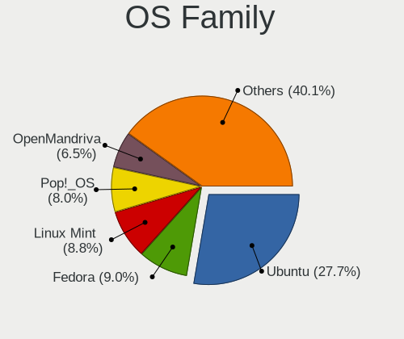

| Name             | Computers | Percent |
|------------------|-----------|---------|
| Ubuntu           | 261       | 29.43%  |
| Linux Mint       | 81        | 9.13%   |
| Pop!_OS          | 75        | 8.46%   |
| Fedora           | 74        | 8.34%   |
| OpenMandriva     | 50        | 5.64%   |
| Debian           | 50        | 5.64%   |
| Arch             | 43        | 4.85%   |
| Zorin            | 41        | 4.62%   |
| Manjaro          | 26        | 2.93%   |
| Kubuntu          | 21        | 2.37%   |
| Endless          | 15        | 1.69%   |
| KDE neon         | 14        | 1.58%   |
| Xubuntu          | 11        | 1.24%   |
| Nobara           | 10        | 1.13%   |
| Elementary       | 10        | 1.13%   |
| ArcoLinux        | 8         | 0.9%    |
| openSUSE         | 7         | 0.79%   |
| MX               | 7         | 0.79%   |
| EndeavourOS      | 7         | 0.79%   |
| Ubuntu Unity     | 5         | 0.56%   |
| ROSA             | 5         | 0.56%   |
| Lubuntu          | 5         | 0.56%   |
| LMDE             | 5         | 0.56%   |
| Kali             | 5         | 0.56%   |
| Gentoo           | 5         | 0.56%   |
| Ubuntu MATE      | 4         | 0.45%   |
| Peppermint       | 4         | 0.45%   |
| SteamOS          | 3         | 0.34%   |
| Solus            | 3         | 0.34%   |
| RHEL             | 3         | 0.34%   |
| Devuan           | 3         | 0.34%   |
| Clear Linux      | 3         | 0.34%   |
| Parrot           | 2         | 0.23%   |
| org.kde.Platform | 2         | 0.23%   |
| NixOS            | 2         | 0.23%   |
| BuildRoot        | 2         | 0.23%   |
| Void Linux       | 1         | 0.11%   |
| Vanilla          | 1         | 0.11%   |
| Ubuntu Budgie    | 1         | 0.11%   |
| Sparky           | 1         | 0.11%   |

Kernel
------

Version of the Linux kernel

| Version                  | Computers | Percent |
|--------------------------|-----------|---------|
| 5.4.0-42-generic         | 22        | 2.04%   |
| 5.16.7-desktop-1omv4003  | 14        | 1.3%    |
| 5.15.0-46-generic        | 13        | 1.2%    |
| 5.10.14-desktop-1omv4002 | 12        | 1.11%   |
| 6.1.1-desktop-1omv2290   | 9         | 0.83%   |
| 5.15.0-60-generic        | 8         | 0.74%   |
| 6.0.12-76060006-generic  | 7         | 0.65%   |
| 5.4.0-7634-generic       | 7         | 0.65%   |
| 5.4.0-65-generic         | 7         | 0.65%   |
| 5.15.0-58-generic        | 7         | 0.65%   |
| 5.15.0-56-generic        | 7         | 0.65%   |
| 6.2.6-desktop-1omv2390   | 6         | 0.56%   |
| 5.4.0-48-generic         | 6         | 0.56%   |
| 5.3.0-46-generic         | 6         | 0.56%   |
| 5.3.0-40-generic         | 6         | 0.56%   |
| 5.13.0-30-generic        | 6         | 0.56%   |
| 5.11.0-7620-generic      | 6         | 0.56%   |
| 5.11.0-37-generic        | 6         | 0.56%   |
| 5.10.0-16-amd64          | 6         | 0.56%   |
| 5.0.0-37-generic         | 6         | 0.56%   |
| 6.5.6-76060506-generic   | 5         | 0.46%   |
| 6.2.0-39-generic         | 5         | 0.46%   |
| 6.2.0-20-generic         | 5         | 0.46%   |
| 5.8.0-43-generic         | 5         | 0.46%   |
| 5.4.0-7642-generic       | 5         | 0.46%   |
| 5.4.0-74-generic         | 5         | 0.46%   |
| 5.4.0-52-generic         | 5         | 0.46%   |
| 5.4.0-45-generic         | 5         | 0.46%   |
| 5.3.16-300.fc31.x86_64   | 5         | 0.46%   |
| 5.3.0-28-generic         | 5         | 0.46%   |
| 5.19.0-35-generic        | 5         | 0.46%   |
| 5.19.0-32-generic        | 5         | 0.46%   |
| 5.15.0-52-generic        | 5         | 0.46%   |
| 5.13.0-7614-generic      | 5         | 0.46%   |
| 5.13.0-39-generic        | 5         | 0.46%   |
| 5.11.0-27-generic        | 5         | 0.46%   |
| 5.10.0-18-amd64          | 5         | 0.46%   |
| 6.5.0-27-generic         | 4         | 0.37%   |
| 6.4.11-desktop-1omv2390  | 4         | 0.37%   |
| 6.2.0-32-generic         | 4         | 0.37%   |

Kernel Family
-------------

Linux kernel without a distro release

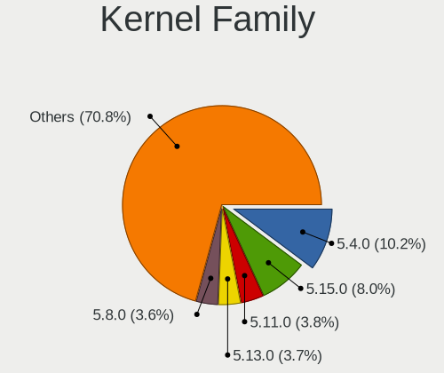

| Version | Computers | Percent |
|---------|-----------|---------|
| 5.4.0   | 122       | 12.12%  |
| 5.15.0  | 88        | 8.74%   |
| 5.11.0  | 45        | 4.47%   |
| 5.13.0  | 44        | 4.37%   |
| 5.8.0   | 43        | 4.27%   |
| 4.15.0  | 41        | 4.07%   |
| 5.3.0   | 36        | 3.57%   |
| 5.19.0  | 32        | 3.18%   |
| 6.2.0   | 28        | 2.78%   |
| 5.10.0  | 26        | 2.58%   |
| 6.1.0   | 21        | 2.09%   |
| 5.0.0   | 20        | 1.99%   |
| 4.18.0  | 20        | 1.99%   |
| 6.5.0   | 18        | 1.79%   |
| 5.16.7  | 14        | 1.39%   |
| 5.10.14 | 13        | 1.29%   |
| 6.1.1   | 11        | 1.09%   |
| 6.2.6   | 9         | 0.89%   |
| 6.0.12  | 8         | 0.79%   |
| 4.19.0  | 8         | 0.79%   |
| 6.5.6   | 7         | 0.7%    |
| 6.4.11  | 7         | 0.7%    |
| 5.3.16  | 5         | 0.5%    |
| 5.17.5  | 5         | 0.5%    |
| 6.7.7   | 4         | 0.4%    |
| 6.4.10  | 4         | 0.4%    |
| 6.0.0   | 4         | 0.4%    |
| 5.9.16  | 4         | 0.4%    |
| 5.7.0   | 4         | 0.4%    |
| 5.15.15 | 4         | 0.4%    |
| 5.14.0  | 4         | 0.4%    |
| 6.8.7   | 3         | 0.3%    |
| 6.6.2   | 3         | 0.3%    |
| 6.6.10  | 3         | 0.3%    |
| 6.4.6   | 3         | 0.3%    |
| 6.4.12  | 3         | 0.3%    |
| 6.2.12  | 3         | 0.3%    |
| 6.1.7   | 3         | 0.3%    |
| 5.9.8   | 3         | 0.3%    |
| 5.6.8   | 3         | 0.3%    |

Kernel Major Ver.
-----------------

Linux kernel major version

| Version | Computers | Percent |
|---------|-----------|---------|
| 5.4     | 130       | 13.17%  |
| 5.15    | 118       | 11.96%  |
| 6.1     | 57        | 5.78%   |
| 5.11    | 57        | 5.78%   |
| 5.8     | 53        | 5.37%   |
| 5.13    | 52        | 5.27%   |
| 5.10    | 50        | 5.07%   |
| 6.2     | 46        | 4.66%   |
| 5.3     | 43        | 4.36%   |
| 5.19    | 41        | 4.15%   |
| 4.15    | 41        | 4.15%   |
| 6.5     | 32        | 3.24%   |
| 5.16    | 26        | 2.63%   |
| 6.0     | 22        | 2.23%   |
| 5.0     | 21        | 2.13%   |
| 4.18    | 21        | 2.13%   |
| 6.4     | 19        | 1.93%   |
| 5.18    | 17        | 1.72%   |
| 6.6     | 15        | 1.52%   |
| 5.17    | 14        | 1.42%   |
| 5.14    | 14        | 1.42%   |
| 6.7     | 13        | 1.32%   |
| 5.9     | 12        | 1.22%   |
| 5.6     | 12        | 1.22%   |
| 6.3     | 11        | 1.11%   |
| 5.7     | 11        | 1.11%   |
| 4.19    | 9         | 0.91%   |
| 6.8     | 7         | 0.71%   |
| 5.12    | 7         | 0.71%   |
| 5.5     | 4         | 0.41%   |
| 4.9     | 4         | 0.41%   |
| 5.2     | 2         | 0.2%    |
| 4.20    | 2         | 0.2%    |
| 4.4     | 1         | 0.1%    |
| 4.14    | 1         | 0.1%    |
| 4.13    | 1         | 0.1%    |
| 4.11    | 1         | 0.1%    |

Arch
----

OS architecture (x86_64, i586, etc.)

| Name    | Computers | Percent |
|---------|-----------|---------|
| x86_64  | 825       | 97.98%  |
| i686    | 10        | 1.19%   |
| aarch64 | 5         | 0.59%   |
| armv7l  | 2         | 0.24%   |

DE
--

Desktop Environment

| Name             | Computers | Percent |
|------------------|-----------|---------|
| GNOME            | 427       | 47.92%  |
| KDE5             | 129       | 14.48%  |
| Unknown          | 102       | 11.45%  |
| X-Cinnamon       | 71        | 7.97%   |
| XFCE             | 53        | 5.95%   |
| MATE             | 22        | 2.47%   |
| KDE              | 22        | 2.47%   |
| Pantheon         | 10        | 1.12%   |
| LXQt             | 9         | 1.01%   |
| Cinnamon         | 9         | 1.01%   |
| LXDE             | 6         | 0.67%   |
| Unity            | 5         | 0.56%   |
| i3               | 5         | 0.56%   |
| Hyprland         | 4         | 0.45%   |
| Deepin           | 4         | 0.45%   |
| Budgie           | 3         | 0.34%   |
| xsession         | 1         | 0.11%   |
| sway             | 1         | 0.11%   |
| Openbox          | 1         | 0.11%   |
| lightdm-xsession | 1         | 0.11%   |
| KDE6             | 1         | 0.11%   |
| KDE4             | 1         | 0.11%   |
| icewm            | 1         | 0.11%   |
| i3-with-shmlog   | 1         | 0.11%   |
| fluxbox          | 1         | 0.11%   |
| Enlightenment    | 1         | 0.11%   |

Display Server
--------------

X11 or Wayland

| Name    | Computers | Percent |
|---------|-----------|---------|
| X11     | 618       | 70.63%  |
| Wayland | 184       | 21.03%  |
| Unknown | 50        | 5.71%   |
| Tty     | 23        | 2.63%   |

Display Manager
---------------

SDDM, LightDM, etc.

| Name    | Computers | Percent |
|---------|-----------|---------|
| Unknown | 450       | 50.96%  |
| SDDM    | 118       | 13.36%  |
| GDM3    | 102       | 11.55%  |
| LightDM | 95        | 10.76%  |
| GDM     | 83        | 9.4%    |
| TDM     | 25        | 2.83%   |
| SLiM    | 4         | 0.45%   |
| Ly      | 2         | 0.23%   |
| LXDM    | 2         | 0.23%   |
| XDM     | 1         | 0.11%   |
| KDM     | 1         | 0.11%   |

OS Lang
-------

Language

| Lang    | Computers | Percent |
|---------|-----------|---------|
| en_NZ   | 527       | 59.08%  |
| en_US   | 182       | 20.4%   |
| Unknown | 84        | 9.42%   |
| en_GB   | 43        | 4.82%   |
| C       | 25        | 2.8%    |
| en_AU   | 21        | 2.35%   |
| zh_CN   | 4         | 0.45%   |
| mi_NZ   | 2         | 0.22%   |
| de_DE   | 2         | 0.22%   |
| pt_BR   | 1         | 0.11%   |
| C.UTF8  | 1         | 0.11%   |

Boot Mode
---------

EFI or BIOS

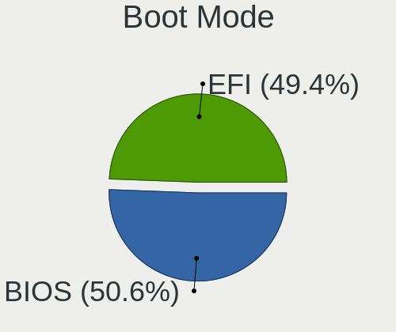

| Mode | Computers | Percent |
|------|-----------|---------|
| EFI  | 438       | 50.69%  |
| BIOS | 426       | 49.31%  |

Filesystem
----------

Type of filesystem

| Type    | Computers | Percent |
|---------|-----------|---------|
| Ext4    | 656       | 74.63%  |
| Btrfs   | 87        | 9.9%    |
| Overlay | 59        | 6.71%   |
| Unknown | 29        | 3.3%    |
| Tmpfs   | 25        | 2.84%   |
| Zfs     | 8         | 0.91%   |
| Xfs     | 7         | 0.8%    |
| Ext2    | 4         | 0.46%   |
| Ext3    | 2         | 0.23%   |
| XXXXXXX | 1         | 0.11%   |
| F2fs    | 1         | 0.11%   |

Part. scheme
------------

Scheme of partitioning

| Type    | Computers | Percent |
|---------|-----------|---------|
| Unknown | 448       | 51.73%  |
| GPT     | 342       | 39.49%  |
| MBR     | 76        | 8.78%   |

Dual Boot with Linux/BSD
------------------------

Hosting more than one Linux/BSD

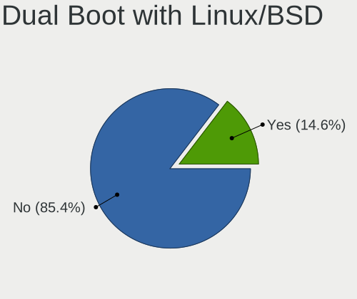

| Dual boot | Computers | Percent |
|-----------|-----------|---------|
| No        | 745       | 86.03%  |
| Yes       | 121       | 13.97%  |

Dual Boot (Win)
---------------

Hosting Linux and Windows

| Dual boot | Computers | Percent |
|-----------|-----------|---------|
| No        | 648       | 75.26%  |
| Yes       | 213       | 24.74%  |

Board
-----

Vendor
------

Motherboard manufacturer

| Name                                 | Computers | Percent |
|--------------------------------------|-----------|---------|
| Hewlett-Packard                      | 191       | 22.68%  |
| ASUSTek Computer                     | 136       | 16.15%  |
| Gigabyte Technology                  | 93        | 11.05%  |
| Lenovo                               | 88        | 10.45%  |
| Dell                                 | 88        | 10.45%  |
| Acer                                 | 39        | 4.63%   |
| MSI                                  | 32        | 3.8%    |
| Intel                                | 29        | 3.44%   |
| Apple                                | 24        | 2.85%   |
| Toshiba                              | 22        | 2.61%   |
| ASRock                               | 21        | 2.49%   |
| Unknown                              | 8         | 0.95%   |
| Supermicro                           | 7         | 0.83%   |
| Google                               | 7         | 0.83%   |
| Sony                                 | 6         | 0.71%   |
| Raspberry Pi Foundation              | 5         | 0.59%   |
| System76                             | 4         | 0.48%   |
| Samsung Electronics                  | 4         | 0.48%   |
| IBM                                  | 4         | 0.48%   |
| Valve                                | 3         | 0.36%   |
| Alienware                            | 3         | 0.36%   |
| Pegatron                             | 2         | 0.24%   |
| Microsoft                            | 2         | 0.24%   |
| Kogan                                | 2         | 0.24%   |
| HUAWEI                               | 2         | 0.24%   |
| YJKC                                 | 1         | 0.12%   |
| TWG                                  | 1         | 0.12%   |
| Timi                                 | 1         | 0.12%   |
| The Warehouse Group                  | 1         | 0.12%   |
| Star Labs                            | 1         | 0.12%   |
| Shenzhen Meigao Electronic Equipment | 1         | 0.12%   |
| Qualcomm Technologies                | 1         | 0.12%   |
| OEM                                  | 1         | 0.12%   |
| Metabox                              | 1         | 0.12%   |
| Medion                               | 1         | 0.12%   |
| MediaVue                             | 1         | 0.12%   |
| JGINYUE                              | 1         | 0.12%   |
| Huanan                               | 1         | 0.12%   |
| eMachines                            | 1         | 0.12%   |
| DFI                                  | 1         | 0.12%   |

Model
-----

Motherboard model

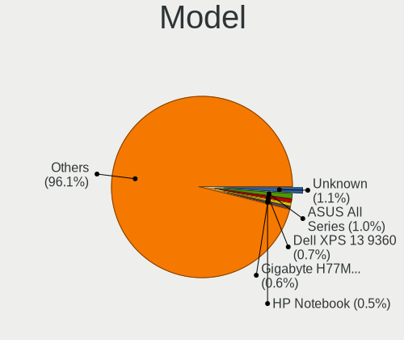

| Name                                 | Computers | Percent |
|--------------------------------------|-----------|---------|
| Unknown                              | 10        | 1.19%   |
| ASUS All Series                      | 9         | 1.07%   |
| Gigabyte H77M-D3H                    | 6         | 0.71%   |
| Dell XPS 13 9360                     | 6         | 0.71%   |
| HP Notebook                          | 5         | 0.59%   |
| ASUS TUF Gaming X570-PLUS            | 5         | 0.59%   |
| HP ProBook 6550b                     | 4         | 0.48%   |
| HP Pavilion dv6                      | 4         | 0.48%   |
| HP Pavilion 15                       | 4         | 0.48%   |
| HP EliteDesk 800 G1 SFF              | 4         | 0.48%   |
| HP EliteBook 840 G5                  | 4         | 0.48%   |
| Valve Jupiter                        | 3         | 0.36%   |
| Toshiba Satellite L750               | 3         | 0.36%   |
| MSI MS-7C02                          | 3         | 0.36%   |
| MSI MS-7B89                          | 3         | 0.36%   |
| HP ProBook 4540s                     | 3         | 0.36%   |
| HP EliteBook 8560p                   | 3         | 0.36%   |
| HP EliteBook 850 G5                  | 3         | 0.36%   |
| HP Compaq 8200 Elite SFF PC          | 3         | 0.36%   |
| Gigabyte X670 AORUS ELITE AX         | 3         | 0.36%   |
| Gigabyte B75M-D3H                    | 3         | 0.36%   |
| Gigabyte B550M DS3H AC               | 3         | 0.36%   |
| Gigabyte B450M S2H                   | 3         | 0.36%   |
| Gigabyte 970A-D3P                    | 3         | 0.36%   |
| Dell OptiPlex 3010                   | 3         | 0.36%   |
| Dell Latitude E6430                  | 3         | 0.36%   |
| Dell Latitude 7490                   | 3         | 0.36%   |
| ASUS P8B75-M                         | 3         | 0.36%   |
| ASUS ASUS EXPERTBOOK P2451FA_P2451FA | 3         | 0.36%   |
| ASRock B450M Steel Legend            | 3         | 0.36%   |
| ASRock 970 Pro3 R2.0                 | 3         | 0.36%   |
| Acer Aspire F5-573G                  | 3         | 0.36%   |
| Toshiba TECRA Z50-A                  | 2         | 0.24%   |
| Toshiba Satellite C50-B              | 2         | 0.24%   |
| System76 Oryx Pro                    | 2         | 0.24%   |
| MSI MS-7C91                          | 2         | 0.24%   |
| MSI GE66 Raider 10SF                 | 2         | 0.24%   |
| Lenovo ThinkPad T460 20FMS2FR00      | 2         | 0.24%   |
| Lenovo ThinkPad T420 4180AQ3         | 2         | 0.24%   |
| Lenovo ThinkCentre M58p 7479RS2      | 2         | 0.24%   |

Model Family
------------

Motherboard model prefix

| Name               | Computers | Percent |
|--------------------|-----------|---------|
| Lenovo ThinkPad    | 46        | 5.46%   |
| HP EliteBook       | 35        | 4.16%   |
| ASUS ROG           | 27        | 3.21%   |
| HP ProBook         | 26        | 3.09%   |
| Acer Aspire        | 26        | 3.09%   |
| HP Pavilion        | 23        | 2.73%   |
| Dell Latitude      | 23        | 2.73%   |
| HP Compaq          | 21        | 2.49%   |
| ASUS PRIME         | 18        | 2.14%   |
| Toshiba Satellite  | 15        | 1.78%   |
| Dell OptiPlex      | 15        | 1.78%   |
| Dell XPS           | 13        | 1.54%   |
| Dell Inspiron      | 13        | 1.54%   |
| Dell Precision     | 12        | 1.43%   |
| ASUS TUF           | 12        | 1.43%   |
| HP EliteDesk       | 11        | 1.31%   |
| Unknown            | 10        | 1.19%   |
| Lenovo ThinkCentre | 9         | 1.07%   |
| HP ZBook           | 9         | 1.07%   |
| ASUS VivoBook      | 9         | 1.07%   |
| ASUS All           | 9         | 1.07%   |
| HP Laptop          | 8         | 0.95%   |
| Lenovo Yoga        | 7         | 0.83%   |
| HP Spectre         | 6         | 0.71%   |
| HP ProLiant        | 6         | 0.71%   |
| Gigabyte H77M-D3H  | 6         | 0.71%   |
| ASUS ASUS          | 6         | 0.71%   |
| RPi Raspberry      | 5         | 0.59%   |
| HP Notebook        | 5         | 0.59%   |
| Gigabyte B550M     | 5         | 0.59%   |
| Toshiba PORTEGE    | 4         | 0.48%   |
| Lenovo IdeaPad     | 4         | 0.48%   |
| HP ENVY            | 4         | 0.48%   |
| Gigabyte B550      | 4         | 0.48%   |
| ASUS M5A97         | 4         | 0.48%   |
| Apple MacBookPro5  | 4         | 0.48%   |
| Acer TravelMate    | 4         | 0.48%   |
| Valve Jupiter      | 3         | 0.36%   |
| Toshiba TECRA      | 3         | 0.36%   |
| MSI MS-7C02        | 3         | 0.36%   |

MFG Year
--------

Motherboard manufacture year

| Year    | Computers | Percent |
|---------|-----------|---------|
| 2012    | 105       | 12.47%  |
| 2018    | 75        | 8.91%   |
| 2019    | 69        | 8.19%   |
| 2020    | 66        | 7.84%   |
| 2011    | 66        | 7.84%   |
| 2017    | 58        | 6.89%   |
| 2013    | 49        | 5.82%   |
| 2021    | 47        | 5.58%   |
| 2022    | 45        | 5.34%   |
| 2014    | 45        | 5.34%   |
| 2016    | 42        | 4.99%   |
| 2010    | 39        | 4.63%   |
| 2015    | 38        | 4.51%   |
| 2009    | 30        | 3.56%   |
| 2008    | 29        | 3.44%   |
| 2023    | 16        | 1.9%    |
| 2007    | 8         | 0.95%   |
| Unknown | 7         | 0.83%   |
| 2005    | 3         | 0.36%   |
| 2024    | 2         | 0.24%   |
| 2006    | 2         | 0.24%   |
| 2004    | 1         | 0.12%   |

Form Factor
-----------

Physical design of the computer

| Name           | Computers | Percent |
|----------------|-----------|---------|
| Notebook       | 413       | 49.05%  |
| Desktop        | 339       | 40.26%  |
| Mini pc        | 30        | 3.56%   |
| Convertible    | 25        | 2.97%   |
| All in one     | 14        | 1.66%   |
| Server         | 11        | 1.31%   |
| System on chip | 6         | 0.71%   |
| Tablet         | 4         | 0.48%   |

Secure Boot
-----------

Enabled or disabled

| State    | Computers | Percent |
|----------|-----------|---------|
| Disabled | 776       | 91.4%   |
| Enabled  | 73        | 8.6%    |

Coreboot
--------

Have coreboot on board

| Used | Computers | Percent |
|------|-----------|---------|
| No   | 829       | 98.46%  |
| Yes  | 13        | 1.54%   |

RAM Size
--------

Total RAM memory

| Size in GB      | Computers | Percent |
|-----------------|-----------|---------|
| 4.01-8.0        | 193       | 22.39%  |
| 16.01-24.0      | 192       | 22.27%  |
| 8.01-16.0       | 154       | 17.87%  |
| 3.01-4.0        | 124       | 14.39%  |
| 32.01-64.0      | 113       | 13.11%  |
| 64.01-256.0     | 37        | 4.29%   |
| 24.01-32.0      | 21        | 2.44%   |
| 1.01-2.0        | 17        | 1.97%   |
| 2.01-3.0        | 6         | 0.7%    |
| 0.51-1.0        | 4         | 0.46%   |
| More than 256.0 | 1         | 0.12%   |

RAM Used
--------

Used RAM memory

| Used GB    | Computers | Percent |
|------------|-----------|---------|
| 1.01-2.0   | 293       | 30.58%  |
| 2.01-3.0   | 256       | 26.72%  |
| 4.01-8.0   | 154       | 16.08%  |
| 3.01-4.0   | 127       | 13.26%  |
| 8.01-16.0  | 52        | 5.43%   |
| 0.51-1.0   | 51        | 5.32%   |
| 16.01-24.0 | 12        | 1.25%   |
| 0.01-0.5   | 9         | 0.94%   |
| 24.01-32.0 | 3         | 0.31%   |
| 32.01-64.0 | 1         | 0.1%    |

Total Drives
------------

Number of drives on board

| Drives  | Computers | Percent |
|---------|-----------|---------|
| 1       | 499       | 56.64%  |
| 2       | 223       | 25.31%  |
| 3       | 78        | 8.85%   |
| 4       | 42        | 4.77%   |
| 6       | 13        | 1.48%   |
| 5       | 12        | 1.36%   |
| 0       | 4         | 0.45%   |
| 7       | 3         | 0.34%   |
| 8       | 2         | 0.23%   |
| Unknown | 2         | 0.23%   |
| 410     | 1         | 0.11%   |
| 20      | 1         | 0.11%   |
| 9       | 1         | 0.11%   |

Has CD-ROM
----------

Has CD-ROM on board

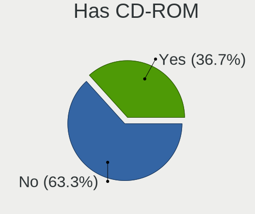

| Presented | Computers | Percent |
|-----------|-----------|---------|
| No        | 524       | 61.5%   |
| Yes       | 328       | 38.5%   |

Has Ethernet
------------

Has Ethernet on board

| Presented | Computers | Percent |
|-----------|-----------|---------|
| Yes       | 741       | 87.49%  |
| No        | 106       | 12.51%  |

Has WiFi
--------

Has WiFi module

| Presented | Computers | Percent |
|-----------|-----------|---------|
| Yes       | 645       | 76.15%  |
| No        | 202       | 23.85%  |

Has Bluetooth
-------------

Has Bluetooth module

| Presented | Computers | Percent |
|-----------|-----------|---------|
| Yes       | 526       | 61.59%  |
| No        | 328       | 38.41%  |

Location
--------

Country
-------

Geographic location (country)

| Country     | Computers | Percent |
|-------------|-----------|---------|
| New Zealand | 842       | 100%    |

City
----

Geographic location (city)

| City             | Computers | Percent |
|------------------|-----------|---------|
| Auckland         | 412       | 46.29%  |
| Wellington       | 109       | 12.25%  |
| Christchurch     | 101       | 11.35%  |
| Hamilton         | 54        | 6.07%   |
| Tauranga         | 30        | 3.37%   |
| Dunedin          | 25        | 2.81%   |
| Palmerston North | 16        | 1.8%    |
| Cambridge        | 15        | 1.69%   |
| Whangarei        | 14        | 1.57%   |
| Nelson           | 14        | 1.57%   |
| Napier City      | 11        | 1.24%   |
| New Plymouth     | 9         | 1.01%   |
| Lower Hutt       | 8         | 0.9%    |
| Whanganui        | 7         | 0.79%   |
| Invercargill     | 7         | 0.79%   |
| Hastings         | 7         | 0.79%   |
| Rotorua          | 4         | 0.45%   |
| Ashburton        | 4         | 0.45%   |
| Masterton        | 3         | 0.34%   |
| Grafton          | 3         | 0.34%   |
| Queenstown       | 2         | 0.22%   |
| Otaki            | 2         | 0.22%   |
| Levin            | 2         | 0.22%   |
| Whatawhata       | 1         | 0.11%   |
| Westport         | 1         | 0.11%   |
| Wellsford        | 1         | 0.11%   |
| Waikanae         | 1         | 0.11%   |
| Waihi            | 1         | 0.11%   |
| Tutukaka         | 1         | 0.11%   |
| Timaru           | 1         | 0.11%   |
| Te Puke          | 1         | 0.11%   |
| Stratford        | 1         | 0.11%   |
| Saint Andrews    | 1         | 0.11%   |
| Porirua          | 1         | 0.11%   |
| Paraparaumu      | 1         | 0.11%   |
| Pakuranga        | 1         | 0.11%   |
| Onekawa          | 1         | 0.11%   |
| Mount Maunganui  | 1         | 0.11%   |
| Mount Eden       | 1         | 0.11%   |
| Milton           | 1         | 0.11%   |

Drives
------

Drive Vendor
------------

Hard drive vendors

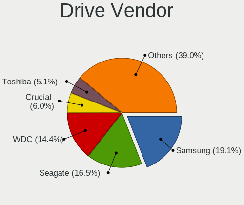

| Vendor                      | Computers | Drives | Percent |
|-----------------------------|-----------|--------|---------|
| Samsung Electronics         | 236       | 429    | 18.93%  |
| Seagate                     | 218       | 377    | 17.48%  |
| WDC                         | 187       | 321    | 15%     |
| Crucial                     | 73        | 117    | 5.85%   |
| Toshiba                     | 68        | 86     | 5.45%   |
| SanDisk                     | 48        | 56     | 3.85%   |
| Kingston                    | 47        | 70     | 3.77%   |
| Intel                       | 47        | 63     | 3.77%   |
| Unknown                     | 41        | 58     | 3.29%   |
| Hitachi                     | 29        | 40     | 2.33%   |
| SK hynix                    | 28        | 38     | 2.25%   |
| Micron Technology           | 23        | 28     | 1.84%   |
| HGST                        | 20        | 24     | 1.6%    |
| A-DATA Technology           | 20        | 24     | 1.6%    |
| Micron/Crucial Technology   | 13        | 14     | 1.04%   |
| Team                        | 9         | 10     | 0.72%   |
| China                       | 9         | 11     | 0.72%   |
| Apple                       | 9         | 10     | 0.72%   |
| KIOXIA                      | 7         | 9      | 0.56%   |
| LITEON                      | 6         | 6      | 0.48%   |
| KingSpec                    | 6         | 6      | 0.48%   |
| Hewlett-Packard             | 6         | 10     | 0.48%   |
| ASMT                        | 6         | 7      | 0.48%   |
| TO Exter                    | 5         | 5      | 0.4%    |
| Apacer                      | 5         | 6      | 0.4%    |
| Transcend                   | 4         | 4      | 0.32%   |
| Silicon Motion              | 4         | 6      | 0.32%   |
| OCZ                         | 4         | 4      | 0.32%   |
| Lexar                       | 4         | 7      | 0.32%   |
| Gigabyte Technology         | 4         | 5      | 0.32%   |
| External                    | 4         | 5      | 0.32%   |
| XPG                         | 3         | 3      | 0.24%   |
| T-FORCE                     | 3         | 3      | 0.24%   |
| Kingston Technology Company | 3         | 3      | 0.24%   |
| JMicron Technology          | 3         | 3      | 0.24%   |
| Corsair                     | 3         | 5      | 0.24%   |
| ShiJi                       | 2         | 2      | 0.16%   |
| ROG                         | 2         | 2      | 0.16%   |
| Phison Electronics          | 2         | 6      | 0.16%   |
| Phison                      | 2         | 2      | 0.16%   |

Drive Model
-----------

Hard drive models

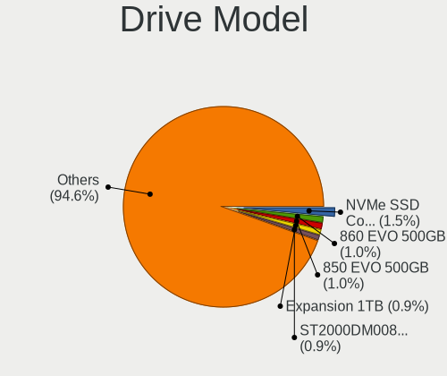

| Model                                              | Computers | Percent |
|----------------------------------------------------|-----------|---------|
| Samsung SSD 860 EVO 500GB                          | 18        | 1.25%   |
| Samsung SSD 850 EVO 500GB                          | 16        | 1.11%   |
| Seagate ST2000DM008-2FR102 2TB                     | 15        | 1.05%   |
| Seagate Expansion+ Desk 4TB                        | 13        | 0.91%   |
| Seagate Expansion 2TB                              | 13        | 0.91%   |
| Samsung SSD 980 1TB                                | 13        | 0.91%   |
| Samsung NVMe SSD Controller SM981/PM981/PM983 1TB  | 13        | 0.91%   |
| Crucial CT240BX500SSD1 240GB                       | 12        | 0.84%   |
| Samsung SSD 850 EVO 250GB                          | 10        | 0.7%    |
| Samsung NVMe SSD Controller PM9A1/PM9A3/980PRO 1TB | 10        | 0.7%    |
| Seagate ST500LT012-1DG142 500GB                    | 9         | 0.63%   |
| Samsung SSD 870 EVO 1TB                            | 9         | 0.63%   |
| Samsung NVMe SSD Drive 500GB                       | 9         | 0.63%   |
| Crucial CT500MX500SSD1 500GB                       | 9         | 0.63%   |
| Seagate ST500DM002-1BD142 500GB                    | 8         | 0.56%   |
| Seagate ST31000528AS 1TB                           | 8         | 0.56%   |
| Seagate ST1000LM035-1RK172 1TB                     | 8         | 0.56%   |
| Seagate ST1000DM003-1CH162 1TB                     | 8         | 0.56%   |
| Samsung NVMe SSD Drive 512GB                       | 8         | 0.56%   |
| Seagate ST2000DM006-2DM164 2TB                     | 7         | 0.49%   |
| Seagate ST2000DM001-1CH164 2TB                     | 7         | 0.49%   |
| Seagate ST1000DM010-2EP102 1TB                     | 7         | 0.49%   |
| Samsung SSD 870 EVO 500GB                          | 7         | 0.49%   |
| Samsung NVMe SSD Controller SM961/PM961/SM963 1TB  | 7         | 0.49%   |
| Kingston SV300S37A240G 240GB SSD                   | 7         | 0.49%   |
| Kingston SA400S37240G 240GB SSD                    | 7         | 0.49%   |
| Intel NVMe SSD Drive 512GB                         | 7         | 0.49%   |
| WDC WD20EZRZ-00Z5HB0 2TB                           | 6         | 0.42%   |
| WDC WD10JPVX-22JC3T0 1TB                           | 6         | 0.42%   |
| Unknown MMC Card  64GB                             | 6         | 0.42%   |
| Seagate ST9500325AS 500GB                          | 6         | 0.42%   |
| Samsung SSD 980 PRO 1TB                            | 6         | 0.42%   |
| Samsung SSD 970 EVO Plus 1TB                       | 6         | 0.42%   |
| Samsung SSD 860 EVO 250GB                          | 6         | 0.42%   |
| Samsung NVMe SSD Drive 1TB                         | 6         | 0.42%   |
| Micron/Crucial P2 NVMe PCIe SSD 4TB                | 6         | 0.42%   |
| Kingston SV300S37A120G 120GB SSD                   | 6         | 0.42%   |
| Kingston SA400S37120G 120GB SSD                    | 6         | 0.42%   |
| HGST HTS721010A9E630 1TB                           | 6         | 0.42%   |
| Crucial CT480BX500SSD1 480GB                       | 6         | 0.42%   |

HDD Vendor
----------

Hard disk drive vendors

| Vendor              | Computers | Drives | Percent |
|---------------------|-----------|--------|---------|
| Seagate             | 209       | 359    | 42.14%  |
| WDC                 | 162       | 267    | 32.66%  |
| Toshiba             | 36        | 49     | 7.26%   |
| Hitachi             | 29        | 40     | 5.85%   |
| HGST                | 20        | 24     | 4.03%   |
| Samsung Electronics | 6         | 8      | 1.21%   |
| Unknown             | 5         | 9      | 1.01%   |
| TO Exter            | 5         | 5      | 1.01%   |
| ASMT                | 4         | 4      | 0.81%   |
| Apple               | 4         | 4      | 0.81%   |
| JMicron Technology  | 3         | 3      | 0.6%    |
| Hewlett-Packard     | 3         | 4      | 0.6%    |
| Fujitsu             | 2         | 2      | 0.4%    |
| External            | 2         | 2      | 0.4%    |
| USB3.0              | 1         | 1      | 0.2%    |
| USB                 | 1         | 2      | 0.2%    |
| StoreJet            | 1         | 1      | 0.2%    |
| QUANTUM             | 1         | 1      | 0.2%    |
| HGST HTS            | 1         | 1      | 0.2%    |
| Ext Hard            | 1         | 2      | 0.2%    |

SSD Vendor
----------

Solid state drive vendors

| Vendor              | Computers | Drives | Percent |
|---------------------|-----------|--------|---------|
| Samsung Electronics | 120       | 176    | 29.27%  |
| Crucial             | 64        | 103    | 15.61%  |
| Kingston            | 33        | 49     | 8.05%   |
| SanDisk             | 30        | 36     | 7.32%   |
| Intel               | 22        | 31     | 5.37%   |
| WDC                 | 17        | 34     | 4.15%   |
| A-DATA Technology   | 16        | 19     | 3.9%    |
| Micron Technology   | 14        | 18     | 3.41%   |
| Team                | 9         | 10     | 2.2%    |
| China               | 9         | 11     | 2.2%    |
| Toshiba             | 8         | 9      | 1.95%   |
| Seagate             | 6         | 9      | 1.46%   |
| KingSpec            | 6         | 6      | 1.46%   |
| LITEON              | 5         | 5      | 1.22%   |
| Apple               | 5         | 6      | 1.22%   |
| Apacer              | 5         | 6      | 1.22%   |
| SK hynix            | 4         | 4      | 0.98%   |
| OCZ                 | 4         | 4      | 0.98%   |
| Lexar               | 4         | 7      | 0.98%   |
| Transcend           | 3         | 3      | 0.73%   |
| T-FORCE             | 3         | 3      | 0.73%   |
| Gigabyte Technology | 3         | 3      | 0.73%   |
| Corsair             | 3         | 5      | 0.73%   |
| Hewlett-Packard     | 2         | 5      | 0.49%   |
| External            | 2         | 3      | 0.49%   |
| Timetec             | 1         | 1      | 0.24%   |
| OWC                 | 1         | 1      | 0.24%   |
| OCZ-VERTEX3         | 1         | 1      | 0.24%   |
| OASDX               | 1         | 1      | 0.24%   |
| Netac               | 1         | 1      | 0.24%   |
| LITEONIT            | 1         | 3      | 0.24%   |
| Innodisk            | 1         | 1      | 0.24%   |
| GAMER               | 1         | 1      | 0.24%   |
| FreeNAS             | 1         | 36     | 0.24%   |
| FreeBSD             | 1         | 372    | 0.24%   |
| Dell                | 1         | 1      | 0.24%   |
| ASMT                | 1         | 1      | 0.24%   |
| Unknown             | 1         | 1      | 0.24%   |

Drive Kind
----------

HDD or SSD

| Kind    | Computers | Drives | Percent |
|---------|-----------|--------|---------|
| HDD     | 409       | 788    | 36.23%  |
| SSD     | 363       | 986    | 32.15%  |
| NVMe    | 308       | 495    | 27.28%  |
| MMC     | 37        | 48     | 3.28%   |
| Unknown | 12        | 14     | 1.06%   |

Drive Connector
---------------

SATA, SAS, NVMe, etc.

| Type | Computers | Drives | Percent |
|------|-----------|--------|---------|
| SATA | 611       | 1683   | 59.49%  |
| NVMe | 308       | 492    | 29.99%  |
| SAS  | 71        | 108    | 6.91%   |
| MMC  | 37        | 48     | 3.6%    |

Drive Size
----------

Size of hard drive

| Size in TB | Computers | Drives | Percent |
|------------|-----------|--------|---------|
| 0.01-0.5   | 453       | 1145   | 53.29%  |
| 0.51-1.0   | 239       | 375    | 28.12%  |
| 1.01-2.0   | 91        | 150    | 10.71%  |
| 3.01-4.0   | 40        | 63     | 4.71%   |
| 2.01-3.0   | 13        | 15     | 1.53%   |
| 4.01-10.0  | 9         | 15     | 1.06%   |
| 10.01-20.0 | 4         | 9      | 0.47%   |
| 20.01-50.0 | 1         | 2      | 0.12%   |

Space Total
-----------

Amount of disk space available on the file system

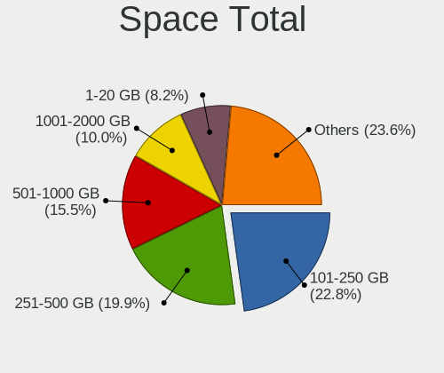

| Size in GB     | Computers | Percent |
|----------------|-----------|---------|
| 101-250        | 214       | 23.57%  |
| 251-500        | 190       | 20.93%  |
| 501-1000       | 141       | 15.53%  |
| 1001-2000      | 89        | 9.8%    |
| 1-20           | 76        | 8.37%   |
| More than 3000 | 66        | 7.27%   |
| 2001-3000      | 45        | 4.96%   |
| 51-100         | 42        | 4.63%   |
| Unknown        | 23        | 2.53%   |
| 21-50          | 22        | 2.42%   |

Space Used
----------

Amount of used disk space

| Used GB        | Computers | Percent |
|----------------|-----------|---------|
| 1-20           | 344       | 36.02%  |
| 21-50          | 164       | 17.17%  |
| 101-250        | 102       | 10.68%  |
| 51-100         | 99        | 10.37%  |
| 501-1000       | 74        | 7.75%   |
| 251-500        | 69        | 7.23%   |
| 1001-2000      | 39        | 4.08%   |
| Unknown        | 23        | 2.41%   |
| More than 3000 | 21        | 2.2%    |
| 2001-3000      | 20        | 2.09%   |

Malfunc. Drives
---------------

Drive models with a malfunction

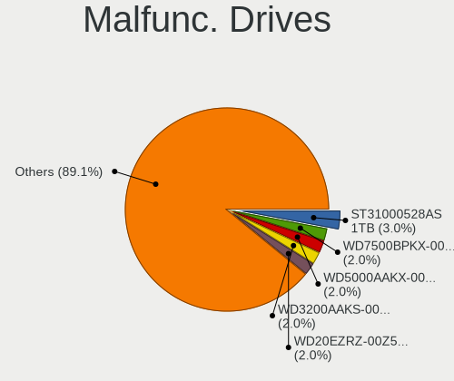

| Model                                       | Computers | Drives | Percent |
|---------------------------------------------|-----------|--------|---------|
| WDC WD7500BPKX-00HPJT0 752GB                | 2         | 2      | 2.35%   |
| WDC WD5000AAKX-001CA0 500GB                 | 2         | 3      | 2.35%   |
| WDC WD20EZRZ-00Z5HB0 2TB                    | 2         | 2      | 2.35%   |
| Seagate ST3500418AS 500GB                   | 2         | 3      | 2.35%   |
| Seagate ST31000528AS 1TB                    | 2         | 2      | 2.35%   |
| Samsung Electronics SSD 980 1TB             | 2         | 2      | 2.35%   |
| Samsung Electronics SSD 870 EVO 1TB         | 2         | 2      | 2.35%   |
| WDC WDS480G2G0A-00JH30 480GB SSD            | 1         | 1      | 1.18%   |
| WDC WD3200AAKS-00UU3A0 320GB                | 1         | 1      | 1.18%   |
| WDC WD2003FZEX-00Z4SA0 2TB                  | 1         | 1      | 1.18%   |
| WDC WD15EARS-00S0XB0 1TB                    | 1         | 1      | 1.18%   |
| WDC WD10JPVX-22JC3T0 1TB                    | 1         | 1      | 1.18%   |
| WDC WD10EZEX-08WN4A0 1TB                    | 1         | 1      | 1.18%   |
| WDC WD10EFRX-68FYTN0 1TB                    | 1         | 3      | 1.18%   |
| WDC WD10EARS-003BB1 1TB                     | 1         | 1      | 1.18%   |
| WDC WD1002FAEX-00Z3A0 1TB                   | 1         | 2      | 1.18%   |
| USB3.0 Extemal HDD 2TB                      | 1         | 1      | 1.18%   |
| Toshiba MQ01ABD075 752GB                    | 1         | 1      | 1.18%   |
| Toshiba MQ01ABD050 500GB                    | 1         | 1      | 1.18%   |
| Toshiba MK5076GSX 500GB                     | 1         | 1      | 1.18%   |
| Toshiba MK5065GSXF 500GB                    | 1         | 1      | 1.18%   |
| Toshiba MK3261GSYN 320GB                    | 1         | 1      | 1.18%   |
| Toshiba MK3256GSY 320GB                     | 1         | 1      | 1.18%   |
| SK hynix SC308 SATA 128GB SSD               | 1         | 1      | 1.18%   |
| SK hynix HFS256G32MND-2900A 256GB SSD       | 1         | 1      | 1.18%   |
| SK hynix BC501 NVMe Solid State Drive 512GB | 1         | 3      | 1.18%   |
| SK hynix BC501 HFM512GDJTNG-8310A 512GB     | 1         | 1      | 1.18%   |
| ShiJi 512GB M.2-NVMe                        | 1         | 1      | 1.18%   |
| Seagate ST9500420ASG 500GB                  | 1         | 1      | 1.18%   |
| Seagate ST9500420AS 500GB                   | 1         | 1      | 1.18%   |
| Seagate ST9250410AS 250GB                   | 1         | 1      | 1.18%   |
| Seagate ST8000VN0022-2EL112 8TB             | 1         | 3      | 1.18%   |
| Seagate ST500NM0011 500GB                   | 1         | 2      | 1.18%   |
| Seagate ST500LT012-1DG142 500GB             | 1         | 1      | 1.18%   |
| Seagate ST500DM002-1BD142 500GB             | 1         | 1      | 1.18%   |
| Seagate ST4000DX001-1CE168 4TB              | 1         | 1      | 1.18%   |
| Seagate ST3250310AS 250GB                   | 1         | 1      | 1.18%   |
| Seagate ST3200822A 200GB                    | 1         | 1      | 1.18%   |
| Seagate ST31000524AS 1TB                    | 1         | 1      | 1.18%   |
| Seagate ST3000DM001-9YN166 3TB              | 1         | 1      | 1.18%   |

Malfunc. Drive Vendor
---------------------

Vendors of faulty drives

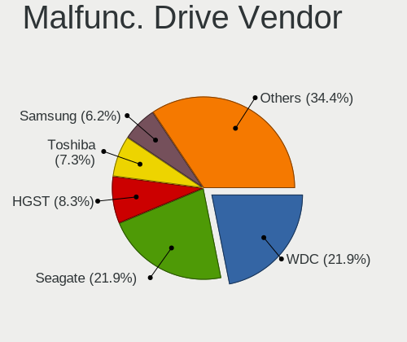

| Vendor              | Computers | Drives | Percent |
|---------------------|-----------|--------|---------|
| Seagate             | 19        | 26     | 23.46%  |
| WDC                 | 15        | 19     | 18.52%  |
| Toshiba             | 6         | 6      | 7.41%   |
| Samsung Electronics | 6         | 6      | 7.41%   |
| HGST                | 6         | 7      | 7.41%   |
| Intel               | 5         | 6      | 6.17%   |
| Crucial             | 5         | 6      | 6.17%   |
| SK hynix            | 3         | 6      | 3.7%    |
| SanDisk             | 3         | 3      | 3.7%    |
| Hitachi             | 3         | 3      | 3.7%    |
| Micron Technology   | 2         | 2      | 2.47%   |
| ASMT                | 2         | 2      | 2.47%   |
| USB3.0              | 1         | 1      | 1.23%   |
| ShiJi               | 1         | 1      | 1.23%   |
| OCZ                 | 1         | 1      | 1.23%   |
| Innodisk            | 1         | 1      | 1.23%   |
| HGST HTS            | 1         | 1      | 1.23%   |
| Apple               | 1         | 1      | 1.23%   |

Malfunc. HDD Vendor
-------------------

Vendors of faulty HDD drives

| Vendor   | Computers | Drives | Percent |
|----------|-----------|--------|---------|
| Seagate  | 19        | 26     | 36.54%  |
| WDC      | 14        | 18     | 26.92%  |
| Toshiba  | 6         | 6      | 11.54%  |
| HGST     | 6         | 7      | 11.54%  |
| Hitachi  | 3         | 3      | 5.77%   |
| USB3.0   | 1         | 1      | 1.92%   |
| HGST HTS | 1         | 1      | 1.92%   |
| ASMT     | 1         | 1      | 1.92%   |
| Apple    | 1         | 1      | 1.92%   |

Malfunc. Drive Kind
-------------------

Kinds of faulty drives

| Kind | Computers | Drives | Percent |
|------|-----------|--------|---------|
| HDD  | 50        | 64     | 63.29%  |
| SSD  | 20        | 22     | 25.32%  |
| NVMe | 9         | 12     | 11.39%  |

Failed Drives
-------------

Failed drive models

| Model                           | Computers | Drives | Percent |
|---------------------------------|-----------|--------|---------|
| Seagate ST500LT012-1DG142 500GB | 1         | 1      | 100%    |

Failed Drive Vendor
-------------------

Failed drive vendors

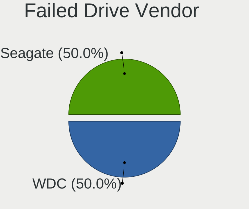

| Vendor  | Computers | Drives | Percent |
|---------|-----------|--------|---------|
| Seagate | 1         | 1      | 100%    |

Drive Status
------------

Number of failed and malfunc. drives

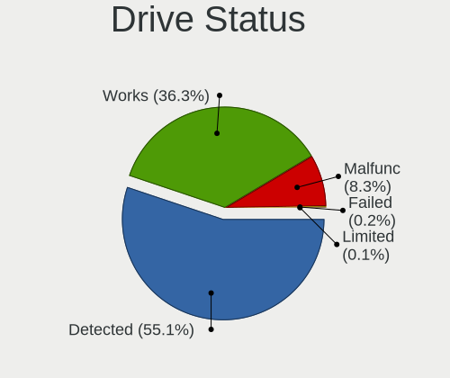

| Status   | Computers | Drives | Percent |
|----------|-----------|--------|---------|
| Detected | 517       | 1153   | 55.83%  |
| Works    | 331       | 1078   | 35.75%  |
| Malfunc  | 76        | 98     | 8.21%   |
| Failed   | 1         | 1      | 0.11%   |
| Limited  | 1         | 1      | 0.11%   |

Storage controller
------------------

Storage Vendor
--------------

Storage controller vendors

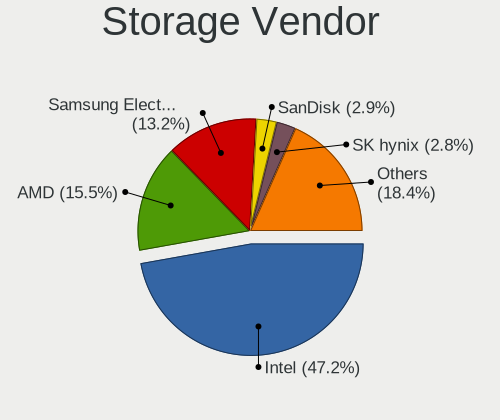

| Vendor                       | Computers | Percent |
|------------------------------|-----------|---------|
| Intel                        | 529       | 48.27%  |
| AMD                          | 177       | 16.15%  |
| Samsung Electronics          | 143       | 13.05%  |
| SanDisk                      | 29        | 2.65%   |
| Toshiba America Info Systems | 26        | 2.37%   |
| SK hynix                     | 24        | 2.19%   |
| Nvidia                       | 22        | 2.01%   |
| Micron/Crucial Technology    | 21        | 1.92%   |
| Kingston Technology Company  | 17        | 1.55%   |
| JMicron Technology           | 17        | 1.55%   |
| ASMedia Technology           | 14        | 1.28%   |
| Marvell Technology Group     | 13        | 1.19%   |
| Micron Technology            | 11        | 1%      |
| Phison Electronics           | 7         | 0.64%   |
| LSI Logic / Symbios Logic    | 7         | 0.64%   |
| Silicon Motion               | 6         | 0.55%   |
| KIOXIA                       | 6         | 0.55%   |
| Seagate Technology           | 5         | 0.46%   |
| ADATA Technology             | 4         | 0.36%   |
| Hewlett-Packard              | 3         | 0.27%   |
| Realtek Semiconductor        | 2         | 0.18%   |
| O2 Micro                     | 2         | 0.18%   |
| MAXIO Technology (Hangzhou)  | 2         | 0.18%   |
| Broadcom / LSI               | 2         | 0.18%   |
| VIA Technologies             | 1         | 0.09%   |
| Union Memory (Shenzhen)      | 1         | 0.09%   |
| Solidigm                     | 1         | 0.09%   |
| Silicon Image                | 1         | 0.09%   |
| Shenzhen Longsys Electronics | 1         | 0.09%   |
| Netac Technology             | 1         | 0.09%   |
| Lite-On Technology           | 1         | 0.09%   |

Storage Model
-------------

Storage controller models

| Model                                                                            | Computers | Percent |
|----------------------------------------------------------------------------------|-----------|---------|
| AMD FCH SATA Controller [AHCI mode]                                              | 109       | 8.58%   |
| Samsung NVMe SSD Controller SM981/PM981/PM983                                    | 62        | 4.88%   |
| Intel Sunrise Point-LP SATA Controller [AHCI mode]                               | 42        | 3.3%    |
| Intel 7 Series Chipset Family 6-port SATA Controller [AHCI mode]                 | 38        | 2.99%   |
| Samsung NVMe SSD Controller 980 (DRAM-less)                                      | 33        | 2.6%    |
| Samsung NVMe SSD Controller PM9A1/PM9A3/980PRO                                   | 32        | 2.52%   |
| Intel 6 Series/C200 Series Chipset Family 6 port Mobile SATA AHCI Controller     | 32        | 2.52%   |
| Intel 8 Series/C220 Series Chipset Family 6-port SATA Controller 1 [AHCI mode]   | 29        | 2.28%   |
| AMD 400 Series Chipset SATA Controller                                           | 25        | 1.97%   |
| AMD SB7x0/SB8x0/SB9x0 SATA Controller [AHCI mode]                                | 23        | 1.81%   |
| Intel SATA Controller [RAID mode]                                                | 21        | 1.65%   |
| Intel 82801 Mobile SATA Controller [RAID mode]                                   | 21        | 1.65%   |
| Samsung NVMe SSD Controller SM961/PM961/SM963                                    | 20        | 1.57%   |
| Intel 7 Series/C210 Series Chipset Family 6-port SATA Controller [AHCI mode]     | 20        | 1.57%   |
| AMD SB7x0/SB8x0/SB9x0 IDE Controller                                             | 20        | 1.57%   |
| AMD 500 Series Chipset SATA Controller                                           | 20        | 1.57%   |
| Intel 8 Series SATA Controller 1 [AHCI mode]                                     | 18        | 1.42%   |
| Intel Volume Management Device NVMe RAID Controller                              | 17        | 1.34%   |
| Intel Comet Lake SATA AHCI Controller                                            | 17        | 1.34%   |
| Intel 6 Series/C200 Series Chipset Family 6 port Desktop SATA AHCI Controller    | 17        | 1.34%   |
| Intel Q170/Q150/B150/H170/H110/Z170/CM236 Chipset SATA Controller [AHCI Mode]    | 16        | 1.26%   |
| Intel 5 Series/3400 Series Chipset 6 port SATA AHCI Controller                   | 14        | 1.1%    |
| ASMedia ASM1061/ASM1062 Serial ATA Controller                                    | 13        | 1.02%   |
| Micron/Crucial P2 [Nick P2] / P3 / P3 Plus NVMe PCIe SSD (DRAM-less)             | 11        | 0.87%   |
| Intel HM170/QM170 Chipset SATA Controller [AHCI Mode]                            | 11        | 0.87%   |
| Intel Atom Processor E3800 Series SATA AHCI Controller                           | 11        | 0.87%   |
| Intel 82801IBM/IEM (ICH9M/ICH9M-E) 4 port SATA Controller [AHCI mode]            | 11        | 0.87%   |
| Intel 200 Series PCH SATA controller [AHCI mode]                                 | 11        | 0.87%   |
| Intel 9 Series Chipset Family SATA Controller [AHCI Mode]                        | 10        | 0.79%   |
| SanDisk Extreme Pro / WD Black SN750 / PC SN730 / Red SN700 NVMe SSD             | 9         | 0.71%   |
| Intel Cannon Lake Mobile PCH SATA AHCI Controller                                | 9         | 0.71%   |
| Intel Atom/Celeron/Pentium Processor x5-E8000/J3xxx/N3xxx Series SATA Controller | 9         | 0.71%   |
| Intel 82801JI (ICH10 Family) 2 port SATA IDE Controller #2                       | 9         | 0.71%   |
| AMD SB7x0/SB8x0/SB9x0 SATA Controller [IDE mode]                                 | 9         | 0.71%   |
| AMD 300 Series Chipset SATA Controller                                           | 9         | 0.71%   |
| Toshiba America Info Systems XG5 NVMe SSD Controller                             | 8         | 0.63%   |
| Toshiba America Info Systems BG3 x2 NVMe SSD Controller (DRAM-less)              | 8         | 0.63%   |
| Micron/Crucial P1 NVMe PCIe SSD[Frampton]                                        | 8         | 0.63%   |
| JMicron JMB363 SATA/IDE Controller                                               | 8         | 0.63%   |
| Intel Wildcat Point-LP SATA Controller [AHCI Mode]                               | 8         | 0.63%   |

Storage Kind
------------

Kind of storage controller (IDE, SATA, NVMe, SAS, ...)

| Kind | Computers | Percent |
|------|-----------|---------|
| SATA | 604       | 54.71%  |
| NVMe | 311       | 28.17%  |
| IDE  | 110       | 9.96%   |
| RAID | 74        | 6.7%    |
| SAS  | 4         | 0.36%   |
| SCSI | 1         | 0.09%   |

Processor
---------

CPU Vendor
----------

Processor vendors

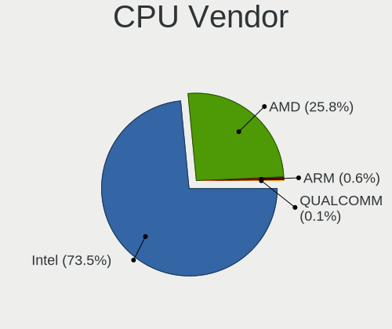

| Vendor   | Computers | Percent |
|----------|-----------|---------|
| Intel    | 621       | 73.75%  |
| AMD      | 214       | 25.42%  |
| ARM      | 6         | 0.71%   |
| QUALCOMM | 1         | 0.12%   |

CPU Model
---------

Processor models

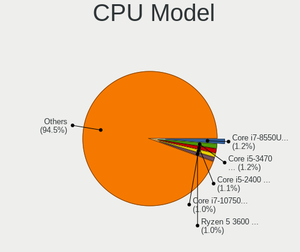

| Model                                         | Computers | Percent |
|-----------------------------------------------|-----------|---------|
| Intel Core i7-8550U CPU @ 1.80GHz             | 12        | 1.43%   |
| Intel Core i5-3470 CPU @ 3.20GHz              | 11        | 1.31%   |
| AMD Ryzen 5 3600 6-Core Processor             | 9         | 1.07%   |
| Intel Core i7-9750H CPU @ 2.60GHz             | 8         | 0.95%   |
| Intel Core i7-10750H CPU @ 2.60GHz            | 8         | 0.95%   |
| Intel Core i5-8265U CPU @ 1.60GHz             | 8         | 0.95%   |
| Intel Core i5-2400 CPU @ 3.10GHz              | 8         | 0.95%   |
| AMD Ryzen 7 3700X 8-Core Processor            | 8         | 0.95%   |
| Intel Core i5-6200U CPU @ 2.30GHz             | 7         | 0.83%   |
| Intel Core i5-2410M CPU @ 2.30GHz             | 7         | 0.83%   |
| Intel Core i5-10210U CPU @ 1.60GHz            | 7         | 0.83%   |
| Intel Core i7-8565U CPU @ 1.80GHz             | 6         | 0.71%   |
| Intel Core i7-7700HQ CPU @ 2.80GHz            | 6         | 0.71%   |
| Intel Core i7-3770 CPU @ 3.40GHz              | 6         | 0.71%   |
| Intel Core i5-7200U CPU @ 2.50GHz             | 6         | 0.71%   |
| Intel Core i5-6300U CPU @ 2.40GHz             | 6         | 0.71%   |
| Intel Core i5-2520M CPU @ 2.50GHz             | 6         | 0.71%   |
| Intel Core i5-2430M CPU @ 2.40GHz             | 6         | 0.71%   |
| Intel Core 2 Duo CPU P8600 @ 2.40GHz          | 6         | 0.71%   |
| AMD Ryzen 5 2600 Six-Core Processor           | 6         | 0.71%   |
| Intel Core i7-4790 CPU @ 3.60GHz              | 5         | 0.59%   |
| Intel Core i7-4770 CPU @ 3.40GHz              | 5         | 0.59%   |
| Intel Core i7-4600U CPU @ 2.10GHz             | 5         | 0.59%   |
| Intel Core i7-10510U CPU @ 1.80GHz            | 5         | 0.59%   |
| Intel Core i5-8250U CPU @ 1.60GHz             | 5         | 0.59%   |
| Intel Core i5-3230M CPU @ 2.60GHz             | 5         | 0.59%   |
| Intel Core i5-3210M CPU @ 2.50GHz             | 5         | 0.59%   |
| Intel Core i5 CPU M 460 @ 2.53GHz             | 5         | 0.59%   |
| Intel Celeron CPU N3350 @ 1.10GHz             | 5         | 0.59%   |
| Intel Celeron CPU N2840 @ 2.16GHz             | 5         | 0.59%   |
| AMD Ryzen 9 5950X 16-Core Processor           | 5         | 0.59%   |
| AMD Ryzen 7 5700G with Radeon Graphics        | 5         | 0.59%   |
| AMD Ryzen 5 3500U with Radeon Vega Mobile Gfx | 5         | 0.59%   |
| Intel Core i7-8650U CPU @ 1.90GHz             | 4         | 0.48%   |
| Intel Core i7-7500U CPU @ 2.70GHz             | 4         | 0.48%   |
| Intel Core i7-4790K CPU @ 4.00GHz             | 4         | 0.48%   |
| Intel Core i7-10700 CPU @ 2.90GHz             | 4         | 0.48%   |
| Intel Core i7-1065G7 CPU @ 1.30GHz            | 4         | 0.48%   |
| Intel Core i5-8350U CPU @ 1.70GHz             | 4         | 0.48%   |
| Intel Core i5-6500 CPU @ 3.20GHz              | 4         | 0.48%   |

CPU Model Family
----------------

Processor model prefix

| Model                   | Computers | Percent |
|-------------------------|-----------|---------|
| Intel Core i5           | 205       | 24.35%  |
| Intel Core i7           | 184       | 21.85%  |
| Other                   | 56        | 6.65%   |
| AMD Ryzen 5             | 45        | 5.34%   |
| Intel Core i3           | 39        | 4.63%   |
| AMD Ryzen 7             | 39        | 4.63%   |
| Intel Core 2 Duo        | 37        | 4.39%   |
| Intel Xeon              | 29        | 3.44%   |
| Intel Celeron           | 29        | 3.44%   |
| AMD Ryzen 9             | 23        | 2.73%   |
| AMD FX                  | 19        | 2.26%   |
| Intel Pentium           | 13        | 1.54%   |
| AMD A6                  | 12        | 1.43%   |
| Intel Core 2 Quad       | 11        | 1.31%   |
| Intel Atom              | 10        | 1.19%   |
| AMD Ryzen 3             | 8         | 0.95%   |
| AMD A8                  | 8         | 0.95%   |
| AMD A4                  | 7         | 0.83%   |
| AMD Ryzen 5 PRO         | 6         | 0.71%   |
| Intel Core i9           | 5         | 0.59%   |
| AMD Ryzen Threadripper  | 5         | 0.59%   |
| AMD E2                  | 5         | 0.59%   |
| AMD Athlon 64 X2        | 5         | 0.59%   |
| AMD Athlon II X2        | 4         | 0.48%   |
| Intel Pentium Silver    | 2         | 0.24%   |
| Intel Pentium M         | 2         | 0.24%   |
| Intel Pentium Dual-Core | 2         | 0.24%   |
| AMD Ryzen 7 PRO         | 2         | 0.24%   |
| AMD Phenom II X6        | 2         | 0.24%   |
| AMD Phenom II X4        | 2         | 0.24%   |
| AMD Opteron             | 2         | 0.24%   |
| AMD E1                  | 2         | 0.24%   |
| AMD E                   | 2         | 0.24%   |
| AMD Athlon II X4        | 2         | 0.24%   |
| AMD A10                 | 2         | 0.24%   |
| QUALCOMM AArch64        | 1         | 0.12%   |
| Intel Xeon Silver       | 1         | 0.12%   |
| Intel Pentium Gold      | 1         | 0.12%   |
| Intel Pentium Dual      | 1         | 0.12%   |
| Intel Pentium 4         | 1         | 0.12%   |

CPU Cores
---------

Number of processor cores

| Number | Computers | Percent |
|--------|-----------|---------|
| 4      | 322       | 38.15%  |
| 2      | 285       | 33.77%  |
| 6      | 89        | 10.55%  |
| 8      | 68        | 8.06%   |
| 12     | 25        | 2.96%   |
| 10     | 12        | 1.42%   |
| 1      | 11        | 1.3%    |
| 16     | 10        | 1.18%   |
| 14     | 9         | 1.07%   |
| 3      | 6         | 0.71%   |
| 24     | 3         | 0.36%   |
| 20     | 3         | 0.36%   |
| 64     | 1         | 0.12%   |

CPU Sockets
-----------

Number of sockets

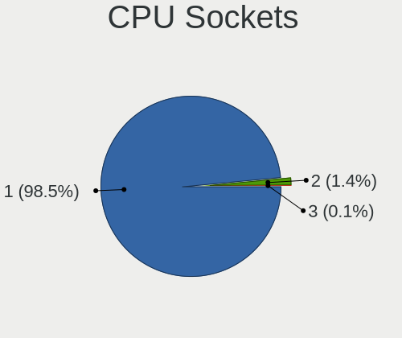

| Number | Computers | Percent |
|--------|-----------|---------|
| 1      | 829       | 98.46%  |
| 2      | 12        | 1.43%   |
| 3      | 1         | 0.12%   |

CPU Threads
-----------

Threads per core (Hyper-Threading)

| Number | Computers | Percent |
|--------|-----------|---------|
| 2      | 581       | 68.92%  |
| 1      | 261       | 30.96%  |
| 8      | 1         | 0.12%   |

CPU Op-Modes
------------

CPU Operation Modes (32-bit, 64-bit)

| Op mode        | Computers | Percent |
|----------------|-----------|---------|
| 32-bit, 64-bit | 828       | 97.41%  |
| Unknown        | 19        | 2.24%   |
| 32-bit         | 3         | 0.35%   |

CPU Microcode
-------------

Microcode number

| Number     | Computers | Percent |
|------------|-----------|---------|
| Unknown    | 293       | 33.14%  |
| 0x306a9    | 52        | 5.88%   |
| 0x206a7    | 49        | 5.54%   |
| 0x306c3    | 28        | 3.17%   |
| 0x1067a    | 25        | 2.83%   |
| 0x806ea    | 19        | 2.15%   |
| 0x806e9    | 18        | 2.04%   |
| 0x406e3    | 17        | 1.92%   |
| 0x806ec    | 16        | 1.81%   |
| 0x906e9    | 15        | 1.7%    |
| 0x08701021 | 15        | 1.7%    |
| 0x40651    | 12        | 1.36%   |
| 0x20655    | 12        | 1.36%   |
| 0x506e3    | 11        | 1.24%   |
| 0x06000852 | 10        | 1.13%   |
| 0xa0652    | 9         | 1.02%   |
| 0x106e5    | 9         | 1.02%   |
| 0x0a50000c | 9         | 1.02%   |
| 0x07030105 | 9         | 1.02%   |
| 0x906ea    | 8         | 0.9%    |
| 0x30678    | 8         | 0.9%    |
| 0x10676    | 8         | 0.9%    |
| 0x506c9    | 7         | 0.79%   |
| 0x306d4    | 7         | 0.79%   |
| 0x0a50000d | 7         | 0.79%   |
| 0x08108109 | 7         | 0.79%   |
| 0x0800820d | 7         | 0.79%   |
| 0xa0655    | 6         | 0.68%   |
| 0x906a4    | 6         | 0.68%   |
| 0x806c1    | 6         | 0.68%   |
| 0x0a601203 | 6         | 0.68%   |
| 0x06001119 | 6         | 0.68%   |
| 0x906a3    | 5         | 0.57%   |
| 0x806eb    | 5         | 0.57%   |
| 0x6fb      | 5         | 0.57%   |
| 0x106a5    | 5         | 0.57%   |
| 0x08600106 | 5         | 0.57%   |
| 0x08001137 | 5         | 0.57%   |
| 0x6fd      | 4         | 0.45%   |
| 0x406c4    | 4         | 0.45%   |

CPU Microarch
-------------

Microarchitecture

| Name              | Computers | Percent |
|-------------------|-----------|---------|
| KabyLake          | 134       | 15.91%  |
| IvyBridge         | 74        | 8.79%   |
| SandyBridge       | 68        | 8.08%   |
| Haswell           | 66        | 7.84%   |
| Penryn            | 46        | 5.46%   |
| Skylake           | 45        | 5.34%   |
| Zen 2             | 37        | 4.39%   |
| Zen 3             | 36        | 4.28%   |
| Unknown           | 36        | 4.28%   |
| CometLake         | 29        | 3.44%   |
| Silvermont        | 25        | 2.97%   |
| Zen+              | 24        | 2.85%   |
| Piledriver        | 23        | 2.73%   |
| Westmere          | 22        | 2.61%   |
| Alderlake Hybrid  | 19        | 2.26%   |
| Nehalem           | 18        | 2.14%   |
| Zen               | 14        | 1.66%   |
| Puma              | 14        | 1.66%   |
| TigerLake         | 12        | 1.43%   |
| K10               | 12        | 1.43%   |
| Excavator         | 11        | 1.31%   |
| Broadwell         | 11        | 1.31%   |
| Core              | 10        | 1.19%   |
| IceLake           | 8         | 0.95%   |
| Goldmont          | 8         | 0.95%   |
| K8 Hammer         | 6         | 0.71%   |
| Jaguar            | 6         | 0.71%   |
| Bulldozer         | 5         | 0.59%   |
| Bonnell           | 5         | 0.59%   |
| Goldmont plus     | 4         | 0.48%   |
| Bobcat            | 4         | 0.48%   |
| Tremont           | 3         | 0.36%   |
| P6                | 2         | 0.24%   |
| NetBurst          | 1         | 0.12%   |
| Meteorlake Hybrid | 1         | 0.12%   |
| K8 & K10 hybrid   | 1         | 0.12%   |
| K10 Llano         | 1         | 0.12%   |
| Gracemont         | 1         | 0.12%   |

Graphics
--------

GPU Vendor
----------

Vendors of graphics cards

| Vendor                     | Computers | Percent |
|----------------------------|-----------|---------|
| Intel                      | 458       | 46.31%  |
| Nvidia                     | 261       | 26.39%  |
| AMD                        | 255       | 25.78%  |
| Matrox Electronics Systems | 11        | 1.11%   |
| ASPEED Technology          | 4         | 0.4%    |

GPU Model
---------

Graphics card models

| Model                                                                                    | Computers | Percent |
|------------------------------------------------------------------------------------------|-----------|---------|
| Intel 2nd Generation Core Processor Family Integrated Graphics Controller                | 49        | 4.77%   |
| Intel 3rd Gen Core processor Graphics Controller                                         | 32        | 3.11%   |
| Intel UHD Graphics 620                                                                   | 25        | 2.43%   |
| Intel Skylake GT2 [HD Graphics 520]                                                      | 21        | 2.04%   |
| AMD Ellesmere [Radeon RX 470/480/570/570X/580/580X/590]                                  | 20        | 1.95%   |
| Intel HD Graphics 630                                                                    | 19        | 1.85%   |
| Intel Xeon E3-1200 v3/4th Gen Core Processor Integrated Graphics Controller              | 18        | 1.75%   |
| Intel HD Graphics 620                                                                    | 18        | 1.75%   |
| Intel Haswell-ULT Integrated Graphics Controller                                         | 17        | 1.65%   |
| AMD Cezanne [Radeon Vega Series / Radeon Vega Mobile Series]                             | 17        | 1.65%   |
| Intel WhiskeyLake-U GT2 [UHD Graphics 620]                                               | 15        | 1.46%   |
| Intel Core Processor Integrated Graphics Controller                                      | 15        | 1.46%   |
| Intel Atom Processor Z36xxx/Z37xxx Series Graphics & Display                             | 13        | 1.26%   |
| AMD Picasso/Raven 2 [Radeon Vega Series / Radeon Vega Mobile Series]                     | 13        | 1.26%   |
| Intel Xeon E3-1200 v2/3rd Gen Core processor Graphics Controller                         | 12        | 1.17%   |
| Intel HD Graphics 530                                                                    | 12        | 1.17%   |
| Intel CometLake-U GT2 [UHD Graphics]                                                     | 12        | 1.17%   |
| Intel Atom/Celeron/Pentium Processor x5-E8000/J3xxx/N3xxx Integrated Graphics Controller | 12        | 1.17%   |
| Intel TigerLake-LP GT2 [Iris Xe Graphics]                                                | 11        | 1.07%   |
| Intel CometLake-H GT2 [UHD Graphics]                                                     | 11        | 1.07%   |
| Intel Mobile 4 Series Chipset Integrated Graphics Controller                             | 10        | 0.97%   |
| Intel CoffeeLake-H GT2 [UHD Graphics 630]                                                | 10        | 0.97%   |
| Intel 4th Gen Core Processor Integrated Graphics Controller                              | 9         | 0.88%   |
| AMD Topaz XT [Radeon R7 M260/M265 / M340/M360 / M440/M445 / 530/535 / 620/625 Mobile]    | 9         | 0.88%   |
| AMD Stoney [Radeon R2/R3/R4/R5 Graphics]                                                 | 9         | 0.88%   |
| AMD Renoir [Radeon RX Vega 6 (Ryzen 4000/5000 Mobile Series)]                            | 9         | 0.88%   |
| AMD Mullins [Radeon R4/R5 Graphics]                                                      | 9         | 0.88%   |
| Nvidia GP102 [GeForce GTX 1080 Ti]                                                       | 8         | 0.78%   |
| AMD Raphael                                                                              | 8         | 0.78%   |
| AMD Cedar [Radeon HD 5000/6000/7350/8350 Series]                                         | 8         | 0.78%   |
| Nvidia GP108 [GeForce GT 1030]                                                           | 7         | 0.68%   |
| Nvidia GP106 [GeForce GTX 1060 6GB]                                                      | 7         | 0.68%   |
| Intel HD Graphics 500                                                                    | 7         | 0.68%   |
| Intel CometLake-S GT2 [UHD Graphics 630]                                                 | 7         | 0.68%   |
| Intel 4 Series Chipset Integrated Graphics Controller                                    | 7         | 0.68%   |
| Nvidia GK208B [GeForce GT 710]                                                           | 6         | 0.58%   |
| Intel HD Graphics 5500                                                                   | 6         | 0.58%   |
| Intel CoffeeLake-S GT2 [UHD Graphics 630]                                                | 6         | 0.58%   |
| Intel Alder Lake-UP3 GT2 [Iris Xe Graphics]                                              | 6         | 0.58%   |
| Intel Alder Lake-P GT2 [Iris Xe Graphics]                                                | 6         | 0.58%   |

GPU Combo
---------

Combinations of graphics cards

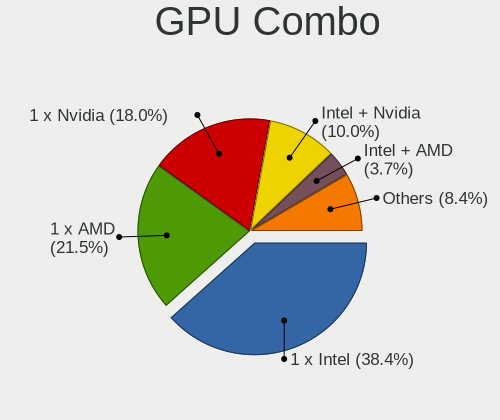

| Name                    | Computers | Percent |
|-------------------------|-----------|---------|
| 1 x Intel               | 330       | 38.78%  |
| 1 x AMD                 | 186       | 21.86%  |
| 1 x Nvidia              | 151       | 17.74%  |
| Intel + Nvidia          | 84        | 9.87%   |
| Intel + AMD             | 32        | 3.76%   |
| 2 x AMD                 | 22        | 2.59%   |
| AMD + Nvidia            | 15        | 1.76%   |
| 1 x Matrox              | 10        | 1.18%   |
| Other                   | 8         | 0.94%   |
| 2 x Nvidia              | 6         | 0.71%   |
| Nvidia + ASPEED         | 2         | 0.24%   |
| 2 x Nvidia + 1 x ASPEED | 1         | 0.12%   |
| 2 x Intel               | 1         | 0.12%   |
| AMD + 2 x Nvidia        | 1         | 0.12%   |
| AMD + Matrox            | 1         | 0.12%   |
| AMD + ASPEED            | 1         | 0.12%   |

GPU Driver
----------

Free vs proprietary

| Driver      | Computers | Percent |
|-------------|-----------|---------|
| Free        | 670       | 78.36%  |
| Proprietary | 152       | 17.78%  |
| Unknown     | 33        | 3.86%   |

GPU Memory
----------

Total video memory

| Size in GB | Computers | Percent |
|------------|-----------|---------|
| Unknown    | 496       | 56.82%  |
| 0.01-0.5   | 87        | 9.97%   |
| 1.01-2.0   | 86        | 9.85%   |
| 0.51-1.0   | 63        | 7.22%   |
| 3.01-4.0   | 49        | 5.61%   |
| 7.01-8.0   | 39        | 4.47%   |
| 5.01-6.0   | 24        | 2.75%   |
| 8.01-16.0  | 20        | 2.29%   |
| 2.01-3.0   | 6         | 0.69%   |
| 16.01-24.0 | 2         | 0.23%   |
| 32.01-64.0 | 1         | 0.11%   |

Monitor
-------

Monitor Vendor
--------------

Monitor vendors

| Vendor                  | Computers | Percent |
|-------------------------|-----------|---------|
| Samsung Electronics     | 125       | 12.87%  |
| AU Optronics            | 90        | 9.27%   |
| Dell                    | 77        | 7.93%   |
| LG Display              | 72        | 7.42%   |
| AOC                     | 70        | 7.21%   |
| Goldstar                | 68        | 7%      |
| Chimei Innolux          | 66        | 6.8%    |
| BOE                     | 53        | 5.46%   |
| Philips                 | 42        | 4.33%   |
| Hewlett-Packard         | 30        | 3.09%   |
| ViewSonic               | 27        | 2.78%   |
| Sharp                   | 18        | 1.85%   |
| Chi Mei Optoelectronics | 18        | 1.85%   |
| Apple                   | 18        | 1.85%   |
| Sony                    | 17        | 1.75%   |
| Lenovo                  | 16        | 1.65%   |
| Acer                    | 15        | 1.54%   |
| Panasonic               | 14        | 1.44%   |
| Ancor Communications    | 12        | 1.24%   |
| Denver                  | 11        | 1.13%   |
| BenQ                    | 10        | 1.03%   |
| MiTAC                   | 9         | 0.93%   |
| InfoVision              | 9         | 0.93%   |
| PANDA                   | 8         | 0.82%   |
| ASUSTek Computer        | 5         | 0.51%   |
| LG Electronics          | 4         | 0.41%   |
| Unknown                 | 3         | 0.31%   |
| MSI                     | 3         | 0.31%   |
| InnoLux Display         | 3         | 0.31%   |
| Gigabyte Technology     | 3         | 0.31%   |
| Unknown                 | 3         | 0.31%   |
| Yamaha                  | 2         | 0.21%   |
| Valve                   | 2         | 0.21%   |
| Unknown (AAA)           | 2         | 0.21%   |
| Toshiba                 | 2         | 0.21%   |
| SANYO                   | 2         | 0.21%   |
| Quanta Display          | 2         | 0.21%   |
| PRISM+                  | 2         | 0.21%   |
| Mi                      | 2         | 0.21%   |
| Konka                   | 2         | 0.21%   |

Monitor Model
-------------

Monitor models

| Model                                                                    | Computers | Percent |
|--------------------------------------------------------------------------|-----------|---------|
| Goldstar FULL HD GSM5B55 1920x1080 480x270mm 21.7-inch                   | 8         | 0.77%   |
| Panasonic TV MEIA296 1920x1080 698x392mm 31.5-inch                       | 7         | 0.68%   |
| Goldstar IPS FULLHD GSM5AB8 1920x1080 480x270mm 21.7-inch                | 6         | 0.58%   |
| Chi Mei Optoelectronics LCD Monitor CMO15A1 1366x768 344x193mm 15.5-inch | 6         | 0.58%   |
| AOC 27G2G3 AOC2702 1920x1080 598x336mm 27.0-inch                         | 6         | 0.58%   |
| Samsung Electronics U28E590 SAM0C4D 3840x2160 607x345mm 27.5-inch        | 5         | 0.48%   |
| MiTAC MStar Demo SZM0030 3840x2160 708x398mm 32.0-inch                   | 5         | 0.48%   |
| ViewSonic VA2248 SERIES VSC0E28 1920x1080 477x268mm 21.5-inch            | 4         | 0.39%   |
| Philips PHL 246V5 PHLC0C5 1920x1080 531x299mm 24.0-inch                  | 4         | 0.39%   |
| Philips PHL 243V7 PHLC155 1920x1080 527x296mm 23.8-inch                  | 4         | 0.39%   |
| Goldstar FULL HD GSM5AB9 1920x1080 480x270mm 21.7-inch                   | 4         | 0.39%   |
| Denver 34A5QR LHC3400 3440x1440 797x334mm 34.0-inch                      | 4         | 0.39%   |
| Denver 27C1R LHC2700 2560x1440 597x336mm 27.0-inch                       | 4         | 0.39%   |
| Chimei Innolux LCD Monitor CMN14E5 1920x1080 309x173mm 13.9-inch         | 4         | 0.39%   |
| Chimei Innolux LCD Monitor CMN14D4 1920x1080 309x173mm 13.9-inch         | 4         | 0.39%   |
| AU Optronics LCD Monitor AUO23EC 1366x768 344x193mm 15.5-inch            | 4         | 0.39%   |
| AOC 2470W AOC2470 1920x1080 521x293mm 23.5-inch                          | 4         | 0.39%   |
| Sony TV SNYEE01 1920x1080                                                | 3         | 0.29%   |
| Sharp LCD Monitor SHP144A 3200x1800 294x165mm 13.3-inch                  | 3         | 0.29%   |
| Sharp LCD Monitor SHP1449 1920x1080 294x165mm 13.3-inch                  | 3         | 0.29%   |
| Samsung Electronics S24F350 SAM0D20 1920x1080 521x293mm 23.5-inch        | 3         | 0.29%   |
| Samsung Electronics LS27AG32x SAM71DC 1920x1080 597x336mm 27.0-inch      | 3         | 0.29%   |
| Samsung Electronics C27F591 SAM0D37 1920x1080 598x336mm 27.0-inch        | 3         | 0.29%   |
| LG Display LCD Monitor LGD0465 1366x768 344x194mm 15.5-inch              | 3         | 0.29%   |
| LG Display LCD Monitor LGD0258 1600x900 345x194mm 15.6-inch              | 3         | 0.29%   |
| Dell P2416D DELA0C3 2560x1440 530x300mm 24.0-inch                        | 3         | 0.29%   |
| Dell P2214H DELA097 1920x1080 477x268mm 21.5-inch                        | 3         | 0.29%   |
| Chimei Innolux LCD Monitor CMN15BF 1366x768 344x194mm 15.5-inch          | 3         | 0.29%   |
| AU Optronics LCD Monitor AUO70EC 1366x768 344x193mm 15.5-inch            | 3         | 0.29%   |
| AU Optronics LCD Monitor AUO26EC 1366x768 344x193mm 15.5-inch            | 3         | 0.29%   |
| AU Optronics LCD Monitor AUO23ED 1920x1080 344x194mm 15.5-inch           | 3         | 0.29%   |
| AU Optronics LCD Monitor AUO123D 1920x1080 309x173mm 13.9-inch           | 3         | 0.29%   |
| AOC 2790WG5 AOC2790 1920x1080 598x336mm 27.0-inch                        | 3         | 0.29%   |
| AOC 2450W AOC2450 1920x1080 521x293mm 23.5-inch                          | 3         | 0.29%   |
| AOC 2367 AOC2367 1920x1080 509x286mm 23.0-inch                           | 3         | 0.29%   |
| AOC 2343 AOC2343 1920x1080 509x286mm 23.0-inch                           | 3         | 0.29%   |
| AOC 2260WG5 AOC2260 1920x1080 477x268mm 21.5-inch                        | 3         | 0.29%   |
| Ancor Communications VE247 ACI2493 1920x1080 531x299mm 24.0-inch         | 3         | 0.29%   |
| Unknown                                                                  | 3         | 0.29%   |
| ViewSonic VX2770 SERIES VSC3A2C 1920x1080 597x336mm 27.0-inch            | 2         | 0.19%   |

Monitor Resolution
------------------

Monitor screen resolution

| Resolution         | Computers | Percent |
|--------------------|-----------|---------|
| 1920x1080 (FHD)    | 390       | 41.62%  |
| 1366x768 (WXGA)    | 125       | 13.34%  |
| 3840x2160 (4K)     | 103       | 10.99%  |
| 2560x1440 (QHD)    | 46        | 4.91%   |
| 1600x900 (HD+)     | 41        | 4.38%   |
| 1680x1050 (WSXGA+) | 33        | 3.52%   |
| 1280x1024 (SXGA)   | 25        | 2.67%   |
| 1440x900 (WXGA+)   | 24        | 2.56%   |
| 3440x1440          | 22        | 2.35%   |
| 1920x1200 (WUXGA)  | 19        | 2.03%   |
| 1280x800 (WXGA)    | 18        | 1.92%   |
| Unknown            | 16        | 1.71%   |
| 3840x1080          | 10        | 1.07%   |
| 2560x1600          | 6         | 0.64%   |
| 1360x768           | 6         | 0.64%   |
| 2880x1800          | 5         | 0.53%   |
| 2560x1080          | 5         | 0.53%   |
| 3200x1800 (QHD+)   | 4         | 0.43%   |
| 1024x600           | 4         | 0.43%   |
| 3840x1600          | 3         | 0.32%   |
| 1920x540           | 3         | 0.32%   |
| 800x1280           | 2         | 0.21%   |
| 3840x2400          | 2         | 0.21%   |
| 3456x2160          | 2         | 0.21%   |
| 3200x2000          | 2         | 0.21%   |
| 2736x1824          | 2         | 0.21%   |
| 2288x1287          | 2         | 0.21%   |
| 1600x1200          | 2         | 0.21%   |
| 1024x768 (XGA)     | 2         | 0.21%   |
| 7680x1080          | 1         | 0.11%   |
| 6720x1080          | 1         | 0.11%   |
| 5760x1080          | 1         | 0.11%   |
| 5120x1080          | 1         | 0.11%   |
| 3840x1200          | 1         | 0.11%   |
| 3360x1080          | 1         | 0.11%   |
| 3040x1050          | 1         | 0.11%   |
| 2960x1050          | 1         | 0.11%   |
| 2880x1920          | 1         | 0.11%   |
| 2800x1752          | 1         | 0.11%   |
| 2560x1024          | 1         | 0.11%   |

Monitor Diagonal
----------------

Diagonal size in inches

| Inches  | Computers | Percent |
|---------|-----------|---------|
| 15      | 191       | 19.59%  |
| 27      | 83        | 8.51%   |
| 13      | 75        | 7.69%   |
| 24      | 72        | 7.38%   |
| 14      | 71        | 7.28%   |
| 23      | 68        | 6.97%   |
| 21      | 68        | 6.97%   |
| 17      | 52        | 5.33%   |
| Unknown | 45        | 4.62%   |
| 31      | 35        | 3.59%   |
| 22      | 26        | 2.67%   |
| 19      | 24        | 2.46%   |
| 20      | 19        | 1.95%   |
| 34      | 16        | 1.64%   |
| 84      | 14        | 1.44%   |
| 72      | 12        | 1.23%   |
| 16      | 10        | 1.03%   |
| 12      | 10        | 1.03%   |
| 18      | 9         | 0.92%   |
| 32      | 8         | 0.82%   |
| 11      | 8         | 0.82%   |
| 40      | 6         | 0.62%   |
| 10      | 6         | 0.62%   |
| 35      | 5         | 0.51%   |
| 52      | 4         | 0.41%   |
| 46      | 4         | 0.41%   |
| 37      | 4         | 0.41%   |
| 29      | 3         | 0.31%   |
| 28      | 3         | 0.31%   |
| 26      | 3         | 0.31%   |
| 142     | 2         | 0.21%   |
| 54      | 2         | 0.21%   |
| 33      | 2         | 0.21%   |
| 25      | 2         | 0.21%   |
| 7       | 2         | 0.21%   |
| 95      | 1         | 0.1%    |
| 67      | 1         | 0.1%    |
| 65      | 1         | 0.1%    |
| 60      | 1         | 0.1%    |
| 55      | 1         | 0.1%    |

Monitor Width
-------------

Physical width

| Width in mm    | Computers | Percent |
|----------------|-----------|---------|
| 301-350        | 315       | 33.09%  |
| 501-600        | 197       | 20.69%  |
| 401-500        | 133       | 13.97%  |
| 201-300        | 62        | 6.51%   |
| 601-700        | 58        | 6.09%   |
| 351-400        | 53        | 5.57%   |
| Unknown        | 45        | 4.73%   |
| 701-800        | 28        | 2.94%   |
| 1501-2000      | 25        | 2.63%   |
| 801-900        | 16        | 1.68%   |
| 1001-1500      | 15        | 1.58%   |
| More than 2000 | 2         | 0.21%   |
| 1-100          | 2         | 0.21%   |
| 901-1000       | 1         | 0.11%   |

Aspect Ratio
------------

Proportional relationship between the width and the height

| Ratio   | Computers | Percent |
|---------|-----------|---------|
| 16/9    | 621       | 73.49%  |
| 16/10   | 113       | 13.37%  |
| Unknown | 39        | 4.62%   |
| 21/9    | 26        | 3.08%   |
| 5/4     | 24        | 2.84%   |
| 4/3     | 6         | 0.71%   |
| 3/2     | 6         | 0.71%   |
| 32/9    | 4         | 0.47%   |
| 1.00    | 2         | 0.24%   |
| 0.67    | 2         | 0.24%   |
| 6/5     | 1         | 0.12%   |
| 0.45    | 1         | 0.12%   |

Monitor Area
------------

Area in inch

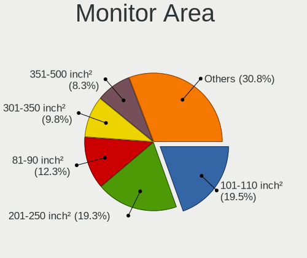

| Area in inch | Computers | Percent |
|----------------|-----------|---------|
| 201-250        | 191       | 19.96%  |
| 101-110        | 188       | 19.64%  |
| 81-90          | 114       | 11.91%  |
| 301-350        | 84        | 8.78%   |
| 351-500        | 72        | 7.52%   |
| 151-200        | 60        | 6.27%   |
| Unknown        | 45        | 4.7%    |
| 121-130        | 36        | 3.76%   |
| More than 1000 | 35        | 3.66%   |
| 71-80          | 33        | 3.45%   |
| 251-300        | 21        | 2.19%   |
| 141-150        | 20        | 2.09%   |
| 501-1000       | 19        | 1.99%   |
| 111-120        | 11        | 1.15%   |
| 61-70          | 8         | 0.84%   |
| 51-60          | 8         | 0.84%   |
| 41-50          | 6         | 0.63%   |
| 131-140        | 3         | 0.31%   |
| 1-40           | 2         | 0.21%   |
| 91-100         | 1         | 0.1%    |

Pixel Density
-------------

Pixels per inch

| Density       | Computers | Percent |
|---------------|-----------|---------|
| 51-100        | 314       | 33.51%  |
| 101-120       | 240       | 25.61%  |
| 121-160       | 230       | 24.55%  |
| 161-240       | 54        | 5.76%   |
| Unknown       | 45        | 4.8%    |
| 1-50          | 31        | 3.31%   |
| More than 240 | 23        | 2.45%   |

Multiple Monitors
-----------------

Total monitors connected

| Total | Computers | Percent |
|-------|-----------|---------|
| 1     | 641       | 72.68%  |
| 2     | 177       | 20.07%  |
| 0     | 36        | 4.08%   |
| 3     | 24        | 2.72%   |
| 4     | 4         | 0.45%   |

Network
-------

Net Controller Vendor
---------------------

Controller vendors

| Vendor                          | Computers | Percent |
|---------------------------------|-----------|---------|
| Intel                           | 465       | 35.91%  |
| Realtek Semiconductor           | 415       | 32.05%  |
| Qualcomm Atheros                | 114       | 8.8%    |
| Broadcom                        | 75        | 5.79%   |
| MediaTek                        | 29        | 2.24%   |
| TP-Link                         | 24        | 1.85%   |
| Ralink                          | 17        | 1.31%   |
| Nvidia                          | 17        | 1.31%   |
| Broadcom Limited                | 14        | 1.08%   |
| Ralink Technology               | 13        | 1%      |
| Marvell Technology Group        | 11        | 0.85%   |
| ASIX Electronics                | 8         | 0.62%   |
| Hewlett-Packard                 | 7         | 0.54%   |
| Samsung Electronics             | 5         | 0.39%   |
| Qualcomm Atheros Communications | 5         | 0.39%   |
| NetGear                         | 5         | 0.39%   |
| Microsoft                       | 5         | 0.39%   |
| DisplayLink                     | 5         | 0.39%   |
| Aquantia                        | 5         | 0.39%   |
| Sierra Wireless                 | 3         | 0.23%   |
| OPPO Electronics                | 3         | 0.23%   |
| Microchip Technology            | 3         | 0.23%   |
| Lenovo                          | 3         | 0.23%   |
| IBM                             | 3         | 0.23%   |
| Edimax Technology               | 3         | 0.23%   |
| QinHeng Electronics             | 2         | 0.15%   |
| Mellanox Technologies           | 2         | 0.15%   |
| MCS                             | 2         | 0.15%   |
| JMicron Technology              | 2         | 0.15%   |
| Dell                            | 2         | 0.15%   |
| D-Link                          | 2         | 0.15%   |
| ZTE WCDMA Technologies MSM      | 1         | 0.08%   |
| Xiaomi                          | 1         | 0.08%   |
| Wilocity                        | 1         | 0.08%   |
| Wacom                           | 1         | 0.08%   |
| vivo                            | 1         | 0.08%   |
| U-Blox                          | 1         | 0.08%   |
| Toshiba                         | 1         | 0.08%   |
| STMicroelectronics              | 1         | 0.08%   |
| Raspberry Pi                    | 1         | 0.08%   |

Net Controller Model
--------------------

Controller models

| Model                                                                  | Computers | Percent |
|------------------------------------------------------------------------|-----------|---------|
| Realtek RTL8111/8168/8211/8411 PCI Express Gigabit Ethernet Controller | 281       | 18.39%  |
| Intel 82579LM Gigabit Network Connection (Lewisville)                  | 47        | 3.08%   |
| Intel Wireless 8265 / 8275                                             | 39        | 2.55%   |
| Intel Wi-Fi 6 AX200                                                    | 39        | 2.55%   |
| Realtek RTL810xE PCI Express Fast Ethernet controller                  | 33        | 2.16%   |
| Realtek RTL8153 Gigabit Ethernet Adapter                               | 30        | 1.96%   |
| Realtek RTL8125 2.5GbE Controller                                      | 29        | 1.9%    |
| Qualcomm Atheros QCA6174 802.11ac Wireless Network Adapter             | 28        | 1.83%   |
| Intel I211 Gigabit Network Connection                                  | 22        | 1.44%   |
| Intel Wireless 8260                                                    | 21        | 1.37%   |
| Intel Wireless 7260                                                    | 18        | 1.18%   |
| Qualcomm Atheros AR9485 Wireless Network Adapter                       | 16        | 1.05%   |
| Qualcomm Atheros QCA9565 / AR9565 Wireless Network Adapter             | 15        | 0.98%   |
| Qualcomm Atheros AR8151 v2.0 Gigabit Ethernet                          | 15        | 0.98%   |
| Intel Wireless 3165                                                    | 15        | 0.98%   |
| Intel Comet Lake PCH-LP CNVi WiFi                                      | 15        | 0.98%   |
| Intel Wi-Fi 5(802.11ac) Wireless-AC 9x6x [Thunder Peak]                | 14        | 0.92%   |
| Intel Ethernet Connection (2) I219-LM                                  | 14        | 0.92%   |
| Intel Alder Lake-P PCH CNVi WiFi                                       | 14        | 0.92%   |
| Intel Wireless 7265                                                    | 13        | 0.85%   |
| Intel Ethernet Connection I217-LM                                      | 13        | 0.85%   |
| Intel Dual Band Wireless-AC 3168NGW [Stone Peak]                       | 13        | 0.85%   |
| Intel Comet Lake PCH CNVi WiFi                                         | 13        | 0.85%   |
| Intel Centrino Advanced-N 6205 [Taylor Peak]                           | 13        | 0.85%   |
| Realtek RTL8822CE 802.11ac PCIe Wireless Network Adapter               | 12        | 0.79%   |
| Qualcomm Atheros AR9285 Wireless Network Adapter (PCI-Express)         | 12        | 0.79%   |
| Intel Ethernet Controller I225-V                                       | 11        | 0.72%   |
| Realtek RTL88x2bu [AC1200 Techkey]                                     | 10        | 0.65%   |
| Qualcomm Atheros QCA9377 802.11ac Wireless Network Adapter             | 10        | 0.65%   |
| Intel Ethernet Connection (4) I219-V                                   | 10        | 0.65%   |
| Intel Ethernet Connection (4) I219-LM                                  | 10        | 0.65%   |
| Intel Ethernet Connection (2) I219-V                                   | 10        | 0.65%   |
| Intel Centrino Ultimate-N 6300                                         | 10        | 0.65%   |
| Intel Cannon Point-LP CNVi [Wireless-AC]                               | 10        | 0.65%   |
| Intel Cannon Lake PCH CNVi WiFi                                        | 10        | 0.65%   |
| Nvidia MCP79 Ethernet                                                  | 9         | 0.59%   |
| MediaTek MT7922 802.11ax PCI Express Wireless Network Adapter          | 9         | 0.59%   |
| MediaTek MT7921 802.11ax PCI Express Wireless Network Adapter          | 9         | 0.59%   |
| Intel Wi-Fi 6 AX201                                                    | 9         | 0.59%   |
| Intel Ethernet Connection I219-LM                                      | 9         | 0.59%   |

Wireless Vendor
---------------

Wireless vendors

| Vendor                                | Computers | Percent |
|---------------------------------------|-----------|---------|
| Intel                                 | 335       | 49.12%  |
| Qualcomm Atheros                      | 89        | 13.05%  |
| Realtek Semiconductor                 | 81        | 11.88%  |
| Broadcom                              | 50        | 7.33%   |
| MediaTek                              | 27        | 3.96%   |
| TP-Link                               | 23        | 3.37%   |
| Ralink                                | 17        | 2.49%   |
| Ralink Technology                     | 13        | 1.91%   |
| Broadcom Limited                      | 12        | 1.76%   |
| Qualcomm Atheros Communications       | 5         | 0.73%   |
| NetGear                               | 5         | 0.73%   |
| Microsoft                             | 4         | 0.59%   |
| Sierra Wireless                       | 3         | 0.44%   |
| Hewlett-Packard                       | 3         | 0.44%   |
| Edimax Technology                     | 3         | 0.44%   |
| Dell                                  | 2         | 0.29%   |
| D-Link                                | 2         | 0.29%   |
| Wilocity                              | 1         | 0.15%   |
| Wacom                                 | 1         | 0.15%   |
| Qualcomm                              | 1         | 0.15%   |
| Marvell Technology Group              | 1         | 0.15%   |
| Lite-On Technology                    | 1         | 0.15%   |
| Belkin Components                     | 1         | 0.15%   |
| ASUSTek Computer                      | 1         | 0.15%   |
| 802.11g Adapter [Linksys WUSB54GC v3] | 1         | 0.15%   |

Wireless Model
--------------

Wireless models

| Model                                                          | Computers | Percent |
|----------------------------------------------------------------|-----------|---------|
| Intel Wireless 8265 / 8275                                     | 39        | 5.65%   |
| Intel Wi-Fi 6 AX200                                            | 39        | 5.65%   |
| Qualcomm Atheros QCA6174 802.11ac Wireless Network Adapter     | 28        | 4.06%   |
| Intel Wireless 8260                                            | 21        | 3.04%   |
| Intel Wireless 7260                                            | 18        | 2.61%   |
| Qualcomm Atheros AR9485 Wireless Network Adapter               | 16        | 2.32%   |
| Qualcomm Atheros QCA9565 / AR9565 Wireless Network Adapter     | 15        | 2.17%   |
| Intel Wireless 3165                                            | 15        | 2.17%   |
| Intel Comet Lake PCH-LP CNVi WiFi                              | 15        | 2.17%   |
| Intel Wi-Fi 5(802.11ac) Wireless-AC 9x6x [Thunder Peak]        | 14        | 2.03%   |
| Intel Alder Lake-P PCH CNVi WiFi                               | 14        | 2.03%   |
| Intel Wireless 7265                                            | 13        | 1.88%   |
| Intel Dual Band Wireless-AC 3168NGW [Stone Peak]               | 13        | 1.88%   |
| Intel Comet Lake PCH CNVi WiFi                                 | 13        | 1.88%   |
| Intel Centrino Advanced-N 6205 [Taylor Peak]                   | 13        | 1.88%   |
| Realtek RTL8822CE 802.11ac PCIe Wireless Network Adapter       | 12        | 1.74%   |
| Qualcomm Atheros AR9285 Wireless Network Adapter (PCI-Express) | 12        | 1.74%   |
| Realtek RTL88x2bu [AC1200 Techkey]                             | 10        | 1.45%   |
| Qualcomm Atheros QCA9377 802.11ac Wireless Network Adapter     | 10        | 1.45%   |
| Intel Centrino Ultimate-N 6300                                 | 10        | 1.45%   |
| Intel Cannon Point-LP CNVi [Wireless-AC]                       | 10        | 1.45%   |
| Intel Cannon Lake PCH CNVi WiFi                                | 10        | 1.45%   |
| MediaTek MT7922 802.11ax PCI Express Wireless Network Adapter  | 9         | 1.3%    |
| MediaTek MT7921 802.11ax PCI Express Wireless Network Adapter  | 9         | 1.3%    |
| Intel Wi-Fi 6 AX201                                            | 9         | 1.3%    |
| Broadcom BCM4322 802.11a/b/g/n Wireless LAN Controller         | 9         | 1.3%    |
| Realtek RTL8821CE 802.11ac PCIe Wireless Network Adapter       | 8         | 1.16%   |
| Intel Wi-Fi 6E(802.11ax) AX210/AX1675* 2x2 [Typhoon Peak]      | 8         | 1.16%   |
| Broadcom BCM4313 802.11bgn Wireless Network Adapter            | 8         | 1.16%   |
| Realtek RTL8822BE 802.11a/b/g/n/ac WiFi adapter                | 7         | 1.01%   |
| Intel Centrino Advanced-N 6200                                 | 7         | 1.01%   |
| Broadcom BCM43142 802.11b/g/n                                  | 7         | 1.01%   |
| TP-Link TL-WN821N v5/v6 [RTL8192EU]                            | 6         | 0.87%   |
| Intel Centrino Wireless-N 2230                                 | 6         | 0.87%   |
| Broadcom BCM43228 802.11a/b/g/n                                | 6         | 0.87%   |
| TP-Link TL-WN822N Version 4 RTL8192EU                          | 5         | 0.72%   |
| Realtek RTL8812AE 802.11ac PCIe Wireless Network Adapter       | 5         | 0.72%   |
| Realtek RTL8723BE PCIe Wireless Network Adapter                | 5         | 0.72%   |
| Ralink MT7601U Wireless Adapter                                | 5         | 0.72%   |
| Intel WiFi Link 5100                                           | 5         | 0.72%   |

Ethernet Vendor
---------------

Ethernet vendors

| Vendor                     | Computers | Percent |
|----------------------------|-----------|---------|
| Realtek Semiconductor      | 380       | 47.44%  |
| Intel                      | 267       | 33.33%  |
| Qualcomm Atheros           | 41        | 5.12%   |
| Broadcom                   | 34        | 4.24%   |
| Nvidia                     | 17        | 2.12%   |
| Marvell Technology Group   | 10        | 1.25%   |
| ASIX Electronics           | 8         | 1%      |
| Samsung Electronics        | 5         | 0.62%   |
| DisplayLink                | 5         | 0.62%   |
| Aquantia                   | 5         | 0.62%   |
| OPPO Electronics           | 3         | 0.37%   |
| Lenovo                     | 3         | 0.37%   |
| IBM                        | 3         | 0.37%   |
| MediaTek                   | 2         | 0.25%   |
| JMicron Technology         | 2         | 0.25%   |
| Broadcom Limited           | 2         | 0.25%   |
| ZTE WCDMA Technologies MSM | 1         | 0.12%   |
| Xiaomi                     | 1         | 0.12%   |
| vivo                       | 1         | 0.12%   |
| TP-Link                    | 1         | 0.12%   |
| QinHeng Electronics        | 1         | 0.12%   |
| Microsoft                  | 1         | 0.12%   |
| Microchip Technology       | 1         | 0.12%   |
| Mellanox Technologies      | 1         | 0.12%   |
| Insyde Software            | 1         | 0.12%   |
| ICS Advent                 | 1         | 0.12%   |
| Huawei Technologies        | 1         | 0.12%   |
| Attansic Technology        | 1         | 0.12%   |
| Apple                      | 1         | 0.12%   |
| 3Com                       | 1         | 0.12%   |

Ethernet Model
--------------

Ethernet models

| Model                                                                  | Computers | Percent |
|------------------------------------------------------------------------|-----------|---------|
| Realtek RTL8111/8168/8211/8411 PCI Express Gigabit Ethernet Controller | 281       | 34.44%  |
| Intel 82579LM Gigabit Network Connection (Lewisville)                  | 47        | 5.76%   |
| Realtek RTL810xE PCI Express Fast Ethernet controller                  | 33        | 4.04%   |
| Realtek RTL8153 Gigabit Ethernet Adapter                               | 30        | 3.68%   |
| Realtek RTL8125 2.5GbE Controller                                      | 29        | 3.55%   |
| Intel I211 Gigabit Network Connection                                  | 22        | 2.7%    |
| Qualcomm Atheros AR8151 v2.0 Gigabit Ethernet                          | 15        | 1.84%   |
| Intel Ethernet Connection (2) I219-LM                                  | 14        | 1.72%   |
| Intel Ethernet Connection I217-LM                                      | 13        | 1.59%   |
| Intel Ethernet Controller I225-V                                       | 11        | 1.35%   |
| Intel Ethernet Connection (4) I219-V                                   | 10        | 1.23%   |
| Intel Ethernet Connection (4) I219-LM                                  | 10        | 1.23%   |
| Intel Ethernet Connection (2) I219-V                                   | 10        | 1.23%   |
| Nvidia MCP79 Ethernet                                                  | 9         | 1.1%    |
| Intel Ethernet Connection I219-LM                                      | 9         | 1.1%    |
| Intel 82579V Gigabit Network Connection                                | 9         | 1.1%    |
| Intel 82567LM-3 Gigabit Network Connection                             | 9         | 1.1%    |
| Intel Ethernet Connection I218-LM                                      | 8         | 0.98%   |
| Intel Ethernet Connection (6) I219-V                                   | 8         | 0.98%   |
| Intel Ethernet Connection (2) I218-V                                   | 7         | 0.86%   |
| Intel 82574L Gigabit Network Connection                                | 7         | 0.86%   |
| Intel I210 Gigabit Network Connection                                  | 6         | 0.74%   |
| Qualcomm Atheros Killer E220x Gigabit Ethernet Controller              | 5         | 0.61%   |
| Marvell Group 88E8056 PCI-E Gigabit Ethernet Controller                | 5         | 0.61%   |
| Intel Ethernet Connection (7) I219-LM                                  | 5         | 0.61%   |
| Intel 82577LM Gigabit Network Connection                               | 5         | 0.61%   |
| Intel 82577LC Gigabit Network Connection                               | 5         | 0.61%   |
| Intel 82567LM Gigabit Network Connection                               | 5         | 0.61%   |
| ASIX AX88179 Gigabit Ethernet                                          | 5         | 0.61%   |
| Qualcomm Atheros Killer E2500 Gigabit Ethernet Controller              | 4         | 0.49%   |
| Qualcomm Atheros AR8161 Gigabit Ethernet                               | 4         | 0.49%   |
| Intel Ethernet Connection (7) I219-V                                   | 4         | 0.49%   |
| Intel Ethernet Connection (5) I219-LM                                  | 4         | 0.49%   |
| Intel Ethernet Connection (10) I219-V                                  | 4         | 0.49%   |
| Broadcom NetXtreme BCM57766 Gigabit Ethernet PCIe                      | 4         | 0.49%   |
| Samsung Galaxy series, misc. (tethering mode)                          | 3         | 0.37%   |
| Realtek Killer E3000 2.5GbE Controller                                 | 3         | 0.37%   |
| Qualcomm Atheros Killer E2400 Gigabit Ethernet Controller              | 3         | 0.37%   |
| Qualcomm Atheros AR8131 Gigabit Ethernet                               | 3         | 0.37%   |
| Nvidia MCP61 Ethernet                                                  | 3         | 0.37%   |

Net Controller Kind
-------------------

Ethernet, WiFi or modem

| Kind     | Computers | Percent |
|----------|-----------|---------|
| Ethernet | 741       | 52.7%   |
| WiFi     | 644       | 45.8%   |
| Modem    | 19        | 1.35%   |
| Unknown  | 2         | 0.14%   |

Used Controller
---------------

Currently used network controller

| Kind     | Computers | Percent |
|----------|-----------|---------|
| WiFi     | 477       | 53%     |
| Ethernet | 423       | 47%     |

NICs
----

Total network controllers on board

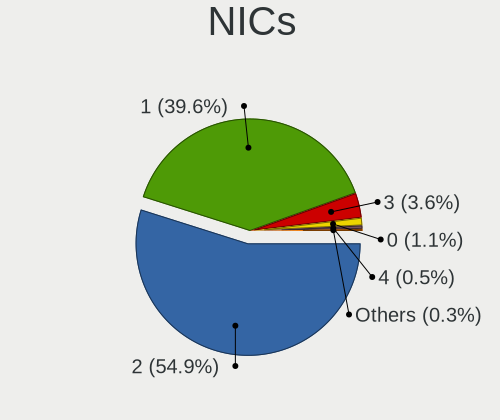

| Total | Computers | Percent |
|-------|-----------|---------|
| 2     | 469       | 55.37%  |
| 1     | 333       | 39.32%  |
| 3     | 28        | 3.31%   |
| 0     | 10        | 1.18%   |
| 4     | 4         | 0.47%   |
| 6     | 2         | 0.24%   |
| 8     | 1         | 0.12%   |

IPv6
----

IPv6 vs IPv4

| Used | Computers | Percent |
|------|-----------|---------|
| No   | 720       | 83.24%  |
| Yes  | 145       | 16.76%  |

Bluetooth
---------

Bluetooth Vendor
----------------

Controller vendors

| Vendor                          | Computers | Percent |
|---------------------------------|-----------|---------|
| Intel                           | 275       | 51.89%  |
| Qualcomm Atheros Communications | 35        | 6.6%    |
| Broadcom                        | 32        | 6.04%   |
| Cambridge Silicon Radio         | 29        | 5.47%   |
| Realtek Semiconductor           | 23        | 4.34%   |
| IMC Networks                    | 22        | 4.15%   |
| Apple                           | 22        | 4.15%   |
| Foxconn / Hon Hai               | 19        | 3.58%   |
| Lite-On Technology              | 17        | 3.21%   |
| Hewlett-Packard                 | 13        | 2.45%   |
| ASUSTek Computer                | 9         | 1.7%    |
| MediaTek                        | 7         | 1.32%   |
| Toshiba                         | 6         | 1.13%   |
| Ralink                          | 4         | 0.75%   |
| Dell                            | 4         | 0.75%   |
| Ralink Technology               | 3         | 0.57%   |
| Edimax Technology               | 3         | 0.57%   |
| Realtek                         | 2         | 0.38%   |
| Alps Electric                   | 2         | 0.38%   |
| Marvell Semiconductor           | 1         | 0.19%   |
| Integrated System Solution      | 1         | 0.19%   |
| HTC (High Tech Computer)        | 1         | 0.19%   |

Bluetooth Model
---------------

Controller models

| Model                                               | Computers | Percent |
|-----------------------------------------------------|-----------|---------|
| Intel Bluetooth Device                              | 59        | 11.07%  |
| Intel Bluetooth wireless interface                  | 47        | 8.82%   |
| Intel AX201 Bluetooth                               | 38        | 7.13%   |
| Intel AX200 Bluetooth                               | 35        | 6.57%   |
| Intel Bluetooth 9460/9560 Jefferson Peak (JfP)      | 31        | 5.82%   |
| Cambridge Silicon Radio Bluetooth Dongle (HCI mode) | 29        | 5.44%   |
| Realtek Bluetooth Radio                             | 16        | 3%      |
| Intel Wireless-AC 9260 Bluetooth Adapter            | 14        | 2.63%   |
| Intel Wireless-AC 3168 Bluetooth                    | 14        | 2.63%   |
| Intel AX211 Bluetooth                               | 14        | 2.63%   |
| Qualcomm Atheros  Bluetooth Device                  | 13        | 2.44%   |
| Apple Bluetooth Host Controller                     | 13        | 2.44%   |
| Intel Centrino Bluetooth Wireless Transceiver       | 12        | 2.25%   |
| IMC Networks Wireless_Device                        | 12        | 2.25%   |
| Qualcomm Atheros QCA61x4 Bluetooth 4.0              | 11        | 2.06%   |
| HP Broadcom 2070 Bluetooth Combo                    | 9         | 1.69%   |
| Intel AX210 Bluetooth                               | 8         | 1.5%    |
| IMC Networks Bluetooth Radio                        | 8         | 1.5%    |
| MediaTek Wireless_Device                            | 7         | 1.31%   |
| Apple Bluetooth USB Host Controller                 | 7         | 1.31%   |
| Lite-On Bluetooth Device                            | 6         | 1.13%   |
| Intel Centrino Advanced-N 6230 Bluetooth adapter    | 6         | 1.13%   |
| Qualcomm Atheros AR3011 Bluetooth                   | 5         | 0.94%   |
| Lite-On Atheros AR3012 Bluetooth                    | 5         | 0.94%   |
| Foxconn / Hon Hai Bluetooth Device                  | 5         | 0.94%   |
| Broadcom BCM20702A0 Bluetooth 4.0                   | 5         | 0.94%   |
| Broadcom BCM2045B (BDC-2.1)                         | 5         | 0.94%   |
| Realtek  Bluetooth 4.2 Adapter                      | 4         | 0.75%   |
| Ralink RT3290 Bluetooth                             | 4         | 0.75%   |
| Qualcomm Atheros AR3012 Bluetooth 4.0               | 4         | 0.75%   |
| Lite-On Qualcomm Atheros QCA9377 Bluetooth          | 4         | 0.75%   |
| Broadcom HP Portable SoftSailing                    | 4         | 0.75%   |
| Broadcom BCM43142A0 Bluetooth 4.0                   | 4         | 0.75%   |
| HP Bluetooth 2.0 Interface [Broadcom BCM2045]       | 3         | 0.56%   |
| Foxconn / Hon Hai Wireless_Device                   | 3         | 0.56%   |
| Foxconn / Hon Hai MediaTek Bluetooth Adapter        | 3         | 0.56%   |
| Foxconn / Hon Hai Acer Module                       | 3         | 0.56%   |
| Broadcom HP Portable Bumble Bee                     | 3         | 0.56%   |
| Broadcom BCM20702A0                                 | 3         | 0.56%   |
| ASUS Bluetooth Radio                                | 3         | 0.56%   |

Sound
-----

Sound Vendor
------------

Sound card vendors

| Vendor                                          | Computers | Percent |
|-------------------------------------------------|-----------|---------|
| Intel                                           | 589       | 47.93%  |
| AMD                                             | 274       | 22.29%  |
| Nvidia                                          | 211       | 17.17%  |
| C-Media Electronics                             | 21        | 1.71%   |
| Logitech                                        | 20        | 1.63%   |
| Hewlett-Packard                                 | 10        | 0.81%   |
| SteelSeries ApS                                 | 7         | 0.57%   |
| Kingston Technology                             | 6         | 0.49%   |
| Generalplus Technology                          | 6         | 0.49%   |
| Realtek Semiconductor                           | 5         | 0.41%   |
| Plantronics                                     | 5         | 0.41%   |
| Lenovo                                          | 5         | 0.41%   |
| JMTek                                           | 5         | 0.41%   |
| Razer USA                                       | 4         | 0.33%   |
| GN Netcom                                       | 4         | 0.33%   |
| Dell                                            | 4         | 0.33%   |
| GYROCOM C&C                                     | 3         | 0.24%   |
| FiiO Electronics Technology                     | 3         | 0.24%   |
| XMOS                                            | 2         | 0.16%   |
| Texas Instruments                               | 2         | 0.16%   |
| Microsoft                                       | 2         | 0.16%   |
| Creative Technology                             | 2         | 0.16%   |
| Creative Labs                                   | 2         | 0.16%   |
| ASUSTek Computer                                | 2         | 0.16%   |
| AKAI Professional M.I.                          | 2         | 0.16%   |
| Zoran Co. Personal Media Division (Nogatech)    | 1         | 0.08%   |
| VIA Technologies                                | 1         | 0.08%   |
| Trust International                             | 1         | 0.08%   |
| Sony                                            | 1         | 0.08%   |
| Sennheiser Communications                       | 1         | 0.08%   |
| Samson Technologies                             | 1         | 0.08%   |
| RODE Microphones                                | 1         | 0.08%   |
| RME                                             | 1         | 0.08%   |
| No brand                                        | 1         | 0.08%   |
| Micro Star International                        | 1         | 0.08%   |
| Medeli Electronics                              | 1         | 0.08%   |
| Licensed by Sony Computer Entertainment America | 1         | 0.08%   |
| Huawei Technologies                             | 1         | 0.08%   |
| Harman                                          | 1         | 0.08%   |
| Google                                          | 1         | 0.08%   |

Sound Model
-----------

Sound card models

| Model                                                                      | Computers | Percent |
|----------------------------------------------------------------------------|-----------|---------|
| Intel 7 Series/C216 Chipset Family High Definition Audio Controller        | 73        | 5.05%   |
| Intel Sunrise Point-LP HD Audio                                            | 71        | 4.91%   |
| Intel 6 Series/C200 Series Chipset Family High Definition Audio Controller | 59        | 4.08%   |
| AMD Family 17h/19h HD Audio Controller                                     | 58        | 4.01%   |
| AMD Starship/Matisse HD Audio Controller                                   | 44        | 3.04%   |
| Intel 8 Series/C220 Series Chipset High Definition Audio Controller        | 33        | 2.28%   |
| AMD Renoir Radeon High Definition Audio Controller                         | 32        | 2.21%   |
| AMD FCH Azalia Controller                                                  | 31        | 2.15%   |
| Intel Xeon E3-1200 v3/4th Gen Core Processor HD Audio Controller           | 29        | 2.01%   |
| AMD SBx00 Azalia (Intel HDA)                                               | 29        | 2.01%   |
| Intel 5 Series/3400 Series Chipset High Definition Audio                   | 27        | 1.87%   |
| Intel 100 Series/C230 Series Chipset Family HD Audio Controller            | 25        | 1.73%   |
| Intel Cannon Lake PCH cAVS                                                 | 24        | 1.66%   |
| AMD Family 17h (Models 00h-0fh) HD Audio Controller                        | 22        | 1.52%   |
| AMD Kabini HDMI/DP Audio                                                   | 21        | 1.45%   |
| AMD Ellesmere HDMI Audio [Radeon RX 470/480 / 570/580/590]                 | 20        | 1.38%   |
| Intel Cannon Point-LP High Definition Audio Controller                     | 19        | 1.31%   |
| Intel Haswell-ULT HD Audio Controller                                      | 18        | 1.25%   |
| Intel Alder Lake PCH-P High Definition Audio Controller                    | 18        | 1.25%   |
| Intel 8 Series HD Audio Controller                                         | 18        | 1.25%   |
| AMD Navi 21/23 HDMI/DP Audio Controller                                    | 18        | 1.25%   |
| Intel Comet Lake PCH cAVS                                                  | 17        | 1.18%   |
| Intel 82801I (ICH9 Family) HD Audio Controller                             | 17        | 1.18%   |
| Intel 200 Series PCH HD Audio                                              | 16        | 1.11%   |
| AMD Rembrandt Radeon High Definition Audio Controller                      | 16        | 1.11%   |
| Intel Comet Lake PCH-LP cAVS                                               | 15        | 1.04%   |
| Nvidia GP107GL High Definition Audio Controller                            | 14        | 0.97%   |
| Nvidia TU107 GeForce GTX 1650 High Definition Audio Controller             | 13        | 0.9%    |
| Intel Atom Processor Z36xxx/Z37xxx Series High Definition Audio Controller | 13        | 0.9%    |
| AMD Raven/Raven2/Fenghuang HDMI/DP Audio Controller                        | 13        | 0.9%    |
| AMD Oland/Hainan/Cape Verde/Pitcairn HDMI Audio [Radeon HD 7000 Series]    | 13        | 0.9%    |
| Intel Tiger Lake-LP Smart Sound Technology Audio Controller                | 12        | 0.83%   |
| Nvidia GP106 High Definition Audio Controller                              | 11        | 0.76%   |
| Nvidia GP104 High Definition Audio Controller                              | 11        | 0.76%   |
| Intel CM238 HD Audio Controller                                            | 11        | 0.76%   |
| Intel 9 Series Chipset Family HD Audio Controller                          | 11        | 0.76%   |
| AMD Turks HDMI Audio [Radeon HD 6500/6600 / 6700M Series]                  | 11        | 0.76%   |
| AMD Navi 10 HDMI Audio                                                     | 11        | 0.76%   |
| AMD Family 15h (Models 60h-6fh) Audio Controller                           | 11        | 0.76%   |
| Nvidia TU106 High Definition Audio Controller                              | 10        | 0.69%   |

Memory
------

Memory Vendor
-------------

Memory module vendors

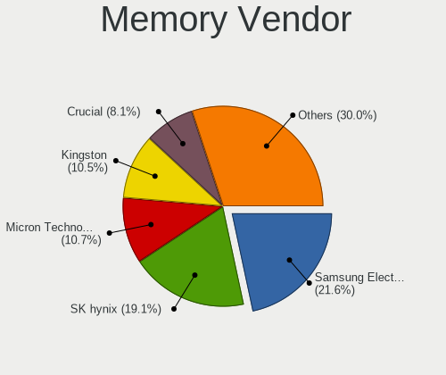

| Vendor              | Computers | Percent |
|---------------------|-----------|---------|
| Samsung Electronics | 115       | 22.07%  |
| SK hynix            | 98        | 18.81%  |
| Micron Technology   | 56        | 10.75%  |
| Kingston            | 51        | 9.79%   |
| Crucial             | 43        | 8.25%   |
| G.Skill             | 38        | 7.29%   |
| Unknown             | 27        | 5.18%   |
| A-DATA Technology   | 19        | 3.65%   |
| Corsair             | 16        | 3.07%   |
| Team                | 11        | 2.11%   |
| Elpida              | 8         | 1.54%   |
| Transcend           | 5         | 0.96%   |
| Strontium           | 5         | 0.96%   |
| Ramaxel Technology  | 4         | 0.77%   |
| Hewlett-Packard     | 3         | 0.58%   |
| Unknown (ABCD)      | 2         | 0.38%   |
| Shenzhen Mic        | 2         | 0.38%   |
| PNY                 | 2         | 0.38%   |
| Neo Forza           | 2         | 0.38%   |
| Nanya Technology    | 2         | 0.38%   |
| Unknown (D386)      | 1         | 0.19%   |
| Unknown (0x8783)    | 1         | 0.19%   |
| Unknown (0x0080)    | 1         | 0.19%   |
| Super Talent        | 1         | 0.19%   |
| pqi                 | 1         | 0.19%   |
| OCZ                 | 1         | 0.19%   |
| Netac               | 1         | 0.19%   |
| Innodisk            | 1         | 0.19%   |
| fef5                | 1         | 0.19%   |
| Atermiter           | 1         | 0.19%   |
| Apacer              | 1         | 0.19%   |
| Unknown             | 1         | 0.19%   |

Memory Model
------------

Memory module models

| Model                                                     | Computers | Percent |
|-----------------------------------------------------------|-----------|---------|
| SK hynix RAM HMT451S6BFR8A-PB 4GB SODIMM DDR3 1600MT/s    | 7         | 1.28%   |
| Samsung RAM M471B5273DH0-CH9 4GB SODIMM DDR3 1334MT/s     | 7         | 1.28%   |
| SK hynix RAM HMAA1GS6CJR6N-XN 8GB SODIMM DDR4 3200MT/s    | 5         | 0.91%   |
| Samsung RAM M471B5273CH0-CH9 4GB SODIMM DDR3 1334MT/s     | 5         | 0.91%   |
| SK hynix RAM HMAB2GS6AMR6N-XN 16GB SODIMM DDR4 3200MT/s   | 4         | 0.73%   |
| SK hynix RAM HMA81GS6DJR8N-XN 8192MB SODIMM DDR4 3200MT/s | 4         | 0.73%   |
| Samsung RAM Module 8GB SODIMM DDR4 2400MT/s               | 4         | 0.73%   |
| Samsung RAM M471B1G73DB0-YK0 8GB SODIMM DDR3 1600MT/s     | 4         | 0.73%   |
| Samsung RAM M471A1G44BB0-CWE 8GB SODIMM DDR4 3200MT/s     | 4         | 0.73%   |
| Micron RAM 16KTF1G64HZ-1G6E1 8GB SODIMM DDR3 1600MT/s     | 4         | 0.73%   |
| G.Skill RAM F4-3600C16-16GTZNC 16GB DIMM DDR4 3866MT/s    | 4         | 0.73%   |
| Team RAM TEAMGROUP-UD4-3600 16GB DIMM DDR4 3600MT/s       | 3         | 0.55%   |
| SK hynix RAM Module 16GB SODIMM DDR4 3200MT/s             | 3         | 0.55%   |
| SK hynix RAM HMT351S6CFR8C-PB 4GB SODIMM DDR3 1600MT/s    | 3         | 0.55%   |
| SK hynix RAM HMA81GS6AFR8N-UH 8GB SODIMM DDR4 2667MT/s    | 3         | 0.55%   |
| Samsung RAM Module 16GB SODIMM DDR4 2667MT/s              | 3         | 0.55%   |
| Samsung RAM M471B5173QH0-YK0 4GB SODIMM DDR3 1600MT/s     | 3         | 0.55%   |
| Samsung RAM M471B5173EB0-YK0 4GB SODIMM DDR3 1600MT/s     | 3         | 0.55%   |
| Samsung RAM M471B5173DB0-YK0 4GB SODIMM DDR3 1600MT/s     | 3         | 0.55%   |
| Samsung RAM M471A2K43DB1-CTD 16GB SODIMM DDR4 2667MT/s    | 3         | 0.55%   |
| Samsung RAM M471A2G43BB2-CWE 16GB SODIMM DDR4 3200MT/s    | 3         | 0.55%   |
| Samsung RAM M471A1K43CB1-CRC 8GB SODIMM DDR4 2667MT/s     | 3         | 0.55%   |
| G.Skill RAM F4-3200C16-16GVK 16GB DIMM DDR4 3600MT/s      | 3         | 0.55%   |
| G.Skill RAM F3-1600C9-4GAB 4GB DIMM DDR3 1600MT/s         | 3         | 0.55%   |
| Crucial RAM CT51264BF160BJ.C8F 4GB SODIMM DDR3 1600MT/s   | 3         | 0.55%   |
| Unknown RAM Module 8GB DIMM 1600MT/s                      | 2         | 0.36%   |
| Unknown RAM Module 4096MB SODIMM DDR3                     | 2         | 0.36%   |
| Unknown RAM Module 2048MB DIMM DDR3 1333MT/s              | 2         | 0.36%   |
| Team RAM TEAMGROUP-SD4-2666 8GB SODIMM DDR4 2667MT/s      | 2         | 0.36%   |
| SK hynix RAM Module 8GB SODIMM DDR4 2400MT/s              | 2         | 0.36%   |
| SK hynix RAM Module 8GB SODIMM DDR4 2133MT/s              | 2         | 0.36%   |
| SK hynix RAM Module 16GB SODIMM DDR5 4800MT/s             | 2         | 0.36%   |
| SK hynix RAM HYMP125S64CP8-S6 2GB SODIMM DDR2 975MT/s     | 2         | 0.36%   |
| SK hynix RAM HYMP125S64CP8-S6 2GB SODIMM DDR2 800MT/s     | 2         | 0.36%   |
| SK hynix RAM HMT41GS6AFR8A-PB 8GB SODIMM DDR3 1600MT/s    | 2         | 0.36%   |
| SK hynix RAM HMT351U6EFR8C-PB 4GB DIMM DDR3 1600MT/s      | 2         | 0.36%   |
| SK hynix RAM HMT351S6EFR8C-PB 4096MB SODIMM DDR3 1600MT/s | 2         | 0.36%   |
| SK hynix RAM HMT351S6BFR8C-H9 4GB SODIMM DDR3 1333MT/s    | 2         | 0.36%   |
| SK hynix RAM HMT125S6TFR8C-H9 2GB SODIMM DDR3 1334MT/s    | 2         | 0.36%   |
| SK hynix RAM HMA851S6DJR6N-XN 4GB SODIMM DDR4 3200MT/s    | 2         | 0.36%   |

Memory Kind
-----------

Memory module kinds

| Kind    | Computers | Percent |
|---------|-----------|---------|
| DDR4    | 207       | 47.48%  |
| DDR3    | 149       | 34.17%  |
| DDR5    | 15        | 3.44%   |
| LPDDR3  | 13        | 2.98%   |
| DDR2    | 13        | 2.98%   |
| Unknown | 12        | 2.75%   |
| SDRAM   | 11        | 2.52%   |
| LPDDR4  | 9         | 2.06%   |
| LPDDR5  | 6         | 1.38%   |
| DDR     | 1         | 0.23%   |

Memory Form Factor
------------------

Physical design of the memory module

| Name         | Computers | Percent |
|--------------|-----------|---------|
| SODIMM       | 251       | 57.83%  |
| DIMM         | 147       | 33.87%  |
| Row Of Chips | 27        | 6.22%   |
| Chip         | 4         | 0.92%   |
| Unknown      | 4         | 0.92%   |
| FB-DIMM      | 1         | 0.23%   |

Memory Size
-----------

Memory module size

| Size  | Computers | Percent |
|-------|-----------|---------|
| 8192  | 171       | 36.77%  |
| 4096  | 121       | 26.02%  |
| 16384 | 93        | 20%     |
| 2048  | 49        | 10.54%  |
| 32768 | 26        | 5.59%   |
| 1024  | 4         | 0.86%   |
| 65536 | 1         | 0.22%   |

Memory Speed
------------

Memory module speed

| Speed   | Computers | Percent |
|---------|-----------|---------|
| 1600    | 101       | 21.49%  |
| 3200    | 75        | 15.96%  |
| 2667    | 49        | 10.43%  |
| 2400    | 32        | 6.81%   |
| 1333    | 30        | 6.38%   |
| 2133    | 21        | 4.47%   |
| 3600    | 20        | 4.26%   |
| 1334    | 17        | 3.62%   |
| 1867    | 14        | 2.98%   |
| 4800    | 10        | 2.13%   |
| 1067    | 10        | 2.13%   |
| 3733    | 8         | 1.7%    |
| 667     | 8         | 1.7%    |
| 800     | 7         | 1.49%   |
| 6400    | 6         | 1.28%   |
| 3800    | 6         | 1.28%   |
| Unknown | 5         | 1.06%   |
| 3866    | 4         | 0.85%   |
| 2666    | 4         | 0.85%   |
| 8400    | 3         | 0.64%   |
| 5600    | 3         | 0.64%   |
| 4267    | 3         | 0.64%   |
| 4199    | 3         | 0.64%   |
| 2800    | 3         | 0.64%   |
| 2048    | 3         | 0.64%   |
| 1066    | 3         | 0.64%   |
| 3466    | 2         | 0.43%   |
| 3400    | 2         | 0.43%   |
| 1866    | 2         | 0.43%   |
| 1800    | 2         | 0.43%   |
| 975     | 2         | 0.43%   |
| 7500    | 1         | 0.21%   |
| 7467    | 1         | 0.21%   |
| 6000    | 1         | 0.21%   |
| 3534    | 1         | 0.21%   |
| 3151    | 1         | 0.21%   |
| 3000    | 1         | 0.21%   |
| 2933    | 1         | 0.21%   |
| 2465    | 1         | 0.21%   |
| 2448    | 1         | 0.21%   |

Printers & scanners
-------------------

Printer Vendor
--------------

Printer device vendors

| Vendor              | Computers | Percent |
|---------------------|-----------|---------|
| Hewlett-Packard     | 9         | 33.33%  |
| Brother Industries  | 8         | 29.63%  |
| Canon               | 5         | 18.52%  |
| Sato                | 1         | 3.7%    |
| Samsung Electronics | 1         | 3.7%    |
| Prolific Technology | 1         | 3.7%    |
| Fuji Xerox          | 1         | 3.7%    |
| Dymo-CoStar         | 1         | 3.7%    |

Printer Model
-------------

Printer device models

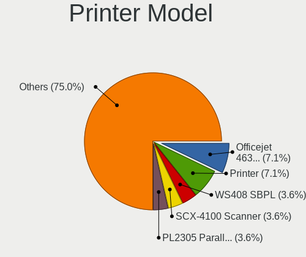

| Model                            | Computers | Percent |
|----------------------------------|-----------|---------|
| HP Officejet 4630 series         | 2         | 7.41%   |
| Brother Printer                  | 2         | 7.41%   |
| Sato WS408 SBPL                  | 1         | 3.7%    |
| Samsung SCX-4100 Scanner         | 1         | 3.7%    |
| Prolific PL2305 Parallel Port    | 1         | 3.7%    |
| HP OfficeJet Pro 9010 series     | 1         | 3.7%    |
| HP OfficeJet 8010 series         | 1         | 3.7%    |
| HP LaserJet Professional P1102w  | 1         | 3.7%    |
| HP ENVY 6400 series              | 1         | 3.7%    |
| HP ENVY 4520 series              | 1         | 3.7%    |
| HP DeskJet 2300 series           | 1         | 3.7%    |
| HP DeskJet 2130 series           | 1         | 3.7%    |
| Fuji Xerox DocuPrint CM315/318 z | 1         | 3.7%    |
| Dymo-CoStar LabelWriter 450      | 1         | 3.7%    |
| Canon TS3100 series              | 1         | 3.7%    |
| Canon MB5300 series              | 1         | 3.7%    |
| Canon LBP6000                    | 1         | 3.7%    |
| Canon i950                       | 1         | 3.7%    |
| Canon G3010 series               | 1         | 3.7%    |
| Brother MFC-J430W                | 1         | 3.7%    |
| Brother MFC-9140CDN              | 1         | 3.7%    |
| Brother MFC-7340                 | 1         | 3.7%    |
| Brother HL-L3230CDW series       | 1         | 3.7%    |
| Brother HL-2270DW Laser Printer  | 1         | 3.7%    |
| Brother HL-1430 Laser Printer    | 1         | 3.7%    |

Scanner Vendor
--------------

Scanner device vendors

| Vendor | Computers | Percent |
|--------|-----------|---------|
| Canon  | 3         | 100%    |

Scanner Model
-------------

Scanner device models

| Model                              | Computers | Percent |
|------------------------------------|-----------|---------|
| Canon CanoScan N670U/N676U/LiDE 20 | 1         | 33.33%  |
| Canon CanoScan LiDE 500F           | 1         | 33.33%  |
| Canon CanoScan LIDE 25             | 1         | 33.33%  |

Camera
------

Camera Vendor
-------------

Camera device vendors

| Vendor                                 | Computers | Percent |
|----------------------------------------|-----------|---------|
| Chicony Electronics                    | 118       | 24.33%  |
| Logitech                               | 43        | 8.87%   |
| IMC Networks                           | 36        | 7.42%   |
| Realtek Semiconductor                  | 35        | 7.22%   |
| Microdia                               | 32        | 6.6%    |
| Sunplus Innovation Technology          | 27        | 5.57%   |
| Quanta                                 | 27        | 5.57%   |
| Bison Electronics                      | 22        | 4.54%   |
| Apple                                  | 19        | 3.92%   |
| Cheng Uei Precision Industry (Foxlink) | 16        | 3.3%    |
| Lite-On Technology                     | 13        | 2.68%   |
| Suyin                                  | 12        | 2.47%   |
| Luxvisions Innotech Limited            | 11        | 2.27%   |
| Syntek                                 | 8         | 1.65%   |
| Samsung Electronics                    | 8         | 1.65%   |
| Ricoh                                  | 4         | 0.82%   |
| Primax Electronics                     | 4         | 0.82%   |
| Alcor Micro                            | 4         | 0.82%   |
| Acer                                   | 4         | 0.82%   |
| Z-Star Microelectronics                | 3         | 0.62%   |
| Silicon Motion                         | 3         | 0.62%   |
| Microsoft                              | 3         | 0.62%   |
| GEMBIRD                                | 3         | 0.62%   |
| ARC International                      | 3         | 0.62%   |
| Sonix Technology                       | 2         | 0.41%   |
| ShineTech                              | 2         | 0.41%   |
| KYE Systems (Mouse Systems)            | 2         | 0.41%   |
| Importek                               | 2         | 0.41%   |
| ALi                                    | 2         | 0.41%   |
| Yealink Network Technology             | 1         | 0.21%   |
| Xiongmai                               | 1         | 0.21%   |
| ValueHD                                | 1         | 0.21%   |
| Sunplus IT                             | 1         | 0.21%   |
| Speed Tech                             | 1         | 0.21%   |
| OPPO Electronics                       | 1         | 0.21%   |
| Novatek Microelectronics               | 1         | 0.21%   |
| MacroSilicon                           | 1         | 0.21%   |
| Lenovo                                 | 1         | 0.21%   |
| Intel                                  | 1         | 0.21%   |
| Google                                 | 1         | 0.21%   |

Camera Model
------------

Camera device models

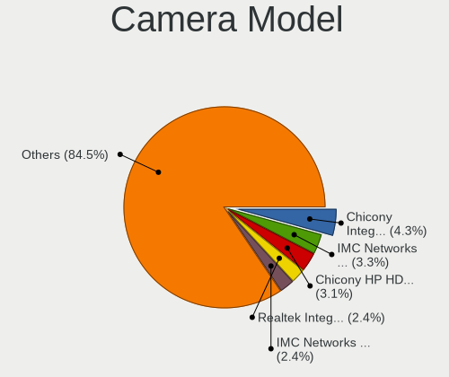

| Model                                               | Computers | Percent |
|-----------------------------------------------------|-----------|---------|
| Chicony Integrated Camera                           | 21        | 4.3%    |
| IMC Networks USB2.0 HD UVC WebCam                   | 17        | 3.48%   |
| Chicony HP HD Camera                                | 16        | 3.28%   |
| Realtek Integrated_Webcam_HD                        | 13        | 2.66%   |
| Chicony HD WebCam                                   | 12        | 2.46%   |
| IMC Networks Integrated Camera                      | 11        | 2.25%   |
| Apple Built-in iSight                               | 9         | 1.84%   |
| Samsung Galaxy series, misc. (MTP mode)             | 8         | 1.64%   |
| Logitech Webcam C270                                | 8         | 1.64%   |
| Sunplus Integrated_Webcam_HD                        | 7         | 1.43%   |
| Sunplus HP HD Webcam [Fixed]                        | 7         | 1.43%   |
| Microdia Integrated_Webcam_HD                       | 7         | 1.43%   |
| Microdia Integrated Webcam HD                       | 6         | 1.23%   |
| Logitech Webcam C170                                | 6         | 1.23%   |
| Logitech HD Pro Webcam C920                         | 6         | 1.23%   |
| Chicony TOSHIBA Web Camera - HD                     | 6         | 1.23%   |
| Chicony HP HD Webcam                                | 6         | 1.23%   |
| Bison Integrated Camera                             | 6         | 1.23%   |
| Realtek HP Truevision HD                            | 5         | 1.02%   |
| Quanta HP HD Camera                                 | 5         | 1.02%   |
| Cheng Uei Precision Industry (Foxlink) HP HD Camera | 5         | 1.02%   |
| Syntek Integrated Camera                            | 4         | 0.82%   |
| Quanta HP TrueVision HD Camera                      | 4         | 0.82%   |
| Luxvisions Innotech Limited HP HD Camera            | 4         | 0.82%   |
| Lite-On Integrated Camera                           | 4         | 0.82%   |
| Chicony HP Wide Vision HD Camera                    | 4         | 0.82%   |
| Bison HD Webcam                                     | 4         | 0.82%   |
| Sunplus HD WebCam                                   | 3         | 0.61%   |
| Quanta Laptop_Integrated_Webcam_2HDM                | 3         | 0.61%   |
| Quanta HD User Facing                               | 3         | 0.61%   |
| Luxvisions Innotech Limited HP 5MP Camera           | 3         | 0.61%   |
| Logitech QuickCam Pro 9000                          | 3         | 0.61%   |
| Logitech HD Webcam C615                             | 3         | 0.61%   |
| Logitech HD Webcam C510                             | 3         | 0.61%   |
| Lite-On HP HD Camera                                | 3         | 0.61%   |
| Chicony VGA Webcam                                  | 3         | 0.61%   |
| Chicony USB2.0 Camera                               | 3         | 0.61%   |
| Chicony Integrated HP HD Webcam                     | 3         | 0.61%   |
| Chicony HP TrueVision HD                            | 3         | 0.61%   |
| Bison SunplusIT Integrated Camera                   | 3         | 0.61%   |

Security
--------

Fingerprint Vendor
------------------

Fingerprint sensor vendors

| Vendor                     | Computers | Percent |
|----------------------------|-----------|---------|
| Validity Sensors           | 64        | 48.85%  |
| Synaptics                  | 38        | 29.01%  |
| Shenzhen Goodix Technology | 7         | 5.34%   |
| AuthenTec                  | 7         | 5.34%   |
| Upek                       | 6         | 4.58%   |
| Elan Microelectronics      | 6         | 4.58%   |
| LighTuning Technology      | 2         | 1.53%   |
| STMicroelectronics         | 1         | 0.76%   |

Fingerprint Model
-----------------

Fingerprint sensor models

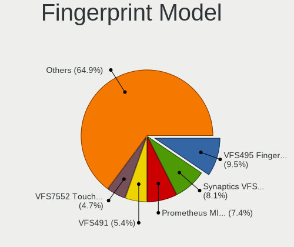

| Model                                                                      | Computers | Percent |
|----------------------------------------------------------------------------|-----------|---------|
| Validity Sensors VFS495 Fingerprint Reader                                 | 14        | 10.69%  |
| Validity Sensors Synaptics VFS7552 Touch Fingerprint Sensor with PurePrint | 9         | 6.87%   |
| Validity Sensors VFS491                                                    | 8         | 6.11%   |
| Validity Sensors VFS7552 Touch Fingerprint Sensor                          | 7         | 5.34%   |
| Synaptics Prometheus MIS Touch Fingerprint Reader                          | 7         | 5.34%   |
| Synaptics FS7604 Touch Fingerprint Sensor with PurePrint                   | 7         | 5.34%   |
| Validity Sensors VFS7500 Touch Fingerprint Sensor                          | 6         | 4.58%   |
| Upek Biometric Touchchip/Touchstrip Fingerprint Sensor                     | 6         | 4.58%   |
| Synaptics  FS7604 Touch Fingerprint Sensor with PurePrint                  | 6         | 4.58%   |
| Validity Sensors VFS451 Fingerprint Reader                                 | 5         | 3.82%   |
| Validity Sensors VFS471 Fingerprint Reader                                 | 4         | 3.05%   |
| Synaptics UWP WBDI                                                         | 4         | 3.05%   |
| Synaptics Fingerprint reader [HP G6]                                       | 4         | 3.05%   |
| Shenzhen Goodix  Fingerprint Device                                        | 4         | 3.05%   |
| Elan ELAN:Fingerprint                                                      | 4         | 3.05%   |
| Validity Sensors Synaptics WBDI                                            | 3         | 2.29%   |
| Synaptics Metallica MIS Touch Fingerprint Reader                           | 3         | 2.29%   |
| AuthenTec Fingerprint Sensor                                               | 3         | 2.29%   |
| Validity Sensors VFS301 Fingerprint Reader                                 | 2         | 1.53%   |
| Validity Sensors VFS 5011 fingerprint sensor                               | 2         | 1.53%   |
| Validity Sensors Synaptics VFS7552 Touch Fingerprint Sensor                | 2         | 1.53%   |
| Validity Sensors Swipe Fingerprint Sensor                                  | 2         | 1.53%   |
| Synaptics WBDI                                                             | 2         | 1.53%   |
| Synaptics Metallica MOH Touch Fingerprint Reader                           | 2         | 1.53%   |
| Shenzhen Goodix FingerPrint                                                | 2         | 1.53%   |
| LighTuning EgisTec Touch Fingerprint Sensor                                | 2         | 1.53%   |
| Elan ELAN:ARM-M4                                                           | 2         | 1.53%   |
| Synaptics WBDI Fingerprint Reader USB 102                                  | 1         | 0.76%   |
| Synaptics  WBDI                                                            | 1         | 0.76%   |
| STMicroelectronics Fingerprint Reader                                      | 1         | 0.76%   |
| Shenzhen Goodix Fingerprint Reader                                         | 1         | 0.76%   |
| AuthenTec AES2810                                                          | 1         | 0.76%   |
| AuthenTec AES2550 Fingerprint Sensor                                       | 1         | 0.76%   |
| AuthenTec AES2501 Fingerprint Sensor                                       | 1         | 0.76%   |
| AuthenTec AES1600                                                          | 1         | 0.76%   |
| Unknown                                                                    | 1         | 0.76%   |

Chipcard Vendor
---------------

Chipcard module vendors

| Vendor      | Computers | Percent |
|-------------|-----------|---------|
| Broadcom    | 18        | 69.23%  |
| Lenovo      | 3         | 11.54%  |
| Alcor Micro | 3         | 11.54%  |
| Upek        | 1         | 3.85%   |
| O2 Micro    | 1         | 3.85%   |

Chipcard Model
--------------

Chipcard module models

| Model                                                                        | Computers | Percent |
|------------------------------------------------------------------------------|-----------|---------|
| Broadcom BCM5880 Secure Applications Processor                               | 7         | 26.92%  |
| Broadcom 58200                                                               | 5         | 19.23%  |
| Broadcom 5880                                                                | 4         | 15.38%  |
| Lenovo Integrated Smart Card Reader                                          | 3         | 11.54%  |
| Alcor Micro AU9540 Smartcard Reader                                          | 3         | 11.54%  |
| Broadcom BCM5880 Secure Applications Processor with fingerprint swipe sensor | 2         | 7.69%   |
| Upek TouchChip Fingerprint Coprocessor (WBF advanced mode)                   | 1         | 3.85%   |
| O2 Micro OZ776 CCID Smartcard Reader                                         | 1         | 3.85%   |

Unsupported
-----------

Unsupported Devices
-------------------

Total unsupported devices on board

| Total | Computers | Percent |
|-------|-----------|---------|
| 0     | 576       | 65.83%  |
| 1     | 250       | 28.57%  |
| 2     | 41        | 4.69%   |
| 3     | 3         | 0.34%   |
| 6     | 2         | 0.23%   |
| 5     | 2         | 0.23%   |
| 4     | 1         | 0.11%   |

Unsupported Device Types
------------------------

Types of unsupported devices

| Type                     | Computers | Percent |
|--------------------------|-----------|---------|
| Fingerprint reader       | 129       | 37.07%  |
| Graphics card            | 67        | 19.25%  |
| Net/wireless             | 52        | 14.94%  |
| Chipcard                 | 24        | 6.9%    |
| Multimedia controller    | 19        | 5.46%   |
| Camera                   | 9         | 2.59%   |
| Bluetooth                | 9         | 2.59%   |
| Communication controller | 7         | 2.01%   |
| Unassigned class         | 6         | 1.72%   |
| Sound                    | 6         | 1.72%   |
| Net/ethernet             | 4         | 1.15%   |
| Modem                    | 3         | 0.86%   |
| Dvb card                 | 3         | 0.86%   |
| Storage/ide              | 2         | 0.57%   |
| Storage                  | 2         | 0.57%   |
| Network                  | 2         | 0.57%   |
| Card reader              | 2         | 0.57%   |
| Storage/raid             | 1         | 0.29%   |
| Flash memory             | 1         | 0.29%   |

