Linux in New Zealand - Tested Hardware & Statistics (Desktops)
--------------------------------------------------------------

A project to collect tested hardware configurations for Linux in New Zealand.

Anyone can contribute to this report by the [hw-probe](https://github.com/linuxhw/hw-probe) tool:

    sudo -E hw-probe -all -upload

Please contribute! Especially if your hardware is rare.

Contents
--------

* [ Test Cases ](#test-cases)

* [ System ](#system)
  - [ OS                       ](#os)
  - [ OS Family                ](#os-family)
  - [ Kernel                   ](#kernel)
  - [ Kernel Family            ](#kernel-family)
  - [ Kernel Major Ver.        ](#kernel-major-ver)
  - [ Arch                     ](#arch)
  - [ DE                       ](#de)
  - [ Display Server           ](#display-server)
  - [ Display Manager          ](#display-manager)
  - [ OS Lang                  ](#os-lang)
  - [ Boot Mode                ](#boot-mode)
  - [ Filesystem               ](#filesystem)
  - [ Part. scheme             ](#part-scheme)
  - [ Dual Boot with Linux/BSD ](#dual-boot-with-linuxbsd)
  - [ Dual Boot (Win)          ](#dual-boot-win)

* [ Board ](#board)
  - [ Vendor                   ](#vendor)
  - [ Model                    ](#model)
  - [ Model Family             ](#model-family)
  - [ MFG Year                 ](#mfg-year)
  - [ Form Factor              ](#form-factor)
  - [ Secure Boot              ](#secure-boot)
  - [ Coreboot                 ](#coreboot)
  - [ RAM Size                 ](#ram-size)
  - [ RAM Used                 ](#ram-used)
  - [ Total Drives             ](#total-drives)
  - [ Has CD-ROM               ](#has-cd-rom)
  - [ Has Ethernet             ](#has-ethernet)
  - [ Has WiFi                 ](#has-wifi)
  - [ Has Bluetooth            ](#has-bluetooth)

* [ Location ](#location)
  - [ Country                  ](#country)
  - [ City                     ](#city)

* [ Drives ](#drives)
  - [ Drive Vendor             ](#drive-vendor)
  - [ Drive Model              ](#drive-model)
  - [ HDD Vendor               ](#hdd-vendor)
  - [ SSD Vendor               ](#ssd-vendor)
  - [ Drive Kind               ](#drive-kind)
  - [ Drive Connector          ](#drive-connector)
  - [ Drive Size               ](#drive-size)
  - [ Space Total              ](#space-total)
  - [ Space Used               ](#space-used)
  - [ Malfunc. Drives          ](#malfunc-drives)
  - [ Malfunc. Drive Vendor    ](#malfunc-drive-vendor)
  - [ Malfunc. HDD Vendor      ](#malfunc-hdd-vendor)
  - [ Malfunc. Drive Kind      ](#malfunc-drive-kind)
  - [ Failed Drives            ](#failed-drives)
  - [ Failed Drive Vendor      ](#failed-drive-vendor)
  - [ Drive Status             ](#drive-status)

* [ Storage controller ](#storage-controller)
  - [ Storage Vendor           ](#storage-vendor)
  - [ Storage Model            ](#storage-model)
  - [ Storage Kind             ](#storage-kind)

* [ Processor ](#processor)
  - [ CPU Vendor               ](#cpu-vendor)
  - [ CPU Model                ](#cpu-model)
  - [ CPU Model Family         ](#cpu-model-family)
  - [ CPU Cores                ](#cpu-cores)
  - [ CPU Sockets              ](#cpu-sockets)
  - [ CPU Threads              ](#cpu-threads)
  - [ CPU Op-Modes             ](#cpu-op-modes)
  - [ CPU Microcode            ](#cpu-microcode)
  - [ CPU Microarch            ](#cpu-microarch)

* [ Graphics ](#graphics)
  - [ GPU Vendor               ](#gpu-vendor)
  - [ GPU Model                ](#gpu-model)
  - [ GPU Combo                ](#gpu-combo)
  - [ GPU Driver               ](#gpu-driver)
  - [ GPU Memory               ](#gpu-memory)

* [ Monitor ](#monitor)
  - [ Monitor Vendor           ](#monitor-vendor)
  - [ Monitor Model            ](#monitor-model)
  - [ Monitor Resolution       ](#monitor-resolution)
  - [ Monitor Diagonal         ](#monitor-diagonal)
  - [ Monitor Width            ](#monitor-width)
  - [ Aspect Ratio             ](#aspect-ratio)
  - [ Monitor Area             ](#monitor-area)
  - [ Pixel Density            ](#pixel-density)
  - [ Multiple Monitors        ](#multiple-monitors)

* [ Network ](#network)
  - [ Net Controller Vendor    ](#net-controller-vendor)
  - [ Net Controller Model     ](#net-controller-model)
  - [ Wireless Vendor          ](#wireless-vendor)
  - [ Wireless Model           ](#wireless-model)
  - [ Ethernet Vendor          ](#ethernet-vendor)
  - [ Ethernet Model           ](#ethernet-model)
  - [ Net Controller Kind      ](#net-controller-kind)
  - [ Used Controller          ](#used-controller)
  - [ NICs                     ](#nics)
  - [ IPv6                     ](#ipv6)

* [ Bluetooth ](#bluetooth)
  - [ Bluetooth Vendor         ](#bluetooth-vendor)
  - [ Bluetooth Model          ](#bluetooth-model)

* [ Sound ](#sound)
  - [ Sound Vendor             ](#sound-vendor)
  - [ Sound Model              ](#sound-model)

* [ Memory ](#memory)
  - [ Memory Vendor            ](#memory-vendor)
  - [ Memory Model             ](#memory-model)
  - [ Memory Kind              ](#memory-kind)
  - [ Memory Form Factor       ](#memory-form-factor)
  - [ Memory Size              ](#memory-size)
  - [ Memory Speed             ](#memory-speed)

* [ Printers & scanners ](#printers--scanners)
  - [ Printer Vendor           ](#printer-vendor)
  - [ Printer Model            ](#printer-model)
  - [ Scanner Vendor           ](#scanner-vendor)
  - [ Scanner Model            ](#scanner-model)

* [ Camera ](#camera)
  - [ Camera Vendor            ](#camera-vendor)
  - [ Camera Model             ](#camera-model)

* [ Security ](#security)
  - [ Fingerprint Vendor       ](#fingerprint-vendor)
  - [ Fingerprint Model        ](#fingerprint-model)
  - [ Chipcard Vendor          ](#chipcard-vendor)
  - [ Chipcard Model           ](#chipcard-model)

* [ Unsupported ](#unsupported)
  - [ Unsupported Devices      ](#unsupported-devices)
  - [ Unsupported Device Types ](#unsupported-device-types)

Test Cases
----------

Total: 841

| Vendor        | Model                       | Probe                                                      | Date         |
|---------------|-----------------------------|------------------------------------------------------------|--------------|
| Dell          | 0NW6H5 A00                  | [09c67dda57](https://linux-hardware.org/?probe=09c67dda57) | Dec 31, 2025 |
| Gigabyte      | B450M S2H                   | [65e3875f1f](https://linux-hardware.org/?probe=65e3875f1f) | Dec 29, 2025 |
| Gigabyte      | B850M FORCE WIFI6E          | [9cce6759e5](https://linux-hardware.org/?probe=9cce6759e5) | Dec 27, 2025 |
| Lenovo        | 0B98401 PRO                 | [673b67a1df](https://linux-hardware.org/?probe=673b67a1df) | Dec 27, 2025 |
| ASUSTek       | TUF Gaming Z690-PLUS WIF... | [782e98d27f](https://linux-hardware.org/?probe=782e98d27f) | Dec 26, 2025 |
| Gigabyte      | B550 AORUS PRO AC           | [cd3554fe85](https://linux-hardware.org/?probe=cd3554fe85) | Dec 21, 2025 |
| Gigabyte      | H77-D3H                     | [970618be47](https://linux-hardware.org/?probe=970618be47) | Dec 19, 2025 |
| Gigabyte      | H77-D3H                     | [b0d1dbf1c5](https://linux-hardware.org/?probe=b0d1dbf1c5) | Dec 19, 2025 |
| Gigabyte      | Z790 GAMING X AX            | [f553dd88d5](https://linux-hardware.org/?probe=f553dd88d5) | Dec 18, 2025 |
| MACHINIST     | E5-V2.82H V1.1              | [b256500f89](https://linux-hardware.org/?probe=b256500f89) | Dec 11, 2025 |
| ASRock        | Z87E-ITX                    | [e925001a47](https://linux-hardware.org/?probe=e925001a47) | Dec 11, 2025 |
| Gigabyte      | B550 AORUS PRO AC           | [e5d1520d18](https://linux-hardware.org/?probe=e5d1520d18) | Dec 07, 2025 |
| ASUSTek       | ROG STRIX X570-F GAMING     | [2be248c891](https://linux-hardware.org/?probe=2be248c891) | Dec 07, 2025 |
| MSI           | B550M PRO-VDH               | [a8180724ec](https://linux-hardware.org/?probe=a8180724ec) | Dec 07, 2025 |
| ASUSTek       | PRIME Z270-A                | [0310aedec9](https://linux-hardware.org/?probe=0310aedec9) | Dec 07, 2025 |
| Gigabyte      | B450 I AORUS PRO WIFI-CF    | [bc24f8a902](https://linux-hardware.org/?probe=bc24f8a902) | Dec 06, 2025 |
| ASUSTek       | P8H61-M LE                  | [33d4919eea](https://linux-hardware.org/?probe=33d4919eea) | Dec 05, 2025 |
| ASUSTek       | ROG STRIX B550-I GAMING     | [04ad62e831](https://linux-hardware.org/?probe=04ad62e831) | Dec 03, 2025 |
| ASUSTek       | Maximus IX FORMULA          | [24156b30c4](https://linux-hardware.org/?probe=24156b30c4) | Nov 30, 2025 |
| HP            | 1495                        | [c289b299f1](https://linux-hardware.org/?probe=c289b299f1) | Nov 28, 2025 |
| ASUSTek       | Z890 AYW GAMING WIFI W      | [12dee3fd35](https://linux-hardware.org/?probe=12dee3fd35) | Nov 28, 2025 |
| Gigabyte      | Z170N-WIFI-CF               | [7bbc0bb4b3](https://linux-hardware.org/?probe=7bbc0bb4b3) | Nov 28, 2025 |
| HP            | 8184 X4                     | [6ad78ed0ca](https://linux-hardware.org/?probe=6ad78ed0ca) | Nov 27, 2025 |
| Gigabyte      | Z170X-UD3-CF                | [b41be0ff68](https://linux-hardware.org/?probe=b41be0ff68) | Nov 23, 2025 |
| MSI           | IONA                        | [040f5e42f6](https://linux-hardware.org/?probe=040f5e42f6) | Nov 18, 2025 |
| ASUSTek       | PRIME B450-PLUS             | [7239fba258](https://linux-hardware.org/?probe=7239fba258) | Nov 18, 2025 |
| ASRock        | B650M PG Riptide WiFi       | [8a68b31354](https://linux-hardware.org/?probe=8a68b31354) | Nov 16, 2025 |
| HP            | 1906                        | [348ca8634e](https://linux-hardware.org/?probe=348ca8634e) | Nov 14, 2025 |
| Gigabyte      | B450 AORUS PRO WIFI-CF      | [4321583b0b](https://linux-hardware.org/?probe=4321583b0b) | Nov 14, 2025 |
| MSI           | MPG X570 GAMING EDGE WIF... | [45880ea526](https://linux-hardware.org/?probe=45880ea526) | Nov 13, 2025 |
| MSI           | PRO Z690-A WIFI             | [10fcc02226](https://linux-hardware.org/?probe=10fcc02226) | Nov 08, 2025 |
| ECS           | H67H2-I                     | [a82791540c](https://linux-hardware.org/?probe=a82791540c) | Nov 06, 2025 |
| ASUSTek       | TUF Gaming B850-PLUS WIF... | [6d293dbfc8](https://linux-hardware.org/?probe=6d293dbfc8) | Nov 01, 2025 |
| ASUSTek       | TUF Gaming B850-PLUS WIF... | [80a35d1a21](https://linux-hardware.org/?probe=80a35d1a21) | Nov 01, 2025 |
| Gigabyte      | A520M DS3H V2               | [3d1d9d4608](https://linux-hardware.org/?probe=3d1d9d4608) | Oct 30, 2025 |
| HP            | 0B4Ch D                     | [77fc6642c2](https://linux-hardware.org/?probe=77fc6642c2) | Oct 30, 2025 |
| MSI           | B550M PRO-VDH WIFI          | [cb6b5c3f62](https://linux-hardware.org/?probe=cb6b5c3f62) | Oct 30, 2025 |
| ASUSTek       | TUF Gaming B650M-E WIFI     | [5c9967d0f8](https://linux-hardware.org/?probe=5c9967d0f8) | Oct 27, 2025 |
| ASUSTek       | B85M-G                      | [f247be09a4](https://linux-hardware.org/?probe=f247be09a4) | Oct 24, 2025 |
| MSI           | PRO Z690-A WIFI             | [7e0460c2d9](https://linux-hardware.org/?probe=7e0460c2d9) | Oct 24, 2025 |
| MSI           | B450M GAMING PLUS           | [b216bb575f](https://linux-hardware.org/?probe=b216bb575f) | Oct 24, 2025 |
| MSI           | PRO Z690-A WIFI             | [2cd77acde3](https://linux-hardware.org/?probe=2cd77acde3) | Oct 24, 2025 |
| MSI           | B550M PRO-VDH WIFI          | [c05413343a](https://linux-hardware.org/?probe=c05413343a) | Oct 22, 2025 |
| Gigabyte      | B550M DS3H AC               | [7d7b4fad6c](https://linux-hardware.org/?probe=7d7b4fad6c) | Oct 21, 2025 |
| ASUSTek       | TUF Gaming Z690-PLUS WIF... | [3a03db41e7](https://linux-hardware.org/?probe=3a03db41e7) | Oct 20, 2025 |
| MSI           | B550M-A PRO                 | [3d8c0ea992](https://linux-hardware.org/?probe=3d8c0ea992) | Oct 17, 2025 |
| MSI           | B550M-A PRO                 | [ab763eaf68](https://linux-hardware.org/?probe=ab763eaf68) | Oct 17, 2025 |
| ASUSTek       | P8Z77-V LK                  | [9299428e64](https://linux-hardware.org/?probe=9299428e64) | Oct 17, 2025 |
| Gigabyte      | B550 GAMING X               | [be586a9d34](https://linux-hardware.org/?probe=be586a9d34) | Oct 14, 2025 |
| ASUSTek       | P8Z77-V LX                  | [d02d64d2bb](https://linux-hardware.org/?probe=d02d64d2bb) | Oct 09, 2025 |
| Gigabyte      | B550 GAMING X V2            | [11acd6ee0d](https://linux-hardware.org/?probe=11acd6ee0d) | Oct 08, 2025 |
| Gigabyte      | B560M DS3H AC               | [bc5f23a6eb](https://linux-hardware.org/?probe=bc5f23a6eb) | Oct 05, 2025 |
| Gigabyte      | B560M DS3H AC               | [afe8424711](https://linux-hardware.org/?probe=afe8424711) | Oct 04, 2025 |
| ASUSTek       | TUF Gaming X570-PLUS        | [29a67fcca2](https://linux-hardware.org/?probe=29a67fcca2) | Sep 28, 2025 |
| MSI           | B550M PRO-VDH WIFI          | [15340a0ed4](https://linux-hardware.org/?probe=15340a0ed4) | Sep 25, 2025 |
| HP            | 8055                        | [b236a35ba5](https://linux-hardware.org/?probe=b236a35ba5) | Sep 22, 2025 |
| HP            | 8055                        | [bb856e29f7](https://linux-hardware.org/?probe=bb856e29f7) | Sep 22, 2025 |
| HP            | 0B4Ch D                     | [259d9f8668](https://linux-hardware.org/?probe=259d9f8668) | Sep 22, 2025 |
| Gigabyte      | Z97X-Gaming 3               | [d197c96284](https://linux-hardware.org/?probe=d197c96284) | Sep 20, 2025 |
| HP            | 304Ah                       | [00b19c8b43](https://linux-hardware.org/?probe=00b19c8b43) | Sep 20, 2025 |
| ASUSTek       | M2N68-AM SE2                | [904b5a9787](https://linux-hardware.org/?probe=904b5a9787) | Sep 15, 2025 |
| HP            | 8054                        | [0f6ee49abd](https://linux-hardware.org/?probe=0f6ee49abd) | Sep 14, 2025 |
| MSI           | Z790 GAMING WIFI            | [35524f8c84](https://linux-hardware.org/?probe=35524f8c84) | Sep 09, 2025 |
| Gigabyte      | B550M DS3H AC               | [9a6e28e708](https://linux-hardware.org/?probe=9a6e28e708) | Sep 06, 2025 |
| ASUSTek       | TUF Gaming Z690-PLUS WIF... | [c84c8b193d](https://linux-hardware.org/?probe=c84c8b193d) | Sep 04, 2025 |
| HP            | 2B2B                        | [df9fcc43bb](https://linux-hardware.org/?probe=df9fcc43bb) | Sep 03, 2025 |
| MSI           | MPG B550 GAMING PLUS        | [a8ac6e4c0a](https://linux-hardware.org/?probe=a8ac6e4c0a) | Sep 01, 2025 |
| ASUSTek       | TUF Gaming B560-PLUS WIF... | [00c9056600](https://linux-hardware.org/?probe=00c9056600) | Sep 01, 2025 |
| MSI           | PRO Z790-A MAX WIFI         | [f4d5a10faf](https://linux-hardware.org/?probe=f4d5a10faf) | Aug 27, 2025 |
| Intel         | D54250WYK H13922-303        | [dfb5ce5198](https://linux-hardware.org/?probe=dfb5ce5198) | Aug 22, 2025 |
| Dell          | 0NNNCT A01                  | [d325e33fdb](https://linux-hardware.org/?probe=d325e33fdb) | Aug 12, 2025 |
| HP            | 8054                        | [5e37ffcdb5](https://linux-hardware.org/?probe=5e37ffcdb5) | Aug 09, 2025 |
| ASUSTek       | PRIME X570-P                | [24931feac1](https://linux-hardware.org/?probe=24931feac1) | Aug 07, 2025 |
| Dell          | 00V62H A01                  | [67a847fe09](https://linux-hardware.org/?probe=67a847fe09) | Aug 07, 2025 |
| ASUSTek       | P8Z77-V LX                  | [628cf6e84d](https://linux-hardware.org/?probe=628cf6e84d) | Aug 07, 2025 |
| Gigabyte      | Z68AP-D3                    | [00164dddf3](https://linux-hardware.org/?probe=00164dddf3) | Aug 06, 2025 |
| HP            | 8299                        | [83899b3f16](https://linux-hardware.org/?probe=83899b3f16) | Aug 03, 2025 |
| ASUSTek       | ROG STRIX B550-A GAMING     | [f81e7baafc](https://linux-hardware.org/?probe=f81e7baafc) | Jul 30, 2025 |
| ASUSTek       | P8Z77-V LX                  | [0449c5282c](https://linux-hardware.org/?probe=0449c5282c) | Jul 29, 2025 |
| ASUSTek       | PRIME B360M-A               | [351f12e322](https://linux-hardware.org/?probe=351f12e322) | Jul 24, 2025 |
| MSI           | B550-A PRO                  | [47d7ced717](https://linux-hardware.org/?probe=47d7ced717) | Jul 20, 2025 |
| Gigabyte      | B450 GAMING X               | [09fa3ad514](https://linux-hardware.org/?probe=09fa3ad514) | Jul 20, 2025 |
| MSI           | B550-A PRO                  | [a94e1aea49](https://linux-hardware.org/?probe=a94e1aea49) | Jul 19, 2025 |
| ASUSTek       | P8Z77-V LX                  | [473fe34db1](https://linux-hardware.org/?probe=473fe34db1) | Jul 16, 2025 |
| ASUSTek       | TUF Gaming B460M-PLUS       | [a4afaf7135](https://linux-hardware.org/?probe=a4afaf7135) | Jul 15, 2025 |
| Gigabyte      | MZBAYAP-00                  | [6b38448e12](https://linux-hardware.org/?probe=6b38448e12) | Jul 13, 2025 |
| Gigabyte      | B650 GAMING X AX            | [40913c0fb7](https://linux-hardware.org/?probe=40913c0fb7) | Jul 13, 2025 |
| Gigabyte      | B550M DS3H AC               | [242ee259d4](https://linux-hardware.org/?probe=242ee259d4) | Jul 11, 2025 |
| ASRock        | X570 Phantom Gaming 4       | [6cc692de99](https://linux-hardware.org/?probe=6cc692de99) | Jul 08, 2025 |
| Gigabyte      | B460M DS3H V2               | [dc73a8e954](https://linux-hardware.org/?probe=dc73a8e954) | Jun 29, 2025 |
| ASUSTek       | PRIME B360M-A               | [151ca315fc](https://linux-hardware.org/?probe=151ca315fc) | Jun 23, 2025 |
| Techvision    | TVI7309X B0                 | [a71f5e2394](https://linux-hardware.org/?probe=a71f5e2394) | Jun 17, 2025 |
| ASUSTek       | TUF Gaming B560M-PLUS WI... | [94dda7255d](https://linux-hardware.org/?probe=94dda7255d) | Jun 16, 2025 |
| Dell          | 00V62H A01                  | [89f331ee71](https://linux-hardware.org/?probe=89f331ee71) | Jun 15, 2025 |
| Lenovo        | ThinkCentre M90p 4598CTO    | [e8529f4c7f](https://linux-hardware.org/?probe=e8529f4c7f) | Jun 15, 2025 |
| Gigabyte      | B450M DS3H-CF               | [5be9306b14](https://linux-hardware.org/?probe=5be9306b14) | Jun 13, 2025 |
| ASRock        | TRX40 Creator               | [086a3167e4](https://linux-hardware.org/?probe=086a3167e4) | Jun 11, 2025 |
| Gigabyte      | B560M DS3H V2               | [467c0b4037](https://linux-hardware.org/?probe=467c0b4037) | Jun 09, 2025 |
| HP            | 2129                        | [1210533213](https://linux-hardware.org/?probe=1210533213) | Jun 08, 2025 |
| Gigabyte      | B150M-EVO Reborn by dsan... | [606fef7398](https://linux-hardware.org/?probe=606fef7398) | Jun 06, 2025 |
| Gigabyte      | Z370 AORUS Gaming 5-CF      | [0265284bb4](https://linux-hardware.org/?probe=0265284bb4) | May 31, 2025 |
| ASUSTek       | P8Z77-V LX                  | [3fb295f229](https://linux-hardware.org/?probe=3fb295f229) | May 31, 2025 |
| ASUSTek       | TUF Gaming B560-PLUS WIF... | [36068409c9](https://linux-hardware.org/?probe=36068409c9) | May 29, 2025 |
| Gigabyte      | H110M-S2H-CF                | [8d5e3e6dbc](https://linux-hardware.org/?probe=8d5e3e6dbc) | May 20, 2025 |
| ASRock        | B650M PG Riptide WiFi       | [b8562a08cf](https://linux-hardware.org/?probe=b8562a08cf) | May 19, 2025 |
| HP            | 3397                        | [2880a6cab1](https://linux-hardware.org/?probe=2880a6cab1) | May 18, 2025 |
| HP            | 3397                        | [a37538e255](https://linux-hardware.org/?probe=a37538e255) | May 18, 2025 |
| ASUSTek       | ROG STRIX B550-F GAMING     | [61ee5132e4](https://linux-hardware.org/?probe=61ee5132e4) | May 18, 2025 |
| HP            | 1825                        | [81337f6266](https://linux-hardware.org/?probe=81337f6266) | May 17, 2025 |
| Lenovo        | ThinkCentre Edge 91Z 707... | [d36469c886](https://linux-hardware.org/?probe=d36469c886) | May 15, 2025 |
| ASUSTek       | GRYPHON Z97                 | [f9cd2e6076](https://linux-hardware.org/?probe=f9cd2e6076) | May 14, 2025 |
| Dell          | 00V62H A01                  | [f42972c0cd](https://linux-hardware.org/?probe=f42972c0cd) | May 14, 2025 |
| ASUSTek       | P8Z77-V LX                  | [95d3a4a424](https://linux-hardware.org/?probe=95d3a4a424) | May 12, 2025 |
| Wistron       | ProLiant ML110 G6           | [36165878be](https://linux-hardware.org/?probe=36165878be) | May 12, 2025 |
| Gigabyte      | B760M AORUS PRO AX DDR4     | [d11f4da3b5](https://linux-hardware.org/?probe=d11f4da3b5) | May 10, 2025 |
| ASUSTek       | PRIME H370-A                | [4fc0429e12](https://linux-hardware.org/?probe=4fc0429e12) | May 07, 2025 |
| MSI           | B250M-E                     | [f9be216519](https://linux-hardware.org/?probe=f9be216519) | May 07, 2025 |
| ASUSTek       | Z170-AR                     | [6945f7b1b1](https://linux-hardware.org/?probe=6945f7b1b1) | May 03, 2025 |
| HP            | 83E0                        | [bba1692e12](https://linux-hardware.org/?probe=bba1692e12) | May 03, 2025 |
| Gigabyte      | B550M DS3H AC               | [da9604d189](https://linux-hardware.org/?probe=da9604d189) | May 03, 2025 |
| ASUSTek       | TUF Gaming B560M-PLUS WI... | [b6f235142e](https://linux-hardware.org/?probe=b6f235142e) | May 02, 2025 |
| ASUSTek       | ROG STRIX H370-I GAMING     | [dfbd86a233](https://linux-hardware.org/?probe=dfbd86a233) | May 02, 2025 |
| MSI           | B550M PRO-VDH WIFI          | [62c44bb98d](https://linux-hardware.org/?probe=62c44bb98d) | May 02, 2025 |
| ASUSTek       | ROG STRIX X570-F GAMING     | [d8201f0263](https://linux-hardware.org/?probe=d8201f0263) | Apr 30, 2025 |
| ASRock        | A320M-HDV                   | [213ece4f7b](https://linux-hardware.org/?probe=213ece4f7b) | Apr 29, 2025 |
| Gigabyte      | B760M DS3H AX               | [d2dabf6705](https://linux-hardware.org/?probe=d2dabf6705) | Apr 29, 2025 |
| MSI           | B550M PRO-VDH WIFI          | [0c97d52b93](https://linux-hardware.org/?probe=0c97d52b93) | Apr 29, 2025 |
| ASUSTek       | ROG STRIX B550-A GAMING     | [6ad6feef49](https://linux-hardware.org/?probe=6ad6feef49) | Apr 26, 2025 |
| ASUSTek       | ROG STRIX B550-A GAMING     | [00f2595a9d](https://linux-hardware.org/?probe=00f2595a9d) | Apr 26, 2025 |
| Shenzhen M... | AHBNB OEM                   | [6947eaa50a](https://linux-hardware.org/?probe=6947eaa50a) | Apr 19, 2025 |
| MSI           | B550M PRO-VDH WIFI          | [aa385fced8](https://linux-hardware.org/?probe=aa385fced8) | Apr 17, 2025 |
| ASUSTek       | ROG STRIX X570-F GAMING     | [7e04e36847](https://linux-hardware.org/?probe=7e04e36847) | Apr 10, 2025 |
| Gigabyte      | Z790 GAMING X AX            | [451d9c0650](https://linux-hardware.org/?probe=451d9c0650) | Mar 30, 2025 |
| ASRock        | B650E PG-ITX WiFi           | [18d8b267ce](https://linux-hardware.org/?probe=18d8b267ce) | Mar 29, 2025 |
| MSI           | B550M PRO-VDH WIFI          | [08f127c1ee](https://linux-hardware.org/?probe=08f127c1ee) | Mar 29, 2025 |
| Shenzhen M... | AHBNB OEM                   | [5ccf766297](https://linux-hardware.org/?probe=5ccf766297) | Mar 26, 2025 |
| ASRock        | B660M Pro RS/AX             | [bdc229057a](https://linux-hardware.org/?probe=bdc229057a) | Mar 21, 2025 |
| Dell          | 096JG8 A01                  | [d175fe465e](https://linux-hardware.org/?probe=d175fe465e) | Mar 16, 2025 |
| HP            | 1495                        | [ac2f621ade](https://linux-hardware.org/?probe=ac2f621ade) | Mar 14, 2025 |
| ASRock        | B450M Steel Legend          | [2cf8784182](https://linux-hardware.org/?probe=2cf8784182) | Mar 14, 2025 |
| HP            | 1825                        | [03e385d874](https://linux-hardware.org/?probe=03e385d874) | Mar 08, 2025 |
| ASRock        | 960GM-VGS3 FX               | [36c4ea1c4a](https://linux-hardware.org/?probe=36c4ea1c4a) | Mar 06, 2025 |
| ASUSTek       | P5G41T-M LX                 | [cfcb0472cc](https://linux-hardware.org/?probe=cfcb0472cc) | Feb 28, 2025 |
| MSI           | B550-A PRO                  | [5b509f15af](https://linux-hardware.org/?probe=5b509f15af) | Feb 22, 2025 |
| MSI           | B550-A PRO                  | [809d44836e](https://linux-hardware.org/?probe=809d44836e) | Feb 22, 2025 |
| MSI           | A320M-A PRO                 | [98452a1da8](https://linux-hardware.org/?probe=98452a1da8) | Feb 20, 2025 |
| HP            | 83F2                        | [7aca16297d](https://linux-hardware.org/?probe=7aca16297d) | Feb 15, 2025 |
| MSI           | A88XM-E35                   | [43fe646c62](https://linux-hardware.org/?probe=43fe646c62) | Feb 14, 2025 |
| ASRock        | B650M PG Riptide WiFi       | [38d4e2208b](https://linux-hardware.org/?probe=38d4e2208b) | Feb 10, 2025 |
| ASUSTek       | ROG STRIX X570-F GAMING     | [4b6fa7e9a3](https://linux-hardware.org/?probe=4b6fa7e9a3) | Feb 04, 2025 |
| ASUSTek       | PRIME B650M-A AX6           | [05d55c7e0c](https://linux-hardware.org/?probe=05d55c7e0c) | Feb 03, 2025 |
| MSI           | B550M PRO-VDH WIFI          | [fc3ebfbc8a](https://linux-hardware.org/?probe=fc3ebfbc8a) | Jan 31, 2025 |
| MACHINIST     | B450 TFA AM4 Ver:1.00       | [c92b93e916](https://linux-hardware.org/?probe=c92b93e916) | Jan 31, 2025 |
| HP            | 1998                        | [45ea9ece64](https://linux-hardware.org/?probe=45ea9ece64) | Jan 26, 2025 |
| Gigabyte      | H510M S2H V2                | [d1a4dc4712](https://linux-hardware.org/?probe=d1a4dc4712) | Jan 26, 2025 |
| ASUSTek       | TUF Gaming B650M-E WIFI     | [a3a0170a62](https://linux-hardware.org/?probe=a3a0170a62) | Jan 25, 2025 |
| Gigabyte      | B550M DS3H AC               | [57e5c2cc6c](https://linux-hardware.org/?probe=57e5c2cc6c) | Jan 25, 2025 |
| Gigabyte      | H110M-S2PV DDR3-CF          | [c304150981](https://linux-hardware.org/?probe=c304150981) | Jan 25, 2025 |
| ASRock        | B660M Pro RS/AX             | [9ee5e30102](https://linux-hardware.org/?probe=9ee5e30102) | Jan 25, 2025 |
| ASUSTek       | TUF Gaming Z690-PLUS WIF... | [2d2aac6b35](https://linux-hardware.org/?probe=2d2aac6b35) | Jan 24, 2025 |
| ASUSTek       | TUF Gaming B560-PLUS WIF... | [9bcf0509ba](https://linux-hardware.org/?probe=9bcf0509ba) | Jan 23, 2025 |
| Gigabyte      | B650M AORUS ELITE AX        | [d45077a1a1](https://linux-hardware.org/?probe=d45077a1a1) | Jan 16, 2025 |
| ASUSTek       | SABERTOOTH P67              | [4e846379a4](https://linux-hardware.org/?probe=4e846379a4) | Jan 15, 2025 |
| Gigabyte      | Z790 AORUS ELITE X WIFI7    | [f6144dc1ef](https://linux-hardware.org/?probe=f6144dc1ef) | Jan 14, 2025 |
| ASUSTek       | ROG STRIX X670E-E GAMING... | [87f74726aa](https://linux-hardware.org/?probe=87f74726aa) | Jan 14, 2025 |
| ASUSTek       | ROG STRIX X670E-E GAMING... | [5ca09a46a8](https://linux-hardware.org/?probe=5ca09a46a8) | Jan 14, 2025 |
| Gigabyte      | B250M-D3H-CF                | [34d7a918d0](https://linux-hardware.org/?probe=34d7a918d0) | Jan 13, 2025 |
| ASUSTek       | H81I-PLUS                   | [4f3d7846b7](https://linux-hardware.org/?probe=4f3d7846b7) | Jan 11, 2025 |
| ASUSTek       | CROSSHAIR V FORMULA-Z       | [93b31d7acd](https://linux-hardware.org/?probe=93b31d7acd) | Jan 08, 2025 |
| Intel         | DQ67SW AAG12527-310         | [a4c7be2f1a](https://linux-hardware.org/?probe=a4c7be2f1a) | Jan 03, 2025 |
| HP            | 1494                        | [9c53750126](https://linux-hardware.org/?probe=9c53750126) | Jan 01, 2025 |
| HP            | 1494                        | [a0f989d505](https://linux-hardware.org/?probe=a0f989d505) | Dec 31, 2024 |
| HP            | 83F2                        | [28232611f8](https://linux-hardware.org/?probe=28232611f8) | Dec 27, 2024 |
| Gigabyte      | Z690 UD DDR4                | [fc2486e691](https://linux-hardware.org/?probe=fc2486e691) | Dec 26, 2024 |
| Gigabyte      | EP45-UD3LR                  | [244ba13e5e](https://linux-hardware.org/?probe=244ba13e5e) | Dec 25, 2024 |
| ASRock        | B760M Pro-A WiFi            | [8323aa21ad](https://linux-hardware.org/?probe=8323aa21ad) | Dec 24, 2024 |
| ASRock        | B760M Pro-A WiFi            | [3946d0bb57](https://linux-hardware.org/?probe=3946d0bb57) | Dec 20, 2024 |
| ASUSTek       | ROG STRIX H370-I GAMING     | [0ae519bf73](https://linux-hardware.org/?probe=0ae519bf73) | Dec 18, 2024 |
| ASRock        | B760M Pro RS/D4 WiFi        | [34bf804bd1](https://linux-hardware.org/?probe=34bf804bd1) | Dec 17, 2024 |
| MAXSUN        | MS-Challenger B450M         | [32a2c0a5bf](https://linux-hardware.org/?probe=32a2c0a5bf) | Dec 17, 2024 |
| HP            | 1495                        | [81994e4b0e](https://linux-hardware.org/?probe=81994e4b0e) | Dec 17, 2024 |
| ASUSTek       | SABERTOOTH Z87              | [8eeff9db9d](https://linux-hardware.org/?probe=8eeff9db9d) | Dec 14, 2024 |
| Gigabyte      | Z690 UD DDR4                | [42b3bd140f](https://linux-hardware.org/?probe=42b3bd140f) | Dec 13, 2024 |
| ASUSTek       | M2N68-AM SE2                | [8b53c864fe](https://linux-hardware.org/?probe=8b53c864fe) | Dec 13, 2024 |
| MSI           | PRO Z790-A MAX WIFI         | [c7e8137b9c](https://linux-hardware.org/?probe=c7e8137b9c) | Dec 08, 2024 |
| MSI           | B450 TOMAHAWK               | [48d351ced9](https://linux-hardware.org/?probe=48d351ced9) | Dec 01, 2024 |
| MSI           | MAG B550M MORTAR            | [d290ab5d70](https://linux-hardware.org/?probe=d290ab5d70) | Dec 01, 2024 |
| ECS           | H55H-I                      | [30ab02e0cf](https://linux-hardware.org/?probe=30ab02e0cf) | Nov 24, 2024 |
| ECS           | H55H-I                      | [e15c44d10c](https://linux-hardware.org/?probe=e15c44d10c) | Nov 24, 2024 |
| Gigabyte      | B85M-D3H-A                  | [e9bbed01d3](https://linux-hardware.org/?probe=e9bbed01d3) | Nov 22, 2024 |
| Unknown       | Unknown                     | [9f933e3704](https://linux-hardware.org/?probe=9f933e3704) | Nov 22, 2024 |
| Dell          | 00V62H A01                  | [3f6a95ad11](https://linux-hardware.org/?probe=3f6a95ad11) | Nov 18, 2024 |
| Gigabyte      | H97-HD3                     | [c231e924ef](https://linux-hardware.org/?probe=c231e924ef) | Nov 11, 2024 |
| Dell          | 0WMJ54 A00                  | [7ad5566418](https://linux-hardware.org/?probe=7ad5566418) | Nov 08, 2024 |
| ASUSTek       | ROG STRIX Z790-A GAMING ... | [7646d56938](https://linux-hardware.org/?probe=7646d56938) | Nov 06, 2024 |
| ASRock        | B650 LiveMixer              | [312b0972f7](https://linux-hardware.org/?probe=312b0972f7) | Nov 06, 2024 |
| Gigabyte      | F2A58M-DS2                  | [2dcd2cd367](https://linux-hardware.org/?probe=2dcd2cd367) | Nov 05, 2024 |
| ASUSTek       | ROG STRIX B550-F GAMING     | [04191e06b0](https://linux-hardware.org/?probe=04191e06b0) | Nov 04, 2024 |
| Acer          | Veriton X6610G              | [3d2a3caadd](https://linux-hardware.org/?probe=3d2a3caadd) | Oct 31, 2024 |
| Gigabyte      | B550I AORUS PRO AX          | [e8ca6f09e7](https://linux-hardware.org/?probe=e8ca6f09e7) | Oct 26, 2024 |
| Gigabyte      | B550I AORUS PRO AX          | [1668591553](https://linux-hardware.org/?probe=1668591553) | Oct 26, 2024 |
| Gigabyte      | B650 AORUS ELITE AX V2      | [171bf9a6b1](https://linux-hardware.org/?probe=171bf9a6b1) | Oct 23, 2024 |
| Gigabyte      | H510M DS2V                  | [aa0a212212](https://linux-hardware.org/?probe=aa0a212212) | Oct 13, 2024 |
| Gigabyte      | Z790 AORUS PRO X            | [cbe00ef6b2](https://linux-hardware.org/?probe=cbe00ef6b2) | Oct 13, 2024 |
| ASUSTek       | ROG STRIX X570-F GAMING     | [d284464df1](https://linux-hardware.org/?probe=d284464df1) | Oct 11, 2024 |
| ASUSTek       | PRIME B450M-A               | [4747b9f85b](https://linux-hardware.org/?probe=4747b9f85b) | Oct 10, 2024 |
| Gigabyte      | H510M S2H V2                | [23da41cb81](https://linux-hardware.org/?probe=23da41cb81) | Oct 09, 2024 |
| Lenovo        | 0B98401 WIN                 | [63f829198f](https://linux-hardware.org/?probe=63f829198f) | Oct 08, 2024 |
| ASUSTek       | ROG STRIX B365-G GAMING     | [d1f81806d0](https://linux-hardware.org/?probe=d1f81806d0) | Oct 06, 2024 |
| Gigabyte      | A620M H                     | [b144a036c9](https://linux-hardware.org/?probe=b144a036c9) | Oct 03, 2024 |
| MSI           | B550M PRO-VDH WIFI          | [0b4d1355de](https://linux-hardware.org/?probe=0b4d1355de) | Sep 29, 2024 |
| MSI           | B550-A PRO                  | [a0c44a617b](https://linux-hardware.org/?probe=a0c44a617b) | Sep 28, 2024 |
| Dell          | 051FJ8 A00                  | [3750216f3e](https://linux-hardware.org/?probe=3750216f3e) | Sep 25, 2024 |
| Dell          | 051FJ8 A00                  | [60e4b8e20b](https://linux-hardware.org/?probe=60e4b8e20b) | Sep 25, 2024 |
| ASUSTek       | ROG STRIX X570-F GAMING     | [b3dbaa175d](https://linux-hardware.org/?probe=b3dbaa175d) | Sep 21, 2024 |
| HP            | 83F2                        | [e77b1d8784](https://linux-hardware.org/?probe=e77b1d8784) | Sep 20, 2024 |
| ASUSTek       | ROG STRIX Z390-F GAMING     | [c5a9c6334d](https://linux-hardware.org/?probe=c5a9c6334d) | Sep 20, 2024 |
| Gigabyte      | B650M DS3H                  | [9e0c589148](https://linux-hardware.org/?probe=9e0c589148) | Sep 18, 2024 |
| HP            | Boma                        | [933386dfca](https://linux-hardware.org/?probe=933386dfca) | Sep 10, 2024 |
| ASRock        | B650E PG-ITX WiFi           | [64739c4c52](https://linux-hardware.org/?probe=64739c4c52) | Sep 03, 2024 |
| ASRock        | B650E PG-ITX WiFi           | [2f6b2386f3](https://linux-hardware.org/?probe=2f6b2386f3) | Sep 03, 2024 |
| ASRock        | 970 Extreme4                | [a25c9ccdaf](https://linux-hardware.org/?probe=a25c9ccdaf) | Sep 02, 2024 |
| ASRock        | 970 Extreme4                | [f251a3d3a0](https://linux-hardware.org/?probe=f251a3d3a0) | Sep 02, 2024 |
| ASUSTek       | PRIME B450M-A               | [c3cf874ba0](https://linux-hardware.org/?probe=c3cf874ba0) | Sep 02, 2024 |
| Gigabyte      | B360M D3H-CF                | [f769341be7](https://linux-hardware.org/?probe=f769341be7) | Aug 26, 2024 |
| MSI           | B550M PRO-VDH               | [77b92070ec](https://linux-hardware.org/?probe=77b92070ec) | Aug 24, 2024 |
| Gigabyte      | H370 AORUS GAMING 3 WIFI... | [52d8c6427c](https://linux-hardware.org/?probe=52d8c6427c) | Aug 24, 2024 |
| MSI           | B550M PRO-VDH WIFI          | [4e9962f90c](https://linux-hardware.org/?probe=4e9962f90c) | Aug 22, 2024 |
| Dell          | 0PU052                      | [95f1504d6a](https://linux-hardware.org/?probe=95f1504d6a) | Aug 22, 2024 |
| ASRock        | B650M PG Riptide WiFi       | [027e15deb2](https://linux-hardware.org/?probe=027e15deb2) | Aug 18, 2024 |
| Gigabyte      | Z790 GAMING X AX            | [db12103f69](https://linux-hardware.org/?probe=db12103f69) | Aug 18, 2024 |
| Gigabyte      | H81M-HD3                    | [f85c6f494e](https://linux-hardware.org/?probe=f85c6f494e) | Aug 17, 2024 |
| ASUSTek       | ROG STRIX B560-A GAMING ... | [1d014a5085](https://linux-hardware.org/?probe=1d014a5085) | Aug 15, 2024 |
| ASUSTek       | P5GC-MX/GBL                 | [ce7187e567](https://linux-hardware.org/?probe=ce7187e567) | Aug 15, 2024 |
| Gigabyte      | Z490 AORUS ELITE AC         | [c6e46b55fe](https://linux-hardware.org/?probe=c6e46b55fe) | Aug 14, 2024 |
| Gigabyte      | H81M-HD3                    | [10ecc6c6c4](https://linux-hardware.org/?probe=10ecc6c6c4) | Aug 12, 2024 |
| ASUSTek       | ROG STRIX B550-A GAMING     | [7d1d61fa3f](https://linux-hardware.org/?probe=7d1d61fa3f) | Aug 12, 2024 |
| Gigabyte      | X570 AORUS MASTER           | [e9bf3f35c2](https://linux-hardware.org/?probe=e9bf3f35c2) | Aug 12, 2024 |
| ASRock        | B560M-ITX/ac                | [a6f4b3ba0b](https://linux-hardware.org/?probe=a6f4b3ba0b) | Aug 10, 2024 |
| ASRock        | B560M-ITX/ac                | [52ca97fd84](https://linux-hardware.org/?probe=52ca97fd84) | Aug 10, 2024 |
| Gigabyte      | H81M-HD3                    | [4d52a37c95](https://linux-hardware.org/?probe=4d52a37c95) | Aug 08, 2024 |
| Gigabyte      | Z790 UD AX                  | [a9786d615f](https://linux-hardware.org/?probe=a9786d615f) | Aug 07, 2024 |
| HP            | 83F3                        | [8b1a108704](https://linux-hardware.org/?probe=8b1a108704) | Aug 03, 2024 |
| Pegatron      | 2AB5                        | [c94576fefd](https://linux-hardware.org/?probe=c94576fefd) | Jul 24, 2024 |
| ASUSTek       | M5A97 R2.0                  | [46748aee2e](https://linux-hardware.org/?probe=46748aee2e) | Jul 23, 2024 |
| Gigabyte      | F2A58M-DS2                  | [95c63d73b5](https://linux-hardware.org/?probe=95c63d73b5) | Jul 22, 2024 |
| Gigabyte      | F2A58M-DS2                  | [e09f0b94e8](https://linux-hardware.org/?probe=e09f0b94e8) | Jul 21, 2024 |
| Acer          | Veriton X2640G V:1.0        | [85d4956501](https://linux-hardware.org/?probe=85d4956501) | Jul 21, 2024 |
| ASUSTek       | TUF Gaming B650M-E WIFI     | [cb2c5a3de3](https://linux-hardware.org/?probe=cb2c5a3de3) | Jul 20, 2024 |
| HP            | 83F2                        | [d30af24b31](https://linux-hardware.org/?probe=d30af24b31) | Jul 18, 2024 |
| Gigabyte      | Z690 UD AX DDR4             | [83f7dc4e07](https://linux-hardware.org/?probe=83f7dc4e07) | Jul 15, 2024 |
| ASUSTek       | ROG STRIX X470-F GAMING     | [7ecc2be56e](https://linux-hardware.org/?probe=7ecc2be56e) | Jul 12, 2024 |
| ASUSTek       | B150M-A/M.2                 | [e3507bd66f](https://linux-hardware.org/?probe=e3507bd66f) | Jul 08, 2024 |
| Gigabyte      | Z690 UD DDR4                | [bd15491297](https://linux-hardware.org/?probe=bd15491297) | Jul 07, 2024 |
| Lenovo        | MAHOBAY 0B98401 PRO         | [6c7bcd021d](https://linux-hardware.org/?probe=6c7bcd021d) | Jun 29, 2024 |
| Lenovo        | MAHOBAY 0B98401 PRO         | [de32ab8e14](https://linux-hardware.org/?probe=de32ab8e14) | Jun 28, 2024 |
| ASRock        | N100DC-ITX                  | [b1f1c48f11](https://linux-hardware.org/?probe=b1f1c48f11) | Jun 27, 2024 |
| Pegatron      | 2AB6                        | [af3bbc9d2e](https://linux-hardware.org/?probe=af3bbc9d2e) | Jun 26, 2024 |
| Dell          | 0NC2VH A01                  | [973408b607](https://linux-hardware.org/?probe=973408b607) | Jun 22, 2024 |
| Gigabyte      | B760M H DDR4                | [8d6956f9a6](https://linux-hardware.org/?probe=8d6956f9a6) | Jun 17, 2024 |
| Gigabyte      | B760M H DDR4                | [3e87b834d6](https://linux-hardware.org/?probe=3e87b834d6) | Jun 17, 2024 |
| Gigabyte      | B550 AORUS PRO AX           | [626f9ea78b](https://linux-hardware.org/?probe=626f9ea78b) | Jun 12, 2024 |
| ASUSTek       | TUF Gaming B760-PLUS WIF... | [4ad840ce96](https://linux-hardware.org/?probe=4ad840ce96) | Jun 11, 2024 |
| MSI           | B550M PRO-VDH WIFI          | [7e1173c163](https://linux-hardware.org/?probe=7e1173c163) | Jun 06, 2024 |
| ASUSTek       | TUF Gaming B660-PLUS WIF... | [bad70d9b7d](https://linux-hardware.org/?probe=bad70d9b7d) | May 30, 2024 |
| ASUSTek       | TUF Gaming B660-PLUS WIF... | [f886465cab](https://linux-hardware.org/?probe=f886465cab) | May 29, 2024 |
| MSI           | MPG B550 GAMING EDGE WIF... | [fae7db37eb](https://linux-hardware.org/?probe=fae7db37eb) | May 29, 2024 |
| ASRock        | B560M-ITX/ac                | [b68d9ac21d](https://linux-hardware.org/?probe=b68d9ac21d) | May 18, 2024 |
| Pegatron      | 2AC3                        | [90916e3259](https://linux-hardware.org/?probe=90916e3259) | May 18, 2024 |
| ASRock        | B560M-ITX/ac                | [aa1981e8c1](https://linux-hardware.org/?probe=aa1981e8c1) | May 12, 2024 |
| Gigabyte      | H270N-WIFI-CF               | [7691c4fa1d](https://linux-hardware.org/?probe=7691c4fa1d) | May 10, 2024 |
| Gigabyte      | Z68AP-D3                    | [7411eab31d](https://linux-hardware.org/?probe=7411eab31d) | May 04, 2024 |
| Dell          | 0HD5W2 A01                  | [b44b5a5556](https://linux-hardware.org/?probe=b44b5a5556) | May 03, 2024 |
| MSI           | X670E GAMING PLUS WIFI      | [4d9e58a6de](https://linux-hardware.org/?probe=4d9e58a6de) | Apr 30, 2024 |
| Dell          | 0F3KHR A01                  | [fdcd93e140](https://linux-hardware.org/?probe=fdcd93e140) | Apr 28, 2024 |
| Dell          | 0F3KHR A01                  | [d83354002b](https://linux-hardware.org/?probe=d83354002b) | Apr 27, 2024 |
| Gigabyte      | X570 AORUS MASTER           | [b6aa6b2262](https://linux-hardware.org/?probe=b6aa6b2262) | Apr 22, 2024 |
| Unknown       | Unknown                     | [639a73dd7e](https://linux-hardware.org/?probe=639a73dd7e) | Apr 14, 2024 |
| ASRock        | 970 Pro3 R2.0               | [c12fc6f65e](https://linux-hardware.org/?probe=c12fc6f65e) | Apr 10, 2024 |
| Gigabyte      | X570 AORUS MASTER           | [43618657fd](https://linux-hardware.org/?probe=43618657fd) | Apr 09, 2024 |
| ASRock        | 970 Pro3 R2.0               | [33dd11bc5b](https://linux-hardware.org/?probe=33dd11bc5b) | Apr 07, 2024 |
| ASRock        | B560M-ITX/ac                | [deb5d7b1ca](https://linux-hardware.org/?probe=deb5d7b1ca) | Mar 23, 2024 |
| Gigabyte      | Z97-HD3                     | [d6dfd879ee](https://linux-hardware.org/?probe=d6dfd879ee) | Mar 20, 2024 |
| HP            | 2B38                        | [b0457c0f4a](https://linux-hardware.org/?probe=b0457c0f4a) | Mar 17, 2024 |
| ASRock        | B560M-ITX/ac                | [3c068136de](https://linux-hardware.org/?probe=3c068136de) | Mar 17, 2024 |
| MSI           | B450 TOMAHAWK               | [c8aa89bb80](https://linux-hardware.org/?probe=c8aa89bb80) | Mar 13, 2024 |
| Intel         | X99H V1.x                   | [9da589fefc](https://linux-hardware.org/?probe=9da589fefc) | Mar 11, 2024 |
| Gigabyte      | B550M DS3H AC               | [203f82333d](https://linux-hardware.org/?probe=203f82333d) | Mar 07, 2024 |
| ASUSTek       | P8Z68-V PRO                 | [cd72ba8c02](https://linux-hardware.org/?probe=cd72ba8c02) | Mar 06, 2024 |
| ASUSTek       | TUF Gaming B650M-E WIFI     | [e4944abc1f](https://linux-hardware.org/?probe=e4944abc1f) | Mar 03, 2024 |
| ASUSTek       | PRIME H310M-A R2.0          | [9953ba3b51](https://linux-hardware.org/?probe=9953ba3b51) | Mar 01, 2024 |
| Gigabyte      | H310M S2H                   | [482a7100d8](https://linux-hardware.org/?probe=482a7100d8) | Feb 27, 2024 |
| ASUSTek       | TUF Gaming B650M-E WIFI     | [b166351cca](https://linux-hardware.org/?probe=b166351cca) | Feb 24, 2024 |
| Gigabyte      | B560 HD3                    | [471e56fa2c](https://linux-hardware.org/?probe=471e56fa2c) | Feb 16, 2024 |
| HP            | 18E5                        | [3e90471e97](https://linux-hardware.org/?probe=3e90471e97) | Feb 09, 2024 |
| HP            | 18E5                        | [9ae685a4cb](https://linux-hardware.org/?probe=9ae685a4cb) | Feb 09, 2024 |
| Gigabyte      | H310M S2H                   | [87512d7e7e](https://linux-hardware.org/?probe=87512d7e7e) | Feb 09, 2024 |
| Gigabyte      | X570 AORUS MASTER           | [2b98b922fe](https://linux-hardware.org/?probe=2b98b922fe) | Feb 03, 2024 |
| ASRock        | B560M-ITX/ac                | [9ed6c67efe](https://linux-hardware.org/?probe=9ed6c67efe) | Feb 02, 2024 |
| ASUSTek       | Z97I-PLUS                   | [32200add92](https://linux-hardware.org/?probe=32200add92) | Jan 31, 2024 |
| ASUSTek       | Z97I-PLUS                   | [38cafaade5](https://linux-hardware.org/?probe=38cafaade5) | Jan 31, 2024 |
| Gigabyte      | B550 GAMING X V2            | [99e90d2b89](https://linux-hardware.org/?probe=99e90d2b89) | Jan 29, 2024 |
| ASUSTek       | M4A87TD/USB3                | [185a90aec7](https://linux-hardware.org/?probe=185a90aec7) | Jan 28, 2024 |
| ASUSTek       | P8B75-M                     | [ad1a5f6757](https://linux-hardware.org/?probe=ad1a5f6757) | Jan 28, 2024 |
| HP            | 2AAC                        | [d397b1b3b3](https://linux-hardware.org/?probe=d397b1b3b3) | Jan 26, 2024 |
| Intel         | Unknown                     | [e4094a3abf](https://linux-hardware.org/?probe=e4094a3abf) | Jan 23, 2024 |
| ASUSTek       | TUF Gaming B560-PLUS WIF... | [4f202be1d5](https://linux-hardware.org/?probe=4f202be1d5) | Jan 20, 2024 |
| ASUSTek       | ROG CROSSHAIR VIII HERO     | [a1e7338a13](https://linux-hardware.org/?probe=a1e7338a13) | Jan 19, 2024 |
| ASUSTek       | Z97M-PLUS                   | [6565fd5500](https://linux-hardware.org/?probe=6565fd5500) | Jan 15, 2024 |
| ASUSTek       | M5A97 R2.0                  | [122b72e9f2](https://linux-hardware.org/?probe=122b72e9f2) | Jan 15, 2024 |
| ASRock        | B560M-ITX/ac                | [0ab95fc3f5](https://linux-hardware.org/?probe=0ab95fc3f5) | Jan 14, 2024 |
| ASUSTek       | ROG STRIX X570-E GAMING ... | [4a1bc29322](https://linux-hardware.org/?probe=4a1bc29322) | Jan 06, 2024 |
| ASUSTek       | H110M-A/M.2                 | [7b663d0c10](https://linux-hardware.org/?probe=7b663d0c10) | Jan 05, 2024 |
| ASUSTek       | H110M-A/M.2                 | [d80a5355a3](https://linux-hardware.org/?probe=d80a5355a3) | Jan 05, 2024 |
| ASUSTek       | TUF Gaming B650M-E WIFI     | [251b877f2f](https://linux-hardware.org/?probe=251b877f2f) | Jan 03, 2024 |
| Gigabyte      | AB350N-Gaming WIFI-CF       | [24166c136e](https://linux-hardware.org/?probe=24166c136e) | Jan 02, 2024 |
| Dell          | 0D28YY A01                  | [f67d5d22eb](https://linux-hardware.org/?probe=f67d5d22eb) | Jan 02, 2024 |
| Gigabyte      | Z790 GAMING X AX            | [e330d0191e](https://linux-hardware.org/?probe=e330d0191e) | Dec 31, 2023 |
| ASUSTek       | TUF Gaming B650M-E WIFI     | [a9dd36da25](https://linux-hardware.org/?probe=a9dd36da25) | Dec 29, 2023 |
| ASUSTek       | STRIX X99 GAMING            | [a4f7b1d9d3](https://linux-hardware.org/?probe=a4f7b1d9d3) | Nov 20, 2023 |
| Acer          | Aspire X3400                | [26cedbdbde](https://linux-hardware.org/?probe=26cedbdbde) | Nov 19, 2023 |
| ASUSTek       | STRIX X99 GAMING            | [a7d065988a](https://linux-hardware.org/?probe=a7d065988a) | Nov 19, 2023 |
| Acer          | Aspire X3400                | [83890ec21c](https://linux-hardware.org/?probe=83890ec21c) | Nov 19, 2023 |
| Gigabyte      | H170-Gaming 3               | [ad44d7ebae](https://linux-hardware.org/?probe=ad44d7ebae) | Nov 15, 2023 |
| ASRock        | 890GM Pro3                  | [a88696f0e2](https://linux-hardware.org/?probe=a88696f0e2) | Nov 13, 2023 |
| HP            | ProLiant ML310e Gen8        | [0483e390e3](https://linux-hardware.org/?probe=0483e390e3) | Nov 11, 2023 |
| ASRock        | 890GM Pro3                  | [e00099e8c5](https://linux-hardware.org/?probe=e00099e8c5) | Nov 08, 2023 |
| ASUSTek       | P8B75-M                     | [c88dde8f18](https://linux-hardware.org/?probe=c88dde8f18) | Nov 07, 2023 |
| ASUSTek       | PRIME B460M-A               | [52a36f5268](https://linux-hardware.org/?probe=52a36f5268) | Nov 04, 2023 |
| Dell          | 01NP3N A00                  | [2332805279](https://linux-hardware.org/?probe=2332805279) | Nov 04, 2023 |
| Gigabyte      | Z790 GAMING X AX            | [c5e282cbad](https://linux-hardware.org/?probe=c5e282cbad) | Nov 02, 2023 |
| ASRock        | 890GM Pro3                  | [cfeea44315](https://linux-hardware.org/?probe=cfeea44315) | Oct 30, 2023 |
| Gigabyte      | Z490 AORUS ELITE AC         | [3831a70240](https://linux-hardware.org/?probe=3831a70240) | Oct 27, 2023 |
| HP            | 1998                        | [4701148920](https://linux-hardware.org/?probe=4701148920) | Oct 26, 2023 |
| ASRock        | 890GM Pro3                  | [ca2fb95579](https://linux-hardware.org/?probe=ca2fb95579) | Oct 25, 2023 |
| HP            | ProLiant ML310e Gen8        | [79f6aee2c7](https://linux-hardware.org/?probe=79f6aee2c7) | Oct 24, 2023 |
| ASUSTek       | H110M-A                     | [2ad6656255](https://linux-hardware.org/?probe=2ad6656255) | Oct 21, 2023 |
| ASUSTek       | H110M-A                     | [4aaa66c7bc](https://linux-hardware.org/?probe=4aaa66c7bc) | Oct 20, 2023 |
| ASUSTek       | TUF Gaming X570-PLUS        | [d3e6e2aa83](https://linux-hardware.org/?probe=d3e6e2aa83) | Oct 03, 2023 |
| MSI           | PRO B550M-VC WIFI           | [34d3a3bd47](https://linux-hardware.org/?probe=34d3a3bd47) | Oct 03, 2023 |
| Supermicro    | H8DM8-2                     | [5386350e20](https://linux-hardware.org/?probe=5386350e20) | Oct 03, 2023 |
| Dell          | 0D28YY A01                  | [7c901ae7fd](https://linux-hardware.org/?probe=7c901ae7fd) | Sep 25, 2023 |
| HP            | 8714                        | [235d6bd11b](https://linux-hardware.org/?probe=235d6bd11b) | Sep 24, 2023 |
| HP            | 1998                        | [27c06c8617](https://linux-hardware.org/?probe=27c06c8617) | Sep 20, 2023 |
| HP            | 1998                        | [d65f099f06](https://linux-hardware.org/?probe=d65f099f06) | Sep 19, 2023 |
| Dell          | 0VNP2H A00                  | [04e5805a67](https://linux-hardware.org/?probe=04e5805a67) | Sep 06, 2023 |
| MSI           | X79A-GD65                   | [5efb1e3e55](https://linux-hardware.org/?probe=5efb1e3e55) | Sep 06, 2023 |
| Dell          | 0D28YY A01                  | [ae79e6a689](https://linux-hardware.org/?probe=ae79e6a689) | Sep 04, 2023 |
| Dell          | 042P49 A01                  | [29e55d4d72](https://linux-hardware.org/?probe=29e55d4d72) | Sep 04, 2023 |
| ASUSTek       | Z97M-PLUS                   | [5dac4ae656](https://linux-hardware.org/?probe=5dac4ae656) | Sep 03, 2023 |
| Acer          | Aspire X3400                | [62a78b2a16](https://linux-hardware.org/?probe=62a78b2a16) | Sep 01, 2023 |
| ASRock        | B560M-ITX/ac                | [1330f2ac2a](https://linux-hardware.org/?probe=1330f2ac2a) | Aug 24, 2023 |
| HP            | 18E5                        | [c17629e422](https://linux-hardware.org/?probe=c17629e422) | Aug 22, 2023 |
| ASUSTek       | GRYPHON Z87                 | [df9fab1b5b](https://linux-hardware.org/?probe=df9fab1b5b) | Aug 13, 2023 |
| ASUSTek       | PRIME B550M-K               | [60de8d6d38](https://linux-hardware.org/?probe=60de8d6d38) | Aug 11, 2023 |
| ASUSTek       | GRYPHON Z87                 | [0638b1c2dd](https://linux-hardware.org/?probe=0638b1c2dd) | Aug 10, 2023 |
| ASUSTek       | GRYPHON Z87                 | [ff98e5f807](https://linux-hardware.org/?probe=ff98e5f807) | Aug 10, 2023 |
| CWWK          | CW-AD4L-N V1                | [8d9ea8214d](https://linux-hardware.org/?probe=8d9ea8214d) | Jul 23, 2023 |
| ASUSTek       | P7P55D                      | [61c153902b](https://linux-hardware.org/?probe=61c153902b) | Jul 19, 2023 |
| Unknown       | EMB-BT1                     | [90dbc847d2](https://linux-hardware.org/?probe=90dbc847d2) | Jul 16, 2023 |
| ASUSTek       | AT3IONT-I                   | [f1a7e1dbb3](https://linux-hardware.org/?probe=f1a7e1dbb3) | Jul 15, 2023 |
| ASUSTek       | AT3IONT-I                   | [773d5ee9aa](https://linux-hardware.org/?probe=773d5ee9aa) | Jul 13, 2023 |
| ASUSTek       | GRYPHON Z87                 | [2ed1092e31](https://linux-hardware.org/?probe=2ed1092e31) | Jul 10, 2023 |
| Gigabyte      | X670 AORUS ELITE AX         | [56c3cb8200](https://linux-hardware.org/?probe=56c3cb8200) | Jul 06, 2023 |
| ASRock        | B560M-ITX/ac                | [4c5f8f3d95](https://linux-hardware.org/?probe=4c5f8f3d95) | Jul 01, 2023 |
| Gigabyte      | B650M AORUS ELITE AX        | [ffcfef2edb](https://linux-hardware.org/?probe=ffcfef2edb) | Jun 30, 2023 |
| Acer          | EG43M                       | [e6d28dd1e5](https://linux-hardware.org/?probe=e6d28dd1e5) | Jun 28, 2023 |
| Dell          | 0NDYHG A01                  | [15e9b561e3](https://linux-hardware.org/?probe=15e9b561e3) | Jun 27, 2023 |
| Dell          | 0NDYHG A01                  | [34cf8e17a2](https://linux-hardware.org/?probe=34cf8e17a2) | Jun 26, 2023 |
| ASUSTek       | ROG STRIX X670E-A GAMING... | [ef8876640e](https://linux-hardware.org/?probe=ef8876640e) | Jun 22, 2023 |
| Gigabyte      | Z490 AORUS ELITE AC         | [260297ab72](https://linux-hardware.org/?probe=260297ab72) | Jun 19, 2023 |
| MSI           | MAG X570 TOMAHAWK WIFI      | [744c44deca](https://linux-hardware.org/?probe=744c44deca) | Jun 08, 2023 |
| ASUSTek       | ROG STRIX B550-A GAMING     | [5b35735d26](https://linux-hardware.org/?probe=5b35735d26) | Jun 04, 2023 |
| Apple         | Mac-F60DEB81FF30ACF6 Mac... | [c0f64d3436](https://linux-hardware.org/?probe=c0f64d3436) | Jun 03, 2023 |
| ASUSTek       | M4A89GTD-PRO/USB3           | [7a83a98e37](https://linux-hardware.org/?probe=7a83a98e37) | Jun 02, 2023 |
| ASUSTek       | M4A89GTD-PRO/USB3           | [a78aee5f7f](https://linux-hardware.org/?probe=a78aee5f7f) | Jun 02, 2023 |
| ASRock        | B560M-ITX/ac                | [e643aa0f5d](https://linux-hardware.org/?probe=e643aa0f5d) | May 30, 2023 |
| ASUSTek       | M5A97                       | [650fb21fd0](https://linux-hardware.org/?probe=650fb21fd0) | May 29, 2023 |
| Unknown       | Unknown                     | [81e905b8bf](https://linux-hardware.org/?probe=81e905b8bf) | May 29, 2023 |
| Gigabyte      | X570S AORUS ELITE AX        | [0d3bc48240](https://linux-hardware.org/?probe=0d3bc48240) | May 23, 2023 |
| Gigabyte      | Z490 AORUS ELITE AC         | [7f3dae82d3](https://linux-hardware.org/?probe=7f3dae82d3) | May 23, 2023 |
| Gigabyte      | B550 AORUS ELITE AX V2      | [406014a766](https://linux-hardware.org/?probe=406014a766) | May 22, 2023 |
| ASUSTek       | ROG STRIX B450-I GAMING     | [dcb29a1ec2](https://linux-hardware.org/?probe=dcb29a1ec2) | May 21, 2023 |
| Gigabyte      | H77M-D3H                    | [88cf891056](https://linux-hardware.org/?probe=88cf891056) | May 21, 2023 |
| Unknown       | T100                        | [c4a7218b7b](https://linux-hardware.org/?probe=c4a7218b7b) | May 18, 2023 |
| HP            | 8055                        | [0efb5c8b5d](https://linux-hardware.org/?probe=0efb5c8b5d) | May 17, 2023 |
| HP            | 8055                        | [d660088965](https://linux-hardware.org/?probe=d660088965) | May 17, 2023 |
| Unknown       | T100                        | [977cdddeb1](https://linux-hardware.org/?probe=977cdddeb1) | May 14, 2023 |
| ASUSTek       | TUF Gaming X570-PLUS        | [b1ea93c5fa](https://linux-hardware.org/?probe=b1ea93c5fa) | May 09, 2023 |
| ASRock        | B560M-ITX/ac                | [80b16a8567](https://linux-hardware.org/?probe=80b16a8567) | May 08, 2023 |
| ASUSTek       | PRIME B350-PLUS             | [088deaf386](https://linux-hardware.org/?probe=088deaf386) | May 04, 2023 |
| Gigabyte      | Z690 GAMING X DDR4          | [eeed9900b0](https://linux-hardware.org/?probe=eeed9900b0) | Apr 23, 2023 |
| ASUSTek       | ROG STRIX X570-E GAMING     | [6fd833b58c](https://linux-hardware.org/?probe=6fd833b58c) | Apr 01, 2023 |
| Lenovo        | 3708 SDK0J40700 WIN 3258... | [e84598d67c](https://linux-hardware.org/?probe=e84598d67c) | Mar 31, 2023 |
| Gigabyte      | X670 AORUS ELITE AX         | [c239e06998](https://linux-hardware.org/?probe=c239e06998) | Mar 31, 2023 |
| Pegatron      | Maureen                     | [0fdcf4a5bc](https://linux-hardware.org/?probe=0fdcf4a5bc) | Mar 28, 2023 |
| Gigabyte      | B450M S2H                   | [7f46837f94](https://linux-hardware.org/?probe=7f46837f94) | Mar 28, 2023 |
| Dell          | 0D28YY A01                  | [38b08369e7](https://linux-hardware.org/?probe=38b08369e7) | Mar 25, 2023 |
| Dell          | 0D28YY A01                  | [76b31023a4](https://linux-hardware.org/?probe=76b31023a4) | Mar 17, 2023 |
| Gigabyte      | H55M-S2H                    | [55d6288663](https://linux-hardware.org/?probe=55d6288663) | Mar 14, 2023 |
| ASUSTek       | ROG STRIX B650E-I GAMING... | [7e668b89fa](https://linux-hardware.org/?probe=7e668b89fa) | Mar 07, 2023 |
| ASRock        | B560M-ITX/ac                | [0bbfe90659](https://linux-hardware.org/?probe=0bbfe90659) | Mar 05, 2023 |
| ASUSTek       | TUF Gaming B550-PLUS WIF... | [883911a8df](https://linux-hardware.org/?probe=883911a8df) | Mar 02, 2023 |
| Gigabyte      | B550M DS3H AC               | [64b2c8d5b9](https://linux-hardware.org/?probe=64b2c8d5b9) | Feb 28, 2023 |
| HP            | 158A                        | [64f3590183](https://linux-hardware.org/?probe=64f3590183) | Feb 28, 2023 |
| Dell          | 08HPGT A02                  | [69288a8011](https://linux-hardware.org/?probe=69288a8011) | Feb 24, 2023 |
| ASUSTek       | PRIME B450M-A               | [a6ebba79c9](https://linux-hardware.org/?probe=a6ebba79c9) | Feb 17, 2023 |
| Shenzhen M... | F6BFC                       | [67b141272c](https://linux-hardware.org/?probe=67b141272c) | Feb 14, 2023 |
| ASUSTek       | P6TD DELUXE                 | [f9cfe6d485](https://linux-hardware.org/?probe=f9cfe6d485) | Feb 13, 2023 |
| Gigabyte      | Z390 UD                     | [23a79acb25](https://linux-hardware.org/?probe=23a79acb25) | Feb 13, 2023 |
| Gigabyte      | B550M DS3H AC               | [0677b143ac](https://linux-hardware.org/?probe=0677b143ac) | Feb 07, 2023 |
| Gigabyte      | B550 GAMING X V2            | [adb2f19fcd](https://linux-hardware.org/?probe=adb2f19fcd) | Feb 01, 2023 |
| Dell          | 0D28YY A01                  | [51b04e5d58](https://linux-hardware.org/?probe=51b04e5d58) | Feb 01, 2023 |
| ASUSTek       | TUF Gaming X570-PLUS        | [eb4687961f](https://linux-hardware.org/?probe=eb4687961f) | Jan 31, 2023 |
| ASRock        | 890GM Pro3                  | [b2bb32cbbc](https://linux-hardware.org/?probe=b2bb32cbbc) | Jan 31, 2023 |
| Gigabyte      | B75M-D3H                    | [b5ca740834](https://linux-hardware.org/?probe=b5ca740834) | Jan 28, 2023 |
| ASUSTek       | PRIME H310M-K               | [ec43ef5c17](https://linux-hardware.org/?probe=ec43ef5c17) | Jan 25, 2023 |
| ASUSTek       | TUF Gaming X570-PLUS        | [d27e517254](https://linux-hardware.org/?probe=d27e517254) | Jan 21, 2023 |
| DFI           | CR101-CST                   | [604ce5b10f](https://linux-hardware.org/?probe=604ce5b10f) | Jan 21, 2023 |
| ASUSTek       | TUF Gaming X570-PLUS        | [02089f3393](https://linux-hardware.org/?probe=02089f3393) | Jan 20, 2023 |
| Dell          | 0D28YY A01                  | [82b540a137](https://linux-hardware.org/?probe=82b540a137) | Jan 19, 2023 |
| Gigabyte      | B550M DS3H AC               | [dae35d1c18](https://linux-hardware.org/?probe=dae35d1c18) | Jan 19, 2023 |
| MSI           | MAG B550M MORTAR            | [bcae5d5664](https://linux-hardware.org/?probe=bcae5d5664) | Jan 18, 2023 |
| ASUSTek       | Z97M-PLUS                   | [ea58101334](https://linux-hardware.org/?probe=ea58101334) | Jan 17, 2023 |
| Gigabyte      | AB350-Gaming 3-CF           | [18e82e414a](https://linux-hardware.org/?probe=18e82e414a) | Jan 11, 2023 |
| Dell          | 09KPNV A01                  | [aaf51b3c3b](https://linux-hardware.org/?probe=aaf51b3c3b) | Jan 09, 2023 |
| Gigabyte      | Z490 AORUS ELITE AC         | [e4f0b0506b](https://linux-hardware.org/?probe=e4f0b0506b) | Jan 06, 2023 |
| Gigabyte      | Z490 AORUS ELITE AC         | [efb1372825](https://linux-hardware.org/?probe=efb1372825) | Jan 05, 2023 |
| HP            | ProLiant ML350p Gen8        | [8a7807ff8c](https://linux-hardware.org/?probe=8a7807ff8c) | Jan 03, 2023 |
| HP            | ProLiant ML350p Gen8        | [1b66a8a1a8](https://linux-hardware.org/?probe=1b66a8a1a8) | Jan 02, 2023 |
| Dell          | 09KPNV A01                  | [3f2b642eb0](https://linux-hardware.org/?probe=3f2b642eb0) | Jan 01, 2023 |
| HP            | 3648h                       | [5b3a2d7e48](https://linux-hardware.org/?probe=5b3a2d7e48) | Dec 25, 2022 |
| Gigabyte      | GA-78LMT-USB3               | [03c35b7588](https://linux-hardware.org/?probe=03c35b7588) | Dec 24, 2022 |
| ASUSTek       | TUF Gaming X570-PLUS        | [fe5df748b0](https://linux-hardware.org/?probe=fe5df748b0) | Dec 23, 2022 |
| Dell          | 09KPNV A01                  | [534f769938](https://linux-hardware.org/?probe=534f769938) | Dec 22, 2022 |
| ASUSTek       | ROG STRIX X670E-A GAMING... | [39bac65c16](https://linux-hardware.org/?probe=39bac65c16) | Dec 18, 2022 |
| ASUSTek       | ROG STRIX X670E-A GAMING... | [967204fede](https://linux-hardware.org/?probe=967204fede) | Dec 09, 2022 |
| Gigabyte      | H77M-D3H                    | [5a6ebebd51](https://linux-hardware.org/?probe=5a6ebebd51) | Dec 09, 2022 |
| ASUSTek       | ROG STRIX X670E-A GAMING... | [68004f52cd](https://linux-hardware.org/?probe=68004f52cd) | Dec 08, 2022 |
| ASUSTek       | ROG STRIX X670E-A GAMING... | [3912675c64](https://linux-hardware.org/?probe=3912675c64) | Dec 06, 2022 |
| ASUSTek       | ROG STRIX X570-F GAMING     | [1b361e2f17](https://linux-hardware.org/?probe=1b361e2f17) | Dec 02, 2022 |
| HP            | 1495                        | [138b5bb823](https://linux-hardware.org/?probe=138b5bb823) | Dec 01, 2022 |
| ASUSTek       | M4A87TD/USB3                | [81a2eaf6e4](https://linux-hardware.org/?probe=81a2eaf6e4) | Nov 24, 2022 |
| ASUSTek       | P5GC-MX/1333                | [dd85fb5c80](https://linux-hardware.org/?probe=dd85fb5c80) | Nov 22, 2022 |
| ASUSTek       | ROG STRIX X470-F GAMING     | [9d942ddc9c](https://linux-hardware.org/?probe=9d942ddc9c) | Nov 13, 2022 |
| HP            | 339A                        | [c995f831b8](https://linux-hardware.org/?probe=c995f831b8) | Nov 13, 2022 |
| Gigabyte      | H77M-D3H                    | [2382574dbd](https://linux-hardware.org/?probe=2382574dbd) | Nov 12, 2022 |
| Gigabyte      | AB350-Gaming 3-CF           | [226409c98f](https://linux-hardware.org/?probe=226409c98f) | Nov 09, 2022 |
| ASUSTek       | TUF Gaming X570-PLUS        | [b414369067](https://linux-hardware.org/?probe=b414369067) | Nov 07, 2022 |
| ASUSTek       | TUF Gaming X570-PLUS        | [27bc8e172c](https://linux-hardware.org/?probe=27bc8e172c) | Nov 04, 2022 |
| ASUSTek       | ROG STRIX X570-E GAMING     | [9e7c028b0b](https://linux-hardware.org/?probe=9e7c028b0b) | Oct 27, 2022 |
| Gigabyte      | B560M DS3H AC               | [e939a5f236](https://linux-hardware.org/?probe=e939a5f236) | Oct 19, 2022 |
| ASUSTek       | ROG STRIX X570-E GAMING     | [93698d1670](https://linux-hardware.org/?probe=93698d1670) | Oct 05, 2022 |
| ASUSTek       | ROG STRIX B550-F GAMING     | [bc03e42377](https://linux-hardware.org/?probe=bc03e42377) | Oct 03, 2022 |
| Gigabyte      | H270-Gaming 3               | [9426d21070](https://linux-hardware.org/?probe=9426d21070) | Sep 29, 2022 |
| Gigabyte      | H270-Gaming 3               | [830af9c53e](https://linux-hardware.org/?probe=830af9c53e) | Sep 29, 2022 |
| ASUSTek       | M5A97 R2.0                  | [9b3c73c104](https://linux-hardware.org/?probe=9b3c73c104) | Sep 28, 2022 |
| ASUSTek       | M5A97 R2.0                  | [4cdcef3ebd](https://linux-hardware.org/?probe=4cdcef3ebd) | Sep 28, 2022 |
| ASUSTek       | P5G41T-M LX                 | [8e429edcd6](https://linux-hardware.org/?probe=8e429edcd6) | Sep 25, 2022 |
| ASUSTek       | P5G41T-M LX                 | [74e31be1be](https://linux-hardware.org/?probe=74e31be1be) | Sep 19, 2022 |
| Gigabyte      | AB350-Gaming 3-CF           | [9bfc1472d1](https://linux-hardware.org/?probe=9bfc1472d1) | Sep 16, 2022 |
| Lenovo        | 3708 SDK0J40700 WIN 3258... | [4db3f9151e](https://linux-hardware.org/?probe=4db3f9151e) | Sep 11, 2022 |
| Gigabyte      | Z68AP-D3                    | [1ac8cbcc47](https://linux-hardware.org/?probe=1ac8cbcc47) | Sep 10, 2022 |
| Dell          | 0T10XW A02                  | [33faaf5341](https://linux-hardware.org/?probe=33faaf5341) | Sep 10, 2022 |
| Dell          | 0M863N A01                  | [a353883ee2](https://linux-hardware.org/?probe=a353883ee2) | Sep 07, 2022 |
| MSI           | MS-98H3                     | [41ad960dd6](https://linux-hardware.org/?probe=41ad960dd6) | Sep 06, 2022 |
| Gigabyte      | B85M-HD3                    | [dcb5e7a20c](https://linux-hardware.org/?probe=dcb5e7a20c) | Aug 29, 2022 |
| Gigabyte      | M61PME-S2                   | [8f8107b683](https://linux-hardware.org/?probe=8f8107b683) | Aug 27, 2022 |
| Gigabyte      | M61PME-S2                   | [e3b89ab2db](https://linux-hardware.org/?probe=e3b89ab2db) | Aug 27, 2022 |
| Dell          | 073MMW A03                  | [b41e0fcad5](https://linux-hardware.org/?probe=b41e0fcad5) | Aug 24, 2022 |
| ASUSTek       | PRIME Z370-A II             | [d7dee32799](https://linux-hardware.org/?probe=d7dee32799) | Aug 23, 2022 |
| ASRock        | 890GM Pro3                  | [51f5d50d85](https://linux-hardware.org/?probe=51f5d50d85) | Aug 22, 2022 |
| ASRock        | 890GM Pro3                  | [002a0c3f5a](https://linux-hardware.org/?probe=002a0c3f5a) | Aug 22, 2022 |
| Gigabyte      | Z490 AORUS ELITE AC         | [b12d6e7967](https://linux-hardware.org/?probe=b12d6e7967) | Aug 20, 2022 |
| Gigabyte      | B560M DS3H AC               | [c9e9691195](https://linux-hardware.org/?probe=c9e9691195) | Aug 10, 2022 |
| ASUSTek       | M5A97 EVO R2.0              | [ca1d7dd61b](https://linux-hardware.org/?probe=ca1d7dd61b) | Aug 03, 2022 |
| Gigabyte      | Z68MA-D2H-B3                | [4956d72048](https://linux-hardware.org/?probe=4956d72048) | Aug 01, 2022 |
| ASUSTek       | TUF Gaming X570-PLUS        | [163affcbb8](https://linux-hardware.org/?probe=163affcbb8) | Aug 01, 2022 |
| HP            | 8054                        | [3b76696319](https://linux-hardware.org/?probe=3b76696319) | Jul 27, 2022 |
| Intel         | STK1AW32SC H91596-307       | [78225ba5b9](https://linux-hardware.org/?probe=78225ba5b9) | Jul 21, 2022 |
| HP            | 3397                        | [83bdaea8fc](https://linux-hardware.org/?probe=83bdaea8fc) | Jul 17, 2022 |
| Gigabyte      | H87M-D3H                    | [5056c4f640](https://linux-hardware.org/?probe=5056c4f640) | Jul 13, 2022 |
| Gigabyte      | B460M D3H                   | [d620225518](https://linux-hardware.org/?probe=d620225518) | Jun 30, 2022 |
| Gigabyte      | Z490 AORUS ELITE AC         | [86a93d8ea0](https://linux-hardware.org/?probe=86a93d8ea0) | Jun 29, 2022 |
| Alienware     | 01NYPT A00                  | [97b8d855bd](https://linux-hardware.org/?probe=97b8d855bd) | Jun 28, 2022 |
| Dell          | 0XHGV1 A01                  | [9d9ae107c9](https://linux-hardware.org/?probe=9d9ae107c9) | Jun 25, 2022 |
| ASRock        | X370 Taichi                 | [788acf13f2](https://linux-hardware.org/?probe=788acf13f2) | Jun 24, 2022 |
| Gigabyte      | AB350-Gaming 3-CF           | [d11995947a](https://linux-hardware.org/?probe=d11995947a) | Jun 23, 2022 |
| Dell          | 0XHGV1 A01                  | [656f558626](https://linux-hardware.org/?probe=656f558626) | Jun 23, 2022 |
| HP            | 18E7                        | [2fd690b3b4](https://linux-hardware.org/?probe=2fd690b3b4) | Jun 22, 2022 |
| ASUSTek       | H97M-PLUS                   | [874c85b694](https://linux-hardware.org/?probe=874c85b694) | Jun 17, 2022 |
| ASUSTek       | ROG STRIX X570-E GAMING ... | [38bf9d2a7b](https://linux-hardware.org/?probe=38bf9d2a7b) | Jun 12, 2022 |
| ASUSTek       | ROG STRIX B550-F GAMING     | [a2e10758ca](https://linux-hardware.org/?probe=a2e10758ca) | May 13, 2022 |
| HP            | 1998                        | [b717b34f5b](https://linux-hardware.org/?probe=b717b34f5b) | May 08, 2022 |
| Gigabyte      | AB350-Gaming 3-CF           | [6693954f79](https://linux-hardware.org/?probe=6693954f79) | May 07, 2022 |
| Lenovo        | ThinkCentre M91p 4518E2M    | [2553bf03d1](https://linux-hardware.org/?probe=2553bf03d1) | May 05, 2022 |
| Lenovo        | ThinkCentre M91p 4518E2M    | [03a7fc3c23](https://linux-hardware.org/?probe=03a7fc3c23) | May 05, 2022 |
| ASUSTek       | B150M PRO GAMING            | [a31ab08668](https://linux-hardware.org/?probe=a31ab08668) | May 04, 2022 |
| MSI           | MAG B550M MORTAR            | [c994128afd](https://linux-hardware.org/?probe=c994128afd) | Apr 30, 2022 |
| ASUSTek       | TUF Gaming X570-PLUS        | [7e84138ea1](https://linux-hardware.org/?probe=7e84138ea1) | Apr 29, 2022 |
| Gigabyte      | Z370 HD3-CF                 | [8888cb88d3](https://linux-hardware.org/?probe=8888cb88d3) | Apr 22, 2022 |
| Gigabyte      | Z490 AORUS ELITE AC         | [78a785e4a9](https://linux-hardware.org/?probe=78a785e4a9) | Apr 15, 2022 |
| MSI           | B450 TOMAHAWK MAX           | [5ec598483e](https://linux-hardware.org/?probe=5ec598483e) | Apr 14, 2022 |
| ASUSTek       | PRIME B450M-A               | [d4295c9a47](https://linux-hardware.org/?probe=d4295c9a47) | Apr 14, 2022 |
| ASUSTek       | ROG STRIX X570-E GAMING     | [3ddf8a6825](https://linux-hardware.org/?probe=3ddf8a6825) | Apr 11, 2022 |
| HP            | 1790                        | [5fd16b3e1e](https://linux-hardware.org/?probe=5fd16b3e1e) | Apr 03, 2022 |
| Dell          | 0M017G A00                  | [a7ee814f3a](https://linux-hardware.org/?probe=a7ee814f3a) | Apr 02, 2022 |
| Dell          | 0M863N A01                  | [c05eaeb499](https://linux-hardware.org/?probe=c05eaeb499) | Mar 24, 2022 |
| ASUSTek       | P8H61-M LX3 R2.0            | [cf9c727b0d](https://linux-hardware.org/?probe=cf9c727b0d) | Mar 24, 2022 |
| ASUSTek       | P5E                         | [ec2b80980d](https://linux-hardware.org/?probe=ec2b80980d) | Mar 18, 2022 |
| Gigabyte      | B560M DS3H AC               | [64f278889f](https://linux-hardware.org/?probe=64f278889f) | Mar 13, 2022 |
| HP            | 2ADC                        | [ed0714a64a](https://linux-hardware.org/?probe=ed0714a64a) | Mar 07, 2022 |
| Gigabyte      | B460M DS3H AC               | [5a570f493c](https://linux-hardware.org/?probe=5a570f493c) | Mar 06, 2022 |
| Gigabyte      | H110M-H-CF                  | [5c169a1d32](https://linux-hardware.org/?probe=5c169a1d32) | Feb 25, 2022 |
| ASRock        | B450M Steel Legend          | [dfebbb508b](https://linux-hardware.org/?probe=dfebbb508b) | Feb 24, 2022 |
| ASRock        | B450M Steel Legend          | [26729d3227](https://linux-hardware.org/?probe=26729d3227) | Feb 22, 2022 |
| HP            | 2AF7                        | [116084cb0a](https://linux-hardware.org/?probe=116084cb0a) | Feb 20, 2022 |
| ASUSTek       | P6X58D-E                    | [c7a12417f1](https://linux-hardware.org/?probe=c7a12417f1) | Feb 20, 2022 |
| ASUSTek       | ROG STRIX B550-A GAMING     | [cc2c71140b](https://linux-hardware.org/?probe=cc2c71140b) | Feb 20, 2022 |
| ASUSTek       | ROG STRIX B550-A GAMING     | [4d1d42c8cc](https://linux-hardware.org/?probe=4d1d42c8cc) | Feb 20, 2022 |
| ASRock        | B450M Steel Legend          | [024513d4a8](https://linux-hardware.org/?probe=024513d4a8) | Feb 18, 2022 |
| ASRock        | B450M Steel Legend          | [9bc33ce91e](https://linux-hardware.org/?probe=9bc33ce91e) | Feb 16, 2022 |
| ASRock        | B450M Steel Legend          | [cc420f69ce](https://linux-hardware.org/?probe=cc420f69ce) | Feb 16, 2022 |
| ASUSTek       | P8B75-M                     | [caf1721ebe](https://linux-hardware.org/?probe=caf1721ebe) | Feb 12, 2022 |
| ASUSTek       | CROSSHAIR VI HERO           | [24bd4956b6](https://linux-hardware.org/?probe=24bd4956b6) | Feb 05, 2022 |
| ASUSTek       | ROG STRIX X570-E GAMING     | [d8ec503f66](https://linux-hardware.org/?probe=d8ec503f66) | Jan 21, 2022 |
| MediaVue      | MV-890GX V1.2               | [201163da2f](https://linux-hardware.org/?probe=201163da2f) | Jan 16, 2022 |
| Gigabyte      | X570S AERO G                | [fc3f2a485a](https://linux-hardware.org/?probe=fc3f2a485a) | Jan 08, 2022 |
| Gigabyte      | Z77X-D3H                    | [44cbef1c02](https://linux-hardware.org/?probe=44cbef1c02) | Dec 30, 2021 |
| ASUSTek       | ROG STRIX X570-E GAMING     | [51f97b7e46](https://linux-hardware.org/?probe=51f97b7e46) | Dec 25, 2021 |
| Gigabyte      | B460M DS3H AC               | [7bde1c408f](https://linux-hardware.org/?probe=7bde1c408f) | Dec 21, 2021 |
| Colorful T... | BATTLE-AX B450M-G DELUXE... | [52614e9f8d](https://linux-hardware.org/?probe=52614e9f8d) | Dec 19, 2021 |
| Lenovo        | 3708 SDK0J40700 WIN 3258... | [a6ddae1f31](https://linux-hardware.org/?probe=a6ddae1f31) | Dec 15, 2021 |
| Intel         | DQ87PG AAG74154-403         | [e2a6d57861](https://linux-hardware.org/?probe=e2a6d57861) | Dec 13, 2021 |
| Huanan        | X99-F8 V2.0                 | [71f69762fe](https://linux-hardware.org/?probe=71f69762fe) | Dec 08, 2021 |
| Dell          | 0M863N A01                  | [01a565720c](https://linux-hardware.org/?probe=01a565720c) | Dec 04, 2021 |
| Gigabyte      | B75M-D3H                    | [939cd87ee7](https://linux-hardware.org/?probe=939cd87ee7) | Nov 22, 2021 |
| Gigabyte      | B550 AORUS ELITE AX V2      | [e2bb3dc142](https://linux-hardware.org/?probe=e2bb3dc142) | Nov 21, 2021 |
| HP            | 3396                        | [db69ec8696](https://linux-hardware.org/?probe=db69ec8696) | Nov 17, 2021 |
| HP            | 3396                        | [70fc3e699a](https://linux-hardware.org/?probe=70fc3e699a) | Nov 17, 2021 |
| ASUSTek       | P8Z77-V                     | [c7a18968cf](https://linux-hardware.org/?probe=c7a18968cf) | Nov 03, 2021 |
| MSI           | MAG B365M MORTAR            | [95e40c6343](https://linux-hardware.org/?probe=95e40c6343) | Oct 30, 2021 |
| MSI           | MAG B365M MORTAR            | [f2ce1a8260](https://linux-hardware.org/?probe=f2ce1a8260) | Oct 26, 2021 |
| Gigabyte      | H97M-D3H                    | [349fbeb586](https://linux-hardware.org/?probe=349fbeb586) | Oct 23, 2021 |
| ASUSTek       | PRIME B560-PLUS             | [97bd114229](https://linux-hardware.org/?probe=97bd114229) | Oct 23, 2021 |
| Gigabyte      | B75M-D3H                    | [74c2c9d725](https://linux-hardware.org/?probe=74c2c9d725) | Oct 22, 2021 |
| IBM           | 81Y7071 SVT-R               | [033203aade](https://linux-hardware.org/?probe=033203aade) | Oct 16, 2021 |
| Gigabyte      | B365M HD3                   | [26e0d9a3d9](https://linux-hardware.org/?probe=26e0d9a3d9) | Oct 16, 2021 |
| ASUSTek       | PRIME B450-PLUS             | [530994c225](https://linux-hardware.org/?probe=530994c225) | Oct 11, 2021 |
| MSI           | 2AE0                        | [e5ede0905a](https://linux-hardware.org/?probe=e5ede0905a) | Oct 10, 2021 |
| Gigabyte      | X570 AORUS ELITE WIFI       | [55620348e7](https://linux-hardware.org/?probe=55620348e7) | Oct 08, 2021 |
| Dell          | 0D6H9T A02                  | [42b9320d55](https://linux-hardware.org/?probe=42b9320d55) | Oct 06, 2021 |
| Gigabyte      | X570 UD                     | [636ef76e1e](https://linux-hardware.org/?probe=636ef76e1e) | Oct 05, 2021 |
| ASUSTek       | PRIME Z490M-PLUS            | [5a7e6805d3](https://linux-hardware.org/?probe=5a7e6805d3) | Oct 02, 2021 |
| Gigabyte      | TRX40 AORUS PRO WIFI        | [ca8c02f319](https://linux-hardware.org/?probe=ca8c02f319) | Sep 29, 2021 |
| JGINYUE       | H97I PLUS V2.0              | [2e66de23a2](https://linux-hardware.org/?probe=2e66de23a2) | Sep 28, 2021 |
| Dell          | 0D6H9T A02                  | [30e914656e](https://linux-hardware.org/?probe=30e914656e) | Sep 27, 2021 |
| Gigabyte      | X570 AORUS ELITE WIFI       | [fb59bae064](https://linux-hardware.org/?probe=fb59bae064) | Sep 23, 2021 |
| HP            | 3398                        | [2b8efc01ba](https://linux-hardware.org/?probe=2b8efc01ba) | Sep 22, 2021 |
| HP            | 3398                        | [18b064d0d6](https://linux-hardware.org/?probe=18b064d0d6) | Sep 22, 2021 |
| HP            | 1905                        | [56945cef9c](https://linux-hardware.org/?probe=56945cef9c) | Sep 19, 2021 |
| ASRock        | 970 Pro3 R2.0               | [d172a59c18](https://linux-hardware.org/?probe=d172a59c18) | Sep 14, 2021 |
| Gigabyte      | X570 AORUS ELITE WIFI       | [a7e1713e87](https://linux-hardware.org/?probe=a7e1713e87) | Sep 11, 2021 |
| Intel         | DG33BU AAD79951-407         | [69bbaa38d9](https://linux-hardware.org/?probe=69bbaa38d9) | Sep 08, 2021 |
| ASUSTek       | P6X58D-E                    | [cf4c0a5a4d](https://linux-hardware.org/?probe=cf4c0a5a4d) | Aug 28, 2021 |
| ASRock        | 990FX Killer                | [6dd735449b](https://linux-hardware.org/?probe=6dd735449b) | Aug 27, 2021 |
| Gigabyte      | GA-78LMT-USB3               | [badc363516](https://linux-hardware.org/?probe=badc363516) | Aug 26, 2021 |
| HP            | 304Ah                       | [0898c11493](https://linux-hardware.org/?probe=0898c11493) | Aug 19, 2021 |
| Gigabyte      | G41M-ES2L                   | [996054b23c](https://linux-hardware.org/?probe=996054b23c) | Aug 18, 2021 |
| HP            | 3397                        | [a3425b956c](https://linux-hardware.org/?probe=a3425b956c) | Aug 14, 2021 |
| MSI           | MS-7028 10B                 | [d9d570cae6](https://linux-hardware.org/?probe=d9d570cae6) | Aug 12, 2021 |
| Gigabyte      | Z68AP-D3                    | [8e107590a6](https://linux-hardware.org/?probe=8e107590a6) | Aug 09, 2021 |
| ASUSTek       | P6X58D-E                    | [bd3b6b4f35](https://linux-hardware.org/?probe=bd3b6b4f35) | Jul 28, 2021 |
| ASUSTek       | TUF B450M-PLUS GAMING       | [cd88f96d38](https://linux-hardware.org/?probe=cd88f96d38) | Jul 26, 2021 |
| Gigabyte      | 990FXA-UD3                  | [215f44bec5](https://linux-hardware.org/?probe=215f44bec5) | Jul 24, 2021 |
| ASUSTek       | TUF B450-PLUS GAMING        | [120f3a158c](https://linux-hardware.org/?probe=120f3a158c) | Jul 21, 2021 |
| Gigabyte      | H81M-HD3                    | [72cf6d1ac2](https://linux-hardware.org/?probe=72cf6d1ac2) | Jul 20, 2021 |
| MSI           | B450 GAMING PLUS MAX        | [f410d6449b](https://linux-hardware.org/?probe=f410d6449b) | Jul 19, 2021 |
| MSI           | MS-7028 10B                 | [2c536a7e90](https://linux-hardware.org/?probe=2c536a7e90) | Jul 18, 2021 |
| MSI           | MS-7028 10B                 | [4077783ab8](https://linux-hardware.org/?probe=4077783ab8) | Jul 17, 2021 |
| ASUSTek       | ROG STRIX X570-E GAMING     | [9339298035](https://linux-hardware.org/?probe=9339298035) | Jul 14, 2021 |
| Gigabyte      | P55-UD3                     | [6431c6f93c](https://linux-hardware.org/?probe=6431c6f93c) | Jul 12, 2021 |
| Gigabyte      | P55-UD3                     | [ac267d27d6](https://linux-hardware.org/?probe=ac267d27d6) | Jul 12, 2021 |
| HP            | 1497                        | [eecafd7c6c](https://linux-hardware.org/?probe=eecafd7c6c) | Jul 09, 2021 |
| MSI           | B450 GAMING PLUS MAX        | [e3ee4893c9](https://linux-hardware.org/?probe=e3ee4893c9) | Jul 07, 2021 |
| ASRock        | A320M-HDV                   | [841fb32f2d](https://linux-hardware.org/?probe=841fb32f2d) | Jul 05, 2021 |
| ASUSTek       | Z97M-PLUS                   | [9b30ecd00d](https://linux-hardware.org/?probe=9b30ecd00d) | Jul 03, 2021 |
| MSI           | MPG B550 GAMING EDGE WIF... | [7926c787f0](https://linux-hardware.org/?probe=7926c787f0) | Jun 28, 2021 |
| Gigabyte      | B150M-D3H-CF                | [02924c7c01](https://linux-hardware.org/?probe=02924c7c01) | Jun 25, 2021 |
| ASRock        | 970 Pro3 R2.0               | [8ed5dab80e](https://linux-hardware.org/?probe=8ed5dab80e) | Jun 22, 2021 |
| Lenovo        | ThinkCentre M58p 7479RS2    | [0a417745c3](https://linux-hardware.org/?probe=0a417745c3) | Jun 20, 2021 |
| ASUSTek       | P5GC-MX/1333                | [79b90a017a](https://linux-hardware.org/?probe=79b90a017a) | Jun 15, 2021 |
| ASUSTek       | ROG STRIX Z370-G GAMING     | [259f649837](https://linux-hardware.org/?probe=259f649837) | Jun 13, 2021 |
| MSI           | MPG B550 GAMING EDGE WIF... | [b8540739ff](https://linux-hardware.org/?probe=b8540739ff) | Jun 12, 2021 |
| ASRock        | X370 Taichi                 | [15b3d9a238](https://linux-hardware.org/?probe=15b3d9a238) | Jun 10, 2021 |
| ASRock        | X370 Taichi                 | [1ad5e88410](https://linux-hardware.org/?probe=1ad5e88410) | Jun 10, 2021 |
| ASRock        | N68-S UCC                   | [155ac9e15e](https://linux-hardware.org/?probe=155ac9e15e) | Jun 09, 2021 |
| Dell          | 0GDG8Y A00                  | [90c9163323](https://linux-hardware.org/?probe=90c9163323) | Jun 07, 2021 |
| Dell          | 0GDG8Y A00                  | [bebce06283](https://linux-hardware.org/?probe=bebce06283) | Jun 07, 2021 |
| MSI           | MS-7125                     | [66e6adf1ec](https://linux-hardware.org/?probe=66e6adf1ec) | Jun 04, 2021 |
| Dell          | 0GDG8Y A00                  | [7bc9fd5174](https://linux-hardware.org/?probe=7bc9fd5174) | Jun 04, 2021 |
| Dell          | 0RCPW3 A03                  | [536202a82c](https://linux-hardware.org/?probe=536202a82c) | May 22, 2021 |
| Dell          | 0RCPW3 A03                  | [ea6ed65a9e](https://linux-hardware.org/?probe=ea6ed65a9e) | May 20, 2021 |
| MSI           | MPG B550 GAMING EDGE WIF... | [363912f531](https://linux-hardware.org/?probe=363912f531) | May 14, 2021 |
| Gigabyte      | H470 HD3                    | [fb5a619781](https://linux-hardware.org/?probe=fb5a619781) | May 10, 2021 |
| MSI           | MPG B550 GAMING EDGE WIF... | [dcd72d6f14](https://linux-hardware.org/?probe=dcd72d6f14) | May 08, 2021 |
| MSI           | MPG B550 GAMING EDGE WIF... | [f409c90490](https://linux-hardware.org/?probe=f409c90490) | May 01, 2021 |
| ASUSTek       | ROG STRIX X570-E GAMING     | [fbb7ce2f8b](https://linux-hardware.org/?probe=fbb7ce2f8b) | Apr 30, 2021 |
| ASUSTek       | ROG STRIX X570-E GAMING     | [04a24d00e5](https://linux-hardware.org/?probe=04a24d00e5) | Apr 30, 2021 |
| Gigabyte      | B150M-D3H-CF                | [4ea82584ae](https://linux-hardware.org/?probe=4ea82584ae) | Apr 23, 2021 |
| Gigabyte      | B550M DS3H                  | [3193d396aa](https://linux-hardware.org/?probe=3193d396aa) | Apr 22, 2021 |
| Gigabyte      | B560M AORUS PRO AX          | [190824abc9](https://linux-hardware.org/?probe=190824abc9) | Apr 16, 2021 |
| ASUSTek       | M5A78L-M/USB3               | [9c114a5942](https://linux-hardware.org/?probe=9c114a5942) | Apr 15, 2021 |
| ASUSTek       | M5A78L-M/USB3               | [e23906e5f0](https://linux-hardware.org/?probe=e23906e5f0) | Apr 15, 2021 |
| Gigabyte      | B560M AORUS PRO AX          | [d998403a6d](https://linux-hardware.org/?probe=d998403a6d) | Apr 14, 2021 |
| HP            | 304Ah                       | [92d8929cdf](https://linux-hardware.org/?probe=92d8929cdf) | Apr 10, 2021 |
| Lenovo        | ThinkCentre A57 9704A36     | [cdde4de4ea](https://linux-hardware.org/?probe=cdde4de4ea) | Apr 05, 2021 |
| Gigabyte      | Z77X-D3H                    | [1343705e98](https://linux-hardware.org/?probe=1343705e98) | Apr 05, 2021 |
| Gigabyte      | Z87M-D3H                    | [aaa8a98fce](https://linux-hardware.org/?probe=aaa8a98fce) | Apr 02, 2021 |
| ASRock        | N68-S UCC                   | [e566e1d5a2](https://linux-hardware.org/?probe=e566e1d5a2) | Mar 31, 2021 |
| Intel         | DQ45CB AAE30148-207         | [7f8e7a4f95](https://linux-hardware.org/?probe=7f8e7a4f95) | Mar 28, 2021 |
| ASUSTek       | KCMA-D8                     | [df17b4ced6](https://linux-hardware.org/?probe=df17b4ced6) | Mar 20, 2021 |
| ASRock        | N68-S UCC                   | [15e00c5d4a](https://linux-hardware.org/?probe=15e00c5d4a) | Mar 20, 2021 |
| ASUSTek       | ROG STRIX B550-A GAMING     | [402cbaf164](https://linux-hardware.org/?probe=402cbaf164) | Mar 15, 2021 |
| HP            | 3399                        | [ca3f4aa75a](https://linux-hardware.org/?probe=ca3f4aa75a) | Mar 15, 2021 |
| HP            | 3399                        | [08dbcb0c9c](https://linux-hardware.org/?probe=08dbcb0c9c) | Mar 15, 2021 |
| ASRock        | B450M Steel Legend          | [e4dca1478e](https://linux-hardware.org/?probe=e4dca1478e) | Mar 14, 2021 |
| Gigabyte      | EP45-DS3L                   | [cf36728751](https://linux-hardware.org/?probe=cf36728751) | Mar 08, 2021 |
| Dell          | 002KVM A00                  | [84dbce50b0](https://linux-hardware.org/?probe=84dbce50b0) | Mar 06, 2021 |
| Gigabyte      | GA-970A-D3                  | [ed941773ff](https://linux-hardware.org/?probe=ed941773ff) | Mar 05, 2021 |
| ASUSTek       | ROG STRIX Z390-F GAMING     | [57d8b65b84](https://linux-hardware.org/?probe=57d8b65b84) | Mar 04, 2021 |
| Gigabyte      | B75M-D3H                    | [ff15fd93df](https://linux-hardware.org/?probe=ff15fd93df) | Mar 01, 2021 |
| MSI           | MS-7125                     | [3bab98fcf2](https://linux-hardware.org/?probe=3bab98fcf2) | Feb 25, 2021 |
| Gigabyte      | H77M-D3H                    | [3ffa3067b0](https://linux-hardware.org/?probe=3ffa3067b0) | Feb 24, 2021 |
| ASUSTek       | ROG Maximus XI FORMULA      | [0b85af69c2](https://linux-hardware.org/?probe=0b85af69c2) | Feb 23, 2021 |
| ASUSTek       | ROG Maximus XI FORMULA      | [5d129c6417](https://linux-hardware.org/?probe=5d129c6417) | Feb 23, 2021 |
| MSI           | B450M MORTAR MAX            | [97b32c8185](https://linux-hardware.org/?probe=97b32c8185) | Feb 22, 2021 |
| HP            | 1495                        | [7e0c673361](https://linux-hardware.org/?probe=7e0c673361) | Feb 17, 2021 |
| Gigabyte      | AB350-Gaming 3-CF           | [d7508c8abc](https://linux-hardware.org/?probe=d7508c8abc) | Feb 16, 2021 |
| Supermicro    | X8SIL                       | [b7ead0e2d5](https://linux-hardware.org/?probe=b7ead0e2d5) | Feb 16, 2021 |
| MSI           | MS-7125                     | [104c9a719f](https://linux-hardware.org/?probe=104c9a719f) | Feb 16, 2021 |
| ASUSTek       | P8Z68-V                     | [bfeecd13dd](https://linux-hardware.org/?probe=bfeecd13dd) | Feb 15, 2021 |
| ASUSTek       | P8Z68-V                     | [ced39cce40](https://linux-hardware.org/?probe=ced39cce40) | Feb 15, 2021 |
| ASUSTek       | P5GC-MX/1333                | [eded5967ea](https://linux-hardware.org/?probe=eded5967ea) | Feb 15, 2021 |
| ASUSTek       | P6TD DELUXE                 | [4db8ac896d](https://linux-hardware.org/?probe=4db8ac896d) | Feb 15, 2021 |
| Dell          | 0DFRFW A01                  | [308dadd545](https://linux-hardware.org/?probe=308dadd545) | Feb 12, 2021 |
| MSI           | B450 GAMING PLUS MAX        | [6bee16fdd6](https://linux-hardware.org/?probe=6bee16fdd6) | Feb 08, 2021 |
| ASUSTek       | P6X58D-E                    | [65ca4b3fd8](https://linux-hardware.org/?probe=65ca4b3fd8) | Feb 08, 2021 |
| IBM           | 94Y7718 SIT                 | [f45bb4d28d](https://linux-hardware.org/?probe=f45bb4d28d) | Feb 02, 2021 |
| IBM           | 94Y7718 SIT                 | [4eda682182](https://linux-hardware.org/?probe=4eda682182) | Feb 01, 2021 |
| HP            | 82FE 11                     | [e0890897e2](https://linux-hardware.org/?probe=e0890897e2) | Jan 24, 2021 |
| HP            | 82FE 11                     | [f11621cd76](https://linux-hardware.org/?probe=f11621cd76) | Jan 24, 2021 |
| Gigabyte      | X58A-UD5                    | [e6bc960206](https://linux-hardware.org/?probe=e6bc960206) | Jan 05, 2021 |
| HP            | 304Ah                       | [484bc076eb](https://linux-hardware.org/?probe=484bc076eb) | Jan 03, 2021 |
| MSI           | B450M MORTAR MAX            | [cff3edf070](https://linux-hardware.org/?probe=cff3edf070) | Dec 22, 2020 |
| MSI           | B450 TOMAHAWK MAX           | [da31ffedd3](https://linux-hardware.org/?probe=da31ffedd3) | Dec 19, 2020 |
| ASUSTek       | ROG STRIX Z390-F GAMING     | [365cef4ed3](https://linux-hardware.org/?probe=365cef4ed3) | Dec 18, 2020 |
| ASUSTek       | ROG STRIX B550-F GAMING     | [da5b8f33d0](https://linux-hardware.org/?probe=da5b8f33d0) | Dec 14, 2020 |
| Gigabyte      | 970A-D3P                    | [59bb1dc077](https://linux-hardware.org/?probe=59bb1dc077) | Dec 09, 2020 |
| ASRock        | 960GM-VGS3 FX               | [d98dd8c58b](https://linux-hardware.org/?probe=d98dd8c58b) | Dec 06, 2020 |
| Lenovo        | 310C SDK0J40709 WIN 3259... | [9fed57ace1](https://linux-hardware.org/?probe=9fed57ace1) | Dec 03, 2020 |
| Lenovo        | 310C SDK0J40709 WIN 3259... | [1e4de9cf24](https://linux-hardware.org/?probe=1e4de9cf24) | Dec 03, 2020 |
| Gigabyte      | AB350-Gaming 3-CF           | [6c7616d830](https://linux-hardware.org/?probe=6c7616d830) | Nov 30, 2020 |
| Gigabyte      | B450M S2H                   | [f420bcff80](https://linux-hardware.org/?probe=f420bcff80) | Nov 29, 2020 |
| HP            | 304Ah                       | [879eecaa2c](https://linux-hardware.org/?probe=879eecaa2c) | Nov 24, 2020 |
| HP            | 304Ah                       | [8822926229](https://linux-hardware.org/?probe=8822926229) | Nov 24, 2020 |
| Gigabyte      | Z68AP-D3                    | [b861a3897c](https://linux-hardware.org/?probe=b861a3897c) | Nov 24, 2020 |
| Gigabyte      | Z68AP-D3                    | [6693dd023e](https://linux-hardware.org/?probe=6693dd023e) | Nov 23, 2020 |
| ASUSTek       | TUF B450M-PLUS GAMING       | [0343088b2c](https://linux-hardware.org/?probe=0343088b2c) | Nov 20, 2020 |
| MSI           | B450M MORTAR MAX            | [9fb23cbe75](https://linux-hardware.org/?probe=9fb23cbe75) | Nov 17, 2020 |
| ASUSTek       | PRIME X399-A                | [b32b7c28e2](https://linux-hardware.org/?probe=b32b7c28e2) | Nov 17, 2020 |
| Gigabyte      | A520M DS3H AC               | [163ddf8d0b](https://linux-hardware.org/?probe=163ddf8d0b) | Nov 16, 2020 |
| Dell          | 042P49 A00                  | [e88a5663df](https://linux-hardware.org/?probe=e88a5663df) | Nov 15, 2020 |
| Gigabyte      | B450M S2H                   | [b77ab61c1d](https://linux-hardware.org/?probe=b77ab61c1d) | Nov 10, 2020 |
| Gigabyte      | B450M S2H                   | [b2054d891d](https://linux-hardware.org/?probe=b2054d891d) | Nov 10, 2020 |
| HP            | 304Ah                       | [b306a58bbe](https://linux-hardware.org/?probe=b306a58bbe) | Nov 09, 2020 |
| ASUSTek       | SABERTOOTH 990FX R2.0       | [424e7b661d](https://linux-hardware.org/?probe=424e7b661d) | Nov 06, 2020 |
| Gigabyte      | H55M-USB3                   | [d8003cd392](https://linux-hardware.org/?probe=d8003cd392) | Nov 01, 2020 |
| Gigabyte      | H55M-USB3                   | [eeca2887d3](https://linux-hardware.org/?probe=eeca2887d3) | Nov 01, 2020 |
| ASUSTek       | ROG STRIX Z390-F GAMING     | [66e528143c](https://linux-hardware.org/?probe=66e528143c) | Oct 31, 2020 |
| ASUSTek       | ROG STRIX Z390-F GAMING     | [4d5717bdb1](https://linux-hardware.org/?probe=4d5717bdb1) | Oct 26, 2020 |
| Gigabyte      | H87M-D3H                    | [50cdb98356](https://linux-hardware.org/?probe=50cdb98356) | Oct 26, 2020 |
| HP            | ProLiant ML350 G6           | [862c82ee17](https://linux-hardware.org/?probe=862c82ee17) | Oct 26, 2020 |
| Gigabyte      | F2A75M-D3H                  | [7851a0c8a4](https://linux-hardware.org/?probe=7851a0c8a4) | Oct 21, 2020 |
| HP            | 3396                        | [df383be5cf](https://linux-hardware.org/?probe=df383be5cf) | Oct 20, 2020 |
| HP            | 8055                        | [9cabb3c0e9](https://linux-hardware.org/?probe=9cabb3c0e9) | Oct 18, 2020 |
| Gigabyte      | B550M DS3H                  | [f5fdcbbf41](https://linux-hardware.org/?probe=f5fdcbbf41) | Oct 15, 2020 |
| Gigabyte      | F2A75M-D3H                  | [222313e9d4](https://linux-hardware.org/?probe=222313e9d4) | Oct 06, 2020 |
| ASRock        | AB350M Pro4                 | [d8f8b18b1f](https://linux-hardware.org/?probe=d8f8b18b1f) | Oct 06, 2020 |
| ASRock        | B450M Steel Legend          | [a01b2e0545](https://linux-hardware.org/?probe=a01b2e0545) | Sep 30, 2020 |
| Gigabyte      | H77M-D3H                    | [42e057fc77](https://linux-hardware.org/?probe=42e057fc77) | Sep 29, 2020 |
| Gigabyte      | H77M-D3H                    | [4737809a8c](https://linux-hardware.org/?probe=4737809a8c) | Sep 16, 2020 |
| ASUSTek       | Maximus VII HERO            | [c5f5fd0a14](https://linux-hardware.org/?probe=c5f5fd0a14) | Sep 12, 2020 |
| MSI           | B450M MORTAR MAX            | [aacb67377f](https://linux-hardware.org/?probe=aacb67377f) | Sep 03, 2020 |
| ASRock        | B450M Steel Legend          | [b8d61937bc](https://linux-hardware.org/?probe=b8d61937bc) | Sep 03, 2020 |
| ASRock        | A320M-HDV                   | [3b6586255c](https://linux-hardware.org/?probe=3b6586255c) | Sep 03, 2020 |
| Gigabyte      | Z77MX-D3H                   | [c5c33f3570](https://linux-hardware.org/?probe=c5c33f3570) | Aug 31, 2020 |
| HP            | 8055                        | [55806cdf5c](https://linux-hardware.org/?probe=55806cdf5c) | Aug 30, 2020 |
| ASRock        | X370 Taichi                 | [8cf31213d6](https://linux-hardware.org/?probe=8cf31213d6) | Aug 26, 2020 |
| HP            | 339A                        | [8b33d851ce](https://linux-hardware.org/?probe=8b33d851ce) | Aug 20, 2020 |
| HP            | 3398                        | [ab1609f338](https://linux-hardware.org/?probe=ab1609f338) | Aug 13, 2020 |
| Supermicro    | X8SIL                       | [bdee911e92](https://linux-hardware.org/?probe=bdee911e92) | Aug 12, 2020 |
| Gigabyte      | AB350-Gaming 3-CF           | [89f99d81f3](https://linux-hardware.org/?probe=89f99d81f3) | Aug 12, 2020 |
| Gigabyte      | H81M-DS2                    | [9902d7243c](https://linux-hardware.org/?probe=9902d7243c) | Aug 07, 2020 |
| ASUSTek       | Z97M-PLUS                   | [b895b895f3](https://linux-hardware.org/?probe=b895b895f3) | Aug 04, 2020 |
| HP            | 1998                        | [f9df3fb967](https://linux-hardware.org/?probe=f9df3fb967) | Jul 31, 2020 |
| HP            | 18E7                        | [6c1c183fc6](https://linux-hardware.org/?probe=6c1c183fc6) | Jul 31, 2020 |
| ASUSTek       | P5E3 Deluxe                 | [0355090a1c](https://linux-hardware.org/?probe=0355090a1c) | Jul 31, 2020 |
| Gigabyte      | H81M-HD3                    | [4b574045ce](https://linux-hardware.org/?probe=4b574045ce) | Jul 30, 2020 |
| Gigabyte      | H81M-HD3                    | [8b5a82ed70](https://linux-hardware.org/?probe=8b5a82ed70) | Jul 29, 2020 |
| Gigabyte      | H81M-DS2                    | [b17cece7fd](https://linux-hardware.org/?probe=b17cece7fd) | Jul 24, 2020 |
| HP            | 1998                        | [aa54cd9e2c](https://linux-hardware.org/?probe=aa54cd9e2c) | Jul 22, 2020 |
| Gigabyte      | AB350-Gaming-CF             | [db6c2584ca](https://linux-hardware.org/?probe=db6c2584ca) | Jul 15, 2020 |
| Unknown       | MNIC8PI                     | [0f24f7650f](https://linux-hardware.org/?probe=0f24f7650f) | Jul 13, 2020 |
| HP            | 212B                        | [9b5c44d526](https://linux-hardware.org/?probe=9b5c44d526) | Jul 10, 2020 |
| ASRock        | X370 Taichi                 | [4a4c813642](https://linux-hardware.org/?probe=4a4c813642) | Jul 08, 2020 |
| Gigabyte      | F2A75M-D3H                  | [67339ac7fd](https://linux-hardware.org/?probe=67339ac7fd) | Jul 05, 2020 |
| Lenovo        | MAHOBAY NOK                 | [61948190fd](https://linux-hardware.org/?probe=61948190fd) | Jul 01, 2020 |
| ASRock        | X370 Taichi                 | [803ec85b14](https://linux-hardware.org/?probe=803ec85b14) | Jun 30, 2020 |
| Gigabyte      | 970A-D3P                    | [55e71afa91](https://linux-hardware.org/?probe=55e71afa91) | Jun 29, 2020 |
| Biostar       | A68N-5000                   | [33f0f081e9](https://linux-hardware.org/?probe=33f0f081e9) | Jun 27, 2020 |
| Gigabyte      | F2A75M-D3H                  | [8f67a7b83f](https://linux-hardware.org/?probe=8f67a7b83f) | Jun 18, 2020 |
| Acer          | Aspire XC-704G              | [3a13e1d14a](https://linux-hardware.org/?probe=3a13e1d14a) | Jun 12, 2020 |
| Acer          | Aspire XC-704G              | [3fd600b32c](https://linux-hardware.org/?probe=3fd600b32c) | Jun 12, 2020 |
| ASRock        | Z87 Killer                  | [edb30202da](https://linux-hardware.org/?probe=edb30202da) | Jun 10, 2020 |
| Gigabyte      | 970A-D3P                    | [cd7ee5a475](https://linux-hardware.org/?probe=cd7ee5a475) | Jun 06, 2020 |
| ASUSTek       | GRYPHON Z97 ARMOR EDITIO... | [4e7221a789](https://linux-hardware.org/?probe=4e7221a789) | Jun 06, 2020 |
| Gigabyte      | H81M-DS2                    | [4d45a85cae](https://linux-hardware.org/?probe=4d45a85cae) | Jun 06, 2020 |
| Gigabyte      | X58A-UD7                    | [2e81a03c85](https://linux-hardware.org/?probe=2e81a03c85) | Jun 01, 2020 |
| Gigabyte      | X58A-UD7                    | [004ae34d21](https://linux-hardware.org/?probe=004ae34d21) | Jun 01, 2020 |
| Gigabyte      | 970A-D3P                    | [83ba796d11](https://linux-hardware.org/?probe=83ba796d11) | Jun 01, 2020 |
| ASRock        | Z77 Extreme4                | [2e074b7913](https://linux-hardware.org/?probe=2e074b7913) | May 30, 2020 |
| ASUSTek       | ROG Maximus XI FORMULA      | [2892347213](https://linux-hardware.org/?probe=2892347213) | May 25, 2020 |
| ASUSTek       | M2N68-AM                    | [dbaf375be0](https://linux-hardware.org/?probe=dbaf375be0) | May 22, 2020 |
| HP            | 3396                        | [6ac1ff7341](https://linux-hardware.org/?probe=6ac1ff7341) | May 19, 2020 |
| HP            | 21B4 A01                    | [a787f75e19](https://linux-hardware.org/?probe=a787f75e19) | May 19, 2020 |
| HP            | 3396                        | [236a304cab](https://linux-hardware.org/?probe=236a304cab) | May 19, 2020 |
| MSI           | B450M MORTAR TITANIUM       | [df2b313ce9](https://linux-hardware.org/?probe=df2b313ce9) | May 17, 2020 |
| MSI           | B450M MORTAR TITANIUM       | [01e35cb482](https://linux-hardware.org/?probe=01e35cb482) | May 17, 2020 |
| Gigabyte      | 970A-D3P                    | [973e075347](https://linux-hardware.org/?probe=973e075347) | May 15, 2020 |
| Intel         | DG31PR AAD97573-202         | [5558e7aa8c](https://linux-hardware.org/?probe=5558e7aa8c) | May 14, 2020 |
| ASUSTek       | H110M-A                     | [b865ea9cea](https://linux-hardware.org/?probe=b865ea9cea) | May 12, 2020 |
| ASUSTek       | H110M-A                     | [e8880c2c12](https://linux-hardware.org/?probe=e8880c2c12) | May 12, 2020 |
| Lenovo        | ThinkCentre M58p 7479RS2    | [569705d7d7](https://linux-hardware.org/?probe=569705d7d7) | May 10, 2020 |
| ASUSTek       | ROG STRIX B450-F GAMING     | [050a2216f8](https://linux-hardware.org/?probe=050a2216f8) | May 10, 2020 |
| Lenovo        | ThinkCentre M58p 7483AC4    | [65dc50f256](https://linux-hardware.org/?probe=65dc50f256) | May 05, 2020 |
| Gigabyte      | H77M-D3H                    | [3c0cbfbf66](https://linux-hardware.org/?probe=3c0cbfbf66) | May 04, 2020 |
| ASRock        | X570 Phantom Gaming 4       | [c1760ffe1b](https://linux-hardware.org/?probe=c1760ffe1b) | Apr 30, 2020 |
| ASUSTek       | M3A78-EM                    | [5d4f28e58b](https://linux-hardware.org/?probe=5d4f28e58b) | Apr 29, 2020 |
| HP            | 1495                        | [a1f532749d](https://linux-hardware.org/?probe=a1f532749d) | Apr 25, 2020 |
| ASUSTek       | Maximus VII HERO            | [ab309746a3](https://linux-hardware.org/?probe=ab309746a3) | Apr 23, 2020 |
| ASRock        | X570 Phantom Gaming 4       | [ae8010c021](https://linux-hardware.org/?probe=ae8010c021) | Apr 21, 2020 |
| ASRock        | X570 Phantom Gaming 4       | [b67554882d](https://linux-hardware.org/?probe=b67554882d) | Apr 19, 2020 |
| ASUSTek       | PRIME B450-PLUS             | [3a29b79970](https://linux-hardware.org/?probe=3a29b79970) | Apr 18, 2020 |
| Pegatron      | 2A99                        | [23eb1431c9](https://linux-hardware.org/?probe=23eb1431c9) | Apr 13, 2020 |
| ASUSTek       | M2N68-AM                    | [60aac968a5](https://linux-hardware.org/?probe=60aac968a5) | Apr 06, 2020 |
| Gigabyte      | GA-78LMT-USB3               | [3005d3d129](https://linux-hardware.org/?probe=3005d3d129) | Apr 05, 2020 |
| ASUSTek       | PRIME B350M-A               | [7ec6fbac2b](https://linux-hardware.org/?probe=7ec6fbac2b) | Mar 29, 2020 |
| ASUSTek       | H81M-K                      | [8805131c92](https://linux-hardware.org/?probe=8805131c92) | Mar 27, 2020 |
| ASUSTek       | PRIME B350M-A               | [a39b2c1a02](https://linux-hardware.org/?probe=a39b2c1a02) | Mar 27, 2020 |
| ASUSTek       | ROG STRIX B450-I GAMING     | [20fcc93972](https://linux-hardware.org/?probe=20fcc93972) | Mar 22, 2020 |
| ASUSTek       | M2N68-AM                    | [0d0cb38926](https://linux-hardware.org/?probe=0d0cb38926) | Mar 15, 2020 |
| ASUSTek       | SABERTOOTH 990FX R2.0       | [de4392a815](https://linux-hardware.org/?probe=de4392a815) | Mar 08, 2020 |
| Gigabyte      | H77M-D3H                    | [76a4b4dc8c](https://linux-hardware.org/?probe=76a4b4dc8c) | Mar 08, 2020 |
| HP            | 1998                        | [4976d49be8](https://linux-hardware.org/?probe=4976d49be8) | Feb 13, 2020 |
| HP            | 1496                        | [d031f2ddb3](https://linux-hardware.org/?probe=d031f2ddb3) | Feb 02, 2020 |
| Gigabyte      | P67A-UD3R-B3                | [56653049b3](https://linux-hardware.org/?probe=56653049b3) | Jan 25, 2020 |
| Intel         | DB75EN AAG39650-400         | [9829bf7442](https://linux-hardware.org/?probe=9829bf7442) | Jan 25, 2020 |
| Intel         | DB75EN AAG39650-400         | [7d5c355cec](https://linux-hardware.org/?probe=7d5c355cec) | Jan 25, 2020 |
| ASUSTek       | PRIME X470-PRO              | [bfacbe4d23](https://linux-hardware.org/?probe=bfacbe4d23) | Jan 18, 2020 |
| HP            | 1998                        | [d3cafd611f](https://linux-hardware.org/?probe=d3cafd611f) | Jan 17, 2020 |
| ASUSTek       | PRIME X470-PRO              | [a766080680](https://linux-hardware.org/?probe=a766080680) | Jan 11, 2020 |
| Dell          | 0TCYKM A00                  | [dc961a7541](https://linux-hardware.org/?probe=dc961a7541) | Jan 11, 2020 |
| Dell          | 0TCYKM A00                  | [fbe7233d08](https://linux-hardware.org/?probe=fbe7233d08) | Jan 11, 2020 |
| Gigabyte      | P67A-UD3R-B3                | [9670dcf2cf](https://linux-hardware.org/?probe=9670dcf2cf) | Jan 10, 2020 |
| Lenovo        | 0837A85                     | [70b8f03213](https://linux-hardware.org/?probe=70b8f03213) | Jan 08, 2020 |
| HP            | 1998                        | [bebd400cf6](https://linux-hardware.org/?probe=bebd400cf6) | Jan 05, 2020 |
| Intel         | DQ57TM AAE70931-403         | [e8d5ed783b](https://linux-hardware.org/?probe=e8d5ed783b) | Jan 05, 2020 |
| Intel         | DQ57TM AAE70931-403         | [4b841fa47f](https://linux-hardware.org/?probe=4b841fa47f) | Jan 05, 2020 |
| Lenovo        | 0837A85                     | [444269a73d](https://linux-hardware.org/?probe=444269a73d) | Jan 04, 2020 |
| Gigabyte      | P67A-UD3R-B3                | [04dde34cd2](https://linux-hardware.org/?probe=04dde34cd2) | Dec 30, 2019 |
| ASUSTek       | SABERTOOTH 990FX R2.0       | [a0231b59de](https://linux-hardware.org/?probe=a0231b59de) | Dec 30, 2019 |
| ASUSTek       | PRIME B350M-A               | [4ed3a4a663](https://linux-hardware.org/?probe=4ed3a4a663) | Dec 24, 2019 |
| Acer          | Aspire X3470                | [4d5a234113](https://linux-hardware.org/?probe=4d5a234113) | Dec 01, 2019 |
| HP            | ProLiant ML330 G6           | [df7a5ac424](https://linux-hardware.org/?probe=df7a5ac424) | Nov 26, 2019 |
| Gigabyte      | P67A-UD3R-B3                | [dba8a4e258](https://linux-hardware.org/?probe=dba8a4e258) | Nov 15, 2019 |
| ASRock        | H110M-HDV                   | [6a3d4aeb04](https://linux-hardware.org/?probe=6a3d4aeb04) | Nov 13, 2019 |
| Gigabyte      | P67A-UD3R-B3                | [53a489591d](https://linux-hardware.org/?probe=53a489591d) | Nov 09, 2019 |
| Gigabyte      | P67A-UD3R-B3                | [9bcd5c3692](https://linux-hardware.org/?probe=9bcd5c3692) | Nov 09, 2019 |
| Gigabyte      | P67A-UD3R-B3                | [a40193b9fb](https://linux-hardware.org/?probe=a40193b9fb) | Nov 01, 2019 |
| Acer          | Aspire X3470                | [bb12fa0496](https://linux-hardware.org/?probe=bb12fa0496) | Oct 27, 2019 |
| Gigabyte      | P67A-UD3R-B3                | [590377c04a](https://linux-hardware.org/?probe=590377c04a) | Oct 25, 2019 |
| Gigabyte      | P67A-UD3R-B3                | [7b02110be5](https://linux-hardware.org/?probe=7b02110be5) | Oct 17, 2019 |
| Gigabyte      | P67A-UD3R-B3                | [023414eea0](https://linux-hardware.org/?probe=023414eea0) | Oct 10, 2019 |
| OEM           | H81U                        | [cd430ca9b3](https://linux-hardware.org/?probe=cd430ca9b3) | Oct 10, 2019 |
| ASUSTek       | P7P55D-E LX                 | [efc5587c83](https://linux-hardware.org/?probe=efc5587c83) | Oct 04, 2019 |
| Unknown       | Unknown                     | [daa8a7d137](https://linux-hardware.org/?probe=daa8a7d137) | Oct 03, 2019 |
| ASUSTek       | P7P55D-E LX                 | [ef7d61dbd6](https://linux-hardware.org/?probe=ef7d61dbd6) | Oct 01, 2019 |
| ASUSTek       | P7P55D-E LX                 | [a8134f553c](https://linux-hardware.org/?probe=a8134f553c) | Oct 01, 2019 |
| Dell          | 0Y958C A00                  | [f5b1443aa9](https://linux-hardware.org/?probe=f5b1443aa9) | Sep 29, 2019 |
| ASUSTek       | PRIME Z270-AR               | [11473758bd](https://linux-hardware.org/?probe=11473758bd) | Sep 29, 2019 |
| ASUSTek       | ROG Maximus XI FORMULA      | [6de2802483](https://linux-hardware.org/?probe=6de2802483) | Sep 22, 2019 |
| ASUSTek       | ROG ZENITH EXTREME ALPHA    | [3da3a9d9ad](https://linux-hardware.org/?probe=3da3a9d9ad) | Sep 18, 2019 |
| HP            | 1497                        | [51c0a64a32](https://linux-hardware.org/?probe=51c0a64a32) | Sep 14, 2019 |
| ASUSTek       | ROG Maximus XI FORMULA      | [fbac50573d](https://linux-hardware.org/?probe=fbac50573d) | Sep 12, 2019 |
| ASUSTek       | ROG Maximus XI FORMULA      | [a86676d54b](https://linux-hardware.org/?probe=a86676d54b) | Sep 12, 2019 |
| HP            | 1998                        | [5c09dfef4e](https://linux-hardware.org/?probe=5c09dfef4e) | Sep 07, 2019 |
| HP            | 1998                        | [08674f223f](https://linux-hardware.org/?probe=08674f223f) | Sep 01, 2019 |
| MSI           | B250M PRO-VH                | [520d23673a](https://linux-hardware.org/?probe=520d23673a) | Aug 20, 2019 |
| ASUSTek       | P7P55D-E PRO                | [00d0b17230](https://linux-hardware.org/?probe=00d0b17230) | Aug 10, 2019 |
| ASUSTek       | TUF X299 MARK 2             | [3a0644689a](https://linux-hardware.org/?probe=3a0644689a) | Aug 10, 2019 |
| ASUSTek       | P7P55D-E PRO                | [27f23cfc02](https://linux-hardware.org/?probe=27f23cfc02) | Aug 10, 2019 |
| ASRock        | Z97 Extreme6                | [cc9738c393](https://linux-hardware.org/?probe=cc9738c393) | Jul 21, 2019 |
| ASUSTek       | PRIME Z370-P                | [57bc67a21b](https://linux-hardware.org/?probe=57bc67a21b) | Jul 21, 2019 |
| Gigabyte      | P67A-UD3-B3                 | [68241fdb6a](https://linux-hardware.org/?probe=68241fdb6a) | Jul 17, 2019 |
| Gigabyte      | GA-K8NF-9                   | [556ae96f13](https://linux-hardware.org/?probe=556ae96f13) | Jul 17, 2019 |
| Gigabyte      | Z97X-UD3H-CF                | [2ddbcf3d21](https://linux-hardware.org/?probe=2ddbcf3d21) | Jul 06, 2019 |
| ASUSTek       | ROG ZENITH EXTREME          | [5f582a0578](https://linux-hardware.org/?probe=5f582a0578) | Jun 29, 2019 |
| ASUSTek       | P5G41T-M LE                 | [ad98351c8d](https://linux-hardware.org/?probe=ad98351c8d) | Jun 20, 2019 |
| HP            | 304Ah                       | [617269b6e1](https://linux-hardware.org/?probe=617269b6e1) | Jun 01, 2019 |
| Gigabyte      | F2A55M-DS2                  | [09bcc236c3](https://linux-hardware.org/?probe=09bcc236c3) | May 31, 2019 |
| AAEON         | UP-APL01 V0.4               | [6f498d9d7d](https://linux-hardware.org/?probe=6f498d9d7d) | May 28, 2019 |
| Gigabyte      | F2A55M-DS2                  | [e7e92370e2](https://linux-hardware.org/?probe=e7e92370e2) | May 24, 2019 |
| MSI           | IONA                        | [bb5e8345c0](https://linux-hardware.org/?probe=bb5e8345c0) | May 16, 2019 |
| OEM           | H81U                        | [17cab2af03](https://linux-hardware.org/?probe=17cab2af03) | May 08, 2019 |
| HP            | 304Ah                       | [055c45cffd](https://linux-hardware.org/?probe=055c45cffd) | May 05, 2019 |
| MSI           | IONA                        | [68df9179a1](https://linux-hardware.org/?probe=68df9179a1) | Apr 30, 2019 |
| Gigabyte      | F2A55M-DS2                  | [f47857828a](https://linux-hardware.org/?probe=f47857828a) | Apr 10, 2019 |
| ASRock        | N3700-ITX                   | [d79cedb01e](https://linux-hardware.org/?probe=d79cedb01e) | Apr 02, 2019 |
| Gigabyte      | 970A-D3P                    | [a4c7d814b0](https://linux-hardware.org/?probe=a4c7d814b0) | Mar 19, 2019 |
| HP            | 1496                        | [4e44453a25](https://linux-hardware.org/?probe=4e44453a25) | Mar 10, 2019 |
| ASUSTek       | H81M-K                      | [320985bb4c](https://linux-hardware.org/?probe=320985bb4c) | Mar 10, 2019 |
| HP            | 1496                        | [260f13dbef](https://linux-hardware.org/?probe=260f13dbef) | Mar 03, 2019 |
| Gigabyte      | H81M-S2H                    | [d56268e6dd](https://linux-hardware.org/?probe=d56268e6dd) | Feb 02, 2019 |
| Unknown       | Unknown                     | [2ad7f7c63c](https://linux-hardware.org/?probe=2ad7f7c63c) | Jan 08, 2019 |
| ASUSTek       | H81M-K                      | [6501d739bb](https://linux-hardware.org/?probe=6501d739bb) | Dec 16, 2018 |
| ASRock        | 970 Pro3 R2.0               | [43e0d718d9](https://linux-hardware.org/?probe=43e0d718d9) | Dec 03, 2018 |
| ASRock        | 970 Pro3 R2.0               | [d86366c2d9](https://linux-hardware.org/?probe=d86366c2d9) | Dec 03, 2018 |
| HP            | 83E1                        | [6676ac3581](https://linux-hardware.org/?probe=6676ac3581) | Nov 20, 2018 |
| Gigabyte      | AB350-Gaming-CF             | [6fad0c649d](https://linux-hardware.org/?probe=6fad0c649d) | Nov 17, 2018 |
| Gigabyte      | H77M-D3H                    | [9e6f5f9def](https://linux-hardware.org/?probe=9e6f5f9def) | Nov 08, 2018 |

...

See full list of test cases in the file [Test_Cases.md](</Location/New_Zealand/Desktop/Test_Cases.md>).

System
------

OS
--

Installed operating systems

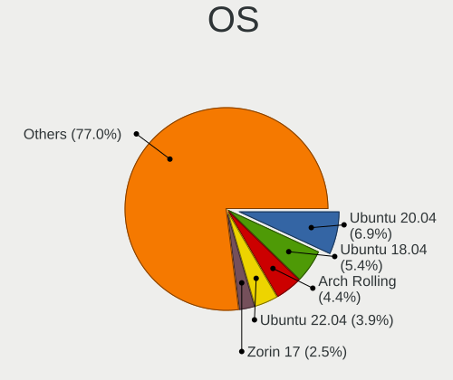

| Name                         | Desktops | Percent |
|------------------------------|----------|---------|
| Ubuntu 20.04                 | 41       | 6.89%   |
| Ubuntu 18.04                 | 32       | 5.38%   |
| Arch Rolling                 | 26       | 4.37%   |
| Ubuntu 22.04                 | 23       | 3.87%   |
| Zorin 17                     | 15       | 2.52%   |
| Debian 12                    | 14       | 2.35%   |
| Pop!_OS 22.04                | 12       | 2.02%   |
| Ubuntu 24.04                 | 10       | 1.68%   |
| Pop!_OS 20.10                | 9        | 1.51%   |
| OpenMandriva 25.90           | 9        | 1.51%   |
| Pop!_OS 20.04                | 8        | 1.34%   |
| Linux Mint 22.1              | 8        | 1.34%   |
| Debian 11                    | 8        | 1.34%   |
| Zorin 16                     | 7        | 1.18%   |
| Ubuntu 20.10                 | 7        | 1.18%   |
| OpenMandriva 5.0             | 7        | 1.18%   |
| OpenMandriva 24.12           | 7        | 1.18%   |
| Manjaro                      | 7        | 1.18%   |
| Linux Mint 22.2              | 7        | 1.18%   |
| Linux Mint 20.1              | 7        | 1.18%   |
| Fedora 40                    | 7        | 1.18%   |
| Fedora 39                    | 7        | 1.18%   |
| Ubuntu 21.04                 | 6        | 1.01%   |
| Ubuntu 18.10                 | 6        | 1.01%   |
| openSUSE Tumbleweed-XXXXXXXX | 6        | 1.01%   |
| KDE neon 22.04               | 6        | 1.01%   |
| Fedora 41                    | 6        | 1.01%   |
| Fedora 37                    | 6        | 1.01%   |
| Pop!_OS 21.10                | 5        | 0.84%   |
| Pop!_OS 21.04                | 5        | 0.84%   |
| Linux Mint 22                | 5        | 0.84%   |
| Linux Mint 20.3              | 5        | 0.84%   |
| KDE neon 20.04               | 5        | 0.84%   |
| Fedora 38                    | 5        | 0.84%   |
| Fedora 36                    | 5        | 0.84%   |
| Fedora 34                    | 5        | 0.84%   |
| Debian 10                    | 5        | 0.84%   |
| Ubuntu 25.10                 | 4        | 0.67%   |
| Ubuntu 24.10                 | 4        | 0.67%   |
| Ubuntu 23.04                 | 4        | 0.67%   |

OS Family
---------

OS without a version

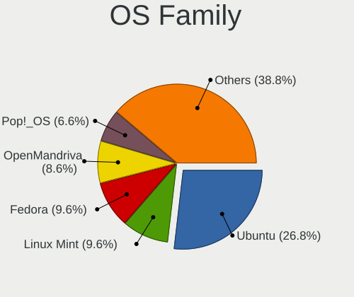

| Name             | Desktops | Percent |
|------------------|----------|---------|
| Ubuntu           | 146      | 26.84%  |
| Linux Mint       | 52       | 9.56%   |
| Fedora           | 52       | 9.56%   |
| OpenMandriva     | 47       | 8.64%   |
| Pop!_OS          | 36       | 6.62%   |
| Debian           | 30       | 5.51%   |
| Arch             | 28       | 5.15%   |
| Zorin            | 23       | 4.23%   |
| KDE neon         | 17       | 3.13%   |
| Kubuntu          | 13       | 2.39%   |
| Manjaro          | 12       | 2.21%   |
| Bazzite          | 10       | 1.84%   |
| Endless          | 9        | 1.65%   |
| openSUSE         | 7        | 1.29%   |
| Nobara           | 6        | 1.1%    |
| Xubuntu          | 5        | 0.92%   |
| MX               | 4        | 0.74%   |
| ArcoLinux        | 4        | 0.74%   |
| RHEL             | 3        | 0.55%   |
| NixOS            | 3        | 0.55%   |
| LMDE             | 3        | 0.55%   |
| Ubuntu Unity     | 2        | 0.37%   |
| ROSA             | 2        | 0.37%   |
| org.kde.Platform | 2        | 0.37%   |
| Lubuntu          | 2        | 0.37%   |
| Kali             | 2        | 0.37%   |
| Elementary       | 2        | 0.37%   |
| Devuan           | 2        | 0.37%   |
| CachyOS          | 2        | 0.37%   |
| Void Linux       | 1        | 0.18%   |
| Vanilla          | 1        | 0.18%   |
| Ubuntu Studio    | 1        | 0.18%   |
| Ubuntu MATE      | 1        | 0.18%   |
| Ubuntu Budgie    | 1        | 0.18%   |
| Rocky Linux      | 1        | 0.18%   |
| Regata OS        | 1        | 0.18%   |
| Redcore          | 1        | 0.18%   |
| Peppermint       | 1        | 0.18%   |
| Parrot           | 1        | 0.18%   |
| Linux Lite       | 1        | 0.18%   |

Kernel
------

Version of the Linux kernel

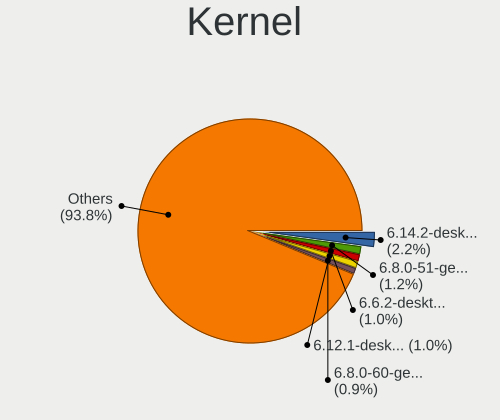

| Version                  | Desktops | Percent |
|--------------------------|----------|---------|
| 6.14.2-desktop-3omv2590  | 15       | 2.18%   |
| 6.8.0-51-generic         | 8        | 1.16%   |
| 6.6.2-desktop-1omv2390   | 7        | 1.02%   |
| 6.12.1-desktop-1omv2490  | 7        | 1.02%   |
| 6.8.0-60-generic         | 6        | 0.87%   |
| 5.4.0-42-generic         | 6        | 0.87%   |
| 6.1.0-37-amd64           | 5        | 0.73%   |
| 5.4.0-7634-generic       | 5        | 0.73%   |
| 5.4.0-52-generic         | 5        | 0.73%   |
| 5.3.0-46-generic         | 5        | 0.73%   |
| 5.15.0-46-generic        | 5        | 0.73%   |
| 6.9.3-76060903-generic   | 4        | 0.58%   |
| 6.8.0-90-generic         | 4        | 0.58%   |
| 6.8.0-85-generic         | 4        | 0.58%   |
| 6.8.0-40-generic         | 4        | 0.58%   |
| 6.5.0-35-generic         | 4        | 0.58%   |
| 6.17.0-6-generic         | 4        | 0.58%   |
| 6.1.0-34-amd64           | 4        | 0.58%   |
| 5.15.0-60-generic        | 4        | 0.58%   |
| 5.13.0-30-generic        | 4        | 0.58%   |
| 5.11.0-37-generic        | 4        | 0.58%   |
| 6.2.0-35-generic         | 3        | 0.44%   |
| 6.14.0-36-generic        | 3        | 0.44%   |
| 6.14.0-34-generic        | 3        | 0.44%   |
| 6.12.9-desktop-1omv2490  | 3        | 0.44%   |
| 6.1.0-17-amd64           | 3        | 0.44%   |
| 5.8.0-50-generic         | 3        | 0.44%   |
| 5.8.0-44-generic         | 3        | 0.44%   |
| 5.4.0-65-generic         | 3        | 0.44%   |
| 5.4.0-33-generic         | 3        | 0.44%   |
| 5.3.0-40-generic         | 3        | 0.44%   |
| 5.16.7-desktop-1omv4003  | 3        | 0.44%   |
| 5.13.0-7614-generic      | 3        | 0.44%   |
| 5.13.0-39-generic        | 3        | 0.44%   |
| 5.11.0-7614-generic      | 3        | 0.44%   |
| 5.11.0-34-generic        | 3        | 0.44%   |
| 5.10.14-desktop-1omv4002 | 3        | 0.44%   |
| 5.0.0-37-generic         | 3        | 0.44%   |
| 4.18.0-25-generic        | 3        | 0.44%   |
| 6.8.0-83-generic         | 2        | 0.29%   |

Kernel Family
-------------

Linux kernel without a distro release

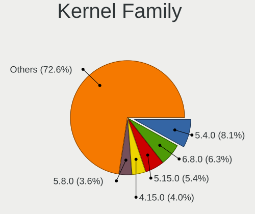

| Version | Desktops | Percent |
|---------|----------|---------|
| 5.4.0   | 51       | 8.08%   |
| 6.8.0   | 40       | 6.34%   |
| 5.15.0  | 34       | 5.39%   |
| 4.15.0  | 25       | 3.96%   |
| 5.8.0   | 23       | 3.65%   |
| 5.11.0  | 23       | 3.65%   |
| 6.1.0   | 20       | 3.17%   |
| 5.13.0  | 19       | 3.01%   |
| 5.19.0  | 17       | 2.69%   |
| 6.14.0  | 16       | 2.54%   |
| 5.3.0   | 16       | 2.54%   |
| 6.14.2  | 15       | 2.38%   |
| 4.18.0  | 14       | 2.22%   |
| 6.5.0   | 13       | 2.06%   |
| 6.2.0   | 13       | 2.06%   |
| 5.10.0  | 10       | 1.58%   |
| 6.12.1  | 9        | 1.43%   |
| 5.0.0   | 8        | 1.27%   |
| 6.6.2   | 7        | 1.11%   |
| 6.11.0  | 7        | 1.11%   |
| 6.9.3   | 5        | 0.79%   |
| 6.8.8   | 4        | 0.63%   |
| 6.8.12  | 4        | 0.63%   |
| 6.5.6   | 4        | 0.63%   |
| 6.17.0  | 4        | 0.63%   |
| 6.16.4  | 4        | 0.63%   |
| 6.9.12  | 3        | 0.48%   |
| 6.2.6   | 3        | 0.48%   |
| 6.17.9  | 3        | 0.48%   |
| 6.17.7  | 3        | 0.48%   |
| 6.12.9  | 3        | 0.48%   |
| 6.12.10 | 3        | 0.48%   |
| 5.9.16  | 3        | 0.48%   |
| 5.16.7  | 3        | 0.48%   |
| 5.14.0  | 3        | 0.48%   |
| 5.10.15 | 3        | 0.48%   |
| 5.10.14 | 3        | 0.48%   |
| 6.8.7   | 2        | 0.32%   |
| 6.7.7   | 2        | 0.32%   |
| 6.6.13  | 2        | 0.32%   |

Kernel Major Ver.
-----------------

Linux kernel major version

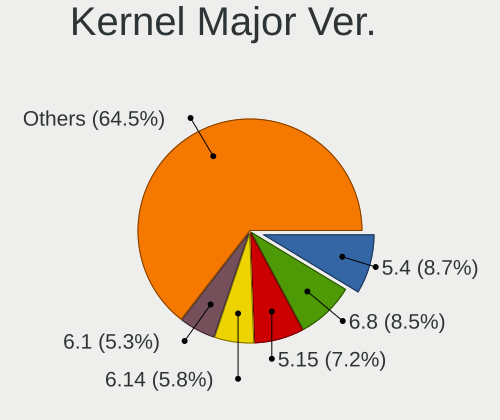

| Version | Desktops | Percent |
|---------|----------|---------|
| 5.4     | 54       | 8.67%   |
| 6.8     | 53       | 8.51%   |
| 5.15    | 45       | 7.22%   |
| 6.14    | 36       | 5.78%   |
| 6.1     | 33       | 5.3%    |
| 6.12    | 30       | 4.82%   |
| 5.11    | 28       | 4.49%   |
| 5.8     | 27       | 4.33%   |
| 4.15    | 25       | 4.01%   |
| 5.19    | 23       | 3.69%   |
| 6.5     | 22       | 3.53%   |
| 5.13    | 22       | 3.53%   |
| 6.2     | 19       | 3.05%   |
| 6.6     | 18       | 2.89%   |
| 5.3     | 18       | 2.89%   |
| 5.10    | 17       | 2.73%   |
| 6.17    | 16       | 2.57%   |
| 4.18    | 14       | 2.25%   |
| 6.11    | 12       | 1.93%   |
| 6.10    | 11       | 1.77%   |
| 6.9     | 10       | 1.61%   |
| 5.0     | 9        | 1.44%   |
| 6.7     | 7        | 1.12%   |
| 5.9     | 7        | 1.12%   |
| 5.14    | 7        | 1.12%   |
| 6.4     | 6        | 0.96%   |
| 6.16    | 6        | 0.96%   |
| 5.7     | 6        | 0.96%   |
| 6.15    | 5        | 0.8%    |
| 5.6     | 5        | 0.8%    |
| 5.18    | 5        | 0.8%    |
| 5.16    | 5        | 0.8%    |
| 6.0     | 4        | 0.64%   |
| 5.12    | 4        | 0.64%   |
| 6.3     | 3        | 0.48%   |
| 6.13    | 3        | 0.48%   |
| 5.17    | 3        | 0.48%   |
| 4.19    | 3        | 0.48%   |
| 5.5     | 1        | 0.16%   |
| 5.2     | 1        | 0.16%   |

Arch
----

OS architecture (x86_64, i586, etc.)

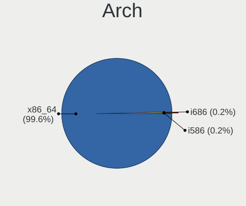

| Name   | Desktops | Percent |
|--------|----------|---------|
| x86_64 | 522      | 99.62%  |
| i686   | 1        | 0.19%   |
| i586   | 1        | 0.19%   |

DE
--

Desktop Environment

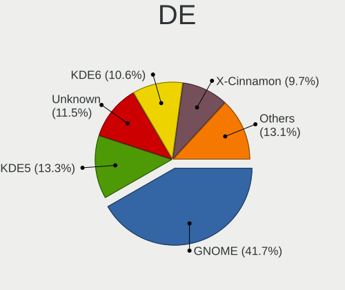

| Name          | Desktops | Percent |
|---------------|----------|---------|
| GNOME         | 232      | 41.73%  |
| KDE5          | 74       | 13.31%  |
| Unknown       | 64       | 11.51%  |
| KDE6          | 59       | 10.61%  |
| X-Cinnamon    | 54       | 9.71%   |
| XFCE          | 28       | 5.04%   |
| KDE           | 15       | 2.7%    |
| MATE          | 8        | 1.44%   |
| LXQt          | 5        | 0.9%    |
| LXDE          | 4        | 0.72%   |
| Unity         | 2        | 0.36%   |
| Pantheon      | 2        | 0.36%   |
| Deepin        | 2        | 0.36%   |
| Cinnamon      | 2        | 0.36%   |
| NONE          | 1        | 0.18%   |
| i3            | 1        | 0.18%   |
| Enlightenment | 1        | 0.18%   |
| COSMIC        | 1        | 0.18%   |
| Budgie        | 1        | 0.18%   |

Display Server
--------------

X11 or Wayland

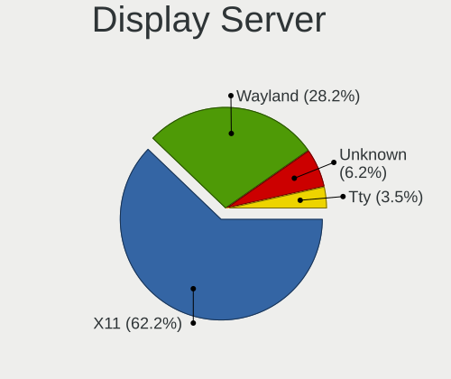

| Name    | Desktops | Percent |
|---------|----------|---------|
| X11     | 340      | 62.16%  |
| Wayland | 154      | 28.15%  |
| Unknown | 34       | 6.22%   |
| Tty     | 19       | 3.47%   |

Display Manager
---------------

SDDM, LightDM, etc.

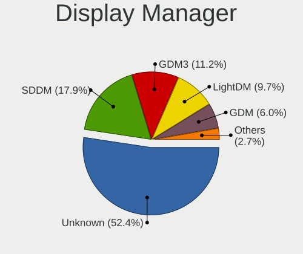

| Name    | Desktops | Percent |
|---------|----------|---------|
| Unknown | 286      | 52.38%  |
| SDDM    | 98       | 17.95%  |
| GDM3    | 61       | 11.17%  |
| LightDM | 53       | 9.71%   |
| GDM     | 33       | 6.04%   |
| TDM     | 11       | 2.01%   |
| SLiM    | 3        | 0.55%   |
| GREETD  | 1        | 0.18%   |

OS Lang
-------

Language

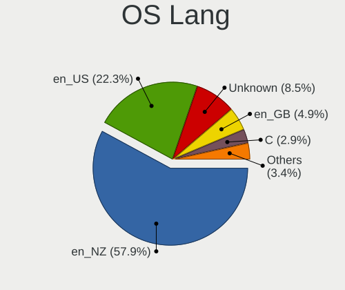

| Lang    | Desktops | Percent |
|---------|----------|---------|
| en_NZ   | 319      | 57.89%  |
| en_US   | 123      | 22.32%  |
| Unknown | 47       | 8.53%   |
| en_GB   | 27       | 4.9%    |
| C       | 16       | 2.9%    |
| en_AU   | 14       | 2.54%   |
| zh_CN   | 3        | 0.54%   |
| fr_FR   | 1        | 0.18%   |
| de_DE   | 1        | 0.18%   |

Boot Mode
---------

EFI or BIOS

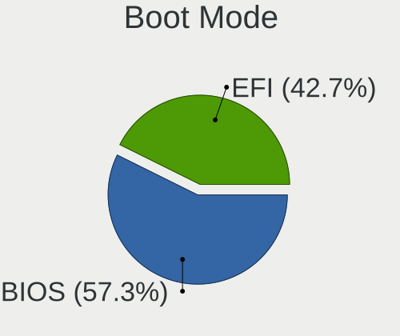

| Mode | Desktops | Percent |
|------|----------|---------|
| BIOS | 309      | 57.33%  |
| EFI  | 230      | 42.67%  |

Filesystem
----------

Type of filesystem

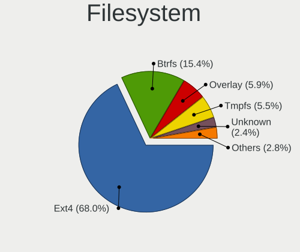

| Type    | Desktops | Percent |
|---------|----------|---------|
| Ext4    | 370      | 68.01%  |
| Btrfs   | 84       | 15.44%  |
| Overlay | 32       | 5.88%   |
| Tmpfs   | 30       | 5.51%   |
| Unknown | 13       | 2.39%   |
| Xfs     | 9        | 1.65%   |
| Zfs     | 4        | 0.74%   |
| F2fs    | 1        | 0.18%   |
| Ext3    | 1        | 0.18%   |

Part. scheme
------------

Scheme of partitioning

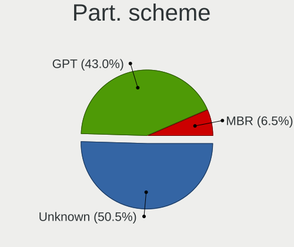

| Type    | Desktops | Percent |
|---------|----------|---------|
| Unknown | 272      | 50.46%  |
| GPT     | 232      | 43.04%  |
| MBR     | 35       | 6.49%   |

Dual Boot with Linux/BSD
------------------------

Hosting more than one Linux/BSD

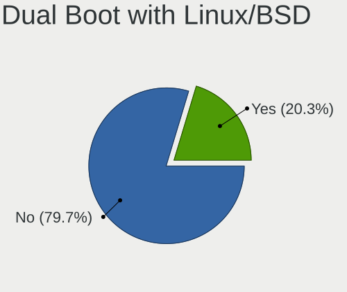

| Dual boot | Desktops | Percent |
|-----------|----------|---------|
| No        | 427      | 79.66%  |
| Yes       | 109      | 20.34%  |

Dual Boot (Win)
---------------

Hosting Linux and Windows

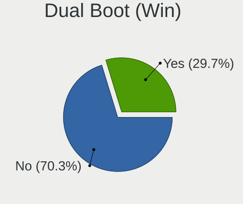

| Dual boot | Desktops | Percent |
|-----------|----------|---------|
| No        | 376      | 70.28%  |
| Yes       | 159      | 29.72%  |

Board
-----

Vendor
------

Motherboard manufacturer

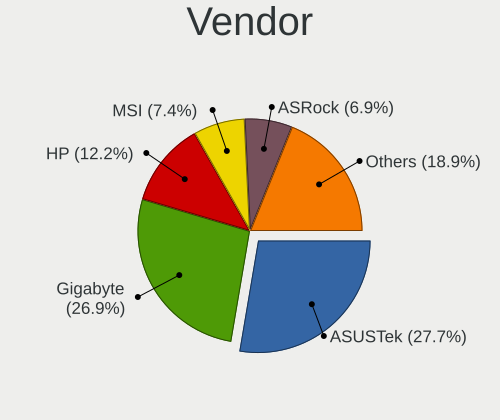

| Name                                 | Desktops | Percent |
|--------------------------------------|----------|---------|
| ASUSTek Computer                     | 145      | 27.67%  |
| Gigabyte Technology                  | 141      | 26.91%  |
| Hewlett-Packard                      | 64       | 12.21%  |
| MSI                                  | 39       | 7.44%   |
| ASRock                               | 36       | 6.87%   |
| Dell                                 | 31       | 5.92%   |
| Lenovo                               | 14       | 2.67%   |
| Intel                                | 11       | 2.1%    |
| Unknown                              | 8        | 1.53%   |
| Acer                                 | 6        | 1.15%   |
| Pegatron                             | 5        | 0.95%   |
| Supermicro                           | 2        | 0.38%   |
| Shenzhen Meigao Electronic Equipment | 2        | 0.38%   |
| MACHINIST                            | 2        | 0.38%   |
| IBM                                  | 2        | 0.38%   |
| ECS                                  | 2        | 0.38%   |
| Wistron                              | 1        | 0.19%   |
| Techvision                           | 1        | 0.19%   |
| OEM                                  | 1        | 0.19%   |
| MediaVue                             | 1        | 0.19%   |
| MAXSUN                               | 1        | 0.19%   |
| JGINYUE                              | 1        | 0.19%   |
| Huanan                               | 1        | 0.19%   |
| DFI                                  | 1        | 0.19%   |
| CWWK                                 | 1        | 0.19%   |
| Colorful Technology                  | 1        | 0.19%   |
| Biostar                              | 1        | 0.19%   |
| Apple                                | 1        | 0.19%   |
| Alienware                            | 1        | 0.19%   |
| AAEON                                | 1        | 0.19%   |

Model
-----

Motherboard model

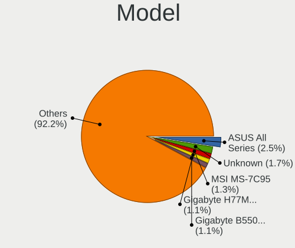

| Name                            | Desktops | Percent |
|---------------------------------|----------|---------|
| ASUS All Series                 | 13       | 2.48%   |
| Unknown                         | 9        | 1.72%   |
| MSI MS-7C95                     | 7        | 1.34%   |
| Gigabyte H77M-D3H               | 6        | 1.15%   |
| Gigabyte B550M DS3H AC          | 6        | 1.15%   |
| ASUS TUF Gaming X570-PLUS       | 6        | 1.15%   |
| HP EliteDesk 800 G1 SFF         | 5        | 0.95%   |
| HP Compaq 8200 Elite SFF PC     | 5        | 0.95%   |
| ASUS ROG STRIX B550-A GAMING    | 5        | 0.95%   |
| ASUS ROG STRIX X570-F GAMING    | 4        | 0.76%   |
| ASUS PRIME B450M-A              | 4        | 0.76%   |
| ASRock B450M Steel Legend       | 4        | 0.76%   |
| MSI MS-7C02                     | 3        | 0.57%   |
| MSI MS-7B89                     | 3        | 0.57%   |
| HP EliteDesk 800 G2 SFF         | 3        | 0.57%   |
| HP EliteDesk 800 G2 DM 35W      | 3        | 0.57%   |
| HP Compaq 8100 Elite SFF PC     | 3        | 0.57%   |
| Gigabyte B75M-D3H               | 3        | 0.57%   |
| Gigabyte B550 GAMING X V2       | 3        | 0.57%   |
| Gigabyte B450M S2H              | 3        | 0.57%   |
| Gigabyte 970A-D3P               | 3        | 0.57%   |
| Dell OptiPlex 3010              | 3        | 0.57%   |
| ASUS TUF Gaming B650M-E WIFI    | 3        | 0.57%   |
| ASUS PRIME B450-PLUS            | 3        | 0.57%   |
| ASUS P8B75-M                    | 3        | 0.57%   |
| ASRock B650M PG Riptide WiFi    | 3        | 0.57%   |
| ASRock A320M-HDV                | 3        | 0.57%   |
| ASRock 970 Pro3 R2.0            | 3        | 0.57%   |
| MSI MS-7C91                     | 2        | 0.38%   |
| MSI MS-7C56                     | 2        | 0.38%   |
| MSI MS-7A74                     | 2        | 0.38%   |
| Lenovo ThinkCentre M58p 7479RS2 | 2        | 0.38%   |
| HP ProDesk 600 G1 SFF           | 2        | 0.38%   |
| HP EliteDesk 800 G1 USDT        | 2        | 0.38%   |
| HP EliteDesk 800 G1 DM          | 2        | 0.38%   |
| HP Compaq Pro 6300 SFF          | 2        | 0.38%   |
| HP Compaq Elite 8300 USDT       | 2        | 0.38%   |
| HP Compaq Elite 8300 SFF        | 2        | 0.38%   |
| HP Compaq 6200 Pro SFF PC       | 2        | 0.38%   |
| Gigabyte Z77X-D3H               | 2        | 0.38%   |

Model Family
------------

Motherboard model prefix

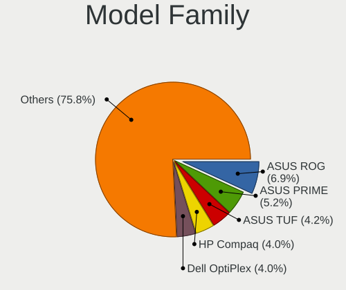

| Name                   | Desktops | Percent |
|------------------------|----------|---------|
| ASUS ROG               | 36       | 6.87%   |
| ASUS PRIME             | 27       | 5.15%   |
| ASUS TUF               | 22       | 4.2%    |
| HP Compaq              | 21       | 4.01%   |
| Dell OptiPlex          | 21       | 4.01%   |
| HP EliteDesk           | 18       | 3.44%   |
| ASUS All               | 13       | 2.48%   |
| Lenovo ThinkCentre     | 12       | 2.29%   |
| Unknown                | 9        | 1.72%   |
| Gigabyte B550M         | 8        | 1.53%   |
| Gigabyte B550          | 8        | 1.53%   |
| Dell Precision         | 8        | 1.53%   |
| MSI MS-7C95            | 7        | 1.34%   |
| Gigabyte H77M-D3H      | 6        | 1.15%   |
| HP ProDesk             | 5        | 0.95%   |
| HP ProLiant            | 4        | 0.76%   |
| Gigabyte Z790          | 4        | 0.76%   |
| Gigabyte Z690          | 4        | 0.76%   |
| Gigabyte B560M         | 4        | 0.76%   |
| Gigabyte B450M         | 4        | 0.76%   |
| ASUS P8Z77-V           | 4        | 0.76%   |
| ASUS M5A97             | 4        | 0.76%   |
| ASRock B450M           | 4        | 0.76%   |
| ASRock 970             | 4        | 0.76%   |
| Acer Aspire            | 4        | 0.76%   |
| MSI MS-7C02            | 3        | 0.57%   |
| MSI MS-7B89            | 3        | 0.57%   |
| Gigabyte X570          | 3        | 0.57%   |
| Gigabyte GA-78LMT-USB3 | 3        | 0.57%   |
| Gigabyte B760M         | 3        | 0.57%   |
| Gigabyte B75M-D3H      | 3        | 0.57%   |
| Gigabyte B650M         | 3        | 0.57%   |
| Gigabyte B450          | 3        | 0.57%   |
| Gigabyte AB350-Gaming  | 3        | 0.57%   |
| Gigabyte 970A-D3P      | 3        | 0.57%   |
| ASUS SABERTOOTH        | 3        | 0.57%   |
| ASUS P8B75-M           | 3        | 0.57%   |
| ASUS H110M-A           | 3        | 0.57%   |
| ASRock B650M           | 3        | 0.57%   |
| ASRock A320M-HDV       | 3        | 0.57%   |

MFG Year
--------

Motherboard manufacture year

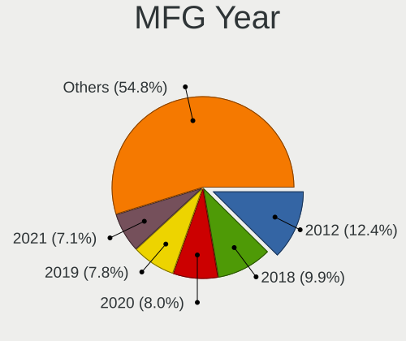

| Year    | Desktops | Percent |
|---------|----------|---------|
| 2012    | 65       | 12.4%   |
| 2018    | 52       | 9.92%   |
| 2020    | 42       | 8.02%   |
| 2019    | 41       | 7.82%   |
| 2021    | 37       | 7.06%   |
| 2011    | 37       | 7.06%   |
| 2013    | 36       | 6.87%   |
| 2014    | 32       | 6.11%   |
| 2023    | 26       | 4.96%   |
| 2017    | 25       | 4.77%   |
| 2010    | 22       | 4.2%    |
| 2009    | 22       | 4.2%    |
| 2015    | 21       | 4.01%   |
| 2016    | 20       | 3.82%   |
| 2022    | 18       | 3.44%   |
| 2008    | 12       | 2.29%   |
| 2024    | 6        | 1.15%   |
| 2007    | 4        | 0.76%   |
| 2005    | 2        | 0.38%   |
| Unknown | 2        | 0.38%   |
| 2025    | 1        | 0.19%   |
| 2004    | 1        | 0.19%   |

Form Factor
-----------

Physical design of the computer

| Name    | Desktops | Percent |
|---------|----------|---------|
| Desktop | 524      | 100%    |

Secure Boot
-----------

Enabled or disabled

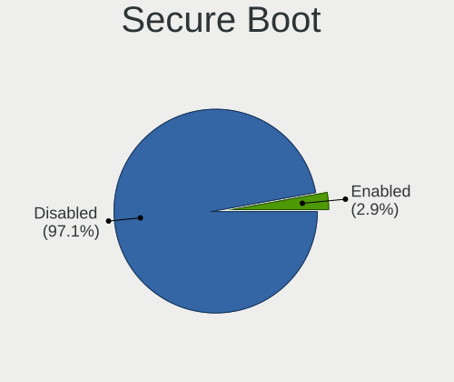

| State    | Desktops | Percent |
|----------|----------|---------|
| Disabled | 511      | 97.15%  |
| Enabled  | 15       | 2.85%   |

Coreboot
--------

Have coreboot on board

| Used | Desktops | Percent |
|------|----------|---------|
| No   | 523      | 99.81%  |
| Yes  | 1        | 0.19%   |

RAM Size
--------

Total RAM memory

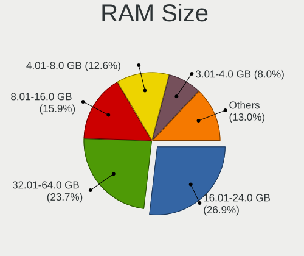

| Size in GB      | Desktops | Percent |
|-----------------|----------|---------|
| 16.01-24.0      | 145      | 26.85%  |
| 32.01-64.0      | 128      | 23.7%   |
| 8.01-16.0       | 86       | 15.93%  |
| 4.01-8.0        | 68       | 12.59%  |
| 3.01-4.0        | 43       | 7.96%   |
| 64.01-256.0     | 36       | 6.67%   |
| 24.01-32.0      | 23       | 4.26%   |
| 1.01-2.0        | 7        | 1.3%    |
| 2.01-3.0        | 2        | 0.37%   |
| More than 256.0 | 1        | 0.19%   |
| 0.01-0.5        | 1        | 0.19%   |

RAM Used
--------

Used RAM memory

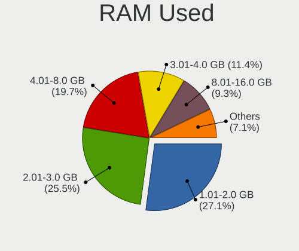

| Used GB    | Desktops | Percent |
|------------|----------|---------|
| 1.01-2.0   | 164      | 27.11%  |
| 2.01-3.0   | 154      | 25.45%  |
| 4.01-8.0   | 119      | 19.67%  |
| 3.01-4.0   | 69       | 11.4%   |
| 8.01-16.0  | 56       | 9.26%   |
| 0.51-1.0   | 24       | 3.97%   |
| 16.01-24.0 | 8        | 1.32%   |
| 0.01-0.5   | 6        | 0.99%   |
| 32.01-64.0 | 4        | 0.66%   |
| 24.01-32.0 | 1        | 0.17%   |

Total Drives
------------

Number of drives on board

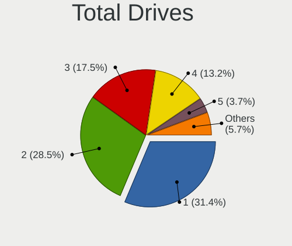

| Drives | Desktops | Percent |
|--------|----------|---------|
| 1      | 176      | 31.37%  |
| 2      | 160      | 28.52%  |
| 3      | 98       | 17.47%  |
| 4      | 74       | 13.19%  |
| 5      | 21       | 3.74%   |
| 6      | 17       | 3.03%   |
| 7      | 5        | 0.89%   |
| 8      | 3        | 0.53%   |
| 10     | 2        | 0.36%   |
| 0      | 2        | 0.36%   |
| 410    | 1        | 0.18%   |
| 20     | 1        | 0.18%   |
| 16     | 1        | 0.18%   |

Has CD-ROM
----------

Has CD-ROM on board

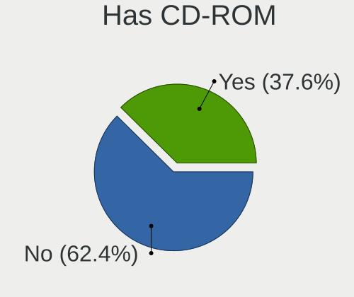

| Presented | Desktops | Percent |
|-----------|----------|---------|
| No        | 332      | 62.41%  |
| Yes       | 200      | 37.59%  |

Has Ethernet
------------

Has Ethernet on board

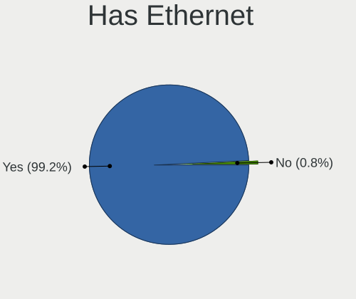

| Presented | Desktops | Percent |
|-----------|----------|---------|
| Yes       | 520      | 99.24%  |
| No        | 4        | 0.76%   |

Has WiFi
--------

Has WiFi module

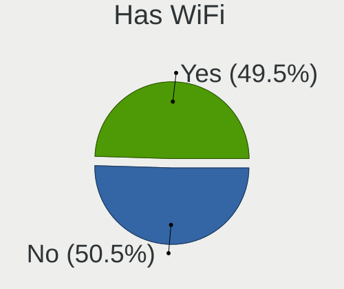

| Presented | Desktops | Percent |
|-----------|----------|---------|
| No        | 269      | 50.47%  |
| Yes       | 264      | 49.53%  |

Has Bluetooth
-------------

Has Bluetooth module

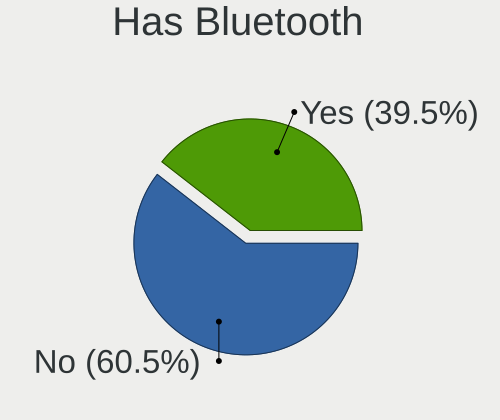

| Presented | Desktops | Percent |
|-----------|----------|---------|
| No        | 322      | 60.53%  |
| Yes       | 210      | 39.47%  |

Location
--------

Country
-------

Geographic location (country)

| Country     | Desktops | Percent |
|-------------|----------|---------|
| New Zealand | 524      | 100%    |

City
----

Geographic location (city)

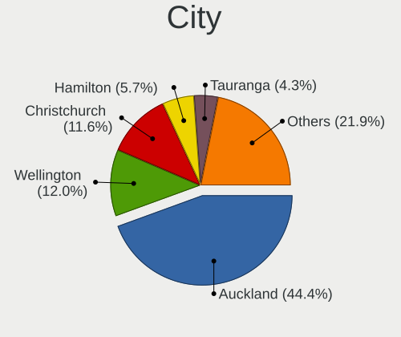

| City             | Desktops | Percent |
|------------------|----------|---------|
| Auckland         | 248      | 44.44%  |
| Wellington       | 67       | 12.01%  |
| Christchurch     | 65       | 11.65%  |
| Hamilton         | 32       | 5.73%   |
| Tauranga         | 24       | 4.3%    |
| Dunedin          | 21       | 3.76%   |
| Palmerston North | 9        | 1.61%   |
| Whangarei        | 7        | 1.25%   |
| Napier City      | 7        | 1.25%   |
| Hastings         | 6        | 1.08%   |
| New Plymouth     | 5        | 0.9%    |
| Whanganui        | 4        | 0.72%   |
| Timaru           | 4        | 0.72%   |
| Nelson           | 4        | 0.72%   |
| Lower Hutt       | 4        | 0.72%   |
| Cambridge        | 4        | 0.72%   |
| Rotorua          | 3        | 0.54%   |
| Mission Bay      | 3        | 0.54%   |
| Ashburton        | 3        | 0.54%   |
| Taupo            | 2        | 0.36%   |
| Richmond         | 2        | 0.36%   |
| Queenstown       | 2        | 0.36%   |
| Masterton        | 2        | 0.36%   |
| Karori           | 2        | 0.36%   |
| Invercargill     | 2        | 0.36%   |
| Yaldhurst        | 1        | 0.18%   |
| Westport         | 1        | 0.18%   |
| Wellsford        | 1        | 0.18%   |
| Waikato          | 1        | 0.18%   |
| Waikanae         | 1        | 0.18%   |
| Waihi            | 1        | 0.18%   |
| Te Awamutu       | 1        | 0.18%   |
| Stratford        | 1        | 0.18%   |
| Pukekohe         | 1        | 0.18%   |
| Porirua          | 1        | 0.18%   |
| Papatoetoe       | 1        | 0.18%   |
| Otumoetai        | 1        | 0.18%   |
| Onekawa          | 1        | 0.18%   |
| Mount Maunganui  | 1        | 0.18%   |
| Mount Eden       | 1        | 0.18%   |

Drives
------

Drive Vendor
------------

Hard drive vendors

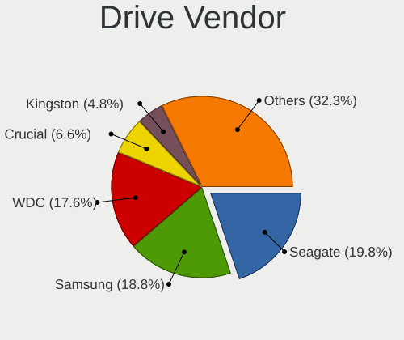

| Vendor                       | Desktops | Drives | Percent |
|------------------------------|----------|--------|---------|
| Seagate                      | 200      | 395    | 19.84%  |
| Samsung Electronics          | 190      | 415    | 18.85%  |
| WDC                          | 177      | 324    | 17.56%  |
| Crucial                      | 67       | 101    | 6.65%   |
| Kingston                     | 48       | 61     | 4.76%   |
| SanDisk                      | 39       | 47     | 3.87%   |
| Intel                        | 26       | 35     | 2.58%   |
| Toshiba                      | 25       | 36     | 2.48%   |
| Hitachi                      | 22       | 32     | 2.18%   |
| Micron/Crucial Technology    | 21       | 38     | 2.08%   |
| A-DATA Technology            | 15       | 19     | 1.49%   |
| Micron Technology            | 12       | 13     | 1.19%   |
| Team                         | 10       | 11     | 0.99%   |
| Kingston Technology Company  | 10       | 11     | 0.99%   |
| SK hynix                     | 9        | 12     | 0.89%   |
| Apacer                       | 9        | 11     | 0.89%   |
| Lexar                        | 8        | 15     | 0.79%   |
| Gigabyte Technology          | 7        | 9      | 0.69%   |
| Unknown                      | 6        | 11     | 0.6%    |
| OCZ                          | 6        | 7      | 0.6%    |
| MAXIO Technology (Hangzhou)  | 6        | 9      | 0.6%    |
| Shenzhen Longsys Electronics | 5        | 11     | 0.5%    |
| HGST                         | 5        | 7      | 0.5%    |
| Hewlett-Packard              | 5        | 9      | 0.5%    |
| ADATA Technology             | 5        | 6      | 0.5%    |
| Transcend                    | 4        | 5      | 0.4%    |
| Phison Electronics           | 4        | 10     | 0.4%    |
| Apple                        | 4        | 4      | 0.4%    |
| XPG                          | 3        | 3      | 0.3%    |
| TO Exter                     | 3        | 3      | 0.3%    |
| Silicon Motion               | 3        | 4      | 0.3%    |
| PNY                          | 3        | 4      | 0.3%    |
| LITEON                       | 3        | 3      | 0.3%    |
| KIOXIA                       | 3        | 3      | 0.3%    |
| JMicron Technology           | 3        | 3      | 0.3%    |
| External                     | 3        | 4      | 0.3%    |
| Corsair                      | 3        | 5      | 0.3%    |
| China                        | 3        | 4      | 0.3%    |
| USB                          | 2        | 3      | 0.2%    |
| T-FORCE                      | 2        | 2      | 0.2%    |

Drive Model
-----------

Hard drive models

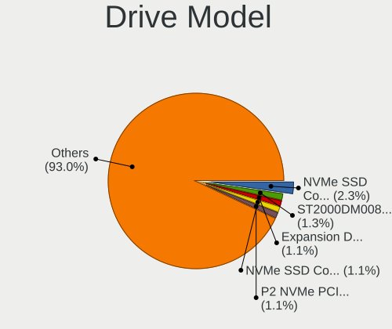

| Model                                              | Desktops | Percent |
|----------------------------------------------------|----------|---------|
| Samsung NVMe SSD Controller SM981/PM981/PM983 1TB  | 28       | 2.27%   |
| Seagate ST2000DM008-2FR102 2TB                     | 16       | 1.3%    |
| Seagate Expansion Desk 4TB                         | 14       | 1.13%   |
| Samsung NVMe SSD Controller PM9A1/PM9A3/980PRO 1TB | 14       | 1.13%   |
| Micron/Crucial P2 NVMe PCIe SSD 2TB                | 14       | 1.13%   |
| Seagate Expansion 2TB                              | 13       | 1.05%   |
| Samsung SSD 850 EVO 500GB                          | 13       | 1.05%   |
| Samsung SSD 980 1TB                                | 12       | 0.97%   |
| Samsung SSD 860 EVO 500GB                          | 12       | 0.97%   |
| Samsung SSD 850 EVO 250GB                          | 12       | 0.97%   |
| Crucial CT240BX500SSD1 240GB                       | 11       | 0.89%   |
| Seagate ST500DM002-1BD142 500GB                    | 10       | 0.81%   |
| Seagate ST31000528AS 1TB                           | 10       | 0.81%   |
| Samsung SSD 870 EVO 1TB                            | 10       | 0.81%   |
| Samsung SSD 860 EVO 250GB                          | 10       | 0.81%   |
| Seagate ST2000DM006-2DM164 2TB                     | 9        | 0.73%   |
| Seagate ST2000DM001-1CH164 2TB                     | 9        | 0.73%   |
| Seagate ST1000DM010-2EP102 1TB                     | 9        | 0.73%   |
| Seagate ST1000DM003-1CH162 1TB                     | 9        | 0.73%   |
| Samsung SSD 870 QVO 1TB                            | 9        | 0.73%   |
| Crucial CT1000BX500SSD1 1TB                        | 9        | 0.73%   |
| Samsung SSD 870 EVO 500GB                          | 8        | 0.65%   |
| Crucial CT500MX500SSD1 500GB                       | 8        | 0.65%   |
| WDC WD20EZRZ-00Z5HB0 2TB                           | 7        | 0.57%   |
| Kingston SA400S37240G 240GB SSD                    | 7        | 0.57%   |
| Crucial CT480BX500SSD1 480GB                       | 7        | 0.57%   |
| WDC WD20EARX-00PASB0 2TB                           | 6        | 0.49%   |
| WDC WD10EALX-009BA0 1TB                            | 6        | 0.49%   |
| Seagate ST4000DM004-2CV104 4TB                     | 6        | 0.49%   |
| Seagate ST2000DM001-1ER164 2TB                     | 6        | 0.49%   |
| Samsung SSD 970 EVO Plus 500GB                     | 6        | 0.49%   |
| Samsung SSD 860 EVO 1TB                            | 6        | 0.49%   |
| Samsung SSD 850 EVO 1TB                            | 6        | 0.49%   |
| Samsung NVMe SSD Drive 500GB                       | 6        | 0.49%   |
| Kingston Company SNV2S1000G 1TB                    | 6        | 0.49%   |
| WDC WDS240G2G0A-00JH30 240GB SSD                   | 5        | 0.4%    |
| WDC WD40EZRZ-00GXCB0 4TB                           | 5        | 0.4%    |
| WDC WD10EZEX-00WN4A0 1TB                           | 5        | 0.4%    |
| Toshiba THNS128GG4BBAA 128GB SSD                   | 5        | 0.4%    |
| Seagate ST2000DM008-2UB102 2TB                     | 5        | 0.4%    |

HDD Vendor
----------

Hard disk drive vendors

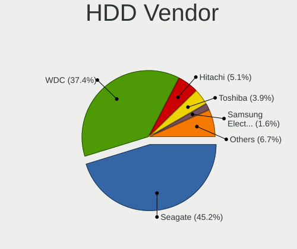

| Vendor              | Desktops | Drives | Percent |
|---------------------|----------|--------|---------|
| Seagate             | 195      | 379    | 45.24%  |
| WDC                 | 161      | 278    | 37.35%  |
| Hitachi             | 22       | 32     | 5.1%    |
| Toshiba             | 17       | 27     | 3.94%   |
| Samsung Electronics | 7        | 9      | 1.62%   |
| HGST                | 5        | 7      | 1.16%   |
| TO Exter            | 3        | 3      | 0.7%    |
| Hewlett-Packard     | 3        | 4      | 0.7%    |
| External            | 3        | 4      | 0.7%    |
| Apple               | 3        | 3      | 0.7%    |
| Unknown             | 2        | 2      | 0.46%   |
| JMicron Technology  | 2        | 2      | 0.46%   |
| Fujitsu             | 2        | 2      | 0.46%   |
| ASMT                | 2        | 2      | 0.46%   |
| USB                 | 1        | 2      | 0.23%   |
| QUANTUM             | 1        | 1      | 0.23%   |
| LaCie               | 1        | 1      | 0.23%   |
| ASMedia             | 1        | 1      | 0.23%   |

SSD Vendor
----------

Solid state drive vendors

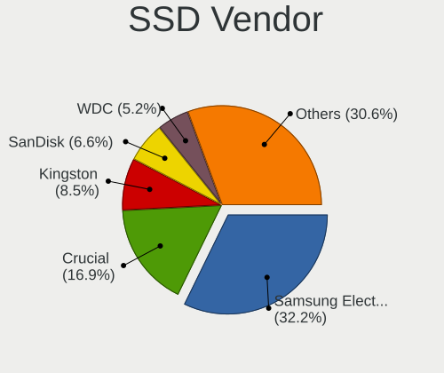

| Vendor              | Desktops | Drives | Percent |
|---------------------|----------|--------|---------|
| Samsung Electronics | 118      | 194    | 32.24%  |
| Crucial             | 62       | 88     | 16.94%  |
| Kingston            | 31       | 41     | 8.47%   |
| SanDisk             | 24       | 30     | 6.56%   |
| WDC                 | 19       | 39     | 5.19%   |
| Intel               | 17       | 22     | 4.64%   |
| A-DATA Technology   | 12       | 15     | 3.28%   |
| Team                | 10       | 11     | 2.73%   |
| Apacer              | 9        | 11     | 2.46%   |
| Toshiba             | 6        | 6      | 1.64%   |
| OCZ                 | 6        | 7      | 1.64%   |
| Gigabyte Technology | 6        | 7      | 1.64%   |
| Micron Technology   | 5        | 6      | 1.37%   |
| Lexar               | 5        | 11     | 1.37%   |
| Transcend           | 3        | 3      | 0.82%   |
| Seagate             | 3        | 6      | 0.82%   |
| LITEON              | 3        | 3      | 0.82%   |
| Corsair             | 3        | 5      | 0.82%   |
| China               | 3        | 4      | 0.82%   |
| T-FORCE             | 2        | 2      | 0.55%   |
| SK hynix            | 2        | 2      | 0.55%   |
| PNY                 | 2        | 3      | 0.55%   |
| KingSpec            | 2        | 2      | 0.55%   |
| Hewlett-Packard     | 2        | 5      | 0.55%   |
| Unknown (CF)        | 1        | 1      | 0.27%   |
| SPCC                | 1        | 1      | 0.27%   |
| OCZ-VERTEX3         | 1        | 1      | 0.27%   |
| Netac               | 1        | 1      | 0.27%   |
| Innodisk            | 1        | 1      | 0.27%   |
| GAMER               | 1        | 1      | 0.27%   |
| FreeNAS             | 1        | 36     | 0.27%   |
| FreeBSD             | 1        | 372    | 0.27%   |
| Dahua               | 1        | 1      | 0.27%   |
| Apple               | 1        | 1      | 0.27%   |
| Unknown             | 1        | 1      | 0.27%   |

Drive Kind
----------

HDD or SSD

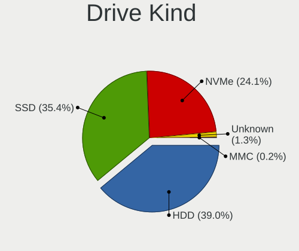

| Kind    | Desktops | Drives | Percent |
|---------|----------|--------|---------|
| HDD     | 333      | 759    | 38.99%  |
| SSD     | 302      | 940    | 35.36%  |
| NVMe    | 206      | 423    | 24.12%  |
| Unknown | 11       | 19     | 1.29%   |
| MMC     | 2        | 2      | 0.23%   |

Drive Connector
---------------

SATA, SAS, NVMe, etc.

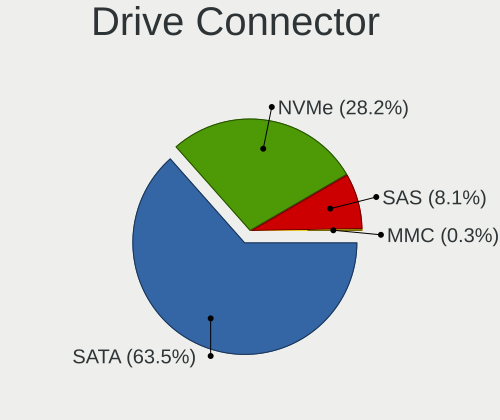

| Type | Desktops | Drives | Percent |
|------|----------|--------|---------|
| SATA | 462      | 1631   | 63.46%  |
| NVMe | 205      | 420    | 28.16%  |
| SAS  | 59       | 90     | 8.1%    |
| MMC  | 2        | 2      | 0.27%   |

Drive Size
----------

Size of hard drive

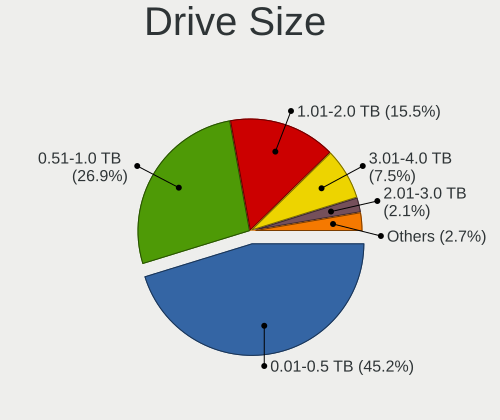

| Size in TB | Desktops | Drives | Percent |
|------------|----------|--------|---------|
| 0.01-0.5   | 338      | 1018   | 45.25%  |
| 0.51-1.0   | 201      | 331    | 26.91%  |
| 1.01-2.0   | 116      | 201    | 15.53%  |
| 3.01-4.0   | 56       | 85     | 7.5%    |
| 2.01-3.0   | 16       | 19     | 2.14%   |
| 4.01-10.0  | 15       | 30     | 2.01%   |
| 10.01-20.0 | 4        | 10     | 0.54%   |
| 20.01-50.0 | 1        | 5      | 0.13%   |

Space Total
-----------

Amount of disk space available on the file system

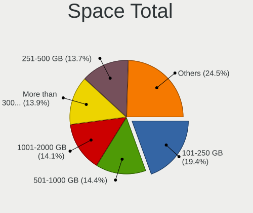

| Size in GB     | Desktops | Percent |
|----------------|----------|---------|
| 101-250        | 112      | 19.44%  |
| 501-1000       | 83       | 14.41%  |
| 1001-2000      | 81       | 14.06%  |
| More than 3000 | 80       | 13.89%  |
| 251-500        | 79       | 13.72%  |
| 2001-3000      | 57       | 9.9%    |
| 1-20           | 37       | 6.42%   |
| 51-100         | 20       | 3.47%   |
| Unknown        | 19       | 3.3%    |
| 21-50          | 8        | 1.39%   |

Space Used
----------

Amount of used disk space

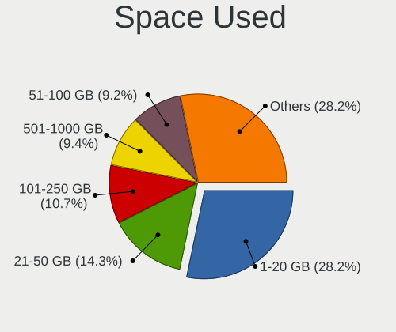

| Used GB        | Desktops | Percent |
|----------------|----------|---------|
| 1-20           | 172      | 28.24%  |
| 21-50          | 87       | 14.29%  |
| 101-250        | 65       | 10.67%  |
| 501-1000       | 57       | 9.36%   |
| 51-100         | 56       | 9.2%    |
| 251-500        | 51       | 8.37%   |
| 1001-2000      | 44       | 7.22%   |
| More than 3000 | 30       | 4.93%   |
| 2001-3000      | 28       | 4.6%    |
| Unknown        | 19       | 3.12%   |

Malfunc. Drives
---------------

Drive models with a malfunction

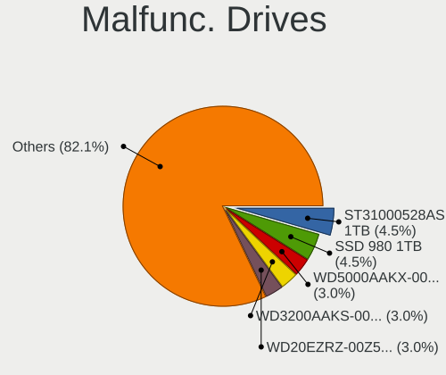

| Model                                 | Desktops | Drives | Percent |
|---------------------------------------|----------|--------|---------|
| Seagate ST31000528AS 1TB              | 3        | 3      | 4.48%   |
| Samsung Electronics SSD 980 1TB       | 3        | 4      | 4.48%   |
| WDC WD5000AAKX-001CA0 500GB           | 2        | 3      | 2.99%   |
| WDC WD3200AAKS-00L9A0 320GB           | 2        | 3      | 2.99%   |
| WDC WD20EZRZ-00Z5HB0 2TB              | 2        | 2      | 2.99%   |
| WDC WD20EARX-00PASB0 2TB              | 2        | 7      | 2.99%   |
| Seagate ST3500418AS 500GB             | 2        | 3      | 2.99%   |
| Seagate ST31000524AS 1TB              | 2        | 2      | 2.99%   |
| Seagate ST2000DM001-1ER164 2TB        | 2        | 3      | 2.99%   |
| WDC WDS480G2G0A-00JH30 480GB SSD      | 1        | 1      | 1.49%   |
| WDC WDS240G2G0A-00JH30 240GB SSD      | 1        | 1      | 1.49%   |
| WDC WD5000AAKX-00ERMA0 500GB          | 1        | 1      | 1.49%   |
| WDC WD40EFAX-68JH4N0 4TB              | 1        | 1      | 1.49%   |
| WDC WD3200AAKS-00UU3A0 320GB          | 1        | 1      | 1.49%   |
| WDC WD20EARS-00MVWB0 2TB              | 1        | 1      | 1.49%   |
| WDC WD2003FZEX-00Z4SA0 2TB            | 1        | 1      | 1.49%   |
| WDC WD15EARS-00S0XB0 1TB              | 1        | 1      | 1.49%   |
| WDC WD10SPZX-08Z10 1TB                | 1        | 1      | 1.49%   |
| WDC WD10EFRX-68FYTN0 1TB              | 1        | 3      | 1.49%   |
| WDC WD10EARS-00Y5B1 1TB               | 1        | 1      | 1.49%   |
| WDC WD10EARS-003BB1 1TB               | 1        | 1      | 1.49%   |
| WDC WD1002FAEX-00Z3A0 1TB             | 1        | 2      | 1.49%   |
| Toshiba MQ01ABD100 1TB                | 1        | 1      | 1.49%   |
| Toshiba MQ01ABD050 500GB              | 1        | 1      | 1.49%   |
| SK hynix HFS256G32MND-2900A 256GB SSD | 1        | 1      | 1.49%   |
| Seagate ST8000VN0022-2EL112 8TB       | 1        | 3      | 1.49%   |
| Seagate ST500DM002-1BD142 500GB       | 1        | 1      | 1.49%   |
| Seagate ST4000VN008-2DR166 4TB        | 1        | 1      | 1.49%   |
| Seagate ST4000DX001-1CE168 4TB        | 1        | 1      | 1.49%   |
| Seagate ST3250310AS 250GB             | 1        | 1      | 1.49%   |
| Seagate ST3200822A 200GB              | 1        | 1      | 1.49%   |
| Seagate ST3000DM001-9YN166 3TB        | 1        | 2      | 1.49%   |
| Seagate ST2000DX002-2DV164 2TB        | 1        | 1      | 1.49%   |
| Seagate ST2000DX001-1CM164 2TB        | 1        | 1      | 1.49%   |
| Seagate ST2000DM001-1CH164 2TB        | 1        | 1      | 1.49%   |
| Seagate ST1000DM003-9YN162 1TB        | 1        | 1      | 1.49%   |
| Seagate ST1000DM003-1SB102 1TB        | 1        | 1      | 1.49%   |
| Seagate ST1000DM003-1ER162 1TB        | 1        | 1      | 1.49%   |
| SanDisk SSD PLUS 240 GB               | 1        | 1      | 1.49%   |
| Samsung Electronics SSD 980 PRO 2TB   | 1        | 1      | 1.49%   |

Malfunc. Drive Vendor
---------------------

Vendors of faulty drives

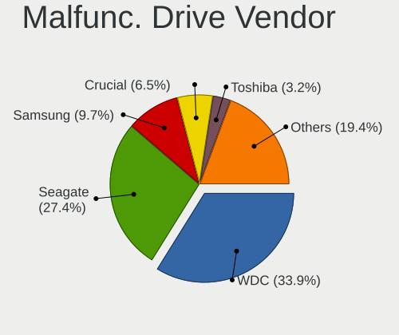

| Vendor              | Desktops | Drives | Percent |
|---------------------|----------|--------|---------|
| WDC                 | 21       | 31     | 33.87%  |
| Seagate             | 17       | 27     | 27.42%  |
| Samsung Electronics | 6        | 7      | 9.68%   |
| Crucial             | 4        | 5      | 6.45%   |
| Toshiba             | 2        | 2      | 3.23%   |
| Hitachi             | 2        | 3      | 3.23%   |
| SK hynix            | 1        | 1      | 1.61%   |
| SanDisk             | 1        | 1      | 1.61%   |
| OCZ                 | 1        | 1      | 1.61%   |
| Kingston            | 1        | 1      | 1.61%   |
| Intel               | 1        | 1      | 1.61%   |
| Innodisk            | 1        | 1      | 1.61%   |
| HGST                | 1        | 1      | 1.61%   |
| ASMT                | 1        | 1      | 1.61%   |
| Apple               | 1        | 1      | 1.61%   |
| Apacer              | 1        | 1      | 1.61%   |

Malfunc. HDD Vendor
-------------------

Vendors of faulty HDD drives

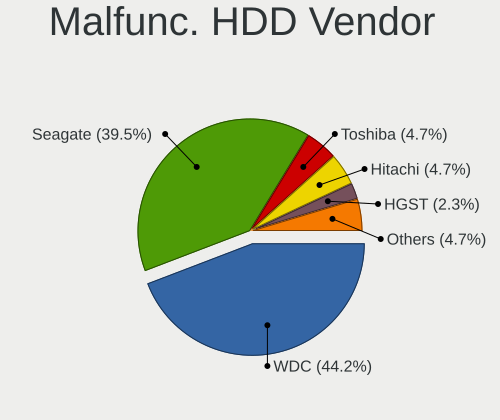

| Vendor  | Desktops | Drives | Percent |
|---------|----------|--------|---------|
| WDC     | 19       | 29     | 44.19%  |
| Seagate | 17       | 27     | 39.53%  |
| Toshiba | 2        | 2      | 4.65%   |
| Hitachi | 2        | 3      | 4.65%   |
| HGST    | 1        | 1      | 2.33%   |
| ASMT    | 1        | 1      | 2.33%   |
| Apple   | 1        | 1      | 2.33%   |

Malfunc. Drive Kind
-------------------

Kinds of faulty drives

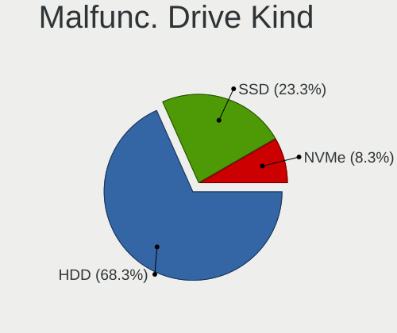

| Kind | Desktops | Drives | Percent |
|------|----------|--------|---------|
| HDD  | 41       | 64     | 68.33%  |
| SSD  | 14       | 15     | 23.33%  |
| NVMe | 5        | 6      | 8.33%   |

Failed Drives
-------------

Failed drive models

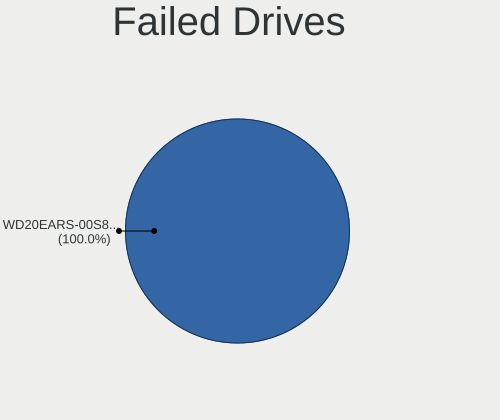

| Model                   | Desktops | Drives | Percent |
|-------------------------|----------|--------|---------|
| WDC WD20EARS-00S8B1 2TB | 1        | 1      | 100%    |

Failed Drive Vendor
-------------------

Failed drive vendors

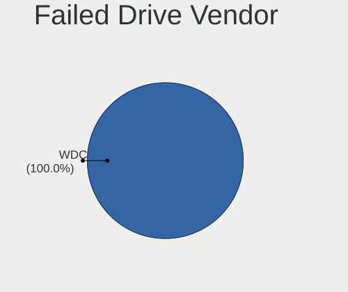

| Vendor | Desktops | Drives | Percent |
|--------|----------|--------|---------|
| WDC    | 1        | 1      | 100%    |

Drive Status
------------

Number of failed and malfunc. drives

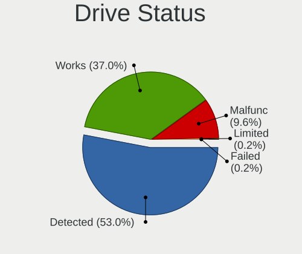

| Status   | Desktops | Drives | Percent |
|----------|----------|--------|---------|
| Detected | 319      | 1004   | 52.99%  |
| Works    | 223      | 1052   | 37.04%  |
| Malfunc  | 58       | 85     | 9.63%   |
| Failed   | 1        | 1      | 0.17%   |
| Limited  | 1        | 1      | 0.17%   |

Storage controller
------------------

Storage Vendor
--------------

Storage controller vendors

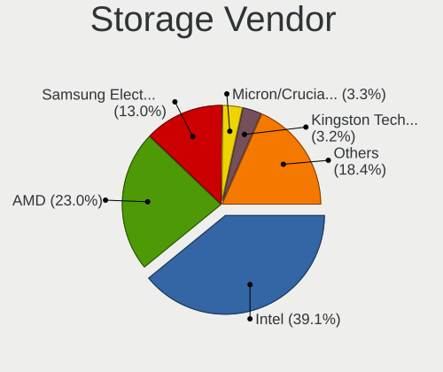

| Vendor                       | Desktops | Percent |
|------------------------------|----------|---------|
| Intel                        | 321      | 39.1%   |
| AMD                          | 189      | 23.02%  |
| Samsung Electronics          | 107      | 13.03%  |
| Micron/Crucial Technology    | 27       | 3.29%   |
| Kingston Technology Company  | 26       | 3.17%   |
| SanDisk                      | 18       | 2.19%   |
| JMicron Technology           | 18       | 2.19%   |
| ASMedia Technology           | 18       | 2.19%   |
| Marvell Technology Group     | 14       | 1.71%   |
| Nvidia                       | 10       | 1.22%   |
| ADATA Technology             | 8        | 0.97%   |
| SK hynix                     | 7        | 0.85%   |
| Shenzhen Longsys Electronics | 7        | 0.85%   |
| Phison Electronics           | 7        | 0.85%   |
| Micron Technology            | 7        | 0.85%   |
| Seagate Technology           | 6        | 0.73%   |
| MAXIO Technology (Hangzhou)  | 6        | 0.73%   |
| Silicon Motion               | 5        | 0.61%   |
| LSI Logic / Symbios Logic    | 4        | 0.49%   |
| Toshiba America Info Systems | 3        | 0.37%   |
| KIOXIA                       | 3        | 0.37%   |
| Realtek Semiconductor        | 2        | 0.24%   |
| Hewlett-Packard              | 2        | 0.24%   |
| VIA Technologies             | 1        | 0.12%   |
| Silicon Image                | 1        | 0.12%   |
| OCZ Technology Group         | 1        | 0.12%   |
| O2 Micro                     | 1        | 0.12%   |
| Netac Technology             | 1        | 0.12%   |
| Broadcom / LSI               | 1        | 0.12%   |

Storage Model
-------------

Storage controller models

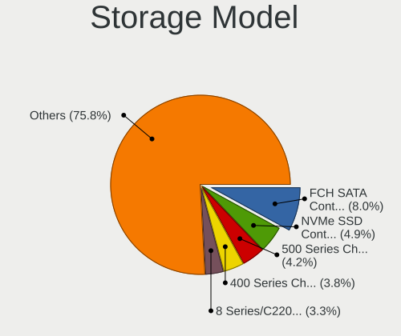

| Model                                                                                   | Desktops | Percent |
|-----------------------------------------------------------------------------------------|----------|---------|
| AMD FCH SATA Controller [AHCI mode]                                                     | 80       | 7.98%   |
| Samsung NVMe SSD Controller SM981/PM981/PM983                                           | 49       | 4.89%   |
| AMD 500 Series Chipset SATA Controller                                                  | 42       | 4.19%   |
| AMD 400 Series Chipset SATA Controller                                                  | 38       | 3.79%   |
| Intel 8 Series/C220 Series Chipset Family 6-port SATA Controller 1 [AHCI mode]          | 33       | 3.29%   |
| Intel SATA Controller [RAID mode]                                                       | 29       | 2.89%   |
| Samsung NVMe SSD Controller PM9A1/PM9A3/980PRO                                          | 26       | 2.59%   |
| Intel 7 Series/C210 Series Chipset Family 6-port SATA Controller [AHCI mode]            | 26       | 2.59%   |
| Samsung NVMe SSD Controller 980 (DRAM-less)                                             | 24       | 2.4%    |
| Intel Q170/Q150/B150/H170/H110/Z170/CM236 Chipset SATA Controller [AHCI Mode]           | 24       | 2.4%    |
| Intel 6 Series/C200 Series Chipset Family 6 port Desktop SATA AHCI Controller           | 24       | 2.4%    |
| AMD SB7x0/SB8x0/SB9x0 SATA Controller [AHCI mode]                                       | 23       | 2.3%    |
| AMD 600 Series Chipset SATA Controller                                                  | 23       | 2.3%    |
| AMD SB7x0/SB8x0/SB9x0 IDE Controller                                                    | 20       | 2%      |
| Micron/Crucial P2 [Nick P2] / P3 / P3 Plus NVMe PCIe SSD (DRAM-less)                    | 18       | 1.8%    |
| Intel 200 Series PCH SATA controller [AHCI mode]                                        | 18       | 1.8%    |
| ASMedia ASM1061/ASM1062 Serial ATA Controller                                           | 17       | 1.7%    |
| Intel Cannon Lake PCH SATA AHCI Controller                                              | 15       | 1.5%    |
| Intel 500 Series Chipset Family SATA AHCI Controller                                    | 14       | 1.4%    |
| Intel Raptor Lake SATA AHCI Controller                                                  | 13       | 1.3%    |
| Intel 9 Series Chipset Family SATA Controller [AHCI Mode]                               | 13       | 1.3%    |
| Samsung NVMe SSD Controller SM961/PM961/SM963                                           | 10       | 1%      |
| Intel Alder Lake-S PCH SATA Controller [AHCI Mode]                                      | 9        | 0.9%    |
| Intel 6 Series/C200 Series Chipset Family Desktop SATA Controller (IDE mode, ports 4-5) | 9        | 0.9%    |
| Intel 6 Series/C200 Series Chipset Family Desktop SATA Controller (IDE mode, ports 0-3) | 9        | 0.9%    |
| AMD 300 Series Chipset SATA Controller                                                  | 9        | 0.9%    |
| Samsung NVMe SSD Controller S4LV008[Pascal]                                             | 8        | 0.8%    |
| JMicron JMB363 SATA/IDE Controller                                                      | 8        | 0.8%    |
| Intel NM10/ICH7 Family SATA Controller [IDE mode]                                       | 8        | 0.8%    |
| Intel 82801JI (ICH10 Family) 2 port SATA IDE Controller #2                              | 8        | 0.8%    |
| Intel 7 Series/C210 Series Chipset Family 4-port SATA Controller [IDE mode]             | 8        | 0.8%    |
| Intel 7 Series/C210 Series Chipset Family 2-port SATA Controller [IDE mode]             | 8        | 0.8%    |
| Intel 5 Series/3400 Series Chipset 6 port SATA AHCI Controller                          | 8        | 0.8%    |
| Intel 5 Series/3400 Series Chipset 4 port SATA IDE Controller                           | 8        | 0.8%    |
| Intel 5 Series/3400 Series Chipset 2 port SATA IDE Controller                           | 8        | 0.8%    |
| AMD SB7x0/SB8x0/SB9x0 SATA Controller [IDE mode]                                        | 8        | 0.8%    |
| Intel 82801JI (ICH10 Family) 4 port SATA IDE Controller #1                              | 7        | 0.7%    |
| Intel 4 Series Chipset PT IDER Controller                                               | 7        | 0.7%    |
| JMicron JMB368 IDE controller                                                           | 6        | 0.6%    |
| Intel Comet Lake SATA AHCI Controller                                                   | 6        | 0.6%    |

Storage Kind
------------

Kind of storage controller (IDE, SATA, NVMe, SAS, ...)

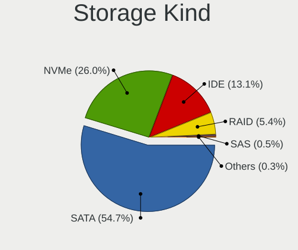

| Kind | Desktops | Percent |
|------|----------|---------|
| SATA | 435      | 54.72%  |
| NVMe | 207      | 26.04%  |
| IDE  | 104      | 13.08%  |
| RAID | 43       | 5.41%   |
| SAS  | 4        | 0.5%    |
| SCSI | 2        | 0.25%   |

Processor
---------

CPU Vendor
----------

Processor vendors

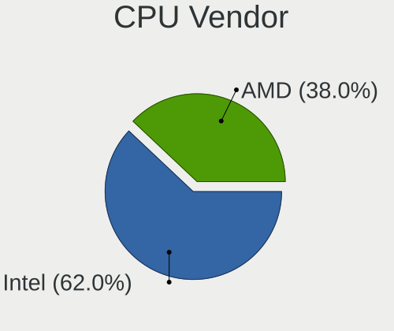

| Vendor | Desktops | Percent |
|--------|----------|---------|
| Intel  | 325      | 62.02%  |
| AMD    | 199      | 37.98%  |

CPU Model
---------

Processor models

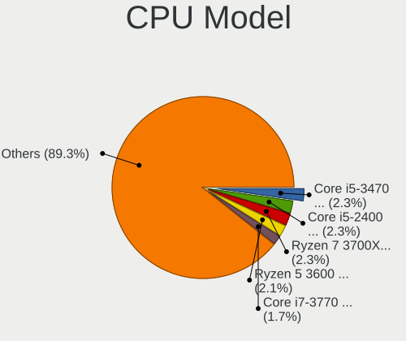

| Model                                       | Desktops | Percent |
|---------------------------------------------|----------|---------|
| Intel Core i5-3470 CPU @ 3.20GHz            | 12       | 2.29%   |
| Intel Core i5-2400 CPU @ 3.10GHz            | 12       | 2.29%   |
| AMD Ryzen 7 3700X 8-Core Processor          | 12       | 2.29%   |
| AMD Ryzen 5 3600 6-Core Processor           | 11       | 2.1%    |
| Intel Core i7-3770 CPU @ 3.40GHz            | 9        | 1.71%   |
| AMD Ryzen 5 5600X 6-Core Processor          | 9        | 1.71%   |
| AMD Ryzen 5 2600 Six-Core Processor         | 9        | 1.71%   |
| Intel Core i7-8700 CPU @ 3.20GHz            | 7        | 1.33%   |
| Intel Core i7-4790K CPU @ 4.00GHz           | 7        | 1.33%   |
| Intel Core i7-4790 CPU @ 3.60GHz            | 7        | 1.33%   |
| Intel Core i7-4770 CPU @ 3.40GHz            | 7        | 1.33%   |
| AMD Ryzen 7 5800X 8-Core Processor          | 7        | 1.33%   |
| Intel Core i5-6500 CPU @ 3.20GHz            | 6        | 1.14%   |
| Intel Core i5-4570 CPU @ 3.20GHz            | 6        | 1.14%   |
| AMD Ryzen 7 5700G with Radeon Graphics      | 6        | 1.14%   |
| Intel Core i7-7700 CPU @ 3.60GHz            | 5        | 0.95%   |
| Intel Core i7-6700 CPU @ 3.40GHz            | 5        | 0.95%   |
| Intel Core i7-2600 CPU @ 3.40GHz            | 5        | 0.95%   |
| Intel Core i7-10700 CPU @ 2.90GHz           | 5        | 0.95%   |
| AMD Ryzen 9 5950X 16-Core Processor         | 5        | 0.95%   |
| AMD Ryzen 9 5900X 12-Core Processor         | 5        | 0.95%   |
| AMD Ryzen 9 3900X 12-Core Processor         | 5        | 0.95%   |
| AMD Ryzen 5 5600G with Radeon Graphics      | 5        | 0.95%   |
| AMD Ryzen 5 5600 6-Core Processor           | 5        | 0.95%   |
| AMD FX-6300 Six-Core Processor              | 5        | 0.95%   |
| Intel N100                                  | 4        | 0.76%   |
| Intel Core i5-8400 CPU @ 2.80GHz            | 4        | 0.76%   |
| Intel Core i5-6400 CPU @ 2.70GHz            | 4        | 0.76%   |
| Intel Core i5-3570K CPU @ 3.40GHz           | 4        | 0.76%   |
| Intel Core i5-10400 CPU @ 2.90GHz           | 4        | 0.76%   |
| Intel Core i5 CPU 650 @ 3.20GHz             | 4        | 0.76%   |
| Intel Core i3-8100 CPU @ 3.60GHz            | 4        | 0.76%   |
| Intel Core i3-2120 CPU @ 3.30GHz            | 4        | 0.76%   |
| Intel Core 2 Quad CPU Q9400 @ 2.66GHz       | 4        | 0.76%   |
| AMD Ryzen 7 2700X Eight-Core Processor      | 4        | 0.76%   |
| AMD Ryzen 5 1600 Six-Core Processor         | 4        | 0.76%   |
| AMD Ryzen 3 3200G with Radeon Vega Graphics | 4        | 0.76%   |
| AMD FX-8350 Eight-Core Processor            | 4        | 0.76%   |
| Intel Core i7-10700F CPU @ 2.90GHz          | 3        | 0.57%   |
| Intel Core i7 CPU 950 @ 3.07GHz             | 3        | 0.57%   |

CPU Model Family
----------------

Processor model prefix

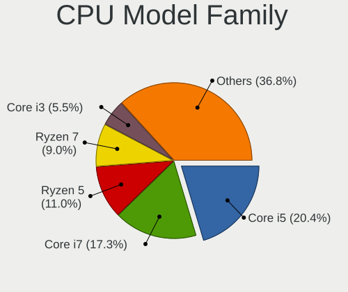

| Model                   | Desktops | Percent |
|-------------------------|----------|---------|
| Intel Core i5           | 107      | 20.38%  |
| Intel Core i7           | 91       | 17.33%  |
| AMD Ryzen 5             | 58       | 11.05%  |
| AMD Ryzen 7             | 47       | 8.95%   |
| Intel Core i3           | 29       | 5.52%   |
| Intel Xeon              | 26       | 4.95%   |
| AMD Ryzen 9             | 26       | 4.95%   |
| Other                   | 25       | 4.76%   |
| AMD FX                  | 21       | 4%      |
| Intel Core 2 Quad       | 11       | 2.1%    |
| Intel Core 2 Duo        | 9        | 1.71%   |
| AMD Ryzen 3             | 8        | 1.52%   |
| Intel Pentium           | 6        | 1.14%   |
| Intel Core i9           | 5        | 0.95%   |
| Intel Celeron           | 5        | 0.95%   |
| Intel Atom              | 5        | 0.95%   |
| AMD Ryzen Threadripper  | 5        | 0.95%   |
| AMD Athlon II X2        | 5        | 0.95%   |
| AMD Athlon 64 X2        | 5        | 0.95%   |
| Intel Pentium Dual-Core | 3        | 0.57%   |
| AMD Phenom II X6        | 3        | 0.57%   |
| AMD A8                  | 3        | 0.57%   |
| AMD Ryzen 5 PRO         | 2        | 0.38%   |
| AMD Phenom II X4        | 2        | 0.38%   |
| AMD Athlon II X4        | 2        | 0.38%   |
| AMD A6                  | 2        | 0.38%   |
| AMD A4                  | 2        | 0.38%   |
| AMD A10                 | 2        | 0.38%   |
| Intel Pentium Gold      | 1        | 0.19%   |
| Intel Pentium Dual      | 1        | 0.19%   |
| Intel Pentium 4         | 1        | 0.19%   |
| Intel Core              | 1        | 0.19%   |
| AMD Six-Core Opteron    | 1        | 0.19%   |
| AMD Ryzen 7 PRO         | 1        | 0.19%   |
| AMD Opteron             | 1        | 0.19%   |
| AMD GX                  | 1        | 0.19%   |
| AMD Geode Integrated    | 1        | 0.19%   |
| AMD A12                 | 1        | 0.19%   |

CPU Cores
---------

Number of processor cores

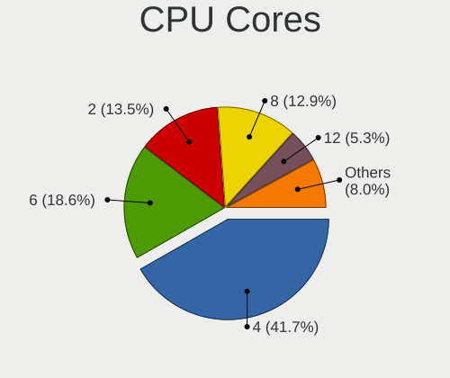

| Number | Desktops | Percent |
|--------|----------|---------|
| 4      | 220      | 41.75%  |
| 6      | 98       | 18.6%   |
| 2      | 71       | 13.47%  |
| 8      | 68       | 12.9%   |
| 12     | 28       | 5.31%   |
| 16     | 13       | 2.47%   |
| 3      | 7        | 1.33%   |
| 24     | 5        | 0.95%   |
| 1      | 5        | 0.95%   |
| 20     | 4        | 0.76%   |
| 10     | 4        | 0.76%   |
| 14     | 2        | 0.38%   |
| 36     | 1        | 0.19%   |
| 32     | 1        | 0.19%   |

CPU Sockets
-----------

Number of sockets

| Number | Desktops | Percent |
|--------|----------|---------|
| 1      | 521      | 99.43%  |
| 2      | 3        | 0.57%   |

CPU Threads
-----------

Threads per core (Hyper-Threading)

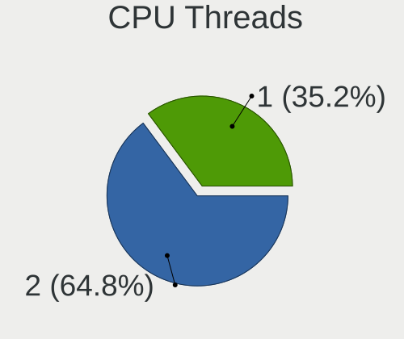

| Number | Desktops | Percent |
|--------|----------|---------|
| 2      | 341      | 64.83%  |
| 1      | 185      | 35.17%  |

CPU Op-Modes
------------

CPU Operation Modes (32-bit, 64-bit)

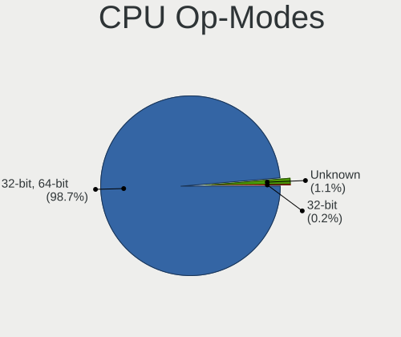

| Op mode        | Desktops | Percent |
|----------------|----------|---------|
| 32-bit, 64-bit | 519      | 98.67%  |
| Unknown        | 6        | 1.14%   |
| 32-bit         | 1        | 0.19%   |

CPU Microcode
-------------

Microcode number

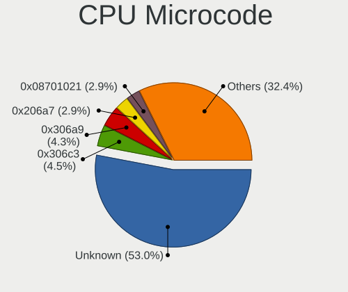

| Number     | Desktops | Percent |
|------------|----------|---------|
| Unknown    | 293      | 52.98%  |
| 0x306c3    | 25       | 4.52%   |
| 0x306a9    | 24       | 4.34%   |
| 0x206a7    | 16       | 2.89%   |
| 0x08701021 | 16       | 2.89%   |
| 0x1067a    | 11       | 1.99%   |
| 0x06000852 | 10       | 1.81%   |
| 0x0800820d | 8        | 1.45%   |
| 0x106e5    | 7        | 1.27%   |
| 0xa0655    | 6        | 1.08%   |
| 0x906ea    | 6        | 1.08%   |
| 0x906e9    | 6        | 1.08%   |
| 0x506e3    | 6        | 1.08%   |
| 0x0a601203 | 6        | 1.08%   |
| 0x0a50000c | 5        | 0.9%    |
| 0x08001137 | 5        | 0.9%    |
| 0x206d7    | 4        | 0.72%   |
| 0x106a5    | 4        | 0.72%   |
| 0x0a201016 | 4        | 0.72%   |
| 0x08701013 | 4        | 0.72%   |
| 0x010000c8 | 4        | 0.72%   |
| 0x906eb    | 3        | 0.54%   |
| 0x6fb      | 3        | 0.54%   |
| 0x20655    | 3        | 0.54%   |
| 0x0a201009 | 3        | 0.54%   |
| 0x06001119 | 3        | 0.54%   |
| 0x906ed    | 2        | 0.36%   |
| 0x50654    | 2        | 0.36%   |
| 0x406c3    | 2        | 0.36%   |
| 0x40651    | 2        | 0.36%   |
| 0x306f2    | 2        | 0.36%   |
| 0x20652    | 2        | 0.36%   |
| 0x10677    | 2        | 0.36%   |
| 0x0a50000d | 2        | 0.36%   |
| 0x0a20120a | 2        | 0.36%   |
| 0x0a201025 | 2        | 0.36%   |
| 0x08600106 | 2        | 0.36%   |
| 0x08108109 | 2        | 0.36%   |
| 0x08001138 | 2        | 0.36%   |
| 0x08001129 | 2        | 0.36%   |

CPU Microarch
-------------

Microarchitecture

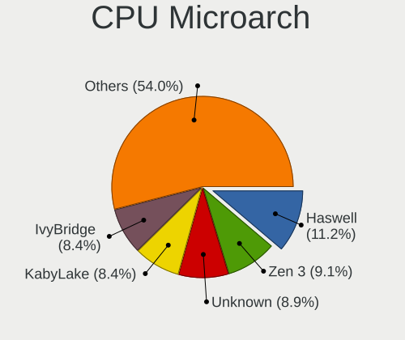

| Name             | Desktops | Percent |
|------------------|----------|---------|
| Haswell          | 59       | 11.22%  |
| Zen 3            | 48       | 9.13%   |
| Unknown          | 47       | 8.94%   |
| KabyLake         | 44       | 8.37%   |
| IvyBridge        | 44       | 8.37%   |
| Zen 2            | 38       | 7.22%   |
| SandyBridge      | 36       | 6.84%   |
| Skylake          | 27       | 5.13%   |
| Piledriver       | 23       | 4.37%   |
| Zen+             | 22       | 4.18%   |
| Penryn           | 20       | 3.8%    |
| CometLake        | 20       | 3.8%    |
| Zen              | 16       | 3.04%   |
| Nehalem          | 14       | 2.66%   |
| K10              | 13       | 2.47%   |
| Westmere         | 11       | 2.09%   |
| Core             | 7        | 1.33%   |
| Alderlake Hybrid | 7        | 1.33%   |
| Silvermont       | 5        | 0.95%   |
| K8 Hammer        | 5        | 0.95%   |
| Bulldozer        | 5        | 0.95%   |
| Tremont          | 2        | 0.38%   |
| Jaguar           | 2        | 0.38%   |
| Icelake          | 2        | 0.38%   |
| Bonnell          | 2        | 0.38%   |
| Steamroller      | 1        | 0.19%   |
| NetBurst         | 1        | 0.19%   |
| K10 Llano        | 1        | 0.19%   |
| Gracemont        | 1        | 0.19%   |
| Goldmont         | 1        | 0.19%   |
| Geode            | 1        | 0.19%   |
| Excavator        | 1        | 0.19%   |

Graphics
--------

GPU Vendor
----------

Vendors of graphics cards

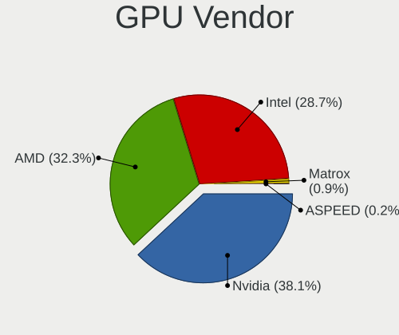

| Vendor                     | Desktops | Percent |
|----------------------------|----------|---------|
| Nvidia                     | 223      | 38.05%  |
| AMD                        | 189      | 32.25%  |
| Intel                      | 168      | 28.67%  |
| Matrox Electronics Systems | 5        | 0.85%   |
| ASPEED Technology          | 1        | 0.17%   |

GPU Model
---------

Graphics card models

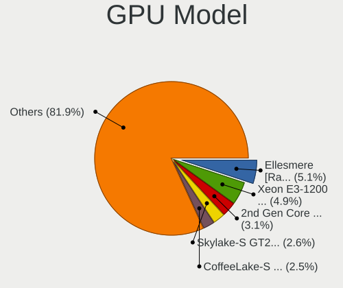

| Model                                                                       | Desktops | Percent |
|-----------------------------------------------------------------------------|----------|---------|
| AMD Ellesmere [Radeon RX 470/480/570/570X/580/580X/590]                     | 31       | 5.07%   |
| Intel Xeon E3-1200 v3/4th Gen Core Processor Integrated Graphics Controller | 30       | 4.9%    |
| Intel 2nd Generation Core Processor Family Integrated Graphics Controller   | 19       | 3.1%    |
| Intel Skylake-S GT2 [HD Graphics 530]                                       | 16       | 2.61%   |
| Intel CoffeeLake-S GT2 [UHD Graphics 630]                                   | 15       | 2.45%   |
| AMD Raphael                                                                 | 15       | 2.45%   |
| AMD Navi 23 [Radeon RX 6600/6600 XT/6600M]                                  | 15       | 2.45%   |
| Intel Xeon E3-1200 v2/3rd Gen Core processor Graphics Controller            | 13       | 2.12%   |
| Nvidia GP102 [GeForce GTX 1080 Ti]                                          | 12       | 1.96%   |
| AMD Cedar [Radeon HD 5000/6000/7350/8350 Series]                            | 11       | 1.8%    |
| Nvidia GP107 [GeForce GTX 1050 Ti]                                          | 10       | 1.63%   |
| Nvidia GK208B [GeForce GT 710]                                              | 10       | 1.63%   |
| Nvidia GP106 [GeForce GTX 1060 6GB]                                         | 9        | 1.47%   |
| Intel Kaby Lake-S GT2 [HD Graphics 630]                                     | 9        | 1.47%   |
| Intel CometLake-S GT2 [UHD Graphics 630]                                    | 9        | 1.47%   |
| Nvidia GP108 [GeForce GT 1030]                                              | 8        | 1.31%   |
| Nvidia GP104 [GeForce GTX 1070]                                             | 7        | 1.14%   |
| Intel IvyBridge GT2 [HD Graphics 4000]                                      | 7        | 1.14%   |
| Intel 4 Series Chipset Integrated Graphics Controller                       | 7        | 1.14%   |
| AMD Navi 48 [Radeon RX 9070/9070 XT/9070 GRE]                               | 7        | 1.14%   |
| AMD Navi 10 [Radeon RX 5600 OEM/5600 XT / 5700/5700 XT]                     | 7        | 1.14%   |
| AMD Cezanne [Radeon Vega Series / Radeon Vega Mobile Series]                | 7        | 1.14%   |
| Nvidia GA106 [Geforce RTX 3050]                                             | 6        | 0.98%   |
| Nvidia GA104 [GeForce RTX 3060 Ti Lite Hash Rate]                           | 6        | 0.98%   |
| AMD Navi 14 [Radeon RX 5500/5500M / Pro 5500M]                              | 6        | 0.98%   |
| Nvidia TU117 [GeForce GTX 1650]                                             | 5        | 0.82%   |
| Nvidia GT218 [GeForce 210]                                                  | 5        | 0.82%   |
| Nvidia GA104 [GeForce RTX 3070 Ti]                                          | 5        | 0.82%   |
| AMD Picasso/Raven 2 [Radeon Vega Series / Radeon Vega Mobile Series]        | 5        | 0.82%   |
| AMD Park [Mobility Radeon HD 5430]                                          | 5        | 0.82%   |
| AMD Navi 32 [Radeon RX 7700 XT / 7800 XT]                                   | 5        | 0.82%   |
| AMD Navi 31 [Radeon RX 7900 XT/7900 XTX/7900 GRE/7900M]                     | 5        | 0.82%   |
| AMD Navi 21 [Radeon RX 6800/6800 XT / 6900 XT]                              | 5        | 0.82%   |
| AMD Caicos [Radeon HD 6450/7450/8450 / R5 230 OEM]                          | 5        | 0.82%   |
| Nvidia GM204 [GeForce GTX 970]                                              | 4        | 0.65%   |
| Nvidia GK106 [GeForce GTX 660]                                              | 4        | 0.65%   |
| Nvidia GF116 [GeForce GTX 550 Ti]                                           | 4        | 0.65%   |
| Nvidia GF108 [GeForce GT 430]                                               | 4        | 0.65%   |
| Nvidia GA106 [GeForce RTX 3060 Lite Hash Rate]                              | 4        | 0.65%   |
| Nvidia GA102 [GeForce RTX 3080]                                             | 4        | 0.65%   |

GPU Combo
---------

Combinations of graphics cards

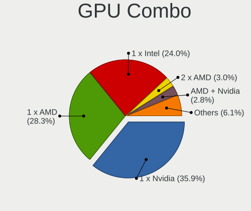

| Name             | Desktops | Percent |
|------------------|----------|---------|
| 1 x Nvidia       | 193      | 35.87%  |
| 1 x AMD          | 152      | 28.25%  |
| 1 x Intel        | 129      | 23.98%  |
| 2 x AMD          | 16       | 2.97%   |
| AMD + Nvidia     | 15       | 2.79%   |
| Intel + Nvidia   | 13       | 2.42%   |
| Intel + AMD      | 8        | 1.49%   |
| 1 x Matrox       | 5        | 0.93%   |
| 2 x Nvidia       | 3        | 0.56%   |
| Other            | 1        | 0.19%   |
| 2 x Intel        | 1        | 0.19%   |
| AMD + 2 x Nvidia | 1        | 0.19%   |
| AMD + ASPEED     | 1        | 0.19%   |

GPU Driver
----------

Free vs proprietary

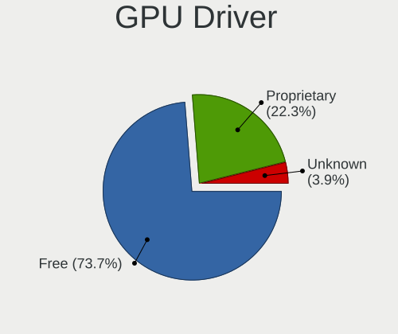

| Driver      | Desktops | Percent |
|-------------|----------|---------|
| Free        | 396      | 73.74%  |
| Proprietary | 120      | 22.35%  |
| Unknown     | 21       | 3.91%   |

GPU Memory
----------

Total video memory

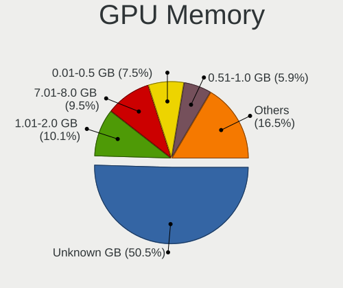

| Size in GB | Desktops | Percent |
|------------|----------|---------|
| Unknown    | 275      | 50.46%  |
| 1.01-2.0   | 55       | 10.09%  |
| 7.01-8.0   | 52       | 9.54%   |
| 0.01-0.5   | 41       | 7.52%   |
| 0.51-1.0   | 32       | 5.87%   |
| 3.01-4.0   | 31       | 5.69%   |
| 8.01-16.0  | 30       | 5.5%    |
| 5.01-6.0   | 18       | 3.3%    |
| 16.01-24.0 | 5        | 0.92%   |
| 2.01-3.0   | 4        | 0.73%   |
| 4.01-5.0   | 2        | 0.37%   |

Monitor
-------

Monitor Vendor
--------------

Monitor vendors

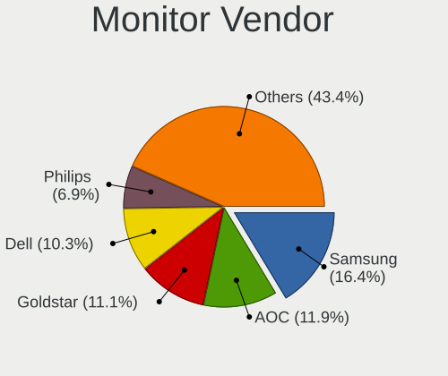

| Vendor                  | Desktops | Percent |
|-------------------------|----------|---------|
| Samsung Electronics     | 100      | 16.37%  |
| AOC                     | 73       | 11.95%  |
| Goldstar                | 68       | 11.13%  |
| Dell                    | 63       | 10.31%  |
| Philips                 | 42       | 6.87%   |
| ViewSonic               | 35       | 5.73%   |
| Hewlett-Packard         | 31       | 5.07%   |
| Acer                    | 25       | 4.09%   |
| Panasonic               | 18       | 2.95%   |
| Sony                    | 17       | 2.78%   |
| Lenovo                  | 16       | 2.62%   |
| BenQ                    | 15       | 2.45%   |
| Ancor Communications    | 15       | 2.45%   |
| Denver                  | 12       | 1.96%   |
| ASUSTek Computer        | 11       | 1.8%    |
| MiTAC                   | 9        | 1.47%   |
| Gigabyte Technology     | 6        | 0.98%   |
| Unknown                 | 4        | 0.65%   |
| LG Electronics          | 4        | 0.65%   |
| Unknown                 | 3        | 0.49%   |
| Unknown (AAA)           | 2        | 0.33%   |
| RTK                     | 2        | 0.33%   |
| NEC Computers           | 2        | 0.33%   |
| MSI                     | 2        | 0.33%   |
| Mi                      | 2        | 0.33%   |
| KTC                     | 2        | 0.33%   |
| Konka                   | 2        | 0.33%   |
| Kogan                   | 2        | 0.33%   |
| Chi Mei Optoelectronics | 2        | 0.33%   |
| Yamaha                  | 1        | 0.16%   |
| Wacom                   | 1        | 0.16%   |
| VCS                     | 1        | 0.16%   |
| Targa                   | 1        | 0.16%   |
| SVT                     | 1        | 0.16%   |
| Skyworth                | 1        | 0.16%   |
| SANYO                   | 1        | 0.16%   |
| SAC                     | 1        | 0.16%   |
| PPC                     | 1        | 0.16%   |
| Plain Tree Systems      | 1        | 0.16%   |
| Marantz                 | 1        | 0.16%   |

Monitor Model
-------------

Monitor models

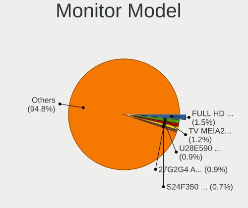

| Model                                                                | Desktops | Percent |
|----------------------------------------------------------------------|----------|---------|
| Goldstar FULL HD GSM5B55 1920x1080 480x270mm 21.7-inch               | 10       | 1.49%   |
| Panasonic TV MEIA296 1920x1080 698x392mm 31.5-inch                   | 8        | 1.19%   |
| Samsung Electronics U28E590 SAM0C4D 3840x2160 607x345mm 27.5-inch    | 6        | 0.89%   |
| AOC 27G2G4 AOC2702 1920x1080 598x336mm 27.0-inch                     | 6        | 0.89%   |
| Samsung Electronics S24F350 SAM0D20 1920x1080 521x293mm 23.5-inch    | 5        | 0.74%   |
| MiTAC MStar Demo SZM0030 3840x2160 708x398mm 32.0-inch               | 5        | 0.74%   |
| Goldstar LG IPS FULLHD GSM5AB8 1920x1080 480x270mm 21.7-inch         | 5        | 0.74%   |
| Goldstar FULL HD GSM5AB9 1920x1080 480x270mm 21.7-inch               | 5        | 0.74%   |
| AOC 2450W AOC2450 1920x1080 521x293mm 23.5-inch                      | 5        | 0.74%   |
| ViewSonic VA2248 SERIES VSC0E28 1920x1080 477x268mm 21.5-inch        | 4        | 0.6%    |
| Sony TV SNYEE01 1920x1080                                            | 4        | 0.6%    |
| Philips PHL 246V5 PHLC0C5 1920x1080 531x299mm 24.0-inch              | 4        | 0.6%    |
| Philips PHL 243V7 PHLC155 1920x1080 527x296mm 23.8-inch              | 4        | 0.6%    |
| Goldstar FULL HD GSM5ABA 1920x1080 480x270mm 21.7-inch               | 4        | 0.6%    |
| Denver MO-HHS-32C LHCFFFF 1920x1080 699x393mm 31.6-inch              | 4        | 0.6%    |
| Dell P2214H DELA097 1920x1080 477x268mm 21.5-inch                    | 4        | 0.6%    |
| AOC 2367M AOC2367 1920x1080 509x286mm 23.0-inch                      | 4        | 0.6%    |
| ViewSonic VX2433wm VSC3822 1920x1080 520x290mm 23.4-inch             | 3        | 0.45%   |
| Samsung Electronics C27F591 SAM0D37 1920x1080 600x340mm 27.2-inch    | 3        | 0.45%   |
| Hewlett-Packard P221 HWP3057 1920x1080 476x268mm 21.5-inch           | 3        | 0.45%   |
| Goldstar HDR WFHD GSM7714 2560x1080 798x334mm 34.1-inch              | 3        | 0.45%   |
| Goldstar 27GL850 GSM5B7F 2560x1440 597x336mm 27.0-inch               | 3        | 0.45%   |
| Denver PGM270 LHC2700 2560x1440 597x336mm 27.0-inch                  | 3        | 0.45%   |
| AOC AG322FWG4 AOC3220 1920x1080 698x393mm 31.5-inch                  | 3        | 0.45%   |
| AOC 32G1WG4 AOC3201 1920x1080 697x392mm 31.5-inch                    | 3        | 0.45%   |
| AOC 27G1G4 AOC2701 1920x1080 598x336mm 27.0-inch                     | 3        | 0.45%   |
| AOC 24G2W1G3 AOC2402 1920x1080 527x296mm 23.8-inch                   | 3        | 0.45%   |
| AOC 2260WG5 AOC2260 1920x1080 477x268mm 21.5-inch                    | 3        | 0.45%   |
| Ancor Communications VE247 ACI2493 1920x1080 530x300mm 24.0-inch     | 3        | 0.45%   |
| Unknown                                                              | 3        | 0.45%   |
| ViewSonic VX2439wm VSC3D24 1920x1080 520x290mm 23.4-inch             | 2        | 0.3%    |
| ViewSonic VX2240w VSC6B20 1680x1050 495x291mm 22.6-inch              | 2        | 0.3%    |
| ViewSonic VA702-3SERIES VSCB51D 1280x1024 338x270mm 17.0-inch        | 2        | 0.3%    |
| ViewSonic VA2231 Series VSCBB25 1920x1080 477x268mm 21.5-inch        | 2        | 0.3%    |
| Unknown LCD Monitor FFFF 2288x1287 2550x2550mm 142.0-inch            | 2        | 0.3%    |
| Sony TV SNYF301 1920x1080                                            | 2        | 0.3%    |
| Sony TV SNYEF03 1600x900                                             | 2        | 0.3%    |
| Samsung Electronics U28E590 SAM0C4C 3840x2160 608x345mm 27.5-inch    | 2        | 0.3%    |
| Samsung Electronics SyncMaster SAM027F 1680x1050 474x296mm 22.0-inch | 2        | 0.3%    |
| Samsung Electronics S24B350 SAM08DA 1920x1080 531x299mm 24.0-inch    | 2        | 0.3%    |

Monitor Resolution
------------------

Monitor screen resolution

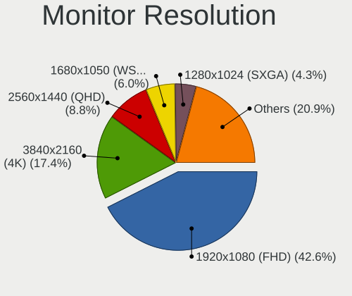

| Resolution         | Desktops | Percent |
|--------------------|----------|---------|
| 1920x1080 (FHD)    | 255      | 42.57%  |
| 3840x2160 (4K)     | 104      | 17.36%  |
| 2560x1440 (QHD)    | 53       | 8.85%   |
| 1680x1050 (WSXGA+) | 36       | 6.01%   |
| 1280x1024 (SXGA)   | 26       | 4.34%   |
| 1440x900 (WXGA+)   | 19       | 3.17%   |
| 3440x1440          | 17       | 2.84%   |
| Unknown            | 16       | 2.67%   |
| 3840x1080          | 12       | 2%      |
| 1600x900 (HD+)     | 11       | 1.84%   |
| 1366x768 (WXGA)    | 9        | 1.5%    |
| 1920x1200 (WUXGA)  | 6        | 1%      |
| 2560x1080          | 5        | 0.83%   |
| 1360x768           | 5        | 0.83%   |
| 2560x1600          | 4        | 0.67%   |
| 2288x1287          | 2        | 0.33%   |
| 1920x540           | 2        | 0.33%   |
| 1600x1200          | 2        | 0.33%   |
| 7680x1080          | 1        | 0.17%   |
| 6720x1080          | 1        | 0.17%   |
| 5760x1080          | 1        | 0.17%   |
| 5120x1080          | 1        | 0.17%   |
| 3840x1600          | 1        | 0.17%   |
| 3840x1200          | 1        | 0.17%   |
| 3360x1080          | 1        | 0.17%   |
| 3040x1050          | 1        | 0.17%   |
| 2960x1050          | 1        | 0.17%   |
| 2560x1024          | 1        | 0.17%   |
| 2048x1152          | 1        | 0.17%   |
| 1400x1050          | 1        | 0.17%   |
| 1280x800 (WXGA)    | 1        | 0.17%   |
| 1280x720 (HD)      | 1        | 0.17%   |
| 1024x768 (XGA)     | 1        | 0.17%   |

Monitor Diagonal
----------------

Diagonal size in inches

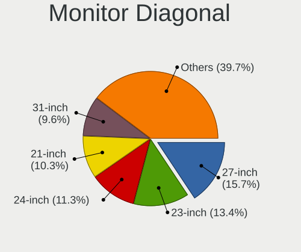

| Inches  | Desktops | Percent |
|---------|----------|---------|
| 27      | 96       | 15.69%  |
| 23      | 82       | 13.4%   |
| 24      | 69       | 11.27%  |
| 21      | 63       | 10.29%  |
| 31      | 59       | 9.64%   |
| Unknown | 47       | 7.68%   |
| 22      | 28       | 4.58%   |
| 19      | 25       | 4.08%   |
| 20      | 16       | 2.61%   |
| 34      | 15       | 2.45%   |
| 17      | 15       | 2.45%   |
| 72      | 14       | 2.29%   |
| 84      | 13       | 2.12%   |
| 18      | 10       | 1.63%   |
| 32      | 8        | 1.31%   |
| 49      | 6        | 0.98%   |
| 63      | 4        | 0.65%   |
| 40      | 4        | 0.65%   |
| 65      | 3        | 0.49%   |
| 46      | 3        | 0.49%   |
| 28      | 3        | 0.49%   |
| 26      | 3        | 0.49%   |
| 142     | 2        | 0.33%   |
| 52      | 2        | 0.33%   |
| 42      | 2        | 0.33%   |
| 36      | 2        | 0.33%   |
| 35      | 2        | 0.33%   |
| 29      | 2        | 0.33%   |
| 15      | 2        | 0.33%   |
| 75      | 1        | 0.16%   |
| 64      | 1        | 0.16%   |
| 57      | 1        | 0.16%   |
| 54      | 1        | 0.16%   |
| 48      | 1        | 0.16%   |
| 47      | 1        | 0.16%   |
| 43      | 1        | 0.16%   |
| 37      | 1        | 0.16%   |
| 33      | 1        | 0.16%   |
| 30      | 1        | 0.16%   |
| 25      | 1        | 0.16%   |

Monitor Width
-------------

Physical width

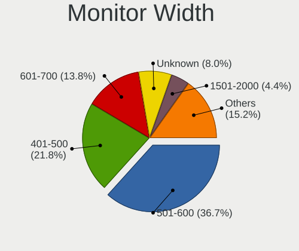

| Width in mm    | Desktops | Percent |
|----------------|----------|---------|
| 501-600        | 215      | 36.69%  |
| 401-500        | 128      | 21.84%  |
| 601-700        | 81       | 13.82%  |
| Unknown        | 47       | 8.02%   |
| 701-800        | 26       | 4.44%   |
| 1501-2000      | 26       | 4.44%   |
| 1001-1500      | 23       | 3.92%   |
| 301-350        | 17       | 2.9%    |
| 351-400        | 11       | 1.88%   |
| 801-900        | 7        | 1.19%   |
| 901-1000       | 3        | 0.51%   |
| More than 2000 | 2        | 0.34%   |

Aspect Ratio
------------

Proportional relationship between the width and the height

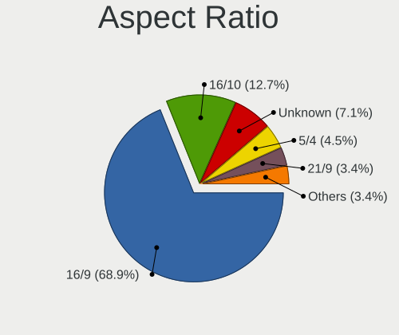

| Ratio   | Desktops | Percent |
|---------|----------|---------|
| 16/9    | 368      | 68.91%  |
| 16/10   | 68       | 12.73%  |
| Unknown | 38       | 7.12%   |
| 5/4     | 24       | 4.49%   |
| 21/9    | 18       | 3.37%   |
| 32/9    | 9        | 1.69%   |
| 4/3     | 4        | 0.75%   |
| 6/5     | 2        | 0.37%   |
| 1.00    | 2        | 0.37%   |
| 3/2     | 1        | 0.19%   |

Monitor Area
------------

Area in inch²

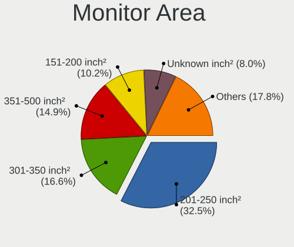

| Area in inch² | Desktops | Percent |
|----------------|----------|---------|
| 201-250        | 192      | 32.54%  |
| 301-350        | 98       | 16.61%  |
| 351-500        | 88       | 14.92%  |
| 151-200        | 60       | 10.17%  |
| Unknown        | 47       | 7.97%   |
| More than 1000 | 39       | 6.61%   |
| 251-300        | 23       | 3.9%    |
| 501-1000       | 20       | 3.39%   |
| 141-150        | 19       | 3.22%   |
| 101-110        | 2        | 0.34%   |
| 131-140        | 1        | 0.17%   |
| 121-130        | 1        | 0.17%   |

Pixel Density
-------------

Pixels per inch

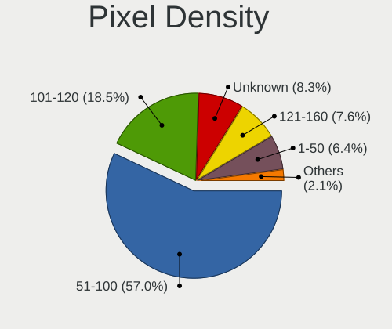

| Density | Desktops | Percent |
|---------|----------|---------|
| 51-100  | 321      | 57.02%  |
| 101-120 | 104      | 18.47%  |
| Unknown | 47       | 8.35%   |
| 121-160 | 43       | 7.64%   |
| 1-50    | 36       | 6.39%   |
| 161-240 | 12       | 2.13%   |

Multiple Monitors
-----------------

Total monitors connected

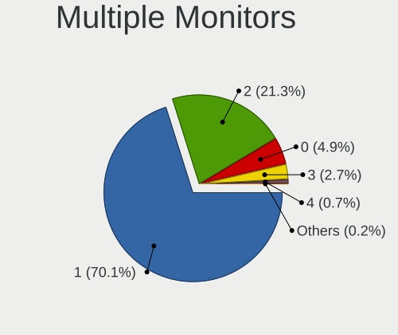

| Total | Desktops | Percent |
|-------|----------|---------|
| 1     | 385      | 70.13%  |
| 2     | 117      | 21.31%  |
| 0     | 27       | 4.92%   |
| 3     | 15       | 2.73%   |
| 4     | 4        | 0.73%   |
| 5     | 1        | 0.18%   |

Network
-------

Net Controller Vendor
---------------------

Controller vendors

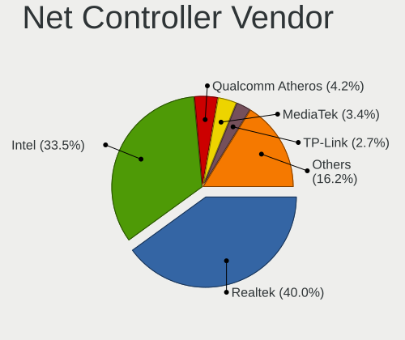

| Vendor                                | Desktops | Percent |
|---------------------------------------|----------|---------|
| Realtek Semiconductor                 | 316      | 40%     |
| Intel                                 | 265      | 33.54%  |
| Qualcomm Atheros                      | 33       | 4.18%   |
| MediaTek                              | 27       | 3.42%   |
| TP-Link                               | 21       | 2.66%   |
| Broadcom                              | 20       | 2.53%   |
| Ralink Technology                     | 15       | 1.9%    |
| Ralink                                | 12       | 1.52%   |
| Nvidia                                | 8        | 1.01%   |
| NetGear                               | 8        | 1.01%   |
| Marvell Technology Group              | 8        | 1.01%   |
| Microsoft                             | 7        | 0.89%   |
| D-Link                                | 5        | 0.63%   |
| Aquantia                              | 5        | 0.63%   |
| Samsung Electronics                   | 4        | 0.51%   |
| Qualcomm Atheros Communications       | 4        | 0.51%   |
| Edimax Technology                     | 4        | 0.51%   |
| Broadcom Limited                      | 3        | 0.38%   |
| OPPO Electronics                      | 2        | 0.25%   |
| Microchip Technology                  | 2        | 0.25%   |
| IBM                                   | 2        | 0.25%   |
| ASUSTek Computer                      | 2        | 0.25%   |
| ASIX Electronics                      | 2        | 0.25%   |
| ZTE WCDMA Technologies MSM            | 1        | 0.13%   |
| Wilocity                              | 1        | 0.13%   |
| VIA Technologies                      | 1        | 0.13%   |
| Realtek                               | 1        | 0.13%   |
| Raspberry Pi                          | 1        | 0.13%   |
| Qualcomm Technologies                 | 1        | 0.13%   |
| Mellanox Technologies                 | 1        | 0.13%   |
| MCS                                   | 1        | 0.13%   |
| Huawei Technologies                   | 1        | 0.13%   |
| DisplayLink                           | 1        | 0.13%   |
| Conexant Systems                      | 1        | 0.13%   |
| Bose                                  | 1        | 0.13%   |
| Belkin Components                     | 1        | 0.13%   |
| 802.11g Adapter [Linksys WUSB54GC v3] | 1        | 0.13%   |
| 3Com                                  | 1        | 0.13%   |

Net Controller Model
--------------------

Controller models

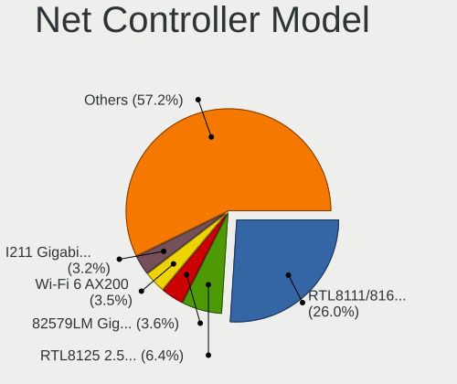

| Model                                                                  | Desktops | Percent |
|------------------------------------------------------------------------|----------|---------|
| Realtek RTL8111/8168/8211/8411 PCI Express Gigabit Ethernet Controller | 230      | 26.02%  |
| Realtek RTL8125 2.5GbE Controller                                      | 57       | 6.45%   |
| Intel 82579LM Gigabit Network Connection (Lewisville)                  | 32       | 3.62%   |
| Intel Wi-Fi 6 AX200                                                    | 31       | 3.51%   |
| Intel I211 Gigabit Network Connection                                  | 28       | 3.17%   |
| Intel Ethernet Controller I225-V                                       | 21       | 2.38%   |
| Intel Ethernet Connection (2) I219-V                                   | 18       | 2.04%   |
| Intel Ethernet Connection I217-LM                                      | 17       | 1.92%   |
| Intel Wi-Fi 5(802.11ac) Wireless-AC 9x6x [Thunder Peak]                | 12       | 1.36%   |
| Intel Dual Band Wireless-AC 3168NGW [Stone Peak]                       | 12       | 1.36%   |
| Intel Wi-Fi 6E(802.11ax) AX210/AX1675* 2x2 [Typhoon Peak]              | 11       | 1.24%   |
| Qualcomm Atheros AR8151 v2.0 Gigabit Ethernet                          | 10       | 1.13%   |
| Intel Ethernet Connection (2) I219-LM                                  | 10       | 1.13%   |
| Intel Ethernet Connection (2) I218-V                                   | 8        | 0.9%    |
| Intel 82567LM-3 Gigabit Network Connection                             | 8        | 0.9%    |
| Realtek RTL88x2bu [AC1200 Techkey]                                     | 7        | 0.79%   |
| MediaTek MT7921K (RZ608) Wi-Fi 6E 80MHz                                | 7        | 0.79%   |
| Intel Wireless 8265 / 8275                                             | 7        | 0.79%   |
| Intel Ethernet Connection (7) I219-V                                   | 7        | 0.79%   |
| Intel 82574L Gigabit Network Connection                                | 7        | 0.79%   |
| Realtek RTL8821CE 802.11ac PCIe Wireless Network Adapter               | 6        | 0.68%   |
| Realtek RTL8192EE PCIe Wireless Network Adapter                        | 6        | 0.68%   |
| Ralink MT7601U Wireless Adapter                                        | 6        | 0.68%   |
| Qualcomm Atheros QCA6174 802.11ac Wireless Network Adapter             | 6        | 0.68%   |
| MediaTek MT7902 802.11ax PCIe Wireless Network Adapter [Filogic 310]   | 6        | 0.68%   |
| Intel 82579V Gigabit Network Connection                                | 6        | 0.68%   |
| Intel 700 Series Chipset CNVi WiFi                                     | 6        | 0.68%   |
| TP-Link TL-WN822N Version 4 RTL8192EU                                  | 5        | 0.57%   |
| TP-Link TL-WN821N v5/v6 [RTL8192EU]                                    | 5        | 0.57%   |
| TP-Link AC600 wireless Realtek RTL8811AU [Archer T2U Nano]             | 5        | 0.57%   |
| Realtek RTL8812AE 802.11ac PCIe Wireless Network Adapter               | 5        | 0.57%   |
| Realtek 802.11ac NIC                                                   | 5        | 0.57%   |
| Microsoft Xbox Wireless Adapter for Windows                            | 5        | 0.57%   |
| MediaTek MT7922 802.11ax PCI Express Wireless Network Adapter          | 5        | 0.57%   |
| Marvell Group 88E8056 PCI-E Gigabit Ethernet Controller                | 5        | 0.57%   |
| Intel Alder Lake-S PCH CNVi WiFi                                       | 5        | 0.57%   |
| Intel 82578DM Gigabit Network Connection                               | 5        | 0.57%   |
| Realtek RTL8188EUS 802.11n Wireless Network Adapter                    | 4        | 0.45%   |
| Realtek RTL8153 Gigabit Ethernet Adapter                               | 4        | 0.45%   |
| Nvidia MCP61 Ethernet                                                  | 4        | 0.45%   |

Wireless Vendor
---------------

Wireless vendors

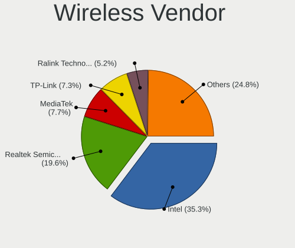

| Vendor                                | Desktops | Percent |
|---------------------------------------|----------|---------|
| Intel                                 | 101      | 35.31%  |
| Realtek Semiconductor                 | 56       | 19.58%  |
| MediaTek                              | 22       | 7.69%   |
| TP-Link                               | 21       | 7.34%   |
| Ralink Technology                     | 15       | 5.24%   |
| Qualcomm Atheros                      | 14       | 4.9%    |
| Ralink                                | 12       | 4.2%    |
| Broadcom                              | 10       | 3.5%    |
| NetGear                               | 8        | 2.8%    |
| Microsoft                             | 7        | 2.45%   |
| D-Link                                | 5        | 1.75%   |
| Qualcomm Atheros Communications       | 4        | 1.4%    |
| Edimax Technology                     | 4        | 1.4%    |
| ASUSTek Computer                      | 2        | 0.7%    |
| Wilocity                              | 1        | 0.35%   |
| Realtek                               | 1        | 0.35%   |
| Broadcom Limited                      | 1        | 0.35%   |
| Belkin Components                     | 1        | 0.35%   |
| 802.11g Adapter [Linksys WUSB54GC v3] | 1        | 0.35%   |

Wireless Model
--------------

Wireless models

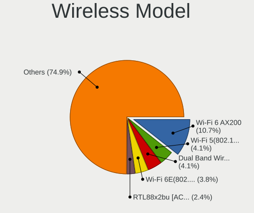

| Model                                                                     | Desktops | Percent |
|---------------------------------------------------------------------------|----------|---------|
| Intel Wi-Fi 6 AX200                                                       | 31       | 10.65%  |
| Intel Wi-Fi 5(802.11ac) Wireless-AC 9x6x [Thunder Peak]                   | 12       | 4.12%   |
| Intel Dual Band Wireless-AC 3168NGW [Stone Peak]                          | 12       | 4.12%   |
| Intel Wi-Fi 6E(802.11ax) AX210/AX1675* 2x2 [Typhoon Peak]                 | 11       | 3.78%   |
| Realtek RTL88x2bu [AC1200 Techkey]                                        | 7        | 2.41%   |
| MediaTek MT7921K (RZ608) Wi-Fi 6E 80MHz                                   | 7        | 2.41%   |
| Intel Wireless 8265 / 8275                                                | 7        | 2.41%   |
| Realtek RTL8821CE 802.11ac PCIe Wireless Network Adapter                  | 6        | 2.06%   |
| Realtek RTL8192EE PCIe Wireless Network Adapter                           | 6        | 2.06%   |
| Ralink MT7601U Wireless Adapter                                           | 6        | 2.06%   |
| Qualcomm Atheros QCA6174 802.11ac Wireless Network Adapter                | 6        | 2.06%   |
| MediaTek MT7902 802.11ax PCIe Wireless Network Adapter [Filogic 310]      | 6        | 2.06%   |
| Intel 700 Series Chipset CNVi WiFi                                        | 6        | 2.06%   |
| TP-Link TL-WN822N Version 4 RTL8192EU                                     | 5        | 1.72%   |
| TP-Link TL-WN821N v5/v6 [RTL8192EU]                                       | 5        | 1.72%   |
| TP-Link AC600 wireless Realtek RTL8811AU [Archer T2U Nano]                | 5        | 1.72%   |
| Realtek RTL8812AE 802.11ac PCIe Wireless Network Adapter                  | 5        | 1.72%   |
| Realtek 802.11ac NIC                                                      | 5        | 1.72%   |
| Microsoft Xbox Wireless Adapter for Windows                               | 5        | 1.72%   |
| MediaTek MT7922 802.11ax PCI Express Wireless Network Adapter             | 5        | 1.72%   |
| Realtek RTL8188EUS 802.11n Wireless Network Adapter                       | 4        | 1.37%   |
| Intel Wireless 7265                                                       | 4        | 1.37%   |
| Intel Tiger Lake PCH CNVi WiFi                                            | 4        | 1.37%   |
| Intel Cannon Lake PCH CNVi WiFi                                           | 4        | 1.37%   |
| Broadcom BCM43228 802.11a/b/g/n                                           | 4        | 1.37%   |
| Realtek RTL8852CE PCIe 802.11ax Wireless Network Controller               | 3        | 1.03%   |
| Realtek RTL8822BE 802.11a/b/g/n/ac WiFi adapter                           | 3        | 1.03%   |
| Realtek RTL8192CE PCIe Wireless Network Adapter                           | 3        | 1.03%   |
| Ralink RT2870/RT3070 Wireless Adapter                                     | 3        | 1.03%   |
| Ralink RT3092 Wireless 802.11n 2T/2R PCIe                                 | 3        | 1.03%   |
| Qualcomm Atheros AR9271 802.11n                                           | 3        | 1.03%   |
| Qualcomm Atheros AR9287 Wireless Network Adapter (PCI-Express)            | 3        | 1.03%   |
| NetGear Nighthawk A7000 802.11ac Wireless Adapter AC1900 [Realtek 8814AU] | 3        | 1.03%   |
| Intel Wireless 7260                                                       | 3        | 1.03%   |
| Intel Alder Lake-S PCH CNVi WiFi                                          | 3        | 1.03%   |
| TP-Link Archer T4U ver.3                                                  | 2        | 0.69%   |
| Realtek RTL8814AU 802.11a/b/g/n/ac Wireless Adapter                       | 2        | 0.69%   |
| Realtek RTL8812AU 802.11a/b/g/n/ac 2T2R DB WLAN Adapter                   | 2        | 0.69%   |
| Realtek RTL8191SU 802.11n WLAN Adapter                                    | 2        | 0.69%   |
| Ralink RT5370 Wireless Adapter                                            | 2        | 0.69%   |

Ethernet Vendor
---------------

Ethernet vendors

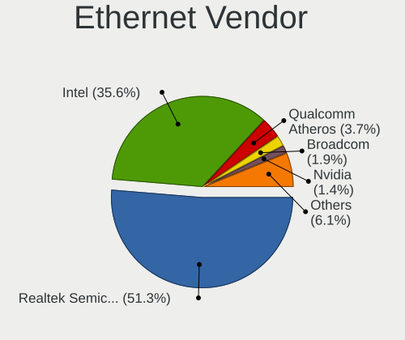

| Vendor                     | Desktops | Percent |
|----------------------------|----------|---------|
| Realtek Semiconductor      | 293      | 51.31%  |
| Intel                      | 203      | 35.55%  |
| Qualcomm Atheros           | 21       | 3.68%   |
| Broadcom                   | 11       | 1.93%   |
| Nvidia                     | 8        | 1.4%    |
| Marvell Technology Group   | 8        | 1.4%    |
| Aquantia                   | 5        | 0.88%   |
| Samsung Electronics        | 4        | 0.7%    |
| MediaTek                   | 3        | 0.53%   |
| OPPO Electronics           | 2        | 0.35%   |
| IBM                        | 2        | 0.35%   |
| Broadcom Limited           | 2        | 0.35%   |
| ASIX Electronics           | 2        | 0.35%   |
| ZTE WCDMA Technologies MSM | 1        | 0.18%   |
| VIA Technologies           | 1        | 0.18%   |
| Qualcomm Technologies      | 1        | 0.18%   |
| Mellanox Technologies      | 1        | 0.18%   |
| Huawei Technologies        | 1        | 0.18%   |
| DisplayLink                | 1        | 0.18%   |
| 3Com                       | 1        | 0.18%   |

Ethernet Model
--------------

Ethernet models

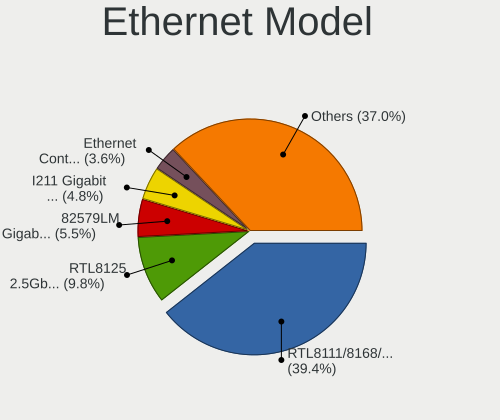

| Model                                                                          | Desktops | Percent |
|--------------------------------------------------------------------------------|----------|---------|
| Realtek RTL8111/8168/8211/8411 PCI Express Gigabit Ethernet Controller         | 230      | 39.38%  |
| Realtek RTL8125 2.5GbE Controller                                              | 57       | 9.76%   |
| Intel 82579LM Gigabit Network Connection (Lewisville)                          | 32       | 5.48%   |
| Intel I211 Gigabit Network Connection                                          | 28       | 4.79%   |
| Intel Ethernet Controller I225-V                                               | 21       | 3.6%    |
| Intel Ethernet Connection (2) I219-V                                           | 18       | 3.08%   |
| Intel Ethernet Connection I217-LM                                              | 17       | 2.91%   |
| Qualcomm Atheros AR8151 v2.0 Gigabit Ethernet                                  | 10       | 1.71%   |
| Intel Ethernet Connection (2) I219-LM                                          | 10       | 1.71%   |
| Intel Ethernet Connection (2) I218-V                                           | 8        | 1.37%   |
| Intel 82567LM-3 Gigabit Network Connection                                     | 8        | 1.37%   |
| Intel Ethernet Connection (7) I219-V                                           | 7        | 1.2%    |
| Intel 82574L Gigabit Network Connection                                        | 7        | 1.2%    |
| Intel 82579V Gigabit Network Connection                                        | 6        | 1.03%   |
| Marvell Group 88E8056 PCI-E Gigabit Ethernet Controller                        | 5        | 0.86%   |
| Intel 82578DM Gigabit Network Connection                                       | 5        | 0.86%   |
| Realtek RTL8153 Gigabit Ethernet Adapter                                       | 4        | 0.68%   |
| Nvidia MCP61 Ethernet                                                          | 4        | 0.68%   |
| Intel Ethernet Controller I226-V                                               | 4        | 0.68%   |
| Intel Ethernet Connection I217-V                                               | 4        | 0.68%   |
| Intel Ethernet Connection (7) I219-LM                                          | 4        | 0.68%   |
| Intel Ethernet Connection (5) I219-LM                                          | 4        | 0.68%   |
| Qualcomm Atheros Killer E220x Gigabit Ethernet Controller                      | 3        | 0.51%   |
| Qualcomm Atheros AR8161 Gigabit Ethernet                                       | 3        | 0.51%   |
| Intel Ethernet Connection (11) I219-V                                          | 3        | 0.51%   |
| Intel 82599ES 10-Gigabit SFI/SFP+ Network Connection                           | 3        | 0.51%   |
| Aquantia AQtion AQC107 NBase-T/IEEE 802.3an Ethernet Controller [Atlantic 10G] | 3        | 0.51%   |
| Samsung GT-I9070 (network tethering, USB debugging enabled)                    | 2        | 0.34%   |
| Samsung Galaxy series, misc. (tethering mode)                                  | 2        | 0.34%   |
| Qualcomm Atheros AR8131 Gigabit Ethernet                                       | 2        | 0.34%   |
| OPPO Ace 3V                                                                    | 2        | 0.34%   |
| Nvidia CK804 Ethernet Controller                                               | 2        | 0.34%   |
| MediaTek A015                                                                  | 2        | 0.34%   |
| Marvell Group 88E8053 PCI-E Gigabit Ethernet Controller                        | 2        | 0.34%   |
| Intel I210 Gigabit Network Connection                                          | 2        | 0.34%   |
| Intel Ethernet Connection (2) I218-LM                                          | 2        | 0.34%   |
| Intel Ethernet Connection (14) I219-V                                          | 2        | 0.34%   |
| Intel Ethernet Connection (12) I219-V                                          | 2        | 0.34%   |
| Intel Alder Lake-S PCH CNVi WiFi                                               | 2        | 0.34%   |
| IBM RNDIS/Ethernet Gadget                                                      | 2        | 0.34%   |

Net Controller Kind
-------------------

Ethernet, WiFi or modem

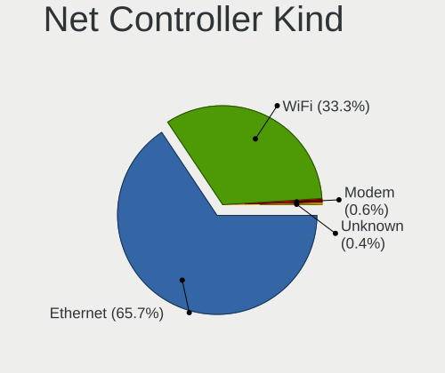

| Kind     | Desktops | Percent |
|----------|----------|---------|
| Ethernet | 520      | 65.66%  |
| WiFi     | 264      | 33.33%  |
| Modem    | 5        | 0.63%   |
| Unknown  | 3        | 0.38%   |

Used Controller
---------------

Currently used network controller

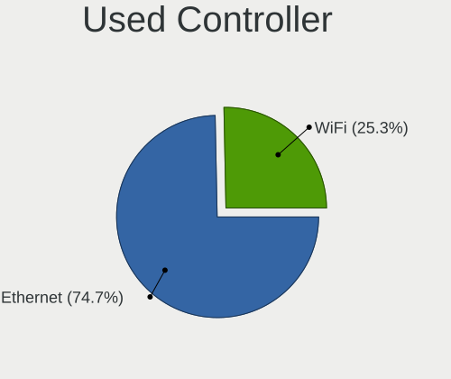

| Kind     | Desktops | Percent |
|----------|----------|---------|
| Ethernet | 413      | 74.68%  |
| WiFi     | 140      | 25.32%  |

NICs
----

Total network controllers on board

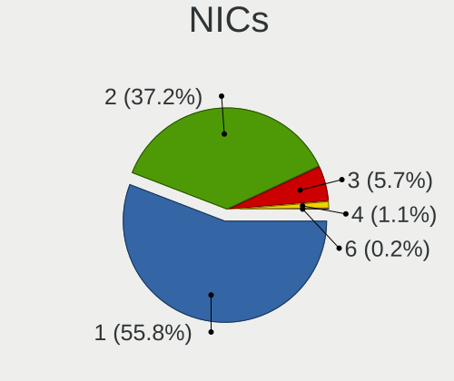

| Total | Desktops | Percent |
|-------|----------|---------|
| 1     | 296      | 55.85%  |
| 2     | 197      | 37.17%  |
| 3     | 30       | 5.66%   |
| 4     | 6        | 1.13%   |
| 6     | 1        | 0.19%   |

IPv6
----

IPv6 vs IPv4

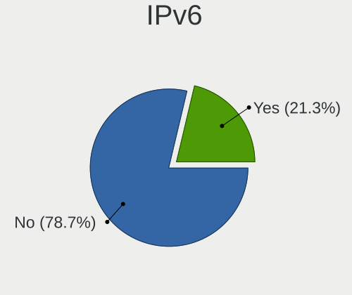

| Used | Desktops | Percent |
|------|----------|---------|
| No   | 425      | 78.7%   |
| Yes  | 115      | 21.3%   |

Bluetooth
---------

Bluetooth Vendor
----------------

Controller vendors

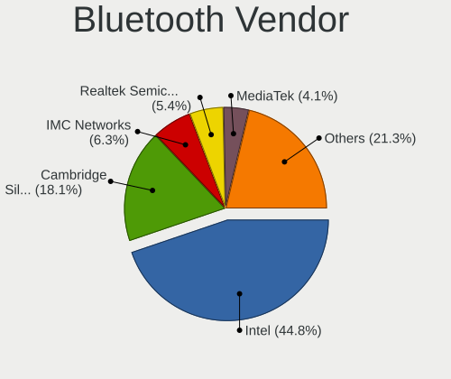

| Vendor                          | Desktops | Percent |
|---------------------------------|----------|---------|
| Intel                           | 99       | 44.8%   |
| Cambridge Silicon Radio         | 40       | 18.1%   |
| IMC Networks                    | 14       | 6.33%   |
| Realtek Semiconductor           | 12       | 5.43%   |
| MediaTek                        | 9        | 4.07%   |
| Broadcom                        | 9        | 4.07%   |
| ASUSTek Computer                | 9        | 4.07%   |
| Foxconn / Hon Hai               | 7        | 3.17%   |
| Qualcomm Atheros Communications | 5        | 2.26%   |
| Edimax Technology               | 5        | 2.26%   |
| TP-Link                         | 3        | 1.36%   |
| Ralink                          | 2        | 0.9%    |
| Apple                           | 2        | 0.9%    |
| Roper                           | 1        | 0.45%   |
| Integrated System Solution      | 1        | 0.45%   |
| HTC (High Tech Computer)        | 1        | 0.45%   |
| Creative Technology             | 1        | 0.45%   |
| Unknown                         | 1        | 0.45%   |

Bluetooth Model
---------------

Controller models

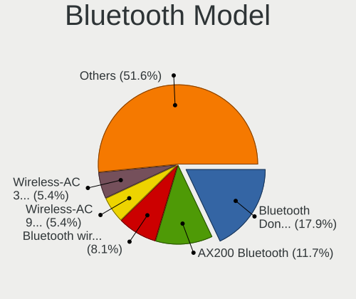

| Model                                                                | Desktops | Percent |
|----------------------------------------------------------------------|----------|---------|
| Cambridge Silicon Radio Bluetooth Dongle (HCI mode)                  | 40       | 17.94%  |
| Intel AX200 Bluetooth                                                | 26       | 11.66%  |
| Intel Bluetooth wireless interface                                   | 18       | 8.07%   |
| Intel Wireless-AC 9260 Bluetooth Adapter                             | 12       | 5.38%   |
| Intel Wireless-AC 3168 Bluetooth                                     | 12       | 5.38%   |
| Intel AX210 Bluetooth                                                | 12       | 5.38%   |
| Realtek Bluetooth Radio                                              | 10       | 4.48%   |
| MediaTek Wireless_Device                                             | 9        | 4.04%   |
| Intel Bluetooth Device                                               | 8        | 3.59%   |
| Intel AX201 Bluetooth                                                | 8        | 3.59%   |
| IMC Networks Wireless_Device                                         | 7        | 3.14%   |
| IMC Networks Bluetooth Radio                                         | 6        | 2.69%   |
| Intel Bluetooth 9460/9560 Jefferson Peak (JfP)                       | 5        | 2.24%   |
| Foxconn / Hon Hai Wireless_Device                                    | 5        | 2.24%   |
| Edimax Bluetooth Device                                              | 5        | 2.24%   |
| Broadcom BCM20702A0 Bluetooth 4.0                                    | 5        | 2.24%   |
| TP-Link TP-T@- UB500 Adapter                                         | 3        | 1.35%   |
| Broadcom HP Portable Bumble Bee                                      | 3        | 1.35%   |
| ASUS Bluetooth Radio                                                 | 3        | 1.35%   |
| Ralink RT3290 Bluetooth                                              | 2        | 0.9%    |
| Qualcomm Atheros  Bluetooth Device                                   | 2        | 0.9%    |
| Qualcomm Atheros AR3011 Bluetooth                                    | 2        | 0.9%    |
| ASUS Qualcomm Bluetooth 4.1                                          | 2        | 0.9%    |
| Roper Class 1 Bluetooth Dongle                                       | 1        | 0.45%   |
| Realtek  Bluetooth 4.2 Adapter                                       | 1        | 0.45%   |
| Realtek Bluetooth 5.4 Radio                                          | 1        | 0.45%   |
| Qualcomm Atheros QCA61x4 Bluetooth 4.0                               | 1        | 0.45%   |
| Integrated System Solution KY-BT100 Bluetooth Adapter                | 1        | 0.45%   |
| IMC Networks BCM20702A0                                              | 1        | 0.45%   |
| HTC (High Tech Computer) Vive Hub Bluetooth 4.1 (Broadcom BCM920703) | 1        | 0.45%   |
| Foxconn / Hon Hai Bluetooth Radio                                    | 1        | 0.45%   |
| Foxconn / Hon Hai Bluetooth Device                                   | 1        | 0.45%   |
| Creative Bluetooth Audio W2                                          | 1        | 0.45%   |
| Broadcom Bluetooth 3.0 Device                                        | 1        | 0.45%   |
| ASUS Bluetooth Device                                                | 1        | 0.45%   |
| ASUS Bluetooth Adapter                                               | 1        | 0.45%   |
| ASUS BCM20702A0                                                      | 1        | 0.45%   |
| ASUS ASUS USB-BT500                                                  | 1        | 0.45%   |
| Apple Bluetooth USB Host Controller                                  | 1        | 0.45%   |
| Apple Bluetooth Host Controller                                      | 1        | 0.45%   |

Sound
-----

Sound Vendor
------------

Sound card vendors

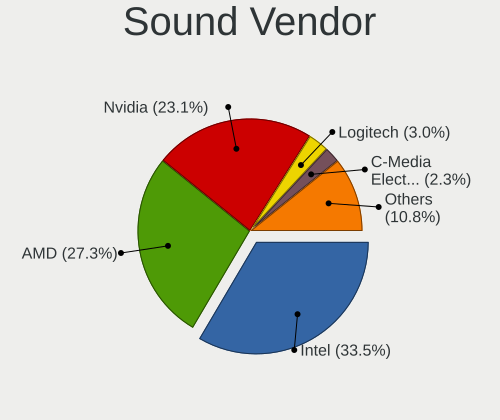

| Vendor                                       | Desktops | Percent |
|----------------------------------------------|----------|---------|
| Intel                                        | 311      | 33.48%  |
| AMD                                          | 254      | 27.34%  |
| Nvidia                                       | 215      | 23.14%  |
| Logitech                                     | 28       | 3.01%   |
| C-Media Electronics                          | 21       | 2.26%   |
| SteelSeries ApS                              | 7        | 0.75%   |
| Kingston Technology                          | 6        | 0.65%   |
| Razer USA                                    | 5        | 0.54%   |
| JMTek                                        | 5        | 0.54%   |
| Hewlett-Packard                              | 5        | 0.54%   |
| Generalplus Technology                       | 5        | 0.54%   |
| GN Netcom                                    | 4        | 0.43%   |
| ASUSTek Computer                             | 4        | 0.43%   |
| FiiO Electronics Technology                  | 3        | 0.32%   |
| Creative Labs                                | 3        | 0.32%   |
| Astro Gaming                                 | 3        | 0.32%   |
| AKAI Professional M.I.                       | 3        | 0.32%   |
| XMOS                                         | 2        | 0.22%   |
| RODE Microphones                             | 2        | 0.22%   |
| Jieli Technology                             | 2        | 0.22%   |
| GYROCOM C&C                                  | 2        | 0.22%   |
| DSEA A/S                                     | 2        | 0.22%   |
| Dell                                         | 2        | 0.22%   |
| Creative Technology                          | 2        | 0.22%   |
| BTD 600                                      | 2        | 0.22%   |
| Blue Microphones                             | 2        | 0.22%   |
| Audio-Technica                               | 2        | 0.22%   |
| Zoran Co. Personal Media Division (Nogatech) | 1        | 0.11%   |
| VIA Technologies                             | 1        | 0.11%   |
| Thesycon Systemsoftware & Consulting         | 1        | 0.11%   |
| Texas Instruments                            | 1        | 0.11%   |
| Tenx Technology                              | 1        | 0.11%   |
| Schiit Audio                                 | 1        | 0.11%   |
| RME                                          | 1        | 0.11%   |
| Realtek Semiconductor                        | 1        | 0.11%   |
| Plantronics                                  | 1        | 0.11%   |
| Numark                                       | 1        | 0.11%   |
| mlzn.Ltd                                     | 1        | 0.11%   |
| Microsoft                                    | 1        | 0.11%   |
| Micro Star International                     | 1        | 0.11%   |

Sound Model
-----------

Sound card models

| Model                                                                             | Desktops | Percent |
|-----------------------------------------------------------------------------------|----------|---------|
| AMD Starship/Matisse HD Audio Controller                                          | 69       | 6.25%   |
| AMD Ryzen HD Audio Controller                                                     | 43       | 3.89%   |
| Intel 8 Series/C220 Series Chipset High Definition Audio Controller               | 38       | 3.44%   |
| Intel 7 Series/C216 Chipset Family High Definition Audio Controller               | 36       | 3.26%   |
| Intel 6 Series/C200 Series Chipset Family High Definition Audio Controller        | 34       | 3.08%   |
| Intel Xeon E3-1200 v3/4th Gen Core Processor HD Audio Controller                  | 31       | 2.81%   |
| AMD Ellesmere HDMI Audio [Radeon RX 470/480 / 570/580/590]                        | 31       | 2.81%   |
| AMD SBx00 Azalia (Intel HDA)                                                      | 29       | 2.63%   |
| AMD Family 17h (Models 00h-0fh) HD Audio Controller                               | 29       | 2.63%   |
| AMD Navi 21/23 HDMI/DP Audio Controller                                           | 28       | 2.54%   |
| Intel 100 Series/C230 Series Chipset Family HD Audio Controller                   | 26       | 2.36%   |
| Intel 200 Series PCH HD Audio                                                     | 23       | 2.08%   |
| AMD Radeon High Definition Audio Controller                                       | 19       | 1.72%   |
| Intel Cannon Lake PCH cAVS                                                        | 18       | 1.63%   |
| Nvidia GP107GL High Definition Audio Controller                                   | 17       | 1.54%   |
| AMD Renoir/Cezanne HDMI/DP Audio Controller                                       | 15       | 1.36%   |
| Nvidia GP106 High Definition Audio Controller                                     | 14       | 1.27%   |
| Nvidia GK208 HDMI/DP Audio Controller                                             | 14       | 1.27%   |
| Nvidia GA104 High Definition Audio Controller                                     | 14       | 1.27%   |
| Intel 5 Series/3400 Series Chipset High Definition Audio                          | 14       | 1.27%   |
| Intel Raptor Lake High Definition Audio Controller                                | 13       | 1.18%   |
| Intel 9 Series Chipset Family HD Audio Controller                                 | 13       | 1.18%   |
| AMD Navi 10 HDMI Audio                                                            | 13       | 1.18%   |
| Nvidia GP104 High Definition Audio Controller                                     | 12       | 1.09%   |
| Nvidia GP102 HDMI Audio Controller                                                | 12       | 1.09%   |
| Nvidia GA102 High Definition Audio Controller                                     | 12       | 1.09%   |
| Intel 82801JI (ICH10 Family) HD Audio Controller                                  | 12       | 1.09%   |
| AMD Cedar HDMI Audio [Radeon HD 5400/6300/7300 Series]                            | 12       | 1.09%   |
| AMD Oland/Hainan/Cape Verde/Pitcairn HDMI Audio [Radeon HD 7000 Series]           | 11       | 1%      |
| Nvidia TU116 High Definition Audio Controller                                     | 10       | 0.91%   |
| Nvidia GA106 High Definition Audio Controller                                     | 10       | 0.91%   |
| Intel Smart Sound Technology (SST) Audio Controller                               | 10       | 0.91%   |
| AMD Navi 31 HDMI/DP Audio                                                         | 10       | 0.91%   |
| AMD FCH Azalia Controller                                                         | 10       | 0.91%   |
| Nvidia TU106 High Definition Audio Controller                                     | 8        | 0.72%   |
| Nvidia GP108 High Definition Audio Controller                                     | 8        | 0.72%   |
| Intel NM10/ICH7 Family High Definition Audio Controller                           | 8        | 0.72%   |
| Intel Alder Lake-S HD Audio Controller                                            | 8        | 0.72%   |
| Intel 82801JD/DO (ICH10 Family) HD Audio Controller                               | 8        | 0.72%   |
| AMD Caicos HDMI Audio [Radeon HD 6450 / 7450/8450/8490 OEM / R5 230/235/235X OEM] | 8        | 0.72%   |

Memory
------

Memory Vendor
-------------

Memory module vendors

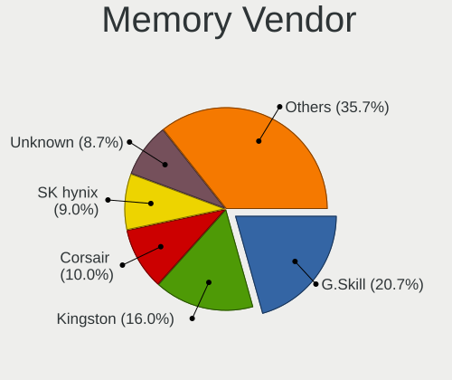

| Vendor              | Desktops | Percent |
|---------------------|----------|---------|
| G.Skill             | 62       | 20.67%  |
| Kingston            | 48       | 16%     |
| Corsair             | 30       | 10%     |
| SK hynix            | 27       | 9%      |
| Unknown             | 26       | 8.67%   |
| Samsung Electronics | 26       | 8.67%   |
| Crucial             | 21       | 7%      |
| A-DATA Technology   | 15       | 5%      |
| Team                | 9        | 3%      |
| Micron Technology   | 8        | 2.67%   |
| Transcend           | 3        | 1%      |
| Strontium           | 3        | 1%      |
| Ramaxel Technology  | 3        | 1%      |
| PNY                 | 2        | 0.67%   |
| Hewlett-Packard     | 2        | 0.67%   |
| Elpida              | 2        | 0.67%   |
| Unknown (ABCD)      | 1        | 0.33%   |
| Unknown (0x0B45)    | 1        | 0.33%   |
| Unknown (0x0080)    | 1        | 0.33%   |
| Super Talent        | 1        | 0.33%   |
| pqi                 | 1        | 0.33%   |
| Patriot Memory      | 1        | 0.33%   |
| OCZ                 | 1        | 0.33%   |
| Nanya Technology    | 1        | 0.33%   |
| Lexar               | 1        | 0.33%   |
| Innodisk            | 1        | 0.33%   |
| Hyundai lnc         | 1        | 0.33%   |
| Atermiter           | 1        | 0.33%   |
| Apacer              | 1        | 0.33%   |

Memory Model
------------

Memory module models

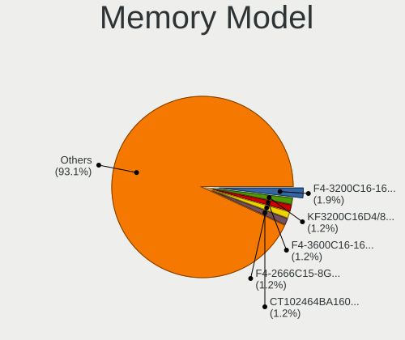

| Model                                                   | Desktops | Percent |
|---------------------------------------------------------|----------|---------|
| G.Skill RAM F4-3200C16-16GVK 16GB DIMM DDR4 3600MT/s    | 6        | 1.88%   |
| Kingston RAM KF3200C16D4/8GX 8GiB DIMM DDR4 3600MT/s    | 4        | 1.25%   |
| G.Skill RAM F4-3600C16-16GTZNC 16GiB DIMM DDR4 3600MT/s | 4        | 1.25%   |
| G.Skill RAM F4-2666C15-8GVR 8GB DIMM DDR4 2800MT/s      | 4        | 1.25%   |
| Crucial RAM CT102464BA160B.C16 8GB DIMM DDR3 1600MT/s   | 4        | 1.25%   |
| Team RAM TEAMGROUP-UD4-3600 16GB DIMM DDR4 3600MT/s     | 3        | 0.94%   |
| Kingston RAM KHX2666C16/8G 8GiB DIMM DDR4 3466MT/s      | 3        | 0.94%   |
| Kingston RAM KF560C36-16 16GB DIMM DDR5 6000MT/s        | 3        | 0.94%   |
| G.Skill RAM F3-1600C9-4GAB 4GB DIMM DDR3 1600MT/s       | 3        | 0.94%   |
| Crucial RAM CT102464BD160B.C16 8GB DIMM DDR3 1600MT/s   | 3        | 0.94%   |
| Corsair RAM CMK32GX4M2E3200C16 16GB DIMM DDR4 3600MT/s  | 3        | 0.94%   |
| Corsair RAM CMK32GX4M2B3200C16 16GB DIMM DDR4 3800MT/s  | 3        | 0.94%   |
| A-DATA RAM DDR4 3200 16GB DIMM DDR4 3600MT/s            | 3        | 0.94%   |
| Unknown RAM Module 8GB DIMM 1600MT/s                    | 2        | 0.63%   |
| Unknown RAM Module 2GB DIMM 800MT/s                     | 2        | 0.63%   |
| Unknown RAM Module 2048MB DIMM DDR3 1333MT/s            | 2        | 0.63%   |
| Team RAM TEAMGROUP-UD4-3200 8GB DIMM DDR4 3800MT/s      | 2        | 0.63%   |
| SK hynix RAM HMT351U6EFR8C-PB 4GB DIMM DDR3 1600MT/s    | 2        | 0.63%   |
| SK hynix RAM HMT351S6CFR8C-PB 4GB SODIMM DDR3 1600MT/s  | 2        | 0.63%   |
| SK hynix RAM HMT325U6CFR8C-H9 2GB DIMM DDR3 1333MT/s    | 2        | 0.63%   |
| Samsung RAM M378B5673FH0-CH9 2GB DIMM DDR3 1600MT/s     | 2        | 0.63%   |
| Samsung RAM M378B5673EH1-CH9 2GB DIMM DDR3 1333MT/s     | 2        | 0.63%   |
| Samsung RAM M378B5273CH0-CH9 4GB DIMM DDR3 1867MT/s     | 2        | 0.63%   |
| Samsung RAM M378B5173DB0-CK0 4096MB DIMM DDR3 1600MT/s  | 2        | 0.63%   |
| Micron RAM Module 4GB DIMM DDR4 2133MT/s                | 2        | 0.63%   |
| Kingston RAM KHX3200C16D4/8GX 8GB DIMM DDR4 3733MT/s    | 2        | 0.63%   |
| Kingston RAM KHX3200C16D4/16GX 16GB DIMM DDR4 3600MT/s  | 2        | 0.63%   |
| Kingston RAM KHX2666C16/16G 16GB DIMM DDR4 3200MT/s     | 2        | 0.63%   |
| Kingston RAM KF3600C18D4/16GX 16GB DIMM DDR4 3733MT/s   | 2        | 0.63%   |
| Kingston RAM 9905702-082.B00G 8GB DIMM DDR4 2667MT/s    | 2        | 0.63%   |
| Kingston RAM 9905403-011.A03LF 2GB DIMM DDR3 1600MT/s   | 2        | 0.63%   |
| G.Skill RAM F5-6000J3636F16G 16GB DIMM DDR5 6400MT/s    | 2        | 0.63%   |
| G.Skill RAM F5-6000J3238F16G 16GB DIMM DDR5 12800MT/s   | 2        | 0.63%   |
| G.Skill RAM F5-5600J3636D32G 32GB DIMM DDR5 6000MT/s    | 2        | 0.63%   |
| G.Skill RAM F4-3800C14-16GTZN 16GB DIMM DDR4 3800MT/s   | 2        | 0.63%   |
| G.Skill RAM F4-3600C18-8GVK 8GB DIMM DDR4 3600MT/s      | 2        | 0.63%   |
| G.Skill RAM F4-3600C18-16GVK 16GB DIMM DDR4 3733MT/s    | 2        | 0.63%   |
| G.Skill RAM F4-3200C16-8GTZR 8GB DIMM DDR4 3200MT/s     | 2        | 0.63%   |
| G.Skill RAM F4-3200C16-8GTZB 8GB DIMM DDR4 3200MT/s     | 2        | 0.63%   |
| G.Skill RAM F4-3200C16-16GTZR 16GB DIMM DDR4 3600MT/s   | 2        | 0.63%   |

Memory Kind
-----------

Memory module kinds

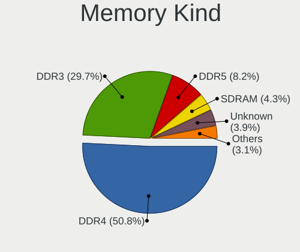

| Kind    | Desktops | Percent |
|---------|----------|---------|
| DDR4    | 130      | 50.78%  |
| DDR3    | 76       | 29.69%  |
| DDR5    | 21       | 8.2%    |
| SDRAM   | 11       | 4.3%    |
| Unknown | 10       | 3.91%   |
| DDR2    | 6        | 2.34%   |
| LPDDR4  | 1        | 0.39%   |
| DDR     | 1        | 0.39%   |

Memory Form Factor
------------------

Physical design of the memory module

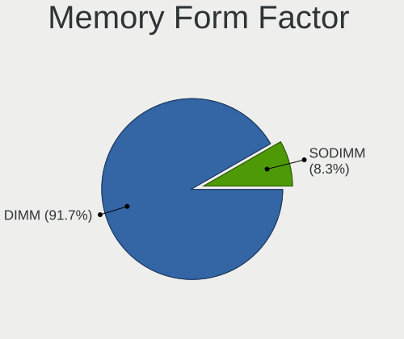

| Name   | Desktops | Percent |
|--------|----------|---------|
| DIMM   | 232      | 91.7%   |
| SODIMM | 21       | 8.3%    |

Memory Size
-----------

Memory module size

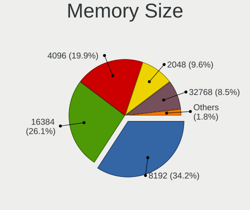

| Size  | Desktops | Percent |
|-------|----------|---------|
| 8192  | 93       | 34.19%  |
| 16384 | 71       | 26.1%   |
| 4096  | 54       | 19.85%  |
| 2048  | 26       | 9.56%   |
| 32768 | 23       | 8.46%   |
| 1024  | 5        | 1.84%   |

Memory Speed
------------

Memory module speed

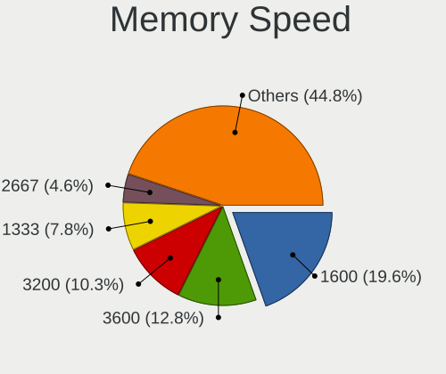

| Speed   | Desktops | Percent |
|---------|----------|---------|
| 1600    | 55       | 19.57%  |
| 3600    | 36       | 12.81%  |
| 3200    | 29       | 10.32%  |
| 1333    | 22       | 7.83%   |
| 2667    | 13       | 4.63%   |
| 2133    | 12       | 4.27%   |
| 3800    | 11       | 3.91%   |
| 6000    | 9        | 3.2%    |
| 3733    | 9        | 3.2%    |
| 2400    | 9        | 3.2%    |
| 800     | 7        | 2.49%   |
| 2800    | 6        | 2.14%   |
| 1867    | 6        | 2.14%   |
| 12800   | 4        | 1.42%   |
| 3866    | 4        | 1.42%   |
| 3466    | 4        | 1.42%   |
| 2666    | 4        | 1.42%   |
| 1800    | 4        | 1.42%   |
| 5600    | 3        | 1.07%   |
| 3400    | 3        | 1.07%   |
| 1066    | 3        | 1.07%   |
| 6400    | 2        | 0.71%   |
| 4800    | 2        | 0.71%   |
| 3000    | 2        | 0.71%   |
| 2933    | 2        | 0.71%   |
| 1067    | 2        | 0.71%   |
| 667     | 2        | 0.71%   |
| Unknown | 2        | 0.71%   |
| 5800    | 1        | 0.36%   |
| 4000    | 1        | 0.36%   |
| 3334    | 1        | 0.36%   |
| 3151    | 1        | 0.36%   |
| 2733    | 1        | 0.36%   |
| 2465    | 1        | 0.36%   |
| 2448    | 1        | 0.36%   |
| 2200    | 1        | 0.36%   |
| 2048    | 1        | 0.36%   |
| 2000    | 1        | 0.36%   |
| 1866    | 1        | 0.36%   |
| 1332    | 1        | 0.36%   |

Printers & scanners
-------------------

Printer Vendor
--------------

Printer device vendors

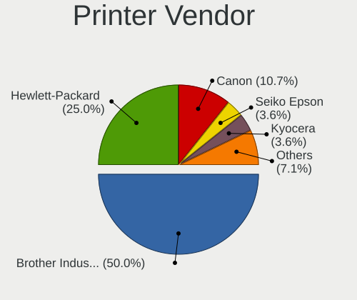

| Vendor             | Desktops | Percent |
|--------------------|----------|---------|
| Brother Industries | 14       | 50%     |
| Hewlett-Packard    | 7        | 25%     |
| Canon              | 3        | 10.71%  |
| Seiko Epson        | 1        | 3.57%   |
| Kyocera            | 1        | 3.57%   |
| Fuji Xerox         | 1        | 3.57%   |
| Dymo-CoStar        | 1        | 3.57%   |

Printer Model
-------------

Printer device models

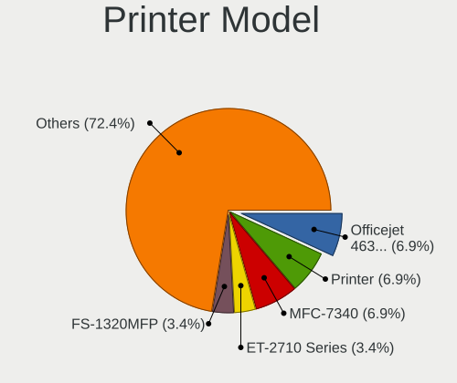

| Model                            | Desktops | Percent |
|----------------------------------|----------|---------|
| HP Officejet 4630 series         | 2        | 6.9%    |
| Brother Printer                  | 2        | 6.9%    |
| Brother MFC-7340                 | 2        | 6.9%    |
| Seiko Epson ET-2710 Series       | 1        | 3.45%   |
| Kyocera FS-1320MFP               | 1        | 3.45%   |
| HP OfficeJet Pro 9010 series     | 1        | 3.45%   |
| HP OfficeJet 8010 series         | 1        | 3.45%   |
| HP LaserJet Professional P1102w  | 1        | 3.45%   |
| HP ENVY 6400 series              | 1        | 3.45%   |
| HP ENVY 4520 series              | 1        | 3.45%   |
| HP DeskJet 2130 series           | 1        | 3.45%   |
| Fuji Xerox DocuPrint CM315/318 z | 1        | 3.45%   |
| Dymo-CoStar LabelWriter 450      | 1        | 3.45%   |
| Canon TS3100 series              | 1        | 3.45%   |
| Canon MB5300 series              | 1        | 3.45%   |
| Canon i950                       | 1        | 3.45%   |
| Brother MFC-L2730DW series       | 1        | 3.45%   |
| Brother MFC-L2713DW              | 1        | 3.45%   |
| Brother MFC-J470DW               | 1        | 3.45%   |
| Brother MFC-J430W                | 1        | 3.45%   |
| Brother MFC-9140CDN              | 1        | 3.45%   |
| Brother MFC-9120CN               | 1        | 3.45%   |
| Brother HL-L3230CDW series       | 1        | 3.45%   |
| Brother HL-2270DW Laser Printer  | 1        | 3.45%   |
| Brother HL-1430 Laser Printer    | 1        | 3.45%   |
| Brother DCP-1610W                | 1        | 3.45%   |

Scanner Vendor
--------------

Scanner device vendors

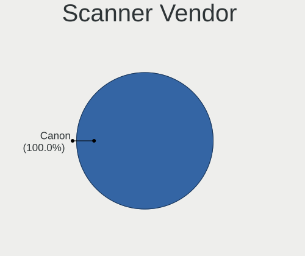

| Vendor | Desktops | Percent |
|--------|----------|---------|
| Canon  | 3        | 100%    |

Scanner Model
-------------

Scanner device models

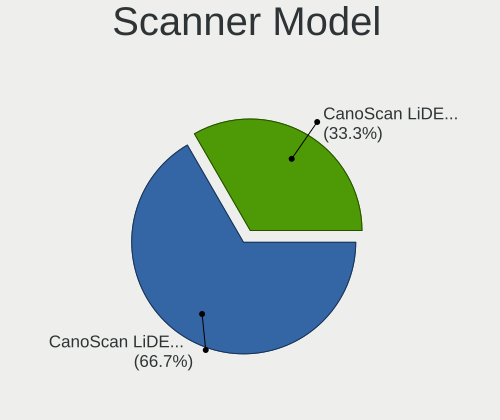

| Model                    | Desktops | Percent |
|--------------------------|----------|---------|
| Canon CanoScan LiDE 110  | 2        | 66.67%  |
| Canon CanoScan LiDE 500F | 1        | 33.33%  |

Camera
------

Camera Vendor
-------------

Camera device vendors

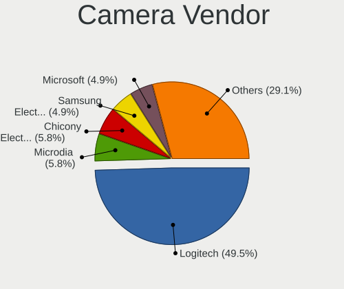

| Vendor                        | Desktops | Percent |
|-------------------------------|----------|---------|
| Logitech                      | 51       | 49.51%  |
| Microdia                      | 6        | 5.83%   |
| Chicony Electronics           | 6        | 5.83%   |
| Samsung Electronics           | 5        | 4.85%   |
| Microsoft                     | 5        | 4.85%   |
| ARC International             | 4        | 3.88%   |
| KYE Systems (Mouse Systems)   | 3        | 2.91%   |
| GEMBIRD                       | 3        | 2.91%   |
| Z-Star Microelectronics       | 2        | 1.94%   |
| XHT-220428-ZW                 | 2        | 1.94%   |
| MacroSilicon                  | 2        | 1.94%   |
| Xiongmai                      | 1        | 0.97%   |
| SunplusIT                     | 1        | 0.97%   |
| Sunplus Innovation Technology | 1        | 0.97%   |
| Realtek Semiconductor         | 1        | 0.97%   |
| Novatek Microelectronics      | 1        | 0.97%   |
| Lenovo                        | 1        | 0.97%   |
| Jieli Technology              | 1        | 0.97%   |
| GRANDSTREAM GUV3100           | 1        | 0.97%   |
| Google                        | 1        | 0.97%   |
| Generalplus Technology        | 1        | 0.97%   |
| EVGA                          | 1        | 0.97%   |
| Asuscom Network               | 1        | 0.97%   |
| Arkmicro Technologies         | 1        | 0.97%   |
| Apple                         | 1        | 0.97%   |

Camera Model
------------

Camera device models

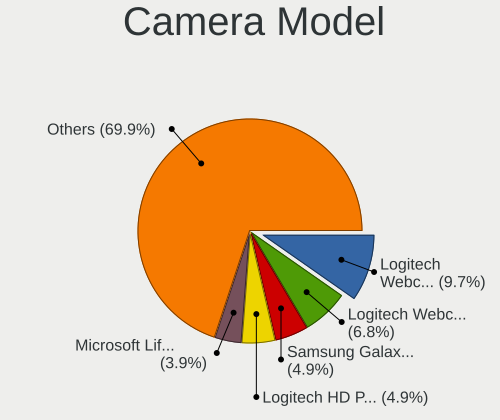

| Model                                             | Desktops | Percent |
|---------------------------------------------------|----------|---------|
| Logitech Webcam C270                              | 10       | 9.71%   |
| Logitech Webcam C170                              | 7        | 6.8%    |
| Samsung Galaxy series, misc. (MTP mode)           | 5        | 4.85%   |
| Logitech HD Pro Webcam C920                       | 5        | 4.85%   |
| Microsoft LifeCam HD-3000                         | 4        | 3.88%   |
| Logitech QuickCam Pro 9000                        | 4        | 3.88%   |
| Logitech C920 PRO HD Webcam                       | 4        | 3.88%   |
| ARC International Camera                          | 4        | 3.88%   |
| Logitech HD Webcam C615                           | 3        | 2.91%   |
| Chicony HP High Definition 1MP Webcam             | 3        | 2.91%   |
| XHT-220428-ZW KC#43157174                         | 2        | 1.94%   |
| Microdia Sonix USB 2.0 Camera                     | 2        | 1.94%   |
| Logitech Webcam Pro 9000                          | 2        | 1.94%   |
| Logitech Webcam C600                              | 2        | 1.94%   |
| Logitech Logitech Webcam C925e                    | 2        | 1.94%   |
| Logitech HD Webcam C525                           | 2        | 1.94%   |
| Logitech C922 Pro Stream Webcam                   | 2        | 1.94%   |
| Logitech BRIO Ultra HD Webcam                     | 2        | 1.94%   |
| KYE Systems (Mouse Systems) FaceCam 1000X         | 2        | 1.94%   |
| GEMBIRD Generic UVC 1.00 camera [AppoTech AX2311] | 2        | 1.94%   |
| Z-Star Venus USB2.0 Camera                        | 1        | 0.97%   |
| Z-Star Integrated Camera                          | 1        | 0.97%   |
| Xiongmai web camera                               | 1        | 0.97%   |
| SunplusIT USB 2.0 Camera                          | 1        | 0.97%   |
| Sunplus Full HD webcam                            | 1        | 0.97%   |
| Realtek HD 720P Webcam                            | 1        | 0.97%   |
| Novatek HP High Definition 2MP Webcam             | 1        | 0.97%   |
| Microsoft LifeCam Studio                          | 1        | 0.97%   |
| Microdia USB Microscope                           | 1        | 0.97%   |
| Microdia USB 2.0 Camera                           | 1        | 0.97%   |
| Microdia Integrated Camera                        | 1        | 0.97%   |
| Microdia Camera                                   | 1        | 0.97%   |
| MacroSilicon USB3. 0 capture                      | 1        | 0.97%   |
| MacroSilicon USB Video                            | 1        | 0.97%   |
| Logitech Webcam C300                              | 1        | 0.97%   |
| Logitech Portable Webcam C905                     | 1        | 0.97%   |
| Logitech Mic (Fusion)                             | 1        | 0.97%   |
| Logitech HD Webcam C910                           | 1        | 0.97%   |
| Logitech HD Webcam C510                           | 1        | 0.97%   |
| Logitech BCC950 ConferenceCam                     | 1        | 0.97%   |

Security
--------

Fingerprint Vendor
------------------

Fingerprint sensor vendors

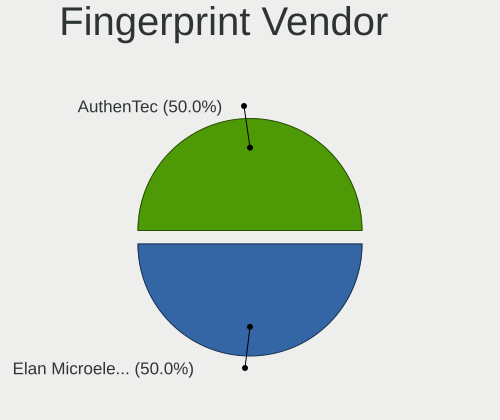

| Vendor                | Desktops | Percent |
|-----------------------|----------|---------|
| Elan Microelectronics | 1        | 50%     |
| AuthenTec             | 1        | 50%     |

Fingerprint Model
-----------------

Fingerprint sensor models

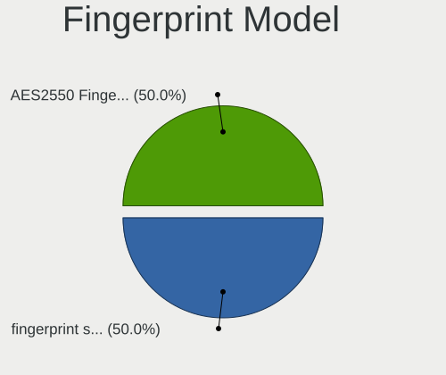

| Model                                       | Desktops | Percent |
|---------------------------------------------|----------|---------|
| Elan fingerprint sensor [FeinTech FPS00200] | 1        | 50%     |
| AuthenTec AES2550 Fingerprint Sensor        | 1        | 50%     |

Chipcard Vendor
---------------

Chipcard module vendors

Zero info for selected period =(

Chipcard Model
--------------

Chipcard module models

Zero info for selected period =(

Unsupported
-----------

Unsupported Devices
-------------------

Total unsupported devices on board

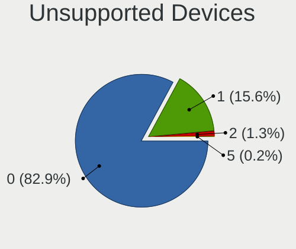

| Total | Desktops | Percent |
|-------|----------|---------|
| 0     | 451      | 82.9%   |
| 1     | 85       | 15.63%  |
| 2     | 7        | 1.29%   |
| 5     | 1        | 0.18%   |

Unsupported Device Types
------------------------

Types of unsupported devices

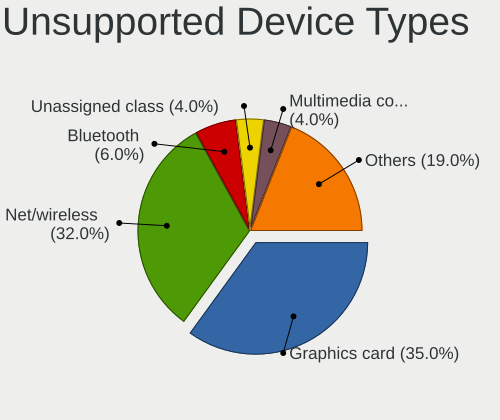

| Type                     | Desktops | Percent |
|--------------------------|----------|---------|
| Graphics card            | 35       | 35%     |
| Net/wireless             | 32       | 32%     |
| Bluetooth                | 6        | 6%      |
| Unassigned class         | 4        | 4%      |
| Multimedia controller    | 4        | 4%      |
| Sound                    | 3        | 3%      |
| Network                  | 3        | 3%      |
| Dvb card                 | 3        | 3%      |
| Storage/raid             | 2        | 2%      |
| Storage/ide              | 2        | 2%      |
| Fingerprint reader       | 2        | 2%      |
| Communication controller | 2        | 2%      |
| Modem                    | 1        | 1%      |
| Firewire controller      | 1        | 1%      |

