Linux in New Zealand - Tested Hardware & Statistics (Desktops)
--------------------------------------------------------------

A project to collect tested hardware configurations for Linux in New Zealand.

Anyone can contribute to this report by the [hw-probe](https://github.com/linuxhw/hw-probe) tool:

    sudo -E hw-probe -all -upload

Please contribute! Especially if your hardware is rare.

Contents
--------

* [ Test Cases ](#test-cases)

* [ System ](#system)
  - [ OS                       ](#os)
  - [ OS Family                ](#os-family)
  - [ Kernel                   ](#kernel)
  - [ Kernel Family            ](#kernel-family)
  - [ Kernel Major Ver.        ](#kernel-major-ver)
  - [ Arch                     ](#arch)
  - [ DE                       ](#de)
  - [ Display Server           ](#display-server)
  - [ Display Manager          ](#display-manager)
  - [ OS Lang                  ](#os-lang)
  - [ Boot Mode                ](#boot-mode)
  - [ Filesystem               ](#filesystem)
  - [ Part. scheme             ](#part-scheme)
  - [ Dual Boot with Linux/BSD ](#dual-boot-with-linuxbsd)
  - [ Dual Boot (Win)          ](#dual-boot-win)

* [ Board ](#board)
  - [ Vendor                   ](#vendor)
  - [ Model                    ](#model)
  - [ Model Family             ](#model-family)
  - [ MFG Year                 ](#mfg-year)
  - [ Form Factor              ](#form-factor)
  - [ Secure Boot              ](#secure-boot)
  - [ Coreboot                 ](#coreboot)
  - [ RAM Size                 ](#ram-size)
  - [ RAM Used                 ](#ram-used)
  - [ Total Drives             ](#total-drives)
  - [ Has CD-ROM               ](#has-cd-rom)
  - [ Has Ethernet             ](#has-ethernet)
  - [ Has WiFi                 ](#has-wifi)
  - [ Has Bluetooth            ](#has-bluetooth)

* [ Location ](#location)
  - [ Country                  ](#country)
  - [ City                     ](#city)

* [ Drives ](#drives)
  - [ Drive Vendor             ](#drive-vendor)
  - [ Drive Model              ](#drive-model)
  - [ HDD Vendor               ](#hdd-vendor)
  - [ SSD Vendor               ](#ssd-vendor)
  - [ Drive Kind               ](#drive-kind)
  - [ Drive Connector          ](#drive-connector)
  - [ Drive Size               ](#drive-size)
  - [ Space Total              ](#space-total)
  - [ Space Used               ](#space-used)
  - [ Malfunc. Drives          ](#malfunc-drives)
  - [ Malfunc. Drive Vendor    ](#malfunc-drive-vendor)
  - [ Malfunc. HDD Vendor      ](#malfunc-hdd-vendor)
  - [ Malfunc. Drive Kind      ](#malfunc-drive-kind)
  - [ Failed Drives            ](#failed-drives)
  - [ Failed Drive Vendor      ](#failed-drive-vendor)
  - [ Drive Status             ](#drive-status)

* [ Storage controller ](#storage-controller)
  - [ Storage Vendor           ](#storage-vendor)
  - [ Storage Model            ](#storage-model)
  - [ Storage Kind             ](#storage-kind)

* [ Processor ](#processor)
  - [ CPU Vendor               ](#cpu-vendor)
  - [ CPU Model                ](#cpu-model)
  - [ CPU Model Family         ](#cpu-model-family)
  - [ CPU Cores                ](#cpu-cores)
  - [ CPU Sockets              ](#cpu-sockets)
  - [ CPU Threads              ](#cpu-threads)
  - [ CPU Op-Modes             ](#cpu-op-modes)
  - [ CPU Microcode            ](#cpu-microcode)
  - [ CPU Microarch            ](#cpu-microarch)

* [ Graphics ](#graphics)
  - [ GPU Vendor               ](#gpu-vendor)
  - [ GPU Model                ](#gpu-model)
  - [ GPU Combo                ](#gpu-combo)
  - [ GPU Driver               ](#gpu-driver)
  - [ GPU Memory               ](#gpu-memory)

* [ Monitor ](#monitor)
  - [ Monitor Vendor           ](#monitor-vendor)
  - [ Monitor Model            ](#monitor-model)
  - [ Monitor Resolution       ](#monitor-resolution)
  - [ Monitor Diagonal         ](#monitor-diagonal)
  - [ Monitor Width            ](#monitor-width)
  - [ Aspect Ratio             ](#aspect-ratio)
  - [ Monitor Area             ](#monitor-area)
  - [ Pixel Density            ](#pixel-density)
  - [ Multiple Monitors        ](#multiple-monitors)

* [ Network ](#network)
  - [ Net Controller Vendor    ](#net-controller-vendor)
  - [ Net Controller Model     ](#net-controller-model)
  - [ Wireless Vendor          ](#wireless-vendor)
  - [ Wireless Model           ](#wireless-model)
  - [ Ethernet Vendor          ](#ethernet-vendor)
  - [ Ethernet Model           ](#ethernet-model)
  - [ Net Controller Kind      ](#net-controller-kind)
  - [ Used Controller          ](#used-controller)
  - [ NICs                     ](#nics)
  - [ IPv6                     ](#ipv6)

* [ Bluetooth ](#bluetooth)
  - [ Bluetooth Vendor         ](#bluetooth-vendor)
  - [ Bluetooth Model          ](#bluetooth-model)

* [ Sound ](#sound)
  - [ Sound Vendor             ](#sound-vendor)
  - [ Sound Model              ](#sound-model)

* [ Memory ](#memory)
  - [ Memory Vendor            ](#memory-vendor)
  - [ Memory Model             ](#memory-model)
  - [ Memory Kind              ](#memory-kind)
  - [ Memory Form Factor       ](#memory-form-factor)
  - [ Memory Size              ](#memory-size)
  - [ Memory Speed             ](#memory-speed)

* [ Printers & scanners ](#printers--scanners)
  - [ Printer Vendor           ](#printer-vendor)
  - [ Printer Model            ](#printer-model)
  - [ Scanner Vendor           ](#scanner-vendor)
  - [ Scanner Model            ](#scanner-model)

* [ Camera ](#camera)
  - [ Camera Vendor            ](#camera-vendor)
  - [ Camera Model             ](#camera-model)

* [ Security ](#security)
  - [ Fingerprint Vendor       ](#fingerprint-vendor)
  - [ Fingerprint Model        ](#fingerprint-model)
  - [ Chipcard Vendor          ](#chipcard-vendor)
  - [ Chipcard Model           ](#chipcard-model)

* [ Unsupported ](#unsupported)
  - [ Unsupported Devices      ](#unsupported-devices)
  - [ Unsupported Device Types ](#unsupported-device-types)

Test Cases
----------

Total: 543

| Vendor        | Model                       | Probe                                                      | Date         |
|---------------|-----------------------------|------------------------------------------------------------|--------------|
| ASRock        | B560M-ITX/ac                | [9ed6c67efe](https://linux-hardware.org/?probe=9ed6c67efe) | Feb 02, 2024 |
| ASUSTek       | Z97I-PLUS                   | [32200add92](https://linux-hardware.org/?probe=32200add92) | Jan 31, 2024 |
| ASUSTek       | Z97I-PLUS                   | [38cafaade5](https://linux-hardware.org/?probe=38cafaade5) | Jan 31, 2024 |
| Gigabyte      | B550 GAMING X V2            | [99e90d2b89](https://linux-hardware.org/?probe=99e90d2b89) | Jan 29, 2024 |
| ASUSTek       | M4A87TD/USB3                | [185a90aec7](https://linux-hardware.org/?probe=185a90aec7) | Jan 28, 2024 |
| ASUSTek       | P8B75-M                     | [ad1a5f6757](https://linux-hardware.org/?probe=ad1a5f6757) | Jan 28, 2024 |
| HP            | 2AAC                        | [d397b1b3b3](https://linux-hardware.org/?probe=d397b1b3b3) | Jan 26, 2024 |
| Intel         | Unknown                     | [e4094a3abf](https://linux-hardware.org/?probe=e4094a3abf) | Jan 23, 2024 |
| ASUSTek       | TUF Gaming B560-PLUS WIF... | [4f202be1d5](https://linux-hardware.org/?probe=4f202be1d5) | Jan 20, 2024 |
| ASUSTek       | ROG CROSSHAIR VIII HERO     | [a1e7338a13](https://linux-hardware.org/?probe=a1e7338a13) | Jan 19, 2024 |
| ASUSTek       | Z97M-PLUS                   | [6565fd5500](https://linux-hardware.org/?probe=6565fd5500) | Jan 15, 2024 |
| ASUSTek       | M5A97 R2.0                  | [122b72e9f2](https://linux-hardware.org/?probe=122b72e9f2) | Jan 15, 2024 |
| ASRock        | B560M-ITX/ac                | [0ab95fc3f5](https://linux-hardware.org/?probe=0ab95fc3f5) | Jan 14, 2024 |
| ASUSTek       | ROG STRIX X570-E GAMING ... | [4a1bc29322](https://linux-hardware.org/?probe=4a1bc29322) | Jan 06, 2024 |
| ASUSTek       | H110M-A/M.2                 | [7b663d0c10](https://linux-hardware.org/?probe=7b663d0c10) | Jan 05, 2024 |
| ASUSTek       | H110M-A/M.2                 | [d80a5355a3](https://linux-hardware.org/?probe=d80a5355a3) | Jan 05, 2024 |
| ASUSTek       | TUF Gaming B650M-E WIFI     | [251b877f2f](https://linux-hardware.org/?probe=251b877f2f) | Jan 03, 2024 |
| Gigabyte      | AB350N-Gaming WIFI-CF       | [24166c136e](https://linux-hardware.org/?probe=24166c136e) | Jan 02, 2024 |
| Dell          | 0D28YY A01                  | [f67d5d22eb](https://linux-hardware.org/?probe=f67d5d22eb) | Jan 02, 2024 |
| Gigabyte      | Z790 GAMING X AX            | [e330d0191e](https://linux-hardware.org/?probe=e330d0191e) | Dec 31, 2023 |
| ASUSTek       | TUF Gaming B650M-E WIFI     | [a9dd36da25](https://linux-hardware.org/?probe=a9dd36da25) | Dec 29, 2023 |
| ASUSTek       | STRIX X99 GAMING            | [a4f7b1d9d3](https://linux-hardware.org/?probe=a4f7b1d9d3) | Nov 20, 2023 |
| Acer          | Aspire X3400                | [26cedbdbde](https://linux-hardware.org/?probe=26cedbdbde) | Nov 19, 2023 |
| ASUSTek       | STRIX X99 GAMING            | [a7d065988a](https://linux-hardware.org/?probe=a7d065988a) | Nov 19, 2023 |
| Acer          | Aspire X3400                | [83890ec21c](https://linux-hardware.org/?probe=83890ec21c) | Nov 19, 2023 |
| Gigabyte      | H170-Gaming 3               | [ad44d7ebae](https://linux-hardware.org/?probe=ad44d7ebae) | Nov 15, 2023 |
| ASRock        | 890GM Pro3                  | [a88696f0e2](https://linux-hardware.org/?probe=a88696f0e2) | Nov 13, 2023 |
| HP            | ProLiant ML310e Gen8        | [0483e390e3](https://linux-hardware.org/?probe=0483e390e3) | Nov 11, 2023 |
| ASRock        | 890GM Pro3                  | [e00099e8c5](https://linux-hardware.org/?probe=e00099e8c5) | Nov 08, 2023 |
| ASUSTek       | P8B75-M                     | [c88dde8f18](https://linux-hardware.org/?probe=c88dde8f18) | Nov 07, 2023 |
| ASUSTek       | PRIME B460M-A               | [52a36f5268](https://linux-hardware.org/?probe=52a36f5268) | Nov 04, 2023 |
| Dell          | 01NP3N A00                  | [2332805279](https://linux-hardware.org/?probe=2332805279) | Nov 04, 2023 |
| Gigabyte      | Z790 GAMING X AX            | [c5e282cbad](https://linux-hardware.org/?probe=c5e282cbad) | Nov 02, 2023 |
| ASRock        | 890GM Pro3                  | [cfeea44315](https://linux-hardware.org/?probe=cfeea44315) | Oct 30, 2023 |
| Gigabyte      | Z490 AORUS ELITE AC         | [3831a70240](https://linux-hardware.org/?probe=3831a70240) | Oct 27, 2023 |
| HP            | 1998                        | [4701148920](https://linux-hardware.org/?probe=4701148920) | Oct 26, 2023 |
| ASRock        | 890GM Pro3                  | [ca2fb95579](https://linux-hardware.org/?probe=ca2fb95579) | Oct 25, 2023 |
| HP            | ProLiant ML310e Gen8        | [79f6aee2c7](https://linux-hardware.org/?probe=79f6aee2c7) | Oct 24, 2023 |
| ASUSTek       | H110M-A                     | [2ad6656255](https://linux-hardware.org/?probe=2ad6656255) | Oct 21, 2023 |
| ASUSTek       | H110M-A                     | [4aaa66c7bc](https://linux-hardware.org/?probe=4aaa66c7bc) | Oct 20, 2023 |
| ASUSTek       | TUF Gaming X570-PLUS        | [d3e6e2aa83](https://linux-hardware.org/?probe=d3e6e2aa83) | Oct 03, 2023 |
| MSI           | PRO B550M-VC WIFI           | [34d3a3bd47](https://linux-hardware.org/?probe=34d3a3bd47) | Oct 03, 2023 |
| Supermicro    | H8DM8-2                     | [5386350e20](https://linux-hardware.org/?probe=5386350e20) | Oct 03, 2023 |
| Dell          | 0D28YY A01                  | [7c901ae7fd](https://linux-hardware.org/?probe=7c901ae7fd) | Sep 25, 2023 |
| HP            | 8714                        | [235d6bd11b](https://linux-hardware.org/?probe=235d6bd11b) | Sep 24, 2023 |
| HP            | 1998                        | [27c06c8617](https://linux-hardware.org/?probe=27c06c8617) | Sep 20, 2023 |
| HP            | 1998                        | [d65f099f06](https://linux-hardware.org/?probe=d65f099f06) | Sep 19, 2023 |
| Dell          | 0VNP2H A00                  | [04e5805a67](https://linux-hardware.org/?probe=04e5805a67) | Sep 06, 2023 |
| MSI           | X79A-GD65                   | [5efb1e3e55](https://linux-hardware.org/?probe=5efb1e3e55) | Sep 06, 2023 |
| Dell          | 0D28YY A01                  | [ae79e6a689](https://linux-hardware.org/?probe=ae79e6a689) | Sep 04, 2023 |
| Dell          | 042P49 A01                  | [29e55d4d72](https://linux-hardware.org/?probe=29e55d4d72) | Sep 04, 2023 |
| ASUSTek       | Z97M-PLUS                   | [5dac4ae656](https://linux-hardware.org/?probe=5dac4ae656) | Sep 03, 2023 |
| Acer          | Aspire X3400                | [62a78b2a16](https://linux-hardware.org/?probe=62a78b2a16) | Sep 01, 2023 |
| ASRock        | B560M-ITX/ac                | [1330f2ac2a](https://linux-hardware.org/?probe=1330f2ac2a) | Aug 24, 2023 |
| HP            | 18E5                        | [c17629e422](https://linux-hardware.org/?probe=c17629e422) | Aug 22, 2023 |
| ASUSTek       | GRYPHON Z87                 | [df9fab1b5b](https://linux-hardware.org/?probe=df9fab1b5b) | Aug 13, 2023 |
| ASUSTek       | PRIME B550M-K               | [60de8d6d38](https://linux-hardware.org/?probe=60de8d6d38) | Aug 11, 2023 |
| ASUSTek       | GRYPHON Z87                 | [0638b1c2dd](https://linux-hardware.org/?probe=0638b1c2dd) | Aug 10, 2023 |
| ASUSTek       | GRYPHON Z87                 | [ff98e5f807](https://linux-hardware.org/?probe=ff98e5f807) | Aug 10, 2023 |
| CWWK          | CW-AD4L-N V1                | [8d9ea8214d](https://linux-hardware.org/?probe=8d9ea8214d) | Jul 23, 2023 |
| ASUSTek       | P7P55D                      | [61c153902b](https://linux-hardware.org/?probe=61c153902b) | Jul 19, 2023 |
| Unknown       | EMB-BT1                     | [90dbc847d2](https://linux-hardware.org/?probe=90dbc847d2) | Jul 16, 2023 |
| ASUSTek       | AT3IONT-I                   | [f1a7e1dbb3](https://linux-hardware.org/?probe=f1a7e1dbb3) | Jul 15, 2023 |
| ASUSTek       | AT3IONT-I                   | [773d5ee9aa](https://linux-hardware.org/?probe=773d5ee9aa) | Jul 13, 2023 |
| ASUSTek       | GRYPHON Z87                 | [2ed1092e31](https://linux-hardware.org/?probe=2ed1092e31) | Jul 10, 2023 |
| Gigabyte      | X670 AORUS ELITE AX         | [56c3cb8200](https://linux-hardware.org/?probe=56c3cb8200) | Jul 06, 2023 |
| ASRock        | B560M-ITX/ac                | [4c5f8f3d95](https://linux-hardware.org/?probe=4c5f8f3d95) | Jul 01, 2023 |
| Gigabyte      | B650M AORUS ELITE AX        | [ffcfef2edb](https://linux-hardware.org/?probe=ffcfef2edb) | Jun 30, 2023 |
| Acer          | EG43M                       | [e6d28dd1e5](https://linux-hardware.org/?probe=e6d28dd1e5) | Jun 28, 2023 |
| Dell          | 0NDYHG A01                  | [15e9b561e3](https://linux-hardware.org/?probe=15e9b561e3) | Jun 27, 2023 |
| Dell          | 0NDYHG A01                  | [34cf8e17a2](https://linux-hardware.org/?probe=34cf8e17a2) | Jun 26, 2023 |
| ASUSTek       | ROG STRIX X670E-A GAMING... | [ef8876640e](https://linux-hardware.org/?probe=ef8876640e) | Jun 22, 2023 |
| Gigabyte      | Z490 AORUS ELITE AC         | [260297ab72](https://linux-hardware.org/?probe=260297ab72) | Jun 19, 2023 |
| MSI           | MAG X570 TOMAHAWK WIFI      | [744c44deca](https://linux-hardware.org/?probe=744c44deca) | Jun 08, 2023 |
| ASUSTek       | ROG STRIX B550-A GAMING     | [5b35735d26](https://linux-hardware.org/?probe=5b35735d26) | Jun 04, 2023 |
| Apple         | Mac-F60DEB81FF30ACF6 Mac... | [c0f64d3436](https://linux-hardware.org/?probe=c0f64d3436) | Jun 03, 2023 |
| ASUSTek       | M4A89GTD-PRO/USB3           | [7a83a98e37](https://linux-hardware.org/?probe=7a83a98e37) | Jun 02, 2023 |
| ASUSTek       | M4A89GTD-PRO/USB3           | [a78aee5f7f](https://linux-hardware.org/?probe=a78aee5f7f) | Jun 02, 2023 |
| ASRock        | B560M-ITX/ac                | [e643aa0f5d](https://linux-hardware.org/?probe=e643aa0f5d) | May 30, 2023 |
| ASUSTek       | M5A97                       | [650fb21fd0](https://linux-hardware.org/?probe=650fb21fd0) | May 29, 2023 |
| Unknown       | Unknown                     | [81e905b8bf](https://linux-hardware.org/?probe=81e905b8bf) | May 29, 2023 |
| Gigabyte      | X570S AORUS ELITE AX        | [0d3bc48240](https://linux-hardware.org/?probe=0d3bc48240) | May 23, 2023 |
| Gigabyte      | Z490 AORUS ELITE AC         | [7f3dae82d3](https://linux-hardware.org/?probe=7f3dae82d3) | May 23, 2023 |
| Gigabyte      | B550 AORUS ELITE AX V2      | [406014a766](https://linux-hardware.org/?probe=406014a766) | May 22, 2023 |
| ASUSTek       | ROG STRIX B450-I GAMING     | [dcb29a1ec2](https://linux-hardware.org/?probe=dcb29a1ec2) | May 21, 2023 |
| Gigabyte      | H77M-D3H                    | [88cf891056](https://linux-hardware.org/?probe=88cf891056) | May 21, 2023 |
| Unknown       | T100                        | [c4a7218b7b](https://linux-hardware.org/?probe=c4a7218b7b) | May 18, 2023 |
| HP            | 8055                        | [0efb5c8b5d](https://linux-hardware.org/?probe=0efb5c8b5d) | May 17, 2023 |
| HP            | 8055                        | [d660088965](https://linux-hardware.org/?probe=d660088965) | May 17, 2023 |
| Unknown       | T100                        | [977cdddeb1](https://linux-hardware.org/?probe=977cdddeb1) | May 14, 2023 |
| ASUSTek       | TUF Gaming X570-PLUS        | [b1ea93c5fa](https://linux-hardware.org/?probe=b1ea93c5fa) | May 09, 2023 |
| ASRock        | B560M-ITX/ac                | [80b16a8567](https://linux-hardware.org/?probe=80b16a8567) | May 08, 2023 |
| ASUSTek       | PRIME B350-PLUS             | [088deaf386](https://linux-hardware.org/?probe=088deaf386) | May 04, 2023 |
| Gigabyte      | Z690 GAMING X DDR4          | [eeed9900b0](https://linux-hardware.org/?probe=eeed9900b0) | Apr 23, 2023 |
| ASUSTek       | ROG STRIX X570-E GAMING     | [6fd833b58c](https://linux-hardware.org/?probe=6fd833b58c) | Apr 01, 2023 |
| Lenovo        | 3708 SDK0J40700 WIN 3258... | [e84598d67c](https://linux-hardware.org/?probe=e84598d67c) | Mar 31, 2023 |
| Gigabyte      | X670 AORUS ELITE AX         | [c239e06998](https://linux-hardware.org/?probe=c239e06998) | Mar 31, 2023 |
| Pegatron      | Maureen                     | [0fdcf4a5bc](https://linux-hardware.org/?probe=0fdcf4a5bc) | Mar 28, 2023 |
| Gigabyte      | B450M S2H                   | [7f46837f94](https://linux-hardware.org/?probe=7f46837f94) | Mar 28, 2023 |
| Dell          | 0D28YY A01                  | [38b08369e7](https://linux-hardware.org/?probe=38b08369e7) | Mar 25, 2023 |
| Dell          | 0D28YY A01                  | [76b31023a4](https://linux-hardware.org/?probe=76b31023a4) | Mar 17, 2023 |
| Gigabyte      | H55M-S2H                    | [55d6288663](https://linux-hardware.org/?probe=55d6288663) | Mar 14, 2023 |
| ASUSTek       | ROG STRIX B650E-I GAMING... | [7e668b89fa](https://linux-hardware.org/?probe=7e668b89fa) | Mar 07, 2023 |
| ASRock        | B560M-ITX/ac                | [0bbfe90659](https://linux-hardware.org/?probe=0bbfe90659) | Mar 05, 2023 |
| ASUSTek       | TUF Gaming B550-PLUS WIF... | [883911a8df](https://linux-hardware.org/?probe=883911a8df) | Mar 02, 2023 |
| Gigabyte      | B550M DS3H AC               | [64b2c8d5b9](https://linux-hardware.org/?probe=64b2c8d5b9) | Feb 28, 2023 |
| HP            | 158A                        | [64f3590183](https://linux-hardware.org/?probe=64f3590183) | Feb 28, 2023 |
| Dell          | 08HPGT A02                  | [69288a8011](https://linux-hardware.org/?probe=69288a8011) | Feb 24, 2023 |
| ASUSTek       | PRIME B450M-A               | [a6ebba79c9](https://linux-hardware.org/?probe=a6ebba79c9) | Feb 17, 2023 |
| Shenzhen M... | F6BFC                       | [67b141272c](https://linux-hardware.org/?probe=67b141272c) | Feb 14, 2023 |
| ASUSTek       | P6TD DELUXE                 | [f9cfe6d485](https://linux-hardware.org/?probe=f9cfe6d485) | Feb 13, 2023 |
| Gigabyte      | Z390 UD                     | [23a79acb25](https://linux-hardware.org/?probe=23a79acb25) | Feb 13, 2023 |
| Gigabyte      | B550M DS3H AC               | [0677b143ac](https://linux-hardware.org/?probe=0677b143ac) | Feb 07, 2023 |
| Gigabyte      | B550 GAMING X V2            | [adb2f19fcd](https://linux-hardware.org/?probe=adb2f19fcd) | Feb 01, 2023 |
| Dell          | 0D28YY A01                  | [51b04e5d58](https://linux-hardware.org/?probe=51b04e5d58) | Feb 01, 2023 |
| ASUSTek       | TUF Gaming X570-PLUS        | [eb4687961f](https://linux-hardware.org/?probe=eb4687961f) | Jan 31, 2023 |
| ASRock        | 890GM Pro3                  | [b2bb32cbbc](https://linux-hardware.org/?probe=b2bb32cbbc) | Jan 31, 2023 |
| Gigabyte      | B75M-D3H                    | [b5ca740834](https://linux-hardware.org/?probe=b5ca740834) | Jan 28, 2023 |
| ASUSTek       | PRIME H310M-K               | [ec43ef5c17](https://linux-hardware.org/?probe=ec43ef5c17) | Jan 25, 2023 |
| ASUSTek       | TUF Gaming X570-PLUS        | [d27e517254](https://linux-hardware.org/?probe=d27e517254) | Jan 21, 2023 |
| DFI           | CR101-CST                   | [604ce5b10f](https://linux-hardware.org/?probe=604ce5b10f) | Jan 21, 2023 |
| ASUSTek       | TUF Gaming X570-PLUS        | [02089f3393](https://linux-hardware.org/?probe=02089f3393) | Jan 20, 2023 |
| Dell          | 0D28YY A01                  | [82b540a137](https://linux-hardware.org/?probe=82b540a137) | Jan 19, 2023 |
| Gigabyte      | B550M DS3H AC               | [dae35d1c18](https://linux-hardware.org/?probe=dae35d1c18) | Jan 19, 2023 |
| MSI           | MAG B550M MORTAR            | [bcae5d5664](https://linux-hardware.org/?probe=bcae5d5664) | Jan 18, 2023 |
| ASUSTek       | Z97M-PLUS                   | [ea58101334](https://linux-hardware.org/?probe=ea58101334) | Jan 17, 2023 |
| Gigabyte      | AB350-Gaming 3-CF           | [18e82e414a](https://linux-hardware.org/?probe=18e82e414a) | Jan 11, 2023 |
| Dell          | 09KPNV A01                  | [aaf51b3c3b](https://linux-hardware.org/?probe=aaf51b3c3b) | Jan 09, 2023 |
| Gigabyte      | Z490 AORUS ELITE AC         | [e4f0b0506b](https://linux-hardware.org/?probe=e4f0b0506b) | Jan 06, 2023 |
| Gigabyte      | Z490 AORUS ELITE AC         | [efb1372825](https://linux-hardware.org/?probe=efb1372825) | Jan 05, 2023 |
| HP            | ProLiant ML350p Gen8        | [8a7807ff8c](https://linux-hardware.org/?probe=8a7807ff8c) | Jan 03, 2023 |
| HP            | ProLiant ML350p Gen8        | [1b66a8a1a8](https://linux-hardware.org/?probe=1b66a8a1a8) | Jan 02, 2023 |
| Dell          | 09KPNV A01                  | [3f2b642eb0](https://linux-hardware.org/?probe=3f2b642eb0) | Jan 01, 2023 |
| HP            | 3648h                       | [5b3a2d7e48](https://linux-hardware.org/?probe=5b3a2d7e48) | Dec 25, 2022 |
| Gigabyte      | GA-78LMT-USB3               | [03c35b7588](https://linux-hardware.org/?probe=03c35b7588) | Dec 24, 2022 |
| ASUSTek       | TUF Gaming X570-PLUS        | [fe5df748b0](https://linux-hardware.org/?probe=fe5df748b0) | Dec 23, 2022 |
| Dell          | 09KPNV A01                  | [534f769938](https://linux-hardware.org/?probe=534f769938) | Dec 22, 2022 |
| ASUSTek       | ROG STRIX X670E-A GAMING... | [39bac65c16](https://linux-hardware.org/?probe=39bac65c16) | Dec 18, 2022 |
| ASUSTek       | ROG STRIX X670E-A GAMING... | [967204fede](https://linux-hardware.org/?probe=967204fede) | Dec 09, 2022 |
| Gigabyte      | H77M-D3H                    | [5a6ebebd51](https://linux-hardware.org/?probe=5a6ebebd51) | Dec 09, 2022 |
| ASUSTek       | ROG STRIX X670E-A GAMING... | [68004f52cd](https://linux-hardware.org/?probe=68004f52cd) | Dec 08, 2022 |
| ASUSTek       | ROG STRIX X670E-A GAMING... | [3912675c64](https://linux-hardware.org/?probe=3912675c64) | Dec 06, 2022 |
| ASUSTek       | ROG STRIX X570-F GAMING     | [1b361e2f17](https://linux-hardware.org/?probe=1b361e2f17) | Dec 02, 2022 |
| HP            | 1495                        | [138b5bb823](https://linux-hardware.org/?probe=138b5bb823) | Dec 01, 2022 |
| ASUSTek       | M4A87TD/USB3                | [81a2eaf6e4](https://linux-hardware.org/?probe=81a2eaf6e4) | Nov 24, 2022 |
| ASUSTek       | P5GC-MX/1333                | [dd85fb5c80](https://linux-hardware.org/?probe=dd85fb5c80) | Nov 22, 2022 |
| ASUSTek       | ROG STRIX X470-F GAMING     | [9d942ddc9c](https://linux-hardware.org/?probe=9d942ddc9c) | Nov 13, 2022 |
| HP            | 339A                        | [c995f831b8](https://linux-hardware.org/?probe=c995f831b8) | Nov 13, 2022 |
| Gigabyte      | H77M-D3H                    | [2382574dbd](https://linux-hardware.org/?probe=2382574dbd) | Nov 12, 2022 |
| Gigabyte      | AB350-Gaming 3-CF           | [226409c98f](https://linux-hardware.org/?probe=226409c98f) | Nov 09, 2022 |
| ASUSTek       | TUF Gaming X570-PLUS        | [b414369067](https://linux-hardware.org/?probe=b414369067) | Nov 07, 2022 |
| ASUSTek       | TUF Gaming X570-PLUS        | [27bc8e172c](https://linux-hardware.org/?probe=27bc8e172c) | Nov 04, 2022 |
| ASUSTek       | ROG STRIX X570-E GAMING     | [9e7c028b0b](https://linux-hardware.org/?probe=9e7c028b0b) | Oct 27, 2022 |
| Gigabyte      | B560M DS3H AC               | [e939a5f236](https://linux-hardware.org/?probe=e939a5f236) | Oct 19, 2022 |
| ASUSTek       | ROG STRIX X570-E GAMING     | [93698d1670](https://linux-hardware.org/?probe=93698d1670) | Oct 05, 2022 |
| ASUSTek       | ROG STRIX B550-F GAMING     | [bc03e42377](https://linux-hardware.org/?probe=bc03e42377) | Oct 03, 2022 |
| Gigabyte      | H270-Gaming 3               | [9426d21070](https://linux-hardware.org/?probe=9426d21070) | Sep 29, 2022 |
| Gigabyte      | H270-Gaming 3               | [830af9c53e](https://linux-hardware.org/?probe=830af9c53e) | Sep 29, 2022 |
| ASUSTek       | M5A97 R2.0                  | [9b3c73c104](https://linux-hardware.org/?probe=9b3c73c104) | Sep 28, 2022 |
| ASUSTek       | M5A97 R2.0                  | [4cdcef3ebd](https://linux-hardware.org/?probe=4cdcef3ebd) | Sep 28, 2022 |
| ASUSTek       | P5G41T-M LX                 | [8e429edcd6](https://linux-hardware.org/?probe=8e429edcd6) | Sep 25, 2022 |
| ASUSTek       | P5G41T-M LX                 | [74e31be1be](https://linux-hardware.org/?probe=74e31be1be) | Sep 19, 2022 |
| Gigabyte      | AB350-Gaming 3-CF           | [9bfc1472d1](https://linux-hardware.org/?probe=9bfc1472d1) | Sep 16, 2022 |
| Lenovo        | 3708 SDK0J40700 WIN 3258... | [4db3f9151e](https://linux-hardware.org/?probe=4db3f9151e) | Sep 11, 2022 |
| Gigabyte      | Z68AP-D3                    | [1ac8cbcc47](https://linux-hardware.org/?probe=1ac8cbcc47) | Sep 10, 2022 |
| Dell          | 0T10XW A02                  | [33faaf5341](https://linux-hardware.org/?probe=33faaf5341) | Sep 10, 2022 |
| Dell          | 0M863N A01                  | [a353883ee2](https://linux-hardware.org/?probe=a353883ee2) | Sep 07, 2022 |
| MSI           | MS-98H3                     | [41ad960dd6](https://linux-hardware.org/?probe=41ad960dd6) | Sep 06, 2022 |
| Gigabyte      | B85M-HD3                    | [dcb5e7a20c](https://linux-hardware.org/?probe=dcb5e7a20c) | Aug 29, 2022 |
| Gigabyte      | M61PME-S2                   | [8f8107b683](https://linux-hardware.org/?probe=8f8107b683) | Aug 27, 2022 |
| Gigabyte      | M61PME-S2                   | [e3b89ab2db](https://linux-hardware.org/?probe=e3b89ab2db) | Aug 27, 2022 |
| Dell          | 073MMW A03                  | [b41e0fcad5](https://linux-hardware.org/?probe=b41e0fcad5) | Aug 24, 2022 |
| ASUSTek       | PRIME Z370-A II             | [d7dee32799](https://linux-hardware.org/?probe=d7dee32799) | Aug 23, 2022 |
| ASRock        | 890GM Pro3                  | [51f5d50d85](https://linux-hardware.org/?probe=51f5d50d85) | Aug 22, 2022 |
| ASRock        | 890GM Pro3                  | [002a0c3f5a](https://linux-hardware.org/?probe=002a0c3f5a) | Aug 22, 2022 |
| Gigabyte      | Z490 AORUS ELITE AC         | [b12d6e7967](https://linux-hardware.org/?probe=b12d6e7967) | Aug 20, 2022 |
| Gigabyte      | B560M DS3H AC               | [c9e9691195](https://linux-hardware.org/?probe=c9e9691195) | Aug 10, 2022 |
| ASUSTek       | M5A97 EVO R2.0              | [ca1d7dd61b](https://linux-hardware.org/?probe=ca1d7dd61b) | Aug 03, 2022 |
| Gigabyte      | Z68MA-D2H-B3                | [4956d72048](https://linux-hardware.org/?probe=4956d72048) | Aug 01, 2022 |
| ASUSTek       | TUF Gaming X570-PLUS        | [163affcbb8](https://linux-hardware.org/?probe=163affcbb8) | Aug 01, 2022 |
| HP            | 8054                        | [3b76696319](https://linux-hardware.org/?probe=3b76696319) | Jul 27, 2022 |
| Intel         | STK1AW32SC H91596-307       | [78225ba5b9](https://linux-hardware.org/?probe=78225ba5b9) | Jul 21, 2022 |
| HP            | 3397                        | [83bdaea8fc](https://linux-hardware.org/?probe=83bdaea8fc) | Jul 17, 2022 |
| Gigabyte      | H87M-D3H                    | [5056c4f640](https://linux-hardware.org/?probe=5056c4f640) | Jul 13, 2022 |
| Gigabyte      | B460M D3H                   | [d620225518](https://linux-hardware.org/?probe=d620225518) | Jun 30, 2022 |
| Gigabyte      | Z490 AORUS ELITE AC         | [86a93d8ea0](https://linux-hardware.org/?probe=86a93d8ea0) | Jun 29, 2022 |
| Alienware     | 01NYPT A00                  | [97b8d855bd](https://linux-hardware.org/?probe=97b8d855bd) | Jun 28, 2022 |
| Dell          | 0XHGV1 A01                  | [9d9ae107c9](https://linux-hardware.org/?probe=9d9ae107c9) | Jun 25, 2022 |
| ASRock        | X370 Taichi                 | [788acf13f2](https://linux-hardware.org/?probe=788acf13f2) | Jun 24, 2022 |
| Gigabyte      | AB350-Gaming 3-CF           | [d11995947a](https://linux-hardware.org/?probe=d11995947a) | Jun 23, 2022 |
| Dell          | 0XHGV1 A01                  | [656f558626](https://linux-hardware.org/?probe=656f558626) | Jun 23, 2022 |
| HP            | 18E7                        | [2fd690b3b4](https://linux-hardware.org/?probe=2fd690b3b4) | Jun 22, 2022 |
| ASUSTek       | H97M-PLUS                   | [874c85b694](https://linux-hardware.org/?probe=874c85b694) | Jun 17, 2022 |
| ASUSTek       | ROG STRIX X570-E GAMING ... | [38bf9d2a7b](https://linux-hardware.org/?probe=38bf9d2a7b) | Jun 12, 2022 |
| ASUSTek       | ROG STRIX B550-F GAMING     | [a2e10758ca](https://linux-hardware.org/?probe=a2e10758ca) | May 13, 2022 |
| HP            | 1998                        | [b717b34f5b](https://linux-hardware.org/?probe=b717b34f5b) | May 08, 2022 |
| Gigabyte      | AB350-Gaming 3-CF           | [6693954f79](https://linux-hardware.org/?probe=6693954f79) | May 07, 2022 |
| Lenovo        | ThinkCentre M91p 4518E2M    | [2553bf03d1](https://linux-hardware.org/?probe=2553bf03d1) | May 05, 2022 |
| Lenovo        | ThinkCentre M91p 4518E2M    | [03a7fc3c23](https://linux-hardware.org/?probe=03a7fc3c23) | May 05, 2022 |
| ASUSTek       | B150M PRO GAMING            | [a31ab08668](https://linux-hardware.org/?probe=a31ab08668) | May 04, 2022 |
| MSI           | MAG B550M MORTAR            | [c994128afd](https://linux-hardware.org/?probe=c994128afd) | Apr 30, 2022 |
| ASUSTek       | TUF Gaming X570-PLUS        | [7e84138ea1](https://linux-hardware.org/?probe=7e84138ea1) | Apr 29, 2022 |
| Gigabyte      | Z370 HD3-CF                 | [8888cb88d3](https://linux-hardware.org/?probe=8888cb88d3) | Apr 22, 2022 |
| Gigabyte      | Z490 AORUS ELITE AC         | [78a785e4a9](https://linux-hardware.org/?probe=78a785e4a9) | Apr 15, 2022 |
| MSI           | B450 TOMAHAWK MAX           | [5ec598483e](https://linux-hardware.org/?probe=5ec598483e) | Apr 14, 2022 |
| ASUSTek       | PRIME B450M-A               | [d4295c9a47](https://linux-hardware.org/?probe=d4295c9a47) | Apr 14, 2022 |
| ASUSTek       | ROG STRIX X570-E GAMING     | [3ddf8a6825](https://linux-hardware.org/?probe=3ddf8a6825) | Apr 11, 2022 |
| HP            | 1790                        | [5fd16b3e1e](https://linux-hardware.org/?probe=5fd16b3e1e) | Apr 03, 2022 |
| Dell          | 0M017G A00                  | [a7ee814f3a](https://linux-hardware.org/?probe=a7ee814f3a) | Apr 02, 2022 |
| Dell          | 0M863N A01                  | [c05eaeb499](https://linux-hardware.org/?probe=c05eaeb499) | Mar 24, 2022 |
| ASUSTek       | P8H61-M LX3 R2.0            | [cf9c727b0d](https://linux-hardware.org/?probe=cf9c727b0d) | Mar 24, 2022 |
| ASUSTek       | P5E                         | [ec2b80980d](https://linux-hardware.org/?probe=ec2b80980d) | Mar 18, 2022 |
| Gigabyte      | B560M DS3H AC               | [64f278889f](https://linux-hardware.org/?probe=64f278889f) | Mar 13, 2022 |
| HP            | 2ADC                        | [ed0714a64a](https://linux-hardware.org/?probe=ed0714a64a) | Mar 07, 2022 |
| Gigabyte      | B460M DS3H AC               | [5a570f493c](https://linux-hardware.org/?probe=5a570f493c) | Mar 06, 2022 |
| Gigabyte      | H110M-H-CF                  | [5c169a1d32](https://linux-hardware.org/?probe=5c169a1d32) | Feb 25, 2022 |
| ASRock        | B450M Steel Legend          | [dfebbb508b](https://linux-hardware.org/?probe=dfebbb508b) | Feb 24, 2022 |
| ASRock        | B450M Steel Legend          | [26729d3227](https://linux-hardware.org/?probe=26729d3227) | Feb 22, 2022 |
| HP            | 2AF7                        | [116084cb0a](https://linux-hardware.org/?probe=116084cb0a) | Feb 20, 2022 |
| ASUSTek       | P6X58D-E                    | [c7a12417f1](https://linux-hardware.org/?probe=c7a12417f1) | Feb 20, 2022 |
| ASUSTek       | ROG STRIX B550-A GAMING     | [cc2c71140b](https://linux-hardware.org/?probe=cc2c71140b) | Feb 20, 2022 |
| ASUSTek       | ROG STRIX B550-A GAMING     | [4d1d42c8cc](https://linux-hardware.org/?probe=4d1d42c8cc) | Feb 20, 2022 |
| ASRock        | B450M Steel Legend          | [024513d4a8](https://linux-hardware.org/?probe=024513d4a8) | Feb 18, 2022 |
| ASRock        | B450M Steel Legend          | [9bc33ce91e](https://linux-hardware.org/?probe=9bc33ce91e) | Feb 16, 2022 |
| ASRock        | B450M Steel Legend          | [cc420f69ce](https://linux-hardware.org/?probe=cc420f69ce) | Feb 16, 2022 |
| ASUSTek       | P8B75-M                     | [caf1721ebe](https://linux-hardware.org/?probe=caf1721ebe) | Feb 12, 2022 |
| ASUSTek       | CROSSHAIR VI HERO           | [24bd4956b6](https://linux-hardware.org/?probe=24bd4956b6) | Feb 05, 2022 |
| ASUSTek       | ROG STRIX X570-E GAMING     | [d8ec503f66](https://linux-hardware.org/?probe=d8ec503f66) | Jan 21, 2022 |
| MediaVue      | MV-890GX V1.2               | [201163da2f](https://linux-hardware.org/?probe=201163da2f) | Jan 16, 2022 |
| Gigabyte      | X570S AERO G                | [fc3f2a485a](https://linux-hardware.org/?probe=fc3f2a485a) | Jan 08, 2022 |
| Gigabyte      | Z77X-D3H                    | [44cbef1c02](https://linux-hardware.org/?probe=44cbef1c02) | Dec 30, 2021 |
| ASUSTek       | ROG STRIX X570-E GAMING     | [51f97b7e46](https://linux-hardware.org/?probe=51f97b7e46) | Dec 25, 2021 |
| Gigabyte      | B460M DS3H AC               | [7bde1c408f](https://linux-hardware.org/?probe=7bde1c408f) | Dec 21, 2021 |
| Colorful T... | BATTLE-AX B450M-G DELUXE... | [52614e9f8d](https://linux-hardware.org/?probe=52614e9f8d) | Dec 19, 2021 |
| Lenovo        | 3708 SDK0J40700 WIN 3258... | [a6ddae1f31](https://linux-hardware.org/?probe=a6ddae1f31) | Dec 15, 2021 |
| Intel         | DQ87PG AAG74154-403         | [e2a6d57861](https://linux-hardware.org/?probe=e2a6d57861) | Dec 13, 2021 |
| Huanan        | X99-F8 V2.0                 | [71f69762fe](https://linux-hardware.org/?probe=71f69762fe) | Dec 08, 2021 |
| Dell          | 0M863N A01                  | [01a565720c](https://linux-hardware.org/?probe=01a565720c) | Dec 04, 2021 |
| Gigabyte      | B75M-D3H                    | [939cd87ee7](https://linux-hardware.org/?probe=939cd87ee7) | Nov 22, 2021 |
| Gigabyte      | B550 AORUS ELITE AX V2      | [e2bb3dc142](https://linux-hardware.org/?probe=e2bb3dc142) | Nov 21, 2021 |
| HP            | 3396                        | [db69ec8696](https://linux-hardware.org/?probe=db69ec8696) | Nov 17, 2021 |
| HP            | 3396                        | [70fc3e699a](https://linux-hardware.org/?probe=70fc3e699a) | Nov 17, 2021 |
| ASUSTek       | P8Z77-V                     | [c7a18968cf](https://linux-hardware.org/?probe=c7a18968cf) | Nov 03, 2021 |
| MSI           | MAG B365M MORTAR            | [95e40c6343](https://linux-hardware.org/?probe=95e40c6343) | Oct 30, 2021 |
| MSI           | MAG B365M MORTAR            | [f2ce1a8260](https://linux-hardware.org/?probe=f2ce1a8260) | Oct 26, 2021 |
| Gigabyte      | H97M-D3H                    | [349fbeb586](https://linux-hardware.org/?probe=349fbeb586) | Oct 23, 2021 |
| ASUSTek       | PRIME B560-PLUS             | [97bd114229](https://linux-hardware.org/?probe=97bd114229) | Oct 23, 2021 |
| Gigabyte      | B75M-D3H                    | [74c2c9d725](https://linux-hardware.org/?probe=74c2c9d725) | Oct 22, 2021 |
| IBM           | 81Y7071 SVT-R               | [033203aade](https://linux-hardware.org/?probe=033203aade) | Oct 16, 2021 |
| Gigabyte      | B365M HD3                   | [26e0d9a3d9](https://linux-hardware.org/?probe=26e0d9a3d9) | Oct 16, 2021 |
| ASUSTek       | PRIME B450-PLUS             | [530994c225](https://linux-hardware.org/?probe=530994c225) | Oct 11, 2021 |
| MSI           | 2AE0                        | [e5ede0905a](https://linux-hardware.org/?probe=e5ede0905a) | Oct 10, 2021 |
| Gigabyte      | X570 AORUS ELITE WIFI       | [55620348e7](https://linux-hardware.org/?probe=55620348e7) | Oct 08, 2021 |
| Dell          | 0D6H9T A02                  | [42b9320d55](https://linux-hardware.org/?probe=42b9320d55) | Oct 06, 2021 |
| Gigabyte      | X570 UD                     | [636ef76e1e](https://linux-hardware.org/?probe=636ef76e1e) | Oct 05, 2021 |
| ASUSTek       | PRIME Z490M-PLUS            | [5a7e6805d3](https://linux-hardware.org/?probe=5a7e6805d3) | Oct 02, 2021 |
| Gigabyte      | TRX40 AORUS PRO WIFI        | [ca8c02f319](https://linux-hardware.org/?probe=ca8c02f319) | Sep 29, 2021 |
| JGINYUE       | H97I PLUS V2.0              | [2e66de23a2](https://linux-hardware.org/?probe=2e66de23a2) | Sep 28, 2021 |
| Dell          | 0D6H9T A02                  | [30e914656e](https://linux-hardware.org/?probe=30e914656e) | Sep 27, 2021 |
| Gigabyte      | X570 AORUS ELITE WIFI       | [fb59bae064](https://linux-hardware.org/?probe=fb59bae064) | Sep 23, 2021 |
| HP            | 3398                        | [2b8efc01ba](https://linux-hardware.org/?probe=2b8efc01ba) | Sep 22, 2021 |
| HP            | 3398                        | [18b064d0d6](https://linux-hardware.org/?probe=18b064d0d6) | Sep 22, 2021 |
| HP            | 1905                        | [56945cef9c](https://linux-hardware.org/?probe=56945cef9c) | Sep 19, 2021 |
| ASRock        | 970 Pro3 R2.0               | [d172a59c18](https://linux-hardware.org/?probe=d172a59c18) | Sep 14, 2021 |
| Gigabyte      | X570 AORUS ELITE WIFI       | [a7e1713e87](https://linux-hardware.org/?probe=a7e1713e87) | Sep 11, 2021 |
| Intel         | DG33BU AAD79951-407         | [69bbaa38d9](https://linux-hardware.org/?probe=69bbaa38d9) | Sep 08, 2021 |
| ASUSTek       | P6X58D-E                    | [cf4c0a5a4d](https://linux-hardware.org/?probe=cf4c0a5a4d) | Aug 28, 2021 |
| ASRock        | 990FX Killer                | [6dd735449b](https://linux-hardware.org/?probe=6dd735449b) | Aug 27, 2021 |
| Gigabyte      | GA-78LMT-USB3               | [badc363516](https://linux-hardware.org/?probe=badc363516) | Aug 26, 2021 |
| HP            | 304Ah                       | [0898c11493](https://linux-hardware.org/?probe=0898c11493) | Aug 19, 2021 |
| Gigabyte      | G41M-ES2L                   | [996054b23c](https://linux-hardware.org/?probe=996054b23c) | Aug 18, 2021 |
| HP            | 3397                        | [a3425b956c](https://linux-hardware.org/?probe=a3425b956c) | Aug 14, 2021 |
| MSI           | MS-7028 10B                 | [d9d570cae6](https://linux-hardware.org/?probe=d9d570cae6) | Aug 12, 2021 |
| Gigabyte      | Z68AP-D3                    | [8e107590a6](https://linux-hardware.org/?probe=8e107590a6) | Aug 09, 2021 |
| ASUSTek       | P6X58D-E                    | [bd3b6b4f35](https://linux-hardware.org/?probe=bd3b6b4f35) | Jul 28, 2021 |
| ASUSTek       | TUF B450M-PLUS GAMING       | [cd88f96d38](https://linux-hardware.org/?probe=cd88f96d38) | Jul 26, 2021 |
| Gigabyte      | 990FXA-UD3                  | [215f44bec5](https://linux-hardware.org/?probe=215f44bec5) | Jul 24, 2021 |
| ASUSTek       | TUF B450-PLUS GAMING        | [120f3a158c](https://linux-hardware.org/?probe=120f3a158c) | Jul 21, 2021 |
| Gigabyte      | H81M-HD3                    | [72cf6d1ac2](https://linux-hardware.org/?probe=72cf6d1ac2) | Jul 20, 2021 |
| MSI           | B450 GAMING PLUS MAX        | [f410d6449b](https://linux-hardware.org/?probe=f410d6449b) | Jul 19, 2021 |
| MSI           | MS-7028 10B                 | [2c536a7e90](https://linux-hardware.org/?probe=2c536a7e90) | Jul 18, 2021 |
| MSI           | MS-7028 10B                 | [4077783ab8](https://linux-hardware.org/?probe=4077783ab8) | Jul 17, 2021 |
| ASUSTek       | ROG STRIX X570-E GAMING     | [9339298035](https://linux-hardware.org/?probe=9339298035) | Jul 14, 2021 |
| Gigabyte      | P55-UD3                     | [6431c6f93c](https://linux-hardware.org/?probe=6431c6f93c) | Jul 12, 2021 |
| Gigabyte      | P55-UD3                     | [ac267d27d6](https://linux-hardware.org/?probe=ac267d27d6) | Jul 12, 2021 |
| HP            | 1497                        | [eecafd7c6c](https://linux-hardware.org/?probe=eecafd7c6c) | Jul 09, 2021 |
| MSI           | B450 GAMING PLUS MAX        | [e3ee4893c9](https://linux-hardware.org/?probe=e3ee4893c9) | Jul 07, 2021 |
| ASRock        | A320M-HDV                   | [841fb32f2d](https://linux-hardware.org/?probe=841fb32f2d) | Jul 05, 2021 |
| ASUSTek       | Z97M-PLUS                   | [9b30ecd00d](https://linux-hardware.org/?probe=9b30ecd00d) | Jul 03, 2021 |
| MSI           | MPG B550 GAMING EDGE WIF... | [7926c787f0](https://linux-hardware.org/?probe=7926c787f0) | Jun 28, 2021 |
| Gigabyte      | B150M-D3H-CF                | [02924c7c01](https://linux-hardware.org/?probe=02924c7c01) | Jun 25, 2021 |
| ASRock        | 970 Pro3 R2.0               | [8ed5dab80e](https://linux-hardware.org/?probe=8ed5dab80e) | Jun 22, 2021 |
| Lenovo        | ThinkCentre M58p 7479RS2    | [0a417745c3](https://linux-hardware.org/?probe=0a417745c3) | Jun 20, 2021 |
| ASUSTek       | P5GC-MX/1333                | [79b90a017a](https://linux-hardware.org/?probe=79b90a017a) | Jun 15, 2021 |
| ASUSTek       | ROG STRIX Z370-G GAMING     | [259f649837](https://linux-hardware.org/?probe=259f649837) | Jun 13, 2021 |
| MSI           | MPG B550 GAMING EDGE WIF... | [b8540739ff](https://linux-hardware.org/?probe=b8540739ff) | Jun 12, 2021 |
| ASRock        | X370 Taichi                 | [15b3d9a238](https://linux-hardware.org/?probe=15b3d9a238) | Jun 10, 2021 |
| ASRock        | X370 Taichi                 | [1ad5e88410](https://linux-hardware.org/?probe=1ad5e88410) | Jun 10, 2021 |
| ASRock        | N68-S UCC                   | [155ac9e15e](https://linux-hardware.org/?probe=155ac9e15e) | Jun 09, 2021 |
| Dell          | 0GDG8Y A00                  | [90c9163323](https://linux-hardware.org/?probe=90c9163323) | Jun 07, 2021 |
| Dell          | 0GDG8Y A00                  | [bebce06283](https://linux-hardware.org/?probe=bebce06283) | Jun 07, 2021 |
| MSI           | MS-7125                     | [66e6adf1ec](https://linux-hardware.org/?probe=66e6adf1ec) | Jun 04, 2021 |
| Dell          | 0GDG8Y A00                  | [7bc9fd5174](https://linux-hardware.org/?probe=7bc9fd5174) | Jun 04, 2021 |
| Dell          | 0RCPW3 A03                  | [536202a82c](https://linux-hardware.org/?probe=536202a82c) | May 22, 2021 |
| Dell          | 0RCPW3 A03                  | [ea6ed65a9e](https://linux-hardware.org/?probe=ea6ed65a9e) | May 20, 2021 |
| MSI           | MPG B550 GAMING EDGE WIF... | [363912f531](https://linux-hardware.org/?probe=363912f531) | May 14, 2021 |
| Gigabyte      | H470 HD3                    | [fb5a619781](https://linux-hardware.org/?probe=fb5a619781) | May 10, 2021 |
| MSI           | MPG B550 GAMING EDGE WIF... | [dcd72d6f14](https://linux-hardware.org/?probe=dcd72d6f14) | May 08, 2021 |
| MSI           | MPG B550 GAMING EDGE WIF... | [f409c90490](https://linux-hardware.org/?probe=f409c90490) | May 01, 2021 |
| ASUSTek       | ROG STRIX X570-E GAMING     | [fbb7ce2f8b](https://linux-hardware.org/?probe=fbb7ce2f8b) | Apr 30, 2021 |
| ASUSTek       | ROG STRIX X570-E GAMING     | [04a24d00e5](https://linux-hardware.org/?probe=04a24d00e5) | Apr 30, 2021 |
| Gigabyte      | B150M-D3H-CF                | [4ea82584ae](https://linux-hardware.org/?probe=4ea82584ae) | Apr 23, 2021 |
| Gigabyte      | B550M DS3H                  | [3193d396aa](https://linux-hardware.org/?probe=3193d396aa) | Apr 22, 2021 |
| Gigabyte      | B560M AORUS PRO AX          | [190824abc9](https://linux-hardware.org/?probe=190824abc9) | Apr 16, 2021 |
| ASUSTek       | M5A78L-M/USB3               | [9c114a5942](https://linux-hardware.org/?probe=9c114a5942) | Apr 15, 2021 |
| ASUSTek       | M5A78L-M/USB3               | [e23906e5f0](https://linux-hardware.org/?probe=e23906e5f0) | Apr 15, 2021 |
| Gigabyte      | B560M AORUS PRO AX          | [d998403a6d](https://linux-hardware.org/?probe=d998403a6d) | Apr 14, 2021 |
| HP            | 304Ah                       | [92d8929cdf](https://linux-hardware.org/?probe=92d8929cdf) | Apr 10, 2021 |
| Lenovo        | ThinkCentre A57 9704A36     | [cdde4de4ea](https://linux-hardware.org/?probe=cdde4de4ea) | Apr 05, 2021 |
| Gigabyte      | Z77X-D3H                    | [1343705e98](https://linux-hardware.org/?probe=1343705e98) | Apr 05, 2021 |
| Gigabyte      | Z87M-D3H                    | [aaa8a98fce](https://linux-hardware.org/?probe=aaa8a98fce) | Apr 02, 2021 |
| ASRock        | N68-S UCC                   | [e566e1d5a2](https://linux-hardware.org/?probe=e566e1d5a2) | Mar 31, 2021 |
| Intel         | DQ45CB AAE30148-207         | [7f8e7a4f95](https://linux-hardware.org/?probe=7f8e7a4f95) | Mar 28, 2021 |
| ASUSTek       | KCMA-D8                     | [df17b4ced6](https://linux-hardware.org/?probe=df17b4ced6) | Mar 20, 2021 |
| ASRock        | N68-S UCC                   | [15e00c5d4a](https://linux-hardware.org/?probe=15e00c5d4a) | Mar 20, 2021 |
| ASUSTek       | ROG STRIX B550-A GAMING     | [402cbaf164](https://linux-hardware.org/?probe=402cbaf164) | Mar 15, 2021 |
| HP            | 3399                        | [ca3f4aa75a](https://linux-hardware.org/?probe=ca3f4aa75a) | Mar 15, 2021 |
| HP            | 3399                        | [08dbcb0c9c](https://linux-hardware.org/?probe=08dbcb0c9c) | Mar 15, 2021 |
| ASRock        | B450M Steel Legend          | [e4dca1478e](https://linux-hardware.org/?probe=e4dca1478e) | Mar 14, 2021 |
| Gigabyte      | EP45-DS3L                   | [cf36728751](https://linux-hardware.org/?probe=cf36728751) | Mar 08, 2021 |
| Dell          | 002KVM A00                  | [84dbce50b0](https://linux-hardware.org/?probe=84dbce50b0) | Mar 06, 2021 |
| Gigabyte      | GA-970A-D3                  | [ed941773ff](https://linux-hardware.org/?probe=ed941773ff) | Mar 05, 2021 |
| ASUSTek       | ROG STRIX Z390-F GAMING     | [57d8b65b84](https://linux-hardware.org/?probe=57d8b65b84) | Mar 04, 2021 |
| Gigabyte      | B75M-D3H                    | [ff15fd93df](https://linux-hardware.org/?probe=ff15fd93df) | Mar 01, 2021 |
| MSI           | MS-7125                     | [3bab98fcf2](https://linux-hardware.org/?probe=3bab98fcf2) | Feb 25, 2021 |
| Gigabyte      | H77M-D3H                    | [3ffa3067b0](https://linux-hardware.org/?probe=3ffa3067b0) | Feb 24, 2021 |
| ASUSTek       | ROG Maximus XI FORMULA      | [0b85af69c2](https://linux-hardware.org/?probe=0b85af69c2) | Feb 23, 2021 |
| ASUSTek       | ROG Maximus XI FORMULA      | [5d129c6417](https://linux-hardware.org/?probe=5d129c6417) | Feb 23, 2021 |
| MSI           | B450M MORTAR MAX            | [97b32c8185](https://linux-hardware.org/?probe=97b32c8185) | Feb 22, 2021 |
| HP            | 1495                        | [7e0c673361](https://linux-hardware.org/?probe=7e0c673361) | Feb 17, 2021 |
| Gigabyte      | AB350-Gaming 3-CF           | [d7508c8abc](https://linux-hardware.org/?probe=d7508c8abc) | Feb 16, 2021 |
| Supermicro    | X8SIL                       | [b7ead0e2d5](https://linux-hardware.org/?probe=b7ead0e2d5) | Feb 16, 2021 |
| MSI           | MS-7125                     | [104c9a719f](https://linux-hardware.org/?probe=104c9a719f) | Feb 16, 2021 |
| ASUSTek       | P8Z68-V                     | [bfeecd13dd](https://linux-hardware.org/?probe=bfeecd13dd) | Feb 15, 2021 |
| ASUSTek       | P8Z68-V                     | [ced39cce40](https://linux-hardware.org/?probe=ced39cce40) | Feb 15, 2021 |
| ASUSTek       | P5GC-MX/1333                | [eded5967ea](https://linux-hardware.org/?probe=eded5967ea) | Feb 15, 2021 |
| ASUSTek       | P6TD DELUXE                 | [4db8ac896d](https://linux-hardware.org/?probe=4db8ac896d) | Feb 15, 2021 |
| Dell          | 0DFRFW A01                  | [308dadd545](https://linux-hardware.org/?probe=308dadd545) | Feb 12, 2021 |
| MSI           | B450 GAMING PLUS MAX        | [6bee16fdd6](https://linux-hardware.org/?probe=6bee16fdd6) | Feb 08, 2021 |
| ASUSTek       | P6X58D-E                    | [65ca4b3fd8](https://linux-hardware.org/?probe=65ca4b3fd8) | Feb 08, 2021 |
| IBM           | 94Y7718 SIT                 | [f45bb4d28d](https://linux-hardware.org/?probe=f45bb4d28d) | Feb 02, 2021 |
| IBM           | 94Y7718 SIT                 | [4eda682182](https://linux-hardware.org/?probe=4eda682182) | Feb 01, 2021 |
| HP            | 82FE 11                     | [e0890897e2](https://linux-hardware.org/?probe=e0890897e2) | Jan 24, 2021 |
| HP            | 82FE 11                     | [f11621cd76](https://linux-hardware.org/?probe=f11621cd76) | Jan 24, 2021 |
| Gigabyte      | X58A-UD5                    | [e6bc960206](https://linux-hardware.org/?probe=e6bc960206) | Jan 05, 2021 |
| HP            | 304Ah                       | [484bc076eb](https://linux-hardware.org/?probe=484bc076eb) | Jan 03, 2021 |
| MSI           | B450M MORTAR MAX            | [cff3edf070](https://linux-hardware.org/?probe=cff3edf070) | Dec 22, 2020 |
| MSI           | B450 TOMAHAWK MAX           | [da31ffedd3](https://linux-hardware.org/?probe=da31ffedd3) | Dec 19, 2020 |
| ASUSTek       | ROG STRIX Z390-F GAMING     | [365cef4ed3](https://linux-hardware.org/?probe=365cef4ed3) | Dec 18, 2020 |
| ASUSTek       | ROG STRIX B550-F GAMING     | [da5b8f33d0](https://linux-hardware.org/?probe=da5b8f33d0) | Dec 14, 2020 |
| Gigabyte      | 970A-D3P                    | [59bb1dc077](https://linux-hardware.org/?probe=59bb1dc077) | Dec 09, 2020 |
| ASRock        | 960GM-VGS3 FX               | [d98dd8c58b](https://linux-hardware.org/?probe=d98dd8c58b) | Dec 06, 2020 |
| Lenovo        | 310C SDK0J40709 WIN 3259... | [9fed57ace1](https://linux-hardware.org/?probe=9fed57ace1) | Dec 03, 2020 |
| Lenovo        | 310C SDK0J40709 WIN 3259... | [1e4de9cf24](https://linux-hardware.org/?probe=1e4de9cf24) | Dec 03, 2020 |
| Gigabyte      | AB350-Gaming 3-CF           | [6c7616d830](https://linux-hardware.org/?probe=6c7616d830) | Nov 30, 2020 |
| Gigabyte      | B450M S2H                   | [f420bcff80](https://linux-hardware.org/?probe=f420bcff80) | Nov 29, 2020 |
| HP            | 304Ah                       | [879eecaa2c](https://linux-hardware.org/?probe=879eecaa2c) | Nov 24, 2020 |
| HP            | 304Ah                       | [8822926229](https://linux-hardware.org/?probe=8822926229) | Nov 24, 2020 |
| Gigabyte      | Z68AP-D3                    | [b861a3897c](https://linux-hardware.org/?probe=b861a3897c) | Nov 24, 2020 |
| Gigabyte      | Z68AP-D3                    | [6693dd023e](https://linux-hardware.org/?probe=6693dd023e) | Nov 23, 2020 |
| ASUSTek       | TUF B450M-PLUS GAMING       | [0343088b2c](https://linux-hardware.org/?probe=0343088b2c) | Nov 20, 2020 |
| MSI           | B450M MORTAR MAX            | [9fb23cbe75](https://linux-hardware.org/?probe=9fb23cbe75) | Nov 17, 2020 |
| ASUSTek       | PRIME X399-A                | [b32b7c28e2](https://linux-hardware.org/?probe=b32b7c28e2) | Nov 17, 2020 |
| Gigabyte      | A520M DS3H AC               | [163ddf8d0b](https://linux-hardware.org/?probe=163ddf8d0b) | Nov 16, 2020 |
| Dell          | 042P49 A00                  | [e88a5663df](https://linux-hardware.org/?probe=e88a5663df) | Nov 15, 2020 |
| Gigabyte      | B450M S2H                   | [b77ab61c1d](https://linux-hardware.org/?probe=b77ab61c1d) | Nov 10, 2020 |
| Gigabyte      | B450M S2H                   | [b2054d891d](https://linux-hardware.org/?probe=b2054d891d) | Nov 10, 2020 |
| HP            | 304Ah                       | [b306a58bbe](https://linux-hardware.org/?probe=b306a58bbe) | Nov 09, 2020 |
| ASUSTek       | SABERTOOTH 990FX R2.0       | [424e7b661d](https://linux-hardware.org/?probe=424e7b661d) | Nov 06, 2020 |
| Gigabyte      | H55M-USB3                   | [d8003cd392](https://linux-hardware.org/?probe=d8003cd392) | Nov 01, 2020 |
| Gigabyte      | H55M-USB3                   | [eeca2887d3](https://linux-hardware.org/?probe=eeca2887d3) | Nov 01, 2020 |
| ASUSTek       | ROG STRIX Z390-F GAMING     | [66e528143c](https://linux-hardware.org/?probe=66e528143c) | Oct 31, 2020 |
| ASUSTek       | ROG STRIX Z390-F GAMING     | [4d5717bdb1](https://linux-hardware.org/?probe=4d5717bdb1) | Oct 26, 2020 |
| Gigabyte      | H87M-D3H                    | [50cdb98356](https://linux-hardware.org/?probe=50cdb98356) | Oct 26, 2020 |
| HP            | ProLiant ML350 G6           | [862c82ee17](https://linux-hardware.org/?probe=862c82ee17) | Oct 26, 2020 |
| Gigabyte      | F2A75M-D3H                  | [7851a0c8a4](https://linux-hardware.org/?probe=7851a0c8a4) | Oct 21, 2020 |
| HP            | 3396                        | [df383be5cf](https://linux-hardware.org/?probe=df383be5cf) | Oct 20, 2020 |
| HP            | 8055                        | [9cabb3c0e9](https://linux-hardware.org/?probe=9cabb3c0e9) | Oct 18, 2020 |
| Gigabyte      | B550M DS3H                  | [f5fdcbbf41](https://linux-hardware.org/?probe=f5fdcbbf41) | Oct 15, 2020 |
| Gigabyte      | F2A75M-D3H                  | [222313e9d4](https://linux-hardware.org/?probe=222313e9d4) | Oct 06, 2020 |
| ASRock        | AB350M Pro4                 | [d8f8b18b1f](https://linux-hardware.org/?probe=d8f8b18b1f) | Oct 06, 2020 |
| ASRock        | B450M Steel Legend          | [a01b2e0545](https://linux-hardware.org/?probe=a01b2e0545) | Sep 30, 2020 |
| Gigabyte      | H77M-D3H                    | [42e057fc77](https://linux-hardware.org/?probe=42e057fc77) | Sep 29, 2020 |
| Gigabyte      | H77M-D3H                    | [4737809a8c](https://linux-hardware.org/?probe=4737809a8c) | Sep 16, 2020 |
| ASUSTek       | Maximus VII HERO            | [c5f5fd0a14](https://linux-hardware.org/?probe=c5f5fd0a14) | Sep 12, 2020 |
| MSI           | B450M MORTAR MAX            | [aacb67377f](https://linux-hardware.org/?probe=aacb67377f) | Sep 03, 2020 |
| ASRock        | B450M Steel Legend          | [b8d61937bc](https://linux-hardware.org/?probe=b8d61937bc) | Sep 03, 2020 |
| ASRock        | A320M-HDV                   | [3b6586255c](https://linux-hardware.org/?probe=3b6586255c) | Sep 03, 2020 |
| Gigabyte      | Z77MX-D3H                   | [c5c33f3570](https://linux-hardware.org/?probe=c5c33f3570) | Aug 31, 2020 |
| HP            | 8055                        | [55806cdf5c](https://linux-hardware.org/?probe=55806cdf5c) | Aug 30, 2020 |
| ASRock        | X370 Taichi                 | [8cf31213d6](https://linux-hardware.org/?probe=8cf31213d6) | Aug 26, 2020 |
| HP            | 339A                        | [8b33d851ce](https://linux-hardware.org/?probe=8b33d851ce) | Aug 20, 2020 |
| HP            | 3398                        | [ab1609f338](https://linux-hardware.org/?probe=ab1609f338) | Aug 13, 2020 |
| Supermicro    | X8SIL                       | [bdee911e92](https://linux-hardware.org/?probe=bdee911e92) | Aug 12, 2020 |
| Gigabyte      | AB350-Gaming 3-CF           | [89f99d81f3](https://linux-hardware.org/?probe=89f99d81f3) | Aug 12, 2020 |
| Gigabyte      | H81M-DS2                    | [9902d7243c](https://linux-hardware.org/?probe=9902d7243c) | Aug 07, 2020 |
| ASUSTek       | Z97M-PLUS                   | [b895b895f3](https://linux-hardware.org/?probe=b895b895f3) | Aug 04, 2020 |
| HP            | 1998                        | [f9df3fb967](https://linux-hardware.org/?probe=f9df3fb967) | Jul 31, 2020 |
| HP            | 18E7                        | [6c1c183fc6](https://linux-hardware.org/?probe=6c1c183fc6) | Jul 31, 2020 |
| ASUSTek       | P5E3 Deluxe                 | [0355090a1c](https://linux-hardware.org/?probe=0355090a1c) | Jul 31, 2020 |
| Gigabyte      | H81M-HD3                    | [4b574045ce](https://linux-hardware.org/?probe=4b574045ce) | Jul 30, 2020 |
| Gigabyte      | H81M-HD3                    | [8b5a82ed70](https://linux-hardware.org/?probe=8b5a82ed70) | Jul 29, 2020 |
| Gigabyte      | H81M-DS2                    | [b17cece7fd](https://linux-hardware.org/?probe=b17cece7fd) | Jul 24, 2020 |
| HP            | 1998                        | [aa54cd9e2c](https://linux-hardware.org/?probe=aa54cd9e2c) | Jul 22, 2020 |
| Gigabyte      | AB350-Gaming-CF             | [db6c2584ca](https://linux-hardware.org/?probe=db6c2584ca) | Jul 15, 2020 |
| Unknown       | MNIC8PI                     | [0f24f7650f](https://linux-hardware.org/?probe=0f24f7650f) | Jul 13, 2020 |
| HP            | 212B                        | [9b5c44d526](https://linux-hardware.org/?probe=9b5c44d526) | Jul 10, 2020 |
| ASRock        | X370 Taichi                 | [4a4c813642](https://linux-hardware.org/?probe=4a4c813642) | Jul 08, 2020 |
| Gigabyte      | F2A75M-D3H                  | [67339ac7fd](https://linux-hardware.org/?probe=67339ac7fd) | Jul 05, 2020 |
| Lenovo        | MAHOBAY NOK                 | [61948190fd](https://linux-hardware.org/?probe=61948190fd) | Jul 01, 2020 |
| ASRock        | X370 Taichi                 | [803ec85b14](https://linux-hardware.org/?probe=803ec85b14) | Jun 30, 2020 |
| Gigabyte      | 970A-D3P                    | [55e71afa91](https://linux-hardware.org/?probe=55e71afa91) | Jun 29, 2020 |
| Biostar       | A68N-5000                   | [33f0f081e9](https://linux-hardware.org/?probe=33f0f081e9) | Jun 27, 2020 |
| Gigabyte      | F2A75M-D3H                  | [8f67a7b83f](https://linux-hardware.org/?probe=8f67a7b83f) | Jun 18, 2020 |
| Acer          | Aspire XC-704G              | [3a13e1d14a](https://linux-hardware.org/?probe=3a13e1d14a) | Jun 12, 2020 |
| Acer          | Aspire XC-704G              | [3fd600b32c](https://linux-hardware.org/?probe=3fd600b32c) | Jun 12, 2020 |
| ASRock        | Z87 Killer                  | [edb30202da](https://linux-hardware.org/?probe=edb30202da) | Jun 10, 2020 |
| Gigabyte      | 970A-D3P                    | [cd7ee5a475](https://linux-hardware.org/?probe=cd7ee5a475) | Jun 06, 2020 |
| ASUSTek       | GRYPHON Z97 ARMOR EDITIO... | [4e7221a789](https://linux-hardware.org/?probe=4e7221a789) | Jun 06, 2020 |
| Gigabyte      | H81M-DS2                    | [4d45a85cae](https://linux-hardware.org/?probe=4d45a85cae) | Jun 06, 2020 |
| Gigabyte      | X58A-UD7                    | [2e81a03c85](https://linux-hardware.org/?probe=2e81a03c85) | Jun 01, 2020 |
| Gigabyte      | X58A-UD7                    | [004ae34d21](https://linux-hardware.org/?probe=004ae34d21) | Jun 01, 2020 |
| Gigabyte      | 970A-D3P                    | [83ba796d11](https://linux-hardware.org/?probe=83ba796d11) | Jun 01, 2020 |
| ASRock        | Z77 Extreme4                | [2e074b7913](https://linux-hardware.org/?probe=2e074b7913) | May 30, 2020 |
| ASUSTek       | ROG Maximus XI FORMULA      | [2892347213](https://linux-hardware.org/?probe=2892347213) | May 25, 2020 |
| ASUSTek       | M2N68-AM                    | [dbaf375be0](https://linux-hardware.org/?probe=dbaf375be0) | May 22, 2020 |
| HP            | 3396                        | [6ac1ff7341](https://linux-hardware.org/?probe=6ac1ff7341) | May 19, 2020 |
| HP            | 21B4 A01                    | [a787f75e19](https://linux-hardware.org/?probe=a787f75e19) | May 19, 2020 |
| HP            | 3396                        | [236a304cab](https://linux-hardware.org/?probe=236a304cab) | May 19, 2020 |
| MSI           | B450M MORTAR TITANIUM       | [df2b313ce9](https://linux-hardware.org/?probe=df2b313ce9) | May 17, 2020 |
| MSI           | B450M MORTAR TITANIUM       | [01e35cb482](https://linux-hardware.org/?probe=01e35cb482) | May 17, 2020 |
| Gigabyte      | 970A-D3P                    | [973e075347](https://linux-hardware.org/?probe=973e075347) | May 15, 2020 |
| Intel         | DG31PR AAD97573-202         | [5558e7aa8c](https://linux-hardware.org/?probe=5558e7aa8c) | May 14, 2020 |
| ASUSTek       | H110M-A                     | [b865ea9cea](https://linux-hardware.org/?probe=b865ea9cea) | May 12, 2020 |
| ASUSTek       | H110M-A                     | [e8880c2c12](https://linux-hardware.org/?probe=e8880c2c12) | May 12, 2020 |
| Lenovo        | ThinkCentre M58p 7479RS2    | [569705d7d7](https://linux-hardware.org/?probe=569705d7d7) | May 10, 2020 |
| ASUSTek       | ROG STRIX B450-F GAMING     | [050a2216f8](https://linux-hardware.org/?probe=050a2216f8) | May 10, 2020 |
| Lenovo        | ThinkCentre M58p 7483AC4    | [65dc50f256](https://linux-hardware.org/?probe=65dc50f256) | May 05, 2020 |
| Gigabyte      | H77M-D3H                    | [3c0cbfbf66](https://linux-hardware.org/?probe=3c0cbfbf66) | May 04, 2020 |
| ASRock        | X570 Phantom Gaming 4       | [c1760ffe1b](https://linux-hardware.org/?probe=c1760ffe1b) | Apr 30, 2020 |
| ASUSTek       | M3A78-EM                    | [5d4f28e58b](https://linux-hardware.org/?probe=5d4f28e58b) | Apr 29, 2020 |
| HP            | 1495                        | [a1f532749d](https://linux-hardware.org/?probe=a1f532749d) | Apr 25, 2020 |
| ASUSTek       | Maximus VII HERO            | [ab309746a3](https://linux-hardware.org/?probe=ab309746a3) | Apr 23, 2020 |
| ASRock        | X570 Phantom Gaming 4       | [ae8010c021](https://linux-hardware.org/?probe=ae8010c021) | Apr 21, 2020 |
| ASRock        | X570 Phantom Gaming 4       | [b67554882d](https://linux-hardware.org/?probe=b67554882d) | Apr 19, 2020 |
| ASUSTek       | PRIME B450-PLUS             | [3a29b79970](https://linux-hardware.org/?probe=3a29b79970) | Apr 18, 2020 |
| Pegatron      | 2A99                        | [23eb1431c9](https://linux-hardware.org/?probe=23eb1431c9) | Apr 13, 2020 |
| ASUSTek       | M2N68-AM                    | [60aac968a5](https://linux-hardware.org/?probe=60aac968a5) | Apr 06, 2020 |
| Gigabyte      | GA-78LMT-USB3               | [3005d3d129](https://linux-hardware.org/?probe=3005d3d129) | Apr 05, 2020 |
| ASUSTek       | PRIME B350M-A               | [7ec6fbac2b](https://linux-hardware.org/?probe=7ec6fbac2b) | Mar 29, 2020 |
| ASUSTek       | H81M-K                      | [8805131c92](https://linux-hardware.org/?probe=8805131c92) | Mar 27, 2020 |
| ASUSTek       | PRIME B350M-A               | [a39b2c1a02](https://linux-hardware.org/?probe=a39b2c1a02) | Mar 27, 2020 |
| ASUSTek       | ROG STRIX B450-I GAMING     | [20fcc93972](https://linux-hardware.org/?probe=20fcc93972) | Mar 22, 2020 |
| ASUSTek       | M2N68-AM                    | [0d0cb38926](https://linux-hardware.org/?probe=0d0cb38926) | Mar 15, 2020 |
| ASUSTek       | SABERTOOTH 990FX R2.0       | [de4392a815](https://linux-hardware.org/?probe=de4392a815) | Mar 08, 2020 |
| Gigabyte      | H77M-D3H                    | [76a4b4dc8c](https://linux-hardware.org/?probe=76a4b4dc8c) | Mar 08, 2020 |
| HP            | 1998                        | [4976d49be8](https://linux-hardware.org/?probe=4976d49be8) | Feb 13, 2020 |
| HP            | 1496                        | [d031f2ddb3](https://linux-hardware.org/?probe=d031f2ddb3) | Feb 02, 2020 |
| Gigabyte      | P67A-UD3R-B3                | [56653049b3](https://linux-hardware.org/?probe=56653049b3) | Jan 25, 2020 |
| Intel         | DB75EN AAG39650-400         | [9829bf7442](https://linux-hardware.org/?probe=9829bf7442) | Jan 25, 2020 |
| Intel         | DB75EN AAG39650-400         | [7d5c355cec](https://linux-hardware.org/?probe=7d5c355cec) | Jan 25, 2020 |
| ASUSTek       | PRIME X470-PRO              | [bfacbe4d23](https://linux-hardware.org/?probe=bfacbe4d23) | Jan 18, 2020 |
| HP            | 1998                        | [d3cafd611f](https://linux-hardware.org/?probe=d3cafd611f) | Jan 17, 2020 |
| ASUSTek       | PRIME X470-PRO              | [a766080680](https://linux-hardware.org/?probe=a766080680) | Jan 11, 2020 |
| Dell          | 0TCYKM A00                  | [dc961a7541](https://linux-hardware.org/?probe=dc961a7541) | Jan 11, 2020 |
| Dell          | 0TCYKM A00                  | [fbe7233d08](https://linux-hardware.org/?probe=fbe7233d08) | Jan 11, 2020 |
| Gigabyte      | P67A-UD3R-B3                | [9670dcf2cf](https://linux-hardware.org/?probe=9670dcf2cf) | Jan 10, 2020 |
| Lenovo        | 0837A85                     | [70b8f03213](https://linux-hardware.org/?probe=70b8f03213) | Jan 08, 2020 |
| HP            | 1998                        | [bebd400cf6](https://linux-hardware.org/?probe=bebd400cf6) | Jan 05, 2020 |
| Intel         | DQ57TM AAE70931-403         | [e8d5ed783b](https://linux-hardware.org/?probe=e8d5ed783b) | Jan 05, 2020 |
| Intel         | DQ57TM AAE70931-403         | [4b841fa47f](https://linux-hardware.org/?probe=4b841fa47f) | Jan 05, 2020 |
| Lenovo        | 0837A85                     | [444269a73d](https://linux-hardware.org/?probe=444269a73d) | Jan 04, 2020 |
| Gigabyte      | P67A-UD3R-B3                | [04dde34cd2](https://linux-hardware.org/?probe=04dde34cd2) | Dec 30, 2019 |
| ASUSTek       | SABERTOOTH 990FX R2.0       | [a0231b59de](https://linux-hardware.org/?probe=a0231b59de) | Dec 30, 2019 |
| ASUSTek       | PRIME B350M-A               | [4ed3a4a663](https://linux-hardware.org/?probe=4ed3a4a663) | Dec 24, 2019 |
| Acer          | Aspire X3470                | [4d5a234113](https://linux-hardware.org/?probe=4d5a234113) | Dec 01, 2019 |
| HP            | ProLiant ML330 G6           | [df7a5ac424](https://linux-hardware.org/?probe=df7a5ac424) | Nov 26, 2019 |
| Gigabyte      | P67A-UD3R-B3                | [dba8a4e258](https://linux-hardware.org/?probe=dba8a4e258) | Nov 15, 2019 |
| ASRock        | H110M-HDV                   | [6a3d4aeb04](https://linux-hardware.org/?probe=6a3d4aeb04) | Nov 13, 2019 |
| Gigabyte      | P67A-UD3R-B3                | [53a489591d](https://linux-hardware.org/?probe=53a489591d) | Nov 09, 2019 |
| Gigabyte      | P67A-UD3R-B3                | [9bcd5c3692](https://linux-hardware.org/?probe=9bcd5c3692) | Nov 09, 2019 |
| Gigabyte      | P67A-UD3R-B3                | [a40193b9fb](https://linux-hardware.org/?probe=a40193b9fb) | Nov 01, 2019 |
| Acer          | Aspire X3470                | [bb12fa0496](https://linux-hardware.org/?probe=bb12fa0496) | Oct 27, 2019 |
| Gigabyte      | P67A-UD3R-B3                | [590377c04a](https://linux-hardware.org/?probe=590377c04a) | Oct 25, 2019 |
| Gigabyte      | P67A-UD3R-B3                | [7b02110be5](https://linux-hardware.org/?probe=7b02110be5) | Oct 17, 2019 |
| Gigabyte      | P67A-UD3R-B3                | [023414eea0](https://linux-hardware.org/?probe=023414eea0) | Oct 10, 2019 |
| OEM           | H81U                        | [cd430ca9b3](https://linux-hardware.org/?probe=cd430ca9b3) | Oct 10, 2019 |
| ASUSTek       | P7P55D-E LX                 | [efc5587c83](https://linux-hardware.org/?probe=efc5587c83) | Oct 04, 2019 |
| Unknown       | Unknown                     | [daa8a7d137](https://linux-hardware.org/?probe=daa8a7d137) | Oct 03, 2019 |
| ASUSTek       | P7P55D-E LX                 | [ef7d61dbd6](https://linux-hardware.org/?probe=ef7d61dbd6) | Oct 01, 2019 |
| ASUSTek       | P7P55D-E LX                 | [a8134f553c](https://linux-hardware.org/?probe=a8134f553c) | Oct 01, 2019 |
| Dell          | 0Y958C A00                  | [f5b1443aa9](https://linux-hardware.org/?probe=f5b1443aa9) | Sep 29, 2019 |
| ASUSTek       | PRIME Z270-AR               | [11473758bd](https://linux-hardware.org/?probe=11473758bd) | Sep 29, 2019 |
| ASUSTek       | ROG Maximus XI FORMULA      | [6de2802483](https://linux-hardware.org/?probe=6de2802483) | Sep 22, 2019 |
| ASUSTek       | ROG ZENITH EXTREME ALPHA    | [3da3a9d9ad](https://linux-hardware.org/?probe=3da3a9d9ad) | Sep 18, 2019 |
| HP            | 1497                        | [51c0a64a32](https://linux-hardware.org/?probe=51c0a64a32) | Sep 14, 2019 |
| ASUSTek       | ROG Maximus XI FORMULA      | [fbac50573d](https://linux-hardware.org/?probe=fbac50573d) | Sep 12, 2019 |
| ASUSTek       | ROG Maximus XI FORMULA      | [a86676d54b](https://linux-hardware.org/?probe=a86676d54b) | Sep 12, 2019 |
| HP            | 1998                        | [5c09dfef4e](https://linux-hardware.org/?probe=5c09dfef4e) | Sep 07, 2019 |
| HP            | 1998                        | [08674f223f](https://linux-hardware.org/?probe=08674f223f) | Sep 01, 2019 |
| MSI           | B250M PRO-VH                | [520d23673a](https://linux-hardware.org/?probe=520d23673a) | Aug 20, 2019 |
| ASUSTek       | P7P55D-E PRO                | [00d0b17230](https://linux-hardware.org/?probe=00d0b17230) | Aug 10, 2019 |
| ASUSTek       | TUF X299 MARK 2             | [3a0644689a](https://linux-hardware.org/?probe=3a0644689a) | Aug 10, 2019 |
| ASUSTek       | P7P55D-E PRO                | [27f23cfc02](https://linux-hardware.org/?probe=27f23cfc02) | Aug 10, 2019 |
| ASRock        | Z97 Extreme6                | [cc9738c393](https://linux-hardware.org/?probe=cc9738c393) | Jul 21, 2019 |
| ASUSTek       | PRIME Z370-P                | [57bc67a21b](https://linux-hardware.org/?probe=57bc67a21b) | Jul 21, 2019 |
| Gigabyte      | P67A-UD3-B3                 | [68241fdb6a](https://linux-hardware.org/?probe=68241fdb6a) | Jul 17, 2019 |
| Gigabyte      | GA-K8NF-9                   | [556ae96f13](https://linux-hardware.org/?probe=556ae96f13) | Jul 17, 2019 |
| Gigabyte      | Z97X-UD3H-CF                | [2ddbcf3d21](https://linux-hardware.org/?probe=2ddbcf3d21) | Jul 06, 2019 |
| ASUSTek       | ROG ZENITH EXTREME          | [5f582a0578](https://linux-hardware.org/?probe=5f582a0578) | Jun 29, 2019 |
| ASUSTek       | P5G41T-M LE                 | [ad98351c8d](https://linux-hardware.org/?probe=ad98351c8d) | Jun 20, 2019 |
| HP            | 304Ah                       | [617269b6e1](https://linux-hardware.org/?probe=617269b6e1) | Jun 01, 2019 |
| Gigabyte      | F2A55M-DS2                  | [09bcc236c3](https://linux-hardware.org/?probe=09bcc236c3) | May 31, 2019 |
| AAEON         | UP-APL01 V0.4               | [6f498d9d7d](https://linux-hardware.org/?probe=6f498d9d7d) | May 28, 2019 |
| Gigabyte      | F2A55M-DS2                  | [e7e92370e2](https://linux-hardware.org/?probe=e7e92370e2) | May 24, 2019 |
| MSI           | IONA                        | [bb5e8345c0](https://linux-hardware.org/?probe=bb5e8345c0) | May 16, 2019 |
| OEM           | H81U                        | [17cab2af03](https://linux-hardware.org/?probe=17cab2af03) | May 08, 2019 |
| HP            | 304Ah                       | [055c45cffd](https://linux-hardware.org/?probe=055c45cffd) | May 05, 2019 |
| MSI           | IONA                        | [68df9179a1](https://linux-hardware.org/?probe=68df9179a1) | Apr 30, 2019 |
| Gigabyte      | F2A55M-DS2                  | [f47857828a](https://linux-hardware.org/?probe=f47857828a) | Apr 10, 2019 |
| ASRock        | N3700-ITX                   | [d79cedb01e](https://linux-hardware.org/?probe=d79cedb01e) | Apr 02, 2019 |
| Gigabyte      | 970A-D3P                    | [a4c7d814b0](https://linux-hardware.org/?probe=a4c7d814b0) | Mar 19, 2019 |
| HP            | 1496                        | [4e44453a25](https://linux-hardware.org/?probe=4e44453a25) | Mar 10, 2019 |
| ASUSTek       | H81M-K                      | [320985bb4c](https://linux-hardware.org/?probe=320985bb4c) | Mar 10, 2019 |
| HP            | 1496                        | [260f13dbef](https://linux-hardware.org/?probe=260f13dbef) | Mar 03, 2019 |
| Gigabyte      | H81M-S2H                    | [d56268e6dd](https://linux-hardware.org/?probe=d56268e6dd) | Feb 02, 2019 |
| Unknown       | Unknown                     | [2ad7f7c63c](https://linux-hardware.org/?probe=2ad7f7c63c) | Jan 08, 2019 |
| ASUSTek       | H81M-K                      | [6501d739bb](https://linux-hardware.org/?probe=6501d739bb) | Dec 16, 2018 |
| ASRock        | 970 Pro3 R2.0               | [43e0d718d9](https://linux-hardware.org/?probe=43e0d718d9) | Dec 03, 2018 |
| ASRock        | 970 Pro3 R2.0               | [d86366c2d9](https://linux-hardware.org/?probe=d86366c2d9) | Dec 03, 2018 |
| HP            | 83E1                        | [6676ac3581](https://linux-hardware.org/?probe=6676ac3581) | Nov 20, 2018 |
| Gigabyte      | AB350-Gaming-CF             | [6fad0c649d](https://linux-hardware.org/?probe=6fad0c649d) | Nov 17, 2018 |
| Gigabyte      | H77M-D3H                    | [9e6f5f9def](https://linux-hardware.org/?probe=9e6f5f9def) | Nov 08, 2018 |

...

See full list of test cases in the file [Test_Cases.md](</Location/New_Zealand/Desktop/Test_Cases.md>).

System
------

OS
--

Installed operating systems

| Name                         | Desktops | Percent |
|------------------------------|----------|---------|
| Ubuntu 20.04                 | 40       | 10.87%  |
| Ubuntu 18.04                 | 32       | 8.7%    |
| Ubuntu 22.04                 | 18       | 4.89%   |
| Arch Rolling                 | 14       | 3.8%    |
| Pop!_OS 20.10                | 9        | 2.45%   |
| Pop!_OS 20.04                | 8        | 2.17%   |
| Zorin 16                     | 7        | 1.9%    |
| Ubuntu 20.10                 | 7        | 1.9%    |
| Linux Mint 20.1              | 7        | 1.9%    |
| Debian 11                    | 7        | 1.9%    |
| Ubuntu 21.04                 | 6        | 1.63%   |
| Ubuntu 18.10                 | 6        | 1.63%   |
| Manjaro                      | 6        | 1.63%   |
| Fedora 37                    | 6        | 1.63%   |
| Pop!_OS 21.10                | 5        | 1.36%   |
| Pop!_OS 21.04                | 5        | 1.36%   |
| Linux Mint 20.3              | 5        | 1.36%   |
| KDE neon 20.04               | 5        | 1.36%   |
| Fedora 38                    | 5        | 1.36%   |
| Fedora 36                    | 5        | 1.36%   |
| Fedora 34                    | 5        | 1.36%   |
| Ubuntu 23.04                 | 4        | 1.09%   |
| Ubuntu 22.10                 | 4        | 1.09%   |
| Ubuntu 16.04                 | 4        | 1.09%   |
| Pop!_OS 22.04                | 4        | 1.09%   |
| openSUSE Tumbleweed-XXXXXXXX | 4        | 1.09%   |
| Linux Mint 21.1              | 4        | 1.09%   |
| Linux Mint 20.2              | 4        | 1.09%   |
| Linux Mint 20                | 4        | 1.09%   |
| KDE neon 22.04               | 4        | 1.09%   |
| Fedora 33                    | 4        | 1.09%   |
| Debian 10                    | 4        | 1.09%   |
| Ubuntu 21.10                 | 3        | 0.82%   |
| Ubuntu 19.10                 | 3        | 0.82%   |
| Ubuntu 19.04                 | 3        | 0.82%   |
| OpenMandriva 4.50            | 3        | 0.82%   |
| OpenMandriva 4.3             | 3        | 0.82%   |
| OpenMandriva 4.2             | 3        | 0.82%   |
| Kubuntu 22.04                | 3        | 0.82%   |
| Kubuntu 20.04                | 3        | 0.82%   |

OS Family
---------

OS without a version

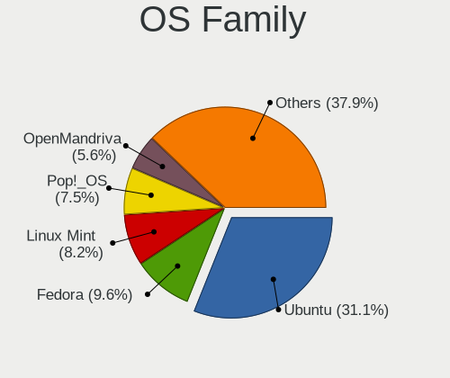

| Name             | Desktops | Percent |
|------------------|----------|---------|
| Ubuntu           | 123      | 36.61%  |
| Linux Mint       | 31       | 9.23%   |
| Fedora           | 29       | 8.63%   |
| Pop!_OS          | 27       | 8.04%   |
| Arch             | 16       | 4.76%   |
| OpenMandriva     | 13       | 3.87%   |
| Debian           | 13       | 3.87%   |
| KDE neon         | 11       | 3.27%   |
| Zorin            | 10       | 2.98%   |
| Manjaro          | 10       | 2.98%   |
| Endless          | 9        | 2.68%   |
| Kubuntu          | 6        | 1.79%   |
| Xubuntu          | 4        | 1.19%   |
| openSUSE         | 4        | 1.19%   |
| RHEL             | 3        | 0.89%   |
| Nobara           | 3        | 0.89%   |
| Ubuntu Unity     | 2        | 0.6%    |
| ROSA             | 2        | 0.6%    |
| Lubuntu          | 2        | 0.6%    |
| Devuan           | 2        | 0.6%    |
| Vanilla          | 1        | 0.3%    |
| Ubuntu MATE      | 1        | 0.3%    |
| Regata OS        | 1        | 0.3%    |
| Redcore          | 1        | 0.3%    |
| Peppermint       | 1        | 0.3%    |
| Parrot           | 1        | 0.3%    |
| org.kde.Platform | 1        | 0.3%    |
| NixOS            | 1        | 0.3%    |
| MX               | 1        | 0.3%    |
| LMDE             | 1        | 0.3%    |
| Linux Lite       | 1        | 0.3%    |
| Gentoo           | 1        | 0.3%    |
| Elementary       | 1        | 0.3%    |
| Deepin           | 1        | 0.3%    |
| ChimeraOS        | 1        | 0.3%    |
| ArcoLinux        | 1        | 0.3%    |

Kernel
------

Version of the Linux kernel

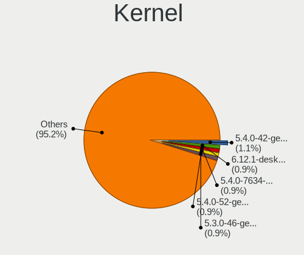

| Version                  | Desktops | Percent |
|--------------------------|----------|---------|
| 5.4.0-42-generic         | 6        | 1.39%   |
| 5.4.0-7634-generic       | 5        | 1.16%   |
| 5.4.0-52-generic         | 5        | 1.16%   |
| 5.3.0-46-generic         | 5        | 1.16%   |
| 5.15.0-46-generic        | 5        | 1.16%   |
| 5.15.0-60-generic        | 4        | 0.93%   |
| 5.13.0-30-generic        | 4        | 0.93%   |
| 5.11.0-37-generic        | 4        | 0.93%   |
| 6.2.0-35-generic         | 3        | 0.7%    |
| 5.8.0-50-generic         | 3        | 0.7%    |
| 5.8.0-44-generic         | 3        | 0.7%    |
| 5.4.0-65-generic         | 3        | 0.7%    |
| 5.4.0-33-generic         | 3        | 0.7%    |
| 5.3.0-40-generic         | 3        | 0.7%    |
| 5.16.7-desktop-1omv4003  | 3        | 0.7%    |
| 5.15.0-56-generic        | 3        | 0.7%    |
| 5.13.0-7614-generic      | 3        | 0.7%    |
| 5.13.0-39-generic        | 3        | 0.7%    |
| 5.11.0-7614-generic      | 3        | 0.7%    |
| 5.11.0-34-generic        | 3        | 0.7%    |
| 5.10.14-desktop-1omv4002 | 3        | 0.7%    |
| 5.0.0-37-generic         | 3        | 0.7%    |
| 4.18.0-25-generic        | 3        | 0.7%    |
| 6.5.6-76060506-generic   | 2        | 0.46%   |
| 6.2.6-desktop-1omv2390   | 2        | 0.46%   |
| 6.2.15-300.fc38.x86_64   | 2        | 0.46%   |
| 6.2.0-39-generic         | 2        | 0.46%   |
| 6.2.0-20-generic         | 2        | 0.46%   |
| 6.1.13-200.fc37.x86_64   | 2        | 0.46%   |
| 6.1.1-desktop-1omv2290   | 2        | 0.46%   |
| 5.9.16-200.fc33.x86_64   | 2        | 0.46%   |
| 5.8.0-7630-generic       | 2        | 0.46%   |
| 5.8.0-59-generic         | 2        | 0.46%   |
| 5.8.0-55-generic         | 2        | 0.46%   |
| 5.8.0-43-generic         | 2        | 0.46%   |
| 5.8.0-33-generic         | 2        | 0.46%   |
| 5.8.0-14-generic         | 2        | 0.46%   |
| 5.4.0-77-generic         | 2        | 0.46%   |
| 5.4.0-7642-generic       | 2        | 0.46%   |
| 5.4.0-74-generic         | 2        | 0.46%   |

Kernel Family
-------------

Linux kernel without a distro release

| Version | Desktops | Percent |
|---------|----------|---------|
| 5.4.0   | 51       | 13.08%  |
| 5.15.0  | 31       | 7.95%   |
| 4.15.0  | 25       | 6.41%   |
| 5.8.0   | 23       | 5.9%    |
| 5.11.0  | 23       | 5.9%    |
| 5.13.0  | 19       | 4.87%   |
| 5.3.0   | 16       | 4.1%    |
| 5.19.0  | 16       | 4.1%    |
| 4.18.0  | 14       | 3.59%   |
| 6.2.0   | 12       | 3.08%   |
| 5.10.0  | 9        | 2.31%   |
| 5.0.0   | 8        | 2.05%   |
| 6.5.6   | 4        | 1.03%   |
| 6.1.0   | 4        | 1.03%   |
| 6.2.6   | 3        | 0.77%   |
| 5.9.16  | 3        | 0.77%   |
| 5.16.7  | 3        | 0.77%   |
| 5.10.15 | 3        | 0.77%   |
| 5.10.14 | 3        | 0.77%   |
| 6.6.13  | 2        | 0.51%   |
| 6.6.11  | 2        | 0.51%   |
| 6.5.5   | 2        | 0.51%   |
| 6.5.0   | 2        | 0.51%   |
| 6.4.12  | 2        | 0.51%   |
| 6.2.15  | 2        | 0.51%   |
| 6.1.8   | 2        | 0.51%   |
| 6.1.7   | 2        | 0.51%   |
| 6.1.6   | 2        | 0.51%   |
| 6.1.13  | 2        | 0.51%   |
| 6.1.1   | 2        | 0.51%   |
| 5.8.12  | 2        | 0.51%   |
| 5.7.0   | 2        | 0.51%   |
| 5.6.11  | 2        | 0.51%   |
| 5.18.5  | 2        | 0.51%   |
| 5.18.13 | 2        | 0.51%   |
| 5.17.4  | 2        | 0.51%   |
| 5.15.8  | 2        | 0.51%   |
| 5.15.15 | 2        | 0.51%   |
| 5.15.11 | 2        | 0.51%   |
| 5.14.0  | 2        | 0.51%   |

Kernel Major Ver.
-----------------

Linux kernel major version

| Version | Desktops | Percent |
|---------|----------|---------|
| 5.4     | 54       | 14.06%  |
| 5.15    | 41       | 10.68%  |
| 5.11    | 28       | 7.29%   |
| 5.8     | 27       | 7.03%   |
| 4.15    | 25       | 6.51%   |
| 5.13    | 22       | 5.73%   |
| 5.19    | 21       | 5.47%   |
| 6.2     | 18       | 4.69%   |
| 5.3     | 18       | 4.69%   |
| 6.1     | 17       | 4.43%   |
| 5.10    | 16       | 4.17%   |
| 4.18    | 14       | 3.65%   |
| 6.5     | 11       | 2.86%   |
| 5.0     | 9        | 2.34%   |
| 6.6     | 7        | 1.82%   |
| 5.9     | 7        | 1.82%   |
| 5.7     | 6        | 1.56%   |
| 5.14    | 6        | 1.56%   |
| 5.6     | 5        | 1.3%    |
| 5.18    | 5        | 1.3%    |
| 5.16    | 5        | 1.3%    |
| 6.4     | 4        | 1.04%   |
| 6.0     | 4        | 1.04%   |
| 5.12    | 4        | 1.04%   |
| 6.3     | 3        | 0.78%   |
| 5.17    | 3        | 0.78%   |
| 4.19    | 2        | 0.52%   |
| 5.5     | 1        | 0.26%   |
| 5.2     | 1        | 0.26%   |

Arch
----

OS architecture (x86_64, i586, etc.)

| Name   | Desktops | Percent |
|--------|----------|---------|
| x86_64 | 322      | 99.69%  |
| i686   | 1        | 0.31%   |

DE
--

Desktop Environment

| Name          | Desktops | Percent |
|---------------|----------|---------|
| GNOME         | 166      | 48.68%  |
| KDE5          | 50       | 14.66%  |
| Unknown       | 47       | 13.78%  |
| X-Cinnamon    | 31       | 9.09%   |
| XFCE          | 14       | 4.11%   |
| KDE           | 11       | 3.23%   |
| MATE          | 8        | 2.35%   |
| LXQt          | 4        | 1.17%   |
| Unity         | 2        | 0.59%   |
| LXDE          | 2        | 0.59%   |
| Deepin        | 2        | 0.59%   |
| Cinnamon      | 2        | 0.59%   |
| Pantheon      | 1        | 0.29%   |
| Enlightenment | 1        | 0.29%   |

Display Server
--------------

X11 or Wayland

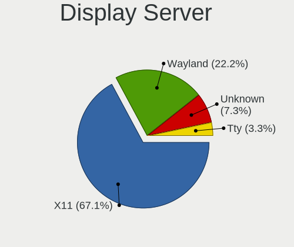

| Name    | Desktops | Percent |
|---------|----------|---------|
| X11     | 241      | 72.81%  |
| Wayland | 54       | 16.31%  |
| Unknown | 28       | 8.46%   |
| Tty     | 8        | 2.42%   |

Display Manager
---------------

SDDM, LightDM, etc.

| Name    | Desktops | Percent |
|---------|----------|---------|
| Unknown | 194      | 57.57%  |
| SDDM    | 41       | 12.17%  |
| GDM3    | 34       | 10.09%  |
| LightDM | 28       | 8.31%   |
| GDM     | 26       | 7.72%   |
| TDM     | 11       | 3.26%   |
| SLiM    | 3        | 0.89%   |

OS Lang
-------

Language

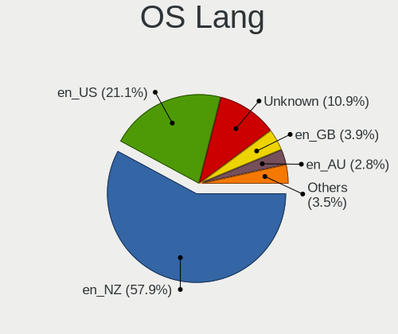

| Lang    | Desktops | Percent |
|---------|----------|---------|
| en_NZ   | 199      | 58.19%  |
| en_US   | 67       | 19.59%  |
| Unknown | 44       | 12.87%  |
| en_AU   | 12       | 3.51%   |
| en_GB   | 11       | 3.22%   |
| C       | 6        | 1.75%   |
| zh_CN   | 2        | 0.58%   |
| de_DE   | 1        | 0.29%   |

Boot Mode
---------

EFI or BIOS

| Mode | Desktops | Percent |
|------|----------|---------|
| BIOS | 194      | 58.26%  |
| EFI  | 139      | 41.74%  |

Filesystem
----------

Type of filesystem

| Type    | Desktops | Percent |
|---------|----------|---------|
| Ext4    | 252      | 75.68%  |
| Btrfs   | 33       | 9.91%   |
| Overlay | 17       | 5.11%   |
| Unknown | 13       | 3.9%    |
| Tmpfs   | 9        | 2.7%    |
| Xfs     | 4        | 1.2%    |
| Zfs     | 3        | 0.9%    |
| F2fs    | 1        | 0.3%    |
| Ext3    | 1        | 0.3%    |

Part. scheme
------------

Scheme of partitioning

| Type    | Desktops | Percent |
|---------|----------|---------|
| Unknown | 198      | 59.64%  |
| GPT     | 112      | 33.73%  |
| MBR     | 22       | 6.63%   |

Dual Boot with Linux/BSD
------------------------

Hosting more than one Linux/BSD

| Dual boot | Desktops | Percent |
|-----------|----------|---------|
| No        | 274      | 82.78%  |
| Yes       | 57       | 17.22%  |

Dual Boot (Win)
---------------

Hosting Linux and Windows

| Dual boot | Desktops | Percent |
|-----------|----------|---------|
| No        | 232      | 70.52%  |
| Yes       | 97       | 29.48%  |

Board
-----

Vendor
------

Motherboard manufacturer

| Name                                 | Desktops | Percent |
|--------------------------------------|----------|---------|
| ASUSTek Computer                     | 92       | 28.48%  |
| Gigabyte Technology                  | 85       | 26.32%  |
| Hewlett-Packard                      | 42       | 13%     |
| Dell                                 | 20       | 6.19%   |
| ASRock                               | 20       | 6.19%   |
| MSI                                  | 19       | 5.88%   |
| Lenovo                               | 9        | 2.79%   |
| Intel                                | 8        | 2.48%   |
| Unknown                              | 6        | 1.86%   |
| Acer                                 | 4        | 1.24%   |
| Supermicro                           | 2        | 0.62%   |
| Pegatron                             | 2        | 0.62%   |
| IBM                                  | 2        | 0.62%   |
| Shenzhen Meigao Electronic Equipment | 1        | 0.31%   |
| OEM                                  | 1        | 0.31%   |
| MediaVue                             | 1        | 0.31%   |
| JGINYUE                              | 1        | 0.31%   |
| Huanan                               | 1        | 0.31%   |
| DFI                                  | 1        | 0.31%   |
| CWWK                                 | 1        | 0.31%   |
| Colorful Technology                  | 1        | 0.31%   |
| Biostar                              | 1        | 0.31%   |
| Apple                                | 1        | 0.31%   |
| Alienware                            | 1        | 0.31%   |
| AAEON                                | 1        | 0.31%   |

Model
-----

Motherboard model

| Name                                 | Desktops | Percent |
|--------------------------------------|----------|---------|
| ASUS All Series                      | 9        | 2.79%   |
| Unknown                              | 7        | 2.17%   |
| Gigabyte H77M-D3H                    | 6        | 1.86%   |
| ASUS TUF Gaming X570-PLUS            | 5        | 1.55%   |
| HP EliteDesk 800 G1 SFF              | 4        | 1.24%   |
| MSI MS-7B89                          | 3        | 0.93%   |
| HP Compaq 8200 Elite SFF PC          | 3        | 0.93%   |
| Gigabyte B75M-D3H                    | 3        | 0.93%   |
| Gigabyte B450M S2H                   | 3        | 0.93%   |
| Gigabyte 970A-D3P                    | 3        | 0.93%   |
| Dell OptiPlex 3010                   | 3        | 0.93%   |
| ASUS P8B75-M                         | 3        | 0.93%   |
| ASRock B450M Steel Legend            | 3        | 0.93%   |
| MSI MS-7C91                          | 2        | 0.62%   |
| MSI MS-7C02                          | 2        | 0.62%   |
| Lenovo ThinkCentre M58p 7479RS2      | 2        | 0.62%   |
| HP ProDesk 600 G1 SFF                | 2        | 0.62%   |
| HP EliteDesk 800 G2 DM 35W           | 2        | 0.62%   |
| HP Compaq Pro 6300 SFF               | 2        | 0.62%   |
| HP Compaq Elite 8300 USDT            | 2        | 0.62%   |
| HP Compaq Elite 8300 SFF             | 2        | 0.62%   |
| HP Compaq 8100 Elite SFF PC          | 2        | 0.62%   |
| HP Compaq 6200 Pro SFF PC            | 2        | 0.62%   |
| Gigabyte Z77X-D3H                    | 2        | 0.62%   |
| Gigabyte Z68AP-D3                    | 2        | 0.62%   |
| Gigabyte X670 AORUS ELITE AX         | 2        | 0.62%   |
| Gigabyte GA-78LMT-USB3               | 2        | 0.62%   |
| Gigabyte F2A75M-D3H                  | 2        | 0.62%   |
| Gigabyte F2A55M-DS2                  | 2        | 0.62%   |
| Gigabyte B550M DS3H AC               | 2        | 0.62%   |
| Gigabyte B550M DS3H                  | 2        | 0.62%   |
| Gigabyte B550 GAMING X V2            | 2        | 0.62%   |
| Gigabyte B550 AORUS ELITE AX V2      | 2        | 0.62%   |
| Gigabyte AB350-Gaming                | 2        | 0.62%   |
| Dell Precision T3600                 | 2        | 0.62%   |
| Dell OptiPlex 990                    | 2        | 0.62%   |
| ASUS SABERTOOTH 990FX R2.0           | 2        | 0.62%   |
| ASUS ROG STRIX X570-E GAMING WIFI II | 2        | 0.62%   |
| ASUS ROG STRIX X570-E GAMING         | 2        | 0.62%   |
| ASUS ROG STRIX B550-F GAMING         | 2        | 0.62%   |

Model Family
------------

Motherboard model prefix

| Name                   | Desktops | Percent |
|------------------------|----------|---------|
| ASUS ROG               | 21       | 6.5%    |
| HP Compaq              | 17       | 5.26%   |
| ASUS PRIME             | 17       | 5.26%   |
| Dell OptiPlex          | 11       | 3.41%   |
| ASUS TUF               | 11       | 3.41%   |
| HP EliteDesk           | 9        | 2.79%   |
| ASUS All               | 9        | 2.79%   |
| Lenovo ThinkCentre     | 7        | 2.17%   |
| Dell Precision         | 7        | 2.17%   |
| Unknown                | 7        | 2.17%   |
| Gigabyte H77M-D3H      | 6        | 1.86%   |
| HP ProLiant            | 4        | 1.24%   |
| Gigabyte B550M         | 4        | 1.24%   |
| Gigabyte B550          | 4        | 1.24%   |
| ASUS M5A97             | 4        | 1.24%   |
| Acer Aspire            | 4        | 1.24%   |
| MSI MS-7B89            | 3        | 0.93%   |
| HP ProDesk             | 3        | 0.93%   |
| Gigabyte GA-78LMT-USB3 | 3        | 0.93%   |
| Gigabyte B75M-D3H      | 3        | 0.93%   |
| Gigabyte B450M         | 3        | 0.93%   |
| Gigabyte AB350-Gaming  | 3        | 0.93%   |
| Gigabyte 970A-D3P      | 3        | 0.93%   |
| ASUS P8B75-M           | 3        | 0.93%   |
| ASUS H110M-A           | 3        | 0.93%   |
| ASRock B450M           | 3        | 0.93%   |
| MSI MS-7C91            | 2        | 0.62%   |
| MSI MS-7C02            | 2        | 0.62%   |
| IBM System             | 2        | 0.62%   |
| Gigabyte Z77X-D3H      | 2        | 0.62%   |
| Gigabyte Z68AP-D3      | 2        | 0.62%   |
| Gigabyte X670          | 2        | 0.62%   |
| Gigabyte X570S         | 2        | 0.62%   |
| Gigabyte X570          | 2        | 0.62%   |
| Gigabyte F2A75M-D3H    | 2        | 0.62%   |
| Gigabyte F2A55M-DS2    | 2        | 0.62%   |
| Gigabyte B560M         | 2        | 0.62%   |
| ASUS SABERTOOTH        | 2        | 0.62%   |
| ASUS P7P55D-E          | 2        | 0.62%   |
| ASUS P5G41T-M          | 2        | 0.62%   |

MFG Year
--------

Motherboard manufacture year

| Year    | Desktops | Percent |
|---------|----------|---------|
| 2012    | 55       | 17.03%  |
| 2020    | 28       | 8.67%   |
| 2019    | 27       | 8.36%   |
| 2018    | 25       | 7.74%   |
| 2013    | 24       | 7.43%   |
| 2011    | 24       | 7.43%   |
| 2017    | 21       | 6.5%    |
| 2014    | 18       | 5.57%   |
| 2010    | 17       | 5.26%   |
| 2009    | 17       | 5.26%   |
| 2015    | 14       | 4.33%   |
| 2021    | 13       | 4.02%   |
| 2008    | 12       | 3.72%   |
| 2022    | 9        | 2.79%   |
| 2016    | 8        | 2.48%   |
| 2023    | 4        | 1.24%   |
| 2007    | 3        | 0.93%   |
| 2005    | 2        | 0.62%   |
| 2004    | 1        | 0.31%   |
| Unknown | 1        | 0.31%   |

Form Factor
-----------

Physical design of the computer

| Name    | Desktops | Percent |
|---------|----------|---------|
| Desktop | 323      | 100%    |

Secure Boot
-----------

Enabled or disabled

| State    | Desktops | Percent |
|----------|----------|---------|
| Disabled | 312      | 96.59%  |
| Enabled  | 11       | 3.41%   |

Coreboot
--------

Have coreboot on board

| Used | Desktops | Percent |
|------|----------|---------|
| No   | 322      | 99.69%  |
| Yes  | 1        | 0.31%   |

RAM Size
--------

Total RAM memory

| Size in GB  | Desktops | Percent |
|-------------|----------|---------|
| 16.01-24.0  | 90       | 27.03%  |
| 8.01-16.0   | 64       | 19.22%  |
| 32.01-64.0  | 60       | 18.02%  |
| 4.01-8.0    | 43       | 12.91%  |
| 3.01-4.0    | 39       | 11.71%  |
| 64.01-256.0 | 21       | 6.31%   |
| 24.01-32.0  | 9        | 2.7%    |
| 1.01-2.0    | 5        | 1.5%    |
| 2.01-3.0    | 2        | 0.6%    |

RAM Used
--------

Used RAM memory

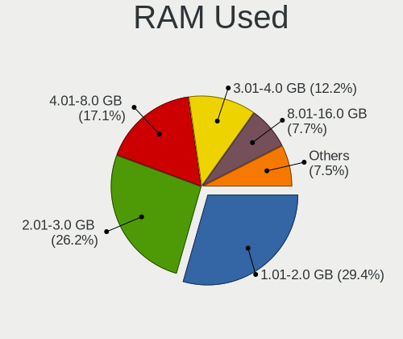

| Used GB    | Desktops | Percent |
|------------|----------|---------|
| 1.01-2.0   | 114      | 30.65%  |
| 2.01-3.0   | 103      | 27.69%  |
| 4.01-8.0   | 63       | 16.94%  |
| 3.01-4.0   | 42       | 11.29%  |
| 8.01-16.0  | 23       | 6.18%   |
| 0.51-1.0   | 17       | 4.57%   |
| 16.01-24.0 | 5        | 1.34%   |
| 0.01-0.5   | 3        | 0.81%   |
| 32.01-64.0 | 1        | 0.27%   |
| 24.01-32.0 | 1        | 0.27%   |

Total Drives
------------

Number of drives on board

| Drives | Desktops | Percent |
|--------|----------|---------|
| 1      | 111      | 32.46%  |
| 2      | 106      | 30.99%  |
| 3      | 57       | 16.67%  |
| 4      | 36       | 10.53%  |
| 6      | 12       | 3.51%   |
| 5      | 12       | 3.51%   |
| 7      | 3        | 0.88%   |
| 8      | 2        | 0.58%   |
| 410    | 1        | 0.29%   |
| 20     | 1        | 0.29%   |
| 0      | 1        | 0.29%   |

Has CD-ROM
----------

Has CD-ROM on board

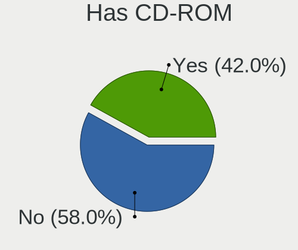

| Presented | Desktops | Percent |
|-----------|----------|---------|
| No        | 182      | 55.32%  |
| Yes       | 147      | 44.68%  |

Has Ethernet
------------

Has Ethernet on board

| Presented | Desktops | Percent |
|-----------|----------|---------|
| Yes       | 322      | 99.69%  |
| No        | 1        | 0.31%   |

Has WiFi
--------

Has WiFi module

| Presented | Desktops | Percent |
|-----------|----------|---------|
| No        | 171      | 52.13%  |
| Yes       | 157      | 47.87%  |

Has Bluetooth
-------------

Has Bluetooth module

| Presented | Desktops | Percent |
|-----------|----------|---------|
| No        | 222      | 67.89%  |
| Yes       | 105      | 32.11%  |

Location
--------

Country
-------

Geographic location (country)

| Country     | Desktops | Percent |
|-------------|----------|---------|
| New Zealand | 323      | 100%    |

City
----

Geographic location (city)

| City             | Desktops | Percent |
|------------------|----------|---------|
| Auckland         | 157      | 46.18%  |
| Wellington       | 45       | 13.24%  |
| Christchurch     | 42       | 12.35%  |
| Hamilton         | 19       | 5.59%   |
| Tauranga         | 14       | 4.12%   |
| Dunedin          | 9        | 2.65%   |
| Palmerston North | 7        | 2.06%   |
| Whangarei        | 5        | 1.47%   |
| Napier City      | 4        | 1.18%   |
| Cambridge        | 4        | 1.18%   |
| Whanganui        | 3        | 0.88%   |
| New Plymouth     | 3        | 0.88%   |
| Nelson           | 3        | 0.88%   |
| Rotorua          | 2        | 0.59%   |
| Invercargill     | 2        | 0.59%   |
| Ashburton        | 2        | 0.59%   |
| Westport         | 1        | 0.29%   |
| Wellsford        | 1        | 0.29%   |
| Waikanae         | 1        | 0.29%   |
| Waihi            | 1        | 0.29%   |
| Stratford        | 1        | 0.29%   |
| Queenstown       | 1        | 0.29%   |
| Porirua          | 1        | 0.29%   |
| Onekawa          | 1        | 0.29%   |
| Mount Maunganui  | 1        | 0.29%   |
| Mount Eden       | 1        | 0.29%   |
| Milton           | 1        | 0.29%   |
| Lower Hutt       | 1        | 0.29%   |
| Hunterville      | 1        | 0.29%   |
| Havelock North   | 1        | 0.29%   |
| Hastings         | 1        | 0.29%   |
| Grafton          | 1        | 0.29%   |
| Darfield         | 1        | 0.29%   |
| Carterton        | 1        | 0.29%   |
| Albany           | 1        | 0.29%   |

Drives
------

Drive Vendor
------------

Hard drive vendors

| Vendor                       | Desktops | Drives | Percent |
|------------------------------|----------|--------|---------|
| Seagate                      | 144      | 285    | 23.92%  |
| WDC                          | 123      | 222    | 20.43%  |
| Samsung Electronics          | 102      | 221    | 16.94%  |
| Crucial                      | 35       | 58     | 5.81%   |
| Kingston                     | 30       | 41     | 4.98%   |
| SanDisk                      | 19       | 24     | 3.16%   |
| Intel                        | 19       | 26     | 3.16%   |
| Toshiba                      | 18       | 25     | 2.99%   |
| Hitachi                      | 17       | 26     | 2.82%   |
| A-DATA Technology            | 10       | 13     | 1.66%   |
| Micron Technology            | 7        | 8      | 1.16%   |
| Micron/Crucial Technology    | 5        | 6      | 0.83%   |
| HGST                         | 5        | 7      | 0.83%   |
| Unknown                      | 4        | 6      | 0.66%   |
| Team                         | 4        | 4      | 0.66%   |
| Gigabyte Technology          | 4        | 5      | 0.66%   |
| Apacer                       | 4        | 5      | 0.66%   |
| TO Exter                     | 3        | 3      | 0.5%    |
| SK hynix                     | 3        | 3      | 0.5%    |
| OCZ                          | 3        | 3      | 0.5%    |
| Lexar                        | 3        | 3      | 0.5%    |
| External                     | 3        | 4      | 0.5%    |
| Corsair                      | 3        | 5      | 0.5%    |
| China                        | 3        | 4      | 0.5%    |
| XPG                          | 2        | 2      | 0.33%   |
| Transcend                    | 2        | 2      | 0.33%   |
| Silicon Motion               | 2        | 3      | 0.33%   |
| KIOXIA                       | 2        | 2      | 0.33%   |
| ASMT                         | 2        | 2      | 0.33%   |
| Apple                        | 2        | 2      | 0.33%   |
| USB                          | 1        | 2      | 0.17%   |
| T-FORCE                      | 1        | 1      | 0.17%   |
| ShiJi                        | 1        | 1      | 0.17%   |
| Shenzhen Longsys Electronics | 1        | 2      | 0.17%   |
| Realtek Semiconductor        | 1        | 1      | 0.17%   |
| QUANTUM                      | 1        | 1      | 0.17%   |
| PNY                          | 1        | 1      | 0.17%   |
| Phison                       | 1        | 1      | 0.17%   |
| OCZ-VERTEX3                  | 1        | 1      | 0.17%   |
| LITEON                       | 1        | 1      | 0.17%   |

Drive Model
-----------

Hard drive models

| Model                                              | Desktops | Percent |
|----------------------------------------------------|----------|---------|
| Seagate ST2000DM008-2FR102 2TB                     | 13       | 1.77%   |
| Seagate Expansion Desk 8TB                         | 11       | 1.49%   |
| Samsung SSD 850 EVO 500GB                          | 10       | 1.36%   |
| Crucial CT240BX500SSD1 240GB                       | 10       | 1.36%   |
| Seagate ST500DM002-1BD142 500GB                    | 8        | 1.09%   |
| Seagate ST31000528AS 1TB                           | 8        | 1.09%   |
| Samsung SSD 860 EVO 500GB                          | 8        | 1.09%   |
| Samsung NVMe SSD Controller SM981/PM981/PM983 1TB  | 8        | 1.09%   |
| Seagate ST2000DM006-2DM164 2TB                     | 7        | 0.95%   |
| Seagate ST2000DM001-1CH164 2TB                     | 7        | 0.95%   |
| Seagate ST1000DM010-2EP102 1TB                     | 7        | 0.95%   |
| Seagate ST1000DM003-1CH162 1TB                     | 7        | 0.95%   |
| Samsung SSD 850 EVO 250GB                          | 7        | 0.95%   |
| WDC WD20EZRZ-00Z5HB0 2TB                           | 6        | 0.82%   |
| Seagate Expansion 1TB                              | 6        | 0.82%   |
| Samsung NVMe SSD Drive 500GB                       | 6        | 0.82%   |
| Toshiba THNS128GG4BBAA 128GB SSD                   | 5        | 0.68%   |
| Samsung SSD 980 1TB                                | 5        | 0.68%   |
| Samsung SSD 870 QVO 1TB                            | 5        | 0.68%   |
| Samsung SSD 870 EVO 1TB                            | 5        | 0.68%   |
| Kingston SA400S37240G 240GB SSD                    | 5        | 0.68%   |
| Kingston SA400S37120G 120GB SSD                    | 5        | 0.68%   |
| WDC WD20EARX-00PASB0 2TB                           | 4        | 0.54%   |
| WDC WD10EZEX-00WN4A0 1TB                           | 4        | 0.54%   |
| WDC WD10EALX-009BA0 1TB                            | 4        | 0.54%   |
| Seagate ST9500325AS 500GB                          | 4        | 0.54%   |
| Seagate ST4000DM004-2CV104 4TB                     | 4        | 0.54%   |
| Seagate ST3500418AS 500GB                          | 4        | 0.54%   |
| Samsung SSD 860 EVO 250GB                          | 4        | 0.54%   |
| Samsung NVMe SSD Drive 1TB                         | 4        | 0.54%   |
| Samsung NVMe SSD Controller PM9A1/PM9A3/980PRO 2TB | 4        | 0.54%   |
| Crucial CT500MX500SSD1 500GB                       | 4        | 0.54%   |
| Crucial CT1000BX500SSD1 1TB                        | 4        | 0.54%   |
| WDC WD40EFRX-68N32N0 4TB                           | 3        | 0.41%   |
| WDC WD2003FZEX-00Z4SA0 2TB                         | 3        | 0.41%   |
| WDC WD10EZEX-22MFCA0 1TB                           | 3        | 0.41%   |
| WDC WD10EZEX-08WN4A0 1TB                           | 3        | 0.41%   |
| WDC WD1002FAEX-00Z3A0 1TB                          | 3        | 0.41%   |
| Toshiba DT01ACA200 2TB                             | 3        | 0.41%   |
| TO Exter nal USB 3.0 512GB                         | 3        | 0.41%   |

HDD Vendor
----------

Hard disk drive vendors

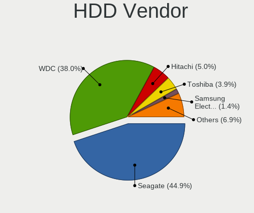

| Vendor              | Desktops | Drives | Percent |
|---------------------|----------|--------|---------|
| Seagate             | 139      | 271    | 45.87%  |
| WDC                 | 113      | 195    | 37.29%  |
| Hitachi             | 17       | 26     | 5.61%   |
| Toshiba             | 11       | 18     | 3.63%   |
| HGST                | 5        | 7      | 1.65%   |
| TO Exter            | 3        | 3      | 0.99%   |
| Samsung Electronics | 3        | 5      | 0.99%   |
| External            | 3        | 4      | 0.99%   |
| Unknown             | 2        | 2      | 0.66%   |
| ASMT                | 2        | 2      | 0.66%   |
| USB                 | 1        | 2      | 0.33%   |
| QUANTUM             | 1        | 1      | 0.33%   |
| JMicron Technology  | 1        | 1      | 0.33%   |
| Fujitsu             | 1        | 1      | 0.33%   |
| Apple               | 1        | 1      | 0.33%   |

SSD Vendor
----------

Solid state drive vendors

| Vendor              | Desktops | Drives | Percent |
|---------------------|----------|--------|---------|
| Samsung Electronics | 66       | 107    | 30.84%  |
| Crucial             | 32       | 50     | 14.95%  |
| Kingston            | 21       | 31     | 9.81%   |
| Intel               | 16       | 20     | 7.48%   |
| SanDisk             | 13       | 18     | 6.07%   |
| WDC                 | 11       | 20     | 5.14%   |
| A-DATA Technology   | 8        | 10     | 3.74%   |
| Toshiba             | 5        | 5      | 2.34%   |
| Team                | 4        | 4      | 1.87%   |
| Micron Technology   | 4        | 5      | 1.87%   |
| Apacer              | 4        | 5      | 1.87%   |
| Seagate             | 3        | 6      | 1.4%    |
| OCZ                 | 3        | 3      | 1.4%    |
| Lexar               | 3        | 3      | 1.4%    |
| Gigabyte Technology | 3        | 3      | 1.4%    |
| Corsair             | 3        | 5      | 1.4%    |
| China               | 3        | 4      | 1.4%    |
| Transcend           | 1        | 1      | 0.47%   |
| T-FORCE             | 1        | 1      | 0.47%   |
| SK hynix            | 1        | 1      | 0.47%   |
| OCZ-VERTEX3         | 1        | 1      | 0.47%   |
| LITEON              | 1        | 1      | 0.47%   |
| KingSpec            | 1        | 1      | 0.47%   |
| Innodisk            | 1        | 1      | 0.47%   |
| Hewlett-Packard     | 1        | 2      | 0.47%   |
| GAMER               | 1        | 1      | 0.47%   |
| FreeNAS             | 1        | 36     | 0.47%   |
| FreeBSD             | 1        | 372    | 0.47%   |
| Apple               | 1        | 1      | 0.47%   |

Drive Kind
----------

HDD or SSD

| Kind    | Desktops | Drives | Percent |
|---------|----------|--------|---------|
| HDD     | 228      | 539    | 44.53%  |
| SSD     | 181      | 718    | 35.35%  |
| NVMe    | 95       | 181    | 18.55%  |
| Unknown | 6        | 8      | 1.17%   |
| MMC     | 2        | 2      | 0.39%   |

Drive Connector
---------------

SATA, SAS, NVMe, etc.

| Type | Desktops | Drives | Percent |
|------|----------|--------|---------|
| SATA | 295      | 1211   | 69.25%  |
| NVMe | 95       | 181    | 22.3%   |
| SAS  | 34       | 54     | 7.98%   |
| MMC  | 2        | 2      | 0.47%   |

Drive Size
----------

Size of hard drive

| Size in TB | Desktops | Drives | Percent |
|------------|----------|--------|---------|
| 0.01-0.5   | 224      | 820    | 46.47%  |
| 0.51-1.0   | 133      | 236    | 27.59%  |
| 1.01-2.0   | 63       | 104    | 13.07%  |
| 3.01-4.0   | 26       | 46     | 5.39%   |
| 4.01-10.0  | 19       | 25     | 3.94%   |
| 2.01-3.0   | 13       | 15     | 2.7%    |
| 10.01-20.0 | 3        | 9      | 0.62%   |
| 20.01-50.0 | 1        | 2      | 0.21%   |

Space Total
-----------

Amount of disk space available on the file system

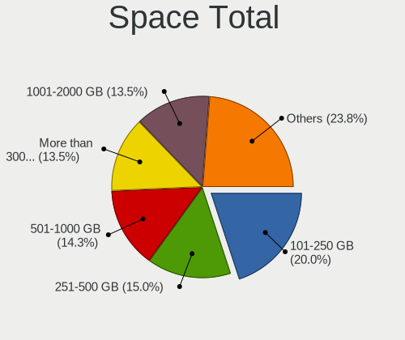

| Size in GB     | Desktops | Percent |
|----------------|----------|---------|
| 101-250        | 77       | 21.81%  |
| 251-500        | 55       | 15.58%  |
| 501-1000       | 51       | 14.45%  |
| 1001-2000      | 46       | 13.03%  |
| More than 3000 | 43       | 12.18%  |
| 2001-3000      | 36       | 10.2%   |
| 1-20           | 21       | 5.95%   |
| 51-100         | 12       | 3.4%    |
| Unknown        | 9        | 2.55%   |
| 21-50          | 3        | 0.85%   |

Space Used
----------

Amount of used disk space

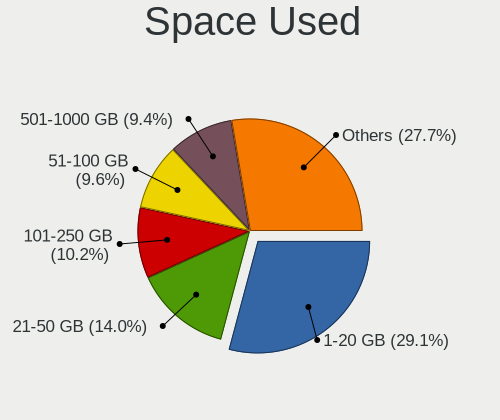

| Used GB        | Desktops | Percent |
|----------------|----------|---------|
| 1-20           | 109      | 28.99%  |
| 21-50          | 56       | 14.89%  |
| 51-100         | 37       | 9.84%   |
| 101-250        | 35       | 9.31%   |
| 501-1000       | 35       | 9.31%   |
| 251-500        | 32       | 8.51%   |
| 1001-2000      | 29       | 7.71%   |
| More than 3000 | 18       | 4.79%   |
| 2001-3000      | 16       | 4.26%   |
| Unknown        | 9        | 2.39%   |

Malfunc. Drives
---------------

Drive models with a malfunction

| Model                                 | Desktops | Drives | Percent |
|---------------------------------------|----------|--------|---------|
| WDC WD5000AAKX-001CA0 500GB           | 2        | 3      | 4.65%   |
| WDC WD20EZRZ-00Z5HB0 2TB              | 2        | 2      | 4.65%   |
| Seagate ST3500418AS 500GB             | 2        | 2      | 4.65%   |
| Seagate ST31000528AS 1TB              | 2        | 2      | 4.65%   |
| Samsung Electronics SSD 980 1TB       | 2        | 2      | 4.65%   |
| WDC WDS480G2G0A-00JH30 480GB SSD      | 1        | 1      | 2.33%   |
| WDC WD3200AAKS-00UU3A0 320GB          | 1        | 1      | 2.33%   |
| WDC WD2003FZEX-00Z4SA0 2TB            | 1        | 1      | 2.33%   |
| WDC WD15EARS-00S0XB0 1TB              | 1        | 1      | 2.33%   |
| WDC WD10EFRX-68FYTN0 1TB              | 1        | 3      | 2.33%   |
| WDC WD10EARS-003BB1 1TB               | 1        | 1      | 2.33%   |
| WDC WD1002FAEX-00Z3A0 1TB             | 1        | 2      | 2.33%   |
| Toshiba MQ01ABD050 500GB              | 1        | 1      | 2.33%   |
| SK hynix HFS256G32MND-2900A 256GB SSD | 1        | 1      | 2.33%   |
| Seagate ST8000VN0022-2EL112 8TB       | 1        | 3      | 2.33%   |
| Seagate ST500DM002-1BD142 500GB       | 1        | 1      | 2.33%   |
| Seagate ST4000DX001-1CE168 4TB        | 1        | 1      | 2.33%   |
| Seagate ST3250310AS 250GB             | 1        | 1      | 2.33%   |
| Seagate ST3200822A 200GB              | 1        | 1      | 2.33%   |
| Seagate ST31000524AS 1TB              | 1        | 1      | 2.33%   |
| Seagate ST3000DM001-9YN166 3TB        | 1        | 1      | 2.33%   |
| Seagate ST2000DX002-2DV164 2TB        | 1        | 1      | 2.33%   |
| Seagate ST2000DX001-1CM164 2TB        | 1        | 1      | 2.33%   |
| Seagate ST2000DM001-1ER164 2TB        | 1        | 1      | 2.33%   |
| Seagate ST2000DM001-1CH164 2TB        | 1        | 1      | 2.33%   |
| Seagate ST1000DM003-1ER162 1TB        | 1        | 1      | 2.33%   |
| SanDisk SSD PLUS 240 GB               | 1        | 1      | 2.33%   |
| Samsung Electronics SSD 980 PRO 2TB   | 1        | 1      | 2.33%   |
| Samsung Electronics SSD 980 PRO 250GB | 1        | 1      | 2.33%   |
| OCZ VERTEX3 90GB SSD                  | 1        | 1      | 2.33%   |
| Intel SSDSC2CT240A4 240GB             | 1        | 1      | 2.33%   |
| Innodisk Corp. - mSATA 3ME4 128GB     | 1        | 1      | 2.33%   |
| Hitachi HTS541010A9E680 1TB           | 1        | 1      | 2.33%   |
| HGST HTS545050A7E380 500GB            | 1        | 1      | 2.33%   |
| Crucial CT480M500SSD1 480GB           | 1        | 1      | 2.33%   |
| Crucial CT480BX500SSD1 480GB          | 1        | 1      | 2.33%   |
| Crucial CT1000BX500SSD1 1TB           | 1        | 2      | 2.33%   |
| ASMT ASM1156-PM 480GB                 | 1        | 1      | 2.33%   |

Malfunc. Drive Vendor
---------------------

Vendors of faulty drives

| Vendor              | Desktops | Drives | Percent |
|---------------------|----------|--------|---------|
| Seagate             | 13       | 18     | 32.5%   |
| WDC                 | 11       | 15     | 27.5%   |
| Samsung Electronics | 4        | 4      | 10%     |
| Crucial             | 3        | 4      | 7.5%    |
| Toshiba             | 1        | 1      | 2.5%    |
| SK hynix            | 1        | 1      | 2.5%    |
| SanDisk             | 1        | 1      | 2.5%    |
| OCZ                 | 1        | 1      | 2.5%    |
| Intel               | 1        | 1      | 2.5%    |
| Innodisk            | 1        | 1      | 2.5%    |
| Hitachi             | 1        | 1      | 2.5%    |
| HGST                | 1        | 1      | 2.5%    |
| ASMT                | 1        | 1      | 2.5%    |

Malfunc. HDD Vendor
-------------------

Vendors of faulty HDD drives

| Vendor  | Desktops | Drives | Percent |
|---------|----------|--------|---------|
| Seagate | 13       | 18     | 48.15%  |
| WDC     | 10       | 14     | 37.04%  |
| Toshiba | 1        | 1      | 3.7%    |
| Hitachi | 1        | 1      | 3.7%    |
| HGST    | 1        | 1      | 3.7%    |
| ASMT    | 1        | 1      | 3.7%    |

Malfunc. Drive Kind
-------------------

Kinds of faulty drives

| Kind | Desktops | Drives | Percent |
|------|----------|--------|---------|
| HDD  | 25       | 36     | 65.79%  |
| SSD  | 9        | 10     | 23.68%  |
| NVMe | 4        | 4      | 10.53%  |

Failed Drives
-------------

Failed drive models

Zero info for selected period =(

Failed Drive Vendor
-------------------

Failed drive vendors

Zero info for selected period =(

Drive Status
------------

Number of failed and malfunc. drives

| Status   | Desktops | Drives | Percent |
|----------|----------|--------|---------|
| Detected | 213      | 630    | 57.88%  |
| Works    | 118      | 767    | 32.07%  |
| Malfunc  | 36       | 50     | 9.78%   |
| Limited  | 1        | 1      | 0.27%   |

Storage controller
------------------

Storage Vendor
--------------

Storage controller vendors

| Vendor                       | Desktops | Percent |
|------------------------------|----------|---------|
| Intel                        | 190      | 40.25%  |
| AMD                          | 120      | 25.42%  |
| Samsung Electronics          | 53       | 11.23%  |
| JMicron Technology           | 15       | 3.18%   |
| ASMedia Technology           | 13       | 2.75%   |
| Marvell Technology Group     | 12       | 2.54%   |
| Kingston Technology Company  | 10       | 2.12%   |
| Nvidia                       | 9        | 1.91%   |
| Micron/Crucial Technology    | 9        | 1.91%   |
| SanDisk                      | 8        | 1.69%   |
| Seagate Technology           | 5        | 1.06%   |
| Silicon Motion               | 4        | 0.85%   |
| Phison Electronics           | 3        | 0.64%   |
| Micron Technology            | 3        | 0.64%   |
| LSI Logic / Symbios Logic    | 3        | 0.64%   |
| Toshiba America Info Systems | 2        | 0.42%   |
| SK hynix                     | 2        | 0.42%   |
| Realtek Semiconductor        | 2        | 0.42%   |
| KIOXIA                       | 2        | 0.42%   |
| Hewlett-Packard              | 2        | 0.42%   |
| VIA Technologies             | 1        | 0.21%   |
| Silicon Image                | 1        | 0.21%   |
| Shenzhen Longsys Electronics | 1        | 0.21%   |
| Broadcom / LSI               | 1        | 0.21%   |
| ADATA Technology             | 1        | 0.21%   |

Storage Model
-------------

Storage controller models

| Model                                                                                   | Desktops | Percent |
|-----------------------------------------------------------------------------------------|----------|---------|
| AMD FCH SATA Controller [AHCI mode]                                                     | 61       | 10.07%  |
| AMD 400 Series Chipset SATA Controller                                                  | 24       | 3.96%   |
| Samsung NVMe SSD Controller SM981/PM981/PM983                                           | 23       | 3.8%    |
| Intel 7 Series/C210 Series Chipset Family 6-port SATA Controller [AHCI mode]            | 20       | 3.3%    |
| Intel 8 Series/C220 Series Chipset Family 6-port SATA Controller 1 [AHCI mode]          | 19       | 3.14%   |
| AMD SB7x0/SB8x0/SB9x0 SATA Controller [AHCI mode]                                       | 19       | 3.14%   |
| AMD 500 Series Chipset SATA Controller                                                  | 19       | 3.14%   |
| AMD SB7x0/SB8x0/SB9x0 IDE Controller                                                    | 18       | 2.97%   |
| Intel SATA Controller [RAID Mode]                                                       | 16       | 2.64%   |
| Samsung NVMe SSD Controller PM9A1/PM9A3/980PRO                                          | 15       | 2.48%   |
| Intel 6 Series/C200 Series Chipset Family 6 port Desktop SATA AHCI Controller           | 14       | 2.31%   |
| Intel Q170/Q150/B150/H170/H110/Z170/CM236 Chipset SATA Controller [AHCI Mode]           | 13       | 2.15%   |
| Samsung NVMe SSD Controller 980 (DRAM-less)                                             | 12       | 1.98%   |
| ASMedia ASM1061/ASM1062 Serial ATA Controller                                           | 12       | 1.98%   |
| Intel 9 Series Chipset Family SATA Controller [AHCI Mode]                               | 9        | 1.49%   |
| AMD 300 Series Chipset SATA Controller                                                  | 9        | 1.49%   |
| JMicron JMB363 SATA/IDE Controller                                                      | 8        | 1.32%   |
| Intel 82801JI (ICH10 Family) 2 port SATA IDE Controller #2                              | 8        | 1.32%   |
| Intel 7 Series/C210 Series Chipset Family 4-port SATA Controller [IDE mode]             | 8        | 1.32%   |
| Intel 7 Series/C210 Series Chipset Family 2-port SATA Controller [IDE mode]             | 8        | 1.32%   |
| Intel 200 Series PCH SATA controller [AHCI mode]                                        | 8        | 1.32%   |
| AMD SB7x0/SB8x0/SB9x0 SATA Controller [IDE mode]                                        | 8        | 1.32%   |
| Samsung NVMe SSD Controller SM961/PM961/SM963                                           | 7        | 1.16%   |
| Intel NM10/ICH7 Family SATA Controller [IDE mode]                                       | 7        | 1.16%   |
| Intel 82801JI (ICH10 Family) 4 port SATA IDE Controller #1                              | 7        | 1.16%   |
| Intel 4 Series Chipset PT IDER Controller                                               | 7        | 1.16%   |
| Intel Cannon Lake PCH SATA AHCI Controller                                              | 6        | 0.99%   |
| Intel 82801JD/DO (ICH10 Family) SATA AHCI Controller                                    | 6        | 0.99%   |
| Intel 6 Series/C200 Series Chipset Family Desktop SATA Controller (IDE mode, ports 4-5) | 6        | 0.99%   |
| Intel 6 Series/C200 Series Chipset Family Desktop SATA Controller (IDE mode, ports 0-3) | 6        | 0.99%   |
| Intel 500 Series Chipset Family SATA AHCI Controller                                    | 6        | 0.99%   |
| Intel 5 Series/3400 Series Chipset 4 port SATA IDE Controller                           | 6        | 0.99%   |
| Intel 5 Series/3400 Series Chipset 2 port SATA IDE Controller                           | 6        | 0.99%   |
| AMD 600 Series Chipset SATA Controller                                                  | 6        | 0.99%   |
| Micron/Crucial P2 [Nick P2] / P3 / P3 Plus NVMe PCIe SSD (DRAM-less)                    | 5        | 0.83%   |
| JMicron JMB368 IDE controller                                                           | 5        | 0.83%   |
| Intel Comet Lake SATA AHCI Controller                                                   | 5        | 0.83%   |
| Intel 82801G (ICH7 Family) IDE Controller                                               | 5        | 0.83%   |
| Intel 5 Series/3400 Series Chipset 6 port SATA AHCI Controller                          | 5        | 0.83%   |
| Kingston Company A2000 NVMe SSD SM2263EN                                                | 4        | 0.66%   |

Storage Kind
------------

Kind of storage controller (IDE, SATA, NVMe, SAS, ...)

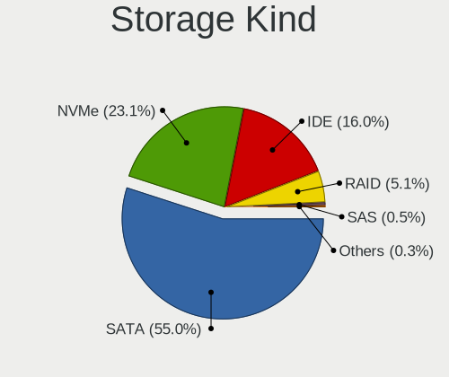

| Kind | Desktops | Percent |
|------|----------|---------|
| SATA | 257      | 54.56%  |
| NVMe | 97       | 20.59%  |
| IDE  | 88       | 18.68%  |
| RAID | 25       | 5.31%   |
| SAS  | 3        | 0.64%   |
| SCSI | 1        | 0.21%   |

Processor
---------

CPU Vendor
----------

Processor vendors

| Vendor | Desktops | Percent |
|--------|----------|---------|
| Intel  | 195      | 60.37%  |
| AMD    | 128      | 39.63%  |

CPU Model
---------

Processor models

| Model                                  | Desktops | Percent |
|----------------------------------------|----------|---------|
| Intel Core i5-3470 CPU @ 3.20GHz       | 11       | 3.41%   |
| Intel Core i5-2400 CPU @ 3.10GHz       | 8        | 2.48%   |
| AMD Ryzen 7 3700X 8-Core Processor     | 8        | 2.48%   |
| AMD Ryzen 5 3600 6-Core Processor      | 7        | 2.17%   |
| AMD Ryzen 5 2600 Six-Core Processor    | 6        | 1.86%   |
| Intel Core i7-4770 CPU @ 3.40GHz       | 5        | 1.55%   |
| Intel Core i7-3770 CPU @ 3.40GHz       | 5        | 1.55%   |
| AMD Ryzen 7 5700G with Radeon Graphics | 5        | 1.55%   |
| Intel Core i7-4790K CPU @ 4.00GHz      | 4        | 1.24%   |
| Intel Core i7-4790 CPU @ 3.60GHz       | 4        | 1.24%   |
| Intel Core i7-10700 CPU @ 2.90GHz      | 4        | 1.24%   |
| Intel Core 2 Quad CPU Q9400 @ 2.66GHz  | 4        | 1.24%   |
| AMD Ryzen 9 5950X 16-Core Processor    | 4        | 1.24%   |
| AMD Ryzen 9 3900X 12-Core Processor    | 4        | 1.24%   |
| AMD Ryzen 5 1600 Six-Core Processor    | 4        | 1.24%   |
| AMD FX-6300 Six-Core Processor         | 4        | 1.24%   |
| Intel Core i7 CPU 950 @ 3.07GHz        | 3        | 0.93%   |
| Intel Core i5-9400F CPU @ 2.90GHz      | 3        | 0.93%   |
| Intel Core i5-6400 CPU @ 2.70GHz       | 3        | 0.93%   |
| Intel Core i5-4570 CPU @ 3.20GHz       | 3        | 0.93%   |
| Intel Core i3-3220 CPU @ 3.30GHz       | 3        | 0.93%   |
| Intel Core i3-2120 CPU @ 3.30GHz       | 3        | 0.93%   |
| AMD Ryzen 9 5900X 12-Core Processor    | 3        | 0.93%   |
| AMD Ryzen 5 5600X 6-Core Processor     | 3        | 0.93%   |
| AMD Ryzen 5 5600G with Radeon Graphics | 3        | 0.93%   |
| AMD FX-8320 Eight-Core Processor       | 3        | 0.93%   |
| Intel N100                             | 2        | 0.62%   |
| Intel Core i7-8700 CPU @ 3.20GHz       | 2        | 0.62%   |
| Intel Core i7-7700 CPU @ 3.60GHz       | 2        | 0.62%   |
| Intel Core i7-4770K CPU @ 3.50GHz      | 2        | 0.62%   |
| Intel Core i7-2600 CPU @ 3.40GHz       | 2        | 0.62%   |
| Intel Core i7 CPU 860 @ 2.80GHz        | 2        | 0.62%   |
| Intel Core i5-8600K CPU @ 3.60GHz      | 2        | 0.62%   |
| Intel Core i5-7500 CPU @ 3.40GHz       | 2        | 0.62%   |
| Intel Core i5-6500 CPU @ 3.20GHz       | 2        | 0.62%   |
| Intel Core i5-4670 CPU @ 3.40GHz       | 2        | 0.62%   |
| Intel Core i5-3570K CPU @ 3.40GHz      | 2        | 0.62%   |
| Intel Core i5-3570 CPU @ 3.40GHz       | 2        | 0.62%   |
| Intel Core i5-3470S CPU @ 2.90GHz      | 2        | 0.62%   |
| Intel Core i5-2500K CPU @ 3.30GHz      | 2        | 0.62%   |

CPU Model Family
----------------

Processor model prefix

| Model                   | Desktops | Percent |
|-------------------------|----------|---------|
| Intel Core i5           | 67       | 20.74%  |
| Intel Core i7           | 50       | 15.48%  |
| AMD Ryzen 5             | 31       | 9.6%    |
| AMD Ryzen 7             | 27       | 8.36%   |
| Intel Xeon              | 19       | 5.88%   |
| Intel Core i3           | 18       | 5.57%   |
| AMD FX                  | 18       | 5.57%   |
| AMD Ryzen 9             | 15       | 4.64%   |
| Intel Core 2 Quad       | 11       | 3.41%   |
| Intel Core 2 Duo        | 7        | 2.17%   |
| AMD Ryzen 3             | 6        | 1.86%   |
| Other                   | 5        | 1.55%   |
| Intel Pentium           | 5        | 1.55%   |
| Intel Atom              | 5        | 1.55%   |
| AMD Athlon 64 X2        | 5        | 1.55%   |
| AMD Ryzen Threadripper  | 4        | 1.24%   |
| AMD Athlon II X2        | 4        | 1.24%   |
| Intel Pentium Dual-Core | 2        | 0.62%   |
| Intel Core i9           | 2        | 0.62%   |
| Intel Celeron           | 2        | 0.62%   |
| AMD Phenom II X6        | 2        | 0.62%   |
| AMD Phenom II X4        | 2        | 0.62%   |
| AMD Athlon II X4        | 2        | 0.62%   |
| AMD A8                  | 2        | 0.62%   |
| AMD A6                  | 2        | 0.62%   |
| AMD A4                  | 2        | 0.62%   |
| Intel Pentium Dual      | 1        | 0.31%   |
| Intel Pentium 4         | 1        | 0.31%   |
| AMD Six-Core Opteron    | 1        | 0.31%   |
| AMD Ryzen 7 PRO         | 1        | 0.31%   |
| AMD Opteron             | 1        | 0.31%   |
| AMD GX                  | 1        | 0.31%   |
| AMD A12                 | 1        | 0.31%   |
| AMD A10                 | 1        | 0.31%   |

CPU Cores
---------

Number of processor cores

| Number | Desktops | Percent |
|--------|----------|---------|
| 4      | 144      | 44.44%  |
| 2      | 54       | 16.67%  |
| 6      | 50       | 15.43%  |
| 8      | 39       | 12.04%  |
| 12     | 16       | 4.94%   |
| 16     | 6        | 1.85%   |
| 3      | 6        | 1.85%   |
| 1      | 4        | 1.23%   |
| 24     | 2        | 0.62%   |
| 10     | 2        | 0.62%   |
| 14     | 1        | 0.31%   |

CPU Sockets
-----------

Number of sockets

| Number | Desktops | Percent |
|--------|----------|---------|
| 1      | 321      | 99.38%  |
| 2      | 2        | 0.62%   |

CPU Threads
-----------

Threads per core (Hyper-Threading)

| Number | Desktops | Percent |
|--------|----------|---------|
| 2      | 200      | 61.92%  |
| 1      | 123      | 38.08%  |

CPU Op-Modes
------------

CPU Operation Modes (32-bit, 64-bit)

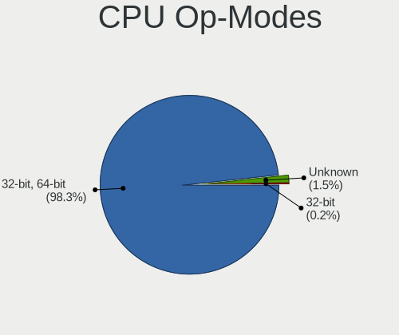

| Op mode        | Desktops | Percent |
|----------------|----------|---------|
| 32-bit, 64-bit | 319      | 98.15%  |
| Unknown        | 6        | 1.85%   |

CPU Microcode
-------------

Microcode number

| Number     | Desktops | Percent |
|------------|----------|---------|
| Unknown    | 102      | 30.09%  |
| 0x306a9    | 23       | 6.78%   |
| 0x306c3    | 21       | 6.19%   |
| 0x206a7    | 16       | 4.72%   |
| 0x08701021 | 15       | 4.42%   |
| 0x1067a    | 11       | 3.24%   |
| 0x06000852 | 9        | 2.65%   |
| 0x106e5    | 7        | 2.06%   |
| 0x0800820d | 7        | 2.06%   |
| 0xa0655    | 6        | 1.77%   |
| 0x906e9    | 6        | 1.77%   |
| 0x0a601203 | 6        | 1.77%   |
| 0x506e3    | 5        | 1.47%   |
| 0x0a50000c | 5        | 1.47%   |
| 0x08001137 | 5        | 1.47%   |
| 0x206d7    | 4        | 1.18%   |
| 0x106a5    | 4        | 1.18%   |
| 0x0a201016 | 4        | 1.18%   |
| 0x08701013 | 4        | 1.18%   |
| 0x010000c8 | 4        | 1.18%   |
| 0x906ea    | 3        | 0.88%   |
| 0x6fb      | 3        | 0.88%   |
| 0x20655    | 3        | 0.88%   |
| 0x0a201009 | 3        | 0.88%   |
| 0x06001119 | 3        | 0.88%   |
| 0x906ed    | 2        | 0.59%   |
| 0x50654    | 2        | 0.59%   |
| 0x406c3    | 2        | 0.59%   |
| 0x306f2    | 2        | 0.59%   |
| 0x20652    | 2        | 0.59%   |
| 0x10677    | 2        | 0.59%   |
| 0x0a50000d | 2        | 0.59%   |
| 0x0a20120a | 2        | 0.59%   |
| 0x0a201025 | 2        | 0.59%   |
| 0x08600106 | 2        | 0.59%   |
| 0x08108109 | 2        | 0.59%   |
| 0x08001138 | 2        | 0.59%   |
| 0x08001129 | 2        | 0.59%   |
| 0x0700010f | 2        | 0.59%   |
| 0x0600063e | 2        | 0.59%   |

CPU Microarch
-------------

Microarchitecture

| Name        | Desktops | Percent |
|-------------|----------|---------|
| IvyBridge   | 35       | 10.84%  |
| Haswell     | 34       | 10.53%  |
| Zen 2       | 28       | 8.67%   |
| SandyBridge | 24       | 7.43%   |
| Zen 3       | 22       | 6.81%   |
| KabyLake    | 21       | 6.5%    |
| Piledriver  | 19       | 5.88%   |
| Penryn      | 18       | 5.57%   |
| Zen+        | 14       | 4.33%   |
| Zen         | 14       | 4.33%   |
| Nehalem     | 13       | 4.02%   |
| CometLake   | 13       | 4.02%   |
| Skylake     | 12       | 3.72%   |
| K10         | 11       | 3.41%   |
| Unknown     | 11       | 3.41%   |
| Westmere    | 6        | 1.86%   |
| K8 Hammer   | 5        | 1.55%   |
| Core        | 5        | 1.55%   |
| Bulldozer   | 5        | 1.55%   |
| Silvermont  | 4        | 1.24%   |
| Jaguar      | 2        | 0.62%   |
| Bonnell     | 2        | 0.62%   |
| Tremont     | 1        | 0.31%   |
| NetBurst    | 1        | 0.31%   |
| K10 Llano   | 1        | 0.31%   |
| Goldmont    | 1        | 0.31%   |
| Excavator   | 1        | 0.31%   |

Graphics
--------

GPU Vendor
----------

Vendors of graphics cards

| Vendor                     | Desktops | Percent |
|----------------------------|----------|---------|
| Nvidia                     | 129      | 36.44%  |
| AMD                        | 123      | 34.75%  |
| Intel                      | 96       | 27.12%  |
| Matrox Electronics Systems | 5        | 1.41%   |
| ASPEED Technology          | 1        | 0.28%   |

GPU Model
---------

Graphics card models

| Model                                                                                    | Desktops | Percent |
|------------------------------------------------------------------------------------------|----------|---------|
| AMD Ellesmere [Radeon RX 470/480/570/570X/580/580X/590]                                  | 20       | 5.43%   |
| Intel Xeon E3-1200 v3/4th Gen Core Processor Integrated Graphics Controller              | 17       | 4.62%   |
| Intel Xeon E3-1200 v2/3rd Gen Core processor Graphics Controller                         | 12       | 3.26%   |
| Intel 2nd Generation Core Processor Family Integrated Graphics Controller                | 11       | 2.99%   |
| Nvidia GP102 [GeForce GTX 1080 Ti]                                                       | 8        | 2.17%   |
| Nvidia GP106 [GeForce GTX 1060 6GB]                                                      | 7        | 1.9%    |
| Intel HD Graphics 530                                                                    | 7        | 1.9%    |
| Intel CometLake-S GT2 [UHD Graphics 630]                                                 | 7        | 1.9%    |
| AMD Cedar [Radeon HD 5000/6000/7350/8350 Series]                                         | 7        | 1.9%    |
| Nvidia GP108 [GeForce GT 1030]                                                           | 6        | 1.63%   |
| Nvidia GK208B [GeForce GT 710]                                                           | 6        | 1.63%   |
| Intel HD Graphics 630                                                                    | 6        | 1.63%   |
| Intel 4 Series Chipset Integrated Graphics Controller                                    | 6        | 1.63%   |
| AMD Raphael                                                                              | 6        | 1.63%   |
| Intel CoffeeLake-S GT2 [UHD Graphics 630]                                                | 5        | 1.36%   |
| AMD Park [Mobility Radeon HD 5430]                                                       | 5        | 1.36%   |
| AMD Navi 14 [Radeon RX 5500/5500M / Pro 5500M]                                           | 5        | 1.36%   |
| AMD Cezanne [Radeon Vega Series / Radeon Vega Mobile Series]                             | 5        | 1.36%   |
| Nvidia TU117 [GeForce GTX 1650]                                                          | 4        | 1.09%   |
| Nvidia GT218 [GeForce 210]                                                               | 4        | 1.09%   |
| Nvidia GP107 [GeForce GTX 1050 Ti]                                                       | 4        | 1.09%   |
| AMD Navi 23 [Radeon RX 6600/6600 XT/6600M]                                               | 4        | 1.09%   |
| AMD Navi 21 [Radeon RX 6800/6800 XT / 6900 XT]                                           | 4        | 1.09%   |
| AMD Navi 10 [Radeon RX 5600 OEM/5600 XT / 5700/5700 XT]                                  | 4        | 1.09%   |
| AMD Caicos [Radeon HD 6450/7450/8450 / R5 230 OEM]                                       | 4        | 1.09%   |
| Nvidia GP104 [GeForce GTX 1070]                                                          | 3        | 0.82%   |
| Nvidia GP104 [GeForce GTX 1070 Ti]                                                       | 3        | 0.82%   |
| Nvidia GK106 [GeForce GTX 660]                                                           | 3        | 0.82%   |
| Nvidia GK104 [GeForce GTX 760]                                                           | 3        | 0.82%   |
| Nvidia GF108 [GeForce GT 430]                                                            | 3        | 0.82%   |
| Intel Core Processor Integrated Graphics Controller                                      | 3        | 0.82%   |
| Intel Atom/Celeron/Pentium Processor x5-E8000/J3xxx/N3xxx Integrated Graphics Controller | 3        | 0.82%   |
| Intel 4th Generation Core Processor Family Integrated Graphics Controller                | 3        | 0.82%   |
| AMD Turks XT [Radeon HD 6670/7670]                                                       | 3        | 0.82%   |
| AMD Picasso/Raven 2 [Radeon Vega Series / Radeon Vega Mobile Series]                     | 3        | 0.82%   |
| AMD Navi 22 [Radeon RX 6700/6700 XT/6750 XT / 6800M/6850M XT]                            | 3        | 0.82%   |
| AMD ES1000                                                                               | 3        | 0.82%   |
| Nvidia TU116 [GeForce GTX 1660 Ti]                                                       | 2        | 0.54%   |
| Nvidia TU106 [GeForce RTX 2060 SUPER]                                                    | 2        | 0.54%   |
| Nvidia TU104 [GeForce RTX 2060]                                                          | 2        | 0.54%   |

GPU Combo
---------

Combinations of graphics cards

| Name           | Desktops | Percent |
|----------------|----------|---------|
| 1 x Nvidia     | 115      | 34.74%  |
| 1 x AMD        | 105      | 31.72%  |
| 1 x Intel      | 79       | 23.87%  |
| AMD + Nvidia   | 8        | 2.42%   |
| 2 x AMD        | 7        | 2.11%   |
| 1 x Matrox     | 5        | 1.51%   |
| Intel + Nvidia | 4        | 1.21%   |
| Intel + AMD    | 4        | 1.21%   |
| 2 x Nvidia     | 3        | 0.91%   |
| AMD + ASPEED   | 1        | 0.3%    |

GPU Driver
----------

Free vs proprietary

| Driver      | Desktops | Percent |
|-------------|----------|---------|
| Free        | 236      | 71.73%  |
| Proprietary | 84       | 25.53%  |
| Unknown     | 9        | 2.74%   |

GPU Memory
----------

Total video memory

| Size in GB | Desktops | Percent |
|------------|----------|---------|
| Unknown    | 137      | 40.53%  |
| 1.01-2.0   | 46       | 13.61%  |
| 0.01-0.5   | 35       | 10.36%  |
| 7.01-8.0   | 31       | 9.17%   |
| 0.51-1.0   | 28       | 8.28%   |
| 3.01-4.0   | 24       | 7.1%    |
| 8.01-16.0  | 17       | 5.03%   |
| 5.01-6.0   | 15       | 4.44%   |
| 2.01-3.0   | 4        | 1.18%   |
| 16.01-24.0 | 1        | 0.3%    |

Monitor
-------

Monitor Vendor
--------------

Monitor vendors

| Vendor                  | Desktops | Percent |
|-------------------------|----------|---------|
| Samsung Electronics     | 61       | 16.44%  |
| AOC                     | 50       | 13.48%  |
| Dell                    | 42       | 11.32%  |
| Goldstar                | 39       | 10.51%  |
| Philips                 | 28       | 7.55%   |
| ViewSonic               | 23       | 6.2%    |
| Hewlett-Packard         | 19       | 5.12%   |
| Sony                    | 11       | 2.96%   |
| Acer                    | 11       | 2.96%   |
| Panasonic               | 10       | 2.7%    |
| BenQ                    | 9        | 2.43%   |
| Ancor Communications    | 9        | 2.43%   |
| MiTAC                   | 7        | 1.89%   |
| Lenovo                  | 7        | 1.89%   |
| Denver                  | 7        | 1.89%   |
| LG Electronics          | 4        | 1.08%   |
| Unknown                 | 3        | 0.81%   |
| ASUSTek Computer        | 3        | 0.81%   |
| Unknown (AAA)           | 2        | 0.54%   |
| Konka                   | 2        | 0.54%   |
| Gigabyte Technology     | 2        | 0.54%   |
| Chi Mei Optoelectronics | 2        | 0.54%   |
| Unknown                 | 2        | 0.54%   |
| Yamaha                  | 1        | 0.27%   |
| Targa                   | 1        | 0.27%   |
| SANYO                   | 1        | 0.27%   |
| PPC                     | 1        | 0.27%   |
| Plain Tree Systems      | 1        | 0.27%   |
| NEC Computers           | 1        | 0.27%   |
| MSI                     | 1        | 0.27%   |
| Marantz                 | 1        | 0.27%   |
| KTC                     | 1        | 0.27%   |
| KON                     | 1        | 0.27%   |
| JINGLITAI               | 1        | 0.27%   |
| Iiyama                  | 1        | 0.27%   |
| GVV                     | 1        | 0.27%   |
| eMachines               | 1        | 0.27%   |
| Elo Touch               | 1        | 0.27%   |
| CVT                     | 1        | 0.27%   |
| CEI                     | 1        | 0.27%   |

Monitor Model
-------------

Monitor models

| Model                                                                | Desktops | Percent |
|----------------------------------------------------------------------|----------|---------|
| Panasonic TV MEIA296 3840x2160 698x392mm 31.5-inch                   | 7        | 1.69%   |
| Samsung Electronics U28E590 SAM0C4D 3840x2160 607x345mm 27.5-inch    | 5        | 1.2%    |
| Goldstar IPS FULLHD GSM5AB8 1920x1080 480x270mm 21.7-inch            | 5        | 1.2%    |
| Goldstar FULL HD GSM5B55 1920x1080 480x270mm 21.7-inch               | 5        | 1.2%    |
| AOC 27G2G8 AOC2702 1920x1080 598x336mm 27.0-inch                     | 5        | 1.2%    |
| ViewSonic VA2248 SERIES VSC0E28 1920x1080 477x268mm 21.5-inch        | 4        | 0.96%   |
| MiTAC MStar Demo SZM0030 3840x2160 708x398mm 32.0-inch               | 4        | 0.96%   |
| Goldstar FULL HD GSM5AB9 1920x1080 480x270mm 21.7-inch               | 4        | 0.96%   |
| Samsung Electronics C27F591 SAM0D37 1920x1080 598x336mm 27.0-inch    | 3        | 0.72%   |
| Denver PGM270 LHC2700 2560x1440 597x336mm 27.0-inch                  | 3        | 0.72%   |
| Dell P2214H DELA097 1920x1080 477x268mm 21.5-inch                    | 3        | 0.72%   |
| AOC 2450W AOC2450 1920x1080 521x293mm 23.5-inch                      | 3        | 0.72%   |
| AOC 2367 AOC2367 1920x1080 509x286mm 23.0-inch                       | 3        | 0.72%   |
| ViewSonic VX2433wm VSC3822 1920x1080 520x290mm 23.4-inch             | 2        | 0.48%   |
| ViewSonic VA702-3SERIES VSCB51D 1280x1024 338x270mm 17.0-inch        | 2        | 0.48%   |
| ViewSonic VA2231 Series VSCBB25 1920x1080 477x268mm 21.5-inch        | 2        | 0.48%   |
| Unknown LCD Monitor FFFF 2288x1287 2550x2550mm 142.0-inch            | 2        | 0.48%   |
| Sony TV SNYEF03 1600x900                                             | 2        | 0.48%   |
| Sony TV SNYEE01 1920x1080                                            | 2        | 0.48%   |
| Samsung Electronics SyncMaster SAM027F 1680x1050 474x296mm 22.0-inch | 2        | 0.48%   |
| Samsung Electronics S24F350 SAM0D20 1920x1080 521x293mm 23.5-inch    | 2        | 0.48%   |
| Samsung Electronics S24B350 SAM08DA 1920x1080 531x299mm 24.0-inch    | 2        | 0.48%   |
| Samsung Electronics LCD Monitor SAM0900 1366x768 700x390mm 31.5-inch | 2        | 0.48%   |
| Philips PHL 246V5 PHLC0C5 1920x1080 531x299mm 24.0-inch              | 2        | 0.48%   |
| Konka TV MONIOR KOA0030 1360x850 708x398mm 32.0-inch                 | 2        | 0.48%   |
| Hewlett-Packard P221 HWP3057 1920x1080 477x268mm 21.5-inch           | 2        | 0.48%   |
| Goldstar W1941 GSM4B91 1360x768 406x229mm 18.4-inch                  | 2        | 0.48%   |
| Goldstar HDR WFHD GSM7714 2560x1080 798x334mm 34.1-inch              | 2        | 0.48%   |
| Goldstar FULL HD GSM5ABA 1920x1080 480x270mm 21.7-inch               | 2        | 0.48%   |
| Goldstar E2351 GSM5872 1920x1080 510x290mm 23.1-inch                 | 2        | 0.48%   |
| Denver UWQHD-100-C LHC3400 3440x1440 795x334mm 33.9-inch             | 2        | 0.48%   |
| Dell G2410 DEL404B 1920x1080 531x298mm 24.0-inch                     | 2        | 0.48%   |
| Dell E228WFP DELD014 1680x1050 473x296mm 22.0-inch                   | 2        | 0.48%   |
| Dell 1907FP DEL4015 1280x1024 376x301mm 19.0-inch                    | 2        | 0.48%   |
| BenQ GW2270 BNQ78DB 1920x1080 480x270mm 21.7-inch                    | 2        | 0.48%   |
| AOC U2868 AOC2868 3840x2160 621x341mm 27.9-inch                      | 2        | 0.48%   |
| AOC Q32G1WG4 AOC3201 2560x1440 697x393mm 31.5-inch                   | 2        | 0.48%   |
| AOC Q27G2WG4 AOC2702 2560x1440 600x340mm 27.2-inch                   | 2        | 0.48%   |
| AOC AG322QWG4 AOC3220 2560x1440 697x392mm 31.5-inch                  | 2        | 0.48%   |
| AOC 27B1 AOC2701 1920x1080 598x336mm 27.0-inch                       | 2        | 0.48%   |

Monitor Resolution
------------------

Monitor screen resolution

| Resolution         | Desktops | Percent |
|--------------------|----------|---------|
| 1920x1080 (FHD)    | 156      | 41.71%  |
| 3840x2160 (4K)     | 60       | 16.04%  |
| 1680x1050 (WSXGA+) | 24       | 6.42%   |
| 2560x1440 (QHD)    | 23       | 6.15%   |
| 1280x1024 (SXGA)   | 21       | 5.61%   |
| Unknown            | 14       | 3.74%   |
| 1440x900 (WXGA+)   | 13       | 3.48%   |
| 1600x900 (HD+)     | 11       | 2.94%   |
| 3840x1080          | 9        | 2.41%   |
| 3440x1440          | 9        | 2.41%   |
| 1360x768           | 5        | 1.34%   |
| 1920x1200 (WUXGA)  | 4        | 1.07%   |
| 1366x768 (WXGA)    | 4        | 1.07%   |
| 2560x1600          | 2        | 0.53%   |
| 2560x1080          | 2        | 0.53%   |
| 2288x1287          | 2        | 0.53%   |
| 1600x1200          | 2        | 0.53%   |
| 7680x1080          | 1        | 0.27%   |
| 6720x1080          | 1        | 0.27%   |
| 5760x1080          | 1        | 0.27%   |
| 3840x1600          | 1        | 0.27%   |
| 3840x1200          | 1        | 0.27%   |
| 3360x1080          | 1        | 0.27%   |
| 3040x1050          | 1        | 0.27%   |
| 2960x1050          | 1        | 0.27%   |
| 2560x1024          | 1        | 0.27%   |
| 2048x1152          | 1        | 0.27%   |
| 1920x540           | 1        | 0.27%   |
| 1280x800 (WXGA)    | 1        | 0.27%   |
| 1024x768 (XGA)     | 1        | 0.27%   |

Monitor Diagonal
----------------

Diagonal size in inches

| Inches  | Desktops | Percent |
|---------|----------|---------|
| 23      | 49       | 13.1%   |
| 21      | 49       | 13.1%   |
| 27      | 48       | 12.83%  |
| 24      | 44       | 11.76%  |
| Unknown | 36       | 9.63%   |
| 31      | 22       | 5.88%   |
| 19      | 18       | 4.81%   |
| 22      | 17       | 4.55%   |
| 20      | 13       | 3.48%   |
| 17      | 12       | 3.21%   |
| 84      | 11       | 2.94%   |
| 72      | 8        | 2.14%   |
| 34      | 7        | 1.87%   |
| 32      | 7        | 1.87%   |
| 18      | 6        | 1.6%    |
| 52      | 3        | 0.8%    |
| 40      | 3        | 0.8%    |
| 35      | 3        | 0.8%    |
| 142     | 2        | 0.53%   |
| 46      | 2        | 0.53%   |
| 15      | 2        | 0.53%   |
| 65      | 1        | 0.27%   |
| 54      | 1        | 0.27%   |
| 49      | 1        | 0.27%   |
| 48      | 1        | 0.27%   |
| 42      | 1        | 0.27%   |
| 37      | 1        | 0.27%   |
| 36      | 1        | 0.27%   |
| 33      | 1        | 0.27%   |
| 30      | 1        | 0.27%   |
| 29      | 1        | 0.27%   |
| 28      | 1        | 0.27%   |
| 26      | 1        | 0.27%   |

Monitor Width
-------------

Physical width

| Width in mm    | Desktops | Percent |
|----------------|----------|---------|
| 501-600        | 120      | 33.43%  |
| 401-500        | 93       | 25.91%  |
| 601-700        | 36       | 10.03%  |
| Unknown        | 36       | 10.03%  |
| 1501-2000      | 17       | 4.74%   |
| 701-800        | 16       | 4.46%   |
| 301-350        | 14       | 3.9%    |
| 1001-1500      | 9        | 2.51%   |
| 351-400        | 8        | 2.23%   |
| 801-900        | 7        | 1.95%   |
| More than 2000 | 2        | 0.56%   |
| 901-1000       | 1        | 0.28%   |

Aspect Ratio
------------

Proportional relationship between the width and the height

| Ratio   | Desktops | Percent |
|---------|----------|---------|
| 16/9    | 213      | 63.96%  |
| 16/10   | 47       | 14.11%  |
| Unknown | 32       | 9.61%   |
| 5/4     | 20       | 6.01%   |
| 21/9    | 11       | 3.3%    |
| 4/3     | 3        | 0.9%    |
| 32/9    | 3        | 0.9%    |
| 1.00    | 2        | 0.6%    |
| 6/5     | 1        | 0.3%    |
| 3/2     | 1        | 0.3%    |

Monitor Area
------------

Area in inch

| Area in inch | Desktops | Percent |
|----------------|----------|---------|
| 201-250        | 129      | 35.83%  |
| 301-350        | 48       | 13.33%  |
| 351-500        | 43       | 11.94%  |
| 151-200        | 43       | 11.94%  |
| Unknown        | 36       | 10%     |
| More than 1000 | 23       | 6.39%   |
| 141-150        | 15       | 4.17%   |
| 251-300        | 11       | 3.06%   |
| 501-1000       | 10       | 2.78%   |
| 101-110        | 2        | 0.56%   |

Pixel Density
-------------

Pixels per inch

| Density | Desktops | Percent |
|---------|----------|---------|
| 51-100  | 193      | 55.3%   |
| 101-120 | 67       | 19.2%   |
| Unknown | 36       | 10.32%  |
| 121-160 | 25       | 7.16%   |
| 1-50    | 22       | 6.3%    |
| 161-240 | 6        | 1.72%   |

Multiple Monitors
-----------------

Total monitors connected

| Total | Desktops | Percent |
|-------|----------|---------|
| 1     | 238      | 69.59%  |
| 2     | 82       | 23.98%  |
| 0     | 13       | 3.8%    |
| 3     | 7        | 2.05%   |
| 4     | 2        | 0.58%   |

Network
-------

Net Controller Vendor
---------------------

Controller vendors

| Vendor                                | Desktops | Percent |
|---------------------------------------|----------|---------|
| Realtek Semiconductor                 | 185      | 37.76%  |
| Intel                                 | 157      | 32.04%  |
| Qualcomm Atheros                      | 30       | 6.12%   |
| Broadcom                              | 16       | 3.27%   |
| TP-Link                               | 14       | 2.86%   |
| Ralink Technology                     | 13       | 2.65%   |
| MediaTek                              | 11       | 2.24%   |
| Marvell Technology Group              | 8        | 1.63%   |
| Ralink                                | 7        | 1.43%   |
| Nvidia                                | 7        | 1.43%   |
| Samsung Electronics                   | 4        | 0.82%   |
| Qualcomm Atheros Communications       | 4        | 0.82%   |
| NetGear                               | 4        | 0.82%   |
| Microsoft                             | 4        | 0.82%   |
| Edimax Technology                     | 3        | 0.61%   |
| Aquantia                              | 3        | 0.61%   |
| Microchip Technology                  | 2        | 0.41%   |
| IBM                                   | 2        | 0.41%   |
| Broadcom Limited                      | 2        | 0.41%   |
| ZTE WCDMA Technologies MSM            | 1        | 0.2%    |
| Wilocity                              | 1        | 0.2%    |
| Raspberry Pi                          | 1        | 0.2%    |
| OPPO Electronics                      | 1        | 0.2%    |
| Mellanox Technologies                 | 1        | 0.2%    |
| MCS                                   | 1        | 0.2%    |
| Huawei Technologies                   | 1        | 0.2%    |
| DisplayLink                           | 1        | 0.2%    |
| D-Link                                | 1        | 0.2%    |
| Bose                                  | 1        | 0.2%    |
| Belkin Components                     | 1        | 0.2%    |
| ASUSTek Computer                      | 1        | 0.2%    |
| ASIX Electronics                      | 1        | 0.2%    |
| 802.11g Adapter [Linksys WUSB54GC v3] | 1        | 0.2%    |

Net Controller Model
--------------------

Controller models

| Model                                                                  | Desktops | Percent |
|------------------------------------------------------------------------|----------|---------|
| Realtek RTL8111/8168/8211/8411 PCI Express Gigabit Ethernet Controller | 143      | 26.53%  |
| Intel 82579LM Gigabit Network Connection (Lewisville)                  | 23       | 4.27%   |
| Realtek RTL8125 2.5GbE Controller                                      | 22       | 4.08%   |
| Intel I211 Gigabit Network Connection                                  | 21       | 3.9%    |
| Intel Wi-Fi 6 AX200                                                    | 19       | 3.53%   |
| Intel Ethernet Connection I217-LM                                      | 10       | 1.86%   |
| Intel Ethernet Controller I225-V                                       | 9        | 1.67%   |
| Intel Ethernet Connection (2) I219-V                                   | 9        | 1.67%   |
| Qualcomm Atheros AR8151 v2.0 Gigabit Ethernet                          | 8        | 1.48%   |
| Intel Wi-Fi 5(802.11ac) Wireless-AC 9x6x [Thunder Peak]                | 8        | 1.48%   |
| Intel 82567LM-3 Gigabit Network Connection                             | 8        | 1.48%   |
| Realtek RTL88x2bu [AC1200 Techkey]                                     | 7        | 1.3%    |
| Intel Ethernet Connection (2) I218-V                                   | 7        | 1.3%    |
| Intel Dual Band Wireless-AC 3168NGW [Stone Peak]                       | 7        | 1.3%    |
| Intel 82574L Gigabit Network Connection                                | 6        | 1.11%   |
| TP-Link TL-WN822N Version 4 RTL8192EU                                  | 5        | 0.93%   |
| Realtek RTL8812AE 802.11ac PCIe Wireless Network Adapter               | 5        | 0.93%   |
| Ralink MT7601U Wireless Adapter                                        | 5        | 0.93%   |
| Qualcomm Atheros QCA6174 802.11ac Wireless Network Adapter             | 5        | 0.93%   |
| Marvell Group 88E8056 PCI-E Gigabit Ethernet Controller                | 5        | 0.93%   |
| Intel Wi-Fi 6E(802.11ax) AX210/AX1675* 2x2 [Typhoon Peak]              | 5        | 0.93%   |
| Intel Ethernet Connection (2) I219-LM                                  | 5        | 0.93%   |
| MediaTek MT7922 802.11ax PCI Express Wireless Network Adapter          | 4        | 0.74%   |
| MediaTek MT7921K (RZ608) Wi-Fi 6E 80MHz                                | 4        | 0.74%   |
| Intel Wireless 8265 / 8275                                             | 4        | 0.74%   |
| Intel 82579V Gigabit Network Connection                                | 4        | 0.74%   |
| TP-Link TL-WN821N v5/v6 [RTL8192EU]                                    | 3        | 0.56%   |
| TP-Link AC600 wireless Realtek RTL8811AU [Archer T2U Nano]             | 3        | 0.56%   |
| Realtek RTL8822BE 802.11a/b/g/n/ac WiFi adapter                        | 3        | 0.56%   |
| Qualcomm Atheros Killer E220x Gigabit Ethernet Controller              | 3        | 0.56%   |
| Qualcomm Atheros AR9271 802.11n                                        | 3        | 0.56%   |
| Qualcomm Atheros AR9287 Wireless Network Adapter (PCI-Express)         | 3        | 0.56%   |
| Qualcomm Atheros AR8161 Gigabit Ethernet                               | 3        | 0.56%   |
| Nvidia MCP61 Ethernet                                                  | 3        | 0.56%   |
| Microsoft Xbox Wireless Adapter for Windows                            | 3        | 0.56%   |
| Intel 82578DM Gigabit Network Connection                               | 3        | 0.56%   |
| Broadcom BCM43228 802.11a/b/g/n                                        | 3        | 0.56%   |
| Samsung GT-I9070 (network tethering, USB debugging enabled)            | 2        | 0.37%   |
| Samsung Galaxy series, misc. (tethering mode)                          | 2        | 0.37%   |
| Realtek RTL8821CE 802.11ac PCIe Wireless Network Adapter               | 2        | 0.37%   |

Wireless Vendor
---------------

Wireless vendors

| Vendor                                | Desktops | Percent |
|---------------------------------------|----------|---------|
| Intel                                 | 51       | 30%     |
| Realtek Semiconductor                 | 34       | 20%     |
| TP-Link                               | 14       | 8.24%   |
| Ralink Technology                     | 13       | 7.65%   |
| Qualcomm Atheros                      | 13       | 7.65%   |
| MediaTek                              | 10       | 5.88%   |
| Broadcom                              | 8        | 4.71%   |
| Ralink                                | 7        | 4.12%   |
| Qualcomm Atheros Communications       | 4        | 2.35%   |
| NetGear                               | 4        | 2.35%   |
| Microsoft                             | 4        | 2.35%   |
| Edimax Technology                     | 3        | 1.76%   |
| Wilocity                              | 1        | 0.59%   |
| D-Link                                | 1        | 0.59%   |
| Belkin Components                     | 1        | 0.59%   |
| ASUSTek Computer                      | 1        | 0.59%   |
| 802.11g Adapter [Linksys WUSB54GC v3] | 1        | 0.59%   |

Wireless Model
--------------

Wireless models

| Model                                                               | Desktops | Percent |
|---------------------------------------------------------------------|----------|---------|
| Intel Wi-Fi 6 AX200                                                 | 19       | 10.92%  |
| Intel Wi-Fi 5(802.11ac) Wireless-AC 9x6x [Thunder Peak]             | 8        | 4.6%    |
| Realtek RTL88x2bu [AC1200 Techkey]                                  | 7        | 4.02%   |
| Intel Dual Band Wireless-AC 3168NGW [Stone Peak]                    | 7        | 4.02%   |
| TP-Link TL-WN822N Version 4 RTL8192EU                               | 5        | 2.87%   |
| Realtek RTL8812AE 802.11ac PCIe Wireless Network Adapter            | 5        | 2.87%   |
| Ralink MT7601U Wireless Adapter                                     | 5        | 2.87%   |
| Qualcomm Atheros QCA6174 802.11ac Wireless Network Adapter          | 5        | 2.87%   |
| Intel Wi-Fi 6E(802.11ax) AX210/AX1675* 2x2 [Typhoon Peak]           | 5        | 2.87%   |
| MediaTek MT7922 802.11ax PCI Express Wireless Network Adapter       | 4        | 2.3%    |
| MediaTek MT7921K (RZ608) Wi-Fi 6E 80MHz                             | 4        | 2.3%    |
| Intel Wireless 8265 / 8275                                          | 4        | 2.3%    |
| TP-Link TL-WN821N v5/v6 [RTL8192EU]                                 | 3        | 1.72%   |
| TP-Link AC600 wireless Realtek RTL8811AU [Archer T2U Nano]          | 3        | 1.72%   |
| Realtek RTL8822BE 802.11a/b/g/n/ac WiFi adapter                     | 3        | 1.72%   |
| Qualcomm Atheros AR9271 802.11n                                     | 3        | 1.72%   |
| Qualcomm Atheros AR9287 Wireless Network Adapter (PCI-Express)      | 3        | 1.72%   |
| Microsoft Xbox Wireless Adapter for Windows                         | 3        | 1.72%   |
| Broadcom BCM43228 802.11a/b/g/n                                     | 3        | 1.72%   |
| Realtek RTL8821CE 802.11ac PCIe Wireless Network Adapter            | 2        | 1.15%   |
| Realtek RTL8192EE PCIe Wireless Network Adapter                     | 2        | 1.15%   |
| Realtek RTL8192CE PCIe Wireless Network Adapter                     | 2        | 1.15%   |
| Realtek RTL8191SU 802.11n WLAN Adapter                              | 2        | 1.15%   |
| Realtek RTL8188EUS 802.11n Wireless Network Adapter                 | 2        | 1.15%   |
| Ralink RT5370 Wireless Adapter                                      | 2        | 1.15%   |
| Ralink RT2870/RT3070 Wireless Adapter                               | 2        | 1.15%   |
| Ralink RT3290 Wireless 802.11n 1T/1R PCIe                           | 2        | 1.15%   |
| Intel Wireless 7265                                                 | 2        | 1.15%   |
| Intel Wireless 7260                                                 | 2        | 1.15%   |
| Edimax EW-7811Un 802.11n Wireless Adapter [Realtek RTL8188CUS]      | 2        | 1.15%   |
| Broadcom BCM4360 802.11ac Dual Band Wireless Network Adapter        | 2        | 1.15%   |
| Wilocity Wil6200 802.11ad Wireless Network Adapter                  | 1        | 0.57%   |
| TP-Link Archer T4U ver.3                                            | 1        | 0.57%   |
| TP-Link Archer T3U [Realtek RTL8812BU]                              | 1        | 0.57%   |
| TP-Link Archer T1U 802.11a/n/ac Wireless Adapter [MediaTek MT7610U] | 1        | 0.57%   |
| TP-Link 802.11ac WLAN Adapter                                       | 1        | 0.57%   |
| Realtek RTL8822CE 802.11ac PCIe Wireless Network Adapter            | 1        | 0.57%   |
| Realtek RTL8814AU 802.11a/b/g/n/ac Wireless Adapter                 | 1        | 0.57%   |
| Realtek RTL8812AU 802.11a/b/g/n/ac 2T2R DB WLAN Adapter             | 1        | 0.57%   |
| Realtek RTL8811AU 802.11a/b/g/n/ac WLAN Adapter                     | 1        | 0.57%   |

Ethernet Vendor
---------------

Ethernet vendors

| Vendor                     | Desktops | Percent |
|----------------------------|----------|---------|
| Realtek Semiconductor      | 168      | 47.46%  |
| Intel                      | 125      | 35.31%  |
| Qualcomm Atheros           | 19       | 5.37%   |
| Broadcom                   | 9        | 2.54%   |
| Marvell Technology Group   | 8        | 2.26%   |
| Nvidia                     | 7        | 1.98%   |
| Samsung Electronics        | 4        | 1.13%   |
| Aquantia                   | 3        | 0.85%   |
| IBM                        | 2        | 0.56%   |
| Broadcom Limited           | 2        | 0.56%   |
| ZTE WCDMA Technologies MSM | 1        | 0.28%   |
| OPPO Electronics           | 1        | 0.28%   |
| Mellanox Technologies      | 1        | 0.28%   |
| MediaTek                   | 1        | 0.28%   |
| Huawei Technologies        | 1        | 0.28%   |
| DisplayLink                | 1        | 0.28%   |
| ASIX Electronics           | 1        | 0.28%   |

Ethernet Model
--------------

Ethernet models

| Model                                                                          | Desktops | Percent |
|--------------------------------------------------------------------------------|----------|---------|
| Realtek RTL8111/8168/8211/8411 PCI Express Gigabit Ethernet Controller         | 143      | 39.83%  |
| Intel 82579LM Gigabit Network Connection (Lewisville)                          | 23       | 6.41%   |
| Realtek RTL8125 2.5GbE Controller                                              | 22       | 6.13%   |
| Intel I211 Gigabit Network Connection                                          | 21       | 5.85%   |
| Intel Ethernet Connection I217-LM                                              | 10       | 2.79%   |
| Intel Ethernet Controller I225-V                                               | 9        | 2.51%   |
| Intel Ethernet Connection (2) I219-V                                           | 9        | 2.51%   |
| Qualcomm Atheros AR8151 v2.0 Gigabit Ethernet                                  | 8        | 2.23%   |
| Intel 82567LM-3 Gigabit Network Connection                                     | 8        | 2.23%   |
| Intel Ethernet Connection (2) I218-V                                           | 7        | 1.95%   |
| Intel 82574L Gigabit Network Connection                                        | 6        | 1.67%   |
| Marvell Group 88E8056 PCI-E Gigabit Ethernet Controller                        | 5        | 1.39%   |
| Intel Ethernet Connection (2) I219-LM                                          | 5        | 1.39%   |
| Intel 82579V Gigabit Network Connection                                        | 4        | 1.11%   |
| Qualcomm Atheros Killer E220x Gigabit Ethernet Controller                      | 3        | 0.84%   |
| Qualcomm Atheros AR8161 Gigabit Ethernet                                       | 3        | 0.84%   |
| Nvidia MCP61 Ethernet                                                          | 3        | 0.84%   |
| Intel 82578DM Gigabit Network Connection                                       | 3        | 0.84%   |
| Samsung GT-I9070 (network tethering, USB debugging enabled)                    | 2        | 0.56%   |
| Samsung Galaxy series, misc. (tethering mode)                                  | 2        | 0.56%   |
| Realtek RTL8153 Gigabit Ethernet Adapter                                       | 2        | 0.56%   |
| Qualcomm Atheros AR8131 Gigabit Ethernet                                       | 2        | 0.56%   |
| Nvidia CK804 Ethernet Controller                                               | 2        | 0.56%   |
| Marvell Group 88E8053 PCI-E Gigabit Ethernet Controller                        | 2        | 0.56%   |
| Intel Ethernet Connection I217-V                                               | 2        | 0.56%   |
| Intel Ethernet Connection (7) I219-V                                           | 2        | 0.56%   |
| Intel Ethernet Connection (5) I219-LM                                          | 2        | 0.56%   |
| Intel Ethernet Connection (14) I219-V                                          | 2        | 0.56%   |
| Intel Ethernet Connection (11) I219-V                                          | 2        | 0.56%   |
| IBM RNDIS/CDC ETHER                                                            | 2        | 0.56%   |
| Broadcom NetXtreme BCM5715 Gigabit Ethernet                                    | 2        | 0.56%   |
| Aquantia AQtion AQC107 NBase-T/IEEE 802.3an Ethernet Controller [Atlantic 10G] | 2        | 0.56%   |
| ZTE WCDMA MSM Unisoc Phone                                                     | 1        | 0.28%   |
| Realtek RTL-8110SC/8169SC Gigabit Ethernet                                     | 1        | 0.28%   |
| Qualcomm Atheros Killer E2500 Gigabit Ethernet Controller                      | 1        | 0.28%   |
| Qualcomm Atheros Killer E2400 Gigabit Ethernet Controller                      | 1        | 0.28%   |
| Qualcomm Atheros Attansic L2 Fast Ethernet                                     | 1        | 0.28%   |
| OPPO SM8350-IDP _SN:361A1B3C                                                   | 1        | 0.28%   |
| Nvidia MCP77 Ethernet                                                          | 1        | 0.28%   |
| Nvidia MCP67 Ethernet                                                          | 1        | 0.28%   |

Net Controller Kind
-------------------

Ethernet, WiFi or modem

| Kind     | Desktops | Percent |
|----------|----------|---------|
| Ethernet | 322      | 66.53%  |
| WiFi     | 157      | 32.44%  |
| Modem    | 4        | 0.83%   |
| Unknown  | 1        | 0.21%   |

Used Controller
---------------

Currently used network controller

| Kind     | Desktops | Percent |
|----------|----------|---------|
| Ethernet | 264      | 77.42%  |
| WiFi     | 77       | 22.58%  |

NICs
----

Total network controllers on board

| Total | Desktops | Percent |
|-------|----------|---------|
| 1     | 191      | 58.23%  |
| 2     | 115      | 35.06%  |
| 3     | 17       | 5.18%   |
| 4     | 4        | 1.22%   |
| 6     | 1        | 0.3%    |

IPv6
----

IPv6 vs IPv4

| Used | Desktops | Percent |
|------|----------|---------|
| No   | 275      | 82.83%  |
| Yes  | 57       | 17.17%  |

Bluetooth
---------

Bluetooth Vendor
----------------

Controller vendors

| Vendor                          | Desktops | Percent |
|---------------------------------|----------|---------|
| Intel                           | 46       | 42.99%  |
| Cambridge Silicon Radio         | 25       | 23.36%  |
| Broadcom                        | 7        | 6.54%   |
| ASUSTek Computer                | 6        | 5.61%   |
| Qualcomm Atheros Communications | 4        | 3.74%   |
| MediaTek                        | 4        | 3.74%   |
| Realtek Semiconductor           | 3        | 2.8%    |
| IMC Networks                    | 3        | 2.8%    |
| Ralink                          | 2        | 1.87%   |
| Foxconn / Hon Hai               | 2        | 1.87%   |
| Edimax Technology               | 2        | 1.87%   |
| Integrated System Solution      | 1        | 0.93%   |
| HTC (High Tech Computer)        | 1        | 0.93%   |
| Apple                           | 1        | 0.93%   |

Bluetooth Model
---------------

Controller models

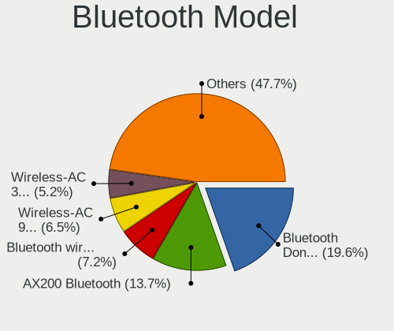

| Model                                                                | Desktops | Percent |
|----------------------------------------------------------------------|----------|---------|
| Cambridge Silicon Radio Bluetooth Dongle (HCI mode)                  | 25       | 22.94%  |
| Intel AX200 Bluetooth                                                | 15       | 13.76%  |
| Intel Bluetooth wireless interface                                   | 10       | 9.17%   |
| Intel Wireless-AC 9260 Bluetooth Adapter                             | 8        | 7.34%   |
| Intel Wireless-AC 3168 Bluetooth                                     | 7        | 6.42%   |
| Intel AX210 Bluetooth                                                | 5        | 4.59%   |
| Broadcom BCM20702A0 Bluetooth 4.0                                    | 5        | 4.59%   |
| MediaTek Wireless_Device                                             | 4        | 3.67%   |
| ASUS Bluetooth Radio                                                 | 3        | 2.75%   |
| Realtek Bluetooth Radio                                              | 2        | 1.83%   |
| Ralink RT3290 Bluetooth                                              | 2        | 1.83%   |
| Qualcomm Atheros  Bluetooth Device                                   | 2        | 1.83%   |
| Intel Bluetooth 9460/9560 Jefferson Peak (JfP)                       | 2        | 1.83%   |
| IMC Networks Wireless_Device                                         | 2        | 1.83%   |
| Foxconn / Hon Hai Wireless_Device                                    | 2        | 1.83%   |
| Edimax Bluetooth Adapter                                             | 2        | 1.83%   |
| Broadcom HP Portable Bumble Bee                                      | 2        | 1.83%   |
| Realtek  Bluetooth 4.2 Adapter                                       | 1        | 0.92%   |
| Qualcomm Atheros QCA61x4 Bluetooth 4.0                               | 1        | 0.92%   |
| Qualcomm Atheros AR3011 Bluetooth                                    | 1        | 0.92%   |
| Intel AX201 Bluetooth                                                | 1        | 0.92%   |
| Integrated System Solution KY-BT100 Bluetooth Adapter                | 1        | 0.92%   |
| IMC Networks Bluetooth Radio                                         | 1        | 0.92%   |
| HTC (High Tech Computer) Vive Hub Bluetooth 4.1 (Broadcom BCM920703) | 1        | 0.92%   |
| ASUS Qualcomm Bluetooth 4.1                                          | 1        | 0.92%   |
| ASUS Bluetooth Device                                                | 1        | 0.92%   |
| ASUS BCM20702A0                                                      | 1        | 0.92%   |
| Apple Bluetooth Host Controller                                      | 1        | 0.92%   |

Sound
-----

Sound Vendor
------------

Sound card vendors

| Vendor                      | Desktops | Percent |
|-----------------------------|----------|---------|
| Intel                       | 184      | 32.8%   |
| AMD                         | 166      | 29.59%  |
| Nvidia                      | 123      | 21.93%  |
| C-Media Electronics         | 17       | 3.03%   |
| Logitech                    | 16       | 2.85%   |
| Kingston Technology         | 6        | 1.07%   |
| SteelSeries ApS             | 5        | 0.89%   |
| Generalplus Technology      | 4        | 0.71%   |
| Razer USA                   | 3        | 0.53%   |
| JMTek                       | 3        | 0.53%   |
| GN Netcom                   | 3        | 0.53%   |
| XMOS                        | 2        | 0.36%   |
| GYROCOM C&C                 | 2        | 0.36%   |
| FiiO Electronics Technology | 2        | 0.36%   |
| Dell                        | 2        | 0.36%   |
| Creative Technology         | 2        | 0.36%   |
| ASUSTek Computer            | 2        | 0.36%   |
| AKAI Professional M.I.      | 2        | 0.36%   |
| Texas Instruments           | 1        | 0.18%   |
| RODE Microphones            | 1        | 0.18%   |
| RME                         | 1        | 0.18%   |
| Microsoft                   | 1        | 0.18%   |
| Medeli Electronics          | 1        | 0.18%   |
| Lenovo                      | 1        | 0.18%   |
| KTMicro                     | 1        | 0.18%   |
| Giga-Byte Technology        | 1        | 0.18%   |
| Creative Labs               | 1        | 0.18%   |
| Cambridge Silicon Radio     | 1        | 0.18%   |
| BR23                        | 1        | 0.18%   |
| Blue Microphones            | 1        | 0.18%   |
| AudioQuest                  | 1        | 0.18%   |
| Audio-Technica              | 1        | 0.18%   |
| Astro Gaming                | 1        | 0.18%   |
| Asahi Kasei Microsystems    | 1        | 0.18%   |
| Apogee Electronics          | 1        | 0.18%   |

Sound Model
-----------

Sound card models

| Model                                                                             | Desktops | Percent |
|-----------------------------------------------------------------------------------|----------|---------|
| AMD Starship/Matisse HD Audio Controller                                          | 40       | 6.05%   |
| Intel 7 Series/C216 Chipset Family High Definition Audio Controller               | 29       | 4.39%   |
| AMD SBx00 Azalia (Intel HDA)                                                      | 25       | 3.78%   |
| AMD Family 17h (Models 00h-0fh) HD Audio Controller                               | 22       | 3.33%   |
| Intel 6 Series/C200 Series Chipset Family High Definition Audio Controller        | 21       | 3.18%   |
| Intel 8 Series/C220 Series Chipset High Definition Audio Controller               | 20       | 3.03%   |
| AMD Ellesmere HDMI Audio [Radeon RX 470/480 / 570/580/590]                        | 20       | 3.03%   |
| Intel Xeon E3-1200 v3/4th Gen Core Processor HD Audio Controller                  | 19       | 2.87%   |
| AMD Family 17h/19h HD Audio Controller                                            | 19       | 2.87%   |
| AMD Navi 21/23 HDMI/DP Audio Controller                                           | 14       | 2.12%   |
| Intel 200 Series PCH HD Audio                                                     | 13       | 1.97%   |
| Intel 100 Series/C230 Series Chipset Family HD Audio Controller                   | 13       | 1.97%   |
| Intel 9 Series Chipset Family HD Audio Controller                                 | 10       | 1.51%   |
| Intel 5 Series/3400 Series Chipset High Definition Audio                          | 10       | 1.51%   |
| AMD Renoir Radeon High Definition Audio Controller                                | 10       | 1.51%   |
| AMD Oland/Hainan/Cape Verde/Pitcairn HDMI Audio [Radeon HD 7000 Series]           | 10       | 1.51%   |
| Nvidia GK208 HDMI/DP Audio Controller                                             | 9        | 1.36%   |
| Intel 82801JI (ICH10 Family) HD Audio Controller                                  | 9        | 1.36%   |
| AMD Navi 10 HDMI Audio                                                            | 9        | 1.36%   |
| AMD Cedar HDMI Audio [Radeon HD 5400/6300/7300 Series]                            | 9        | 1.36%   |
| Nvidia GP107GL High Definition Audio Controller                                   | 8        | 1.21%   |
| Nvidia GP106 High Definition Audio Controller                                     | 8        | 1.21%   |
| Nvidia GP102 HDMI Audio Controller                                                | 8        | 1.21%   |
| Intel 82801JD/DO (ICH10 Family) HD Audio Controller                               | 8        | 1.21%   |
| AMD FCH Azalia Controller                                                         | 8        | 1.21%   |
| Nvidia GP104 High Definition Audio Controller                                     | 7        | 1.06%   |
| Nvidia GK107 HDMI Audio Controller                                                | 7        | 1.06%   |
| Intel NM10/ICH7 Family High Definition Audio Controller                           | 7        | 1.06%   |
| Nvidia GP108 High Definition Audio Controller                                     | 6        | 0.91%   |
| Nvidia GA102 High Definition Audio Controller                                     | 6        | 0.91%   |
| Intel Cannon Lake PCH cAVS                                                        | 6        | 0.91%   |
| C-Media Electronics Audio Adapter (Unitek Y-247A)                                 | 6        | 0.91%   |
| AMD Rembrandt Radeon High Definition Audio Controller                             | 6        | 0.91%   |
| AMD Caicos HDMI Audio [Radeon HD 6450 / 7450/8450/8490 OEM / R5 230/235/235X OEM] | 6        | 0.91%   |
| Nvidia High Definition Audio Controller                                           | 5        | 0.76%   |
| Nvidia GK104 HDMI Audio Controller                                                | 5        | 0.76%   |
| Nvidia GA104 High Definition Audio Controller                                     | 5        | 0.76%   |
| Intel Smart Sound Technology (SST) Audio Controller                               | 5        | 0.76%   |
| Intel Comet Lake PCH cAVS                                                         | 5        | 0.76%   |
| Intel C600/X79 series chipset High Definition Audio Controller                    | 5        | 0.76%   |

Memory
------

Memory Vendor
-------------

Memory module vendors

| Vendor              | Desktops | Percent |
|---------------------|----------|---------|
| G.Skill             | 34       | 19.88%  |
| Kingston            | 24       | 14.04%  |
| Unknown             | 18       | 10.53%  |
| SK hynix            | 17       | 9.94%   |
| Corsair             | 15       | 8.77%   |
| Samsung Electronics | 13       | 7.6%    |
| Crucial             | 13       | 7.6%    |
| A-DATA Technology   | 10       | 5.85%   |
| Team                | 6        | 3.51%   |
| Micron Technology   | 5        | 2.92%   |
| Transcend           | 2        | 1.17%   |
| Strontium           | 2        | 1.17%   |
| PNY                 | 2        | 1.17%   |
| Hewlett-Packard     | 2        | 1.17%   |
| Elpida              | 2        | 1.17%   |
| Unknown (ABCD)      | 1        | 0.58%   |
| Ramaxel Technology  | 1        | 0.58%   |
| pqi                 | 1        | 0.58%   |
| OCZ                 | 1        | 0.58%   |
| Nanya Technology    | 1        | 0.58%   |
| Innodisk            | 1        | 0.58%   |

Memory Model
------------

Memory module models

| Model                                                          | Desktops | Percent |
|----------------------------------------------------------------|----------|---------|
| G.Skill RAM F4-3600C16-16GTZNC 16GB DIMM DDR4 3600MT/s         | 4        | 2.21%   |
| Team RAM TEAMGROUP-UD4-3600 8GB DIMM DDR4 3600MT/s             | 3        | 1.66%   |
| G.Skill RAM F4-3200C16-16GVK 16GB DIMM DDR4 3600MT/s           | 3        | 1.66%   |
| Unknown RAM Module 8GB DIMM 1600MT/s                           | 2        | 1.1%    |
| Unknown RAM Module 2048MB DIMM DDR3 1333MT/s                   | 2        | 1.1%    |
| SK hynix RAM HMT351S6CFR8C-PB 4GB SODIMM DDR3 1600MT/s         | 2        | 1.1%    |
| SK hynix RAM HMT325U6CFR8C-H9 2GB DIMM DDR3 1333MT/s           | 2        | 1.1%    |
| Samsung RAM M378B5673EH1-CH9 2GB DIMM DDR3 1333MT/s            | 2        | 1.1%    |
| Kingston RAM KHX3200C16D4/16GX 16GB DIMM DDR4 3600MT/s         | 2        | 1.1%    |
| Kingston RAM KHX2666C16/8G 8GB DIMM DDR4 3466MT/s              | 2        | 1.1%    |
| Kingston RAM 9905403-011.A03LF 2GB DIMM DDR3 1333MT/s          | 2        | 1.1%    |
| G.Skill RAM F4-3200C16-8GTZR 8GB DIMM DDR4 3200MT/s            | 2        | 1.1%    |
| G.Skill RAM F4-3200C16-8GTZB 8GB DIMM DDR4 3200MT/s            | 2        | 1.1%    |
| G.Skill RAM F4-2666C15-8GVR 8GB DIMM DDR4 2800MT/s             | 2        | 1.1%    |
| G.Skill RAM F3-1600C9-4GAB 4GB DIMM DDR3 1600MT/s              | 2        | 1.1%    |
| G.Skill RAM F3-14900CL10-8GBXL 8GB DIMM DDR3 1867MT/s          | 2        | 1.1%    |
| Crucial RAM CT102464BD160B.C16 8GB DIMM DDR3 1600MT/s          | 2        | 1.1%    |
| Crucial RAM CT102464BA160B.C16 8GB DIMM DDR3 1600MT/s          | 2        | 1.1%    |
| Corsair RAM CMW32GX4M2C3200C16 16GB DIMM DDR4 3400MT/s         | 2        | 1.1%    |
| Corsair RAM CMK64GX5M2B5600Z40 32GB DIMM DDR5 5600MT/s         | 2        | 1.1%    |
| Corsair RAM CMK32GX4M2B3200C16 16GB DIMM DDR4 3800MT/s         | 2        | 1.1%    |
| Unknown RAM Module 8GB DIMM DDR3 1333MT/s                      | 1        | 0.55%   |
| Unknown RAM Module 8GB DIMM 1066MT/s                           | 1        | 0.55%   |
| Unknown RAM Module 8192MB DIMM 667MT/s                         | 1        | 0.55%   |
| Unknown RAM Module 8192MB DIMM 1600MT/s                        | 1        | 0.55%   |
| Unknown RAM Module 4GB DIMM DDR2 266MT/s                       | 1        | 0.55%   |
| Unknown RAM Module 4GB DIMM 800MT/s                            | 1        | 0.55%   |
| Unknown RAM Module 4GB DIMM                                    | 1        | 0.55%   |
| Unknown RAM Module 4096MB DIMM SDRAM 1066MT/s                  | 1        | 0.55%   |
| Unknown RAM Module 4096MB DIMM DDR3 1333MT/s                   | 1        | 0.55%   |
| Unknown RAM Module 4096MB DIMM DDR2 1067MT/s                   | 1        | 0.55%   |
| Unknown RAM Module 2GB DIMM DDR3 1600MT/s                      | 1        | 0.55%   |
| Unknown RAM Module 2GB DIMM DDR2 266MT/s                       | 1        | 0.55%   |
| Unknown RAM Module 2GB DIMM 800MT/s                            | 1        | 0.55%   |
| Unknown RAM Module 2048MB DIMM DDR2 800MT/s                    | 1        | 0.55%   |
| Unknown RAM Module 2048MB DIMM DDR 1333MT/s                    | 1        | 0.55%   |
| Unknown RAM Module 1024MB DIMM DDR2 800MT/s                    | 1        | 0.55%   |
| Unknown (ABCD) RAM 123456789012345678 2GB DIMM LPDDR4 2400MT/s | 1        | 0.55%   |
| Transcend RAM TS512MSK64V3N 4GB SODIMM DDR3 1333MT/s           | 1        | 0.55%   |
| Transcend RAM JM1333KLN-4GK 2048MB DIMM DDR3 1333MT/s          | 1        | 0.55%   |

Memory Kind
-----------

Memory module kinds

| Kind    | Desktops | Percent |
|---------|----------|---------|
| DDR4    | 69       | 48.25%  |
| DDR3    | 48       | 33.57%  |
| Unknown | 9        | 6.29%   |
| DDR5    | 6        | 4.2%    |
| SDRAM   | 5        | 3.5%    |
| DDR2    | 4        | 2.8%    |
| LPDDR4  | 1        | 0.7%    |
| DDR     | 1        | 0.7%    |

Memory Form Factor
------------------

Physical design of the memory module

| Name   | Desktops | Percent |
|--------|----------|---------|
| DIMM   | 130      | 92.2%   |
| SODIMM | 11       | 7.8%    |

Memory Size
-----------

Memory module size

| Size  | Desktops | Percent |
|-------|----------|---------|
| 8192  | 53       | 34.42%  |
| 16384 | 34       | 22.08%  |
| 4096  | 33       | 21.43%  |
| 2048  | 19       | 12.34%  |
| 32768 | 12       | 7.79%   |
| 1024  | 3        | 1.95%   |

Memory Speed
------------

Memory module speed

| Speed   | Desktops | Percent |
|---------|----------|---------|
| 1600    | 31       | 19.75%  |
| 3600    | 22       | 14.01%  |
| 1333    | 18       | 11.46%  |
| 3200    | 15       | 9.55%   |
| 3800    | 6        | 3.82%   |
| 3733    | 6        | 3.82%   |
| 2400    | 5        | 3.18%   |
| 2133    | 5        | 3.18%   |
| 1867    | 5        | 3.18%   |
| 2667    | 4        | 2.55%   |
| 2666    | 4        | 2.55%   |
| 800     | 4        | 2.55%   |
| 2800    | 3        | 1.91%   |
| 1066    | 3        | 1.91%   |
| 6400    | 2        | 1.27%   |
| 5600    | 2        | 1.27%   |
| 3466    | 2        | 1.27%   |
| 3400    | 2        | 1.27%   |
| 1800    | 2        | 1.27%   |
| 667     | 2        | 1.27%   |
| 6000    | 1        | 0.64%   |
| 4800    | 1        | 0.64%   |
| 3534    | 1        | 0.64%   |
| 3151    | 1        | 0.64%   |
| 3000    | 1        | 0.64%   |
| 2933    | 1        | 0.64%   |
| 2465    | 1        | 0.64%   |
| 2448    | 1        | 0.64%   |
| 2048    | 1        | 0.64%   |
| 2000    | 1        | 0.64%   |
| 1866    | 1        | 0.64%   |
| 1067    | 1        | 0.64%   |
| 266     | 1        | 0.64%   |
| Unknown | 1        | 0.64%   |

Printers & scanners
-------------------

Printer Vendor
--------------

Printer device vendors

| Vendor             | Desktops | Percent |
|--------------------|----------|---------|
| Brother Industries | 8        | 42.11%  |
| Hewlett-Packard    | 6        | 31.58%  |
| Canon              | 3        | 15.79%  |
| Fuji Xerox         | 1        | 5.26%   |
| Dymo-CoStar        | 1        | 5.26%   |

Printer Model
-------------

Printer device models

| Model                            | Desktops | Percent |
|----------------------------------|----------|---------|
| HP Officejet 4630 series         | 2        | 10.53%  |
| Brother Printer                  | 2        | 10.53%  |
| HP OfficeJet 8010 series         | 1        | 5.26%   |
| HP LaserJet Professional P1102w  | 1        | 5.26%   |
| HP ENVY 4520 series              | 1        | 5.26%   |
| HP DeskJet 2130 series           | 1        | 5.26%   |
| Fuji Xerox DocuPrint CM315/318 z | 1        | 5.26%   |
| Dymo-CoStar LabelWriter 450      | 1        | 5.26%   |
| Canon TS3100 series              | 1        | 5.26%   |
| Canon MB5300 series              | 1        | 5.26%   |
| Canon i950                       | 1        | 5.26%   |
| Brother MFC-J430W                | 1        | 5.26%   |
| Brother MFC-9140CDN              | 1        | 5.26%   |
| Brother MFC-7340                 | 1        | 5.26%   |
| Brother HL-L3230CDW series       | 1        | 5.26%   |
| Brother HL-2270DW Laser Printer  | 1        | 5.26%   |
| Brother HL-1430 Laser Printer    | 1        | 5.26%   |

Scanner Vendor
--------------

Scanner device vendors

| Vendor | Desktops | Percent |
|--------|----------|---------|
| Canon  | 1        | 100%    |

Scanner Model
-------------

Scanner device models

| Model                    | Desktops | Percent |
|--------------------------|----------|---------|
| Canon CanoScan LiDE 500F | 1        | 100%    |

Camera
------

Camera Vendor
-------------

Camera device vendors

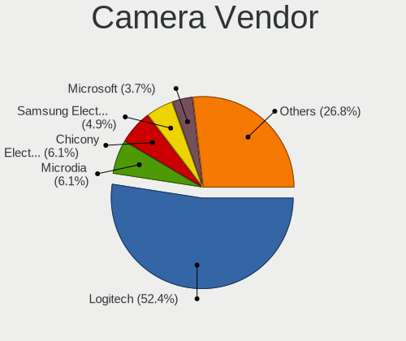

| Vendor                      | Desktops | Percent |
|-----------------------------|----------|---------|
| Logitech                    | 31       | 48.44%  |
| Microdia                    | 5        | 7.81%   |
| Samsung Electronics         | 3        | 4.69%   |
| GEMBIRD                     | 3        | 4.69%   |
| Chicony Electronics         | 3        | 4.69%   |
| ARC International           | 3        | 4.69%   |
| Microsoft                   | 2        | 3.13%   |
| KYE Systems (Mouse Systems) | 2        | 3.13%   |
| Z-Star Microelectronics     | 1        | 1.56%   |
| Xiongmai                    | 1        | 1.56%   |
| SJ-180517-N                 | 1        | 1.56%   |
| Realtek Semiconductor       | 1        | 1.56%   |
| Novatek Microelectronics    | 1        | 1.56%   |
| MacroSilicon                | 1        | 1.56%   |
| Lenovo                      | 1        | 1.56%   |
| Google                      | 1        | 1.56%   |
| Generalplus Technology      | 1        | 1.56%   |
| EVGA                        | 1        | 1.56%   |
| Asuscom Network             | 1        | 1.56%   |
| Arkmicro Technologies       | 1        | 1.56%   |

Camera Model
------------

Camera device models

| Model                                             | Desktops | Percent |
|---------------------------------------------------|----------|---------|
| Logitech Webcam C270                              | 6        | 9.38%   |
| Logitech Webcam C170                              | 6        | 9.38%   |
| Samsung Galaxy series, misc. (MTP mode)           | 3        | 4.69%   |
| Logitech QuickCam Pro 9000                        | 3        | 4.69%   |
| Logitech HD Pro Webcam C920                       | 3        | 4.69%   |
| ARC International Camera                          | 3        | 4.69%   |
| Microsoft LifeCam HD-3000                         | 2        | 3.13%   |
| Logitech Webcam Pro 9000                          | 2        | 3.13%   |
| Logitech Webcam C600                              | 2        | 3.13%   |
| Logitech HD Webcam C615                           | 2        | 3.13%   |
| Logitech HD Webcam C525                           | 2        | 3.13%   |
| Logitech C922 Pro Stream Webcam                   | 2        | 3.13%   |
| GEMBIRD Generic UVC 1.00 camera [AppoTech AX2311] | 2        | 3.13%   |
| Z-Star Venus USB2.0 Camera                        | 1        | 1.56%   |
| Xiongmai web camera                               | 1        | 1.56%   |
| SJ-180517-N 1080P Webcam                          | 1        | 1.56%   |
| Realtek HD 720P Webcam                            | 1        | 1.56%   |
| Novatek HP High Definition 2MP Webcam             | 1        | 1.56%   |
| Microdia USB Microscope                           | 1        | 1.56%   |
| Microdia USB 2.0 Camera                           | 1        | 1.56%   |
| Microdia Sonix USB 2.0 Camera                     | 1        | 1.56%   |
| Microdia Integrated Camera                        | 1        | 1.56%   |
| Microdia Camera                                   | 1        | 1.56%   |
| MacroSilicon USB3. 0 capture                      | 1        | 1.56%   |
| Logitech Webcam C300                              | 1        | 1.56%   |
| Logitech Mic (Fusion)                             | 1        | 1.56%   |
| Logitech HD Webcam C510                           | 1        | 1.56%   |
| Lenovo FULL HD 1080P Webcam                       | 1        | 1.56%   |
| KYE Systems (Mouse Systems) FaceCam 3000          | 1        | 1.56%   |
| KYE Systems (Mouse Systems) FaceCam 1000X         | 1        | 1.56%   |
| Google Nexus/Pixel Device (MTP + debug)           | 1        | 1.56%   |
| Generalplus GENERAL WEBCAM                        | 1        | 1.56%   |
| GEMBIRD USB2.0 PC CAMERA                          | 1        | 1.56%   |
| EVGA XR1 Capture Box                              | 1        | 1.56%   |
| Chicony HP High Definition Webcam                 | 1        | 1.56%   |
| Chicony HP High Definition 1MP Webcam             | 1        | 1.56%   |
| Chicony CNF7042                                   | 1        | 1.56%   |
| Asuscom Network w300                              | 1        | 1.56%   |
| Arkmicro Webcam Carrefour                         | 1        | 1.56%   |

Security
--------

Fingerprint Vendor
------------------

Fingerprint sensor vendors

| Vendor    | Desktops | Percent |
|-----------|----------|---------|
| AuthenTec | 1        | 100%    |

Fingerprint Model
-----------------

Fingerprint sensor models

| Model                                | Desktops | Percent |
|--------------------------------------|----------|---------|
| AuthenTec AES2550 Fingerprint Sensor | 1        | 100%    |

Chipcard Vendor
---------------

Chipcard module vendors

Zero info for selected period =(

Chipcard Model
--------------

Chipcard module models

Zero info for selected period =(

Unsupported
-----------

Unsupported Devices
-------------------

Total unsupported devices on board

| Total | Desktops | Percent |
|-------|----------|---------|
| 0     | 276      | 81.66%  |
| 1     | 56       | 16.57%  |
| 2     | 5        | 1.48%   |
| 5     | 1        | 0.3%    |

Unsupported Device Types
------------------------

Types of unsupported devices

| Type                     | Desktops | Percent |
|--------------------------|----------|---------|
| Graphics card            | 21       | 31.34%  |
| Net/wireless             | 20       | 29.85%  |
| Bluetooth                | 6        | 8.96%   |
| Multimedia controller    | 4        | 5.97%   |
| Unassigned class         | 3        | 4.48%   |
| Sound                    | 3        | 4.48%   |
| Dvb card                 | 3        | 4.48%   |
| Storage/ide              | 2        | 2.99%   |
| Communication controller | 2        | 2.99%   |
| Storage/raid             | 1        | 1.49%   |
| Modem                    | 1        | 1.49%   |
| Fingerprint reader       | 1        | 1.49%   |

