Linux in New Zealand - Tested Hardware & Statistics (Desktops)
--------------------------------------------------------------

A project to collect tested hardware configurations for Linux in New Zealand.

Anyone can contribute to this report by the [hw-probe](https://github.com/linuxhw/hw-probe) tool:

    sudo -E hw-probe -all -upload

Please contribute! Especially if your hardware is rare.

Contents
--------

* [ Test Cases ](#test-cases)

* [ System ](#system)
  - [ OS                       ](#os)
  - [ OS Family                ](#os-family)
  - [ Kernel                   ](#kernel)
  - [ Kernel Family            ](#kernel-family)
  - [ Kernel Major Ver.        ](#kernel-major-ver)
  - [ Arch                     ](#arch)
  - [ DE                       ](#de)
  - [ Display Server           ](#display-server)
  - [ Display Manager          ](#display-manager)
  - [ OS Lang                  ](#os-lang)
  - [ Boot Mode                ](#boot-mode)
  - [ Filesystem               ](#filesystem)
  - [ Part. scheme             ](#part-scheme)
  - [ Dual Boot with Linux/BSD ](#dual-boot-with-linuxbsd)
  - [ Dual Boot (Win)          ](#dual-boot-win)

* [ Board ](#board)
  - [ Vendor                   ](#vendor)
  - [ Model                    ](#model)
  - [ Model Family             ](#model-family)
  - [ MFG Year                 ](#mfg-year)
  - [ Form Factor              ](#form-factor)
  - [ Secure Boot              ](#secure-boot)
  - [ Coreboot                 ](#coreboot)
  - [ RAM Size                 ](#ram-size)
  - [ RAM Used                 ](#ram-used)
  - [ Total Drives             ](#total-drives)
  - [ Has CD-ROM               ](#has-cd-rom)
  - [ Has Ethernet             ](#has-ethernet)
  - [ Has WiFi                 ](#has-wifi)
  - [ Has Bluetooth            ](#has-bluetooth)

* [ Location ](#location)
  - [ Country                  ](#country)
  - [ City                     ](#city)

* [ Drives ](#drives)
  - [ Drive Vendor             ](#drive-vendor)
  - [ Drive Model              ](#drive-model)
  - [ HDD Vendor               ](#hdd-vendor)
  - [ SSD Vendor               ](#ssd-vendor)
  - [ Drive Kind               ](#drive-kind)
  - [ Drive Connector          ](#drive-connector)
  - [ Drive Size               ](#drive-size)
  - [ Space Total              ](#space-total)
  - [ Space Used               ](#space-used)
  - [ Malfunc. Drives          ](#malfunc-drives)
  - [ Malfunc. Drive Vendor    ](#malfunc-drive-vendor)
  - [ Malfunc. HDD Vendor      ](#malfunc-hdd-vendor)
  - [ Malfunc. Drive Kind      ](#malfunc-drive-kind)
  - [ Failed Drives            ](#failed-drives)
  - [ Failed Drive Vendor      ](#failed-drive-vendor)
  - [ Drive Status             ](#drive-status)

* [ Storage controller ](#storage-controller)
  - [ Storage Vendor           ](#storage-vendor)
  - [ Storage Model            ](#storage-model)
  - [ Storage Kind             ](#storage-kind)

* [ Processor ](#processor)
  - [ CPU Vendor               ](#cpu-vendor)
  - [ CPU Model                ](#cpu-model)
  - [ CPU Model Family         ](#cpu-model-family)
  - [ CPU Cores                ](#cpu-cores)
  - [ CPU Sockets              ](#cpu-sockets)
  - [ CPU Threads              ](#cpu-threads)
  - [ CPU Op-Modes             ](#cpu-op-modes)
  - [ CPU Microcode            ](#cpu-microcode)
  - [ CPU Microarch            ](#cpu-microarch)

* [ Graphics ](#graphics)
  - [ GPU Vendor               ](#gpu-vendor)
  - [ GPU Model                ](#gpu-model)
  - [ GPU Combo                ](#gpu-combo)
  - [ GPU Driver               ](#gpu-driver)
  - [ GPU Memory               ](#gpu-memory)

* [ Monitor ](#monitor)
  - [ Monitor Vendor           ](#monitor-vendor)
  - [ Monitor Model            ](#monitor-model)
  - [ Monitor Resolution       ](#monitor-resolution)
  - [ Monitor Diagonal         ](#monitor-diagonal)
  - [ Monitor Width            ](#monitor-width)
  - [ Aspect Ratio             ](#aspect-ratio)
  - [ Monitor Area             ](#monitor-area)
  - [ Pixel Density            ](#pixel-density)
  - [ Multiple Monitors        ](#multiple-monitors)

* [ Network ](#network)
  - [ Net Controller Vendor    ](#net-controller-vendor)
  - [ Net Controller Model     ](#net-controller-model)
  - [ Wireless Vendor          ](#wireless-vendor)
  - [ Wireless Model           ](#wireless-model)
  - [ Ethernet Vendor          ](#ethernet-vendor)
  - [ Ethernet Model           ](#ethernet-model)
  - [ Net Controller Kind      ](#net-controller-kind)
  - [ Used Controller          ](#used-controller)
  - [ NICs                     ](#nics)
  - [ IPv6                     ](#ipv6)

* [ Bluetooth ](#bluetooth)
  - [ Bluetooth Vendor         ](#bluetooth-vendor)
  - [ Bluetooth Model          ](#bluetooth-model)

* [ Sound ](#sound)
  - [ Sound Vendor             ](#sound-vendor)
  - [ Sound Model              ](#sound-model)

* [ Memory ](#memory)
  - [ Memory Vendor            ](#memory-vendor)
  - [ Memory Model             ](#memory-model)
  - [ Memory Kind              ](#memory-kind)
  - [ Memory Form Factor       ](#memory-form-factor)
  - [ Memory Size              ](#memory-size)
  - [ Memory Speed             ](#memory-speed)

* [ Printers & scanners ](#printers--scanners)
  - [ Printer Vendor           ](#printer-vendor)
  - [ Printer Model            ](#printer-model)
  - [ Scanner Vendor           ](#scanner-vendor)
  - [ Scanner Model            ](#scanner-model)

* [ Camera ](#camera)
  - [ Camera Vendor            ](#camera-vendor)
  - [ Camera Model             ](#camera-model)

* [ Security ](#security)
  - [ Fingerprint Vendor       ](#fingerprint-vendor)
  - [ Fingerprint Model        ](#fingerprint-model)
  - [ Chipcard Vendor          ](#chipcard-vendor)
  - [ Chipcard Model           ](#chipcard-model)

* [ Unsupported ](#unsupported)
  - [ Unsupported Devices      ](#unsupported-devices)
  - [ Unsupported Device Types ](#unsupported-device-types)

Test Cases
----------

Total: 400

| Vendor        | Model                       | Probe                                                      | Date         |
|---------------|-----------------------------|------------------------------------------------------------|--------------|
| HP            | 1495                        | [138b5bb823](https://linux-hardware.org/?probe=138b5bb823) | Dec 01, 2022 |
| ASUSTek       | M4A87TD/USB3                | [81a2eaf6e4](https://linux-hardware.org/?probe=81a2eaf6e4) | Nov 24, 2022 |
| ASUSTek       | P5GC-MX/1333                | [dd85fb5c80](https://linux-hardware.org/?probe=dd85fb5c80) | Nov 22, 2022 |
| ASUSTek       | ROG STRIX X470-F GAMING     | [9d942ddc9c](https://linux-hardware.org/?probe=9d942ddc9c) | Nov 13, 2022 |
| HP            | 339A                        | [c995f831b8](https://linux-hardware.org/?probe=c995f831b8) | Nov 13, 2022 |
| Gigabyte      | H77M-D3H                    | [2382574dbd](https://linux-hardware.org/?probe=2382574dbd) | Nov 12, 2022 |
| Gigabyte      | AB350-Gaming 3-CF           | [226409c98f](https://linux-hardware.org/?probe=226409c98f) | Nov 09, 2022 |
| ASUSTek       | TUF Gaming X570-PLUS        | [b414369067](https://linux-hardware.org/?probe=b414369067) | Nov 07, 2022 |
| ASUSTek       | TUF Gaming X570-PLUS        | [27bc8e172c](https://linux-hardware.org/?probe=27bc8e172c) | Nov 04, 2022 |
| ASUSTek       | ROG STRIX X570-E GAMING     | [9e7c028b0b](https://linux-hardware.org/?probe=9e7c028b0b) | Oct 27, 2022 |
| Gigabyte      | B560M DS3H AC               | [e939a5f236](https://linux-hardware.org/?probe=e939a5f236) | Oct 19, 2022 |
| ASUSTek       | ROG STRIX X570-E GAMING     | [93698d1670](https://linux-hardware.org/?probe=93698d1670) | Oct 05, 2022 |
| ASUSTek       | ROG STRIX B550-F GAMING     | [bc03e42377](https://linux-hardware.org/?probe=bc03e42377) | Oct 03, 2022 |
| Gigabyte      | H270-Gaming 3               | [9426d21070](https://linux-hardware.org/?probe=9426d21070) | Sep 29, 2022 |
| Gigabyte      | H270-Gaming 3               | [830af9c53e](https://linux-hardware.org/?probe=830af9c53e) | Sep 29, 2022 |
| ASUSTek       | M5A97 R2.0                  | [9b3c73c104](https://linux-hardware.org/?probe=9b3c73c104) | Sep 28, 2022 |
| ASUSTek       | M5A97 R2.0                  | [4cdcef3ebd](https://linux-hardware.org/?probe=4cdcef3ebd) | Sep 28, 2022 |
| ASUSTek       | P5G41T-M LX                 | [8e429edcd6](https://linux-hardware.org/?probe=8e429edcd6) | Sep 25, 2022 |
| ASUSTek       | P5G41T-M LX                 | [74e31be1be](https://linux-hardware.org/?probe=74e31be1be) | Sep 19, 2022 |
| Gigabyte      | AB350-Gaming 3-CF           | [9bfc1472d1](https://linux-hardware.org/?probe=9bfc1472d1) | Sep 16, 2022 |
| Lenovo        | 3708 SDK0J40700 WIN 3258... | [4db3f9151e](https://linux-hardware.org/?probe=4db3f9151e) | Sep 11, 2022 |
| Gigabyte      | Z68AP-D3                    | [1ac8cbcc47](https://linux-hardware.org/?probe=1ac8cbcc47) | Sep 10, 2022 |
| Dell          | 0T10XW A02                  | [33faaf5341](https://linux-hardware.org/?probe=33faaf5341) | Sep 10, 2022 |
| Dell          | 0M863N A01                  | [a353883ee2](https://linux-hardware.org/?probe=a353883ee2) | Sep 07, 2022 |
| MSI           | MS-98H3                     | [41ad960dd6](https://linux-hardware.org/?probe=41ad960dd6) | Sep 06, 2022 |
| Gigabyte      | B85M-HD3                    | [dcb5e7a20c](https://linux-hardware.org/?probe=dcb5e7a20c) | Aug 29, 2022 |
| Gigabyte      | M61PME-S2                   | [8f8107b683](https://linux-hardware.org/?probe=8f8107b683) | Aug 27, 2022 |
| Gigabyte      | M61PME-S2                   | [e3b89ab2db](https://linux-hardware.org/?probe=e3b89ab2db) | Aug 27, 2022 |
| Dell          | 073MMW A03                  | [b41e0fcad5](https://linux-hardware.org/?probe=b41e0fcad5) | Aug 24, 2022 |
| ASUSTek       | PRIME Z370-A II             | [d7dee32799](https://linux-hardware.org/?probe=d7dee32799) | Aug 23, 2022 |
| ASRock        | 890GM Pro3                  | [51f5d50d85](https://linux-hardware.org/?probe=51f5d50d85) | Aug 22, 2022 |
| ASRock        | 890GM Pro3                  | [002a0c3f5a](https://linux-hardware.org/?probe=002a0c3f5a) | Aug 22, 2022 |
| Gigabyte      | Z490 AORUS ELITE AC         | [b12d6e7967](https://linux-hardware.org/?probe=b12d6e7967) | Aug 20, 2022 |
| Gigabyte      | B560M DS3H AC               | [c9e9691195](https://linux-hardware.org/?probe=c9e9691195) | Aug 10, 2022 |
| ASUSTek       | M5A97 EVO R2.0              | [ca1d7dd61b](https://linux-hardware.org/?probe=ca1d7dd61b) | Aug 03, 2022 |
| Gigabyte      | Z68MA-D2H-B3                | [4956d72048](https://linux-hardware.org/?probe=4956d72048) | Aug 01, 2022 |
| ASUSTek       | TUF Gaming X570-PLUS        | [163affcbb8](https://linux-hardware.org/?probe=163affcbb8) | Aug 01, 2022 |
| HP            | 8054                        | [3b76696319](https://linux-hardware.org/?probe=3b76696319) | Jul 27, 2022 |
| Intel         | STK1AW32SC H91596-307       | [78225ba5b9](https://linux-hardware.org/?probe=78225ba5b9) | Jul 21, 2022 |
| HP            | 3397                        | [83bdaea8fc](https://linux-hardware.org/?probe=83bdaea8fc) | Jul 17, 2022 |
| Gigabyte      | H87M-D3H                    | [5056c4f640](https://linux-hardware.org/?probe=5056c4f640) | Jul 13, 2022 |
| Gigabyte      | B460M D3H                   | [d620225518](https://linux-hardware.org/?probe=d620225518) | Jun 30, 2022 |
| Gigabyte      | Z490 AORUS ELITE AC         | [86a93d8ea0](https://linux-hardware.org/?probe=86a93d8ea0) | Jun 29, 2022 |
| Alienware     | 01NYPT A00                  | [97b8d855bd](https://linux-hardware.org/?probe=97b8d855bd) | Jun 28, 2022 |
| Dell          | 0XHGV1 A01                  | [9d9ae107c9](https://linux-hardware.org/?probe=9d9ae107c9) | Jun 25, 2022 |
| ASRock        | X370 Taichi                 | [788acf13f2](https://linux-hardware.org/?probe=788acf13f2) | Jun 24, 2022 |
| Gigabyte      | AB350-Gaming 3-CF           | [d11995947a](https://linux-hardware.org/?probe=d11995947a) | Jun 23, 2022 |
| Dell          | 0XHGV1 A01                  | [656f558626](https://linux-hardware.org/?probe=656f558626) | Jun 23, 2022 |
| HP            | 18E7                        | [2fd690b3b4](https://linux-hardware.org/?probe=2fd690b3b4) | Jun 22, 2022 |
| ASUSTek       | H97M-PLUS                   | [874c85b694](https://linux-hardware.org/?probe=874c85b694) | Jun 17, 2022 |
| ASUSTek       | ROG STRIX X570-E GAMING ... | [38bf9d2a7b](https://linux-hardware.org/?probe=38bf9d2a7b) | Jun 12, 2022 |
| ASUSTek       | ROG STRIX B550-F GAMING     | [a2e10758ca](https://linux-hardware.org/?probe=a2e10758ca) | May 13, 2022 |
| HP            | 1998                        | [b717b34f5b](https://linux-hardware.org/?probe=b717b34f5b) | May 08, 2022 |
| Gigabyte      | AB350-Gaming 3-CF           | [6693954f79](https://linux-hardware.org/?probe=6693954f79) | May 07, 2022 |
| Lenovo        | ThinkCentre M91p 4518E2M    | [2553bf03d1](https://linux-hardware.org/?probe=2553bf03d1) | May 05, 2022 |
| Lenovo        | ThinkCentre M91p 4518E2M    | [03a7fc3c23](https://linux-hardware.org/?probe=03a7fc3c23) | May 05, 2022 |
| ASUSTek       | B150M PRO GAMING            | [a31ab08668](https://linux-hardware.org/?probe=a31ab08668) | May 04, 2022 |
| MSI           | MAG B550M MORTAR            | [c994128afd](https://linux-hardware.org/?probe=c994128afd) | Apr 30, 2022 |
| ASUSTek       | TUF Gaming X570-PLUS        | [7e84138ea1](https://linux-hardware.org/?probe=7e84138ea1) | Apr 29, 2022 |
| Gigabyte      | Z370 HD3-CF                 | [8888cb88d3](https://linux-hardware.org/?probe=8888cb88d3) | Apr 22, 2022 |
| Gigabyte      | Z490 AORUS ELITE AC         | [78a785e4a9](https://linux-hardware.org/?probe=78a785e4a9) | Apr 15, 2022 |
| MSI           | B450 TOMAHAWK MAX           | [5ec598483e](https://linux-hardware.org/?probe=5ec598483e) | Apr 14, 2022 |
| ASUSTek       | PRIME B450M-A               | [d4295c9a47](https://linux-hardware.org/?probe=d4295c9a47) | Apr 14, 2022 |
| ASUSTek       | ROG STRIX X570-E GAMING     | [3ddf8a6825](https://linux-hardware.org/?probe=3ddf8a6825) | Apr 11, 2022 |
| HP            | 1790                        | [5fd16b3e1e](https://linux-hardware.org/?probe=5fd16b3e1e) | Apr 03, 2022 |
| Dell          | 0M017G A00                  | [a7ee814f3a](https://linux-hardware.org/?probe=a7ee814f3a) | Apr 02, 2022 |
| Dell          | 0M863N A01                  | [c05eaeb499](https://linux-hardware.org/?probe=c05eaeb499) | Mar 24, 2022 |
| ASUSTek       | P8H61-M LX3 R2.0            | [cf9c727b0d](https://linux-hardware.org/?probe=cf9c727b0d) | Mar 24, 2022 |
| ASUSTek       | P5E                         | [ec2b80980d](https://linux-hardware.org/?probe=ec2b80980d) | Mar 18, 2022 |
| Gigabyte      | B560M DS3H AC               | [64f278889f](https://linux-hardware.org/?probe=64f278889f) | Mar 13, 2022 |
| HP            | 2ADC                        | [ed0714a64a](https://linux-hardware.org/?probe=ed0714a64a) | Mar 07, 2022 |
| Gigabyte      | B460M DS3H AC               | [5a570f493c](https://linux-hardware.org/?probe=5a570f493c) | Mar 06, 2022 |
| Gigabyte      | H110M-H-CF                  | [5c169a1d32](https://linux-hardware.org/?probe=5c169a1d32) | Feb 25, 2022 |
| ASRock        | B450M Steel Legend          | [dfebbb508b](https://linux-hardware.org/?probe=dfebbb508b) | Feb 24, 2022 |
| ASRock        | B450M Steel Legend          | [26729d3227](https://linux-hardware.org/?probe=26729d3227) | Feb 22, 2022 |
| HP            | 2AF7                        | [116084cb0a](https://linux-hardware.org/?probe=116084cb0a) | Feb 20, 2022 |
| ASUSTek       | P6X58D-E                    | [c7a12417f1](https://linux-hardware.org/?probe=c7a12417f1) | Feb 20, 2022 |
| ASUSTek       | ROG STRIX B550-A GAMING     | [cc2c71140b](https://linux-hardware.org/?probe=cc2c71140b) | Feb 20, 2022 |
| ASUSTek       | ROG STRIX B550-A GAMING     | [4d1d42c8cc](https://linux-hardware.org/?probe=4d1d42c8cc) | Feb 20, 2022 |
| ASRock        | B450M Steel Legend          | [024513d4a8](https://linux-hardware.org/?probe=024513d4a8) | Feb 18, 2022 |
| ASRock        | B450M Steel Legend          | [9bc33ce91e](https://linux-hardware.org/?probe=9bc33ce91e) | Feb 16, 2022 |
| ASRock        | B450M Steel Legend          | [cc420f69ce](https://linux-hardware.org/?probe=cc420f69ce) | Feb 16, 2022 |
| ASUSTek       | P8B75-M                     | [caf1721ebe](https://linux-hardware.org/?probe=caf1721ebe) | Feb 12, 2022 |
| ASUSTek       | CROSSHAIR VI HERO           | [24bd4956b6](https://linux-hardware.org/?probe=24bd4956b6) | Feb 05, 2022 |
| ASUSTek       | ROG STRIX X570-E GAMING     | [d8ec503f66](https://linux-hardware.org/?probe=d8ec503f66) | Jan 21, 2022 |
| MediaVue      | MV-890GX V1.2               | [201163da2f](https://linux-hardware.org/?probe=201163da2f) | Jan 16, 2022 |
| Gigabyte      | X570S AERO G                | [fc3f2a485a](https://linux-hardware.org/?probe=fc3f2a485a) | Jan 08, 2022 |
| Gigabyte      | Z77X-D3H                    | [44cbef1c02](https://linux-hardware.org/?probe=44cbef1c02) | Dec 30, 2021 |
| ASUSTek       | ROG STRIX X570-E GAMING     | [51f97b7e46](https://linux-hardware.org/?probe=51f97b7e46) | Dec 25, 2021 |
| Gigabyte      | B460M DS3H AC               | [7bde1c408f](https://linux-hardware.org/?probe=7bde1c408f) | Dec 21, 2021 |
| Colorful T... | BATTLE-AX B450M-G DELUXE... | [52614e9f8d](https://linux-hardware.org/?probe=52614e9f8d) | Dec 19, 2021 |
| Lenovo        | 3708 SDK0J40700 WIN 3258... | [a6ddae1f31](https://linux-hardware.org/?probe=a6ddae1f31) | Dec 15, 2021 |
| Intel         | DQ87PG AAG74154-403         | [e2a6d57861](https://linux-hardware.org/?probe=e2a6d57861) | Dec 13, 2021 |
| Huanan        | X99-F8 V2.0                 | [71f69762fe](https://linux-hardware.org/?probe=71f69762fe) | Dec 08, 2021 |
| Dell          | 0M863N A01                  | [01a565720c](https://linux-hardware.org/?probe=01a565720c) | Dec 04, 2021 |
| Gigabyte      | B75M-D3H                    | [939cd87ee7](https://linux-hardware.org/?probe=939cd87ee7) | Nov 22, 2021 |
| Gigabyte      | B550 AORUS ELITE AX V2      | [e2bb3dc142](https://linux-hardware.org/?probe=e2bb3dc142) | Nov 21, 2021 |
| HP            | 3396                        | [db69ec8696](https://linux-hardware.org/?probe=db69ec8696) | Nov 17, 2021 |
| HP            | 3396                        | [70fc3e699a](https://linux-hardware.org/?probe=70fc3e699a) | Nov 17, 2021 |
| ASUSTek       | P8Z77-V                     | [c7a18968cf](https://linux-hardware.org/?probe=c7a18968cf) | Nov 03, 2021 |
| MSI           | MAG B365M MORTAR            | [95e40c6343](https://linux-hardware.org/?probe=95e40c6343) | Oct 30, 2021 |
| MSI           | MAG B365M MORTAR            | [f2ce1a8260](https://linux-hardware.org/?probe=f2ce1a8260) | Oct 26, 2021 |
| Gigabyte      | H97M-D3H                    | [349fbeb586](https://linux-hardware.org/?probe=349fbeb586) | Oct 23, 2021 |
| ASUSTek       | PRIME B560-PLUS             | [97bd114229](https://linux-hardware.org/?probe=97bd114229) | Oct 23, 2021 |
| Gigabyte      | B75M-D3H                    | [74c2c9d725](https://linux-hardware.org/?probe=74c2c9d725) | Oct 22, 2021 |
| IBM           | 81Y7071 SVT-R               | [033203aade](https://linux-hardware.org/?probe=033203aade) | Oct 16, 2021 |
| Gigabyte      | B365M HD3                   | [26e0d9a3d9](https://linux-hardware.org/?probe=26e0d9a3d9) | Oct 16, 2021 |
| ASUSTek       | PRIME B450-PLUS             | [530994c225](https://linux-hardware.org/?probe=530994c225) | Oct 11, 2021 |
| MSI           | 2AE0                        | [e5ede0905a](https://linux-hardware.org/?probe=e5ede0905a) | Oct 10, 2021 |
| Gigabyte      | X570 AORUS ELITE WIFI       | [55620348e7](https://linux-hardware.org/?probe=55620348e7) | Oct 08, 2021 |
| Dell          | 0D6H9T A02                  | [42b9320d55](https://linux-hardware.org/?probe=42b9320d55) | Oct 06, 2021 |
| Gigabyte      | X570 UD                     | [636ef76e1e](https://linux-hardware.org/?probe=636ef76e1e) | Oct 05, 2021 |
| ASUSTek       | PRIME Z490M-PLUS            | [5a7e6805d3](https://linux-hardware.org/?probe=5a7e6805d3) | Oct 02, 2021 |
| Gigabyte      | TRX40 AORUS PRO WIFI        | [ca8c02f319](https://linux-hardware.org/?probe=ca8c02f319) | Sep 29, 2021 |
| JGINYUE       | H97I PLUS V2.0              | [2e66de23a2](https://linux-hardware.org/?probe=2e66de23a2) | Sep 28, 2021 |
| Dell          | 0D6H9T A02                  | [30e914656e](https://linux-hardware.org/?probe=30e914656e) | Sep 27, 2021 |
| Gigabyte      | X570 AORUS ELITE WIFI       | [fb59bae064](https://linux-hardware.org/?probe=fb59bae064) | Sep 23, 2021 |
| HP            | 3398                        | [2b8efc01ba](https://linux-hardware.org/?probe=2b8efc01ba) | Sep 22, 2021 |
| HP            | 3398                        | [18b064d0d6](https://linux-hardware.org/?probe=18b064d0d6) | Sep 22, 2021 |
| HP            | 1905                        | [56945cef9c](https://linux-hardware.org/?probe=56945cef9c) | Sep 19, 2021 |
| ASRock        | 970 Pro3 R2.0               | [d172a59c18](https://linux-hardware.org/?probe=d172a59c18) | Sep 14, 2021 |
| Gigabyte      | X570 AORUS ELITE WIFI       | [a7e1713e87](https://linux-hardware.org/?probe=a7e1713e87) | Sep 11, 2021 |
| Intel         | DG33BU AAD79951-407         | [69bbaa38d9](https://linux-hardware.org/?probe=69bbaa38d9) | Sep 08, 2021 |
| ASUSTek       | P6X58D-E                    | [cf4c0a5a4d](https://linux-hardware.org/?probe=cf4c0a5a4d) | Aug 28, 2021 |
| ASRock        | 990FX Killer                | [6dd735449b](https://linux-hardware.org/?probe=6dd735449b) | Aug 27, 2021 |
| Gigabyte      | GA-78LMT-USB3               | [badc363516](https://linux-hardware.org/?probe=badc363516) | Aug 26, 2021 |
| HP            | 304Ah                       | [0898c11493](https://linux-hardware.org/?probe=0898c11493) | Aug 19, 2021 |
| Gigabyte      | G41M-ES2L                   | [996054b23c](https://linux-hardware.org/?probe=996054b23c) | Aug 18, 2021 |
| HP            | 3397                        | [a3425b956c](https://linux-hardware.org/?probe=a3425b956c) | Aug 14, 2021 |
| MSI           | MS-7028 10B                 | [d9d570cae6](https://linux-hardware.org/?probe=d9d570cae6) | Aug 12, 2021 |
| Gigabyte      | Z68AP-D3                    | [8e107590a6](https://linux-hardware.org/?probe=8e107590a6) | Aug 09, 2021 |
| ASUSTek       | P6X58D-E                    | [bd3b6b4f35](https://linux-hardware.org/?probe=bd3b6b4f35) | Jul 28, 2021 |
| ASUSTek       | TUF B450M-PLUS GAMING       | [cd88f96d38](https://linux-hardware.org/?probe=cd88f96d38) | Jul 26, 2021 |
| Gigabyte      | 990FXA-UD3                  | [215f44bec5](https://linux-hardware.org/?probe=215f44bec5) | Jul 24, 2021 |
| ASUSTek       | TUF B450-PLUS GAMING        | [120f3a158c](https://linux-hardware.org/?probe=120f3a158c) | Jul 21, 2021 |
| Gigabyte      | H81M-HD3                    | [72cf6d1ac2](https://linux-hardware.org/?probe=72cf6d1ac2) | Jul 20, 2021 |
| MSI           | B450 GAMING PLUS MAX        | [f410d6449b](https://linux-hardware.org/?probe=f410d6449b) | Jul 19, 2021 |
| MSI           | MS-7028 10B                 | [2c536a7e90](https://linux-hardware.org/?probe=2c536a7e90) | Jul 18, 2021 |
| MSI           | MS-7028 10B                 | [4077783ab8](https://linux-hardware.org/?probe=4077783ab8) | Jul 17, 2021 |
| ASUSTek       | ROG STRIX X570-E GAMING     | [9339298035](https://linux-hardware.org/?probe=9339298035) | Jul 14, 2021 |
| Gigabyte      | P55-UD3                     | [6431c6f93c](https://linux-hardware.org/?probe=6431c6f93c) | Jul 12, 2021 |
| Gigabyte      | P55-UD3                     | [ac267d27d6](https://linux-hardware.org/?probe=ac267d27d6) | Jul 12, 2021 |
| HP            | 1497                        | [eecafd7c6c](https://linux-hardware.org/?probe=eecafd7c6c) | Jul 09, 2021 |
| MSI           | B450 GAMING PLUS MAX        | [e3ee4893c9](https://linux-hardware.org/?probe=e3ee4893c9) | Jul 07, 2021 |
| ASRock        | A320M-HDV                   | [841fb32f2d](https://linux-hardware.org/?probe=841fb32f2d) | Jul 05, 2021 |
| ASUSTek       | Z97M-PLUS                   | [9b30ecd00d](https://linux-hardware.org/?probe=9b30ecd00d) | Jul 03, 2021 |
| MSI           | MPG B550 GAMING EDGE WIF... | [7926c787f0](https://linux-hardware.org/?probe=7926c787f0) | Jun 28, 2021 |
| Gigabyte      | B150M-D3H-CF                | [02924c7c01](https://linux-hardware.org/?probe=02924c7c01) | Jun 25, 2021 |
| ASRock        | 970 Pro3 R2.0               | [8ed5dab80e](https://linux-hardware.org/?probe=8ed5dab80e) | Jun 22, 2021 |
| Lenovo        | ThinkCentre M58p 7479RS2    | [0a417745c3](https://linux-hardware.org/?probe=0a417745c3) | Jun 20, 2021 |
| ASUSTek       | P5GC-MX/1333                | [79b90a017a](https://linux-hardware.org/?probe=79b90a017a) | Jun 15, 2021 |
| ASUSTek       | ROG STRIX Z370-G GAMING     | [259f649837](https://linux-hardware.org/?probe=259f649837) | Jun 13, 2021 |
| MSI           | MPG B550 GAMING EDGE WIF... | [b8540739ff](https://linux-hardware.org/?probe=b8540739ff) | Jun 12, 2021 |
| ASRock        | X370 Taichi                 | [15b3d9a238](https://linux-hardware.org/?probe=15b3d9a238) | Jun 10, 2021 |
| ASRock        | X370 Taichi                 | [1ad5e88410](https://linux-hardware.org/?probe=1ad5e88410) | Jun 10, 2021 |
| ASRock        | N68-S UCC                   | [155ac9e15e](https://linux-hardware.org/?probe=155ac9e15e) | Jun 09, 2021 |
| Dell          | 0GDG8Y A00                  | [90c9163323](https://linux-hardware.org/?probe=90c9163323) | Jun 07, 2021 |
| Dell          | 0GDG8Y A00                  | [bebce06283](https://linux-hardware.org/?probe=bebce06283) | Jun 07, 2021 |
| MSI           | MS-7125                     | [66e6adf1ec](https://linux-hardware.org/?probe=66e6adf1ec) | Jun 04, 2021 |
| Dell          | 0GDG8Y A00                  | [7bc9fd5174](https://linux-hardware.org/?probe=7bc9fd5174) | Jun 04, 2021 |
| Dell          | 0RCPW3 A03                  | [536202a82c](https://linux-hardware.org/?probe=536202a82c) | May 22, 2021 |
| Dell          | 0RCPW3 A03                  | [ea6ed65a9e](https://linux-hardware.org/?probe=ea6ed65a9e) | May 20, 2021 |
| MSI           | MPG B550 GAMING EDGE WIF... | [363912f531](https://linux-hardware.org/?probe=363912f531) | May 14, 2021 |
| Gigabyte      | H470 HD3                    | [fb5a619781](https://linux-hardware.org/?probe=fb5a619781) | May 10, 2021 |
| MSI           | MPG B550 GAMING EDGE WIF... | [dcd72d6f14](https://linux-hardware.org/?probe=dcd72d6f14) | May 08, 2021 |
| MSI           | MPG B550 GAMING EDGE WIF... | [f409c90490](https://linux-hardware.org/?probe=f409c90490) | May 01, 2021 |
| ASUSTek       | ROG STRIX X570-E GAMING     | [fbb7ce2f8b](https://linux-hardware.org/?probe=fbb7ce2f8b) | Apr 30, 2021 |
| ASUSTek       | ROG STRIX X570-E GAMING     | [04a24d00e5](https://linux-hardware.org/?probe=04a24d00e5) | Apr 30, 2021 |
| Gigabyte      | B150M-D3H-CF                | [4ea82584ae](https://linux-hardware.org/?probe=4ea82584ae) | Apr 23, 2021 |
| Gigabyte      | B550M DS3H                  | [3193d396aa](https://linux-hardware.org/?probe=3193d396aa) | Apr 22, 2021 |
| Gigabyte      | B560M AORUS PRO AX          | [190824abc9](https://linux-hardware.org/?probe=190824abc9) | Apr 16, 2021 |
| ASUSTek       | M5A78L-M/USB3               | [9c114a5942](https://linux-hardware.org/?probe=9c114a5942) | Apr 15, 2021 |
| ASUSTek       | M5A78L-M/USB3               | [e23906e5f0](https://linux-hardware.org/?probe=e23906e5f0) | Apr 15, 2021 |
| Gigabyte      | B560M AORUS PRO AX          | [d998403a6d](https://linux-hardware.org/?probe=d998403a6d) | Apr 14, 2021 |
| HP            | 304Ah                       | [92d8929cdf](https://linux-hardware.org/?probe=92d8929cdf) | Apr 10, 2021 |
| Lenovo        | ThinkCentre A57 9704A36     | [cdde4de4ea](https://linux-hardware.org/?probe=cdde4de4ea) | Apr 05, 2021 |
| Gigabyte      | Z77X-D3H                    | [1343705e98](https://linux-hardware.org/?probe=1343705e98) | Apr 05, 2021 |
| Gigabyte      | Z87M-D3H                    | [aaa8a98fce](https://linux-hardware.org/?probe=aaa8a98fce) | Apr 02, 2021 |
| ASRock        | N68-S UCC                   | [e566e1d5a2](https://linux-hardware.org/?probe=e566e1d5a2) | Mar 31, 2021 |
| Intel         | DQ45CB AAE30148-207         | [7f8e7a4f95](https://linux-hardware.org/?probe=7f8e7a4f95) | Mar 28, 2021 |
| ASUSTek       | KCMA-D8                     | [df17b4ced6](https://linux-hardware.org/?probe=df17b4ced6) | Mar 20, 2021 |
| ASRock        | N68-S UCC                   | [15e00c5d4a](https://linux-hardware.org/?probe=15e00c5d4a) | Mar 20, 2021 |
| ASUSTek       | ROG STRIX B550-A GAMING     | [402cbaf164](https://linux-hardware.org/?probe=402cbaf164) | Mar 15, 2021 |
| HP            | 3399                        | [ca3f4aa75a](https://linux-hardware.org/?probe=ca3f4aa75a) | Mar 15, 2021 |
| HP            | 3399                        | [08dbcb0c9c](https://linux-hardware.org/?probe=08dbcb0c9c) | Mar 15, 2021 |
| ASRock        | B450M Steel Legend          | [e4dca1478e](https://linux-hardware.org/?probe=e4dca1478e) | Mar 14, 2021 |
| Gigabyte      | EP45-DS3L                   | [cf36728751](https://linux-hardware.org/?probe=cf36728751) | Mar 08, 2021 |
| Dell          | 002KVM A00                  | [84dbce50b0](https://linux-hardware.org/?probe=84dbce50b0) | Mar 06, 2021 |
| Gigabyte      | GA-970A-D3                  | [ed941773ff](https://linux-hardware.org/?probe=ed941773ff) | Mar 05, 2021 |
| ASUSTek       | ROG STRIX Z390-F GAMING     | [57d8b65b84](https://linux-hardware.org/?probe=57d8b65b84) | Mar 04, 2021 |
| Gigabyte      | B75M-D3H                    | [ff15fd93df](https://linux-hardware.org/?probe=ff15fd93df) | Mar 01, 2021 |
| MSI           | MS-7125                     | [3bab98fcf2](https://linux-hardware.org/?probe=3bab98fcf2) | Feb 25, 2021 |
| Gigabyte      | H77M-D3H                    | [3ffa3067b0](https://linux-hardware.org/?probe=3ffa3067b0) | Feb 24, 2021 |
| ASUSTek       | ROG Maximus XI FORMULA      | [0b85af69c2](https://linux-hardware.org/?probe=0b85af69c2) | Feb 23, 2021 |
| ASUSTek       | ROG Maximus XI FORMULA      | [5d129c6417](https://linux-hardware.org/?probe=5d129c6417) | Feb 23, 2021 |
| MSI           | B450M MORTAR MAX            | [97b32c8185](https://linux-hardware.org/?probe=97b32c8185) | Feb 22, 2021 |
| HP            | 1495                        | [7e0c673361](https://linux-hardware.org/?probe=7e0c673361) | Feb 17, 2021 |
| Gigabyte      | AB350-Gaming 3-CF           | [d7508c8abc](https://linux-hardware.org/?probe=d7508c8abc) | Feb 16, 2021 |
| Supermicro    | X8SIL                       | [b7ead0e2d5](https://linux-hardware.org/?probe=b7ead0e2d5) | Feb 16, 2021 |
| MSI           | MS-7125                     | [104c9a719f](https://linux-hardware.org/?probe=104c9a719f) | Feb 16, 2021 |
| ASUSTek       | P8Z68-V                     | [bfeecd13dd](https://linux-hardware.org/?probe=bfeecd13dd) | Feb 15, 2021 |
| ASUSTek       | P8Z68-V                     | [ced39cce40](https://linux-hardware.org/?probe=ced39cce40) | Feb 15, 2021 |
| ASUSTek       | P5GC-MX/1333                | [eded5967ea](https://linux-hardware.org/?probe=eded5967ea) | Feb 15, 2021 |
| ASUSTek       | P6TD DELUXE                 | [4db8ac896d](https://linux-hardware.org/?probe=4db8ac896d) | Feb 15, 2021 |
| Dell          | 0DFRFW A01                  | [308dadd545](https://linux-hardware.org/?probe=308dadd545) | Feb 12, 2021 |
| MSI           | B450 GAMING PLUS MAX        | [6bee16fdd6](https://linux-hardware.org/?probe=6bee16fdd6) | Feb 08, 2021 |
| ASUSTek       | P6X58D-E                    | [65ca4b3fd8](https://linux-hardware.org/?probe=65ca4b3fd8) | Feb 08, 2021 |
| IBM           | 94Y7718 SIT                 | [f45bb4d28d](https://linux-hardware.org/?probe=f45bb4d28d) | Feb 02, 2021 |
| IBM           | 94Y7718 SIT                 | [4eda682182](https://linux-hardware.org/?probe=4eda682182) | Feb 01, 2021 |
| HP            | 82FE 11                     | [e0890897e2](https://linux-hardware.org/?probe=e0890897e2) | Jan 24, 2021 |
| HP            | 82FE 11                     | [f11621cd76](https://linux-hardware.org/?probe=f11621cd76) | Jan 24, 2021 |
| Gigabyte      | X58A-UD5                    | [e6bc960206](https://linux-hardware.org/?probe=e6bc960206) | Jan 05, 2021 |
| HP            | 304Ah                       | [484bc076eb](https://linux-hardware.org/?probe=484bc076eb) | Jan 03, 2021 |
| MSI           | B450M MORTAR MAX            | [cff3edf070](https://linux-hardware.org/?probe=cff3edf070) | Dec 22, 2020 |
| MSI           | B450 TOMAHAWK MAX           | [da31ffedd3](https://linux-hardware.org/?probe=da31ffedd3) | Dec 19, 2020 |
| ASUSTek       | ROG STRIX Z390-F GAMING     | [365cef4ed3](https://linux-hardware.org/?probe=365cef4ed3) | Dec 18, 2020 |
| ASUSTek       | ROG STRIX B550-F GAMING     | [da5b8f33d0](https://linux-hardware.org/?probe=da5b8f33d0) | Dec 14, 2020 |
| Gigabyte      | 970A-D3P                    | [59bb1dc077](https://linux-hardware.org/?probe=59bb1dc077) | Dec 09, 2020 |
| ASRock        | 960GM-VGS3 FX               | [d98dd8c58b](https://linux-hardware.org/?probe=d98dd8c58b) | Dec 06, 2020 |
| Lenovo        | 310C SDK0J40709 WIN 3259... | [9fed57ace1](https://linux-hardware.org/?probe=9fed57ace1) | Dec 03, 2020 |
| Lenovo        | 310C SDK0J40709 WIN 3259... | [1e4de9cf24](https://linux-hardware.org/?probe=1e4de9cf24) | Dec 03, 2020 |
| Gigabyte      | AB350-Gaming 3-CF           | [6c7616d830](https://linux-hardware.org/?probe=6c7616d830) | Nov 30, 2020 |
| Gigabyte      | B450M S2H                   | [f420bcff80](https://linux-hardware.org/?probe=f420bcff80) | Nov 29, 2020 |
| HP            | 304Ah                       | [879eecaa2c](https://linux-hardware.org/?probe=879eecaa2c) | Nov 24, 2020 |
| HP            | 304Ah                       | [8822926229](https://linux-hardware.org/?probe=8822926229) | Nov 24, 2020 |
| Gigabyte      | Z68AP-D3                    | [b861a3897c](https://linux-hardware.org/?probe=b861a3897c) | Nov 24, 2020 |
| Gigabyte      | Z68AP-D3                    | [6693dd023e](https://linux-hardware.org/?probe=6693dd023e) | Nov 23, 2020 |
| ASUSTek       | TUF B450M-PLUS GAMING       | [0343088b2c](https://linux-hardware.org/?probe=0343088b2c) | Nov 20, 2020 |
| MSI           | B450M MORTAR MAX            | [9fb23cbe75](https://linux-hardware.org/?probe=9fb23cbe75) | Nov 17, 2020 |
| ASUSTek       | PRIME X399-A                | [b32b7c28e2](https://linux-hardware.org/?probe=b32b7c28e2) | Nov 17, 2020 |
| Gigabyte      | A520M DS3H AC               | [163ddf8d0b](https://linux-hardware.org/?probe=163ddf8d0b) | Nov 16, 2020 |
| Dell          | 042P49 A00                  | [e88a5663df](https://linux-hardware.org/?probe=e88a5663df) | Nov 15, 2020 |
| Gigabyte      | B450M S2H                   | [b77ab61c1d](https://linux-hardware.org/?probe=b77ab61c1d) | Nov 10, 2020 |
| Gigabyte      | B450M S2H                   | [b2054d891d](https://linux-hardware.org/?probe=b2054d891d) | Nov 10, 2020 |
| HP            | 304Ah                       | [b306a58bbe](https://linux-hardware.org/?probe=b306a58bbe) | Nov 09, 2020 |
| ASUSTek       | SABERTOOTH 990FX R2.0       | [424e7b661d](https://linux-hardware.org/?probe=424e7b661d) | Nov 06, 2020 |
| Gigabyte      | H55M-USB3                   | [d8003cd392](https://linux-hardware.org/?probe=d8003cd392) | Nov 01, 2020 |
| Gigabyte      | H55M-USB3                   | [eeca2887d3](https://linux-hardware.org/?probe=eeca2887d3) | Nov 01, 2020 |
| ASUSTek       | ROG STRIX Z390-F GAMING     | [66e528143c](https://linux-hardware.org/?probe=66e528143c) | Oct 31, 2020 |
| ASUSTek       | ROG STRIX Z390-F GAMING     | [4d5717bdb1](https://linux-hardware.org/?probe=4d5717bdb1) | Oct 26, 2020 |
| Gigabyte      | H87M-D3H                    | [50cdb98356](https://linux-hardware.org/?probe=50cdb98356) | Oct 26, 2020 |
| HP            | ProLiant ML350 G6           | [862c82ee17](https://linux-hardware.org/?probe=862c82ee17) | Oct 26, 2020 |
| Gigabyte      | F2A75M-D3H                  | [7851a0c8a4](https://linux-hardware.org/?probe=7851a0c8a4) | Oct 21, 2020 |
| HP            | 3396                        | [df383be5cf](https://linux-hardware.org/?probe=df383be5cf) | Oct 20, 2020 |
| HP            | 8055                        | [9cabb3c0e9](https://linux-hardware.org/?probe=9cabb3c0e9) | Oct 18, 2020 |
| Gigabyte      | B550M DS3H                  | [f5fdcbbf41](https://linux-hardware.org/?probe=f5fdcbbf41) | Oct 15, 2020 |
| Gigabyte      | F2A75M-D3H                  | [222313e9d4](https://linux-hardware.org/?probe=222313e9d4) | Oct 06, 2020 |
| ASRock        | AB350M Pro4                 | [d8f8b18b1f](https://linux-hardware.org/?probe=d8f8b18b1f) | Oct 06, 2020 |
| ASRock        | B450M Steel Legend          | [a01b2e0545](https://linux-hardware.org/?probe=a01b2e0545) | Sep 30, 2020 |
| Gigabyte      | H77M-D3H                    | [42e057fc77](https://linux-hardware.org/?probe=42e057fc77) | Sep 29, 2020 |
| Gigabyte      | H77M-D3H                    | [4737809a8c](https://linux-hardware.org/?probe=4737809a8c) | Sep 16, 2020 |
| ASUSTek       | Maximus VII HERO            | [c5f5fd0a14](https://linux-hardware.org/?probe=c5f5fd0a14) | Sep 12, 2020 |
| MSI           | B450M MORTAR MAX            | [aacb67377f](https://linux-hardware.org/?probe=aacb67377f) | Sep 03, 2020 |
| ASRock        | B450M Steel Legend          | [b8d61937bc](https://linux-hardware.org/?probe=b8d61937bc) | Sep 03, 2020 |
| ASRock        | A320M-HDV                   | [3b6586255c](https://linux-hardware.org/?probe=3b6586255c) | Sep 03, 2020 |
| Gigabyte      | Z77MX-D3H                   | [c5c33f3570](https://linux-hardware.org/?probe=c5c33f3570) | Aug 31, 2020 |
| HP            | 8055                        | [55806cdf5c](https://linux-hardware.org/?probe=55806cdf5c) | Aug 30, 2020 |
| ASRock        | X370 Taichi                 | [8cf31213d6](https://linux-hardware.org/?probe=8cf31213d6) | Aug 26, 2020 |
| HP            | 339A                        | [8b33d851ce](https://linux-hardware.org/?probe=8b33d851ce) | Aug 20, 2020 |
| HP            | 3398                        | [ab1609f338](https://linux-hardware.org/?probe=ab1609f338) | Aug 13, 2020 |
| Supermicro    | X8SIL                       | [bdee911e92](https://linux-hardware.org/?probe=bdee911e92) | Aug 12, 2020 |
| Gigabyte      | AB350-Gaming 3-CF           | [89f99d81f3](https://linux-hardware.org/?probe=89f99d81f3) | Aug 12, 2020 |
| Gigabyte      | H81M-DS2                    | [9902d7243c](https://linux-hardware.org/?probe=9902d7243c) | Aug 07, 2020 |
| ASUSTek       | Z97M-PLUS                   | [b895b895f3](https://linux-hardware.org/?probe=b895b895f3) | Aug 04, 2020 |
| HP            | 1998                        | [f9df3fb967](https://linux-hardware.org/?probe=f9df3fb967) | Jul 31, 2020 |
| HP            | 18E7                        | [6c1c183fc6](https://linux-hardware.org/?probe=6c1c183fc6) | Jul 31, 2020 |
| ASUSTek       | P5E3 Deluxe                 | [0355090a1c](https://linux-hardware.org/?probe=0355090a1c) | Jul 31, 2020 |
| Gigabyte      | H81M-HD3                    | [4b574045ce](https://linux-hardware.org/?probe=4b574045ce) | Jul 30, 2020 |
| Gigabyte      | H81M-HD3                    | [8b5a82ed70](https://linux-hardware.org/?probe=8b5a82ed70) | Jul 29, 2020 |
| Gigabyte      | H81M-DS2                    | [b17cece7fd](https://linux-hardware.org/?probe=b17cece7fd) | Jul 24, 2020 |
| HP            | 1998                        | [aa54cd9e2c](https://linux-hardware.org/?probe=aa54cd9e2c) | Jul 22, 2020 |
| Gigabyte      | AB350-Gaming-CF             | [db6c2584ca](https://linux-hardware.org/?probe=db6c2584ca) | Jul 15, 2020 |
| Unknown       | MNIC8PI                     | [0f24f7650f](https://linux-hardware.org/?probe=0f24f7650f) | Jul 13, 2020 |
| HP            | 212B                        | [9b5c44d526](https://linux-hardware.org/?probe=9b5c44d526) | Jul 10, 2020 |
| ASRock        | X370 Taichi                 | [4a4c813642](https://linux-hardware.org/?probe=4a4c813642) | Jul 08, 2020 |
| Gigabyte      | F2A75M-D3H                  | [67339ac7fd](https://linux-hardware.org/?probe=67339ac7fd) | Jul 05, 2020 |
| Lenovo        | MAHOBAY NOK                 | [61948190fd](https://linux-hardware.org/?probe=61948190fd) | Jul 01, 2020 |
| ASRock        | X370 Taichi                 | [803ec85b14](https://linux-hardware.org/?probe=803ec85b14) | Jun 30, 2020 |
| Gigabyte      | 970A-D3P                    | [55e71afa91](https://linux-hardware.org/?probe=55e71afa91) | Jun 29, 2020 |
| Biostar       | A68N-5000                   | [33f0f081e9](https://linux-hardware.org/?probe=33f0f081e9) | Jun 27, 2020 |
| Gigabyte      | F2A75M-D3H                  | [8f67a7b83f](https://linux-hardware.org/?probe=8f67a7b83f) | Jun 18, 2020 |
| Acer          | Aspire XC-704G              | [3a13e1d14a](https://linux-hardware.org/?probe=3a13e1d14a) | Jun 12, 2020 |
| Acer          | Aspire XC-704G              | [3fd600b32c](https://linux-hardware.org/?probe=3fd600b32c) | Jun 12, 2020 |
| ASRock        | Z87 Killer                  | [edb30202da](https://linux-hardware.org/?probe=edb30202da) | Jun 10, 2020 |
| Gigabyte      | 970A-D3P                    | [cd7ee5a475](https://linux-hardware.org/?probe=cd7ee5a475) | Jun 06, 2020 |
| ASUSTek       | GRYPHON Z97 ARMOR EDITIO... | [4e7221a789](https://linux-hardware.org/?probe=4e7221a789) | Jun 06, 2020 |
| Gigabyte      | H81M-DS2                    | [4d45a85cae](https://linux-hardware.org/?probe=4d45a85cae) | Jun 06, 2020 |
| Gigabyte      | X58A-UD7                    | [2e81a03c85](https://linux-hardware.org/?probe=2e81a03c85) | Jun 01, 2020 |
| Gigabyte      | X58A-UD7                    | [004ae34d21](https://linux-hardware.org/?probe=004ae34d21) | Jun 01, 2020 |
| Gigabyte      | 970A-D3P                    | [83ba796d11](https://linux-hardware.org/?probe=83ba796d11) | Jun 01, 2020 |
| ASRock        | Z77 Extreme4                | [2e074b7913](https://linux-hardware.org/?probe=2e074b7913) | May 30, 2020 |
| ASUSTek       | ROG Maximus XI FORMULA      | [2892347213](https://linux-hardware.org/?probe=2892347213) | May 25, 2020 |
| ASUSTek       | M2N68-AM                    | [dbaf375be0](https://linux-hardware.org/?probe=dbaf375be0) | May 22, 2020 |
| HP            | 3396                        | [6ac1ff7341](https://linux-hardware.org/?probe=6ac1ff7341) | May 19, 2020 |
| HP            | 21B4 A01                    | [a787f75e19](https://linux-hardware.org/?probe=a787f75e19) | May 19, 2020 |
| HP            | 3396                        | [236a304cab](https://linux-hardware.org/?probe=236a304cab) | May 19, 2020 |
| MSI           | B450M MORTAR TITANIUM       | [df2b313ce9](https://linux-hardware.org/?probe=df2b313ce9) | May 17, 2020 |
| MSI           | B450M MORTAR TITANIUM       | [01e35cb482](https://linux-hardware.org/?probe=01e35cb482) | May 17, 2020 |
| Gigabyte      | 970A-D3P                    | [973e075347](https://linux-hardware.org/?probe=973e075347) | May 15, 2020 |
| Intel         | DG31PR AAD97573-202         | [5558e7aa8c](https://linux-hardware.org/?probe=5558e7aa8c) | May 14, 2020 |
| ASUSTek       | H110M-A                     | [b865ea9cea](https://linux-hardware.org/?probe=b865ea9cea) | May 12, 2020 |
| ASUSTek       | H110M-A                     | [e8880c2c12](https://linux-hardware.org/?probe=e8880c2c12) | May 12, 2020 |
| Lenovo        | ThinkCentre M58p 7479RS2    | [569705d7d7](https://linux-hardware.org/?probe=569705d7d7) | May 10, 2020 |
| ASUSTek       | ROG STRIX B450-F GAMING     | [050a2216f8](https://linux-hardware.org/?probe=050a2216f8) | May 10, 2020 |
| Lenovo        | ThinkCentre M58p 7483AC4    | [65dc50f256](https://linux-hardware.org/?probe=65dc50f256) | May 05, 2020 |
| Gigabyte      | H77M-D3H                    | [3c0cbfbf66](https://linux-hardware.org/?probe=3c0cbfbf66) | May 04, 2020 |
| ASRock        | X570 Phantom Gaming 4       | [c1760ffe1b](https://linux-hardware.org/?probe=c1760ffe1b) | Apr 30, 2020 |
| ASUSTek       | M3A78-EM                    | [5d4f28e58b](https://linux-hardware.org/?probe=5d4f28e58b) | Apr 29, 2020 |
| HP            | 1495                        | [a1f532749d](https://linux-hardware.org/?probe=a1f532749d) | Apr 25, 2020 |
| ASUSTek       | Maximus VII HERO            | [ab309746a3](https://linux-hardware.org/?probe=ab309746a3) | Apr 23, 2020 |
| ASRock        | X570 Phantom Gaming 4       | [ae8010c021](https://linux-hardware.org/?probe=ae8010c021) | Apr 21, 2020 |
| ASRock        | X570 Phantom Gaming 4       | [b67554882d](https://linux-hardware.org/?probe=b67554882d) | Apr 19, 2020 |
| ASUSTek       | PRIME B450-PLUS             | [3a29b79970](https://linux-hardware.org/?probe=3a29b79970) | Apr 18, 2020 |
| Pegatron      | 2A99                        | [23eb1431c9](https://linux-hardware.org/?probe=23eb1431c9) | Apr 13, 2020 |
| ASUSTek       | M2N68-AM                    | [60aac968a5](https://linux-hardware.org/?probe=60aac968a5) | Apr 06, 2020 |
| Gigabyte      | GA-78LMT-USB3               | [3005d3d129](https://linux-hardware.org/?probe=3005d3d129) | Apr 05, 2020 |
| ASUSTek       | PRIME B350M-A               | [7ec6fbac2b](https://linux-hardware.org/?probe=7ec6fbac2b) | Mar 29, 2020 |
| ASUSTek       | H81M-K                      | [8805131c92](https://linux-hardware.org/?probe=8805131c92) | Mar 27, 2020 |
| ASUSTek       | PRIME B350M-A               | [a39b2c1a02](https://linux-hardware.org/?probe=a39b2c1a02) | Mar 27, 2020 |
| ASUSTek       | ROG STRIX B450-I GAMING     | [20fcc93972](https://linux-hardware.org/?probe=20fcc93972) | Mar 22, 2020 |
| ASUSTek       | M2N68-AM                    | [0d0cb38926](https://linux-hardware.org/?probe=0d0cb38926) | Mar 15, 2020 |
| ASUSTek       | SABERTOOTH 990FX R2.0       | [de4392a815](https://linux-hardware.org/?probe=de4392a815) | Mar 08, 2020 |
| Gigabyte      | H77M-D3H                    | [76a4b4dc8c](https://linux-hardware.org/?probe=76a4b4dc8c) | Mar 08, 2020 |
| HP            | 1998                        | [4976d49be8](https://linux-hardware.org/?probe=4976d49be8) | Feb 13, 2020 |
| HP            | 1496                        | [d031f2ddb3](https://linux-hardware.org/?probe=d031f2ddb3) | Feb 02, 2020 |
| Gigabyte      | P67A-UD3R-B3                | [56653049b3](https://linux-hardware.org/?probe=56653049b3) | Jan 25, 2020 |
| Intel         | DB75EN AAG39650-400         | [9829bf7442](https://linux-hardware.org/?probe=9829bf7442) | Jan 25, 2020 |
| Intel         | DB75EN AAG39650-400         | [7d5c355cec](https://linux-hardware.org/?probe=7d5c355cec) | Jan 25, 2020 |
| ASUSTek       | PRIME X470-PRO              | [bfacbe4d23](https://linux-hardware.org/?probe=bfacbe4d23) | Jan 18, 2020 |
| HP            | 1998                        | [d3cafd611f](https://linux-hardware.org/?probe=d3cafd611f) | Jan 17, 2020 |
| ASUSTek       | PRIME X470-PRO              | [a766080680](https://linux-hardware.org/?probe=a766080680) | Jan 11, 2020 |
| Dell          | 0TCYKM A00                  | [dc961a7541](https://linux-hardware.org/?probe=dc961a7541) | Jan 11, 2020 |
| Dell          | 0TCYKM A00                  | [fbe7233d08](https://linux-hardware.org/?probe=fbe7233d08) | Jan 11, 2020 |
| Gigabyte      | P67A-UD3R-B3                | [9670dcf2cf](https://linux-hardware.org/?probe=9670dcf2cf) | Jan 10, 2020 |
| Lenovo        | 0837A85                     | [70b8f03213](https://linux-hardware.org/?probe=70b8f03213) | Jan 08, 2020 |
| HP            | 1998                        | [bebd400cf6](https://linux-hardware.org/?probe=bebd400cf6) | Jan 05, 2020 |
| Intel         | DQ57TM AAE70931-403         | [e8d5ed783b](https://linux-hardware.org/?probe=e8d5ed783b) | Jan 05, 2020 |
| Intel         | DQ57TM AAE70931-403         | [4b841fa47f](https://linux-hardware.org/?probe=4b841fa47f) | Jan 05, 2020 |
| Lenovo        | 0837A85                     | [444269a73d](https://linux-hardware.org/?probe=444269a73d) | Jan 04, 2020 |
| Gigabyte      | P67A-UD3R-B3                | [04dde34cd2](https://linux-hardware.org/?probe=04dde34cd2) | Dec 30, 2019 |
| ASUSTek       | SABERTOOTH 990FX R2.0       | [a0231b59de](https://linux-hardware.org/?probe=a0231b59de) | Dec 30, 2019 |
| ASUSTek       | PRIME B350M-A               | [4ed3a4a663](https://linux-hardware.org/?probe=4ed3a4a663) | Dec 24, 2019 |
| Acer          | Aspire X3470                | [4d5a234113](https://linux-hardware.org/?probe=4d5a234113) | Dec 01, 2019 |
| HP            | ProLiant ML330 G6           | [df7a5ac424](https://linux-hardware.org/?probe=df7a5ac424) | Nov 26, 2019 |
| Gigabyte      | P67A-UD3R-B3                | [dba8a4e258](https://linux-hardware.org/?probe=dba8a4e258) | Nov 15, 2019 |
| ASRock        | H110M-HDV                   | [6a3d4aeb04](https://linux-hardware.org/?probe=6a3d4aeb04) | Nov 13, 2019 |
| Gigabyte      | P67A-UD3R-B3                | [53a489591d](https://linux-hardware.org/?probe=53a489591d) | Nov 09, 2019 |
| Gigabyte      | P67A-UD3R-B3                | [9bcd5c3692](https://linux-hardware.org/?probe=9bcd5c3692) | Nov 09, 2019 |
| Gigabyte      | P67A-UD3R-B3                | [a40193b9fb](https://linux-hardware.org/?probe=a40193b9fb) | Nov 01, 2019 |
| Acer          | Aspire X3470                | [bb12fa0496](https://linux-hardware.org/?probe=bb12fa0496) | Oct 27, 2019 |
| Gigabyte      | P67A-UD3R-B3                | [590377c04a](https://linux-hardware.org/?probe=590377c04a) | Oct 25, 2019 |
| Gigabyte      | P67A-UD3R-B3                | [7b02110be5](https://linux-hardware.org/?probe=7b02110be5) | Oct 17, 2019 |
| Gigabyte      | P67A-UD3R-B3                | [023414eea0](https://linux-hardware.org/?probe=023414eea0) | Oct 10, 2019 |
| OEM           | H81U                        | [cd430ca9b3](https://linux-hardware.org/?probe=cd430ca9b3) | Oct 10, 2019 |
| ASUSTek       | P7P55D-E LX                 | [efc5587c83](https://linux-hardware.org/?probe=efc5587c83) | Oct 04, 2019 |
| Unknown       | Unknown                     | [daa8a7d137](https://linux-hardware.org/?probe=daa8a7d137) | Oct 03, 2019 |
| ASUSTek       | P7P55D-E LX                 | [ef7d61dbd6](https://linux-hardware.org/?probe=ef7d61dbd6) | Oct 01, 2019 |
| ASUSTek       | P7P55D-E LX                 | [a8134f553c](https://linux-hardware.org/?probe=a8134f553c) | Oct 01, 2019 |
| Dell          | 0Y958C A00                  | [f5b1443aa9](https://linux-hardware.org/?probe=f5b1443aa9) | Sep 29, 2019 |
| ASUSTek       | PRIME Z270-AR               | [11473758bd](https://linux-hardware.org/?probe=11473758bd) | Sep 29, 2019 |
| ASUSTek       | ROG Maximus XI FORMULA      | [6de2802483](https://linux-hardware.org/?probe=6de2802483) | Sep 22, 2019 |
| ASUSTek       | ROG ZENITH EXTREME ALPHA    | [3da3a9d9ad](https://linux-hardware.org/?probe=3da3a9d9ad) | Sep 18, 2019 |
| HP            | 1497                        | [51c0a64a32](https://linux-hardware.org/?probe=51c0a64a32) | Sep 14, 2019 |
| ASUSTek       | ROG Maximus XI FORMULA      | [fbac50573d](https://linux-hardware.org/?probe=fbac50573d) | Sep 12, 2019 |
| ASUSTek       | ROG Maximus XI FORMULA      | [a86676d54b](https://linux-hardware.org/?probe=a86676d54b) | Sep 12, 2019 |
| HP            | 1998                        | [5c09dfef4e](https://linux-hardware.org/?probe=5c09dfef4e) | Sep 07, 2019 |
| HP            | 1998                        | [08674f223f](https://linux-hardware.org/?probe=08674f223f) | Sep 01, 2019 |
| MSI           | B250M PRO-VH                | [520d23673a](https://linux-hardware.org/?probe=520d23673a) | Aug 20, 2019 |
| ASUSTek       | P7P55D-E PRO                | [00d0b17230](https://linux-hardware.org/?probe=00d0b17230) | Aug 10, 2019 |
| ASUSTek       | TUF X299 MARK 2             | [3a0644689a](https://linux-hardware.org/?probe=3a0644689a) | Aug 10, 2019 |
| ASUSTek       | P7P55D-E PRO                | [27f23cfc02](https://linux-hardware.org/?probe=27f23cfc02) | Aug 10, 2019 |
| ASRock        | Z97 Extreme6                | [cc9738c393](https://linux-hardware.org/?probe=cc9738c393) | Jul 21, 2019 |
| ASUSTek       | PRIME Z370-P                | [57bc67a21b](https://linux-hardware.org/?probe=57bc67a21b) | Jul 21, 2019 |
| Gigabyte      | P67A-UD3-B3                 | [68241fdb6a](https://linux-hardware.org/?probe=68241fdb6a) | Jul 17, 2019 |
| Gigabyte      | GA-K8NF-9                   | [556ae96f13](https://linux-hardware.org/?probe=556ae96f13) | Jul 17, 2019 |
| Gigabyte      | Z97X-UD3H-CF                | [2ddbcf3d21](https://linux-hardware.org/?probe=2ddbcf3d21) | Jul 06, 2019 |
| ASUSTek       | ROG ZENITH EXTREME          | [5f582a0578](https://linux-hardware.org/?probe=5f582a0578) | Jun 29, 2019 |
| ASUSTek       | P5G41T-M LE                 | [ad98351c8d](https://linux-hardware.org/?probe=ad98351c8d) | Jun 20, 2019 |
| HP            | 304Ah                       | [617269b6e1](https://linux-hardware.org/?probe=617269b6e1) | Jun 01, 2019 |
| Gigabyte      | F2A55M-DS2                  | [09bcc236c3](https://linux-hardware.org/?probe=09bcc236c3) | May 31, 2019 |
| AAEON         | UP-APL01 V0.4               | [6f498d9d7d](https://linux-hardware.org/?probe=6f498d9d7d) | May 28, 2019 |
| Gigabyte      | F2A55M-DS2                  | [e7e92370e2](https://linux-hardware.org/?probe=e7e92370e2) | May 24, 2019 |
| MSI           | IONA                        | [bb5e8345c0](https://linux-hardware.org/?probe=bb5e8345c0) | May 16, 2019 |
| OEM           | H81U                        | [17cab2af03](https://linux-hardware.org/?probe=17cab2af03) | May 08, 2019 |
| HP            | 304Ah                       | [055c45cffd](https://linux-hardware.org/?probe=055c45cffd) | May 05, 2019 |
| MSI           | IONA                        | [68df9179a1](https://linux-hardware.org/?probe=68df9179a1) | Apr 30, 2019 |
| Gigabyte      | F2A55M-DS2                  | [f47857828a](https://linux-hardware.org/?probe=f47857828a) | Apr 10, 2019 |
| ASRock        | N3700-ITX                   | [d79cedb01e](https://linux-hardware.org/?probe=d79cedb01e) | Apr 02, 2019 |
| Gigabyte      | 970A-D3P                    | [a4c7d814b0](https://linux-hardware.org/?probe=a4c7d814b0) | Mar 19, 2019 |
| HP            | 1496                        | [4e44453a25](https://linux-hardware.org/?probe=4e44453a25) | Mar 10, 2019 |
| ASUSTek       | H81M-K                      | [320985bb4c](https://linux-hardware.org/?probe=320985bb4c) | Mar 10, 2019 |
| HP            | 1496                        | [260f13dbef](https://linux-hardware.org/?probe=260f13dbef) | Mar 03, 2019 |
| Gigabyte      | H81M-S2H                    | [d56268e6dd](https://linux-hardware.org/?probe=d56268e6dd) | Feb 02, 2019 |
| Unknown       | Unknown                     | [2ad7f7c63c](https://linux-hardware.org/?probe=2ad7f7c63c) | Jan 08, 2019 |
| ASUSTek       | H81M-K                      | [6501d739bb](https://linux-hardware.org/?probe=6501d739bb) | Dec 16, 2018 |
| ASRock        | 970 Pro3 R2.0               | [43e0d718d9](https://linux-hardware.org/?probe=43e0d718d9) | Dec 03, 2018 |
| ASRock        | 970 Pro3 R2.0               | [d86366c2d9](https://linux-hardware.org/?probe=d86366c2d9) | Dec 03, 2018 |
| HP            | 83E1                        | [6676ac3581](https://linux-hardware.org/?probe=6676ac3581) | Nov 20, 2018 |
| Gigabyte      | AB350-Gaming-CF             | [6fad0c649d](https://linux-hardware.org/?probe=6fad0c649d) | Nov 17, 2018 |
| Gigabyte      | H77M-D3H                    | [9e6f5f9def](https://linux-hardware.org/?probe=9e6f5f9def) | Nov 08, 2018 |

System
------

OS
--

Installed operating systems

| Name                         | Desktops | Percent |
|------------------------------|----------|---------|
| Ubuntu 20.04                 | 36       | 13.19%  |
| Ubuntu 18.04                 | 31       | 11.36%  |
| Pop!_OS 20.10                | 9        | 3.3%    |
| Pop!_OS 20.04                | 8        | 2.93%   |
| Ubuntu 20.10                 | 7        | 2.56%   |
| Linux Mint 20.1              | 7        | 2.56%   |
| Arch Rolling                 | 7        | 2.56%   |
| Ubuntu 22.04                 | 6        | 2.2%    |
| Ubuntu 21.04                 | 6        | 2.2%    |
| Ubuntu 18.10                 | 6        | 2.2%    |
| Manjaro                      | 6        | 2.2%    |
| Pop!_OS 21.10                | 5        | 1.83%   |
| Pop!_OS 21.04                | 5        | 1.83%   |
| Linux Mint 20.3              | 5        | 1.83%   |
| KDE neon 20.04               | 5        | 1.83%   |
| Fedora 36                    | 5        | 1.83%   |
| Fedora 34                    | 5        | 1.83%   |
| Ubuntu 16.04                 | 4        | 1.47%   |
| Fedora 33                    | 4        | 1.47%   |
| Debian 10                    | 4        | 1.47%   |
| Zorin 16                     | 3        | 1.1%    |
| Ubuntu 21.10                 | 3        | 1.1%    |
| Ubuntu 19.10                 | 3        | 1.1%    |
| Ubuntu 19.04                 | 3        | 1.1%    |
| OpenMandriva 4.50            | 3        | 1.1%    |
| OpenMandriva 4.3             | 3        | 1.1%    |
| OpenMandriva 4.2             | 3        | 1.1%    |
| Linux Mint 20.2              | 3        | 1.1%    |
| Linux Mint 20                | 3        | 1.1%    |
| Fedora 31                    | 3        | 1.1%    |
| Debian 11                    | 3        | 1.1%    |
| Xubuntu 20.04                | 2        | 0.73%   |
| ROSA R11                     | 2        | 0.73%   |
| openSUSE Tumbleweed-XXXXXXXX | 2        | 0.73%   |
| Lubuntu 20.04                | 2        | 0.73%   |
| Linux Mint 19.3              | 2        | 0.73%   |
| Linux Mint 19                | 2        | 0.73%   |
| Kubuntu 22.04                | 2        | 0.73%   |
| Kubuntu 20.04                | 2        | 0.73%   |
| KDE neon 18.04               | 2        | 0.73%   |

OS Family
---------

OS without a version

| Name         | Desktops | Percent |
|--------------|----------|---------|
| Ubuntu       | 100      | 39.68%  |
| Pop!_OS      | 24       | 9.52%   |
| Linux Mint   | 23       | 9.13%   |
| Fedora       | 20       | 7.94%   |
| Manjaro      | 10       | 3.97%   |
| OpenMandriva | 9        | 3.57%   |
| Arch         | 9        | 3.57%   |
| Endless      | 8        | 3.17%   |
| Debian       | 8        | 3.17%   |
| KDE neon     | 7        | 2.78%   |
| Kubuntu      | 5        | 1.98%   |
| Zorin        | 4        | 1.59%   |
| Xubuntu      | 3        | 1.19%   |
| Ubuntu Unity | 2        | 0.79%   |
| ROSA         | 2        | 0.79%   |
| openSUSE     | 2        | 0.79%   |
| Lubuntu      | 2        | 0.79%   |
| Devuan       | 2        | 0.79%   |
| RHEL         | 1        | 0.4%    |
| Regata OS    | 1        | 0.4%    |
| Redcore      | 1        | 0.4%    |
| Peppermint   | 1        | 0.4%    |
| Nobara       | 1        | 0.4%    |
| NixOS        | 1        | 0.4%    |
| MX           | 1        | 0.4%    |
| Linux Lite   | 1        | 0.4%    |
| Gentoo       | 1        | 0.4%    |
| Elementary   | 1        | 0.4%    |
| Deepin       | 1        | 0.4%    |
| ArcoLinux    | 1        | 0.4%    |

Kernel
------

Version of the Linux kernel

| Version                  | Desktops | Percent |
|--------------------------|----------|---------|
| 5.4.0-42-generic         | 6        | 1.88%   |
| 5.4.0-7634-generic       | 5        | 1.57%   |
| 5.4.0-52-generic         | 5        | 1.57%   |
| 5.3.0-46-generic         | 5        | 1.57%   |
| 5.15.0-46-generic        | 5        | 1.57%   |
| 5.13.0-30-generic        | 4        | 1.25%   |
| 5.11.0-37-generic        | 4        | 1.25%   |
| 5.8.0-50-generic         | 3        | 0.94%   |
| 5.8.0-44-generic         | 3        | 0.94%   |
| 5.4.0-65-generic         | 3        | 0.94%   |
| 5.4.0-33-generic         | 3        | 0.94%   |
| 5.3.0-40-generic         | 3        | 0.94%   |
| 5.16.7-desktop-1omv4003  | 3        | 0.94%   |
| 5.13.0-7614-generic      | 3        | 0.94%   |
| 5.13.0-39-generic        | 3        | 0.94%   |
| 5.11.0-7614-generic      | 3        | 0.94%   |
| 5.11.0-34-generic        | 3        | 0.94%   |
| 5.10.14-desktop-1omv4002 | 3        | 0.94%   |
| 5.0.0-37-generic         | 3        | 0.94%   |
| 4.18.0-25-generic        | 3        | 0.94%   |
| 5.9.16-200.fc33.x86_64   | 2        | 0.63%   |
| 5.8.0-7630-generic       | 2        | 0.63%   |
| 5.8.0-59-generic         | 2        | 0.63%   |
| 5.8.0-55-generic         | 2        | 0.63%   |
| 5.8.0-43-generic         | 2        | 0.63%   |
| 5.8.0-33-generic         | 2        | 0.63%   |
| 5.8.0-14-generic         | 2        | 0.63%   |
| 5.4.0-77-generic         | 2        | 0.63%   |
| 5.4.0-7642-generic       | 2        | 0.63%   |
| 5.4.0-74-generic         | 2        | 0.63%   |
| 5.4.0-58-generic         | 2        | 0.63%   |
| 5.4.0-54-generic         | 2        | 0.63%   |
| 5.4.0-19-generic         | 2        | 0.63%   |
| 5.4.0-125-generic        | 2        | 0.63%   |
| 5.3.0-42-generic         | 2        | 0.63%   |
| 5.3.0-12-generic         | 2        | 0.63%   |
| 5.18.13-200.fc36.x86_64  | 2        | 0.63%   |
| 5.15.15-76051515-generic | 2        | 0.63%   |
| 5.15.0-48-generic        | 2        | 0.63%   |
| 5.15.0-41-generic        | 2        | 0.63%   |

Kernel Family
-------------

Linux kernel without a distro release

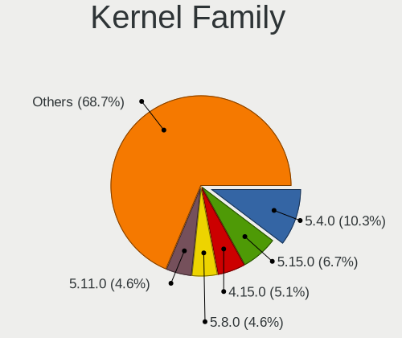

| Version | Desktops | Percent |
|---------|----------|---------|
| 5.4.0   | 49       | 17.19%  |
| 4.15.0  | 24       | 8.42%   |
| 5.8.0   | 23       | 8.07%   |
| 5.11.0  | 21       | 7.37%   |
| 5.13.0  | 19       | 6.67%   |
| 5.3.0   | 16       | 5.61%   |
| 5.15.0  | 15       | 5.26%   |
| 4.18.0  | 14       | 4.91%   |
| 5.0.0   | 8        | 2.81%   |
| 5.10.0  | 5        | 1.75%   |
| 5.9.16  | 3        | 1.05%   |
| 5.19.0  | 3        | 1.05%   |
| 5.16.7  | 3        | 1.05%   |
| 5.10.15 | 3        | 1.05%   |
| 5.10.14 | 3        | 1.05%   |
| 5.8.12  | 2        | 0.7%    |
| 5.7.0   | 2        | 0.7%    |
| 5.6.11  | 2        | 0.7%    |
| 5.18.5  | 2        | 0.7%    |
| 5.18.13 | 2        | 0.7%    |
| 5.17.4  | 2        | 0.7%    |
| 5.15.8  | 2        | 0.7%    |
| 5.15.15 | 2        | 0.7%    |
| 5.15.11 | 2        | 0.7%    |
| 6.0.7   | 1        | 0.35%   |
| 6.0.5   | 1        | 0.35%   |
| 6.0.2   | 1        | 0.35%   |
| 5.9.8   | 1        | 0.35%   |
| 5.9.14  | 1        | 0.35%   |
| 5.9.1   | 1        | 0.35%   |
| 5.9.0   | 1        | 0.35%   |
| 5.8.3   | 1        | 0.35%   |
| 5.8.1   | 1        | 0.35%   |
| 5.7.9   | 1        | 0.35%   |
| 5.7.8   | 1        | 0.35%   |
| 5.7.7   | 1        | 0.35%   |
| 5.7.6   | 1        | 0.35%   |
| 5.7.14  | 1        | 0.35%   |
| 5.6.8   | 1        | 0.35%   |
| 5.6.7   | 1        | 0.35%   |

Kernel Major Ver.
-----------------

Linux kernel major version

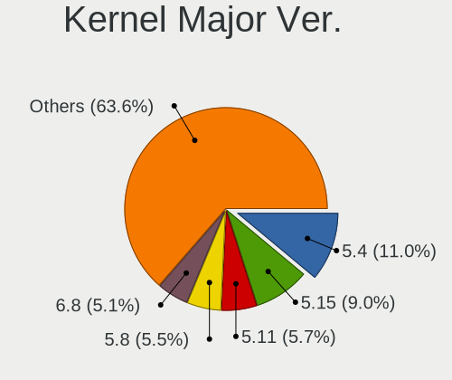

| Version | Desktops | Percent |
|---------|----------|---------|
| 5.4     | 52       | 18.37%  |
| 5.8     | 27       | 9.54%   |
| 5.11    | 26       | 9.19%   |
| 5.15    | 25       | 8.83%   |
| 4.15    | 24       | 8.48%   |
| 5.13    | 22       | 7.77%   |
| 5.3     | 18       | 6.36%   |
| 4.18    | 14       | 4.95%   |
| 5.10    | 12       | 4.24%   |
| 5.0     | 9        | 3.18%   |
| 5.19    | 8        | 2.83%   |
| 5.9     | 7        | 2.47%   |
| 5.7     | 6        | 2.12%   |
| 5.6     | 5        | 1.77%   |
| 5.18    | 5        | 1.77%   |
| 5.16    | 5        | 1.77%   |
| 5.14    | 4        | 1.41%   |
| 5.12    | 4        | 1.41%   |
| 6.0     | 3        | 1.06%   |
| 5.17    | 3        | 1.06%   |
| 4.19    | 2        | 0.71%   |
| 5.5     | 1        | 0.35%   |
| 5.2     | 1        | 0.35%   |

Arch
----

OS architecture (x86_64, i586, etc.)

| Name   | Desktops | Percent |
|--------|----------|---------|
| x86_64 | 242      | 99.59%  |
| i686   | 1        | 0.41%   |

DE
--

Desktop Environment

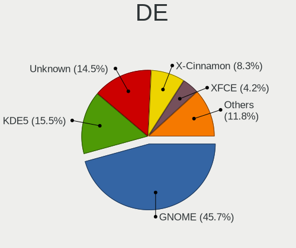

| Name       | Desktops | Percent |
|------------|----------|---------|
| GNOME      | 125      | 48.64%  |
| Unknown    | 43       | 16.73%  |
| KDE5       | 30       | 11.67%  |
| X-Cinnamon | 20       | 7.78%   |
| XFCE       | 12       | 4.67%   |
| KDE        | 11       | 4.28%   |
| MATE       | 6        | 2.33%   |
| Unity      | 2        | 0.78%   |
| LXQt       | 2        | 0.78%   |
| LXDE       | 2        | 0.78%   |
| Cinnamon   | 2        | 0.78%   |
| Pantheon   | 1        | 0.39%   |
| Deepin     | 1        | 0.39%   |

Display Server
--------------

X11 or Wayland

| Name    | Desktops | Percent |
|---------|----------|---------|
| X11     | 190      | 76.92%  |
| Wayland | 27       | 10.93%  |
| Unknown | 24       | 9.72%   |
| Tty     | 6        | 2.43%   |

Display Manager
---------------

SDDM, LightDM, etc.

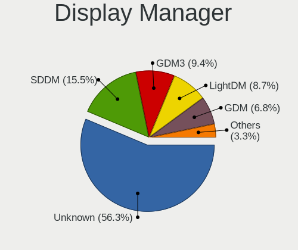

| Name    | Desktops | Percent |
|---------|----------|---------|
| Unknown | 157      | 61.81%  |
| SDDM    | 29       | 11.42%  |
| GDM     | 20       | 7.87%   |
| LightDM | 17       | 6.69%   |
| GDM3    | 17       | 6.69%   |
| TDM     | 11       | 4.33%   |
| SLiM    | 3        | 1.18%   |

OS Lang
-------

Language

| Lang    | Desktops | Percent |
|---------|----------|---------|
| en_NZ   | 145      | 56.42%  |
| en_US   | 47       | 18.29%  |
| Unknown | 43       | 16.73%  |
| en_AU   | 9        | 3.5%    |
| en_GB   | 7        | 2.72%   |
| C       | 4        | 1.56%   |
| zh_CN   | 2        | 0.78%   |

Boot Mode
---------

EFI or BIOS

| Mode | Desktops | Percent |
|------|----------|---------|
| BIOS | 148      | 58.73%  |
| EFI  | 104      | 41.27%  |

Filesystem
----------

Type of filesystem

| Type    | Desktops | Percent |
|---------|----------|---------|
| Ext4    | 197      | 79.44%  |
| Btrfs   | 16       | 6.45%   |
| Overlay | 14       | 5.65%   |
| Unknown | 13       | 5.24%   |
| Zfs     | 3        | 1.21%   |
| Xfs     | 2        | 0.81%   |
| Tmpfs   | 1        | 0.4%    |
| F2fs    | 1        | 0.4%    |
| Ext3    | 1        | 0.4%    |

Part. scheme
------------

Scheme of partitioning

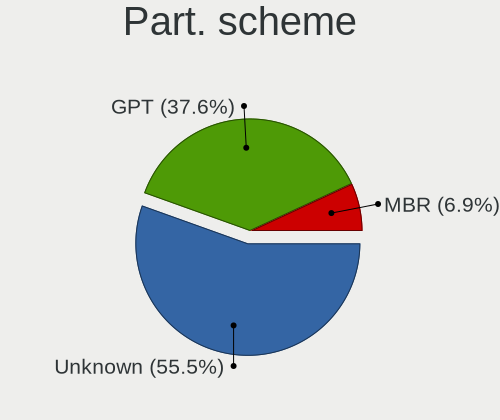

| Type    | Desktops | Percent |
|---------|----------|---------|
| Unknown | 164      | 65.34%  |
| GPT     | 70       | 27.89%  |
| MBR     | 17       | 6.77%   |

Dual Boot with Linux/BSD
------------------------

Hosting more than one Linux/BSD

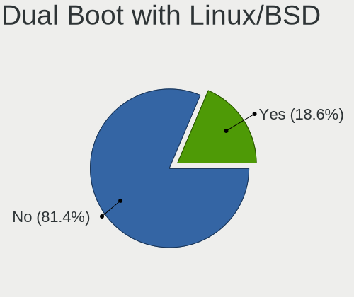

| Dual boot | Desktops | Percent |
|-----------|----------|---------|
| No        | 209      | 83.94%  |
| Yes       | 40       | 16.06%  |

Dual Boot (Win)
---------------

Hosting Linux and Windows

| Dual boot | Desktops | Percent |
|-----------|----------|---------|
| No        | 169      | 67.87%  |
| Yes       | 80       | 32.13%  |

Board
-----

Vendor
------

Motherboard manufacturer

| Name                | Desktops | Percent |
|---------------------|----------|---------|
| Gigabyte Technology | 67       | 27.57%  |
| ASUSTek Computer    | 62       | 25.51%  |
| Hewlett-Packard     | 33       | 13.58%  |
| ASRock              | 19       | 7.82%   |
| MSI                 | 16       | 6.58%   |
| Dell                | 13       | 5.35%   |
| Lenovo              | 9        | 3.7%    |
| Intel               | 7        | 2.88%   |
| Unknown             | 3        | 1.23%   |
| IBM                 | 2        | 0.82%   |
| Acer                | 2        | 0.82%   |
| Supermicro          | 1        | 0.41%   |
| Pegatron            | 1        | 0.41%   |
| OEM                 | 1        | 0.41%   |
| MediaVue            | 1        | 0.41%   |
| JGINYUE             | 1        | 0.41%   |
| Huanan              | 1        | 0.41%   |
| Colorful Technology | 1        | 0.41%   |
| Biostar             | 1        | 0.41%   |
| Alienware           | 1        | 0.41%   |
| AAEON               | 1        | 0.41%   |

Model
-----

Motherboard model

| Name                            | Desktops | Percent |
|---------------------------------|----------|---------|
| Gigabyte H77M-D3H               | 6        | 2.47%   |
| ASUS All Series                 | 5        | 2.06%   |
| MSI MS-7B89                     | 3        | 1.23%   |
| HP EliteDesk 800 G1 SFF         | 3        | 1.23%   |
| HP Compaq 8200 Elite SFF PC     | 3        | 1.23%   |
| Gigabyte 970A-D3P               | 3        | 1.23%   |
| ASUS TUF Gaming X570-PLUS       | 3        | 1.23%   |
| ASRock B450M Steel Legend       | 3        | 1.23%   |
| Unknown                         | 3        | 1.23%   |
| MSI MS-7C91                     | 2        | 0.82%   |
| MSI MS-7C02                     | 2        | 0.82%   |
| Lenovo ThinkCentre M58p 7479RS2 | 2        | 0.82%   |
| HP ProDesk 600 G1 SFF           | 2        | 0.82%   |
| HP Compaq Pro 6300 SFF          | 2        | 0.82%   |
| HP Compaq Elite 8300 USDT       | 2        | 0.82%   |
| HP Compaq Elite 8300 SFF        | 2        | 0.82%   |
| HP Compaq 8100 Elite SFF PC     | 2        | 0.82%   |
| HP Compaq 6200 Pro SFF PC       | 2        | 0.82%   |
| Gigabyte Z77X-D3H               | 2        | 0.82%   |
| Gigabyte Z68AP-D3               | 2        | 0.82%   |
| Gigabyte F2A75M-D3H             | 2        | 0.82%   |
| Gigabyte F2A55M-DS2             | 2        | 0.82%   |
| Gigabyte B75M-D3H               | 2        | 0.82%   |
| Gigabyte B550M DS3H             | 2        | 0.82%   |
| Gigabyte B450M S2H              | 2        | 0.82%   |
| Gigabyte AB350-Gaming           | 2        | 0.82%   |
| Dell OptiPlex 3010              | 2        | 0.82%   |
| ASUS SABERTOOTH 990FX R2.0      | 2        | 0.82%   |
| ASUS ROG STRIX X570-E GAMING    | 2        | 0.82%   |
| ASUS ROG STRIX B550-F GAMING    | 2        | 0.82%   |
| ASUS PRIME B450-PLUS            | 2        | 0.82%   |
| ASUS PRIME B350M-A              | 2        | 0.82%   |
| ASRock A320M-HDV                | 2        | 0.82%   |
| ASRock 970 Pro3 R2.0            | 2        | 0.82%   |
| Supermicro X8SIL                | 1        | 0.41%   |
| Pegatron CQ3320AN               | 1        | 0.41%   |
| OEM H81U                        | 1        | 0.41%   |
| MSI PPPPP-CCC#MMMMMMMM          | 1        | 0.41%   |
| MSI p6-2302a                    | 1        | 0.41%   |
| MSI MS-9A89                     | 1        | 0.41%   |

Model Family
------------

Motherboard model prefix

| Name                   | Desktops | Percent |
|------------------------|----------|---------|
| HP Compaq              | 16       | 6.58%   |
| ASUS ROG               | 14       | 5.76%   |
| ASUS PRIME             | 12       | 4.94%   |
| Dell OptiPlex          | 8        | 3.29%   |
| Lenovo ThinkCentre     | 7        | 2.88%   |
| HP EliteDesk           | 6        | 2.47%   |
| Gigabyte H77M-D3H      | 6        | 2.47%   |
| ASUS TUF               | 6        | 2.47%   |
| ASUS All               | 5        | 2.06%   |
| MSI MS-7B89            | 3        | 1.23%   |
| Gigabyte AB350-Gaming  | 3        | 1.23%   |
| Gigabyte 970A-D3P      | 3        | 1.23%   |
| Dell Precision         | 3        | 1.23%   |
| ASRock B450M           | 3        | 1.23%   |
| Unknown                | 3        | 1.23%   |
| MSI MS-7C91            | 2        | 0.82%   |
| MSI MS-7C02            | 2        | 0.82%   |
| IBM System             | 2        | 0.82%   |
| HP ProLiant            | 2        | 0.82%   |
| HP ProDesk             | 2        | 0.82%   |
| Gigabyte Z77X-D3H      | 2        | 0.82%   |
| Gigabyte Z68AP-D3      | 2        | 0.82%   |
| Gigabyte X570          | 2        | 0.82%   |
| Gigabyte GA-78LMT-USB3 | 2        | 0.82%   |
| Gigabyte F2A75M-D3H    | 2        | 0.82%   |
| Gigabyte F2A55M-DS2    | 2        | 0.82%   |
| Gigabyte B75M-D3H      | 2        | 0.82%   |
| Gigabyte B560M         | 2        | 0.82%   |
| Gigabyte B550M         | 2        | 0.82%   |
| Gigabyte B450M         | 2        | 0.82%   |
| ASUS SABERTOOTH        | 2        | 0.82%   |
| ASUS P7P55D-E          | 2        | 0.82%   |
| ASUS P5G41T-M          | 2        | 0.82%   |
| ASUS M5A97             | 2        | 0.82%   |
| ASRock A320M-HDV       | 2        | 0.82%   |
| ASRock 970             | 2        | 0.82%   |
| Acer Aspire            | 2        | 0.82%   |
| Supermicro X8SIL       | 1        | 0.41%   |
| Pegatron CQ3320AN      | 1        | 0.41%   |
| OEM H81U               | 1        | 0.41%   |

MFG Year
--------

Motherboard manufacture year

| Year    | Desktops | Percent |
|---------|----------|---------|
| 2012    | 44       | 18.11%  |
| 2019    | 26       | 10.7%   |
| 2013    | 21       | 8.64%   |
| 2011    | 20       | 8.23%   |
| 2020    | 19       | 7.82%   |
| 2018    | 19       | 7.82%   |
| 2017    | 19       | 7.82%   |
| 2014    | 13       | 5.35%   |
| 2010    | 13       | 5.35%   |
| 2008    | 12       | 4.94%   |
| 2009    | 11       | 4.53%   |
| 2015    | 10       | 4.12%   |
| 2021    | 5        | 2.06%   |
| 2016    | 4        | 1.65%   |
| 2007    | 3        | 1.23%   |
| 2005    | 2        | 0.82%   |
| 2004    | 1        | 0.41%   |
| Unknown | 1        | 0.41%   |

Form Factor
-----------

Physical design of the computer

| Name    | Desktops | Percent |
|---------|----------|---------|
| Desktop | 243      | 100%    |

Secure Boot
-----------

Enabled or disabled

| State    | Desktops | Percent |
|----------|----------|---------|
| Disabled | 233      | 95.88%  |
| Enabled  | 10       | 4.12%   |

Coreboot
--------

Have coreboot on board

| Used | Desktops | Percent |
|------|----------|---------|
| No   | 242      | 99.59%  |
| Yes  | 1        | 0.41%   |

RAM Size
--------

Total RAM memory

| Size in GB  | Desktops | Percent |
|-------------|----------|---------|
| 16.01-24.0  | 72       | 28.57%  |
| 8.01-16.0   | 52       | 20.63%  |
| 32.01-64.0  | 44       | 17.46%  |
| 4.01-8.0    | 33       | 13.1%   |
| 3.01-4.0    | 29       | 11.51%  |
| 64.01-256.0 | 9        | 3.57%   |
| 24.01-32.0  | 6        | 2.38%   |
| 1.01-2.0    | 5        | 1.98%   |
| 2.01-3.0    | 2        | 0.79%   |

RAM Used
--------

Used RAM memory

| Used GB    | Desktops | Percent |
|------------|----------|---------|
| 1.01-2.0   | 96       | 34.29%  |
| 2.01-3.0   | 72       | 25.71%  |
| 4.01-8.0   | 43       | 15.36%  |
| 3.01-4.0   | 31       | 11.07%  |
| 8.01-16.0  | 17       | 6.07%   |
| 0.51-1.0   | 14       | 5%      |
| 16.01-24.0 | 3        | 1.07%   |
| 0.01-0.5   | 3        | 1.07%   |
| 32.01-64.0 | 1        | 0.36%   |

Total Drives
------------

Number of drives on board

| Drives | Desktops | Percent |
|--------|----------|---------|
| 1      | 86       | 33.33%  |
| 2      | 84       | 32.56%  |
| 3      | 42       | 16.28%  |
| 4      | 27       | 10.47%  |
| 5      | 8        | 3.1%    |
| 6      | 7        | 2.71%   |
| 7      | 3        | 1.16%   |
| 8      | 1        | 0.39%   |

Has CD-ROM
----------

Has CD-ROM on board

| Presented | Desktops | Percent |
|-----------|----------|---------|
| No        | 128      | 51.41%  |
| Yes       | 121      | 48.59%  |

Has Ethernet
------------

Has Ethernet on board

| Presented | Desktops | Percent |
|-----------|----------|---------|
| Yes       | 242      | 99.59%  |
| No        | 1        | 0.41%   |

Has WiFi
--------

Has WiFi module

| Presented | Desktops | Percent |
|-----------|----------|---------|
| No        | 132      | 53.66%  |
| Yes       | 114      | 46.34%  |

Has Bluetooth
-------------

Has Bluetooth module

| Presented | Desktops | Percent |
|-----------|----------|---------|
| No        | 176      | 71.84%  |
| Yes       | 69       | 28.16%  |

Location
--------

Country
-------

Geographic location (country)

| Country     | Desktops | Percent |
|-------------|----------|---------|
| New Zealand | 243      | 100%    |

City
----

Geographic location (city)

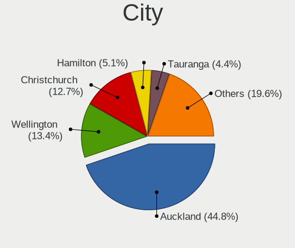

| City             | Desktops | Percent |
|------------------|----------|---------|
| Auckland         | 126      | 49.61%  |
| Wellington       | 30       | 11.81%  |
| Christchurch     | 28       | 11.02%  |
| Hamilton         | 15       | 5.91%   |
| Tauranga         | 10       | 3.94%   |
| Dunedin          | 8        | 3.15%   |
| Palmerston North | 7        | 2.76%   |
| Napier City      | 4        | 1.57%   |
| Whangarei        | 3        | 1.18%   |
| New Plymouth     | 2        | 0.79%   |
| Nelson           | 2        | 0.79%   |
| Invercargill     | 2        | 0.79%   |
| Cambridge        | 2        | 0.79%   |
| Whanganui        | 1        | 0.39%   |
| Westport         | 1        | 0.39%   |
| Wellsford        | 1        | 0.39%   |
| Waihi            | 1        | 0.39%   |
| Stratford        | 1        | 0.39%   |
| Rotorua          | 1        | 0.39%   |
| Queenstown       | 1        | 0.39%   |
| Mount Eden       | 1        | 0.39%   |
| Milton           | 1        | 0.39%   |
| Hastings         | 1        | 0.39%   |
| Grafton          | 1        | 0.39%   |
| Darfield         | 1        | 0.39%   |
| Carterton        | 1        | 0.39%   |
| Ashburton        | 1        | 0.39%   |
| Albany           | 1        | 0.39%   |

Drives
------

Drive Vendor
------------

Hard drive vendors

| Vendor                    | Desktops | Drives | Percent |
|---------------------------|----------|--------|---------|
| Seagate                   | 112      | 205    | 25%     |
| WDC                       | 99       | 172    | 22.1%   |
| Samsung Electronics       | 66       | 137    | 14.73%  |
| Crucial                   | 27       | 41     | 6.03%   |
| Kingston                  | 21       | 30     | 4.69%   |
| Intel                     | 18       | 25     | 4.02%   |
| Toshiba                   | 15       | 20     | 3.35%   |
| Hitachi                   | 15       | 22     | 3.35%   |
| SanDisk                   | 14       | 19     | 3.13%   |
| A-DATA Technology         | 9        | 12     | 2.01%   |
| Micron Technology         | 5        | 6      | 1.12%   |
| Unknown                   | 4        | 5      | 0.89%   |
| HGST                      | 4        | 5      | 0.89%   |
| Lexar                     | 3        | 3      | 0.67%   |
| Gigabyte Technology       | 3        | 3      | 0.67%   |
| External                  | 3        | 3      | 0.67%   |
| Apacer                    | 3        | 3      | 0.67%   |
| XPG                       | 2        | 2      | 0.45%   |
| Transcend                 | 2        | 2      | 0.45%   |
| TO Exter                  | 2        | 2      | 0.45%   |
| SK hynix                  | 2        | 2      | 0.45%   |
| Silicon Motion            | 2        | 3      | 0.45%   |
| Corsair                   | 2        | 3      | 0.45%   |
| China                     | 2        | 3      | 0.45%   |
| USB                       | 1        | 2      | 0.22%   |
| Team                      | 1        | 1      | 0.22%   |
| Realtek Semiconductor     | 1        | 1      | 0.22%   |
| Phison                    | 1        | 1      | 0.22%   |
| OCZ                       | 1        | 1      | 0.22%   |
| Micron/Crucial Technology | 1        | 1      | 0.22%   |
| LITEON                    | 1        | 1      | 0.22%   |
| KingSpec                  | 1        | 1      | 0.22%   |
| JMicron Technology        | 1        | 1      | 0.22%   |
| Innodisk                  | 1        | 1      | 0.22%   |
| Hewlett-Packard           | 1        | 1      | 0.22%   |
| GAMER                     | 1        | 1      | 0.22%   |
| Apple                     | 1        | 1      | 0.22%   |

Drive Model
-----------

Hard drive models

| Model                            | Desktops | Percent |
|----------------------------------|----------|---------|
| Seagate ST2000DM008-2FR102 2TB   | 10       | 1.83%   |
| Seagate Expansion Desk 8TB       | 9        | 1.65%   |
| Samsung SSD 860 EVO 500GB        | 8        | 1.47%   |
| Crucial CT240BX500SSD1 240GB     | 8        | 1.47%   |
| Seagate ST500DM002-1BD142 500GB  | 7        | 1.28%   |
| Seagate ST31000528AS 1TB         | 7        | 1.28%   |
| Seagate ST2000DM006-2DM164 2TB   | 7        | 1.28%   |
| Seagate ST1000DM003-1CH162 1TB   | 7        | 1.28%   |
| Samsung SSD 850 EVO 250GB        | 6        | 1.1%    |
| Samsung NVMe SSD Drive 500GB     | 6        | 1.1%    |
| WDC WD20EZRZ-00Z5HB0 2TB         | 5        | 0.92%   |
| Toshiba THNS128GG4BBAA 128GB SSD | 5        | 0.92%   |
| Seagate ST1000DM010-2EP102 1TB   | 5        | 0.92%   |
| Seagate Expansion 1TB            | 5        | 0.92%   |
| Samsung SSD 870 EVO 1TB          | 5        | 0.92%   |
| Samsung SSD 850 EVO 500GB        | 5        | 0.92%   |
| Kingston SA400S37120G 120GB SSD  | 5        | 0.92%   |
| WDC WD20EARX-00PASB0 2TB         | 4        | 0.73%   |
| WDC WD10EZEX-00WN4A0 1TB         | 4        | 0.73%   |
| Seagate ST3500418AS 500GB        | 4        | 0.73%   |
| Seagate ST2000DM001-1CH164 2TB   | 4        | 0.73%   |
| Samsung NVMe SSD Drive 1TB       | 4        | 0.73%   |
| Kingston SA400S37240G 240GB SSD  | 4        | 0.73%   |
| WDC WD10EZEX-08WN4A0 1TB         | 3        | 0.55%   |
| WDC WD10EALX-009BA0 1TB          | 3        | 0.55%   |
| WDC WD1002FAEX-00Z3A0 1TB        | 3        | 0.55%   |
| Seagate ST3500413AS 500GB        | 3        | 0.55%   |
| Seagate ST3000DM001-1ER166 3TB   | 3        | 0.55%   |
| Seagate ST2000DM001-1ER164 2TB   | 3        | 0.55%   |
| SanDisk SDSSDA240G 240GB         | 3        | 0.55%   |
| Samsung SSD 860 EVO 250GB        | 3        | 0.55%   |
| Samsung SSD 840 EVO 120GB        | 3        | 0.55%   |
| Kingston SV300S37A120G 120GB SSD | 3        | 0.55%   |
| Kingston SUV400S37240G 240GB SSD | 3        | 0.55%   |
| Intel SSDSA2CW080G3 80GB         | 3        | 0.55%   |
| Crucial CT960BX500SSD1 960GB     | 3        | 0.55%   |
| Crucial CT500MX500SSD1 500GB     | 3        | 0.55%   |
| XPG GAMMIX S11 480GB             | 2        | 0.37%   |
| WDC WDS100T2B0A-00SM50 1TB SSD   | 2        | 0.37%   |
| WDC WD5000AAKX-00ERMA0 500GB     | 2        | 0.37%   |

HDD Vendor
----------

Hard disk drive vendors

| Vendor              | Desktops | Drives | Percent |
|---------------------|----------|--------|---------|
| Seagate             | 109      | 195    | 46.58%  |
| WDC                 | 91       | 155    | 38.89%  |
| Hitachi             | 15       | 22     | 6.41%   |
| Toshiba             | 8        | 13     | 3.42%   |
| HGST                | 4        | 5      | 1.71%   |
| Unknown             | 2        | 2      | 0.85%   |
| Samsung Electronics | 2        | 3      | 0.85%   |
| USB                 | 1        | 2      | 0.43%   |
| External            | 1        | 1      | 0.43%   |
| Apple               | 1        | 1      | 0.43%   |

SSD Vendor
----------

Solid state drive vendors

| Vendor              | Desktops | Drives | Percent |
|---------------------|----------|--------|---------|
| Samsung Electronics | 45       | 74     | 27.27%  |
| Crucial             | 25       | 36     | 15.15%  |
| Kingston            | 18       | 27     | 10.91%  |
| Intel               | 15       | 19     | 9.09%   |
| SanDisk             | 12       | 17     | 7.27%   |
| WDC                 | 8        | 11     | 4.85%   |
| A-DATA Technology   | 7        | 9      | 4.24%   |
| Toshiba             | 5        | 5      | 3.03%   |
| Seagate             | 3        | 5      | 1.82%   |
| Micron Technology   | 3        | 4      | 1.82%   |
| Lexar               | 3        | 3      | 1.82%   |
| Apacer              | 3        | 3      | 1.82%   |
| TO Exter            | 2        | 2      | 1.21%   |
| Gigabyte Technology | 2        | 2      | 1.21%   |
| Corsair             | 2        | 3      | 1.21%   |
| China               | 2        | 2      | 1.21%   |
| Transcend           | 1        | 1      | 0.61%   |
| Team                | 1        | 1      | 0.61%   |
| SK hynix            | 1        | 1      | 0.61%   |
| OCZ                 | 1        | 1      | 0.61%   |
| LITEON              | 1        | 1      | 0.61%   |
| KingSpec            | 1        | 1      | 0.61%   |
| JMicron Technology  | 1        | 1      | 0.61%   |
| Innodisk            | 1        | 1      | 0.61%   |
| Hewlett-Packard     | 1        | 1      | 0.61%   |
| GAMER               | 1        | 1      | 0.61%   |

Drive Kind
----------

HDD or SSD

| Kind    | Desktops | Drives | Percent |
|---------|----------|--------|---------|
| HDD     | 181      | 399    | 47.38%  |
| SSD     | 140      | 232    | 36.65%  |
| NVMe    | 55       | 104    | 14.4%   |
| Unknown | 4        | 5      | 1.05%   |
| MMC     | 2        | 2      | 0.52%   |

Drive Connector
---------------

SATA, SAS, NVMe, etc.

| Type | Desktops | Drives | Percent |
|------|----------|--------|---------|
| SATA | 229      | 599    | 73.63%  |
| NVMe | 54       | 102    | 17.36%  |
| SAS  | 26       | 39     | 8.36%   |
| MMC  | 2        | 2      | 0.64%   |

Drive Size
----------

Size of hard drive

| Size in TB | Desktops | Drives | Percent |
|------------|----------|--------|---------|
| 0.01-0.5   | 176      | 316    | 46.81%  |
| 0.51-1.0   | 106      | 173    | 28.19%  |
| 1.01-2.0   | 49       | 74     | 13.03%  |
| 3.01-4.0   | 17       | 31     | 4.52%   |
| 2.01-3.0   | 13       | 15     | 3.46%   |
| 4.01-10.0  | 13       | 15     | 3.46%   |
| 10.01-20.0 | 2        | 7      | 0.53%   |

Space Total
-----------

Amount of disk space available on the file system

| Size in GB     | Desktops | Percent |
|----------------|----------|---------|
| 101-250        | 60       | 22.39%  |
| 501-1000       | 42       | 15.67%  |
| 251-500        | 39       | 14.55%  |
| More than 3000 | 34       | 12.69%  |
| 1001-2000      | 33       | 12.31%  |
| 2001-3000      | 26       | 9.7%    |
| 1-20           | 17       | 6.34%   |
| 51-100         | 10       | 3.73%   |
| Unknown        | 6        | 2.24%   |
| 21-50          | 1        | 0.37%   |

Space Used
----------

Amount of used disk space

| Used GB        | Desktops | Percent |
|----------------|----------|---------|
| 1-20           | 81       | 28.22%  |
| 21-50          | 49       | 17.07%  |
| 251-500        | 27       | 9.41%   |
| 101-250        | 26       | 9.06%   |
| 501-1000       | 26       | 9.06%   |
| 1001-2000      | 24       | 8.36%   |
| 51-100         | 22       | 7.67%   |
| More than 3000 | 13       | 4.53%   |
| 2001-3000      | 13       | 4.53%   |
| Unknown        | 6        | 2.09%   |

Malfunc. Drives
---------------

Drive models with a malfunction

| Model                                 | Desktops | Drives | Percent |
|---------------------------------------|----------|--------|---------|
| WDC WD20EZRZ-00Z5HB0 2TB              | 2        | 2      | 6.9%    |
| Seagate ST3500418AS 500GB             | 2        | 2      | 6.9%    |
| WDC WD5000AAKX-001CA0 500GB           | 1        | 1      | 3.45%   |
| WDC WD2003FZEX-00Z4SA0 2TB            | 1        | 1      | 3.45%   |
| WDC WD15EARS-00S0XB0 1TB              | 1        | 1      | 3.45%   |
| WDC WD10EFRX-68FYTN0 1TB              | 1        | 3      | 3.45%   |
| WDC WD1002FAEX-00Z3A0 1TB             | 1        | 1      | 3.45%   |
| SK hynix HFS256G32MND-2900A 256GB SSD | 1        | 1      | 3.45%   |
| Seagate ST8000VN0022-2EL112 8TB       | 1        | 3      | 3.45%   |
| Seagate ST500DM002-1BD142 500GB       | 1        | 1      | 3.45%   |
| Seagate ST3250310AS 250GB             | 1        | 1      | 3.45%   |
| Seagate ST3200822A 200GB              | 1        | 1      | 3.45%   |
| Seagate ST31000528AS 1TB              | 1        | 1      | 3.45%   |
| Seagate ST31000524AS 1TB              | 1        | 1      | 3.45%   |
| Seagate ST3000DM001-9YN166 3TB        | 1        | 1      | 3.45%   |
| Seagate ST2000DX002-2DV164 2TB        | 1        | 1      | 3.45%   |
| Seagate ST2000DX001-1CM164 2TB        | 1        | 1      | 3.45%   |
| Seagate ST2000DM001-1ER164 2TB        | 1        | 1      | 3.45%   |
| Seagate ST2000DM001-1CH164 2TB        | 1        | 1      | 3.45%   |
| SanDisk SSD PLUS 240 GB               | 1        | 1      | 3.45%   |
| Samsung Electronics SSD 980 PRO 250GB | 1        | 1      | 3.45%   |
| Samsung Electronics SSD 980 1TB       | 1        | 1      | 3.45%   |
| Intel SSDSC2CT240A4 240GB             | 1        | 1      | 3.45%   |
| Innodisk Corp. - mSATA 3ME4 128GB     | 1        | 1      | 3.45%   |
| HGST HTS545050A7E380 500GB            | 1        | 1      | 3.45%   |
| Crucial CT480M500SSD1 480GB           | 1        | 1      | 3.45%   |
| Crucial CT480BX500SSD1 480GB          | 1        | 1      | 3.45%   |

Malfunc. Drive Vendor
---------------------

Vendors of faulty drives

| Vendor              | Desktops | Drives | Percent |
|---------------------|----------|--------|---------|
| Seagate             | 10       | 15     | 38.46%  |
| WDC                 | 7        | 9      | 26.92%  |
| Samsung Electronics | 2        | 2      | 7.69%   |
| Crucial             | 2        | 2      | 7.69%   |
| SK hynix            | 1        | 1      | 3.85%   |
| SanDisk             | 1        | 1      | 3.85%   |
| Intel               | 1        | 1      | 3.85%   |
| Innodisk            | 1        | 1      | 3.85%   |
| HGST                | 1        | 1      | 3.85%   |

Malfunc. HDD Vendor
-------------------

Vendors of faulty HDD drives

| Vendor  | Desktops | Drives | Percent |
|---------|----------|--------|---------|
| Seagate | 10       | 15     | 55.56%  |
| WDC     | 7        | 9      | 38.89%  |
| HGST    | 1        | 1      | 5.56%   |

Malfunc. Drive Kind
-------------------

Kinds of faulty drives

| Kind | Desktops | Drives | Percent |
|------|----------|--------|---------|
| HDD  | 18       | 25     | 69.23%  |
| SSD  | 6        | 6      | 23.08%  |
| NVMe | 2        | 2      | 7.69%   |

Failed Drives
-------------

Failed drive models

Zero info for selected period =(

Failed Drive Vendor
-------------------

Failed drive vendors

Zero info for selected period =(

Drive Status
------------

Number of failed and malfunc. drives

| Status   | Desktops | Drives | Percent |
|----------|----------|--------|---------|
| Detected | 167      | 488    | 60.07%  |
| Works    | 85       | 221    | 30.58%  |
| Malfunc  | 26       | 33     | 9.35%   |

Storage controller
------------------

Storage Vendor
--------------

Storage controller vendors

| Vendor                       | Desktops | Percent |
|------------------------------|----------|---------|
| Intel                        | 149      | 44.08%  |
| AMD                          | 87       | 25.74%  |
| Samsung Electronics          | 31       | 9.17%   |
| JMicron Technology           | 12       | 3.55%   |
| Marvell Technology Group     | 11       | 3.25%   |
| ASMedia Technology           | 10       | 2.96%   |
| Nvidia                       | 6        | 1.78%   |
| Silicon Motion               | 4        | 1.18%   |
| SanDisk                      | 4        | 1.18%   |
| Seagate Technology           | 3        | 0.89%   |
| Micron/Crucial Technology    | 3        | 0.89%   |
| LSI Logic / Symbios Logic    | 3        | 0.89%   |
| Kingston Technology Company  | 3        | 0.89%   |
| Toshiba America Info Systems | 2        | 0.59%   |
| Realtek Semiconductor        | 2        | 0.59%   |
| Micron Technology            | 2        | 0.59%   |
| VIA Technologies             | 1        | 0.3%    |
| SK hynix                     | 1        | 0.3%    |
| Silicon Image                | 1        | 0.3%    |
| Phison Electronics           | 1        | 0.3%    |
| Hewlett-Packard              | 1        | 0.3%    |
| ADATA Technology             | 1        | 0.3%    |

Storage Model
-------------

Storage controller models

| Model                                                                                   | Desktops | Percent |
|-----------------------------------------------------------------------------------------|----------|---------|
| AMD FCH SATA Controller [AHCI mode]                                                     | 48       | 10.71%  |
| AMD 400 Series Chipset SATA Controller                                                  | 21       | 4.69%   |
| Intel 7 Series/C210 Series Chipset Family 6-port SATA Controller [AHCI mode]            | 19       | 4.24%   |
| Samsung NVMe SSD Controller SM981/PM981/PM983                                           | 17       | 3.79%   |
| Intel 8 Series/C220 Series Chipset Family 6-port SATA Controller 1 [AHCI mode]          | 16       | 3.57%   |
| AMD SB7x0/SB8x0/SB9x0 SATA Controller [AHCI mode]                                       | 16       | 3.57%   |
| AMD SB7x0/SB8x0/SB9x0 IDE Controller                                                    | 16       | 3.57%   |
| Intel SATA Controller [RAID mode]                                                       | 12       | 2.68%   |
| Intel 6 Series/C200 Series Chipset Family 6 port Desktop SATA AHCI Controller           | 12       | 2.68%   |
| ASMedia ASM1062 Serial ATA Controller                                                   | 10       | 2.23%   |
| AMD 500 Series Chipset SATA Controller                                                  | 10       | 2.23%   |
| Intel Q170/Q150/B150/H170/H110/Z170/CM236 Chipset SATA Controller [AHCI Mode]           | 9        | 2.01%   |
| Samsung NVMe SSD Controller PM9A1/PM9A3/980PRO                                          | 8        | 1.79%   |
| Intel 200 Series PCH SATA controller [AHCI mode]                                        | 8        | 1.79%   |
| JMicron JMB363 SATA/IDE Controller                                                      | 7        | 1.56%   |
| Intel NM10/ICH7 Family SATA Controller [IDE mode]                                       | 7        | 1.56%   |
| Intel 9 Series Chipset Family SATA Controller [AHCI Mode]                               | 7        | 1.56%   |
| Intel 82801JI (ICH10 Family) 2 port SATA IDE Controller #2                              | 7        | 1.56%   |
| AMD 300 Series Chipset SATA Controller                                                  | 7        | 1.56%   |
| Intel 82801JI (ICH10 Family) 4 port SATA IDE Controller #1                              | 6        | 1.34%   |
| Intel 7 Series/C210 Series Chipset Family 4-port SATA Controller [IDE mode]             | 6        | 1.34%   |
| Intel 7 Series/C210 Series Chipset Family 2-port SATA Controller [IDE mode]             | 6        | 1.34%   |
| Intel 6 Series/C200 Series Chipset Family Desktop SATA Controller (IDE mode, ports 4-5) | 6        | 1.34%   |
| Intel 6 Series/C200 Series Chipset Family Desktop SATA Controller (IDE mode, ports 0-3) | 6        | 1.34%   |
| Intel 4 Series Chipset PT IDER Controller                                               | 6        | 1.34%   |
| AMD SB7x0/SB8x0/SB9x0 SATA Controller [IDE mode]                                        | 6        | 1.34%   |
| Samsung NVMe SSD Controller SM961/PM961/SM963                                           | 5        | 1.12%   |
| Intel 82801JD/DO (ICH10 Family) SATA AHCI Controller                                    | 5        | 1.12%   |
| Intel 82801G (ICH7 Family) IDE Controller                                               | 5        | 1.12%   |
| Intel 5 Series/3400 Series Chipset 6 port SATA AHCI Controller                          | 5        | 1.12%   |
| Samsung NVMe SSD Controller 980                                                         | 4        | 0.89%   |
| Intel 5 Series/3400 Series Chipset 4 port SATA IDE Controller                           | 4        | 0.89%   |
| Intel 5 Series/3400 Series Chipset 2 port SATA IDE Controller                           | 4        | 0.89%   |
| Silicon Motion SM2262/SM2262EN SSD Controller                                           | 3        | 0.67%   |
| Nvidia MCP61 SATA Controller                                                            | 3        | 0.67%   |
| Marvell Group 88SE91A3 SATA-600 Controller                                              | 3        | 0.67%   |
| Marvell Group 88SE9172 SATA 6Gb/s Controller                                            | 3        | 0.67%   |
| Kingston Company A2000 NVMe SSD                                                         | 3        | 0.67%   |
| JMicron JMB368 IDE controller                                                           | 3        | 0.67%   |
| Intel SSD 600P Series                                                                   | 3        | 0.67%   |

Storage Kind
------------

Kind of storage controller (IDE, SATA, NVMe, SAS, ...)

| Kind | Desktops | Percent |
|------|----------|---------|
| SATA | 188      | 55.29%  |
| IDE  | 74       | 21.76%  |
| NVMe | 56       | 16.47%  |
| RAID | 21       | 6.18%   |
| SCSI | 1        | 0.29%   |

Processor
---------

CPU Vendor
----------

Processor vendors

| Vendor | Desktops | Percent |
|--------|----------|---------|
| Intel  | 150      | 61.73%  |
| AMD    | 93       | 38.27%  |

CPU Model
---------

Processor models

| Model                                       | Desktops | Percent |
|---------------------------------------------|----------|---------|
| Intel Core i5-3470 CPU @ 3.20GHz            | 10       | 4.12%   |
| Intel Core i5-2400 CPU @ 3.10GHz            | 7        | 2.88%   |
| AMD Ryzen 7 3700X 8-Core Processor          | 7        | 2.88%   |
| AMD Ryzen 5 3600 6-Core Processor           | 6        | 2.47%   |
| Intel Core i7-4790K CPU @ 4.00GHz           | 4        | 1.65%   |
| Intel Core i7-4790 CPU @ 3.60GHz            | 4        | 1.65%   |
| Intel Core i7-4770 CPU @ 3.40GHz            | 4        | 1.65%   |
| Intel Core i7-3770 CPU @ 3.40GHz            | 4        | 1.65%   |
| Intel Core 2 Quad CPU Q9400 @ 2.66GHz       | 4        | 1.65%   |
| AMD Ryzen 9 3900X 12-Core Processor         | 4        | 1.65%   |
| AMD Ryzen 7 5700G with Radeon Graphics      | 4        | 1.65%   |
| AMD Ryzen 5 2600 Six-Core Processor         | 4        | 1.65%   |
| AMD Ryzen 5 1600 Six-Core Processor         | 4        | 1.65%   |
| AMD FX-6300 Six-Core Processor              | 4        | 1.65%   |
| Intel Core i7-10700 CPU @ 2.90GHz           | 3        | 1.23%   |
| Intel Core i7 CPU 950 @ 3.07GHz             | 3        | 1.23%   |
| Intel Core i5-6400 CPU @ 2.70GHz            | 3        | 1.23%   |
| Intel Core i3-2120 CPU @ 3.30GHz            | 3        | 1.23%   |
| Intel Core i7-8700 CPU @ 3.20GHz            | 2        | 0.82%   |
| Intel Core i7-7700 CPU @ 3.60GHz            | 2        | 0.82%   |
| Intel Core i7-4770K CPU @ 3.50GHz           | 2        | 0.82%   |
| Intel Core i7 CPU 860 @ 2.80GHz             | 2        | 0.82%   |
| Intel Core i5-9400F CPU @ 2.90GHz           | 2        | 0.82%   |
| Intel Core i5-4670 CPU @ 3.40GHz            | 2        | 0.82%   |
| Intel Core i5-4570 CPU @ 3.20GHz            | 2        | 0.82%   |
| Intel Core i5-3570 CPU @ 3.40GHz            | 2        | 0.82%   |
| Intel Core i5-3470S CPU @ 2.90GHz           | 2        | 0.82%   |
| Intel Core i5-2500K CPU @ 3.30GHz           | 2        | 0.82%   |
| Intel Core i5 CPU 750 @ 2.67GHz             | 2        | 0.82%   |
| Intel Core i3-4130 CPU @ 3.40GHz            | 2        | 0.82%   |
| Intel Core i3-3220 CPU @ 3.30GHz            | 2        | 0.82%   |
| Intel Core i3 CPU 540 @ 3.07GHz             | 2        | 0.82%   |
| Intel Core 2 Quad CPU Q9650 @ 3.00GHz       | 2        | 0.82%   |
| Intel Core 2 Quad CPU Q9550 @ 2.83GHz       | 2        | 0.82%   |
| Intel Core 2 Duo CPU E8400 @ 3.00GHz        | 2        | 0.82%   |
| Intel Core 2 Duo CPU E6750 @ 2.66GHz        | 2        | 0.82%   |
| AMD Ryzen 7 2700X Eight-Core Processor      | 2        | 0.82%   |
| AMD Ryzen 7 1700 Eight-Core Processor       | 2        | 0.82%   |
| AMD Ryzen 5 3500X 6-Core Processor          | 2        | 0.82%   |
| AMD Ryzen 3 3200G with Radeon Vega Graphics | 2        | 0.82%   |

CPU Model Family
----------------

Processor model prefix

| Model                   | Desktops | Percent |
|-------------------------|----------|---------|
| Intel Core i5           | 51       | 20.99%  |
| Intel Core i7           | 41       | 16.87%  |
| AMD Ryzen 7             | 20       | 8.23%   |
| AMD Ryzen 5             | 20       | 8.23%   |
| Intel Core i3           | 16       | 6.58%   |
| AMD FX                  | 15       | 6.17%   |
| Intel Xeon              | 13       | 5.35%   |
| Intel Core 2 Quad       | 9        | 3.7%    |
| Intel Core 2 Duo        | 6        | 2.47%   |
| AMD Ryzen 9             | 6        | 2.47%   |
| Intel Pentium           | 5        | 2.06%   |
| AMD Ryzen 3             | 5        | 2.06%   |
| AMD Athlon 64 X2        | 5        | 2.06%   |
| AMD Ryzen Threadripper  | 4        | 1.65%   |
| AMD Athlon II X2        | 4        | 1.65%   |
| Intel Atom              | 3        | 1.23%   |
| Intel Pentium Dual-Core | 2        | 0.82%   |
| AMD A8                  | 2        | 0.82%   |
| AMD A6                  | 2        | 0.82%   |
| AMD A4                  | 2        | 0.82%   |
| Intel Pentium Dual      | 1        | 0.41%   |
| Intel Pentium 4         | 1        | 0.41%   |
| Intel Core i9           | 1        | 0.41%   |
| Intel Celeron           | 1        | 0.41%   |
| AMD Ryzen 7 PRO         | 1        | 0.41%   |
| AMD Phenom II X6        | 1        | 0.41%   |
| AMD Phenom II X4        | 1        | 0.41%   |
| AMD Opteron             | 1        | 0.41%   |
| AMD GX                  | 1        | 0.41%   |
| AMD Athlon II X4        | 1        | 0.41%   |
| AMD A12                 | 1        | 0.41%   |
| AMD A10                 | 1        | 0.41%   |

CPU Cores
---------

Number of processor cores

| Number | Desktops | Percent |
|--------|----------|---------|
| 4      | 113      | 46.5%   |
| 2      | 49       | 20.16%  |
| 6      | 33       | 13.58%  |
| 8      | 27       | 11.11%  |
| 12     | 8        | 3.29%   |
| 3      | 5        | 2.06%   |
| 1      | 3        | 1.23%   |
| 16     | 2        | 0.82%   |
| 24     | 1        | 0.41%   |
| 14     | 1        | 0.41%   |
| 10     | 1        | 0.41%   |

CPU Sockets
-----------

Number of sockets

| Number | Desktops | Percent |
|--------|----------|---------|
| 1      | 242      | 99.59%  |
| 2      | 1        | 0.41%   |

CPU Threads
-----------

Threads per core (Hyper-Threading)

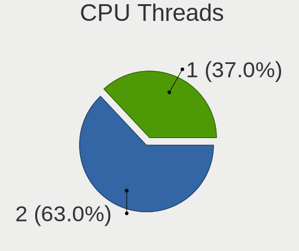

| Number | Desktops | Percent |
|--------|----------|---------|
| 2      | 146      | 60.08%  |
| 1      | 97       | 39.92%  |

CPU Op-Modes
------------

CPU Operation Modes (32-bit, 64-bit)

| Op mode        | Desktops | Percent |
|----------------|----------|---------|
| 32-bit, 64-bit | 239      | 97.55%  |
| Unknown        | 6        | 2.45%   |

CPU Microcode
-------------

Microcode number

| Number     | Desktops | Percent |
|------------|----------|---------|
| Unknown    | 63       | 24.8%   |
| 0x306c3    | 20       | 7.87%   |
| 0x306a9    | 20       | 7.87%   |
| 0x206a7    | 15       | 5.91%   |
| 0x08701021 | 15       | 5.91%   |
| 0x1067a    | 9        | 3.54%   |
| 0x06000852 | 8        | 3.15%   |
| 0x106e5    | 6        | 2.36%   |
| 0xa0655    | 5        | 1.97%   |
| 0x906e9    | 5        | 1.97%   |
| 0x506e3    | 5        | 1.97%   |
| 0x0800820d | 5        | 1.97%   |
| 0x08001137 | 5        | 1.97%   |
| 0x106a5    | 4        | 1.57%   |
| 0x0a50000c | 4        | 1.57%   |
| 0x08701013 | 4        | 1.57%   |
| 0x906ea    | 3        | 1.18%   |
| 0x6fb      | 3        | 1.18%   |
| 0x20655    | 3        | 1.18%   |
| 0x06001119 | 3        | 1.18%   |
| 0x010000c8 | 3        | 1.18%   |
| 0x906ed    | 2        | 0.79%   |
| 0x50654    | 2        | 0.79%   |
| 0x406c3    | 2        | 0.79%   |
| 0x306f2    | 2        | 0.79%   |
| 0x10677    | 2        | 0.79%   |
| 0x0a201009 | 2        | 0.79%   |
| 0x08108109 | 2        | 0.79%   |
| 0x08001138 | 2        | 0.79%   |
| 0x08001129 | 2        | 0.79%   |
| 0x0700010f | 2        | 0.79%   |
| 0x0600063e | 2        | 0.79%   |
| 0x906eb    | 1        | 0.39%   |
| 0x6fd      | 1        | 0.39%   |
| 0x506c9    | 1        | 0.39%   |
| 0x406e3    | 1        | 0.39%   |
| 0x406c4    | 1        | 0.39%   |
| 0x40651    | 1        | 0.39%   |
| 0x206d7    | 1        | 0.39%   |
| 0x206c2    | 1        | 0.39%   |

CPU Microarch
-------------

Microarchitecture

| Name        | Desktops | Percent |
|-------------|----------|---------|
| IvyBridge   | 28       | 11.52%  |
| Haswell     | 28       | 11.52%  |
| Zen 2       | 24       | 9.88%   |
| SandyBridge | 18       | 7.41%   |
| Piledriver  | 18       | 7.41%   |
| KabyLake    | 16       | 6.58%   |
| Penryn      | 15       | 6.17%   |
| Zen         | 12       | 4.94%   |
| Zen+        | 11       | 4.53%   |
| Nehalem     | 11       | 4.53%   |
| Skylake     | 10       | 4.12%   |
| Zen 3       | 9        | 3.7%    |
| CometLake   | 8        | 3.29%   |
| K10         | 7        | 2.88%   |
| Westmere    | 5        | 2.06%   |
| K8 Hammer   | 5        | 2.06%   |
| Core        | 5        | 2.06%   |
| Silvermont  | 3        | 1.23%   |
| Bulldozer   | 3        | 1.23%   |
| Jaguar      | 2        | 0.82%   |
| NetBurst    | 1        | 0.41%   |
| K10 Llano   | 1        | 0.41%   |
| Goldmont    | 1        | 0.41%   |
| Excavator   | 1        | 0.41%   |
| Bonnell     | 1        | 0.41%   |

Graphics
--------

GPU Vendor
----------

Vendors of graphics cards

| Vendor                     | Desktops | Percent |
|----------------------------|----------|---------|
| Nvidia                     | 94       | 35.61%  |
| AMD                        | 90       | 34.09%  |
| Intel                      | 76       | 28.79%  |
| Matrox Electronics Systems | 3        | 1.14%   |
| ASPEED Technology          | 1        | 0.38%   |

GPU Model
---------

Graphics card models

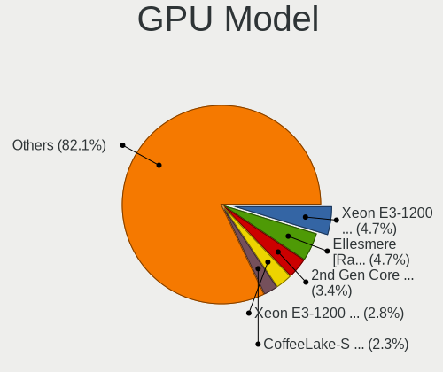

| Model                                                                                    | Desktops | Percent |
|------------------------------------------------------------------------------------------|----------|---------|
| AMD Ellesmere [Radeon RX 470/480/570/570X/580/580X/590]                                  | 17       | 6.2%    |
| Intel Xeon E3-1200 v3/4th Gen Core Processor Integrated Graphics Controller              | 14       | 5.11%   |
| Intel Xeon E3-1200 v2/3rd Gen Core processor Graphics Controller                         | 11       | 4.01%   |
| Intel 2nd Generation Core Processor Family Integrated Graphics Controller                | 10       | 3.65%   |
| Nvidia GP102 [GeForce GTX 1080 Ti]                                                       | 7        | 2.55%   |
| Nvidia GP106 [GeForce GTX 1060 6GB]                                                      | 6        | 2.19%   |
| Nvidia GP108 [GeForce GT 1030]                                                           | 5        | 1.82%   |
| Intel HD Graphics 630                                                                    | 5        | 1.82%   |
| Intel HD Graphics 530                                                                    | 5        | 1.82%   |
| Intel CoffeeLake-S GT2 [UHD Graphics 630]                                                | 5        | 1.82%   |
| Intel 4 Series Chipset Integrated Graphics Controller                                    | 5        | 1.82%   |
| AMD Cedar [Radeon HD 5000/6000/7350/8350 Series]                                         | 5        | 1.82%   |
| Nvidia GT218 [GeForce 210]                                                               | 4        | 1.46%   |
| Nvidia GK208B [GeForce GT 710]                                                           | 4        | 1.46%   |
| Intel CometLake-S GT2 [UHD Graphics 630]                                                 | 4        | 1.46%   |
| AMD Park [Mobility Radeon HD 5430]                                                       | 4        | 1.46%   |
| AMD Navi 14 [Radeon RX 5500/5500M / Pro 5500M]                                           | 4        | 1.46%   |
| AMD Navi 10 [Radeon RX 5600 OEM/5600 XT / 5700/5700 XT]                                  | 4        | 1.46%   |
| AMD Cezanne [Radeon Vega Series / Radeon Vega Mobile Series]                             | 4        | 1.46%   |
| AMD Caicos [Radeon HD 6450/7450/8450 / R5 230 OEM]                                       | 4        | 1.46%   |
| Nvidia GP107 [GeForce GTX 1050 Ti]                                                       | 3        | 1.09%   |
| Nvidia GK106 [GeForce GTX 660]                                                           | 3        | 1.09%   |
| Nvidia GK104 [GeForce GTX 760]                                                           | 3        | 1.09%   |
| Intel Atom/Celeron/Pentium Processor x5-E8000/J3xxx/N3xxx Integrated Graphics Controller | 3        | 1.09%   |
| Intel 4th Generation Core Processor Family Integrated Graphics Controller                | 3        | 1.09%   |
| AMD Turks XT [Radeon HD 6670/7670]                                                       | 3        | 1.09%   |
| AMD Picasso/Raven 2 [Radeon Vega Series / Radeon Vega Mobile Series]                     | 3        | 1.09%   |
| Nvidia TU117 [GeForce GTX 1650]                                                          | 2        | 0.73%   |
| Nvidia TU116 [GeForce GTX 1660 Ti]                                                       | 2        | 0.73%   |
| Nvidia TU106 [GeForce RTX 2060 SUPER]                                                    | 2        | 0.73%   |
| Nvidia GP104 [GeForce GTX 1070]                                                          | 2        | 0.73%   |
| Nvidia GP104 [GeForce GTX 1070 Ti]                                                       | 2        | 0.73%   |
| Nvidia GM200 [GeForce GTX 980 Ti]                                                        | 2        | 0.73%   |
| Nvidia GM107 [GeForce GTX 750 Ti]                                                        | 2        | 0.73%   |
| Nvidia GK208B [GeForce GT 730]                                                           | 2        | 0.73%   |
| Nvidia GK107GL [Quadro K2000]                                                            | 2        | 0.73%   |
| Nvidia GK107 [GeForce GT 740]                                                            | 2        | 0.73%   |
| Nvidia GF119 [GeForce GT 610]                                                            | 2        | 0.73%   |
| Nvidia GF116 [GeForce GTX 550 Ti]                                                        | 2        | 0.73%   |
| Nvidia GF108 [GeForce GT 430]                                                            | 2        | 0.73%   |

GPU Combo
---------

Combinations of graphics cards

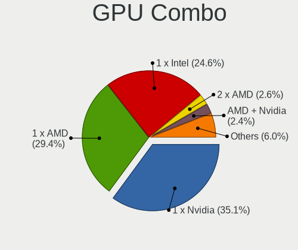

| Name           | Desktops | Percent |
|----------------|----------|---------|
| 1 x Nvidia     | 89       | 35.74%  |
| 1 x AMD        | 78       | 31.33%  |
| 1 x Intel      | 63       | 25.3%   |
| 2 x AMD        | 5        | 2.01%   |
| Intel + AMD    | 4        | 1.61%   |
| 1 x Matrox     | 3        | 1.2%    |
| AMD + Nvidia   | 3        | 1.2%    |
| Intel + Nvidia | 2        | 0.8%    |
| 2 x Nvidia     | 1        | 0.4%    |
| AMD + ASPEED   | 1        | 0.4%    |

GPU Driver
----------

Free vs proprietary

| Driver      | Desktops | Percent |
|-------------|----------|---------|
| Free        | 182      | 74.29%  |
| Proprietary | 59       | 24.08%  |
| Unknown     | 4        | 1.63%   |

GPU Memory
----------

Total video memory

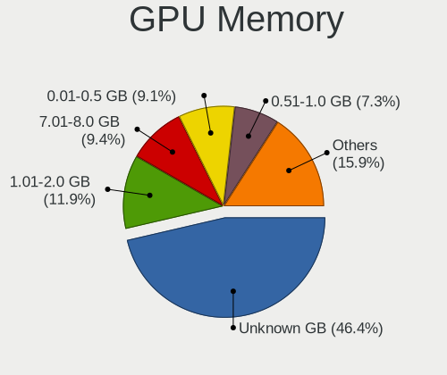

| Size in GB | Desktops | Percent |
|------------|----------|---------|
| Unknown    | 100      | 39.37%  |
| 1.01-2.0   | 42       | 16.54%  |
| 0.01-0.5   | 27       | 10.63%  |
| 7.01-8.0   | 24       | 9.45%   |
| 0.51-1.0   | 24       | 9.45%   |
| 5.01-6.0   | 13       | 5.12%   |
| 3.01-4.0   | 12       | 4.72%   |
| 8.01-16.0  | 8        | 3.15%   |
| 2.01-3.0   | 3        | 1.18%   |
| 16.01-24.0 | 1        | 0.39%   |

Monitor
-------

Monitor Vendor
--------------

Monitor vendors

| Vendor                  | Desktops | Percent |
|-------------------------|----------|---------|
| AOC                     | 41       | 14.59%  |
| Samsung Electronics     | 39       | 13.88%  |
| Dell                    | 36       | 12.81%  |
| Goldstar                | 26       | 9.25%   |
| Philips                 | 25       | 8.9%    |
| ViewSonic               | 22       | 7.83%   |
| Hewlett-Packard         | 13       | 4.63%   |
| Sony                    | 9        | 3.2%    |
| Panasonic               | 9        | 3.2%    |
| Acer                    | 8        | 2.85%   |
| Lenovo                  | 7        | 2.49%   |
| BenQ                    | 7        | 2.49%   |
| MiTAC                   | 6        | 2.14%   |
| Ancor Communications    | 6        | 2.14%   |
| LG Electronics          | 4        | 1.42%   |
| Denver                  | 4        | 1.42%   |
| Unknown                 | 2        | 0.71%   |
| Konka                   | 2        | 0.71%   |
| Chi Mei Optoelectronics | 2        | 0.71%   |
| ASUSTek Computer        | 2        | 0.71%   |
| Unknown (AAA)           | 1        | 0.36%   |
| SANYO                   | 1        | 0.36%   |
| Plain Tree Systems      | 1        | 0.36%   |
| NEC Computers           | 1        | 0.36%   |
| Marantz                 | 1        | 0.36%   |
| KTC                     | 1        | 0.36%   |
| Iiyama                  | 1        | 0.36%   |
| GVV                     | 1        | 0.36%   |
| eMachines               | 1        | 0.36%   |
| Elo Touch               | 1        | 0.36%   |
| CVT                     | 1        | 0.36%   |

Monitor Model
-------------

Monitor models

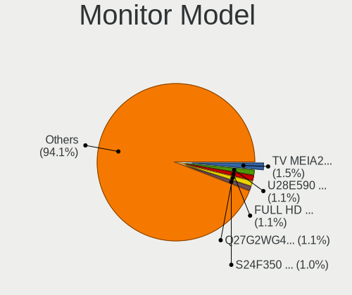

| Model                                                                 | Desktops | Percent |
|-----------------------------------------------------------------------|----------|---------|
| Panasonic TV MEIA296 3840x2160 698x392mm 31.5-inch                    | 7        | 2.22%   |
| Goldstar FULL HD GSM5AB9 1920x1080 480x270mm 21.7-inch                | 4        | 1.27%   |
| ViewSonic VA2248 SERIES VSC0E28 1920x1080 477x268mm 21.5-inch         | 3        | 0.95%   |
| MiTAC Smart TV SZM0030 1920x1080 708x398mm 32.0-inch                  | 3        | 0.95%   |
| Dell P2214H DELA097 1920x1080 477x268mm 21.5-inch                     | 3        | 0.95%   |
| AOC 2450W AOC2450 1920x1080 521x293mm 23.5-inch                       | 3        | 0.95%   |
| AOC 2367 AOC2367 1920x1080 509x286mm 23.0-inch                        | 3        | 0.95%   |
| ViewSonic VX2433wm VSC3822 1920x1080 520x290mm 23.4-inch              | 2        | 0.63%   |
| ViewSonic VA2231 Series VSCBB25 1920x1080 477x268mm 21.5-inch         | 2        | 0.63%   |
| ViewSonic LCD Monitor VSCB51D 1280x1024 340x270mm 17.1-inch           | 2        | 0.63%   |
| Sony TV SNYEE01 1920x1080                                             | 2        | 0.63%   |
| Samsung Electronics U28E590 SAM0C4D 3840x2160 610x350mm 27.7-inch     | 2        | 0.63%   |
| Samsung Electronics SyncMaster SAM027F 1680x1050 474x296mm 22.0-inch  | 2        | 0.63%   |
| Samsung Electronics S24F350 SAM0D20 1920x1080 521x293mm 23.5-inch     | 2        | 0.63%   |
| Samsung Electronics LCD Monitor SAM0900 1366x768 700x390mm 31.5-inch  | 2        | 0.63%   |
| Samsung Electronics C27F591 SAM0D37 1920x1080 598x336mm 27.0-inch     | 2        | 0.63%   |
| Konka TV_MONITOR KOA0030 2288x1430 708x398mm 32.0-inch                | 2        | 0.63%   |
| Hewlett-Packard P221 HWP3057 1920x1080 480x270mm 21.7-inch            | 2        | 0.63%   |
| Goldstar W1941 GSM4B91 1360x768 406x229mm 18.4-inch                   | 2        | 0.63%   |
| Goldstar IPS FULLHD GSM5AB8 1920x1080 480x270mm 21.7-inch             | 2        | 0.63%   |
| Goldstar HDR WFHD GSM7714 2560x1080 798x334mm 34.1-inch               | 2        | 0.63%   |
| Goldstar E2351 GSM5872 1920x1080 510x290mm 23.1-inch                  | 2        | 0.63%   |
| Denver N27FW LHC2700 1920x1080 598x336mm 27.0-inch                    | 2        | 0.63%   |
| Dell G2410 DEL404B 1920x1080 531x298mm 24.0-inch                      | 2        | 0.63%   |
| Dell 1907FP DEL4015 1280x1024 376x301mm 19.0-inch                     | 2        | 0.63%   |
| BenQ GW2270 BNQ78DB 1920x1080 480x270mm 21.7-inch                     | 2        | 0.63%   |
| AOC U2868 AOC2868 3840x2160 621x341mm 27.9-inch                       | 2        | 0.63%   |
| AOC Q32G1WG4 AOC3201 2560x1440 697x393mm 31.5-inch                    | 2        | 0.63%   |
| AOC Q27G2G4 AOC2702 2560x1440 597x336mm 27.0-inch                     | 2        | 0.63%   |
| AOC 2778X AOC2778 2560x1440 597x336mm 27.0-inch                       | 2        | 0.63%   |
| AOC 2460G4 AOC2460 1920x1080 531x299mm 24.0-inch                      | 2        | 0.63%   |
| AOC 2260WG5 AOC2260 1920x1080 477x268mm 21.5-inch                     | 2        | 0.63%   |
| Ancor Communications ASUS VP228 ACI22C3 1920x1080 476x268mm 21.5-inch | 2        | 0.63%   |
| ViewSonic VX3276-FHD VSCE735 1920x1080 698x393mm 31.5-inch            | 1        | 0.32%   |
| ViewSonic VX2770 SERIES VSC3A2C 1920x1080 597x336mm 27.0-inch         | 1        | 0.32%   |
| ViewSonic VX2452 Series VSCDE2E 1920x1080 521x293mm 23.5-inch         | 1        | 0.32%   |
| ViewSonic VX2439wm VSC3D24 1920x1080 520x290mm 23.4-inch              | 1        | 0.32%   |
| ViewSonic VX2270 SERIES VSCE02C 1920x1080 476x267mm 21.5-inch         | 1        | 0.32%   |
| ViewSonic VX2235wm-EU VSC591E 1680x1050 474x296mm 22.0-inch           | 1        | 0.32%   |
| ViewSonic VX1937 SERIES VSC2D24 1440x900 408x255mm 18.9-inch          | 1        | 0.32%   |

Monitor Resolution
------------------

Monitor screen resolution

| Resolution         | Desktops | Percent |
|--------------------|----------|---------|
| 1920x1080 (FHD)    | 122      | 43.73%  |
| 3840x2160 (4K)     | 37       | 13.26%  |
| 1680x1050 (WSXGA+) | 22       | 7.89%   |
| 1280x1024 (SXGA)   | 17       | 6.09%   |
| 2560x1440 (QHD)    | 15       | 5.38%   |
| 1440x900 (WXGA+)   | 11       | 3.94%   |
| Unknown            | 10       | 3.58%   |
| 3440x1440          | 7        | 2.51%   |
| 1600x900 (HD+)     | 6        | 2.15%   |
| 3840x1080          | 5        | 1.79%   |
| 1360x768           | 5        | 1.79%   |
| 1366x768 (WXGA)    | 4        | 1.43%   |
| 1920x1200 (WUXGA)  | 3        | 1.08%   |
| 2560x1080          | 2        | 0.72%   |
| 1600x1200          | 2        | 0.72%   |
| 7680x1080          | 1        | 0.36%   |
| 6720x1080          | 1        | 0.36%   |
| 3840x1600          | 1        | 0.36%   |
| 3840x1200          | 1        | 0.36%   |
| 3360x1080          | 1        | 0.36%   |
| 2960x1050          | 1        | 0.36%   |
| 2560x1600          | 1        | 0.36%   |
| 2560x1024          | 1        | 0.36%   |
| 2288x1287          | 1        | 0.36%   |
| 2048x1152          | 1        | 0.36%   |
| 1024x768 (XGA)     | 1        | 0.36%   |

Monitor Diagonal
----------------

Diagonal size in inches

| Inches  | Desktops | Percent |
|---------|----------|---------|
| 23      | 42       | 14.89%  |
| 21      | 37       | 13.12%  |
| 27      | 32       | 11.35%  |
| 24      | 31       | 10.99%  |
| Unknown | 27       | 9.57%   |
| 22      | 15       | 5.32%   |
| 31      | 14       | 4.96%   |
| 19      | 14       | 4.96%   |
| 84      | 10       | 3.55%   |
| 20      | 10       | 3.55%   |
| 17      | 10       | 3.55%   |
| 72      | 6        | 2.13%   |
| 34      | 6        | 2.13%   |
| 18      | 6        | 2.13%   |
| 32      | 5        | 1.77%   |
| 52      | 3        | 1.06%   |
| 46      | 2        | 0.71%   |
| 35      | 2        | 0.71%   |
| 15      | 2        | 0.71%   |
| 142     | 1        | 0.35%   |
| 65      | 1        | 0.35%   |
| 54      | 1        | 0.35%   |
| 49      | 1        | 0.35%   |
| 40      | 1        | 0.35%   |
| 37      | 1        | 0.35%   |
| 30      | 1        | 0.35%   |
| 26      | 1        | 0.35%   |

Monitor Width
-------------

Physical width

| Width in mm    | Desktops | Percent |
|----------------|----------|---------|
| 501-600        | 91       | 33.83%  |
| 401-500        | 73       | 27.14%  |
| Unknown        | 27       | 10.04%  |
| 601-700        | 21       | 7.81%   |
| 1501-2000      | 14       | 5.2%    |
| 301-350        | 12       | 4.46%   |
| 701-800        | 11       | 4.09%   |
| 1001-1500      | 8        | 2.97%   |
| 351-400        | 7        | 2.6%    |
| 801-900        | 4        | 1.49%   |
| More than 2000 | 1        | 0.37%   |

Aspect Ratio
------------

Proportional relationship between the width and the height

| Ratio   | Desktops | Percent |
|---------|----------|---------|
| 16/9    | 159      | 62.35%  |
| 16/10   | 39       | 15.29%  |
| Unknown | 24       | 9.41%   |
| 5/4     | 17       | 6.67%   |
| 21/9    | 9        | 3.53%   |
| 4/3     | 3        | 1.18%   |
| 6/5     | 1        | 0.39%   |
| 32/9    | 1        | 0.39%   |
| 3/2     | 1        | 0.39%   |
| 1.00    | 1        | 0.39%   |

Monitor Area
------------

Area in inch

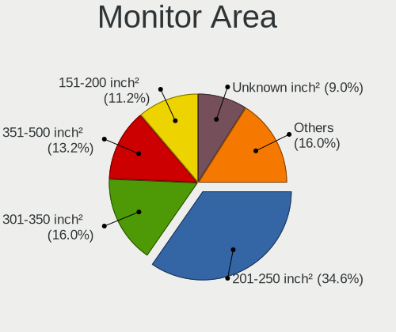

| Area in inch | Desktops | Percent |
|----------------|----------|---------|
| 201-250        | 100      | 37.04%  |
| 151-200        | 35       | 12.96%  |
| 301-350        | 32       | 11.85%  |
| 351-500        | 28       | 10.37%  |
| Unknown        | 27       | 10%     |
| More than 1000 | 20       | 7.41%   |
| 141-150        | 13       | 4.81%   |
| 251-300        | 8        | 2.96%   |
| 501-1000       | 5        | 1.85%   |
| 101-110        | 2        | 0.74%   |

Pixel Density
-------------

Pixels per inch

| Density | Desktops | Percent |
|---------|----------|---------|
| 51-100  | 147      | 55.26%  |
| 101-120 | 51       | 19.17%  |
| Unknown | 27       | 10.15%  |
| 1-50    | 19       | 7.14%   |
| 121-160 | 17       | 6.39%   |
| 161-240 | 5        | 1.88%   |

Multiple Monitors
-----------------

Total monitors connected

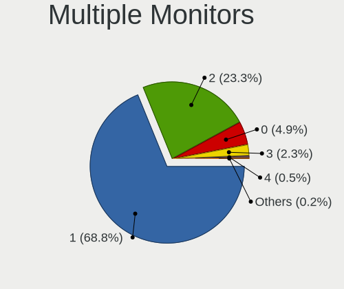

| Total | Desktops | Percent |
|-------|----------|---------|
| 1     | 180      | 71.15%  |
| 2     | 57       | 22.53%  |
| 0     | 8        | 3.16%   |
| 3     | 6        | 2.37%   |
| 4     | 2        | 0.79%   |

Network
-------

Net Controller Vendor
---------------------

Controller vendors

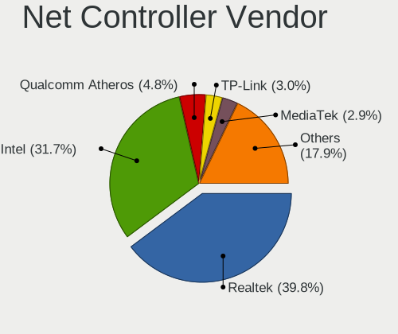

| Vendor                                | Desktops | Percent |
|---------------------------------------|----------|---------|
| Realtek Semiconductor                 | 134      | 36.91%  |
| Intel                                 | 112      | 30.85%  |
| Qualcomm Atheros                      | 27       | 7.44%   |
| Ralink Technology                     | 13       | 3.58%   |
| Broadcom                              | 10       | 2.75%   |
| TP-Link                               | 9        | 2.48%   |
| Marvell Technology Group              | 8        | 2.2%    |
| Ralink                                | 6        | 1.65%   |
| Nvidia                                | 6        | 1.65%   |
| Qualcomm Atheros Communications       | 4        | 1.1%    |
| Samsung Electronics                   | 3        | 0.83%   |
| NetGear                               | 3        | 0.83%   |
| Edimax Technology                     | 3        | 0.83%   |
| Aquantia                              | 3        | 0.83%   |
| Microsoft                             | 2        | 0.55%   |
| Microchip Technology                  | 2        | 0.55%   |
| MediaTek                              | 2        | 0.55%   |
| IBM                                   | 2        | 0.55%   |
| Broadcom Limited                      | 2        | 0.55%   |
| ZTE WCDMA Technologies MSM            | 1        | 0.28%   |
| Wilocity                              | 1        | 0.28%   |
| Mellanox Technologies                 | 1        | 0.28%   |
| MCS                                   | 1        | 0.28%   |
| Huawei Technologies                   | 1        | 0.28%   |
| DisplayLink                           | 1        | 0.28%   |
| D-Link                                | 1        | 0.28%   |
| Bose                                  | 1        | 0.28%   |
| Belkin Components                     | 1        | 0.28%   |
| ASUSTek Computer                      | 1        | 0.28%   |
| ASIX Electronics                      | 1        | 0.28%   |
| 802.11g Adapter [Linksys WUSB54GC v3] | 1        | 0.28%   |

Net Controller Model
--------------------

Controller models

| Model                                                             | Desktops | Percent |
|-------------------------------------------------------------------|----------|---------|
| Realtek RTL8111/8168/8411 PCI Express Gigabit Ethernet Controller | 111      | 27.75%  |
| Intel 82579LM Gigabit Network Connection (Lewisville)             | 19       | 4.75%   |
| Intel I211 Gigabit Network Connection                             | 16       | 4%      |
| Intel Wi-Fi 6 AX200                                               | 15       | 3.75%   |
| Realtek RTL8125 2.5GbE Controller                                 | 9        | 2.25%   |
| Qualcomm Atheros AR8151 v2.0 Gigabit Ethernet                     | 8        | 2%      |
| Intel Ethernet Connection I217-LM                                 | 8        | 2%      |
| Intel Ethernet Connection (2) I219-V                              | 8        | 2%      |
| Intel Wireless-AC 9260                                            | 7        | 1.75%   |
| Intel 82567LM-3 Gigabit Network Connection                        | 7        | 1.75%   |
| Realtek RTL88x2bu [AC1200 Techkey]                                | 5        | 1.25%   |
| Realtek RTL8812AE 802.11ac PCIe Wireless Network Adapter          | 5        | 1.25%   |
| Ralink MT7601U Wireless Adapter                                   | 5        | 1.25%   |
| Marvell Group 88E8056 PCI-E Gigabit Ethernet Controller           | 5        | 1.25%   |
| Intel Ethernet Controller I225-V                                  | 5        | 1.25%   |
| Intel 82574L Gigabit Network Connection                           | 5        | 1.25%   |
| TP-Link TL-WN822N Version 4 RTL8192EU                             | 4        | 1%      |
| Intel Ethernet Connection (2) I219-LM                             | 4        | 1%      |
| Intel Ethernet Connection (2) I218-V                              | 4        | 1%      |
| Qualcomm Atheros QCA6174 802.11ac Wireless Network Adapter        | 3        | 0.75%   |
| Qualcomm Atheros AR9271 802.11n                                   | 3        | 0.75%   |
| Qualcomm Atheros AR9287 Wireless Network Adapter (PCI-Express)    | 3        | 0.75%   |
| Qualcomm Atheros AR8161 Gigabit Ethernet                          | 3        | 0.75%   |
| Nvidia MCP61 Ethernet                                             | 3        | 0.75%   |
| Intel Wireless 8265 / 8275                                        | 3        | 0.75%   |
| Intel Dual Band Wireless-AC 3168NGW [Stone Peak]                  | 3        | 0.75%   |
| Intel 82579V Gigabit Network Connection                           | 3        | 0.75%   |
| Intel 82578DM Gigabit Network Connection                          | 3        | 0.75%   |
| Broadcom BCM43228 802.11a/b/g/n                                   | 3        | 0.75%   |
| Samsung Galaxy series, misc. (tethering mode)                     | 2        | 0.5%    |
| Realtek RTL8822BE 802.11a/b/g/n/ac WiFi adapter                   | 2        | 0.5%    |
| Realtek RTL8821CE 802.11ac PCIe Wireless Network Adapter          | 2        | 0.5%    |
| Realtek RTL8192EE PCIe Wireless Network Adapter                   | 2        | 0.5%    |
| Realtek RTL8192CE PCIe Wireless Network Adapter                   | 2        | 0.5%    |
| Realtek RTL8191SU 802.11n WLAN Adapter                            | 2        | 0.5%    |
| Realtek RTL8188EUS 802.11n Wireless Network Adapter               | 2        | 0.5%    |
| Ralink RT5370 Wireless Adapter                                    | 2        | 0.5%    |
| Ralink RT2870/RT3070 Wireless Adapter                             | 2        | 0.5%    |
| Ralink RT3290 Wireless 802.11n 1T/1R PCIe                         | 2        | 0.5%    |
| Qualcomm Atheros Killer E220x Gigabit Ethernet Controller         | 2        | 0.5%    |

Wireless Vendor
---------------

Wireless vendors

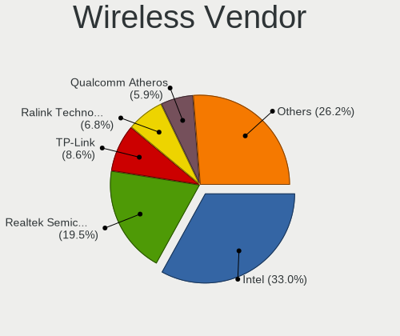

| Vendor                                | Desktops | Percent |
|---------------------------------------|----------|---------|
| Intel                                 | 33       | 27.05%  |
| Realtek Semiconductor                 | 27       | 22.13%  |
| Ralink Technology                     | 13       | 10.66%  |
| Qualcomm Atheros                      | 11       | 9.02%   |
| TP-Link                               | 9        | 7.38%   |
| Ralink                                | 6        | 4.92%   |
| Broadcom                              | 5        | 4.1%    |
| Qualcomm Atheros Communications       | 4        | 3.28%   |
| NetGear                               | 3        | 2.46%   |
| Edimax Technology                     | 3        | 2.46%   |
| Microsoft                             | 2        | 1.64%   |
| Wilocity                              | 1        | 0.82%   |
| MediaTek                              | 1        | 0.82%   |
| D-Link                                | 1        | 0.82%   |
| Belkin Components                     | 1        | 0.82%   |
| ASUSTek Computer                      | 1        | 0.82%   |
| 802.11g Adapter [Linksys WUSB54GC v3] | 1        | 0.82%   |

Wireless Model
--------------

Wireless models

| Model                                                               | Desktops | Percent |
|---------------------------------------------------------------------|----------|---------|
| Intel Wi-Fi 6 AX200                                                 | 15       | 12%     |
| Intel Wireless-AC 9260                                              | 7        | 5.6%    |
| Realtek RTL88x2bu [AC1200 Techkey]                                  | 5        | 4%      |
| Realtek RTL8812AE 802.11ac PCIe Wireless Network Adapter            | 5        | 4%      |
| Ralink MT7601U Wireless Adapter                                     | 5        | 4%      |
| TP-Link TL-WN822N Version 4 RTL8192EU                               | 4        | 3.2%    |
| Qualcomm Atheros QCA6174 802.11ac Wireless Network Adapter          | 3        | 2.4%    |
| Qualcomm Atheros AR9271 802.11n                                     | 3        | 2.4%    |
| Qualcomm Atheros AR9287 Wireless Network Adapter (PCI-Express)      | 3        | 2.4%    |
| Intel Wireless 8265 / 8275                                          | 3        | 2.4%    |
| Intel Dual Band Wireless-AC 3168NGW [Stone Peak]                    | 3        | 2.4%    |
| Broadcom BCM43228 802.11a/b/g/n                                     | 3        | 2.4%    |
| Realtek RTL8822BE 802.11a/b/g/n/ac WiFi adapter                     | 2        | 1.6%    |
| Realtek RTL8821CE 802.11ac PCIe Wireless Network Adapter            | 2        | 1.6%    |
| Realtek RTL8192EE PCIe Wireless Network Adapter                     | 2        | 1.6%    |
| Realtek RTL8192CE PCIe Wireless Network Adapter                     | 2        | 1.6%    |
| Realtek RTL8191SU 802.11n WLAN Adapter                              | 2        | 1.6%    |
| Realtek RTL8188EUS 802.11n Wireless Network Adapter                 | 2        | 1.6%    |
| Ralink RT5370 Wireless Adapter                                      | 2        | 1.6%    |
| Ralink RT2870/RT3070 Wireless Adapter                               | 2        | 1.6%    |
| Ralink RT3290 Wireless 802.11n 1T/1R PCIe                           | 2        | 1.6%    |
| Intel Wi-Fi 6 AX210/AX211/AX411 160MHz                              | 2        | 1.6%    |
| Edimax EW-7811Un 802.11n Wireless Adapter [Realtek RTL8188CUS]      | 2        | 1.6%    |
| Wilocity Wil6200 802.11ad Wireless Network Adapter                  | 1        | 0.8%    |
| TP-Link TL-WN821N v5/v6 [RTL8192EU]                                 | 1        | 0.8%    |
| TP-Link Archer T4U ver.3                                            | 1        | 0.8%    |
| TP-Link Archer T3U [Realtek RTL8812BU]                              | 1        | 0.8%    |
| TP-Link Archer T1U 802.11a/n/ac Wireless Adapter [MediaTek MT7610U] | 1        | 0.8%    |
| TP-Link 802.11ac WLAN Adapter                                       | 1        | 0.8%    |
| Realtek RTL8822CE 802.11ac PCIe Wireless Network Adapter            | 1        | 0.8%    |
| Realtek RTL8814AU 802.11a/b/g/n/ac Wireless Adapter                 | 1        | 0.8%    |
| Realtek RTL8811AU 802.11a/b/g/n/ac WLAN Adapter                     | 1        | 0.8%    |
| Realtek RTL8192EU 802.11b/g/n WLAN Adapter                          | 1        | 0.8%    |
| Realtek RTL8192CU 802.11n WLAN Adapter                              | 1        | 0.8%    |
| Realtek RTL8188EE Wireless Network Adapter                          | 1        | 0.8%    |
| Ralink RT5572 Wireless Adapter                                      | 1        | 0.8%    |
| Ralink RT2770 Wireless Adapter                                      | 1        | 0.8%    |
| Ralink RT2501/RT2573 Wireless Adapter                               | 1        | 0.8%    |
| Ralink MT7610U ("Archer T2U" 2.4G+5G WLAN Adapter                   | 1        | 0.8%    |
| Ralink RT5392 PCIe Wireless Network Adapter                         | 1        | 0.8%    |

Ethernet Vendor
---------------

Ethernet vendors

| Vendor                     | Desktops | Percent |
|----------------------------|----------|---------|
| Realtek Semiconductor      | 121      | 45.15%  |
| Intel                      | 94       | 35.07%  |
| Qualcomm Atheros           | 18       | 6.72%   |
| Marvell Technology Group   | 8        | 2.99%   |
| Nvidia                     | 6        | 2.24%   |
| Broadcom                   | 5        | 1.87%   |
| Samsung Electronics        | 3        | 1.12%   |
| Aquantia                   | 3        | 1.12%   |
| IBM                        | 2        | 0.75%   |
| Broadcom Limited           | 2        | 0.75%   |
| ZTE WCDMA Technologies MSM | 1        | 0.37%   |
| Mellanox Technologies      | 1        | 0.37%   |
| MediaTek                   | 1        | 0.37%   |
| Huawei Technologies        | 1        | 0.37%   |
| DisplayLink                | 1        | 0.37%   |
| ASIX Electronics           | 1        | 0.37%   |

Ethernet Model
--------------

Ethernet models

| Model                                                             | Desktops | Percent |
|-------------------------------------------------------------------|----------|---------|
| Realtek RTL8111/8168/8411 PCI Express Gigabit Ethernet Controller | 111      | 41.11%  |
| Intel 82579LM Gigabit Network Connection (Lewisville)             | 19       | 7.04%   |
| Intel I211 Gigabit Network Connection                             | 16       | 5.93%   |
| Realtek RTL8125 2.5GbE Controller                                 | 9        | 3.33%   |
| Qualcomm Atheros AR8151 v2.0 Gigabit Ethernet                     | 8        | 2.96%   |
| Intel Ethernet Connection I217-LM                                 | 8        | 2.96%   |
| Intel Ethernet Connection (2) I219-V                              | 8        | 2.96%   |
| Intel 82567LM-3 Gigabit Network Connection                        | 7        | 2.59%   |
| Marvell Group 88E8056 PCI-E Gigabit Ethernet Controller           | 5        | 1.85%   |
| Intel Ethernet Controller I225-V                                  | 5        | 1.85%   |
| Intel 82574L Gigabit Network Connection                           | 5        | 1.85%   |
| Intel Ethernet Connection (2) I219-LM                             | 4        | 1.48%   |
| Intel Ethernet Connection (2) I218-V                              | 4        | 1.48%   |
| Qualcomm Atheros AR8161 Gigabit Ethernet                          | 3        | 1.11%   |
| Nvidia MCP61 Ethernet                                             | 3        | 1.11%   |
| Intel 82579V Gigabit Network Connection                           | 3        | 1.11%   |
| Intel 82578DM Gigabit Network Connection                          | 3        | 1.11%   |
| Samsung Galaxy series, misc. (tethering mode)                     | 2        | 0.74%   |
| Qualcomm Atheros Killer E220x Gigabit Ethernet Controller         | 2        | 0.74%   |
| Qualcomm Atheros AR8131 Gigabit Ethernet                          | 2        | 0.74%   |
| Nvidia CK804 Ethernet Controller                                  | 2        | 0.74%   |
| Marvell Group 88E8053 PCI-E Gigabit Ethernet Controller           | 2        | 0.74%   |
| Intel Ethernet Connection (7) I219-V                              | 2        | 0.74%   |
| Intel Ethernet Connection (5) I219-LM                             | 2        | 0.74%   |
| Intel Ethernet Connection (11) I219-V                             | 2        | 0.74%   |
| IBM XClarity Controller                                           | 2        | 0.74%   |
| Broadcom NetXtreme BCM5715 Gigabit Ethernet                       | 2        | 0.74%   |
| Aquantia AQC107 NBase-T/IEEE 802.3bz Ethernet Controller [AQtion] | 2        | 0.74%   |
| ZTE WCDMA MSM ZTE                                                 | 1        | 0.37%   |
| Samsung GT-I9070 (network tethering, USB debugging enabled)       | 1        | 0.37%   |
| Realtek RTL-8110SC/8169SC Gigabit Ethernet                        | 1        | 0.37%   |
| Qualcomm Atheros Killer E2500 Gigabit Ethernet Controller         | 1        | 0.37%   |
| Qualcomm Atheros Killer E2400 Gigabit Ethernet Controller         | 1        | 0.37%   |
| Qualcomm Atheros Attansic L2 Fast Ethernet                        | 1        | 0.37%   |
| Nvidia MCP67 Ethernet                                             | 1        | 0.37%   |
| Mellanox MT26448 [ConnectX EN 10GigE, PCIe 2.0 5GT/s]             | 1        | 0.37%   |
| MediaTek N152DL                                                   | 1        | 0.37%   |
| Marvell Group 88E8057 PCI-E Gigabit Ethernet Controller           | 1        | 0.37%   |
| Intel I210 Gigabit Network Connection                             | 1        | 0.37%   |
| Intel Ethernet Connection I219-LM                                 | 1        | 0.37%   |

Net Controller Kind
-------------------

Ethernet, WiFi or modem

| Kind     | Desktops | Percent |
|----------|----------|---------|
| Ethernet | 242      | 67.04%  |
| WiFi     | 114      | 31.58%  |
| Modem    | 4        | 1.11%   |
| Unknown  | 1        | 0.28%   |

Used Controller
---------------

Currently used network controller

| Kind     | Desktops | Percent |
|----------|----------|---------|
| Ethernet | 192      | 75.59%  |
| WiFi     | 62       | 24.41%  |

NICs
----

Total network controllers on board

| Total | Desktops | Percent |
|-------|----------|---------|
| 1     | 151      | 61.63%  |
| 2     | 82       | 33.47%  |
| 3     | 11       | 4.49%   |
| 4     | 1        | 0.41%   |

IPv6
----

IPv6 vs IPv4

| Used | Desktops | Percent |
|------|----------|---------|
| No   | 214      | 84.92%  |
| Yes  | 38       | 15.08%  |

Bluetooth
---------

Bluetooth Vendor
----------------

Controller vendors

| Vendor                          | Desktops | Percent |
|---------------------------------|----------|---------|
| Intel                           | 30       | 42.25%  |
| Cambridge Silicon Radio         | 21       | 29.58%  |
| Broadcom                        | 5        | 7.04%   |
| Realtek Semiconductor           | 3        | 4.23%   |
| Qualcomm Atheros Communications | 3        | 4.23%   |
| ASUSTek Computer                | 3        | 4.23%   |
| Ralink                          | 2        | 2.82%   |
| MediaTek                        | 1        | 1.41%   |
| IMC Networks                    | 1        | 1.41%   |
| HTC (High Tech Computer)        | 1        | 1.41%   |
| Edimax Technology               | 1        | 1.41%   |

Bluetooth Model
---------------

Controller models

| Model                                                                | Desktops | Percent |
|----------------------------------------------------------------------|----------|---------|
| Cambridge Silicon Radio Bluetooth Dongle (HCI mode)                  | 21       | 28.77%  |
| Intel AX200 Bluetooth                                                | 12       | 16.44%  |
| Intel Wireless-AC 9260 Bluetooth Adapter                             | 7        | 9.59%   |
| Intel Bluetooth wireless interface                                   | 6        | 8.22%   |
| Intel Wireless-AC 3168 Bluetooth                                     | 3        | 4.11%   |
| Broadcom BCM20702A0 Bluetooth 4.0                                    | 3        | 4.11%   |
| Realtek Bluetooth Radio                                              | 2        | 2.74%   |
| Ralink RT3290 Bluetooth                                              | 2        | 2.74%   |
| Intel Bluetooth 9460/9560 Jefferson Peak (JfP)                       | 2        | 2.74%   |
| Intel AX210 Bluetooth                                                | 2        | 2.74%   |
| Broadcom HP Portable Bumble Bee                                      | 2        | 2.74%   |
| ASUS Bluetooth Radio                                                 | 2        | 2.74%   |
| Realtek  Bluetooth 4.2 Adapter                                       | 1        | 1.37%   |
| Qualcomm Atheros  Bluetooth Device                                   | 1        | 1.37%   |
| Qualcomm Atheros QCA61x4 Bluetooth 4.0                               | 1        | 1.37%   |
| Qualcomm Atheros AR3011 Bluetooth                                    | 1        | 1.37%   |
| MediaTek Wireless_Device                                             | 1        | 1.37%   |
| IMC Networks Bluetooth Radio                                         | 1        | 1.37%   |
| HTC (High Tech Computer) Vive Hub Bluetooth 4.1 (Broadcom BCM920703) | 1        | 1.37%   |
| Edimax Bluetooth Adapter                                             | 1        | 1.37%   |
| ASUS Bluetooth Device                                                | 1        | 1.37%   |

Sound
-----

Sound Vendor
------------

Sound card vendors

| Vendor                  | Desktops | Percent |
|-------------------------|----------|---------|
| Intel                   | 143      | 34.21%  |
| AMD                     | 122      | 29.19%  |
| Nvidia                  | 88       | 21.05%  |
| Logitech                | 13       | 3.11%   |
| C-Media Electronics     | 12       | 2.87%   |
| Kingston Technology     | 6        | 1.44%   |
| SteelSeries ApS         | 3        | 0.72%   |
| GN Netcom               | 3        | 0.72%   |
| Razer USA               | 2        | 0.48%   |
| JMTek                   | 2        | 0.48%   |
| GYROCOM C&C             | 2        | 0.48%   |
| Generalplus Technology  | 2        | 0.48%   |
| Dell                    | 2        | 0.48%   |
| AKAI Professional M.I.  | 2        | 0.48%   |
| XMOS                    | 1        | 0.24%   |
| WL80                    | 1        | 0.24%   |
| Texas Instruments       | 1        | 0.24%   |
| RODE Microphones        | 1        | 0.24%   |
| RME                     | 1        | 0.24%   |
| Microsoft               | 1        | 0.24%   |
| Lenovo                  | 1        | 0.24%   |
| Giga-Byte Technology    | 1        | 0.24%   |
| DCMT Technology         | 1        | 0.24%   |
| Creative Technology     | 1        | 0.24%   |
| Creative Labs           | 1        | 0.24%   |
| Cambridge Silicon Radio | 1        | 0.24%   |
| Blue Microphones        | 1        | 0.24%   |
| Audio-Technica          | 1        | 0.24%   |
| Astro Gaming            | 1        | 0.24%   |
| Apogee Electronics      | 1        | 0.24%   |

Sound Model
-----------

Sound card models

| Model                                                                             | Desktops | Percent |
|-----------------------------------------------------------------------------------|----------|---------|
| AMD Starship/Matisse HD Audio Controller                                          | 28       | 5.7%    |
| Intel 7 Series/C216 Chipset Family High Definition Audio Controller               | 25       | 5.09%   |
| AMD SBx00 Azalia (Intel HDA)                                                      | 20       | 4.07%   |
| Intel 6 Series/C200 Series Chipset Family High Definition Audio Controller        | 18       | 3.67%   |
| AMD Family 17h (Models 00h-0fh) HD Audio Controller                               | 18       | 3.67%   |
| Intel 8 Series/C220 Series Chipset High Definition Audio Controller               | 17       | 3.46%   |
| AMD Ellesmere HDMI Audio [Radeon RX 470/480 / 570/580/590]                        | 17       | 3.46%   |
| Intel Xeon E3-1200 v3/4th Gen Core Processor HD Audio Controller                  | 16       | 3.26%   |
| Intel 200 Series PCH HD Audio                                                     | 13       | 2.65%   |
| Intel 100 Series/C230 Series Chipset Family HD Audio Controller                   | 9        | 1.83%   |
| AMD Family 17h/19h HD Audio Controller                                            | 9        | 1.83%   |
| Intel 9 Series Chipset Family HD Audio Controller                                 | 8        | 1.63%   |
| Intel 5 Series/3400 Series Chipset High Definition Audio                          | 8        | 1.63%   |
| AMD Oland/Hainan/Cape Verde/Pitcairn HDMI Audio [Radeon HD 7000 Series]           | 8        | 1.63%   |
| AMD Navi 10 HDMI Audio                                                            | 8        | 1.63%   |
| AMD FCH Azalia Controller                                                         | 8        | 1.63%   |
| Nvidia GP106 High Definition Audio Controller                                     | 7        | 1.43%   |
| Nvidia GP102 HDMI Audio Controller                                                | 7        | 1.43%   |
| Nvidia GK208 HDMI/DP Audio Controller                                             | 7        | 1.43%   |
| Intel NM10/ICH7 Family High Definition Audio Controller                           | 7        | 1.43%   |
| Intel 82801JI (ICH10 Family) HD Audio Controller                                  | 7        | 1.43%   |
| Intel 82801JD/DO (ICH10 Family) HD Audio Controller                               | 7        | 1.43%   |
| AMD Cedar HDMI Audio [Radeon HD 5400/6300/7300 Series]                            | 7        | 1.43%   |
| AMD Caicos HDMI Audio [Radeon HD 6450 / 7450/8450/8490 OEM / R5 230/235/235X OEM] | 6        | 1.22%   |
| Nvidia High Definition Audio Controller                                           | 5        | 1.02%   |
| Nvidia GP108 High Definition Audio Controller                                     | 5        | 1.02%   |
| Nvidia GP104 High Definition Audio Controller                                     | 5        | 1.02%   |
| Nvidia GK107 HDMI Audio Controller                                                | 5        | 1.02%   |
| Nvidia GK104 HDMI Audio Controller                                                | 5        | 1.02%   |
| C-Media Electronics CMI8788 [Oxygen HD Audio]                                     | 5        | 1.02%   |
| AMD Renoir Radeon High Definition Audio Controller                                | 5        | 1.02%   |
| Nvidia TU116 High Definition Audio Controller                                     | 4        | 0.81%   |
| Nvidia TU106 High Definition Audio Controller                                     | 4        | 0.81%   |
| Nvidia GP107GL High Definition Audio Controller                                   | 4        | 0.81%   |
| C-Media Electronics Audio Adapter (Unitek Y-247A)                                 | 4        | 0.81%   |
| AMD Turks HDMI Audio [Radeon HD 6500/6600 / 6700M Series]                         | 4        | 0.81%   |
| AMD Raven/Raven2/Fenghuang HDMI/DP Audio Controller                               | 4        | 0.81%   |
| AMD Navi 21/23 HDMI/DP Audio Controller                                           | 4        | 0.81%   |
| AMD Baffin HDMI/DP Audio [Radeon RX 550 640SP / RX 560/560X]                      | 4        | 0.81%   |
| Nvidia GM107 High Definition Audio Controller [GeForce 940MX]                     | 3        | 0.61%   |

Memory
------

Memory Vendor
-------------

Memory module vendors

| Vendor              | Desktops | Percent |
|---------------------|----------|---------|
| G.Skill             | 24       | 18.6%   |
| Kingston            | 18       | 13.95%  |
| SK hynix            | 15       | 11.63%  |
| Unknown             | 13       | 10.08%  |
| Samsung Electronics | 11       | 8.53%   |
| Crucial             | 11       | 8.53%   |
| Corsair             | 8        | 6.2%    |
| A-DATA Technology   | 8        | 6.2%    |
| Team                | 5        | 3.88%   |
| Micron Technology   | 5        | 3.88%   |
| Strontium           | 2        | 1.55%   |
| Elpida              | 2        | 1.55%   |
| Unknown (ABCD)      | 1        | 0.78%   |
| Transcend           | 1        | 0.78%   |
| Ramaxel Technology  | 1        | 0.78%   |
| pqi                 | 1        | 0.78%   |
| PNY                 | 1        | 0.78%   |
| Nanya Technology    | 1        | 0.78%   |
| Innodisk            | 1        | 0.78%   |

Memory Model
------------

Memory module models

| Model                                                        | Desktops | Percent |
|--------------------------------------------------------------|----------|---------|
| G.Skill RAM F4-3600C16-16GTZNC 16384MB DIMM DDR4 3600MT/s    | 4        | 2.92%   |
| Team RAM TEAMGROUP-UD4-3600 16GB DIMM DDR4 3600MT/s          | 3        | 2.19%   |
| Unknown RAM Module 8GB DIMM 1600MT/s                         | 2        | 1.46%   |
| Unknown RAM Module 2048MB DIMM DDR3 1333MT/s                 | 2        | 1.46%   |
| SK hynix RAM HMT351S6CFR8C-PB 4GB SODIMM DDR3 1600MT/s       | 2        | 1.46%   |
| SK hynix RAM HMT325U6CFR8C-H9 2GB DIMM DDR3 1333MT/s         | 2        | 1.46%   |
| Samsung RAM M378B5673EH1-CH9 2GB DIMM DDR3 1333MT/s          | 2        | 1.46%   |
| Kingston RAM KHX3200C16D4/16GX 16GB DIMM DDR4 3600MT/s       | 2        | 1.46%   |
| Kingston RAM 9905403-011.A03LF 2GB DIMM DDR3 1333MT/s        | 2        | 1.46%   |
| G.Skill RAM F4-3200C16-8GTZR 8GB DIMM DDR4 3200MT/s          | 2        | 1.46%   |
| G.Skill RAM F4-3200C16-8GTZB 8GB DIMM DDR4 3200MT/s          | 2        | 1.46%   |
| G.Skill RAM F4-3200C16-16GVK 16GB DIMM DDR4 3600MT/s         | 2        | 1.46%   |
| G.Skill RAM F4-2666C15-8GVR 8GB DIMM DDR4 2800MT/s           | 2        | 1.46%   |
| G.Skill RAM F3-1600C9-4GAB 4GB DIMM DDR3 1600MT/s            | 2        | 1.46%   |
| G.Skill RAM F3-14900CL10-8GBXL 8GB DIMM DDR3 1867MT/s        | 2        | 1.46%   |
| Crucial RAM CT102464BD160B.C16 8GB DIMM DDR3 1600MT/s        | 2        | 1.46%   |
| Crucial RAM CT102464BA160B.C16 8192MB DIMM DDR3 1600MT/s     | 2        | 1.46%   |
| Corsair RAM CMW32GX4M2C3200C16 16GB DIMM DDR4 3200MT/s       | 2        | 1.46%   |
| Corsair RAM CMK32GX4M2B3200C16 16GB DIMM DDR4 3400MT/s       | 2        | 1.46%   |
| Unknown RAM Module 8GB DIMM 1066MT/s                         | 1        | 0.73%   |
| Unknown RAM Module 8192MB DIMM 667MT/s                       | 1        | 0.73%   |
| Unknown RAM Module 4GB DIMM 800MT/s                          | 1        | 0.73%   |
| Unknown RAM Module 4GB DIMM                                  | 1        | 0.73%   |
| Unknown RAM Module 4096MB DIMM SDRAM 1066MT/s                | 1        | 0.73%   |
| Unknown RAM Module 4096MB DIMM DDR3 1333MT/s                 | 1        | 0.73%   |
| Unknown RAM Module 4096MB DIMM DDR2 1067MT/s                 | 1        | 0.73%   |
| Unknown RAM Module 2GB DIMM 800MT/s                          | 1        | 0.73%   |
| Unknown RAM Module 2048MB DIMM DDR2 800MT/s                  | 1        | 0.73%   |
| Unknown RAM Module 1024MB DIMM DDR2 800MT/s                  | 1        | 0.73%   |
| Unknown (ABCD) RAM 123456789012345678 4GB DIMM DDR4 2400MT/s | 1        | 0.73%   |
| Transcend RAM JM1333KLN-4GK 2048MB DIMM DDR3 1333MT/s        | 1        | 0.73%   |
| Team RAM TEAMGROUP-UD4-3200 16GB DIMM DDR4 3800MT/s          | 1        | 0.73%   |
| Team RAM TEAMGROUP-UD4-3200 16GB DIMM DDR4 3733MT/s          | 1        | 0.73%   |
| Strontium RAM SRT8G86U1-P9H 8GB DIMM DDR3 1600MT/s           | 1        | 0.73%   |
| Strontium RAM SRT2G86U1-H9H 2048MB DIMM DDR3 1333MT/s        | 1        | 0.73%   |
| SK hynix RAM Module 2048MB DIMM DDR3 1600MT/s                | 1        | 0.73%   |
| SK hynix RAM Module 1024MB DIMM DDR3 1333MT/s                | 1        | 0.73%   |
| SK hynix RAM HMT451U6AFR8A-PB 4GB DIMM DDR3 1600MT/s         | 1        | 0.73%   |
| SK hynix RAM HMT41GU6AFR8A-PB 8192MB DIMM DDR3 1600MT/s      | 1        | 0.73%   |
| SK hynix RAM HMT351U6EFR8C-PB 4GB DIMM DDR3 1800MT/s         | 1        | 0.73%   |

Memory Kind
-----------

Memory module kinds

| Kind    | Desktops | Percent |
|---------|----------|---------|
| DDR4    | 49       | 46.67%  |
| DDR3    | 41       | 39.05%  |
| Unknown | 7        | 6.67%   |
| SDRAM   | 4        | 3.81%   |
| DDR2    | 3        | 2.86%   |
| LPDDR4  | 1        | 0.95%   |

Memory Form Factor
------------------

Physical design of the memory module

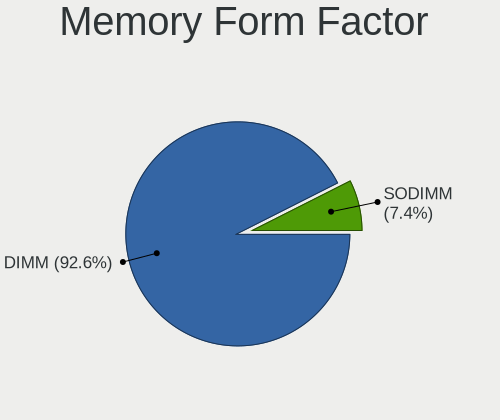

| Name   | Desktops | Percent |
|--------|----------|---------|
| DIMM   | 97       | 94.17%  |
| SODIMM | 6        | 5.83%   |

Memory Size
-----------

Memory module size

| Size  | Desktops | Percent |
|-------|----------|---------|
| 8192  | 42       | 37.17%  |
| 4096  | 26       | 23.01%  |
| 16384 | 22       | 19.47%  |
| 2048  | 14       | 12.39%  |
| 32768 | 6        | 5.31%   |
| 1024  | 3        | 2.65%   |

Memory Speed
------------

Memory module speed

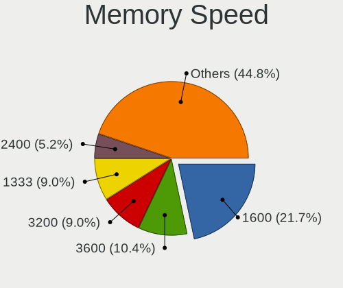

| Speed   | Desktops | Percent |
|---------|----------|---------|
| 1600    | 27       | 23.08%  |
| 3600    | 19       | 16.24%  |
| 1333    | 12       | 10.26%  |
| 3200    | 11       | 9.4%    |
| 2400    | 5        | 4.27%   |
| 1867    | 5        | 4.27%   |
| 2667    | 4        | 3.42%   |
| 2666    | 4        | 3.42%   |
| 2133    | 4        | 3.42%   |
| 3733    | 3        | 2.56%   |
| 1066    | 3        | 2.56%   |
| 800     | 3        | 2.56%   |
| 667     | 3        | 2.56%   |
| 3400    | 2        | 1.71%   |
| 2800    | 2        | 1.71%   |
| 1800    | 2        | 1.71%   |
| 3800    | 1        | 0.85%   |
| 3466    | 1        | 0.85%   |
| 2933    | 1        | 0.85%   |
| 2465    | 1        | 0.85%   |
| 2448    | 1        | 0.85%   |
| 2000    | 1        | 0.85%   |
| 1067    | 1        | 0.85%   |
| Unknown | 1        | 0.85%   |

Printers & scanners
-------------------

Printer Vendor
--------------

Printer device vendors

| Vendor             | Desktops | Percent |
|--------------------|----------|---------|
| Brother Industries | 8        | 42.11%  |
| Hewlett-Packard    | 6        | 31.58%  |
| Canon              | 3        | 15.79%  |
| Fuji Xerox         | 1        | 5.26%   |
| Dymo-CoStar        | 1        | 5.26%   |

Printer Model
-------------

Printer device models

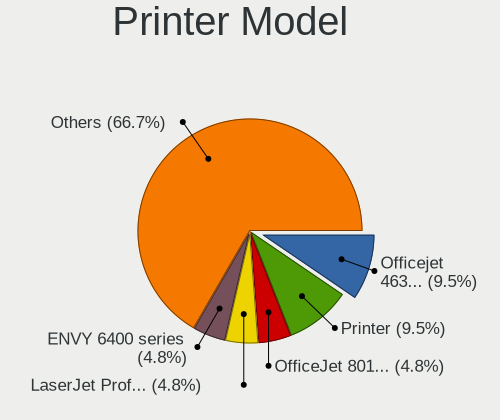

| Model                            | Desktops | Percent |
|----------------------------------|----------|---------|
| HP Officejet 4630 series         | 2        | 10.53%  |
| Brother Printer                  | 2        | 10.53%  |
| HP OfficeJet 8010 series         | 1        | 5.26%   |
| HP LaserJet Professional P1102w  | 1        | 5.26%   |
| HP ENVY 4520 series              | 1        | 5.26%   |
| HP DeskJet 2130 series           | 1        | 5.26%   |
| Fuji Xerox DocuPrint CM315/318 z | 1        | 5.26%   |
| Dymo-CoStar LabelWriter 450      | 1        | 5.26%   |
| Canon TS3100 series              | 1        | 5.26%   |
| Canon MB5300 series              | 1        | 5.26%   |
| Canon i950                       | 1        | 5.26%   |
| Brother MFC-J430W                | 1        | 5.26%   |
| Brother MFC-9140CDN              | 1        | 5.26%   |
| Brother MFC-7340                 | 1        | 5.26%   |
| Brother HL-L3230CDW series       | 1        | 5.26%   |
| Brother HL-2270DW Laser Printer  | 1        | 5.26%   |
| Brother HL-1430 Laser Printer    | 1        | 5.26%   |

Scanner Vendor
--------------

Scanner device vendors

| Vendor | Desktops | Percent |
|--------|----------|---------|
| Canon  | 1        | 100%    |

Scanner Model
-------------

Scanner device models

| Model                    | Desktops | Percent |
|--------------------------|----------|---------|
| Canon CanoScan LiDE 500F | 1        | 100%    |

Camera
------

Camera Vendor
-------------

Camera device vendors

| Vendor                   | Desktops | Percent |
|--------------------------|----------|---------|
| Logitech                 | 24       | 52.17%  |
| Microdia                 | 4        | 8.7%    |
| Samsung Electronics      | 3        | 6.52%   |
| ARC International        | 3        | 6.52%   |
| GEMBIRD                  | 2        | 4.35%   |
| Z-Star Microelectronics  | 1        | 2.17%   |
| Xiongmai                 | 1        | 2.17%   |
| Realtek Semiconductor    | 1        | 2.17%   |
| Novatek Microelectronics | 1        | 2.17%   |
| Lenovo                   | 1        | 2.17%   |
| Google                   | 1        | 2.17%   |
| Generalplus Technology   | 1        | 2.17%   |
| EVGA                     | 1        | 2.17%   |
| Chicony Electronics      | 1        | 2.17%   |
| Arkmicro Technologies    | 1        | 2.17%   |

Camera Model
------------

Camera device models

| Model                                             | Desktops | Percent |
|---------------------------------------------------|----------|---------|
| Logitech Webcam C270                              | 5        | 10.87%  |
| Logitech Webcam C170                              | 4        | 8.7%    |
| Samsung Galaxy series, misc. (MTP mode)           | 3        | 6.52%   |
| Logitech QuickCam Pro 9000                        | 3        | 6.52%   |
| ARC International Camera                          | 3        | 6.52%   |
| Logitech Webcam Pro 9000                          | 2        | 4.35%   |
| Logitech Webcam C600                              | 2        | 4.35%   |
| Logitech HD Pro Webcam C920                       | 2        | 4.35%   |
| Logitech C922 Pro Stream Webcam                   | 2        | 4.35%   |
| Z-Star Venus USB2.0 Camera                        | 1        | 2.17%   |
| Xiongmai web camera                               | 1        | 2.17%   |
| Realtek HD 720P Webcam                            | 1        | 2.17%   |
| Novatek HP High Definition 2MP Webcam             | 1        | 2.17%   |
| Microdia USB Microscope                           | 1        | 2.17%   |
| Microdia Sonix USB 2.0 Camera                     | 1        | 2.17%   |
| Microdia Integrated Camera                        | 1        | 2.17%   |
| Microdia Camera                                   | 1        | 2.17%   |
| Logitech Webcam C300                              | 1        | 2.17%   |
| Logitech Mic (Fusion)                             | 1        | 2.17%   |
| Logitech HD Webcam C615                           | 1        | 2.17%   |
| Logitech HD Webcam C525                           | 1        | 2.17%   |
| Lenovo FULL HD 1080P Webcam                       | 1        | 2.17%   |
| Google Nexus/Pixel Device (MTP + debug)           | 1        | 2.17%   |
| Generalplus WEB CAM                               | 1        | 2.17%   |
| GEMBIRD USB2.0 PC CAMERA                          | 1        | 2.17%   |
| GEMBIRD Generic UVC 1.00 camera [AppoTech AX2311] | 1        | 2.17%   |
| EVGA XR1 Capture Box                              | 1        | 2.17%   |
| Chicony HP High Definition 1MP Webcam             | 1        | 2.17%   |
| Arkmicro Webcam Carrefour                         | 1        | 2.17%   |

Security
--------

Fingerprint Vendor
------------------

Fingerprint sensor vendors

Zero info for selected period =(

Fingerprint Model
-----------------

Fingerprint sensor models

Zero info for selected period =(

Chipcard Vendor
---------------

Chipcard module vendors

Zero info for selected period =(

Chipcard Model
--------------

Chipcard module models

Zero info for selected period =(

Unsupported
-----------

Unsupported Devices
-------------------

Total unsupported devices on board

| Total | Desktops | Percent |
|-------|----------|---------|
| 0     | 211      | 84.4%   |
| 1     | 35       | 14%     |
| 2     | 3        | 1.2%    |
| 5     | 1        | 0.4%    |

Unsupported Device Types
------------------------

Types of unsupported devices

| Type                     | Desktops | Percent |
|--------------------------|----------|---------|
| Net/wireless             | 12       | 28.57%  |
| Graphics card            | 10       | 23.81%  |
| Bluetooth                | 5        | 11.9%   |
| Sound                    | 3        | 7.14%   |
| Unassigned class         | 2        | 4.76%   |
| Storage/ide              | 2        | 4.76%   |
| Multimedia controller    | 2        | 4.76%   |
| Dvb card                 | 2        | 4.76%   |
| Communication controller | 2        | 4.76%   |
| Storage/raid             | 1        | 2.38%   |
| Modem                    | 1        | 2.38%   |

