Linux in New Zealand - Tested Hardware & Statistics (Notebooks)
---------------------------------------------------------------

A project to collect tested hardware configurations for Linux in New Zealand.

Anyone can contribute to this report by the [hw-probe](https://github.com/linuxhw/hw-probe) tool:

    sudo -E hw-probe -all -upload

Please contribute! Especially if your hardware is rare.

Contents
--------

* [ Test Cases ](#test-cases)

* [ System ](#system)
  - [ OS                       ](#os)
  - [ OS Family                ](#os-family)
  - [ Kernel                   ](#kernel)
  - [ Kernel Family            ](#kernel-family)
  - [ Kernel Major Ver.        ](#kernel-major-ver)
  - [ Arch                     ](#arch)
  - [ DE                       ](#de)
  - [ Display Server           ](#display-server)
  - [ Display Manager          ](#display-manager)
  - [ OS Lang                  ](#os-lang)
  - [ Boot Mode                ](#boot-mode)
  - [ Filesystem               ](#filesystem)
  - [ Part. scheme             ](#part-scheme)
  - [ Dual Boot with Linux/BSD ](#dual-boot-with-linuxbsd)
  - [ Dual Boot (Win)          ](#dual-boot-win)

* [ Board ](#board)
  - [ Vendor                   ](#vendor)
  - [ Model                    ](#model)
  - [ Model Family             ](#model-family)
  - [ MFG Year                 ](#mfg-year)
  - [ Form Factor              ](#form-factor)
  - [ Secure Boot              ](#secure-boot)
  - [ Coreboot                 ](#coreboot)
  - [ RAM Size                 ](#ram-size)
  - [ RAM Used                 ](#ram-used)
  - [ Total Drives             ](#total-drives)
  - [ Has CD-ROM               ](#has-cd-rom)
  - [ Has Ethernet             ](#has-ethernet)
  - [ Has WiFi                 ](#has-wifi)
  - [ Has Bluetooth            ](#has-bluetooth)

* [ Location ](#location)
  - [ Country                  ](#country)
  - [ City                     ](#city)

* [ Drives ](#drives)
  - [ Drive Vendor             ](#drive-vendor)
  - [ Drive Model              ](#drive-model)
  - [ HDD Vendor               ](#hdd-vendor)
  - [ SSD Vendor               ](#ssd-vendor)
  - [ Drive Kind               ](#drive-kind)
  - [ Drive Connector          ](#drive-connector)
  - [ Drive Size               ](#drive-size)
  - [ Space Total              ](#space-total)
  - [ Space Used               ](#space-used)
  - [ Malfunc. Drives          ](#malfunc-drives)
  - [ Malfunc. Drive Vendor    ](#malfunc-drive-vendor)
  - [ Malfunc. HDD Vendor      ](#malfunc-hdd-vendor)
  - [ Malfunc. Drive Kind      ](#malfunc-drive-kind)
  - [ Failed Drives            ](#failed-drives)
  - [ Failed Drive Vendor      ](#failed-drive-vendor)
  - [ Drive Status             ](#drive-status)

* [ Storage controller ](#storage-controller)
  - [ Storage Vendor           ](#storage-vendor)
  - [ Storage Model            ](#storage-model)
  - [ Storage Kind             ](#storage-kind)

* [ Processor ](#processor)
  - [ CPU Vendor               ](#cpu-vendor)
  - [ CPU Model                ](#cpu-model)
  - [ CPU Model Family         ](#cpu-model-family)
  - [ CPU Cores                ](#cpu-cores)
  - [ CPU Sockets              ](#cpu-sockets)
  - [ CPU Threads              ](#cpu-threads)
  - [ CPU Op-Modes             ](#cpu-op-modes)
  - [ CPU Microcode            ](#cpu-microcode)
  - [ CPU Microarch            ](#cpu-microarch)

* [ Graphics ](#graphics)
  - [ GPU Vendor               ](#gpu-vendor)
  - [ GPU Model                ](#gpu-model)
  - [ GPU Combo                ](#gpu-combo)
  - [ GPU Driver               ](#gpu-driver)
  - [ GPU Memory               ](#gpu-memory)

* [ Monitor ](#monitor)
  - [ Monitor Vendor           ](#monitor-vendor)
  - [ Monitor Model            ](#monitor-model)
  - [ Monitor Resolution       ](#monitor-resolution)
  - [ Monitor Diagonal         ](#monitor-diagonal)
  - [ Monitor Width            ](#monitor-width)
  - [ Aspect Ratio             ](#aspect-ratio)
  - [ Monitor Area             ](#monitor-area)
  - [ Pixel Density            ](#pixel-density)
  - [ Multiple Monitors        ](#multiple-monitors)

* [ Network ](#network)
  - [ Net Controller Vendor    ](#net-controller-vendor)
  - [ Net Controller Model     ](#net-controller-model)
  - [ Wireless Vendor          ](#wireless-vendor)
  - [ Wireless Model           ](#wireless-model)
  - [ Ethernet Vendor          ](#ethernet-vendor)
  - [ Ethernet Model           ](#ethernet-model)
  - [ Net Controller Kind      ](#net-controller-kind)
  - [ Used Controller          ](#used-controller)
  - [ NICs                     ](#nics)
  - [ IPv6                     ](#ipv6)

* [ Bluetooth ](#bluetooth)
  - [ Bluetooth Vendor         ](#bluetooth-vendor)
  - [ Bluetooth Model          ](#bluetooth-model)

* [ Sound ](#sound)
  - [ Sound Vendor             ](#sound-vendor)
  - [ Sound Model              ](#sound-model)

* [ Memory ](#memory)
  - [ Memory Vendor            ](#memory-vendor)
  - [ Memory Model             ](#memory-model)
  - [ Memory Kind              ](#memory-kind)
  - [ Memory Form Factor       ](#memory-form-factor)
  - [ Memory Size              ](#memory-size)
  - [ Memory Speed             ](#memory-speed)

* [ Printers & scanners ](#printers--scanners)
  - [ Printer Vendor           ](#printer-vendor)
  - [ Printer Model            ](#printer-model)
  - [ Scanner Vendor           ](#scanner-vendor)
  - [ Scanner Model            ](#scanner-model)

* [ Camera ](#camera)
  - [ Camera Vendor            ](#camera-vendor)
  - [ Camera Model             ](#camera-model)

* [ Security ](#security)
  - [ Fingerprint Vendor       ](#fingerprint-vendor)
  - [ Fingerprint Model        ](#fingerprint-model)
  - [ Chipcard Vendor          ](#chipcard-vendor)
  - [ Chipcard Model           ](#chipcard-model)

* [ Unsupported ](#unsupported)
  - [ Unsupported Devices      ](#unsupported-devices)
  - [ Unsupported Device Types ](#unsupported-device-types)

Test Cases
----------

Total: 442

| Vendor        | Model                       | Probe                                                      | Date         |
|---------------|-----------------------------|------------------------------------------------------------|--------------|
| ASUSTek       | VivoBook_ASUSLaptop M340... | [d7806eec79](https://linux-hardware.org/?probe=d7806eec79) | Dec 30, 2022 |
| HP            | Pavilion Laptop 15-cs0xx... | [77390ced3c](https://linux-hardware.org/?probe=77390ced3c) | Dec 24, 2022 |
| Unknown       | Unknown                     | [56781f9824](https://linux-hardware.org/?probe=56781f9824) | Dec 19, 2022 |
| HP            | EliteBook 8460p             | [0a2731119d](https://linux-hardware.org/?probe=0a2731119d) | Dec 16, 2022 |
| Google        | Laser14                     | [b07a01ffe4](https://linux-hardware.org/?probe=b07a01ffe4) | Dec 16, 2022 |
| Dell          | Inspiron N5110              | [b333e1030f](https://linux-hardware.org/?probe=b333e1030f) | Dec 16, 2022 |
| HP            | Pavilion dv6                | [d6d4bd4dcd](https://linux-hardware.org/?probe=d6d4bd4dcd) | Dec 14, 2022 |
| HP            | Pavilion dv6                | [2472ce95cb](https://linux-hardware.org/?probe=2472ce95cb) | Dec 14, 2022 |
| Lenovo        | B50-30 20382                | [e2ecbddf15](https://linux-hardware.org/?probe=e2ecbddf15) | Dec 14, 2022 |
| ASUSTek       | ASUS EXPERTBOOK P2451FA_... | [3eb157838e](https://linux-hardware.org/?probe=3eb157838e) | Dec 13, 2022 |
| HP            | Laptop 17-bs0xx             | [d83f209b7f](https://linux-hardware.org/?probe=d83f209b7f) | Dec 12, 2022 |
| Dell          | Inspiron 5459               | [d9cc4844ac](https://linux-hardware.org/?probe=d9cc4844ac) | Dec 12, 2022 |
| ASUSTek       | ASUS EXPERTBOOK P2451FA_... | [037216f966](https://linux-hardware.org/?probe=037216f966) | Dec 03, 2022 |
| ASUSTek       | ASUS EXPERTBOOK P2451FA_... | [1c27bd3d06](https://linux-hardware.org/?probe=1c27bd3d06) | Dec 03, 2022 |
| Acer          | E1-510                      | [8aadf699f9](https://linux-hardware.org/?probe=8aadf699f9) | Nov 30, 2022 |
| Dell          | G7 7700                     | [16407c6485](https://linux-hardware.org/?probe=16407c6485) | Nov 27, 2022 |
| MSI           | Stealth GS77 12UHS          | [462cb0ce56](https://linux-hardware.org/?probe=462cb0ce56) | Nov 21, 2022 |
| Google        | Swanky                      | [1a0a358398](https://linux-hardware.org/?probe=1a0a358398) | Nov 15, 2022 |
| Acer          | TravelMate P633-M           | [2277ff1866](https://linux-hardware.org/?probe=2277ff1866) | Nov 15, 2022 |
| HP            | ProBook 430 G3              | [e69d9794fd](https://linux-hardware.org/?probe=e69d9794fd) | Nov 09, 2022 |
| HP            | ProBook 430 G3              | [d8bae2c402](https://linux-hardware.org/?probe=d8bae2c402) | Nov 08, 2022 |
| Toshiba       | Satellite C660              | [47ca2c5cb7](https://linux-hardware.org/?probe=47ca2c5cb7) | Nov 06, 2022 |
| Unknown       | Unknown                     | [6702cb2ca7](https://linux-hardware.org/?probe=6702cb2ca7) | Oct 25, 2022 |
| Google        | Swanky                      | [375d986028](https://linux-hardware.org/?probe=375d986028) | Oct 24, 2022 |
| Toshiba       | Satellite L850              | [8bfeff52e6](https://linux-hardware.org/?probe=8bfeff52e6) | Oct 24, 2022 |
| Toshiba       | Satellite C660              | [8922b0767c](https://linux-hardware.org/?probe=8922b0767c) | Oct 24, 2022 |
| Google        | Swanky                      | [19efb3ecc5](https://linux-hardware.org/?probe=19efb3ecc5) | Oct 21, 2022 |
| HP            | ProBook 450 15.6 inch G9... | [d5b2d74cd8](https://linux-hardware.org/?probe=d5b2d74cd8) | Oct 21, 2022 |
| Dell          | Latitude E7440              | [5c81fc2db0](https://linux-hardware.org/?probe=5c81fc2db0) | Oct 19, 2022 |
| Toshiba       | Satellite C660              | [01abf75c2e](https://linux-hardware.org/?probe=01abf75c2e) | Oct 09, 2022 |
| Toshiba       | Satellite L750              | [9998a32d98](https://linux-hardware.org/?probe=9998a32d98) | Oct 09, 2022 |
| Dell          | Inspiron 3521               | [5bb972fab4](https://linux-hardware.org/?probe=5bb972fab4) | Oct 05, 2022 |
| Acer          | Aspire A315-58              | [2969d635b3](https://linux-hardware.org/?probe=2969d635b3) | Oct 03, 2022 |
| Acer          | Aspire A315-58              | [28b873114a](https://linux-hardware.org/?probe=28b873114a) | Oct 03, 2022 |
| Dell          | Precision 3570              | [f4f047eecf](https://linux-hardware.org/?probe=f4f047eecf) | Oct 03, 2022 |
| Toshiba       | Satellite L850              | [0e57d064b0](https://linux-hardware.org/?probe=0e57d064b0) | Oct 02, 2022 |
| Apple         | MacBookPro14,3              | [3ccd7ea5d6](https://linux-hardware.org/?probe=3ccd7ea5d6) | Sep 30, 2022 |
| HP            | Pavilion g7                 | [22133612c0](https://linux-hardware.org/?probe=22133612c0) | Sep 25, 2022 |
| Lenovo        | V15-IGL 82C3                | [c2de0def85](https://linux-hardware.org/?probe=c2de0def85) | Sep 25, 2022 |
| HP            | 15                          | [50f64276d5](https://linux-hardware.org/?probe=50f64276d5) | Sep 19, 2022 |
| HP            | 15                          | [d74a694eb8](https://linux-hardware.org/?probe=d74a694eb8) | Sep 19, 2022 |
| Toshiba       | Satellite C660              | [c5474e5fe3](https://linux-hardware.org/?probe=c5474e5fe3) | Sep 16, 2022 |
| Google        | Snappy                      | [e428dec368](https://linux-hardware.org/?probe=e428dec368) | Sep 14, 2022 |
| HP            | Laptop 17-bs0xx             | [ebf0bfea05](https://linux-hardware.org/?probe=ebf0bfea05) | Sep 08, 2022 |
| HP            | Pavilion dv6                | [5877abaab3](https://linux-hardware.org/?probe=5877abaab3) | Sep 07, 2022 |
| Acer          | Aspire F5-573G              | [98812c04d7](https://linux-hardware.org/?probe=98812c04d7) | Sep 03, 2022 |
| Acer          | Aspire F5-573G              | [6fe42dd16d](https://linux-hardware.org/?probe=6fe42dd16d) | Sep 03, 2022 |
| The Wareho... | E2037                       | [e9599d1061](https://linux-hardware.org/?probe=e9599d1061) | Aug 31, 2022 |
| Lenovo        | V145-15AST 81MT             | [40b9d37c2a](https://linux-hardware.org/?probe=40b9d37c2a) | Aug 29, 2022 |
| HP            | ProBook 440 14 inch G9 N... | [0a08f13779](https://linux-hardware.org/?probe=0a08f13779) | Aug 29, 2022 |
| Apple         | MacBook5,2                  | [780e5cbb44](https://linux-hardware.org/?probe=780e5cbb44) | Aug 28, 2022 |
| Dell          | Latitude 5420               | [0d5e8a9703](https://linux-hardware.org/?probe=0d5e8a9703) | Aug 28, 2022 |
| HP            | ProBook 450 G6              | [def45574de](https://linux-hardware.org/?probe=def45574de) | Aug 26, 2022 |
| ASUSTek       | P81IJ                       | [7ab324abea](https://linux-hardware.org/?probe=7ab324abea) | Aug 25, 2022 |
| Lenovo        | ThinkPad T420 4180F75       | [f4a6e9705d](https://linux-hardware.org/?probe=f4a6e9705d) | Aug 24, 2022 |
| Acer          | Aspire M5-581TG             | [03ec19b37d](https://linux-hardware.org/?probe=03ec19b37d) | Aug 23, 2022 |
| Google        | Galtic                      | [f06baf315d](https://linux-hardware.org/?probe=f06baf315d) | Aug 22, 2022 |
| Dell          | Latitude E6500              | [defd0003bc](https://linux-hardware.org/?probe=defd0003bc) | Aug 22, 2022 |
| Dell          | Vostro 7500                 | [94309eee94](https://linux-hardware.org/?probe=94309eee94) | Aug 15, 2022 |
| Dell          | Vostro 7500                 | [3e084bba8b](https://linux-hardware.org/?probe=3e084bba8b) | Aug 15, 2022 |
| HP            | ProBook 6570b               | [335eb52112](https://linux-hardware.org/?probe=335eb52112) | Aug 12, 2022 |
| Lenovo        | Yoga Slim 7 15ITL05 82AC    | [477ce53969](https://linux-hardware.org/?probe=477ce53969) | Aug 10, 2022 |
| Dell          | Latitude E6420              | [7c907987cb](https://linux-hardware.org/?probe=7c907987cb) | Aug 10, 2022 |
| Dell          | Latitude E6430s             | [542db6380a](https://linux-hardware.org/?probe=542db6380a) | Aug 04, 2022 |
| ASUSTek       | Zenbook UX5401ZAS_UX5401... | [d3b270c068](https://linux-hardware.org/?probe=d3b270c068) | Jul 31, 2022 |
| HP            | 2000                        | [531b786836](https://linux-hardware.org/?probe=531b786836) | Jul 28, 2022 |
| HP            | Notebook                    | [17893fb905](https://linux-hardware.org/?probe=17893fb905) | Jul 24, 2022 |
| ASUSTek       | ROG Zephyrus G15 GA503RW... | [7812a0737e](https://linux-hardware.org/?probe=7812a0737e) | Jul 15, 2022 |
| Kogan         | KALAP13S300VA               | [9060455576](https://linux-hardware.org/?probe=9060455576) | Jul 15, 2022 |
| Lenovo        | ThinkPad T470 W10DG 20JN... | [1dac03f80a](https://linux-hardware.org/?probe=1dac03f80a) | Jul 15, 2022 |
| Lenovo        | 14w 81MQ0013AU              | [a93743a911](https://linux-hardware.org/?probe=a93743a911) | Jul 11, 2022 |
| ASUSTek       | ROG Zephyrus G15 GA503RW... | [a379e2a103](https://linux-hardware.org/?probe=a379e2a103) | Jul 11, 2022 |
| Lenovo        | G40-30 80FY                 | [35d55776f6](https://linux-hardware.org/?probe=35d55776f6) | Jul 09, 2022 |
| ASUSTek       | GL703VD                     | [dc966787de](https://linux-hardware.org/?probe=dc966787de) | Jul 04, 2022 |
| ASUSTek       | ROG Strix G513QY_G513QY     | [1780abcf08](https://linux-hardware.org/?probe=1780abcf08) | Jun 24, 2022 |
| HP            | ZBook Firefly 15 G7 Mobi... | [36fdd87ff3](https://linux-hardware.org/?probe=36fdd87ff3) | Jun 21, 2022 |
| HP            | ProBook 450 G1              | [7ef2bab71d](https://linux-hardware.org/?probe=7ef2bab71d) | Jun 19, 2022 |
| HP            | 550                         | [1db816d0b2](https://linux-hardware.org/?probe=1db816d0b2) | Jun 19, 2022 |
| Dell          | Precision 3571              | [9d6985b0f0](https://linux-hardware.org/?probe=9d6985b0f0) | Jun 18, 2022 |
| Dell          | Precision 3571              | [285846e1a4](https://linux-hardware.org/?probe=285846e1a4) | Jun 18, 2022 |
| HP            | EliteBook 830 G5            | [f7d3ee91c6](https://linux-hardware.org/?probe=f7d3ee91c6) | Jun 12, 2022 |
| HP            | EliteBook 830 G5            | [4347d50981](https://linux-hardware.org/?probe=4347d50981) | Jun 12, 2022 |
| Lenovo        | ThinkPad T460p 20FW0005A... | [f9bd82bcd7](https://linux-hardware.org/?probe=f9bd82bcd7) | Jun 05, 2022 |
| HP            | ZBook Studio G7 Mobile W... | [894d121f66](https://linux-hardware.org/?probe=894d121f66) | Jun 03, 2022 |
| Lenovo        | ThinkPad T460p 20FW0005A... | [df0f623625](https://linux-hardware.org/?probe=df0f623625) | May 30, 2022 |
| ASUSTek       | ROG Strix G513QY_G513QY     | [5718bd4854](https://linux-hardware.org/?probe=5718bd4854) | May 27, 2022 |
| Toshiba       | Satellite Pro C665          | [23fd853a45](https://linux-hardware.org/?probe=23fd853a45) | May 24, 2022 |
| Acer          | TravelMate 7750G            | [3ff0c1c7f2](https://linux-hardware.org/?probe=3ff0c1c7f2) | May 23, 2022 |
| Acer          | TravelMate 7750G            | [80bfe5a0c6](https://linux-hardware.org/?probe=80bfe5a0c6) | May 23, 2022 |
| Lenovo        | ThinkPad T480 20L5S00F00    | [7a1f70c8aa](https://linux-hardware.org/?probe=7a1f70c8aa) | May 22, 2022 |
| MSI           | Katana GF76 12UGS           | [06cb917381](https://linux-hardware.org/?probe=06cb917381) | May 22, 2022 |
| HP            | ProBook 6550b               | [5a80f0ac5d](https://linux-hardware.org/?probe=5a80f0ac5d) | May 21, 2022 |
| MSI           | Katana GF76 12UGS           | [556940f73e](https://linux-hardware.org/?probe=556940f73e) | May 21, 2022 |
| MSI           | Katana GF76 12UGS           | [fbea498a36](https://linux-hardware.org/?probe=fbea498a36) | May 21, 2022 |
| Toshiba       | Satellite L50D-C            | [f06e254906](https://linux-hardware.org/?probe=f06e254906) | May 17, 2022 |
| ASUSTek       | VivoBook_ASUSLaptop X515... | [60d56e6b15](https://linux-hardware.org/?probe=60d56e6b15) | May 13, 2022 |
| Alienware     | x17 R2                      | [0a81fc619e](https://linux-hardware.org/?probe=0a81fc619e) | May 12, 2022 |
| ASUSTek       | VivoBook_ASUSLaptop X515... | [bd6e42ac60](https://linux-hardware.org/?probe=bd6e42ac60) | May 07, 2022 |
| Toshiba       | Satellite C660              | [2b4d9cbd0c](https://linux-hardware.org/?probe=2b4d9cbd0c) | May 03, 2022 |
| Lenovo        | B50-30 20382                | [1eb95bb123](https://linux-hardware.org/?probe=1eb95bb123) | May 01, 2022 |
| Toshiba       | Satellite C660              | [c3bb583347](https://linux-hardware.org/?probe=c3bb583347) | Apr 24, 2022 |
| Lenovo        | B50-70 20384                | [35cf0f09e4](https://linux-hardware.org/?probe=35cf0f09e4) | Apr 22, 2022 |
| Dell          | XPS 13 9360                 | [021cd80ac4](https://linux-hardware.org/?probe=021cd80ac4) | Apr 14, 2022 |
| Dell          | XPS 15 9510                 | [ff5563e261](https://linux-hardware.org/?probe=ff5563e261) | Apr 14, 2022 |
| Dell          | Inspiron 5415               | [5ad4aa0994](https://linux-hardware.org/?probe=5ad4aa0994) | Apr 13, 2022 |
| HP            | ProBook 650 G1              | [a7d004962f](https://linux-hardware.org/?probe=a7d004962f) | Apr 08, 2022 |
| Dell          | Latitude 7480               | [ccc8107d39](https://linux-hardware.org/?probe=ccc8107d39) | Apr 01, 2022 |
| Lenovo        | IdeaPad S145-14AST 81ST     | [9e39c749a1](https://linux-hardware.org/?probe=9e39c749a1) | Mar 27, 2022 |
| Samsung       | 530U3C/530U4C/532U3C        | [1c30077d94](https://linux-hardware.org/?probe=1c30077d94) | Mar 26, 2022 |
| eMachines     | eM350                       | [19b0ed12cc](https://linux-hardware.org/?probe=19b0ed12cc) | Mar 26, 2022 |
| Lenovo        | ThinkPad T14 Gen 1 20UDS... | [9b194b03b4](https://linux-hardware.org/?probe=9b194b03b4) | Mar 25, 2022 |
| HP            | Laptop 15-bs0xx             | [e12f0f1eed](https://linux-hardware.org/?probe=e12f0f1eed) | Mar 23, 2022 |
| HP            | Pavilion Gaming Laptop 1... | [24d5a323cc](https://linux-hardware.org/?probe=24d5a323cc) | Mar 23, 2022 |
| ASUSTek       | G75VX                       | [4673f4edd8](https://linux-hardware.org/?probe=4673f4edd8) | Mar 21, 2022 |
| HP            | EliteBook 8460p             | [7bc2963830](https://linux-hardware.org/?probe=7bc2963830) | Mar 17, 2022 |
| HP            | Pavilion Gaming Laptop 1... | [33980f3303](https://linux-hardware.org/?probe=33980f3303) | Mar 15, 2022 |
| HP            | Pavilion Gaming Laptop 1... | [5b83093837](https://linux-hardware.org/?probe=5b83093837) | Mar 15, 2022 |
| Dell          | Inspiron 5770               | [fc12718113](https://linux-hardware.org/?probe=fc12718113) | Mar 13, 2022 |
| Dell          | Inspiron 5770               | [8a7c1daf70](https://linux-hardware.org/?probe=8a7c1daf70) | Mar 13, 2022 |
| Dell          | XPS 15 9550                 | [c39fe1a3e3](https://linux-hardware.org/?probe=c39fe1a3e3) | Mar 08, 2022 |
| Lenovo        | IdeaPad 3 14IML05 81WA      | [0a92c063a1](https://linux-hardware.org/?probe=0a92c063a1) | Feb 27, 2022 |
| Acer          | Aspire E1-571G              | [de462f47a3](https://linux-hardware.org/?probe=de462f47a3) | Feb 24, 2022 |
| Acer          | Aspire E1-571G              | [ac593e3a3a](https://linux-hardware.org/?probe=ac593e3a3a) | Feb 24, 2022 |
| HP            | Pavilion Laptop 15-cs3xx... | [96aa797713](https://linux-hardware.org/?probe=96aa797713) | Feb 21, 2022 |
| Toshiba       | Satellite Pro R50-C         | [d185900f87](https://linux-hardware.org/?probe=d185900f87) | Feb 16, 2022 |
| Dell          | Inspiron 5415               | [3324e66890](https://linux-hardware.org/?probe=3324e66890) | Feb 15, 2022 |
| Dell          | Inspiron 5415               | [c2bd021f7e](https://linux-hardware.org/?probe=c2bd021f7e) | Feb 13, 2022 |
| ASUSTek       | K55A                        | [e88dba3a7e](https://linux-hardware.org/?probe=e88dba3a7e) | Feb 12, 2022 |
| System76      | Lemur Pro                   | [a0e5f04131](https://linux-hardware.org/?probe=a0e5f04131) | Feb 12, 2022 |
| Acer          | Aspire ES1-411              | [e534d71dc2](https://linux-hardware.org/?probe=e534d71dc2) | Feb 12, 2022 |
| Lenovo        | ThinkPad T470 20HES23B0U    | [c080812ddb](https://linux-hardware.org/?probe=c080812ddb) | Feb 08, 2022 |
| ASUSTek       | ROG Zephyrus M16 GU603HR... | [a39c608f4c](https://linux-hardware.org/?probe=a39c608f4c) | Feb 07, 2022 |
| Acer          | Aspire A715-42G             | [f9c872ec0c](https://linux-hardware.org/?probe=f9c872ec0c) | Jan 30, 2022 |
| Lenovo        | ThinkPad P51 20HJS2JJ01     | [3a0225272f](https://linux-hardware.org/?probe=3a0225272f) | Jan 21, 2022 |
| Toshiba       | PORTEGE R930                | [1ee5471d24](https://linux-hardware.org/?probe=1ee5471d24) | Jan 20, 2022 |
| HP            | ProBook 450 G2              | [bf909a21dd](https://linux-hardware.org/?probe=bf909a21dd) | Jan 15, 2022 |
| Star Labs     | LabTop                      | [c7cc8bae59](https://linux-hardware.org/?probe=c7cc8bae59) | Jan 11, 2022 |
| HP            | Pavilion Laptop 15-cs0xx... | [2e7edfda25](https://linux-hardware.org/?probe=2e7edfda25) | Jan 04, 2022 |
| Apple         | MacBookPro5,1               | [6c7a3affdb](https://linux-hardware.org/?probe=6c7a3affdb) | Jan 02, 2022 |
| Acer          | Swift SF314-41              | [d7b4fd099d](https://linux-hardware.org/?probe=d7b4fd099d) | Jan 01, 2022 |
| ASUSTek       | UX303LAB                    | [196ff1f41f](https://linux-hardware.org/?probe=196ff1f41f) | Dec 29, 2021 |
| Google        | Kip                         | [8c60d949d0](https://linux-hardware.org/?probe=8c60d949d0) | Dec 20, 2021 |
| Acer          | Aspire 4830T                | [554d2d7ce0](https://linux-hardware.org/?probe=554d2d7ce0) | Dec 12, 2021 |
| Acer          | Aspire 4830T                | [cbf04f6efb](https://linux-hardware.org/?probe=cbf04f6efb) | Dec 12, 2021 |
| ASUSTek       | ROG Strix G513QY_G513QY     | [ee63a84605](https://linux-hardware.org/?probe=ee63a84605) | Dec 11, 2021 |
| ASUSTek       | ROG Zephyrus M16 GU603HR... | [41dec8d290](https://linux-hardware.org/?probe=41dec8d290) | Dec 04, 2021 |
| Dell          | System XPS L702X            | [805619ba8c](https://linux-hardware.org/?probe=805619ba8c) | Nov 25, 2021 |
| ASUSTek       | ROG Zephyrus M16 GU603HR... | [d0d56860bb](https://linux-hardware.org/?probe=d0d56860bb) | Nov 24, 2021 |
| ASUSTek       | ROG Zephyrus M16 GU603HR... | [85338e8b09](https://linux-hardware.org/?probe=85338e8b09) | Nov 23, 2021 |
| Apple         | MacBookAir7,2               | [df651ff7ad](https://linux-hardware.org/?probe=df651ff7ad) | Nov 23, 2021 |
| HP            | Laptop 15-bs0xx             | [048cf14d2f](https://linux-hardware.org/?probe=048cf14d2f) | Nov 16, 2021 |
| Acer          | Aspire 4830T                | [9ae2c69b2a](https://linux-hardware.org/?probe=9ae2c69b2a) | Nov 12, 2021 |
| ASUSTek       | ASUS TUF Dash F15 FX516P... | [9fc484d01e](https://linux-hardware.org/?probe=9fc484d01e) | Nov 11, 2021 |
| ASUSTek       | ASUS TUF Dash F15 FX516P... | [edc363bc59](https://linux-hardware.org/?probe=edc363bc59) | Nov 11, 2021 |
| Timi          | A30                         | [63583fcf04](https://linux-hardware.org/?probe=63583fcf04) | Nov 09, 2021 |
| Lenovo        | ThinkPad T420 4236DK9       | [84e39e6c94](https://linux-hardware.org/?probe=84e39e6c94) | Nov 03, 2021 |
| System76      | Pangolin                    | [1eb0a48a30](https://linux-hardware.org/?probe=1eb0a48a30) | Nov 03, 2021 |
| ASUSTek       | K52Jc                       | [dfb687f14d](https://linux-hardware.org/?probe=dfb687f14d) | Nov 01, 2021 |
| Dell          | Vostro 14 5410              | [b6966ebc42](https://linux-hardware.org/?probe=b6966ebc42) | Oct 30, 2021 |
| Lenovo        | ThinkPad P1 Gen 3 20TJS0... | [94e0e3f047](https://linux-hardware.org/?probe=94e0e3f047) | Oct 27, 2021 |
| HP            | Spectre x2 Detachable       | [d20c059f3d](https://linux-hardware.org/?probe=d20c059f3d) | Oct 24, 2021 |
| ASUSTek       | ASUS EXPERTBOOK P2451FA_... | [01ca7ca744](https://linux-hardware.org/?probe=01ca7ca744) | Oct 23, 2021 |
| Dell          | Latitude 7490               | [adb96facbb](https://linux-hardware.org/?probe=adb96facbb) | Oct 17, 2021 |
| HP            | Pavilion tx2500             | [1410381a3d](https://linux-hardware.org/?probe=1410381a3d) | Oct 16, 2021 |
| HP            | Pavilion tx2500             | [e420777c94](https://linux-hardware.org/?probe=e420777c94) | Oct 16, 2021 |
| Dell          | Latitude 7285               | [5097e0f8c8](https://linux-hardware.org/?probe=5097e0f8c8) | Oct 14, 2021 |
| Acer          | Aspire VN7-593G             | [d9f2adbdfc](https://linux-hardware.org/?probe=d9f2adbdfc) | Oct 11, 2021 |
| HP            | Pavilion g6                 | [07c4424a4e](https://linux-hardware.org/?probe=07c4424a4e) | Oct 10, 2021 |
| Acer          | TravelMate 2400             | [34d9be1b4a](https://linux-hardware.org/?probe=34d9be1b4a) | Oct 10, 2021 |
| Acer          | TravelMate 2400             | [4895b20211](https://linux-hardware.org/?probe=4895b20211) | Oct 09, 2021 |
| Toshiba       | PORTEGE R700                | [b7b8adedee](https://linux-hardware.org/?probe=b7b8adedee) | Sep 27, 2021 |
| HP            | EliteBook 2170p             | [58e81067e0](https://linux-hardware.org/?probe=58e81067e0) | Sep 26, 2021 |
| HP            | EliteBook 2170p             | [5e8a05628b](https://linux-hardware.org/?probe=5e8a05628b) | Sep 26, 2021 |
| MSI           | GE66 Raider 10SF            | [9d11ef435a](https://linux-hardware.org/?probe=9d11ef435a) | Sep 16, 2021 |
| Lenovo        | ThinkPad T460p 20FW0005A... | [8f19930d07](https://linux-hardware.org/?probe=8f19930d07) | Sep 15, 2021 |
| Acer          | TravelMate 5760             | [eb8b4b37a4](https://linux-hardware.org/?probe=eb8b4b37a4) | Sep 13, 2021 |
| Acer          | TravelMate 5760             | [a0376eeefc](https://linux-hardware.org/?probe=a0376eeefc) | Sep 13, 2021 |
| Dell          | XPS 15 9500                 | [83bf40cb1d](https://linux-hardware.org/?probe=83bf40cb1d) | Sep 12, 2021 |
| Dell          | XPS 15 9500                 | [65102530f5](https://linux-hardware.org/?probe=65102530f5) | Sep 12, 2021 |
| HP            | EliteBook 8560p             | [48828ad0d3](https://linux-hardware.org/?probe=48828ad0d3) | Sep 10, 2021 |
| Dell          | System XPS L702X            | [e0ff0245fb](https://linux-hardware.org/?probe=e0ff0245fb) | Sep 10, 2021 |
| Toshiba       | Satellite C50D-C            | [af1933f8ad](https://linux-hardware.org/?probe=af1933f8ad) | Sep 09, 2021 |
| Acer          | Aspire 4830T                | [52441614fe](https://linux-hardware.org/?probe=52441614fe) | Sep 02, 2021 |
| Lenovo        | ThinkPad X1 Carbon 3rd 2... | [35c6eb0703](https://linux-hardware.org/?probe=35c6eb0703) | Aug 31, 2021 |
| Lenovo        | B50-30 20382                | [1b602738e7](https://linux-hardware.org/?probe=1b602738e7) | Aug 30, 2021 |
| Medion        | P6815                       | [e3e586bafe](https://linux-hardware.org/?probe=e3e586bafe) | Aug 29, 2021 |
| Medion        | P6815                       | [46b6aaf8c5](https://linux-hardware.org/?probe=46b6aaf8c5) | Aug 29, 2021 |
| ASUSTek       | Strix GL703GM_GL703GM       | [6bcc1e1e33](https://linux-hardware.org/?probe=6bcc1e1e33) | Aug 28, 2021 |
| HP            | Pavilion dv6                | [c1ad958c3f](https://linux-hardware.org/?probe=c1ad958c3f) | Aug 28, 2021 |
| Lenovo        | B50-30 20382                | [a7bca9bc08](https://linux-hardware.org/?probe=a7bca9bc08) | Aug 27, 2021 |
| Sony          | VPCEB43FG                   | [4a81e892f0](https://linux-hardware.org/?probe=4a81e892f0) | Aug 26, 2021 |
| Dell          | Latitude 7490               | [23ad45f1fd](https://linux-hardware.org/?probe=23ad45f1fd) | Aug 25, 2021 |
| Lenovo        | Yoga 3 Pro-1370 80HE        | [a64e3a0513](https://linux-hardware.org/?probe=a64e3a0513) | Aug 25, 2021 |
| Lenovo        | ThinkPad X1 Carbon 4th 2... | [efeb81eaea](https://linux-hardware.org/?probe=efeb81eaea) | Aug 21, 2021 |
| Dell          | XPS 15 9500                 | [1216df6214](https://linux-hardware.org/?probe=1216df6214) | Aug 19, 2021 |
| TWG           | E2017                       | [3f335e736c](https://linux-hardware.org/?probe=3f335e736c) | Aug 18, 2021 |
| Dell          | Latitude 7490               | [85cacfa170](https://linux-hardware.org/?probe=85cacfa170) | Aug 13, 2021 |
| ASUSTek       | ROG Zephyrus G14 GA401QM... | [2aa119abf8](https://linux-hardware.org/?probe=2aa119abf8) | Aug 13, 2021 |
| ASUSTek       | ROG Zephyrus G14 GA401QM... | [f7dabed440](https://linux-hardware.org/?probe=f7dabed440) | Aug 13, 2021 |
| Toshiba       | Satellite C50D-C            | [dda3acac30](https://linux-hardware.org/?probe=dda3acac30) | Aug 08, 2021 |
| Samsung       | RC410/RC510/RC710           | [4e03a59c3f](https://linux-hardware.org/?probe=4e03a59c3f) | Aug 03, 2021 |
| Samsung       | RC410/RC510/RC710           | [37550654db](https://linux-hardware.org/?probe=37550654db) | Aug 03, 2021 |
| Lenovo        | V15-IIL 82C5                | [20007580cb](https://linux-hardware.org/?probe=20007580cb) | Aug 01, 2021 |
| Lenovo        | V15-IIL 82C5                | [359e3c40ca](https://linux-hardware.org/?probe=359e3c40ca) | Aug 01, 2021 |
| HP            | Pavilion Laptop 15-eh0xx... | [812ba32a31](https://linux-hardware.org/?probe=812ba32a31) | Aug 01, 2021 |
| HP            | Pavilion g6                 | [147539a271](https://linux-hardware.org/?probe=147539a271) | Jul 31, 2021 |
| Lenovo        | ThinkPad T460 20FMS2FR00    | [cc238ca2aa](https://linux-hardware.org/?probe=cc238ca2aa) | Jul 30, 2021 |
| HP            | Spectre x2 Detachable       | [7b96d53aa9](https://linux-hardware.org/?probe=7b96d53aa9) | Jul 29, 2021 |
| Lenovo        | ThinkPad T460p 20FW0005A... | [2a54318c46](https://linux-hardware.org/?probe=2a54318c46) | Jul 27, 2021 |
| Samsung       | 3570R/370R/470R/450R/510... | [c499631e7e](https://linux-hardware.org/?probe=c499631e7e) | Jul 19, 2021 |
| HP            | Laptop 14s-dk0xxx           | [0acaedd30c](https://linux-hardware.org/?probe=0acaedd30c) | Jul 13, 2021 |
| HP            | Laptop 14s-dk0xxx           | [f655e1ca50](https://linux-hardware.org/?probe=f655e1ca50) | Jul 12, 2021 |
| Lenovo        | ThinkPad T490 20N2S04200    | [331968a8d9](https://linux-hardware.org/?probe=331968a8d9) | Jul 03, 2021 |
| Lenovo        | ThinkPad T490 20N2S04200    | [59e9a66bff](https://linux-hardware.org/?probe=59e9a66bff) | Jul 03, 2021 |
| Lenovo        | ThinkPad T490 20N2S04200    | [e20b747527](https://linux-hardware.org/?probe=e20b747527) | Jul 03, 2021 |
| Sony          | SVE14A15FGS                 | [adb8d0cc94](https://linux-hardware.org/?probe=adb8d0cc94) | Jun 14, 2021 |
| Acer          | Aspire A715-71G             | [cb59081351](https://linux-hardware.org/?probe=cb59081351) | Jun 14, 2021 |
| Samsung       | 3570R/370R/470R/450R/510... | [e82b7b36f2](https://linux-hardware.org/?probe=e82b7b36f2) | Jun 12, 2021 |
| ASUSTek       | K52Jc                       | [4b93dc4ee8](https://linux-hardware.org/?probe=4b93dc4ee8) | Jun 07, 2021 |
| HP            | ProBook 650 G1              | [120d5f24fe](https://linux-hardware.org/?probe=120d5f24fe) | Jun 07, 2021 |
| HP            | EliteBook 8560p             | [ea1bd5e314](https://linux-hardware.org/?probe=ea1bd5e314) | May 30, 2021 |
| Sony          | SVE11126CGB                 | [b7ee22588d](https://linux-hardware.org/?probe=b7ee22588d) | May 29, 2021 |
| Toshiba       | Satellite S70t-B            | [33d64c7a69](https://linux-hardware.org/?probe=33d64c7a69) | May 26, 2021 |
| Toshiba       | Satellite S70t-B            | [60c1bab5d9](https://linux-hardware.org/?probe=60c1bab5d9) | May 26, 2021 |
| HP            | Pavilion Notebook           | [37695077ba](https://linux-hardware.org/?probe=37695077ba) | May 21, 2021 |
| HP            | ENVY 15                     | [2a23609955](https://linux-hardware.org/?probe=2a23609955) | May 15, 2021 |
| Acer          | E5-571-551U                 | [152105400d](https://linux-hardware.org/?probe=152105400d) | May 05, 2021 |
| IBM           | ThinkPad Z60m 25303JM       | [c25352d131](https://linux-hardware.org/?probe=c25352d131) | May 05, 2021 |
| Lenovo        | V110-15IAP 80TG             | [76ac42ca9c](https://linux-hardware.org/?probe=76ac42ca9c) | Apr 30, 2021 |
| MSI           | GS63VR 7RF                  | [4a7125aec0](https://linux-hardware.org/?probe=4a7125aec0) | Apr 18, 2021 |
| MSI           | GS63VR 7RF                  | [76126cd5fd](https://linux-hardware.org/?probe=76126cd5fd) | Apr 18, 2021 |
| Toshiba       | PORTEGE M930                | [aac37423e5](https://linux-hardware.org/?probe=aac37423e5) | Apr 13, 2021 |
| Samsung       | 300E4A/300E5A/300E7A/343... | [d65bc55ad0](https://linux-hardware.org/?probe=d65bc55ad0) | Apr 11, 2021 |
| Apple         | MacBook7,1                  | [9b4e89202e](https://linux-hardware.org/?probe=9b4e89202e) | Apr 09, 2021 |
| HP            | ProBook 650 G1              | [e25f4adb0b](https://linux-hardware.org/?probe=e25f4adb0b) | Mar 31, 2021 |
| HP            | EliteBook 2560p             | [ecdecf72ec](https://linux-hardware.org/?probe=ecdecf72ec) | Mar 30, 2021 |
| HP            | ProBook 650 G1              | [4ba1bb5165](https://linux-hardware.org/?probe=4ba1bb5165) | Mar 29, 2021 |
| HP            | ZBook Firefly 15 G7 Mobi... | [0653cc5343](https://linux-hardware.org/?probe=0653cc5343) | Mar 29, 2021 |
| Metabox       | X170SM                      | [eb5af1bbd3](https://linux-hardware.org/?probe=eb5af1bbd3) | Mar 26, 2021 |
| Metabox       | X170SM                      | [544b6cd3d5](https://linux-hardware.org/?probe=544b6cd3d5) | Mar 26, 2021 |
| HP            | ProBook 4540s               | [4fe9e650c2](https://linux-hardware.org/?probe=4fe9e650c2) | Mar 13, 2021 |
| HP            | ProBook 4540s               | [d2c0c69a0d](https://linux-hardware.org/?probe=d2c0c69a0d) | Mar 13, 2021 |
| Acer          | Aspire 5750                 | [6aaf201a58](https://linux-hardware.org/?probe=6aaf201a58) | Mar 10, 2021 |
| Toshiba       | Satellite U920t             | [26b9e489aa](https://linux-hardware.org/?probe=26b9e489aa) | Mar 04, 2021 |
| HP            | OMEN by Laptop 17-an0xx     | [b1088bed99](https://linux-hardware.org/?probe=b1088bed99) | Feb 26, 2021 |
| Dell          | XPS 13 9360                 | [7de34c9abe](https://linux-hardware.org/?probe=7de34c9abe) | Feb 26, 2021 |
| HP            | ZBook 14                    | [042b4b4a48](https://linux-hardware.org/?probe=042b4b4a48) | Feb 26, 2021 |
| Dell          | Latitude E6430s             | [cb9032f7b7](https://linux-hardware.org/?probe=cb9032f7b7) | Feb 24, 2021 |
| Dell          | Latitude 7285               | [844392cd2c](https://linux-hardware.org/?probe=844392cd2c) | Feb 21, 2021 |
| Lenovo        | ThinkPad E490 20N8CTO1WW    | [d20e5c1f85](https://linux-hardware.org/?probe=d20e5c1f85) | Feb 15, 2021 |
| HP            | EliteBook 820 G3            | [e1a72b607e](https://linux-hardware.org/?probe=e1a72b607e) | Feb 14, 2021 |
| Dell          | Latitude E4300              | [a09ca20174](https://linux-hardware.org/?probe=a09ca20174) | Feb 14, 2021 |
| HP            | Notebook                    | [e5bc3a0317](https://linux-hardware.org/?probe=e5bc3a0317) | Feb 12, 2021 |
| MSI           | GE66 Raider 10SF            | [a9bc0b88b6](https://linux-hardware.org/?probe=a9bc0b88b6) | Feb 10, 2021 |
| HP            | 355 G2                      | [ac856a41b8](https://linux-hardware.org/?probe=ac856a41b8) | Feb 03, 2021 |
| Acer          | ES1-512-P8NA                | [c393cb6ad4](https://linux-hardware.org/?probe=c393cb6ad4) | Jan 24, 2021 |
| HP            | ProBook 450 G3              | [c5e2124079](https://linux-hardware.org/?probe=c5e2124079) | Jan 21, 2021 |
| Toshiba       | Satellite U920t             | [566f573caf](https://linux-hardware.org/?probe=566f573caf) | Jan 17, 2021 |
| Lenovo        | ThinkPad T460p 20FW0005A... | [ecc872dc4a](https://linux-hardware.org/?probe=ecc872dc4a) | Jan 16, 2021 |
| Lenovo        | ThinkPad T460 20FMS2FR00    | [3c308a7199](https://linux-hardware.org/?probe=3c308a7199) | Jan 15, 2021 |
| Acer          | ConceptD CN315-71P          | [7d1c394d7a](https://linux-hardware.org/?probe=7d1c394d7a) | Dec 26, 2020 |
| Lenovo        | ThinkPad T490 20N2S04000    | [4f02aacb6d](https://linux-hardware.org/?probe=4f02aacb6d) | Dec 21, 2020 |
| Lenovo        | ThinkPad P52 20M9000KUS     | [ed51fc90e5](https://linux-hardware.org/?probe=ed51fc90e5) | Dec 19, 2020 |
| HP            | ZBook Studio G5             | [af0417cef5](https://linux-hardware.org/?probe=af0417cef5) | Dec 10, 2020 |
| Dell          | Precision 7530              | [c82b4c0f51](https://linux-hardware.org/?probe=c82b4c0f51) | Dec 03, 2020 |
| HP            | Pavilion dv6                | [2c1cf2da53](https://linux-hardware.org/?probe=2c1cf2da53) | Nov 30, 2020 |
| eMachines     | eM350                       | [0ba740f085](https://linux-hardware.org/?probe=0ba740f085) | Nov 28, 2020 |
| Dell          | XPS 15 9560                 | [463c0c961e](https://linux-hardware.org/?probe=463c0c961e) | Nov 15, 2020 |
| Dell          | Latitude D630               | [4b5f3f19ae](https://linux-hardware.org/?probe=4b5f3f19ae) | Nov 14, 2020 |
| Toshiba       | Satellite Pro L830          | [97a68dd7c5](https://linux-hardware.org/?probe=97a68dd7c5) | Nov 14, 2020 |
| Lenovo        | ThinkPad T460p 20FWA023C... | [3ffb0e062e](https://linux-hardware.org/?probe=3ffb0e062e) | Nov 13, 2020 |
| Lenovo        | ThinkPad T520 424229U       | [7e7b6fe785](https://linux-hardware.org/?probe=7e7b6fe785) | Nov 13, 2020 |
| Lenovo        | ThinkPad T460p 20FW0044A... | [0001b76ceb](https://linux-hardware.org/?probe=0001b76ceb) | Nov 10, 2020 |
| Acer          | Aspire ES1-511              | [13485ce10c](https://linux-hardware.org/?probe=13485ce10c) | Nov 08, 2020 |
| Acer          | Aspire ES1-511              | [903c4d5729](https://linux-hardware.org/?probe=903c4d5729) | Nov 08, 2020 |
| Lenovo        | ThinkPad T460p 20FWA023C... | [c4d3f6f37d](https://linux-hardware.org/?probe=c4d3f6f37d) | Nov 07, 2020 |
| Lenovo        | ThinkPad T460p 20FWA023C... | [841d75822e](https://linux-hardware.org/?probe=841d75822e) | Nov 04, 2020 |
| Lenovo        | ThinkPad T510 4349P91       | [41c93bb503](https://linux-hardware.org/?probe=41c93bb503) | Oct 29, 2020 |
| Lenovo        | ThinkPad T510 4349P91       | [7678291690](https://linux-hardware.org/?probe=7678291690) | Oct 28, 2020 |
| Lenovo        | ThinkPad T520 42406BG       | [bacac44e9d](https://linux-hardware.org/?probe=bacac44e9d) | Oct 26, 2020 |
| HP            | ProBook 6550b               | [d93b3bfeac](https://linux-hardware.org/?probe=d93b3bfeac) | Oct 22, 2020 |
| Toshiba       | Satellite C660              | [d8ac831c61](https://linux-hardware.org/?probe=d8ac831c61) | Oct 20, 2020 |
| Lenovo        | ThinkPad T460p 20FW0044A... | [8720432e33](https://linux-hardware.org/?probe=8720432e33) | Oct 16, 2020 |
| ASUSTek       | X550EP                      | [f13a8d8d9b](https://linux-hardware.org/?probe=f13a8d8d9b) | Oct 15, 2020 |
| Dell          | XPS 13 9360                 | [8cf28e044c](https://linux-hardware.org/?probe=8cf28e044c) | Oct 11, 2020 |
| HP            | Compaq Presario A900        | [352f29d57c](https://linux-hardware.org/?probe=352f29d57c) | Oct 08, 2020 |
| HP            | Laptop 15s-fq1xxx           | [b3ae2a4d2c](https://linux-hardware.org/?probe=b3ae2a4d2c) | Oct 06, 2020 |
| ASUSTek       | 1015PX                      | [4c53e6b790](https://linux-hardware.org/?probe=4c53e6b790) | Oct 05, 2020 |
| Acer          | Swift SF314-41              | [26350d0806](https://linux-hardware.org/?probe=26350d0806) | Oct 04, 2020 |
| HP            | Compaq CQ45                 | [ea61076771](https://linux-hardware.org/?probe=ea61076771) | Sep 30, 2020 |
| MSI           | GP75 Leopard 9SD            | [9c152a1117](https://linux-hardware.org/?probe=9c152a1117) | Sep 30, 2020 |
| HP            | Compaq CQ45                 | [f62190e31d](https://linux-hardware.org/?probe=f62190e31d) | Sep 29, 2020 |
| HP            | EliteBook 850 G5            | [86422636a2](https://linux-hardware.org/?probe=86422636a2) | Sep 25, 2020 |
| Apple         | MacBook5,1                  | [fb2f9dd279](https://linux-hardware.org/?probe=fb2f9dd279) | Sep 24, 2020 |
| HP            | EliteBook Folio 1040 G1     | [0848bad0d4](https://linux-hardware.org/?probe=0848bad0d4) | Sep 23, 2020 |
| Apple         | MacBook5,1                  | [ad39052e7a](https://linux-hardware.org/?probe=ad39052e7a) | Sep 22, 2020 |
| Lenovo        | ThinkPad T460p 20FW0044A... | [616e26ca49](https://linux-hardware.org/?probe=616e26ca49) | Sep 20, 2020 |
| HP            | ProBook 450 G5              | [d04bae5c49](https://linux-hardware.org/?probe=d04bae5c49) | Sep 14, 2020 |
| HP            | ProBook 6560b               | [109cd57459](https://linux-hardware.org/?probe=109cd57459) | Sep 12, 2020 |
| Dell          | Latitude E6430s             | [bd8ab4dd1c](https://linux-hardware.org/?probe=bd8ab4dd1c) | Sep 08, 2020 |
| HP            | Pavilion Laptop 15-cw1xx... | [b673064c0f](https://linux-hardware.org/?probe=b673064c0f) | Sep 08, 2020 |
| Acer          | Aspire 5750                 | [b65a1db938](https://linux-hardware.org/?probe=b65a1db938) | Sep 07, 2020 |
| Toshiba       | Satellite C50-B             | [167e9daeb7](https://linux-hardware.org/?probe=167e9daeb7) | Sep 05, 2020 |
| HP            | Pavilion dv6                | [4c2298d7bb](https://linux-hardware.org/?probe=4c2298d7bb) | Sep 05, 2020 |
| Dell          | Latitude E7440              | [0db3907088](https://linux-hardware.org/?probe=0db3907088) | Sep 05, 2020 |
| HP            | Laptop 15-db0xxx            | [3949b5f183](https://linux-hardware.org/?probe=3949b5f183) | Sep 04, 2020 |
| Dell          | Inspiron 5567               | [ab299d27a4](https://linux-hardware.org/?probe=ab299d27a4) | Sep 04, 2020 |
| Lenovo        | Legion Y540-17IRH 81Q4      | [9c1bd6b943](https://linux-hardware.org/?probe=9c1bd6b943) | Sep 03, 2020 |
| MSI           | GT80S 6QD                   | [e14f86e038](https://linux-hardware.org/?probe=e14f86e038) | Sep 03, 2020 |
| Acer          | Aspire 5750                 | [6c84136b17](https://linux-hardware.org/?probe=6c84136b17) | Sep 03, 2020 |
| Lenovo        | ThinkPad E15 20RDCTO1WW     | [c9cf3aef22](https://linux-hardware.org/?probe=c9cf3aef22) | Sep 03, 2020 |
| Lenovo        | ThinkPad E15 20RDCTO1WW     | [65612b9b8f](https://linux-hardware.org/?probe=65612b9b8f) | Sep 03, 2020 |
| Toshiba       | Satellite C660              | [e7791768a3](https://linux-hardware.org/?probe=e7791768a3) | Sep 02, 2020 |
| Toshiba       | Satellite C50-B             | [186e22ea8c](https://linux-hardware.org/?probe=186e22ea8c) | Sep 01, 2020 |
| Dell          | XPS 15 9570                 | [cb17688de8](https://linux-hardware.org/?probe=cb17688de8) | Sep 01, 2020 |
| Lenovo        | ThinkPad T460p 20FW0044A... | [4d92725c5a](https://linux-hardware.org/?probe=4d92725c5a) | Aug 26, 2020 |
| Lenovo        | ThinkPad T460 20FMS2FR00    | [1707834024](https://linux-hardware.org/?probe=1707834024) | Aug 26, 2020 |
| Lenovo        | ThinkPad T460 20FMS2FR00    | [db76b91e62](https://linux-hardware.org/?probe=db76b91e62) | Aug 21, 2020 |
| HP            | Pavilion dv6                | [65033f4392](https://linux-hardware.org/?probe=65033f4392) | Aug 19, 2020 |
| MSI           | GE66 Raider 10SF            | [3bcf471b04](https://linux-hardware.org/?probe=3bcf471b04) | Aug 15, 2020 |
| Dell          | Latitude E6430              | [8dab7d4223](https://linux-hardware.org/?probe=8dab7d4223) | Aug 15, 2020 |
| System76      | Lemur Pro                   | [c2619f1014](https://linux-hardware.org/?probe=c2619f1014) | Aug 14, 2020 |
| MSI           | GT72 2PC                    | [464657ada9](https://linux-hardware.org/?probe=464657ada9) | Aug 11, 2020 |
| Lenovo        | ThinkPad T520 42406BG       | [fb69c1f324](https://linux-hardware.org/?probe=fb69c1f324) | Aug 10, 2020 |
| Apple         | MacBookPro5,5               | [37d32b3bac](https://linux-hardware.org/?probe=37d32b3bac) | Aug 03, 2020 |
| Apple         | MacBookPro5,5               | [6aee03b649](https://linux-hardware.org/?probe=6aee03b649) | Jul 31, 2020 |
| HP            | Pavilion dv4                | [ec2bd27559](https://linux-hardware.org/?probe=ec2bd27559) | Jul 25, 2020 |
| MSI           | GE66 Raider 10SF            | [3dcde22239](https://linux-hardware.org/?probe=3dcde22239) | Jul 25, 2020 |
| HP            | Laptop 15-dy0xxx            | [cad2dbb88f](https://linux-hardware.org/?probe=cad2dbb88f) | Jul 25, 2020 |
| HP            | ProBook 450 G5              | [a8dfd5a806](https://linux-hardware.org/?probe=a8dfd5a806) | Jul 21, 2020 |
| HP            | Laptop 15-dy0xxx            | [e471bc69b2](https://linux-hardware.org/?probe=e471bc69b2) | Jul 21, 2020 |
| Dell          | Latitude E5570              | [6408e82f4f](https://linux-hardware.org/?probe=6408e82f4f) | Jul 20, 2020 |
| HP            | EliteBook 840 G1            | [75a2e58b47](https://linux-hardware.org/?probe=75a2e58b47) | Jun 30, 2020 |
| HP            | EliteBook 8560p             | [e83d7e33f2](https://linux-hardware.org/?probe=e83d7e33f2) | Jun 29, 2020 |
| HP            | EliteBook 840 G6            | [9fccdcc42f](https://linux-hardware.org/?probe=9fccdcc42f) | Jun 25, 2020 |
| HP            | ProBook 650 G1              | [d8e10f56ec](https://linux-hardware.org/?probe=d8e10f56ec) | Jun 24, 2020 |
| MSI           | GE66 Raider 10SF            | [ca5d80f8f9](https://linux-hardware.org/?probe=ca5d80f8f9) | Jun 16, 2020 |
| MSI           | GE66 Raider 10SF            | [220b2a94c8](https://linux-hardware.org/?probe=220b2a94c8) | Jun 10, 2020 |
| HP            | ProBook 4540s               | [b28f2f3b8a](https://linux-hardware.org/?probe=b28f2f3b8a) | Jun 05, 2020 |
| HP            | Presario CQ56               | [4eed3fc6f6](https://linux-hardware.org/?probe=4eed3fc6f6) | Jun 05, 2020 |
| MSI           | GE66 Raider 10SF            | [8c0b76c629](https://linux-hardware.org/?probe=8c0b76c629) | Jun 01, 2020 |
| Acer          | Aspire E1-571               | [25ca966875](https://linux-hardware.org/?probe=25ca966875) | Jun 01, 2020 |
| MSI           | GE66 Raider 10SF            | [1cb7bb7ad9](https://linux-hardware.org/?probe=1cb7bb7ad9) | May 23, 2020 |
| MSI           | GE66 Raider 10SF            | [afec91ff4d](https://linux-hardware.org/?probe=afec91ff4d) | May 23, 2020 |
| Lenovo        | ThinkPad X1 Extreme 2nd ... | [72f3e05699](https://linux-hardware.org/?probe=72f3e05699) | May 22, 2020 |
| HP            | EliteBook 8560p             | [5439d2f06b](https://linux-hardware.org/?probe=5439d2f06b) | May 22, 2020 |
| Dell          | Latitude E6430s             | [891fd84ed1](https://linux-hardware.org/?probe=891fd84ed1) | May 21, 2020 |
| Dell          | Latitude E6430s             | [b2f67f2744](https://linux-hardware.org/?probe=b2f67f2744) | May 20, 2020 |
| Sony          | VPCEH28FG                   | [f241603946](https://linux-hardware.org/?probe=f241603946) | May 17, 2020 |
| Lenovo        | ThinkPad E590 20NBS0SC00    | [50ca962181](https://linux-hardware.org/?probe=50ca962181) | May 14, 2020 |
| HP            | EliteBook 8570p             | [4ede694438](https://linux-hardware.org/?probe=4ede694438) | May 14, 2020 |
| HP            | EliteBook 8570p             | [530b229976](https://linux-hardware.org/?probe=530b229976) | May 14, 2020 |
| HP            | EliteBook 8560p             | [605660fceb](https://linux-hardware.org/?probe=605660fceb) | May 11, 2020 |
| Lenovo        | ThinkPad E520 1143CTO       | [d1258905c6](https://linux-hardware.org/?probe=d1258905c6) | May 10, 2020 |
| Lenovo        | ThinkPad E520 1143CTO       | [51adfc765c](https://linux-hardware.org/?probe=51adfc765c) | May 10, 2020 |
| Lenovo        | ThinkPad T520 42406BG       | [8ca322cd11](https://linux-hardware.org/?probe=8ca322cd11) | May 06, 2020 |
| Lenovo        | ThinkPad T520 42406BG       | [e0d0592e34](https://linux-hardware.org/?probe=e0d0592e34) | May 05, 2020 |
| HP            | ProBook 650 G1              | [ed42eb842d](https://linux-hardware.org/?probe=ed42eb842d) | May 04, 2020 |
| HP            | ProBook 650 G1              | [d29d76cb5c](https://linux-hardware.org/?probe=d29d76cb5c) | May 04, 2020 |
| HP            | Presario CQ57               | [df09ee9161](https://linux-hardware.org/?probe=df09ee9161) | Apr 26, 2020 |
| Toshiba       | TECRA Z50-A                 | [ff5b768627](https://linux-hardware.org/?probe=ff5b768627) | Apr 21, 2020 |
| Acer          | Aspire A315-21G             | [7f9e52f0dd](https://linux-hardware.org/?probe=7f9e52f0dd) | Apr 20, 2020 |
| Acer          | Aspire A315-21G             | [4409c8dae5](https://linux-hardware.org/?probe=4409c8dae5) | Apr 20, 2020 |
| HP            | Pavilion g6                 | [15ad84ee0f](https://linux-hardware.org/?probe=15ad84ee0f) | Apr 15, 2020 |
| Dell          | XPS 13 9360                 | [89cce1b8b6](https://linux-hardware.org/?probe=89cce1b8b6) | Apr 06, 2020 |
| ASUSTek       | VivoBook_ASUSLaptop X530... | [e4ed30a655](https://linux-hardware.org/?probe=e4ed30a655) | Apr 04, 2020 |
| Toshiba       | Satellite L750              | [391a50ded4](https://linux-hardware.org/?probe=391a50ded4) | Apr 03, 2020 |
| ASUSTek       | N56VZ                       | [04666ab26e](https://linux-hardware.org/?probe=04666ab26e) | Apr 01, 2020 |
| HP            | Pavilion 10 TS              | [87484a7033](https://linux-hardware.org/?probe=87484a7033) | Mar 27, 2020 |
| Lenovo        | ThinkPad X1 Carbon 3rd 2... | [0c505fcd69](https://linux-hardware.org/?probe=0c505fcd69) | Mar 25, 2020 |
| Lenovo        | ThinkPad X1 Carbon 3rd 2... | [fc12fa3a4d](https://linux-hardware.org/?probe=fc12fa3a4d) | Mar 25, 2020 |
| Dell          | Precision M6800             | [adb3b768f7](https://linux-hardware.org/?probe=adb3b768f7) | Mar 24, 2020 |
| ASUSTek       | TAICHI21                    | [608a903011](https://linux-hardware.org/?probe=608a903011) | Mar 11, 2020 |
| HP            | EliteBook 840 G6            | [a26150e202](https://linux-hardware.org/?probe=a26150e202) | Mar 07, 2020 |
| HP            | EliteBook 840 G6            | [0d6d26562c](https://linux-hardware.org/?probe=0d6d26562c) | Mar 07, 2020 |
| Lenovo        | ThinkPad T520 424229U       | [f49a66ef1e](https://linux-hardware.org/?probe=f49a66ef1e) | Feb 25, 2020 |
| HP            | Pavilion 15                 | [72784962fe](https://linux-hardware.org/?probe=72784962fe) | Feb 25, 2020 |
| HP            | Pavilion 15                 | [a1e89aa309](https://linux-hardware.org/?probe=a1e89aa309) | Feb 25, 2020 |
| Dell          | Latitude E4300              | [c94ae7cddb](https://linux-hardware.org/?probe=c94ae7cddb) | Feb 24, 2020 |
| HP            | EliteBook x360 1040 G6      | [a838427772](https://linux-hardware.org/?probe=a838427772) | Feb 12, 2020 |
| Lenovo        | ThinkPad T520 424229U       | [5f61d3d553](https://linux-hardware.org/?probe=5f61d3d553) | Feb 09, 2020 |
| HUAWEI        | BOHK-WAX9X                  | [10d5285055](https://linux-hardware.org/?probe=10d5285055) | Feb 07, 2020 |
| HP            | ProBook 650 G1              | [b5d441afe1](https://linux-hardware.org/?probe=b5d441afe1) | Feb 01, 2020 |
| Lenovo        | V110-14IAP 80TF             | [85b3202273](https://linux-hardware.org/?probe=85b3202273) | Jan 30, 2020 |
| Dell          | XPS 13 9360                 | [c770de6326](https://linux-hardware.org/?probe=c770de6326) | Jan 25, 2020 |
| Lenovo        | ThinkPad X131e 33691A4      | [a30712cd7d](https://linux-hardware.org/?probe=a30712cd7d) | Jan 22, 2020 |
| HP            | Notebook                    | [8f2fc8e2ec](https://linux-hardware.org/?probe=8f2fc8e2ec) | Jan 09, 2020 |
| ASUSTek       | K46CB                       | [45b756e92d](https://linux-hardware.org/?probe=45b756e92d) | Jan 04, 2020 |
| ASUSTek       | K46CB                       | [1a25890709](https://linux-hardware.org/?probe=1a25890709) | Jan 04, 2020 |
| HP            | ProBook 650 G1              | [0763c1c109](https://linux-hardware.org/?probe=0763c1c109) | Jan 02, 2020 |
| HP            | ProBook 650 G1              | [023556890d](https://linux-hardware.org/?probe=023556890d) | Jan 02, 2020 |
| Acer          | Aspire F5-573G              | [ead658852a](https://linux-hardware.org/?probe=ead658852a) | Jan 01, 2020 |
| Acer          | Aspire F5-573G              | [e19db7603d](https://linux-hardware.org/?probe=e19db7603d) | Jan 01, 2020 |
| HP            | ProBook 6550b               | [65a8d66fb9](https://linux-hardware.org/?probe=65a8d66fb9) | Dec 31, 2019 |
| HP            | ProBook 650 G1              | [0085227124](https://linux-hardware.org/?probe=0085227124) | Dec 30, 2019 |
| HP            | EliteBook 850 G5            | [65b1eb0ca1](https://linux-hardware.org/?probe=65b1eb0ca1) | Dec 26, 2019 |
| Lenovo        | ThinkPad T420 4180AQ3       | [4da7aff7a2](https://linux-hardware.org/?probe=4da7aff7a2) | Dec 23, 2019 |
| ASUSTek       | UL50Ag                      | [ba1e7f648c](https://linux-hardware.org/?probe=ba1e7f648c) | Dec 19, 2019 |
| MSI           | GT72 2PC                    | [dbe1269ea7](https://linux-hardware.org/?probe=dbe1269ea7) | Dec 11, 2019 |
| HP            | Pavilion g6                 | [3acb153d5d](https://linux-hardware.org/?probe=3acb153d5d) | Dec 06, 2019 |
| HP            | EliteBook 6930p             | [94af8c86b1](https://linux-hardware.org/?probe=94af8c86b1) | Dec 03, 2019 |
| HP            | Pavilion g6                 | [034500d792](https://linux-hardware.org/?probe=034500d792) | Nov 26, 2019 |
| Dell          | Latitude 7285               | [87a44ef029](https://linux-hardware.org/?probe=87a44ef029) | Nov 22, 2019 |
| Dell          | Latitude 7285               | [34937530ea](https://linux-hardware.org/?probe=34937530ea) | Nov 21, 2019 |
| HP            | Notebook                    | [31d1bef6c1](https://linux-hardware.org/?probe=31d1bef6c1) | Nov 11, 2019 |
| HP            | ProBook 4540s               | [5cc8316a85](https://linux-hardware.org/?probe=5cc8316a85) | Nov 08, 2019 |
| HP            | ProBook 4730s               | [ed03fd8077](https://linux-hardware.org/?probe=ed03fd8077) | Oct 29, 2019 |
| HP            | ProBook 4730s               | [cd284908ca](https://linux-hardware.org/?probe=cd284908ca) | Oct 28, 2019 |
| HP            | Notebook                    | [1bccff3cda](https://linux-hardware.org/?probe=1bccff3cda) | Sep 25, 2019 |
| Toshiba       | PORTEGE M780                | [64824e5a04](https://linux-hardware.org/?probe=64824e5a04) | Sep 21, 2019 |
| MSI           | GE60 0NC/GE60 0ND           | [8e78a0ebf5](https://linux-hardware.org/?probe=8e78a0ebf5) | Sep 11, 2019 |
| MSI           | GE60 0NC/GE60 0ND           | [fd27e8c70f](https://linux-hardware.org/?probe=fd27e8c70f) | Sep 11, 2019 |
| HP            | Notebook                    | [776ffefbc2](https://linux-hardware.org/?probe=776ffefbc2) | Sep 11, 2019 |
| MSI           | GE60 0NC/GE60 0ND           | [f5b3521c55](https://linux-hardware.org/?probe=f5b3521c55) | Sep 11, 2019 |
| HP            | Notebook                    | [cf646ad1f2](https://linux-hardware.org/?probe=cf646ad1f2) | Sep 11, 2019 |
| ASUSTek       | TUF Gaming FX505DD_FX505... | [873e28fce7](https://linux-hardware.org/?probe=873e28fce7) | Sep 02, 2019 |
| HP            | Compaq 6910p (GM903PA#AB... | [2724623348](https://linux-hardware.org/?probe=2724623348) | Aug 12, 2019 |
| ASUSTek       | X542UQ                      | [7a4797b166](https://linux-hardware.org/?probe=7a4797b166) | Aug 11, 2019 |
| HP            | ProBook 6570b               | [4f80f9ba3c](https://linux-hardware.org/?probe=4f80f9ba3c) | Aug 04, 2019 |
| Lenovo        | ThinkPad T440p 20AWS1J00... | [31bcd5a103](https://linux-hardware.org/?probe=31bcd5a103) | Jul 31, 2019 |
| HP            | ProBook 450 G3              | [b9e21a89da](https://linux-hardware.org/?probe=b9e21a89da) | Jul 23, 2019 |
| HP            | ProBook 650 G1              | [6d584d5dab](https://linux-hardware.org/?probe=6d584d5dab) | Jul 22, 2019 |
| HP            | ProBook 450 G3              | [10b8987b19](https://linux-hardware.org/?probe=10b8987b19) | Jul 17, 2019 |
| HP            | ProBook 6550b               | [801f83247c](https://linux-hardware.org/?probe=801f83247c) | Jul 06, 2019 |
| HP            | ProBook 4730s               | [ed98a45d81](https://linux-hardware.org/?probe=ed98a45d81) | Jul 01, 2019 |
| Acer          | Aspire 5100                 | [a28f7b2623](https://linux-hardware.org/?probe=a28f7b2623) | Jun 27, 2019 |
| Acer          | Aspire 5100                 | [aa61fb2b9c](https://linux-hardware.org/?probe=aa61fb2b9c) | Jun 11, 2019 |
| YJKC          | vBOOK Plus                  | [80eae9ed5f](https://linux-hardware.org/?probe=80eae9ed5f) | Jun 09, 2019 |
| HP            | Unknown                     | [ef6ea82cf5](https://linux-hardware.org/?probe=ef6ea82cf5) | May 20, 2019 |
| ASUSTek       | K84L                        | [231a7d9bc6](https://linux-hardware.org/?probe=231a7d9bc6) | Apr 18, 2019 |
| HP            | ProBook 6570b               | [42129ed417](https://linux-hardware.org/?probe=42129ed417) | Mar 23, 2019 |
| HP            | ProBook 6570b               | [25a7d4cca8](https://linux-hardware.org/?probe=25a7d4cca8) | Mar 03, 2019 |
| Acer          | Aspire E5-721               | [e6dca4d6fd](https://linux-hardware.org/?probe=e6dca4d6fd) | Feb 28, 2019 |
| HP            | Mini 110-1100               | [1ba5e0d0b2](https://linux-hardware.org/?probe=1ba5e0d0b2) | Feb 23, 2019 |
| HP            | ProBook 6570b               | [82e153050f](https://linux-hardware.org/?probe=82e153050f) | Jan 28, 2019 |
| HP            | ProBook 650 G1              | [2756a314e5](https://linux-hardware.org/?probe=2756a314e5) | Jan 14, 2019 |
| HP            | ProBook 650 G1              | [f81c16faea](https://linux-hardware.org/?probe=f81c16faea) | Jan 14, 2019 |
| Lenovo        | B590 20208                  | [7c06278f98](https://linux-hardware.org/?probe=7c06278f98) | Dec 28, 2018 |
| Lenovo        | B590 20208                  | [d4897cc9d7](https://linux-hardware.org/?probe=d4897cc9d7) | Dec 28, 2018 |
| HP            | Pavilion 15                 | [5407e9ab05](https://linux-hardware.org/?probe=5407e9ab05) | Dec 22, 2018 |
| HP            | Pavilion 15                 | [a47a651328](https://linux-hardware.org/?probe=a47a651328) | Dec 22, 2018 |
| HP            | 14                          | [553085d233](https://linux-hardware.org/?probe=553085d233) | Jul 06, 2018 |

System
------

OS
--

Installed operating systems

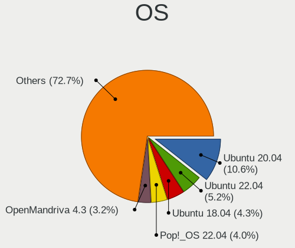

| Name                | Notebooks | Percent |
|---------------------|-----------|---------|
| Ubuntu 20.04        | 36        | 11.43%  |
| Ubuntu 18.04        | 15        | 4.76%   |
| Ubuntu 22.04        | 13        | 4.13%   |
| OpenMandriva 4.3    | 11        | 3.49%   |
| Arch                | 10        | 3.17%   |
| Zorin 15            | 9         | 2.86%   |
| Arch Rolling        | 9         | 2.86%   |
| Zorin 16            | 8         | 2.54%   |
| Pop!_OS 20.04       | 8         | 2.54%   |
| OpenMandriva 4.2    | 8         | 2.54%   |
| Debian 11           | 8         | 2.54%   |
| Pop!_OS 22.04       | 7         | 2.22%   |
| Ubuntu 21.10        | 6         | 1.9%    |
| Ubuntu 20.10        | 6         | 1.9%    |
| Linux Mint 20.2     | 6         | 1.9%    |
| Fedora 31           | 6         | 1.9%    |
| Debian 10           | 6         | 1.9%    |
| Pop!_OS 20.10       | 5         | 1.59%   |
| Linux Mint 20.3     | 5         | 1.59%   |
| Fedora 35           | 5         | 1.59%   |
| Ubuntu 21.04        | 4         | 1.27%   |
| Pop!_OS 21.04       | 4         | 1.27%   |
| Manjaro             | 4         | 1.27%   |
| Linux Mint 19.2     | 4         | 1.27%   |
| Kubuntu 22.04       | 4         | 1.27%   |
| Kubuntu 20.04       | 4         | 1.27%   |
| Fedora 34           | 4         | 1.27%   |
| Fedora 33           | 4         | 1.27%   |
| Ubuntu 19.10        | 3         | 0.95%   |
| Linux Mint 20       | 3         | 0.95%   |
| Linux Mint 19.3     | 3         | 0.95%   |
| Linux Mint 19.1     | 3         | 0.95%   |
| Fedora 36           | 3         | 0.95%   |
| Fedora 32           | 3         | 0.95%   |
| EndeavourOS Rolling | 3         | 0.95%   |
| Elementary 6.1      | 3         | 0.95%   |
| Ubuntu 19.04        | 2         | 0.63%   |
| ROSA R10            | 2         | 0.63%   |
| Pop!_OS 21.10       | 2         | 0.63%   |
| Nobara 36           | 2         | 0.63%   |

OS Family
---------

OS without a version

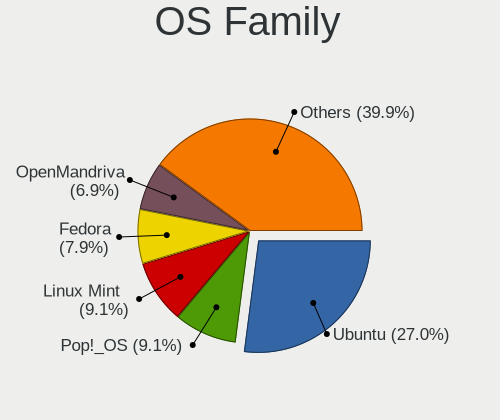

| Name         | Notebooks | Percent |
|--------------|-----------|---------|
| Ubuntu       | 83        | 27.76%  |
| Linux Mint   | 27        | 9.03%   |
| Pop!_OS      | 25        | 8.36%   |
| Fedora       | 25        | 8.36%   |
| OpenMandriva | 19        | 6.35%   |
| Arch         | 19        | 6.35%   |
| Zorin        | 17        | 5.69%   |
| Debian       | 17        | 5.69%   |
| Manjaro      | 9         | 3.01%   |
| Kubuntu      | 8         | 2.68%   |
| Endless      | 5         | 1.67%   |
| Elementary   | 5         | 1.67%   |
| EndeavourOS  | 4         | 1.34%   |
| Xubuntu      | 3         | 1%      |
| Ubuntu Unity | 3         | 1%      |
| Gentoo       | 3         | 1%      |
| Ubuntu MATE  | 2         | 0.67%   |
| Solus        | 2         | 0.67%   |
| ROSA         | 2         | 0.67%   |
| Peppermint   | 2         | 0.67%   |
| Nobara       | 2         | 0.67%   |
| MX           | 2         | 0.67%   |
| Lubuntu      | 2         | 0.67%   |
| LMDE         | 2         | 0.67%   |
| KDE neon     | 2         | 0.67%   |
| Kali         | 2         | 0.67%   |
| Void Linux   | 1         | 0.33%   |
| Sparky       | 1         | 0.33%   |
| Parrot       | 1         | 0.33%   |
| openSUSE     | 1         | 0.33%   |
| BlackPanther | 1         | 0.33%   |
| ArcoLinux    | 1         | 0.33%   |
| Archman      | 1         | 0.33%   |

Kernel
------

Version of the Linux kernel

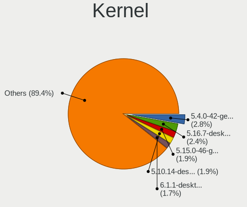

| Version                  | Notebooks | Percent |
|--------------------------|-----------|---------|
| 5.4.0-42-generic         | 12        | 3.45%   |
| 5.16.7-desktop-1omv4003  | 10        | 2.87%   |
| 5.15.0-46-generic        | 8         | 2.3%    |
| 5.10.14-desktop-1omv4002 | 8         | 2.3%    |
| 5.4.0-48-generic         | 5         | 1.44%   |
| 5.3.0-28-generic         | 5         | 1.44%   |
| 5.3.16-300.fc31.x86_64   | 4         | 1.15%   |
| 5.17.5-76051705-generic  | 4         | 1.15%   |
| 5.11.0-7620-generic      | 4         | 1.15%   |
| 5.11.0-27-generic        | 4         | 1.15%   |
| 5.8.0-53-generic         | 3         | 0.86%   |
| 5.4.0-81-generic         | 3         | 0.86%   |
| 5.4.0-7642-generic       | 3         | 0.86%   |
| 5.4.0-74-generic         | 3         | 0.86%   |
| 5.4.0-65-generic         | 3         | 0.86%   |
| 5.4.0-45-generic         | 3         | 0.86%   |
| 5.4.0-26-generic         | 3         | 0.86%   |
| 5.15.0-53-generic        | 3         | 0.86%   |
| 5.13.0-37-generic        | 3         | 0.86%   |
| 5.10.0-16-amd64          | 3         | 0.86%   |
| 5.0.0-37-generic         | 3         | 0.86%   |
| 4.19.0-9-amd64           | 3         | 0.86%   |
| 5.8.11-1-MANJARO         | 2         | 0.57%   |
| 5.8.0-7630-generic       | 2         | 0.57%   |
| 5.8.0-48-generic         | 2         | 0.57%   |
| 5.8.0-43-generic         | 2         | 0.57%   |
| 5.4.0-91-generic         | 2         | 0.57%   |
| 5.4.0-88-generic         | 2         | 0.57%   |
| 5.4.0-72-generic         | 2         | 0.57%   |
| 5.4.0-40-generic         | 2         | 0.57%   |
| 5.4.0-39-generic         | 2         | 0.57%   |
| 5.4.0-29-generic         | 2         | 0.57%   |
| 5.3.0-40-generic         | 2         | 0.57%   |
| 5.3.0-26-generic         | 2         | 0.57%   |
| 5.17.15-76051715-generic | 2         | 0.57%   |
| 5.15.4-arch1-1           | 2         | 0.57%   |
| 5.15.12-arch1-1          | 2         | 0.57%   |
| 5.15.0-56-generic        | 2         | 0.57%   |
| 5.15.0-52-generic        | 2         | 0.57%   |
| 5.15.0-48-generic        | 2         | 0.57%   |

Kernel Family
-------------

Linux kernel without a distro release

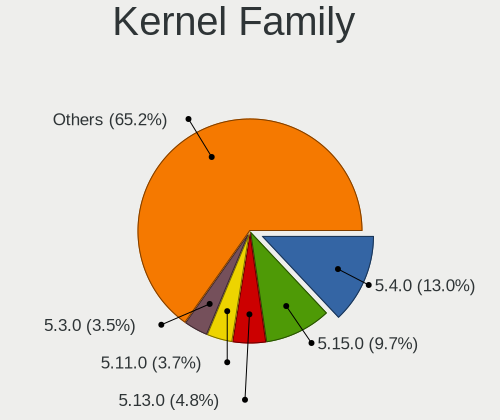

| Version | Notebooks | Percent |
|---------|-----------|---------|
| 5.4.0   | 57        | 17.22%  |
| 5.15.0  | 22        | 6.65%   |
| 5.13.0  | 20        | 6.04%   |
| 5.11.0  | 17        | 5.14%   |
| 5.3.0   | 16        | 4.83%   |
| 5.8.0   | 15        | 4.53%   |
| 4.15.0  | 14        | 4.23%   |
| 5.0.0   | 12        | 3.63%   |
| 5.16.7  | 10        | 3.02%   |
| 5.10.0  | 10        | 3.02%   |
| 5.10.14 | 9         | 2.72%   |
| 4.19.0  | 7         | 2.11%   |
| 4.18.0  | 6         | 1.81%   |
| 5.3.16  | 4         | 1.21%   |
| 5.17.5  | 4         | 1.21%   |
| 5.15.4  | 3         | 0.91%   |
| 6.0.10  | 2         | 0.6%    |
| 6.0.0   | 2         | 0.6%    |
| 5.8.11  | 2         | 0.6%    |
| 5.7.0   | 2         | 0.6%    |
| 5.6.8   | 2         | 0.6%    |
| 5.6.19  | 2         | 0.6%    |
| 5.3.8   | 2         | 0.6%    |
| 5.19.7  | 2         | 0.6%    |
| 5.19.0  | 2         | 0.6%    |
| 5.18.6  | 2         | 0.6%    |
| 5.18.10 | 2         | 0.6%    |
| 5.18.0  | 2         | 0.6%    |
| 5.17.15 | 2         | 0.6%    |
| 5.16.11 | 2         | 0.6%    |
| 5.15.15 | 2         | 0.6%    |
| 5.15.12 | 2         | 0.6%    |
| 5.14.15 | 2         | 0.6%    |
| 5.11.12 | 2         | 0.6%    |
| 6.1.1   | 1         | 0.3%    |
| 6.0.9   | 1         | 0.3%    |
| 6.0.7   | 1         | 0.3%    |
| 6.0.5   | 1         | 0.3%    |
| 5.9.8   | 1         | 0.3%    |
| 5.9.6   | 1         | 0.3%    |

Kernel Major Ver.
-----------------

Linux kernel major version

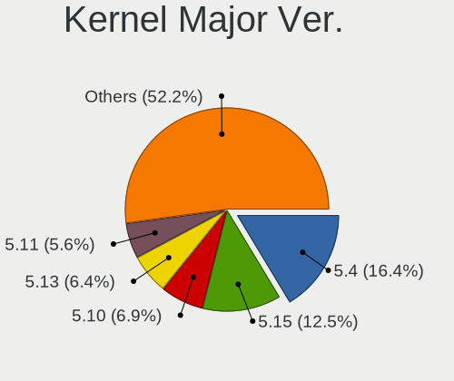

| Version | Notebooks | Percent |
|---------|-----------|---------|
| 5.4     | 62        | 19.14%  |
| 5.15    | 32        | 9.88%   |
| 5.10    | 25        | 7.72%   |
| 5.13    | 23        | 7.1%    |
| 5.11    | 22        | 6.79%   |
| 5.8     | 21        | 6.48%   |
| 5.3     | 21        | 6.48%   |
| 5.16    | 18        | 5.56%   |
| 4.15    | 14        | 4.32%   |
| 5.0     | 12        | 3.7%    |
| 5.18    | 9         | 2.78%   |
| 5.17    | 8         | 2.47%   |
| 6.0     | 7         | 2.16%   |
| 4.19    | 7         | 2.16%   |
| 4.18    | 7         | 2.16%   |
| 5.6     | 6         | 1.85%   |
| 5.14    | 6         | 1.85%   |
| 5.7     | 5         | 1.54%   |
| 5.19    | 5         | 1.54%   |
| 5.9     | 4         | 1.23%   |
| 5.5     | 2         | 0.62%   |
| 4.9     | 2         | 0.62%   |
| 4.20    | 2         | 0.62%   |
| 6.1     | 1         | 0.31%   |
| 5.2     | 1         | 0.31%   |
| 4.13    | 1         | 0.31%   |
| 4.11    | 1         | 0.31%   |

Arch
----

OS architecture (x86_64, i586, etc.)

| Name   | Notebooks | Percent |
|--------|-----------|---------|
| x86_64 | 277       | 97.19%  |
| i686   | 8         | 2.81%   |

DE
--

Desktop Environment

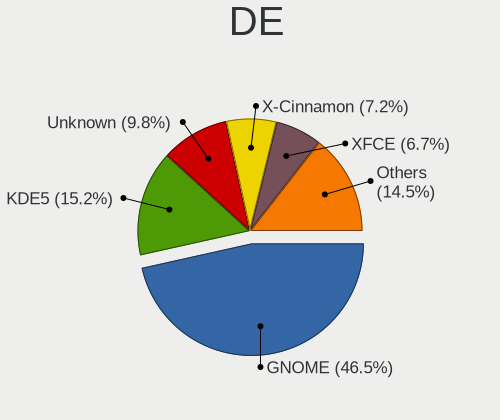

| Name             | Notebooks | Percent |
|------------------|-----------|---------|
| GNOME            | 139       | 46.49%  |
| KDE5             | 39        | 13.04%  |
| Unknown          | 33        | 11.04%  |
| X-Cinnamon       | 22        | 7.36%   |
| XFCE             | 21        | 7.02%   |
| KDE              | 10        | 3.34%   |
| MATE             | 8         | 2.68%   |
| Pantheon         | 5         | 1.67%   |
| i3               | 4         | 1.34%   |
| Cinnamon         | 4         | 1.34%   |
| Unity            | 3         | 1%      |
| LXDE             | 3         | 1%      |
| LXQt             | 2         | 0.67%   |
| Budgie           | 2         | 0.67%   |
| lightdm-xsession | 1         | 0.33%   |
| KDE4             | 1         | 0.33%   |
| Hyprland         | 1         | 0.33%   |
| Deepin           | 1         | 0.33%   |

Display Server
--------------

X11 or Wayland

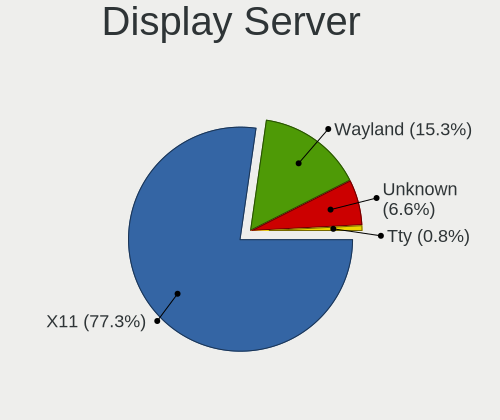

| Name    | Notebooks | Percent |
|---------|-----------|---------|
| X11     | 225       | 75.76%  |
| Wayland | 53        | 17.85%  |
| Unknown | 16        | 5.39%   |
| Tty     | 3         | 1.01%   |

Display Manager
---------------

SDDM, LightDM, etc.

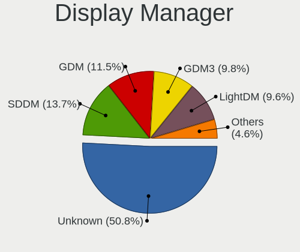

| Name    | Notebooks | Percent |
|---------|-----------|---------|
| Unknown | 166       | 55.15%  |
| SDDM    | 37        | 12.29%  |
| GDM     | 35        | 11.63%  |
| GDM3    | 24        | 7.97%   |
| LightDM | 22        | 7.31%   |
| TDM     | 11        | 3.65%   |
| Ly      | 2         | 0.66%   |
| LXDM    | 2         | 0.66%   |
| XDM     | 1         | 0.33%   |
| KDM     | 1         | 0.33%   |

OS Lang
-------

Language

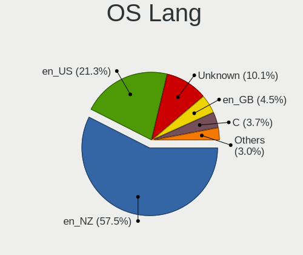

| Lang    | Notebooks | Percent |
|---------|-----------|---------|
| en_NZ   | 176       | 58.86%  |
| en_US   | 61        | 20.4%   |
| Unknown | 27        | 9.03%   |
| en_GB   | 15        | 5.02%   |
| C       | 10        | 3.34%   |
| en_AU   | 6         | 2.01%   |
| zh_CN   | 1         | 0.33%   |
| pt_BR   | 1         | 0.33%   |
| mi_NZ   | 1         | 0.33%   |
| de_DE   | 1         | 0.33%   |

Boot Mode
---------

EFI or BIOS

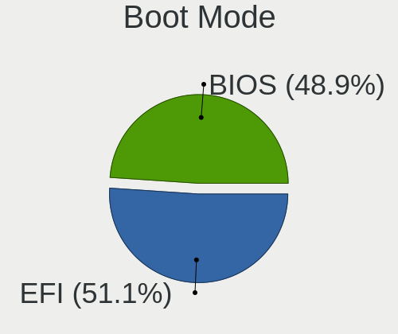

| Mode | Notebooks | Percent |
|------|-----------|---------|
| EFI  | 148       | 50.86%  |
| BIOS | 143       | 49.14%  |

Filesystem
----------

Type of filesystem

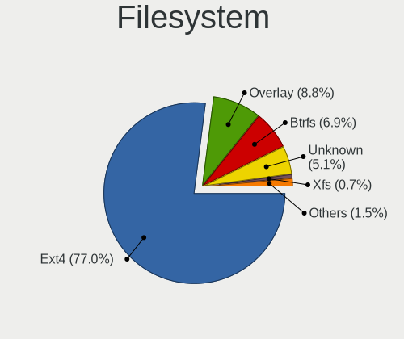

| Type    | Notebooks | Percent |
|---------|-----------|---------|
| Ext4    | 231       | 78.04%  |
| Overlay | 24        | 8.11%   |
| Btrfs   | 20        | 6.76%   |
| Unknown | 14        | 4.73%   |
| Ext2    | 3         | 1.01%   |
| Xfs     | 2         | 0.68%   |
| Zfs     | 1         | 0.34%   |
| Ext3    | 1         | 0.34%   |

Part. scheme
------------

Scheme of partitioning

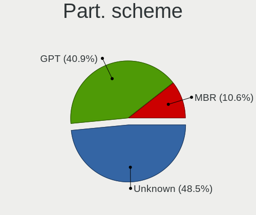

| Type    | Notebooks | Percent |
|---------|-----------|---------|
| Unknown | 170       | 58.02%  |
| GPT     | 88        | 30.03%  |
| MBR     | 35        | 11.95%  |

Dual Boot with Linux/BSD
------------------------

Hosting more than one Linux/BSD

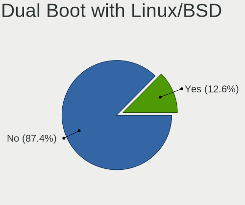

| Dual boot | Notebooks | Percent |
|-----------|-----------|---------|
| No        | 258       | 88.66%  |
| Yes       | 33        | 11.34%  |

Dual Boot (Win)
---------------

Hosting Linux and Windows

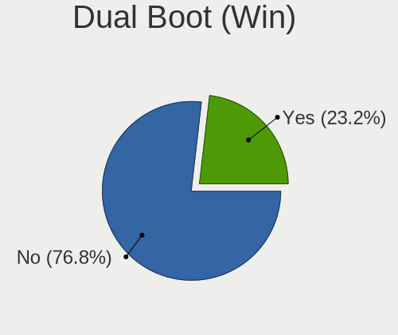

| Dual boot | Notebooks | Percent |
|-----------|-----------|---------|
| No        | 221       | 75.95%  |
| Yes       | 70        | 24.05%  |

Board
-----

Vendor
------

Motherboard manufacturer

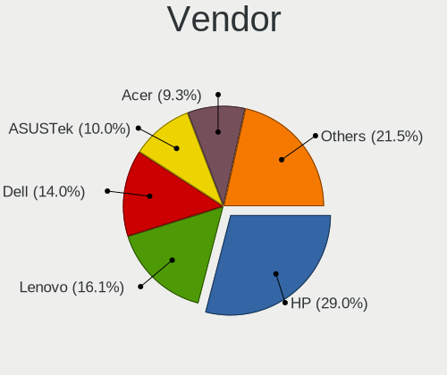

| Name                | Notebooks | Percent |
|---------------------|-----------|---------|
| Hewlett-Packard     | 82        | 28.77%  |
| Lenovo              | 45        | 15.79%  |
| Dell                | 41        | 14.39%  |
| ASUSTek Computer    | 30        | 10.53%  |
| Acer                | 26        | 9.12%   |
| Toshiba             | 17        | 5.96%   |
| MSI                 | 9         | 3.16%   |
| Apple               | 7         | 2.46%   |
| Google              | 5         | 1.75%   |
| Sony                | 4         | 1.4%    |
| Samsung Electronics | 4         | 1.4%    |
| System76            | 2         | 0.7%    |
| YJKC                | 1         | 0.35%   |
| TWG                 | 1         | 0.35%   |
| Timi                | 1         | 0.35%   |
| The Warehouse Group | 1         | 0.35%   |
| Star Labs           | 1         | 0.35%   |
| Metabox             | 1         | 0.35%   |
| Medion              | 1         | 0.35%   |
| Kogan               | 1         | 0.35%   |
| IBM                 | 1         | 0.35%   |
| HUAWEI              | 1         | 0.35%   |
| eMachines           | 1         | 0.35%   |
| Alienware           | 1         | 0.35%   |
| Unknown             | 1         | 0.35%   |

Model
-----

Motherboard model

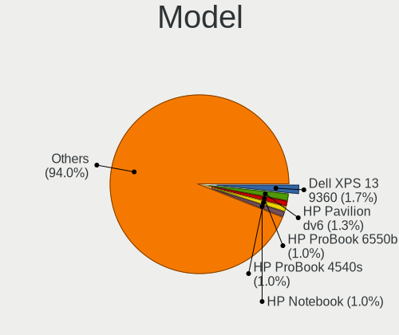

| Name                                      | Notebooks | Percent |
|-------------------------------------------|-----------|---------|
| Dell XPS 13 9360                          | 5         | 1.75%   |
| HP Pavilion dv6                           | 4         | 1.4%    |
| HP ProBook 6550b                          | 3         | 1.05%   |
| HP ProBook 4540s                          | 3         | 1.05%   |
| HP Notebook                               | 3         | 1.05%   |
| HP EliteBook 8560p                        | 3         | 1.05%   |
| Toshiba Satellite L750                    | 2         | 0.7%    |
| MSI GE66 Raider 10SF                      | 2         | 0.7%    |
| Lenovo ThinkPad T460 20FMS2FR00           | 2         | 0.7%    |
| HP ZBook Firefly 15 G7 Mobile Workstation | 2         | 0.7%    |
| HP ProBook 6570b                          | 2         | 0.7%    |
| HP ProBook 450 G5                         | 2         | 0.7%    |
| HP ProBook 450 G3                         | 2         | 0.7%    |
| HP Pavilion 15                            | 2         | 0.7%    |
| Dell XPS 15 9500                          | 2         | 0.7%    |
| Dell Latitude E7440                       | 2         | 0.7%    |
| Dell Latitude E6430s                      | 2         | 0.7%    |
| Dell Latitude E4300                       | 2         | 0.7%    |
| Dell Latitude 7490                        | 2         | 0.7%    |
| ASUS ROG Zephyrus M16 GU603HR_GU603HR     | 2         | 0.7%    |
| ASUS ROG Strix G513QY_G513QY              | 2         | 0.7%    |
| ASUS K52Jc                                | 2         | 0.7%    |
| ASUS ASUS EXPERTBOOK P2451FA_P2451FA      | 2         | 0.7%    |
| Acer Swift SF314-41                       | 2         | 0.7%    |
| Acer Aspire F5-573G                       | 2         | 0.7%    |
| Unknown                                   | 2         | 0.7%    |
| YJKC vBOOK Plus                           | 1         | 0.35%   |
| TWG E2017                                 | 1         | 0.35%   |
| Toshiba TECRA Z50-A                       | 1         | 0.35%   |
| Toshiba Satellite U920t                   | 1         | 0.35%   |
| Toshiba Satellite S70t-B                  | 1         | 0.35%   |
| Toshiba Satellite Pro R50-C               | 1         | 0.35%   |
| Toshiba Satellite Pro L830                | 1         | 0.35%   |
| Toshiba Satellite Pro C665                | 1         | 0.35%   |
| Toshiba Satellite L850                    | 1         | 0.35%   |
| Toshiba Satellite L50D-C                  | 1         | 0.35%   |
| Toshiba Satellite C660                    | 1         | 0.35%   |
| Toshiba Satellite C50D-C                  | 1         | 0.35%   |
| Toshiba Satellite C50-B                   | 1         | 0.35%   |
| Toshiba PORTEGE R930                      | 1         | 0.35%   |

Model Family
------------

Motherboard model prefix

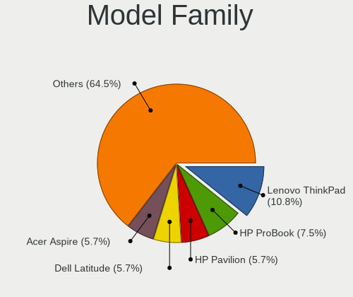

| Name                      | Notebooks | Percent |
|---------------------------|-----------|---------|
| Lenovo ThinkPad           | 30        | 10.53%  |
| HP ProBook                | 21        | 7.37%   |
| HP Pavilion               | 17        | 5.96%   |
| Dell Latitude             | 16        | 5.61%   |
| Acer Aspire               | 16        | 5.61%   |
| HP EliteBook              | 15        | 5.26%   |
| Toshiba Satellite         | 12        | 4.21%   |
| Dell XPS                  | 11        | 3.86%   |
| HP Laptop                 | 6         | 2.11%   |
| Dell Inspiron             | 6         | 2.11%   |
| ASUS ROG                  | 6         | 2.11%   |
| HP ZBook                  | 5         | 1.75%   |
| Toshiba PORTEGE           | 4         | 1.4%    |
| Dell Precision            | 4         | 1.4%    |
| Acer TravelMate           | 4         | 1.4%    |
| HP Notebook               | 3         | 1.05%   |
| HP Compaq                 | 3         | 1.05%   |
| ASUS VivoBook             | 3         | 1.05%   |
| ASUS ASUS                 | 3         | 1.05%   |
| MSI GE66                  | 2         | 0.7%    |
| Lenovo Yoga               | 2         | 0.7%    |
| Lenovo IdeaPad            | 2         | 0.7%    |
| HP Presario               | 2         | 0.7%    |
| Dell Vostro               | 2         | 0.7%    |
| ASUS K52Jc                | 2         | 0.7%    |
| Apple MacBookPro5         | 2         | 0.7%    |
| Apple MacBook5            | 2         | 0.7%    |
| Acer Swift                | 2         | 0.7%    |
| Unknown                   | 2         | 0.7%    |
| YJKC vBOOK                | 1         | 0.35%   |
| TWG E2017                 | 1         | 0.35%   |
| Toshiba TECRA             | 1         | 0.35%   |
| Timi A30                  | 1         | 0.35%   |
| The Warehouse Group E2037 | 1         | 0.35%   |
| System76 Pangolin         | 1         | 0.35%   |
| System76 Lemur            | 1         | 0.35%   |
| Star Labs LabTop          | 1         | 0.35%   |
| Sony VPCEH28FG            | 1         | 0.35%   |
| Sony VPCEB43FG            | 1         | 0.35%   |
| Sony SVE14A15FGS          | 1         | 0.35%   |

MFG Year
--------

Motherboard manufacture year

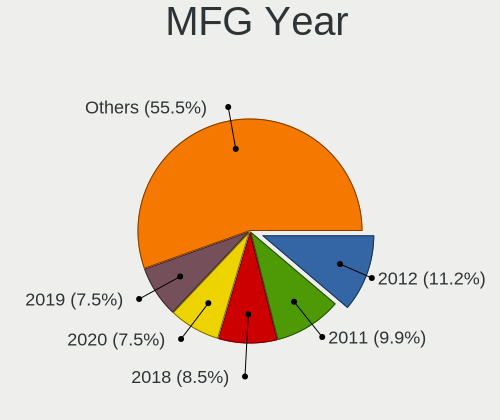

| Year | Notebooks | Percent |
|------|-----------|---------|
| 2012 | 33        | 11.58%  |
| 2011 | 33        | 11.58%  |
| 2020 | 23        | 8.07%   |
| 2018 | 22        | 7.72%   |
| 2021 | 21        | 7.37%   |
| 2019 | 20        | 7.02%   |
| 2017 | 19        | 6.67%   |
| 2016 | 19        | 6.67%   |
| 2014 | 16        | 5.61%   |
| 2013 | 16        | 5.61%   |
| 2015 | 15        | 5.26%   |
| 2008 | 13        | 4.56%   |
| 2010 | 12        | 4.21%   |
| 2022 | 11        | 3.86%   |
| 2009 | 7         | 2.46%   |
| 2007 | 2         | 0.7%    |
| 2006 | 2         | 0.7%    |
| 2005 | 1         | 0.35%   |

Form Factor
-----------

Physical design of the computer

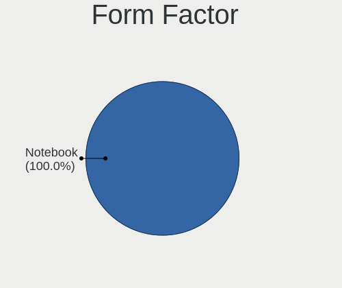

| Name     | Notebooks | Percent |
|----------|-----------|---------|
| Notebook | 285       | 100%    |

Secure Boot
-----------

Enabled or disabled

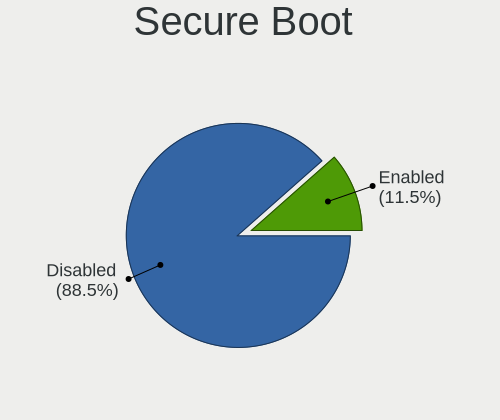

| State    | Notebooks | Percent |
|----------|-----------|---------|
| Disabled | 254       | 88.5%   |
| Enabled  | 33        | 11.5%   |

Coreboot
--------

Have coreboot on board

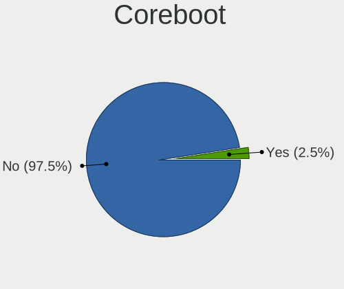

| Used | Notebooks | Percent |
|------|-----------|---------|
| No   | 278       | 97.54%  |
| Yes  | 7         | 2.46%   |

RAM Size
--------

Total RAM memory

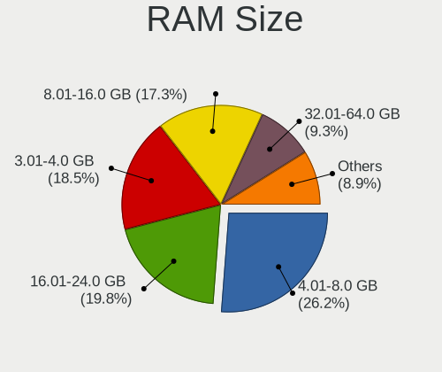

| Size in GB  | Notebooks | Percent |
|-------------|-----------|---------|
| 4.01-8.0    | 81        | 27.65%  |
| 16.01-24.0  | 55        | 18.77%  |
| 3.01-4.0    | 53        | 18.09%  |
| 8.01-16.0   | 53        | 18.09%  |
| 32.01-64.0  | 26        | 8.87%   |
| 1.01-2.0    | 9         | 3.07%   |
| 64.01-256.0 | 5         | 1.71%   |
| 24.01-32.0  | 4         | 1.37%   |
| 2.01-3.0    | 4         | 1.37%   |
| 0.51-1.0    | 3         | 1.02%   |

RAM Used
--------

Used RAM memory

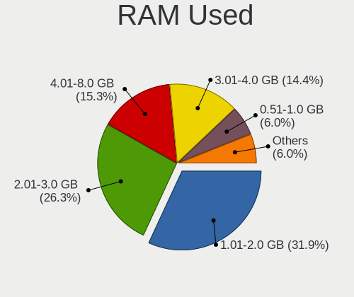

| Used GB    | Notebooks | Percent |
|------------|-----------|---------|
| 1.01-2.0   | 110       | 34.38%  |
| 2.01-3.0   | 87        | 27.19%  |
| 3.01-4.0   | 50        | 15.63%  |
| 4.01-8.0   | 40        | 12.5%   |
| 0.51-1.0   | 19        | 5.94%   |
| 8.01-16.0  | 8         | 2.5%    |
| 24.01-32.0 | 2         | 0.63%   |
| 16.01-24.0 | 2         | 0.63%   |
| 0.01-0.5   | 2         | 0.63%   |

Total Drives
------------

Number of drives on board

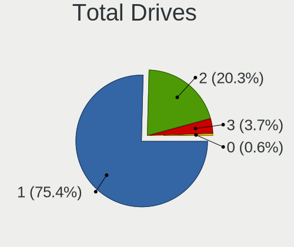

| Drives | Notebooks | Percent |
|--------|-----------|---------|
| 1      | 222       | 75.77%  |
| 2      | 60        | 20.48%  |
| 3      | 9         | 3.07%   |
| 0      | 2         | 0.68%   |

Has CD-ROM
----------

Has CD-ROM on board

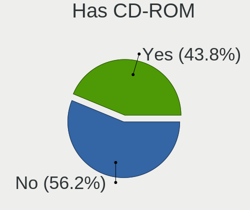

| Presented | Notebooks | Percent |
|-----------|-----------|---------|
| No        | 165       | 57.69%  |
| Yes       | 121       | 42.31%  |

Has Ethernet
------------

Has Ethernet on board

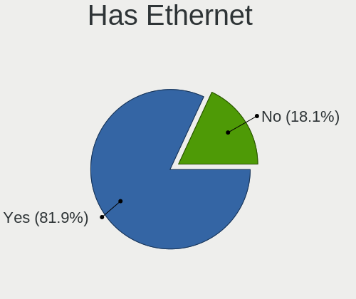

| Presented | Notebooks | Percent |
|-----------|-----------|---------|
| Yes       | 240       | 83.33%  |
| No        | 48        | 16.67%  |

Has WiFi
--------

Has WiFi module

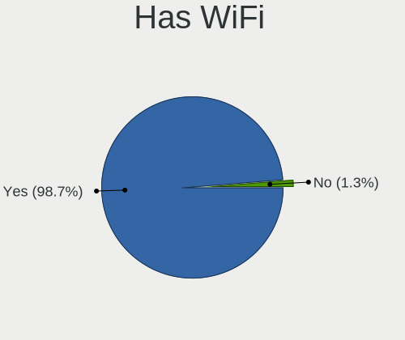

| Presented | Notebooks | Percent |
|-----------|-----------|---------|
| Yes       | 283       | 99.3%   |
| No        | 2         | 0.7%    |

Has Bluetooth
-------------

Has Bluetooth module

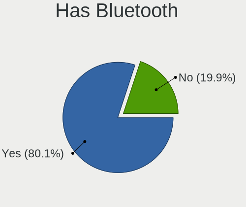

| Presented | Notebooks | Percent |
|-----------|-----------|---------|
| Yes       | 228       | 78.62%  |
| No        | 62        | 21.38%  |

Location
--------

Country
-------

Geographic location (country)

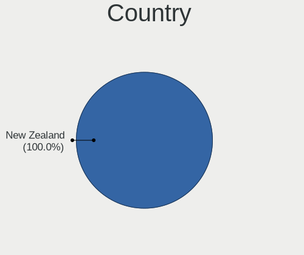

| Country     | Notebooks | Percent |
|-------------|-----------|---------|
| New Zealand | 285       | 100%    |

City
----

Geographic location (city)

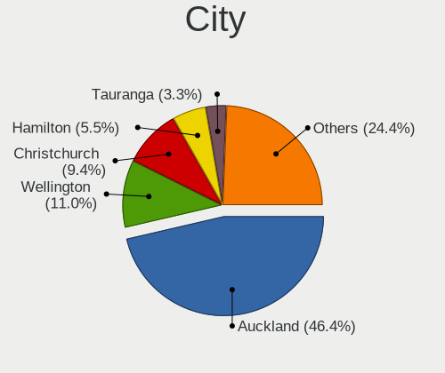

| City             | Notebooks | Percent |
|------------------|-----------|---------|
| Auckland         | 141       | 47.96%  |
| Wellington       | 32        | 10.88%  |
| Christchurch     | 28        | 9.52%   |
| Hamilton         | 15        | 5.1%    |
| Tauranga         | 9         | 3.06%   |
| Dunedin          | 9         | 3.06%   |
| Whangarei        | 7         | 2.38%   |
| Cambridge        | 7         | 2.38%   |
| New Plymouth     | 6         | 2.04%   |
| Nelson           | 4         | 1.36%   |
| Napier City      | 4         | 1.36%   |
| Lower Hutt       | 4         | 1.36%   |
| Invercargill     | 4         | 1.36%   |
| Palmerston North | 3         | 1.02%   |
| Hastings         | 3         | 1.02%   |
| Whanganui        | 2         | 0.68%   |
| Otaki            | 2         | 0.68%   |
| Grafton          | 2         | 0.68%   |
| Whatawhata       | 1         | 0.34%   |
| Tutukaka         | 1         | 0.34%   |
| Saint Andrews    | 1         | 0.34%   |
| Rotorua          | 1         | 0.34%   |
| Pakuranga        | 1         | 0.34%   |
| Masterton        | 1         | 0.34%   |
| Levin            | 1         | 0.34%   |
| Kerikeri         | 1         | 0.34%   |
| Katikati         | 1         | 0.34%   |
| Gordonton        | 1         | 0.34%   |
| Edgecumbe        | 1         | 0.34%   |
| Ashburton        | 1         | 0.34%   |

Drives
------

Drive Vendor
------------

Hard drive vendors

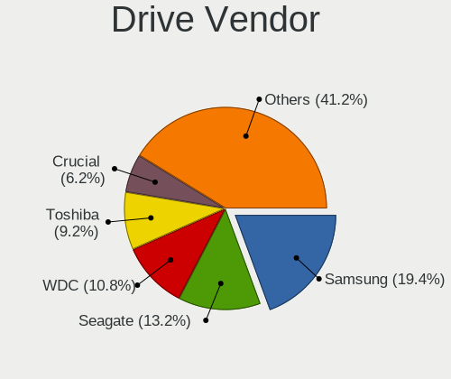

| Vendor                      | Notebooks | Drives | Percent |
|-----------------------------|-----------|--------|---------|
| Samsung Electronics         | 67        | 87     | 19.59%  |
| Seagate                     | 44        | 48     | 12.87%  |
| WDC                         | 37        | 53     | 10.82%  |
| Toshiba                     | 32        | 40     | 9.36%   |
| Crucial                     | 20        | 36     | 5.85%   |
| SanDisk                     | 18        | 20     | 5.26%   |
| SK hynix                    | 17        | 18     | 4.97%   |
| Unknown                     | 14        | 21     | 4.09%   |
| Intel                       | 14        | 17     | 4.09%   |
| Hitachi                     | 11        | 13     | 3.22%   |
| Kingston                    | 10        | 13     | 2.92%   |
| HGST                        | 8         | 8      | 2.34%   |
| Micron Technology           | 7         | 11     | 2.05%   |
| KingSpec                    | 4         | 4      | 1.17%   |
| China                       | 3         | 3      | 0.88%   |
| ASMT                        | 3         | 3      | 0.88%   |
| A-DATA Technology           | 3         | 3      | 0.88%   |
| Transcend                   | 2         | 2      | 0.58%   |
| TO Exter                    | 2         | 2      | 0.58%   |
| Team                        | 2         | 2      | 0.58%   |
| Silicon Motion              | 2         | 3      | 0.58%   |
| ROG                         | 2         | 2      | 0.58%   |
| Micron/Crucial Technology   | 2         | 2      | 0.58%   |
| LITEON                      | 2         | 2      | 0.58%   |
| KIOXIA                      | 2         | 3      | 0.58%   |
| Apple                       | 2         | 2      | 0.58%   |
| XPG                         | 1         | 1      | 0.29%   |
| Star Drive                  | 1         | 1      | 0.29%   |
| ShiJi                       | 1         | 1      | 0.29%   |
| Phison                      | 1         | 1      | 0.29%   |
| Netac                       | 1         | 1      | 0.29%   |
| LITEONIT                    | 1         | 3      | 0.29%   |
| Kingston Technology Company | 1         | 1      | 0.29%   |
| KINGBANK                    | 1         | 1      | 0.29%   |
| JMicron Technology          | 1         | 1      | 0.29%   |
| HGST HTS                    | 1         | 1      | 0.29%   |
| Hewlett-Packard             | 1         | 3      | 0.29%   |
| Fujitsu                     | 1         | 1      | 0.29%   |

Drive Model
-----------

Hard drive models

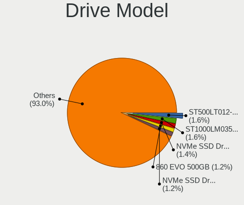

| Model                                  | Notebooks | Percent |
|----------------------------------------|-----------|---------|
| Intel NVMe SSD Drive 512GB             | 7         | 1.97%   |
| Seagate ST500LT012-1DG142 500GB        | 6         | 1.69%   |
| Samsung NVMe SSD Drive 512GB           | 6         | 1.69%   |
| Samsung SSD 860 EVO 500GB              | 5         | 1.41%   |
| Samsung SSD 850 EVO 500GB              | 5         | 1.41%   |
| Toshiba MQ01ABF050 500GB               | 4         | 1.13%   |
| Seagate ST1000LM035-1RK172 1TB         | 4         | 1.13%   |
| Seagate Expansion 4TB                  | 4         | 1.13%   |
| SanDisk NVMe SSD Drive 512GB           | 4         | 1.13%   |
| Samsung SM963 2.5" NVMe PCIe SSD 256GB | 4         | 1.13%   |
| Crucial CT500MX500SSD1 500GB           | 4         | 1.13%   |
| WDC WDS120G2G0A-00JH30 120GB SSD       | 3         | 0.85%   |
| WDC WD5000LPVX-22V0TT0 500GB           | 3         | 0.85%   |
| Toshiba NVMe SSD Drive 512GB           | 3         | 0.85%   |
| Seagate ST9500420AS 500GB              | 3         | 0.85%   |
| Samsung SSD 850 EVO 1TB                | 3         | 0.85%   |
| Samsung MZVL21T0HCLR-00B00 1TB         | 3         | 0.85%   |
| Kingston SV300S37A240G 240GB SSD       | 3         | 0.85%   |
| Kingston SV300S37A120G 120GB SSD       | 3         | 0.85%   |
| Crucial CT240BX200SSD1 240GB           | 3         | 0.85%   |
| WDC WD5000LPCX-24VHAT0 500GB           | 2         | 0.56%   |
| WDC WD5000BPVT-22HXZT3 500GB           | 2         | 0.56%   |
| WDC WD10SPZX-22Z10T1 1TB               | 2         | 0.56%   |
| WDC WD10SPZX-21Z10T0 1TB               | 2         | 0.56%   |
| WDC WD10JPVX-60JC3T0 1TB               | 2         | 0.56%   |
| WDC WD10JPVX-22JC3T0 1TB               | 2         | 0.56%   |
| Unknown MMC Card  64GB                 | 2         | 0.56%   |
| Unknown MMC Card  2GB                  | 2         | 0.56%   |
| Unknown MMC Card  128GB                | 2         | 0.56%   |
| Toshiba NVMe SSD Drive 256GB           | 2         | 0.56%   |
| Toshiba MQ01ABD100 1TB                 | 2         | 0.56%   |
| Toshiba MQ01ABD075 752GB               | 2         | 0.56%   |
| Toshiba MK5076GSX 500GB                | 2         | 0.56%   |
| Toshiba MK1652GSX 160GB                | 2         | 0.56%   |
| TO Exter nal USB 3.0 512GB             | 2         | 0.56%   |
| SK hynix NVMe SSD Drive 256GB          | 2         | 0.56%   |
| Seagate ST9500325AS 500GB              | 2         | 0.56%   |
| Seagate ST2000LM007-1R8174 2TB         | 2         | 0.56%   |
| Seagate ST1000LM024 HN-M101MBB 1TB     | 2         | 0.56%   |
| Seagate ST1000LM014-1EJ164 1TB         | 2         | 0.56%   |

HDD Vendor
----------

Hard disk drive vendors

| Vendor              | Notebooks | Drives | Percent |
|---------------------|-----------|--------|---------|
| Seagate             | 42        | 46     | 36.84%  |
| WDC                 | 29        | 36     | 25.44%  |
| Toshiba             | 17        | 22     | 14.91%  |
| Hitachi             | 11        | 13     | 9.65%   |
| HGST                | 8         | 8      | 7.02%   |
| Samsung Electronics | 2         | 2      | 1.75%   |
| Unknown             | 1         | 3      | 0.88%   |
| HGST HTS            | 1         | 1      | 0.88%   |
| Fujitsu             | 1         | 1      | 0.88%   |
| ASMT                | 1         | 1      | 0.88%   |
| Apple               | 1         | 1      | 0.88%   |

SSD Vendor
----------

Solid state drive vendors

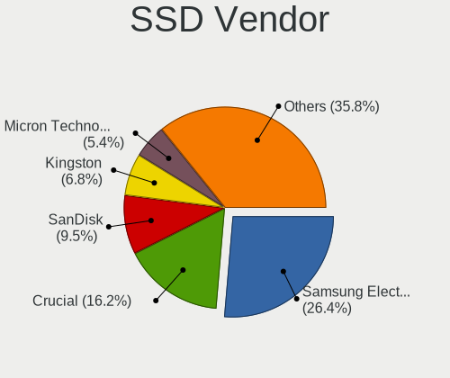

| Vendor              | Notebooks | Drives | Percent |
|---------------------|-----------|--------|---------|
| Samsung Electronics | 29        | 38     | 26.13%  |
| Crucial             | 18        | 34     | 16.22%  |
| SanDisk             | 11        | 11     | 9.91%   |
| Kingston            | 9         | 12     | 8.11%   |
| Micron Technology   | 6         | 9      | 5.41%   |
| KingSpec            | 4         | 4      | 3.6%    |
| WDC                 | 3         | 10     | 2.7%    |
| Toshiba             | 3         | 4      | 2.7%    |
| SK hynix            | 3         | 3      | 2.7%    |
| Intel               | 3         | 5      | 2.7%    |
| China               | 3         | 3      | 2.7%    |
| A-DATA Technology   | 3         | 3      | 2.7%    |
| Transcend           | 2         | 2      | 1.8%    |
| TO Exter            | 2         | 2      | 1.8%    |
| Team                | 2         | 2      | 1.8%    |
| Seagate             | 2         | 2      | 1.8%    |
| LITEON              | 2         | 2      | 1.8%    |
| Netac               | 1         | 1      | 0.9%    |
| LITEONIT            | 1         | 3      | 0.9%    |
| JMicron Technology  | 1         | 1      | 0.9%    |
| Hewlett-Packard     | 1         | 3      | 0.9%    |
| ASMT                | 1         | 1      | 0.9%    |
| Apple               | 1         | 1      | 0.9%    |

Drive Kind
----------

HDD or SSD

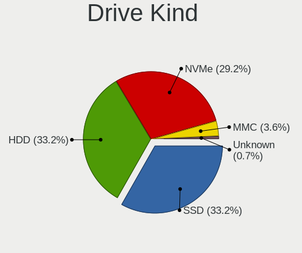

| Kind    | Notebooks | Drives | Percent |
|---------|-----------|--------|---------|
| HDD     | 109       | 134    | 33.44%  |
| SSD     | 105       | 156    | 32.21%  |
| NVMe    | 95        | 121    | 29.14%  |
| MMC     | 14        | 19     | 4.29%   |
| Unknown | 3         | 4      | 0.92%   |

Drive Connector
---------------

SATA, SAS, NVMe, etc.

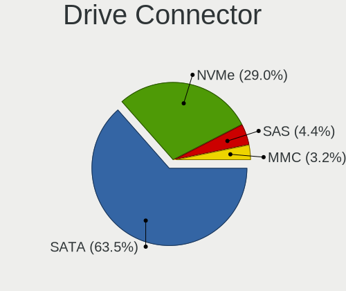

| Type | Notebooks | Drives | Percent |
|------|-----------|--------|---------|
| SATA | 192       | 273    | 60.57%  |
| NVMe | 95        | 121    | 29.97%  |
| SAS  | 16        | 21     | 5.05%   |
| MMC  | 14        | 19     | 4.42%   |

Drive Size
----------

Size of hard drive

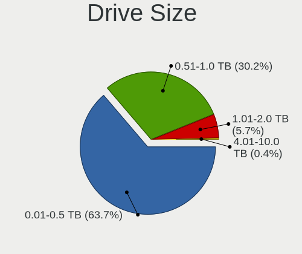

| Size in TB | Notebooks | Drives | Percent |
|------------|-----------|--------|---------|
| 0.01-0.5   | 145       | 205    | 66.82%  |
| 0.51-1.0   | 59        | 72     | 27.19%  |
| 1.01-2.0   | 7         | 7      | 3.23%   |
| 3.01-4.0   | 4         | 4      | 1.84%   |
| 4.01-10.0  | 2         | 2      | 0.92%   |

Space Total
-----------

Amount of disk space available on the file system

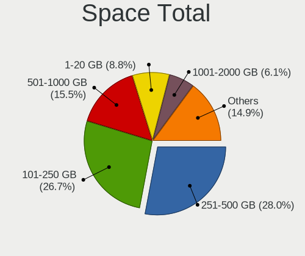

| Size in GB     | Notebooks | Percent |
|----------------|-----------|---------|
| 251-500        | 85        | 28.72%  |
| 101-250        | 82        | 27.7%   |
| 501-1000       | 44        | 14.86%  |
| 1-20           | 22        | 7.43%   |
| 1001-2000      | 18        | 6.08%   |
| 51-100         | 17        | 5.74%   |
| 21-50          | 9         | 3.04%   |
| Unknown        | 8         | 2.7%    |
| More than 3000 | 6         | 2.03%   |
| 2001-3000      | 5         | 1.69%   |

Space Used
----------

Amount of used disk space

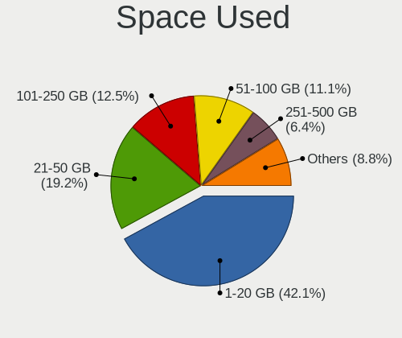

| Used GB        | Notebooks | Percent |
|----------------|-----------|---------|
| 1-20           | 128       | 41.16%  |
| 21-50          | 60        | 19.29%  |
| 101-250        | 42        | 13.5%   |
| 51-100         | 34        | 10.93%  |
| 251-500        | 20        | 6.43%   |
| 501-1000       | 14        | 4.5%    |
| Unknown        | 8         | 2.57%   |
| More than 3000 | 2         | 0.64%   |
| 1001-2000      | 2         | 0.64%   |
| 2001-3000      | 1         | 0.32%   |

Malfunc. Drives
---------------

Drive models with a malfunction

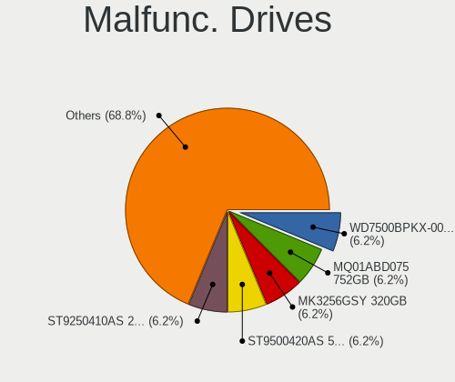

| Model                                               | Notebooks | Drives | Percent |
|-----------------------------------------------------|-----------|--------|---------|
| WDC WD7500BPKX-00HPJT0 752GB                        | 1         | 1      | 4.55%   |
| Toshiba MQ01ABD075 752GB                            | 1         | 1      | 4.55%   |
| Toshiba MK5076GSX 500GB                             | 1         | 1      | 4.55%   |
| Toshiba MK3256GSY 320GB                             | 1         | 1      | 4.55%   |
| SK hynix SC308 SATA 128GB SSD                       | 1         | 1      | 4.55%   |
| SK hynix BC501 NVMe Solid State Drive 512GB         | 1         | 1      | 4.55%   |
| SK hynix BC501 HFM512GDJTNG-8310A 512GB             | 1         | 1      | 4.55%   |
| ShiJi 512GB M.2-NVMe                                | 1         | 1      | 4.55%   |
| Seagate ST9500420AS 500GB                           | 1         | 1      | 4.55%   |
| Seagate ST9250410AS 250GB                           | 1         | 1      | 4.55%   |
| Seagate ST500LT012-1DG142 500GB                     | 1         | 1      | 4.55%   |
| Micron Technology MTFDDAK512TBN-1AR1ZABHA 512GB SSD | 1         | 1      | 4.55%   |
| Micron Technology MTFDDAK256MAY-1AH12ABHA 256GB SSD | 1         | 1      | 4.55%   |
| Intel SSDSCKKW240H6 240GB                           | 1         | 1      | 4.55%   |
| Hitachi HTS545050A7E380 500GB                       | 1         | 1      | 4.55%   |
| Hitachi HTS545032B9SA00 320GB                       | 1         | 1      | 4.55%   |
| HGST HTS725032A7E630 320GB                          | 1         | 1      | 4.55%   |
| HGST HTS541075A9E680 752GB                          | 1         | 1      | 4.55%   |
| HGST HTS 541075A9E680 752GB                         | 1         | 1      | 4.55%   |
| Crucial CT275MX300SSD1 275GB                        | 1         | 1      | 4.55%   |
| ASMT ASM105x 499GB                                  | 1         | 1      | 4.55%   |
| Apple HDD HTS547550A9E384 500GB                     | 1         | 1      | 4.55%   |

Malfunc. Drive Vendor
---------------------

Vendors of faulty drives

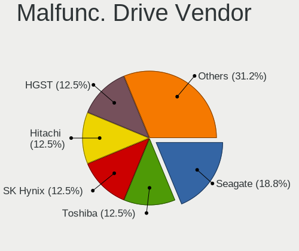

| Vendor            | Notebooks | Drives | Percent |
|-------------------|-----------|--------|---------|
| Toshiba           | 3         | 3      | 14.29%  |
| Seagate           | 3         | 3      | 14.29%  |
| SK hynix          | 2         | 3      | 9.52%   |
| Micron Technology | 2         | 2      | 9.52%   |
| Hitachi           | 2         | 2      | 9.52%   |
| HGST              | 2         | 2      | 9.52%   |
| WDC               | 1         | 1      | 4.76%   |
| ShiJi             | 1         | 1      | 4.76%   |
| Intel             | 1         | 1      | 4.76%   |
| HGST HTS          | 1         | 1      | 4.76%   |
| Crucial           | 1         | 1      | 4.76%   |
| ASMT              | 1         | 1      | 4.76%   |
| Apple             | 1         | 1      | 4.76%   |

Malfunc. HDD Vendor
-------------------

Vendors of faulty HDD drives

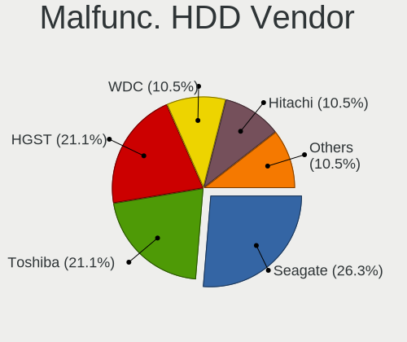

| Vendor   | Notebooks | Drives | Percent |
|----------|-----------|--------|---------|
| Toshiba  | 3         | 3      | 23.08%  |
| Seagate  | 3         | 3      | 23.08%  |
| Hitachi  | 2         | 2      | 15.38%  |
| HGST     | 2         | 2      | 15.38%  |
| WDC      | 1         | 1      | 7.69%   |
| HGST HTS | 1         | 1      | 7.69%   |
| Apple    | 1         | 1      | 7.69%   |

Malfunc. Drive Kind
-------------------

Kinds of faulty drives

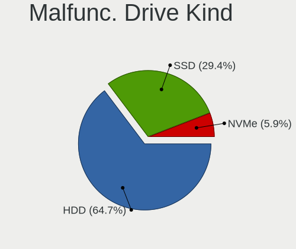

| Kind | Notebooks | Drives | Percent |
|------|-----------|--------|---------|
| HDD  | 13        | 13     | 61.9%   |
| SSD  | 6         | 6      | 28.57%  |
| NVMe | 2         | 3      | 9.52%   |

Failed Drives
-------------

Failed drive models

Zero info for selected period =(

Failed Drive Vendor
-------------------

Failed drive vendors

Zero info for selected period =(

Drive Status
------------

Number of failed and malfunc. drives

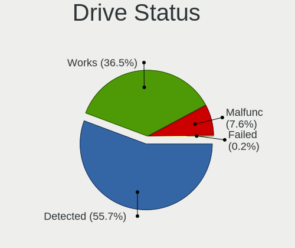

| Status   | Notebooks | Drives | Percent |
|----------|-----------|--------|---------|
| Detected | 186       | 288    | 61.59%  |
| Works    | 96        | 124    | 31.79%  |
| Malfunc  | 20        | 22     | 6.62%   |

Storage controller
------------------

Storage Vendor
--------------

Storage controller vendors

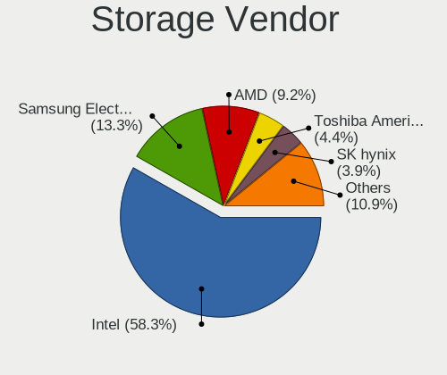

| Vendor                       | Notebooks | Percent |
|------------------------------|-----------|---------|
| Intel                        | 204       | 62.2%   |
| Samsung Electronics          | 38        | 11.59%  |
| AMD                          | 29        | 8.84%   |
| SK hynix                     | 14        | 4.27%   |
| Toshiba America Info Systems | 13        | 3.96%   |
| SanDisk                      | 11        | 3.35%   |
| Nvidia                       | 5         | 1.52%   |
| Micron/Crucial Technology    | 4         | 1.22%   |
| Silicon Motion               | 2         | 0.61%   |
| Phison Electronics           | 2         | 0.61%   |
| KIOXIA                       | 2         | 0.61%   |
| Kingston Technology Company  | 2         | 0.61%   |
| Micron Technology            | 1         | 0.3%    |
| ADATA Technology             | 1         | 0.3%    |

Storage Model
-------------

Storage controller models

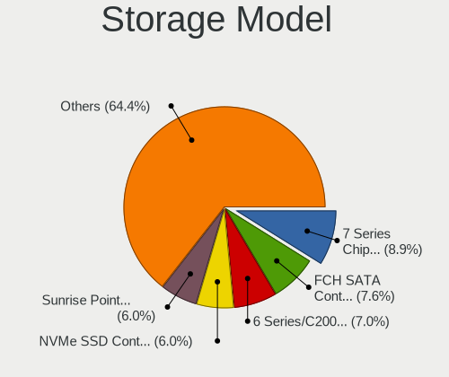

| Model                                                                          | Notebooks | Percent |
|--------------------------------------------------------------------------------|-----------|---------|
| Intel 7 Series Chipset Family 6-port SATA Controller [AHCI mode]               | 32        | 9.25%   |
| Intel 6 Series/C200 Series Chipset Family 6 port Mobile SATA AHCI Controller   | 26        | 7.51%   |
| AMD FCH SATA Controller [AHCI mode]                                            | 26        | 7.51%   |
| Intel Sunrise Point-LP SATA Controller [AHCI mode]                             | 23        | 6.65%   |
| Samsung NVMe SSD Controller SM981/PM981/PM983                                  | 19        | 5.49%   |
| Intel 82801 Mobile SATA Controller [RAID mode]                                 | 12        | 3.47%   |
| Intel HM170/QM170 Chipset SATA Controller [AHCI Mode]                          | 9         | 2.6%    |
| Intel 8 Series SATA Controller 1 [AHCI mode]                                   | 9         | 2.6%    |
| Intel Atom Processor E3800 Series SATA AHCI Controller                         | 8         | 2.31%   |
| Samsung NVMe SSD Controller PM9A1/PM9A3/980PRO                                 | 7         | 2.02%   |
| Samsung NVMe SSD Controller 980                                                | 7         | 2.02%   |
| Intel Volume Management Device NVMe RAID Controller                            | 7         | 2.02%   |
| Intel Comet Lake SATA AHCI Controller                                          | 7         | 2.02%   |
| Intel 5 Series/3400 Series Chipset 4 port SATA AHCI Controller                 | 7         | 2.02%   |
| Intel Wildcat Point-LP SATA Controller [AHCI Mode]                             | 6         | 1.73%   |
| Intel SSD 660P Series                                                          | 6         | 1.73%   |
| Intel Cannon Lake Mobile PCH SATA AHCI Controller                              | 6         | 1.73%   |
| Intel 82801IBM/IEM (ICH9M/ICH9M-E) 4 port SATA Controller [AHCI mode]          | 6         | 1.73%   |
| SK hynix Non-Volatile memory controller                                        | 5         | 1.45%   |
| SanDisk WD Black SN750 / PC SN730 NVMe SSD                                     | 5         | 1.45%   |
| Samsung NVMe SSD Controller SM961/PM961/SM963                                  | 5         | 1.45%   |
| Intel 82801HM/HEM (ICH8M/ICH8M-E) IDE Controller                               | 5         | 1.45%   |
| Intel 8 Series/C220 Series Chipset Family 6-port SATA Controller 1 [AHCI mode] | 5         | 1.45%   |
| Intel 5 Series/3400 Series Chipset 6 port SATA AHCI Controller                 | 5         | 1.45%   |
| Toshiba America Info Systems XG6 NVMe SSD Controller                           | 4         | 1.16%   |
| Toshiba America Info Systems BG3 NVMe SSD Controller                           | 4         | 1.16%   |
| Intel Non-Volatile memory controller                                           | 4         | 1.16%   |
| Intel 82801HM/HEM (ICH8M/ICH8M-E) SATA Controller [AHCI mode]                  | 4         | 1.16%   |
| Toshiba America Info Systems XG5 NVMe SSD Controller                           | 3         | 0.87%   |
| SK hynix Gold P31/PC711 NVMe Solid State Drive                                 | 3         | 0.87%   |
| SK hynix BC501 NVMe Solid State Drive                                          | 3         | 0.87%   |
| Nvidia MCP79 AHCI Controller                                                   | 3         | 0.87%   |
| Micron/Crucial P2 NVMe PCIe SSD                                                | 3         | 0.87%   |
| Intel Celeron/Pentium Silver Processor SATA Controller                         | 3         | 0.87%   |
| Intel Celeron N3350/Pentium N4200/Atom E3900 Series SATA AHCI Controller       | 3         | 0.87%   |
| Intel Cannon Point-LP SATA Controller [AHCI Mode]                              | 3         | 0.87%   |
| Toshiba America Info Systems XG4 NVMe SSD Controller                           | 2         | 0.58%   |
| SK hynix PC401 NVMe Solid State Drive 256GB                                    | 2         | 0.58%   |
| Silicon Motion SM2263EN/SM2263XT SSD Controller                                | 2         | 0.58%   |
| SanDisk WD Blue SN500 / PC SN520 NVMe SSD                                      | 2         | 0.58%   |

Storage Kind
------------

Kind of storage controller (IDE, SATA, NVMe, SAS, ...)

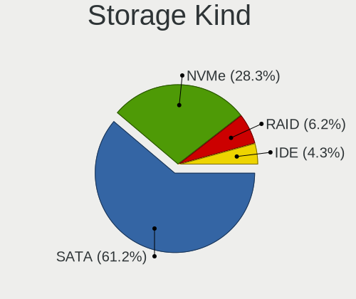

| Kind | Notebooks | Percent |
|------|-----------|---------|
| SATA | 206       | 61.49%  |
| NVMe | 96        | 28.66%  |
| RAID | 20        | 5.97%   |
| IDE  | 13        | 3.88%   |

Processor
---------

CPU Vendor
----------

Processor vendors

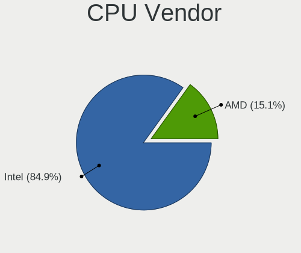

| Vendor | Notebooks | Percent |
|--------|-----------|---------|
| Intel  | 245       | 85.96%  |
| AMD    | 40        | 14.04%  |

CPU Model
---------

Processor models

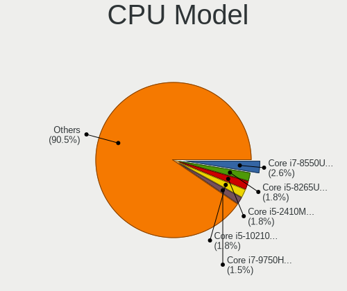

| Model                                         | Notebooks | Percent |
|-----------------------------------------------|-----------|---------|
| Intel Core i7-8550U CPU @ 1.80GHz             | 7         | 2.46%   |
| Intel Core i7-10750H CPU @ 2.60GHz            | 6         | 2.11%   |
| Intel Core i5-8265U CPU @ 1.60GHz             | 6         | 2.11%   |
| Intel Core i5-2410M CPU @ 2.30GHz             | 6         | 2.11%   |
| Intel Core i5-6300U CPU @ 2.40GHz             | 5         | 1.75%   |
| Intel Core i5-3230M CPU @ 2.60GHz             | 5         | 1.75%   |
| Intel Core i5-2430M CPU @ 2.40GHz             | 5         | 1.75%   |
| Intel Core i5-10210U CPU @ 1.60GHz            | 5         | 1.75%   |
| Intel Celeron CPU N2840 @ 2.16GHz             | 5         | 1.75%   |
| Intel Core i7-9750H CPU @ 2.60GHz             | 4         | 1.4%    |
| Intel Core i7-7700HQ CPU @ 2.80GHz            | 4         | 1.4%    |
| Intel Core i7-4600U CPU @ 2.10GHz             | 4         | 1.4%    |
| Intel Core i5-6200U CPU @ 2.30GHz             | 4         | 1.4%    |
| Intel Core i5-3210M CPU @ 2.50GHz             | 4         | 1.4%    |
| Intel Core i5 CPU M 460 @ 2.53GHz             | 4         | 1.4%    |
| Intel Core i3-2350M CPU @ 2.30GHz             | 4         | 1.4%    |
| Intel Celeron CPU N3350 @ 1.10GHz             | 4         | 1.4%    |
| AMD Ryzen 5 3500U with Radeon Vega Mobile Gfx | 4         | 1.4%    |
| Intel Core i7-8565U CPU @ 1.80GHz             | 3         | 1.05%   |
| Intel Core i7-7500U CPU @ 2.70GHz             | 3         | 1.05%   |
| Intel Core i7-6700HQ CPU @ 2.60GHz            | 3         | 1.05%   |
| Intel Core i5-8250U CPU @ 1.60GHz             | 3         | 1.05%   |
| Intel Core i5-5200U CPU @ 2.20GHz             | 3         | 1.05%   |
| Intel Core i5-2540M CPU @ 2.60GHz             | 3         | 1.05%   |
| Intel Core i5-2520M CPU @ 2.50GHz             | 3         | 1.05%   |
| Intel Core i5-2450M CPU @ 2.50GHz             | 3         | 1.05%   |
| Intel Core i3-3227U CPU @ 1.90GHz             | 3         | 1.05%   |
| Intel Core 2 Duo CPU P7350 @ 2.00GHz          | 3         | 1.05%   |
| Intel 11th Gen Core i7-11800H @ 2.30GHz       | 3         | 1.05%   |
| AMD Ryzen 9 5900HX with Radeon Graphics       | 3         | 1.05%   |
| Intel Pentium M processor 2.00GHz             | 2         | 0.7%    |
| Intel Core i9-10885H CPU @ 2.40GHz            | 2         | 0.7%    |
| Intel Core i7-8850H CPU @ 2.60GHz             | 2         | 0.7%    |
| Intel Core i7-8750H CPU @ 2.20GHz             | 2         | 0.7%    |
| Intel Core i7-7820HQ CPU @ 2.90GHz            | 2         | 0.7%    |
| Intel Core i7-6600U CPU @ 2.60GHz             | 2         | 0.7%    |
| Intel Core i7-6500U CPU @ 2.50GHz             | 2         | 0.7%    |
| Intel Core i7-4600M CPU @ 2.90GHz             | 2         | 0.7%    |
| Intel Core i7-3610QM CPU @ 2.30GHz            | 2         | 0.7%    |
| Intel Core i7-2720QM CPU @ 2.20GHz            | 2         | 0.7%    |

CPU Model Family
----------------

Processor model prefix

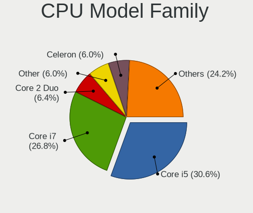

| Model                          | Notebooks | Percent |
|--------------------------------|-----------|---------|
| Intel Core i5                  | 87        | 30.53%  |
| Intel Core i7                  | 74        | 25.96%  |
| Other                          | 20        | 7.02%   |
| Intel Celeron                  | 18        | 6.32%   |
| Intel Core 2 Duo               | 17        | 5.96%   |
| Intel Core i3                  | 15        | 5.26%   |
| AMD Ryzen 5                    | 7         | 2.46%   |
| AMD A6                         | 6         | 2.11%   |
| AMD Ryzen 9                    | 5         | 1.75%   |
| AMD E2                         | 5         | 1.75%   |
| AMD Ryzen 7                    | 4         | 1.4%    |
| Intel Pentium                  | 3         | 1.05%   |
| Intel Core i9                  | 3         | 1.05%   |
| Intel Atom                     | 3         | 1.05%   |
| AMD A8                         | 3         | 1.05%   |
| Intel Pentium M                | 2         | 0.7%    |
| AMD A4                         | 2         | 0.7%    |
| Intel Pentium Silver           | 1         | 0.35%   |
| Intel Genuine                  | 1         | 0.35%   |
| Intel Core m7                  | 1         | 0.35%   |
| Intel Celeron Dual-Core        | 1         | 0.35%   |
| AMD Turion X2 Dual-Core Mobile | 1         | 0.35%   |
| AMD Turion 64 X2 Mobile        | 1         | 0.35%   |
| AMD Ryzen 7 PRO                | 1         | 0.35%   |
| AMD Ryzen 3                    | 1         | 0.35%   |
| AMD E1                         | 1         | 0.35%   |
| AMD E                          | 1         | 0.35%   |
| AMD A10                        | 1         | 0.35%   |

CPU Cores
---------

Number of processor cores

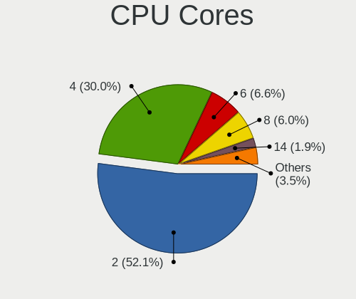

| Number | Notebooks | Percent |
|--------|-----------|---------|
| 2      | 154       | 54.04%  |
| 4      | 84        | 29.47%  |
| 6      | 18        | 6.32%   |
| 8      | 15        | 5.26%   |
| 14     | 5         | 1.75%   |
| 1      | 5         | 1.75%   |
| 10     | 4         | 1.4%    |

CPU Sockets
-----------

Number of sockets

| Number | Notebooks | Percent |
|--------|-----------|---------|
| 1      | 285       | 100%    |

CPU Threads
-----------

Threads per core (Hyper-Threading)

| Number | Notebooks | Percent |
|--------|-----------|---------|
| 2      | 214       | 75.09%  |
| 1      | 71        | 24.91%  |

CPU Op-Modes
------------

CPU Operation Modes (32-bit, 64-bit)

| Op mode        | Notebooks | Percent |
|----------------|-----------|---------|
| 32-bit, 64-bit | 276       | 95.5%   |
| Unknown        | 10        | 3.46%   |
| 32-bit         | 3         | 1.04%   |

CPU Microcode
-------------

Microcode number

| Number     | Notebooks | Percent |
|------------|-----------|---------|
| Unknown    | 69        | 23.63%  |
| 0x206a7    | 29        | 9.93%   |
| 0x306a9    | 22        | 7.53%   |
| 0x806ec    | 11        | 3.77%   |
| 0x806ea    | 11        | 3.77%   |
| 0x406e3    | 11        | 3.77%   |
| 0x806e9    | 8         | 2.74%   |
| 0x30678    | 8         | 2.74%   |
| 0xa0652    | 7         | 2.4%    |
| 0x20655    | 7         | 2.4%    |
| 0x1067a    | 7         | 2.4%    |
| 0x40651    | 6         | 2.05%   |
| 0x306c3    | 6         | 2.05%   |
| 0x10676    | 6         | 2.05%   |
| 0x906e9    | 5         | 1.71%   |
| 0x306d4    | 5         | 1.71%   |
| 0x07030105 | 5         | 1.71%   |
| 0x906ea    | 4         | 1.37%   |
| 0x806c1    | 4         | 1.37%   |
| 0x906a4    | 3         | 1.03%   |
| 0x906a3    | 3         | 1.03%   |
| 0x806d1    | 3         | 1.03%   |
| 0x706a8    | 3         | 1.03%   |
| 0x6fd      | 3         | 1.03%   |
| 0x506e3    | 3         | 1.03%   |
| 0x506c9    | 3         | 1.03%   |
| 0x0a50000c | 3         | 1.03%   |
| 0x08108102 | 3         | 1.03%   |
| 0x06006705 | 3         | 1.03%   |
| 0x6d8      | 2         | 0.68%   |
| 0x106ca    | 2         | 0.68%   |
| 0x08608103 | 2         | 0.68%   |
| 0x08600106 | 2         | 0.68%   |
| 0x08108109 | 2         | 0.68%   |
| 0x0700010f | 2         | 0.68%   |
| 0x05000119 | 2         | 0.68%   |
| 0xa0660    | 1         | 0.34%   |
| 0x906c0    | 1         | 0.34%   |
| 0x806eb    | 1         | 0.34%   |
| 0x806c2    | 1         | 0.34%   |

CPU Microarch
-------------

Microarchitecture

| Name             | Notebooks | Percent |
|------------------|-----------|---------|
| KabyLake         | 52        | 18.25%  |
| SandyBridge      | 35        | 12.28%  |
| IvyBridge        | 28        | 9.82%   |
| Skylake          | 20        | 7.02%   |
| Penryn           | 15        | 5.26%   |
| Haswell          | 15        | 5.26%   |
| Silvermont       | 11        | 3.86%   |
| CometLake        | 11        | 3.86%   |
| Westmere         | 10        | 3.51%   |
| Puma             | 9         | 3.16%   |
| TigerLake        | 7         | 2.46%   |
| Broadwell        | 7         | 2.46%   |
| Zen+             | 6         | 2.11%   |
| Zen 3            | 6         | 2.11%   |
| IceLake          | 6         | 2.11%   |
| Excavator        | 6         | 2.11%   |
| Alderlake Hybrid | 6         | 2.11%   |
| Unknown          | 6         | 2.11%   |
| Goldmont plus    | 4         | 1.4%    |
| Goldmont         | 4         | 1.4%    |
| Core             | 4         | 1.4%    |
| Bonnell          | 3         | 1.05%   |
| Zen 2            | 2         | 0.7%    |
| P6               | 2         | 0.7%    |
| Nehalem          | 2         | 0.7%    |
| Jaguar           | 2         | 0.7%    |
| Bobcat           | 2         | 0.7%    |
| Tremont          | 1         | 0.35%   |
| Piledriver       | 1         | 0.35%   |
| K8 Hammer        | 1         | 0.35%   |
| K8 & K10 hybrid  | 1         | 0.35%   |

Graphics
--------

GPU Vendor
----------

Vendors of graphics cards

| Vendor | Notebooks | Percent |
|--------|-----------|---------|
| Intel  | 218       | 60.72%  |
| Nvidia | 71        | 19.78%  |
| AMD    | 70        | 19.5%   |

GPU Model
---------

Graphics card models

| Model                                                                                 | Notebooks | Percent |
|---------------------------------------------------------------------------------------|-----------|---------|
| Intel 2nd Generation Core Processor Family Integrated Graphics Controller             | 30        | 8%      |
| Intel 3rd Gen Core processor Graphics Controller                                      | 24        | 6.4%    |
| Intel Skylake GT2 [HD Graphics 520]                                                   | 14        | 3.73%   |
| Intel UHD Graphics 620                                                                | 12        | 3.2%    |
| Intel Atom Processor Z36xxx/Z37xxx Series Graphics & Display                          | 10        | 2.67%   |
| Intel WhiskeyLake-U GT2 [UHD Graphics 620]                                            | 9         | 2.4%    |
| Intel Haswell-ULT Integrated Graphics Controller                                      | 9         | 2.4%    |
| Intel Core Processor Integrated Graphics Controller                                   | 9         | 2.4%    |
| Intel CometLake-H GT2 [UHD Graphics]                                                  | 8         | 2.13%   |
| AMD Topaz XT [Radeon R7 M260/M265 / M340/M360 / M440/M445 / 530/535 / 620/625 Mobile] | 8         | 2.13%   |
| Intel Mobile 4 Series Chipset Integrated Graphics Controller                          | 7         | 1.87%   |
| Intel CoffeeLake-H GT2 [UHD Graphics 630]                                             | 7         | 1.87%   |
| Intel TigerLake-LP GT2 [Iris Xe Graphics]                                             | 6         | 1.6%    |
| Intel HD Graphics 630                                                                 | 6         | 1.6%    |
| Intel HD Graphics 620                                                                 | 6         | 1.6%    |
| Intel CometLake-U GT2 [UHD Graphics]                                                  | 6         | 1.6%    |
| AMD Seymour [Radeon HD 6400M/7400M Series]                                            | 6         | 1.6%    |
| AMD Picasso/Raven 2 [Radeon Vega Series / Radeon Vega Mobile Series]                  | 6         | 1.6%    |
| AMD Cezanne [Radeon Vega Series / Radeon Vega Mobile Series]                          | 6         | 1.6%    |
| Intel HD Graphics 5500                                                                | 5         | 1.33%   |
| Intel Alder Lake-P Integrated Graphics Controller                                     | 5         | 1.33%   |
| Intel 4th Gen Core Processor Integrated Graphics Controller                           | 5         | 1.33%   |
| AMD Stoney [Radeon R2/R3/R4/R5 Graphics]                                              | 5         | 1.33%   |
| AMD Mullins [Radeon R4/R5 Graphics]                                                   | 5         | 1.33%   |
| Intel Mobile GM965/GL960 Integrated Graphics Controller (secondary)                   | 4         | 1.07%   |
| Intel Mobile GM965/GL960 Integrated Graphics Controller (primary)                     | 4         | 1.07%   |
| Intel HD Graphics 530                                                                 | 4         | 1.07%   |
| Intel HD Graphics 500                                                                 | 4         | 1.07%   |
| Intel GeminiLake [UHD Graphics 600]                                                   | 4         | 1.07%   |
| Nvidia GP107M [GeForce GTX 1050 Mobile]                                               | 3         | 0.8%    |
| Nvidia GK107M [GeForce GT 650M]                                                       | 3         | 0.8%    |
| Nvidia C79 [GeForce 9400M]                                                            | 3         | 0.8%    |
| Intel TigerLake-H GT1 [UHD Graphics]                                                  | 3         | 0.8%    |
| AMD Thames [Radeon HD 7550M/7570M/7650M]                                              | 3         | 0.8%    |
| AMD Sun XT [Radeon HD 8670A/8670M/8690M / R5 M330 / M430 / Radeon 520 Mobile]         | 3         | 0.8%    |
| AMD Mullins [Radeon R2 Graphics]                                                      | 3         | 0.8%    |
| AMD Lucienne                                                                          | 3         | 0.8%    |
| Nvidia TU117M [GeForce GTX 1650 Ti Mobile]                                            | 2         | 0.53%   |
| Nvidia TU117M [GeForce GTX 1650 Mobile / Max-Q]                                       | 2         | 0.53%   |
| Nvidia TU116M [GeForce GTX 1660 Ti Mobile]                                            | 2         | 0.53%   |

GPU Combo
---------

Combinations of graphics cards

| Name           | Notebooks | Percent |
|----------------|-----------|---------|
| 1 x Intel      | 148       | 51.93%  |
| Intel + Nvidia | 51        | 17.89%  |
| 1 x AMD        | 37        | 12.98%  |
| Intel + AMD    | 18        | 6.32%   |
| 1 x Nvidia     | 14        | 4.91%   |
| 2 x AMD        | 10        | 3.51%   |
| AMD + Nvidia   | 5         | 1.75%   |
| Other          | 1         | 0.35%   |
| 2 x Nvidia     | 1         | 0.35%   |

GPU Driver
----------

Free vs proprietary

| Driver      | Notebooks | Percent |
|-------------|-----------|---------|
| Free        | 241       | 84.27%  |
| Proprietary | 37        | 12.94%  |
| Unknown     | 8         | 2.8%    |

GPU Memory
----------

Total video memory

| Size in GB | Notebooks | Percent |
|------------|-----------|---------|
| Unknown    | 190       | 65.29%  |
| 0.01-0.5   | 30        | 10.31%  |
| 1.01-2.0   | 25        | 8.59%   |
| 0.51-1.0   | 20        | 6.87%   |
| 3.01-4.0   | 13        | 4.47%   |
| 7.01-8.0   | 5         | 1.72%   |
| 5.01-6.0   | 5         | 1.72%   |
| 2.01-3.0   | 2         | 0.69%   |
| 8.01-16.0  | 1         | 0.34%   |

Monitor
-------

Monitor Vendor
--------------

Monitor vendors

| Vendor                  | Notebooks | Percent |
|-------------------------|-----------|---------|
| AU Optronics            | 55        | 16.82%  |
| LG Display              | 52        | 15.9%   |
| Chimei Innolux          | 43        | 13.15%  |
| Samsung Electronics     | 38        | 11.62%  |
| BOE                     | 29        | 8.87%   |
| Dell                    | 15        | 4.59%   |
| Sharp                   | 14        | 4.28%   |
| Chi Mei Optoelectronics | 13        | 3.98%   |
| Goldstar                | 11        | 3.36%   |
| AOC                     | 10        | 3.06%   |
| Apple                   | 6         | 1.83%   |
| PANDA                   | 4         | 1.22%   |
| Lenovo                  | 3         | 0.92%   |
| InfoVision              | 3         | 0.92%   |
| Hewlett-Packard         | 3         | 0.92%   |
| ViewSonic               | 2         | 0.61%   |
| Sony                    | 2         | 0.61%   |
| Quanta Display          | 2         | 0.61%   |
| Philips                 | 2         | 0.61%   |
| InnoLux Display         | 2         | 0.61%   |
| HannStar                | 2         | 0.61%   |
| Denver                  | 2         | 0.61%   |
| Acer                    | 2         | 0.61%   |
| Wacom                   | 1         | 0.31%   |
| TMX                     | 1         | 0.31%   |
| SANYO                   | 1         | 0.31%   |
| PRISM+                  | 1         | 0.31%   |
| MiTAC                   | 1         | 0.31%   |
| Mi                      | 1         | 0.31%   |
| LG Philips              | 1         | 0.31%   |
| IBM                     | 1         | 0.31%   |
| HYD                     | 1         | 0.31%   |
| HKC                     | 1         | 0.31%   |
| CPT                     | 1         | 0.31%   |
| Ancor Communications    | 1         | 0.31%   |

Monitor Model
-------------

Monitor models

| Model                                                                    | Notebooks | Percent |
|--------------------------------------------------------------------------|-----------|---------|
| Chi Mei Optoelectronics LCD Monitor CMO15A1 1366x768 344x193mm 15.5-inch | 4         | 1.2%    |
| AU Optronics LCD Monitor AUO23EC 1366x768 344x193mm 15.5-inch            | 4         | 1.2%    |
| Sharp LCD Monitor SHP144A 3200x1800 294x165mm 13.3-inch                  | 3         | 0.9%    |
| LG Display LCD Monitor LGD0465 1366x768 344x194mm 15.5-inch              | 3         | 0.9%    |
| LG Display LCD Monitor LGD0258 1600x900 345x194mm 15.6-inch              | 3         | 0.9%    |
| Chimei Innolux LCD Monitor CMN15BF 1366x768 344x193mm 15.5-inch          | 3         | 0.9%    |
| Chimei Innolux LCD Monitor CMN14E5 1920x1080 309x173mm 13.9-inch         | 3         | 0.9%    |
| Chimei Innolux LCD Monitor CMN14D4 1920x1080 309x173mm 13.9-inch         | 3         | 0.9%    |
| AU Optronics LCD Monitor AUO70EC 1366x768 344x193mm 15.5-inch            | 3         | 0.9%    |
| AU Optronics LCD Monitor AUO123D 1920x1080 309x173mm 13.9-inch           | 3         | 0.9%    |
| Sharp LQ156M1JW03 SHP14C5 1920x1080 344x194mm 15.5-inch                  | 2         | 0.6%    |
| Sharp LCD Monitor SHP1449 1920x1080 294x165mm 13.3-inch                  | 2         | 0.6%    |
| Samsung Electronics LCD Monitor SEC544B 1600x900 382x214mm 17.2-inch     | 2         | 0.6%    |
| LG Display LCD Monitor LGD4601 1280x800 286x179mm 13.3-inch              | 2         | 0.6%    |
| LG Display LCD Monitor LGD0456 1366x768 344x194mm 15.5-inch              | 2         | 0.6%    |
| LG Display LCD Monitor LGD033E 1366x768 309x174mm 14.0-inch              | 2         | 0.6%    |
| LG Display LCD Monitor LGD02E2 1600x900 310x174mm 14.0-inch              | 2         | 0.6%    |
| LG Display LCD Monitor LGD02DC 1366x768 344x194mm 15.5-inch              | 2         | 0.6%    |
| LG Display LCD Monitor LGD02AD 1366x768 344x194mm 15.5-inch              | 2         | 0.6%    |
| Goldstar 23EN43 GSM59DC 1920x1080 510x290mm 23.1-inch                    | 2         | 0.6%    |
| Dell U3818DW DELA0F3 3840x1600 880x367mm 37.5-inch                       | 2         | 0.6%    |
| Chimei Innolux LCD Monitor CMN14B1 1920x1080 308x173mm 13.9-inch         | 2         | 0.6%    |
| Chi Mei Optoelectronics LCD Monitor CMO15A7 1366x768 344x193mm 15.5-inch | 2         | 0.6%    |
| Chi Mei Optoelectronics LCD Monitor CMO15A3 1366x768 344x193mm 15.5-inch | 2         | 0.6%    |
| Chi Mei Optoelectronics LCD Monitor CMO1592 1366x768 344x193mm 15.5-inch | 2         | 0.6%    |
| AU Optronics LCD Monitor AUOC199 2560x1600 344x215mm 16.0-inch           | 2         | 0.6%    |
| AU Optronics LCD Monitor AUO61ED 1920x1080 344x194mm 15.5-inch           | 2         | 0.6%    |
| AU Optronics LCD Monitor AUO41ED 1920x1080 344x193mm 15.5-inch           | 2         | 0.6%    |
| AU Optronics LCD Monitor AUO22EC 1366x768 344x193mm 15.5-inch            | 2         | 0.6%    |
| AU Optronics LCD Monitor AUO129E 1600x900 382x214mm 17.2-inch            | 2         | 0.6%    |
| AOC Q2790 AOC2790 2560x1440 597x336mm 27.0-inch                          | 2         | 0.6%    |
| AOC 2470W AOC2470 1920x1080 521x293mm 23.5-inch                          | 2         | 0.6%    |
| Wacom Cintiq 16 WAC1071 1920x1080 344x193mm 15.5-inch                    | 1         | 0.3%    |
| ViewSonic VX2770 SERIES VSC3A2C 1920x1080 597x336mm 27.0-inch            | 1         | 0.3%    |
| ViewSonic VA1938 Series VSC0626 1366x768 410x230mm 18.5-inch             | 1         | 0.3%    |
| TMX TL140BDXP01-0 TMX1400 2560x1440 310x174mm 14.0-inch                  | 1         | 0.3%    |
| Sony TV SNYA401 1920x1080                                                | 1         | 0.3%    |
| Sony TV SNY3002 1920x1080 708x398mm 32.0-inch                            | 1         | 0.3%    |
| Sharp LCD Monitor SHP1542 1920x1080 309x174mm 14.0-inch                  | 1         | 0.3%    |
| Sharp LCD Monitor SHP14D1 1920x1200 336x210mm 15.6-inch                  | 1         | 0.3%    |

Monitor Resolution
------------------

Monitor screen resolution

| Resolution         | Notebooks | Percent |
|--------------------|-----------|---------|
| 1920x1080 (FHD)    | 116       | 37.42%  |
| 1366x768 (WXGA)    | 98        | 31.61%  |
| 1600x900 (HD+)     | 19        | 6.13%   |
| 1280x800 (WXGA)    | 14        | 4.52%   |
| 2560x1440 (QHD)    | 13        | 4.19%   |
| 3840x2160 (4K)     | 10        | 3.23%   |
| 3440x1440          | 7         | 2.26%   |
| 1440x900 (WXGA+)   | 5         | 1.61%   |
| 3200x1800 (QHD+)   | 4         | 1.29%   |
| 1920x1200 (WUXGA)  | 4         | 1.29%   |
| 2880x1800          | 3         | 0.97%   |
| 1280x1024 (SXGA)   | 3         | 0.97%   |
| 1024x600           | 3         | 0.97%   |
| 3840x1600          | 2         | 0.65%   |
| 3456x2160          | 2         | 0.65%   |
| 2560x1600          | 2         | 0.65%   |
| 1680x1050 (WSXGA+) | 2         | 0.65%   |
| 3840x2400          | 1         | 0.32%   |
| 2880x1920          | 1         | 0.32%   |
| 1920x1280          | 1         | 0.32%   |

Monitor Diagonal
----------------

Diagonal size in inches

| Inches  | Notebooks | Percent |
|---------|-----------|---------|
| 15      | 136       | 41.34%  |
| 13      | 47        | 14.29%  |
| 14      | 38        | 11.55%  |
| 17      | 26        | 7.9%    |
| 27      | 16        | 4.86%   |
| 23      | 12        | 3.65%   |
| 34      | 5         | 1.52%   |
| 21      | 5         | 1.52%   |
| 12      | 5         | 1.52%   |
| 11      | 5         | 1.52%   |
| 10      | 5         | 1.52%   |
| 24      | 4         | 1.22%   |
| 37      | 3         | 0.91%   |
| 18      | 3         | 0.91%   |
| 16      | 3         | 0.91%   |
| 72      | 2         | 0.61%   |
| 31      | 2         | 0.61%   |
| 22      | 2         | 0.61%   |
| 19      | 2         | 0.61%   |
| Unknown | 2         | 0.61%   |
| 84      | 1         | 0.3%    |
| 40      | 1         | 0.3%    |
| 35      | 1         | 0.3%    |
| 33      | 1         | 0.3%    |
| 25      | 1         | 0.3%    |
| 20      | 1         | 0.3%    |

Monitor Width
-------------

Physical width

| Width in mm | Notebooks | Percent |
|-------------|-----------|---------|
| 301-350     | 200       | 61.54%  |
| 201-300     | 35        | 10.77%  |
| 501-600     | 30        | 9.23%   |
| 351-400     | 30        | 9.23%   |
| 401-500     | 11        | 3.38%   |
| 701-800     | 6         | 1.85%   |
| 801-900     | 5         | 1.54%   |
| 601-700     | 3         | 0.92%   |
| 1501-2000   | 3         | 0.92%   |
| Unknown     | 2         | 0.62%   |

Aspect Ratio
------------

Proportional relationship between the width and the height

| Ratio   | Notebooks | Percent |
|---------|-----------|---------|
| 16/9    | 239       | 83.28%  |
| 16/10   | 31        | 10.8%   |
| 21/9    | 9         | 3.14%   |
| 5/4     | 3         | 1.05%   |
| 3/2     | 3         | 1.05%   |
| Unknown | 2         | 0.7%    |

Monitor Area
------------

Area in inch²

| Area in inch² | Notebooks | Percent |
|----------------|-----------|---------|
| 101-110        | 134       | 40.73%  |
| 81-90          | 68        | 20.67%  |
| 121-130        | 23        | 6.99%   |
| 201-250        | 19        | 5.78%   |
| 71-80          | 17        | 5.17%   |
| 301-350        | 16        | 4.86%   |
| 351-500        | 9         | 2.74%   |
| 61-70          | 5         | 1.52%   |
| 51-60          | 5         | 1.52%   |
| 41-50          | 5         | 1.52%   |
| 151-200        | 5         | 1.52%   |
| 141-150        | 4         | 1.22%   |
| 111-120        | 4         | 1.22%   |
| 501-1000       | 4         | 1.22%   |
| More than 1000 | 3         | 0.91%   |
| 251-300        | 3         | 0.91%   |
| 131-140        | 2         | 0.61%   |
| Unknown        | 2         | 0.61%   |
| 91-100         | 1         | 0.3%    |

Pixel Density
-------------

Pixels per inch

| Density       | Notebooks | Percent |
|---------------|-----------|---------|
| 101-120       | 123       | 38.08%  |
| 121-160       | 111       | 34.37%  |
| 51-100        | 53        | 16.41%  |
| 161-240       | 17        | 5.26%   |
| More than 240 | 15        | 4.64%   |
| 1-50          | 2         | 0.62%   |
| Unknown       | 2         | 0.62%   |

Multiple Monitors
-----------------

Total monitors connected

| Total | Notebooks | Percent |
|-------|-----------|---------|
| 1     | 227       | 77.21%  |
| 2     | 51        | 17.35%  |
| 0     | 10        | 3.4%    |
| 3     | 5         | 1.7%    |
| 4     | 1         | 0.34%   |

Network
-------

Net Controller Vendor
---------------------

Controller vendors

| Vendor                            | Notebooks | Percent |
|-----------------------------------|-----------|---------|
| Intel                             | 166       | 36.4%   |
| Realtek Semiconductor             | 142       | 31.14%  |
| Qualcomm Atheros                  | 61        | 13.38%  |
| Broadcom                          | 29        | 6.36%   |
| Ralink                            | 7         | 1.54%   |
| MediaTek                          | 7         | 1.54%   |
| Hewlett-Packard                   | 6         | 1.32%   |
| TP-Link                           | 5         | 1.1%    |
| Nvidia                            | 5         | 1.1%    |
| Broadcom Limited                  | 5         | 1.1%    |
| DisplayLink                       | 4         | 0.88%   |
| Lenovo                            | 3         | 0.66%   |
| Sierra Wireless                   | 2         | 0.44%   |
| JMicron Technology                | 2         | 0.44%   |
| Dell                              | 2         | 0.44%   |
| Samsung Electronics               | 1         | 0.22%   |
| OPPO Electronics                  | 1         | 0.22%   |
| NetGear                           | 1         | 0.22%   |
| Marvell Technology Group          | 1         | 0.22%   |
| Lite-On Technology                | 1         | 0.22%   |
| ICS Advent                        | 1         | 0.22%   |
| Espressi                          | 1         | 0.22%   |
| Ericsson Business Mobile Networks | 1         | 0.22%   |
| Attansic Technology               | 1         | 0.22%   |
| ASIX Electronics                  | 1         | 0.22%   |

Net Controller Model
--------------------

Controller models

| Model                                                             | Notebooks | Percent |
|-------------------------------------------------------------------|-----------|---------|
| Realtek RTL8111/8168/8411 PCI Express Gigabit Ethernet Controller | 86        | 15.36%  |
| Realtek RTL810xE PCI Express Fast Ethernet controller             | 24        | 4.29%   |
| Realtek RTL8153 Gigabit Ethernet Adapter                          | 16        | 2.86%   |
| Qualcomm Atheros QCA6174 802.11ac Wireless Network Adapter        | 15        | 2.68%   |
| Intel 82579LM Gigabit Network Connection (Lewisville)             | 15        | 2.68%   |
| Intel Wireless 7260                                               | 13        | 2.32%   |
| Intel Wi-Fi 6 AX200                                               | 13        | 2.32%   |
| Intel Wireless 8265 / 8275                                        | 12        | 2.14%   |
| Qualcomm Atheros QCA9565 / AR9565 Wireless Network Adapter        | 11        | 1.96%   |
| Qualcomm Atheros AR9485 Wireless Network Adapter                  | 11        | 1.96%   |
| Intel Wireless 8260                                               | 11        | 1.96%   |
| Qualcomm Atheros AR9285 Wireless Network Adapter (PCI-Express)    | 10        | 1.79%   |
| Intel Centrino Advanced-N 6205 [Taylor Peak]                      | 10        | 1.79%   |
| Intel Comet Lake PCH CNVi WiFi                                    | 9         | 1.61%   |
| Intel Wireless 3165                                               | 8         | 1.43%   |
| Intel Comet Lake PCH-LP CNVi WiFi                                 | 8         | 1.43%   |
| Broadcom BCM4313 802.11bgn Wireless Network Adapter               | 8         | 1.43%   |
| Intel Wireless 7265                                               | 7         | 1.25%   |
| Qualcomm Atheros QCA9377 802.11ac Wireless Network Adapter        | 6         | 1.07%   |
| Intel Ethernet Connection I218-LM                                 | 6         | 1.07%   |
| Intel Centrino Advanced-N 6200                                    | 6         | 1.07%   |
| Qualcomm Atheros AR8151 v2.0 Gigabit Ethernet                     | 5         | 0.89%   |
| Intel Ethernet Connection I219-LM                                 | 5         | 0.89%   |
| Intel Centrino Wireless-N 2230                                    | 5         | 0.89%   |
| Intel Centrino Ultimate-N 6300                                    | 5         | 0.89%   |
| Intel Centrino Advanced-N 6235                                    | 5         | 0.89%   |
| Intel Cannon Lake PCH CNVi WiFi                                   | 5         | 0.89%   |
| Intel Alder Lake-P PCH CNVi WiFi                                  | 5         | 0.89%   |
| Broadcom BCM4322 802.11a/b/g/n Wireless LAN Controller            | 5         | 0.89%   |
| Realtek RTL8822CE 802.11ac PCIe Wireless Network Adapter          | 4         | 0.71%   |
| Realtek RTL8821CE 802.11ac PCIe Wireless Network Adapter          | 4         | 0.71%   |
| Realtek RTL8723BE PCIe Wireless Network Adapter                   | 4         | 0.71%   |
| Nvidia MCP79 Ethernet                                             | 4         | 0.71%   |
| MediaTek MT7921 802.11ax PCI Express Wireless Network Adapter     | 4         | 0.71%   |
| Intel Wi-Fi 6 AX201                                               | 4         | 0.71%   |
| Intel Gemini Lake PCH CNVi WiFi                                   | 4         | 0.71%   |
| Intel Ethernet Connection (4) I219-LM                             | 4         | 0.71%   |
| Intel 82579V Gigabit Network Connection                           | 4         | 0.71%   |
| Intel 82577LC Gigabit Network Connection                          | 4         | 0.71%   |
| Intel 82567LM Gigabit Network Connection                          | 4         | 0.71%   |

Wireless Vendor
---------------

Wireless vendors

| Vendor                | Notebooks | Percent |
|-----------------------|-----------|---------|
| Intel                 | 160       | 53.33%  |
| Qualcomm Atheros      | 54        | 18%     |
| Realtek Semiconductor | 29        | 9.67%   |
| Broadcom              | 24        | 8%      |
| Ralink                | 7         | 2.33%   |
| MediaTek              | 7         | 2.33%   |
| TP-Link               | 5         | 1.67%   |
| Broadcom Limited      | 5         | 1.67%   |
| Hewlett-Packard       | 3         | 1%      |
| Sierra Wireless       | 2         | 0.67%   |
| Dell                  | 2         | 0.67%   |
| NetGear               | 1         | 0.33%   |
| Lite-On Technology    | 1         | 0.33%   |

Wireless Model
--------------

Wireless models

| Model                                                          | Notebooks | Percent |
|----------------------------------------------------------------|-----------|---------|
| Qualcomm Atheros QCA6174 802.11ac Wireless Network Adapter     | 15        | 4.98%   |
| Intel Wireless 7260                                            | 13        | 4.32%   |
| Intel Wi-Fi 6 AX200                                            | 13        | 4.32%   |
| Intel Wireless 8265 / 8275                                     | 12        | 3.99%   |
| Qualcomm Atheros QCA9565 / AR9565 Wireless Network Adapter     | 11        | 3.65%   |
| Qualcomm Atheros AR9485 Wireless Network Adapter               | 11        | 3.65%   |
| Intel Wireless 8260                                            | 11        | 3.65%   |
| Qualcomm Atheros AR9285 Wireless Network Adapter (PCI-Express) | 10        | 3.32%   |
| Intel Centrino Advanced-N 6205 [Taylor Peak]                   | 10        | 3.32%   |
| Intel Comet Lake PCH CNVi WiFi                                 | 9         | 2.99%   |
| Intel Wireless 3165                                            | 8         | 2.66%   |
| Intel Comet Lake PCH-LP CNVi WiFi                              | 8         | 2.66%   |
| Broadcom BCM4313 802.11bgn Wireless Network Adapter            | 8         | 2.66%   |
| Intel Wireless 7265                                            | 7         | 2.33%   |
| Qualcomm Atheros QCA9377 802.11ac Wireless Network Adapter     | 6         | 1.99%   |
| Intel Centrino Advanced-N 6200                                 | 6         | 1.99%   |
| Intel Centrino Wireless-N 2230                                 | 5         | 1.66%   |
| Intel Centrino Ultimate-N 6300                                 | 5         | 1.66%   |
| Intel Centrino Advanced-N 6235                                 | 5         | 1.66%   |
| Intel Cannon Lake PCH CNVi WiFi                                | 5         | 1.66%   |
| Intel Alder Lake-P PCH CNVi WiFi                               | 5         | 1.66%   |
| Broadcom BCM4322 802.11a/b/g/n Wireless LAN Controller         | 5         | 1.66%   |
| Realtek RTL8822CE 802.11ac PCIe Wireless Network Adapter       | 4         | 1.33%   |
| Realtek RTL8821CE 802.11ac PCIe Wireless Network Adapter       | 4         | 1.33%   |
| Realtek RTL8723BE PCIe Wireless Network Adapter                | 4         | 1.33%   |
| MediaTek MT7921 802.11ax PCI Express Wireless Network Adapter  | 4         | 1.33%   |
| Intel Wi-Fi 6 AX201                                            | 4         | 1.33%   |
| Intel Gemini Lake PCH CNVi WiFi                                | 4         | 1.33%   |
| Realtek RTL8822BE 802.11a/b/g/n/ac WiFi adapter                | 3         | 1%      |
| MediaTek WLAN controller                                       | 3         | 1%      |
| Intel Wireless-AC 9260                                         | 3         | 1%      |
| Intel Wireless 3160                                            | 3         | 1%      |
| Intel Cannon Point-LP CNVi [Wireless-AC]                       | 3         | 1%      |
| HP lt4112 Gobi 4G Module Network Device                        | 3         | 1%      |
| Broadcom BCM43228 802.11a/b/g/n                                | 3         | 1%      |
| TP-Link TL-WN821N v5/v6 [RTL8192EU]                            | 2         | 0.66%   |
| TP-Link TL-WN722N v2/v3 [Realtek RTL8188EUS]                   | 2         | 0.66%   |
| Realtek RTL88x2bu [AC1200 Techkey]                             | 2         | 0.66%   |
| Realtek RTL8188CE 802.11b/g/n WiFi Adapter                     | 2         | 0.66%   |
| Realtek Realtek Network controller                             | 2         | 0.66%   |

Ethernet Vendor
---------------

Ethernet vendors

| Vendor                   | Notebooks | Percent |
|--------------------------|-----------|---------|
| Realtek Semiconductor    | 133       | 52.99%  |
| Intel                    | 73        | 29.08%  |
| Qualcomm Atheros         | 17        | 6.77%   |
| Broadcom                 | 8         | 3.19%   |
| Nvidia                   | 5         | 1.99%   |
| DisplayLink              | 4         | 1.59%   |
| Lenovo                   | 3         | 1.2%    |
| JMicron Technology       | 2         | 0.8%    |
| Samsung Electronics      | 1         | 0.4%    |
| OPPO Electronics         | 1         | 0.4%    |
| Marvell Technology Group | 1         | 0.4%    |
| ICS Advent               | 1         | 0.4%    |
| Attansic Technology      | 1         | 0.4%    |
| ASIX Electronics         | 1         | 0.4%    |

Ethernet Model
--------------

Ethernet models

| Model                                                             | Notebooks | Percent |
|-------------------------------------------------------------------|-----------|---------|
| Realtek RTL8111/8168/8411 PCI Express Gigabit Ethernet Controller | 86        | 33.99%  |
| Realtek RTL810xE PCI Express Fast Ethernet controller             | 24        | 9.49%   |
| Realtek RTL8153 Gigabit Ethernet Adapter                          | 16        | 6.32%   |
| Intel 82579LM Gigabit Network Connection (Lewisville)             | 15        | 5.93%   |
| Intel Ethernet Connection I218-LM                                 | 6         | 2.37%   |
| Qualcomm Atheros AR8151 v2.0 Gigabit Ethernet                     | 5         | 1.98%   |
| Intel Ethernet Connection I219-LM                                 | 5         | 1.98%   |
| Nvidia MCP79 Ethernet                                             | 4         | 1.58%   |
| Intel Ethernet Connection (4) I219-LM                             | 4         | 1.58%   |
| Intel 82579V Gigabit Network Connection                           | 4         | 1.58%   |
| Intel 82577LC Gigabit Network Connection                          | 4         | 1.58%   |
| Intel 82567LM Gigabit Network Connection                          | 4         | 1.58%   |
| Realtek Killer E3000 2.5GbE Controller                            | 3         | 1.19%   |
| Intel Ethernet Connection (6) I219-V                              | 3         | 1.19%   |
| Intel Ethernet Connection (4) I219-V                              | 3         | 1.19%   |
| Intel Ethernet Connection (2) I219-LM                             | 3         | 1.19%   |
| Broadcom NetLink BCM57785 Gigabit Ethernet PCIe                   | 3         | 1.19%   |
| Realtek RTL8125 2.5GbE Controller                                 | 2         | 0.79%   |
| Realtek RTL-8100/8101L/8139 PCI Fast Ethernet Adapter             | 2         | 0.79%   |
| Qualcomm Atheros Killer E2400 Gigabit Ethernet Controller         | 2         | 0.79%   |
| Qualcomm Atheros AR8152 v2.0 Fast Ethernet                        | 2         | 0.79%   |
| Qualcomm Atheros AR8132 Fast Ethernet                             | 2         | 0.79%   |
| Lenovo USB-C Dock Ethernet                                        | 2         | 0.79%   |
| JMicron JMC250 PCI Express Gigabit Ethernet Controller            | 2         | 0.79%   |
| Intel Ethernet controller                                         | 2         | 0.79%   |
| Intel Ethernet Connection I217-LM                                 | 2         | 0.79%   |
| Intel Ethernet Connection (7) I219-V                              | 2         | 0.79%   |
| Intel Ethernet Connection (3) I218-V                              | 2         | 0.79%   |
| Intel Ethernet Connection (16) I219-LM                            | 2         | 0.79%   |
| Intel Ethernet Connection (10) I219-V                             | 2         | 0.79%   |
| Intel 82577LM Gigabit Network Connection                          | 2         | 0.79%   |
| Intel 82566MM Gigabit Network Connection                          | 2         | 0.79%   |
| Samsung Galaxy series, misc. (tethering mode)                     | 1         | 0.4%    |
| Realtek Realtek Ethernet controller                               | 1         | 0.4%    |
| Realtek Killer E2500 Gigabit Ethernet Controller                  | 1         | 0.4%    |
| Qualcomm Atheros Killer E2500 Gigabit Ethernet Controller         | 1         | 0.4%    |
| Qualcomm Atheros Killer E220x Gigabit Ethernet Controller         | 1         | 0.4%    |
| Qualcomm Atheros AR8161 Gigabit Ethernet                          | 1         | 0.4%    |
| Qualcomm Atheros AR8152 v1.1 Fast Ethernet                        | 1         | 0.4%    |
| Qualcomm Atheros AR8131 Gigabit Ethernet                          | 1         | 0.4%    |

Net Controller Kind
-------------------

Ethernet, WiFi or modem

| Kind     | Notebooks | Percent |
|----------|-----------|---------|
| WiFi     | 282       | 53.41%  |
| Ethernet | 240       | 45.45%  |
| Modem    | 6         | 1.14%   |

Used Controller
---------------

Currently used network controller

| Kind     | Notebooks | Percent |
|----------|-----------|---------|
| WiFi     | 245       | 78.03%  |
| Ethernet | 69        | 21.97%  |

NICs
----

Total network controllers on board

| Total | Notebooks | Percent |
|-------|-----------|---------|
| 2     | 219       | 76.84%  |
| 1     | 62        | 21.75%  |
| 3     | 2         | 0.7%    |
| 0     | 2         | 0.7%    |

IPv6
----

IPv6 vs IPv4

| Used | Notebooks | Percent |
|------|-----------|---------|
| No   | 254       | 88.19%  |
| Yes  | 34        | 11.81%  |

Bluetooth
---------

Bluetooth Vendor
----------------

Controller vendors

| Vendor                          | Notebooks | Percent |
|---------------------------------|-----------|---------|
| Intel                           | 121       | 52.84%  |
| Qualcomm Atheros Communications | 21        | 9.17%   |
| Realtek Semiconductor           | 13        | 5.68%   |
| Lite-On Technology              | 12        | 5.24%   |
| IMC Networks                    | 11        | 4.8%    |
| Foxconn / Hon Hai               | 11        | 4.8%    |
| Hewlett-Packard                 | 10        | 4.37%   |
| Broadcom                        | 10        | 4.37%   |
| Apple                           | 6         | 2.62%   |
| Toshiba                         | 4         | 1.75%   |
| Ralink Technology               | 3         | 1.31%   |
| Dell                            | 2         | 0.87%   |
| ASUSTek Computer                | 2         | 0.87%   |
| Realtek                         | 1         | 0.44%   |
| Ralink                          | 1         | 0.44%   |
| Edimax Technology               | 1         | 0.44%   |

Bluetooth Model
---------------

Controller models

| Model                                            | Notebooks | Percent |
|--------------------------------------------------|-----------|---------|
| Intel Bluetooth wireless interface               | 50        | 21.83%  |
| Intel AX201 Bluetooth                            | 19        | 8.3%    |
| Intel Bluetooth 9460/9560 Jefferson Peak (JfP)   | 15        | 6.55%   |
| Intel AX200 Bluetooth                            | 13        | 5.68%   |
| Intel Centrino Bluetooth Wireless Transceiver    | 11        | 4.8%    |
| Realtek Bluetooth Radio                          | 8         | 3.49%   |
| Qualcomm Atheros  Bluetooth Device               | 7         | 3.06%   |
| IMC Networks Wireless_Device                     | 6         | 2.62%   |
| HP Broadcom 2070 Bluetooth Combo                 | 6         | 2.62%   |
| Realtek  Bluetooth 4.2 Adapter                   | 5         | 2.18%   |
| Qualcomm Atheros QCA61x4 Bluetooth 4.0           | 5         | 2.18%   |
| Qualcomm Atheros AR3012 Bluetooth 4.0            | 4         | 1.75%   |
| Lite-On Bluetooth Device                         | 4         | 1.75%   |
| Lite-On Atheros AR3012 Bluetooth                 | 4         | 1.75%   |
| Foxconn / Hon Hai Bluetooth Device               | 4         | 1.75%   |
| Apple Bluetooth Host Controller                  | 4         | 1.75%   |
| Qualcomm Atheros AR3011 Bluetooth                | 3         | 1.31%   |
| Intel Wireless-AC 9260 Bluetooth Adapter         | 3         | 1.31%   |
| Intel Wireless-AC 3168 Bluetooth                 | 3         | 1.31%   |
| Intel Centrino Advanced-N 6230 Bluetooth adapter | 3         | 1.31%   |
| Intel Bluetooth Device                           | 3         | 1.31%   |
| IMC Networks Bluetooth Radio                     | 3         | 1.31%   |
| HP Bluetooth 2.0 Interface [Broadcom BCM2045]    | 3         | 1.31%   |
| Foxconn / Hon Hai Acer Module                    | 3         | 1.31%   |
| Broadcom BCM2045B (BDC-2.1)                      | 3         | 1.31%   |
| Toshiba Bluetooth Radio                          | 2         | 0.87%   |
| Ralink Motorola BC4 Bluetooth 3.0+HS Adapter     | 2         | 0.87%   |
| Lite-On Qualcomm Atheros QCA9377 Bluetooth       | 2         | 0.87%   |
| Foxconn / Hon Hai Bluetooth USB Host Controller  | 2         | 0.87%   |
| Broadcom HP Portable SoftSailing                 | 2         | 0.87%   |
| Toshiba BRCM Bluetooth Controller BCM2070        | 1         | 0.44%   |
| Toshiba Bluetooth USB Host Controller            | 1         | 0.44%   |
| Realtek Bluetooth Radio                          | 1         | 0.44%   |
| Ralink CSR BS8510                                | 1         | 0.44%   |
| Ralink RT3290 Bluetooth                          | 1         | 0.44%   |
| Qualcomm Atheros AR9462 Bluetooth                | 1         | 0.44%   |
| Qualcomm Atheros AR3012 Bluetooth                | 1         | 0.44%   |
| Lite-On Wireless_Device                          | 1         | 0.44%   |
| Lite-On Atheros Bluetooth                        | 1         | 0.44%   |
| Intel AX210 Bluetooth                            | 1         | 0.44%   |

Sound
-----

Sound Vendor
------------

Sound card vendors

| Vendor                    | Notebooks | Percent |
|---------------------------|-----------|---------|
| Intel                     | 240       | 65.75%  |
| AMD                       | 53        | 14.52%  |
| Nvidia                    | 46        | 12.6%   |
| Realtek Semiconductor     | 4         | 1.1%    |
| Logitech                  | 4         | 1.1%    |
| Hewlett-Packard           | 4         | 1.1%    |
| Lenovo                    | 3         | 0.82%   |
| Texas Instruments         | 1         | 0.27%   |
| SteelSeries ApS           | 1         | 0.27%   |
| Sennheiser Communications | 1         | 0.27%   |
| Plantronics               | 1         | 0.27%   |
| Micro Star International  | 1         | 0.27%   |
| GYROCOM C&C               | 1         | 0.27%   |
| Google                    | 1         | 0.27%   |
| Generalplus Technology    | 1         | 0.27%   |
| CMX Systems               | 1         | 0.27%   |
| ClearOne Communications   | 1         | 0.27%   |
| Belkin Components         | 1         | 0.27%   |

Sound Model
-----------

Sound card models

| Model                                                                      | Notebooks | Percent |
|----------------------------------------------------------------------------|-----------|---------|
| Intel Sunrise Point-LP HD Audio                                            | 35        | 8.25%   |
| Intel 7 Series/C216 Chipset Family High Definition Audio Controller        | 34        | 8.02%   |
| Intel 6 Series/C200 Series Chipset Family High Definition Audio Controller | 29        | 6.84%   |
| AMD Family 17h/19h HD Audio Controller                                     | 18        | 4.25%   |
| AMD FCH Azalia Controller                                                  | 13        | 3.07%   |
| Intel 5 Series/3400 Series Chipset High Definition Audio                   | 12        | 2.83%   |
| AMD Kabini HDMI/DP Audio                                                   | 12        | 2.83%   |
| Intel Atom Processor Z36xxx/Z37xxx Series High Definition Audio Controller | 10        | 2.36%   |
| AMD Renoir Radeon High Definition Audio Controller                         | 10        | 2.36%   |
| Intel Haswell-ULT HD Audio Controller                                      | 9         | 2.12%   |
| Intel Comet Lake PCH cAVS                                                  | 9         | 2.12%   |
| Intel Cannon Point-LP High Definition Audio Controller                     | 9         | 2.12%   |
| Intel Cannon Lake PCH cAVS                                                 | 9         | 2.12%   |
| Intel 82801I (ICH9 Family) HD Audio Controller                             | 9         | 2.12%   |
| Intel 8 Series HD Audio Controller                                         | 9         | 2.12%   |
| Intel Comet Lake PCH-LP cAVS                                               | 8         | 1.89%   |
| Intel Alder Lake PCH-P High Definition Audio Controller                    | 8         | 1.89%   |
| Intel Wildcat Point-LP High Definition Audio Controller                    | 7         | 1.65%   |
| Intel Tiger Lake-LP Smart Sound Technology Audio Controller                | 7         | 1.65%   |
| Intel CM238 HD Audio Controller                                            | 7         | 1.65%   |
| Intel Broadwell-U Audio Controller                                         | 7         | 1.65%   |
| Intel 8 Series/C220 Series Chipset High Definition Audio Controller        | 6         | 1.42%   |
| Intel 100 Series/C230 Series Chipset Family HD Audio Controller            | 6         | 1.42%   |
| AMD Family 15h (Models 60h-6fh) Audio Controller                           | 6         | 1.42%   |
| Nvidia TU107 GeForce GTX 1650 High Definition Audio Controller             | 5         | 1.18%   |
| Intel Xeon E3-1200 v3/4th Gen Core Processor HD Audio Controller           | 5         | 1.18%   |
| Intel 82801H (ICH8 Family) HD Audio Controller                             | 5         | 1.18%   |
| AMD Raven/Raven2/Fenghuang HDMI/DP Audio Controller                        | 5         | 1.18%   |
| AMD High Definition Audio Controller                                       | 5         | 1.18%   |
| Realtek Semiconductor USB Audio                                            | 4         | 0.94%   |
| Nvidia TU106 High Definition Audio Controller                              | 4         | 0.94%   |
| Nvidia MCP79 High Definition Audio                                         | 4         | 0.94%   |
| Nvidia GP107GL High Definition Audio Controller                            | 4         | 0.94%   |
| Nvidia GA104 High Definition Audio Controller                              | 4         | 0.94%   |
| Intel Celeron/Pentium Silver Processor High Definition Audio               | 4         | 0.94%   |
| Intel Celeron N3350/Pentium N4200/Atom E3900 Series Audio Cluster          | 4         | 0.94%   |
| Hewlett-Packard USB Audio                                                  | 4         | 0.94%   |
| AMD Turks HDMI Audio [Radeon HD 6500/6600 / 6700M Series]                  | 4         | 0.94%   |
| Nvidia GF119 HDMI Audio Controller                                         | 3         | 0.71%   |
| Nvidia Audio device                                                        | 3         | 0.71%   |

Memory
------

Memory Vendor
-------------

Memory module vendors

| Vendor              | Notebooks | Percent |
|---------------------|-----------|---------|
| Samsung Electronics | 53        | 29.61%  |
| SK hynix            | 43        | 24.02%  |
| Micron Technology   | 28        | 15.64%  |
| Crucial             | 15        | 8.38%   |
| Kingston            | 12        | 6.7%    |
| Unknown             | 5         | 2.79%   |
| A-DATA Technology   | 5         | 2.79%   |
| Elpida              | 4         | 2.23%   |
| Team                | 2         | 1.12%   |
| Shenzhen Mic        | 2         | 1.12%   |
| Ramaxel Technology  | 2         | 1.12%   |
| Unknown (ABCD)      | 1         | 0.56%   |
| Transcend           | 1         | 0.56%   |
| Strontium           | 1         | 0.56%   |
| Neo Forza           | 1         | 0.56%   |
| Nanya Technology    | 1         | 0.56%   |
| fef5                | 1         | 0.56%   |
| Corsair             | 1         | 0.56%   |
| Apacer              | 1         | 0.56%   |

Memory Model
------------

Memory module models

| Model                                                            | Notebooks | Percent |
|------------------------------------------------------------------|-----------|---------|
| Samsung RAM M471B5273DH0-CH9 4096MB SODIMM DDR3 1334MT/s         | 6         | 3.19%   |
| SK hynix RAM HMT451S6BFR8A-PB 4GB SODIMM DDR3 1600MT/s           | 5         | 2.66%   |
| SK hynix RAM HMAB2GS6AMR6N-XN 16GB SODIMM DDR4 3200MT/s          | 4         | 2.13%   |
| SK hynix RAM HMA81GS6DJR8N-XN 8GB SODIMM DDR4 3200MT/s           | 4         | 2.13%   |
| SK hynix RAM HMAA1GS6CJR6N-XN 8GB SODIMM DDR4 3200MT/s           | 3         | 1.6%    |
| Samsung RAM M471B5273CH0-CH9 4GB SODIMM DDR3 1334MT/s            | 3         | 1.6%    |
| Samsung RAM M471B5173EB0-YK0 4GB SODIMM DDR3 1600MT/s            | 3         | 1.6%    |
| Samsung RAM M471A2G43BB2-CWE 16GB SODIMM DDR4 3200MT/s           | 3         | 1.6%    |
| Crucial RAM CT51264BF160BJ.C8F 4GB SODIMM DDR3                   | 3         | 1.6%    |
| Unknown RAM Module 4096MB SODIMM DDR3                            | 2         | 1.06%   |
| SK hynix RAM HYMP125S64CP8-S6 2GB SODIMM DDR2 800MT/s            | 2         | 1.06%   |
| SK hynix RAM HYMP125S64CP8-S6 2048MB SODIMM DDR2 800MT/s         | 2         | 1.06%   |
| SK hynix RAM HMT41GS6AFR8A-PB 8GB SODIMM DDR3 1600MT/s           | 2         | 1.06%   |
| SK hynix RAM HMA81GS6AFR8N-UH 8GB SODIMM DDR4 2667MT/s           | 2         | 1.06%   |
| Shenzhen Mic RAM MG8A3200C21WE-SA 16GB SODIMM DDR4 3200MT/s      | 2         | 1.06%   |
| Samsung RAM Module 16GB SODIMM DDR4 2667MT/s                     | 2         | 1.06%   |
| Samsung RAM M471B5173DB0-YK0 4GB SODIMM DDR3 1600MT/s            | 2         | 1.06%   |
| Samsung RAM M471A2K43DB1-CWE 16GB SODIMM DDR4 3200MT/s           | 2         | 1.06%   |
| Samsung RAM M471A2K43DB1-CTD 16GB SODIMM DDR4 2667MT/s           | 2         | 1.06%   |
| Samsung RAM M471A2K43CB1-CTD 16GB SODIMM DDR4 8400MT/s           | 2         | 1.06%   |
| Samsung RAM M471A1K43BB1-CTD 8GB SODIMM DDR4 2667MT/s            | 2         | 1.06%   |
| Micron RAM 8ATF1G64HZ-2G6E1 8GB SODIMM DDR4 2667MT/s             | 2         | 1.06%   |
| Micron RAM 4ATF1G64HZ-3G2E1 8GB SODIMM DDR4 3200MT/s             | 2         | 1.06%   |
| Micron RAM 16KTF1G64HZ-1G6N1 8GB SODIMM DDR3 1600MT/s            | 2         | 1.06%   |
| Micron RAM 16KTF1G64HZ-1G6E1 8GB SODIMM DDR3 1600MT/s            | 2         | 1.06%   |
| Elpida RAM EBJ21UE8BDS0-DJ-F 2GB SODIMM DDR3 1334MT/s            | 2         | 1.06%   |
| Crucial RAM CT102464BF160B.M16 8GB SODIMM DDR3 1600MT/s          | 2         | 1.06%   |
| Unknown RAM Module 8192MB SODIMM DDR3                            | 1         | 0.53%   |
| Unknown RAM Module 4GB SODIMM DDR3                               | 1         | 0.53%   |
| Unknown RAM Module 2GB SODIMM DDR3                               | 1         | 0.53%   |
| Unknown RAM Module 2GB SODIMM DDR2 667MT/s                       | 1         | 0.53%   |
| Unknown RAM Module 2048MB SODIMM SDRAM                           | 1         | 0.53%   |
| Unknown (ABCD) RAM 123456789012345678 2GB SODIMM LPDDR4 2400MT/s | 1         | 0.53%   |
| Transcend RAM Module 2048MB SODIMM DDR2 667MT/s                  | 1         | 0.53%   |
| Team RAM TEAMGROUP-SD4-2666 8GB SODIMM DDR4 2667MT/s             | 1         | 0.53%   |
| Team RAM TEAMGROUP-SD4-2400 16GB SODIMM DDR4 8400MT/s            | 1         | 0.53%   |
| Team RAM TEAMGROUP-SD4-2400 16GB Chip DDR4 2133MT/s              | 1         | 0.53%   |
| Strontium RAM SRT4G86S1-H9H 4GB SODIMM DDR3 1333MT/s             | 1         | 0.53%   |
| SK hynix RAM Module 8GB SODIMM DDR4 2667MT/s                     | 1         | 0.53%   |
| SK hynix RAM Module 8GB SODIMM DDR4 2133MT/s                     | 1         | 0.53%   |

Memory Kind
-----------

Memory module kinds

| Kind    | Notebooks | Percent |
|---------|-----------|---------|
| DDR4    | 62        | 43.97%  |
| DDR3    | 52        | 36.88%  |
| DDR2    | 8         | 5.67%   |
| LPDDR3  | 6         | 4.26%   |
| LPDDR4  | 5         | 3.55%   |
| SDRAM   | 3         | 2.13%   |
| DDR5    | 2         | 1.42%   |
| Unknown | 2         | 1.42%   |
| LPDDR5  | 1         | 0.71%   |

Memory Form Factor
------------------

Physical design of the memory module

| Name         | Notebooks | Percent |
|--------------|-----------|---------|
| SODIMM       | 129       | 90.85%  |
| Row Of Chips | 8         | 5.63%   |
| Unknown      | 3         | 2.11%   |
| Chip         | 2         | 1.41%   |

Memory Size
-----------

Memory module size

| Size  | Notebooks | Percent |
|-------|-----------|---------|
| 8192  | 54        | 36.73%  |
| 4096  | 45        | 30.61%  |
| 16384 | 25        | 17.01%  |
| 2048  | 17        | 11.56%  |
| 32768 | 5         | 3.4%    |
| 1024  | 1         | 0.68%   |

Memory Speed
------------

Memory module speed

| Speed   | Notebooks | Percent |
|---------|-----------|---------|
| 1600    | 36        | 23.53%  |
| 3200    | 28        | 18.3%   |
| 2667    | 22        | 14.38%  |
| 1334    | 13        | 8.5%    |
| 2400    | 10        | 6.54%   |
| 2133    | 7         | 4.58%   |
| 667     | 5         | 3.27%   |
| 1867    | 4         | 2.61%   |
| 1333    | 4         | 2.61%   |
| 1067    | 4         | 2.61%   |
| Unknown | 4         | 2.61%   |
| 8400    | 3         | 1.96%   |
| 4800    | 3         | 1.96%   |
| 975     | 2         | 1.31%   |
| 800     | 2         | 1.31%   |
| 6400    | 1         | 0.65%   |
| 4267    | 1         | 0.65%   |
| 4199    | 1         | 0.65%   |
| 3733    | 1         | 0.65%   |
| 2933    | 1         | 0.65%   |
| 2048    | 1         | 0.65%   |

Printers & scanners
-------------------

Printer Vendor
--------------

Printer device vendors

| Vendor              | Notebooks | Percent |
|---------------------|-----------|---------|
| Prolific Technology | 1         | 50%     |
| Hewlett-Packard     | 1         | 50%     |

Printer Model
-------------

Printer device models

| Model                         | Notebooks | Percent |
|-------------------------------|-----------|---------|
| Prolific PL2305 Parallel Port | 1         | 50%     |
| HP DeskJet 2300 series        | 1         | 50%     |

Scanner Vendor
--------------

Scanner device vendors

| Vendor | Notebooks | Percent |
|--------|-----------|---------|
| Canon  | 1         | 100%    |

Scanner Model
-------------

Scanner device models

| Model                  | Notebooks | Percent |
|------------------------|-----------|---------|
| Canon CanoScan LIDE 25 | 1         | 100%    |

Camera
------

Camera Vendor
-------------

Camera device vendors

| Vendor                                 | Notebooks | Percent |
|----------------------------------------|-----------|---------|
| Chicony Electronics                    | 75        | 29.3%   |
| IMC Networks                           | 23        | 8.98%   |
| Microdia                               | 22        | 8.59%   |
| Sunplus Innovation Technology          | 20        | 7.81%   |
| Realtek Semiconductor                  | 18        | 7.03%   |
| Acer                                   | 17        | 6.64%   |
| Quanta                                 | 12        | 4.69%   |
| Suyin                                  | 10        | 3.91%   |
| Lite-On Technology                     | 10        | 3.91%   |
| Cheng Uei Precision Industry (Foxlink) | 10        | 3.91%   |
| Apple                                  | 6         | 2.34%   |
| Logitech                               | 5         | 1.95%   |
| Syntek                                 | 4         | 1.56%   |
| Primax Electronics                     | 4         | 1.56%   |
| Alcor Micro                            | 4         | 1.56%   |
| Silicon Motion                         | 3         | 1.17%   |
| Samsung Electronics                    | 2         | 0.78%   |
| Importek                               | 2         | 0.78%   |
| Z-Star Microelectronics                | 1         | 0.39%   |
| Sonix Technology                       | 1         | 0.39%   |
| Ricoh                                  | 1         | 0.39%   |
| Luxvisions Innotech Limited            | 1         | 0.39%   |
| Intel                                  | 1         | 0.39%   |
| DLTCT0A9IH1FFL                         | 1         | 0.39%   |
| DigiTech                               | 1         | 0.39%   |
| AVer Information                       | 1         | 0.39%   |
| ALi                                    | 1         | 0.39%   |

Camera Model
------------

Camera device models

| Model                                                           | Notebooks | Percent |
|-----------------------------------------------------------------|-----------|---------|
| Chicony integrated camera                                       | 15        | 5.86%   |
| IMC Networks USB2.0 HD UVC WebCam                               | 11        | 4.3%    |
| Microdia Integrated_Webcam_HD                                   | 9         | 3.52%   |
| Chicony HP HD Camera                                            | 8         | 3.13%   |
| Chicony HD WebCam                                               | 8         | 3.13%   |
| Realtek Integrated_Webcam_HD                                    | 7         | 2.73%   |
| Sunplus Integrated_Webcam_HD                                    | 6         | 2.34%   |
| Sunplus HP HD Webcam [Fixed]                                    | 6         | 2.34%   |
| IMC Networks Integrated Camera                                  | 5         | 1.95%   |
| Chicony TOSHIBA Web Camera - HD                                 | 5         | 1.95%   |
| Chicony HP HD Webcam                                            | 5         | 1.95%   |
| Acer Integrated Camera                                          | 5         | 1.95%   |
| Quanta HP TrueVision HD Camera                                  | 4         | 1.56%   |
| Apple Built-in iSight                                           | 4         | 1.56%   |
| Realtek HP Truevision HD                                        | 3         | 1.17%   |
| Lite-On Integrated Camera                                       | 3         | 1.17%   |
| Lite-On HP HD Camera                                            | 3         | 1.17%   |
| Chicony VGA Webcam                                              | 3         | 1.17%   |
| Chicony Integrated HP HD Webcam                                 | 3         | 1.17%   |
| Acer SunplusIT Integrated Camera                                | 3         | 1.17%   |
| Acer Lenovo EasyCamera                                          | 3         | 1.17%   |
| Syntek EasyCamera                                               | 2         | 0.78%   |
| Suyin HP Webcam                                                 | 2         | 0.78%   |
| Suyin HP TrueVision HD Integrated Webcam                        | 2         | 0.78%   |
| Sunplus ASUS Webcam                                             | 2         | 0.78%   |
| Samsung Galaxy A5 (MTP)                                         | 2         | 0.78%   |
| Realtek Integrated Webcam_HD                                    | 2         | 0.78%   |
| Quanta HP HD Camera                                             | 2         | 0.78%   |
| Primax Villem                                                   | 2         | 0.78%   |
| Primax HP HD Webcam [Fixed]                                     | 2         | 0.78%   |
| Microdia Laptop_Integrated_Webcam_1.3M                          | 2         | 0.78%   |
| Chicony USB2.0 Camera                                           | 2         | 0.78%   |
| Chicony USB2.0 0.3M UVC WebCam                                  | 2         | 0.78%   |
| Chicony TOSHIBA Web Camera                                      | 2         | 0.78%   |
| Chicony Lenovo Integrated Camera (0.3MP)                        | 2         | 0.78%   |
| Chicony HP Wide Vision HD Camera                                | 2         | 0.78%   |
| Chicony HP Truevision HD camera                                 | 2         | 0.78%   |
| Chicony HD User Facing                                          | 2         | 0.78%   |
| Cheng Uei Precision Industry (Foxlink) HP Wide Vision HD Camera | 2         | 0.78%   |
| Cheng Uei Precision Industry (Foxlink) HP TrueVision HD         | 2         | 0.78%   |

Security
--------

Fingerprint Vendor
------------------

Fingerprint sensor vendors

| Vendor                     | Notebooks | Percent |
|----------------------------|-----------|---------|
| Validity Sensors           | 40        | 54.79%  |
| Synaptics                  | 15        | 20.55%  |
| Shenzhen Goodix Technology | 5         | 6.85%   |
| AuthenTec                  | 5         | 6.85%   |
| Elan Microelectronics      | 3         | 4.11%   |
| Upek                       | 2         | 2.74%   |
| LighTuning Technology      | 2         | 2.74%   |
| STMicroelectronics         | 1         | 1.37%   |

Fingerprint Model
-----------------

Fingerprint sensor models

| Model                                                                      | Notebooks | Percent |
|----------------------------------------------------------------------------|-----------|---------|
| Validity Sensors VFS495 Fingerprint Reader                                 | 10        | 13.7%   |
| Validity Sensors VFS7552 Touch Fingerprint Sensor                          | 6         | 8.22%   |
| Validity Sensors VFS491                                                    | 5         | 6.85%   |
| Validity Sensors VFS7500 Touch Fingerprint Sensor                          | 4         | 5.48%   |
| Validity Sensors VFS471 Fingerprint Reader                                 | 4         | 5.48%   |
| Synaptics Prometheus MIS Touch Fingerprint Reader                          | 4         | 5.48%   |
| Synaptics  VFS7552 Touch Fingerprint Sensor with PurePrint                 | 3         | 4.11%   |
| Synaptics  FS7604 Touch Fingerprint Sensor with PurePrint                  | 3         | 4.11%   |
| Shenzhen Goodix  FingerPrint Device                                        | 3         | 4.11%   |
| Validity Sensors VFS451 Fingerprint Reader                                 | 2         | 2.74%   |
| Validity Sensors VFS301 Fingerprint Reader                                 | 2         | 2.74%   |
| Validity Sensors VFS 5011 fingerprint sensor                               | 2         | 2.74%   |
| Validity Sensors Synaptics WBDI                                            | 2         | 2.74%   |
| Validity Sensors Synaptics VFS7552 Touch Fingerprint Sensor with PurePrint | 2         | 2.74%   |
| Upek Biometric Touchchip/Touchstrip Fingerprint Sensor                     | 2         | 2.74%   |
| Synaptics Metallica MOH Touch Fingerprint Reader                           | 2         | 2.74%   |
| Synaptics Metallica MIS Touch Fingerprint Reader                           | 2         | 2.74%   |
| Shenzhen Goodix FingerPrint                                                | 2         | 2.74%   |
| LighTuning EgisTec Touch Fingerprint Sensor                                | 2         | 2.74%   |
| Elan ELAN:Fingerprint                                                      | 2         | 2.74%   |
| AuthenTec Fingerprint Sensor                                               | 2         | 2.74%   |
| Validity Sensors Swipe Fingerprint Sensor                                  | 1         | 1.37%   |
| STMicroelectronics Fingerprint Reader                                      | 1         | 1.37%   |
| Elan ELAN:ARM-M4                                                           | 1         | 1.37%   |
| AuthenTec AES2810                                                          | 1         | 1.37%   |
| AuthenTec AES2501 Fingerprint Sensor                                       | 1         | 1.37%   |
| AuthenTec AES1600                                                          | 1         | 1.37%   |
| Unknown                                                                    | 1         | 1.37%   |

Chipcard Vendor
---------------

Chipcard module vendors

| Vendor      | Notebooks | Percent |
|-------------|-----------|---------|
| Broadcom    | 11        | 64.71%  |
| Alcor Micro | 3         | 17.65%  |
| Lenovo      | 2         | 11.76%  |
| O2 Micro    | 1         | 5.88%   |

Chipcard Model
--------------

Chipcard module models

| Model                                          | Notebooks | Percent |
|------------------------------------------------|-----------|---------|
| Broadcom BCM5880 Secure Applications Processor | 6         | 35.29%  |
| Broadcom 58200                                 | 3         | 17.65%  |
| Alcor Micro AU9540 Smartcard Reader            | 3         | 17.65%  |
| Lenovo Integrated Smart Card Reader            | 2         | 11.76%  |
| Broadcom 5880                                  | 2         | 11.76%  |
| O2 Micro OZ776 CCID Smartcard Reader           | 1         | 5.88%   |

Unsupported
-----------

Unsupported Devices
-------------------

Total unsupported devices on board

| Total | Notebooks | Percent |
|-------|-----------|---------|
| 0     | 172       | 58.7%   |
| 1     | 97        | 33.11%  |
| 2     | 18        | 6.14%   |
| 3     | 3         | 1.02%   |
| 6     | 2         | 0.68%   |
| 5     | 1         | 0.34%   |

Unsupported Device Types
------------------------

Types of unsupported devices

| Type                     | Notebooks | Percent |
|--------------------------|-----------|---------|
| Fingerprint reader       | 71        | 47.02%  |
| Graphics card            | 20        | 13.25%  |
| Net/wireless             | 19        | 12.58%  |
| Chipcard                 | 15        | 9.93%   |
| Multimedia controller    | 7         | 4.64%   |
| Net/ethernet             | 4         | 2.65%   |
| Communication controller | 3         | 1.99%   |
| Camera                   | 3         | 1.99%   |
| Sound                    | 2         | 1.32%   |
| Card reader              | 2         | 1.32%   |
| Bluetooth                | 2         | 1.32%   |
| Storage                  | 1         | 0.66%   |
| Modem                    | 1         | 0.66%   |
| Flash memory             | 1         | 0.66%   |

