Linux in New Zealand - Tested Hardware & Statistics (Notebooks)
---------------------------------------------------------------

A project to collect tested hardware configurations for Linux in New Zealand.

Anyone can contribute to this report by the [hw-probe](https://github.com/linuxhw/hw-probe) tool:

    sudo -E hw-probe -all -upload

Please contribute! Especially if your hardware is rare.

Contents
--------

* [ Test Cases ](#test-cases)

* [ System ](#system)
  - [ OS                       ](#os)
  - [ OS Family                ](#os-family)
  - [ Kernel                   ](#kernel)
  - [ Kernel Family            ](#kernel-family)
  - [ Kernel Major Ver.        ](#kernel-major-ver)
  - [ Arch                     ](#arch)
  - [ DE                       ](#de)
  - [ Display Server           ](#display-server)
  - [ Display Manager          ](#display-manager)
  - [ OS Lang                  ](#os-lang)
  - [ Boot Mode                ](#boot-mode)
  - [ Filesystem               ](#filesystem)
  - [ Part. scheme             ](#part-scheme)
  - [ Dual Boot with Linux/BSD ](#dual-boot-with-linuxbsd)
  - [ Dual Boot (Win)          ](#dual-boot-win)

* [ Board ](#board)
  - [ Vendor                   ](#vendor)
  - [ Model                    ](#model)
  - [ Model Family             ](#model-family)
  - [ MFG Year                 ](#mfg-year)
  - [ Form Factor              ](#form-factor)
  - [ Secure Boot              ](#secure-boot)
  - [ Coreboot                 ](#coreboot)
  - [ RAM Size                 ](#ram-size)
  - [ RAM Used                 ](#ram-used)
  - [ Total Drives             ](#total-drives)
  - [ Has CD-ROM               ](#has-cd-rom)
  - [ Has Ethernet             ](#has-ethernet)
  - [ Has WiFi                 ](#has-wifi)
  - [ Has Bluetooth            ](#has-bluetooth)

* [ Location ](#location)
  - [ Country                  ](#country)
  - [ City                     ](#city)

* [ Drives ](#drives)
  - [ Drive Vendor             ](#drive-vendor)
  - [ Drive Model              ](#drive-model)
  - [ HDD Vendor               ](#hdd-vendor)
  - [ SSD Vendor               ](#ssd-vendor)
  - [ Drive Kind               ](#drive-kind)
  - [ Drive Connector          ](#drive-connector)
  - [ Drive Size               ](#drive-size)
  - [ Space Total              ](#space-total)
  - [ Space Used               ](#space-used)
  - [ Malfunc. Drives          ](#malfunc-drives)
  - [ Malfunc. Drive Vendor    ](#malfunc-drive-vendor)
  - [ Malfunc. HDD Vendor      ](#malfunc-hdd-vendor)
  - [ Malfunc. Drive Kind      ](#malfunc-drive-kind)
  - [ Failed Drives            ](#failed-drives)
  - [ Failed Drive Vendor      ](#failed-drive-vendor)
  - [ Drive Status             ](#drive-status)

* [ Storage controller ](#storage-controller)
  - [ Storage Vendor           ](#storage-vendor)
  - [ Storage Model            ](#storage-model)
  - [ Storage Kind             ](#storage-kind)

* [ Processor ](#processor)
  - [ CPU Vendor               ](#cpu-vendor)
  - [ CPU Model                ](#cpu-model)
  - [ CPU Model Family         ](#cpu-model-family)
  - [ CPU Cores                ](#cpu-cores)
  - [ CPU Sockets              ](#cpu-sockets)
  - [ CPU Threads              ](#cpu-threads)
  - [ CPU Op-Modes             ](#cpu-op-modes)
  - [ CPU Microcode            ](#cpu-microcode)
  - [ CPU Microarch            ](#cpu-microarch)

* [ Graphics ](#graphics)
  - [ GPU Vendor               ](#gpu-vendor)
  - [ GPU Model                ](#gpu-model)
  - [ GPU Combo                ](#gpu-combo)
  - [ GPU Driver               ](#gpu-driver)
  - [ GPU Memory               ](#gpu-memory)

* [ Monitor ](#monitor)
  - [ Monitor Vendor           ](#monitor-vendor)
  - [ Monitor Model            ](#monitor-model)
  - [ Monitor Resolution       ](#monitor-resolution)
  - [ Monitor Diagonal         ](#monitor-diagonal)
  - [ Monitor Width            ](#monitor-width)
  - [ Aspect Ratio             ](#aspect-ratio)
  - [ Monitor Area             ](#monitor-area)
  - [ Pixel Density            ](#pixel-density)
  - [ Multiple Monitors        ](#multiple-monitors)

* [ Network ](#network)
  - [ Net Controller Vendor    ](#net-controller-vendor)
  - [ Net Controller Model     ](#net-controller-model)
  - [ Wireless Vendor          ](#wireless-vendor)
  - [ Wireless Model           ](#wireless-model)
  - [ Ethernet Vendor          ](#ethernet-vendor)
  - [ Ethernet Model           ](#ethernet-model)
  - [ Net Controller Kind      ](#net-controller-kind)
  - [ Used Controller          ](#used-controller)
  - [ NICs                     ](#nics)
  - [ IPv6                     ](#ipv6)

* [ Bluetooth ](#bluetooth)
  - [ Bluetooth Vendor         ](#bluetooth-vendor)
  - [ Bluetooth Model          ](#bluetooth-model)

* [ Sound ](#sound)
  - [ Sound Vendor             ](#sound-vendor)
  - [ Sound Model              ](#sound-model)

* [ Memory ](#memory)
  - [ Memory Vendor            ](#memory-vendor)
  - [ Memory Model             ](#memory-model)
  - [ Memory Kind              ](#memory-kind)
  - [ Memory Form Factor       ](#memory-form-factor)
  - [ Memory Size              ](#memory-size)
  - [ Memory Speed             ](#memory-speed)

* [ Printers & scanners ](#printers--scanners)
  - [ Printer Vendor           ](#printer-vendor)
  - [ Printer Model            ](#printer-model)
  - [ Scanner Vendor           ](#scanner-vendor)
  - [ Scanner Model            ](#scanner-model)

* [ Camera ](#camera)
  - [ Camera Vendor            ](#camera-vendor)
  - [ Camera Model             ](#camera-model)

* [ Security ](#security)
  - [ Fingerprint Vendor       ](#fingerprint-vendor)
  - [ Fingerprint Model        ](#fingerprint-model)
  - [ Chipcard Vendor          ](#chipcard-vendor)
  - [ Chipcard Model           ](#chipcard-model)

* [ Unsupported ](#unsupported)
  - [ Unsupported Devices      ](#unsupported-devices)
  - [ Unsupported Device Types ](#unsupported-device-types)

Test Cases
----------

Total: 938

| Vendor        | Model                       | Probe                                                      | Date         |
|---------------|-----------------------------|------------------------------------------------------------|--------------|
| ASUSTek       | T100HAN                     | [c7df26701e](https://linux-hardware.org/?probe=c7df26701e) | Jan 03, 2026 |
| HP            | ENVY TS 15                  | [bfb610c8d2](https://linux-hardware.org/?probe=bfb610c8d2) | Dec 31, 2025 |
| Dell          | XPS 15 9570                 | [23f432fe9b](https://linux-hardware.org/?probe=23f432fe9b) | Dec 29, 2025 |
| ASUSTek       | ASUS TUF Gaming A14 FA40... | [3cd2a723f5](https://linux-hardware.org/?probe=3cd2a723f5) | Dec 27, 2025 |
| Lenovo        | ThinkPad P16 Gen 3 21RQC... | [55b55a6f86](https://linux-hardware.org/?probe=55b55a6f86) | Dec 25, 2025 |
| Lenovo        | G50-80 80L0                 | [c353c157ad](https://linux-hardware.org/?probe=c353c157ad) | Dec 24, 2025 |
| Dell          | G15 5515                    | [9d42a4ecec](https://linux-hardware.org/?probe=9d42a4ecec) | Dec 24, 2025 |
| Lenovo        | ThinkPad P16s Gen 2 21K9... | [beb94d346f](https://linux-hardware.org/?probe=beb94d346f) | Dec 23, 2025 |
| Dell          | Inspiron 15 3525            | [e1b629939b](https://linux-hardware.org/?probe=e1b629939b) | Dec 21, 2025 |
| HP            | Laptop 15-fc0xxx            | [b1193c38c8](https://linux-hardware.org/?probe=b1193c38c8) | Dec 21, 2025 |
| Lenovo        | G50-80 80L0                 | [0fdc5cbe39](https://linux-hardware.org/?probe=0fdc5cbe39) | Dec 20, 2025 |
| HP            | EliteBook 840 G6            | [487e9dc08a](https://linux-hardware.org/?probe=487e9dc08a) | Dec 19, 2025 |
| ASUSTek       | ROG Zephyrus G15 GA503RM... | [bdff06b914](https://linux-hardware.org/?probe=bdff06b914) | Dec 16, 2025 |
| Lenovo        | Legion 5P 15IMH05H 82AW     | [d8bcbef6a7](https://linux-hardware.org/?probe=d8bcbef6a7) | Dec 16, 2025 |
| Gigabyte      | AB350-Gaming 3-CF           | [f2f7b9f8d6](https://linux-hardware.org/?probe=f2f7b9f8d6) | Dec 13, 2025 |
| Dell          | XPS 13 9343                 | [4cbf9fa720](https://linux-hardware.org/?probe=4cbf9fa720) | Dec 12, 2025 |
| Lenovo        | ThinkPad T410 2522AZ6       | [20b34c851d](https://linux-hardware.org/?probe=20b34c851d) | Dec 11, 2025 |
| Acer          | Aspire ES1-512              | [3c6489822b](https://linux-hardware.org/?probe=3c6489822b) | Dec 08, 2025 |
| Acer          | Aspire ES1-531              | [01843603ee](https://linux-hardware.org/?probe=01843603ee) | Dec 08, 2025 |
| Acer          | Aspire ES1-531              | [b8f6ce5b38](https://linux-hardware.org/?probe=b8f6ce5b38) | Dec 07, 2025 |
| HP            | ENVY TS 15                  | [43d0571ea8](https://linux-hardware.org/?probe=43d0571ea8) | Dec 03, 2025 |
| HP            | Laptop 15-bw0xx             | [8ac0fbac96](https://linux-hardware.org/?probe=8ac0fbac96) | Dec 03, 2025 |
| Lenovo        | ThinkPad T410 2522AZ6       | [16ec4362b8](https://linux-hardware.org/?probe=16ec4362b8) | Dec 03, 2025 |
| Lenovo        | LOQ 15ARP9 83JC             | [da99a12403](https://linux-hardware.org/?probe=da99a12403) | Dec 02, 2025 |
| Dell          | Latitude E6520              | [59616d69c9](https://linux-hardware.org/?probe=59616d69c9) | Nov 30, 2025 |
| HP            | Pavilion dv7                | [0d0e224ce1](https://linux-hardware.org/?probe=0d0e224ce1) | Nov 23, 2025 |
| Apple         | MacBookAir7,2               | [e5cb9795e9](https://linux-hardware.org/?probe=e5cb9795e9) | Nov 21, 2025 |
| Acer          | Aspire A517-51G             | [2f0e395a38](https://linux-hardware.org/?probe=2f0e395a38) | Nov 14, 2025 |
| HP            | Laptop 15-bs0xx             | [b579fd7f79](https://linux-hardware.org/?probe=b579fd7f79) | Nov 12, 2025 |
| Dell          | Precision 5560              | [17d78a9e88](https://linux-hardware.org/?probe=17d78a9e88) | Nov 11, 2025 |
| Dell          | Latitude 5490               | [3823ae9be9](https://linux-hardware.org/?probe=3823ae9be9) | Nov 10, 2025 |
| Acer          | Aspire R7-571G              | [0c820137b7](https://linux-hardware.org/?probe=0c820137b7) | Nov 04, 2025 |
| Toshiba       | Satellite Pro R50-B         | [bb4e61062c](https://linux-hardware.org/?probe=bb4e61062c) | Nov 04, 2025 |
| Lenovo        | ThinkPad T16 Gen 4 21QNC... | [2bb6289257](https://linux-hardware.org/?probe=2bb6289257) | Nov 03, 2025 |
| Apple         | MacBookPro9,1               | [1937b616f9](https://linux-hardware.org/?probe=1937b616f9) | Nov 01, 2025 |
| Lenovo        | V15-IGL 82C3                | [5778e2ce89](https://linux-hardware.org/?probe=5778e2ce89) | Oct 31, 2025 |
| HP            | 250 G6 Notebook PC          | [c9d69aad8d](https://linux-hardware.org/?probe=c9d69aad8d) | Oct 17, 2025 |
| HP            | ENVY TS 15                  | [7db5193bf4](https://linux-hardware.org/?probe=7db5193bf4) | Oct 13, 2025 |
| Toshiba       | PORTEGE Z30-C               | [5649272fd6](https://linux-hardware.org/?probe=5649272fd6) | Oct 12, 2025 |
| ASUSTek       | Strix GL504GS_GL504GS       | [cf242a40a6](https://linux-hardware.org/?probe=cf242a40a6) | Oct 12, 2025 |
| Lenovo        | ThinkPad T470s W10DG 20J... | [a50a2e46ba](https://linux-hardware.org/?probe=a50a2e46ba) | Oct 11, 2025 |
| ASUSTek       | ASUS TUF Gaming A15 FA50... | [3f2fe3e140](https://linux-hardware.org/?probe=3f2fe3e140) | Oct 11, 2025 |
| ASUSTek       | ROG Strix G533QR_G533QR     | [a5b090535f](https://linux-hardware.org/?probe=a5b090535f) | Oct 09, 2025 |
| Fujitsu       | LIFEBOOK E754               | [7065383c6b](https://linux-hardware.org/?probe=7065383c6b) | Oct 08, 2025 |
| HP            | Laptop 14s-dk1xxx           | [412c0796bf](https://linux-hardware.org/?probe=412c0796bf) | Oct 08, 2025 |
| HP            | Notebook                    | [7a91947a61](https://linux-hardware.org/?probe=7a91947a61) | Oct 07, 2025 |
| ASUSTek       | ZenBook UX431DA_UM431DA     | [ed03a36c0c](https://linux-hardware.org/?probe=ed03a36c0c) | Oct 04, 2025 |
| Dell          | Studio XPS 1640             | [8d6d6197c9](https://linux-hardware.org/?probe=8d6d6197c9) | Oct 02, 2025 |
| Toshiba       | Satellite C660              | [b93d26326e](https://linux-hardware.org/?probe=b93d26326e) | Oct 02, 2025 |
| Sony          | VGN-CR353_W                 | [04f706ec30](https://linux-hardware.org/?probe=04f706ec30) | Sep 24, 2025 |
| HP            | EliteBook 2740p             | [049b9aa28b](https://linux-hardware.org/?probe=049b9aa28b) | Sep 22, 2025 |
| Apple         | MacBookAir6,2               | [e36fc51285](https://linux-hardware.org/?probe=e36fc51285) | Sep 15, 2025 |
| Apple         | MacBookAir6,2               | [d38939253e](https://linux-hardware.org/?probe=d38939253e) | Sep 15, 2025 |
| Intel         | Unknown                     | [cf45cbf6d0](https://linux-hardware.org/?probe=cf45cbf6d0) | Sep 06, 2025 |
| ASUSTek       | ZenBook UX425UA_UM425UA     | [32a7d06580](https://linux-hardware.org/?probe=32a7d06580) | Sep 04, 2025 |
| HP            | EliteBook 665 16 inch G1... | [4fbe97d6f9](https://linux-hardware.org/?probe=4fbe97d6f9) | Sep 02, 2025 |
| Apple         | MacBookAir5,2               | [a767dab6a6](https://linux-hardware.org/?probe=a767dab6a6) | Aug 31, 2025 |
| Dynabook      | TECRA A50-J                 | [4363b0dad5](https://linux-hardware.org/?probe=4363b0dad5) | Aug 28, 2025 |
| Apple         | MacBookPro9,2               | [8835668c07](https://linux-hardware.org/?probe=8835668c07) | Aug 28, 2025 |
| Toshiba       | Satellite C850D             | [f5b0c3198e](https://linux-hardware.org/?probe=f5b0c3198e) | Aug 28, 2025 |
| Lenovo        | V15-IGL 82C3                | [2b0e7e88ce](https://linux-hardware.org/?probe=2b0e7e88ce) | Aug 26, 2025 |
| HP            | Laptop 15s-du4xxx           | [91d2473549](https://linux-hardware.org/?probe=91d2473549) | Aug 20, 2025 |
| Lenovo        | V15 G3 IAP 82TT             | [af6ce3a9d9](https://linux-hardware.org/?probe=af6ce3a9d9) | Aug 19, 2025 |
| Acer          | Aspire 5560                 | [263fc3991c](https://linux-hardware.org/?probe=263fc3991c) | Aug 17, 2025 |
| Razer         | Blade Stealth               | [391342e4b0](https://linux-hardware.org/?probe=391342e4b0) | Aug 15, 2025 |
| Dell          | Precision 7750              | [0b0b79ef60](https://linux-hardware.org/?probe=0b0b79ef60) | Aug 12, 2025 |
| Acer          | Aspire A314-36P             | [21a2cb01f0](https://linux-hardware.org/?probe=21a2cb01f0) | Aug 09, 2025 |
| Valve         | Galileo                     | [86b3668117](https://linux-hardware.org/?probe=86b3668117) | Aug 09, 2025 |
| HP            | Laptop 14s-dq3xxx           | [289c7ff79c](https://linux-hardware.org/?probe=289c7ff79c) | Aug 09, 2025 |
| HP            | Laptop 14s-dq3xxx           | [d327ebdb25](https://linux-hardware.org/?probe=d327ebdb25) | Aug 09, 2025 |
| Dell          | Studio XPS 1640             | [af14bd2dea](https://linux-hardware.org/?probe=af14bd2dea) | Aug 07, 2025 |
| MSI           | Summit E14Evo A12M          | [0f16c8a776](https://linux-hardware.org/?probe=0f16c8a776) | Aug 04, 2025 |
| HP            | ZBook Firefly 14 inch G1... | [ff1f7f5168](https://linux-hardware.org/?probe=ff1f7f5168) | Aug 02, 2025 |
| Acer          | Aspire A314-36P             | [9f8d797a9a](https://linux-hardware.org/?probe=9f8d797a9a) | Aug 01, 2025 |
| HP            | Laptop 15-bs0xx             | [173a37e45c](https://linux-hardware.org/?probe=173a37e45c) | Aug 01, 2025 |
| Apple         | MacBookPro14,1              | [3adbcf7496](https://linux-hardware.org/?probe=3adbcf7496) | Jul 31, 2025 |
| ASUSTek       | ASUS Zenbook 14 UX3405MA... | [7bbca68145](https://linux-hardware.org/?probe=7bbca68145) | Jul 31, 2025 |
| Lenovo        | XiaoXinPro-13IML 2020 82... | [cf7f3d7aa4](https://linux-hardware.org/?probe=cf7f3d7aa4) | Jul 31, 2025 |
| Toshiba       | PORTEGE R700                | [e8d7049eb2](https://linux-hardware.org/?probe=e8d7049eb2) | Jul 29, 2025 |
| Lenovo        | IdeaPad 1 15IJL7 82LX       | [92feba86ed](https://linux-hardware.org/?probe=92feba86ed) | Jul 27, 2025 |
| HP            | ProBook 450 G3              | [5d185ca929](https://linux-hardware.org/?probe=5d185ca929) | Jul 24, 2025 |
| HP            | ProBook 450 G3              | [c50bd4247e](https://linux-hardware.org/?probe=c50bd4247e) | Jul 24, 2025 |
| Acer          | Aspire F5-572G              | [0cad9e2fd6](https://linux-hardware.org/?probe=0cad9e2fd6) | Jul 23, 2025 |
| System76      | Bonobo Extreme              | [68de835f9d](https://linux-hardware.org/?probe=68de835f9d) | Jul 19, 2025 |
| HP            | ProBook 450 G4              | [8152b95751](https://linux-hardware.org/?probe=8152b95751) | Jul 18, 2025 |
| Acer          | Aspire A715-42G             | [884468dbb6](https://linux-hardware.org/?probe=884468dbb6) | Jul 17, 2025 |
| Dell          | Latitude E7270              | [bc3352ec54](https://linux-hardware.org/?probe=bc3352ec54) | Jul 17, 2025 |
| Lenovo        | IdeaPad 1 15IJL7 82LX       | [8003817b78](https://linux-hardware.org/?probe=8003817b78) | Jul 16, 2025 |
| HP            | Pavilion dv4                | [c353ef9842](https://linux-hardware.org/?probe=c353ef9842) | Jul 15, 2025 |
| HP            | Laptop 14s-fq1xxx           | [1174b22b25](https://linux-hardware.org/?probe=1174b22b25) | Jul 15, 2025 |
| ASUSTek       | G501JW                      | [c6434731d2](https://linux-hardware.org/?probe=c6434731d2) | Jul 13, 2025 |
| HP            | Laptop 14s-dq3xxx           | [333ca2b6a0](https://linux-hardware.org/?probe=333ca2b6a0) | Jul 11, 2025 |
| Toshiba       | Satellite C660              | [ba1abe69bf](https://linux-hardware.org/?probe=ba1abe69bf) | Jul 08, 2025 |
| HP            | Laptop 14s-dq3xxx           | [3559706d75](https://linux-hardware.org/?probe=3559706d75) | Jul 07, 2025 |
| Lenovo        | IdeaPad 1 15IJL7 82LX       | [f5c29a6645](https://linux-hardware.org/?probe=f5c29a6645) | Jul 05, 2025 |
| Unknown       | Unknown                     | [6b19a6aedc](https://linux-hardware.org/?probe=6b19a6aedc) | Jul 05, 2025 |
| ASUSTek       | ASUS Vivobook 16 Flip TP... | [9504bdaf31](https://linux-hardware.org/?probe=9504bdaf31) | Jul 04, 2025 |
| Dell          | Latitude 7480               | [6bad41f974](https://linux-hardware.org/?probe=6bad41f974) | Jul 03, 2025 |
| ASUSTek       | VivoBook_ASUSLaptop X513... | [951f41523f](https://linux-hardware.org/?probe=951f41523f) | Jul 01, 2025 |
| HP            | Laptop 14s-dq3xxx           | [681023d473](https://linux-hardware.org/?probe=681023d473) | Jun 30, 2025 |
| Lenovo        | ThinkPad X200 7458G42       | [fc2d2bd6d1](https://linux-hardware.org/?probe=fc2d2bd6d1) | Jun 27, 2025 |
| Acer          | Aspire VN7-592G             | [ae150597c7](https://linux-hardware.org/?probe=ae150597c7) | Jun 24, 2025 |
| HP            | ProBook 450 15.6 inch G1... | [87ec10671b](https://linux-hardware.org/?probe=87ec10671b) | Jun 23, 2025 |
| ASUSTek       | VivoBook_ASUSLaptop M150... | [6f9f811262](https://linux-hardware.org/?probe=6f9f811262) | Jun 22, 2025 |
| Apple         | MacBook9,1                  | [4be161bd8d](https://linux-hardware.org/?probe=4be161bd8d) | Jun 22, 2025 |
| MSI           | Katana GF76 12UGS           | [1f0df83186](https://linux-hardware.org/?probe=1f0df83186) | Jun 21, 2025 |
| Apple         | MacBookPro12,1              | [d2bb271e85](https://linux-hardware.org/?probe=d2bb271e85) | Jun 20, 2025 |
| HP            | ENVY 17                     | [360dda0e39](https://linux-hardware.org/?probe=360dda0e39) | Jun 20, 2025 |
| HP            | ENVY 17                     | [08dff225d2](https://linux-hardware.org/?probe=08dff225d2) | Jun 20, 2025 |
| Acer          | Aspire VN7-592G             | [a111583d6f](https://linux-hardware.org/?probe=a111583d6f) | Jun 19, 2025 |
| Samsung       | 300E5E/300E4E/300E5V/300... | [05f5bd0171](https://linux-hardware.org/?probe=05f5bd0171) | Jun 18, 2025 |
| Lenovo        | ThinkPad T14 Gen 1 20S1S... | [a6f4321da2](https://linux-hardware.org/?probe=a6f4321da2) | Jun 17, 2025 |
| HP            | Pavilion Laptop 15-eh0xx... | [603ecd108c](https://linux-hardware.org/?probe=603ecd108c) | Jun 16, 2025 |
| Lenovo        | ThinkPad T61p 64577WM       | [3d2b5117eb](https://linux-hardware.org/?probe=3d2b5117eb) | Jun 14, 2025 |
| Dell          | Inspiron 7537               | [752e06bf1d](https://linux-hardware.org/?probe=752e06bf1d) | Jun 13, 2025 |
| Razer         | Blade Stealth               | [a19d7c0ca7](https://linux-hardware.org/?probe=a19d7c0ca7) | Jun 06, 2025 |
| HP            | Pavilion Laptop 15-cs0xx... | [3a0365d7ee](https://linux-hardware.org/?probe=3a0365d7ee) | Jun 04, 2025 |
| Dell          | Inspiron 7537               | [9c60728fce](https://linux-hardware.org/?probe=9c60728fce) | Jun 03, 2025 |
| Apple         | MacBookPro5,5               | [c26a6162c0](https://linux-hardware.org/?probe=c26a6162c0) | Jun 01, 2025 |
| MSI           | GF63 Thin 11UC              | [4227e12df5](https://linux-hardware.org/?probe=4227e12df5) | May 27, 2025 |
| HP            | Pavilion Notebook           | [8839161276](https://linux-hardware.org/?probe=8839161276) | May 26, 2025 |
| Acer          | Aspire ES1-512              | [227001cd13](https://linux-hardware.org/?probe=227001cd13) | May 26, 2025 |
| HP            | EliteBook 850 G5            | [45604c036c](https://linux-hardware.org/?probe=45604c036c) | May 20, 2025 |
| Acer          | Aspire E5-522G              | [6f1951d26f](https://linux-hardware.org/?probe=6f1951d26f) | May 18, 2025 |
| HP            | EliteBook 8540p             | [5969f94fd3](https://linux-hardware.org/?probe=5969f94fd3) | May 17, 2025 |
| Acer          | Aspire ES1-512              | [c696209804](https://linux-hardware.org/?probe=c696209804) | May 16, 2025 |
| Lenovo        | ThinkPad X1 Carbon Gen 1... | [993c3c38ea](https://linux-hardware.org/?probe=993c3c38ea) | May 09, 2025 |
| HP            | EliteBook 8570p             | [ddae26c4bb](https://linux-hardware.org/?probe=ddae26c4bb) | May 09, 2025 |
| HP            | 15                          | [2bd7349fae](https://linux-hardware.org/?probe=2bd7349fae) | May 03, 2025 |
| Toshiba       | Satellite C660              | [161e2660a2](https://linux-hardware.org/?probe=161e2660a2) | May 03, 2025 |
| Razer         | Blade 15 Mid 2019-Base      | [3d9b018fad](https://linux-hardware.org/?probe=3d9b018fad) | May 02, 2025 |
| Lenovo        | Yoga Slim 7 14IMH9 83CV     | [37c61d1c43](https://linux-hardware.org/?probe=37c61d1c43) | May 02, 2025 |
| Lenovo        | Yoga Slim 7 14IMH9 83CV     | [29c57c9f3a](https://linux-hardware.org/?probe=29c57c9f3a) | May 02, 2025 |
| Lenovo        | V15-IGL 82C3                | [4c955e4977](https://linux-hardware.org/?probe=4c955e4977) | Apr 30, 2025 |
| HP            | OMEN by Laptop 15-dc0xxx    | [40da009c7f](https://linux-hardware.org/?probe=40da009c7f) | Apr 29, 2025 |
| Lenovo        | ThinkPad T14s Gen 4 21F6... | [ee5c39f4c4](https://linux-hardware.org/?probe=ee5c39f4c4) | Apr 29, 2025 |
| Lenovo        | ThinkPad X250 20CLS3JN0F    | [95b7b5671a](https://linux-hardware.org/?probe=95b7b5671a) | Apr 28, 2025 |
| Lenovo        | ThinkPad X1 Carbon Gen 8... | [80f8d83784](https://linux-hardware.org/?probe=80f8d83784) | Apr 27, 2025 |
| Lenovo        | Yoga Slim 7 14IMH9 83CV     | [99b5da6557](https://linux-hardware.org/?probe=99b5da6557) | Apr 26, 2025 |
| Lenovo        | V15 G2 IJL 82QY             | [1d47126e0c](https://linux-hardware.org/?probe=1d47126e0c) | Apr 25, 2025 |
| HP            | Pavilion Notebook           | [887721225a](https://linux-hardware.org/?probe=887721225a) | Apr 24, 2025 |
| Dell          | Precision M6400             | [9fd495fed4](https://linux-hardware.org/?probe=9fd495fed4) | Apr 22, 2025 |
| ASUSTek       | N551JW                      | [ca5b6cbf4d](https://linux-hardware.org/?probe=ca5b6cbf4d) | Apr 20, 2025 |
| Acer          | TravelMate P633-M           | [cfc18b9005](https://linux-hardware.org/?probe=cfc18b9005) | Apr 20, 2025 |
| Razer         | Blade Stealth               | [afd9cba393](https://linux-hardware.org/?probe=afd9cba393) | Apr 02, 2025 |
| Lenovo        | V15-IGL 82C3                | [918c5ce634](https://linux-hardware.org/?probe=918c5ce634) | Mar 31, 2025 |
| Sony          | VPCEB33FG                   | [636ffe0ee6](https://linux-hardware.org/?probe=636ffe0ee6) | Mar 29, 2025 |
| Lenovo        | LOQ 15IRX9 83DV             | [74950e053e](https://linux-hardware.org/?probe=74950e053e) | Mar 29, 2025 |
| Acer          | Nitro AN515-57              | [8dc273fdb0](https://linux-hardware.org/?probe=8dc273fdb0) | Mar 29, 2025 |
| Alienware     | M17xR3                      | [9fece75da4](https://linux-hardware.org/?probe=9fece75da4) | Mar 28, 2025 |
| Alienware     | M17xR3                      | [eb0d4c1c6f](https://linux-hardware.org/?probe=eb0d4c1c6f) | Mar 28, 2025 |
| Lenovo        | ThinkBook 14s-IML 20RS      | [0ded37fc50](https://linux-hardware.org/?probe=0ded37fc50) | Mar 27, 2025 |
| Acer          | Nitro AN515-57              | [9f5a543c81](https://linux-hardware.org/?probe=9f5a543c81) | Mar 27, 2025 |
| HP            | ProBook 6570b               | [5edd99353d](https://linux-hardware.org/?probe=5edd99353d) | Mar 27, 2025 |
| HP            | Presario CQ42               | [8df043cdef](https://linux-hardware.org/?probe=8df043cdef) | Mar 23, 2025 |
| Lenovo        | G50-80 80L0                 | [0f2e61271e](https://linux-hardware.org/?probe=0f2e61271e) | Mar 19, 2025 |
| Lenovo        | ThinkBook 16p Gen 2 20YM    | [6f99e89959](https://linux-hardware.org/?probe=6f99e89959) | Mar 15, 2025 |
| Lenovo        | ThinkBook 16p Gen 2 20YM    | [95a27da18b](https://linux-hardware.org/?probe=95a27da18b) | Mar 15, 2025 |
| ASUSTek       | Strix GL504GS_GL504GS       | [be65a5bbfb](https://linux-hardware.org/?probe=be65a5bbfb) | Mar 14, 2025 |
| Toshiba       | PORTEGE Z30-C               | [3ef6e2cd63](https://linux-hardware.org/?probe=3ef6e2cd63) | Mar 14, 2025 |
| Lenovo        | G50-80 80L0                 | [b9326709c0](https://linux-hardware.org/?probe=b9326709c0) | Mar 13, 2025 |
| Acer          | AN515-42-R64L               | [f57bc93bf8](https://linux-hardware.org/?probe=f57bc93bf8) | Mar 11, 2025 |
| Acer          | AN515-42-R64L               | [804398ded1](https://linux-hardware.org/?probe=804398ded1) | Mar 11, 2025 |
| Lenovo        | ThinkPad E16 Gen 2 21M5C... | [c180986a65](https://linux-hardware.org/?probe=c180986a65) | Mar 11, 2025 |
| Sony          | VGN-AW35GJ_H                | [2374a77fa6](https://linux-hardware.org/?probe=2374a77fa6) | Mar 10, 2025 |
| Sony          | VGN-SZ470N                  | [53903a15af](https://linux-hardware.org/?probe=53903a15af) | Mar 01, 2025 |
| Lenovo        | G50-80 80L0                 | [0381a48ff6](https://linux-hardware.org/?probe=0381a48ff6) | Feb 27, 2025 |
| HP            | Pavilion x2 Detachable      | [07a2e8b3df](https://linux-hardware.org/?probe=07a2e8b3df) | Feb 22, 2025 |
| Acer          | E1-510                      | [18040391a3](https://linux-hardware.org/?probe=18040391a3) | Feb 18, 2025 |
| Lenovo        | ThinkPad X280 20KES8NE00    | [9a13584f9a](https://linux-hardware.org/?probe=9a13584f9a) | Feb 13, 2025 |
| Lenovo        | ThinkPad X280 20KES8NE00    | [58798d8c2f](https://linux-hardware.org/?probe=58798d8c2f) | Feb 13, 2025 |
| ASUSTek       | X555UJ                      | [785eb273ab](https://linux-hardware.org/?probe=785eb273ab) | Feb 13, 2025 |
| ASUSTek       | X555UJ                      | [b9391782ee](https://linux-hardware.org/?probe=b9391782ee) | Feb 13, 2025 |
| Dell          | XPS 13 9380                 | [5a09b0dcd8](https://linux-hardware.org/?probe=5a09b0dcd8) | Feb 12, 2025 |
| Intel Clie... | LAPBC710                    | [b032796901](https://linux-hardware.org/?probe=b032796901) | Feb 11, 2025 |
| MSI           | Modern 14 C12M              | [936523ff32](https://linux-hardware.org/?probe=936523ff32) | Feb 02, 2025 |
| Valve         | Jupiter                     | [ebc03703aa](https://linux-hardware.org/?probe=ebc03703aa) | Feb 02, 2025 |
| Lenovo        | ThinkPad L15 Gen 3 21C70... | [b80f9a85fa](https://linux-hardware.org/?probe=b80f9a85fa) | Feb 01, 2025 |
| Lenovo        | ThinkPad L15 Gen 3 21C70... | [afe365bba7](https://linux-hardware.org/?probe=afe365bba7) | Feb 01, 2025 |
| Lenovo        | V15-IGL 82C3                | [053bd61852](https://linux-hardware.org/?probe=053bd61852) | Jan 31, 2025 |
| Razer         | Blade Stealth               | [bdde05ae38](https://linux-hardware.org/?probe=bdde05ae38) | Jan 24, 2025 |
| Lenovo        | ThinkPad X1 Carbon Gen 1... | [b6f7a08172](https://linux-hardware.org/?probe=b6f7a08172) | Jan 22, 2025 |
| Lenovo        | V15-IGL 82C3                | [b90b8e916f](https://linux-hardware.org/?probe=b90b8e916f) | Jan 21, 2025 |
| HP            | Laptop 17-cn3xxx            | [d30fe42a8d](https://linux-hardware.org/?probe=d30fe42a8d) | Jan 18, 2025 |
| Lenovo        | IdeaPad Pro 5 16APH8 83A... | [9cbe124354](https://linux-hardware.org/?probe=9cbe124354) | Jan 18, 2025 |
| HP            | ENVY Laptop 13-ba1xxx       | [1a71a9c967](https://linux-hardware.org/?probe=1a71a9c967) | Jan 13, 2025 |
| ASUSTek       | ASUS TUF Gaming F15 FX50... | [90c9b26d09](https://linux-hardware.org/?probe=90c9b26d09) | Jan 13, 2025 |
| Lenovo        | ThinkPad X1 Carbon 5th 2... | [4a19869c31](https://linux-hardware.org/?probe=4a19869c31) | Jan 12, 2025 |
| HP            | EliteBook 2740p             | [95937427d1](https://linux-hardware.org/?probe=95937427d1) | Jan 11, 2025 |
| HP            | Notebook                    | [510c2f0a73](https://linux-hardware.org/?probe=510c2f0a73) | Jan 08, 2025 |
| Dell          | Precision 3571              | [95b1b27d71](https://linux-hardware.org/?probe=95b1b27d71) | Jan 06, 2025 |
| HP            | EliteBook 8460p             | [0a8d680cf0](https://linux-hardware.org/?probe=0a8d680cf0) | Jan 05, 2025 |
| HP            | EliteBook 840 G5            | [ec0eaf35ef](https://linux-hardware.org/?probe=ec0eaf35ef) | Jan 03, 2025 |
| Lenovo        | ThinkPad X1 Carbon Gen 1... | [68304adc38](https://linux-hardware.org/?probe=68304adc38) | Jan 02, 2025 |
| Lenovo        | ThinkPad X1 Carbon Gen 1... | [ae6fbefd79](https://linux-hardware.org/?probe=ae6fbefd79) | Jan 01, 2025 |
| HP            | ENVY Notebook               | [b6d4605e3e](https://linux-hardware.org/?probe=b6d4605e3e) | Jan 01, 2025 |
| Dell          | Latitude E6420              | [46c2760e4e](https://linux-hardware.org/?probe=46c2760e4e) | Dec 31, 2024 |
| ASUSTek       | ASUS TUF Gaming F15 FX50... | [659017d09e](https://linux-hardware.org/?probe=659017d09e) | Dec 06, 2024 |
| HP            | EliteBook 850 G5            | [39d29e9e31](https://linux-hardware.org/?probe=39d29e9e31) | Nov 30, 2024 |
| Lenovo        | ThinkPad Edge 0302CTO       | [453f972762](https://linux-hardware.org/?probe=453f972762) | Nov 26, 2024 |
| ASUSTek       | ASUS TUF Gaming F15 FX50... | [412e0842bc](https://linux-hardware.org/?probe=412e0842bc) | Nov 21, 2024 |
| ASUSTek       | ASUS TUF Gaming F15 FX50... | [6cd8e82a85](https://linux-hardware.org/?probe=6cd8e82a85) | Nov 21, 2024 |
| Dell          | Inspiron 5567               | [cb5b5c8c93](https://linux-hardware.org/?probe=cb5b5c8c93) | Nov 16, 2024 |
| Dell          | Latitude 7420               | [5c3fe4e30f](https://linux-hardware.org/?probe=5c3fe4e30f) | Nov 16, 2024 |
| ASUSTek       | ROG Zephyrus G14 GA401II... | [cc545ad6f0](https://linux-hardware.org/?probe=cc545ad6f0) | Nov 15, 2024 |
| Acer          | E1-510                      | [0d4221de7e](https://linux-hardware.org/?probe=0d4221de7e) | Nov 09, 2024 |
| Apple         | MacBookPro9,1               | [a41e7684ba](https://linux-hardware.org/?probe=a41e7684ba) | Nov 09, 2024 |
| Toshiba       | Satellite L850              | [21b8f6ffc6](https://linux-hardware.org/?probe=21b8f6ffc6) | Nov 07, 2024 |
| Toshiba       | Satellite L850              | [fc40c7d71c](https://linux-hardware.org/?probe=fc40c7d71c) | Nov 03, 2024 |
| Lenovo        | IdeaPad 1 15ALC7 82R4       | [71425bff17](https://linux-hardware.org/?probe=71425bff17) | Oct 29, 2024 |
| Lenovo        | ThinkPad X1 Carbon Gen 1... | [721a42e36b](https://linux-hardware.org/?probe=721a42e36b) | Oct 28, 2024 |
| Lenovo        | ThinkPad P14s Gen 2a 21A... | [f57dd2c60b](https://linux-hardware.org/?probe=f57dd2c60b) | Oct 27, 2024 |
| Alienware     | m15 R7                      | [2a1872a750](https://linux-hardware.org/?probe=2a1872a750) | Oct 18, 2024 |
| Lenovo        | ThinkPad X1 Carbon Gen 1... | [a777da34f0](https://linux-hardware.org/?probe=a777da34f0) | Oct 18, 2024 |
| AMD           | Brazos Platform             | [9dd03dc5dc](https://linux-hardware.org/?probe=9dd03dc5dc) | Oct 14, 2024 |
| HP            | Laptop 14-dg0xxx            | [3dc2166f97](https://linux-hardware.org/?probe=3dc2166f97) | Oct 13, 2024 |
| Dell          | Studio 1747                 | [1159e24f15](https://linux-hardware.org/?probe=1159e24f15) | Oct 12, 2024 |
| HP            | ProBook 640 G1              | [20a7878d28](https://linux-hardware.org/?probe=20a7878d28) | Oct 12, 2024 |
| Apple         | MacBookPro9,2               | [5ffe9c3801](https://linux-hardware.org/?probe=5ffe9c3801) | Oct 08, 2024 |
| Apple         | MacBookPro9,2               | [5124f0d14b](https://linux-hardware.org/?probe=5124f0d14b) | Oct 08, 2024 |
| Dell          | XPS 15 9500                 | [92563424c0](https://linux-hardware.org/?probe=92563424c0) | Oct 07, 2024 |
| ASUSTek       | VivoBook_ASUSLaptop K660... | [daf78aa588](https://linux-hardware.org/?probe=daf78aa588) | Oct 06, 2024 |
| Fujitsu       | LIFEBOOK U729               | [15f399627a](https://linux-hardware.org/?probe=15f399627a) | Oct 06, 2024 |
| Acer          | Swift SF314-41              | [5049b3c066](https://linux-hardware.org/?probe=5049b3c066) | Oct 06, 2024 |
| Acer          | Aspire A315-51              | [603e00f852](https://linux-hardware.org/?probe=603e00f852) | Sep 28, 2024 |
| Dell          | Inspiron 5565               | [665b2cc68c](https://linux-hardware.org/?probe=665b2cc68c) | Sep 25, 2024 |
| Dell          | Inspiron 5565               | [3763aeacb5](https://linux-hardware.org/?probe=3763aeacb5) | Sep 25, 2024 |
| HP            | Pavilion dv6500             | [f9af2fb181](https://linux-hardware.org/?probe=f9af2fb181) | Sep 19, 2024 |
| Fujitsu       | LIFEBOOK U729               | [94bef52ce4](https://linux-hardware.org/?probe=94bef52ce4) | Sep 15, 2024 |
| Dell          | XPS 15 7590                 | [fc5fb22b68](https://linux-hardware.org/?probe=fc5fb22b68) | Sep 15, 2024 |
| Toshiba       | Satellite S40-B             | [5568883cd6](https://linux-hardware.org/?probe=5568883cd6) | Sep 10, 2024 |
| Apple         | MacBookPro11,3              | [f41e3827ec](https://linux-hardware.org/?probe=f41e3827ec) | Sep 06, 2024 |
| Lenovo        | ThinkPad X131e 33681Q1      | [f3e3569ea0](https://linux-hardware.org/?probe=f3e3569ea0) | Sep 03, 2024 |
| ASUSTek       | VivoBook_ASUSLaptop X521... | [27d62581b6](https://linux-hardware.org/?probe=27d62581b6) | Sep 02, 2024 |
| ASUSTek       | VivoBook_ASUSLaptop X521... | [264b39ca1e](https://linux-hardware.org/?probe=264b39ca1e) | Sep 02, 2024 |
| HP            | Pavilion Laptop 15-cw1xx... | [0a47a5ee51](https://linux-hardware.org/?probe=0a47a5ee51) | Aug 31, 2024 |
| GPD           | G1617-01                    | [a594a51f8f](https://linux-hardware.org/?probe=a594a51f8f) | Aug 31, 2024 |
| Acer          | TravelMate P414-52          | [53e032dfc4](https://linux-hardware.org/?probe=53e032dfc4) | Aug 30, 2024 |
| Lenovo        | ThinkPad P53 20QQS3831V     | [7011c28a17](https://linux-hardware.org/?probe=7011c28a17) | Aug 28, 2024 |
| HP            | EliteBook 840 G5            | [1ef6676af1](https://linux-hardware.org/?probe=1ef6676af1) | Aug 27, 2024 |
| Acer          | TravelMate P414-52          | [f1a981cb7c](https://linux-hardware.org/?probe=f1a981cb7c) | Aug 25, 2024 |
| HP            | Pavilion Laptop 15-cw1xx... | [19d17bf64f](https://linux-hardware.org/?probe=19d17bf64f) | Aug 21, 2024 |
| HP            | ENVY 15                     | [49f2ac2a2f](https://linux-hardware.org/?probe=49f2ac2a2f) | Aug 21, 2024 |
| Lenovo        | ThinkPad P14s Gen 2a 21A... | [e78c7f9776](https://linux-hardware.org/?probe=e78c7f9776) | Aug 21, 2024 |
| HP            | Pavilion Laptop 15-cw1xx... | [5c9e84e6b3](https://linux-hardware.org/?probe=5c9e84e6b3) | Aug 19, 2024 |
| Lenovo        | IdeaPad 1 15ALC7 82R4       | [412b73e5d1](https://linux-hardware.org/?probe=412b73e5d1) | Aug 19, 2024 |
| Fujitsu       | LIFEBOOK U729               | [84c5ee6ec3](https://linux-hardware.org/?probe=84c5ee6ec3) | Aug 18, 2024 |
| HP            | ProBook 450 G6              | [abcd3ebd0f](https://linux-hardware.org/?probe=abcd3ebd0f) | Aug 18, 2024 |
| HP            | ENVY TS 15                  | [5ae88f75d1](https://linux-hardware.org/?probe=5ae88f75d1) | Aug 15, 2024 |
| HP            | ProBook 4740s               | [d515f60fdf](https://linux-hardware.org/?probe=d515f60fdf) | Aug 14, 2024 |
| Lenovo        | ThinkPad P16v Gen 1 21FE... | [48e265111e](https://linux-hardware.org/?probe=48e265111e) | Aug 13, 2024 |
| HP            | ProBook 650 G1              | [948de2035b](https://linux-hardware.org/?probe=948de2035b) | Aug 13, 2024 |
| Acer          | Aspire A314-31              | [baab264ab4](https://linux-hardware.org/?probe=baab264ab4) | Aug 12, 2024 |
| Dell          | Inspiron 5565               | [f3a59f4478](https://linux-hardware.org/?probe=f3a59f4478) | Aug 11, 2024 |
| ASUSTek       | ROG Zephyrus G14 GA402RJ... | [0d1b4d0ac4](https://linux-hardware.org/?probe=0d1b4d0ac4) | Aug 09, 2024 |
| ASUSTek       | ROG Zephyrus G14 GA402RJ... | [8561a6bc16](https://linux-hardware.org/?probe=8561a6bc16) | Aug 09, 2024 |
| Toshiba       | Satellite L850              | [80bf318b30](https://linux-hardware.org/?probe=80bf318b30) | Aug 08, 2024 |
| Dell          | Inspiron N5110              | [7d1f67623f](https://linux-hardware.org/?probe=7d1f67623f) | Aug 04, 2024 |
| Lenovo        | IdeaPad 1 15ALC7 82R4       | [c0e5b2a4dc](https://linux-hardware.org/?probe=c0e5b2a4dc) | Aug 03, 2024 |
| Lenovo        | ThinkPad Edge 0302CTO       | [3e723d09c8](https://linux-hardware.org/?probe=3e723d09c8) | Aug 02, 2024 |
| Lenovo        | IdeaPad 1 15ALC7 82R4       | [c9e614ecd6](https://linux-hardware.org/?probe=c9e614ecd6) | Aug 01, 2024 |
| Lenovo        | V15-IIL 82C5                | [8dbc443fe5](https://linux-hardware.org/?probe=8dbc443fe5) | Jul 31, 2024 |
| Lenovo        | ThinkPad P14s Gen 2a 21A... | [c0b5449d2f](https://linux-hardware.org/?probe=c0b5449d2f) | Jul 30, 2024 |
| HP            | ENVY TS 15                  | [4e23524711](https://linux-hardware.org/?probe=4e23524711) | Jul 29, 2024 |
| ASUSTek       | ASUS TUF Gaming F15 FX50... | [28bdd7232a](https://linux-hardware.org/?probe=28bdd7232a) | Jul 25, 2024 |
| Dell          | Inspiron 3542               | [9a81359405](https://linux-hardware.org/?probe=9a81359405) | Jul 19, 2024 |
| ASUSTek       | ASUS TUF Gaming F15 FX50... | [b1df4c5f37](https://linux-hardware.org/?probe=b1df4c5f37) | Jul 19, 2024 |
| Lenovo        | ThinkPad P14s Gen 2a 21A... | [5a90fa26da](https://linux-hardware.org/?probe=5a90fa26da) | Jul 17, 2024 |
| Samsung       | 300E5E/300E4E/300E5V/300... | [ca43efc3a4](https://linux-hardware.org/?probe=ca43efc3a4) | Jul 14, 2024 |
| Acer          | Aspire ES1-531              | [c2f3d5573c](https://linux-hardware.org/?probe=c2f3d5573c) | Jul 11, 2024 |
| Dell          | XPS 13 9360                 | [155337b9a0](https://linux-hardware.org/?probe=155337b9a0) | Jul 07, 2024 |
| Dell          | XPS 15 9510                 | [475903534b](https://linux-hardware.org/?probe=475903534b) | Jul 07, 2024 |
| ASUSTek       | VivoBook_ASUSLaptop X160... | [9fb2474a87](https://linux-hardware.org/?probe=9fb2474a87) | Jul 06, 2024 |
| ASUSTek       | VivoBook_ASUSLaptop M350... | [3f94cf54c9](https://linux-hardware.org/?probe=3f94cf54c9) | Jul 03, 2024 |
| Toshiba       | Satellite Pro R50-B         | [a4b671dbdc](https://linux-hardware.org/?probe=a4b671dbdc) | Jun 30, 2024 |
| Acer          | Predator PT315-52           | [abaf6fae75](https://linux-hardware.org/?probe=abaf6fae75) | Jun 28, 2024 |
| HP            | EliteBook 2740p             | [a477c0789c](https://linux-hardware.org/?probe=a477c0789c) | Jun 27, 2024 |
| Lenovo        | ThinkPad X1 Carbon 7th 2... | [e028ca3815](https://linux-hardware.org/?probe=e028ca3815) | Jun 27, 2024 |
| Panasonic     | CF53-4                      | [b1bd272cb9](https://linux-hardware.org/?probe=b1bd272cb9) | Jun 26, 2024 |
| ASUSTek       | VivoBook_ASUSLaptop X415... | [11bcad49f7](https://linux-hardware.org/?probe=11bcad49f7) | Jun 22, 2024 |
| Lenovo        | ThinkPad P14s Gen 2a 21A... | [918b7fe620](https://linux-hardware.org/?probe=918b7fe620) | Jun 19, 2024 |
| Lenovo        | ThinkPad L14 Gen 1 20U50... | [f5c79b2b42](https://linux-hardware.org/?probe=f5c79b2b42) | Jun 10, 2024 |
| HP            | OMEN by Laptop 15-dc0xxx    | [dc0057e34a](https://linux-hardware.org/?probe=dc0057e34a) | Jun 04, 2024 |
| Valve         | Galileo                     | [66613e5eb2](https://linux-hardware.org/?probe=66613e5eb2) | May 27, 2024 |
| Lenovo        | G580 20157                  | [618ba27996](https://linux-hardware.org/?probe=618ba27996) | May 26, 2024 |
| Lenovo        | ThinkPad P14s Gen 2a 21A... | [9e6346f767](https://linux-hardware.org/?probe=9e6346f767) | May 26, 2024 |
| Lenovo        | ThinkPad E15 20RDS0RD00     | [ff1961961a](https://linux-hardware.org/?probe=ff1961961a) | May 25, 2024 |
| Valve         | Jupiter                     | [f3cac40a5a](https://linux-hardware.org/?probe=f3cac40a5a) | May 25, 2024 |
| HP            | ProBook 430 G7              | [8cce8b33d0](https://linux-hardware.org/?probe=8cce8b33d0) | May 24, 2024 |
| ASUSTek       | ASUS TUF Gaming F15 FX50... | [8c61738c77](https://linux-hardware.org/?probe=8c61738c77) | May 20, 2024 |
| Acer          | Aspire A114-33              | [a72ff8e182](https://linux-hardware.org/?probe=a72ff8e182) | May 19, 2024 |
| HP            | EliteBook 850 G5            | [cabfe742c9](https://linux-hardware.org/?probe=cabfe742c9) | May 15, 2024 |
| Apple         | MacBookPro11,3              | [182ebd66c7](https://linux-hardware.org/?probe=182ebd66c7) | May 12, 2024 |
| Dell          | System XPS L702X            | [fec4b7f7ff](https://linux-hardware.org/?probe=fec4b7f7ff) | May 06, 2024 |
| Lenovo        | Legion Y540-17IRH 81Q4      | [41e3014295](https://linux-hardware.org/?probe=41e3014295) | May 04, 2024 |
| ASUSTek       | VivoBook_ASUSLaptop X160... | [cee4dd63f5](https://linux-hardware.org/?probe=cee4dd63f5) | Apr 30, 2024 |
| Lenovo        | ThinkPad T510 4349RW1       | [afaac362f7](https://linux-hardware.org/?probe=afaac362f7) | Apr 28, 2024 |
| HP            | EliteBook 830 G5            | [055d3d55a1](https://linux-hardware.org/?probe=055d3d55a1) | Apr 28, 2024 |
| Acer          | Nitro AN715-51              | [0056e3f773](https://linux-hardware.org/?probe=0056e3f773) | Apr 27, 2024 |
| Lenovo        | ThinkPad T460s 20FAS21A0... | [f8c5a44d3d](https://linux-hardware.org/?probe=f8c5a44d3d) | Apr 27, 2024 |
| HP            | EliteBook 850 G5            | [366a6a7aaf](https://linux-hardware.org/?probe=366a6a7aaf) | Apr 26, 2024 |
| HP            | Laptop 14-bs0xx             | [e403e1c979](https://linux-hardware.org/?probe=e403e1c979) | Apr 19, 2024 |
| HP            | Pavilion x2 Detachable      | [9e5556a266](https://linux-hardware.org/?probe=9e5556a266) | Apr 17, 2024 |
| HP            | EliteBook 8740w             | [39d5987bd0](https://linux-hardware.org/?probe=39d5987bd0) | Apr 13, 2024 |
| HP            | EliteBook 840 G5            | [552cd13a50](https://linux-hardware.org/?probe=552cd13a50) | Apr 12, 2024 |
| HP            | OMEN by Laptop 17-an0xx     | [e236ba52be](https://linux-hardware.org/?probe=e236ba52be) | Apr 10, 2024 |
| Dell          | Latitude 5330               | [3327ec32e4](https://linux-hardware.org/?probe=3327ec32e4) | Apr 06, 2024 |
| Acer          | Nitro AN715-51              | [8f37d9426f](https://linux-hardware.org/?probe=8f37d9426f) | Apr 05, 2024 |
| HP            | ZBook Firefly 14 inch G1... | [5158b23532](https://linux-hardware.org/?probe=5158b23532) | Apr 04, 2024 |
| HP            | EliteBook 8470p             | [9f0fc743f7](https://linux-hardware.org/?probe=9f0fc743f7) | Apr 03, 2024 |
| Lenovo        | IdeaPad Slim 1-11AST-05 ... | [26bfbd7911](https://linux-hardware.org/?probe=26bfbd7911) | Apr 03, 2024 |
| Gigabyte      | X670 AORUS ELITE AX         | [1120862001](https://linux-hardware.org/?probe=1120862001) | Mar 24, 2024 |
| Apple         | MacBookAir3,2               | [1e9279f941](https://linux-hardware.org/?probe=1e9279f941) | Mar 18, 2024 |
| Dell          | Inspiron 5567               | [3828683188](https://linux-hardware.org/?probe=3828683188) | Mar 17, 2024 |
| Lenovo        | ThinkPad T470 20HES23B0U    | [6b7342964b](https://linux-hardware.org/?probe=6b7342964b) | Mar 16, 2024 |
| MSI           | Alpha 15 A3DD               | [4410e98550](https://linux-hardware.org/?probe=4410e98550) | Mar 11, 2024 |
| Dell          | Latitude 7490               | [93e3272d83](https://linux-hardware.org/?probe=93e3272d83) | Mar 10, 2024 |
| Dell          | Latitude 7490               | [d8c5dd5832](https://linux-hardware.org/?probe=d8c5dd5832) | Mar 09, 2024 |
| HP            | ENVY Laptop 13-ad1xx        | [d7d8cc5cc7](https://linux-hardware.org/?probe=d7d8cc5cc7) | Mar 02, 2024 |
| HP            | Spectre Notebook            | [3530672860](https://linux-hardware.org/?probe=3530672860) | Feb 26, 2024 |
| ASUSTek       | VivoBook_ASUSLaptop K660... | [63b1269b5c](https://linux-hardware.org/?probe=63b1269b5c) | Feb 19, 2024 |
| ASUSTek       | Vivobook Go E1504FA_E150... | [646a977cdd](https://linux-hardware.org/?probe=646a977cdd) | Jan 30, 2024 |
| Lenovo        | ThinkPad T14 Gen 2a 20XK... | [40e2ad53e8](https://linux-hardware.org/?probe=40e2ad53e8) | Jan 29, 2024 |
| Apple         | MacBookPro14,3              | [1b5bfa9bcb](https://linux-hardware.org/?probe=1b5bfa9bcb) | Jan 28, 2024 |
| HP            | EliteBook 820 G3            | [abc0872688](https://linux-hardware.org/?probe=abc0872688) | Jan 24, 2024 |
| Lenovo        | ThinkPad X1 Carbon Gen 1... | [3d7fcea179](https://linux-hardware.org/?probe=3d7fcea179) | Jan 11, 2024 |
| Lenovo        | ThinkPad X1 Carbon Gen 1... | [b1484cba42](https://linux-hardware.org/?probe=b1484cba42) | Jan 04, 2024 |
| Lenovo        | ThinkPad X1 Carbon Gen 1... | [cb3946a0b0](https://linux-hardware.org/?probe=cb3946a0b0) | Jan 04, 2024 |
| Lenovo        | ThinkPad T470 W10DG 20JN... | [db656f3905](https://linux-hardware.org/?probe=db656f3905) | Jan 04, 2024 |
| HP            | OMEN by Laptop 15-dc0xxx    | [942c025f11](https://linux-hardware.org/?probe=942c025f11) | Dec 31, 2023 |
| HP            | OMEN by Laptop 15-dc0xxx    | [690962312c](https://linux-hardware.org/?probe=690962312c) | Dec 29, 2023 |
| Dell          | Latitude E6430              | [d949738171](https://linux-hardware.org/?probe=d949738171) | Dec 24, 2023 |
| Dell          | Latitude E6430              | [c821d379ec](https://linux-hardware.org/?probe=c821d379ec) | Dec 24, 2023 |
| Toshiba       | Satellite L750              | [8f2f7cd8c9](https://linux-hardware.org/?probe=8f2f7cd8c9) | Dec 23, 2023 |
| Lenovo        | ThinkPad T14 Gen 2a 20XL... | [19e33f2ead](https://linux-hardware.org/?probe=19e33f2ead) | Dec 23, 2023 |
| Toshiba       | Satellite C50D-C            | [476915f215](https://linux-hardware.org/?probe=476915f215) | Dec 17, 2023 |
| ASUSTek       | VivoBook_ASUSLaptop X160... | [ae7d12ef06](https://linux-hardware.org/?probe=ae7d12ef06) | Dec 17, 2023 |
| HP            | EliteBook 840 G5            | [ee8ea2b093](https://linux-hardware.org/?probe=ee8ea2b093) | Dec 11, 2023 |
| Lenovo        | ThinkPad T14 Gen 2a 20XK... | [f91ead8a19](https://linux-hardware.org/?probe=f91ead8a19) | Dec 10, 2023 |
| Lenovo        | ThinkPad T14 Gen 2a 20XK... | [cedb8ab2b7](https://linux-hardware.org/?probe=cedb8ab2b7) | Dec 10, 2023 |
| Valve         | Jupiter                     | [e6d5beb948](https://linux-hardware.org/?probe=e6d5beb948) | Dec 01, 2023 |
| Dell          | Latitude E6430              | [8b68261a59](https://linux-hardware.org/?probe=8b68261a59) | Nov 30, 2023 |
| Dell          | XPS 13 9360                 | [8a91691d0b](https://linux-hardware.org/?probe=8a91691d0b) | Nov 30, 2023 |
| Apple         | MacBookPro7,1               | [a680e370dc](https://linux-hardware.org/?probe=a680e370dc) | Nov 29, 2023 |
| Apple         | MacBookPro7,1               | [71c73a255e](https://linux-hardware.org/?probe=71c73a255e) | Nov 29, 2023 |
| Toshiba       | TECRA R850                  | [6930db743c](https://linux-hardware.org/?probe=6930db743c) | Nov 24, 2023 |
| Acer          | Nitro AN515-43              | [a9d9ea53da](https://linux-hardware.org/?probe=a9d9ea53da) | Nov 17, 2023 |
| Toshiba       | TECRA R850                  | [9974b99f5a](https://linux-hardware.org/?probe=9974b99f5a) | Nov 16, 2023 |
| Google        | Magolor                     | [375ff87615](https://linux-hardware.org/?probe=375ff87615) | Nov 14, 2023 |
| Google        | Magolor                     | [f287edf382](https://linux-hardware.org/?probe=f287edf382) | Nov 14, 2023 |
| HP            | Pavilion Laptop 15-cs0xx... | [8415697290](https://linux-hardware.org/?probe=8415697290) | Nov 12, 2023 |
| Lenovo        | ThinkPad T14 Gen 2a 20XK... | [14ae5dbe92](https://linux-hardware.org/?probe=14ae5dbe92) | Nov 10, 2023 |
| Lenovo        | ThinkPad T14 Gen 1 20UES... | [bc514556b3](https://linux-hardware.org/?probe=bc514556b3) | Nov 10, 2023 |
| HP            | Victus by Gaming Laptop ... | [aa17167e95](https://linux-hardware.org/?probe=aa17167e95) | Nov 09, 2023 |
| Apple         | MacBookPro9,2               | [1801a9c841](https://linux-hardware.org/?probe=1801a9c841) | Nov 05, 2023 |
| HP            | ProBook 450 G7              | [d1c293b080](https://linux-hardware.org/?probe=d1c293b080) | Oct 26, 2023 |
| Acer          | Aspire VN7-793G             | [e4a7d4f368](https://linux-hardware.org/?probe=e4a7d4f368) | Oct 26, 2023 |
| HP            | 14                          | [3d65da2b45](https://linux-hardware.org/?probe=3d65da2b45) | Oct 08, 2023 |
| ASUSTek       | Zenbook UX5401ZAS_UX5401... | [058c6a0ee6](https://linux-hardware.org/?probe=058c6a0ee6) | Oct 06, 2023 |
| ASUSTek       | VivoBook_ASUSLaptop K360... | [bdfa072267](https://linux-hardware.org/?probe=bdfa072267) | Oct 04, 2023 |
| Acer          | Aspire A315-59              | [4c34ba59ba](https://linux-hardware.org/?probe=4c34ba59ba) | Oct 02, 2023 |
| Lenovo        | V15 G2 ITL 82KB             | [e87fdc15ed](https://linux-hardware.org/?probe=e87fdc15ed) | Sep 29, 2023 |
| Lenovo        | V15 G2 ITL 82KB             | [b1333a2976](https://linux-hardware.org/?probe=b1333a2976) | Sep 29, 2023 |
| Gigabyte      | P35V3                       | [573f9ea2f5](https://linux-hardware.org/?probe=573f9ea2f5) | Sep 28, 2023 |
| System76      | Oryx Pro                    | [f06316545d](https://linux-hardware.org/?probe=f06316545d) | Sep 28, 2023 |
| Lenovo        | ThinkPad T14 Gen 1 20UES... | [c4387fc499](https://linux-hardware.org/?probe=c4387fc499) | Sep 24, 2023 |
| HP            | ENVY TS 15                  | [98aa98d974](https://linux-hardware.org/?probe=98aa98d974) | Sep 20, 2023 |
| Lenovo        | ThinkPad T14 Gen 1 20UES... | [e098daf3a4](https://linux-hardware.org/?probe=e098daf3a4) | Sep 20, 2023 |
| Lenovo        | ThinkPad T490s 20NYS5820... | [22a0210f8f](https://linux-hardware.org/?probe=22a0210f8f) | Sep 13, 2023 |
| Lenovo        | ThinkPad T490s 20NYS5820... | [4c56913d07](https://linux-hardware.org/?probe=4c56913d07) | Sep 13, 2023 |
| HP            | Notebook                    | [5a36d2a3bf](https://linux-hardware.org/?probe=5a36d2a3bf) | Sep 08, 2023 |
| Dell          | Latitude E5550              | [90fc999e4a](https://linux-hardware.org/?probe=90fc999e4a) | Sep 08, 2023 |
| Lenovo        | V15 G2 ITL 82KB             | [a9db40cece](https://linux-hardware.org/?probe=a9db40cece) | Sep 08, 2023 |
| Lenovo        | V15 G2 ITL 82KB             | [fc63e4f764](https://linux-hardware.org/?probe=fc63e4f764) | Sep 08, 2023 |
| Acer          | Aspire 5733Z                | [bc3d42d633](https://linux-hardware.org/?probe=bc3d42d633) | Sep 06, 2023 |
| HP            | ProBook 4740s               | [0ab7fe639e](https://linux-hardware.org/?probe=0ab7fe639e) | Sep 01, 2023 |
| HP            | Pavilion Aero Laptop 13z... | [afa88a8a6a](https://linux-hardware.org/?probe=afa88a8a6a) | Sep 01, 2023 |
| Toshiba       | Satellite C50-B             | [9d05ea660f](https://linux-hardware.org/?probe=9d05ea660f) | Aug 31, 2023 |
| Dell          | 0HD5W2 A00                  | [492d08445d](https://linux-hardware.org/?probe=492d08445d) | Aug 28, 2023 |
| Sony          | VPCEB43FG                   | [99812c6c56](https://linux-hardware.org/?probe=99812c6c56) | Aug 28, 2023 |
| HP            | ProBook 4740s               | [f9e2a275da](https://linux-hardware.org/?probe=f9e2a275da) | Aug 24, 2023 |
| Dell          | Inspiron 5567               | [76c16d7ffe](https://linux-hardware.org/?probe=76c16d7ffe) | Aug 22, 2023 |
| System76      | Oryx Pro                    | [b7e0bd11e5](https://linux-hardware.org/?probe=b7e0bd11e5) | Aug 20, 2023 |
| Apple         | MacBookPro5,2               | [2c20d038ca](https://linux-hardware.org/?probe=2c20d038ca) | Aug 19, 2023 |
| Apple         | MacBookPro5,2               | [86c85e57c2](https://linux-hardware.org/?probe=86c85e57c2) | Aug 16, 2023 |
| Dell          | 0NKW6Y A00                  | [c48afaf5bd](https://linux-hardware.org/?probe=c48afaf5bd) | Aug 15, 2023 |
| Dell          | 0NKW6Y A00                  | [774306b244](https://linux-hardware.org/?probe=774306b244) | Aug 15, 2023 |
| Dell          | 0NKW6Y A00                  | [14deab8375](https://linux-hardware.org/?probe=14deab8375) | Aug 15, 2023 |
| Alienware     | 15                          | [d6c9c4f931](https://linux-hardware.org/?probe=d6c9c4f931) | Aug 12, 2023 |
| Acer          | Nitro AN715-51              | [ea972c8686](https://linux-hardware.org/?probe=ea972c8686) | Aug 11, 2023 |
| Dell          | Inspiron 3180               | [40c31ab8e5](https://linux-hardware.org/?probe=40c31ab8e5) | Aug 11, 2023 |
| HP            | Beats 15                    | [933bd63249](https://linux-hardware.org/?probe=933bd63249) | Jul 29, 2023 |
| HP            | Beats 15                    | [acea7d6786](https://linux-hardware.org/?probe=acea7d6786) | Jul 29, 2023 |
| Acer          | E1-510                      | [2a83ad14c0](https://linux-hardware.org/?probe=2a83ad14c0) | Jul 27, 2023 |
| Lenovo        | ThinkPad T420 4180AQ3       | [823eca937c](https://linux-hardware.org/?probe=823eca937c) | Jul 24, 2023 |
| HP            | Notebook                    | [1a4ba0be2f](https://linux-hardware.org/?probe=1a4ba0be2f) | Jul 23, 2023 |
| ASUSTek       | ASUS EXPERTBOOK P2451FA_... | [0e18492205](https://linux-hardware.org/?probe=0e18492205) | Jul 20, 2023 |
| Toshiba       | TECRA Z50-A                 | [d2b1eef8ac](https://linux-hardware.org/?probe=d2b1eef8ac) | Jul 18, 2023 |
| Lenovo        | ThinkPad T420 4180AQ3       | [2c05f1a964](https://linux-hardware.org/?probe=2c05f1a964) | Jul 16, 2023 |
| Dell          | System XPS L502X            | [e6b4c3cf4e](https://linux-hardware.org/?probe=e6b4c3cf4e) | Jul 12, 2023 |
| HP            | ProBook 470 G5              | [cb6e26bcb4](https://linux-hardware.org/?probe=cb6e26bcb4) | Jul 11, 2023 |
| HP            | ProBook 470 G5              | [37049406c3](https://linux-hardware.org/?probe=37049406c3) | Jul 11, 2023 |
| Apple         | MacBookAir7,2               | [c1d387dfc5](https://linux-hardware.org/?probe=c1d387dfc5) | Jul 06, 2023 |
| HP            | ENVY TS 15                  | [5800dc6fbf](https://linux-hardware.org/?probe=5800dc6fbf) | Jul 06, 2023 |
| Lenovo        | IdeaPad 3 14ADA05 81W0      | [e4b1fa692d](https://linux-hardware.org/?probe=e4b1fa692d) | Jun 25, 2023 |
| Toshiba       | Satellite C50D-C            | [ea1fabfdc3](https://linux-hardware.org/?probe=ea1fabfdc3) | Jun 17, 2023 |
| Toshiba       | Satellite C50D-C            | [207d5f5dbd](https://linux-hardware.org/?probe=207d5f5dbd) | Jun 17, 2023 |
| HP            | Laptop 15-bw0xx             | [1b97aa6745](https://linux-hardware.org/?probe=1b97aa6745) | Jun 16, 2023 |
| HP            | EliteBook 845 G8 Noteboo... | [6fcdcaa48c](https://linux-hardware.org/?probe=6fcdcaa48c) | Jun 12, 2023 |
| Lenovo        | V110-15IAP 80TG             | [68a77b486e](https://linux-hardware.org/?probe=68a77b486e) | Jun 09, 2023 |
| ASUSTek       | N750JV                      | [acc54fe70f](https://linux-hardware.org/?probe=acc54fe70f) | Jun 01, 2023 |
| HP            | EliteBook 840 G5            | [4a54b4e82c](https://linux-hardware.org/?probe=4a54b4e82c) | May 28, 2023 |
| HP            | ProBook 4740s               | [457a56d75c](https://linux-hardware.org/?probe=457a56d75c) | May 26, 2023 |
| HP            | EliteBook 830 G5            | [b34371b4ba](https://linux-hardware.org/?probe=b34371b4ba) | May 21, 2023 |
| HP            | EliteBook 850 G5            | [1b444989b5](https://linux-hardware.org/?probe=1b444989b5) | May 16, 2023 |
| HP            | EliteBook 830 G5            | [a438db6a33](https://linux-hardware.org/?probe=a438db6a33) | May 15, 2023 |
| HP            | OMEN by Laptop 17-cb0xxx    | [2192ceeebd](https://linux-hardware.org/?probe=2192ceeebd) | May 15, 2023 |
| HP            | Pavilion 15                 | [5a43663b87](https://linux-hardware.org/?probe=5a43663b87) | May 15, 2023 |
| HP            | Pavilion 15                 | [b298e421bb](https://linux-hardware.org/?probe=b298e421bb) | May 15, 2023 |
| HP            | ENVY TS 15                  | [f90de81324](https://linux-hardware.org/?probe=f90de81324) | May 15, 2023 |
| HUAWEI        | BOHK-WAX9X                  | [69a20b9c03](https://linux-hardware.org/?probe=69a20b9c03) | May 13, 2023 |
| Apple         | MacBookPro11,3              | [17282aeeb3](https://linux-hardware.org/?probe=17282aeeb3) | May 11, 2023 |
| Acer          | Aspire E1-521               | [22d77e0e7d](https://linux-hardware.org/?probe=22d77e0e7d) | May 11, 2023 |
| Lenovo        | ThinkPad E15 Gen 4 21ED0... | [9b21cbbca0](https://linux-hardware.org/?probe=9b21cbbca0) | May 09, 2023 |
| HP            | EliteBook 840 G6            | [a86bd404e0](https://linux-hardware.org/?probe=a86bd404e0) | May 07, 2023 |
| HP            | EliteBook 845 14 inch G9... | [c7308f11ce](https://linux-hardware.org/?probe=c7308f11ce) | May 06, 2023 |
| Google        | Lars                        | [db3ba59095](https://linux-hardware.org/?probe=db3ba59095) | May 06, 2023 |
| HP            | EliteBook 840 G7 Noteboo... | [69d95c7c30](https://linux-hardware.org/?probe=69d95c7c30) | May 02, 2023 |
| HP            | EliteBook 840 G7 Noteboo... | [864b1a4325](https://linux-hardware.org/?probe=864b1a4325) | May 02, 2023 |
| Lenovo        | ThinkPad T530 24294A1       | [8695d820e4](https://linux-hardware.org/?probe=8695d820e4) | Apr 29, 2023 |
| HP            | Pavilion 15                 | [a8bd7a401e](https://linux-hardware.org/?probe=a8bd7a401e) | Apr 26, 2023 |
| ASUSTek       | ASUS EXPERTBOOK P2451FA_... | [5ecd3ed1bd](https://linux-hardware.org/?probe=5ecd3ed1bd) | Apr 23, 2023 |
| Lenovo        | N22 80S6                    | [e915245bfd](https://linux-hardware.org/?probe=e915245bfd) | Apr 22, 2023 |
| HP            | EliteBook 840 G7 Noteboo... | [78c8b8578f](https://linux-hardware.org/?probe=78c8b8578f) | Apr 19, 2023 |
| ASUSTek       | ROG Strix G513QY_G513QY     | [41e83eedd0](https://linux-hardware.org/?probe=41e83eedd0) | Apr 17, 2023 |
| ASUSTek       | ROG Strix G513QY_G513QY     | [ec36fe087a](https://linux-hardware.org/?probe=ec36fe087a) | Apr 17, 2023 |
| Apple         | MacBookPro5,3               | [ea8d83a743](https://linux-hardware.org/?probe=ea8d83a743) | Apr 16, 2023 |
| Toshiba       | Satellite U940              | [277dba9c1f](https://linux-hardware.org/?probe=277dba9c1f) | Mar 31, 2023 |
| Toshiba       | Satellite U940              | [8a5046cad7](https://linux-hardware.org/?probe=8a5046cad7) | Mar 31, 2023 |
| HP            | EliteBook 1040 14 inch G... | [488dc3a686](https://linux-hardware.org/?probe=488dc3a686) | Mar 31, 2023 |
| HP            | EliteBook 1040 14 inch G... | [bf1af4af46](https://linux-hardware.org/?probe=bf1af4af46) | Mar 31, 2023 |
| Apple         | MacBookPro11,3              | [c3f0c2a691](https://linux-hardware.org/?probe=c3f0c2a691) | Mar 30, 2023 |
| Apple         | MacBookPro11,3              | [cdb78d0527](https://linux-hardware.org/?probe=cdb78d0527) | Mar 30, 2023 |
| Google        | Swanky                      | [0f32e48b38](https://linux-hardware.org/?probe=0f32e48b38) | Mar 28, 2023 |
| HP            | ProBook 6550b               | [4629264a10](https://linux-hardware.org/?probe=4629264a10) | Mar 27, 2023 |
| HP            | EliteBook 850 G1            | [a27ad7df2d](https://linux-hardware.org/?probe=a27ad7df2d) | Mar 22, 2023 |
| Dell          | Latitude E5570              | [dc6436b8b2](https://linux-hardware.org/?probe=dc6436b8b2) | Mar 16, 2023 |
| ASUSTek       | ZenBook UX431FN             | [0185de4fa6](https://linux-hardware.org/?probe=0185de4fa6) | Mar 12, 2023 |
| HP            | Pavilion Laptop 15-cs0xx... | [e3c4587227](https://linux-hardware.org/?probe=e3c4587227) | Mar 12, 2023 |
| Acer          | Aspire E1-572               | [bde56e1cc3](https://linux-hardware.org/?probe=bde56e1cc3) | Mar 11, 2023 |
| HP            | Victus by Gaming Laptop ... | [a443422517](https://linux-hardware.org/?probe=a443422517) | Mar 10, 2023 |
| HP            | Notebook                    | [06e805be3d](https://linux-hardware.org/?probe=06e805be3d) | Mar 06, 2023 |
| Lenovo        | ThinkPad L14 Gen 2a 20X6... | [bd9c4997b0](https://linux-hardware.org/?probe=bd9c4997b0) | Mar 06, 2023 |
| Valve         | Jupiter                     | [b0b2b55298](https://linux-hardware.org/?probe=b0b2b55298) | Mar 04, 2023 |
| Valve         | Jupiter                     | [da5eea6a75](https://linux-hardware.org/?probe=da5eea6a75) | Mar 03, 2023 |
| Acer          | Aspire F5-573G              | [ce2bc0c00d](https://linux-hardware.org/?probe=ce2bc0c00d) | Feb 27, 2023 |
| HP            | EliteBook 840 14 inch G9... | [8ce6b54b09](https://linux-hardware.org/?probe=8ce6b54b09) | Feb 24, 2023 |
| MSI           | GE63VR 7RF                  | [b9aeb1ce18](https://linux-hardware.org/?probe=b9aeb1ce18) | Feb 23, 2023 |
| HP            | EliteBook 845 G8 Noteboo... | [af2d2bd596](https://linux-hardware.org/?probe=af2d2bd596) | Feb 21, 2023 |
| HP            | EliteBook 845 G8 Noteboo... | [41b4e0957f](https://linux-hardware.org/?probe=41b4e0957f) | Feb 21, 2023 |
| HP            | Victus by Gaming Laptop ... | [6a44442cfc](https://linux-hardware.org/?probe=6a44442cfc) | Feb 21, 2023 |
| Dell          | G3 3590                     | [1a4fd9ed07](https://linux-hardware.org/?probe=1a4fd9ed07) | Feb 18, 2023 |
| HP            | Pavilion Laptop 15-cw0xx... | [cc0e711862](https://linux-hardware.org/?probe=cc0e711862) | Feb 18, 2023 |
| Dell          | Latitude E6400              | [d9fc10c008](https://linux-hardware.org/?probe=d9fc10c008) | Feb 17, 2023 |
| HP            | ZBook Firefly 16 inch G9... | [d1c4626fd3](https://linux-hardware.org/?probe=d1c4626fd3) | Feb 13, 2023 |
| Dell          | Studio XPS 1640             | [dfb8064df6](https://linux-hardware.org/?probe=dfb8064df6) | Feb 12, 2023 |
| Dell          | Studio XPS 1640             | [deff8d7055](https://linux-hardware.org/?probe=deff8d7055) | Feb 11, 2023 |
| ASUSTek       | UX430UNR                    | [f0b972d056](https://linux-hardware.org/?probe=f0b972d056) | Feb 10, 2023 |
| Dell          | System XPS L702X            | [cdbc3578d0](https://linux-hardware.org/?probe=cdbc3578d0) | Feb 07, 2023 |
| HP            | EliteBook 8570p             | [93c3d6c151](https://linux-hardware.org/?probe=93c3d6c151) | Feb 06, 2023 |
| HP            | EliteBook 8540p             | [1614d002e0](https://linux-hardware.org/?probe=1614d002e0) | Feb 05, 2023 |
| Apple         | MacBookPro5,3               | [e8b8e1b8e5](https://linux-hardware.org/?probe=e8b8e1b8e5) | Feb 04, 2023 |
| Apple         | MacBookPro5,3               | [0f57b84fe7](https://linux-hardware.org/?probe=0f57b84fe7) | Feb 04, 2023 |
| Lenovo        | ThinkPad T480 20L5001KAU    | [4b7046e26c](https://linux-hardware.org/?probe=4b7046e26c) | Jan 30, 2023 |
| Acer          | E1-510                      | [659bb96537](https://linux-hardware.org/?probe=659bb96537) | Jan 29, 2023 |
| Gigabyte      | A5 K1                       | [e0771eb5f6](https://linux-hardware.org/?probe=e0771eb5f6) | Jan 25, 2023 |
| Gigabyte      | A5 K1                       | [d5e00555ca](https://linux-hardware.org/?probe=d5e00555ca) | Jan 25, 2023 |
| HP            | Victus by Gaming Laptop ... | [92280be854](https://linux-hardware.org/?probe=92280be854) | Jan 22, 2023 |
| ASUSTek       | ASUS TUF Dash F15 FX516P... | [9b3b21f5b7](https://linux-hardware.org/?probe=9b3b21f5b7) | Jan 21, 2023 |
| Lenovo        | ThinkPad T420 4180AQ3       | [567ae7f5ba](https://linux-hardware.org/?probe=567ae7f5ba) | Jan 21, 2023 |
| Toshiba       | PORTEGE M780                | [cf65ef4cf0](https://linux-hardware.org/?probe=cf65ef4cf0) | Jan 20, 2023 |
| HP            | ProBook 4740s               | [3392f975ec](https://linux-hardware.org/?probe=3392f975ec) | Jan 19, 2023 |
| HP            | EliteBook 850 G5            | [4afba6f67d](https://linux-hardware.org/?probe=4afba6f67d) | Jan 18, 2023 |
| Sony          | VGN-SR16GN_B                | [94475e6d4e](https://linux-hardware.org/?probe=94475e6d4e) | Jan 14, 2023 |
| HP            | EliteBook 840 G5            | [a62af2c5a8](https://linux-hardware.org/?probe=a62af2c5a8) | Jan 11, 2023 |
| HP            | EliteBook 840 G5            | [bcb3fca0a2](https://linux-hardware.org/?probe=bcb3fca0a2) | Jan 10, 2023 |
| HP            | ZBook Firefly 14 G7 Mobi... | [20bfe72df5](https://linux-hardware.org/?probe=20bfe72df5) | Jan 10, 2023 |
| Lenovo        | ThinkPad X1 Carbon 3444G... | [29331861b5](https://linux-hardware.org/?probe=29331861b5) | Jan 09, 2023 |
| Lenovo        | N22 80S6                    | [a5638d3bf2](https://linux-hardware.org/?probe=a5638d3bf2) | Jan 08, 2023 |
| Lenovo        | N22 80S6                    | [ad72a0fad1](https://linux-hardware.org/?probe=ad72a0fad1) | Jan 08, 2023 |
| Sony          | VGN-Z16GN_B                 | [63bb6c7c43](https://linux-hardware.org/?probe=63bb6c7c43) | Jan 08, 2023 |
| Lenovo        | ThinkPad T14 Gen 1 20UES... | [45c8b096c5](https://linux-hardware.org/?probe=45c8b096c5) | Jan 08, 2023 |
| HP            | ZBook Power 15.6 inch G8... | [28eb8d09fa](https://linux-hardware.org/?probe=28eb8d09fa) | Jan 05, 2023 |
| HP            | ProBook 470 G5              | [aa8715fc5c](https://linux-hardware.org/?probe=aa8715fc5c) | Jan 03, 2023 |
| HP            | ENVY TS 15                  | [3140fe0512](https://linux-hardware.org/?probe=3140fe0512) | Jan 02, 2023 |
| Dell          | Precision 7740              | [952da37737](https://linux-hardware.org/?probe=952da37737) | Jan 02, 2023 |
| ASUSTek       | VivoBook_ASUSLaptop M340... | [d7806eec79](https://linux-hardware.org/?probe=d7806eec79) | Dec 30, 2022 |
| HP            | Pavilion Laptop 15-cs0xx... | [77390ced3c](https://linux-hardware.org/?probe=77390ced3c) | Dec 24, 2022 |
| Unknown       | Unknown                     | [56781f9824](https://linux-hardware.org/?probe=56781f9824) | Dec 19, 2022 |
| HP            | EliteBook 8460p             | [0a2731119d](https://linux-hardware.org/?probe=0a2731119d) | Dec 16, 2022 |
| Google        | Laser14                     | [b07a01ffe4](https://linux-hardware.org/?probe=b07a01ffe4) | Dec 16, 2022 |
| Dell          | Inspiron N5110              | [b333e1030f](https://linux-hardware.org/?probe=b333e1030f) | Dec 16, 2022 |
| HP            | Pavilion dv6                | [d6d4bd4dcd](https://linux-hardware.org/?probe=d6d4bd4dcd) | Dec 14, 2022 |
| HP            | Pavilion dv6                | [2472ce95cb](https://linux-hardware.org/?probe=2472ce95cb) | Dec 14, 2022 |
| Lenovo        | B50-30 20382                | [e2ecbddf15](https://linux-hardware.org/?probe=e2ecbddf15) | Dec 14, 2022 |
| ASUSTek       | ASUS EXPERTBOOK P2451FA_... | [3eb157838e](https://linux-hardware.org/?probe=3eb157838e) | Dec 13, 2022 |
| HP            | Laptop 17-bs0xx             | [d83f209b7f](https://linux-hardware.org/?probe=d83f209b7f) | Dec 12, 2022 |
| Dell          | Inspiron 5459               | [d9cc4844ac](https://linux-hardware.org/?probe=d9cc4844ac) | Dec 12, 2022 |
| ASUSTek       | ASUS EXPERTBOOK P2451FA_... | [037216f966](https://linux-hardware.org/?probe=037216f966) | Dec 03, 2022 |
| ASUSTek       | ASUS EXPERTBOOK P2451FA_... | [1c27bd3d06](https://linux-hardware.org/?probe=1c27bd3d06) | Dec 03, 2022 |
| Acer          | E1-510                      | [8aadf699f9](https://linux-hardware.org/?probe=8aadf699f9) | Nov 30, 2022 |
| Dell          | G7 7700                     | [16407c6485](https://linux-hardware.org/?probe=16407c6485) | Nov 27, 2022 |
| MSI           | Stealth GS77 12UHS          | [462cb0ce56](https://linux-hardware.org/?probe=462cb0ce56) | Nov 21, 2022 |
| Google        | Swanky                      | [1a0a358398](https://linux-hardware.org/?probe=1a0a358398) | Nov 15, 2022 |
| Acer          | TravelMate P633-M           | [2277ff1866](https://linux-hardware.org/?probe=2277ff1866) | Nov 15, 2022 |
| HP            | ProBook 430 G3              | [e69d9794fd](https://linux-hardware.org/?probe=e69d9794fd) | Nov 09, 2022 |
| HP            | ProBook 430 G3              | [d8bae2c402](https://linux-hardware.org/?probe=d8bae2c402) | Nov 08, 2022 |
| Toshiba       | Satellite C660              | [47ca2c5cb7](https://linux-hardware.org/?probe=47ca2c5cb7) | Nov 06, 2022 |
| Unknown       | Unknown                     | [6702cb2ca7](https://linux-hardware.org/?probe=6702cb2ca7) | Oct 25, 2022 |
| Google        | Swanky                      | [375d986028](https://linux-hardware.org/?probe=375d986028) | Oct 24, 2022 |
| Toshiba       | Satellite L850              | [8bfeff52e6](https://linux-hardware.org/?probe=8bfeff52e6) | Oct 24, 2022 |
| Toshiba       | Satellite C660              | [8922b0767c](https://linux-hardware.org/?probe=8922b0767c) | Oct 24, 2022 |
| Google        | Swanky                      | [19efb3ecc5](https://linux-hardware.org/?probe=19efb3ecc5) | Oct 21, 2022 |
| HP            | ProBook 450 15.6 inch G9... | [d5b2d74cd8](https://linux-hardware.org/?probe=d5b2d74cd8) | Oct 21, 2022 |
| Dell          | Latitude E7440              | [5c81fc2db0](https://linux-hardware.org/?probe=5c81fc2db0) | Oct 19, 2022 |
| Toshiba       | Satellite C660              | [01abf75c2e](https://linux-hardware.org/?probe=01abf75c2e) | Oct 09, 2022 |
| Toshiba       | Satellite L750              | [9998a32d98](https://linux-hardware.org/?probe=9998a32d98) | Oct 09, 2022 |
| Dell          | Inspiron 3521               | [5bb972fab4](https://linux-hardware.org/?probe=5bb972fab4) | Oct 05, 2022 |
| Acer          | Aspire A315-58              | [2969d635b3](https://linux-hardware.org/?probe=2969d635b3) | Oct 03, 2022 |
| Acer          | Aspire A315-58              | [28b873114a](https://linux-hardware.org/?probe=28b873114a) | Oct 03, 2022 |
| Dell          | Precision 3570              | [f4f047eecf](https://linux-hardware.org/?probe=f4f047eecf) | Oct 03, 2022 |
| Toshiba       | Satellite L850              | [0e57d064b0](https://linux-hardware.org/?probe=0e57d064b0) | Oct 02, 2022 |
| Apple         | MacBookPro14,3              | [3ccd7ea5d6](https://linux-hardware.org/?probe=3ccd7ea5d6) | Sep 30, 2022 |
| HP            | Pavilion g7                 | [22133612c0](https://linux-hardware.org/?probe=22133612c0) | Sep 25, 2022 |
| Lenovo        | V15-IGL 82C3                | [c2de0def85](https://linux-hardware.org/?probe=c2de0def85) | Sep 25, 2022 |
| HP            | 15                          | [50f64276d5](https://linux-hardware.org/?probe=50f64276d5) | Sep 19, 2022 |
| HP            | 15                          | [d74a694eb8](https://linux-hardware.org/?probe=d74a694eb8) | Sep 19, 2022 |
| Toshiba       | Satellite C660              | [c5474e5fe3](https://linux-hardware.org/?probe=c5474e5fe3) | Sep 16, 2022 |
| Google        | Snappy                      | [e428dec368](https://linux-hardware.org/?probe=e428dec368) | Sep 14, 2022 |
| HP            | Laptop 17-bs0xx             | [ebf0bfea05](https://linux-hardware.org/?probe=ebf0bfea05) | Sep 08, 2022 |
| HP            | Pavilion dv6                | [5877abaab3](https://linux-hardware.org/?probe=5877abaab3) | Sep 07, 2022 |
| Acer          | Aspire F5-573G              | [98812c04d7](https://linux-hardware.org/?probe=98812c04d7) | Sep 03, 2022 |
| Acer          | Aspire F5-573G              | [6fe42dd16d](https://linux-hardware.org/?probe=6fe42dd16d) | Sep 03, 2022 |
| The Wareho... | E2037                       | [e9599d1061](https://linux-hardware.org/?probe=e9599d1061) | Aug 31, 2022 |
| Lenovo        | V145-15AST 81MT             | [40b9d37c2a](https://linux-hardware.org/?probe=40b9d37c2a) | Aug 29, 2022 |
| HP            | ProBook 440 14 inch G9 N... | [0a08f13779](https://linux-hardware.org/?probe=0a08f13779) | Aug 29, 2022 |
| Apple         | MacBook5,2                  | [780e5cbb44](https://linux-hardware.org/?probe=780e5cbb44) | Aug 28, 2022 |
| Dell          | Latitude 5420               | [0d5e8a9703](https://linux-hardware.org/?probe=0d5e8a9703) | Aug 28, 2022 |
| HP            | ProBook 450 G6              | [def45574de](https://linux-hardware.org/?probe=def45574de) | Aug 26, 2022 |
| ASUSTek       | P81IJ                       | [7ab324abea](https://linux-hardware.org/?probe=7ab324abea) | Aug 25, 2022 |
| Lenovo        | ThinkPad T420 4180F75       | [f4a6e9705d](https://linux-hardware.org/?probe=f4a6e9705d) | Aug 24, 2022 |
| Acer          | Aspire M5-581TG             | [03ec19b37d](https://linux-hardware.org/?probe=03ec19b37d) | Aug 23, 2022 |
| Google        | Galtic                      | [f06baf315d](https://linux-hardware.org/?probe=f06baf315d) | Aug 22, 2022 |
| Dell          | Latitude E6500              | [defd0003bc](https://linux-hardware.org/?probe=defd0003bc) | Aug 22, 2022 |
| Dell          | Vostro 7500                 | [94309eee94](https://linux-hardware.org/?probe=94309eee94) | Aug 15, 2022 |
| Dell          | Vostro 7500                 | [3e084bba8b](https://linux-hardware.org/?probe=3e084bba8b) | Aug 15, 2022 |
| HP            | ProBook 6570b               | [335eb52112](https://linux-hardware.org/?probe=335eb52112) | Aug 12, 2022 |
| Lenovo        | Yoga Slim 7 15ITL05 82AC    | [477ce53969](https://linux-hardware.org/?probe=477ce53969) | Aug 10, 2022 |
| Dell          | Latitude E6420              | [7c907987cb](https://linux-hardware.org/?probe=7c907987cb) | Aug 10, 2022 |
| Dell          | Latitude E6430s             | [542db6380a](https://linux-hardware.org/?probe=542db6380a) | Aug 04, 2022 |
| ASUSTek       | Zenbook UX5401ZAS_UX5401... | [d3b270c068](https://linux-hardware.org/?probe=d3b270c068) | Jul 31, 2022 |
| HP            | 2000                        | [531b786836](https://linux-hardware.org/?probe=531b786836) | Jul 28, 2022 |
| HP            | Notebook                    | [17893fb905](https://linux-hardware.org/?probe=17893fb905) | Jul 24, 2022 |
| ASUSTek       | ROG Zephyrus G15 GA503RW... | [7812a0737e](https://linux-hardware.org/?probe=7812a0737e) | Jul 15, 2022 |
| Kogan         | KALAP13S300VA               | [9060455576](https://linux-hardware.org/?probe=9060455576) | Jul 15, 2022 |
| Lenovo        | ThinkPad T470 W10DG 20JN... | [1dac03f80a](https://linux-hardware.org/?probe=1dac03f80a) | Jul 15, 2022 |
| Lenovo        | 14w 81MQ0013AU              | [a93743a911](https://linux-hardware.org/?probe=a93743a911) | Jul 11, 2022 |
| ASUSTek       | ROG Zephyrus G15 GA503RW... | [a379e2a103](https://linux-hardware.org/?probe=a379e2a103) | Jul 11, 2022 |
| Lenovo        | G40-30 80FY                 | [35d55776f6](https://linux-hardware.org/?probe=35d55776f6) | Jul 09, 2022 |
| ASUSTek       | GL703VD                     | [dc966787de](https://linux-hardware.org/?probe=dc966787de) | Jul 04, 2022 |
| ASUSTek       | ROG Strix G513QY_G513QY     | [1780abcf08](https://linux-hardware.org/?probe=1780abcf08) | Jun 24, 2022 |
| HP            | ZBook Firefly 15 G7 Mobi... | [36fdd87ff3](https://linux-hardware.org/?probe=36fdd87ff3) | Jun 21, 2022 |
| HP            | ProBook 450 G1              | [7ef2bab71d](https://linux-hardware.org/?probe=7ef2bab71d) | Jun 19, 2022 |
| HP            | 550                         | [1db816d0b2](https://linux-hardware.org/?probe=1db816d0b2) | Jun 19, 2022 |
| Dell          | Precision 3571              | [9d6985b0f0](https://linux-hardware.org/?probe=9d6985b0f0) | Jun 18, 2022 |
| Dell          | Precision 3571              | [285846e1a4](https://linux-hardware.org/?probe=285846e1a4) | Jun 18, 2022 |
| HP            | EliteBook 830 G5            | [f7d3ee91c6](https://linux-hardware.org/?probe=f7d3ee91c6) | Jun 12, 2022 |
| HP            | EliteBook 830 G5            | [4347d50981](https://linux-hardware.org/?probe=4347d50981) | Jun 12, 2022 |
| Lenovo        | ThinkPad T460p 20FW0005A... | [f9bd82bcd7](https://linux-hardware.org/?probe=f9bd82bcd7) | Jun 05, 2022 |
| HP            | ZBook Studio G7 Mobile W... | [894d121f66](https://linux-hardware.org/?probe=894d121f66) | Jun 03, 2022 |
| Lenovo        | ThinkPad T460p 20FW0005A... | [df0f623625](https://linux-hardware.org/?probe=df0f623625) | May 30, 2022 |
| ASUSTek       | ROG Strix G513QY_G513QY     | [5718bd4854](https://linux-hardware.org/?probe=5718bd4854) | May 27, 2022 |
| Toshiba       | Satellite Pro C665          | [23fd853a45](https://linux-hardware.org/?probe=23fd853a45) | May 24, 2022 |
| Acer          | TravelMate 7750G            | [3ff0c1c7f2](https://linux-hardware.org/?probe=3ff0c1c7f2) | May 23, 2022 |
| Acer          | TravelMate 7750G            | [80bfe5a0c6](https://linux-hardware.org/?probe=80bfe5a0c6) | May 23, 2022 |
| Lenovo        | ThinkPad T480 20L5S00F00    | [7a1f70c8aa](https://linux-hardware.org/?probe=7a1f70c8aa) | May 22, 2022 |
| MSI           | Katana GF76 12UGS           | [06cb917381](https://linux-hardware.org/?probe=06cb917381) | May 22, 2022 |
| HP            | ProBook 6550b               | [5a80f0ac5d](https://linux-hardware.org/?probe=5a80f0ac5d) | May 21, 2022 |
| MSI           | Katana GF76 12UGS           | [556940f73e](https://linux-hardware.org/?probe=556940f73e) | May 21, 2022 |
| MSI           | Katana GF76 12UGS           | [fbea498a36](https://linux-hardware.org/?probe=fbea498a36) | May 21, 2022 |
| Toshiba       | Satellite L50D-C            | [f06e254906](https://linux-hardware.org/?probe=f06e254906) | May 17, 2022 |
| ASUSTek       | VivoBook_ASUSLaptop X515... | [60d56e6b15](https://linux-hardware.org/?probe=60d56e6b15) | May 13, 2022 |
| Alienware     | x17 R2                      | [0a81fc619e](https://linux-hardware.org/?probe=0a81fc619e) | May 12, 2022 |
| ASUSTek       | VivoBook_ASUSLaptop X515... | [bd6e42ac60](https://linux-hardware.org/?probe=bd6e42ac60) | May 07, 2022 |
| Toshiba       | Satellite C660              | [2b4d9cbd0c](https://linux-hardware.org/?probe=2b4d9cbd0c) | May 03, 2022 |
| Lenovo        | B50-30 20382                | [1eb95bb123](https://linux-hardware.org/?probe=1eb95bb123) | May 01, 2022 |
| Toshiba       | Satellite C660              | [c3bb583347](https://linux-hardware.org/?probe=c3bb583347) | Apr 24, 2022 |
| Lenovo        | B50-70 20384                | [35cf0f09e4](https://linux-hardware.org/?probe=35cf0f09e4) | Apr 22, 2022 |
| Dell          | XPS 13 9360                 | [021cd80ac4](https://linux-hardware.org/?probe=021cd80ac4) | Apr 14, 2022 |
| Dell          | XPS 15 9510                 | [ff5563e261](https://linux-hardware.org/?probe=ff5563e261) | Apr 14, 2022 |
| Dell          | Inspiron 5415               | [5ad4aa0994](https://linux-hardware.org/?probe=5ad4aa0994) | Apr 13, 2022 |
| HP            | ProBook 650 G1              | [a7d004962f](https://linux-hardware.org/?probe=a7d004962f) | Apr 08, 2022 |
| Dell          | Latitude 7480               | [ccc8107d39](https://linux-hardware.org/?probe=ccc8107d39) | Apr 01, 2022 |
| Lenovo        | IdeaPad S145-14AST 81ST     | [9e39c749a1](https://linux-hardware.org/?probe=9e39c749a1) | Mar 27, 2022 |
| Samsung       | 530U3C/530U4C/532U3C        | [1c30077d94](https://linux-hardware.org/?probe=1c30077d94) | Mar 26, 2022 |
| eMachines     | eM350                       | [19b0ed12cc](https://linux-hardware.org/?probe=19b0ed12cc) | Mar 26, 2022 |
| Lenovo        | ThinkPad T14 Gen 1 20UDS... | [9b194b03b4](https://linux-hardware.org/?probe=9b194b03b4) | Mar 25, 2022 |
| HP            | Laptop 15-bs0xx             | [e12f0f1eed](https://linux-hardware.org/?probe=e12f0f1eed) | Mar 23, 2022 |
| HP            | Pavilion Gaming Laptop 1... | [24d5a323cc](https://linux-hardware.org/?probe=24d5a323cc) | Mar 23, 2022 |
| ASUSTek       | G75VX                       | [4673f4edd8](https://linux-hardware.org/?probe=4673f4edd8) | Mar 21, 2022 |
| HP            | EliteBook 8460p             | [7bc2963830](https://linux-hardware.org/?probe=7bc2963830) | Mar 17, 2022 |
| HP            | Pavilion Gaming Laptop 1... | [33980f3303](https://linux-hardware.org/?probe=33980f3303) | Mar 15, 2022 |
| HP            | Pavilion Gaming Laptop 1... | [5b83093837](https://linux-hardware.org/?probe=5b83093837) | Mar 15, 2022 |
| Dell          | Inspiron 5770               | [fc12718113](https://linux-hardware.org/?probe=fc12718113) | Mar 13, 2022 |
| Dell          | Inspiron 5770               | [8a7c1daf70](https://linux-hardware.org/?probe=8a7c1daf70) | Mar 13, 2022 |
| Dell          | XPS 15 9550                 | [c39fe1a3e3](https://linux-hardware.org/?probe=c39fe1a3e3) | Mar 08, 2022 |
| Lenovo        | IdeaPad 3 14IML05 81WA      | [0a92c063a1](https://linux-hardware.org/?probe=0a92c063a1) | Feb 27, 2022 |
| Acer          | Aspire E1-571G              | [de462f47a3](https://linux-hardware.org/?probe=de462f47a3) | Feb 24, 2022 |
| Acer          | Aspire E1-571G              | [ac593e3a3a](https://linux-hardware.org/?probe=ac593e3a3a) | Feb 24, 2022 |
| HP            | Pavilion Laptop 15-cs3xx... | [96aa797713](https://linux-hardware.org/?probe=96aa797713) | Feb 21, 2022 |
| Toshiba       | Satellite Pro R50-C         | [d185900f87](https://linux-hardware.org/?probe=d185900f87) | Feb 16, 2022 |
| Dell          | Inspiron 5415               | [3324e66890](https://linux-hardware.org/?probe=3324e66890) | Feb 15, 2022 |
| Dell          | Inspiron 5415               | [c2bd021f7e](https://linux-hardware.org/?probe=c2bd021f7e) | Feb 13, 2022 |
| ASUSTek       | K55A                        | [e88dba3a7e](https://linux-hardware.org/?probe=e88dba3a7e) | Feb 12, 2022 |
| System76      | Lemur Pro                   | [a0e5f04131](https://linux-hardware.org/?probe=a0e5f04131) | Feb 12, 2022 |
| Acer          | Aspire ES1-411              | [e534d71dc2](https://linux-hardware.org/?probe=e534d71dc2) | Feb 12, 2022 |
| Lenovo        | ThinkPad T470 20HES23B0U    | [c080812ddb](https://linux-hardware.org/?probe=c080812ddb) | Feb 08, 2022 |
| ASUSTek       | ROG Zephyrus M16 GU603HR... | [a39c608f4c](https://linux-hardware.org/?probe=a39c608f4c) | Feb 07, 2022 |
| Acer          | Aspire A715-42G             | [f9c872ec0c](https://linux-hardware.org/?probe=f9c872ec0c) | Jan 30, 2022 |
| Lenovo        | ThinkPad P51 20HJS2JJ01     | [3a0225272f](https://linux-hardware.org/?probe=3a0225272f) | Jan 21, 2022 |
| Toshiba       | PORTEGE R930                | [1ee5471d24](https://linux-hardware.org/?probe=1ee5471d24) | Jan 20, 2022 |
| HP            | ProBook 450 G2              | [bf909a21dd](https://linux-hardware.org/?probe=bf909a21dd) | Jan 15, 2022 |
| Star Labs     | LabTop                      | [c7cc8bae59](https://linux-hardware.org/?probe=c7cc8bae59) | Jan 11, 2022 |
| HP            | Pavilion Laptop 15-cs0xx... | [2e7edfda25](https://linux-hardware.org/?probe=2e7edfda25) | Jan 04, 2022 |
| Apple         | MacBookPro5,1               | [6c7a3affdb](https://linux-hardware.org/?probe=6c7a3affdb) | Jan 02, 2022 |
| Acer          | Swift SF314-41              | [d7b4fd099d](https://linux-hardware.org/?probe=d7b4fd099d) | Jan 01, 2022 |
| ASUSTek       | UX303LAB                    | [196ff1f41f](https://linux-hardware.org/?probe=196ff1f41f) | Dec 29, 2021 |
| Google        | Kip                         | [8c60d949d0](https://linux-hardware.org/?probe=8c60d949d0) | Dec 20, 2021 |
| Acer          | Aspire 4830T                | [554d2d7ce0](https://linux-hardware.org/?probe=554d2d7ce0) | Dec 12, 2021 |
| Acer          | Aspire 4830T                | [cbf04f6efb](https://linux-hardware.org/?probe=cbf04f6efb) | Dec 12, 2021 |
| ASUSTek       | ROG Strix G513QY_G513QY     | [ee63a84605](https://linux-hardware.org/?probe=ee63a84605) | Dec 11, 2021 |
| ASUSTek       | ROG Zephyrus M16 GU603HR... | [41dec8d290](https://linux-hardware.org/?probe=41dec8d290) | Dec 04, 2021 |
| Dell          | System XPS L702X            | [805619ba8c](https://linux-hardware.org/?probe=805619ba8c) | Nov 25, 2021 |
| ASUSTek       | ROG Zephyrus M16 GU603HR... | [d0d56860bb](https://linux-hardware.org/?probe=d0d56860bb) | Nov 24, 2021 |
| ASUSTek       | ROG Zephyrus M16 GU603HR... | [85338e8b09](https://linux-hardware.org/?probe=85338e8b09) | Nov 23, 2021 |
| Apple         | MacBookAir7,2               | [df651ff7ad](https://linux-hardware.org/?probe=df651ff7ad) | Nov 23, 2021 |
| HP            | Laptop 15-bs0xx             | [048cf14d2f](https://linux-hardware.org/?probe=048cf14d2f) | Nov 16, 2021 |
| Acer          | Aspire 4830T                | [9ae2c69b2a](https://linux-hardware.org/?probe=9ae2c69b2a) | Nov 12, 2021 |
| ASUSTek       | ASUS TUF Dash F15 FX516P... | [9fc484d01e](https://linux-hardware.org/?probe=9fc484d01e) | Nov 11, 2021 |
| ASUSTek       | ASUS TUF Dash F15 FX516P... | [edc363bc59](https://linux-hardware.org/?probe=edc363bc59) | Nov 11, 2021 |
| Timi          | A30                         | [63583fcf04](https://linux-hardware.org/?probe=63583fcf04) | Nov 09, 2021 |
| Lenovo        | ThinkPad T420 4236DK9       | [84e39e6c94](https://linux-hardware.org/?probe=84e39e6c94) | Nov 03, 2021 |
| System76      | Pangolin                    | [1eb0a48a30](https://linux-hardware.org/?probe=1eb0a48a30) | Nov 03, 2021 |
| ASUSTek       | K52Jc                       | [dfb687f14d](https://linux-hardware.org/?probe=dfb687f14d) | Nov 01, 2021 |
| Dell          | Vostro 14 5410              | [b6966ebc42](https://linux-hardware.org/?probe=b6966ebc42) | Oct 30, 2021 |
| Lenovo        | ThinkPad P1 Gen 3 20TJS0... | [94e0e3f047](https://linux-hardware.org/?probe=94e0e3f047) | Oct 27, 2021 |
| HP            | Spectre x2 Detachable       | [d20c059f3d](https://linux-hardware.org/?probe=d20c059f3d) | Oct 24, 2021 |
| ASUSTek       | ASUS EXPERTBOOK P2451FA_... | [01ca7ca744](https://linux-hardware.org/?probe=01ca7ca744) | Oct 23, 2021 |
| Dell          | Latitude 7490               | [adb96facbb](https://linux-hardware.org/?probe=adb96facbb) | Oct 17, 2021 |
| HP            | Pavilion tx2500             | [1410381a3d](https://linux-hardware.org/?probe=1410381a3d) | Oct 16, 2021 |
| HP            | Pavilion tx2500             | [e420777c94](https://linux-hardware.org/?probe=e420777c94) | Oct 16, 2021 |
| Dell          | Latitude 7285               | [5097e0f8c8](https://linux-hardware.org/?probe=5097e0f8c8) | Oct 14, 2021 |
| Acer          | Aspire VN7-593G             | [d9f2adbdfc](https://linux-hardware.org/?probe=d9f2adbdfc) | Oct 11, 2021 |
| HP            | Pavilion g6                 | [07c4424a4e](https://linux-hardware.org/?probe=07c4424a4e) | Oct 10, 2021 |
| Acer          | TravelMate 2400             | [34d9be1b4a](https://linux-hardware.org/?probe=34d9be1b4a) | Oct 10, 2021 |
| Acer          | TravelMate 2400             | [4895b20211](https://linux-hardware.org/?probe=4895b20211) | Oct 09, 2021 |
| Toshiba       | PORTEGE R700                | [b7b8adedee](https://linux-hardware.org/?probe=b7b8adedee) | Sep 27, 2021 |
| HP            | EliteBook 2170p             | [58e81067e0](https://linux-hardware.org/?probe=58e81067e0) | Sep 26, 2021 |
| HP            | EliteBook 2170p             | [5e8a05628b](https://linux-hardware.org/?probe=5e8a05628b) | Sep 26, 2021 |
| MSI           | GE66 Raider 10SF            | [9d11ef435a](https://linux-hardware.org/?probe=9d11ef435a) | Sep 16, 2021 |
| Lenovo        | ThinkPad T460p 20FW0005A... | [8f19930d07](https://linux-hardware.org/?probe=8f19930d07) | Sep 15, 2021 |
| Acer          | TravelMate 5760             | [eb8b4b37a4](https://linux-hardware.org/?probe=eb8b4b37a4) | Sep 13, 2021 |
| Acer          | TravelMate 5760             | [a0376eeefc](https://linux-hardware.org/?probe=a0376eeefc) | Sep 13, 2021 |
| Dell          | XPS 15 9500                 | [83bf40cb1d](https://linux-hardware.org/?probe=83bf40cb1d) | Sep 12, 2021 |
| Dell          | XPS 15 9500                 | [65102530f5](https://linux-hardware.org/?probe=65102530f5) | Sep 12, 2021 |
| HP            | EliteBook 8560p             | [48828ad0d3](https://linux-hardware.org/?probe=48828ad0d3) | Sep 10, 2021 |
| Dell          | System XPS L702X            | [e0ff0245fb](https://linux-hardware.org/?probe=e0ff0245fb) | Sep 10, 2021 |
| Toshiba       | Satellite C50D-C            | [af1933f8ad](https://linux-hardware.org/?probe=af1933f8ad) | Sep 09, 2021 |
| Acer          | Aspire 4830T                | [52441614fe](https://linux-hardware.org/?probe=52441614fe) | Sep 02, 2021 |
| Lenovo        | ThinkPad X1 Carbon 3rd 2... | [35c6eb0703](https://linux-hardware.org/?probe=35c6eb0703) | Aug 31, 2021 |
| Lenovo        | B50-30 20382                | [1b602738e7](https://linux-hardware.org/?probe=1b602738e7) | Aug 30, 2021 |
| Medion        | P6815                       | [e3e586bafe](https://linux-hardware.org/?probe=e3e586bafe) | Aug 29, 2021 |
| Medion        | P6815                       | [46b6aaf8c5](https://linux-hardware.org/?probe=46b6aaf8c5) | Aug 29, 2021 |
| ASUSTek       | Strix GL703GM_GL703GM       | [6bcc1e1e33](https://linux-hardware.org/?probe=6bcc1e1e33) | Aug 28, 2021 |
| HP            | Pavilion dv6                | [c1ad958c3f](https://linux-hardware.org/?probe=c1ad958c3f) | Aug 28, 2021 |
| Lenovo        | B50-30 20382                | [a7bca9bc08](https://linux-hardware.org/?probe=a7bca9bc08) | Aug 27, 2021 |
| Sony          | VPCEB43FG                   | [4a81e892f0](https://linux-hardware.org/?probe=4a81e892f0) | Aug 26, 2021 |
| Dell          | Latitude 7490               | [23ad45f1fd](https://linux-hardware.org/?probe=23ad45f1fd) | Aug 25, 2021 |
| Lenovo        | Yoga 3 Pro-1370 80HE        | [a64e3a0513](https://linux-hardware.org/?probe=a64e3a0513) | Aug 25, 2021 |
| Lenovo        | ThinkPad X1 Carbon 4th 2... | [efeb81eaea](https://linux-hardware.org/?probe=efeb81eaea) | Aug 21, 2021 |
| Dell          | XPS 15 9500                 | [1216df6214](https://linux-hardware.org/?probe=1216df6214) | Aug 19, 2021 |
| TWG           | E2017                       | [3f335e736c](https://linux-hardware.org/?probe=3f335e736c) | Aug 18, 2021 |
| Dell          | Latitude 7490               | [85cacfa170](https://linux-hardware.org/?probe=85cacfa170) | Aug 13, 2021 |
| ASUSTek       | ROG Zephyrus G14 GA401QM... | [2aa119abf8](https://linux-hardware.org/?probe=2aa119abf8) | Aug 13, 2021 |
| ASUSTek       | ROG Zephyrus G14 GA401QM... | [f7dabed440](https://linux-hardware.org/?probe=f7dabed440) | Aug 13, 2021 |
| Toshiba       | Satellite C50D-C            | [dda3acac30](https://linux-hardware.org/?probe=dda3acac30) | Aug 08, 2021 |
| Samsung       | RC410/RC510/RC710           | [4e03a59c3f](https://linux-hardware.org/?probe=4e03a59c3f) | Aug 03, 2021 |
| Samsung       | RC410/RC510/RC710           | [37550654db](https://linux-hardware.org/?probe=37550654db) | Aug 03, 2021 |
| Lenovo        | V15-IIL 82C5                | [20007580cb](https://linux-hardware.org/?probe=20007580cb) | Aug 01, 2021 |
| Lenovo        | V15-IIL 82C5                | [359e3c40ca](https://linux-hardware.org/?probe=359e3c40ca) | Aug 01, 2021 |
| HP            | Pavilion Laptop 15-eh0xx... | [812ba32a31](https://linux-hardware.org/?probe=812ba32a31) | Aug 01, 2021 |
| HP            | Pavilion g6                 | [147539a271](https://linux-hardware.org/?probe=147539a271) | Jul 31, 2021 |
| Lenovo        | ThinkPad T460 20FMS2FR00    | [cc238ca2aa](https://linux-hardware.org/?probe=cc238ca2aa) | Jul 30, 2021 |
| HP            | Spectre x2 Detachable       | [7b96d53aa9](https://linux-hardware.org/?probe=7b96d53aa9) | Jul 29, 2021 |
| Lenovo        | ThinkPad T460p 20FW0005A... | [2a54318c46](https://linux-hardware.org/?probe=2a54318c46) | Jul 27, 2021 |
| Samsung       | 3570R/370R/470R/450R/510... | [c499631e7e](https://linux-hardware.org/?probe=c499631e7e) | Jul 19, 2021 |
| HP            | Laptop 14s-dk0xxx           | [0acaedd30c](https://linux-hardware.org/?probe=0acaedd30c) | Jul 13, 2021 |
| HP            | Laptop 14s-dk0xxx           | [f655e1ca50](https://linux-hardware.org/?probe=f655e1ca50) | Jul 12, 2021 |
| Lenovo        | ThinkPad T490 20N2S04200    | [331968a8d9](https://linux-hardware.org/?probe=331968a8d9) | Jul 03, 2021 |
| Lenovo        | ThinkPad T490 20N2S04200    | [59e9a66bff](https://linux-hardware.org/?probe=59e9a66bff) | Jul 03, 2021 |
| Lenovo        | ThinkPad T490 20N2S04200    | [e20b747527](https://linux-hardware.org/?probe=e20b747527) | Jul 03, 2021 |
| Sony          | SVE14A15FGS                 | [adb8d0cc94](https://linux-hardware.org/?probe=adb8d0cc94) | Jun 14, 2021 |
| Acer          | Aspire A715-71G             | [cb59081351](https://linux-hardware.org/?probe=cb59081351) | Jun 14, 2021 |
| Samsung       | 3570R/370R/470R/450R/510... | [e82b7b36f2](https://linux-hardware.org/?probe=e82b7b36f2) | Jun 12, 2021 |
| ASUSTek       | K52Jc                       | [4b93dc4ee8](https://linux-hardware.org/?probe=4b93dc4ee8) | Jun 07, 2021 |
| HP            | ProBook 650 G1              | [120d5f24fe](https://linux-hardware.org/?probe=120d5f24fe) | Jun 07, 2021 |
| HP            | EliteBook 8560p             | [ea1bd5e314](https://linux-hardware.org/?probe=ea1bd5e314) | May 30, 2021 |
| Sony          | SVE11126CGB                 | [b7ee22588d](https://linux-hardware.org/?probe=b7ee22588d) | May 29, 2021 |
| Toshiba       | Satellite S70t-B            | [33d64c7a69](https://linux-hardware.org/?probe=33d64c7a69) | May 26, 2021 |
| Toshiba       | Satellite S70t-B            | [60c1bab5d9](https://linux-hardware.org/?probe=60c1bab5d9) | May 26, 2021 |
| HP            | Pavilion Notebook           | [37695077ba](https://linux-hardware.org/?probe=37695077ba) | May 21, 2021 |
| HP            | ENVY 15                     | [2a23609955](https://linux-hardware.org/?probe=2a23609955) | May 15, 2021 |
| Acer          | E5-571-551U                 | [152105400d](https://linux-hardware.org/?probe=152105400d) | May 05, 2021 |
| IBM           | ThinkPad Z60m 25303JM       | [c25352d131](https://linux-hardware.org/?probe=c25352d131) | May 05, 2021 |
| Lenovo        | V110-15IAP 80TG             | [76ac42ca9c](https://linux-hardware.org/?probe=76ac42ca9c) | Apr 30, 2021 |
| MSI           | GS63VR 7RF                  | [4a7125aec0](https://linux-hardware.org/?probe=4a7125aec0) | Apr 18, 2021 |
| MSI           | GS63VR 7RF                  | [76126cd5fd](https://linux-hardware.org/?probe=76126cd5fd) | Apr 18, 2021 |
| Toshiba       | PORTEGE M930                | [aac37423e5](https://linux-hardware.org/?probe=aac37423e5) | Apr 13, 2021 |
| Samsung       | 300E4A/300E5A/300E7A/343... | [d65bc55ad0](https://linux-hardware.org/?probe=d65bc55ad0) | Apr 11, 2021 |
| Apple         | MacBook7,1                  | [9b4e89202e](https://linux-hardware.org/?probe=9b4e89202e) | Apr 09, 2021 |
| HP            | ProBook 650 G1              | [e25f4adb0b](https://linux-hardware.org/?probe=e25f4adb0b) | Mar 31, 2021 |
| HP            | EliteBook 2560p             | [ecdecf72ec](https://linux-hardware.org/?probe=ecdecf72ec) | Mar 30, 2021 |
| HP            | ProBook 650 G1              | [4ba1bb5165](https://linux-hardware.org/?probe=4ba1bb5165) | Mar 29, 2021 |
| HP            | ZBook Firefly 15 G7 Mobi... | [0653cc5343](https://linux-hardware.org/?probe=0653cc5343) | Mar 29, 2021 |
| Metabox       | X170SM                      | [eb5af1bbd3](https://linux-hardware.org/?probe=eb5af1bbd3) | Mar 26, 2021 |
| Metabox       | X170SM                      | [544b6cd3d5](https://linux-hardware.org/?probe=544b6cd3d5) | Mar 26, 2021 |
| HP            | ProBook 4540s               | [4fe9e650c2](https://linux-hardware.org/?probe=4fe9e650c2) | Mar 13, 2021 |
| HP            | ProBook 4540s               | [d2c0c69a0d](https://linux-hardware.org/?probe=d2c0c69a0d) | Mar 13, 2021 |
| Acer          | Aspire 5750                 | [6aaf201a58](https://linux-hardware.org/?probe=6aaf201a58) | Mar 10, 2021 |
| Toshiba       | Satellite U920t             | [26b9e489aa](https://linux-hardware.org/?probe=26b9e489aa) | Mar 04, 2021 |
| HP            | OMEN by Laptop 17-an0xx     | [b1088bed99](https://linux-hardware.org/?probe=b1088bed99) | Feb 26, 2021 |
| Dell          | XPS 13 9360                 | [7de34c9abe](https://linux-hardware.org/?probe=7de34c9abe) | Feb 26, 2021 |
| HP            | ZBook 14                    | [042b4b4a48](https://linux-hardware.org/?probe=042b4b4a48) | Feb 26, 2021 |
| Dell          | Latitude E6430s             | [cb9032f7b7](https://linux-hardware.org/?probe=cb9032f7b7) | Feb 24, 2021 |
| Dell          | Latitude 7285               | [844392cd2c](https://linux-hardware.org/?probe=844392cd2c) | Feb 21, 2021 |
| Lenovo        | ThinkPad E490 20N8CTO1WW    | [d20e5c1f85](https://linux-hardware.org/?probe=d20e5c1f85) | Feb 15, 2021 |
| HP            | EliteBook 820 G3            | [e1a72b607e](https://linux-hardware.org/?probe=e1a72b607e) | Feb 14, 2021 |
| Dell          | Latitude E4300              | [a09ca20174](https://linux-hardware.org/?probe=a09ca20174) | Feb 14, 2021 |
| HP            | Notebook                    | [e5bc3a0317](https://linux-hardware.org/?probe=e5bc3a0317) | Feb 12, 2021 |
| MSI           | GE66 Raider 10SF            | [a9bc0b88b6](https://linux-hardware.org/?probe=a9bc0b88b6) | Feb 10, 2021 |
| HP            | 355 G2                      | [ac856a41b8](https://linux-hardware.org/?probe=ac856a41b8) | Feb 03, 2021 |
| Acer          | ES1-512-P8NA                | [c393cb6ad4](https://linux-hardware.org/?probe=c393cb6ad4) | Jan 24, 2021 |
| HP            | ProBook 450 G3              | [c5e2124079](https://linux-hardware.org/?probe=c5e2124079) | Jan 21, 2021 |
| Toshiba       | Satellite U920t             | [566f573caf](https://linux-hardware.org/?probe=566f573caf) | Jan 17, 2021 |
| Lenovo        | ThinkPad T460p 20FW0005A... | [ecc872dc4a](https://linux-hardware.org/?probe=ecc872dc4a) | Jan 16, 2021 |
| Lenovo        | ThinkPad T460 20FMS2FR00    | [3c308a7199](https://linux-hardware.org/?probe=3c308a7199) | Jan 15, 2021 |
| Acer          | ConceptD CN315-71P          | [7d1c394d7a](https://linux-hardware.org/?probe=7d1c394d7a) | Dec 26, 2020 |
| Lenovo        | ThinkPad T490 20N2S04000    | [4f02aacb6d](https://linux-hardware.org/?probe=4f02aacb6d) | Dec 21, 2020 |
| Lenovo        | ThinkPad P52 20M9000KUS     | [ed51fc90e5](https://linux-hardware.org/?probe=ed51fc90e5) | Dec 19, 2020 |
| HP            | ZBook Studio G5             | [af0417cef5](https://linux-hardware.org/?probe=af0417cef5) | Dec 10, 2020 |
| Dell          | Precision 7530              | [c82b4c0f51](https://linux-hardware.org/?probe=c82b4c0f51) | Dec 03, 2020 |
| HP            | Pavilion dv6                | [2c1cf2da53](https://linux-hardware.org/?probe=2c1cf2da53) | Nov 30, 2020 |
| eMachines     | eM350                       | [0ba740f085](https://linux-hardware.org/?probe=0ba740f085) | Nov 28, 2020 |
| Dell          | XPS 15 9560                 | [463c0c961e](https://linux-hardware.org/?probe=463c0c961e) | Nov 15, 2020 |
| Dell          | Latitude D630               | [4b5f3f19ae](https://linux-hardware.org/?probe=4b5f3f19ae) | Nov 14, 2020 |
| Toshiba       | Satellite Pro L830          | [97a68dd7c5](https://linux-hardware.org/?probe=97a68dd7c5) | Nov 14, 2020 |
| Lenovo        | ThinkPad T460p 20FWA023C... | [3ffb0e062e](https://linux-hardware.org/?probe=3ffb0e062e) | Nov 13, 2020 |
| Lenovo        | ThinkPad T520 424229U       | [7e7b6fe785](https://linux-hardware.org/?probe=7e7b6fe785) | Nov 13, 2020 |
| Lenovo        | ThinkPad T460p 20FW0044A... | [0001b76ceb](https://linux-hardware.org/?probe=0001b76ceb) | Nov 10, 2020 |
| Acer          | Aspire ES1-511              | [13485ce10c](https://linux-hardware.org/?probe=13485ce10c) | Nov 08, 2020 |
| Acer          | Aspire ES1-511              | [903c4d5729](https://linux-hardware.org/?probe=903c4d5729) | Nov 08, 2020 |
| Lenovo        | ThinkPad T460p 20FWA023C... | [c4d3f6f37d](https://linux-hardware.org/?probe=c4d3f6f37d) | Nov 07, 2020 |
| Lenovo        | ThinkPad T460p 20FWA023C... | [841d75822e](https://linux-hardware.org/?probe=841d75822e) | Nov 04, 2020 |
| Lenovo        | ThinkPad T510 4349P91       | [41c93bb503](https://linux-hardware.org/?probe=41c93bb503) | Oct 29, 2020 |
| Lenovo        | ThinkPad T510 4349P91       | [7678291690](https://linux-hardware.org/?probe=7678291690) | Oct 28, 2020 |
| Lenovo        | ThinkPad T520 42406BG       | [bacac44e9d](https://linux-hardware.org/?probe=bacac44e9d) | Oct 26, 2020 |
| HP            | ProBook 6550b               | [d93b3bfeac](https://linux-hardware.org/?probe=d93b3bfeac) | Oct 22, 2020 |
| Toshiba       | Satellite C660              | [d8ac831c61](https://linux-hardware.org/?probe=d8ac831c61) | Oct 20, 2020 |
| Lenovo        | ThinkPad T460p 20FW0044A... | [8720432e33](https://linux-hardware.org/?probe=8720432e33) | Oct 16, 2020 |
| ASUSTek       | X550EP                      | [f13a8d8d9b](https://linux-hardware.org/?probe=f13a8d8d9b) | Oct 15, 2020 |
| Dell          | XPS 13 9360                 | [8cf28e044c](https://linux-hardware.org/?probe=8cf28e044c) | Oct 11, 2020 |
| HP            | Compaq Presario A900        | [352f29d57c](https://linux-hardware.org/?probe=352f29d57c) | Oct 08, 2020 |
| HP            | Laptop 15s-fq1xxx           | [b3ae2a4d2c](https://linux-hardware.org/?probe=b3ae2a4d2c) | Oct 06, 2020 |
| ASUSTek       | 1015PX                      | [4c53e6b790](https://linux-hardware.org/?probe=4c53e6b790) | Oct 05, 2020 |
| Acer          | Swift SF314-41              | [26350d0806](https://linux-hardware.org/?probe=26350d0806) | Oct 04, 2020 |
| HP            | Compaq CQ45                 | [ea61076771](https://linux-hardware.org/?probe=ea61076771) | Sep 30, 2020 |
| MSI           | GP75 Leopard 9SD            | [9c152a1117](https://linux-hardware.org/?probe=9c152a1117) | Sep 30, 2020 |
| HP            | Compaq CQ45                 | [f62190e31d](https://linux-hardware.org/?probe=f62190e31d) | Sep 29, 2020 |
| HP            | EliteBook 850 G5            | [86422636a2](https://linux-hardware.org/?probe=86422636a2) | Sep 25, 2020 |
| Apple         | MacBook5,1                  | [fb2f9dd279](https://linux-hardware.org/?probe=fb2f9dd279) | Sep 24, 2020 |
| HP            | EliteBook Folio 1040 G1     | [0848bad0d4](https://linux-hardware.org/?probe=0848bad0d4) | Sep 23, 2020 |
| Apple         | MacBook5,1                  | [ad39052e7a](https://linux-hardware.org/?probe=ad39052e7a) | Sep 22, 2020 |
| Lenovo        | ThinkPad T460p 20FW0044A... | [616e26ca49](https://linux-hardware.org/?probe=616e26ca49) | Sep 20, 2020 |
| HP            | ProBook 450 G5              | [d04bae5c49](https://linux-hardware.org/?probe=d04bae5c49) | Sep 14, 2020 |
| HP            | ProBook 6560b               | [109cd57459](https://linux-hardware.org/?probe=109cd57459) | Sep 12, 2020 |
| Dell          | Latitude E6430s             | [bd8ab4dd1c](https://linux-hardware.org/?probe=bd8ab4dd1c) | Sep 08, 2020 |
| HP            | Pavilion Laptop 15-cw1xx... | [b673064c0f](https://linux-hardware.org/?probe=b673064c0f) | Sep 08, 2020 |
| Acer          | Aspire 5750                 | [b65a1db938](https://linux-hardware.org/?probe=b65a1db938) | Sep 07, 2020 |
| Toshiba       | Satellite C50-B             | [167e9daeb7](https://linux-hardware.org/?probe=167e9daeb7) | Sep 05, 2020 |
| HP            | Pavilion dv6                | [4c2298d7bb](https://linux-hardware.org/?probe=4c2298d7bb) | Sep 05, 2020 |
| Dell          | Latitude E7440              | [0db3907088](https://linux-hardware.org/?probe=0db3907088) | Sep 05, 2020 |
| HP            | Laptop 15-db0xxx            | [3949b5f183](https://linux-hardware.org/?probe=3949b5f183) | Sep 04, 2020 |
| Dell          | Inspiron 5567               | [ab299d27a4](https://linux-hardware.org/?probe=ab299d27a4) | Sep 04, 2020 |
| Lenovo        | Legion Y540-17IRH 81Q4      | [9c1bd6b943](https://linux-hardware.org/?probe=9c1bd6b943) | Sep 03, 2020 |
| MSI           | GT80S 6QD                   | [e14f86e038](https://linux-hardware.org/?probe=e14f86e038) | Sep 03, 2020 |
| Acer          | Aspire 5750                 | [6c84136b17](https://linux-hardware.org/?probe=6c84136b17) | Sep 03, 2020 |
| Lenovo        | ThinkPad E15 20RDCTO1WW     | [c9cf3aef22](https://linux-hardware.org/?probe=c9cf3aef22) | Sep 03, 2020 |
| Lenovo        | ThinkPad E15 20RDCTO1WW     | [65612b9b8f](https://linux-hardware.org/?probe=65612b9b8f) | Sep 03, 2020 |
| Toshiba       | Satellite C660              | [e7791768a3](https://linux-hardware.org/?probe=e7791768a3) | Sep 02, 2020 |
| Toshiba       | Satellite C50-B             | [186e22ea8c](https://linux-hardware.org/?probe=186e22ea8c) | Sep 01, 2020 |
| Dell          | XPS 15 9570                 | [cb17688de8](https://linux-hardware.org/?probe=cb17688de8) | Sep 01, 2020 |
| Lenovo        | ThinkPad T460p 20FW0044A... | [4d92725c5a](https://linux-hardware.org/?probe=4d92725c5a) | Aug 26, 2020 |
| Lenovo        | ThinkPad T460 20FMS2FR00    | [1707834024](https://linux-hardware.org/?probe=1707834024) | Aug 26, 2020 |
| Lenovo        | ThinkPad T460 20FMS2FR00    | [db76b91e62](https://linux-hardware.org/?probe=db76b91e62) | Aug 21, 2020 |
| HP            | Pavilion dv6                | [65033f4392](https://linux-hardware.org/?probe=65033f4392) | Aug 19, 2020 |
| MSI           | GE66 Raider 10SF            | [3bcf471b04](https://linux-hardware.org/?probe=3bcf471b04) | Aug 15, 2020 |
| Dell          | Latitude E6430              | [8dab7d4223](https://linux-hardware.org/?probe=8dab7d4223) | Aug 15, 2020 |
| System76      | Lemur Pro                   | [c2619f1014](https://linux-hardware.org/?probe=c2619f1014) | Aug 14, 2020 |
| MSI           | GT72 2PC                    | [464657ada9](https://linux-hardware.org/?probe=464657ada9) | Aug 11, 2020 |
| Lenovo        | ThinkPad T520 42406BG       | [fb69c1f324](https://linux-hardware.org/?probe=fb69c1f324) | Aug 10, 2020 |
| Apple         | MacBookPro5,5               | [37d32b3bac](https://linux-hardware.org/?probe=37d32b3bac) | Aug 03, 2020 |
| Apple         | MacBookPro5,5               | [6aee03b649](https://linux-hardware.org/?probe=6aee03b649) | Jul 31, 2020 |
| HP            | Pavilion dv4                | [ec2bd27559](https://linux-hardware.org/?probe=ec2bd27559) | Jul 25, 2020 |
| MSI           | GE66 Raider 10SF            | [3dcde22239](https://linux-hardware.org/?probe=3dcde22239) | Jul 25, 2020 |
| HP            | Laptop 15-dy0xxx            | [cad2dbb88f](https://linux-hardware.org/?probe=cad2dbb88f) | Jul 25, 2020 |
| HP            | ProBook 450 G5              | [a8dfd5a806](https://linux-hardware.org/?probe=a8dfd5a806) | Jul 21, 2020 |
| HP            | Laptop 15-dy0xxx            | [e471bc69b2](https://linux-hardware.org/?probe=e471bc69b2) | Jul 21, 2020 |
| Dell          | Latitude E5570              | [6408e82f4f](https://linux-hardware.org/?probe=6408e82f4f) | Jul 20, 2020 |
| HP            | EliteBook 840 G1            | [75a2e58b47](https://linux-hardware.org/?probe=75a2e58b47) | Jun 30, 2020 |
| HP            | EliteBook 8560p             | [e83d7e33f2](https://linux-hardware.org/?probe=e83d7e33f2) | Jun 29, 2020 |
| HP            | EliteBook 840 G6            | [9fccdcc42f](https://linux-hardware.org/?probe=9fccdcc42f) | Jun 25, 2020 |
| HP            | ProBook 650 G1              | [d8e10f56ec](https://linux-hardware.org/?probe=d8e10f56ec) | Jun 24, 2020 |
| MSI           | GE66 Raider 10SF            | [ca5d80f8f9](https://linux-hardware.org/?probe=ca5d80f8f9) | Jun 16, 2020 |
| MSI           | GE66 Raider 10SF            | [220b2a94c8](https://linux-hardware.org/?probe=220b2a94c8) | Jun 10, 2020 |
| HP            | ProBook 4540s               | [b28f2f3b8a](https://linux-hardware.org/?probe=b28f2f3b8a) | Jun 05, 2020 |
| HP            | Presario CQ56               | [4eed3fc6f6](https://linux-hardware.org/?probe=4eed3fc6f6) | Jun 05, 2020 |
| MSI           | GE66 Raider 10SF            | [8c0b76c629](https://linux-hardware.org/?probe=8c0b76c629) | Jun 01, 2020 |
| Acer          | Aspire E1-571               | [25ca966875](https://linux-hardware.org/?probe=25ca966875) | Jun 01, 2020 |
| MSI           | GE66 Raider 10SF            | [1cb7bb7ad9](https://linux-hardware.org/?probe=1cb7bb7ad9) | May 23, 2020 |
| MSI           | GE66 Raider 10SF            | [afec91ff4d](https://linux-hardware.org/?probe=afec91ff4d) | May 23, 2020 |
| Lenovo        | ThinkPad X1 Extreme 2nd ... | [72f3e05699](https://linux-hardware.org/?probe=72f3e05699) | May 22, 2020 |
| HP            | EliteBook 8560p             | [5439d2f06b](https://linux-hardware.org/?probe=5439d2f06b) | May 22, 2020 |
| Dell          | Latitude E6430s             | [891fd84ed1](https://linux-hardware.org/?probe=891fd84ed1) | May 21, 2020 |
| Dell          | Latitude E6430s             | [b2f67f2744](https://linux-hardware.org/?probe=b2f67f2744) | May 20, 2020 |
| Sony          | VPCEH28FG                   | [f241603946](https://linux-hardware.org/?probe=f241603946) | May 17, 2020 |
| Lenovo        | ThinkPad E590 20NBS0SC00    | [50ca962181](https://linux-hardware.org/?probe=50ca962181) | May 14, 2020 |
| HP            | EliteBook 8570p             | [4ede694438](https://linux-hardware.org/?probe=4ede694438) | May 14, 2020 |
| HP            | EliteBook 8570p             | [530b229976](https://linux-hardware.org/?probe=530b229976) | May 14, 2020 |
| HP            | EliteBook 8560p             | [605660fceb](https://linux-hardware.org/?probe=605660fceb) | May 11, 2020 |
| Lenovo        | ThinkPad E520 1143CTO       | [d1258905c6](https://linux-hardware.org/?probe=d1258905c6) | May 10, 2020 |
| Lenovo        | ThinkPad E520 1143CTO       | [51adfc765c](https://linux-hardware.org/?probe=51adfc765c) | May 10, 2020 |
| Lenovo        | ThinkPad T520 42406BG       | [8ca322cd11](https://linux-hardware.org/?probe=8ca322cd11) | May 06, 2020 |
| Lenovo        | ThinkPad T520 42406BG       | [e0d0592e34](https://linux-hardware.org/?probe=e0d0592e34) | May 05, 2020 |
| HP            | ProBook 650 G1              | [ed42eb842d](https://linux-hardware.org/?probe=ed42eb842d) | May 04, 2020 |
| HP            | ProBook 650 G1              | [d29d76cb5c](https://linux-hardware.org/?probe=d29d76cb5c) | May 04, 2020 |
| HP            | Presario CQ57               | [df09ee9161](https://linux-hardware.org/?probe=df09ee9161) | Apr 26, 2020 |
| Toshiba       | TECRA Z50-A                 | [ff5b768627](https://linux-hardware.org/?probe=ff5b768627) | Apr 21, 2020 |
| Acer          | Aspire A315-21G             | [7f9e52f0dd](https://linux-hardware.org/?probe=7f9e52f0dd) | Apr 20, 2020 |
| Acer          | Aspire A315-21G             | [4409c8dae5](https://linux-hardware.org/?probe=4409c8dae5) | Apr 20, 2020 |
| HP            | Pavilion g6                 | [15ad84ee0f](https://linux-hardware.org/?probe=15ad84ee0f) | Apr 15, 2020 |
| Dell          | XPS 13 9360                 | [89cce1b8b6](https://linux-hardware.org/?probe=89cce1b8b6) | Apr 06, 2020 |
| ASUSTek       | VivoBook_ASUSLaptop X530... | [e4ed30a655](https://linux-hardware.org/?probe=e4ed30a655) | Apr 04, 2020 |
| Toshiba       | Satellite L750              | [391a50ded4](https://linux-hardware.org/?probe=391a50ded4) | Apr 03, 2020 |
| ASUSTek       | N56VZ                       | [04666ab26e](https://linux-hardware.org/?probe=04666ab26e) | Apr 01, 2020 |
| HP            | Pavilion 10 TS              | [87484a7033](https://linux-hardware.org/?probe=87484a7033) | Mar 27, 2020 |
| Lenovo        | ThinkPad X1 Carbon 3rd 2... | [0c505fcd69](https://linux-hardware.org/?probe=0c505fcd69) | Mar 25, 2020 |
| Lenovo        | ThinkPad X1 Carbon 3rd 2... | [fc12fa3a4d](https://linux-hardware.org/?probe=fc12fa3a4d) | Mar 25, 2020 |
| Dell          | Precision M6800             | [adb3b768f7](https://linux-hardware.org/?probe=adb3b768f7) | Mar 24, 2020 |
| ASUSTek       | TAICHI21                    | [608a903011](https://linux-hardware.org/?probe=608a903011) | Mar 11, 2020 |
| HP            | EliteBook 840 G6            | [a26150e202](https://linux-hardware.org/?probe=a26150e202) | Mar 07, 2020 |
| HP            | EliteBook 840 G6            | [0d6d26562c](https://linux-hardware.org/?probe=0d6d26562c) | Mar 07, 2020 |
| Lenovo        | ThinkPad T520 424229U       | [f49a66ef1e](https://linux-hardware.org/?probe=f49a66ef1e) | Feb 25, 2020 |
| HP            | Pavilion 15                 | [72784962fe](https://linux-hardware.org/?probe=72784962fe) | Feb 25, 2020 |
| HP            | Pavilion 15                 | [a1e89aa309](https://linux-hardware.org/?probe=a1e89aa309) | Feb 25, 2020 |
| Dell          | Latitude E4300              | [c94ae7cddb](https://linux-hardware.org/?probe=c94ae7cddb) | Feb 24, 2020 |
| HP            | EliteBook x360 1040 G6      | [a838427772](https://linux-hardware.org/?probe=a838427772) | Feb 12, 2020 |
| Lenovo        | ThinkPad T520 424229U       | [5f61d3d553](https://linux-hardware.org/?probe=5f61d3d553) | Feb 09, 2020 |
| HUAWEI        | BOHK-WAX9X                  | [10d5285055](https://linux-hardware.org/?probe=10d5285055) | Feb 07, 2020 |
| HP            | ProBook 650 G1              | [b5d441afe1](https://linux-hardware.org/?probe=b5d441afe1) | Feb 01, 2020 |
| Lenovo        | V110-14IAP 80TF             | [85b3202273](https://linux-hardware.org/?probe=85b3202273) | Jan 30, 2020 |
| Dell          | XPS 13 9360                 | [c770de6326](https://linux-hardware.org/?probe=c770de6326) | Jan 25, 2020 |
| Lenovo        | ThinkPad X131e 33691A4      | [a30712cd7d](https://linux-hardware.org/?probe=a30712cd7d) | Jan 22, 2020 |
| HP            | Notebook                    | [8f2fc8e2ec](https://linux-hardware.org/?probe=8f2fc8e2ec) | Jan 09, 2020 |
| ASUSTek       | K46CB                       | [45b756e92d](https://linux-hardware.org/?probe=45b756e92d) | Jan 04, 2020 |
| ASUSTek       | K46CB                       | [1a25890709](https://linux-hardware.org/?probe=1a25890709) | Jan 04, 2020 |
| HP            | ProBook 650 G1              | [0763c1c109](https://linux-hardware.org/?probe=0763c1c109) | Jan 02, 2020 |
| HP            | ProBook 650 G1              | [023556890d](https://linux-hardware.org/?probe=023556890d) | Jan 02, 2020 |
| Acer          | Aspire F5-573G              | [ead658852a](https://linux-hardware.org/?probe=ead658852a) | Jan 01, 2020 |
| Acer          | Aspire F5-573G              | [e19db7603d](https://linux-hardware.org/?probe=e19db7603d) | Jan 01, 2020 |
| HP            | ProBook 6550b               | [65a8d66fb9](https://linux-hardware.org/?probe=65a8d66fb9) | Dec 31, 2019 |
| HP            | ProBook 650 G1              | [0085227124](https://linux-hardware.org/?probe=0085227124) | Dec 30, 2019 |
| HP            | EliteBook 850 G5            | [65b1eb0ca1](https://linux-hardware.org/?probe=65b1eb0ca1) | Dec 26, 2019 |
| Lenovo        | ThinkPad T420 4180AQ3       | [4da7aff7a2](https://linux-hardware.org/?probe=4da7aff7a2) | Dec 23, 2019 |
| ASUSTek       | UL50Ag                      | [ba1e7f648c](https://linux-hardware.org/?probe=ba1e7f648c) | Dec 19, 2019 |
| MSI           | GT72 2PC                    | [dbe1269ea7](https://linux-hardware.org/?probe=dbe1269ea7) | Dec 11, 2019 |
| HP            | Pavilion g6                 | [3acb153d5d](https://linux-hardware.org/?probe=3acb153d5d) | Dec 06, 2019 |
| HP            | EliteBook 6930p             | [94af8c86b1](https://linux-hardware.org/?probe=94af8c86b1) | Dec 03, 2019 |
| HP            | Pavilion g6                 | [034500d792](https://linux-hardware.org/?probe=034500d792) | Nov 26, 2019 |
| Dell          | Latitude 7285               | [87a44ef029](https://linux-hardware.org/?probe=87a44ef029) | Nov 22, 2019 |
| Dell          | Latitude 7285               | [34937530ea](https://linux-hardware.org/?probe=34937530ea) | Nov 21, 2019 |
| HP            | Notebook                    | [31d1bef6c1](https://linux-hardware.org/?probe=31d1bef6c1) | Nov 11, 2019 |
| HP            | ProBook 4540s               | [5cc8316a85](https://linux-hardware.org/?probe=5cc8316a85) | Nov 08, 2019 |
| HP            | ProBook 4730s               | [ed03fd8077](https://linux-hardware.org/?probe=ed03fd8077) | Oct 29, 2019 |
| HP            | ProBook 4730s               | [cd284908ca](https://linux-hardware.org/?probe=cd284908ca) | Oct 28, 2019 |
| HP            | Notebook                    | [1bccff3cda](https://linux-hardware.org/?probe=1bccff3cda) | Sep 25, 2019 |
| Toshiba       | PORTEGE M780                | [64824e5a04](https://linux-hardware.org/?probe=64824e5a04) | Sep 21, 2019 |
| MSI           | GE60 0NC/GE60 0ND           | [8e78a0ebf5](https://linux-hardware.org/?probe=8e78a0ebf5) | Sep 11, 2019 |
| MSI           | GE60 0NC/GE60 0ND           | [fd27e8c70f](https://linux-hardware.org/?probe=fd27e8c70f) | Sep 11, 2019 |
| HP            | Notebook                    | [776ffefbc2](https://linux-hardware.org/?probe=776ffefbc2) | Sep 11, 2019 |
| MSI           | GE60 0NC/GE60 0ND           | [f5b3521c55](https://linux-hardware.org/?probe=f5b3521c55) | Sep 11, 2019 |
| HP            | Notebook                    | [cf646ad1f2](https://linux-hardware.org/?probe=cf646ad1f2) | Sep 11, 2019 |
| ASUSTek       | TUF Gaming FX505DD_FX505... | [873e28fce7](https://linux-hardware.org/?probe=873e28fce7) | Sep 02, 2019 |
| HP            | Compaq 6910p (GM903PA#AB... | [2724623348](https://linux-hardware.org/?probe=2724623348) | Aug 12, 2019 |
| ASUSTek       | X542UQ                      | [7a4797b166](https://linux-hardware.org/?probe=7a4797b166) | Aug 11, 2019 |
| HP            | ProBook 6570b               | [4f80f9ba3c](https://linux-hardware.org/?probe=4f80f9ba3c) | Aug 04, 2019 |
| Lenovo        | ThinkPad T440p 20AWS1J00... | [31bcd5a103](https://linux-hardware.org/?probe=31bcd5a103) | Jul 31, 2019 |
| HP            | ProBook 450 G3              | [b9e21a89da](https://linux-hardware.org/?probe=b9e21a89da) | Jul 23, 2019 |
| HP            | ProBook 650 G1              | [6d584d5dab](https://linux-hardware.org/?probe=6d584d5dab) | Jul 22, 2019 |
| HP            | ProBook 450 G3              | [10b8987b19](https://linux-hardware.org/?probe=10b8987b19) | Jul 17, 2019 |
| HP            | ProBook 6550b               | [801f83247c](https://linux-hardware.org/?probe=801f83247c) | Jul 06, 2019 |
| HP            | ProBook 4730s               | [ed98a45d81](https://linux-hardware.org/?probe=ed98a45d81) | Jul 01, 2019 |
| Acer          | Aspire 5100                 | [a28f7b2623](https://linux-hardware.org/?probe=a28f7b2623) | Jun 27, 2019 |
| Acer          | Aspire 5100                 | [aa61fb2b9c](https://linux-hardware.org/?probe=aa61fb2b9c) | Jun 11, 2019 |
| YJKC          | vBOOK Plus                  | [80eae9ed5f](https://linux-hardware.org/?probe=80eae9ed5f) | Jun 09, 2019 |
| HP            | Unknown                     | [ef6ea82cf5](https://linux-hardware.org/?probe=ef6ea82cf5) | May 20, 2019 |
| ASUSTek       | K84L                        | [231a7d9bc6](https://linux-hardware.org/?probe=231a7d9bc6) | Apr 18, 2019 |
| HP            | ProBook 6570b               | [42129ed417](https://linux-hardware.org/?probe=42129ed417) | Mar 23, 2019 |
| HP            | ProBook 6570b               | [25a7d4cca8](https://linux-hardware.org/?probe=25a7d4cca8) | Mar 03, 2019 |
| Acer          | Aspire E5-721               | [e6dca4d6fd](https://linux-hardware.org/?probe=e6dca4d6fd) | Feb 28, 2019 |
| HP            | Mini 110-1100               | [1ba5e0d0b2](https://linux-hardware.org/?probe=1ba5e0d0b2) | Feb 23, 2019 |
| HP            | ProBook 6570b               | [82e153050f](https://linux-hardware.org/?probe=82e153050f) | Jan 28, 2019 |
| HP            | ProBook 650 G1              | [2756a314e5](https://linux-hardware.org/?probe=2756a314e5) | Jan 14, 2019 |
| HP            | ProBook 650 G1              | [f81c16faea](https://linux-hardware.org/?probe=f81c16faea) | Jan 14, 2019 |
| Lenovo        | B590 20208                  | [7c06278f98](https://linux-hardware.org/?probe=7c06278f98) | Dec 28, 2018 |
| Lenovo        | B590 20208                  | [d4897cc9d7](https://linux-hardware.org/?probe=d4897cc9d7) | Dec 28, 2018 |
| HP            | Pavilion 15                 | [5407e9ab05](https://linux-hardware.org/?probe=5407e9ab05) | Dec 22, 2018 |
| HP            | Pavilion 15                 | [a47a651328](https://linux-hardware.org/?probe=a47a651328) | Dec 22, 2018 |
| HP            | 14                          | [553085d233](https://linux-hardware.org/?probe=553085d233) | Jul 06, 2018 |

...

See full list of test cases in the file [Test_Cases.md](</Location/New_Zealand/Notebook/Test_Cases.md>).

System
------

OS
--

Installed operating systems

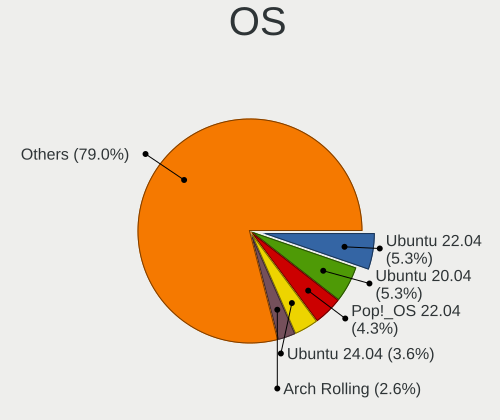

| Name                | Notebooks | Percent |
|---------------------|-----------|---------|
| Ubuntu 22.04        | 37        | 5.28%   |
| Ubuntu 20.04        | 37        | 5.28%   |
| Pop!_OS 22.04       | 30        | 4.28%   |
| Ubuntu 24.04        | 25        | 3.57%   |
| Arch Rolling        | 18        | 2.57%   |
| Zorin 16            | 15        | 2.14%   |
| Ubuntu 18.04        | 15        | 2.14%   |
| Zorin 17            | 14        | 2%      |
| Fedora 42           | 14        | 2%      |
| OpenMandriva 4.3    | 12        | 1.71%   |
| Debian 12           | 12        | 1.71%   |
| Zorin 15            | 10        | 1.43%   |
| OpenMandriva 25.90  | 10        | 1.43%   |
| OpenMandriva 24.12  | 10        | 1.43%   |
| Arch                | 10        | 1.43%   |
| Debian 11           | 9         | 1.28%   |
| Pop!_OS 20.04       | 8         | 1.14%   |
| OpenMandriva 6.0    | 8         | 1.14%   |
| OpenMandriva 4.2    | 8         | 1.14%   |
| OpenMandriva 25.06  | 7         | 1%      |
| OpenMandriva 23.01  | 7         | 1%      |
| Linux Mint 22.2     | 7         | 1%      |
| Linux Mint 21.3     | 7         | 1%      |
| Fedora 41           | 7         | 1%      |
| Ubuntu 21.10        | 6         | 0.86%   |
| Ubuntu 20.10        | 6         | 0.86%   |
| OpenMandriva 25.04  | 6         | 0.86%   |
| Linux Mint 21.2     | 6         | 0.86%   |
| Linux Mint 21.1     | 6         | 0.86%   |
| Linux Mint 21       | 6         | 0.86%   |
| Linux Mint 20.3     | 6         | 0.86%   |
| Linux Mint 20.2     | 6         | 0.86%   |
| Kubuntu 22.04       | 6         | 0.86%   |
| Fedora 40           | 6         | 0.86%   |
| Fedora 31           | 6         | 0.86%   |
| EndeavourOS Rolling | 6         | 0.86%   |
| Debian 10           | 6         | 0.86%   |
| ArcoLinux Rolling   | 6         | 0.86%   |
| Pop!_OS 20.10       | 5         | 0.71%   |
| OpenMandriva 23.03  | 5         | 0.71%   |

OS Family
---------

OS without a version

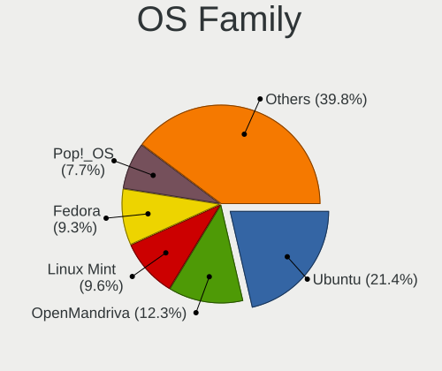

| Name             | Notebooks | Percent |
|------------------|-----------|---------|
| Ubuntu           | 141       | 21.4%   |
| OpenMandriva     | 81        | 12.29%  |
| Linux Mint       | 63        | 9.56%   |
| Fedora           | 61        | 9.26%   |
| Pop!_OS          | 51        | 7.74%   |
| Zorin            | 41        | 6.22%   |
| Debian           | 35        | 5.31%   |
| Arch             | 27        | 4.1%    |
| Kubuntu          | 16        | 2.43%   |
| Manjaro          | 14        | 2.12%   |
| Xubuntu          | 8         | 1.21%   |
| Elementary       | 8         | 1.21%   |
| SteamOS          | 7         | 1.06%   |
| MX               | 7         | 1.06%   |
| EndeavourOS      | 7         | 1.06%   |
| ArcoLinux        | 7         | 1.06%   |
| LMDE             | 6         | 0.91%   |
| Endless          | 6         | 0.91%   |
| Bazzite          | 6         | 0.91%   |
| Nobara           | 5         | 0.76%   |
| NixOS            | 5         | 0.76%   |
| KDE neon         | 5         | 0.76%   |
| Kali             | 5         | 0.76%   |
| Ubuntu Unity     | 4         | 0.61%   |
| openSUSE         | 4         | 0.61%   |
| Gentoo           | 4         | 0.61%   |
| Ubuntu MATE      | 3         | 0.46%   |
| Solus            | 3         | 0.46%   |
| ROSA             | 3         | 0.46%   |
| org.kde.Platform | 3         | 0.46%   |
| Lubuntu          | 3         | 0.46%   |
| Peppermint       | 2         | 0.3%    |
| CachyOS          | 2         | 0.3%    |
| BuildRoot        | 2         | 0.3%    |
| antiX            | 2         | 0.3%    |
| Void Linux       | 1         | 0.15%   |
| Vanilla          | 1         | 0.15%   |
| Ubuntu Budgie    | 1         | 0.15%   |
| Sparky           | 1         | 0.15%   |
| Rocky Linux      | 1         | 0.15%   |

Kernel
------

Version of the Linux kernel

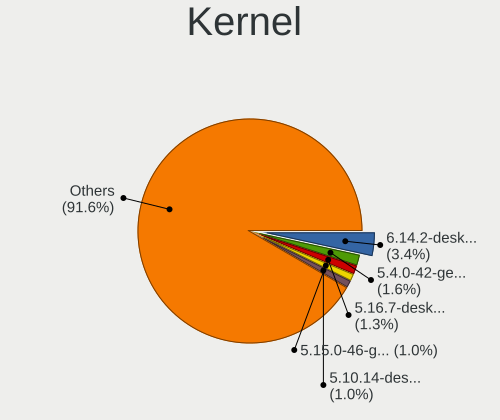

| Version                       | Notebooks | Percent |
|-------------------------------|-----------|---------|
| 6.14.2-desktop-3omv2590       | 26        | 3.4%    |
| 5.4.0-42-generic              | 12        | 1.57%   |
| 5.16.7-desktop-1omv4003       | 10        | 1.31%   |
| 5.15.0-46-generic             | 8         | 1.05%   |
| 5.10.14-desktop-1omv4002      | 8         | 1.05%   |
| 6.8.0-40-generic              | 7         | 0.92%   |
| 6.1.1-desktop-1omv2290        | 7         | 0.92%   |
| 6.0.12-76060006-generic       | 7         | 0.92%   |
| 6.9.3-76060903-generic        | 6         | 0.79%   |
| 6.12.1-desktop-1omv2490       | 6         | 0.79%   |
| 6.12.10-76061203-generic      | 5         | 0.65%   |
| 5.4.0-48-generic              | 5         | 0.65%   |
| 5.3.0-28-generic              | 5         | 0.65%   |
| 6.8.0-52-generic              | 4         | 0.52%   |
| 6.8.0-51-generic              | 4         | 0.52%   |
| 6.8.0-45-generic              | 4         | 0.52%   |
| 6.8.0-41-generic              | 4         | 0.52%   |
| 6.8.0-38-generic              | 4         | 0.52%   |
| 6.6.2-desktop-1omv2390        | 4         | 0.52%   |
| 6.5.0-41-generic              | 4         | 0.52%   |
| 6.4.11-desktop-1omv2390       | 4         | 0.52%   |
| 6.2.6-desktop-1omv2390        | 4         | 0.52%   |
| 6.12.9-desktop-1omv2490       | 4         | 0.52%   |
| 5.3.16-300.fc31.x86_64        | 4         | 0.52%   |
| 5.17.5-76051705-generic       | 4         | 0.52%   |
| 5.15.0-58-generic             | 4         | 0.52%   |
| 5.15.0-56-generic             | 4         | 0.52%   |
| 5.11.0-7620-generic           | 4         | 0.52%   |
| 5.11.0-27-generic             | 4         | 0.52%   |
| 6.8.0-60-generic              | 3         | 0.39%   |
| 6.2.0-39-generic              | 3         | 0.39%   |
| 6.2.0-33-generic              | 3         | 0.39%   |
| 6.2.0-32-generic              | 3         | 0.39%   |
| 6.17.9-76061709-generic       | 3         | 0.39%   |
| 6.15.0-desktop-0.rc2.3omv2590 | 3         | 0.39%   |
| 6.14.0-63.fc42.x86_64         | 3         | 0.39%   |
| 6.14.0-33-generic             | 3         | 0.39%   |
| 6.11.7-300.fc41.x86_64        | 3         | 0.39%   |
| 6.11.0-26-generic             | 3         | 0.39%   |
| 6.11.0-19-generic             | 3         | 0.39%   |

Kernel Family
-------------

Linux kernel without a distro release

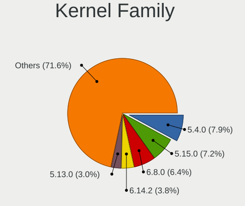

| Version | Notebooks | Percent |
|---------|-----------|---------|
| 5.4.0   | 58        | 7.91%   |
| 5.15.0  | 53        | 7.23%   |
| 6.8.0   | 47        | 6.41%   |
| 6.14.2  | 28        | 3.82%   |
| 5.13.0  | 22        | 3%      |
| 6.5.0   | 20        | 2.73%   |
| 6.1.0   | 20        | 2.73%   |
| 5.11.0  | 18        | 2.46%   |
| 6.14.0  | 16        | 2.18%   |
| 5.3.0   | 16        | 2.18%   |
| 5.8.0   | 15        | 2.05%   |
| 6.2.0   | 14        | 1.91%   |
| 4.15.0  | 14        | 1.91%   |
| 5.10.0  | 13        | 1.77%   |
| 5.0.0   | 12        | 1.64%   |
| 6.11.0  | 11        | 1.5%    |
| 5.19.0  | 11        | 1.5%    |
| 5.16.7  | 10        | 1.36%   |
| 6.1.1   | 9         | 1.23%   |
| 5.10.14 | 9         | 1.23%   |
| 6.0.12  | 7         | 0.95%   |
| 4.19.0  | 7         | 0.95%   |
| 6.9.3   | 6         | 0.82%   |
| 6.4.11  | 6         | 0.82%   |
| 6.2.6   | 6         | 0.82%   |
| 6.12.1  | 6         | 0.82%   |
| 4.18.0  | 6         | 0.82%   |
| 6.12.10 | 5         | 0.68%   |
| 6.8.11  | 4         | 0.55%   |
| 6.6.2   | 4         | 0.55%   |
| 6.17.0  | 4         | 0.55%   |
| 6.12.9  | 4         | 0.55%   |
| 6.1.52  | 4         | 0.55%   |
| 5.3.16  | 4         | 0.55%   |
| 5.17.5  | 4         | 0.55%   |
| 6.4.6   | 3         | 0.41%   |
| 6.4.10  | 3         | 0.41%   |
| 6.2.12  | 3         | 0.41%   |
| 6.17.9  | 3         | 0.41%   |
| 6.15.6  | 3         | 0.41%   |

Kernel Major Ver.
-----------------

Linux kernel major version

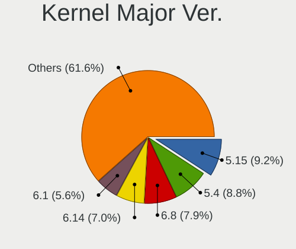

| Version | Notebooks | Percent |
|---------|-----------|---------|
| 5.15    | 66        | 9.19%   |
| 5.4     | 63        | 8.77%   |
| 6.8     | 57        | 7.94%   |
| 6.14    | 50        | 6.96%   |
| 6.1     | 40        | 5.57%   |
| 6.12    | 29        | 4.04%   |
| 5.10    | 28        | 3.9%    |
| 6.2     | 26        | 3.62%   |
| 5.13    | 25        | 3.48%   |
| 6.5     | 23        | 3.2%    |
| 5.11    | 23        | 3.2%    |
| 5.8     | 21        | 2.92%   |
| 5.3     | 21        | 2.92%   |
| 6.11    | 19        | 2.65%   |
| 5.16    | 19        | 2.65%   |
| 6.0     | 15        | 2.09%   |
| 5.19    | 14        | 1.95%   |
| 4.15    | 14        | 1.95%   |
| 6.4     | 13        | 1.81%   |
| 6.17    | 13        | 1.81%   |
| 6.15    | 13        | 1.81%   |
| 6.10    | 12        | 1.67%   |
| 5.0     | 12        | 1.67%   |
| 6.6     | 10        | 1.39%   |
| 6.9     | 9         | 1.25%   |
| 5.18    | 9         | 1.25%   |
| 5.17    | 8         | 1.11%   |
| 5.14    | 7         | 0.97%   |
| 4.19    | 7         | 0.97%   |
| 4.18    | 7         | 0.97%   |
| 6.3     | 6         | 0.84%   |
| 5.6     | 6         | 0.84%   |
| 6.13    | 5         | 0.7%    |
| 5.7     | 5         | 0.7%    |
| 6.7     | 4         | 0.56%   |
| 5.9     | 4         | 0.56%   |
| 6.16    | 3         | 0.42%   |
| 4.9     | 3         | 0.42%   |
| 6.18    | 2         | 0.28%   |
| 5.5     | 2         | 0.28%   |

Arch
----

OS architecture (x86_64, i586, etc.)

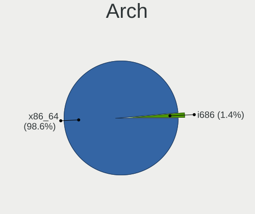

| Name   | Notebooks | Percent |
|--------|-----------|---------|
| x86_64 | 615       | 98.56%  |
| i686   | 9         | 1.44%   |

DE
--

Desktop Environment

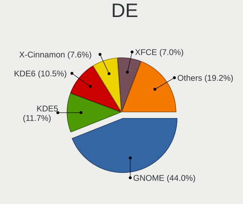

| Name             | Notebooks | Percent |
|------------------|-----------|---------|
| GNOME            | 289       | 43.99%  |
| KDE5             | 77        | 11.72%  |
| KDE6             | 69        | 10.5%   |
| X-Cinnamon       | 50        | 7.61%   |
| XFCE             | 46        | 7%      |
| Unknown          | 46        | 7%      |
| MATE             | 17        | 2.59%   |
| KDE              | 10        | 1.52%   |
| Pantheon         | 8         | 1.22%   |
| LXQt             | 7         | 1.07%   |
| i3               | 5         | 0.76%   |
| Hyprland         | 5         | 0.76%   |
| Unity            | 4         | 0.61%   |
| COSMIC           | 4         | 0.61%   |
| Cinnamon         | 4         | 0.61%   |
| LXDE             | 3         | 0.46%   |
| Budgie           | 3         | 0.46%   |
| icewm            | 2         | 0.3%    |
| i3-with-shmlog   | 2         | 0.3%    |
| sway             | 1         | 0.15%   |
| lightdm-xsession | 1         | 0.15%   |
| KDE4             | 1         | 0.15%   |
| fluxbox          | 1         | 0.15%   |
| Endless:GNOME    | 1         | 0.15%   |
| Deepin           | 1         | 0.15%   |

Display Server
--------------

X11 or Wayland

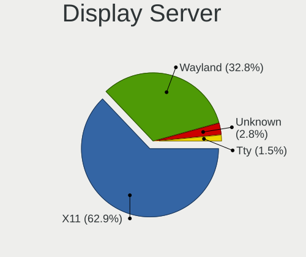

| Name    | Notebooks | Percent |
|---------|-----------|---------|
| X11     | 407       | 62.91%  |
| Wayland | 212       | 32.77%  |
| Unknown | 18        | 2.78%   |
| Tty     | 10        | 1.55%   |

Display Manager
---------------

SDDM, LightDM, etc.

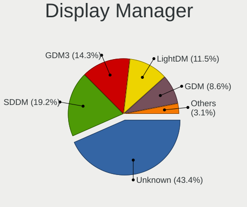

| Name           | Notebooks | Percent |
|----------------|-----------|---------|
| Unknown        | 283       | 43.4%   |
| SDDM           | 125       | 19.17%  |
| GDM3           | 93        | 14.26%  |
| LightDM        | 75        | 11.5%   |
| GDM            | 56        | 8.59%   |
| TDM            | 11        | 1.69%   |
| Ly             | 2         | 0.31%   |
| LXDM           | 2         | 0.31%   |
| XDM            | 1         | 0.15%   |
| SLIMSKI        | 1         | 0.15%   |
| SLiM           | 1         | 0.15%   |
| KDM            | 1         | 0.15%   |
| COSMIC-GREETER | 1         | 0.15%   |

OS Lang
-------

Language

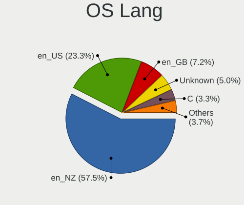

| Lang    | Notebooks | Percent |
|---------|-----------|---------|
| en_NZ   | 378       | 57.53%  |
| en_US   | 153       | 23.29%  |
| en_GB   | 47        | 7.15%   |
| Unknown | 33        | 5.02%   |
| C       | 22        | 3.35%   |
| en_AU   | 12        | 1.83%   |
| zh_CN   | 2         | 0.3%    |
| mi_NZ   | 2         | 0.3%    |
| de_DE   | 2         | 0.3%    |
| ru_RU   | 1         | 0.15%   |
| pt_BR   | 1         | 0.15%   |
| fr_FR   | 1         | 0.15%   |
| en_PH   | 1         | 0.15%   |
| en_CA   | 1         | 0.15%   |
| C.UTF8  | 1         | 0.15%   |

Boot Mode
---------

EFI or BIOS

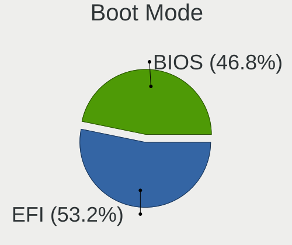

| Mode | Notebooks | Percent |
|------|-----------|---------|
| EFI  | 339       | 53.22%  |
| BIOS | 298       | 46.78%  |

Filesystem
----------

Type of filesystem

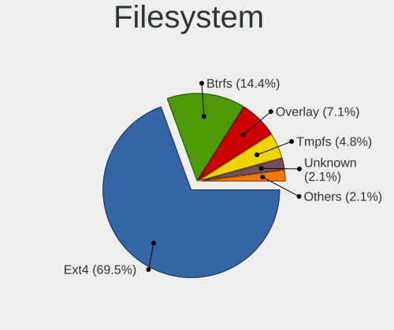

| Type    | Notebooks | Percent |
|---------|-----------|---------|
| Ext4    | 453       | 69.48%  |
| Btrfs   | 94        | 14.42%  |
| Overlay | 46        | 7.06%   |
| Tmpfs   | 31        | 4.75%   |
| Unknown | 14        | 2.15%   |
| Zfs     | 5         | 0.77%   |
| Xfs     | 3         | 0.46%   |
| Ext2    | 3         | 0.46%   |
| XXXXXXX | 1         | 0.15%   |
| F2fs    | 1         | 0.15%   |
| Ext3    | 1         | 0.15%   |

Part. scheme
------------

Scheme of partitioning

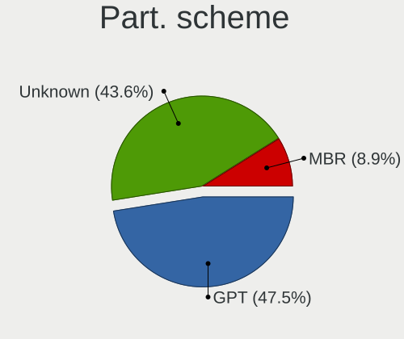

| Type    | Notebooks | Percent |
|---------|-----------|---------|
| GPT     | 304       | 47.5%   |
| Unknown | 279       | 43.59%  |
| MBR     | 57        | 8.91%   |

Dual Boot with Linux/BSD
------------------------

Hosting more than one Linux/BSD

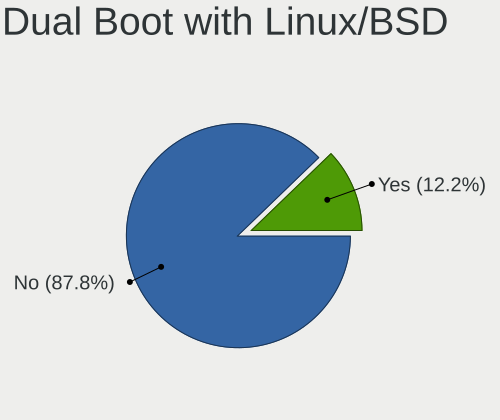

| Dual boot | Notebooks | Percent |
|-----------|-----------|---------|
| No        | 561       | 87.79%  |
| Yes       | 78        | 12.21%  |

Dual Boot (Win)
---------------

Hosting Linux and Windows

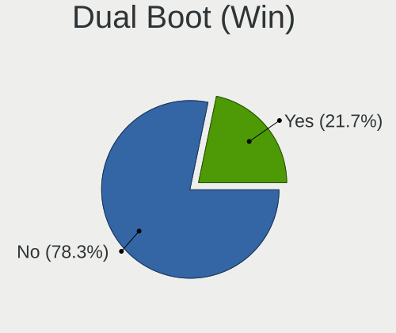

| Dual boot | Notebooks | Percent |
|-----------|-----------|---------|
| No        | 497       | 78.27%  |
| Yes       | 138       | 21.73%  |

Board
-----

Vendor
------

Motherboard manufacturer

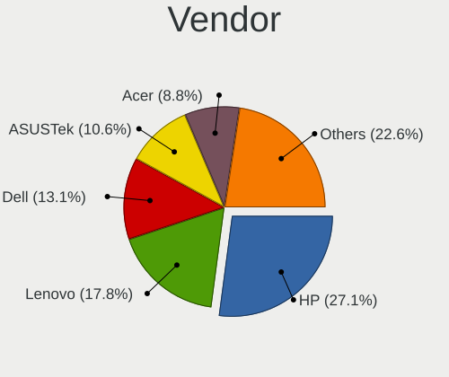

| Name                 | Notebooks | Percent |
|----------------------|-----------|---------|
| Hewlett-Packard      | 169       | 27.08%  |
| Lenovo               | 111       | 17.79%  |
| Dell                 | 82        | 13.14%  |
| ASUSTek Computer     | 66        | 10.58%  |
| Acer                 | 55        | 8.81%   |
| Toshiba              | 31        | 4.97%   |
| Apple                | 27        | 4.33%   |
| MSI                  | 14        | 2.24%   |
| Sony                 | 10        | 1.6%    |
| Valve                | 7         | 1.12%   |
| Google               | 7         | 1.12%   |
| System76             | 5         | 0.8%    |
| Samsung Electronics  | 5         | 0.8%    |
| Razer                | 5         | 0.8%    |
| Gigabyte Technology  | 4         | 0.64%   |
| Alienware            | 4         | 0.64%   |
| HUAWEI               | 2         | 0.32%   |
| Fujitsu              | 2         | 0.32%   |
| Unknown              | 2         | 0.32%   |
| YJKC                 | 1         | 0.16%   |
| TWG                  | 1         | 0.16%   |
| Timi                 | 1         | 0.16%   |
| The Warehouse Group  | 1         | 0.16%   |
| Star Labs            | 1         | 0.16%   |
| Panasonic            | 1         | 0.16%   |
| Metabox              | 1         | 0.16%   |
| Medion               | 1         | 0.16%   |
| Kogan                | 1         | 0.16%   |
| Intel Client Systems | 1         | 0.16%   |
| Intel                | 1         | 0.16%   |
| IBM                  | 1         | 0.16%   |
| GPD                  | 1         | 0.16%   |
| eMachines            | 1         | 0.16%   |
| Dynabook             | 1         | 0.16%   |
| AMD                  | 1         | 0.16%   |

Model
-----

Motherboard model

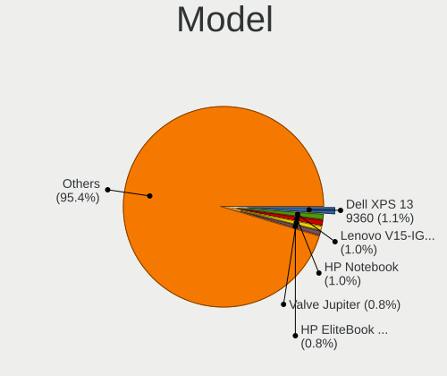

| Name                                        | Notebooks | Percent |
|---------------------------------------------|-----------|---------|
| Dell XPS 13 9360                            | 7         | 1.12%   |
| Lenovo V15-IGL 82C3                         | 6         | 0.96%   |
| HP Notebook                                 | 6         | 0.96%   |
| Valve Jupiter                               | 5         | 0.8%    |
| HP EliteBook 850 G5                         | 5         | 0.8%    |
| HP EliteBook 840 G5                         | 5         | 0.8%    |
| Toshiba Satellite C660                      | 4         | 0.64%   |
| Razer Blade Stealth                         | 4         | 0.64%   |
| HP ProBook 6550b                            | 4         | 0.64%   |
| HP Pavilion dv6                             | 4         | 0.64%   |
| HP Pavilion 15                              | 4         | 0.64%   |
| Unknown                                     | 4         | 0.64%   |
| Toshiba Satellite L750                      | 3         | 0.48%   |
| HP ProBook 6570b                            | 3         | 0.48%   |
| HP ProBook 4540s                            | 3         | 0.48%   |
| HP ProBook 450 G3                           | 3         | 0.48%   |
| HP Pavilion Notebook                        | 3         | 0.48%   |
| HP Pavilion Laptop 15-cw1xxx                | 3         | 0.48%   |
| HP Laptop 15-bs0xx                          | 3         | 0.48%   |
| HP EliteBook 8560p                          | 3         | 0.48%   |
| HP EliteBook 840 G6                         | 3         | 0.48%   |
| Dell XPS 15 9500                            | 3         | 0.48%   |
| Dell Latitude E6430                         | 3         | 0.48%   |
| Dell Latitude 7490                          | 3         | 0.48%   |
| ASUS ASUS EXPERTBOOK P2451FA_P2451FA        | 3         | 0.48%   |
| Apple MacBookPro9,2                         | 3         | 0.48%   |
| Apple MacBookPro11,3                        | 3         | 0.48%   |
| Apple MacBookAir7,2                         | 3         | 0.48%   |
| Acer Swift SF314-41                         | 3         | 0.48%   |
| Acer Aspire F5-573G                         | 3         | 0.48%   |
| Valve Galileo                               | 2         | 0.32%   |
| Toshiba TECRA Z50-A                         | 2         | 0.32%   |
| Toshiba Satellite L850                      | 2         | 0.32%   |
| Toshiba Satellite C50-B                     | 2         | 0.32%   |
| Toshiba PORTEGE R700                        | 2         | 0.32%   |
| System76 Oryx Pro                           | 2         | 0.32%   |
| MSI GE66 Raider 10SF                        | 2         | 0.32%   |
| Lenovo V15-IIL 82C5                         | 2         | 0.32%   |
| Lenovo ThinkPad X1 Carbon Gen 11 21HMCTO1WW | 2         | 0.32%   |
| Lenovo ThinkPad T460 20FMS2FR00             | 2         | 0.32%   |

Model Family
------------

Motherboard model prefix

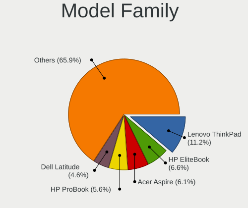

| Name               | Notebooks | Percent |
|--------------------|-----------|---------|
| Lenovo ThinkPad    | 70        | 11.22%  |
| HP EliteBook       | 41        | 6.57%   |
| Acer Aspire        | 38        | 6.09%   |
| HP ProBook         | 35        | 5.61%   |
| Dell Latitude      | 29        | 4.65%   |
| HP Pavilion        | 28        | 4.49%   |
| Toshiba Satellite  | 22        | 3.53%   |
| HP Laptop          | 19        | 3.04%   |
| Dell XPS           | 19        | 3.04%   |
| ASUS ASUS          | 15        | 2.4%    |
| Dell Inspiron      | 13        | 2.08%   |
| ASUS Vivobook      | 13        | 2.08%   |
| HP ZBook           | 10        | 1.6%    |
| ASUS ROG           | 10        | 1.6%    |
| Lenovo IdeaPad     | 8         | 1.28%   |
| Dell Precision     | 8         | 1.28%   |
| HP ENVY            | 7         | 1.12%   |
| Toshiba PORTEGE    | 6         | 0.96%   |
| Lenovo V15-IGL     | 6         | 0.96%   |
| HP Notebook        | 6         | 0.96%   |
| Valve Jupiter      | 5         | 0.8%    |
| Razer Blade        | 5         | 0.8%    |
| Apple MacBookPro9  | 5         | 0.8%    |
| Apple MacBookPro5  | 5         | 0.8%    |
| Acer TravelMate    | 5         | 0.8%    |
| ASUS ZenBook       | 4         | 0.64%   |
| Unknown            | 4         | 0.64%   |
| Toshiba TECRA      | 3         | 0.48%   |
| Lenovo Yoga        | 3         | 0.48%   |
| Lenovo V15         | 3         | 0.48%   |
| Lenovo Legion      | 3         | 0.48%   |
| HP Presario        | 3         | 0.48%   |
| HP OMEN            | 3         | 0.48%   |
| HP Compaq          | 3         | 0.48%   |
| Dell System        | 3         | 0.48%   |
| Dell Studio        | 3         | 0.48%   |
| Apple MacBookPro11 | 3         | 0.48%   |
| Apple MacBookAir7  | 3         | 0.48%   |
| Acer Swift         | 3         | 0.48%   |
| Acer Nitro         | 3         | 0.48%   |

MFG Year
--------

Motherboard manufacture year

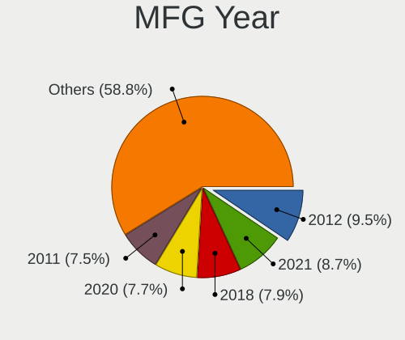

| Year | Notebooks | Percent |
|------|-----------|---------|
| 2012 | 59        | 9.46%   |
| 2021 | 54        | 8.65%   |
| 2018 | 49        | 7.85%   |
| 2020 | 48        | 7.69%   |
| 2011 | 47        | 7.53%   |
| 2019 | 43        | 6.89%   |
| 2017 | 43        | 6.89%   |
| 2022 | 41        | 6.57%   |
| 2015 | 33        | 5.29%   |
| 2013 | 32        | 5.13%   |
| 2016 | 31        | 4.97%   |
| 2014 | 29        | 4.65%   |
| 2010 | 28        | 4.49%   |
| 2023 | 27        | 4.33%   |
| 2008 | 20        | 3.21%   |
| 2009 | 15        | 2.4%    |
| 2024 | 11        | 1.76%   |
| 2006 | 6         | 0.96%   |
| 2007 | 4         | 0.64%   |
| 2025 | 3         | 0.48%   |
| 2005 | 1         | 0.16%   |

Form Factor
-----------

Physical design of the computer

| Name     | Notebooks | Percent |
|----------|-----------|---------|
| Notebook | 624       | 100%    |

Secure Boot
-----------

Enabled or disabled

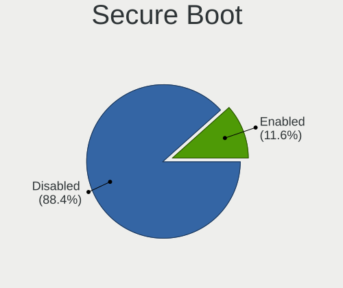

| State    | Notebooks | Percent |
|----------|-----------|---------|
| Disabled | 556       | 88.39%  |
| Enabled  | 73        | 11.61%  |

Coreboot
--------

Have coreboot on board

| Used | Notebooks | Percent |
|------|-----------|---------|
| No   | 612       | 98.08%  |
| Yes  | 12        | 1.92%   |

RAM Size
--------

Total RAM memory

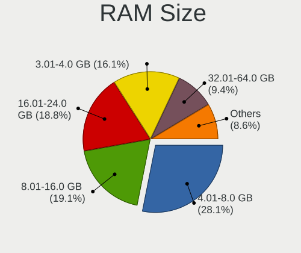

| Size in GB  | Notebooks | Percent |
|-------------|-----------|---------|
| 4.01-8.0    | 180       | 28.13%  |
| 8.01-16.0   | 122       | 19.06%  |
| 16.01-24.0  | 120       | 18.75%  |
| 3.01-4.0    | 103       | 16.09%  |
| 32.01-64.0  | 60        | 9.38%   |
| 24.01-32.0  | 18        | 2.81%   |
| 64.01-256.0 | 17        | 2.66%   |
| 1.01-2.0    | 12        | 1.88%   |
| 2.01-3.0    | 5         | 0.78%   |
| 0.51-1.0    | 3         | 0.47%   |

RAM Used
--------

Used RAM memory

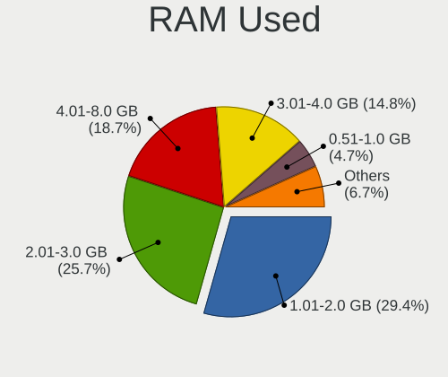

| Used GB    | Notebooks | Percent |
|------------|-----------|---------|
| 1.01-2.0   | 206       | 29.39%  |
| 2.01-3.0   | 180       | 25.68%  |
| 4.01-8.0   | 131       | 18.69%  |
| 3.01-4.0   | 104       | 14.84%  |
| 0.51-1.0   | 33        | 4.71%   |
| 8.01-16.0  | 31        | 4.42%   |
| 16.01-24.0 | 9         | 1.28%   |
| 24.01-32.0 | 5         | 0.71%   |
| 0.01-0.5   | 2         | 0.29%   |

Total Drives
------------

Number of drives on board

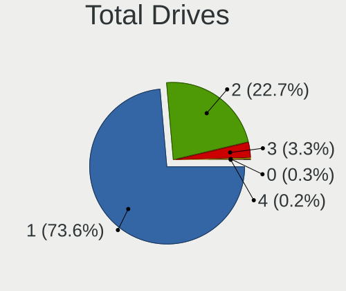

| Drives | Notebooks | Percent |
|--------|-----------|---------|
| 1      | 474       | 73.6%   |
| 2      | 146       | 22.67%  |
| 3      | 21        | 3.26%   |
| 0      | 2         | 0.31%   |
| 4      | 1         | 0.16%   |

Has CD-ROM
----------

Has CD-ROM on board

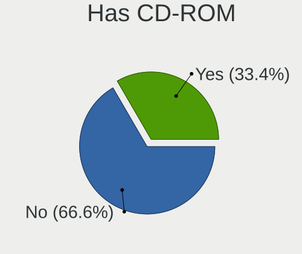

| Presented | Notebooks | Percent |
|-----------|-----------|---------|
| No        | 419       | 66.61%  |
| Yes       | 210       | 33.39%  |

Has Ethernet
------------

Has Ethernet on board

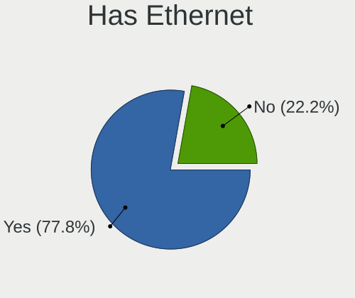

| Presented | Notebooks | Percent |
|-----------|-----------|---------|
| Yes       | 491       | 77.81%  |
| No        | 140       | 22.19%  |

Has WiFi
--------

Has WiFi module

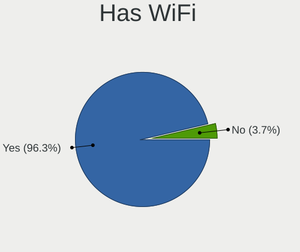

| Presented | Notebooks | Percent |
|-----------|-----------|---------|
| Yes       | 602       | 96.32%  |
| No        | 23        | 3.68%   |

Has Bluetooth
-------------

Has Bluetooth module

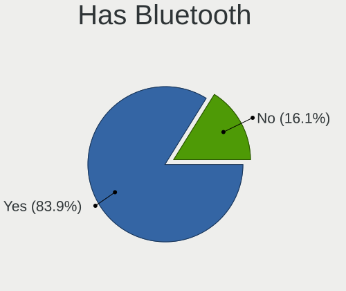

| Presented | Notebooks | Percent |
|-----------|-----------|---------|
| Yes       | 531       | 83.89%  |
| No        | 102       | 16.11%  |

Location
--------

Country
-------

Geographic location (country)

| Country     | Notebooks | Percent |
|-------------|-----------|---------|
| New Zealand | 624       | 100%    |

City
----

Geographic location (city)

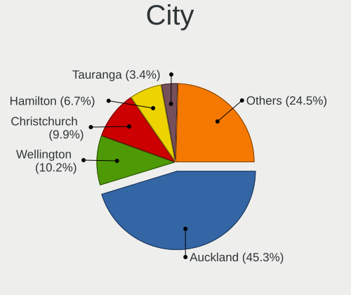

| City             | Notebooks | Percent |
|------------------|-----------|---------|
| Auckland         | 297       | 45.27%  |
| Wellington       | 67        | 10.21%  |
| Christchurch     | 65        | 9.91%   |
| Hamilton         | 44        | 6.71%   |
| Tauranga         | 22        | 3.35%   |
| Palmerston North | 14        | 2.13%   |
| Dunedin          | 13        | 1.98%   |
| Cambridge        | 13        | 1.98%   |
| Lower Hutt       | 11        | 1.68%   |
| Whangarei        | 9         | 1.37%   |
| New Plymouth     | 9         | 1.37%   |
| Nelson           | 9         | 1.37%   |
| Napier City      | 9         | 1.37%   |
| Invercargill     | 9         | 1.37%   |
| Hastings         | 9         | 1.37%   |
| Whanganui        | 5         | 0.76%   |
| Rotorua          | 4         | 0.61%   |
| Timaru           | 3         | 0.46%   |
| Te Puke          | 3         | 0.46%   |
| Levin            | 3         | 0.46%   |
| Yaldhurst        | 2         | 0.3%    |
| Waikanae         | 2         | 0.3%    |
| Taupo            | 2         | 0.3%    |
| Otaki            | 2         | 0.3%    |
| Kerikeri         | 2         | 0.3%    |
| Grafton          | 2         | 0.3%    |
| Gore             | 2         | 0.3%    |
| Blenheim         | 2         | 0.3%    |
| Ashburton        | 2         | 0.3%    |
| Whatawhata       | 1         | 0.15%   |
| Waikato          | 1         | 0.15%   |
| Tutukaka         | 1         | 0.15%   |
| Saint Andrews    | 1         | 0.15%   |
| Richmond         | 1         | 0.15%   |
| Queenstown       | 1         | 0.15%   |
| Paraparaumu      | 1         | 0.15%   |
| Paparoa          | 1         | 0.15%   |
| Pakuranga        | 1         | 0.15%   |
| Mount Victoria   | 1         | 0.15%   |
| Morrinsville     | 1         | 0.15%   |

Drives
------

Drive Vendor
------------

Hard drive vendors

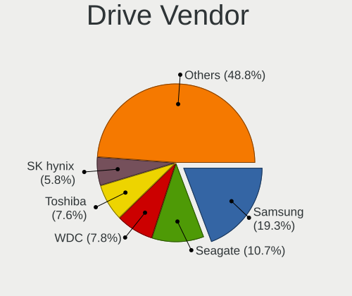

| Vendor                      | Notebooks | Drives | Percent |
|-----------------------------|-----------|--------|---------|
| Samsung Electronics         | 149       | 201    | 19.25%  |
| Seagate                     | 83        | 96     | 10.72%  |
| WDC                         | 60        | 86     | 7.75%   |
| Toshiba                     | 59        | 72     | 7.62%   |
| SK hynix                    | 45        | 52     | 5.81%   |
| Unknown                     | 43        | 59     | 5.56%   |
| SanDisk                     | 41        | 44     | 5.3%    |
| Crucial                     | 38        | 63     | 4.91%   |
| Kingston                    | 28        | 41     | 3.62%   |
| Intel                       | 26        | 35     | 3.36%   |
| HGST                        | 23        | 25     | 2.97%   |
| Micron Technology           | 22        | 28     | 2.84%   |
| Hitachi                     | 16        | 19     | 2.07%   |
| Apple                       | 12        | 15     | 1.55%   |
| Kingston Technology Company | 9         | 9      | 1.16%   |
| KIOXIA                      | 8         | 10     | 1.03%   |
| A-DATA Technology           | 8         | 8      | 1.03%   |
| Team                        | 7         | 7      | 0.9%    |
| Micron/Crucial Technology   | 7         | 9      | 0.9%    |
| MAXIO Technology (Hangzhou) | 7         | 7      | 0.9%    |
| LITEON                      | 7         | 7      | 0.9%    |
| Union Memory                | 6         | 7      | 0.78%   |
| China                       | 5         | 6      | 0.65%   |
| Netac                       | 4         | 5      | 0.52%   |
| KingSpec                    | 4         | 4      | 0.52%   |
| ASMT                        | 4         | 5      | 0.52%   |
| Phison                      | 3         | 3      | 0.39%   |
| LITEONIT                    | 3         | 5      | 0.39%   |
| Lexar                       | 3         | 3      | 0.39%   |
| Fujitsu                     | 3         | 3      | 0.39%   |
| Unknown                     | 3         | 3      | 0.39%   |
| Transcend                   | 2         | 2      | 0.26%   |
| TO Exter                    | 2         | 2      | 0.26%   |
| T-FORCE                     | 2         | 2      | 0.26%   |
| Silicon Motion              | 2         | 3      | 0.26%   |
| ROG                         | 2         | 2      | 0.26%   |
| O2 Micro                    | 2         | 2      | 0.26%   |
| JMicron Technology          | 2         | 2      | 0.26%   |
| Hewlett-Packard             | 2         | 4      | 0.26%   |
| XPG                         | 1         | 1      | 0.13%   |

Drive Model
-----------

Hard drive models

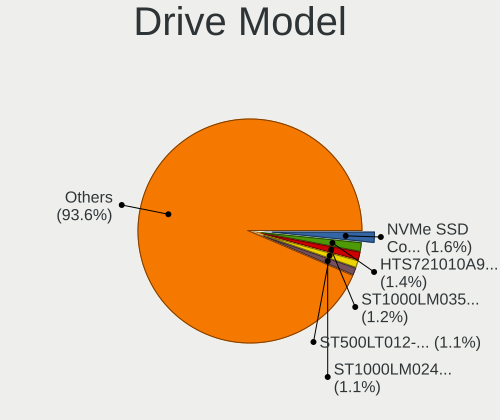

| Model                                                | Notebooks | Percent |
|------------------------------------------------------|-----------|---------|
| Samsung NVMe SSD Controller SM981/PM981/PM983 1TB    | 13        | 1.61%   |
| HGST HTS721010A9E630 1TB                             | 11        | 1.36%   |
| Seagate ST1000LM035-1RK172 1TB                       | 10        | 1.24%   |
| Seagate ST500LT012-1DG142 500GB                      | 9         | 1.12%   |
| Seagate ST1000LM024 HN-M101MBB 1TB                   | 9         | 1.12%   |
| Unknown MMC Card  64GB                               | 8         | 0.99%   |
| Unknown MMC Card  128GB                              | 8         | 0.99%   |
| Samsung SSD 860 EVO 500GB                            | 8         | 0.99%   |
| WDC WD10JPVX-22JC3T0 1TB                             | 7         | 0.87%   |
| Samsung NVMe SSD Controller PM9A1/PM9A3/980PRO 1TB   | 7         | 0.87%   |
| Intel NVMe SSD Drive 512GB                           | 7         | 0.87%   |
| Crucial CT500MX500SSD1 500GB                         | 7         | 0.87%   |
| WDC WD10JPVX-60JC3T0 1TB                             | 6         | 0.74%   |
| Seagate ST9500420AS 500GB                            | 6         | 0.74%   |
| Seagate Expansion 2TB                                | 6         | 0.74%   |
| Samsung SSD 850 EVO 500GB                            | 6         | 0.74%   |
| Samsung NVMe SSD Drive 512GB                         | 6         | 0.74%   |
| WDC WD5000LPVX-22V0TT0 500GB                         | 5         | 0.62%   |
| Union Memory UMIS RPJTJ256MEE1OWX 256GB              | 5         | 0.62%   |
| Toshiba MQ01ABD100 1TB                               | 5         | 0.62%   |
| Samsung SSD 870 EVO 1TB                              | 5         | 0.62%   |
| Kingston SA400S37240G 240GB SSD                      | 5         | 0.62%   |
| Intel SSDPEKNU512GZ 512GB                            | 5         | 0.62%   |
| Unknown MMC Card  32GB                               | 4         | 0.5%    |
| Toshiba XG6 NVMe SSD Controller 1024GB               | 4         | 0.5%    |
| Toshiba MQ01ABF050 500GB                             | 4         | 0.5%    |
| Seagate ST2000LM007-1R8174 2TB                       | 4         | 0.5%    |
| SanDisk NVMe SSD Drive 512GB                         | 4         | 0.5%    |
| Samsung SSD 980 1TB                                  | 4         | 0.5%    |
| Samsung SSD 850 EVO 1TB                              | 4         | 0.5%    |
| Samsung NVMe SSD Drive 256GB                         | 4         | 0.5%    |
| Samsung NVMe SSD Controller SM961/PM961/SM963 1024GB | 4         | 0.5%    |
| MAXIO (Hangzhou) TEAM TM8FPK001T 1024GB              | 4         | 0.5%    |
| Kingston SV300S37A240G 240GB SSD                     | 4         | 0.5%    |
| Crucial CT480BX500SSD1 480GB                         | 4         | 0.5%    |
| WDC WDS120G2G0A-00JH30 120GB SSD                     | 3         | 0.37%   |
| Unknown MMC Card  2GB                                | 3         | 0.37%   |
| Toshiba NVMe SSD Drive 512GB                         | 3         | 0.37%   |
| Toshiba MQ01ABD075 752GB                             | 3         | 0.37%   |
| Toshiba BG3 NVMe SSD Controller 256GB                | 3         | 0.37%   |

HDD Vendor
----------

Hard disk drive vendors

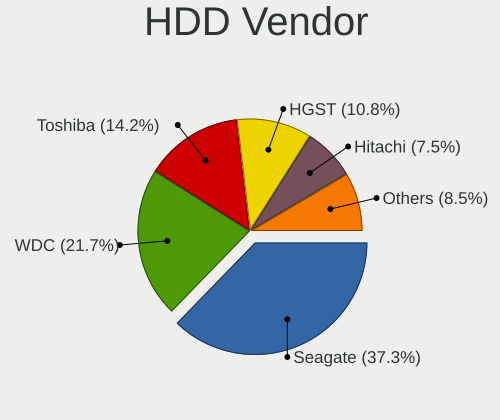

| Vendor              | Notebooks | Drives | Percent |
|---------------------|-----------|--------|---------|
| Seagate             | 79        | 92     | 37.26%  |
| WDC                 | 46        | 61     | 21.7%   |
| Toshiba             | 30        | 37     | 14.15%  |
| HGST                | 23        | 25     | 10.85%  |
| Hitachi             | 16        | 19     | 7.55%   |
| Samsung Electronics | 3         | 3      | 1.42%   |
| Fujitsu             | 3         | 3      | 1.42%   |
| Unknown             | 2         | 5      | 0.94%   |
| TO Exter            | 2         | 2      | 0.94%   |
| JMicron Technology  | 2         | 2      | 0.94%   |
| StoreJet            | 1         | 1      | 0.47%   |
| HGST HTS            | 1         | 1      | 0.47%   |
| Hewlett-Packard     | 1         | 1      | 0.47%   |
| External            | 1         | 1      | 0.47%   |
| ASMT                | 1         | 1      | 0.47%   |
| Apple               | 1         | 1      | 0.47%   |

SSD Vendor
----------

Solid state drive vendors

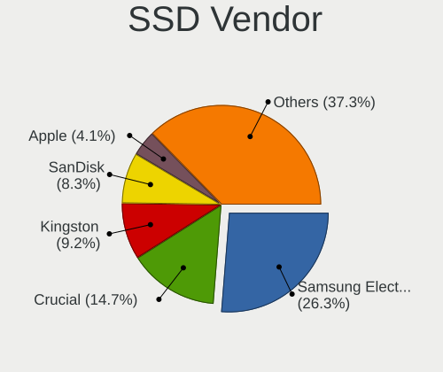

| Vendor              | Notebooks | Drives | Percent |
|---------------------|-----------|--------|---------|
| Samsung Electronics | 57        | 72     | 26.27%  |
| Crucial             | 32        | 57     | 14.75%  |
| Kingston            | 20        | 28     | 9.22%   |
| SanDisk             | 18        | 18     | 8.29%   |
| Apple               | 9         | 10     | 4.15%   |
| Micron Technology   | 8         | 11     | 3.69%   |
| A-DATA Technology   | 8         | 8      | 3.69%   |
| Toshiba             | 6         | 8      | 2.76%   |
| Team                | 6         | 6      | 2.76%   |
| LITEON              | 6         | 6      | 2.76%   |
| Intel               | 6         | 13     | 2.76%   |
| WDC                 | 5         | 12     | 2.3%    |
| China               | 5         | 6      | 2.3%    |
| KingSpec            | 4         | 4      | 1.84%   |
| SK hynix            | 3         | 3      | 1.38%   |
| Seagate             | 3         | 3      | 1.38%   |
| LITEONIT            | 3         | 5      | 1.38%   |
| Lexar               | 3         | 3      | 1.38%   |
| Transcend           | 2         | 2      | 0.92%   |
| Netac               | 2         | 3      | 0.92%   |
| X12                 | 1         | 1      | 0.46%   |
| Timetec             | 1         | 1      | 0.46%   |
| T-FORCE             | 1         | 1      | 0.46%   |
| OCZ                 | 1         | 1      | 0.46%   |
| i-FlashDisk         | 1         | 1      | 0.46%   |
| Hewlett-Packard     | 1         | 3      | 0.46%   |
| Gigabyte Technology | 1         | 1      | 0.46%   |
| Dell                | 1         | 1      | 0.46%   |
| BR                  | 1         | 1      | 0.46%   |
| ASMT                | 1         | 1      | 0.46%   |
| Apacer              | 1         | 1      | 0.46%   |

Drive Kind
----------

HDD or SSD

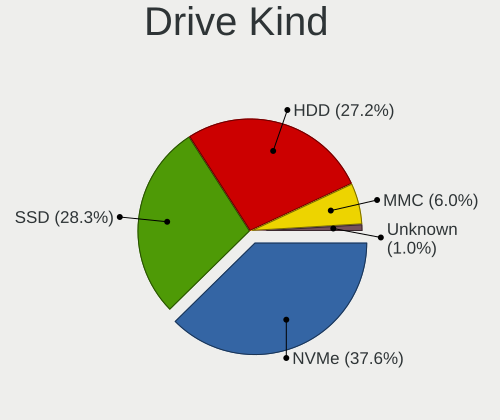

| Kind    | Notebooks | Drives | Percent |
|---------|-----------|--------|---------|
| NVMe    | 277       | 370    | 37.64%  |
| SSD     | 208       | 291    | 28.26%  |
| HDD     | 200       | 255    | 27.17%  |
| MMC     | 44        | 56     | 5.98%   |
| Unknown | 7         | 7      | 0.95%   |

Drive Connector
---------------

SATA, SAS, NVMe, etc.

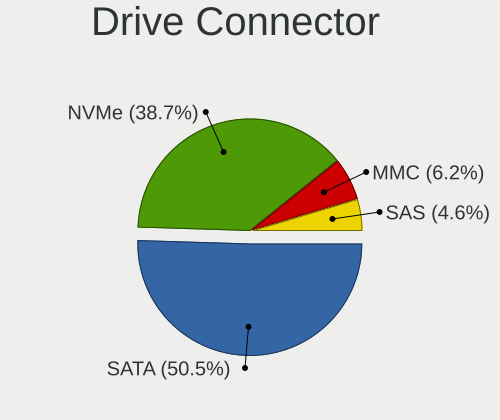

| Type | Notebooks | Drives | Percent |
|------|-----------|--------|---------|
| SATA | 361       | 514    | 50.49%  |
| NVMe | 277       | 367    | 38.74%  |
| MMC  | 44        | 56     | 6.15%   |
| SAS  | 33        | 42     | 4.62%   |

Drive Size
----------

Size of hard drive

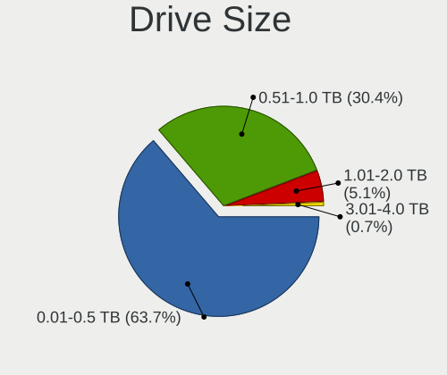

| Size in TB | Notebooks | Drives | Percent |
|------------|-----------|--------|---------|
| 0.01-0.5   | 262       | 354    | 63.75%  |
| 0.51-1.0   | 125       | 165    | 30.41%  |
| 1.01-2.0   | 21        | 24     | 5.11%   |
| 3.01-4.0   | 3         | 3      | 0.73%   |

Space Total
-----------

Amount of disk space available on the file system

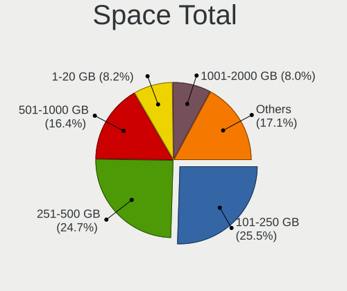

| Size in GB     | Notebooks | Percent |
|----------------|-----------|---------|
| 101-250        | 168       | 25.49%  |
| 251-500        | 163       | 24.73%  |
| 501-1000       | 108       | 16.39%  |
| 1-20           | 54        | 8.19%   |
| 1001-2000      | 53        | 8.04%   |
| 51-100         | 38        | 5.77%   |
| 21-50          | 21        | 3.19%   |
| Unknown        | 21        | 3.19%   |
| 2001-3000      | 18        | 2.73%   |
| More than 3000 | 15        | 2.28%   |

Space Used
----------

Amount of used disk space

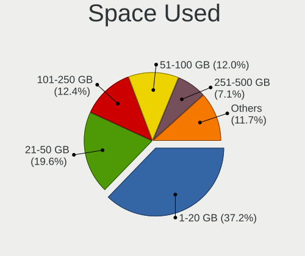

| Used GB        | Notebooks | Percent |
|----------------|-----------|---------|
| 1-20           | 258       | 37.23%  |
| 21-50          | 136       | 19.62%  |
| 101-250        | 86        | 12.41%  |
| 51-100         | 83        | 11.98%  |
| 251-500        | 49        | 7.07%   |
| 501-1000       | 41        | 5.92%   |
| Unknown        | 21        | 3.03%   |
| 1001-2000      | 11        | 1.59%   |
| More than 3000 | 3         | 0.43%   |
| 0              | 3         | 0.43%   |
| 2001-3000      | 2         | 0.29%   |

Malfunc. Drives
---------------

Drive models with a malfunction

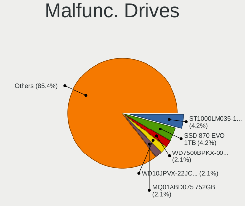

| Model                                               | Notebooks | Drives | Percent |
|-----------------------------------------------------|-----------|--------|---------|
| Seagate ST1000LM035-1RK172 1TB                      | 2         | 2      | 4.17%   |
| Samsung Electronics SSD 870 EVO 1TB                 | 2         | 2      | 4.17%   |
| WDC WD7500BPKX-00HPJT0 752GB                        | 1         | 1      | 2.08%   |
| WDC WD10JPVX-22JC3T0 1TB                            | 1         | 1      | 2.08%   |
| Toshiba MQ01ABD075 752GB                            | 1         | 1      | 2.08%   |
| Toshiba MK5076GSX 500GB                             | 1         | 1      | 2.08%   |
| Toshiba MK5065GSXF 500GB                            | 1         | 1      | 2.08%   |
| Toshiba MK3261GSYN 320GB                            | 1         | 1      | 2.08%   |
| Toshiba MK3256GSY 320GB                             | 1         | 1      | 2.08%   |
| SK hynix SC308 SATA 128GB SSD                       | 1         | 1      | 2.08%   |
| SK hynix BC711 HFM512GD3JX013N 512GB                | 1         | 1      | 2.08%   |
| SK hynix BC501 NVMe Solid State Drive 512GB         | 1         | 4      | 2.08%   |
| SK hynix BC501 HFM512GDJTNG-8310A 512GB             | 1         | 1      | 2.08%   |
| ShiJi 512GB M.2-NVMe                                | 1         | 1      | 2.08%   |
| Seagate ST9500420ASG 500GB                          | 1         | 1      | 2.08%   |
| Seagate ST9500420AS 500GB                           | 1         | 1      | 2.08%   |
| Seagate ST9250410AS 250GB                           | 1         | 1      | 2.08%   |
| Seagate ST500LT012-1DG142 500GB                     | 1         | 1      | 2.08%   |
| Seagate ST1000LM024 HN-M101MBB 1TB                  | 1         | 1      | 2.08%   |
| SanDisk SSD PLUS 240GB                              | 1         | 1      | 2.08%   |
| SanDisk SD9SN8W-128G-1006 128GB SSD                 | 1         | 1      | 2.08%   |
| Samsung Electronics SSD 870 EVO 500GB               | 1         | 1      | 2.08%   |
| Samsung Electronics MZVLQ256HBJD-00BH1 256GB        | 1         | 1      | 2.08%   |
| Samsung Electronics MZVL2512HCJQ-00B07 512GB        | 1         | 1      | 2.08%   |
| Micron Technology MTFDDAK512TBN-1AR1ZABHA 512GB SSD | 1         | 1      | 2.08%   |
| Micron Technology MTFDDAK256MAY-1AH12ABHA 256GB SSD | 1         | 1      | 2.08%   |
| Intel SSDSCKKW240H6 240GB                           | 1         | 1      | 2.08%   |
| Intel SSDSC2KF256H6 SATA 256GB                      | 1         | 3      | 2.08%   |
| Intel SSDPEKKF512G7H BTPY71141D7T512F 512GB         | 1         | 1      | 2.08%   |
| Hitachi HTS725050A7E635 500GB                       | 1         | 1      | 2.08%   |
| Hitachi HTS545050A7E380 500GB                       | 1         | 1      | 2.08%   |
| Hitachi HTS545032B9SA00 320GB                       | 1         | 1      | 2.08%   |
| HGST HTS725050A7E630 500GB                          | 1         | 1      | 2.08%   |
| HGST HTS725032A7E630 320GB                          | 1         | 1      | 2.08%   |
| HGST HTS721010A9E630 1TB                            | 1         | 1      | 2.08%   |
| HGST HTS545050A7E680 500GB                          | 1         | 2      | 2.08%   |
| HGST HTS545050A7E380 500GB                          | 1         | 1      | 2.08%   |
| HGST HTS541075A9E680 752GB                          | 1         | 1      | 2.08%   |
| HGST HTS541010A9E680 1TB                            | 1         | 1      | 2.08%   |
| HGST HTS 541075A9E680 752GB                         | 1         | 1      | 2.08%   |

Malfunc. Drive Vendor
---------------------

Vendors of faulty drives

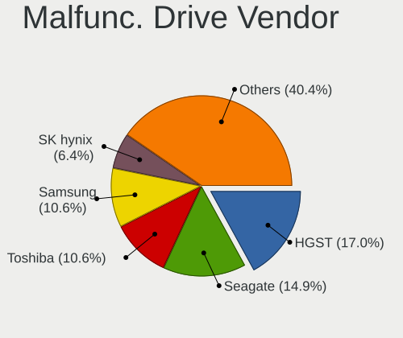

| Vendor              | Notebooks | Drives | Percent |
|---------------------|-----------|--------|---------|
| HGST                | 8         | 9      | 17.02%  |
| Seagate             | 7         | 7      | 14.89%  |
| Toshiba             | 5         | 5      | 10.64%  |
| Samsung Electronics | 5         | 5      | 10.64%  |
| SK hynix            | 3         | 7      | 6.38%   |
| Intel               | 3         | 5      | 6.38%   |
| Hitachi             | 3         | 3      | 6.38%   |
| Crucial             | 3         | 3      | 6.38%   |
| WDC                 | 2         | 2      | 4.26%   |
| SanDisk             | 2         | 2      | 4.26%   |
| Micron Technology   | 2         | 2      | 4.26%   |
| ShiJi               | 1         | 1      | 2.13%   |
| HGST HTS            | 1         | 1      | 2.13%   |
| ASMT                | 1         | 1      | 2.13%   |
| Apple               | 1         | 1      | 2.13%   |

Malfunc. HDD Vendor
-------------------

Vendors of faulty HDD drives

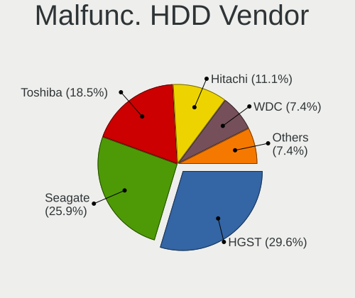

| Vendor   | Notebooks | Drives | Percent |
|----------|-----------|--------|---------|
| HGST     | 8         | 9      | 29.63%  |
| Seagate  | 7         | 7      | 25.93%  |
| Toshiba  | 5         | 5      | 18.52%  |
| Hitachi  | 3         | 3      | 11.11%  |
| WDC      | 2         | 2      | 7.41%   |
| HGST HTS | 1         | 1      | 3.7%    |
| Apple    | 1         | 1      | 3.7%    |

Malfunc. Drive Kind
-------------------

Kinds of faulty drives

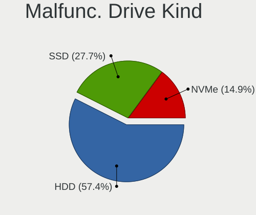

| Kind | Notebooks | Drives | Percent |
|------|-----------|--------|---------|
| HDD  | 27        | 28     | 57.45%  |
| SSD  | 13        | 15     | 27.66%  |
| NVMe | 7         | 11     | 14.89%  |

Failed Drives
-------------

Failed drive models

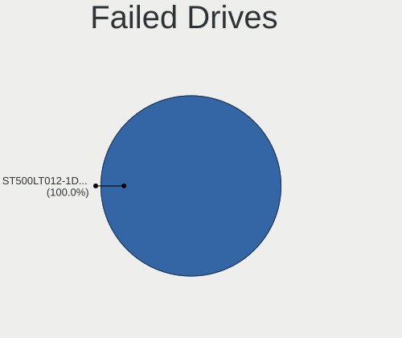

| Model                           | Notebooks | Drives | Percent |
|---------------------------------|-----------|--------|---------|
| Seagate ST500LT012-1DG142 500GB | 1         | 1      | 100%    |

Failed Drive Vendor
-------------------

Failed drive vendors

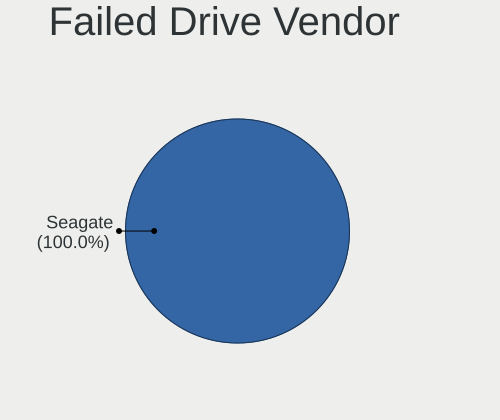

| Vendor  | Notebooks | Drives | Percent |
|---------|-----------|--------|---------|
| Seagate | 1         | 1      | 100%    |

Drive Status
------------

Number of failed and malfunc. drives

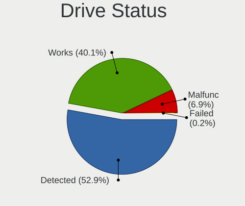

| Status   | Notebooks | Drives | Percent |
|----------|-----------|--------|---------|
| Detected | 352       | 565    | 52.85%  |
| Works    | 267       | 359    | 40.09%  |
| Malfunc  | 46        | 54     | 6.91%   |
| Failed   | 1         | 1      | 0.15%   |

Storage controller
------------------

Storage Vendor
--------------

Storage controller vendors

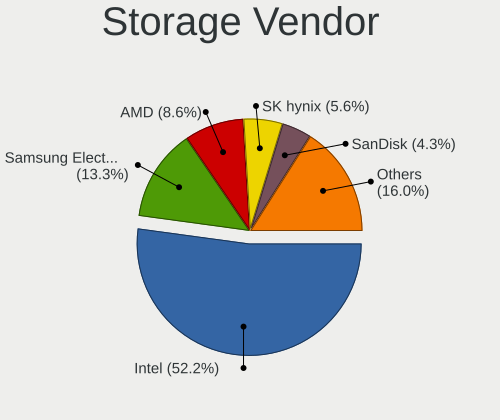

| Vendor                       | Notebooks | Percent |
|------------------------------|-----------|---------|
| Intel                        | 388       | 52.15%  |
| Samsung Electronics          | 99        | 13.31%  |
| AMD                          | 64        | 8.6%    |
| SK hynix                     | 42        | 5.65%   |
| SanDisk                      | 32        | 4.3%    |
| Toshiba America Info Systems | 25        | 3.36%   |
| Kingston Technology Company  | 17        | 2.28%   |
| Micron Technology            | 14        | 1.88%   |
| Micron/Crucial Technology    | 13        | 1.75%   |
| Nvidia                       | 10        | 1.34%   |
| MAXIO Technology (Hangzhou)  | 7         | 0.94%   |
| Union Memory (Shenzhen)      | 6         | 0.81%   |
| KIOXIA                       | 6         | 0.81%   |
| Phison Electronics           | 5         | 0.67%   |
| Solidigm                     | 2         | 0.27%   |
| Silicon Motion               | 2         | 0.27%   |
| O2 Micro                     | 2         | 0.27%   |
| Netac Technology             | 2         | 0.27%   |
| Apple                        | 2         | 0.27%   |
| ADATA Technology             | 2         | 0.27%   |
| Seagate Technology           | 1         | 0.13%   |
| Lite-On Technology           | 1         | 0.13%   |
| Lenovo                       | 1         | 0.13%   |
| JMicron Technology           | 1         | 0.13%   |

Storage Model
-------------

Storage controller models

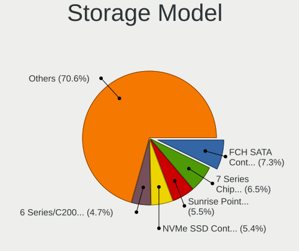

| Model                                                                            | Notebooks | Percent |
|----------------------------------------------------------------------------------|-----------|---------|
| AMD FCH SATA Controller [AHCI mode]                                              | 57        | 7.28%   |
| Intel 7 Series Chipset Family 6-port SATA Controller [AHCI mode]                 | 51        | 6.51%   |
| Intel Sunrise Point-LP SATA Controller [AHCI mode]                               | 43        | 5.49%   |
| Samsung NVMe SSD Controller SM981/PM981/PM983                                    | 42        | 5.36%   |
| Intel 6 Series/C200 Series Chipset Family 6 port Mobile SATA AHCI Controller     | 37        | 4.73%   |
| Intel Volume Management Device NVMe RAID Controller                              | 24        | 3.07%   |
| Intel 82801 Mobile SATA Controller [RAID mode]                                   | 23        | 2.94%   |
| Samsung NVMe SSD Controller PM9A1/PM9A3/980PRO                                   | 19        | 2.43%   |
| Samsung NVMe SSD Controller 980 (DRAM-less)                                      | 18        | 2.3%    |
| Intel 8 Series SATA Controller 1 [AHCI mode]                                     | 18        | 2.3%    |
| Intel 8 Series/C220 Series Chipset Family 6-port SATA Controller 1 [AHCI mode]   | 15        | 1.92%   |
| SK hynix Gold P31/BC711/PC711 NVMe Solid State Drive                             | 14        | 1.79%   |
| Intel 82801IBM/IEM (ICH9M/ICH9M-E) 4 port SATA Controller [AHCI mode]            | 14        | 1.79%   |
| Intel Cannon Lake Mobile PCH SATA AHCI Controller                                | 13        | 1.66%   |
| Intel HM170/QM170 Chipset SATA Controller [AHCI Mode]                            | 12        | 1.53%   |
| Intel Comet Lake SATA AHCI Controller                                            | 12        | 1.53%   |
| Intel 5 Series/3400 Series Chipset 6 port SATA AHCI Controller                   | 12        | 1.53%   |
| Intel Wildcat Point-LP SATA Controller [AHCI Mode]                               | 11        | 1.4%    |
| Intel Atom Processor E3800 Series SATA AHCI Controller                           | 11        | 1.4%    |
| Intel 5 Series/3400 Series Chipset 4 port SATA AHCI Controller                   | 11        | 1.4%    |
| Samsung NVMe SSD Controller SM961/PM961/SM963                                    | 10        | 1.28%   |
| Toshiba America Info Systems BG3 x2 NVMe SSD Controller (DRAM-less)              | 9         | 1.15%   |
| SanDisk Extreme Pro / WD Black SN750 / PC SN730 / Red SN700 NVMe SSD             | 9         | 1.15%   |
| Intel Celeron/Pentium Silver Processor SATA Controller                           | 9         | 1.15%   |
| Toshiba America Info Systems XG6 NVMe SSD Controller                             | 8         | 1.02%   |
| SK hynix BC501 NVMe Solid State Drive                                            | 7         | 0.89%   |
| Intel SSD 660P Series                                                            | 7         | 0.89%   |
| Intel Alder Lake-P SATA AHCI Controller                                          | 7         | 0.89%   |
| Intel 82801HM/HEM (ICH8M/ICH8M-E) IDE Controller                                 | 7         | 0.89%   |
| Intel 400 Series Chipset Family SATA AHCI Controller                             | 7         | 0.89%   |
| Toshiba America Info Systems XG5 NVMe SSD Controller                             | 6         | 0.77%   |
| SK hynix BC901 NVMe Solid State Drive (DRAM-less)                                | 6         | 0.77%   |
| Nvidia MCP79 AHCI Controller                                                     | 6         | 0.77%   |
| MAXIO (Hangzhou) NVMe SSD Controller MAP1602 (DRAM-less)                         | 6         | 0.77%   |
| Intel SSD 670p Series [Keystone Harbor]                                          | 6         | 0.77%   |
| Intel Cannon Point-LP SATA Controller [AHCI Mode]                                | 6         | 0.77%   |
| Intel Atom/Celeron/Pentium Processor x5-E8000/J3xxx/N3xxx Series SATA Controller | 6         | 0.77%   |
| Intel 82801HM/HEM (ICH8M/ICH8M-E) SATA Controller [AHCI mode]                    | 6         | 0.77%   |
| Union Memory (Shenzhen) AM620 PCIe 3.0 NVMe SSD 256GB                            | 5         | 0.64%   |
| Micron/Crucial P2 [Nick P2] / P3 / P3 Plus NVMe PCIe SSD (DRAM-less)             | 5         | 0.64%   |

Storage Kind
------------

Kind of storage controller (IDE, SATA, NVMe, SAS, ...)

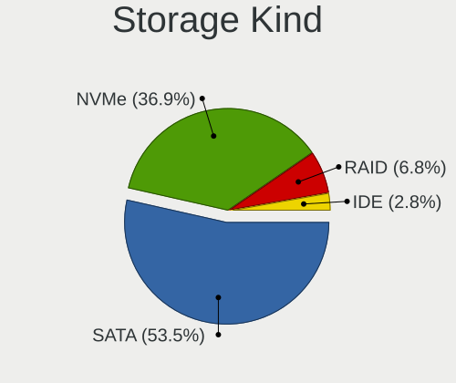

| Kind | Notebooks | Percent |
|------|-----------|---------|
| SATA | 403       | 53.52%  |
| NVMe | 278       | 36.92%  |
| RAID | 51        | 6.77%   |
| IDE  | 21        | 2.79%   |

Processor
---------

CPU Vendor
----------

Processor vendors

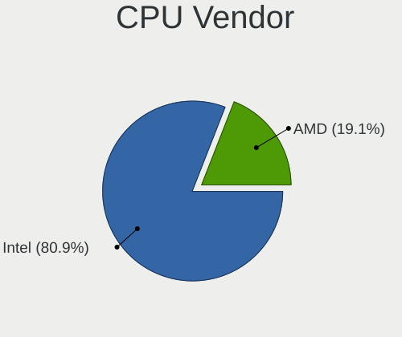

| Vendor | Notebooks | Percent |
|--------|-----------|---------|
| Intel  | 505       | 80.93%  |
| AMD    | 119       | 19.07%  |

CPU Model
---------

Processor models

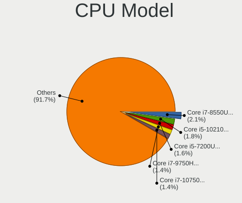

| Model                                         | Notebooks | Percent |
|-----------------------------------------------|-----------|---------|
| Intel Core i7-8550U CPU @ 1.80GHz             | 13        | 2.08%   |
| Intel Core i5-10210U CPU @ 1.60GHz            | 11        | 1.76%   |
| Intel Core i5-7200U CPU @ 2.50GHz             | 10        | 1.6%    |
| Intel Core i7-9750H CPU @ 2.60GHz             | 9         | 1.44%   |
| Intel Core i7-10750H CPU @ 2.60GHz            | 9         | 1.44%   |
| Intel Core i5-6300U CPU @ 2.40GHz             | 9         | 1.44%   |
| Intel Core i7-7500U CPU @ 2.70GHz             | 8         | 1.28%   |
| Intel Core i5-8265U CPU @ 1.60GHz             | 8         | 1.28%   |
| Intel Core i5-8250U CPU @ 1.60GHz             | 8         | 1.28%   |
| AMD Ryzen 5 3500U with Radeon Vega Mobile Gfx | 8         | 1.28%   |
| Intel Core i7-8565U CPU @ 1.80GHz             | 7         | 1.12%   |
| Intel Core i5-6200U CPU @ 2.30GHz             | 7         | 1.12%   |
| Intel Core i5-3210M CPU @ 2.50GHz             | 7         | 1.12%   |
| Intel Core i5-2410M CPU @ 2.30GHz             | 7         | 1.12%   |
| Intel Core 2 Duo CPU P8600 @ 2.40GHz          | 7         | 1.12%   |
| Intel Celeron N4020 CPU @ 1.10GHz             | 7         | 1.12%   |
| Intel Core i7-7700HQ CPU @ 2.80GHz            | 6         | 0.96%   |
| Intel Core i5-2430M CPU @ 2.40GHz             | 6         | 0.96%   |
| Intel Celeron N4500 @ 1.10GHz                 | 6         | 0.96%   |
| Intel Celeron CPU N2840 @ 2.16GHz             | 6         | 0.96%   |
| AMD Ryzen 7 5800H with Radeon Graphics        | 6         | 0.96%   |
| Intel Core i7-8750H CPU @ 2.20GHz             | 5         | 0.8%    |
| Intel Core i7-6500U CPU @ 2.50GHz             | 5         | 0.8%    |
| Intel Core i7-4600U CPU @ 2.10GHz             | 5         | 0.8%    |
| Intel Core i5-8350U CPU @ 1.70GHz             | 5         | 0.8%    |
| Intel Core i5-3230M CPU @ 2.60GHz             | 5         | 0.8%    |
| Intel Core i5-2520M CPU @ 2.50GHz             | 5         | 0.8%    |
| Intel Core i5 CPU M 460 @ 2.53GHz             | 5         | 0.8%    |
| Intel Core i3-2350M CPU @ 2.30GHz             | 5         | 0.8%    |
| Intel 11th Gen Core i7-11800H @ 2.30GHz       | 5         | 0.8%    |
| AMD Ryzen 5 PRO 5650U with Radeon Graphics    | 5         | 0.8%    |
| AMD Ryzen 5 5500U with Radeon Graphics        | 5         | 0.8%    |
| AMD Custom APU 0405                           | 5         | 0.8%    |
| Intel Core i7-8650U CPU @ 1.90GHz             | 4         | 0.64%   |
| Intel Core i7-6700HQ CPU @ 2.60GHz            | 4         | 0.64%   |
| Intel Core i7-5500U CPU @ 2.40GHz             | 4         | 0.64%   |
| Intel Core i7-4720HQ CPU @ 2.60GHz            | 4         | 0.64%   |
| Intel Core i7-10510U CPU @ 1.80GHz            | 4         | 0.64%   |
| Intel Core i5-3320M CPU @ 2.60GHz             | 4         | 0.64%   |
| Intel Core i3-3227U CPU @ 1.90GHz             | 4         | 0.64%   |

CPU Model Family
----------------

Processor model prefix

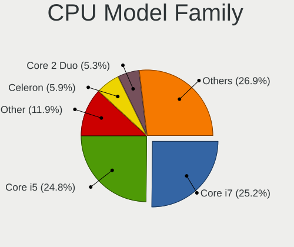

| Model                          | Notebooks | Percent |
|--------------------------------|-----------|---------|
| Intel Core i7                  | 157       | 25.16%  |
| Intel Core i5                  | 155       | 24.84%  |
| Other                          | 74        | 11.86%  |
| Intel Celeron                  | 37        | 5.93%   |
| Intel Core 2 Duo               | 33        | 5.29%   |
| Intel Core i3                  | 29        | 4.65%   |
| AMD Ryzen 7                    | 22        | 3.53%   |
| AMD Ryzen 5                    | 20        | 3.21%   |
| AMD Ryzen 9                    | 10        | 1.6%    |
| AMD A6                         | 10        | 1.6%    |
| Intel Pentium                  | 9         | 1.44%   |
| AMD Ryzen 5 PRO                | 8         | 1.28%   |
| AMD E2                         | 8         | 1.28%   |
| Intel Core                     | 5         | 0.8%    |
| Intel Atom                     | 5         | 0.8%    |
| AMD A8                         | 5         | 0.8%    |
| AMD A4                         | 4         | 0.64%   |
| Intel Core i9                  | 3         | 0.48%   |
| AMD Ryzen 7 PRO                | 3         | 0.48%   |
| AMD E1                         | 3         | 0.48%   |
| Intel Xeon                     | 2         | 0.32%   |
| Intel Pentium Silver           | 2         | 0.32%   |
| Intel Pentium M                | 2         | 0.32%   |
| Intel Celeron Dual-Core        | 2         | 0.32%   |
| AMD Ryzen 3                    | 2         | 0.32%   |
| AMD E                          | 2         | 0.32%   |
| AMD Athlon                     | 2         | 0.32%   |
| Intel Genuine                  | 1         | 0.16%   |
| Intel Core m7                  | 1         | 0.16%   |
| Intel Core m3                  | 1         | 0.16%   |
| Intel Core 2                   | 1         | 0.16%   |
| AMD Turion X2 Dual-Core Mobile | 1         | 0.16%   |
| AMD Turion 64 X2 Mobile        | 1         | 0.16%   |
| AMD G                          | 1         | 0.16%   |
| AMD Athlon II                  | 1         | 0.16%   |
| AMD A12                        | 1         | 0.16%   |
| AMD A10                        | 1         | 0.16%   |

CPU Cores
---------

Number of processor cores

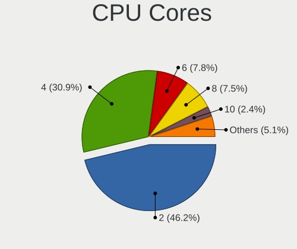

| Number | Notebooks | Percent |
|--------|-----------|---------|
| 2      | 289       | 46.24%  |
| 4      | 193       | 30.88%  |
| 6      | 49        | 7.84%   |
| 8      | 47        | 7.52%   |
| 10     | 15        | 2.4%    |
| 14     | 12        | 1.92%   |
| 12     | 9         | 1.44%   |
| 1      | 7         | 1.12%   |
| 24     | 2         | 0.32%   |
| 16     | 2         | 0.32%   |

CPU Sockets
-----------

Number of sockets

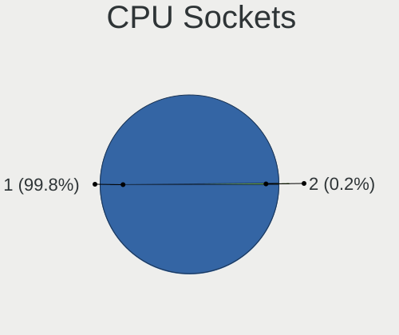

| Number | Notebooks | Percent |
|--------|-----------|---------|
| 1      | 623       | 99.84%  |
| 2      | 1         | 0.16%   |

CPU Threads
-----------

Threads per core (Hyper-Threading)

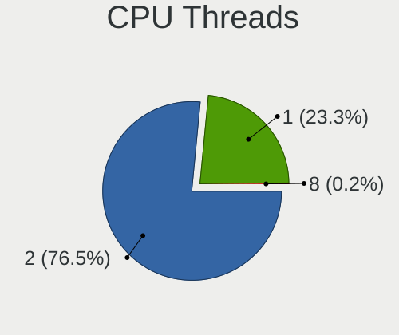

| Number | Notebooks | Percent |
|--------|-----------|---------|
| 2      | 479       | 76.52%  |
| 1      | 146       | 23.32%  |
| 8      | 1         | 0.16%   |

CPU Op-Modes
------------

CPU Operation Modes (32-bit, 64-bit)

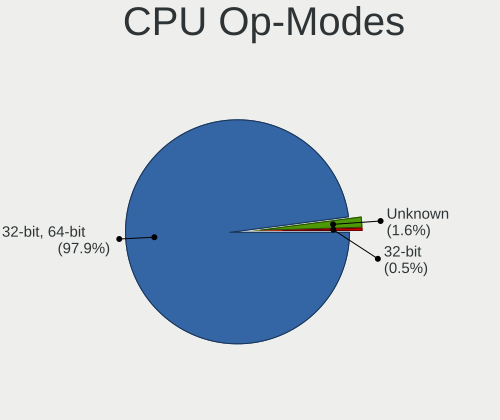

| Op mode        | Notebooks | Percent |
|----------------|-----------|---------|
| 32-bit, 64-bit | 616       | 97.93%  |
| Unknown        | 10        | 1.59%   |
| 32-bit         | 3         | 0.48%   |

CPU Microcode
-------------

Microcode number

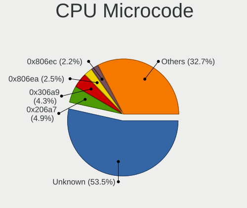

| Number     | Notebooks | Percent |
|------------|-----------|---------|
| Unknown    | 347       | 53.47%  |
| 0x206a7    | 32        | 4.93%   |
| 0x306a9    | 28        | 4.31%   |
| 0x806ea    | 16        | 2.47%   |
| 0x806ec    | 14        | 2.16%   |
| 0x406e3    | 14        | 2.16%   |
| 0x1067a    | 13        | 2%      |
| 0x806e9    | 10        | 1.54%   |
| 0x20655    | 10        | 1.54%   |
| 0x30678    | 9         | 1.39%   |
| 0x40651    | 8         | 1.23%   |
| 0x306c3    | 8         | 1.23%   |
| 0xa0652    | 7         | 1.08%   |
| 0x306d4    | 7         | 1.08%   |
| 0x10676    | 7         | 1.08%   |
| 0x0a50000d | 7         | 1.08%   |
| 0x906a4    | 6         | 0.92%   |
| 0x07030105 | 6         | 0.92%   |
| 0x906ea    | 5         | 0.77%   |
| 0x906e9    | 5         | 0.77%   |
| 0x806c1    | 5         | 0.77%   |
| 0x08108109 | 5         | 0.77%   |
| 0x906a3    | 4         | 0.62%   |
| 0x506e3    | 4         | 0.62%   |
| 0x506c9    | 4         | 0.62%   |
| 0x0a50000c | 4         | 0.62%   |
| 0x06006705 | 4         | 0.62%   |
| 0x806d1    | 3         | 0.46%   |
| 0x706a8    | 3         | 0.46%   |
| 0x6fd      | 3         | 0.46%   |
| 0x08600106 | 3         | 0.46%   |
| 0x08108102 | 3         | 0.46%   |
| 0x06001119 | 3         | 0.46%   |
| 0x05000119 | 3         | 0.46%   |
| 0xa0660    | 2         | 0.31%   |
| 0x906ed    | 2         | 0.31%   |
| 0x906c0    | 2         | 0.31%   |
| 0x806eb    | 2         | 0.31%   |
| 0x706a1    | 2         | 0.31%   |
| 0x6d8      | 2         | 0.31%   |

CPU Microarch
-------------

Microarchitecture

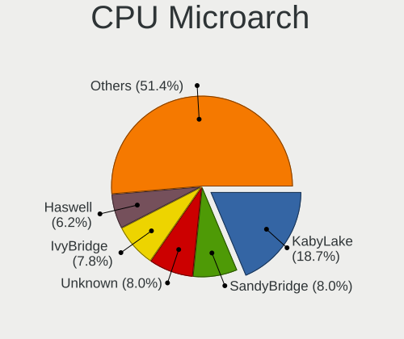

| Name              | Notebooks | Percent |
|-------------------|-----------|---------|
| KabyLake          | 117       | 18.66%  |
| SandyBridge       | 50        | 7.97%   |
| Unknown           | 50        | 7.97%   |
| IvyBridge         | 49        | 7.81%   |
| Haswell           | 39        | 6.22%   |
| Skylake           | 37        | 5.9%    |
| Penryn            | 30        | 4.78%   |
| Alderlake Hybrid  | 29        | 4.63%   |
| Zen 3             | 23        | 3.67%   |
| Silvermont        | 21        | 3.35%   |
| CometLake         | 19        | 3.03%   |
| Westmere          | 18        | 2.87%   |
| Zen+              | 15        | 2.39%   |
| Broadwell         | 15        | 2.39%   |
| TigerLake         | 14        | 2.23%   |
| Excavator         | 14        | 2.23%   |
| Puma              | 13        | 2.07%   |
| Goldmont plus     | 11        | 1.75%   |
| Icelake           | 9         | 1.44%   |
| Core              | 7         | 1.12%   |
| Goldmont          | 6         | 0.96%   |
| Zen 2             | 5         | 0.8%    |
| Nehalem           | 5         | 0.8%    |
| Bobcat            | 5         | 0.8%    |
| Jaguar            | 4         | 0.64%   |
| Tremont           | 3         | 0.48%   |
| Piledriver        | 3         | 0.48%   |
| Bonnell           | 3         | 0.48%   |
| P6                | 2         | 0.32%   |
| Meteorlake Hybrid | 2         | 0.32%   |
| Lunarlake Hybrid  | 2         | 0.32%   |
| Gracemont         | 2         | 0.32%   |
| Zen               | 1         | 0.16%   |
| K8 Hammer         | 1         | 0.16%   |
| K8 & K10 hybrid   | 1         | 0.16%   |
| K10 Llano         | 1         | 0.16%   |
| K10               | 1         | 0.16%   |

Graphics
--------

GPU Vendor
----------

Vendors of graphics cards

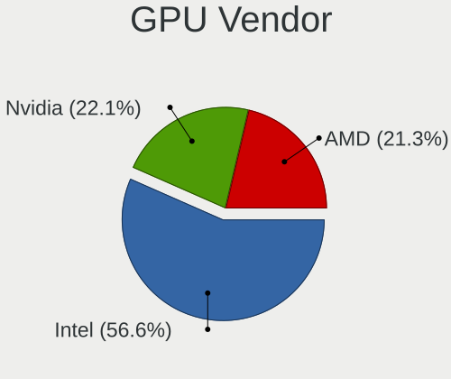

| Vendor | Notebooks | Percent |
|--------|-----------|---------|
| Intel  | 446       | 56.6%   |
| Nvidia | 174       | 22.08%  |
| AMD    | 168       | 21.32%  |

GPU Model
---------

Graphics card models

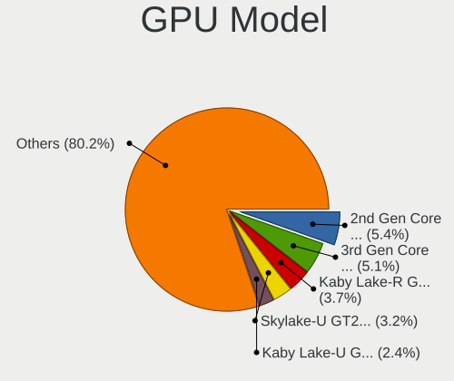

| Model                                                                                    | Notebooks | Percent |
|------------------------------------------------------------------------------------------|-----------|---------|
| Intel 2nd Generation Core Processor Family Integrated Graphics Controller                | 44        | 5.39%   |
| Intel 3rd Gen Core processor Graphics Controller                                         | 42        | 5.14%   |
| Intel Kaby Lake-R GT2 [UHD Graphics 620]                                                 | 30        | 3.67%   |
| Intel Skylake-U GT2 [HD Graphics 520]                                                    | 26        | 3.18%   |
| Intel Kaby Lake-U GT2 [HD Graphics 620]                                                  | 20        | 2.45%   |
| Intel Haswell-ULT Integrated Graphics Controller                                         | 19        | 2.33%   |
| AMD Cezanne [Radeon Vega Series / Radeon Vega Mobile Series]                             | 18        | 2.2%    |
| Intel WhiskeyLake-U GT2 [UHD Graphics 620]                                               | 17        | 2.08%   |
| Intel CometLake-U GT2 [UHD Graphics]                                                     | 16        | 1.96%   |
| Intel 4th Gen Core Processor Integrated Graphics Controller                              | 16        | 1.96%   |
| Intel Core Processor Integrated Graphics Controller                                      | 15        | 1.84%   |
| AMD Picasso/Raven 2 [Radeon Vega Series / Radeon Vega Mobile Series]                     | 15        | 1.84%   |
| Intel CometLake-H GT2 [UHD Graphics]                                                     | 14        | 1.71%   |
| Intel CoffeeLake-H GT2 [UHD Graphics 630]                                                | 14        | 1.71%   |
| Intel TigerLake-LP GT2 [Iris Xe Graphics]                                                | 13        | 1.59%   |
| Intel Atom Processor Z36xxx/Z37xxx Series Graphics & Display                             | 13        | 1.59%   |
| AMD Topaz XT [Radeon R7 M260/M265 / M340/M360 / M440/M445 / 530/535 / 620/625 Mobile]    | 13        | 1.59%   |
| AMD Stoney [Radeon R2/R3/R4/R5 Graphics]                                                 | 12        | 1.47%   |
| Intel Mobile 4 Series Chipset Integrated Graphics Controller                             | 11        | 1.35%   |
| Intel GeminiLake [UHD Graphics 600]                                                      | 11        | 1.35%   |
| Intel Alder Lake-P GT2 [Iris Xe Graphics]                                                | 11        | 1.35%   |
| Intel Broadwell-U GT2 [HD Graphics 5500]                                                 | 10        | 1.22%   |
| Intel TigerLake-H GT1 [UHD Graphics]                                                     | 9         | 1.1%    |
| Nvidia TU117M [GeForce GTX 1650 Mobile / Max-Q]                                          | 8         | 0.98%   |
| Intel Kaby Lake-H GT2 [HD Graphics 630]                                                  | 8         | 0.98%   |
| Intel JasperLake [UHD Graphics]                                                          | 8         | 0.98%   |
| Intel Atom/Celeron/Pentium Processor x5-E8000/J3xxx/N3xxx Integrated Graphics Controller | 8         | 0.98%   |
| AMD Lucienne                                                                             | 8         | 0.98%   |
| Nvidia GA106M [GeForce RTX 3060 Mobile / Max-Q]                                          | 7         | 0.86%   |
| Intel Raptor Lake-P [Iris Xe Graphics]                                                   | 7         | 0.86%   |
| Intel Alder Lake-UP3 GT2 [Iris Xe Graphics]                                              | 7         | 0.86%   |
| AMD Thames [Radeon HD 7550M/7570M/7650M]                                                 | 7         | 0.86%   |
| AMD Rembrandt [Radeon 680M]                                                              | 7         | 0.86%   |
| AMD Mullins [Radeon R4/R5 Graphics]                                                      | 7         | 0.86%   |
| Nvidia C79 [GeForce 9400M]                                                               | 6         | 0.73%   |
| Intel Skylake-H GT2 [HD Graphics 530]                                                    | 6         | 0.73%   |
| AMD Seymour [Radeon HD 6400M/7400M Series]                                               | 6         | 0.73%   |
| Nvidia GM108M [GeForce 930MX]                                                            | 5         | 0.61%   |
| Intel Apollo Lake GT1 [HD Graphics 500]                                                  | 5         | 0.61%   |
| AMD VanGogh [AMD Custom GPU 0405]                                                        | 5         | 0.61%   |

GPU Combo
---------

Combinations of graphics cards

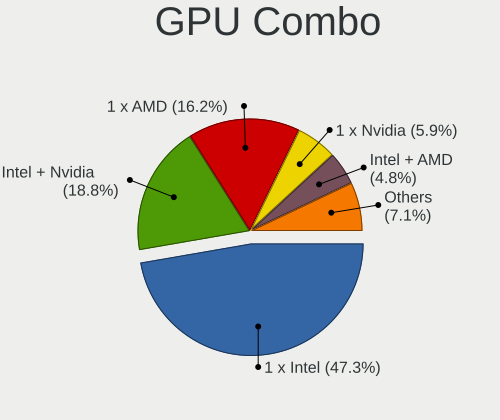

| Name           | Notebooks | Percent |
|----------------|-----------|---------|
| 1 x Intel      | 295       | 47.28%  |
| Intel + Nvidia | 117       | 18.75%  |
| 1 x AMD        | 101       | 16.19%  |
| 1 x Nvidia     | 37        | 5.93%   |
| Intel + AMD    | 30        | 4.81%   |
| 2 x AMD        | 20        | 3.21%   |
| AMD + Nvidia   | 17        | 2.72%   |
| 2 x Nvidia     | 3         | 0.48%   |
| 2 x Intel      | 3         | 0.48%   |
| Other          | 1         | 0.16%   |

GPU Driver
----------

Free vs proprietary

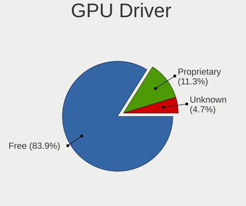

| Driver      | Notebooks | Percent |
|-------------|-----------|---------|
| Free        | 533       | 83.94%  |
| Proprietary | 72        | 11.34%  |
| Unknown     | 30        | 4.72%   |

GPU Memory
----------

Total video memory

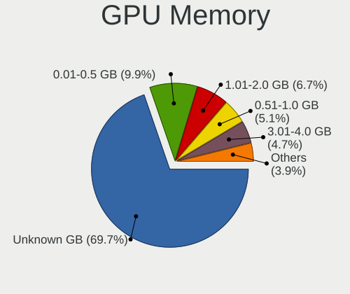

| Size in GB | Notebooks | Percent |
|------------|-----------|---------|
| Unknown    | 449       | 69.72%  |
| 0.01-0.5   | 64        | 9.94%   |
| 1.01-2.0   | 43        | 6.68%   |
| 0.51-1.0   | 33        | 5.12%   |
| 3.01-4.0   | 30        | 4.66%   |
| 7.01-8.0   | 10        | 1.55%   |
| 5.01-6.0   | 10        | 1.55%   |
| 2.01-3.0   | 3         | 0.47%   |
| 8.01-16.0  | 2         | 0.31%   |

Monitor
-------

Monitor Vendor
--------------

Monitor vendors

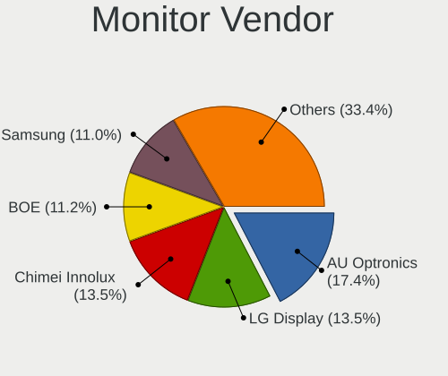

| Vendor                  | Notebooks | Percent |
|-------------------------|-----------|---------|
| AU Optronics            | 126       | 17.38%  |
| LG Display              | 98        | 13.52%  |
| Chimei Innolux          | 98        | 13.52%  |
| BOE                     | 81        | 11.17%  |
| Samsung Electronics     | 80        | 11.03%  |
| Dell                    | 28        | 3.86%   |
| Sharp                   | 27        | 3.72%   |
| Apple                   | 25        | 3.45%   |
| Goldstar                | 23        | 3.17%   |
| Chi Mei Optoelectronics | 18        | 2.48%   |
| AOC                     | 16        | 2.21%   |
| Lenovo                  | 11        | 1.52%   |
| PANDA                   | 10        | 1.38%   |
| Philips                 | 9         | 1.24%   |
| InfoVision              | 8         | 1.1%    |
| Hewlett-Packard         | 7         | 0.97%   |
| Valve                   | 6         | 0.83%   |
| ViewSonic               | 4         | 0.55%   |
| Sony                    | 4         | 0.55%   |
| Acer                    | 4         | 0.55%   |
| TMX                     | 3         | 0.41%   |
| Panasonic               | 3         | 0.41%   |
| Denver                  | 3         | 0.41%   |
| Quanta Display          | 2         | 0.28%   |
| InnoLux Display         | 2         | 0.28%   |
| HannStar                | 2         | 0.28%   |
| Gigabyte Technology     | 2         | 0.28%   |
| CSW                     | 2         | 0.28%   |
| Ancor Communications    | 2         | 0.28%   |
| Yamaha                  | 1         | 0.14%   |
| Wacom                   | 1         | 0.14%   |
| Toshiba                 | 1         | 0.14%   |
| TCL                     | 1         | 0.14%   |
| SKY                     | 1         | 0.14%   |
| SANYO                   | 1         | 0.14%   |
| PRISM+                  | 1         | 0.14%   |
| MStar                   | 1         | 0.14%   |
| MSI                     | 1         | 0.14%   |
| MiTAC                   | 1         | 0.14%   |
| Mi                      | 1         | 0.14%   |

Monitor Model
-------------

Monitor models

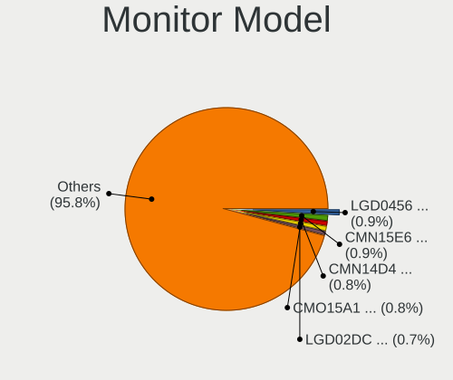

| Model                                                                    | Notebooks | Percent |
|--------------------------------------------------------------------------|-----------|---------|
| LG Display LCD Monitor LGD0456 1366x768 344x194mm 15.5-inch              | 7         | 0.94%   |
| Chimei Innolux LCD Monitor CMN15E6 1366x768 344x193mm 15.5-inch          | 7         | 0.94%   |
| Chimei Innolux LCD Monitor CMN14D4 1920x1080 309x173mm 13.9-inch         | 6         | 0.81%   |
| Chi Mei Optoelectronics LCD Monitor CMO15A1 1366x768 344x193mm 15.5-inch | 6         | 0.81%   |
| LG Display LCD Monitor LGD02DC 1366x768 344x194mm 15.5-inch              | 5         | 0.67%   |
| Chimei Innolux LCD Monitor CMN1521 1920x1080 344x193mm 15.5-inch         | 5         | 0.67%   |
| BOE LCD Monitor BOE06A4 1366x768 344x194mm 15.5-inch                     | 5         | 0.67%   |
| AU Optronics LCD Monitor AUO23ED 1920x1080 344x193mm 15.5-inch           | 5         | 0.67%   |
| Valve ANX7530 U VLV3001 800x1280 100x150mm 7.1-inch                      | 4         | 0.54%   |
| Sharp LCD Monitor SHP144D 3840x2160 276x156mm 12.5-inch                  | 4         | 0.54%   |
| Sharp LCD Monitor SHP144A 3200x1800 294x165mm 13.3-inch                  | 4         | 0.54%   |
| LG Display LCD Monitor LGD0465 1366x768 344x194mm 15.5-inch              | 4         | 0.54%   |
| LG Display LCD Monitor LGD033A 1366x768 344x194mm 15.5-inch              | 4         | 0.54%   |
| Chimei Innolux LCD Monitor CMN15E7 1920x1080 344x193mm 15.5-inch         | 4         | 0.54%   |
| Chimei Innolux LCD Monitor CMN15BF 1366x768 344x194mm 15.5-inch          | 4         | 0.54%   |
| Chimei Innolux LCD Monitor CMN14E5 1920x1080 309x173mm 13.9-inch         | 4         | 0.54%   |
| AU Optronics LCD Monitor AUO70EC 1366x768 344x193mm 15.5-inch            | 4         | 0.54%   |
| AU Optronics LCD Monitor AUO403D 1920x1080 309x174mm 14.0-inch           | 4         | 0.54%   |
| AU Optronics LCD Monitor AUO23EC 1366x768 344x193mm 15.5-inch            | 4         | 0.54%   |
| Sharp LCD Monitor SHP1449 1920x1080 294x165mm 13.3-inch                  | 3         | 0.4%    |
| Samsung Electronics LCD Monitor SEC544B 1600x900 382x214mm 17.2-inch     | 3         | 0.4%    |
| LG Display LCD Monitor LGD056E 1920x1080 344x194mm 15.5-inch             | 3         | 0.4%    |
| LG Display LCD Monitor LGD056D 1920x1080 382x215mm 17.3-inch             | 3         | 0.4%    |
| LG Display LCD Monitor LGD0258 1600x900 345x194mm 15.6-inch              | 3         | 0.4%    |
| Goldstar FULL HD GSM5B55 1920x1080 480x270mm 21.7-inch                   | 3         | 0.4%    |
| Dell P2419H DELD0DA 1920x1080 527x296mm 23.8-inch                        | 3         | 0.4%    |
| Chimei Innolux LCD Monitor CMN14D5 1920x1080 309x173mm 13.9-inch         | 3         | 0.4%    |
| Chi Mei Optoelectronics LCD Monitor CMO15A3 1366x768 344x193mm 15.5-inch | 3         | 0.4%    |
| AU Optronics LCD Monitor AUO26EC 1366x768 344x193mm 15.5-inch            | 3         | 0.4%    |
| AU Optronics LCD Monitor AUO22EC 1366x768 344x193mm 15.5-inch            | 3         | 0.4%    |
| AU Optronics LCD Monitor AUO129E 1600x900 382x214mm 17.2-inch            | 3         | 0.4%    |
| AU Optronics LCD Monitor AUO123D 1920x1080 309x173mm 13.9-inch           | 3         | 0.4%    |
| Apple Color LCD APP9CF0 1440x900 290x180mm 13.4-inch                     | 3         | 0.4%    |
| Apple Color LCD APP9CA4 1440x900 331x207mm 15.4-inch                     | 3         | 0.4%    |
| Valve ANX7530 U VLV3003 800x1280 100x160mm 7.4-inch                      | 2         | 0.27%   |
| Sharp LQ156M1JW03 SHP14C5 1920x1080 344x194mm 15.5-inch                  | 2         | 0.27%   |
| Sharp LCD Monitor SHP14D1 1920x1200 336x210mm 15.6-inch                  | 2         | 0.27%   |
| Samsung Electronics SyncMaster SAM0498 1600x900 443x249mm 20.0-inch      | 2         | 0.27%   |
| Samsung Electronics S27B350 SAM08DC 1920x1080 598x336mm 27.0-inch        | 2         | 0.27%   |
| Samsung Electronics LU28R55 SAM1019 3840x2160 632x360mm 28.6-inch        | 2         | 0.27%   |

Monitor Resolution
------------------

Monitor screen resolution

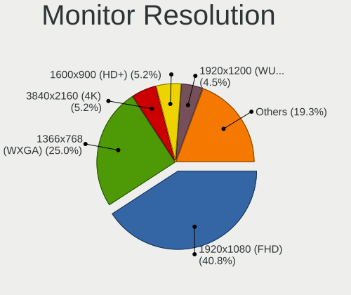

| Resolution         | Notebooks | Percent |
|--------------------|-----------|---------|
| 1920x1080 (FHD)    | 283       | 40.84%  |
| 1366x768 (WXGA)    | 173       | 24.96%  |
| 3840x2160 (4K)     | 36        | 5.19%   |
| 1600x900 (HD+)     | 36        | 5.19%   |
| 1920x1200 (WUXGA)  | 31        | 4.47%   |
| 2560x1440 (QHD)    | 24        | 3.46%   |
| 1280x800 (WXGA)    | 24        | 3.46%   |
| 1440x900 (WXGA+)   | 15        | 2.16%   |
| 2880x1800          | 11        | 1.59%   |
| 3440x1440          | 9         | 1.3%    |
| 2560x1600          | 9         | 1.3%    |
| 800x1280           | 6         | 0.87%   |
| 3200x1800 (QHD+)   | 6         | 0.87%   |
| 3840x1600          | 3         | 0.43%   |
| 3456x2160          | 3         | 0.43%   |
| 1680x1050 (WSXGA+) | 3         | 0.43%   |
| 1280x1024 (SXGA)   | 3         | 0.43%   |
| 1024x600           | 3         | 0.43%   |
| 3840x2400          | 2         | 0.29%   |
| 3200x2000          | 2         | 0.29%   |
| 1920x540           | 2         | 0.29%   |
| 1360x768           | 2         | 0.29%   |
| 3840x1080          | 1         | 0.14%   |
| 2880x1920          | 1         | 0.14%   |
| 2880x1620          | 1         | 0.14%   |
| 2560x1080          | 1         | 0.14%   |
| 2304x1440          | 1         | 0.14%   |
| 1920x1280          | 1         | 0.14%   |
| 1280x720 (HD)      | 1         | 0.14%   |

Monitor Diagonal
----------------

Diagonal size in inches

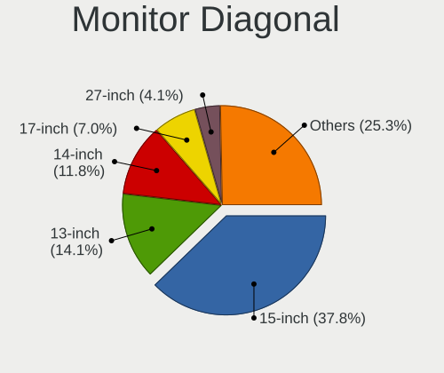

| Inches  | Notebooks | Percent |
|---------|-----------|---------|
| 15      | 276       | 37.76%  |
| 13      | 103       | 14.09%  |
| 14      | 86        | 11.76%  |
| 17      | 51        | 6.98%   |
| 27      | 30        | 4.1%    |
| 23      | 20        | 2.74%   |
| 16      | 20        | 2.74%   |
| 24      | 17        | 2.33%   |
| 12      | 17        | 2.33%   |
| 31      | 15        | 2.05%   |
| 21      | 14        | 1.92%   |
| 11      | 10        | 1.37%   |
| Unknown | 8         | 1.09%   |
| 7       | 7         | 0.96%   |
| 34      | 6         | 0.82%   |
| 18      | 6         | 0.82%   |
| 10      | 6         | 0.82%   |
| 37      | 5         | 0.68%   |
| 20      | 4         | 0.55%   |
| 84      | 3         | 0.41%   |
| 72      | 3         | 0.41%   |
| 22      | 3         | 0.41%   |
| 19      | 3         | 0.41%   |
| 46      | 2         | 0.27%   |
| 33      | 2         | 0.27%   |
| 29      | 2         | 0.27%   |
| 28      | 2         | 0.27%   |
| 95      | 1         | 0.14%   |
| 64      | 1         | 0.14%   |
| 63      | 1         | 0.14%   |
| 60      | 1         | 0.14%   |
| 54      | 1         | 0.14%   |
| 52      | 1         | 0.14%   |
| 48      | 1         | 0.14%   |
| 40      | 1         | 0.14%   |
| 35      | 1         | 0.14%   |
| 25      | 1         | 0.14%   |

Monitor Width
-------------

Physical width

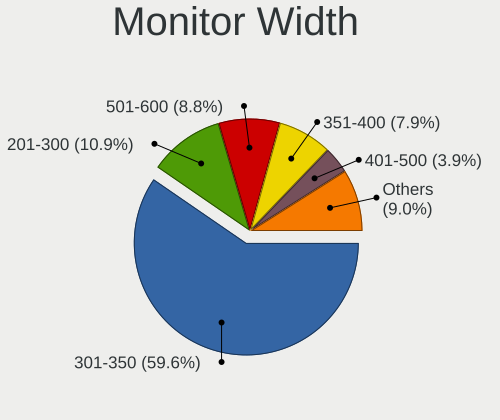

| Width in mm | Notebooks | Percent |
|-------------|-----------|---------|
| 301-350     | 432       | 59.59%  |
| 201-300     | 79        | 10.9%   |
| 501-600     | 64        | 8.83%   |
| 351-400     | 57        | 7.86%   |
| 401-500     | 28        | 3.86%   |
| 601-700     | 21        | 2.9%    |
| 701-800     | 8         | 1.1%    |
| 1001-1500   | 8         | 1.1%    |
| Unknown     | 8         | 1.1%    |
| 801-900     | 7         | 0.97%   |
| 1501-2000   | 6         | 0.83%   |
| 1-100       | 6         | 0.83%   |
| 101-200     | 1         | 0.14%   |

Aspect Ratio
------------

Proportional relationship between the width and the height

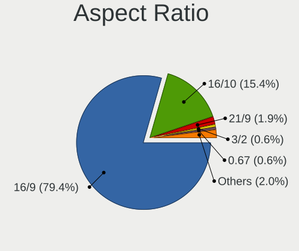

| Ratio   | Notebooks | Percent |
|---------|-----------|---------|
| 16/9    | 505       | 79.4%   |
| 16/10   | 98        | 15.41%  |
| 21/9    | 12        | 1.89%   |
| 3/2     | 4         | 0.63%   |
| 0.67    | 4         | 0.63%   |
| Unknown | 4         | 0.63%   |
| 5/4     | 3         | 0.47%   |
| 4/3     | 2         | 0.31%   |
| 32/9    | 2         | 0.31%   |
| 0.62    | 2         | 0.31%   |

Monitor Area
------------

Area in inch²

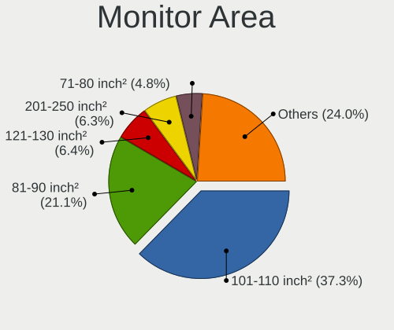

| Area in inch² | Notebooks | Percent |
|----------------|-----------|---------|
| 101-110        | 272       | 37.31%  |
| 81-90          | 154       | 21.12%  |
| 121-130        | 47        | 6.45%   |
| 201-250        | 46        | 6.31%   |
| 71-80          | 35        | 4.8%    |
| 301-350        | 30        | 4.12%   |
| 351-500        | 27        | 3.7%    |
| 111-120        | 22        | 3.02%   |
| 61-70          | 16        | 2.19%   |
| More than 1000 | 11        | 1.51%   |
| 151-200        | 11        | 1.51%   |
| 51-60          | 10        | 1.37%   |
| 501-1000       | 9         | 1.23%   |
| Unknown        | 8         | 1.1%    |
| 1-40           | 7         | 0.96%   |
| 141-150        | 7         | 0.96%   |
| 41-50          | 6         | 0.82%   |
| 251-300        | 6         | 0.82%   |
| 131-140        | 4         | 0.55%   |
| 91-100         | 1         | 0.14%   |

Pixel Density
-------------

Pixels per inch

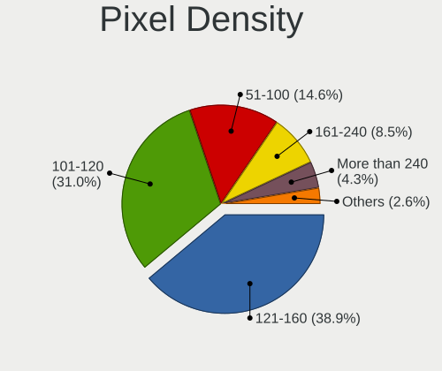

| Density       | Notebooks | Percent |
|---------------|-----------|---------|
| 121-160       | 279       | 38.91%  |
| 101-120       | 222       | 30.96%  |
| 51-100        | 105       | 14.64%  |
| 161-240       | 61        | 8.51%   |
| More than 240 | 31        | 4.32%   |
| 1-50          | 11        | 1.53%   |
| Unknown       | 8         | 1.12%   |

Multiple Monitors
-----------------

Total monitors connected

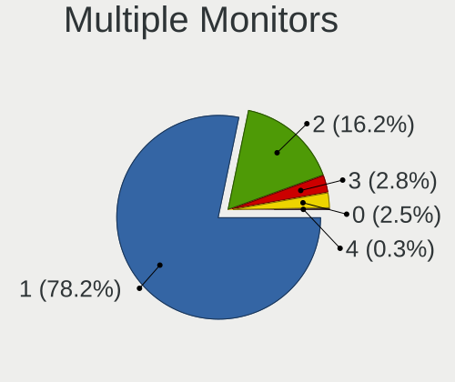

| Total | Notebooks | Percent |
|-------|-----------|---------|
| 1     | 507       | 78.24%  |
| 2     | 105       | 16.2%   |
| 3     | 18        | 2.78%   |
| 0     | 16        | 2.47%   |
| 4     | 2         | 0.31%   |

Network
-------

Net Controller Vendor
---------------------

Controller vendors

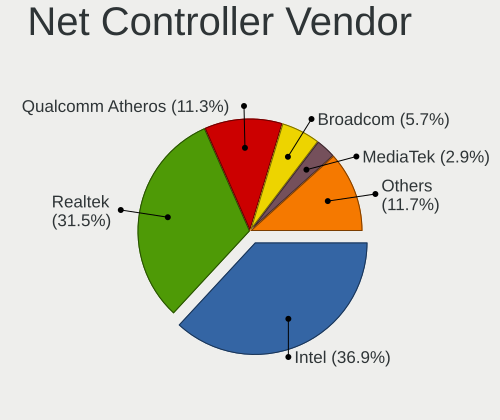

| Vendor                            | Notebooks | Percent |
|-----------------------------------|-----------|---------|
| Intel                             | 363       | 36.89%  |
| Realtek Semiconductor             | 310       | 31.5%   |
| Qualcomm Atheros                  | 111       | 11.28%  |
| Broadcom                          | 56        | 5.69%   |
| MediaTek                          | 29        | 2.95%   |
| Broadcom Limited                  | 13        | 1.32%   |
| TP-Link                           | 12        | 1.22%   |
| Hewlett-Packard                   | 9         | 0.91%   |
| Ralink                            | 8         | 0.81%   |
| Nvidia                            | 8         | 0.81%   |
| DisplayLink                       | 7         | 0.71%   |
| Marvell Technology Group          | 6         | 0.61%   |
| Sierra Wireless                   | 5         | 0.51%   |
| Qualcomm                          | 5         | 0.51%   |
| ASIX Electronics                  | 5         | 0.51%   |
| Shenzhen Goodix Technology        | 4         | 0.41%   |
| Samsung Electronics               | 3         | 0.3%    |
| OPPO Electronics                  | 3         | 0.3%    |
| Lenovo                            | 3         | 0.3%    |
| Dell                              | 3         | 0.3%    |
| JMicron Technology                | 2         | 0.2%    |
| Huawei Technologies               | 2         | 0.2%    |
| Xiaomi                            | 1         | 0.1%    |
| vivo                              | 1         | 0.1%    |
| U-Blox                            | 1         | 0.1%    |
| Toshiba                           | 1         | 0.1%    |
| STMicroelectronics                | 1         | 0.1%    |
| Ralink Technology                 | 1         | 0.1%    |
| QinHeng Electronics               | 1         | 0.1%    |
| Ortur                             | 1         | 0.1%    |
| NetGear                           | 1         | 0.1%    |
| Microsoft                         | 1         | 0.1%    |
| Lite-On Technology                | 1         | 0.1%    |
| ICS Advent                        | 1         | 0.1%    |
| Fujitsu                           | 1         | 0.1%    |
| Fibocom                           | 1         | 0.1%    |
| Ericsson Business Mobile Networks | 1         | 0.1%    |
| D-Link                            | 1         | 0.1%    |
| Attansic Technology               | 1         | 0.1%    |

Net Controller Model
--------------------

Controller models

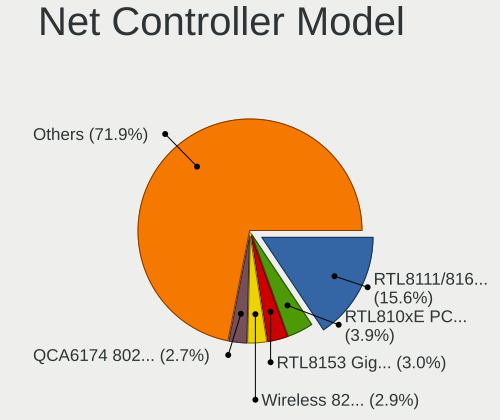

| Model                                                                  | Notebooks | Percent |
|------------------------------------------------------------------------|-----------|---------|
| Realtek RTL8111/8168/8211/8411 PCI Express Gigabit Ethernet Controller | 186       | 15.64%  |
| Realtek RTL810xE PCI Express Fast Ethernet controller                  | 46        | 3.87%   |
| Realtek RTL8153 Gigabit Ethernet Adapter                               | 36        | 3.03%   |
| Intel Wireless 8265 / 8275                                             | 34        | 2.86%   |
| Qualcomm Atheros QCA6174 802.11ac Wireless Network Adapter             | 32        | 2.69%   |
| Intel Wi-Fi 6 AX200                                                    | 26        | 2.19%   |
| Intel 82579LM Gigabit Network Connection (Lewisville)                  | 26        | 2.19%   |
| Intel Wireless 8260                                                    | 23        | 1.93%   |
| Intel Wireless 7260                                                    | 23        | 1.93%   |
| Qualcomm Atheros QCA9565 / AR9565 Wireless Network Adapter             | 20        | 1.68%   |
| Intel Comet Lake PCH-LP CNVi WiFi                                      | 19        | 1.6%    |
| Qualcomm Atheros AR9485 Wireless Network Adapter                       | 18        | 1.51%   |
| Intel Alder Lake-P PCH CNVi WiFi                                       | 17        | 1.43%   |
| Qualcomm Atheros QCA9377 802.11ac Wireless Network Adapter             | 15        | 1.26%   |
| MediaTek MT7921 802.11ax PCIe Wireless Network Adapter [Filogic 330]   | 15        | 1.26%   |
| Intel Centrino Advanced-N 6205 [Taylor Peak]                           | 15        | 1.26%   |
| Realtek RTL8822CE 802.11ac PCIe Wireless Network Adapter               | 14        | 1.18%   |
| Intel Wireless 3165                                                    | 14        | 1.18%   |
| Intel Comet Lake PCH CNVi WiFi                                         | 14        | 1.18%   |
| Qualcomm Atheros AR9285 Wireless Network Adapter (PCI-Express)         | 13        | 1.09%   |
| Intel Wireless 7265                                                    | 12        | 1.01%   |
| Intel Ethernet Connection (4) I219-LM                                  | 12        | 1.01%   |
| Intel Centrino Ultimate-N 6300                                         | 12        | 1.01%   |
| Intel Wi-Fi 6 AX201                                                    | 11        | 0.93%   |
| Intel Ethernet Connection (4) I219-V                                   | 11        | 0.93%   |
| Intel Centrino Advanced-N 6200                                         | 11        | 0.93%   |
| Realtek RTL8821CE 802.11ac PCIe Wireless Network Adapter               | 10        | 0.84%   |
| Intel Ethernet Connection I219-LM                                      | 10        | 0.84%   |
| Intel Gemini Lake PCH CNVi WiFi                                        | 9         | 0.76%   |
| Intel Ethernet Connection I218-LM                                      | 9         | 0.76%   |
| Intel Cannon Lake PCH CNVi WiFi                                        | 9         | 0.76%   |
| Broadcom BCM4313 802.11bgn Wireless Network Adapter                    | 9         | 0.76%   |
| Realtek RTL8822BE 802.11a/b/g/n/ac WiFi adapter                        | 8         | 0.67%   |
| Qualcomm Atheros AR8151 v2.0 Gigabit Ethernet                          | 8         | 0.67%   |
| MediaTek MT7922 802.11ax PCI Express Wireless Network Adapter          | 8         | 0.67%   |
| Intel Dual Band Wireless-AC 3168NGW [Stone Peak]                       | 8         | 0.67%   |
| Intel Cannon Point-LP CNVi [Wireless-AC]                               | 8         | 0.67%   |
| Broadcom BCM4322 802.11a/b/g/n Wireless LAN Controller                 | 8         | 0.67%   |
| Nvidia MCP79 Ethernet                                                  | 7         | 0.59%   |
| Intel Wireless 3160                                                    | 7         | 0.59%   |

Wireless Vendor
---------------

Wireless vendors

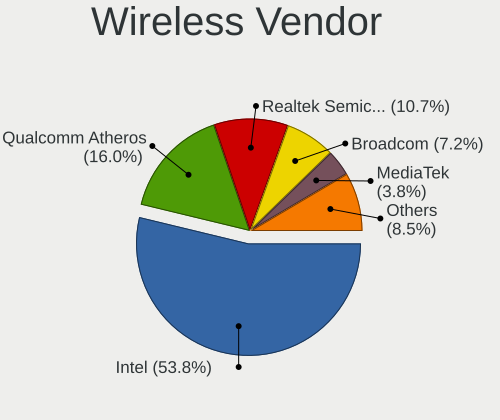

| Vendor                | Notebooks | Percent |
|-----------------------|-----------|---------|
| Intel                 | 342       | 53.77%  |
| Qualcomm Atheros      | 102       | 16.04%  |
| Realtek Semiconductor | 68        | 10.69%  |
| Broadcom              | 46        | 7.23%   |
| MediaTek              | 24        | 3.77%   |
| TP-Link               | 12        | 1.89%   |
| Broadcom Limited      | 11        | 1.73%   |
| Ralink                | 8         | 1.26%   |
| Sierra Wireless       | 5         | 0.79%   |
| Qualcomm              | 5         | 0.79%   |
| Hewlett-Packard       | 3         | 0.47%   |
| Dell                  | 3         | 0.47%   |
| Samsung Electronics   | 1         | 0.16%   |
| Ralink Technology     | 1         | 0.16%   |
| NetGear               | 1         | 0.16%   |
| Microsoft             | 1         | 0.16%   |
| Lite-On Technology    | 1         | 0.16%   |
| Fibocom               | 1         | 0.16%   |
| D-Link                | 1         | 0.16%   |

Wireless Model
--------------

Wireless models

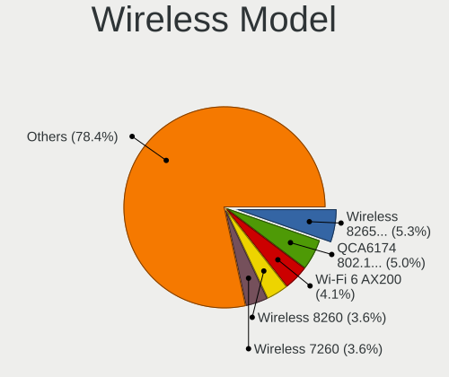

| Model                                                                | Notebooks | Percent |
|----------------------------------------------------------------------|-----------|---------|
| Intel Wireless 8265 / 8275                                           | 34        | 5.32%   |
| Qualcomm Atheros QCA6174 802.11ac Wireless Network Adapter           | 32        | 5.01%   |
| Intel Wi-Fi 6 AX200                                                  | 26        | 4.07%   |
| Intel Wireless 8260                                                  | 23        | 3.6%    |
| Intel Wireless 7260                                                  | 23        | 3.6%    |
| Qualcomm Atheros QCA9565 / AR9565 Wireless Network Adapter           | 20        | 3.13%   |
| Intel Comet Lake PCH-LP CNVi WiFi                                    | 19        | 2.97%   |
| Qualcomm Atheros AR9485 Wireless Network Adapter                     | 18        | 2.82%   |
| Qualcomm Atheros QCA9377 802.11ac Wireless Network Adapter           | 15        | 2.35%   |
| MediaTek MT7921 802.11ax PCIe Wireless Network Adapter [Filogic 330] | 15        | 2.35%   |
| Intel Centrino Advanced-N 6205 [Taylor Peak]                         | 15        | 2.35%   |
| Realtek RTL8822CE 802.11ac PCIe Wireless Network Adapter             | 14        | 2.19%   |
| Intel Wireless 3165                                                  | 14        | 2.19%   |
| Intel Comet Lake PCH CNVi WiFi                                       | 14        | 2.19%   |
| Qualcomm Atheros AR9285 Wireless Network Adapter (PCI-Express)       | 13        | 2.03%   |
| Intel Wireless 7265                                                  | 12        | 1.88%   |
| Intel Centrino Ultimate-N 6300                                       | 12        | 1.88%   |
| Intel Wi-Fi 6 AX201                                                  | 11        | 1.72%   |
| Intel Centrino Advanced-N 6200                                       | 11        | 1.72%   |
| Realtek RTL8821CE 802.11ac PCIe Wireless Network Adapter             | 10        | 1.56%   |
| Intel Alder Lake-P PCH CNVi WiFi                                     | 10        | 1.56%   |
| Intel Gemini Lake PCH CNVi WiFi                                      | 9         | 1.41%   |
| Intel Cannon Lake PCH CNVi WiFi                                      | 9         | 1.41%   |
| Broadcom BCM4313 802.11bgn Wireless Network Adapter                  | 9         | 1.41%   |
| Realtek RTL8822BE 802.11a/b/g/n/ac WiFi adapter                      | 8         | 1.25%   |
| Intel Dual Band Wireless-AC 3168NGW [Stone Peak]                     | 8         | 1.25%   |
| Intel Cannon Point-LP CNVi [Wireless-AC]                             | 8         | 1.25%   |
| Broadcom BCM4322 802.11a/b/g/n Wireless LAN Controller               | 8         | 1.25%   |
| Intel Wireless 3160                                                  | 7         | 1.1%    |
| Intel WiFi Link 5100                                                 | 7         | 1.1%    |
| Intel Tiger Lake PCH CNVi WiFi                                       | 7         | 1.1%    |
| Intel Raptor Lake PCH CNVi WiFi                                      | 7         | 1.1%    |
| Intel Centrino Wireless-N 2230                                       | 7         | 1.1%    |
| Realtek RTL8188CE 802.11b/g/n WiFi Adapter                           | 6         | 0.94%   |
| Intel Jasper Lake PCH CNVi WiFi                                      | 6         | 0.94%   |
| Intel Centrino Advanced-N 6235                                       | 6         | 0.94%   |
| Realtek RTL8852BE PCIe 802.11ax Wireless Network Controller          | 5         | 0.78%   |
| Qualcomm QCNFA765 Wireless Network Adapter                           | 5         | 0.78%   |
| MediaTek MT7922 802.11ax PCI Express Wireless Network Adapter        | 5         | 0.78%   |
| Intel PRO/Wireless 4965 AG or AGN [Kedron] Network Connection        | 5         | 0.78%   |

Ethernet Vendor
---------------

Ethernet vendors

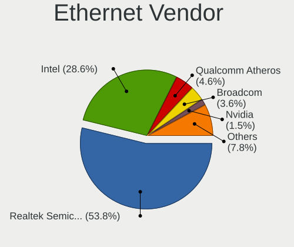

| Vendor                   | Notebooks | Percent |
|--------------------------|-----------|---------|
| Realtek Semiconductor    | 282       | 53.82%  |
| Intel                    | 150       | 28.63%  |
| Qualcomm Atheros         | 24        | 4.58%   |
| Broadcom                 | 19        | 3.63%   |
| Nvidia                   | 8         | 1.53%   |
| DisplayLink              | 7         | 1.34%   |
| Marvell Technology Group | 6         | 1.15%   |
| MediaTek                 | 5         | 0.95%   |
| ASIX Electronics         | 5         | 0.95%   |
| OPPO Electronics         | 3         | 0.57%   |
| Lenovo                   | 3         | 0.57%   |
| Samsung Electronics      | 2         | 0.38%   |
| JMicron Technology       | 2         | 0.38%   |
| Broadcom Limited         | 2         | 0.38%   |
| Xiaomi                   | 1         | 0.19%   |
| vivo                     | 1         | 0.19%   |
| QinHeng Electronics      | 1         | 0.19%   |
| ICS Advent               | 1         | 0.19%   |
| Huawei Technologies      | 1         | 0.19%   |
| Attansic Technology      | 1         | 0.19%   |

Ethernet Model
--------------

Ethernet models

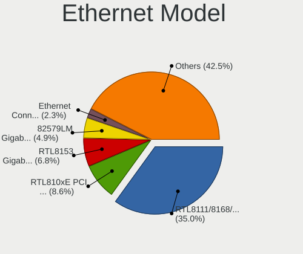

| Model                                                                  | Notebooks | Percent |
|------------------------------------------------------------------------|-----------|---------|
| Realtek RTL8111/8168/8211/8411 PCI Express Gigabit Ethernet Controller | 186       | 34.96%  |
| Realtek RTL810xE PCI Express Fast Ethernet controller                  | 46        | 8.65%   |
| Realtek RTL8153 Gigabit Ethernet Adapter                               | 36        | 6.77%   |
| Intel 82579LM Gigabit Network Connection (Lewisville)                  | 26        | 4.89%   |
| Intel Ethernet Connection (4) I219-LM                                  | 12        | 2.26%   |
| Intel Ethernet Connection (4) I219-V                                   | 11        | 2.07%   |
| Intel Ethernet Connection I219-LM                                      | 10        | 1.88%   |
| Intel Ethernet Connection I218-LM                                      | 9         | 1.69%   |
| Qualcomm Atheros AR8151 v2.0 Gigabit Ethernet                          | 8         | 1.5%    |
| Nvidia MCP79 Ethernet                                                  | 7         | 1.32%   |
| Intel Alder Lake-P PCH CNVi WiFi                                       | 7         | 1.32%   |
| Intel 82577LM Gigabit Network Connection                               | 7         | 1.32%   |
| Realtek RTL8125 2.5GbE Controller                                      | 6         | 1.13%   |
| Intel Ethernet Connection (6) I219-V                                   | 6         | 1.13%   |
| Intel Ethernet Connection (10) I219-V                                  | 6         | 1.13%   |
| Intel 82577LC Gigabit Network Connection                               | 6         | 1.13%   |
| Intel Ethernet Connection (2) I219-LM                                  | 5         | 0.94%   |
| Intel 82579V Gigabit Network Connection                                | 5         | 0.94%   |
| Intel 82567LM Gigabit Network Connection                               | 5         | 0.94%   |
| Broadcom NetXtreme BCM57765 Gigabit Ethernet PCIe                      | 5         | 0.94%   |
| Realtek Killer E3000 2.5GbE Controller                                 | 4         | 0.75%   |
| Realtek Killer E2600 GbE Controller                                    | 3         | 0.56%   |
| Qualcomm Atheros Killer E2500 Gigabit Ethernet Controller              | 3         | 0.56%   |
| MediaTek MT7922 802.11ax PCI Express Wireless Network Adapter          | 3         | 0.56%   |
| Intel Ethernet Connection I217-V                                       | 3         | 0.56%   |
| Intel Ethernet Connection I217-LM                                      | 3         | 0.56%   |
| Intel Ethernet Connection (7) I219-LM                                  | 3         | 0.56%   |
| Intel Ethernet Connection (3) I218-LM                                  | 3         | 0.56%   |
| Intel 82566MM Gigabit Network Connection                               | 3         | 0.56%   |
| Broadcom NetLink BCM57785 Gigabit Ethernet PCIe                        | 3         | 0.56%   |
| ASIX AX88179 Gigabit Ethernet                                          | 3         | 0.56%   |
| Samsung Galaxy series, misc. (tethering mode)                          | 2         | 0.38%   |
| Realtek RTL8852CE PCIe 802.11ax Wireless Network Controller            | 2         | 0.38%   |
| Realtek RTL-8100/8101L/8139 PCI Fast Ethernet Adapter                  | 2         | 0.38%   |
| Realtek PCIe GbE Family Controller                                     | 2         | 0.38%   |
| Qualcomm Atheros Killer E2400 Gigabit Ethernet Controller              | 2         | 0.38%   |
| Qualcomm Atheros Killer E220x Gigabit Ethernet Controller              | 2         | 0.38%   |
| Qualcomm Atheros AR8152 v2.0 Fast Ethernet                             | 2         | 0.38%   |
| Qualcomm Atheros AR8132 Fast Ethernet                                  | 2         | 0.38%   |
| OPPO Ace 3V                                                            | 2         | 0.38%   |

Net Controller Kind
-------------------

Ethernet, WiFi or modem

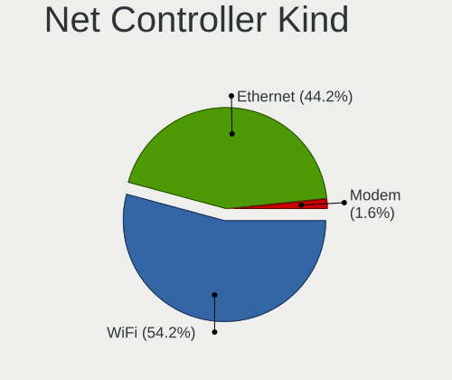

| Kind     | Notebooks | Percent |
|----------|-----------|---------|
| WiFi     | 601       | 54.19%  |
| Ethernet | 490       | 44.18%  |
| Modem    | 18        | 1.62%   |

Used Controller
---------------

Currently used network controller

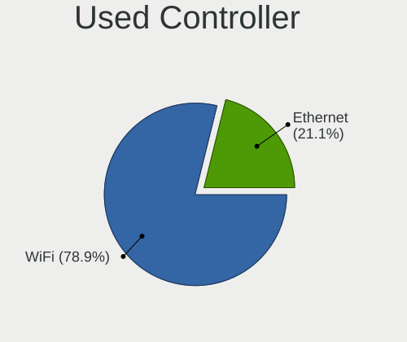

| Kind     | Notebooks | Percent |
|----------|-----------|---------|
| WiFi     | 526       | 78.86%  |
| Ethernet | 141       | 21.14%  |

NICs
----

Total network controllers on board

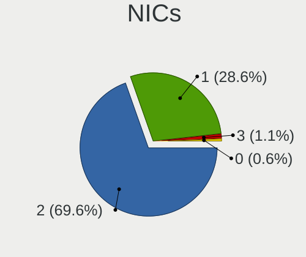

| Total | Notebooks | Percent |
|-------|-----------|---------|
| 2     | 435       | 69.6%   |
| 1     | 179       | 28.64%  |
| 3     | 7         | 1.12%   |
| 0     | 4         | 0.64%   |

IPv6
----

IPv6 vs IPv4

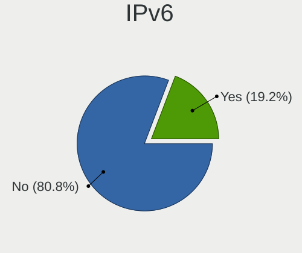

| Used | Notebooks | Percent |
|------|-----------|---------|
| No   | 517       | 80.78%  |
| Yes  | 123       | 19.22%  |

Bluetooth
---------

Bluetooth Vendor
----------------

Controller vendors

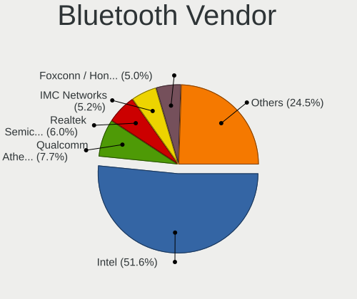

| Vendor                          | Notebooks | Percent |
|---------------------------------|-----------|---------|
| Intel                           | 276       | 51.59%  |
| Qualcomm Atheros Communications | 41        | 7.66%   |
| Realtek Semiconductor           | 32        | 5.98%   |
| IMC Networks                    | 28        | 5.23%   |
| Foxconn / Hon Hai               | 27        | 5.05%   |
| Broadcom                        | 27        | 5.05%   |
| Lite-On Technology              | 26        | 4.86%   |
| Apple                           | 23        | 4.3%    |
| Hewlett-Packard                 | 17        | 3.18%   |
| Toshiba                         | 7         | 1.31%   |
| Dell                            | 6         | 1.12%   |
| Cambridge Silicon Radio         | 5         | 0.93%   |
| Alps Electric                   | 5         | 0.93%   |
| Ralink Technology               | 3         | 0.56%   |
| MediaTek                        | 3         | 0.56%   |
| Realtek                         | 2         | 0.37%   |
| Ralink                          | 2         | 0.37%   |
| Edimax Technology               | 2         | 0.37%   |
| ASUSTek Computer                | 2         | 0.37%   |
| USI                             | 1         | 0.19%   |

Bluetooth Model
---------------

Controller models

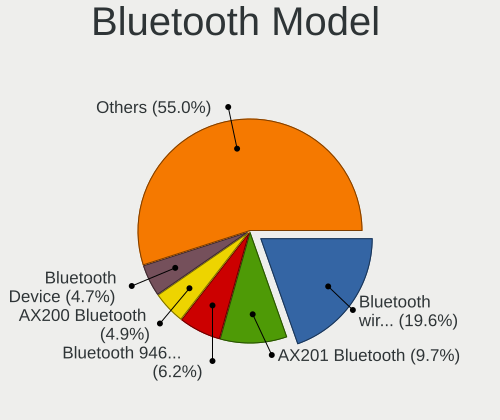

| Model                                               | Notebooks | Percent |
|-----------------------------------------------------|-----------|---------|
| Intel Bluetooth wireless interface                  | 105       | 19.63%  |
| Intel AX201 Bluetooth                               | 52        | 9.72%   |
| Intel Bluetooth 9460/9560 Jefferson Peak (JfP)      | 33        | 6.17%   |
| Intel AX200 Bluetooth                               | 26        | 4.86%   |
| Intel Bluetooth Device                              | 25        | 4.67%   |
| Realtek Bluetooth Radio                             | 21        | 3.93%   |
| Qualcomm Atheros QCA61x4 Bluetooth 4.0              | 15        | 2.8%    |
| IMC Networks Wireless_Device                        | 14        | 2.62%   |
| Qualcomm Atheros  Bluetooth Device                  | 13        | 2.43%   |
| Intel Centrino Bluetooth Wireless Transceiver       | 13        | 2.43%   |
| HP Broadcom 2070 Bluetooth Combo                    | 12        | 2.24%   |
| IMC Networks Bluetooth Radio                        | 11        | 2.06%   |
| Apple Bluetooth Host Controller                     | 11        | 2.06%   |
| Realtek  Bluetooth 4.2 Adapter                      | 10        | 1.87%   |
| Foxconn / Hon Hai Bluetooth Device                  | 10        | 1.87%   |
| Apple Bluetooth USB Host Controller                 | 10        | 1.87%   |
| Intel Wireless-AC 3168 Bluetooth                    | 9         | 1.68%   |
| Lite-On Bluetooth Device                            | 8         | 1.5%    |
| Lite-On Atheros AR3012 Bluetooth                    | 7         | 1.31%   |
| Lite-On Qualcomm Atheros QCA9377 Bluetooth          | 6         | 1.12%   |
| Intel Centrino Advanced-N 6230 Bluetooth adapter    | 6         | 1.12%   |
| Foxconn / Hon Hai MediaTek Bluetooth Adapter        | 6         | 1.12%   |
| Broadcom BCM2045B (BDC-2.1)                         | 6         | 1.12%   |
| Qualcomm Atheros AR3012 Bluetooth 4.0               | 5         | 0.93%   |
| Qualcomm Atheros AR3011 Bluetooth                   | 5         | 0.93%   |
| Cambridge Silicon Radio Bluetooth Dongle (HCI mode) | 5         | 0.93%   |
| Broadcom HP Portable SoftSailing                    | 5         | 0.93%   |
| Intel AX210 Bluetooth                               | 4         | 0.75%   |
| HP Bluetooth 2.0 Interface [Broadcom BCM2045]       | 4         | 0.75%   |
| Broadcom BCM20702A0                                 | 4         | 0.75%   |
| MediaTek Wireless_Device                            | 3         | 0.56%   |
| Intel Wireless-AC 9260 Bluetooth Adapter            | 3         | 0.56%   |
| Foxconn / Hon Hai Wireless_Device                   | 3         | 0.56%   |
| Foxconn / Hon Hai Acer Module                       | 3         | 0.56%   |
| Alps Electric BCM2046 Bluetooth Device              | 3         | 0.56%   |
| Toshiba BRCM Bluetooth Controller BCM2070           | 2         | 0.37%   |
| Toshiba Bluetooth USB Host Controller               | 2         | 0.37%   |
| Toshiba Bluetooth Radio                             | 2         | 0.37%   |
| Realtek Bluetooth Radio                             | 2         | 0.37%   |
| Ralink Motorola BC4 Bluetooth 3.0+HS Adapter        | 2         | 0.37%   |

Sound
-----

Sound Vendor
------------

Sound card vendors

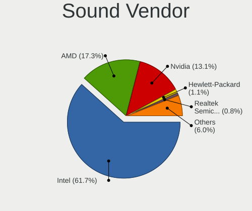

| Vendor                                          | Notebooks | Percent |
|-------------------------------------------------|-----------|---------|
| Intel                                           | 491       | 61.68%  |
| AMD                                             | 138       | 17.34%  |
| Nvidia                                          | 104       | 13.07%  |
| Hewlett-Packard                                 | 9         | 1.13%   |
| Realtek Semiconductor                           | 6         | 0.75%   |
| Logitech                                        | 6         | 0.75%   |
| C-Media Electronics                             | 5         | 0.63%   |
| Plantronics                                     | 4         | 0.5%    |
| Lenovo                                          | 3         | 0.38%   |
| JMTek                                           | 3         | 0.38%   |
| Sony                                            | 2         | 0.25%   |
| Generalplus Technology                          | 2         | 0.25%   |
| DSEA A/S                                        | 2         | 0.25%   |
| XMOS                                            | 1         | 0.13%   |
| Texas Instruments                               | 1         | 0.13%   |
| Tenx Technology                                 | 1         | 0.13%   |
| SteelSeries ApS                                 | 1         | 0.13%   |
| Samson Technologies                             | 1         | 0.13%   |
| Microsoft                                       | 1         | 0.13%   |
| Micro Star International                        | 1         | 0.13%   |
| Licensed by Sony Computer Entertainment America | 1         | 0.13%   |
| KTMicro                                         | 1         | 0.13%   |
| Huawei Technologies                             | 1         | 0.13%   |
| Harman                                          | 1         | 0.13%   |
| GYROCOM C&C                                     | 1         | 0.13%   |
| Google                                          | 1         | 0.13%   |
| GN Netcom                                       | 1         | 0.13%   |
| FiiO Electronics Technology                     | 1         | 0.13%   |
| Creative Technology                             | 1         | 0.13%   |
| Conexant Systems                                | 1         | 0.13%   |
| CMX Systems                                     | 1         | 0.13%   |
| ClearOne Communications                         | 1         | 0.13%   |
| Belkin Components                               | 1         | 0.13%   |
| AST Research                                    | 1         | 0.13%   |

Sound Model
-----------

Sound card models

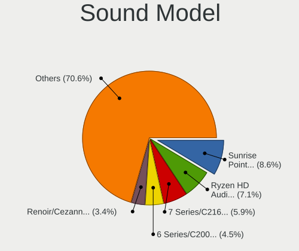

| Model                                                                      | Notebooks | Percent |
|----------------------------------------------------------------------------|-----------|---------|
| Intel Sunrise Point-LP HD Audio                                            | 82        | 8.59%   |
| AMD Ryzen HD Audio Controller                                              | 68        | 7.12%   |
| Intel 7 Series/C216 Chipset Family High Definition Audio Controller        | 56        | 5.86%   |
| Intel 6 Series/C200 Series Chipset Family High Definition Audio Controller | 43        | 4.5%    |
| AMD Renoir/Cezanne HDMI/DP Audio Controller                                | 32        | 3.35%   |
| AMD FCH Azalia Controller                                                  | 24        | 2.51%   |
| Intel Alder Lake PCH-P High Definition Audio Controller                    | 23        | 2.41%   |
| Intel 5 Series/3400 Series Chipset High Definition Audio                   | 23        | 2.41%   |
| AMD Radeon High Definition Audio Controller                                | 23        | 2.41%   |
| Intel Cannon Lake PCH cAVS                                                 | 21        | 2.2%    |
| Intel Haswell-ULT HD Audio Controller                                      | 19        | 1.99%   |
| Intel Comet Lake PCH-LP cAVS                                               | 19        | 1.99%   |
| Intel 8 Series/C220 Series Chipset High Definition Audio Controller        | 19        | 1.99%   |
| Intel 8 Series HD Audio Controller                                         | 19        | 1.99%   |
| AMD Kabini HDMI/DP Audio                                                   | 19        | 1.99%   |
| Intel 82801I (ICH9 Family) HD Audio Controller                             | 18        | 1.88%   |
| Intel Cannon Point-LP High Definition Audio Controller                     | 17        | 1.78%   |
| Intel Xeon E3-1200 v3/4th Gen Core Processor HD Audio Controller           | 16        | 1.68%   |
| Intel Comet Lake PCH cAVS                                                  | 16        | 1.68%   |
| Intel Wildcat Point-LP High Definition Audio Controller                    | 15        | 1.57%   |
| Intel Broadwell-U Audio Controller                                         | 15        | 1.57%   |
| Intel Tiger Lake-LP Smart Sound Technology Audio Controller                | 14        | 1.47%   |
| AMD Raven/Raven2/Fenghuang HDMI/DP Audio Controller                        | 14        | 1.47%   |
| AMD Family 15h (Models 60h-6fh) Audio Controller                           | 14        | 1.47%   |
| Intel Atom Processor Z36xxx/Z37xxx Series High Definition Audio Controller | 13        | 1.36%   |
| AMD High Definition Audio Controller                                       | 12        | 1.26%   |
| Intel Celeron/Pentium Silver Processor High Definition Audio               | 11        | 1.15%   |
| Nvidia TU106 High Definition Audio Controller                              | 10        | 1.05%   |
| Nvidia TU107 GeForce GTX 1650 High Definition Audio Controller             | 9         | 0.94%   |
| Intel Tiger Lake-H HD Audio Controller                                     | 9         | 0.94%   |
| Intel CM238 HD Audio Controller                                            | 9         | 0.94%   |
| Intel 100 Series/C230 Series Chipset Family HD Audio Controller            | 9         | 0.94%   |
| Hewlett-Packard USB Audio                                                  | 9         | 0.94%   |
| Intel Raptor Lake-P/U/H cAVS                                               | 8         | 0.84%   |
| Intel Jasper Lake HD Audio                                                 | 8         | 0.84%   |
| Intel 82801H (ICH8 Family) HD Audio Controller                             | 8         | 0.84%   |
| Nvidia MCP79 High Definition Audio                                         | 7         | 0.73%   |
| Nvidia GA106 High Definition Audio Controller                              | 7         | 0.73%   |
| Nvidia GA104 High Definition Audio Controller                              | 7         | 0.73%   |
| Realtek Semiconductor USB Audio                                            | 6         | 0.63%   |

Memory
------

Memory Vendor
-------------

Memory module vendors

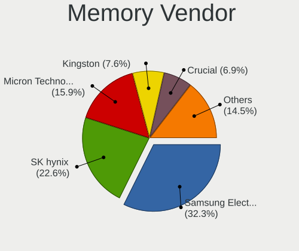

| Vendor              | Notebooks | Percent |
|---------------------|-----------|---------|
| Samsung Electronics | 140       | 32.33%  |
| SK hynix            | 98        | 22.63%  |
| Micron Technology   | 69        | 15.94%  |
| Kingston            | 33        | 7.62%   |
| Crucial             | 30        | 6.93%   |
| Unknown             | 14        | 3.23%   |
| A-DATA Technology   | 10        | 2.31%   |
| Elpida              | 7         | 1.62%   |
| Ramaxel Technology  | 4         | 0.92%   |
| Unknown (ABCD)      | 3         | 0.69%   |
| Team                | 3         | 0.69%   |
| Transcend           | 2         | 0.46%   |
| Strontium           | 2         | 0.46%   |
| Shenzhen Mic        | 2         | 0.46%   |
| Patriot             | 2         | 0.46%   |
| Neo Forza           | 2         | 0.46%   |
| Nanya Technology    | 2         | 0.46%   |
| G.Skill             | 2         | 0.46%   |
| Unknown (D386)      | 1         | 0.23%   |
| Unknown (89F7)      | 1         | 0.23%   |
| Smart               | 1         | 0.23%   |
| Netac               | 1         | 0.23%   |
| fef5                | 1         | 0.23%   |
| Corsair             | 1         | 0.23%   |
| Apacer              | 1         | 0.23%   |
| Unknown             | 1         | 0.23%   |

Memory Model
------------

Memory module models

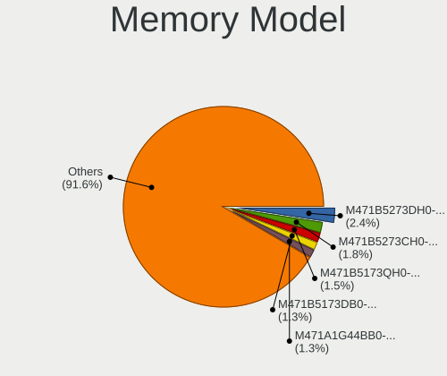

| Model                                                            | Notebooks | Percent |
|------------------------------------------------------------------|-----------|---------|
| Samsung RAM M471B5273DH0-CH9 4GB SODIMM DDR3 1600MT/s            | 11        | 2.42%   |
| Samsung RAM M471B5273CH0-CH9 4GB SODIMM DDR3 1334MT/s            | 8         | 1.76%   |
| Samsung RAM M471B5173QH0-YK0 4GB SODIMM DDR3 1600MT/s            | 7         | 1.54%   |
| Samsung RAM M471B5173DB0-YK0 4GB SODIMM DDR3 1600MT/s            | 6         | 1.32%   |
| Samsung RAM M471A1G44BB0-CWE 8GB SODIMM DDR4 3200MT/s            | 6         | 1.32%   |
| SK hynix RAM HMT451S6BFR8A-PB 4GB SODIMM DDR3 1600MT/s           | 5         | 1.1%    |
| SK hynix RAM HMAB2GS6AMR6N-XN 16GB SODIMM DDR4 3200MT/s          | 5         | 1.1%    |
| SK hynix RAM HMAA1GS6CJR6N-XN 8GB SODIMM DDR4 3200MT/s           | 5         | 1.1%    |
| SK hynix RAM HMA81GS6DJR8N-XN 8GB SODIMM DDR4 3200MT/s           | 5         | 1.1%    |
| Samsung RAM Module 8GB SODIMM DDR4 2400MT/s                      | 5         | 1.1%    |
| Samsung RAM Module 4GB Row Of Chips DDR4 2400MT/s                | 5         | 1.1%    |
| Samsung RAM M471B1G73DB0-YK0 8GB SODIMM DDR3 1600MT/s            | 5         | 1.1%    |
| SK hynix RAM HMA81GS6AFR8N-UH 8GB SODIMM DDR4 2667MT/s           | 4         | 0.88%   |
| Samsung RAM M471B5173EB0-YK0 4GB SODIMM DDR3 1600MT/s            | 4         | 0.88%   |
| Samsung RAM M471A2K43DB1-CWE 16GB SODIMM DDR4 3200MT/s           | 4         | 0.88%   |
| Samsung RAM M471A2K43DB1-CTD 16GB SODIMM DDR4 2667MT/s           | 4         | 0.88%   |
| Samsung RAM M471A1K43DB1-CTD 8GB SODIMM DDR4 2667MT/s            | 4         | 0.88%   |
| Samsung RAM M471A1K43CB1-CRC 8GB SODIMM DDR4 8400MT/s            | 4         | 0.88%   |
| Samsung RAM K4EBE304EB-EGCF 8GB Row Of Chips LPDDR3 1867MT/s     | 4         | 0.88%   |
| Micron RAM 16KTF1G64HZ-1G6E1 8GB SODIMM DDR3 1600MT/s            | 4         | 0.88%   |
| Unknown (ABCD) RAM 123456789012345678 2GB SODIMM LPDDR4 2400MT/s | 3         | 0.66%   |
| SK hynix RAM Module 8GB SODIMM DDR4 2400MT/s                     | 3         | 0.66%   |
| SK hynix RAM Module 8GB SODIMM DDR3 1600MT/s                     | 3         | 0.66%   |
| SK hynix RAM Module 16GB SODIMM DDR4 3200MT/s                    | 3         | 0.66%   |
| Samsung RAM Module 16GB SODIMM DDR4 2667MT/s                     | 3         | 0.66%   |
| Samsung RAM M471A2K43CB1-CTD 16GB SODIMM DDR4 8400MT/s           | 3         | 0.66%   |
| Samsung RAM M471A2G43BB2-CWE 16GB SODIMM DDR4 3200MT/s           | 3         | 0.66%   |
| Samsung RAM M471A1K43EB1-CWE 8GB SODIMM DDR4 3200MT/s            | 3         | 0.66%   |
| Samsung RAM K3KL8L80CM-MGCT 2GB Row Of Chips LPDDR5 7500MT/s     | 3         | 0.66%   |
| Micron RAM 8ATF1G64HZ-3G2J1 8GB SODIMM DDR4 3200MT/s             | 3         | 0.66%   |
| Micron RAM 8ATF1G64HZ-2G6E1 8GB SODIMM DDR4 2667MT/s             | 3         | 0.66%   |
| Micron RAM 16KTF51264HZ-1G6M1 4GB SODIMM DDR3 1600MT/s           | 3         | 0.66%   |
| Crucial RAM CT51264BF160BJ.C8F 4GB SODIMM DDR3 1600MT/s          | 3         | 0.66%   |
| Unknown RAM Module 4096MB SODIMM DDR3                            | 2         | 0.44%   |
| Unknown RAM Module 2GB SODIMM DDR3                               | 2         | 0.44%   |
| Unknown RAM Module 2GB SODIMM DDR2 667MT/s                       | 2         | 0.44%   |
| SK hynix RAM Module 8GB SODIMM DDR4 2667MT/s                     | 2         | 0.44%   |
| SK hynix RAM Module 16GB SODIMM DDR5 4800MT/s                    | 2         | 0.44%   |
| SK hynix RAM HYMP125S64CP8-S6 2GB SODIMM DDR2 975MT/s            | 2         | 0.44%   |
| SK hynix RAM HYMP125S64CP8-S6 2GB SODIMM DDR2 800MT/s            | 2         | 0.44%   |

Memory Kind
-----------

Memory module kinds

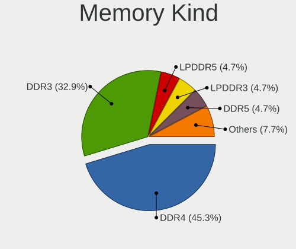

| Kind    | Notebooks | Percent |
|---------|-----------|---------|
| DDR4    | 164       | 45.3%   |
| DDR3    | 119       | 32.87%  |
| LPDDR5  | 17        | 4.7%    |
| LPDDR3  | 17        | 4.7%    |
| DDR5    | 17        | 4.7%    |
| DDR2    | 10        | 2.76%   |
| SDRAM   | 8         | 2.21%   |
| LPDDR4  | 8         | 2.21%   |
| Unknown | 2         | 0.55%   |

Memory Form Factor
------------------

Physical design of the memory module

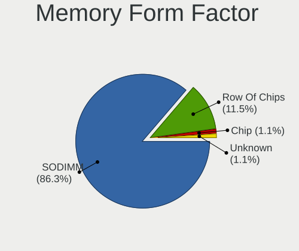

| Name         | Notebooks | Percent |
|--------------|-----------|---------|
| SODIMM       | 314       | 86.26%  |
| Row Of Chips | 42        | 11.54%  |
| Chip         | 4         | 1.1%    |
| Unknown      | 4         | 1.1%    |

Memory Size
-----------

Memory module size

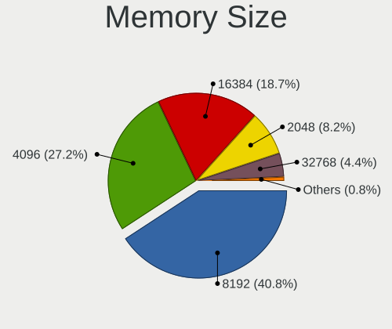

| Size  | Notebooks | Percent |
|-------|-----------|---------|
| 8192  | 159       | 40.77%  |
| 4096  | 106       | 27.18%  |
| 16384 | 73        | 18.72%  |
| 2048  | 32        | 8.21%   |
| 32768 | 17        | 4.36%   |
| 1024  | 2         | 0.51%   |
| 49152 | 1         | 0.26%   |

Memory Speed
------------

Memory module speed

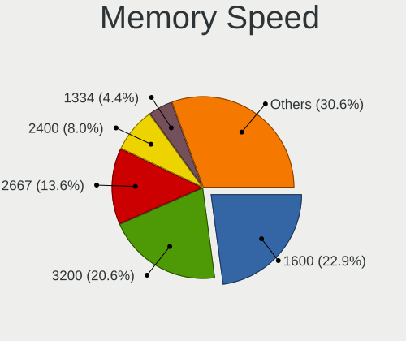

| Speed   | Notebooks | Percent |
|---------|-----------|---------|
| 1600    | 89        | 22.88%  |
| 3200    | 80        | 20.57%  |
| 2667    | 53        | 13.62%  |
| 2400    | 31        | 7.97%   |
| 1334    | 17        | 4.37%   |
| 2133    | 15        | 3.86%   |
| 4800    | 12        | 3.08%   |
| 1867    | 12        | 3.08%   |
| 1067    | 10        | 2.57%   |
| 1333    | 9         | 2.31%   |
| 8400    | 8         | 2.06%   |
| 7500    | 8         | 2.06%   |
| 6400    | 7         | 1.8%    |
| 5600    | 6         | 1.54%   |
| 667     | 6         | 1.54%   |
| Unknown | 6         | 1.54%   |
| 4199    | 5         | 1.29%   |
| 800     | 3         | 0.77%   |
| 3733    | 2         | 0.51%   |
| 2048    | 2         | 0.51%   |
| 975     | 2         | 0.51%   |
| 8533    | 1         | 0.26%   |
| 8000    | 1         | 0.26%   |
| 4267    | 1         | 0.26%   |
| 4266    | 1         | 0.26%   |
| 3266    | 1         | 0.26%   |
| 1866    | 1         | 0.26%   |

Printers & scanners
-------------------

Printer Vendor
--------------

Printer device vendors

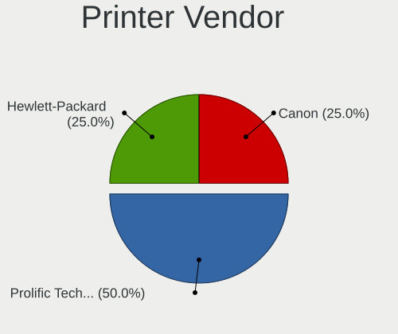

| Vendor              | Notebooks | Percent |
|---------------------|-----------|---------|
| Prolific Technology | 2         | 50%     |
| Hewlett-Packard     | 1         | 25%     |
| Canon               | 1         | 25%     |

Printer Model
-------------

Printer device models

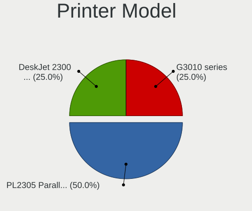

| Model                         | Notebooks | Percent |
|-------------------------------|-----------|---------|
| Prolific PL2305 Parallel Port | 2         | 50%     |
| HP DeskJet 2300 series        | 1         | 25%     |
| Canon G3010 series            | 1         | 25%     |

Scanner Vendor
--------------

Scanner device vendors

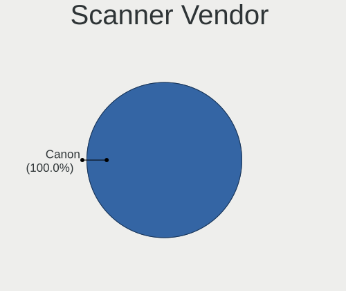

| Vendor | Notebooks | Percent |
|--------|-----------|---------|
| Canon  | 1         | 100%    |

Scanner Model
-------------

Scanner device models

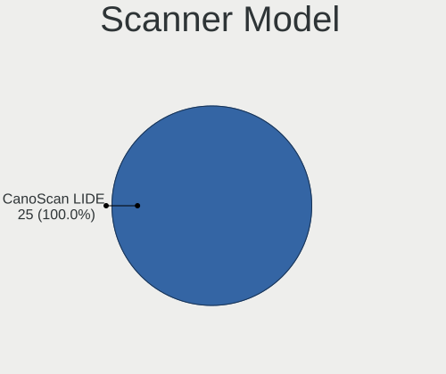

| Model                  | Notebooks | Percent |
|------------------------|-----------|---------|
| Canon CanoScan LIDE 25 | 1         | 100%    |

Camera
------

Camera Vendor
-------------

Camera device vendors

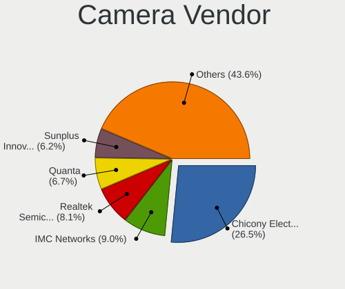

| Vendor                                 | Notebooks | Percent |
|----------------------------------------|-----------|---------|
| Chicony Electronics                    | 151       | 26.54%  |
| IMC Networks                           | 51        | 8.96%   |
| Realtek Semiconductor                  | 46        | 8.08%   |
| Quanta                                 | 38        | 6.68%   |
| Sunplus Innovation Technology          | 35        | 6.15%   |
| Microdia                               | 35        | 6.15%   |
| Bison Electronics                      | 33        | 5.8%    |
| Cheng Uei Precision Industry (Foxlink) | 23        | 4.04%   |
| Apple                                  | 21        | 3.69%   |
| Lite-On Technology                     | 19        | 3.34%   |
| Suyin                                  | 15        | 2.64%   |
| Luxvisions Innotech Limited            | 14        | 2.46%   |
| Logitech                               | 12        | 2.11%   |
| Syntek                                 | 11        | 1.93%   |
| Ricoh                                  | 9         | 1.58%   |
| Sonix Technology                       | 8         | 1.41%   |
| Samsung Electronics                    | 7         | 1.23%   |
| Alcor Micro                            | 6         | 1.05%   |
| ShineTech                              | 5         | 0.88%   |
| Primax Electronics                     | 5         | 0.88%   |
| Silicon Motion                         | 4         | 0.7%    |
| Lenovo                                 | 3         | 0.53%   |
| Microsoft                              | 2         | 0.35%   |
| Importek                               | 2         | 0.35%   |
| ALi                                    | 2         | 0.35%   |
| Acer                                   | 2         | 0.35%   |
| Z-Star Microelectronics                | 1         | 0.18%   |
| Yealink Network Technology             | 1         | 0.18%   |
| ValueHD                                | 1         | 0.18%   |
| MacroSilicon                           | 1         | 0.18%   |
| Intel                                  | 1         | 0.18%   |
| Generalplus Technology                 | 1         | 0.18%   |
| GEMBIRD                                | 1         | 0.18%   |
| DigiTech                               | 1         | 0.18%   |
| AVer Information                       | 1         | 0.18%   |
| Aveo Technology                        | 1         | 0.18%   |

Camera Model
------------

Camera device models

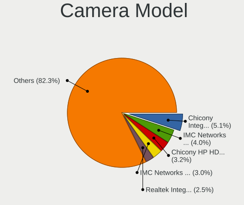

| Model                                                          | Notebooks | Percent |
|----------------------------------------------------------------|-----------|---------|
| Chicony Integrated Camera                                      | 29        | 5.08%   |
| IMC Networks USB2.0 HD UVC WebCam                              | 23        | 4.03%   |
| Chicony HP HD Camera                                           | 18        | 3.15%   |
| IMC Networks Integrated Camera                                 | 17        | 2.98%   |
| Realtek Integrated_Webcam_HD                                   | 14        | 2.45%   |
| Chicony HD WebCam                                              | 14        | 2.45%   |
| Bison Integrated Camera                                        | 13        | 2.28%   |
| Microdia Integrated_Webcam_HD                                  | 12        | 2.1%    |
| Syntek Integrated Camera                                       | 8         | 1.4%    |
| Lite-On Integrated Camera                                      | 8         | 1.4%    |
| Chicony VGA Webcam                                             | 8         | 1.4%    |
| Chicony TOSHIBA Web Camera - HD                                | 8         | 1.4%    |
| Chicony HP HD Webcam                                           | 8         | 1.4%    |
| Apple Built-in iSight                                          | 8         | 1.4%    |
| Sunplus Integrated_Webcam_HD                                   | 7         | 1.23%   |
| Sunplus HP HD Webcam [Fixed]                                   | 7         | 1.23%   |
| Samsung Galaxy series, misc. (MTP mode)                        | 7         | 1.23%   |
| Quanta HP HD Camera                                            | 7         | 1.23%   |
| Microdia Integrated Webcam HD                                  | 7         | 1.23%   |
| Cheng Uei Precision Industry (Foxlink) Webcam                  | 7         | 1.23%   |
| Sonix USB2.0 HD UVC WebCam                                     | 6         | 1.05%   |
| Realtek HP Truevision HD                                       | 6         | 1.05%   |
| Realtek USB Camera                                             | 5         | 0.88%   |
| Quanta HP TrueVision HD Camera                                 | 5         | 0.88%   |
| Quanta HD User Facing                                          | 5         | 0.88%   |
| Chicony HP Truevision HD                                       | 5         | 0.88%   |
| Chicony CNF9055 Toshiba Webcam                                 | 5         | 0.88%   |
| Bison HD Webcam                                                | 5         | 0.88%   |
| Apple iPhone 5/5C/5S/6/SE/7/8/X                                | 5         | 0.88%   |
| Apple FaceTime HD Camera                                       | 5         | 0.88%   |
| Sunplus HD WebCam                                              | 4         | 0.7%    |
| Quanta HD Webcam                                               | 4         | 0.7%    |
| Cheng Uei Precision Industry (Foxlink) HP TrueVision HD Camera | 4         | 0.7%    |
| Suyin HP TrueVision HD Integrated Webcam                       | 3         | 0.53%   |
| Suyin HP Truevision HD                                         | 3         | 0.53%   |
| Sunplus HP TrueVision HD Camera                                | 3         | 0.53%   |
| ShineTech USB2.0 HD UVC WebCam                                 | 3         | 0.53%   |
| Realtek Integrated Webcam_HD                                   | 3         | 0.53%   |
| Realtek Integrated Webcam HD                                   | 3         | 0.53%   |
| Quanta Laptop_Integrated_Webcam_2HDM                           | 3         | 0.53%   |

Security
--------

Fingerprint Vendor
------------------

Fingerprint sensor vendors

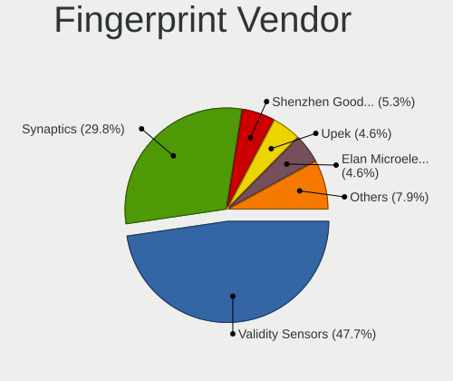

| Vendor                     | Notebooks | Percent |
|----------------------------|-----------|---------|
| Validity Sensors           | 72        | 47.68%  |
| Synaptics                  | 45        | 29.8%   |
| Shenzhen Goodix Technology | 8         | 5.3%    |
| Upek                       | 7         | 4.64%   |
| Elan Microelectronics      | 7         | 4.64%   |
| AuthenTec                  | 7         | 4.64%   |
| STMicroelectronics         | 3         | 1.99%   |
| LighTuning Technology      | 2         | 1.32%   |

Fingerprint Model
-----------------

Fingerprint sensor models

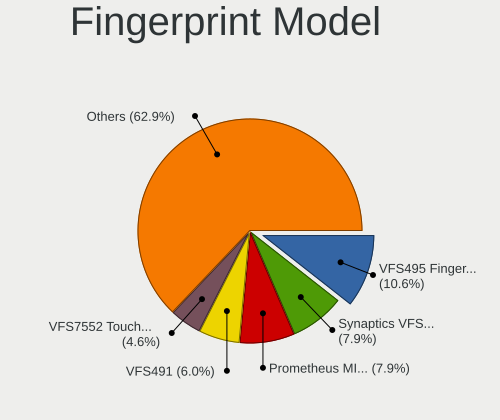

| Model                                                                      | Notebooks | Percent |
|----------------------------------------------------------------------------|-----------|---------|
| Validity Sensors VFS495 Fingerprint Reader                                 | 16        | 10.6%   |
| Validity Sensors Synaptics VFS7552 Touch Fingerprint Sensor with PurePrint | 12        | 7.95%   |
| Synaptics Prometheus MIS Touch Fingerprint Reader                          | 12        | 7.95%   |
| Validity Sensors VFS491                                                    | 9         | 5.96%   |
| Validity Sensors VFS7552 Touch Fingerprint Sensor                          | 7         | 4.64%   |
| Upek Biometric Touchchip/Touchstrip Fingerprint Sensor                     | 7         | 4.64%   |
| Synaptics FS7604 Touch Fingerprint Sensor with PurePrint                   | 7         | 4.64%   |
| Validity Sensors VFS451 Fingerprint Reader                                 | 6         | 3.97%   |
| Synaptics  FS7604 Touch Fingerprint Sensor with PurePrint                  | 6         | 3.97%   |
| Synaptics Fingerprint reader [HP G6]                                       | 6         | 3.97%   |
| Validity Sensors VFS471 Fingerprint Reader                                 | 5         | 3.31%   |
| Shenzhen Goodix  FingerPrint Device                                        | 5         | 3.31%   |
| Validity Sensors VFS7500 Touch Fingerprint Sensor                          | 4         | 2.65%   |
| Validity Sensors Synaptics WBDI                                            | 4         | 2.65%   |
| Validity Sensors Swipe Fingerprint Sensor                                  | 4         | 2.65%   |
| Synaptics UWP WBDI Device                                                  | 4         | 2.65%   |
| Elan ELAN:Fingerprint                                                      | 4         | 2.65%   |
| Synaptics Metallica MIS Touch Fingerprint Reader                           | 3         | 1.99%   |
| STMicroelectronics Fingerprint Reader                                      | 3         | 1.99%   |
| Shenzhen Goodix FingerPrint                                                | 3         | 1.99%   |
| Elan ELAN:ARM-M4                                                           | 3         | 1.99%   |
| AuthenTec Fingerprint Sensor                                               | 3         | 1.99%   |
| Validity Sensors VFS301 Fingerprint Reader                                 | 2         | 1.32%   |
| Validity Sensors VFS 5011 fingerprint sensor                               | 2         | 1.32%   |
| Synaptics Prometheus Fingerprint Reader                                    | 2         | 1.32%   |
| Synaptics Metallica MOH Touch Fingerprint Reader                           | 2         | 1.32%   |
| LighTuning EgisTec Touch Fingerprint Sensor                                | 2         | 1.32%   |
| AuthenTec AES2501 Fingerprint Sensor                                       | 2         | 1.32%   |
| Validity Sensors Fingerprint scanner                                       | 1         | 0.66%   |
| Synaptics WBDI                                                             | 1         | 0.66%   |
| Synaptics UWP WBDI                                                         | 1         | 0.66%   |
| AuthenTec AES2810                                                          | 1         | 0.66%   |
| AuthenTec AES1600                                                          | 1         | 0.66%   |
| Unknown                                                                    | 1         | 0.66%   |

Chipcard Vendor
---------------

Chipcard module vendors

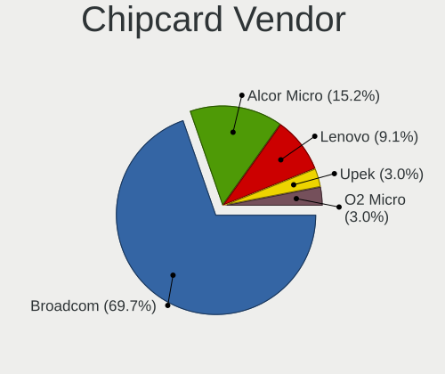

| Vendor      | Notebooks | Percent |
|-------------|-----------|---------|
| Broadcom    | 23        | 69.7%   |
| Alcor Micro | 5         | 15.15%  |
| Lenovo      | 3         | 9.09%   |
| Upek        | 1         | 3.03%   |
| O2 Micro    | 1         | 3.03%   |

Chipcard Model
--------------

Chipcard module models

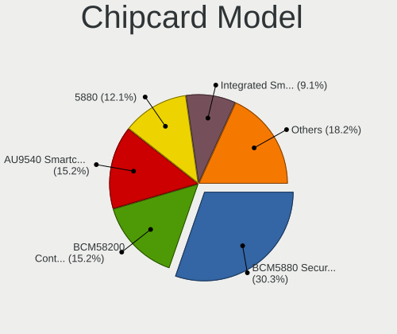

| Model                                                                        | Notebooks | Percent |
|------------------------------------------------------------------------------|-----------|---------|
| Broadcom BCM5880 Secure Applications Processor                               | 10        | 30.3%   |
| Broadcom BCM58200 ControlVault 3 (FingerPrint sensor + Contacted SmartCard)  | 5         | 15.15%  |
| Alcor Micro AU9540 Smartcard Reader                                          | 5         | 15.15%  |
| Broadcom 5880                                                                | 4         | 12.12%  |
| Lenovo Integrated Smart Card Reader                                          | 3         | 9.09%   |
| Broadcom BCM5880 Secure Applications Processor with fingerprint swipe sensor | 2         | 6.06%   |
| Broadcom 58200                                                               | 2         | 6.06%   |
| Upek TouchChip Fingerprint Coprocessor (WBF advanced mode)                   | 1         | 3.03%   |
| O2 Micro OZ776 CCID Smartcard Reader                                         | 1         | 3.03%   |

Unsupported
-----------

Unsupported Devices
-------------------

Total unsupported devices on board

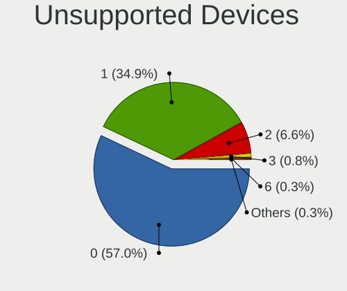

| Total | Notebooks | Percent |
|-------|-----------|---------|
| 0     | 369       | 57.03%  |
| 1     | 226       | 34.93%  |
| 2     | 43        | 6.65%   |
| 3     | 5         | 0.77%   |
| 6     | 2         | 0.31%   |
| 5     | 1         | 0.15%   |
| 4     | 1         | 0.15%   |

Unsupported Device Types
------------------------

Types of unsupported devices

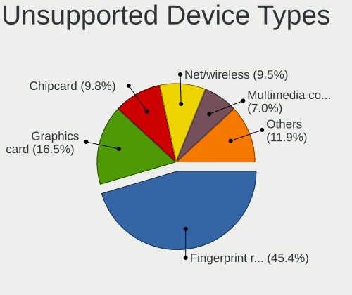

| Type                     | Notebooks | Percent |
|--------------------------|-----------|---------|
| Fingerprint reader       | 149       | 45.43%  |
| Graphics card            | 54        | 16.46%  |
| Chipcard                 | 32        | 9.76%   |
| Net/wireless             | 31        | 9.45%   |
| Multimedia controller    | 23        | 7.01%   |
| Camera                   | 10        | 3.05%   |
| Communication controller | 6         | 1.83%   |
| Storage                  | 5         | 1.52%   |
| Net/ethernet             | 4         | 1.22%   |
| Sound                    | 3         | 0.91%   |
| Bluetooth                | 3         | 0.91%   |
| Network                  | 2         | 0.61%   |
| Firewire controller      | 2         | 0.61%   |
| Card reader              | 2         | 0.61%   |
| Modem                    | 1         | 0.3%    |
| Flash memory             | 1         | 0.3%    |

