Linux in New Zealand - Tested Hardware & Statistics
---------------------------------------------------

A project to collect tested hardware configurations for Linux in New Zealand.

Anyone can contribute to this report by the [hw-probe](https://github.com/linuxhw/hw-probe) tool:

    sudo -E hw-probe -all -upload

Please contribute! Especially if your hardware is rare.

This is a report for all computer types. See also reports for [desktops](/Location/New_Zealand/Desktop/README.md) and [notebooks](/Location/New_Zealand/Notebook/README.md).

Contents
--------

* [ Test Cases ](#test-cases)

* [ System ](#system)
  - [ OS                       ](#os)
  - [ OS Family                ](#os-family)
  - [ Kernel                   ](#kernel)
  - [ Kernel Family            ](#kernel-family)
  - [ Kernel Major Ver.        ](#kernel-major-ver)
  - [ Arch                     ](#arch)
  - [ DE                       ](#de)
  - [ Display Server           ](#display-server)
  - [ Display Manager          ](#display-manager)
  - [ OS Lang                  ](#os-lang)
  - [ Boot Mode                ](#boot-mode)
  - [ Filesystem               ](#filesystem)
  - [ Part. scheme             ](#part-scheme)
  - [ Dual Boot with Linux/BSD ](#dual-boot-with-linuxbsd)
  - [ Dual Boot (Win)          ](#dual-boot-win)

* [ Board ](#board)
  - [ Vendor                   ](#vendor)
  - [ Model                    ](#model)
  - [ Model Family             ](#model-family)
  - [ MFG Year                 ](#mfg-year)
  - [ Form Factor              ](#form-factor)
  - [ Secure Boot              ](#secure-boot)
  - [ Coreboot                 ](#coreboot)
  - [ RAM Size                 ](#ram-size)
  - [ RAM Used                 ](#ram-used)
  - [ Total Drives             ](#total-drives)
  - [ Has CD-ROM               ](#has-cd-rom)
  - [ Has Ethernet             ](#has-ethernet)
  - [ Has WiFi                 ](#has-wifi)
  - [ Has Bluetooth            ](#has-bluetooth)

* [ Location ](#location)
  - [ Country                  ](#country)
  - [ City                     ](#city)

* [ Drives ](#drives)
  - [ Drive Vendor             ](#drive-vendor)
  - [ Drive Model              ](#drive-model)
  - [ HDD Vendor               ](#hdd-vendor)
  - [ SSD Vendor               ](#ssd-vendor)
  - [ Drive Kind               ](#drive-kind)
  - [ Drive Connector          ](#drive-connector)
  - [ Drive Size               ](#drive-size)
  - [ Space Total              ](#space-total)
  - [ Space Used               ](#space-used)
  - [ Malfunc. Drives          ](#malfunc-drives)
  - [ Malfunc. Drive Vendor    ](#malfunc-drive-vendor)
  - [ Malfunc. HDD Vendor      ](#malfunc-hdd-vendor)
  - [ Malfunc. Drive Kind      ](#malfunc-drive-kind)
  - [ Failed Drives            ](#failed-drives)
  - [ Failed Drive Vendor      ](#failed-drive-vendor)
  - [ Drive Status             ](#drive-status)

* [ Storage controller ](#storage-controller)
  - [ Storage Vendor           ](#storage-vendor)
  - [ Storage Model            ](#storage-model)
  - [ Storage Kind             ](#storage-kind)

* [ Processor ](#processor)
  - [ CPU Vendor               ](#cpu-vendor)
  - [ CPU Model                ](#cpu-model)
  - [ CPU Model Family         ](#cpu-model-family)
  - [ CPU Cores                ](#cpu-cores)
  - [ CPU Sockets              ](#cpu-sockets)
  - [ CPU Threads              ](#cpu-threads)
  - [ CPU Op-Modes             ](#cpu-op-modes)
  - [ CPU Microcode            ](#cpu-microcode)
  - [ CPU Microarch            ](#cpu-microarch)

* [ Graphics ](#graphics)
  - [ GPU Vendor               ](#gpu-vendor)
  - [ GPU Model                ](#gpu-model)
  - [ GPU Combo                ](#gpu-combo)
  - [ GPU Driver               ](#gpu-driver)
  - [ GPU Memory               ](#gpu-memory)

* [ Monitor ](#monitor)
  - [ Monitor Vendor           ](#monitor-vendor)
  - [ Monitor Model            ](#monitor-model)
  - [ Monitor Resolution       ](#monitor-resolution)
  - [ Monitor Diagonal         ](#monitor-diagonal)
  - [ Monitor Width            ](#monitor-width)
  - [ Aspect Ratio             ](#aspect-ratio)
  - [ Monitor Area             ](#monitor-area)
  - [ Pixel Density            ](#pixel-density)
  - [ Multiple Monitors        ](#multiple-monitors)

* [ Network ](#network)
  - [ Net Controller Vendor    ](#net-controller-vendor)
  - [ Net Controller Model     ](#net-controller-model)
  - [ Wireless Vendor          ](#wireless-vendor)
  - [ Wireless Model           ](#wireless-model)
  - [ Ethernet Vendor          ](#ethernet-vendor)
  - [ Ethernet Model           ](#ethernet-model)
  - [ Net Controller Kind      ](#net-controller-kind)
  - [ Used Controller          ](#used-controller)
  - [ NICs                     ](#nics)
  - [ IPv6                     ](#ipv6)

* [ Bluetooth ](#bluetooth)
  - [ Bluetooth Vendor         ](#bluetooth-vendor)
  - [ Bluetooth Model          ](#bluetooth-model)

* [ Sound ](#sound)
  - [ Sound Vendor             ](#sound-vendor)
  - [ Sound Model              ](#sound-model)

* [ Memory ](#memory)
  - [ Memory Vendor            ](#memory-vendor)
  - [ Memory Model             ](#memory-model)
  - [ Memory Kind              ](#memory-kind)
  - [ Memory Form Factor       ](#memory-form-factor)
  - [ Memory Size              ](#memory-size)
  - [ Memory Speed             ](#memory-speed)

* [ Printers & scanners ](#printers--scanners)
  - [ Printer Vendor           ](#printer-vendor)
  - [ Printer Model            ](#printer-model)
  - [ Scanner Vendor           ](#scanner-vendor)
  - [ Scanner Model            ](#scanner-model)

* [ Camera ](#camera)
  - [ Camera Vendor            ](#camera-vendor)
  - [ Camera Model             ](#camera-model)

* [ Security ](#security)
  - [ Fingerprint Vendor       ](#fingerprint-vendor)
  - [ Fingerprint Model        ](#fingerprint-model)
  - [ Chipcard Vendor          ](#chipcard-vendor)
  - [ Chipcard Model           ](#chipcard-model)

* [ Unsupported ](#unsupported)
  - [ Unsupported Devices      ](#unsupported-devices)
  - [ Unsupported Device Types ](#unsupported-device-types)

Test Cases
----------

Total: 2001

| Vendor        | Model                       | Form-Factor | Probe                                                      | Date         |
|---------------|-----------------------------|-------------|------------------------------------------------------------|--------------|
| ASUSTek       | T100HAN                     | Notebook    | [c7df26701e](https://linux-hardware.org/?probe=c7df26701e) | Jan 03, 2026 |
| HP            | ENVY TS 15                  | Notebook    | [bfb610c8d2](https://linux-hardware.org/?probe=bfb610c8d2) | Dec 31, 2025 |
| Dell          | 0NW6H5 A00                  | Desktop     | [09c67dda57](https://linux-hardware.org/?probe=09c67dda57) | Dec 31, 2025 |
| Gigabyte      | B450M S2H                   | Desktop     | [65e3875f1f](https://linux-hardware.org/?probe=65e3875f1f) | Dec 29, 2025 |
| Dell          | XPS 15 9570                 | Notebook    | [23f432fe9b](https://linux-hardware.org/?probe=23f432fe9b) | Dec 29, 2025 |
| ASUSTek       | ASUS TUF Gaming A14 FA40... | Notebook    | [3cd2a723f5](https://linux-hardware.org/?probe=3cd2a723f5) | Dec 27, 2025 |
| Gigabyte      | B850M FORCE WIFI6E          | Desktop     | [9cce6759e5](https://linux-hardware.org/?probe=9cce6759e5) | Dec 27, 2025 |
| Lenovo        | 0B98401 PRO                 | Desktop     | [673b67a1df](https://linux-hardware.org/?probe=673b67a1df) | Dec 27, 2025 |
| Supermicro    | X8DAH                       | Server      | [89f9531418](https://linux-hardware.org/?probe=89f9531418) | Dec 27, 2025 |
| ASUSTek       | TUF Gaming Z690-PLUS WIF... | Desktop     | [782e98d27f](https://linux-hardware.org/?probe=782e98d27f) | Dec 26, 2025 |
| Lenovo        | ThinkPad P16 Gen 3 21RQC... | Notebook    | [55b55a6f86](https://linux-hardware.org/?probe=55b55a6f86) | Dec 25, 2025 |
| Lenovo        | G50-80 80L0                 | Notebook    | [c353c157ad](https://linux-hardware.org/?probe=c353c157ad) | Dec 24, 2025 |
| Dell          | G15 5515                    | Notebook    | [9d42a4ecec](https://linux-hardware.org/?probe=9d42a4ecec) | Dec 24, 2025 |
| Lenovo        | ThinkPad P16s Gen 2 21K9... | Notebook    | [beb94d346f](https://linux-hardware.org/?probe=beb94d346f) | Dec 23, 2025 |
| Gigabyte      | B550 AORUS PRO AC           | Desktop     | [cd3554fe85](https://linux-hardware.org/?probe=cd3554fe85) | Dec 21, 2025 |
| Dell          | Inspiron 15 3525            | Notebook    | [e1b629939b](https://linux-hardware.org/?probe=e1b629939b) | Dec 21, 2025 |
| HP            | Laptop 15-fc0xxx            | Notebook    | [b1193c38c8](https://linux-hardware.org/?probe=b1193c38c8) | Dec 21, 2025 |
| Lenovo        | Yoga 520-14IKB 81C8         | Convertible | [a0fdc83f08](https://linux-hardware.org/?probe=a0fdc83f08) | Dec 20, 2025 |
| Lenovo        | G50-80 80L0                 | Notebook    | [0fdc5cbe39](https://linux-hardware.org/?probe=0fdc5cbe39) | Dec 20, 2025 |
| Gigabyte      | H77-D3H                     | Desktop     | [970618be47](https://linux-hardware.org/?probe=970618be47) | Dec 19, 2025 |
| Gigabyte      | H77-D3H                     | Desktop     | [b0d1dbf1c5](https://linux-hardware.org/?probe=b0d1dbf1c5) | Dec 19, 2025 |
| HP            | 8058                        | All in one  | [fbdfebe39d](https://linux-hardware.org/?probe=fbdfebe39d) | Dec 19, 2025 |
| HP            | EliteBook 840 G6            | Notebook    | [487e9dc08a](https://linux-hardware.org/?probe=487e9dc08a) | Dec 19, 2025 |
| Gigabyte      | Z790 GAMING X AX            | Desktop     | [f553dd88d5](https://linux-hardware.org/?probe=f553dd88d5) | Dec 18, 2025 |
| ASUSTek       | ROG Zephyrus G15 GA503RM... | Notebook    | [bdff06b914](https://linux-hardware.org/?probe=bdff06b914) | Dec 16, 2025 |
| Lenovo        | Legion 5P 15IMH05H 82AW     | Notebook    | [d8bcbef6a7](https://linux-hardware.org/?probe=d8bcbef6a7) | Dec 16, 2025 |
| Apple         | Mac-81E3E92DD6088272 iMa... | All in one  | [7d85d9b058](https://linux-hardware.org/?probe=7d85d9b058) | Dec 14, 2025 |
| Apple         | Mac-81E3E92DD6088272 iMa... | All in one  | [c90235f9a6](https://linux-hardware.org/?probe=c90235f9a6) | Dec 13, 2025 |
| Gigabyte      | AB350-Gaming 3-CF           | Notebook    | [f2f7b9f8d6](https://linux-hardware.org/?probe=f2f7b9f8d6) | Dec 13, 2025 |
| Dell          | XPS 13 9343                 | Notebook    | [4cbf9fa720](https://linux-hardware.org/?probe=4cbf9fa720) | Dec 12, 2025 |
| Lenovo        | ThinkPad T410 2522AZ6       | Notebook    | [20b34c851d](https://linux-hardware.org/?probe=20b34c851d) | Dec 11, 2025 |
| MACHINIST     | E5-V2.82H V1.1              | Desktop     | [b256500f89](https://linux-hardware.org/?probe=b256500f89) | Dec 11, 2025 |
| ASRock        | Z87E-ITX                    | Desktop     | [e925001a47](https://linux-hardware.org/?probe=e925001a47) | Dec 11, 2025 |
| Microsoft     | Surface Pro 4               | Tablet      | [66078b0262](https://linux-hardware.org/?probe=66078b0262) | Dec 09, 2025 |
| Acer          | Aspire ES1-512              | Notebook    | [3c6489822b](https://linux-hardware.org/?probe=3c6489822b) | Dec 08, 2025 |
| Acer          | Aspire ES1-531              | Notebook    | [01843603ee](https://linux-hardware.org/?probe=01843603ee) | Dec 08, 2025 |
| Acer          | Aspire ES1-531              | Notebook    | [b8f6ce5b38](https://linux-hardware.org/?probe=b8f6ce5b38) | Dec 07, 2025 |
| Gigabyte      | B550 AORUS PRO AC           | Desktop     | [e5d1520d18](https://linux-hardware.org/?probe=e5d1520d18) | Dec 07, 2025 |
| ASUSTek       | ROG STRIX X570-F GAMING     | Desktop     | [2be248c891](https://linux-hardware.org/?probe=2be248c891) | Dec 07, 2025 |
| MSI           | B550M PRO-VDH               | Desktop     | [a8180724ec](https://linux-hardware.org/?probe=a8180724ec) | Dec 07, 2025 |
| ASUSTek       | PRIME Z270-A                | Desktop     | [0310aedec9](https://linux-hardware.org/?probe=0310aedec9) | Dec 07, 2025 |
| Gigabyte      | B450 I AORUS PRO WIFI-CF    | Desktop     | [bc24f8a902](https://linux-hardware.org/?probe=bc24f8a902) | Dec 06, 2025 |
| ASUSTek       | P8H61-M LE                  | Desktop     | [33d4919eea](https://linux-hardware.org/?probe=33d4919eea) | Dec 05, 2025 |
| HP            | ENVY TS 15                  | Notebook    | [43d0571ea8](https://linux-hardware.org/?probe=43d0571ea8) | Dec 03, 2025 |
| HP            | Laptop 15-bw0xx             | Notebook    | [8ac0fbac96](https://linux-hardware.org/?probe=8ac0fbac96) | Dec 03, 2025 |
| ASUSTek       | ROG STRIX B550-I GAMING     | Desktop     | [04ad62e831](https://linux-hardware.org/?probe=04ad62e831) | Dec 03, 2025 |
| Lenovo        | ThinkPad T410 2522AZ6       | Notebook    | [16ec4362b8](https://linux-hardware.org/?probe=16ec4362b8) | Dec 03, 2025 |
| Lenovo        | LOQ 15ARP9 83JC             | Notebook    | [da99a12403](https://linux-hardware.org/?probe=da99a12403) | Dec 02, 2025 |
| ASUSTek       | Maximus IX FORMULA          | Desktop     | [24156b30c4](https://linux-hardware.org/?probe=24156b30c4) | Nov 30, 2025 |
| Dell          | Latitude E6520              | Notebook    | [59616d69c9](https://linux-hardware.org/?probe=59616d69c9) | Nov 30, 2025 |
| HP            | 1495                        | Desktop     | [c289b299f1](https://linux-hardware.org/?probe=c289b299f1) | Nov 28, 2025 |
| ASUSTek       | Z890 AYW GAMING WIFI W      | Desktop     | [12dee3fd35](https://linux-hardware.org/?probe=12dee3fd35) | Nov 28, 2025 |
| Gigabyte      | Z170N-WIFI-CF               | Desktop     | [7bbc0bb4b3](https://linux-hardware.org/?probe=7bbc0bb4b3) | Nov 28, 2025 |
| HP            | 8184 X4                     | Desktop     | [6ad78ed0ca](https://linux-hardware.org/?probe=6ad78ed0ca) | Nov 27, 2025 |
| GMKtec        | NucBox G3                   | Other       | [bec96d5d83](https://linux-hardware.org/?probe=bec96d5d83) | Nov 23, 2025 |
| Gigabyte      | Z170X-UD3-CF                | Desktop     | [b41be0ff68](https://linux-hardware.org/?probe=b41be0ff68) | Nov 23, 2025 |
| HP            | Pavilion dv7                | Notebook    | [0d0e224ce1](https://linux-hardware.org/?probe=0d0e224ce1) | Nov 23, 2025 |
| Apple         | Mac-F2268CC8                | All in one  | [0c1774e8e6](https://linux-hardware.org/?probe=0c1774e8e6) | Nov 23, 2025 |
| Lenovo        | MIIX 510-12ISK 80U1         | Tablet      | [7c2f9e675d](https://linux-hardware.org/?probe=7c2f9e675d) | Nov 21, 2025 |
| Apple         | MacBookAir7,2               | Notebook    | [e5cb9795e9](https://linux-hardware.org/?probe=e5cb9795e9) | Nov 21, 2025 |
| MSI           | IONA                        | Desktop     | [040f5e42f6](https://linux-hardware.org/?probe=040f5e42f6) | Nov 18, 2025 |
| ASUSTek       | PRIME B450-PLUS             | Desktop     | [7239fba258](https://linux-hardware.org/?probe=7239fba258) | Nov 18, 2025 |
| ASRock        | B650M PG Riptide WiFi       | Desktop     | [8a68b31354](https://linux-hardware.org/?probe=8a68b31354) | Nov 16, 2025 |
| Acer          | Aspire A517-51G             | Notebook    | [2f0e395a38](https://linux-hardware.org/?probe=2f0e395a38) | Nov 14, 2025 |
| HP            | 1906                        | Desktop     | [348ca8634e](https://linux-hardware.org/?probe=348ca8634e) | Nov 14, 2025 |
| Gigabyte      | B450 AORUS PRO WIFI-CF      | Desktop     | [4321583b0b](https://linux-hardware.org/?probe=4321583b0b) | Nov 14, 2025 |
| MSI           | MPG X570 GAMING EDGE WIF... | Desktop     | [45880ea526](https://linux-hardware.org/?probe=45880ea526) | Nov 13, 2025 |
| HP            | Laptop 15-bs0xx             | Notebook    | [b579fd7f79](https://linux-hardware.org/?probe=b579fd7f79) | Nov 12, 2025 |
| Dell          | Precision 5560              | Notebook    | [17d78a9e88](https://linux-hardware.org/?probe=17d78a9e88) | Nov 11, 2025 |
| Dell          | Latitude 5490               | Notebook    | [3823ae9be9](https://linux-hardware.org/?probe=3823ae9be9) | Nov 10, 2025 |
| MSI           | PRO Z690-A WIFI             | Desktop     | [10fcc02226](https://linux-hardware.org/?probe=10fcc02226) | Nov 08, 2025 |
| ECS           | H67H2-I                     | Desktop     | [a82791540c](https://linux-hardware.org/?probe=a82791540c) | Nov 06, 2025 |
| Acer          | Aspire R7-571G              | Notebook    | [0c820137b7](https://linux-hardware.org/?probe=0c820137b7) | Nov 04, 2025 |
| Toshiba       | Satellite Pro R50-B         | Notebook    | [bb4e61062c](https://linux-hardware.org/?probe=bb4e61062c) | Nov 04, 2025 |
| Lenovo        | ThinkPad T16 Gen 4 21QNC... | Notebook    | [2bb6289257](https://linux-hardware.org/?probe=2bb6289257) | Nov 03, 2025 |
| ASUSTek       | ASUS EXPERTBOOK B3302FEA    | Convertible | [9d5aa3b860](https://linux-hardware.org/?probe=9d5aa3b860) | Nov 03, 2025 |
| Panasonic     | CF-20-2                     | Tablet      | [471cda7701](https://linux-hardware.org/?probe=471cda7701) | Nov 02, 2025 |
| ASUSTek       | TUF Gaming B850-PLUS WIF... | Desktop     | [6d293dbfc8](https://linux-hardware.org/?probe=6d293dbfc8) | Nov 01, 2025 |
| ASUSTek       | TUF Gaming B850-PLUS WIF... | Desktop     | [80a35d1a21](https://linux-hardware.org/?probe=80a35d1a21) | Nov 01, 2025 |
| Apple         | Mac-F4238CC8 PVT            | All in one  | [f87e8dacef](https://linux-hardware.org/?probe=f87e8dacef) | Nov 01, 2025 |
| Apple         | MacBookPro9,1               | Notebook    | [1937b616f9](https://linux-hardware.org/?probe=1937b616f9) | Nov 01, 2025 |
| Lenovo        | V15-IGL 82C3                | Notebook    | [5778e2ce89](https://linux-hardware.org/?probe=5778e2ce89) | Oct 31, 2025 |
| GMKtec        | NucBox G3                   | Other       | [9f67d36a59](https://linux-hardware.org/?probe=9f67d36a59) | Oct 31, 2025 |
| Gigabyte      | A520M DS3H V2               | Desktop     | [3d1d9d4608](https://linux-hardware.org/?probe=3d1d9d4608) | Oct 30, 2025 |
| HP            | 0B4Ch D                     | Desktop     | [77fc6642c2](https://linux-hardware.org/?probe=77fc6642c2) | Oct 30, 2025 |
| MSI           | B550M PRO-VDH WIFI          | Desktop     | [cb6b5c3f62](https://linux-hardware.org/?probe=cb6b5c3f62) | Oct 30, 2025 |
| Arduino       | Imola                       | Soc         | [4e3816fbe9](https://linux-hardware.org/?probe=4e3816fbe9) | Oct 29, 2025 |
| ASUSTek       | TUF Gaming B650M-E WIFI     | Desktop     | [5c9967d0f8](https://linux-hardware.org/?probe=5c9967d0f8) | Oct 27, 2025 |
| Apple         | Mac-F4238CC8 PVT            | All in one  | [e8afb0b30b](https://linux-hardware.org/?probe=e8afb0b30b) | Oct 24, 2025 |
| AMI           | Aptio CRB $                 | Mini pc     | [cf450f2a75](https://linux-hardware.org/?probe=cf450f2a75) | Oct 24, 2025 |
| ASUSTek       | B85M-G                      | Desktop     | [f247be09a4](https://linux-hardware.org/?probe=f247be09a4) | Oct 24, 2025 |
| MSI           | PRO Z690-A WIFI             | Desktop     | [7e0460c2d9](https://linux-hardware.org/?probe=7e0460c2d9) | Oct 24, 2025 |
| MSI           | B450M GAMING PLUS           | Desktop     | [b216bb575f](https://linux-hardware.org/?probe=b216bb575f) | Oct 24, 2025 |
| MSI           | PRO Z690-A WIFI             | Desktop     | [2cd77acde3](https://linux-hardware.org/?probe=2cd77acde3) | Oct 24, 2025 |
| MSI           | B550M PRO-VDH WIFI          | Desktop     | [c05413343a](https://linux-hardware.org/?probe=c05413343a) | Oct 22, 2025 |
| Gigabyte      | B550M DS3H AC               | Desktop     | [7d7b4fad6c](https://linux-hardware.org/?probe=7d7b4fad6c) | Oct 21, 2025 |
| ASUSTek       | TUF Gaming Z690-PLUS WIF... | Desktop     | [3a03db41e7](https://linux-hardware.org/?probe=3a03db41e7) | Oct 20, 2025 |
| MSI           | B550M-A PRO                 | Desktop     | [3d8c0ea992](https://linux-hardware.org/?probe=3d8c0ea992) | Oct 17, 2025 |
| MSI           | B550M-A PRO                 | Desktop     | [ab763eaf68](https://linux-hardware.org/?probe=ab763eaf68) | Oct 17, 2025 |
| HP            | 250 G6 Notebook PC          | Notebook    | [c9d69aad8d](https://linux-hardware.org/?probe=c9d69aad8d) | Oct 17, 2025 |
| ASUSTek       | P8Z77-V LK                  | Desktop     | [9299428e64](https://linux-hardware.org/?probe=9299428e64) | Oct 17, 2025 |
| HP            | 829A                        | Mini pc     | [ac6186e836](https://linux-hardware.org/?probe=ac6186e836) | Oct 15, 2025 |
| Gigabyte      | B550 GAMING X               | Desktop     | [be586a9d34](https://linux-hardware.org/?probe=be586a9d34) | Oct 14, 2025 |
| HP            | ENVY TS 15                  | Notebook    | [7db5193bf4](https://linux-hardware.org/?probe=7db5193bf4) | Oct 13, 2025 |
| Apple         | Mac-81E3E92DD6088272 iMa... | All in one  | [818abfd22d](https://linux-hardware.org/?probe=818abfd22d) | Oct 13, 2025 |
| Toshiba       | PORTEGE Z30-C               | Notebook    | [5649272fd6](https://linux-hardware.org/?probe=5649272fd6) | Oct 12, 2025 |
| ASUSTek       | Strix GL504GS_GL504GS       | Notebook    | [cf242a40a6](https://linux-hardware.org/?probe=cf242a40a6) | Oct 12, 2025 |
| Lenovo        | ThinkPad T470s W10DG 20J... | Notebook    | [a50a2e46ba](https://linux-hardware.org/?probe=a50a2e46ba) | Oct 11, 2025 |
| ASUSTek       | ASUS TUF Gaming A15 FA50... | Notebook    | [3f2fe3e140](https://linux-hardware.org/?probe=3f2fe3e140) | Oct 11, 2025 |
| ASUSTek       | P8Z77-V LX                  | Desktop     | [d02d64d2bb](https://linux-hardware.org/?probe=d02d64d2bb) | Oct 09, 2025 |
| ASUSTek       | ROG Strix G533QR_G533QR     | Notebook    | [a5b090535f](https://linux-hardware.org/?probe=a5b090535f) | Oct 09, 2025 |
| Fujitsu       | LIFEBOOK E754               | Notebook    | [7065383c6b](https://linux-hardware.org/?probe=7065383c6b) | Oct 08, 2025 |
| HP            | Laptop 14s-dk1xxx           | Notebook    | [412c0796bf](https://linux-hardware.org/?probe=412c0796bf) | Oct 08, 2025 |
| Gigabyte      | B550 GAMING X V2            | Desktop     | [11acd6ee0d](https://linux-hardware.org/?probe=11acd6ee0d) | Oct 08, 2025 |
| HP            | Notebook                    | Notebook    | [7a91947a61](https://linux-hardware.org/?probe=7a91947a61) | Oct 07, 2025 |
| Gigabyte      | B560M DS3H AC               | Desktop     | [bc5f23a6eb](https://linux-hardware.org/?probe=bc5f23a6eb) | Oct 05, 2025 |
| ASUSTek       | ZenBook UX431DA_UM431DA     | Notebook    | [ed03a36c0c](https://linux-hardware.org/?probe=ed03a36c0c) | Oct 04, 2025 |
| Gigabyte      | B560M DS3H AC               | Desktop     | [afe8424711](https://linux-hardware.org/?probe=afe8424711) | Oct 04, 2025 |
| Dell          | Studio XPS 1640             | Notebook    | [8d6d6197c9](https://linux-hardware.org/?probe=8d6d6197c9) | Oct 02, 2025 |
| Toshiba       | Satellite C660              | Notebook    | [b93d26326e](https://linux-hardware.org/?probe=b93d26326e) | Oct 02, 2025 |
| ASUSTek       | TUF Gaming X570-PLUS        | Desktop     | [29a67fcca2](https://linux-hardware.org/?probe=29a67fcca2) | Sep 28, 2025 |
| MSI           | B550M PRO-VDH WIFI          | Desktop     | [15340a0ed4](https://linux-hardware.org/?probe=15340a0ed4) | Sep 25, 2025 |
| Sony          | VGN-CR353_W                 | Notebook    | [04f706ec30](https://linux-hardware.org/?probe=04f706ec30) | Sep 24, 2025 |
| HP            | EliteBook 2740p             | Notebook    | [049b9aa28b](https://linux-hardware.org/?probe=049b9aa28b) | Sep 22, 2025 |
| HP            | 8055                        | Desktop     | [b236a35ba5](https://linux-hardware.org/?probe=b236a35ba5) | Sep 22, 2025 |
| HP            | 8055                        | Desktop     | [bb856e29f7](https://linux-hardware.org/?probe=bb856e29f7) | Sep 22, 2025 |
| HP            | 0B4Ch D                     | Desktop     | [259d9f8668](https://linux-hardware.org/?probe=259d9f8668) | Sep 22, 2025 |
| Gigabyte      | Z97X-Gaming 3               | Desktop     | [d197c96284](https://linux-hardware.org/?probe=d197c96284) | Sep 20, 2025 |
| HP            | 304Ah                       | Desktop     | [00b19c8b43](https://linux-hardware.org/?probe=00b19c8b43) | Sep 20, 2025 |
| Apple         | MacBookAir6,2               | Notebook    | [e36fc51285](https://linux-hardware.org/?probe=e36fc51285) | Sep 15, 2025 |
| Apple         | MacBookAir6,2               | Notebook    | [d38939253e](https://linux-hardware.org/?probe=d38939253e) | Sep 15, 2025 |
| ASUSTek       | M2N68-AM SE2                | Desktop     | [904b5a9787](https://linux-hardware.org/?probe=904b5a9787) | Sep 15, 2025 |
| HP            | 8054                        | Desktop     | [0f6ee49abd](https://linux-hardware.org/?probe=0f6ee49abd) | Sep 14, 2025 |
| MSI           | Z790 GAMING WIFI            | Desktop     | [35524f8c84](https://linux-hardware.org/?probe=35524f8c84) | Sep 09, 2025 |
| Toshiba       | All In One PC MP            | All in one  | [836160e3fe](https://linux-hardware.org/?probe=836160e3fe) | Sep 06, 2025 |
| Intel         | Unknown                     | Notebook    | [cf45cbf6d0](https://linux-hardware.org/?probe=cf45cbf6d0) | Sep 06, 2025 |
| Gigabyte      | B550M DS3H AC               | Desktop     | [9a6e28e708](https://linux-hardware.org/?probe=9a6e28e708) | Sep 06, 2025 |
| Lenovo        | IdeaPadFlex 5 14ITL05 82... | Convertible | [d0bd0b766b](https://linux-hardware.org/?probe=d0bd0b766b) | Sep 05, 2025 |
| ASUSTek       | ZenBook UX425UA_UM425UA     | Notebook    | [32a7d06580](https://linux-hardware.org/?probe=32a7d06580) | Sep 04, 2025 |
| ASUSTek       | TUF Gaming Z690-PLUS WIF... | Desktop     | [c84c8b193d](https://linux-hardware.org/?probe=c84c8b193d) | Sep 04, 2025 |
| HP            | 2B2B                        | Desktop     | [df9fcc43bb](https://linux-hardware.org/?probe=df9fcc43bb) | Sep 03, 2025 |
| HP            | EliteBook 665 16 inch G1... | Notebook    | [4fbe97d6f9](https://linux-hardware.org/?probe=4fbe97d6f9) | Sep 02, 2025 |
| MSI           | MPG B550 GAMING PLUS        | Desktop     | [a8ac6e4c0a](https://linux-hardware.org/?probe=a8ac6e4c0a) | Sep 01, 2025 |
| ASUSTek       | TUF Gaming B560-PLUS WIF... | Desktop     | [00c9056600](https://linux-hardware.org/?probe=00c9056600) | Sep 01, 2025 |
| Apple         | MacBookAir5,2               | Notebook    | [a767dab6a6](https://linux-hardware.org/?probe=a767dab6a6) | Aug 31, 2025 |
| Dynabook      | TECRA A50-J                 | Notebook    | [4363b0dad5](https://linux-hardware.org/?probe=4363b0dad5) | Aug 28, 2025 |
| Apple         | MacBookPro9,2               | Notebook    | [8835668c07](https://linux-hardware.org/?probe=8835668c07) | Aug 28, 2025 |
| Toshiba       | Satellite C850D             | Notebook    | [f5b0c3198e](https://linux-hardware.org/?probe=f5b0c3198e) | Aug 28, 2025 |
| MSI           | PRO Z790-A MAX WIFI         | Desktop     | [f4d5a10faf](https://linux-hardware.org/?probe=f4d5a10faf) | Aug 27, 2025 |
| Lenovo        | ThinkPad X1 Yoga 1st 20F... | Convertible | [38e103a788](https://linux-hardware.org/?probe=38e103a788) | Aug 26, 2025 |
| Lenovo        | V15-IGL 82C3                | Notebook    | [2b0e7e88ce](https://linux-hardware.org/?probe=2b0e7e88ce) | Aug 26, 2025 |
| Intel         | D54250WYK H13922-303        | Desktop     | [dfb5ce5198](https://linux-hardware.org/?probe=dfb5ce5198) | Aug 22, 2025 |
| AMI           | Aptio CRB                   | Mini pc     | [3e35e9294a](https://linux-hardware.org/?probe=3e35e9294a) | Aug 20, 2025 |
| HP            | Laptop 15s-du4xxx           | Notebook    | [91d2473549](https://linux-hardware.org/?probe=91d2473549) | Aug 20, 2025 |
| Lenovo        | V15 G3 IAP 82TT             | Notebook    | [af6ce3a9d9](https://linux-hardware.org/?probe=af6ce3a9d9) | Aug 19, 2025 |
| Acer          | Aspire 5560                 | Notebook    | [263fc3991c](https://linux-hardware.org/?probe=263fc3991c) | Aug 17, 2025 |
| Razer         | Blade Stealth               | Notebook    | [391342e4b0](https://linux-hardware.org/?probe=391342e4b0) | Aug 15, 2025 |
| Acer          | Aspire Z3-710               | All in one  | [843ca97765](https://linux-hardware.org/?probe=843ca97765) | Aug 13, 2025 |
| Dell          | Precision 7750              | Notebook    | [0b0b79ef60](https://linux-hardware.org/?probe=0b0b79ef60) | Aug 12, 2025 |
| Dell          | 0NNNCT A01                  | Desktop     | [d325e33fdb](https://linux-hardware.org/?probe=d325e33fdb) | Aug 12, 2025 |
| Acer          | Aspire A314-36P             | Notebook    | [21a2cb01f0](https://linux-hardware.org/?probe=21a2cb01f0) | Aug 09, 2025 |
| Valve         | Galileo                     | Notebook    | [86b3668117](https://linux-hardware.org/?probe=86b3668117) | Aug 09, 2025 |
| HP            | 8054                        | Desktop     | [5e37ffcdb5](https://linux-hardware.org/?probe=5e37ffcdb5) | Aug 09, 2025 |
| HP            | Laptop 14s-dq3xxx           | Notebook    | [289c7ff79c](https://linux-hardware.org/?probe=289c7ff79c) | Aug 09, 2025 |
| HP            | Laptop 14s-dq3xxx           | Notebook    | [d327ebdb25](https://linux-hardware.org/?probe=d327ebdb25) | Aug 09, 2025 |
| ASUSTek       | PRIME X570-P                | Desktop     | [24931feac1](https://linux-hardware.org/?probe=24931feac1) | Aug 07, 2025 |
| Dell          | 00V62H A01                  | Desktop     | [67a847fe09](https://linux-hardware.org/?probe=67a847fe09) | Aug 07, 2025 |
| Dell          | Studio XPS 1640             | Notebook    | [af14bd2dea](https://linux-hardware.org/?probe=af14bd2dea) | Aug 07, 2025 |
| ASUSTek       | P8Z77-V LX                  | Desktop     | [628cf6e84d](https://linux-hardware.org/?probe=628cf6e84d) | Aug 07, 2025 |
| Gigabyte      | Z68AP-D3                    | Desktop     | [00164dddf3](https://linux-hardware.org/?probe=00164dddf3) | Aug 06, 2025 |
| AMI           | Aptio CRB                   | Mini pc     | [abc894539e](https://linux-hardware.org/?probe=abc894539e) | Aug 06, 2025 |
| MSI           | Summit E14Evo A12M          | Notebook    | [0f16c8a776](https://linux-hardware.org/?probe=0f16c8a776) | Aug 04, 2025 |
| Intel         | NUC6i3SYB H81132-504        | Mini pc     | [c9fc34002c](https://linux-hardware.org/?probe=c9fc34002c) | Aug 04, 2025 |
| Unknown       | Unknown                     | Soc         | [8179a7789b](https://linux-hardware.org/?probe=8179a7789b) | Aug 03, 2025 |
| HP            | 8299                        | Desktop     | [83899b3f16](https://linux-hardware.org/?probe=83899b3f16) | Aug 03, 2025 |
| HP            | ZBook Firefly 14 inch G1... | Notebook    | [ff1f7f5168](https://linux-hardware.org/?probe=ff1f7f5168) | Aug 02, 2025 |
| Acer          | Aspire A314-36P             | Notebook    | [9f8d797a9a](https://linux-hardware.org/?probe=9f8d797a9a) | Aug 01, 2025 |
| HP            | Laptop 15-bs0xx             | Notebook    | [173a37e45c](https://linux-hardware.org/?probe=173a37e45c) | Aug 01, 2025 |
| Apple         | MacBookPro14,1              | Notebook    | [3adbcf7496](https://linux-hardware.org/?probe=3adbcf7496) | Jul 31, 2025 |
| ASUSTek       | ASUS Zenbook 14 UX3405MA... | Notebook    | [7bbca68145](https://linux-hardware.org/?probe=7bbca68145) | Jul 31, 2025 |
| Lenovo        | XiaoXinPro-13IML 2020 82... | Notebook    | [cf7f3d7aa4](https://linux-hardware.org/?probe=cf7f3d7aa4) | Jul 31, 2025 |
| ASUSTek       | ROG STRIX B550-A GAMING     | Desktop     | [f81e7baafc](https://linux-hardware.org/?probe=f81e7baafc) | Jul 30, 2025 |
| ASUSTek       | P8Z77-V LX                  | Desktop     | [0449c5282c](https://linux-hardware.org/?probe=0449c5282c) | Jul 29, 2025 |
| Toshiba       | PORTEGE R700                | Notebook    | [e8d7049eb2](https://linux-hardware.org/?probe=e8d7049eb2) | Jul 29, 2025 |
| Lenovo        | IdeaPad 1 15IJL7 82LX       | Notebook    | [92feba86ed](https://linux-hardware.org/?probe=92feba86ed) | Jul 27, 2025 |
| HP            | ProBook 450 G3              | Notebook    | [5d185ca929](https://linux-hardware.org/?probe=5d185ca929) | Jul 24, 2025 |
| ASUSTek       | PRIME B360M-A               | Desktop     | [351f12e322](https://linux-hardware.org/?probe=351f12e322) | Jul 24, 2025 |
| HP            | ProBook 450 G3              | Notebook    | [c50bd4247e](https://linux-hardware.org/?probe=c50bd4247e) | Jul 24, 2025 |
| Acer          | Aspire F5-572G              | Notebook    | [0cad9e2fd6](https://linux-hardware.org/?probe=0cad9e2fd6) | Jul 23, 2025 |
| MSI           | B550-A PRO                  | Desktop     | [47d7ced717](https://linux-hardware.org/?probe=47d7ced717) | Jul 20, 2025 |
| Gigabyte      | B450 GAMING X               | Desktop     | [09fa3ad514](https://linux-hardware.org/?probe=09fa3ad514) | Jul 20, 2025 |
| System76      | Bonobo Extreme              | Notebook    | [68de835f9d](https://linux-hardware.org/?probe=68de835f9d) | Jul 19, 2025 |
| MSI           | B550-A PRO                  | Desktop     | [a94e1aea49](https://linux-hardware.org/?probe=a94e1aea49) | Jul 19, 2025 |
| HP            | ProBook 450 G4              | Notebook    | [8152b95751](https://linux-hardware.org/?probe=8152b95751) | Jul 18, 2025 |
| Acer          | Aspire A715-42G             | Notebook    | [884468dbb6](https://linux-hardware.org/?probe=884468dbb6) | Jul 17, 2025 |
| Dell          | Latitude E7270              | Notebook    | [bc3352ec54](https://linux-hardware.org/?probe=bc3352ec54) | Jul 17, 2025 |
| ASUSTek       | P8Z77-V LX                  | Desktop     | [473fe34db1](https://linux-hardware.org/?probe=473fe34db1) | Jul 16, 2025 |
| Lenovo        | IdeaPad 1 15IJL7 82LX       | Notebook    | [8003817b78](https://linux-hardware.org/?probe=8003817b78) | Jul 16, 2025 |
| HP            | Pavilion dv4                | Notebook    | [c353ef9842](https://linux-hardware.org/?probe=c353ef9842) | Jul 15, 2025 |
| ASUSTek       | TUF Gaming B460M-PLUS       | Desktop     | [a4afaf7135](https://linux-hardware.org/?probe=a4afaf7135) | Jul 15, 2025 |
| HP            | Laptop 14s-fq1xxx           | Notebook    | [1174b22b25](https://linux-hardware.org/?probe=1174b22b25) | Jul 15, 2025 |
| Lenovo        | 3721 SDK0J40709 WIN 3259... | All in one  | [8c706a2bc6](https://linux-hardware.org/?probe=8c706a2bc6) | Jul 14, 2025 |
| ASUSTek       | G501JW                      | Notebook    | [c6434731d2](https://linux-hardware.org/?probe=c6434731d2) | Jul 13, 2025 |
| Gigabyte      | MZBAYAP-00                  | Desktop     | [6b38448e12](https://linux-hardware.org/?probe=6b38448e12) | Jul 13, 2025 |
| Gigabyte      | B650 GAMING X AX            | Desktop     | [40913c0fb7](https://linux-hardware.org/?probe=40913c0fb7) | Jul 13, 2025 |
| HP            | Laptop 14s-dq3xxx           | Notebook    | [333ca2b6a0](https://linux-hardware.org/?probe=333ca2b6a0) | Jul 11, 2025 |
| Gigabyte      | B550M DS3H AC               | Desktop     | [242ee259d4](https://linux-hardware.org/?probe=242ee259d4) | Jul 11, 2025 |
| Toshiba       | Satellite C660              | Notebook    | [ba1abe69bf](https://linux-hardware.org/?probe=ba1abe69bf) | Jul 08, 2025 |
| ASRock        | X570 Phantom Gaming 4       | Desktop     | [6cc692de99](https://linux-hardware.org/?probe=6cc692de99) | Jul 08, 2025 |
| HP            | Laptop 14s-dq3xxx           | Notebook    | [3559706d75](https://linux-hardware.org/?probe=3559706d75) | Jul 07, 2025 |
| Lenovo        | IdeaPad 1 15IJL7 82LX       | Notebook    | [f5c29a6645](https://linux-hardware.org/?probe=f5c29a6645) | Jul 05, 2025 |
| Unknown       | Unknown                     | Notebook    | [6b19a6aedc](https://linux-hardware.org/?probe=6b19a6aedc) | Jul 05, 2025 |
| ASUSTek       | ASUS Vivobook 16 Flip TP... | Notebook    | [9504bdaf31](https://linux-hardware.org/?probe=9504bdaf31) | Jul 04, 2025 |
| Dell          | Latitude 7480               | Notebook    | [6bad41f974](https://linux-hardware.org/?probe=6bad41f974) | Jul 03, 2025 |
| ASUSTek       | VivoBook_ASUSLaptop X513... | Notebook    | [951f41523f](https://linux-hardware.org/?probe=951f41523f) | Jul 01, 2025 |
| HP            | Laptop 14s-dq3xxx           | Notebook    | [681023d473](https://linux-hardware.org/?probe=681023d473) | Jun 30, 2025 |
| Apple         | Mac-81E3E92DD6088272 iMa... | All in one  | [de895065ee](https://linux-hardware.org/?probe=de895065ee) | Jun 29, 2025 |
| Apple         | Mac-81E3E92DD6088272 iMa... | All in one  | [304fb711c1](https://linux-hardware.org/?probe=304fb711c1) | Jun 29, 2025 |
| Gigabyte      | B460M DS3H V2               | Desktop     | [dc73a8e954](https://linux-hardware.org/?probe=dc73a8e954) | Jun 29, 2025 |
| Lenovo        | ThinkPad X200 7458G42       | Notebook    | [fc2d2bd6d1](https://linux-hardware.org/?probe=fc2d2bd6d1) | Jun 27, 2025 |
| Acer          | Aspire VN7-592G             | Notebook    | [ae150597c7](https://linux-hardware.org/?probe=ae150597c7) | Jun 24, 2025 |
| ASUSTek       | PRIME B360M-A               | Desktop     | [151ca315fc](https://linux-hardware.org/?probe=151ca315fc) | Jun 23, 2025 |
| HP            | ProBook 450 15.6 inch G1... | Notebook    | [87ec10671b](https://linux-hardware.org/?probe=87ec10671b) | Jun 23, 2025 |
| ASUSTek       | VivoBook_ASUSLaptop M150... | Notebook    | [6f9f811262](https://linux-hardware.org/?probe=6f9f811262) | Jun 22, 2025 |
| Apple         | MacBook9,1                  | Notebook    | [4be161bd8d](https://linux-hardware.org/?probe=4be161bd8d) | Jun 22, 2025 |
| MSI           | Katana GF76 12UGS           | Notebook    | [1f0df83186](https://linux-hardware.org/?probe=1f0df83186) | Jun 21, 2025 |
| Apple         | MacBookPro12,1              | Notebook    | [d2bb271e85](https://linux-hardware.org/?probe=d2bb271e85) | Jun 20, 2025 |
| HP            | ENVY 17                     | Notebook    | [360dda0e39](https://linux-hardware.org/?probe=360dda0e39) | Jun 20, 2025 |
| HP            | ENVY 17                     | Notebook    | [08dff225d2](https://linux-hardware.org/?probe=08dff225d2) | Jun 20, 2025 |
| Acer          | Aspire VN7-592G             | Notebook    | [a111583d6f](https://linux-hardware.org/?probe=a111583d6f) | Jun 19, 2025 |
| Samsung       | 300E5E/300E4E/300E5V/300... | Notebook    | [05f5bd0171](https://linux-hardware.org/?probe=05f5bd0171) | Jun 18, 2025 |
| Lenovo        | ThinkPad T14 Gen 1 20S1S... | Notebook    | [a6f4321da2](https://linux-hardware.org/?probe=a6f4321da2) | Jun 17, 2025 |
| Techvision    | TVI7309X B0                 | Desktop     | [a71f5e2394](https://linux-hardware.org/?probe=a71f5e2394) | Jun 17, 2025 |
| ASUSTek       | TUF Gaming B560M-PLUS WI... | Desktop     | [94dda7255d](https://linux-hardware.org/?probe=94dda7255d) | Jun 16, 2025 |
| HP            | Pavilion Laptop 15-eh0xx... | Notebook    | [603ecd108c](https://linux-hardware.org/?probe=603ecd108c) | Jun 16, 2025 |
| Dell          | 00V62H A01                  | Desktop     | [89f331ee71](https://linux-hardware.org/?probe=89f331ee71) | Jun 15, 2025 |
| Lenovo        | ThinkCentre M90p 4598CTO    | Desktop     | [e8529f4c7f](https://linux-hardware.org/?probe=e8529f4c7f) | Jun 15, 2025 |
| Lenovo        | ThinkPad T61p 64577WM       | Notebook    | [3d2b5117eb](https://linux-hardware.org/?probe=3d2b5117eb) | Jun 14, 2025 |
| Dell          | Inspiron 7537               | Notebook    | [752e06bf1d](https://linux-hardware.org/?probe=752e06bf1d) | Jun 13, 2025 |
| Gigabyte      | B450M DS3H-CF               | Desktop     | [5be9306b14](https://linux-hardware.org/?probe=5be9306b14) | Jun 13, 2025 |
| ASRock        | TRX40 Creator               | Desktop     | [086a3167e4](https://linux-hardware.org/?probe=086a3167e4) | Jun 11, 2025 |
| Gigabyte      | B560M DS3H V2               | Desktop     | [467c0b4037](https://linux-hardware.org/?probe=467c0b4037) | Jun 09, 2025 |
| HP            | 2129                        | Desktop     | [1210533213](https://linux-hardware.org/?probe=1210533213) | Jun 08, 2025 |
| Razer         | Blade Stealth               | Notebook    | [a19d7c0ca7](https://linux-hardware.org/?probe=a19d7c0ca7) | Jun 06, 2025 |
| Gigabyte      | B150M-EVO Reborn by dsan... | Desktop     | [606fef7398](https://linux-hardware.org/?probe=606fef7398) | Jun 06, 2025 |
| HP            | Pavilion Laptop 15-cs0xx... | Notebook    | [3a0365d7ee](https://linux-hardware.org/?probe=3a0365d7ee) | Jun 04, 2025 |
| Dell          | Inspiron 7537               | Notebook    | [9c60728fce](https://linux-hardware.org/?probe=9c60728fce) | Jun 03, 2025 |
| ASUSTek       | T101HA                      | Tablet      | [9dc2226374](https://linux-hardware.org/?probe=9dc2226374) | Jun 02, 2025 |
| ASUSTek       | T101HA                      | Tablet      | [1e31314605](https://linux-hardware.org/?probe=1e31314605) | Jun 02, 2025 |
| Apple         | MacBookPro5,5               | Notebook    | [c26a6162c0](https://linux-hardware.org/?probe=c26a6162c0) | Jun 01, 2025 |
| Gigabyte      | Z370 AORUS Gaming 5-CF      | Desktop     | [0265284bb4](https://linux-hardware.org/?probe=0265284bb4) | May 31, 2025 |
| ASUSTek       | P8Z77-V LX                  | Desktop     | [3fb295f229](https://linux-hardware.org/?probe=3fb295f229) | May 31, 2025 |
| ASUSTek       | TUF Gaming B560-PLUS WIF... | Desktop     | [36068409c9](https://linux-hardware.org/?probe=36068409c9) | May 29, 2025 |
| MSI           | GF63 Thin 11UC              | Notebook    | [4227e12df5](https://linux-hardware.org/?probe=4227e12df5) | May 27, 2025 |
| HP            | Pavilion Notebook           | Notebook    | [8839161276](https://linux-hardware.org/?probe=8839161276) | May 26, 2025 |
| Acer          | Aspire ES1-512              | Notebook    | [227001cd13](https://linux-hardware.org/?probe=227001cd13) | May 26, 2025 |
| Apple         | Mac-F2238AC8                | All in one  | [e90a301927](https://linux-hardware.org/?probe=e90a301927) | May 22, 2025 |
| Gigabyte      | H110M-S2H-CF                | Desktop     | [8d5e3e6dbc](https://linux-hardware.org/?probe=8d5e3e6dbc) | May 20, 2025 |
| HP            | EliteBook 850 G5            | Notebook    | [45604c036c](https://linux-hardware.org/?probe=45604c036c) | May 20, 2025 |
| ASRock        | B650M PG Riptide WiFi       | Desktop     | [b8562a08cf](https://linux-hardware.org/?probe=b8562a08cf) | May 19, 2025 |
| HP            | 3397                        | Desktop     | [2880a6cab1](https://linux-hardware.org/?probe=2880a6cab1) | May 18, 2025 |
| HP            | 3397                        | Desktop     | [a37538e255](https://linux-hardware.org/?probe=a37538e255) | May 18, 2025 |
| ASUSTek       | ROG STRIX B550-F GAMING     | Desktop     | [61ee5132e4](https://linux-hardware.org/?probe=61ee5132e4) | May 18, 2025 |
| Acer          | Aspire E5-522G              | Notebook    | [6f1951d26f](https://linux-hardware.org/?probe=6f1951d26f) | May 18, 2025 |
| Lenovo        | ThinkPad X1 Yoga 3rd 20L... | Convertible | [eb8e8dceba](https://linux-hardware.org/?probe=eb8e8dceba) | May 18, 2025 |
| HP            | EliteBook 8540p             | Notebook    | [5969f94fd3](https://linux-hardware.org/?probe=5969f94fd3) | May 17, 2025 |
| HP            | 1825                        | Desktop     | [81337f6266](https://linux-hardware.org/?probe=81337f6266) | May 17, 2025 |
| Acer          | Aspire ES1-512              | Notebook    | [c696209804](https://linux-hardware.org/?probe=c696209804) | May 16, 2025 |
| Lenovo        | ThinkCentre Edge 91Z 707... | Desktop     | [d36469c886](https://linux-hardware.org/?probe=d36469c886) | May 15, 2025 |
| ASUSTek       | GRYPHON Z97                 | Desktop     | [f9cd2e6076](https://linux-hardware.org/?probe=f9cd2e6076) | May 14, 2025 |
| Dell          | 00V62H A01                  | Desktop     | [f42972c0cd](https://linux-hardware.org/?probe=f42972c0cd) | May 14, 2025 |
| Apple         | Mac-00BE6ED71E35EB86 iMa... | All in one  | [24366b30ea](https://linux-hardware.org/?probe=24366b30ea) | May 12, 2025 |
| ASUSTek       | P8Z77-V LX                  | Desktop     | [95d3a4a424](https://linux-hardware.org/?probe=95d3a4a424) | May 12, 2025 |
| Wistron       | ProLiant ML110 G6           | Desktop     | [36165878be](https://linux-hardware.org/?probe=36165878be) | May 12, 2025 |
| Apple         | Mac-00BE6ED71E35EB86 iMa... | All in one  | [3d7b307b03](https://linux-hardware.org/?probe=3d7b307b03) | May 11, 2025 |
| Gigabyte      | B760M AORUS PRO AX DDR4     | Desktop     | [d11f4da3b5](https://linux-hardware.org/?probe=d11f4da3b5) | May 10, 2025 |
| Raspberry ... | Raspberry Pi 4 Model B R... | Soc         | [4c0c46ce77](https://linux-hardware.org/?probe=4c0c46ce77) | May 10, 2025 |
| Lenovo        | ThinkPad X1 Carbon Gen 1... | Notebook    | [993c3c38ea](https://linux-hardware.org/?probe=993c3c38ea) | May 09, 2025 |
| HP            | EliteBook 8570p             | Notebook    | [ddae26c4bb](https://linux-hardware.org/?probe=ddae26c4bb) | May 09, 2025 |
| ASUSTek       | PRIME H370-A                | Desktop     | [4fc0429e12](https://linux-hardware.org/?probe=4fc0429e12) | May 07, 2025 |
| MSI           | B250M-E                     | Desktop     | [f9be216519](https://linux-hardware.org/?probe=f9be216519) | May 07, 2025 |
| ASUSTek       | Z170-AR                     | Desktop     | [6945f7b1b1](https://linux-hardware.org/?probe=6945f7b1b1) | May 03, 2025 |
| HP            | 15                          | Notebook    | [2bd7349fae](https://linux-hardware.org/?probe=2bd7349fae) | May 03, 2025 |
| Toshiba       | Satellite C660              | Notebook    | [161e2660a2](https://linux-hardware.org/?probe=161e2660a2) | May 03, 2025 |
| HP            | 83E0                        | Desktop     | [bba1692e12](https://linux-hardware.org/?probe=bba1692e12) | May 03, 2025 |
| Gigabyte      | B550M DS3H AC               | Desktop     | [da9604d189](https://linux-hardware.org/?probe=da9604d189) | May 03, 2025 |
| ASUSTek       | TUF Gaming B560M-PLUS WI... | Desktop     | [b6f235142e](https://linux-hardware.org/?probe=b6f235142e) | May 02, 2025 |
| Razer         | Blade 15 Mid 2019-Base      | Notebook    | [3d9b018fad](https://linux-hardware.org/?probe=3d9b018fad) | May 02, 2025 |
| ASUSTek       | ROG STRIX H370-I GAMING     | Desktop     | [dfbd86a233](https://linux-hardware.org/?probe=dfbd86a233) | May 02, 2025 |
| Lenovo        | Yoga Slim 7 14IMH9 83CV     | Notebook    | [37c61d1c43](https://linux-hardware.org/?probe=37c61d1c43) | May 02, 2025 |
| Lenovo        | Yoga Slim 7 14IMH9 83CV     | Notebook    | [29c57c9f3a](https://linux-hardware.org/?probe=29c57c9f3a) | May 02, 2025 |
| MSI           | B550M PRO-VDH WIFI          | Desktop     | [62c44bb98d](https://linux-hardware.org/?probe=62c44bb98d) | May 02, 2025 |
| Lenovo        | V15-IGL 82C3                | Notebook    | [4c955e4977](https://linux-hardware.org/?probe=4c955e4977) | Apr 30, 2025 |
| ASUSTek       | ROG STRIX X570-F GAMING     | Desktop     | [d8201f0263](https://linux-hardware.org/?probe=d8201f0263) | Apr 30, 2025 |
| HP            | OMEN by Laptop 15-dc0xxx    | Notebook    | [40da009c7f](https://linux-hardware.org/?probe=40da009c7f) | Apr 29, 2025 |
| ASRock        | A320M-HDV                   | Desktop     | [213ece4f7b](https://linux-hardware.org/?probe=213ece4f7b) | Apr 29, 2025 |
| Gigabyte      | B760M DS3H AX               | Desktop     | [d2dabf6705](https://linux-hardware.org/?probe=d2dabf6705) | Apr 29, 2025 |
| Lenovo        | ThinkPad T14s Gen 4 21F6... | Notebook    | [ee5c39f4c4](https://linux-hardware.org/?probe=ee5c39f4c4) | Apr 29, 2025 |
| MSI           | B550M PRO-VDH WIFI          | Desktop     | [0c97d52b93](https://linux-hardware.org/?probe=0c97d52b93) | Apr 29, 2025 |
| Lenovo        | ThinkPad X250 20CLS3JN0F    | Notebook    | [95b7b5671a](https://linux-hardware.org/?probe=95b7b5671a) | Apr 28, 2025 |
| Lenovo        | ThinkPad X1 Carbon Gen 8... | Notebook    | [80f8d83784](https://linux-hardware.org/?probe=80f8d83784) | Apr 27, 2025 |
| ASUSTek       | ROG STRIX B550-A GAMING     | Desktop     | [6ad6feef49](https://linux-hardware.org/?probe=6ad6feef49) | Apr 26, 2025 |
| ASUSTek       | ROG STRIX B550-A GAMING     | Desktop     | [00f2595a9d](https://linux-hardware.org/?probe=00f2595a9d) | Apr 26, 2025 |
| Lenovo        | Yoga Slim 7 14IMH9 83CV     | Notebook    | [99b5da6557](https://linux-hardware.org/?probe=99b5da6557) | Apr 26, 2025 |
| Lenovo        | V15 G2 IJL 82QY             | Notebook    | [1d47126e0c](https://linux-hardware.org/?probe=1d47126e0c) | Apr 25, 2025 |
| HP            | Pavilion Notebook           | Notebook    | [887721225a](https://linux-hardware.org/?probe=887721225a) | Apr 24, 2025 |
| Dell          | Precision M6400             | Notebook    | [9fd495fed4](https://linux-hardware.org/?probe=9fd495fed4) | Apr 22, 2025 |
| ASUSTek       | N551JW                      | Notebook    | [ca5b6cbf4d](https://linux-hardware.org/?probe=ca5b6cbf4d) | Apr 20, 2025 |
| Acer          | TravelMate P633-M           | Notebook    | [cfc18b9005](https://linux-hardware.org/?probe=cfc18b9005) | Apr 20, 2025 |
| Shenzhen M... | AHBNB OEM                   | Desktop     | [6947eaa50a](https://linux-hardware.org/?probe=6947eaa50a) | Apr 19, 2025 |
| Gigabyte      | MZ52-G40-00 01010101        | Server      | [8dc5e22a1e](https://linux-hardware.org/?probe=8dc5e22a1e) | Apr 19, 2025 |
| MSI           | B550M PRO-VDH WIFI          | Desktop     | [aa385fced8](https://linux-hardware.org/?probe=aa385fced8) | Apr 17, 2025 |
| Lenovo        | Yoga 7 14ITL5 82BH          | Convertible | [cb42e5af34](https://linux-hardware.org/?probe=cb42e5af34) | Apr 15, 2025 |
| ASUSTek       | ROG STRIX X570-F GAMING     | Desktop     | [7e04e36847](https://linux-hardware.org/?probe=7e04e36847) | Apr 10, 2025 |
| HP            | EliteBook x360 1030 G2      | Convertible | [c22db460be](https://linux-hardware.org/?probe=c22db460be) | Apr 09, 2025 |
| Razer         | Blade Stealth               | Notebook    | [afd9cba393](https://linux-hardware.org/?probe=afd9cba393) | Apr 02, 2025 |
| Lenovo        | V15-IGL 82C3                | Notebook    | [918c5ce634](https://linux-hardware.org/?probe=918c5ce634) | Mar 31, 2025 |
| Microsoft     | Surface Laptop 4            | Tablet      | [e2286d96fc](https://linux-hardware.org/?probe=e2286d96fc) | Mar 31, 2025 |
| Gigabyte      | Z790 GAMING X AX            | Desktop     | [451d9c0650](https://linux-hardware.org/?probe=451d9c0650) | Mar 30, 2025 |
| ASRock        | B650E PG-ITX WiFi           | Desktop     | [18d8b267ce](https://linux-hardware.org/?probe=18d8b267ce) | Mar 29, 2025 |
| Sony          | VPCEB33FG                   | Notebook    | [636ffe0ee6](https://linux-hardware.org/?probe=636ffe0ee6) | Mar 29, 2025 |
| MSI           | B550M PRO-VDH WIFI          | Desktop     | [08f127c1ee](https://linux-hardware.org/?probe=08f127c1ee) | Mar 29, 2025 |
| Lenovo        | LOQ 15IRX9 83DV             | Notebook    | [74950e053e](https://linux-hardware.org/?probe=74950e053e) | Mar 29, 2025 |
| Acer          | Nitro AN515-57              | Notebook    | [8dc273fdb0](https://linux-hardware.org/?probe=8dc273fdb0) | Mar 29, 2025 |
| Alienware     | M17xR3                      | Notebook    | [9fece75da4](https://linux-hardware.org/?probe=9fece75da4) | Mar 28, 2025 |
| Alienware     | M17xR3                      | Notebook    | [eb0d4c1c6f](https://linux-hardware.org/?probe=eb0d4c1c6f) | Mar 28, 2025 |
| Lenovo        | ThinkBook 14s-IML 20RS      | Notebook    | [0ded37fc50](https://linux-hardware.org/?probe=0ded37fc50) | Mar 27, 2025 |
| Acer          | Nitro AN515-57              | Notebook    | [9f5a543c81](https://linux-hardware.org/?probe=9f5a543c81) | Mar 27, 2025 |
| HP            | ProBook 6570b               | Notebook    | [5edd99353d](https://linux-hardware.org/?probe=5edd99353d) | Mar 27, 2025 |
| Shenzhen M... | AHBNB OEM                   | Desktop     | [5ccf766297](https://linux-hardware.org/?probe=5ccf766297) | Mar 26, 2025 |
| HP            | 85A2                        | All in one  | [8d7bc3e2c5](https://linux-hardware.org/?probe=8d7bc3e2c5) | Mar 24, 2025 |
| HP            | Presario CQ42               | Notebook    | [8df043cdef](https://linux-hardware.org/?probe=8df043cdef) | Mar 23, 2025 |
| ASRock        | B660M Pro RS/AX             | Desktop     | [bdc229057a](https://linux-hardware.org/?probe=bdc229057a) | Mar 21, 2025 |
| Lenovo        | G50-80 80L0                 | Notebook    | [0f2e61271e](https://linux-hardware.org/?probe=0f2e61271e) | Mar 19, 2025 |
| ZR            | ZRA1103                     | All in one  | [333d1857ab](https://linux-hardware.org/?probe=333d1857ab) | Mar 19, 2025 |
| Dell          | 096JG8 A01                  | Desktop     | [d175fe465e](https://linux-hardware.org/?probe=d175fe465e) | Mar 16, 2025 |
| Lenovo        | ThinkBook 16p Gen 2 20YM    | Notebook    | [6f99e89959](https://linux-hardware.org/?probe=6f99e89959) | Mar 15, 2025 |
| Lenovo        | ThinkBook 16p Gen 2 20YM    | Notebook    | [95a27da18b](https://linux-hardware.org/?probe=95a27da18b) | Mar 15, 2025 |
| HP            | 1495                        | Desktop     | [ac2f621ade](https://linux-hardware.org/?probe=ac2f621ade) | Mar 14, 2025 |
| ASRock        | B450M Steel Legend          | Desktop     | [2cf8784182](https://linux-hardware.org/?probe=2cf8784182) | Mar 14, 2025 |
| ASUSTek       | Strix GL504GS_GL504GS       | Notebook    | [be65a5bbfb](https://linux-hardware.org/?probe=be65a5bbfb) | Mar 14, 2025 |
| Toshiba       | PORTEGE Z30-C               | Notebook    | [3ef6e2cd63](https://linux-hardware.org/?probe=3ef6e2cd63) | Mar 14, 2025 |
| Lenovo        | G50-80 80L0                 | Notebook    | [b9326709c0](https://linux-hardware.org/?probe=b9326709c0) | Mar 13, 2025 |
| Acer          | AN515-42-R64L               | Notebook    | [f57bc93bf8](https://linux-hardware.org/?probe=f57bc93bf8) | Mar 11, 2025 |
| Acer          | AN515-42-R64L               | Notebook    | [804398ded1](https://linux-hardware.org/?probe=804398ded1) | Mar 11, 2025 |
| Lenovo        | ThinkPad E16 Gen 2 21M5C... | Notebook    | [c180986a65](https://linux-hardware.org/?probe=c180986a65) | Mar 11, 2025 |
| Sony          | VGN-AW35GJ_H                | Notebook    | [2374a77fa6](https://linux-hardware.org/?probe=2374a77fa6) | Mar 10, 2025 |
| HP            | 1825                        | Desktop     | [03e385d874](https://linux-hardware.org/?probe=03e385d874) | Mar 08, 2025 |
| Lenovo        | ThinkPad X1 Yoga Gen 6 2... | Convertible | [cc7867bfce](https://linux-hardware.org/?probe=cc7867bfce) | Mar 08, 2025 |
| ASRock        | 960GM-VGS3 FX               | Desktop     | [36c4ea1c4a](https://linux-hardware.org/?probe=36c4ea1c4a) | Mar 06, 2025 |
| Sony          | VGN-SZ470N                  | Notebook    | [53903a15af](https://linux-hardware.org/?probe=53903a15af) | Mar 01, 2025 |
| ASUSTek       | P5G41T-M LX                 | Desktop     | [cfcb0472cc](https://linux-hardware.org/?probe=cfcb0472cc) | Feb 28, 2025 |
| Lenovo        | G50-80 80L0                 | Notebook    | [0381a48ff6](https://linux-hardware.org/?probe=0381a48ff6) | Feb 27, 2025 |
| Lenovo        | ThinkPad Yoga 260 20FD00... | Convertible | [2d64830ceb](https://linux-hardware.org/?probe=2d64830ceb) | Feb 24, 2025 |
| HP            | Pavilion x2 Detachable      | Notebook    | [07a2e8b3df](https://linux-hardware.org/?probe=07a2e8b3df) | Feb 22, 2025 |
| MSI           | B550-A PRO                  | Desktop     | [5b509f15af](https://linux-hardware.org/?probe=5b509f15af) | Feb 22, 2025 |
| MSI           | B550-A PRO                  | Desktop     | [809d44836e](https://linux-hardware.org/?probe=809d44836e) | Feb 22, 2025 |
| MSI           | A320M-A PRO                 | Desktop     | [98452a1da8](https://linux-hardware.org/?probe=98452a1da8) | Feb 20, 2025 |
| Acer          | E1-510                      | Notebook    | [18040391a3](https://linux-hardware.org/?probe=18040391a3) | Feb 18, 2025 |
| HP            | 83F2                        | Desktop     | [7aca16297d](https://linux-hardware.org/?probe=7aca16297d) | Feb 15, 2025 |
| MSI           | A88XM-E35                   | Desktop     | [43fe646c62](https://linux-hardware.org/?probe=43fe646c62) | Feb 14, 2025 |
| Intel         | NUC7i5BNB J31144-306        | Mini pc     | [4bdcdac3af](https://linux-hardware.org/?probe=4bdcdac3af) | Feb 13, 2025 |
| Lenovo        | ThinkPad X280 20KES8NE00    | Notebook    | [9a13584f9a](https://linux-hardware.org/?probe=9a13584f9a) | Feb 13, 2025 |
| Lenovo        | ThinkPad X280 20KES8NE00    | Notebook    | [58798d8c2f](https://linux-hardware.org/?probe=58798d8c2f) | Feb 13, 2025 |
| ASUSTek       | X555UJ                      | Notebook    | [785eb273ab](https://linux-hardware.org/?probe=785eb273ab) | Feb 13, 2025 |
| ASUSTek       | X555UJ                      | Notebook    | [b9391782ee](https://linux-hardware.org/?probe=b9391782ee) | Feb 13, 2025 |
| Dell          | XPS 13 9380                 | Notebook    | [5a09b0dcd8](https://linux-hardware.org/?probe=5a09b0dcd8) | Feb 12, 2025 |
| Intel Clie... | LAPBC710                    | Notebook    | [b032796901](https://linux-hardware.org/?probe=b032796901) | Feb 11, 2025 |
| ASRock        | B650M PG Riptide WiFi       | Desktop     | [38d4e2208b](https://linux-hardware.org/?probe=38d4e2208b) | Feb 10, 2025 |
| HP            | ENVY x360 Convertible 13... | Convertible | [27278ffaf7](https://linux-hardware.org/?probe=27278ffaf7) | Feb 10, 2025 |
| ASUSTek       | ZenBook UX562IA_UM562IA     | Convertible | [abe8b31812](https://linux-hardware.org/?probe=abe8b31812) | Feb 10, 2025 |
| ASUSTek       | ROG STRIX X570-F GAMING     | Desktop     | [4b6fa7e9a3](https://linux-hardware.org/?probe=4b6fa7e9a3) | Feb 04, 2025 |
| ASUSTek       | PRIME B650M-A AX6           | Desktop     | [05d55c7e0c](https://linux-hardware.org/?probe=05d55c7e0c) | Feb 03, 2025 |
| MSI           | Modern 14 C12M              | Notebook    | [936523ff32](https://linux-hardware.org/?probe=936523ff32) | Feb 02, 2025 |
| Valve         | Jupiter                     | Notebook    | [ebc03703aa](https://linux-hardware.org/?probe=ebc03703aa) | Feb 02, 2025 |
| Lenovo        | ThinkPad L15 Gen 3 21C70... | Notebook    | [b80f9a85fa](https://linux-hardware.org/?probe=b80f9a85fa) | Feb 01, 2025 |
| Lenovo        | ThinkPad L15 Gen 3 21C70... | Notebook    | [afe365bba7](https://linux-hardware.org/?probe=afe365bba7) | Feb 01, 2025 |
| Apple         | Mac-81E3E92DD6088272 iMa... | All in one  | [812e9382ad](https://linux-hardware.org/?probe=812e9382ad) | Feb 01, 2025 |
| Lenovo        | V15-IGL 82C3                | Notebook    | [053bd61852](https://linux-hardware.org/?probe=053bd61852) | Jan 31, 2025 |
| MSI           | B550M PRO-VDH WIFI          | Desktop     | [fc3ebfbc8a](https://linux-hardware.org/?probe=fc3ebfbc8a) | Jan 31, 2025 |
| MACHINIST     | B450 TFA AM4 Ver:1.00       | Desktop     | [c92b93e916](https://linux-hardware.org/?probe=c92b93e916) | Jan 31, 2025 |
| HP            | 1998                        | Desktop     | [45ea9ece64](https://linux-hardware.org/?probe=45ea9ece64) | Jan 26, 2025 |
| Gigabyte      | H510M S2H V2                | Desktop     | [d1a4dc4712](https://linux-hardware.org/?probe=d1a4dc4712) | Jan 26, 2025 |
| ASUSTek       | TUF Gaming B650M-E WIFI     | Desktop     | [a3a0170a62](https://linux-hardware.org/?probe=a3a0170a62) | Jan 25, 2025 |
| Gigabyte      | B550M DS3H AC               | Desktop     | [57e5c2cc6c](https://linux-hardware.org/?probe=57e5c2cc6c) | Jan 25, 2025 |
| Gigabyte      | H110M-S2PV DDR3-CF          | Desktop     | [c304150981](https://linux-hardware.org/?probe=c304150981) | Jan 25, 2025 |
| ASRock        | B660M Pro RS/AX             | Desktop     | [9ee5e30102](https://linux-hardware.org/?probe=9ee5e30102) | Jan 25, 2025 |
| ASUSTek       | TUF Gaming Z690-PLUS WIF... | Desktop     | [2d2aac6b35](https://linux-hardware.org/?probe=2d2aac6b35) | Jan 24, 2025 |
| Apple         | Mac-81E3E92DD6088272 iMa... | All in one  | [4757827eb4](https://linux-hardware.org/?probe=4757827eb4) | Jan 24, 2025 |
| Razer         | Blade Stealth               | Notebook    | [bdde05ae38](https://linux-hardware.org/?probe=bdde05ae38) | Jan 24, 2025 |
| ASUSTek       | TUF Gaming B560-PLUS WIF... | Desktop     | [9bcf0509ba](https://linux-hardware.org/?probe=9bcf0509ba) | Jan 23, 2025 |
| Lenovo        | ThinkPad X1 Carbon Gen 1... | Notebook    | [b6f7a08172](https://linux-hardware.org/?probe=b6f7a08172) | Jan 22, 2025 |
| Lenovo        | V15-IGL 82C3                | Notebook    | [b90b8e916f](https://linux-hardware.org/?probe=b90b8e916f) | Jan 21, 2025 |
| HP            | Laptop 17-cn3xxx            | Notebook    | [d30fe42a8d](https://linux-hardware.org/?probe=d30fe42a8d) | Jan 18, 2025 |
| Lenovo        | IdeaPad Pro 5 16APH8 83A... | Notebook    | [9cbe124354](https://linux-hardware.org/?probe=9cbe124354) | Jan 18, 2025 |
| HP            | 158Ch                       | Mini pc     | [64036bcc22](https://linux-hardware.org/?probe=64036bcc22) | Jan 17, 2025 |
| Gigabyte      | B650M AORUS ELITE AX        | Desktop     | [d45077a1a1](https://linux-hardware.org/?probe=d45077a1a1) | Jan 16, 2025 |
| ASUSTek       | SABERTOOTH P67              | Desktop     | [4e846379a4](https://linux-hardware.org/?probe=4e846379a4) | Jan 15, 2025 |
| Gigabyte      | Z790 AORUS ELITE X WIFI7    | Desktop     | [f6144dc1ef](https://linux-hardware.org/?probe=f6144dc1ef) | Jan 14, 2025 |
| ASUSTek       | ROG STRIX X670E-E GAMING... | Desktop     | [87f74726aa](https://linux-hardware.org/?probe=87f74726aa) | Jan 14, 2025 |
| ASUSTek       | ROG STRIX X670E-E GAMING... | Desktop     | [5ca09a46a8](https://linux-hardware.org/?probe=5ca09a46a8) | Jan 14, 2025 |
| HP            | ENVY Laptop 13-ba1xxx       | Notebook    | [1a71a9c967](https://linux-hardware.org/?probe=1a71a9c967) | Jan 13, 2025 |
| ASUSTek       | ASUS TUF Gaming F15 FX50... | Notebook    | [90c9b26d09](https://linux-hardware.org/?probe=90c9b26d09) | Jan 13, 2025 |
| Gigabyte      | B250M-D3H-CF                | Desktop     | [34d7a918d0](https://linux-hardware.org/?probe=34d7a918d0) | Jan 13, 2025 |
| Lenovo        | ThinkPad X1 Carbon 5th 2... | Notebook    | [4a19869c31](https://linux-hardware.org/?probe=4a19869c31) | Jan 12, 2025 |
| ASUSTek       | H81I-PLUS                   | Desktop     | [4f3d7846b7](https://linux-hardware.org/?probe=4f3d7846b7) | Jan 11, 2025 |
| HP            | EliteBook 2740p             | Notebook    | [95937427d1](https://linux-hardware.org/?probe=95937427d1) | Jan 11, 2025 |
| Dell          | XPS 13 9365                 | Convertible | [a3cb1dcea9](https://linux-hardware.org/?probe=a3cb1dcea9) | Jan 09, 2025 |
| HP            | Notebook                    | Notebook    | [510c2f0a73](https://linux-hardware.org/?probe=510c2f0a73) | Jan 08, 2025 |
| ASUSTek       | CROSSHAIR V FORMULA-Z       | Desktop     | [93b31d7acd](https://linux-hardware.org/?probe=93b31d7acd) | Jan 08, 2025 |
| HP            | ENVY x360 2-in-1 Laptop ... | Convertible | [a968d4ecd3](https://linux-hardware.org/?probe=a968d4ecd3) | Jan 07, 2025 |
| Dell          | Precision 3571              | Notebook    | [95b1b27d71](https://linux-hardware.org/?probe=95b1b27d71) | Jan 06, 2025 |
| HP            | EliteBook 8460p             | Notebook    | [0a8d680cf0](https://linux-hardware.org/?probe=0a8d680cf0) | Jan 05, 2025 |
| HP            | EliteBook 840 G5            | Notebook    | [ec0eaf35ef](https://linux-hardware.org/?probe=ec0eaf35ef) | Jan 03, 2025 |
| Intel         | DQ67SW AAG12527-310         | Desktop     | [a4c7be2f1a](https://linux-hardware.org/?probe=a4c7be2f1a) | Jan 03, 2025 |
| Intel         | NUC13SBBi9 M58736-302       | Mini pc     | [5d9f2b4584](https://linux-hardware.org/?probe=5d9f2b4584) | Jan 03, 2025 |
| Lenovo        | ThinkPad X1 Carbon Gen 1... | Notebook    | [68304adc38](https://linux-hardware.org/?probe=68304adc38) | Jan 02, 2025 |
| Lenovo        | ThinkPad X1 Carbon Gen 1... | Notebook    | [ae6fbefd79](https://linux-hardware.org/?probe=ae6fbefd79) | Jan 01, 2025 |
| HP            | ENVY Notebook               | Notebook    | [b6d4605e3e](https://linux-hardware.org/?probe=b6d4605e3e) | Jan 01, 2025 |
| HP            | 1494                        | Desktop     | [9c53750126](https://linux-hardware.org/?probe=9c53750126) | Jan 01, 2025 |
| HP            | 1494                        | Desktop     | [a0f989d505](https://linux-hardware.org/?probe=a0f989d505) | Dec 31, 2024 |
| Dell          | Latitude E6420              | Notebook    | [46c2760e4e](https://linux-hardware.org/?probe=46c2760e4e) | Dec 31, 2024 |
| HP            | 83F2                        | Desktop     | [28232611f8](https://linux-hardware.org/?probe=28232611f8) | Dec 27, 2024 |
| Gigabyte      | Z690 UD DDR4                | Desktop     | [fc2486e691](https://linux-hardware.org/?probe=fc2486e691) | Dec 26, 2024 |
| Gigabyte      | EP45-UD3LR                  | Desktop     | [244ba13e5e](https://linux-hardware.org/?probe=244ba13e5e) | Dec 25, 2024 |
| ASRock        | B760M Pro-A WiFi            | Desktop     | [8323aa21ad](https://linux-hardware.org/?probe=8323aa21ad) | Dec 24, 2024 |
| ASRock        | B760M Pro-A WiFi            | Desktop     | [3946d0bb57](https://linux-hardware.org/?probe=3946d0bb57) | Dec 20, 2024 |
| ASUSTek       | ROG STRIX H370-I GAMING     | Desktop     | [0ae519bf73](https://linux-hardware.org/?probe=0ae519bf73) | Dec 18, 2024 |
| ASRock        | B760M Pro RS/D4 WiFi        | Desktop     | [34bf804bd1](https://linux-hardware.org/?probe=34bf804bd1) | Dec 17, 2024 |
| MAXSUN        | MS-Challenger B450M         | Desktop     | [32a2c0a5bf](https://linux-hardware.org/?probe=32a2c0a5bf) | Dec 17, 2024 |
| HP            | 1495                        | Desktop     | [81994e4b0e](https://linux-hardware.org/?probe=81994e4b0e) | Dec 17, 2024 |
| ASUSTek       | SABERTOOTH Z87              | Desktop     | [8eeff9db9d](https://linux-hardware.org/?probe=8eeff9db9d) | Dec 14, 2024 |
| Gigabyte      | Z690 UD DDR4                | Desktop     | [42b3bd140f](https://linux-hardware.org/?probe=42b3bd140f) | Dec 13, 2024 |
| ASUSTek       | M2N68-AM SE2                | Desktop     | [8b53c864fe](https://linux-hardware.org/?probe=8b53c864fe) | Dec 13, 2024 |
| MSI           | PRO Z790-A MAX WIFI         | Desktop     | [c7e8137b9c](https://linux-hardware.org/?probe=c7e8137b9c) | Dec 08, 2024 |
| ASUSTek       | ASUS TUF Gaming F15 FX50... | Notebook    | [659017d09e](https://linux-hardware.org/?probe=659017d09e) | Dec 06, 2024 |
| MSI           | B450 TOMAHAWK               | Desktop     | [48d351ced9](https://linux-hardware.org/?probe=48d351ced9) | Dec 01, 2024 |
| MSI           | MAG B550M MORTAR            | Desktop     | [d290ab5d70](https://linux-hardware.org/?probe=d290ab5d70) | Dec 01, 2024 |
| HP            | EliteBook 850 G5            | Notebook    | [39d29e9e31](https://linux-hardware.org/?probe=39d29e9e31) | Nov 30, 2024 |
| Lenovo        | ThinkPad Edge 0302CTO       | Notebook    | [453f972762](https://linux-hardware.org/?probe=453f972762) | Nov 26, 2024 |
| ECS           | H55H-I                      | Desktop     | [30ab02e0cf](https://linux-hardware.org/?probe=30ab02e0cf) | Nov 24, 2024 |
| ECS           | H55H-I                      | Desktop     | [e15c44d10c](https://linux-hardware.org/?probe=e15c44d10c) | Nov 24, 2024 |
| Gigabyte      | B85M-D3H-A                  | Desktop     | [e9bbed01d3](https://linux-hardware.org/?probe=e9bbed01d3) | Nov 22, 2024 |
| Unknown       | Unknown                     | Desktop     | [9f933e3704](https://linux-hardware.org/?probe=9f933e3704) | Nov 22, 2024 |
| ASUSTek       | ASUS TUF Gaming F15 FX50... | Notebook    | [412e0842bc](https://linux-hardware.org/?probe=412e0842bc) | Nov 21, 2024 |
| ASUSTek       | ASUS TUF Gaming F15 FX50... | Notebook    | [6cd8e82a85](https://linux-hardware.org/?probe=6cd8e82a85) | Nov 21, 2024 |
| Lenovo        | IdeaPadFlex 5 14ALC7 82R... | Convertible | [121531eee4](https://linux-hardware.org/?probe=121531eee4) | Nov 19, 2024 |
| Dell          | 00V62H A01                  | Desktop     | [3f6a95ad11](https://linux-hardware.org/?probe=3f6a95ad11) | Nov 18, 2024 |
| Dell          | Inspiron 5567               | Notebook    | [cb5b5c8c93](https://linux-hardware.org/?probe=cb5b5c8c93) | Nov 16, 2024 |
| Dell          | Latitude 7420               | Notebook    | [5c3fe4e30f](https://linux-hardware.org/?probe=5c3fe4e30f) | Nov 16, 2024 |
| ASUSTek       | ROG Zephyrus G14 GA401II... | Notebook    | [cc545ad6f0](https://linux-hardware.org/?probe=cc545ad6f0) | Nov 15, 2024 |
| HP            | EliteBook x360 1030 G3      | Convertible | [7965f306a8](https://linux-hardware.org/?probe=7965f306a8) | Nov 11, 2024 |
| Gigabyte      | H97-HD3                     | Desktop     | [c231e924ef](https://linux-hardware.org/?probe=c231e924ef) | Nov 11, 2024 |
| AMI           | Aptio CRB                   | Mini pc     | [40ba7bc623](https://linux-hardware.org/?probe=40ba7bc623) | Nov 10, 2024 |
| Acer          | E1-510                      | Notebook    | [0d4221de7e](https://linux-hardware.org/?probe=0d4221de7e) | Nov 09, 2024 |
| Apple         | MacBookPro9,1               | Notebook    | [a41e7684ba](https://linux-hardware.org/?probe=a41e7684ba) | Nov 09, 2024 |
| Dell          | 0WMJ54 A00                  | Desktop     | [7ad5566418](https://linux-hardware.org/?probe=7ad5566418) | Nov 08, 2024 |
| Toshiba       | Satellite L850              | Notebook    | [21b8f6ffc6](https://linux-hardware.org/?probe=21b8f6ffc6) | Nov 07, 2024 |
| ASUSTek       | ROG STRIX Z790-A GAMING ... | Desktop     | [7646d56938](https://linux-hardware.org/?probe=7646d56938) | Nov 06, 2024 |
| ASRock        | B650 LiveMixer              | Desktop     | [312b0972f7](https://linux-hardware.org/?probe=312b0972f7) | Nov 06, 2024 |
| Gigabyte      | F2A58M-DS2                  | Desktop     | [2dcd2cd367](https://linux-hardware.org/?probe=2dcd2cd367) | Nov 05, 2024 |
| ASUSTek       | ROG STRIX B550-F GAMING     | Desktop     | [04191e06b0](https://linux-hardware.org/?probe=04191e06b0) | Nov 04, 2024 |
| Toshiba       | Satellite L850              | Notebook    | [fc40c7d71c](https://linux-hardware.org/?probe=fc40c7d71c) | Nov 03, 2024 |
| Acer          | Veriton X6610G              | Desktop     | [3d2a3caadd](https://linux-hardware.org/?probe=3d2a3caadd) | Oct 31, 2024 |
| Lenovo        | IdeaPad 1 15ALC7 82R4       | Notebook    | [71425bff17](https://linux-hardware.org/?probe=71425bff17) | Oct 29, 2024 |
| Lenovo        | ThinkPad X1 Carbon Gen 1... | Notebook    | [721a42e36b](https://linux-hardware.org/?probe=721a42e36b) | Oct 28, 2024 |
| Lenovo        | ThinkPad P14s Gen 2a 21A... | Notebook    | [f57dd2c60b](https://linux-hardware.org/?probe=f57dd2c60b) | Oct 27, 2024 |
| Gigabyte      | B550I AORUS PRO AX          | Desktop     | [e8ca6f09e7](https://linux-hardware.org/?probe=e8ca6f09e7) | Oct 26, 2024 |
| Gigabyte      | B550I AORUS PRO AX          | Desktop     | [1668591553](https://linux-hardware.org/?probe=1668591553) | Oct 26, 2024 |
| Gigabyte      | B650 AORUS ELITE AX V2      | Desktop     | [171bf9a6b1](https://linux-hardware.org/?probe=171bf9a6b1) | Oct 23, 2024 |
| Alienware     | m15 R7                      | Notebook    | [2a1872a750](https://linux-hardware.org/?probe=2a1872a750) | Oct 18, 2024 |
| Lenovo        | ThinkPad X1 Carbon Gen 1... | Notebook    | [a777da34f0](https://linux-hardware.org/?probe=a777da34f0) | Oct 18, 2024 |
| Samsung       | Galaxy TabPro S             | Tablet      | [f27dfbbbfb](https://linux-hardware.org/?probe=f27dfbbbfb) | Oct 17, 2024 |
| AMD           | Brazos Platform             | Notebook    | [9dd03dc5dc](https://linux-hardware.org/?probe=9dd03dc5dc) | Oct 14, 2024 |
| HP            | Laptop 14-dg0xxx            | Notebook    | [3dc2166f97](https://linux-hardware.org/?probe=3dc2166f97) | Oct 13, 2024 |
| Gigabyte      | H510M DS2V                  | Desktop     | [aa0a212212](https://linux-hardware.org/?probe=aa0a212212) | Oct 13, 2024 |
| Gigabyte      | Z790 AORUS PRO X            | Desktop     | [cbe00ef6b2](https://linux-hardware.org/?probe=cbe00ef6b2) | Oct 13, 2024 |
| Dell          | Studio 1747                 | Notebook    | [1159e24f15](https://linux-hardware.org/?probe=1159e24f15) | Oct 12, 2024 |
| HP            | ProBook 640 G1              | Notebook    | [20a7878d28](https://linux-hardware.org/?probe=20a7878d28) | Oct 12, 2024 |
| ASUSTek       | ROG STRIX X570-F GAMING     | Desktop     | [d284464df1](https://linux-hardware.org/?probe=d284464df1) | Oct 11, 2024 |
| ASUSTek       | PRIME B450M-A               | Desktop     | [4747b9f85b](https://linux-hardware.org/?probe=4747b9f85b) | Oct 10, 2024 |
| Gigabyte      | H510M S2H V2                | Desktop     | [23da41cb81](https://linux-hardware.org/?probe=23da41cb81) | Oct 09, 2024 |
| Lenovo        | 0B98401 WIN                 | Desktop     | [63f829198f](https://linux-hardware.org/?probe=63f829198f) | Oct 08, 2024 |
| Apple         | MacBookPro9,2               | Notebook    | [5ffe9c3801](https://linux-hardware.org/?probe=5ffe9c3801) | Oct 08, 2024 |
| Apple         | MacBookPro9,2               | Notebook    | [5124f0d14b](https://linux-hardware.org/?probe=5124f0d14b) | Oct 08, 2024 |
| Dell          | XPS 15 9500                 | Notebook    | [92563424c0](https://linux-hardware.org/?probe=92563424c0) | Oct 07, 2024 |
| ASUSTek       | VivoBook_ASUSLaptop K660... | Notebook    | [daf78aa588](https://linux-hardware.org/?probe=daf78aa588) | Oct 06, 2024 |
| Fujitsu       | LIFEBOOK U729               | Notebook    | [15f399627a](https://linux-hardware.org/?probe=15f399627a) | Oct 06, 2024 |
| Acer          | Swift SF314-41              | Notebook    | [5049b3c066](https://linux-hardware.org/?probe=5049b3c066) | Oct 06, 2024 |
| ASUSTek       | ROG STRIX B365-G GAMING     | Desktop     | [d1f81806d0](https://linux-hardware.org/?probe=d1f81806d0) | Oct 06, 2024 |
| HP            | Spectre x360 Convertible... | Convertible | [3763589c8a](https://linux-hardware.org/?probe=3763589c8a) | Oct 04, 2024 |
| HP            | Spectre x360 Convertible... | Convertible | [e844095b68](https://linux-hardware.org/?probe=e844095b68) | Oct 04, 2024 |
| Gigabyte      | A620M H                     | Desktop     | [b144a036c9](https://linux-hardware.org/?probe=b144a036c9) | Oct 03, 2024 |
| Supermicro    | X10SL7-F                    | Server      | [ea13c0439b](https://linux-hardware.org/?probe=ea13c0439b) | Oct 02, 2024 |
| AMI           | Aptio CRB                   | Mini pc     | [86809fd683](https://linux-hardware.org/?probe=86809fd683) | Oct 01, 2024 |
| MSI           | B550M PRO-VDH WIFI          | Desktop     | [0b4d1355de](https://linux-hardware.org/?probe=0b4d1355de) | Sep 29, 2024 |
| MSI           | B550-A PRO                  | Desktop     | [a0c44a617b](https://linux-hardware.org/?probe=a0c44a617b) | Sep 28, 2024 |
| Acer          | Aspire A315-51              | Notebook    | [603e00f852](https://linux-hardware.org/?probe=603e00f852) | Sep 28, 2024 |
| Dell          | Inspiron 5565               | Notebook    | [665b2cc68c](https://linux-hardware.org/?probe=665b2cc68c) | Sep 25, 2024 |
| Dell          | Inspiron 5565               | Notebook    | [3763aeacb5](https://linux-hardware.org/?probe=3763aeacb5) | Sep 25, 2024 |
| Dell          | 051FJ8 A00                  | Desktop     | [3750216f3e](https://linux-hardware.org/?probe=3750216f3e) | Sep 25, 2024 |
| Dell          | 051FJ8 A00                  | Desktop     | [60e4b8e20b](https://linux-hardware.org/?probe=60e4b8e20b) | Sep 25, 2024 |
| AMI           | Aptio CRB                   | Mini pc     | [bbeaba4670](https://linux-hardware.org/?probe=bbeaba4670) | Sep 24, 2024 |
| ASUSTek       | ROG STRIX X570-F GAMING     | Desktop     | [b3dbaa175d](https://linux-hardware.org/?probe=b3dbaa175d) | Sep 21, 2024 |
| HP            | 83F2                        | Desktop     | [e77b1d8784](https://linux-hardware.org/?probe=e77b1d8784) | Sep 20, 2024 |
| ASUSTek       | ROG STRIX Z390-F GAMING     | Desktop     | [c5a9c6334d](https://linux-hardware.org/?probe=c5a9c6334d) | Sep 20, 2024 |
| HP            | Pavilion dv6500             | Notebook    | [f9af2fb181](https://linux-hardware.org/?probe=f9af2fb181) | Sep 19, 2024 |
| Gigabyte      | B650M DS3H                  | Desktop     | [9e0c589148](https://linux-hardware.org/?probe=9e0c589148) | Sep 18, 2024 |
| Fujitsu       | LIFEBOOK U729               | Notebook    | [94bef52ce4](https://linux-hardware.org/?probe=94bef52ce4) | Sep 15, 2024 |
| Dell          | XPS 15 7590                 | Notebook    | [fc5fb22b68](https://linux-hardware.org/?probe=fc5fb22b68) | Sep 15, 2024 |
| Dell          | 0X2MKR A00                  | All in one  | [48fc1b98f3](https://linux-hardware.org/?probe=48fc1b98f3) | Sep 12, 2024 |
| Toshiba       | Satellite S40-B             | Notebook    | [5568883cd6](https://linux-hardware.org/?probe=5568883cd6) | Sep 10, 2024 |
| HP            | Boma                        | Desktop     | [933386dfca](https://linux-hardware.org/?probe=933386dfca) | Sep 10, 2024 |
| Apple         | MacBookPro11,3              | Notebook    | [f41e3827ec](https://linux-hardware.org/?probe=f41e3827ec) | Sep 06, 2024 |
| ASRock        | B650E PG-ITX WiFi           | Desktop     | [64739c4c52](https://linux-hardware.org/?probe=64739c4c52) | Sep 03, 2024 |
| ASRock        | B650E PG-ITX WiFi           | Desktop     | [2f6b2386f3](https://linux-hardware.org/?probe=2f6b2386f3) | Sep 03, 2024 |
| Lenovo        | ThinkPad X131e 33681Q1      | Notebook    | [f3e3569ea0](https://linux-hardware.org/?probe=f3e3569ea0) | Sep 03, 2024 |
| ASUSTek       | VivoBook_ASUSLaptop X521... | Notebook    | [27d62581b6](https://linux-hardware.org/?probe=27d62581b6) | Sep 02, 2024 |
| ASUSTek       | VivoBook_ASUSLaptop X521... | Notebook    | [264b39ca1e](https://linux-hardware.org/?probe=264b39ca1e) | Sep 02, 2024 |
| ASRock        | 970 Extreme4                | Desktop     | [a25c9ccdaf](https://linux-hardware.org/?probe=a25c9ccdaf) | Sep 02, 2024 |
| ASRock        | 970 Extreme4                | Desktop     | [f251a3d3a0](https://linux-hardware.org/?probe=f251a3d3a0) | Sep 02, 2024 |
| ASUSTek       | PRIME B450M-A               | Desktop     | [c3cf874ba0](https://linux-hardware.org/?probe=c3cf874ba0) | Sep 02, 2024 |
| HP            | Pavilion Laptop 15-cw1xx... | Notebook    | [0a47a5ee51](https://linux-hardware.org/?probe=0a47a5ee51) | Aug 31, 2024 |
| GPD           | G1617-01                    | Notebook    | [a594a51f8f](https://linux-hardware.org/?probe=a594a51f8f) | Aug 31, 2024 |
| Acer          | TravelMate P414-52          | Notebook    | [53e032dfc4](https://linux-hardware.org/?probe=53e032dfc4) | Aug 30, 2024 |
| Intel         | NUC10i7FNB K61360-303       | Mini pc     | [0aad5ee06f](https://linux-hardware.org/?probe=0aad5ee06f) | Aug 29, 2024 |
| Lenovo        | ThinkPad P53 20QQS3831V     | Notebook    | [7011c28a17](https://linux-hardware.org/?probe=7011c28a17) | Aug 28, 2024 |
| HP            | EliteBook 840 G5            | Notebook    | [1ef6676af1](https://linux-hardware.org/?probe=1ef6676af1) | Aug 27, 2024 |
| Gigabyte      | B360M D3H-CF                | Desktop     | [f769341be7](https://linux-hardware.org/?probe=f769341be7) | Aug 26, 2024 |
| Acer          | TravelMate P414-52          | Notebook    | [f1a981cb7c](https://linux-hardware.org/?probe=f1a981cb7c) | Aug 25, 2024 |
| MSI           | B550M PRO-VDH               | Desktop     | [77b92070ec](https://linux-hardware.org/?probe=77b92070ec) | Aug 24, 2024 |
| Gigabyte      | H370 AORUS GAMING 3 WIFI... | Desktop     | [52d8c6427c](https://linux-hardware.org/?probe=52d8c6427c) | Aug 24, 2024 |
| MSI           | B550M PRO-VDH WIFI          | Desktop     | [4e9962f90c](https://linux-hardware.org/?probe=4e9962f90c) | Aug 22, 2024 |
| Dell          | 0PU052                      | Desktop     | [95f1504d6a](https://linux-hardware.org/?probe=95f1504d6a) | Aug 22, 2024 |
| HP            | Pavilion Laptop 15-cw1xx... | Notebook    | [19d17bf64f](https://linux-hardware.org/?probe=19d17bf64f) | Aug 21, 2024 |
| HP            | ENVY 15                     | Notebook    | [49f2ac2a2f](https://linux-hardware.org/?probe=49f2ac2a2f) | Aug 21, 2024 |
| Lenovo        | ThinkPad P14s Gen 2a 21A... | Notebook    | [e78c7f9776](https://linux-hardware.org/?probe=e78c7f9776) | Aug 21, 2024 |
| HP            | Pavilion Laptop 15-cw1xx... | Notebook    | [5c9e84e6b3](https://linux-hardware.org/?probe=5c9e84e6b3) | Aug 19, 2024 |
| Lenovo        | IdeaPad 1 15ALC7 82R4       | Notebook    | [412b73e5d1](https://linux-hardware.org/?probe=412b73e5d1) | Aug 19, 2024 |
| Fujitsu       | LIFEBOOK U729               | Notebook    | [84c5ee6ec3](https://linux-hardware.org/?probe=84c5ee6ec3) | Aug 18, 2024 |
| HP            | ProBook 450 G6              | Notebook    | [abcd3ebd0f](https://linux-hardware.org/?probe=abcd3ebd0f) | Aug 18, 2024 |
| ASRock        | B650M PG Riptide WiFi       | Desktop     | [027e15deb2](https://linux-hardware.org/?probe=027e15deb2) | Aug 18, 2024 |
| Gigabyte      | Z790 GAMING X AX            | Desktop     | [db12103f69](https://linux-hardware.org/?probe=db12103f69) | Aug 18, 2024 |
| Gigabyte      | H81M-HD3                    | Desktop     | [f85c6f494e](https://linux-hardware.org/?probe=f85c6f494e) | Aug 17, 2024 |
| Apple         | Mac-031B6874CF7F642A iMa... | All in one  | [0314b6aefb](https://linux-hardware.org/?probe=0314b6aefb) | Aug 16, 2024 |
| ASUSTek       | ROG STRIX B560-A GAMING ... | Desktop     | [1d014a5085](https://linux-hardware.org/?probe=1d014a5085) | Aug 15, 2024 |
| HP            | ENVY TS 15                  | Notebook    | [5ae88f75d1](https://linux-hardware.org/?probe=5ae88f75d1) | Aug 15, 2024 |
| ASUSTek       | P5GC-MX/GBL                 | Desktop     | [ce7187e567](https://linux-hardware.org/?probe=ce7187e567) | Aug 15, 2024 |
| HP            | ProBook 4740s               | Notebook    | [d515f60fdf](https://linux-hardware.org/?probe=d515f60fdf) | Aug 14, 2024 |
| Gigabyte      | Z490 AORUS ELITE AC         | Desktop     | [c6e46b55fe](https://linux-hardware.org/?probe=c6e46b55fe) | Aug 14, 2024 |
| Lenovo        | ThinkPad P16v Gen 1 21FE... | Notebook    | [48e265111e](https://linux-hardware.org/?probe=48e265111e) | Aug 13, 2024 |
| HP            | ProBook 650 G1              | Notebook    | [948de2035b](https://linux-hardware.org/?probe=948de2035b) | Aug 13, 2024 |
| Gigabyte      | H81M-HD3                    | Desktop     | [10ecc6c6c4](https://linux-hardware.org/?probe=10ecc6c6c4) | Aug 12, 2024 |
| ASUSTek       | ROG STRIX B550-A GAMING     | Desktop     | [7d1d61fa3f](https://linux-hardware.org/?probe=7d1d61fa3f) | Aug 12, 2024 |
| Acer          | Aspire A314-31              | Notebook    | [baab264ab4](https://linux-hardware.org/?probe=baab264ab4) | Aug 12, 2024 |
| Gigabyte      | X570 AORUS MASTER           | Desktop     | [e9bf3f35c2](https://linux-hardware.org/?probe=e9bf3f35c2) | Aug 12, 2024 |
| Dell          | Inspiron 5565               | Notebook    | [f3a59f4478](https://linux-hardware.org/?probe=f3a59f4478) | Aug 11, 2024 |
| ASRock        | B560M-ITX/ac                | Desktop     | [a6f4b3ba0b](https://linux-hardware.org/?probe=a6f4b3ba0b) | Aug 10, 2024 |
| ASRock        | B560M-ITX/ac                | Desktop     | [52ca97fd84](https://linux-hardware.org/?probe=52ca97fd84) | Aug 10, 2024 |
| ASUSTek       | ROG Zephyrus G14 GA402RJ... | Notebook    | [0d1b4d0ac4](https://linux-hardware.org/?probe=0d1b4d0ac4) | Aug 09, 2024 |
| ASUSTek       | ROG Zephyrus G14 GA402RJ... | Notebook    | [8561a6bc16](https://linux-hardware.org/?probe=8561a6bc16) | Aug 09, 2024 |
| Gigabyte      | H81M-HD3                    | Desktop     | [4d52a37c95](https://linux-hardware.org/?probe=4d52a37c95) | Aug 08, 2024 |
| Toshiba       | Satellite L850              | Notebook    | [80bf318b30](https://linux-hardware.org/?probe=80bf318b30) | Aug 08, 2024 |
| AMI           | Aptio CRB                   | Mini pc     | [4477497a2d](https://linux-hardware.org/?probe=4477497a2d) | Aug 07, 2024 |
| Gigabyte      | Z790 UD AX                  | Desktop     | [a9786d615f](https://linux-hardware.org/?probe=a9786d615f) | Aug 07, 2024 |
| Dell          | Inspiron N5110              | Notebook    | [7d1f67623f](https://linux-hardware.org/?probe=7d1f67623f) | Aug 04, 2024 |
| HP            | 83F3                        | Desktop     | [8b1a108704](https://linux-hardware.org/?probe=8b1a108704) | Aug 03, 2024 |
| Lenovo        | IdeaPad 1 15ALC7 82R4       | Notebook    | [c0e5b2a4dc](https://linux-hardware.org/?probe=c0e5b2a4dc) | Aug 03, 2024 |
| Lenovo        | ThinkPad Edge 0302CTO       | Notebook    | [3e723d09c8](https://linux-hardware.org/?probe=3e723d09c8) | Aug 02, 2024 |
| Lenovo        | IdeaPad 1 15ALC7 82R4       | Notebook    | [c9e614ecd6](https://linux-hardware.org/?probe=c9e614ecd6) | Aug 01, 2024 |
| Lenovo        | V15-IIL 82C5                | Notebook    | [8dbc443fe5](https://linux-hardware.org/?probe=8dbc443fe5) | Jul 31, 2024 |
| Lenovo        | ThinkPad P14s Gen 2a 21A... | Notebook    | [c0b5449d2f](https://linux-hardware.org/?probe=c0b5449d2f) | Jul 30, 2024 |
| HP            | ENVY TS 15                  | Notebook    | [4e23524711](https://linux-hardware.org/?probe=4e23524711) | Jul 29, 2024 |
| Micro Comp... | V3                          | Tablet      | [307637007f](https://linux-hardware.org/?probe=307637007f) | Jul 26, 2024 |
| ASUSTek       | ASUS TUF Gaming F15 FX50... | Notebook    | [28bdd7232a](https://linux-hardware.org/?probe=28bdd7232a) | Jul 25, 2024 |
| Pegatron      | 2AB5                        | Desktop     | [c94576fefd](https://linux-hardware.org/?probe=c94576fefd) | Jul 24, 2024 |
| ASUSTek       | M5A97 R2.0                  | Desktop     | [46748aee2e](https://linux-hardware.org/?probe=46748aee2e) | Jul 23, 2024 |
| Gigabyte      | F2A58M-DS2                  | Desktop     | [95c63d73b5](https://linux-hardware.org/?probe=95c63d73b5) | Jul 22, 2024 |
| Gigabyte      | F2A58M-DS2                  | Desktop     | [e09f0b94e8](https://linux-hardware.org/?probe=e09f0b94e8) | Jul 21, 2024 |
| Acer          | Veriton X2640G V:1.0        | Desktop     | [85d4956501](https://linux-hardware.org/?probe=85d4956501) | Jul 21, 2024 |
| ASUSTek       | TUF Gaming B650M-E WIFI     | Desktop     | [cb2c5a3de3](https://linux-hardware.org/?probe=cb2c5a3de3) | Jul 20, 2024 |
| Dell          | Inspiron 3542               | Notebook    | [9a81359405](https://linux-hardware.org/?probe=9a81359405) | Jul 19, 2024 |
| ASUSTek       | ASUS TUF Gaming F15 FX50... | Notebook    | [b1df4c5f37](https://linux-hardware.org/?probe=b1df4c5f37) | Jul 19, 2024 |
| HP            | 83F2                        | Desktop     | [d30af24b31](https://linux-hardware.org/?probe=d30af24b31) | Jul 18, 2024 |
| Lenovo        | ThinkPad P14s Gen 2a 21A... | Notebook    | [5a90fa26da](https://linux-hardware.org/?probe=5a90fa26da) | Jul 17, 2024 |
| Gigabyte      | Z690 UD AX DDR4             | Desktop     | [83f7dc4e07](https://linux-hardware.org/?probe=83f7dc4e07) | Jul 15, 2024 |
| Samsung       | 300E5E/300E4E/300E5V/300... | Notebook    | [ca43efc3a4](https://linux-hardware.org/?probe=ca43efc3a4) | Jul 14, 2024 |
| HP            | ProLiant DL360p Gen8        | Server      | [974e5055c1](https://linux-hardware.org/?probe=974e5055c1) | Jul 14, 2024 |
| ASUSTek       | ROG STRIX X470-F GAMING     | Desktop     | [7ecc2be56e](https://linux-hardware.org/?probe=7ecc2be56e) | Jul 12, 2024 |
| Acer          | Aspire ES1-531              | Notebook    | [c2f3d5573c](https://linux-hardware.org/?probe=c2f3d5573c) | Jul 11, 2024 |
| ASUSTek       | B150M-A/M.2                 | Desktop     | [e3507bd66f](https://linux-hardware.org/?probe=e3507bd66f) | Jul 08, 2024 |
| Gigabyte      | Z690 UD DDR4                | Desktop     | [bd15491297](https://linux-hardware.org/?probe=bd15491297) | Jul 07, 2024 |
| Dell          | XPS 13 9360                 | Notebook    | [155337b9a0](https://linux-hardware.org/?probe=155337b9a0) | Jul 07, 2024 |
| Dell          | XPS 15 9510                 | Notebook    | [475903534b](https://linux-hardware.org/?probe=475903534b) | Jul 07, 2024 |
| Acer          | Aspire Z3-605               | All in one  | [d434ee71a5](https://linux-hardware.org/?probe=d434ee71a5) | Jul 06, 2024 |
| ASUSTek       | VivoBook_ASUSLaptop X160... | Notebook    | [9fb2474a87](https://linux-hardware.org/?probe=9fb2474a87) | Jul 06, 2024 |
| HP            | ENVY x360 2-in-1 Laptop ... | Convertible | [5a22e3b0f6](https://linux-hardware.org/?probe=5a22e3b0f6) | Jul 03, 2024 |
| ASUSTek       | VivoBook_ASUSLaptop M350... | Notebook    | [3f94cf54c9](https://linux-hardware.org/?probe=3f94cf54c9) | Jul 03, 2024 |
| Toshiba       | Satellite Pro R50-B         | Notebook    | [a4b671dbdc](https://linux-hardware.org/?probe=a4b671dbdc) | Jun 30, 2024 |
| Lenovo        | MAHOBAY 0B98401 PRO         | Desktop     | [6c7bcd021d](https://linux-hardware.org/?probe=6c7bcd021d) | Jun 29, 2024 |
| Acer          | Predator PT315-52           | Notebook    | [abaf6fae75](https://linux-hardware.org/?probe=abaf6fae75) | Jun 28, 2024 |
| Lenovo        | MAHOBAY 0B98401 PRO         | Desktop     | [de32ab8e14](https://linux-hardware.org/?probe=de32ab8e14) | Jun 28, 2024 |
| HP            | EliteBook 2740p             | Notebook    | [a477c0789c](https://linux-hardware.org/?probe=a477c0789c) | Jun 27, 2024 |
| ASRock        | N100DC-ITX                  | Desktop     | [b1f1c48f11](https://linux-hardware.org/?probe=b1f1c48f11) | Jun 27, 2024 |
| Lenovo        | ThinkPad X1 Carbon 7th 2... | Notebook    | [e028ca3815](https://linux-hardware.org/?probe=e028ca3815) | Jun 27, 2024 |
| Pegatron      | 2AB6                        | Desktop     | [af3bbc9d2e](https://linux-hardware.org/?probe=af3bbc9d2e) | Jun 26, 2024 |
| Panasonic     | CF53-4                      | Notebook    | [b1bd272cb9](https://linux-hardware.org/?probe=b1bd272cb9) | Jun 26, 2024 |
| ASUSTek       | VivoBook_ASUSLaptop X415... | Notebook    | [11bcad49f7](https://linux-hardware.org/?probe=11bcad49f7) | Jun 22, 2024 |
| Dell          | 0NC2VH A01                  | Desktop     | [973408b607](https://linux-hardware.org/?probe=973408b607) | Jun 22, 2024 |
| Lenovo        | ThinkPad P14s Gen 2a 21A... | Notebook    | [918b7fe620](https://linux-hardware.org/?probe=918b7fe620) | Jun 19, 2024 |
| Gigabyte      | B760M H DDR4                | Desktop     | [8d6956f9a6](https://linux-hardware.org/?probe=8d6956f9a6) | Jun 17, 2024 |
| Gigabyte      | B760M H DDR4                | Desktop     | [3e87b834d6](https://linux-hardware.org/?probe=3e87b834d6) | Jun 17, 2024 |
| Gigabyte      | B550 AORUS PRO AX           | Desktop     | [626f9ea78b](https://linux-hardware.org/?probe=626f9ea78b) | Jun 12, 2024 |
| ASUSTek       | TUF Gaming B760-PLUS WIF... | Desktop     | [4ad840ce96](https://linux-hardware.org/?probe=4ad840ce96) | Jun 11, 2024 |
| Lenovo        | ThinkPad L14 Gen 1 20U50... | Notebook    | [f5c79b2b42](https://linux-hardware.org/?probe=f5c79b2b42) | Jun 10, 2024 |
| MSI           | B550M PRO-VDH WIFI          | Desktop     | [7e1173c163](https://linux-hardware.org/?probe=7e1173c163) | Jun 06, 2024 |
| HP            | OMEN by Laptop 15-dc0xxx    | Notebook    | [dc0057e34a](https://linux-hardware.org/?probe=dc0057e34a) | Jun 04, 2024 |
| Apple         | Mac-00BE6ED71E35EB86 iMa... | All in one  | [1a21e7c4d0](https://linux-hardware.org/?probe=1a21e7c4d0) | May 30, 2024 |
| ASUSTek       | TUF Gaming B660-PLUS WIF... | Desktop     | [bad70d9b7d](https://linux-hardware.org/?probe=bad70d9b7d) | May 30, 2024 |
| ASUSTek       | TUF Gaming B660-PLUS WIF... | Desktop     | [f886465cab](https://linux-hardware.org/?probe=f886465cab) | May 29, 2024 |
| MSI           | MPG B550 GAMING EDGE WIF... | Desktop     | [fae7db37eb](https://linux-hardware.org/?probe=fae7db37eb) | May 29, 2024 |
| Valve         | Galileo                     | Notebook    | [66613e5eb2](https://linux-hardware.org/?probe=66613e5eb2) | May 27, 2024 |
| HP            | EliteBook x360 1020 G2      | Convertible | [908c41d6a3](https://linux-hardware.org/?probe=908c41d6a3) | May 26, 2024 |
| Lenovo        | G580 20157                  | Notebook    | [618ba27996](https://linux-hardware.org/?probe=618ba27996) | May 26, 2024 |
| Lenovo        | ThinkPad P14s Gen 2a 21A... | Notebook    | [9e6346f767](https://linux-hardware.org/?probe=9e6346f767) | May 26, 2024 |
| Lenovo        | ThinkPad E15 20RDS0RD00     | Notebook    | [ff1961961a](https://linux-hardware.org/?probe=ff1961961a) | May 25, 2024 |
| Valve         | Jupiter                     | Notebook    | [f3cac40a5a](https://linux-hardware.org/?probe=f3cac40a5a) | May 25, 2024 |
| Apple         | Mac-00BE6ED71E35EB86 iMa... | All in one  | [8a20646e0c](https://linux-hardware.org/?probe=8a20646e0c) | May 24, 2024 |
| HP            | ProBook 430 G7              | Notebook    | [8cce8b33d0](https://linux-hardware.org/?probe=8cce8b33d0) | May 24, 2024 |
| ReachingTe... | Dream Quest Office 2021     | Mini pc     | [b762f1c709](https://linux-hardware.org/?probe=b762f1c709) | May 23, 2024 |
| ASUSTek       | ASUS TUF Gaming F15 FX50... | Notebook    | [8c61738c77](https://linux-hardware.org/?probe=8c61738c77) | May 20, 2024 |
| Acer          | Aspire A114-33              | Notebook    | [a72ff8e182](https://linux-hardware.org/?probe=a72ff8e182) | May 19, 2024 |
| ASRock        | B560M-ITX/ac                | Desktop     | [b68d9ac21d](https://linux-hardware.org/?probe=b68d9ac21d) | May 18, 2024 |
| Pegatron      | 2AC3                        | Desktop     | [90916e3259](https://linux-hardware.org/?probe=90916e3259) | May 18, 2024 |
| HP            | EliteBook 850 G5            | Notebook    | [cabfe742c9](https://linux-hardware.org/?probe=cabfe742c9) | May 15, 2024 |
| Dell          | 03015M A03                  | Server      | [c6fe3be3cd](https://linux-hardware.org/?probe=c6fe3be3cd) | May 12, 2024 |
| ASRock        | B560M-ITX/ac                | Desktop     | [aa1981e8c1](https://linux-hardware.org/?probe=aa1981e8c1) | May 12, 2024 |
| Apple         | MacBookPro11,3              | Notebook    | [182ebd66c7](https://linux-hardware.org/?probe=182ebd66c7) | May 12, 2024 |
| Gigabyte      | H270N-WIFI-CF               | Desktop     | [7691c4fa1d](https://linux-hardware.org/?probe=7691c4fa1d) | May 10, 2024 |
| Dell          | System XPS L702X            | Notebook    | [fec4b7f7ff](https://linux-hardware.org/?probe=fec4b7f7ff) | May 06, 2024 |
| Lenovo        | Legion Y540-17IRH 81Q4      | Notebook    | [41e3014295](https://linux-hardware.org/?probe=41e3014295) | May 04, 2024 |
| Gigabyte      | Z68AP-D3                    | Desktop     | [7411eab31d](https://linux-hardware.org/?probe=7411eab31d) | May 04, 2024 |
| Dell          | 0HD5W2 A01                  | Desktop     | [b44b5a5556](https://linux-hardware.org/?probe=b44b5a5556) | May 03, 2024 |
| ASUSTek       | VivoBook_ASUSLaptop X160... | Notebook    | [cee4dd63f5](https://linux-hardware.org/?probe=cee4dd63f5) | Apr 30, 2024 |
| MSI           | X670E GAMING PLUS WIFI      | Desktop     | [4d9e58a6de](https://linux-hardware.org/?probe=4d9e58a6de) | Apr 30, 2024 |
| Dell          | 0F3KHR A01                  | Desktop     | [fdcd93e140](https://linux-hardware.org/?probe=fdcd93e140) | Apr 28, 2024 |
| Lenovo        | ThinkPad T510 4349RW1       | Notebook    | [afaac362f7](https://linux-hardware.org/?probe=afaac362f7) | Apr 28, 2024 |
| HP            | EliteBook 830 G5            | Notebook    | [055d3d55a1](https://linux-hardware.org/?probe=055d3d55a1) | Apr 28, 2024 |
| Dell          | 0F3KHR A01                  | Desktop     | [d83354002b](https://linux-hardware.org/?probe=d83354002b) | Apr 27, 2024 |
| Acer          | Nitro AN715-51              | Notebook    | [0056e3f773](https://linux-hardware.org/?probe=0056e3f773) | Apr 27, 2024 |
| Lenovo        | ThinkPad T460s 20FAS21A0... | Notebook    | [f8c5a44d3d](https://linux-hardware.org/?probe=f8c5a44d3d) | Apr 27, 2024 |
| HP            | EliteBook 850 G5            | Notebook    | [366a6a7aaf](https://linux-hardware.org/?probe=366a6a7aaf) | Apr 26, 2024 |
| Gigabyte      | X570 AORUS MASTER           | Desktop     | [b6aa6b2262](https://linux-hardware.org/?probe=b6aa6b2262) | Apr 22, 2024 |
| HP            | Laptop 14-bs0xx             | Notebook    | [e403e1c979](https://linux-hardware.org/?probe=e403e1c979) | Apr 19, 2024 |
| HP            | Pavilion x2 Detachable      | Notebook    | [9e5556a266](https://linux-hardware.org/?probe=9e5556a266) | Apr 17, 2024 |
| Unknown       | Unknown                     | Desktop     | [639a73dd7e](https://linux-hardware.org/?probe=639a73dd7e) | Apr 14, 2024 |
| HP            | 2B42 100                    | All in one  | [c565b251cb](https://linux-hardware.org/?probe=c565b251cb) | Apr 14, 2024 |
| HP            | EliteBook 8740w             | Notebook    | [39d5987bd0](https://linux-hardware.org/?probe=39d5987bd0) | Apr 13, 2024 |
| HP            | EliteBook 840 G5            | Notebook    | [552cd13a50](https://linux-hardware.org/?probe=552cd13a50) | Apr 12, 2024 |
| ASRock        | 970 Pro3 R2.0               | Desktop     | [c12fc6f65e](https://linux-hardware.org/?probe=c12fc6f65e) | Apr 10, 2024 |
| HP            | OMEN by Laptop 17-an0xx     | Notebook    | [e236ba52be](https://linux-hardware.org/?probe=e236ba52be) | Apr 10, 2024 |
| Raspberry ... | Raspberry Pi 4 Model B R... | Soc         | [a50be3e60f](https://linux-hardware.org/?probe=a50be3e60f) | Apr 09, 2024 |
| Gigabyte      | X570 AORUS MASTER           | Desktop     | [43618657fd](https://linux-hardware.org/?probe=43618657fd) | Apr 09, 2024 |
| ASRock        | 970 Pro3 R2.0               | Desktop     | [33dd11bc5b](https://linux-hardware.org/?probe=33dd11bc5b) | Apr 07, 2024 |
| Dell          | Latitude 5330               | Notebook    | [3327ec32e4](https://linux-hardware.org/?probe=3327ec32e4) | Apr 06, 2024 |
| Acer          | Nitro AN715-51              | Notebook    | [8f37d9426f](https://linux-hardware.org/?probe=8f37d9426f) | Apr 05, 2024 |
| HP            | ZBook Firefly 14 inch G1... | Notebook    | [5158b23532](https://linux-hardware.org/?probe=5158b23532) | Apr 04, 2024 |
| HP            | EliteBook 8470p             | Notebook    | [9f0fc743f7](https://linux-hardware.org/?probe=9f0fc743f7) | Apr 03, 2024 |
| Lenovo        | IdeaPad Slim 1-11AST-05 ... | Notebook    | [26bfbd7911](https://linux-hardware.org/?probe=26bfbd7911) | Apr 03, 2024 |
| Apple         | Mac-F2208EC8                | Mini pc     | [2120742c95](https://linux-hardware.org/?probe=2120742c95) | Mar 27, 2024 |
| Gigabyte      | X670 AORUS ELITE AX         | Notebook    | [1120862001](https://linux-hardware.org/?probe=1120862001) | Mar 24, 2024 |
| ASRock        | B560M-ITX/ac                | Desktop     | [deb5d7b1ca](https://linux-hardware.org/?probe=deb5d7b1ca) | Mar 23, 2024 |
| Gigabyte      | Z97-HD3                     | Desktop     | [d6dfd879ee](https://linux-hardware.org/?probe=d6dfd879ee) | Mar 20, 2024 |
| Apple         | MacBookAir3,2               | Notebook    | [1e9279f941](https://linux-hardware.org/?probe=1e9279f941) | Mar 18, 2024 |
| HP            | 2B38                        | Desktop     | [b0457c0f4a](https://linux-hardware.org/?probe=b0457c0f4a) | Mar 17, 2024 |
| ASRock        | B560M-ITX/ac                | Desktop     | [3c068136de](https://linux-hardware.org/?probe=3c068136de) | Mar 17, 2024 |
| Dell          | Inspiron 5567               | Notebook    | [3828683188](https://linux-hardware.org/?probe=3828683188) | Mar 17, 2024 |
| Lenovo        | ThinkPad T470 20HES23B0U    | Notebook    | [6b7342964b](https://linux-hardware.org/?probe=6b7342964b) | Mar 16, 2024 |
| MSI           | B450 TOMAHAWK               | Desktop     | [c8aa89bb80](https://linux-hardware.org/?probe=c8aa89bb80) | Mar 13, 2024 |
| Lenovo        | Yoga 9 2-in-1 14IMH9 83A... | Convertible | [c219da3b38](https://linux-hardware.org/?probe=c219da3b38) | Mar 13, 2024 |
| Intel         | X99H V1.x                   | Desktop     | [9da589fefc](https://linux-hardware.org/?probe=9da589fefc) | Mar 11, 2024 |
| MSI           | Alpha 15 A3DD               | Notebook    | [4410e98550](https://linux-hardware.org/?probe=4410e98550) | Mar 11, 2024 |
| Dell          | Latitude 7490               | Notebook    | [93e3272d83](https://linux-hardware.org/?probe=93e3272d83) | Mar 10, 2024 |
| Dell          | Latitude 7490               | Notebook    | [d8c5dd5832](https://linux-hardware.org/?probe=d8c5dd5832) | Mar 09, 2024 |
| Gigabyte      | B550M DS3H AC               | Desktop     | [203f82333d](https://linux-hardware.org/?probe=203f82333d) | Mar 07, 2024 |
| ASUSTek       | P8Z68-V PRO                 | Desktop     | [cd72ba8c02](https://linux-hardware.org/?probe=cd72ba8c02) | Mar 06, 2024 |
| ASUSTek       | TUF Gaming B650M-E WIFI     | Desktop     | [e4944abc1f](https://linux-hardware.org/?probe=e4944abc1f) | Mar 03, 2024 |
| HP            | ENVY Laptop 13-ad1xx        | Notebook    | [d7d8cc5cc7](https://linux-hardware.org/?probe=d7d8cc5cc7) | Mar 02, 2024 |
| ASUSTek       | PRIME H310M-A R2.0          | Desktop     | [9953ba3b51](https://linux-hardware.org/?probe=9953ba3b51) | Mar 01, 2024 |
| Gigabyte      | H310M S2H                   | Desktop     | [482a7100d8](https://linux-hardware.org/?probe=482a7100d8) | Feb 27, 2024 |
| HP            | Spectre Notebook            | Notebook    | [3530672860](https://linux-hardware.org/?probe=3530672860) | Feb 26, 2024 |
| ASUSTek       | TUF Gaming B650M-E WIFI     | Desktop     | [b166351cca](https://linux-hardware.org/?probe=b166351cca) | Feb 24, 2024 |
| HP            | Elite x2 1012 G2            | Tablet      | [e89027d9d7](https://linux-hardware.org/?probe=e89027d9d7) | Feb 22, 2024 |
| ASUSTek       | VivoBook_ASUSLaptop K660... | Notebook    | [63b1269b5c](https://linux-hardware.org/?probe=63b1269b5c) | Feb 19, 2024 |
| Gigabyte      | B560 HD3                    | Desktop     | [471e56fa2c](https://linux-hardware.org/?probe=471e56fa2c) | Feb 16, 2024 |
| HP            | 18E5                        | Desktop     | [3e90471e97](https://linux-hardware.org/?probe=3e90471e97) | Feb 09, 2024 |
| HP            | 18E5                        | Desktop     | [9ae685a4cb](https://linux-hardware.org/?probe=9ae685a4cb) | Feb 09, 2024 |
| Gigabyte      | H310M S2H                   | Desktop     | [87512d7e7e](https://linux-hardware.org/?probe=87512d7e7e) | Feb 09, 2024 |
| Gigabyte      | X570 AORUS MASTER           | Desktop     | [2b98b922fe](https://linux-hardware.org/?probe=2b98b922fe) | Feb 03, 2024 |
| ASRock        | B560M-ITX/ac                | Desktop     | [9ed6c67efe](https://linux-hardware.org/?probe=9ed6c67efe) | Feb 02, 2024 |
| ASUSTek       | Z97I-PLUS                   | Desktop     | [32200add92](https://linux-hardware.org/?probe=32200add92) | Jan 31, 2024 |
| ASUSTek       | Z97I-PLUS                   | Desktop     | [38cafaade5](https://linux-hardware.org/?probe=38cafaade5) | Jan 31, 2024 |
| ASUSTek       | Vivobook Go E1504FA_E150... | Notebook    | [646a977cdd](https://linux-hardware.org/?probe=646a977cdd) | Jan 30, 2024 |
| Lenovo        | ThinkPad T14 Gen 2a 20XK... | Notebook    | [40e2ad53e8](https://linux-hardware.org/?probe=40e2ad53e8) | Jan 29, 2024 |
| Gigabyte      | B550 GAMING X V2            | Desktop     | [99e90d2b89](https://linux-hardware.org/?probe=99e90d2b89) | Jan 29, 2024 |
| Apple         | MacBookPro14,3              | Notebook    | [1b5bfa9bcb](https://linux-hardware.org/?probe=1b5bfa9bcb) | Jan 28, 2024 |
| ASUSTek       | M4A87TD/USB3                | Desktop     | [185a90aec7](https://linux-hardware.org/?probe=185a90aec7) | Jan 28, 2024 |
| ASUSTek       | P8B75-M                     | Desktop     | [ad1a5f6757](https://linux-hardware.org/?probe=ad1a5f6757) | Jan 28, 2024 |
| HP            | 2AAC                        | Desktop     | [d397b1b3b3](https://linux-hardware.org/?probe=d397b1b3b3) | Jan 26, 2024 |
| HP            | EliteBook 820 G3            | Notebook    | [abc0872688](https://linux-hardware.org/?probe=abc0872688) | Jan 24, 2024 |
| Intel         | Unknown                     | Desktop     | [e4094a3abf](https://linux-hardware.org/?probe=e4094a3abf) | Jan 23, 2024 |
| ASUSTek       | TUF Gaming B560-PLUS WIF... | Desktop     | [4f202be1d5](https://linux-hardware.org/?probe=4f202be1d5) | Jan 20, 2024 |
| ASUSTek       | ROG CROSSHAIR VIII HERO     | Desktop     | [a1e7338a13](https://linux-hardware.org/?probe=a1e7338a13) | Jan 19, 2024 |
| ASUSTek       | Z97M-PLUS                   | Desktop     | [6565fd5500](https://linux-hardware.org/?probe=6565fd5500) | Jan 15, 2024 |
| ASUSTek       | M5A97 R2.0                  | Desktop     | [122b72e9f2](https://linux-hardware.org/?probe=122b72e9f2) | Jan 15, 2024 |
| ASRock        | B560M-ITX/ac                | Desktop     | [0ab95fc3f5](https://linux-hardware.org/?probe=0ab95fc3f5) | Jan 14, 2024 |
| Lenovo        | ThinkPad X1 Carbon Gen 1... | Notebook    | [3d7fcea179](https://linux-hardware.org/?probe=3d7fcea179) | Jan 11, 2024 |
| ASUSTek       | ROG STRIX X570-E GAMING ... | Desktop     | [4a1bc29322](https://linux-hardware.org/?probe=4a1bc29322) | Jan 06, 2024 |
| ASUSTek       | H110M-A/M.2                 | Desktop     | [7b663d0c10](https://linux-hardware.org/?probe=7b663d0c10) | Jan 05, 2024 |
| ASUSTek       | H110M-A/M.2                 | Desktop     | [d80a5355a3](https://linux-hardware.org/?probe=d80a5355a3) | Jan 05, 2024 |
| Lenovo        | ThinkPad X1 Carbon Gen 1... | Notebook    | [b1484cba42](https://linux-hardware.org/?probe=b1484cba42) | Jan 04, 2024 |
| Lenovo        | ThinkPad X1 Carbon Gen 1... | Notebook    | [cb3946a0b0](https://linux-hardware.org/?probe=cb3946a0b0) | Jan 04, 2024 |
| Lenovo        | ThinkPad T470 W10DG 20JN... | Notebook    | [db656f3905](https://linux-hardware.org/?probe=db656f3905) | Jan 04, 2024 |
| ASUSTek       | TUF Gaming B650M-E WIFI     | Desktop     | [251b877f2f](https://linux-hardware.org/?probe=251b877f2f) | Jan 03, 2024 |
| Gigabyte      | AB350N-Gaming WIFI-CF       | Desktop     | [24166c136e](https://linux-hardware.org/?probe=24166c136e) | Jan 02, 2024 |
| Dell          | 0D28YY A01                  | Desktop     | [f67d5d22eb](https://linux-hardware.org/?probe=f67d5d22eb) | Jan 02, 2024 |
| Gigabyte      | Z790 GAMING X AX            | Desktop     | [e330d0191e](https://linux-hardware.org/?probe=e330d0191e) | Dec 31, 2023 |
| HP            | OMEN by Laptop 15-dc0xxx    | Notebook    | [942c025f11](https://linux-hardware.org/?probe=942c025f11) | Dec 31, 2023 |
| ASUSTek       | TUF Gaming B650M-E WIFI     | Desktop     | [a9dd36da25](https://linux-hardware.org/?probe=a9dd36da25) | Dec 29, 2023 |
| HP            | OMEN by Laptop 15-dc0xxx    | Notebook    | [690962312c](https://linux-hardware.org/?probe=690962312c) | Dec 29, 2023 |
| Dell          | Latitude E6430              | Notebook    | [d949738171](https://linux-hardware.org/?probe=d949738171) | Dec 24, 2023 |
| Dell          | Latitude E6430              | Notebook    | [c821d379ec](https://linux-hardware.org/?probe=c821d379ec) | Dec 24, 2023 |
| Toshiba       | Satellite L750              | Notebook    | [8f2f7cd8c9](https://linux-hardware.org/?probe=8f2f7cd8c9) | Dec 23, 2023 |
| Lenovo        | ThinkPad T14 Gen 2a 20XL... | Notebook    | [19e33f2ead](https://linux-hardware.org/?probe=19e33f2ead) | Dec 23, 2023 |
| Unknown       | Unknown                     | Soc         | [2432d4f585](https://linux-hardware.org/?probe=2432d4f585) | Dec 22, 2023 |
| Toshiba       | Satellite C50D-C            | Notebook    | [476915f215](https://linux-hardware.org/?probe=476915f215) | Dec 17, 2023 |
| ASUSTek       | VivoBook_ASUSLaptop X160... | Notebook    | [ae7d12ef06](https://linux-hardware.org/?probe=ae7d12ef06) | Dec 17, 2023 |
| HP            | EliteBook 840 G5            | Notebook    | [ee8ea2b093](https://linux-hardware.org/?probe=ee8ea2b093) | Dec 11, 2023 |
| Lenovo        | ThinkPad T14 Gen 2a 20XK... | Notebook    | [f91ead8a19](https://linux-hardware.org/?probe=f91ead8a19) | Dec 10, 2023 |
| Lenovo        | ThinkPad T14 Gen 2a 20XK... | Notebook    | [cedb8ab2b7](https://linux-hardware.org/?probe=cedb8ab2b7) | Dec 10, 2023 |
| Valve         | Jupiter                     | Notebook    | [e6d5beb948](https://linux-hardware.org/?probe=e6d5beb948) | Dec 01, 2023 |
| Dell          | Latitude E6430              | Notebook    | [8b68261a59](https://linux-hardware.org/?probe=8b68261a59) | Nov 30, 2023 |
| Dell          | XPS 13 9360                 | Notebook    | [8a91691d0b](https://linux-hardware.org/?probe=8a91691d0b) | Nov 30, 2023 |
| Apple         | MacBookPro7,1               | Notebook    | [a680e370dc](https://linux-hardware.org/?probe=a680e370dc) | Nov 29, 2023 |
| Apple         | MacBookPro7,1               | Notebook    | [71c73a255e](https://linux-hardware.org/?probe=71c73a255e) | Nov 29, 2023 |
| Intel         | NUC7i3BNB J22859-309        | Mini pc     | [c3d0a3a34c](https://linux-hardware.org/?probe=c3d0a3a34c) | Nov 24, 2023 |
| Toshiba       | TECRA R850                  | Notebook    | [6930db743c](https://linux-hardware.org/?probe=6930db743c) | Nov 24, 2023 |
| Lenovo        | SKYBAY SDK0J40709 WIN 32... | All in one  | [1192e07984](https://linux-hardware.org/?probe=1192e07984) | Nov 24, 2023 |
| HP            | 85A2                        | All in one  | [80b79f2bed](https://linux-hardware.org/?probe=80b79f2bed) | Nov 24, 2023 |
| ASUSTek       | STRIX X99 GAMING            | Desktop     | [a4f7b1d9d3](https://linux-hardware.org/?probe=a4f7b1d9d3) | Nov 20, 2023 |
| Acer          | Aspire X3400                | Desktop     | [26cedbdbde](https://linux-hardware.org/?probe=26cedbdbde) | Nov 19, 2023 |
| ASUSTek       | STRIX X99 GAMING            | Desktop     | [a7d065988a](https://linux-hardware.org/?probe=a7d065988a) | Nov 19, 2023 |
| Acer          | Aspire X3400                | Desktop     | [83890ec21c](https://linux-hardware.org/?probe=83890ec21c) | Nov 19, 2023 |
| Acer          | Nitro AN515-43              | Notebook    | [a9d9ea53da](https://linux-hardware.org/?probe=a9d9ea53da) | Nov 17, 2023 |
| Toshiba       | TECRA R850                  | Notebook    | [9974b99f5a](https://linux-hardware.org/?probe=9974b99f5a) | Nov 16, 2023 |
| Gigabyte      | H170-Gaming 3               | Desktop     | [ad44d7ebae](https://linux-hardware.org/?probe=ad44d7ebae) | Nov 15, 2023 |
| Google        | Magolor                     | Notebook    | [375ff87615](https://linux-hardware.org/?probe=375ff87615) | Nov 14, 2023 |
| Google        | Magolor                     | Notebook    | [f287edf382](https://linux-hardware.org/?probe=f287edf382) | Nov 14, 2023 |
| ASRock        | 890GM Pro3                  | Desktop     | [a88696f0e2](https://linux-hardware.org/?probe=a88696f0e2) | Nov 13, 2023 |
| HP            | Pavilion Laptop 15-cs0xx... | Notebook    | [8415697290](https://linux-hardware.org/?probe=8415697290) | Nov 12, 2023 |
| HP            | ProLiant ML310e Gen8        | Desktop     | [0483e390e3](https://linux-hardware.org/?probe=0483e390e3) | Nov 11, 2023 |
| Lenovo        | ThinkPad T14 Gen 2a 20XK... | Notebook    | [14ae5dbe92](https://linux-hardware.org/?probe=14ae5dbe92) | Nov 10, 2023 |
| Lenovo        | ThinkPad T14 Gen 1 20UES... | Notebook    | [bc514556b3](https://linux-hardware.org/?probe=bc514556b3) | Nov 10, 2023 |
| HP            | Victus by Gaming Laptop ... | Notebook    | [aa17167e95](https://linux-hardware.org/?probe=aa17167e95) | Nov 09, 2023 |
| ASRock        | 890GM Pro3                  | Desktop     | [e00099e8c5](https://linux-hardware.org/?probe=e00099e8c5) | Nov 08, 2023 |
| ASUSTek       | P8B75-M                     | Desktop     | [c88dde8f18](https://linux-hardware.org/?probe=c88dde8f18) | Nov 07, 2023 |
| Apple         | MacBookPro9,2               | Notebook    | [1801a9c841](https://linux-hardware.org/?probe=1801a9c841) | Nov 05, 2023 |
| ASUSTek       | PRIME B460M-A               | Desktop     | [52a36f5268](https://linux-hardware.org/?probe=52a36f5268) | Nov 04, 2023 |
| Dell          | 01NP3N A00                  | Desktop     | [2332805279](https://linux-hardware.org/?probe=2332805279) | Nov 04, 2023 |
| Gigabyte      | Z790 GAMING X AX            | Desktop     | [c5e282cbad](https://linux-hardware.org/?probe=c5e282cbad) | Nov 02, 2023 |
| HP            | 829A                        | Mini pc     | [d0735e46db](https://linux-hardware.org/?probe=d0735e46db) | Nov 01, 2023 |
| ASRock        | 890GM Pro3                  | Desktop     | [cfeea44315](https://linux-hardware.org/?probe=cfeea44315) | Oct 30, 2023 |
| Gigabyte      | Z490 AORUS ELITE AC         | Desktop     | [3831a70240](https://linux-hardware.org/?probe=3831a70240) | Oct 27, 2023 |
| HP            | 1998                        | Desktop     | [4701148920](https://linux-hardware.org/?probe=4701148920) | Oct 26, 2023 |
| HP            | ProBook 450 G7              | Notebook    | [d1c293b080](https://linux-hardware.org/?probe=d1c293b080) | Oct 26, 2023 |
| Acer          | Aspire VN7-793G             | Notebook    | [e4a7d4f368](https://linux-hardware.org/?probe=e4a7d4f368) | Oct 26, 2023 |
| ASRock        | 890GM Pro3                  | Desktop     | [ca2fb95579](https://linux-hardware.org/?probe=ca2fb95579) | Oct 25, 2023 |
| HP            | 2B3B                        | All in one  | [b2dac4adaa](https://linux-hardware.org/?probe=b2dac4adaa) | Oct 25, 2023 |
| HP            | ProLiant ML310e Gen8        | Desktop     | [79f6aee2c7](https://linux-hardware.org/?probe=79f6aee2c7) | Oct 24, 2023 |
| ASUSTek       | H110M-A                     | Desktop     | [2ad6656255](https://linux-hardware.org/?probe=2ad6656255) | Oct 21, 2023 |
| ASUSTek       | H110M-A                     | Desktop     | [4aaa66c7bc](https://linux-hardware.org/?probe=4aaa66c7bc) | Oct 20, 2023 |
| HP            | 85A2                        | All in one  | [67234a41ca](https://linux-hardware.org/?probe=67234a41ca) | Oct 18, 2023 |
| HP            | 14                          | Notebook    | [3d65da2b45](https://linux-hardware.org/?probe=3d65da2b45) | Oct 08, 2023 |
| Intel         | NUC7i5BNB J31144-310        | Mini pc     | [67df4157ef](https://linux-hardware.org/?probe=67df4157ef) | Oct 06, 2023 |
| ASUSTek       | Zenbook UX5401ZAS_UX5401... | Notebook    | [058c6a0ee6](https://linux-hardware.org/?probe=058c6a0ee6) | Oct 06, 2023 |
| ASUSTek       | VivoBook_ASUSLaptop K360... | Notebook    | [bdfa072267](https://linux-hardware.org/?probe=bdfa072267) | Oct 04, 2023 |
| ASUSTek       | TUF Gaming X570-PLUS        | Desktop     | [d3e6e2aa83](https://linux-hardware.org/?probe=d3e6e2aa83) | Oct 03, 2023 |
| MSI           | PRO B550M-VC WIFI           | Desktop     | [34d3a3bd47](https://linux-hardware.org/?probe=34d3a3bd47) | Oct 03, 2023 |
| Supermicro    | H8DM8-2                     | Desktop     | [5386350e20](https://linux-hardware.org/?probe=5386350e20) | Oct 03, 2023 |
| Acer          | Aspire A315-59              | Notebook    | [4c34ba59ba](https://linux-hardware.org/?probe=4c34ba59ba) | Oct 02, 2023 |
| Lenovo        | V15 G2 ITL 82KB             | Notebook    | [e87fdc15ed](https://linux-hardware.org/?probe=e87fdc15ed) | Sep 29, 2023 |
| Lenovo        | V15 G2 ITL 82KB             | Notebook    | [b1333a2976](https://linux-hardware.org/?probe=b1333a2976) | Sep 29, 2023 |
| Gigabyte      | P35V3                       | Notebook    | [573f9ea2f5](https://linux-hardware.org/?probe=573f9ea2f5) | Sep 28, 2023 |
| System76      | Oryx Pro                    | Notebook    | [f06316545d](https://linux-hardware.org/?probe=f06316545d) | Sep 28, 2023 |
| Dell          | 0D28YY A01                  | Desktop     | [7c901ae7fd](https://linux-hardware.org/?probe=7c901ae7fd) | Sep 25, 2023 |
| Lenovo        | ThinkPad T14 Gen 1 20UES... | Notebook    | [c4387fc499](https://linux-hardware.org/?probe=c4387fc499) | Sep 24, 2023 |
| HP            | 8714                        | Desktop     | [235d6bd11b](https://linux-hardware.org/?probe=235d6bd11b) | Sep 24, 2023 |
| HP            | ENVY TS 15                  | Notebook    | [98aa98d974](https://linux-hardware.org/?probe=98aa98d974) | Sep 20, 2023 |
| HP            | 1998                        | Desktop     | [27c06c8617](https://linux-hardware.org/?probe=27c06c8617) | Sep 20, 2023 |
| Lenovo        | ThinkPad T14 Gen 1 20UES... | Notebook    | [e098daf3a4](https://linux-hardware.org/?probe=e098daf3a4) | Sep 20, 2023 |
| Lenovo        | 3190 SDK0T76530 WIN 3556... | Mini pc     | [2179b0b458](https://linux-hardware.org/?probe=2179b0b458) | Sep 19, 2023 |
| HP            | 1998                        | Desktop     | [d65f099f06](https://linux-hardware.org/?probe=d65f099f06) | Sep 19, 2023 |
| Intel         | NUC6CAYB J23203-408         | Mini pc     | [def911de73](https://linux-hardware.org/?probe=def911de73) | Sep 14, 2023 |
| Lenovo        | ThinkPad T490s 20NYS5820... | Notebook    | [22a0210f8f](https://linux-hardware.org/?probe=22a0210f8f) | Sep 13, 2023 |
| Lenovo        | ThinkPad T490s 20NYS5820... | Notebook    | [4c56913d07](https://linux-hardware.org/?probe=4c56913d07) | Sep 13, 2023 |
| Microsoft     | Surface Pro                 | Tablet      | [a6d8eedc84](https://linux-hardware.org/?probe=a6d8eedc84) | Sep 11, 2023 |
| HP            | Notebook                    | Notebook    | [5a36d2a3bf](https://linux-hardware.org/?probe=5a36d2a3bf) | Sep 08, 2023 |
| Dell          | Latitude E5550              | Notebook    | [90fc999e4a](https://linux-hardware.org/?probe=90fc999e4a) | Sep 08, 2023 |
| Lenovo        | V15 G2 ITL 82KB             | Notebook    | [a9db40cece](https://linux-hardware.org/?probe=a9db40cece) | Sep 08, 2023 |
| Lenovo        | V15 G2 ITL 82KB             | Notebook    | [fc63e4f764](https://linux-hardware.org/?probe=fc63e4f764) | Sep 08, 2023 |
| Dell          | 0VNP2H A00                  | Desktop     | [04e5805a67](https://linux-hardware.org/?probe=04e5805a67) | Sep 06, 2023 |
| Acer          | Aspire 5733Z                | Notebook    | [bc3d42d633](https://linux-hardware.org/?probe=bc3d42d633) | Sep 06, 2023 |
| MSI           | X79A-GD65                   | Desktop     | [5efb1e3e55](https://linux-hardware.org/?probe=5efb1e3e55) | Sep 06, 2023 |
| Dell          | 0D28YY A01                  | Desktop     | [ae79e6a689](https://linux-hardware.org/?probe=ae79e6a689) | Sep 04, 2023 |
| Dell          | 042P49 A01                  | Desktop     | [29e55d4d72](https://linux-hardware.org/?probe=29e55d4d72) | Sep 04, 2023 |
| ASUSTek       | Z97M-PLUS                   | Desktop     | [5dac4ae656](https://linux-hardware.org/?probe=5dac4ae656) | Sep 03, 2023 |
| Intel         | NUC7i3BNB J22859-310        | Mini pc     | [cd552285b0](https://linux-hardware.org/?probe=cd552285b0) | Sep 01, 2023 |
| HP            | ProBook 4740s               | Notebook    | [0ab7fe639e](https://linux-hardware.org/?probe=0ab7fe639e) | Sep 01, 2023 |
| Acer          | Aspire X3400                | Desktop     | [62a78b2a16](https://linux-hardware.org/?probe=62a78b2a16) | Sep 01, 2023 |
| HP            | Pavilion Aero Laptop 13z... | Notebook    | [afa88a8a6a](https://linux-hardware.org/?probe=afa88a8a6a) | Sep 01, 2023 |
| Toshiba       | Satellite C50-B             | Notebook    | [9d05ea660f](https://linux-hardware.org/?probe=9d05ea660f) | Aug 31, 2023 |
| Dell          | 0HD5W2 A00                  | Notebook    | [492d08445d](https://linux-hardware.org/?probe=492d08445d) | Aug 28, 2023 |
| Sony          | VPCEB43FG                   | Notebook    | [99812c6c56](https://linux-hardware.org/?probe=99812c6c56) | Aug 28, 2023 |
| ASRock        | B560M-ITX/ac                | Desktop     | [1330f2ac2a](https://linux-hardware.org/?probe=1330f2ac2a) | Aug 24, 2023 |
| HP            | ProBook 4740s               | Notebook    | [f9e2a275da](https://linux-hardware.org/?probe=f9e2a275da) | Aug 24, 2023 |
| Intel         | NUC6i7KYB H90766-406        | Mini pc     | [fed21c9b13](https://linux-hardware.org/?probe=fed21c9b13) | Aug 23, 2023 |
| Lenovo        | IdeaPadFlex 5 14ARE05 81... | Convertible | [c58a917e49](https://linux-hardware.org/?probe=c58a917e49) | Aug 23, 2023 |
| Dell          | Inspiron 5567               | Notebook    | [76c16d7ffe](https://linux-hardware.org/?probe=76c16d7ffe) | Aug 22, 2023 |
| HP            | 18E5                        | Desktop     | [c17629e422](https://linux-hardware.org/?probe=c17629e422) | Aug 22, 2023 |
| System76      | Oryx Pro                    | Notebook    | [b7e0bd11e5](https://linux-hardware.org/?probe=b7e0bd11e5) | Aug 20, 2023 |
| Apple         | MacBookPro5,2               | Notebook    | [2c20d038ca](https://linux-hardware.org/?probe=2c20d038ca) | Aug 19, 2023 |
| Raspberry ... | Raspberry Pi 3 Model B R... | Soc         | [0383dad714](https://linux-hardware.org/?probe=0383dad714) | Aug 18, 2023 |
| Apple         | MacBookPro5,2               | Notebook    | [86c85e57c2](https://linux-hardware.org/?probe=86c85e57c2) | Aug 16, 2023 |
| Dell          | 0NKW6Y A00                  | Notebook    | [c48afaf5bd](https://linux-hardware.org/?probe=c48afaf5bd) | Aug 15, 2023 |
| Dell          | 0NKW6Y A00                  | Notebook    | [774306b244](https://linux-hardware.org/?probe=774306b244) | Aug 15, 2023 |
| Dell          | 0NKW6Y A00                  | Notebook    | [14deab8375](https://linux-hardware.org/?probe=14deab8375) | Aug 15, 2023 |
| Dell          | Inspiron 7506 2n1           | Convertible | [9e03b48bf3](https://linux-hardware.org/?probe=9e03b48bf3) | Aug 15, 2023 |
| ASUSTek       | GRYPHON Z87                 | Desktop     | [df9fab1b5b](https://linux-hardware.org/?probe=df9fab1b5b) | Aug 13, 2023 |
| Alienware     | 15                          | Notebook    | [d6c9c4f931](https://linux-hardware.org/?probe=d6c9c4f931) | Aug 12, 2023 |
| ASUSTek       | PRIME B550M-K               | Desktop     | [60de8d6d38](https://linux-hardware.org/?probe=60de8d6d38) | Aug 11, 2023 |
| Acer          | Nitro AN715-51              | Notebook    | [ea972c8686](https://linux-hardware.org/?probe=ea972c8686) | Aug 11, 2023 |
| Dell          | Inspiron 3180               | Notebook    | [40c31ab8e5](https://linux-hardware.org/?probe=40c31ab8e5) | Aug 11, 2023 |
| ASUSTek       | GRYPHON Z87                 | Desktop     | [0638b1c2dd](https://linux-hardware.org/?probe=0638b1c2dd) | Aug 10, 2023 |
| ASUSTek       | GRYPHON Z87                 | Desktop     | [ff98e5f807](https://linux-hardware.org/?probe=ff98e5f807) | Aug 10, 2023 |
| HP            | Spectre x360 Convertible... | Convertible | [1099f63384](https://linux-hardware.org/?probe=1099f63384) | Jul 30, 2023 |
| HP            | Beats 15                    | Notebook    | [933bd63249](https://linux-hardware.org/?probe=933bd63249) | Jul 29, 2023 |
| HP            | Beats 15                    | Notebook    | [acea7d6786](https://linux-hardware.org/?probe=acea7d6786) | Jul 29, 2023 |
| Acer          | E1-510                      | Notebook    | [2a83ad14c0](https://linux-hardware.org/?probe=2a83ad14c0) | Jul 27, 2023 |
| Lenovo        | ThinkPad T420 4180AQ3       | Notebook    | [823eca937c](https://linux-hardware.org/?probe=823eca937c) | Jul 24, 2023 |
| HP            | Notebook                    | Notebook    | [1a4ba0be2f](https://linux-hardware.org/?probe=1a4ba0be2f) | Jul 23, 2023 |
| CWWK          | CW-AD4L-N V1                | Desktop     | [8d9ea8214d](https://linux-hardware.org/?probe=8d9ea8214d) | Jul 23, 2023 |
| ASUSTek       | ASUS EXPERTBOOK P2451FA_... | Notebook    | [0e18492205](https://linux-hardware.org/?probe=0e18492205) | Jul 20, 2023 |
| ASUSTek       | P7P55D                      | Desktop     | [61c153902b](https://linux-hardware.org/?probe=61c153902b) | Jul 19, 2023 |
| Toshiba       | TECRA Z50-A                 | Notebook    | [d2b1eef8ac](https://linux-hardware.org/?probe=d2b1eef8ac) | Jul 18, 2023 |
| Lenovo        | ThinkPad T420 4180AQ3       | Notebook    | [2c05f1a964](https://linux-hardware.org/?probe=2c05f1a964) | Jul 16, 2023 |
| Unknown       | EMB-BT1                     | Desktop     | [90dbc847d2](https://linux-hardware.org/?probe=90dbc847d2) | Jul 16, 2023 |
| Lenovo        | Yoga C740-14IML 81TC        | Convertible | [b048c3ee50](https://linux-hardware.org/?probe=b048c3ee50) | Jul 15, 2023 |
| ASUSTek       | AT3IONT-I                   | Desktop     | [f1a7e1dbb3](https://linux-hardware.org/?probe=f1a7e1dbb3) | Jul 15, 2023 |
| ASUSTek       | AT3IONT-I                   | Desktop     | [773d5ee9aa](https://linux-hardware.org/?probe=773d5ee9aa) | Jul 13, 2023 |
| Dell          | System XPS L502X            | Notebook    | [e6b4c3cf4e](https://linux-hardware.org/?probe=e6b4c3cf4e) | Jul 12, 2023 |
| HP            | ProBook 470 G5              | Notebook    | [cb6e26bcb4](https://linux-hardware.org/?probe=cb6e26bcb4) | Jul 11, 2023 |
| HP            | ProBook 470 G5              | Notebook    | [37049406c3](https://linux-hardware.org/?probe=37049406c3) | Jul 11, 2023 |
| ASUSTek       | GRYPHON Z87                 | Desktop     | [2ed1092e31](https://linux-hardware.org/?probe=2ed1092e31) | Jul 10, 2023 |
| Dell          | Inspiron 7591 2n1           | Convertible | [dd19d99ba1](https://linux-hardware.org/?probe=dd19d99ba1) | Jul 08, 2023 |
| Apple         | MacBookAir7,2               | Notebook    | [c1d387dfc5](https://linux-hardware.org/?probe=c1d387dfc5) | Jul 06, 2023 |
| Gigabyte      | X670 AORUS ELITE AX         | Desktop     | [56c3cb8200](https://linux-hardware.org/?probe=56c3cb8200) | Jul 06, 2023 |
| HP            | ENVY TS 15                  | Notebook    | [5800dc6fbf](https://linux-hardware.org/?probe=5800dc6fbf) | Jul 06, 2023 |
| ASRock        | B560M-ITX/ac                | Desktop     | [4c5f8f3d95](https://linux-hardware.org/?probe=4c5f8f3d95) | Jul 01, 2023 |
| Gigabyte      | B650M AORUS ELITE AX        | Desktop     | [ffcfef2edb](https://linux-hardware.org/?probe=ffcfef2edb) | Jun 30, 2023 |
| Dell          | Inspiron 7506 2n1           | Convertible | [4c4d870bdb](https://linux-hardware.org/?probe=4c4d870bdb) | Jun 29, 2023 |
| HP            | Elite x360 1040 14 inch ... | Convertible | [8086d33203](https://linux-hardware.org/?probe=8086d33203) | Jun 29, 2023 |
| Acer          | EG43M                       | Desktop     | [e6d28dd1e5](https://linux-hardware.org/?probe=e6d28dd1e5) | Jun 28, 2023 |
| Dell          | 0NDYHG A01                  | Desktop     | [15e9b561e3](https://linux-hardware.org/?probe=15e9b561e3) | Jun 27, 2023 |
| Dell          | 0NDYHG A01                  | Desktop     | [34cf8e17a2](https://linux-hardware.org/?probe=34cf8e17a2) | Jun 26, 2023 |
| Lenovo        | IdeaPad 3 14ADA05 81W0      | Notebook    | [e4b1fa692d](https://linux-hardware.org/?probe=e4b1fa692d) | Jun 25, 2023 |
| ASUSTek       | ROG STRIX X670E-A GAMING... | Desktop     | [ef8876640e](https://linux-hardware.org/?probe=ef8876640e) | Jun 22, 2023 |
| Gigabyte      | Z490 AORUS ELITE AC         | Desktop     | [260297ab72](https://linux-hardware.org/?probe=260297ab72) | Jun 19, 2023 |
| Toshiba       | Satellite C50D-C            | Notebook    | [ea1fabfdc3](https://linux-hardware.org/?probe=ea1fabfdc3) | Jun 17, 2023 |
| Toshiba       | Satellite C50D-C            | Notebook    | [207d5f5dbd](https://linux-hardware.org/?probe=207d5f5dbd) | Jun 17, 2023 |
| HP            | Laptop 15-bw0xx             | Notebook    | [1b97aa6745](https://linux-hardware.org/?probe=1b97aa6745) | Jun 16, 2023 |
| HP            | EliteBook 845 G8 Noteboo... | Notebook    | [6fcdcaa48c](https://linux-hardware.org/?probe=6fcdcaa48c) | Jun 12, 2023 |
| Lenovo        | V110-15IAP 80TG             | Notebook    | [68a77b486e](https://linux-hardware.org/?probe=68a77b486e) | Jun 09, 2023 |
| MSI           | MAG X570 TOMAHAWK WIFI      | Desktop     | [744c44deca](https://linux-hardware.org/?probe=744c44deca) | Jun 08, 2023 |
| ASUSTek       | ROG STRIX B550-A GAMING     | Desktop     | [5b35735d26](https://linux-hardware.org/?probe=5b35735d26) | Jun 04, 2023 |
| ASUSTek       | VivoBook Flip 14_ASUS Fl... | Convertible | [267010517a](https://linux-hardware.org/?probe=267010517a) | Jun 04, 2023 |
| Intel         | NUC8BEB J72693-304          | Mini pc     | [a20f9c3365](https://linux-hardware.org/?probe=a20f9c3365) | Jun 03, 2023 |
| Apple         | Mac-F60DEB81FF30ACF6 Mac... | Desktop     | [c0f64d3436](https://linux-hardware.org/?probe=c0f64d3436) | Jun 03, 2023 |
| ASUSTek       | M4A89GTD-PRO/USB3           | Desktop     | [7a83a98e37](https://linux-hardware.org/?probe=7a83a98e37) | Jun 02, 2023 |
| ASUSTek       | M4A89GTD-PRO/USB3           | Desktop     | [a78aee5f7f](https://linux-hardware.org/?probe=a78aee5f7f) | Jun 02, 2023 |
| Raspberry ... | Raspberry Pi Compute Mod... | Soc         | [19043cab25](https://linux-hardware.org/?probe=19043cab25) | Jun 01, 2023 |
| ASUSTek       | N750JV                      | Notebook    | [acc54fe70f](https://linux-hardware.org/?probe=acc54fe70f) | Jun 01, 2023 |
| ASRock        | B560M-ITX/ac                | Desktop     | [e643aa0f5d](https://linux-hardware.org/?probe=e643aa0f5d) | May 30, 2023 |
| ASUSTek       | M5A97                       | Desktop     | [650fb21fd0](https://linux-hardware.org/?probe=650fb21fd0) | May 29, 2023 |
| Unknown       | Unknown                     | Desktop     | [81e905b8bf](https://linux-hardware.org/?probe=81e905b8bf) | May 29, 2023 |
| HP            | EliteBook 840 G5            | Notebook    | [4a54b4e82c](https://linux-hardware.org/?probe=4a54b4e82c) | May 28, 2023 |
| HP            | ProBook 4740s               | Notebook    | [457a56d75c](https://linux-hardware.org/?probe=457a56d75c) | May 26, 2023 |
| Intel         | NUC6CAYB J23203-408         | Mini pc     | [53d45d0d79](https://linux-hardware.org/?probe=53d45d0d79) | May 26, 2023 |
| Intel         | NUC6CAYB J23203-408         | Mini pc     | [8d7ce86449](https://linux-hardware.org/?probe=8d7ce86449) | May 26, 2023 |
| Gigabyte      | X570S AORUS ELITE AX        | Desktop     | [0d3bc48240](https://linux-hardware.org/?probe=0d3bc48240) | May 23, 2023 |
| Gigabyte      | Z490 AORUS ELITE AC         | Desktop     | [7f3dae82d3](https://linux-hardware.org/?probe=7f3dae82d3) | May 23, 2023 |
| Gigabyte      | B550 AORUS ELITE AX V2      | Desktop     | [406014a766](https://linux-hardware.org/?probe=406014a766) | May 22, 2023 |
| HP            | EliteBook 830 G5            | Notebook    | [b34371b4ba](https://linux-hardware.org/?probe=b34371b4ba) | May 21, 2023 |
| ASUSTek       | ROG STRIX B450-I GAMING     | Desktop     | [dcb29a1ec2](https://linux-hardware.org/?probe=dcb29a1ec2) | May 21, 2023 |
| Gigabyte      | H77M-D3H                    | Desktop     | [88cf891056](https://linux-hardware.org/?probe=88cf891056) | May 21, 2023 |
| Unknown       | T100                        | Desktop     | [c4a7218b7b](https://linux-hardware.org/?probe=c4a7218b7b) | May 18, 2023 |
| HP            | 8055                        | Desktop     | [0efb5c8b5d](https://linux-hardware.org/?probe=0efb5c8b5d) | May 17, 2023 |
| HP            | 8055                        | Desktop     | [d660088965](https://linux-hardware.org/?probe=d660088965) | May 17, 2023 |
| HP            | EliteBook 850 G5            | Notebook    | [1b444989b5](https://linux-hardware.org/?probe=1b444989b5) | May 16, 2023 |
| HP            | EliteBook 830 G5            | Notebook    | [a438db6a33](https://linux-hardware.org/?probe=a438db6a33) | May 15, 2023 |
| HP            | OMEN by Laptop 17-cb0xxx    | Notebook    | [2192ceeebd](https://linux-hardware.org/?probe=2192ceeebd) | May 15, 2023 |
| HP            | Pavilion 15                 | Notebook    | [5a43663b87](https://linux-hardware.org/?probe=5a43663b87) | May 15, 2023 |
| HP            | Pavilion 15                 | Notebook    | [b298e421bb](https://linux-hardware.org/?probe=b298e421bb) | May 15, 2023 |
| HP            | ENVY TS 15                  | Notebook    | [f90de81324](https://linux-hardware.org/?probe=f90de81324) | May 15, 2023 |
| Unknown       | T100                        | Desktop     | [977cdddeb1](https://linux-hardware.org/?probe=977cdddeb1) | May 14, 2023 |
| HUAWEI        | BOHK-WAX9X                  | Notebook    | [69a20b9c03](https://linux-hardware.org/?probe=69a20b9c03) | May 13, 2023 |
| Apple         | MacBookPro11,3              | Notebook    | [17282aeeb3](https://linux-hardware.org/?probe=17282aeeb3) | May 11, 2023 |
| Acer          | Aspire E1-521               | Notebook    | [22d77e0e7d](https://linux-hardware.org/?probe=22d77e0e7d) | May 11, 2023 |
| Lenovo        | ThinkPad E15 Gen 4 21ED0... | Notebook    | [9b21cbbca0](https://linux-hardware.org/?probe=9b21cbbca0) | May 09, 2023 |
| ASUSTek       | TUF Gaming X570-PLUS        | Desktop     | [b1ea93c5fa](https://linux-hardware.org/?probe=b1ea93c5fa) | May 09, 2023 |
| ASRock        | B560M-ITX/ac                | Desktop     | [80b16a8567](https://linux-hardware.org/?probe=80b16a8567) | May 08, 2023 |
| HP            | EliteBook 840 G6            | Notebook    | [a86bd404e0](https://linux-hardware.org/?probe=a86bd404e0) | May 07, 2023 |
| HP            | 81BB                        | All in one  | [8c50716d55](https://linux-hardware.org/?probe=8c50716d55) | May 06, 2023 |
| HP            | EliteBook 845 14 inch G9... | Notebook    | [c7308f11ce](https://linux-hardware.org/?probe=c7308f11ce) | May 06, 2023 |
| Google        | Lars                        | Notebook    | [db3ba59095](https://linux-hardware.org/?probe=db3ba59095) | May 06, 2023 |
| ASUSTek       | PRIME B350-PLUS             | Desktop     | [088deaf386](https://linux-hardware.org/?probe=088deaf386) | May 04, 2023 |
| Lenovo        | MAHOBAY Win8 STD MM DPK ... | All in one  | [057eeed322](https://linux-hardware.org/?probe=057eeed322) | May 03, 2023 |
| HP            | EliteBook 840 G7 Noteboo... | Notebook    | [69d95c7c30](https://linux-hardware.org/?probe=69d95c7c30) | May 02, 2023 |
| HP            | EliteBook 840 G7 Noteboo... | Notebook    | [864b1a4325](https://linux-hardware.org/?probe=864b1a4325) | May 02, 2023 |
| Lenovo        | ThinkPad T530 24294A1       | Notebook    | [8695d820e4](https://linux-hardware.org/?probe=8695d820e4) | Apr 29, 2023 |
| HP            | 1489                        | All in one  | [ebd3760355](https://linux-hardware.org/?probe=ebd3760355) | Apr 26, 2023 |
| HP            | Pavilion 15                 | Notebook    | [a8bd7a401e](https://linux-hardware.org/?probe=a8bd7a401e) | Apr 26, 2023 |
| HP            | 1489                        | All in one  | [1058adaefd](https://linux-hardware.org/?probe=1058adaefd) | Apr 26, 2023 |
| ASUSTek       | ASUS EXPERTBOOK P2451FA_... | Notebook    | [5ecd3ed1bd](https://linux-hardware.org/?probe=5ecd3ed1bd) | Apr 23, 2023 |
| Gigabyte      | Z690 GAMING X DDR4          | Desktop     | [eeed9900b0](https://linux-hardware.org/?probe=eeed9900b0) | Apr 23, 2023 |
| Dell          | Inspiron 7591 2n1           | Convertible | [9896e8b804](https://linux-hardware.org/?probe=9896e8b804) | Apr 22, 2023 |
| Lenovo        | N22 80S6                    | Notebook    | [e915245bfd](https://linux-hardware.org/?probe=e915245bfd) | Apr 22, 2023 |
| HP            | EliteBook 840 G7 Noteboo... | Notebook    | [78c8b8578f](https://linux-hardware.org/?probe=78c8b8578f) | Apr 19, 2023 |
| ASUSTek       | ROG Strix G513QY_G513QY     | Notebook    | [41e83eedd0](https://linux-hardware.org/?probe=41e83eedd0) | Apr 17, 2023 |
| ASUSTek       | ROG Strix G513QY_G513QY     | Notebook    | [ec36fe087a](https://linux-hardware.org/?probe=ec36fe087a) | Apr 17, 2023 |
| Apple         | MacBookPro5,3               | Notebook    | [ea8d83a743](https://linux-hardware.org/?probe=ea8d83a743) | Apr 16, 2023 |
| Raspberry ... | Raspberry Pi 400 Rev 1.0    | Soc         | [094563419e](https://linux-hardware.org/?probe=094563419e) | Apr 04, 2023 |
| ASUSTek       | ROG STRIX X570-E GAMING     | Desktop     | [6fd833b58c](https://linux-hardware.org/?probe=6fd833b58c) | Apr 01, 2023 |
| Toshiba       | Satellite U940              | Notebook    | [277dba9c1f](https://linux-hardware.org/?probe=277dba9c1f) | Mar 31, 2023 |
| Toshiba       | Satellite U940              | Notebook    | [8a5046cad7](https://linux-hardware.org/?probe=8a5046cad7) | Mar 31, 2023 |
| Lenovo        | 3708 SDK0J40700 WIN 3258... | Desktop     | [e84598d67c](https://linux-hardware.org/?probe=e84598d67c) | Mar 31, 2023 |
| HP            | EliteBook 1040 14 inch G... | Notebook    | [488dc3a686](https://linux-hardware.org/?probe=488dc3a686) | Mar 31, 2023 |
| HP            | EliteBook 1040 14 inch G... | Notebook    | [bf1af4af46](https://linux-hardware.org/?probe=bf1af4af46) | Mar 31, 2023 |
| Gigabyte      | X670 AORUS ELITE AX         | Desktop     | [c239e06998](https://linux-hardware.org/?probe=c239e06998) | Mar 31, 2023 |
| Apple         | MacBookPro11,3              | Notebook    | [c3f0c2a691](https://linux-hardware.org/?probe=c3f0c2a691) | Mar 30, 2023 |
| Apple         | MacBookPro11,3              | Notebook    | [cdb78d0527](https://linux-hardware.org/?probe=cdb78d0527) | Mar 30, 2023 |
| Pegatron      | Maureen                     | Desktop     | [0fdcf4a5bc](https://linux-hardware.org/?probe=0fdcf4a5bc) | Mar 28, 2023 |
| Google        | Swanky                      | Notebook    | [0f32e48b38](https://linux-hardware.org/?probe=0f32e48b38) | Mar 28, 2023 |
| Gigabyte      | B450M S2H                   | Desktop     | [7f46837f94](https://linux-hardware.org/?probe=7f46837f94) | Mar 28, 2023 |
| HP            | ProBook 6550b               | Notebook    | [4629264a10](https://linux-hardware.org/?probe=4629264a10) | Mar 27, 2023 |
| Dell          | 0D28YY A01                  | Desktop     | [38b08369e7](https://linux-hardware.org/?probe=38b08369e7) | Mar 25, 2023 |
| HP            | Spectre x360 Convertible... | Convertible | [8ddc916615](https://linux-hardware.org/?probe=8ddc916615) | Mar 24, 2023 |
| HP            | EliteBook 850 G1            | Notebook    | [a27ad7df2d](https://linux-hardware.org/?probe=a27ad7df2d) | Mar 22, 2023 |
| Lenovo        | Yoga C740-14IML 81TC        | Convertible | [7dc2dc172d](https://linux-hardware.org/?probe=7dc2dc172d) | Mar 18, 2023 |
| Dell          | 0D28YY A01                  | Desktop     | [76b31023a4](https://linux-hardware.org/?probe=76b31023a4) | Mar 17, 2023 |
| Dell          | Latitude E5570              | Notebook    | [dc6436b8b2](https://linux-hardware.org/?probe=dc6436b8b2) | Mar 16, 2023 |
| Lenovo        | Yoga C740-14IML 81TC        | Convertible | [67d6333f85](https://linux-hardware.org/?probe=67d6333f85) | Mar 15, 2023 |
| Lenovo        | Yoga 7 14ARB7 82QF          | Convertible | [a1fd7807c6](https://linux-hardware.org/?probe=a1fd7807c6) | Mar 15, 2023 |
| Gigabyte      | H55M-S2H                    | Desktop     | [55d6288663](https://linux-hardware.org/?probe=55d6288663) | Mar 14, 2023 |
| ASUSTek       | ZenBook UX431FN             | Notebook    | [0185de4fa6](https://linux-hardware.org/?probe=0185de4fa6) | Mar 12, 2023 |
| HP            | Pavilion Laptop 15-cs0xx... | Notebook    | [e3c4587227](https://linux-hardware.org/?probe=e3c4587227) | Mar 12, 2023 |
| Acer          | Aspire E1-572               | Notebook    | [bde56e1cc3](https://linux-hardware.org/?probe=bde56e1cc3) | Mar 11, 2023 |
| HP            | Victus by Gaming Laptop ... | Notebook    | [a443422517](https://linux-hardware.org/?probe=a443422517) | Mar 10, 2023 |
| ASUSTek       | ROG STRIX B650E-I GAMING... | Desktop     | [7e668b89fa](https://linux-hardware.org/?probe=7e668b89fa) | Mar 07, 2023 |
| HP            | Notebook                    | Notebook    | [06e805be3d](https://linux-hardware.org/?probe=06e805be3d) | Mar 06, 2023 |
| Lenovo        | ThinkPad L14 Gen 2a 20X6... | Notebook    | [bd9c4997b0](https://linux-hardware.org/?probe=bd9c4997b0) | Mar 06, 2023 |
| Intel         | NUC8i7HVB J68196-502        | Mini pc     | [b2b79c4b50](https://linux-hardware.org/?probe=b2b79c4b50) | Mar 06, 2023 |
| ASRock        | B560M-ITX/ac                | Desktop     | [0bbfe90659](https://linux-hardware.org/?probe=0bbfe90659) | Mar 05, 2023 |
| Valve         | Jupiter                     | Notebook    | [b0b2b55298](https://linux-hardware.org/?probe=b0b2b55298) | Mar 04, 2023 |
| Valve         | Jupiter                     | Notebook    | [da5eea6a75](https://linux-hardware.org/?probe=da5eea6a75) | Mar 03, 2023 |
| ASUSTek       | TUF Gaming B550-PLUS WIF... | Desktop     | [883911a8df](https://linux-hardware.org/?probe=883911a8df) | Mar 02, 2023 |
| Gigabyte      | B550M DS3H AC               | Desktop     | [64b2c8d5b9](https://linux-hardware.org/?probe=64b2c8d5b9) | Feb 28, 2023 |
| HP            | 158A                        | Desktop     | [64f3590183](https://linux-hardware.org/?probe=64f3590183) | Feb 28, 2023 |
| Acer          | Aspire F5-573G              | Notebook    | [ce2bc0c00d](https://linux-hardware.org/?probe=ce2bc0c00d) | Feb 27, 2023 |
| Dell          | 08HPGT A02                  | Desktop     | [69288a8011](https://linux-hardware.org/?probe=69288a8011) | Feb 24, 2023 |
| HP            | EliteBook 840 14 inch G9... | Notebook    | [8ce6b54b09](https://linux-hardware.org/?probe=8ce6b54b09) | Feb 24, 2023 |
| MSI           | GE63VR 7RF                  | Notebook    | [b9aeb1ce18](https://linux-hardware.org/?probe=b9aeb1ce18) | Feb 23, 2023 |
| HP            | EliteBook 845 G8 Noteboo... | Notebook    | [af2d2bd596](https://linux-hardware.org/?probe=af2d2bd596) | Feb 21, 2023 |
| HP            | EliteBook 845 G8 Noteboo... | Notebook    | [41b4e0957f](https://linux-hardware.org/?probe=41b4e0957f) | Feb 21, 2023 |
| HP            | Victus by Gaming Laptop ... | Notebook    | [6a44442cfc](https://linux-hardware.org/?probe=6a44442cfc) | Feb 21, 2023 |
| Dell          | G3 3590                     | Notebook    | [1a4fd9ed07](https://linux-hardware.org/?probe=1a4fd9ed07) | Feb 18, 2023 |
| HP            | Pavilion Laptop 15-cw0xx... | Notebook    | [cc0e711862](https://linux-hardware.org/?probe=cc0e711862) | Feb 18, 2023 |
| Dell          | Latitude E6400              | Notebook    | [d9fc10c008](https://linux-hardware.org/?probe=d9fc10c008) | Feb 17, 2023 |
| ASUSTek       | PRIME B450M-A               | Desktop     | [a6ebba79c9](https://linux-hardware.org/?probe=a6ebba79c9) | Feb 17, 2023 |
| Shenzhen M... | F6BFC                       | Desktop     | [67b141272c](https://linux-hardware.org/?probe=67b141272c) | Feb 14, 2023 |
| ASUSTek       | P6TD DELUXE                 | Desktop     | [f9cfe6d485](https://linux-hardware.org/?probe=f9cfe6d485) | Feb 13, 2023 |
| Gigabyte      | Z390 UD                     | Desktop     | [23a79acb25](https://linux-hardware.org/?probe=23a79acb25) | Feb 13, 2023 |
| HP            | ZBook Firefly 16 inch G9... | Notebook    | [d1c4626fd3](https://linux-hardware.org/?probe=d1c4626fd3) | Feb 13, 2023 |
| Dell          | Studio XPS 1640             | Notebook    | [dfb8064df6](https://linux-hardware.org/?probe=dfb8064df6) | Feb 12, 2023 |
| Dell          | Studio XPS 1640             | Notebook    | [deff8d7055](https://linux-hardware.org/?probe=deff8d7055) | Feb 11, 2023 |
| Intel         | NUC8i7HVB J68196-502        | Mini pc     | [b11ab46e6e](https://linux-hardware.org/?probe=b11ab46e6e) | Feb 10, 2023 |
| ASUSTek       | UX430UNR                    | Notebook    | [f0b972d056](https://linux-hardware.org/?probe=f0b972d056) | Feb 10, 2023 |
| Dell          | System XPS L702X            | Notebook    | [cdbc3578d0](https://linux-hardware.org/?probe=cdbc3578d0) | Feb 07, 2023 |
| Gigabyte      | B550M DS3H AC               | Desktop     | [0677b143ac](https://linux-hardware.org/?probe=0677b143ac) | Feb 07, 2023 |
| HP            | EliteBook 8570p             | Notebook    | [93c3d6c151](https://linux-hardware.org/?probe=93c3d6c151) | Feb 06, 2023 |
| HP            | EliteBook 8540p             | Notebook    | [1614d002e0](https://linux-hardware.org/?probe=1614d002e0) | Feb 05, 2023 |
| Apple         | MacBookPro5,3               | Notebook    | [e8b8e1b8e5](https://linux-hardware.org/?probe=e8b8e1b8e5) | Feb 04, 2023 |

...

See full list of test cases in the file [Test_Cases.md](</Location/New_Zealand/All/Test_Cases.md>).

System
------

OS
--

Installed operating systems

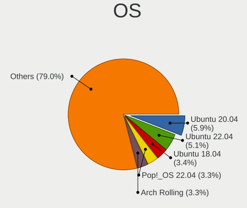

| Name               | Computers | Percent |
|--------------------|-----------|---------|
| Ubuntu 20.04       | 86        | 5.87%   |
| Ubuntu 22.04       | 75        | 5.12%   |
| Ubuntu 18.04       | 50        | 3.42%   |
| Pop!_OS 22.04      | 48        | 3.28%   |
| Arch Rolling       | 48        | 3.28%   |
| Ubuntu 24.04       | 37        | 2.53%   |
| Debian 12          | 34        | 2.32%   |
| Zorin 17           | 31        | 2.12%   |
| Zorin 16           | 28        | 1.91%   |
| Debian 11          | 25        | 1.71%   |
| OpenMandriva 24.12 | 22        | 1.5%    |
| OpenMandriva 25.90 | 20        | 1.37%   |
| Fedora 42          | 20        | 1.37%   |
| Linux Mint 22.2    | 19        | 1.3%    |
| Pop!_OS 20.04      | 17        | 1.16%   |
| OpenMandriva 4.3   | 16        | 1.09%   |
| Fedora 40          | 16        | 1.09%   |
| Ubuntu 20.10       | 14        | 0.96%   |
| Pop!_OS 20.10      | 14        | 0.96%   |
| Zorin 15           | 13        | 0.89%   |
| OpenMandriva 6.0   | 13        | 0.89%   |
| OpenMandriva 25.06 | 13        | 0.89%   |
| Manjaro            | 13        | 0.89%   |
| Fedora 41          | 13        | 0.89%   |
| OpenMandriva 4.2   | 12        | 0.82%   |
| Linux Mint 22.1    | 12        | 0.82%   |
| Linux Mint 21.1    | 12        | 0.82%   |
| Linux Mint 20.3    | 12        | 0.82%   |
| Fedora 36          | 12        | 0.82%   |
| ArcoLinux Rolling  | 12        | 0.82%   |
| Arch               | 12        | 0.82%   |
| Ubuntu 21.04       | 11        | 0.75%   |
| OpenMandriva 5.0   | 11        | 0.75%   |
| Linux Mint 22      | 11        | 0.75%   |
| Linux Mint 20.2    | 11        | 0.75%   |
| Kubuntu 22.04      | 11        | 0.75%   |
| Fedora 39          | 11        | 0.75%   |
| Fedora 37          | 11        | 0.75%   |
| Fedora 34          | 11        | 0.75%   |
| Fedora 33          | 11        | 0.75%   |

OS Family
---------

OS without a version

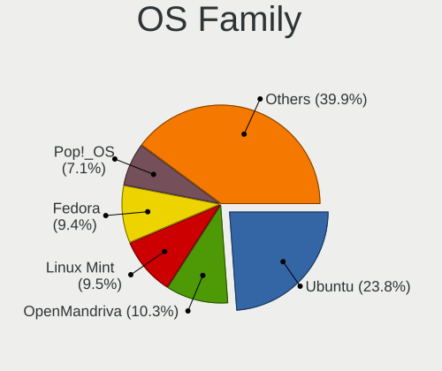

| Name             | Computers | Percent |
|------------------|-----------|---------|
| Ubuntu           | 323       | 23.84%  |
| OpenMandriva     | 139       | 10.26%  |
| Linux Mint       | 129       | 9.52%   |
| Fedora           | 128       | 9.45%   |
| Pop!_OS          | 96        | 7.08%   |
| Debian           | 84        | 6.2%    |
| Zorin            | 75        | 5.54%   |
| Arch             | 59        | 4.35%   |
| Kubuntu          | 32        | 2.36%   |
| Manjaro          | 29        | 2.14%   |
| KDE neon         | 24        | 1.77%   |
| Xubuntu          | 17        | 1.25%   |
| Bazzite          | 17        | 1.25%   |
| Endless          | 16        | 1.18%   |
| ArcoLinux        | 13        | 0.96%   |
| Nobara           | 12        | 0.89%   |
| Elementary       | 12        | 0.89%   |
| openSUSE         | 11        | 0.81%   |
| MX               | 11        | 0.81%   |
| NixOS            | 9         | 0.66%   |
| LMDE             | 9         | 0.66%   |
| Kali             | 9         | 0.66%   |
| SteamOS          | 7         | 0.52%   |
| EndeavourOS      | 7         | 0.52%   |
| Ubuntu Unity     | 6         | 0.44%   |
| ROSA             | 6         | 0.44%   |
| Lubuntu          | 6         | 0.44%   |
| org.kde.Platform | 5         | 0.37%   |
| Gentoo           | 5         | 0.37%   |
| Ubuntu MATE      | 4         | 0.3%    |
| Solus            | 4         | 0.3%    |
| Peppermint       | 4         | 0.3%    |
| CachyOS          | 4         | 0.3%    |
| Ubuntu Budgie    | 3         | 0.22%   |
| Rocky Linux      | 3         | 0.22%   |
| RHEL             | 3         | 0.22%   |
| Devuan           | 3         | 0.22%   |
| Clear Linux      | 3         | 0.22%   |
| Void Linux       | 2         | 0.15%   |
| Vanilla          | 2         | 0.15%   |

Kernel
------

Version of the Linux kernel

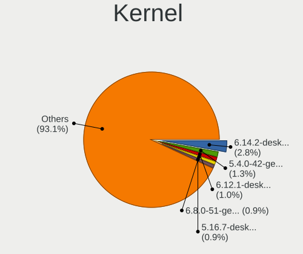

| Version                  | Computers | Percent |
|--------------------------|-----------|---------|
| 6.14.2-desktop-3omv2590  | 46        | 2.81%   |
| 5.4.0-42-generic         | 22        | 1.34%   |
| 6.12.1-desktop-1omv2490  | 17        | 1.04%   |
| 6.8.0-51-generic         | 14        | 0.85%   |
| 5.16.7-desktop-1omv4003  | 14        | 0.85%   |
| 6.8.0-40-generic         | 13        | 0.79%   |
| 5.15.0-46-generic        | 13        | 0.79%   |
| 5.10.14-desktop-1omv4002 | 12        | 0.73%   |
| 6.9.3-76060903-generic   | 11        | 0.67%   |
| 6.6.2-desktop-1omv2390   | 11        | 0.67%   |
| 6.8.0-60-generic         | 10        | 0.61%   |
| 6.1.1-desktop-1omv2290   | 9         | 0.55%   |
| 6.8.0-52-generic         | 8         | 0.49%   |
| 6.12.10-76061203-generic | 8         | 0.49%   |
| 5.15.0-60-generic        | 8         | 0.49%   |
| 6.12.9-desktop-1omv2490  | 7         | 0.43%   |
| 6.1.0-37-amd64           | 7         | 0.43%   |
| 6.0.12-76060006-generic  | 7         | 0.43%   |
| 5.4.0-7634-generic       | 7         | 0.43%   |
| 5.4.0-65-generic         | 7         | 0.43%   |
| 5.15.0-58-generic        | 7         | 0.43%   |
| 5.15.0-56-generic        | 7         | 0.43%   |
| 6.8.0-90-generic         | 6         | 0.37%   |
| 6.8.0-85-generic         | 6         | 0.37%   |
| 6.8.0-41-generic         | 6         | 0.37%   |
| 6.8.0-38-generic         | 6         | 0.37%   |
| 6.5.0-35-generic         | 6         | 0.37%   |
| 6.2.6-desktop-1omv2390   | 6         | 0.37%   |
| 5.4.0-48-generic         | 6         | 0.37%   |
| 5.3.0-46-generic         | 6         | 0.37%   |
| 5.3.0-40-generic         | 6         | 0.37%   |
| 5.13.0-30-generic        | 6         | 0.37%   |
| 5.11.0-7620-generic      | 6         | 0.37%   |
| 5.11.0-37-generic        | 6         | 0.37%   |
| 5.10.0-16-amd64          | 6         | 0.37%   |
| 5.0.0-37-generic         | 6         | 0.37%   |
| 6.8.0-45-generic         | 5         | 0.31%   |
| 6.5.6-76060506-generic   | 5         | 0.31%   |
| 6.5.0-41-generic         | 5         | 0.31%   |
| 6.4.11-desktop-1omv2390  | 5         | 0.31%   |

Kernel Family
-------------

Linux kernel without a distro release

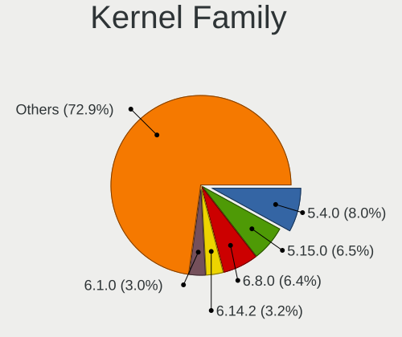

| Version | Computers | Percent |
|---------|-----------|---------|
| 5.4.0   | 123       | 8.01%   |
| 5.15.0  | 100       | 6.51%   |
| 6.8.0   | 99        | 6.45%   |
| 6.14.2  | 49        | 3.19%   |
| 6.1.0   | 46        | 2.99%   |
| 5.11.0  | 45        | 2.93%   |
| 5.13.0  | 44        | 2.86%   |
| 5.8.0   | 43        | 2.8%    |
| 4.15.0  | 42        | 2.73%   |
| 6.5.0   | 39        | 2.54%   |
| 6.14.0  | 37        | 2.41%   |
| 5.3.0   | 36        | 2.34%   |
| 5.19.0  | 33        | 2.15%   |
| 6.2.0   | 29        | 1.89%   |
| 5.10.0  | 27        | 1.76%   |
| 5.0.0   | 20        | 1.3%    |
| 4.18.0  | 20        | 1.3%    |
| 6.12.1  | 19        | 1.24%   |
| 6.11.0  | 19        | 1.24%   |
| 5.16.7  | 14        | 0.91%   |
| 5.10.14 | 13        | 0.85%   |
| 6.9.3   | 12        | 0.78%   |
| 6.6.2   | 11        | 0.72%   |
| 6.1.1   | 11        | 0.72%   |
| 6.2.6   | 9         | 0.59%   |
| 6.17.0  | 9         | 0.59%   |
| 6.12.10 | 9         | 0.59%   |
| 4.19.0  | 9         | 0.59%   |
| 6.4.11  | 8         | 0.52%   |
| 6.0.12  | 8         | 0.52%   |
| 6.5.6   | 7         | 0.46%   |
| 6.12.9  | 7         | 0.46%   |
| 6.8.12  | 6         | 0.39%   |
| 6.17.9  | 6         | 0.39%   |
| 6.17.7  | 6         | 0.39%   |
| 5.14.0  | 6         | 0.39%   |
| 6.8.11  | 5         | 0.33%   |
| 6.15.0  | 5         | 0.33%   |
| 6.12.6  | 5         | 0.33%   |
| 6.10.0  | 5         | 0.33%   |

Kernel Major Ver.
-----------------

Linux kernel major version

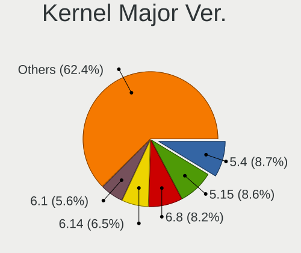

| Version | Computers | Percent |
|---------|-----------|---------|
| 5.4     | 131       | 8.69%   |
| 5.15    | 130       | 8.62%   |
| 6.8     | 123       | 8.16%   |
| 6.14    | 98        | 6.5%    |
| 6.1     | 85        | 5.64%   |
| 6.12    | 69        | 4.58%   |
| 5.11    | 57        | 3.78%   |
| 6.5     | 53        | 3.51%   |
| 5.8     | 53        | 3.51%   |
| 5.13    | 52        | 3.45%   |
| 5.10    | 51        | 3.38%   |
| 6.2     | 47        | 3.12%   |
| 5.3     | 43        | 2.85%   |
| 5.19    | 42        | 2.79%   |
| 4.15    | 42        | 2.79%   |
| 6.17    | 34        | 2.25%   |
| 6.11    | 32        | 2.12%   |
| 6.6     | 29        | 1.92%   |
| 5.16    | 26        | 1.72%   |
| 6.10    | 25        | 1.66%   |
| 6.4     | 22        | 1.46%   |
| 6.0     | 22        | 1.46%   |
| 6.9     | 21        | 1.39%   |
| 5.0     | 21        | 1.39%   |
| 4.18    | 21        | 1.39%   |
| 6.15    | 18        | 1.19%   |
| 5.18    | 17        | 1.13%   |
| 5.14    | 16        | 1.06%   |
| 5.17    | 14        | 0.93%   |
| 6.7     | 13        | 0.86%   |
| 5.9     | 12        | 0.8%    |
| 5.6     | 12        | 0.8%    |
| 6.3     | 11        | 0.73%   |
| 5.7     | 11        | 0.73%   |
| 6.16    | 10        | 0.66%   |
| 6.13    | 10        | 0.66%   |
| 4.19    | 10        | 0.66%   |
| 5.12    | 7         | 0.46%   |
| 5.5     | 4         | 0.27%   |
| 4.9     | 4         | 0.27%   |

Arch
----

OS architecture (x86_64, i586, etc.)

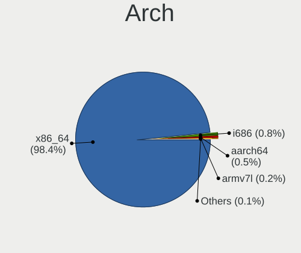

| Name    | Computers | Percent |
|---------|-----------|---------|
| x86_64  | 1269      | 98.37%  |
| i686    | 10        | 0.78%   |
| aarch64 | 7         | 0.54%   |
| armv7l  | 2         | 0.16%   |
| riscv64 | 1         | 0.08%   |
| i586    | 1         | 0.08%   |

DE
--

Desktop Environment

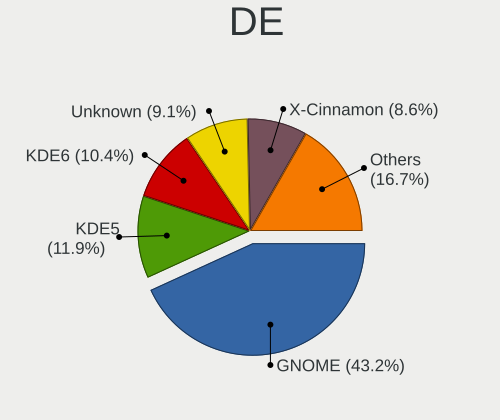

| Name             | Computers | Percent |
|------------------|-----------|---------|
| GNOME            | 591       | 43.17%  |
| KDE5             | 163       | 11.91%  |
| KDE6             | 143       | 10.45%  |
| Unknown          | 125       | 9.13%   |
| X-Cinnamon       | 118       | 8.62%   |
| XFCE             | 84        | 6.14%   |
| MATE             | 27        | 1.97%   |
| KDE              | 27        | 1.97%   |
| LXQt             | 15        | 1.1%    |
| Pantheon         | 12        | 0.88%   |
| LXDE             | 9         | 0.66%   |
| Cinnamon         | 9         | 0.66%   |
| Unity            | 6         | 0.44%   |
| i3               | 6         | 0.44%   |
| Hyprland         | 5         | 0.37%   |
| COSMIC           | 5         | 0.37%   |
| Budgie           | 5         | 0.37%   |
| Deepin           | 4         | 0.29%   |
| sway             | 2         | 0.15%   |
| icewm            | 2         | 0.15%   |
| i3-with-shmlog   | 2         | 0.15%   |
| xsession         | 1         | 0.07%   |
| Openbox          | 1         | 0.07%   |
| NONE             | 1         | 0.07%   |
| lightdm-xsession | 1         | 0.07%   |
| KDE4             | 1         | 0.07%   |
| GNOME Classic    | 1         | 0.07%   |
| fluxbox          | 1         | 0.07%   |
| Enlightenment    | 1         | 0.07%   |
| Endless:GNOME    | 1         | 0.07%   |

Display Server
--------------

X11 or Wayland

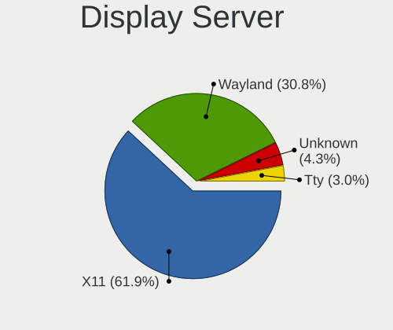

| Name    | Computers | Percent |
|---------|-----------|---------|
| X11     | 833       | 61.93%  |
| Wayland | 414       | 30.78%  |
| Unknown | 58        | 4.31%   |
| Tty     | 40        | 2.97%   |

Display Manager
---------------

SDDM, LightDM, etc.

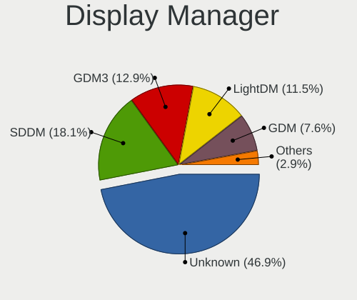

| Name           | Computers | Percent |
|----------------|-----------|---------|
| Unknown        | 632       | 46.92%  |
| SDDM           | 244       | 18.11%  |
| GDM3           | 174       | 12.92%  |
| LightDM        | 155       | 11.51%  |
| GDM            | 103       | 7.65%   |
| TDM            | 25        | 1.86%   |
| SLiM           | 5         | 0.37%   |
| Ly             | 2         | 0.15%   |
| LXDM           | 2         | 0.15%   |
| XDM            | 1         | 0.07%   |
| SLIMSKI        | 1         | 0.07%   |
| KDM            | 1         | 0.07%   |
| GREETD         | 1         | 0.07%   |
| COSMIC-GREETER | 1         | 0.07%   |

OS Lang
-------

Language

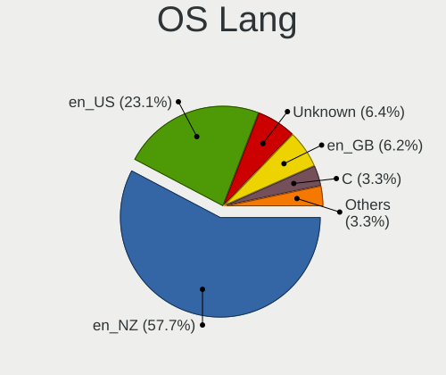

| Lang    | Computers | Percent |
|---------|-----------|---------|
| en_NZ   | 786       | 57.71%  |
| en_US   | 315       | 23.13%  |
| Unknown | 87        | 6.39%   |
| en_GB   | 84        | 6.17%   |
| C       | 45        | 3.3%    |
| en_AU   | 28        | 2.06%   |
| zh_CN   | 5         | 0.37%   |
| de_DE   | 3         | 0.22%   |
| mi_NZ   | 2         | 0.15%   |
| fr_FR   | 2         | 0.15%   |
| ru_RU   | 1         | 0.07%   |
| pt_BR   | 1         | 0.07%   |
| en_PH   | 1         | 0.07%   |
| en_CA   | 1         | 0.07%   |
| C.UTF8  | 1         | 0.07%   |

Boot Mode
---------

EFI or BIOS

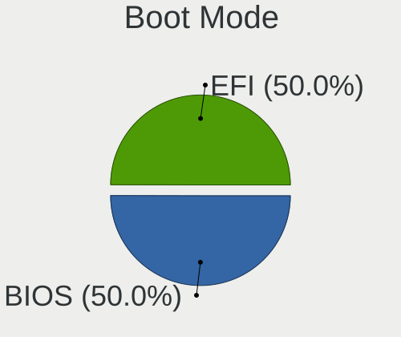

| Mode | Computers | Percent |
|------|-----------|---------|
| BIOS | 662       | 50.04%  |
| EFI  | 661       | 49.96%  |

Filesystem
----------

Type of filesystem

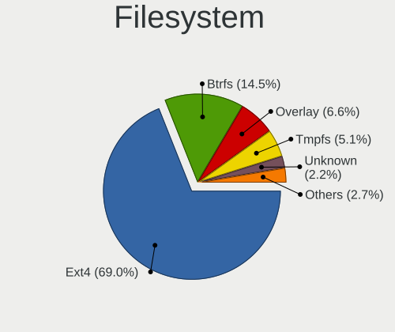

| Type    | Computers | Percent |
|---------|-----------|---------|
| Ext4    | 927       | 68.97%  |
| Btrfs   | 195       | 14.51%  |
| Overlay | 89        | 6.62%   |
| Tmpfs   | 68        | 5.06%   |
| Unknown | 29        | 2.16%   |
| Xfs     | 15        | 1.12%   |
| Zfs     | 12        | 0.89%   |
| Ext2    | 4         | 0.3%    |
| F2fs    | 2         | 0.15%   |
| Ext3    | 2         | 0.15%   |
| XXXXXXX | 1         | 0.07%   |

Part. scheme
------------

Scheme of partitioning

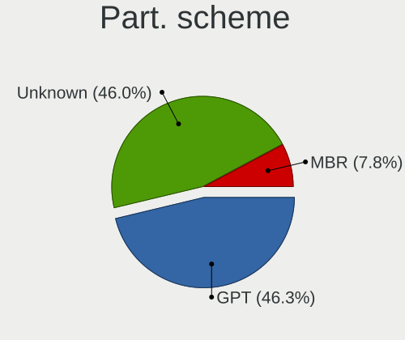

| Type    | Computers | Percent |
|---------|-----------|---------|
| GPT     | 612       | 46.26%  |
| Unknown | 608       | 45.96%  |
| MBR     | 103       | 7.79%   |

Dual Boot with Linux/BSD
------------------------

Hosting more than one Linux/BSD

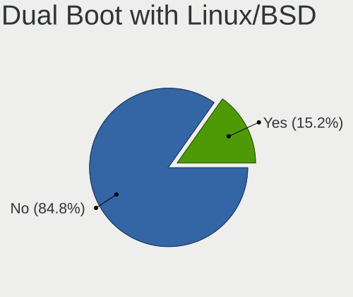

| Dual boot | Computers | Percent |
|-----------|-----------|---------|
| No        | 1122      | 84.81%  |
| Yes       | 201       | 15.19%  |

Dual Boot (Win)
---------------

Hosting Linux and Windows

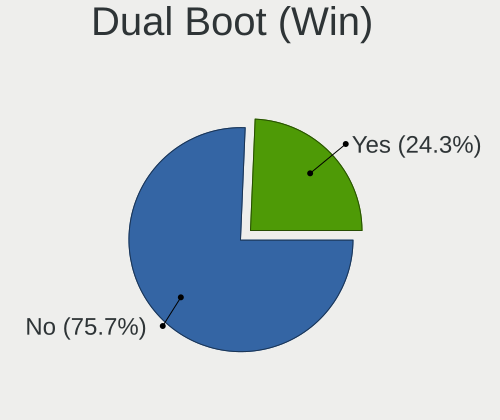

| Dual boot | Computers | Percent |
|-----------|-----------|---------|
| No        | 995       | 75.67%  |
| Yes       | 320       | 24.33%  |

Board
-----

Vendor
------

Motherboard manufacturer

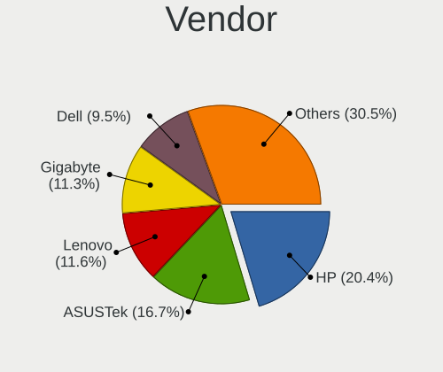

| Name                                 | Computers | Percent |
|--------------------------------------|-----------|---------|
| Hewlett-Packard                      | 263       | 20.39%  |
| ASUSTek Computer                     | 215       | 16.67%  |
| Lenovo                               | 149       | 11.55%  |
| Gigabyte Technology                  | 146       | 11.32%  |
| Dell                                 | 123       | 9.53%   |
| Acer                                 | 64        | 4.96%   |
| MSI                                  | 53        | 4.11%   |
| Apple                                | 43        | 3.33%   |
| Intel                                | 36        | 2.79%   |
| ASRock                               | 36        | 2.79%   |
| Toshiba                              | 32        | 2.48%   |
| Unknown                              | 11        | 0.85%   |
| Sony                                 | 10        | 0.78%   |
| Supermicro                           | 9         | 0.7%    |
| Valve                                | 7         | 0.54%   |
| Google                               | 7         | 0.54%   |
| Raspberry Pi Foundation              | 6         | 0.47%   |
| System76                             | 5         | 0.39%   |
| Samsung Electronics                  | 5         | 0.39%   |
| Razer                                | 5         | 0.39%   |
| Pegatron                             | 5         | 0.39%   |
| Alienware                            | 5         | 0.39%   |
| Microsoft                            | 4         | 0.31%   |
| IBM                                  | 4         | 0.31%   |
| AMI                                  | 3         | 0.23%   |
| Shenzhen Meigao Electronic Equipment | 2         | 0.16%   |
| Panasonic                            | 2         | 0.16%   |
| MACHINIST                            | 2         | 0.16%   |
| Kogan                                | 2         | 0.16%   |
| HUAWEI                               | 2         | 0.16%   |
| Fujitsu                              | 2         | 0.16%   |
| ECS                                  | 2         | 0.16%   |
| ZR                                   | 1         | 0.08%   |
| YJKC                                 | 1         | 0.08%   |
| Wistron                              | 1         | 0.08%   |
| TWG                                  | 1         | 0.08%   |
| Timi                                 | 1         | 0.08%   |
| The Warehouse Group                  | 1         | 0.08%   |
| Techvision                           | 1         | 0.08%   |
| Star Labs                            | 1         | 0.08%   |

Model
-----

Motherboard model

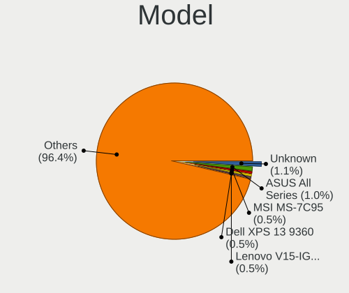

| Name                         | Computers | Percent |
|------------------------------|-----------|---------|
| Unknown                      | 14        | 1.09%   |
| ASUS All Series              | 13        | 1.01%   |
| MSI MS-7C95                  | 7         | 0.54%   |
| Dell XPS 13 9360             | 7         | 0.54%   |
| Lenovo V15-IGL 82C3          | 6         | 0.47%   |
| HP Notebook                  | 6         | 0.47%   |
| Gigabyte H77M-D3H            | 6         | 0.47%   |
| Gigabyte B550M DS3H AC       | 6         | 0.47%   |
| ASUS TUF Gaming X570-PLUS    | 6         | 0.47%   |
| Valve Jupiter                | 5         | 0.39%   |
| HP EliteDesk 800 G1 SFF      | 5         | 0.39%   |
| HP EliteBook 850 G5          | 5         | 0.39%   |
| HP EliteBook 840 G5          | 5         | 0.39%   |
| HP Compaq 8200 Elite SFF PC  | 5         | 0.39%   |
| ASUS ROG STRIX B550-A GAMING | 5         | 0.39%   |
| Toshiba Satellite C660       | 4         | 0.31%   |
| Razer Blade Stealth          | 4         | 0.31%   |
| HP ProBook 6550b             | 4         | 0.31%   |
| HP Pavilion dv6              | 4         | 0.31%   |
| HP Pavilion 15               | 4         | 0.31%   |
| ASUS ROG STRIX X570-F GAMING | 4         | 0.31%   |
| ASUS PRIME B450M-A           | 4         | 0.31%   |
| ASRock B450M Steel Legend    | 4         | 0.31%   |
| Toshiba Satellite L750       | 3         | 0.23%   |
| MSI MS-7C02                  | 3         | 0.23%   |
| MSI MS-7B89                  | 3         | 0.23%   |
| HP ProBook 6570b             | 3         | 0.23%   |
| HP ProBook 4540s             | 3         | 0.23%   |
| HP ProBook 450 G3            | 3         | 0.23%   |
| HP Pavilion Notebook         | 3         | 0.23%   |
| HP Pavilion Laptop 15-cw1xxx | 3         | 0.23%   |
| HP Laptop 15-bs0xx           | 3         | 0.23%   |
| HP EliteDesk 800 G2 SFF      | 3         | 0.23%   |
| HP EliteDesk 800 G2 DM 35W   | 3         | 0.23%   |
| HP EliteBook 8560p           | 3         | 0.23%   |
| HP EliteBook 840 G6          | 3         | 0.23%   |
| HP Compaq 8100 Elite SFF PC  | 3         | 0.23%   |
| Gigabyte X670 AORUS ELITE AX | 3         | 0.23%   |
| Gigabyte B75M-D3H            | 3         | 0.23%   |
| Gigabyte B550 GAMING X V2    | 3         | 0.23%   |

Model Family
------------

Motherboard model prefix

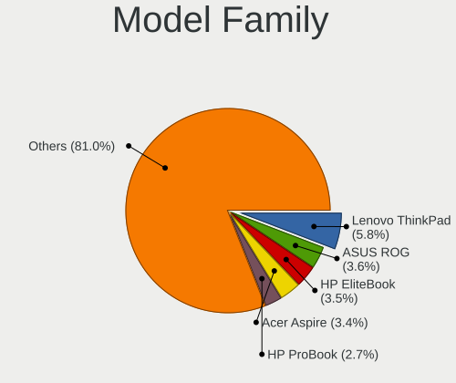

| Name               | Computers | Percent |
|--------------------|-----------|---------|
| Lenovo ThinkPad    | 75        | 5.81%   |
| ASUS ROG           | 46        | 3.57%   |
| HP EliteBook       | 45        | 3.49%   |
| Acer Aspire        | 44        | 3.41%   |
| HP ProBook         | 35        | 2.71%   |
| HP Pavilion        | 29        | 2.25%   |
| Dell Latitude      | 29        | 2.25%   |
| ASUS PRIME         | 27        | 2.09%   |
| HP Compaq          | 25        | 1.94%   |
| Dell OptiPlex      | 24        | 1.86%   |
| ASUS TUF           | 23        | 1.78%   |
| Toshiba Satellite  | 22        | 1.71%   |
| HP EliteDesk       | 20        | 1.55%   |
| Dell XPS           | 20        | 1.55%   |
| HP Laptop          | 19        | 1.47%   |
| Dell Inspiron      | 18        | 1.4%    |
| Dell Precision     | 16        | 1.24%   |
| ASUS ASUS          | 16        | 1.24%   |
| Lenovo ThinkCentre | 14        | 1.09%   |
| ASUS VivoBook      | 14        | 1.09%   |
| Unknown            | 14        | 1.09%   |
| ASUS All           | 13        | 1.01%   |
| HP ENVY            | 11        | 0.85%   |
| Lenovo Yoga        | 10        | 0.78%   |
| HP ZBook           | 10        | 0.78%   |
| Lenovo IdeaPad     | 8         | 0.62%   |
| Gigabyte B550M     | 8         | 0.62%   |
| Gigabyte B550      | 8         | 0.62%   |
| MSI MS-7C95        | 7         | 0.54%   |
| HP ProLiant        | 7         | 0.54%   |
| Toshiba PORTEGE    | 6         | 0.47%   |
| RPi Raspberry      | 6         | 0.47%   |
| Lenovo V15-IGL     | 6         | 0.47%   |
| HP Spectre         | 6         | 0.47%   |
| HP Notebook        | 6         | 0.47%   |
| Gigabyte H77M-D3H  | 6         | 0.47%   |
| Valve Jupiter      | 5         | 0.39%   |
| Razer Blade        | 5         | 0.39%   |
| HP ProDesk         | 5         | 0.39%   |
| ASUS Zenbook       | 5         | 0.39%   |

MFG Year
--------

Motherboard manufacture year

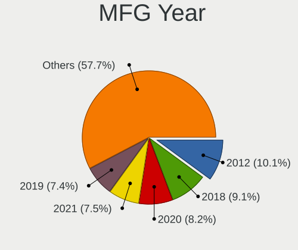

| Year    | Computers | Percent |
|---------|-----------|---------|
| 2012    | 130       | 10.08%  |
| 2018    | 118       | 9.15%   |
| 2020    | 106       | 8.22%   |
| 2021    | 97        | 7.52%   |
| 2019    | 95        | 7.36%   |
| 2017    | 85        | 6.59%   |
| 2011    | 85        | 6.59%   |
| 2013    | 71        | 5.5%    |
| 2022    | 70        | 5.43%   |
| 2014    | 65        | 5.04%   |
| 2015    | 64        | 4.96%   |
| 2016    | 63        | 4.88%   |
| 2010    | 57        | 4.42%   |
| 2023    | 55        | 4.26%   |
| 2009    | 40        | 3.1%    |
| 2008    | 33        | 2.56%   |
| 2024    | 21        | 1.63%   |
| 2007    | 10        | 0.78%   |
| Unknown | 9         | 0.7%    |
| 2025    | 6         | 0.47%   |
| 2006    | 6         | 0.47%   |
| 2005    | 3         | 0.23%   |
| 2004    | 1         | 0.08%   |

Form Factor
-----------

Physical design of the computer

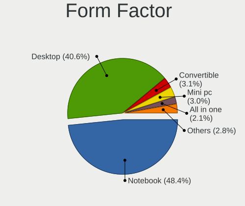

| Name           | Computers | Percent |
|----------------|-----------|---------|
| Notebook       | 624       | 48.37%  |
| Desktop        | 524       | 40.62%  |
| Convertible    | 40        | 3.1%    |
| Mini pc        | 39        | 3.02%   |
| All in one     | 27        | 2.09%   |
| Server         | 16        | 1.24%   |
| Tablet         | 10        | 0.78%   |
| System on chip | 9         | 0.7%    |
| Other          | 1         | 0.08%   |

Secure Boot
-----------

Enabled or disabled

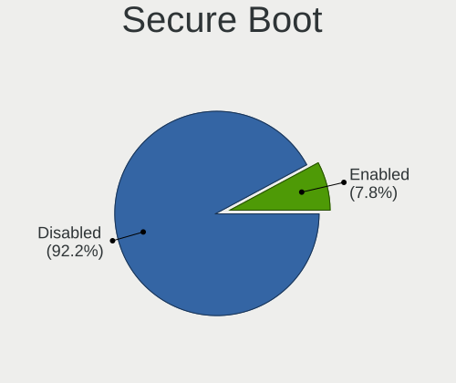

| State    | Computers | Percent |
|----------|-----------|---------|
| Disabled | 1199      | 92.16%  |
| Enabled  | 102       | 7.84%   |

Coreboot
--------

Have coreboot on board

| Used | Computers | Percent |
|------|-----------|---------|
| No   | 1277      | 98.99%  |
| Yes  | 13        | 1.01%   |

RAM Size
--------

Total RAM memory

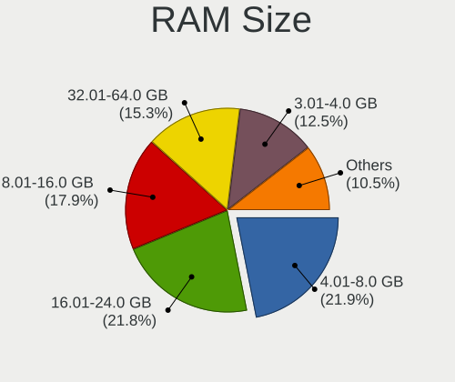

| Size in GB      | Computers | Percent |
|-----------------|-----------|---------|
| 4.01-8.0        | 290       | 21.92%  |
| 16.01-24.0      | 289       | 21.84%  |
| 8.01-16.0       | 237       | 17.91%  |
| 32.01-64.0      | 202       | 15.27%  |
| 3.01-4.0        | 166       | 12.55%  |
| 64.01-256.0     | 59        | 4.46%   |
| 24.01-32.0      | 44        | 3.33%   |
| 1.01-2.0        | 21        | 1.59%   |
| 2.01-3.0        | 7         | 0.53%   |
| 0.51-1.0        | 4         | 0.3%    |
| More than 256.0 | 3         | 0.23%   |
| 0.01-0.5        | 1         | 0.08%   |

RAM Used
--------

Used RAM memory

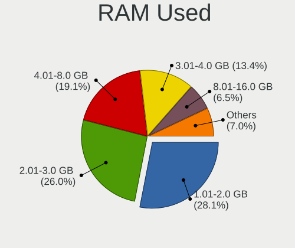

| Used GB    | Computers | Percent |
|------------|-----------|---------|
| 1.01-2.0   | 412       | 28.07%  |
| 2.01-3.0   | 381       | 25.95%  |
| 4.01-8.0   | 281       | 19.14%  |
| 3.01-4.0   | 196       | 13.35%  |
| 8.01-16.0  | 95        | 6.47%   |
| 0.51-1.0   | 64        | 4.36%   |
| 16.01-24.0 | 17        | 1.16%   |
| 0.01-0.5   | 12        | 0.82%   |
| 24.01-32.0 | 6         | 0.41%   |
| 32.01-64.0 | 4         | 0.27%   |

Total Drives
------------

Number of drives on board

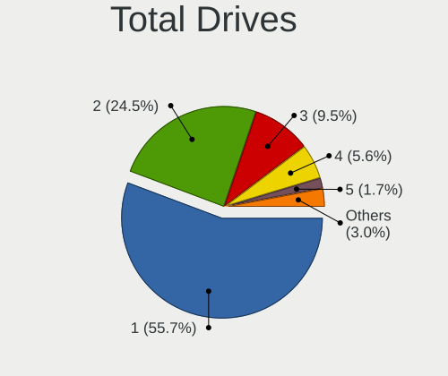

| Drives  | Computers | Percent |
|---------|-----------|---------|
| 1       | 754       | 55.73%  |
| 2       | 331       | 24.46%  |
| 3       | 129       | 9.53%   |
| 4       | 76        | 5.62%   |
| 5       | 23        | 1.7%    |
| 6       | 17        | 1.26%   |
| 0       | 7         | 0.52%   |
| 7       | 5         | 0.37%   |
| 8       | 3         | 0.22%   |
| 10      | 2         | 0.15%   |
| Unknown | 2         | 0.15%   |
| 410     | 1         | 0.07%   |
| 20      | 1         | 0.07%   |
| 16      | 1         | 0.07%   |
| 9       | 1         | 0.07%   |

Has CD-ROM
----------

Has CD-ROM on board

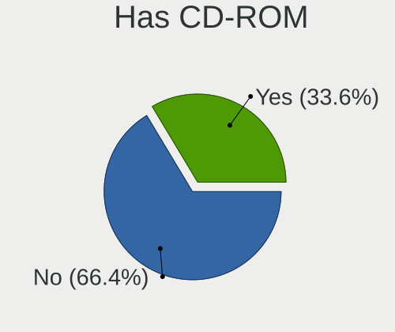

| Presented | Computers | Percent |
|-----------|-----------|---------|
| No        | 865       | 66.39%  |
| Yes       | 438       | 33.61%  |

Has Ethernet
------------

Has Ethernet on board

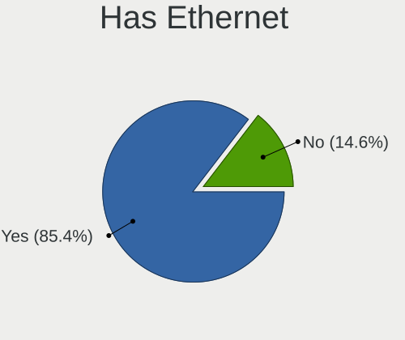

| Presented | Computers | Percent |
|-----------|-----------|---------|
| Yes       | 1108      | 85.43%  |
| No        | 189       | 14.57%  |

Has WiFi
--------

Has WiFi module

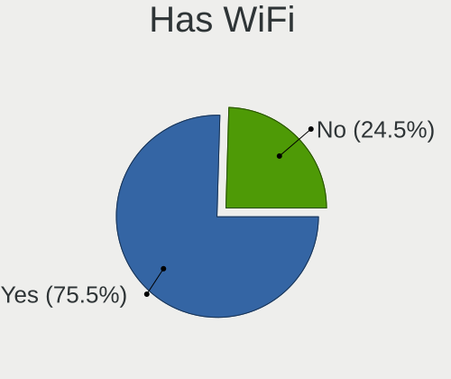

| Presented | Computers | Percent |
|-----------|-----------|---------|
| Yes       | 981       | 75.46%  |
| No        | 319       | 24.54%  |

Has Bluetooth
-------------

Has Bluetooth module

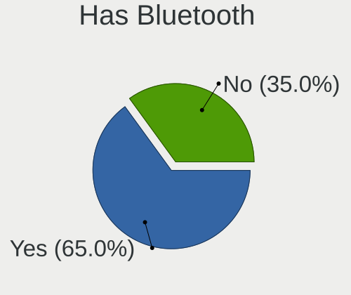

| Presented | Computers | Percent |
|-----------|-----------|---------|
| Yes       | 850       | 64.98%  |
| No        | 458       | 35.02%  |

Location
--------

Country
-------

Geographic location (country)

| Country     | Computers | Percent |
|-------------|-----------|---------|
| New Zealand | 1290      | 100%    |

City
----

Geographic location (city)

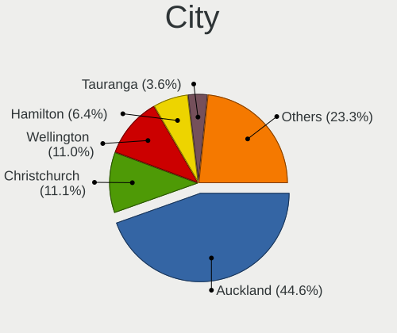

| City             | Computers | Percent |
|------------------|-----------|---------|
| Auckland         | 611       | 44.57%  |
| Christchurch     | 152       | 11.09%  |
| Wellington       | 151       | 11.01%  |
| Hamilton         | 88        | 6.42%   |
| Tauranga         | 49        | 3.57%   |
| Dunedin          | 39        | 2.84%   |
| Palmerston North | 30        | 2.19%   |
| Cambridge        | 19        | 1.39%   |
| Nelson           | 18        | 1.31%   |
| Whangarei        | 17        | 1.24%   |
| Napier City      | 17        | 1.24%   |
| Hastings         | 17        | 1.24%   |
| Lower Hutt       | 16        | 1.17%   |
| New Plymouth     | 15        | 1.09%   |
| Whanganui        | 11        | 0.8%    |
| Invercargill     | 11        | 0.8%    |
| Rotorua          | 8         | 0.58%   |
| Timaru           | 7         | 0.51%   |
| Masterton        | 5         | 0.36%   |
| Ashburton        | 5         | 0.36%   |
| Taupo            | 4         | 0.29%   |
| Richmond         | 4         | 0.29%   |
| Yaldhurst        | 3         | 0.22%   |
| Waikanae         | 3         | 0.22%   |
| Te Puke          | 3         | 0.22%   |
| Queenstown       | 3         | 0.22%   |
| Mission Bay      | 3         | 0.22%   |
| Levin            | 3         | 0.22%   |
| Karori           | 3         | 0.22%   |
| Grafton          | 3         | 0.22%   |
| Waikato          | 2         | 0.15%   |
| Otaki            | 2         | 0.15%   |
| Kerikeri         | 2         | 0.15%   |
| Havelock North   | 2         | 0.15%   |
| Gore             | 2         | 0.15%   |
| Cromwell         | 2         | 0.15%   |
| Blenheim         | 2         | 0.15%   |
| Whatawhata       | 1         | 0.07%   |
| Westport         | 1         | 0.07%   |
| Wellsford        | 1         | 0.07%   |

Drives
------

Drive Vendor
------------

Hard drive vendors

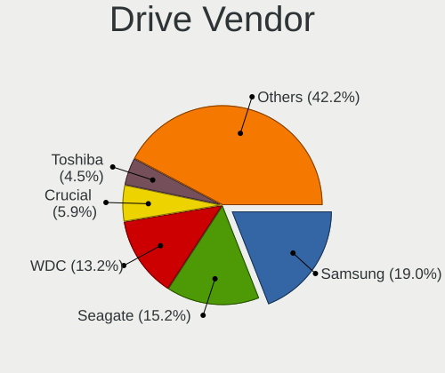

| Vendor                       | Computers | Drives | Percent |
|------------------------------|-----------|--------|---------|
| Samsung Electronics          | 373       | 677    | 19.03%  |
| Seagate                      | 297       | 518    | 15.15%  |
| WDC                          | 258       | 439    | 13.16%  |
| Crucial                      | 116       | 182    | 5.92%   |
| Toshiba                      | 88        | 113    | 4.49%   |
| Sandisk                      | 83        | 94     | 4.23%   |
| Kingston                     | 83        | 116    | 4.23%   |
| Unknown                      | 64        | 90     | 3.27%   |
| Intel                        | 61        | 83     | 3.11%   |
| SK hynix                     | 59        | 77     | 3.01%   |
| Hitachi                      | 39        | 52     | 1.99%   |
| Micron Technology            | 37        | 44     | 1.89%   |
| Micron/Crucial Technology    | 32        | 51     | 1.63%   |
| A-DATA Technology            | 31        | 39     | 1.58%   |
| HGST                         | 30        | 35     | 1.53%   |
| Kingston Technology Company  | 22        | 23     | 1.12%   |
| Apple                        | 19        | 22     | 0.97%   |
| Team                         | 18        | 20     | 0.92%   |
| MAXIO Technology (Hangzhou)  | 15        | 19     | 0.77%   |
| KIOXIA                       | 14        | 17     | 0.71%   |
| LITEON                       | 13        | 13     | 0.66%   |
| Lexar                        | 12        | 19     | 0.61%   |
| China                        | 10        | 12     | 0.51%   |
| Apacer                       | 10        | 12     | 0.51%   |
| Hewlett-Packard              | 9         | 15     | 0.46%   |
| Gigabyte Technology          | 8         | 10     | 0.41%   |
| OCZ                          | 7         | 8      | 0.36%   |
| Netac                        | 7         | 8      | 0.36%   |
| KingSpec                     | 7         | 7      | 0.36%   |
| ASMT                         | 7         | 8      | 0.36%   |
| Union Memory                 | 6         | 7      | 0.31%   |
| Transcend                    | 6         | 7      | 0.31%   |
| JMicron Technology           | 6         | 11     | 0.31%   |
| Fujitsu                      | 6         | 6      | 0.31%   |
| ADATA Technology             | 6         | 7      | 0.31%   |
| Unknown                      | 6         | 6      | 0.31%   |
| TO Exter                     | 5         | 5      | 0.26%   |
| Silicon Motion               | 5         | 7      | 0.26%   |
| Shenzhen Longsys Electronics | 5         | 11     | 0.26%   |
| Phison Electronics           | 5         | 12     | 0.26%   |

Drive Model
-----------

Hard drive models

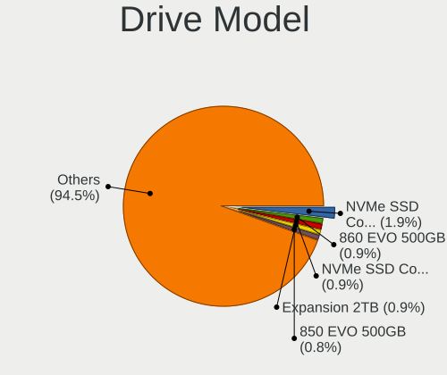

| Model                                                | Computers | Percent |
|------------------------------------------------------|-----------|---------|
| Samsung NVMe SSD Controller SM981/PM981/PM983 1TB    | 42        | 1.87%   |
| Samsung SSD 860 EVO 500GB                            | 21        | 0.94%   |
| Samsung NVMe SSD Controller PM9A1/PM9A3/980PRO 1TB   | 21        | 0.94%   |
| Seagate Expansion 2TB                                | 20        | 0.89%   |
| Samsung SSD 850 EVO 500GB                            | 19        | 0.85%   |
| Samsung SSD 980 1TB                                  | 18        | 0.8%    |
| Micron/Crucial P2 NVMe PCIe SSD 2TB                  | 18        | 0.8%    |
| Seagate ST2000DM008-2FR102 2TB                       | 16        | 0.71%   |
| Seagate Expansion Desk 4TB                           | 16        | 0.71%   |
| Samsung SSD 870 EVO 1TB                              | 15        | 0.67%   |
| Crucial CT500MX500SSD1 500GB                         | 15        | 0.67%   |
| Samsung SSD 850 EVO 250GB                            | 14        | 0.62%   |
| Samsung NVMe SSD Controller SM961/PM961/SM963 1024GB | 13        | 0.58%   |
| HGST HTS721010A9E630 1TB                             | 13        | 0.58%   |
| Crucial CT240BX500SSD1 240GB                         | 13        | 0.58%   |
| Seagate ST1000LM024 HN-M101MBB 1TB                   | 12        | 0.53%   |
| Samsung SSD 870 EVO 500GB                            | 12        | 0.53%   |
| Samsung SSD 860 EVO 250GB                            | 12        | 0.53%   |
| Kingston SA400S37240G 240GB SSD                      | 12        | 0.53%   |
| Crucial CT480BX500SSD1 480GB                         | 12        | 0.53%   |
| Crucial CT1000BX500SSD1 1TB                          | 11        | 0.49%   |
| Unknown MMC Card  64GB                               | 10        | 0.45%   |
| Unknown MMC Card  128GB                              | 10        | 0.45%   |
| Seagate ST500LT012-1DG142 500GB                      | 10        | 0.45%   |
| Seagate ST500DM002-1BD142 500GB                      | 10        | 0.45%   |
| Seagate ST31000528AS 1TB                             | 10        | 0.45%   |
| Seagate ST1000LM035-1RK172 1TB                       | 10        | 0.45%   |
| Samsung SSD 850 EVO 1TB                              | 10        | 0.45%   |
| WDC WD10JPVX-22JC3T0 1TB                             | 9         | 0.4%    |
| Seagate ST2000DM006-2DM164 2TB                       | 9         | 0.4%    |
| Seagate ST2000DM001-1CH164 2TB                       | 9         | 0.4%    |
| Seagate ST1000DM010-2EP102 1TB                       | 9         | 0.4%    |
| Seagate ST1000DM003-1CH162 1TB                       | 9         | 0.4%    |
| Samsung SSD 870 QVO 1TB                              | 9         | 0.4%    |
| Samsung NVMe SSD Drive 500GB                         | 9         | 0.4%    |
| Samsung SSD 980 PRO 1TB                              | 8         | 0.36%   |
| Samsung SSD 970 EVO Plus 500GB                       | 8         | 0.36%   |
| Samsung SSD 860 EVO 1TB                              | 8         | 0.36%   |
| Samsung NVMe SSD Drive 512GB                         | 8         | 0.36%   |
| Kingston Company SNV2S1000G 1TB                      | 8         | 0.36%   |

HDD Vendor
----------

Hard disk drive vendors

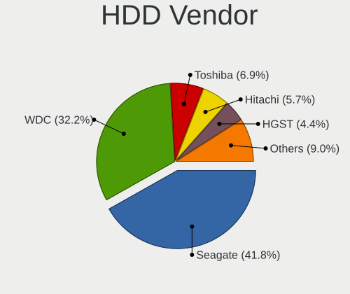

| Vendor              | Computers | Drives | Percent |
|---------------------|-----------|--------|---------|
| Seagate             | 287       | 497    | 41.84%  |
| WDC                 | 221       | 361    | 32.22%  |
| Toshiba             | 47        | 64     | 6.85%   |
| Hitachi             | 39        | 52     | 5.69%   |
| HGST                | 30        | 35     | 4.37%   |
| Samsung Electronics | 10        | 12     | 1.46%   |
| Unknown             | 7         | 12     | 1.02%   |
| Apple               | 7         | 7      | 1.02%   |
| Hewlett-Packard     | 6         | 7      | 0.87%   |
| Fujitsu             | 6         | 6      | 0.87%   |
| TO Exter            | 5         | 5      | 0.73%   |
| External            | 5         | 6      | 0.73%   |
| JMicron Technology  | 4         | 4      | 0.58%   |
| ASMT                | 4         | 4      | 0.58%   |
| USB3.0              | 1         | 1      | 0.15%   |
| USB                 | 1         | 2      | 0.15%   |
| StoreJet            | 1         | 1      | 0.15%   |
| QUANTUM             | 1         | 1      | 0.15%   |
| LaCie               | 1         | 1      | 0.15%   |
| HGST HTS            | 1         | 1      | 0.15%   |
| Ext Hard            | 1         | 2      | 0.15%   |
| ASMedia             | 1         | 1      | 0.15%   |

SSD Vendor
----------

Solid state drive vendors

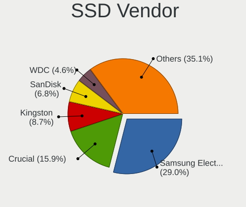

| Vendor              | Computers | Drives | Percent |
|---------------------|-----------|--------|---------|
| Samsung Electronics | 184       | 279    | 28.98%  |
| Crucial             | 101       | 158    | 15.91%  |
| Kingston            | 55        | 76     | 8.66%   |
| SanDisk             | 43        | 49     | 6.77%   |
| WDC                 | 29        | 56     | 4.57%   |
| A-DATA Technology   | 26        | 33     | 4.09%   |
| Intel               | 25        | 38     | 3.94%   |
| Team                | 17        | 19     | 2.68%   |
| Micron Technology   | 16        | 20     | 2.52%   |
| Toshiba             | 13        | 15     | 2.05%   |
| LITEON              | 11        | 11     | 1.73%   |
| China               | 10        | 12     | 1.57%   |
| Apple               | 10        | 11     | 1.57%   |
| Apacer              | 10        | 12     | 1.57%   |
| Lexar               | 9         | 15     | 1.42%   |
| Seagate             | 7         | 10     | 1.1%    |
| OCZ                 | 7         | 8      | 1.1%    |
| KingSpec            | 7         | 7      | 1.1%    |
| Gigabyte Technology | 7         | 8      | 1.1%    |
| Transcend           | 5         | 5      | 0.79%   |
| SK hynix            | 5         | 5      | 0.79%   |
| Netac               | 4         | 5      | 0.63%   |
| T-FORCE             | 3         | 3      | 0.47%   |
| LITEONIT            | 3         | 5      | 0.47%   |
| Hewlett-Packard     | 3         | 8      | 0.47%   |
| Corsair             | 3         | 5      | 0.47%   |
| PNY                 | 2         | 3      | 0.31%   |
| X12                 | 1         | 1      | 0.16%   |
| Unknown (CF)        | 1         | 1      | 0.16%   |
| Timetec             | 1         | 1      | 0.16%   |
| SPCC                | 1         | 1      | 0.16%   |
| OWC                 | 1         | 1      | 0.16%   |
| OCZ-VERTEX3         | 1         | 1      | 0.16%   |
| OASDX               | 1         | 1      | 0.16%   |
| Innodisk            | 1         | 1      | 0.16%   |
| i-FlashDisk         | 1         | 1      | 0.16%   |
| GN-512              | 1         | 1      | 0.16%   |
| GAMER               | 1         | 1      | 0.16%   |
| FreeNAS             | 1         | 36     | 0.16%   |
| FreeBSD             | 1         | 372    | 0.16%   |

Drive Kind
----------

HDD or SSD

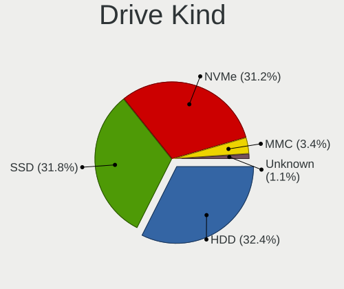

| Kind    | Computers | Drives | Percent |
|---------|-----------|--------|---------|
| HDD     | 570       | 1082   | 32.44%  |
| SSD     | 559       | 1302   | 31.82%  |
| NVMe    | 549       | 902    | 31.25%  |
| MMC     | 60        | 75     | 3.41%   |
| Unknown | 19        | 34     | 1.08%   |

Drive Connector
---------------

SATA, SAS, NVMe, etc.

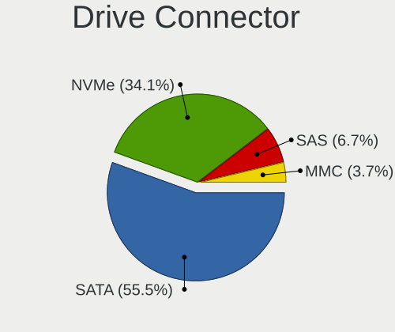

| Type | Computers | Drives | Percent |
|------|-----------|--------|---------|
| SATA | 893       | 2258   | 55.53%  |
| NVMe | 548       | 896    | 34.08%  |
| SAS  | 107       | 166    | 6.65%   |
| MMC  | 60        | 75     | 3.73%   |

Drive Size
----------

Size of hard drive

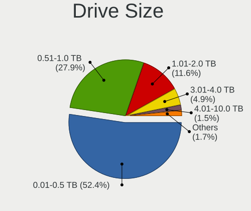

| Size in TB | Computers | Drives | Percent |
|------------|-----------|--------|---------|
| 0.01-0.5   | 654       | 1446   | 52.36%  |
| 0.51-1.0   | 349       | 536    | 27.94%  |
| 1.01-2.0   | 145       | 243    | 11.61%  |
| 3.01-4.0   | 61        | 90     | 4.88%   |
| 4.01-10.0  | 19        | 35     | 1.52%   |
| 2.01-3.0   | 16        | 19     | 1.28%   |
| 10.01-20.0 | 4         | 10     | 0.32%   |
| 20.01-50.0 | 1         | 5      | 0.08%   |

Space Total
-----------

Amount of disk space available on the file system

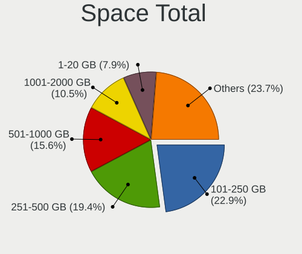

| Size in GB     | Computers | Percent |
|----------------|-----------|---------|
| 101-250        | 318       | 22.88%  |
| 251-500        | 269       | 19.35%  |
| 501-1000       | 217       | 15.61%  |
| 1001-2000      | 146       | 10.5%   |
| 1-20           | 110       | 7.91%   |
| More than 3000 | 105       | 7.55%   |
| 2001-3000      | 78        | 5.61%   |
| 51-100         | 65        | 4.68%   |
| Unknown        | 45        | 3.24%   |
| 21-50          | 37        | 2.66%   |

Space Used
----------

Amount of used disk space

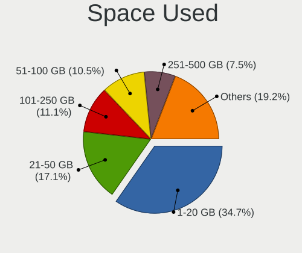

| Used GB        | Computers | Percent |
|----------------|-----------|---------|
| 1-20           | 507       | 34.68%  |
| 21-50          | 250       | 17.1%   |
| 101-250        | 163       | 11.15%  |
| 51-100         | 153       | 10.47%  |
| 251-500        | 109       | 7.46%   |
| 501-1000       | 108       | 7.39%   |
| 1001-2000      | 57        | 3.9%    |
| Unknown        | 45        | 3.08%   |
| More than 3000 | 35        | 2.39%   |
| 2001-3000      | 32        | 2.19%   |
| 0              | 3         | 0.21%   |

Malfunc. Drives
---------------

Drive models with a malfunction

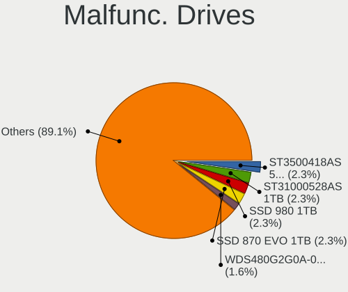

| Model                                 | Computers | Drives | Percent |
|---------------------------------------|-----------|--------|---------|
| Seagate ST3500418AS 500GB             | 3         | 4      | 2.33%   |
| Seagate ST31000528AS 1TB              | 3         | 3      | 2.33%   |
| Samsung Electronics SSD 980 1TB       | 3         | 4      | 2.33%   |
| Samsung Electronics SSD 870 EVO 1TB   | 3         | 3      | 2.33%   |
| WDC WDS480G2G0A-00JH30 480GB SSD      | 2         | 2      | 1.55%   |
| WDC WDS240G2G0A-00JH30 240GB SSD      | 2         | 2      | 1.55%   |
| WDC WD7500BPKX-00HPJT0 752GB          | 2         | 2      | 1.55%   |
| WDC WD5000AAKX-001CA0 500GB           | 2         | 3      | 1.55%   |
| WDC WD3200AAKS-00L9A0 320GB           | 2         | 3      | 1.55%   |
| WDC WD20EZRZ-00Z5HB0 2TB              | 2         | 2      | 1.55%   |
| WDC WD20EARX-00PASB0 2TB              | 2         | 7      | 1.55%   |
| Seagate ST31000524AS 1TB              | 2         | 2      | 1.55%   |
| Seagate ST2000DM001-1ER164 2TB        | 2         | 3      | 1.55%   |
| Seagate ST1000LM035-1RK172 1TB        | 2         | 2      | 1.55%   |
| Seagate ST1000LM024 HN-M101MBB 1TB    | 2         | 2      | 1.55%   |
| HGST HTS545050A7E380 500GB            | 2         | 2      | 1.55%   |
| WDC WD5000AAKX-00ERMA0 500GB          | 1         | 1      | 0.78%   |
| WDC WD40EFAX-68JH4N0 4TB              | 1         | 1      | 0.78%   |
| WDC WD3200AAKS-00V1A0 320GB           | 1         | 1      | 0.78%   |
| WDC WD3200AAKS-00UU3A0 320GB          | 1         | 1      | 0.78%   |
| WDC WD20EARS-00MVWB0 2TB              | 1         | 1      | 0.78%   |
| WDC WD2003FZEX-00Z4SA0 2TB            | 1         | 1      | 0.78%   |
| WDC WD15EARS-00S0XB0 1TB              | 1         | 1      | 0.78%   |
| WDC WD10SPZX-08Z10 1TB                | 1         | 1      | 0.78%   |
| WDC WD10JPVX-22JC3T0 1TB              | 1         | 1      | 0.78%   |
| WDC WD10EZEX-08WN4A0 1TB              | 1         | 1      | 0.78%   |
| WDC WD10EFRX-68FYTN0 1TB              | 1         | 3      | 0.78%   |
| WDC WD10EARS-00Y5B1 1TB               | 1         | 1      | 0.78%   |
| WDC WD10EARS-003BB1 1TB               | 1         | 1      | 0.78%   |
| WDC WD1002FAEX-00Z3A0 1TB             | 1         | 2      | 0.78%   |
| USB3.0 Extemal HDD 2TB                | 1         | 1      | 0.78%   |
| Toshiba MQ01ABD100 1TB                | 1         | 1      | 0.78%   |
| Toshiba MQ01ABD075 752GB              | 1         | 1      | 0.78%   |
| Toshiba MQ01ABD050 500GB              | 1         | 1      | 0.78%   |
| Toshiba MK5076GSX 500GB               | 1         | 1      | 0.78%   |
| Toshiba MK5065GSXF 500GB              | 1         | 1      | 0.78%   |
| Toshiba MK3261GSYN 320GB              | 1         | 1      | 0.78%   |
| Toshiba MK3256GSY 320GB               | 1         | 1      | 0.78%   |
| SK hynix SC308 SATA 128GB SSD         | 1         | 1      | 0.78%   |
| SK hynix HFS256G32MND-2900A 256GB SSD | 1         | 1      | 0.78%   |

Malfunc. Drive Vendor
---------------------

Vendors of faulty drives

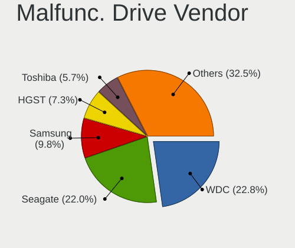

| Vendor              | Computers | Drives | Percent |
|---------------------|-----------|--------|---------|
| WDC                 | 28        | 38     | 22.76%  |
| Seagate             | 27        | 38     | 21.95%  |
| Samsung Electronics | 12        | 13     | 9.76%   |
| HGST                | 9         | 10     | 7.32%   |
| Toshiba             | 7         | 7      | 5.69%   |
| Crucial             | 7         | 8      | 5.69%   |
| Intel               | 5         | 7      | 4.07%   |
| Hitachi             | 5         | 6      | 4.07%   |
| SK hynix            | 4         | 8      | 3.25%   |
| SanDisk             | 4         | 4      | 3.25%   |
| Micron Technology   | 2         | 2      | 1.63%   |
| Kingston            | 2         | 2      | 1.63%   |
| ASMT                | 2         | 2      | 1.63%   |
| Apple               | 2         | 2      | 1.63%   |
| USB3.0              | 1         | 1      | 0.81%   |
| ShiJi               | 1         | 1      | 0.81%   |
| OCZ                 | 1         | 1      | 0.81%   |
| Innodisk            | 1         | 1      | 0.81%   |
| HGST HTS            | 1         | 1      | 0.81%   |
| Apacer              | 1         | 1      | 0.81%   |
| A-DATA Technology   | 1         | 4      | 0.81%   |

Malfunc. HDD Vendor
-------------------

Vendors of faulty HDD drives

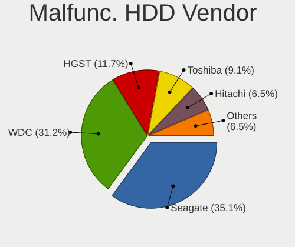

| Vendor   | Computers | Drives | Percent |
|----------|-----------|--------|---------|
| Seagate  | 27        | 38     | 35.06%  |
| WDC      | 24        | 34     | 31.17%  |
| HGST     | 9         | 10     | 11.69%  |
| Toshiba  | 7         | 7      | 9.09%   |
| Hitachi  | 5         | 6      | 6.49%   |
| Apple    | 2         | 2      | 2.6%    |
| USB3.0   | 1         | 1      | 1.3%    |
| HGST HTS | 1         | 1      | 1.3%    |
| ASMT     | 1         | 1      | 1.3%    |

Malfunc. Drive Kind
-------------------

Kinds of faulty drives

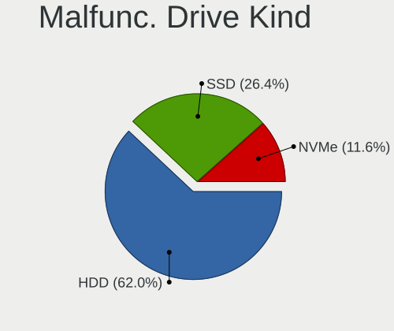

| Kind | Computers | Drives | Percent |
|------|-----------|--------|---------|
| HDD  | 75        | 100    | 61.98%  |
| SSD  | 32        | 38     | 26.45%  |
| NVMe | 14        | 19     | 11.57%  |

Failed Drives
-------------

Failed drive models

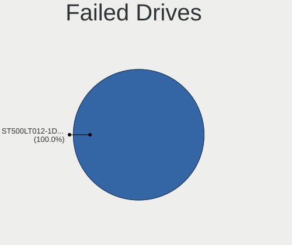

| Model                           | Computers | Drives | Percent |
|---------------------------------|-----------|--------|---------|
| WDC WD20EARS-00S8B1 2TB         | 1         | 1      | 50%     |
| Seagate ST500LT012-1DG142 500GB | 1         | 1      | 50%     |

Failed Drive Vendor
-------------------

Failed drive vendors

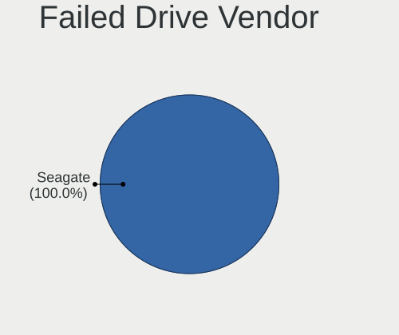

| Vendor  | Computers | Drives | Percent |
|---------|-----------|--------|---------|
| WDC     | 1         | 1      | 50%     |
| Seagate | 1         | 1      | 50%     |

Drive Status
------------

Number of failed and malfunc. drives

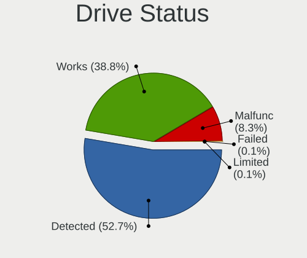

| Status   | Computers | Drives | Percent |
|----------|-----------|--------|---------|
| Detected | 749       | 1719   | 52.67%  |
| Works    | 552       | 1516   | 38.82%  |
| Malfunc  | 118       | 157    | 8.3%    |
| Failed   | 2         | 2      | 0.14%   |
| Limited  | 1         | 1      | 0.07%   |

Storage controller
------------------

Storage Vendor
--------------

Storage controller vendors

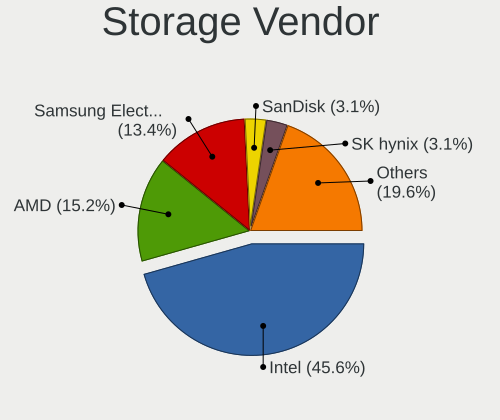

| Vendor                       | Computers | Percent |
|------------------------------|-----------|---------|
| Intel                        | 795       | 45.61%  |
| AMD                          | 265       | 15.2%   |
| Samsung Electronics          | 234       | 13.43%  |
| SK hynix                     | 54        | 3.1%    |
| SanDisk                      | 54        | 3.1%    |
| Kingston Technology Company  | 48        | 2.75%   |
| Micron/Crucial Technology    | 45        | 2.58%   |
| Toshiba America Info Systems | 31        | 1.78%   |
| Nvidia                       | 25        | 1.43%   |
| Micron Technology            | 24        | 1.38%   |
| JMicron Technology           | 21        | 1.2%    |
| ASMedia Technology           | 19        | 1.09%   |
| MAXIO Technology (Hangzhou)  | 15        | 0.86%   |
| Marvell Technology Group     | 14        | 0.8%    |
| Phison Electronics           | 12        | 0.69%   |
| KIOXIA                       | 12        | 0.69%   |
| ADATA Technology             | 12        | 0.69%   |
| LSI Logic / Symbios Logic    | 8         | 0.46%   |
| Union Memory (Shenzhen)      | 7         | 0.4%    |
| Silicon Motion               | 7         | 0.4%    |
| Shenzhen Longsys Electronics | 7         | 0.4%    |
| Seagate Technology           | 7         | 0.4%    |
| Hewlett-Packard              | 4         | 0.23%   |
| Broadcom / LSI               | 4         | 0.23%   |
| O2 Micro                     | 3         | 0.17%   |
| Netac Technology             | 3         | 0.17%   |
| VIA Technologies             | 2         | 0.11%   |
| Solidigm                     | 2         | 0.11%   |
| Realtek Semiconductor        | 2         | 0.11%   |
| Lite-On Technology           | 2         | 0.11%   |
| Apple                        | 2         | 0.11%   |
| Silicon Image                | 1         | 0.06%   |
| OCZ Technology Group         | 1         | 0.06%   |
| Lenovo                       | 1         | 0.06%   |

Storage Model
-------------

Storage controller models

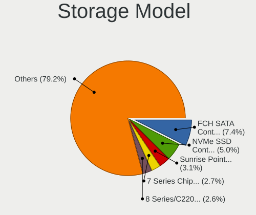

| Model                                                                            | Computers | Percent |
|----------------------------------------------------------------------------------|-----------|---------|
| AMD FCH SATA Controller [AHCI mode]                                              | 147       | 7.44%   |
| Samsung NVMe SSD Controller SM981/PM981/PM983                                    | 99        | 5.01%   |
| Intel Sunrise Point-LP SATA Controller [AHCI mode]                               | 61        | 3.09%   |
| Intel 7 Series Chipset Family 6-port SATA Controller [AHCI mode]                 | 53        | 2.68%   |
| Intel 8 Series/C220 Series Chipset Family 6-port SATA Controller 1 [AHCI mode]   | 51        | 2.58%   |
| Samsung NVMe SSD Controller 980 (DRAM-less)                                      | 49        | 2.48%   |
| Samsung NVMe SSD Controller PM9A1/PM9A3/980PRO                                   | 48        | 2.43%   |
| AMD 500 Series Chipset SATA Controller                                           | 42        | 2.13%   |
| Intel 6 Series/C200 Series Chipset Family 6 port Mobile SATA AHCI Controller     | 38        | 1.92%   |
| AMD 400 Series Chipset SATA Controller                                           | 38        | 1.92%   |
| Intel SATA Controller [RAID mode]                                                | 32        | 1.62%   |
| Intel Volume Management Device NVMe RAID Controller                              | 31        | 1.57%   |
| Intel Q170/Q150/B150/H170/H110/Z170/CM236 Chipset SATA Controller [AHCI Mode]    | 30        | 1.52%   |
| Intel 7 Series/C210 Series Chipset Family 6-port SATA Controller [AHCI mode]     | 28        | 1.42%   |
| Samsung NVMe SSD Controller SM961/PM961/SM963                                    | 27        | 1.37%   |
| AMD SB7x0/SB8x0/SB9x0 SATA Controller [AHCI mode]                                | 27        | 1.37%   |
| Micron/Crucial P2 [Nick P2] / P3 / P3 Plus NVMe PCIe SSD (DRAM-less)             | 26        | 1.32%   |
| Intel 6 Series/C200 Series Chipset Family 6 port Desktop SATA AHCI Controller    | 26        | 1.32%   |
| Intel 82801 Mobile SATA Controller [RAID mode]                                   | 25        | 1.27%   |
| Intel 8 Series SATA Controller 1 [AHCI mode]                                     | 24        | 1.22%   |
| AMD 600 Series Chipset SATA Controller                                           | 24        | 1.22%   |
| AMD SB7x0/SB8x0/SB9x0 IDE Controller                                             | 22        | 1.11%   |
| Intel Comet Lake SATA AHCI Controller                                            | 21        | 1.06%   |
| Intel 5 Series/3400 Series Chipset 6 port SATA AHCI Controller                   | 21        | 1.06%   |
| Intel 200 Series PCH SATA controller [AHCI mode]                                 | 21        | 1.06%   |
| ASMedia ASM1061/ASM1062 Serial ATA Controller                                    | 17        | 0.86%   |
| Intel Cannon Lake PCH SATA AHCI Controller                                       | 16        | 0.81%   |
| SK hynix Gold P31/BC711/PC711 NVMe Solid State Drive                             | 15        | 0.76%   |
| Intel Atom Processor E3800 Series SATA AHCI Controller                           | 15        | 0.76%   |
| Intel 82801IBM/IEM (ICH9M/ICH9M-E) 4 port SATA Controller [AHCI mode]            | 15        | 0.76%   |
| Intel Cannon Lake Mobile PCH SATA AHCI Controller                                | 14        | 0.71%   |
| Intel 500 Series Chipset Family SATA AHCI Controller                             | 14        | 0.71%   |
| Intel Raptor Lake SATA AHCI Controller                                           | 13        | 0.66%   |
| Intel 9 Series Chipset Family SATA Controller [AHCI Mode]                        | 13        | 0.66%   |
| Intel Wildcat Point-LP SATA Controller [AHCI Mode]                               | 12        | 0.61%   |
| Intel HM170/QM170 Chipset SATA Controller [AHCI Mode]                            | 12        | 0.61%   |
| Intel Atom/Celeron/Pentium Processor x5-E8000/J3xxx/N3xxx Series SATA Controller | 12        | 0.61%   |
| Intel 400 Series Chipset Family SATA AHCI Controller                             | 12        | 0.61%   |
| SK hynix BC501 NVMe Solid State Drive                                            | 11        | 0.56%   |
| Intel 5 Series/3400 Series Chipset 4 port SATA AHCI Controller                   | 11        | 0.56%   |

Storage Kind
------------

Kind of storage controller (IDE, SATA, NVMe, SAS, ...)

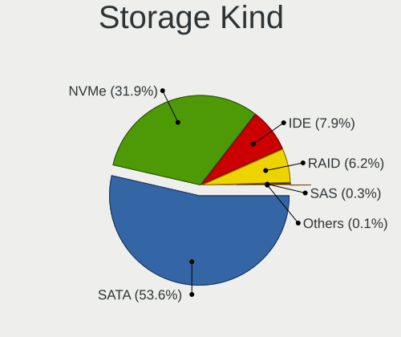

| Kind | Computers | Percent |
|------|-----------|---------|
| SATA | 926       | 53.59%  |
| NVMe | 551       | 31.89%  |
| IDE  | 136       | 7.87%   |
| RAID | 107       | 6.19%   |
| SAS  | 6         | 0.35%   |
| SCSI | 2         | 0.12%   |

Processor
---------

CPU Vendor
----------

Processor vendors

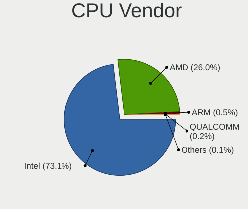

| Vendor        | Computers | Percent |
|---------------|-----------|---------|
| Intel         | 943       | 73.1%   |
| AMD           | 336       | 26.05%  |
| ARM           | 7         | 0.54%   |
| QUALCOMM      | 2         | 0.16%   |
| sifive,u74-mc | 1         | 0.08%   |
| CentaurHauls  | 1         | 0.08%   |

CPU Model
---------

Processor models

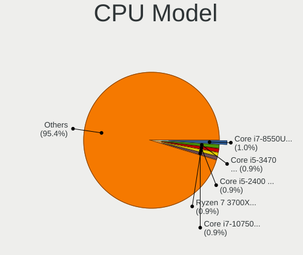

| Model                                         | Computers | Percent |
|-----------------------------------------------|-----------|---------|
| Intel Core i7-8550U CPU @ 1.80GHz             | 13        | 1.01%   |
| Intel Core i5-3470 CPU @ 3.20GHz              | 12        | 0.93%   |
| Intel Core i5-2400 CPU @ 3.10GHz              | 12        | 0.93%   |
| AMD Ryzen 7 3700X 8-Core Processor            | 12        | 0.93%   |
| Intel Core i7-10750H CPU @ 2.60GHz            | 11        | 0.85%   |
| Intel Core i5-7200U CPU @ 2.50GHz             | 11        | 0.85%   |
| Intel Core i5-10210U CPU @ 1.60GHz            | 11        | 0.85%   |
| AMD Ryzen 5 3600 6-Core Processor             | 11        | 0.85%   |
| Intel Core i7-9750H CPU @ 2.60GHz             | 10        | 0.77%   |
| Intel Core i7-7500U CPU @ 2.70GHz             | 10        | 0.77%   |
| Intel Core i5-6300U CPU @ 2.40GHz             | 10        | 0.77%   |
| Intel Core i5-6200U CPU @ 2.30GHz             | 10        | 0.77%   |
| AMD Ryzen 5 5600X 6-Core Processor            | 10        | 0.77%   |
| Intel Core i7-8565U CPU @ 1.80GHz             | 9         | 0.7%    |
| Intel Core i7-3770 CPU @ 3.40GHz              | 9         | 0.7%    |
| Intel Core i5-8265U CPU @ 1.60GHz             | 9         | 0.7%    |
| Intel Core i5-8250U CPU @ 1.60GHz             | 9         | 0.7%    |
| AMD Ryzen 5 2600 Six-Core Processor           | 9         | 0.7%    |
| Intel Core i5-6500 CPU @ 3.20GHz              | 8         | 0.62%   |
| Intel Core 2 Duo CPU P8600 @ 2.40GHz          | 8         | 0.62%   |
| AMD Ryzen 5 3500U with Radeon Vega Mobile Gfx | 8         | 0.62%   |
| Intel Core i7-8700 CPU @ 3.20GHz              | 7         | 0.54%   |
| Intel Core i7-4790K CPU @ 4.00GHz             | 7         | 0.54%   |
| Intel Core i7-4790 CPU @ 3.60GHz              | 7         | 0.54%   |
| Intel Core i7-4770 CPU @ 3.40GHz              | 7         | 0.54%   |
| Intel Core i5-8350U CPU @ 1.70GHz             | 7         | 0.54%   |
| Intel Core i5-3210M CPU @ 2.50GHz             | 7         | 0.54%   |
| Intel Core i5-2410M CPU @ 2.30GHz             | 7         | 0.54%   |
| Intel Celeron N4020 CPU @ 1.10GHz             | 7         | 0.54%   |
| AMD Ryzen 7 5800X 8-Core Processor            | 7         | 0.54%   |
| Intel Core i7-7700HQ CPU @ 2.80GHz            | 6         | 0.46%   |
| Intel Core i7-7700 CPU @ 3.60GHz              | 6         | 0.46%   |
| Intel Core i7-6700 CPU @ 3.40GHz              | 6         | 0.46%   |
| Intel Core i7-10510U CPU @ 1.80GHz            | 6         | 0.46%   |
| Intel Core i5-4570 CPU @ 3.20GHz              | 6         | 0.46%   |
| Intel Core i5-3230M CPU @ 2.60GHz             | 6         | 0.46%   |
| Intel Core i5-2520M CPU @ 2.50GHz             | 6         | 0.46%   |
| Intel Core i5-2430M CPU @ 2.40GHz             | 6         | 0.46%   |
| Intel Celeron N4500 @ 1.10GHz                 | 6         | 0.46%   |
| Intel Celeron CPU N2840 @ 2.16GHz             | 6         | 0.46%   |

CPU Model Family
----------------

Processor model prefix

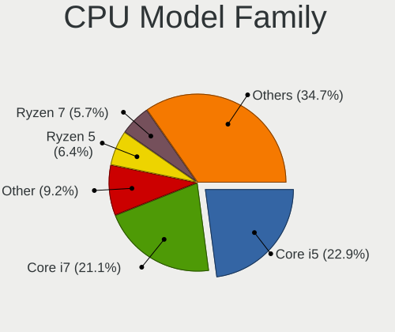

| Model                   | Computers | Percent |
|-------------------------|-----------|---------|
| Intel Core i5           | 296       | 22.93%  |
| Intel Core i7           | 272       | 21.07%  |
| Other                   | 119       | 9.22%   |
| AMD Ryzen 5             | 83        | 6.43%   |
| AMD Ryzen 7             | 73        | 5.65%   |
| Intel Core i3           | 66        | 5.11%   |
| Intel Celeron           | 50        | 3.87%   |
| Intel Core 2 Duo        | 49        | 3.8%    |
| Intel Xeon              | 40        | 3.1%    |
| AMD Ryzen 9             | 36        | 2.79%   |
| AMD FX                  | 21        | 1.63%   |
| Intel Pentium           | 18        | 1.39%   |
| AMD A6                  | 13        | 1.01%   |
| Intel Atom              | 12        | 0.93%   |
| Intel Core 2 Quad       | 11        | 0.85%   |
| AMD Ryzen 5 PRO         | 11        | 0.85%   |
| AMD Ryzen 3             | 10        | 0.77%   |
| AMD A8                  | 10        | 0.77%   |
| Intel Core i9           | 8         | 0.62%   |
| Intel Core              | 8         | 0.62%   |
| AMD E2                  | 8         | 0.62%   |
| AMD A4                  | 7         | 0.54%   |
| AMD Ryzen Threadripper  | 6         | 0.46%   |
| AMD Athlon II X2        | 5         | 0.39%   |
| AMD Athlon 64 X2        | 5         | 0.39%   |
| AMD Ryzen 7 PRO         | 4         | 0.31%   |
| Intel Pentium Dual-Core | 3         | 0.23%   |
| AMD Phenom II X6        | 3         | 0.23%   |
| AMD E1                  | 3         | 0.23%   |
| AMD A10                 | 3         | 0.23%   |
| Intel Pentium Silver    | 2         | 0.15%   |
| Intel Pentium M         | 2         | 0.15%   |
| Intel Celeron Dual-Core | 2         | 0.15%   |
| AMD Phenom II X4        | 2         | 0.15%   |
| AMD Opteron             | 2         | 0.15%   |
| AMD G                   | 2         | 0.15%   |
| AMD E                   | 2         | 0.15%   |
| AMD Athlon II X4        | 2         | 0.15%   |
| AMD Athlon              | 2         | 0.15%   |
| AMD A12                 | 2         | 0.15%   |

CPU Cores
---------

Number of processor cores

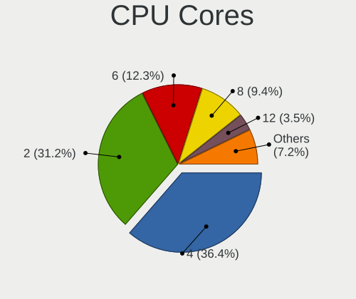

| Number  | Computers | Percent |
|---------|-----------|---------|
| 4       | 471       | 36.4%   |
| 2       | 404       | 31.22%  |
| 6       | 159       | 12.29%  |
| 8       | 122       | 9.43%   |
| 12      | 45        | 3.48%   |
| 10      | 20        | 1.55%   |
| 16      | 17        | 1.31%   |
| 14      | 14        | 1.08%   |
| 1       | 12        | 0.93%   |
| 24      | 9         | 0.7%    |
| 20      | 8         | 0.62%   |
| 3       | 7         | 0.54%   |
| Unknown | 3         | 0.23%   |
| 64      | 1         | 0.08%   |
| 36      | 1         | 0.08%   |
| 32      | 1         | 0.08%   |

CPU Sockets
-----------

Number of sockets

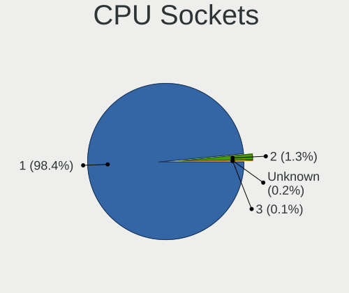

| Number  | Computers | Percent |
|---------|-----------|---------|
| 1       | 1270      | 98.45%  |
| 2       | 17        | 1.32%   |
| Unknown | 2         | 0.16%   |
| 3       | 1         | 0.08%   |

CPU Threads
-----------

Threads per core (Hyper-Threading)

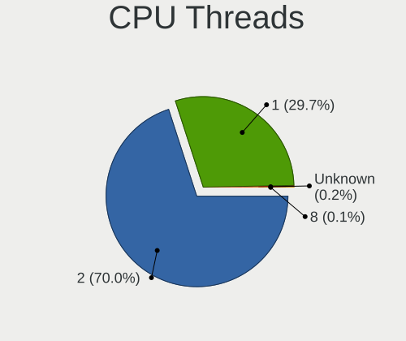

| Number  | Computers | Percent |
|---------|-----------|---------|
| 2       | 906       | 70.02%  |
| 1       | 384       | 29.68%  |
| Unknown | 3         | 0.23%   |
| 8       | 1         | 0.08%   |

CPU Op-Modes
------------

CPU Operation Modes (32-bit, 64-bit)

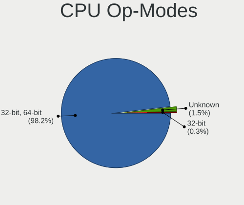

| Op mode        | Computers | Percent |
|----------------|-----------|---------|
| 32-bit, 64-bit | 1274      | 98.15%  |
| Unknown        | 20        | 1.54%   |
| 32-bit         | 4         | 0.31%   |

CPU Microcode
-------------

Microcode number

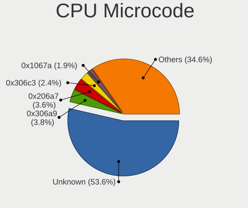

| Number     | Computers | Percent |
|------------|-----------|---------|
| Unknown    | 726       | 53.58%  |
| 0x306a9    | 52        | 3.84%   |
| 0x206a7    | 49        | 3.62%   |
| 0x306c3    | 33        | 2.44%   |
| 0x1067a    | 26        | 1.92%   |
| 0x806ea    | 19        | 1.4%    |
| 0x806e9    | 19        | 1.4%    |
| 0x806ec    | 17        | 1.25%   |
| 0x406e3    | 17        | 1.25%   |
| 0x906e9    | 16        | 1.18%   |
| 0x08701021 | 16        | 1.18%   |
| 0x40651    | 13        | 0.96%   |
| 0x20655    | 13        | 0.96%   |
| 0x506e3    | 12        | 0.89%   |
| 0x906ea    | 11        | 0.81%   |
| 0x30678    | 10        | 0.74%   |
| 0x06000852 | 10        | 0.74%   |
| 0xa0652    | 9         | 0.66%   |
| 0x106e5    | 9         | 0.66%   |
| 0x0a50000d | 9         | 0.66%   |
| 0x0a50000c | 9         | 0.66%   |
| 0x07030105 | 9         | 0.66%   |
| 0x10676    | 8         | 0.59%   |
| 0x0800820d | 8         | 0.59%   |
| 0x806c1    | 7         | 0.52%   |
| 0x506c9    | 7         | 0.52%   |
| 0x306d4    | 7         | 0.52%   |
| 0x08108109 | 7         | 0.52%   |
| 0xa0655    | 6         | 0.44%   |
| 0x906a4    | 6         | 0.44%   |
| 0x906a3    | 6         | 0.44%   |
| 0x0a601203 | 6         | 0.44%   |
| 0x06001119 | 6         | 0.44%   |
| 0x806eb    | 5         | 0.37%   |
| 0x6fb      | 5         | 0.37%   |
| 0x106a5    | 5         | 0.37%   |
| 0x08600106 | 5         | 0.37%   |
| 0x08001137 | 5         | 0.37%   |
| 0x906ed    | 4         | 0.3%    |
| 0x6fd      | 4         | 0.3%    |

CPU Microarch
-------------

Microarchitecture

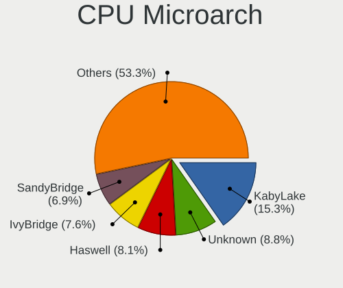

| Name              | Computers | Percent |
|-------------------|-----------|---------|
| KabyLake          | 198       | 15.29%  |
| Unknown           | 114       | 8.8%    |
| Haswell           | 105       | 8.11%   |
| IvyBridge         | 99        | 7.64%   |
| SandyBridge       | 89        | 6.87%   |
| Skylake           | 75        | 5.79%   |
| Zen 3             | 71        | 5.48%   |
| Penryn            | 56        | 4.32%   |
| Zen 2             | 50        | 3.86%   |
| CometLake         | 43        | 3.32%   |
| Alderlake Hybrid  | 39        | 3.01%   |
| Zen+              | 37        | 2.86%   |
| Westmere          | 34        | 2.63%   |
| Silvermont        | 34        | 2.63%   |
| Piledriver        | 26        | 2.01%   |
| TigerLake         | 22        | 1.7%    |
| Nehalem           | 20        | 1.54%   |
| Zen               | 17        | 1.31%   |
| Puma              | 17        | 1.31%   |
| Broadwell         | 17        | 1.31%   |
| Core              | 16        | 1.24%   |
| K10               | 15        | 1.16%   |
| Excavator         | 15        | 1.16%   |
| IceLake           | 13        | 1%      |
| Goldmont plus     | 12        | 0.93%   |
| Goldmont          | 11        | 0.85%   |
| K8 Hammer         | 6         | 0.46%   |
| Jaguar            | 6         | 0.46%   |
| Bobcat            | 6         | 0.46%   |
| Tremont           | 5         | 0.39%   |
| Bulldozer         | 5         | 0.39%   |
| Bonnell           | 5         | 0.39%   |
| Meteorlake Hybrid | 4         | 0.31%   |
| Gracemont         | 3         | 0.23%   |
| P6                | 2         | 0.15%   |
| Lunarlake Hybrid  | 2         | 0.15%   |
| K10 Llano         | 2         | 0.15%   |
| Steamroller       | 1         | 0.08%   |
| NetBurst          | 1         | 0.08%   |
| K8 & K10 hybrid   | 1         | 0.08%   |

Graphics
--------

GPU Vendor
----------

Vendors of graphics cards

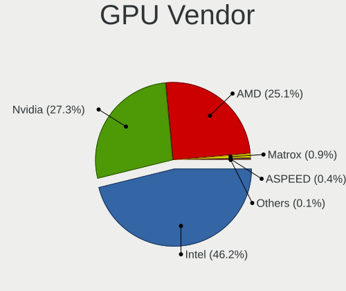

| Vendor                     | Computers | Percent |
|----------------------------|-----------|---------|
| Intel                      | 704       | 46.16%  |
| Nvidia                     | 417       | 27.34%  |
| AMD                        | 383       | 25.11%  |
| Matrox Electronics Systems | 14        | 0.92%   |
| ASPEED Technology          | 6         | 0.39%   |
| VIA Technologies           | 1         | 0.07%   |

GPU Model
---------

Graphics card models

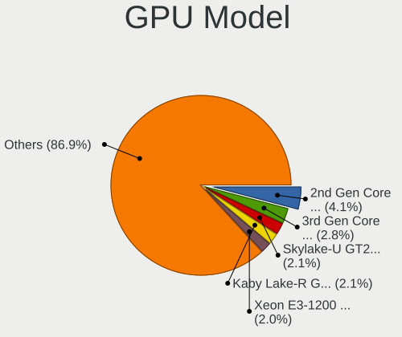

| Model                                                                                    | Computers | Percent |
|------------------------------------------------------------------------------------------|-----------|---------|
| Intel 2nd Generation Core Processor Family Integrated Graphics Controller                | 65        | 4.11%   |
| Intel 3rd Gen Core processor Graphics Controller                                         | 45        | 2.84%   |
| Intel Skylake-U GT2 [HD Graphics 520]                                                    | 34        | 2.15%   |
| Intel Kaby Lake-R GT2 [UHD Graphics 620]                                                 | 33        | 2.09%   |
| Intel Xeon E3-1200 v3/4th Gen Core Processor Integrated Graphics Controller              | 31        | 1.96%   |
| AMD Ellesmere [Radeon RX 470/480/570/570X/580/580X/590]                                  | 31        | 1.96%   |
| Intel Kaby Lake-U GT2 [HD Graphics 620]                                                  | 30        | 1.9%    |
| AMD Cezanne [Radeon Vega Series / Radeon Vega Mobile Series]                             | 25        | 1.58%   |
| Intel Haswell-ULT Integrated Graphics Controller                                         | 24        | 1.52%   |
| Intel WhiskeyLake-U GT2 [UHD Graphics 620]                                               | 20        | 1.26%   |
| Intel TigerLake-LP GT2 [Iris Xe Graphics]                                                | 20        | 1.26%   |
| AMD Picasso/Raven 2 [Radeon Vega Series / Radeon Vega Mobile Series]                     | 20        | 1.26%   |
| Intel Core Processor Integrated Graphics Controller                                      | 19        | 1.2%    |
| Intel Skylake-S GT2 [HD Graphics 530]                                                    | 18        | 1.14%   |
| Intel CometLake-U GT2 [UHD Graphics]                                                     | 18        | 1.14%   |
| Intel Atom/Celeron/Pentium Processor x5-E8000/J3xxx/N3xxx Integrated Graphics Controller | 17        | 1.07%   |
| Intel Atom Processor Z36xxx/Z37xxx Series Graphics & Display                             | 17        | 1.07%   |
| Intel CometLake-H GT2 [UHD Graphics]                                                     | 16        | 1.01%   |
| Intel CoffeeLake-S GT2 [UHD Graphics 630]                                                | 16        | 1.01%   |
| Intel 4th Gen Core Processor Integrated Graphics Controller                              | 16        | 1.01%   |
| AMD Raphael                                                                              | 16        | 1.01%   |
| Intel CoffeeLake-H GT2 [UHD Graphics 630]                                                | 15        | 0.95%   |
| AMD Navi 23 [Radeon RX 6600/6600 XT/6600M]                                               | 15        | 0.95%   |
| Intel Kaby Lake-S GT2 [HD Graphics 630]                                                  | 14        | 0.88%   |
| Intel Xeon E3-1200 v2/3rd Gen Core processor Graphics Controller                         | 13        | 0.82%   |
| AMD Topaz XT [Radeon R7 M260/M265 / M340/M360 / M440/M445 / 530/535 / 620/625 Mobile]    | 13        | 0.82%   |
| AMD Renoir [Radeon Vega Series / Radeon Vega Mobile Series]                              | 13        | 0.82%   |
| Nvidia GP102 [GeForce GTX 1080 Ti]                                                       | 12        | 0.76%   |
| Intel Mobile 4 Series Chipset Integrated Graphics Controller                             | 12        | 0.76%   |
| Intel GeminiLake [UHD Graphics 600]                                                      | 12        | 0.76%   |
| Intel Alder Lake-P GT2 [Iris Xe Graphics]                                                | 12        | 0.76%   |
| AMD Stoney [Radeon R2/R3/R4/R5 Graphics]                                                 | 12        | 0.76%   |
| AMD Cedar [Radeon HD 5000/6000/7350/8350 Series]                                         | 11        | 0.7%    |
| Nvidia GP107 [GeForce GTX 1050 Ti]                                                       | 10        | 0.63%   |
| Nvidia GK208B [GeForce GT 710]                                                           | 10        | 0.63%   |
| Intel Kaby Lake-H GT2 [HD Graphics 630]                                                  | 10        | 0.63%   |
| Intel CometLake-S GT2 [UHD Graphics 630]                                                 | 10        | 0.63%   |
| Intel Broadwell-U GT2 [HD Graphics 5500]                                                 | 10        | 0.63%   |
| AMD Mullins [Radeon R4/R5 Graphics]                                                      | 10        | 0.63%   |
| Nvidia GP108 [GeForce GT 1030]                                                           | 9         | 0.57%   |

GPU Combo
---------

Combinations of graphics cards

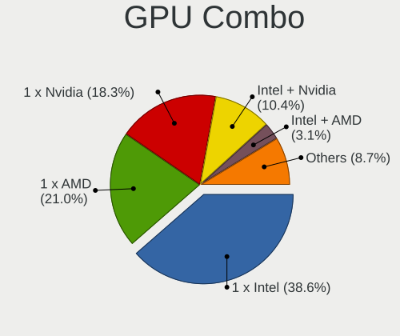

| Name                    | Computers | Percent |
|-------------------------|-----------|---------|
| 1 x Intel               | 503       | 38.57%  |
| 1 x AMD                 | 274       | 21.01%  |
| 1 x Nvidia              | 238       | 18.25%  |
| Intel + Nvidia          | 136       | 10.43%  |
| Intel + AMD             | 40        | 3.07%   |
| 2 x AMD                 | 37        | 2.84%   |
| AMD + Nvidia            | 32        | 2.45%   |
| Other                   | 12        | 0.92%   |
| 1 x Matrox              | 11        | 0.84%   |
| 2 x Nvidia              | 6         | 0.46%   |
| 2 x Intel               | 4         | 0.31%   |
| Nvidia + ASPEED         | 2         | 0.15%   |
| 1 x ASPEED              | 2         | 0.15%   |
| AMD + Matrox            | 2         | 0.15%   |
| 2 x Nvidia + 1 x ASPEED | 1         | 0.08%   |
| 1 x VIA                 | 1         | 0.08%   |
| Nvidia + Matrox         | 1         | 0.08%   |
| AMD + 2 x Nvidia        | 1         | 0.08%   |
| AMD + ASPEED            | 1         | 0.08%   |

GPU Driver
----------

Free vs proprietary

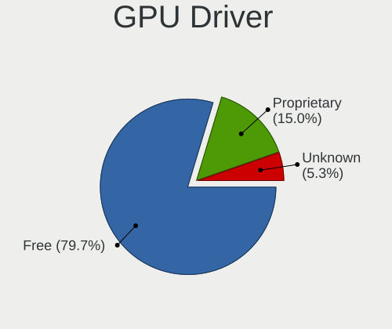

| Driver      | Computers | Percent |
|-------------|-----------|---------|
| Free        | 1049      | 79.65%  |
| Proprietary | 198       | 15.03%  |
| Unknown     | 70        | 5.32%   |

GPU Memory
----------

Total video memory

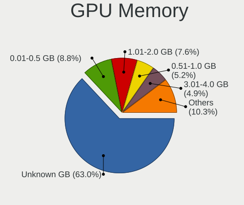

| Size in GB | Computers | Percent |
|------------|-----------|---------|
| Unknown    | 842       | 63.02%  |
| 0.01-0.5   | 118       | 8.83%   |
| 1.01-2.0   | 102       | 7.63%   |
| 0.51-1.0   | 70        | 5.24%   |
| 3.01-4.0   | 66        | 4.94%   |
| 7.01-8.0   | 62        | 4.64%   |
| 8.01-16.0  | 33        | 2.47%   |
| 5.01-6.0   | 28        | 2.1%    |
| 2.01-3.0   | 7         | 0.52%   |
| 16.01-24.0 | 5         | 0.37%   |
| 4.01-5.0   | 2         | 0.15%   |
| 32.01-64.0 | 1         | 0.07%   |

Monitor
-------

Monitor Vendor
--------------

Monitor vendors

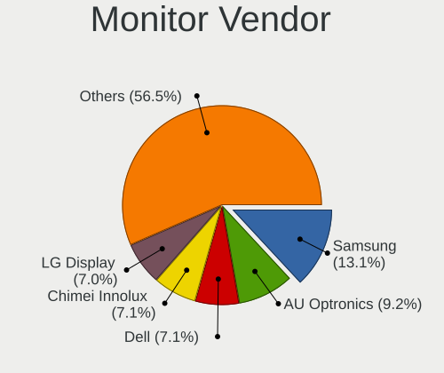

| Vendor                  | Computers | Percent |
|-------------------------|-----------|---------|
| Samsung Electronics     | 193       | 13.08%  |
| AU Optronics            | 135       | 9.15%   |
| Dell                    | 105       | 7.12%   |
| Chimei Innolux          | 105       | 7.12%   |
| LG Display              | 103       | 6.98%   |
| Goldstar                | 99        | 6.71%   |
| AOC                     | 96        | 6.51%   |
| BOE                     | 91        | 6.17%   |
| Philips                 | 55        | 3.73%   |
| Hewlett-Packard         | 46        | 3.12%   |
| ViewSonic               | 40        | 2.71%   |
| Apple                   | 37        | 2.51%   |
| Acer                    | 32        | 2.17%   |
| Lenovo                  | 31        | 2.1%    |
| Sharp                   | 30        | 2.03%   |
| Panasonic               | 24        | 1.63%   |
| Sony                    | 22        | 1.49%   |
| Chi Mei Optoelectronics | 20        | 1.36%   |
| Ancor Communications    | 18        | 1.22%   |
| BenQ                    | 17        | 1.15%   |
| Denver                  | 16        | 1.08%   |
| MiTAC                   | 13        | 0.88%   |
| PANDA                   | 12        | 0.81%   |
| ASUSTek Computer        | 12        | 0.81%   |
| InfoVision              | 10        | 0.68%   |
| Gigabyte Technology     | 8         | 0.54%   |
| Valve                   | 6         | 0.41%   |
| Unknown                 | 5         | 0.34%   |
| LG Electronics          | 4         | 0.27%   |
| TMX                     | 3         | 0.2%    |
| MSI                     | 3         | 0.2%    |
| Mi                      | 3         | 0.2%    |
| KTC                     | 3         | 0.2%    |
| Kogan                   | 3         | 0.2%    |
| InnoLux Display         | 3         | 0.2%    |
| Unknown                 | 3         | 0.2%    |
| Yamaha                  | 2         | 0.14%   |
| Wacom                   | 2         | 0.14%   |
| Unknown (AAA)           | 2         | 0.14%   |
| Toshiba                 | 2         | 0.14%   |

Monitor Model
-------------

Monitor models

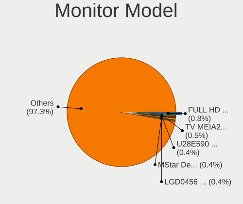

| Model                                                                    | Computers | Percent |
|--------------------------------------------------------------------------|-----------|---------|
| Goldstar FULL HD GSM5B55 1920x1080 480x270mm 21.7-inch                   | 13        | 0.83%   |
| Panasonic TV MEIA296 1920x1080 698x392mm 31.5-inch                       | 8         | 0.51%   |
| Samsung Electronics U28E590 SAM0C4D 3840x2160 607x345mm 27.5-inch        | 7         | 0.45%   |
| MiTAC MStar Demo SZM0030 3840x2160 708x398mm 32.0-inch                   | 7         | 0.45%   |
| LG Display LCD Monitor LGD0456 1366x768 344x194mm 15.5-inch              | 7         | 0.45%   |
| Goldstar LG IPS FULLHD GSM5AB8 1920x1080 480x270mm 21.7-inch             | 7         | 0.45%   |
| Chimei Innolux LCD Monitor CMN15E6 1366x768 344x193mm 15.5-inch          | 7         | 0.45%   |
| AOC 27G2G4 AOC2702 1920x1080 598x336mm 27.0-inch                         | 7         | 0.45%   |
| Samsung Electronics S24F350 SAM0D20 1920x1080 521x293mm 23.5-inch        | 6         | 0.39%   |
| Philips PHL 243V7 PHLC155 1920x1080 527x296mm 23.8-inch                  | 6         | 0.39%   |
| Chimei Innolux LCD Monitor CMN14D4 1920x1080 309x173mm 13.9-inch         | 6         | 0.39%   |
| Chi Mei Optoelectronics LCD Monitor CMO15A1 1366x768 344x193mm 15.5-inch | 6         | 0.39%   |
| AOC 2450W AOC2450 1920x1080 521x293mm 23.5-inch                          | 6         | 0.39%   |
| Sony TV SNYEE01 1920x1080                                                | 5         | 0.32%   |
| LG Display LCD Monitor LGD02DC 1366x768 344x194mm 15.5-inch              | 5         | 0.32%   |
| Goldstar FULL HD GSM5AB9 1920x1080 480x270mm 21.7-inch                   | 5         | 0.32%   |
| Chimei Innolux LCD Monitor CMN1521 1920x1080 344x193mm 15.5-inch         | 5         | 0.32%   |
| BOE LCD Monitor BOE06A4 1366x768 344x194mm 15.5-inch                     | 5         | 0.32%   |
| AU Optronics LCD Monitor AUO403D 1920x1080 309x174mm 14.0-inch           | 5         | 0.32%   |
| AU Optronics LCD Monitor AUO23ED 1920x1080 344x193mm 15.5-inch           | 5         | 0.32%   |
| Apple iMac APPA012 1920x1080 475x267mm 21.5-inch                         | 5         | 0.32%   |
| Ancor Communications VE247 ACI2493 1920x1080 530x300mm 24.0-inch         | 5         | 0.32%   |
| ViewSonic VA2248 SERIES VSC0E28 1920x1080 477x268mm 21.5-inch            | 4         | 0.26%   |
| Valve ANX7530 U VLV3001 800x1280 100x150mm 7.1-inch                      | 4         | 0.26%   |
| Sharp LCD Monitor SHP144D 3840x2160 276x156mm 12.5-inch                  | 4         | 0.26%   |
| Sharp LCD Monitor SHP144A 3200x1800 294x165mm 13.3-inch                  | 4         | 0.26%   |
| Philips PHL 246V5 PHLC0C5 1920x1080 531x299mm 24.0-inch                  | 4         | 0.26%   |
| LG Display LCD Monitor LGD0465 1366x768 344x194mm 15.5-inch              | 4         | 0.26%   |
| LG Display LCD Monitor LGD033A 1366x768 344x194mm 15.5-inch              | 4         | 0.26%   |
| Goldstar FULL HD GSM5ABA 1920x1080 480x270mm 21.7-inch                   | 4         | 0.26%   |
| Denver PGM340 LHC3400 3440x1440 790x330mm 33.7-inch                      | 4         | 0.26%   |
| Denver PGM270 LHC2700 2560x1440 597x336mm 27.0-inch                      | 4         | 0.26%   |
| Denver MO-HHS-32C LHCFFFF 1920x1080 699x393mm 31.6-inch                  | 4         | 0.26%   |
| Dell P2214H DELA097 1920x1080 477x268mm 21.5-inch                        | 4         | 0.26%   |
| Chimei Innolux LCD Monitor CMN15E7 1920x1080 344x193mm 15.5-inch         | 4         | 0.26%   |
| Chimei Innolux LCD Monitor CMN15BF 1366x768 344x194mm 15.5-inch          | 4         | 0.26%   |
| Chimei Innolux LCD Monitor CMN14E5 1920x1080 309x173mm 13.9-inch         | 4         | 0.26%   |
| AU Optronics LCD Monitor AUO70EC 1366x768 344x193mm 15.5-inch            | 4         | 0.26%   |
| AU Optronics LCD Monitor AUO23EC 1366x768 344x193mm 15.5-inch            | 4         | 0.26%   |
| AOC 2470W AOC2470 1920x1080 521x293mm 23.5-inch                          | 4         | 0.26%   |

Monitor Resolution
------------------

Monitor screen resolution

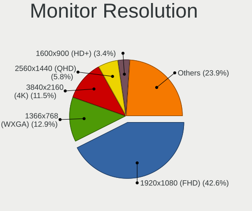

| Resolution         | Computers | Percent |
|--------------------|-----------|---------|
| 1920x1080 (FHD)    | 605       | 42.58%  |
| 1366x768 (WXGA)    | 183       | 12.88%  |
| 3840x2160 (4K)     | 163       | 11.47%  |
| 2560x1440 (QHD)    | 82        | 5.77%   |
| 1600x900 (HD+)     | 48        | 3.38%   |
| 1920x1200 (WUXGA)  | 44        | 3.1%    |
| 1680x1050 (WSXGA+) | 44        | 3.1%    |
| 1440x900 (WXGA+)   | 35        | 2.46%   |
| 1280x1024 (SXGA)   | 31        | 2.18%   |
| 3440x1440          | 29        | 2.04%   |
| 1280x800 (WXGA)    | 25        | 1.76%   |
| Unknown            | 16        | 1.13%   |
| 2560x1600          | 14        | 0.99%   |
| 3840x1080          | 13        | 0.91%   |
| 2880x1800          | 12        | 0.84%   |
| 2560x1080          | 8         | 0.56%   |
| 1360x768           | 7         | 0.49%   |
| 800x1280           | 6         | 0.42%   |
| 3200x1800 (QHD+)   | 6         | 0.42%   |
| 3840x1600          | 4         | 0.28%   |
| 1920x540           | 4         | 0.28%   |
| 1024x600           | 4         | 0.28%   |
| 3840x2400          | 3         | 0.21%   |
| 3456x2160          | 3         | 0.21%   |
| 2288x1287          | 3         | 0.21%   |
| 1600x1200          | 3         | 0.21%   |
| 3200x2000          | 2         | 0.14%   |
| 2880x1920          | 2         | 0.14%   |
| 2736x1824          | 2         | 0.14%   |
| 1280x720 (HD)      | 2         | 0.14%   |
| 1024x768 (XGA)     | 2         | 0.14%   |
| 7680x1080          | 1         | 0.07%   |
| 6720x1080          | 1         | 0.07%   |
| 5760x1080          | 1         | 0.07%   |
| 5120x1080          | 1         | 0.07%   |
| 3840x1200          | 1         | 0.07%   |
| 3360x1080          | 1         | 0.07%   |
| 3040x1050          | 1         | 0.07%   |
| 3000x2120          | 1         | 0.07%   |
| 2960x1050          | 1         | 0.07%   |

Monitor Diagonal
----------------

Diagonal size in inches

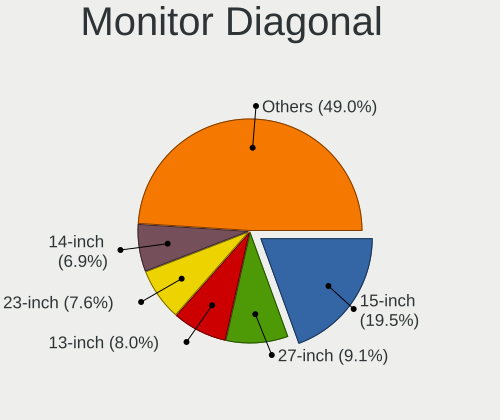

| Inches  | Computers | Percent |
|---------|-----------|---------|
| 15      | 288       | 19.46%  |
| 27      | 134       | 9.05%   |
| 13      | 118       | 7.97%   |
| 23      | 113       | 7.64%   |
| 14      | 102       | 6.89%   |
| 24      | 99        | 6.69%   |
| 21      | 90        | 6.08%   |
| 31      | 78        | 5.27%   |
| 17      | 67        | 4.53%   |
| Unknown | 56        | 3.78%   |
| 22      | 35        | 2.36%   |
| 19      | 31        | 2.09%   |
| 20      | 24        | 1.62%   |
| 34      | 23        | 1.55%   |
| 16      | 23        | 1.55%   |
| 12      | 22        | 1.49%   |
| 72      | 20        | 1.35%   |
| 84      | 18        | 1.22%   |
| 18      | 16        | 1.08%   |
| 32      | 10        | 0.68%   |
| 11      | 10        | 0.68%   |
| 26      | 8         | 0.54%   |
| 10      | 8         | 0.54%   |
| 40      | 7         | 0.47%   |
| 7       | 7         | 0.47%   |
| 49      | 6         | 0.41%   |
| 46      | 6         | 0.41%   |
| 37      | 6         | 0.41%   |
| 63      | 5         | 0.34%   |
| 28      | 5         | 0.34%   |
| 29      | 4         | 0.27%   |
| 142     | 3         | 0.2%    |
| 65      | 3         | 0.2%    |
| 64      | 3         | 0.2%    |
| 52      | 3         | 0.2%    |
| 35      | 3         | 0.2%    |
| 33      | 3         | 0.2%    |
| 25      | 3         | 0.2%    |
| 54      | 2         | 0.14%   |
| 48      | 2         | 0.14%   |

Monitor Width
-------------

Physical width

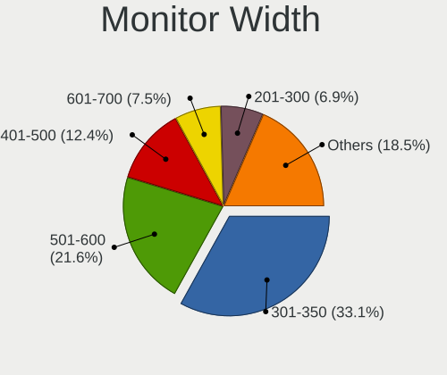

| Width in mm    | Computers | Percent |
|----------------|-----------|---------|
| 301-350        | 478       | 33.06%  |
| 501-600        | 313       | 21.65%  |
| 401-500        | 179       | 12.38%  |
| 601-700        | 108       | 7.47%   |
| 201-300        | 100       | 6.92%   |
| 351-400        | 70        | 4.84%   |
| Unknown        | 56        | 3.87%   |
| 701-800        | 39        | 2.7%    |
| 1501-2000      | 37        | 2.56%   |
| 1001-1500      | 34        | 2.35%   |
| 801-900        | 18        | 1.24%   |
| 1-100          | 6         | 0.41%   |
| 901-1000       | 4         | 0.28%   |
| More than 2000 | 3         | 0.21%   |
| 101-200        | 1         | 0.07%   |

Aspect Ratio
------------

Proportional relationship between the width and the height

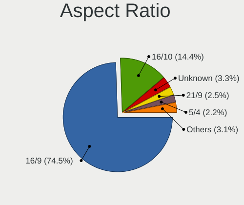

| Ratio   | Computers | Percent |
|---------|-----------|---------|
| 16/9    | 962       | 74.46%  |
| 16/10   | 186       | 14.4%   |
| Unknown | 43        | 3.33%   |
| 21/9    | 32        | 2.48%   |
| 5/4     | 29        | 2.24%   |
| 32/9    | 11        | 0.85%   |
| 3/2     | 9         | 0.7%    |
| 4/3     | 8         | 0.62%   |
| 0.67    | 4         | 0.31%   |
| 1.00    | 3         | 0.23%   |
| 6/5     | 2         | 0.15%   |
| 0.62    | 2         | 0.15%   |
| 0.45    | 1         | 0.08%   |

Monitor Area
------------

Area in inch²

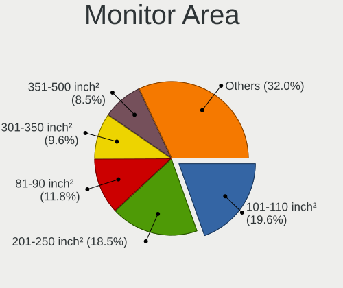

| Area in inch² | Computers | Percent |
|----------------|-----------|---------|
| 101-110        | 284       | 19.56%  |
| 201-250        | 269       | 18.53%  |
| 81-90          | 172       | 11.85%  |
| 301-350        | 140       | 9.64%   |
| 351-500        | 123       | 8.47%   |
| 151-200        | 81        | 5.58%   |
| More than 1000 | 57        | 3.93%   |
| Unknown        | 56        | 3.86%   |
| 71-80          | 48        | 3.31%   |
| 121-130        | 48        | 3.31%   |
| 251-300        | 36        | 2.48%   |
| 501-1000       | 35        | 2.41%   |
| 141-150        | 27        | 1.86%   |
| 111-120        | 24        | 1.65%   |
| 61-70          | 21        | 1.45%   |
| 51-60          | 10        | 0.69%   |
| 41-50          | 8         | 0.55%   |
| 1-40           | 7         | 0.48%   |
| 131-140        | 5         | 0.34%   |
| 91-100         | 1         | 0.07%   |

Pixel Density
-------------

Pixels per inch

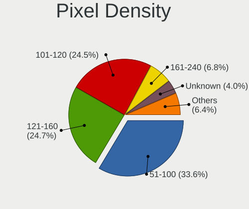

| Density       | Computers | Percent |
|---------------|-----------|---------|
| 51-100        | 475       | 33.59%  |
| 121-160       | 349       | 24.68%  |
| 101-120       | 347       | 24.54%  |
| 161-240       | 96        | 6.79%   |
| Unknown       | 56        | 3.96%   |
| 1-50          | 50        | 3.54%   |
| More than 240 | 41        | 2.9%    |

Multiple Monitors
-----------------

Total monitors connected

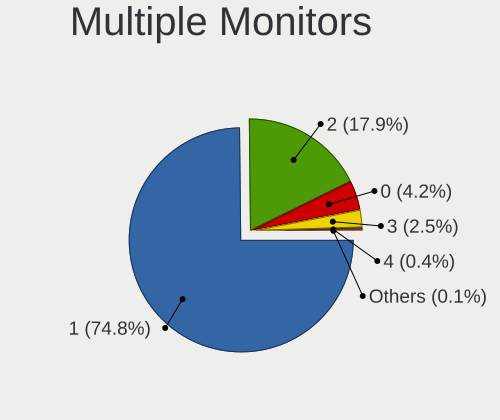

| Total | Computers | Percent |
|-------|-----------|---------|
| 1     | 1005      | 74.83%  |
| 2     | 240       | 17.87%  |
| 0     | 57        | 4.24%   |
| 3     | 34        | 2.53%   |
| 4     | 6         | 0.45%   |
| 5     | 1         | 0.07%   |

Network
-------

Net Controller Vendor
---------------------

Controller vendors

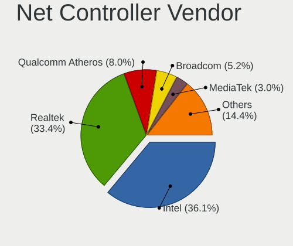

| Vendor                          | Computers | Percent |
|---------------------------------|-----------|---------|
| Intel                           | 711       | 36.07%  |
| Realtek Semiconductor           | 658       | 33.38%  |
| Qualcomm Atheros                | 158       | 8.02%   |
| Broadcom                        | 102       | 5.18%   |
| MediaTek                        | 59        | 2.99%   |
| TP-Link                         | 34        | 1.73%   |
| Ralink                          | 22        | 1.12%   |
| Broadcom Limited                | 22        | 1.12%   |
| Nvidia                          | 20        | 1.01%   |
| Marvell Technology Group        | 17        | 0.86%   |
| Ralink Technology               | 16        | 0.81%   |
| NetGear                         | 9         | 0.46%   |
| Microsoft                       | 9         | 0.46%   |
| Hewlett-Packard                 | 9         | 0.46%   |
| DisplayLink                     | 9         | 0.46%   |
| ASIX Electronics                | 9         | 0.46%   |
| Aquantia                        | 8         | 0.41%   |
| Samsung Electronics             | 7         | 0.36%   |
| Sierra Wireless                 | 6         | 0.3%    |
| OPPO Electronics                | 6         | 0.3%    |
| D-Link                          | 6         | 0.3%    |
| Qualcomm Atheros Communications | 5         | 0.25%   |
| Qualcomm                        | 5         | 0.25%   |
| Shenzhen Goodix Technology      | 4         | 0.2%    |
| Lenovo                          | 4         | 0.2%    |
| Edimax Technology               | 4         | 0.2%    |
| Microchip Technology            | 3         | 0.15%   |
| IBM                             | 3         | 0.15%   |
| Huawei Technologies             | 3         | 0.15%   |
| Dell                            | 3         | 0.15%   |
| ASUSTek Computer                | 3         | 0.15%   |
| U-Blox                          | 2         | 0.1%    |
| QinHeng Electronics             | 2         | 0.1%    |
| Mellanox Technologies           | 2         | 0.1%    |
| MCS                             | 2         | 0.1%    |
| JMicron Technology              | 2         | 0.1%    |
| ZTE WCDMA Technologies MSM      | 1         | 0.05%   |
| Xiaomi                          | 1         | 0.05%   |
| Wilocity                        | 1         | 0.05%   |
| Wacom                           | 1         | 0.05%   |

Net Controller Model
--------------------

Controller models

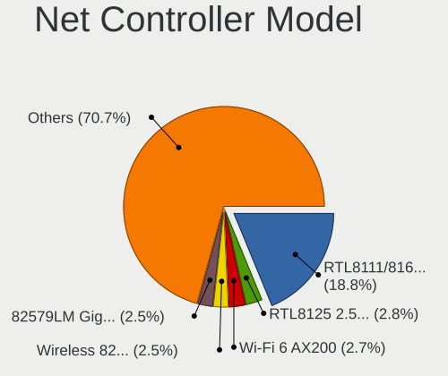

| Model                                                                  | Computers | Percent |
|------------------------------------------------------------------------|-----------|---------|
| Realtek RTL8111/8168/8211/8411 PCI Express Gigabit Ethernet Controller | 435       | 18.77%  |
| Realtek RTL8125 2.5GbE Controller                                      | 64        | 2.76%   |
| Intel Wi-Fi 6 AX200                                                    | 63        | 2.72%   |
| Intel Wireless 8265 / 8275                                             | 58        | 2.5%    |
| Intel 82579LM Gigabit Network Connection (Lewisville)                  | 58        | 2.5%    |
| Realtek RTL810xE PCI Express Fast Ethernet controller                  | 47        | 2.03%   |
| Realtek RTL8153 Gigabit Ethernet Adapter                               | 43        | 1.86%   |
| Qualcomm Atheros QCA6174 802.11ac Wireless Network Adapter             | 41        | 1.77%   |
| Intel Wireless 8260                                                    | 33        | 1.42%   |
| Intel I211 Gigabit Network Connection                                  | 29        | 1.25%   |
| Intel Wireless 7260                                                    | 26        | 1.12%   |
| Intel Ethernet Controller I225-V                                       | 24        | 1.04%   |
| Intel Dual Band Wireless-AC 3168NGW [Stone Peak]                       | 22        | 0.95%   |
| Intel Comet Lake PCH-LP CNVi WiFi                                      | 22        | 0.95%   |
| Qualcomm Atheros QCA9565 / AR9565 Wireless Network Adapter             | 21        | 0.91%   |
| Qualcomm Atheros AR9485 Wireless Network Adapter                       | 20        | 0.86%   |
| Intel Wireless 3165                                                    | 20        | 0.86%   |
| Intel Ethernet Connection I217-LM                                      | 20        | 0.86%   |
| Intel Ethernet Connection (2) I219-LM                                  | 20        | 0.86%   |
| Realtek RTL8822CE 802.11ac PCIe Wireless Network Adapter               | 19        | 0.82%   |
| Intel Ethernet Connection (2) I219-V                                   | 19        | 0.82%   |
| Intel Alder Lake-P PCH CNVi WiFi                                       | 19        | 0.82%   |
| Qualcomm Atheros QCA9377 802.11ac Wireless Network Adapter             | 18        | 0.78%   |
| Qualcomm Atheros AR8151 v2.0 Gigabit Ethernet                          | 18        | 0.78%   |
| Intel Wireless 7265                                                    | 18        | 0.78%   |
| Intel Wi-Fi 6 AX201                                                    | 18        | 0.78%   |
| Realtek RTL8821CE 802.11ac PCIe Wireless Network Adapter               | 17        | 0.73%   |
| Intel Wi-Fi 5(802.11ac) Wireless-AC 9x6x [Thunder Peak]                | 17        | 0.73%   |
| Intel Comet Lake PCH CNVi WiFi                                         | 17        | 0.73%   |
| MediaTek MT7921 802.11ax PCIe Wireless Network Adapter [Filogic 330]   | 16        | 0.69%   |
| Intel Wi-Fi 6E(802.11ax) AX210/AX1675* 2x2 [Typhoon Peak]              | 16        | 0.69%   |
| Intel Ethernet Connection (4) I219-V                                   | 16        | 0.69%   |
| MediaTek MT7922 802.11ax PCI Express Wireless Network Adapter          | 15        | 0.65%   |
| Intel Centrino Advanced-N 6205 [Taylor Peak]                           | 15        | 0.65%   |
| Qualcomm Atheros AR9285 Wireless Network Adapter (PCI-Express)         | 14        | 0.6%    |
| Intel Ethernet Connection (4) I219-LM                                  | 14        | 0.6%    |
| Intel Cannon Lake PCH CNVi WiFi                                        | 14        | 0.6%    |
| Intel Ethernet Connection I219-LM                                      | 13        | 0.56%   |
| Intel Cannon Point-LP CNVi [Wireless-AC]                               | 13        | 0.56%   |
| Intel Tiger Lake PCH CNVi WiFi                                         | 12        | 0.52%   |

Wireless Vendor
---------------

Wireless vendors

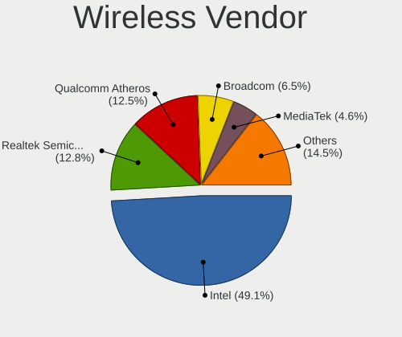

| Vendor                                | Computers | Percent |
|---------------------------------------|-----------|---------|
| Intel                                 | 512       | 49.09%  |
| Realtek Semiconductor                 | 134       | 12.85%  |
| Qualcomm Atheros                      | 130       | 12.46%  |
| Broadcom                              | 68        | 6.52%   |
| MediaTek                              | 48        | 4.6%    |
| TP-Link                               | 33        | 3.16%   |
| Ralink                                | 22        | 2.11%   |
| Broadcom Limited                      | 18        | 1.73%   |
| Ralink Technology                     | 16        | 1.53%   |
| NetGear                               | 9         | 0.86%   |
| Microsoft                             | 8         | 0.77%   |
| Sierra Wireless                       | 6         | 0.58%   |
| D-Link                                | 6         | 0.58%   |
| Qualcomm Atheros Communications       | 5         | 0.48%   |
| Qualcomm                              | 5         | 0.48%   |
| Edimax Technology                     | 4         | 0.38%   |
| Hewlett-Packard                       | 3         | 0.29%   |
| Dell                                  | 3         | 0.29%   |
| ASUSTek Computer                      | 3         | 0.29%   |
| Marvell Technology Group              | 2         | 0.19%   |
| Wilocity                              | 1         | 0.1%    |
| Wacom                                 | 1         | 0.1%    |
| Samsung Electronics                   | 1         | 0.1%    |
| Realtek                               | 1         | 0.1%    |
| Lite-On Technology                    | 1         | 0.1%    |
| Fibocom                               | 1         | 0.1%    |
| Belkin Components                     | 1         | 0.1%    |
| 802.11g Adapter [Linksys WUSB54GC v3] | 1         | 0.1%    |

Wireless Model
--------------

Wireless models

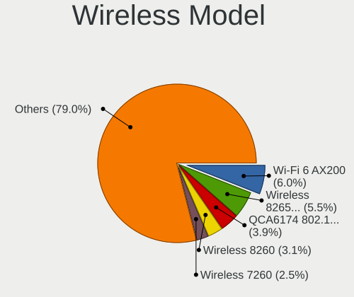

| Model                                                                | Computers | Percent |
|----------------------------------------------------------------------|-----------|---------|
| Intel Wi-Fi 6 AX200                                                  | 63        | 5.99%   |
| Intel Wireless 8265 / 8275                                           | 58        | 5.51%   |
| Qualcomm Atheros QCA6174 802.11ac Wireless Network Adapter           | 41        | 3.9%    |
| Intel Wireless 8260                                                  | 33        | 3.14%   |
| Intel Wireless 7260                                                  | 26        | 2.47%   |
| Intel Dual Band Wireless-AC 3168NGW [Stone Peak]                     | 22        | 2.09%   |
| Intel Comet Lake PCH-LP CNVi WiFi                                    | 22        | 2.09%   |
| Qualcomm Atheros QCA9565 / AR9565 Wireless Network Adapter           | 21        | 2%      |
| Qualcomm Atheros AR9485 Wireless Network Adapter                     | 20        | 1.9%    |
| Intel Wireless 3165                                                  | 20        | 1.9%    |
| Realtek RTL8822CE 802.11ac PCIe Wireless Network Adapter             | 19        | 1.81%   |
| Qualcomm Atheros QCA9377 802.11ac Wireless Network Adapter           | 18        | 1.71%   |
| Intel Wireless 7265                                                  | 18        | 1.71%   |
| Intel Wi-Fi 6 AX201                                                  | 18        | 1.71%   |
| Realtek RTL8821CE 802.11ac PCIe Wireless Network Adapter             | 17        | 1.62%   |
| Intel Wi-Fi 5(802.11ac) Wireless-AC 9x6x [Thunder Peak]              | 17        | 1.62%   |
| Intel Comet Lake PCH CNVi WiFi                                       | 17        | 1.62%   |
| MediaTek MT7921 802.11ax PCIe Wireless Network Adapter [Filogic 330] | 16        | 1.52%   |
| Intel Wi-Fi 6E(802.11ax) AX210/AX1675* 2x2 [Typhoon Peak]            | 16        | 1.52%   |
| Intel Centrino Advanced-N 6205 [Taylor Peak]                         | 15        | 1.43%   |
| Qualcomm Atheros AR9285 Wireless Network Adapter (PCI-Express)       | 14        | 1.33%   |
| Intel Cannon Lake PCH CNVi WiFi                                      | 14        | 1.33%   |
| Intel Cannon Point-LP CNVi [Wireless-AC]                             | 13        | 1.24%   |
| MediaTek MT7922 802.11ax PCI Express Wireless Network Adapter        | 12        | 1.14%   |
| Intel Tiger Lake PCH CNVi WiFi                                       | 12        | 1.14%   |
| Intel Centrino Ultimate-N 6300                                       | 12        | 1.14%   |
| Realtek RTL8822BE 802.11a/b/g/n/ac WiFi adapter                      | 11        | 1.05%   |
| Intel Centrino Advanced-N 6200                                       | 11        | 1.05%   |
| Intel Alder Lake-P PCH CNVi WiFi                                     | 11        | 1.05%   |
| Realtek RTL88x2bu [AC1200 Techkey]                                   | 10        | 0.95%   |
| Broadcom BCM4322 802.11a/b/g/n Wireless LAN Controller               | 10        | 0.95%   |
| MediaTek MT7902 802.11ax PCIe Wireless Network Adapter [Filogic 310] | 9         | 0.86%   |
| Intel Gemini Lake PCH CNVi WiFi                                      | 9         | 0.86%   |
| Broadcom BCM4313 802.11bgn Wireless Network Adapter                  | 9         | 0.86%   |
| TP-Link TL-WN821N v5/v6 [RTL8192EU]                                  | 8         | 0.76%   |
| Broadcom BCM4360 802.11ac Dual Band Wireless Network Adapter         | 8         | 0.76%   |
| Broadcom BCM43228 802.11a/b/g/n                                      | 8         | 0.76%   |
| TP-Link AC600 wireless Realtek RTL8811AU [Archer T2U Nano]           | 7         | 0.67%   |
| Realtek RTL8188CE 802.11b/g/n WiFi Adapter                           | 7         | 0.67%   |
| MediaTek MT7921K (RZ608) Wi-Fi 6E 80MHz                              | 7         | 0.67%   |

Ethernet Vendor
---------------

Ethernet vendors

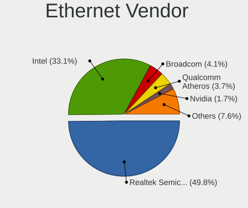

| Vendor                     | Computers | Percent |
|----------------------------|-----------|---------|
| Realtek Semiconductor      | 600       | 49.83%  |
| Intel                      | 398       | 33.06%  |
| Broadcom                   | 49        | 4.07%   |
| Qualcomm Atheros           | 45        | 3.74%   |
| Nvidia                     | 20        | 1.66%   |
| Marvell Technology Group   | 15        | 1.25%   |
| MediaTek                   | 9         | 0.75%   |
| DisplayLink                | 9         | 0.75%   |
| ASIX Electronics           | 9         | 0.75%   |
| Aquantia                   | 8         | 0.66%   |
| Samsung Electronics        | 6         | 0.5%    |
| OPPO Electronics           | 6         | 0.5%    |
| Lenovo                     | 4         | 0.33%   |
| Broadcom Limited           | 4         | 0.33%   |
| IBM                        | 3         | 0.25%   |
| JMicron Technology         | 2         | 0.17%   |
| Huawei Technologies        | 2         | 0.17%   |
| ZTE WCDMA Technologies MSM | 1         | 0.08%   |
| Xiaomi                     | 1         | 0.08%   |
| vivo                       | 1         | 0.08%   |
| VIA Technologies           | 1         | 0.08%   |
| TP-Link                    | 1         | 0.08%   |
| Qualcomm Technologies      | 1         | 0.08%   |
| QinHeng Electronics        | 1         | 0.08%   |
| Microsoft                  | 1         | 0.08%   |
| Microchip Technology       | 1         | 0.08%   |
| Mellanox Technologies      | 1         | 0.08%   |
| Insyde Software            | 1         | 0.08%   |
| ICS Advent                 | 1         | 0.08%   |
| Attansic Technology        | 1         | 0.08%   |
| Apple                      | 1         | 0.08%   |
| 3Com                       | 1         | 0.08%   |

Ethernet Model
--------------

Ethernet models

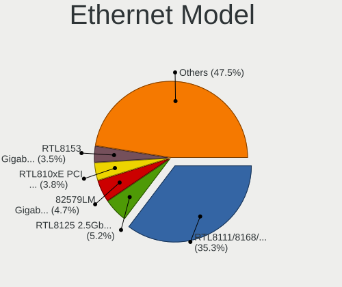

| Model                                                                  | Computers | Percent |
|------------------------------------------------------------------------|-----------|---------|
| Realtek RTL8111/8168/8211/8411 PCI Express Gigabit Ethernet Controller | 435       | 35.31%  |
| Realtek RTL8125 2.5GbE Controller                                      | 64        | 5.19%   |
| Intel 82579LM Gigabit Network Connection (Lewisville)                  | 58        | 4.71%   |
| Realtek RTL810xE PCI Express Fast Ethernet controller                  | 47        | 3.81%   |
| Realtek RTL8153 Gigabit Ethernet Adapter                               | 43        | 3.49%   |
| Intel I211 Gigabit Network Connection                                  | 29        | 2.35%   |
| Intel Ethernet Controller I225-V                                       | 24        | 1.95%   |
| Intel Ethernet Connection I217-LM                                      | 20        | 1.62%   |
| Intel Ethernet Connection (2) I219-LM                                  | 20        | 1.62%   |
| Intel Ethernet Connection (2) I219-V                                   | 19        | 1.54%   |
| Qualcomm Atheros AR8151 v2.0 Gigabit Ethernet                          | 18        | 1.46%   |
| Intel Ethernet Connection (4) I219-V                                   | 16        | 1.3%    |
| Intel Ethernet Connection (4) I219-LM                                  | 14        | 1.14%   |
| Intel Ethernet Connection I219-LM                                      | 13        | 1.06%   |
| Nvidia MCP79 Ethernet                                                  | 11        | 0.89%   |
| Intel 82579V Gigabit Network Connection                                | 11        | 0.89%   |
| Intel Ethernet Connection (6) I219-V                                   | 10        | 0.81%   |
| Intel Ethernet Connection I218-LM                                      | 9         | 0.73%   |
| Intel Ethernet Connection (7) I219-V                                   | 9         | 0.73%   |
| Intel Ethernet Connection (7) I219-LM                                  | 9         | 0.73%   |
| Intel 82567LM-3 Gigabit Network Connection                             | 9         | 0.73%   |
| Intel I210 Gigabit Network Connection                                  | 8         | 0.65%   |
| Intel Ethernet Connection (2) I218-V                                   | 8         | 0.65%   |
| Intel Alder Lake-P PCH CNVi WiFi                                       | 8         | 0.65%   |
| Intel Ethernet Connection I217-V                                       | 7         | 0.57%   |
| Intel Ethernet Connection (5) I219-LM                                  | 7         | 0.57%   |
| Intel Ethernet Connection (10) I219-V                                  | 7         | 0.57%   |
| Intel 82577LM Gigabit Network Connection                               | 7         | 0.57%   |
| Intel 82574L Gigabit Network Connection                                | 7         | 0.57%   |
| Broadcom NetXtreme BCM57766 Gigabit Ethernet PCIe                      | 7         | 0.57%   |
| Broadcom NetXtreme BCM57765 Gigabit Ethernet PCIe                      | 7         | 0.57%   |
| Intel Ethernet Controller I226-V                                       | 6         | 0.49%   |
| Intel 82577LC Gigabit Network Connection                               | 6         | 0.49%   |
| Realtek Killer E3000 2.5GbE Controller                                 | 5         | 0.41%   |
| Qualcomm Atheros Killer E220x Gigabit Ethernet Controller              | 5         | 0.41%   |
| Marvell Group 88E8056 PCI-E Gigabit Ethernet Controller                | 5         | 0.41%   |
| Intel 82578DM Gigabit Network Connection                               | 5         | 0.41%   |
| Intel 82567LM Gigabit Network Connection                               | 5         | 0.41%   |
| ASIX AX88179 Gigabit Ethernet                                          | 5         | 0.41%   |
| Samsung Galaxy series, misc. (tethering mode)                          | 4         | 0.32%   |

Net Controller Kind
-------------------

Ethernet, WiFi or modem

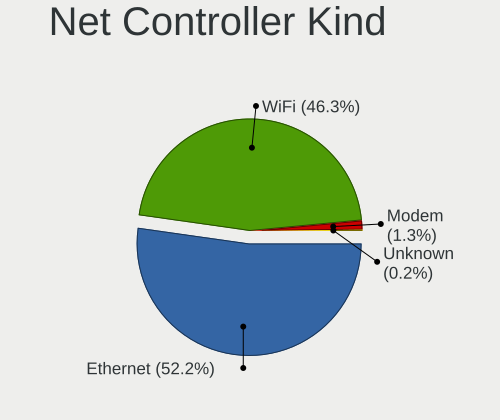

| Kind     | Computers | Percent |
|----------|-----------|---------|
| Ethernet | 1108      | 52.24%  |
| WiFi     | 981       | 46.25%  |
| Modem    | 28        | 1.32%   |
| Unknown  | 4         | 0.19%   |

Used Controller
---------------

Currently used network controller

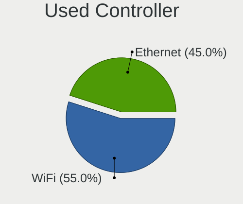

| Kind     | Computers | Percent |
|----------|-----------|---------|
| WiFi     | 749       | 54.95%  |
| Ethernet | 614       | 45.05%  |

NICs
----

Total network controllers on board

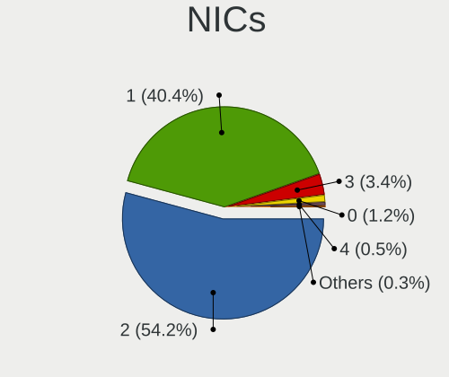

| Total | Computers | Percent |
|-------|-----------|---------|
| 2     | 703       | 54.2%   |
| 1     | 524       | 40.4%   |
| 3     | 44        | 3.39%   |
| 0     | 15        | 1.16%   |
| 4     | 7         | 0.54%   |
| 6     | 3         | 0.23%   |
| 8     | 1         | 0.08%   |

IPv6
----

IPv6 vs IPv4

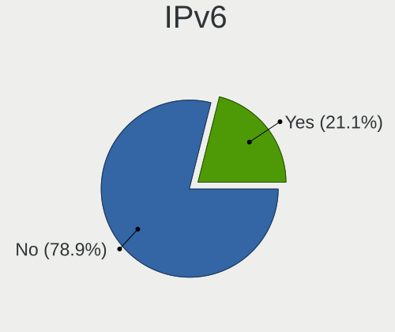

| Used | Computers | Percent |
|------|-----------|---------|
| No   | 1048      | 78.92%  |
| Yes  | 280       | 21.08%  |

Bluetooth
---------

Bluetooth Vendor
----------------

Controller vendors

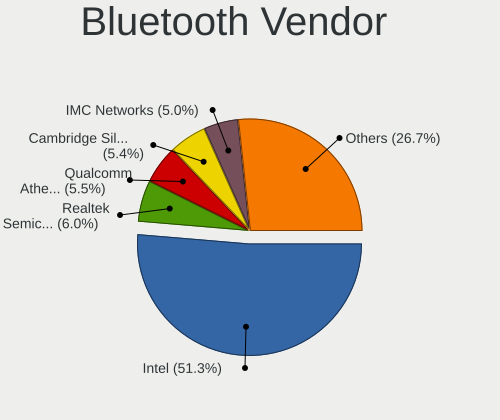

| Vendor                          | Computers | Percent |
|---------------------------------|-----------|---------|
| Intel                           | 444       | 51.33%  |
| Realtek Semiconductor           | 52        | 6.01%   |
| Qualcomm Atheros Communications | 48        | 5.55%   |
| Cambridge Silicon Radio         | 47        | 5.43%   |
| IMC Networks                    | 43        | 4.97%   |
| Broadcom                        | 39        | 4.51%   |
| Apple                           | 39        | 4.51%   |
| Foxconn / Hon Hai               | 36        | 4.16%   |
| Lite-On Technology              | 29        | 3.35%   |
| Hewlett-Packard                 | 17        | 1.97%   |
| MediaTek                        | 14        | 1.62%   |
| ASUSTek Computer                | 11        | 1.27%   |
| Toshiba                         | 8         | 0.92%   |
| Edimax Technology               | 7         | 0.81%   |
| Dell                            | 6         | 0.69%   |
| Alps Electric                   | 5         | 0.58%   |
| Ralink                          | 4         | 0.46%   |
| TP-Link                         | 3         | 0.35%   |
| Ralink Technology               | 3         | 0.35%   |
| Realtek                         | 2         | 0.23%   |
| Marvell Semiconductor           | 2         | 0.23%   |
| USI                             | 1         | 0.12%   |
| Roper                           | 1         | 0.12%   |
| Integrated System Solution      | 1         | 0.12%   |
| HTC (High Tech Computer)        | 1         | 0.12%   |
| Creative Technology             | 1         | 0.12%   |
| Unknown                         | 1         | 0.12%   |

Bluetooth Model
---------------

Controller models

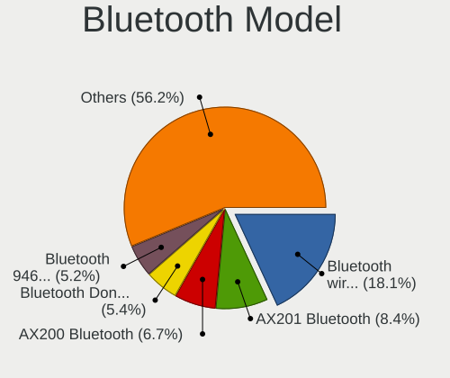

| Model                                               | Computers | Percent |
|-----------------------------------------------------|-----------|---------|
| Intel Bluetooth wireless interface                  | 157       | 18.09%  |
| Intel AX201 Bluetooth                               | 73        | 8.41%   |
| Intel AX200 Bluetooth                               | 58        | 6.68%   |
| Cambridge Silicon Radio Bluetooth Dongle (HCI mode) | 47        | 5.41%   |
| Intel Bluetooth 9460/9560 Jefferson Peak (JfP)      | 45        | 5.18%   |
| Realtek Bluetooth Radio                             | 38        | 4.38%   |
| Intel Bluetooth Device                              | 38        | 4.38%   |
| Intel Wireless-AC 3168 Bluetooth                    | 23        | 2.65%   |
| IMC Networks Wireless_Device                        | 21        | 2.42%   |
| Qualcomm Atheros QCA61x4 Bluetooth 4.0              | 18        | 2.07%   |
| Apple Bluetooth Host Controller                     | 18        | 2.07%   |
| Intel Wireless-AC 9260 Bluetooth Adapter            | 17        | 1.96%   |
| Intel AX210 Bluetooth                               | 17        | 1.96%   |
| IMC Networks Bluetooth Radio                        | 17        | 1.96%   |
| Qualcomm Atheros  Bluetooth Device                  | 15        | 1.73%   |
| Apple Bluetooth USB Host Controller                 | 15        | 1.73%   |
| MediaTek Wireless_Device                            | 14        | 1.61%   |
| Intel Centrino Bluetooth Wireless Transceiver       | 13        | 1.5%    |
| HP Broadcom 2070 Bluetooth Combo                    | 12        | 1.38%   |
| Realtek  Bluetooth 4.2 Adapter                      | 11        | 1.27%   |
| Foxconn / Hon Hai Bluetooth Device                  | 11        | 1.27%   |
| Lite-On Bluetooth Device                            | 9         | 1.04%   |
| Foxconn / Hon Hai Wireless_Device                   | 9         | 1.04%   |
| Lite-On Qualcomm Atheros QCA9377 Bluetooth          | 8         | 0.92%   |
| Qualcomm Atheros AR3011 Bluetooth                   | 7         | 0.81%   |
| Lite-On Atheros AR3012 Bluetooth                    | 7         | 0.81%   |
| Intel Centrino Advanced-N 6230 Bluetooth adapter    | 6         | 0.69%   |
| Foxconn / Hon Hai MediaTek Bluetooth Adapter        | 6         | 0.69%   |
| Edimax Bluetooth Device                             | 6         | 0.69%   |
| Broadcom BCM2045B (BDC-2.1)                         | 6         | 0.69%   |
| Qualcomm Atheros AR3012 Bluetooth 4.0               | 5         | 0.58%   |
| Broadcom HP Portable SoftSailing                    | 5         | 0.58%   |
| Broadcom BCM20702A0 Bluetooth 4.0                   | 5         | 0.58%   |
| Apple Built-in Bluetooth 2.0+EDR HCI                | 5         | 0.58%   |
| Ralink RT3290 Bluetooth                             | 4         | 0.46%   |
| HP Bluetooth 2.0 Interface [Broadcom BCM2045]       | 4         | 0.46%   |
| Broadcom HP Portable Bumble Bee                     | 4         | 0.46%   |
| Broadcom BCM43142A0 Bluetooth 4.0                   | 4         | 0.46%   |
| Broadcom BCM20702A0                                 | 4         | 0.46%   |
| TP-Link TP-T@- UB500 Adapter                        | 3         | 0.35%   |

Sound
-----

Sound Vendor
------------

Sound card vendors

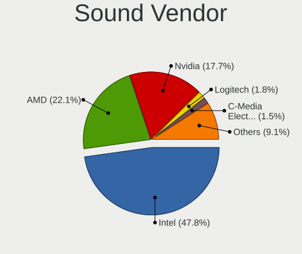

| Vendor                                       | Computers | Percent |
|----------------------------------------------|-----------|---------|
| Intel                                        | 900       | 47.8%   |
| AMD                                          | 416       | 22.09%  |
| Nvidia                                       | 334       | 17.74%  |
| Logitech                                     | 34        | 1.81%   |
| C-Media Electronics                          | 28        | 1.49%   |
| Hewlett-Packard                              | 14        | 0.74%   |
| SteelSeries ApS                              | 9         | 0.48%   |
| Realtek Semiconductor                        | 8         | 0.42%   |
| JMTek                                        | 8         | 0.42%   |
| Generalplus Technology                       | 8         | 0.42%   |
| Plantronics                                  | 7         | 0.37%   |
| Lenovo                                       | 6         | 0.32%   |
| Kingston Technology                          | 6         | 0.32%   |
| Razer USA                                    | 5         | 0.27%   |
| GN Netcom                                    | 5         | 0.27%   |
| FiiO Electronics Technology                  | 4         | 0.21%   |
| DSEA A/S                                     | 4         | 0.21%   |
| Dell                                         | 4         | 0.21%   |
| Creative Labs                                | 4         | 0.21%   |
| ASUSTek Computer                             | 4         | 0.21%   |
| XMOS                                         | 3         | 0.16%   |
| Microsoft                                    | 3         | 0.16%   |
| GYROCOM C&C                                  | 3         | 0.16%   |
| Creative Technology                          | 3         | 0.16%   |
| Astro Gaming                                 | 3         | 0.16%   |
| AKAI Professional M.I.                       | 3         | 0.16%   |
| Zoran Co. Personal Media Division (Nogatech) | 2         | 0.11%   |
| VIA Technologies                             | 2         | 0.11%   |
| Texas Instruments                            | 2         | 0.11%   |
| Tenx Technology                              | 2         | 0.11%   |
| Sony                                         | 2         | 0.11%   |
| RODE Microphones                             | 2         | 0.11%   |
| Micro Star International                     | 2         | 0.11%   |
| KTMicro                                      | 2         | 0.11%   |
| Jieli Technology                             | 2         | 0.11%   |
| Focusrite-Novation                           | 2         | 0.11%   |
| BTD 600                                      | 2         | 0.11%   |
| Blue Microphones                             | 2         | 0.11%   |
| Audio-Technica                               | 2         | 0.11%   |
| Trust International                          | 1         | 0.05%   |

Sound Model
-----------

Sound card models

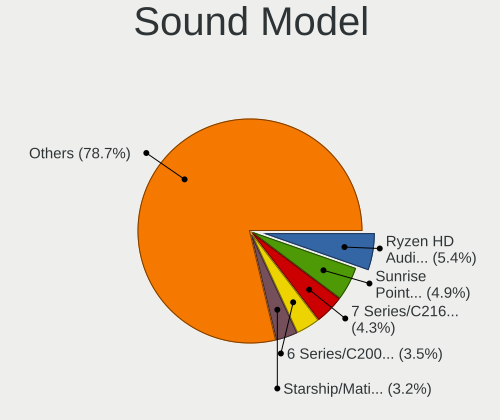

| Model                                                                      | Computers | Percent |
|----------------------------------------------------------------------------|-----------|---------|
| AMD Ryzen HD Audio Controller                                              | 120       | 5.36%   |
| Intel Sunrise Point-LP HD Audio                                            | 110       | 4.92%   |
| Intel 7 Series/C216 Chipset Family High Definition Audio Controller        | 96        | 4.29%   |
| Intel 6 Series/C200 Series Chipset Family High Definition Audio Controller | 79        | 3.53%   |
| AMD Starship/Matisse HD Audio Controller                                   | 71        | 3.17%   |
| Intel 8 Series/C220 Series Chipset High Definition Audio Controller        | 59        | 2.64%   |
| AMD Renoir/Cezanne HDMI/DP Audio Controller                                | 54        | 2.41%   |
| Intel Xeon E3-1200 v3/4th Gen Core Processor HD Audio Controller           | 48        | 2.14%   |
| AMD Radeon High Definition Audio Controller                                | 45        | 2.01%   |
| Intel Cannon Lake PCH cAVS                                                 | 41        | 1.83%   |
| Intel 100 Series/C230 Series Chipset Family HD Audio Controller            | 41        | 1.83%   |
| Intel 5 Series/3400 Series Chipset High Definition Audio                   | 38        | 1.7%    |
| AMD FCH Azalia Controller                                                  | 38        | 1.7%    |
| AMD SBx00 Azalia (Intel HDA)                                               | 34        | 1.52%   |
| AMD Navi 21/23 HDMI/DP Audio Controller                                    | 32        | 1.43%   |
| AMD Ellesmere HDMI Audio [Radeon RX 470/480 / 570/580/590]                 | 31        | 1.39%   |
| AMD Family 17h (Models 00h-0fh) HD Audio Controller                        | 29        | 1.3%    |
| Intel Alder Lake PCH-P High Definition Audio Controller                    | 26        | 1.16%   |
| Intel 200 Series PCH HD Audio                                              | 26        | 1.16%   |
| Intel Haswell-ULT HD Audio Controller                                      | 25        | 1.12%   |
| Intel 8 Series HD Audio Controller                                         | 25        | 1.12%   |
| AMD Kabini HDMI/DP Audio                                                   | 25        | 1.12%   |
| Intel Comet Lake PCH cAVS                                                  | 24        | 1.07%   |
| Intel Cannon Point-LP High Definition Audio Controller                     | 24        | 1.07%   |
| Nvidia GP107GL High Definition Audio Controller                            | 23        | 1.03%   |
| Intel 82801I (ICH9 Family) HD Audio Controller                             | 23        | 1.03%   |
| Intel Tiger Lake-LP Smart Sound Technology Audio Controller                | 22        | 0.98%   |
| Intel Comet Lake PCH-LP cAVS                                               | 22        | 0.98%   |
| Nvidia GA104 High Definition Audio Controller                              | 21        | 0.94%   |
| AMD Raven/Raven2/Fenghuang HDMI/DP Audio Controller                        | 21        | 0.94%   |
| Nvidia TU106 High Definition Audio Controller                              | 18        | 0.8%    |
| Nvidia GA106 High Definition Audio Controller                              | 18        | 0.8%    |
| Nvidia TU107 GeForce GTX 1650 High Definition Audio Controller             | 17        | 0.76%   |
| Nvidia GP106 High Definition Audio Controller                              | 17        | 0.76%   |
| Nvidia GK208 HDMI/DP Audio Controller                                      | 16        | 0.71%   |
| Intel Wildcat Point-LP High Definition Audio Controller                    | 16        | 0.71%   |
| Intel Broadwell-U Audio Controller                                         | 16        | 0.71%   |
| Intel Atom Processor Z36xxx/Z37xxx Series High Definition Audio Controller | 16        | 0.71%   |
| Nvidia TU116 High Definition Audio Controller                              | 15        | 0.67%   |
| Nvidia GP104 High Definition Audio Controller                              | 15        | 0.67%   |

Memory
------

Memory Vendor
-------------

Memory module vendors

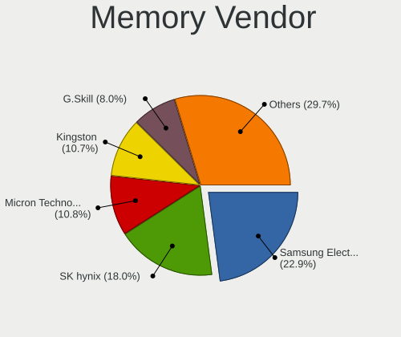

| Vendor              | Computers | Percent |
|---------------------|-----------|---------|
| Samsung Electronics | 187       | 22.92%  |
| SK hynix            | 147       | 18.01%  |
| Micron Technology   | 88        | 10.78%  |
| Kingston            | 87        | 10.66%  |
| G.Skill             | 65        | 7.97%   |
| Crucial             | 60        | 7.35%   |
| Unknown             | 41        | 5.02%   |
| Corsair             | 31        | 3.8%    |
| A-DATA Technology   | 27        | 3.31%   |
| Team                | 14        | 1.72%   |
| Elpida              | 9         | 1.1%    |
| Ramaxel Technology  | 8         | 0.98%   |
| Transcend           | 6         | 0.74%   |
| Strontium           | 6         | 0.74%   |
| Unknown (ABCD)      | 5         | 0.61%   |
| Hewlett-Packard     | 4         | 0.49%   |
| Nanya Technology    | 3         | 0.37%   |
| Shenzhen Mic        | 2         | 0.25%   |
| PNY                 | 2         | 0.25%   |
| Patriot             | 2         | 0.25%   |
| Neo Forza           | 2         | 0.25%   |
| Apacer              | 2         | 0.25%   |
| Unknown             | 2         | 0.25%   |
| Unknown (D386)      | 1         | 0.12%   |
| Unknown (89F7)      | 1         | 0.12%   |
| Unknown (0x8783)    | 1         | 0.12%   |
| Unknown (0x0B45)    | 1         | 0.12%   |
| Unknown (0x0080)    | 1         | 0.12%   |
| Super Talent        | 1         | 0.12%   |
| Smart               | 1         | 0.12%   |
| pqi                 | 1         | 0.12%   |
| Patriot Memory      | 1         | 0.12%   |
| OCZ                 | 1         | 0.12%   |
| Netac               | 1         | 0.12%   |
| Lexar               | 1         | 0.12%   |
| Innodisk            | 1         | 0.12%   |
| Hyundai lnc         | 1         | 0.12%   |
| fef5                | 1         | 0.12%   |
| Atermiter           | 1         | 0.12%   |

Memory Model
------------

Memory module models

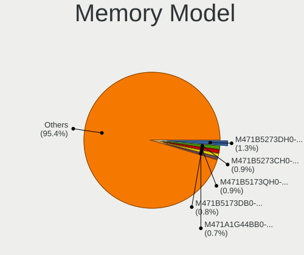

| Model                                                            | Computers | Percent |
|------------------------------------------------------------------|-----------|---------|
| Samsung RAM M471B5273DH0-CH9 4GB SODIMM DDR3 1600MT/s            | 11        | 1.27%   |
| Samsung RAM M471B5273CH0-CH9 4GB SODIMM DDR3 1334MT/s            | 8         | 0.93%   |
| Samsung RAM M471B5173QH0-YK0 4GB SODIMM DDR3 1600MT/s            | 8         | 0.93%   |
| Samsung RAM M471B5173DB0-YK0 4GB SODIMM DDR3 1600MT/s            | 7         | 0.81%   |
| SK hynix RAM HMT451S6BFR8A-PB 4GB SODIMM DDR3 1600MT/s           | 6         | 0.69%   |
| SK hynix RAM HMAA1GS6CJR6N-XN 8GB SODIMM DDR4 3200MT/s           | 6         | 0.69%   |
| Samsung RAM M471A1G44BB0-CWE 8GB SODIMM DDR4 3200MT/s            | 6         | 0.69%   |
| G.Skill RAM F4-3200C16-16GVK 16GB DIMM DDR4 3600MT/s             | 6         | 0.69%   |
| SK hynix RAM HMAB2GS6AMR6N-XN 16GB SODIMM DDR4 3200MT/s          | 5         | 0.58%   |
| SK hynix RAM HMA81GS6DJR8N-XN 8GB SODIMM DDR4 3200MT/s           | 5         | 0.58%   |
| Samsung RAM Module 8GB SODIMM DDR4 2400MT/s                      | 5         | 0.58%   |
| Samsung RAM Module 4GB Row Of Chips DDR4 2400MT/s                | 5         | 0.58%   |
| Samsung RAM M471B1G73DB0-YK0 8GB SODIMM DDR3 1600MT/s            | 5         | 0.58%   |
| Samsung RAM M471A1K43CB1-CRC 8GB SODIMM DDR4 8400MT/s            | 5         | 0.58%   |
| Samsung RAM K4EBE304EB-EGCF 8GB Row Of Chips LPDDR3 1867MT/s     | 5         | 0.58%   |
| SK hynix RAM Module 8GB SODIMM DDR4 2400MT/s                     | 4         | 0.46%   |
| SK hynix RAM HMA81GS6AFR8N-UH 8GB SODIMM DDR4 2667MT/s           | 4         | 0.46%   |
| Samsung RAM M471B5173EB0-YK0 4GB SODIMM DDR3 1600MT/s            | 4         | 0.46%   |
| Samsung RAM M471A2K43DB1-CWE 16GB SODIMM DDR4 3200MT/s           | 4         | 0.46%   |
| Samsung RAM M471A2K43DB1-CTD 16GB SODIMM DDR4 2667MT/s           | 4         | 0.46%   |
| Samsung RAM M471A1K43DB1-CTD 8GB SODIMM DDR4 2667MT/s            | 4         | 0.46%   |
| Micron RAM 16KTF1G64HZ-1G6E1 8GB SODIMM DDR3 1600MT/s            | 4         | 0.46%   |
| Kingston RAM KF3200C16D4/8GX 8GiB DIMM DDR4 3600MT/s             | 4         | 0.46%   |
| G.Skill RAM F4-3600C16-16GTZNC 16GiB DIMM DDR4 3600MT/s          | 4         | 0.46%   |
| G.Skill RAM F4-2666C15-8GVR 8GB DIMM DDR4 2800MT/s               | 4         | 0.46%   |
| Crucial RAM CT102464BA160B.C16 8GB DIMM DDR3 1600MT/s            | 4         | 0.46%   |
| Unknown (ABCD) RAM 123456789012345678 2GB SODIMM LPDDR4 2400MT/s | 3         | 0.35%   |
| Team RAM TEAMGROUP-UD4-3600 16GB DIMM DDR4 3600MT/s              | 3         | 0.35%   |
| SK hynix RAM Module 8GB SODIMM DDR3 1600MT/s                     | 3         | 0.35%   |
| SK hynix RAM Module 16GB SODIMM DDR4 3200MT/s                    | 3         | 0.35%   |
| SK hynix RAM HMT451S6AFR8A-PB 4GB SODIMM DDR3 1600MT/s           | 3         | 0.35%   |
| SK hynix RAM HMT351S6CFR8C-PB 4GB SODIMM DDR3 1600MT/s           | 3         | 0.35%   |
| Samsung RAM Module 16GB SODIMM DDR4 2667MT/s                     | 3         | 0.35%   |
| Samsung RAM M471B1G73QH0-YK0 8GB SODIMM DDR3 1600MT/s            | 3         | 0.35%   |
| Samsung RAM M471A2K43CB1-CTD 16GB SODIMM DDR4 8400MT/s           | 3         | 0.35%   |
| Samsung RAM M471A2G43BB2-CWE 16GB SODIMM DDR4 3200MT/s           | 3         | 0.35%   |
| Samsung RAM M471A1K43EB1-CWE 8GB SODIMM DDR4 3200MT/s            | 3         | 0.35%   |
| Samsung RAM M471A1G44AB0-CWE 8GiB SODIMM DDR4 3200MT/s           | 3         | 0.35%   |
| Samsung RAM K3KL8L80CM-MGCT 2GB Row Of Chips LPDDR5 7500MT/s     | 3         | 0.35%   |
| Micron RAM 8ATF1G64HZ-3G2J1 8GB SODIMM DDR4 3200MT/s             | 3         | 0.35%   |

Memory Kind
-----------

Memory module kinds

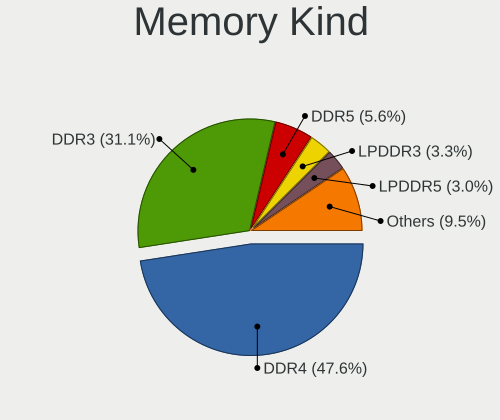

| Kind    | Computers | Percent |
|---------|-----------|---------|
| DDR4    | 332       | 47.56%  |
| DDR3    | 217       | 31.09%  |
| DDR5    | 39        | 5.59%   |
| LPDDR3  | 23        | 3.3%    |
| LPDDR5  | 21        | 3.01%   |
| SDRAM   | 19        | 2.72%   |
| DDR2    | 17        | 2.44%   |
| LPDDR4  | 15        | 2.15%   |
| Unknown | 13        | 1.86%   |
| EEPROM  | 1         | 0.14%   |
| DDR     | 1         | 0.14%   |

Memory Form Factor
------------------

Physical design of the memory module

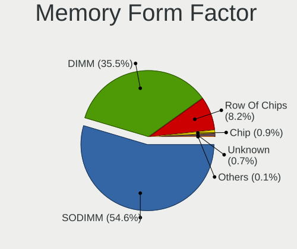

| Name         | Computers | Percent |
|--------------|-----------|---------|
| SODIMM       | 380       | 54.6%   |
| DIMM         | 247       | 35.49%  |
| Row Of Chips | 57        | 8.19%   |
| Chip         | 6         | 0.86%   |
| Unknown      | 5         | 0.72%   |
| FB-DIMM      | 1         | 0.14%   |

Memory Size
-----------

Memory module size

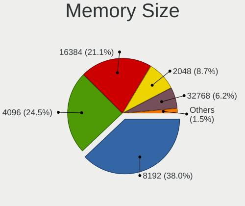

| Size  | Computers | Percent |
|-------|-----------|---------|
| 8192  | 282       | 37.95%  |
| 4096  | 182       | 24.5%   |
| 16384 | 157       | 21.13%  |
| 2048  | 65        | 8.75%   |
| 32768 | 46        | 6.19%   |
| 1024  | 7         | 0.94%   |
| 65536 | 2         | 0.27%   |
| 49152 | 1         | 0.13%   |
| 1     | 1         | 0.13%   |

Memory Speed
------------

Memory module speed

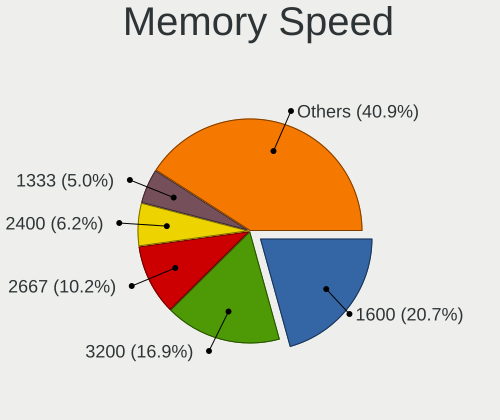

| Speed   | Computers | Percent |
|---------|-----------|---------|
| 1600    | 156       | 20.72%  |
| 3200    | 127       | 16.87%  |
| 2667    | 77        | 10.23%  |
| 2400    | 47        | 6.24%   |
| 1333    | 38        | 5.05%   |
| 3600    | 36        | 4.78%   |
| 2133    | 34        | 4.52%   |
| 1867    | 21        | 2.79%   |
| 1334    | 18        | 2.39%   |
| 4800    | 15        | 1.99%   |
| 1067    | 15        | 1.99%   |
| 6400    | 11        | 1.46%   |
| 3800    | 11        | 1.46%   |
| 3733    | 11        | 1.46%   |
| 800     | 10        | 1.33%   |
| 8400    | 9         | 1.2%    |
| 7500    | 9         | 1.2%    |
| 6000    | 9         | 1.2%    |
| 5600    | 9         | 1.2%    |
| 667     | 9         | 1.2%    |
| Unknown | 8         | 1.06%   |
| 2800    | 6         | 0.8%    |
| 4199    | 5         | 0.66%   |
| 2666    | 5         | 0.66%   |
| 12800   | 4         | 0.53%   |
| 4267    | 4         | 0.53%   |
| 3866    | 4         | 0.53%   |
| 3466    | 4         | 0.53%   |
| 1800    | 4         | 0.53%   |
| 3400    | 3         | 0.4%    |
| 2048    | 3         | 0.4%    |
| 1866    | 3         | 0.4%    |
| 1066    | 3         | 0.4%    |
| 4266    | 2         | 0.27%   |
| 3000    | 2         | 0.27%   |
| 2933    | 2         | 0.27%   |
| 975     | 2         | 0.27%   |
| 8533    | 1         | 0.13%   |
| 8000    | 1         | 0.13%   |
| 7467    | 1         | 0.13%   |

Printers & scanners
-------------------

Printer Vendor
--------------

Printer device vendors

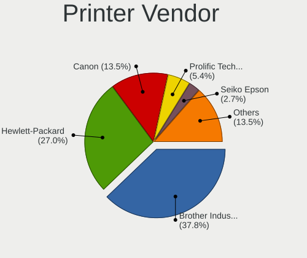

| Vendor              | Computers | Percent |
|---------------------|-----------|---------|
| Brother Industries  | 14        | 37.84%  |
| Hewlett-Packard     | 10        | 27.03%  |
| Canon               | 5         | 13.51%  |
| Prolific Technology | 2         | 5.41%   |
| Seiko Epson         | 1         | 2.7%    |
| Sato                | 1         | 2.7%    |
| Samsung Electronics | 1         | 2.7%    |
| Kyocera             | 1         | 2.7%    |
| Fuji Xerox          | 1         | 2.7%    |
| Dymo-CoStar         | 1         | 2.7%    |

Printer Model
-------------

Printer device models

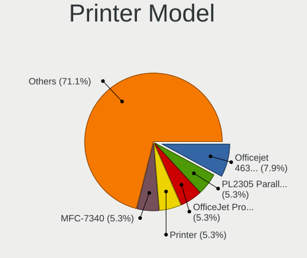

| Model                            | Computers | Percent |
|----------------------------------|-----------|---------|
| HP Officejet 4630 series         | 3         | 7.89%   |
| Prolific PL2305 Parallel Port    | 2         | 5.26%   |
| HP OfficeJet Pro 9010 series     | 2         | 5.26%   |
| Brother Printer                  | 2         | 5.26%   |
| Brother MFC-7340                 | 2         | 5.26%   |
| Seiko Epson ET-2710 Series       | 1         | 2.63%   |
| Sato WS408 SBPL                  | 1         | 2.63%   |
| Samsung SCX-4100 Scanner         | 1         | 2.63%   |
| Kyocera FS-1320MFP               | 1         | 2.63%   |
| HP OfficeJet 8010 series         | 1         | 2.63%   |
| HP LaserJet Professional P1102w  | 1         | 2.63%   |
| HP ENVY 6400 series              | 1         | 2.63%   |
| HP ENVY 4520 series              | 1         | 2.63%   |
| HP DeskJet 2300 series           | 1         | 2.63%   |
| HP DeskJet 2130 series           | 1         | 2.63%   |
| Fuji Xerox DocuPrint CM315/318 z | 1         | 2.63%   |
| Dymo-CoStar LabelWriter 450      | 1         | 2.63%   |
| Canon TS3100 series              | 1         | 2.63%   |
| Canon MB5300 series              | 1         | 2.63%   |
| Canon LBP6000                    | 1         | 2.63%   |
| Canon i950                       | 1         | 2.63%   |
| Canon G3010 series               | 1         | 2.63%   |
| Brother MFC-L2730DW series       | 1         | 2.63%   |
| Brother MFC-L2713DW              | 1         | 2.63%   |
| Brother MFC-J470DW               | 1         | 2.63%   |
| Brother MFC-J430W                | 1         | 2.63%   |
| Brother MFC-9140CDN              | 1         | 2.63%   |
| Brother MFC-9120CN               | 1         | 2.63%   |
| Brother HL-L3230CDW series       | 1         | 2.63%   |
| Brother HL-2270DW Laser Printer  | 1         | 2.63%   |
| Brother HL-1430 Laser Printer    | 1         | 2.63%   |
| Brother DCP-1610W                | 1         | 2.63%   |

Scanner Vendor
--------------

Scanner device vendors

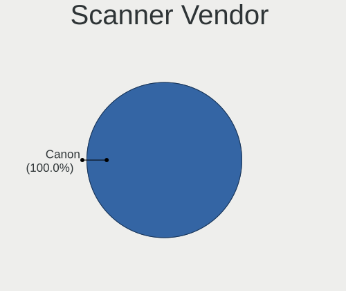

| Vendor | Computers | Percent |
|--------|-----------|---------|
| Canon  | 5         | 100%    |

Scanner Model
-------------

Scanner device models

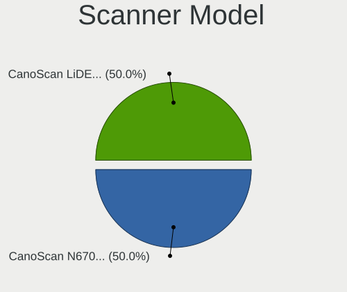

| Model                              | Computers | Percent |
|------------------------------------|-----------|---------|
| Canon CanoScan LiDE 110            | 2         | 40%     |
| Canon CanoScan N670U/N676U/LiDE 20 | 1         | 20%     |
| Canon CanoScan LiDE 500F           | 1         | 20%     |
| Canon CanoScan LIDE 25             | 1         | 20%     |

Camera
------

Camera Vendor
-------------

Camera device vendors

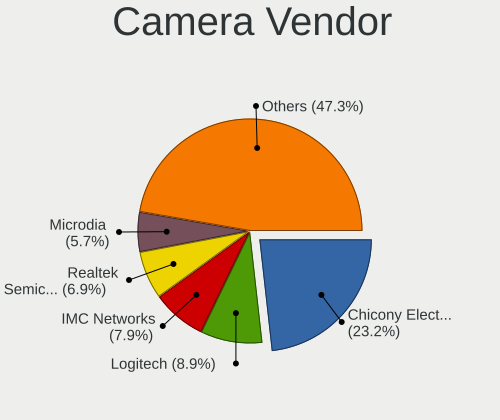

| Vendor                                 | Computers | Percent |
|----------------------------------------|-----------|---------|
| Chicony Electronics                    | 174       | 23.23%  |
| Logitech                               | 67        | 8.95%   |
| IMC Networks                           | 59        | 7.88%   |
| Realtek Semiconductor                  | 52        | 6.94%   |
| Microdia                               | 43        | 5.74%   |
| Quanta                                 | 42        | 5.61%   |
| Sunplus Innovation Technology          | 38        | 5.07%   |
| Bison Electronics                      | 36        | 4.81%   |
| Apple                                  | 35        | 4.67%   |
| Cheng Uei Precision Industry (Foxlink) | 24        | 3.2%    |
| Lite-On Technology                     | 20        | 2.67%   |
| Luxvisions Innotech Limited            | 17        | 2.27%   |
| Syntek                                 | 16        | 2.14%   |
| Suyin                                  | 16        | 2.14%   |
| Samsung Electronics                    | 13        | 1.74%   |
| Sonix Technology                       | 9         | 1.2%    |
| Ricoh                                  | 9         | 1.2%    |
| Microsoft                              | 8         | 1.07%   |
| Alcor Micro                            | 6         | 0.8%    |
| ShineTech                              | 5         | 0.67%   |
| Primax Electronics                     | 5         | 0.67%   |
| Z-Star Microelectronics                | 4         | 0.53%   |
| Silicon Motion                         | 4         | 0.53%   |
| Lenovo                                 | 4         | 0.53%   |
| GEMBIRD                                | 4         | 0.53%   |
| ARC International                      | 4         | 0.53%   |
| MacroSilicon                           | 3         | 0.4%    |
| KYE Systems (Mouse Systems)            | 3         | 0.4%    |
| Importek                               | 3         | 0.4%    |
| XHT-220428-ZW                          | 2         | 0.27%   |
| Generalplus Technology                 | 2         | 0.27%   |
| ALi                                    | 2         | 0.27%   |
| Acer                                   | 2         | 0.27%   |
| Yealink Network Technology             | 1         | 0.13%   |
| Xiongmai                               | 1         | 0.13%   |
| ValueHD                                | 1         | 0.13%   |
| SunplusIT                              | 1         | 0.13%   |
| Speed Tech                             | 1         | 0.13%   |
| OPPO Electronics                       | 1         | 0.13%   |
| Novatek Microelectronics               | 1         | 0.13%   |

Camera Model
------------

Camera device models

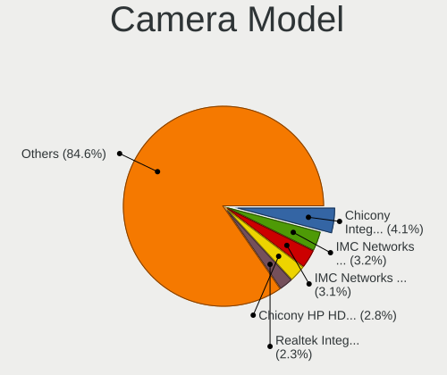

| Model                                         | Computers | Percent |
|-----------------------------------------------|-----------|---------|
| Chicony Integrated Camera                     | 31        | 4.11%   |
| IMC Networks USB2.0 HD UVC WebCam             | 24        | 3.18%   |
| IMC Networks Integrated Camera                | 23        | 3.05%   |
| Chicony HP HD Camera                          | 21        | 2.79%   |
| Realtek Integrated_Webcam_HD                  | 17        | 2.25%   |
| Chicony HD WebCam                             | 15        | 1.99%   |
| Bison Integrated Camera                       | 15        | 1.99%   |
| Logitech Webcam C270                          | 14        | 1.86%   |
| Samsung Galaxy series, misc. (MTP mode)       | 13        | 1.72%   |
| Microdia Integrated_Webcam_HD                 | 13        | 1.72%   |
| Apple Built-in iSight                         | 13        | 1.72%   |
| Syntek Integrated Camera                      | 12        | 1.59%   |
| Logitech Webcam C170                          | 8         | 1.06%   |
| Logitech HD Pro Webcam C920                   | 8         | 1.06%   |
| Lite-On Integrated Camera                     | 8         | 1.06%   |
| Chicony VGA Webcam                            | 8         | 1.06%   |
| Chicony TOSHIBA Web Camera - HD               | 8         | 1.06%   |
| Chicony HP HD Webcam                          | 8         | 1.06%   |
| Apple iPhone 5/5C/5S/6/SE/7/8/X               | 8         | 1.06%   |
| Sunplus Integrated_Webcam_HD                  | 7         | 0.93%   |
| Sunplus HP HD Webcam [Fixed]                  | 7         | 0.93%   |
| Quanta HP HD Camera                           | 7         | 0.93%   |
| Microdia Integrated Webcam HD                 | 7         | 0.93%   |
| Cheng Uei Precision Industry (Foxlink) Webcam | 7         | 0.93%   |
| Apple FaceTime HD Camera (Built-in)           | 7         | 0.93%   |
| Sonix USB2.0 HD UVC WebCam                    | 6         | 0.8%    |
| Realtek HP Truevision HD                      | 6         | 0.8%    |
| Realtek USB Camera                            | 5         | 0.66%   |
| Quanta HP TrueVision HD Camera                | 5         | 0.66%   |
| Quanta HD User Facing                         | 5         | 0.66%   |
| Logitech C920 PRO HD Webcam                   | 5         | 0.66%   |
| Chicony HP Truevision HD                      | 5         | 0.66%   |
| Chicony CNF9055 Toshiba Webcam                | 5         | 0.66%   |
| Bison HD Webcam                               | 5         | 0.66%   |
| Apple FaceTime HD Camera                      | 5         | 0.66%   |
| Sunplus HD WebCam                             | 4         | 0.53%   |
| Realtek Integrated Webcam HD                  | 4         | 0.53%   |
| Quanta HD Webcam                              | 4         | 0.53%   |
| Microsoft LifeCam HD-3000                     | 4         | 0.53%   |
| Luxvisions Innotech Limited HP HD Camera      | 4         | 0.53%   |

Security
--------

Fingerprint Vendor
------------------

Fingerprint sensor vendors

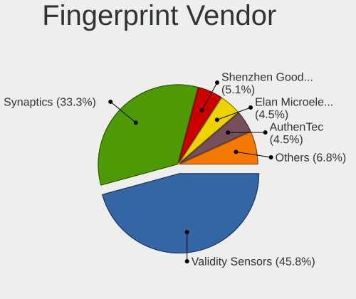

| Vendor                     | Computers | Percent |
|----------------------------|-----------|---------|
| Validity Sensors           | 81        | 45.76%  |
| Synaptics                  | 59        | 33.33%  |
| Shenzhen Goodix Technology | 9         | 5.08%   |
| Elan Microelectronics      | 8         | 4.52%   |
| AuthenTec                  | 8         | 4.52%   |
| Upek                       | 7         | 3.95%   |
| STMicroelectronics         | 3         | 1.69%   |
| LighTuning Technology      | 2         | 1.13%   |

Fingerprint Model
-----------------

Fingerprint sensor models

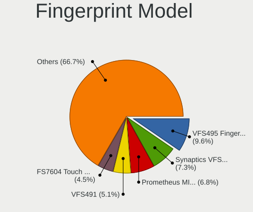

| Model                                                                      | Computers | Percent |
|----------------------------------------------------------------------------|-----------|---------|
| Validity Sensors VFS495 Fingerprint Reader                                 | 17        | 9.6%    |
| Validity Sensors Synaptics VFS7552 Touch Fingerprint Sensor with PurePrint | 13        | 7.34%   |
| Synaptics Prometheus MIS Touch Fingerprint Reader                          | 12        | 6.78%   |
| Validity Sensors VFS491                                                    | 9         | 5.08%   |
| Synaptics FS7604 Touch Fingerprint Sensor with PurePrint                   | 8         | 4.52%   |
| Validity Sensors VFS7552 Touch Fingerprint Sensor                          | 7         | 3.95%   |
| Validity Sensors VFS7500 Touch Fingerprint Sensor                          | 7         | 3.95%   |
| Upek Biometric Touchchip/Touchstrip Fingerprint Sensor                     | 7         | 3.95%   |
| Validity Sensors VFS451 Fingerprint Reader                                 | 6         | 3.39%   |
| Synaptics UWP WBDI                                                         | 6         | 3.39%   |
| Synaptics  FS7604 Touch Fingerprint Sensor with PurePrint                  | 6         | 3.39%   |
| Synaptics Fingerprint reader [HP G6]                                       | 6         | 3.39%   |
| Validity Sensors VFS471 Fingerprint Reader                                 | 5         | 2.82%   |
| Synaptics WBDI                                                             | 5         | 2.82%   |
| Shenzhen Goodix  FingerPrint Device                                        | 5         | 2.82%   |
| Validity Sensors Synaptics WBDI                                            | 4         | 2.26%   |
| Validity Sensors Synaptics VFS7552 Touch Fingerprint Sensor                | 4         | 2.26%   |
| Validity Sensors Swipe Fingerprint Sensor                                  | 4         | 2.26%   |
| Synaptics UWP WBDI Device                                                  | 4         | 2.26%   |
| Elan ELAN:Fingerprint                                                      | 4         | 2.26%   |
| Synaptics Prometheus Fingerprint Reader                                    | 3         | 1.69%   |
| Synaptics Metallica MIS Touch Fingerprint Reader                           | 3         | 1.69%   |
| STMicroelectronics Fingerprint Reader                                      | 3         | 1.69%   |
| Shenzhen Goodix FingerPrint                                                | 3         | 1.69%   |
| Elan ELAN:ARM-M4                                                           | 3         | 1.69%   |
| AuthenTec Fingerprint Sensor                                               | 3         | 1.69%   |
| Validity Sensors VFS301 Fingerprint Reader                                 | 2         | 1.13%   |
| Validity Sensors VFS 5011 fingerprint sensor                               | 2         | 1.13%   |
| Synaptics  WBDI                                                            | 2         | 1.13%   |
| Synaptics Metallica MOH Touch Fingerprint Reader                           | 2         | 1.13%   |
| LighTuning EgisTec Touch Fingerprint Sensor                                | 2         | 1.13%   |
| AuthenTec AES2501 Fingerprint Sensor                                       | 2         | 1.13%   |
| Validity Sensors Fingerprint scanner                                       | 1         | 0.56%   |
| Synaptics WBDI Fingerprint Reader USB 102                                  | 1         | 0.56%   |
| Shenzhen Goodix Fingerprint Reader                                         | 1         | 0.56%   |
| Elan fingerprint sensor [FeinTech FPS00200]                                | 1         | 0.56%   |
| AuthenTec AES2810                                                          | 1         | 0.56%   |
| AuthenTec AES2550 Fingerprint Sensor                                       | 1         | 0.56%   |
| AuthenTec AES1600                                                          | 1         | 0.56%   |
| Unknown                                                                    | 1         | 0.56%   |

Chipcard Vendor
---------------

Chipcard module vendors

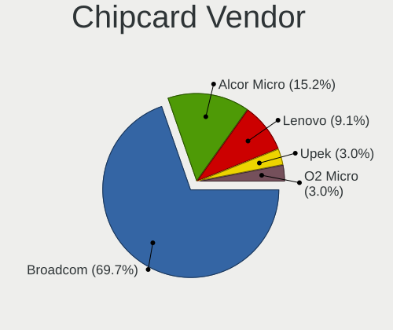

| Vendor      | Computers | Percent |
|-------------|-----------|---------|
| Broadcom    | 23        | 69.7%   |
| Alcor Micro | 5         | 15.15%  |
| Lenovo      | 3         | 9.09%   |
| Upek        | 1         | 3.03%   |
| O2 Micro    | 1         | 3.03%   |

Chipcard Model
--------------

Chipcard module models

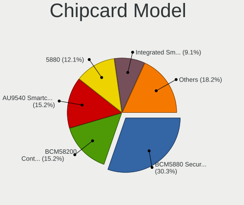

| Model                                                                        | Computers | Percent |
|------------------------------------------------------------------------------|-----------|---------|
| Broadcom BCM5880 Secure Applications Processor                               | 10        | 30.3%   |
| Broadcom BCM58200 ControlVault 3 (FingerPrint sensor + Contacted SmartCard)  | 5         | 15.15%  |
| Alcor Micro AU9540 Smartcard Reader                                          | 5         | 15.15%  |
| Broadcom 5880                                                                | 4         | 12.12%  |
| Lenovo Integrated Smart Card Reader                                          | 3         | 9.09%   |
| Broadcom BCM5880 Secure Applications Processor with fingerprint swipe sensor | 2         | 6.06%   |
| Broadcom 58200                                                               | 2         | 6.06%   |
| Upek TouchChip Fingerprint Coprocessor (WBF advanced mode)                   | 1         | 3.03%   |
| O2 Micro OZ776 CCID Smartcard Reader                                         | 1         | 3.03%   |

Unsupported
-----------

Unsupported Devices
-------------------

Total unsupported devices on board

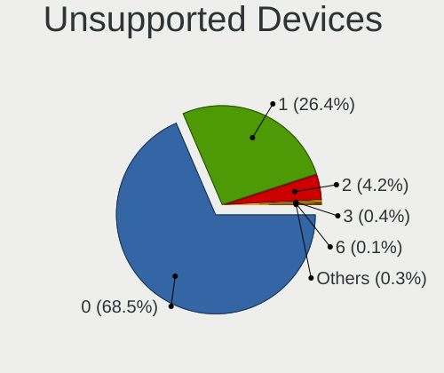

| Total | Computers | Percent |
|-------|-----------|---------|
| 0     | 915       | 68.54%  |
| 1     | 353       | 26.44%  |
| 2     | 56        | 4.19%   |
| 3     | 5         | 0.37%   |
| 6     | 2         | 0.15%   |
| 5     | 2         | 0.15%   |
| 4     | 2         | 0.15%   |

Unsupported Device Types
------------------------

Types of unsupported devices

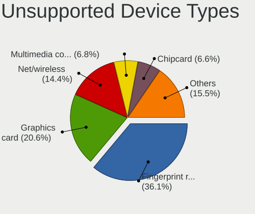

| Type                     | Computers | Percent |
|--------------------------|-----------|---------|
| Fingerprint reader       | 175       | 36.08%  |
| Graphics card            | 100       | 20.62%  |
| Net/wireless             | 70        | 14.43%  |
| Multimedia controller    | 33        | 6.8%    |
| Chipcard                 | 32        | 6.6%    |
| Camera                   | 12        | 2.47%   |
| Communication controller | 11        | 2.27%   |
| Bluetooth                | 9         | 1.86%   |
| Unassigned class         | 7         | 1.44%   |
| Sound                    | 6         | 1.24%   |
| Storage                  | 5         | 1.03%   |
| Network                  | 5         | 1.03%   |
| Net/ethernet             | 4         | 0.82%   |
| Modem                    | 3         | 0.62%   |
| Firewire controller      | 3         | 0.62%   |
| Dvb card                 | 3         | 0.62%   |
| Storage/raid             | 2         | 0.41%   |
| Storage/ide              | 2         | 0.41%   |
| Card reader              | 2         | 0.41%   |
| Flash memory             | 1         | 0.21%   |

