Linux in New Zealand - Tested Hardware & Statistics
---------------------------------------------------

A project to collect tested hardware configurations for Linux in New Zealand.

Anyone can contribute to this report by the [hw-probe](https://github.com/linuxhw/hw-probe) tool:

    sudo -E hw-probe -all -upload

Please contribute! Especially if your hardware is rare.

This is a report for all computer types. See also reports for [desktops](/Location/New_Zealand/Desktop/README.md) and [notebooks](/Location/New_Zealand/Notebook/README.md).

Contents
--------

* [ Test Cases ](#test-cases)

* [ System ](#system)
  - [ OS                       ](#os)
  - [ OS Family                ](#os-family)
  - [ Kernel                   ](#kernel)
  - [ Kernel Family            ](#kernel-family)
  - [ Kernel Major Ver.        ](#kernel-major-ver)
  - [ Arch                     ](#arch)
  - [ DE                       ](#de)
  - [ Display Server           ](#display-server)
  - [ Display Manager          ](#display-manager)
  - [ OS Lang                  ](#os-lang)
  - [ Boot Mode                ](#boot-mode)
  - [ Filesystem               ](#filesystem)
  - [ Part. scheme             ](#part-scheme)
  - [ Dual Boot with Linux/BSD ](#dual-boot-with-linuxbsd)
  - [ Dual Boot (Win)          ](#dual-boot-win)

* [ Board ](#board)
  - [ Vendor                   ](#vendor)
  - [ Model                    ](#model)
  - [ Model Family             ](#model-family)
  - [ MFG Year                 ](#mfg-year)
  - [ Form Factor              ](#form-factor)
  - [ Secure Boot              ](#secure-boot)
  - [ Coreboot                 ](#coreboot)
  - [ RAM Size                 ](#ram-size)
  - [ RAM Used                 ](#ram-used)
  - [ Total Drives             ](#total-drives)
  - [ Has CD-ROM               ](#has-cd-rom)
  - [ Has Ethernet             ](#has-ethernet)
  - [ Has WiFi                 ](#has-wifi)
  - [ Has Bluetooth            ](#has-bluetooth)

* [ Location ](#location)
  - [ Country                  ](#country)
  - [ City                     ](#city)

* [ Drives ](#drives)
  - [ Drive Vendor             ](#drive-vendor)
  - [ Drive Model              ](#drive-model)
  - [ HDD Vendor               ](#hdd-vendor)
  - [ SSD Vendor               ](#ssd-vendor)
  - [ Drive Kind               ](#drive-kind)
  - [ Drive Connector          ](#drive-connector)
  - [ Drive Size               ](#drive-size)
  - [ Space Total              ](#space-total)
  - [ Space Used               ](#space-used)
  - [ Malfunc. Drives          ](#malfunc-drives)
  - [ Malfunc. Drive Vendor    ](#malfunc-drive-vendor)
  - [ Malfunc. HDD Vendor      ](#malfunc-hdd-vendor)
  - [ Malfunc. Drive Kind      ](#malfunc-drive-kind)
  - [ Failed Drives            ](#failed-drives)
  - [ Failed Drive Vendor      ](#failed-drive-vendor)
  - [ Drive Status             ](#drive-status)

* [ Storage controller ](#storage-controller)
  - [ Storage Vendor           ](#storage-vendor)
  - [ Storage Model            ](#storage-model)
  - [ Storage Kind             ](#storage-kind)

* [ Processor ](#processor)
  - [ CPU Vendor               ](#cpu-vendor)
  - [ CPU Model                ](#cpu-model)
  - [ CPU Model Family         ](#cpu-model-family)
  - [ CPU Cores                ](#cpu-cores)
  - [ CPU Sockets              ](#cpu-sockets)
  - [ CPU Threads              ](#cpu-threads)
  - [ CPU Op-Modes             ](#cpu-op-modes)
  - [ CPU Microcode            ](#cpu-microcode)
  - [ CPU Microarch            ](#cpu-microarch)

* [ Graphics ](#graphics)
  - [ GPU Vendor               ](#gpu-vendor)
  - [ GPU Model                ](#gpu-model)
  - [ GPU Combo                ](#gpu-combo)
  - [ GPU Driver               ](#gpu-driver)
  - [ GPU Memory               ](#gpu-memory)

* [ Monitor ](#monitor)
  - [ Monitor Vendor           ](#monitor-vendor)
  - [ Monitor Model            ](#monitor-model)
  - [ Monitor Resolution       ](#monitor-resolution)
  - [ Monitor Diagonal         ](#monitor-diagonal)
  - [ Monitor Width            ](#monitor-width)
  - [ Aspect Ratio             ](#aspect-ratio)
  - [ Monitor Area             ](#monitor-area)
  - [ Pixel Density            ](#pixel-density)
  - [ Multiple Monitors        ](#multiple-monitors)

* [ Network ](#network)
  - [ Net Controller Vendor    ](#net-controller-vendor)
  - [ Net Controller Model     ](#net-controller-model)
  - [ Wireless Vendor          ](#wireless-vendor)
  - [ Wireless Model           ](#wireless-model)
  - [ Ethernet Vendor          ](#ethernet-vendor)
  - [ Ethernet Model           ](#ethernet-model)
  - [ Net Controller Kind      ](#net-controller-kind)
  - [ Used Controller          ](#used-controller)
  - [ NICs                     ](#nics)
  - [ IPv6                     ](#ipv6)

* [ Bluetooth ](#bluetooth)
  - [ Bluetooth Vendor         ](#bluetooth-vendor)
  - [ Bluetooth Model          ](#bluetooth-model)

* [ Sound ](#sound)
  - [ Sound Vendor             ](#sound-vendor)
  - [ Sound Model              ](#sound-model)

* [ Memory ](#memory)
  - [ Memory Vendor            ](#memory-vendor)
  - [ Memory Model             ](#memory-model)
  - [ Memory Kind              ](#memory-kind)
  - [ Memory Form Factor       ](#memory-form-factor)
  - [ Memory Size              ](#memory-size)
  - [ Memory Speed             ](#memory-speed)

* [ Printers & scanners ](#printers--scanners)
  - [ Printer Vendor           ](#printer-vendor)
  - [ Printer Model            ](#printer-model)
  - [ Scanner Vendor           ](#scanner-vendor)
  - [ Scanner Model            ](#scanner-model)

* [ Camera ](#camera)
  - [ Camera Vendor            ](#camera-vendor)
  - [ Camera Model             ](#camera-model)

* [ Security ](#security)
  - [ Fingerprint Vendor       ](#fingerprint-vendor)
  - [ Fingerprint Model        ](#fingerprint-model)
  - [ Chipcard Vendor          ](#chipcard-vendor)
  - [ Chipcard Model           ](#chipcard-model)

* [ Unsupported ](#unsupported)
  - [ Unsupported Devices      ](#unsupported-devices)
  - [ Unsupported Device Types ](#unsupported-device-types)

Test Cases
----------

Total: 856

| Vendor        | Model                       | Form-Factor | Probe                                                      | Date         |
|---------------|-----------------------------|-------------|------------------------------------------------------------|--------------|
| The Wareho... | E2037                       | Notebook    | [e9599d1061](https://linux-hardware.org/?probe=e9599d1061) | Aug 31, 2022 |
| Gigabyte      | B85M-HD3                    | Desktop     | [dcb5e7a20c](https://linux-hardware.org/?probe=dcb5e7a20c) | Aug 29, 2022 |
| Lenovo        | V145-15AST 81MT             | Notebook    | [40b9d37c2a](https://linux-hardware.org/?probe=40b9d37c2a) | Aug 29, 2022 |
| HP            | ProBook 440 14 inch G9 N... | Notebook    | [0a08f13779](https://linux-hardware.org/?probe=0a08f13779) | Aug 29, 2022 |
| Apple         | MacBook5,2                  | Notebook    | [780e5cbb44](https://linux-hardware.org/?probe=780e5cbb44) | Aug 28, 2022 |
| Dell          | Latitude 5420               | Notebook    | [0d5e8a9703](https://linux-hardware.org/?probe=0d5e8a9703) | Aug 28, 2022 |
| Gigabyte      | M61PME-S2                   | Desktop     | [8f8107b683](https://linux-hardware.org/?probe=8f8107b683) | Aug 27, 2022 |
| Gigabyte      | M61PME-S2                   | Desktop     | [e3b89ab2db](https://linux-hardware.org/?probe=e3b89ab2db) | Aug 27, 2022 |
| HP            | ProBook 450 G6              | Notebook    | [def45574de](https://linux-hardware.org/?probe=def45574de) | Aug 26, 2022 |
| ASUSTek       | P81IJ                       | Notebook    | [7ab324abea](https://linux-hardware.org/?probe=7ab324abea) | Aug 25, 2022 |
| Dell          | 073MMW A03                  | Desktop     | [b41e0fcad5](https://linux-hardware.org/?probe=b41e0fcad5) | Aug 24, 2022 |
| Lenovo        | ThinkPad T420 4180F75       | Notebook    | [f4a6e9705d](https://linux-hardware.org/?probe=f4a6e9705d) | Aug 24, 2022 |
| Acer          | Aspire M5-581TG             | Notebook    | [03ec19b37d](https://linux-hardware.org/?probe=03ec19b37d) | Aug 23, 2022 |
| ASUSTek       | PRIME Z370-A II             | Desktop     | [d7dee32799](https://linux-hardware.org/?probe=d7dee32799) | Aug 23, 2022 |
| Google        | Galtic                      | Notebook    | [f06baf315d](https://linux-hardware.org/?probe=f06baf315d) | Aug 22, 2022 |
| Dell          | Latitude E6500              | Notebook    | [defd0003bc](https://linux-hardware.org/?probe=defd0003bc) | Aug 22, 2022 |
| ASRock        | 890GM Pro3                  | Desktop     | [51f5d50d85](https://linux-hardware.org/?probe=51f5d50d85) | Aug 22, 2022 |
| ASRock        | 890GM Pro3                  | Desktop     | [002a0c3f5a](https://linux-hardware.org/?probe=002a0c3f5a) | Aug 22, 2022 |
| Gigabyte      | Z490 AORUS ELITE AC         | Desktop     | [b12d6e7967](https://linux-hardware.org/?probe=b12d6e7967) | Aug 20, 2022 |
| Intel         | NUC6CAYB J23203-403         | Mini pc     | [92525ee03c](https://linux-hardware.org/?probe=92525ee03c) | Aug 17, 2022 |
| Lenovo        | 3190 SDK0T76530 WIN 3556... | Mini pc     | [766a8b38a6](https://linux-hardware.org/?probe=766a8b38a6) | Aug 16, 2022 |
| Dell          | Vostro 7500                 | Notebook    | [94309eee94](https://linux-hardware.org/?probe=94309eee94) | Aug 15, 2022 |
| Dell          | Vostro 7500                 | Notebook    | [3e084bba8b](https://linux-hardware.org/?probe=3e084bba8b) | Aug 15, 2022 |
| HP            | ProBook 6570b               | Notebook    | [335eb52112](https://linux-hardware.org/?probe=335eb52112) | Aug 12, 2022 |
| Intel         | NUC6CAYB J23203-403         | Mini pc     | [4ff9f1893d](https://linux-hardware.org/?probe=4ff9f1893d) | Aug 11, 2022 |
| Lenovo        | Yoga Slim 7 15ITL05 82AC    | Notebook    | [477ce53969](https://linux-hardware.org/?probe=477ce53969) | Aug 10, 2022 |
| Dell          | Latitude E6420              | Notebook    | [7c907987cb](https://linux-hardware.org/?probe=7c907987cb) | Aug 10, 2022 |
| Gigabyte      | B560M DS3H AC               | Desktop     | [c9e9691195](https://linux-hardware.org/?probe=c9e9691195) | Aug 10, 2022 |
| Intel         | NUC6CAYB J23203-403         | Mini pc     | [91438d7bdd](https://linux-hardware.org/?probe=91438d7bdd) | Aug 06, 2022 |
| Acer          | Spin SP513-51               | Convertible | [7531ebdab5](https://linux-hardware.org/?probe=7531ebdab5) | Aug 05, 2022 |
| Dell          | Latitude E6430s             | Notebook    | [542db6380a](https://linux-hardware.org/?probe=542db6380a) | Aug 04, 2022 |
| ASUSTek       | M5A97 EVO R2.0              | Desktop     | [ca1d7dd61b](https://linux-hardware.org/?probe=ca1d7dd61b) | Aug 03, 2022 |
| Gigabyte      | Z68MA-D2H-B3                | Desktop     | [4956d72048](https://linux-hardware.org/?probe=4956d72048) | Aug 01, 2022 |
| ASUSTek       | VivoBook Flip 14_ASUS Fl... | Convertible | [827883d38c](https://linux-hardware.org/?probe=827883d38c) | Aug 01, 2022 |
| ASUSTek       | TUF Gaming X570-PLUS        | Desktop     | [163affcbb8](https://linux-hardware.org/?probe=163affcbb8) | Aug 01, 2022 |
| ASUSTek       | Zenbook UX5401ZAS_UX5401... | Notebook    | [d3b270c068](https://linux-hardware.org/?probe=d3b270c068) | Jul 31, 2022 |
| Intel         | NUC5i7RYB H73774-104        | Mini pc     | [773e4afb47](https://linux-hardware.org/?probe=773e4afb47) | Jul 30, 2022 |
| HP            | 2000                        | Notebook    | [531b786836](https://linux-hardware.org/?probe=531b786836) | Jul 28, 2022 |
| HP            | 8054                        | Desktop     | [3b76696319](https://linux-hardware.org/?probe=3b76696319) | Jul 27, 2022 |
| HP            | Notebook                    | Notebook    | [17893fb905](https://linux-hardware.org/?probe=17893fb905) | Jul 24, 2022 |
| Intel         | STK1AW32SC H91596-307       | Desktop     | [78225ba5b9](https://linux-hardware.org/?probe=78225ba5b9) | Jul 21, 2022 |
| HP            | 3397                        | Desktop     | [83bdaea8fc](https://linux-hardware.org/?probe=83bdaea8fc) | Jul 17, 2022 |
| ASUSTek       | ROG Zephyrus G15 GA503RW... | Notebook    | [7812a0737e](https://linux-hardware.org/?probe=7812a0737e) | Jul 15, 2022 |
| Kogan         | KALAP13S300VA               | Notebook    | [9060455576](https://linux-hardware.org/?probe=9060455576) | Jul 15, 2022 |
| Lenovo        | ThinkPad T470 W10DG 20JN... | Notebook    | [1dac03f80a](https://linux-hardware.org/?probe=1dac03f80a) | Jul 15, 2022 |
| Intel         | NUC8i5INB K29935-402        | Mini pc     | [27d189d77f](https://linux-hardware.org/?probe=27d189d77f) | Jul 13, 2022 |
| Gigabyte      | H87M-D3H                    | Desktop     | [5056c4f640](https://linux-hardware.org/?probe=5056c4f640) | Jul 13, 2022 |
| Lenovo        | 14w 81MQ0013AU              | Notebook    | [a93743a911](https://linux-hardware.org/?probe=a93743a911) | Jul 11, 2022 |
| HP            | ENVY x360 Convertible 13... | Convertible | [6d6b4c9d06](https://linux-hardware.org/?probe=6d6b4c9d06) | Jul 11, 2022 |
| ASUSTek       | ROG Zephyrus G15 GA503RW... | Notebook    | [a379e2a103](https://linux-hardware.org/?probe=a379e2a103) | Jul 11, 2022 |
| Lenovo        | G40-30 80FY                 | Notebook    | [35d55776f6](https://linux-hardware.org/?probe=35d55776f6) | Jul 09, 2022 |
| ASUSTek       | GL703VD                     | Notebook    | [dc966787de](https://linux-hardware.org/?probe=dc966787de) | Jul 04, 2022 |
| Gigabyte      | B460M D3H                   | Desktop     | [d620225518](https://linux-hardware.org/?probe=d620225518) | Jun 30, 2022 |
| Gigabyte      | Z490 AORUS ELITE AC         | Desktop     | [86a93d8ea0](https://linux-hardware.org/?probe=86a93d8ea0) | Jun 29, 2022 |
| Lenovo        | Yoga 730-15IWL 81JS         | Convertible | [3c8656100a](https://linux-hardware.org/?probe=3c8656100a) | Jun 29, 2022 |
| Alienware     | 01NYPT A00                  | Desktop     | [97b8d855bd](https://linux-hardware.org/?probe=97b8d855bd) | Jun 28, 2022 |
| Gigabyte      | Z490 AORUS ELITE AC         | Desktop     | [fd93206df4](https://linux-hardware.org/?probe=fd93206df4) | Jun 27, 2022 |
| Dell          | 0XHGV1 A01                  | Desktop     | [9d9ae107c9](https://linux-hardware.org/?probe=9d9ae107c9) | Jun 25, 2022 |
| ASRock        | X370 Taichi                 | Desktop     | [788acf13f2](https://linux-hardware.org/?probe=788acf13f2) | Jun 24, 2022 |
| ASUSTek       | ROG Strix G513QY_G513QY     | Notebook    | [1780abcf08](https://linux-hardware.org/?probe=1780abcf08) | Jun 24, 2022 |
| Gigabyte      | AB350-Gaming 3-CF           | Desktop     | [d11995947a](https://linux-hardware.org/?probe=d11995947a) | Jun 23, 2022 |
| Dell          | 0XHGV1 A01                  | Desktop     | [656f558626](https://linux-hardware.org/?probe=656f558626) | Jun 23, 2022 |
| HP            | 18E7                        | Desktop     | [2fd690b3b4](https://linux-hardware.org/?probe=2fd690b3b4) | Jun 22, 2022 |
| HP            | ZBook Firefly 15 G7 Mobi... | Notebook    | [36fdd87ff3](https://linux-hardware.org/?probe=36fdd87ff3) | Jun 21, 2022 |
| HP            | ProBook 450 G1              | Notebook    | [7ef2bab71d](https://linux-hardware.org/?probe=7ef2bab71d) | Jun 19, 2022 |
| HP            | 550                         | Notebook    | [1db816d0b2](https://linux-hardware.org/?probe=1db816d0b2) | Jun 19, 2022 |
| Dell          | Precision 3571              | Notebook    | [9d6985b0f0](https://linux-hardware.org/?probe=9d6985b0f0) | Jun 18, 2022 |
| Dell          | Precision 3571              | Notebook    | [285846e1a4](https://linux-hardware.org/?probe=285846e1a4) | Jun 18, 2022 |
| ASUSTek       | H97M-PLUS                   | Desktop     | [874c85b694](https://linux-hardware.org/?probe=874c85b694) | Jun 17, 2022 |
| ASUSTek       | ROG STRIX X570-E GAMING ... | Desktop     | [38bf9d2a7b](https://linux-hardware.org/?probe=38bf9d2a7b) | Jun 12, 2022 |
| HP            | EliteBook 830 G5            | Notebook    | [f7d3ee91c6](https://linux-hardware.org/?probe=f7d3ee91c6) | Jun 12, 2022 |
| HP            | EliteBook 830 G5            | Notebook    | [4347d50981](https://linux-hardware.org/?probe=4347d50981) | Jun 12, 2022 |
| Lenovo        | ThinkPad T460p 20FW0005A... | Notebook    | [f9bd82bcd7](https://linux-hardware.org/?probe=f9bd82bcd7) | Jun 05, 2022 |
| HP            | ZBook Studio G7 Mobile W... | Notebook    | [894d121f66](https://linux-hardware.org/?probe=894d121f66) | Jun 03, 2022 |
| Lenovo        | ThinkPad T460p 20FW0005A... | Notebook    | [df0f623625](https://linux-hardware.org/?probe=df0f623625) | May 30, 2022 |
| Raspberry ... | Raspberry Pi 4 Model B R... | Soc         | [bee7f3506c](https://linux-hardware.org/?probe=bee7f3506c) | May 29, 2022 |
| Lenovo        | MIIX 510-12IKB 80XE         | Tablet      | [512d3f18ce](https://linux-hardware.org/?probe=512d3f18ce) | May 28, 2022 |
| Intel         | NUC9i7QNB K49245-403        | Mini pc     | [af7e6249f0](https://linux-hardware.org/?probe=af7e6249f0) | May 27, 2022 |
| Intel         | NUC9i7QNB K49245-403        | Mini pc     | [44ceac3592](https://linux-hardware.org/?probe=44ceac3592) | May 27, 2022 |
| ASUSTek       | ROG Strix G513QY_G513QY     | Notebook    | [5718bd4854](https://linux-hardware.org/?probe=5718bd4854) | May 27, 2022 |
| Toshiba       | Satellite Pro C665          | Notebook    | [23fd853a45](https://linux-hardware.org/?probe=23fd853a45) | May 24, 2022 |
| Acer          | TravelMate 7750G            | Notebook    | [3ff0c1c7f2](https://linux-hardware.org/?probe=3ff0c1c7f2) | May 23, 2022 |
| Acer          | TravelMate 7750G            | Notebook    | [80bfe5a0c6](https://linux-hardware.org/?probe=80bfe5a0c6) | May 23, 2022 |
| Lenovo        | ThinkPad T480 20L5S00F00    | Notebook    | [7a1f70c8aa](https://linux-hardware.org/?probe=7a1f70c8aa) | May 22, 2022 |
| MSI           | Katana GF76 12UGS           | Notebook    | [06cb917381](https://linux-hardware.org/?probe=06cb917381) | May 22, 2022 |
| MSI           | Katana GF76 12UGS           | Notebook    | [22776216d6](https://linux-hardware.org/?probe=22776216d6) | May 22, 2022 |
| HP            | ProBook 6550b               | Notebook    | [5a80f0ac5d](https://linux-hardware.org/?probe=5a80f0ac5d) | May 21, 2022 |
| MSI           | Katana GF76 12UGS           | Notebook    | [cd50fa44c3](https://linux-hardware.org/?probe=cd50fa44c3) | May 21, 2022 |
| MSI           | Katana GF76 12UGS           | Notebook    | [556940f73e](https://linux-hardware.org/?probe=556940f73e) | May 21, 2022 |
| MSI           | Katana GF76 12UGS           | Notebook    | [fbea498a36](https://linux-hardware.org/?probe=fbea498a36) | May 21, 2022 |
| Toshiba       | Satellite L50D-C            | Notebook    | [f06e254906](https://linux-hardware.org/?probe=f06e254906) | May 17, 2022 |
| ASUSTek       | VivoBook_ASUSLaptop X515... | Notebook    | [60d56e6b15](https://linux-hardware.org/?probe=60d56e6b15) | May 13, 2022 |
| ASUSTek       | ROG STRIX B550-F GAMING     | Desktop     | [a2e10758ca](https://linux-hardware.org/?probe=a2e10758ca) | May 13, 2022 |
| Alienware     | x17 R2                      | Notebook    | [0a81fc619e](https://linux-hardware.org/?probe=0a81fc619e) | May 12, 2022 |
| HP            | 1998                        | Desktop     | [b717b34f5b](https://linux-hardware.org/?probe=b717b34f5b) | May 08, 2022 |
| ASUSTek       | VivoBook_ASUSLaptop X515... | Notebook    | [bd6e42ac60](https://linux-hardware.org/?probe=bd6e42ac60) | May 07, 2022 |
| Gigabyte      | AB350-Gaming 3-CF           | Desktop     | [6693954f79](https://linux-hardware.org/?probe=6693954f79) | May 07, 2022 |
| Lenovo        | ThinkCentre M91p 4518E2M    | Desktop     | [2553bf03d1](https://linux-hardware.org/?probe=2553bf03d1) | May 05, 2022 |
| Lenovo        | ThinkCentre M91p 4518E2M    | Desktop     | [03a7fc3c23](https://linux-hardware.org/?probe=03a7fc3c23) | May 05, 2022 |
| ASUSTek       | B150M PRO GAMING            | Desktop     | [a31ab08668](https://linux-hardware.org/?probe=a31ab08668) | May 04, 2022 |
| Toshiba       | Satellite C660              | Notebook    | [2b4d9cbd0c](https://linux-hardware.org/?probe=2b4d9cbd0c) | May 03, 2022 |
| Lenovo        | B50-30 20382                | Notebook    | [1eb95bb123](https://linux-hardware.org/?probe=1eb95bb123) | May 01, 2022 |
| MSI           | MAG B550M MORTAR            | Desktop     | [c994128afd](https://linux-hardware.org/?probe=c994128afd) | Apr 30, 2022 |
| ASUSTek       | TUF Gaming X570-PLUS        | Desktop     | [7e84138ea1](https://linux-hardware.org/?probe=7e84138ea1) | Apr 29, 2022 |
| Toshiba       | Satellite C660              | Notebook    | [c3bb583347](https://linux-hardware.org/?probe=c3bb583347) | Apr 24, 2022 |
| Lenovo        | B50-70 20384                | Notebook    | [35cf0f09e4](https://linux-hardware.org/?probe=35cf0f09e4) | Apr 22, 2022 |
| Gigabyte      | Z370 HD3-CF                 | Desktop     | [8888cb88d3](https://linux-hardware.org/?probe=8888cb88d3) | Apr 22, 2022 |
| Gigabyte      | Z490 AORUS ELITE AC         | Desktop     | [78a785e4a9](https://linux-hardware.org/?probe=78a785e4a9) | Apr 15, 2022 |
| Dell          | XPS 13 9360                 | Notebook    | [021cd80ac4](https://linux-hardware.org/?probe=021cd80ac4) | Apr 14, 2022 |
| Dell          | XPS 15 9510                 | Notebook    | [ff5563e261](https://linux-hardware.org/?probe=ff5563e261) | Apr 14, 2022 |
| MSI           | B450 TOMAHAWK MAX           | Desktop     | [5ec598483e](https://linux-hardware.org/?probe=5ec598483e) | Apr 14, 2022 |
| ASUSTek       | PRIME B450M-A               | Desktop     | [d4295c9a47](https://linux-hardware.org/?probe=d4295c9a47) | Apr 14, 2022 |
| Dell          | Inspiron 5415               | Notebook    | [5ad4aa0994](https://linux-hardware.org/?probe=5ad4aa0994) | Apr 13, 2022 |
| ASUSTek       | ROG STRIX X570-E GAMING     | Desktop     | [3ddf8a6825](https://linux-hardware.org/?probe=3ddf8a6825) | Apr 11, 2022 |
| Dell          | Inspiron 7405 2n1           | Convertible | [9fa115228c](https://linux-hardware.org/?probe=9fa115228c) | Apr 11, 2022 |
| Lenovo        | Yoga 730-15IWL 81JS         | Convertible | [1a7b7179f7](https://linux-hardware.org/?probe=1a7b7179f7) | Apr 10, 2022 |
| HP            | ProBook 650 G1              | Notebook    | [a7d004962f](https://linux-hardware.org/?probe=a7d004962f) | Apr 08, 2022 |
| HP            | 1790                        | Desktop     | [5fd16b3e1e](https://linux-hardware.org/?probe=5fd16b3e1e) | Apr 03, 2022 |
| Dell          | 0M017G A00                  | Desktop     | [a7ee814f3a](https://linux-hardware.org/?probe=a7ee814f3a) | Apr 02, 2022 |
| Dell          | Latitude 7480               | Notebook    | [ccc8107d39](https://linux-hardware.org/?probe=ccc8107d39) | Apr 01, 2022 |
| Lenovo        | IdeaPad S145-14AST 81ST     | Notebook    | [9e39c749a1](https://linux-hardware.org/?probe=9e39c749a1) | Mar 27, 2022 |
| Samsung       | 530U3C/530U4C/532U3C        | Notebook    | [1c30077d94](https://linux-hardware.org/?probe=1c30077d94) | Mar 26, 2022 |
| eMachines     | eM350                       | Notebook    | [19b0ed12cc](https://linux-hardware.org/?probe=19b0ed12cc) | Mar 26, 2022 |
| Lenovo        | ThinkPad T14 Gen 1 20UDS... | Notebook    | [9b194b03b4](https://linux-hardware.org/?probe=9b194b03b4) | Mar 25, 2022 |
| Dell          | 0M863N A01                  | Desktop     | [c05eaeb499](https://linux-hardware.org/?probe=c05eaeb499) | Mar 24, 2022 |
| ASUSTek       | P8H61-M LX3 R2.0            | Desktop     | [cf9c727b0d](https://linux-hardware.org/?probe=cf9c727b0d) | Mar 24, 2022 |
| HP            | Laptop 15-bs0xx             | Notebook    | [e12f0f1eed](https://linux-hardware.org/?probe=e12f0f1eed) | Mar 23, 2022 |
| HP            | Pavilion Gaming Laptop 1... | Notebook    | [24d5a323cc](https://linux-hardware.org/?probe=24d5a323cc) | Mar 23, 2022 |
| ASUSTek       | G75VX                       | Notebook    | [4673f4edd8](https://linux-hardware.org/?probe=4673f4edd8) | Mar 21, 2022 |
| ASUSTek       | P5E                         | Desktop     | [ec2b80980d](https://linux-hardware.org/?probe=ec2b80980d) | Mar 18, 2022 |
| HP            | EliteBook 8460p             | Notebook    | [7bc2963830](https://linux-hardware.org/?probe=7bc2963830) | Mar 17, 2022 |
| Dell          | XPS 13 9365                 | Convertible | [08dc6f6fe3](https://linux-hardware.org/?probe=08dc6f6fe3) | Mar 16, 2022 |
| HP            | Pavilion Gaming Laptop 1... | Notebook    | [33980f3303](https://linux-hardware.org/?probe=33980f3303) | Mar 15, 2022 |
| HP            | Pavilion Gaming Laptop 1... | Notebook    | [5b83093837](https://linux-hardware.org/?probe=5b83093837) | Mar 15, 2022 |
| Dell          | Inspiron 5770               | Notebook    | [fc12718113](https://linux-hardware.org/?probe=fc12718113) | Mar 13, 2022 |
| Dell          | Inspiron 5770               | Notebook    | [8a7c1daf70](https://linux-hardware.org/?probe=8a7c1daf70) | Mar 13, 2022 |
| Gigabyte      | B560M DS3H AC               | Desktop     | [64f278889f](https://linux-hardware.org/?probe=64f278889f) | Mar 13, 2022 |
| Dell          | XPS 15 9550                 | Notebook    | [c39fe1a3e3](https://linux-hardware.org/?probe=c39fe1a3e3) | Mar 08, 2022 |
| HP            | 2ADC                        | Desktop     | [ed0714a64a](https://linux-hardware.org/?probe=ed0714a64a) | Mar 07, 2022 |
| Gigabyte      | B460M DS3H AC               | Desktop     | [5a570f493c](https://linux-hardware.org/?probe=5a570f493c) | Mar 06, 2022 |
| Lenovo        | IdeaPad 3 14IML05 81WA      | Notebook    | [0a92c063a1](https://linux-hardware.org/?probe=0a92c063a1) | Feb 27, 2022 |
| Gigabyte      | H110M-H-CF                  | Desktop     | [5c169a1d32](https://linux-hardware.org/?probe=5c169a1d32) | Feb 25, 2022 |
| Acer          | Aspire E1-571G              | Notebook    | [de462f47a3](https://linux-hardware.org/?probe=de462f47a3) | Feb 24, 2022 |
| Acer          | Aspire E1-571G              | Notebook    | [ac593e3a3a](https://linux-hardware.org/?probe=ac593e3a3a) | Feb 24, 2022 |
| ASRock        | B450M Steel Legend          | Desktop     | [dfebbb508b](https://linux-hardware.org/?probe=dfebbb508b) | Feb 24, 2022 |
| ASRock        | B450M Steel Legend          | Desktop     | [26729d3227](https://linux-hardware.org/?probe=26729d3227) | Feb 22, 2022 |
| HP            | Pavilion Laptop 15-cs3xx... | Notebook    | [96aa797713](https://linux-hardware.org/?probe=96aa797713) | Feb 21, 2022 |
| HP            | 2AF7                        | Desktop     | [116084cb0a](https://linux-hardware.org/?probe=116084cb0a) | Feb 20, 2022 |
| ASUSTek       | P6X58D-E                    | Desktop     | [c7a12417f1](https://linux-hardware.org/?probe=c7a12417f1) | Feb 20, 2022 |
| ASUSTek       | ROG STRIX B550-A GAMING     | Desktop     | [cc2c71140b](https://linux-hardware.org/?probe=cc2c71140b) | Feb 20, 2022 |
| ASUSTek       | ROG STRIX B550-A GAMING     | Desktop     | [4d1d42c8cc](https://linux-hardware.org/?probe=4d1d42c8cc) | Feb 20, 2022 |
| ASRock        | B450M Steel Legend          | Desktop     | [024513d4a8](https://linux-hardware.org/?probe=024513d4a8) | Feb 18, 2022 |
| ASRock        | B450M Steel Legend          | Desktop     | [9bc33ce91e](https://linux-hardware.org/?probe=9bc33ce91e) | Feb 16, 2022 |
| Toshiba       | Satellite Pro R50-C         | Notebook    | [d185900f87](https://linux-hardware.org/?probe=d185900f87) | Feb 16, 2022 |
| ASRock        | B450M Steel Legend          | Desktop     | [cc420f69ce](https://linux-hardware.org/?probe=cc420f69ce) | Feb 16, 2022 |
| Dell          | Inspiron 5415               | Notebook    | [3324e66890](https://linux-hardware.org/?probe=3324e66890) | Feb 15, 2022 |
| Apple         | Mac-F2218EA9                | All in one  | [bf684bced7](https://linux-hardware.org/?probe=bf684bced7) | Feb 14, 2022 |
| Dell          | Inspiron 5415               | Notebook    | [c2bd021f7e](https://linux-hardware.org/?probe=c2bd021f7e) | Feb 13, 2022 |
| ASUSTek       | P8B75-M                     | Desktop     | [caf1721ebe](https://linux-hardware.org/?probe=caf1721ebe) | Feb 12, 2022 |
| ASUSTek       | K55A                        | Notebook    | [e88dba3a7e](https://linux-hardware.org/?probe=e88dba3a7e) | Feb 12, 2022 |
| System76      | Lemur Pro                   | Notebook    | [a0e5f04131](https://linux-hardware.org/?probe=a0e5f04131) | Feb 12, 2022 |
| Acer          | Aspire ES1-411              | Notebook    | [e534d71dc2](https://linux-hardware.org/?probe=e534d71dc2) | Feb 12, 2022 |
| Lenovo        | ThinkPad T470 20HES23B0U    | Notebook    | [c080812ddb](https://linux-hardware.org/?probe=c080812ddb) | Feb 08, 2022 |
| ASUSTek       | ROG Zephyrus M16 GU603HR... | Notebook    | [a39c608f4c](https://linux-hardware.org/?probe=a39c608f4c) | Feb 07, 2022 |
| ASUSTek       | CROSSHAIR VI HERO           | Desktop     | [24bd4956b6](https://linux-hardware.org/?probe=24bd4956b6) | Feb 05, 2022 |
| Acer          | Aspire A715-42G             | Notebook    | [f9c872ec0c](https://linux-hardware.org/?probe=f9c872ec0c) | Jan 30, 2022 |
| Lenovo        | ThinkPad P51 20HJS2JJ01     | Notebook    | [3a0225272f](https://linux-hardware.org/?probe=3a0225272f) | Jan 21, 2022 |
| ASUSTek       | ROG STRIX X570-E GAMING     | Desktop     | [d8ec503f66](https://linux-hardware.org/?probe=d8ec503f66) | Jan 21, 2022 |
| Supermicro    | X11DPG-QTA                  | Server      | [b714fa4c7f](https://linux-hardware.org/?probe=b714fa4c7f) | Jan 21, 2022 |
| Toshiba       | PORTEGE R930                | Notebook    | [1ee5471d24](https://linux-hardware.org/?probe=1ee5471d24) | Jan 20, 2022 |
| MediaVue      | MV-890GX V1.2               | Desktop     | [201163da2f](https://linux-hardware.org/?probe=201163da2f) | Jan 16, 2022 |
| Apple         | Mac-65CE76090165799A iMa... | All in one  | [11bf29bdd1](https://linux-hardware.org/?probe=11bf29bdd1) | Jan 16, 2022 |
| HP            | ProBook 450 G2              | Notebook    | [bf909a21dd](https://linux-hardware.org/?probe=bf909a21dd) | Jan 15, 2022 |
| Star Labs     | LabTop                      | Notebook    | [c7cc8bae59](https://linux-hardware.org/?probe=c7cc8bae59) | Jan 11, 2022 |
| Gigabyte      | X570S AERO G                | Desktop     | [fc3f2a485a](https://linux-hardware.org/?probe=fc3f2a485a) | Jan 08, 2022 |
| Apple         | Mac-35C5E08120C7EEAF Mac... | Mini pc     | [b05f843820](https://linux-hardware.org/?probe=b05f843820) | Jan 06, 2022 |
| HP            | Pavilion Laptop 15-cs0xx... | Notebook    | [2e7edfda25](https://linux-hardware.org/?probe=2e7edfda25) | Jan 04, 2022 |
| Apple         | MacBookPro5,1               | Notebook    | [6c7a3affdb](https://linux-hardware.org/?probe=6c7a3affdb) | Jan 02, 2022 |
| Acer          | Swift SF314-41              | Notebook    | [d7b4fd099d](https://linux-hardware.org/?probe=d7b4fd099d) | Jan 01, 2022 |
| Gigabyte      | Z77X-D3H                    | Desktop     | [44cbef1c02](https://linux-hardware.org/?probe=44cbef1c02) | Dec 30, 2021 |
| ASUSTek       | UX303LAB                    | Notebook    | [196ff1f41f](https://linux-hardware.org/?probe=196ff1f41f) | Dec 29, 2021 |
| Apple         | Mac-F2218FC8                | All in one  | [7f5484cd91](https://linux-hardware.org/?probe=7f5484cd91) | Dec 25, 2021 |
| ASUSTek       | ROG STRIX X570-E GAMING     | Desktop     | [51f97b7e46](https://linux-hardware.org/?probe=51f97b7e46) | Dec 25, 2021 |
| Gigabyte      | B460M DS3H AC               | Desktop     | [7bde1c408f](https://linux-hardware.org/?probe=7bde1c408f) | Dec 21, 2021 |
| Dell          | Inspiron 7405 2n1           | Convertible | [64d2a0328e](https://linux-hardware.org/?probe=64d2a0328e) | Dec 21, 2021 |
| Google        | Kip                         | Notebook    | [8c60d949d0](https://linux-hardware.org/?probe=8c60d949d0) | Dec 20, 2021 |
| Intel         | NUC11PABi5 K90634-302       | Mini pc     | [3962478b0f](https://linux-hardware.org/?probe=3962478b0f) | Dec 19, 2021 |
| Colorful T... | BATTLE-AX B450M-G DELUXE... | Desktop     | [52614e9f8d](https://linux-hardware.org/?probe=52614e9f8d) | Dec 19, 2021 |
| Intel         | NUC11PABi5 K90634-302       | Mini pc     | [8421d8ab8c](https://linux-hardware.org/?probe=8421d8ab8c) | Dec 19, 2021 |
| Lenovo        | 3708 SDK0J40700 WIN 3258... | Desktop     | [a6ddae1f31](https://linux-hardware.org/?probe=a6ddae1f31) | Dec 15, 2021 |
| Intel         | DQ87PG AAG74154-403         | Desktop     | [e2a6d57861](https://linux-hardware.org/?probe=e2a6d57861) | Dec 13, 2021 |
| Acer          | Aspire 4830T                | Notebook    | [554d2d7ce0](https://linux-hardware.org/?probe=554d2d7ce0) | Dec 12, 2021 |
| Acer          | Aspire 4830T                | Notebook    | [cbf04f6efb](https://linux-hardware.org/?probe=cbf04f6efb) | Dec 12, 2021 |
| ASUSTek       | ROG Strix G513QY_G513QY     | Notebook    | [ee63a84605](https://linux-hardware.org/?probe=ee63a84605) | Dec 11, 2021 |
| Huanan        | X99-F8 V2.0                 | Desktop     | [71f69762fe](https://linux-hardware.org/?probe=71f69762fe) | Dec 08, 2021 |
| ASUSTek       | VivoBook Flip 14_ASUS Fl... | Convertible | [572b9da8d1](https://linux-hardware.org/?probe=572b9da8d1) | Dec 06, 2021 |
| Dell          | 0M863N A01                  | Desktop     | [01a565720c](https://linux-hardware.org/?probe=01a565720c) | Dec 04, 2021 |
| ASUSTek       | ROG Zephyrus M16 GU603HR... | Notebook    | [41dec8d290](https://linux-hardware.org/?probe=41dec8d290) | Dec 04, 2021 |
| Dell          | System XPS L702X            | Notebook    | [805619ba8c](https://linux-hardware.org/?probe=805619ba8c) | Nov 25, 2021 |
| ASUSTek       | ROG Zephyrus M16 GU603HR... | Notebook    | [d0d56860bb](https://linux-hardware.org/?probe=d0d56860bb) | Nov 24, 2021 |
| ASUSTek       | ROG Zephyrus M16 GU603HR... | Notebook    | [85338e8b09](https://linux-hardware.org/?probe=85338e8b09) | Nov 23, 2021 |
| Apple         | MacBookAir7,2               | Notebook    | [df651ff7ad](https://linux-hardware.org/?probe=df651ff7ad) | Nov 23, 2021 |
| Gigabyte      | B75M-D3H                    | Desktop     | [939cd87ee7](https://linux-hardware.org/?probe=939cd87ee7) | Nov 22, 2021 |
| Intel         | NUC7i5DNB J57626-504        | Mini pc     | [d2625c256e](https://linux-hardware.org/?probe=d2625c256e) | Nov 22, 2021 |
| Intel         | NUC7i5DNB J57626-504        | Mini pc     | [12c79d3e71](https://linux-hardware.org/?probe=12c79d3e71) | Nov 21, 2021 |
| Gigabyte      | B550 AORUS ELITE AX V2      | Desktop     | [e2bb3dc142](https://linux-hardware.org/?probe=e2bb3dc142) | Nov 21, 2021 |
| HP            | 3396                        | Desktop     | [db69ec8696](https://linux-hardware.org/?probe=db69ec8696) | Nov 17, 2021 |
| HP            | 3396                        | Desktop     | [70fc3e699a](https://linux-hardware.org/?probe=70fc3e699a) | Nov 17, 2021 |
| HP            | Laptop 15-bs0xx             | Notebook    | [048cf14d2f](https://linux-hardware.org/?probe=048cf14d2f) | Nov 16, 2021 |
| ASUSTek       | VivoBook Flip 14_ASUS Fl... | Convertible | [0c64127bf0](https://linux-hardware.org/?probe=0c64127bf0) | Nov 13, 2021 |
| Acer          | Aspire 4830T                | Notebook    | [9ae2c69b2a](https://linux-hardware.org/?probe=9ae2c69b2a) | Nov 12, 2021 |
| ASUSTek       | ASUS TUF Dash F15 FX516P... | Notebook    | [9fc484d01e](https://linux-hardware.org/?probe=9fc484d01e) | Nov 11, 2021 |
| ASUSTek       | ASUS TUF Dash F15 FX516P... | Notebook    | [edc363bc59](https://linux-hardware.org/?probe=edc363bc59) | Nov 11, 2021 |
| Timi          | A30                         | Notebook    | [63583fcf04](https://linux-hardware.org/?probe=63583fcf04) | Nov 09, 2021 |
| Lenovo        | ThinkPad T420 4236DK9       | Notebook    | [84e39e6c94](https://linux-hardware.org/?probe=84e39e6c94) | Nov 03, 2021 |
| System76      | Pangolin                    | Notebook    | [1eb0a48a30](https://linux-hardware.org/?probe=1eb0a48a30) | Nov 03, 2021 |
| ASUSTek       | P8Z77-V                     | Desktop     | [c7a18968cf](https://linux-hardware.org/?probe=c7a18968cf) | Nov 03, 2021 |
| ASUSTek       | K52Jc                       | Notebook    | [dfb687f14d](https://linux-hardware.org/?probe=dfb687f14d) | Nov 01, 2021 |
| MSI           | MAG B365M MORTAR            | Desktop     | [95e40c6343](https://linux-hardware.org/?probe=95e40c6343) | Oct 30, 2021 |
| Dell          | Vostro 14 5410              | Notebook    | [b6966ebc42](https://linux-hardware.org/?probe=b6966ebc42) | Oct 30, 2021 |
| Lenovo        | ThinkPad P1 Gen 3 20TJS0... | Notebook    | [94e0e3f047](https://linux-hardware.org/?probe=94e0e3f047) | Oct 27, 2021 |
| MSI           | MAG B365M MORTAR            | Desktop     | [f2ce1a8260](https://linux-hardware.org/?probe=f2ce1a8260) | Oct 26, 2021 |
| HP            | Spectre x2 Detachable       | Notebook    | [d20c059f3d](https://linux-hardware.org/?probe=d20c059f3d) | Oct 24, 2021 |
| Gigabyte      | H97M-D3H                    | Desktop     | [349fbeb586](https://linux-hardware.org/?probe=349fbeb586) | Oct 23, 2021 |
| ASUSTek       | PRIME B560-PLUS             | Desktop     | [97bd114229](https://linux-hardware.org/?probe=97bd114229) | Oct 23, 2021 |
| ASUSTek       | ASUS EXPERTBOOK P2451FA_... | Notebook    | [01ca7ca744](https://linux-hardware.org/?probe=01ca7ca744) | Oct 23, 2021 |
| Gigabyte      | B75M-D3H                    | Desktop     | [74c2c9d725](https://linux-hardware.org/?probe=74c2c9d725) | Oct 22, 2021 |
| HP            | ProLiant DL360 Gen9         | Server      | [cfffe6aa63](https://linux-hardware.org/?probe=cfffe6aa63) | Oct 18, 2021 |
| Dell          | Latitude 7490               | Notebook    | [adb96facbb](https://linux-hardware.org/?probe=adb96facbb) | Oct 17, 2021 |
| IBM           | 81Y7071 SVT-R               | Desktop     | [033203aade](https://linux-hardware.org/?probe=033203aade) | Oct 16, 2021 |
| HP            | Pavilion tx2500             | Notebook    | [1410381a3d](https://linux-hardware.org/?probe=1410381a3d) | Oct 16, 2021 |
| HP            | Pavilion tx2500             | Notebook    | [e420777c94](https://linux-hardware.org/?probe=e420777c94) | Oct 16, 2021 |
| Gigabyte      | B365M HD3                   | Desktop     | [26e0d9a3d9](https://linux-hardware.org/?probe=26e0d9a3d9) | Oct 16, 2021 |
| Apple         | Mac-4BC72D62AD45599E Mac... | Mini pc     | [8e878489d3](https://linux-hardware.org/?probe=8e878489d3) | Oct 15, 2021 |
| HP            | 2B42                        | All in one  | [42d66aed80](https://linux-hardware.org/?probe=42d66aed80) | Oct 14, 2021 |
| Dell          | Latitude 7285               | Notebook    | [5097e0f8c8](https://linux-hardware.org/?probe=5097e0f8c8) | Oct 14, 2021 |
| ASUSTek       | PRIME B450-PLUS             | Desktop     | [530994c225](https://linux-hardware.org/?probe=530994c225) | Oct 11, 2021 |
| HP            | 2B42                        | All in one  | [c1224ad1ab](https://linux-hardware.org/?probe=c1224ad1ab) | Oct 11, 2021 |
| Acer          | Aspire VN7-593G             | Notebook    | [d9f2adbdfc](https://linux-hardware.org/?probe=d9f2adbdfc) | Oct 11, 2021 |
| MSI           | 2AE0                        | Desktop     | [e5ede0905a](https://linux-hardware.org/?probe=e5ede0905a) | Oct 10, 2021 |
| HP            | Pavilion g6                 | Notebook    | [07c4424a4e](https://linux-hardware.org/?probe=07c4424a4e) | Oct 10, 2021 |
| Acer          | TravelMate 2400             | Notebook    | [34d9be1b4a](https://linux-hardware.org/?probe=34d9be1b4a) | Oct 10, 2021 |
| Acer          | TravelMate 2400             | Notebook    | [4895b20211](https://linux-hardware.org/?probe=4895b20211) | Oct 09, 2021 |
| HP            | ProLiant DL360p Gen8        | Server      | [7b579629bb](https://linux-hardware.org/?probe=7b579629bb) | Oct 09, 2021 |
| Gigabyte      | X570 AORUS ELITE WIFI       | Desktop     | [55620348e7](https://linux-hardware.org/?probe=55620348e7) | Oct 08, 2021 |
| Dell          | 0D6H9T A02                  | Desktop     | [42b9320d55](https://linux-hardware.org/?probe=42b9320d55) | Oct 06, 2021 |
| Gigabyte      | X570 UD                     | Desktop     | [636ef76e1e](https://linux-hardware.org/?probe=636ef76e1e) | Oct 05, 2021 |
| ASUSTek       | PRIME Z490M-PLUS            | Desktop     | [5a7e6805d3](https://linux-hardware.org/?probe=5a7e6805d3) | Oct 02, 2021 |
| Gigabyte      | TRX40 AORUS PRO WIFI        | Desktop     | [ca8c02f319](https://linux-hardware.org/?probe=ca8c02f319) | Sep 29, 2021 |
| JGINYUE       | H97I PLUS V2.0              | Desktop     | [2e66de23a2](https://linux-hardware.org/?probe=2e66de23a2) | Sep 28, 2021 |
| Dell          | 0D6H9T A02                  | Desktop     | [30e914656e](https://linux-hardware.org/?probe=30e914656e) | Sep 27, 2021 |
| Toshiba       | PORTEGE R700                | Notebook    | [b7b8adedee](https://linux-hardware.org/?probe=b7b8adedee) | Sep 27, 2021 |
| HP            | EliteBook 2170p             | Notebook    | [58e81067e0](https://linux-hardware.org/?probe=58e81067e0) | Sep 26, 2021 |
| HP            | EliteBook 2170p             | Notebook    | [5e8a05628b](https://linux-hardware.org/?probe=5e8a05628b) | Sep 26, 2021 |
| Gigabyte      | X570 AORUS ELITE WIFI       | Desktop     | [fb59bae064](https://linux-hardware.org/?probe=fb59bae064) | Sep 23, 2021 |
| Lenovo        | Aptio CRB SDK0J40700 WIN... | Mini pc     | [9fc0fe4a5f](https://linux-hardware.org/?probe=9fc0fe4a5f) | Sep 22, 2021 |
| Lenovo        | ThinkPad Yoga 260 20FD00... | Convertible | [85b5f14102](https://linux-hardware.org/?probe=85b5f14102) | Sep 22, 2021 |
| HP            | 3398                        | Desktop     | [2b8efc01ba](https://linux-hardware.org/?probe=2b8efc01ba) | Sep 22, 2021 |
| HP            | 3398                        | Desktop     | [18b064d0d6](https://linux-hardware.org/?probe=18b064d0d6) | Sep 22, 2021 |
| HP            | 1905                        | Desktop     | [56945cef9c](https://linux-hardware.org/?probe=56945cef9c) | Sep 19, 2021 |
| MSI           | GE66 Raider 10SF            | Notebook    | [9d11ef435a](https://linux-hardware.org/?probe=9d11ef435a) | Sep 16, 2021 |
| Lenovo        | ThinkPad T460p 20FW0005A... | Notebook    | [8f19930d07](https://linux-hardware.org/?probe=8f19930d07) | Sep 15, 2021 |
| ASRock        | 970 Pro3 R2.0               | Desktop     | [d172a59c18](https://linux-hardware.org/?probe=d172a59c18) | Sep 14, 2021 |
| Acer          | TravelMate 5760             | Notebook    | [eb8b4b37a4](https://linux-hardware.org/?probe=eb8b4b37a4) | Sep 13, 2021 |
| Acer          | TravelMate 5760             | Notebook    | [a0376eeefc](https://linux-hardware.org/?probe=a0376eeefc) | Sep 13, 2021 |
| Dell          | XPS 15 9500                 | Notebook    | [83bf40cb1d](https://linux-hardware.org/?probe=83bf40cb1d) | Sep 12, 2021 |
| Dell          | XPS 15 9500                 | Notebook    | [65102530f5](https://linux-hardware.org/?probe=65102530f5) | Sep 12, 2021 |
| Gigabyte      | X570 AORUS ELITE WIFI       | Desktop     | [a7e1713e87](https://linux-hardware.org/?probe=a7e1713e87) | Sep 11, 2021 |
| HP            | EliteBook 8560p             | Notebook    | [48828ad0d3](https://linux-hardware.org/?probe=48828ad0d3) | Sep 10, 2021 |
| Dell          | System XPS L702X            | Notebook    | [e0ff0245fb](https://linux-hardware.org/?probe=e0ff0245fb) | Sep 10, 2021 |
| Toshiba       | Satellite C50D-C            | Notebook    | [af1933f8ad](https://linux-hardware.org/?probe=af1933f8ad) | Sep 09, 2021 |
| Intel         | DG33BU AAD79951-407         | Desktop     | [69bbaa38d9](https://linux-hardware.org/?probe=69bbaa38d9) | Sep 08, 2021 |
| Acer          | Aspire 4830T                | Notebook    | [52441614fe](https://linux-hardware.org/?probe=52441614fe) | Sep 02, 2021 |
| Lenovo        | ThinkPad X1 Carbon 3rd 2... | Notebook    | [35c6eb0703](https://linux-hardware.org/?probe=35c6eb0703) | Aug 31, 2021 |
| Lenovo        | B50-30 20382                | Notebook    | [1b602738e7](https://linux-hardware.org/?probe=1b602738e7) | Aug 30, 2021 |
| Medion        | P6815                       | Notebook    | [e3e586bafe](https://linux-hardware.org/?probe=e3e586bafe) | Aug 29, 2021 |
| Medion        | P6815                       | Notebook    | [46b6aaf8c5](https://linux-hardware.org/?probe=46b6aaf8c5) | Aug 29, 2021 |
| ASUSTek       | Strix GL703GM_GL703GM       | Notebook    | [6bcc1e1e33](https://linux-hardware.org/?probe=6bcc1e1e33) | Aug 28, 2021 |
| HP            | Pavilion dv6                | Notebook    | [c1ad958c3f](https://linux-hardware.org/?probe=c1ad958c3f) | Aug 28, 2021 |
| ASUSTek       | P6X58D-E                    | Desktop     | [cf4c0a5a4d](https://linux-hardware.org/?probe=cf4c0a5a4d) | Aug 28, 2021 |
| Lenovo        | B50-30 20382                | Notebook    | [a7bca9bc08](https://linux-hardware.org/?probe=a7bca9bc08) | Aug 27, 2021 |
| ASRock        | 990FX Killer                | Desktop     | [6dd735449b](https://linux-hardware.org/?probe=6dd735449b) | Aug 27, 2021 |
| Sony          | VPCEB43FG                   | Notebook    | [4a81e892f0](https://linux-hardware.org/?probe=4a81e892f0) | Aug 26, 2021 |
| Gigabyte      | GA-78LMT-USB3               | Desktop     | [badc363516](https://linux-hardware.org/?probe=badc363516) | Aug 26, 2021 |
| Dell          | Latitude 7490               | Notebook    | [23ad45f1fd](https://linux-hardware.org/?probe=23ad45f1fd) | Aug 25, 2021 |
| Lenovo        | Yoga 3 Pro-1370 80HE        | Notebook    | [a64e3a0513](https://linux-hardware.org/?probe=a64e3a0513) | Aug 25, 2021 |
| Lenovo        | ThinkPad X1 Carbon 4th 2... | Notebook    | [efeb81eaea](https://linux-hardware.org/?probe=efeb81eaea) | Aug 21, 2021 |
| HP            | 304Ah                       | Desktop     | [0898c11493](https://linux-hardware.org/?probe=0898c11493) | Aug 19, 2021 |
| Dell          | XPS 15 9500                 | Notebook    | [1216df6214](https://linux-hardware.org/?probe=1216df6214) | Aug 19, 2021 |
| Gigabyte      | G41M-ES2L                   | Desktop     | [996054b23c](https://linux-hardware.org/?probe=996054b23c) | Aug 18, 2021 |
| TWG           | E2017                       | Notebook    | [3f335e736c](https://linux-hardware.org/?probe=3f335e736c) | Aug 18, 2021 |
| HP            | 3397                        | Desktop     | [a3425b956c](https://linux-hardware.org/?probe=a3425b956c) | Aug 14, 2021 |
| Dell          | Latitude 7490               | Notebook    | [85cacfa170](https://linux-hardware.org/?probe=85cacfa170) | Aug 13, 2021 |
| ASUSTek       | ROG Zephyrus G14 GA401QM... | Notebook    | [2aa119abf8](https://linux-hardware.org/?probe=2aa119abf8) | Aug 13, 2021 |
| ASUSTek       | ROG Zephyrus G14 GA401QM... | Notebook    | [f7dabed440](https://linux-hardware.org/?probe=f7dabed440) | Aug 13, 2021 |
| MSI           | MS-7028 10B                 | Desktop     | [d9d570cae6](https://linux-hardware.org/?probe=d9d570cae6) | Aug 12, 2021 |
| Gigabyte      | Z68AP-D3                    | Desktop     | [8e107590a6](https://linux-hardware.org/?probe=8e107590a6) | Aug 09, 2021 |
| Toshiba       | Satellite C50D-C            | Notebook    | [dda3acac30](https://linux-hardware.org/?probe=dda3acac30) | Aug 08, 2021 |
| Dell          | Inspiron 7405 2n1           | Convertible | [6f97e49163](https://linux-hardware.org/?probe=6f97e49163) | Aug 08, 2021 |
| Samsung       | RC410/RC510/RC710           | Notebook    | [4e03a59c3f](https://linux-hardware.org/?probe=4e03a59c3f) | Aug 03, 2021 |
| Samsung       | RC410/RC510/RC710           | Notebook    | [37550654db](https://linux-hardware.org/?probe=37550654db) | Aug 03, 2021 |
| Lenovo        | V15-IIL 82C5                | Notebook    | [20007580cb](https://linux-hardware.org/?probe=20007580cb) | Aug 01, 2021 |
| Lenovo        | V15-IIL 82C5                | Notebook    | [359e3c40ca](https://linux-hardware.org/?probe=359e3c40ca) | Aug 01, 2021 |
| HP            | Pavilion Laptop 15-eh0xx... | Notebook    | [812ba32a31](https://linux-hardware.org/?probe=812ba32a31) | Aug 01, 2021 |
| HP            | Pavilion g6                 | Notebook    | [147539a271](https://linux-hardware.org/?probe=147539a271) | Jul 31, 2021 |
| Lenovo        | ThinkPad T460 20FMS2FR00    | Notebook    | [cc238ca2aa](https://linux-hardware.org/?probe=cc238ca2aa) | Jul 30, 2021 |
| HP            | Spectre x2 Detachable       | Notebook    | [7b96d53aa9](https://linux-hardware.org/?probe=7b96d53aa9) | Jul 29, 2021 |
| ASUSTek       | P6X58D-E                    | Desktop     | [bd3b6b4f35](https://linux-hardware.org/?probe=bd3b6b4f35) | Jul 28, 2021 |
| Intel         | NUC6i7KYB H90766-406        | Mini pc     | [744ab63b06](https://linux-hardware.org/?probe=744ab63b06) | Jul 28, 2021 |
| Lenovo        | ThinkPad T460p 20FW0005A... | Notebook    | [2a54318c46](https://linux-hardware.org/?probe=2a54318c46) | Jul 27, 2021 |
| ASUSTek       | TUF B450M-PLUS GAMING       | Desktop     | [cd88f96d38](https://linux-hardware.org/?probe=cd88f96d38) | Jul 26, 2021 |
| Gigabyte      | 990FXA-UD3                  | Desktop     | [215f44bec5](https://linux-hardware.org/?probe=215f44bec5) | Jul 24, 2021 |
| ASUSTek       | TUF B450-PLUS GAMING        | Desktop     | [120f3a158c](https://linux-hardware.org/?probe=120f3a158c) | Jul 21, 2021 |
| Gigabyte      | H81M-HD3                    | Desktop     | [72cf6d1ac2](https://linux-hardware.org/?probe=72cf6d1ac2) | Jul 20, 2021 |
| Samsung       | 3570R/370R/470R/450R/510... | Notebook    | [c499631e7e](https://linux-hardware.org/?probe=c499631e7e) | Jul 19, 2021 |
| MSI           | B450 GAMING PLUS MAX        | Desktop     | [f410d6449b](https://linux-hardware.org/?probe=f410d6449b) | Jul 19, 2021 |
| MSI           | MS-7028 10B                 | Desktop     | [2c536a7e90](https://linux-hardware.org/?probe=2c536a7e90) | Jul 18, 2021 |
| MSI           | MS-7028 10B                 | Desktop     | [4077783ab8](https://linux-hardware.org/?probe=4077783ab8) | Jul 17, 2021 |
| ASUSTek       | ROG STRIX X570-E GAMING     | Desktop     | [9339298035](https://linux-hardware.org/?probe=9339298035) | Jul 14, 2021 |
| HP            | Laptop 14s-dk0xxx           | Notebook    | [0acaedd30c](https://linux-hardware.org/?probe=0acaedd30c) | Jul 13, 2021 |
| HP            | Laptop 14s-dk0xxx           | Notebook    | [f655e1ca50](https://linux-hardware.org/?probe=f655e1ca50) | Jul 12, 2021 |
| Gigabyte      | P55-UD3                     | Desktop     | [6431c6f93c](https://linux-hardware.org/?probe=6431c6f93c) | Jul 12, 2021 |
| Gigabyte      | P55-UD3                     | Desktop     | [ac267d27d6](https://linux-hardware.org/?probe=ac267d27d6) | Jul 12, 2021 |
| HP            | 1497                        | Desktop     | [eecafd7c6c](https://linux-hardware.org/?probe=eecafd7c6c) | Jul 09, 2021 |
| MSI           | B450 GAMING PLUS MAX        | Desktop     | [e3ee4893c9](https://linux-hardware.org/?probe=e3ee4893c9) | Jul 07, 2021 |
| ASRock        | A320M-HDV                   | Desktop     | [841fb32f2d](https://linux-hardware.org/?probe=841fb32f2d) | Jul 05, 2021 |
| ASUSTek       | Z97M-PLUS                   | Desktop     | [9b30ecd00d](https://linux-hardware.org/?probe=9b30ecd00d) | Jul 03, 2021 |
| Lenovo        | ThinkPad T490 20N2S04200    | Notebook    | [331968a8d9](https://linux-hardware.org/?probe=331968a8d9) | Jul 03, 2021 |
| Lenovo        | ThinkPad T490 20N2S04200    | Notebook    | [59e9a66bff](https://linux-hardware.org/?probe=59e9a66bff) | Jul 03, 2021 |
| Lenovo        | ThinkPad T490 20N2S04200    | Notebook    | [e20b747527](https://linux-hardware.org/?probe=e20b747527) | Jul 03, 2021 |
| MSI           | MPG B550 GAMING EDGE WIF... | Desktop     | [7926c787f0](https://linux-hardware.org/?probe=7926c787f0) | Jun 28, 2021 |
| Gigabyte      | B150M-D3H-CF                | Desktop     | [02924c7c01](https://linux-hardware.org/?probe=02924c7c01) | Jun 25, 2021 |
| ASRock        | 970 Pro3 R2.0               | Desktop     | [8ed5dab80e](https://linux-hardware.org/?probe=8ed5dab80e) | Jun 22, 2021 |
| Lenovo        | ThinkCentre M58p 7479RS2    | Desktop     | [0a417745c3](https://linux-hardware.org/?probe=0a417745c3) | Jun 20, 2021 |
| ASUSTek       | P5GC-MX/1333                | Desktop     | [79b90a017a](https://linux-hardware.org/?probe=79b90a017a) | Jun 15, 2021 |
| Sony          | SVE14A15FGS                 | Notebook    | [adb8d0cc94](https://linux-hardware.org/?probe=adb8d0cc94) | Jun 14, 2021 |
| Acer          | Aspire A715-71G             | Notebook    | [cb59081351](https://linux-hardware.org/?probe=cb59081351) | Jun 14, 2021 |
| ASUSTek       | ROG STRIX Z370-G GAMING     | Desktop     | [259f649837](https://linux-hardware.org/?probe=259f649837) | Jun 13, 2021 |
| Samsung       | 3570R/370R/470R/450R/510... | Notebook    | [e82b7b36f2](https://linux-hardware.org/?probe=e82b7b36f2) | Jun 12, 2021 |
| MSI           | MPG B550 GAMING EDGE WIF... | Desktop     | [b8540739ff](https://linux-hardware.org/?probe=b8540739ff) | Jun 12, 2021 |
| ASRock        | X370 Taichi                 | Desktop     | [15b3d9a238](https://linux-hardware.org/?probe=15b3d9a238) | Jun 10, 2021 |
| ASRock        | X370 Taichi                 | Desktop     | [1ad5e88410](https://linux-hardware.org/?probe=1ad5e88410) | Jun 10, 2021 |
| Qualcomm T... | SM8150 V2 PM8150 CEPHEUS... | Soc         | [d8411dfab2](https://linux-hardware.org/?probe=d8411dfab2) | Jun 09, 2021 |
| ASRock        | N68-S UCC                   | Desktop     | [155ac9e15e](https://linux-hardware.org/?probe=155ac9e15e) | Jun 09, 2021 |
| Dell          | Inspiron 7405 2n1           | Convertible | [4e107618ab](https://linux-hardware.org/?probe=4e107618ab) | Jun 08, 2021 |
| ASUSTek       | K52Jc                       | Notebook    | [4b93dc4ee8](https://linux-hardware.org/?probe=4b93dc4ee8) | Jun 07, 2021 |
| Dell          | 0GDG8Y A00                  | Desktop     | [90c9163323](https://linux-hardware.org/?probe=90c9163323) | Jun 07, 2021 |
| HP            | ProBook 650 G1              | Notebook    | [120d5f24fe](https://linux-hardware.org/?probe=120d5f24fe) | Jun 07, 2021 |
| Dell          | 0GDG8Y A00                  | Desktop     | [bebce06283](https://linux-hardware.org/?probe=bebce06283) | Jun 07, 2021 |
| Intel         | NUC6i7KYB H90766-406        | Mini pc     | [c8d175865c](https://linux-hardware.org/?probe=c8d175865c) | Jun 04, 2021 |
| Intel         | NUC7i5BNB J31144-304        | Mini pc     | [c78fc3bdf3](https://linux-hardware.org/?probe=c78fc3bdf3) | Jun 04, 2021 |
| MSI           | MS-7125                     | Desktop     | [66e6adf1ec](https://linux-hardware.org/?probe=66e6adf1ec) | Jun 04, 2021 |
| Intel         | NUC7i5BNB J31144-304        | Mini pc     | [78d3325aeb](https://linux-hardware.org/?probe=78d3325aeb) | Jun 04, 2021 |
| Intel         | NUC6i7KYB H90766-406        | Mini pc     | [f3ffbcfa47](https://linux-hardware.org/?probe=f3ffbcfa47) | Jun 04, 2021 |
| Dell          | 0GDG8Y A00                  | Desktop     | [7bc9fd5174](https://linux-hardware.org/?probe=7bc9fd5174) | Jun 04, 2021 |
| HP            | EliteBook 8560p             | Notebook    | [ea1bd5e314](https://linux-hardware.org/?probe=ea1bd5e314) | May 30, 2021 |
| Sony          | SVE11126CGB                 | Notebook    | [b7ee22588d](https://linux-hardware.org/?probe=b7ee22588d) | May 29, 2021 |
| Dell          | Inspiron 7405 2n1           | Convertible | [9ed34e6d16](https://linux-hardware.org/?probe=9ed34e6d16) | May 27, 2021 |
| Toshiba       | Satellite S70t-B            | Notebook    | [33d64c7a69](https://linux-hardware.org/?probe=33d64c7a69) | May 26, 2021 |
| Toshiba       | Satellite S70t-B            | Notebook    | [60c1bab5d9](https://linux-hardware.org/?probe=60c1bab5d9) | May 26, 2021 |
| Dell          | 0RCPW3 A03                  | Desktop     | [536202a82c](https://linux-hardware.org/?probe=536202a82c) | May 22, 2021 |
| HP            | Pavilion Notebook           | Notebook    | [37695077ba](https://linux-hardware.org/?probe=37695077ba) | May 21, 2021 |
| Dell          | 0RCPW3 A03                  | Desktop     | [ea6ed65a9e](https://linux-hardware.org/?probe=ea6ed65a9e) | May 20, 2021 |
| HP            | ENVY 15                     | Notebook    | [2a23609955](https://linux-hardware.org/?probe=2a23609955) | May 15, 2021 |
| MSI           | MPG B550 GAMING EDGE WIF... | Desktop     | [363912f531](https://linux-hardware.org/?probe=363912f531) | May 14, 2021 |
| Gigabyte      | H470 HD3                    | Desktop     | [fb5a619781](https://linux-hardware.org/?probe=fb5a619781) | May 10, 2021 |
| Intel         | NUC8i7HVB J68196-502        | Mini pc     | [16e2e1cd8a](https://linux-hardware.org/?probe=16e2e1cd8a) | May 08, 2021 |
| MSI           | MPG B550 GAMING EDGE WIF... | Desktop     | [dcd72d6f14](https://linux-hardware.org/?probe=dcd72d6f14) | May 08, 2021 |
| Intel         | NUC8i7HVB J68196-502        | Mini pc     | [a0c689d79b](https://linux-hardware.org/?probe=a0c689d79b) | May 05, 2021 |
| Acer          | E5-571-551U                 | Notebook    | [152105400d](https://linux-hardware.org/?probe=152105400d) | May 05, 2021 |
| IBM           | ThinkPad Z60m 25303JM       | Notebook    | [c25352d131](https://linux-hardware.org/?probe=c25352d131) | May 05, 2021 |
| MSI           | MPG B550 GAMING EDGE WIF... | Desktop     | [f409c90490](https://linux-hardware.org/?probe=f409c90490) | May 01, 2021 |
| Lenovo        | V110-15IAP 80TG             | Notebook    | [76ac42ca9c](https://linux-hardware.org/?probe=76ac42ca9c) | Apr 30, 2021 |
| ASUSTek       | ROG STRIX X570-E GAMING     | Desktop     | [fbb7ce2f8b](https://linux-hardware.org/?probe=fbb7ce2f8b) | Apr 30, 2021 |
| ASUSTek       | ROG STRIX X570-E GAMING     | Desktop     | [04a24d00e5](https://linux-hardware.org/?probe=04a24d00e5) | Apr 30, 2021 |
| HP            | Spectre x360 Convertible... | Convertible | [088ae8b87b](https://linux-hardware.org/?probe=088ae8b87b) | Apr 25, 2021 |
| Gigabyte      | B150M-D3H-CF                | Desktop     | [4ea82584ae](https://linux-hardware.org/?probe=4ea82584ae) | Apr 23, 2021 |
| Gigabyte      | B550M DS3H                  | Desktop     | [3193d396aa](https://linux-hardware.org/?probe=3193d396aa) | Apr 22, 2021 |
| MSI           | GS63VR 7RF                  | Notebook    | [4a7125aec0](https://linux-hardware.org/?probe=4a7125aec0) | Apr 18, 2021 |
| MSI           | GS63VR 7RF                  | Notebook    | [76126cd5fd](https://linux-hardware.org/?probe=76126cd5fd) | Apr 18, 2021 |
| Gigabyte      | B560M AORUS PRO AX          | Desktop     | [190824abc9](https://linux-hardware.org/?probe=190824abc9) | Apr 16, 2021 |
| ASUSTek       | M5A78L-M/USB3               | Desktop     | [9c114a5942](https://linux-hardware.org/?probe=9c114a5942) | Apr 15, 2021 |
| ASUSTek       | M5A78L-M/USB3               | Desktop     | [e23906e5f0](https://linux-hardware.org/?probe=e23906e5f0) | Apr 15, 2021 |
| Gigabyte      | B560M AORUS PRO AX          | Desktop     | [d998403a6d](https://linux-hardware.org/?probe=d998403a6d) | Apr 14, 2021 |
| Toshiba       | PORTEGE M930                | Notebook    | [aac37423e5](https://linux-hardware.org/?probe=aac37423e5) | Apr 13, 2021 |
| Samsung       | 300E4A/300E5A/300E7A/343... | Notebook    | [d65bc55ad0](https://linux-hardware.org/?probe=d65bc55ad0) | Apr 11, 2021 |
| HP            | 304Ah                       | Desktop     | [92d8929cdf](https://linux-hardware.org/?probe=92d8929cdf) | Apr 10, 2021 |
| Apple         | MacBook7,1                  | Notebook    | [9b4e89202e](https://linux-hardware.org/?probe=9b4e89202e) | Apr 09, 2021 |
| Lenovo        | ThinkCentre A57 9704A36     | Desktop     | [cdde4de4ea](https://linux-hardware.org/?probe=cdde4de4ea) | Apr 05, 2021 |
| Gigabyte      | Z77X-D3H                    | Desktop     | [1343705e98](https://linux-hardware.org/?probe=1343705e98) | Apr 05, 2021 |
| Microsoft     | Surface with Windows RT     | Tablet      | [2eb16ad318](https://linux-hardware.org/?probe=2eb16ad318) | Apr 04, 2021 |
| Lenovo        | YB1-X91F                    | Convertible | [78ca0e0334](https://linux-hardware.org/?probe=78ca0e0334) | Apr 03, 2021 |
| Lenovo        | YB1-X91F                    | Convertible | [2b48d2f3e3](https://linux-hardware.org/?probe=2b48d2f3e3) | Apr 03, 2021 |
| Dell          | Inspiron 7405 2n1           | Convertible | [724ea441e9](https://linux-hardware.org/?probe=724ea441e9) | Apr 03, 2021 |
| Dell          | Inspiron 7405 2n1           | Convertible | [4fdca0857b](https://linux-hardware.org/?probe=4fdca0857b) | Apr 03, 2021 |
| Gigabyte      | Z87M-D3H                    | Desktop     | [aaa8a98fce](https://linux-hardware.org/?probe=aaa8a98fce) | Apr 02, 2021 |
| HP            | ProBook 650 G1              | Notebook    | [e25f4adb0b](https://linux-hardware.org/?probe=e25f4adb0b) | Mar 31, 2021 |
| ASRock        | N68-S UCC                   | Desktop     | [e566e1d5a2](https://linux-hardware.org/?probe=e566e1d5a2) | Mar 31, 2021 |
| HP            | EliteBook 2560p             | Notebook    | [ecdecf72ec](https://linux-hardware.org/?probe=ecdecf72ec) | Mar 30, 2021 |
| HP            | ProBook 650 G1              | Notebook    | [4ba1bb5165](https://linux-hardware.org/?probe=4ba1bb5165) | Mar 29, 2021 |
| HP            | EliteBook x360 1030 G2      | Convertible | [6ae91d7edf](https://linux-hardware.org/?probe=6ae91d7edf) | Mar 29, 2021 |
| HP            | ZBook Firefly 15 G7 Mobi... | Notebook    | [0653cc5343](https://linux-hardware.org/?probe=0653cc5343) | Mar 29, 2021 |
| Intel         | DQ45CB AAE30148-207         | Desktop     | [7f8e7a4f95](https://linux-hardware.org/?probe=7f8e7a4f95) | Mar 28, 2021 |
| Metabox       | X170SM                      | Notebook    | [eb5af1bbd3](https://linux-hardware.org/?probe=eb5af1bbd3) | Mar 26, 2021 |
| Metabox       | X170SM                      | Notebook    | [544b6cd3d5](https://linux-hardware.org/?probe=544b6cd3d5) | Mar 26, 2021 |
| ASUSTek       | KCMA-D8                     | Desktop     | [df17b4ced6](https://linux-hardware.org/?probe=df17b4ced6) | Mar 20, 2021 |
| ASRock        | N68-S UCC                   | Desktop     | [15e00c5d4a](https://linux-hardware.org/?probe=15e00c5d4a) | Mar 20, 2021 |
| HP            | Spectre x360 Convertible... | Convertible | [5f378abca9](https://linux-hardware.org/?probe=5f378abca9) | Mar 16, 2021 |
| ASUSTek       | ROG STRIX B550-A GAMING     | Desktop     | [402cbaf164](https://linux-hardware.org/?probe=402cbaf164) | Mar 15, 2021 |
| HP            | 3399                        | Desktop     | [ca3f4aa75a](https://linux-hardware.org/?probe=ca3f4aa75a) | Mar 15, 2021 |
| HP            | 3399                        | Desktop     | [08dbcb0c9c](https://linux-hardware.org/?probe=08dbcb0c9c) | Mar 15, 2021 |
| ASRock        | B450M Steel Legend          | Desktop     | [e4dca1478e](https://linux-hardware.org/?probe=e4dca1478e) | Mar 14, 2021 |
| HP            | ProBook 4540s               | Notebook    | [4fe9e650c2](https://linux-hardware.org/?probe=4fe9e650c2) | Mar 13, 2021 |
| HP            | ProBook 4540s               | Notebook    | [d2c0c69a0d](https://linux-hardware.org/?probe=d2c0c69a0d) | Mar 13, 2021 |
| Acer          | Aspire 5750                 | Notebook    | [6aaf201a58](https://linux-hardware.org/?probe=6aaf201a58) | Mar 10, 2021 |
| Gigabyte      | EP45-DS3L                   | Desktop     | [cf36728751](https://linux-hardware.org/?probe=cf36728751) | Mar 08, 2021 |
| Dell          | 002KVM A00                  | Desktop     | [84dbce50b0](https://linux-hardware.org/?probe=84dbce50b0) | Mar 06, 2021 |
| Gigabyte      | GA-970A-D3                  | Desktop     | [ed941773ff](https://linux-hardware.org/?probe=ed941773ff) | Mar 05, 2021 |
| ASUSTek       | ROG STRIX Z390-F GAMING     | Desktop     | [57d8b65b84](https://linux-hardware.org/?probe=57d8b65b84) | Mar 04, 2021 |
| Toshiba       | Satellite U920t             | Notebook    | [26b9e489aa](https://linux-hardware.org/?probe=26b9e489aa) | Mar 04, 2021 |
| Gigabyte      | B75M-D3H                    | Desktop     | [ff15fd93df](https://linux-hardware.org/?probe=ff15fd93df) | Mar 01, 2021 |
| HP            | OMEN by Laptop 17-an0xx     | Notebook    | [b1088bed99](https://linux-hardware.org/?probe=b1088bed99) | Feb 26, 2021 |
| Dell          | XPS 13 9360                 | Notebook    | [7de34c9abe](https://linux-hardware.org/?probe=7de34c9abe) | Feb 26, 2021 |
| HP            | ZBook 14                    | Notebook    | [042b4b4a48](https://linux-hardware.org/?probe=042b4b4a48) | Feb 26, 2021 |
| MSI           | MS-7125                     | Desktop     | [3bab98fcf2](https://linux-hardware.org/?probe=3bab98fcf2) | Feb 25, 2021 |
| Dell          | Latitude E6430s             | Notebook    | [cb9032f7b7](https://linux-hardware.org/?probe=cb9032f7b7) | Feb 24, 2021 |
| Gigabyte      | H77M-D3H                    | Desktop     | [3ffa3067b0](https://linux-hardware.org/?probe=3ffa3067b0) | Feb 24, 2021 |
| ASUSTek       | ROG Maximus XI FORMULA      | Desktop     | [0b85af69c2](https://linux-hardware.org/?probe=0b85af69c2) | Feb 23, 2021 |
| ASUSTek       | ROG Maximus XI FORMULA      | Desktop     | [5d129c6417](https://linux-hardware.org/?probe=5d129c6417) | Feb 23, 2021 |
| Apple         | Mac-F22C86C8                | Mini pc     | [446f49d2d6](https://linux-hardware.org/?probe=446f49d2d6) | Feb 22, 2021 |
| MSI           | B450M MORTAR MAX            | Desktop     | [97b32c8185](https://linux-hardware.org/?probe=97b32c8185) | Feb 22, 2021 |
| Dell          | Latitude 7285               | Notebook    | [844392cd2c](https://linux-hardware.org/?probe=844392cd2c) | Feb 21, 2021 |
| HP            | 1495                        | Desktop     | [7e0c673361](https://linux-hardware.org/?probe=7e0c673361) | Feb 17, 2021 |
| Gigabyte      | AB350-Gaming 3-CF           | Desktop     | [d7508c8abc](https://linux-hardware.org/?probe=d7508c8abc) | Feb 16, 2021 |
| Supermicro    | X8SIL                       | Desktop     | [b7ead0e2d5](https://linux-hardware.org/?probe=b7ead0e2d5) | Feb 16, 2021 |
| MSI           | MS-7125                     | Desktop     | [104c9a719f](https://linux-hardware.org/?probe=104c9a719f) | Feb 16, 2021 |
| ASUSTek       | P8Z68-V                     | Desktop     | [bfeecd13dd](https://linux-hardware.org/?probe=bfeecd13dd) | Feb 15, 2021 |
| ASUSTek       | P8Z68-V                     | Desktop     | [ced39cce40](https://linux-hardware.org/?probe=ced39cce40) | Feb 15, 2021 |
| ASUSTek       | P5GC-MX/1333                | Desktop     | [eded5967ea](https://linux-hardware.org/?probe=eded5967ea) | Feb 15, 2021 |
| Lenovo        | ThinkPad E490 20N8CTO1WW    | Notebook    | [d20e5c1f85](https://linux-hardware.org/?probe=d20e5c1f85) | Feb 15, 2021 |
| ASUSTek       | P6TD DELUXE                 | Desktop     | [4db8ac896d](https://linux-hardware.org/?probe=4db8ac896d) | Feb 15, 2021 |
| HP            | EliteBook 820 G3            | Notebook    | [e1a72b607e](https://linux-hardware.org/?probe=e1a72b607e) | Feb 14, 2021 |
| Dell          | Latitude E4300              | Notebook    | [a09ca20174](https://linux-hardware.org/?probe=a09ca20174) | Feb 14, 2021 |
| Lenovo        | Yoga C940-14IIL 81Q9        | Convertible | [edd27d5de6](https://linux-hardware.org/?probe=edd27d5de6) | Feb 13, 2021 |
| HP            | Notebook                    | Notebook    | [e5bc3a0317](https://linux-hardware.org/?probe=e5bc3a0317) | Feb 12, 2021 |
| Dell          | 0DFRFW A01                  | Desktop     | [308dadd545](https://linux-hardware.org/?probe=308dadd545) | Feb 12, 2021 |
| MSI           | GE66 Raider 10SF            | Notebook    | [a9bc0b88b6](https://linux-hardware.org/?probe=a9bc0b88b6) | Feb 10, 2021 |
| Supermicro    | X8DAH                       | Server      | [c83dc07b7c](https://linux-hardware.org/?probe=c83dc07b7c) | Feb 09, 2021 |
| MSI           | B450 GAMING PLUS MAX        | Desktop     | [6bee16fdd6](https://linux-hardware.org/?probe=6bee16fdd6) | Feb 08, 2021 |
| ASUSTek       | P6X58D-E                    | Desktop     | [65ca4b3fd8](https://linux-hardware.org/?probe=65ca4b3fd8) | Feb 08, 2021 |
| HP            | 355 G2                      | Notebook    | [ac856a41b8](https://linux-hardware.org/?probe=ac856a41b8) | Feb 03, 2021 |
| IBM           | 94Y7718 SIT                 | Desktop     | [f45bb4d28d](https://linux-hardware.org/?probe=f45bb4d28d) | Feb 02, 2021 |
| IBM           | 94Y7718 SIT                 | Desktop     | [4eda682182](https://linux-hardware.org/?probe=4eda682182) | Feb 01, 2021 |
| HP            | 82FE 11                     | Desktop     | [e0890897e2](https://linux-hardware.org/?probe=e0890897e2) | Jan 24, 2021 |
| Acer          | ES1-512-P8NA                | Notebook    | [c393cb6ad4](https://linux-hardware.org/?probe=c393cb6ad4) | Jan 24, 2021 |
| HP            | 82FE 11                     | Desktop     | [f11621cd76](https://linux-hardware.org/?probe=f11621cd76) | Jan 24, 2021 |
| HP            | ProBook 450 G3              | Notebook    | [c5e2124079](https://linux-hardware.org/?probe=c5e2124079) | Jan 21, 2021 |
| Toshiba       | Satellite U920t             | Notebook    | [566f573caf](https://linux-hardware.org/?probe=566f573caf) | Jan 17, 2021 |
| Lenovo        | ThinkPad T460p 20FW0005A... | Notebook    | [ecc872dc4a](https://linux-hardware.org/?probe=ecc872dc4a) | Jan 16, 2021 |
| Lenovo        | ThinkPad T460 20FMS2FR00    | Notebook    | [3c308a7199](https://linux-hardware.org/?probe=3c308a7199) | Jan 15, 2021 |
| Apple         | Mac-F22C86C8                | Mini pc     | [47437c1fbe](https://linux-hardware.org/?probe=47437c1fbe) | Jan 07, 2021 |
| Gigabyte      | X58A-UD5                    | Desktop     | [e6bc960206](https://linux-hardware.org/?probe=e6bc960206) | Jan 05, 2021 |
| HP            | 304Ah                       | Desktop     | [484bc076eb](https://linux-hardware.org/?probe=484bc076eb) | Jan 03, 2021 |
| Acer          | ConceptD CN315-71P          | Notebook    | [7d1c394d7a](https://linux-hardware.org/?probe=7d1c394d7a) | Dec 26, 2020 |
| MSI           | B450M MORTAR MAX            | Desktop     | [cff3edf070](https://linux-hardware.org/?probe=cff3edf070) | Dec 22, 2020 |
| Lenovo        | ThinkPad T490 20N2S04000    | Notebook    | [4f02aacb6d](https://linux-hardware.org/?probe=4f02aacb6d) | Dec 21, 2020 |
| MSI           | B450 TOMAHAWK MAX           | Desktop     | [da31ffedd3](https://linux-hardware.org/?probe=da31ffedd3) | Dec 19, 2020 |
| Lenovo        | ThinkPad P52 20M9000KUS     | Notebook    | [ed51fc90e5](https://linux-hardware.org/?probe=ed51fc90e5) | Dec 19, 2020 |
| ASUSTek       | ROG STRIX Z390-F GAMING     | Desktop     | [365cef4ed3](https://linux-hardware.org/?probe=365cef4ed3) | Dec 18, 2020 |
| ASUSTek       | ROG STRIX B550-F GAMING     | Desktop     | [da5b8f33d0](https://linux-hardware.org/?probe=da5b8f33d0) | Dec 14, 2020 |
| HP            | ZBook Studio G5             | Notebook    | [af0417cef5](https://linux-hardware.org/?probe=af0417cef5) | Dec 10, 2020 |
| Gigabyte      | 970A-D3P                    | Desktop     | [59bb1dc077](https://linux-hardware.org/?probe=59bb1dc077) | Dec 09, 2020 |
| ASRock        | 960GM-VGS3 FX               | Desktop     | [d98dd8c58b](https://linux-hardware.org/?probe=d98dd8c58b) | Dec 06, 2020 |
| Dell          | Precision 7530              | Notebook    | [c82b4c0f51](https://linux-hardware.org/?probe=c82b4c0f51) | Dec 03, 2020 |
| Lenovo        | 310C SDK0J40709 WIN 3259... | Desktop     | [9fed57ace1](https://linux-hardware.org/?probe=9fed57ace1) | Dec 03, 2020 |
| Lenovo        | 310C SDK0J40709 WIN 3259... | Desktop     | [1e4de9cf24](https://linux-hardware.org/?probe=1e4de9cf24) | Dec 03, 2020 |
| Gigabyte      | AB350-Gaming 3-CF           | Desktop     | [6c7616d830](https://linux-hardware.org/?probe=6c7616d830) | Nov 30, 2020 |
| HP            | Pavilion dv6                | Notebook    | [2c1cf2da53](https://linux-hardware.org/?probe=2c1cf2da53) | Nov 30, 2020 |
| Gigabyte      | B450M S2H                   | Desktop     | [f420bcff80](https://linux-hardware.org/?probe=f420bcff80) | Nov 29, 2020 |
| eMachines     | eM350                       | Notebook    | [0ba740f085](https://linux-hardware.org/?probe=0ba740f085) | Nov 28, 2020 |
| HP            | Elite Dragonfly             | Convertible | [ce851e2475](https://linux-hardware.org/?probe=ce851e2475) | Nov 25, 2020 |
| HP            | 304Ah                       | Desktop     | [879eecaa2c](https://linux-hardware.org/?probe=879eecaa2c) | Nov 24, 2020 |
| HP            | 304Ah                       | Desktop     | [8822926229](https://linux-hardware.org/?probe=8822926229) | Nov 24, 2020 |
| Gigabyte      | Z68AP-D3                    | Desktop     | [b861a3897c](https://linux-hardware.org/?probe=b861a3897c) | Nov 24, 2020 |
| Gigabyte      | Z68AP-D3                    | Desktop     | [6693dd023e](https://linux-hardware.org/?probe=6693dd023e) | Nov 23, 2020 |
| Lenovo        | ThinkPad Yoga 260 20FD00... | Convertible | [74a9003367](https://linux-hardware.org/?probe=74a9003367) | Nov 20, 2020 |
| ASUSTek       | TUF B450M-PLUS GAMING       | Desktop     | [0343088b2c](https://linux-hardware.org/?probe=0343088b2c) | Nov 20, 2020 |
| MSI           | B450M MORTAR MAX            | Desktop     | [9fb23cbe75](https://linux-hardware.org/?probe=9fb23cbe75) | Nov 17, 2020 |
| ASUSTek       | PRIME X399-A                | Desktop     | [b32b7c28e2](https://linux-hardware.org/?probe=b32b7c28e2) | Nov 17, 2020 |
| Gigabyte      | A520M DS3H AC               | Desktop     | [163ddf8d0b](https://linux-hardware.org/?probe=163ddf8d0b) | Nov 16, 2020 |
| Dell          | XPS 15 9560                 | Notebook    | [463c0c961e](https://linux-hardware.org/?probe=463c0c961e) | Nov 15, 2020 |
| Dell          | 042P49 A00                  | Desktop     | [e88a5663df](https://linux-hardware.org/?probe=e88a5663df) | Nov 15, 2020 |
| Dell          | Latitude D630               | Notebook    | [4b5f3f19ae](https://linux-hardware.org/?probe=4b5f3f19ae) | Nov 14, 2020 |
| Toshiba       | Satellite Pro L830          | Notebook    | [97a68dd7c5](https://linux-hardware.org/?probe=97a68dd7c5) | Nov 14, 2020 |
| Lenovo        | ThinkPad T460p 20FWA023C... | Notebook    | [3ffb0e062e](https://linux-hardware.org/?probe=3ffb0e062e) | Nov 13, 2020 |
| Lenovo        | ThinkPad T520 424229U       | Notebook    | [7e7b6fe785](https://linux-hardware.org/?probe=7e7b6fe785) | Nov 13, 2020 |
| Gigabyte      | B450M S2H                   | Desktop     | [b77ab61c1d](https://linux-hardware.org/?probe=b77ab61c1d) | Nov 10, 2020 |
| Gigabyte      | B450M S2H                   | Desktop     | [b2054d891d](https://linux-hardware.org/?probe=b2054d891d) | Nov 10, 2020 |
| Lenovo        | ThinkPad T460p 20FW0044A... | Notebook    | [0001b76ceb](https://linux-hardware.org/?probe=0001b76ceb) | Nov 10, 2020 |
| HP            | 304Ah                       | Desktop     | [b306a58bbe](https://linux-hardware.org/?probe=b306a58bbe) | Nov 09, 2020 |
| Acer          | Aspire ES1-511              | Notebook    | [13485ce10c](https://linux-hardware.org/?probe=13485ce10c) | Nov 08, 2020 |
| Acer          | Aspire ES1-511              | Notebook    | [903c4d5729](https://linux-hardware.org/?probe=903c4d5729) | Nov 08, 2020 |
| Lenovo        | ThinkPad T460p 20FWA023C... | Notebook    | [c4d3f6f37d](https://linux-hardware.org/?probe=c4d3f6f37d) | Nov 07, 2020 |
| ASUSTek       | SABERTOOTH 990FX R2.0       | Desktop     | [424e7b661d](https://linux-hardware.org/?probe=424e7b661d) | Nov 06, 2020 |
| Lenovo        | ThinkPad T460p 20FWA023C... | Notebook    | [841d75822e](https://linux-hardware.org/?probe=841d75822e) | Nov 04, 2020 |
| Gigabyte      | H55M-USB3                   | Desktop     | [d8003cd392](https://linux-hardware.org/?probe=d8003cd392) | Nov 01, 2020 |
| Gigabyte      | H55M-USB3                   | Desktop     | [eeca2887d3](https://linux-hardware.org/?probe=eeca2887d3) | Nov 01, 2020 |
| ASUSTek       | ROG STRIX Z390-F GAMING     | Desktop     | [66e528143c](https://linux-hardware.org/?probe=66e528143c) | Oct 31, 2020 |
| Lenovo        | ThinkPad T510 4349P91       | Notebook    | [41c93bb503](https://linux-hardware.org/?probe=41c93bb503) | Oct 29, 2020 |
| Lenovo        | ThinkPad T510 4349P91       | Notebook    | [7678291690](https://linux-hardware.org/?probe=7678291690) | Oct 28, 2020 |
| ASUSTek       | ROG STRIX Z390-F GAMING     | Desktop     | [4d5717bdb1](https://linux-hardware.org/?probe=4d5717bdb1) | Oct 26, 2020 |
| Lenovo        | ThinkPad T520 42406BG       | Notebook    | [bacac44e9d](https://linux-hardware.org/?probe=bacac44e9d) | Oct 26, 2020 |
| Gigabyte      | H87M-D3H                    | Desktop     | [50cdb98356](https://linux-hardware.org/?probe=50cdb98356) | Oct 26, 2020 |
| HP            | ProLiant ML350 G6           | Desktop     | [862c82ee17](https://linux-hardware.org/?probe=862c82ee17) | Oct 26, 2020 |
| HP            | ProBook 6550b               | Notebook    | [d93b3bfeac](https://linux-hardware.org/?probe=d93b3bfeac) | Oct 22, 2020 |
| Gigabyte      | F2A75M-D3H                  | Desktop     | [7851a0c8a4](https://linux-hardware.org/?probe=7851a0c8a4) | Oct 21, 2020 |
| Toshiba       | Satellite C660              | Notebook    | [d8ac831c61](https://linux-hardware.org/?probe=d8ac831c61) | Oct 20, 2020 |
| HP            | 3396                        | Desktop     | [df383be5cf](https://linux-hardware.org/?probe=df383be5cf) | Oct 20, 2020 |
| AMI           | Aptio CRB                   | Mini pc     | [003da597cd](https://linux-hardware.org/?probe=003da597cd) | Oct 19, 2020 |
| HP            | 8055                        | Desktop     | [9cabb3c0e9](https://linux-hardware.org/?probe=9cabb3c0e9) | Oct 18, 2020 |
| Lenovo        | ThinkPad T460p 20FW0044A... | Notebook    | [8720432e33](https://linux-hardware.org/?probe=8720432e33) | Oct 16, 2020 |
| ASUSTek       | X550EP                      | Notebook    | [f13a8d8d9b](https://linux-hardware.org/?probe=f13a8d8d9b) | Oct 15, 2020 |
| Gigabyte      | B550M DS3H                  | Desktop     | [f5fdcbbf41](https://linux-hardware.org/?probe=f5fdcbbf41) | Oct 15, 2020 |
| Dell          | XPS 13 9360                 | Notebook    | [8cf28e044c](https://linux-hardware.org/?probe=8cf28e044c) | Oct 11, 2020 |
| HP            | Compaq Presario A900        | Notebook    | [352f29d57c](https://linux-hardware.org/?probe=352f29d57c) | Oct 08, 2020 |
| Gigabyte      | F2A75M-D3H                  | Desktop     | [222313e9d4](https://linux-hardware.org/?probe=222313e9d4) | Oct 06, 2020 |
| HP            | Laptop 15s-fq1xxx           | Notebook    | [b3ae2a4d2c](https://linux-hardware.org/?probe=b3ae2a4d2c) | Oct 06, 2020 |
| ASRock        | AB350M Pro4                 | Desktop     | [d8f8b18b1f](https://linux-hardware.org/?probe=d8f8b18b1f) | Oct 06, 2020 |
| ASUSTek       | 1015PX                      | Notebook    | [4c53e6b790](https://linux-hardware.org/?probe=4c53e6b790) | Oct 05, 2020 |
| Acer          | Swift SF314-41              | Notebook    | [26350d0806](https://linux-hardware.org/?probe=26350d0806) | Oct 04, 2020 |
| HP            | Compaq CQ45                 | Notebook    | [ea61076771](https://linux-hardware.org/?probe=ea61076771) | Sep 30, 2020 |
| MSI           | GP75 Leopard 9SD            | Notebook    | [9c152a1117](https://linux-hardware.org/?probe=9c152a1117) | Sep 30, 2020 |
| ASRock        | B450M Steel Legend          | Desktop     | [a01b2e0545](https://linux-hardware.org/?probe=a01b2e0545) | Sep 30, 2020 |
| HP            | Compaq CQ45                 | Notebook    | [f62190e31d](https://linux-hardware.org/?probe=f62190e31d) | Sep 29, 2020 |
| Gigabyte      | H77M-D3H                    | Desktop     | [42e057fc77](https://linux-hardware.org/?probe=42e057fc77) | Sep 29, 2020 |
| HP            | EliteBook 850 G5            | Notebook    | [86422636a2](https://linux-hardware.org/?probe=86422636a2) | Sep 25, 2020 |
| Intel         | NUC8i7HVB J68196-502        | Mini pc     | [e1e06a60de](https://linux-hardware.org/?probe=e1e06a60de) | Sep 24, 2020 |
| Apple         | MacBook5,1                  | Notebook    | [fb2f9dd279](https://linux-hardware.org/?probe=fb2f9dd279) | Sep 24, 2020 |
| HP            | EliteBook Folio 1040 G1     | Notebook    | [0848bad0d4](https://linux-hardware.org/?probe=0848bad0d4) | Sep 23, 2020 |
| Apple         | MacBook5,1                  | Notebook    | [ad39052e7a](https://linux-hardware.org/?probe=ad39052e7a) | Sep 22, 2020 |
| Lenovo        | ThinkPad T460p 20FW0044A... | Notebook    | [616e26ca49](https://linux-hardware.org/?probe=616e26ca49) | Sep 20, 2020 |
| Gigabyte      | H77M-D3H                    | Desktop     | [4737809a8c](https://linux-hardware.org/?probe=4737809a8c) | Sep 16, 2020 |
| HP            | ProBook 450 G5              | Notebook    | [d04bae5c49](https://linux-hardware.org/?probe=d04bae5c49) | Sep 14, 2020 |
| HP            | ProBook 6560b               | Notebook    | [109cd57459](https://linux-hardware.org/?probe=109cd57459) | Sep 12, 2020 |
| ASUSTek       | Maximus VII HERO            | Desktop     | [c5f5fd0a14](https://linux-hardware.org/?probe=c5f5fd0a14) | Sep 12, 2020 |
| Dell          | Latitude E6430s             | Notebook    | [bd8ab4dd1c](https://linux-hardware.org/?probe=bd8ab4dd1c) | Sep 08, 2020 |
| HP            | Pavilion Laptop 15-cw1xx... | Notebook    | [b673064c0f](https://linux-hardware.org/?probe=b673064c0f) | Sep 08, 2020 |
| Acer          | Aspire 5750                 | Notebook    | [b65a1db938](https://linux-hardware.org/?probe=b65a1db938) | Sep 07, 2020 |
| Toshiba       | Satellite C50-B             | Notebook    | [167e9daeb7](https://linux-hardware.org/?probe=167e9daeb7) | Sep 05, 2020 |
| HP            | Pavilion dv6                | Notebook    | [4c2298d7bb](https://linux-hardware.org/?probe=4c2298d7bb) | Sep 05, 2020 |
| Dell          | Latitude E7440              | Notebook    | [0db3907088](https://linux-hardware.org/?probe=0db3907088) | Sep 05, 2020 |
| Intel         | NUC8i7HVB J68196-502        | Mini pc     | [9b05cf5c03](https://linux-hardware.org/?probe=9b05cf5c03) | Sep 04, 2020 |
| HP            | Laptop 15-db0xxx            | Notebook    | [3949b5f183](https://linux-hardware.org/?probe=3949b5f183) | Sep 04, 2020 |
| Dell          | Inspiron 5567               | Notebook    | [ab299d27a4](https://linux-hardware.org/?probe=ab299d27a4) | Sep 04, 2020 |
| Lenovo        | Legion Y540-17IRH 81Q4      | Notebook    | [9c1bd6b943](https://linux-hardware.org/?probe=9c1bd6b943) | Sep 03, 2020 |
| MSI           | GT80S 6QD                   | Notebook    | [e14f86e038](https://linux-hardware.org/?probe=e14f86e038) | Sep 03, 2020 |
| Acer          | Aspire 5750                 | Notebook    | [6c84136b17](https://linux-hardware.org/?probe=6c84136b17) | Sep 03, 2020 |
| MSI           | B450M MORTAR MAX            | Desktop     | [aacb67377f](https://linux-hardware.org/?probe=aacb67377f) | Sep 03, 2020 |
| ASRock        | B450M Steel Legend          | Desktop     | [b8d61937bc](https://linux-hardware.org/?probe=b8d61937bc) | Sep 03, 2020 |
| ASRock        | A320M-HDV                   | Desktop     | [3b6586255c](https://linux-hardware.org/?probe=3b6586255c) | Sep 03, 2020 |
| Lenovo        | ThinkPad E15 20RDCTO1WW     | Notebook    | [c9cf3aef22](https://linux-hardware.org/?probe=c9cf3aef22) | Sep 03, 2020 |
| Lenovo        | ThinkPad E15 20RDCTO1WW     | Notebook    | [65612b9b8f](https://linux-hardware.org/?probe=65612b9b8f) | Sep 03, 2020 |
| Toshiba       | Satellite C660              | Notebook    | [e7791768a3](https://linux-hardware.org/?probe=e7791768a3) | Sep 02, 2020 |
| Toshiba       | Satellite C50-B             | Notebook    | [186e22ea8c](https://linux-hardware.org/?probe=186e22ea8c) | Sep 01, 2020 |
| Dell          | XPS 15 9570                 | Notebook    | [cb17688de8](https://linux-hardware.org/?probe=cb17688de8) | Sep 01, 2020 |
| Gigabyte      | Z77MX-D3H                   | Desktop     | [c5c33f3570](https://linux-hardware.org/?probe=c5c33f3570) | Aug 31, 2020 |
| HP            | 8055                        | Desktop     | [55806cdf5c](https://linux-hardware.org/?probe=55806cdf5c) | Aug 30, 2020 |
| Lenovo        | ThinkPad T460p 20FW0044A... | Notebook    | [4d92725c5a](https://linux-hardware.org/?probe=4d92725c5a) | Aug 26, 2020 |
| Lenovo        | ThinkPad T460 20FMS2FR00    | Notebook    | [1707834024](https://linux-hardware.org/?probe=1707834024) | Aug 26, 2020 |
| ASRock        | X370 Taichi                 | Desktop     | [8cf31213d6](https://linux-hardware.org/?probe=8cf31213d6) | Aug 26, 2020 |
| Lenovo        | ThinkPad T460 20FMS2FR00    | Notebook    | [db76b91e62](https://linux-hardware.org/?probe=db76b91e62) | Aug 21, 2020 |
| HP            | 339A                        | Desktop     | [8b33d851ce](https://linux-hardware.org/?probe=8b33d851ce) | Aug 20, 2020 |
| HP            | Pavilion dv6                | Notebook    | [65033f4392](https://linux-hardware.org/?probe=65033f4392) | Aug 19, 2020 |
| MSI           | GE66 Raider 10SF            | Notebook    | [3bcf471b04](https://linux-hardware.org/?probe=3bcf471b04) | Aug 15, 2020 |
| Dell          | Latitude E6430              | Notebook    | [8dab7d4223](https://linux-hardware.org/?probe=8dab7d4223) | Aug 15, 2020 |
| System76      | Lemur Pro                   | Notebook    | [c2619f1014](https://linux-hardware.org/?probe=c2619f1014) | Aug 14, 2020 |
| HP            | 3398                        | Desktop     | [ab1609f338](https://linux-hardware.org/?probe=ab1609f338) | Aug 13, 2020 |
| Supermicro    | X8SIL                       | Desktop     | [bdee911e92](https://linux-hardware.org/?probe=bdee911e92) | Aug 12, 2020 |
| Gigabyte      | AB350-Gaming 3-CF           | Desktop     | [89f99d81f3](https://linux-hardware.org/?probe=89f99d81f3) | Aug 12, 2020 |
| MSI           | GT72 2PC                    | Notebook    | [464657ada9](https://linux-hardware.org/?probe=464657ada9) | Aug 11, 2020 |
| Lenovo        | ThinkPad T520 42406BG       | Notebook    | [fb69c1f324](https://linux-hardware.org/?probe=fb69c1f324) | Aug 10, 2020 |
| Supermicro    | X8DTH                       | Server      | [75223203bd](https://linux-hardware.org/?probe=75223203bd) | Aug 08, 2020 |
| Gigabyte      | H81M-DS2                    | Desktop     | [9902d7243c](https://linux-hardware.org/?probe=9902d7243c) | Aug 07, 2020 |
| ASUSTek       | Z97M-PLUS                   | Desktop     | [b895b895f3](https://linux-hardware.org/?probe=b895b895f3) | Aug 04, 2020 |
| Apple         | MacBookPro5,5               | Notebook    | [37d32b3bac](https://linux-hardware.org/?probe=37d32b3bac) | Aug 03, 2020 |
| HP            | 1998                        | Desktop     | [f9df3fb967](https://linux-hardware.org/?probe=f9df3fb967) | Jul 31, 2020 |
| Apple         | MacBookPro5,5               | Notebook    | [6aee03b649](https://linux-hardware.org/?probe=6aee03b649) | Jul 31, 2020 |
| HP            | 18E7                        | Desktop     | [6c1c183fc6](https://linux-hardware.org/?probe=6c1c183fc6) | Jul 31, 2020 |
| ASUSTek       | P5E3 Deluxe                 | Desktop     | [0355090a1c](https://linux-hardware.org/?probe=0355090a1c) | Jul 31, 2020 |
| Gigabyte      | H81M-HD3                    | Desktop     | [4b574045ce](https://linux-hardware.org/?probe=4b574045ce) | Jul 30, 2020 |
| Gigabyte      | H81M-HD3                    | Desktop     | [8b5a82ed70](https://linux-hardware.org/?probe=8b5a82ed70) | Jul 29, 2020 |
| Dell          | 00HDP0 A03                  | Server      | [88204d1bfa](https://linux-hardware.org/?probe=88204d1bfa) | Jul 26, 2020 |
| Apple         | Mac-F22C86C8                | Mini pc     | [ba999e7825](https://linux-hardware.org/?probe=ba999e7825) | Jul 25, 2020 |
| HP            | Pavilion dv4                | Notebook    | [ec2bd27559](https://linux-hardware.org/?probe=ec2bd27559) | Jul 25, 2020 |
| MSI           | GE66 Raider 10SF            | Notebook    | [3dcde22239](https://linux-hardware.org/?probe=3dcde22239) | Jul 25, 2020 |
| HP            | Laptop 15-dy0xxx            | Notebook    | [cad2dbb88f](https://linux-hardware.org/?probe=cad2dbb88f) | Jul 25, 2020 |
| Gigabyte      | H81M-DS2                    | Desktop     | [b17cece7fd](https://linux-hardware.org/?probe=b17cece7fd) | Jul 24, 2020 |
| HP            | 1998                        | Desktop     | [aa54cd9e2c](https://linux-hardware.org/?probe=aa54cd9e2c) | Jul 22, 2020 |
| HP            | ProBook 450 G5              | Notebook    | [a8dfd5a806](https://linux-hardware.org/?probe=a8dfd5a806) | Jul 21, 2020 |
| HP            | Laptop 15-dy0xxx            | Notebook    | [e471bc69b2](https://linux-hardware.org/?probe=e471bc69b2) | Jul 21, 2020 |
| Dell          | Latitude E5570              | Notebook    | [6408e82f4f](https://linux-hardware.org/?probe=6408e82f4f) | Jul 20, 2020 |
| Intel         | NUC8i7HVB J68196-502        | Mini pc     | [cce7e31dc6](https://linux-hardware.org/?probe=cce7e31dc6) | Jul 15, 2020 |
| Gigabyte      | AB350-Gaming-CF             | Desktop     | [db6c2584ca](https://linux-hardware.org/?probe=db6c2584ca) | Jul 15, 2020 |
| Unknown       | MNIC8PI                     | Desktop     | [0f24f7650f](https://linux-hardware.org/?probe=0f24f7650f) | Jul 13, 2020 |
| HP            | 212B                        | Desktop     | [9b5c44d526](https://linux-hardware.org/?probe=9b5c44d526) | Jul 10, 2020 |
| ASRock        | X370 Taichi                 | Desktop     | [4a4c813642](https://linux-hardware.org/?probe=4a4c813642) | Jul 08, 2020 |
| Gigabyte      | F2A75M-D3H                  | Desktop     | [67339ac7fd](https://linux-hardware.org/?probe=67339ac7fd) | Jul 05, 2020 |
| Lenovo        | MAHOBAY NOK                 | Desktop     | [61948190fd](https://linux-hardware.org/?probe=61948190fd) | Jul 01, 2020 |
| HP            | EliteBook 840 G1            | Notebook    | [75a2e58b47](https://linux-hardware.org/?probe=75a2e58b47) | Jun 30, 2020 |
| ASRock        | X370 Taichi                 | Desktop     | [803ec85b14](https://linux-hardware.org/?probe=803ec85b14) | Jun 30, 2020 |
| Gigabyte      | 970A-D3P                    | Desktop     | [55e71afa91](https://linux-hardware.org/?probe=55e71afa91) | Jun 29, 2020 |
| HP            | EliteBook 8560p             | Notebook    | [e83d7e33f2](https://linux-hardware.org/?probe=e83d7e33f2) | Jun 29, 2020 |
| Biostar       | A68N-5000                   | Desktop     | [33f0f081e9](https://linux-hardware.org/?probe=33f0f081e9) | Jun 27, 2020 |
| HP            | EliteBook 840 G6            | Notebook    | [9fccdcc42f](https://linux-hardware.org/?probe=9fccdcc42f) | Jun 25, 2020 |
| HP            | ProBook 650 G1              | Notebook    | [d8e10f56ec](https://linux-hardware.org/?probe=d8e10f56ec) | Jun 24, 2020 |
| Gigabyte      | F2A75M-D3H                  | Desktop     | [8f67a7b83f](https://linux-hardware.org/?probe=8f67a7b83f) | Jun 18, 2020 |
| MSI           | GE66 Raider 10SF            | Notebook    | [ca5d80f8f9](https://linux-hardware.org/?probe=ca5d80f8f9) | Jun 16, 2020 |
| Lenovo        | ThinkPad Yoga 260 20FE00... | Convertible | [fb0f558097](https://linux-hardware.org/?probe=fb0f558097) | Jun 16, 2020 |
| ZOTAC         | ZBOXSD-ID12/ID13            | Mini pc     | [90f8e7b807](https://linux-hardware.org/?probe=90f8e7b807) | Jun 15, 2020 |
| Acer          | Aspire XC-704G              | Desktop     | [3a13e1d14a](https://linux-hardware.org/?probe=3a13e1d14a) | Jun 12, 2020 |
| Acer          | Aspire XC-704G              | Desktop     | [3fd600b32c](https://linux-hardware.org/?probe=3fd600b32c) | Jun 12, 2020 |
| MSI           | GE66 Raider 10SF            | Notebook    | [220b2a94c8](https://linux-hardware.org/?probe=220b2a94c8) | Jun 10, 2020 |
| ASRock        | Z87 Killer                  | Desktop     | [edb30202da](https://linux-hardware.org/?probe=edb30202da) | Jun 10, 2020 |
| Intel         | NUC8BEB J72692-303          | Mini pc     | [e311fb0391](https://linux-hardware.org/?probe=e311fb0391) | Jun 07, 2020 |
| Gigabyte      | 970A-D3P                    | Desktop     | [cd7ee5a475](https://linux-hardware.org/?probe=cd7ee5a475) | Jun 06, 2020 |
| ASUSTek       | GRYPHON Z97 ARMOR EDITIO... | Desktop     | [4e7221a789](https://linux-hardware.org/?probe=4e7221a789) | Jun 06, 2020 |
| Gigabyte      | H81M-DS2                    | Desktop     | [4d45a85cae](https://linux-hardware.org/?probe=4d45a85cae) | Jun 06, 2020 |
| HP            | ProBook 4540s               | Notebook    | [b28f2f3b8a](https://linux-hardware.org/?probe=b28f2f3b8a) | Jun 05, 2020 |
| HP            | Presario CQ56               | Notebook    | [4eed3fc6f6](https://linux-hardware.org/?probe=4eed3fc6f6) | Jun 05, 2020 |
| Gigabyte      | X58A-UD7                    | Desktop     | [2e81a03c85](https://linux-hardware.org/?probe=2e81a03c85) | Jun 01, 2020 |
| Gigabyte      | X58A-UD7                    | Desktop     | [004ae34d21](https://linux-hardware.org/?probe=004ae34d21) | Jun 01, 2020 |
| Gigabyte      | 970A-D3P                    | Desktop     | [83ba796d11](https://linux-hardware.org/?probe=83ba796d11) | Jun 01, 2020 |
| MSI           | GE66 Raider 10SF            | Notebook    | [8c0b76c629](https://linux-hardware.org/?probe=8c0b76c629) | Jun 01, 2020 |
| Acer          | Aspire E1-571               | Notebook    | [25ca966875](https://linux-hardware.org/?probe=25ca966875) | Jun 01, 2020 |
| ASRock        | Z77 Extreme4                | Desktop     | [2e074b7913](https://linux-hardware.org/?probe=2e074b7913) | May 30, 2020 |
| ASUSTek       | ROG Maximus XI FORMULA      | Desktop     | [2892347213](https://linux-hardware.org/?probe=2892347213) | May 25, 2020 |
| MSI           | GE66 Raider 10SF            | Notebook    | [1cb7bb7ad9](https://linux-hardware.org/?probe=1cb7bb7ad9) | May 23, 2020 |
| MSI           | GE66 Raider 10SF            | Notebook    | [afec91ff4d](https://linux-hardware.org/?probe=afec91ff4d) | May 23, 2020 |
| Lenovo        | ThinkPad X1 Extreme 2nd ... | Notebook    | [72f3e05699](https://linux-hardware.org/?probe=72f3e05699) | May 22, 2020 |
| HP            | EliteBook 8560p             | Notebook    | [5439d2f06b](https://linux-hardware.org/?probe=5439d2f06b) | May 22, 2020 |
| ASUSTek       | M2N68-AM                    | Desktop     | [dbaf375be0](https://linux-hardware.org/?probe=dbaf375be0) | May 22, 2020 |
| Dell          | Latitude E6430s             | Notebook    | [891fd84ed1](https://linux-hardware.org/?probe=891fd84ed1) | May 21, 2020 |
| Dell          | Latitude E6430s             | Notebook    | [b2f67f2744](https://linux-hardware.org/?probe=b2f67f2744) | May 20, 2020 |
| HP            | 3396                        | Desktop     | [6ac1ff7341](https://linux-hardware.org/?probe=6ac1ff7341) | May 19, 2020 |
| HP            | 21B4 A01                    | Desktop     | [a787f75e19](https://linux-hardware.org/?probe=a787f75e19) | May 19, 2020 |
| HP            | 3396                        | Desktop     | [236a304cab](https://linux-hardware.org/?probe=236a304cab) | May 19, 2020 |
| MSI           | B450M MORTAR TITANIUM       | Desktop     | [df2b313ce9](https://linux-hardware.org/?probe=df2b313ce9) | May 17, 2020 |
| MSI           | B450M MORTAR TITANIUM       | Desktop     | [01e35cb482](https://linux-hardware.org/?probe=01e35cb482) | May 17, 2020 |
| Sony          | VPCEH28FG                   | Notebook    | [f241603946](https://linux-hardware.org/?probe=f241603946) | May 17, 2020 |
| Gigabyte      | 970A-D3P                    | Desktop     | [973e075347](https://linux-hardware.org/?probe=973e075347) | May 15, 2020 |
| Lenovo        | ThinkPad E590 20NBS0SC00    | Notebook    | [50ca962181](https://linux-hardware.org/?probe=50ca962181) | May 14, 2020 |
| HP            | EliteBook 8570p             | Notebook    | [4ede694438](https://linux-hardware.org/?probe=4ede694438) | May 14, 2020 |
| HP            | EliteBook 8570p             | Notebook    | [530b229976](https://linux-hardware.org/?probe=530b229976) | May 14, 2020 |
| Intel         | DG31PR AAD97573-202         | Desktop     | [5558e7aa8c](https://linux-hardware.org/?probe=5558e7aa8c) | May 14, 2020 |
| ASUSTek       | H110M-A                     | Desktop     | [b865ea9cea](https://linux-hardware.org/?probe=b865ea9cea) | May 12, 2020 |
| ASUSTek       | H110M-A                     | Desktop     | [e8880c2c12](https://linux-hardware.org/?probe=e8880c2c12) | May 12, 2020 |
| HP            | EliteBook 8560p             | Notebook    | [605660fceb](https://linux-hardware.org/?probe=605660fceb) | May 11, 2020 |
| Lenovo        | ThinkPad E520 1143CTO       | Notebook    | [d1258905c6](https://linux-hardware.org/?probe=d1258905c6) | May 10, 2020 |
| Lenovo        | ThinkPad E520 1143CTO       | Notebook    | [51adfc765c](https://linux-hardware.org/?probe=51adfc765c) | May 10, 2020 |
| Lenovo        | ThinkCentre M58p 7479RS2    | Desktop     | [569705d7d7](https://linux-hardware.org/?probe=569705d7d7) | May 10, 2020 |
| ASUSTek       | ROG STRIX B450-F GAMING     | Desktop     | [050a2216f8](https://linux-hardware.org/?probe=050a2216f8) | May 10, 2020 |
| Lenovo        | ThinkPad T520 42406BG       | Notebook    | [8ca322cd11](https://linux-hardware.org/?probe=8ca322cd11) | May 06, 2020 |
| Lenovo        | ThinkPad T520 42406BG       | Notebook    | [e0d0592e34](https://linux-hardware.org/?probe=e0d0592e34) | May 05, 2020 |
| Lenovo        | ThinkCentre M58p 7483AC4    | Desktop     | [65dc50f256](https://linux-hardware.org/?probe=65dc50f256) | May 05, 2020 |
| Gigabyte      | H77M-D3H                    | Desktop     | [3c0cbfbf66](https://linux-hardware.org/?probe=3c0cbfbf66) | May 04, 2020 |
| HP            | ProBook 650 G1              | Notebook    | [ed42eb842d](https://linux-hardware.org/?probe=ed42eb842d) | May 04, 2020 |
| HP            | ProBook 650 G1              | Notebook    | [d29d76cb5c](https://linux-hardware.org/?probe=d29d76cb5c) | May 04, 2020 |
| ASRock        | X570 Phantom Gaming 4       | Desktop     | [c1760ffe1b](https://linux-hardware.org/?probe=c1760ffe1b) | Apr 30, 2020 |
| ASUSTek       | M3A78-EM                    | Desktop     | [5d4f28e58b](https://linux-hardware.org/?probe=5d4f28e58b) | Apr 29, 2020 |
| HP            | Presario CQ57               | Notebook    | [df09ee9161](https://linux-hardware.org/?probe=df09ee9161) | Apr 26, 2020 |
| HP            | 1495                        | Desktop     | [a1f532749d](https://linux-hardware.org/?probe=a1f532749d) | Apr 25, 2020 |
| ASUSTek       | Maximus VII HERO            | Desktop     | [ab309746a3](https://linux-hardware.org/?probe=ab309746a3) | Apr 23, 2020 |
| ASRock        | X570 Phantom Gaming 4       | Desktop     | [ae8010c021](https://linux-hardware.org/?probe=ae8010c021) | Apr 21, 2020 |
| Toshiba       | TECRA Z50-A                 | Notebook    | [ff5b768627](https://linux-hardware.org/?probe=ff5b768627) | Apr 21, 2020 |
| Acer          | Aspire A315-21G             | Notebook    | [7f9e52f0dd](https://linux-hardware.org/?probe=7f9e52f0dd) | Apr 20, 2020 |
| Acer          | Aspire A315-21G             | Notebook    | [4409c8dae5](https://linux-hardware.org/?probe=4409c8dae5) | Apr 20, 2020 |
| ASRock        | X570 Phantom Gaming 4       | Desktop     | [b67554882d](https://linux-hardware.org/?probe=b67554882d) | Apr 19, 2020 |
| ASUSTek       | PRIME B450-PLUS             | Desktop     | [3a29b79970](https://linux-hardware.org/?probe=3a29b79970) | Apr 18, 2020 |
| HP            | Pavilion g6                 | Notebook    | [15ad84ee0f](https://linux-hardware.org/?probe=15ad84ee0f) | Apr 15, 2020 |
| Pegatron      | 2A99                        | Desktop     | [23eb1431c9](https://linux-hardware.org/?probe=23eb1431c9) | Apr 13, 2020 |
| Dell          | XPS 13 9360                 | Notebook    | [89cce1b8b6](https://linux-hardware.org/?probe=89cce1b8b6) | Apr 06, 2020 |
| ASUSTek       | M2N68-AM                    | Desktop     | [60aac968a5](https://linux-hardware.org/?probe=60aac968a5) | Apr 06, 2020 |
| Gigabyte      | GA-78LMT-USB3               | Desktop     | [3005d3d129](https://linux-hardware.org/?probe=3005d3d129) | Apr 05, 2020 |
| ASUSTek       | VivoBook_ASUSLaptop X530... | Notebook    | [e4ed30a655](https://linux-hardware.org/?probe=e4ed30a655) | Apr 04, 2020 |
| Toshiba       | Satellite L750              | Notebook    | [391a50ded4](https://linux-hardware.org/?probe=391a50ded4) | Apr 03, 2020 |
| ASUSTek       | N56VZ                       | Notebook    | [04666ab26e](https://linux-hardware.org/?probe=04666ab26e) | Apr 01, 2020 |
| ASUSTek       | PRIME B350M-A               | Desktop     | [7ec6fbac2b](https://linux-hardware.org/?probe=7ec6fbac2b) | Mar 29, 2020 |
| HP            | Pavilion 10 TS              | Notebook    | [87484a7033](https://linux-hardware.org/?probe=87484a7033) | Mar 27, 2020 |
| ASUSTek       | H81M-K                      | Desktop     | [8805131c92](https://linux-hardware.org/?probe=8805131c92) | Mar 27, 2020 |
| ASUSTek       | PRIME B350M-A               | Desktop     | [a39b2c1a02](https://linux-hardware.org/?probe=a39b2c1a02) | Mar 27, 2020 |
| Lenovo        | ThinkPad X1 Carbon 3rd 2... | Notebook    | [0c505fcd69](https://linux-hardware.org/?probe=0c505fcd69) | Mar 25, 2020 |
| Lenovo        | ThinkPad X1 Carbon 3rd 2... | Notebook    | [fc12fa3a4d](https://linux-hardware.org/?probe=fc12fa3a4d) | Mar 25, 2020 |
| Intel         | NUC8BEB J72692-306          | Mini pc     | [19a5953c79](https://linux-hardware.org/?probe=19a5953c79) | Mar 24, 2020 |
| Apple         | Mac-81E3E92DD6088272 iMa... | All in one  | [8c8d4642d3](https://linux-hardware.org/?probe=8c8d4642d3) | Mar 24, 2020 |
| Apple         | Mac-81E3E92DD6088272 iMa... | All in one  | [f4f823b37e](https://linux-hardware.org/?probe=f4f823b37e) | Mar 24, 2020 |
| Dell          | Precision M6800             | Notebook    | [adb3b768f7](https://linux-hardware.org/?probe=adb3b768f7) | Mar 24, 2020 |
| ASUSTek       | ROG STRIX B450-I GAMING     | Desktop     | [20fcc93972](https://linux-hardware.org/?probe=20fcc93972) | Mar 22, 2020 |
| ASUSTek       | M2N68-AM                    | Desktop     | [0d0cb38926](https://linux-hardware.org/?probe=0d0cb38926) | Mar 15, 2020 |
| ASUSTek       | TAICHI21                    | Notebook    | [608a903011](https://linux-hardware.org/?probe=608a903011) | Mar 11, 2020 |
| ASUSTek       | SABERTOOTH 990FX R2.0       | Desktop     | [de4392a815](https://linux-hardware.org/?probe=de4392a815) | Mar 08, 2020 |
| Gigabyte      | H77M-D3H                    | Desktop     | [76a4b4dc8c](https://linux-hardware.org/?probe=76a4b4dc8c) | Mar 08, 2020 |
| HP            | EliteBook 840 G6            | Notebook    | [a26150e202](https://linux-hardware.org/?probe=a26150e202) | Mar 07, 2020 |
| HP            | EliteBook 840 G6            | Notebook    | [0d6d26562c](https://linux-hardware.org/?probe=0d6d26562c) | Mar 07, 2020 |
| Lenovo        | ThinkPad T520 424229U       | Notebook    | [f49a66ef1e](https://linux-hardware.org/?probe=f49a66ef1e) | Feb 25, 2020 |
| HP            | Pavilion 15                 | Notebook    | [72784962fe](https://linux-hardware.org/?probe=72784962fe) | Feb 25, 2020 |
| HP            | Pavilion 15                 | Notebook    | [a1e89aa309](https://linux-hardware.org/?probe=a1e89aa309) | Feb 25, 2020 |
| Dell          | Latitude E4300              | Notebook    | [c94ae7cddb](https://linux-hardware.org/?probe=c94ae7cddb) | Feb 24, 2020 |
| HP            | 1998                        | Desktop     | [4976d49be8](https://linux-hardware.org/?probe=4976d49be8) | Feb 13, 2020 |
| HP            | EliteBook x360 1040 G6      | Notebook    | [a838427772](https://linux-hardware.org/?probe=a838427772) | Feb 12, 2020 |
| Lenovo        | ThinkPad T520 424229U       | Notebook    | [5f61d3d553](https://linux-hardware.org/?probe=5f61d3d553) | Feb 09, 2020 |
| HUAWEI        | BOHK-WAX9X                  | Notebook    | [10d5285055](https://linux-hardware.org/?probe=10d5285055) | Feb 07, 2020 |
| Kogan         | KAL11C250SA                 | Convertible | [0a599057c4](https://linux-hardware.org/?probe=0a599057c4) | Feb 04, 2020 |
| HP            | 1496                        | Desktop     | [d031f2ddb3](https://linux-hardware.org/?probe=d031f2ddb3) | Feb 02, 2020 |
| HP            | ProBook 650 G1              | Notebook    | [b5d441afe1](https://linux-hardware.org/?probe=b5d441afe1) | Feb 01, 2020 |
| Lenovo        | V110-14IAP 80TF             | Notebook    | [85b3202273](https://linux-hardware.org/?probe=85b3202273) | Jan 30, 2020 |
| Gigabyte      | P67A-UD3R-B3                | Desktop     | [56653049b3](https://linux-hardware.org/?probe=56653049b3) | Jan 25, 2020 |
| Intel         | DB75EN AAG39650-400         | Desktop     | [9829bf7442](https://linux-hardware.org/?probe=9829bf7442) | Jan 25, 2020 |
| Intel         | DB75EN AAG39650-400         | Desktop     | [7d5c355cec](https://linux-hardware.org/?probe=7d5c355cec) | Jan 25, 2020 |
| Dell          | XPS 13 9360                 | Notebook    | [c770de6326](https://linux-hardware.org/?probe=c770de6326) | Jan 25, 2020 |
| Lenovo        | ThinkPad X131e 33691A4      | Notebook    | [a30712cd7d](https://linux-hardware.org/?probe=a30712cd7d) | Jan 22, 2020 |
| ASUSTek       | PRIME X470-PRO              | Desktop     | [bfacbe4d23](https://linux-hardware.org/?probe=bfacbe4d23) | Jan 18, 2020 |
| HP            | 1998                        | Desktop     | [d3cafd611f](https://linux-hardware.org/?probe=d3cafd611f) | Jan 17, 2020 |
| ASUSTek       | PRIME X470-PRO              | Desktop     | [a766080680](https://linux-hardware.org/?probe=a766080680) | Jan 11, 2020 |
| Dell          | 0TCYKM A00                  | Desktop     | [dc961a7541](https://linux-hardware.org/?probe=dc961a7541) | Jan 11, 2020 |
| Dell          | 0TCYKM A00                  | Desktop     | [fbe7233d08](https://linux-hardware.org/?probe=fbe7233d08) | Jan 11, 2020 |
| Gigabyte      | P67A-UD3R-B3                | Desktop     | [9670dcf2cf](https://linux-hardware.org/?probe=9670dcf2cf) | Jan 10, 2020 |
| HP            | Notebook                    | Notebook    | [8f2fc8e2ec](https://linux-hardware.org/?probe=8f2fc8e2ec) | Jan 09, 2020 |
| Lenovo        | 0837A85                     | Desktop     | [70b8f03213](https://linux-hardware.org/?probe=70b8f03213) | Jan 08, 2020 |
| HP            | 1998                        | Desktop     | [bebd400cf6](https://linux-hardware.org/?probe=bebd400cf6) | Jan 05, 2020 |
| Intel         | DQ57TM AAE70931-403         | Desktop     | [e8d5ed783b](https://linux-hardware.org/?probe=e8d5ed783b) | Jan 05, 2020 |
| Intel         | DQ57TM AAE70931-403         | Desktop     | [4b841fa47f](https://linux-hardware.org/?probe=4b841fa47f) | Jan 05, 2020 |
| Lenovo        | 0837A85                     | Desktop     | [444269a73d](https://linux-hardware.org/?probe=444269a73d) | Jan 04, 2020 |
| ASUSTek       | K46CB                       | Notebook    | [45b756e92d](https://linux-hardware.org/?probe=45b756e92d) | Jan 04, 2020 |
| ASUSTek       | K46CB                       | Notebook    | [1a25890709](https://linux-hardware.org/?probe=1a25890709) | Jan 04, 2020 |
| HP            | ProBook 650 G1              | Notebook    | [0763c1c109](https://linux-hardware.org/?probe=0763c1c109) | Jan 02, 2020 |
| HP            | ProBook 650 G1              | Notebook    | [023556890d](https://linux-hardware.org/?probe=023556890d) | Jan 02, 2020 |
| Acer          | Aspire F5-573G              | Notebook    | [ead658852a](https://linux-hardware.org/?probe=ead658852a) | Jan 01, 2020 |
| Acer          | Aspire F5-573G              | Notebook    | [e19db7603d](https://linux-hardware.org/?probe=e19db7603d) | Jan 01, 2020 |
| HP            | ProBook 6550b               | Notebook    | [65a8d66fb9](https://linux-hardware.org/?probe=65a8d66fb9) | Dec 31, 2019 |
| HP            | ProBook 650 G1              | Notebook    | [0085227124](https://linux-hardware.org/?probe=0085227124) | Dec 30, 2019 |
| Gigabyte      | P67A-UD3R-B3                | Desktop     | [04dde34cd2](https://linux-hardware.org/?probe=04dde34cd2) | Dec 30, 2019 |
| ASUSTek       | SABERTOOTH 990FX R2.0       | Desktop     | [a0231b59de](https://linux-hardware.org/?probe=a0231b59de) | Dec 30, 2019 |
| HP            | EliteBook 850 G5            | Notebook    | [65b1eb0ca1](https://linux-hardware.org/?probe=65b1eb0ca1) | Dec 26, 2019 |
| ASUSTek       | PRIME B350M-A               | Desktop     | [4ed3a4a663](https://linux-hardware.org/?probe=4ed3a4a663) | Dec 24, 2019 |
| Lenovo        | ThinkPad T420 4180AQ3       | Notebook    | [4da7aff7a2](https://linux-hardware.org/?probe=4da7aff7a2) | Dec 23, 2019 |
| ASUSTek       | UL50Ag                      | Notebook    | [ba1e7f648c](https://linux-hardware.org/?probe=ba1e7f648c) | Dec 19, 2019 |
| MSI           | GT72 2PC                    | Notebook    | [dbe1269ea7](https://linux-hardware.org/?probe=dbe1269ea7) | Dec 11, 2019 |
| HP            | Pavilion g6                 | Notebook    | [3acb153d5d](https://linux-hardware.org/?probe=3acb153d5d) | Dec 06, 2019 |
| HP            | EliteBook 6930p             | Notebook    | [94af8c86b1](https://linux-hardware.org/?probe=94af8c86b1) | Dec 03, 2019 |
| Acer          | Aspire X3470                | Desktop     | [4d5a234113](https://linux-hardware.org/?probe=4d5a234113) | Dec 01, 2019 |
| HP            | ProLiant ML330 G6           | Desktop     | [df7a5ac424](https://linux-hardware.org/?probe=df7a5ac424) | Nov 26, 2019 |
| HP            | Pavilion g6                 | Notebook    | [034500d792](https://linux-hardware.org/?probe=034500d792) | Nov 26, 2019 |
| Dell          | Latitude 7285               | Notebook    | [87a44ef029](https://linux-hardware.org/?probe=87a44ef029) | Nov 22, 2019 |
| Dell          | Latitude 7285               | Notebook    | [34937530ea](https://linux-hardware.org/?probe=34937530ea) | Nov 21, 2019 |
| Gigabyte      | P67A-UD3R-B3                | Desktop     | [dba8a4e258](https://linux-hardware.org/?probe=dba8a4e258) | Nov 15, 2019 |
| ASRock        | H110M-HDV                   | Desktop     | [6a3d4aeb04](https://linux-hardware.org/?probe=6a3d4aeb04) | Nov 13, 2019 |
| HP            | Notebook                    | Notebook    | [31d1bef6c1](https://linux-hardware.org/?probe=31d1bef6c1) | Nov 11, 2019 |
| Gigabyte      | P67A-UD3R-B3                | Desktop     | [53a489591d](https://linux-hardware.org/?probe=53a489591d) | Nov 09, 2019 |
| Gigabyte      | P67A-UD3R-B3                | Desktop     | [9bcd5c3692](https://linux-hardware.org/?probe=9bcd5c3692) | Nov 09, 2019 |
| HP            | ProBook 4540s               | Notebook    | [5cc8316a85](https://linux-hardware.org/?probe=5cc8316a85) | Nov 08, 2019 |
| Gigabyte      | P67A-UD3R-B3                | Desktop     | [a40193b9fb](https://linux-hardware.org/?probe=a40193b9fb) | Nov 01, 2019 |
| HP            | 2B3B                        | All in one  | [a772887752](https://linux-hardware.org/?probe=a772887752) | Nov 01, 2019 |
| HP            | ProBook 4730s               | Notebook    | [ed03fd8077](https://linux-hardware.org/?probe=ed03fd8077) | Oct 29, 2019 |
| HP            | ProBook 4730s               | Notebook    | [cd284908ca](https://linux-hardware.org/?probe=cd284908ca) | Oct 28, 2019 |
| Acer          | Aspire X3470                | Desktop     | [bb12fa0496](https://linux-hardware.org/?probe=bb12fa0496) | Oct 27, 2019 |
| Gigabyte      | P67A-UD3R-B3                | Desktop     | [590377c04a](https://linux-hardware.org/?probe=590377c04a) | Oct 25, 2019 |
| Gigabyte      | P67A-UD3R-B3                | Desktop     | [7b02110be5](https://linux-hardware.org/?probe=7b02110be5) | Oct 17, 2019 |
| Gigabyte      | P67A-UD3R-B3                | Desktop     | [023414eea0](https://linux-hardware.org/?probe=023414eea0) | Oct 10, 2019 |
| OEM           | H81U                        | Desktop     | [cd430ca9b3](https://linux-hardware.org/?probe=cd430ca9b3) | Oct 10, 2019 |
| ASUSTek       | P7P55D-E LX                 | Desktop     | [efc5587c83](https://linux-hardware.org/?probe=efc5587c83) | Oct 04, 2019 |
| Unknown       | Unknown                     | Desktop     | [daa8a7d137](https://linux-hardware.org/?probe=daa8a7d137) | Oct 03, 2019 |
| ASUSTek       | P7P55D-E LX                 | Desktop     | [ef7d61dbd6](https://linux-hardware.org/?probe=ef7d61dbd6) | Oct 01, 2019 |
| ASUSTek       | P7P55D-E LX                 | Desktop     | [a8134f553c](https://linux-hardware.org/?probe=a8134f553c) | Oct 01, 2019 |
| Dell          | 0Y958C A00                  | Desktop     | [f5b1443aa9](https://linux-hardware.org/?probe=f5b1443aa9) | Sep 29, 2019 |
| ASUSTek       | PRIME Z270-AR               | Desktop     | [11473758bd](https://linux-hardware.org/?probe=11473758bd) | Sep 29, 2019 |
| HP            | Notebook                    | Notebook    | [1bccff3cda](https://linux-hardware.org/?probe=1bccff3cda) | Sep 25, 2019 |
| Lenovo        | ThinkPad Yoga 260 20FD00... | Convertible | [20176595ea](https://linux-hardware.org/?probe=20176595ea) | Sep 25, 2019 |
| ASUSTek       | ROG Maximus XI FORMULA      | Desktop     | [6de2802483](https://linux-hardware.org/?probe=6de2802483) | Sep 22, 2019 |
| Toshiba       | PORTEGE M780                | Notebook    | [64824e5a04](https://linux-hardware.org/?probe=64824e5a04) | Sep 21, 2019 |
| ASUSTek       | ROG ZENITH EXTREME ALPHA    | Desktop     | [3da3a9d9ad](https://linux-hardware.org/?probe=3da3a9d9ad) | Sep 18, 2019 |
| HP            | 1497                        | Desktop     | [51c0a64a32](https://linux-hardware.org/?probe=51c0a64a32) | Sep 14, 2019 |
| ASUSTek       | ROG Maximus XI FORMULA      | Desktop     | [fbac50573d](https://linux-hardware.org/?probe=fbac50573d) | Sep 12, 2019 |
| ASUSTek       | ROG Maximus XI FORMULA      | Desktop     | [a86676d54b](https://linux-hardware.org/?probe=a86676d54b) | Sep 12, 2019 |
| Lenovo        | ThinkPad Yoga 260 20FD00... | Convertible | [3e053c350d](https://linux-hardware.org/?probe=3e053c350d) | Sep 11, 2019 |
| MSI           | GE60 0NC/GE60 0ND           | Notebook    | [8e78a0ebf5](https://linux-hardware.org/?probe=8e78a0ebf5) | Sep 11, 2019 |
| MSI           | GE60 0NC/GE60 0ND           | Notebook    | [fd27e8c70f](https://linux-hardware.org/?probe=fd27e8c70f) | Sep 11, 2019 |
| HP            | Notebook                    | Notebook    | [776ffefbc2](https://linux-hardware.org/?probe=776ffefbc2) | Sep 11, 2019 |
| MSI           | GE60 0NC/GE60 0ND           | Notebook    | [f5b3521c55](https://linux-hardware.org/?probe=f5b3521c55) | Sep 11, 2019 |
| HP            | Notebook                    | Notebook    | [cf646ad1f2](https://linux-hardware.org/?probe=cf646ad1f2) | Sep 11, 2019 |
| HP            | 1998                        | Desktop     | [5c09dfef4e](https://linux-hardware.org/?probe=5c09dfef4e) | Sep 07, 2019 |
| ASUSTek       | TUF Gaming FX505DD_FX505... | Notebook    | [873e28fce7](https://linux-hardware.org/?probe=873e28fce7) | Sep 02, 2019 |
| HP            | 1998                        | Desktop     | [08674f223f](https://linux-hardware.org/?probe=08674f223f) | Sep 01, 2019 |
| MSI           | B250M PRO-VH                | Desktop     | [520d23673a](https://linux-hardware.org/?probe=520d23673a) | Aug 20, 2019 |
| HP            | Compaq 6910p (GM903PA#AB... | Notebook    | [2724623348](https://linux-hardware.org/?probe=2724623348) | Aug 12, 2019 |
| ASUSTek       | X542UQ                      | Notebook    | [7a4797b166](https://linux-hardware.org/?probe=7a4797b166) | Aug 11, 2019 |
| ASUSTek       | P7P55D-E PRO                | Desktop     | [00d0b17230](https://linux-hardware.org/?probe=00d0b17230) | Aug 10, 2019 |
| ASUSTek       | TUF X299 MARK 2             | Desktop     | [3a0644689a](https://linux-hardware.org/?probe=3a0644689a) | Aug 10, 2019 |
| ASUSTek       | P7P55D-E PRO                | Desktop     | [27f23cfc02](https://linux-hardware.org/?probe=27f23cfc02) | Aug 10, 2019 |
| HP            | ProBook 6570b               | Notebook    | [4f80f9ba3c](https://linux-hardware.org/?probe=4f80f9ba3c) | Aug 04, 2019 |
| Lenovo        | ThinkPad T440p 20AWS1J00... | Notebook    | [31bcd5a103](https://linux-hardware.org/?probe=31bcd5a103) | Jul 31, 2019 |
| HP            | ProBook 450 G3              | Notebook    | [b9e21a89da](https://linux-hardware.org/?probe=b9e21a89da) | Jul 23, 2019 |
| HP            | ProBook 650 G1              | Notebook    | [6d584d5dab](https://linux-hardware.org/?probe=6d584d5dab) | Jul 22, 2019 |
| ASRock        | Z97 Extreme6                | Desktop     | [cc9738c393](https://linux-hardware.org/?probe=cc9738c393) | Jul 21, 2019 |
| ASUSTek       | PRIME Z370-P                | Desktop     | [57bc67a21b](https://linux-hardware.org/?probe=57bc67a21b) | Jul 21, 2019 |
| Gigabyte      | P67A-UD3-B3                 | Desktop     | [68241fdb6a](https://linux-hardware.org/?probe=68241fdb6a) | Jul 17, 2019 |
| HP            | ProBook 450 G3              | Notebook    | [10b8987b19](https://linux-hardware.org/?probe=10b8987b19) | Jul 17, 2019 |
| Gigabyte      | GA-K8NF-9                   | Desktop     | [556ae96f13](https://linux-hardware.org/?probe=556ae96f13) | Jul 17, 2019 |
| HP            | ProBook 6550b               | Notebook    | [801f83247c](https://linux-hardware.org/?probe=801f83247c) | Jul 06, 2019 |
| Gigabyte      | Z97X-UD3H-CF                | Desktop     | [2ddbcf3d21](https://linux-hardware.org/?probe=2ddbcf3d21) | Jul 06, 2019 |
| HP            | ProBook 4730s               | Notebook    | [ed98a45d81](https://linux-hardware.org/?probe=ed98a45d81) | Jul 01, 2019 |
| ASUSTek       | ROG ZENITH EXTREME          | Desktop     | [5f582a0578](https://linux-hardware.org/?probe=5f582a0578) | Jun 29, 2019 |
| HP            | 2B3B                        | All in one  | [39f18e2183](https://linux-hardware.org/?probe=39f18e2183) | Jun 29, 2019 |
| HP            | 2B3B                        | All in one  | [b3a734ef8d](https://linux-hardware.org/?probe=b3a734ef8d) | Jun 29, 2019 |
| Acer          | Aspire 5100                 | Notebook    | [a28f7b2623](https://linux-hardware.org/?probe=a28f7b2623) | Jun 27, 2019 |
| ASUSTek       | P5G41T-M LE                 | Desktop     | [ad98351c8d](https://linux-hardware.org/?probe=ad98351c8d) | Jun 20, 2019 |
| Acer          | Aspire 5100                 | Notebook    | [aa61fb2b9c](https://linux-hardware.org/?probe=aa61fb2b9c) | Jun 11, 2019 |
| YJKC          | vBOOK Plus                  | Notebook    | [80eae9ed5f](https://linux-hardware.org/?probe=80eae9ed5f) | Jun 09, 2019 |
| HP            | 304Ah                       | Desktop     | [617269b6e1](https://linux-hardware.org/?probe=617269b6e1) | Jun 01, 2019 |
| Gigabyte      | F2A55M-DS2                  | Desktop     | [09bcc236c3](https://linux-hardware.org/?probe=09bcc236c3) | May 31, 2019 |
| AAEON         | UP-APL01 V0.4               | Desktop     | [6f498d9d7d](https://linux-hardware.org/?probe=6f498d9d7d) | May 28, 2019 |
| Gigabyte      | F2A55M-DS2                  | Desktop     | [e7e92370e2](https://linux-hardware.org/?probe=e7e92370e2) | May 24, 2019 |
| HP            | Unknown                     | Notebook    | [ef6ea82cf5](https://linux-hardware.org/?probe=ef6ea82cf5) | May 20, 2019 |
| MSI           | IONA                        | Desktop     | [bb5e8345c0](https://linux-hardware.org/?probe=bb5e8345c0) | May 16, 2019 |
| OEM           | H81U                        | Desktop     | [17cab2af03](https://linux-hardware.org/?probe=17cab2af03) | May 08, 2019 |
| HP            | 304Ah                       | Desktop     | [055c45cffd](https://linux-hardware.org/?probe=055c45cffd) | May 05, 2019 |
| MSI           | IONA                        | Desktop     | [68df9179a1](https://linux-hardware.org/?probe=68df9179a1) | Apr 30, 2019 |
| ASUSTek       | K84L                        | Notebook    | [231a7d9bc6](https://linux-hardware.org/?probe=231a7d9bc6) | Apr 18, 2019 |
| Gigabyte      | F2A55M-DS2                  | Desktop     | [f47857828a](https://linux-hardware.org/?probe=f47857828a) | Apr 10, 2019 |
| ASRock        | N3700-ITX                   | Desktop     | [d79cedb01e](https://linux-hardware.org/?probe=d79cedb01e) | Apr 02, 2019 |
| HP            | ProBook 6570b               | Notebook    | [42129ed417](https://linux-hardware.org/?probe=42129ed417) | Mar 23, 2019 |
| Gigabyte      | 970A-D3P                    | Desktop     | [a4c7d814b0](https://linux-hardware.org/?probe=a4c7d814b0) | Mar 19, 2019 |
| HP            | 1496                        | Desktop     | [4e44453a25](https://linux-hardware.org/?probe=4e44453a25) | Mar 10, 2019 |
| ASUSTek       | H81M-K                      | Desktop     | [320985bb4c](https://linux-hardware.org/?probe=320985bb4c) | Mar 10, 2019 |
| HP            | 1496                        | Desktop     | [260f13dbef](https://linux-hardware.org/?probe=260f13dbef) | Mar 03, 2019 |
| HP            | ProBook 6570b               | Notebook    | [25a7d4cca8](https://linux-hardware.org/?probe=25a7d4cca8) | Mar 03, 2019 |
| Acer          | Aspire E5-721               | Notebook    | [e6dca4d6fd](https://linux-hardware.org/?probe=e6dca4d6fd) | Feb 28, 2019 |
| HP            | Mini 110-1100               | Notebook    | [1ba5e0d0b2](https://linux-hardware.org/?probe=1ba5e0d0b2) | Feb 23, 2019 |
| Gigabyte      | H81M-S2H                    | Desktop     | [d56268e6dd](https://linux-hardware.org/?probe=d56268e6dd) | Feb 02, 2019 |
| HP            | ProBook 6570b               | Notebook    | [82e153050f](https://linux-hardware.org/?probe=82e153050f) | Jan 28, 2019 |
| Supermicro    | X10DRG-O+-CPU               | Server      | [7658f21e98](https://linux-hardware.org/?probe=7658f21e98) | Jan 24, 2019 |
| HP            | ProBook 650 G1              | Notebook    | [2756a314e5](https://linux-hardware.org/?probe=2756a314e5) | Jan 14, 2019 |
| HP            | ProBook 650 G1              | Notebook    | [f81c16faea](https://linux-hardware.org/?probe=f81c16faea) | Jan 14, 2019 |
| Unknown       | Unknown                     | Desktop     | [2ad7f7c63c](https://linux-hardware.org/?probe=2ad7f7c63c) | Jan 08, 2019 |
| Lenovo        | B590 20208                  | Notebook    | [7c06278f98](https://linux-hardware.org/?probe=7c06278f98) | Dec 28, 2018 |
| Lenovo        | B590 20208                  | Notebook    | [d4897cc9d7](https://linux-hardware.org/?probe=d4897cc9d7) | Dec 28, 2018 |
| HP            | Pavilion 15                 | Notebook    | [5407e9ab05](https://linux-hardware.org/?probe=5407e9ab05) | Dec 22, 2018 |
| HP            | Pavilion 15                 | Notebook    | [a47a651328](https://linux-hardware.org/?probe=a47a651328) | Dec 22, 2018 |
| ASUSTek       | H81M-K                      | Desktop     | [6501d739bb](https://linux-hardware.org/?probe=6501d739bb) | Dec 16, 2018 |
| ASRock        | 970 Pro3 R2.0               | Desktop     | [43e0d718d9](https://linux-hardware.org/?probe=43e0d718d9) | Dec 03, 2018 |
| ASRock        | 970 Pro3 R2.0               | Desktop     | [d86366c2d9](https://linux-hardware.org/?probe=d86366c2d9) | Dec 03, 2018 |
| IBM           | 49Y6512                     | Server      | [d804e1da52](https://linux-hardware.org/?probe=d804e1da52) | Nov 24, 2018 |
| HP            | 83E1                        | Desktop     | [6676ac3581](https://linux-hardware.org/?probe=6676ac3581) | Nov 20, 2018 |
| Gigabyte      | AB350-Gaming-CF             | Desktop     | [6fad0c649d](https://linux-hardware.org/?probe=6fad0c649d) | Nov 17, 2018 |
| Gigabyte      | H77M-D3H                    | Desktop     | [9e6f5f9def](https://linux-hardware.org/?probe=9e6f5f9def) | Nov 08, 2018 |
| HP            | 14                          | Notebook    | [553085d233](https://linux-hardware.org/?probe=553085d233) | Jul 06, 2018 |
| Intel         | NUC5PPYB H76558-107         | Mini pc     | [654561e17b](https://linux-hardware.org/?probe=654561e17b) | Jul 04, 2018 |

System
------

OS
--

Installed operating systems

| Name                         | Computers | Percent |
|------------------------------|-----------|---------|
| Ubuntu 20.04                 | 75        | 12.56%  |
| Ubuntu 18.04                 | 49        | 8.21%   |
| Pop!_OS 20.04                | 17        | 2.85%   |
| Ubuntu 20.10                 | 14        | 2.35%   |
| Pop!_OS 20.10                | 14        | 2.35%   |
| OpenMandriva 4.3             | 14        | 2.35%   |
| Arch Rolling                 | 14        | 2.35%   |
| Ubuntu 22.04                 | 13        | 2.18%   |
| Zorin 16                     | 12        | 2.01%   |
| Zorin 15                     | 12        | 2.01%   |
| OpenMandriva 4.2             | 12        | 2.01%   |
| Debian 11                    | 12        | 2.01%   |
| Arch                         | 12        | 2.01%   |
| Ubuntu 21.04                 | 11        | 1.84%   |
| Manjaro                      | 11        | 1.84%   |
| Fedora 34                    | 11        | 1.84%   |
| Fedora 33                    | 11        | 1.84%   |
| Pop!_OS 21.04                | 10        | 1.68%   |
| Linux Mint 20.2              | 10        | 1.68%   |
| Linux Mint 20.1              | 10        | 1.68%   |
| Fedora 31                    | 10        | 1.68%   |
| Debian 10                    | 10        | 1.68%   |
| Ubuntu 21.10                 | 9         | 1.51%   |
| Fedora 36                    | 9         | 1.51%   |
| Pop!_OS 21.10                | 8         | 1.34%   |
| Linux Mint 20.3              | 8         | 1.34%   |
| Ubuntu 18.10                 | 7         | 1.17%   |
| Pop!_OS 22.04                | 7         | 1.17%   |
| KDE neon 20.04               | 7         | 1.17%   |
| Fedora 35                    | 7         | 1.17%   |
| Ubuntu 19.10                 | 6         | 1.01%   |
| Ubuntu 16.04                 | 6         | 1.01%   |
| Linux Mint 20                | 6         | 1.01%   |
| Linux Mint 19.3              | 6         | 1.01%   |
| Kubuntu 20.04                | 6         | 1.01%   |
| Ubuntu 19.04                 | 5         | 0.84%   |
| Linux Mint 19.2              | 5         | 0.84%   |
| Fedora 32                    | 5         | 0.84%   |
| Elementary 6.1               | 5         | 0.84%   |
| Xubuntu 20.04                | 4         | 0.67%   |
| Linux Mint 19.1              | 4         | 0.67%   |
| ROSA R10                     | 3         | 0.5%    |
| openSUSE Tumbleweed-XXXXXXXX | 3         | 0.5%    |
| Lubuntu 20.04                | 3         | 0.5%    |
| Kubuntu 22.04                | 3         | 0.5%    |
| Fedora 30                    | 3         | 0.5%    |
| EndeavourOS Rolling          | 3         | 0.5%    |
| Debian Unstable              | 3         | 0.5%    |
| Xubuntu 18.04                | 2         | 0.34%   |
| Solus 4.1                    | 2         | 0.34%   |
| ROSA R11                     | 2         | 0.34%   |
| Peppermint                   | 2         | 0.34%   |
| Manjaro 21.2.5               | 2         | 0.34%   |
| Manjaro 20.2.1               | 2         | 0.34%   |
| Linux Mint 21                | 2         | 0.34%   |
| Linux Mint 19                | 2         | 0.34%   |
| Kubuntu 20.10                | 2         | 0.34%   |
| KDE neon 18.04               | 2         | 0.34%   |
| Gentoo 2.7                   | 2         | 0.34%   |
| Fedora 29                    | 2         | 0.34%   |

OS Family
---------

OS without a version

| Name         | Computers | Percent |
|--------------|-----------|---------|
| Ubuntu       | 187       | 33.33%  |
| Pop!_OS      | 52        | 9.27%   |
| Linux Mint   | 50        | 8.91%   |
| Fedora       | 50        | 8.91%   |
| OpenMandriva | 27        | 4.81%   |
| Arch         | 26        | 4.63%   |
| Debian       | 25        | 4.46%   |
| Zorin        | 24        | 4.28%   |
| Manjaro      | 22        | 3.92%   |
| Endless      | 14        | 2.5%    |
| Kubuntu      | 13        | 2.32%   |
| KDE neon     | 9         | 1.6%    |
| Elementary   | 8         | 1.43%   |
| Xubuntu      | 7         | 1.25%   |
| ROSA         | 5         | 0.89%   |
| Lubuntu      | 5         | 0.89%   |
| EndeavourOS  | 4         | 0.71%   |
| Solus        | 3         | 0.53%   |
| Peppermint   | 3         | 0.53%   |
| openSUSE     | 3         | 0.53%   |
| Gentoo       | 3         | 0.53%   |
| Ubuntu MATE  | 2         | 0.36%   |
| Devuan       | 2         | 0.36%   |
| Clear Linux  | 2         | 0.36%   |
| ArcoLinux    | 2         | 0.36%   |
| Void Linux   | 1         | 0.18%   |
| RHEL         | 1         | 0.18%   |
| Regata OS    | 1         | 0.18%   |
| Redcore      | 1         | 0.18%   |
| Raspbian     | 1         | 0.18%   |
| Parrot       | 1         | 0.18%   |
| NixOS        | 1         | 0.18%   |
| LMDE         | 1         | 0.18%   |
| Linux Lite   | 1         | 0.18%   |
| Kali         | 1         | 0.18%   |
| Deepin       | 1         | 0.18%   |
| BlackPanther | 1         | 0.18%   |
| Archman      | 1         | 0.18%   |

Kernel
------

Version of the Linux kernel

| Version                  | Computers | Percent |
|--------------------------|-----------|---------|
| 5.4.0-42-generic         | 22        | 3.25%   |
| 5.16.7-desktop-1omv4003  | 13        | 1.92%   |
| 5.10.14-desktop-1omv4002 | 12        | 1.78%   |
| 5.15.0-46-generic        | 10        | 1.48%   |
| 5.4.0-7634-generic       | 7         | 1.04%   |
| 5.4.0-65-generic         | 7         | 1.04%   |
| 5.4.0-48-generic         | 6         | 0.89%   |
| 5.3.0-46-generic         | 6         | 0.89%   |
| 5.3.0-40-generic         | 6         | 0.89%   |
| 5.13.0-30-generic        | 6         | 0.89%   |
| 5.11.0-7620-generic      | 6         | 0.89%   |
| 5.11.0-37-generic        | 6         | 0.89%   |
| 5.0.0-37-generic         | 6         | 0.89%   |
| 5.8.0-43-generic         | 5         | 0.74%   |
| 5.4.0-7642-generic       | 5         | 0.74%   |
| 5.4.0-74-generic         | 5         | 0.74%   |
| 5.4.0-45-generic         | 5         | 0.74%   |
| 5.3.16-300.fc31.x86_64   | 5         | 0.74%   |
| 5.3.0-28-generic         | 5         | 0.74%   |
| 5.13.0-7614-generic      | 5         | 0.74%   |
| 5.13.0-39-generic        | 5         | 0.74%   |
| 5.11.0-27-generic        | 5         | 0.74%   |
| 5.10.0-16-amd64          | 5         | 0.74%   |
| 5.8.0-7630-generic       | 4         | 0.59%   |
| 5.8.0-53-generic         | 4         | 0.59%   |
| 5.8.0-50-generic         | 4         | 0.59%   |
| 5.8.0-48-generic         | 4         | 0.59%   |
| 5.8.0-44-generic         | 4         | 0.59%   |
| 5.4.0-91-generic         | 4         | 0.59%   |
| 5.4.0-81-generic         | 4         | 0.59%   |
| 5.4.0-52-generic         | 4         | 0.59%   |
| 5.4.0-26-generic         | 4         | 0.59%   |
| 5.17.5-76051705-generic  | 4         | 0.59%   |
| 5.13.0-37-generic        | 4         | 0.59%   |
| 5.11.0-7612-generic      | 4         | 0.59%   |
| 4.18.0-25-generic        | 4         | 0.59%   |
| 4.18.0-12-generic        | 4         | 0.59%   |
| 5.8.0-14-generic         | 3         | 0.44%   |
| 5.4.0-88-generic         | 3         | 0.44%   |
| 5.4.0-77-generic         | 3         | 0.44%   |
| 5.4.0-72-generic         | 3         | 0.44%   |
| 5.4.0-58-generic         | 3         | 0.44%   |
| 5.4.0-51-generic         | 3         | 0.44%   |
| 5.4.0-40-generic         | 3         | 0.44%   |
| 5.4.0-39-generic         | 3         | 0.44%   |
| 5.4.0-33-generic         | 3         | 0.44%   |
| 5.4.0-29-generic         | 3         | 0.44%   |
| 5.3.0-42-generic         | 3         | 0.44%   |
| 5.3.0-26-generic         | 3         | 0.44%   |
| 5.18.13-200.fc36.x86_64  | 3         | 0.44%   |
| 5.15.15-76051515-generic | 3         | 0.44%   |
| 5.15.0-33-generic        | 3         | 0.44%   |
| 5.14.15-300.fc35.x86_64  | 3         | 0.44%   |
| 5.13.0-7620-generic      | 3         | 0.44%   |
| 5.13.0-52-generic        | 3         | 0.44%   |
| 5.13.0-21-generic        | 3         | 0.44%   |
| 5.13.0-19-generic        | 3         | 0.44%   |
| 5.11.0-7614-generic      | 3         | 0.44%   |
| 5.11.0-41-generic        | 3         | 0.44%   |
| 5.11.0-36-generic        | 3         | 0.44%   |

Kernel Family
-------------

Linux kernel without a distro release

| Version | Computers | Percent |
|---------|-----------|---------|
| 5.4.0   | 115       | 18.37%  |
| 5.8.0   | 43        | 6.87%   |
| 5.13.0  | 42        | 6.71%   |
| 5.11.0  | 42        | 6.71%   |
| 4.15.0  | 40        | 6.39%   |
| 5.3.0   | 36        | 5.75%   |
| 5.15.0  | 22        | 3.51%   |
| 5.0.0   | 20        | 3.19%   |
| 4.18.0  | 20        | 3.19%   |
| 5.16.7  | 13        | 2.08%   |
| 5.10.14 | 13        | 2.08%   |
| 5.10.0  | 13        | 2.08%   |
| 4.19.0  | 8         | 1.28%   |
| 5.3.16  | 5         | 0.8%    |
| 5.17.5  | 5         | 0.8%    |
| 5.9.16  | 4         | 0.64%   |
| 5.7.0   | 4         | 0.64%   |
| 5.15.15 | 4         | 0.64%   |
| 5.9.8   | 3         | 0.48%   |
| 5.6.8   | 3         | 0.48%   |
| 5.6.19  | 3         | 0.48%   |
| 5.6.11  | 3         | 0.48%   |
| 5.3.8   | 3         | 0.48%   |
| 5.18.5  | 3         | 0.48%   |
| 5.18.13 | 3         | 0.48%   |
| 5.18.10 | 3         | 0.48%   |
| 5.17.9  | 3         | 0.48%   |
| 5.16.11 | 3         | 0.48%   |
| 5.15.4  | 3         | 0.48%   |
| 5.15.12 | 3         | 0.48%   |
| 5.14.15 | 3         | 0.48%   |
| 5.11.12 | 3         | 0.48%   |
| 5.10.15 | 3         | 0.48%   |
| 5.8.3   | 2         | 0.32%   |
| 5.8.12  | 2         | 0.32%   |
| 5.8.11  | 2         | 0.32%   |
| 5.8.1   | 2         | 0.32%   |
| 5.7.8   | 2         | 0.32%   |
| 5.6.0   | 2         | 0.32%   |
| 5.5.9   | 2         | 0.32%   |
| 5.2.11  | 2         | 0.32%   |
| 5.18.6  | 2         | 0.32%   |
| 5.17.4  | 2         | 0.32%   |
| 5.17.15 | 2         | 0.32%   |
| 5.16.13 | 2         | 0.32%   |
| 5.15.8  | 2         | 0.32%   |
| 5.15.5  | 2         | 0.32%   |
| 5.15.28 | 2         | 0.32%   |
| 5.15.11 | 2         | 0.32%   |
| 5.14.2  | 2         | 0.32%   |
| 5.14.11 | 2         | 0.32%   |
| 5.13.13 | 2         | 0.32%   |
| 5.11.22 | 2         | 0.32%   |
| 5.9.6   | 1         | 0.16%   |
| 5.9.14  | 1         | 0.16%   |
| 5.9.11  | 1         | 0.16%   |
| 5.9.1   | 1         | 0.16%   |
| 5.9.0   | 1         | 0.16%   |
| 5.8.16  | 1         | 0.16%   |
| 5.8.15  | 1         | 0.16%   |

Kernel Major Ver.
-----------------

Linux kernel major version

| Version | Computers | Percent |
|---------|-----------|---------|
| 5.4     | 123       | 19.94%  |
| 5.11    | 54        | 8.75%   |
| 5.8     | 53        | 8.59%   |
| 5.13    | 50        | 8.1%    |
| 5.15    | 46        | 7.46%   |
| 5.3     | 43        | 6.97%   |
| 4.15    | 40        | 6.48%   |
| 5.10    | 37        | 6%      |
| 5.16    | 23        | 3.73%   |
| 5.0     | 21        | 3.4%    |
| 4.18    | 21        | 3.4%    |
| 5.18    | 14        | 2.27%   |
| 5.17    | 14        | 2.27%   |
| 5.9     | 12        | 1.94%   |
| 5.6     | 12        | 1.94%   |
| 5.7     | 11        | 1.78%   |
| 5.14    | 11        | 1.78%   |
| 4.19    | 9         | 1.46%   |
| 5.12    | 7         | 1.13%   |
| 5.5     | 4         | 0.65%   |
| 4.9     | 3         | 0.49%   |
| 5.2     | 2         | 0.32%   |
| 4.20    | 2         | 0.32%   |
| 5.19    | 1         | 0.16%   |
| 4.4     | 1         | 0.16%   |
| 4.14    | 1         | 0.16%   |
| 4.13    | 1         | 0.16%   |
| 4.11    | 1         | 0.16%   |

Arch
----

OS architecture (x86_64, i586, etc.)

| Name    | Computers | Percent |
|---------|-----------|---------|
| x86_64  | 526       | 97.77%  |
| i686    | 9         | 1.67%   |
| aarch64 | 2         | 0.37%   |
| armv7l  | 1         | 0.19%   |

DE
--

Desktop Environment

| Name             | Computers | Percent |
|------------------|-----------|---------|
| GNOME            | 268       | 47.35%  |
| Unknown          | 85        | 15.02%  |
| KDE5             | 68        | 12.01%  |
| X-Cinnamon       | 38        | 6.71%   |
| XFCE             | 30        | 5.3%    |
| KDE              | 22        | 3.89%   |
| MATE             | 14        | 2.47%   |
| Pantheon         | 8         | 1.41%   |
| Cinnamon         | 7         | 1.24%   |
| Unity            | 5         | 0.88%   |
| LXQt             | 5         | 0.88%   |
| LXDE             | 5         | 0.88%   |
| i3               | 3         | 0.53%   |
| Deepin           | 3         | 0.53%   |
| Budgie           | 2         | 0.35%   |
| Openbox          | 1         | 0.18%   |
| lightdm-xsession | 1         | 0.18%   |
| KDE4             | 1         | 0.18%   |

Display Server
--------------

X11 or Wayland

| Name    | Computers | Percent |
|---------|-----------|---------|
| X11     | 424       | 76.26%  |
| Wayland | 76        | 13.67%  |
| Unknown | 43        | 7.73%   |
| Tty     | 13        | 2.34%   |

Display Manager
---------------

SDDM, LightDM, etc.

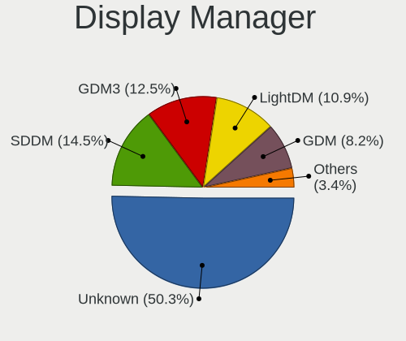

| Name    | Computers | Percent |
|---------|-----------|---------|
| Unknown | 339       | 60.32%  |
| SDDM    | 64        | 11.39%  |
| GDM     | 60        | 10.68%  |
| LightDM | 35        | 6.23%   |
| GDM3    | 30        | 5.34%   |
| TDM     | 25        | 4.45%   |
| SLiM    | 3         | 0.53%   |
| Ly      | 2         | 0.36%   |
| LXDM    | 2         | 0.36%   |
| XDM     | 1         | 0.18%   |
| KDM     | 1         | 0.18%   |

OS Lang
-------

Language

| Lang    | Computers | Percent |
|---------|-----------|---------|
| en_NZ   | 316       | 55.93%  |
| en_US   | 116       | 20.53%  |
| Unknown | 76        | 13.45%  |
| en_GB   | 22        | 3.89%   |
| C       | 16        | 2.83%   |
| en_AU   | 15        | 2.65%   |
| zh_CN   | 3         | 0.53%   |
| de_DE   | 1         | 0.18%   |

Boot Mode
---------

EFI or BIOS

| Mode | Computers | Percent |
|------|-----------|---------|
| BIOS | 288       | 52.17%  |
| EFI  | 264       | 47.83%  |

Filesystem
----------

Type of filesystem

| Type    | Computers | Percent |
|---------|-----------|---------|
| Ext4    | 432       | 77.98%  |
| Btrfs   | 41        | 7.4%    |
| Overlay | 40        | 7.22%   |
| Unknown | 29        | 5.23%   |
| Zfs     | 3         | 0.54%   |
| Xfs     | 3         | 0.54%   |
| Ext2    | 3         | 0.54%   |
| Tmpfs   | 1         | 0.18%   |
| F2fs    | 1         | 0.18%   |
| Ext3    | 1         | 0.18%   |

Part. scheme
------------

Scheme of partitioning

| Type    | Computers | Percent |
|---------|-----------|---------|
| Unknown | 349       | 63.45%  |
| GPT     | 154       | 28%     |
| MBR     | 47        | 8.55%   |

Dual Boot with Linux/BSD
------------------------

Hosting more than one Linux/BSD

| Dual boot | Computers | Percent |
|-----------|-----------|---------|
| No        | 475       | 86.36%  |
| Yes       | 75        | 13.64%  |

Dual Boot (Win)
---------------

Hosting Linux and Windows

| Dual boot | Computers | Percent |
|-----------|-----------|---------|
| No        | 401       | 72.91%  |
| Yes       | 149       | 27.09%  |

Board
-----

Vendor
------

Motherboard manufacturer

| Name                    | Computers | Percent |
|-------------------------|-----------|---------|
| Hewlett-Packard         | 115       | 21.38%  |
| ASUSTek Computer        | 85        | 15.8%   |
| Gigabyte Technology     | 64        | 11.9%   |
| Lenovo                  | 61        | 11.34%  |
| Dell                    | 50        | 9.29%   |
| Acer                    | 25        | 4.65%   |
| MSI                     | 23        | 4.28%   |
| Intel                   | 19        | 3.53%   |
| ASRock                  | 19        | 3.53%   |
| Toshiba                 | 15        | 2.79%   |
| Apple                   | 13        | 2.42%   |
| Supermicro              | 5         | 0.93%   |
| Sony                    | 4         | 0.74%   |
| Samsung Electronics     | 4         | 0.74%   |
| IBM                     | 4         | 0.74%   |
| Unknown                 | 3         | 0.56%   |
| System76                | 2         | 0.37%   |
| Kogan                   | 2         | 0.37%   |
| Google                  | 2         | 0.37%   |
| Alienware               | 2         | 0.37%   |
| YJKC                    | 1         | 0.19%   |
| TWG                     | 1         | 0.19%   |
| Timi                    | 1         | 0.19%   |
| The Warehouse Group     | 1         | 0.19%   |
| Star Labs               | 1         | 0.19%   |
| Raspberry Pi Foundation | 1         | 0.19%   |
| Qualcomm Technologies   | 1         | 0.19%   |
| Pegatron                | 1         | 0.19%   |
| OEM                     | 1         | 0.19%   |
| Microsoft               | 1         | 0.19%   |
| Metabox                 | 1         | 0.19%   |
| Medion                  | 1         | 0.19%   |
| MediaVue                | 1         | 0.19%   |
| JGINYUE                 | 1         | 0.19%   |
| HUAWEI                  | 1         | 0.19%   |
| Huanan                  | 1         | 0.19%   |
| eMachines               | 1         | 0.19%   |
| Colorful Technology     | 1         | 0.19%   |
| Biostar                 | 1         | 0.19%   |
| AMI                     | 1         | 0.19%   |
| AAEON                   | 1         | 0.19%   |

Model
-----

Motherboard model

| Name                                      | Computers | Percent |
|-------------------------------------------|-----------|---------|
| Gigabyte H77M-D3H                         | 5         | 0.93%   |
| Dell XPS 13 9360                          | 5         | 0.93%   |
| ASUS All Series                           | 5         | 0.93%   |
| Unknown                                   | 4         | 0.74%   |
| MSI MS-7B89                               | 3         | 0.56%   |
| HP ProBook 6550b                          | 3         | 0.56%   |
| HP ProBook 4540s                          | 3         | 0.56%   |
| HP Notebook                               | 3         | 0.56%   |
| HP EliteDesk 800 G1 SFF                   | 3         | 0.56%   |
| HP EliteBook 8560p                        | 3         | 0.56%   |
| Gigabyte 970A-D3P                         | 3         | 0.56%   |
| ASRock B450M Steel Legend                 | 3         | 0.56%   |
| MSI MS-7C91                               | 2         | 0.37%   |
| MSI MS-7C02                               | 2         | 0.37%   |
| MSI GE66 Raider 10SF                      | 2         | 0.37%   |
| Lenovo ThinkPad T460 20FMS2FR00           | 2         | 0.37%   |
| Lenovo ThinkCentre M58p 7479RS2           | 2         | 0.37%   |
| HP ZBook Firefly 15 G7 Mobile Workstation | 2         | 0.37%   |
| HP ProDesk 600 G1 SFF                     | 2         | 0.37%   |
| HP ProBook 6570b                          | 2         | 0.37%   |
| HP ProBook 450 G5                         | 2         | 0.37%   |
| HP ProBook 450 G3                         | 2         | 0.37%   |
| HP Pavilion dv6                           | 2         | 0.37%   |
| HP Pavilion 15                            | 2         | 0.37%   |
| HP Compaq Elite 8300 USDT                 | 2         | 0.37%   |
| HP Compaq Elite 8300 SFF                  | 2         | 0.37%   |
| HP Compaq 8200 Elite SFF PC               | 2         | 0.37%   |
| HP Compaq 8100 Elite SFF PC               | 2         | 0.37%   |
| HP Compaq 6200 Pro SFF PC                 | 2         | 0.37%   |
| Gigabyte Z77X-D3H                         | 2         | 0.37%   |
| Gigabyte F2A75M-D3H                       | 2         | 0.37%   |
| Gigabyte F2A55M-DS2                       | 2         | 0.37%   |
| Gigabyte B75M-D3H                         | 2         | 0.37%   |
| Gigabyte B550M DS3H                       | 2         | 0.37%   |
| Gigabyte B450M S2H                        | 2         | 0.37%   |
| Gigabyte AB350-Gaming                     | 2         | 0.37%   |
| Dell XPS 15 9500                          | 2         | 0.37%   |
| Dell Latitude E6430s                      | 2         | 0.37%   |
| Dell Latitude E4300                       | 2         | 0.37%   |
| Dell Latitude 7490                        | 2         | 0.37%   |
| ASUS TUF Gaming X570-PLUS                 | 2         | 0.37%   |
| ASUS SABERTOOTH 990FX R2.0                | 2         | 0.37%   |
| ASUS ROG Zephyrus M16 GU603HR_GU603HR     | 2         | 0.37%   |
| ASUS ROG Strix G513QY_G513QY              | 2         | 0.37%   |
| ASUS ROG STRIX B550-F GAMING              | 2         | 0.37%   |
| ASUS PRIME B450-PLUS                      | 2         | 0.37%   |
| ASUS PRIME B350M-A                        | 2         | 0.37%   |
| ASUS K52Jc                                | 2         | 0.37%   |
| ASRock A320M-HDV                          | 2         | 0.37%   |
| ASRock 970 Pro3 R2.0                      | 2         | 0.37%   |
| Apple iMac9,1                             | 2         | 0.37%   |
| Acer Swift SF314-41                       | 2         | 0.37%   |
| YJKC vBOOK Plus                           | 1         | 0.19%   |
| TWG E2017                                 | 1         | 0.19%   |
| Toshiba TECRA Z50-A                       | 1         | 0.19%   |
| Toshiba Satellite U920t                   | 1         | 0.19%   |
| Toshiba Satellite S70t-B                  | 1         | 0.19%   |
| Toshiba Satellite Pro R50-C               | 1         | 0.19%   |
| Toshiba Satellite Pro L830                | 1         | 0.19%   |
| Toshiba Satellite Pro C665                | 1         | 0.19%   |

Model Family
------------

Motherboard model prefix

| Name                   | Computers | Percent |
|------------------------|-----------|---------|
| Lenovo ThinkPad        | 32        | 5.95%   |
| HP ProBook             | 19        | 3.53%   |
| ASUS ROG               | 18        | 3.35%   |
| HP Compaq              | 17        | 3.16%   |
| HP EliteBook           | 16        | 2.97%   |
| Acer Aspire            | 16        | 2.97%   |
| HP Pavilion            | 15        | 2.79%   |
| Dell Latitude          | 15        | 2.79%   |
| Dell XPS               | 12        | 2.23%   |
| ASUS PRIME             | 12        | 2.23%   |
| Toshiba Satellite      | 10        | 1.86%   |
| Lenovo ThinkCentre     | 8         | 1.49%   |
| Dell OptiPlex          | 7         | 1.3%    |
| HP EliteDesk           | 6         | 1.12%   |
| Dell Precision         | 6         | 1.12%   |
| ASUS TUF               | 6         | 1.12%   |
| HP ZBook               | 5         | 0.93%   |
| HP Laptop              | 5         | 0.93%   |
| Gigabyte H77M-D3H      | 5         | 0.93%   |
| Dell Inspiron          | 5         | 0.93%   |
| ASUS All               | 5         | 0.93%   |
| Toshiba PORTEGE        | 4         | 0.74%   |
| Lenovo Yoga            | 4         | 0.74%   |
| HP ProLiant            | 4         | 0.74%   |
| Unknown                | 4         | 0.74%   |
| MSI MS-7B89            | 3         | 0.56%   |
| IBM System             | 3         | 0.56%   |
| HP Spectre             | 3         | 0.56%   |
| HP Notebook            | 3         | 0.56%   |
| Gigabyte AB350-Gaming  | 3         | 0.56%   |
| Gigabyte 970A-D3P      | 3         | 0.56%   |
| ASUS VivoBook          | 3         | 0.56%   |
| ASRock B450M           | 3         | 0.56%   |
| Acer TravelMate        | 3         | 0.56%   |
| MSI MS-7C91            | 2         | 0.37%   |
| MSI MS-7C02            | 2         | 0.37%   |
| MSI GE66               | 2         | 0.37%   |
| Lenovo IdeaPad         | 2         | 0.37%   |
| HP ProDesk             | 2         | 0.37%   |
| HP Presario            | 2         | 0.37%   |
| HP ENVY                | 2         | 0.37%   |
| Gigabyte Z77X-D3H      | 2         | 0.37%   |
| Gigabyte X570          | 2         | 0.37%   |
| Gigabyte GA-78LMT-USB3 | 2         | 0.37%   |
| Gigabyte F2A75M-D3H    | 2         | 0.37%   |
| Gigabyte F2A55M-DS2    | 2         | 0.37%   |
| Gigabyte B75M-D3H      | 2         | 0.37%   |
| Gigabyte B560M         | 2         | 0.37%   |
| Gigabyte B550M         | 2         | 0.37%   |
| Gigabyte B450M         | 2         | 0.37%   |
| Dell Vostro            | 2         | 0.37%   |
| ASUS SABERTOOTH        | 2         | 0.37%   |
| ASUS P7P55D-E          | 2         | 0.37%   |
| ASUS K52Jc             | 2         | 0.37%   |
| ASUS ASUS              | 2         | 0.37%   |
| ASRock A320M-HDV       | 2         | 0.37%   |
| ASRock 970             | 2         | 0.37%   |
| Apple MacBookPro5      | 2         | 0.37%   |
| Apple MacBook5         | 2         | 0.37%   |
| Apple iMac9            | 2         | 0.37%   |

MFG Year
--------

Motherboard manufacture year

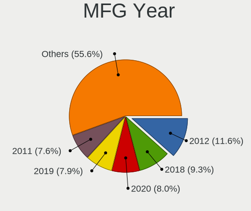

| Year    | Computers | Percent |
|---------|-----------|---------|
| 2012    | 71        | 13.2%   |
| 2019    | 50        | 9.29%   |
| 2011    | 49        | 9.11%   |
| 2017    | 47        | 8.74%   |
| 2018    | 45        | 8.36%   |
| 2020    | 44        | 8.18%   |
| 2013    | 35        | 6.51%   |
| 2014    | 30        | 5.58%   |
| 2016    | 27        | 5.02%   |
| 2015    | 26        | 4.83%   |
| 2010    | 25        | 4.65%   |
| 2021    | 24        | 4.46%   |
| 2008    | 24        | 4.46%   |
| 2009    | 20        | 3.72%   |
| 2022    | 7         | 1.3%    |
| 2007    | 5         | 0.93%   |
| 2005    | 3         | 0.56%   |
| Unknown | 3         | 0.56%   |
| 2006    | 2         | 0.37%   |
| 2004    | 1         | 0.19%   |

Form Factor
-----------

Physical design of the computer

| Name           | Computers | Percent |
|----------------|-----------|---------|
| Notebook       | 257       | 47.77%  |
| Desktop        | 230       | 42.75%  |
| Mini pc        | 18        | 3.35%   |
| Convertible    | 15        | 2.79%   |
| Server         | 8         | 1.49%   |
| All in one     | 6         | 1.12%   |
| System on chip | 2         | 0.37%   |
| Tablet         | 2         | 0.37%   |

Secure Boot
-----------

Enabled or disabled

| State    | Computers | Percent |
|----------|-----------|---------|
| Disabled | 496       | 91.34%  |
| Enabled  | 47        | 8.66%   |

Coreboot
--------

Have coreboot on board

| Used | Computers | Percent |
|------|-----------|---------|
| No   | 533       | 99.07%  |
| Yes  | 5         | 0.93%   |

RAM Size
--------

Total RAM memory

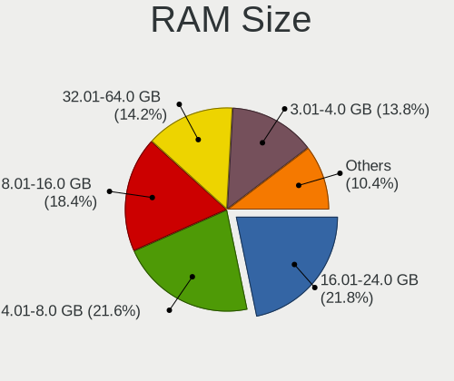

| Size in GB  | Computers | Percent |
|-------------|-----------|---------|
| 16.01-24.0  | 130       | 23.47%  |
| 4.01-8.0    | 118       | 21.3%   |
| 8.01-16.0   | 102       | 18.41%  |
| 3.01-4.0    | 85        | 15.34%  |
| 32.01-64.0  | 68        | 12.27%  |
| 64.01-256.0 | 18        | 3.25%   |
| 1.01-2.0    | 14        | 2.53%   |
| 24.01-32.0  | 10        | 1.81%   |
| 2.01-3.0    | 6         | 1.08%   |
| 0.51-1.0    | 3         | 0.54%   |

RAM Used
--------

Used RAM memory

| Used GB    | Computers | Percent |
|------------|-----------|---------|
| 1.01-2.0   | 209       | 34.32%  |
| 2.01-3.0   | 165       | 27.09%  |
| 4.01-8.0   | 82        | 13.46%  |
| 3.01-4.0   | 82        | 13.46%  |
| 0.51-1.0   | 33        | 5.42%   |
| 8.01-16.0  | 26        | 4.27%   |
| 0.01-0.5   | 5         | 0.82%   |
| 16.01-24.0 | 4         | 0.66%   |
| 24.01-32.0 | 2         | 0.33%   |
| 32.01-64.0 | 1         | 0.16%   |

Total Drives
------------

Number of drives on board

| Drives  | Computers | Percent |
|---------|-----------|---------|
| 1       | 318       | 56.68%  |
| 2       | 142       | 25.31%  |
| 3       | 51        | 9.09%   |
| 4       | 28        | 4.99%   |
| 5       | 7         | 1.25%   |
| 6       | 6         | 1.07%   |
| 7       | 3         | 0.53%   |
| 0       | 3         | 0.53%   |
| Unknown | 2         | 0.36%   |
| 8       | 1         | 0.18%   |

Has CD-ROM
----------

Has CD-ROM on board

| Presented | Computers | Percent |
|-----------|-----------|---------|
| No        | 311       | 57.17%  |
| Yes       | 233       | 42.83%  |

Has Ethernet
------------

Has Ethernet on board

| Presented | Computers | Percent |
|-----------|-----------|---------|
| Yes       | 482       | 89.09%  |
| No        | 59        | 10.91%  |

Has WiFi
--------

Has WiFi module

| Presented | Computers | Percent |
|-----------|-----------|---------|
| Yes       | 402       | 74.31%  |
| No        | 139       | 25.69%  |

Has Bluetooth
-------------

Has Bluetooth module

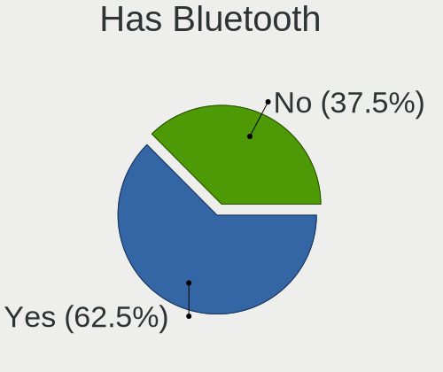

| Presented | Computers | Percent |
|-----------|-----------|---------|
| Yes       | 310       | 56.88%  |
| No        | 235       | 43.12%  |

Location
--------

Country
-------

Geographic location (country)

| Country     | Computers | Percent |
|-------------|-----------|---------|
| New Zealand | 538       | 100%    |

City
----

Geographic location (city)

| City             | Computers | Percent |
|------------------|-----------|---------|
| Auckland         | 271       | 48.39%  |
| Wellington       | 65        | 11.61%  |
| Christchurch     | 62        | 11.07%  |
| Hamilton         | 28        | 5%      |
| Dunedin          | 17        | 3.04%   |
| Tauranga         | 16        | 2.86%   |
| Palmerston North | 11        | 1.96%   |
| Whangarei        | 10        | 1.79%   |
| Nelson           | 9         | 1.61%   |
| Napier City      | 9         | 1.61%   |
| New Plymouth     | 7         | 1.25%   |
| Lower Hutt       | 5         | 0.89%   |
| Invercargill     | 5         | 0.89%   |
| Hastings         | 5         | 0.89%   |
| Cambridge        | 5         | 0.89%   |
| Whanganui        | 3         | 0.54%   |
| Masterton        | 3         | 0.54%   |
| Grafton          | 3         | 0.54%   |
| Rotorua          | 2         | 0.36%   |
| Otaki            | 2         | 0.36%   |
| Ashburton        | 2         | 0.36%   |
| Whatawhata       | 1         | 0.18%   |
| Westport         | 1         | 0.18%   |
| Wellsford        | 1         | 0.18%   |
| Waihi            | 1         | 0.18%   |
| Tutukaka         | 1         | 0.18%   |
| Stratford        | 1         | 0.18%   |
| Saint Andrews    | 1         | 0.18%   |
| Queenstown       | 1         | 0.18%   |
| Pakuranga        | 1         | 0.18%   |
| Mount Eden       | 1         | 0.18%   |
| Milton           | 1         | 0.18%   |
| Levin            | 1         | 0.18%   |
| Kerikeri         | 1         | 0.18%   |
| Katikati         | 1         | 0.18%   |
| Gordonton        | 1         | 0.18%   |
| Edgecumbe        | 1         | 0.18%   |
| Darfield         | 1         | 0.18%   |
| Carterton        | 1         | 0.18%   |
| Arrowtown        | 1         | 0.18%   |
| Albany           | 1         | 0.18%   |

Drives
------

Drive Vendor
------------

Hard drive vendors

| Vendor                      | Computers | Drives | Percent |
|-----------------------------|-----------|--------|---------|
| Seagate                     | 148       | 241    | 18.81%  |
| Samsung Electronics         | 135       | 226    | 17.15%  |
| WDC                         | 133       | 218    | 16.9%   |
| Toshiba                     | 47        | 60     | 5.97%   |
| Crucial                     | 47        | 75     | 5.97%   |
| Intel                       | 34        | 47     | 4.32%   |
| SanDisk                     | 31        | 37     | 3.94%   |
| Kingston                    | 31        | 47     | 3.94%   |
| Hitachi                     | 23        | 32     | 2.92%   |
| Unknown                     | 21        | 29     | 2.67%   |
| SK hynix                    | 21        | 27     | 2.67%   |
| A-DATA Technology           | 16        | 19     | 2.03%   |
| Micron Technology           | 12        | 17     | 1.52%   |
| HGST                        | 12        | 14     | 1.52%   |
| China                       | 6         | 7      | 0.76%   |
| KingSpec                    | 5         | 5      | 0.64%   |
| Apple                       | 5         | 5      | 0.64%   |
| Transcend                   | 4         | 4      | 0.51%   |
| TO Exter                    | 4         | 4      | 0.51%   |
| Team                        | 4         | 5      | 0.51%   |
| XPG                         | 3         | 3      | 0.38%   |
| Silicon Motion              | 3         | 5      | 0.38%   |
| Micron/Crucial Technology   | 3         | 3      | 0.38%   |
| Lexar                       | 3         | 3      | 0.38%   |
| Gigabyte Technology         | 3         | 3      | 0.38%   |
| External                    | 3         | 3      | 0.38%   |
| ASMT                        | 3         | 3      | 0.38%   |
| Apacer                      | 3         | 3      | 0.38%   |
| Phison                      | 2         | 2      | 0.25%   |
| LITEON                      | 2         | 2      | 0.25%   |
| KIOXIA                      | 2         | 3      | 0.25%   |
| JMicron Technology          | 2         | 2      | 0.25%   |
| Corsair                     | 2         | 3      | 0.25%   |
| USB3.0                      | 1         | 1      | 0.13%   |
| USB                         | 1         | 2      | 0.13%   |
| Star Drive                  | 1         | 1      | 0.13%   |
| ROG                         | 1         | 1      | 0.13%   |
| OCZ                         | 1         | 1      | 0.13%   |
| OASDX                       | 1         | 1      | 0.13%   |
| Netac                       | 1         | 1      | 0.13%   |
| LITEONIT                    | 1         | 3      | 0.13%   |
| Kingston Technology Company | 1         | 1      | 0.13%   |
| KINGBANK                    | 1         | 1      | 0.13%   |
| Hewlett-Packard             | 1         | 3      | 0.13%   |
| GAMER                       | 1         | 1      | 0.13%   |
| Fujitsu                     | 1         | 1      | 0.13%   |
| Ext Hard                    | 1         | 2      | 0.13%   |

Drive Model
-----------

Hard drive models

| Model                                    | Computers | Percent |
|------------------------------------------|-----------|---------|
| Samsung SSD 860 EVO 500GB                | 11        | 1.23%   |
| Seagate ST2000DM008-2FR102 2TB           | 10        | 1.12%   |
| Seagate Expansion Desk 4TB               | 10        | 1.12%   |
| Samsung SSD 850 EVO 500GB                | 10        | 1.12%   |
| Seagate Expansion 500GB                  | 9         | 1.01%   |
| Samsung NVMe SSD Drive 500GB             | 9         | 1.01%   |
| Samsung SSD 850 EVO 250GB                | 8         | 0.89%   |
| Samsung NVMe SSD Drive 512GB             | 8         | 0.89%   |
| Crucial CT240BX500SSD1 240GB             | 8         | 0.89%   |
| Seagate ST500DM002-1BD142 500GB          | 7         | 0.78%   |
| Seagate ST31000528AS 1TB                 | 7         | 0.78%   |
| Seagate ST2000DM006-2DM164 2TB           | 7         | 0.78%   |
| Seagate ST1000DM003-1CH162 1TB           | 7         | 0.78%   |
| Intel NVMe SSD Drive 512GB               | 7         | 0.78%   |
| Seagate ST500LT012-1DG142 500GB          | 6         | 0.67%   |
| Samsung NVMe SSD Drive 1TB               | 6         | 0.67%   |
| Kingston SA400S37120G 120GB SSD          | 6         | 0.67%   |
| Crucial CT500MX500SSD1 500GB             | 6         | 0.67%   |
| WDC WD20EZRZ-00Z5HB0 2TB                 | 5         | 0.56%   |
| Toshiba THNS128GG4BBAA 128GB SSD         | 5         | 0.56%   |
| Toshiba MQ01ABF050 500GB                 | 5         | 0.56%   |
| Seagate ST1000DM010-2EP102 1TB           | 5         | 0.56%   |
| SanDisk SDSSDA240G 240GB                 | 5         | 0.56%   |
| Samsung SSD 870 EVO 1TB                  | 5         | 0.56%   |
| Kingston SV300S37A120G 120GB SSD         | 5         | 0.56%   |
| Kingston SA400S37240G 240GB SSD          | 5         | 0.56%   |
| WDC WDS120G2G0A-00JH30 120GB SSD         | 4         | 0.45%   |
| WDC WD10EZEX-08WN4A0 1TB                 | 4         | 0.45%   |
| WDC WD10EZEX-00WN4A0 1TB                 | 4         | 0.45%   |
| Unknown SD/MMC/MS PRO 128GB              | 4         | 0.45%   |
| Unknown MMC Card  64GB                   | 4         | 0.45%   |
| Toshiba NVMe SSD Drive 512GB             | 4         | 0.45%   |
| Toshiba KBG30ZMS128G 128GB NVMe SSD      | 4         | 0.45%   |
| TO Exter nal USB 3.0 240GB               | 4         | 0.45%   |
| Seagate ST9500325AS 500GB                | 4         | 0.45%   |
| Seagate ST2000DM001-1CH164 2TB           | 4         | 0.45%   |
| Seagate ST1000LM035-1RK172 1TB           | 4         | 0.45%   |
| Samsung SSD 970 EVO Plus 500GB           | 4         | 0.45%   |
| Samsung SSD 970 EVO Plus 1TB             | 4         | 0.45%   |
| Samsung SSD 850 EVO 1TB                  | 4         | 0.45%   |
| Samsung NVMe SSD Drive 256GB             | 4         | 0.45%   |
| Kingston SV300S37A240G 240GB SSD         | 4         | 0.45%   |
| Kingston SUV400S37240G 240GB SSD         | 4         | 0.45%   |
| Intel SSDSA2CW080G3 80GB                 | 4         | 0.45%   |
| HGST HTS721010A9E630 1TB                 | 4         | 0.45%   |
| Crucial CT480BX500SSD1 480GB             | 4         | 0.45%   |
| Crucial CT240BX200SSD1 240GB             | 4         | 0.45%   |
| WDC WD5000LPVX-22V0TT0 500GB             | 3         | 0.34%   |
| WDC WD20EARX-00PASB0 2TB                 | 3         | 0.34%   |
| WDC WD10EALX-009BA0 1TB                  | 3         | 0.34%   |
| WDC WD1002FAEX-00Z3A0 1TB                | 3         | 0.34%   |
| Toshiba MQ01ABD075 752GB                 | 3         | 0.34%   |
| Seagate ST9500420AS 500GB                | 3         | 0.34%   |
| Seagate ST3500418AS 500GB                | 3         | 0.34%   |
| Seagate ST3000DM001-1ER166 3TB           | 3         | 0.34%   |
| Seagate ST1000LM024 HN-M101MBB 1TB       | 3         | 0.34%   |
| Seagate BarraCuda SSD ZA500CM10002 500GB | 3         | 0.34%   |
| SanDisk NVMe SSD Drive 512GB             | 3         | 0.34%   |
| Samsung SSD 980 1TB                      | 3         | 0.34%   |
| Samsung SSD 860 EVO 250GB                | 3         | 0.34%   |

HDD Vendor
----------

Hard disk drive vendors

| Vendor              | Computers | Drives | Percent |
|---------------------|-----------|--------|---------|
| Seagate             | 143       | 229    | 42.43%  |
| WDC                 | 116       | 183    | 34.42%  |
| Toshiba             | 24        | 33     | 7.12%   |
| Hitachi             | 23        | 32     | 6.82%   |
| HGST                | 12        | 14     | 3.56%   |
| Unknown             | 4         | 6      | 1.19%   |
| Samsung Electronics | 4         | 5      | 1.19%   |
| Apple               | 4         | 4      | 1.19%   |
| External            | 2         | 2      | 0.59%   |
| USB3.0              | 1         | 1      | 0.3%    |
| USB                 | 1         | 2      | 0.3%    |
| Fujitsu             | 1         | 1      | 0.3%    |
| Ext Hard            | 1         | 2      | 0.3%    |
| ASMT                | 1         | 1      | 0.3%    |

SSD Vendor
----------

Solid state drive vendors

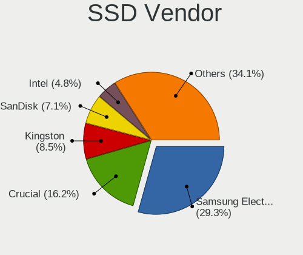

| Vendor              | Computers | Drives | Percent |
|---------------------|-----------|--------|---------|
| Samsung Electronics | 74        | 111    | 26.52%  |
| Crucial             | 43        | 68     | 15.41%  |
| Kingston            | 26        | 40     | 9.32%   |
| SanDisk             | 24        | 28     | 8.6%    |
| Intel               | 17        | 23     | 6.09%   |
| WDC                 | 13        | 23     | 4.66%   |
| A-DATA Technology   | 12        | 14     | 4.3%    |
| Micron Technology   | 9         | 13     | 3.23%   |
| Toshiba             | 8         | 9      | 2.87%   |
| China               | 6         | 6      | 2.15%   |
| Seagate             | 5         | 7      | 1.79%   |
| KingSpec            | 5         | 5      | 1.79%   |
| TO Exter            | 4         | 4      | 1.43%   |
| Team                | 4         | 5      | 1.43%   |
| SK hynix            | 4         | 4      | 1.43%   |
| Transcend           | 3         | 3      | 1.08%   |
| Lexar               | 3         | 3      | 1.08%   |
| Apacer              | 3         | 3      | 1.08%   |
| LITEON              | 2         | 2      | 0.72%   |
| JMicron Technology  | 2         | 2      | 0.72%   |
| Gigabyte Technology | 2         | 2      | 0.72%   |
| Corsair             | 2         | 3      | 0.72%   |
| OCZ                 | 1         | 1      | 0.36%   |
| OASDX               | 1         | 1      | 0.36%   |
| Netac               | 1         | 1      | 0.36%   |
| LITEONIT            | 1         | 3      | 0.36%   |
| Hewlett-Packard     | 1         | 3      | 0.36%   |
| GAMER               | 1         | 1      | 0.36%   |
| ASMT                | 1         | 1      | 0.36%   |
| Apple               | 1         | 1      | 0.36%   |

Drive Kind
----------

HDD or SSD

| Kind    | Computers | Drives | Percent |
|---------|-----------|--------|---------|
| HDD     | 280       | 515    | 39.44%  |
| SSD     | 250       | 390    | 35.21%  |
| NVMe    | 157       | 242    | 22.11%  |
| MMC     | 17        | 22     | 2.39%   |
| Unknown | 6         | 8      | 0.85%   |

Drive Connector
---------------

SATA, SAS, NVMe, etc.

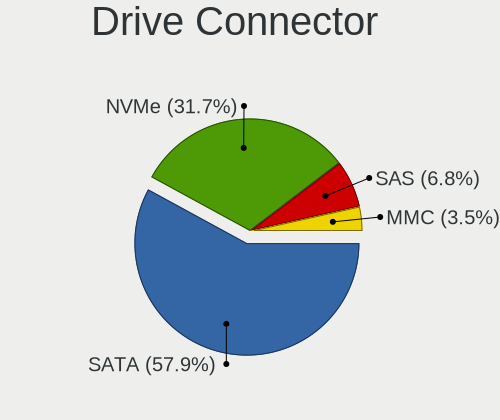

| Type | Computers | Drives | Percent |
|------|-----------|--------|---------|
| SATA | 419       | 847    | 65.88%  |
| NVMe | 156       | 241    | 24.53%  |
| SAS  | 44        | 67     | 6.92%   |
| MMC  | 17        | 22     | 2.67%   |

Drive Size
----------

Size of hard drive

| Size in TB | Computers | Drives | Percent |
|------------|-----------|--------|---------|
| 0.01-0.5   | 326       | 536    | 56.3%   |
| 0.51-1.0   | 153       | 220    | 26.42%  |
| 1.01-2.0   | 56        | 86     | 9.67%   |
| 3.01-4.0   | 24        | 34     | 4.15%   |
| 2.01-3.0   | 10        | 12     | 1.73%   |
| 4.01-10.0  | 8         | 10     | 1.38%   |
| 10.01-20.0 | 2         | 7      | 0.35%   |

Space Total
-----------

Amount of disk space available on the file system

| Size in GB     | Computers | Percent |
|----------------|-----------|---------|
| 101-250        | 142       | 24.7%   |
| 251-500        | 120       | 20.87%  |
| 501-1000       | 88        | 15.3%   |
| 1001-2000      | 51        | 8.87%   |
| 1-20           | 46        | 8%      |
| More than 3000 | 43        | 7.48%   |
| 2001-3000      | 31        | 5.39%   |
| 51-100         | 28        | 4.87%   |
| Unknown        | 15        | 2.61%   |
| 21-50          | 11        | 1.91%   |

Space Used
----------

Amount of used disk space

| Used GB        | Computers | Percent |
|----------------|-----------|---------|
| 1-20           | 220       | 36.18%  |
| 21-50          | 110       | 18.09%  |
| 101-250        | 66        | 10.86%  |
| 51-100         | 54        | 8.88%   |
| 251-500        | 46        | 7.57%   |
| 501-1000       | 43        | 7.07%   |
| 1001-2000      | 26        | 4.28%   |
| Unknown        | 15        | 2.47%   |
| More than 3000 | 14        | 2.3%    |
| 2001-3000      | 14        | 2.3%    |

Malfunc. Drives
---------------

Drive models with a malfunction

| Model                                               | Computers | Drives | Percent |
|-----------------------------------------------------|-----------|--------|---------|
| WDC WD7500BPKX-00HPJT0 752GB                        | 2         | 2      | 4.35%   |
| WDC WD20EZRZ-00Z5HB0 2TB                            | 2         | 2      | 4.35%   |
| WDC WD5000AAKX-001CA0 500GB                         | 1         | 1      | 2.17%   |
| WDC WD2003FZEX-00Z4SA0 2TB                          | 1         | 1      | 2.17%   |
| WDC WD15EARS-00S0XB0 1TB                            | 1         | 1      | 2.17%   |
| WDC WD10EZEX-08WN4A0 1TB                            | 1         | 1      | 2.17%   |
| WDC WD10EFRX-68FYTN0 1TB                            | 1         | 3      | 2.17%   |
| WDC WD1002FAEX-00Z3A0 1TB                           | 1         | 1      | 2.17%   |
| USB3.0 Extemal HDD 2TB                              | 1         | 1      | 2.17%   |
| Toshiba MQ01ABD075 752GB                            | 1         | 1      | 2.17%   |
| Toshiba MK5076GSX 500GB                             | 1         | 1      | 2.17%   |
| Toshiba MK3256GSY 320GB                             | 1         | 1      | 2.17%   |
| SK hynix SC308 SATA 128GB SSD                       | 1         | 1      | 2.17%   |
| SK hynix HFS256G32MND-2900A 256GB SSD               | 1         | 1      | 2.17%   |
| SK hynix BC501 HFM512GDJTNG-8310A 512GB             | 1         | 1      | 2.17%   |
| Seagate ST9500420AS 500GB                           | 1         | 1      | 2.17%   |
| Seagate ST9250410AS 250GB                           | 1         | 1      | 2.17%   |
| Seagate ST8000VN0022-2EL112 8TB                     | 1         | 3      | 2.17%   |
| Seagate ST500LT012-1DG142 500GB                     | 1         | 1      | 2.17%   |
| Seagate ST500DM002-1BD142 500GB                     | 1         | 1      | 2.17%   |
| Seagate ST3500418AS 500GB                           | 1         | 1      | 2.17%   |
| Seagate ST3250310AS 250GB                           | 1         | 1      | 2.17%   |
| Seagate ST31000528AS 1TB                            | 1         | 1      | 2.17%   |
| Seagate ST31000524AS 1TB                            | 1         | 1      | 2.17%   |
| Seagate ST3000DM001-9YN166 3TB                      | 1         | 1      | 2.17%   |
| Seagate ST2000DX002-2DV164 2TB                      | 1         | 1      | 2.17%   |
| Seagate ST2000DX001-1CM164 2TB                      | 1         | 1      | 2.17%   |
| Seagate ST2000DM001-1CH164 2TB                      | 1         | 1      | 2.17%   |
| SanDisk SSD PLUS 240 GB                             | 1         | 1      | 2.17%   |
| SanDisk SDSSDX240GG25 240GB                         | 1         | 1      | 2.17%   |
| Samsung Electronics SSD 980 PRO 250GB               | 1         | 1      | 2.17%   |
| Samsung Electronics SSD 980 1TB                     | 1         | 1      | 2.17%   |
| Micron Technology MTFDDAK512TBN-1AR1ZABHA 512GB SSD | 1         | 1      | 2.17%   |
| Micron Technology MTFDDAK256MAY-1AH12ABHA 256GB SSD | 1         | 1      | 2.17%   |
| Intel SSDSC2CT240A4 240GB                           | 1         | 1      | 2.17%   |
| Hitachi HTS545050A7E380 500GB                       | 1         | 1      | 2.17%   |
| Hitachi HTS545032B9SA00 320GB                       | 1         | 1      | 2.17%   |
| HGST HTS725032A7E630 320GB                          | 1         | 1      | 2.17%   |
| HGST HTS541075A9E680 752GB                          | 1         | 1      | 2.17%   |
| Crucial CT480M500SSD1 480GB                         | 1         | 1      | 2.17%   |
| Crucial CT480BX500SSD1 480GB                        | 1         | 1      | 2.17%   |
| Crucial CT275MX300SSD1 275GB                        | 1         | 1      | 2.17%   |
| ASMT ASM105x 499GB                                  | 1         | 1      | 2.17%   |
| Apple HDD HTS547550A9E384 500GB                     | 1         | 1      | 2.17%   |

Malfunc. Drive Vendor
---------------------

Vendors of faulty drives

| Vendor              | Computers | Drives | Percent |
|---------------------|-----------|--------|---------|
| Seagate             | 11        | 15     | 25%     |
| WDC                 | 10        | 12     | 22.73%  |
| Toshiba             | 3         | 3      | 6.82%   |
| SK hynix            | 3         | 3      | 6.82%   |
| Crucial             | 3         | 3      | 6.82%   |
| SanDisk             | 2         | 2      | 4.55%   |
| Samsung Electronics | 2         | 2      | 4.55%   |
| Micron Technology   | 2         | 2      | 4.55%   |
| Hitachi             | 2         | 2      | 4.55%   |
| HGST                | 2         | 2      | 4.55%   |
| USB3.0              | 1         | 1      | 2.27%   |
| Intel               | 1         | 1      | 2.27%   |
| ASMT                | 1         | 1      | 2.27%   |
| Apple               | 1         | 1      | 2.27%   |

Malfunc. HDD Vendor
-------------------

Vendors of faulty HDD drives

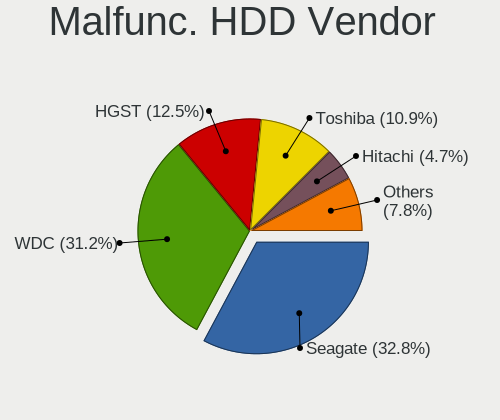

| Vendor  | Computers | Drives | Percent |
|---------|-----------|--------|---------|
| Seagate | 11        | 15     | 36.67%  |
| WDC     | 10        | 12     | 33.33%  |
| Toshiba | 3         | 3      | 10%     |
| Hitachi | 2         | 2      | 6.67%   |
| HGST    | 2         | 2      | 6.67%   |
| USB3.0  | 1         | 1      | 3.33%   |
| Apple   | 1         | 1      | 3.33%   |

Malfunc. Drive Kind
-------------------

Kinds of faulty drives

| Kind | Computers | Drives | Percent |
|------|-----------|--------|---------|
| HDD  | 30        | 36     | 68.18%  |
| SSD  | 11        | 11     | 25%     |
| NVMe | 3         | 3      | 6.82%   |

Failed Drives
-------------

Failed drive models

Zero info for selected period =(

Failed Drive Vendor
-------------------

Failed drive vendors

Zero info for selected period =(

Drive Status
------------

Number of failed and malfunc. drives

| Status   | Computers | Drives | Percent |
|----------|-----------|--------|---------|
| Detected | 355       | 785    | 60.68%  |
| Works    | 186       | 342    | 31.79%  |
| Malfunc  | 44        | 50     | 7.52%   |

Storage controller
------------------

Storage Vendor
--------------

Storage controller vendors

| Vendor                       | Computers | Percent |
|------------------------------|-----------|---------|
| Intel                        | 359       | 52.72%  |
| AMD                          | 113       | 16.59%  |
| Samsung Electronics          | 71        | 10.43%  |
| SK hynix                     | 17        | 2.5%    |
| Toshiba America Info Systems | 16        | 2.35%   |
| Nvidia                       | 14        | 2.06%   |
| SanDisk                      | 13        | 1.91%   |
| JMicron Technology           | 12        | 1.76%   |
| Marvell Technology Group     | 11        | 1.62%   |
| ASMedia Technology           | 10        | 1.47%   |
| Micron/Crucial Technology    | 7         | 1.03%   |
| LSI Logic / Symbios Logic    | 7         | 1.03%   |
| Kingston Technology Company  | 6         | 0.88%   |
| Silicon Motion               | 5         | 0.73%   |
| ADATA Technology             | 4         | 0.59%   |
| Seagate Technology           | 3         | 0.44%   |
| Phison Electronics           | 3         | 0.44%   |
| Micron Technology            | 3         | 0.44%   |
| KIOXIA                       | 2         | 0.29%   |
| Hewlett-Packard              | 2         | 0.29%   |
| VIA Technologies             | 1         | 0.15%   |
| Silicon Image                | 1         | 0.15%   |
| Realtek Semiconductor        | 1         | 0.15%   |

Storage Model
-------------

Storage controller models

| Model                                                                                   | Computers | Percent |
|-----------------------------------------------------------------------------------------|-----------|---------|
| AMD FCH SATA Controller [AHCI mode]                                                     | 75        | 9.27%   |
| Samsung NVMe SSD Controller SM981/PM981/PM983                                           | 40        | 4.94%   |
| Intel 7 Series Chipset Family 6-port SATA Controller [AHCI mode]                        | 28        | 3.46%   |
| Intel Sunrise Point-LP SATA Controller [AHCI mode]                                      | 26        | 3.21%   |
| Intel 6 Series/C200 Series Chipset Family 6 port Mobile SATA AHCI Controller            | 23        | 2.84%   |
| Intel 8 Series/C220 Series Chipset Family 6-port SATA Controller 1 [AHCI mode]          | 21        | 2.6%    |
| AMD 400 Series Chipset SATA Controller                                                  | 20        | 2.47%   |
| Intel 7 Series/C210 Series Chipset Family 6-port SATA Controller [AHCI mode]            | 18        | 2.22%   |
| AMD SB7x0/SB8x0/SB9x0 SATA Controller [AHCI mode]                                       | 17        | 2.1%    |
| AMD SB7x0/SB8x0/SB9x0 IDE Controller                                                    | 16        | 1.98%   |
| Intel 82801 Mobile SATA Controller [RAID mode]                                          | 14        | 1.73%   |
| Samsung NVMe SSD Controller PM9A1/PM9A3/980PRO                                          | 13        | 1.61%   |
| Intel SATA Controller [RAID mode]                                                       | 13        | 1.61%   |
| Samsung NVMe SSD Controller SM961/PM961/SM963                                           | 11        | 1.36%   |
| Intel 8 Series SATA Controller 1 [AHCI mode]                                            | 11        | 1.36%   |
| Intel Q170/Q150/B150/H170/H110/Z170/CM236 Chipset SATA Controller [AHCI Mode]           | 10        | 1.24%   |
| Intel 6 Series/C200 Series Chipset Family 6 port Desktop SATA AHCI Controller           | 10        | 1.24%   |
| Intel 5 Series/3400 Series Chipset 6 port SATA AHCI Controller                          | 10        | 1.24%   |
| ASMedia ASM1062 Serial ATA Controller                                                   | 10        | 1.24%   |
| AMD 500 Series Chipset SATA Controller                                                  | 10        | 1.24%   |
| Samsung NVMe SSD Controller 980                                                         | 9         | 1.11%   |
| Intel HM170/QM170 Chipset SATA Controller [AHCI Mode]                                   | 9         | 1.11%   |
| Intel Comet Lake SATA AHCI Controller                                                   | 9         | 1.11%   |
| Intel Atom Processor E3800 Series SATA AHCI Controller                                  | 8         | 0.99%   |
| Intel 82801JI (ICH10 Family) 2 port SATA IDE Controller #2                              | 8         | 0.99%   |
| JMicron JMB363 SATA/IDE Controller                                                      | 7         | 0.87%   |
| Intel Wildcat Point-LP SATA Controller [AHCI Mode]                                      | 7         | 0.87%   |
| Intel Volume Management Device NVMe RAID Controller                                     | 7         | 0.87%   |
| Intel SSD 660P Series                                                                   | 7         | 0.87%   |
| Intel Cannon Lake Mobile PCH SATA AHCI Controller                                       | 7         | 0.87%   |
| Intel 9 Series Chipset Family SATA Controller [AHCI Mode]                               | 7         | 0.87%   |
| Intel 82801JI (ICH10 Family) 4 port SATA IDE Controller #1                              | 7         | 0.87%   |
| Intel 5 Series/3400 Series Chipset 4 port SATA AHCI Controller                          | 7         | 0.87%   |
| Intel 200 Series PCH SATA controller [AHCI mode]                                        | 7         | 0.87%   |
| AMD 300 Series Chipset SATA Controller                                                  | 7         | 0.87%   |
| Toshiba America Info Systems Toshiba America Info Non-Volatile memory controller        | 6         | 0.74%   |
| Intel Non-Volatile memory controller                                                    | 6         | 0.74%   |
| Intel NM10/ICH7 Family SATA Controller [IDE mode]                                       | 6         | 0.74%   |
| Intel Celeron N3350/Pentium N4200/Atom E3900 Series SATA AHCI Controller                | 6         | 0.74%   |
| Intel Cannon Point-LP SATA Controller [AHCI Mode]                                       | 6         | 0.74%   |
| Intel 82801IBM/IEM (ICH9M/ICH9M-E) 4 port SATA Controller [AHCI mode]                   | 6         | 0.74%   |
| Intel 82801HM/HEM (ICH8M/ICH8M-E) IDE Controller                                        | 6         | 0.74%   |
| Intel 4 Series Chipset PT IDER Controller                                               | 6         | 0.74%   |
| SK hynix Non-Volatile memory controller                                                 | 5         | 0.62%   |
| SanDisk WD Black SN750 / PC SN730 NVMe SSD                                              | 5         | 0.62%   |
| Nvidia MCP79 AHCI Controller                                                            | 5         | 0.62%   |
| Intel Atom/Celeron/Pentium Processor x5-E8000/J3xxx/N3xxx Series SATA Controller        | 5         | 0.62%   |
| Intel 82801JD/DO (ICH10 Family) SATA AHCI Controller                                    | 5         | 0.62%   |
| Intel 7 Series/C210 Series Chipset Family 4-port SATA Controller [IDE mode]             | 5         | 0.62%   |
| Intel 7 Series/C210 Series Chipset Family 2-port SATA Controller [IDE mode]             | 5         | 0.62%   |
| Intel 6 Series/C200 Series Chipset Family Desktop SATA Controller (IDE mode, ports 4-5) | 5         | 0.62%   |
| Intel 6 Series/C200 Series Chipset Family Desktop SATA Controller (IDE mode, ports 0-3) | 5         | 0.62%   |
| AMD SB7x0/SB8x0/SB9x0 SATA Controller [IDE mode]                                        | 5         | 0.62%   |
| Toshiba America Info Systems BG3 NVMe SSD Controller                                    | 4         | 0.49%   |
| SK hynix BC501 NVMe Solid State Drive                                                   | 4         | 0.49%   |
| Micron/Crucial P2 NVMe PCIe SSD                                                         | 4         | 0.49%   |
| Kingston Company A2000 NVMe SSD                                                         | 4         | 0.49%   |
| Intel 82801JI (ICH10 Family) SATA AHCI Controller                                       | 4         | 0.49%   |
| Intel 82801HM/HEM (ICH8M/ICH8M-E) SATA Controller [AHCI mode]                           | 4         | 0.49%   |
| Intel 82801G (ICH7 Family) IDE Controller                                               | 4         | 0.49%   |

Storage Kind
------------

Kind of storage controller (IDE, SATA, NVMe, SAS, ...)

| Kind | Computers | Percent |
|------|-----------|---------|
| SATA | 398       | 57.51%  |
| NVMe | 159       | 22.98%  |
| IDE  | 88        | 12.72%  |
| RAID | 45        | 6.5%    |
| SAS  | 1         | 0.14%   |
| SCSI | 1         | 0.14%   |

Processor
---------

CPU Vendor
----------

Processor vendors

| Vendor   | Computers | Percent |
|----------|-----------|---------|
| Intel    | 405       | 75.28%  |
| AMD      | 130       | 24.16%  |
| ARM      | 2         | 0.37%   |
| QUALCOMM | 1         | 0.19%   |

CPU Model
---------

Processor models

| Model                                         | Computers | Percent |
|-----------------------------------------------|-----------|---------|
| Intel Core i5-3470 CPU @ 3.20GHz              | 10        | 1.86%   |
| Intel Core i7-8550U CPU @ 1.80GHz             | 7         | 1.3%    |
| Intel Core i5-8265U CPU @ 1.60GHz             | 7         | 1.3%    |
| AMD Ryzen 7 3700X 8-Core Processor            | 7         | 1.3%    |
| Intel Core i5-2400 CPU @ 3.10GHz              | 6         | 1.12%   |
| AMD Ryzen 5 3600 6-Core Processor             | 6         | 1.12%   |
| Intel Core i7-9750H CPU @ 2.60GHz             | 5         | 0.93%   |
| Intel Core i7-8565U CPU @ 1.80GHz             | 5         | 0.93%   |
| Intel Core i7-10750H CPU @ 2.60GHz            | 5         | 0.93%   |
| Intel Core i5-6300U CPU @ 2.40GHz             | 5         | 0.93%   |
| Intel Core i5-6200U CPU @ 2.30GHz             | 5         | 0.93%   |
| Intel Core i5-3230M CPU @ 2.60GHz             | 5         | 0.93%   |
| Intel Core i5-2430M CPU @ 2.40GHz             | 5         | 0.93%   |
| Intel Core i7-7700HQ CPU @ 2.80GHz            | 4         | 0.74%   |
| Intel Core i7-4790K CPU @ 4.00GHz             | 4         | 0.74%   |
| Intel Core i7-4790 CPU @ 3.60GHz              | 4         | 0.74%   |
| Intel Core i7-4770 CPU @ 3.40GHz              | 4         | 0.74%   |
| Intel Core i7-4600U CPU @ 2.10GHz             | 4         | 0.74%   |
| Intel Core i7-1065G7 CPU @ 1.30GHz            | 4         | 0.74%   |
| Intel Core i5-2520M CPU @ 2.50GHz             | 4         | 0.74%   |
| Intel Core i5-10210U CPU @ 1.60GHz            | 4         | 0.74%   |
| Intel Core i5 CPU M 460 @ 2.53GHz             | 4         | 0.74%   |
| Intel Core 2 Quad CPU Q9400 @ 2.66GHz         | 4         | 0.74%   |
| Intel Core 2 Duo CPU P7350 @ 2.00GHz          | 4         | 0.74%   |
| Intel Celeron CPU N3350 @ 1.10GHz             | 4         | 0.74%   |
| Intel Celeron CPU N2840 @ 2.16GHz             | 4         | 0.74%   |
| AMD Ryzen 7 5700G with Radeon Graphics        | 4         | 0.74%   |
| AMD Ryzen 5 3500U with Radeon Vega Mobile Gfx | 4         | 0.74%   |
| AMD Ryzen 5 2600 Six-Core Processor           | 4         | 0.74%   |
| AMD Ryzen 5 1600 Six-Core Processor           | 4         | 0.74%   |
| AMD FX-6300 Six-Core Processor                | 4         | 0.74%   |
| Intel Core i7-6700HQ CPU @ 2.60GHz            | 3         | 0.56%   |
| Intel Core i7-3770 CPU @ 3.40GHz              | 3         | 0.56%   |
| Intel Core i7-10700 CPU @ 2.90GHz             | 3         | 0.56%   |
| Intel Core i7 CPU 950 @ 3.07GHz               | 3         | 0.56%   |
| Intel Core i5-8250U CPU @ 1.60GHz             | 3         | 0.56%   |
| Intel Core i5-7200U CPU @ 2.50GHz             | 3         | 0.56%   |
| Intel Core i5-6400 CPU @ 2.70GHz              | 3         | 0.56%   |
| Intel Core i5-5200U CPU @ 2.20GHz             | 3         | 0.56%   |
| Intel Core i5-3210M CPU @ 2.50GHz             | 3         | 0.56%   |
| Intel Core i5-2540M CPU @ 2.60GHz             | 3         | 0.56%   |
| Intel Core i5-2450M CPU @ 2.50GHz             | 3         | 0.56%   |
| Intel Core i5-2410M CPU @ 2.30GHz             | 3         | 0.56%   |
| Intel Core i3-2350M CPU @ 2.30GHz             | 3         | 0.56%   |
| Intel Core i3-2120 CPU @ 3.30GHz              | 3         | 0.56%   |
| Intel 11th Gen Core i7-11800H @ 2.30GHz       | 3         | 0.56%   |
| AMD Ryzen 9 3900X 12-Core Processor           | 3         | 0.56%   |
| AMD A8-7410 APU with AMD Radeon R5 Graphics   | 3         | 0.56%   |
| Intel Xeon CPU X5690 @ 3.47GHz                | 2         | 0.37%   |
| Intel Pentium M processor 2.00GHz             | 2         | 0.37%   |
| Intel Pentium CPU N3700 @ 1.60GHz             | 2         | 0.37%   |
| Intel Core i9-10885H CPU @ 2.40GHz            | 2         | 0.37%   |
| Intel Core i7-8850H CPU @ 2.60GHz             | 2         | 0.37%   |
| Intel Core i7-8750H CPU @ 2.20GHz             | 2         | 0.37%   |
| Intel Core i7-8700 CPU @ 3.20GHz              | 2         | 0.37%   |
| Intel Core i7-7Y75 CPU @ 1.30GHz              | 2         | 0.37%   |
| Intel Core i7-7700 CPU @ 3.60GHz              | 2         | 0.37%   |
| Intel Core i7-7500U CPU @ 2.70GHz             | 2         | 0.37%   |
| Intel Core i7-6600U CPU @ 2.60GHz             | 2         | 0.37%   |
| Intel Core i7-6500U CPU @ 2.50GHz             | 2         | 0.37%   |

CPU Model Family
----------------

Processor model prefix

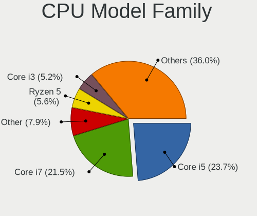

| Model                          | Computers | Percent |
|--------------------------------|-----------|---------|
| Intel Core i5                  | 140       | 26.02%  |
| Intel Core i7                  | 120       | 22.3%   |
| Intel Core i3                  | 27        | 5.02%   |
| AMD Ryzen 5                    | 27        | 5.02%   |
| Intel Core 2 Duo               | 26        | 4.83%   |
| AMD Ryzen 7                    | 23        | 4.28%   |
| Other                          | 19        | 3.53%   |
| Intel Xeon                     | 19        | 3.53%   |
| Intel Celeron                  | 19        | 3.53%   |
| AMD FX                         | 14        | 2.6%    |
| Intel Core 2 Quad              | 9         | 1.67%   |
| AMD Ryzen 9                    | 9         | 1.67%   |
| Intel Pentium                  | 8         | 1.49%   |
| AMD A6                         | 8         | 1.49%   |
| Intel Atom                     | 7         | 1.3%    |
| AMD Ryzen 3                    | 6         | 1.12%   |
| AMD A8                         | 6         | 1.12%   |
| AMD Athlon 64 X2               | 5         | 0.93%   |
| AMD A4                         | 5         | 0.93%   |
| Intel Core i9                  | 4         | 0.74%   |
| AMD Ryzen Threadripper         | 4         | 0.74%   |
| AMD E2                         | 4         | 0.74%   |
| AMD Athlon II X2               | 4         | 0.74%   |
| Intel Pentium M                | 2         | 0.37%   |
| AMD Ryzen 7 PRO                | 2         | 0.37%   |
| AMD A10                        | 2         | 0.37%   |
| QUALCOMM AArch64               | 1         | 0.19%   |
| Intel Xeon Silver              | 1         | 0.19%   |
| Intel Pentium Silver           | 1         | 0.19%   |
| Intel Pentium Dual-Core        | 1         | 0.19%   |
| Intel Pentium Dual             | 1         | 0.19%   |
| Intel Pentium 4                | 1         | 0.19%   |
| Intel Genuine                  | 1         | 0.19%   |
| Intel Core m7                  | 1         | 0.19%   |
| Intel Celeron Dual-Core        | 1         | 0.19%   |
| AMD Turion X2 Dual-Core Mobile | 1         | 0.19%   |
| AMD Turion 64 X2 Mobile        | 1         | 0.19%   |
| AMD Ryzen 5 PRO                | 1         | 0.19%   |
| AMD Phenom II X6               | 1         | 0.19%   |
| AMD Opteron                    | 1         | 0.19%   |
| AMD GX                         | 1         | 0.19%   |
| AMD E1                         | 1         | 0.19%   |
| AMD E                          | 1         | 0.19%   |
| AMD Athlon II X4               | 1         | 0.19%   |
| AMD A12                        | 1         | 0.19%   |

CPU Cores
---------

Number of processor cores

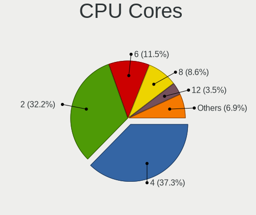

| Number | Computers | Percent |
|--------|-----------|---------|
| 4      | 204       | 37.92%  |
| 2      | 202       | 37.55%  |
| 6      | 53        | 9.85%   |
| 8      | 41        | 7.62%   |
| 12     | 10        | 1.86%   |
| 1      | 8         | 1.49%   |
| 14     | 5         | 0.93%   |
| 3      | 5         | 0.93%   |
| 20     | 3         | 0.56%   |
| 16     | 3         | 0.56%   |
| 10     | 3         | 0.56%   |
| 24     | 1         | 0.19%   |

CPU Sockets
-----------

Number of sockets

| Number | Computers | Percent |
|--------|-----------|---------|
| 1      | 528       | 98.14%  |
| 2      | 9         | 1.67%   |
| 3      | 1         | 0.19%   |

CPU Threads
-----------

Threads per core (Hyper-Threading)

| Number | Computers | Percent |
|--------|-----------|---------|
| 2      | 366       | 68.03%  |
| 1      | 172       | 31.97%  |

CPU Op-Modes
------------

CPU Operation Modes (32-bit, 64-bit)

| Op mode        | Computers | Percent |
|----------------|-----------|---------|
| 32-bit, 64-bit | 524       | 96.15%  |
| Unknown        | 18        | 3.3%    |
| 32-bit         | 3         | 0.55%   |

CPU Microcode
-------------

Microcode number

| Number     | Computers | Percent |
|------------|-----------|---------|
| Unknown    | 135       | 24.28%  |
| 0x206a7    | 40        | 7.19%   |
| 0x306a9    | 39        | 7.01%   |
| 0x306c3    | 26        | 4.68%   |
| 0x1067a    | 16        | 2.88%   |
| 0x806ea    | 13        | 2.34%   |
| 0x08701021 | 13        | 2.34%   |
| 0x806e9    | 12        | 2.16%   |
| 0x406e3    | 12        | 2.16%   |
| 0x806ec    | 11        | 1.98%   |
| 0x506e3    | 10        | 1.8%    |
| 0x20655    | 10        | 1.8%    |
| 0x906e9    | 9         | 1.62%   |
| 0x40651    | 9         | 1.62%   |
| 0x906ea    | 7         | 1.26%   |
| 0x30678    | 7         | 1.26%   |
| 0x106e5    | 7         | 1.26%   |
| 0x10676    | 7         | 1.26%   |
| 0x06000852 | 7         | 1.26%   |
| 0xa0652    | 6         | 1.08%   |
| 0x0a50000c | 6         | 1.08%   |
| 0x07030105 | 6         | 1.08%   |
| 0xa0655    | 5         | 0.9%    |
| 0x306d4    | 5         | 0.9%    |
| 0x106a5    | 5         | 0.9%    |
| 0x0800820d | 5         | 0.9%    |
| 0x08001137 | 5         | 0.9%    |
| 0x806eb    | 4         | 0.72%   |
| 0x806c1    | 4         | 0.72%   |
| 0x6fd      | 4         | 0.72%   |
| 0x6fb      | 4         | 0.72%   |
| 0x506c9    | 4         | 0.72%   |
| 0x206c2    | 4         | 0.72%   |
| 0x08701013 | 4         | 0.72%   |
| 0x0700010f | 4         | 0.72%   |
| 0x06001119 | 4         | 0.72%   |
| 0x806d1    | 3         | 0.54%   |
| 0x706e5    | 3         | 0.54%   |
| 0x406c4    | 3         | 0.54%   |
| 0x406c3    | 3         | 0.54%   |
| 0x306f2    | 3         | 0.54%   |
| 0x106ca    | 3         | 0.54%   |
| 0x08600106 | 3         | 0.54%   |
| 0x08600104 | 3         | 0.54%   |
| 0x08108109 | 3         | 0.54%   |
| 0x08108102 | 3         | 0.54%   |
| 0x06006705 | 3         | 0.54%   |
| 0x906ed    | 2         | 0.36%   |
| 0x906a3    | 2         | 0.36%   |
| 0x6d8      | 2         | 0.36%   |
| 0x50654    | 2         | 0.36%   |
| 0x10677    | 2         | 0.36%   |
| 0x08608103 | 2         | 0.36%   |
| 0x08001138 | 2         | 0.36%   |
| 0x08001129 | 2         | 0.36%   |
| 0x0600063e | 2         | 0.36%   |
| 0x05000119 | 2         | 0.36%   |
| 0x010000c8 | 2         | 0.36%   |
| 0xa0660    | 1         | 0.18%   |
| 0x906eb    | 1         | 0.18%   |

CPU Microarch
-------------

Microarchitecture

| Name             | Computers | Percent |
|------------------|-----------|---------|
| KabyLake         | 78        | 14.5%   |
| IvyBridge        | 51        | 9.48%   |
| SandyBridge      | 47        | 8.74%   |
| Haswell          | 45        | 8.36%   |
| Skylake          | 32        | 5.95%   |
| Penryn           | 32        | 5.95%   |
| Zen 2            | 27        | 5.02%   |
| Westmere         | 18        | 3.35%   |
| Piledriver       | 18        | 3.35%   |
| CometLake        | 18        | 3.35%   |
| Zen+             | 17        | 3.16%   |
| Silvermont       | 16        | 2.97%   |
| Nehalem          | 14        | 2.6%    |
| Zen 3            | 12        | 2.23%   |
| Zen              | 12        | 2.23%   |
| Puma             | 10        | 1.86%   |
| Core             | 9         | 1.67%   |
| Broadwell        | 9         | 1.67%   |
| Unknown          | 9         | 1.67%   |
| Icelake          | 8         | 1.49%   |
| TigerLake        | 7         | 1.3%    |
| Excavator        | 7         | 1.3%    |
| K8 Hammer        | 6         | 1.12%   |
| K10              | 6         | 1.12%   |
| Goldmont         | 6         | 1.12%   |
| Jaguar           | 4         | 0.74%   |
| Bonnell          | 4         | 0.74%   |
| Bulldozer        | 3         | 0.56%   |
| Alderlake Hybrid | 3         | 0.56%   |
| P6               | 2         | 0.37%   |
| Goldmont plus    | 2         | 0.37%   |
| Bobcat           | 2         | 0.37%   |
| Tremont          | 1         | 0.19%   |
| NetBurst         | 1         | 0.19%   |
| K8 & K10 hybrid  | 1         | 0.19%   |
| K10 Llano        | 1         | 0.19%   |

Graphics
--------

GPU Vendor
----------

Vendors of graphics cards

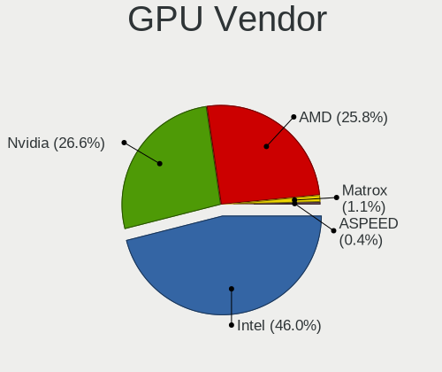

| Vendor                     | Computers | Percent |
|----------------------------|-----------|---------|
| Intel                      | 296       | 47.06%  |
| Nvidia                     | 162       | 25.76%  |
| AMD                        | 160       | 25.44%  |
| Matrox Electronics Systems | 8         | 1.27%   |
| ASPEED Technology          | 3         | 0.48%   |

GPU Model
---------

Graphics card models

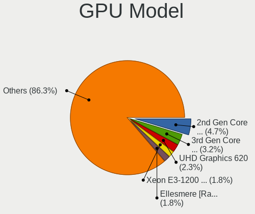

| Model                                                                                    | Computers | Percent |
|------------------------------------------------------------------------------------------|-----------|---------|
| Intel 2nd Generation Core Processor Family Integrated Graphics Controller                | 34        | 5.19%   |
| Intel 3rd Gen Core processor Graphics Controller                                         | 22        | 3.36%   |
| AMD Ellesmere [Radeon RX 470/480/570/570X/580/580X/590]                                  | 17        | 2.6%    |
| Intel Xeon E3-1200 v3/4th Gen Core Processor Integrated Graphics Controller              | 14        | 2.14%   |
| Intel Skylake GT2 [HD Graphics 520]                                                      | 14        | 2.14%   |
| Intel WhiskeyLake-U GT2 [UHD Graphics 620]                                               | 12        | 1.83%   |
| Intel UHD Graphics 620                                                                   | 12        | 1.83%   |
| Intel HD Graphics 630                                                                    | 12        | 1.83%   |
| Intel Core Processor Integrated Graphics Controller                                      | 11        | 1.68%   |
| Intel Xeon E3-1200 v2/3rd Gen Core processor Graphics Controller                         | 10        | 1.53%   |
| Intel Haswell-ULT Integrated Graphics Controller                                         | 10        | 1.53%   |
| Intel HD Graphics 530                                                                    | 9         | 1.37%   |
| Intel Atom Processor Z36xxx/Z37xxx Series Graphics & Display                             | 9         | 1.37%   |
| AMD Picasso/Raven 2 [Radeon Vega Series / Radeon Vega Mobile Series]                     | 9         | 1.37%   |
| Intel HD Graphics 620                                                                    | 8         | 1.22%   |
| Intel CoffeeLake-H GT2 [UHD Graphics 630]                                                | 8         | 1.22%   |
| AMD Cezanne                                                                              | 8         | 1.22%   |
| Nvidia GP102 [GeForce GTX 1080 Ti]                                                       | 7         | 1.07%   |
| Intel TigerLake-LP GT2 [Iris Xe Graphics]                                                | 7         | 1.07%   |
| Intel Mobile 4 Series Chipset Integrated Graphics Controller                             | 7         | 1.07%   |
| Intel CometLake-H GT2 [UHD Graphics]                                                     | 7         | 1.07%   |
| Intel Atom/Celeron/Pentium Processor x5-E8000/J3xxx/N3xxx Integrated Graphics Controller | 7         | 1.07%   |
| AMD Topaz XT [Radeon R7 M260/M265 / M340/M360 / M440/M445 / 530/535 / 620/625 Mobile]    | 7         | 1.07%   |
| Nvidia GP106 [GeForce GTX 1060 6GB]                                                      | 6         | 0.92%   |
| AMD Renoir                                                                               | 6         | 0.92%   |
| AMD Mullins [Radeon R4/R5 Graphics]                                                      | 6         | 0.92%   |
| Nvidia GP108 [GeForce GT 1030]                                                           | 5         | 0.76%   |
| Intel HD Graphics 5500                                                                   | 5         | 0.76%   |
| Intel HD Graphics 500                                                                    | 5         | 0.76%   |
| Intel CometLake-U GT2 [UHD Graphics]                                                     | 5         | 0.76%   |
| Intel CoffeeLake-S GT2 [UHD Graphics 630]                                                | 5         | 0.76%   |
| Intel 4th Gen Core Processor Integrated Graphics Controller                              | 5         | 0.76%   |
| Intel 4 Series Chipset Integrated Graphics Controller                                    | 5         | 0.76%   |
| AMD Stoney [Radeon R2/R3/R4/R5 Graphics]                                                 | 5         | 0.76%   |
| AMD Cedar [Radeon HD 5000/6000/7350/8350 Series]                                         | 5         | 0.76%   |
| Nvidia GT218 [GeForce 210]                                                               | 4         | 0.61%   |
| Nvidia GP107M [GeForce GTX 1050 Mobile]                                                  | 4         | 0.61%   |
| Nvidia GK208B [GeForce GT 710]                                                           | 4         | 0.61%   |
| Matrox Electronics Systems MGA G200eW WPCM450                                            | 4         | 0.61%   |
| Intel Mobile GM965/GL960 Integrated Graphics Controller (secondary)                      | 4         | 0.61%   |
| Intel Mobile GM965/GL960 Integrated Graphics Controller (primary)                        | 4         | 0.61%   |
| Intel Iris Plus Graphics G7                                                              | 4         | 0.61%   |
| Intel CometLake-S GT2 [UHD Graphics 630]                                                 | 4         | 0.61%   |
| Intel Alder Lake-P Integrated Graphics Controller                                        | 4         | 0.61%   |
| AMD Seymour [Radeon HD 6400M/7400M Series]                                               | 4         | 0.61%   |
| AMD Park [Mobility Radeon HD 5430]                                                       | 4         | 0.61%   |
| AMD Navi 14 [Radeon RX 5500/5500M / Pro 5500M]                                           | 4         | 0.61%   |
| AMD Navi 10 [Radeon RX 5600 OEM/5600 XT / 5700/5700 XT]                                  | 4         | 0.61%   |
| AMD Caicos [Radeon HD 6450/7450/8450 / R5 230 OEM]                                       | 4         | 0.61%   |
| Nvidia GK107M [GeForce GT 650M]                                                          | 3         | 0.46%   |
| Nvidia GK104 [GeForce GTX 760]                                                           | 3         | 0.46%   |
| Nvidia C79 [GeForce 9400]                                                                | 3         | 0.46%   |
| Nvidia C79 [GeForce 9400M]                                                               | 3         | 0.46%   |
| Intel TigerLake-H GT1 [UHD Graphics]                                                     | 3         | 0.46%   |
| Intel Atom Processor D4xx/D5xx/N4xx/N5xx Integrated Graphics Controller                  | 3         | 0.46%   |
| Intel 4th Generation Core Processor Family Integrated Graphics Controller                | 3         | 0.46%   |
| ASPEED Technology ASPEED Graphics Family                                                 | 3         | 0.46%   |
| AMD Whistler [Radeon HD 6630M/6650M/6750M/7670M/7690M]                                   | 3         | 0.46%   |
| AMD Turks XT [Radeon HD 6670/7670]                                                       | 3         | 0.46%   |
| AMD Thames [Radeon HD 7550M/7570M/7650M]                                                 | 3         | 0.46%   |

GPU Combo
---------

Combinations of graphics cards

| Name                    | Computers | Percent |
|-------------------------|-----------|---------|
| 1 x Intel               | 219       | 40.26%  |
| 1 x AMD                 | 117       | 21.51%  |
| 1 x Nvidia              | 100       | 18.38%  |
| Intel + Nvidia          | 50        | 9.19%   |
| Intel + AMD             | 19        | 3.49%   |
| 2 x AMD                 | 15        | 2.76%   |
| AMD + Nvidia            | 8         | 1.47%   |
| 1 x Matrox              | 7         | 1.29%   |
| Other                   | 3         | 0.55%   |
| 2 x Nvidia              | 2         | 0.37%   |
| 2 x Nvidia + 1 x ASPEED | 1         | 0.18%   |
| Nvidia + ASPEED         | 1         | 0.18%   |
| AMD + Matrox            | 1         | 0.18%   |
| AMD + ASPEED            | 1         | 0.18%   |

GPU Driver
----------

Free vs proprietary

| Driver      | Computers | Percent |
|-------------|-----------|---------|
| Free        | 433       | 79.74%  |
| Proprietary | 91        | 16.76%  |
| Unknown     | 19        | 3.5%    |

GPU Memory
----------

Total video memory

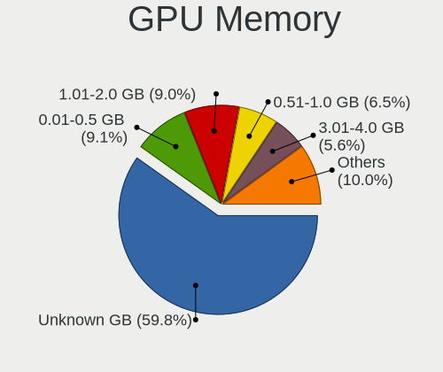

| Size in GB | Computers | Percent |
|------------|-----------|---------|
| Unknown    | 303       | 54.59%  |
| 1.01-2.0   | 64        | 11.53%  |
| 0.01-0.5   | 59        | 10.63%  |
| 0.51-1.0   | 44        | 7.93%   |
| 7.01-8.0   | 29        | 5.23%   |
| 3.01-4.0   | 23        | 4.14%   |
| 5.01-6.0   | 18        | 3.24%   |
| 8.01-16.0  | 10        | 1.8%    |
| 2.01-3.0   | 5         | 0.9%    |

Monitor
-------

Monitor Vendor
--------------

Monitor vendors

| Vendor                  | Computers | Percent |
|-------------------------|-----------|---------|
| Samsung Electronics     | 75        | 12.34%  |
| Dell                    | 54        | 8.88%   |
| AU Optronics            | 54        | 8.88%   |
| LG Display              | 49        | 8.06%   |
| AOC                     | 49        | 8.06%   |
| Chimei Innolux          | 40        | 6.58%   |
| Goldstar                | 38        | 6.25%   |
| Philips                 | 29        | 4.77%   |
| BOE                     | 26        | 4.28%   |
| ViewSonic               | 24        | 3.95%   |
| Hewlett-Packard         | 18        | 2.96%   |
| Sharp                   | 16        | 2.63%   |
| Chi Mei Optoelectronics | 14        | 2.3%    |
| Lenovo                  | 10        | 1.64%   |
| Sony                    | 9         | 1.48%   |
| Acer                    | 9         | 1.48%   |
| Panasonic               | 8         | 1.32%   |
| Apple                   | 8         | 1.32%   |
| Ancor Communications    | 8         | 1.32%   |
| MiTAC                   | 7         | 1.15%   |
| BenQ                    | 7         | 1.15%   |
| PANDA                   | 6         | 0.99%   |
| Denver                  | 6         | 0.99%   |
| LG Electronics          | 4         | 0.66%   |
| InnoLux Display         | 3         | 0.49%   |
| InfoVision              | 3         | 0.49%   |
| Unknown                 | 2         | 0.33%   |
| SANYO                   | 2         | 0.33%   |
| Quanta Display          | 2         | 0.33%   |
| PRISM+                  | 2         | 0.33%   |
| Konka                   | 2         | 0.33%   |
| HannStar                | 2         | 0.33%   |
| Wacom                   | 1         | 0.16%   |
| Unknown (AAA)           | 1         | 0.16%   |
| Toshiba                 | 1         | 0.16%   |
| TMX                     | 1         | 0.16%   |
| QCM                     | 1         | 0.16%   |
| Plain Tree Systems      | 1         | 0.16%   |
| Optoma                  | 1         | 0.16%   |
| NEC Computers           | 1         | 0.16%   |
| Mi                      | 1         | 0.16%   |
| Marantz                 | 1         | 0.16%   |
| LG Philips              | 1         | 0.16%   |
| KTC                     | 1         | 0.16%   |
| Iiyama                  | 1         | 0.16%   |
| IBM                     | 1         | 0.16%   |
| HYD                     | 1         | 0.16%   |
| GVV                     | 1         | 0.16%   |
| eMachines               | 1         | 0.16%   |
| Elo Touch               | 1         | 0.16%   |
| CVT                     | 1         | 0.16%   |
| CPT                     | 1         | 0.16%   |
| AVO                     | 1         | 0.16%   |
| ASUSTek Computer        | 1         | 0.16%   |

Monitor Model
-------------

Monitor models

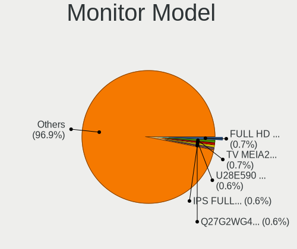

| Model                                                                    | Computers | Percent |
|--------------------------------------------------------------------------|-----------|---------|
| Panasonic TV MEIA296 3840x2160 698x392mm 31.5-inch                       | 6         | 0.92%   |
| MiTAC Smart TV SZM0030 1920x1080 708x398mm 32.0-inch                     | 4         | 0.61%   |
| Goldstar FULL HD GSM5AB9 1920x1080 480x270mm 21.7-inch                   | 4         | 0.61%   |
| Chi Mei Optoelectronics LCD Monitor CMO15A1 1366x768 344x193mm 15.5-inch | 4         | 0.61%   |
| AU Optronics LCD Monitor AUO23EC 1366x768 344x193mm 15.5-inch            | 4         | 0.61%   |
| ViewSonic VA2248 SERIES VSC0E28 1920x1080 477x268mm 21.5-inch            | 3         | 0.46%   |
| Sharp LCD Monitor SHP144A 3200x1800 294x165mm 13.3-inch                  | 3         | 0.46%   |
| LG Display LCD Monitor LGD0465 1366x768 344x194mm 15.5-inch              | 3         | 0.46%   |
| Goldstar LCD Monitor GSM5AB8 1920x1080 480x270mm 21.7-inch               | 3         | 0.46%   |
| Dell P2214H DELA097 1920x1080 477x268mm 21.5-inch                        | 3         | 0.46%   |
| Chimei Innolux LCD Monitor CMN14D4 1920x1080 309x173mm 13.9-inch         | 3         | 0.46%   |
| AU Optronics LCD Monitor AUO70EC 1366x768 344x193mm 15.5-inch            | 3         | 0.46%   |
| AU Optronics LCD Monitor AUO123D 1920x1080 309x173mm 13.9-inch           | 3         | 0.46%   |
| AOC G2790G4 AOC2790 1920x1080 598x336mm 27.0-inch                        | 3         | 0.46%   |
| AOC 2470W AOC2470 1920x1080 521x293mm 23.5-inch                          | 3         | 0.46%   |
| AOC 2260W AOC2260 1920x1080 477x268mm 21.5-inch                          | 3         | 0.46%   |
| ViewSonic VX2770 SERIES VSC3A2C 1920x1080 597x336mm 27.0-inch            | 2         | 0.31%   |
| ViewSonic VX2433wm VSC3822 1920x1080 520x290mm 23.4-inch                 | 2         | 0.31%   |
| ViewSonic VA2231 Series VSCBB25 1920x1080 477x268mm 21.5-inch            | 2         | 0.31%   |
| ViewSonic LCD Monitor VSCB51D 1280x1024 340x270mm 17.1-inch              | 2         | 0.31%   |
| Sony TV SNYA401 1920x1080                                                | 2         | 0.31%   |
| Sharp LQ156M1JW03 SHP14C5 1920x1080 344x194mm 15.5-inch                  | 2         | 0.31%   |
| Sharp LCD Monitor SHP1449 1920x1080 294x165mm 13.3-inch                  | 2         | 0.31%   |
| Samsung Electronics U28E590 SAM0C4D 3840x2160 607x345mm 27.5-inch        | 2         | 0.31%   |
| Samsung Electronics SyncMaster SAM027F 1680x1050 474x296mm 22.0-inch     | 2         | 0.31%   |
| Samsung Electronics S24F350 SAM0D20 1920x1080 521x293mm 23.5-inch        | 2         | 0.31%   |
| Samsung Electronics LCD Monitor SAM0900 1366x768 410x230mm 18.5-inch     | 2         | 0.31%   |
| PRISM+ C34SW INN3400 3440x1440 800x340mm 34.2-inch                       | 2         | 0.31%   |
| Philips PHL 243V5 PHLC0D1 1920x1080 521x293mm 23.5-inch                  | 2         | 0.31%   |
| PANDA LM133LF1L02 NCP0019 1920x1080 294x165mm 13.3-inch                  | 2         | 0.31%   |
| LG Display LCD Monitor LGD4601 1280x800 286x179mm 13.3-inch              | 2         | 0.31%   |
| LG Display LCD Monitor LGD11F9 1280x800 290x180mm 13.4-inch              | 2         | 0.31%   |
| LG Display LCD Monitor LGD0456 1366x768 344x194mm 15.5-inch              | 2         | 0.31%   |
| LG Display LCD Monitor LGD033E 1366x768 309x174mm 14.0-inch              | 2         | 0.31%   |
| LG Display LCD Monitor LGD02E2 1600x900 310x174mm 14.0-inch              | 2         | 0.31%   |
| LG Display LCD Monitor LGD02AD 1366x768 344x194mm 15.5-inch              | 2         | 0.31%   |
| LG Display LCD Monitor LGD0258 1600x900 345x194mm 15.6-inch              | 2         | 0.31%   |
| Konka TV MONIOR KOA0030 1920x540 708x398mm 32.0-inch                     | 2         | 0.31%   |
| Hewlett-Packard P221 HWP3057 1920x1080 480x270mm 21.7-inch               | 2         | 0.31%   |
| Goldstar W1941 GSM4B91 1360x768 406x229mm 18.4-inch                      | 2         | 0.31%   |
| Goldstar HDR WFHD GSM7714 2560x1080 798x334mm 34.1-inch                  | 2         | 0.31%   |
| Goldstar FULL HD GSM5B55 1920x1080 480x270mm 21.7-inch                   | 2         | 0.31%   |
| Goldstar FULL HD GSM5ABB 1920x1080 480x270mm 21.7-inch                   | 2         | 0.31%   |
| Goldstar E2351 GSM5872 1920x1080 510x290mm 23.1-inch                     | 2         | 0.31%   |
| Denver PGM340 LHC3400 3440x1440 798x334mm 34.1-inch                      | 2         | 0.31%   |
| Denver 35C601 LHC3500 3440x1440 819x346mm 35.0-inch                      | 2         | 0.31%   |
| Denver 274K144IGHUCA LHC2700 3840x2160 597x336mm 27.0-inch               | 2         | 0.31%   |
| Dell U3818DW DELA0F3 3840x1600 880x367mm 37.5-inch                       | 2         | 0.31%   |
| Dell U3818DW DELA0F2 1920x1080 880x370mm 37.6-inch                       | 2         | 0.31%   |
| Dell U2414H DELA0A4 1920x1080 527x296mm 23.8-inch                        | 2         | 0.31%   |
| Dell U2312HM DEL4072 1920x1080 510x287mm 23.0-inch                       | 2         | 0.31%   |
| Dell S2721DS DELA19C 2560x1440 597x336mm 27.0-inch                       | 2         | 0.31%   |
| Dell P2416D DELA0C3 2560x1440 527x296mm 23.8-inch                        | 2         | 0.31%   |
| Dell G2410 DEL404B 1920x1080 531x298mm 24.0-inch                         | 2         | 0.31%   |
| Dell 1907FP DEL4015 1280x1024 376x301mm 19.0-inch                        | 2         | 0.31%   |
| Chimei Innolux LCD Monitor CMN15BF 1366x768 344x193mm 15.5-inch          | 2         | 0.31%   |
| Chimei Innolux LCD Monitor CMN14E5 1920x1080 309x173mm 13.9-inch         | 2         | 0.31%   |
| Chimei Innolux LCD Monitor CMN14B1 1920x1080 308x173mm 13.9-inch         | 2         | 0.31%   |
| Chi Mei Optoelectronics LCD Monitor CMO15A7 1366x768 344x193mm 15.5-inch | 2         | 0.31%   |
| Chi Mei Optoelectronics LCD Monitor CMO15A3 1366x768 344x193mm 15.5-inch | 2         | 0.31%   |

Monitor Resolution
------------------

Monitor screen resolution

| Resolution         | Computers | Percent |
|--------------------|-----------|---------|
| 1920x1080 (FHD)    | 241       | 41.27%  |
| 1366x768 (WXGA)    | 90        | 15.41%  |
| 3840x2160 (4K)     | 55        | 9.42%   |
| 2560x1440 (QHD)    | 28        | 4.79%   |
| 1680x1050 (WSXGA+) | 24        | 4.11%   |
| 1600x900 (HD+)     | 23        | 3.94%   |
| 1280x1024 (SXGA)   | 20        | 3.42%   |
| 1440x900 (WXGA+)   | 16        | 2.74%   |
| 3440x1440          | 14        | 2.4%    |
| 1280x800 (WXGA)    | 14        | 2.4%    |
| Unknown            | 10        | 1.71%   |
| 3840x1080          | 5         | 0.86%   |
| 3200x1800 (QHD+)   | 4         | 0.68%   |
| 1920x1200 (WUXGA)  | 4         | 0.68%   |
| 1360x768           | 4         | 0.68%   |
| 1024x600           | 4         | 0.68%   |
| 3840x1600          | 3         | 0.51%   |
| 2560x1600          | 3         | 0.51%   |
| 2560x1080          | 3         | 0.51%   |
| 3456x2160          | 2         | 0.34%   |
| 1600x1200          | 2         | 0.34%   |
| 7680x1080          | 1         | 0.17%   |
| 6720x1080          | 1         | 0.17%   |
| 3840x2400          | 1         | 0.17%   |
| 3840x1200          | 1         | 0.17%   |
| 3360x1080          | 1         | 0.17%   |
| 2960x1050          | 1         | 0.17%   |
| 2880x1920          | 1         | 0.17%   |
| 2880x1800          | 1         | 0.17%   |
| 2800x1752          | 1         | 0.17%   |
| 2560x1024          | 1         | 0.17%   |
| 2288x1287          | 1         | 0.17%   |
| 2048x1152          | 1         | 0.17%   |
| 1920x1280          | 1         | 0.17%   |
| 1280x960           | 1         | 0.17%   |
| 1024x768 (XGA)     | 1         | 0.17%   |

Monitor Diagonal
----------------

Diagonal size in inches

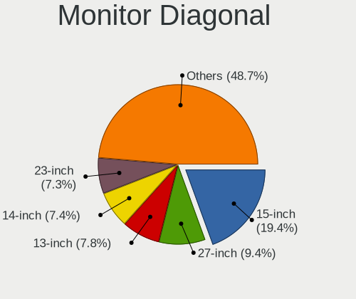

| Inches  | Computers | Percent |
|---------|-----------|---------|
| 15      | 127       | 20.85%  |
| 27      | 50        | 8.21%   |
| 23      | 50        | 8.21%   |
| 13      | 48        | 7.88%   |
| 21      | 45        | 7.39%   |
| 24      | 39        | 6.4%    |
| 14      | 39        | 6.4%    |
| 17      | 33        | 5.42%   |
| Unknown | 31        | 5.09%   |
| 22      | 17        | 2.79%   |
| 19      | 15        | 2.46%   |
| 31      | 13        | 2.13%   |
| 34      | 12        | 1.97%   |
| 20      | 12        | 1.97%   |
| 84      | 11        | 1.81%   |
| 18      | 9         | 1.48%   |
| 72      | 7         | 1.15%   |
| 32      | 6         | 0.99%   |
| 12      | 6         | 0.99%   |
| 10      | 6         | 0.99%   |
| 37      | 4         | 0.66%   |
| 16      | 4         | 0.66%   |
| 11      | 4         | 0.66%   |
| 52      | 3         | 0.49%   |
| 35      | 3         | 0.49%   |
| 46      | 2         | 0.33%   |
| 26      | 2         | 0.33%   |
| 142     | 1         | 0.16%   |
| 66      | 1         | 0.16%   |
| 65      | 1         | 0.16%   |
| 55      | 1         | 0.16%   |
| 54      | 1         | 0.16%   |
| 49      | 1         | 0.16%   |
| 40      | 1         | 0.16%   |
| 39      | 1         | 0.16%   |
| 33      | 1         | 0.16%   |
| 30      | 1         | 0.16%   |
| 25      | 1         | 0.16%   |

Monitor Width
-------------

Physical width

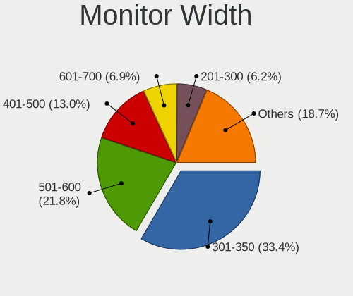

| Width in mm    | Computers | Percent |
|----------------|-----------|---------|
| 301-350        | 200       | 33.73%  |
| 501-600        | 122       | 20.57%  |
| 401-500        | 89        | 15.01%  |
| 201-300        | 40        | 6.75%   |
| 351-400        | 33        | 5.56%   |
| Unknown        | 31        | 5.23%   |
| 601-700        | 23        | 3.88%   |
| 701-800        | 19        | 3.2%    |
| 1501-2000      | 17        | 2.87%   |
| 801-900        | 9         | 1.52%   |
| 1001-1500      | 9         | 1.52%   |
| More than 2000 | 1         | 0.17%   |

Aspect Ratio
------------

Proportional relationship between the width and the height

| Ratio   | Computers | Percent |
|---------|-----------|---------|
| 16/9    | 398       | 73.3%   |
| 16/10   | 67        | 12.34%  |
| Unknown | 27        | 4.97%   |
| 5/4     | 20        | 3.68%   |
| 21/9    | 19        | 3.5%    |
| 4/3     | 4         | 0.74%   |
| 3/2     | 4         | 0.74%   |
| 6/5     | 1         | 0.18%   |
| 32/9    | 1         | 0.18%   |
| 1.00    | 1         | 0.18%   |
| 0.45    | 1         | 0.18%   |

Monitor Area
------------

Area in inch

| Area in inch | Computers | Percent |
|----------------|-----------|---------|
| 101-110        | 125       | 20.9%   |
| 201-250        | 121       | 20.23%  |
| 81-90          | 68        | 11.37%  |
| 301-350        | 50        | 8.36%   |
| 151-200        | 40        | 6.69%   |
| 351-500        | 36        | 6.02%   |
| Unknown        | 31        | 5.18%   |
| More than 1000 | 25        | 4.18%   |
| 71-80          | 21        | 3.51%   |
| 121-130        | 19        | 3.18%   |
| 141-150        | 18        | 3.01%   |
| 251-300        | 11        | 1.84%   |
| 501-1000       | 9         | 1.51%   |
| 61-70          | 6         | 1%      |
| 41-50          | 6         | 1%      |
| 111-120        | 5         | 0.84%   |
| 51-60          | 4         | 0.67%   |
| 131-140        | 2         | 0.33%   |
| 91-100         | 1         | 0.17%   |

Pixel Density
-------------

Pixels per inch

| Density       | Computers | Percent |
|---------------|-----------|---------|
| 51-100        | 199       | 33.79%  |
| 101-120       | 167       | 28.35%  |
| 121-160       | 126       | 21.39%  |
| Unknown       | 31        | 5.26%   |
| 161-240       | 30        | 5.09%   |
| 1-50          | 20        | 3.4%    |
| More than 240 | 16        | 2.72%   |

Multiple Monitors
-----------------

Total monitors connected

| Total | Computers | Percent |
|-------|-----------|---------|
| 1     | 420       | 75.4%   |
| 2     | 100       | 17.95%  |
| 0     | 22        | 3.95%   |
| 3     | 12        | 2.15%   |
| 4     | 3         | 0.54%   |

Network
-------

Net Controller Vendor
---------------------

Controller vendors

| Vendor                                | Computers | Percent |
|---------------------------------------|-----------|---------|
| Intel                                 | 289       | 35.5%   |
| Realtek Semiconductor                 | 260       | 31.94%  |
| Qualcomm Atheros                      | 79        | 9.71%   |
| Broadcom                              | 45        | 5.53%   |
| TP-Link                               | 14        | 1.72%   |
| Nvidia                                | 14        | 1.72%   |
| Ralink                                | 13        | 1.6%    |
| Ralink Technology                     | 12        | 1.47%   |
| Broadcom Limited                      | 11        | 1.35%   |
| Marvell Technology Group              | 9         | 1.11%   |
| MediaTek                              | 7         | 0.86%   |
| Hewlett-Packard                       | 6         | 0.74%   |
| Qualcomm Atheros Communications       | 5         | 0.61%   |
| Samsung Electronics                   | 4         | 0.49%   |
| NetGear                               | 4         | 0.49%   |
| DisplayLink                           | 4         | 0.49%   |
| Microsoft                             | 3         | 0.37%   |
| Lenovo                                | 3         | 0.37%   |
| IBM                                   | 3         | 0.37%   |
| Aquantia                              | 3         | 0.37%   |
| Sierra Wireless                       | 2         | 0.25%   |
| Microchip Technology                  | 2         | 0.25%   |
| Mellanox Technologies                 | 2         | 0.25%   |
| JMicron Technology                    | 2         | 0.25%   |
| Dell                                  | 2         | 0.25%   |
| ZTE WCDMA Technologies MSM            | 1         | 0.12%   |
| Wilocity                              | 1         | 0.12%   |
| Wacom                                 | 1         | 0.12%   |
| OPPO Electronics                      | 1         | 0.12%   |
| Lite-On Technology                    | 1         | 0.12%   |
| ICS Advent                            | 1         | 0.12%   |
| Ericsson Business Mobile Networks     | 1         | 0.12%   |
| Edimax Technology                     | 1         | 0.12%   |
| Dresden Elektronik                    | 1         | 0.12%   |
| D-Link                                | 1         | 0.12%   |
| Belkin Components                     | 1         | 0.12%   |
| Attansic Technology                   | 1         | 0.12%   |
| ASUSTek Computer                      | 1         | 0.12%   |
| ASIX Electronics                      | 1         | 0.12%   |
| Apple                                 | 1         | 0.12%   |
| 802.11g Adapter [Linksys WUSB54GC v3] | 1         | 0.12%   |

Net Controller Model
--------------------

Controller models

| Model                                                             | Computers | Percent |
|-------------------------------------------------------------------|-----------|---------|
| Realtek RTL8111/8168/8411 PCI Express Gigabit Ethernet Controller | 189       | 19.57%  |
| Intel 82579LM Gigabit Network Connection (Lewisville)             | 32        | 3.31%   |
| Intel Wi-Fi 6 AX200                                               | 30        | 3.11%   |
| Intel Wireless 8265 / 8275                                        | 21        | 2.17%   |
| Realtek RTL810xE PCI Express Fast Ethernet controller             | 19        | 1.97%   |
| Qualcomm Atheros QCA6174 802.11ac Wireless Network Adapter        | 18        | 1.86%   |
| Realtek RTL8153 Gigabit Ethernet Adapter                          | 15        | 1.55%   |
| Intel Wireless 8260                                               | 14        | 1.45%   |
| Intel I211 Gigabit Network Connection                             | 14        | 1.45%   |
| Qualcomm Atheros AR8151 v2.0 Gigabit Ethernet                     | 12        | 1.24%   |
| Intel Wireless-AC 9260                                            | 12        | 1.24%   |
| Intel Wireless 7260                                               | 11        | 1.14%   |
| Intel Wireless 3165                                               | 11        | 1.14%   |
| Qualcomm Atheros AR9485 Wireless Network Adapter                  | 10        | 1.04%   |
| Qualcomm Atheros AR9285 Wireless Network Adapter (PCI-Express)    | 10        | 1.04%   |
| Intel Ethernet Connection I217-LM                                 | 10        | 1.04%   |
| Intel Centrino Advanced-N 6205 [Taylor Peak]                      | 10        | 1.04%   |
| Realtek RTL8125 2.5GbE Controller                                 | 9         | 0.93%   |
| Qualcomm Atheros QCA9565 / AR9565 Wireless Network Adapter        | 9         | 0.93%   |
| Intel Ethernet Connection (2) I219-LM                             | 9         | 0.93%   |
| Intel Comet Lake PCH CNVi WiFi                                    | 9         | 0.93%   |
| Intel Wireless 7265                                               | 8         | 0.83%   |
| Intel Ethernet Connection (2) I219-V                              | 8         | 0.83%   |
| Nvidia MCP79 Ethernet                                             | 7         | 0.72%   |
| Intel Comet Lake PCH-LP CNVi WiFi                                 | 7         | 0.72%   |
| Intel Cannon Point-LP CNVi [Wireless-AC]                          | 7         | 0.72%   |
| Intel 82579V Gigabit Network Connection                           | 7         | 0.72%   |
| Intel 82567LM-3 Gigabit Network Connection                        | 7         | 0.72%   |
| Broadcom BCM4322 802.11a/b/g/n Wireless LAN Controller            | 7         | 0.72%   |
| Realtek RTL88x2bu [AC1200 Techkey]                                | 6         | 0.62%   |
| Realtek RTL8822CE 802.11ac PCIe Wireless Network Adapter          | 6         | 0.62%   |
| Realtek RTL8821CE 802.11ac PCIe Wireless Network Adapter          | 6         | 0.62%   |
| Qualcomm Atheros QCA9377 802.11ac Wireless Network Adapter        | 6         | 0.62%   |
| Intel Ethernet Controller I225-V                                  | 6         | 0.62%   |
| Intel Ethernet Connection I219-LM                                 | 6         | 0.62%   |
| Intel Ethernet Connection (6) I219-V                              | 6         | 0.62%   |
| Intel Centrino Advanced-N 6200                                    | 6         | 0.62%   |
| Intel Cannon Lake PCH CNVi WiFi                                   | 6         | 0.62%   |
| Broadcom BCM43228 802.11a/b/g/n                                   | 6         | 0.62%   |
| Realtek RTL8822BE 802.11a/b/g/n/ac WiFi adapter                   | 5         | 0.52%   |
| Realtek RTL8812AE 802.11ac PCIe Wireless Network Adapter          | 5         | 0.52%   |
| Marvell Group 88E8056 PCI-E Gigabit Ethernet Controller           | 5         | 0.52%   |
| Intel Wi-Fi 6 AX201                                               | 5         | 0.52%   |
| Intel Ethernet Connection I218-LM                                 | 5         | 0.52%   |
| Intel Dual Band Wireless-AC 3168NGW [Stone Peak]                  | 5         | 0.52%   |
| Intel Centrino Wireless-N 2230                                    | 5         | 0.52%   |
| Intel Centrino Ultimate-N 6300                                    | 5         | 0.52%   |
| Intel Centrino Advanced-N 6235                                    | 5         | 0.52%   |
| Intel 82574L Gigabit Network Connection                           | 5         | 0.52%   |
| Broadcom BCM4313 802.11bgn Wireless Network Adapter               | 5         | 0.52%   |
| TP-Link TL-WN822N Version 4 RTL8192EU                             | 4         | 0.41%   |
| Realtek RTL8723BE PCIe Wireless Network Adapter                   | 4         | 0.41%   |
| Ralink MT7601U Wireless Adapter                                   | 4         | 0.41%   |
| Qualcomm Atheros AR9271 802.11n                                   | 4         | 0.41%   |
| Qualcomm Atheros AR9287 Wireless Network Adapter (PCI-Express)    | 4         | 0.41%   |
| Qualcomm Atheros AR8161 Gigabit Ethernet                          | 4         | 0.41%   |
| Intel Ethernet Connection (7) I219-V                              | 4         | 0.41%   |
| Intel Ethernet Connection (4) I219-V                              | 4         | 0.41%   |
| Intel Ethernet Connection (4) I219-LM                             | 4         | 0.41%   |
| Intel Ethernet Connection (2) I218-V                              | 4         | 0.41%   |

Wireless Vendor
---------------

Wireless vendors

| Vendor                                | Computers | Percent |
|---------------------------------------|-----------|---------|
| Intel                                 | 204       | 47.78%  |
| Qualcomm Atheros                      | 59        | 13.82%  |
| Realtek Semiconductor                 | 55        | 12.88%  |
| Broadcom                              | 31        | 7.26%   |
| TP-Link                               | 13        | 3.04%   |
| Ralink                                | 13        | 3.04%   |
| Ralink Technology                     | 12        | 2.81%   |
| Broadcom Limited                      | 9         | 2.11%   |
| MediaTek                              | 6         | 1.41%   |
| Qualcomm Atheros Communications       | 5         | 1.17%   |
| NetGear                               | 4         | 0.94%   |
| Hewlett-Packard                       | 3         | 0.7%    |
| Microsoft                             | 2         | 0.47%   |
| Dell                                  | 2         | 0.47%   |
| Wilocity                              | 1         | 0.23%   |
| Wacom                                 | 1         | 0.23%   |
| Sierra Wireless                       | 1         | 0.23%   |
| Lite-On Technology                    | 1         | 0.23%   |
| Edimax Technology                     | 1         | 0.23%   |
| D-Link                                | 1         | 0.23%   |
| Belkin Components                     | 1         | 0.23%   |
| ASUSTek Computer                      | 1         | 0.23%   |
| 802.11g Adapter [Linksys WUSB54GC v3] | 1         | 0.23%   |

Wireless Model
--------------

Wireless models

| Model                                                          | Computers | Percent |
|----------------------------------------------------------------|-----------|---------|
| Intel Wi-Fi 6 AX200                                            | 30        | 6.94%   |
| Intel Wireless 8265 / 8275                                     | 21        | 4.86%   |
| Qualcomm Atheros QCA6174 802.11ac Wireless Network Adapter     | 18        | 4.17%   |
| Intel Wireless 8260                                            | 14        | 3.24%   |
| Intel Wireless-AC 9260                                         | 12        | 2.78%   |
| Intel Wireless 7260                                            | 11        | 2.55%   |
| Intel Wireless 3165                                            | 11        | 2.55%   |
| Qualcomm Atheros AR9485 Wireless Network Adapter               | 10        | 2.31%   |
| Qualcomm Atheros AR9285 Wireless Network Adapter (PCI-Express) | 10        | 2.31%   |
| Intel Centrino Advanced-N 6205 [Taylor Peak]                   | 10        | 2.31%   |
| Qualcomm Atheros QCA9565 / AR9565 Wireless Network Adapter     | 9         | 2.08%   |
| Intel Comet Lake PCH CNVi WiFi                                 | 9         | 2.08%   |
| Intel Wireless 7265                                            | 8         | 1.85%   |
| Intel Comet Lake PCH-LP CNVi WiFi                              | 7         | 1.62%   |
| Intel Cannon Point-LP CNVi [Wireless-AC]                       | 7         | 1.62%   |
| Broadcom BCM4322 802.11a/b/g/n Wireless LAN Controller         | 7         | 1.62%   |
| Realtek RTL88x2bu [AC1200 Techkey]                             | 6         | 1.39%   |
| Realtek RTL8822CE 802.11ac PCIe Wireless Network Adapter       | 6         | 1.39%   |
| Realtek RTL8821CE 802.11ac PCIe Wireless Network Adapter       | 6         | 1.39%   |
| Qualcomm Atheros QCA9377 802.11ac Wireless Network Adapter     | 6         | 1.39%   |
| Intel Centrino Advanced-N 6200                                 | 6         | 1.39%   |
| Intel Cannon Lake PCH CNVi WiFi                                | 6         | 1.39%   |
| Broadcom BCM43228 802.11a/b/g/n                                | 6         | 1.39%   |
| Realtek RTL8822BE 802.11a/b/g/n/ac WiFi adapter                | 5         | 1.16%   |
| Realtek RTL8812AE 802.11ac PCIe Wireless Network Adapter       | 5         | 1.16%   |
| Intel Wi-Fi 6 AX201                                            | 5         | 1.16%   |
| Intel Dual Band Wireless-AC 3168NGW [Stone Peak]               | 5         | 1.16%   |
| Intel Centrino Wireless-N 2230                                 | 5         | 1.16%   |
| Intel Centrino Ultimate-N 6300                                 | 5         | 1.16%   |
| Intel Centrino Advanced-N 6235                                 | 5         | 1.16%   |
| Broadcom BCM4313 802.11bgn Wireless Network Adapter            | 5         | 1.16%   |
| TP-Link TL-WN822N Version 4 RTL8192EU                          | 4         | 0.93%   |
| Realtek RTL8723BE PCIe Wireless Network Adapter                | 4         | 0.93%   |
| Ralink MT7601U Wireless Adapter                                | 4         | 0.93%   |
| Qualcomm Atheros AR9271 802.11n                                | 4         | 0.93%   |
| Qualcomm Atheros AR9287 Wireless Network Adapter (PCI-Express) | 4         | 0.93%   |
| TP-Link TL-WN821N v5/v6 [RTL8192EU]                            | 3         | 0.69%   |
| Realtek RTL8188EUS 802.11n Wireless Network Adapter            | 3         | 0.69%   |
| Ralink RT3290 Wireless 802.11n 1T/1R PCIe                      | 3         | 0.69%   |
| Ralink RT3090 Wireless 802.11n 1T/1R PCIe                      | 3         | 0.69%   |
| MediaTek MT7921 802.11ax PCI Express Wireless Network Adapter  | 3         | 0.69%   |
| Intel Wi-Fi 6 AX210/AX211/AX411 160MHz                         | 3         | 0.69%   |
| Intel Ice Lake-LP PCH CNVi WiFi                                | 3         | 0.69%   |
| Intel Alder Lake-P PCH CNVi WiFi                               | 3         | 0.69%   |
| HP lt4112 Gobi 4G Module Network Device                        | 3         | 0.69%   |
| TP-Link Archer T4U ver.3                                       | 2         | 0.46%   |
| Realtek RTL8192EE PCIe Wireless Network Adapter                | 2         | 0.46%   |
| Realtek RTL8192CE PCIe Wireless Network Adapter                | 2         | 0.46%   |
| Realtek RTL8191SU 802.11n WLAN Adapter                         | 2         | 0.46%   |
| Realtek RTL8188EE Wireless Network Adapter                     | 2         | 0.46%   |
| Realtek RTL8188CE 802.11b/g/n WiFi Adapter                     | 2         | 0.46%   |
| Ralink RT5370 Wireless Adapter                                 | 2         | 0.46%   |
| Ralink RT2870/RT3070 Wireless Adapter                          | 2         | 0.46%   |
| NetGear A6210                                                  | 2         | 0.46%   |
| MediaTek WLAN controller                                       | 2         | 0.46%   |
| Intel Wireless 3160                                            | 2         | 0.46%   |
| Intel Ultimate N WiFi Link 5300                                | 2         | 0.46%   |
| Intel PRO/Wireless 4965 AG or AGN [Kedron] Network Connection  | 2         | 0.46%   |
| Intel Gemini Lake PCH CNVi WiFi                                | 2         | 0.46%   |
| Intel Dual Band Wireless-AC 3165 Plus Bluetooth                | 2         | 0.46%   |

Ethernet Vendor
---------------

Ethernet vendors

| Vendor                     | Computers | Percent |
|----------------------------|-----------|---------|
| Realtek Semiconductor      | 237       | 45.84%  |
| Intel                      | 175       | 33.85%  |
| Qualcomm Atheros           | 31        | 6%      |
| Broadcom                   | 19        | 3.68%   |
| Nvidia                     | 14        | 2.71%   |
| Marvell Technology Group   | 9         | 1.74%   |
| Samsung Electronics        | 4         | 0.77%   |
| DisplayLink                | 4         | 0.77%   |
| Lenovo                     | 3         | 0.58%   |
| IBM                        | 3         | 0.58%   |
| Aquantia                   | 3         | 0.58%   |
| JMicron Technology         | 2         | 0.39%   |
| Broadcom Limited           | 2         | 0.39%   |
| ZTE WCDMA Technologies MSM | 1         | 0.19%   |
| TP-Link                    | 1         | 0.19%   |
| Sierra Wireless            | 1         | 0.19%   |
| OPPO Electronics           | 1         | 0.19%   |
| Microsoft                  | 1         | 0.19%   |
| Mellanox Technologies      | 1         | 0.19%   |
| MediaTek                   | 1         | 0.19%   |
| ICS Advent                 | 1         | 0.19%   |
| Attansic Technology        | 1         | 0.19%   |
| ASIX Electronics           | 1         | 0.19%   |
| Apple                      | 1         | 0.19%   |

Ethernet Model
--------------

Ethernet models

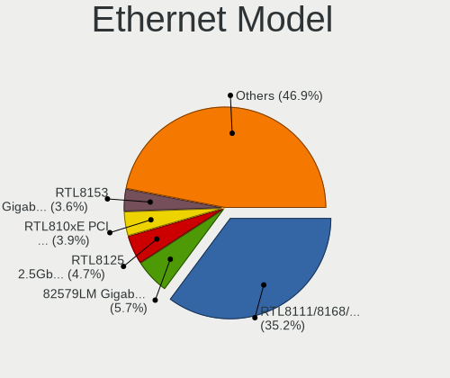

| Model                                                             | Computers | Percent |
|-------------------------------------------------------------------|-----------|---------|
| Realtek RTL8111/8168/8411 PCI Express Gigabit Ethernet Controller | 189       | 36.07%  |
| Intel 82579LM Gigabit Network Connection (Lewisville)             | 32        | 6.11%   |
| Realtek RTL810xE PCI Express Fast Ethernet controller             | 19        | 3.63%   |
| Realtek RTL8153 Gigabit Ethernet Adapter                          | 15        | 2.86%   |
| Intel I211 Gigabit Network Connection                             | 14        | 2.67%   |
| Qualcomm Atheros AR8151 v2.0 Gigabit Ethernet                     | 12        | 2.29%   |
| Intel Ethernet Connection I217-LM                                 | 10        | 1.91%   |
| Realtek RTL8125 2.5GbE Controller                                 | 9         | 1.72%   |
| Intel Ethernet Connection (2) I219-LM                             | 9         | 1.72%   |
| Intel Ethernet Connection (2) I219-V                              | 8         | 1.53%   |
| Nvidia MCP79 Ethernet                                             | 7         | 1.34%   |
| Intel 82579V Gigabit Network Connection                           | 7         | 1.34%   |
| Intel 82567LM-3 Gigabit Network Connection                        | 7         | 1.34%   |
| Intel Ethernet Controller I225-V                                  | 6         | 1.15%   |
| Intel Ethernet Connection I219-LM                                 | 6         | 1.15%   |
| Intel Ethernet Connection (6) I219-V                              | 6         | 1.15%   |
| Marvell Group 88E8056 PCI-E Gigabit Ethernet Controller           | 5         | 0.95%   |
| Intel Ethernet Connection I218-LM                                 | 5         | 0.95%   |
| Intel 82574L Gigabit Network Connection                           | 5         | 0.95%   |
| Qualcomm Atheros AR8161 Gigabit Ethernet                          | 4         | 0.76%   |
| Intel Ethernet Connection (7) I219-V                              | 4         | 0.76%   |
| Intel Ethernet Connection (4) I219-V                              | 4         | 0.76%   |
| Intel Ethernet Connection (4) I219-LM                             | 4         | 0.76%   |
| Intel Ethernet Connection (2) I218-V                              | 4         | 0.76%   |
| Intel 82577LC Gigabit Network Connection                          | 4         | 0.76%   |
| Intel 82567LM Gigabit Network Connection                          | 4         | 0.76%   |
| Samsung Galaxy series, misc. (tethering mode)                     | 3         | 0.57%   |
| Qualcomm Atheros Killer E2400 Gigabit Ethernet Controller         | 3         | 0.57%   |
| Qualcomm Atheros Killer E220x Gigabit Ethernet Controller         | 3         | 0.57%   |
| Nvidia MCP61 Ethernet                                             | 3         | 0.57%   |
| Intel I210 Gigabit Network Connection                             | 3         | 0.57%   |
| Intel Ethernet Connection (7) I219-LM                             | 3         | 0.57%   |
| Intel Ethernet Connection (5) I219-LM                             | 3         | 0.57%   |
| Intel Ethernet Connection (3) I218-V                              | 3         | 0.57%   |
| Intel 82578DM Gigabit Network Connection                          | 3         | 0.57%   |
| IBM RNDIS/CDC ETHER                                               | 3         | 0.57%   |
| Broadcom NetXtreme BCM57766 Gigabit Ethernet PCIe                 | 3         | 0.57%   |
| Broadcom NetLink BCM57785 Gigabit Ethernet PCIe                   | 3         | 0.57%   |
| Realtek RTL-8100/8101L/8139 PCI Fast Ethernet Adapter             | 2         | 0.38%   |
| Realtek Killer E3000 2.5GbE Controller                            | 2         | 0.38%   |
| Qualcomm Atheros AR8132 Fast Ethernet                             | 2         | 0.38%   |
| Qualcomm Atheros AR8131 Gigabit Ethernet                          | 2         | 0.38%   |
| Nvidia CK804 Ethernet Controller                                  | 2         | 0.38%   |
| Marvell Group 88E8053 PCI-E Gigabit Ethernet Controller           | 2         | 0.38%   |
| Lenovo USB-C Dock Ethernet                                        | 2         | 0.38%   |
| JMicron JMC250 PCI Express Gigabit Ethernet Controller            | 2         | 0.38%   |
| Intel Ethernet controller                                         | 2         | 0.38%   |
| Intel Ethernet Connection I219-V                                  | 2         | 0.38%   |
| Intel Ethernet Connection I217-V                                  | 2         | 0.38%   |
| Intel Ethernet Connection (11) I219-V                             | 2         | 0.38%   |
| Intel 82577LM Gigabit Network Connection                          | 2         | 0.38%   |
| Intel 82576 Gigabit Network Connection                            | 2         | 0.38%   |
| Intel 82566MM Gigabit Network Connection                          | 2         | 0.38%   |
| Broadcom NetXtreme BCM5715 Gigabit Ethernet                       | 2         | 0.38%   |
| Aquantia AQC107 NBase-T/IEEE 802.3bz Ethernet Controller [AQtion] | 2         | 0.38%   |
| ZTE WCDMA MSM Z6201V                                              | 1         | 0.19%   |
| TP-Link UE300 10/100/1000 LAN (ethernet mode) [Realtek RTL8153]   | 1         | 0.19%   |
| Sierra Wireless EM7345 4G LTE                                     | 1         | 0.19%   |
| Samsung GT-I9070 (network tethering, USB debugging enabled)       | 1         | 0.19%   |
| Realtek RTL-8110SC/8169SC Gigabit Ethernet                        | 1         | 0.19%   |

Net Controller Kind
-------------------

Ethernet, WiFi or modem

| Kind     | Computers | Percent |
|----------|-----------|---------|
| Ethernet | 481       | 53.92%  |
| WiFi     | 401       | 44.96%  |
| Modem    | 8         | 0.9%    |
| Unknown  | 2         | 0.22%   |

Used Controller
---------------

Currently used network controller

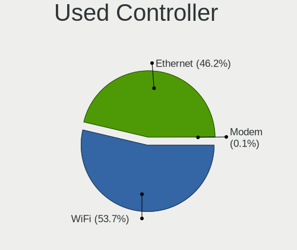

| Kind     | Computers | Percent |
|----------|-----------|---------|
| WiFi     | 302       | 52.8%   |
| Ethernet | 270       | 47.2%   |

NICs
----

Total network controllers on board

| Total | Computers | Percent |
|-------|-----------|---------|
| 2     | 303       | 56.11%  |
| 1     | 212       | 39.26%  |
| 3     | 15        | 2.78%   |
| 0     | 7         | 1.3%    |
| 8     | 1         | 0.19%   |
| 6     | 1         | 0.19%   |
| 4     | 1         | 0.19%   |

IPv6
----

IPv6 vs IPv4

| Used | Computers | Percent |
|------|-----------|---------|
| No   | 477       | 86.73%  |
| Yes  | 73        | 13.27%  |

Bluetooth
---------

Bluetooth Vendor
----------------

Controller vendors

| Vendor                          | Computers | Percent |
|---------------------------------|-----------|---------|
| Intel                           | 163       | 52.24%  |
| Qualcomm Atheros Communications | 22        | 7.05%   |
| Cambridge Silicon Radio         | 20        | 6.41%   |
| Realtek Semiconductor           | 16        | 5.13%   |
| Broadcom                        | 16        | 5.13%   |
| Apple                           | 12        | 3.85%   |
| IMC Networks                    | 11        | 3.53%   |
| Foxconn / Hon Hai               | 11        | 3.53%   |
| Lite-On Technology              | 10        | 3.21%   |
| Hewlett-Packard                 | 10        | 3.21%   |
| ASUSTek Computer                | 5         | 1.6%    |
| Toshiba                         | 4         | 1.28%   |
| Ralink Technology               | 3         | 0.96%   |
| Ralink                          | 3         | 0.96%   |
| Dell                            | 2         | 0.64%   |
| Realtek                         | 1         | 0.32%   |
| MediaTek                        | 1         | 0.32%   |
| HTC (High Tech Computer)        | 1         | 0.32%   |
| Edimax Technology               | 1         | 0.32%   |

Bluetooth Model
---------------

Controller models

| Model                                                                               | Computers | Percent |
|-------------------------------------------------------------------------------------|-----------|---------|
| Intel Bluetooth wireless interface                                                  | 66        | 20.95%  |
| Intel AX200 Bluetooth                                                               | 27        | 8.57%   |
| Intel AX201 Bluetooth                                                               | 21        | 6.67%   |
| Cambridge Silicon Radio Bluetooth Dongle (HCI mode)                                 | 20        | 6.35%   |
| Intel Bluetooth 9460/9560 Jefferson Peak (JfP)                                      | 18        | 5.71%   |
| Intel Wireless-AC 9260 Bluetooth Adapter                                            | 12        | 3.81%   |
| Intel Centrino Bluetooth Wireless Transceiver                                       | 11        | 3.49%   |
| Realtek Bluetooth Radio                                                             | 10        | 3.17%   |
| Qualcomm Atheros  Bluetooth Device                                                  | 8         | 2.54%   |
| Realtek  Bluetooth 4.2 Adapter                                                      | 6         | 1.9%    |
| Qualcomm Atheros QCA61x4 Bluetooth 4.0                                              | 6         | 1.9%    |
| HP Broadcom 2070 Bluetooth Combo                                                    | 6         | 1.9%    |
| Apple Bluetooth Host Controller                                                     | 6         | 1.9%    |
| Intel Wireless-AC 3168 Bluetooth                                                    | 5         | 1.59%   |
| IMC Networks Wireless_Device                                                        | 5         | 1.59%   |
| Qualcomm Atheros AR3012 Bluetooth 4.0                                               | 4         | 1.27%   |
| Lite-On Bluetooth Device                                                            | 4         | 1.27%   |
| IMC Networks Bluetooth Radio                                                        | 4         | 1.27%   |
| Foxconn / Hon Hai Bluetooth Device                                                  | 4         | 1.27%   |
| Apple Bluetooth USB Host Controller                                                 | 4         | 1.27%   |
| Ralink RT3290 Bluetooth                                                             | 3         | 0.95%   |
| Qualcomm Atheros AR3011 Bluetooth                                                   | 3         | 0.95%   |
| Lite-On Atheros AR3012 Bluetooth                                                    | 3         | 0.95%   |
| Intel AX210 Bluetooth                                                               | 3         | 0.95%   |
| HP Bluetooth 2.0 Interface [Broadcom BCM2045]                                       | 3         | 0.95%   |
| Foxconn / Hon Hai Acer Module                                                       | 3         | 0.95%   |
| Broadcom HP Portable Bumble Bee                                                     | 3         | 0.95%   |
| Broadcom BCM20702A0 Bluetooth 4.0                                                   | 3         | 0.95%   |
| Broadcom BCM2045B (BDC-2.1)                                                         | 3         | 0.95%   |
| Toshiba Bluetooth Radio                                                             | 2         | 0.63%   |
| Ralink Motorola BC4 Bluetooth 3.0+HS Adapter                                        | 2         | 0.63%   |
| Lite-On Qualcomm Atheros QCA9377 Bluetooth                                          | 2         | 0.63%   |
| Intel Centrino Advanced-N 6230 Bluetooth adapter                                    | 2         | 0.63%   |
| Foxconn / Hon Hai Bluetooth USB Host Controller                                     | 2         | 0.63%   |
| Broadcom HP Portable SoftSailing                                                    | 2         | 0.63%   |
| Broadcom BCM43142A0 Bluetooth 4.0                                                   | 2         | 0.63%   |
| ASUS Bluetooth Radio                                                                | 2         | 0.63%   |
| Apple Built-in Bluetooth 2.0+EDR HCI                                                | 2         | 0.63%   |
| Toshiba BRCM Bluetooth Controller BCM2070                                           | 1         | 0.32%   |
| Toshiba Bluetooth USB Host Controller                                               | 1         | 0.32%   |
| Realtek Bluetooth Radio                                                             | 1         | 0.32%   |
| Ralink CSR BS8510                                                                   | 1         | 0.32%   |
| Qualcomm Atheros AR3012 Bluetooth                                                   | 1         | 0.32%   |
| MediaTek Wireless_Device                                                            | 1         | 0.32%   |
| Lite-On Atheros Bluetooth                                                           | 1         | 0.32%   |
| Intel Bluetooth Device                                                              | 1         | 0.32%   |
| IMC Networks Bluetooth Device                                                       | 1         | 0.32%   |
| IMC Networks BCM20702A0                                                             | 1         | 0.32%   |
| HTC (High Tech Computer) Vive Hub Bluetooth 4.1 (Broadcom BCM920703)                | 1         | 0.32%   |
| HP Integrated Module with Bluetooth 2.1 Wireless technology                         | 1         | 0.32%   |
| Foxconn / Hon Hai Foxconn T77H114 BCM2070 [Single-Chip Bluetooth 2.1 + EDR Adapter] | 1         | 0.32%   |
| Foxconn / Hon Hai BCM20702A0                                                        | 1         | 0.32%   |
| Edimax Wi-Fi N150 Bluetooth4.0 USB Adapter                                          | 1         | 0.32%   |
| Dell Wireless 365 Bluetooth                                                         | 1         | 0.32%   |
| Dell BCM20702A0 Bluetooth Module                                                    | 1         | 0.32%   |
| Broadcom BCM20702A0                                                                 | 1         | 0.32%   |
| Broadcom BCM2070 Bluetooth Device                                                   | 1         | 0.32%   |
| Broadcom BCM2045B (BDC-2) [Bluetooth Controller]                                    | 1         | 0.32%   |
| ASUS BT-270 Bluetooth Adapter                                                       | 1         | 0.32%   |
| ASUS BT-253 Bluetooth Adapter                                                       | 1         | 0.32%   |

Sound
-----

Sound Vendor
------------

Sound card vendors

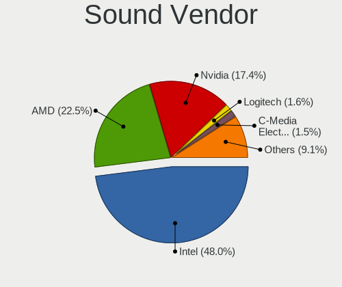

| Vendor                    | Computers | Percent |
|---------------------------|-----------|---------|
| Intel                     | 384       | 49.48%  |
| AMD                       | 174       | 22.42%  |
| Nvidia                    | 130       | 16.75%  |
| Logitech                  | 15        | 1.93%   |
| C-Media Electronics       | 11        | 1.42%   |
| Lenovo                    | 5         | 0.64%   |
| Kingston Technology       | 5         | 0.64%   |
| SteelSeries ApS           | 4         | 0.52%   |
| Realtek Semiconductor     | 4         | 0.52%   |
| Dell                      | 4         | 0.52%   |
| Hewlett-Packard           | 3         | 0.39%   |
| GYROCOM C&C               | 3         | 0.39%   |
| Texas Instruments         | 2         | 0.26%   |
| Razer USA                 | 2         | 0.26%   |
| Plantronics               | 2         | 0.26%   |
| JMTek                     | 2         | 0.26%   |
| GN Netcom                 | 2         | 0.26%   |
| Generalplus Technology    | 2         | 0.26%   |
| AKAI Professional M.I.    | 2         | 0.26%   |
| XMOS                      | 1         | 0.13%   |
| Sennheiser Communications | 1         | 0.13%   |
| RODE Microphones          | 1         | 0.13%   |
| RME                       | 1         | 0.13%   |
| No brand                  | 1         | 0.13%   |
| Microsoft                 | 1         | 0.13%   |
| Micro Star International  | 1         | 0.13%   |
| Google                    | 1         | 0.13%   |
| Giga-Byte Technology      | 1         | 0.13%   |
| DCMT Technology           | 1         | 0.13%   |
| Creative Technology       | 1         | 0.13%   |
| Creative Labs             | 1         | 0.13%   |
| CMX Systems               | 1         | 0.13%   |
| ClearOne Communications   | 1         | 0.13%   |
| Cambridge Silicon Radio   | 1         | 0.13%   |
| BR25                      | 1         | 0.13%   |
| Belkin Components         | 1         | 0.13%   |
| Audio-Technica            | 1         | 0.13%   |
| Astro Gaming              | 1         | 0.13%   |
| Apogee Electronics        | 1         | 0.13%   |

Sound Model
-----------

Sound card models

| Model                                                                                             | Computers | Percent |
|---------------------------------------------------------------------------------------------------|-----------|---------|
| Intel 7 Series/C216 Chipset Family High Definition Audio Controller                               | 53        | 5.83%   |
| Intel 6 Series/C200 Series Chipset Family High Definition Audio Controller                        | 42        | 4.62%   |
| Intel Sunrise Point-LP HD Audio                                                                   | 40        | 4.4%    |
| AMD Family 17h/19h HD Audio Controller                                                            | 27        | 2.97%   |
| AMD Starship/Matisse HD Audio Controller                                                          | 25        | 2.75%   |
| Intel 8 Series/C220 Series Chipset High Definition Audio Controller                               | 23        | 2.53%   |
| AMD FCH Azalia Controller                                                                         | 22        | 2.42%   |
| Intel Xeon E3-1200 v3/4th Gen Core Processor HD Audio Controller                                  | 21        | 2.31%   |
| Intel 5 Series/3400 Series Chipset High Definition Audio                                          | 20        | 2.2%    |
| AMD SBx00 Azalia (Intel HDA)                                                                      | 20        | 2.2%    |
| AMD Family 17h (Models 00h-0fh) HD Audio Controller                                               | 18        | 1.98%   |
| AMD Ellesmere HDMI Audio [Radeon RX 470/480 / 570/580/590]                                        | 17        | 1.87%   |
| Intel 100 Series/C230 Series Chipset Family HD Audio Controller                                   | 16        | 1.76%   |
| AMD Renoir Radeon High Definition Audio Controller                                                | 16        | 1.76%   |
| Intel Cannon Point-LP High Definition Audio Controller                                            | 15        | 1.65%   |
| AMD Kabini HDMI/DP Audio                                                                          | 15        | 1.65%   |
| Intel Cannon Lake PCH cAVS                                                                        | 13        | 1.43%   |
| Intel 82801I (ICH9 Family) HD Audio Controller                                                    | 12        | 1.32%   |
| Intel 200 Series PCH HD Audio                                                                     | 12        | 1.32%   |
| Intel Haswell-ULT HD Audio Controller                                                             | 11        | 1.21%   |
| Intel Comet Lake PCH cAVS                                                                         | 11        | 1.21%   |
| Intel 8 Series HD Audio Controller                                                                | 11        | 1.21%   |
| Nvidia GP106 High Definition Audio Controller                                                     | 9         | 0.99%   |
| Intel NM10/ICH7 Family High Definition Audio Controller                                           | 9         | 0.99%   |
| Intel Atom Processor Z36xxx/Z37xxx Series High Definition Audio Controller                        | 9         | 0.99%   |
| AMD Raven/Raven2/Fenghuang HDMI/DP Audio Controller                                               | 9         | 0.99%   |
| AMD Caicos HDMI Audio [Radeon HD 6450 / 7450/8450/8490 OEM / R5 230/235/235X OEM]                 | 9         | 0.99%   |
| Nvidia TU107 GeForce GTX 1650 High Definition Audio Controller                                    | 8         | 0.88%   |
| Nvidia GP107GL High Definition Audio Controller                                                   | 8         | 0.88%   |
| Nvidia GP102 HDMI Audio Controller                                                                | 8         | 0.88%   |
| Intel Wildcat Point-LP High Definition Audio Controller                                           | 8         | 0.88%   |
| Intel CM238 HD Audio Controller                                                                   | 8         | 0.88%   |
| Intel Broadwell-U Audio Controller                                                                | 8         | 0.88%   |
| Intel 9 Series Chipset Family HD Audio Controller                                                 | 8         | 0.88%   |
| Intel 82801JI (ICH10 Family) HD Audio Controller                                                  | 8         | 0.88%   |
| AMD Turks HDMI Audio [Radeon HD 6500/6600 / 6700M Series]                                         | 8         | 0.88%   |
| AMD Oland/Hainan/Cape Verde/Pitcairn HDMI Audio [Radeon HD 7000 Series]                           | 8         | 0.88%   |
| AMD Navi 10 HDMI Audio                                                                            | 8         | 0.88%   |
| Nvidia TU106 High Definition Audio Controller                                                     | 7         | 0.77%   |
| Nvidia MCP79 High Definition Audio                                                                | 7         | 0.77%   |
| Nvidia High Definition Audio Controller                                                           | 7         | 0.77%   |
| Nvidia GK208 HDMI/DP Audio Controller                                                             | 7         | 0.77%   |
| Intel Tiger Lake-LP Smart Sound Technology Audio Controller                                       | 7         | 0.77%   |
| Intel Comet Lake PCH-LP cAVS                                                                      | 7         | 0.77%   |
| Intel 82801JD/DO (ICH10 Family) HD Audio Controller                                               | 7         | 0.77%   |
| AMD Family 15h (Models 60h-6fh) Audio Controller                                                  | 7         | 0.77%   |
| AMD Cedar HDMI Audio [Radeon HD 5400/6300/7300 Series]                                            | 7         | 0.77%   |
| Nvidia TU116 High Definition Audio Controller                                                     | 6         | 0.66%   |
| Nvidia GP104 High Definition Audio Controller                                                     | 6         | 0.66%   |
| Nvidia GK107 HDMI Audio Controller                                                                | 6         | 0.66%   |
| Nvidia GK104 HDMI Audio Controller                                                                | 6         | 0.66%   |
| Nvidia GF119 HDMI Audio Controller                                                                | 6         | 0.66%   |
| Nvidia GA104 High Definition Audio Controller                                                     | 6         | 0.66%   |
| Intel Celeron N3350/Pentium N4200/Atom E3900 Series Audio Cluster                                 | 6         | 0.66%   |
| Intel 82801H (ICH8 Family) HD Audio Controller                                                    | 6         | 0.66%   |
| AMD Navi 21/23 HDMI/DP Audio Controller                                                           | 6         | 0.66%   |
| Nvidia GP108 High Definition Audio Controller                                                     | 5         | 0.55%   |
| Intel Ice Lake-LP Smart Sound Technology Audio Controller                                         | 5         | 0.55%   |
| Intel Atom/Celeron/Pentium Processor x5-E8000/J3xxx/N3xxx Series High Definition Audio Controller | 5         | 0.55%   |
| Intel Alder Lake PCH-P High Definition Audio Controller                                           | 5         | 0.55%   |

Memory
------

Memory Vendor
-------------

Memory module vendors

| Vendor              | Computers | Percent |
|---------------------|-----------|---------|
| Samsung Electronics | 62        | 20.13%  |
| SK hynix            | 61        | 19.81%  |
| Micron Technology   | 34        | 11.04%  |
| Kingston            | 29        | 9.42%   |
| Crucial             | 26        | 8.44%   |
| G.Skill             | 22        | 7.14%   |
| Unknown             | 17        | 5.52%   |
| A-DATA Technology   | 14        | 4.55%   |
| Team                | 9         | 2.92%   |
| Corsair             | 9         | 2.92%   |
| Elpida              | 5         | 1.62%   |
| Ramaxel Technology  | 4         | 1.3%    |
| Unknown (ABCD)      | 2         | 0.65%   |
| Transcend           | 2         | 0.65%   |
| Strontium           | 2         | 0.65%   |
| Shenzhen Mic        | 2         | 0.65%   |
| Nanya Technology    | 2         | 0.65%   |
| Unknown (0x8783)    | 1         | 0.32%   |
| pqi                 | 1         | 0.32%   |
| PNY                 | 1         | 0.32%   |
| Neo Forza           | 1         | 0.32%   |
| Hewlett-Packard     | 1         | 0.32%   |
| Apacer              | 1         | 0.32%   |

Memory Model
------------

Memory module models

| Model                                                               | Computers | Percent |
|---------------------------------------------------------------------|-----------|---------|
| SK hynix RAM HMT451S6BFR8A-PB 4GB SODIMM DDR3 1600MT/s              | 5         | 1.53%   |
| Samsung RAM M471B5273DH0-CH9 4096MB SODIMM DDR3 1334MT/s            | 5         | 1.53%   |
| SK hynix RAM HYMP125S64CP8-S6 2GB SODIMM DDR2 800MT/s               | 4         | 1.22%   |
| SK hynix RAM HMAB2GS6AMR6N-XN 16GB SODIMM DDR4 3200MT/s             | 4         | 1.22%   |
| SK hynix RAM HMA81GS6DJR8N-XN 8GB SODIMM DDR4 3200MT/s              | 4         | 1.22%   |
| Team RAM TEAMGROUP-UD4-3600 8GB DIMM DDR4 3600MT/s                  | 3         | 0.92%   |
| SK hynix RAM HMT351S6CFR8C-PB 4GB SODIMM DDR3 1600MT/s              | 3         | 0.92%   |
| Samsung RAM M471B5273CH0-CH9 4096MB SODIMM DDR3 1334MT/s            | 3         | 0.92%   |
| Samsung RAM M471B5173DB0-YK0 4096MB SODIMM DDR3 1600MT/s            | 3         | 0.92%   |
| Crucial RAM CT51264BF160BJ.C8F 4GB SODIMM DDR3 1600MT/s             | 3         | 0.92%   |
| Unknown RAM Module 4096MB SODIMM DDR3                               | 2         | 0.61%   |
| Unknown RAM Module 2048MB DIMM DDR3 1333MT/s                        | 2         | 0.61%   |
| Team RAM TEAMGROUP-SD4-2666 8GB SODIMM DDR4 2667MT/s                | 2         | 0.61%   |
| SK hynix RAM HMAA1GS6CJR6N-XN 8GB SODIMM DDR4 3200MT/s              | 2         | 0.61%   |
| SK hynix RAM HMA82GS6DJR8N-XN 16GB SODIMM DDR4 3200MT/s             | 2         | 0.61%   |
| SK hynix RAM HMA81GS6CJR8N-VK 8GB SODIMM DDR4 2667MT/s              | 2         | 0.61%   |
| SK hynix RAM HMA81GS6AFR8N-UH 8GB SODIMM DDR4 2667MT/s              | 2         | 0.61%   |
| Shenzhen Mic RAM MG8A3200C21WE-SA 16GB SODIMM DDR4 3200MT/s         | 2         | 0.61%   |
| Samsung RAM Module 16GB SODIMM DDR4 2667MT/s                        | 2         | 0.61%   |
| Samsung RAM M471B5173EB0-YK0 4GB SODIMM DDR3 1600MT/s               | 2         | 0.61%   |
| Samsung RAM M471B1G73EB0-YK0 8GB SODIMM DDR3 1600MT/s               | 2         | 0.61%   |
| Samsung RAM M471A2K43DB1-CWE 16GB SODIMM DDR4 3200MT/s              | 2         | 0.61%   |
| Samsung RAM M471A2K43DB1-CTD 16GB SODIMM DDR4 2667MT/s              | 2         | 0.61%   |
| Samsung RAM M471A2G43BB2-CWE 16GB SODIMM DDR4 3200MT/s              | 2         | 0.61%   |
| Samsung RAM M471A1K43BB1-CTD 8GB SODIMM DDR4 2667MT/s               | 2         | 0.61%   |
| Samsung RAM M378B5673EH1-CH9 2GB DIMM DDR3 1333MT/s                 | 2         | 0.61%   |
| Micron RAM 8ATF1G64HZ-2G6E1 8GB SODIMM DDR4 2667MT/s                | 2         | 0.61%   |
| Micron RAM 16KTF1G64HZ-1G6N1 8GB SODIMM DDR3 1600MT/s               | 2         | 0.61%   |
| Micron RAM 16KTF1G64HZ-1G6E1 8GB SODIMM DDR3 1600MT/s               | 2         | 0.61%   |
| Kingston RAM KHX3200C16D4/16GX 16GB DIMM DDR4 3600MT/s              | 2         | 0.61%   |
| Kingston RAM 9905403-011.A03LF 2048MB DIMM 1333MT/s                 | 2         | 0.61%   |
| G.Skill RAM F4-3600C16-16GTZNC 16GB DIMM DDR4 3600MT/s              | 2         | 0.61%   |
| G.Skill RAM F4-3200C16-8GTZR 8GB DIMM DDR4 3200MT/s                 | 2         | 0.61%   |
| G.Skill RAM F4-3200C16-8GTZB 8GB DIMM DDR4 3200MT/s                 | 2         | 0.61%   |
| G.Skill RAM F4-3200C16-16GVK 16GB DIMM DDR4 3600MT/s                | 2         | 0.61%   |
| G.Skill RAM F4-2666C15-8GVR 8GB DIMM DDR4 2800MT/s                  | 2         | 0.61%   |
| G.Skill RAM F3-1600C9-4GAB 4GB DIMM DDR3 1600MT/s                   | 2         | 0.61%   |
| G.Skill RAM F3-14900CL10-8GBXL 8GB DIMM DDR3 1867MT/s               | 2         | 0.61%   |
| Elpida RAM EBJ21UE8BDS0-DJ-F 2GB SODIMM DDR3 1334MT/s               | 2         | 0.61%   |
| Crucial RAM CT102464BD160B.C16 8GB DIMM DDR3 1600MT/s               | 2         | 0.61%   |
| Crucial RAM CT102464BA160B.C16 8GB DIMM DDR3 1600MT/s               | 2         | 0.61%   |
| Corsair RAM CMW32GX4M2C3200C16 16GB DIMM DDR4 3200MT/s              | 2         | 0.61%   |
| Corsair RAM CMK32GX4M2B3200C16 16GB DIMM DDR4 3400MT/s              | 2         | 0.61%   |
| Unknown RAM Module 8GB DIMM 1600MT/s                                | 1         | 0.31%   |
| Unknown RAM Module 8GB DIMM 1066MT/s                                | 1         | 0.31%   |
| Unknown RAM Module 8192MB SODIMM DDR3                               | 1         | 0.31%   |
| Unknown RAM Module 8192MB DIMM 667MT/s                              | 1         | 0.31%   |
| Unknown RAM Module 4GB SODIMM DDR3                                  | 1         | 0.31%   |
| Unknown RAM Module 4GB DIMM 800MT/s                                 | 1         | 0.31%   |
| Unknown RAM Module 4096MB DIMM SDRAM 1066MT/s                       | 1         | 0.31%   |
| Unknown RAM Module 4096MB DIMM DDR3 1600MT/s                        | 1         | 0.31%   |
| Unknown RAM Module 4096MB DIMM DDR3 1333MT/s                        | 1         | 0.31%   |
| Unknown RAM Module 4096MB DIMM DDR2 1067MT/s                        | 1         | 0.31%   |
| Unknown RAM Module 2GB SODIMM DDR3                                  | 1         | 0.31%   |
| Unknown RAM Module 2GB SODIMM DDR2 667MT/s                          | 1         | 0.31%   |
| Unknown RAM Module 2GB DIMM 800MT/s                                 | 1         | 0.31%   |
| Unknown RAM Module 2048MB SODIMM SDRAM                              | 1         | 0.31%   |
| Unknown RAM Module 2048MB DIMM DDR2 800MT/s                         | 1         | 0.31%   |
| Unknown RAM Module 1024MB DIMM DDR2 800MT/s                         | 1         | 0.31%   |
| Unknown (ABCD) RAM 123456789012345678 2048MB SODIMM LPDDR4 2400MT/s | 1         | 0.31%   |

Memory Kind
-----------

Memory module kinds

| Kind    | Computers | Percent |
|---------|-----------|---------|
| DDR4    | 114       | 45.42%  |
| DDR3    | 95        | 37.85%  |
| DDR2    | 11        | 4.38%   |
| LPDDR3  | 8         | 3.19%   |
| Unknown | 8         | 3.19%   |
| SDRAM   | 7         | 2.79%   |
| LPDDR4  | 7         | 2.79%   |
| LPDDR5  | 1         | 0.4%    |

Memory Form Factor
------------------

Physical design of the memory module

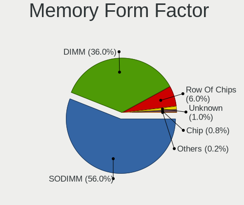

| Name         | Computers | Percent |
|--------------|-----------|---------|
| SODIMM       | 136       | 54.62%  |
| DIMM         | 97        | 38.96%  |
| Row Of Chips | 13        | 5.22%   |
| Chip         | 2         | 0.8%    |
| Unknown      | 1         | 0.4%    |

Memory Size
-----------

Memory module size

| Size  | Computers | Percent |
|-------|-----------|---------|
| 8192  | 99        | 37.36%  |
| 4096  | 74        | 27.92%  |
| 16384 | 47        | 17.74%  |
| 2048  | 32        | 12.08%  |
| 32768 | 10        | 3.77%   |
| 1024  | 3         | 1.13%   |

Memory Speed
------------

Memory module speed

| Speed   | Computers | Percent |
|---------|-----------|---------|
| 1600    | 60        | 21.98%  |
| 3200    | 37        | 13.55%  |
| 2667    | 31        | 11.36%  |
| 1333    | 18        | 6.59%   |
| 3600    | 17        | 6.23%   |
| 2400    | 17        | 6.23%   |
| 2133    | 15        | 5.49%   |
| 1334    | 12        | 4.4%    |
| 1867    | 10        | 3.66%   |
| 667     | 8         | 2.93%   |
| 1067    | 6         | 2.2%    |
| 2666    | 5         | 1.83%   |
| 800     | 5         | 1.83%   |
| 3733    | 4         | 1.47%   |
| Unknown | 4         | 1.47%   |
| 4267    | 3         | 1.1%    |
| 1066    | 3         | 1.1%    |
| 8400    | 2         | 0.73%   |
| 4800    | 2         | 0.73%   |
| 3400    | 2         | 0.73%   |
| 2800    | 2         | 0.73%   |
| 975     | 2         | 0.73%   |
| 6400    | 1         | 0.37%   |
| 4199    | 1         | 0.37%   |
| 3466    | 1         | 0.37%   |
| 2933    | 1         | 0.37%   |
| 2465    | 1         | 0.37%   |
| 2048    | 1         | 0.37%   |
| 2000    | 1         | 0.37%   |
| 1800    | 1         | 0.37%   |

Printers & scanners
-------------------

Printer Vendor
--------------

Printer device vendors

| Vendor              | Computers | Percent |
|---------------------|-----------|---------|
| Hewlett-Packard     | 7         | 33.33%  |
| Brother Industries  | 7         | 33.33%  |
| Canon               | 3         | 14.29%  |
| Samsung Electronics | 1         | 4.76%   |
| Prolific Technology | 1         | 4.76%   |
| Fuji Xerox          | 1         | 4.76%   |
| Dymo-CoStar         | 1         | 4.76%   |

Printer Model
-------------

Printer device models

| Model                            | Computers | Percent |
|----------------------------------|-----------|---------|
| HP Officejet 4630 series         | 2         | 9.52%   |
| Brother Printer                  | 2         | 9.52%   |
| Samsung SCX-4100 Scanner         | 1         | 4.76%   |
| Prolific PL2305 Parallel Port    | 1         | 4.76%   |
| HP OfficeJet Pro 9010 series     | 1         | 4.76%   |
| HP LaserJet Professional P1102w  | 1         | 4.76%   |
| HP ENVY 4520 series              | 1         | 4.76%   |
| HP DeskJet 2300 series           | 1         | 4.76%   |
| HP DeskJet 2130 series           | 1         | 4.76%   |
| Fuji Xerox DocuPrint CM315/318 z | 1         | 4.76%   |
| Dymo-CoStar LabelWriter 450      | 1         | 4.76%   |
| Canon TS3100 series              | 1         | 4.76%   |
| Canon MB5300 series              | 1         | 4.76%   |
| Canon i950                       | 1         | 4.76%   |
| Brother MFC-J430W                | 1         | 4.76%   |
| Brother MFC-9140CDN              | 1         | 4.76%   |
| Brother HL-L3230CDW series       | 1         | 4.76%   |
| Brother HL-2270DW Laser Printer  | 1         | 4.76%   |
| Brother HL-1430 Laser Printer    | 1         | 4.76%   |

Scanner Vendor
--------------

Scanner device vendors

| Vendor | Computers | Percent |
|--------|-----------|---------|
| Canon  | 3         | 100%    |

Scanner Model
-------------

Scanner device models

| Model                              | Computers | Percent |
|------------------------------------|-----------|---------|
| Canon CanoScan N670U/N676U/LiDE 20 | 1         | 33.33%  |
| Canon CanoScan LiDE 500F           | 1         | 33.33%  |
| Canon CanoScan LIDE 25             | 1         | 33.33%  |

Camera
------

Camera Vendor
-------------

Camera device vendors

| Vendor                                 | Computers | Percent |
|----------------------------------------|-----------|---------|
| Chicony Electronics                    | 74        | 25.17%  |
| Logitech                               | 28        | 9.52%   |
| Microdia                               | 23        | 7.82%   |
| IMC Networks                           | 23        | 7.82%   |
| Sunplus Innovation Technology          | 20        | 6.8%    |
| Realtek Semiconductor                  | 20        | 6.8%    |
| Acer                                   | 17        | 5.78%   |
| Quanta                                 | 12        | 4.08%   |
| Lite-On Technology                     | 10        | 3.4%    |
| Suyin                                  | 9         | 3.06%   |
| Apple                                  | 9         | 3.06%   |
| Cheng Uei Precision Industry (Foxlink) | 8         | 2.72%   |
| Syntek                                 | 5         | 1.7%    |
| Samsung Electronics                    | 4         | 1.36%   |
| Primax Electronics                     | 4         | 1.36%   |
| Alcor Micro                            | 4         | 1.36%   |
| Silicon Motion                         | 3         | 1.02%   |
| ARC International                      | 3         | 1.02%   |
| Z-Star Microelectronics                | 2         | 0.68%   |
| Luxvisions Innotech Limited            | 2         | 0.68%   |
| Importek                               | 2         | 0.68%   |
| GEMBIRD                                | 2         | 0.68%   |
| Xiongmai                               | 1         | 0.34%   |
| Sonix Technology                       | 1         | 0.34%   |
| Ricoh                                  | 1         | 0.34%   |
| Novatek Microelectronics               | 1         | 0.34%   |
| Lenovo                                 | 1         | 0.34%   |
| Intel                                  | 1         | 0.34%   |
| Google                                 | 1         | 0.34%   |
| DigiTech                               | 1         | 0.34%   |
| AVer Information                       | 1         | 0.34%   |
| ALi                                    | 1         | 0.34%   |

Camera Model
------------

Camera device models

| Model                                                           | Computers | Percent |
|-----------------------------------------------------------------|-----------|---------|
| Chicony integrated camera                                       | 16        | 5.42%   |
| IMC Networks USB2.0 HD UVC WebCam                               | 9         | 3.05%   |
| Chicony HD WebCam                                               | 8         | 2.71%   |
| Realtek Integrated_Webcam_HD                                    | 7         | 2.37%   |
| IMC Networks Integrated Camera                                  | 7         | 2.37%   |
| Chicony HP HD Camera                                            | 7         | 2.37%   |
| Sunplus Integrated_Webcam_HD                                    | 6         | 2.03%   |
| Sunplus HP HD Webcam [Fixed]                                    | 6         | 2.03%   |
| Apple Built-in iSight                                           | 6         | 2.03%   |
| Microdia Integrated Webcam HD                                   | 5         | 1.69%   |
| Logitech Webcam C270                                            | 5         | 1.69%   |
| Chicony HP HD Webcam                                            | 5         | 1.69%   |
| Acer Integrated Camera                                          | 5         | 1.69%   |
| Samsung Galaxy series, misc. (MTP mode)                         | 4         | 1.36%   |
| Logitech Webcam C170                                            | 4         | 1.36%   |
| Logitech HD Pro Webcam C920                                     | 4         | 1.36%   |
| Chicony TOSHIBA Web Camera - HD                                 | 4         | 1.36%   |
| Realtek HP Truevision HD                                        | 3         | 1.02%   |
| Quanta HP TrueVision HD Camera                                  | 3         | 1.02%   |
| Microdia Integrated_Webcam_HD                                   | 3         | 1.02%   |
| Logitech QuickCam Pro 9000                                      | 3         | 1.02%   |
| Lite-On Integrated Camera                                       | 3         | 1.02%   |
| Lite-On HP HD Camera                                            | 3         | 1.02%   |
| Chicony VGA Webcam                                              | 3         | 1.02%   |
| Chicony Integrated HP HD Webcam                                 | 3         | 1.02%   |
| Chicony HP Wide Vision HD Camera                                | 3         | 1.02%   |
| ARC International Camera                                        | 3         | 1.02%   |
| Acer SunplusIT Integrated Camera                                | 3         | 1.02%   |
| Syntek EasyCamera                                               | 2         | 0.68%   |
| Suyin HP Webcam                                                 | 2         | 0.68%   |
| Suyin 1.3M HD WebCam                                            | 2         | 0.68%   |
| Realtek USB CAMERA                                              | 2         | 0.68%   |
| Realtek Integrated Webcam_HD                                    | 2         | 0.68%   |
| Quanta HP HD Camera                                             | 2         | 0.68%   |
| Primax Villem                                                   | 2         | 0.68%   |
| Primax HP HD Webcam [Fixed]                                     | 2         | 0.68%   |
| Microdia Laptop_Integrated_Webcam_1.3M                          | 2         | 0.68%   |
| Luxvisions Innotech Limited HP HD Camera                        | 2         | 0.68%   |
| Logitech Webcam Pro 9000                                        | 2         | 0.68%   |
| Logitech Webcam C600                                            | 2         | 0.68%   |
| Logitech C922 Pro Stream Webcam                                 | 2         | 0.68%   |
| Chicony USB2.0 Camera                                           | 2         | 0.68%   |
| Chicony USB2.0 0.3M UVC WebCam                                  | 2         | 0.68%   |
| Chicony Lenovo Integrated Camera (0.3MP)                        | 2         | 0.68%   |
| Chicony HP High Definition 1MP Webcam                           | 2         | 0.68%   |
| Cheng Uei Precision Industry (Foxlink) HP Wide Vision HD Camera | 2         | 0.68%   |
| Cheng Uei Precision Industry (Foxlink) HP TrueVision HD         | 2         | 0.68%   |
| Apple FaceTime HD Camera (Built-in)                             | 2         | 0.68%   |
| Alcor Micro USB 2.0 Camera                                      | 2         | 0.68%   |
| Alcor Micro Asus Integrated Webcam                              | 2         | 0.68%   |
| Acer Lenovo EasyCamera                                          | 2         | 0.68%   |
| Acer HD Webcam                                                  | 2         | 0.68%   |
| Z-Star WebCam SC-03FFL11739P                                    | 1         | 0.34%   |
| Z-Star Venus USB2.0 Camera                                      | 1         | 0.34%   |
| Xiongmai web camera                                             | 1         | 0.34%   |
| Syntek USB 2.0 UVC PC Camera                                    | 1         | 0.34%   |
| Syntek LENOVO LBG 720P CAM                                      | 1         | 0.34%   |
| Syntek Integrated Camera                                        | 1         | 0.34%   |
| Suyin USB 2.0 Webcam Device                                     | 1         | 0.34%   |
| Suyin HP Webcam-50                                              | 1         | 0.34%   |

Security
--------

Fingerprint Vendor
------------------

Fingerprint sensor vendors

| Vendor                     | Computers | Percent |
|----------------------------|-----------|---------|
| Validity Sensors           | 43        | 53.09%  |
| Synaptics                  | 20        | 24.69%  |
| Shenzhen Goodix Technology | 5         | 6.17%   |
| AuthenTec                  | 5         | 6.17%   |
| Elan Microelectronics      | 3         | 3.7%    |
| Upek                       | 2         | 2.47%   |
| LighTuning Technology      | 2         | 2.47%   |
| STMicroelectronics         | 1         | 1.23%   |

Fingerprint Model
-----------------

Fingerprint sensor models

| Model                                                                      | Computers | Percent |
|----------------------------------------------------------------------------|-----------|---------|
| Validity Sensors VFS495 Fingerprint Reader                                 | 10        | 12.35%  |
| Validity Sensors VFS7552 Touch Fingerprint Sensor                          | 6         | 7.41%   |
| Validity Sensors VFS7500 Touch Fingerprint Sensor                          | 6         | 7.41%   |
| Validity Sensors VFS491                                                    | 5         | 6.17%   |
| Unknown                                                                    | 5         | 6.17%   |
| Validity Sensors VFS471 Fingerprint Reader                                 | 4         | 4.94%   |
| Synaptics Prometheus MIS Touch Fingerprint Reader                          | 4         | 4.94%   |
| Synaptics  VFS7552 Touch Fingerprint Sensor with PurePrint                 | 3         | 3.7%    |
| Synaptics  FS7604 Touch Fingerprint Sensor with PurePrint                  | 3         | 3.7%    |
| Shenzhen Goodix  FingerPrint Device                                        | 3         | 3.7%    |
| Validity Sensors VFS451 Fingerprint Reader                                 | 2         | 2.47%   |
| Validity Sensors VFS301 Fingerprint Reader                                 | 2         | 2.47%   |
| Validity Sensors VFS 5011 fingerprint sensor                               | 2         | 2.47%   |
| Validity Sensors Synaptics WBDI                                            | 2         | 2.47%   |
| Validity Sensors Synaptics VFS7552 Touch Fingerprint Sensor with PurePrint | 2         | 2.47%   |
| Upek Biometric Touchchip/Touchstrip Fingerprint Sensor                     | 2         | 2.47%   |
| Synaptics Metallica MOH Touch Fingerprint Reader                           | 2         | 2.47%   |
| Synaptics Metallica MIS Touch Fingerprint Reader                           | 2         | 2.47%   |
| Shenzhen Goodix FingerPrint                                                | 2         | 2.47%   |
| LighTuning EgisTec Touch Fingerprint Sensor                                | 2         | 2.47%   |
| Elan ELAN:Fingerprint                                                      | 2         | 2.47%   |
| AuthenTec Fingerprint Sensor                                               | 2         | 2.47%   |
| Validity Sensors Synaptics VFS7552 Touch Fingerprint Sensor                | 1         | 1.23%   |
| Validity Sensors Swipe Fingerprint Sensor                                  | 1         | 1.23%   |
| Synaptics  WBDI                                                            | 1         | 1.23%   |
| STMicroelectronics Fingerprint Reader                                      | 1         | 1.23%   |
| Elan ELAN:ARM-M4                                                           | 1         | 1.23%   |
| AuthenTec AES2810                                                          | 1         | 1.23%   |
| AuthenTec AES2501 Fingerprint Sensor                                       | 1         | 1.23%   |
| AuthenTec AES1600                                                          | 1         | 1.23%   |

Chipcard Vendor
---------------

Chipcard module vendors

| Vendor      | Computers | Percent |
|-------------|-----------|---------|
| Broadcom    | 10        | 62.5%   |
| Alcor Micro | 3         | 18.75%  |
| Lenovo      | 2         | 12.5%   |
| O2 Micro    | 1         | 6.25%   |

Chipcard Model
--------------

Chipcard module models

| Model                                          | Computers | Percent |
|------------------------------------------------|-----------|---------|
| Broadcom BCM5880 Secure Applications Processor | 6         | 37.5%   |
| Alcor Micro AU9540 Smartcard Reader            | 3         | 18.75%  |
| Lenovo Integrated Smart Card Reader            | 2         | 12.5%   |
| Broadcom 5880                                  | 2         | 12.5%   |
| Broadcom 58200                                 | 2         | 12.5%   |
| O2 Micro OZ776 CCID Smartcard Reader           | 1         | 6.25%   |

Unsupported
-----------

Unsupported Devices
-------------------

Total unsupported devices on board

| Total | Computers | Percent |
|-------|-----------|---------|
| 0     | 380       | 68.59%  |
| 1     | 143       | 25.81%  |
| 2     | 24        | 4.33%   |
| 6     | 2         | 0.36%   |
| 5     | 2         | 0.36%   |
| 3     | 2         | 0.36%   |
| 4     | 1         | 0.18%   |

Unsupported Device Types
------------------------

Types of unsupported devices

| Type                     | Computers | Percent |
|--------------------------|-----------|---------|
| Fingerprint reader       | 79        | 37.44%  |
| Graphics card            | 34        | 16.11%  |
| Net/wireless             | 32        | 15.17%  |
| Chipcard                 | 14        | 6.64%   |
| Multimedia controller    | 12        | 5.69%   |
| Communication controller | 7         | 3.32%   |
| Bluetooth                | 6         | 2.84%   |
| Unassigned class         | 5         | 2.37%   |
| Sound                    | 4         | 1.9%    |
| Net/ethernet             | 4         | 1.9%    |
| Camera                   | 4         | 1.9%    |
| Storage/ide              | 2         | 0.95%   |
| Dvb card                 | 2         | 0.95%   |
| Card reader              | 2         | 0.95%   |
| Storage/raid             | 1         | 0.47%   |
| Storage                  | 1         | 0.47%   |
| Modem                    | 1         | 0.47%   |
| Flash memory             | 1         | 0.47%   |

