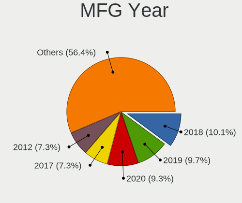
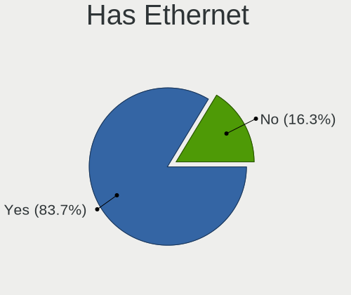
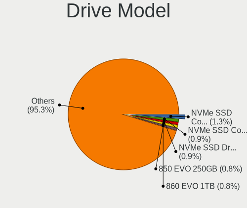
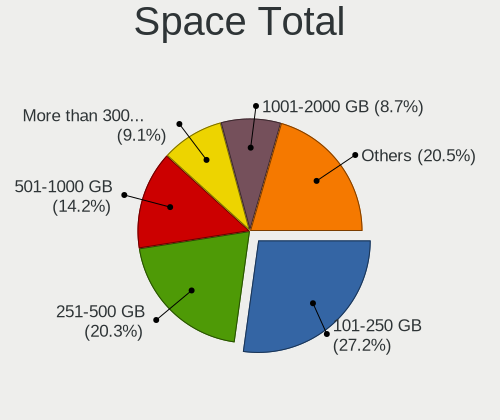
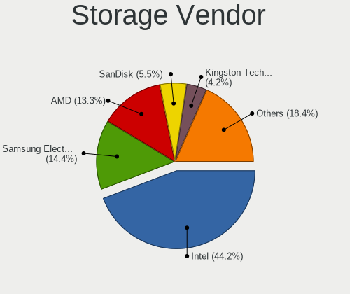
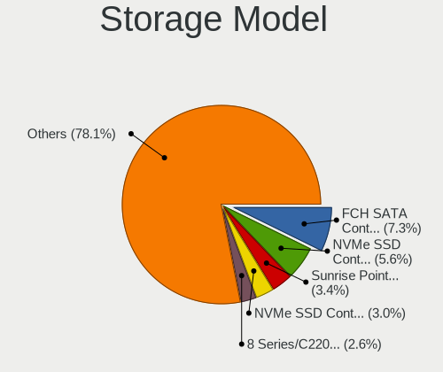
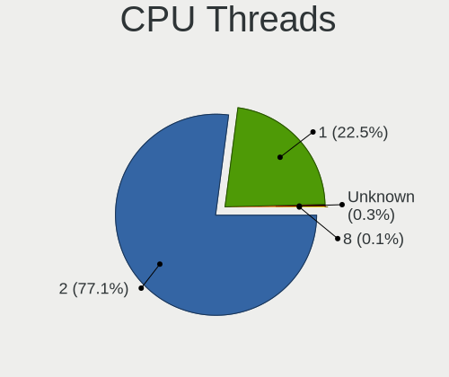
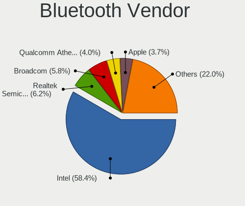
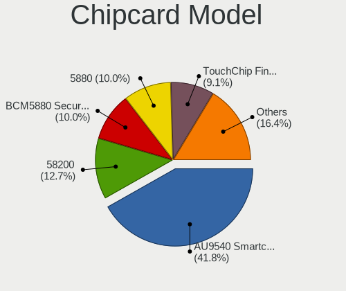

Linux in Norway - Tested Hardware & Statistics
----------------------------------------------

A project to collect tested hardware configurations for Linux in Norway.

Anyone can contribute to this report by the [hw-probe](https://github.com/linuxhw/hw-probe) tool:

    sudo -E hw-probe -all -upload

Please contribute! Especially if your hardware is rare.

This is a report for all computer types. See also reports for [desktops](/Location/Norway/Desktop/README.md) and [notebooks](/Location/Norway/Notebook/README.md).

Contents
--------

* [ Test Cases ](#test-cases)

* [ System ](#system)
  - [ OS                       ](#os)
  - [ OS Family                ](#os-family)
  - [ Kernel                   ](#kernel)
  - [ Kernel Family            ](#kernel-family)
  - [ Kernel Major Ver.        ](#kernel-major-ver)
  - [ Arch                     ](#arch)
  - [ DE                       ](#de)
  - [ Display Server           ](#display-server)
  - [ Display Manager          ](#display-manager)
  - [ OS Lang                  ](#os-lang)
  - [ Boot Mode                ](#boot-mode)
  - [ Filesystem               ](#filesystem)
  - [ Part. scheme             ](#part-scheme)
  - [ Dual Boot with Linux/BSD ](#dual-boot-with-linuxbsd)
  - [ Dual Boot (Win)          ](#dual-boot-win)

* [ Board ](#board)
  - [ Vendor                   ](#vendor)
  - [ Model                    ](#model)
  - [ Model Family             ](#model-family)
  - [ MFG Year                 ](#mfg-year)
  - [ Form Factor              ](#form-factor)
  - [ Secure Boot              ](#secure-boot)
  - [ Coreboot                 ](#coreboot)
  - [ RAM Size                 ](#ram-size)
  - [ RAM Used                 ](#ram-used)
  - [ Total Drives             ](#total-drives)
  - [ Has CD-ROM               ](#has-cd-rom)
  - [ Has Ethernet             ](#has-ethernet)
  - [ Has WiFi                 ](#has-wifi)
  - [ Has Bluetooth            ](#has-bluetooth)

* [ Location ](#location)
  - [ Country                  ](#country)
  - [ City                     ](#city)

* [ Drives ](#drives)
  - [ Drive Vendor             ](#drive-vendor)
  - [ Drive Model              ](#drive-model)
  - [ HDD Vendor               ](#hdd-vendor)
  - [ SSD Vendor               ](#ssd-vendor)
  - [ Drive Kind               ](#drive-kind)
  - [ Drive Connector          ](#drive-connector)
  - [ Drive Size               ](#drive-size)
  - [ Space Total              ](#space-total)
  - [ Space Used               ](#space-used)
  - [ Malfunc. Drives          ](#malfunc-drives)
  - [ Malfunc. Drive Vendor    ](#malfunc-drive-vendor)
  - [ Malfunc. HDD Vendor      ](#malfunc-hdd-vendor)
  - [ Malfunc. Drive Kind      ](#malfunc-drive-kind)
  - [ Failed Drives            ](#failed-drives)
  - [ Failed Drive Vendor      ](#failed-drive-vendor)
  - [ Drive Status             ](#drive-status)

* [ Storage controller ](#storage-controller)
  - [ Storage Vendor           ](#storage-vendor)
  - [ Storage Model            ](#storage-model)
  - [ Storage Kind             ](#storage-kind)

* [ Processor ](#processor)
  - [ CPU Vendor               ](#cpu-vendor)
  - [ CPU Model                ](#cpu-model)
  - [ CPU Model Family         ](#cpu-model-family)
  - [ CPU Cores                ](#cpu-cores)
  - [ CPU Sockets              ](#cpu-sockets)
  - [ CPU Threads              ](#cpu-threads)
  - [ CPU Op-Modes             ](#cpu-op-modes)
  - [ CPU Microcode            ](#cpu-microcode)
  - [ CPU Microarch            ](#cpu-microarch)

* [ Graphics ](#graphics)
  - [ GPU Vendor               ](#gpu-vendor)
  - [ GPU Model                ](#gpu-model)
  - [ GPU Combo                ](#gpu-combo)
  - [ GPU Driver               ](#gpu-driver)
  - [ GPU Memory               ](#gpu-memory)

* [ Monitor ](#monitor)
  - [ Monitor Vendor           ](#monitor-vendor)
  - [ Monitor Model            ](#monitor-model)
  - [ Monitor Resolution       ](#monitor-resolution)
  - [ Monitor Diagonal         ](#monitor-diagonal)
  - [ Monitor Width            ](#monitor-width)
  - [ Aspect Ratio             ](#aspect-ratio)
  - [ Monitor Area             ](#monitor-area)
  - [ Pixel Density            ](#pixel-density)
  - [ Multiple Monitors        ](#multiple-monitors)

* [ Network ](#network)
  - [ Net Controller Vendor    ](#net-controller-vendor)
  - [ Net Controller Model     ](#net-controller-model)
  - [ Wireless Vendor          ](#wireless-vendor)
  - [ Wireless Model           ](#wireless-model)
  - [ Ethernet Vendor          ](#ethernet-vendor)
  - [ Ethernet Model           ](#ethernet-model)
  - [ Net Controller Kind      ](#net-controller-kind)
  - [ Used Controller          ](#used-controller)
  - [ NICs                     ](#nics)
  - [ IPv6                     ](#ipv6)

* [ Bluetooth ](#bluetooth)
  - [ Bluetooth Vendor         ](#bluetooth-vendor)
  - [ Bluetooth Model          ](#bluetooth-model)

* [ Sound ](#sound)
  - [ Sound Vendor             ](#sound-vendor)
  - [ Sound Model              ](#sound-model)

* [ Memory ](#memory)
  - [ Memory Vendor            ](#memory-vendor)
  - [ Memory Model             ](#memory-model)
  - [ Memory Kind              ](#memory-kind)
  - [ Memory Form Factor       ](#memory-form-factor)
  - [ Memory Size              ](#memory-size)
  - [ Memory Speed             ](#memory-speed)

* [ Printers & scanners ](#printers--scanners)
  - [ Printer Vendor           ](#printer-vendor)
  - [ Printer Model            ](#printer-model)
  - [ Scanner Vendor           ](#scanner-vendor)
  - [ Scanner Model            ](#scanner-model)

* [ Camera ](#camera)
  - [ Camera Vendor            ](#camera-vendor)
  - [ Camera Model             ](#camera-model)

* [ Security ](#security)
  - [ Fingerprint Vendor       ](#fingerprint-vendor)
  - [ Fingerprint Model        ](#fingerprint-model)
  - [ Chipcard Vendor          ](#chipcard-vendor)
  - [ Chipcard Model           ](#chipcard-model)

* [ Unsupported ](#unsupported)
  - [ Unsupported Devices      ](#unsupported-devices)
  - [ Unsupported Device Types ](#unsupported-device-types)

Test Cases
----------

Total: 1506

| Vendor        | Model                       | Form-Factor | Probe                                                      | Date         |
|---------------|-----------------------------|-------------|------------------------------------------------------------|--------------|
| ASRock        | FM2A88X Extreme6+           | Desktop     | [79c11af9ac](https://linux-hardware.org/?probe=79c11af9ac) | Feb 01, 2023 |
| ASRock        | FM2A88X Extreme6+           | Desktop     | [73bc9212a3](https://linux-hardware.org/?probe=73bc9212a3) | Jan 31, 2023 |
| Dell          | Latitude E7240              | Notebook    | [a1f713f6e3](https://linux-hardware.org/?probe=a1f713f6e3) | Jan 30, 2023 |
| ASRock        | FM2A88X Extreme6+           | Desktop     | [24402e3d42](https://linux-hardware.org/?probe=24402e3d42) | Jan 30, 2023 |
| Dell          | Precision 5530              | Notebook    | [92399ea8dc](https://linux-hardware.org/?probe=92399ea8dc) | Jan 29, 2023 |
| ASRock        | FM2A88X Extreme6+           | Desktop     | [f9a823cb38](https://linux-hardware.org/?probe=f9a823cb38) | Jan 29, 2023 |
| Apple         | Mac-F221BEC8                | Desktop     | [d8de82d8c4](https://linux-hardware.org/?probe=d8de82d8c4) | Jan 29, 2023 |
| Toshiba       | Satellite L500              | Notebook    | [327e2d4e3e](https://linux-hardware.org/?probe=327e2d4e3e) | Jan 28, 2023 |
| Dell          | Precision 5530              | Notebook    | [a9a54c5b7f](https://linux-hardware.org/?probe=a9a54c5b7f) | Jan 28, 2023 |
| Lenovo        | 310B SDK0J40697 WIN 3305... | Mini pc     | [e5abc7fae4](https://linux-hardware.org/?probe=e5abc7fae4) | Jan 28, 2023 |
| Dell          | Latitude E7240              | Notebook    | [d88cdedff3](https://linux-hardware.org/?probe=d88cdedff3) | Jan 26, 2023 |
| ASRock        | FM2A88X Extreme6+           | Desktop     | [415b96672b](https://linux-hardware.org/?probe=415b96672b) | Jan 26, 2023 |
| Lenovo        | IdeaPad 5 15ARE05 81YQ      | Notebook    | [293a308d86](https://linux-hardware.org/?probe=293a308d86) | Jan 25, 2023 |
| ASRock        | FM2A88X Extreme6+           | Desktop     | [82c3a80b93](https://linux-hardware.org/?probe=82c3a80b93) | Jan 25, 2023 |
| Dell          | Latitude E7240              | Notebook    | [2d488752b6](https://linux-hardware.org/?probe=2d488752b6) | Jan 25, 2023 |
| HP            | 8597                        | Desktop     | [8cc851783e](https://linux-hardware.org/?probe=8cc851783e) | Jan 24, 2023 |
| ASUSTek       | TUF Gaming B550-PRO         | Desktop     | [10f149abb7](https://linux-hardware.org/?probe=10f149abb7) | Jan 24, 2023 |
| ASRock        | FM2A88X Extreme6+           | Desktop     | [43c26544a9](https://linux-hardware.org/?probe=43c26544a9) | Jan 24, 2023 |
| Dell          | Latitude E7240              | Notebook    | [9d44efa2f9](https://linux-hardware.org/?probe=9d44efa2f9) | Jan 24, 2023 |
| Gigabyte      | B360HD3                     | Desktop     | [a9b7912b52](https://linux-hardware.org/?probe=a9b7912b52) | Jan 23, 2023 |
| Lenovo        | ThinkPad L13 Yoga 20R500... | Convertible | [7f5181d202](https://linux-hardware.org/?probe=7f5181d202) | Jan 23, 2023 |
| ASRock        | FM2A88X Extreme6+           | Desktop     | [279452d293](https://linux-hardware.org/?probe=279452d293) | Jan 23, 2023 |
| Gigabyte      | GA-880GMA-USB3              | Desktop     | [eb10e25652](https://linux-hardware.org/?probe=eb10e25652) | Jan 23, 2023 |
| HP            | Notebook                    | Notebook    | [57bf6826ef](https://linux-hardware.org/?probe=57bf6826ef) | Jan 22, 2023 |
| ASRock        | FM2A88X Extreme6+           | Desktop     | [b3d64d2496](https://linux-hardware.org/?probe=b3d64d2496) | Jan 22, 2023 |
| Samsung       | 3570R/370R/470R/450R/510... | Notebook    | [8c4a855d8e](https://linux-hardware.org/?probe=8c4a855d8e) | Jan 21, 2023 |
| Lenovo        | ThinkPad T14s Gen 2i 20W... | Notebook    | [e8a0c0066b](https://linux-hardware.org/?probe=e8a0c0066b) | Jan 21, 2023 |
| ASRock        | FM2A88X Extreme6+           | Desktop     | [20c0f69bb7](https://linux-hardware.org/?probe=20c0f69bb7) | Jan 21, 2023 |
| Samsung       | 3570R/370R/470R/450R/510... | Notebook    | [0ea26f4af6](https://linux-hardware.org/?probe=0ea26f4af6) | Jan 20, 2023 |
| HP            | 3397                        | Desktop     | [39391f23c4](https://linux-hardware.org/?probe=39391f23c4) | Jan 20, 2023 |
| HP            | 3397                        | Desktop     | [7b05c1fdf9](https://linux-hardware.org/?probe=7b05c1fdf9) | Jan 20, 2023 |
| ASRock        | FM2A88X Extreme6+           | Desktop     | [5f1447f874](https://linux-hardware.org/?probe=5f1447f874) | Jan 20, 2023 |
| MSI           | X99A RAIDER                 | Desktop     | [7f36411ac1](https://linux-hardware.org/?probe=7f36411ac1) | Jan 20, 2023 |
| Dell          | Latitude E7240              | Notebook    | [a4e01b187f](https://linux-hardware.org/?probe=a4e01b187f) | Jan 20, 2023 |
| Dell          | Latitude E7240              | Notebook    | [475187029d](https://linux-hardware.org/?probe=475187029d) | Jan 19, 2023 |
| MSI           | X99A RAIDER                 | Desktop     | [8da5286795](https://linux-hardware.org/?probe=8da5286795) | Jan 18, 2023 |
| ASRock        | FM2A88X Extreme6+           | Desktop     | [ec05dd5768](https://linux-hardware.org/?probe=ec05dd5768) | Jan 18, 2023 |
| Dell          | XPS 15 9570                 | Notebook    | [859d3c1b58](https://linux-hardware.org/?probe=859d3c1b58) | Jan 18, 2023 |
| HP            | Laptop 17-ca0xxx            | Notebook    | [a8fbe01fc5](https://linux-hardware.org/?probe=a8fbe01fc5) | Jan 17, 2023 |
| ASRock        | FM2A88X Extreme6+           | Desktop     | [aeb9ac591c](https://linux-hardware.org/?probe=aeb9ac591c) | Jan 17, 2023 |
| MSI           | X99A RAIDER                 | Desktop     | [9f280d24f5](https://linux-hardware.org/?probe=9f280d24f5) | Jan 17, 2023 |
| ASUSTek       | K55VM                       | Notebook    | [5b8deec807](https://linux-hardware.org/?probe=5b8deec807) | Jan 16, 2023 |
| ASUSTek       | ROG STRIX B660-F GAMING ... | Desktop     | [cc16045ed3](https://linux-hardware.org/?probe=cc16045ed3) | Jan 16, 2023 |
| Dell          | Latitude E7240              | Notebook    | [dc47f005d6](https://linux-hardware.org/?probe=dc47f005d6) | Jan 16, 2023 |
| ASUSTek       | Z170 PRO GAMING             | Desktop     | [79eb90321f](https://linux-hardware.org/?probe=79eb90321f) | Jan 15, 2023 |
| Lenovo        | ThinkPad P51 20HJS02H00     | Notebook    | [ab26ff36b1](https://linux-hardware.org/?probe=ab26ff36b1) | Jan 14, 2023 |
| Dell          | Latitude E7240              | Notebook    | [76f54ae84c](https://linux-hardware.org/?probe=76f54ae84c) | Jan 14, 2023 |
| Dell          | Latitude 3350               | Notebook    | [d7ca8710c2](https://linux-hardware.org/?probe=d7ca8710c2) | Jan 14, 2023 |
| Dell          | Latitude E7240              | Notebook    | [9eed89d744](https://linux-hardware.org/?probe=9eed89d744) | Jan 14, 2023 |
| ASRock        | FM2A88X Extreme6+           | Desktop     | [03f0709b21](https://linux-hardware.org/?probe=03f0709b21) | Jan 14, 2023 |
| MSI           | X99A RAIDER                 | Desktop     | [7e67b2b3a0](https://linux-hardware.org/?probe=7e67b2b3a0) | Jan 14, 2023 |
| Dell          | Latitude E7240              | Notebook    | [ed7ff7569c](https://linux-hardware.org/?probe=ed7ff7569c) | Jan 14, 2023 |
| MSI           | P67A-C45                    | Desktop     | [625a573f22](https://linux-hardware.org/?probe=625a573f22) | Jan 13, 2023 |
| ASRock        | FM2A88X Extreme6+           | Desktop     | [d4b0530f79](https://linux-hardware.org/?probe=d4b0530f79) | Jan 13, 2023 |
| MSI           | X99A RAIDER                 | Desktop     | [3128a21a3a](https://linux-hardware.org/?probe=3128a21a3a) | Jan 13, 2023 |
| HP            | 8299                        | Desktop     | [e4e0920f71](https://linux-hardware.org/?probe=e4e0920f71) | Jan 12, 2023 |
| Dell          | Latitude E7240              | Notebook    | [93d832d08f](https://linux-hardware.org/?probe=93d832d08f) | Jan 11, 2023 |
| HP            | ProBook 650 G1              | Notebook    | [1dba72668b](https://linux-hardware.org/?probe=1dba72668b) | Jan 10, 2023 |
| HP            | ProBook 650 G1              | Notebook    | [e6d3982bc0](https://linux-hardware.org/?probe=e6d3982bc0) | Jan 10, 2023 |
| HP            | EliteBook 855 G7 Noteboo... | Notebook    | [e14b3158f3](https://linux-hardware.org/?probe=e14b3158f3) | Jan 10, 2023 |
| Gigabyte      | X570 AORUS ELITE            | Desktop     | [ec34483710](https://linux-hardware.org/?probe=ec34483710) | Jan 09, 2023 |
| Dell          | Latitude 7490               | Notebook    | [0780580a38](https://linux-hardware.org/?probe=0780580a38) | Jan 09, 2023 |
| ASRock        | FM2A88X Extreme6+           | Desktop     | [d7820d12e5](https://linux-hardware.org/?probe=d7820d12e5) | Jan 09, 2023 |
| MSI           | X99A RAIDER                 | Desktop     | [9eac6e2b97](https://linux-hardware.org/?probe=9eac6e2b97) | Jan 09, 2023 |
| Dell          | Latitude E7240              | Notebook    | [c191d76ac2](https://linux-hardware.org/?probe=c191d76ac2) | Jan 09, 2023 |
| Notebook      | NLx0MU                      | Notebook    | [69b46423cb](https://linux-hardware.org/?probe=69b46423cb) | Jan 08, 2023 |
| Notebook      | NLx0MU                      | Notebook    | [e43de3e94e](https://linux-hardware.org/?probe=e43de3e94e) | Jan 08, 2023 |
| HP            | ZBook Fury 15 G7 Mobile ... | Notebook    | [2b8c216e1a](https://linux-hardware.org/?probe=2b8c216e1a) | Jan 08, 2023 |
| ASRock        | FM2A88X Extreme6+           | Desktop     | [b0a36f054e](https://linux-hardware.org/?probe=b0a36f054e) | Jan 08, 2023 |
| MSI           | X99A RAIDER                 | Desktop     | [b8ac11cfd3](https://linux-hardware.org/?probe=b8ac11cfd3) | Jan 08, 2023 |
| Cepter        | N530-01                     | Notebook    | [2b5d455bfd](https://linux-hardware.org/?probe=2b5d455bfd) | Jan 07, 2023 |
| Dell          | Latitude E7240              | Notebook    | [c7cf2afdd9](https://linux-hardware.org/?probe=c7cf2afdd9) | Jan 07, 2023 |
| Dell          | Latitude E7240              | Notebook    | [7018e90a09](https://linux-hardware.org/?probe=7018e90a09) | Jan 07, 2023 |
| HP            | 8643 SMVB                   | Desktop     | [5187413460](https://linux-hardware.org/?probe=5187413460) | Jan 07, 2023 |
| ASRock        | FM2A88X Extreme6+           | Desktop     | [82052bbfcb](https://linux-hardware.org/?probe=82052bbfcb) | Jan 07, 2023 |
| MSI           | X99A RAIDER                 | Desktop     | [c8a281879a](https://linux-hardware.org/?probe=c8a281879a) | Jan 07, 2023 |
| Dell          | Latitude E7240              | Notebook    | [d4dc080444](https://linux-hardware.org/?probe=d4dc080444) | Jan 07, 2023 |
| ASRock        | FM2A88X Extreme6+           | Desktop     | [bcc4cba81a](https://linux-hardware.org/?probe=bcc4cba81a) | Jan 06, 2023 |
| MSI           | X99A RAIDER                 | Desktop     | [94d61ca559](https://linux-hardware.org/?probe=94d61ca559) | Jan 06, 2023 |
| Dell          | Latitude E7240              | Notebook    | [b00208bba7](https://linux-hardware.org/?probe=b00208bba7) | Jan 06, 2023 |
| Dell          | Latitude E7240              | Notebook    | [6eae9dc932](https://linux-hardware.org/?probe=6eae9dc932) | Jan 05, 2023 |
| MSI           | X99A RAIDER                 | Desktop     | [01b93cba09](https://linux-hardware.org/?probe=01b93cba09) | Jan 05, 2023 |
| ASRock        | FM2A88X Extreme6+           | Desktop     | [1964dbc8e7](https://linux-hardware.org/?probe=1964dbc8e7) | Jan 05, 2023 |
| Dell          | Latitude 9330               | Convertible | [66c7c42eea](https://linux-hardware.org/?probe=66c7c42eea) | Jan 04, 2023 |
| Dell          | Latitude 9330               | Convertible | [fad0f6ab61](https://linux-hardware.org/?probe=fad0f6ab61) | Jan 04, 2023 |
| Dell          | Latitude E5520              | Notebook    | [fd30377f05](https://linux-hardware.org/?probe=fd30377f05) | Jan 04, 2023 |
| Acer          | Aspire A515-57G             | Notebook    | [854bee8efb](https://linux-hardware.org/?probe=854bee8efb) | Jan 02, 2023 |
| Dell          | Latitude E7240              | Notebook    | [ccf48432e0](https://linux-hardware.org/?probe=ccf48432e0) | Jan 02, 2023 |
| MSI           | X99A RAIDER                 | Desktop     | [178dcba2a5](https://linux-hardware.org/?probe=178dcba2a5) | Jan 01, 2023 |
| ASRock        | FM2A88X Extreme6+           | Desktop     | [54089a466b](https://linux-hardware.org/?probe=54089a466b) | Jan 01, 2023 |
| MSI           | X99A RAIDER                 | Desktop     | [8582096251](https://linux-hardware.org/?probe=8582096251) | Dec 31, 2022 |
| ASRock        | FM2A88X Extreme6+           | Desktop     | [c45e0f54fd](https://linux-hardware.org/?probe=c45e0f54fd) | Dec 31, 2022 |
| ASUSTek       | Z97-A                       | Desktop     | [6f61aac097](https://linux-hardware.org/?probe=6f61aac097) | Dec 31, 2022 |
| MSI           | GE60 2OC\2OE                | Notebook    | [c307379c36](https://linux-hardware.org/?probe=c307379c36) | Dec 30, 2022 |
| Dell          | Latitude E7240              | Notebook    | [5f83c8f4ad](https://linux-hardware.org/?probe=5f83c8f4ad) | Dec 30, 2022 |
| ASRock        | FM2A88X Extreme6+           | Desktop     | [8289d108fb](https://linux-hardware.org/?probe=8289d108fb) | Dec 30, 2022 |
| MSI           | X99A RAIDER                 | Desktop     | [3b0d4e8973](https://linux-hardware.org/?probe=3b0d4e8973) | Dec 30, 2022 |
| HP            | ProLiant ML110 Gen9         | Desktop     | [ea9aef1e8d](https://linux-hardware.org/?probe=ea9aef1e8d) | Dec 29, 2022 |
| ASRock        | FM2A88X Extreme6+           | Desktop     | [12c052156c](https://linux-hardware.org/?probe=12c052156c) | Dec 29, 2022 |
| MSI           | X99A RAIDER                 | Desktop     | [daf7777113](https://linux-hardware.org/?probe=daf7777113) | Dec 29, 2022 |
| HP            | ProLiant ML110 Gen9         | Desktop     | [728793a92a](https://linux-hardware.org/?probe=728793a92a) | Dec 29, 2022 |
| ASRock        | FM2A88X Extreme6+           | Desktop     | [f5ac2a0028](https://linux-hardware.org/?probe=f5ac2a0028) | Dec 28, 2022 |
| MSI           | X99A RAIDER                 | Desktop     | [2d572d06d7](https://linux-hardware.org/?probe=2d572d06d7) | Dec 28, 2022 |
| ASUSTek       | VivoBook_ASUS Laptop E40... | Notebook    | [78c6c15502](https://linux-hardware.org/?probe=78c6c15502) | Dec 27, 2022 |
| Acer          | Aspire A114-32              | Notebook    | [593969da1f](https://linux-hardware.org/?probe=593969da1f) | Dec 26, 2022 |
| ASRock        | FM2A88X Extreme6+           | Desktop     | [8d1181c71b](https://linux-hardware.org/?probe=8d1181c71b) | Dec 26, 2022 |
| MSI           | X99A RAIDER                 | Desktop     | [cbe4c82d15](https://linux-hardware.org/?probe=cbe4c82d15) | Dec 26, 2022 |
| HP            | ProLiant ML110 Gen9         | Desktop     | [90bb379f4e](https://linux-hardware.org/?probe=90bb379f4e) | Dec 25, 2022 |
| ASRock        | FM2A88X Extreme6+           | Desktop     | [b6def743ea](https://linux-hardware.org/?probe=b6def743ea) | Dec 25, 2022 |
| MSI           | X99A RAIDER                 | Desktop     | [8636b69474](https://linux-hardware.org/?probe=8636b69474) | Dec 25, 2022 |
| ASRock        | FM2A88X Extreme6+           | Desktop     | [f5fa069144](https://linux-hardware.org/?probe=f5fa069144) | Dec 24, 2022 |
| MSI           | X99A RAIDER                 | Desktop     | [a375cc62c7](https://linux-hardware.org/?probe=a375cc62c7) | Dec 24, 2022 |
| ASRock        | FM2A88X Extreme6+           | Desktop     | [88df914367](https://linux-hardware.org/?probe=88df914367) | Dec 23, 2022 |
| MSI           | X99A RAIDER                 | Desktop     | [c36553b2b8](https://linux-hardware.org/?probe=c36553b2b8) | Dec 23, 2022 |
| Dell          | Latitude E7240              | Notebook    | [918223cece](https://linux-hardware.org/?probe=918223cece) | Dec 23, 2022 |
| Dell          | Latitude E7240              | Notebook    | [7bd2309063](https://linux-hardware.org/?probe=7bd2309063) | Dec 23, 2022 |
| Lenovo        | IdeaPad 5 15ARE05 81YQ      | Notebook    | [d7b8ef01e2](https://linux-hardware.org/?probe=d7b8ef01e2) | Dec 23, 2022 |
| ASUSTek       | ROG CROSSHAIR VIII HERO     | Desktop     | [23f2e15649](https://linux-hardware.org/?probe=23f2e15649) | Dec 22, 2022 |
| ASRock        | FM2A88X Extreme6+           | Desktop     | [6eb006d2d4](https://linux-hardware.org/?probe=6eb006d2d4) | Dec 22, 2022 |
| MSI           | X99A RAIDER                 | Desktop     | [bfe7b1ec1d](https://linux-hardware.org/?probe=bfe7b1ec1d) | Dec 22, 2022 |
| Dell          | Latitude E7240              | Notebook    | [d81efafde1](https://linux-hardware.org/?probe=d81efafde1) | Dec 22, 2022 |
| Dell          | Latitude E7240              | Notebook    | [545294a23a](https://linux-hardware.org/?probe=545294a23a) | Dec 21, 2022 |
| ASRock        | FM2A88X Extreme6+           | Desktop     | [bd7ed31b20](https://linux-hardware.org/?probe=bd7ed31b20) | Dec 21, 2022 |
| MSI           | X99A RAIDER                 | Desktop     | [3832e7e0af](https://linux-hardware.org/?probe=3832e7e0af) | Dec 21, 2022 |
| Dell          | Latitude E7240              | Notebook    | [a368a7be00](https://linux-hardware.org/?probe=a368a7be00) | Dec 21, 2022 |
| ASUSTek       | ROG CROSSHAIR VIII HERO     | Desktop     | [17630a4351](https://linux-hardware.org/?probe=17630a4351) | Dec 20, 2022 |
| Dell          | XPS 13 9360                 | Notebook    | [30eb665688](https://linux-hardware.org/?probe=30eb665688) | Dec 20, 2022 |
| MSI           | X99A RAIDER                 | Desktop     | [8a7ee1147b](https://linux-hardware.org/?probe=8a7ee1147b) | Dec 20, 2022 |
| ASRock        | FM2A88X Extreme6+           | Desktop     | [9451dc3035](https://linux-hardware.org/?probe=9451dc3035) | Dec 20, 2022 |
| ASUSTek       | PRIME X570-PRO              | Desktop     | [6a731c5c9b](https://linux-hardware.org/?probe=6a731c5c9b) | Dec 20, 2022 |
| ASUSTek       | ROG CROSSHAIR VIII HERO     | Desktop     | [c7b01f9875](https://linux-hardware.org/?probe=c7b01f9875) | Dec 19, 2022 |
| ASUSTek       | PRIME X570-PRO              | Desktop     | [cc8dd14279](https://linux-hardware.org/?probe=cc8dd14279) | Dec 19, 2022 |
| Lenovo        | ThinkPad Edge E531 68852... | Notebook    | [24affad285](https://linux-hardware.org/?probe=24affad285) | Dec 18, 2022 |
| MSI           | X99A RAIDER                 | Desktop     | [b4d6964157](https://linux-hardware.org/?probe=b4d6964157) | Dec 18, 2022 |
| ASRock        | FM2A88X Extreme6+           | Desktop     | [561aa4411a](https://linux-hardware.org/?probe=561aa4411a) | Dec 18, 2022 |
| Google        | Cyan                        | Notebook    | [df6e213ea7](https://linux-hardware.org/?probe=df6e213ea7) | Dec 17, 2022 |
| Google        | Cyan                        | Notebook    | [b0872d0327](https://linux-hardware.org/?probe=b0872d0327) | Dec 17, 2022 |
| ASRock        | FM2A88X Extreme6+           | Desktop     | [88d55eced8](https://linux-hardware.org/?probe=88d55eced8) | Dec 17, 2022 |
| MSI           | X99A RAIDER                 | Desktop     | [be93cca77c](https://linux-hardware.org/?probe=be93cca77c) | Dec 17, 2022 |
| ASRock        | FM2A88X Extreme6+           | Desktop     | [04bbc083d7](https://linux-hardware.org/?probe=04bbc083d7) | Dec 16, 2022 |
| MSI           | X99A RAIDER                 | Desktop     | [9caae58821](https://linux-hardware.org/?probe=9caae58821) | Dec 16, 2022 |
| Lenovo        | SHARKBAY 0B98401 PRO        | Desktop     | [226bab8281](https://linux-hardware.org/?probe=226bab8281) | Dec 15, 2022 |
| Lenovo        | IdeaPad 5 15ARE05 81YQ      | Notebook    | [544e464dab](https://linux-hardware.org/?probe=544e464dab) | Dec 15, 2022 |
| ASRock        | FM2A88X Extreme6+           | Desktop     | [2e9fac9df4](https://linux-hardware.org/?probe=2e9fac9df4) | Dec 15, 2022 |
| MSI           | X99A RAIDER                 | Desktop     | [5a071587fb](https://linux-hardware.org/?probe=5a071587fb) | Dec 15, 2022 |
| HP            | ProLiant ML110 Gen9         | Desktop     | [3326c90617](https://linux-hardware.org/?probe=3326c90617) | Dec 14, 2022 |
| ASRock        | FM2A88X Extreme6+           | Desktop     | [b20a4554c5](https://linux-hardware.org/?probe=b20a4554c5) | Dec 14, 2022 |
| MSI           | X99A RAIDER                 | Desktop     | [c8ffea5473](https://linux-hardware.org/?probe=c8ffea5473) | Dec 14, 2022 |
| HP            | ProLiant ML110 Gen9         | Desktop     | [7924d2f347](https://linux-hardware.org/?probe=7924d2f347) | Dec 12, 2022 |
| Dell          | Latitude E7240              | Notebook    | [d6dddd9632](https://linux-hardware.org/?probe=d6dddd9632) | Dec 11, 2022 |
| HP            | ProLiant ML110 Gen9         | Desktop     | [37b8d2824f](https://linux-hardware.org/?probe=37b8d2824f) | Dec 11, 2022 |
| Dell          | 0KG317                      | Desktop     | [cf7f697a0a](https://linux-hardware.org/?probe=cf7f697a0a) | Dec 11, 2022 |
| ASRock        | FM2A88X Extreme6+           | Desktop     | [bcb55a7e4c](https://linux-hardware.org/?probe=bcb55a7e4c) | Dec 09, 2022 |
| MSI           | X99A RAIDER                 | Desktop     | [ea91fc57ae](https://linux-hardware.org/?probe=ea91fc57ae) | Dec 09, 2022 |
| Acer          | Aspire E1-572               | Notebook    | [7a6c67f095](https://linux-hardware.org/?probe=7a6c67f095) | Dec 09, 2022 |
| ASUSTek       | ROG STRIX X470-F GAMING     | Desktop     | [ead8cc9c0a](https://linux-hardware.org/?probe=ead8cc9c0a) | Dec 08, 2022 |
| ASRock        | FM2A88X Extreme6+           | Desktop     | [e40a7efd61](https://linux-hardware.org/?probe=e40a7efd61) | Dec 08, 2022 |
| MSI           | X99A RAIDER                 | Desktop     | [2d35fb5bbb](https://linux-hardware.org/?probe=2d35fb5bbb) | Dec 08, 2022 |
| Apple         | MacBookPro6,1               | Notebook    | [6bb486dbb5](https://linux-hardware.org/?probe=6bb486dbb5) | Dec 07, 2022 |
| MSI           | P67A-C45                    | Desktop     | [44c8da681d](https://linux-hardware.org/?probe=44c8da681d) | Dec 07, 2022 |
| ASRock        | AB350M                      | Desktop     | [95a14fd558](https://linux-hardware.org/?probe=95a14fd558) | Dec 07, 2022 |
| ASRock        | FM2A88X Extreme6+           | Desktop     | [d655b34178](https://linux-hardware.org/?probe=d655b34178) | Dec 07, 2022 |
| Apple         | MacBookPro6,1               | Notebook    | [68fa42c5f5](https://linux-hardware.org/?probe=68fa42c5f5) | Dec 06, 2022 |
| Lenovo        | ThinkPad X1 Carbon Gen 9... | Notebook    | [a6763bdd89](https://linux-hardware.org/?probe=a6763bdd89) | Dec 05, 2022 |
| HP            | EliteBook 840 G5            | Notebook    | [3caa213ecf](https://linux-hardware.org/?probe=3caa213ecf) | Dec 04, 2022 |
| Dell          | Latitude E7240              | Notebook    | [6f34110d45](https://linux-hardware.org/?probe=6f34110d45) | Dec 04, 2022 |
| ASRock        | H77M-ITX                    | Desktop     | [b2b1b1649a](https://linux-hardware.org/?probe=b2b1b1649a) | Dec 03, 2022 |
| MSI           | X99A RAIDER                 | Desktop     | [8b85688e36](https://linux-hardware.org/?probe=8b85688e36) | Dec 02, 2022 |
| MSI           | X99A RAIDER                 | Desktop     | [0e87a76042](https://linux-hardware.org/?probe=0e87a76042) | Dec 01, 2022 |
| HP            | ZBook 14 G2                 | Notebook    | [b2bba919b2](https://linux-hardware.org/?probe=b2bba919b2) | Nov 30, 2022 |
| Dell          | Latitude E7240              | Notebook    | [8b0b984870](https://linux-hardware.org/?probe=8b0b984870) | Nov 29, 2022 |
| Dell          | Latitude E7240              | Notebook    | [831ec54e18](https://linux-hardware.org/?probe=831ec54e18) | Nov 26, 2022 |
| HP            | Presario CQ56               | Notebook    | [919fad0653](https://linux-hardware.org/?probe=919fad0653) | Nov 25, 2022 |
| MSI           | X99A RAIDER                 | Desktop     | [1c648060f6](https://linux-hardware.org/?probe=1c648060f6) | Nov 25, 2022 |
| ASUSTek       | PRIME H610M-A WIFI D4       | Desktop     | [7917cbbd8c](https://linux-hardware.org/?probe=7917cbbd8c) | Nov 24, 2022 |
| MSI           | X99A RAIDER                 | Desktop     | [c1e62a557c](https://linux-hardware.org/?probe=c1e62a557c) | Nov 24, 2022 |
| HP            | EliteBook x360 1030 G3      | Convertible | [50c2b71615](https://linux-hardware.org/?probe=50c2b71615) | Nov 23, 2022 |
| Lenovo        | ThinkPad T14 Gen 3 21AJS... | Notebook    | [71c464a407](https://linux-hardware.org/?probe=71c464a407) | Nov 22, 2022 |
| ASRock        | FM2A88X Extreme6+           | Desktop     | [d3412020ec](https://linux-hardware.org/?probe=d3412020ec) | Nov 20, 2022 |
| Lenovo        | ThinkPad T14 Gen 3 21AJS... | Notebook    | [0278a1f18d](https://linux-hardware.org/?probe=0278a1f18d) | Nov 18, 2022 |
| MSI           | X99A RAIDER                 | Desktop     | [5d1e2af2ea](https://linux-hardware.org/?probe=5d1e2af2ea) | Nov 17, 2022 |
| ASRock        | FM2A88X Extreme6+           | Desktop     | [4c86f7c670](https://linux-hardware.org/?probe=4c86f7c670) | Nov 17, 2022 |
| HP            | ZBook 14 G2                 | Notebook    | [8ce9402aad](https://linux-hardware.org/?probe=8ce9402aad) | Nov 16, 2022 |
| ASRock        | FM2A88X Extreme6+           | Desktop     | [2eb90688b5](https://linux-hardware.org/?probe=2eb90688b5) | Nov 16, 2022 |
| MSI           | X99A RAIDER                 | Desktop     | [620dbe0a8f](https://linux-hardware.org/?probe=620dbe0a8f) | Nov 16, 2022 |
| Acer          | Aspire A114-32              | Notebook    | [5a76aee400](https://linux-hardware.org/?probe=5a76aee400) | Nov 16, 2022 |
| Lenovo        | ThinkPad X1 Carbon Gen 1... | Notebook    | [6677ca6be8](https://linux-hardware.org/?probe=6677ca6be8) | Nov 12, 2022 |
| MSI           | X99A RAIDER                 | Desktop     | [dffde21ad4](https://linux-hardware.org/?probe=dffde21ad4) | Nov 12, 2022 |
| ASRock        | FM2A88X Extreme6+           | Desktop     | [5006a2d188](https://linux-hardware.org/?probe=5006a2d188) | Nov 12, 2022 |
| Acer          | Aspire A114-32              | Notebook    | [aec286073d](https://linux-hardware.org/?probe=aec286073d) | Nov 12, 2022 |
| Acer          | Aspire A114-32              | Notebook    | [3884507df6](https://linux-hardware.org/?probe=3884507df6) | Nov 11, 2022 |
| Dell          | Latitude E7240              | Notebook    | [d6644079ac](https://linux-hardware.org/?probe=d6644079ac) | Nov 11, 2022 |
| ASRock        | FM2A88X Extreme6+           | Desktop     | [a311d2c018](https://linux-hardware.org/?probe=a311d2c018) | Nov 11, 2022 |
| MSI           | X99A RAIDER                 | Desktop     | [b7d21d229b](https://linux-hardware.org/?probe=b7d21d229b) | Nov 11, 2022 |
| Acer          | Aspire A114-32              | Notebook    | [a06fb78621](https://linux-hardware.org/?probe=a06fb78621) | Nov 10, 2022 |
| Lenovo        | ThinkPad T14s Gen 1 20UJ... | Notebook    | [d6fd1a5ecd](https://linux-hardware.org/?probe=d6fd1a5ecd) | Nov 10, 2022 |
| HP            | EliteBook 850 G5            | Notebook    | [3408fb4c36](https://linux-hardware.org/?probe=3408fb4c36) | Nov 07, 2022 |
| HP            | EliteBook 855 G7 Noteboo... | Notebook    | [5264f28363](https://linux-hardware.org/?probe=5264f28363) | Nov 07, 2022 |
| HP            | Pavilion dv6                | Notebook    | [f715c6e15c](https://linux-hardware.org/?probe=f715c6e15c) | Nov 07, 2022 |
| Dell          | Latitude 3340               | Notebook    | [2c6380f259](https://linux-hardware.org/?probe=2c6380f259) | Nov 06, 2022 |
| Dell          | Latitude E7240              | Notebook    | [2db569e056](https://linux-hardware.org/?probe=2db569e056) | Nov 06, 2022 |
| Samsung       | 300V3A/300V4A/300V5A/200... | Notebook    | [e2cadc512e](https://linux-hardware.org/?probe=e2cadc512e) | Nov 05, 2022 |
| MSI           | X99A RAIDER                 | Desktop     | [95fb6a845e](https://linux-hardware.org/?probe=95fb6a845e) | Nov 05, 2022 |
| ASRock        | FM2A88X Extreme6+           | Desktop     | [36e78b1c17](https://linux-hardware.org/?probe=36e78b1c17) | Nov 05, 2022 |
| MSI           | X99A RAIDER                 | Desktop     | [b3eefc89d6](https://linux-hardware.org/?probe=b3eefc89d6) | Nov 04, 2022 |
| ASRock        | FM2A88X Extreme6+           | Desktop     | [653a03dee6](https://linux-hardware.org/?probe=653a03dee6) | Nov 04, 2022 |
| HP            | EliteBook 840 G5            | Notebook    | [34c050ed44](https://linux-hardware.org/?probe=34c050ed44) | Nov 03, 2022 |
| HP            | EliteBook 855 G7 Noteboo... | Notebook    | [ada830a489](https://linux-hardware.org/?probe=ada830a489) | Nov 03, 2022 |
| Dell          | Precision 14 5470           | Notebook    | [dab29b7f5b](https://linux-hardware.org/?probe=dab29b7f5b) | Nov 03, 2022 |
| Acer          | Aspire A114-32              | Notebook    | [2394d00673](https://linux-hardware.org/?probe=2394d00673) | Nov 03, 2022 |
| ASRock        | FM2A88X Extreme6+           | Desktop     | [9bdccc90c4](https://linux-hardware.org/?probe=9bdccc90c4) | Nov 03, 2022 |
| MSI           | X99A RAIDER                 | Desktop     | [0036848bf2](https://linux-hardware.org/?probe=0036848bf2) | Nov 03, 2022 |
| Acer          | Aspire A114-32              | Notebook    | [036ff9e51f](https://linux-hardware.org/?probe=036ff9e51f) | Nov 02, 2022 |
| Acer          | Aspire A114-32              | Notebook    | [d5d1583252](https://linux-hardware.org/?probe=d5d1583252) | Nov 02, 2022 |
| MSI           | X99A RAIDER                 | Desktop     | [36eda457da](https://linux-hardware.org/?probe=36eda457da) | Nov 02, 2022 |
| ASRock        | FM2A88X Extreme6+           | Desktop     | [4e260473ba](https://linux-hardware.org/?probe=4e260473ba) | Nov 02, 2022 |
| Dell          | Latitude E7240              | Notebook    | [effafc033d](https://linux-hardware.org/?probe=effafc033d) | Nov 01, 2022 |
| ASUSTek       | K55VD                       | Notebook    | [6e2ff87fad](https://linux-hardware.org/?probe=6e2ff87fad) | Nov 01, 2022 |
| MSI           | X99A RAIDER                 | Desktop     | [2f3428a435](https://linux-hardware.org/?probe=2f3428a435) | Nov 01, 2022 |
| ASRock        | FM2A88X Extreme6+           | Desktop     | [cf7b016772](https://linux-hardware.org/?probe=cf7b016772) | Nov 01, 2022 |
| Dell          | Latitude E7240              | Notebook    | [d8ae1a7195](https://linux-hardware.org/?probe=d8ae1a7195) | Nov 01, 2022 |
| MSI           | X99A RAIDER                 | Desktop     | [2f41c9eaa5](https://linux-hardware.org/?probe=2f41c9eaa5) | Oct 31, 2022 |
| ASRock        | FM2A88X Extreme6+           | Desktop     | [5bd92395da](https://linux-hardware.org/?probe=5bd92395da) | Oct 31, 2022 |
| ASRock        | FM2A88X Extreme6+           | Desktop     | [c8392f24d9](https://linux-hardware.org/?probe=c8392f24d9) | Oct 30, 2022 |
| MSI           | X99A RAIDER                 | Desktop     | [7ddd09eeec](https://linux-hardware.org/?probe=7ddd09eeec) | Oct 30, 2022 |
| MSI           | GF63 Thin 11UD              | Notebook    | [8f48ae7586](https://linux-hardware.org/?probe=8f48ae7586) | Oct 29, 2022 |
| MSI           | GF63 Thin 11UD              | Notebook    | [8f1f41f3b0](https://linux-hardware.org/?probe=8f1f41f3b0) | Oct 29, 2022 |
| MSI           | X99A RAIDER                 | Desktop     | [782207dfcf](https://linux-hardware.org/?probe=782207dfcf) | Oct 29, 2022 |
| ASRock        | FM2A88X Extreme6+           | Desktop     | [75b050a9f0](https://linux-hardware.org/?probe=75b050a9f0) | Oct 29, 2022 |
| Lenovo        | Legion Y540-15IRH-PG0 81... | Notebook    | [f845ed2866](https://linux-hardware.org/?probe=f845ed2866) | Oct 28, 2022 |
| MSI           | GF63 Thin 11UD              | Notebook    | [e2a6e0f610](https://linux-hardware.org/?probe=e2a6e0f610) | Oct 28, 2022 |
| ASRock        | FM2A88X Extreme6+           | Desktop     | [bd9367f2b7](https://linux-hardware.org/?probe=bd9367f2b7) | Oct 27, 2022 |
| MSI           | GF63 Thin 11UD              | Notebook    | [9f7121381b](https://linux-hardware.org/?probe=9f7121381b) | Oct 27, 2022 |
| MSI           | X299 SLI PLUS               | Desktop     | [4b79f3c1e6](https://linux-hardware.org/?probe=4b79f3c1e6) | Oct 26, 2022 |
| MSI           | GF63 Thin 11UD              | Notebook    | [2b6b8d3854](https://linux-hardware.org/?probe=2b6b8d3854) | Oct 26, 2022 |
| ASRock        | FM2A88X Extreme6+           | Desktop     | [317d318d85](https://linux-hardware.org/?probe=317d318d85) | Oct 26, 2022 |
| Lenovo        | Yoga Slim 7 Pro 14ACH5 8... | Notebook    | [3375318388](https://linux-hardware.org/?probe=3375318388) | Oct 25, 2022 |
| Dell          | Latitude E7240              | Notebook    | [6966cfc71f](https://linux-hardware.org/?probe=6966cfc71f) | Oct 25, 2022 |
| Dell          | Latitude 5480               | Notebook    | [0b8576ce3b](https://linux-hardware.org/?probe=0b8576ce3b) | Oct 25, 2022 |
| Apple         | MacBookAir6,2               | Notebook    | [c271de3628](https://linux-hardware.org/?probe=c271de3628) | Oct 24, 2022 |
| Lenovo        | ThinkPad X1 Carbon 7th 2... | Notebook    | [5eeed3a9f0](https://linux-hardware.org/?probe=5eeed3a9f0) | Oct 24, 2022 |
| HP            | 828A                        | Desktop     | [2123f2610c](https://linux-hardware.org/?probe=2123f2610c) | Oct 24, 2022 |
| Gigabyte      | B150N Phoenix-WIFI-CF       | Desktop     | [6a42097b41](https://linux-hardware.org/?probe=6a42097b41) | Oct 23, 2022 |
| ASRock        | FM2A88X Extreme6+           | Desktop     | [da8a11aac5](https://linux-hardware.org/?probe=da8a11aac5) | Oct 19, 2022 |
| MSI           | GF63 Thin 11UD              | Notebook    | [ca39605260](https://linux-hardware.org/?probe=ca39605260) | Oct 18, 2022 |
| Gigabyte      | X99-UD7 WIFI-CF             | Desktop     | [9c484b6d22](https://linux-hardware.org/?probe=9c484b6d22) | Oct 18, 2022 |
| ASRock        | FM2A88X Extreme6+           | Desktop     | [d53b4edda1](https://linux-hardware.org/?probe=d53b4edda1) | Oct 18, 2022 |
| ASRock        | Z97E-ITX/ac                 | Desktop     | [2ae712a746](https://linux-hardware.org/?probe=2ae712a746) | Oct 18, 2022 |
| Lenovo        | IdeaPad 5 Pro 16IAH7 82S... | Notebook    | [dfa3140411](https://linux-hardware.org/?probe=dfa3140411) | Oct 17, 2022 |
| MSI           | GF63 Thin 11UD              | Notebook    | [d522208941](https://linux-hardware.org/?probe=d522208941) | Oct 17, 2022 |
| ASUSTek       | ROG STRIX B560-I GAMING ... | Desktop     | [e8e5ae4784](https://linux-hardware.org/?probe=e8e5ae4784) | Oct 17, 2022 |
| ASRock        | FM2A88X Extreme6+           | Desktop     | [e618e79bd5](https://linux-hardware.org/?probe=e618e79bd5) | Oct 17, 2022 |
| Lenovo        | ThinkPad T510 43495KG       | Notebook    | [4668319862](https://linux-hardware.org/?probe=4668319862) | Oct 16, 2022 |
| Getac         | V110G3                      | Notebook    | [09cd83f0ec](https://linux-hardware.org/?probe=09cd83f0ec) | Oct 14, 2022 |
| Lenovo        | ThinkPad T510 43495KG       | Notebook    | [dbe29306f4](https://linux-hardware.org/?probe=dbe29306f4) | Oct 12, 2022 |
| ASRock        | FM2A88X Extreme6+           | Desktop     | [2412a53d05](https://linux-hardware.org/?probe=2412a53d05) | Oct 12, 2022 |
| ASUSTek       | M5A97 EVO R2.0              | Desktop     | [c3513de476](https://linux-hardware.org/?probe=c3513de476) | Oct 11, 2022 |
| ASRock        | FM2A88X Extreme6+           | Desktop     | [60037612c1](https://linux-hardware.org/?probe=60037612c1) | Oct 11, 2022 |
| MSI           | Z170-A PRO                  | Desktop     | [50b8cde0ed](https://linux-hardware.org/?probe=50b8cde0ed) | Oct 10, 2022 |
| Gigabyte      | B450 GAMING X               | Desktop     | [a297c351ed](https://linux-hardware.org/?probe=a297c351ed) | Oct 09, 2022 |
| ASUSTek       | VivoBook_ASUSLaptop X421... | Notebook    | [46b44504df](https://linux-hardware.org/?probe=46b44504df) | Oct 08, 2022 |
| MSI           | GL62 6QD                    | Notebook    | [d97ad417e9](https://linux-hardware.org/?probe=d97ad417e9) | Oct 07, 2022 |
| Lenovo        | ThinkPad L512 44444WG       | Notebook    | [b27c3b70a7](https://linux-hardware.org/?probe=b27c3b70a7) | Oct 07, 2022 |
| Acer          | Aspire A515-57G             | Notebook    | [f8d3a419e6](https://linux-hardware.org/?probe=f8d3a419e6) | Oct 07, 2022 |
| Dell          | Latitude 5400               | Notebook    | [00789b23c6](https://linux-hardware.org/?probe=00789b23c6) | Oct 06, 2022 |
| HP            | ProBook 645 G1              | Notebook    | [a085d5e42c](https://linux-hardware.org/?probe=a085d5e42c) | Oct 06, 2022 |
| ASUSTek       | ROG CROSSHAIR VIII HERO     | Desktop     | [512c095e83](https://linux-hardware.org/?probe=512c095e83) | Oct 06, 2022 |
| ASRock        | FM2A88X Extreme6+           | Desktop     | [6a5822719f](https://linux-hardware.org/?probe=6a5822719f) | Oct 06, 2022 |
| Dell          | Latitude 5400               | Notebook    | [14ed107028](https://linux-hardware.org/?probe=14ed107028) | Oct 05, 2022 |
| ASRock        | FM2A88X Extreme6+           | Desktop     | [51c401fd4e](https://linux-hardware.org/?probe=51c401fd4e) | Oct 05, 2022 |
| MSI           | GF63 Thin 11UD              | Notebook    | [25077cf5e8](https://linux-hardware.org/?probe=25077cf5e8) | Oct 04, 2022 |
| Lenovo        | ThinkPad X1 Carbon 3rd 2... | Notebook    | [5037913bd4](https://linux-hardware.org/?probe=5037913bd4) | Oct 04, 2022 |
| Dell          | Latitude E7240              | Notebook    | [0a41ea4b4c](https://linux-hardware.org/?probe=0a41ea4b4c) | Oct 04, 2022 |
| MSI           | GF63 Thin 11UD              | Notebook    | [b8237b1bd7](https://linux-hardware.org/?probe=b8237b1bd7) | Oct 04, 2022 |
| ASUSTek       | ROG CROSSHAIR VIII DARK ... | Desktop     | [80a70e8f6e](https://linux-hardware.org/?probe=80a70e8f6e) | Oct 03, 2022 |
| ASRock        | Z97 Pro4                    | Desktop     | [d0465080bf](https://linux-hardware.org/?probe=d0465080bf) | Oct 02, 2022 |
| ASRock        | FM2A88X Extreme6+           | Desktop     | [a0d36f3810](https://linux-hardware.org/?probe=a0d36f3810) | Oct 02, 2022 |
| MSI           | MPG B550 GAMING PLUS        | Desktop     | [fca2e4409a](https://linux-hardware.org/?probe=fca2e4409a) | Oct 01, 2022 |
| ASRock        | FM2A88X Extreme6+           | Desktop     | [186495d063](https://linux-hardware.org/?probe=186495d063) | Oct 01, 2022 |
| Intel Clie... | LAPQC71A                    | Notebook    | [6d7beecaf6](https://linux-hardware.org/?probe=6d7beecaf6) | Sep 30, 2022 |
| ASRock        | FM2A88X Extreme6+           | Desktop     | [6553398b7d](https://linux-hardware.org/?probe=6553398b7d) | Sep 30, 2022 |
| Lenovo        | ThinkPad X1 Carbon 7th 2... | Notebook    | [54bc787611](https://linux-hardware.org/?probe=54bc787611) | Sep 29, 2022 |
| ASRock        | FM2A88X Extreme6+           | Desktop     | [362c6b7436](https://linux-hardware.org/?probe=362c6b7436) | Sep 29, 2022 |
| Dell          | XPS 13 9350                 | Notebook    | [23142407b0](https://linux-hardware.org/?probe=23142407b0) | Sep 28, 2022 |
| ASUSTek       | ROG Maximus XI HERO         | Desktop     | [3553d42d14](https://linux-hardware.org/?probe=3553d42d14) | Sep 27, 2022 |
| MSI           | GS66 Stealth 10SGS          | Notebook    | [644efb07cf](https://linux-hardware.org/?probe=644efb07cf) | Sep 27, 2022 |
| Gigabyte      | B550I AORUS PRO AX          | Desktop     | [778f7340fa](https://linux-hardware.org/?probe=778f7340fa) | Sep 25, 2022 |
| Dell          | XPS 15 9520                 | Notebook    | [fab5b34402](https://linux-hardware.org/?probe=fab5b34402) | Sep 25, 2022 |
| Dell          | XPS 15 9500                 | Notebook    | [1095e2f7f0](https://linux-hardware.org/?probe=1095e2f7f0) | Sep 25, 2022 |
| ASRock        | FM2A88X Extreme6+           | Desktop     | [a4b47e7325](https://linux-hardware.org/?probe=a4b47e7325) | Sep 25, 2022 |
| Lenovo        | 3136 SDK0J40697 WIN 3305... | Mini pc     | [d31088804f](https://linux-hardware.org/?probe=d31088804f) | Sep 24, 2022 |
| MSI           | GF63 Thin 11UD              | Notebook    | [fac56b0962](https://linux-hardware.org/?probe=fac56b0962) | Sep 24, 2022 |
| ASRock        | FM2A88X Extreme6+           | Desktop     | [ab2e3b1767](https://linux-hardware.org/?probe=ab2e3b1767) | Sep 24, 2022 |
| HP            | Presario CQ56               | Notebook    | [ed937514cf](https://linux-hardware.org/?probe=ed937514cf) | Sep 23, 2022 |
| ASRock        | FM2A88X Extreme6+           | Desktop     | [0f750af134](https://linux-hardware.org/?probe=0f750af134) | Sep 23, 2022 |
| ASRock        | FM2A88X Extreme6+           | Desktop     | [bfb470649a](https://linux-hardware.org/?probe=bfb470649a) | Sep 22, 2022 |
| HP            | 8594                        | Desktop     | [281774ad4a](https://linux-hardware.org/?probe=281774ad4a) | Sep 21, 2022 |
| ASRock        | FM2A88X Extreme6+           | Desktop     | [754dfba736](https://linux-hardware.org/?probe=754dfba736) | Sep 21, 2022 |
| ASRock        | FM2A88X Extreme6+           | Desktop     | [fa5f7f7245](https://linux-hardware.org/?probe=fa5f7f7245) | Sep 20, 2022 |
| ASRock        | FM2A88X Extreme6+           | Desktop     | [5233832be3](https://linux-hardware.org/?probe=5233832be3) | Sep 19, 2022 |
| ASRock        | FM2A88X Extreme6+           | Desktop     | [7161071790](https://linux-hardware.org/?probe=7161071790) | Sep 18, 2022 |
| Lenovo        | Yoga Slim 7 Pro 14IAH7 8... | Notebook    | [4dd83a1b80](https://linux-hardware.org/?probe=4dd83a1b80) | Sep 16, 2022 |
| Lenovo        | Yoga Slim 7 Pro 14IAH7 8... | Notebook    | [80638ed98f](https://linux-hardware.org/?probe=80638ed98f) | Sep 15, 2022 |
| ASUSTek       | TUF Gaming FX505DT_FX505... | Notebook    | [3196144640](https://linux-hardware.org/?probe=3196144640) | Sep 15, 2022 |
| ASUSTek       | VivoBook_ASUSLaptop X421... | Notebook    | [38fa0eaf03](https://linux-hardware.org/?probe=38fa0eaf03) | Sep 15, 2022 |
| ASUSTek       | VivoBook_ASUSLaptop X421... | Notebook    | [72c53fd3c8](https://linux-hardware.org/?probe=72c53fd3c8) | Sep 15, 2022 |
| HP            | 805D                        | Desktop     | [8acaebbd42](https://linux-hardware.org/?probe=8acaebbd42) | Sep 14, 2022 |
| ASRock        | FM2A88X Extreme6+           | Desktop     | [37d6996290](https://linux-hardware.org/?probe=37d6996290) | Sep 14, 2022 |
| ASRock        | FM2A88X Extreme6+           | Desktop     | [a6e7414518](https://linux-hardware.org/?probe=a6e7414518) | Sep 13, 2022 |
| HUAWEI        | KLVL-WXX9                   | Notebook    | [7bc7cbca76](https://linux-hardware.org/?probe=7bc7cbca76) | Sep 12, 2022 |
| Acer          | Aspire 6930G                | Notebook    | [cb054f2964](https://linux-hardware.org/?probe=cb054f2964) | Sep 12, 2022 |
| MSI           | Z97M-G43                    | Desktop     | [706804a4e2](https://linux-hardware.org/?probe=706804a4e2) | Sep 12, 2022 |
| Lenovo        | IdeaPad 5 15ARE05 81YQ      | Notebook    | [e1d128b56a](https://linux-hardware.org/?probe=e1d128b56a) | Sep 12, 2022 |
| ASRock        | FM2A88X Extreme6+           | Desktop     | [d85067b0f0](https://linux-hardware.org/?probe=d85067b0f0) | Sep 11, 2022 |
| ASRock        | FM2A88X Extreme6+           | Desktop     | [20ee71a4d6](https://linux-hardware.org/?probe=20ee71a4d6) | Sep 10, 2022 |
| HP            | ZBook 15 G5                 | Notebook    | [fe1d0da2fc](https://linux-hardware.org/?probe=fe1d0da2fc) | Sep 10, 2022 |
| ASUSTek       | P9D-M Series                | Server      | [209be79723](https://linux-hardware.org/?probe=209be79723) | Sep 09, 2022 |
| ASUSTek       | VivoBook_ASUSLaptop E410... | Notebook    | [30488e19df](https://linux-hardware.org/?probe=30488e19df) | Sep 08, 2022 |
| MSI           | P67A-C45                    | Desktop     | [4221289e11](https://linux-hardware.org/?probe=4221289e11) | Sep 07, 2022 |
| ASUSTek       | P9D-M Series                | Server      | [04faeec9ab](https://linux-hardware.org/?probe=04faeec9ab) | Sep 06, 2022 |
| ASRock        | FM2A88X Extreme6+           | Desktop     | [dad765ca9e](https://linux-hardware.org/?probe=dad765ca9e) | Sep 06, 2022 |
| MSI           | Katana GF66 11UE            | Notebook    | [36b2cba297](https://linux-hardware.org/?probe=36b2cba297) | Sep 05, 2022 |
| ASRock        | FM2A88X Extreme6+           | Desktop     | [0df0bba932](https://linux-hardware.org/?probe=0df0bba932) | Sep 05, 2022 |
| Lenovo        | IdeaPad 5 15ARE05 81YQ      | Notebook    | [5472c45d04](https://linux-hardware.org/?probe=5472c45d04) | Sep 03, 2022 |
| MSI           | GF65 Thin 10SER             | Notebook    | [9438d3a4fe](https://linux-hardware.org/?probe=9438d3a4fe) | Sep 03, 2022 |
| MSI           | GF65 Thin 10SER             | Notebook    | [5344528fa4](https://linux-hardware.org/?probe=5344528fa4) | Sep 03, 2022 |
| Intel Clie... | LAPQC71A                    | Notebook    | [9bc39724f8](https://linux-hardware.org/?probe=9bc39724f8) | Sep 02, 2022 |
| Lenovo        | IdeaPad 5 15ARE05 81YQ      | Notebook    | [b6e6d0a261](https://linux-hardware.org/?probe=b6e6d0a261) | Sep 02, 2022 |
| ASRock        | FM2A88X Extreme6+           | Desktop     | [446e2d292a](https://linux-hardware.org/?probe=446e2d292a) | Sep 02, 2022 |
| ASRock        | FM2A88X Extreme6+           | Desktop     | [689c3aa34d](https://linux-hardware.org/?probe=689c3aa34d) | Sep 01, 2022 |
| Acer          | Aspire X3400                | Desktop     | [705a3242ae](https://linux-hardware.org/?probe=705a3242ae) | Sep 01, 2022 |
| HP            | EliteBook 840 G8 Noteboo... | Notebook    | [7277e72eb4](https://linux-hardware.org/?probe=7277e72eb4) | Aug 31, 2022 |
| Acer          | Aspire X3400                | Desktop     | [cb5288e92d](https://linux-hardware.org/?probe=cb5288e92d) | Aug 31, 2022 |
| Acer          | Aspire X3400                | Desktop     | [5e9e5dd1ce](https://linux-hardware.org/?probe=5e9e5dd1ce) | Aug 31, 2022 |
| Notebook      | NLx0MU                      | Notebook    | [90c9b01136](https://linux-hardware.org/?probe=90c9b01136) | Aug 31, 2022 |
| Notebook      | NLx0MU                      | Notebook    | [77d4b4ff99](https://linux-hardware.org/?probe=77d4b4ff99) | Aug 31, 2022 |
| ASRock        | FM2A88X Extreme6+           | Desktop     | [df96c4acaf](https://linux-hardware.org/?probe=df96c4acaf) | Aug 31, 2022 |
| Dell          | 0NW6H5 A00                  | Desktop     | [d4de10030b](https://linux-hardware.org/?probe=d4de10030b) | Aug 30, 2022 |
| ASRock        | FM2A88X Extreme6+           | Desktop     | [eba231b7db](https://linux-hardware.org/?probe=eba231b7db) | Aug 30, 2022 |
| MSI           | P67A-C45                    | Desktop     | [5ffb676e01](https://linux-hardware.org/?probe=5ffb676e01) | Aug 27, 2022 |
| MSI           | GL72 6QF                    | Notebook    | [1ffe55389e](https://linux-hardware.org/?probe=1ffe55389e) | Aug 27, 2022 |
| MSI           | GL72 6QF                    | Notebook    | [46b40c3c67](https://linux-hardware.org/?probe=46b40c3c67) | Aug 27, 2022 |
| ASRock        | FM2A88X Extreme6+           | Desktop     | [ff55a7dbf1](https://linux-hardware.org/?probe=ff55a7dbf1) | Aug 26, 2022 |
| Acer          | Aspire X3400                | Desktop     | [81acff75f6](https://linux-hardware.org/?probe=81acff75f6) | Aug 25, 2022 |
| ASRock        | FM2A88X Extreme6+           | Desktop     | [f80abd07f3](https://linux-hardware.org/?probe=f80abd07f3) | Aug 25, 2022 |
| HP            | ProBook 430 G8 Notebook ... | Notebook    | [17260bd4fb](https://linux-hardware.org/?probe=17260bd4fb) | Aug 24, 2022 |
| Lenovo        | ThinkPad X1 Yoga 2nd 20J... | Convertible | [3df60311dc](https://linux-hardware.org/?probe=3df60311dc) | Aug 24, 2022 |
| Lenovo        | 370A SDK0J40700 WIN 3258... | Desktop     | [8118d6f78c](https://linux-hardware.org/?probe=8118d6f78c) | Aug 23, 2022 |
| Acer          | Aspire 5742                 | Notebook    | [6692313edb](https://linux-hardware.org/?probe=6692313edb) | Aug 22, 2022 |
| HP            | EliteBook 645 14 inch G9... | Notebook    | [d287893b82](https://linux-hardware.org/?probe=d287893b82) | Aug 22, 2022 |
| Lenovo        | B570e 476022G               | Notebook    | [ad4a4c25d5](https://linux-hardware.org/?probe=ad4a4c25d5) | Aug 22, 2022 |
| Dell          | Latitude E7240              | Notebook    | [4adf6ab444](https://linux-hardware.org/?probe=4adf6ab444) | Aug 22, 2022 |
| Dell          | XPS 13 9350                 | Notebook    | [e663637449](https://linux-hardware.org/?probe=e663637449) | Aug 21, 2022 |
| ASUSTek       | ROG STRIX B550-I GAMING     | Desktop     | [d98e5c8b5e](https://linux-hardware.org/?probe=d98e5c8b5e) | Aug 17, 2022 |
| ASUSTek       | UX461UN                     | Convertible | [da2ae510f9](https://linux-hardware.org/?probe=da2ae510f9) | Aug 17, 2022 |
| Lenovo        | ThinkBook 16p Gen 2 20YM    | Notebook    | [2b746c613f](https://linux-hardware.org/?probe=2b746c613f) | Aug 16, 2022 |
| ASRock        | FM2A88X Extreme6+           | Desktop     | [3f83c9e402](https://linux-hardware.org/?probe=3f83c9e402) | Aug 16, 2022 |
| Dell          | 0H21J3 A04                  | Server      | [14f7add408](https://linux-hardware.org/?probe=14f7add408) | Aug 16, 2022 |
| ZOTAC         | ZBOXNANO-CI520NANO/CI540... | Mini pc     | [96b090be6a](https://linux-hardware.org/?probe=96b090be6a) | Aug 15, 2022 |
| ASRock        | FM2A88X Extreme6+           | Desktop     | [1298facab1](https://linux-hardware.org/?probe=1298facab1) | Aug 15, 2022 |
| MSI           | GF63 Thin 11UD              | Notebook    | [82bfe63c71](https://linux-hardware.org/?probe=82bfe63c71) | Aug 14, 2022 |
| Acer          | Aspire 6930G                | Notebook    | [c0ba049caf](https://linux-hardware.org/?probe=c0ba049caf) | Aug 14, 2022 |
| HP            | 829A                        | Mini pc     | [0e36f81a7b](https://linux-hardware.org/?probe=0e36f81a7b) | Aug 13, 2022 |
| ASUSTek       | VivoBook_ASUSLaptop X421... | Notebook    | [3dcb75072e](https://linux-hardware.org/?probe=3dcb75072e) | Aug 12, 2022 |
| HP            | Compaq Presario CQ71        | Notebook    | [68c8f97537](https://linux-hardware.org/?probe=68c8f97537) | Aug 11, 2022 |
| Lenovo        | ThinkPad L512 44444WG       | Notebook    | [e2a0bef6d4](https://linux-hardware.org/?probe=e2a0bef6d4) | Aug 10, 2022 |
| Lenovo        | ThinkPad L512 44444WG       | Notebook    | [fc0389fd3e](https://linux-hardware.org/?probe=fc0389fd3e) | Aug 10, 2022 |
| ASUSTek       | VivoBook_ASUSLaptop X421... | Notebook    | [4312639df6](https://linux-hardware.org/?probe=4312639df6) | Aug 09, 2022 |
| HP            | EliteBook 820 G1            | Notebook    | [1bdfc2f218](https://linux-hardware.org/?probe=1bdfc2f218) | Aug 09, 2022 |
| ASRock        | FM2A88X Extreme6+           | Desktop     | [91a2943c51](https://linux-hardware.org/?probe=91a2943c51) | Aug 09, 2022 |
| Dell          | Latitude E5470              | Notebook    | [8cd7ffad9e](https://linux-hardware.org/?probe=8cd7ffad9e) | Aug 08, 2022 |
| ASRock        | FM2A88X Extreme6+           | Desktop     | [244025d59e](https://linux-hardware.org/?probe=244025d59e) | Aug 08, 2022 |
| MSI           | GF63 Thin 11UD              | Notebook    | [67e1664484](https://linux-hardware.org/?probe=67e1664484) | Aug 07, 2022 |
| ASUSTek       | P9X79 LE                    | Desktop     | [f8a36826db](https://linux-hardware.org/?probe=f8a36826db) | Aug 07, 2022 |
| Lenovo        | IdeaPad 100S-14IBR 80R9     | Notebook    | [6b1d79046a](https://linux-hardware.org/?probe=6b1d79046a) | Aug 06, 2022 |
| ASRock        | FM2A88X Extreme6+           | Desktop     | [9320816ca5](https://linux-hardware.org/?probe=9320816ca5) | Aug 05, 2022 |
| ASUSTek       | P9X79                       | Desktop     | [48606f92a6](https://linux-hardware.org/?probe=48606f92a6) | Aug 05, 2022 |
| ASUSTek       | P9X79                       | Desktop     | [c55f1b0a46](https://linux-hardware.org/?probe=c55f1b0a46) | Aug 05, 2022 |
| ASUSTek       | PRIME B365-PLUS             | Desktop     | [324410a493](https://linux-hardware.org/?probe=324410a493) | Aug 04, 2022 |
| ASRock        | FM2A88X Extreme6+           | Desktop     | [b224ef1b8d](https://linux-hardware.org/?probe=b224ef1b8d) | Aug 04, 2022 |
| Lenovo        | ThinkPad L512 44444WG       | Notebook    | [06da05d12b](https://linux-hardware.org/?probe=06da05d12b) | Aug 03, 2022 |
| Lenovo        | MIIX 2 11 20327             | Tablet      | [49ba856687](https://linux-hardware.org/?probe=49ba856687) | Aug 03, 2022 |
| ASRock        | FM2A88X Extreme6+           | Desktop     | [015ec264f5](https://linux-hardware.org/?probe=015ec264f5) | Aug 02, 2022 |
| Notebook      | NV4XMB,ME,MZ                | Notebook    | [7b369e1cdf](https://linux-hardware.org/?probe=7b369e1cdf) | Aug 01, 2022 |
| ASRock        | FM2A88X Extreme6+           | Desktop     | [8ea1e0f22c](https://linux-hardware.org/?probe=8ea1e0f22c) | Aug 01, 2022 |
| ASRock        | FM2A88X Extreme6+           | Desktop     | [9dd9d17e79](https://linux-hardware.org/?probe=9dd9d17e79) | Jul 31, 2022 |
| ASRock        | FM2A88X Extreme6+           | Desktop     | [9a7de8cc64](https://linux-hardware.org/?probe=9a7de8cc64) | Jul 30, 2022 |
| Intel         | TR440BXA A16643-311         | Desktop     | [e6245255f4](https://linux-hardware.org/?probe=e6245255f4) | Jul 29, 2022 |
| ASRock        | FM2A88X Extreme6+           | Desktop     | [c0ce536184](https://linux-hardware.org/?probe=c0ce536184) | Jul 29, 2022 |
| ASRock        | H77M-ITX                    | Desktop     | [ca0d4b7108](https://linux-hardware.org/?probe=ca0d4b7108) | Jul 28, 2022 |
| ASUSTek       | VC65                        | Desktop     | [b43ad009f1](https://linux-hardware.org/?probe=b43ad009f1) | Jul 28, 2022 |
| ASRock        | FM2A88X Extreme6+           | Desktop     | [a9c3256946](https://linux-hardware.org/?probe=a9c3256946) | Jul 28, 2022 |
| ASUSTek       | VivoBook_ASUSLaptop X421... | Notebook    | [4bcdc51e89](https://linux-hardware.org/?probe=4bcdc51e89) | Jul 27, 2022 |
| Gigabyte      | B150N Phoenix-WIFI-CF       | Desktop     | [e214df8838](https://linux-hardware.org/?probe=e214df8838) | Jul 27, 2022 |
| ASRock        | H77M-ITX                    | Desktop     | [78a53c9be0](https://linux-hardware.org/?probe=78a53c9be0) | Jul 26, 2022 |
| ASRock        | H77M-ITX                    | Desktop     | [8c749dd7e6](https://linux-hardware.org/?probe=8c749dd7e6) | Jul 26, 2022 |
| MSI           | GF63 Thin 11UD              | Notebook    | [ce18b4e9ab](https://linux-hardware.org/?probe=ce18b4e9ab) | Jul 26, 2022 |
| Acer          | Aspire 5739G                | Notebook    | [aef89fc83f](https://linux-hardware.org/?probe=aef89fc83f) | Jul 26, 2022 |
| MSI           | GS40 6QE Phantom            | Notebook    | [137d7c8701](https://linux-hardware.org/?probe=137d7c8701) | Jul 26, 2022 |
| MSI           | GS40 6QE Phantom            | Notebook    | [76bd6feebe](https://linux-hardware.org/?probe=76bd6feebe) | Jul 26, 2022 |
| ASUSTek       | ROG STRIX B550-I GAMING     | Desktop     | [1361193180](https://linux-hardware.org/?probe=1361193180) | Jul 25, 2022 |
| ASUSTek       | VivoBook_ASUSLaptop X421... | Notebook    | [37ebea2647](https://linux-hardware.org/?probe=37ebea2647) | Jul 25, 2022 |
| HP            | ProBook 450 G2              | Notebook    | [3e2f9e1e86](https://linux-hardware.org/?probe=3e2f9e1e86) | Jul 25, 2022 |
| ASRock        | FM2A88X Extreme6+           | Desktop     | [2632256ed7](https://linux-hardware.org/?probe=2632256ed7) | Jul 25, 2022 |
| ASRock        | FM2A88X Extreme6+           | Desktop     | [8bb191bc8f](https://linux-hardware.org/?probe=8bb191bc8f) | Jul 24, 2022 |
| ASUSTek       | CROSSHAIR II FORMULA        | Desktop     | [aa2242c51f](https://linux-hardware.org/?probe=aa2242c51f) | Jul 23, 2022 |
| ASRock        | FM2A88X Extreme6+           | Desktop     | [9c1f5f7a4e](https://linux-hardware.org/?probe=9c1f5f7a4e) | Jul 23, 2022 |
| ASRock        | FM2A88X Extreme6+           | Desktop     | [d758abd21c](https://linux-hardware.org/?probe=d758abd21c) | Jul 22, 2022 |
| Notebook      | NV4XMB,ME,MZ                | Notebook    | [f965008c98](https://linux-hardware.org/?probe=f965008c98) | Jul 21, 2022 |
| ASRock        | FM2A88X Extreme6+           | Desktop     | [b54cb1f930](https://linux-hardware.org/?probe=b54cb1f930) | Jul 21, 2022 |
| ASRock        | FM2A88X Extreme6+           | Desktop     | [8cae76caea](https://linux-hardware.org/?probe=8cae76caea) | Jul 20, 2022 |
| MSI           | MS-B090                     | All in one  | [b5df4140d1](https://linux-hardware.org/?probe=b5df4140d1) | Jul 18, 2022 |
| ASUSTek       | VivoBook_ASUSLaptop X421... | Notebook    | [ca9e042e30](https://linux-hardware.org/?probe=ca9e042e30) | Jul 18, 2022 |
| ASUSTek       | VivoBook_ASUSLaptop E410... | Notebook    | [68a78a8ed1](https://linux-hardware.org/?probe=68a78a8ed1) | Jul 18, 2022 |
| Lenovo        | ThinkPad W540 20BG001CMN    | Notebook    | [117f9a585b](https://linux-hardware.org/?probe=117f9a585b) | Jul 17, 2022 |
| Toshiba       | Satellite L500              | Notebook    | [5ac3a7aa95](https://linux-hardware.org/?probe=5ac3a7aa95) | Jul 17, 2022 |
| Lenovo        | ThinkPad W540 20BG001CMN    | Notebook    | [e408c1236c](https://linux-hardware.org/?probe=e408c1236c) | Jul 17, 2022 |
| HP            | ProBook 430 G2              | Notebook    | [0be149d703](https://linux-hardware.org/?probe=0be149d703) | Jul 16, 2022 |
| HUAWEI        | MACH-WX9                    | Notebook    | [76035ea427](https://linux-hardware.org/?probe=76035ea427) | Jul 15, 2022 |
| Dell          | XPS 15 9520                 | Notebook    | [271277c36b](https://linux-hardware.org/?probe=271277c36b) | Jul 14, 2022 |
| MSI           | GF63 Thin 11UD              | Notebook    | [b4cf81df26](https://linux-hardware.org/?probe=b4cf81df26) | Jul 13, 2022 |
| ASRock        | FM2A88X Extreme6+           | Desktop     | [ce2e8f2a2a](https://linux-hardware.org/?probe=ce2e8f2a2a) | Jul 12, 2022 |
| ASRock        | FM2A88X Extreme6+           | Desktop     | [84f993f04d](https://linux-hardware.org/?probe=84f993f04d) | Jul 11, 2022 |
| Microsoft     | Surface Pro 2               | Tablet      | [ae0184c434](https://linux-hardware.org/?probe=ae0184c434) | Jul 10, 2022 |
| Microsoft     | Surface Pro 2               | Tablet      | [42158587b1](https://linux-hardware.org/?probe=42158587b1) | Jul 10, 2022 |
| Acer          | Aspire A515-44              | Notebook    | [c0d1086ae8](https://linux-hardware.org/?probe=c0d1086ae8) | Jul 09, 2022 |
| Gigabyte      | X470 AORUS GAMING 7 WIFI... | Desktop     | [e888c3e118](https://linux-hardware.org/?probe=e888c3e118) | Jul 08, 2022 |
| HUAWEI        | MACH-WX9                    | Notebook    | [486d051b71](https://linux-hardware.org/?probe=486d051b71) | Jul 08, 2022 |
| Dell          | Latitude D531               | Notebook    | [008236dd11](https://linux-hardware.org/?probe=008236dd11) | Jul 07, 2022 |
| Lenovo        | ThinkPad T14s Gen 1 20T0... | Notebook    | [fec0786471](https://linux-hardware.org/?probe=fec0786471) | Jul 06, 2022 |
| ASRock        | FM2A88X Extreme6+           | Desktop     | [1bec4af414](https://linux-hardware.org/?probe=1bec4af414) | Jul 02, 2022 |
| MSI           | GF63 Thin 11UD              | Notebook    | [7847c0275c](https://linux-hardware.org/?probe=7847c0275c) | Jul 02, 2022 |
| MSI           | GF63 Thin 11UD              | Notebook    | [325fec2ac6](https://linux-hardware.org/?probe=325fec2ac6) | Jul 01, 2022 |
| ASRock        | FM2A88X Extreme6+           | Desktop     | [a658ebf5e9](https://linux-hardware.org/?probe=a658ebf5e9) | Jul 01, 2022 |
| ASUSTek       | TUF B350M-PLUS GAMING       | Desktop     | [a082da0857](https://linux-hardware.org/?probe=a082da0857) | Jun 30, 2022 |
| ASRock        | FM2A88X Extreme6+           | Desktop     | [163a5c29e6](https://linux-hardware.org/?probe=163a5c29e6) | Jun 30, 2022 |
| ASRock        | FM2A88X Extreme6+           | Desktop     | [66b8ec6b28](https://linux-hardware.org/?probe=66b8ec6b28) | Jun 29, 2022 |
| HP            | ZBook Fury 15 G7 Mobile ... | Notebook    | [1967dad271](https://linux-hardware.org/?probe=1967dad271) | Jun 22, 2022 |
| Dell          | Latitude E7240              | Notebook    | [1c76f3cdf4](https://linux-hardware.org/?probe=1c76f3cdf4) | Jun 21, 2022 |
| Dell          | Latitude E7240              | Notebook    | [2974c5fa7c](https://linux-hardware.org/?probe=2974c5fa7c) | Jun 21, 2022 |
| HP            | EliteBook 840 G1            | Notebook    | [4a3e29a7c0](https://linux-hardware.org/?probe=4a3e29a7c0) | Jun 20, 2022 |
| ASRock        | FM2A88X Extreme6+           | Desktop     | [4801136187](https://linux-hardware.org/?probe=4801136187) | Jun 18, 2022 |
| MSI           | X99A RAIDER                 | Desktop     | [550772184f](https://linux-hardware.org/?probe=550772184f) | Jun 18, 2022 |
| HP            | ZBook Fury 15 G7 Mobile ... | Notebook    | [4a1a0294d8](https://linux-hardware.org/?probe=4a1a0294d8) | Jun 18, 2022 |
| Dell          | Latitude E7240              | Notebook    | [2ed64f08f3](https://linux-hardware.org/?probe=2ed64f08f3) | Jun 17, 2022 |
| Dell          | Latitude E7240              | Notebook    | [31340542c2](https://linux-hardware.org/?probe=31340542c2) | Jun 17, 2022 |
| Dell          | Latitude E7240              | Notebook    | [08efb8dcc5](https://linux-hardware.org/?probe=08efb8dcc5) | Jun 17, 2022 |
| ASUSTek       | ROG STRIX B550-I GAMING     | Desktop     | [f54dda344d](https://linux-hardware.org/?probe=f54dda344d) | Jun 17, 2022 |
| ASRock        | FM2A88X Extreme6+           | Desktop     | [680bf4c033](https://linux-hardware.org/?probe=680bf4c033) | Jun 17, 2022 |
| Dell          | Latitude E7240              | Notebook    | [b6978a823c](https://linux-hardware.org/?probe=b6978a823c) | Jun 17, 2022 |
| Lenovo        | ThinkPad X220 4286CTO       | Notebook    | [fd2fb2f646](https://linux-hardware.org/?probe=fd2fb2f646) | Jun 14, 2022 |
| ASRock        | FM2A88X Extreme6+           | Desktop     | [7990c32699](https://linux-hardware.org/?probe=7990c32699) | Jun 14, 2022 |
| ASRock        | FM2A88X Extreme6+           | Desktop     | [dcd3256961](https://linux-hardware.org/?probe=dcd3256961) | Jun 13, 2022 |
| HP            | Mini 210-1000               | Notebook    | [8746b5b684](https://linux-hardware.org/?probe=8746b5b684) | Jun 10, 2022 |
| HP            | Mini 210-1000               | Notebook    | [65b65f1319](https://linux-hardware.org/?probe=65b65f1319) | Jun 08, 2022 |
| ASRock        | FM2A88X Extreme6+           | Desktop     | [5a835b2aa6](https://linux-hardware.org/?probe=5a835b2aa6) | Jun 07, 2022 |
| ASUSTek       | X55U                        | Notebook    | [66e1c7ed1d](https://linux-hardware.org/?probe=66e1c7ed1d) | Jun 06, 2022 |
| ASRock        | FM2A88X Extreme6+           | Desktop     | [838e0b8e42](https://linux-hardware.org/?probe=838e0b8e42) | Jun 06, 2022 |
| Toshiba       | Satellite L500              | Notebook    | [b4b4831c86](https://linux-hardware.org/?probe=b4b4831c86) | Jun 05, 2022 |
| ASRock        | FM2A88X Extreme6+           | Desktop     | [cb07ae6e24](https://linux-hardware.org/?probe=cb07ae6e24) | Jun 02, 2022 |
| ASRock        | FM2A88X Extreme6+           | Desktop     | [dd51d706e3](https://linux-hardware.org/?probe=dd51d706e3) | Jun 01, 2022 |
| Acer          | Aspire 5739G                | Notebook    | [6f6f16ee08](https://linux-hardware.org/?probe=6f6f16ee08) | May 31, 2022 |
| Unknown       | Unknown                     | Desktop     | [c2d6d647d8](https://linux-hardware.org/?probe=c2d6d647d8) | May 31, 2022 |
| Notebook      | Multicom Xishan NL50        | Notebook    | [9ffa89c7a9](https://linux-hardware.org/?probe=9ffa89c7a9) | May 31, 2022 |
| ASRock        | FM2A88X Extreme6+           | Desktop     | [85a456dd94](https://linux-hardware.org/?probe=85a456dd94) | May 31, 2022 |
| Lenovo        | ThinkPad T14s Gen 1 20UJ... | Notebook    | [ed28d49715](https://linux-hardware.org/?probe=ed28d49715) | May 30, 2022 |
| Unknown       | Unknown                     | Desktop     | [59d0634230](https://linux-hardware.org/?probe=59d0634230) | May 30, 2022 |
| Notebook      | Multicom Xishan NL50        | Notebook    | [0c45263f11](https://linux-hardware.org/?probe=0c45263f11) | May 30, 2022 |
| ASRock        | FM2A88X Extreme6+           | Desktop     | [ff73ff1ea6](https://linux-hardware.org/?probe=ff73ff1ea6) | May 30, 2022 |
| ASRock        | FM2A88X Extreme6+           | Desktop     | [3487c76d47](https://linux-hardware.org/?probe=3487c76d47) | May 29, 2022 |
| Gigabyte      | X470 AORUS GAMING 7 WIFI... | Desktop     | [8306cefd31](https://linux-hardware.org/?probe=8306cefd31) | May 28, 2022 |
| ASRock        | FM2A88X Extreme6+           | Desktop     | [db4eade79e](https://linux-hardware.org/?probe=db4eade79e) | May 28, 2022 |
| MSI           | X99A RAIDER                 | Desktop     | [8226c07ba6](https://linux-hardware.org/?probe=8226c07ba6) | May 27, 2022 |
| Gigabyte      | F2A68HM-DS2                 | Desktop     | [1fa6bb2d62](https://linux-hardware.org/?probe=1fa6bb2d62) | May 26, 2022 |
| Acer          | Aspire 6930G                | Notebook    | [a07fb7cbcd](https://linux-hardware.org/?probe=a07fb7cbcd) | May 25, 2022 |
| Lenovo        | ThinkPad T490s 20NX0077M... | Notebook    | [cea81a1d63](https://linux-hardware.org/?probe=cea81a1d63) | May 24, 2022 |
| Acer          | Aspire 5739G                | Notebook    | [428631aa4a](https://linux-hardware.org/?probe=428631aa4a) | May 23, 2022 |
| ASRock        | FM2A88X Extreme6+           | Desktop     | [19d23eb25f](https://linux-hardware.org/?probe=19d23eb25f) | May 22, 2022 |
| ASRock        | FM2A88X Extreme6+           | Desktop     | [f5ea71aeb2](https://linux-hardware.org/?probe=f5ea71aeb2) | May 21, 2022 |
| Notebook      | N8xEJEK                     | Notebook    | [5c2c66e8f5](https://linux-hardware.org/?probe=5c2c66e8f5) | May 17, 2022 |
| ASUSTek       | Pro WS X570-ACE             | Desktop     | [79682a20fa](https://linux-hardware.org/?probe=79682a20fa) | May 16, 2022 |
| ASUSTek       | ROG STRIX X570-F GAMING     | Desktop     | [d1dbcd7651](https://linux-hardware.org/?probe=d1dbcd7651) | May 16, 2022 |
| ASUSTek       | TUF Gaming Z690-PLUS WIF... | Notebook    | [48c983a184](https://linux-hardware.org/?probe=48c983a184) | May 15, 2022 |
| MSI           | MAG X570S TOMAHAWK MAX W... | Desktop     | [d4e303b92c](https://linux-hardware.org/?probe=d4e303b92c) | May 15, 2022 |
| Lenovo        | ThinkPad P51 20HJS02H00     | Notebook    | [fc7562c140](https://linux-hardware.org/?probe=fc7562c140) | May 12, 2022 |
| Lenovo        | ThinkPad P51 20HJS02H00     | Notebook    | [810fda94b1](https://linux-hardware.org/?probe=810fda94b1) | May 12, 2022 |
| Gigabyte      | Z170-Gaming K3              | Desktop     | [768acb5df2](https://linux-hardware.org/?probe=768acb5df2) | May 12, 2022 |
| HP            | ZBook Power 15.6 inch G8... | Notebook    | [c195f80f3c](https://linux-hardware.org/?probe=c195f80f3c) | May 12, 2022 |
| ASUSTek       | ROG CROSSHAIR VIII IMPAC... | Desktop     | [a6a2ef59b0](https://linux-hardware.org/?probe=a6a2ef59b0) | May 11, 2022 |
| ASUSTek       | ROG STRIX B550-E GAMING     | Desktop     | [927afa0c20](https://linux-hardware.org/?probe=927afa0c20) | May 11, 2022 |
| ASUSTek       | ROG STRIX B550-E GAMING     | Desktop     | [b9766a94d7](https://linux-hardware.org/?probe=b9766a94d7) | May 11, 2022 |
| HP            | EliteBook 840 G7 Noteboo... | Notebook    | [1b52e22774](https://linux-hardware.org/?probe=1b52e22774) | May 10, 2022 |
| HP            | EliteBook 840 G8 Noteboo... | Notebook    | [47b730f9bd](https://linux-hardware.org/?probe=47b730f9bd) | May 10, 2022 |
| ASUSTek       | Z170-A                      | Desktop     | [97e2613936](https://linux-hardware.org/?probe=97e2613936) | May 08, 2022 |
| Gigabyte      | X570 GAMING X               | Desktop     | [ffc6dac164](https://linux-hardware.org/?probe=ffc6dac164) | May 07, 2022 |
| ASUSTek       | ROG STRIX B550-F GAMING     | Desktop     | [afac7f7fb3](https://linux-hardware.org/?probe=afac7f7fb3) | May 07, 2022 |
| Gigabyte      | X570 GAMING X               | Desktop     | [816a78b4cd](https://linux-hardware.org/?probe=816a78b4cd) | May 06, 2022 |
| ASUSTek       | PRIME B250M-PLUS            | Desktop     | [6f9cfe324a](https://linux-hardware.org/?probe=6f9cfe324a) | May 05, 2022 |
| Dell          | Latitude E5430 non-vPro     | Notebook    | [2075bfcc02](https://linux-hardware.org/?probe=2075bfcc02) | May 05, 2022 |
| Dell          | Latitude E5430 non-vPro     | Notebook    | [71f8f45765](https://linux-hardware.org/?probe=71f8f45765) | May 05, 2022 |
| HP            | ProBook 4330s               | Notebook    | [7cad0acb2c](https://linux-hardware.org/?probe=7cad0acb2c) | May 04, 2022 |
| HP            | ProBook 4330s               | Notebook    | [ca6474fbfc](https://linux-hardware.org/?probe=ca6474fbfc) | May 04, 2022 |
| HP            | EliteBook 840 G7 Noteboo... | Notebook    | [0295d9e820](https://linux-hardware.org/?probe=0295d9e820) | May 04, 2022 |
| ASUSTek       | ROG STRIX X570-F GAMING     | Desktop     | [7d9a2b425f](https://linux-hardware.org/?probe=7d9a2b425f) | May 03, 2022 |
| Lenovo        | ThinkPad X13 Gen 1 20UFC... | Notebook    | [3835b6bdb8](https://linux-hardware.org/?probe=3835b6bdb8) | May 03, 2022 |
| ASUSTek       | PN50                        | Mini pc     | [01de94a143](https://linux-hardware.org/?probe=01de94a143) | May 02, 2022 |
| Apple         | MacBookPro12,1              | Notebook    | [5f68858e66](https://linux-hardware.org/?probe=5f68858e66) | May 01, 2022 |
| MSI           | 970 GAMING                  | Desktop     | [32052450db](https://linux-hardware.org/?probe=32052450db) | May 01, 2022 |
| Gigabyte      | X570 AORUS ELITE            | Desktop     | [8db041a1e4](https://linux-hardware.org/?probe=8db041a1e4) | May 01, 2022 |
| HP            | ZBook Firefly 15 inch G8... | Notebook    | [6cdff366fa](https://linux-hardware.org/?probe=6cdff366fa) | Apr 28, 2022 |
| ASUSTek       | ROG STRIX B550-I GAMING     | Desktop     | [5456280ec0](https://linux-hardware.org/?probe=5456280ec0) | Apr 26, 2022 |
| HP            | ZBook Fury 15 G7 Mobile ... | Notebook    | [620718bb9e](https://linux-hardware.org/?probe=620718bb9e) | Apr 26, 2022 |
| Gigabyte      | B150N Phoenix-WIFI-CF       | Desktop     | [dbaaf867f6](https://linux-hardware.org/?probe=dbaaf867f6) | Apr 25, 2022 |
| Lenovo        | V15 G2 ALC 82KD             | Notebook    | [743177a467](https://linux-hardware.org/?probe=743177a467) | Apr 24, 2022 |
| Acer          | Swift SF514-51              | Notebook    | [d6c47a5367](https://linux-hardware.org/?probe=d6c47a5367) | Apr 23, 2022 |
| ASUSTek       | ROG STRIX B550-I GAMING     | Desktop     | [b9ea98672f](https://linux-hardware.org/?probe=b9ea98672f) | Apr 23, 2022 |
| ASUSTek       | ROG STRIX B550-I GAMING     | Desktop     | [c3f809fc02](https://linux-hardware.org/?probe=c3f809fc02) | Apr 23, 2022 |
| Acer          | Predator G3610              | Desktop     | [a53edf84d4](https://linux-hardware.org/?probe=a53edf84d4) | Apr 22, 2022 |
| Dell          | Latitude E6430              | Notebook    | [91bbf4068b](https://linux-hardware.org/?probe=91bbf4068b) | Apr 20, 2022 |
| ASUSTek       | PRIME X399-A                | Desktop     | [e595903b64](https://linux-hardware.org/?probe=e595903b64) | Apr 18, 2022 |
| Google        | Cave                        | Notebook    | [c762019e08](https://linux-hardware.org/?probe=c762019e08) | Apr 18, 2022 |
| ASUSTek       | PRIME X399-A                | Desktop     | [b2fe9a09fd](https://linux-hardware.org/?probe=b2fe9a09fd) | Apr 17, 2022 |
| Lenovo        | V130-14IKB 81HQ             | Notebook    | [19299bc16d](https://linux-hardware.org/?probe=19299bc16d) | Apr 14, 2022 |
| ASUSTek       | K52Dr                       | Notebook    | [29124147fe](https://linux-hardware.org/?probe=29124147fe) | Apr 14, 2022 |
| Lenovo        | ThinkPad T490s 20NX003UM... | Notebook    | [60dca75a93](https://linux-hardware.org/?probe=60dca75a93) | Apr 14, 2022 |
| ASRock        | B450 Gaming-ITX/ac          | Desktop     | [1211bed149](https://linux-hardware.org/?probe=1211bed149) | Apr 13, 2022 |
| HP            | ZBook Power 15.6 inch G8... | Notebook    | [7f83d03bf3](https://linux-hardware.org/?probe=7f83d03bf3) | Apr 13, 2022 |
| ASUSTek       | PN50                        | Mini pc     | [2d44f4a10b](https://linux-hardware.org/?probe=2d44f4a10b) | Apr 13, 2022 |
| HP            | ZBook Power 15.6 inch G8... | Notebook    | [bbcb05781f](https://linux-hardware.org/?probe=bbcb05781f) | Apr 13, 2022 |
| Lenovo        | ThinkPad T460s 20F90044M... | Notebook    | [47498ed4aa](https://linux-hardware.org/?probe=47498ed4aa) | Apr 13, 2022 |
| MSI           | Z390-A PRO                  | Desktop     | [bfec30bf8d](https://linux-hardware.org/?probe=bfec30bf8d) | Apr 13, 2022 |
| Gigabyte      | B550 AORUS ELITE AX V2      | Desktop     | [e2cbc23977](https://linux-hardware.org/?probe=e2cbc23977) | Apr 12, 2022 |
| MSI           | GS66 Stealth 10UH           | Notebook    | [5589b339ed](https://linux-hardware.org/?probe=5589b339ed) | Apr 11, 2022 |
| HP            | 87F9 A00                    | All in one  | [a5081405c2](https://linux-hardware.org/?probe=a5081405c2) | Apr 11, 2022 |
| Gigabyte      | B550 AORUS ELITE AX V2      | Desktop     | [486b6a5d64](https://linux-hardware.org/?probe=486b6a5d64) | Apr 10, 2022 |
| Gigabyte      | B550 AORUS ELITE AX V2      | Desktop     | [ec3689ffdc](https://linux-hardware.org/?probe=ec3689ffdc) | Apr 10, 2022 |
| Dell          | 0MN1TX A02                  | Desktop     | [cf2e65caf4](https://linux-hardware.org/?probe=cf2e65caf4) | Apr 10, 2022 |
| Fujitsu       | D2912-A1 S26361-D2912-A1    | Desktop     | [c344a9c7b9](https://linux-hardware.org/?probe=c344a9c7b9) | Apr 10, 2022 |
| HP            | EliteBook 840 G4            | Notebook    | [dd511f4bf0](https://linux-hardware.org/?probe=dd511f4bf0) | Apr 09, 2022 |
| Lenovo        | Yoga Slim 7 Carbon 14ACN... | Notebook    | [5328fde624](https://linux-hardware.org/?probe=5328fde624) | Apr 08, 2022 |
| ASRock        | FM2A88X Extreme6+           | Desktop     | [6eb6b5ebaf](https://linux-hardware.org/?probe=6eb6b5ebaf) | Apr 08, 2022 |
| Dell          | Inspiron 5370               | Notebook    | [abc7562fb9](https://linux-hardware.org/?probe=abc7562fb9) | Apr 07, 2022 |
| MSI           | GS66 Stealth 10UH           | Notebook    | [bd6f031bc8](https://linux-hardware.org/?probe=bd6f031bc8) | Apr 06, 2022 |
| MSI           | B350M MORTAR ARCTIC         | Desktop     | [cf7f6c5ed4](https://linux-hardware.org/?probe=cf7f6c5ed4) | Apr 05, 2022 |
| Apple         | MacBookPro11,1              | Notebook    | [f41079b495](https://linux-hardware.org/?probe=f41079b495) | Apr 05, 2022 |
| ASUSTek       | ROG STRIX B550-E GAMING     | Desktop     | [448e59a9a6](https://linux-hardware.org/?probe=448e59a9a6) | Apr 02, 2022 |
| Lenovo        | ThinkPad T520 4243W83       | Notebook    | [79c6231f19](https://linux-hardware.org/?probe=79c6231f19) | Apr 02, 2022 |
| Dell          | Latitude E5430 non-vPro     | Notebook    | [b47f5b30db](https://linux-hardware.org/?probe=b47f5b30db) | Apr 01, 2022 |
| Acer          | Aspire X3400                | Desktop     | [47097032fd](https://linux-hardware.org/?probe=47097032fd) | Mar 31, 2022 |
| Dell          | 0MN1TX A02                  | Desktop     | [f9be94fa9b](https://linux-hardware.org/?probe=f9be94fa9b) | Mar 31, 2022 |
| ASUSTek       | M2R-FVM                     | Desktop     | [94beabac6e](https://linux-hardware.org/?probe=94beabac6e) | Mar 30, 2022 |
| Lenovo        | ThinkPad L512 44444WG       | Notebook    | [ea012026c5](https://linux-hardware.org/?probe=ea012026c5) | Mar 30, 2022 |
| ASUSTek       | M2R-FVM                     | Desktop     | [76ec39764b](https://linux-hardware.org/?probe=76ec39764b) | Mar 26, 2022 |
| ASUSTek       | ROG STRIX B360-F GAMING     | Desktop     | [6190e57794](https://linux-hardware.org/?probe=6190e57794) | Mar 25, 2022 |
| ASUSTek       | M2R-FVM                     | Desktop     | [eaaef17c19](https://linux-hardware.org/?probe=eaaef17c19) | Mar 25, 2022 |
| HP            | Laptop 14s-fq0xxx           | Notebook    | [0a68b0e55c](https://linux-hardware.org/?probe=0a68b0e55c) | Mar 24, 2022 |
| ASUSTek       | X99-A                       | Desktop     | [b071309501](https://linux-hardware.org/?probe=b071309501) | Mar 23, 2022 |
| ASUSTek       | M2R-FVM                     | Desktop     | [eb934cc46a](https://linux-hardware.org/?probe=eb934cc46a) | Mar 23, 2022 |
| Lenovo        | ThinkPad X1 Carbon 4th 2... | Notebook    | [f4e2b38106](https://linux-hardware.org/?probe=f4e2b38106) | Mar 20, 2022 |
| ASUSTek       | UL50VT                      | Notebook    | [6911af9ce1](https://linux-hardware.org/?probe=6911af9ce1) | Mar 20, 2022 |
| HP            | ZBook Firefly 15 inch G8... | Notebook    | [674a4429c2](https://linux-hardware.org/?probe=674a4429c2) | Mar 19, 2022 |
| Dell          | 0YNVJG A01                  | Desktop     | [7a52c137cf](https://linux-hardware.org/?probe=7a52c137cf) | Mar 18, 2022 |
| ASUSTek       | GL502VMK                    | Notebook    | [f2fedaa3c3](https://linux-hardware.org/?probe=f2fedaa3c3) | Mar 18, 2022 |
| MSI           | Z170A PC MATE               | Desktop     | [56c1c58549](https://linux-hardware.org/?probe=56c1c58549) | Mar 15, 2022 |
| Notebook      | NV4XMB,ME,MZ                | Notebook    | [ce34107bae](https://linux-hardware.org/?probe=ce34107bae) | Mar 14, 2022 |
| Dell          | XPS 13 9310                 | Notebook    | [acef37559c](https://linux-hardware.org/?probe=acef37559c) | Mar 14, 2022 |
| Dell          | XPS 13 9310                 | Notebook    | [884e853e6f](https://linux-hardware.org/?probe=884e853e6f) | Mar 14, 2022 |
| Intel Clie... | LAPQC71A                    | Notebook    | [14108beccf](https://linux-hardware.org/?probe=14108beccf) | Mar 12, 2022 |
| Intel Clie... | LAPQC71A                    | Notebook    | [ee7f4f0b82](https://linux-hardware.org/?probe=ee7f4f0b82) | Mar 12, 2022 |
| Dell          | Latitude 5480               | Notebook    | [d7fe091593](https://linux-hardware.org/?probe=d7fe091593) | Mar 12, 2022 |
| Dell          | Latitude E5450              | Notebook    | [0e4fb3e1fd](https://linux-hardware.org/?probe=0e4fb3e1fd) | Mar 12, 2022 |
| Dell          | Latitude 7480               | Notebook    | [bb03e5e22e](https://linux-hardware.org/?probe=bb03e5e22e) | Mar 11, 2022 |
| HP            | ZBook Fury 15 G7 Mobile ... | Notebook    | [917a6b65a8](https://linux-hardware.org/?probe=917a6b65a8) | Mar 10, 2022 |
| Dell          | Precision M6800             | Notebook    | [239dd5797a](https://linux-hardware.org/?probe=239dd5797a) | Mar 10, 2022 |
| Gigabyte      | B150N Phoenix-WIFI-CF       | Desktop     | [a64818ccea](https://linux-hardware.org/?probe=a64818ccea) | Mar 10, 2022 |
| Samsung       | 950XCJ/951XCJ/950XCR        | Notebook    | [3a9118e8bc](https://linux-hardware.org/?probe=3a9118e8bc) | Mar 07, 2022 |
| ASUSTek       | UL50VT                      | Notebook    | [5a711af850](https://linux-hardware.org/?probe=5a711af850) | Mar 07, 2022 |
| Lenovo        | ThinkPad T480 20L60033MX    | Notebook    | [fda7557aa0](https://linux-hardware.org/?probe=fda7557aa0) | Mar 07, 2022 |
| Gigabyte      | 970A-DS3P                   | Desktop     | [eaae14de4f](https://linux-hardware.org/?probe=eaae14de4f) | Mar 05, 2022 |
| ASUSTek       | ROG STRIX B450-F GAMING     | Desktop     | [f1b0d6e847](https://linux-hardware.org/?probe=f1b0d6e847) | Mar 03, 2022 |
| Lenovo        | ThinkPad T400s 2808D9G      | Notebook    | [6a5d0584bd](https://linux-hardware.org/?probe=6a5d0584bd) | Mar 02, 2022 |
| Gigabyte      | 970A-DS3P                   | Desktop     | [54ae8c7668](https://linux-hardware.org/?probe=54ae8c7668) | Mar 01, 2022 |
| Gigabyte      | 970A-DS3P                   | Desktop     | [ad43671e4c](https://linux-hardware.org/?probe=ad43671e4c) | Mar 01, 2022 |
| ASRock        | FM2A88X Extreme6+           | Desktop     | [9d178352ca](https://linux-hardware.org/?probe=9d178352ca) | Mar 01, 2022 |
| Lenovo        | SHARKBAY NO DPK             | Desktop     | [9670ab829e](https://linux-hardware.org/?probe=9670ab829e) | Feb 26, 2022 |
| ASUSTek       | ROG STRIX Z590-F GAMING ... | Desktop     | [d61754bba9](https://linux-hardware.org/?probe=d61754bba9) | Feb 26, 2022 |
| MSI           | 990FXA-GD65                 | Desktop     | [290919912c](https://linux-hardware.org/?probe=290919912c) | Feb 26, 2022 |
| Lenovo        | ThinkPad T460 20FMS1XX00    | Notebook    | [78e82c6674](https://linux-hardware.org/?probe=78e82c6674) | Feb 24, 2022 |
| Lenovo        | 0B98401 PRO                 | Desktop     | [c332efa9f8](https://linux-hardware.org/?probe=c332efa9f8) | Feb 24, 2022 |
| Lenovo        | MAHOBAY NO DPK              | Desktop     | [1c6d204561](https://linux-hardware.org/?probe=1c6d204561) | Feb 24, 2022 |
| Dell          | XPS 15 7590                 | Notebook    | [69896e5117](https://linux-hardware.org/?probe=69896e5117) | Feb 23, 2022 |
| HP            | EliteBook 840 G4            | Notebook    | [7bb148611f](https://linux-hardware.org/?probe=7bb148611f) | Feb 23, 2022 |
| ASRock        | FM2A88X Extreme6+           | Desktop     | [67deab7343](https://linux-hardware.org/?probe=67deab7343) | Feb 22, 2022 |
| Lenovo        | ThinkPad T460s 20F9S1G20... | Notebook    | [6a6c0b0b39](https://linux-hardware.org/?probe=6a6c0b0b39) | Feb 21, 2022 |
| ASUSTek       | UX430UAR                    | Notebook    | [c7cd5ce50d](https://linux-hardware.org/?probe=c7cd5ce50d) | Feb 21, 2022 |
| ASUSTek       | ROG STRIX B450-F GAMING     | Desktop     | [160ecaffd8](https://linux-hardware.org/?probe=160ecaffd8) | Feb 21, 2022 |
| ASUSTek       | A4110                       | All in one  | [8fd1f10c40](https://linux-hardware.org/?probe=8fd1f10c40) | Feb 18, 2022 |
| Lenovo        | ThinkPad Edge E330 3354D... | Notebook    | [0337480978](https://linux-hardware.org/?probe=0337480978) | Feb 17, 2022 |
| ASUSTek       | A4110                       | All in one  | [ede6469471](https://linux-hardware.org/?probe=ede6469471) | Feb 16, 2022 |
| HUAWEI        | KLVL-WXX9                   | Notebook    | [34bd2af067](https://linux-hardware.org/?probe=34bd2af067) | Feb 14, 2022 |
| HP            | ProBook 4330s               | Notebook    | [3781146b1f](https://linux-hardware.org/?probe=3781146b1f) | Feb 14, 2022 |
| ASUSTek       | G74Sx                       | Notebook    | [a3709f6df1](https://linux-hardware.org/?probe=a3709f6df1) | Feb 12, 2022 |
| ASUSTek       | SABERTOOTH P67              | Desktop     | [2ad209abc4](https://linux-hardware.org/?probe=2ad209abc4) | Feb 12, 2022 |
| HUAWEI        | BOHK-WAX9X                  | Notebook    | [68d863ab48](https://linux-hardware.org/?probe=68d863ab48) | Feb 10, 2022 |
| Lenovo        | ThinkPad Edge 0301DMG       | Notebook    | [ab580c3edd](https://linux-hardware.org/?probe=ab580c3edd) | Feb 10, 2022 |
| Lenovo        | ThinkPad Edge 0301DMG       | Notebook    | [c11f9d5c6d](https://linux-hardware.org/?probe=c11f9d5c6d) | Feb 10, 2022 |
| Lenovo        | ThinkPad T470s 20HGS0FJ0... | Notebook    | [6dc9215373](https://linux-hardware.org/?probe=6dc9215373) | Feb 07, 2022 |
| ASUSTek       | Maximus VIII HERO           | Desktop     | [ef92dfd4f1](https://linux-hardware.org/?probe=ef92dfd4f1) | Feb 03, 2022 |
| Acer          | Swift SF314-511             | Notebook    | [9f7733e6ec](https://linux-hardware.org/?probe=9f7733e6ec) | Feb 03, 2022 |
| Dell          | Latitude E4200              | Notebook    | [35dbab3b2e](https://linux-hardware.org/?probe=35dbab3b2e) | Jan 31, 2022 |
| ASUSTek       | TUF Gaming X570-PLUS        | Desktop     | [ccd7847b28](https://linux-hardware.org/?probe=ccd7847b28) | Jan 30, 2022 |
| ASRock        | ION3D-HT                    | Desktop     | [5a4158f549](https://linux-hardware.org/?probe=5a4158f549) | Jan 29, 2022 |
| Unknown       | OnePlus 6                   | Soc         | [d9aedf2258](https://linux-hardware.org/?probe=d9aedf2258) | Jan 28, 2022 |
| Gigabyte      | Z490I AORUS ULTRA           | Desktop     | [908edb3724](https://linux-hardware.org/?probe=908edb3724) | Jan 27, 2022 |
| Toshiba       | Satellite C660D             | Notebook    | [d6498c16bb](https://linux-hardware.org/?probe=d6498c16bb) | Jan 27, 2022 |
| Intel         | D54250WYK H13922-303        | Desktop     | [8b6b3d70bf](https://linux-hardware.org/?probe=8b6b3d70bf) | Jan 26, 2022 |
| Lenovo        | ThinkPad T520 4243W83       | Notebook    | [698c80468a](https://linux-hardware.org/?probe=698c80468a) | Jan 25, 2022 |
| Lenovo        | ThinkPad E15 Gen 2 20TD0... | Notebook    | [29ce7637f6](https://linux-hardware.org/?probe=29ce7637f6) | Jan 23, 2022 |
| Intel         | NUC7i7DNB J83500-206        | Mini pc     | [65ae59d048](https://linux-hardware.org/?probe=65ae59d048) | Jan 23, 2022 |
| HP            | OMEN by Laptop 15-dc1xxx    | Notebook    | [cbf995ff80](https://linux-hardware.org/?probe=cbf995ff80) | Jan 22, 2022 |
| HUAWEI        | KLVL-WXX9                   | Notebook    | [ae399035f5](https://linux-hardware.org/?probe=ae399035f5) | Jan 21, 2022 |
| Lenovo        | ThinkPad E15 Gen 2 20TD0... | Notebook    | [634d45ff9e](https://linux-hardware.org/?probe=634d45ff9e) | Jan 21, 2022 |
| Gigabyte      | 970A-DS3P                   | Desktop     | [b96e414ae9](https://linux-hardware.org/?probe=b96e414ae9) | Jan 21, 2022 |
| Dell          | Latitude 7280               | Notebook    | [6b9dcc88b7](https://linux-hardware.org/?probe=6b9dcc88b7) | Jan 21, 2022 |
| Dell          | Latitude 7280               | Notebook    | [beb9306791](https://linux-hardware.org/?probe=beb9306791) | Jan 21, 2022 |
| Lenovo        | ThinkPad X230 23252EG       | Notebook    | [e236263783](https://linux-hardware.org/?probe=e236263783) | Jan 19, 2022 |
| Microsoft     | Surface Pro 7               | Tablet      | [c9587deb57](https://linux-hardware.org/?probe=c9587deb57) | Jan 19, 2022 |
| Gigabyte      | 970A-DS3P                   | Desktop     | [96047ce382](https://linux-hardware.org/?probe=96047ce382) | Jan 19, 2022 |
| ASRock        | Z87 Killer                  | Desktop     | [6931f1ca2f](https://linux-hardware.org/?probe=6931f1ca2f) | Jan 17, 2022 |
| MSI           | P67A-C45                    | Desktop     | [953176b34f](https://linux-hardware.org/?probe=953176b34f) | Jan 17, 2022 |
| Lenovo        | G50-30 80G0                 | Notebook    | [5a609ef492](https://linux-hardware.org/?probe=5a609ef492) | Jan 16, 2022 |
| ASUSTek       | P5L8L-SE                    | Desktop     | [459b062c3e](https://linux-hardware.org/?probe=459b062c3e) | Jan 14, 2022 |
| MSI           | MAG X570 TOMAHAWK WIFI      | Desktop     | [7921e32637](https://linux-hardware.org/?probe=7921e32637) | Jan 14, 2022 |
| ASUSTek       | CROSSHAIR VI HERO           | Desktop     | [7b12fb3749](https://linux-hardware.org/?probe=7b12fb3749) | Jan 14, 2022 |
| HP            | Laptop 17-cn0xxx            | Notebook    | [5cb4bc2ed8](https://linux-hardware.org/?probe=5cb4bc2ed8) | Jan 14, 2022 |
| Dell          | Precision 7560              | Notebook    | [a58a852902](https://linux-hardware.org/?probe=a58a852902) | Jan 13, 2022 |
| HP            | ZBook Fury 15 G7 Mobile ... | Notebook    | [9fa645342b](https://linux-hardware.org/?probe=9fa645342b) | Jan 12, 2022 |
| Samsung       | 950QDB                      | Convertible | [d2f65665cd](https://linux-hardware.org/?probe=d2f65665cd) | Jan 12, 2022 |
| HP            | EliteBook 820 G1            | Notebook    | [37dd78dd6e](https://linux-hardware.org/?probe=37dd78dd6e) | Jan 11, 2022 |
| Apple         | MacBookPro9,2               | Notebook    | [831591fe79](https://linux-hardware.org/?probe=831591fe79) | Jan 11, 2022 |
| MSI           | GS66 Stealth 10UH           | Notebook    | [a38abf3dd0](https://linux-hardware.org/?probe=a38abf3dd0) | Jan 10, 2022 |
| Dell          | Latitude 5480               | Notebook    | [c572bd1eac](https://linux-hardware.org/?probe=c572bd1eac) | Jan 08, 2022 |
| Apple         | MacBookPro9,2               | Notebook    | [b5bd2eca7d](https://linux-hardware.org/?probe=b5bd2eca7d) | Jan 07, 2022 |
| HP            | Pavilion dv6000 (GH912EA... | Notebook    | [a41f8d2d74](https://linux-hardware.org/?probe=a41f8d2d74) | Jan 03, 2022 |
| Dell          | Latitude E7440              | Notebook    | [9df6480d3e](https://linux-hardware.org/?probe=9df6480d3e) | Jan 02, 2022 |
| Acer          | Aspire X3400                | Desktop     | [6833137bc8](https://linux-hardware.org/?probe=6833137bc8) | Jan 02, 2022 |
| Raspberry ... | Raspberry Pi Compute Mod... | Soc         | [de0e6691cd](https://linux-hardware.org/?probe=de0e6691cd) | Jan 02, 2022 |
| MSI           | H110M PRO-VH                | Desktop     | [a32495b8e4](https://linux-hardware.org/?probe=a32495b8e4) | Jan 02, 2022 |
| Lenovo        | ThinkPad T410s 2924W79      | Notebook    | [43fe13f2a4](https://linux-hardware.org/?probe=43fe13f2a4) | Dec 30, 2021 |
| Dell          | Latitude 5480               | Notebook    | [e560c10eb8](https://linux-hardware.org/?probe=e560c10eb8) | Dec 29, 2021 |
| Acer          | Aspire E1-572               | Notebook    | [ab9c63e097](https://linux-hardware.org/?probe=ab9c63e097) | Dec 28, 2021 |
| Lenovo        | ThinkPad E595 20NFCTO1WW    | Notebook    | [04ebd359f1](https://linux-hardware.org/?probe=04ebd359f1) | Dec 28, 2021 |
| Acer          | Aspire E1-572               | Notebook    | [63f4428f24](https://linux-hardware.org/?probe=63f4428f24) | Dec 28, 2021 |
| Lenovo        | ThinkPad L512 44444WG       | Notebook    | [0f7bd5b933](https://linux-hardware.org/?probe=0f7bd5b933) | Dec 26, 2021 |
| MSI           | GS66 Stealth 10UH           | Notebook    | [6246228e2d](https://linux-hardware.org/?probe=6246228e2d) | Dec 26, 2021 |
| Lenovo        | ThinkPad L512 44444WG       | Notebook    | [113b39ddbc](https://linux-hardware.org/?probe=113b39ddbc) | Dec 25, 2021 |
| HP            | ZBook 15                    | Notebook    | [57cb28cc81](https://linux-hardware.org/?probe=57cb28cc81) | Dec 24, 2021 |
| Dell          | Latitude 5480               | Notebook    | [5c91ed91a8](https://linux-hardware.org/?probe=5c91ed91a8) | Dec 24, 2021 |
| Acer          | Aspire xxxx                 | Notebook    | [13b21c09d2](https://linux-hardware.org/?probe=13b21c09d2) | Dec 23, 2021 |
| Dell          | XPS 15 9500                 | Notebook    | [86789982ba](https://linux-hardware.org/?probe=86789982ba) | Dec 21, 2021 |
| Gigabyte      | B550 AORUS PRO AC           | Desktop     | [1b62246b10](https://linux-hardware.org/?probe=1b62246b10) | Dec 21, 2021 |
| Raspberry ... | Raspberry Pi                | Soc         | [17fbd36a25](https://linux-hardware.org/?probe=17fbd36a25) | Dec 18, 2021 |
| Lenovo        | ThinkPad E580 20KS001EMX    | Notebook    | [366aae1cd6](https://linux-hardware.org/?probe=366aae1cd6) | Dec 18, 2021 |
| ASUSTek       | ZenBook UX450FDX_UX480FD    | Notebook    | [3cd4b5c111](https://linux-hardware.org/?probe=3cd4b5c111) | Dec 18, 2021 |
| ASUSTek       | ZenBook UX450FDX_UX480FD    | Notebook    | [03115bdd2e](https://linux-hardware.org/?probe=03115bdd2e) | Dec 18, 2021 |
| Lenovo        | ThinkPad T410s 2924W79      | Notebook    | [f26b8b4f98](https://linux-hardware.org/?probe=f26b8b4f98) | Dec 17, 2021 |
| Acer          | Aspire xxxx                 | Notebook    | [dfa568d766](https://linux-hardware.org/?probe=dfa568d766) | Dec 17, 2021 |
| ASUSTek       | ROG STRIX Z690-G GAMING ... | Desktop     | [b86150c4bd](https://linux-hardware.org/?probe=b86150c4bd) | Dec 16, 2021 |
| ASUSTek       | ROG STRIX Z690-G GAMING ... | Desktop     | [923f77a787](https://linux-hardware.org/?probe=923f77a787) | Dec 16, 2021 |
| ASUSTek       | SABERTOOTH P67              | Desktop     | [af2732b8a5](https://linux-hardware.org/?probe=af2732b8a5) | Dec 15, 2021 |
| ASUSTek       | TUF Gaming B550-PRO         | Desktop     | [62f4289baa](https://linux-hardware.org/?probe=62f4289baa) | Dec 14, 2021 |
| Lenovo        | MAHOBAY NO DPK              | Desktop     | [12da1dc78f](https://linux-hardware.org/?probe=12da1dc78f) | Dec 14, 2021 |
| Toshiba       | Satellite L750              | Notebook    | [30ad7918cd](https://linux-hardware.org/?probe=30ad7918cd) | Dec 13, 2021 |
| Acer          | Aspire A114-32              | Notebook    | [dd9fb384ea](https://linux-hardware.org/?probe=dd9fb384ea) | Dec 13, 2021 |
| Lenovo        | ThinkPad L512 44444WG       | Notebook    | [711aa97225](https://linux-hardware.org/?probe=711aa97225) | Dec 13, 2021 |
| Lenovo        | SHARKBAY NOK                | Desktop     | [882e308c93](https://linux-hardware.org/?probe=882e308c93) | Dec 11, 2021 |
| HP            | ZBook 15                    | Notebook    | [cb2487cb67](https://linux-hardware.org/?probe=cb2487cb67) | Dec 11, 2021 |
| ASUSTek       | VivoBook_ASUSLaptop X509... | Notebook    | [204f77ca68](https://linux-hardware.org/?probe=204f77ca68) | Dec 10, 2021 |
| HP            | ZBook 15                    | Notebook    | [c0d2e24505](https://linux-hardware.org/?probe=c0d2e24505) | Dec 10, 2021 |
| ASUSTek       | N550JV                      | Notebook    | [696dd578ab](https://linux-hardware.org/?probe=696dd578ab) | Dec 08, 2021 |
| HP            | OMEN by Laptop              | Notebook    | [b44117a400](https://linux-hardware.org/?probe=b44117a400) | Dec 06, 2021 |
| Dell          | Inspiron M5030              | Notebook    | [b28a3fe6a7](https://linux-hardware.org/?probe=b28a3fe6a7) | Dec 05, 2021 |
| ASRockRack    | ROMED8-2T                   | Desktop     | [87b9d0f1e5](https://linux-hardware.org/?probe=87b9d0f1e5) | Dec 04, 2021 |
| ASRockRack    | ROMED8-2T                   | Desktop     | [071e272398](https://linux-hardware.org/?probe=071e272398) | Dec 04, 2021 |
| ASUSTek       | ZenBook UX425EA_BX425EA     | Notebook    | [c579de06b5](https://linux-hardware.org/?probe=c579de06b5) | Dec 03, 2021 |
| Lenovo        | ThinkPad T580 20LAS2BH00    | Notebook    | [e85a481d36](https://linux-hardware.org/?probe=e85a481d36) | Dec 02, 2021 |
| Lenovo        | Yoga 7 15ITL5 82BJ          | Convertible | [4b1553b16a](https://linux-hardware.org/?probe=4b1553b16a) | Dec 01, 2021 |
| Acer          | Aspire A114-32              | Notebook    | [64005f7018](https://linux-hardware.org/?probe=64005f7018) | Nov 30, 2021 |
| Dell          | Inspiron 15-3552            | Notebook    | [7fbb6be9e3](https://linux-hardware.org/?probe=7fbb6be9e3) | Nov 30, 2021 |
| Acer          | Aspire A114-32              | Notebook    | [a380d2a0c8](https://linux-hardware.org/?probe=a380d2a0c8) | Nov 29, 2021 |
| ASRock        | B450M Steel Legend          | Desktop     | [5c0f6b8395](https://linux-hardware.org/?probe=5c0f6b8395) | Nov 28, 2021 |
| ASUSTek       | STRIX Z270H GAMING          | Desktop     | [fb92bb54af](https://linux-hardware.org/?probe=fb92bb54af) | Nov 28, 2021 |
| Acer          | Aspire A315-42              | Notebook    | [a0483c5539](https://linux-hardware.org/?probe=a0483c5539) | Nov 27, 2021 |
| MSI           | B350M MORTAR ARCTIC         | Desktop     | [7c0e3a92a5](https://linux-hardware.org/?probe=7c0e3a92a5) | Nov 26, 2021 |
| ASUSTek       | ROG Maximus Z690 HERO       | Desktop     | [f3e1cfcdab](https://linux-hardware.org/?probe=f3e1cfcdab) | Nov 26, 2021 |
| MSI           | MAG X570 TOMAHAWK WIFI      | Desktop     | [846877b55f](https://linux-hardware.org/?probe=846877b55f) | Nov 25, 2021 |
| MSI           | H170 GAMING M3              | Desktop     | [e9a754ed5c](https://linux-hardware.org/?probe=e9a754ed5c) | Nov 24, 2021 |
| Gigabyte      | Z170-Gaming K3              | Desktop     | [496b525711](https://linux-hardware.org/?probe=496b525711) | Nov 24, 2021 |
| HP            | EliteBook 8460p             | Notebook    | [ca30b13118](https://linux-hardware.org/?probe=ca30b13118) | Nov 24, 2021 |
| ASUSTek       | VivoBook_ASUSLaptop X712... | Notebook    | [969dde57b0](https://linux-hardware.org/?probe=969dde57b0) | Nov 22, 2021 |
| ASRock        | X99M Extreme4               | Desktop     | [3f738eedfc](https://linux-hardware.org/?probe=3f738eedfc) | Nov 22, 2021 |
| ASUSTek       | ET2002G                     | All in one  | [a31ccc8a05](https://linux-hardware.org/?probe=a31ccc8a05) | Nov 21, 2021 |
| Gigabyte      | X570 AORUS ULTRA            | Desktop     | [756684e469](https://linux-hardware.org/?probe=756684e469) | Nov 20, 2021 |
| Acer          | EG43M                       | Desktop     | [03dc3c8d61](https://linux-hardware.org/?probe=03dc3c8d61) | Nov 20, 2021 |
| Lenovo        | ThinkPad L512 44444WG       | Notebook    | [1d12ea147a](https://linux-hardware.org/?probe=1d12ea147a) | Nov 20, 2021 |
| Dell          | Latitude E7440              | Notebook    | [89fdff42c1](https://linux-hardware.org/?probe=89fdff42c1) | Nov 20, 2021 |
| Acer          | Aspire 5810T                | Notebook    | [c6e0003dcb](https://linux-hardware.org/?probe=c6e0003dcb) | Nov 20, 2021 |
| Acer          | Aspire 5810T                | Notebook    | [6b485f4c9a](https://linux-hardware.org/?probe=6b485f4c9a) | Nov 20, 2021 |
| Acer          | Swift SF514-51              | Notebook    | [07e73dc8ab](https://linux-hardware.org/?probe=07e73dc8ab) | Nov 19, 2021 |
| ASUSTek       | P8Z77-V LX                  | Desktop     | [6807e3fa8c](https://linux-hardware.org/?probe=6807e3fa8c) | Nov 18, 2021 |
| Lenovo        | ThinkPad T520 42433VG       | Notebook    | [529262c2e4](https://linux-hardware.org/?probe=529262c2e4) | Nov 17, 2021 |
| HP            | ZBook Fury 15 G7 Mobile ... | Notebook    | [6196137046](https://linux-hardware.org/?probe=6196137046) | Nov 17, 2021 |
| Lenovo        | ThinkPad T14 Gen 2i 20W0... | Notebook    | [564ef15a99](https://linux-hardware.org/?probe=564ef15a99) | Nov 16, 2021 |
| HP            | 8056                        | Desktop     | [f62a924908](https://linux-hardware.org/?probe=f62a924908) | Nov 16, 2021 |
| HP            | ProBook 440 G4              | Notebook    | [f5d53e44ae](https://linux-hardware.org/?probe=f5d53e44ae) | Nov 15, 2021 |
| Gigabyte      | H87N-WIFI                   | Desktop     | [b19a68b774](https://linux-hardware.org/?probe=b19a68b774) | Nov 13, 2021 |
| MSI           | B75MA-P45                   | Desktop     | [8196870f95](https://linux-hardware.org/?probe=8196870f95) | Nov 11, 2021 |
| Lenovo        | ThinkPad X1 Carbon Gen 8... | Notebook    | [bb1201e75c](https://linux-hardware.org/?probe=bb1201e75c) | Nov 06, 2021 |
| Gigabyte      | F2A78M-D3H                  | Desktop     | [43e09b8e80](https://linux-hardware.org/?probe=43e09b8e80) | Nov 05, 2021 |
| ASUSTek       | STRIX Z270H GAMING          | Desktop     | [4615791bf1](https://linux-hardware.org/?probe=4615791bf1) | Nov 04, 2021 |
| Lenovo        | ThinkPad W540 20BHS0NQ00    | Notebook    | [69f4b3d974](https://linux-hardware.org/?probe=69f4b3d974) | Nov 03, 2021 |
| Lenovo        | Yoga Slim 7 Pro 14ACH5 8... | Notebook    | [0b7ae3ebf5](https://linux-hardware.org/?probe=0b7ae3ebf5) | Nov 03, 2021 |
| Lenovo        | ThinkPad X1 Tablet Gen 2... | Tablet      | [39c0680056](https://linux-hardware.org/?probe=39c0680056) | Nov 03, 2021 |
| Dell          | XPS 13 9370                 | Notebook    | [458d3682a5](https://linux-hardware.org/?probe=458d3682a5) | Nov 03, 2021 |
| ASUSTek       | VivoBook_ASUSLaptop X412... | Notebook    | [070b533b05](https://linux-hardware.org/?probe=070b533b05) | Nov 02, 2021 |
| Lenovo        | ThinkPad E15 Gen 3 20YG0... | Notebook    | [3acc230d6a](https://linux-hardware.org/?probe=3acc230d6a) | Nov 02, 2021 |
| Lenovo        | ThinkPad E15 Gen 3 20YG0... | Notebook    | [c88adaac6e](https://linux-hardware.org/?probe=c88adaac6e) | Nov 02, 2021 |
| Acer          | Aspire 5739G                | Notebook    | [9366122bdb](https://linux-hardware.org/?probe=9366122bdb) | Nov 01, 2021 |
| Acer          | Aspire 5739G                | Notebook    | [aaf8f33249](https://linux-hardware.org/?probe=aaf8f33249) | Nov 01, 2021 |
| Acer          | Aspire 5739G                | Notebook    | [7979c29593](https://linux-hardware.org/?probe=7979c29593) | Oct 29, 2021 |
| ASUSTek       | P8Z77-V LX                  | Desktop     | [0cc8ca1a78](https://linux-hardware.org/?probe=0cc8ca1a78) | Oct 27, 2021 |
| MSI           | MAG X570 TOMAHAWK WIFI      | Desktop     | [688a36c9df](https://linux-hardware.org/?probe=688a36c9df) | Oct 26, 2021 |
| ASUSTek       | STRIX Z270H GAMING          | Desktop     | [ccce1ad4e4](https://linux-hardware.org/?probe=ccce1ad4e4) | Oct 26, 2021 |
| ASUSTek       | STRIX Z270H GAMING          | Desktop     | [a96916c86f](https://linux-hardware.org/?probe=a96916c86f) | Oct 26, 2021 |
| Gigabyte      | X570 AORUS MASTER           | Desktop     | [3862cf57e0](https://linux-hardware.org/?probe=3862cf57e0) | Oct 25, 2021 |
| Lenovo        | ThinkPad X1 Carbon 5th 2... | Notebook    | [2eac1bfc4f](https://linux-hardware.org/?probe=2eac1bfc4f) | Oct 24, 2021 |
| MSI           | Z77A-GD65                   | Desktop     | [5273767a7e](https://linux-hardware.org/?probe=5273767a7e) | Oct 22, 2021 |
| Gigabyte      | X570 AORUS MASTER           | Desktop     | [666f084a0f](https://linux-hardware.org/?probe=666f084a0f) | Oct 21, 2021 |
| Gigabyte      | X570 AORUS MASTER           | Desktop     | [395d19ae36](https://linux-hardware.org/?probe=395d19ae36) | Oct 21, 2021 |
| ASUSTek       | P8Z77-V LX                  | Desktop     | [f4442e94e7](https://linux-hardware.org/?probe=f4442e94e7) | Oct 21, 2021 |
| HP            | 1998                        | Desktop     | [db3a3fbce2](https://linux-hardware.org/?probe=db3a3fbce2) | Oct 21, 2021 |
| Pegatron      | 2AC3                        | Desktop     | [ae8b02d9cb](https://linux-hardware.org/?probe=ae8b02d9cb) | Oct 21, 2021 |
| Lenovo        | ThinkPad T450s 20BWS3EG0... | Notebook    | [df466b506d](https://linux-hardware.org/?probe=df466b506d) | Oct 20, 2021 |
| Lenovo        | ThinkPad T450s 20BWS3EG0... | Notebook    | [748d3e56a7](https://linux-hardware.org/?probe=748d3e56a7) | Oct 20, 2021 |
| ASUSTek       | PRIME B460M-A               | Desktop     | [6db5e9be6b](https://linux-hardware.org/?probe=6db5e9be6b) | Oct 19, 2021 |
| HP            | EliteBook 820 G1            | Notebook    | [278ec34902](https://linux-hardware.org/?probe=278ec34902) | Oct 19, 2021 |
| Dell          | XPS 15 9570                 | Notebook    | [26d1a4225d](https://linux-hardware.org/?probe=26d1a4225d) | Oct 17, 2021 |
| Lenovo        | ThinkPad X260 20F5S08Q00    | Notebook    | [2929e779ad](https://linux-hardware.org/?probe=2929e779ad) | Oct 15, 2021 |
| ASUSTek       | VivoBook_ASUSLaptop X712... | Notebook    | [fe7520a392](https://linux-hardware.org/?probe=fe7520a392) | Oct 15, 2021 |
| ASUSTek       | VivoBook_ASUSLaptop X712... | Notebook    | [8fab065f3b](https://linux-hardware.org/?probe=8fab065f3b) | Oct 14, 2021 |
| ASUSTek       | VivoBook_ASUSLaptop X712... | Notebook    | [8502c5d5f7](https://linux-hardware.org/?probe=8502c5d5f7) | Oct 13, 2021 |
| Lenovo        | ThinkPad T460p 20FWCTO1W... | Notebook    | [d7f1b3f27e](https://linux-hardware.org/?probe=d7f1b3f27e) | Oct 12, 2021 |
| Dell          | 0D28YY A02                  | Desktop     | [237a82041b](https://linux-hardware.org/?probe=237a82041b) | Oct 09, 2021 |
| Acer          | Aspire A515-45              | Notebook    | [4b45531984](https://linux-hardware.org/?probe=4b45531984) | Oct 09, 2021 |
| Gigabyte      | B450 AORUS ELITE            | Desktop     | [bc7f078524](https://linux-hardware.org/?probe=bc7f078524) | Oct 07, 2021 |
| Lenovo        | ThinkPad L14 Gen 1 20U50... | Notebook    | [4206d52561](https://linux-hardware.org/?probe=4206d52561) | Oct 07, 2021 |
| Lenovo        | ThinkPad L14 Gen 1 20U50... | Notebook    | [8e94483caf](https://linux-hardware.org/?probe=8e94483caf) | Oct 07, 2021 |
| Packard Be... | IXTREME M5120               | Desktop     | [315bbefc53](https://linux-hardware.org/?probe=315bbefc53) | Oct 06, 2021 |
| ASUSTek       | ROG STRIX X570-F GAMING     | Desktop     | [c9022127a9](https://linux-hardware.org/?probe=c9022127a9) | Oct 03, 2021 |
| ASUSTek       | TUF Gaming B550M-PLUS       | Desktop     | [99b237ae08](https://linux-hardware.org/?probe=99b237ae08) | Oct 02, 2021 |
| HP            | EliteBook 840 G5            | Notebook    | [e64aeb5fa4](https://linux-hardware.org/?probe=e64aeb5fa4) | Oct 01, 2021 |
| HP            | EliteBook 840 G5            | Notebook    | [28bfae31ee](https://linux-hardware.org/?probe=28bfae31ee) | Oct 01, 2021 |
| Acer          | Aspire A114-32              | Notebook    | [e1dc7a64a4](https://linux-hardware.org/?probe=e1dc7a64a4) | Sep 30, 2021 |
| Lenovo        | Yoga 530-14ARR 81H9         | Convertible | [6af7a7f851](https://linux-hardware.org/?probe=6af7a7f851) | Sep 27, 2021 |
| Lenovo        | Yoga 530-14ARR 81H9         | Convertible | [eca410ddc4](https://linux-hardware.org/?probe=eca410ddc4) | Sep 27, 2021 |
| Dell          | Latitude E5530 non-vPro     | Notebook    | [7e710da685](https://linux-hardware.org/?probe=7e710da685) | Sep 27, 2021 |
| Dell          | Latitude E5530 non-vPro     | Notebook    | [87dd9f48a9](https://linux-hardware.org/?probe=87dd9f48a9) | Sep 26, 2021 |
| HP            | 8056                        | Desktop     | [2199f7a715](https://linux-hardware.org/?probe=2199f7a715) | Sep 26, 2021 |
| Lenovo        | IdeaPad L340-15IRH Gamin... | Notebook    | [bf5a5a2c74](https://linux-hardware.org/?probe=bf5a5a2c74) | Sep 26, 2021 |
| Apple         | MacBookPro12,1              | Notebook    | [4d798633db](https://linux-hardware.org/?probe=4d798633db) | Sep 25, 2021 |
| Dell          | XPS 15 9570                 | Notebook    | [a54466b990](https://linux-hardware.org/?probe=a54466b990) | Sep 24, 2021 |
| ASUSTek       | E403NA                      | Notebook    | [382c1a7b47](https://linux-hardware.org/?probe=382c1a7b47) | Sep 24, 2021 |
| ASUSTek       | PRIME B350M-A               | Desktop     | [3808823182](https://linux-hardware.org/?probe=3808823182) | Sep 23, 2021 |
| Dell          | Latitude E5470              | Notebook    | [17d97e59de](https://linux-hardware.org/?probe=17d97e59de) | Sep 23, 2021 |
| ASUSTek       | E402NA                      | Notebook    | [8262dd102f](https://linux-hardware.org/?probe=8262dd102f) | Sep 23, 2021 |
| ASUSTek       | PRIME B350-PLUS             | Desktop     | [f28906612f](https://linux-hardware.org/?probe=f28906612f) | Sep 21, 2021 |
| Lenovo        | ThinkPad E15 20RES6DF07     | Notebook    | [2f5045ab95](https://linux-hardware.org/?probe=2f5045ab95) | Sep 21, 2021 |
| ASUSTek       | PRIME B350-PLUS             | Desktop     | [17ad477c6f](https://linux-hardware.org/?probe=17ad477c6f) | Sep 21, 2021 |
| Acer          | Aspire A114-32              | Notebook    | [333d881ec2](https://linux-hardware.org/?probe=333d881ec2) | Sep 20, 2021 |
| Acer          | Aspire A114-32              | Notebook    | [da860f1378](https://linux-hardware.org/?probe=da860f1378) | Sep 20, 2021 |
| ASUSTek       | PRIME B350-PLUS             | Desktop     | [a122cb5006](https://linux-hardware.org/?probe=a122cb5006) | Sep 19, 2021 |
| HUAWEI        | EUL-WX9                     | Notebook    | [4ab59b64df](https://linux-hardware.org/?probe=4ab59b64df) | Sep 18, 2021 |
| Lenovo        | ThinkPad X1 Carbon 6th 2... | Notebook    | [b640e5da6d](https://linux-hardware.org/?probe=b640e5da6d) | Sep 17, 2021 |
| Dell          | Latitude 5480               | Notebook    | [ac2c5649d3](https://linux-hardware.org/?probe=ac2c5649d3) | Sep 17, 2021 |
| Acer          | EG43M                       | Desktop     | [03cff58061](https://linux-hardware.org/?probe=03cff58061) | Sep 17, 2021 |
| Dell          | Latitude E5470              | Notebook    | [82aca1d7b4](https://linux-hardware.org/?probe=82aca1d7b4) | Sep 16, 2021 |
| Dell          | Latitude E5470              | Notebook    | [c898d2b210](https://linux-hardware.org/?probe=c898d2b210) | Sep 16, 2021 |
| HP            | ZBook 15u G5                | Notebook    | [a5331a4d5e](https://linux-hardware.org/?probe=a5331a4d5e) | Sep 15, 2021 |
| HP            | ZBook Fury 15 G7 Mobile ... | Notebook    | [a92f9c3457](https://linux-hardware.org/?probe=a92f9c3457) | Sep 15, 2021 |
| HP            | EliteBook 820 G1            | Notebook    | [cf1e0581f3](https://linux-hardware.org/?probe=cf1e0581f3) | Sep 15, 2021 |
| MSI           | Alpha 17 A4DE               | Notebook    | [0be8b0b607](https://linux-hardware.org/?probe=0be8b0b607) | Sep 14, 2021 |
| HP            | 8056                        | Desktop     | [61c50556d0](https://linux-hardware.org/?probe=61c50556d0) | Sep 13, 2021 |
| Lenovo        | ThinkPad E590 20NBCTO1WW    | Notebook    | [2b5735f34c](https://linux-hardware.org/?probe=2b5735f34c) | Sep 13, 2021 |
| ASUSTek       | Z170-A                      | Desktop     | [630fec5a83](https://linux-hardware.org/?probe=630fec5a83) | Sep 11, 2021 |
| Intel         | NUC10i7FNB K61360-303       | Mini pc     | [74817fdcb8](https://linux-hardware.org/?probe=74817fdcb8) | Sep 10, 2021 |
| Samsung       | RF511/RF411/RF711           | Notebook    | [0918a27e6a](https://linux-hardware.org/?probe=0918a27e6a) | Sep 08, 2021 |
| Acer          | Aspire 5745G                | Notebook    | [680d788d4b](https://linux-hardware.org/?probe=680d788d4b) | Sep 07, 2021 |
| Apple         | Mac-BE088AF8C5EB4FA2 iMa... | All in one  | [f1b9bebe99](https://linux-hardware.org/?probe=f1b9bebe99) | Sep 07, 2021 |
| Intel         | NUC10i7FNB K61360-303       | Mini pc     | [94a243f26a](https://linux-hardware.org/?probe=94a243f26a) | Sep 07, 2021 |
| MSI           | Alpha 17 A4DE               | Notebook    | [3f0de31253](https://linux-hardware.org/?probe=3f0de31253) | Sep 06, 2021 |
| Dell          | Precision 5510              | Notebook    | [1339721ac0](https://linux-hardware.org/?probe=1339721ac0) | Sep 06, 2021 |
| Lenovo        | ThinkPad P15v Gen 1 20TQ... | Notebook    | [7bc3201683](https://linux-hardware.org/?probe=7bc3201683) | Sep 06, 2021 |
| HP            | Spectre x360 Convertible... | Convertible | [211ef30ef4](https://linux-hardware.org/?probe=211ef30ef4) | Sep 04, 2021 |
| Samsung       | RF511/RF411/RF711           | Notebook    | [332124aa7f](https://linux-hardware.org/?probe=332124aa7f) | Sep 04, 2021 |
| Acer          | Aspire A515-45              | Notebook    | [16a250faf6](https://linux-hardware.org/?probe=16a250faf6) | Sep 01, 2021 |
| Acer          | Aspire E1-772               | Notebook    | [2b6d07434a](https://linux-hardware.org/?probe=2b6d07434a) | Sep 01, 2021 |
| Dell          | Latitude E7270              | Notebook    | [1bd5f17116](https://linux-hardware.org/?probe=1bd5f17116) | Sep 01, 2021 |
| Acer          | Aspire E1-772               | Notebook    | [4c1d560351](https://linux-hardware.org/?probe=4c1d560351) | Sep 01, 2021 |
| ASUSTek       | UX430UQ                     | Notebook    | [2bd5adb706](https://linux-hardware.org/?probe=2bd5adb706) | Aug 31, 2021 |
| Gigabyte      | J3455N-D3H                  | Desktop     | [24bc89b42a](https://linux-hardware.org/?probe=24bc89b42a) | Aug 31, 2021 |
| HP            | 0B40h                       | Desktop     | [da95bc989c](https://linux-hardware.org/?probe=da95bc989c) | Aug 30, 2021 |
| Supermicro    | X10DAI                      | Desktop     | [078ab4c114](https://linux-hardware.org/?probe=078ab4c114) | Aug 24, 2021 |
| Lenovo        | G710 20252                  | Notebook    | [bcb68ab6d0](https://linux-hardware.org/?probe=bcb68ab6d0) | Aug 21, 2021 |
| ASRock        | X370 Gaming-ITX/ac          | Desktop     | [5909ea8d8d](https://linux-hardware.org/?probe=5909ea8d8d) | Aug 20, 2021 |
| HP            | 802E                        | Desktop     | [35a2f000fd](https://linux-hardware.org/?probe=35a2f000fd) | Aug 19, 2021 |
| ASUSTek       | B150M-C                     | Desktop     | [794387ddd6](https://linux-hardware.org/?probe=794387ddd6) | Aug 16, 2021 |
| ASUSTek       | PRIME Z270-A                | Desktop     | [eaac722778](https://linux-hardware.org/?probe=eaac722778) | Aug 16, 2021 |
| ASUSTek       | PRIME Z270-A                | Desktop     | [a24db8e84d](https://linux-hardware.org/?probe=a24db8e84d) | Aug 16, 2021 |
| ASUSTek       | PRIME Z270-A                | Desktop     | [51b28dbd02](https://linux-hardware.org/?probe=51b28dbd02) | Aug 16, 2021 |
| Dell          | Studio 1747                 | Notebook    | [ba0f2b7d03](https://linux-hardware.org/?probe=ba0f2b7d03) | Aug 15, 2021 |
| Teclast       | F6 Plus                     | Notebook    | [a1df449dea](https://linux-hardware.org/?probe=a1df449dea) | Aug 13, 2021 |
| Acer          | Aspire X3400                | Desktop     | [0a158e8bce](https://linux-hardware.org/?probe=0a158e8bce) | Aug 13, 2021 |
| HUAWEI        | NBLK-WAX9X                  | Notebook    | [5742cb7dd7](https://linux-hardware.org/?probe=5742cb7dd7) | Aug 12, 2021 |
| Alienware     | x17 R1                      | Notebook    | [447d4de752](https://linux-hardware.org/?probe=447d4de752) | Aug 12, 2021 |
| Lenovo        | SKYBAY SDK0J40705 WIN 34... | Desktop     | [034630b7f9](https://linux-hardware.org/?probe=034630b7f9) | Aug 11, 2021 |
| Acer          | Aspire X3400                | Desktop     | [6836f60d13](https://linux-hardware.org/?probe=6836f60d13) | Aug 11, 2021 |
| Clevo         | W55xEU                      | Notebook    | [ee96e1ca32](https://linux-hardware.org/?probe=ee96e1ca32) | Aug 08, 2021 |
| Lenovo        | ThinkPad X240 20AMS0BU0T    | Notebook    | [f22b591a0a](https://linux-hardware.org/?probe=f22b591a0a) | Aug 07, 2021 |
| Lenovo        | ThinkPad T440s 20ARA1DJM... | Notebook    | [3d02d8b67f](https://linux-hardware.org/?probe=3d02d8b67f) | Aug 07, 2021 |
| Fujitsu Si... | D2264-A1 S26361-D2264-A1    | Desktop     | [a1768aa578](https://linux-hardware.org/?probe=a1768aa578) | Aug 06, 2021 |
| Fujitsu Si... | D2264-A1 S26361-D2264-A1    | Desktop     | [52aa712b0c](https://linux-hardware.org/?probe=52aa712b0c) | Aug 05, 2021 |
| HP            | 3397                        | Desktop     | [d5add95307](https://linux-hardware.org/?probe=d5add95307) | Aug 05, 2021 |
| Apple         | MacBookPro11,5              | Notebook    | [938ff270ef](https://linux-hardware.org/?probe=938ff270ef) | Jul 31, 2021 |
| ASRock        | Z370M-ITX/ac                | Desktop     | [30511d93c4](https://linux-hardware.org/?probe=30511d93c4) | Jul 31, 2021 |
| Lenovo        | ThinkPad X1 Carbon 5th 2... | Notebook    | [b62fb400bf](https://linux-hardware.org/?probe=b62fb400bf) | Jul 31, 2021 |
| Wibtek        | TH61G-S                     | Desktop     | [346ae2c85d](https://linux-hardware.org/?probe=346ae2c85d) | Jul 29, 2021 |
| HP            | 87D6 SMVB                   | Desktop     | [77f9eee003](https://linux-hardware.org/?probe=77f9eee003) | Jul 28, 2021 |
| HP            | ProBook 4740s               | Notebook    | [624b649eb0](https://linux-hardware.org/?probe=624b649eb0) | Jul 28, 2021 |
| ASUSTek       | ROG STRIX X570-F GAMING     | Desktop     | [88d668c3ab](https://linux-hardware.org/?probe=88d668c3ab) | Jul 27, 2021 |
| HP            | EliteBook 1040 G4           | Notebook    | [693137b6b8](https://linux-hardware.org/?probe=693137b6b8) | Jul 26, 2021 |
| Dell          | Latitude 5480               | Notebook    | [64665ed287](https://linux-hardware.org/?probe=64665ed287) | Jul 25, 2021 |
| ASUSTek       | ROG STRIX B450-F GAMING     | Desktop     | [1e8f9a7189](https://linux-hardware.org/?probe=1e8f9a7189) | Jul 24, 2021 |
| ASRock        | B450 Gaming K4              | Desktop     | [563a58b492](https://linux-hardware.org/?probe=563a58b492) | Jul 24, 2021 |
| Dell          | Latitude 5480               | Notebook    | [1b32299688](https://linux-hardware.org/?probe=1b32299688) | Jul 24, 2021 |
| HP            | Presario CQ56               | Notebook    | [7148aa989e](https://linux-hardware.org/?probe=7148aa989e) | Jul 21, 2021 |
| Apple         | MacBook8,1                  | Notebook    | [1220a734d7](https://linux-hardware.org/?probe=1220a734d7) | Jul 20, 2021 |
| Packard Be... | EasyNote ENTG71BM           | Notebook    | [788b497894](https://linux-hardware.org/?probe=788b497894) | Jul 19, 2021 |
| ASRock        | X570 Steel Legend           | Desktop     | [6f026a93d1](https://linux-hardware.org/?probe=6f026a93d1) | Jul 17, 2021 |
| ASRock        | X570 Steel Legend           | Desktop     | [af12b529b0](https://linux-hardware.org/?probe=af12b529b0) | Jul 17, 2021 |
| Dell          | XPS 15 9500                 | Notebook    | [610bb918de](https://linux-hardware.org/?probe=610bb918de) | Jul 14, 2021 |
| Notebook      | NV4XMB,ME,MZ                | Notebook    | [eba2e6ade8](https://linux-hardware.org/?probe=eba2e6ade8) | Jul 13, 2021 |
| Gigabyte      | B550 AORUS MASTER           | Desktop     | [35bf19b527](https://linux-hardware.org/?probe=35bf19b527) | Jul 13, 2021 |
| HP            | 872B                        | Desktop     | [319ce0e306](https://linux-hardware.org/?probe=319ce0e306) | Jul 13, 2021 |
| HP            | Presario CQ56               | Notebook    | [7a202a99e9](https://linux-hardware.org/?probe=7a202a99e9) | Jul 11, 2021 |
| Acer          | Aspire E5-575G              | Notebook    | [27fd4c16ae](https://linux-hardware.org/?probe=27fd4c16ae) | Jul 08, 2021 |
| HP            | ENVY x360 Convertible 15... | Convertible | [1bd2963aa0](https://linux-hardware.org/?probe=1bd2963aa0) | Jul 06, 2021 |
| Apple         | Mac-F22C86C8                | Mini pc     | [f1c608dcbd](https://linux-hardware.org/?probe=f1c608dcbd) | Jul 04, 2021 |
| Gigabyte      | B450 AORUS PRO-CF           | Desktop     | [ef051fc485](https://linux-hardware.org/?probe=ef051fc485) | Jul 04, 2021 |
| Lenovo        | IdeaPad 320-17AST 80XW      | Notebook    | [b8a40b6dbd](https://linux-hardware.org/?probe=b8a40b6dbd) | Jul 02, 2021 |
| HP            | 1998                        | Desktop     | [8f095c8449](https://linux-hardware.org/?probe=8f095c8449) | Jul 01, 2021 |
| ASUSTek       | P5G41T-M                    | Desktop     | [8553d8a919](https://linux-hardware.org/?probe=8553d8a919) | Jun 30, 2021 |
| ASUSTek       | M5A97 R2.0                  | Desktop     | [04c4ddf9b0](https://linux-hardware.org/?probe=04c4ddf9b0) | Jun 29, 2021 |
| Lenovo        | G50-80 80L0                 | Notebook    | [ca1d482329](https://linux-hardware.org/?probe=ca1d482329) | Jun 27, 2021 |
| Acer          | EG43LMK                     | Desktop     | [5df39d6ba0](https://linux-hardware.org/?probe=5df39d6ba0) | Jun 26, 2021 |
| Lenovo        | ThinkPad X230 23252EG       | Notebook    | [77c68fb077](https://linux-hardware.org/?probe=77c68fb077) | Jun 23, 2021 |
| MSI           | B85M-E45                    | Desktop     | [5508d6a84e](https://linux-hardware.org/?probe=5508d6a84e) | Jun 23, 2021 |
| Lenovo        | ThinkPad T460s 20FA0047M... | Notebook    | [eeb383631b](https://linux-hardware.org/?probe=eeb383631b) | Jun 20, 2021 |
| Lenovo        | ThinkPad T520 4243W83       | Notebook    | [b17a1f2c15](https://linux-hardware.org/?probe=b17a1f2c15) | Jun 19, 2021 |
| HP            | EliteBook 820 G1            | Notebook    | [09ff787c3f](https://linux-hardware.org/?probe=09ff787c3f) | Jun 17, 2021 |
| HP            | EliteBook 820 G1            | Notebook    | [b64bd1afcd](https://linux-hardware.org/?probe=b64bd1afcd) | Jun 17, 2021 |
| Lenovo        | ThinkPad T580 20LAS2BH00    | Notebook    | [bbedefdee0](https://linux-hardware.org/?probe=bbedefdee0) | Jun 16, 2021 |
| Dell          | XPS 13 9380                 | Notebook    | [41972327e1](https://linux-hardware.org/?probe=41972327e1) | Jun 15, 2021 |
| MSI           | B75MA-P45                   | Desktop     | [0ccd0cdf44](https://linux-hardware.org/?probe=0ccd0cdf44) | Jun 15, 2021 |
| Lenovo        | ThinkPad T14 Gen 1 20UDC... | Notebook    | [4ecc3eec8f](https://linux-hardware.org/?probe=4ecc3eec8f) | Jun 14, 2021 |
| Dell          | 02YYK5 A01                  | Desktop     | [74a4b076a9](https://linux-hardware.org/?probe=74a4b076a9) | Jun 13, 2021 |
| Lenovo        | ThinkPad T440p 20AW0048G... | Notebook    | [8b1ba139f9](https://linux-hardware.org/?probe=8b1ba139f9) | Jun 13, 2021 |
| ASUSTek       | ROG STRIX X570-F GAMING     | Desktop     | [8081e6a752](https://linux-hardware.org/?probe=8081e6a752) | Jun 12, 2021 |
| Lenovo        | ThinkPad T580 20LAS2BH00    | Notebook    | [9674952e07](https://linux-hardware.org/?probe=9674952e07) | Jun 11, 2021 |
| Lenovo        | ThinkPad T580 20LAS2BH00    | Notebook    | [b39699b009](https://linux-hardware.org/?probe=b39699b009) | Jun 11, 2021 |
| ASUSTek       | X99-DELUXE                  | Desktop     | [382c24055c](https://linux-hardware.org/?probe=382c24055c) | Jun 09, 2021 |
| Lenovo        | ThinkPad T410s 291236G      | Notebook    | [ebbdc74a27](https://linux-hardware.org/?probe=ebbdc74a27) | Jun 06, 2021 |
| HP            | EliteBook x360 1040 G5      | Convertible | [3af4716969](https://linux-hardware.org/?probe=3af4716969) | Jun 06, 2021 |
| Lenovo        | SDK0E50510 WIN              | Desktop     | [9cfdd32388](https://linux-hardware.org/?probe=9cfdd32388) | Jun 04, 2021 |
| Acer          | Nitro AN515-42              | Notebook    | [28aadacd07](https://linux-hardware.org/?probe=28aadacd07) | Jun 02, 2021 |
| Lenovo        | ThinkPad T430s 2356GBG      | Notebook    | [aef8c27b50](https://linux-hardware.org/?probe=aef8c27b50) | May 31, 2021 |
| Lenovo        | ThinkPad T430s 2356GBG      | Notebook    | [e67f4b0fd4](https://linux-hardware.org/?probe=e67f4b0fd4) | May 31, 2021 |
| ASUSTek       | PRIME B460M-A               | Desktop     | [5125306d59](https://linux-hardware.org/?probe=5125306d59) | May 31, 2021 |
| Dell          | 015C68 A02                  | Server      | [0335142464](https://linux-hardware.org/?probe=0335142464) | May 29, 2021 |
| HUAWEI        | MACH-WX9                    | Notebook    | [7fd687d091](https://linux-hardware.org/?probe=7fd687d091) | May 29, 2021 |
| ASUSTek       | M5A97 R2.0                  | Desktop     | [f0145b568f](https://linux-hardware.org/?probe=f0145b568f) | May 27, 2021 |
| Lenovo        | ThinkPad T450 20BUS0WK03    | Notebook    | [6131e3c22a](https://linux-hardware.org/?probe=6131e3c22a) | May 27, 2021 |
| ASUSTek       | N53TK                       | Notebook    | [cee81adbaf](https://linux-hardware.org/?probe=cee81adbaf) | May 25, 2021 |
| Dell          | XPS 15 9500                 | Notebook    | [8c072ea1c4](https://linux-hardware.org/?probe=8c072ea1c4) | May 24, 2021 |
| Acer          | Aspire 5745G                | Notebook    | [30f455f132](https://linux-hardware.org/?probe=30f455f132) | May 22, 2021 |
| HP            | Spectre Pro x360 G2         | Notebook    | [236efc033e](https://linux-hardware.org/?probe=236efc033e) | May 21, 2021 |
| Lenovo        | ThinkPad X1 Tablet 20GGS... | Tablet      | [1c271464f4](https://linux-hardware.org/?probe=1c271464f4) | May 21, 2021 |
| Razer         | Blade 15 Base Model (Ear... | Notebook    | [2b97441fb1](https://linux-hardware.org/?probe=2b97441fb1) | May 17, 2021 |
| Razer         | Blade 15 Base Model (Ear... | Notebook    | [f9420a7960](https://linux-hardware.org/?probe=f9420a7960) | May 16, 2021 |
| Acer          | Aspire 5745G                | Notebook    | [cb987a733a](https://linux-hardware.org/?probe=cb987a733a) | May 15, 2021 |
| ASUSTek       | Maximus VIII HERO           | Desktop     | [4550202db3](https://linux-hardware.org/?probe=4550202db3) | May 15, 2021 |
| Gigabyte      | GA-970A-UD3                 | Desktop     | [1cf830acd9](https://linux-hardware.org/?probe=1cf830acd9) | May 13, 2021 |
| HP            | EliteBook x360 1030 G3      | Convertible | [633cde303a](https://linux-hardware.org/?probe=633cde303a) | May 13, 2021 |
| Lenovo        | ThinkPad X1 Tablet 20GGS... | Tablet      | [ec046b0e9c](https://linux-hardware.org/?probe=ec046b0e9c) | May 12, 2021 |
| Lenovo        | ThinkPad X230 2325AJG       | Notebook    | [c4b7c3340c](https://linux-hardware.org/?probe=c4b7c3340c) | May 11, 2021 |
| Lenovo        | ThinkPad X1 Tablet 20GGS... | Tablet      | [50e2395959](https://linux-hardware.org/?probe=50e2395959) | May 11, 2021 |
| Raspberry ... | Raspberry Pi 400 Rev 1.0    | Soc         | [3d2e6af706](https://linux-hardware.org/?probe=3d2e6af706) | May 10, 2021 |
| Gigabyte      | X99-UD7 WIFI-CF             | Desktop     | [87d92ce1b4](https://linux-hardware.org/?probe=87d92ce1b4) | May 08, 2021 |
| Gigabyte      | X99-UD7 WIFI-CF             | Desktop     | [766557aeb8](https://linux-hardware.org/?probe=766557aeb8) | May 07, 2021 |
| Lenovo        | ThinkPad X1 Tablet 20GGS... | Tablet      | [4a03c325a9](https://linux-hardware.org/?probe=4a03c325a9) | May 06, 2021 |
| Raspberry ... | Raspberry Pi 400 Rev 1.0    | Soc         | [7aa400cdbf](https://linux-hardware.org/?probe=7aa400cdbf) | May 06, 2021 |
| Lenovo        | ThinkPad X1 Tablet 20GGS... | Tablet      | [c381bf1a74](https://linux-hardware.org/?probe=c381bf1a74) | May 04, 2021 |
| Lenovo        | ThinkPad X1 Tablet 20GGS... | Tablet      | [f83b83c1f0](https://linux-hardware.org/?probe=f83b83c1f0) | May 04, 2021 |
| Dell          | 0M9KCM A02                  | Desktop     | [c016fc8897](https://linux-hardware.org/?probe=c016fc8897) | May 03, 2021 |
| Toshiba       | Satellite L510              | Notebook    | [01753d1f93](https://linux-hardware.org/?probe=01753d1f93) | May 02, 2021 |
| Acer          | TravelMate 8472             | Notebook    | [bdf53780fb](https://linux-hardware.org/?probe=bdf53780fb) | May 01, 2021 |
| ASUSTek       | PRIME Z490-A                | Desktop     | [af5179a1f9](https://linux-hardware.org/?probe=af5179a1f9) | Apr 30, 2021 |
| Dell          | 0CRWCR A01                  | All in one  | [0e4a62b59f](https://linux-hardware.org/?probe=0e4a62b59f) | Apr 29, 2021 |
| Dell          | 02YYK5 A01                  | Desktop     | [bd1254fe8d](https://linux-hardware.org/?probe=bd1254fe8d) | Apr 28, 2021 |
| Lenovo        | ThinkPad T490s 20NX0054M... | Notebook    | [4cc25622a5](https://linux-hardware.org/?probe=4cc25622a5) | Apr 28, 2021 |
| Acer          | TravelMate 8472             | Notebook    | [84fea7d029](https://linux-hardware.org/?probe=84fea7d029) | Apr 25, 2021 |
| Acer          | TravelMate 8472             | Notebook    | [a4aafc8541](https://linux-hardware.org/?probe=a4aafc8541) | Apr 25, 2021 |
| MSI           | MS-175A                     | Notebook    | [3e3f73559d](https://linux-hardware.org/?probe=3e3f73559d) | Apr 23, 2021 |
| MSI           | MS-175A                     | Notebook    | [22e9e676d9](https://linux-hardware.org/?probe=22e9e676d9) | Apr 23, 2021 |
| Samsung       | 900X3C/900X3D/900X4C/900... | Notebook    | [58df3a61b0](https://linux-hardware.org/?probe=58df3a61b0) | Apr 21, 2021 |
| Dell          | Precision M4500             | Notebook    | [8c35250407](https://linux-hardware.org/?probe=8c35250407) | Apr 17, 2021 |
| MSI           | Z97S SLI Krait Edition      | Desktop     | [afb9057dda](https://linux-hardware.org/?probe=afb9057dda) | Apr 16, 2021 |
| ASUSTek       | Zephyrus M GU502GU_GU502... | Notebook    | [67c2373bdf](https://linux-hardware.org/?probe=67c2373bdf) | Apr 15, 2021 |
| ASUSTek       | Zephyrus M GU502GU_GU502... | Notebook    | [db960abcdb](https://linux-hardware.org/?probe=db960abcdb) | Apr 15, 2021 |
| HP            | ENVY x360 NoteBook PC       | Convertible | [235d55372b](https://linux-hardware.org/?probe=235d55372b) | Apr 14, 2021 |
| ASRock        | X470 Taichi Ultimate        | Desktop     | [7ab07ae1e9](https://linux-hardware.org/?probe=7ab07ae1e9) | Apr 11, 2021 |
| ASRock        | X470 Taichi Ultimate        | Desktop     | [174dc97643](https://linux-hardware.org/?probe=174dc97643) | Apr 11, 2021 |
| Gigabyte      | B450M DS3H-CF               | Desktop     | [2116d4313c](https://linux-hardware.org/?probe=2116d4313c) | Apr 11, 2021 |
| Dell          | 0WMJ54 A01                  | Desktop     | [59c7b4d6ff](https://linux-hardware.org/?probe=59c7b4d6ff) | Apr 10, 2021 |
| Dell          | XPS 13 9380                 | Notebook    | [cf23d87096](https://linux-hardware.org/?probe=cf23d87096) | Apr 08, 2021 |
| Acer          | NU-A515-44-R68D             | Notebook    | [7e8724905f](https://linux-hardware.org/?probe=7e8724905f) | Apr 06, 2021 |
| Dell          | XPS 13 9380                 | Notebook    | [1631f6bb81](https://linux-hardware.org/?probe=1631f6bb81) | Apr 06, 2021 |
| ASUSTek       | F2A85-M                     | Desktop     | [9548d9f0c6](https://linux-hardware.org/?probe=9548d9f0c6) | Apr 06, 2021 |
| HP            | ProBook 430 G1              | Notebook    | [6d2b17825a](https://linux-hardware.org/?probe=6d2b17825a) | Apr 05, 2021 |
| Dell          | Latitude E6530              | Notebook    | [0078b55697](https://linux-hardware.org/?probe=0078b55697) | Apr 05, 2021 |
| ASUSTek       | PRIME Z490-A                | Desktop     | [9db70676f4](https://linux-hardware.org/?probe=9db70676f4) | Apr 05, 2021 |
| Raspberry ... | Raspberry Pi 4 Model B R... | Soc         | [1d9693a3dc](https://linux-hardware.org/?probe=1d9693a3dc) | Apr 05, 2021 |
| HP            | 1790                        | Desktop     | [d03e7a12c6](https://linux-hardware.org/?probe=d03e7a12c6) | Apr 04, 2021 |
| Gigabyte      | X570 AORUS XTREME           | Desktop     | [39f6ad5463](https://linux-hardware.org/?probe=39f6ad5463) | Apr 04, 2021 |
| Raspberry ... | Raspberry Pi                | Soc         | [5978e08085](https://linux-hardware.org/?probe=5978e08085) | Apr 02, 2021 |
| Acer          | Aspire V3-571G              | Notebook    | [a5268098b2](https://linux-hardware.org/?probe=a5268098b2) | Apr 02, 2021 |
| Dell          | Studio 1747                 | Notebook    | [31c1b6a828](https://linux-hardware.org/?probe=31c1b6a828) | Apr 01, 2021 |
| Gigabyte      | Z370 AORUS Gaming K3-CF     | Desktop     | [393b9a2647](https://linux-hardware.org/?probe=393b9a2647) | Mar 31, 2021 |
| ASUSTek       | TUF Gaming B550-PLUS        | Desktop     | [6a1ee4ca94](https://linux-hardware.org/?probe=6a1ee4ca94) | Mar 31, 2021 |
| Lenovo        | 3140 SDK0J40700 WIN 3258... | Desktop     | [394a2510d4](https://linux-hardware.org/?probe=394a2510d4) | Mar 31, 2021 |
| Cisco Syst... | UCSB-B200-M4 73-15862-03    | Desktop     | [4c55de0b30](https://linux-hardware.org/?probe=4c55de0b30) | Mar 31, 2021 |
| HP            | Pavilion Notebook           | Notebook    | [6189b0e033](https://linux-hardware.org/?probe=6189b0e033) | Mar 27, 2021 |
| HP            | Pavilion Notebook           | Notebook    | [df09bd2c58](https://linux-hardware.org/?probe=df09bd2c58) | Mar 25, 2021 |
| ASRock        | B450M Pro4-F                | Desktop     | [c7223020fe](https://linux-hardware.org/?probe=c7223020fe) | Mar 25, 2021 |
| Dell          | Latitude E6530              | Notebook    | [7cce6316f6](https://linux-hardware.org/?probe=7cce6316f6) | Mar 24, 2021 |
| Lenovo        | ThinkPad X201 4492A23       | Notebook    | [0cace83a52](https://linux-hardware.org/?probe=0cace83a52) | Mar 23, 2021 |
| ASUSTek       | GL553VW                     | Notebook    | [7d8aed9645](https://linux-hardware.org/?probe=7d8aed9645) | Mar 21, 2021 |
| Raspberry ... | Raspberry Pi                | Soc         | [3e9c3b2719](https://linux-hardware.org/?probe=3e9c3b2719) | Mar 18, 2021 |
| ASUSTek       | PRIME X470-PRO              | Desktop     | [c3f70afbd8](https://linux-hardware.org/?probe=c3f70afbd8) | Mar 18, 2021 |
| ASUSTek       | M4A79T Deluxe               | Desktop     | [2ccff038d2](https://linux-hardware.org/?probe=2ccff038d2) | Mar 16, 2021 |
| Acer          | Nitro AN515-51              | Notebook    | [79b5d4aed8](https://linux-hardware.org/?probe=79b5d4aed8) | Mar 16, 2021 |
| Raspberry ... | Raspberry Pi                | Soc         | [980941367e](https://linux-hardware.org/?probe=980941367e) | Mar 16, 2021 |
| Acer          | Nitro AN515-51              | Notebook    | [ac92ab9404](https://linux-hardware.org/?probe=ac92ab9404) | Mar 15, 2021 |
| HP            | 802F                        | Desktop     | [9ea8632891](https://linux-hardware.org/?probe=9ea8632891) | Mar 14, 2021 |
| MSI           | X99A RAIDER                 | Desktop     | [6f27ffd7aa](https://linux-hardware.org/?probe=6f27ffd7aa) | Mar 13, 2021 |
| Lenovo        | Y520-15IKBN 80WK            | Notebook    | [1725699a96](https://linux-hardware.org/?probe=1725699a96) | Mar 12, 2021 |
| Lenovo        | ThinkPad X230 2325AJG       | Notebook    | [f55532e284](https://linux-hardware.org/?probe=f55532e284) | Mar 12, 2021 |
| Lenovo        | IdeaPad Y700-15ISK 80NV     | Notebook    | [e74933164b](https://linux-hardware.org/?probe=e74933164b) | Mar 10, 2021 |
| Lenovo        | Yoga Slim 7 14ARE05 82A2    | Notebook    | [406b41e802](https://linux-hardware.org/?probe=406b41e802) | Mar 10, 2021 |
| HP            | EliteBook 830 G6            | Notebook    | [45f8bdabb0](https://linux-hardware.org/?probe=45f8bdabb0) | Mar 09, 2021 |
| HP            | EliteBook 830 G6            | Notebook    | [de6b1ee9fe](https://linux-hardware.org/?probe=de6b1ee9fe) | Mar 09, 2021 |
| HP            | EliteBook 8470p             | Notebook    | [d97eb7724a](https://linux-hardware.org/?probe=d97eb7724a) | Mar 04, 2021 |
| Acer          | Aspire E5-575G              | Notebook    | [9f523080d5](https://linux-hardware.org/?probe=9f523080d5) | Mar 03, 2021 |
| Dell          | Precision 5550              | Notebook    | [98abf3a7d0](https://linux-hardware.org/?probe=98abf3a7d0) | Mar 02, 2021 |
| ASUSTek       | ROG STRIX B360-H GAMING     | Desktop     | [9625a9c184](https://linux-hardware.org/?probe=9625a9c184) | Feb 26, 2021 |
| ASUSTek       | TUF Gaming FX505DV_FX505... | Notebook    | [8235a48b49](https://linux-hardware.org/?probe=8235a48b49) | Feb 26, 2021 |
| HP            | EliteBook 820 G3            | Notebook    | [22a4daed00](https://linux-hardware.org/?probe=22a4daed00) | Feb 25, 2021 |
| HP            | ZBook 15 G3                 | Notebook    | [7c24c07795](https://linux-hardware.org/?probe=7c24c07795) | Feb 25, 2021 |
| Dell          | 0NK70N A03                  | Desktop     | [5354c0cb90](https://linux-hardware.org/?probe=5354c0cb90) | Feb 22, 2021 |
| HP            | 2B35                        | Desktop     | [ab5c723699](https://linux-hardware.org/?probe=ab5c723699) | Feb 20, 2021 |
| HP            | OMEN by Laptop 17-cb0xxx    | Notebook    | [a2fdf109b0](https://linux-hardware.org/?probe=a2fdf109b0) | Feb 20, 2021 |
| MSI           | MEG X570 UNIFY              | Desktop     | [455cf08e86](https://linux-hardware.org/?probe=455cf08e86) | Feb 20, 2021 |
| HP            | Pavilion Notebook           | Notebook    | [db4bc9fa7a](https://linux-hardware.org/?probe=db4bc9fa7a) | Feb 20, 2021 |
| Lenovo        | ThinkPad T460s 20F90057M... | Notebook    | [2bf00440b7](https://linux-hardware.org/?probe=2bf00440b7) | Feb 18, 2021 |
| Dell          | 0MN1TX A01                  | Desktop     | [ebc826cccc](https://linux-hardware.org/?probe=ebc826cccc) | Feb 18, 2021 |
| Apple         | MacBookAir7,2               | Notebook    | [01c84ea037](https://linux-hardware.org/?probe=01c84ea037) | Feb 18, 2021 |
| Lenovo        | Z50-70 20354                | Notebook    | [84b15e21ec](https://linux-hardware.org/?probe=84b15e21ec) | Feb 17, 2021 |
| Acer          | Predator G3-605             | Desktop     | [f1a8ae2c26](https://linux-hardware.org/?probe=f1a8ae2c26) | Feb 17, 2021 |
| Lenovo        | ThinkPad T420s 4176A11      | Notebook    | [626009a335](https://linux-hardware.org/?probe=626009a335) | Feb 16, 2021 |
| ASUSTek       | ROG STRIX B460-F GAMING     | Desktop     | [c445cf637b](https://linux-hardware.org/?probe=c445cf637b) | Feb 15, 2021 |
| Packard Be... | EasyNote ENTG71BM           | Notebook    | [d11dd1d1a0](https://linux-hardware.org/?probe=d11dd1d1a0) | Feb 14, 2021 |
| Packard Be... | SJV50MV                     | Notebook    | [aba113ee3f](https://linux-hardware.org/?probe=aba113ee3f) | Feb 14, 2021 |
| MSI           | X299 SLI PLUS               | Desktop     | [1499657b8c](https://linux-hardware.org/?probe=1499657b8c) | Feb 13, 2021 |
| ASUSTek       | X556URK                     | Notebook    | [6af569fcf4](https://linux-hardware.org/?probe=6af569fcf4) | Feb 13, 2021 |
| Lenovo        | ThinkPad L450 20DT001NMN    | Notebook    | [9a71946a9e](https://linux-hardware.org/?probe=9a71946a9e) | Feb 13, 2021 |
| ASUSTek       | STRIX Z270F GAMING          | Desktop     | [743d5820cc](https://linux-hardware.org/?probe=743d5820cc) | Feb 13, 2021 |
| Lenovo        | ThinkPad L450 20DT001NMN    | Notebook    | [f43d50a826](https://linux-hardware.org/?probe=f43d50a826) | Feb 13, 2021 |
| ASUSTek       | X55U                        | Notebook    | [aea7a001db](https://linux-hardware.org/?probe=aea7a001db) | Feb 13, 2021 |
| Intel         | NUC10i3FNB K61362-303       | Mini pc     | [a514810ae0](https://linux-hardware.org/?probe=a514810ae0) | Feb 11, 2021 |
| Unknown       | T3 MRD                      | Notebook    | [a71b7acc18](https://linux-hardware.org/?probe=a71b7acc18) | Feb 10, 2021 |
| Lenovo        | ThinkPad T420s 4176A11      | Notebook    | [f26de119c9](https://linux-hardware.org/?probe=f26de119c9) | Feb 08, 2021 |
| Lenovo        | ThinkPad T420s 4176A11      | Notebook    | [670ce5270a](https://linux-hardware.org/?probe=670ce5270a) | Feb 07, 2021 |

...

See full list of test cases in the file [Test_Cases.md](</Location/Norway/All/Test_Cases.md>).

System
------

OS
--

Installed operating systems

| Name                         | Computers | Percent |
|------------------------------|-----------|---------|
| Ubuntu 20.04                 | 127       | 13.48%  |
| Ubuntu 18.04                 | 61        | 6.48%   |
| Ubuntu 22.04                 | 32        | 3.4%    |
| Pop!_OS 22.04                | 32        | 3.4%    |
| Debian 11                    | 28        | 2.97%   |
| Zorin 16                     | 21        | 2.23%   |
| Ubuntu 20.10                 | 20        | 2.12%   |
| OpenMandriva 4.2             | 20        | 2.12%   |
| Fedora 35                    | 20        | 2.12%   |
| Arch Rolling                 | 19        | 2.02%   |
| Fedora 36                    | 17        | 1.8%    |
| Arch                         | 17        | 1.8%    |
| OpenMandriva 4.3             | 16        | 1.7%    |
| Pop!_OS 21.04                | 15        | 1.59%   |
| ArcoLinux Rolling            | 15        | 1.59%   |
| Pop!_OS 21.10                | 14        | 1.49%   |
| KDE neon 20.04               | 14        | 1.49%   |
| Fedora 34                    | 14        | 1.49%   |
| Fedora 31                    | 14        | 1.49%   |
| Ubuntu 19.10                 | 13        | 1.38%   |
| Ubuntu 19.04                 | 13        | 1.38%   |
| Manjaro                      | 13        | 1.38%   |
| Ubuntu 18.10                 | 12        | 1.27%   |
| Pop!_OS 20.10                | 12        | 1.27%   |
| Pop!_OS 20.04                | 12        | 1.27%   |
| Linux Mint 20.2              | 12        | 1.27%   |
| openSUSE Tumbleweed-XXXXXXXX | 11        | 1.17%   |
| Ubuntu 22.10                 | 10        | 1.06%   |
| Linux Mint 20.3              | 10        | 1.06%   |
| Ubuntu 21.10                 | 9         | 0.96%   |
| Linux Mint 20.1              | 9         | 0.96%   |
| Fedora 32                    | 9         | 0.96%   |
| Debian 10                    | 9         | 0.96%   |
| Zorin 15                     | 8         | 0.85%   |
| Xubuntu 20.04                | 8         | 0.85%   |
| Ubuntu 21.04                 | 8         | 0.85%   |
| Fedora 37                    | 8         | 0.85%   |
| Fedora 33                    | 8         | 0.85%   |
| Linux Mint 19.3              | 7         | 0.74%   |
| Linux Mint 19.1              | 7         | 0.74%   |

OS Family
---------

OS without a version

| Name          | Computers | Percent |
|---------------|-----------|---------|
| Ubuntu        | 295       | 32.85%  |
| Fedora        | 84        | 9.35%   |
| Pop!_OS       | 77        | 8.57%   |
| Linux Mint    | 52        | 5.79%   |
| OpenMandriva  | 48        | 5.35%   |
| Debian        | 46        | 5.12%   |
| Manjaro       | 43        | 4.79%   |
| Arch          | 36        | 4.01%   |
| Zorin         | 30        | 3.34%   |
| KDE neon      | 18        | 2%      |
| openSUSE      | 16        | 1.78%   |
| ArcoLinux     | 16        | 1.78%   |
| Xubuntu       | 15        | 1.67%   |
| Kubuntu       | 10        | 1.11%   |
| Gentoo        | 10        | 1.11%   |
| Elementary    | 10        | 1.11%   |
| Ubuntu MATE   | 9         | 1%      |
| Kali          | 9         | 1%      |
| Clear Linux   | 8         | 0.89%   |
| ROSA          | 7         | 0.78%   |
| RHEL          | 7         | 0.78%   |
| CentOS        | 7         | 0.78%   |
| Ubuntu Budgie | 6         | 0.67%   |
| EndeavourOS   | 5         | 0.56%   |
| Solus         | 4         | 0.45%   |
| Lubuntu       | 4         | 0.45%   |
| Ubuntu Unity  | 3         | 0.33%   |
| Nobara        | 3         | 0.33%   |
| Xero          | 2         | 0.22%   |
| Ubuntu Studio | 2         | 0.22%   |
| MX            | 2         | 0.22%   |
| LMDE          | 2         | 0.22%   |
| Alpine        | 2         | 0.22%   |
| Void Linux    | 1         | 0.11%   |
| Rocky Linux   | 1         | 0.11%   |
| PostmarketOS  | 1         | 0.11%   |
| Peppermint    | 1         | 0.11%   |
| Garuda Linux  | 1         | 0.11%   |
| Feren OS      | 1         | 0.11%   |
| Devuan        | 1         | 0.11%   |

Kernel
------

Version of the Linux kernel

| Version                     | Computers | Percent |
|-----------------------------|-----------|---------|
| 5.10.14-desktop-1omv4002    | 19        | 1.83%   |
| 5.16.7-desktop-1omv4003     | 15        | 1.45%   |
| 5.4.0-42-generic            | 14        | 1.35%   |
| 5.19.0-76051900-generic     | 10        | 0.96%   |
| 5.15.0-46-generic           | 10        | 0.96%   |
| 5.4.0-58-generic            | 9         | 0.87%   |
| 5.3.0-46-generic            | 9         | 0.87%   |
| 4.18.0-16-generic           | 9         | 0.87%   |
| 3.10.0-1062.12.1.el7.x86_64 | 9         | 0.87%   |
| 5.4.0-74-generic            | 8         | 0.77%   |
| 5.4.0-48-generic            | 8         | 0.77%   |
| 5.11.0-40-generic           | 8         | 0.77%   |
| 5.11.0-38-generic           | 8         | 0.77%   |
| 5.8.0-7630-generic          | 7         | 0.67%   |
| 5.8.0-44-generic            | 7         | 0.67%   |
| 5.8.0-43-generic            | 7         | 0.67%   |
| 5.4.0-91-generic            | 7         | 0.67%   |
| 5.4.0-26-generic            | 7         | 0.67%   |
| 5.3.0-40-generic            | 7         | 0.67%   |
| 5.15.0-56-generic           | 7         | 0.67%   |
| 5.15.0-48-generic           | 7         | 0.67%   |
| 5.11.0-7620-generic         | 7         | 0.67%   |
| 6.0.12-76060006-generic     | 6         | 0.58%   |
| 5.4.0-47-generic            | 6         | 0.58%   |
| 5.4.0-45-generic            | 6         | 0.58%   |
| 5.4.0-29-generic            | 6         | 0.58%   |
| 5.3.0-28-generic            | 6         | 0.58%   |
| 5.15.0-41-generic           | 6         | 0.58%   |
| 5.11.0-27-generic           | 6         | 0.58%   |
| 5.10.0-8-amd64              | 6         | 0.58%   |
| 5.0.0-20-generic            | 6         | 0.58%   |
| 6.1.1-desktop-1omv2290      | 5         | 0.48%   |
| 5.8.0-48-generic            | 5         | 0.48%   |
| 5.4.0-72-generic            | 5         | 0.48%   |
| 5.4.0-33-generic            | 5         | 0.48%   |
| 5.3.0-42-generic            | 5         | 0.48%   |
| 5.18.10-76051810-generic    | 5         | 0.48%   |
| 5.17.5-76051705-generic     | 5         | 0.48%   |
| 5.15.0-52-generic           | 5         | 0.48%   |
| 5.13.0-7620-generic         | 5         | 0.48%   |

Kernel Family
-------------

Linux kernel without a distro release

| Version | Computers | Percent |
|---------|-----------|---------|
| 5.4.0   | 162       | 16.51%  |
| 5.11.0  | 55        | 5.61%   |
| 5.8.0   | 54        | 5.5%    |
| 5.15.0  | 50        | 5.1%    |
| 5.3.0   | 42        | 4.28%   |
| 5.13.0  | 39        | 3.98%   |
| 4.15.0  | 38        | 3.87%   |
| 5.10.0  | 30        | 3.06%   |
| 4.18.0  | 30        | 3.06%   |
| 5.0.0   | 25        | 2.55%   |
| 5.19.0  | 22        | 2.24%   |
| 5.10.14 | 19        | 1.94%   |
| 5.16.7  | 15        | 1.53%   |
| 3.10.0  | 10        | 1.02%   |
| 4.19.0  | 9         | 0.92%   |
| 5.17.5  | 8         | 0.82%   |
| 5.16.0  | 7         | 0.71%   |
| 6.0.12  | 6         | 0.61%   |
| 5.16.11 | 6         | 0.61%   |
| 6.1.1   | 5         | 0.51%   |
| 5.9.16  | 5         | 0.51%   |
| 5.5.5   | 5         | 0.51%   |
| 5.18.10 | 5         | 0.51%   |
| 5.18.0  | 5         | 0.51%   |
| 5.17.0  | 5         | 0.51%   |
| 5.12.4  | 5         | 0.51%   |
| 6.0.6   | 4         | 0.41%   |
| 6.0.2   | 4         | 0.41%   |
| 5.17.15 | 4         | 0.41%   |
| 5.16.15 | 4         | 0.41%   |
| 5.15.8  | 4         | 0.41%   |
| 5.15.5  | 4         | 0.41%   |
| 5.15.4  | 4         | 0.41%   |
| 5.12.9  | 4         | 0.41%   |
| 6.0.3   | 3         | 0.31%   |
| 6.0.10  | 3         | 0.31%   |
| 6.0.0   | 3         | 0.31%   |
| 5.9.8   | 3         | 0.31%   |
| 5.9.11  | 3         | 0.31%   |
| 5.9.0   | 3         | 0.31%   |

Kernel Major Ver.
-----------------

Linux kernel major version

| Version | Computers | Percent |
|---------|-----------|---------|
| 5.4     | 179       | 18.49%  |
| 5.15    | 88        | 9.09%   |
| 5.8     | 70        | 7.23%   |
| 5.11    | 64        | 6.61%   |
| 5.10    | 62        | 6.4%    |
| 5.13    | 61        | 6.3%    |
| 5.3     | 51        | 5.27%   |
| 5.16    | 47        | 4.86%   |
| 5.19    | 40        | 4.13%   |
| 4.15    | 38        | 3.93%   |
| 4.18    | 33        | 3.41%   |
| 5.17    | 30        | 3.1%    |
| 5.0     | 27        | 2.79%   |
| 6.0     | 25        | 2.58%   |
| 5.9     | 21        | 2.17%   |
| 5.14    | 21        | 2.17%   |
| 5.18    | 18        | 1.86%   |
| 5.12    | 15        | 1.55%   |
| 5.5     | 12        | 1.24%   |
| 5.7     | 11        | 1.14%   |
| 4.19    | 11        | 1.14%   |
| 6.1     | 10        | 1.03%   |
| 3.10    | 10        | 1.03%   |
| 5.6     | 8         | 0.83%   |
| 4.9     | 4         | 0.41%   |
| 5.1     | 3         | 0.31%   |
| 5.2     | 2         | 0.21%   |
| 4.4     | 2         | 0.21%   |
| 6.2     | 1         | 0.1%    |
| 4.20    | 1         | 0.1%    |
| 4.12    | 1         | 0.1%    |
| 4.10    | 1         | 0.1%    |
| 4.1     | 1         | 0.1%    |

Arch
----

OS architecture (x86_64, i586, etc.)

| Name    | Computers | Percent |
|---------|-----------|---------|
| x86_64  | 846       | 97.35%  |
| i686    | 14        | 1.61%   |
| aarch64 | 8         | 0.92%   |
| armv7l  | 1         | 0.12%   |

DE
--

Desktop Environment

| Name              | Computers | Percent |
|-------------------|-----------|---------|
| GNOME             | 428       | 47.45%  |
| KDE5              | 134       | 14.86%  |
| Unknown           | 133       | 14.75%  |
| XFCE              | 65        | 7.21%   |
| X-Cinnamon        | 37        | 4.1%    |
| KDE               | 24        | 2.66%   |
| MATE              | 15        | 1.66%   |
| i3                | 11        | 1.22%   |
| Cinnamon          | 9         | 1%      |
| Budgie            | 9         | 1%      |
| Pantheon          | 8         | 0.89%   |
| GNOME Flashback   | 5         | 0.55%   |
| LXQt              | 4         | 0.44%   |
| LXDE              | 4         | 0.44%   |
| Unity             | 3         | 0.33%   |
| KDE4              | 3         | 0.33%   |
| i3-with-shmlog    | 2         | 0.22%   |
| Yaru:ubuntu:GNOME | 1         | 0.11%   |
| xinit-compat      | 1         | 0.11%   |
| qtile             | 1         | 0.11%   |
| LeftWM            | 1         | 0.11%   |
| GNOME:Phosh       | 1         | 0.11%   |
| dwm               | 1         | 0.11%   |
| Deepin            | 1         | 0.11%   |
| bspwm             | 1         | 0.11%   |

Display Server
--------------

X11 or Wayland

| Name    | Computers | Percent |
|---------|-----------|---------|
| X11     | 677       | 75.31%  |
| Wayland | 131       | 14.57%  |
| Unknown | 69        | 7.68%   |
| Tty     | 22        | 2.45%   |

Display Manager
---------------

SDDM, LightDM, etc.

| Name    | Computers | Percent |
|---------|-----------|---------|
| Unknown | 468       | 51.6%   |
| GDM     | 129       | 14.22%  |
| SDDM    | 117       | 12.9%   |
| GDM3    | 82        | 9.04%   |
| LightDM | 77        | 8.49%   |
| TDM     | 28        | 3.09%   |
| KDM     | 4         | 0.44%   |
| XDM     | 2         | 0.22%   |

OS Lang
-------

Language

| Lang        | Computers | Percent |
|-------------|-----------|---------|
| en_US       | 454       | 50.95%  |
| nb_NO       | 205       | 23.01%  |
| Unknown     | 107       | 12.01%  |
| en_GB       | 53        | 5.95%   |
| C           | 17        | 1.91%   |
| nn_NO       | 14        | 1.57%   |
| pl_PL       | 8         | 0.9%    |
| en_DK       | 8         | 0.9%    |
| de_DE       | 6         | 0.67%   |
| en_IE       | 3         | 0.34%   |
| ru_RU       | 2         | 0.22%   |
| pt_PT       | 2         | 0.22%   |
| fr_FR       | 2         | 0.22%   |
| POSIX       | 1         | 0.11%   |
| fi_FI       | 1         | 0.11%   |
| es_ES       | 1         | 0.11%   |
| en_US.utf-8 | 1         | 0.11%   |
| en_NZ       | 1         | 0.11%   |
| en_CA       | 1         | 0.11%   |
| en_AG       | 1         | 0.11%   |
| en_150      | 1         | 0.11%   |
| en_001      | 1         | 0.11%   |
| el_GR       | 1         | 0.11%   |

Boot Mode
---------

EFI or BIOS

| Mode | Computers | Percent |
|------|-----------|---------|
| EFI  | 470       | 53.11%  |
| BIOS | 415       | 46.89%  |

Filesystem
----------

Type of filesystem

| Type    | Computers | Percent |
|---------|-----------|---------|
| Ext4    | 684       | 77.64%  |
| Btrfs   | 84        | 9.53%   |
| Overlay | 52        | 5.9%    |
| Xfs     | 25        | 2.84%   |
| Unknown | 24        | 2.72%   |
| Zfs     | 7         | 0.79%   |
| Ext2    | 4         | 0.45%   |
| Ext3    | 1         | 0.11%   |

Part. scheme
------------

Scheme of partitioning

| Type    | Computers | Percent |
|---------|-----------|---------|
| Unknown | 476       | 53.66%  |
| GPT     | 336       | 37.88%  |
| MBR     | 75        | 8.46%   |

Dual Boot with Linux/BSD
------------------------

Hosting more than one Linux/BSD

| Dual boot | Computers | Percent |
|-----------|-----------|---------|
| No        | 763       | 86.21%  |
| Yes       | 122       | 13.79%  |

Dual Boot (Win)
---------------

Hosting Linux and Windows

| Dual boot | Computers | Percent |
|-----------|-----------|---------|
| No        | 648       | 73.3%   |
| Yes       | 236       | 26.7%   |

Board
-----

Vendor
------

Motherboard manufacturer

| Name                    | Computers | Percent |
|-------------------------|-----------|---------|
| ASUSTek Computer        | 186       | 21.4%   |
| Lenovo                  | 169       | 19.45%  |
| Hewlett-Packard         | 130       | 14.96%  |
| Dell                    | 110       | 12.66%  |
| MSI                     | 50        | 5.75%   |
| Gigabyte Technology     | 42        | 4.83%   |
| Acer                    | 42        | 4.83%   |
| Apple                   | 26        | 2.99%   |
| ASRock                  | 22        | 2.53%   |
| HUAWEI                  | 13        | 1.5%    |
| Samsung Electronics     | 9         | 1.04%   |
| Toshiba                 | 8         | 0.92%   |
| Raspberry Pi Foundation | 7         | 0.81%   |
| Packard Bell            | 7         | 0.81%   |
| Intel                   | 7         | 0.81%   |
| Notebook                | 5         | 0.58%   |
| Unknown                 | 5         | 0.58%   |
| Clevo                   | 4         | 0.46%   |
| Pegatron                | 3         | 0.35%   |
| Microsoft               | 3         | 0.35%   |
| Google                  | 2         | 0.23%   |
| ZOTAC                   | 1         | 0.12%   |
| Wibtek                  | 1         | 0.12%   |
| TYAN Computer           | 1         | 0.12%   |
| Teclast                 | 1         | 0.12%   |
| Supermicro              | 1         | 0.12%   |
| Shuttle                 | 1         | 0.12%   |
| Razer                   | 1         | 0.12%   |
| Nokia                   | 1         | 0.12%   |
| Lenovo Product          | 1         | 0.12%   |
| LAMINA                  | 1         | 0.12%   |
| Intel Client Systems    | 1         | 0.12%   |
| Getac                   | 1         | 0.12%   |
| Fujitsu Siemens         | 1         | 0.12%   |
| Fujitsu                 | 1         | 0.12%   |
| Cisco Systems           | 1         | 0.12%   |
| Cepter                  | 1         | 0.12%   |
| ASRockRack              | 1         | 0.12%   |
| Alienware               | 1         | 0.12%   |
| Acidanthera             | 1         | 0.12%   |

Model
-----

Motherboard model

| Name                               | Computers | Percent |
|------------------------------------|-----------|---------|
| ASUS All Series                    | 14        | 1.61%   |
| HUAWEI MACH-WX9                    | 6         | 0.69%   |
| Dell Precision 5530                | 6         | 0.69%   |
| Unknown                            | 6         | 0.69%   |
| Dell PowerEdge R230                | 5         | 0.58%   |
| HP ProBook 430 G2                  | 4         | 0.46%   |
| Dell XPS 15 9570                   | 4         | 0.46%   |
| Dell Latitude E7240                | 4         | 0.46%   |
| ASUS ROG STRIX X570-F GAMING       | 4         | 0.46%   |
| ASUS ROG STRIX B360-F GAMING       | 4         | 0.46%   |
| ASUS M2R-FVM                       | 4         | 0.46%   |
| ASUS KomplettPC                    | 4         | 0.46%   |
| MSI MS-7885                        | 3         | 0.35%   |
| HUAWEI WRT-WX9                     | 3         | 0.35%   |
| HP OMEN by Laptop                  | 3         | 0.35%   |
| HP EliteBook 8470p                 | 3         | 0.35%   |
| HP EliteBook 840 G6                | 3         | 0.35%   |
| HP EliteBook 840 G5                | 3         | 0.35%   |
| Gigabyte GA-970A-UD3               | 3         | 0.35%   |
| Dell XPS 15 9500                   | 3         | 0.35%   |
| Dell XPS 13 9380                   | 3         | 0.35%   |
| Dell OptiPlex 9020                 | 3         | 0.35%   |
| Dell OptiPlex 7010                 | 3         | 0.35%   |
| Dell Latitude E5470                | 3         | 0.35%   |
| Dell Latitude 5480                 | 3         | 0.35%   |
| ASUS Z170 PRO GAMING               | 3         | 0.35%   |
| ASUS SABERTOOTH P67                | 3         | 0.35%   |
| ASUS ROG STRIX X470-F GAMING       | 3         | 0.35%   |
| ASUS ROG STRIX B550-I GAMING       | 3         | 0.35%   |
| ASUS PRIME X570-P                  | 3         | 0.35%   |
| ASUS P9X79 LE                      | 3         | 0.35%   |
| Apple MacBookPro12,1               | 3         | 0.35%   |
| RPi Raspberry Pi 4 Model B Rev 1.1 | 2         | 0.23%   |
| RPi Raspberry Pi                   | 2         | 0.23%   |
| MSI MS-7A37                        | 2         | 0.23%   |
| MSI MS-7971                        | 2         | 0.23%   |
| MSI GF63 Thin 11UD                 | 2         | 0.23%   |
| Microsoft Surface Pro 2            | 2         | 0.23%   |
| Lenovo Z50-70 20354                | 2         | 0.23%   |
| Lenovo Yoga Slim 7 Pro 14IAH7 82UT | 2         | 0.23%   |

Model Family
------------

Motherboard model prefix

| Name                  | Computers | Percent |
|-----------------------|-----------|---------|
| Lenovo ThinkPad       | 111       | 12.77%  |
| HP EliteBook          | 40        | 4.6%    |
| Dell Latitude         | 35        | 4.03%   |
| ASUS ROG              | 35        | 4.03%   |
| Acer Aspire           | 27        | 3.11%   |
| HP ProBook            | 21        | 2.42%   |
| Dell XPS              | 20        | 2.3%    |
| Dell Precision        | 19        | 2.19%   |
| ASUS PRIME            | 18        | 2.07%   |
| Dell OptiPlex         | 16        | 1.84%   |
| ASUS All              | 14        | 1.61%   |
| Lenovo Yoga           | 13        | 1.5%    |
| Dell PowerEdge        | 12        | 1.38%   |
| Lenovo ThinkCentre    | 10        | 1.15%   |
| Lenovo IdeaPad        | 10        | 1.15%   |
| HP ZBook              | 10        | 1.15%   |
| HP Pavilion           | 9         | 1.04%   |
| ASUS VivoBook         | 9         | 1.04%   |
| ASUS TUF              | 9         | 1.04%   |
| RPi Raspberry         | 7         | 0.81%   |
| Toshiba Satellite     | 6         | 0.69%   |
| HUAWEI MACH-WX9       | 6         | 0.69%   |
| HP EliteDesk          | 6         | 0.69%   |
| Gigabyte X570         | 6         | 0.69%   |
| Dell Inspiron         | 6         | 0.69%   |
| ASUS SABERTOOTH       | 6         | 0.69%   |
| Unknown               | 6         | 0.69%   |
| Packard Bell EasyNote | 5         | 0.58%   |
| HP OMEN               | 5         | 0.58%   |
| HP ENVY               | 5         | 0.58%   |
| HP Compaq             | 5         | 0.58%   |
| Gigabyte B450         | 5         | 0.58%   |
| Acer Swift            | 5         | 0.58%   |
| Lenovo Legion         | 4         | 0.46%   |
| HP Spectre            | 4         | 0.46%   |
| HP Laptop             | 4         | 0.46%   |
| Gigabyte B550         | 4         | 0.46%   |
| ASUS STRIX            | 4         | 0.46%   |
| ASUS P9X79            | 4         | 0.46%   |
| ASUS P8Z77-V          | 4         | 0.46%   |

MFG Year
--------

Motherboard manufacture year

| Year    | Computers | Percent |
|---------|-----------|---------|
| 2018    | 102       | 11.74%  |
| 2019    | 101       | 11.62%  |
| 2020    | 82        | 9.44%   |
| 2015    | 70        | 8.06%   |
| 2012    | 70        | 8.06%   |
| 2017    | 65        | 7.48%   |
| 2013    | 58        | 6.67%   |
| 2016    | 56        | 6.44%   |
| 2011    | 51        | 5.87%   |
| 2014    | 50        | 5.75%   |
| 2021    | 42        | 4.83%   |
| 2010    | 37        | 4.26%   |
| 2009    | 25        | 2.88%   |
| 2022    | 18        | 2.07%   |
| 2008    | 12        | 1.38%   |
| 2007    | 12        | 1.38%   |
| 2006    | 7         | 0.81%   |
| Unknown | 7         | 0.81%   |
| 2005    | 3         | 0.35%   |
| 2001    | 1         | 0.12%   |

Form Factor
-----------

Physical design of the computer

| Name           | Computers | Percent |
|----------------|-----------|---------|
| Notebook       | 484       | 55.7%   |
| Desktop        | 306       | 35.21%  |
| Convertible    | 24        | 2.76%   |
| Mini pc        | 14        | 1.61%   |
| Server         | 14        | 1.61%   |
| All in one     | 12        | 1.38%   |
| System on chip | 8         | 0.92%   |
| Tablet         | 7         | 0.81%   |

Secure Boot
-----------

Enabled or disabled

| State    | Computers | Percent |
|----------|-----------|---------|
| Disabled | 791       | 90.5%   |
| Enabled  | 83        | 9.5%    |

Coreboot
--------

Have coreboot on board

| Used | Computers | Percent |
|------|-----------|---------|
| No   | 866       | 99.65%  |
| Yes  | 3         | 0.35%   |

RAM Size
--------

Total RAM memory

| Size in GB      | Computers | Percent |
|-----------------|-----------|---------|
| 16.01-24.0      | 228       | 26%     |
| 4.01-8.0        | 197       | 22.46%  |
| 32.01-64.0      | 137       | 15.62%  |
| 8.01-16.0       | 134       | 15.28%  |
| 3.01-4.0        | 111       | 12.66%  |
| 64.01-256.0     | 32        | 3.65%   |
| 1.01-2.0        | 16        | 1.82%   |
| 24.01-32.0      | 10        | 1.14%   |
| 2.01-3.0        | 4         | 0.46%   |
| More than 256.0 | 3         | 0.34%   |
| 0.51-1.0        | 3         | 0.34%   |
| 0.01-0.5        | 2         | 0.23%   |

RAM Used
--------

Used RAM memory

| Used GB     | Computers | Percent |
|-------------|-----------|---------|
| 1.01-2.0    | 276       | 28.4%   |
| 2.01-3.0    | 223       | 22.94%  |
| 4.01-8.0    | 193       | 19.86%  |
| 3.01-4.0    | 156       | 16.05%  |
| 8.01-16.0   | 53        | 5.45%   |
| 0.51-1.0    | 44        | 4.53%   |
| 16.01-24.0  | 11        | 1.13%   |
| 0.01-0.5    | 8         | 0.82%   |
| 32.01-64.0  | 4         | 0.41%   |
| 24.01-32.0  | 3         | 0.31%   |
| 64.01-256.0 | 1         | 0.1%    |

Total Drives
------------

Number of drives on board

| Drives | Computers | Percent |
|--------|-----------|---------|
| 1      | 543       | 61.15%  |
| 2      | 173       | 19.48%  |
| 3      | 72        | 8.11%   |
| 4      | 40        | 4.5%    |
| 5      | 17        | 1.91%   |
| 6      | 16        | 1.8%    |
| 0      | 11        | 1.24%   |
| 7      | 6         | 0.68%   |
| 8      | 4         | 0.45%   |
| 11     | 3         | 0.34%   |
| 9      | 3         | 0.34%   |

Has CD-ROM
----------

Has CD-ROM on board

| Presented | Computers | Percent |
|-----------|-----------|---------|
| No        | 633       | 72.34%  |
| Yes       | 242       | 27.66%  |

Has Ethernet
------------

Has Ethernet on board

| Presented | Computers | Percent |
|-----------|-----------|---------|
| Yes       | 744       | 85.42%  |
| No        | 127       | 14.58%  |

Has WiFi
--------

Has WiFi module

| Presented | Computers | Percent |
|-----------|-----------|---------|
| Yes       | 684       | 78.53%  |
| No        | 187       | 21.47%  |

Has Bluetooth
-------------

Has Bluetooth module

| Presented | Computers | Percent |
|-----------|-----------|---------|
| Yes       | 560       | 63.64%  |
| No        | 320       | 36.36%  |

Location
--------

Country
-------

Geographic location (country)

| Country | Computers | Percent |
|---------|-----------|---------|
| Norway  | 869       | 100%    |

City
----

Geographic location (city)

| City                 | Computers | Percent |
|----------------------|-----------|---------|
| Oslo                 | 241       | 26.28%  |
| Trondheim            | 63        | 6.87%   |
| Bergen               | 38        | 4.14%   |
| Kristiansand         | 28        | 3.05%   |
| Stavanger            | 26        | 2.84%   |
| Troms              | 17        | 1.85%   |
| Sandefjord           | 13        | 1.42%   |
| Skien                | 12        | 1.31%   |
| lesund             | 12        | 1.31%   |
| Drammen              | 11        | 1.2%    |
| Ryken Municipality | 9         | 0.98%   |
| Fornebu              | 9         | 0.98%   |
| Nesttun              | 8         | 0.87%   |
| Sandnes              | 7         | 0.76%   |
| Kongsberg            | 7         | 0.76%   |
| Fredrikstad          | 7         | 0.76%   |
| Bod                | 7         | 0.76%   |
| Asker                | 7         | 0.76%   |
| Sarpsborg            | 6         | 0.65%   |
| Lillehammer          | 6         | 0.65%   |
| Honefoss             | 6         | 0.65%   |
| Arendal              | 6         | 0.65%   |
| Moss                 | 5         | 0.55%   |
| Melhus               | 5         | 0.55%   |
| Haugesund            | 5         | 0.55%   |
| Harstad              | 5         | 0.55%   |
| Hamar                | 5         | 0.55%   |
| Fetsund              | 5         | 0.55%   |
| Drobak               | 5         | 0.55%   |
| Vennesla             | 4         | 0.44%   |
| Tnsberg            | 4         | 0.44%   |
| Stjordal             | 4         | 0.44%   |
| Notodden             | 4         | 0.44%   |
| Mo i Rana            | 4         | 0.44%   |
| Mjondalen            | 4         | 0.44%   |
| Larvik               | 4         | 0.44%   |
| Kristiansund         | 4         | 0.44%   |
| Heimdal              | 4         | 0.44%   |
| Vollen               | 3         | 0.33%   |
| Vear                 | 3         | 0.33%   |

Drives
------

Drive Vendor
------------

Hard drive vendors

| Vendor                         | Computers | Drives | Percent |
|--------------------------------|-----------|--------|---------|
| Samsung Electronics            | 307       | 468    | 24.25%  |
| Seagate                        | 162       | 294    | 12.8%   |
| WDC                            | 138       | 278    | 10.9%   |
| Kingston                       | 83        | 117    | 6.56%   |
| Toshiba                        | 77        | 92     | 6.08%   |
| SanDisk                        | 59        | 79     | 4.66%   |
| Intel                          | 52        | 67     | 4.11%   |
| Crucial                        | 46        | 71     | 3.63%   |
| SK hynix                       | 43        | 48     | 3.4%    |
| Unknown                        | 40        | 52     | 3.16%   |
| Hitachi                        | 32        | 45     | 2.53%   |
| Micron Technology              | 30        | 42     | 2.37%   |
| HGST                           | 26        | 34     | 2.05%   |
| Corsair                        | 20        | 31     | 1.58%   |
| Phison                         | 18        | 23     | 1.42%   |
| Apple                          | 17        | 19     | 1.34%   |
| OCZ                            | 13        | 14     | 1.03%   |
| LITEON                         | 13        | 17     | 1.03%   |
| PNY                            | 10        | 16     | 0.79%   |
| LITEONIT                       | 9         | 10     | 0.71%   |
| A-DATA Technology              | 9         | 11     | 0.71%   |
| KIOXIA                         | 6         | 14     | 0.47%   |
| Intenso                        | 5         | 5      | 0.39%   |
| Lenovo                         | 4         | 4      | 0.32%   |
| Fujitsu                        | 4         | 4      | 0.32%   |
| Phison Electronics             | 3         | 4      | 0.24%   |
| China                          | 3         | 3      | 0.24%   |
| Unknown                        | 3         | 4      | 0.24%   |
| XPG                            | 2         | 2      | 0.16%   |
| Transcend                      | 2         | 2      | 0.16%   |
| Silicon Motion                 | 2         | 3      | 0.16%   |
| Lexar                          | 2         | 2      | 0.16%   |
| Goodram                        | 2         | 2      | 0.16%   |
| ASMT                           | 2         | 2      | 0.16%   |
| Ugreen                         | 1         | 1      | 0.08%   |
| Teclast                        | 1         | 1      | 0.08%   |
| Team                           | 1         | 1      | 0.08%   |
| STEC                           | 1         | 1      | 0.08%   |
| SPCC                           | 1         | 1      | 0.08%   |
| Solid State Storage Technology | 1         | 1      | 0.08%   |

Drive Model
-----------

Hard drive models

| Model                                               | Computers | Percent |
|-----------------------------------------------------|-----------|---------|
| Samsung SM963 2.5" NVMe PCIe SSD 256GB              | 22        | 1.51%   |
| Samsung SSD 850 EVO 250GB                           | 15        | 1.03%   |
| Samsung SSD 850 EVO 500GB                           | 13        | 0.89%   |
| Kingston SV300S37A120G 120GB SSD                    | 13        | 0.89%   |
| WDC WDS500G2B0A-00SM50 500GB SSD                    | 12        | 0.83%   |
| Samsung SSD 860 EVO 1TB                             | 12        | 0.83%   |
| Samsung SSD 840 EVO 250GB                           | 12        | 0.83%   |
| Samsung NVMe SSD Drive 500GB                        | 11        | 0.76%   |
| Toshiba NVMe SSD Drive 256GB                        | 9         | 0.62%   |
| Seagate ST4000DM004-2CV104 4TB                      | 9         | 0.62%   |
| Samsung SSD 860 EVO 500GB                           | 9         | 0.62%   |
| Samsung NVMe SSD Drive 512GB                        | 9         | 0.62%   |
| Samsung NVMe SSD Drive 1TB                          | 9         | 0.62%   |
| Seagate Expansion 240GB                             | 8         | 0.55%   |
| Samsung SSD 970 EVO Plus 1TB                        | 8         | 0.55%   |
| WDC WD30EFRX-68EUZN0 3TB                            | 7         | 0.48%   |
| Seagate ST2000DM001-1ER164 2TB                      | 7         | 0.48%   |
| Samsung SSD 840 EVO 120GB                           | 7         | 0.48%   |
| Kingston NVMe SSD Drive 1TB                         | 7         | 0.48%   |
| HGST HTS721010A9E630 1TB                            | 7         | 0.48%   |
| Seagate ST1000DM010-2EP102 1TB                      | 6         | 0.41%   |
| Seagate ST1000DM003-1CH162 1TB                      | 6         | 0.41%   |
| Samsung SSD 860 EVO 250GB                           | 6         | 0.41%   |
| Samsung MZ7LF192HCGS-000L1 192GB SSD                | 6         | 0.41%   |
| Kingston SV300S37A240G 240GB SSD                    | 6         | 0.41%   |
| Unknown MMC Card  64GB                              | 5         | 0.34%   |
| Unknown MMC Card  16GB                              | 5         | 0.34%   |
| Toshiba NVMe SSD Drive 512GB                        | 5         | 0.34%   |
| Toshiba MG04ACA100NY 1TB                            | 5         | 0.34%   |
| Seagate ST4000VN008-2DR166 4TB                      | 5         | 0.34%   |
| Seagate ST2000DM008-2FR102 2TB                      | 5         | 0.34%   |
| Seagate ST1000LM024 HN-M101MBB 1TB                  | 5         | 0.34%   |
| Seagate Backup+ Hub BK 8TB                          | 5         | 0.34%   |
| SanDisk NVMe SSD Drive 512GB                        | 5         | 0.34%   |
| SanDisk NVMe SSD Drive 500GB                        | 5         | 0.34%   |
| SanDisk NVMe SSD Drive 256GB                        | 5         | 0.34%   |
| SanDisk NVMe SSD Drive 1TB                          | 5         | 0.34%   |
| Samsung NVMe SSD Drive 1024GB                       | 5         | 0.34%   |
| Samsung NVMe SSD Controller SM981/PM981/PM983 500GB | 5         | 0.34%   |
| PNY ELITE PSSD 240GB                                | 5         | 0.34%   |

HDD Vendor
----------

Hard disk drive vendors

| Vendor              | Computers | Drives | Percent |
|---------------------|-----------|--------|---------|
| Seagate             | 158       | 289    | 40.2%   |
| WDC                 | 99        | 214    | 25.19%  |
| Toshiba             | 37        | 47     | 9.41%   |
| Hitachi             | 32        | 45     | 8.14%   |
| HGST                | 26        | 34     | 6.62%   |
| Samsung Electronics | 24        | 39     | 6.11%   |
| Fujitsu             | 4         | 4      | 1.02%   |
| Apple               | 4         | 4      | 1.02%   |
| Intenso             | 3         | 3      | 0.76%   |
| Unknown             | 2         | 2      | 0.51%   |
| LaCie               | 1         | 1      | 0.25%   |
| IET                 | 1         | 2      | 0.25%   |
| ASMT                | 1         | 1      | 0.25%   |
| Unknown             | 1         | 1      | 0.25%   |

SSD Vendor
----------

Solid state drive vendors

| Vendor              | Computers | Drives | Percent |
|---------------------|-----------|--------|---------|
| Samsung Electronics | 170       | 238    | 34.91%  |
| Kingston            | 58        | 73     | 11.91%  |
| Crucial             | 43        | 68     | 8.83%   |
| SanDisk             | 33        | 41     | 6.78%   |
| Intel               | 32        | 43     | 6.57%   |
| WDC                 | 20        | 35     | 4.11%   |
| Micron Technology   | 15        | 21     | 3.08%   |
| OCZ                 | 13        | 14     | 2.67%   |
| Corsair             | 13        | 17     | 2.67%   |
| SK hynix            | 12        | 13     | 2.46%   |
| LITEON              | 11        | 15     | 2.26%   |
| Apple               | 11        | 13     | 2.26%   |
| PNY                 | 10        | 16     | 2.05%   |
| LITEONIT            | 9         | 10     | 1.85%   |
| Toshiba             | 8         | 8      | 1.64%   |
| A-DATA Technology   | 7         | 9      | 1.44%   |
| China               | 3         | 3      | 0.62%   |
| Transcend           | 2         | 2      | 0.41%   |
| Goodram             | 2         | 2      | 0.41%   |
| Teclast             | 1         | 1      | 0.21%   |
| Team                | 1         | 1      | 0.21%   |
| SPCC                | 1         | 1      | 0.21%   |
| Seagate             | 1         | 1      | 0.21%   |
| SandForce           | 1         | 2      | 0.21%   |
| Radeon              | 1         | 1      | 0.21%   |
| Phison              | 1         | 1      | 0.21%   |
| Patriot             | 1         | 1      | 0.21%   |
| LDLC                | 1         | 1      | 0.21%   |
| KingSpec            | 1         | 2      | 0.21%   |
| KingFast            | 1         | 1      | 0.21%   |
| Intenso             | 1         | 1      | 0.21%   |
| BIWIN               | 1         | 1      | 0.21%   |
| ASMT                | 1         | 1      | 0.21%   |
| Unknown             | 1         | 2      | 0.21%   |

Drive Kind
----------

HDD or SSD

| Kind    | Computers | Drives | Percent |
|---------|-----------|--------|---------|
| SSD     | 423       | 659    | 36.75%  |
| NVMe    | 343       | 493    | 29.8%   |
| HDD     | 331       | 686    | 28.76%  |
| MMC     | 39        | 51     | 3.39%   |
| Unknown | 15        | 14     | 1.3%    |

Drive Connector
---------------

SATA, SAS, NVMe, etc.

| Type | Computers | Drives | Percent |
|------|-----------|--------|---------|
| SATA | 591       | 1280   | 57.55%  |
| NVMe | 343       | 493    | 33.4%   |
| SAS  | 54        | 79     | 5.26%   |
| MMC  | 39        | 51     | 3.8%    |

Drive Size
----------

Size of hard drive

| Size in TB | Computers | Drives | Percent |
|------------|-----------|--------|---------|
| 0.01-0.5   | 475       | 755    | 58.21%  |
| 0.51-1.0   | 191       | 274    | 23.41%  |
| 1.01-2.0   | 56        | 100    | 6.86%   |
| 3.01-4.0   | 34        | 63     | 4.17%   |
| 4.01-10.0  | 30        | 84     | 3.68%   |
| 2.01-3.0   | 29        | 68     | 3.55%   |
| 10.01-20.0 | 1         | 1      | 0.12%   |

Space Total
-----------

Amount of disk space available on the file system

| Size in GB     | Computers | Percent |
|----------------|-----------|---------|
| 101-250        | 274       | 29.95%  |
| 251-500        | 196       | 21.42%  |
| 501-1000       | 123       | 13.44%  |
| 1001-2000      | 76        | 8.31%   |
| More than 3000 | 71        | 7.76%   |
| 1-20           | 63        | 6.89%   |
| 51-100         | 35        | 3.83%   |
| 2001-3000      | 31        | 3.39%   |
| Unknown        | 25        | 2.73%   |
| 21-50          | 21        | 2.3%    |

Space Used
----------

Amount of used disk space

| Used GB        | Computers | Percent |
|----------------|-----------|---------|
| 1-20           | 343       | 35.88%  |
| 21-50          | 128       | 13.39%  |
| 101-250        | 128       | 13.39%  |
| 51-100         | 114       | 11.92%  |
| 251-500        | 77        | 8.05%   |
| 501-1000       | 55        | 5.75%   |
| 1001-2000      | 44        | 4.6%    |
| More than 3000 | 30        | 3.14%   |
| Unknown        | 25        | 2.62%   |
| 2001-3000      | 11        | 1.15%   |
| 0              | 1         | 0.1%    |

Malfunc. Drives
---------------

Drive models with a malfunction

| Model                                       | Computers | Drives | Percent |
|---------------------------------------------|-----------|--------|---------|
| WDC WD7500BPVX-22JC3T0 752GB                | 2         | 2      | 2.78%   |
| WDC WD5000AAKS-00UU3A0 500GB                | 2         | 5      | 2.78%   |
| WDC WD30EFRX-68EUZN0 3TB                    | 2         | 2      | 2.78%   |
| Seagate ST31000524AS 1TB                    | 2         | 2      | 2.78%   |
| WDC WD800JB-00CRA1 80GB                     | 1         | 1      | 1.39%   |
| WDC WD800BB-00CAA1 80GB                     | 1         | 1      | 1.39%   |
| WDC WD6400AAKS-75A7B0 640GB                 | 1         | 1      | 1.39%   |
| WDC WD60EFRX-68L0BN1 6TB                    | 1         | 1      | 1.39%   |
| WDC WD5000AAJS-00YFA0 500GB                 | 1         | 1      | 1.39%   |
| WDC WD40EFRX-68WT0N0 4TB                    | 1         | 4      | 1.39%   |
| WDC WD3200AAKS-00V1A0 320GB                 | 1         | 1      | 1.39%   |
| WDC WD10JPVX-22JC3T0 1TB                    | 1         | 1      | 1.39%   |
| WDC WD10EALX-009BA0 1TB                     | 1         | 1      | 1.39%   |
| WDC WD1002FAEX-00Z3A0 1TB                   | 1         | 1      | 1.39%   |
| Toshiba MK5055GSX 500GB                     | 1         | 3      | 1.39%   |
| Toshiba HDWD110 1TB                         | 1         | 1      | 1.39%   |
| SK hynix SH920 2.5 7MM 128GB SSD            | 1         | 1      | 1.39%   |
| SK hynix SC210 2.5 7MM 256GB SSD            | 1         | 1      | 1.39%   |
| SK hynix HFS128G39TND-N210A 128GB SSD       | 1         | 1      | 1.39%   |
| Seagate ST9750420AS 752GB                   | 1         | 1      | 1.39%   |
| Seagate ST9250827AS 250GB                   | 1         | 1      | 1.39%   |
| Seagate ST9250315AS 250GB                   | 1         | 1      | 1.39%   |
| Seagate ST500LT012-1DG142 500GB             | 1         | 1      | 1.39%   |
| Seagate ST500LM000-SSHD-8GB                 | 1         | 1      | 1.39%   |
| Seagate ST4000VN008-2DR166 4TB              | 1         | 1      | 1.39%   |
| Seagate ST4000LM024-2AN17V 4TB              | 1         | 1      | 1.39%   |
| Seagate ST3500418AS 500GB                   | 1         | 1      | 1.39%   |
| Seagate ST31000528AS 1TB                    | 1         | 1      | 1.39%   |
| Seagate ST3000DM008-2DM166 3TB              | 1         | 1      | 1.39%   |
| Seagate ST3000DM001-1CH166 3TB              | 1         | 13     | 1.39%   |
| Seagate ST2000DM008-2FR102 2TB              | 1         | 1      | 1.39%   |
| Seagate ST2000DM001-1E6164 2TB              | 1         | 1      | 1.39%   |
| Seagate ST1000LM014-SSHD-8GB                | 1         | 1      | 1.39%   |
| Seagate ST1000DM010-2EP102 1TB              | 1         | 1      | 1.39%   |
| Seagate ST1000DM003-1CH162 1TB              | 1         | 1      | 1.39%   |
| SanDisk SSD PLUS 1000GB                     | 1         | 1      | 1.39%   |
| SanDisk SD8TN8U-256G-1006 256GB SSD         | 1         | 1      | 1.39%   |
| Samsung Electronics SSD SM841 2.5 7mm 256GB | 1         | 1      | 1.39%   |
| Samsung Electronics SSD 970 EVO 500GB       | 1         | 1      | 1.39%   |
| Samsung Electronics SSD 840 EVO 250GB       | 1         | 1      | 1.39%   |

Malfunc. Drive Vendor
---------------------

Vendors of faulty drives

| Vendor              | Computers | Drives | Percent |
|---------------------|-----------|--------|---------|
| Seagate             | 17        | 30     | 24.29%  |
| WDC                 | 15        | 22     | 21.43%  |
| Intel               | 7         | 9      | 10%     |
| Hitachi             | 5         | 5      | 7.14%   |
| Samsung Electronics | 4         | 4      | 5.71%   |
| SK hynix            | 3         | 3      | 4.29%   |
| Micron Technology   | 3         | 6      | 4.29%   |
| Toshiba             | 2         | 4      | 2.86%   |
| SanDisk             | 2         | 2      | 2.86%   |
| LITEON              | 2         | 2      | 2.86%   |
| Kingston            | 2         | 3      | 2.86%   |
| HGST                | 2         | 3      | 2.86%   |
| Crucial             | 2         | 2      | 2.86%   |
| Corsair             | 2         | 2      | 2.86%   |
| OCZ                 | 1         | 1      | 1.43%   |
| Lenovo              | 1         | 1      | 1.43%   |

Malfunc. HDD Vendor
-------------------

Vendors of faulty HDD drives

| Vendor              | Computers | Drives | Percent |
|---------------------|-----------|--------|---------|
| Seagate             | 17        | 30     | 40.48%  |
| WDC                 | 15        | 22     | 35.71%  |
| Hitachi             | 5         | 5      | 11.9%   |
| Toshiba             | 2         | 4      | 4.76%   |
| HGST                | 2         | 3      | 4.76%   |
| Samsung Electronics | 1         | 1      | 2.38%   |

Malfunc. Drive Kind
-------------------

Kinds of faulty drives

| Kind | Computers | Drives | Percent |
|------|-----------|--------|---------|
| HDD  | 40        | 65     | 58.82%  |
| SSD  | 21        | 25     | 30.88%  |
| NVMe | 7         | 9      | 10.29%  |

Failed Drives
-------------

Failed drive models

| Model                            | Computers | Drives | Percent |
|----------------------------------|-----------|--------|---------|
| Apple HDD HTS541010A9E662 1TB    | 3         | 3      | 75%     |
| Kingston SV300S37A120G 120GB SSD | 1         | 1      | 25%     |

Failed Drive Vendor
-------------------

Failed drive vendors

| Vendor   | Computers | Drives | Percent |
|----------|-----------|--------|---------|
| Apple    | 3         | 3      | 75%     |
| Kingston | 1         | 1      | 25%     |

Drive Status
------------

Number of failed and malfunc. drives

| Status   | Computers | Drives | Percent |
|----------|-----------|--------|---------|
| Detected | 525       | 1109   | 55.44%  |
| Works    | 351       | 691    | 37.06%  |
| Malfunc  | 67        | 99     | 7.07%   |
| Failed   | 4         | 4      | 0.42%   |

Storage controller
------------------

Storage Vendor
--------------

Storage controller vendors

| Vendor                           | Computers | Percent |
|----------------------------------|-----------|---------|
| Intel                            | 564       | 49.21%  |
| AMD                              | 159       | 13.87%  |
| Samsung Electronics              | 151       | 13.18%  |
| SanDisk                          | 50        | 4.36%   |
| Toshiba America Info Systems     | 33        | 2.88%   |
| SK hynix                         | 30        | 2.62%   |
| Kingston Technology Company      | 28        | 2.44%   |
| Phison Electronics               | 25        | 2.18%   |
| ASMedia Technology               | 23        | 2.01%   |
| Micron Technology                | 15        | 1.31%   |
| Nvidia                           | 11        | 0.96%   |
| LSI Logic / Symbios Logic        | 11        | 0.96%   |
| Broadcom / LSI                   | 8         | 0.7%    |
| Marvell Technology Group         | 6         | 0.52%   |
| JMicron Technology               | 5         | 0.44%   |
| Lenovo                           | 4         | 0.35%   |
| KIOXIA                           | 4         | 0.35%   |
| ADATA Technology                 | 4         | 0.35%   |
| Micron/Crucial Technology        | 3         | 0.26%   |
| Lite-On Technology               | 3         | 0.26%   |
| Silicon Motion                   | 2         | 0.17%   |
| Solid State Storage Technology   | 1         | 0.09%   |
| Silicon Integrated Systems [SiS] | 1         | 0.09%   |
| Silicon Image                    | 1         | 0.09%   |
| Seagate Technology               | 1         | 0.09%   |
| Hewlett-Packard                  | 1         | 0.09%   |
| Apple                            | 1         | 0.09%   |
| 3ware                            | 1         | 0.09%   |

Storage Model
-------------

Storage controller models

| Model                                                                          | Computers | Percent |
|--------------------------------------------------------------------------------|-----------|---------|
| AMD FCH SATA Controller [AHCI mode]                                            | 105       | 8.2%    |
| Samsung NVMe SSD Controller SM981/PM981/PM983                                  | 77        | 6.01%   |
| Intel Sunrise Point-LP SATA Controller [AHCI mode]                             | 50        | 3.9%    |
| Samsung NVMe SSD Controller SM961/PM961/SM963                                  | 44        | 3.43%   |
| Intel 8 Series/C220 Series Chipset Family 6-port SATA Controller 1 [AHCI mode] | 39        | 3.04%   |
| Intel Q170/Q150/B150/H170/H110/Z170/CM236 Chipset SATA Controller [AHCI Mode]  | 34        | 2.65%   |
| Intel 7 Series Chipset Family 6-port SATA Controller [AHCI mode]               | 33        | 2.58%   |
| Intel 8 Series SATA Controller 1 [AHCI mode]                                   | 31        | 2.42%   |
| Intel 6 Series/C200 Series Chipset Family 6 port Mobile SATA AHCI Controller   | 30        | 2.34%   |
| Intel 82801 Mobile SATA Controller [RAID mode]                                 | 29        | 2.26%   |
| Intel Cannon Lake Mobile PCH SATA AHCI Controller                              | 23        | 1.8%    |
| Intel Volume Management Device NVMe RAID Controller                            | 22        | 1.72%   |
| ASMedia ASM1062 Serial ATA Controller                                          | 22        | 1.72%   |
| AMD 400 Series Chipset SATA Controller                                         | 22        | 1.72%   |
| Intel Wildcat Point-LP SATA Controller [AHCI Mode]                             | 20        | 1.56%   |
| Intel SATA Controller [RAID mode]                                              | 20        | 1.56%   |
| Intel 7 Series/C210 Series Chipset Family 6-port SATA Controller [AHCI mode]   | 19        | 1.48%   |
| Intel 200 Series PCH SATA controller [AHCI mode]                               | 19        | 1.48%   |
| AMD 500 Series Chipset SATA Controller                                         | 19        | 1.48%   |
| AMD SB7x0/SB8x0/SB9x0 SATA Controller [AHCI mode]                              | 17        | 1.33%   |
| SanDisk WD Black SN750 / PC SN730 NVMe SSD                                     | 16        | 1.25%   |
| Toshiba America Info Systems XG6 NVMe SSD Controller                           | 15        | 1.17%   |
| Micron Non-Volatile memory controller                                          | 15        | 1.17%   |
| Intel HM170/QM170 Chipset SATA Controller [AHCI Mode]                          | 15        | 1.17%   |
| Kingston Company A2000 NVMe SSD                                                | 14        | 1.09%   |
| Intel Cannon Lake PCH SATA AHCI Controller                                     | 14        | 1.09%   |
| Intel 82801IBM/IEM (ICH9M/ICH9M-E) 4 port SATA Controller [AHCI mode]          | 14        | 1.09%   |
| Intel 5 Series/3400 Series Chipset 6 port SATA AHCI Controller                 | 14        | 1.09%   |
| SanDisk WD Blue SN550 NVMe SSD                                                 | 13        | 1.01%   |
| Toshiba America Info Systems XG5 NVMe SSD Controller                           | 12        | 0.94%   |
| Intel SSD 660P Series                                                          | 12        | 0.94%   |
| Intel C610/X99 series chipset sSATA Controller [AHCI mode]                     | 12        | 0.94%   |
| Intel C610/X99 series chipset 6-Port SATA Controller [AHCI mode]               | 12        | 0.94%   |
| Samsung NVMe SSD Controller PM9A1/PM9A3/980PRO                                 | 11        | 0.86%   |
| Samsung NVMe SSD Controller 980                                                | 11        | 0.86%   |
| Phison E16 PCIe4 NVMe Controller                                               | 11        | 0.86%   |
| Intel 6 Series/C200 Series Chipset Family 6 port Desktop SATA AHCI Controller  | 11        | 0.86%   |
| AMD SB7x0/SB8x0/SB9x0 IDE Controller                                           | 11        | 0.86%   |
| Samsung NVMe SSD Controller SM951/PM951                                        | 10        | 0.78%   |
| Kingston Company Company Non-Volatile memory controller                        | 10        | 0.78%   |

Storage Kind
------------

Kind of storage controller (IDE, SATA, NVMe, SAS, ...)

| Kind | Computers | Percent |
|------|-----------|---------|
| SATA | 639       | 56.05%  |
| NVMe | 343       | 30.09%  |
| RAID | 88        | 7.72%   |
| IDE  | 63        | 5.53%   |
| SAS  | 4         | 0.35%   |
| SCSI | 3         | 0.26%   |

Processor
---------

CPU Vendor
----------

Processor vendors

| Vendor   | Computers | Percent |
|----------|-----------|---------|
| Intel    | 669       | 76.99%  |
| AMD      | 191       | 21.98%  |
| ARM      | 8         | 0.92%   |
| QUALCOMM | 1         | 0.12%   |

CPU Model
---------

Processor models

| Model                                   | Computers | Percent |
|-----------------------------------------|-----------|---------|
| Intel Core i5-8250U CPU @ 1.60GHz       | 18        | 2.07%   |
| Intel Core i7-8565U CPU @ 1.80GHz       | 16        | 1.84%   |
| Intel Core i5-7200U CPU @ 2.50GHz       | 13        | 1.49%   |
| Intel 11th Gen Core i7-1165G7 @ 2.80GHz | 11        | 1.26%   |
| AMD Ryzen 9 3900X 12-Core Processor     | 11        | 1.26%   |
| Intel Core i7-8750H CPU @ 2.20GHz       | 10        | 1.15%   |
| Intel Core i7-9750H CPU @ 2.60GHz       | 9         | 1.03%   |
| Intel Core i7-8550U CPU @ 1.80GHz       | 9         | 1.03%   |
| Intel Core i7-6600U CPU @ 2.60GHz       | 9         | 1.03%   |
| Intel Core i5-5200U CPU @ 2.20GHz       | 9         | 1.03%   |
| AMD Ryzen 7 2700X Eight-Core Processor  | 9         | 1.03%   |
| Intel Core i7-6700K CPU @ 4.00GHz       | 8         | 0.92%   |
| Intel Core i5-3210M CPU @ 2.50GHz       | 8         | 0.92%   |
| AMD Ryzen 5 5600X 6-Core Processor      | 8         | 0.92%   |
| AMD Ryzen 5 3600 6-Core Processor       | 8         | 0.92%   |
| Intel Core i5-8265U CPU @ 1.60GHz       | 7         | 0.8%    |
| Intel Core i5-6300U CPU @ 2.40GHz       | 7         | 0.8%    |
| Intel Core i5-6200U CPU @ 2.30GHz       | 7         | 0.8%    |
| Intel Core i5-4200U CPU @ 1.60GHz       | 7         | 0.8%    |
| ARM Processor                           | 7         | 0.8%    |
| AMD Ryzen 7 3700X 8-Core Processor      | 7         | 0.8%    |
| Intel Core i7-7500U CPU @ 2.70GHz       | 6         | 0.69%   |
| Intel Core i7-6700HQ CPU @ 2.60GHz      | 6         | 0.69%   |
| Intel Core i7-5600U CPU @ 2.60GHz       | 6         | 0.69%   |
| Intel Core i7-4790 CPU @ 3.60GHz        | 6         | 0.69%   |
| Intel Core i7-3520M CPU @ 2.90GHz       | 6         | 0.69%   |
| Intel Core i5-2520M CPU @ 2.50GHz       | 6         | 0.69%   |
| AMD Ryzen 7 5800X 8-Core Processor      | 6         | 0.69%   |
| AMD Ryzen 7 4700U with Radeon Graphics  | 6         | 0.69%   |
| Intel Xeon CPU E3-1220 v5 @ 3.00GHz     | 5         | 0.57%   |
| Intel Core i9-8950HK CPU @ 2.90GHz      | 5         | 0.57%   |
| Intel Core i7-7700HQ CPU @ 2.80GHz      | 5         | 0.57%   |
| Intel Core i7-3770 CPU @ 3.40GHz        | 5         | 0.57%   |
| Intel Core i7-10750H CPU @ 2.60GHz      | 5         | 0.57%   |
| Intel Core i5-4300U CPU @ 1.90GHz       | 5         | 0.57%   |
| Intel Core i5-3320M CPU @ 2.60GHz       | 5         | 0.57%   |
| Intel Core i3-4030U CPU @ 1.90GHz       | 5         | 0.57%   |
| Intel 11th Gen Core i5-1135G7 @ 2.40GHz | 5         | 0.57%   |
| AMD Ryzen 9 5950X 16-Core Processor     | 5         | 0.57%   |
| AMD Ryzen 9 5900X 12-Core Processor     | 5         | 0.57%   |

CPU Model Family
----------------

Processor model prefix

| Model                   | Computers | Percent |
|-------------------------|-----------|---------|
| Intel Core i7           | 238       | 27.36%  |
| Intel Core i5           | 223       | 25.63%  |
| Other                   | 51        | 5.86%   |
| AMD Ryzen 7             | 47        | 5.4%    |
| Intel Core i3           | 40        | 4.6%    |
| AMD Ryzen 5             | 40        | 4.6%    |
| Intel Xeon              | 24        | 2.76%   |
| AMD Ryzen 9             | 24        | 2.76%   |
| Intel Celeron           | 22        | 2.53%   |
| Intel Core i9           | 17        | 1.95%   |
| Intel Core 2 Duo        | 16        | 1.84%   |
| Intel Pentium           | 12        | 1.38%   |
| AMD FX                  | 11        | 1.26%   |
| Intel Atom              | 10        | 1.15%   |
| AMD Athlon 64 X2        | 7         | 0.8%    |
| Intel Core 2            | 6         | 0.69%   |
| AMD Ryzen 7 PRO         | 6         | 0.69%   |
| AMD A8                  | 6         | 0.69%   |
| Intel Pentium Dual-Core | 5         | 0.57%   |
| AMD A6                  | 5         | 0.57%   |
| AMD A10                 | 5         | 0.57%   |
| Intel Genuine           | 4         | 0.46%   |
| AMD Ryzen 3             | 3         | 0.34%   |
| AMD Phenom II X4        | 3         | 0.34%   |
| AMD Athlon              | 3         | 0.34%   |
| Intel Xeon Silver       | 2         | 0.23%   |
| Intel Pentium Silver    | 2         | 0.23%   |
| AMD Turion 64 X2 Mobile | 2         | 0.23%   |
| AMD Ryzen Threadripper  | 2         | 0.23%   |
| AMD Phenom II           | 2         | 0.23%   |
| AMD E2                  | 2         | 0.23%   |
| AMD E1                  | 2         | 0.23%   |
| AMD E                   | 2         | 0.23%   |
| AMD Dual Core Opteron   | 2         | 0.23%   |
| AMD Athlon II X4        | 2         | 0.23%   |
| AMD A4                  | 2         | 0.23%   |
| Intel Pentium III       | 1         | 0.11%   |
| Intel Pentium Gold      | 1         | 0.11%   |
| Intel Pentium Dual      | 1         | 0.11%   |
| Intel Pentium D         | 1         | 0.11%   |

CPU Cores
---------

Number of processor cores

| Number | Computers | Percent |
|--------|-----------|---------|
| 2      | 309       | 35.52%  |
| 4      | 308       | 35.4%   |
| 6      | 108       | 12.41%  |
| 8      | 72        | 8.28%   |
| 12     | 24        | 2.76%   |
| 1      | 13        | 1.49%   |
| 16     | 10        | 1.15%   |
| 10     | 8         | 0.92%   |
| 3      | 7         | 0.8%    |
| 20     | 3         | 0.34%   |
| 14     | 3         | 0.34%   |
| 28     | 2         | 0.23%   |
| 40     | 1         | 0.11%   |
| 32     | 1         | 0.11%   |
| 24     | 1         | 0.11%   |

CPU Sockets
-----------

Number of sockets

| Number | Computers | Percent |
|--------|-----------|---------|
| 1      | 855       | 98.39%  |
| 2      | 13        | 1.5%    |
| 4      | 1         | 0.12%   |

CPU Threads
-----------

Threads per core (Hyper-Threading)

| Number | Computers | Percent |
|--------|-----------|---------|
| 2      | 650       | 74.71%  |
| 1      | 219       | 25.17%  |
| 8      | 1         | 0.11%   |

CPU Op-Modes
------------

CPU Operation Modes (32-bit, 64-bit)

| Op mode        | Computers | Percent |
|----------------|-----------|---------|
| 32-bit, 64-bit | 844       | 97.01%  |
| Unknown        | 18        | 2.07%   |
| 32-bit         | 6         | 0.69%   |
| 64-bit         | 2         | 0.23%   |

CPU Microcode
-------------

Microcode number

| Number     | Computers | Percent |
|------------|-----------|---------|
| Unknown    | 245       | 27.19%  |
| 0x306a9    | 45        | 4.99%   |
| 0x306c3    | 40        | 4.44%   |
| 0x206a7    | 39        | 4.33%   |
| 0x906ea    | 35        | 3.88%   |
| 0x506e3    | 30        | 3.33%   |
| 0x806ea    | 27        | 3%      |
| 0x406e3    | 25        | 2.77%   |
| 0x40651    | 25        | 2.77%   |
| 0x906e9    | 21        | 2.33%   |
| 0x806ec    | 21        | 2.33%   |
| 0x806e9    | 20        | 2.22%   |
| 0x306d4    | 18        | 2%      |
| 0x08701021 | 16        | 1.78%   |
| 0x1067a    | 15        | 1.66%   |
| 0x20655    | 13        | 1.44%   |
| 0xa0652    | 11        | 1.22%   |
| 0x806c1    | 11        | 1.22%   |
| 0x08600106 | 9         | 1%      |
| 0x906ed    | 8         | 0.89%   |
| 0x806eb    | 8         | 0.89%   |
| 0x306f2    | 8         | 0.89%   |
| 0x0a201016 | 8         | 0.89%   |
| 0x08701013 | 8         | 0.89%   |
| 0x906a3    | 7         | 0.78%   |
| 0x010000c8 | 7         | 0.78%   |
| 0x806d1    | 6         | 0.67%   |
| 0x20652    | 6         | 0.67%   |
| 0x06001119 | 6         | 0.67%   |
| 0x06000852 | 6         | 0.67%   |
| 0x0a201009 | 5         | 0.55%   |
| 0x08600104 | 5         | 0.55%   |
| 0x08600103 | 5         | 0.55%   |
| 0x0800820d | 5         | 0.55%   |
| 0x6f6      | 4         | 0.44%   |
| 0x506c9    | 4         | 0.44%   |
| 0x406f1    | 4         | 0.44%   |
| 0x406c4    | 4         | 0.44%   |
| 0x206d7    | 4         | 0.44%   |
| 0x106e5    | 4         | 0.44%   |

CPU Microarch
-------------

Microarchitecture

| Name             | Computers | Percent |
|------------------|-----------|---------|
| KabyLake         | 179       | 20.53%  |
| Haswell          | 99        | 11.35%  |
| Skylake          | 82        | 9.4%    |
| IvyBridge        | 60        | 6.88%   |
| Zen 2            | 57        | 6.54%   |
| SandyBridge      | 52        | 5.96%   |
| Broadwell        | 32        | 3.67%   |
| Zen 3            | 31        | 3.56%   |
| Westmere         | 25        | 2.87%   |
| Zen+             | 23        | 2.64%   |
| Penryn           | 22        | 2.52%   |
| Unknown          | 22        | 2.52%   |
| CometLake        | 20        | 2.29%   |
| TigerLake        | 19        | 2.18%   |
| Piledriver       | 17        | 1.95%   |
| Zen              | 13        | 1.49%   |
| K8 Hammer        | 13        | 1.49%   |
| Silvermont       | 12        | 1.38%   |
| K10              | 12        | 1.38%   |
| Core             | 11        | 1.26%   |
| Alderlake Hybrid | 10        | 1.15%   |
| Icelake          | 9         | 1.03%   |
| Goldmont plus    | 8         | 0.92%   |
| Bonnell          | 7         | 0.8%    |
| Nehalem          | 6         | 0.69%   |
| Excavator        | 5         | 0.57%   |
| P6               | 4         | 0.46%   |
| Goldmont         | 4         | 0.46%   |
| Bulldozer        | 4         | 0.46%   |
| Bobcat           | 4         | 0.46%   |
| Steamroller      | 3         | 0.34%   |
| Puma             | 2         | 0.23%   |
| K10 Llano        | 2         | 0.23%   |
| Jaguar           | 2         | 0.23%   |
| NetBurst         | 1         | 0.11%   |

Graphics
--------

GPU Vendor
----------

Vendors of graphics cards

| Vendor                     | Computers | Percent |
|----------------------------|-----------|---------|
| Intel                      | 504       | 49.03%  |
| Nvidia                     | 309       | 30.06%  |
| AMD                        | 200       | 19.46%  |
| Matrox Electronics Systems | 14        | 1.36%   |
| ASPEED Technology          | 1         | 0.1%    |

GPU Model
---------

Graphics card models

| Model                                                                                    | Computers | Percent |
|------------------------------------------------------------------------------------------|-----------|---------|
| Intel 2nd Generation Core Processor Family Integrated Graphics Controller                | 40        | 3.83%   |
| Intel UHD Graphics 620                                                                   | 35        | 3.35%   |
| Intel Haswell-ULT Integrated Graphics Controller                                         | 34        | 3.25%   |
| Intel 3rd Gen Core processor Graphics Controller                                         | 32        | 3.06%   |
| Intel Skylake GT2 [HD Graphics 520]                                                      | 29        | 2.78%   |
| Intel WhiskeyLake-U GT2 [UHD Graphics 620]                                               | 28        | 2.68%   |
| Intel HD Graphics 620                                                                    | 25        | 2.39%   |
| Intel CoffeeLake-H GT2 [UHD Graphics 630]                                                | 25        | 2.39%   |
| AMD Renoir                                                                               | 25        | 2.39%   |
| Intel Xeon E3-1200 v3/4th Gen Core Processor Integrated Graphics Controller              | 23        | 2.2%    |
| Intel HD Graphics 530                                                                    | 23        | 2.2%    |
| Intel HD Graphics 5500                                                                   | 21        | 2.01%   |
| AMD Ellesmere [Radeon RX 470/480/570/570X/580/580X/590]                                  | 18        | 1.72%   |
| Intel TigerLake-LP GT2 [Iris Xe Graphics]                                                | 17        | 1.63%   |
| Intel 4th Gen Core Processor Integrated Graphics Controller                              | 16        | 1.53%   |
| Intel Core Processor Integrated Graphics Controller                                      | 15        | 1.44%   |
| Nvidia GP104 [GeForce GTX 1070]                                                          | 14        | 1.34%   |
| Nvidia GP106 [GeForce GTX 1060 6GB]                                                      | 12        | 1.15%   |
| Intel Mobile 4 Series Chipset Integrated Graphics Controller                             | 11        | 1.05%   |
| Intel HD Graphics 630                                                                    | 11        | 1.05%   |
| AMD Navi 10 [Radeon RX 5600 OEM/5600 XT / 5700/5700 XT]                                  | 11        | 1.05%   |
| Intel CometLake-H GT2 [UHD Graphics]                                                     | 10        | 0.96%   |
| Nvidia GP108M [GeForce MX150]                                                            | 9         | 0.86%   |
| Nvidia GP107M [GeForce GTX 1050 Ti Mobile]                                               | 9         | 0.86%   |
| Intel CometLake-U GT2 [UHD Graphics]                                                     | 9         | 0.86%   |
| AMD Vega 10 XL/XT [Radeon RX Vega 56/64]                                                 | 9         | 0.86%   |
| AMD Picasso/Raven 2 [Radeon Vega Series / Radeon Vega Mobile Series]                     | 9         | 0.86%   |
| Matrox Electronics Systems G200eR2                                                       | 8         | 0.77%   |
| Intel Xeon E3-1200 v2/3rd Gen Core processor Graphics Controller                         | 8         | 0.77%   |
| Intel CoffeeLake-S GT2 [UHD Graphics 630]                                                | 8         | 0.77%   |
| Intel Alder Lake-P Integrated Graphics Controller                                        | 8         | 0.77%   |
| Nvidia GP104 [GeForce GTX 1080]                                                          | 7         | 0.67%   |
| Intel Atom/Celeron/Pentium Processor x5-E8000/J3xxx/N3xxx Integrated Graphics Controller | 7         | 0.67%   |
| AMD Navi 21 [Radeon RX 6800/6800 XT / 6900 XT]                                           | 7         | 0.67%   |
| Nvidia TU117M [GeForce GTX 1650 Mobile / Max-Q]                                          | 6         | 0.57%   |
| Nvidia GM204 [GeForce GTX 970]                                                           | 6         | 0.57%   |
| Intel IvyBridge GT2 [HD Graphics 4000]                                                   | 6         | 0.57%   |
| Intel GeminiLake [UHD Graphics 600]                                                      | 6         | 0.57%   |
| AMD Cezanne [Radeon Vega Series / Radeon Vega Mobile Series]                             | 6         | 0.57%   |
| Nvidia TU117GLM [Quadro T2000 Mobile / Max-Q]                                            | 5         | 0.48%   |

GPU Combo
---------

Combinations of graphics cards

| Name            | Computers | Percent |
|-----------------|-----------|---------|
| 1 x Intel       | 352       | 40.18%  |
| 1 x Nvidia      | 170       | 19.41%  |
| 1 x AMD         | 164       | 18.72%  |
| Intel + Nvidia  | 125       | 14.27%  |
| Intel + AMD     | 20        | 2.28%   |
| 1 x Matrox      | 13        | 1.48%   |
| Other           | 10        | 1.14%   |
| 2 x AMD         | 9         | 1.03%   |
| AMD + Nvidia    | 8         | 0.91%   |
| 2 x Nvidia      | 3         | 0.34%   |
| Nvidia + Matrox | 1         | 0.11%   |
| Nvidia + ASPEED | 1         | 0.11%   |

GPU Driver
----------

Free vs proprietary

| Driver      | Computers | Percent |
|-------------|-----------|---------|
| Free        | 657       | 74.07%  |
| Proprietary | 193       | 21.76%  |
| Unknown     | 37        | 4.17%   |

GPU Memory
----------

Total video memory

| Size in GB | Computers | Percent |
|------------|-----------|---------|
| Unknown    | 511       | 57.48%  |
| 1.01-2.0   | 93        | 10.46%  |
| 0.01-0.5   | 74        | 8.32%   |
| 7.01-8.0   | 59        | 6.64%   |
| 3.01-4.0   | 58        | 6.52%   |
| 0.51-1.0   | 37        | 4.16%   |
| 5.01-6.0   | 25        | 2.81%   |
| 8.01-16.0  | 15        | 1.69%   |
| 2.01-3.0   | 12        | 1.35%   |
| 16.01-24.0 | 3         | 0.34%   |
| 4.01-5.0   | 2         | 0.22%   |

Monitor
-------

Monitor Vendor
--------------

Monitor vendors

| Vendor                  | Computers | Percent |
|-------------------------|-----------|---------|
| Samsung Electronics     | 141       | 14.11%  |
| LG Display              | 102       | 10.21%  |
| AU Optronics            | 102       | 10.21%  |
| Dell                    | 75        | 7.51%   |
| Chimei Innolux          | 75        | 7.51%   |
| BOE                     | 60        | 6.01%   |
| BenQ                    | 43        | 4.3%    |
| AOC                     | 39        | 3.9%    |
| Acer                    | 39        | 3.9%    |
| Hewlett-Packard         | 33        | 3.3%    |
| Lenovo                  | 31        | 3.1%    |
| Ancor Communications    | 31        | 3.1%    |
| Sharp                   | 30        | 3%      |
| Philips                 | 28        | 2.8%    |
| Apple                   | 21        | 2.1%    |
| InfoVision              | 13        | 1.3%    |
| Goldstar                | 13        | 1.3%    |
| ASUSTek Computer        | 12        | 1.2%    |
| Chi Mei Optoelectronics | 8         | 0.8%    |
| JDI                     | 7         | 0.7%    |
| PANDA                   | 6         | 0.6%    |
| CSO                     | 6         | 0.6%    |
| Sony                    | 5         | 0.5%    |
| NEC Computers           | 5         | 0.5%    |
| Grundig                 | 5         | 0.5%    |
| LG Electronics          | 4         | 0.4%    |
| Eizo                    | 4         | 0.4%    |
| VOXICON                 | 3         | 0.3%    |
| Unknown                 | 3         | 0.3%    |
| Panasonic               | 3         | 0.3%    |
| Iiyama                  | 3         | 0.3%    |
| HVR                     | 3         | 0.3%    |
| AUS                     | 3         | 0.3%    |
| Vestel Elektronik       | 2         | 0.2%    |
| Toshiba                 | 2         | 0.2%    |
| MSI                     | 2         | 0.2%    |
| MiTAC                   | 2         | 0.2%    |
| HannStar                | 2         | 0.2%    |
| Gigabyte Technology     | 2         | 0.2%    |
| Denver                  | 2         | 0.2%    |

Monitor Model
-------------

Monitor models

| Model                                                                | Computers | Percent |
|----------------------------------------------------------------------|-----------|---------|
| Sharp LCD Monitor SHP148D 3840x2160 344x194mm 15.5-inch              | 7         | 0.67%   |
| JDI LCD Monitor JDI422A 3000x2000 293x196mm 13.9-inch                | 6         | 0.58%   |
| Samsung Electronics C49RG9x SAM0F9C 3840x1080 1193x336mm 48.8-inch   | 5         | 0.48%   |
| LG Display LCD Monitor LGD02D8 1366x768 277x156mm 12.5-inch          | 5         | 0.48%   |
| Hewlett-Packard Z32x HWP3275 3840x2160 697x392mm 31.5-inch           | 5         | 0.48%   |
| Grundig WXGA GRU4448 1600x1200                                       | 5         | 0.48%   |
| Dell U2713HM DEL4080 2560x1440 597x336mm 27.0-inch                   | 5         | 0.48%   |
| Dell U2412M DELA07B 1920x1200 518x324mm 24.1-inch                    | 5         | 0.48%   |
| Chimei Innolux LCD Monitor CMN14F2 1920x1080 309x173mm 13.9-inch     | 5         | 0.48%   |
| BenQ G2420HD BNQ7840 1920x1080 530x300mm 24.0-inch                   | 5         | 0.48%   |
| AU Optronics LCD Monitor AUO573D 1920x1080 309x174mm 14.0-inch       | 5         | 0.48%   |
| AOC Q32G1WG4 AOC3201 2560x1440 697x393mm 31.5-inch                   | 5         | 0.48%   |
| Samsung Electronics SyncMaster SAM0255 1680x1050 474x296mm 22.0-inch | 4         | 0.38%   |
| LG Display LCD Monitor LGD046D 1920x1080 309x174mm 14.0-inch         | 4         | 0.38%   |
| LG Display LCD Monitor LGD02DC 1366x768 344x194mm 15.5-inch          | 4         | 0.38%   |
| Dell U2718Q DELA0EC 3840x2160 609x349mm 27.6-inch                    | 4         | 0.38%   |
| Dell U2717D DEL40EA 2560x1440 597x336mm 27.0-inch                    | 4         | 0.38%   |
| Dell U2412M DELA07A 1920x1200 518x324mm 24.1-inch                    | 4         | 0.38%   |
| AU Optronics LCD Monitor AUO80ED 1920x1080 344x194mm 15.5-inch       | 4         | 0.38%   |
| AU Optronics LCD Monitor AUO313D 1920x1080 309x174mm 14.0-inch       | 4         | 0.38%   |
| AU Optronics LCD Monitor AUO26EC 1366x768 344x193mm 15.5-inch        | 4         | 0.38%   |
| ASUSTek Computer VG245 AUS24A1 1920x1080 531x299mm 24.0-inch         | 4         | 0.38%   |
| AOC 2470W AOC2470 1920x1080 521x293mm 23.5-inch                      | 4         | 0.38%   |
| AOC 2460 AOC2460 1920x1080 531x299mm 24.0-inch                       | 4         | 0.38%   |
| Sony TV SNYEE01 1920x1080                                            | 3         | 0.29%   |
| Sharp LCD Monitor SHP14D0 3840x2400 336x210mm 15.6-inch              | 3         | 0.29%   |
| Sharp LCD Monitor SHP149A 1920x1080 344x194mm 15.5-inch              | 3         | 0.29%   |
| Samsung Electronics S24F350 SAM0D20 1920x1080 521x293mm 23.5-inch    | 3         | 0.29%   |
| Samsung Electronics LCD Monitor SEC5441 1366x768 344x194mm 15.5-inch | 3         | 0.29%   |
| Samsung Electronics LCD Monitor SEC3859 1366x768 293x165mm 13.2-inch | 3         | 0.29%   |
| Samsung Electronics LCD Monitor SEC324C 1600x900 310x174mm 14.0-inch | 3         | 0.29%   |
| LG Display LCD Monitor LGD0590 1920x1080 344x194mm 15.5-inch         | 3         | 0.29%   |
| LG Display LCD Monitor LGD0521 1920x1080 309x174mm 14.0-inch         | 3         | 0.29%   |
| LG Display LCD Monitor LGD046F 1920x1080 344x194mm 15.5-inch         | 3         | 0.29%   |
| LG Display LCD Monitor LGD0354 1366x768 293x165mm 13.2-inch          | 3         | 0.29%   |
| LG Display LCD Monitor LGD0306 1600x900 310x174mm 14.0-inch          | 3         | 0.29%   |
| Lenovo LCD Monitor LEN4036 1440x900 303x189mm 14.1-inch              | 3         | 0.29%   |
| Lenovo LCD Monitor LEN4011 1280x800 261x163mm 12.1-inch              | 3         | 0.29%   |
| InfoVision LCD Monitor IVO057F 1920x1080 309x174mm 14.0-inch         | 3         | 0.29%   |
| HVR HTC-VIVE HVRAA01 2160x1200                                       | 3         | 0.29%   |

Monitor Resolution
------------------

Monitor screen resolution

| Resolution         | Computers | Percent |
|--------------------|-----------|---------|
| 1920x1080 (FHD)    | 433       | 45.06%  |
| 1366x768 (WXGA)    | 107       | 11.13%  |
| 3840x2160 (4K)     | 95        | 9.89%   |
| 2560x1440 (QHD)    | 67        | 6.97%   |
| 1920x1200 (WUXGA)  | 46        | 4.79%   |
| 1600x900 (HD+)     | 33        | 3.43%   |
| 3440x1440          | 26        | 2.71%   |
| Unknown            | 15        | 1.56%   |
| 1280x800 (WXGA)    | 13        | 1.35%   |
| 3840x1080          | 12        | 1.25%   |
| 1280x1024 (SXGA)   | 12        | 1.25%   |
| 2560x1600          | 10        | 1.04%   |
| 1680x1050 (WSXGA+) | 10        | 1.04%   |
| 1440x900 (WXGA+)   | 8         | 0.83%   |
| 3000x2000          | 7         | 0.73%   |
| 3840x2400          | 6         | 0.62%   |
| 2880x1800          | 6         | 0.62%   |
| 2160x1440          | 6         | 0.62%   |
| 3840x1600          | 5         | 0.52%   |
| 2560x1080          | 5         | 0.52%   |
| 1600x1200          | 4         | 0.42%   |
| 1360x768           | 4         | 0.42%   |
| 1024x600           | 4         | 0.42%   |
| 2160x1200          | 3         | 0.31%   |
| 5120x1440          | 2         | 0.21%   |
| 4480x1440          | 2         | 0.21%   |
| 1920x540           | 2         | 0.21%   |
| 1280x720 (HD)      | 2         | 0.21%   |
| 9600x2160          | 1         | 0.1%    |
| 7680x1440          | 1         | 0.1%    |
| 7680x1080          | 1         | 0.1%    |
| 6880x1440          | 1         | 0.1%    |
| 5760x2160          | 1         | 0.1%    |
| 5520x1080          | 1         | 0.1%    |
| 5360x1440          | 1         | 0.1%    |
| 3840x1200          | 1         | 0.1%    |
| 3840x1100          | 1         | 0.1%    |
| 3840x1024          | 1         | 0.1%    |
| 3200x1800 (QHD+)   | 1         | 0.1%    |
| 2736x1824          | 1         | 0.1%    |

Monitor Diagonal
----------------

Diagonal size in inches

| Inches  | Computers | Percent |
|---------|-----------|---------|
| 15      | 198       | 19.98%  |
| 27      | 118       | 11.91%  |
| 24      | 114       | 11.5%   |
| 13      | 111       | 11.2%   |
| 14      | 97        | 9.79%   |
| Unknown | 59        | 5.95%   |
| 23      | 40        | 4.04%   |
| 17      | 37        | 3.73%   |
| 12      | 35        | 3.53%   |
| 31      | 25        | 2.52%   |
| 34      | 24        | 2.42%   |
| 21      | 15        | 1.51%   |
| 84      | 13        | 1.31%   |
| 48      | 10        | 1.01%   |
| 22      | 9         | 0.91%   |
| 19      | 9         | 0.91%   |
| 54      | 7         | 0.71%   |
| 25      | 7         | 0.71%   |
| 72      | 5         | 0.5%    |
| 37      | 5         | 0.5%    |
| 32      | 5         | 0.5%    |
| 20      | 5         | 0.5%    |
| 11      | 5         | 0.5%    |
| 43      | 3         | 0.3%    |
| 40      | 3         | 0.3%    |
| 35      | 3         | 0.3%    |
| 26      | 3         | 0.3%    |
| 10      | 3         | 0.3%    |
| 60      | 2         | 0.2%    |
| 55      | 2         | 0.2%    |
| 39      | 2         | 0.2%    |
| 33      | 2         | 0.2%    |
| 18      | 2         | 0.2%    |
| 16      | 2         | 0.2%    |
| 142     | 1         | 0.1%    |
| 65      | 1         | 0.1%    |
| 46      | 1         | 0.1%    |
| 44      | 1         | 0.1%    |
| 42      | 1         | 0.1%    |
| 38      | 1         | 0.1%    |

Monitor Width
-------------

Physical width

| Width in mm    | Computers | Percent |
|----------------|-----------|---------|
| 301-350        | 339       | 35.31%  |
| 501-600        | 242       | 25.21%  |
| 201-300        | 105       | 10.94%  |
| Unknown        | 59        | 6.15%   |
| 351-400        | 54        | 5.63%   |
| 601-700        | 41        | 4.27%   |
| 701-800        | 31        | 3.23%   |
| 401-500        | 28        | 2.92%   |
| 1001-1500      | 23        | 2.4%    |
| 1501-2000      | 17        | 1.77%   |
| 801-900        | 15        | 1.56%   |
| 901-1000       | 4         | 0.42%   |
| More than 2000 | 1         | 0.1%    |
| 101-200        | 1         | 0.1%    |

Aspect Ratio
------------

Proportional relationship between the width and the height

| Ratio   | Computers | Percent |
|---------|-----------|---------|
| 16/9    | 651       | 74.23%  |
| 16/10   | 99        | 11.29%  |
| Unknown | 47        | 5.36%   |
| 21/9    | 33        | 3.76%   |
| 3/2     | 19        | 2.17%   |
| 5/4     | 12        | 1.37%   |
| 32/9    | 9         | 1.03%   |
| 4/3     | 3         | 0.34%   |
| 6/5     | 1         | 0.11%   |
| 3.76    | 1         | 0.11%   |
| 3.40    | 1         | 0.11%   |
| 1.00    | 1         | 0.11%   |

Monitor Area
------------

Area in inch

| Area in inch | Computers | Percent |
|----------------|-----------|---------|
| 101-110        | 195       | 19.94%  |
| 81-90          | 158       | 16.16%  |
| 201-250        | 128       | 13.09%  |
| 301-350        | 119       | 12.17%  |
| 351-500        | 61        | 6.24%   |
| Unknown        | 59        | 6.03%   |
| 71-80          | 51        | 5.21%   |
| 251-300        | 47        | 4.81%   |
| 61-70          | 33        | 3.37%   |
| More than 1000 | 31        | 3.17%   |
| 121-130        | 31        | 3.17%   |
| 501-1000       | 24        | 2.45%   |
| 151-200        | 18        | 1.84%   |
| 51-60          | 6         | 0.61%   |
| 131-140        | 5         | 0.51%   |
| 111-120        | 4         | 0.41%   |
| 41-50          | 3         | 0.31%   |
| 141-150        | 3         | 0.31%   |
| 1-40           | 1         | 0.1%    |
| 91-100         | 1         | 0.1%    |

Pixel Density
-------------

Pixels per inch

| Density       | Computers | Percent |
|---------------|-----------|---------|
| 121-160       | 302       | 31.56%  |
| 51-100        | 275       | 28.74%  |
| 101-120       | 192       | 20.06%  |
| 161-240       | 69        | 7.21%   |
| Unknown       | 59        | 6.17%   |
| More than 240 | 39        | 4.08%   |
| 1-50          | 21        | 2.19%   |

Multiple Monitors
-----------------

Total monitors connected

| Total | Computers | Percent |
|-------|-----------|---------|
| 1     | 640       | 71.75%  |
| 2     | 177       | 19.84%  |
| 0     | 44        | 4.93%   |
| 3     | 29        | 3.25%   |
| 4     | 2         | 0.22%   |

Network
-------

Net Controller Vendor
---------------------

Controller vendors

| Vendor                                 | Computers | Percent |
|----------------------------------------|-----------|---------|
| Intel                                  | 552       | 42.63%  |
| Realtek Semiconductor                  | 332       | 25.64%  |
| Qualcomm Atheros                       | 105       | 8.11%   |
| Broadcom                               | 83        | 6.41%   |
| Broadcom Limited                       | 21        | 1.62%   |
| Sierra Wireless                        | 15        | 1.16%   |
| Ericsson Business Mobile Networks      | 15        | 1.16%   |
| NetGear                                | 14        | 1.08%   |
| Ralink Technology                      | 12        | 0.93%   |
| Ralink                                 | 12        | 0.93%   |
| Dell                                   | 12        | 0.93%   |
| ASUSTek Computer                       | 11        | 0.85%   |
| Nvidia                                 | 10        | 0.77%   |
| Marvell Technology Group               | 7         | 0.54%   |
| Lenovo                                 | 7         | 0.54%   |
| Hewlett-Packard                        | 7         | 0.54%   |
| TP-Link                                | 6         | 0.46%   |
| Samsung Electronics                    | 6         | 0.46%   |
| Microsoft                              | 5         | 0.39%   |
| MediaTek                               | 5         | 0.39%   |
| Linksys                                | 5         | 0.39%   |
| DisplayLink                            | 5         | 0.39%   |
| Motorola PCS                           | 4         | 0.31%   |
| Fibocom                                | 4         | 0.31%   |
| Aquantia                               | 4         | 0.31%   |
| Qualcomm Atheros Communications        | 3         | 0.23%   |
| Qualcomm                               | 3         | 0.23%   |
| Microchip Technology                   | 3         | 0.23%   |
| Huawei Technologies                    | 3         | 0.23%   |
| Chu Yuen Enterprise                    | 3         | 0.23%   |
| ASIX Electronics                       | 3         | 0.23%   |
| Sigma Designs                          | 2         | 0.15%   |
| JMicron Technology                     | 2         | 0.15%   |
| Arduino SA                             | 2         | 0.15%   |
| Winbond Electronics                    | 1         | 0.08%   |
| Wacom                                  | 1         | 0.08%   |
| T & A Mobile Phones                    | 1         | 0.08%   |
| Sony Ericsson Mobile Communications AB | 1         | 0.08%   |
| SEGGER                                 | 1         | 0.08%   |
| OnePlus Technology (Shenzhen)          | 1         | 0.08%   |

Net Controller Model
--------------------

Controller models

| Model                                                             | Computers | Percent |
|-------------------------------------------------------------------|-----------|---------|
| Realtek RTL8111/8168/8411 PCI Express Gigabit Ethernet Controller | 236       | 14.82%  |
| Intel Wi-Fi 6 AX200                                               | 69        | 4.33%   |
| Intel Wireless 8265 / 8275                                        | 52        | 3.27%   |
| Intel 82579LM Gigabit Network Connection (Lewisville)             | 44        | 2.76%   |
| Intel I211 Gigabit Network Connection                             | 43        | 2.7%    |
| Intel Wireless 7265                                               | 34        | 2.14%   |
| Realtek RTL8153 Gigabit Ethernet Adapter                          | 28        | 1.76%   |
| Intel Wireless 8260                                               | 28        | 1.76%   |
| Intel Wireless 7260                                               | 28        | 1.76%   |
| Intel Ethernet Connection (2) I219-V                              | 21        | 1.32%   |
| Intel Centrino Advanced-N 6205 [Taylor Peak]                      | 19        | 1.19%   |
| Realtek RTL810xE PCI Express Fast Ethernet controller             | 18        | 1.13%   |
| Intel Cannon Point-LP CNVi [Wireless-AC]                          | 18        | 1.13%   |
| Realtek RTL8125 2.5GbE Controller                                 | 17        | 1.07%   |
| Qualcomm Atheros QCA6174 802.11ac Wireless Network Adapter        | 17        | 1.07%   |
| Qualcomm Atheros AR9285 Wireless Network Adapter (PCI-Express)    | 17        | 1.07%   |
| Intel Ethernet Connection I217-LM                                 | 17        | 1.07%   |
| Intel Ethernet Controller I225-V                                  | 16        | 1.01%   |
| Intel Wireless-AC 9260                                            | 15        | 0.94%   |
| Qualcomm Atheros QCA9377 802.11ac Wireless Network Adapter        | 14        | 0.88%   |
| Intel Ethernet Connection (4) I219-V                              | 14        | 0.88%   |
| Intel Cannon Lake PCH CNVi WiFi                                   | 14        | 0.88%   |
| Intel Ethernet Connection (4) I219-LM                             | 13        | 0.82%   |
| Intel Centrino Ultimate-N 6300                                    | 13        | 0.82%   |
| Intel Ethernet Connection I219-LM                                 | 12        | 0.75%   |
| Intel Ethernet Connection I218-LM                                 | 12        | 0.75%   |
| Intel Comet Lake PCH CNVi WiFi                                    | 12        | 0.75%   |
| Qualcomm Atheros QCA9565 / AR9565 Wireless Network Adapter        | 11        | 0.69%   |
| NetGear A6100 AC600 DB Wireless Adapter [Realtek RTL8811AU]       | 11        | 0.69%   |
| Intel Wi-Fi 6 AX201                                               | 11        | 0.69%   |
| Intel Ethernet Connection (7) I219-V                              | 11        | 0.69%   |
| Intel Ethernet Connection (6) I219-V                              | 11        | 0.69%   |
| Intel Ethernet Connection (3) I218-LM                             | 11        | 0.69%   |
| Intel Ethernet Connection (2) I218-V                              | 11        | 0.69%   |
| Intel 82579V Gigabit Network Connection                           | 11        | 0.69%   |
| Intel Ethernet Connection (2) I219-LM                             | 10        | 0.63%   |
| Intel Comet Lake PCH-LP CNVi WiFi                                 | 10        | 0.63%   |
| Intel Alder Lake-P PCH CNVi WiFi                                  | 10        | 0.63%   |
| Sierra Wireless EM7455                                            | 9         | 0.57%   |
| Realtek RTL8822CE 802.11ac PCIe Wireless Network Adapter          | 9         | 0.57%   |

Wireless Vendor
---------------

Wireless vendors

| Vendor                            | Computers | Percent |
|-----------------------------------|-----------|---------|
| Intel                             | 421       | 56.43%  |
| Qualcomm Atheros                  | 82        | 10.99%  |
| Realtek Semiconductor             | 60        | 8.04%   |
| Broadcom                          | 57        | 7.64%   |
| Broadcom Limited                  | 18        | 2.41%   |
| Sierra Wireless                   | 15        | 2.01%   |
| NetGear                           | 14        | 1.88%   |
| Ralink Technology                 | 12        | 1.61%   |
| Ralink                            | 12        | 1.61%   |
| ASUSTek Computer                  | 11        | 1.47%   |
| Dell                              | 7         | 0.94%   |
| TP-Link                           | 6         | 0.8%    |
| MediaTek                          | 5         | 0.67%   |
| Microsoft                         | 4         | 0.54%   |
| Linksys                           | 4         | 0.54%   |
| Fibocom                           | 4         | 0.54%   |
| Qualcomm Atheros Communications   | 3         | 0.4%    |
| Qualcomm                          | 3         | 0.4%    |
| Hewlett-Packard                   | 3         | 0.4%    |
| Chu Yuen Enterprise               | 3         | 0.4%    |
| Wacom                             | 1         | 0.13%   |
| Ericsson Business Mobile Networks | 1         | 0.13%   |

Wireless Model
--------------

Wireless models

| Model                                                          | Computers | Percent |
|----------------------------------------------------------------|-----------|---------|
| Intel Wi-Fi 6 AX200                                            | 69        | 9.24%   |
| Intel Wireless 8265 / 8275                                     | 52        | 6.96%   |
| Intel Wireless 7265                                            | 34        | 4.55%   |
| Intel Wireless 8260                                            | 28        | 3.75%   |
| Intel Wireless 7260                                            | 28        | 3.75%   |
| Intel Centrino Advanced-N 6205 [Taylor Peak]                   | 19        | 2.54%   |
| Intel Cannon Point-LP CNVi [Wireless-AC]                       | 18        | 2.41%   |
| Qualcomm Atheros QCA6174 802.11ac Wireless Network Adapter     | 17        | 2.28%   |
| Qualcomm Atheros AR9285 Wireless Network Adapter (PCI-Express) | 17        | 2.28%   |
| Intel Wireless-AC 9260                                         | 15        | 2.01%   |
| Qualcomm Atheros QCA9377 802.11ac Wireless Network Adapter     | 14        | 1.87%   |
| Intel Cannon Lake PCH CNVi WiFi                                | 14        | 1.87%   |
| Intel Centrino Ultimate-N 6300                                 | 13        | 1.74%   |
| Intel Comet Lake PCH CNVi WiFi                                 | 12        | 1.61%   |
| Qualcomm Atheros QCA9565 / AR9565 Wireless Network Adapter     | 11        | 1.47%   |
| NetGear A6100 AC600 DB Wireless Adapter [Realtek RTL8811AU]    | 11        | 1.47%   |
| Intel Wi-Fi 6 AX201                                            | 11        | 1.47%   |
| Intel Comet Lake PCH-LP CNVi WiFi                              | 10        | 1.34%   |
| Intel Alder Lake-P PCH CNVi WiFi                               | 10        | 1.34%   |
| Sierra Wireless EM7455                                         | 9         | 1.2%    |
| Realtek RTL8822CE 802.11ac PCIe Wireless Network Adapter       | 9         | 1.2%    |
| Realtek RTL8821CE 802.11ac PCIe Wireless Network Adapter       | 9         | 1.2%    |
| Intel Wi-Fi 6 AX210/AX211/AX411 160MHz                         | 9         | 1.2%    |
| Intel Centrino Advanced-N 6235                                 | 9         | 1.2%    |
| Broadcom BCM4313 802.11bgn Wireless Network Adapter            | 9         | 1.2%    |
| Qualcomm Atheros AR9485 Wireless Network Adapter               | 8         | 1.07%   |
| Intel Wireless 3165                                            | 8         | 1.07%   |
| Intel WiFi Link 5100                                           | 8         | 1.07%   |
| Intel Dual Band Wireless-AC 3168NGW [Stone Peak]               | 8         | 1.07%   |
| Broadcom BCM4360 802.11ac Wireless Network Adapter             | 8         | 1.07%   |
| Broadcom BCM43228 802.11a/b/g/n                                | 8         | 1.07%   |
| Intel Wireless 3160                                            | 7         | 0.94%   |
| Intel Centrino Wireless-N 2230                                 | 7         | 0.94%   |
| Realtek RTL8723BE PCIe Wireless Network Adapter                | 6         | 0.8%    |
| Intel Dual Band Wireless-AC 3165 Plus Bluetooth                | 6         | 0.8%    |
| Broadcom BCM43602 802.11ac Wireless LAN SoC                    | 6         | 0.8%    |
| Ralink RT2870/RT3070 Wireless Adapter                          | 5         | 0.67%   |
| Qualcomm Atheros AR93xx Wireless Network Adapter               | 5         | 0.67%   |
| Broadcom Limited BCM4360 802.11ac Wireless Network Adapter     | 5         | 0.67%   |
| Broadcom BCM43224 802.11a/b/g/n                                | 5         | 0.67%   |

Ethernet Vendor
---------------

Ethernet vendors

| Vendor                        | Computers | Percent |
|-------------------------------|-----------|---------|
| Intel                         | 343       | 43.53%  |
| Realtek Semiconductor         | 304       | 38.58%  |
| Broadcom                      | 41        | 5.2%    |
| Qualcomm Atheros              | 38        | 4.82%   |
| Nvidia                        | 10        | 1.27%   |
| Marvell Technology Group      | 7         | 0.89%   |
| Lenovo                        | 7         | 0.89%   |
| Samsung Electronics           | 6         | 0.76%   |
| DisplayLink                   | 5         | 0.63%   |
| Broadcom Limited              | 5         | 0.63%   |
| Aquantia                      | 4         | 0.51%   |
| Huawei Technologies           | 3         | 0.38%   |
| ASIX Electronics              | 3         | 0.38%   |
| JMicron Technology            | 2         | 0.25%   |
| T & A Mobile Phones           | 1         | 0.13%   |
| OnePlus Technology (Shenzhen) | 1         | 0.13%   |
| NetXen Incorporated           | 1         | 0.13%   |
| Microsoft                     | 1         | 0.13%   |
| Linksys                       | 1         | 0.13%   |
| Hewlett-Packard               | 1         | 0.13%   |
| D-Link                        | 1         | 0.13%   |
| Cisco Systems                 | 1         | 0.13%   |
| ATEN International            | 1         | 0.13%   |
| 3Com                          | 1         | 0.13%   |

Ethernet Model
--------------

Ethernet models

| Model                                                             | Computers | Percent |
|-------------------------------------------------------------------|-----------|---------|
| Realtek RTL8111/8168/8411 PCI Express Gigabit Ethernet Controller | 236       | 29.21%  |
| Intel 82579LM Gigabit Network Connection (Lewisville)             | 44        | 5.45%   |
| Intel I211 Gigabit Network Connection                             | 43        | 5.32%   |
| Realtek RTL8153 Gigabit Ethernet Adapter                          | 28        | 3.47%   |
| Intel Ethernet Connection (2) I219-V                              | 21        | 2.6%    |
| Realtek RTL810xE PCI Express Fast Ethernet controller             | 18        | 2.23%   |
| Realtek RTL8125 2.5GbE Controller                                 | 17        | 2.1%    |
| Intel Ethernet Connection I217-LM                                 | 17        | 2.1%    |
| Intel Ethernet Controller I225-V                                  | 16        | 1.98%   |
| Intel Ethernet Connection (4) I219-V                              | 14        | 1.73%   |
| Intel Ethernet Connection (4) I219-LM                             | 13        | 1.61%   |
| Intel Ethernet Connection I219-LM                                 | 12        | 1.49%   |
| Intel Ethernet Connection I218-LM                                 | 12        | 1.49%   |
| Intel Ethernet Connection (7) I219-V                              | 11        | 1.36%   |
| Intel Ethernet Connection (6) I219-V                              | 11        | 1.36%   |
| Intel Ethernet Connection (3) I218-LM                             | 11        | 1.36%   |
| Intel Ethernet Connection (2) I218-V                              | 11        | 1.36%   |
| Intel 82579V Gigabit Network Connection                           | 11        | 1.36%   |
| Intel Ethernet Connection (2) I219-LM                             | 10        | 1.24%   |
| Intel 82577LM Gigabit Network Connection                          | 9         | 1.11%   |
| Qualcomm Atheros Killer E220x Gigabit Ethernet Controller         | 7         | 0.87%   |
| Intel I210 Gigabit Network Connection                             | 7         | 0.87%   |
| Intel Ethernet Connection I219-V                                  | 7         | 0.87%   |
| Intel Ethernet Connection (7) I219-LM                             | 7         | 0.87%   |
| Intel 82574L Gigabit Network Connection                           | 6         | 0.74%   |
| Samsung Galaxy series, misc. (tethering mode)                     | 5         | 0.62%   |
| Qualcomm Atheros QCA8171 Gigabit Ethernet                         | 5         | 0.62%   |
| Qualcomm Atheros AR8131 Gigabit Ethernet                          | 5         | 0.62%   |
| Intel I350 Gigabit Network Connection                             | 5         | 0.62%   |
| Intel Ethernet Connection (5) I219-LM                             | 5         | 0.62%   |
| Broadcom NetXtreme BCM5720 Gigabit Ethernet PCIe                  | 5         | 0.62%   |
| Qualcomm Atheros AR8161 Gigabit Ethernet                          | 4         | 0.5%    |
| Intel Ethernet Connection I217-V                                  | 4         | 0.5%    |
| Intel Ethernet Connection (3) I218-V                              | 4         | 0.5%    |
| Intel Ethernet Connection (13) I219-V                             | 4         | 0.5%    |
| Intel Ethernet Connection (10) I219-V                             | 4         | 0.5%    |
| Intel 82567LM Gigabit Network Connection                          | 4         | 0.5%    |
| Broadcom NetXtreme BCM57786 Gigabit Ethernet PCIe                 | 4         | 0.5%    |
| Broadcom NetXtreme BCM57766 Gigabit Ethernet PCIe                 | 4         | 0.5%    |
| Broadcom NetXtreme BCM57765 Gigabit Ethernet PCIe                 | 4         | 0.5%    |

Net Controller Kind
-------------------

Ethernet, WiFi or modem

| Kind     | Computers | Percent |
|----------|-----------|---------|
| Ethernet | 740       | 50.65%  |
| WiFi     | 684       | 46.82%  |
| Modem    | 30        | 2.05%   |
| Unknown  | 7         | 0.48%   |

Used Controller
---------------

Currently used network controller

| Kind     | Computers | Percent |
|----------|-----------|---------|
| WiFi     | 544       | 60.58%  |
| Ethernet | 353       | 39.31%  |
| Unknown  | 1         | 0.11%   |

NICs
----

Total network controllers on board

| Total | Computers | Percent |
|-------|-----------|---------|
| 2     | 498       | 57.11%  |
| 1     | 327       | 37.5%   |
| 3     | 25        | 2.87%   |
| 0     | 15        | 1.72%   |
| 4     | 5         | 0.57%   |
| 6     | 2         | 0.23%   |

IPv6
----

IPv6 vs IPv4

| Used | Computers | Percent |
|------|-----------|---------|
| No   | 786       | 88.51%  |
| Yes  | 102       | 11.49%  |

Bluetooth
---------

Bluetooth Vendor
----------------

Controller vendors

| Vendor                          | Computers | Percent |
|---------------------------------|-----------|---------|
| Intel                           | 327       | 57.98%  |
| Broadcom                        | 45        | 7.98%   |
| Realtek Semiconductor           | 23        | 4.08%   |
| Qualcomm Atheros Communications | 23        | 4.08%   |
| Cambridge Silicon Radio         | 23        | 4.08%   |
| Apple                           | 23        | 4.08%   |
| ASUSTek Computer                | 18        | 3.19%   |
| IMC Networks                    | 16        | 2.84%   |
| Lite-On Technology              | 15        | 2.66%   |
| Foxconn / Hon Hai               | 13        | 2.3%    |
| Hewlett-Packard                 | 11        | 1.95%   |
| Dell                            | 10        | 1.77%   |
| Belkin Components               | 4         | 0.71%   |
| HTC (High Tech Computer)        | 3         | 0.53%   |
| Realtek                         | 2         | 0.35%   |
| MediaTek                        | 2         | 0.35%   |
| Marvell Semiconductor           | 2         | 0.35%   |
| Ralink Technology               | 1         | 0.18%   |
| Ralink                          | 1         | 0.18%   |
| Integrated System Solution      | 1         | 0.18%   |
| Actions                         | 1         | 0.18%   |

Bluetooth Model
---------------

Controller models

| Model                                                                | Computers | Percent |
|----------------------------------------------------------------------|-----------|---------|
| Intel Bluetooth wireless interface                                   | 139       | 24.56%  |
| Intel AX200 Bluetooth                                                | 63        | 11.13%  |
| Intel Bluetooth Device                                               | 48        | 8.48%   |
| Intel Bluetooth 9460/9560 Jefferson Peak (JfP)                       | 34        | 6.01%   |
| Cambridge Silicon Radio Bluetooth Dongle (HCI mode)                  | 23        | 4.06%   |
| Realtek Bluetooth Radio                                              | 18        | 3.18%   |
| Intel Wireless-AC 9260 Bluetooth Adapter                             | 15        | 2.65%   |
| Intel Centrino Bluetooth Wireless Transceiver                        | 13        | 2.3%    |
| Lite-On Bluetooth Device                                             | 12        | 2.12%   |
| Broadcom BCM2045B (BDC-2.1)                                          | 12        | 2.12%   |
| Apple Bluetooth Host Controller                                      | 10        | 1.77%   |
| Intel AX210 Bluetooth                                                | 9         | 1.59%   |
| ASUS Broadcom BCM20702A0 Bluetooth                                   | 9         | 1.59%   |
| HP Broadcom 2070 Bluetooth Combo                                     | 8         | 1.41%   |
| Broadcom BCM20702 Bluetooth 4.0 [ThinkPad]                           | 7         | 1.24%   |
| Apple Bluetooth USB Host Controller                                  | 7         | 1.24%   |
| Qualcomm Atheros  Bluetooth Device                                   | 6         | 1.06%   |
| Qualcomm Atheros AR3011 Bluetooth                                    | 6         | 1.06%   |
| Intel Wireless-AC 3168 Bluetooth                                     | 6         | 1.06%   |
| IMC Networks Bluetooth Radio                                         | 6         | 1.06%   |
| Foxconn / Hon Hai Bluetooth Device                                   | 6         | 1.06%   |
| Qualcomm Atheros AR3012 Bluetooth 4.0                                | 5         | 0.88%   |
| Apple Built-in Bluetooth 2.0+EDR HCI                                 | 5         | 0.88%   |
| IMC Networks Bluetooth Device                                        | 4         | 0.71%   |
| Dell BCM20702A0 Bluetooth Module                                     | 4         | 0.71%   |
| Broadcom BCM20702A0                                                  | 4         | 0.71%   |
| Broadcom BCM2045B (BDC-2.1) [Bluetooth Controller]                   | 4         | 0.71%   |
| Qualcomm Atheros QCA61x4 Bluetooth 4.0                               | 3         | 0.53%   |
| Qualcomm Atheros AR3012 Bluetooth                                    | 3         | 0.53%   |
| HTC (High Tech Computer) Vive Hub Bluetooth 4.1 (Broadcom BCM920703) | 3         | 0.53%   |
| Dell DW375 Bluetooth Module                                          | 3         | 0.53%   |
| Broadcom BCM43142A0 Bluetooth Device                                 | 3         | 0.53%   |
| Belkin Components F8T065BF Mini Bluetooth 4.0 Adapter                | 3         | 0.53%   |
| Realtek  Bluetooth 4.2 Adapter                                       | 2         | 0.35%   |
| Realtek Bluetooth Radio                                              | 2         | 0.35%   |
| Marvell Bluetooth and Wireless LAN Composite Device                  | 2         | 0.35%   |
| Lite-On Atheros AR3012 Bluetooth                                     | 2         | 0.35%   |
| IMC Networks Atheros AR3012 Bluetooth 4.0 Adapter                    | 2         | 0.35%   |
| HP Bluetooth 2.0 Interface [Broadcom BCM2045]                        | 2         | 0.35%   |
| Foxconn / Hon Hai Acer Bluetooth module                              | 2         | 0.35%   |

Sound
-----

Sound Vendor
------------

Sound card vendors

| Vendor                                       | Computers | Percent |
|----------------------------------------------|-----------|---------|
| Intel                                        | 639       | 48.89%  |
| AMD                                          | 239       | 18.29%  |
| Nvidia                                       | 224       | 17.14%  |
| C-Media Electronics                          | 23        | 1.76%   |
| Logitech                                     | 18        | 1.38%   |
| SteelSeries ApS                              | 17        | 1.3%    |
| Realtek Semiconductor                        | 14        | 1.07%   |
| Kingston Technology                          | 12        | 0.92%   |
| Lenovo                                       | 10        | 0.77%   |
| GN Netcom                                    | 7         | 0.54%   |
| Blue Microphones                             | 7         | 0.54%   |
| Focusrite-Novation                           | 6         | 0.46%   |
| Creative Labs                                | 6         | 0.46%   |
| Corsair                                      | 6         | 0.46%   |
| SAVITECH                                     | 5         | 0.38%   |
| Razer USA                                    | 5         | 0.38%   |
| ASUSTek Computer                             | 5         | 0.38%   |
| Texas Instruments                            | 4         | 0.31%   |
| FiiO Electronics Technology                  | 4         | 0.31%   |
| Sony                                         | 3         | 0.23%   |
| Creative Technology                          | 3         | 0.23%   |
| Yamaha                                       | 2         | 0.15%   |
| XMOS                                         | 2         | 0.15%   |
| Roland                                       | 2         | 0.15%   |
| RODE Microphones                             | 2         | 0.15%   |
| ROCCAT                                       | 2         | 0.15%   |
| M-Audio                                      | 2         | 0.15%   |
| JMTek                                        | 2         | 0.15%   |
| GYROCOM C&C                                  | 2         | 0.15%   |
| Elgato Systems                               | 2         | 0.15%   |
| Asahi Kasei Microsystems                     | 2         | 0.15%   |
| Zoran Co. Personal Media Division (Nogatech) | 1         | 0.08%   |
| ZOOM                                         | 1         | 0.08%   |
| www.hirestech.com 2010 REV 1.4               | 1         | 0.08%   |
| Sonicstar                                    | 1         | 0.08%   |
| Silicon Integrated Systems [SiS]             | 1         | 0.08%   |
| Shenzhen Riitek Technology                   | 1         | 0.08%   |
| Schiit Audio                                 | 1         | 0.08%   |
| Samson Technologies                          | 1         | 0.08%   |
| PS Audio                                     | 1         | 0.08%   |

Sound Model
-----------

Sound card models

| Model                                                                      | Computers | Percent |
|----------------------------------------------------------------------------|-----------|---------|
| Intel Sunrise Point-LP HD Audio                                            | 95        | 6.22%   |
| Intel 7 Series/C216 Chipset Family High Definition Audio Controller        | 61        | 3.99%   |
| AMD Starship/Matisse HD Audio Controller                                   | 56        | 3.66%   |
| Intel Cannon Lake PCH cAVS                                                 | 50        | 3.27%   |
| AMD Family 17h/19h HD Audio Controller                                     | 47        | 3.08%   |
| Intel 6 Series/C200 Series Chipset Family High Definition Audio Controller | 45        | 2.95%   |
| Intel 8 Series/C220 Series Chipset High Definition Audio Controller        | 43        | 2.81%   |
| Intel Xeon E3-1200 v3/4th Gen Core Processor HD Audio Controller           | 38        | 2.49%   |
| Intel 100 Series/C230 Series Chipset Family HD Audio Controller            | 38        | 2.49%   |
| Intel Haswell-ULT HD Audio Controller                                      | 36        | 2.36%   |
| Intel 8 Series HD Audio Controller                                         | 35        | 2.29%   |
| AMD Renoir Radeon High Definition Audio Controller                         | 33        | 2.16%   |
| Intel Cannon Point-LP High Definition Audio Controller                     | 29        | 1.9%    |
| AMD SBx00 Azalia (Intel HDA)                                               | 29        | 1.9%    |
| Intel 5 Series/3400 Series Chipset High Definition Audio                   | 27        | 1.77%   |
| Intel Wildcat Point-LP High Definition Audio Controller                    | 26        | 1.7%    |
| Intel Broadwell-U Audio Controller                                         | 26        | 1.7%    |
| Nvidia GP104 High Definition Audio Controller                              | 25        | 1.64%   |
| AMD Family 17h (Models 00h-0fh) HD Audio Controller                        | 22        | 1.44%   |
| Nvidia GP106 High Definition Audio Controller                              | 21        | 1.37%   |
| Intel 200 Series PCH HD Audio                                              | 21        | 1.37%   |
| AMD FCH Azalia Controller                                                  | 21        | 1.37%   |
| Intel Tiger Lake-LP Smart Sound Technology Audio Controller                | 19        | 1.24%   |
| AMD Ellesmere HDMI Audio [Radeon RX 470/480 / 570/580/590]                 | 18        | 1.18%   |
| Intel 82801I (ICH9 Family) HD Audio Controller                             | 17        | 1.11%   |
| Nvidia GA104 High Definition Audio Controller                              | 15        | 0.98%   |
| Intel Comet Lake PCH cAVS                                                  | 15        | 0.98%   |
| Intel NM10/ICH7 Family High Definition Audio Controller                    | 14        | 0.92%   |
| AMD Navi 10 HDMI Audio                                                     | 14        | 0.92%   |
| Nvidia GP107GL High Definition Audio Controller                            | 13        | 0.85%   |
| Nvidia GF108 High Definition Audio Controller                              | 13        | 0.85%   |
| AMD Navi 21/23 HDMI/DP Audio Controller                                    | 13        | 0.85%   |
| Realtek Semiconductor USB Audio                                            | 12        | 0.79%   |
| AMD Oland/Hainan/Cape Verde/Pitcairn HDMI Audio [Radeon HD 7000 Series]    | 12        | 0.79%   |
| Nvidia TU107 GeForce GTX 1650 High Definition Audio Controller             | 10        | 0.65%   |
| Nvidia GA102 High Definition Audio Controller                              | 10        | 0.65%   |
| Kingston Technology HyperX 7.1 Audio                                       | 10        | 0.65%   |
| Intel Comet Lake PCH-LP cAVS                                               | 10        | 0.65%   |
| Intel C610/X99 series chipset HD Audio Controller                          | 10        | 0.65%   |
| AMD Raven/Raven2/Fenghuang HDMI/DP Audio Controller                        | 10        | 0.65%   |

Memory
------

Memory Vendor
-------------

Memory module vendors

| Vendor              | Computers | Percent |
|---------------------|-----------|---------|
| Samsung Electronics | 131       | 24.44%  |
| SK hynix            | 119       | 22.2%   |
| Kingston            | 72        | 13.43%  |
| Micron Technology   | 50        | 9.33%   |
| Corsair             | 44        | 8.21%   |
| Crucial             | 34        | 6.34%   |
| Unknown             | 31        | 5.78%   |
| G.Skill             | 15        | 2.8%    |
| Elpida              | 10        | 1.87%   |
| Ramaxel Technology  | 7         | 1.31%   |
| A-DATA Technology   | 7         | 1.31%   |
| Unknown             | 3         | 0.56%   |
| Team                | 2         | 0.37%   |
| Unknown (ABCD)      | 1         | 0.19%   |
| Transcend           | 1         | 0.19%   |
| Toshiba             | 1         | 0.19%   |
| SK_Hynix            | 1         | 0.19%   |
| Patriot             | 1         | 0.19%   |
| Nanya Technology    | 1         | 0.19%   |
| Hewlett-Packard     | 1         | 0.19%   |
| GeIL                | 1         | 0.19%   |
| ASint Technology    | 1         | 0.19%   |
| Apacer              | 1         | 0.19%   |
| 48spaces            | 1         | 0.19%   |

Memory Model
------------

Memory module models

| Model                                                            | Computers | Percent |
|------------------------------------------------------------------|-----------|---------|
| Samsung RAM M471A2K43CB1-CRC 16GB SODIMM DDR4 2667MT/s           | 7         | 1.25%   |
| Corsair RAM CMK32GX4M2B3200C16 16GB DIMM DDR4 3400MT/s           | 7         | 1.25%   |
| Samsung RAM M471B5273DH0-CH9 4GB SODIMM DDR3 1334MT/s            | 6         | 1.07%   |
| Samsung RAM M471B5173EB0-YK0 4GB SODIMM DDR3 1600MT/s            | 6         | 1.07%   |
| Unknown RAM Module 2GB DIMM DDR2 667MT/s                         | 5         | 0.89%   |
| SK hynix RAM HMA851S6AFR6N-UH 4GB SODIMM DDR4 2667MT/s           | 5         | 0.89%   |
| SK hynix RAM HMA81GU7AFR8N-UH 8192MB DIMM DDR4 2400MT/s          | 5         | 0.89%   |
| Samsung RAM M471B5173QH0-YK0 4GB SODIMM DDR3 1600MT/s            | 5         | 0.89%   |
| Samsung RAM M471A1G44AB0-CWE 8GB SODIMM DDR4 3200MT/s            | 5         | 0.89%   |
| Micron RAM MT52L1G32D4PG-093 8GB Row Of Chips LPDDR3 2133MT/s    | 5         | 0.89%   |
| Unknown RAM Module 4GB Chip DDR4 2133MT/s                        | 4         | 0.71%   |
| SK hynix RAM HMT451S6BFR8A-PB 4096MB SODIMM DDR3 1600MT/s        | 4         | 0.71%   |
| SK hynix RAM HMT41GS6BFR8A-PB 8GB SODIMM DDR3 1600MT/s           | 4         | 0.71%   |
| SK hynix RAM HMT351S6EFR8A-PB 4GB SODIMM DDR3 1600MT/s           | 4         | 0.71%   |
| Samsung RAM M471B1G73DB0-YK0 8GB SODIMM DDR3 1600MT/s            | 4         | 0.71%   |
| Samsung RAM M471A1K43DB1-CWE 8GB SODIMM DDR4 3200MT/s            | 4         | 0.71%   |
| Samsung RAM M471A1K43DB1-CTD 8GB SODIMM DDR4 2667MT/s            | 4         | 0.71%   |
| Kingston RAM KN2M64-ETB 8GB SODIMM DDR3 1600MT/s                 | 4         | 0.71%   |
| Kingston RAM KHX2400C15/8G 8GB DIMM DDR4 3400MT/s                | 4         | 0.71%   |
| G.Skill RAM F4-3600C16-16GTZNC 16GB DIMM DDR4 3600MT/s           | 4         | 0.71%   |
| Corsair RAM CMK16GX4M2B3200C16 8GB DIMM DDR4 3600MT/s            | 4         | 0.71%   |
| SK hynix RAM HMA82GS6DJR8N-VK 16GB SODIMM DDR4 2667MT/s          | 3         | 0.53%   |
| SK hynix RAM HMA82GS6CJR8N-VK 16GB SODIMM DDR4 2667MT/s          | 3         | 0.53%   |
| SK hynix RAM HMA41GS6AFR8N-TF 8GB SODIMM DDR4 2667MT/s           | 3         | 0.53%   |
| SK hynix RAM H9CCNNNCLGALAR-NVD 8GB Row Of Chips LPDDR3 2133MT/s | 3         | 0.53%   |
| Samsung RAM Module 8192MB SODIMM DDR4 2133MT/s                   | 3         | 0.53%   |
| Samsung RAM M471B5173DB0-YK0 4GB SODIMM DDR3 1600MT/s            | 3         | 0.53%   |
| Samsung RAM M471B1G73EB0-YK0 8GB SODIMM DDR3 1600MT/s            | 3         | 0.53%   |
| Samsung RAM M471A5244CB0-CRC 4GB SODIMM DDR4 2667MT/s            | 3         | 0.53%   |
| Samsung RAM M471A2K43DB1-CWE 16GB SODIMM DDR4 3200MT/s           | 3         | 0.53%   |
| Samsung RAM M471A1K43CB1-CRC 8GB SODIMM DDR4 2667MT/s            | 3         | 0.53%   |
| Micron RAM 4ATS1G64HZ-2G6E1 8GB SODIMM DDR4 2667MT/s             | 3         | 0.53%   |
| Micron RAM 16ATF2G64HZ-2G6E1 16GB SODIMM DDR4 2667MT/s           | 3         | 0.53%   |
| Kingston RAM KHX3200C16D4/32GX 32GB DIMM DDR4 3200MT/s           | 3         | 0.53%   |
| Kingston RAM KHX1600C10D3/8G 8GB DIMM DDR3                       | 3         | 0.53%   |
| Crucial RAM BLS8G3D1609DS1S00. 8GB DIMM DDR3 1600MT/s            | 3         | 0.53%   |
| Corsair RAM CMK8GX4M1A2400C14 8GB DIMM DDR4 2800MT/s             | 3         | 0.53%   |
| Corsair RAM CMK16GX4M2B3000C15 8GB DIMM DDR4 3200MT/s            | 3         | 0.53%   |
| Unknown                                                          | 3         | 0.53%   |
| Unknown RAM Module 4GB DIMM 1333MT/s                             | 2         | 0.36%   |

Memory Kind
-----------

Memory module kinds

| Kind    | Computers | Percent |
|---------|-----------|---------|
| DDR4    | 243       | 51.59%  |
| DDR3    | 147       | 31.21%  |
| LPDDR3  | 29        | 6.16%   |
| LPDDR4  | 15        | 3.18%   |
| DDR2    | 15        | 3.18%   |
| SDRAM   | 7         | 1.49%   |
| LPDDR5  | 6         | 1.27%   |
| Unknown | 5         | 1.06%   |
| DDR5    | 2         | 0.42%   |
| DDR     | 2         | 0.42%   |

Memory Form Factor
------------------

Physical design of the memory module

| Name         | Computers | Percent |
|--------------|-----------|---------|
| SODIMM       | 248       | 52.32%  |
| DIMM         | 164       | 34.6%   |
| Row Of Chips | 49        | 10.34%  |
| Chip         | 10        | 2.11%   |
| Unknown      | 2         | 0.42%   |
| FB-DIMM      | 1         | 0.21%   |

Memory Size
-----------

Memory module size

| Size  | Computers | Percent |
|-------|-----------|---------|
| 8192  | 212       | 42.66%  |
| 4096  | 136       | 27.36%  |
| 16384 | 95        | 19.11%  |
| 2048  | 33        | 6.64%   |
| 32768 | 14        | 2.82%   |
| 1024  | 6         | 1.21%   |
| 128   | 1         | 0.2%    |

Memory Speed
------------

Memory module speed

| Speed | Computers | Percent |
|-------|-----------|---------|
| 1600  | 102       | 20.12%  |
| 2667  | 80        | 15.78%  |
| 3200  | 53        | 10.45%  |
| 2133  | 53        | 10.45%  |
| 2400  | 38        | 7.5%    |
| 1333  | 23        | 4.54%   |
| 3600  | 18        | 3.55%   |
| 1867  | 16        | 3.16%   |
| 3400  | 14        | 2.76%   |
| 667   | 13        | 2.56%   |
| 1334  | 12        | 2.37%   |
| 6400  | 6         | 1.18%   |
| 4267  | 5         | 0.99%   |
| 3733  | 5         | 0.99%   |
| 3466  | 5         | 0.99%   |
| 1067  | 5         | 0.99%   |
| 4199  | 4         | 0.79%   |
| 3000  | 4         | 0.79%   |
| 2800  | 4         | 0.79%   |
| 1066  | 4         | 0.79%   |
| 8400  | 3         | 0.59%   |
| 4800  | 3         | 0.59%   |
| 3866  | 3         | 0.59%   |
| 2933  | 3         | 0.59%   |
| 2666  | 3         | 0.59%   |
| 1800  | 3         | 0.59%   |
| 800   | 3         | 0.59%   |
| 4266  | 2         | 0.39%   |
| 4000  | 2         | 0.39%   |
| 3333  | 2         | 0.39%   |
| 3266  | 2         | 0.39%   |
| 3151  | 2         | 0.39%   |
| 3100  | 2         | 0.39%   |
| 2000  | 2         | 0.39%   |
| 3533  | 1         | 0.2%    |
| 2733  | 1         | 0.2%    |
| 2187  | 1         | 0.2%    |
| 2048  | 1         | 0.2%    |
| 1866  | 1         | 0.2%    |
| 975   | 1         | 0.2%    |

Printers & scanners
-------------------

Printer Vendor
--------------

Printer device vendors

| Vendor              | Computers | Percent |
|---------------------|-----------|---------|
| Hewlett-Packard     | 6         | 42.86%  |
| Brother Industries  | 5         | 35.71%  |
| Samsung Electronics | 1         | 7.14%   |
| Pantum              | 1         | 7.14%   |
| Canon               | 1         | 7.14%   |

Printer Model
-------------

Printer device models

| Model                                | Computers | Percent |
|--------------------------------------|-----------|---------|
| HP ENVY Photo 6200 series            | 2         | 14.29%  |
| Samsung M2020 Series                 | 1         | 7.14%   |
| Pantum P2500W series                 | 1         | 7.14%   |
| HP Printing Support                  | 1         | 7.14%   |
| HP LaserJet Professional P 1102w     | 1         | 7.14%   |
| HP DeskJet F300 series               | 1         | 7.14%   |
| HP Deskjet 2540 series               | 1         | 7.14%   |
| Canon PIXMA MX530 Series             | 1         | 7.14%   |
| Brother QL-800 P-touch Label Printer | 1         | 7.14%   |
| Brother QL-550 printer               | 1         | 7.14%   |
| Brother PT-2450DX                    | 1         | 7.14%   |
| Brother HL-1210W series              | 1         | 7.14%   |
| Brother DCP-8085DN                   | 1         | 7.14%   |

Scanner Vendor
--------------

Scanner device vendors

| Vendor | Computers | Percent |
|--------|-----------|---------|
| Canon  | 3         | 100%    |

Scanner Model
-------------

Scanner device models

| Model                        | Computers | Percent |
|------------------------------|-----------|---------|
| Canon CanoScan LiDE 200      | 1         | 33.33%  |
| Canon CanoScan LiDE 110      | 1         | 33.33%  |
| Canon CanoScan 9000F Mark II | 1         | 33.33%  |

Camera
------

Camera Vendor
-------------

Camera device vendors

| Vendor                                 | Computers | Percent |
|----------------------------------------|-----------|---------|
| Chicony Electronics                    | 122       | 21.48%  |
| IMC Networks                           | 54        | 9.51%   |
| Acer                                   | 53        | 9.33%   |
| Logitech                               | 48        | 8.45%   |
| Microdia                               | 41        | 7.22%   |
| Sunplus Innovation Technology          | 35        | 6.16%   |
| Cheng Uei Precision Industry (Foxlink) | 25        | 4.4%    |
| Realtek Semiconductor                  | 24        | 4.23%   |
| Quanta                                 | 21        | 3.7%    |
| Apple                                  | 21        | 3.7%    |
| Lite-On Technology                     | 19        | 3.35%   |
| Suyin                                  | 14        | 2.46%   |
| Microsoft                              | 11        | 1.94%   |
| Lenovo                                 | 11        | 1.94%   |
| Creative Technology                    | 7         | 1.23%   |
| Samsung Electronics                    | 6         | 1.06%   |
| Luxvisions Innotech Limited            | 6         | 1.06%   |
| Alcor Micro                            | 6         | 1.06%   |
| Silicon Motion                         | 5         | 0.88%   |
| Primax Electronics                     | 4         | 0.7%    |
| Omnivision                             | 3         | 0.53%   |
| MacroSilicon                           | 3         | 0.53%   |
| Z-Star Microelectronics                | 2         | 0.35%   |
| Unknown                                | 2         | 0.35%   |
| Syntek                                 | 2         | 0.35%   |
| Sunplus Technology                     | 2         | 0.35%   |
| Sonix Technology                       | 2         | 0.35%   |
| Ricoh                                  | 2         | 0.35%   |
| Razer USA                              | 2         | 0.35%   |
| Generalplus Technology                 | 2         | 0.35%   |
| Cubeternet                             | 2         | 0.35%   |
| ALi                                    | 2         | 0.35%   |
| Y Media                                | 1         | 0.18%   |
| Technologies                           | 1         | 0.18%   |
| Sony Ericsson Mobile Communications AB | 1         | 0.18%   |
| Novatek Microelectronics               | 1         | 0.18%   |
| Mustek Systems                         | 1         | 0.18%   |
| Intel                                  | 1         | 0.18%   |
| Elgato Systems                         | 1         | 0.18%   |
| Dell                                   | 1         | 0.18%   |

Camera Model
------------

Camera device models

| Model                                                   | Computers | Percent |
|---------------------------------------------------------|-----------|---------|
| Chicony Integrated Camera                               | 40        | 6.91%   |
| Microdia Integrated_Webcam_HD                           | 23        | 3.97%   |
| IMC Networks Integrated Camera                          | 20        | 3.45%   |
| IMC Networks USB2.0 HD UVC WebCam                       | 15        | 2.59%   |
| Chicony HP HD Camera                                    | 13        | 2.25%   |
| Sunplus Integrated_Webcam_HD                            | 12        | 2.07%   |
| Chicony HP HD Webcam                                    | 11        | 1.9%    |
| Acer Integrated Camera                                  | 10        | 1.73%   |
| Logitech C922 Pro Stream Webcam                         | 9         | 1.55%   |
| Lite-On Integrated Camera                               | 9         | 1.55%   |
| Acer Lenovo EasyCamera                                  | 9         | 1.55%   |
| Realtek Integrated_Webcam_HD                            | 8         | 1.38%   |
| Chicony HD Webcam                                       | 8         | 1.38%   |
| Apple iPhone 5/5C/5S/6/SE                               | 8         | 1.38%   |
| Logitech HD Pro Webcam C920                             | 7         | 1.21%   |
| Cheng Uei Precision Industry (Foxlink) HD Camera        | 7         | 1.21%   |
| Acer BisonCam, NB Pro                                   | 7         | 1.21%   |
| Samsung Galaxy A5 (MTP)                                 | 6         | 1.04%   |
| Lenovo Integrated Webcam [R5U877]                       | 6         | 1.04%   |
| Creative Live! Cam Chat HD [VF0700]                     | 6         | 1.04%   |
| Cheng Uei Precision Industry (Foxlink) HP HD Camera     | 6         | 1.04%   |
| Sunplus Laptop Integrated Webcam HD                     | 5         | 0.86%   |
| Sunplus HD WebCam                                       | 5         | 0.86%   |
| Quanta HD User Facing                                   | 5         | 0.86%   |
| Microsoft LifeCam Cinema                                | 5         | 0.86%   |
| Microdia Integrated Webcam                              | 5         | 0.86%   |
| Logitech Webcam C270                                    | 5         | 0.86%   |
| Lite-On HP HD Camera                                    | 5         | 0.86%   |
| Chicony Integrated HP HD Webcam                         | 5         | 0.86%   |
| Apple FaceTime HD Camera (Built-in)                     | 5         | 0.86%   |
| Acer SunplusIT Integrated Camera                        | 5         | 0.86%   |
| Sunplus Asus Webcam                                     | 4         | 0.69%   |
| Quanta HP TrueVision HD Camera                          | 4         | 0.69%   |
| Quanta HP HD Camera                                     | 4         | 0.69%   |
| Primax HP HD Webcam [Fixed]                             | 4         | 0.69%   |
| Luxvisions Innotech Limited HP HD Camera                | 4         | 0.69%   |
| Logitech Webcam C930e                                   | 4         | 0.69%   |
| Logitech Webcam C925e                                   | 4         | 0.69%   |
| Lite-On HP HD Webcam                                    | 4         | 0.69%   |
| Cheng Uei Precision Industry (Foxlink) HP TrueVision HD | 4         | 0.69%   |

Security
--------

Fingerprint Vendor
------------------

Fingerprint sensor vendors

| Vendor                     | Computers | Percent |
|----------------------------|-----------|---------|
| Validity Sensors           | 61        | 42.96%  |
| Synaptics                  | 44        | 30.99%  |
| Upek                       | 15        | 10.56%  |
| Shenzhen Goodix Technology | 11        | 7.75%   |
| Elan Microelectronics      | 5         | 3.52%   |
| AuthenTec                  | 3         | 2.11%   |
| LighTuning Technology      | 2         | 1.41%   |
| Samsung Electronics        | 1         | 0.7%    |

Fingerprint Model
-----------------

Fingerprint sensor models

| Model                                                                      | Computers | Percent |
|----------------------------------------------------------------------------|-----------|---------|
| Synaptics Prometheus MIS Touch Fingerprint Reader                          | 19        | 13.38%  |
| Validity Sensors VFS495 Fingerprint Reader                                 | 14        | 9.86%   |
| Upek Biometric Touchchip/Touchstrip Fingerprint Sensor                     | 14        | 9.86%   |
| Validity Sensors VFS 5011 fingerprint sensor                               | 12        | 8.45%   |
| Unknown                                                                    | 9         | 6.34%   |
| Validity Sensors VFS7500 Touch Fingerprint Sensor                          | 7         | 4.93%   |
| Synaptics Metallica MIS Touch Fingerprint Reader                           | 7         | 4.93%   |
| Validity Sensors Synaptics WBDI                                            | 6         | 4.23%   |
| Validity Sensors Synaptics VFS7552 Touch Fingerprint Sensor with PurePrint | 6         | 4.23%   |
| Shenzhen Goodix FingerPrint                                                | 5         | 3.52%   |
| Elan ELAN:Fingerprint                                                      | 5         | 3.52%   |
| Validity Sensors VFS471 Fingerprint Reader                                 | 4         | 2.82%   |
| Synaptics  VFS7552 Touch Fingerprint Sensor with PurePrint                 | 4         | 2.82%   |
| Validity Sensors VFS5011 Fingerprint Reader                                | 3         | 2.11%   |
| Validity Sensors VFS491                                                    | 3         | 2.11%   |
| Shenzhen Goodix  Fingerprint Device                                        | 3         | 2.11%   |
| Shenzhen Goodix Fingerprint Reader                                         | 3         | 2.11%   |
| Validity Sensors VFS451 Fingerprint Reader                                 | 2         | 1.41%   |
| Validity Sensors Synaptics VFS7552 Touch Fingerprint Sensor                | 2         | 1.41%   |
| Synaptics  FS7604 Touch Fingerprint Sensor with PurePrint                  | 2         | 1.41%   |
| Synaptics Metallica MOH Touch Fingerprint Reader                           | 2         | 1.41%   |
| AuthenTec AES2810                                                          | 2         | 1.41%   |
| Validity Sensors VFS301 Fingerprint Reader                                 | 1         | 0.7%    |
| Validity Sensors Fingerprint scanner                                       | 1         | 0.7%    |
| Upek TCS5B Fingerprint sensor                                              | 1         | 0.7%    |
| Synaptics  WBDI                                                            | 1         | 0.7%    |
| Samsung Fingerprint Sensor Device - 730B                                   | 1         | 0.7%    |
| LighTuning Fingerprint Reader                                              | 1         | 0.7%    |
| LighTuning EgisTec Touch Fingerprint Sensor                                | 1         | 0.7%    |
| AuthenTec AES1600                                                          | 1         | 0.7%    |

Chipcard Vendor
---------------

Chipcard module vendors

| Vendor                | Computers | Percent |
|-----------------------|-----------|---------|
| Broadcom              | 26        | 38.24%  |
| Alcor Micro           | 26        | 38.24%  |
| Upek                  | 7         | 10.29%  |
| Lenovo                | 5         | 7.35%   |
| OmniKey               | 2         | 2.94%   |
| Yubico.com            | 1         | 1.47%   |
| Gemalto (was Gemplus) | 1         | 1.47%   |

Chipcard Model
--------------

Chipcard module models

| Model                                                                        | Computers | Percent |
|------------------------------------------------------------------------------|-----------|---------|
| Alcor Micro AU9540 Smartcard Reader                                          | 26        | 38.24%  |
| Broadcom BCM5880 Secure Applications Processor with fingerprint swipe sensor | 10        | 14.71%  |
| Broadcom 5880                                                                | 8         | 11.76%  |
| Upek TouchChip Fingerprint Coprocessor (WBF advanced mode)                   | 7         | 10.29%  |
| Lenovo Integrated Smart Card Reader                                          | 5         | 7.35%   |
| Broadcom 58200                                                               | 5         | 7.35%   |
| Broadcom BCM5880 Secure Applications Processor                               | 3         | 4.41%   |
| OmniKey CardMan 3021 / 3121                                                  | 2         | 2.94%   |
| Yubico.com Yubikey 4/5 CCID                                                  | 1         | 1.47%   |
| Gemalto (was Gemplus) Compact Smart Card Reader Writer                       | 1         | 1.47%   |

Unsupported
-----------

Unsupported Devices
-------------------

Total unsupported devices on board

| Total | Computers | Percent |
|-------|-----------|---------|
| 0     | 564       | 63.44%  |
| 1     | 247       | 27.78%  |
| 2     | 61        | 6.86%   |
| 3     | 17        | 1.91%   |

Unsupported Device Types
------------------------

Types of unsupported devices

| Type                     | Computers | Percent |
|--------------------------|-----------|---------|
| Fingerprint reader       | 142       | 35.86%  |
| Graphics card            | 64        | 16.16%  |
| Chipcard                 | 57        | 14.39%  |
| Net/wireless             | 50        | 12.63%  |
| Unassigned class         | 20        | 5.05%   |
| Multimedia controller    | 17        | 4.29%   |
| Camera                   | 11        | 2.78%   |
| Communication controller | 7         | 1.77%   |
| Card reader              | 6         | 1.52%   |
| Sound                    | 5         | 1.26%   |
| Storage                  | 4         | 1.01%   |
| Net/ethernet             | 4         | 1.01%   |
| Wireless                 | 3         | 0.76%   |
| Bluetooth                | 3         | 0.76%   |
| Storage/raid             | 1         | 0.25%   |
| Modem                    | 1         | 0.25%   |
| Dvb card                 | 1         | 0.25%   |

