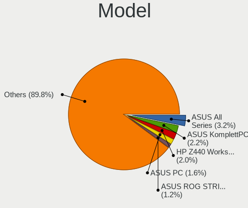
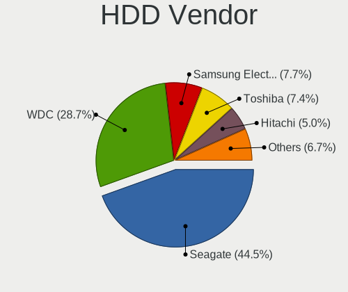
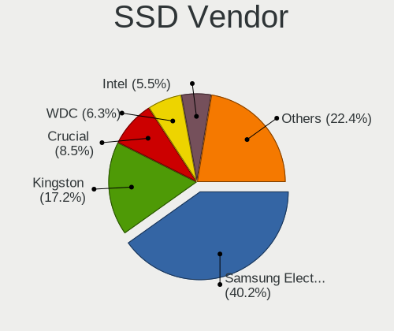
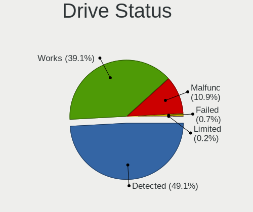
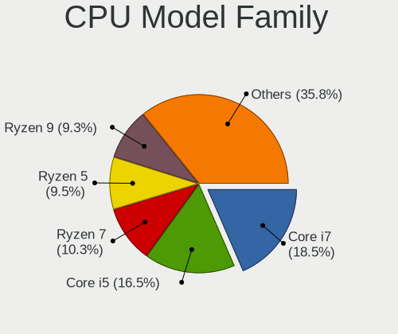
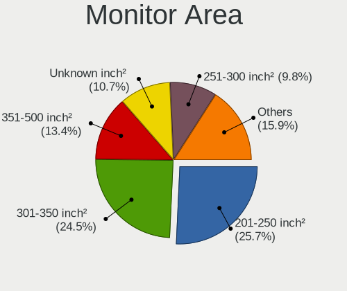
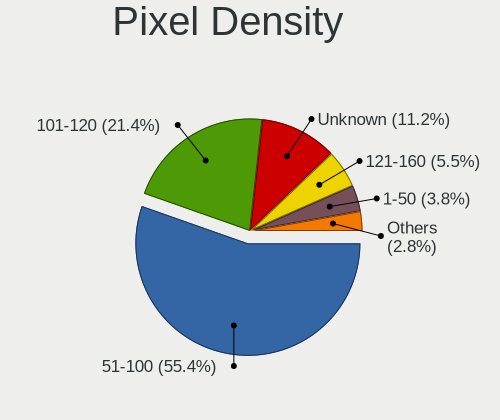
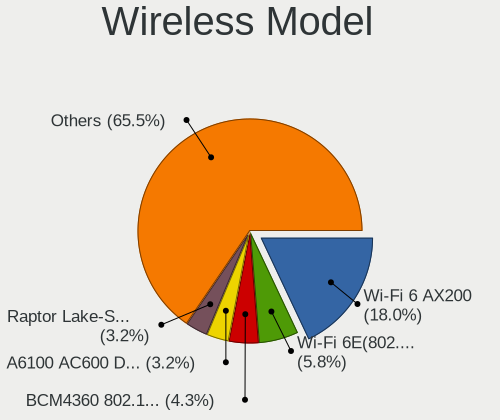
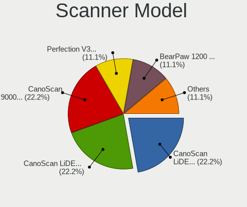
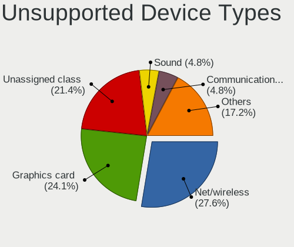

Linux in Norway - Tested Hardware & Statistics (Desktops)
---------------------------------------------------------

A project to collect tested hardware configurations for Linux in Norway.

Anyone can contribute to this report by the [hw-probe](https://github.com/linuxhw/hw-probe) tool:

    sudo -E hw-probe -all -upload

Please contribute! Especially if your hardware is rare.

Contents
--------

* [ Test Cases ](#test-cases)

* [ System ](#system)
  - [ OS                       ](#os)
  - [ OS Family                ](#os-family)
  - [ Kernel                   ](#kernel)
  - [ Kernel Family            ](#kernel-family)
  - [ Kernel Major Ver.        ](#kernel-major-ver)
  - [ Arch                     ](#arch)
  - [ DE                       ](#de)
  - [ Display Server           ](#display-server)
  - [ Display Manager          ](#display-manager)
  - [ OS Lang                  ](#os-lang)
  - [ Boot Mode                ](#boot-mode)
  - [ Filesystem               ](#filesystem)
  - [ Part. scheme             ](#part-scheme)
  - [ Dual Boot with Linux/BSD ](#dual-boot-with-linuxbsd)
  - [ Dual Boot (Win)          ](#dual-boot-win)

* [ Board ](#board)
  - [ Vendor                   ](#vendor)
  - [ Model                    ](#model)
  - [ Model Family             ](#model-family)
  - [ MFG Year                 ](#mfg-year)
  - [ Form Factor              ](#form-factor)
  - [ Secure Boot              ](#secure-boot)
  - [ Coreboot                 ](#coreboot)
  - [ RAM Size                 ](#ram-size)
  - [ RAM Used                 ](#ram-used)
  - [ Total Drives             ](#total-drives)
  - [ Has CD-ROM               ](#has-cd-rom)
  - [ Has Ethernet             ](#has-ethernet)
  - [ Has WiFi                 ](#has-wifi)
  - [ Has Bluetooth            ](#has-bluetooth)

* [ Location ](#location)
  - [ Country                  ](#country)
  - [ City                     ](#city)

* [ Drives ](#drives)
  - [ Drive Vendor             ](#drive-vendor)
  - [ Drive Model              ](#drive-model)
  - [ HDD Vendor               ](#hdd-vendor)
  - [ SSD Vendor               ](#ssd-vendor)
  - [ Drive Kind               ](#drive-kind)
  - [ Drive Connector          ](#drive-connector)
  - [ Drive Size               ](#drive-size)
  - [ Space Total              ](#space-total)
  - [ Space Used               ](#space-used)
  - [ Malfunc. Drives          ](#malfunc-drives)
  - [ Malfunc. Drive Vendor    ](#malfunc-drive-vendor)
  - [ Malfunc. HDD Vendor      ](#malfunc-hdd-vendor)
  - [ Malfunc. Drive Kind      ](#malfunc-drive-kind)
  - [ Failed Drives            ](#failed-drives)
  - [ Failed Drive Vendor      ](#failed-drive-vendor)
  - [ Drive Status             ](#drive-status)

* [ Storage controller ](#storage-controller)
  - [ Storage Vendor           ](#storage-vendor)
  - [ Storage Model            ](#storage-model)
  - [ Storage Kind             ](#storage-kind)

* [ Processor ](#processor)
  - [ CPU Vendor               ](#cpu-vendor)
  - [ CPU Model                ](#cpu-model)
  - [ CPU Model Family         ](#cpu-model-family)
  - [ CPU Cores                ](#cpu-cores)
  - [ CPU Sockets              ](#cpu-sockets)
  - [ CPU Threads              ](#cpu-threads)
  - [ CPU Op-Modes             ](#cpu-op-modes)
  - [ CPU Microcode            ](#cpu-microcode)
  - [ CPU Microarch            ](#cpu-microarch)

* [ Graphics ](#graphics)
  - [ GPU Vendor               ](#gpu-vendor)
  - [ GPU Model                ](#gpu-model)
  - [ GPU Combo                ](#gpu-combo)
  - [ GPU Driver               ](#gpu-driver)
  - [ GPU Memory               ](#gpu-memory)

* [ Monitor ](#monitor)
  - [ Monitor Vendor           ](#monitor-vendor)
  - [ Monitor Model            ](#monitor-model)
  - [ Monitor Resolution       ](#monitor-resolution)
  - [ Monitor Diagonal         ](#monitor-diagonal)
  - [ Monitor Width            ](#monitor-width)
  - [ Aspect Ratio             ](#aspect-ratio)
  - [ Monitor Area             ](#monitor-area)
  - [ Pixel Density            ](#pixel-density)
  - [ Multiple Monitors        ](#multiple-monitors)

* [ Network ](#network)
  - [ Net Controller Vendor    ](#net-controller-vendor)
  - [ Net Controller Model     ](#net-controller-model)
  - [ Wireless Vendor          ](#wireless-vendor)
  - [ Wireless Model           ](#wireless-model)
  - [ Ethernet Vendor          ](#ethernet-vendor)
  - [ Ethernet Model           ](#ethernet-model)
  - [ Net Controller Kind      ](#net-controller-kind)
  - [ Used Controller          ](#used-controller)
  - [ NICs                     ](#nics)
  - [ IPv6                     ](#ipv6)

* [ Bluetooth ](#bluetooth)
  - [ Bluetooth Vendor         ](#bluetooth-vendor)
  - [ Bluetooth Model          ](#bluetooth-model)

* [ Sound ](#sound)
  - [ Sound Vendor             ](#sound-vendor)
  - [ Sound Model              ](#sound-model)

* [ Memory ](#memory)
  - [ Memory Vendor            ](#memory-vendor)
  - [ Memory Model             ](#memory-model)
  - [ Memory Kind              ](#memory-kind)
  - [ Memory Form Factor       ](#memory-form-factor)
  - [ Memory Size              ](#memory-size)
  - [ Memory Speed             ](#memory-speed)

* [ Printers & scanners ](#printers--scanners)
  - [ Printer Vendor           ](#printer-vendor)
  - [ Printer Model            ](#printer-model)
  - [ Scanner Vendor           ](#scanner-vendor)
  - [ Scanner Model            ](#scanner-model)

* [ Camera ](#camera)
  - [ Camera Vendor            ](#camera-vendor)
  - [ Camera Model             ](#camera-model)

* [ Security ](#security)
  - [ Fingerprint Vendor       ](#fingerprint-vendor)
  - [ Fingerprint Model        ](#fingerprint-model)
  - [ Chipcard Vendor          ](#chipcard-vendor)
  - [ Chipcard Model           ](#chipcard-model)

* [ Unsupported ](#unsupported)
  - [ Unsupported Devices      ](#unsupported-devices)
  - [ Unsupported Device Types ](#unsupported-device-types)

Test Cases
----------

Total: 571

| Vendor        | Model                       | Probe                                                      | Date         |
|---------------|-----------------------------|------------------------------------------------------------|--------------|
| MSI           | X99A RAIDER                 | [8582096251](https://linux-hardware.org/?probe=8582096251) | Dec 31, 2022 |
| ASRock        | FM2A88X Extreme6+           | [c45e0f54fd](https://linux-hardware.org/?probe=c45e0f54fd) | Dec 31, 2022 |
| ASUSTek       | Z97-A                       | [6f61aac097](https://linux-hardware.org/?probe=6f61aac097) | Dec 31, 2022 |
| ASRock        | FM2A88X Extreme6+           | [8289d108fb](https://linux-hardware.org/?probe=8289d108fb) | Dec 30, 2022 |
| MSI           | X99A RAIDER                 | [3b0d4e8973](https://linux-hardware.org/?probe=3b0d4e8973) | Dec 30, 2022 |
| HP            | ProLiant ML110 Gen9         | [ea9aef1e8d](https://linux-hardware.org/?probe=ea9aef1e8d) | Dec 29, 2022 |
| ASRock        | FM2A88X Extreme6+           | [12c052156c](https://linux-hardware.org/?probe=12c052156c) | Dec 29, 2022 |
| MSI           | X99A RAIDER                 | [daf7777113](https://linux-hardware.org/?probe=daf7777113) | Dec 29, 2022 |
| HP            | ProLiant ML110 Gen9         | [728793a92a](https://linux-hardware.org/?probe=728793a92a) | Dec 29, 2022 |
| ASRock        | FM2A88X Extreme6+           | [f5ac2a0028](https://linux-hardware.org/?probe=f5ac2a0028) | Dec 28, 2022 |
| MSI           | X99A RAIDER                 | [2d572d06d7](https://linux-hardware.org/?probe=2d572d06d7) | Dec 28, 2022 |
| ASRock        | FM2A88X Extreme6+           | [8d1181c71b](https://linux-hardware.org/?probe=8d1181c71b) | Dec 26, 2022 |
| MSI           | X99A RAIDER                 | [cbe4c82d15](https://linux-hardware.org/?probe=cbe4c82d15) | Dec 26, 2022 |
| HP            | ProLiant ML110 Gen9         | [90bb379f4e](https://linux-hardware.org/?probe=90bb379f4e) | Dec 25, 2022 |
| ASRock        | FM2A88X Extreme6+           | [b6def743ea](https://linux-hardware.org/?probe=b6def743ea) | Dec 25, 2022 |
| MSI           | X99A RAIDER                 | [8636b69474](https://linux-hardware.org/?probe=8636b69474) | Dec 25, 2022 |
| ASRock        | FM2A88X Extreme6+           | [f5fa069144](https://linux-hardware.org/?probe=f5fa069144) | Dec 24, 2022 |
| MSI           | X99A RAIDER                 | [a375cc62c7](https://linux-hardware.org/?probe=a375cc62c7) | Dec 24, 2022 |
| ASRock        | FM2A88X Extreme6+           | [88df914367](https://linux-hardware.org/?probe=88df914367) | Dec 23, 2022 |
| MSI           | X99A RAIDER                 | [c36553b2b8](https://linux-hardware.org/?probe=c36553b2b8) | Dec 23, 2022 |
| ASUSTek       | ROG CROSSHAIR VIII HERO     | [23f2e15649](https://linux-hardware.org/?probe=23f2e15649) | Dec 22, 2022 |
| ASRock        | FM2A88X Extreme6+           | [6eb006d2d4](https://linux-hardware.org/?probe=6eb006d2d4) | Dec 22, 2022 |
| MSI           | X99A RAIDER                 | [bfe7b1ec1d](https://linux-hardware.org/?probe=bfe7b1ec1d) | Dec 22, 2022 |
| ASRock        | FM2A88X Extreme6+           | [bd7ed31b20](https://linux-hardware.org/?probe=bd7ed31b20) | Dec 21, 2022 |
| MSI           | X99A RAIDER                 | [3832e7e0af](https://linux-hardware.org/?probe=3832e7e0af) | Dec 21, 2022 |
| ASUSTek       | ROG CROSSHAIR VIII HERO     | [17630a4351](https://linux-hardware.org/?probe=17630a4351) | Dec 20, 2022 |
| MSI           | X99A RAIDER                 | [8a7ee1147b](https://linux-hardware.org/?probe=8a7ee1147b) | Dec 20, 2022 |
| ASRock        | FM2A88X Extreme6+           | [9451dc3035](https://linux-hardware.org/?probe=9451dc3035) | Dec 20, 2022 |
| ASUSTek       | PRIME X570-PRO              | [6a731c5c9b](https://linux-hardware.org/?probe=6a731c5c9b) | Dec 20, 2022 |
| ASUSTek       | ROG CROSSHAIR VIII HERO     | [c7b01f9875](https://linux-hardware.org/?probe=c7b01f9875) | Dec 19, 2022 |
| ASUSTek       | PRIME X570-PRO              | [cc8dd14279](https://linux-hardware.org/?probe=cc8dd14279) | Dec 19, 2022 |
| MSI           | X99A RAIDER                 | [b4d6964157](https://linux-hardware.org/?probe=b4d6964157) | Dec 18, 2022 |
| ASRock        | FM2A88X Extreme6+           | [561aa4411a](https://linux-hardware.org/?probe=561aa4411a) | Dec 18, 2022 |
| ASRock        | FM2A88X Extreme6+           | [88d55eced8](https://linux-hardware.org/?probe=88d55eced8) | Dec 17, 2022 |
| MSI           | X99A RAIDER                 | [be93cca77c](https://linux-hardware.org/?probe=be93cca77c) | Dec 17, 2022 |
| ASRock        | FM2A88X Extreme6+           | [04bbc083d7](https://linux-hardware.org/?probe=04bbc083d7) | Dec 16, 2022 |
| MSI           | X99A RAIDER                 | [9caae58821](https://linux-hardware.org/?probe=9caae58821) | Dec 16, 2022 |
| Lenovo        | SHARKBAY 0B98401 PRO        | [226bab8281](https://linux-hardware.org/?probe=226bab8281) | Dec 15, 2022 |
| ASRock        | FM2A88X Extreme6+           | [2e9fac9df4](https://linux-hardware.org/?probe=2e9fac9df4) | Dec 15, 2022 |
| MSI           | X99A RAIDER                 | [5a071587fb](https://linux-hardware.org/?probe=5a071587fb) | Dec 15, 2022 |
| HP            | ProLiant ML110 Gen9         | [3326c90617](https://linux-hardware.org/?probe=3326c90617) | Dec 14, 2022 |
| ASRock        | FM2A88X Extreme6+           | [b20a4554c5](https://linux-hardware.org/?probe=b20a4554c5) | Dec 14, 2022 |
| MSI           | X99A RAIDER                 | [c8ffea5473](https://linux-hardware.org/?probe=c8ffea5473) | Dec 14, 2022 |
| HP            | ProLiant ML110 Gen9         | [7924d2f347](https://linux-hardware.org/?probe=7924d2f347) | Dec 12, 2022 |
| HP            | ProLiant ML110 Gen9         | [37b8d2824f](https://linux-hardware.org/?probe=37b8d2824f) | Dec 11, 2022 |
| Dell          | 0KG317                      | [cf7f697a0a](https://linux-hardware.org/?probe=cf7f697a0a) | Dec 11, 2022 |
| ASRock        | FM2A88X Extreme6+           | [bcb55a7e4c](https://linux-hardware.org/?probe=bcb55a7e4c) | Dec 09, 2022 |
| MSI           | X99A RAIDER                 | [ea91fc57ae](https://linux-hardware.org/?probe=ea91fc57ae) | Dec 09, 2022 |
| ASUSTek       | ROG STRIX X470-F GAMING     | [ead8cc9c0a](https://linux-hardware.org/?probe=ead8cc9c0a) | Dec 08, 2022 |
| ASRock        | FM2A88X Extreme6+           | [e40a7efd61](https://linux-hardware.org/?probe=e40a7efd61) | Dec 08, 2022 |
| MSI           | X99A RAIDER                 | [2d35fb5bbb](https://linux-hardware.org/?probe=2d35fb5bbb) | Dec 08, 2022 |
| MSI           | P67A-C45                    | [44c8da681d](https://linux-hardware.org/?probe=44c8da681d) | Dec 07, 2022 |
| ASRock        | AB350M                      | [95a14fd558](https://linux-hardware.org/?probe=95a14fd558) | Dec 07, 2022 |
| ASRock        | FM2A88X Extreme6+           | [d655b34178](https://linux-hardware.org/?probe=d655b34178) | Dec 07, 2022 |
| ASRock        | H77M-ITX                    | [b2b1b1649a](https://linux-hardware.org/?probe=b2b1b1649a) | Dec 03, 2022 |
| MSI           | X99A RAIDER                 | [8b85688e36](https://linux-hardware.org/?probe=8b85688e36) | Dec 02, 2022 |
| MSI           | X99A RAIDER                 | [0e87a76042](https://linux-hardware.org/?probe=0e87a76042) | Dec 01, 2022 |
| MSI           | X99A RAIDER                 | [1c648060f6](https://linux-hardware.org/?probe=1c648060f6) | Nov 25, 2022 |
| ASUSTek       | PRIME H610M-A WIFI D4       | [7917cbbd8c](https://linux-hardware.org/?probe=7917cbbd8c) | Nov 24, 2022 |
| MSI           | X99A RAIDER                 | [c1e62a557c](https://linux-hardware.org/?probe=c1e62a557c) | Nov 24, 2022 |
| ASRock        | FM2A88X Extreme6+           | [d3412020ec](https://linux-hardware.org/?probe=d3412020ec) | Nov 20, 2022 |
| MSI           | X99A RAIDER                 | [5d1e2af2ea](https://linux-hardware.org/?probe=5d1e2af2ea) | Nov 17, 2022 |
| ASRock        | FM2A88X Extreme6+           | [4c86f7c670](https://linux-hardware.org/?probe=4c86f7c670) | Nov 17, 2022 |
| ASRock        | FM2A88X Extreme6+           | [2eb90688b5](https://linux-hardware.org/?probe=2eb90688b5) | Nov 16, 2022 |
| MSI           | X99A RAIDER                 | [620dbe0a8f](https://linux-hardware.org/?probe=620dbe0a8f) | Nov 16, 2022 |
| MSI           | X99A RAIDER                 | [dffde21ad4](https://linux-hardware.org/?probe=dffde21ad4) | Nov 12, 2022 |
| ASRock        | FM2A88X Extreme6+           | [5006a2d188](https://linux-hardware.org/?probe=5006a2d188) | Nov 12, 2022 |
| ASRock        | FM2A88X Extreme6+           | [a311d2c018](https://linux-hardware.org/?probe=a311d2c018) | Nov 11, 2022 |
| MSI           | X99A RAIDER                 | [b7d21d229b](https://linux-hardware.org/?probe=b7d21d229b) | Nov 11, 2022 |
| MSI           | X99A RAIDER                 | [95fb6a845e](https://linux-hardware.org/?probe=95fb6a845e) | Nov 05, 2022 |
| ASRock        | FM2A88X Extreme6+           | [36e78b1c17](https://linux-hardware.org/?probe=36e78b1c17) | Nov 05, 2022 |
| MSI           | X99A RAIDER                 | [b3eefc89d6](https://linux-hardware.org/?probe=b3eefc89d6) | Nov 04, 2022 |
| ASRock        | FM2A88X Extreme6+           | [653a03dee6](https://linux-hardware.org/?probe=653a03dee6) | Nov 04, 2022 |
| ASRock        | FM2A88X Extreme6+           | [9bdccc90c4](https://linux-hardware.org/?probe=9bdccc90c4) | Nov 03, 2022 |
| MSI           | X99A RAIDER                 | [0036848bf2](https://linux-hardware.org/?probe=0036848bf2) | Nov 03, 2022 |
| MSI           | X99A RAIDER                 | [36eda457da](https://linux-hardware.org/?probe=36eda457da) | Nov 02, 2022 |
| ASRock        | FM2A88X Extreme6+           | [4e260473ba](https://linux-hardware.org/?probe=4e260473ba) | Nov 02, 2022 |
| MSI           | X99A RAIDER                 | [2f3428a435](https://linux-hardware.org/?probe=2f3428a435) | Nov 01, 2022 |
| ASRock        | FM2A88X Extreme6+           | [cf7b016772](https://linux-hardware.org/?probe=cf7b016772) | Nov 01, 2022 |
| MSI           | X99A RAIDER                 | [2f41c9eaa5](https://linux-hardware.org/?probe=2f41c9eaa5) | Oct 31, 2022 |
| ASRock        | FM2A88X Extreme6+           | [5bd92395da](https://linux-hardware.org/?probe=5bd92395da) | Oct 31, 2022 |
| ASRock        | FM2A88X Extreme6+           | [c8392f24d9](https://linux-hardware.org/?probe=c8392f24d9) | Oct 30, 2022 |
| MSI           | X99A RAIDER                 | [7ddd09eeec](https://linux-hardware.org/?probe=7ddd09eeec) | Oct 30, 2022 |
| MSI           | X99A RAIDER                 | [782207dfcf](https://linux-hardware.org/?probe=782207dfcf) | Oct 29, 2022 |
| ASRock        | FM2A88X Extreme6+           | [75b050a9f0](https://linux-hardware.org/?probe=75b050a9f0) | Oct 29, 2022 |
| ASRock        | FM2A88X Extreme6+           | [bd9367f2b7](https://linux-hardware.org/?probe=bd9367f2b7) | Oct 27, 2022 |
| MSI           | X299 SLI PLUS               | [4b79f3c1e6](https://linux-hardware.org/?probe=4b79f3c1e6) | Oct 26, 2022 |
| ASRock        | FM2A88X Extreme6+           | [317d318d85](https://linux-hardware.org/?probe=317d318d85) | Oct 26, 2022 |
| HP            | 828A                        | [2123f2610c](https://linux-hardware.org/?probe=2123f2610c) | Oct 24, 2022 |
| Gigabyte      | B150N Phoenix-WIFI-CF       | [6a42097b41](https://linux-hardware.org/?probe=6a42097b41) | Oct 23, 2022 |
| ASRock        | FM2A88X Extreme6+           | [da8a11aac5](https://linux-hardware.org/?probe=da8a11aac5) | Oct 19, 2022 |
| Gigabyte      | X99-UD7 WIFI-CF             | [9c484b6d22](https://linux-hardware.org/?probe=9c484b6d22) | Oct 18, 2022 |
| ASRock        | FM2A88X Extreme6+           | [d53b4edda1](https://linux-hardware.org/?probe=d53b4edda1) | Oct 18, 2022 |
| ASRock        | Z97E-ITX/ac                 | [2ae712a746](https://linux-hardware.org/?probe=2ae712a746) | Oct 18, 2022 |
| ASUSTek       | ROG STRIX B560-I GAMING ... | [e8e5ae4784](https://linux-hardware.org/?probe=e8e5ae4784) | Oct 17, 2022 |
| ASRock        | FM2A88X Extreme6+           | [e618e79bd5](https://linux-hardware.org/?probe=e618e79bd5) | Oct 17, 2022 |
| ASRock        | FM2A88X Extreme6+           | [2412a53d05](https://linux-hardware.org/?probe=2412a53d05) | Oct 12, 2022 |
| ASUSTek       | M5A97 EVO R2.0              | [c3513de476](https://linux-hardware.org/?probe=c3513de476) | Oct 11, 2022 |
| ASRock        | FM2A88X Extreme6+           | [60037612c1](https://linux-hardware.org/?probe=60037612c1) | Oct 11, 2022 |
| MSI           | Z170-A PRO                  | [50b8cde0ed](https://linux-hardware.org/?probe=50b8cde0ed) | Oct 10, 2022 |
| Gigabyte      | B450 GAMING X               | [a297c351ed](https://linux-hardware.org/?probe=a297c351ed) | Oct 09, 2022 |
| ASUSTek       | ROG CROSSHAIR VIII HERO     | [512c095e83](https://linux-hardware.org/?probe=512c095e83) | Oct 06, 2022 |
| ASRock        | FM2A88X Extreme6+           | [6a5822719f](https://linux-hardware.org/?probe=6a5822719f) | Oct 06, 2022 |
| ASRock        | FM2A88X Extreme6+           | [51c401fd4e](https://linux-hardware.org/?probe=51c401fd4e) | Oct 05, 2022 |
| ASUSTek       | ROG CROSSHAIR VIII DARK ... | [80a70e8f6e](https://linux-hardware.org/?probe=80a70e8f6e) | Oct 03, 2022 |
| ASRock        | Z97 Pro4                    | [d0465080bf](https://linux-hardware.org/?probe=d0465080bf) | Oct 02, 2022 |
| ASRock        | FM2A88X Extreme6+           | [a0d36f3810](https://linux-hardware.org/?probe=a0d36f3810) | Oct 02, 2022 |
| MSI           | MPG B550 GAMING PLUS        | [fca2e4409a](https://linux-hardware.org/?probe=fca2e4409a) | Oct 01, 2022 |
| ASRock        | FM2A88X Extreme6+           | [186495d063](https://linux-hardware.org/?probe=186495d063) | Oct 01, 2022 |
| ASRock        | FM2A88X Extreme6+           | [6553398b7d](https://linux-hardware.org/?probe=6553398b7d) | Sep 30, 2022 |
| ASRock        | FM2A88X Extreme6+           | [362c6b7436](https://linux-hardware.org/?probe=362c6b7436) | Sep 29, 2022 |
| ASUSTek       | ROG Maximus XI HERO         | [3553d42d14](https://linux-hardware.org/?probe=3553d42d14) | Sep 27, 2022 |
| Gigabyte      | B550I AORUS PRO AX          | [778f7340fa](https://linux-hardware.org/?probe=778f7340fa) | Sep 25, 2022 |
| ASRock        | FM2A88X Extreme6+           | [a4b47e7325](https://linux-hardware.org/?probe=a4b47e7325) | Sep 25, 2022 |
| ASRock        | FM2A88X Extreme6+           | [ab2e3b1767](https://linux-hardware.org/?probe=ab2e3b1767) | Sep 24, 2022 |
| ASRock        | FM2A88X Extreme6+           | [0f750af134](https://linux-hardware.org/?probe=0f750af134) | Sep 23, 2022 |
| ASRock        | FM2A88X Extreme6+           | [bfb470649a](https://linux-hardware.org/?probe=bfb470649a) | Sep 22, 2022 |
| HP            | 8594                        | [281774ad4a](https://linux-hardware.org/?probe=281774ad4a) | Sep 21, 2022 |
| ASRock        | FM2A88X Extreme6+           | [754dfba736](https://linux-hardware.org/?probe=754dfba736) | Sep 21, 2022 |
| ASRock        | FM2A88X Extreme6+           | [fa5f7f7245](https://linux-hardware.org/?probe=fa5f7f7245) | Sep 20, 2022 |
| ASRock        | FM2A88X Extreme6+           | [5233832be3](https://linux-hardware.org/?probe=5233832be3) | Sep 19, 2022 |
| ASRock        | FM2A88X Extreme6+           | [7161071790](https://linux-hardware.org/?probe=7161071790) | Sep 18, 2022 |
| HP            | 805D                        | [8acaebbd42](https://linux-hardware.org/?probe=8acaebbd42) | Sep 14, 2022 |
| ASRock        | FM2A88X Extreme6+           | [37d6996290](https://linux-hardware.org/?probe=37d6996290) | Sep 14, 2022 |
| ASRock        | FM2A88X Extreme6+           | [a6e7414518](https://linux-hardware.org/?probe=a6e7414518) | Sep 13, 2022 |
| MSI           | Z97M-G43                    | [706804a4e2](https://linux-hardware.org/?probe=706804a4e2) | Sep 12, 2022 |
| ASRock        | FM2A88X Extreme6+           | [d85067b0f0](https://linux-hardware.org/?probe=d85067b0f0) | Sep 11, 2022 |
| ASRock        | FM2A88X Extreme6+           | [20ee71a4d6](https://linux-hardware.org/?probe=20ee71a4d6) | Sep 10, 2022 |
| MSI           | P67A-C45                    | [4221289e11](https://linux-hardware.org/?probe=4221289e11) | Sep 07, 2022 |
| ASRock        | FM2A88X Extreme6+           | [dad765ca9e](https://linux-hardware.org/?probe=dad765ca9e) | Sep 06, 2022 |
| ASRock        | FM2A88X Extreme6+           | [0df0bba932](https://linux-hardware.org/?probe=0df0bba932) | Sep 05, 2022 |
| ASRock        | FM2A88X Extreme6+           | [446e2d292a](https://linux-hardware.org/?probe=446e2d292a) | Sep 02, 2022 |
| ASRock        | FM2A88X Extreme6+           | [689c3aa34d](https://linux-hardware.org/?probe=689c3aa34d) | Sep 01, 2022 |
| Acer          | Aspire X3400                | [705a3242ae](https://linux-hardware.org/?probe=705a3242ae) | Sep 01, 2022 |
| Acer          | Aspire X3400                | [cb5288e92d](https://linux-hardware.org/?probe=cb5288e92d) | Aug 31, 2022 |
| Acer          | Aspire X3400                | [5e9e5dd1ce](https://linux-hardware.org/?probe=5e9e5dd1ce) | Aug 31, 2022 |
| ASRock        | FM2A88X Extreme6+           | [df96c4acaf](https://linux-hardware.org/?probe=df96c4acaf) | Aug 31, 2022 |
| Dell          | 0NW6H5 A00                  | [d4de10030b](https://linux-hardware.org/?probe=d4de10030b) | Aug 30, 2022 |
| ASRock        | FM2A88X Extreme6+           | [eba231b7db](https://linux-hardware.org/?probe=eba231b7db) | Aug 30, 2022 |
| MSI           | P67A-C45                    | [5ffb676e01](https://linux-hardware.org/?probe=5ffb676e01) | Aug 27, 2022 |
| ASRock        | FM2A88X Extreme6+           | [ff55a7dbf1](https://linux-hardware.org/?probe=ff55a7dbf1) | Aug 26, 2022 |
| Acer          | Aspire X3400                | [81acff75f6](https://linux-hardware.org/?probe=81acff75f6) | Aug 25, 2022 |
| ASRock        | FM2A88X Extreme6+           | [f80abd07f3](https://linux-hardware.org/?probe=f80abd07f3) | Aug 25, 2022 |
| Lenovo        | 370A SDK0J40700 WIN 3258... | [8118d6f78c](https://linux-hardware.org/?probe=8118d6f78c) | Aug 23, 2022 |
| ASUSTek       | ROG STRIX B550-I GAMING     | [d98e5c8b5e](https://linux-hardware.org/?probe=d98e5c8b5e) | Aug 17, 2022 |
| ASRock        | FM2A88X Extreme6+           | [3f83c9e402](https://linux-hardware.org/?probe=3f83c9e402) | Aug 16, 2022 |
| ASRock        | FM2A88X Extreme6+           | [1298facab1](https://linux-hardware.org/?probe=1298facab1) | Aug 15, 2022 |
| ASRock        | FM2A88X Extreme6+           | [91a2943c51](https://linux-hardware.org/?probe=91a2943c51) | Aug 09, 2022 |
| ASRock        | FM2A88X Extreme6+           | [244025d59e](https://linux-hardware.org/?probe=244025d59e) | Aug 08, 2022 |
| ASUSTek       | P9X79 LE                    | [f8a36826db](https://linux-hardware.org/?probe=f8a36826db) | Aug 07, 2022 |
| ASRock        | FM2A88X Extreme6+           | [9320816ca5](https://linux-hardware.org/?probe=9320816ca5) | Aug 05, 2022 |
| ASUSTek       | P9X79                       | [48606f92a6](https://linux-hardware.org/?probe=48606f92a6) | Aug 05, 2022 |
| ASUSTek       | P9X79                       | [c55f1b0a46](https://linux-hardware.org/?probe=c55f1b0a46) | Aug 05, 2022 |
| ASUSTek       | PRIME B365-PLUS             | [324410a493](https://linux-hardware.org/?probe=324410a493) | Aug 04, 2022 |
| ASRock        | FM2A88X Extreme6+           | [b224ef1b8d](https://linux-hardware.org/?probe=b224ef1b8d) | Aug 04, 2022 |
| ASRock        | FM2A88X Extreme6+           | [015ec264f5](https://linux-hardware.org/?probe=015ec264f5) | Aug 02, 2022 |
| ASRock        | FM2A88X Extreme6+           | [8ea1e0f22c](https://linux-hardware.org/?probe=8ea1e0f22c) | Aug 01, 2022 |
| ASRock        | FM2A88X Extreme6+           | [9dd9d17e79](https://linux-hardware.org/?probe=9dd9d17e79) | Jul 31, 2022 |
| ASRock        | FM2A88X Extreme6+           | [9a7de8cc64](https://linux-hardware.org/?probe=9a7de8cc64) | Jul 30, 2022 |
| Intel         | TR440BXA A16643-311         | [e6245255f4](https://linux-hardware.org/?probe=e6245255f4) | Jul 29, 2022 |
| ASRock        | FM2A88X Extreme6+           | [c0ce536184](https://linux-hardware.org/?probe=c0ce536184) | Jul 29, 2022 |
| ASRock        | H77M-ITX                    | [ca0d4b7108](https://linux-hardware.org/?probe=ca0d4b7108) | Jul 28, 2022 |
| ASUSTek       | VC65                        | [b43ad009f1](https://linux-hardware.org/?probe=b43ad009f1) | Jul 28, 2022 |
| ASRock        | FM2A88X Extreme6+           | [a9c3256946](https://linux-hardware.org/?probe=a9c3256946) | Jul 28, 2022 |
| Gigabyte      | B150N Phoenix-WIFI-CF       | [e214df8838](https://linux-hardware.org/?probe=e214df8838) | Jul 27, 2022 |
| ASRock        | H77M-ITX                    | [78a53c9be0](https://linux-hardware.org/?probe=78a53c9be0) | Jul 26, 2022 |
| ASRock        | H77M-ITX                    | [8c749dd7e6](https://linux-hardware.org/?probe=8c749dd7e6) | Jul 26, 2022 |
| ASUSTek       | ROG STRIX B550-I GAMING     | [1361193180](https://linux-hardware.org/?probe=1361193180) | Jul 25, 2022 |
| ASRock        | FM2A88X Extreme6+           | [2632256ed7](https://linux-hardware.org/?probe=2632256ed7) | Jul 25, 2022 |
| ASRock        | FM2A88X Extreme6+           | [8bb191bc8f](https://linux-hardware.org/?probe=8bb191bc8f) | Jul 24, 2022 |
| ASUSTek       | CROSSHAIR II FORMULA        | [aa2242c51f](https://linux-hardware.org/?probe=aa2242c51f) | Jul 23, 2022 |
| ASRock        | FM2A88X Extreme6+           | [9c1f5f7a4e](https://linux-hardware.org/?probe=9c1f5f7a4e) | Jul 23, 2022 |
| ASRock        | FM2A88X Extreme6+           | [d758abd21c](https://linux-hardware.org/?probe=d758abd21c) | Jul 22, 2022 |
| ASRock        | FM2A88X Extreme6+           | [b54cb1f930](https://linux-hardware.org/?probe=b54cb1f930) | Jul 21, 2022 |
| ASRock        | FM2A88X Extreme6+           | [8cae76caea](https://linux-hardware.org/?probe=8cae76caea) | Jul 20, 2022 |
| ASRock        | FM2A88X Extreme6+           | [ce2e8f2a2a](https://linux-hardware.org/?probe=ce2e8f2a2a) | Jul 12, 2022 |
| ASRock        | FM2A88X Extreme6+           | [84f993f04d](https://linux-hardware.org/?probe=84f993f04d) | Jul 11, 2022 |
| Gigabyte      | X470 AORUS GAMING 7 WIFI... | [e888c3e118](https://linux-hardware.org/?probe=e888c3e118) | Jul 08, 2022 |
| ASRock        | FM2A88X Extreme6+           | [1bec4af414](https://linux-hardware.org/?probe=1bec4af414) | Jul 02, 2022 |
| ASRock        | FM2A88X Extreme6+           | [a658ebf5e9](https://linux-hardware.org/?probe=a658ebf5e9) | Jul 01, 2022 |
| ASUSTek       | TUF B350M-PLUS GAMING       | [a082da0857](https://linux-hardware.org/?probe=a082da0857) | Jun 30, 2022 |
| ASRock        | FM2A88X Extreme6+           | [163a5c29e6](https://linux-hardware.org/?probe=163a5c29e6) | Jun 30, 2022 |
| ASRock        | FM2A88X Extreme6+           | [66b8ec6b28](https://linux-hardware.org/?probe=66b8ec6b28) | Jun 29, 2022 |
| ASRock        | FM2A88X Extreme6+           | [4801136187](https://linux-hardware.org/?probe=4801136187) | Jun 18, 2022 |
| MSI           | X99A RAIDER                 | [550772184f](https://linux-hardware.org/?probe=550772184f) | Jun 18, 2022 |
| ASUSTek       | ROG STRIX B550-I GAMING     | [f54dda344d](https://linux-hardware.org/?probe=f54dda344d) | Jun 17, 2022 |
| ASRock        | FM2A88X Extreme6+           | [680bf4c033](https://linux-hardware.org/?probe=680bf4c033) | Jun 17, 2022 |
| ASRock        | FM2A88X Extreme6+           | [7990c32699](https://linux-hardware.org/?probe=7990c32699) | Jun 14, 2022 |
| ASRock        | FM2A88X Extreme6+           | [dcd3256961](https://linux-hardware.org/?probe=dcd3256961) | Jun 13, 2022 |
| ASRock        | FM2A88X Extreme6+           | [5a835b2aa6](https://linux-hardware.org/?probe=5a835b2aa6) | Jun 07, 2022 |
| ASRock        | FM2A88X Extreme6+           | [838e0b8e42](https://linux-hardware.org/?probe=838e0b8e42) | Jun 06, 2022 |
| ASRock        | FM2A88X Extreme6+           | [cb07ae6e24](https://linux-hardware.org/?probe=cb07ae6e24) | Jun 02, 2022 |
| ASRock        | FM2A88X Extreme6+           | [dd51d706e3](https://linux-hardware.org/?probe=dd51d706e3) | Jun 01, 2022 |
| Unknown       | Unknown                     | [c2d6d647d8](https://linux-hardware.org/?probe=c2d6d647d8) | May 31, 2022 |
| ASRock        | FM2A88X Extreme6+           | [85a456dd94](https://linux-hardware.org/?probe=85a456dd94) | May 31, 2022 |
| Unknown       | Unknown                     | [59d0634230](https://linux-hardware.org/?probe=59d0634230) | May 30, 2022 |
| ASRock        | FM2A88X Extreme6+           | [ff73ff1ea6](https://linux-hardware.org/?probe=ff73ff1ea6) | May 30, 2022 |
| ASRock        | FM2A88X Extreme6+           | [3487c76d47](https://linux-hardware.org/?probe=3487c76d47) | May 29, 2022 |
| Gigabyte      | X470 AORUS GAMING 7 WIFI... | [8306cefd31](https://linux-hardware.org/?probe=8306cefd31) | May 28, 2022 |
| ASRock        | FM2A88X Extreme6+           | [db4eade79e](https://linux-hardware.org/?probe=db4eade79e) | May 28, 2022 |
| MSI           | X99A RAIDER                 | [8226c07ba6](https://linux-hardware.org/?probe=8226c07ba6) | May 27, 2022 |
| Gigabyte      | F2A68HM-DS2                 | [1fa6bb2d62](https://linux-hardware.org/?probe=1fa6bb2d62) | May 26, 2022 |
| ASRock        | FM2A88X Extreme6+           | [19d23eb25f](https://linux-hardware.org/?probe=19d23eb25f) | May 22, 2022 |
| ASRock        | FM2A88X Extreme6+           | [f5ea71aeb2](https://linux-hardware.org/?probe=f5ea71aeb2) | May 21, 2022 |
| ASUSTek       | Pro WS X570-ACE             | [79682a20fa](https://linux-hardware.org/?probe=79682a20fa) | May 16, 2022 |
| ASUSTek       | ROG STRIX X570-F GAMING     | [d1dbcd7651](https://linux-hardware.org/?probe=d1dbcd7651) | May 16, 2022 |
| MSI           | MAG X570S TOMAHAWK MAX W... | [d4e303b92c](https://linux-hardware.org/?probe=d4e303b92c) | May 15, 2022 |
| Gigabyte      | Z170-Gaming K3              | [768acb5df2](https://linux-hardware.org/?probe=768acb5df2) | May 12, 2022 |
| ASUSTek       | ROG CROSSHAIR VIII IMPAC... | [a6a2ef59b0](https://linux-hardware.org/?probe=a6a2ef59b0) | May 11, 2022 |
| ASUSTek       | ROG STRIX B550-E GAMING     | [927afa0c20](https://linux-hardware.org/?probe=927afa0c20) | May 11, 2022 |
| ASUSTek       | ROG STRIX B550-E GAMING     | [b9766a94d7](https://linux-hardware.org/?probe=b9766a94d7) | May 11, 2022 |
| ASUSTek       | Z170-A                      | [97e2613936](https://linux-hardware.org/?probe=97e2613936) | May 08, 2022 |
| Gigabyte      | X570 GAMING X               | [ffc6dac164](https://linux-hardware.org/?probe=ffc6dac164) | May 07, 2022 |
| ASUSTek       | ROG STRIX B550-F GAMING     | [afac7f7fb3](https://linux-hardware.org/?probe=afac7f7fb3) | May 07, 2022 |
| Gigabyte      | X570 GAMING X               | [816a78b4cd](https://linux-hardware.org/?probe=816a78b4cd) | May 06, 2022 |
| ASUSTek       | PRIME B250M-PLUS            | [6f9cfe324a](https://linux-hardware.org/?probe=6f9cfe324a) | May 05, 2022 |
| ASUSTek       | ROG STRIX X570-F GAMING     | [7d9a2b425f](https://linux-hardware.org/?probe=7d9a2b425f) | May 03, 2022 |
| MSI           | 970 GAMING                  | [32052450db](https://linux-hardware.org/?probe=32052450db) | May 01, 2022 |
| Gigabyte      | X570 AORUS ELITE            | [8db041a1e4](https://linux-hardware.org/?probe=8db041a1e4) | May 01, 2022 |
| ASUSTek       | ROG STRIX B550-I GAMING     | [5456280ec0](https://linux-hardware.org/?probe=5456280ec0) | Apr 26, 2022 |
| Gigabyte      | B150N Phoenix-WIFI-CF       | [dbaaf867f6](https://linux-hardware.org/?probe=dbaaf867f6) | Apr 25, 2022 |
| ASUSTek       | ROG STRIX B550-I GAMING     | [b9ea98672f](https://linux-hardware.org/?probe=b9ea98672f) | Apr 23, 2022 |
| ASUSTek       | ROG STRIX B550-I GAMING     | [c3f809fc02](https://linux-hardware.org/?probe=c3f809fc02) | Apr 23, 2022 |
| Acer          | Predator G3610              | [a53edf84d4](https://linux-hardware.org/?probe=a53edf84d4) | Apr 22, 2022 |
| ASUSTek       | PRIME X399-A                | [e595903b64](https://linux-hardware.org/?probe=e595903b64) | Apr 18, 2022 |
| ASUSTek       | PRIME X399-A                | [b2fe9a09fd](https://linux-hardware.org/?probe=b2fe9a09fd) | Apr 17, 2022 |
| ASRock        | B450 Gaming-ITX/ac          | [1211bed149](https://linux-hardware.org/?probe=1211bed149) | Apr 13, 2022 |
| MSI           | Z390-A PRO                  | [bfec30bf8d](https://linux-hardware.org/?probe=bfec30bf8d) | Apr 13, 2022 |
| Gigabyte      | B550 AORUS ELITE AX V2      | [e2cbc23977](https://linux-hardware.org/?probe=e2cbc23977) | Apr 12, 2022 |
| Gigabyte      | B550 AORUS ELITE AX V2      | [486b6a5d64](https://linux-hardware.org/?probe=486b6a5d64) | Apr 10, 2022 |
| Gigabyte      | B550 AORUS ELITE AX V2      | [ec3689ffdc](https://linux-hardware.org/?probe=ec3689ffdc) | Apr 10, 2022 |
| Dell          | 0MN1TX A02                  | [cf2e65caf4](https://linux-hardware.org/?probe=cf2e65caf4) | Apr 10, 2022 |
| Fujitsu       | D2912-A1 S26361-D2912-A1    | [c344a9c7b9](https://linux-hardware.org/?probe=c344a9c7b9) | Apr 10, 2022 |
| ASRock        | FM2A88X Extreme6+           | [6eb6b5ebaf](https://linux-hardware.org/?probe=6eb6b5ebaf) | Apr 08, 2022 |
| MSI           | B350M MORTAR ARCTIC         | [cf7f6c5ed4](https://linux-hardware.org/?probe=cf7f6c5ed4) | Apr 05, 2022 |
| ASUSTek       | ROG STRIX B550-E GAMING     | [448e59a9a6](https://linux-hardware.org/?probe=448e59a9a6) | Apr 02, 2022 |
| Acer          | Aspire X3400                | [47097032fd](https://linux-hardware.org/?probe=47097032fd) | Mar 31, 2022 |
| Dell          | 0MN1TX A02                  | [f9be94fa9b](https://linux-hardware.org/?probe=f9be94fa9b) | Mar 31, 2022 |
| ASUSTek       | M2R-FVM                     | [94beabac6e](https://linux-hardware.org/?probe=94beabac6e) | Mar 30, 2022 |
| ASUSTek       | M2R-FVM                     | [76ec39764b](https://linux-hardware.org/?probe=76ec39764b) | Mar 26, 2022 |
| ASUSTek       | ROG STRIX B360-F GAMING     | [6190e57794](https://linux-hardware.org/?probe=6190e57794) | Mar 25, 2022 |
| ASUSTek       | M2R-FVM                     | [eaaef17c19](https://linux-hardware.org/?probe=eaaef17c19) | Mar 25, 2022 |
| ASUSTek       | X99-A                       | [b071309501](https://linux-hardware.org/?probe=b071309501) | Mar 23, 2022 |
| ASUSTek       | M2R-FVM                     | [eb934cc46a](https://linux-hardware.org/?probe=eb934cc46a) | Mar 23, 2022 |
| Dell          | 0YNVJG A01                  | [7a52c137cf](https://linux-hardware.org/?probe=7a52c137cf) | Mar 18, 2022 |
| MSI           | Z170A PC MATE               | [56c1c58549](https://linux-hardware.org/?probe=56c1c58549) | Mar 15, 2022 |
| Gigabyte      | B150N Phoenix-WIFI-CF       | [a64818ccea](https://linux-hardware.org/?probe=a64818ccea) | Mar 10, 2022 |
| Gigabyte      | 970A-DS3P                   | [eaae14de4f](https://linux-hardware.org/?probe=eaae14de4f) | Mar 05, 2022 |
| ASUSTek       | ROG STRIX B450-F GAMING     | [f1b0d6e847](https://linux-hardware.org/?probe=f1b0d6e847) | Mar 03, 2022 |
| Gigabyte      | 970A-DS3P                   | [54ae8c7668](https://linux-hardware.org/?probe=54ae8c7668) | Mar 01, 2022 |
| Gigabyte      | 970A-DS3P                   | [ad43671e4c](https://linux-hardware.org/?probe=ad43671e4c) | Mar 01, 2022 |
| ASRock        | FM2A88X Extreme6+           | [9d178352ca](https://linux-hardware.org/?probe=9d178352ca) | Mar 01, 2022 |
| Lenovo        | SHARKBAY NO DPK             | [9670ab829e](https://linux-hardware.org/?probe=9670ab829e) | Feb 26, 2022 |
| ASUSTek       | ROG STRIX Z590-F GAMING ... | [d61754bba9](https://linux-hardware.org/?probe=d61754bba9) | Feb 26, 2022 |
| MSI           | 990FXA-GD65                 | [290919912c](https://linux-hardware.org/?probe=290919912c) | Feb 26, 2022 |
| Lenovo        | 0B98401 PRO                 | [c332efa9f8](https://linux-hardware.org/?probe=c332efa9f8) | Feb 24, 2022 |
| Lenovo        | MAHOBAY NO DPK              | [1c6d204561](https://linux-hardware.org/?probe=1c6d204561) | Feb 24, 2022 |
| ASRock        | FM2A88X Extreme6+           | [67deab7343](https://linux-hardware.org/?probe=67deab7343) | Feb 22, 2022 |
| ASUSTek       | ROG STRIX B450-F GAMING     | [160ecaffd8](https://linux-hardware.org/?probe=160ecaffd8) | Feb 21, 2022 |
| ASUSTek       | SABERTOOTH P67              | [2ad209abc4](https://linux-hardware.org/?probe=2ad209abc4) | Feb 12, 2022 |
| ASUSTek       | Maximus VIII HERO           | [ef92dfd4f1](https://linux-hardware.org/?probe=ef92dfd4f1) | Feb 03, 2022 |
| ASUSTek       | TUF Gaming X570-PLUS        | [ccd7847b28](https://linux-hardware.org/?probe=ccd7847b28) | Jan 30, 2022 |
| ASRock        | ION3D-HT                    | [5a4158f549](https://linux-hardware.org/?probe=5a4158f549) | Jan 29, 2022 |
| Gigabyte      | Z490I AORUS ULTRA           | [908edb3724](https://linux-hardware.org/?probe=908edb3724) | Jan 27, 2022 |
| Intel         | D54250WYK H13922-303        | [8b6b3d70bf](https://linux-hardware.org/?probe=8b6b3d70bf) | Jan 26, 2022 |
| Gigabyte      | 970A-DS3P                   | [b96e414ae9](https://linux-hardware.org/?probe=b96e414ae9) | Jan 21, 2022 |
| Gigabyte      | 970A-DS3P                   | [96047ce382](https://linux-hardware.org/?probe=96047ce382) | Jan 19, 2022 |
| ASRock        | Z87 Killer                  | [6931f1ca2f](https://linux-hardware.org/?probe=6931f1ca2f) | Jan 17, 2022 |
| MSI           | P67A-C45                    | [953176b34f](https://linux-hardware.org/?probe=953176b34f) | Jan 17, 2022 |
| ASUSTek       | P5L8L-SE                    | [459b062c3e](https://linux-hardware.org/?probe=459b062c3e) | Jan 14, 2022 |
| MSI           | MAG X570 TOMAHAWK WIFI      | [7921e32637](https://linux-hardware.org/?probe=7921e32637) | Jan 14, 2022 |
| ASUSTek       | CROSSHAIR VI HERO           | [7b12fb3749](https://linux-hardware.org/?probe=7b12fb3749) | Jan 14, 2022 |
| Acer          | Aspire X3400                | [6833137bc8](https://linux-hardware.org/?probe=6833137bc8) | Jan 02, 2022 |
| MSI           | H110M PRO-VH                | [a32495b8e4](https://linux-hardware.org/?probe=a32495b8e4) | Jan 02, 2022 |
| Gigabyte      | B550 AORUS PRO AC           | [1b62246b10](https://linux-hardware.org/?probe=1b62246b10) | Dec 21, 2021 |
| ASUSTek       | ROG STRIX Z690-G GAMING ... | [b86150c4bd](https://linux-hardware.org/?probe=b86150c4bd) | Dec 16, 2021 |
| ASUSTek       | ROG STRIX Z690-G GAMING ... | [923f77a787](https://linux-hardware.org/?probe=923f77a787) | Dec 16, 2021 |
| ASUSTek       | SABERTOOTH P67              | [af2732b8a5](https://linux-hardware.org/?probe=af2732b8a5) | Dec 15, 2021 |
| ASUSTek       | TUF Gaming B550-PRO         | [62f4289baa](https://linux-hardware.org/?probe=62f4289baa) | Dec 14, 2021 |
| Lenovo        | MAHOBAY NO DPK              | [12da1dc78f](https://linux-hardware.org/?probe=12da1dc78f) | Dec 14, 2021 |
| Lenovo        | SHARKBAY NOK                | [882e308c93](https://linux-hardware.org/?probe=882e308c93) | Dec 11, 2021 |
| ASRockRack    | ROMED8-2T                   | [87b9d0f1e5](https://linux-hardware.org/?probe=87b9d0f1e5) | Dec 04, 2021 |
| ASRockRack    | ROMED8-2T                   | [071e272398](https://linux-hardware.org/?probe=071e272398) | Dec 04, 2021 |
| ASRock        | B450M Steel Legend          | [5c0f6b8395](https://linux-hardware.org/?probe=5c0f6b8395) | Nov 28, 2021 |
| ASUSTek       | STRIX Z270H GAMING          | [fb92bb54af](https://linux-hardware.org/?probe=fb92bb54af) | Nov 28, 2021 |
| MSI           | B350M MORTAR ARCTIC         | [7c0e3a92a5](https://linux-hardware.org/?probe=7c0e3a92a5) | Nov 26, 2021 |
| ASUSTek       | ROG Maximus Z690 HERO       | [f3e1cfcdab](https://linux-hardware.org/?probe=f3e1cfcdab) | Nov 26, 2021 |
| MSI           | MAG X570 TOMAHAWK WIFI      | [846877b55f](https://linux-hardware.org/?probe=846877b55f) | Nov 25, 2021 |
| MSI           | H170 GAMING M3              | [e9a754ed5c](https://linux-hardware.org/?probe=e9a754ed5c) | Nov 24, 2021 |
| Gigabyte      | Z170-Gaming K3              | [496b525711](https://linux-hardware.org/?probe=496b525711) | Nov 24, 2021 |
| ASRock        | X99M Extreme4               | [3f738eedfc](https://linux-hardware.org/?probe=3f738eedfc) | Nov 22, 2021 |
| Gigabyte      | X570 AORUS ULTRA            | [756684e469](https://linux-hardware.org/?probe=756684e469) | Nov 20, 2021 |
| Acer          | EG43M                       | [03dc3c8d61](https://linux-hardware.org/?probe=03dc3c8d61) | Nov 20, 2021 |
| ASUSTek       | P8Z77-V LX                  | [6807e3fa8c](https://linux-hardware.org/?probe=6807e3fa8c) | Nov 18, 2021 |
| HP            | 8056                        | [f62a924908](https://linux-hardware.org/?probe=f62a924908) | Nov 16, 2021 |
| Gigabyte      | H87N-WIFI                   | [b19a68b774](https://linux-hardware.org/?probe=b19a68b774) | Nov 13, 2021 |
| MSI           | B75MA-P45                   | [8196870f95](https://linux-hardware.org/?probe=8196870f95) | Nov 11, 2021 |
| Gigabyte      | F2A78M-D3H                  | [43e09b8e80](https://linux-hardware.org/?probe=43e09b8e80) | Nov 05, 2021 |
| ASUSTek       | STRIX Z270H GAMING          | [4615791bf1](https://linux-hardware.org/?probe=4615791bf1) | Nov 04, 2021 |
| ASUSTek       | P8Z77-V LX                  | [0cc8ca1a78](https://linux-hardware.org/?probe=0cc8ca1a78) | Oct 27, 2021 |
| MSI           | MAG X570 TOMAHAWK WIFI      | [688a36c9df](https://linux-hardware.org/?probe=688a36c9df) | Oct 26, 2021 |
| ASUSTek       | STRIX Z270H GAMING          | [ccce1ad4e4](https://linux-hardware.org/?probe=ccce1ad4e4) | Oct 26, 2021 |
| ASUSTek       | STRIX Z270H GAMING          | [a96916c86f](https://linux-hardware.org/?probe=a96916c86f) | Oct 26, 2021 |
| Gigabyte      | X570 AORUS MASTER           | [3862cf57e0](https://linux-hardware.org/?probe=3862cf57e0) | Oct 25, 2021 |
| MSI           | Z77A-GD65                   | [5273767a7e](https://linux-hardware.org/?probe=5273767a7e) | Oct 22, 2021 |
| Gigabyte      | X570 AORUS MASTER           | [666f084a0f](https://linux-hardware.org/?probe=666f084a0f) | Oct 21, 2021 |
| Gigabyte      | X570 AORUS MASTER           | [395d19ae36](https://linux-hardware.org/?probe=395d19ae36) | Oct 21, 2021 |
| ASUSTek       | P8Z77-V LX                  | [f4442e94e7](https://linux-hardware.org/?probe=f4442e94e7) | Oct 21, 2021 |
| HP            | 1998                        | [db3a3fbce2](https://linux-hardware.org/?probe=db3a3fbce2) | Oct 21, 2021 |
| Pegatron      | 2AC3                        | [ae8b02d9cb](https://linux-hardware.org/?probe=ae8b02d9cb) | Oct 21, 2021 |
| ASUSTek       | PRIME B460M-A               | [6db5e9be6b](https://linux-hardware.org/?probe=6db5e9be6b) | Oct 19, 2021 |
| Dell          | 0D28YY A02                  | [237a82041b](https://linux-hardware.org/?probe=237a82041b) | Oct 09, 2021 |
| Gigabyte      | B450 AORUS ELITE            | [bc7f078524](https://linux-hardware.org/?probe=bc7f078524) | Oct 07, 2021 |
| Packard Be... | IXTREME M5120               | [315bbefc53](https://linux-hardware.org/?probe=315bbefc53) | Oct 06, 2021 |
| ASUSTek       | ROG STRIX X570-F GAMING     | [c9022127a9](https://linux-hardware.org/?probe=c9022127a9) | Oct 03, 2021 |
| ASUSTek       | TUF Gaming B550M-PLUS       | [99b237ae08](https://linux-hardware.org/?probe=99b237ae08) | Oct 02, 2021 |
| HP            | 8056                        | [2199f7a715](https://linux-hardware.org/?probe=2199f7a715) | Sep 26, 2021 |
| ASUSTek       | PRIME B350M-A               | [3808823182](https://linux-hardware.org/?probe=3808823182) | Sep 23, 2021 |
| ASUSTek       | PRIME B350-PLUS             | [f28906612f](https://linux-hardware.org/?probe=f28906612f) | Sep 21, 2021 |
| ASUSTek       | PRIME B350-PLUS             | [17ad477c6f](https://linux-hardware.org/?probe=17ad477c6f) | Sep 21, 2021 |
| ASUSTek       | PRIME B350-PLUS             | [a122cb5006](https://linux-hardware.org/?probe=a122cb5006) | Sep 19, 2021 |
| Acer          | EG43M                       | [03cff58061](https://linux-hardware.org/?probe=03cff58061) | Sep 17, 2021 |
| HP            | 8056                        | [61c50556d0](https://linux-hardware.org/?probe=61c50556d0) | Sep 13, 2021 |
| ASUSTek       | Z170-A                      | [630fec5a83](https://linux-hardware.org/?probe=630fec5a83) | Sep 11, 2021 |
| Gigabyte      | J3455N-D3H                  | [24bc89b42a](https://linux-hardware.org/?probe=24bc89b42a) | Aug 31, 2021 |
| HP            | 0B40h                       | [da95bc989c](https://linux-hardware.org/?probe=da95bc989c) | Aug 30, 2021 |
| Supermicro    | X10DAI                      | [078ab4c114](https://linux-hardware.org/?probe=078ab4c114) | Aug 24, 2021 |
| ASRock        | X370 Gaming-ITX/ac          | [5909ea8d8d](https://linux-hardware.org/?probe=5909ea8d8d) | Aug 20, 2021 |
| HP            | 802E                        | [35a2f000fd](https://linux-hardware.org/?probe=35a2f000fd) | Aug 19, 2021 |
| ASUSTek       | B150M-C                     | [794387ddd6](https://linux-hardware.org/?probe=794387ddd6) | Aug 16, 2021 |
| ASUSTek       | PRIME Z270-A                | [eaac722778](https://linux-hardware.org/?probe=eaac722778) | Aug 16, 2021 |
| ASUSTek       | PRIME Z270-A                | [a24db8e84d](https://linux-hardware.org/?probe=a24db8e84d) | Aug 16, 2021 |
| ASUSTek       | PRIME Z270-A                | [51b28dbd02](https://linux-hardware.org/?probe=51b28dbd02) | Aug 16, 2021 |
| Acer          | Aspire X3400                | [0a158e8bce](https://linux-hardware.org/?probe=0a158e8bce) | Aug 13, 2021 |
| Lenovo        | SKYBAY SDK0J40705 WIN 34... | [034630b7f9](https://linux-hardware.org/?probe=034630b7f9) | Aug 11, 2021 |
| Acer          | Aspire X3400                | [6836f60d13](https://linux-hardware.org/?probe=6836f60d13) | Aug 11, 2021 |
| Fujitsu Si... | D2264-A1 S26361-D2264-A1    | [a1768aa578](https://linux-hardware.org/?probe=a1768aa578) | Aug 06, 2021 |
| Fujitsu Si... | D2264-A1 S26361-D2264-A1    | [52aa712b0c](https://linux-hardware.org/?probe=52aa712b0c) | Aug 05, 2021 |
| HP            | 3397                        | [d5add95307](https://linux-hardware.org/?probe=d5add95307) | Aug 05, 2021 |
| ASRock        | Z370M-ITX/ac                | [30511d93c4](https://linux-hardware.org/?probe=30511d93c4) | Jul 31, 2021 |
| Wibtek        | TH61G-S                     | [346ae2c85d](https://linux-hardware.org/?probe=346ae2c85d) | Jul 29, 2021 |
| HP            | 87D6 SMVB                   | [77f9eee003](https://linux-hardware.org/?probe=77f9eee003) | Jul 28, 2021 |
| ASUSTek       | ROG STRIX X570-F GAMING     | [88d668c3ab](https://linux-hardware.org/?probe=88d668c3ab) | Jul 27, 2021 |
| ASUSTek       | ROG STRIX B450-F GAMING     | [1e8f9a7189](https://linux-hardware.org/?probe=1e8f9a7189) | Jul 24, 2021 |
| ASRock        | B450 Gaming K4              | [563a58b492](https://linux-hardware.org/?probe=563a58b492) | Jul 24, 2021 |
| ASRock        | X570 Steel Legend           | [6f026a93d1](https://linux-hardware.org/?probe=6f026a93d1) | Jul 17, 2021 |
| ASRock        | X570 Steel Legend           | [af12b529b0](https://linux-hardware.org/?probe=af12b529b0) | Jul 17, 2021 |
| Gigabyte      | B550 AORUS MASTER           | [35bf19b527](https://linux-hardware.org/?probe=35bf19b527) | Jul 13, 2021 |
| HP            | 872B                        | [319ce0e306](https://linux-hardware.org/?probe=319ce0e306) | Jul 13, 2021 |
| Gigabyte      | B450 AORUS PRO-CF           | [ef051fc485](https://linux-hardware.org/?probe=ef051fc485) | Jul 04, 2021 |
| HP            | 1998                        | [8f095c8449](https://linux-hardware.org/?probe=8f095c8449) | Jul 01, 2021 |
| ASUSTek       | P5G41T-M                    | [8553d8a919](https://linux-hardware.org/?probe=8553d8a919) | Jun 30, 2021 |
| ASUSTek       | M5A97 R2.0                  | [04c4ddf9b0](https://linux-hardware.org/?probe=04c4ddf9b0) | Jun 29, 2021 |
| Acer          | EG43LMK                     | [5df39d6ba0](https://linux-hardware.org/?probe=5df39d6ba0) | Jun 26, 2021 |
| MSI           | B85M-E45                    | [5508d6a84e](https://linux-hardware.org/?probe=5508d6a84e) | Jun 23, 2021 |
| MSI           | B75MA-P45                   | [0ccd0cdf44](https://linux-hardware.org/?probe=0ccd0cdf44) | Jun 15, 2021 |
| Dell          | 02YYK5 A01                  | [74a4b076a9](https://linux-hardware.org/?probe=74a4b076a9) | Jun 13, 2021 |
| ASUSTek       | ROG STRIX X570-F GAMING     | [8081e6a752](https://linux-hardware.org/?probe=8081e6a752) | Jun 12, 2021 |
| ASUSTek       | X99-DELUXE                  | [382c24055c](https://linux-hardware.org/?probe=382c24055c) | Jun 09, 2021 |
| Lenovo        | SDK0E50510 WIN              | [9cfdd32388](https://linux-hardware.org/?probe=9cfdd32388) | Jun 04, 2021 |
| ASUSTek       | PRIME B460M-A               | [5125306d59](https://linux-hardware.org/?probe=5125306d59) | May 31, 2021 |
| ASUSTek       | M5A97 R2.0                  | [f0145b568f](https://linux-hardware.org/?probe=f0145b568f) | May 27, 2021 |
| ASUSTek       | Maximus VIII HERO           | [4550202db3](https://linux-hardware.org/?probe=4550202db3) | May 15, 2021 |
| Gigabyte      | GA-970A-UD3                 | [1cf830acd9](https://linux-hardware.org/?probe=1cf830acd9) | May 13, 2021 |
| Gigabyte      | X99-UD7 WIFI-CF             | [87d92ce1b4](https://linux-hardware.org/?probe=87d92ce1b4) | May 08, 2021 |
| Gigabyte      | X99-UD7 WIFI-CF             | [766557aeb8](https://linux-hardware.org/?probe=766557aeb8) | May 07, 2021 |
| Dell          | 0M9KCM A02                  | [c016fc8897](https://linux-hardware.org/?probe=c016fc8897) | May 03, 2021 |
| ASUSTek       | PRIME Z490-A                | [af5179a1f9](https://linux-hardware.org/?probe=af5179a1f9) | Apr 30, 2021 |
| Dell          | 02YYK5 A01                  | [bd1254fe8d](https://linux-hardware.org/?probe=bd1254fe8d) | Apr 28, 2021 |
| MSI           | Z97S SLI Krait Edition      | [afb9057dda](https://linux-hardware.org/?probe=afb9057dda) | Apr 16, 2021 |
| ASRock        | X470 Taichi Ultimate        | [7ab07ae1e9](https://linux-hardware.org/?probe=7ab07ae1e9) | Apr 11, 2021 |
| ASRock        | X470 Taichi Ultimate        | [174dc97643](https://linux-hardware.org/?probe=174dc97643) | Apr 11, 2021 |
| Gigabyte      | B450M DS3H-CF               | [2116d4313c](https://linux-hardware.org/?probe=2116d4313c) | Apr 11, 2021 |
| Dell          | 0WMJ54 A01                  | [59c7b4d6ff](https://linux-hardware.org/?probe=59c7b4d6ff) | Apr 10, 2021 |
| ASUSTek       | F2A85-M                     | [9548d9f0c6](https://linux-hardware.org/?probe=9548d9f0c6) | Apr 06, 2021 |
| ASUSTek       | PRIME Z490-A                | [9db70676f4](https://linux-hardware.org/?probe=9db70676f4) | Apr 05, 2021 |
| HP            | 1790                        | [d03e7a12c6](https://linux-hardware.org/?probe=d03e7a12c6) | Apr 04, 2021 |
| Gigabyte      | X570 AORUS XTREME           | [39f6ad5463](https://linux-hardware.org/?probe=39f6ad5463) | Apr 04, 2021 |
| Gigabyte      | Z370 AORUS Gaming K3-CF     | [393b9a2647](https://linux-hardware.org/?probe=393b9a2647) | Mar 31, 2021 |
| ASUSTek       | TUF Gaming B550-PLUS        | [6a1ee4ca94](https://linux-hardware.org/?probe=6a1ee4ca94) | Mar 31, 2021 |
| Lenovo        | 3140 SDK0J40700 WIN 3258... | [394a2510d4](https://linux-hardware.org/?probe=394a2510d4) | Mar 31, 2021 |
| Cisco Syst... | UCSB-B200-M4 73-15862-03    | [4c55de0b30](https://linux-hardware.org/?probe=4c55de0b30) | Mar 31, 2021 |
| ASRock        | B450M Pro4-F                | [c7223020fe](https://linux-hardware.org/?probe=c7223020fe) | Mar 25, 2021 |
| ASUSTek       | PRIME X470-PRO              | [c3f70afbd8](https://linux-hardware.org/?probe=c3f70afbd8) | Mar 18, 2021 |
| ASUSTek       | M4A79T Deluxe               | [2ccff038d2](https://linux-hardware.org/?probe=2ccff038d2) | Mar 16, 2021 |
| HP            | 802F                        | [9ea8632891](https://linux-hardware.org/?probe=9ea8632891) | Mar 14, 2021 |
| MSI           | X99A RAIDER                 | [6f27ffd7aa](https://linux-hardware.org/?probe=6f27ffd7aa) | Mar 13, 2021 |
| ASUSTek       | ROG STRIX B360-H GAMING     | [9625a9c184](https://linux-hardware.org/?probe=9625a9c184) | Feb 26, 2021 |
| Dell          | 0NK70N A03                  | [5354c0cb90](https://linux-hardware.org/?probe=5354c0cb90) | Feb 22, 2021 |
| HP            | 2B35                        | [ab5c723699](https://linux-hardware.org/?probe=ab5c723699) | Feb 20, 2021 |
| MSI           | MEG X570 UNIFY              | [455cf08e86](https://linux-hardware.org/?probe=455cf08e86) | Feb 20, 2021 |
| Dell          | 0MN1TX A01                  | [ebc826cccc](https://linux-hardware.org/?probe=ebc826cccc) | Feb 18, 2021 |
| Acer          | Predator G3-605             | [f1a8ae2c26](https://linux-hardware.org/?probe=f1a8ae2c26) | Feb 17, 2021 |
| ASUSTek       | ROG STRIX B460-F GAMING     | [c445cf637b](https://linux-hardware.org/?probe=c445cf637b) | Feb 15, 2021 |
| MSI           | X299 SLI PLUS               | [1499657b8c](https://linux-hardware.org/?probe=1499657b8c) | Feb 13, 2021 |
| ASUSTek       | STRIX Z270F GAMING          | [743d5820cc](https://linux-hardware.org/?probe=743d5820cc) | Feb 13, 2021 |
| ASRock        | X570 Taichi                 | [96d6904297](https://linux-hardware.org/?probe=96d6904297) | Feb 01, 2021 |
| ASUSTek       | P8Z77-M                     | [d60b967710](https://linux-hardware.org/?probe=d60b967710) | Jan 22, 2021 |
| Dell          | 00V62H A00                  | [3d8b11fbf3](https://linux-hardware.org/?probe=3d8b11fbf3) | Jan 20, 2021 |
| ASUSTek       | Z170 PRO GAMING             | [7a840d41b2](https://linux-hardware.org/?probe=7a840d41b2) | Jan 19, 2021 |
| MSI           | MAG B550M MORTAR            | [0900f71645](https://linux-hardware.org/?probe=0900f71645) | Jan 17, 2021 |
| ASUSTek       | PRIME Z270-P                | [d3150c1175](https://linux-hardware.org/?probe=d3150c1175) | Jan 14, 2021 |
| Acidanther... | Mac-F60DEB81FF30ACF6 Mac... | [772bf2459f](https://linux-hardware.org/?probe=772bf2459f) | Jan 11, 2021 |
| MSI           | B350M MORTAR ARCTIC         | [0d39b0f1de](https://linux-hardware.org/?probe=0d39b0f1de) | Jan 10, 2021 |
| Dell          | 0VD5HY A00                  | [470703f4af](https://linux-hardware.org/?probe=470703f4af) | Dec 27, 2020 |
| ASUSTek       | ROG Maximus XII FORMULA     | [656256db83](https://linux-hardware.org/?probe=656256db83) | Dec 22, 2020 |
| Gigabyte      | B550 AORUS PRO              | [1520dcde71](https://linux-hardware.org/?probe=1520dcde71) | Dec 20, 2020 |
| ASUSTek       | ROG STRIX B550-I GAMING     | [03fbf815fb](https://linux-hardware.org/?probe=03fbf815fb) | Dec 19, 2020 |
| Lenovo        | 3140 SDK0J40700 WIN 3258... | [6cff41d0d5](https://linux-hardware.org/?probe=6cff41d0d5) | Dec 18, 2020 |
| ASUSTek       | ROG STRIX B460-F GAMING     | [3673aeec97](https://linux-hardware.org/?probe=3673aeec97) | Dec 07, 2020 |
| ASUSTek       | CROSSHAIR V FORMULA-Z       | [e9fb942639](https://linux-hardware.org/?probe=e9fb942639) | Dec 04, 2020 |
| ASUSTek       | ROG STRIX B360-F GAMING     | [38c026cbb9](https://linux-hardware.org/?probe=38c026cbb9) | Nov 28, 2020 |
| Lenovo        | 0800-E3G                    | [82f0cc6d73](https://linux-hardware.org/?probe=82f0cc6d73) | Nov 24, 2020 |
| Lenovo        | 0800-E3G                    | [f7a3cae158](https://linux-hardware.org/?probe=f7a3cae158) | Nov 24, 2020 |
| HP            | 0AA8h                       | [5b9abc7e6e](https://linux-hardware.org/?probe=5b9abc7e6e) | Nov 21, 2020 |
| ASUSTek       | SABERTOOTH Z77              | [4497d1907e](https://linux-hardware.org/?probe=4497d1907e) | Nov 21, 2020 |
| ASUSTek       | P8Z77-V PRO/THUNDERBOLT     | [1945ae5a25](https://linux-hardware.org/?probe=1945ae5a25) | Nov 16, 2020 |
| ASUSTek       | P9X79 LE                    | [535bb960c8](https://linux-hardware.org/?probe=535bb960c8) | Nov 09, 2020 |
| ASUSTek       | PRIME X370-PRO              | [8cc1c3b402](https://linux-hardware.org/?probe=8cc1c3b402) | Nov 05, 2020 |
| ASUSTek       | PRIME X570-P                | [7cc067fb03](https://linux-hardware.org/?probe=7cc067fb03) | Nov 03, 2020 |
| ASUSTek       | PRIME X570-P                | [2a45f74eda](https://linux-hardware.org/?probe=2a45f74eda) | Nov 02, 2020 |
| ASUSTek       | EX-A320M-GAMING             | [d44d323649](https://linux-hardware.org/?probe=d44d323649) | Oct 31, 2020 |
| Gigabyte      | GA-970A-UD3                 | [1e3afeadf1](https://linux-hardware.org/?probe=1e3afeadf1) | Oct 31, 2020 |
| Gigabyte      | GA-970A-UD3                 | [c36062c763](https://linux-hardware.org/?probe=c36062c763) | Oct 31, 2020 |
| ASUSTek       | ROG STRIX B360-F GAMING     | [509ec4584c](https://linux-hardware.org/?probe=509ec4584c) | Oct 31, 2020 |
| ASUSTek       | P8Z77-M                     | [ca7e76d821](https://linux-hardware.org/?probe=ca7e76d821) | Oct 30, 2020 |
| ASUSTek       | PRIME X370-PRO              | [01bfabd117](https://linux-hardware.org/?probe=01bfabd117) | Oct 29, 2020 |
| Gigabyte      | 970A-DS3P                   | [4c38164a20](https://linux-hardware.org/?probe=4c38164a20) | Oct 21, 2020 |
| ASRock        | X570 Extreme4               | [40e091c5f4](https://linux-hardware.org/?probe=40e091c5f4) | Oct 16, 2020 |
| Dell          | 00V62H A01                  | [d246c4d7c9](https://linux-hardware.org/?probe=d246c4d7c9) | Oct 15, 2020 |
| ASRock        | FM2A75M-HD+                 | [eb66178779](https://linux-hardware.org/?probe=eb66178779) | Oct 13, 2020 |
| ASRock        | X570 Extreme4               | [cad3c5d0ba](https://linux-hardware.org/?probe=cad3c5d0ba) | Oct 13, 2020 |
| Gigabyte      | MQLP5AP-00                  | [bec4249ac9](https://linux-hardware.org/?probe=bec4249ac9) | Oct 12, 2020 |
| ASUSTek       | STRIX Z270E GAMING          | [80b8079281](https://linux-hardware.org/?probe=80b8079281) | Oct 02, 2020 |
| ASUSTek       | ROG STRIX B550-E GAMING     | [4fa10cd09d](https://linux-hardware.org/?probe=4fa10cd09d) | Sep 30, 2020 |
| Gigabyte      | X570 AORUS ELITE            | [07fab4cd26](https://linux-hardware.org/?probe=07fab4cd26) | Sep 29, 2020 |
| ASUSTek       | ROG STRIX B360-F GAMING     | [7e8f9659ac](https://linux-hardware.org/?probe=7e8f9659ac) | Sep 28, 2020 |
| Gigabyte      | H310N                       | [af0cc1312f](https://linux-hardware.org/?probe=af0cc1312f) | Sep 28, 2020 |
| MSI           | X99A RAIDER                 | [dad099d968](https://linux-hardware.org/?probe=dad099d968) | Sep 28, 2020 |
| ASRock        | X570 Taichi                 | [60d17efc7c](https://linux-hardware.org/?probe=60d17efc7c) | Sep 25, 2020 |
| Lenovo        | SHARKBAY SDK0J40705 WIN ... | [a7176bb601](https://linux-hardware.org/?probe=a7176bb601) | Sep 15, 2020 |
| ASUSTek       | P9X79 LE                    | [6cb5707322](https://linux-hardware.org/?probe=6cb5707322) | Sep 15, 2020 |
| Lenovo        | 0x30F617AA SDK0J40697 WI... | [576daf4d41](https://linux-hardware.org/?probe=576daf4d41) | Sep 15, 2020 |
| ASUSTek       | SABERTOOTH Z87              | [726f3b1370](https://linux-hardware.org/?probe=726f3b1370) | Sep 14, 2020 |
| ASUSTek       | SABERTOOTH Z87              | [d6885cac52](https://linux-hardware.org/?probe=d6885cac52) | Sep 14, 2020 |
| ASUSTek       | NARRA2                      | [54160f4cb5](https://linux-hardware.org/?probe=54160f4cb5) | Sep 10, 2020 |
| ASUSTek       | EX-A320M-GAMING             | [f604a231fa](https://linux-hardware.org/?probe=f604a231fa) | Sep 10, 2020 |
| ASUSTek       | PRIME X570-P                | [08210e360a](https://linux-hardware.org/?probe=08210e360a) | Sep 10, 2020 |
| ASUSTek       | X99-E WS                    | [e37af5c1c2](https://linux-hardware.org/?probe=e37af5c1c2) | Sep 05, 2020 |
| Gigabyte      | 970A-DS3P                   | [b1248e2b3b](https://linux-hardware.org/?probe=b1248e2b3b) | Sep 05, 2020 |
| MSI           | B350 TOMAHAWK               | [cf16a05fb6](https://linux-hardware.org/?probe=cf16a05fb6) | Sep 03, 2020 |
| ASUSTek       | ROG STRIX X570-E GAMING     | [8f3f962b06](https://linux-hardware.org/?probe=8f3f962b06) | Sep 03, 2020 |
| Gigabyte      | TRX40 AORUS PRO WIFI        | [b3bb6fe3dc](https://linux-hardware.org/?probe=b3bb6fe3dc) | Aug 27, 2020 |
| MSI           | Z97S SLI Krait Edition      | [c4b10f778e](https://linux-hardware.org/?probe=c4b10f778e) | Aug 25, 2020 |
| ASUSTek       | X99-E WS                    | [ed9d8c885d](https://linux-hardware.org/?probe=ed9d8c885d) | Aug 25, 2020 |
| Gigabyte      | TRX40 AORUS PRO WIFI        | [a59b0acdfe](https://linux-hardware.org/?probe=a59b0acdfe) | Aug 24, 2020 |
| ASUSTek       | PRIME Z270-P                | [904934805a](https://linux-hardware.org/?probe=904934805a) | Aug 19, 2020 |
| ASUSTek       | Z170-P                      | [b15339e143](https://linux-hardware.org/?probe=b15339e143) | Aug 17, 2020 |
| Gigabyte      | Z490I AORUS ULTRA           | [58dce1215c](https://linux-hardware.org/?probe=58dce1215c) | Aug 13, 2020 |
| MSI           | B350M MORTAR ARCTIC         | [c6d5a14495](https://linux-hardware.org/?probe=c6d5a14495) | Aug 12, 2020 |
| MSI           | B350M MORTAR ARCTIC         | [143846fb82](https://linux-hardware.org/?probe=143846fb82) | Aug 12, 2020 |
| ASUSTek       | GRYPHON Z97 ARMOR EDITIO... | [e0855b4bf3](https://linux-hardware.org/?probe=e0855b4bf3) | Aug 09, 2020 |
| ASUSTek       | Z170 PRO GAMING             | [9b4f4dc28b](https://linux-hardware.org/?probe=9b4f4dc28b) | Aug 07, 2020 |
| MSI           | Z87-G45 GAMING              | [edfa113106](https://linux-hardware.org/?probe=edfa113106) | Aug 03, 2020 |
| ASUSTek       | B85M-G                      | [917bed383b](https://linux-hardware.org/?probe=917bed383b) | Jul 26, 2020 |
| Gigabyte      | GA-MA770T-UD3P              | [552295571e](https://linux-hardware.org/?probe=552295571e) | Jul 26, 2020 |
| MSI           | Z87-G45 GAMING              | [c91081e069](https://linux-hardware.org/?probe=c91081e069) | Jul 26, 2020 |
| ASUSTek       | B85M-G                      | [475dbf0ad7](https://linux-hardware.org/?probe=475dbf0ad7) | Jul 25, 2020 |
| MSI           | Z87-G45 GAMING              | [cd32144f93](https://linux-hardware.org/?probe=cd32144f93) | Jul 25, 2020 |
| ASUSTek       | Z170 PRO GAMING             | [c6f296962b](https://linux-hardware.org/?probe=c6f296962b) | Jul 23, 2020 |
| Lenovo        | 0x30F617AA SDK0J40697 WI... | [76fb21829c](https://linux-hardware.org/?probe=76fb21829c) | Jul 07, 2020 |
| ASRock        | KBL-NUC                     | [0fb87b772d](https://linux-hardware.org/?probe=0fb87b772d) | Jul 05, 2020 |
| ASUSTek       | TUF Z270 MARK 2             | [e6aca4abae](https://linux-hardware.org/?probe=e6aca4abae) | Jul 01, 2020 |
| ASUSTek       | TUF Z270 MARK 2             | [3662f6e30e](https://linux-hardware.org/?probe=3662f6e30e) | Jul 01, 2020 |
| ASUSTek       | PRIME X570-P                | [d7dfd2a0d2](https://linux-hardware.org/?probe=d7dfd2a0d2) | Jun 30, 2020 |
| ASUSTek       | X99-E WS                    | [b1bdbcd5d8](https://linux-hardware.org/?probe=b1bdbcd5d8) | Jun 24, 2020 |
| Dell          | 02K9CR A01                  | [823eca4894](https://linux-hardware.org/?probe=823eca4894) | Jun 22, 2020 |
| ASUSTek       | PRIME X570-P                | [16394021f5](https://linux-hardware.org/?probe=16394021f5) | Jun 21, 2020 |
| ASUSTek       | PRIME X570-P                | [392a2f214f](https://linux-hardware.org/?probe=392a2f214f) | Jun 20, 2020 |
| ASUSTek       | Z170-P                      | [7bbf45616d](https://linux-hardware.org/?probe=7bbf45616d) | Jun 11, 2020 |
| ASUSTek       | SABERTOOTH X58              | [b96a58003f](https://linux-hardware.org/?probe=b96a58003f) | Jun 02, 2020 |
| ASUSTek       | M5A97 R2.0                  | [f83c6bc99a](https://linux-hardware.org/?probe=f83c6bc99a) | May 28, 2020 |
| ASUSTek       | M5A97 R2.0                  | [4479197ed4](https://linux-hardware.org/?probe=4479197ed4) | May 23, 2020 |
| ASUSTek       | ROG STRIX B360-F GAMING     | [0580ffcbce](https://linux-hardware.org/?probe=0580ffcbce) | May 18, 2020 |
| ASUSTek       | SABERTOOTH X58              | [0ac27b4c34](https://linux-hardware.org/?probe=0ac27b4c34) | May 18, 2020 |
| ASUSTek       | SABERTOOTH X58              | [bc5ccb2621](https://linux-hardware.org/?probe=bc5ccb2621) | May 18, 2020 |
| ASUSTek       | CROSSHAIR VI HERO           | [386740675c](https://linux-hardware.org/?probe=386740675c) | May 13, 2020 |
| ASUSTek       | CROSSHAIR V FORMULA-Z       | [98d3987a61](https://linux-hardware.org/?probe=98d3987a61) | May 06, 2020 |
| ASUSTek       | H81I-PLUS                   | [33d922e46d](https://linux-hardware.org/?probe=33d922e46d) | May 05, 2020 |
| ASUSTek       | P8H77-I                     | [cd6981fca0](https://linux-hardware.org/?probe=cd6981fca0) | Apr 28, 2020 |
| ASUSTek       | P8H77-I                     | [9fdad4ca4b](https://linux-hardware.org/?probe=9fdad4ca4b) | Apr 28, 2020 |
| ASUSTek       | ROG STRIX Z390-F GAMING     | [5cae2ee3d0](https://linux-hardware.org/?probe=5cae2ee3d0) | Apr 28, 2020 |
| ASUSTek       | ROG STRIX Z390-F GAMING     | [a5bf0d9b6b](https://linux-hardware.org/?probe=a5bf0d9b6b) | Apr 28, 2020 |
| ASUSTek       | ROG STRIX Z390-F GAMING     | [4e2748672a](https://linux-hardware.org/?probe=4e2748672a) | Apr 28, 2020 |
| HP            | 3397                        | [e6727c485f](https://linux-hardware.org/?probe=e6727c485f) | Apr 27, 2020 |
| Lenovo        | 0x30F617AA SDK0J40697 WI... | [6a5b331028](https://linux-hardware.org/?probe=6a5b331028) | Apr 11, 2020 |
| ASRock        | X99M Extreme4               | [45030fab5d](https://linux-hardware.org/?probe=45030fab5d) | Apr 11, 2020 |
| Gigabyte      | GA-MA785GT-UD3H             | [a71754c00c](https://linux-hardware.org/?probe=a71754c00c) | Apr 07, 2020 |
| Gigabyte      | GA-MA785GT-UD3H             | [2557527190](https://linux-hardware.org/?probe=2557527190) | Apr 06, 2020 |
| ASUSTek       | X99-E WS                    | [cab8397e58](https://linux-hardware.org/?probe=cab8397e58) | Apr 05, 2020 |
| HP            | 0A68h                       | [21961765f3](https://linux-hardware.org/?probe=21961765f3) | Apr 04, 2020 |
| ASUSTek       | X99-E WS                    | [535aa9a5c6](https://linux-hardware.org/?probe=535aa9a5c6) | Apr 01, 2020 |
| ASUSTek       | Maximus VIII RANGER         | [83594d554f](https://linux-hardware.org/?probe=83594d554f) | Mar 26, 2020 |
| HP            | 0A68h                       | [e48c1d8956](https://linux-hardware.org/?probe=e48c1d8956) | Mar 21, 2020 |
| MSI           | Z270 GAMING PRO CARBON      | [a5c1f26d9c](https://linux-hardware.org/?probe=a5c1f26d9c) | Mar 21, 2020 |
| MSI           | B450M BAZOOKA               | [a97b201643](https://linux-hardware.org/?probe=a97b201643) | Mar 19, 2020 |
| MSI           | Z270 GAMING PRO CARBON      | [731ed47f34](https://linux-hardware.org/?probe=731ed47f34) | Mar 17, 2020 |
| Lenovo        | 3140 SDK0J40700 WIN 3258... | [b5a0ec3283](https://linux-hardware.org/?probe=b5a0ec3283) | Mar 16, 2020 |
| Gigabyte      | B450 AORUS M                | [3c6e4bca36](https://linux-hardware.org/?probe=3c6e4bca36) | Mar 13, 2020 |
| Shuttle       | FS35V4                      | [c52e6f6535](https://linux-hardware.org/?probe=c52e6f6535) | Mar 02, 2020 |
| ASUSTek       | P8Z77-V PRO                 | [5d7f28b50a](https://linux-hardware.org/?probe=5d7f28b50a) | Feb 29, 2020 |
| ASUSTek       | PRIME H270-PLUS             | [c89b46d092](https://linux-hardware.org/?probe=c89b46d092) | Feb 25, 2020 |
| Shuttle       | FS35V4                      | [86b9422986](https://linux-hardware.org/?probe=86b9422986) | Feb 23, 2020 |
| Pegatron      | 2AB5                        | [8cd66072e1](https://linux-hardware.org/?probe=8cd66072e1) | Feb 21, 2020 |
| Gigabyte      | Z270N-WIFI-CF               | [765c227e7c](https://linux-hardware.org/?probe=765c227e7c) | Feb 21, 2020 |
| ASRock        | H81M-ITX/WiFi               | [4b746c7d20](https://linux-hardware.org/?probe=4b746c7d20) | Feb 19, 2020 |
| Gigabyte      | GA-970A-UD3                 | [9d30831796](https://linux-hardware.org/?probe=9d30831796) | Feb 17, 2020 |
| Gigabyte      | GA-970A-UD3                 | [3d45ca6f5b](https://linux-hardware.org/?probe=3d45ca6f5b) | Feb 17, 2020 |
| Dell          | 0DF42J A00                  | [315459c675](https://linux-hardware.org/?probe=315459c675) | Feb 16, 2020 |
| ASUSTek       | Maximus VIII RANGER         | [0be68258a3](https://linux-hardware.org/?probe=0be68258a3) | Feb 11, 2020 |
| Acer          | FRS690L                     | [da0aa833d2](https://linux-hardware.org/?probe=da0aa833d2) | Feb 07, 2020 |
| Acer          | FRS690L                     | [d2f7944838](https://linux-hardware.org/?probe=d2f7944838) | Feb 07, 2020 |
| Acer          | FRS690L                     | [52e677d939](https://linux-hardware.org/?probe=52e677d939) | Feb 07, 2020 |
| ASUSTek       | ROG STRIX X470-F GAMING     | [174e1402cf](https://linux-hardware.org/?probe=174e1402cf) | Feb 03, 2020 |
| Dell          | 0MN1TX A02                  | [5c482e9676](https://linux-hardware.org/?probe=5c482e9676) | Jan 18, 2020 |
| Dell          | 0MN1TX A02                  | [5f652869cd](https://linux-hardware.org/?probe=5f652869cd) | Jan 18, 2020 |
| ASRock        | H81M-ITX/WiFi               | [b4fc494391](https://linux-hardware.org/?probe=b4fc494391) | Dec 30, 2019 |
| MSI           | MPG X570 GAMING EDGE WIF... | [6df8cd9ddd](https://linux-hardware.org/?probe=6df8cd9ddd) | Dec 20, 2019 |
| ASUSTek       | P7P55D                      | [a630b7494e](https://linux-hardware.org/?probe=a630b7494e) | Dec 07, 2019 |
| ASUSTek       | Z170-A                      | [23b0f48535](https://linux-hardware.org/?probe=23b0f48535) | Nov 24, 2019 |
| Gigabyte      | B450 I AORUS PRO WIFI-CF    | [2581a2d661](https://linux-hardware.org/?probe=2581a2d661) | Nov 16, 2019 |
| Dell          | 06X1TJ A01                  | [9da4eeda28](https://linux-hardware.org/?probe=9da4eeda28) | Nov 05, 2019 |
| ASUSTek       | P9D WS                      | [549ecf66d0](https://linux-hardware.org/?probe=549ecf66d0) | Oct 23, 2019 |
| HP            | 2AE2                        | [ac16964bc3](https://linux-hardware.org/?probe=ac16964bc3) | Oct 15, 2019 |
| HP            | 2AE2                        | [ea13e02e53](https://linux-hardware.org/?probe=ea13e02e53) | Oct 01, 2019 |
| ASUSTek       | A8NE-FM                     | [741f8cff05](https://linux-hardware.org/?probe=741f8cff05) | Sep 29, 2019 |
| ASUSTek       | H87I-PLUS                   | [b74b1c5ad4](https://linux-hardware.org/?probe=b74b1c5ad4) | Sep 05, 2019 |
| ASUSTek       | M5A78L-M/USB3               | [7c2f30c389](https://linux-hardware.org/?probe=7c2f30c389) | Aug 25, 2019 |
| MSI           | 2AE0                        | [e8c2927bde](https://linux-hardware.org/?probe=e8c2927bde) | Aug 03, 2019 |
| MSI           | B450-A PRO                  | [b1e465082e](https://linux-hardware.org/?probe=b1e465082e) | Aug 02, 2019 |
| MSI           | B450-A PRO                  | [a1382a1557](https://linux-hardware.org/?probe=a1382a1557) | Jul 30, 2019 |
| ASRock        | Z390 Taichi Ultimate        | [62a28aa523](https://linux-hardware.org/?probe=62a28aa523) | Jul 30, 2019 |
| ASUSTek       | ROG STRIX X470-F GAMING     | [cdc565d73d](https://linux-hardware.org/?probe=cdc565d73d) | Jul 23, 2019 |
| MSI           | Z97-G43 GAMING              | [5c83686f9c](https://linux-hardware.org/?probe=5c83686f9c) | Jul 14, 2019 |
| MSI           | H87I                        | [b0be456a64](https://linux-hardware.org/?probe=b0be456a64) | Jul 10, 2019 |
| ASUSTek       | B85M-G                      | [08d84a1ff9](https://linux-hardware.org/?probe=08d84a1ff9) | Jul 09, 2019 |
| HP            | 2AE2                        | [7827916e15](https://linux-hardware.org/?probe=7827916e15) | Jul 01, 2019 |
| HP            | 2AE2                        | [b999d6bd6d](https://linux-hardware.org/?probe=b999d6bd6d) | Jun 17, 2019 |
| ASUSTek       | SABERTOOTH P67              | [0eef21306d](https://linux-hardware.org/?probe=0eef21306d) | Jun 17, 2019 |
| Dell          | 06X1TJ A01                  | [9a78ee6839](https://linux-hardware.org/?probe=9a78ee6839) | May 28, 2019 |
| MSI           | X299 SLI PLUS               | [692c95368a](https://linux-hardware.org/?probe=692c95368a) | May 06, 2019 |
| ASUSTek       | STRIX H270I GAMING          | [fc59e7df18](https://linux-hardware.org/?probe=fc59e7df18) | May 04, 2019 |
| ASUSTek       | STRIX H270I GAMING          | [106016dd36](https://linux-hardware.org/?probe=106016dd36) | Apr 28, 2019 |
| ASUSTek       | STRIX H270I GAMING          | [2786657449](https://linux-hardware.org/?probe=2786657449) | Apr 12, 2019 |
| Intel         | DG45FC AAE27730-308         | [459dc2d57f](https://linux-hardware.org/?probe=459dc2d57f) | Apr 08, 2019 |
| Gigabyte      | Z97MX-Gaming 5              | [d94ade2c40](https://linux-hardware.org/?probe=d94ade2c40) | Mar 27, 2019 |
| Dell          | 0K240Y A01                  | [4683a284a4](https://linux-hardware.org/?probe=4683a284a4) | Mar 26, 2019 |
| MSI           | 2AE0                        | [5585935586](https://linux-hardware.org/?probe=5585935586) | Mar 25, 2019 |
| Dell          | 0HN7XN A01                  | [0b8a535d2a](https://linux-hardware.org/?probe=0b8a535d2a) | Mar 16, 2019 |
| ASUSTek       | SABERTOOTH P67              | [eaa09576b4](https://linux-hardware.org/?probe=eaa09576b4) | Mar 12, 2019 |
| Pegatron      | 2A72h                       | [aa54b4c1d3](https://linux-hardware.org/?probe=aa54b4c1d3) | Mar 07, 2019 |
| MSI           | Z68A-GD65                   | [883872e8b0](https://linux-hardware.org/?probe=883872e8b0) | Feb 18, 2019 |
| ASUSTek       | B85M-G                      | [b45f44a0f7](https://linux-hardware.org/?probe=b45f44a0f7) | Jan 23, 2019 |
| Lenovo        | 36EF SDK0J40700 WIN 3258... | [b077a03fb3](https://linux-hardware.org/?probe=b077a03fb3) | Jan 07, 2019 |
| HP            | 0B54h D                     | [1456dd6d91](https://linux-hardware.org/?probe=1456dd6d91) | Jan 06, 2019 |
| Dell          | 0RW203                      | [7773935ee9](https://linux-hardware.org/?probe=7773935ee9) | Dec 23, 2018 |
| Dell          | 0RW203                      | [bb86cab506](https://linux-hardware.org/?probe=bb86cab506) | Dec 23, 2018 |
| ASUSTek       | SABERTOOTH Z77              | [41b6e4c6b2](https://linux-hardware.org/?probe=41b6e4c6b2) | Dec 06, 2018 |
| ASUSTek       | EB1501P                     | [4a6eb1071a](https://linux-hardware.org/?probe=4a6eb1071a) | Oct 21, 2018 |
| Gigabyte      | F2A75M-D3H                  | [41a0eb1b0d](https://linux-hardware.org/?probe=41a0eb1b0d) | Oct 06, 2018 |
| ASUSTek       | AM1I-A                      | [e6a8378a5b](https://linux-hardware.org/?probe=e6a8378a5b) | Jun 15, 2018 |

...

See full list of test cases in the file [Test_Cases.md](</Location/Norway/Desktop/Test_Cases.md>).

System
------

OS
--

Installed operating systems

| Name                         | Desktops | Percent |
|------------------------------|----------|---------|
| Ubuntu 20.04                 | 40       | 12.38%  |
| Ubuntu 18.04                 | 22       | 6.81%   |
| Zorin 16                     | 10       | 3.1%    |
| Pop!_OS 22.04                | 10       | 3.1%    |
| Ubuntu 22.04                 | 9        | 2.79%   |
| Arch Rolling                 | 9        | 2.79%   |
| Ubuntu 18.10                 | 8        | 2.48%   |
| OpenMandriva 4.2             | 8        | 2.48%   |
| Arch                         | 8        | 2.48%   |
| Ubuntu 19.10                 | 7        | 2.17%   |
| OpenMandriva 4.3             | 7        | 2.17%   |
| Fedora 36                    | 7        | 2.17%   |
| Fedora 35                    | 7        | 2.17%   |
| Debian 11                    | 7        | 2.17%   |
| ArcoLinux Rolling            | 7        | 2.17%   |
| Pop!_OS 21.04                | 6        | 1.86%   |
| Fedora 32                    | 6        | 1.86%   |
| Ubuntu 20.10                 | 5        | 1.55%   |
| Pop!_OS 20.04                | 5        | 1.55%   |
| Manjaro                      | 5        | 1.55%   |
| Zorin 15                     | 4        | 1.24%   |
| Ubuntu 21.10                 | 4        | 1.24%   |
| Ubuntu 19.04                 | 4        | 1.24%   |
| Pop!_OS 21.10                | 4        | 1.24%   |
| Pop!_OS 20.10                | 4        | 1.24%   |
| openSUSE Tumbleweed-XXXXXXXX | 4        | 1.24%   |
| Linux Mint 20.2              | 4        | 1.24%   |
| Linux Mint 20.1              | 4        | 1.24%   |
| KDE neon 20.04               | 4        | 1.24%   |
| Fedora 34                    | 4        | 1.24%   |
| Fedora 33                    | 4        | 1.24%   |
| Debian 10                    | 4        | 1.24%   |
| Ubuntu 21.04                 | 3        | 0.93%   |
| OpenMandriva 4.50            | 3        | 0.93%   |
| Manjaro 20.1                 | 3        | 0.93%   |
| Linux Mint 19.1              | 3        | 0.93%   |
| Kubuntu 20.04                | 3        | 0.93%   |
| Gentoo 2.7                   | 3        | 0.93%   |
| Fedora 31                    | 3        | 0.93%   |
| Manjaro 20.2.1               | 2        | 0.62%   |

OS Family
---------

OS without a version

| Name          | Desktops | Percent |
|---------------|----------|---------|
| Ubuntu        | 98       | 31.92%  |
| Fedora        | 29       | 9.45%   |
| Pop!_OS       | 25       | 8.14%   |
| OpenMandriva  | 19       | 6.19%   |
| Manjaro       | 18       | 5.86%   |
| Linux Mint    | 17       | 5.54%   |
| Arch          | 17       | 5.54%   |
| Zorin         | 14       | 4.56%   |
| Debian        | 14       | 4.56%   |
| ArcoLinux     | 7        | 2.28%   |
| openSUSE      | 6        | 1.95%   |
| KDE neon      | 5        | 1.63%   |
| Gentoo        | 5        | 1.63%   |
| Xubuntu       | 4        | 1.3%    |
| Kubuntu       | 4        | 1.3%    |
| Clear Linux   | 4        | 1.3%    |
| ROSA          | 3        | 0.98%   |
| Ubuntu Budgie | 2        | 0.65%   |
| EndeavourOS   | 2        | 0.65%   |
| CentOS        | 2        | 0.65%   |
| Alpine        | 2        | 0.65%   |
| Ubuntu Studio | 1        | 0.33%   |
| Ubuntu MATE   | 1        | 0.33%   |
| Solus         | 1        | 0.33%   |
| Rocky Linux   | 1        | 0.33%   |
| Nobara        | 1        | 0.33%   |
| LMDE          | 1        | 0.33%   |
| Kali          | 1        | 0.33%   |
| Garuda Linux  | 1        | 0.33%   |
| Feren OS      | 1        | 0.33%   |
| Elementary    | 1        | 0.33%   |

Kernel
------

Version of the Linux kernel

| Version                  | Desktops | Percent |
|--------------------------|----------|---------|
| 5.10.14-desktop-1omv4002 | 8        | 2.22%   |
| 5.16.7-desktop-1omv4003  | 7        | 1.94%   |
| 4.18.0-16-generic        | 6        | 1.67%   |
| 5.11.0-38-generic        | 5        | 1.39%   |
| 5.4.0-47-generic         | 4        | 1.11%   |
| 5.4.0-42-generic         | 4        | 1.11%   |
| 5.19.0-76051900-generic  | 4        | 1.11%   |
| 5.15.0-56-generic        | 4        | 1.11%   |
| 5.15.0-41-generic        | 4        | 1.11%   |
| 5.8.0-7630-generic       | 3        | 0.83%   |
| 5.4.0-74-generic         | 3        | 0.83%   |
| 5.4.0-51-generic         | 3        | 0.83%   |
| 5.4.0-29-generic         | 3        | 0.83%   |
| 5.3.0-28-generic         | 3        | 0.83%   |
| 5.3.0-18-generic         | 3        | 0.83%   |
| 5.15.7-arch1-1           | 3        | 0.83%   |
| 5.13.0-40-generic        | 3        | 0.83%   |
| 5.13.0-21-generic        | 3        | 0.83%   |
| 5.11.0-7620-generic      | 3        | 0.83%   |
| 5.11.0-27-generic        | 3        | 0.83%   |
| 5.0.0-20-generic         | 3        | 0.83%   |
| 5.9.16-1-MANJARO         | 2        | 0.56%   |
| 5.8.0-48-generic         | 2        | 0.56%   |
| 5.8.0-43-generic         | 2        | 0.56%   |
| 5.8.0-26-generic         | 2        | 0.56%   |
| 5.7.9-arch1-1            | 2        | 0.56%   |
| 5.5.5-200.fc31.x86_64    | 2        | 0.56%   |
| 5.4.0-91-generic         | 2        | 0.56%   |
| 5.4.0-89-generic         | 2        | 0.56%   |
| 5.4.0-80-generic         | 2        | 0.56%   |
| 5.4.0-77-generic         | 2        | 0.56%   |
| 5.4.0-7642-generic       | 2        | 0.56%   |
| 5.4.0-72-generic         | 2        | 0.56%   |
| 5.4.0-70-generic         | 2        | 0.56%   |
| 5.4.0-58-generic         | 2        | 0.56%   |
| 5.4.0-48-generic         | 2        | 0.56%   |
| 5.4.0-37-generic         | 2        | 0.56%   |
| 5.4.0-26-generic         | 2        | 0.56%   |
| 5.4.0-100-generic        | 2        | 0.56%   |
| 5.3.0-46-generic         | 2        | 0.56%   |

Kernel Family
-------------

Linux kernel without a distro release

| Version | Desktops | Percent |
|---------|----------|---------|
| 5.4.0   | 49       | 14.41%  |
| 5.11.0  | 20       | 5.88%   |
| 5.3.0   | 16       | 4.71%   |
| 4.18.0  | 16       | 4.71%   |
| 5.8.0   | 15       | 4.41%   |
| 5.13.0  | 15       | 4.41%   |
| 5.15.0  | 13       | 3.82%   |
| 4.15.0  | 11       | 3.24%   |
| 5.0.0   | 9        | 2.65%   |
| 5.10.14 | 8        | 2.35%   |
| 5.10.0  | 8        | 2.35%   |
| 5.16.7  | 7        | 2.06%   |
| 5.19.0  | 5        | 1.47%   |
| 5.16.0  | 5        | 1.47%   |
| 4.19.0  | 5        | 1.47%   |
| 5.9.16  | 3        | 0.88%   |
| 5.17.5  | 3        | 0.88%   |
| 5.15.7  | 3        | 0.88%   |
| 5.15.4  | 3        | 0.88%   |
| 5.14.10 | 3        | 0.88%   |
| 6.0.10  | 2        | 0.59%   |
| 5.9.11  | 2        | 0.59%   |
| 5.8.6   | 2        | 0.59%   |
| 5.8.12  | 2        | 0.59%   |
| 5.7.9   | 2        | 0.59%   |
| 5.7.17  | 2        | 0.59%   |
| 5.7.12  | 2        | 0.59%   |
| 5.6.0   | 2        | 0.59%   |
| 5.5.5   | 2        | 0.59%   |
| 5.19.12 | 2        | 0.59%   |
| 5.18.10 | 2        | 0.59%   |
| 5.17.6  | 2        | 0.59%   |
| 5.17.4  | 2        | 0.59%   |
| 5.16.9  | 2        | 0.59%   |
| 5.16.18 | 2        | 0.59%   |
| 5.15.8  | 2        | 0.59%   |
| 5.15.15 | 2        | 0.59%   |
| 5.13.4  | 2        | 0.59%   |
| 5.12.9  | 2        | 0.59%   |
| 5.11.11 | 2        | 0.59%   |

Kernel Major Ver.
-----------------

Linux kernel major version

| Version | Desktops | Percent |
|---------|----------|---------|
| 5.4     | 54       | 16.02%  |
| 5.15    | 32       | 9.5%    |
| 5.8     | 24       | 7.12%   |
| 5.11    | 23       | 6.82%   |
| 5.13    | 22       | 6.53%   |
| 5.10    | 19       | 5.64%   |
| 5.16    | 18       | 5.34%   |
| 5.3     | 17       | 5.04%   |
| 4.18    | 16       | 4.75%   |
| 5.19    | 14       | 4.15%   |
| 5.17    | 11       | 3.26%   |
| 4.15    | 11       | 3.26%   |
| 5.0     | 10       | 2.97%   |
| 6.0     | 9        | 2.67%   |
| 5.9     | 9        | 2.67%   |
| 5.7     | 8        | 2.37%   |
| 5.14    | 7        | 2.08%   |
| 5.5     | 6        | 1.78%   |
| 5.18    | 6        | 1.78%   |
| 5.12    | 6        | 1.78%   |
| 4.19    | 5        | 1.48%   |
| 5.6     | 4        | 1.19%   |
| 4.9     | 1        | 0.3%    |
| 4.4     | 1        | 0.3%    |
| 4.12    | 1        | 0.3%    |
| 4.10    | 1        | 0.3%    |
| 4.1     | 1        | 0.3%    |
| 3.10    | 1        | 0.3%    |

Arch
----

OS architecture (x86_64, i586, etc.)

| Name   | Desktops | Percent |
|--------|----------|---------|
| x86_64 | 295      | 99.33%  |
| i686   | 2        | 0.67%   |

DE
--

Desktop Environment

| Name            | Desktops | Percent |
|-----------------|----------|---------|
| GNOME           | 143      | 46.43%  |
| Unknown         | 54       | 17.53%  |
| KDE5            | 48       | 15.58%  |
| XFCE            | 19       | 6.17%   |
| X-Cinnamon      | 11       | 3.57%   |
| KDE             | 11       | 3.57%   |
| i3              | 5        | 1.62%   |
| Budgie          | 4        | 1.3%    |
| Cinnamon        | 3        | 0.97%   |
| MATE            | 2        | 0.65%   |
| qtile           | 1        | 0.32%   |
| Pantheon        | 1        | 0.32%   |
| LXDE            | 1        | 0.32%   |
| LeftWM          | 1        | 0.32%   |
| KDE4            | 1        | 0.32%   |
| i3-with-shmlog  | 1        | 0.32%   |
| GNOME Flashback | 1        | 0.32%   |
| dwm             | 1        | 0.32%   |

Display Server
--------------

X11 or Wayland

| Name    | Desktops | Percent |
|---------|----------|---------|
| X11     | 239      | 77.35%  |
| Wayland | 34       | 11%     |
| Unknown | 22       | 7.12%   |
| Tty     | 14       | 4.53%   |

Display Manager
---------------

SDDM, LightDM, etc.

| Name    | Desktops | Percent |
|---------|----------|---------|
| Unknown | 176      | 56.96%  |
| SDDM    | 42       | 13.59%  |
| GDM     | 40       | 12.94%  |
| GDM3    | 22       | 7.12%   |
| LightDM | 20       | 6.47%   |
| TDM     | 8        | 2.59%   |
| KDM     | 1        | 0.32%   |

OS Lang
-------

Language

| Lang    | Desktops | Percent |
|---------|----------|---------|
| en_US   | 147      | 48.36%  |
| nb_NO   | 62       | 20.39%  |
| Unknown | 41       | 13.49%  |
| en_GB   | 25       | 8.22%   |
| C       | 7        | 2.3%    |
| nn_NO   | 5        | 1.64%   |
| en_DK   | 5        | 1.64%   |
| de_DE   | 3        | 0.99%   |
| fr_FR   | 2        | 0.66%   |
| ru_RU   | 1        | 0.33%   |
| pt_PT   | 1        | 0.33%   |
| POSIX   | 1        | 0.33%   |
| pl_PL   | 1        | 0.33%   |
| es_ES   | 1        | 0.33%   |
| en_CA   | 1        | 0.33%   |
| en_AG   | 1        | 0.33%   |

Boot Mode
---------

EFI or BIOS

| Mode | Desktops | Percent |
|------|----------|---------|
| BIOS | 163      | 53.62%  |
| EFI  | 141      | 46.38%  |

Filesystem
----------

Type of filesystem

| Type    | Desktops | Percent |
|---------|----------|---------|
| Ext4    | 232      | 77.08%  |
| Btrfs   | 33       | 10.96%  |
| Overlay | 17       | 5.65%   |
| Unknown | 9        | 2.99%   |
| Xfs     | 4        | 1.33%   |
| Zfs     | 3        | 1%      |
| Ext2    | 3        | 1%      |

Part. scheme
------------

Scheme of partitioning

| Type    | Desktops | Percent |
|---------|----------|---------|
| Unknown | 172      | 56.77%  |
| GPT     | 104      | 34.32%  |
| MBR     | 27       | 8.91%   |

Dual Boot with Linux/BSD
------------------------

Hosting more than one Linux/BSD

| Dual boot | Desktops | Percent |
|-----------|----------|---------|
| No        | 242      | 79.08%  |
| Yes       | 64       | 20.92%  |

Dual Boot (Win)
---------------

Hosting Linux and Windows

| Dual boot | Desktops | Percent |
|-----------|----------|---------|
| No        | 197      | 64.8%   |
| Yes       | 107      | 35.2%   |

Board
-----

Vendor
------

Motherboard manufacturer

| Name                | Desktops | Percent |
|---------------------|----------|---------|
| ASUSTek Computer    | 126      | 42.42%  |
| Gigabyte Technology | 41       | 13.8%   |
| MSI                 | 34       | 11.45%  |
| ASRock              | 22       | 7.41%   |
| Dell                | 20       | 6.73%   |
| Hewlett-Packard     | 18       | 6.06%   |
| Lenovo              | 13       | 4.38%   |
| Acer                | 6        | 2.02%   |
| Pegatron            | 3        | 1.01%   |
| Intel               | 3        | 1.01%   |
| Wibtek              | 1        | 0.34%   |
| Supermicro          | 1        | 0.34%   |
| Shuttle             | 1        | 0.34%   |
| Packard Bell        | 1        | 0.34%   |
| Lenovo Product      | 1        | 0.34%   |
| Fujitsu Siemens     | 1        | 0.34%   |
| Fujitsu             | 1        | 0.34%   |
| Cisco Systems       | 1        | 0.34%   |
| ASRockRack          | 1        | 0.34%   |
| Acidanthera         | 1        | 0.34%   |
| Unknown             | 1        | 0.34%   |

Model
-----

Motherboard model

| Name                                       | Desktops | Percent |
|--------------------------------------------|----------|---------|
| ASUS All Series                            | 14       | 4.71%   |
| ASUS ROG STRIX X570-F GAMING               | 4        | 1.35%   |
| ASUS ROG STRIX B360-F GAMING               | 4        | 1.35%   |
| ASUS M2R-FVM                               | 4        | 1.35%   |
| MSI MS-7885                                | 3        | 1.01%   |
| Gigabyte GA-970A-UD3                       | 3        | 1.01%   |
| Dell OptiPlex 9020                         | 3        | 1.01%   |
| Dell OptiPlex 7010                         | 3        | 1.01%   |
| ASUS SABERTOOTH P67                        | 3        | 1.01%   |
| ASUS ROG STRIX X470-F GAMING               | 3        | 1.01%   |
| ASUS ROG STRIX B550-I GAMING               | 3        | 1.01%   |
| ASUS PRIME X570-P                          | 3        | 1.01%   |
| ASUS P9X79 LE                              | 3        | 1.01%   |
| MSI MS-7A37                                | 2        | 0.67%   |
| MSI MS-7971                                | 2        | 0.67%   |
| Gigabyte Z490I AORUS ULTRA                 | 2        | 0.67%   |
| Gigabyte X570 AORUS ELITE                  | 2        | 0.67%   |
| Gigabyte 970A-DS3P                         | 2        | 0.67%   |
| ASUS Z170 PRO GAMING                       | 2        | 0.67%   |
| ASUS SABERTOOTH Z77                        | 2        | 0.67%   |
| ASUS ROG STRIX B550-E GAMING               | 2        | 0.67%   |
| ASUS ROG STRIX B460-F GAMING               | 2        | 0.67%   |
| ASUS ROG STRIX B450-F GAMING               | 2        | 0.67%   |
| ASUS ROG CROSSHAIR VIII HERO               | 2        | 0.67%   |
| ASUS PRIME Z270-P                          | 2        | 0.67%   |
| ASUS PRIME X370-PRO                        | 2        | 0.67%   |
| ASUS P8Z77-V LX                            | 2        | 0.67%   |
| ASUS Maximus VIII HERO                     | 2        | 0.67%   |
| ASUS M5A97 R2.0                            | 2        | 0.67%   |
| ASUS KomplettPC                            | 2        | 0.67%   |
| ASUS EX-A320M-GAMING                       | 2        | 0.67%   |
| ASUS CROSSHAIR VI HERO                     | 2        | 0.67%   |
| ASRock X570 Taichi                         | 2        | 0.67%   |
| Wibtek TH61G-S                             | 1        | 0.34%   |
| Supermicro SYS-7038A-I                     | 1        | 0.34%   |
| Shuttle XS35V4                             | 1        | 0.34%   |
| Pegatron TouchSmart 7320 Lavaca-B EU L6 PC | 1        | 0.34%   |
| Pegatron h8-1080sc                         | 1        | 0.34%   |
| Pegatron Compaq dx2450 Microtower PC       | 1        | 0.34%   |
| Packard Bell IXTREME M5120                 | 1        | 0.34%   |

Model Family
------------

Motherboard model prefix

| Name                   | Desktops | Percent |
|------------------------|----------|---------|
| ASUS ROG               | 34       | 11.45%  |
| ASUS PRIME             | 18       | 6.06%   |
| Dell OptiPlex          | 14       | 4.71%   |
| ASUS All               | 14       | 4.71%   |
| Lenovo ThinkCentre     | 7        | 2.36%   |
| Gigabyte X570          | 6        | 2.02%   |
| ASUS TUF               | 6        | 2.02%   |
| ASUS SABERTOOTH        | 6        | 2.02%   |
| Gigabyte B450          | 5        | 1.68%   |
| HP EliteDesk           | 4        | 1.35%   |
| Gigabyte B550          | 4        | 1.35%   |
| Dell Precision         | 4        | 1.35%   |
| ASUS STRIX             | 4        | 1.35%   |
| ASUS P9X79             | 4        | 1.35%   |
| ASUS P8Z77-V           | 4        | 1.35%   |
| ASUS M2R-FVM           | 4        | 1.35%   |
| ASUS CROSSHAIR         | 4        | 1.35%   |
| ASRock X570            | 4        | 1.35%   |
| MSI MS-7885            | 3        | 1.01%   |
| Gigabyte GA-970A-UD3   | 3        | 1.01%   |
| ASUS Maximus           | 3        | 1.01%   |
| ASUS M5A97             | 3        | 1.01%   |
| MSI MS-7A37            | 2        | 0.67%   |
| MSI MS-7971            | 2        | 0.67%   |
| Lenovo IdeaCentre      | 2        | 0.67%   |
| HP Z240                | 2        | 0.67%   |
| HP Compaq              | 2        | 0.67%   |
| Gigabyte Z490I         | 2        | 0.67%   |
| Gigabyte 970A-DS3P     | 2        | 0.67%   |
| ASUS Z170              | 2        | 0.67%   |
| ASUS KomplettPC        | 2        | 0.67%   |
| ASUS EX-A320M-GAMING   | 2        | 0.67%   |
| ASRock B450M           | 2        | 0.67%   |
| ASRock B450            | 2        | 0.67%   |
| Acer Predator          | 2        | 0.67%   |
| Acer Aspire            | 2        | 0.67%   |
| Wibtek TH61G-S         | 1        | 0.34%   |
| Supermicro SYS-7038A-I | 1        | 0.34%   |
| Shuttle XS35V4         | 1        | 0.34%   |
| Pegatron TouchSmart    | 1        | 0.34%   |

MFG Year
--------

Motherboard manufacture year

| Year | Desktops | Percent |
|------|----------|---------|
| 2019 | 35       | 11.78%  |
| 2018 | 34       | 11.45%  |
| 2020 | 30       | 10.1%   |
| 2012 | 28       | 9.43%   |
| 2015 | 27       | 9.09%   |
| 2013 | 27       | 9.09%   |
| 2017 | 23       | 7.74%   |
| 2014 | 21       | 7.07%   |
| 2016 | 13       | 4.38%   |
| 2011 | 13       | 4.38%   |
| 2021 | 10       | 3.37%   |
| 2010 | 10       | 3.37%   |
| 2009 | 8        | 2.69%   |
| 2006 | 6        | 2.02%   |
| 2022 | 3        | 1.01%   |
| 2008 | 3        | 1.01%   |
| 2007 | 3        | 1.01%   |
| 2005 | 2        | 0.67%   |
| 2001 | 1        | 0.34%   |

Form Factor
-----------

Physical design of the computer

| Name    | Desktops | Percent |
|---------|----------|---------|
| Desktop | 297      | 100%    |

Secure Boot
-----------

Enabled or disabled

| State    | Desktops | Percent |
|----------|----------|---------|
| Disabled | 289      | 96.01%  |
| Enabled  | 12       | 3.99%   |

Coreboot
--------

Have coreboot on board

| Used | Desktops | Percent |
|------|----------|---------|
| No   | 297      | 100%    |

RAM Size
--------

Total RAM memory

| Size in GB      | Desktops | Percent |
|-----------------|----------|---------|
| 16.01-24.0      | 96       | 32%     |
| 32.01-64.0      | 77       | 25.67%  |
| 8.01-16.0       | 40       | 13.33%  |
| 4.01-8.0        | 30       | 10%     |
| 3.01-4.0        | 24       | 8%      |
| 64.01-256.0     | 22       | 7.33%   |
| 24.01-32.0      | 5        | 1.67%   |
| More than 256.0 | 2        | 0.67%   |
| 1.01-2.0        | 2        | 0.67%   |
| 2.01-3.0        | 1        | 0.33%   |
| 0.01-0.5        | 1        | 0.33%   |

RAM Used
--------

Used RAM memory

| Used GB     | Desktops | Percent |
|-------------|----------|---------|
| 1.01-2.0    | 87       | 25.44%  |
| 4.01-8.0    | 78       | 22.81%  |
| 2.01-3.0    | 60       | 17.54%  |
| 3.01-4.0    | 51       | 14.91%  |
| 8.01-16.0   | 29       | 8.48%   |
| 0.51-1.0    | 17       | 4.97%   |
| 16.01-24.0  | 8        | 2.34%   |
| 32.01-64.0  | 4        | 1.17%   |
| 0.01-0.5    | 4        | 1.17%   |
| 24.01-32.0  | 3        | 0.88%   |
| 64.01-256.0 | 1        | 0.29%   |

Total Drives
------------

Number of drives on board

| Drives | Desktops | Percent |
|--------|----------|---------|
| 1      | 92       | 30.16%  |
| 2      | 73       | 23.93%  |
| 3      | 52       | 17.05%  |
| 4      | 39       | 12.79%  |
| 5      | 16       | 5.25%   |
| 6      | 15       | 4.92%   |
| 7      | 6        | 1.97%   |
| 0      | 5        | 1.64%   |
| 8      | 3        | 0.98%   |
| 11     | 2        | 0.66%   |
| 9      | 2        | 0.66%   |

Has CD-ROM
----------

Has CD-ROM on board

| Presented | Desktops | Percent |
|-----------|----------|---------|
| No        | 195      | 64.78%  |
| Yes       | 106      | 35.22%  |

Has Ethernet
------------

Has Ethernet on board

| Presented | Desktops | Percent |
|-----------|----------|---------|
| Yes       | 294      | 98.99%  |
| No        | 3        | 1.01%   |

Has WiFi
--------

Has WiFi module

| Presented | Desktops | Percent |
|-----------|----------|---------|
| No        | 152      | 51.01%  |
| Yes       | 146      | 48.99%  |

Has Bluetooth
-------------

Has Bluetooth module

| Presented | Desktops | Percent |
|-----------|----------|---------|
| No        | 189      | 63%     |
| Yes       | 111      | 37%     |

Location
--------

Country
-------

Geographic location (country)

| Country | Desktops | Percent |
|---------|----------|---------|
| Norway  | 297      | 100%    |

City
----

Geographic location (city)

| City         | Desktops | Percent |
|--------------|----------|---------|
| Oslo         | 60       | 19.17%  |
| Trondheim    | 23       | 7.35%   |
| Stavanger    | 13       | 4.15%   |
| Kristiansand | 10       | 3.19%   |
| Bergen       | 10       | 3.19%   |
| Sandefjord   | 6        | 1.92%   |
| lesund     | 6        | 1.92%   |
| Skien        | 5        | 1.6%    |
| Fornebu      | 5        | 1.6%    |
| Drammen      | 5        | 1.6%    |
| Nesttun      | 4        | 1.28%   |
| Kongsberg    | 4        | 1.28%   |
| Vennesla     | 3        | 0.96%   |
| Troms      | 3        | 0.96%   |
| Sarpsborg    | 3        | 0.96%   |
| Notodden     | 3        | 0.96%   |
| Mo i Rana    | 3        | 0.96%   |
| Lillestrm  | 3        | 0.96%   |
| Lillehammer  | 3        | 0.96%   |
| Heimdal      | 3        | 0.96%   |
| Harstad      | 3        | 0.96%   |
| Fetsund      | 3        | 0.96%   |
| Arendal      | 3        | 0.96%   |
| Vollen       | 2        | 0.64%   |
| Vanse        | 2        | 0.64%   |
| Storebo      | 2        | 0.64%   |
| Stokmarknes  | 2        | 0.64%   |
| Stjordal     | 2        | 0.64%   |
| Soreide      | 2        | 0.64%   |
| Sandnes      | 2        | 0.64%   |
| Ramfjordbotn | 2        | 0.64%   |
| Porsgrunn    | 2        | 0.64%   |
| Mysen        | 2        | 0.64%   |
| Mjondalen    | 2        | 0.64%   |
| Lillesand    | 2        | 0.64%   |
| Larvik       | 2        | 0.64%   |
| Kopervik     | 2        | 0.64%   |
| Jessheim     | 2        | 0.64%   |
| Honefoss     | 2        | 0.64%   |
| Holter       | 2        | 0.64%   |

Drives
------

Drive Vendor
------------

Hard drive vendors

| Vendor              | Desktops | Drives  | Percent |
|---------------------|----------|---------|---------|
| Samsung Electronics | 150      | 258     | 25.55%  |
| Seagate             | 112      | 222     | 19.08%  |
| WDC                 | 86       | 202     | 14.65%  |
| Kingston            | 55       | 80      | 9.37%   |
| Crucial             | 24       | 45      | 4.09%   |
| Intel               | 23       | 30      | 3.92%   |
| Toshiba             | 18       | 22      | 3.07%   |
| Corsair             | 17       | 28      | 2.9%    |
| Hitachi             | 14       | 19      | 2.39%   |
| Phison              | 13       | 17      | 2.21%   |
| HGST                | 11       | 19      | 1.87%   |
| SanDisk             | 10       | 15      | 1.7%    |
| OCZ                 | 9        | 9       | 1.53%   |
| PNY                 | 4        | 6       | 0.68%   |
| Micron Technology   | 4        | 6       | 0.68%   |
| LITEONIT            | 4        | 4       | 0.68%   |
| Intenso             | 3        | 3       | 0.51%   |
| Apple               | 3        | 3       | 0.51%   |
| A-DATA Technology   | 3        | 3       | 0.51%   |
| Unknown             | 2        | 2       | 0.34%   |
| SK hynix            | 2        | 2       | 0.34%   |
| Silicon Motion      | 2        | 3       | 0.34%   |
| LITEON              | 2        | 2       | 0.34%   |
| Unknown             | 2        | 3       | 0.34%   |
| SPCC                | 1        | 1       | 0.17%   |
| SandForce           | 1        | 2       | 0.17%   |
| Radeon              | 1        | 1       | 0.17%   |
| Phison Electronics  | 1        | 2       | 0.17%   |
| Netac               | 1        | 1       | 0.17%   |
| MBED                | 1        | 1       | 0.17%   |
| LDLC                | 1        | 1       | 0.17%   |
| KingSpec            | 1        | 2       | 0.17%   |
| KingFast            | 1        | 1       | 0.17%   |
| JMicron Technology  | 1        | Unknown | 0.17%   |
| IET                 | 1        | 2       | 0.17%   |
| Goodram             | 1        | 1       | 0.17%   |
| China               | 1        | 1       | 0.17%   |
| Advantech           | 1        | 1       | 0.17%   |

Drive Model
-----------

Hard drive models

| Model                                  | Desktops | Percent |
|----------------------------------------|----------|---------|
| Samsung SSD 860 EVO 1TB                | 11       | 1.49%   |
| Samsung SSD 850 EVO 250GB              | 11       | 1.49%   |
| Samsung SSD 850 EVO 500GB              | 10       | 1.36%   |
| Samsung SSD 840 EVO 250GB              | 10       | 1.36%   |
| Seagate ST4000DM004-2CV104 4TB         | 9        | 1.22%   |
| Kingston SV300S37A120G 120GB SSD       | 9        | 1.22%   |
| WDC WDS500G2B0A-00SM50 500GB SSD       | 8        | 1.09%   |
| Samsung SSD 860 EVO 500GB              | 8        | 1.09%   |
| WDC WD30EFRX-68EUZN0 3TB               | 7        | 0.95%   |
| Seagate ST2000DM001-1ER164 2TB         | 7        | 0.95%   |
| Samsung SSD 970 EVO Plus 1TB           | 7        | 0.95%   |
| Samsung NVMe SSD Drive 500GB           | 7        | 0.95%   |
| Samsung NVMe SSD Drive 1TB             | 7        | 0.95%   |
| Kingston NVMe SSD Drive 1TB            | 7        | 0.95%   |
| Seagate ST1000DM010-2EP102 1TB         | 6        | 0.81%   |
| Seagate ST1000DM003-1CH162 1TB         | 6        | 0.81%   |
| Samsung SSD 860 EVO 250GB              | 5        | 0.68%   |
| Samsung SSD 840 EVO 120GB              | 5        | 0.68%   |
| Samsung SM963 2.5" NVMe PCIe SSD 256GB | 5        | 0.68%   |
| Phison NVMe SSD Drive 1TB              | 5        | 0.68%   |
| Toshiba HDWD110 1TB                    | 4        | 0.54%   |
| Seagate ST500DM002-1BD142 500GB        | 4        | 0.54%   |
| Seagate ST4000VN008-2DR166 4TB         | 4        | 0.54%   |
| Seagate ST2000DM008-2FR102 2TB         | 4        | 0.54%   |
| Seagate ST2000DM006-2DM164 2TB         | 4        | 0.54%   |
| Seagate ST2000DM001-9YN164 2TB         | 4        | 0.54%   |
| Seagate Expansion 4TB                  | 4        | 0.54%   |
| Seagate Backup+ Hub BK 8TB             | 4        | 0.54%   |
| Samsung NVMe SSD Drive 512GB           | 4        | 0.54%   |
| Samsung NVMe SSD Drive 250GB           | 4        | 0.54%   |
| Samsung MZ7LF192HCGS-000L1 192GB SSD   | 4        | 0.54%   |
| Samsung HD753LJ 752GB                  | 4        | 0.54%   |
| Samsung HD103SJ 1TB                    | 4        | 0.54%   |
| Kingston SV300S37A240G 240GB SSD       | 4        | 0.54%   |
| Kingston SUV400S37240G 240GB SSD       | 4        | 0.54%   |
| Kingston SA2000M81000G 1TB             | 4        | 0.54%   |
| WDC WD30EFRX-68AX9N0 3TB               | 3        | 0.41%   |
| WDC WD10EZRX-00L4HB0 1TB               | 3        | 0.41%   |
| WDC WD10EALX-009BA0 1TB                | 3        | 0.41%   |
| WDC WD1003FZEX-00MK2A0 1TB             | 3        | 0.41%   |

HDD Vendor
----------

Hard disk drive vendors

| Vendor              | Desktops | Drives | Percent |
|---------------------|----------|--------|---------|
| Seagate             | 109      | 218    | 43.43%  |
| WDC                 | 73       | 168    | 29.08%  |
| Samsung Electronics | 23       | 36     | 9.16%   |
| Toshiba             | 14       | 15     | 5.58%   |
| Hitachi             | 14       | 19     | 5.58%   |
| HGST                | 11       | 19     | 4.38%   |
| Apple               | 3        | 3      | 1.2%    |
| Unknown             | 1        | 1      | 0.4%    |
| Intenso             | 1        | 1      | 0.4%    |
| IET                 | 1        | 2      | 0.4%    |
| Unknown             | 1        | 1      | 0.4%    |

SSD Vendor
----------

Solid state drive vendors

| Vendor              | Desktops | Drives | Percent |
|---------------------|----------|--------|---------|
| Samsung Electronics | 97       | 143    | 41.1%   |
| Kingston            | 38       | 51     | 16.1%   |
| Crucial             | 22       | 43     | 9.32%   |
| Intel               | 15       | 21     | 6.36%   |
| WDC                 | 13       | 24     | 5.51%   |
| Corsair             | 10       | 14     | 4.24%   |
| OCZ                 | 9        | 9      | 3.81%   |
| SanDisk             | 5        | 5      | 2.12%   |
| PNY                 | 4        | 6      | 1.69%   |
| LITEONIT            | 4        | 4      | 1.69%   |
| Micron Technology   | 3        | 5      | 1.27%   |
| A-DATA Technology   | 3        | 3      | 1.27%   |
| LITEON              | 2        | 2      | 0.85%   |
| SPCC                | 1        | 1      | 0.42%   |
| SK hynix            | 1        | 1      | 0.42%   |
| SandForce           | 1        | 2      | 0.42%   |
| Radeon              | 1        | 1      | 0.42%   |
| LDLC                | 1        | 1      | 0.42%   |
| KingSpec            | 1        | 2      | 0.42%   |
| KingFast            | 1        | 1      | 0.42%   |
| Intenso             | 1        | 1      | 0.42%   |
| Goodram             | 1        | 1      | 0.42%   |
| China               | 1        | 1      | 0.42%   |
| Unknown             | 1        | 2      | 0.42%   |

Drive Kind
----------

HDD or SSD

| Kind    | Desktops | Drives | Percent |
|---------|----------|--------|---------|
| HDD     | 192      | 483    | 38.1%   |
| SSD     | 189      | 344    | 37.5%   |
| NVMe    | 115      | 186    | 22.82%  |
| Unknown | 8        | 7      | 1.59%   |

Drive Connector
---------------

SATA, SAS, NVMe, etc.

| Type | Desktops | Drives | Percent |
|------|----------|--------|---------|
| SATA | 256      | 796    | 64.48%  |
| NVMe | 115      | 186    | 28.97%  |
| SAS  | 26       | 38     | 6.55%   |

Drive Size
----------

Size of hard drive

| Size in TB | Desktops | Drives | Percent |
|------------|----------|--------|---------|
| 0.01-0.5   | 198      | 366    | 44.59%  |
| 0.51-1.0   | 115      | 181    | 25.9%   |
| 1.01-2.0   | 45       | 84     | 10.14%  |
| 3.01-4.0   | 34       | 61     | 7.66%   |
| 2.01-3.0   | 29       | 64     | 6.53%   |
| 4.01-10.0  | 22       | 70     | 4.95%   |
| 10.01-20.0 | 1        | 1      | 0.23%   |

Space Total
-----------

Amount of disk space available on the file system

| Size in GB     | Desktops | Percent |
|----------------|----------|---------|
| 101-250        | 67       | 21.2%   |
| More than 3000 | 52       | 16.46%  |
| 251-500        | 47       | 14.87%  |
| 501-1000       | 46       | 14.56%  |
| 1001-2000      | 40       | 12.66%  |
| 2001-3000      | 19       | 6.01%   |
| Unknown        | 16       | 5.06%   |
| 1-20           | 15       | 4.75%   |
| 51-100         | 10       | 3.16%   |
| 21-50          | 4        | 1.27%   |

Space Used
----------

Amount of used disk space

| Used GB        | Desktops | Percent |
|----------------|----------|---------|
| 1-20           | 94       | 28.48%  |
| 101-250        | 37       | 11.21%  |
| 501-1000       | 37       | 11.21%  |
| 51-100         | 33       | 10%     |
| 251-500        | 29       | 8.79%   |
| 1001-2000      | 27       | 8.18%   |
| 21-50          | 24       | 7.27%   |
| More than 3000 | 23       | 6.97%   |
| Unknown        | 16       | 4.85%   |
| 2001-3000      | 9        | 2.73%   |
| 0              | 1        | 0.3%    |

Malfunc. Drives
---------------

Drive models with a malfunction

| Model                                  | Desktops | Drives | Percent |
|----------------------------------------|----------|--------|---------|
| WDC WD5000AAKS-00UU3A0 500GB           | 2        | 5      | 5.26%   |
| WDC WD30EFRX-68EUZN0 3TB               | 2        | 2      | 5.26%   |
| Seagate ST31000524AS 1TB               | 2        | 2      | 5.26%   |
| WDC WD800JB-00CRA1 80GB                | 1        | 1      | 2.63%   |
| WDC WD800BB-00CAA1 80GB                | 1        | 1      | 2.63%   |
| WDC WD60EFRX-68L0BN1 6TB               | 1        | 1      | 2.63%   |
| WDC WD5000AAJS-00YFA0 500GB            | 1        | 1      | 2.63%   |
| WDC WD3200AAKS-00V1A0 320GB            | 1        | 1      | 2.63%   |
| WDC WD10EALX-009BA0 1TB                | 1        | 1      | 2.63%   |
| WDC WD1002FAEX-00Z3A0 1TB              | 1        | 1      | 2.63%   |
| Toshiba HDWD110 1TB                    | 1        | 1      | 2.63%   |
| Seagate ST9250827AS 250GB              | 1        | 1      | 2.63%   |
| Seagate ST4000VN008-2DR166 4TB         | 1        | 1      | 2.63%   |
| Seagate ST4000LM024-2AN17V 4TB         | 1        | 1      | 2.63%   |
| Seagate ST3500418AS 500GB              | 1        | 1      | 2.63%   |
| Seagate ST31000528AS 1TB               | 1        | 1      | 2.63%   |
| Seagate ST3000DM008-2DM166 3TB         | 1        | 1      | 2.63%   |
| Seagate ST3000DM001-1CH166 3TB         | 1        | 11     | 2.63%   |
| Seagate ST2000DM001-1E6164 2TB         | 1        | 1      | 2.63%   |
| Seagate ST1000DM010-2EP102 1TB         | 1        | 1      | 2.63%   |
| Seagate ST1000DM003-1CH162 1TB         | 1        | 1      | 2.63%   |
| SanDisk SSD PLUS 1000GB                | 1        | 1      | 2.63%   |
| Samsung Electronics SSD 970 EVO 500GB  | 1        | 1      | 2.63%   |
| Samsung Electronics SSD 840 EVO 250GB  | 1        | 1      | 2.63%   |
| Samsung Electronics SP1614C 160GB      | 1        | 1      | 2.63%   |
| OCZ VERTEX3 240GB SSD                  | 1        | 1      | 2.63%   |
| LITEON LCH-256V2S-11 2.5 7mm 256GB SSD | 1        | 1      | 2.63%   |
| LITEON IT LCS-256L9S-HP 256GB SSD      | 1        | 1      | 2.63%   |
| Intel SSDSC2CT120A3 120GB              | 1        | 1      | 2.63%   |
| Intel SSDSC2BF180A4H 180GB             | 1        | 1      | 2.63%   |
| Intel SSDPEKKW256G7 256GB              | 1        | 1      | 2.63%   |
| Hitachi HTS541612J9SA00 120GB          | 1        | 1      | 2.63%   |
| Hitachi HDS722020ALA330 2TB            | 1        | 1      | 2.63%   |
| HGST HDS724040ALE640 4TB               | 1        | 2      | 2.63%   |
| Crucial CT1000P1SSD8 1TB               | 1        | 1      | 2.63%   |

Malfunc. Drive Vendor
---------------------

Vendors of faulty drives

| Vendor              | Desktops | Drives | Percent |
|---------------------|----------|--------|---------|
| Seagate             | 11       | 22     | 30.56%  |
| WDC                 | 10       | 14     | 27.78%  |
| Samsung Electronics | 3        | 3      | 8.33%   |
| Intel               | 3        | 3      | 8.33%   |
| LITEON              | 2        | 2      | 5.56%   |
| Hitachi             | 2        | 2      | 5.56%   |
| Toshiba             | 1        | 1      | 2.78%   |
| SanDisk             | 1        | 1      | 2.78%   |
| OCZ                 | 1        | 1      | 2.78%   |
| HGST                | 1        | 2      | 2.78%   |
| Crucial             | 1        | 1      | 2.78%   |

Malfunc. HDD Vendor
-------------------

Vendors of faulty HDD drives

| Vendor              | Desktops | Drives | Percent |
|---------------------|----------|--------|---------|
| Seagate             | 11       | 22     | 42.31%  |
| WDC                 | 10       | 14     | 38.46%  |
| Hitachi             | 2        | 2      | 7.69%   |
| Toshiba             | 1        | 1      | 3.85%   |
| Samsung Electronics | 1        | 1      | 3.85%   |
| HGST                | 1        | 2      | 3.85%   |

Malfunc. Drive Kind
-------------------

Kinds of faulty drives

| Kind | Desktops | Drives | Percent |
|------|----------|--------|---------|
| HDD  | 24       | 42     | 70.59%  |
| SSD  | 7        | 7      | 20.59%  |
| NVMe | 3        | 3      | 8.82%   |

Failed Drives
-------------

Failed drive models

| Model                            | Desktops | Drives | Percent |
|----------------------------------|----------|--------|---------|
| Apple HDD HTS541010A9E662 1TB    | 3        | 3      | 75%     |
| Kingston SV300S37A120G 120GB SSD | 1        | 1      | 25%     |

Failed Drive Vendor
-------------------

Failed drive vendors

| Vendor   | Desktops | Drives | Percent |
|----------|----------|--------|---------|
| Apple    | 3        | 3      | 75%     |
| Kingston | 1        | 1      | 25%     |

Drive Status
------------

Number of failed and malfunc. drives

| Status   | Desktops | Drives | Percent |
|----------|----------|--------|---------|
| Detected | 183      | 608    | 53.98%  |
| Works    | 119      | 356    | 35.1%   |
| Malfunc  | 33       | 52     | 9.73%   |
| Failed   | 4        | 4      | 1.18%   |

Storage controller
------------------

Storage Vendor
--------------

Storage controller vendors

| Vendor                           | Desktops | Percent |
|----------------------------------|----------|---------|
| Intel                            | 180      | 38.79%  |
| AMD                              | 115      | 24.78%  |
| Samsung Electronics              | 58       | 12.5%   |
| ASMedia Technology               | 23       | 4.96%   |
| Phison Electronics               | 20       | 4.31%   |
| Kingston Technology Company      | 20       | 4.31%   |
| SanDisk                          | 12       | 2.59%   |
| LSI Logic / Symbios Logic        | 6        | 1.29%   |
| Nvidia                           | 5        | 1.08%   |
| JMicron Technology               | 5        | 1.08%   |
| Toshiba America Info Systems     | 4        | 0.86%   |
| Marvell Technology Group         | 4        | 0.86%   |
| Silicon Motion                   | 2        | 0.43%   |
| Micron/Crucial Technology        | 2        | 0.43%   |
| Broadcom / LSI                   | 2        | 0.43%   |
| SK hynix                         | 1        | 0.22%   |
| Silicon Integrated Systems [SiS] | 1        | 0.22%   |
| Silicon Image                    | 1        | 0.22%   |
| Seagate Technology               | 1        | 0.22%   |
| Micron Technology                | 1        | 0.22%   |
| ADATA Technology                 | 1        | 0.22%   |

Storage Model
-------------

Storage controller models

| Model                                                                          | Desktops | Percent |
|--------------------------------------------------------------------------------|----------|---------|
| AMD FCH SATA Controller [AHCI mode]                                            | 73       | 13.01%  |
| Samsung NVMe SSD Controller SM981/PM981/PM983                                  | 34       | 6.06%   |
| Intel 8 Series/C220 Series Chipset Family 6-port SATA Controller 1 [AHCI mode] | 24       | 4.28%   |
| Samsung NVMe SSD Controller SM961/PM961/SM963                                  | 23       | 4.1%    |
| ASMedia ASM1062 Serial ATA Controller                                          | 22       | 3.92%   |
| AMD 400 Series Chipset SATA Controller                                         | 21       | 3.74%   |
| Intel Q170/Q150/B150/H170/H110/Z170/CM236 Chipset SATA Controller [AHCI Mode]  | 20       | 3.57%   |
| Intel SATA Controller [RAID mode]                                              | 18       | 3.21%   |
| AMD 500 Series Chipset SATA Controller                                         | 18       | 3.21%   |
| Intel 7 Series/C210 Series Chipset Family 6-port SATA Controller [AHCI mode]   | 17       | 3.03%   |
| Intel 200 Series PCH SATA controller [AHCI mode]                               | 17       | 3.03%   |
| Kingston Company A2000 NVMe SSD                                                | 13       | 2.32%   |
| AMD SB7x0/SB8x0/SB9x0 SATA Controller [AHCI mode]                              | 11       | 1.96%   |
| Phison E16 PCIe4 NVMe Controller                                               | 10       | 1.78%   |
| Intel Cannon Lake PCH SATA AHCI Controller                                     | 10       | 1.78%   |
| Intel C610/X99 series chipset sSATA Controller [AHCI mode]                     | 10       | 1.78%   |
| Intel C610/X99 series chipset 6-Port SATA Controller [AHCI mode]               | 10       | 1.78%   |
| Intel 6 Series/C200 Series Chipset Family 6 port Desktop SATA AHCI Controller  | 9        | 1.6%    |
| AMD SB7x0/SB8x0/SB9x0 IDE Controller                                           | 9        | 1.6%    |
| Phison E12 NVMe Controller                                                     | 8        | 1.43%   |
| Intel 9 Series Chipset Family SATA Controller [AHCI Mode]                      | 8        | 1.43%   |
| AMD 300 Series Chipset SATA Controller                                         | 7        | 1.25%   |
| Intel SSD 660P Series                                                          | 5        | 0.89%   |
| Intel C600/X79 series chipset 6-Port SATA AHCI Controller                      | 5        | 0.89%   |
| AMD X370 Series Chipset SATA Controller                                        | 5        | 0.89%   |
| AMD SB7x0/SB8x0/SB9x0 SATA Controller [IDE mode]                               | 5        | 0.89%   |
| AMD SB600 Non-Raid-5 SATA                                                      | 5        | 0.89%   |
| AMD SB600 IDE                                                                  | 5        | 0.89%   |
| SanDisk WD Blue SN550 NVMe SSD                                                 | 4        | 0.71%   |
| Samsung NVMe SSD Controller PM9A1/PM9A3/980PRO                                 | 4        | 0.71%   |
| Kingston Company KC2000 NVMe SSD                                               | 4        | 0.71%   |
| JMicron JMB362 SATA Controller                                                 | 4        | 0.71%   |
| Intel 82801G (ICH7 Family) IDE Controller                                      | 4        | 0.71%   |
| Intel 400 Series Chipset Family SATA AHCI Controller                           | 4        | 0.71%   |
| Toshiba America Info Systems XG5 NVMe SSD Controller                           | 3        | 0.53%   |
| Samsung NVMe SSD Controller SM951/PM951                                        | 3        | 0.53%   |
| Kingston Company Company Non-Volatile memory controller                        | 3        | 0.53%   |
| Intel NM10/ICH7 Family SATA Controller [IDE mode]                              | 3        | 0.53%   |
| Intel Comet Lake SATA AHCI Controller                                          | 3        | 0.53%   |
| Intel Alder Lake-S PCH SATA Controller [AHCI Mode]                             | 3        | 0.53%   |

Storage Kind
------------

Kind of storage controller (IDE, SATA, NVMe, SAS, ...)

| Kind | Desktops | Percent |
|------|----------|---------|
| SATA | 263      | 58.57%  |
| NVMe | 116      | 25.84%  |
| IDE  | 39       | 8.69%   |
| RAID | 25       | 5.57%   |
| SAS  | 3        | 0.67%   |
| SCSI | 3        | 0.67%   |

Processor
---------

CPU Vendor
----------

Processor vendors

| Vendor | Desktops | Percent |
|--------|----------|---------|
| Intel  | 176      | 59.26%  |
| AMD    | 121      | 40.74%  |

CPU Model
---------

Processor models

| Model                                      | Desktops | Percent |
|--------------------------------------------|----------|---------|
| AMD Ryzen 9 3900X 12-Core Processor        | 11       | 3.69%   |
| AMD Ryzen 7 2700X Eight-Core Processor     | 9        | 3.02%   |
| AMD Ryzen 5 5600X 6-Core Processor         | 8        | 2.68%   |
| Intel Core i7-6700K CPU @ 4.00GHz          | 7        | 2.35%   |
| AMD Ryzen 7 3700X 8-Core Processor         | 7        | 2.35%   |
| AMD Ryzen 5 3600 6-Core Processor          | 7        | 2.35%   |
| Intel Core i7-4790 CPU @ 3.60GHz           | 6        | 2.01%   |
| Intel Core i7-3770 CPU @ 3.40GHz           | 5        | 1.68%   |
| AMD Ryzen 9 5950X 16-Core Processor        | 5        | 1.68%   |
| AMD Ryzen 9 5900X 12-Core Processor        | 5        | 1.68%   |
| AMD Ryzen 7 5800X 8-Core Processor         | 5        | 1.68%   |
| Intel Core i7-5820K CPU @ 3.30GHz          | 4        | 1.34%   |
| Intel Core i7-3770K CPU @ 3.50GHz          | 4        | 1.34%   |
| Intel Core i7-2600K CPU @ 3.40GHz          | 4        | 1.34%   |
| Intel Core i5-4460 CPU @ 3.20GHz           | 4        | 1.34%   |
| AMD Ryzen 5 1600 Six-Core Processor        | 4        | 1.34%   |
| AMD Athlon 64 X2 Dual Core Processor 5400+ | 4        | 1.34%   |
| Intel Core i9-9900K CPU @ 3.60GHz          | 3        | 1.01%   |
| Intel Core i7-7700K CPU @ 4.20GHz          | 3        | 1.01%   |
| Intel Core i7-7700 CPU @ 3.60GHz           | 3        | 1.01%   |
| Intel Core i7-6800K CPU @ 3.40GHz          | 3        | 1.01%   |
| Intel Core i7-3820 CPU @ 3.60GHz           | 3        | 1.01%   |
| Intel Core i5-9600K CPU @ 3.70GHz          | 3        | 1.01%   |
| Intel Core i5-6600K CPU @ 3.50GHz          | 3        | 1.01%   |
| Intel Core i5-4590 CPU @ 3.30GHz           | 3        | 1.01%   |
| AMD Ryzen 7 1700 Eight-Core Processor      | 3        | 1.01%   |
| AMD Ryzen 5 2600 Six-Core Processor        | 3        | 1.01%   |
| AMD FX-8350 Eight-Core Processor           | 3        | 1.01%   |
| AMD FX-6300 Six-Core Processor             | 3        | 1.01%   |
| Intel Xeon CPU E5-1650 v3 @ 3.50GHz        | 2        | 0.67%   |
| Intel Core i9-10900 CPU @ 2.80GHz          | 2        | 0.67%   |
| Intel Core i7-9700K CPU @ 3.60GHz          | 2        | 0.67%   |
| Intel Core i7-8700 CPU @ 3.20GHz           | 2        | 0.67%   |
| Intel Core i7-6700 CPU @ 3.40GHz           | 2        | 0.67%   |
| Intel Core i7-2600 CPU @ 3.40GHz           | 2        | 0.67%   |
| Intel Core i5-7400 CPU @ 3.00GHz           | 2        | 0.67%   |
| Intel Core i5-6600 CPU @ 3.30GHz           | 2        | 0.67%   |
| Intel Core i5-6400 CPU @ 2.70GHz           | 2        | 0.67%   |
| Intel Core i5-4670K CPU @ 3.40GHz          | 2        | 0.67%   |
| Intel Core i5-4570S CPU @ 2.90GHz          | 2        | 0.67%   |

CPU Model Family
----------------

Processor model prefix

| Model                   | Desktops | Percent |
|-------------------------|----------|---------|
| Intel Core i7           | 62       | 20.81%  |
| Intel Core i5           | 54       | 18.12%  |
| AMD Ryzen 7             | 29       | 9.73%   |
| AMD Ryzen 5             | 27       | 9.06%   |
| AMD Ryzen 9             | 23       | 7.72%   |
| Intel Core i3           | 14       | 4.7%    |
| Intel Xeon              | 12       | 4.03%   |
| AMD FX                  | 11       | 3.69%   |
| Intel Core i9           | 9        | 3.02%   |
| Other                   | 6        | 2.01%   |
| AMD Athlon 64 X2        | 6        | 2.01%   |
| Intel Pentium           | 5        | 1.68%   |
| AMD A10                 | 4        | 1.34%   |
| Intel Celeron           | 3        | 1.01%   |
| AMD Phenom II X4        | 3        | 1.01%   |
| Intel Pentium Dual-Core | 2        | 0.67%   |
| Intel Core 2 Duo        | 2        | 0.67%   |
| Intel Core 2            | 2        | 0.67%   |
| Intel Atom              | 2        | 0.67%   |
| AMD Ryzen Threadripper  | 2        | 0.67%   |
| AMD Athlon II X4        | 2        | 0.67%   |
| AMD Athlon              | 2        | 0.67%   |
| AMD A4                  | 2        | 0.67%   |
| Intel Pentium III       | 1        | 0.34%   |
| Intel Pentium Dual      | 1        | 0.34%   |
| Intel Pentium D         | 1        | 0.34%   |
| Intel Core 2 Quad       | 1        | 0.34%   |
| AMD Sempron             | 1        | 0.34%   |
| AMD Ryzen 7 PRO         | 1        | 0.34%   |
| AMD Ryzen 3             | 1        | 0.34%   |
| AMD Phenom II X6        | 1        | 0.34%   |
| AMD EPYC                | 1        | 0.34%   |
| AMD Dual Core Opteron   | 1        | 0.34%   |
| AMD Athlon II X2        | 1        | 0.34%   |
| AMD Athlon Dual Core    | 1        | 0.34%   |
| AMD A8                  | 1        | 0.34%   |
| AMD A6                  | 1        | 0.34%   |

CPU Cores
---------

Number of processor cores

| Number | Desktops | Percent |
|--------|----------|---------|
| 4      | 107      | 35.91%  |
| 6      | 53       | 17.79%  |
| 2      | 50       | 16.78%  |
| 8      | 41       | 13.76%  |
| 12     | 17       | 5.7%    |
| 16     | 10       | 3.36%   |
| 10     | 6        | 2.01%   |
| 3      | 6        | 2.01%   |
| 1      | 5        | 1.68%   |
| 32     | 1        | 0.34%   |
| 28     | 1        | 0.34%   |
| 24     | 1        | 0.34%   |

CPU Sockets
-----------

Number of sockets

| Number | Desktops | Percent |
|--------|----------|---------|
| 1      | 292      | 98.32%  |
| 2      | 5        | 1.68%   |

CPU Threads
-----------

Threads per core (Hyper-Threading)

| Number | Desktops | Percent |
|--------|----------|---------|
| 2      | 208      | 70.03%  |
| 1      | 89       | 29.97%  |

CPU Op-Modes
------------

CPU Operation Modes (32-bit, 64-bit)

| Op mode        | Desktops | Percent |
|----------------|----------|---------|
| 32-bit, 64-bit | 292      | 98.32%  |
| Unknown        | 4        | 1.35%   |
| 32-bit         | 1        | 0.34%   |

CPU Microcode
-------------

Microcode number

| Number     | Desktops | Percent |
|------------|----------|---------|
| Unknown    | 87       | 28.34%  |
| 0x306c3    | 28       | 9.12%   |
| 0x306a9    | 18       | 5.86%   |
| 0x08701021 | 15       | 4.89%   |
| 0x506e3    | 14       | 4.56%   |
| 0x906e9    | 12       | 3.91%   |
| 0x206a7    | 8        | 2.61%   |
| 0x08701013 | 8        | 2.61%   |
| 0x306f2    | 7        | 2.28%   |
| 0x0a201016 | 6        | 1.95%   |
| 0x06000852 | 6        | 1.95%   |
| 0x906ea    | 5        | 1.63%   |
| 0x0a201009 | 5        | 1.63%   |
| 0x0800820d | 5        | 1.63%   |
| 0x06001119 | 5        | 1.63%   |
| 0x906ed    | 4        | 1.3%    |
| 0x406f1    | 4        | 1.3%    |
| 0x206d7    | 4        | 1.3%    |
| 0x1067a    | 4        | 1.3%    |
| 0x0a201204 | 4        | 1.3%    |
| 0x906ec    | 3        | 0.98%   |
| 0xa0655    | 2        | 0.65%   |
| 0xa0653    | 2        | 0.65%   |
| 0x6fb      | 2        | 0.65%   |
| 0x6f6      | 2        | 0.65%   |
| 0x106e5    | 2        | 0.65%   |
| 0x106ca    | 2        | 0.65%   |
| 0x0a50000c | 2        | 0.65%   |
| 0x08001129 | 2        | 0.65%   |
| 0x06003104 | 2        | 0.65%   |
| 0x0600063e | 2        | 0.65%   |
| 0x010000c8 | 2        | 0.65%   |
| 0xf65      | 1        | 0.33%   |
| 0xa0671    | 1        | 0.33%   |
| 0x906eb    | 1        | 0.33%   |
| 0x90672    | 1        | 0.33%   |
| 0x806e9    | 1        | 0.33%   |
| 0x6fd      | 1        | 0.33%   |
| 0x68a      | 1        | 0.33%   |
| 0x506c9    | 1        | 0.33%   |

CPU Microarch
-------------

Microarchitecture

| Name             | Desktops | Percent |
|------------------|----------|---------|
| Haswell          | 42       | 14.14%  |
| Zen 2            | 33       | 11.11%  |
| KabyLake         | 33       | 11.11%  |
| Zen 3            | 26       | 8.75%   |
| Skylake          | 23       | 7.74%   |
| IvyBridge        | 22       | 7.41%   |
| Zen+             | 15       | 5.05%   |
| SandyBridge      | 14       | 4.71%   |
| Piledriver       | 14       | 4.71%   |
| Zen              | 11       | 3.7%    |
| K8 Hammer        | 9        | 3.03%   |
| CometLake        | 8        | 2.69%   |
| K10              | 7        | 2.36%   |
| Broadwell        | 7        | 2.36%   |
| Core             | 5        | 1.68%   |
| Penryn           | 4        | 1.35%   |
| Unknown          | 4        | 1.35%   |
| Westmere         | 3        | 1.01%   |
| Nehalem          | 3        | 1.01%   |
| Bulldozer        | 3        | 1.01%   |
| Steamroller      | 2        | 0.67%   |
| Bonnell          | 2        | 0.67%   |
| TigerLake        | 1        | 0.34%   |
| Silvermont       | 1        | 0.34%   |
| P6               | 1        | 0.34%   |
| NetBurst         | 1        | 0.34%   |
| Jaguar           | 1        | 0.34%   |
| Goldmont         | 1        | 0.34%   |
| Alderlake Hybrid | 1        | 0.34%   |

Graphics
--------

GPU Vendor
----------

Vendors of graphics cards

| Vendor                     | Desktops | Percent |
|----------------------------|----------|---------|
| Nvidia                     | 146      | 45.63%  |
| AMD                        | 99       | 30.94%  |
| Intel                      | 72       | 22.5%   |
| Matrox Electronics Systems | 3        | 0.94%   |

GPU Model
---------

Graphics card models

| Model                                                                       | Desktops | Percent |
|-----------------------------------------------------------------------------|----------|---------|
| Intel Xeon E3-1200 v3/4th Gen Core Processor Integrated Graphics Controller | 22       | 6.81%   |
| AMD Ellesmere [Radeon RX 470/480/570/570X/580/580X/590]                     | 17       | 5.26%   |
| Nvidia GP104 [GeForce GTX 1070]                                             | 14       | 4.33%   |
| Nvidia GP106 [GeForce GTX 1060 6GB]                                         | 10       | 3.1%    |
| AMD Navi 10 [Radeon RX 5600 OEM/5600 XT / 5700/5700 XT]                     | 10       | 3.1%    |
| AMD Vega 10 XL/XT [Radeon RX Vega 56/64]                                    | 9        | 2.79%   |
| Intel HD Graphics 530                                                       | 8        | 2.48%   |
| Intel Xeon E3-1200 v2/3rd Gen Core processor Graphics Controller            | 7        | 2.17%   |
| AMD Navi 21 [Radeon RX 6800/6800 XT / 6900 XT]                              | 7        | 2.17%   |
| Nvidia GP104 [GeForce GTX 1080]                                             | 6        | 1.86%   |
| Nvidia GM204 [GeForce GTX 970]                                              | 6        | 1.86%   |
| Nvidia GP107 [GeForce GTX 1050 Ti]                                          | 5        | 1.55%   |
| Nvidia GP106 [GeForce GTX 1060 3GB]                                         | 5        | 1.55%   |
| Intel IvyBridge GT2 [HD Graphics 4000]                                      | 5        | 1.55%   |
| Intel CoffeeLake-S GT2 [UHD Graphics 630]                                   | 5        | 1.55%   |
| Nvidia GP102 [GeForce GTX 1080 Ti]                                          | 4        | 1.24%   |
| Nvidia GM206 [GeForce GTX 960]                                              | 4        | 1.24%   |
| Nvidia GK208B [GeForce GT 710]                                              | 4        | 1.24%   |
| Nvidia GF108 [GeForce GT 630]                                               | 4        | 1.24%   |
| Nvidia GA104 [GeForce RTX 3070]                                             | 4        | 1.24%   |
| Nvidia GA102 [GeForce RTX 3090]                                             | 4        | 1.24%   |
| Intel HD Graphics 630                                                       | 4        | 1.24%   |
| Intel 2nd Generation Core Processor Family Integrated Graphics Controller   | 4        | 1.24%   |
| Nvidia GK208B [GeForce GT 730]                                              | 3        | 0.93%   |
| Nvidia GK110 [GeForce GTX 780]                                              | 3        | 0.93%   |
| Nvidia GA104 [GeForce RTX 3070 Ti]                                          | 3        | 0.93%   |
| Nvidia GA104 [GeForce RTX 3060 Ti Lite Hash Rate]                           | 3        | 0.93%   |
| Nvidia GA102 [GeForce RTX 3080]                                             | 3        | 0.93%   |
| AMD Pitcairn PRO [Radeon HD 7850 / R7 265 / R9 270 1024SP]                  | 3        | 0.93%   |
| AMD Navi 23 [Radeon RX 6600/6600 XT/6600M]                                  | 3        | 0.93%   |
| AMD Navi 14 [Radeon RX 5500/5500M / Pro 5500M]                              | 3        | 0.93%   |
| AMD Cezanne [Radeon Vega Series / Radeon Vega Mobile Series]                | 3        | 0.93%   |
| Nvidia TU106 [GeForce RTX 2060 Rev. A]                                      | 2        | 0.62%   |
| Nvidia TU104 [GeForce RTX 2080 SUPER]                                       | 2        | 0.62%   |
| Nvidia TU104 [GeForce RTX 2080 Rev. A]                                      | 2        | 0.62%   |
| Nvidia TU104 [GeForce RTX 2070 SUPER]                                       | 2        | 0.62%   |
| Nvidia TU102 [GeForce RTX 2080 Ti Rev. A]                                   | 2        | 0.62%   |
| Nvidia GT218 [ION]                                                          | 2        | 0.62%   |
| Nvidia GT218 [GeForce 210]                                                  | 2        | 0.62%   |
| Nvidia GK104 [GeForce GTX 770]                                              | 2        | 0.62%   |

GPU Combo
---------

Combinations of graphics cards

| Name            | Desktops | Percent |
|-----------------|----------|---------|
| 1 x Nvidia      | 133      | 44.04%  |
| 1 x AMD         | 92       | 30.46%  |
| 1 x Intel       | 59       | 19.54%  |
| Intel + Nvidia  | 4        | 1.32%   |
| AMD + Nvidia    | 4        | 1.32%   |
| 2 x Nvidia      | 3        | 0.99%   |
| Intel + AMD     | 3        | 0.99%   |
| 1 x Matrox      | 2        | 0.66%   |
| Other           | 1        | 0.33%   |
| Nvidia + Matrox | 1        | 0.33%   |

GPU Driver
----------

Free vs proprietary

| Driver      | Desktops | Percent |
|-------------|----------|---------|
| Free        | 191      | 62.21%  |
| Proprietary | 102      | 33.22%  |
| Unknown     | 14       | 4.56%   |

GPU Memory
----------

Total video memory

| Size in GB | Desktops | Percent |
|------------|----------|---------|
| Unknown    | 112      | 36.48%  |
| 7.01-8.0   | 54       | 17.59%  |
| 1.01-2.0   | 41       | 13.36%  |
| 3.01-4.0   | 24       | 7.82%   |
| 0.01-0.5   | 18       | 5.86%   |
| 5.01-6.0   | 15       | 4.89%   |
| 0.51-1.0   | 15       | 4.89%   |
| 8.01-16.0  | 14       | 4.56%   |
| 2.01-3.0   | 10       | 3.26%   |
| 4.01-5.0   | 2        | 0.65%   |
| 16.01-24.0 | 2        | 0.65%   |

Monitor
-------

Monitor Vendor
--------------

Monitor vendors

| Vendor               | Desktops | Percent |
|----------------------|----------|---------|
| Samsung Electronics  | 70       | 20.77%  |
| Dell                 | 42       | 12.46%  |
| AOC                  | 29       | 8.61%   |
| Acer                 | 29       | 8.61%   |
| BenQ                 | 28       | 8.31%   |
| Ancor Communications | 23       | 6.82%   |
| Philips              | 21       | 6.23%   |
| Hewlett-Packard      | 16       | 4.75%   |
| ASUSTek Computer     | 11       | 3.26%   |
| Lenovo               | 8        | 2.37%   |
| Goldstar             | 7        | 2.08%   |
| NEC Computers        | 5        | 1.48%   |
| LG Electronics       | 4        | 1.19%   |
| Eizo                 | 4        | 1.19%   |
| Unknown              | 3        | 0.89%   |
| HVR                  | 3        | 0.89%   |
| Grundig              | 3        | 0.89%   |
| AUS                  | 3        | 0.89%   |
| VOXICON              | 2        | 0.59%   |
| Sony                 | 2        | 0.59%   |
| Iiyama               | 2        | 0.59%   |
| Denver               | 2        | 0.59%   |
| ViewSonic            | 1        | 0.3%    |
| Vestel Elektronik    | 1        | 0.3%    |
| Vestel               | 1        | 0.3%    |
| Toshiba              | 1        | 0.3%    |
| Sharp                | 1        | 0.3%    |
| Positivo             | 1        | 0.3%    |
| Pioneer Electronic   | 1        | 0.3%    |
| Panasonic            | 1        | 0.3%    |
| Packard Bell         | 1        | 0.3%    |
| MSI                  | 1        | 0.3%    |
| Medion               | 1        | 0.3%    |
| Matrox               | 1        | 0.3%    |
| Lenovo Group Limited | 1        | 0.3%    |
| ITE                  | 1        | 0.3%    |
| Gigabyte Technology  | 1        | 0.3%    |
| FUS                  | 1        | 0.3%    |
| CVT                  | 1        | 0.3%    |
| Compaq Computer      | 1        | 0.3%    |

Monitor Model
-------------

Monitor models

| Model                                                                  | Desktops | Percent |
|------------------------------------------------------------------------|----------|---------|
| Samsung Electronics C49RG9x SAM0F9C 3840x1080 1193x336mm 48.8-inch     | 5        | 1.36%   |
| Dell U2412M DELA07B 1920x1200 518x324mm 24.1-inch                      | 5        | 1.36%   |
| Samsung Electronics SyncMaster SAM0255 1680x1050 474x296mm 22.0-inch   | 4        | 1.09%   |
| ASUSTek Computer VG245 AUS24A1 1920x1080 531x299mm 24.0-inch           | 4        | 1.09%   |
| AOC 2460G5 AOC2460 1920x1080 531x299mm 24.0-inch                       | 4        | 1.09%   |
| HVR HTC-VIVE HVRAA01 2160x1200                                         | 3        | 0.82%   |
| Hewlett-Packard Z32x HWP3275 3840x2160 697x392mm 31.5-inch             | 3        | 0.82%   |
| Grundig WXGA GRU4448 1600x1200                                         | 3        | 0.82%   |
| Dell U2713HM DEL4080 2560x1440 597x336mm 27.0-inch                     | 3        | 0.82%   |
| Dell U2412M DELA07A 1920x1200 518x324mm 24.1-inch                      | 3        | 0.82%   |
| BenQ GL2450H BNQ78A7 1920x1080 531x298mm 24.0-inch                     | 3        | 0.82%   |
| AOC AG273QS3R4 AOC2730 2560x1440 597x336mm 27.0-inch                   | 3        | 0.82%   |
| AOC 2470W AOC2470 1920x1080 521x293mm 23.5-inch                        | 3        | 0.82%   |
| Ancor Communications ASUS VN247 ACI24C3 1920x1080 521x293mm 23.5-inch  | 3        | 0.82%   |
| Samsung Electronics SyncMaster SAM05CD 1920x1080                       | 2        | 0.54%   |
| Samsung Electronics SyncMaster SAM0302 1680x1050 459x296mm 21.5-inch   | 2        | 0.54%   |
| Samsung Electronics SE790C SAM0BFE 3440x1440 797x333mm 34.0-inch       | 2        | 0.54%   |
| Samsung Electronics S24F350 SAM0D20 1920x1080 520x290mm 23.4-inch      | 2        | 0.54%   |
| Samsung Electronics S24D390 SAM0B65 1920x1080 521x293mm 23.5-inch      | 2        | 0.54%   |
| Samsung Electronics LCD Monitor SAM0F0B 3840x2160 1210x680mm 54.6-inch | 2        | 0.54%   |
| Samsung Electronics LC49G95T SAM7053 3840x1080 1193x336mm 48.8-inch    | 2        | 0.54%   |
| Samsung Electronics C34H89x SAM0E25 3440x1440 797x333mm 34.0-inch      | 2        | 0.54%   |
| Samsung Electronics C32HG7x SAM0E14 2560x1440 697x392mm 31.5-inch      | 2        | 0.54%   |
| Philips LCD Monitor FTV 1920x1080                                      | 2        | 0.54%   |
| LG Electronics LCD Monitor LG TV SSCR2 3840x2160                       | 2        | 0.54%   |
| Hewlett-Packard 27fh HPN354A 1920x1080 598x336mm 27.0-inch             | 2        | 0.54%   |
| Goldstar Ultra HD GSM5B09 3840x2160 600x340mm 27.2-inch                | 2        | 0.54%   |
| Eizo S2402W ENC1996 1920x1200 519x324mm 24.1-inch                      | 2        | 0.54%   |
| Dell UP2720Q DELA140 3840x2160 597x336mm 27.0-inch                     | 2        | 0.54%   |
| Dell U2715H DELD066 2560x1440 597x336mm 27.0-inch                      | 2        | 0.54%   |
| Dell U2410 DELF016 1920x1200 520x320mm 24.0-inch                       | 2        | 0.54%   |
| Dell P2212H DELA07F 1920x1080 531x299mm 24.0-inch                      | 2        | 0.54%   |
| BenQ LCD Monitor BNQ7D04 1920x1080 480x270mm 21.7-inch                 | 2        | 0.54%   |
| BenQ G2420HDB BNQ7841 1920x1080 477x268mm 21.5-inch                    | 2        | 0.54%   |
| BenQ G2420HD BNQ7840 1920x1080 530x300mm 24.0-inch                     | 2        | 0.54%   |
| BenQ G2411HD BNQ7825 1920x1080 531x299mm 24.0-inch                     | 2        | 0.54%   |
| ASUSTek Computer VZ249 AUS24CC 1920x1080 527x296mm 23.8-inch           | 2        | 0.54%   |
| AOC Q32G1WG4 AOC3201 2560x1440 697x393mm 31.5-inch                     | 2        | 0.54%   |
| AOC AG352QG2 AOC3520 2560x1080 820x346mm 35.0-inch                     | 2        | 0.54%   |
| Ancor Communications VG248 ACI24A5 1920x1080 530x300mm 24.0-inch       | 2        | 0.54%   |

Monitor Resolution
------------------

Monitor screen resolution

| Resolution         | Desktops | Percent |
|--------------------|----------|---------|
| 1920x1080 (FHD)    | 135      | 40.79%  |
| 3840x2160 (4K)     | 45       | 13.6%   |
| 2560x1440 (QHD)    | 39       | 11.78%  |
| 1920x1200 (WUXGA)  | 25       | 7.55%   |
| 3440x1440          | 20       | 6.04%   |
| 3840x1080          | 11       | 3.32%   |
| Unknown            | 11       | 3.32%   |
| 1680x1050 (WSXGA+) | 10       | 3.02%   |
| 1280x1024 (SXGA)   | 6        | 1.81%   |
| 2560x1080          | 4        | 1.21%   |
| 1600x1200          | 4        | 1.21%   |
| 3840x1600          | 3        | 0.91%   |
| 2160x1200          | 3        | 0.91%   |
| 5120x1440          | 2        | 0.6%    |
| 4480x1440          | 2        | 0.6%    |
| 1360x768           | 2        | 0.6%    |
| 7680x1440          | 1        | 0.3%    |
| 7680x1080          | 1        | 0.3%    |
| 5760x2160          | 1        | 0.3%    |
| 5360x1440          | 1        | 0.3%    |
| 3840x1200          | 1        | 0.3%    |
| 3840x1024          | 1        | 0.3%    |
| 2560x1600          | 1        | 0.3%    |
| 2288x1287          | 1        | 0.3%    |
| 1280x720 (HD)      | 1        | 0.3%    |

Monitor Diagonal
----------------

Diagonal size in inches

| Inches  | Desktops | Percent |
|---------|----------|---------|
| 24      | 83       | 25.08%  |
| 27      | 64       | 19.34%  |
| Unknown | 48       | 14.5%   |
| 23      | 28       | 8.46%   |
| 34      | 18       | 5.44%   |
| 31      | 14       | 4.23%   |
| 21      | 12       | 3.63%   |
| 84      | 8        | 2.42%   |
| 48      | 8        | 2.42%   |
| 22      | 8        | 2.42%   |
| 54      | 5        | 1.51%   |
| 19      | 5        | 1.51%   |
| 25      | 4        | 1.21%   |
| 37      | 3        | 0.91%   |
| 35      | 3        | 0.91%   |
| 32      | 3        | 0.91%   |
| 20      | 3        | 0.91%   |
| 33      | 2        | 0.6%    |
| 142     | 1        | 0.3%    |
| 72      | 1        | 0.3%    |
| 65      | 1        | 0.3%    |
| 60      | 1        | 0.3%    |
| 55      | 1        | 0.3%    |
| 44      | 1        | 0.3%    |
| 43      | 1        | 0.3%    |
| 40      | 1        | 0.3%    |
| 39      | 1        | 0.3%    |
| 30      | 1        | 0.3%    |
| 26      | 1        | 0.3%    |
| 18      | 1        | 0.3%    |

Monitor Width
-------------

Physical width

| Width in mm    | Desktops | Percent |
|----------------|----------|---------|
| 501-600        | 153      | 49.68%  |
| Unknown        | 48       | 15.58%  |
| 701-800        | 22       | 7.14%   |
| 601-700        | 22       | 7.14%   |
| 401-500        | 21       | 6.82%   |
| 1001-1500      | 16       | 5.19%   |
| 801-900        | 9        | 2.92%   |
| 1501-2000      | 9        | 2.92%   |
| 351-400        | 6        | 1.95%   |
| More than 2000 | 1        | 0.32%   |
| 901-1000       | 1        | 0.32%   |

Aspect Ratio
------------

Proportional relationship between the width and the height

| Ratio   | Desktops | Percent |
|---------|----------|---------|
| 16/9    | 180      | 59.21%  |
| 16/10   | 40       | 13.16%  |
| Unknown | 39       | 12.83%  |
| 21/9    | 24       | 7.89%   |
| 32/9    | 8        | 2.63%   |
| 5/4     | 5        | 1.64%   |
| 4/3     | 3        | 0.99%   |
| 3/2     | 2        | 0.66%   |
| 6/5     | 1        | 0.33%   |
| 3.76    | 1        | 0.33%   |
| 1.00    | 1        | 0.33%   |

Monitor Area
------------

Area in inch

| Area in inch | Desktops | Percent |
|----------------|----------|---------|
| 201-250        | 91       | 28.44%  |
| 301-350        | 65       | 20.31%  |
| Unknown        | 48       | 15%     |
| 351-500        | 40       | 12.5%   |
| 251-300        | 33       | 10.31%  |
| More than 1000 | 18       | 5.63%   |
| 501-1000       | 13       | 4.06%   |
| 151-200        | 12       | 3.75%   |

Pixel Density
-------------

Pixels per inch

| Density | Desktops | Percent |
|---------|----------|---------|
| 51-100  | 168      | 54.55%  |
| 101-120 | 57       | 18.51%  |
| Unknown | 48       | 15.58%  |
| 121-160 | 14       | 4.55%   |
| 1-50    | 12       | 3.9%    |
| 161-240 | 9        | 2.92%   |

Multiple Monitors
-----------------

Total monitors connected

| Total | Desktops | Percent |
|-------|----------|---------|
| 1     | 201      | 66.12%  |
| 2     | 68       | 22.37%  |
| 0     | 22       | 7.24%   |
| 3     | 11       | 3.62%   |
| 4     | 2        | 0.66%   |

Network
-------

Net Controller Vendor
---------------------

Controller vendors

| Vendor                                 | Desktops | Percent |
|----------------------------------------|----------|---------|
| Intel                                  | 177      | 41.07%  |
| Realtek Semiconductor                  | 129      | 29.93%  |
| Qualcomm Atheros                       | 21       | 4.87%   |
| Broadcom                               | 19       | 4.41%   |
| NetGear                                | 10       | 2.32%   |
| Ralink                                 | 7        | 1.62%   |
| Ralink Technology                      | 6        | 1.39%   |
| TP-Link                                | 5        | 1.16%   |
| Nvidia                                 | 5        | 1.16%   |
| ASUSTek Computer                       | 5        | 1.16%   |
| Samsung Electronics                    | 4        | 0.93%   |
| Motorola PCS                           | 4        | 0.93%   |
| Linksys                                | 4        | 0.93%   |
| Aquantia                               | 4        | 0.93%   |
| Microchip Technology                   | 3        | 0.7%    |
| Marvell Technology Group               | 3        | 0.7%    |
| Chu Yuen Enterprise                    | 3        | 0.7%    |
| ASIX Electronics                       | 3        | 0.7%    |
| Sigma Designs                          | 2        | 0.46%   |
| Qualcomm Atheros Communications        | 2        | 0.46%   |
| Microsoft                              | 2        | 0.46%   |
| Winbond Electronics                    | 1        | 0.23%   |
| Wacom                                  | 1        | 0.23%   |
| Sony Ericsson Mobile Communications AB | 1        | 0.23%   |
| SEGGER                                 | 1        | 0.23%   |
| OnePlus Technology (Shenzhen)          | 1        | 0.23%   |
| MediaTek                               | 1        | 0.23%   |
| Huawei Technologies                    | 1        | 0.23%   |
| Holtek Semiconductor                   | 1        | 0.23%   |
| DisplayLink                            | 1        | 0.23%   |
| Cisco Systems                          | 1        | 0.23%   |
| ATEN International                     | 1        | 0.23%   |
| Arduino SA                             | 1        | 0.23%   |
| 3Com                                   | 1        | 0.23%   |

Net Controller Model
--------------------

Controller models

| Model                                                             | Desktops | Percent |
|-------------------------------------------------------------------|----------|---------|
| Realtek RTL8111/8168/8411 PCI Express Gigabit Ethernet Controller | 101      | 19.84%  |
| Intel I211 Gigabit Network Connection                             | 43       | 8.45%   |
| Intel Wi-Fi 6 AX200                                               | 33       | 6.48%   |
| Intel Ethernet Connection (2) I219-V                              | 20       | 3.93%   |
| Realtek RTL8125 2.5GbE Controller                                 | 16       | 3.14%   |
| Intel Ethernet Controller I225-V                                  | 14       | 2.75%   |
| Intel Ethernet Connection I217-LM                                 | 11       | 2.16%   |
| Intel Ethernet Connection (2) I218-V                              | 11       | 2.16%   |
| Intel 82579LM Gigabit Network Connection (Lewisville)             | 11       | 2.16%   |
| Intel Ethernet Connection (7) I219-V                              | 9        | 1.77%   |
| Intel 82579V Gigabit Network Connection                           | 9        | 1.77%   |
| NetGear A6100 AC600 DB Wireless Adapter [Realtek RTL8811AU]       | 8        | 1.57%   |
| Broadcom BCM4360 802.11ac Wireless Network Adapter                | 8        | 1.57%   |
| Intel I210 Gigabit Network Connection                             | 6        | 1.18%   |
| Intel Dual Band Wireless-AC 3168NGW [Stone Peak]                  | 6        | 1.18%   |
| Qualcomm Atheros Killer E220x Gigabit Ethernet Controller         | 5        | 0.98%   |
| Intel Wireless-AC 9260                                            | 5        | 0.98%   |
| Intel Ethernet Connection (2) I219-LM                             | 5        | 0.98%   |
| Intel 82574L Gigabit Network Connection                           | 5        | 0.98%   |
| Motorola PCS moto g play (2021)                                   | 4        | 0.79%   |
| Intel Wi-Fi 6 AX210/AX211/AX411 160MHz                            | 4        | 0.79%   |
| Samsung Galaxy series, misc. (tethering mode)                     | 3        | 0.59%   |
| Realtek RTL8821CE 802.11ac PCIe Wireless Network Adapter          | 3        | 0.59%   |
| Realtek RTL8812AE 802.11ac PCIe Wireless Network Adapter          | 3        | 0.59%   |
| Realtek RTL8153 Gigabit Ethernet Adapter                          | 3        | 0.59%   |
| Qualcomm Atheros AR9485 Wireless Network Adapter                  | 3        | 0.59%   |
| Microchip HTC Hub Controller                                      | 3        | 0.59%   |
| Intel Wireless 7265                                               | 3        | 0.59%   |
| Intel Ethernet Connection I217-V                                  | 3        | 0.59%   |
| Intel Comet Lake PCH CNVi WiFi                                    | 3        | 0.59%   |
| Intel Centrino Wireless-N 2230                                    | 3        | 0.59%   |
| Intel 82578DM Gigabit Network Connection                          | 3        | 0.59%   |
| Chu Yuen Enterprise GN-WB32L 802.11n USB WLAN Card                | 3        | 0.59%   |
| Broadcom BCM4352 802.11ac Wireless Network Adapter                | 3        | 0.59%   |
| Aquantia AQC107 NBase-T/IEEE 802.3bz Ethernet Controller [AQtion] | 3        | 0.59%   |
| TP-Link AC600 wireless Realtek RTL8811AU [Archer T2U Nano]        | 2        | 0.39%   |
| Sigma Designs Aeotec Z-Stick Gen5 (ZW090) - UZB                   | 2        | 0.39%   |
| Realtek RTL8188EUS 802.11n Wireless Network Adapter               | 2        | 0.39%   |
| Realtek RTL8169 PCI Gigabit Ethernet Controller                   | 2        | 0.39%   |
| Realtek 802.11ac NIC                                              | 2        | 0.39%   |

Wireless Vendor
---------------

Wireless vendors

| Vendor                          | Desktops | Percent |
|---------------------------------|----------|---------|
| Intel                           | 71       | 46.1%   |
| Realtek Semiconductor           | 16       | 10.39%  |
| Broadcom                        | 12       | 7.79%   |
| Qualcomm Atheros                | 10       | 6.49%   |
| NetGear                         | 10       | 6.49%   |
| Ralink                          | 7        | 4.55%   |
| Ralink Technology               | 6        | 3.9%    |
| TP-Link                         | 5        | 3.25%   |
| ASUSTek Computer                | 5        | 3.25%   |
| Linksys                         | 3        | 1.95%   |
| Chu Yuen Enterprise             | 3        | 1.95%   |
| Qualcomm Atheros Communications | 2        | 1.3%    |
| Microsoft                       | 2        | 1.3%    |
| Wacom                           | 1        | 0.65%   |
| MediaTek                        | 1        | 0.65%   |

Wireless Model
--------------

Wireless models

| Model                                                          | Desktops | Percent |
|----------------------------------------------------------------|----------|---------|
| Intel Wi-Fi 6 AX200                                            | 33       | 21.43%  |
| NetGear A6100 AC600 DB Wireless Adapter [Realtek RTL8811AU]    | 8        | 5.19%   |
| Broadcom BCM4360 802.11ac Wireless Network Adapter             | 8        | 5.19%   |
| Intel Dual Band Wireless-AC 3168NGW [Stone Peak]               | 6        | 3.9%    |
| Intel Wireless-AC 9260                                         | 5        | 3.25%   |
| Intel Wi-Fi 6 AX210/AX211/AX411 160MHz                         | 4        | 2.6%    |
| Realtek RTL8821CE 802.11ac PCIe Wireless Network Adapter       | 3        | 1.95%   |
| Realtek RTL8812AE 802.11ac PCIe Wireless Network Adapter       | 3        | 1.95%   |
| Qualcomm Atheros AR9485 Wireless Network Adapter               | 3        | 1.95%   |
| Intel Wireless 7265                                            | 3        | 1.95%   |
| Intel Comet Lake PCH CNVi WiFi                                 | 3        | 1.95%   |
| Intel Centrino Wireless-N 2230                                 | 3        | 1.95%   |
| Chu Yuen Enterprise GN-WB32L 802.11n USB WLAN Card             | 3        | 1.95%   |
| Broadcom BCM4352 802.11ac Wireless Network Adapter             | 3        | 1.95%   |
| TP-Link AC600 wireless Realtek RTL8811AU [Archer T2U Nano]     | 2        | 1.3%    |
| Realtek RTL8188EUS 802.11n Wireless Network Adapter            | 2        | 1.3%    |
| Realtek 802.11ac NIC                                           | 2        | 1.3%    |
| Ralink RT2870/RT3070 Wireless Adapter                          | 2        | 1.3%    |
| Ralink RT5592 PCIe Wireless Network Adapter                    | 2        | 1.3%    |
| Ralink RT5390 Wireless 802.11n 1T/1R PCIe                      | 2        | 1.3%    |
| Ralink RT2561/RT61 802.11g PCI                                 | 2        | 1.3%    |
| Qualcomm Atheros QCA6174 802.11ac Wireless Network Adapter     | 2        | 1.3%    |
| Qualcomm Atheros AR9271 802.11n                                | 2        | 1.3%    |
| Qualcomm Atheros AR93xx Wireless Network Adapter               | 2        | 1.3%    |
| Qualcomm Atheros AR9285 Wireless Network Adapter (PCI-Express) | 2        | 1.3%    |
| Linksys WUSB6400M                                              | 2        | 1.3%    |
| Intel Wireless 8265 / 8275                                     | 2        | 1.3%    |
| Intel Wireless 8260                                            | 2        | 1.3%    |
| Intel Wireless 7260                                            | 2        | 1.3%    |
| Intel Wireless 3160                                            | 2        | 1.3%    |
| Intel Centrino Advanced-N 6235                                 | 2        | 1.3%    |
| Wacom ACK-40401 [Wireless Accessory Kit]                       | 1        | 0.65%   |
| TP-Link TL-WN722N v2/v3 [Realtek RTL8188EUS]                   | 1        | 0.65%   |
| TP-Link Archer T9UH v1 [Realtek RTL8814AU]                     | 1        | 0.65%   |
| TP-Link Archer T4U ver.3                                       | 1        | 0.65%   |
| Realtek RTL8822CE 802.11ac PCIe Wireless Network Adapter       | 1        | 0.65%   |
| Realtek RTL8812AU 802.11a/b/g/n/ac 2T2R DB WLAN Adapter        | 1        | 0.65%   |
| Realtek RTL8192EE PCIe Wireless Network Adapter                | 1        | 0.65%   |
| Realtek RTL8191SU 802.11n WLAN Adapter                         | 1        | 0.65%   |
| Realtek RTL8188EE Wireless Network Adapter                     | 1        | 0.65%   |

Ethernet Vendor
---------------

Ethernet vendors

| Vendor                        | Desktops | Percent |
|-------------------------------|----------|---------|
| Intel                         | 156      | 48%     |
| Realtek Semiconductor         | 123      | 37.85%  |
| Qualcomm Atheros              | 13       | 4%      |
| Broadcom                      | 7        | 2.15%   |
| Nvidia                        | 5        | 1.54%   |
| Samsung Electronics           | 4        | 1.23%   |
| Aquantia                      | 4        | 1.23%   |
| Marvell Technology Group      | 3        | 0.92%   |
| ASIX Electronics              | 3        | 0.92%   |
| OnePlus Technology (Shenzhen) | 1        | 0.31%   |
| Linksys                       | 1        | 0.31%   |
| Huawei Technologies           | 1        | 0.31%   |
| DisplayLink                   | 1        | 0.31%   |
| Cisco Systems                 | 1        | 0.31%   |
| ATEN International            | 1        | 0.31%   |
| 3Com                          | 1        | 0.31%   |

Ethernet Model
--------------

Ethernet models

| Model                                                             | Desktops | Percent |
|-------------------------------------------------------------------|----------|---------|
| Realtek RTL8111/8168/8411 PCI Express Gigabit Ethernet Controller | 101      | 29.62%  |
| Intel I211 Gigabit Network Connection                             | 43       | 12.61%  |
| Intel Ethernet Connection (2) I219-V                              | 20       | 5.87%   |
| Realtek RTL8125 2.5GbE Controller                                 | 16       | 4.69%   |
| Intel Ethernet Controller I225-V                                  | 14       | 4.11%   |
| Intel Ethernet Connection I217-LM                                 | 11       | 3.23%   |
| Intel Ethernet Connection (2) I218-V                              | 11       | 3.23%   |
| Intel 82579LM Gigabit Network Connection (Lewisville)             | 11       | 3.23%   |
| Intel Ethernet Connection (7) I219-V                              | 9        | 2.64%   |
| Intel 82579V Gigabit Network Connection                           | 9        | 2.64%   |
| Intel I210 Gigabit Network Connection                             | 6        | 1.76%   |
| Qualcomm Atheros Killer E220x Gigabit Ethernet Controller         | 5        | 1.47%   |
| Intel Ethernet Connection (2) I219-LM                             | 5        | 1.47%   |
| Intel 82574L Gigabit Network Connection                           | 5        | 1.47%   |
| Samsung Galaxy series, misc. (tethering mode)                     | 3        | 0.88%   |
| Realtek RTL8153 Gigabit Ethernet Adapter                          | 3        | 0.88%   |
| Intel Ethernet Connection I217-V                                  | 3        | 0.88%   |
| Intel 82578DM Gigabit Network Connection                          | 3        | 0.88%   |
| Aquantia AQC107 NBase-T/IEEE 802.3bz Ethernet Controller [AQtion] | 3        | 0.88%   |
| Realtek RTL8169 PCI Gigabit Ethernet Controller                   | 2        | 0.59%   |
| Qualcomm Atheros QCA8171 Gigabit Ethernet                         | 2        | 0.59%   |
| Qualcomm Atheros Killer E2400 Gigabit Ethernet Controller         | 2        | 0.59%   |
| Qualcomm Atheros AR8161 Gigabit Ethernet                          | 2        | 0.59%   |
| Nvidia MCP77 Ethernet                                             | 2        | 0.59%   |
| Nvidia MCP61 Ethernet                                             | 2        | 0.59%   |
| Marvell Group 88E8071 PCI-E Gigabit Ethernet Controller           | 2        | 0.59%   |
| Intel Ethernet Connection (7) I219-LM                             | 2        | 0.59%   |
| Intel Ethernet Connection (2) I218-LM                             | 2        | 0.59%   |
| Intel Ethernet Connection (12) I219-V                             | 2        | 0.59%   |
| Intel 82557/8/9/0/1 Ethernet Pro 100                              | 2        | 0.59%   |
| Broadcom NetXtreme BCM5754 Gigabit Ethernet PCI Express           | 2        | 0.59%   |
| ASIX AX88772                                                      | 2        | 0.59%   |
| Samsung GT-I9070 (network tethering, USB debugging enabled)       | 1        | 0.29%   |
| Realtek RTL-8129                                                  | 1        | 0.29%   |
| Realtek RTL-8110SC/8169SC Gigabit Ethernet                        | 1        | 0.29%   |
| Realtek RTL-8100/8101L/8139 PCI Fast Ethernet Adapter             | 1        | 0.29%   |
| Qualcomm Atheros AR8152 v2.0 Fast Ethernet                        | 1        | 0.29%   |
| Qualcomm Atheros AR8131 Gigabit Ethernet                          | 1        | 0.29%   |
| OnePlus (Shenzhen) OnePlus                                        | 1        | 0.29%   |
| Nvidia CK804 Ethernet Controller                                  | 1        | 0.29%   |

Net Controller Kind
-------------------

Ethernet, WiFi or modem

| Kind     | Desktops | Percent |
|----------|----------|---------|
| Ethernet | 294      | 64.76%  |
| WiFi     | 146      | 32.16%  |
| Modem    | 8        | 1.76%   |
| Unknown  | 6        | 1.32%   |

Used Controller
---------------

Currently used network controller

| Kind     | Desktops | Percent |
|----------|----------|---------|
| Ethernet | 232      | 75.57%  |
| WiFi     | 74       | 24.1%   |
| Unknown  | 1        | 0.33%   |

NICs
----

Total network controllers on board

| Total | Desktops | Percent |
|-------|----------|---------|
| 1     | 168      | 56.19%  |
| 2     | 107      | 35.79%  |
| 3     | 20       | 6.69%   |
| 0     | 3        | 1%      |
| 4     | 1        | 0.33%   |

IPv6
----

IPv6 vs IPv4

| Used | Desktops | Percent |
|------|----------|---------|
| No   | 272      | 89.47%  |
| Yes  | 32       | 10.53%  |

Bluetooth
---------

Bluetooth Vendor
----------------

Controller vendors

| Vendor                          | Desktops | Percent |
|---------------------------------|----------|---------|
| Intel                           | 61       | 54.46%  |
| Cambridge Silicon Radio         | 20       | 17.86%  |
| ASUSTek Computer                | 12       | 10.71%  |
| Realtek Semiconductor           | 4        | 3.57%   |
| Belkin Components               | 4        | 3.57%   |
| HTC (High Tech Computer)        | 3        | 2.68%   |
| Broadcom                        | 3        | 2.68%   |
| Qualcomm Atheros Communications | 1        | 0.89%   |
| MediaTek                        | 1        | 0.89%   |
| Integrated System Solution      | 1        | 0.89%   |
| IMC Networks                    | 1        | 0.89%   |
| Actions                         | 1        | 0.89%   |

Bluetooth Model
---------------

Controller models

| Model                                                                | Desktops | Percent |
|----------------------------------------------------------------------|----------|---------|
| Intel AX200 Bluetooth                                                | 28       | 24.78%  |
| Cambridge Silicon Radio Bluetooth Dongle (HCI mode)                  | 20       | 17.7%   |
| Intel Bluetooth wireless interface                                   | 11       | 9.73%   |
| ASUS Broadcom BCM20702A0 Bluetooth                                   | 7        | 6.19%   |
| Intel Wireless-AC 9260 Bluetooth Adapter                             | 5        | 4.42%   |
| Realtek Bluetooth Radio                                              | 4        | 3.54%   |
| Intel Wireless-AC 3168 Bluetooth                                     | 4        | 3.54%   |
| Intel Centrino Bluetooth Wireless Transceiver                        | 4        | 3.54%   |
| Intel AX210 Bluetooth                                                | 4        | 3.54%   |
| Intel AX201 Bluetooth                                                | 3        | 2.65%   |
| HTC (High Tech Computer) Vive Hub Bluetooth 4.1 (Broadcom BCM920703) | 3        | 2.65%   |
| Belkin Components F8T065BF Mini Bluetooth 4.0 Adapter                | 3        | 2.65%   |
| ASUS Qualcomm Bluetooth 4.1                                          | 2        | 1.77%   |
| ASUS Bluetooth Device                                                | 2        | 1.77%   |
| Qualcomm Atheros AR3011 Bluetooth                                    | 1        | 0.88%   |
| MediaTek Wireless_Device                                             | 1        | 0.88%   |
| Intel Bluetooth Device                                               | 1        | 0.88%   |
| Intel Bluetooth 9460/9560 Jefferson Peak (JfP)                       | 1        | 0.88%   |
| Integrated System Solution Bluetooth Device                          | 1        | 0.88%   |
| IMC Networks BCM20702A0                                              | 1        | 0.88%   |
| Broadcom Bluetooth 3.0 Device                                        | 1        | 0.88%   |
| Broadcom Bluetooth 2.1 Device                                        | 1        | 0.88%   |
| Broadcom BCM20702A0 Bluetooth 4.0                                    | 1        | 0.88%   |
| Belkin Components Bluetooth Mini Dongle                              | 1        | 0.88%   |
| ASUS Broadcom BCM20702 Single-Chip Bluetooth 4.0 + LE                | 1        | 0.88%   |
| ASUS Bluetooth Radio                                                 | 1        | 0.88%   |
| Actions general adapter                                              | 1        | 0.88%   |

Sound
-----

Sound Vendor
------------

Sound card vendors

| Vendor                                       | Desktops | Percent |
|----------------------------------------------|----------|---------|
| Intel                                        | 167      | 27.65%  |
| AMD                                          | 151      | 25%     |
| Nvidia                                       | 145      | 24.01%  |
| C-Media Electronics                          | 21       | 3.48%   |
| SteelSeries ApS                              | 15       | 2.48%   |
| Logitech                                     | 12       | 1.99%   |
| Kingston Technology                          | 7        | 1.16%   |
| Blue Microphones                             | 7        | 1.16%   |
| Focusrite-Novation                           | 5        | 0.83%   |
| Creative Labs                                | 5        | 0.83%   |
| Corsair                                      | 5        | 0.83%   |
| Texas Instruments                            | 4        | 0.66%   |
| SAVITECH                                     | 4        | 0.66%   |
| GN Netcom                                    | 4        | 0.66%   |
| ASUSTek Computer                             | 4        | 0.66%   |
| Realtek Semiconductor                        | 3        | 0.5%    |
| Razer USA                                    | 3        | 0.5%    |
| Creative Technology                          | 3        | 0.5%    |
| Yamaha                                       | 2        | 0.33%   |
| XMOS                                         | 2        | 0.33%   |
| RODE Microphones                             | 2        | 0.33%   |
| M-Audio                                      | 2        | 0.33%   |
| GYROCOM C&C                                  | 2        | 0.33%   |
| FiiO Electronics Technology                  | 2        | 0.33%   |
| Asahi Kasei Microsystems                     | 2        | 0.33%   |
| Zoran Co. Personal Media Division (Nogatech) | 1        | 0.17%   |
| www.hirestech.com 2010 REV 1.4               | 1        | 0.17%   |
| Sony                                         | 1        | 0.17%   |
| Silicon Integrated Systems [SiS]             | 1        | 0.17%   |
| Shenzhen Riitek Technology                   | 1        | 0.17%   |
| Schiit Audio                                 | 1        | 0.17%   |
| Samson Technologies                          | 1        | 0.17%   |
| ROCCAT                                       | 1        | 0.17%   |
| PS Audio                                     | 1        | 0.17%   |
| Plantronics                                  | 1        | 0.17%   |
| Nektar                                       | 1        | 0.17%   |
| Musical Fidelity                             | 1        | 0.17%   |
| Micronas                                     | 1        | 0.17%   |
| Micro Star International                     | 1        | 0.17%   |
| Mackie Designs                               | 1        | 0.17%   |

Sound Model
-----------

Sound card models

| Model                                                                      | Desktops | Percent |
|----------------------------------------------------------------------------|----------|---------|
| AMD Starship/Matisse HD Audio Controller                                   | 54       | 7.8%    |
| Intel 8 Series/C220 Series Chipset High Definition Audio Controller        | 25       | 3.61%   |
| Nvidia GP104 High Definition Audio Controller                              | 22       | 3.18%   |
| Intel Xeon E3-1200 v3/4th Gen Core Processor HD Audio Controller           | 22       | 3.18%   |
| Intel 100 Series/C230 Series Chipset Family HD Audio Controller            | 22       | 3.18%   |
| AMD Family 17h (Models 00h-0fh) HD Audio Controller                        | 22       | 3.18%   |
| Intel 7 Series/C216 Chipset Family High Definition Audio Controller        | 20       | 2.89%   |
| AMD SBx00 Azalia (Intel HDA)                                               | 20       | 2.89%   |
| Intel 200 Series PCH HD Audio                                              | 18       | 2.6%    |
| Nvidia GP106 High Definition Audio Controller                              | 17       | 2.46%   |
| AMD Ellesmere HDMI Audio [Radeon RX 470/480 / 570/580/590]                 | 17       | 2.46%   |
| Intel Cannon Lake PCH cAVS                                                 | 13       | 1.88%   |
| AMD Navi 21/23 HDMI/DP Audio Controller                                    | 13       | 1.88%   |
| AMD Navi 10 HDMI Audio                                                     | 13       | 1.88%   |
| Nvidia GA104 High Definition Audio Controller                              | 12       | 1.73%   |
| Intel C610/X99 series chipset HD Audio Controller                          | 10       | 1.45%   |
| Intel 6 Series/C200 Series Chipset Family High Definition Audio Controller | 10       | 1.45%   |
| AMD Oland/Hainan/Cape Verde/Pitcairn HDMI Audio [Radeon HD 7000 Series]    | 10       | 1.45%   |
| Nvidia GA102 High Definition Audio Controller                              | 9        | 1.3%    |
| AMD Vega 10 HDMI Audio [Radeon Vega 56/64]                                 | 9        | 1.3%    |
| AMD FCH Azalia Controller                                                  | 9        | 1.3%    |
| Intel 9 Series Chipset Family HD Audio Controller                          | 8        | 1.16%   |
| AMD Family 17h/19h HD Audio Controller                                     | 8        | 1.16%   |
| SteelSeries ApS SteelSeries Arctis 7                                       | 7        | 1.01%   |
| Nvidia GP107GL High Definition Audio Controller                            | 7        | 1.01%   |
| Nvidia GM204 High Definition Audio Controller                              | 7        | 1.01%   |
| Nvidia GK208 HDMI/DP Audio Controller                                      | 7        | 1.01%   |
| Nvidia GK104 HDMI Audio Controller                                         | 7        | 1.01%   |
| Nvidia TU104 HD Audio Controller                                           | 6        | 0.87%   |
| Nvidia GF108 High Definition Audio Controller                              | 6        | 0.87%   |
| Kingston Technology HyperX 7.1 Audio                                       | 6        | 0.87%   |
| Blue Microphones Yeti Stereo Microphone                                    | 6        | 0.87%   |
| Nvidia High Definition Audio Controller                                    | 5        | 0.72%   |
| Intel NM10/ICH7 Family High Definition Audio Controller                    | 5        | 0.72%   |
| Intel C600/X79 series chipset High Definition Audio Controller             | 5        | 0.72%   |
| Intel 82801JI (ICH10 Family) HD Audio Controller                           | 5        | 0.72%   |
| C-Media Electronics CMI8788 [Oxygen HD Audio]                              | 5        | 0.72%   |
| AMD Renoir Radeon High Definition Audio Controller                         | 5        | 0.72%   |
| Nvidia GP102 HDMI Audio Controller                                         | 4        | 0.58%   |
| Nvidia GM206 High Definition Audio Controller                              | 4        | 0.58%   |

Memory
------

Memory Vendor
-------------

Memory module vendors

| Vendor              | Desktops | Percent |
|---------------------|----------|---------|
| Kingston            | 43       | 24.02%  |
| Corsair             | 39       | 21.79%  |
| Crucial             | 24       | 13.41%  |
| Unknown             | 16       | 8.94%   |
| SK hynix            | 16       | 8.94%   |
| G.Skill             | 15       | 8.38%   |
| Samsung Electronics | 11       | 6.15%   |
| Micron Technology   | 5        | 2.79%   |
| Ramaxel Technology  | 3        | 1.68%   |
| Patriot             | 1        | 0.56%   |
| Hewlett-Packard     | 1        | 0.56%   |
| GeIL                | 1        | 0.56%   |
| Elpida              | 1        | 0.56%   |
| Apacer              | 1        | 0.56%   |
| A-DATA Technology   | 1        | 0.56%   |
| Unknown             | 1        | 0.56%   |

Memory Model
------------

Memory module models

| Model                                                    | Desktops | Percent |
|----------------------------------------------------------|----------|---------|
| Corsair RAM CMK32GX4M2B3200C16 16GB DIMM DDR4 3400MT/s   | 7        | 3.68%   |
| Unknown RAM Module 2GB DIMM DDR2 667MT/s                 | 5        | 2.63%   |
| G.Skill RAM F4-3600C16-16GTZNC 16GB DIMM DDR4 3600MT/s   | 4        | 2.11%   |
| Corsair RAM CMK16GX4M2B3200C16 8GB DIMM DDR4 3600MT/s    | 4        | 2.11%   |
| Kingston RAM KHX3200C16D4/32GX 32GB DIMM DDR4 3200MT/s   | 3        | 1.58%   |
| Kingston RAM KHX2400C15/8G 8192MB DIMM DDR4 3400MT/s     | 3        | 1.58%   |
| Kingston RAM KHX1600C10D3/8G 8192MB DIMM DDR3 1600MT/s   | 3        | 1.58%   |
| Crucial RAM BLS8G3D1609DS1S00. 8GB DIMM DDR3 1600MT/s    | 3        | 1.58%   |
| Corsair RAM CMK8GX4M1A2400C14 8GB DIMM DDR4 2800MT/s     | 3        | 1.58%   |
| Corsair RAM CMK16GX4M2B3000C15 8GB DIMM DDR4 3200MT/s    | 3        | 1.58%   |
| Unknown RAM Module 4GB DIMM 1333MT/s                     | 2        | 1.05%   |
| SK hynix RAM HMT41GU6BFR8A-PB 8GB DIMM DDR3 2000MT/s     | 2        | 1.05%   |
| Kingston RAM KHX3000C15D4/8GX 8GB DIMM DDR4 3400MT/s     | 2        | 1.05%   |
| Kingston RAM KHX2666C16/8G 8GB DIMM DDR4 3466MT/s        | 2        | 1.05%   |
| Kingston RAM KHX2666C16/16G 16GB DIMM DDR4 3200MT/s      | 2        | 1.05%   |
| Kingston RAM KHX2400C15D4/4G 4GB DIMM DDR4 3151MT/s      | 2        | 1.05%   |
| Kingston RAM KHX1600C9D3/4GX 4GB DIMM DDR3 2400MT/s      | 2        | 1.05%   |
| Kingston RAM KHX1600C10D3/8GX 8192MB DIMM DDR3 1600MT/s  | 2        | 1.05%   |
| Kingston RAM KF3200C16D4/16GX 16GB DIMM DDR4 3200MT/s    | 2        | 1.05%   |
| G.Skill RAM F4-3600C16-16GVKC 16GB DIMM DDR4 3866MT/s    | 2        | 1.05%   |
| G.Skill RAM F4-3600C16-16GTZN 16GB DIMM DDR4 3733MT/s    | 2        | 1.05%   |
| Crucial RAM CT102464BA1339.C16 8GB DIMM DDR3 1333MT/s    | 2        | 1.05%   |
| Crucial RAM BL16G36C16U4B.M16FE1 16GB DIMM DDR4 3600MT/s | 2        | 1.05%   |
| Corsair RAM CMZ8GX3M2A1600C9 4GB DIMM DDR3 1600MT/s      | 2        | 1.05%   |
| Corsair RAM CMK32GX4M2A2666C16 16GB DIMM DDR4 3100MT/s   | 2        | 1.05%   |
| Unknown RAM Module 8192MB DIMM DDR3 1333MT/s             | 1        | 0.53%   |
| Unknown RAM Module 4GB DIMM DDR3 667MT/s                 | 1        | 0.53%   |
| Unknown RAM Module 4096MB DIMM DDR3 1333MT/s             | 1        | 0.53%   |
| Unknown RAM Module 4096MB DIMM 1600MT/s                  | 1        | 0.53%   |
| Unknown RAM Module 4096MB DIMM                           | 1        | 0.53%   |
| Unknown RAM Module 2GB SODIMM DDR2 667MT/s               | 1        | 0.53%   |
| Unknown RAM Module 2GB DIMM DDR 1066MT/s                 | 1        | 0.53%   |
| Unknown RAM Module 2048MB SODIMM DDR2 800MT/s            | 1        | 0.53%   |
| Unknown RAM Module 2048MB DIMM DDR2 667MT/s              | 1        | 0.53%   |
| Unknown RAM Module 1GB DIMM DDR2 667MT/s                 | 1        | 0.53%   |
| Unknown RAM Module 1024MB DIMM 1600MT/s                  | 1        | 0.53%   |
| SK hynix RAM Module 8GB DIMM DDR3 1600MT/s               | 1        | 0.53%   |
| SK hynix RAM Module 4GB DIMM DDR3 1333MT/s               | 1        | 0.53%   |
| SK hynix RAM HYMP512U72CP8-Y5 1024MB DIMM DDR2 667MT/s   | 1        | 0.53%   |
| SK hynix RAM HYMP512U64CP8-Y5 1GB DIMM DDR 667MT/s       | 1        | 0.53%   |

Memory Kind
-----------

Memory module kinds

| Kind    | Desktops | Percent |
|---------|----------|---------|
| DDR4    | 87       | 55.06%  |
| DDR3    | 51       | 32.28%  |
| DDR2    | 10       | 6.33%   |
| Unknown | 4        | 2.53%   |
| SDRAM   | 3        | 1.9%    |
| DDR     | 2        | 1.27%   |
| DDR5    | 1        | 0.63%   |

Memory Form Factor
------------------

Physical design of the memory module

| Name   | Desktops | Percent |
|--------|----------|---------|
| DIMM   | 149      | 94.9%   |
| SODIMM | 8        | 5.1%    |

Memory Size
-----------

Memory module size

| Size  | Desktops | Percent |
|-------|----------|---------|
| 8192  | 67       | 40.12%  |
| 16384 | 43       | 25.75%  |
| 4096  | 33       | 19.76%  |
| 2048  | 13       | 7.78%   |
| 32768 | 6        | 3.59%   |
| 1024  | 4        | 2.4%    |
| 128   | 1        | 0.6%    |

Memory Speed
------------

Memory module speed

| Speed   | Desktops | Percent |
|---------|----------|---------|
| 1600    | 32       | 18.39%  |
| 3600    | 18       | 10.34%  |
| 3200    | 15       | 8.62%   |
| 2400    | 15       | 8.62%   |
| 1333    | 14       | 8.05%   |
| 3400    | 12       | 6.9%    |
| 667     | 10       | 5.75%   |
| 2133    | 9        | 5.17%   |
| 3466    | 5        | 2.87%   |
| 3000    | 4        | 2.3%    |
| 2800    | 4        | 2.3%    |
| 3866    | 3        | 1.72%   |
| 3733    | 3        | 1.72%   |
| 1867    | 3        | 1.72%   |
| 1800    | 3        | 1.72%   |
| 3333    | 2        | 1.15%   |
| 3151    | 2        | 1.15%   |
| 3100    | 2        | 1.15%   |
| 2933    | 2        | 1.15%   |
| 2000    | 2        | 1.15%   |
| 1066    | 2        | 1.15%   |
| 800     | 2        | 1.15%   |
| 4800    | 1        | 0.57%   |
| 4000    | 1        | 0.57%   |
| 3533    | 1        | 0.57%   |
| 2733    | 1        | 0.57%   |
| 2667    | 1        | 0.57%   |
| 2666    | 1        | 0.57%   |
| 2187    | 1        | 0.57%   |
| 2048    | 1        | 0.57%   |
| 100     | 1        | 0.57%   |
| Unknown | 1        | 0.57%   |

Printers & scanners
-------------------

Printer Vendor
--------------

Printer device vendors

| Vendor              | Desktops | Percent |
|---------------------|----------|---------|
| Hewlett-Packard     | 4        | 40%     |
| Brother Industries  | 3        | 30%     |
| Samsung Electronics | 1        | 10%     |
| Pantum              | 1        | 10%     |
| Canon               | 1        | 10%     |

Printer Model
-------------

Printer device models

| Model                                | Desktops | Percent |
|--------------------------------------|----------|---------|
| Samsung M2020 Series                 | 1        | 10%     |
| Pantum P2500W series                 | 1        | 10%     |
| HP LaserJet Professional P 1102w     | 1        | 10%     |
| HP ENVY Photo 6200 series            | 1        | 10%     |
| HP DeskJet F300 series               | 1        | 10%     |
| HP Deskjet 2540 series               | 1        | 10%     |
| Canon PIXMA MX530 Series             | 1        | 10%     |
| Brother QL-800 P-touch Label Printer | 1        | 10%     |
| Brother QL-550 printer               | 1        | 10%     |
| Brother DCP-8085DN                   | 1        | 10%     |

Scanner Vendor
--------------

Scanner device vendors

| Vendor | Desktops | Percent |
|--------|----------|---------|
| Canon  | 3        | 100%    |

Scanner Model
-------------

Scanner device models

| Model                        | Desktops | Percent |
|------------------------------|----------|---------|
| Canon CanoScan LiDE 200      | 1        | 33.33%  |
| Canon CanoScan LiDE 110      | 1        | 33.33%  |
| Canon CanoScan 9000F Mark II | 1        | 33.33%  |

Camera
------

Camera Vendor
-------------

Camera device vendors

| Vendor                        | Desktops | Percent |
|-------------------------------|----------|---------|
| Logitech                      | 37       | 52.86%  |
| Microsoft                     | 5        | 7.14%   |
| Microdia                      | 5        | 7.14%   |
| Creative Technology           | 5        | 7.14%   |
| Sunplus Innovation Technology | 2        | 2.86%   |
| MacroSilicon                  | 2        | 2.86%   |
| Cubeternet                    | 2        | 2.86%   |
| Chicony Electronics           | 2        | 2.86%   |
| Apple                         | 2        | 2.86%   |
| Z-Star Microelectronics       | 1        | 1.43%   |
| Technologies                  | 1        | 1.43%   |
| Samsung Electronics           | 1        | 1.43%   |
| Razer USA                     | 1        | 1.43%   |
| Novatek Microelectronics      | 1        | 1.43%   |
| Elgato Systems                | 1        | 1.43%   |
| ARC International             | 1        | 1.43%   |
| Alcor Micro                   | 1        | 1.43%   |

Camera Model
------------

Camera device models

| Model                                                               | Desktops | Percent |
|---------------------------------------------------------------------|----------|---------|
| Logitech HD Pro Webcam C920                                         | 6        | 8.45%   |
| Logitech C922 Pro Stream Webcam                                     | 6        | 8.45%   |
| Logitech Webcam C270                                                | 5        | 7.04%   |
| Creative Live! Cam Chat HD [VF0700]                                 | 4        | 5.63%   |
| Microsoft LifeCam Cinema                                            | 3        | 4.23%   |
| Logitech Webcam C930e                                               | 3        | 4.23%   |
| Microdia Camera                                                     | 2        | 2.82%   |
| MacroSilicon USB Video                                              | 2        | 2.82%   |
| Logitech Webcam C925e                                               | 2        | 2.82%   |
| Logitech Webcam C170                                                | 2        | 2.82%   |
| Logitech QuickCam Pro 9000                                          | 2        | 2.82%   |
| Logitech Logi 4K Stream Edition                                     | 2        | 2.82%   |
| Logitech HD Webcam C525                                             | 2        | 2.82%   |
| Logitech B525 HD Webcam                                             | 2        | 2.82%   |
| Apple iPhone5/5C/5S/6                                               | 2        | 2.82%   |
| Z-Star Lenovo ThinkCentre Web Camera                                | 1        | 1.41%   |
| Technologies ZED 2i                                                 | 1        | 1.41%   |
| Sunplus Sandberg USB Webcam Pro                                     | 1        | 1.41%   |
| Sunplus HD 720P webcam                                              | 1        | 1.41%   |
| Samsung Galaxy A5 (MTP)                                             | 1        | 1.41%   |
| Razer USA Gaming Webcam [Kiyo]                                      | 1        | 1.41%   |
| Novatek HP High Definition 2MP Webcam                               | 1        | 1.41%   |
| Microsoft LifeCam Studio                                            | 1        | 1.41%   |
| Microsoft LifeCam HD-3000                                           | 1        | 1.41%   |
| Microdia USB 2.0 Camera                                             | 1        | 1.41%   |
| Microdia PC Microscope camera                                       | 1        | 1.41%   |
| Microdia AUKEY PCW1                                           | 1        | 1.41%   |
| Logitech Webcam C310                                                | 1        | 1.41%   |
| Logitech StreamCam                                                  | 1        | 1.41%   |
| Logitech QuickCam E 3500                                            | 1        | 1.41%   |
| Logitech HD Webcam C615                                             | 1        | 1.41%   |
| Logitech C920 PRO HD Webcam                                         | 1        | 1.41%   |
| Logitech BRIO Ultra HD Webcam                                       | 1        | 1.41%   |
| Elgato Systems Elgato Facecam                                       | 1        | 1.41%   |
| Cubeternet Live Streaming USB Device                                | 1        | 1.41%   |
| Cubeternet EtronTech CMOS based eSP570 WebCam [Onyx Titanium TC101] | 1        | 1.41%   |
| Creative Live! Cam Optia                                            | 1        | 1.41%   |
| Chicony USB2.0 FHD UVC WebCam                                       | 1        | 1.41%   |
| Chicony ASUS USB2.0 Webcam                                          | 1        | 1.41%   |
| ARC International Camera                                            | 1        | 1.41%   |

Security
--------

Fingerprint Vendor
------------------

Fingerprint sensor vendors

Zero info for selected period =(

Fingerprint Model
-----------------

Fingerprint sensor models

Zero info for selected period =(

Chipcard Vendor
---------------

Chipcard module vendors

| Vendor     | Desktops | Percent |
|------------|----------|---------|
| OmniKey    | 2        | 66.67%  |
| Yubico.com | 1        | 33.33%  |

Chipcard Model
--------------

Chipcard module models

| Model                       | Desktops | Percent |
|-----------------------------|----------|---------|
| OmniKey CardMan 3021 / 3121 | 2        | 66.67%  |
| Yubico.com Yubikey 4/5 CCID | 1        | 33.33%  |

Unsupported
-----------

Unsupported Devices
-------------------

Total unsupported devices on board

| Total | Desktops | Percent |
|-------|----------|---------|
| 0     | 236      | 78.93%  |
| 1     | 50       | 16.72%  |
| 2     | 10       | 3.34%   |
| 3     | 3        | 1%      |

Unsupported Device Types
------------------------

Types of unsupported devices

| Type                     | Desktops | Percent |
|--------------------------|----------|---------|
| Net/wireless             | 25       | 33.78%  |
| Graphics card            | 16       | 21.62%  |
| Unassigned class         | 15       | 20.27%  |
| Sound                    | 4        | 5.41%   |
| Wireless                 | 3        | 4.05%   |
| Net/ethernet             | 2        | 2.7%    |
| Chipcard                 | 2        | 2.7%    |
| Bluetooth                | 2        | 2.7%    |
| Storage/raid             | 1        | 1.35%   |
| Multimedia controller    | 1        | 1.35%   |
| Dvb card                 | 1        | 1.35%   |
| Communication controller | 1        | 1.35%   |
| Camera                   | 1        | 1.35%   |

