Linux in Norway - Tested Hardware & Statistics (Desktops)
---------------------------------------------------------

A project to collect tested hardware configurations for Linux in Norway.

Anyone can contribute to this report by the [hw-probe](https://github.com/linuxhw/hw-probe) tool:

    sudo -E hw-probe -all -upload

Please contribute! Especially if your hardware is rare.

Contents
--------

* [ Test Cases ](#test-cases)

* [ System ](#system)
  - [ OS                       ](#os)
  - [ OS Family                ](#os-family)
  - [ Kernel                   ](#kernel)
  - [ Kernel Family            ](#kernel-family)
  - [ Kernel Major Ver.        ](#kernel-major-ver)
  - [ Arch                     ](#arch)
  - [ DE                       ](#de)
  - [ Display Server           ](#display-server)
  - [ Display Manager          ](#display-manager)
  - [ OS Lang                  ](#os-lang)
  - [ Boot Mode                ](#boot-mode)
  - [ Filesystem               ](#filesystem)
  - [ Part. scheme             ](#part-scheme)
  - [ Dual Boot with Linux/BSD ](#dual-boot-with-linuxbsd)
  - [ Dual Boot (Win)          ](#dual-boot-win)

* [ Board ](#board)
  - [ Vendor                   ](#vendor)
  - [ Model                    ](#model)
  - [ Model Family             ](#model-family)
  - [ MFG Year                 ](#mfg-year)
  - [ Form Factor              ](#form-factor)
  - [ Secure Boot              ](#secure-boot)
  - [ Coreboot                 ](#coreboot)
  - [ RAM Size                 ](#ram-size)
  - [ RAM Used                 ](#ram-used)
  - [ Total Drives             ](#total-drives)
  - [ Has CD-ROM               ](#has-cd-rom)
  - [ Has Ethernet             ](#has-ethernet)
  - [ Has WiFi                 ](#has-wifi)
  - [ Has Bluetooth            ](#has-bluetooth)

* [ Location ](#location)
  - [ Country                  ](#country)
  - [ City                     ](#city)

* [ Drives ](#drives)
  - [ Drive Vendor             ](#drive-vendor)
  - [ Drive Model              ](#drive-model)
  - [ HDD Vendor               ](#hdd-vendor)
  - [ SSD Vendor               ](#ssd-vendor)
  - [ Drive Kind               ](#drive-kind)
  - [ Drive Connector          ](#drive-connector)
  - [ Drive Size               ](#drive-size)
  - [ Space Total              ](#space-total)
  - [ Space Used               ](#space-used)
  - [ Malfunc. Drives          ](#malfunc-drives)
  - [ Malfunc. Drive Vendor    ](#malfunc-drive-vendor)
  - [ Malfunc. HDD Vendor      ](#malfunc-hdd-vendor)
  - [ Malfunc. Drive Kind      ](#malfunc-drive-kind)
  - [ Failed Drives            ](#failed-drives)
  - [ Failed Drive Vendor      ](#failed-drive-vendor)
  - [ Drive Status             ](#drive-status)

* [ Storage controller ](#storage-controller)
  - [ Storage Vendor           ](#storage-vendor)
  - [ Storage Model            ](#storage-model)
  - [ Storage Kind             ](#storage-kind)

* [ Processor ](#processor)
  - [ CPU Vendor               ](#cpu-vendor)
  - [ CPU Model                ](#cpu-model)
  - [ CPU Model Family         ](#cpu-model-family)
  - [ CPU Cores                ](#cpu-cores)
  - [ CPU Sockets              ](#cpu-sockets)
  - [ CPU Threads              ](#cpu-threads)
  - [ CPU Op-Modes             ](#cpu-op-modes)
  - [ CPU Microcode            ](#cpu-microcode)
  - [ CPU Microarch            ](#cpu-microarch)

* [ Graphics ](#graphics)
  - [ GPU Vendor               ](#gpu-vendor)
  - [ GPU Model                ](#gpu-model)
  - [ GPU Combo                ](#gpu-combo)
  - [ GPU Driver               ](#gpu-driver)
  - [ GPU Memory               ](#gpu-memory)

* [ Monitor ](#monitor)
  - [ Monitor Vendor           ](#monitor-vendor)
  - [ Monitor Model            ](#monitor-model)
  - [ Monitor Resolution       ](#monitor-resolution)
  - [ Monitor Diagonal         ](#monitor-diagonal)
  - [ Monitor Width            ](#monitor-width)
  - [ Aspect Ratio             ](#aspect-ratio)
  - [ Monitor Area             ](#monitor-area)
  - [ Pixel Density            ](#pixel-density)
  - [ Multiple Monitors        ](#multiple-monitors)

* [ Network ](#network)
  - [ Net Controller Vendor    ](#net-controller-vendor)
  - [ Net Controller Model     ](#net-controller-model)
  - [ Wireless Vendor          ](#wireless-vendor)
  - [ Wireless Model           ](#wireless-model)
  - [ Ethernet Vendor          ](#ethernet-vendor)
  - [ Ethernet Model           ](#ethernet-model)
  - [ Net Controller Kind      ](#net-controller-kind)
  - [ Used Controller          ](#used-controller)
  - [ NICs                     ](#nics)
  - [ IPv6                     ](#ipv6)

* [ Bluetooth ](#bluetooth)
  - [ Bluetooth Vendor         ](#bluetooth-vendor)
  - [ Bluetooth Model          ](#bluetooth-model)

* [ Sound ](#sound)
  - [ Sound Vendor             ](#sound-vendor)
  - [ Sound Model              ](#sound-model)

* [ Memory ](#memory)
  - [ Memory Vendor            ](#memory-vendor)
  - [ Memory Model             ](#memory-model)
  - [ Memory Kind              ](#memory-kind)
  - [ Memory Form Factor       ](#memory-form-factor)
  - [ Memory Size              ](#memory-size)
  - [ Memory Speed             ](#memory-speed)

* [ Printers & scanners ](#printers--scanners)
  - [ Printer Vendor           ](#printer-vendor)
  - [ Printer Model            ](#printer-model)
  - [ Scanner Vendor           ](#scanner-vendor)
  - [ Scanner Model            ](#scanner-model)

* [ Camera ](#camera)
  - [ Camera Vendor            ](#camera-vendor)
  - [ Camera Model             ](#camera-model)

* [ Security ](#security)
  - [ Fingerprint Vendor       ](#fingerprint-vendor)
  - [ Fingerprint Model        ](#fingerprint-model)
  - [ Chipcard Vendor          ](#chipcard-vendor)
  - [ Chipcard Model           ](#chipcard-model)

* [ Unsupported ](#unsupported)
  - [ Unsupported Devices      ](#unsupported-devices)
  - [ Unsupported Device Types ](#unsupported-device-types)

Test Cases
----------

Total: 1110

| Vendor        | Model                       | Probe                                                      | Date         |
|---------------|-----------------------------|------------------------------------------------------------|--------------|
| ASUSTek       | PRIME B650M-A AX II         | [7fea0bb2a1](https://linux-hardware.org/?probe=7fea0bb2a1) | Jan 06, 2025 |
| ASUSTek       | TUF Gaming B550M-PLUS       | [a7c3662aec](https://linux-hardware.org/?probe=a7c3662aec) | Jan 05, 2025 |
| MSI           | B250M BAZOOKA               | [30ef92bbfc](https://linux-hardware.org/?probe=30ef92bbfc) | Jan 05, 2025 |
| Supermicro    | X10SLM-F                    | [a8188b3af2](https://linux-hardware.org/?probe=a8188b3af2) | Jan 04, 2025 |
| Acer          | Aspire XC-705               | [9196850d14](https://linux-hardware.org/?probe=9196850d14) | Jan 04, 2025 |
| ASUSTek       | PRIME B650M-A AX II         | [c619b6152e](https://linux-hardware.org/?probe=c619b6152e) | Jan 01, 2025 |
| ASUSTek       | PRIME B650M-A AX II         | [04eb3b79c5](https://linux-hardware.org/?probe=04eb3b79c5) | Dec 31, 2024 |
| ASRock        | X570 Taichi                 | [56b87a8422](https://linux-hardware.org/?probe=56b87a8422) | Dec 25, 2024 |
| MSI           | X370 XPOWER GAMING TITAN... | [d464edfda5](https://linux-hardware.org/?probe=d464edfda5) | Dec 23, 2024 |
| MSI           | X299 SLI PLUS               | [6aee2c68c6](https://linux-hardware.org/?probe=6aee2c68c6) | Dec 21, 2024 |
| ASRock        | B450 Gaming-ITX/ac          | [be8f18e2ad](https://linux-hardware.org/?probe=be8f18e2ad) | Dec 19, 2024 |
| Acer          | Predator G3610              | [e1311f0567](https://linux-hardware.org/?probe=e1311f0567) | Dec 16, 2024 |
| Acer          | Predator G3610              | [6daec71034](https://linux-hardware.org/?probe=6daec71034) | Dec 15, 2024 |
| Dell          | 0GN6JF A01                  | [fce4597ad2](https://linux-hardware.org/?probe=fce4597ad2) | Dec 13, 2024 |
| ASUSTek       | TUF Gaming X670E-PLUS WI... | [edbb2404ff](https://linux-hardware.org/?probe=edbb2404ff) | Dec 12, 2024 |
| Dell          | 0WV424 A00                  | [ca372688a2](https://linux-hardware.org/?probe=ca372688a2) | Dec 09, 2024 |
| ASUSTek       | EX-A320M-GAMING             | [0f1748d404](https://linux-hardware.org/?probe=0f1748d404) | Dec 08, 2024 |
| MSI           | P67A-C45                    | [7ef8acc2eb](https://linux-hardware.org/?probe=7ef8acc2eb) | Dec 07, 2024 |
| ASUSTek       | ROG STRIX B550-F GAMING     | [a9ec07c3c9](https://linux-hardware.org/?probe=a9ec07c3c9) | Dec 06, 2024 |
| Gigabyte      | Z170-Gaming K3              | [eb3f1d8587](https://linux-hardware.org/?probe=eb3f1d8587) | Dec 05, 2024 |
| Dell          | 0654JC A01                  | [f675f7736c](https://linux-hardware.org/?probe=f675f7736c) | Dec 01, 2024 |
| Dell          | 0654JC A01                  | [c195b37ae1](https://linux-hardware.org/?probe=c195b37ae1) | Nov 30, 2024 |
| Gigabyte      | Z790 AORUS ELITE AX         | [97a6701e22](https://linux-hardware.org/?probe=97a6701e22) | Nov 28, 2024 |
| MSI           | X470 GAMING PLUS MAX        | [bfdfec9a0f](https://linux-hardware.org/?probe=bfdfec9a0f) | Nov 28, 2024 |
| ASUSTek       | PRIME B650M-A AX II         | [146aa6feef](https://linux-hardware.org/?probe=146aa6feef) | Nov 24, 2024 |
| ASUSTek       | PRIME B650M-A AX II         | [bfdfab6c5a](https://linux-hardware.org/?probe=bfdfab6c5a) | Nov 23, 2024 |
| ASUSTek       | ROG STRIX Z390-F GAMING     | [896963442d](https://linux-hardware.org/?probe=896963442d) | Nov 18, 2024 |
| ASUSTek       | ROG STRIX Z390-F GAMING     | [5590d9581e](https://linux-hardware.org/?probe=5590d9581e) | Nov 18, 2024 |
| Lenovo        | 30D0 SDK0J40705 WIN 3425... | [3f3987da44](https://linux-hardware.org/?probe=3f3987da44) | Nov 16, 2024 |
| HP            | 212B                        | [336e3528d0](https://linux-hardware.org/?probe=336e3528d0) | Nov 15, 2024 |
| ASUSTek       | TUF Gaming B650-PLUS WIF... | [3d319a0574](https://linux-hardware.org/?probe=3d319a0574) | Nov 14, 2024 |
| HP            | 212B                        | [bcc3afab34](https://linux-hardware.org/?probe=bcc3afab34) | Nov 13, 2024 |
| HP            | 212B                        | [c0172b4c4f](https://linux-hardware.org/?probe=c0172b4c4f) | Nov 13, 2024 |
| HP            | 212B                        | [3aae2e5b8b](https://linux-hardware.org/?probe=3aae2e5b8b) | Nov 13, 2024 |
| HP            | 212B                        | [c9d3c3b8cc](https://linux-hardware.org/?probe=c9d3c3b8cc) | Nov 13, 2024 |
| HP            | 212B                        | [75df095057](https://linux-hardware.org/?probe=75df095057) | Nov 13, 2024 |
| Dell          | 06XMFM A02                  | [c0a82d98c4](https://linux-hardware.org/?probe=c0a82d98c4) | Nov 09, 2024 |
| Dell          | 06XMFM A02                  | [cd63b86620](https://linux-hardware.org/?probe=cd63b86620) | Nov 09, 2024 |
| ASUSTek       | TUF Gaming B650-PLUS WIF... | [f58b0b5292](https://linux-hardware.org/?probe=f58b0b5292) | Nov 09, 2024 |
| ASUSTek       | CM6330_CM6630_CM6730_CM6... | [d6d52be38a](https://linux-hardware.org/?probe=d6d52be38a) | Nov 08, 2024 |
| HP            | 8053                        | [b08855c6d0](https://linux-hardware.org/?probe=b08855c6d0) | Nov 07, 2024 |
| ASUSTek       | PRIME X399-A                | [47631494b7](https://linux-hardware.org/?probe=47631494b7) | Nov 02, 2024 |
| Acer          | EM61SM/EM61PM               | [7dcd4deccd](https://linux-hardware.org/?probe=7dcd4deccd) | Nov 01, 2024 |
| ASUSTek       | ROG STRIX Z690-F GAMING ... | [6a6fb283b0](https://linux-hardware.org/?probe=6a6fb283b0) | Oct 28, 2024 |
| ASUSTek       | ROG STRIX Z690-F GAMING ... | [08bd9a802a](https://linux-hardware.org/?probe=08bd9a802a) | Oct 28, 2024 |
| Acer          | Aspire XC-830               | [a69d23e60d](https://linux-hardware.org/?probe=a69d23e60d) | Oct 26, 2024 |
| TB            | WTR R1                      | [deb31354cb](https://linux-hardware.org/?probe=deb31354cb) | Oct 25, 2024 |
| Gigabyte      | TRX40 AORUS MASTER          | [f0e623c28f](https://linux-hardware.org/?probe=f0e623c28f) | Oct 23, 2024 |
| Gigabyte      | TRX40 AORUS MASTER          | [7778bb842b](https://linux-hardware.org/?probe=7778bb842b) | Oct 22, 2024 |
| TB            | WTR R1                      | [77199b6dc7](https://linux-hardware.org/?probe=77199b6dc7) | Oct 21, 2024 |
| MSI           | MAG B650 TOMAHAWK WIFI      | [8c3c800cab](https://linux-hardware.org/?probe=8c3c800cab) | Oct 20, 2024 |
| MSI           | Z590-A PRO                  | [d30d302c17](https://linux-hardware.org/?probe=d30d302c17) | Oct 19, 2024 |
| MSI           | Z590-A PRO                  | [81b2d1e1f4](https://linux-hardware.org/?probe=81b2d1e1f4) | Oct 19, 2024 |
| ASUSTek       | Pro WS X570-ACE             | [bc04563516](https://linux-hardware.org/?probe=bc04563516) | Oct 17, 2024 |
| ASUSTek       | Pro WS X570-ACE             | [dd98dbec76](https://linux-hardware.org/?probe=dd98dbec76) | Oct 17, 2024 |
| ASUSTek       | PRIME B650M-A AX II         | [f0e04419cd](https://linux-hardware.org/?probe=f0e04419cd) | Oct 13, 2024 |
| ASUSTek       | PRIME B650M-A AX II         | [f5ef0479ee](https://linux-hardware.org/?probe=f5ef0479ee) | Oct 12, 2024 |
| MSI           | X299 SLI PLUS               | [56774f9775](https://linux-hardware.org/?probe=56774f9775) | Oct 08, 2024 |
| Lenovo        | SHARKBAY 0B98401 WIN        | [063daa6250](https://linux-hardware.org/?probe=063daa6250) | Oct 07, 2024 |
| MSI           | X299 SLI PLUS               | [6e0a3be817](https://linux-hardware.org/?probe=6e0a3be817) | Oct 04, 2024 |
| Dell          | 0FM586                      | [67cb39d9d4](https://linux-hardware.org/?probe=67cb39d9d4) | Sep 29, 2024 |
| Gigabyte      | X570 AORUS ULTRA            | [716c7d8042](https://linux-hardware.org/?probe=716c7d8042) | Sep 27, 2024 |
| Gigabyte      | Z390 AORUS ULTRA-CF         | [a6bb869814](https://linux-hardware.org/?probe=a6bb869814) | Sep 18, 2024 |
| ASUSTek       | ROG STRIX B550-F GAMING     | [c73c99f4e9](https://linux-hardware.org/?probe=c73c99f4e9) | Sep 14, 2024 |
| ASUSTek       | ROG STRIX B550-F GAMING     | [b3f2ac8f95](https://linux-hardware.org/?probe=b3f2ac8f95) | Sep 10, 2024 |
| ASUSTek       | EX-A320M-GAMING             | [846c96bd78](https://linux-hardware.org/?probe=846c96bd78) | Sep 10, 2024 |
| ASUSTek       | PRIME X670-P                | [6d3e3c0adf](https://linux-hardware.org/?probe=6d3e3c0adf) | Sep 08, 2024 |
| ASRock        | Z690M-ITX/ax                | [ed55d6abbe](https://linux-hardware.org/?probe=ed55d6abbe) | Sep 08, 2024 |
| ASUSTek       | PRIME B650M-A AX II         | [3400f05f97](https://linux-hardware.org/?probe=3400f05f97) | Sep 08, 2024 |
| MSI           | P67A-C45                    | [48d827e24e](https://linux-hardware.org/?probe=48d827e24e) | Sep 07, 2024 |
| ASUSTek       | PRIME B650M-A AX II         | [f05502ceea](https://linux-hardware.org/?probe=f05502ceea) | Sep 07, 2024 |
| MSI           | X299 SLI PLUS               | [ae13914400](https://linux-hardware.org/?probe=ae13914400) | Sep 05, 2024 |
| MSI           | MS-B1831                    | [de641ad19f](https://linux-hardware.org/?probe=de641ad19f) | Sep 02, 2024 |
| ASUSTek       | ROG STRIX B550-F GAMING     | [2ef9058707](https://linux-hardware.org/?probe=2ef9058707) | Sep 01, 2024 |
| ASUSTek       | TUF Gaming B550-PLUS        | [ae44ee2cee](https://linux-hardware.org/?probe=ae44ee2cee) | Sep 01, 2024 |
| ASUSTek       | SABERTOOTH Z87              | [e7e038d435](https://linux-hardware.org/?probe=e7e038d435) | Aug 24, 2024 |
| MSI           | P67A-C45                    | [cb9aa1df4e](https://linux-hardware.org/?probe=cb9aa1df4e) | Aug 24, 2024 |
| Acer          | Aspire XC-885 V:1.1         | [15c0568e70](https://linux-hardware.org/?probe=15c0568e70) | Aug 23, 2024 |
| HP            | ProLiant ML110 Gen9         | [f428b6b837](https://linux-hardware.org/?probe=f428b6b837) | Aug 17, 2024 |
| ASUSTek       | ROG Maximus Z690 EXTREME... | [5e56291b25](https://linux-hardware.org/?probe=5e56291b25) | Aug 17, 2024 |
| ASUSTek       | PRIME B650M-A AX II         | [f7ebc5bc72](https://linux-hardware.org/?probe=f7ebc5bc72) | Aug 16, 2024 |
| ASUSTek       | PRIME B650M-A AX II         | [b5ee4cb48d](https://linux-hardware.org/?probe=b5ee4cb48d) | Aug 15, 2024 |
| ASUSTek       | PRIME B650M-A AX II         | [af442e0a7d](https://linux-hardware.org/?probe=af442e0a7d) | Aug 14, 2024 |
| ASUSTek       | ROG STRIX X570-F GAMING     | [eabbd49dde](https://linux-hardware.org/?probe=eabbd49dde) | Aug 13, 2024 |
| ASUSTek       | ROG STRIX Z590-I GAMING ... | [89f8fa0d8c](https://linux-hardware.org/?probe=89f8fa0d8c) | Aug 09, 2024 |
| ASUSTek       | TUF Gaming B650-PLUS WIF... | [2a9dc2c85f](https://linux-hardware.org/?probe=2a9dc2c85f) | Aug 07, 2024 |
| ASUSTek       | ROG CROSSHAIR X670E HERO    | [9b0b51426a](https://linux-hardware.org/?probe=9b0b51426a) | Jul 28, 2024 |
| ASUSTek       | TUF Gaming X670E-PLUS WI... | [41b190e88c](https://linux-hardware.org/?probe=41b190e88c) | Jul 28, 2024 |
| ASUSTek       | EX-A320M-GAMING             | [7bfff8a581](https://linux-hardware.org/?probe=7bfff8a581) | Jul 26, 2024 |
| HP            | ProLiant ML110 Gen9         | [b717e22824](https://linux-hardware.org/?probe=b717e22824) | Jul 26, 2024 |
| ASUSTek       | PRIME B650M-A WIFI II       | [666296eb9c](https://linux-hardware.org/?probe=666296eb9c) | Jul 25, 2024 |
| ASUSTek       | PRIME B650M-A WIFI II       | [e1a52b039d](https://linux-hardware.org/?probe=e1a52b039d) | Jul 25, 2024 |
| MSI           | Z370 GAMING PRO CARBON A... | [b0c0954f50](https://linux-hardware.org/?probe=b0c0954f50) | Jul 23, 2024 |
| ASUSTek       | ROG STRIX Z370-H GAMING     | [cfaf08c641](https://linux-hardware.org/?probe=cfaf08c641) | Jul 22, 2024 |
| MSI           | P67A-C45                    | [32f2434090](https://linux-hardware.org/?probe=32f2434090) | Jul 22, 2024 |
| ASUSTek       | GL10CS                      | [f08d921c78](https://linux-hardware.org/?probe=f08d921c78) | Jul 21, 2024 |
| Acer          | Aspire XC-885 V:1.1         | [9302be7b15](https://linux-hardware.org/?probe=9302be7b15) | Jul 16, 2024 |
| MSI           | Z370 GAMING PRO CARBON A... | [cc6d4ce84a](https://linux-hardware.org/?probe=cc6d4ce84a) | Jul 16, 2024 |
| HP            | ProLiant ML110 Gen9         | [25e2740170](https://linux-hardware.org/?probe=25e2740170) | Jul 12, 2024 |
| MSI           | B650 GAMING PLUS WIFI       | [cf5ee7cc21](https://linux-hardware.org/?probe=cf5ee7cc21) | Jul 09, 2024 |
| ASUSTek       | PRIME B650M-A AX II         | [88a5f445af](https://linux-hardware.org/?probe=88a5f445af) | Jul 08, 2024 |
| Gigabyte      | B550I AORUS PRO AX          | [d6e942d4e3](https://linux-hardware.org/?probe=d6e942d4e3) | Jul 07, 2024 |
| ASUSTek       | PRIME B650M-A AX II         | [0deca696e0](https://linux-hardware.org/?probe=0deca696e0) | Jul 07, 2024 |
| Gigabyte      | B550I AORUS PRO AX          | [fab8d92d5f](https://linux-hardware.org/?probe=fab8d92d5f) | Jul 02, 2024 |
| Supermicro    | X10SLM-F                    | [62b652db82](https://linux-hardware.org/?probe=62b652db82) | Jun 25, 2024 |
| ASUSTek       | ROG STRIX X670E-E GAMING... | [fe782c8c71](https://linux-hardware.org/?probe=fe782c8c71) | Jun 23, 2024 |
| MSI           | MPG B550 GAMING CARBON W... | [60c254e2f0](https://linux-hardware.org/?probe=60c254e2f0) | Jun 20, 2024 |
| MSI           | B450M MORTAR TITANIUM       | [b621a9b1f4](https://linux-hardware.org/?probe=b621a9b1f4) | Jun 19, 2024 |
| HP            | 1496                        | [05cd12bc4d](https://linux-hardware.org/?probe=05cd12bc4d) | Jun 17, 2024 |
| Shuttle       | FZ87                        | [f4ac7bddd5](https://linux-hardware.org/?probe=f4ac7bddd5) | Jun 17, 2024 |
| ASUSTek       | TUF Gaming B760-PLUS WIF... | [eff3f4b978](https://linux-hardware.org/?probe=eff3f4b978) | Jun 16, 2024 |
| Gigabyte      | H470 HD3                    | [ea194468c8](https://linux-hardware.org/?probe=ea194468c8) | Jun 16, 2024 |
| Gigabyte      | H470 HD3                    | [0106eb3156](https://linux-hardware.org/?probe=0106eb3156) | Jun 16, 2024 |
| HP            | 1998                        | [f7a7075080](https://linux-hardware.org/?probe=f7a7075080) | Jun 13, 2024 |
| MSI           | P67A-C45                    | [583c078205](https://linux-hardware.org/?probe=583c078205) | Jun 07, 2024 |
| ASUSTek       | ROG STRIX B450-F GAMING     | [5bf18fb60c](https://linux-hardware.org/?probe=5bf18fb60c) | Jun 07, 2024 |
| ASUSTek       | ROG STRIX B450-F GAMING     | [1d5e9aec18](https://linux-hardware.org/?probe=1d5e9aec18) | Jun 03, 2024 |
| ASUSTek       | ROG STRIX B450-F GAMING     | [cb866e4800](https://linux-hardware.org/?probe=cb866e4800) | Jun 03, 2024 |
| ASUSTek       | ROG STRIX B550-E GAMING     | [7d1dffb618](https://linux-hardware.org/?probe=7d1dffb618) | Jun 02, 2024 |
| Acer          | Aspire XC-705               | [4465a8e0b3](https://linux-hardware.org/?probe=4465a8e0b3) | Jun 02, 2024 |
| ASRock        | X570 Phantom Gaming 4       | [5585219ec0](https://linux-hardware.org/?probe=5585219ec0) | May 31, 2024 |
| HP            | ProLiant ML110 Gen9         | [f07223229b](https://linux-hardware.org/?probe=f07223229b) | May 25, 2024 |
| ASUSTek       | ROG STRIX B450-F GAMING     | [950f5fd416](https://linux-hardware.org/?probe=950f5fd416) | May 25, 2024 |
| Techvision    | TVI7309X B0                 | [c60f456077](https://linux-hardware.org/?probe=c60f456077) | May 24, 2024 |
| ASUSTek       | PRIME B650M-A AX II         | [71a450cd04](https://linux-hardware.org/?probe=71a450cd04) | May 20, 2024 |
| HP            | 1998                        | [f89a8cd471](https://linux-hardware.org/?probe=f89a8cd471) | May 17, 2024 |
| ASRock        | Z790 Taichi Lite            | [71cb8f37ed](https://linux-hardware.org/?probe=71cb8f37ed) | May 11, 2024 |
| Dell          | 0GN6JF A01                  | [b9877feccd](https://linux-hardware.org/?probe=b9877feccd) | May 08, 2024 |
| MSI           | 2AE0                        | [25c9b3836b](https://linux-hardware.org/?probe=25c9b3836b) | May 06, 2024 |
| ASUSTek       | TUF Gaming X670E-PLUS WI... | [10d6846920](https://linux-hardware.org/?probe=10d6846920) | May 01, 2024 |
| Acer          | EM61SM/EM61PM               | [3b2c0bd5f6](https://linux-hardware.org/?probe=3b2c0bd5f6) | May 01, 2024 |
| ASUSTek       | ROG STRIX B450-F GAMING     | [bb7791835b](https://linux-hardware.org/?probe=bb7791835b) | May 01, 2024 |
| Dell          | 06NWYK A00                  | [ec673a2386](https://linux-hardware.org/?probe=ec673a2386) | Apr 30, 2024 |
| ASUSTek       | ROG STRIX B460-F GAMING     | [b335a417f1](https://linux-hardware.org/?probe=b335a417f1) | Apr 30, 2024 |
| HP            | 0A98h                       | [1ebb8c49e0](https://linux-hardware.org/?probe=1ebb8c49e0) | Apr 29, 2024 |
| ASUSTek       | PRIME Z790-P WIFI           | [3c89d5f47c](https://linux-hardware.org/?probe=3c89d5f47c) | Apr 29, 2024 |
| Gigabyte      | X570 I AORUS PRO WIFI       | [58fc3d5b13](https://linux-hardware.org/?probe=58fc3d5b13) | Apr 29, 2024 |
| ASUSTek       | PRIME X299-A                | [82f302ed14](https://linux-hardware.org/?probe=82f302ed14) | Apr 29, 2024 |
| ASUSTek       | PRIME X299-A                | [18f815fd59](https://linux-hardware.org/?probe=18f815fd59) | Apr 29, 2024 |
| MSI           | MS-B1831                    | [63fec5c61b](https://linux-hardware.org/?probe=63fec5c61b) | Apr 25, 2024 |
| ASUSTek       | ROG STRIX B450-F GAMING     | [f126ef0f39](https://linux-hardware.org/?probe=f126ef0f39) | Apr 22, 2024 |
| Dell          | 00V62H A01                  | [89c9b39716](https://linux-hardware.org/?probe=89c9b39716) | Apr 22, 2024 |
| ASUSTek       | PRIME B650M-A WIFI II       | [bf7ed0943a](https://linux-hardware.org/?probe=bf7ed0943a) | Apr 21, 2024 |
| Acer          | Aspire XC-705               | [da91a97808](https://linux-hardware.org/?probe=da91a97808) | Apr 20, 2024 |
| ASUSTek       | PRIME B650M-A AX II         | [6b0dd29862](https://linux-hardware.org/?probe=6b0dd29862) | Apr 19, 2024 |
| ASUSTek       | PRIME B650M-A WIFI II       | [f841d88fe9](https://linux-hardware.org/?probe=f841d88fe9) | Apr 17, 2024 |
| ASUSTek       | ROG CROSSHAIR VIII HERO     | [e9fcf03a9f](https://linux-hardware.org/?probe=e9fcf03a9f) | Apr 17, 2024 |
| MSI           | PRO Z790-P WIFI             | [8d77664d91](https://linux-hardware.org/?probe=8d77664d91) | Apr 16, 2024 |
| MSI           | PRO Z790-P WIFI             | [40c6d6959f](https://linux-hardware.org/?probe=40c6d6959f) | Apr 15, 2024 |
| Dell          | 06X1TJ A00                  | [462d691265](https://linux-hardware.org/?probe=462d691265) | Apr 12, 2024 |
| Dell          | 06X1TJ A00                  | [be5c35a265](https://linux-hardware.org/?probe=be5c35a265) | Apr 12, 2024 |
| HP            | ProLiant ML110 Gen9         | [4ea596e363](https://linux-hardware.org/?probe=4ea596e363) | Apr 11, 2024 |
| Acer          | Aspire XC-705               | [867eb764b1](https://linux-hardware.org/?probe=867eb764b1) | Apr 08, 2024 |
| MSI           | X99A RAIDER                 | [8ebbe74fff](https://linux-hardware.org/?probe=8ebbe74fff) | Apr 08, 2024 |
| MSI           | X99A RAIDER                 | [b35623df85](https://linux-hardware.org/?probe=b35623df85) | Apr 07, 2024 |
| MSI           | X99A RAIDER                 | [bae1a9abd7](https://linux-hardware.org/?probe=bae1a9abd7) | Apr 06, 2024 |
| ASUSTek       | TUF Gaming B550-PRO         | [81603f2f58](https://linux-hardware.org/?probe=81603f2f58) | Mar 29, 2024 |
| Acer          | Aspire XC-885 V:1.1         | [363b15345f](https://linux-hardware.org/?probe=363b15345f) | Mar 28, 2024 |
| Huanan        | X99-F8D PLUS V1.3           | [f21a67ba94](https://linux-hardware.org/?probe=f21a67ba94) | Mar 26, 2024 |
| HP            | 8266                        | [df49dd1099](https://linux-hardware.org/?probe=df49dd1099) | Mar 22, 2024 |
| MSI           | B450M MORTAR TITANIUM       | [b862d6b8c5](https://linux-hardware.org/?probe=b862d6b8c5) | Mar 19, 2024 |
| ASUSTek       | P8P67 EVO                   | [3ece14c501](https://linux-hardware.org/?probe=3ece14c501) | Mar 13, 2024 |
| MSI           | P67A-C45                    | [061c462ad8](https://linux-hardware.org/?probe=061c462ad8) | Mar 07, 2024 |
| AAEON         | UP-APL03 V1.0               | [81f53abe10](https://linux-hardware.org/?probe=81f53abe10) | Mar 06, 2024 |
| ASUSTek       | PRIME Z390-A                | [b3e5fe0754](https://linux-hardware.org/?probe=b3e5fe0754) | Feb 24, 2024 |
| ASUSTek       | TUF Gaming B550-PRO         | [244cd38058](https://linux-hardware.org/?probe=244cd38058) | Feb 23, 2024 |
| ASUSTek       | ROG Maximus Z790 HERO       | [e131682563](https://linux-hardware.org/?probe=e131682563) | Feb 22, 2024 |
| MSI           | X99A RAIDER                 | [2a1f27fe39](https://linux-hardware.org/?probe=2a1f27fe39) | Feb 19, 2024 |
| ASUSTek       | ROG STRIX B550-F GAMING     | [8ff055ea98](https://linux-hardware.org/?probe=8ff055ea98) | Feb 18, 2024 |
| MSI           | X99A RAIDER                 | [20ae1292c5](https://linux-hardware.org/?probe=20ae1292c5) | Feb 18, 2024 |
| Gigabyte      | Z790 AORUS PRO X            | [1036cc6203](https://linux-hardware.org/?probe=1036cc6203) | Feb 16, 2024 |
| Acer          | v1.0                        | [a7ba3b84dc](https://linux-hardware.org/?probe=a7ba3b84dc) | Feb 14, 2024 |
| ASUSTek       | M5A97 R2.0                  | [02bcb4fe60](https://linux-hardware.org/?probe=02bcb4fe60) | Feb 14, 2024 |
| ASUSTek       | ROG CROSSHAIR VIII DARK ... | [3103ce546a](https://linux-hardware.org/?probe=3103ce546a) | Feb 14, 2024 |
| HP            | 805D                        | [1d6e8a52ad](https://linux-hardware.org/?probe=1d6e8a52ad) | Feb 13, 2024 |
| Gigabyte      | Z790 AORUS ELITE AX         | [1c7c2e02cb](https://linux-hardware.org/?probe=1c7c2e02cb) | Feb 13, 2024 |
| ASUSTek       | EX-A320M-GAMING             | [4dae359014](https://linux-hardware.org/?probe=4dae359014) | Feb 09, 2024 |
| HP            | 89D8 SMVB                   | [2130b12c50](https://linux-hardware.org/?probe=2130b12c50) | Feb 09, 2024 |
| ASRock        | 990FX Professional          | [1f9d6c28fc](https://linux-hardware.org/?probe=1f9d6c28fc) | Feb 08, 2024 |
| HP            | 212B                        | [720fcf3685](https://linux-hardware.org/?probe=720fcf3685) | Feb 08, 2024 |
| HP            | 212B                        | [b3bc6c9d57](https://linux-hardware.org/?probe=b3bc6c9d57) | Feb 05, 2024 |
| HP            | 212B                        | [4ce740d8ad](https://linux-hardware.org/?probe=4ce740d8ad) | Feb 05, 2024 |
| HP            | 212B                        | [7ea5081cc7](https://linux-hardware.org/?probe=7ea5081cc7) | Feb 05, 2024 |
| HP            | 212B                        | [13dac46d00](https://linux-hardware.org/?probe=13dac46d00) | Feb 05, 2024 |
| HP            | 212B                        | [ca3ce84394](https://linux-hardware.org/?probe=ca3ce84394) | Feb 05, 2024 |
| HP            | 212B                        | [3e5dd21126](https://linux-hardware.org/?probe=3e5dd21126) | Feb 05, 2024 |
| HP            | 212B                        | [94722f627b](https://linux-hardware.org/?probe=94722f627b) | Feb 05, 2024 |
| HP            | 212B                        | [45ef556ddc](https://linux-hardware.org/?probe=45ef556ddc) | Feb 05, 2024 |
| HP            | 212B                        | [a289a17f37](https://linux-hardware.org/?probe=a289a17f37) | Feb 05, 2024 |
| MSI           | X99A RAIDER                 | [4e9d6930c7](https://linux-hardware.org/?probe=4e9d6930c7) | Feb 03, 2024 |
| MSI           | X99A RAIDER                 | [158530e4dc](https://linux-hardware.org/?probe=158530e4dc) | Feb 02, 2024 |
| MSI           | X99A RAIDER                 | [3953592045](https://linux-hardware.org/?probe=3953592045) | Feb 01, 2024 |
| ASUSTek       | ProArt B550-CREATOR         | [52f18f604d](https://linux-hardware.org/?probe=52f18f604d) | Feb 01, 2024 |
| ASUSTek       | ROG STRIX B360-F GAMING     | [ad0630a0fc](https://linux-hardware.org/?probe=ad0630a0fc) | Feb 01, 2024 |
| MSI           | X99A RAIDER                 | [ffaf5dab37](https://linux-hardware.org/?probe=ffaf5dab37) | Jan 31, 2024 |
| MSI           | MAG B560 TORPEDO            | [429541ce17](https://linux-hardware.org/?probe=429541ce17) | Jan 29, 2024 |
| MSI           | MAG B560 TORPEDO            | [30954e841f](https://linux-hardware.org/?probe=30954e841f) | Jan 26, 2024 |
| Gigabyte      | Z68X-UD4-B3                 | [e114381673](https://linux-hardware.org/?probe=e114381673) | Jan 25, 2024 |
| HP            | ProLiant ML110 Gen9         | [f5eb92f644](https://linux-hardware.org/?probe=f5eb92f644) | Jan 20, 2024 |
| HP            | ProLiant ML110 Gen9         | [2cefb2c1d5](https://linux-hardware.org/?probe=2cefb2c1d5) | Jan 04, 2024 |
| MSI           | X99A RAIDER                 | [353e6f7966](https://linux-hardware.org/?probe=353e6f7966) | Jan 03, 2024 |
| MSI           | X99A RAIDER                 | [0c40685bac](https://linux-hardware.org/?probe=0c40685bac) | Jan 02, 2024 |
| MSI           | X99A RAIDER                 | [bb37fe4632](https://linux-hardware.org/?probe=bb37fe4632) | Jan 01, 2024 |
| ASUSTek       | SABERTOOTH P67              | [fa478c5226](https://linux-hardware.org/?probe=fa478c5226) | Dec 31, 2023 |
| Gigabyte      | H77N-WIFI                   | [a7a54aba38](https://linux-hardware.org/?probe=a7a54aba38) | Dec 31, 2023 |
| MSI           | X99A RAIDER                 | [a9aee13c48](https://linux-hardware.org/?probe=a9aee13c48) | Dec 31, 2023 |
| ASRock        | Q1900M                      | [67778ed569](https://linux-hardware.org/?probe=67778ed569) | Dec 31, 2023 |
| HP            | ProLiant ML110 Gen9         | [0181b68b4a](https://linux-hardware.org/?probe=0181b68b4a) | Dec 31, 2023 |
| MSI           | B450M MORTAR TITANIUM       | [646c8d24fb](https://linux-hardware.org/?probe=646c8d24fb) | Dec 30, 2023 |
| HP            | ProLiant ML110 Gen9         | [4cb0683071](https://linux-hardware.org/?probe=4cb0683071) | Dec 30, 2023 |
| ASUSTek       | ROG STRIX B660-I GAMING ... | [159d5b2ef2](https://linux-hardware.org/?probe=159d5b2ef2) | Dec 28, 2023 |
| Gigabyte      | H77N-WIFI                   | [814681e28a](https://linux-hardware.org/?probe=814681e28a) | Dec 25, 2023 |
| MSI           | X99A RAIDER                 | [bd10b63ca1](https://linux-hardware.org/?probe=bd10b63ca1) | Dec 25, 2023 |
| MSI           | X99A RAIDER                 | [b150280df5](https://linux-hardware.org/?probe=b150280df5) | Dec 24, 2023 |
| Dell          | 0FM586                      | [eadcdb629b](https://linux-hardware.org/?probe=eadcdb629b) | Dec 20, 2023 |
| ASUSTek       | PRIME B250M-PLUS            | [8cb0e95e29](https://linux-hardware.org/?probe=8cb0e95e29) | Dec 18, 2023 |
| MSI           | X99A RAIDER                 | [84c183a024](https://linux-hardware.org/?probe=84c183a024) | Dec 18, 2023 |
| MSI           | X99A RAIDER                 | [047995ad80](https://linux-hardware.org/?probe=047995ad80) | Dec 17, 2023 |
| Dell          | 0FM586                      | [c895a8d51f](https://linux-hardware.org/?probe=c895a8d51f) | Dec 15, 2023 |
| HP            | 1496                        | [a89ca6e62d](https://linux-hardware.org/?probe=a89ca6e62d) | Dec 14, 2023 |
| ASUSTek       | CROSSHAIR VI HERO           | [03b847bfea](https://linux-hardware.org/?probe=03b847bfea) | Dec 13, 2023 |
| Gigabyte      | P35-DS3                     | [b8b172a5f2](https://linux-hardware.org/?probe=b8b172a5f2) | Dec 12, 2023 |
| Gigabyte      | P35-DS3                     | [d386a28d7e](https://linux-hardware.org/?probe=d386a28d7e) | Dec 12, 2023 |
| Dell          | 0FM586                      | [2bf8665376](https://linux-hardware.org/?probe=2bf8665376) | Dec 10, 2023 |
| MSI           | P67A-C45                    | [65f9196217](https://linux-hardware.org/?probe=65f9196217) | Dec 07, 2023 |
| HP            | ProLiant ML110 Gen9         | [c5f6a282c6](https://linux-hardware.org/?probe=c5f6a282c6) | Dec 03, 2023 |
| ASUSTek       | CROSSHAIR VI HERO           | [1199d4ddfe](https://linux-hardware.org/?probe=1199d4ddfe) | Dec 01, 2023 |
| HP            | 212B                        | [dc1382e549](https://linux-hardware.org/?probe=dc1382e549) | Dec 01, 2023 |
| ASUSTek       | PRIME X299-A                | [64f654aa34](https://linux-hardware.org/?probe=64f654aa34) | Nov 29, 2023 |
| Dell          | 06X1TJ A00                  | [4819314a84](https://linux-hardware.org/?probe=4819314a84) | Nov 27, 2023 |
| ASUSTek       | TUF B360M-PLUS GAMING       | [21257dcbad](https://linux-hardware.org/?probe=21257dcbad) | Nov 22, 2023 |
| ASUSTek       | TUF B360M-PLUS GAMING       | [b69760e673](https://linux-hardware.org/?probe=b69760e673) | Nov 22, 2023 |
| ASUSTek       | Maximus VII FORMULA         | [e696c3dd13](https://linux-hardware.org/?probe=e696c3dd13) | Nov 21, 2023 |
| ASUSTek       | Maximus VII FORMULA         | [07e18044ae](https://linux-hardware.org/?probe=07e18044ae) | Nov 21, 2023 |
| MSI           | X99A RAIDER                 | [3844682c90](https://linux-hardware.org/?probe=3844682c90) | Nov 21, 2023 |
| ASUSTek       | PRIME X299-A                | [8295e7e21e](https://linux-hardware.org/?probe=8295e7e21e) | Nov 20, 2023 |
| MSI           | X99A RAIDER                 | [fd4876bdbc](https://linux-hardware.org/?probe=fd4876bdbc) | Nov 20, 2023 |
| ASUSTek       | Maximus VII FORMULA         | [1aed7bfcb8](https://linux-hardware.org/?probe=1aed7bfcb8) | Nov 19, 2023 |
| ASUSTek       | Maximus VII FORMULA         | [8c24f72ac9](https://linux-hardware.org/?probe=8c24f72ac9) | Nov 19, 2023 |
| Gigabyte      | P35-DS3                     | [ece45e3b1c](https://linux-hardware.org/?probe=ece45e3b1c) | Nov 18, 2023 |
| Gigabyte      | P35-DS3                     | [1f7e5feb84](https://linux-hardware.org/?probe=1f7e5feb84) | Nov 17, 2023 |
| ASUSTek       | PRIME X299-A                | [2118effdd4](https://linux-hardware.org/?probe=2118effdd4) | Nov 15, 2023 |
| Gigabyte      | P35-DS3                     | [fac1d1b119](https://linux-hardware.org/?probe=fac1d1b119) | Nov 14, 2023 |
| ASUSTek       | SABERTOOTH P67              | [61994e2e2e](https://linux-hardware.org/?probe=61994e2e2e) | Nov 12, 2023 |
| ASUSTek       | ROG STRIX X670E-E GAMING... | [8762b09fbd](https://linux-hardware.org/?probe=8762b09fbd) | Nov 12, 2023 |
| ASUSTek       | SABERTOOTH P67              | [1473413ce2](https://linux-hardware.org/?probe=1473413ce2) | Nov 09, 2023 |
| MSI           | X99A RAIDER                 | [722c36be7f](https://linux-hardware.org/?probe=722c36be7f) | Nov 07, 2023 |
| HP            | 8594                        | [d51c507511](https://linux-hardware.org/?probe=d51c507511) | Nov 06, 2023 |
| ASUSTek       | PRIME X299-A                | [8d9bbb07dd](https://linux-hardware.org/?probe=8d9bbb07dd) | Nov 06, 2023 |
| MSI           | X99A RAIDER                 | [3a2a72df26](https://linux-hardware.org/?probe=3a2a72df26) | Nov 06, 2023 |
| ASUSTek       | TUF Gaming B560M-PLUS       | [9655bf2db1](https://linux-hardware.org/?probe=9655bf2db1) | Nov 06, 2023 |
| MSI           | Z77 MPower                  | [9a199b462a](https://linux-hardware.org/?probe=9a199b462a) | Nov 05, 2023 |
| MSI           | B450M MORTAR TITANIUM       | [8e5ae08c12](https://linux-hardware.org/?probe=8e5ae08c12) | Nov 05, 2023 |
| ASUSTek       | PRIME X299-A                | [387194bdf6](https://linux-hardware.org/?probe=387194bdf6) | Nov 03, 2023 |
| ASRock        | H110 Pro BTC+               | [c889a29b7f](https://linux-hardware.org/?probe=c889a29b7f) | Oct 31, 2023 |
| MSI           | X99A RAIDER                 | [3ba4cde45a](https://linux-hardware.org/?probe=3ba4cde45a) | Oct 22, 2023 |
| ASUSTek       | Rampage III Extreme         | [36827ef46c](https://linux-hardware.org/?probe=36827ef46c) | Oct 21, 2023 |
| MSI           | X99A RAIDER                 | [edefe667a4](https://linux-hardware.org/?probe=edefe667a4) | Oct 21, 2023 |
| ASUSTek       | ROG Maximus XI HERO         | [95c5dfe865](https://linux-hardware.org/?probe=95c5dfe865) | Oct 19, 2023 |
| ASUSTek       | ROG CROSSHAIR VIII HERO     | [ed3ce7aaa6](https://linux-hardware.org/?probe=ed3ce7aaa6) | Oct 18, 2023 |
| ASUSTek       | TUF Gaming X570-PRO         | [8422037a50](https://linux-hardware.org/?probe=8422037a50) | Oct 17, 2023 |
| ASUSTek       | Pro WS W480-ACE             | [110e9a1566](https://linux-hardware.org/?probe=110e9a1566) | Oct 11, 2023 |
| ASUSTek       | TUF Gaming X670E-PLUS WI... | [d44d655589](https://linux-hardware.org/?probe=d44d655589) | Oct 11, 2023 |
| ASUSTek       | ROG CROSSHAIR VIII HERO     | [4ce0d26e3c](https://linux-hardware.org/?probe=4ce0d26e3c) | Oct 11, 2023 |
| ASUSTek       | TUF Gaming X670E-PLUS WI... | [5089a21326](https://linux-hardware.org/?probe=5089a21326) | Oct 07, 2023 |
| Gigabyte      | B75M-D3H                    | [5181895f59](https://linux-hardware.org/?probe=5181895f59) | Oct 06, 2023 |
| ASRock        | Z790M-ITX WiFi              | [560aec8a01](https://linux-hardware.org/?probe=560aec8a01) | Oct 06, 2023 |
| HP            | 212B                        | [079a0c34d3](https://linux-hardware.org/?probe=079a0c34d3) | Oct 02, 2023 |
| Gigabyte      | B550 AORUS ELITE            | [49375c2b21](https://linux-hardware.org/?probe=49375c2b21) | Oct 02, 2023 |
| MSI           | X99A RAIDER                 | [5442de3655](https://linux-hardware.org/?probe=5442de3655) | Oct 02, 2023 |
| MSI           | X99A RAIDER                 | [3e13770075](https://linux-hardware.org/?probe=3e13770075) | Oct 01, 2023 |
| MSI           | X99A RAIDER                 | [a36938e994](https://linux-hardware.org/?probe=a36938e994) | Sep 30, 2023 |
| MSI           | Z68A-GD65                   | [c0f968740b](https://linux-hardware.org/?probe=c0f968740b) | Sep 29, 2023 |
| MSI           | X99A RAIDER                 | [b69e9b97ec](https://linux-hardware.org/?probe=b69e9b97ec) | Sep 26, 2023 |
| MSI           | X99A RAIDER                 | [c6dc860de5](https://linux-hardware.org/?probe=c6dc860de5) | Sep 25, 2023 |
| Gigabyte      | X570 AORUS PRO              | [45c1c156af](https://linux-hardware.org/?probe=45c1c156af) | Sep 23, 2023 |
| Gigabyte      | X570 AORUS ELITE WIFI       | [96a6758726](https://linux-hardware.org/?probe=96a6758726) | Sep 18, 2023 |
| MSI           | X99A RAIDER                 | [362b2dadfc](https://linux-hardware.org/?probe=362b2dadfc) | Sep 08, 2023 |
| ASUSTek       | ROG STRIX B550-E GAMING     | [7a0e6bd16c](https://linux-hardware.org/?probe=7a0e6bd16c) | Sep 07, 2023 |
| ASRock        | B450M Pro4                  | [bedbf331b0](https://linux-hardware.org/?probe=bedbf331b0) | Sep 07, 2023 |
| MSI           | X99A RAIDER                 | [0434d08b59](https://linux-hardware.org/?probe=0434d08b59) | Sep 07, 2023 |
| MSI           | B450 TOMAHAWK MAX II        | [96d3b5db5c](https://linux-hardware.org/?probe=96d3b5db5c) | Sep 07, 2023 |
| MSI           | X99A RAIDER                 | [c06fdd0648](https://linux-hardware.org/?probe=c06fdd0648) | Sep 05, 2023 |
| MSI           | MPG X570S EDGE MAX WIFI     | [59b20fdfab](https://linux-hardware.org/?probe=59b20fdfab) | Sep 04, 2023 |
| MSI           | X99A RAIDER                 | [6bf9db20f8](https://linux-hardware.org/?probe=6bf9db20f8) | Sep 04, 2023 |
| ASUSTek       | PRIME H610M-A WIFI D4       | [499d13e212](https://linux-hardware.org/?probe=499d13e212) | Sep 03, 2023 |
| Dell          | 06X1TJ A00                  | [ef4c22cc94](https://linux-hardware.org/?probe=ef4c22cc94) | Sep 01, 2023 |
| MSI           | X299 SLI PLUS               | [572982299a](https://linux-hardware.org/?probe=572982299a) | Aug 31, 2023 |
| ASUSTek       | ROG STRIX Z390-F GAMING     | [44e98cb157](https://linux-hardware.org/?probe=44e98cb157) | Aug 29, 2023 |
| ASUSTek       | TUF Gaming X570-PRO         | [771adfa310](https://linux-hardware.org/?probe=771adfa310) | Aug 25, 2023 |
| ASUSTek       | ProArt X670E-CREATOR WIF... | [3067310cf8](https://linux-hardware.org/?probe=3067310cf8) | Aug 25, 2023 |
| ASUSTek       | P7H55-M PRO                 | [10345216a9](https://linux-hardware.org/?probe=10345216a9) | Aug 22, 2023 |
| Dell          | 06X1TJ A00                  | [e0a9b4c86f](https://linux-hardware.org/?probe=e0a9b4c86f) | Aug 18, 2023 |
| Intel         | X99                         | [64c64eec64](https://linux-hardware.org/?probe=64c64eec64) | Aug 16, 2023 |
| ASUSTek       | ROG STRIX B660-F GAMING ... | [2412623eac](https://linux-hardware.org/?probe=2412623eac) | Aug 15, 2023 |
| ASUSTek       | ROG ZENITH EXTREME          | [48ae062db8](https://linux-hardware.org/?probe=48ae062db8) | Aug 15, 2023 |
| MSI           | X99A RAIDER                 | [88056b62e3](https://linux-hardware.org/?probe=88056b62e3) | Aug 13, 2023 |
| Gigabyte      | X570 AORUS ELITE            | [0c0df32662](https://linux-hardware.org/?probe=0c0df32662) | Aug 12, 2023 |
| MSI           | X99A RAIDER                 | [90816726b0](https://linux-hardware.org/?probe=90816726b0) | Aug 12, 2023 |
| ASUSTek       | ROG STRIX Z590-I GAMING ... | [8903899ce9](https://linux-hardware.org/?probe=8903899ce9) | Aug 11, 2023 |
| MSI           | X99A RAIDER                 | [ee1a7cb0aa](https://linux-hardware.org/?probe=ee1a7cb0aa) | Aug 11, 2023 |
| ASRock        | H77M-ITX                    | [01dc3bfc4b](https://linux-hardware.org/?probe=01dc3bfc4b) | Aug 09, 2023 |
| MSI           | X99A RAIDER                 | [87fc943eb1](https://linux-hardware.org/?probe=87fc943eb1) | Aug 05, 2023 |
| MSI           | X99A RAIDER                 | [4077d11575](https://linux-hardware.org/?probe=4077d11575) | Aug 04, 2023 |
| ASUSTek       | TUF Gaming B660-PLUS WIF... | [31d1c3bfbc](https://linux-hardware.org/?probe=31d1c3bfbc) | Aug 03, 2023 |
| MSI           | X99S SLI PLUS               | [edf7fd3a91](https://linux-hardware.org/?probe=edf7fd3a91) | Jul 28, 2023 |
| ASUSTek       | TUF Gaming X670E-PLUS WI... | [a5467c396a](https://linux-hardware.org/?probe=a5467c396a) | Jul 28, 2023 |
| ASUSTek       | ROG CROSSHAIR VIII HERO     | [aac37c9ed6](https://linux-hardware.org/?probe=aac37c9ed6) | Jul 27, 2023 |
| MSI           | X99A RAIDER                 | [9b1ae569c1](https://linux-hardware.org/?probe=9b1ae569c1) | Jul 26, 2023 |
| MSI           | X99A RAIDER                 | [7ee6422d01](https://linux-hardware.org/?probe=7ee6422d01) | Jul 25, 2023 |
| ASUSTek       | PRIME H670-PLUS D4          | [f4e52f14b5](https://linux-hardware.org/?probe=f4e52f14b5) | Jul 22, 2023 |
| Dell          | 0CRH6C A02                  | [abf1be3307](https://linux-hardware.org/?probe=abf1be3307) | Jul 16, 2023 |
| ASUSTek       | PRIME B350-PLUS             | [e241cdbe45](https://linux-hardware.org/?probe=e241cdbe45) | Jul 12, 2023 |
| ASUSTek       | ROG CROSSHAIR VIII HERO     | [f99bab3454](https://linux-hardware.org/?probe=f99bab3454) | Jul 12, 2023 |
| Dell          | 0CRH6C A02                  | [333813fa10](https://linux-hardware.org/?probe=333813fa10) | Jul 11, 2023 |
| Dell          | 0CRH6C A02                  | [66fb93438f](https://linux-hardware.org/?probe=66fb93438f) | Jul 11, 2023 |
| MSI           | X99A RAIDER                 | [30658f7ab7](https://linux-hardware.org/?probe=30658f7ab7) | Jul 09, 2023 |
| MSI           | B550M PRO-VDH               | [220629a068](https://linux-hardware.org/?probe=220629a068) | Jul 08, 2023 |
| MSI           | X99A RAIDER                 | [f86f946540](https://linux-hardware.org/?probe=f86f946540) | Jul 08, 2023 |
| MSI           | X99A RAIDER                 | [40ca2e97cc](https://linux-hardware.org/?probe=40ca2e97cc) | Jul 03, 2023 |
| ASUSTek       | TUF Gaming X670E-PLUS WI... | [69c34bf001](https://linux-hardware.org/?probe=69c34bf001) | Jul 02, 2023 |
| Unknown       | Unknown                     | [556867d0f2](https://linux-hardware.org/?probe=556867d0f2) | Jul 02, 2023 |
| Unknown       | Unknown                     | [b36612c9e4](https://linux-hardware.org/?probe=b36612c9e4) | Jul 02, 2023 |
| MSI           | X99A RAIDER                 | [c2b529a2ee](https://linux-hardware.org/?probe=c2b529a2ee) | Jul 02, 2023 |
| MSI           | X99A RAIDER                 | [d7efa66a54](https://linux-hardware.org/?probe=d7efa66a54) | Jul 01, 2023 |
| ASRock        | FM2A88X Extreme6+           | [8ea4c888cf](https://linux-hardware.org/?probe=8ea4c888cf) | Jul 01, 2023 |
| ASRock        | FM2A88X Extreme6+           | [77e6b09eb9](https://linux-hardware.org/?probe=77e6b09eb9) | Jun 30, 2023 |
| MSI           | X99A RAIDER                 | [bb8a8eac46](https://linux-hardware.org/?probe=bb8a8eac46) | Jun 30, 2023 |
| MSI           | B450-A PRO MAX              | [69cb8803e1](https://linux-hardware.org/?probe=69cb8803e1) | Jun 29, 2023 |
| ASRock        | FM2A88X Extreme6+           | [a974c1b82e](https://linux-hardware.org/?probe=a974c1b82e) | Jun 26, 2023 |
| MSI           | X99A RAIDER                 | [31fc00f1ac](https://linux-hardware.org/?probe=31fc00f1ac) | Jun 26, 2023 |
| ASRock        | FM2A88X Extreme6+           | [1c648f1f3e](https://linux-hardware.org/?probe=1c648f1f3e) | Jun 25, 2023 |
| MSI           | X99A RAIDER                 | [684000f2c5](https://linux-hardware.org/?probe=684000f2c5) | Jun 25, 2023 |
| Dell          | 0CRH6C A02                  | [7ce8bcbc26](https://linux-hardware.org/?probe=7ce8bcbc26) | Jun 23, 2023 |
| Gigabyte      | G1.Sniper A88X-CF           | [d4470db5d3](https://linux-hardware.org/?probe=d4470db5d3) | Jun 20, 2023 |
| MSI           | X299 TOMAHAWK               | [aa2a65c324](https://linux-hardware.org/?probe=aa2a65c324) | Jun 19, 2023 |
| Dell          | 0CRH6C A02                  | [3dc796f9d3](https://linux-hardware.org/?probe=3dc796f9d3) | Jun 18, 2023 |
| ASUSTek       | ROG CROSSHAIR VIII HERO     | [87cd6547ad](https://linux-hardware.org/?probe=87cd6547ad) | Jun 16, 2023 |
| ASUSTek       | ROG STRIX B550-E GAMING     | [4fac659113](https://linux-hardware.org/?probe=4fac659113) | Jun 13, 2023 |
| MSI           | P67A-C45                    | [4f3aa2017f](https://linux-hardware.org/?probe=4f3aa2017f) | Jun 13, 2023 |
| MSI           | X99A RAIDER                 | [1fd265b6d8](https://linux-hardware.org/?probe=1fd265b6d8) | Jun 11, 2023 |
| ASRock        | FM2A88X Extreme6+           | [1c5e1b092a](https://linux-hardware.org/?probe=1c5e1b092a) | Jun 11, 2023 |
| MSI           | X99A RAIDER                 | [4ab556e4b8](https://linux-hardware.org/?probe=4ab556e4b8) | Jun 10, 2023 |
| ASRock        | FM2A88X Extreme6+           | [212c44c43f](https://linux-hardware.org/?probe=212c44c43f) | Jun 10, 2023 |
| MSI           | P67A-C45                    | [673f3774bc](https://linux-hardware.org/?probe=673f3774bc) | Jun 07, 2023 |
| MSI           | X99A RAIDER                 | [d70fe31101](https://linux-hardware.org/?probe=d70fe31101) | Jun 06, 2023 |
| ASRock        | FM2A88X Extreme6+           | [3c3708dcec](https://linux-hardware.org/?probe=3c3708dcec) | Jun 06, 2023 |
| ASRock        | FM2A88X Extreme6+           | [79b80daf83](https://linux-hardware.org/?probe=79b80daf83) | Jun 05, 2023 |
| MSI           | X99A RAIDER                 | [36173d5a42](https://linux-hardware.org/?probe=36173d5a42) | Jun 05, 2023 |
| MSI           | B550M PRO-VDH               | [d09ba05086](https://linux-hardware.org/?probe=d09ba05086) | Jun 03, 2023 |
| MSI           | B550M PRO-VDH               | [9f13a5184c](https://linux-hardware.org/?probe=9f13a5184c) | Jun 03, 2023 |
| MSI           | X99A RAIDER                 | [b951e6223c](https://linux-hardware.org/?probe=b951e6223c) | Jun 01, 2023 |
| ASRock        | FM2A88X Extreme6+           | [df9086deb4](https://linux-hardware.org/?probe=df9086deb4) | Jun 01, 2023 |
| MSI           | X99A RAIDER                 | [3404cb6c67](https://linux-hardware.org/?probe=3404cb6c67) | May 31, 2023 |
| ASRock        | FM2A88X Extreme6+           | [4a908da319](https://linux-hardware.org/?probe=4a908da319) | May 31, 2023 |
| ASRock        | FM2A88X Extreme6+           | [8b96413dfd](https://linux-hardware.org/?probe=8b96413dfd) | May 30, 2023 |
| MSI           | X99A RAIDER                 | [ffe895debc](https://linux-hardware.org/?probe=ffe895debc) | May 30, 2023 |
| MSI           | X99A RAIDER                 | [0b7f7fb99a](https://linux-hardware.org/?probe=0b7f7fb99a) | May 29, 2023 |
| ASRock        | FM2A88X Extreme6+           | [38936854c8](https://linux-hardware.org/?probe=38936854c8) | May 29, 2023 |
| ASUSTek       | ROG CROSSHAIR VIII HERO     | [439a2f1c9e](https://linux-hardware.org/?probe=439a2f1c9e) | May 28, 2023 |
| ASUSTek       | TUF Gaming B650-PLUS WIF... | [7e895c167b](https://linux-hardware.org/?probe=7e895c167b) | May 27, 2023 |
| ASUSTek       | TUF Gaming B650-PLUS WIF... | [526503fef7](https://linux-hardware.org/?probe=526503fef7) | May 27, 2023 |
| MSI           | B550M PRO-VDH               | [f7fddb36e8](https://linux-hardware.org/?probe=f7fddb36e8) | May 26, 2023 |
| ASUSTek       | ROG STRIX X470-I GAMING     | [362ad8bcaf](https://linux-hardware.org/?probe=362ad8bcaf) | May 23, 2023 |
| ASRock        | FM2A88X Extreme6+           | [ec7d8d12e1](https://linux-hardware.org/?probe=ec7d8d12e1) | May 23, 2023 |
| MSI           | X99A RAIDER                 | [1b7089a58b](https://linux-hardware.org/?probe=1b7089a58b) | May 23, 2023 |
| MSI           | X99A RAIDER                 | [1fd2d41164](https://linux-hardware.org/?probe=1fd2d41164) | May 22, 2023 |
| ASRock        | FM2A88X Extreme6+           | [ecc77ee7a9](https://linux-hardware.org/?probe=ecc77ee7a9) | May 22, 2023 |
| Lenovo        | 30D0 SDK0J40705 WIN 3425... | [5534aabaf1](https://linux-hardware.org/?probe=5534aabaf1) | May 21, 2023 |
| MSI           | B550M PRO-VDH               | [3f5a6968d4](https://linux-hardware.org/?probe=3f5a6968d4) | May 21, 2023 |
| ASUSTek       | ROG CROSSHAIR VIII HERO     | [a100e90e0b](https://linux-hardware.org/?probe=a100e90e0b) | May 19, 2023 |
| ASUSTek       | TUF Gaming X570-PRO WIFI... | [9b29aafd95](https://linux-hardware.org/?probe=9b29aafd95) | May 16, 2023 |
| ASUSTek       | TUF Gaming B550-PRO         | [9ed74f5d63](https://linux-hardware.org/?probe=9ed74f5d63) | May 15, 2023 |
| ASUSTek       | TUF Gaming B550-PRO         | [b4ffbbf7d3](https://linux-hardware.org/?probe=b4ffbbf7d3) | May 15, 2023 |
| ASRock        | FM2A88X Extreme6+           | [d4344603b6](https://linux-hardware.org/?probe=d4344603b6) | May 15, 2023 |
| MSI           | X99A RAIDER                 | [14928b0276](https://linux-hardware.org/?probe=14928b0276) | May 15, 2023 |
| ASRock        | FM2A88X Extreme6+           | [903ece310a](https://linux-hardware.org/?probe=903ece310a) | May 14, 2023 |
| MSI           | X99A RAIDER                 | [2d942e3436](https://linux-hardware.org/?probe=2d942e3436) | May 14, 2023 |
| ASUSTek       | ProArt X670E-CREATOR WIF... | [6bfe747b4d](https://linux-hardware.org/?probe=6bfe747b4d) | May 13, 2023 |
| ASUSTek       | ROG CROSSHAIR VIII HERO     | [1d4c35daa6](https://linux-hardware.org/?probe=1d4c35daa6) | May 13, 2023 |
| MSI           | X99A RAIDER                 | [2e2b57870b](https://linux-hardware.org/?probe=2e2b57870b) | May 13, 2023 |
| ASRock        | FM2A88X Extreme6+           | [4243b6a57b](https://linux-hardware.org/?probe=4243b6a57b) | May 13, 2023 |
| ASUSTek       | ROG CROSSHAIR VIII HERO     | [2a1dfd0d0c](https://linux-hardware.org/?probe=2a1dfd0d0c) | May 12, 2023 |
| MSI           | X99A RAIDER                 | [08adc44b64](https://linux-hardware.org/?probe=08adc44b64) | May 12, 2023 |
| ASRock        | FM2A88X Extreme6+           | [e985d1beac](https://linux-hardware.org/?probe=e985d1beac) | May 12, 2023 |
| MSI           | X99A RAIDER                 | [dfdc7713b6](https://linux-hardware.org/?probe=dfdc7713b6) | May 09, 2023 |
| ASRock        | FM2A88X Extreme6+           | [e2bbbffe45](https://linux-hardware.org/?probe=e2bbbffe45) | May 09, 2023 |
| MSI           | X99A RAIDER                 | [bc30b63ce3](https://linux-hardware.org/?probe=bc30b63ce3) | May 08, 2023 |
| ASRock        | FM2A88X Extreme6+           | [53c03d6942](https://linux-hardware.org/?probe=53c03d6942) | May 08, 2023 |
| Gigabyte      | Z370 HD3P-CF                | [e40d8038da](https://linux-hardware.org/?probe=e40d8038da) | May 07, 2023 |
| ASUSTek       | E3 PRO GAMING V5            | [507036954e](https://linux-hardware.org/?probe=507036954e) | May 07, 2023 |
| ASUSTek       | TUF Gaming X670E-PLUS WI... | [98008481eb](https://linux-hardware.org/?probe=98008481eb) | May 07, 2023 |
| Gigabyte      | AX370-Gaming K7             | [ca84298b9d](https://linux-hardware.org/?probe=ca84298b9d) | May 05, 2023 |
| MSI           | X299 SLI PLUS               | [db983da641](https://linux-hardware.org/?probe=db983da641) | May 04, 2023 |
| MSI           | MS-7025                     | [a15dc17cfc](https://linux-hardware.org/?probe=a15dc17cfc) | May 02, 2023 |
| ASRock        | FM2A88X Extreme6+           | [513f1e9efb](https://linux-hardware.org/?probe=513f1e9efb) | May 02, 2023 |
| MSI           | X99A RAIDER                 | [51c2405640](https://linux-hardware.org/?probe=51c2405640) | May 02, 2023 |
| MSI           | X99A RAIDER                 | [f2c73a1fbb](https://linux-hardware.org/?probe=f2c73a1fbb) | May 01, 2023 |
| ASRock        | FM2A88X Extreme6+           | [be8b69e1b4](https://linux-hardware.org/?probe=be8b69e1b4) | May 01, 2023 |
| ASRock        | FM2A88X Extreme6+           | [c33288abe2](https://linux-hardware.org/?probe=c33288abe2) | Apr 30, 2023 |
| MSI           | X99A RAIDER                 | [606b173cab](https://linux-hardware.org/?probe=606b173cab) | Apr 30, 2023 |
| Unknown       | Unknown                     | [e9f8ff6596](https://linux-hardware.org/?probe=e9f8ff6596) | Apr 27, 2023 |
| ASRock        | FM2A88X Extreme6+           | [853016bfe3](https://linux-hardware.org/?probe=853016bfe3) | Apr 27, 2023 |
| MSI           | X99A RAIDER                 | [d6bf052a2f](https://linux-hardware.org/?probe=d6bf052a2f) | Apr 27, 2023 |
| ASUSTek       | ROG STRIX B550-I GAMING     | [e14205d01a](https://linux-hardware.org/?probe=e14205d01a) | Apr 26, 2023 |
| ASRock        | FM2A88X Extreme6+           | [909ad37ab0](https://linux-hardware.org/?probe=909ad37ab0) | Apr 26, 2023 |
| MSI           | X99A RAIDER                 | [71983d0574](https://linux-hardware.org/?probe=71983d0574) | Apr 26, 2023 |
| ASUSTek       | ROG CROSSHAIR VIII HERO     | [517a694a82](https://linux-hardware.org/?probe=517a694a82) | Apr 25, 2023 |
| Gigabyte      | GA-970A-UD3                 | [6f3f14d26d](https://linux-hardware.org/?probe=6f3f14d26d) | Apr 23, 2023 |
| ASUSTek       | PRIME X670-P WIFI           | [0f678c5ded](https://linux-hardware.org/?probe=0f678c5ded) | Apr 15, 2023 |
| ASUSTek       | PRIME X670-P WIFI           | [ee48e89e45](https://linux-hardware.org/?probe=ee48e89e45) | Apr 15, 2023 |
| Gigabyte      | X670 GAMING X AX            | [57cc389eff](https://linux-hardware.org/?probe=57cc389eff) | Apr 14, 2023 |
| MSI           | B550M PRO-VDH               | [0d0a704eae](https://linux-hardware.org/?probe=0d0a704eae) | Apr 12, 2023 |
| MSI           | P67A-C45                    | [25a90d2595](https://linux-hardware.org/?probe=25a90d2595) | Apr 10, 2023 |
| MSI           | X99A RAIDER                 | [35d855a901](https://linux-hardware.org/?probe=35d855a901) | Apr 10, 2023 |
| ASRock        | FM2A88X Extreme6+           | [6fe9dfd9a6](https://linux-hardware.org/?probe=6fe9dfd9a6) | Apr 10, 2023 |
| MSI           | X99A RAIDER                 | [3f8d1c6a26](https://linux-hardware.org/?probe=3f8d1c6a26) | Apr 09, 2023 |
| ASRock        | FM2A88X Extreme6+           | [87f9a72b18](https://linux-hardware.org/?probe=87f9a72b18) | Apr 09, 2023 |
| HP            | 83E9                        | [4e62f72ee2](https://linux-hardware.org/?probe=4e62f72ee2) | Apr 08, 2023 |
| HP            | 83E9                        | [36fdd064cc](https://linux-hardware.org/?probe=36fdd064cc) | Apr 08, 2023 |
| ASRock        | FM2A88X Extreme6+           | [94df0605ae](https://linux-hardware.org/?probe=94df0605ae) | Apr 02, 2023 |
| MSI           | X99A RAIDER                 | [d6f7c92fc7](https://linux-hardware.org/?probe=d6f7c92fc7) | Apr 02, 2023 |
| ASRock        | FM2A88X Extreme6+           | [4a9aebc7f0](https://linux-hardware.org/?probe=4a9aebc7f0) | Apr 01, 2023 |
| MSI           | X99A RAIDER                 | [50e745e72a](https://linux-hardware.org/?probe=50e745e72a) | Apr 01, 2023 |
| ASUSTek       | ROG STRIX B360-F GAMING     | [8bc61e0fcd](https://linux-hardware.org/?probe=8bc61e0fcd) | Mar 31, 2023 |
| ASRock        | Z87 Extreme11/ac            | [283593a105](https://linux-hardware.org/?probe=283593a105) | Mar 31, 2023 |
| ASUSTek       | ROG STRIX B360-F GAMING     | [0f26b74917](https://linux-hardware.org/?probe=0f26b74917) | Mar 30, 2023 |
| Acer          | Predator G3-605             | [8a1a55a1da](https://linux-hardware.org/?probe=8a1a55a1da) | Mar 29, 2023 |
| MSI           | X99A RAIDER                 | [761f7d71db](https://linux-hardware.org/?probe=761f7d71db) | Mar 27, 2023 |
| ASRock        | FM2A88X Extreme6+           | [6b00de6bed](https://linux-hardware.org/?probe=6b00de6bed) | Mar 27, 2023 |
| ASUSTek       | ROG CROSSHAIR VIII HERO     | [878fa94b87](https://linux-hardware.org/?probe=878fa94b87) | Mar 26, 2023 |
| Gigabyte      | B550 AORUS MASTER           | [a4f4013e4e](https://linux-hardware.org/?probe=a4f4013e4e) | Mar 26, 2023 |
| Gigabyte      | B550 AORUS MASTER           | [af88fa64c6](https://linux-hardware.org/?probe=af88fa64c6) | Mar 26, 2023 |
| Lenovo        | 30C7 SDK0J40700 WIN 3258... | [0730a39a3a](https://linux-hardware.org/?probe=0730a39a3a) | Mar 26, 2023 |
| MSI           | X99A RAIDER                 | [dd6b3f7e44](https://linux-hardware.org/?probe=dd6b3f7e44) | Mar 26, 2023 |
| ASRock        | FM2A88X Extreme6+           | [a607ac616d](https://linux-hardware.org/?probe=a607ac616d) | Mar 26, 2023 |
| Gigabyte      | B550 AORUS MASTER           | [1f7c1bfa41](https://linux-hardware.org/?probe=1f7c1bfa41) | Mar 24, 2023 |
| ASRock        | FM2A88X Extreme6+           | [93ff9f0891](https://linux-hardware.org/?probe=93ff9f0891) | Mar 19, 2023 |
| MSI           | X99A RAIDER                 | [8892fdfdf9](https://linux-hardware.org/?probe=8892fdfdf9) | Mar 19, 2023 |
| ASRock        | FM2A88X Extreme6+           | [280e67175b](https://linux-hardware.org/?probe=280e67175b) | Mar 18, 2023 |
| MSI           | X99A RAIDER                 | [f842840cc9](https://linux-hardware.org/?probe=f842840cc9) | Mar 18, 2023 |
| BESSTAR Te... | HM90                        | [c20318c7c0](https://linux-hardware.org/?probe=c20318c7c0) | Mar 18, 2023 |
| ASRock        | FM2A88X Extreme6+           | [5434188010](https://linux-hardware.org/?probe=5434188010) | Mar 12, 2023 |
| MSI           | X99A RAIDER                 | [c919e2da37](https://linux-hardware.org/?probe=c919e2da37) | Mar 12, 2023 |
| MSI           | X99A RAIDER                 | [089cafb799](https://linux-hardware.org/?probe=089cafb799) | Mar 11, 2023 |
| ASRock        | FM2A88X Extreme6+           | [0f9de03c50](https://linux-hardware.org/?probe=0f9de03c50) | Mar 11, 2023 |
| MSI           | P67A-C45                    | [52e013338c](https://linux-hardware.org/?probe=52e013338c) | Mar 07, 2023 |
| MSI           | X99A RAIDER                 | [2246ef48c8](https://linux-hardware.org/?probe=2246ef48c8) | Mar 07, 2023 |
| ASRock        | FM2A88X Extreme6+           | [bac7bd817d](https://linux-hardware.org/?probe=bac7bd817d) | Mar 07, 2023 |
| ASRock        | FM2A88X Extreme6+           | [d725cc57f0](https://linux-hardware.org/?probe=d725cc57f0) | Mar 06, 2023 |
| MSI           | X99A RAIDER                 | [46d39caf5c](https://linux-hardware.org/?probe=46d39caf5c) | Mar 06, 2023 |
| ASRock        | FM2A88X Extreme6+           | [b4110d0e0b](https://linux-hardware.org/?probe=b4110d0e0b) | Mar 04, 2023 |
| MSI           | X99A RAIDER                 | [b20cfbdfa1](https://linux-hardware.org/?probe=b20cfbdfa1) | Mar 04, 2023 |
| ASUSTek       | PRIME Z390-A                | [87cdc5bd5a](https://linux-hardware.org/?probe=87cdc5bd5a) | Mar 04, 2023 |
| ASUSTek       | ROG CROSSHAIR VIII HERO     | [ca004eceae](https://linux-hardware.org/?probe=ca004eceae) | Mar 03, 2023 |
| HP            | ProLiant ML110 Gen9         | [2ac4801793](https://linux-hardware.org/?probe=2ac4801793) | Mar 03, 2023 |
| Unknown       | Rev.00                      | [89ff2d84f4](https://linux-hardware.org/?probe=89ff2d84f4) | Mar 03, 2023 |
| MSI           | X99A RAIDER                 | [989eed6d5f](https://linux-hardware.org/?probe=989eed6d5f) | Mar 03, 2023 |
| ASRock        | FM2A88X Extreme6+           | [7efed287ee](https://linux-hardware.org/?probe=7efed287ee) | Mar 03, 2023 |
| ASRock        | FM2A88X Extreme6+           | [833b6835b6](https://linux-hardware.org/?probe=833b6835b6) | Mar 01, 2023 |
| MSI           | X99A RAIDER                 | [ba4afa4d3b](https://linux-hardware.org/?probe=ba4afa4d3b) | Mar 01, 2023 |
| ASRock        | FM2A88X Extreme6+           | [1b5fd0df61](https://linux-hardware.org/?probe=1b5fd0df61) | Feb 28, 2023 |
| MSI           | X99A RAIDER                 | [f27314deb8](https://linux-hardware.org/?probe=f27314deb8) | Feb 28, 2023 |
| HP            | 3397                        | [a1840ee53d](https://linux-hardware.org/?probe=a1840ee53d) | Feb 26, 2023 |
| MSI           | B85M-E45                    | [a7748c0e8b](https://linux-hardware.org/?probe=a7748c0e8b) | Feb 25, 2023 |
| ASRock        | FM2A88X Extreme6+           | [87c5af58f5](https://linux-hardware.org/?probe=87c5af58f5) | Feb 25, 2023 |
| MSI           | X99A RAIDER                 | [d6c6778bb7](https://linux-hardware.org/?probe=d6c6778bb7) | Feb 25, 2023 |
| MSI           | X99A RAIDER                 | [7b4981d722](https://linux-hardware.org/?probe=7b4981d722) | Feb 24, 2023 |
| ASRock        | FM2A88X Extreme6+           | [6e57f3a472](https://linux-hardware.org/?probe=6e57f3a472) | Feb 24, 2023 |
| ASUSTek       | ROG STRIX B450-F GAMING     | [142a12ded0](https://linux-hardware.org/?probe=142a12ded0) | Feb 23, 2023 |
| ASUSTek       | ROG STRIX B450-F GAMING     | [06138e952c](https://linux-hardware.org/?probe=06138e952c) | Feb 22, 2023 |
| ASUSTek       | ROG Maximus X HERO          | [31d92eed57](https://linux-hardware.org/?probe=31d92eed57) | Feb 21, 2023 |
| MSI           | Z77A-GD65                   | [b5aebe4c92](https://linux-hardware.org/?probe=b5aebe4c92) | Feb 21, 2023 |
| HP            | 0AECh D                     | [e844a614ec](https://linux-hardware.org/?probe=e844a614ec) | Feb 19, 2023 |
| ASRock        | FM2A88X Extreme6+           | [f14a791491](https://linux-hardware.org/?probe=f14a791491) | Feb 18, 2023 |
| MSI           | X99A RAIDER                 | [8dabbaa31c](https://linux-hardware.org/?probe=8dabbaa31c) | Feb 18, 2023 |
| Acer          | Aspire XC-230               | [e01d812902](https://linux-hardware.org/?probe=e01d812902) | Feb 17, 2023 |
| Acer          | Aspire XC-230               | [52b4d00a5a](https://linux-hardware.org/?probe=52b4d00a5a) | Feb 17, 2023 |
| MSI           | X99A RAIDER                 | [991b8b4361](https://linux-hardware.org/?probe=991b8b4361) | Feb 17, 2023 |
| ASRock        | FM2A88X Extreme6+           | [8c3926e125](https://linux-hardware.org/?probe=8c3926e125) | Feb 17, 2023 |
| MSI           | B450-A PRO                  | [014bf5276e](https://linux-hardware.org/?probe=014bf5276e) | Feb 17, 2023 |
| ASUSTek       | P8Z77-V PRO/THUNDERBOLT     | [a370fca217](https://linux-hardware.org/?probe=a370fca217) | Feb 15, 2023 |
| MSI           | X99A RAIDER                 | [387ec47efe](https://linux-hardware.org/?probe=387ec47efe) | Feb 14, 2023 |
| ASRock        | FM2A88X Extreme6+           | [a5469c55ac](https://linux-hardware.org/?probe=a5469c55ac) | Feb 12, 2023 |
| ASRock        | FM2A88X Extreme6+           | [6474c43d80](https://linux-hardware.org/?probe=6474c43d80) | Feb 11, 2023 |
| ASRock        | A300M-STX                   | [79266ec6c7](https://linux-hardware.org/?probe=79266ec6c7) | Feb 10, 2023 |
| ASUSTek       | TUF Gaming X670E-PLUS WI... | [9a2b8045de](https://linux-hardware.org/?probe=9a2b8045de) | Feb 10, 2023 |
| ASRock        | FM2A88X Extreme6+           | [5c5d5d4304](https://linux-hardware.org/?probe=5c5d5d4304) | Feb 08, 2023 |
| ASRock        | FM2A88X Extreme6+           | [d91fe3e151](https://linux-hardware.org/?probe=d91fe3e151) | Feb 07, 2023 |
| HP            | 3397                        | [2fb7638874](https://linux-hardware.org/?probe=2fb7638874) | Feb 06, 2023 |
| ASRock        | FM2A88X Extreme6+           | [3633683d62](https://linux-hardware.org/?probe=3633683d62) | Feb 04, 2023 |
| ASRock        | FM2A88X Extreme6+           | [5e9c75d478](https://linux-hardware.org/?probe=5e9c75d478) | Feb 03, 2023 |
| ASUSTek       | PRIME B450-PLUS             | [c91d5b265b](https://linux-hardware.org/?probe=c91d5b265b) | Feb 02, 2023 |
| ASRock        | FM2A88X Extreme6+           | [9b8d82dfcd](https://linux-hardware.org/?probe=9b8d82dfcd) | Feb 02, 2023 |
| ASRock        | FM2A88X Extreme6+           | [79c11af9ac](https://linux-hardware.org/?probe=79c11af9ac) | Feb 01, 2023 |
| ASRock        | FM2A88X Extreme6+           | [73bc9212a3](https://linux-hardware.org/?probe=73bc9212a3) | Jan 31, 2023 |
| ASRock        | FM2A88X Extreme6+           | [24402e3d42](https://linux-hardware.org/?probe=24402e3d42) | Jan 30, 2023 |
| ASRock        | FM2A88X Extreme6+           | [f9a823cb38](https://linux-hardware.org/?probe=f9a823cb38) | Jan 29, 2023 |
| Apple         | Mac-F221BEC8                | [d8de82d8c4](https://linux-hardware.org/?probe=d8de82d8c4) | Jan 29, 2023 |
| ASRock        | FM2A88X Extreme6+           | [415b96672b](https://linux-hardware.org/?probe=415b96672b) | Jan 26, 2023 |
| ASRock        | FM2A88X Extreme6+           | [82c3a80b93](https://linux-hardware.org/?probe=82c3a80b93) | Jan 25, 2023 |
| HP            | 8597                        | [8cc851783e](https://linux-hardware.org/?probe=8cc851783e) | Jan 24, 2023 |
| ASUSTek       | TUF Gaming B550-PRO         | [10f149abb7](https://linux-hardware.org/?probe=10f149abb7) | Jan 24, 2023 |
| ASRock        | FM2A88X Extreme6+           | [43c26544a9](https://linux-hardware.org/?probe=43c26544a9) | Jan 24, 2023 |
| Gigabyte      | B360HD3                     | [a9b7912b52](https://linux-hardware.org/?probe=a9b7912b52) | Jan 23, 2023 |
| ASRock        | FM2A88X Extreme6+           | [279452d293](https://linux-hardware.org/?probe=279452d293) | Jan 23, 2023 |
| Gigabyte      | GA-880GMA-USB3              | [eb10e25652](https://linux-hardware.org/?probe=eb10e25652) | Jan 23, 2023 |
| ASRock        | FM2A88X Extreme6+           | [b3d64d2496](https://linux-hardware.org/?probe=b3d64d2496) | Jan 22, 2023 |
| ASRock        | FM2A88X Extreme6+           | [20c0f69bb7](https://linux-hardware.org/?probe=20c0f69bb7) | Jan 21, 2023 |
| HP            | 3397                        | [39391f23c4](https://linux-hardware.org/?probe=39391f23c4) | Jan 20, 2023 |
| HP            | 3397                        | [7b05c1fdf9](https://linux-hardware.org/?probe=7b05c1fdf9) | Jan 20, 2023 |
| ASRock        | FM2A88X Extreme6+           | [5f1447f874](https://linux-hardware.org/?probe=5f1447f874) | Jan 20, 2023 |
| MSI           | X99A RAIDER                 | [7f36411ac1](https://linux-hardware.org/?probe=7f36411ac1) | Jan 20, 2023 |
| MSI           | X99A RAIDER                 | [8da5286795](https://linux-hardware.org/?probe=8da5286795) | Jan 18, 2023 |
| ASRock        | FM2A88X Extreme6+           | [ec05dd5768](https://linux-hardware.org/?probe=ec05dd5768) | Jan 18, 2023 |
| ASRock        | FM2A88X Extreme6+           | [aeb9ac591c](https://linux-hardware.org/?probe=aeb9ac591c) | Jan 17, 2023 |
| MSI           | X99A RAIDER                 | [9f280d24f5](https://linux-hardware.org/?probe=9f280d24f5) | Jan 17, 2023 |
| ASUSTek       | ROG STRIX B660-F GAMING ... | [cc16045ed3](https://linux-hardware.org/?probe=cc16045ed3) | Jan 16, 2023 |
| ASUSTek       | Z170 PRO GAMING             | [79eb90321f](https://linux-hardware.org/?probe=79eb90321f) | Jan 15, 2023 |
| ASRock        | FM2A88X Extreme6+           | [03f0709b21](https://linux-hardware.org/?probe=03f0709b21) | Jan 14, 2023 |
| MSI           | X99A RAIDER                 | [7e67b2b3a0](https://linux-hardware.org/?probe=7e67b2b3a0) | Jan 14, 2023 |
| MSI           | P67A-C45                    | [625a573f22](https://linux-hardware.org/?probe=625a573f22) | Jan 13, 2023 |
| ASRock        | FM2A88X Extreme6+           | [d4b0530f79](https://linux-hardware.org/?probe=d4b0530f79) | Jan 13, 2023 |
| MSI           | X99A RAIDER                 | [3128a21a3a](https://linux-hardware.org/?probe=3128a21a3a) | Jan 13, 2023 |
| HP            | 8299                        | [e4e0920f71](https://linux-hardware.org/?probe=e4e0920f71) | Jan 12, 2023 |
| Gigabyte      | X570 AORUS ELITE            | [ec34483710](https://linux-hardware.org/?probe=ec34483710) | Jan 09, 2023 |
| ASRock        | FM2A88X Extreme6+           | [d7820d12e5](https://linux-hardware.org/?probe=d7820d12e5) | Jan 09, 2023 |
| MSI           | X99A RAIDER                 | [9eac6e2b97](https://linux-hardware.org/?probe=9eac6e2b97) | Jan 09, 2023 |
| ASRock        | FM2A88X Extreme6+           | [b0a36f054e](https://linux-hardware.org/?probe=b0a36f054e) | Jan 08, 2023 |
| MSI           | X99A RAIDER                 | [b8ac11cfd3](https://linux-hardware.org/?probe=b8ac11cfd3) | Jan 08, 2023 |
| HP            | 8643 SMVB                   | [5187413460](https://linux-hardware.org/?probe=5187413460) | Jan 07, 2023 |
| ASRock        | FM2A88X Extreme6+           | [82052bbfcb](https://linux-hardware.org/?probe=82052bbfcb) | Jan 07, 2023 |
| MSI           | X99A RAIDER                 | [c8a281879a](https://linux-hardware.org/?probe=c8a281879a) | Jan 07, 2023 |
| ASRock        | FM2A88X Extreme6+           | [bcc4cba81a](https://linux-hardware.org/?probe=bcc4cba81a) | Jan 06, 2023 |
| MSI           | X99A RAIDER                 | [94d61ca559](https://linux-hardware.org/?probe=94d61ca559) | Jan 06, 2023 |
| MSI           | X99A RAIDER                 | [01b93cba09](https://linux-hardware.org/?probe=01b93cba09) | Jan 05, 2023 |
| ASRock        | FM2A88X Extreme6+           | [1964dbc8e7](https://linux-hardware.org/?probe=1964dbc8e7) | Jan 05, 2023 |
| MSI           | X99A RAIDER                 | [178dcba2a5](https://linux-hardware.org/?probe=178dcba2a5) | Jan 01, 2023 |
| ASRock        | FM2A88X Extreme6+           | [54089a466b](https://linux-hardware.org/?probe=54089a466b) | Jan 01, 2023 |
| MSI           | X99A RAIDER                 | [8582096251](https://linux-hardware.org/?probe=8582096251) | Dec 31, 2022 |
| ASRock        | FM2A88X Extreme6+           | [c45e0f54fd](https://linux-hardware.org/?probe=c45e0f54fd) | Dec 31, 2022 |
| ASUSTek       | Z97-A                       | [6f61aac097](https://linux-hardware.org/?probe=6f61aac097) | Dec 31, 2022 |
| ASRock        | FM2A88X Extreme6+           | [8289d108fb](https://linux-hardware.org/?probe=8289d108fb) | Dec 30, 2022 |
| MSI           | X99A RAIDER                 | [3b0d4e8973](https://linux-hardware.org/?probe=3b0d4e8973) | Dec 30, 2022 |
| HP            | ProLiant ML110 Gen9         | [ea9aef1e8d](https://linux-hardware.org/?probe=ea9aef1e8d) | Dec 29, 2022 |
| ASRock        | FM2A88X Extreme6+           | [12c052156c](https://linux-hardware.org/?probe=12c052156c) | Dec 29, 2022 |
| MSI           | X99A RAIDER                 | [daf7777113](https://linux-hardware.org/?probe=daf7777113) | Dec 29, 2022 |
| HP            | ProLiant ML110 Gen9         | [728793a92a](https://linux-hardware.org/?probe=728793a92a) | Dec 29, 2022 |
| ASRock        | FM2A88X Extreme6+           | [f5ac2a0028](https://linux-hardware.org/?probe=f5ac2a0028) | Dec 28, 2022 |
| MSI           | X99A RAIDER                 | [2d572d06d7](https://linux-hardware.org/?probe=2d572d06d7) | Dec 28, 2022 |
| ASRock        | FM2A88X Extreme6+           | [8d1181c71b](https://linux-hardware.org/?probe=8d1181c71b) | Dec 26, 2022 |
| MSI           | X99A RAIDER                 | [cbe4c82d15](https://linux-hardware.org/?probe=cbe4c82d15) | Dec 26, 2022 |
| HP            | ProLiant ML110 Gen9         | [90bb379f4e](https://linux-hardware.org/?probe=90bb379f4e) | Dec 25, 2022 |
| ASRock        | FM2A88X Extreme6+           | [b6def743ea](https://linux-hardware.org/?probe=b6def743ea) | Dec 25, 2022 |
| MSI           | X99A RAIDER                 | [8636b69474](https://linux-hardware.org/?probe=8636b69474) | Dec 25, 2022 |
| ASRock        | FM2A88X Extreme6+           | [f5fa069144](https://linux-hardware.org/?probe=f5fa069144) | Dec 24, 2022 |
| MSI           | X99A RAIDER                 | [a375cc62c7](https://linux-hardware.org/?probe=a375cc62c7) | Dec 24, 2022 |
| ASRock        | FM2A88X Extreme6+           | [88df914367](https://linux-hardware.org/?probe=88df914367) | Dec 23, 2022 |
| MSI           | X99A RAIDER                 | [c36553b2b8](https://linux-hardware.org/?probe=c36553b2b8) | Dec 23, 2022 |
| ASUSTek       | ROG CROSSHAIR VIII HERO     | [23f2e15649](https://linux-hardware.org/?probe=23f2e15649) | Dec 22, 2022 |
| ASRock        | FM2A88X Extreme6+           | [6eb006d2d4](https://linux-hardware.org/?probe=6eb006d2d4) | Dec 22, 2022 |
| MSI           | X99A RAIDER                 | [bfe7b1ec1d](https://linux-hardware.org/?probe=bfe7b1ec1d) | Dec 22, 2022 |
| ASRock        | FM2A88X Extreme6+           | [bd7ed31b20](https://linux-hardware.org/?probe=bd7ed31b20) | Dec 21, 2022 |
| MSI           | X99A RAIDER                 | [3832e7e0af](https://linux-hardware.org/?probe=3832e7e0af) | Dec 21, 2022 |
| ASUSTek       | ROG CROSSHAIR VIII HERO     | [17630a4351](https://linux-hardware.org/?probe=17630a4351) | Dec 20, 2022 |
| MSI           | X99A RAIDER                 | [8a7ee1147b](https://linux-hardware.org/?probe=8a7ee1147b) | Dec 20, 2022 |
| ASRock        | FM2A88X Extreme6+           | [9451dc3035](https://linux-hardware.org/?probe=9451dc3035) | Dec 20, 2022 |
| ASUSTek       | PRIME X570-PRO              | [6a731c5c9b](https://linux-hardware.org/?probe=6a731c5c9b) | Dec 20, 2022 |
| ASUSTek       | ROG CROSSHAIR VIII HERO     | [c7b01f9875](https://linux-hardware.org/?probe=c7b01f9875) | Dec 19, 2022 |
| ASUSTek       | PRIME X570-PRO              | [cc8dd14279](https://linux-hardware.org/?probe=cc8dd14279) | Dec 19, 2022 |
| MSI           | X99A RAIDER                 | [b4d6964157](https://linux-hardware.org/?probe=b4d6964157) | Dec 18, 2022 |
| ASRock        | FM2A88X Extreme6+           | [561aa4411a](https://linux-hardware.org/?probe=561aa4411a) | Dec 18, 2022 |
| ASRock        | FM2A88X Extreme6+           | [88d55eced8](https://linux-hardware.org/?probe=88d55eced8) | Dec 17, 2022 |
| MSI           | X99A RAIDER                 | [be93cca77c](https://linux-hardware.org/?probe=be93cca77c) | Dec 17, 2022 |
| ASRock        | FM2A88X Extreme6+           | [04bbc083d7](https://linux-hardware.org/?probe=04bbc083d7) | Dec 16, 2022 |
| MSI           | X99A RAIDER                 | [9caae58821](https://linux-hardware.org/?probe=9caae58821) | Dec 16, 2022 |
| Lenovo        | SHARKBAY 0B98401 PRO        | [226bab8281](https://linux-hardware.org/?probe=226bab8281) | Dec 15, 2022 |
| ASRock        | FM2A88X Extreme6+           | [2e9fac9df4](https://linux-hardware.org/?probe=2e9fac9df4) | Dec 15, 2022 |
| MSI           | X99A RAIDER                 | [5a071587fb](https://linux-hardware.org/?probe=5a071587fb) | Dec 15, 2022 |
| HP            | ProLiant ML110 Gen9         | [3326c90617](https://linux-hardware.org/?probe=3326c90617) | Dec 14, 2022 |
| ASRock        | FM2A88X Extreme6+           | [b20a4554c5](https://linux-hardware.org/?probe=b20a4554c5) | Dec 14, 2022 |
| MSI           | X99A RAIDER                 | [c8ffea5473](https://linux-hardware.org/?probe=c8ffea5473) | Dec 14, 2022 |
| HP            | ProLiant ML110 Gen9         | [7924d2f347](https://linux-hardware.org/?probe=7924d2f347) | Dec 12, 2022 |
| HP            | ProLiant ML110 Gen9         | [37b8d2824f](https://linux-hardware.org/?probe=37b8d2824f) | Dec 11, 2022 |
| Dell          | 0KG317                      | [cf7f697a0a](https://linux-hardware.org/?probe=cf7f697a0a) | Dec 11, 2022 |
| ASRock        | FM2A88X Extreme6+           | [bcb55a7e4c](https://linux-hardware.org/?probe=bcb55a7e4c) | Dec 09, 2022 |
| MSI           | X99A RAIDER                 | [ea91fc57ae](https://linux-hardware.org/?probe=ea91fc57ae) | Dec 09, 2022 |
| ASUSTek       | ROG STRIX X470-F GAMING     | [ead8cc9c0a](https://linux-hardware.org/?probe=ead8cc9c0a) | Dec 08, 2022 |
| ASRock        | FM2A88X Extreme6+           | [e40a7efd61](https://linux-hardware.org/?probe=e40a7efd61) | Dec 08, 2022 |
| MSI           | X99A RAIDER                 | [2d35fb5bbb](https://linux-hardware.org/?probe=2d35fb5bbb) | Dec 08, 2022 |
| MSI           | P67A-C45                    | [44c8da681d](https://linux-hardware.org/?probe=44c8da681d) | Dec 07, 2022 |
| ASRock        | AB350M                      | [95a14fd558](https://linux-hardware.org/?probe=95a14fd558) | Dec 07, 2022 |
| ASRock        | FM2A88X Extreme6+           | [d655b34178](https://linux-hardware.org/?probe=d655b34178) | Dec 07, 2022 |
| ASRock        | H77M-ITX                    | [b2b1b1649a](https://linux-hardware.org/?probe=b2b1b1649a) | Dec 03, 2022 |
| MSI           | X99A RAIDER                 | [8b85688e36](https://linux-hardware.org/?probe=8b85688e36) | Dec 02, 2022 |
| MSI           | X99A RAIDER                 | [0e87a76042](https://linux-hardware.org/?probe=0e87a76042) | Dec 01, 2022 |
| MSI           | X99A RAIDER                 | [1c648060f6](https://linux-hardware.org/?probe=1c648060f6) | Nov 25, 2022 |
| ASUSTek       | PRIME H610M-A WIFI D4       | [7917cbbd8c](https://linux-hardware.org/?probe=7917cbbd8c) | Nov 24, 2022 |
| MSI           | X99A RAIDER                 | [c1e62a557c](https://linux-hardware.org/?probe=c1e62a557c) | Nov 24, 2022 |
| ASRock        | FM2A88X Extreme6+           | [d3412020ec](https://linux-hardware.org/?probe=d3412020ec) | Nov 20, 2022 |
| MSI           | X99A RAIDER                 | [5d1e2af2ea](https://linux-hardware.org/?probe=5d1e2af2ea) | Nov 17, 2022 |
| ASRock        | FM2A88X Extreme6+           | [4c86f7c670](https://linux-hardware.org/?probe=4c86f7c670) | Nov 17, 2022 |
| ASRock        | FM2A88X Extreme6+           | [2eb90688b5](https://linux-hardware.org/?probe=2eb90688b5) | Nov 16, 2022 |
| MSI           | X99A RAIDER                 | [620dbe0a8f](https://linux-hardware.org/?probe=620dbe0a8f) | Nov 16, 2022 |
| MSI           | X99A RAIDER                 | [dffde21ad4](https://linux-hardware.org/?probe=dffde21ad4) | Nov 12, 2022 |
| ASRock        | FM2A88X Extreme6+           | [5006a2d188](https://linux-hardware.org/?probe=5006a2d188) | Nov 12, 2022 |
| ASRock        | FM2A88X Extreme6+           | [a311d2c018](https://linux-hardware.org/?probe=a311d2c018) | Nov 11, 2022 |
| MSI           | X99A RAIDER                 | [b7d21d229b](https://linux-hardware.org/?probe=b7d21d229b) | Nov 11, 2022 |
| MSI           | X99A RAIDER                 | [95fb6a845e](https://linux-hardware.org/?probe=95fb6a845e) | Nov 05, 2022 |
| ASRock        | FM2A88X Extreme6+           | [36e78b1c17](https://linux-hardware.org/?probe=36e78b1c17) | Nov 05, 2022 |
| MSI           | X99A RAIDER                 | [b3eefc89d6](https://linux-hardware.org/?probe=b3eefc89d6) | Nov 04, 2022 |
| ASRock        | FM2A88X Extreme6+           | [653a03dee6](https://linux-hardware.org/?probe=653a03dee6) | Nov 04, 2022 |
| ASRock        | FM2A88X Extreme6+           | [9bdccc90c4](https://linux-hardware.org/?probe=9bdccc90c4) | Nov 03, 2022 |
| MSI           | X99A RAIDER                 | [0036848bf2](https://linux-hardware.org/?probe=0036848bf2) | Nov 03, 2022 |
| MSI           | X99A RAIDER                 | [36eda457da](https://linux-hardware.org/?probe=36eda457da) | Nov 02, 2022 |
| ASRock        | FM2A88X Extreme6+           | [4e260473ba](https://linux-hardware.org/?probe=4e260473ba) | Nov 02, 2022 |
| MSI           | X99A RAIDER                 | [2f3428a435](https://linux-hardware.org/?probe=2f3428a435) | Nov 01, 2022 |
| ASRock        | FM2A88X Extreme6+           | [cf7b016772](https://linux-hardware.org/?probe=cf7b016772) | Nov 01, 2022 |
| MSI           | X99A RAIDER                 | [2f41c9eaa5](https://linux-hardware.org/?probe=2f41c9eaa5) | Oct 31, 2022 |
| ASRock        | FM2A88X Extreme6+           | [5bd92395da](https://linux-hardware.org/?probe=5bd92395da) | Oct 31, 2022 |
| ASRock        | FM2A88X Extreme6+           | [c8392f24d9](https://linux-hardware.org/?probe=c8392f24d9) | Oct 30, 2022 |
| MSI           | X99A RAIDER                 | [7ddd09eeec](https://linux-hardware.org/?probe=7ddd09eeec) | Oct 30, 2022 |
| MSI           | X99A RAIDER                 | [782207dfcf](https://linux-hardware.org/?probe=782207dfcf) | Oct 29, 2022 |
| ASRock        | FM2A88X Extreme6+           | [75b050a9f0](https://linux-hardware.org/?probe=75b050a9f0) | Oct 29, 2022 |
| ASRock        | FM2A88X Extreme6+           | [bd9367f2b7](https://linux-hardware.org/?probe=bd9367f2b7) | Oct 27, 2022 |
| MSI           | X299 SLI PLUS               | [4b79f3c1e6](https://linux-hardware.org/?probe=4b79f3c1e6) | Oct 26, 2022 |
| ASRock        | FM2A88X Extreme6+           | [317d318d85](https://linux-hardware.org/?probe=317d318d85) | Oct 26, 2022 |
| HP            | 828A                        | [2123f2610c](https://linux-hardware.org/?probe=2123f2610c) | Oct 24, 2022 |
| Gigabyte      | B150N Phoenix-WIFI-CF       | [6a42097b41](https://linux-hardware.org/?probe=6a42097b41) | Oct 23, 2022 |
| ASRock        | FM2A88X Extreme6+           | [da8a11aac5](https://linux-hardware.org/?probe=da8a11aac5) | Oct 19, 2022 |
| Gigabyte      | X99-UD7 WIFI-CF             | [9c484b6d22](https://linux-hardware.org/?probe=9c484b6d22) | Oct 18, 2022 |
| ASRock        | FM2A88X Extreme6+           | [d53b4edda1](https://linux-hardware.org/?probe=d53b4edda1) | Oct 18, 2022 |
| ASRock        | Z97E-ITX/ac                 | [2ae712a746](https://linux-hardware.org/?probe=2ae712a746) | Oct 18, 2022 |
| ASUSTek       | ROG STRIX B560-I GAMING ... | [e8e5ae4784](https://linux-hardware.org/?probe=e8e5ae4784) | Oct 17, 2022 |
| ASRock        | FM2A88X Extreme6+           | [e618e79bd5](https://linux-hardware.org/?probe=e618e79bd5) | Oct 17, 2022 |
| ASRock        | FM2A88X Extreme6+           | [2412a53d05](https://linux-hardware.org/?probe=2412a53d05) | Oct 12, 2022 |
| ASUSTek       | M5A97 EVO R2.0              | [c3513de476](https://linux-hardware.org/?probe=c3513de476) | Oct 11, 2022 |
| ASRock        | FM2A88X Extreme6+           | [60037612c1](https://linux-hardware.org/?probe=60037612c1) | Oct 11, 2022 |
| MSI           | Z170-A PRO                  | [50b8cde0ed](https://linux-hardware.org/?probe=50b8cde0ed) | Oct 10, 2022 |
| Gigabyte      | B450 GAMING X               | [a297c351ed](https://linux-hardware.org/?probe=a297c351ed) | Oct 09, 2022 |
| ASUSTek       | ROG CROSSHAIR VIII HERO     | [512c095e83](https://linux-hardware.org/?probe=512c095e83) | Oct 06, 2022 |
| ASRock        | FM2A88X Extreme6+           | [6a5822719f](https://linux-hardware.org/?probe=6a5822719f) | Oct 06, 2022 |
| ASRock        | FM2A88X Extreme6+           | [51c401fd4e](https://linux-hardware.org/?probe=51c401fd4e) | Oct 05, 2022 |
| ASUSTek       | ROG CROSSHAIR VIII DARK ... | [80a70e8f6e](https://linux-hardware.org/?probe=80a70e8f6e) | Oct 03, 2022 |
| ASRock        | Z97 Pro4                    | [d0465080bf](https://linux-hardware.org/?probe=d0465080bf) | Oct 02, 2022 |
| ASRock        | FM2A88X Extreme6+           | [a0d36f3810](https://linux-hardware.org/?probe=a0d36f3810) | Oct 02, 2022 |
| MSI           | MPG B550 GAMING PLUS        | [fca2e4409a](https://linux-hardware.org/?probe=fca2e4409a) | Oct 01, 2022 |
| ASRock        | FM2A88X Extreme6+           | [186495d063](https://linux-hardware.org/?probe=186495d063) | Oct 01, 2022 |
| ASRock        | FM2A88X Extreme6+           | [6553398b7d](https://linux-hardware.org/?probe=6553398b7d) | Sep 30, 2022 |
| ASRock        | FM2A88X Extreme6+           | [362c6b7436](https://linux-hardware.org/?probe=362c6b7436) | Sep 29, 2022 |
| ASUSTek       | ROG Maximus XI HERO         | [3553d42d14](https://linux-hardware.org/?probe=3553d42d14) | Sep 27, 2022 |
| Gigabyte      | B550I AORUS PRO AX          | [778f7340fa](https://linux-hardware.org/?probe=778f7340fa) | Sep 25, 2022 |
| ASRock        | FM2A88X Extreme6+           | [a4b47e7325](https://linux-hardware.org/?probe=a4b47e7325) | Sep 25, 2022 |
| ASRock        | FM2A88X Extreme6+           | [ab2e3b1767](https://linux-hardware.org/?probe=ab2e3b1767) | Sep 24, 2022 |
| ASRock        | FM2A88X Extreme6+           | [0f750af134](https://linux-hardware.org/?probe=0f750af134) | Sep 23, 2022 |
| ASRock        | FM2A88X Extreme6+           | [bfb470649a](https://linux-hardware.org/?probe=bfb470649a) | Sep 22, 2022 |
| HP            | 8594                        | [281774ad4a](https://linux-hardware.org/?probe=281774ad4a) | Sep 21, 2022 |
| ASRock        | FM2A88X Extreme6+           | [754dfba736](https://linux-hardware.org/?probe=754dfba736) | Sep 21, 2022 |
| ASRock        | FM2A88X Extreme6+           | [fa5f7f7245](https://linux-hardware.org/?probe=fa5f7f7245) | Sep 20, 2022 |
| ASRock        | FM2A88X Extreme6+           | [5233832be3](https://linux-hardware.org/?probe=5233832be3) | Sep 19, 2022 |
| ASRock        | FM2A88X Extreme6+           | [7161071790](https://linux-hardware.org/?probe=7161071790) | Sep 18, 2022 |
| HP            | 805D                        | [8acaebbd42](https://linux-hardware.org/?probe=8acaebbd42) | Sep 14, 2022 |
| ASRock        | FM2A88X Extreme6+           | [37d6996290](https://linux-hardware.org/?probe=37d6996290) | Sep 14, 2022 |
| ASRock        | FM2A88X Extreme6+           | [a6e7414518](https://linux-hardware.org/?probe=a6e7414518) | Sep 13, 2022 |
| MSI           | Z97M-G43                    | [706804a4e2](https://linux-hardware.org/?probe=706804a4e2) | Sep 12, 2022 |
| ASRock        | FM2A88X Extreme6+           | [d85067b0f0](https://linux-hardware.org/?probe=d85067b0f0) | Sep 11, 2022 |
| ASRock        | FM2A88X Extreme6+           | [20ee71a4d6](https://linux-hardware.org/?probe=20ee71a4d6) | Sep 10, 2022 |
| MSI           | P67A-C45                    | [4221289e11](https://linux-hardware.org/?probe=4221289e11) | Sep 07, 2022 |
| ASRock        | FM2A88X Extreme6+           | [dad765ca9e](https://linux-hardware.org/?probe=dad765ca9e) | Sep 06, 2022 |
| ASRock        | FM2A88X Extreme6+           | [0df0bba932](https://linux-hardware.org/?probe=0df0bba932) | Sep 05, 2022 |
| ASRock        | FM2A88X Extreme6+           | [446e2d292a](https://linux-hardware.org/?probe=446e2d292a) | Sep 02, 2022 |
| ASRock        | FM2A88X Extreme6+           | [689c3aa34d](https://linux-hardware.org/?probe=689c3aa34d) | Sep 01, 2022 |
| Acer          | Aspire X3400                | [705a3242ae](https://linux-hardware.org/?probe=705a3242ae) | Sep 01, 2022 |
| Acer          | Aspire X3400                | [cb5288e92d](https://linux-hardware.org/?probe=cb5288e92d) | Aug 31, 2022 |
| Acer          | Aspire X3400                | [5e9e5dd1ce](https://linux-hardware.org/?probe=5e9e5dd1ce) | Aug 31, 2022 |
| ASRock        | FM2A88X Extreme6+           | [df96c4acaf](https://linux-hardware.org/?probe=df96c4acaf) | Aug 31, 2022 |
| Dell          | 0NW6H5 A00                  | [d4de10030b](https://linux-hardware.org/?probe=d4de10030b) | Aug 30, 2022 |
| ASRock        | FM2A88X Extreme6+           | [eba231b7db](https://linux-hardware.org/?probe=eba231b7db) | Aug 30, 2022 |
| MSI           | P67A-C45                    | [5ffb676e01](https://linux-hardware.org/?probe=5ffb676e01) | Aug 27, 2022 |
| ASRock        | FM2A88X Extreme6+           | [ff55a7dbf1](https://linux-hardware.org/?probe=ff55a7dbf1) | Aug 26, 2022 |
| Acer          | Aspire X3400                | [81acff75f6](https://linux-hardware.org/?probe=81acff75f6) | Aug 25, 2022 |
| ASRock        | FM2A88X Extreme6+           | [f80abd07f3](https://linux-hardware.org/?probe=f80abd07f3) | Aug 25, 2022 |
| Lenovo        | 370A SDK0J40700 WIN 3258... | [8118d6f78c](https://linux-hardware.org/?probe=8118d6f78c) | Aug 23, 2022 |
| ASUSTek       | ROG STRIX B550-I GAMING     | [d98e5c8b5e](https://linux-hardware.org/?probe=d98e5c8b5e) | Aug 17, 2022 |
| ASRock        | FM2A88X Extreme6+           | [3f83c9e402](https://linux-hardware.org/?probe=3f83c9e402) | Aug 16, 2022 |
| ASRock        | FM2A88X Extreme6+           | [1298facab1](https://linux-hardware.org/?probe=1298facab1) | Aug 15, 2022 |
| ASRock        | FM2A88X Extreme6+           | [91a2943c51](https://linux-hardware.org/?probe=91a2943c51) | Aug 09, 2022 |
| ASRock        | FM2A88X Extreme6+           | [244025d59e](https://linux-hardware.org/?probe=244025d59e) | Aug 08, 2022 |
| ASUSTek       | P9X79 LE                    | [f8a36826db](https://linux-hardware.org/?probe=f8a36826db) | Aug 07, 2022 |
| ASRock        | FM2A88X Extreme6+           | [9320816ca5](https://linux-hardware.org/?probe=9320816ca5) | Aug 05, 2022 |
| ASUSTek       | P9X79                       | [48606f92a6](https://linux-hardware.org/?probe=48606f92a6) | Aug 05, 2022 |
| ASUSTek       | P9X79                       | [c55f1b0a46](https://linux-hardware.org/?probe=c55f1b0a46) | Aug 05, 2022 |
| ASUSTek       | PRIME B365-PLUS             | [324410a493](https://linux-hardware.org/?probe=324410a493) | Aug 04, 2022 |
| ASRock        | FM2A88X Extreme6+           | [b224ef1b8d](https://linux-hardware.org/?probe=b224ef1b8d) | Aug 04, 2022 |
| ASRock        | FM2A88X Extreme6+           | [015ec264f5](https://linux-hardware.org/?probe=015ec264f5) | Aug 02, 2022 |
| ASRock        | FM2A88X Extreme6+           | [8ea1e0f22c](https://linux-hardware.org/?probe=8ea1e0f22c) | Aug 01, 2022 |
| ASRock        | FM2A88X Extreme6+           | [9dd9d17e79](https://linux-hardware.org/?probe=9dd9d17e79) | Jul 31, 2022 |
| ASRock        | FM2A88X Extreme6+           | [9a7de8cc64](https://linux-hardware.org/?probe=9a7de8cc64) | Jul 30, 2022 |
| Intel         | TR440BXA A16643-311         | [e6245255f4](https://linux-hardware.org/?probe=e6245255f4) | Jul 29, 2022 |
| ASRock        | FM2A88X Extreme6+           | [c0ce536184](https://linux-hardware.org/?probe=c0ce536184) | Jul 29, 2022 |
| ASRock        | H77M-ITX                    | [ca0d4b7108](https://linux-hardware.org/?probe=ca0d4b7108) | Jul 28, 2022 |
| ASUSTek       | VC65                        | [b43ad009f1](https://linux-hardware.org/?probe=b43ad009f1) | Jul 28, 2022 |
| ASRock        | FM2A88X Extreme6+           | [a9c3256946](https://linux-hardware.org/?probe=a9c3256946) | Jul 28, 2022 |
| Gigabyte      | B150N Phoenix-WIFI-CF       | [e214df8838](https://linux-hardware.org/?probe=e214df8838) | Jul 27, 2022 |
| ASRock        | H77M-ITX                    | [78a53c9be0](https://linux-hardware.org/?probe=78a53c9be0) | Jul 26, 2022 |
| ASRock        | H77M-ITX                    | [8c749dd7e6](https://linux-hardware.org/?probe=8c749dd7e6) | Jul 26, 2022 |
| ASUSTek       | ROG STRIX B550-I GAMING     | [1361193180](https://linux-hardware.org/?probe=1361193180) | Jul 25, 2022 |
| ASRock        | FM2A88X Extreme6+           | [2632256ed7](https://linux-hardware.org/?probe=2632256ed7) | Jul 25, 2022 |
| ASRock        | FM2A88X Extreme6+           | [8bb191bc8f](https://linux-hardware.org/?probe=8bb191bc8f) | Jul 24, 2022 |
| ASUSTek       | CROSSHAIR II FORMULA        | [aa2242c51f](https://linux-hardware.org/?probe=aa2242c51f) | Jul 23, 2022 |
| ASRock        | FM2A88X Extreme6+           | [9c1f5f7a4e](https://linux-hardware.org/?probe=9c1f5f7a4e) | Jul 23, 2022 |
| ASRock        | FM2A88X Extreme6+           | [d758abd21c](https://linux-hardware.org/?probe=d758abd21c) | Jul 22, 2022 |
| ASRock        | FM2A88X Extreme6+           | [b54cb1f930](https://linux-hardware.org/?probe=b54cb1f930) | Jul 21, 2022 |
| ASRock        | FM2A88X Extreme6+           | [8cae76caea](https://linux-hardware.org/?probe=8cae76caea) | Jul 20, 2022 |
| ASRock        | FM2A88X Extreme6+           | [ce2e8f2a2a](https://linux-hardware.org/?probe=ce2e8f2a2a) | Jul 12, 2022 |
| ASRock        | FM2A88X Extreme6+           | [84f993f04d](https://linux-hardware.org/?probe=84f993f04d) | Jul 11, 2022 |
| Gigabyte      | X470 AORUS GAMING 7 WIFI... | [e888c3e118](https://linux-hardware.org/?probe=e888c3e118) | Jul 08, 2022 |
| ASRock        | FM2A88X Extreme6+           | [1bec4af414](https://linux-hardware.org/?probe=1bec4af414) | Jul 02, 2022 |
| ASRock        | FM2A88X Extreme6+           | [a658ebf5e9](https://linux-hardware.org/?probe=a658ebf5e9) | Jul 01, 2022 |
| ASUSTek       | TUF B350M-PLUS GAMING       | [a082da0857](https://linux-hardware.org/?probe=a082da0857) | Jun 30, 2022 |
| ASRock        | FM2A88X Extreme6+           | [163a5c29e6](https://linux-hardware.org/?probe=163a5c29e6) | Jun 30, 2022 |
| ASRock        | FM2A88X Extreme6+           | [66b8ec6b28](https://linux-hardware.org/?probe=66b8ec6b28) | Jun 29, 2022 |
| ASRock        | FM2A88X Extreme6+           | [4801136187](https://linux-hardware.org/?probe=4801136187) | Jun 18, 2022 |
| MSI           | X99A RAIDER                 | [550772184f](https://linux-hardware.org/?probe=550772184f) | Jun 18, 2022 |
| ASUSTek       | ROG STRIX B550-I GAMING     | [f54dda344d](https://linux-hardware.org/?probe=f54dda344d) | Jun 17, 2022 |
| ASRock        | FM2A88X Extreme6+           | [680bf4c033](https://linux-hardware.org/?probe=680bf4c033) | Jun 17, 2022 |
| ASRock        | FM2A88X Extreme6+           | [7990c32699](https://linux-hardware.org/?probe=7990c32699) | Jun 14, 2022 |
| ASRock        | FM2A88X Extreme6+           | [dcd3256961](https://linux-hardware.org/?probe=dcd3256961) | Jun 13, 2022 |
| ASRock        | FM2A88X Extreme6+           | [5a835b2aa6](https://linux-hardware.org/?probe=5a835b2aa6) | Jun 07, 2022 |
| ASRock        | FM2A88X Extreme6+           | [838e0b8e42](https://linux-hardware.org/?probe=838e0b8e42) | Jun 06, 2022 |
| ASRock        | FM2A88X Extreme6+           | [cb07ae6e24](https://linux-hardware.org/?probe=cb07ae6e24) | Jun 02, 2022 |
| ASRock        | FM2A88X Extreme6+           | [dd51d706e3](https://linux-hardware.org/?probe=dd51d706e3) | Jun 01, 2022 |
| Unknown       | Unknown                     | [c2d6d647d8](https://linux-hardware.org/?probe=c2d6d647d8) | May 31, 2022 |
| ASRock        | FM2A88X Extreme6+           | [85a456dd94](https://linux-hardware.org/?probe=85a456dd94) | May 31, 2022 |
| Unknown       | Unknown                     | [59d0634230](https://linux-hardware.org/?probe=59d0634230) | May 30, 2022 |
| ASRock        | FM2A88X Extreme6+           | [ff73ff1ea6](https://linux-hardware.org/?probe=ff73ff1ea6) | May 30, 2022 |
| ASRock        | FM2A88X Extreme6+           | [3487c76d47](https://linux-hardware.org/?probe=3487c76d47) | May 29, 2022 |
| Gigabyte      | X470 AORUS GAMING 7 WIFI... | [8306cefd31](https://linux-hardware.org/?probe=8306cefd31) | May 28, 2022 |
| ASRock        | FM2A88X Extreme6+           | [db4eade79e](https://linux-hardware.org/?probe=db4eade79e) | May 28, 2022 |
| MSI           | X99A RAIDER                 | [8226c07ba6](https://linux-hardware.org/?probe=8226c07ba6) | May 27, 2022 |
| Gigabyte      | F2A68HM-DS2                 | [1fa6bb2d62](https://linux-hardware.org/?probe=1fa6bb2d62) | May 26, 2022 |
| ASRock        | FM2A88X Extreme6+           | [19d23eb25f](https://linux-hardware.org/?probe=19d23eb25f) | May 22, 2022 |
| ASRock        | FM2A88X Extreme6+           | [f5ea71aeb2](https://linux-hardware.org/?probe=f5ea71aeb2) | May 21, 2022 |
| ASUSTek       | Pro WS X570-ACE             | [79682a20fa](https://linux-hardware.org/?probe=79682a20fa) | May 16, 2022 |
| ASUSTek       | ROG STRIX X570-F GAMING     | [d1dbcd7651](https://linux-hardware.org/?probe=d1dbcd7651) | May 16, 2022 |
| MSI           | MAG X570S TOMAHAWK MAX W... | [d4e303b92c](https://linux-hardware.org/?probe=d4e303b92c) | May 15, 2022 |
| Gigabyte      | Z170-Gaming K3              | [768acb5df2](https://linux-hardware.org/?probe=768acb5df2) | May 12, 2022 |
| ASUSTek       | ROG CROSSHAIR VIII IMPAC... | [a6a2ef59b0](https://linux-hardware.org/?probe=a6a2ef59b0) | May 11, 2022 |
| ASUSTek       | ROG STRIX B550-E GAMING     | [927afa0c20](https://linux-hardware.org/?probe=927afa0c20) | May 11, 2022 |
| ASUSTek       | ROG STRIX B550-E GAMING     | [b9766a94d7](https://linux-hardware.org/?probe=b9766a94d7) | May 11, 2022 |
| ASUSTek       | Z170-A                      | [97e2613936](https://linux-hardware.org/?probe=97e2613936) | May 08, 2022 |
| Gigabyte      | X570 GAMING X               | [ffc6dac164](https://linux-hardware.org/?probe=ffc6dac164) | May 07, 2022 |
| ASUSTek       | ROG STRIX B550-F GAMING     | [afac7f7fb3](https://linux-hardware.org/?probe=afac7f7fb3) | May 07, 2022 |
| Gigabyte      | X570 GAMING X               | [816a78b4cd](https://linux-hardware.org/?probe=816a78b4cd) | May 06, 2022 |
| ASUSTek       | PRIME B250M-PLUS            | [6f9cfe324a](https://linux-hardware.org/?probe=6f9cfe324a) | May 05, 2022 |
| ASUSTek       | ROG STRIX X570-F GAMING     | [7d9a2b425f](https://linux-hardware.org/?probe=7d9a2b425f) | May 03, 2022 |
| MSI           | 970 GAMING                  | [32052450db](https://linux-hardware.org/?probe=32052450db) | May 01, 2022 |
| Gigabyte      | X570 AORUS ELITE            | [8db041a1e4](https://linux-hardware.org/?probe=8db041a1e4) | May 01, 2022 |
| ASUSTek       | ROG STRIX B550-I GAMING     | [5456280ec0](https://linux-hardware.org/?probe=5456280ec0) | Apr 26, 2022 |
| Gigabyte      | B150N Phoenix-WIFI-CF       | [dbaaf867f6](https://linux-hardware.org/?probe=dbaaf867f6) | Apr 25, 2022 |
| ASUSTek       | ROG STRIX B550-I GAMING     | [b9ea98672f](https://linux-hardware.org/?probe=b9ea98672f) | Apr 23, 2022 |
| ASUSTek       | ROG STRIX B550-I GAMING     | [c3f809fc02](https://linux-hardware.org/?probe=c3f809fc02) | Apr 23, 2022 |
| Acer          | Predator G3610              | [a53edf84d4](https://linux-hardware.org/?probe=a53edf84d4) | Apr 22, 2022 |
| ASUSTek       | PRIME X399-A                | [e595903b64](https://linux-hardware.org/?probe=e595903b64) | Apr 18, 2022 |
| ASUSTek       | PRIME X399-A                | [b2fe9a09fd](https://linux-hardware.org/?probe=b2fe9a09fd) | Apr 17, 2022 |
| ASRock        | B450 Gaming-ITX/ac          | [1211bed149](https://linux-hardware.org/?probe=1211bed149) | Apr 13, 2022 |
| MSI           | Z390-A PRO                  | [bfec30bf8d](https://linux-hardware.org/?probe=bfec30bf8d) | Apr 13, 2022 |
| Gigabyte      | B550 AORUS ELITE AX V2      | [e2cbc23977](https://linux-hardware.org/?probe=e2cbc23977) | Apr 12, 2022 |
| Gigabyte      | B550 AORUS ELITE AX V2      | [486b6a5d64](https://linux-hardware.org/?probe=486b6a5d64) | Apr 10, 2022 |
| Gigabyte      | B550 AORUS ELITE AX V2      | [ec3689ffdc](https://linux-hardware.org/?probe=ec3689ffdc) | Apr 10, 2022 |
| Dell          | 0MN1TX A02                  | [cf2e65caf4](https://linux-hardware.org/?probe=cf2e65caf4) | Apr 10, 2022 |
| Fujitsu       | D2912-A1 S26361-D2912-A1    | [c344a9c7b9](https://linux-hardware.org/?probe=c344a9c7b9) | Apr 10, 2022 |
| ASRock        | FM2A88X Extreme6+           | [6eb6b5ebaf](https://linux-hardware.org/?probe=6eb6b5ebaf) | Apr 08, 2022 |
| MSI           | B350M MORTAR ARCTIC         | [cf7f6c5ed4](https://linux-hardware.org/?probe=cf7f6c5ed4) | Apr 05, 2022 |
| ASUSTek       | ROG STRIX B550-E GAMING     | [448e59a9a6](https://linux-hardware.org/?probe=448e59a9a6) | Apr 02, 2022 |
| Acer          | Aspire X3400                | [47097032fd](https://linux-hardware.org/?probe=47097032fd) | Mar 31, 2022 |
| Dell          | 0MN1TX A02                  | [f9be94fa9b](https://linux-hardware.org/?probe=f9be94fa9b) | Mar 31, 2022 |
| ASUSTek       | M2R-FVM                     | [94beabac6e](https://linux-hardware.org/?probe=94beabac6e) | Mar 30, 2022 |
| ASUSTek       | M2R-FVM                     | [76ec39764b](https://linux-hardware.org/?probe=76ec39764b) | Mar 26, 2022 |
| ASUSTek       | ROG STRIX B360-F GAMING     | [6190e57794](https://linux-hardware.org/?probe=6190e57794) | Mar 25, 2022 |
| ASUSTek       | M2R-FVM                     | [eaaef17c19](https://linux-hardware.org/?probe=eaaef17c19) | Mar 25, 2022 |
| ASUSTek       | X99-A                       | [b071309501](https://linux-hardware.org/?probe=b071309501) | Mar 23, 2022 |
| ASUSTek       | M2R-FVM                     | [eb934cc46a](https://linux-hardware.org/?probe=eb934cc46a) | Mar 23, 2022 |
| Dell          | 0YNVJG A01                  | [7a52c137cf](https://linux-hardware.org/?probe=7a52c137cf) | Mar 18, 2022 |
| MSI           | Z170A PC MATE               | [56c1c58549](https://linux-hardware.org/?probe=56c1c58549) | Mar 15, 2022 |
| Gigabyte      | B150N Phoenix-WIFI-CF       | [a64818ccea](https://linux-hardware.org/?probe=a64818ccea) | Mar 10, 2022 |
| Gigabyte      | 970A-DS3P                   | [eaae14de4f](https://linux-hardware.org/?probe=eaae14de4f) | Mar 05, 2022 |
| ASUSTek       | ROG STRIX B450-F GAMING     | [f1b0d6e847](https://linux-hardware.org/?probe=f1b0d6e847) | Mar 03, 2022 |
| Gigabyte      | 970A-DS3P                   | [54ae8c7668](https://linux-hardware.org/?probe=54ae8c7668) | Mar 01, 2022 |
| Gigabyte      | 970A-DS3P                   | [ad43671e4c](https://linux-hardware.org/?probe=ad43671e4c) | Mar 01, 2022 |
| ASRock        | FM2A88X Extreme6+           | [9d178352ca](https://linux-hardware.org/?probe=9d178352ca) | Mar 01, 2022 |
| Lenovo        | SHARKBAY NO DPK             | [9670ab829e](https://linux-hardware.org/?probe=9670ab829e) | Feb 26, 2022 |
| ASUSTek       | ROG STRIX Z590-F GAMING ... | [d61754bba9](https://linux-hardware.org/?probe=d61754bba9) | Feb 26, 2022 |
| MSI           | 990FXA-GD65                 | [290919912c](https://linux-hardware.org/?probe=290919912c) | Feb 26, 2022 |
| Lenovo        | 0B98401 PRO                 | [c332efa9f8](https://linux-hardware.org/?probe=c332efa9f8) | Feb 24, 2022 |
| Lenovo        | MAHOBAY NO DPK              | [1c6d204561](https://linux-hardware.org/?probe=1c6d204561) | Feb 24, 2022 |
| ASRock        | FM2A88X Extreme6+           | [67deab7343](https://linux-hardware.org/?probe=67deab7343) | Feb 22, 2022 |
| ASUSTek       | ROG STRIX B450-F GAMING     | [160ecaffd8](https://linux-hardware.org/?probe=160ecaffd8) | Feb 21, 2022 |
| ASUSTek       | SABERTOOTH P67              | [2ad209abc4](https://linux-hardware.org/?probe=2ad209abc4) | Feb 12, 2022 |
| ASUSTek       | Maximus VIII HERO           | [ef92dfd4f1](https://linux-hardware.org/?probe=ef92dfd4f1) | Feb 03, 2022 |
| ASUSTek       | TUF Gaming X570-PLUS        | [ccd7847b28](https://linux-hardware.org/?probe=ccd7847b28) | Jan 30, 2022 |
| ASRock        | ION3D-HT                    | [5a4158f549](https://linux-hardware.org/?probe=5a4158f549) | Jan 29, 2022 |
| Gigabyte      | Z490I AORUS ULTRA           | [908edb3724](https://linux-hardware.org/?probe=908edb3724) | Jan 27, 2022 |
| Intel         | D54250WYK H13922-303        | [8b6b3d70bf](https://linux-hardware.org/?probe=8b6b3d70bf) | Jan 26, 2022 |
| Gigabyte      | 970A-DS3P                   | [b96e414ae9](https://linux-hardware.org/?probe=b96e414ae9) | Jan 21, 2022 |
| Gigabyte      | 970A-DS3P                   | [96047ce382](https://linux-hardware.org/?probe=96047ce382) | Jan 19, 2022 |
| ASRock        | Z87 Killer                  | [6931f1ca2f](https://linux-hardware.org/?probe=6931f1ca2f) | Jan 17, 2022 |
| MSI           | P67A-C45                    | [953176b34f](https://linux-hardware.org/?probe=953176b34f) | Jan 17, 2022 |
| ASUSTek       | P5L8L-SE                    | [459b062c3e](https://linux-hardware.org/?probe=459b062c3e) | Jan 14, 2022 |
| MSI           | MAG X570 TOMAHAWK WIFI      | [7921e32637](https://linux-hardware.org/?probe=7921e32637) | Jan 14, 2022 |
| ASUSTek       | CROSSHAIR VI HERO           | [7b12fb3749](https://linux-hardware.org/?probe=7b12fb3749) | Jan 14, 2022 |
| Acer          | Aspire X3400                | [6833137bc8](https://linux-hardware.org/?probe=6833137bc8) | Jan 02, 2022 |
| MSI           | H110M PRO-VH                | [a32495b8e4](https://linux-hardware.org/?probe=a32495b8e4) | Jan 02, 2022 |
| Gigabyte      | B550 AORUS PRO AC           | [1b62246b10](https://linux-hardware.org/?probe=1b62246b10) | Dec 21, 2021 |
| ASUSTek       | ROG STRIX Z690-G GAMING ... | [b86150c4bd](https://linux-hardware.org/?probe=b86150c4bd) | Dec 16, 2021 |
| ASUSTek       | ROG STRIX Z690-G GAMING ... | [923f77a787](https://linux-hardware.org/?probe=923f77a787) | Dec 16, 2021 |
| ASUSTek       | SABERTOOTH P67              | [af2732b8a5](https://linux-hardware.org/?probe=af2732b8a5) | Dec 15, 2021 |
| ASUSTek       | TUF Gaming B550-PRO         | [62f4289baa](https://linux-hardware.org/?probe=62f4289baa) | Dec 14, 2021 |
| Lenovo        | MAHOBAY NO DPK              | [12da1dc78f](https://linux-hardware.org/?probe=12da1dc78f) | Dec 14, 2021 |
| Lenovo        | SHARKBAY NOK                | [882e308c93](https://linux-hardware.org/?probe=882e308c93) | Dec 11, 2021 |
| ASRockRack    | ROMED8-2T                   | [87b9d0f1e5](https://linux-hardware.org/?probe=87b9d0f1e5) | Dec 04, 2021 |
| ASRockRack    | ROMED8-2T                   | [071e272398](https://linux-hardware.org/?probe=071e272398) | Dec 04, 2021 |
| ASRock        | B450M Steel Legend          | [5c0f6b8395](https://linux-hardware.org/?probe=5c0f6b8395) | Nov 28, 2021 |
| ASUSTek       | STRIX Z270H GAMING          | [fb92bb54af](https://linux-hardware.org/?probe=fb92bb54af) | Nov 28, 2021 |
| MSI           | B350M MORTAR ARCTIC         | [7c0e3a92a5](https://linux-hardware.org/?probe=7c0e3a92a5) | Nov 26, 2021 |
| ASUSTek       | ROG Maximus Z690 HERO       | [f3e1cfcdab](https://linux-hardware.org/?probe=f3e1cfcdab) | Nov 26, 2021 |
| MSI           | MAG X570 TOMAHAWK WIFI      | [846877b55f](https://linux-hardware.org/?probe=846877b55f) | Nov 25, 2021 |
| MSI           | H170 GAMING M3              | [e9a754ed5c](https://linux-hardware.org/?probe=e9a754ed5c) | Nov 24, 2021 |
| Gigabyte      | Z170-Gaming K3              | [496b525711](https://linux-hardware.org/?probe=496b525711) | Nov 24, 2021 |
| ASRock        | X99M Extreme4               | [3f738eedfc](https://linux-hardware.org/?probe=3f738eedfc) | Nov 22, 2021 |
| Gigabyte      | X570 AORUS ULTRA            | [756684e469](https://linux-hardware.org/?probe=756684e469) | Nov 20, 2021 |
| Acer          | EG43M                       | [03dc3c8d61](https://linux-hardware.org/?probe=03dc3c8d61) | Nov 20, 2021 |
| ASUSTek       | P8Z77-V LX                  | [6807e3fa8c](https://linux-hardware.org/?probe=6807e3fa8c) | Nov 18, 2021 |
| HP            | 8056                        | [f62a924908](https://linux-hardware.org/?probe=f62a924908) | Nov 16, 2021 |
| Gigabyte      | H87N-WIFI                   | [b19a68b774](https://linux-hardware.org/?probe=b19a68b774) | Nov 13, 2021 |
| MSI           | B75MA-P45                   | [8196870f95](https://linux-hardware.org/?probe=8196870f95) | Nov 11, 2021 |
| Gigabyte      | F2A78M-D3H                  | [43e09b8e80](https://linux-hardware.org/?probe=43e09b8e80) | Nov 05, 2021 |
| ASUSTek       | STRIX Z270H GAMING          | [4615791bf1](https://linux-hardware.org/?probe=4615791bf1) | Nov 04, 2021 |
| ASUSTek       | P8Z77-V LX                  | [0cc8ca1a78](https://linux-hardware.org/?probe=0cc8ca1a78) | Oct 27, 2021 |
| MSI           | MAG X570 TOMAHAWK WIFI      | [688a36c9df](https://linux-hardware.org/?probe=688a36c9df) | Oct 26, 2021 |
| ASUSTek       | STRIX Z270H GAMING          | [ccce1ad4e4](https://linux-hardware.org/?probe=ccce1ad4e4) | Oct 26, 2021 |
| ASUSTek       | STRIX Z270H GAMING          | [a96916c86f](https://linux-hardware.org/?probe=a96916c86f) | Oct 26, 2021 |
| Gigabyte      | X570 AORUS MASTER           | [3862cf57e0](https://linux-hardware.org/?probe=3862cf57e0) | Oct 25, 2021 |
| MSI           | Z77A-GD65                   | [5273767a7e](https://linux-hardware.org/?probe=5273767a7e) | Oct 22, 2021 |
| Gigabyte      | X570 AORUS MASTER           | [666f084a0f](https://linux-hardware.org/?probe=666f084a0f) | Oct 21, 2021 |
| Gigabyte      | X570 AORUS MASTER           | [395d19ae36](https://linux-hardware.org/?probe=395d19ae36) | Oct 21, 2021 |
| ASUSTek       | P8Z77-V LX                  | [f4442e94e7](https://linux-hardware.org/?probe=f4442e94e7) | Oct 21, 2021 |
| HP            | 1998                        | [db3a3fbce2](https://linux-hardware.org/?probe=db3a3fbce2) | Oct 21, 2021 |
| Pegatron      | 2AC3                        | [ae8b02d9cb](https://linux-hardware.org/?probe=ae8b02d9cb) | Oct 21, 2021 |
| ASUSTek       | PRIME B460M-A               | [6db5e9be6b](https://linux-hardware.org/?probe=6db5e9be6b) | Oct 19, 2021 |
| Dell          | 0D28YY A02                  | [237a82041b](https://linux-hardware.org/?probe=237a82041b) | Oct 09, 2021 |
| Gigabyte      | B450 AORUS ELITE            | [bc7f078524](https://linux-hardware.org/?probe=bc7f078524) | Oct 07, 2021 |
| Packard Be... | IXTREME M5120               | [315bbefc53](https://linux-hardware.org/?probe=315bbefc53) | Oct 06, 2021 |
| ASUSTek       | ROG STRIX X570-F GAMING     | [c9022127a9](https://linux-hardware.org/?probe=c9022127a9) | Oct 03, 2021 |
| ASUSTek       | TUF Gaming B550M-PLUS       | [99b237ae08](https://linux-hardware.org/?probe=99b237ae08) | Oct 02, 2021 |
| HP            | 8056                        | [2199f7a715](https://linux-hardware.org/?probe=2199f7a715) | Sep 26, 2021 |
| ASUSTek       | PRIME B350M-A               | [3808823182](https://linux-hardware.org/?probe=3808823182) | Sep 23, 2021 |
| ASUSTek       | PRIME B350-PLUS             | [f28906612f](https://linux-hardware.org/?probe=f28906612f) | Sep 21, 2021 |
| ASUSTek       | PRIME B350-PLUS             | [17ad477c6f](https://linux-hardware.org/?probe=17ad477c6f) | Sep 21, 2021 |
| ASUSTek       | PRIME B350-PLUS             | [a122cb5006](https://linux-hardware.org/?probe=a122cb5006) | Sep 19, 2021 |
| Acer          | EG43M                       | [03cff58061](https://linux-hardware.org/?probe=03cff58061) | Sep 17, 2021 |
| HP            | 8056                        | [61c50556d0](https://linux-hardware.org/?probe=61c50556d0) | Sep 13, 2021 |
| ASUSTek       | Z170-A                      | [630fec5a83](https://linux-hardware.org/?probe=630fec5a83) | Sep 11, 2021 |
| Gigabyte      | J3455N-D3H                  | [24bc89b42a](https://linux-hardware.org/?probe=24bc89b42a) | Aug 31, 2021 |
| HP            | 0B40h                       | [da95bc989c](https://linux-hardware.org/?probe=da95bc989c) | Aug 30, 2021 |
| Supermicro    | X10DAI                      | [078ab4c114](https://linux-hardware.org/?probe=078ab4c114) | Aug 24, 2021 |
| ASRock        | X370 Gaming-ITX/ac          | [5909ea8d8d](https://linux-hardware.org/?probe=5909ea8d8d) | Aug 20, 2021 |
| HP            | 802E                        | [35a2f000fd](https://linux-hardware.org/?probe=35a2f000fd) | Aug 19, 2021 |
| ASUSTek       | B150M-C                     | [794387ddd6](https://linux-hardware.org/?probe=794387ddd6) | Aug 16, 2021 |
| ASUSTek       | PRIME Z270-A                | [eaac722778](https://linux-hardware.org/?probe=eaac722778) | Aug 16, 2021 |
| ASUSTek       | PRIME Z270-A                | [a24db8e84d](https://linux-hardware.org/?probe=a24db8e84d) | Aug 16, 2021 |
| ASUSTek       | PRIME Z270-A                | [51b28dbd02](https://linux-hardware.org/?probe=51b28dbd02) | Aug 16, 2021 |
| Acer          | Aspire X3400                | [0a158e8bce](https://linux-hardware.org/?probe=0a158e8bce) | Aug 13, 2021 |
| Lenovo        | SKYBAY SDK0J40705 WIN 34... | [034630b7f9](https://linux-hardware.org/?probe=034630b7f9) | Aug 11, 2021 |
| Acer          | Aspire X3400                | [6836f60d13](https://linux-hardware.org/?probe=6836f60d13) | Aug 11, 2021 |
| Fujitsu Si... | D2264-A1 S26361-D2264-A1    | [a1768aa578](https://linux-hardware.org/?probe=a1768aa578) | Aug 06, 2021 |
| Fujitsu Si... | D2264-A1 S26361-D2264-A1    | [52aa712b0c](https://linux-hardware.org/?probe=52aa712b0c) | Aug 05, 2021 |
| HP            | 3397                        | [d5add95307](https://linux-hardware.org/?probe=d5add95307) | Aug 05, 2021 |
| ASRock        | Z370M-ITX/ac                | [30511d93c4](https://linux-hardware.org/?probe=30511d93c4) | Jul 31, 2021 |
| Wibtek        | TH61G-S                     | [346ae2c85d](https://linux-hardware.org/?probe=346ae2c85d) | Jul 29, 2021 |
| HP            | 87D6 SMVB                   | [77f9eee003](https://linux-hardware.org/?probe=77f9eee003) | Jul 28, 2021 |
| ASUSTek       | ROG STRIX X570-F GAMING     | [88d668c3ab](https://linux-hardware.org/?probe=88d668c3ab) | Jul 27, 2021 |
| ASUSTek       | ROG STRIX B450-F GAMING     | [1e8f9a7189](https://linux-hardware.org/?probe=1e8f9a7189) | Jul 24, 2021 |
| ASRock        | B450 Gaming K4              | [563a58b492](https://linux-hardware.org/?probe=563a58b492) | Jul 24, 2021 |
| ASRock        | X570 Steel Legend           | [6f026a93d1](https://linux-hardware.org/?probe=6f026a93d1) | Jul 17, 2021 |
| ASRock        | X570 Steel Legend           | [af12b529b0](https://linux-hardware.org/?probe=af12b529b0) | Jul 17, 2021 |
| Gigabyte      | B550 AORUS MASTER           | [35bf19b527](https://linux-hardware.org/?probe=35bf19b527) | Jul 13, 2021 |
| HP            | 872B                        | [319ce0e306](https://linux-hardware.org/?probe=319ce0e306) | Jul 13, 2021 |
| Gigabyte      | B450 AORUS PRO-CF           | [ef051fc485](https://linux-hardware.org/?probe=ef051fc485) | Jul 04, 2021 |
| HP            | 1998                        | [8f095c8449](https://linux-hardware.org/?probe=8f095c8449) | Jul 01, 2021 |
| ASUSTek       | P5G41T-M                    | [8553d8a919](https://linux-hardware.org/?probe=8553d8a919) | Jun 30, 2021 |
| ASUSTek       | M5A97 R2.0                  | [04c4ddf9b0](https://linux-hardware.org/?probe=04c4ddf9b0) | Jun 29, 2021 |
| Acer          | EG43LMK                     | [5df39d6ba0](https://linux-hardware.org/?probe=5df39d6ba0) | Jun 26, 2021 |
| MSI           | B85M-E45                    | [5508d6a84e](https://linux-hardware.org/?probe=5508d6a84e) | Jun 23, 2021 |
| MSI           | B75MA-P45                   | [0ccd0cdf44](https://linux-hardware.org/?probe=0ccd0cdf44) | Jun 15, 2021 |
| Dell          | 02YYK5 A01                  | [74a4b076a9](https://linux-hardware.org/?probe=74a4b076a9) | Jun 13, 2021 |
| ASUSTek       | ROG STRIX X570-F GAMING     | [8081e6a752](https://linux-hardware.org/?probe=8081e6a752) | Jun 12, 2021 |
| ASUSTek       | X99-DELUXE                  | [382c24055c](https://linux-hardware.org/?probe=382c24055c) | Jun 09, 2021 |
| Lenovo        | SDK0E50510 WIN              | [9cfdd32388](https://linux-hardware.org/?probe=9cfdd32388) | Jun 04, 2021 |
| ASUSTek       | PRIME B460M-A               | [5125306d59](https://linux-hardware.org/?probe=5125306d59) | May 31, 2021 |
| ASUSTek       | M5A97 R2.0                  | [f0145b568f](https://linux-hardware.org/?probe=f0145b568f) | May 27, 2021 |
| ASUSTek       | Maximus VIII HERO           | [4550202db3](https://linux-hardware.org/?probe=4550202db3) | May 15, 2021 |
| Gigabyte      | GA-970A-UD3                 | [1cf830acd9](https://linux-hardware.org/?probe=1cf830acd9) | May 13, 2021 |
| Gigabyte      | X99-UD7 WIFI-CF             | [87d92ce1b4](https://linux-hardware.org/?probe=87d92ce1b4) | May 08, 2021 |
| Gigabyte      | X99-UD7 WIFI-CF             | [766557aeb8](https://linux-hardware.org/?probe=766557aeb8) | May 07, 2021 |
| Dell          | 0M9KCM A02                  | [c016fc8897](https://linux-hardware.org/?probe=c016fc8897) | May 03, 2021 |
| ASUSTek       | PRIME Z490-A                | [af5179a1f9](https://linux-hardware.org/?probe=af5179a1f9) | Apr 30, 2021 |
| Dell          | 02YYK5 A01                  | [bd1254fe8d](https://linux-hardware.org/?probe=bd1254fe8d) | Apr 28, 2021 |
| MSI           | Z97S SLI Krait Edition      | [afb9057dda](https://linux-hardware.org/?probe=afb9057dda) | Apr 16, 2021 |
| ASRock        | X470 Taichi Ultimate        | [7ab07ae1e9](https://linux-hardware.org/?probe=7ab07ae1e9) | Apr 11, 2021 |
| ASRock        | X470 Taichi Ultimate        | [174dc97643](https://linux-hardware.org/?probe=174dc97643) | Apr 11, 2021 |
| Gigabyte      | B450M DS3H-CF               | [2116d4313c](https://linux-hardware.org/?probe=2116d4313c) | Apr 11, 2021 |
| Dell          | 0WMJ54 A01                  | [59c7b4d6ff](https://linux-hardware.org/?probe=59c7b4d6ff) | Apr 10, 2021 |
| ASUSTek       | F2A85-M                     | [9548d9f0c6](https://linux-hardware.org/?probe=9548d9f0c6) | Apr 06, 2021 |
| ASUSTek       | PRIME Z490-A                | [9db70676f4](https://linux-hardware.org/?probe=9db70676f4) | Apr 05, 2021 |
| HP            | 1790                        | [d03e7a12c6](https://linux-hardware.org/?probe=d03e7a12c6) | Apr 04, 2021 |
| Gigabyte      | X570 AORUS XTREME           | [39f6ad5463](https://linux-hardware.org/?probe=39f6ad5463) | Apr 04, 2021 |
| Gigabyte      | Z370 AORUS Gaming K3-CF     | [393b9a2647](https://linux-hardware.org/?probe=393b9a2647) | Mar 31, 2021 |
| ASUSTek       | TUF Gaming B550-PLUS        | [6a1ee4ca94](https://linux-hardware.org/?probe=6a1ee4ca94) | Mar 31, 2021 |
| Lenovo        | 3140 SDK0J40700 WIN 3258... | [394a2510d4](https://linux-hardware.org/?probe=394a2510d4) | Mar 31, 2021 |
| Cisco Syst... | UCSB-B200-M4 73-15862-03    | [4c55de0b30](https://linux-hardware.org/?probe=4c55de0b30) | Mar 31, 2021 |
| ASRock        | B450M Pro4-F                | [c7223020fe](https://linux-hardware.org/?probe=c7223020fe) | Mar 25, 2021 |
| ASUSTek       | PRIME X470-PRO              | [c3f70afbd8](https://linux-hardware.org/?probe=c3f70afbd8) | Mar 18, 2021 |
| ASUSTek       | M4A79T Deluxe               | [2ccff038d2](https://linux-hardware.org/?probe=2ccff038d2) | Mar 16, 2021 |
| HP            | 802F                        | [9ea8632891](https://linux-hardware.org/?probe=9ea8632891) | Mar 14, 2021 |
| MSI           | X99A RAIDER                 | [6f27ffd7aa](https://linux-hardware.org/?probe=6f27ffd7aa) | Mar 13, 2021 |
| ASUSTek       | ROG STRIX B360-H GAMING     | [9625a9c184](https://linux-hardware.org/?probe=9625a9c184) | Feb 26, 2021 |
| Dell          | 0NK70N A03                  | [5354c0cb90](https://linux-hardware.org/?probe=5354c0cb90) | Feb 22, 2021 |
| HP            | 2B35                        | [ab5c723699](https://linux-hardware.org/?probe=ab5c723699) | Feb 20, 2021 |
| MSI           | MEG X570 UNIFY              | [455cf08e86](https://linux-hardware.org/?probe=455cf08e86) | Feb 20, 2021 |
| Dell          | 0MN1TX A01                  | [ebc826cccc](https://linux-hardware.org/?probe=ebc826cccc) | Feb 18, 2021 |
| Acer          | Predator G3-605             | [f1a8ae2c26](https://linux-hardware.org/?probe=f1a8ae2c26) | Feb 17, 2021 |
| ASUSTek       | ROG STRIX B460-F GAMING     | [c445cf637b](https://linux-hardware.org/?probe=c445cf637b) | Feb 15, 2021 |
| MSI           | X299 SLI PLUS               | [1499657b8c](https://linux-hardware.org/?probe=1499657b8c) | Feb 13, 2021 |
| ASUSTek       | STRIX Z270F GAMING          | [743d5820cc](https://linux-hardware.org/?probe=743d5820cc) | Feb 13, 2021 |
| ASRock        | X570 Taichi                 | [96d6904297](https://linux-hardware.org/?probe=96d6904297) | Feb 01, 2021 |
| ASUSTek       | P8Z77-M                     | [d60b967710](https://linux-hardware.org/?probe=d60b967710) | Jan 22, 2021 |
| Dell          | 00V62H A00                  | [3d8b11fbf3](https://linux-hardware.org/?probe=3d8b11fbf3) | Jan 20, 2021 |
| ASUSTek       | Z170 PRO GAMING             | [7a840d41b2](https://linux-hardware.org/?probe=7a840d41b2) | Jan 19, 2021 |
| MSI           | MAG B550M MORTAR            | [0900f71645](https://linux-hardware.org/?probe=0900f71645) | Jan 17, 2021 |
| ASUSTek       | PRIME Z270-P                | [d3150c1175](https://linux-hardware.org/?probe=d3150c1175) | Jan 14, 2021 |
| Acidanther... | Mac-F60DEB81FF30ACF6 Mac... | [772bf2459f](https://linux-hardware.org/?probe=772bf2459f) | Jan 11, 2021 |
| MSI           | B350M MORTAR ARCTIC         | [0d39b0f1de](https://linux-hardware.org/?probe=0d39b0f1de) | Jan 10, 2021 |
| Dell          | 0VD5HY A00                  | [470703f4af](https://linux-hardware.org/?probe=470703f4af) | Dec 27, 2020 |
| ASUSTek       | ROG Maximus XII FORMULA     | [656256db83](https://linux-hardware.org/?probe=656256db83) | Dec 22, 2020 |
| Gigabyte      | B550 AORUS PRO              | [1520dcde71](https://linux-hardware.org/?probe=1520dcde71) | Dec 20, 2020 |
| ASUSTek       | ROG STRIX B550-I GAMING     | [03fbf815fb](https://linux-hardware.org/?probe=03fbf815fb) | Dec 19, 2020 |
| Lenovo        | 3140 SDK0J40700 WIN 3258... | [6cff41d0d5](https://linux-hardware.org/?probe=6cff41d0d5) | Dec 18, 2020 |
| ASUSTek       | ROG STRIX B460-F GAMING     | [3673aeec97](https://linux-hardware.org/?probe=3673aeec97) | Dec 07, 2020 |
| ASUSTek       | CROSSHAIR V FORMULA-Z       | [e9fb942639](https://linux-hardware.org/?probe=e9fb942639) | Dec 04, 2020 |
| ASUSTek       | ROG STRIX B360-F GAMING     | [38c026cbb9](https://linux-hardware.org/?probe=38c026cbb9) | Nov 28, 2020 |
| Lenovo        | 0800-E3G                    | [82f0cc6d73](https://linux-hardware.org/?probe=82f0cc6d73) | Nov 24, 2020 |
| Lenovo        | 0800-E3G                    | [f7a3cae158](https://linux-hardware.org/?probe=f7a3cae158) | Nov 24, 2020 |
| HP            | 0AA8h                       | [5b9abc7e6e](https://linux-hardware.org/?probe=5b9abc7e6e) | Nov 21, 2020 |
| ASUSTek       | SABERTOOTH Z77              | [4497d1907e](https://linux-hardware.org/?probe=4497d1907e) | Nov 21, 2020 |
| ASUSTek       | P8Z77-V PRO/THUNDERBOLT     | [1945ae5a25](https://linux-hardware.org/?probe=1945ae5a25) | Nov 16, 2020 |
| ASUSTek       | P9X79 LE                    | [535bb960c8](https://linux-hardware.org/?probe=535bb960c8) | Nov 09, 2020 |
| ASUSTek       | PRIME X370-PRO              | [8cc1c3b402](https://linux-hardware.org/?probe=8cc1c3b402) | Nov 05, 2020 |
| ASUSTek       | PRIME X570-P                | [7cc067fb03](https://linux-hardware.org/?probe=7cc067fb03) | Nov 03, 2020 |
| ASUSTek       | PRIME X570-P                | [2a45f74eda](https://linux-hardware.org/?probe=2a45f74eda) | Nov 02, 2020 |
| ASUSTek       | EX-A320M-GAMING             | [d44d323649](https://linux-hardware.org/?probe=d44d323649) | Oct 31, 2020 |
| Gigabyte      | GA-970A-UD3                 | [1e3afeadf1](https://linux-hardware.org/?probe=1e3afeadf1) | Oct 31, 2020 |
| Gigabyte      | GA-970A-UD3                 | [c36062c763](https://linux-hardware.org/?probe=c36062c763) | Oct 31, 2020 |
| ASUSTek       | ROG STRIX B360-F GAMING     | [509ec4584c](https://linux-hardware.org/?probe=509ec4584c) | Oct 31, 2020 |
| ASUSTek       | P8Z77-M                     | [ca7e76d821](https://linux-hardware.org/?probe=ca7e76d821) | Oct 30, 2020 |
| ASUSTek       | PRIME X370-PRO              | [01bfabd117](https://linux-hardware.org/?probe=01bfabd117) | Oct 29, 2020 |
| Gigabyte      | 970A-DS3P                   | [4c38164a20](https://linux-hardware.org/?probe=4c38164a20) | Oct 21, 2020 |
| ASRock        | X570 Extreme4               | [40e091c5f4](https://linux-hardware.org/?probe=40e091c5f4) | Oct 16, 2020 |
| Dell          | 00V62H A01                  | [d246c4d7c9](https://linux-hardware.org/?probe=d246c4d7c9) | Oct 15, 2020 |
| ASRock        | FM2A75M-HD+                 | [eb66178779](https://linux-hardware.org/?probe=eb66178779) | Oct 13, 2020 |
| ASRock        | X570 Extreme4               | [cad3c5d0ba](https://linux-hardware.org/?probe=cad3c5d0ba) | Oct 13, 2020 |
| Gigabyte      | MQLP5AP-00                  | [bec4249ac9](https://linux-hardware.org/?probe=bec4249ac9) | Oct 12, 2020 |
| ASUSTek       | STRIX Z270E GAMING          | [80b8079281](https://linux-hardware.org/?probe=80b8079281) | Oct 02, 2020 |
| ASUSTek       | ROG STRIX B550-E GAMING     | [4fa10cd09d](https://linux-hardware.org/?probe=4fa10cd09d) | Sep 30, 2020 |
| Gigabyte      | X570 AORUS ELITE            | [07fab4cd26](https://linux-hardware.org/?probe=07fab4cd26) | Sep 29, 2020 |
| ASUSTek       | ROG STRIX B360-F GAMING     | [7e8f9659ac](https://linux-hardware.org/?probe=7e8f9659ac) | Sep 28, 2020 |
| Gigabyte      | H310N                       | [af0cc1312f](https://linux-hardware.org/?probe=af0cc1312f) | Sep 28, 2020 |
| MSI           | X99A RAIDER                 | [dad099d968](https://linux-hardware.org/?probe=dad099d968) | Sep 28, 2020 |
| ASRock        | X570 Taichi                 | [60d17efc7c](https://linux-hardware.org/?probe=60d17efc7c) | Sep 25, 2020 |
| Lenovo        | SHARKBAY SDK0J40705 WIN ... | [a7176bb601](https://linux-hardware.org/?probe=a7176bb601) | Sep 15, 2020 |
| ASUSTek       | P9X79 LE                    | [6cb5707322](https://linux-hardware.org/?probe=6cb5707322) | Sep 15, 2020 |
| Lenovo        | 0x30F617AA SDK0J40697 WI... | [576daf4d41](https://linux-hardware.org/?probe=576daf4d41) | Sep 15, 2020 |
| ASUSTek       | SABERTOOTH Z87              | [726f3b1370](https://linux-hardware.org/?probe=726f3b1370) | Sep 14, 2020 |
| ASUSTek       | SABERTOOTH Z87              | [d6885cac52](https://linux-hardware.org/?probe=d6885cac52) | Sep 14, 2020 |
| ASUSTek       | NARRA2                      | [54160f4cb5](https://linux-hardware.org/?probe=54160f4cb5) | Sep 10, 2020 |
| ASUSTek       | EX-A320M-GAMING             | [f604a231fa](https://linux-hardware.org/?probe=f604a231fa) | Sep 10, 2020 |
| ASUSTek       | PRIME X570-P                | [08210e360a](https://linux-hardware.org/?probe=08210e360a) | Sep 10, 2020 |
| ASUSTek       | X99-E WS                    | [e37af5c1c2](https://linux-hardware.org/?probe=e37af5c1c2) | Sep 05, 2020 |
| Gigabyte      | 970A-DS3P                   | [b1248e2b3b](https://linux-hardware.org/?probe=b1248e2b3b) | Sep 05, 2020 |
| MSI           | B350 TOMAHAWK               | [cf16a05fb6](https://linux-hardware.org/?probe=cf16a05fb6) | Sep 03, 2020 |
| ASUSTek       | ROG STRIX X570-E GAMING     | [8f3f962b06](https://linux-hardware.org/?probe=8f3f962b06) | Sep 03, 2020 |
| Gigabyte      | TRX40 AORUS PRO WIFI        | [b3bb6fe3dc](https://linux-hardware.org/?probe=b3bb6fe3dc) | Aug 27, 2020 |
| MSI           | Z97S SLI Krait Edition      | [c4b10f778e](https://linux-hardware.org/?probe=c4b10f778e) | Aug 25, 2020 |
| ASUSTek       | X99-E WS                    | [ed9d8c885d](https://linux-hardware.org/?probe=ed9d8c885d) | Aug 25, 2020 |
| Gigabyte      | TRX40 AORUS PRO WIFI        | [a59b0acdfe](https://linux-hardware.org/?probe=a59b0acdfe) | Aug 24, 2020 |
| ASUSTek       | PRIME Z270-P                | [904934805a](https://linux-hardware.org/?probe=904934805a) | Aug 19, 2020 |
| ASUSTek       | Z170-P                      | [b15339e143](https://linux-hardware.org/?probe=b15339e143) | Aug 17, 2020 |
| Gigabyte      | Z490I AORUS ULTRA           | [58dce1215c](https://linux-hardware.org/?probe=58dce1215c) | Aug 13, 2020 |
| MSI           | B350M MORTAR ARCTIC         | [c6d5a14495](https://linux-hardware.org/?probe=c6d5a14495) | Aug 12, 2020 |
| MSI           | B350M MORTAR ARCTIC         | [143846fb82](https://linux-hardware.org/?probe=143846fb82) | Aug 12, 2020 |
| ASUSTek       | GRYPHON Z97 ARMOR EDITIO... | [e0855b4bf3](https://linux-hardware.org/?probe=e0855b4bf3) | Aug 09, 2020 |

...

See full list of test cases in the file [Test_Cases.md](</Location/Norway/Desktop/Test_Cases.md>).

System
------

OS
--

Installed operating systems

| Name                         | Desktops | Percent |
|------------------------------|----------|---------|
| Ubuntu 20.04                 | 41       | 7.4%    |
| Ubuntu 22.04                 | 32       | 5.78%   |
| Ubuntu 18.04                 | 22       | 3.97%   |
| Arch Rolling                 | 22       | 3.97%   |
| Pop!_OS 22.04                | 18       | 3.25%   |
| Debian 12                    | 17       | 3.07%   |
| Debian 11                    | 15       | 2.71%   |
| Zorin 16                     | 12       | 2.17%   |
| ArcoLinux Rolling            | 12       | 2.17%   |
| Ubuntu 24.04                 | 10       | 1.81%   |
| Zorin 17                     | 8        | 1.44%   |
| Ubuntu 18.10                 | 8        | 1.44%   |
| openSUSE Tumbleweed-XXXXXXXX | 8        | 1.44%   |
| OpenMandriva 4.3             | 8        | 1.44%   |
| OpenMandriva 4.2             | 8        | 1.44%   |
| Fedora 40                    | 8        | 1.44%   |
| Arch                         | 8        | 1.44%   |
| Ubuntu 19.10                 | 7        | 1.26%   |
| Fedora 39                    | 7        | 1.26%   |
| Fedora 38                    | 7        | 1.26%   |
| Fedora 36                    | 7        | 1.26%   |
| Fedora 35                    | 7        | 1.26%   |
| Pop!_OS 21.04                | 6        | 1.08%   |
| Manjaro                      | 6        | 1.08%   |
| Fedora 37                    | 6        | 1.08%   |
| Fedora 32                    | 6        | 1.08%   |
| Ubuntu 23.10                 | 5        | 0.9%    |
| Ubuntu 23.04                 | 5        | 0.9%    |
| Ubuntu 20.10                 | 5        | 0.9%    |
| Pop!_OS 20.04                | 5        | 0.9%    |
| Linux Mint 21.1              | 5        | 0.9%    |
| KDE neon 22.04               | 5        | 0.9%    |
| Fedora 41                    | 5        | 0.9%    |
| Zorin 15                     | 4        | 0.72%   |
| Ubuntu 21.10                 | 4        | 0.72%   |
| Ubuntu 19.04                 | 4        | 0.72%   |
| Pop!_OS 21.10                | 4        | 0.72%   |
| Pop!_OS 20.10                | 4        | 0.72%   |
| OpenMandriva 23.03           | 4        | 0.72%   |
| OpenMandriva 23.01           | 4        | 0.72%   |

OS Family
---------

OS without a version

| Name          | Desktops | Percent |
|---------------|----------|---------|
| Ubuntu        | 138      | 26.64%  |
| Fedora        | 51       | 9.85%   |
| Debian        | 41       | 7.92%   |
| Pop!_OS       | 34       | 6.56%   |
| Linux Mint    | 33       | 6.37%   |
| OpenMandriva  | 32       | 6.18%   |
| Arch          | 30       | 5.79%   |
| Zorin         | 23       | 4.44%   |
| Manjaro       | 22       | 4.25%   |
| openSUSE      | 12       | 2.32%   |
| Kubuntu       | 12       | 2.32%   |
| ArcoLinux     | 12       | 2.32%   |
| KDE neon      | 10       | 1.93%   |
| Xubuntu       | 8        | 1.54%   |
| Nobara        | 6        | 1.16%   |
| Gentoo        | 5        | 0.97%   |
| ROSA          | 4        | 0.77%   |
| Garuda Linux  | 4        | 0.77%   |
| EndeavourOS   | 4        | 0.77%   |
| Clear Linux   | 4        | 0.77%   |
| Alpine        | 4        | 0.77%   |
| NixOS         | 3        | 0.58%   |
| Ubuntu MATE   | 2        | 0.39%   |
| Ubuntu Budgie | 2        | 0.39%   |
| LMDE          | 2        | 0.39%   |
| Kali          | 2        | 0.39%   |
| Elementary    | 2        | 0.39%   |
| Dts-distro    | 2        | 0.39%   |
| ChimeraOS     | 2        | 0.39%   |
| CentOS        | 2        | 0.39%   |
| Ultramarine   | 1        | 0.19%   |
| Ubuntu Unity  | 1        | 0.19%   |
| Ubuntu Studio | 1        | 0.19%   |
| Solus         | 1        | 0.19%   |
| Rocky Linux   | 1        | 0.19%   |
| Reborn OS     | 1        | 0.19%   |
| MX            | 1        | 0.19%   |
| Lubuntu       | 1        | 0.19%   |
| Feren OS      | 1        | 0.19%   |
| Bazzite       | 1        | 0.19%   |

Kernel
------

Version of the Linux kernel

| Version                  | Desktops | Percent |
|--------------------------|----------|---------|
| 5.16.7-desktop-1omv4003  | 8        | 1.24%   |
| 5.10.14-desktop-1omv4002 | 8        | 1.24%   |
| 4.18.0-16-generic        | 6        | 0.93%   |
| 6.8.0-40-generic         | 5        | 0.78%   |
| 6.1.0-25-amd64           | 5        | 0.78%   |
| 5.11.0-38-generic        | 5        | 0.78%   |
| 6.9.3-76060903-generic   | 4        | 0.62%   |
| 6.8.0-49-generic         | 4        | 0.62%   |
| 6.5.0-28-generic         | 4        | 0.62%   |
| 6.2.6-desktop-1omv2390   | 4        | 0.62%   |
| 6.1.1-desktop-1omv2290   | 4        | 0.62%   |
| 6.1.0-13-amd64           | 4        | 0.62%   |
| 6.1.0-10-amd64           | 4        | 0.62%   |
| 5.4.0-47-generic         | 4        | 0.62%   |
| 5.4.0-42-generic         | 4        | 0.62%   |
| 5.19.0-76051900-generic  | 4        | 0.62%   |
| 5.15.0-56-generic        | 4        | 0.62%   |
| 5.15.0-41-generic        | 4        | 0.62%   |
| 6.8.0-45-generic         | 3        | 0.47%   |
| 6.8.0-41-generic         | 3        | 0.47%   |
| 6.8.0-31-generic         | 3        | 0.47%   |
| 6.6.2-desktop-1omv2390   | 3        | 0.47%   |
| 6.5.0-41-generic         | 3        | 0.47%   |
| 6.5.0-26-generic         | 3        | 0.47%   |
| 6.5.0-17-generic         | 3        | 0.47%   |
| 6.5.0-10-generic         | 3        | 0.47%   |
| 6.2.0-39-generic         | 3        | 0.47%   |
| 6.0.12-76060006-generic  | 3        | 0.47%   |
| 5.8.0-7630-generic       | 3        | 0.47%   |
| 5.4.0-74-generic         | 3        | 0.47%   |
| 5.4.0-51-generic         | 3        | 0.47%   |
| 5.4.0-29-generic         | 3        | 0.47%   |
| 5.3.0-28-generic         | 3        | 0.47%   |
| 5.3.0-18-generic         | 3        | 0.47%   |
| 5.19.0-45-generic        | 3        | 0.47%   |
| 5.15.7-arch1-1           | 3        | 0.47%   |
| 5.15.0-76-generic        | 3        | 0.47%   |
| 5.15.0-58-generic        | 3        | 0.47%   |
| 5.13.0-40-generic        | 3        | 0.47%   |
| 5.13.0-21-generic        | 3        | 0.47%   |

Kernel Family
-------------

Linux kernel without a distro release

| Version | Desktops | Percent |
|---------|----------|---------|
| 5.4.0   | 51       | 8.5%    |
| 5.15.0  | 37       | 6.17%   |
| 6.8.0   | 23       | 3.83%   |
| 6.5.0   | 22       | 3.67%   |
| 5.11.0  | 20       | 3.33%   |
| 6.1.0   | 17       | 2.83%   |
| 5.3.0   | 16       | 2.67%   |
| 4.18.0  | 16       | 2.67%   |
| 5.8.0   | 15       | 2.5%    |
| 5.13.0  | 15       | 2.5%    |
| 5.19.0  | 14       | 2.33%   |
| 6.2.0   | 13       | 2.17%   |
| 5.10.0  | 12       | 2%      |
| 4.15.0  | 11       | 1.83%   |
| 5.0.0   | 9        | 1.5%    |
| 5.16.7  | 8        | 1.33%   |
| 5.10.14 | 8        | 1.33%   |
| 6.9.3   | 6        | 1%      |
| 6.2.6   | 6        | 1%      |
| 5.16.0  | 5        | 0.83%   |
| 4.19.0  | 5        | 0.83%   |
| 6.7.4   | 4        | 0.67%   |
| 6.1.1   | 4        | 0.67%   |
| 6.6.2   | 3        | 0.5%    |
| 6.5.6   | 3        | 0.5%    |
| 6.4.11  | 3        | 0.5%    |
| 6.11.8  | 3        | 0.5%    |
| 6.11.0  | 3        | 0.5%    |
| 6.1.11  | 3        | 0.5%    |
| 6.0.12  | 3        | 0.5%    |
| 5.9.16  | 3        | 0.5%    |
| 5.17.5  | 3        | 0.5%    |
| 5.15.7  | 3        | 0.5%    |
| 5.15.4  | 3        | 0.5%    |
| 5.14.10 | 3        | 0.5%    |
| 6.9.4   | 2        | 0.33%   |
| 6.8.8   | 2        | 0.33%   |
| 6.8.4   | 2        | 0.33%   |
| 6.8.12  | 2        | 0.33%   |
| 6.8.11  | 2        | 0.33%   |

Kernel Major Ver.
-----------------

Linux kernel major version

| Version | Desktops | Percent |
|---------|----------|---------|
| 5.15    | 60       | 10.17%  |
| 5.4     | 56       | 9.49%   |
| 6.1     | 34       | 5.76%   |
| 6.8     | 33       | 5.59%   |
| 6.5     | 29       | 4.92%   |
| 6.2     | 28       | 4.75%   |
| 5.8     | 24       | 4.07%   |
| 5.10    | 24       | 4.07%   |
| 5.19    | 23       | 3.9%    |
| 5.11    | 23       | 3.9%    |
| 5.13    | 22       | 3.73%   |
| 5.16    | 19       | 3.22%   |
| 5.3     | 17       | 2.88%   |
| 4.18    | 16       | 2.71%   |
| 6.6     | 15       | 2.54%   |
| 6.9     | 12       | 2.03%   |
| 6.11    | 12       | 2.03%   |
| 6.0     | 12       | 2.03%   |
| 6.4     | 11       | 1.86%   |
| 5.17    | 11       | 1.86%   |
| 4.15    | 11       | 1.86%   |
| 6.7     | 10       | 1.69%   |
| 5.0     | 10       | 1.69%   |
| 6.10    | 9        | 1.53%   |
| 5.9     | 9        | 1.53%   |
| 5.7     | 8        | 1.36%   |
| 6.3     | 7        | 1.19%   |
| 5.14    | 7        | 1.19%   |
| 5.5     | 6        | 1.02%   |
| 5.18    | 6        | 1.02%   |
| 5.12    | 6        | 1.02%   |
| 4.19    | 5        | 0.85%   |
| 6.12    | 4        | 0.68%   |
| 5.6     | 4        | 0.68%   |
| 4.9     | 1        | 0.17%   |
| 4.8     | 1        | 0.17%   |
| 4.4     | 1        | 0.17%   |
| 4.12    | 1        | 0.17%   |
| 4.10    | 1        | 0.17%   |
| 4.1     | 1        | 0.17%   |

Arch
----

OS architecture (x86_64, i586, etc.)

| Name   | Desktops | Percent |
|--------|----------|---------|
| x86_64 | 498      | 99.6%   |
| i686   | 2        | 0.4%    |

DE
--

Desktop Environment

| Name            | Desktops | Percent |
|-----------------|----------|---------|
| GNOME           | 223      | 42.56%  |
| KDE5            | 86       | 16.41%  |
| Unknown         | 76       | 14.5%   |
| XFCE            | 33       | 6.3%    |
| X-Cinnamon      | 25       | 4.77%   |
| KDE6            | 19       | 3.63%   |
| MATE            | 14       | 2.67%   |
| KDE             | 11       | 2.1%    |
| i3              | 7        | 1.34%   |
| Budgie          | 5        | 0.95%   |
| Cinnamon        | 4        | 0.76%   |
| Hyprland        | 3        | 0.57%   |
| Pantheon        | 2        | 0.38%   |
| LXDE            | 2        | 0.38%   |
| KDE4            | 2        | 0.38%   |
| dwm             | 2        | 0.38%   |
| AWESOME         | 2        | 0.38%   |
| Unity           | 1        | 0.19%   |
| qtile           | 1        | 0.19%   |
| LXQt            | 1        | 0.19%   |
| LeftWM          | 1        | 0.19%   |
| i3-with-shmlog  | 1        | 0.19%   |
| GNOME-Classic   | 1        | 0.19%   |
| GNOME Flashback | 1        | 0.19%   |
| COSMIC          | 1        | 0.19%   |

Display Server
--------------

X11 or Wayland

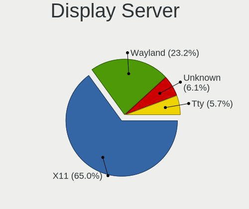

| Name    | Desktops | Percent |
|---------|----------|---------|
| X11     | 342      | 65.02%  |
| Wayland | 122      | 23.19%  |
| Unknown | 32       | 6.08%   |
| Tty     | 30       | 5.7%    |

Display Manager
---------------

SDDM, LightDM, etc.

| Name    | Desktops | Percent |
|---------|----------|---------|
| Unknown | 262      | 49.9%   |
| SDDM    | 81       | 15.43%  |
| GDM3    | 66       | 12.57%  |
| LightDM | 56       | 10.67%  |
| GDM     | 49       | 9.33%   |
| TDM     | 8        | 1.52%   |
| XDM     | 1        | 0.19%   |
| Ly      | 1        | 0.19%   |
| KDM     | 1        | 0.19%   |

OS Lang
-------

Language

| Lang    | Desktops | Percent |
|---------|----------|---------|
| en_US   | 269      | 52.33%  |
| nb_NO   | 102      | 19.84%  |
| Unknown | 50       | 9.73%   |
| en_GB   | 40       | 7.78%   |
| C       | 14       | 2.72%   |
| nn_NO   | 8        | 1.56%   |
| en_DK   | 8        | 1.56%   |
| de_DE   | 6        | 1.17%   |
| pl_PL   | 5        | 0.97%   |
| POSIX   | 2        | 0.39%   |
| it_IT   | 2        | 0.39%   |
| fr_FR   | 2        | 0.39%   |
| ru_RU   | 1        | 0.19%   |
| pt_PT   | 1        | 0.19%   |
| es_ES   | 1        | 0.19%   |
| en_CA   | 1        | 0.19%   |
| en_AG   | 1        | 0.19%   |
| da_DK   | 1        | 0.19%   |

Boot Mode
---------

EFI or BIOS

| Mode | Desktops | Percent |
|------|----------|---------|
| EFI  | 261      | 50.98%  |
| BIOS | 251      | 49.02%  |

Filesystem
----------

Type of filesystem

| Type    | Desktops | Percent |
|---------|----------|---------|
| Ext4    | 354      | 69.28%  |
| Btrfs   | 82       | 16.05%  |
| Tmpfs   | 24       | 4.7%    |
| Overlay | 24       | 4.7%    |
| Unknown | 9        | 1.76%   |
| Xfs     | 8        | 1.57%   |
| Zfs     | 6        | 1.17%   |
| Ext2    | 3        | 0.59%   |
| F2fs    | 1        | 0.2%    |

Part. scheme
------------

Scheme of partitioning

| Type    | Desktops | Percent |
|---------|----------|---------|
| GPT     | 240      | 46.51%  |
| Unknown | 239      | 46.32%  |
| MBR     | 37       | 7.17%   |

Dual Boot with Linux/BSD
------------------------

Hosting more than one Linux/BSD

| Dual boot | Desktops | Percent |
|-----------|----------|---------|
| No        | 410      | 78.85%  |
| Yes       | 110      | 21.15%  |

Dual Boot (Win)
---------------

Hosting Linux and Windows

| Dual boot | Desktops | Percent |
|-----------|----------|---------|
| No        | 350      | 68.23%  |
| Yes       | 163      | 31.77%  |

Board
-----

Vendor
------

Motherboard manufacturer

| Name                | Desktops | Percent |
|---------------------|----------|---------|
| ASUSTek Computer    | 207      | 41.4%   |
| Gigabyte Technology | 64       | 12.8%   |
| MSI                 | 62       | 12.4%   |
| Hewlett-Packard     | 44       | 8.8%    |
| ASRock              | 35       | 7%      |
| Dell                | 30       | 6%      |
| Lenovo              | 17       | 3.4%    |
| Acer                | 12       | 2.4%    |
| Intel               | 4        | 0.8%    |
| Unknown             | 4        | 0.8%    |
| Pegatron            | 3        | 0.6%    |
| Supermicro          | 2        | 0.4%    |
| Shuttle             | 2        | 0.4%    |
| Wibtek              | 1        | 0.2%    |
| Techvision          | 1        | 0.2%    |
| TB                  | 1        | 0.2%    |
| Packard Bell        | 1        | 0.2%    |
| Lenovo Product      | 1        | 0.2%    |
| Huanan              | 1        | 0.2%    |
| Fujitsu Siemens     | 1        | 0.2%    |
| Fujitsu             | 1        | 0.2%    |
| Cisco Systems       | 1        | 0.2%    |
| BESSTAR Tech        | 1        | 0.2%    |
| ASRockRack          | 1        | 0.2%    |
| Apple               | 1        | 0.2%    |
| Acidanthera         | 1        | 0.2%    |
| AAEON               | 1        | 0.2%    |

Model
-----

Motherboard model

| Name                             | Desktops | Percent |
|----------------------------------|----------|---------|
| ASUS All Series                  | 16       | 3.2%    |
| ASUS KomplettPC                  | 11       | 2.2%    |
| HP Z440 Workstation              | 10       | 2%      |
| ASUS PC                          | 8        | 1.6%    |
| ASUS ROG STRIX B360-F GAMING     | 6        | 1.2%    |
| Dell OptiPlex 9020               | 5        | 1%      |
| ASUS ROG STRIX B550-E GAMING     | 5        | 1%      |
| MSI MS-7A93                      | 4        | 0.8%    |
| MSI MS-7885                      | 4        | 0.8%    |
| Gigabyte GA-970A-UD3             | 4        | 0.8%    |
| ASUS SABERTOOTH P67              | 4        | 0.8%    |
| ASUS ROG STRIX X570-F GAMING     | 4        | 0.8%    |
| ASUS ROG STRIX B550-F GAMING     | 4        | 0.8%    |
| ASUS ROG STRIX B450-F GAMING     | 4        | 0.8%    |
| ASUS ROG CROSSHAIR VIII HERO     | 4        | 0.8%    |
| ASUS M2R-FVM                     | 4        | 0.8%    |
| Unknown                          | 4        | 0.8%    |
| MSI MS-7B86                      | 3        | 0.6%    |
| HP Compaq Elite 8300 SFF         | 3        | 0.6%    |
| Dell OptiPlex 7010               | 3        | 0.6%    |
| ASUS Z170 PRO GAMING             | 3        | 0.6%    |
| ASUS TUF Gaming B550-PRO         | 3        | 0.6%    |
| ASUS ROG STRIX X470-F GAMING     | 3        | 0.6%    |
| ASUS ROG STRIX B550-I GAMING     | 3        | 0.6%    |
| ASUS PRIME X570-P                | 3        | 0.6%    |
| ASUS P9X79 LE                    | 3        | 0.6%    |
| ASUS M5A97 R2.0                  | 3        | 0.6%    |
| ASUS CROSSHAIR VI HERO           | 3        | 0.6%    |
| ASRock X570 Taichi               | 3        | 0.6%    |
| MSI MS-7E06                      | 2        | 0.4%    |
| MSI MS-7A37                      | 2        | 0.4%    |
| MSI MS-7971                      | 2        | 0.4%    |
| MSI MS-7817                      | 2        | 0.4%    |
| MSI MS-7751                      | 2        | 0.4%    |
| MSI MS-7681                      | 2        | 0.4%    |
| HP ProDesk 600 G2 SFF            | 2        | 0.4%    |
| HP EliteDesk 800 G5 Desktop Mini | 2        | 0.4%    |
| HP EliteDesk 705 G4 DM 65W       | 2        | 0.4%    |
| Gigabyte Z790 AORUS ELITE AX     | 2        | 0.4%    |
| Gigabyte Z490I AORUS ULTRA       | 2        | 0.4%    |

Model Family
------------

Motherboard model prefix

| Name                 | Desktops | Percent |
|----------------------|----------|---------|
| ASUS ROG             | 62       | 12.4%   |
| ASUS PRIME           | 32       | 6.4%    |
| Dell OptiPlex        | 19       | 3.8%    |
| ASUS All             | 16       | 3.2%    |
| ASUS TUF             | 14       | 2.8%    |
| ASUS KomplettPC      | 11       | 2.2%    |
| Lenovo ThinkCentre   | 10       | 2%      |
| HP Z440              | 10       | 2%      |
| HP EliteDesk         | 10       | 2%      |
| Gigabyte X570        | 10       | 2%      |
| Dell Precision       | 8        | 1.6%    |
| ASUS PC              | 8        | 1.6%    |
| ASUS SABERTOOTH      | 7        | 1.4%    |
| Acer Aspire          | 7        | 1.4%    |
| Gigabyte B550        | 6        | 1.2%    |
| ASRock X570          | 6        | 1.2%    |
| HP Compaq            | 5        | 1%      |
| Gigabyte B450        | 5        | 1%      |
| ASUS CROSSHAIR       | 5        | 1%      |
| MSI MS-7A93          | 4        | 0.8%    |
| MSI MS-7885          | 4        | 0.8%    |
| Gigabyte GA-970A-UD3 | 4        | 0.8%    |
| ASUS STRIX           | 4        | 0.8%    |
| ASUS P9X79           | 4        | 0.8%    |
| ASUS P8Z77-V         | 4        | 0.8%    |
| ASUS M5A97           | 4        | 0.8%    |
| ASUS M2R-FVM         | 4        | 0.8%    |
| Unknown              | 4        | 0.8%    |
| MSI MS-7B86          | 3        | 0.6%    |
| Lenovo IdeaCentre    | 3        | 0.6%    |
| HP ProDesk           | 3        | 0.6%    |
| Gigabyte Z790        | 3        | 0.6%    |
| ASUS Z170            | 3        | 0.6%    |
| ASUS ProArt          | 3        | 0.6%    |
| ASUS Maximus         | 3        | 0.6%    |
| ASRock B450M         | 3        | 0.6%    |
| ASRock B450          | 3        | 0.6%    |
| MSI MS-7E06          | 2        | 0.4%    |
| MSI MS-7A37          | 2        | 0.4%    |
| MSI MS-7971          | 2        | 0.4%    |

MFG Year
--------

Motherboard manufacture year

| Year | Desktops | Percent |
|------|----------|---------|
| 2019 | 53       | 10.6%   |
| 2018 | 52       | 10.4%   |
| 2020 | 49       | 9.8%    |
| 2014 | 41       | 8.2%    |
| 2012 | 41       | 8.2%    |
| 2021 | 35       | 7%      |
| 2017 | 34       | 6.8%    |
| 2013 | 32       | 6.4%    |
| 2015 | 29       | 5.8%    |
| 2022 | 28       | 5.6%    |
| 2011 | 22       | 4.4%    |
| 2016 | 21       | 4.2%    |
| 2023 | 14       | 2.8%    |
| 2010 | 12       | 2.4%    |
| 2009 | 9        | 1.8%    |
| 2006 | 7        | 1.4%    |
| 2024 | 6        | 1.2%    |
| 2007 | 6        | 1.2%    |
| 2008 | 5        | 1%      |
| 2005 | 3        | 0.6%    |
| 2001 | 1        | 0.2%    |

Form Factor
-----------

Physical design of the computer

| Name    | Desktops | Percent |
|---------|----------|---------|
| Desktop | 500      | 100%    |

Secure Boot
-----------

Enabled or disabled

| State    | Desktops | Percent |
|----------|----------|---------|
| Disabled | 479      | 95.04%  |
| Enabled  | 25       | 4.96%   |

Coreboot
--------

Have coreboot on board

| Used | Desktops | Percent |
|------|----------|---------|
| No   | 500      | 100%    |

RAM Size
--------

Total RAM memory

| Size in GB      | Desktops | Percent |
|-----------------|----------|---------|
| 32.01-64.0      | 155      | 30.33%  |
| 16.01-24.0      | 132      | 25.83%  |
| 64.01-256.0     | 60       | 11.74%  |
| 8.01-16.0       | 56       | 10.96%  |
| 4.01-8.0        | 54       | 10.57%  |
| 3.01-4.0        | 28       | 5.48%   |
| 24.01-32.0      | 17       | 3.33%   |
| 1.01-2.0        | 4        | 0.78%   |
| More than 256.0 | 2        | 0.39%   |
| 2.01-3.0        | 2        | 0.39%   |
| 0.01-0.5        | 1        | 0.2%    |

RAM Used
--------

Used RAM memory

| Used GB     | Desktops | Percent |
|-------------|----------|---------|
| 4.01-8.0    | 138      | 23.75%  |
| 1.01-2.0    | 124      | 21.34%  |
| 2.01-3.0    | 109      | 18.76%  |
| 3.01-4.0    | 86       | 14.8%   |
| 8.01-16.0   | 60       | 10.33%  |
| 0.51-1.0    | 25       | 4.3%    |
| 16.01-24.0  | 13       | 2.24%   |
| 24.01-32.0  | 10       | 1.72%   |
| 0.01-0.5    | 8        | 1.38%   |
| 32.01-64.0  | 6        | 1.03%   |
| 64.01-256.0 | 2        | 0.34%   |

Total Drives
------------

Number of drives on board

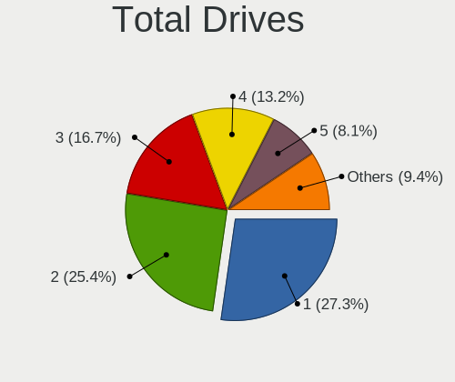

| Drives | Desktops | Percent |
|--------|----------|---------|
| 1      | 145      | 27.26%  |
| 2      | 135      | 25.38%  |
| 3      | 89       | 16.73%  |
| 4      | 70       | 13.16%  |
| 5      | 43       | 8.08%   |
| 6      | 25       | 4.7%    |
| 7      | 8        | 1.5%    |
| 0      | 8        | 1.5%    |
| 8      | 4        | 0.75%   |
| 11     | 2        | 0.38%   |
| 9      | 2        | 0.38%   |
| 10     | 1        | 0.19%   |

Has CD-ROM
----------

Has CD-ROM on board

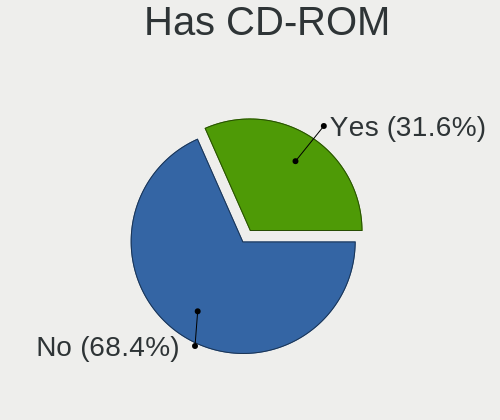

| Presented | Desktops | Percent |
|-----------|----------|---------|
| No        | 346      | 68.38%  |
| Yes       | 160      | 31.62%  |

Has Ethernet
------------

Has Ethernet on board

| Presented | Desktops | Percent |
|-----------|----------|---------|
| Yes       | 497      | 99.4%   |
| No        | 3        | 0.6%    |

Has WiFi
--------

Has WiFi module

| Presented | Desktops | Percent |
|-----------|----------|---------|
| Yes       | 260      | 51.49%  |
| No        | 245      | 48.51%  |

Has Bluetooth
-------------

Has Bluetooth module

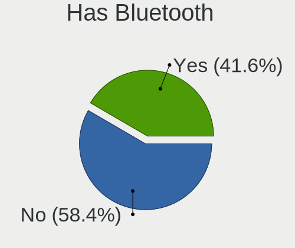

| Presented | Desktops | Percent |
|-----------|----------|---------|
| No        | 296      | 58.38%  |
| Yes       | 211      | 41.62%  |

Location
--------

Country
-------

Geographic location (country)

| Country | Desktops | Percent |
|---------|----------|---------|
| Norway  | 500      | 100%    |

City
----

Geographic location (city)

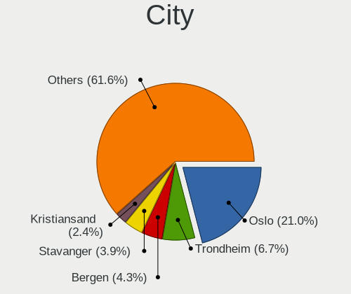

| City         | Desktops | Percent |
|--------------|----------|---------|
| Oslo         | 112      | 20.97%  |
| Trondheim    | 36       | 6.74%   |
| Bergen       | 23       | 4.31%   |
| Stavanger    | 21       | 3.93%   |
| Kristiansand | 13       | 2.43%   |
| Sandefjord   | 10       | 1.87%   |
| lesund     | 10       | 1.87%   |
| Levanger     | 9        | 1.69%   |
| Troms      | 6        | 1.12%   |
| Skien        | 6        | 1.12%   |
| Nesttun      | 6        | 1.12%   |
| Fredrikstad  | 6        | 1.12%   |
| Drammen      | 6        | 1.12%   |
| Sandnes      | 5        | 0.94%   |
| Porsgrunn    | 5        | 0.94%   |
| Mo i Rana    | 5        | 0.94%   |
| Lillehammer  | 5        | 0.94%   |
| Kongsberg    | 5        | 0.94%   |
| Fornebu      | 5        | 0.94%   |
| Asker        | 5        | 0.94%   |
| Sarpsborg    | 4        | 0.75%   |
| Langhus      | 4        | 0.75%   |
| Haugesund    | 4        | 0.75%   |
| Fetsund      | 4        | 0.75%   |
| Arendal      | 4        | 0.75%   |
| Vennesla     | 3        | 0.56%   |
| Stjordal     | 3        | 0.56%   |
| Steinkjer    | 3        | 0.56%   |
| Soreide      | 3        | 0.56%   |
| Notodden     | 3        | 0.56%   |
| Narvik       | 3        | 0.56%   |
| Lillestrm  | 3        | 0.56%   |
| Lillesand    | 3        | 0.56%   |
| Larvik       | 3        | 0.56%   |
| Lampeland    | 3        | 0.56%   |
| Kopervik     | 3        | 0.56%   |
| Honefoss     | 3        | 0.56%   |
| Heimdal      | 3        | 0.56%   |
| Harstad      | 3        | 0.56%   |
| Fannrem      | 3        | 0.56%   |

Drives
------

Drive Vendor
------------

Hard drive vendors

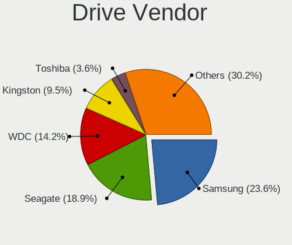

| Vendor                      | Desktops | Drives | Percent |
|-----------------------------|----------|--------|---------|
| Samsung Electronics         | 242      | 495    | 23.56%  |
| Seagate                     | 194      | 407    | 18.89%  |
| WDC                         | 146      | 377    | 14.22%  |
| Kingston                    | 98       | 154    | 9.54%   |
| Toshiba                     | 37       | 45     | 3.6%    |
| Intel                       | 34       | 50     | 3.31%   |
| Crucial                     | 34       | 64     | 3.31%   |
| SanDisk                     | 30       | 41     | 2.92%   |
| Corsair                     | 26       | 40     | 2.53%   |
| Hitachi                     | 21       | 30     | 2.04%   |
| Kingston Technology Company | 20       | 26     | 1.95%   |
| Phison Electronics          | 19       | 29     | 1.85%   |
| OCZ                         | 15       | 15     | 1.46%   |
| HGST                        | 15       | 26     | 1.46%   |
| Phison                      | 13       | 17     | 1.27%   |
| Micron Technology           | 10       | 13     | 0.97%   |
| PNY                         | 8        | 14     | 0.78%   |
| A-DATA Technology           | 6        | 11     | 0.58%   |
| Unknown                     | 5        | 7      | 0.49%   |
| LITEONIT                    | 5        | 5      | 0.49%   |
| SK hynix                    | 4        | 4      | 0.39%   |
| LITEON                      | 4        | 4      | 0.39%   |
| JMicron Technology          | 4        | 3      | 0.39%   |
| Apple                       | 4        | 5      | 0.39%   |
| Silicon Motion              | 3        | 4      | 0.29%   |
| Intenso                     | 3        | 4      | 0.29%   |
| Verbatim                    | 2        | 3      | 0.19%   |
| Unknown                     | 2        | 3      | 0.19%   |
| WDS500G3                    | 1        | 1      | 0.1%    |
| SSK                         | 1        | 1      | 0.1%    |
| SPCC                        | 1        | 1      | 0.1%    |
| SandForce                   | 1        | 2      | 0.1%    |
| SABRENT                     | 1        | 2      | 0.1%    |
| Radeon                      | 1        | 1      | 0.1%    |
| Patriot                     | 1        | 1      | 0.1%    |
| NX-128 2                    | 1        | 1      | 0.1%    |
| Netac                       | 1        | 1      | 0.1%    |
| MBED                        | 1        | 1      | 0.1%    |
| LDLC                        | 1        | 1      | 0.1%    |
| LaCie                       | 1        | 1      | 0.1%    |

Drive Model
-----------

Hard drive models

| Model                                                | Desktops | Percent |
|------------------------------------------------------|----------|---------|
| Samsung SSD 860 EVO 1TB                              | 18       | 1.4%    |
| Seagate ST500DM002-1BD142 500GB                      | 16       | 1.24%   |
| Samsung SSD 850 EVO 250GB                            | 16       | 1.24%   |
| Samsung NVMe SSD Controller SM981/PM981/PM983 512GB  | 16       | 1.24%   |
| Samsung SSD 850 EVO 500GB                            | 14       | 1.09%   |
| Samsung SSD 840 EVO 250GB                            | 14       | 1.09%   |
| Kingston SV300S37A120G 120GB SSD                     | 13       | 1.01%   |
| WDC WDS500G2B0A-00SM50 500GB SSD                     | 12       | 0.93%   |
| Samsung SSD 860 EVO 500GB                            | 12       | 0.93%   |
| Seagate ST4000DM004-2CV104 4TB                       | 11       | 0.85%   |
| Samsung NVMe SSD Controller SM961/PM961/SM963 256GB  | 11       | 0.85%   |
| Seagate ST1000DM010-2EP102 1TB                       | 9        | 0.7%    |
| Seagate ST1000DM003-1CH162 1TB                       | 9        | 0.7%    |
| Samsung SSD 970 EVO Plus 1TB                         | 9        | 0.7%    |
| Samsung NVMe SSD Controller PM9A1/PM9A3/980PRO 512GB | 9        | 0.7%    |
| Phison E12 NVMe Controller 480GB                     | 9        | 0.7%    |
| WDC WD30EFRX-68EUZN0 3TB                             | 8        | 0.62%   |
| Seagate ST4000VN008-2DR166 4TB                       | 8        | 0.62%   |
| Seagate ST2000DM006-2DM164 2TB                       | 8        | 0.62%   |
| Seagate ST2000DM001-1ER164 2TB                       | 7        | 0.54%   |
| Seagate Expansion 1TB                                | 7        | 0.54%   |
| Samsung SSD 860 EVO 250GB                            | 7        | 0.54%   |
| Samsung SSD 840 EVO 120GB                            | 7        | 0.54%   |
| Samsung NVMe SSD Drive 500GB                         | 7        | 0.54%   |
| Samsung NVMe SSD Drive 1TB                           | 7        | 0.54%   |
| Phison E16 PCIe4 NVMe Controller 1TB                 | 7        | 0.54%   |
| Kingston SFYRD2000G 2TB                              | 7        | 0.54%   |
| Kingston NVMe SSD Drive 1TB                          | 7        | 0.54%   |
| Seagate ST2000DM008-2FR102 2TB                       | 6        | 0.47%   |
| Seagate ST2000DM001-9YN164 2TB                       | 6        | 0.47%   |
| Seagate Backup+ Hub BK 4TB                           | 6        | 0.47%   |
| Samsung SSD 970 EVO Plus 500GB                       | 6        | 0.47%   |
| Samsung SSD 870 QVO 2TB                              | 6        | 0.47%   |
| Samsung SSD 860 EVO 2TB                              | 6        | 0.47%   |
| Kingston Company SNV2S1000G 1TB                      | 6        | 0.47%   |
| Kingston Company A2000 NVMe SSD 500GB                | 6        | 0.47%   |
| Kingston SUV400S37240G 240GB SSD                     | 6        | 0.47%   |
| Kingston SA400S37240G 240GB SSD                      | 6        | 0.47%   |
| Seagate ST8000VN004-2M2101 8TB                       | 5        | 0.39%   |
| Seagate ST2000DM001-1CH164 2TB                       | 5        | 0.39%   |

HDD Vendor
----------

Hard disk drive vendors

| Vendor              | Desktops | Drives | Percent |
|---------------------|----------|--------|---------|
| Seagate             | 186      | 396    | 44.5%   |
| WDC                 | 120      | 299    | 28.71%  |
| Samsung Electronics | 32       | 66     | 7.66%   |
| Toshiba             | 31       | 35     | 7.42%   |
| Hitachi             | 21       | 30     | 5.02%   |
| HGST                | 15       | 26     | 3.59%   |
| Apple               | 4        | 5      | 0.96%   |
| Unknown             | 3        | 5      | 0.72%   |
| JMicron Technology  | 2        | 2      | 0.48%   |
| SABRENT             | 1        | 2      | 0.24%   |
| Intenso             | 1        | 1      | 0.24%   |
| IET                 | 1        | 2      | 0.24%   |
| Unknown             | 1        | 1      | 0.24%   |

SSD Vendor
----------

Solid state drive vendors

| Vendor              | Desktops | Drives | Percent |
|---------------------|----------|--------|---------|
| Samsung Electronics | 147      | 243    | 40.16%  |
| Kingston            | 63       | 90     | 17.21%  |
| Crucial             | 31       | 61     | 8.47%   |
| WDC                 | 23       | 61     | 6.28%   |
| Intel               | 20       | 31     | 5.46%   |
| OCZ                 | 15       | 15     | 4.1%    |
| Corsair             | 12       | 17     | 3.28%   |
| SanDisk             | 10       | 11     | 2.73%   |
| PNY                 | 8        | 14     | 2.19%   |
| A-DATA Technology   | 6        | 11     | 1.64%   |
| LITEONIT            | 5        | 5      | 1.37%   |
| Micron Technology   | 4        | 6      | 1.09%   |
| LITEON              | 4        | 4      | 1.09%   |
| Verbatim            | 2        | 3      | 0.55%   |
| Toshiba             | 2        | 3      | 0.55%   |
| SK hynix            | 2        | 2      | 0.55%   |
| SPCC                | 1        | 1      | 0.27%   |
| SandForce           | 1        | 2      | 0.27%   |
| Radeon              | 1        | 1      | 0.27%   |
| Patriot             | 1        | 1      | 0.27%   |
| Netac               | 1        | 1      | 0.27%   |
| LDLC                | 1        | 1      | 0.27%   |
| KingSpec            | 1        | 2      | 0.27%   |
| KingFast            | 1        | 1      | 0.27%   |
| Intenso             | 1        | 1      | 0.27%   |
| Goodram             | 1        | 1      | 0.27%   |
| China               | 1        | 1      | 0.27%   |
| Unknown             | 1        | 2      | 0.27%   |

Drive Kind
----------

HDD or SSD

| Kind    | Desktops | Drives | Percent |
|---------|----------|--------|---------|
| HDD     | 311      | 870    | 36.46%  |
| SSD     | 294      | 592    | 34.47%  |
| NVMe    | 235      | 448    | 27.55%  |
| Unknown | 12       | 18     | 1.41%   |
| MMC     | 1        | 1      | 0.12%   |

Drive Connector
---------------

SATA, SAS, NVMe, etc.

| Type | Desktops | Drives | Percent |
|------|----------|--------|---------|
| SATA | 412      | 1397   | 59.03%  |
| NVMe | 233      | 444    | 33.38%  |
| SAS  | 52       | 87     | 7.45%   |
| MMC  | 1        | 1      | 0.14%   |

Drive Size
----------

Size of hard drive

| Size in TB | Desktops | Drives | Percent |
|------------|----------|--------|---------|
| 0.01-0.5   | 305      | 626    | 42.9%   |
| 0.51-1.0   | 169      | 284    | 23.77%  |
| 1.01-2.0   | 92       | 193    | 12.94%  |
| 3.01-4.0   | 52       | 92     | 7.31%   |
| 2.01-3.0   | 40       | 99     | 5.63%   |
| 4.01-10.0  | 40       | 148    | 5.63%   |
| 10.01-20.0 | 13       | 20     | 1.83%   |

Space Total
-----------

Amount of disk space available on the file system

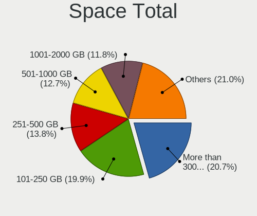

| Size in GB     | Desktops | Percent |
|----------------|----------|---------|
| More than 3000 | 112      | 20.66%  |
| 101-250        | 108      | 19.93%  |
| 251-500        | 75       | 13.84%  |
| 501-1000       | 69       | 12.73%  |
| 1001-2000      | 64       | 11.81%  |
| 2001-3000      | 39       | 7.2%    |
| 1-20           | 29       | 5.35%   |
| Unknown        | 23       | 4.24%   |
| 51-100         | 16       | 2.95%   |
| 21-50          | 7        | 1.29%   |

Space Used
----------

Amount of used disk space

| Used GB        | Desktops | Percent |
|----------------|----------|---------|
| 1-20           | 161      | 28.1%   |
| 101-250        | 61       | 10.65%  |
| 21-50          | 60       | 10.47%  |
| 501-1000       | 59       | 10.3%   |
| 1001-2000      | 48       | 8.38%   |
| More than 3000 | 47       | 8.2%    |
| 251-500        | 46       | 8.03%   |
| 51-100         | 43       | 7.5%    |
| 2001-3000      | 24       | 4.19%   |
| Unknown        | 23       | 4.01%   |
| 0              | 1        | 0.17%   |

Malfunc. Drives
---------------

Drive models with a malfunction

| Model                                 | Desktops | Drives | Percent |
|---------------------------------------|----------|--------|---------|
| Seagate ST500DM002-1BD142 500GB       | 3        | 4      | 4.11%   |
| WDC WD60EFRX-68L0BN1 6TB              | 2        | 2      | 2.74%   |
| WDC WD5000AAKS-00UU3A0 500GB          | 2        | 5      | 2.74%   |
| WDC WD30EFRX-68EUZN0 3TB              | 2        | 2      | 2.74%   |
| Seagate ST31000528AS 1TB              | 2        | 2      | 2.74%   |
| Seagate ST31000524AS 1TB              | 2        | 2      | 2.74%   |
| Seagate ST2000DM008-2FR102 2TB        | 2        | 2      | 2.74%   |
| Samsung Electronics HD501LJ 500GB     | 2        | 2      | 2.74%   |
| Hitachi HTS543216L9SA00 160GB         | 2        | 2      | 2.74%   |
| Hitachi HDS722020ALA330 2TB           | 2        | 2      | 2.74%   |
| WDC WDS500G2B0A-00SM50 500GB SSD      | 1        | 2      | 1.37%   |
| WDC WD800JB-00CRA1 80GB               | 1        | 1      | 1.37%   |
| WDC WD800BB-00CAA1 80GB               | 1        | 1      | 1.37%   |
| WDC WD6400AAKS-75A7B0 640GB           | 1        | 2      | 1.37%   |
| WDC WD5000AAJS-00YFA0 500GB           | 1        | 1      | 1.37%   |
| WDC WD3200AAKS-00V1A0 320GB           | 1        | 1      | 1.37%   |
| WDC WD30EZRX-00AZ6B0 3TB              | 1        | 1      | 1.37%   |
| WDC WD2002FAEX-007BA0 2TB             | 1        | 1      | 1.37%   |
| WDC WD10JPVT-60A1YT0 1TB              | 1        | 1      | 1.37%   |
| WDC WD10EALX-009BA0 1TB               | 1        | 1      | 1.37%   |
| WDC WD10EADS-114BB1 1TB               | 1        | 1      | 1.37%   |
| WDC WD1002FBYS-18W8B1 1TB             | 1        | 3      | 1.37%   |
| WDC WD1002FAEX-00Z3A0 1TB             | 1        | 1      | 1.37%   |
| WDC WD Blue SA510 M.2 2280 1000GB SSD | 1        | 1      | 1.37%   |
| Toshiba MQ01ABD100 1TB                | 1        | 1      | 1.37%   |
| Toshiba HDWD130 3TB                   | 1        | 2      | 1.37%   |
| Toshiba HDWD110 1TB                   | 1        | 1      | 1.37%   |
| Toshiba DT01ACA100 1TB                | 1        | 1      | 1.37%   |
| Seagate ST9320320AS 320GB             | 1        | 1      | 1.37%   |
| Seagate ST9250827AS 250GB             | 1        | 1      | 1.37%   |
| Seagate ST4000VN008-2DR166 4TB        | 1        | 1      | 1.37%   |
| Seagate ST4000LM024-2AN17V 4TB        | 1        | 1      | 1.37%   |
| Seagate ST3500630AS 500GB             | 1        | 1      | 1.37%   |
| Seagate ST3500418AS 500GB             | 1        | 1      | 1.37%   |
| Seagate ST3000DM008-2DM166 3TB        | 1        | 1      | 1.37%   |
| Seagate ST3000DM001-1CH166 3TB        | 1        | 18     | 1.37%   |
| Seagate ST2000DX002-2DV164 2TB        | 1        | 2      | 1.37%   |
| Seagate ST2000DM006-2DM164 2TB        | 1        | 1      | 1.37%   |
| Seagate ST2000DM001-1E6164 2TB        | 1        | 1      | 1.37%   |
| Seagate ST1000LM014-1EJ164 1TB        | 1        | 1      | 1.37%   |

Malfunc. Drive Vendor
---------------------

Vendors of faulty drives

| Vendor              | Desktops | Drives | Percent |
|---------------------|----------|--------|---------|
| Seagate             | 22       | 42     | 30.99%  |
| WDC                 | 19       | 27     | 26.76%  |
| Samsung Electronics | 8        | 8      | 11.27%  |
| Hitachi             | 5        | 5      | 7.04%   |
| Toshiba             | 4        | 5      | 5.63%   |
| Intel               | 3        | 3      | 4.23%   |
| OCZ                 | 2        | 2      | 2.82%   |
| LITEON              | 2        | 2      | 2.82%   |
| HGST                | 2        | 3      | 2.82%   |
| SanDisk             | 1        | 1      | 1.41%   |
| Kingston            | 1        | 1      | 1.41%   |
| Crucial             | 1        | 1      | 1.41%   |
| Corsair             | 1        | 1      | 1.41%   |

Malfunc. HDD Vendor
-------------------

Vendors of faulty HDD drives

| Vendor              | Desktops | Drives | Percent |
|---------------------|----------|--------|---------|
| Seagate             | 22       | 42     | 41.51%  |
| WDC                 | 17       | 24     | 32.08%  |
| Hitachi             | 5        | 5      | 9.43%   |
| Toshiba             | 4        | 5      | 7.55%   |
| Samsung Electronics | 3        | 3      | 5.66%   |
| HGST                | 2        | 3      | 3.77%   |

Malfunc. Drive Kind
-------------------

Kinds of faulty drives

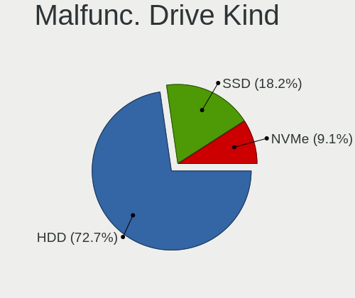

| Kind | Desktops | Drives | Percent |
|------|----------|--------|---------|
| HDD  | 48       | 82     | 72.73%  |
| SSD  | 12       | 13     | 18.18%  |
| NVMe | 6        | 6      | 9.09%   |

Failed Drives
-------------

Failed drive models

| Model                            | Desktops | Drives | Percent |
|----------------------------------|----------|--------|---------|
| Apple HDD HTS541010A9E662 1TB    | 3        | 3      | 75%     |
| Kingston SV300S37A120G 120GB SSD | 1        | 1      | 25%     |

Failed Drive Vendor
-------------------

Failed drive vendors

| Vendor   | Desktops | Drives | Percent |
|----------|----------|--------|---------|
| Apple    | 3        | 3      | 75%     |
| Kingston | 1        | 1      | 25%     |

Drive Status
------------

Number of failed and malfunc. drives

| Status   | Desktops | Drives | Percent |
|----------|----------|--------|---------|
| Detected | 285      | 1052   | 49.14%  |
| Works    | 227      | 770    | 39.14%  |
| Malfunc  | 63       | 101    | 10.86%  |
| Failed   | 4        | 4      | 0.69%   |
| Limited  | 1        | 2      | 0.17%   |

Storage controller
------------------

Storage Vendor
--------------

Storage controller vendors

| Vendor                           | Desktops | Percent |
|----------------------------------|----------|---------|
| Intel                            | 303      | 35.65%  |
| AMD                              | 194      | 22.82%  |
| Samsung Electronics              | 115      | 13.53%  |
| Kingston Technology Company      | 58       | 6.82%   |
| Phison Electronics               | 43       | 5.06%   |
| ASMedia Technology               | 34       | 4%      |
| SanDisk                          | 33       | 3.88%   |
| Marvell Technology Group         | 11       | 1.29%   |
| JMicron Technology               | 10       | 1.18%   |
| Nvidia                           | 7        | 0.82%   |
| LSI Logic / Symbios Logic        | 7        | 0.82%   |
| Micron Technology                | 6        | 0.71%   |
| Seagate Technology               | 5        | 0.59%   |
| Toshiba America Info Systems     | 4        | 0.47%   |
| Broadcom / LSI                   | 4        | 0.47%   |
| Silicon Motion                   | 3        | 0.35%   |
| Micron/Crucial Technology        | 3        | 0.35%   |
| SK hynix                         | 2        | 0.24%   |
| KIOXIA                           | 2        | 0.24%   |
| ADATA Technology                 | 2        | 0.24%   |
| Silicon Integrated Systems [SiS] | 1        | 0.12%   |
| Silicon Image                    | 1        | 0.12%   |
| Hewlett-Packard                  | 1        | 0.12%   |
| Adaptec                          | 1        | 0.12%   |

Storage Model
-------------

Storage controller models

| Model                                                                          | Desktops | Percent |
|--------------------------------------------------------------------------------|----------|---------|
| AMD FCH SATA Controller [AHCI mode]                                            | 107      | 10.55%  |
| Samsung NVMe SSD Controller SM981/PM981/PM983                                  | 59       | 5.82%   |
| Samsung NVMe SSD Controller SM961/PM961/SM963                                  | 35       | 3.45%   |
| AMD 500 Series Chipset SATA Controller                                         | 35       | 3.45%   |
| AMD 400 Series Chipset SATA Controller                                         | 35       | 3.45%   |
| Intel 8 Series/C220 Series Chipset Family 6-port SATA Controller 1 [AHCI mode] | 33       | 3.25%   |
| ASMedia ASM1061/ASM1062 Serial ATA Controller                                  | 32       | 3.16%   |
| Intel Q170/Q150/B150/H170/H110/Z170/CM236 Chipset SATA Controller [AHCI Mode]  | 28       | 2.76%   |
| Intel 200 Series PCH SATA controller [AHCI mode]                               | 28       | 2.76%   |
| Intel SATA Controller [RAID mode]                                              | 26       | 2.56%   |
| Intel Cannon Lake PCH SATA AHCI Controller                                     | 26       | 2.56%   |
| Kingston Company A2000 NVMe SSD [SM2263EN]                                     | 21       | 2.07%   |
| Intel C610/X99 series chipset sSATA Controller [AHCI mode]                     | 21       | 2.07%   |
| Intel 7 Series/C210 Series Chipset Family 6-port SATA Controller [AHCI mode]   | 21       | 2.07%   |
| Phison E16 PCIe4 NVMe Controller                                               | 20       | 1.97%   |
| Intel C610/X99 series chipset 6-Port SATA Controller [AHCI mode]               | 20       | 1.97%   |
| Phison E12 NVMe Controller                                                     | 18       | 1.78%   |
| AMD 600 Series Chipset SATA Controller                                         | 17       | 1.68%   |
| Samsung NVMe SSD Controller PM9A1/PM9A3/980PRO                                 | 16       | 1.58%   |
| Intel 6 Series/C200 Series Chipset Family 6 port Desktop SATA AHCI Controller  | 15       | 1.48%   |
| Kingston Company KC3000/FURY Renegade NVMe SSD [E18]                           | 13       | 1.28%   |
| AMD SB7x0/SB8x0/SB9x0 SATA Controller [AHCI mode]                              | 13       | 1.28%   |
| Samsung NVMe SSD Controller S4LV008[Pascal]                                    | 11       | 1.08%   |
| Intel Alder Lake-S PCH SATA Controller [AHCI Mode]                             | 11       | 1.08%   |
| SanDisk Ultra 3D / WD PC SN530, IX SN530, Blue SN550 NVMe SSD (DRAM-less)      | 10       | 0.99%   |
| Intel Raptor Lake SATA AHCI Controller                                         | 10       | 0.99%   |
| AMD SB7x0/SB8x0/SB9x0 IDE Controller                                           | 10       | 0.99%   |
| AMD 300 Series Chipset SATA Controller                                         | 10       | 0.99%   |
| Kingston Company NV2 NVMe SSD [SM2267XT] (DRAM-less)                           | 9        | 0.89%   |
| Intel Volume Management Device NVMe RAID Controller                            | 9        | 0.89%   |
| Intel SSD 660P Series                                                          | 9        | 0.89%   |
| Intel 9 Series Chipset Family SATA Controller [AHCI Mode]                      | 9        | 0.89%   |
| AMD X370 Series Chipset SATA Controller                                        | 8        | 0.79%   |
| Intel C600/X79 series chipset 6-Port SATA AHCI Controller                      | 7        | 0.69%   |
| Intel 500 Series Chipset Family SATA AHCI Controller                           | 7        | 0.69%   |
| SanDisk Extreme Pro / WD Black SN750 / PC SN730 / Red SN700 NVMe SSD           | 6        | 0.59%   |
| Samsung NVMe SSD Controller SM951/PM951                                        | 6        | 0.59%   |
| Samsung NVMe SSD Controller 980 (DRAM-less)                                    | 6        | 0.59%   |
| JMicron JMB362 SATA Controller                                                 | 6        | 0.59%   |
| Intel Comet Lake SATA AHCI Controller                                          | 6        | 0.59%   |

Storage Kind
------------

Kind of storage controller (IDE, SATA, NVMe, SAS, ...)

| Kind | Desktops | Percent |
|------|----------|---------|
| SATA | 450      | 56.82%  |
| NVMe | 234      | 29.55%  |
| IDE  | 51       | 6.44%   |
| RAID | 44       | 5.56%   |
| SAS  | 7        | 0.88%   |
| SCSI | 6        | 0.76%   |

Processor
---------

CPU Vendor
----------

Processor vendors

| Vendor | Desktops | Percent |
|--------|----------|---------|
| Intel  | 297      | 59.4%   |
| AMD    | 203      | 40.6%   |

CPU Model
---------

Processor models

| Model                                      | Desktops | Percent |
|--------------------------------------------|----------|---------|
| AMD Ryzen 5 5600X 6-Core Processor         | 18       | 3.57%   |
| AMD Ryzen 9 3900X 12-Core Processor        | 15       | 2.98%   |
| AMD Ryzen 5 3600 6-Core Processor          | 11       | 2.18%   |
| Intel Xeon CPU E5-1630 v3 @ 3.70GHz        | 10       | 1.98%   |
| AMD Ryzen 7 2700X Eight-Core Processor     | 10       | 1.98%   |
| AMD Ryzen 7 3700X 8-Core Processor         | 9        | 1.79%   |
| Intel Core i7-2600K CPU @ 3.40GHz          | 8        | 1.59%   |
| AMD Ryzen 9 5950X 16-Core Processor        | 8        | 1.59%   |
| AMD Ryzen 9 5900X 12-Core Processor        | 8        | 1.59%   |
| AMD Ryzen 7 5800X 8-Core Processor         | 8        | 1.59%   |
| Intel Core i7-6700K CPU @ 4.00GHz          | 7        | 1.39%   |
| Intel Core i7-9700K CPU @ 3.60GHz          | 6        | 1.19%   |
| Intel Core i7-4790 CPU @ 3.60GHz           | 6        | 1.19%   |
| Intel Core i7-3770 CPU @ 3.40GHz           | 6        | 1.19%   |
| Intel Core i9-9900K CPU @ 3.60GHz          | 5        | 0.99%   |
| Intel Core i7-5820K CPU @ 3.30GHz          | 5        | 0.99%   |
| Intel Core i7-3770K CPU @ 3.50GHz          | 5        | 0.99%   |
| Intel Core i5-4590 CPU @ 3.30GHz           | 5        | 0.99%   |
| Intel Core i5-4460 CPU @ 3.20GHz           | 5        | 0.99%   |
| AMD Ryzen 7 5800X3D 8-Core Processor       | 5        | 0.99%   |
| AMD Ryzen 5 1600 Six-Core Processor        | 5        | 0.99%   |
| Intel Core i7-8700 CPU @ 3.20GHz           | 4        | 0.79%   |
| Intel Core i7-7700K CPU @ 4.20GHz          | 4        | 0.79%   |
| Intel Core i7-6700 CPU @ 3.40GHz           | 4        | 0.79%   |
| Intel Core i5-3570K CPU @ 3.40GHz          | 4        | 0.79%   |
| AMD Ryzen 9 7950X3D 16-Core Processor      | 4        | 0.79%   |
| AMD Ryzen 9 3950X 16-Core Processor        | 4        | 0.79%   |
| AMD Ryzen 7 1700 Eight-Core Processor      | 4        | 0.79%   |
| AMD Athlon 64 X2 Dual Core Processor 5400+ | 4        | 0.79%   |
| Intel Core i7-8700K CPU @ 3.70GHz          | 3        | 0.6%    |
| Intel Core i7-7820X CPU @ 3.60GHz          | 3        | 0.6%    |
| Intel Core i7-7700 CPU @ 3.60GHz           | 3        | 0.6%    |
| Intel Core i7-6800K CPU @ 3.40GHz          | 3        | 0.6%    |
| Intel Core i7-3820 CPU @ 3.60GHz           | 3        | 0.6%    |
| Intel Core i5-9600K CPU @ 3.70GHz          | 3        | 0.6%    |
| Intel Core i5-9500 CPU @ 3.00GHz           | 3        | 0.6%    |
| Intel Core i5-7400 CPU @ 3.00GHz           | 3        | 0.6%    |
| Intel Core i5-6600K CPU @ 3.50GHz          | 3        | 0.6%    |
| Intel Core i5-6400 CPU @ 2.70GHz           | 3        | 0.6%    |
| Intel Core i5-3570 CPU @ 3.40GHz           | 3        | 0.6%    |

CPU Model Family
----------------

Processor model prefix

| Model                   | Desktops | Percent |
|-------------------------|----------|---------|
| Intel Core i7           | 93       | 18.49%  |
| Intel Core i5           | 83       | 16.5%   |
| AMD Ryzen 7             | 52       | 10.34%  |
| AMD Ryzen 5             | 48       | 9.54%   |
| AMD Ryzen 9             | 47       | 9.34%   |
| Intel Xeon              | 34       | 6.76%   |
| Other                   | 23       | 4.57%   |
| Intel Core i9           | 18       | 3.58%   |
| Intel Core i3           | 17       | 3.38%   |
| AMD FX                  | 12       | 2.39%   |
| Intel Celeron           | 7        | 1.39%   |
| Intel Pentium           | 6        | 1.19%   |
| AMD Athlon 64 X2        | 6        | 1.19%   |
| AMD Ryzen Threadripper  | 5        | 0.99%   |
| AMD Phenom II X4        | 5        | 0.99%   |
| AMD A10                 | 5        | 0.99%   |
| Intel Core 2 Quad       | 4        | 0.8%    |
| AMD Ryzen 5 PRO         | 3        | 0.6%    |
| AMD A8                  | 3        | 0.6%    |
| Intel Pentium Dual-Core | 2        | 0.4%    |
| Intel Core 2 Duo        | 2        | 0.4%    |
| Intel Core 2            | 2        | 0.4%    |
| Intel Atom              | 2        | 0.4%    |
| AMD Ryzen 3             | 2        | 0.4%    |
| AMD Athlon II X4        | 2        | 0.4%    |
| AMD Athlon 64           | 2        | 0.4%    |
| AMD Athlon              | 2        | 0.4%    |
| AMD A4                  | 2        | 0.4%    |
| Intel Pentium Silver    | 1        | 0.2%    |
| Intel Pentium III       | 1        | 0.2%    |
| Intel Pentium Gold      | 1        | 0.2%    |
| Intel Pentium Dual      | 1        | 0.2%    |
| Intel Pentium D         | 1        | 0.2%    |
| AMD Sempron             | 1        | 0.2%    |
| AMD Ryzen 7 PRO         | 1        | 0.2%    |
| AMD PRO A10             | 1        | 0.2%    |
| AMD Phenom II X6        | 1        | 0.2%    |
| AMD EPYC                | 1        | 0.2%    |
| AMD Dual Core Opteron   | 1        | 0.2%    |
| AMD Athlon II X2        | 1        | 0.2%    |

CPU Cores
---------

Number of processor cores

| Number | Desktops | Percent |
|--------|----------|---------|
| 4      | 171      | 33.93%  |
| 6      | 97       | 19.25%  |
| 8      | 78       | 15.48%  |
| 2      | 60       | 11.9%   |
| 12     | 33       | 6.55%   |
| 16     | 24       | 4.76%   |
| 10     | 8        | 1.59%   |
| 1      | 7        | 1.39%   |
| 14     | 6        | 1.19%   |
| 3      | 6        | 1.19%   |
| 24     | 5        | 0.99%   |
| 28     | 3        | 0.6%    |
| 20     | 3        | 0.6%    |
| 18     | 2        | 0.4%    |
| 32     | 1        | 0.2%    |

CPU Sockets
-----------

Number of sockets

| Number | Desktops | Percent |
|--------|----------|---------|
| 1      | 489      | 97.8%   |
| 2      | 11       | 2.2%    |

CPU Threads
-----------

Threads per core (Hyper-Threading)

| Number | Desktops | Percent |
|--------|----------|---------|
| 2      | 361      | 71.91%  |
| 1      | 141      | 28.09%  |

CPU Op-Modes
------------

CPU Operation Modes (32-bit, 64-bit)

| Op mode        | Desktops | Percent |
|----------------|----------|---------|
| 32-bit, 64-bit | 494      | 98.8%   |
| Unknown        | 5        | 1%      |
| 32-bit         | 1        | 0.2%    |

CPU Microcode
-------------

Microcode number

| Number     | Desktops | Percent |
|------------|----------|---------|
| Unknown    | 214      | 40.76%  |
| 0x306c3    | 30       | 5.71%   |
| 0x306a9    | 21       | 4%      |
| 0x08701021 | 21       | 4%      |
| 0x506e3    | 17       | 3.24%   |
| 0x306f2    | 17       | 3.24%   |
| 0x906e9    | 13       | 2.48%   |
| 0x206a7    | 10       | 1.9%    |
| 0x906ea    | 9        | 1.71%   |
| 0x08701013 | 9        | 1.71%   |
| 0x0a201016 | 8        | 1.52%   |
| 0x0800820d | 8        | 1.52%   |
| 0x0a601203 | 7        | 1.33%   |
| 0x0a20120a | 6        | 1.14%   |
| 0x0a201009 | 6        | 1.14%   |
| 0x06001119 | 6        | 1.14%   |
| 0x06000852 | 6        | 1.14%   |
| 0x906ec    | 5        | 0.95%   |
| 0x406f1    | 5        | 0.95%   |
| 0x0a201204 | 5        | 0.95%   |
| 0x08101016 | 5        | 0.95%   |
| 0x906ed    | 4        | 0.76%   |
| 0x50654    | 4        | 0.76%   |
| 0x206d7    | 4        | 0.76%   |
| 0x1067a    | 4        | 0.76%   |
| 0xb0671    | 3        | 0.57%   |
| 0xa0653    | 3        | 0.57%   |
| 0x90672    | 3        | 0.57%   |
| 0x08001138 | 3        | 0.57%   |
| 0x010000c8 | 3        | 0.57%   |
| 0xa0655    | 2        | 0.38%   |
| 0x6fb      | 2        | 0.38%   |
| 0x6f6      | 2        | 0.38%   |
| 0x30678    | 2        | 0.38%   |
| 0x106e5    | 2        | 0.38%   |
| 0x106ca    | 2        | 0.38%   |
| 0x0a601206 | 2        | 0.38%   |
| 0x0a50000c | 2        | 0.38%   |
| 0x0a201025 | 2        | 0.38%   |
| 0x08001129 | 2        | 0.38%   |

CPU Microarch
-------------

Microarchitecture

| Name             | Desktops | Percent |
|------------------|----------|---------|
| Haswell          | 65       | 12.97%  |
| KabyLake         | 57       | 11.38%  |
| Zen 3            | 53       | 10.58%  |
| Zen 2            | 49       | 9.78%   |
| Skylake          | 37       | 7.39%   |
| Unknown          | 33       | 6.59%   |
| IvyBridge        | 29       | 5.79%   |
| SandyBridge      | 22       | 4.39%   |
| Zen+             | 20       | 3.99%   |
| Zen              | 20       | 3.99%   |
| Piledriver       | 16       | 3.19%   |
| CometLake        | 14       | 2.79%   |
| K8 Hammer        | 11       | 2.2%    |
| Alderlake Hybrid | 10       | 2%      |
| K10              | 9        | 1.8%    |
| Broadwell        | 9        | 1.8%    |
| Penryn           | 8        | 1.6%    |
| Westmere         | 6        | 1.2%    |
| Nehalem          | 5        | 1%      |
| Core             | 5        | 1%      |
| Bulldozer        | 4        | 0.8%    |
| Silvermont       | 3        | 0.6%    |
| TigerLake        | 2        | 0.4%    |
| Steamroller      | 2        | 0.4%    |
| Goldmont         | 2        | 0.4%    |
| Bonnell          | 2        | 0.4%    |
| Tremont          | 1        | 0.2%    |
| Puma             | 1        | 0.2%    |
| P6               | 1        | 0.2%    |
| NetBurst         | 1        | 0.2%    |
| Jaguar           | 1        | 0.2%    |
| Icelake          | 1        | 0.2%    |
| Goldmont plus    | 1        | 0.2%    |
| Excavator        | 1        | 0.2%    |

Graphics
--------

GPU Vendor
----------

Vendors of graphics cards

| Vendor                     | Desktops | Percent |
|----------------------------|----------|---------|
| Nvidia                     | 246      | 45.56%  |
| AMD                        | 167      | 30.93%  |
| Intel                      | 123      | 22.78%  |
| Matrox Electronics Systems | 3        | 0.56%   |
| ASPEED Technology          | 1        | 0.19%   |

GPU Model
---------

Graphics card models

| Model                                                                       | Desktops | Percent |
|-----------------------------------------------------------------------------|----------|---------|
| Intel Xeon E3-1200 v3/4th Gen Core Processor Integrated Graphics Controller | 27       | 4.83%   |
| AMD Ellesmere [Radeon RX 470/480/570/570X/580/580X/590]                     | 22       | 3.94%   |
| Nvidia GM204 [GeForce GTX 970]                                              | 18       | 3.22%   |
| Nvidia GP104 [GeForce GTX 1070]                                             | 16       | 2.86%   |
| AMD Navi 21 [Radeon RX 6800/6800 XT / 6900 XT]                              | 14       | 2.5%    |
| Nvidia GP106 [GeForce GTX 1060 6GB]                                         | 13       | 2.33%   |
| Intel HD Graphics 530                                                       | 13       | 2.33%   |
| Intel CoffeeLake-S GT2 [UHD Graphics 630]                                   | 13       | 2.33%   |
| AMD Navi 10 [Radeon RX 5600 OEM/5600 XT / 5700/5700 XT]                     | 13       | 2.33%   |
| AMD Raphael                                                                 | 12       | 2.15%   |
| AMD Vega 10 XL/XT [Radeon RX Vega 56/64]                                    | 11       | 1.97%   |
| Nvidia GP102 [GeForce GTX 1080 Ti]                                          | 10       | 1.79%   |
| Intel Xeon E3-1200 v2/3rd Gen Core processor Graphics Controller            | 10       | 1.79%   |
| Nvidia GP106 [GeForce GTX 1060 3GB]                                         | 9        | 1.61%   |
| Nvidia GA104 [GeForce RTX 3070]                                             | 9        | 1.61%   |
| Intel IvyBridge GT2 [HD Graphics 4000]                                      | 9        | 1.61%   |
| AMD Navi 31 [Radeon RX 7900 XT/7900 XTX/7900 GRE/7900M]                     | 8        | 1.43%   |
| AMD Navi 22 [Radeon RX 6700/6700 XT/6750 XT / 6800M/6850M XT]               | 8        | 1.43%   |
| Nvidia GP107 [GeForce GTX 1050 Ti]                                          | 7        | 1.25%   |
| Nvidia GK208B [GeForce GT 710]                                              | 7        | 1.25%   |
| AMD Navi 23 [Radeon RX 6600/6600 XT/6600M]                                  | 7        | 1.25%   |
| Nvidia TU104 [GeForce RTX 2070 SUPER]                                       | 6        | 1.07%   |
| Nvidia GP104 [GeForce GTX 1080]                                             | 6        | 1.07%   |
| Nvidia GM206 [GeForce GTX 960]                                              | 6        | 1.07%   |
| Nvidia GA102 [GeForce RTX 3090]                                             | 6        | 1.07%   |
| Intel Raptor Lake-S GT1 [UHD Graphics 770]                                  | 6        | 1.07%   |
| Intel 2nd Generation Core Processor Family Integrated Graphics Controller   | 6        | 1.07%   |
| Nvidia TU117 [GeForce GTX 1650]                                             | 5        | 0.89%   |
| Nvidia TU106 [GeForce RTX 2060 Rev. A]                                      | 5        | 0.89%   |
| Nvidia GA106 [GeForce RTX 3060 Lite Hash Rate]                              | 5        | 0.89%   |
| Nvidia GA102 [GeForce RTX 3080]                                             | 5        | 0.89%   |
| Nvidia AD102 [GeForce RTX 4090]                                             | 5        | 0.89%   |
| AMD Raven Ridge [Radeon Vega Series / Radeon Vega Mobile Series]            | 5        | 0.89%   |
| AMD Cezanne [Radeon Vega Series / Radeon Vega Mobile Series]                | 5        | 0.89%   |
| Nvidia TU104 [GeForce RTX 2080 SUPER]                                       | 4        | 0.72%   |
| Nvidia TU102 [GeForce RTX 2080 Ti Rev. A]                                   | 4        | 0.72%   |
| Nvidia GP108 [GeForce GT 1030]                                              | 4        | 0.72%   |
| Nvidia GF108 [GeForce GT 630]                                               | 4        | 0.72%   |
| Nvidia GA104 [GeForce RTX 3070 Ti]                                          | 4        | 0.72%   |
| Intel HD Graphics 630                                                       | 4        | 0.72%   |

GPU Combo
---------

Combinations of graphics cards

| Name                 | Desktops | Percent |
|----------------------|----------|---------|
| 1 x Nvidia           | 220      | 43.31%  |
| 1 x AMD              | 144      | 28.35%  |
| 1 x Intel            | 99       | 19.49%  |
| 2 x AMD              | 11       | 2.17%   |
| Intel + Nvidia       | 11       | 2.17%   |
| AMD + Nvidia         | 6        | 1.18%   |
| 2 x Nvidia           | 4        | 0.79%   |
| Intel + AMD          | 4        | 0.79%   |
| Other                | 2        | 0.39%   |
| 2 x AMD + 1 x Nvidia | 2        | 0.39%   |
| 1 x Matrox           | 2        | 0.39%   |
| 3 x Nvidia           | 1        | 0.2%    |
| Nvidia + Matrox      | 1        | 0.2%    |
| 1 x ASPEED           | 1        | 0.2%    |

GPU Driver
----------

Free vs proprietary

| Driver      | Desktops | Percent |
|-------------|----------|---------|
| Free        | 319      | 62.06%  |
| Proprietary | 166      | 32.3%   |
| Unknown     | 29       | 5.64%   |

GPU Memory
----------

Total video memory

| Size in GB | Desktops | Percent |
|------------|----------|---------|
| Unknown    | 228      | 43.43%  |
| 7.01-8.0   | 73       | 13.9%   |
| 1.01-2.0   | 57       | 10.86%  |
| 3.01-4.0   | 43       | 8.19%   |
| 8.01-16.0  | 37       | 7.05%   |
| 0.01-0.5   | 27       | 5.14%   |
| 5.01-6.0   | 19       | 3.62%   |
| 0.51-1.0   | 19       | 3.62%   |
| 16.01-24.0 | 11       | 2.1%    |
| 2.01-3.0   | 9        | 1.71%   |
| 4.01-5.0   | 2        | 0.38%   |

Monitor
-------

Monitor Vendor
--------------

Monitor vendors

| Vendor               | Desktops | Percent |
|----------------------|----------|---------|
| Samsung Electronics  | 119      | 20.34%  |
| Dell                 | 71       | 12.14%  |
| BenQ                 | 50       | 8.55%   |
| Acer                 | 48       | 8.21%   |
| AOC                  | 47       | 8.03%   |
| Hewlett-Packard      | 37       | 6.32%   |
| Ancor Communications | 35       | 5.98%   |
| Philips              | 29       | 4.96%   |
| ASUSTek Computer     | 23       | 3.93%   |
| Lenovo               | 18       | 3.08%   |
| Goldstar             | 18       | 3.08%   |
| Eizo                 | 8        | 1.37%   |
| NEC Computers        | 6        | 1.03%   |
| Unknown              | 5        | 0.85%   |
| MSI                  | 4        | 0.68%   |
| LG Electronics       | 4        | 0.68%   |
| HVR                  | 4        | 0.68%   |
| ViewSonic            | 3        | 0.51%   |
| Vestel Elektronik    | 3        | 0.51%   |
| Sony                 | 3        | 0.51%   |
| Panasonic            | 3        | 0.51%   |
| Iiyama               | 3        | 0.51%   |
| Grundig              | 3        | 0.51%   |
| Fujitsu Siemens      | 3        | 0.51%   |
| Denver               | 3        | 0.51%   |
| AUS                  | 3        | 0.51%   |
| VOXICON              | 2        | 0.34%   |
| Sharp                | 2        | 0.34%   |
| Gigabyte Technology  | 2        | 0.34%   |
| Unknown              | 2        | 0.34%   |
| Vestel               | 1        | 0.17%   |
| Unknown (XXX)        | 1        | 0.17%   |
| Toshiba              | 1        | 0.17%   |
| Tech Concepts        | 1        | 0.17%   |
| Seiko/Epson          | 1        | 0.17%   |
| Positivo             | 1        | 0.17%   |
| Pioneer Electronic   | 1        | 0.17%   |
| Packard Bell         | 1        | 0.17%   |
| Onkyo                | 1        | 0.17%   |
| Medion               | 1        | 0.17%   |

Monitor Model
-------------

Monitor models

| Model                                                                   | Desktops | Percent |
|-------------------------------------------------------------------------|----------|---------|
| Hewlett-Packard LA2306 HWP294A 1920x1080 509x286mm 23.0-inch            | 8        | 1.26%   |
| Dell U2412M DELA07A 1920x1200 518x324mm 24.1-inch                       | 7        | 1.1%    |
| BenQ GL2450H BNQ78A7 1920x1080 530x300mm 24.0-inch                      | 7        | 1.1%    |
| Samsung Electronics C49RG9x SAM0F9C 3840x1080 1193x336mm 48.8-inch      | 6        | 0.94%   |
| Acer XB271HU ACR0490 2560x1440 598x336mm 27.0-inch                      | 6        | 0.94%   |
| AOC 2470W AOC2470 1920x1080 521x293mm 23.5-inch                         | 5        | 0.79%   |
| Samsung Electronics SyncMaster SAM0255 1680x1050 474x296mm 22.0-inch    | 4        | 0.63%   |
| Samsung Electronics SE790C SAM0BFE 3440x1440 797x333mm 34.0-inch        | 4        | 0.63%   |
| Samsung Electronics LC49G95T SAM7053 3840x1080 1193x336mm 48.8-inch     | 4        | 0.63%   |
| HVR HTC-VIVE HVRAA01 2160x1200                                          | 4        | 0.63%   |
| Dell U2713HM DEL4080 2560x1440 597x336mm 27.0-inch                      | 4        | 0.63%   |
| ASUSTek Computer VG245 AUS24A1 1920x1080 531x299mm 24.0-inch            | 4        | 0.63%   |
| AOC 2460G4 AOC2460 1920x1080 531x299mm 24.0-inch                        | 4        | 0.63%   |
| Ancor Communications VG248 ACI24A5 1920x1080 531x299mm 24.0-inch        | 4        | 0.63%   |
| Ancor Communications ASUS VN247 ACI24C3 1920x1080 521x293mm 23.5-inch   | 4        | 0.63%   |
| Ancor Communications ASUS PB287Q ACI28A3 3840x2160 621x341mm 27.9-inch  | 4        | 0.63%   |
| Vestel Elektronik 49FHD_LCD_TV VES3700 1920x1080 1280x720mm 57.8-inch   | 3        | 0.47%   |
| Unknown LCD Monitor FFFF 2288x1287 2550x2550mm 142.0-inch               | 3        | 0.47%   |
| Samsung Electronics C27JG5x SAM0F58 2560x1440 597x336mm 27.0-inch       | 3        | 0.47%   |
| Philips PHL 275E1 PHLC20C 2560x1440 597x336mm 27.0-inch                 | 3        | 0.47%   |
| Hewlett-Packard Z32x HWP3275 3840x2160 697x392mm 31.5-inch              | 3        | 0.47%   |
| Hewlett-Packard LA2306 HWP2949 1920x1080 510x287mm 23.0-inch            | 3        | 0.47%   |
| Grundig WXGA GRU4448 1600x1200                                          | 3        | 0.47%   |
| Fujitsu Siemens P27T-6 IPS FUS07EE 2560x1440 597x336mm 27.0-inch        | 3        | 0.47%   |
| Dell 2007FP DELA021 1600x1200 367x275mm 18.1-inch                       | 3        | 0.47%   |
| BenQ G2420HD BNQ7840 1920x1080 531x299mm 24.0-inch                      | 3        | 0.47%   |
| ASUSTek Computer VG289 AUS28BA 3840x2160 621x341mm 27.9-inch            | 3        | 0.47%   |
| AOC Q27G2WG4 AOC2702 2560x1440 597x336mm 27.0-inch                      | 3        | 0.47%   |
| AOC AG273QS8R4 AOC2730 2560x1440 597x336mm 27.0-inch                    | 3        | 0.47%   |
| AOC 2460G4 AOC246A 1920x1080 531x299mm 24.0-inch                        | 3        | 0.47%   |
| Ancor Communications ROG PG279Q ACI27EC 2560x1440 598x336mm 27.0-inch   | 3        | 0.47%   |
| Samsung Electronics U28D590 SAM0B80 3840x2160 607x345mm 27.5-inch       | 2        | 0.31%   |
| Samsung Electronics SyncMaster SAM05CD 1920x1080                        | 2        | 0.31%   |
| Samsung Electronics SyncMaster SAM05CC 1920x1080 530x300mm 24.0-inch    | 2        | 0.31%   |
| Samsung Electronics SyncMaster SAM0302 1680x1050 459x296mm 21.5-inch    | 2        | 0.31%   |
| Samsung Electronics S27D391 SAM0B89 1920x1080 598x336mm 27.0-inch       | 2        | 0.31%   |
| Samsung Electronics S24F350 SAM0D20 1920x1080 521x293mm 23.5-inch       | 2        | 0.31%   |
| Samsung Electronics S24D390 SAM0B65 1920x1080 521x293mm 23.5-inch       | 2        | 0.31%   |
| Samsung Electronics LCD Monitor SAM0FEF 3840x2160 1110x620mm 50.1-inch  | 2        | 0.31%   |
| Samsung Electronics LCD Monitor SAM0FEE 3840x2160 1872x1053mm 84.6-inch | 2        | 0.31%   |

Monitor Resolution
------------------

Monitor screen resolution

| Resolution         | Desktops | Percent |
|--------------------|----------|---------|
| 1920x1080 (FHD)    | 220      | 39.15%  |
| 3840x2160 (4K)     | 90       | 16.01%  |
| 2560x1440 (QHD)    | 89       | 15.84%  |
| 1920x1200 (WUXGA)  | 35       | 6.23%   |
| 3440x1440          | 31       | 5.52%   |
| 3840x1080          | 15       | 2.67%   |
| 1680x1050 (WSXGA+) | 15       | 2.67%   |
| Unknown            | 13       | 2.31%   |
| 1280x1024 (SXGA)   | 9        | 1.6%    |
| 3840x1600          | 7        | 1.25%   |
| 1600x1200          | 7        | 1.25%   |
| 2560x1080          | 6        | 1.07%   |
| 2160x1200          | 4        | 0.71%   |
| 2288x1287          | 3        | 0.53%   |
| 5120x1440          | 2        | 0.36%   |
| 4480x1440          | 2        | 0.36%   |
| 3840x1200          | 2        | 0.36%   |
| 1360x768           | 2        | 0.36%   |
| 7680x1440          | 1        | 0.18%   |
| 7680x1080          | 1        | 0.18%   |
| 5760x2160          | 1        | 0.18%   |
| 5360x1440          | 1        | 0.18%   |
| 5120x1080          | 1        | 0.18%   |
| 3840x1024          | 1        | 0.18%   |
| 2560x1600          | 1        | 0.18%   |
| 1400x1050          | 1        | 0.18%   |
| 1280x720 (HD)      | 1        | 0.18%   |
| 1024x768 (XGA)     | 1        | 0.18%   |

Monitor Diagonal
----------------

Diagonal size in inches

| Inches  | Desktops | Percent |
|---------|----------|---------|
| 27      | 134      | 23.51%  |
| 24      | 130      | 22.81%  |
| Unknown | 59       | 10.35%  |
| 23      | 51       | 8.95%   |
| 34      | 35       | 6.14%   |
| 31      | 28       | 4.91%   |
| 84      | 14       | 2.46%   |
| 21      | 14       | 2.46%   |
| 22      | 11       | 1.93%   |
| 48      | 10       | 1.75%   |
| 54      | 8        | 1.4%    |
| 40      | 7        | 1.23%   |
| 37      | 7        | 1.23%   |
| 32      | 7        | 1.23%   |
| 25      | 7        | 1.23%   |
| 20      | 7        | 1.23%   |
| 19      | 7        | 1.23%   |
| 142     | 3        | 0.53%   |
| 72      | 3        | 0.53%   |
| 39      | 3        | 0.53%   |
| 35      | 3        | 0.53%   |
| 49      | 2        | 0.35%   |
| 43      | 2        | 0.35%   |
| 42      | 2        | 0.35%   |
| 33      | 2        | 0.35%   |
| 18      | 2        | 0.35%   |
| 85      | 1        | 0.18%   |
| 65      | 1        | 0.18%   |
| 60      | 1        | 0.18%   |
| 57      | 1        | 0.18%   |
| 55      | 1        | 0.18%   |
| 46      | 1        | 0.18%   |
| 44      | 1        | 0.18%   |
| 36      | 1        | 0.18%   |
| 30      | 1        | 0.18%   |
| 26      | 1        | 0.18%   |
| 15      | 1        | 0.18%   |
| 13      | 1        | 0.18%   |

Monitor Width
-------------

Physical width

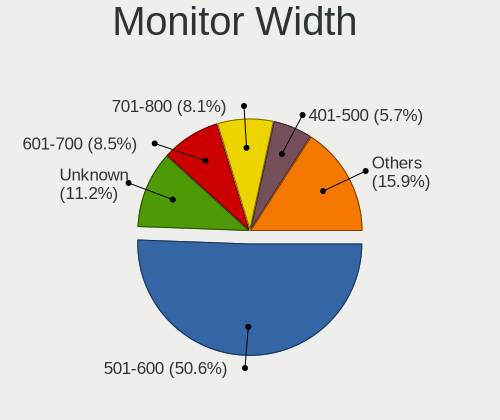

| Width in mm    | Desktops | Percent |
|----------------|----------|---------|
| 501-600        | 267      | 50.57%  |
| Unknown        | 59       | 11.17%  |
| 601-700        | 45       | 8.52%   |
| 701-800        | 43       | 8.14%   |
| 401-500        | 30       | 5.68%   |
| 1001-1500      | 26       | 4.92%   |
| 801-900        | 22       | 4.17%   |
| 1501-2000      | 18       | 3.41%   |
| 351-400        | 9        | 1.7%    |
| More than 2000 | 3        | 0.57%   |
| 901-1000       | 3        | 0.57%   |
| 201-300        | 2        | 0.38%   |
| 301-350        | 1        | 0.19%   |

Aspect Ratio
------------

Proportional relationship between the width and the height

| Ratio   | Desktops | Percent |
|---------|----------|---------|
| 16/9    | 325      | 63.85%  |
| 16/10   | 57       | 11.2%   |
| Unknown | 47       | 9.23%   |
| 21/9    | 44       | 8.64%   |
| 32/9    | 12       | 2.36%   |
| 5/4     | 8        | 1.57%   |
| 4/3     | 6        | 1.18%   |
| 3/2     | 3        | 0.59%   |
| 1.00    | 3        | 0.59%   |
| 6/5     | 1        | 0.2%    |
| 3.76    | 1        | 0.2%    |
| 3.20    | 1        | 0.2%    |
| 0.80    | 1        | 0.2%    |

Monitor Area
------------

Area in inch

| Area in inch | Desktops | Percent |
|----------------|----------|---------|
| 201-250        | 142      | 25.72%  |
| 301-350        | 135      | 24.46%  |
| 351-500        | 74       | 13.41%  |
| Unknown        | 59       | 10.69%  |
| 251-300        | 54       | 9.78%   |
| 501-1000       | 34       | 6.16%   |
| More than 1000 | 33       | 5.98%   |
| 151-200        | 19       | 3.44%   |
| 71-80          | 1        | 0.18%   |
| 101-110        | 1        | 0.18%   |

Pixel Density
-------------

Pixels per inch

| Density | Desktops | Percent |
|---------|----------|---------|
| 51-100  | 293      | 55.39%  |
| 101-120 | 113      | 21.36%  |
| Unknown | 59       | 11.15%  |
| 121-160 | 29       | 5.48%   |
| 1-50    | 20       | 3.78%   |
| 161-240 | 15       | 2.84%   |

Multiple Monitors
-----------------

Total monitors connected

| Total | Desktops | Percent |
|-------|----------|---------|
| 1     | 339      | 65.07%  |
| 2     | 117      | 22.46%  |
| 0     | 37       | 7.1%    |
| 3     | 25       | 4.8%    |
| 4     | 3        | 0.58%   |

Network
-------

Net Controller Vendor
---------------------

Controller vendors

| Vendor                                 | Desktops | Percent |
|----------------------------------------|----------|---------|
| Intel                                  | 317      | 42.72%  |
| Realtek Semiconductor                  | 217      | 29.25%  |
| Broadcom                               | 32       | 4.31%   |
| Qualcomm Atheros                       | 26       | 3.5%    |
| TP-Link                                | 14       | 1.89%   |
| MediaTek                               | 12       | 1.62%   |
| NetGear                                | 11       | 1.48%   |
| Ralink Technology                      | 9        | 1.21%   |
| Ralink                                 | 9        | 1.21%   |
| Aquantia                               | 9        | 1.21%   |
| Microsoft                              | 8        | 1.08%   |
| ASUSTek Computer                       | 8        | 1.08%   |
| Nvidia                                 | 6        | 0.81%   |
| Samsung Electronics                    | 5        | 0.67%   |
| D-Link                                 | 5        | 0.67%   |
| Qualcomm Atheros Communications        | 4        | 0.54%   |
| Motorola PCS                           | 4        | 0.54%   |
| Microchip Technology                   | 4        | 0.54%   |
| Marvell Technology Group               | 4        | 0.54%   |
| Linksys                                | 4        | 0.54%   |
| Wacom                                  | 3        | 0.4%    |
| OnePlus Technology (Shenzhen)          | 3        | 0.4%    |
| Chu Yuen Enterprise                    | 3        | 0.4%    |
| ASIX Electronics                       | 3        | 0.4%    |
| Sony Ericsson Mobile Communications AB | 2        | 0.27%   |
| Sigma Designs                          | 2        | 0.27%   |
| Winbond Electronics                    | 1        | 0.13%   |
| Wilocity                               | 1        | 0.13%   |
| SEGGER                                 | 1        | 0.13%   |
| QinHeng Electronics                    | 1        | 0.13%   |
| OPPO Electronics                       | 1        | 0.13%   |
| Oculus VR                              | 1        | 0.13%   |
| Mellanox Technologies                  | 1        | 0.13%   |
| Lenovo                                 | 1        | 0.13%   |
| Huawei Technologies                    | 1        | 0.13%   |
| Holtek Semiconductor                   | 1        | 0.13%   |
| Google                                 | 1        | 0.13%   |
| DisplayLink                            | 1        | 0.13%   |
| D-Link System                          | 1        | 0.13%   |
| Cisco Systems                          | 1        | 0.13%   |

Net Controller Model
--------------------

Controller models

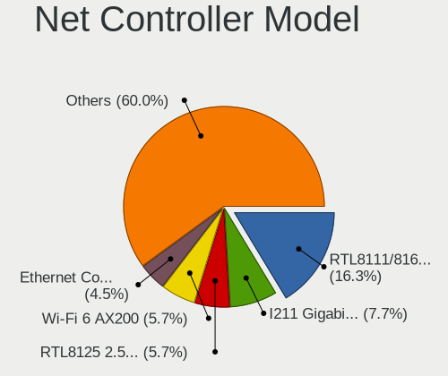

| Model                                                                          | Desktops | Percent |
|--------------------------------------------------------------------------------|----------|---------|
| Realtek RTL8111/8168/8211/8411 PCI Express Gigabit Ethernet Controller         | 144      | 16.35%  |
| Intel I211 Gigabit Network Connection                                          | 68       | 7.72%   |
| Realtek RTL8125 2.5GbE Controller                                              | 50       | 5.68%   |
| Intel Wi-Fi 6 AX200                                                            | 50       | 5.68%   |
| Intel Ethernet Controller I225-V                                               | 40       | 4.54%   |
| Intel Ethernet Connection (2) I219-V                                           | 33       | 3.75%   |
| Intel Ethernet Connection (7) I219-V                                           | 19       | 2.16%   |
| Intel Wi-Fi 6E(802.11ax) AX210/AX1675* 2x2 [Typhoon Peak]                      | 16       | 1.82%   |
| Intel Ethernet Connection I217-LM                                              | 16       | 1.82%   |
| Intel 82579LM Gigabit Network Connection (Lewisville)                          | 16       | 1.82%   |
| Intel Ethernet Connection (2) I218-V                                           | 13       | 1.48%   |
| Intel Ethernet Connection (2) I218-LM                                          | 12       | 1.36%   |
| Intel 82579V Gigabit Network Connection                                        | 12       | 1.36%   |
| Broadcom BCM4360 802.11ac Dual Band Wireless Network Adapter                   | 12       | 1.36%   |
| Intel Ethernet Connection (2) I219-LM                                          | 10       | 1.14%   |
| NetGear A6100 AC600 DB Wireless Adapter [Realtek RTL8811AU]                    | 9        | 1.02%   |
| Intel Raptor Lake-S PCH CNVi WiFi                                              | 9        | 1.02%   |
| Realtek RTL8153 Gigabit Ethernet Adapter                                       | 8        | 0.91%   |
| Intel Dual Band Wireless-AC 3168NGW [Stone Peak]                               | 8        | 0.91%   |
| Intel Wi-Fi 5(802.11ac) Wireless-AC 9x6x [Thunder Peak]                        | 7        | 0.79%   |
| Intel I210 Gigabit Network Connection                                          | 7        | 0.79%   |
| Intel 82574L Gigabit Network Connection                                        | 7        | 0.79%   |
| Realtek RTL8812AE 802.11ac PCIe Wireless Network Adapter                       | 6        | 0.68%   |
| MediaTek MT7921K (RZ608) Wi-Fi 6E 80MHz                                        | 6        | 0.68%   |
| Intel Alder Lake-S PCH CNVi WiFi                                               | 6        | 0.68%   |
| Broadcom BCM4352 802.11ac Dual Band Wireless Network Adapter                   | 6        | 0.68%   |
| Qualcomm Atheros Killer E220x Gigabit Ethernet Controller                      | 5        | 0.57%   |
| Microsoft Xbox Wireless Adapter for Windows                                    | 5        | 0.57%   |
| MediaTek MT7922 802.11ax PCI Express Wireless Network Adapter                  | 5        | 0.57%   |
| Intel Ethernet Connection I217-V                                               | 5        | 0.57%   |
| Intel Ethernet Connection (7) I219-LM                                          | 5        | 0.57%   |
| Aquantia AQtion AQC107 NBase-T/IEEE 802.3an Ethernet Controller [Atlantic 10G] | 5        | 0.57%   |
| TP-Link Archer T3U [Realtek RTL8812BU]                                         | 4        | 0.45%   |
| Samsung Galaxy series, misc. (tethering mode)                                  | 4        | 0.45%   |
| Realtek RTL8852BE PCIe 802.11ax Wireless Network Controller                    | 4        | 0.45%   |
| Realtek RTL8169 PCI Gigabit Ethernet Controller                                | 4        | 0.45%   |
| Qualcomm Atheros AR9271 802.11n                                                | 4        | 0.45%   |
| Motorola PCS moto g play - 2023                                                | 4        | 0.45%   |
| Microchip HTC Hub Controller                                                   | 4        | 0.45%   |
| Intel Wireless 7265                                                            | 4        | 0.45%   |

Wireless Vendor
---------------

Wireless vendors

| Vendor                          | Desktops | Percent |
|---------------------------------|----------|---------|
| Intel                           | 128      | 46.04%  |
| Realtek Semiconductor           | 28       | 10.07%  |
| Broadcom                        | 20       | 7.19%   |
| TP-Link                         | 14       | 5.04%   |
| Qualcomm Atheros                | 13       | 4.68%   |
| NetGear                         | 11       | 3.96%   |
| Ralink Technology               | 9        | 3.24%   |
| Ralink                          | 9        | 3.24%   |
| MediaTek                        | 9        | 3.24%   |
| Microsoft                       | 8        | 2.88%   |
| ASUSTek Computer                | 8        | 2.88%   |
| D-Link                          | 5        | 1.8%    |
| Qualcomm Atheros Communications | 4        | 1.44%   |
| Wacom                           | 3        | 1.08%   |
| Linksys                         | 3        | 1.08%   |
| Chu Yuen Enterprise             | 3        | 1.08%   |
| Wilocity                        | 1        | 0.36%   |
| D-Link System                   | 1        | 0.36%   |
| Broadcom Limited                | 1        | 0.36%   |

Wireless Model
--------------

Wireless models

| Model                                                         | Desktops | Percent |
|---------------------------------------------------------------|----------|---------|
| Intel Wi-Fi 6 AX200                                           | 50       | 17.99%  |
| Intel Wi-Fi 6E(802.11ax) AX210/AX1675* 2x2 [Typhoon Peak]     | 16       | 5.76%   |
| Broadcom BCM4360 802.11ac Dual Band Wireless Network Adapter  | 12       | 4.32%   |
| NetGear A6100 AC600 DB Wireless Adapter [Realtek RTL8811AU]   | 9        | 3.24%   |
| Intel Raptor Lake-S PCH CNVi WiFi                             | 9        | 3.24%   |
| Intel Dual Band Wireless-AC 3168NGW [Stone Peak]              | 8        | 2.88%   |
| Intel Wi-Fi 5(802.11ac) Wireless-AC 9x6x [Thunder Peak]       | 7        | 2.52%   |
| Realtek RTL8812AE 802.11ac PCIe Wireless Network Adapter      | 6        | 2.16%   |
| MediaTek MT7921K (RZ608) Wi-Fi 6E 80MHz                       | 6        | 2.16%   |
| Intel Alder Lake-S PCH CNVi WiFi                              | 6        | 2.16%   |
| Broadcom BCM4352 802.11ac Dual Band Wireless Network Adapter  | 6        | 2.16%   |
| Microsoft Xbox Wireless Adapter for Windows                   | 5        | 1.8%    |
| TP-Link Archer T3U [Realtek RTL8812BU]                        | 4        | 1.44%   |
| Qualcomm Atheros AR9271 802.11n                               | 4        | 1.44%   |
| Intel Wireless 7265                                           | 4        | 1.44%   |
| Intel Centrino Wireless-N 2230                                | 4        | 1.44%   |
| Intel Cannon Lake PCH CNVi WiFi                               | 4        | 1.44%   |
| Wacom ACK-40401 [Wireless Accessory Kit]                      | 3        | 1.08%   |
| Realtek RTL8822CE 802.11ac PCIe Wireless Network Adapter      | 3        | 1.08%   |
| Realtek RTL8821CE 802.11ac PCIe Wireless Network Adapter      | 3        | 1.08%   |
| Ralink RT2870/RT3070 Wireless Adapter                         | 3        | 1.08%   |
| Qualcomm Atheros AR9485 Wireless Network Adapter              | 3        | 1.08%   |
| Qualcomm Atheros AR93xx Wireless Network Adapter              | 3        | 1.08%   |
| Microsoft Xbox 360 Wireless Adapter                           | 3        | 1.08%   |
| MediaTek MT7922 802.11ax PCI Express Wireless Network Adapter | 3        | 1.08%   |
| Intel Wireless 8265 / 8275                                    | 3        | 1.08%   |
| Intel Wireless 8260                                           | 3        | 1.08%   |
| Intel Comet Lake PCH CNVi WiFi                                | 3        | 1.08%   |
| Chu Yuen Enterprise GN-WB32L 802.11n USB WLAN Card            | 3        | 1.08%   |
| TP-Link TL-WN722N v2/v3 [Realtek RTL8188EUS]                  | 2        | 0.72%   |
| TP-Link Archer T9UH v1 [Realtek RTL8814AU]                    | 2        | 0.72%   |
| TP-Link Archer T4U ver.3                                      | 2        | 0.72%   |
| TP-Link AC600 wireless Realtek RTL8811AU [Archer T2U Nano]    | 2        | 0.72%   |
| Realtek RTL8821AE 802.11ac PCIe Wireless Network Adapter      | 2        | 0.72%   |
| Realtek RTL8188EUS 802.11n Wireless Network Adapter           | 2        | 0.72%   |
| Realtek 802.11ac NIC                                          | 2        | 0.72%   |
| Ralink RT5370 Wireless Adapter                                | 2        | 0.72%   |
| Ralink MT7610U ("Archer T2U" 2.4G+5G WLAN Adapter             | 2        | 0.72%   |
| Ralink RT5592 PCIe Wireless Network Adapter                   | 2        | 0.72%   |
| Ralink RT5390 Wireless 802.11n 1T/1R PCIe                     | 2        | 0.72%   |

Ethernet Vendor
---------------

Ethernet vendors

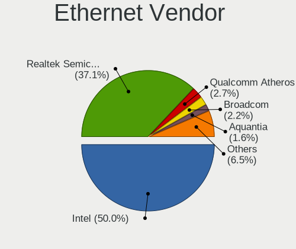

| Vendor                                 | Desktops | Percent |
|----------------------------------------|----------|---------|
| Intel                                  | 278      | 50%     |
| Realtek Semiconductor                  | 206      | 37.05%  |
| Qualcomm Atheros                       | 15       | 2.7%    |
| Broadcom                               | 12       | 2.16%   |
| Aquantia                               | 9        | 1.62%   |
| Nvidia                                 | 6        | 1.08%   |
| Samsung Electronics                    | 4        | 0.72%   |
| Motorola PCS                           | 4        | 0.72%   |
| Marvell Technology Group               | 4        | 0.72%   |
| ASIX Electronics                       | 3        | 0.54%   |
| OnePlus Technology (Shenzhen)          | 2        | 0.36%   |
| MediaTek                               | 2        | 0.36%   |
| Sony Ericsson Mobile Communications AB | 1        | 0.18%   |
| OPPO Electronics                       | 1        | 0.18%   |
| Mellanox Technologies                  | 1        | 0.18%   |
| Linksys                                | 1        | 0.18%   |
| Lenovo                                 | 1        | 0.18%   |
| Huawei Technologies                    | 1        | 0.18%   |
| Google                                 | 1        | 0.18%   |
| DisplayLink                            | 1        | 0.18%   |
| Cisco Systems                          | 1        | 0.18%   |
| ATEN International                     | 1        | 0.18%   |
| 3Com                                   | 1        | 0.18%   |

Ethernet Model
--------------

Ethernet models

| Model                                                                          | Desktops | Percent |
|--------------------------------------------------------------------------------|----------|---------|
| Realtek RTL8111/8168/8211/8411 PCI Express Gigabit Ethernet Controller         | 144      | 24.53%  |
| Intel I211 Gigabit Network Connection                                          | 68       | 11.58%  |
| Realtek RTL8125 2.5GbE Controller                                              | 50       | 8.52%   |
| Intel Ethernet Controller I225-V                                               | 40       | 6.81%   |
| Intel Ethernet Connection (2) I219-V                                           | 33       | 5.62%   |
| Intel Ethernet Connection (7) I219-V                                           | 19       | 3.24%   |
| Intel Ethernet Connection I217-LM                                              | 16       | 2.73%   |
| Intel 82579LM Gigabit Network Connection (Lewisville)                          | 16       | 2.73%   |
| Intel Ethernet Connection (2) I218-V                                           | 13       | 2.21%   |
| Intel Ethernet Connection (2) I218-LM                                          | 12       | 2.04%   |
| Intel 82579V Gigabit Network Connection                                        | 12       | 2.04%   |
| Intel Ethernet Connection (2) I219-LM                                          | 10       | 1.7%    |
| Realtek RTL8153 Gigabit Ethernet Adapter                                       | 8        | 1.36%   |
| Intel I210 Gigabit Network Connection                                          | 7        | 1.19%   |
| Intel 82574L Gigabit Network Connection                                        | 7        | 1.19%   |
| Qualcomm Atheros Killer E220x Gigabit Ethernet Controller                      | 5        | 0.85%   |
| Intel Ethernet Connection I217-V                                               | 5        | 0.85%   |
| Intel Ethernet Connection (7) I219-LM                                          | 5        | 0.85%   |
| Aquantia AQtion AQC107 NBase-T/IEEE 802.3an Ethernet Controller [Atlantic 10G] | 5        | 0.85%   |
| Samsung Galaxy series, misc. (tethering mode)                                  | 4        | 0.68%   |
| Realtek RTL8169 PCI Gigabit Ethernet Controller                                | 4        | 0.68%   |
| Motorola PCS moto g play - 2023                                                | 4        | 0.68%   |
| Intel Ethernet Controller I226-V                                               | 4        | 0.68%   |
| Realtek RTL8852BE PCIe 802.11ax Wireless Network Controller                    | 3        | 0.51%   |
| Qualcomm Atheros AR8161 Gigabit Ethernet                                       | 3        | 0.51%   |
| Intel Ethernet Connection (17) I219-V                                          | 3        | 0.51%   |
| Intel Ethernet Connection (12) I219-V                                          | 3        | 0.51%   |
| Intel 82578DM Gigabit Network Connection                                       | 3        | 0.51%   |
| Realtek RTL-8110SC/8169SC Gigabit Ethernet                                     | 2        | 0.34%   |
| Qualcomm Atheros QCA8171 Gigabit Ethernet                                      | 2        | 0.34%   |
| Qualcomm Atheros Killer E2400 Gigabit Ethernet Controller                      | 2        | 0.34%   |
| OnePlus (Shenzhen) OnePlus                                                     | 2        | 0.34%   |
| Nvidia MCP77 Ethernet                                                          | 2        | 0.34%   |
| Nvidia MCP61 Ethernet                                                          | 2        | 0.34%   |
| MediaTek MT7922 802.11ax PCI Express Wireless Network Adapter                  | 2        | 0.34%   |
| Marvell Group 88E8071 PCI-E Gigabit Ethernet Controller                        | 2        | 0.34%   |
| Marvell Group 88E8056 PCI-E Gigabit Ethernet Controller                        | 2        | 0.34%   |
| Intel Ethernet Connection (5) I219-LM                                          | 2        | 0.34%   |
| Intel 82567V-2 Gigabit Network Connection                                      | 2        | 0.34%   |
| Intel 82557/8/9/0/1 Ethernet Pro 100                                           | 2        | 0.34%   |

Net Controller Kind
-------------------

Ethernet, WiFi or modem

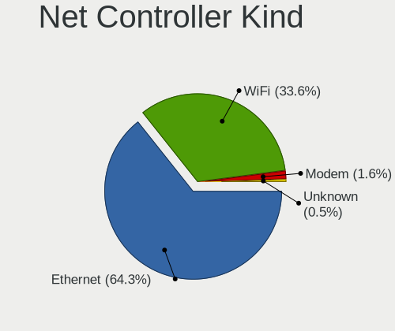

| Kind     | Desktops | Percent |
|----------|----------|---------|
| Ethernet | 496      | 64.33%  |
| WiFi     | 259      | 33.59%  |
| Modem    | 12       | 1.56%   |
| Unknown  | 4        | 0.52%   |

Used Controller
---------------

Currently used network controller

| Kind     | Desktops | Percent |
|----------|----------|---------|
| Ethernet | 383      | 73.94%  |
| WiFi     | 134      | 25.87%  |
| Unknown  | 1        | 0.19%   |

NICs
----

Total network controllers on board

| Total | Desktops | Percent |
|-------|----------|---------|
| 1     | 260      | 51.59%  |
| 2     | 200      | 39.68%  |
| 3     | 36       | 7.14%   |
| 4     | 4        | 0.79%   |
| 0     | 3        | 0.6%    |
| 5     | 1        | 0.2%    |

IPv6
----

IPv6 vs IPv4

| Used | Desktops | Percent |
|------|----------|---------|
| No   | 428      | 83.76%  |
| Yes  | 83       | 16.24%  |

Bluetooth
---------

Bluetooth Vendor
----------------

Controller vendors

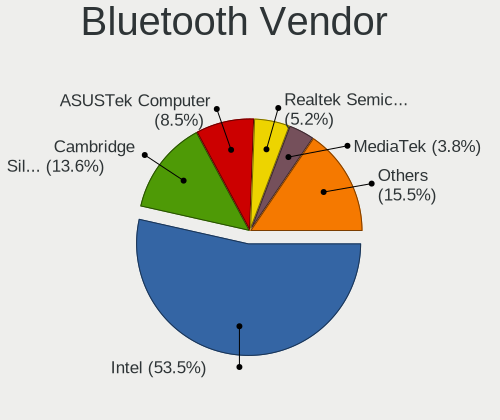

| Vendor                          | Desktops | Percent |
|---------------------------------|----------|---------|
| Intel                           | 114      | 53.52%  |
| Cambridge Silicon Radio         | 29       | 13.62%  |
| ASUSTek Computer                | 18       | 8.45%   |
| Realtek Semiconductor           | 11       | 5.16%   |
| MediaTek                        | 8        | 3.76%   |
| IMC Networks                    | 8        | 3.76%   |
| HTC (High Tech Computer)        | 5        | 2.35%   |
| Broadcom                        | 4        | 1.88%   |
| Belkin Components               | 4        | 1.88%   |
| TP-Link                         | 3        | 1.41%   |
| Foxconn / Hon Hai               | 3        | 1.41%   |
| Qualcomm Atheros Communications | 2        | 0.94%   |
| Lite-On Technology              | 1        | 0.47%   |
| Integrated System Solution      | 1        | 0.47%   |
| Apple                           | 1        | 0.47%   |
| Actions                         | 1        | 0.47%   |

Bluetooth Model
---------------

Controller models

| Model                                                                | Desktops | Percent |
|----------------------------------------------------------------------|----------|---------|
| Intel AX200 Bluetooth                                                | 43       | 20.09%  |
| Cambridge Silicon Radio Bluetooth Dongle (HCI mode)                  | 29       | 13.55%  |
| Intel Bluetooth wireless interface                                   | 15       | 7.01%   |
| Intel AX210 Bluetooth                                                | 15       | 7.01%   |
| Intel AX201 Bluetooth                                                | 10       | 4.67%   |
| Intel AX211 Bluetooth                                                | 9        | 4.21%   |
| MediaTek Wireless_Device                                             | 8        | 3.74%   |
| ASUS Broadcom BCM20702A0 Bluetooth                                   | 8        | 3.74%   |
| Realtek Bluetooth Radio                                              | 7        | 3.27%   |
| Intel Wireless-AC 9260 Bluetooth Adapter                             | 7        | 3.27%   |
| Intel Wireless-AC 3168 Bluetooth                                     | 6        | 2.8%    |
| IMC Networks Bluetooth Radio                                         | 6        | 2.8%    |
| Intel Centrino Bluetooth Wireless Transceiver                        | 5        | 2.34%   |
| HTC (High Tech Computer) Vive Hub Bluetooth 4.1 (Broadcom BCM920703) | 5        | 2.34%   |
| Intel Bluetooth 9460/9560 Jefferson Peak (JfP)                       | 4        | 1.87%   |
| ASUS ASUS USB-BT500                                                  | 4        | 1.87%   |
| TP-Link TP-Link Bluetooth USB Adapter                                | 3        | 1.4%    |
| Foxconn / Hon Hai Wireless_Device                                    | 3        | 1.4%    |
| Belkin Components F8T065BF Mini Bluetooth 4.0 Adapter                | 3        | 1.4%    |
| ASUS Bluetooth Radio                                                 | 3        | 1.4%    |
| Realtek Bluetooth 5.3 Radio                                          | 2        | 0.93%   |
| Qualcomm Atheros AR3011 Bluetooth                                    | 2        | 0.93%   |
| IMC Networks BCM20702A0                                              | 2        | 0.93%   |
| Broadcom BCM20702A0 Bluetooth 4.0                                    | 2        | 0.93%   |
| ASUS Qualcomm Bluetooth 4.1                                          | 2        | 0.93%   |
| Realtek RTL8821A Bluetooth                                           | 1        | 0.47%   |
| Realtek 802.11ac WLAN Adapter                                        | 1        | 0.47%   |
| Lite-On Qualcomm Atheros QCA9377 Bluetooth                           | 1        | 0.47%   |
| Integrated System Solution Bluetooth Device                          | 1        | 0.47%   |
| Broadcom Bluetooth 3.0 Device                                        | 1        | 0.47%   |
| Broadcom Bluetooth 2.1 Device                                        | 1        | 0.47%   |
| Belkin Components Bluetooth Mini Dongle                              | 1        | 0.47%   |
| ASUS Broadcom BCM20702 Single-Chip Bluetooth 4.0 + LE                | 1        | 0.47%   |
| ASUS BCM20702A0                                                      | 1        | 0.47%   |
| Apple Built-in Bluetooth 2.0+EDR HCI                                 | 1        | 0.47%   |
| Actions general adapter                                              | 1        | 0.47%   |

Sound
-----

Sound Vendor
------------

Sound card vendors

| Vendor                                       | Desktops | Percent |
|----------------------------------------------|----------|---------|
| Intel                                        | 279      | 27.38%  |
| AMD                                          | 252      | 24.73%  |
| Nvidia                                       | 245      | 24.04%  |
| C-Media Electronics                          | 35       | 3.43%   |
| SteelSeries ApS                              | 24       | 2.36%   |
| Logitech                                     | 17       | 1.67%   |
| ASUSTek Computer                             | 14       | 1.37%   |
| Focusrite-Novation                           | 12       | 1.18%   |
| Blue Microphones                             | 11       | 1.08%   |
| Kingston Technology                          | 10       | 0.98%   |
| GN Netcom                                    | 7        | 0.69%   |
| Creative Labs                                | 7        | 0.69%   |
| Corsair                                      | 7        | 0.69%   |
| Texas Instruments                            | 5        | 0.49%   |
| Razer USA                                    | 5        | 0.49%   |
| Hewlett-Packard                              | 5        | 0.49%   |
| Creative Technology                          | 5        | 0.49%   |
| SAVITECH                                     | 4        | 0.39%   |
| M-Audio                                      | 4        | 0.39%   |
| FiiO Electronics Technology                  | 4        | 0.39%   |
| XMOS                                         | 3        | 0.29%   |
| RODE Microphones                             | 3        | 0.29%   |
| Realtek Semiconductor                        | 3        | 0.29%   |
| Plantronics                                  | 3        | 0.29%   |
| Micro Star International                     | 3        | 0.29%   |
| GYROCOM C&C                                  | 3        | 0.29%   |
| Zoran Co. Personal Media Division (Nogatech) | 2        | 0.2%    |
| Yamaha                                       | 2        | 0.2%    |
| Sony                                         | 2        | 0.2%    |
| RME                                          | 2        | 0.2%    |
| Musical Fidelity                             | 2        | 0.2%    |
| KTMicro                                      | 2        | 0.2%    |
| JMTek                                        | 2        | 0.2%    |
| Giga-Byte Technology                         | 2        | 0.2%    |
| DSEA A/S                                     | 2        | 0.2%    |
| Astro Gaming                                 | 2        | 0.2%    |
| Asahi Kasei Microsystems                     | 2        | 0.2%    |
| www.hirestech.com 2012 REV 1.8               | 1        | 0.1%    |
| Valve Software                               | 1        | 0.1%    |
| Thesycon Systemsoftware & Consulting         | 1        | 0.1%    |

Sound Model
-----------

Sound card models

| Model                                                                      | Desktops | Percent |
|----------------------------------------------------------------------------|----------|---------|
| AMD Starship/Matisse HD Audio Controller                                   | 92       | 7.86%   |
| AMD Navi 21/23 HDMI/DP Audio Controller                                    | 34       | 2.9%    |
| Intel 8 Series/C220 Series Chipset High Definition Audio Controller        | 33       | 2.82%   |
| Intel 200 Series PCH HD Audio                                              | 31       | 2.65%   |
| Intel 100 Series/C230 Series Chipset Family HD Audio Controller            | 30       | 2.56%   |
| AMD Family 17h/19h/1ah HD Audio Controller                                 | 30       | 2.56%   |
| AMD Family 17h (Models 00h-0fh) HD Audio Controller                        | 30       | 2.56%   |
| Intel Cannon Lake PCH cAVS                                                 | 28       | 2.39%   |
| Intel Xeon E3-1200 v3/4th Gen Core Processor HD Audio Controller           | 27       | 2.31%   |
| Intel 7 Series/C216 Chipset Family High Definition Audio Controller        | 25       | 2.13%   |
| Nvidia GP106 High Definition Audio Controller                              | 24       | 2.05%   |
| Nvidia GP104 High Definition Audio Controller                              | 24       | 2.05%   |
| Intel C610/X99 series chipset HD Audio Controller                          | 23       | 1.96%   |
| AMD SBx00 Azalia (Intel HDA)                                               | 23       | 1.96%   |
| AMD Ellesmere HDMI Audio [Radeon RX 470/480 / 570/580/590]                 | 23       | 1.96%   |
| Nvidia GA104 High Definition Audio Controller                              | 21       | 1.79%   |
| Nvidia GM204 High Definition Audio Controller                              | 20       | 1.71%   |
| Intel 6 Series/C200 Series Chipset Family High Definition Audio Controller | 17       | 1.45%   |
| AMD Oland/Hainan/Cape Verde/Pitcairn HDMI Audio [Radeon HD 7000 Series]    | 16       | 1.37%   |
| AMD Navi 10 HDMI Audio                                                     | 16       | 1.37%   |
| Nvidia GA102 High Definition Audio Controller                              | 14       | 1.2%    |
| AMD Rembrandt Radeon High Definition Audio Controller                      | 13       | 1.11%   |
| Nvidia TU104 HD Audio Controller                                           | 12       | 1.02%   |
| Nvidia GP107GL High Definition Audio Controller                            | 12       | 1.02%   |
| ASUSTek Computer USB Audio                                                 | 12       | 1.02%   |
| AMD FCH Azalia Controller                                                  | 12       | 1.02%   |
| SteelSeries ApS SteelSeries Arctis 7                                       | 11       | 0.94%   |
| Nvidia GK208 HDMI/DP Audio Controller                                      | 11       | 0.94%   |
| AMD Vega 10 HDMI Audio [Radeon Vega 56/64]                                 | 11       | 0.94%   |
| AMD Navi 31 HDMI/DP Audio                                                  | 11       | 0.94%   |
| Nvidia GP102 HDMI Audio Controller                                         | 10       | 0.85%   |
| Intel Alder Lake-S HD Audio Controller                                     | 10       | 0.85%   |
| Blue Microphones Yeti Stereo Microphone                                    | 10       | 0.85%   |
| Nvidia GK104 HDMI Audio Controller                                         | 9        | 0.77%   |
| Nvidia GF108 High Definition Audio Controller                              | 9        | 0.77%   |
| Intel 9 Series Chipset Family HD Audio Controller                          | 9        | 0.77%   |
| Intel Raptor Lake High Definition Audio Controller                         | 8        | 0.68%   |
| Intel 82801JI (ICH10 Family) HD Audio Controller                           | 8        | 0.68%   |
| C-Media Electronics CMI8788 [Oxygen HD Audio]                              | 8        | 0.68%   |
| AMD Renoir Radeon High Definition Audio Controller                         | 8        | 0.68%   |

Memory
------

Memory Vendor
-------------

Memory module vendors

| Vendor              | Desktops | Percent |
|---------------------|----------|---------|
| Kingston            | 74       | 22.84%  |
| Corsair             | 74       | 22.84%  |
| SK hynix            | 32       | 9.88%   |
| G.Skill             | 32       | 9.88%   |
| Crucial             | 32       | 9.88%   |
| Unknown             | 24       | 7.41%   |
| Samsung Electronics | 24       | 7.41%   |
| Micron Technology   | 8        | 2.47%   |
| Ramaxel Technology  | 4        | 1.23%   |
| Patriot             | 2        | 0.62%   |
| Unknown             | 2        | 0.62%   |
| Samsung / Micron    | 1        | 0.31%   |
| Nanya Technology    | 1        | 0.31%   |
| Lexar               | 1        | 0.31%   |
| Hewlett-Packard     | 1        | 0.31%   |
| GeIL                | 1        | 0.31%   |
| Elpida              | 1        | 0.31%   |
| Apacer              | 1        | 0.31%   |
| A-DATA Technology   | 1        | 0.31%   |
| 98000817752EA5DF    | 1        | 0.31%   |
| 98000817752E90DE    | 1        | 0.31%   |
| 98000817752E75DE    | 1        | 0.31%   |
| 98000817702EBEDE    | 1        | 0.31%   |
| 98000817702EBDDE    | 1        | 0.31%   |
| 98000817702EBBDF    | 1        | 0.31%   |
| 98000817702E73DE    | 1        | 0.31%   |
| 98000817702E65DE    | 1        | 0.31%   |

Memory Model
------------

Memory module models

| Model                                                     | Desktops | Percent |
|-----------------------------------------------------------|----------|---------|
| Corsair RAM CMK32GX4M2B3200C16 16GB DIMM DDR4 3800MT/s    | 12       | 3.5%    |
| SK hynix RAM HMA41GR7MFR4N-TF 8GB DIMM DDR4 2133MT/s      | 10       | 2.92%   |
| Corsair RAM CMK16GX4M2B3200C16 8GB DIMM DDR4 3600MT/s     | 9        | 2.62%   |
| Kingston RAM KHX2666C16/8G 8GB DIMM DDR4 3466MT/s         | 6        | 1.75%   |
| Unknown RAM Module 2GB DIMM DDR2 667MT/s                  | 5        | 1.46%   |
| G.Skill RAM F4-3600C16-16GTZNC 16GB DIMM DDR4 3866MT/s    | 5        | 1.46%   |
| Kingston RAM KHX2400C15/8G 8GB DIMM DDR4 3400MT/s         | 4        | 1.17%   |
| Corsair RAM CMK16GX4M2B3000C15 8GB DIMM DDR4 3600MT/s     | 4        | 1.17%   |
| Unknown RAM Module 4GB DIMM 1333MT/s                      | 3        | 0.87%   |
| Kingston RAM KHX3200C16D4/32GX 32GB DIMM DDR4 3200MT/s    | 3        | 0.87%   |
| Kingston RAM KHX2666C16/16G 16GB DIMM DDR4 3200MT/s       | 3        | 0.87%   |
| Kingston RAM KHX1600C10D3/8G 8GB DIMM DDR3 1600MT/s       | 3        | 0.87%   |
| Kingston RAM KF560C36-16 16GB DIMM DDR5 6000MT/s          | 3        | 0.87%   |
| Kingston RAM KF3600C17D4/8GX 8GB DIMM DDR4 3600MT/s       | 3        | 0.87%   |
| Kingston RAM KF3200C16D4/16GX 16GB DIMM DDR4 3200MT/s     | 3        | 0.87%   |
| G.Skill RAM F5-6000J3040G32G 32GB DIMM DDR5 6000MT/s      | 3        | 0.87%   |
| G.Skill RAM F4-3600C16-16GVKC 16GB DIMM DDR4 3866MT/s     | 3        | 0.87%   |
| Crucial RAM BLS8G3D1609DS1S00. 8GB DIMM DDR3 1800MT/s     | 3        | 0.87%   |
| Corsair RAM CMK8GX4M1A2400C14 8GB DIMM DDR4 2800MT/s      | 3        | 0.87%   |
| Corsair RAM CMK32GX4M2A2666C16 16GB DIMM DDR4 3100MT/s    | 3        | 0.87%   |
| Unknown RAM Module 8GB DIMM 1333MT/s                      | 2        | 0.58%   |
| Unknown RAM Module 16GB DIMM DDR4 2133MT/s                | 2        | 0.58%   |
| SK hynix RAM HMT41GU6BFR8A-PB 8GB DIMM DDR3 2000MT/s      | 2        | 0.58%   |
| Samsung RAM Module 8GB DIMM DDR4 2133MT/s                 | 2        | 0.58%   |
| Samsung RAM M471A1G43DB0-CPB 8GB SODIMM DDR4 3200MT/s     | 2        | 0.58%   |
| Samsung RAM M378B1G73DB0-CK0 8GB DIMM DDR3 2133MT/s       | 2        | 0.58%   |
| Micron RAM 8JTF51264AZ-1G6E1 4GB DIMM 1600MT/s            | 2        | 0.58%   |
| Kingston RAM KHX3000C15D4/8GX 8GB DIMM DDR4 3400MT/s      | 2        | 0.58%   |
| Kingston RAM KHX2400C15D4/4G 4GB DIMM DDR4 3151MT/s       | 2        | 0.58%   |
| Kingston RAM KHX2400C11D3/8GX 8GB DIMM DDR3 2400MT/s      | 2        | 0.58%   |
| Kingston RAM KHX1600C9D3/4GX 4GB DIMM DDR3 1800MT/s       | 2        | 0.58%   |
| Kingston RAM KHX1600C10D3/8GX 8GB DIMM DDR3 1600MT/s      | 2        | 0.58%   |
| Kingston RAM KF548C38-16 16GB DIMM DDR5 5900MT/s          | 2        | 0.58%   |
| G.Skill RAM F5-6000J3040F16G 16GB DIMM DDR5 6000MT/s      | 2        | 0.58%   |
| G.Skill RAM F4-3600C16-16GTZN 16GB DIMM DDR4 3733MT/s     | 2        | 0.58%   |
| G.Skill RAM F4-3200C16-16GSXWB 16GB DIMM DDR4 3200MT/s    | 2        | 0.58%   |
| Crucial RAM CT16G4SFD824A.M16FR 16GB SODIMM DDR4 2400MT/s | 2        | 0.58%   |
| Crucial RAM CT102464BA1339.C16 8GB DIMM DDR3 1333MT/s     | 2        | 0.58%   |
| Crucial RAM BL16G36C16U4B.M16FE1 16GB DIMM DDR4 3600MT/s  | 2        | 0.58%   |
| Corsair RAM CMZ8GX3M2A1600C9 4GB DIMM DDR3 1800MT/s       | 2        | 0.58%   |

Memory Kind
-----------

Memory module kinds

| Kind    | Desktops | Percent |
|---------|----------|---------|
| DDR4    | 164      | 58.16%  |
| DDR3    | 64       | 22.7%   |
| DDR5    | 25       | 8.87%   |
| DDR2    | 11       | 3.9%    |
| Unknown | 9        | 3.19%   |
| SDRAM   | 4        | 1.42%   |
| DRAM    | 2        | 0.71%   |
| DDR     | 2        | 0.71%   |
| LPDDR4  | 1        | 0.35%   |

Memory Form Factor
------------------

Physical design of the memory module

| Name    | Desktops | Percent |
|---------|----------|---------|
| DIMM    | 258      | 92.14%  |
| SODIMM  | 20       | 7.14%   |
| FB-DIMM | 1        | 0.36%   |
| Chip    | 1        | 0.36%   |

Memory Size
-----------

Memory module size

| Size  | Desktops | Percent |
|-------|----------|---------|
| 8192  | 121      | 39.8%   |
| 16384 | 94       | 30.92%  |
| 4096  | 44       | 14.47%  |
| 32768 | 20       | 6.58%   |
| 2048  | 16       | 5.26%   |
| 1024  | 6        | 1.97%   |
| 49152 | 1        | 0.33%   |
| 512   | 1        | 0.33%   |
| 128   | 1        | 0.33%   |

Memory Speed
------------

Memory module speed

| Speed   | Desktops | Percent |
|---------|----------|---------|
| 1600    | 36       | 11.5%   |
| 3200    | 32       | 10.22%  |
| 3600    | 30       | 9.58%   |
| 2400    | 27       | 8.63%   |
| 2133    | 26       | 8.31%   |
| 1333    | 18       | 5.75%   |
| 3800    | 16       | 5.11%   |
| 667     | 11       | 3.51%   |
| 6000    | 10       | 3.19%   |
| 3866    | 8        | 2.56%   |
| 3000    | 8        | 2.56%   |
| 1800    | 8        | 2.56%   |
| 3400    | 7        | 2.24%   |
| 4800    | 6        | 1.92%   |
| 3733    | 6        | 1.92%   |
| 3466    | 6        | 1.92%   |
| 2800    | 6        | 1.92%   |
| 2667    | 4        | 1.28%   |
| 2666    | 4        | 1.28%   |
| 4000    | 3        | 0.96%   |
| 3333    | 3        | 0.96%   |
| 3100    | 3        | 0.96%   |
| 1867    | 3        | 0.96%   |
| 1066    | 3        | 0.96%   |
| Unknown | 3        | 0.96%   |
| 5900    | 2        | 0.64%   |
| 5600    | 2        | 0.64%   |
| 3151    | 2        | 0.64%   |
| 2933    | 2        | 0.64%   |
| 2733    | 2        | 0.64%   |
| 2000    | 2        | 0.64%   |
| 800     | 2        | 0.64%   |
| 12800   | 1        | 0.32%   |
| 6800    | 1        | 0.32%   |
| 6400    | 1        | 0.32%   |
| 5808    | 1        | 0.32%   |
| 5200    | 1        | 0.32%   |
| 3933    | 1        | 0.32%   |
| 3534    | 1        | 0.32%   |
| 3066    | 1        | 0.32%   |

Printers & scanners
-------------------

Printer Vendor
--------------

Printer device vendors

| Vendor              | Desktops | Percent |
|---------------------|----------|---------|
| Hewlett-Packard     | 5        | 29.41%  |
| Brother Industries  | 5        | 29.41%  |
| Samsung Electronics | 2        | 11.76%  |
| Canon               | 2        | 11.76%  |
| Seiko Epson         | 1        | 5.88%   |
| Pantum              | 1        | 5.88%   |
| Kyocera             | 1        | 5.88%   |

Printer Model
-------------

Printer device models

| Model                                | Desktops | Percent |
|--------------------------------------|----------|---------|
| HP LaserJet Professional P 1102w     | 2        | 11.76%  |
| Brother MFC-L2710DW series           | 2        | 11.76%  |
| Seiko Epson ET-2810 Series           | 1        | 5.88%   |
| Samsung ML-216x Series Laser Printer | 1        | 5.88%   |
| Samsung M2020 Series                 | 1        | 5.88%   |
| Pantum P2500W series                 | 1        | 5.88%   |
| Kyocera ECOSYS P2235dn               | 1        | 5.88%   |
| HP ENVY Photo 6200 series            | 1        | 5.88%   |
| HP DeskJet F300 series               | 1        | 5.88%   |
| HP Deskjet 2540 series               | 1        | 5.88%   |
| Canon PIXMA MX530 Series             | 1        | 5.88%   |
| Canon CanoScan LiDE 300              | 1        | 5.88%   |
| Brother QL-800 Label Printer         | 1        | 5.88%   |
| Brother QL-550 printer               | 1        | 5.88%   |
| Brother DCP-8085DN                   | 1        | 5.88%   |

Scanner Vendor
--------------

Scanner device vendors

| Vendor         | Desktops | Percent |
|----------------|----------|---------|
| Canon          | 7        | 77.78%  |
| Seiko Epson    | 1        | 11.11%  |
| Mustek Systems | 1        | 11.11%  |

Scanner Model
-------------

Scanner device models

| Model                               | Desktops | Percent |
|-------------------------------------|----------|---------|
| Canon CanoScan LiDE 200             | 2        | 22.22%  |
| Canon CanoScan LiDE 110             | 2        | 22.22%  |
| Canon CanoScan 9000F Mark II        | 2        | 22.22%  |
| Seiko Epson Perfection V37/V370     | 1        | 11.11%  |
| Mustek Systems BearPaw 1200 CU Plus | 1        | 11.11%  |
| Canon CanoScan 8800F                | 1        | 11.11%  |

Camera
------

Camera Vendor
-------------

Camera device vendors

| Vendor                                 | Desktops | Percent |
|----------------------------------------|----------|---------|
| Logitech                               | 61       | 52.14%  |
| Creative Technology                    | 7        | 5.98%   |
| Microsoft                              | 6        | 5.13%   |
| Sunplus Innovation Technology          | 5        | 4.27%   |
| Samsung Electronics                    | 5        | 4.27%   |
| Microdia                               | 5        | 4.27%   |
| Razer USA                              | 4        | 3.42%   |
| Apple                                  | 3        | 2.56%   |
| Sony Ericsson Mobile Communications AB | 2        | 1.71%   |
| MacroSilicon                           | 2        | 1.71%   |
| Cubeternet                             | 2        | 1.71%   |
| Chicony Electronics                    | 2        | 1.71%   |
| Z-Star Microelectronics                | 1        | 0.85%   |
| Valve Software                         | 1        | 0.85%   |
| Trust                                  | 1        | 0.85%   |
| Technologies                           | 1        | 0.85%   |
| Realtek Semiconductor                  | 1        | 0.85%   |
| Owon                                   | 1        | 0.85%   |
| Novatek Microelectronics               | 1        | 0.85%   |
| Magewell                               | 1        | 0.85%   |
| Essential Products                     | 1        | 0.85%   |
| Elgato Systems                         | 1        | 0.85%   |
| Dell                                   | 1        | 0.85%   |
| ARC International                      | 1        | 0.85%   |
| Alcor Micro                            | 1        | 0.85%   |

Camera Model
------------

Camera device models

| Model                                      | Desktops | Percent |
|--------------------------------------------|----------|---------|
| Logitech HD Pro Webcam C920                | 14       | 11.76%  |
| Logitech C922 Pro Stream Webcam            | 9        | 7.56%   |
| Logitech Webcam C270                       | 7        | 5.88%   |
| Samsung Galaxy series, misc. (MTP mode)    | 5        | 4.2%    |
| Razer USA Gaming Webcam [Kiyo]             | 4        | 3.36%   |
| Microsoft LifeCam Cinema                   | 4        | 3.36%   |
| Logitech Webcam C930e                      | 4        | 3.36%   |
| Sunplus HD 720P webcam                     | 3        | 2.52%   |
| Logitech StreamCam                         | 3        | 2.52%   |
| Logitech HD Webcam C615                    | 3        | 2.52%   |
| Logitech HD Webcam C525                    | 3        | 2.52%   |
| Logitech BRIO Ultra HD Webcam              | 3        | 2.52%   |
| Logitech BRIO 4K Stream Edition            | 3        | 2.52%   |
| Logitech B525 HD Webcam                    | 3        | 2.52%   |
| Creative Live! Cam Chat HD [VF0700]        | 3        | 2.52%   |
| Creative Live! Cam Chat HD [VF0700/VF0790] | 3        | 2.52%   |
| Apple iPhone 5/5C/5S/6/SE/7/8/X/XR         | 3        | 2.52%   |
| Sony Ericsson Mobile AB XQ-BT52            | 2        | 1.68%   |
| Microdia Camera                            | 2        | 1.68%   |
| MacroSilicon USB Video                     | 2        | 1.68%   |
| Logitech Webcam C170                       | 2        | 1.68%   |
| Logitech QuickCam Pro 9000                 | 2        | 1.68%   |
| Logitech Logitech Webcam C925e             | 2        | 1.68%   |
| Z-Star Lenovo ThinkCentre Web Camera       | 1        | 0.84%   |
| Valve Software 3D Camera                   | 1        | 0.84%   |
| Trust Trust USB Camera                     | 1        | 0.84%   |
| Technologies ZED 2i                        | 1        | 0.84%   |
| Sunplus Sandberg USB Webcam Pro            | 1        | 0.84%   |
| Sunplus FULL HD webcam                     | 1        | 0.84%   |
| Realtek FULL HD 1080P Webcam               | 1        | 0.84%   |
| Owon USB CAMERA                            | 1        | 0.84%   |
| Novatek HP High Definition 2MP Webcam      | 1        | 0.84%   |
| Microsoft LifeCam Studio                   | 1        | 0.84%   |
| Microsoft LifeCam HD-3000                  | 1        | 0.84%   |
| Microdia WEBCAM PCYES RAZA FHD-03          | 1        | 0.84%   |
| Microdia USB 2.0 Camera                    | 1        | 0.84%   |
| Microdia PC Microscope camera              | 1        | 0.84%   |
| Magewell USB Capture HDMI+                 | 1        | 0.84%   |
| Logitech Webcam C310                       | 1        | 0.84%   |
| Logitech QuickCam E 3500                   | 1        | 0.84%   |

Security
--------

Fingerprint Vendor
------------------

Fingerprint sensor vendors

Zero info for selected period =(

Fingerprint Model
-----------------

Fingerprint sensor models

Zero info for selected period =(

Chipcard Vendor
---------------

Chipcard module vendors

| Vendor                | Desktops | Percent |
|-----------------------|----------|---------|
| OmniKey               | 2        | 40%     |
| Yubico.com            | 1        | 20%     |
| Chicony Electronics   | 1        | 20%     |
| Advanced Card Systems | 1        | 20%     |

Chipcard Model
--------------

Chipcard module models

| Model                                                | Desktops | Percent |
|------------------------------------------------------|----------|---------|
| OmniKey CardMan 3021 / 3121                          | 2        | 40%     |
| Yubico.com Yubikey 4/5 CCID                          | 1        | 20%     |
| Chicony Electronics HP Skylab USB Smartcard Keyboard | 1        | 20%     |
| Advanced Card Systems ACR39U                         | 1        | 20%     |

Unsupported
-----------

Unsupported Devices
-------------------

Total unsupported devices on board

| Total | Desktops | Percent |
|-------|----------|---------|
| 0     | 386      | 76.13%  |
| 1     | 100      | 19.72%  |
| 2     | 13       | 2.56%   |
| 3     | 5        | 0.99%   |
| 5     | 3        | 0.59%   |

Unsupported Device Types
------------------------

Types of unsupported devices

| Type                     | Desktops | Percent |
|--------------------------|----------|---------|
| Net/wireless             | 40       | 27.59%  |
| Graphics card            | 35       | 24.14%  |
| Unassigned class         | 31       | 21.38%  |
| Sound                    | 7        | 4.83%   |
| Communication controller | 7        | 4.83%   |
| Bluetooth                | 6        | 4.14%   |
| Wireless                 | 4        | 2.76%   |
| Net/ethernet             | 3        | 2.07%   |
| Chipcard                 | 3        | 2.07%   |
| Camera                   | 3        | 2.07%   |
| Multimedia controller    | 2        | 1.38%   |
| Card reader              | 2        | 1.38%   |
| Storage/raid             | 1        | 0.69%   |
| Dvb card                 | 1        | 0.69%   |

