Linux in Norway - Tested Hardware & Statistics (Notebooks)
----------------------------------------------------------

A project to collect tested hardware configurations for Linux in Norway.

Anyone can contribute to this report by the [hw-probe](https://github.com/linuxhw/hw-probe) tool:

    sudo -E hw-probe -all -upload

Please contribute! Especially if your hardware is rare.

Contents
--------

* [ Test Cases ](#test-cases)

* [ System ](#system)
  - [ OS                       ](#os)
  - [ OS Family                ](#os-family)
  - [ Kernel                   ](#kernel)
  - [ Kernel Family            ](#kernel-family)
  - [ Kernel Major Ver.        ](#kernel-major-ver)
  - [ Arch                     ](#arch)
  - [ DE                       ](#de)
  - [ Display Server           ](#display-server)
  - [ Display Manager          ](#display-manager)
  - [ OS Lang                  ](#os-lang)
  - [ Boot Mode                ](#boot-mode)
  - [ Filesystem               ](#filesystem)
  - [ Part. scheme             ](#part-scheme)
  - [ Dual Boot with Linux/BSD ](#dual-boot-with-linuxbsd)
  - [ Dual Boot (Win)          ](#dual-boot-win)

* [ Board ](#board)
  - [ Vendor                   ](#vendor)
  - [ Model                    ](#model)
  - [ Model Family             ](#model-family)
  - [ MFG Year                 ](#mfg-year)
  - [ Form Factor              ](#form-factor)
  - [ Secure Boot              ](#secure-boot)
  - [ Coreboot                 ](#coreboot)
  - [ RAM Size                 ](#ram-size)
  - [ RAM Used                 ](#ram-used)
  - [ Total Drives             ](#total-drives)
  - [ Has CD-ROM               ](#has-cd-rom)
  - [ Has Ethernet             ](#has-ethernet)
  - [ Has WiFi                 ](#has-wifi)
  - [ Has Bluetooth            ](#has-bluetooth)

* [ Location ](#location)
  - [ Country                  ](#country)
  - [ City                     ](#city)

* [ Drives ](#drives)
  - [ Drive Vendor             ](#drive-vendor)
  - [ Drive Model              ](#drive-model)
  - [ HDD Vendor               ](#hdd-vendor)
  - [ SSD Vendor               ](#ssd-vendor)
  - [ Drive Kind               ](#drive-kind)
  - [ Drive Connector          ](#drive-connector)
  - [ Drive Size               ](#drive-size)
  - [ Space Total              ](#space-total)
  - [ Space Used               ](#space-used)
  - [ Malfunc. Drives          ](#malfunc-drives)
  - [ Malfunc. Drive Vendor    ](#malfunc-drive-vendor)
  - [ Malfunc. HDD Vendor      ](#malfunc-hdd-vendor)
  - [ Malfunc. Drive Kind      ](#malfunc-drive-kind)
  - [ Failed Drives            ](#failed-drives)
  - [ Failed Drive Vendor      ](#failed-drive-vendor)
  - [ Drive Status             ](#drive-status)

* [ Storage controller ](#storage-controller)
  - [ Storage Vendor           ](#storage-vendor)
  - [ Storage Model            ](#storage-model)
  - [ Storage Kind             ](#storage-kind)

* [ Processor ](#processor)
  - [ CPU Vendor               ](#cpu-vendor)
  - [ CPU Model                ](#cpu-model)
  - [ CPU Model Family         ](#cpu-model-family)
  - [ CPU Cores                ](#cpu-cores)
  - [ CPU Sockets              ](#cpu-sockets)
  - [ CPU Threads              ](#cpu-threads)
  - [ CPU Op-Modes             ](#cpu-op-modes)
  - [ CPU Microcode            ](#cpu-microcode)
  - [ CPU Microarch            ](#cpu-microarch)

* [ Graphics ](#graphics)
  - [ GPU Vendor               ](#gpu-vendor)
  - [ GPU Model                ](#gpu-model)
  - [ GPU Combo                ](#gpu-combo)
  - [ GPU Driver               ](#gpu-driver)
  - [ GPU Memory               ](#gpu-memory)

* [ Monitor ](#monitor)
  - [ Monitor Vendor           ](#monitor-vendor)
  - [ Monitor Model            ](#monitor-model)
  - [ Monitor Resolution       ](#monitor-resolution)
  - [ Monitor Diagonal         ](#monitor-diagonal)
  - [ Monitor Width            ](#monitor-width)
  - [ Aspect Ratio             ](#aspect-ratio)
  - [ Monitor Area             ](#monitor-area)
  - [ Pixel Density            ](#pixel-density)
  - [ Multiple Monitors        ](#multiple-monitors)

* [ Network ](#network)
  - [ Net Controller Vendor    ](#net-controller-vendor)
  - [ Net Controller Model     ](#net-controller-model)
  - [ Wireless Vendor          ](#wireless-vendor)
  - [ Wireless Model           ](#wireless-model)
  - [ Ethernet Vendor          ](#ethernet-vendor)
  - [ Ethernet Model           ](#ethernet-model)
  - [ Net Controller Kind      ](#net-controller-kind)
  - [ Used Controller          ](#used-controller)
  - [ NICs                     ](#nics)
  - [ IPv6                     ](#ipv6)

* [ Bluetooth ](#bluetooth)
  - [ Bluetooth Vendor         ](#bluetooth-vendor)
  - [ Bluetooth Model          ](#bluetooth-model)

* [ Sound ](#sound)
  - [ Sound Vendor             ](#sound-vendor)
  - [ Sound Model              ](#sound-model)

* [ Memory ](#memory)
  - [ Memory Vendor            ](#memory-vendor)
  - [ Memory Model             ](#memory-model)
  - [ Memory Kind              ](#memory-kind)
  - [ Memory Form Factor       ](#memory-form-factor)
  - [ Memory Size              ](#memory-size)
  - [ Memory Speed             ](#memory-speed)

* [ Printers & scanners ](#printers--scanners)
  - [ Printer Vendor           ](#printer-vendor)
  - [ Printer Model            ](#printer-model)
  - [ Scanner Vendor           ](#scanner-vendor)
  - [ Scanner Model            ](#scanner-model)

* [ Camera ](#camera)
  - [ Camera Vendor            ](#camera-vendor)
  - [ Camera Model             ](#camera-model)

* [ Security ](#security)
  - [ Fingerprint Vendor       ](#fingerprint-vendor)
  - [ Fingerprint Model        ](#fingerprint-model)
  - [ Chipcard Vendor          ](#chipcard-vendor)
  - [ Chipcard Model           ](#chipcard-model)

* [ Unsupported ](#unsupported)
  - [ Unsupported Devices      ](#unsupported-devices)
  - [ Unsupported Device Types ](#unsupported-device-types)

Test Cases
----------

Total: 1631

| Vendor        | Model                       | Probe                                                      | Date         |
|---------------|-----------------------------|------------------------------------------------------------|--------------|
| Dell          | Precision 5570              | [13dd453699](https://linux-hardware.org/?probe=13dd453699) | Jan 02, 2026 |
| ASUSTek       | ZenBook UX325EA_UX325EA     | [57eb7853d7](https://linux-hardware.org/?probe=57eb7853d7) | Jan 01, 2026 |
| Lenovo        | Yoga Slim 7 14AKP10 83JY    | [b8f463f4d9](https://linux-hardware.org/?probe=b8f463f4d9) | Dec 30, 2025 |
| MSI           | GT73VR 7RF                  | [aba4402e58](https://linux-hardware.org/?probe=aba4402e58) | Dec 30, 2025 |
| Acer          | Aspire A315-24P             | [8dc3baeb3e](https://linux-hardware.org/?probe=8dc3baeb3e) | Dec 28, 2025 |
| HP            | EliteBook 8560w (XX058AV... | [dfe1b50b42](https://linux-hardware.org/?probe=dfe1b50b42) | Dec 26, 2025 |
| HP            | EliteBook 8560w (XX058AV... | [c884bf747d](https://linux-hardware.org/?probe=c884bf747d) | Dec 26, 2025 |
| Lenovo        | Legion 7 16ARHA7 82UH       | [b3dfdd0a6e](https://linux-hardware.org/?probe=b3dfdd0a6e) | Dec 24, 2025 |
| Lenovo        | ThinkPad L450 20DSS1G63R    | [5f8751f7e9](https://linux-hardware.org/?probe=5f8751f7e9) | Dec 24, 2025 |
| Dell          | Latitude 7370               | [39aef9f9e7](https://linux-hardware.org/?probe=39aef9f9e7) | Dec 23, 2025 |
| HP            | EliteBook 840 G8 Noteboo... | [46a0f29377](https://linux-hardware.org/?probe=46a0f29377) | Dec 23, 2025 |
| HP            | EliteBook 840 G8 Noteboo... | [fb04f3e827](https://linux-hardware.org/?probe=fb04f3e827) | Dec 22, 2025 |
| Lenovo        | ThinkPad L580 20LW000VMX    | [c6cfe81aa5](https://linux-hardware.org/?probe=c6cfe81aa5) | Dec 20, 2025 |
| Samsung       | 960XHA                      | [fb39d4f895](https://linux-hardware.org/?probe=fb39d4f895) | Dec 15, 2025 |
| Apple         | MacBookPro9,2               | [f10dfee6d4](https://linux-hardware.org/?probe=f10dfee6d4) | Dec 10, 2025 |
| Unknown       | Apple MacBook Air (M1, 2... | [c5aeb1fb77](https://linux-hardware.org/?probe=c5aeb1fb77) | Dec 09, 2025 |
| ASUSTek       | TUF Gaming B650-PLUS WIF... | [91f31882b9](https://linux-hardware.org/?probe=91f31882b9) | Dec 08, 2025 |
| Lenovo        | ThinkPad X13 Gen 6 21RMC... | [1f5f97cae0](https://linux-hardware.org/?probe=1f5f97cae0) | Dec 07, 2025 |
| Apple         | MacBookPro8,1               | [dc1e0eff2b](https://linux-hardware.org/?probe=dc1e0eff2b) | Dec 07, 2025 |
| Apple         | MacBookPro8,1               | [a077455bdc](https://linux-hardware.org/?probe=a077455bdc) | Dec 07, 2025 |
| HP            | ZBook Power 15.6 inch G8... | [03ec4bcdb3](https://linux-hardware.org/?probe=03ec4bcdb3) | Dec 06, 2025 |
| HP            | Laptop 17-cp2xxx            | [1313a11f35](https://linux-hardware.org/?probe=1313a11f35) | Dec 05, 2025 |
| HP            | EliteBook 640 14 inch G9... | [0f27f1eaa4](https://linux-hardware.org/?probe=0f27f1eaa4) | Dec 05, 2025 |
| HP            | ProBook 430 G6              | [9a8496d968](https://linux-hardware.org/?probe=9a8496d968) | Dec 02, 2025 |
| ASUSTek       | ZenBook UX325EA_UX325EA     | [8622f08fab](https://linux-hardware.org/?probe=8622f08fab) | Dec 02, 2025 |
| Acer          | Aspire 7741                 | [7471a64ef9](https://linux-hardware.org/?probe=7471a64ef9) | Dec 02, 2025 |
| Acer          | Aspire 7741                 | [39d01009cb](https://linux-hardware.org/?probe=39d01009cb) | Dec 02, 2025 |
| Fujitsu       | LIFEBOOK A544               | [8faee56196](https://linux-hardware.org/?probe=8faee56196) | Nov 29, 2025 |
| Lenovo        | ThinkPad W530 2447EJ7       | [45f8cfb8f9](https://linux-hardware.org/?probe=45f8cfb8f9) | Nov 29, 2025 |
| HP            | ProBook 440 14 inch G10 ... | [cad2de6417](https://linux-hardware.org/?probe=cad2de6417) | Nov 28, 2025 |
| Lenovo        | ThinkPad P15s Gen 1 20T4... | [378a8ca4e5](https://linux-hardware.org/?probe=378a8ca4e5) | Nov 28, 2025 |
| Lenovo        | ThinkPad P15s Gen 1 20T4... | [d700729ac4](https://linux-hardware.org/?probe=d700729ac4) | Nov 27, 2025 |
| Dell          | Latitude E5410              | [5378034632](https://linux-hardware.org/?probe=5378034632) | Nov 26, 2025 |
| Acer          | Aspire F5-571               | [43137bff2a](https://linux-hardware.org/?probe=43137bff2a) | Nov 26, 2025 |
| Lenovo        | ThinkPad W530 2447EJ7       | [53c5dc9587](https://linux-hardware.org/?probe=53c5dc9587) | Nov 23, 2025 |
| ASUSTek       | GL752VW                     | [78933458ca](https://linux-hardware.org/?probe=78933458ca) | Nov 23, 2025 |
| Lenovo        | ThinkPad X270 W10DG 20K5... | [f17c758449](https://linux-hardware.org/?probe=f17c758449) | Nov 22, 2025 |
| HP            | Pavilion Laptop 14-ce0xx... | [0db935a593](https://linux-hardware.org/?probe=0db935a593) | Nov 22, 2025 |
| Dell          | Latitude 7370               | [4657a17cb6](https://linux-hardware.org/?probe=4657a17cb6) | Nov 21, 2025 |
| HP            | Laptop 15-bs1xx             | [671b71e7fb](https://linux-hardware.org/?probe=671b71e7fb) | Nov 20, 2025 |
| Lenovo        | V15 G2 ALC 82KD             | [60ccba01cb](https://linux-hardware.org/?probe=60ccba01cb) | Nov 16, 2025 |
| HP            | Pavilion Laptop 14-ce0xx... | [c254b63287](https://linux-hardware.org/?probe=c254b63287) | Nov 16, 2025 |
| Dell          | XPS 15 9520                 | [c88a1544e1](https://linux-hardware.org/?probe=c88a1544e1) | Nov 12, 2025 |
| Lenovo        | ThinkPad T470s 20HF004UM... | [b5a9a5ffe0](https://linux-hardware.org/?probe=b5a9a5ffe0) | Nov 11, 2025 |
| Lenovo        | ThinkPad P14s Gen 3 21J5... | [9094cb21d8](https://linux-hardware.org/?probe=9094cb21d8) | Nov 11, 2025 |
| HP            | ProBook 6470b               | [f83658397d](https://linux-hardware.org/?probe=f83658397d) | Nov 07, 2025 |
| Dell          | Latitude 5410               | [32ed87cfd9](https://linux-hardware.org/?probe=32ed87cfd9) | Nov 06, 2025 |
| Komplett      | LAPQC71A                    | [e7d4c00b80](https://linux-hardware.org/?probe=e7d4c00b80) | Nov 05, 2025 |
| Toshiba       | Satellite Pro A50-C         | [47a638b685](https://linux-hardware.org/?probe=47a638b685) | Nov 05, 2025 |
| Unknown       | Unknown                     | [1b2e977664](https://linux-hardware.org/?probe=1b2e977664) | Nov 03, 2025 |
| Dell          | Latitude 7490               | [89c2642ef3](https://linux-hardware.org/?probe=89c2642ef3) | Nov 02, 2025 |
| Lenovo        | Legion 5 15ACH6H 82JU       | [f1fa5969b0](https://linux-hardware.org/?probe=f1fa5969b0) | Nov 01, 2025 |
| ASUSTek       | VivoBook_ASUSLaptop K340... | [1350ae2c05](https://linux-hardware.org/?probe=1350ae2c05) | Nov 01, 2025 |
| HUAWEI        | MACH-WX9                    | [6ef9ca67fe](https://linux-hardware.org/?probe=6ef9ca67fe) | Oct 30, 2025 |
| Lenovo        | ThinkPad P16s Gen 4 AMD ... | [ada2256e8d](https://linux-hardware.org/?probe=ada2256e8d) | Oct 30, 2025 |
| Packard Be... | EasyNote LS11HR             | [14b7317d76](https://linux-hardware.org/?probe=14b7317d76) | Oct 30, 2025 |
| Acer          | Aspire F5-571               | [17a639a47a](https://linux-hardware.org/?probe=17a639a47a) | Oct 29, 2025 |
| Lenovo        | ThinkPad L440 20ASS0EQ00    | [b6595cbd86](https://linux-hardware.org/?probe=b6595cbd86) | Oct 28, 2025 |
| Lenovo        | ThinkPad L440 20ASS0EQ00    | [18b18fe7fc](https://linux-hardware.org/?probe=18b18fe7fc) | Oct 28, 2025 |
| Dell          | Studio XPS 1640             | [b4bd0594e5](https://linux-hardware.org/?probe=b4bd0594e5) | Oct 27, 2025 |
| HP            | Laptop 17-ak0xx             | [a9607800f8](https://linux-hardware.org/?probe=a9607800f8) | Oct 27, 2025 |
| Lenovo        | Yoga Slim 7 14AKP10 83JY    | [ed6fec9094](https://linux-hardware.org/?probe=ed6fec9094) | Oct 26, 2025 |
| Apple         | MacBookPro8,1               | [5a2be7d97a](https://linux-hardware.org/?probe=5a2be7d97a) | Oct 26, 2025 |
| Acer          | Aspire V5-122               | [42f8fd53d8](https://linux-hardware.org/?probe=42f8fd53d8) | Oct 23, 2025 |
| Lenovo        | ThinkPad X1 Carbon Gen 1... | [4aa6152849](https://linux-hardware.org/?probe=4aa6152849) | Oct 22, 2025 |
| Dell          | Pro 13 Plus PB13250         | [f2274a2707](https://linux-hardware.org/?probe=f2274a2707) | Oct 22, 2025 |
| ASUSTek       | ZenBook UX325EA_UX325EA     | [84a6076b4a](https://linux-hardware.org/?probe=84a6076b4a) | Oct 22, 2025 |
| ASUSTek       | ASUS Vivobook S 14 M5406... | [8f9c3b7f23](https://linux-hardware.org/?probe=8f9c3b7f23) | Oct 21, 2025 |
| MSI           | GT63 Titan 8RF              | [cd5d5c4875](https://linux-hardware.org/?probe=cd5d5c4875) | Oct 21, 2025 |
| Apple         | MacBookPro13,3              | [180a81a8c2](https://linux-hardware.org/?probe=180a81a8c2) | Oct 21, 2025 |
| ASUSTek       | GL552VW                     | [b747c4f87c](https://linux-hardware.org/?probe=b747c4f87c) | Oct 21, 2025 |
| ASUSTek       | VivoBook_ASUSLaptop X571... | [2722d838ff](https://linux-hardware.org/?probe=2722d838ff) | Oct 20, 2025 |
| Lenovo        | ThinkPad T520 4243R83       | [aaf7bd688d](https://linux-hardware.org/?probe=aaf7bd688d) | Oct 20, 2025 |
| Dell          | XPS 17 9710                 | [4f962c3701](https://linux-hardware.org/?probe=4f962c3701) | Oct 18, 2025 |
| Alienware     | M14xR2                      | [261e0fa00e](https://linux-hardware.org/?probe=261e0fa00e) | Oct 17, 2025 |
| Acer          | Aspire V3-771               | [5dd53f692d](https://linux-hardware.org/?probe=5dd53f692d) | Oct 16, 2025 |
| Lenovo        | Legion 5 15ACH6H 82JU       | [24a464bb7b](https://linux-hardware.org/?probe=24a464bb7b) | Oct 16, 2025 |
| Lenovo        | Yoga Slim 7 14AKP10 83JY    | [c84041c8ed](https://linux-hardware.org/?probe=c84041c8ed) | Oct 12, 2025 |
| ASUSTek       | X556URK                     | [d1efa18e92](https://linux-hardware.org/?probe=d1efa18e92) | Oct 11, 2025 |
| Lenovo        | Yoga Slim 7 14AKP10 83JY    | [d9d13e3ff4](https://linux-hardware.org/?probe=d9d13e3ff4) | Oct 11, 2025 |
| Samsung       | 750XFG                      | [a611acfd68](https://linux-hardware.org/?probe=a611acfd68) | Oct 09, 2025 |
| Lenovo        | G50-80 80E5                 | [e2ac1616ee](https://linux-hardware.org/?probe=e2ac1616ee) | Oct 09, 2025 |
| Notebook      | W35xSTQ_370ST               | [1bd7181933](https://linux-hardware.org/?probe=1bd7181933) | Oct 06, 2025 |
| Lenovo        | Yoga Slim 7 14ARE05 82A2    | [7ac115bb52](https://linux-hardware.org/?probe=7ac115bb52) | Oct 05, 2025 |
| Unknown       | Unknown                     | [869ac68ef2](https://linux-hardware.org/?probe=869ac68ef2) | Oct 04, 2025 |
| Acer          | Swift SFG14-73              | [7373e7d94c](https://linux-hardware.org/?probe=7373e7d94c) | Oct 02, 2025 |
| Unknown       | Unknown                     | [178c1601f3](https://linux-hardware.org/?probe=178c1601f3) | Sep 30, 2025 |
| HP            | EliteBook 8560w (XX058AV... | [1427c48451](https://linux-hardware.org/?probe=1427c48451) | Sep 21, 2025 |
| Lenovo        | ThinkPad E520 1143A14       | [f9409c1692](https://linux-hardware.org/?probe=f9409c1692) | Sep 20, 2025 |
| GPD           | WIN2                        | [f06311a5d7](https://linux-hardware.org/?probe=f06311a5d7) | Sep 20, 2025 |
| GPD           | WIN2                        | [a30ca468a6](https://linux-hardware.org/?probe=a30ca468a6) | Sep 20, 2025 |
| ASUSTek       | ASUS Vivobook S 14 M5406... | [8d4a40e632](https://linux-hardware.org/?probe=8d4a40e632) | Sep 19, 2025 |
| Google        | Auron_Yuna                  | [cdac624e05](https://linux-hardware.org/?probe=cdac624e05) | Sep 17, 2025 |
| GPD           | WIN2                        | [a5720f8bf0](https://linux-hardware.org/?probe=a5720f8bf0) | Sep 14, 2025 |
| HUAWEI        | MACH-WX9                    | [64cd540d09](https://linux-hardware.org/?probe=64cd540d09) | Sep 13, 2025 |
| Lenovo        | ThinkPad T14s Gen 6 21M1... | [0ac959506f](https://linux-hardware.org/?probe=0ac959506f) | Sep 10, 2025 |
| Lenovo        | ThinkPad X1 Carbon Gen 9... | [84b48bc8ae](https://linux-hardware.org/?probe=84b48bc8ae) | Sep 09, 2025 |
| Intel Clie... | LAPQC71A                    | [098e302a66](https://linux-hardware.org/?probe=098e302a66) | Sep 07, 2025 |
| Lenovo        | ThinkPad X1 Carbon Gen 9... | [853667f795](https://linux-hardware.org/?probe=853667f795) | Sep 06, 2025 |
| Lenovo        | ThinkPad T470s 20HF0001M... | [8b78bbf5f7](https://linux-hardware.org/?probe=8b78bbf5f7) | Sep 05, 2025 |
| Lenovo        | Legion Slim 5 16APH8 82Y... | [59448d9c88](https://linux-hardware.org/?probe=59448d9c88) | Sep 03, 2025 |
| HP            | ProBook 430 G6              | [1cf3c858d4](https://linux-hardware.org/?probe=1cf3c858d4) | Sep 01, 2025 |
| Google        | Auron_Yuna                  | [015c0847e0](https://linux-hardware.org/?probe=015c0847e0) | Sep 01, 2025 |
| Lenovo        | ThinkPad L470 W10DG 20JV... | [8236ebb2af](https://linux-hardware.org/?probe=8236ebb2af) | Aug 29, 2025 |
| Lenovo        | IdeaPad Slim 5 14AHP10 8... | [e172ce1edc](https://linux-hardware.org/?probe=e172ce1edc) | Aug 27, 2025 |
| Lenovo        | IdeaPad 5 Pro 16ACH6 82L... | [f14f9e275a](https://linux-hardware.org/?probe=f14f9e275a) | Aug 26, 2025 |
| Multicom      | U230                        | [3daae44f9e](https://linux-hardware.org/?probe=3daae44f9e) | Aug 25, 2025 |
| Apple         | MacBookPro12,1              | [4a3a6ffbed](https://linux-hardware.org/?probe=4a3a6ffbed) | Aug 25, 2025 |
| Dell          | Latitude 7280               | [c8cf432a18](https://linux-hardware.org/?probe=c8cf432a18) | Aug 23, 2025 |
| ASUSTek       | VivoBook_ASUSLaptop K360... | [f44857c8f5](https://linux-hardware.org/?probe=f44857c8f5) | Aug 22, 2025 |
| Lenovo        | ThinkPad T14 Gen 5 21MMS... | [43e3e58f31](https://linux-hardware.org/?probe=43e3e58f31) | Aug 22, 2025 |
| HP            | Pavilion Notebook           | [d0c801db66](https://linux-hardware.org/?probe=d0c801db66) | Aug 21, 2025 |
| Lenovo        | ThinkPad T14 Gen 1 20S1S... | [1aca49c3d8](https://linux-hardware.org/?probe=1aca49c3d8) | Aug 21, 2025 |
| ASUSTek       | VivoBook_ASUSLaptop K340... | [752289982c](https://linux-hardware.org/?probe=752289982c) | Aug 16, 2025 |
| ASUSTek       | ZenBook UX450FDX_UX480FD    | [9be5a7e4be](https://linux-hardware.org/?probe=9be5a7e4be) | Aug 14, 2025 |
| Acer          | Swift SFG14-73              | [e346f67717](https://linux-hardware.org/?probe=e346f67717) | Aug 14, 2025 |
| TUXEDO        | InfinityBook Pro Gen7 (M... | [ad4d93d9df](https://linux-hardware.org/?probe=ad4d93d9df) | Aug 12, 2025 |
| HP            | Pavilion dv7                | [4d9e24fc79](https://linux-hardware.org/?probe=4d9e24fc79) | Aug 12, 2025 |
| Notebook      | NH5x_7xEDx,RCx,RDx          | [1f5411a102](https://linux-hardware.org/?probe=1f5411a102) | Aug 09, 2025 |
| Lenovo        | IdeaPad 5 15ARE05 81YQ      | [1ccb284032](https://linux-hardware.org/?probe=1ccb284032) | Aug 09, 2025 |
| Lenovo        | IdeaPad 5 15ARE05 81YQ      | [0bc5e91b9e](https://linux-hardware.org/?probe=0bc5e91b9e) | Aug 09, 2025 |
| ASUSTek       | ZenBook UX450FDX_UX480FD    | [9d446f9ef6](https://linux-hardware.org/?probe=9d446f9ef6) | Aug 08, 2025 |
| Dell          | G3 3579                     | [7c29186675](https://linux-hardware.org/?probe=7c29186675) | Aug 06, 2025 |
| Multicom      | U230                        | [4f10d35f78](https://linux-hardware.org/?probe=4f10d35f78) | Aug 03, 2025 |
| Samsung       | 750XFG                      | [298cbd3620](https://linux-hardware.org/?probe=298cbd3620) | Aug 01, 2025 |
| Lenovo        | LOQ 15ARP9 83JC             | [66901ef278](https://linux-hardware.org/?probe=66901ef278) | Jul 29, 2025 |
| Apple         | MacBookPro12,1              | [b370c4a3fa](https://linux-hardware.org/?probe=b370c4a3fa) | Jul 28, 2025 |
| Notebook      | NH5x_NH7xHP                 | [df2299d5be](https://linux-hardware.org/?probe=df2299d5be) | Jul 28, 2025 |
| Lenovo        | ThinkPad P15v Gen 2i 21A... | [00a24d1538](https://linux-hardware.org/?probe=00a24d1538) | Jul 24, 2025 |
| Lenovo        | LOQ 15APH8 82XT             | [3385358c83](https://linux-hardware.org/?probe=3385358c83) | Jul 24, 2025 |
| Acer          | Swift SFG14-73              | [db03a0f935](https://linux-hardware.org/?probe=db03a0f935) | Jul 23, 2025 |
| Dell          | Latitude 7370               | [95187b00bf](https://linux-hardware.org/?probe=95187b00bf) | Jul 23, 2025 |
| Lenovo        | ThinkPad E14 Gen 2 20TA0... | [d3877a50dd](https://linux-hardware.org/?probe=d3877a50dd) | Jul 22, 2025 |
| MSI           | Cyborg 15 A12VE             | [cfddb7bf75](https://linux-hardware.org/?probe=cfddb7bf75) | Jul 20, 2025 |
| ASUSTek       | GL752VW                     | [9648d71d87](https://linux-hardware.org/?probe=9648d71d87) | Jul 19, 2025 |
| Lenovo        | ThinkPad L14 Gen 5 21L50... | [85f2bc279e](https://linux-hardware.org/?probe=85f2bc279e) | Jul 15, 2025 |
| HP            | Laptop 14-dk0xxx            | [e288c5d0c8](https://linux-hardware.org/?probe=e288c5d0c8) | Jul 14, 2025 |
| Acer          | Aspire A315-24P             | [bff0982c3c](https://linux-hardware.org/?probe=bff0982c3c) | Jul 13, 2025 |
| Google        | Bloog                       | [961e45d888](https://linux-hardware.org/?probe=961e45d888) | Jul 09, 2025 |
| Fujitsu       | LIFEBOOK A544               | [dcd70a9d3b](https://linux-hardware.org/?probe=dcd70a9d3b) | Jul 09, 2025 |
| HP            | EliteBook X G1i 14 inch ... | [67df04ab29](https://linux-hardware.org/?probe=67df04ab29) | Jul 09, 2025 |
| HP            | EliteBook X G1i 14 inch ... | [821301d97a](https://linux-hardware.org/?probe=821301d97a) | Jul 08, 2025 |
| Lenovo        | ThinkPad P14s Gen 3 21J5... | [fc42c93dfe](https://linux-hardware.org/?probe=fc42c93dfe) | Jul 08, 2025 |
| Lenovo        | IdeaPad S145-15IWL 81S9     | [c76a8c2e93](https://linux-hardware.org/?probe=c76a8c2e93) | Jul 08, 2025 |
| Dell          | Vostro 15 3530              | [a13d0863b4](https://linux-hardware.org/?probe=a13d0863b4) | Jul 08, 2025 |
| Acer          | Swift SFG14-63              | [089d1a60f7](https://linux-hardware.org/?probe=089d1a60f7) | Jul 07, 2025 |
| MSI           | GP72 2QE                    | [d438f3b8f7](https://linux-hardware.org/?probe=d438f3b8f7) | Jul 07, 2025 |
| HP            | ZBook 15 G4                 | [d9ae3fcaf2](https://linux-hardware.org/?probe=d9ae3fcaf2) | Jul 07, 2025 |
| Lenovo        | LOQ 15IAX9 83GS             | [81197ad32d](https://linux-hardware.org/?probe=81197ad32d) | Jul 06, 2025 |
| Lenovo        | ThinkPad X1 Carbon Gen 9... | [b21e57966a](https://linux-hardware.org/?probe=b21e57966a) | Jul 06, 2025 |
| Lenovo        | Yoga Pro 7 14ARP8 83AU      | [82fb91ab48](https://linux-hardware.org/?probe=82fb91ab48) | Jul 05, 2025 |
| Lenovo        | Yoga Pro 7 14ARP8 83AU      | [7b1303b585](https://linux-hardware.org/?probe=7b1303b585) | Jul 05, 2025 |
| ASUSTek       | VivoBook_ASUSLaptop K340... | [0477416c24](https://linux-hardware.org/?probe=0477416c24) | Jul 01, 2025 |
| Dell          | Latitude E6400              | [f06cd91aac](https://linux-hardware.org/?probe=f06cd91aac) | Jul 01, 2025 |
| Dell          | Latitude 7370               | [9cc1635adc](https://linux-hardware.org/?probe=9cc1635adc) | Jun 30, 2025 |
| HP            | Pavilion Plus Laptop 14-... | [1fd6041d66](https://linux-hardware.org/?probe=1fd6041d66) | Jun 29, 2025 |
| ASUSTek       | ASUS TUF Gaming F15 FX50... | [1cf1f252bf](https://linux-hardware.org/?probe=1cf1f252bf) | Jun 29, 2025 |
| HP            | ProBook 430 G6              | [31c18d8314](https://linux-hardware.org/?probe=31c18d8314) | Jun 28, 2025 |
| Dell          | Vostro 15 3530              | [f5cfdb6f4b](https://linux-hardware.org/?probe=f5cfdb6f4b) | Jun 27, 2025 |
| MSI           | Prestige 16Studio A13VF     | [23648b34d6](https://linux-hardware.org/?probe=23648b34d6) | Jun 26, 2025 |
| MSI           | Prestige 16Studio A13VF     | [c80c700709](https://linux-hardware.org/?probe=c80c700709) | Jun 26, 2025 |
| MSI           | GP72 2QE                    | [85185bb78f](https://linux-hardware.org/?probe=85185bb78f) | Jun 24, 2025 |
| HP            | EliteBook 840 G6            | [9b7c7d3ac8](https://linux-hardware.org/?probe=9b7c7d3ac8) | Jun 21, 2025 |
| ASUSTek       | K56CA                       | [1a997a147d](https://linux-hardware.org/?probe=1a997a147d) | Jun 17, 2025 |
| Dell          | Precision 3550              | [08f0d2b034](https://linux-hardware.org/?probe=08f0d2b034) | Jun 17, 2025 |
| HP            | EliteBook 8560w (XX058AV... | [e9b45572c5](https://linux-hardware.org/?probe=e9b45572c5) | Jun 13, 2025 |
| Dell          | Vostro 3360                 | [c8dab51b0b](https://linux-hardware.org/?probe=c8dab51b0b) | Jun 13, 2025 |
| Lenovo        | ThinkPad L480 20LS0018MX    | [938237a22a](https://linux-hardware.org/?probe=938237a22a) | Jun 13, 2025 |
| Dell          | Latitude E6400              | [333377ce04](https://linux-hardware.org/?probe=333377ce04) | Jun 13, 2025 |
| Acer          | Aspire A317-51K             | [1cd3be735e](https://linux-hardware.org/?probe=1cd3be735e) | Jun 12, 2025 |
| Lenovo        | IdeaPad 500-15ISK 80NT      | [d2724d6f18](https://linux-hardware.org/?probe=d2724d6f18) | Jun 12, 2025 |
| Notebook      | NB50TJ1_TK1                 | [6b0d7cf8c5](https://linux-hardware.org/?probe=6b0d7cf8c5) | Jun 06, 2025 |
| Acer          | Aspire 6930G                | [cbb19fabd7](https://linux-hardware.org/?probe=cbb19fabd7) | Jun 05, 2025 |
| Apple         | MacBookAir6,2               | [8f3c72c739](https://linux-hardware.org/?probe=8f3c72c739) | Jun 03, 2025 |
| MSI           | GF63 Thin 9SC               | [9156784683](https://linux-hardware.org/?probe=9156784683) | Jun 02, 2025 |
| Lenovo        | Yoga Pro 7 14AHP9 83E3      | [d32977a0b6](https://linux-hardware.org/?probe=d32977a0b6) | Jun 02, 2025 |
| MSI           | GF63 Thin 9SC               | [895231ffc8](https://linux-hardware.org/?probe=895231ffc8) | Jun 02, 2025 |
| Acer          | Aspire A315-44P             | [8ee691d822](https://linux-hardware.org/?probe=8ee691d822) | Jun 02, 2025 |
| Dell          | XPS 15 9530                 | [e9e0c13e33](https://linux-hardware.org/?probe=e9e0c13e33) | Jun 02, 2025 |
| Lenovo        | IdeaPad L340-15IRH Gamin... | [8ca4eb3d77](https://linux-hardware.org/?probe=8ca4eb3d77) | Jun 01, 2025 |
| ASUSTek       | ASUS TUF Gaming F17 FX70... | [ef413831da](https://linux-hardware.org/?probe=ef413831da) | Jun 01, 2025 |
| Komplett      | LAPQC71B                    | [0ab698ffed](https://linux-hardware.org/?probe=0ab698ffed) | May 30, 2025 |
| Apple         | MacBookPro13,2              | [57fc94287a](https://linux-hardware.org/?probe=57fc94287a) | May 29, 2025 |
| ASUSTek       | ASUS TUF Gaming F17 FX70... | [c76bbfb5a1](https://linux-hardware.org/?probe=c76bbfb5a1) | May 27, 2025 |
| Lenovo        | ThinkPad X1 Nano Gen 1 2... | [dcae35eb22](https://linux-hardware.org/?probe=dcae35eb22) | May 24, 2025 |
| MSI           | GV72 8RD                    | [c526187a9c](https://linux-hardware.org/?probe=c526187a9c) | May 21, 2025 |
| Fujitsu       | LIFEBOOK A544               | [8e795daa77](https://linux-hardware.org/?probe=8e795daa77) | May 21, 2025 |
| MSI           | GV72 8RD                    | [1fe9c6fec6](https://linux-hardware.org/?probe=1fe9c6fec6) | May 20, 2025 |
| Samsung       | 750XED                      | [a76796e840](https://linux-hardware.org/?probe=a76796e840) | May 18, 2025 |
| Lenovo        | ThinkPad P14s Gen 4 21K6... | [55727022ab](https://linux-hardware.org/?probe=55727022ab) | May 16, 2025 |
| HP            | Pavilion Gaming Laptop 1... | [ef537531af](https://linux-hardware.org/?probe=ef537531af) | May 14, 2025 |
| Lenovo        | ThinkPad X1 Carbon 6th 2... | [48f2f8201b](https://linux-hardware.org/?probe=48f2f8201b) | May 07, 2025 |
| Dell          | Vostro 15 3530              | [950bf2de82](https://linux-hardware.org/?probe=950bf2de82) | May 05, 2025 |
| Lenovo        | ThinkPad X1 Nano Gen 1 2... | [9f4fe63a3f](https://linux-hardware.org/?probe=9f4fe63a3f) | May 03, 2025 |
| Lenovo        | ThinkPad S1 Yoga 20CD003... | [75f0541d37](https://linux-hardware.org/?probe=75f0541d37) | May 03, 2025 |
| HP            | EliteBook 8560w (XX058AV... | [da38cfedd6](https://linux-hardware.org/?probe=da38cfedd6) | May 03, 2025 |
| MSI           | GF63 Thin 9SC               | [a56c510397](https://linux-hardware.org/?probe=a56c510397) | May 01, 2025 |
| Toshiba       | Satellite L50-B             | [3957218262](https://linux-hardware.org/?probe=3957218262) | May 01, 2025 |
| HP            | ProBook 6470b               | [b0c5349af2](https://linux-hardware.org/?probe=b0c5349af2) | Apr 30, 2025 |
| Dell          | Vostro 15 3530              | [5018f3f92d](https://linux-hardware.org/?probe=5018f3f92d) | Apr 30, 2025 |
| Lenovo        | ThinkPad X1 Nano Gen 1 2... | [77d5486eed](https://linux-hardware.org/?probe=77d5486eed) | Apr 30, 2025 |
| Lenovo        | ThinkPad X1 Nano Gen 1 2... | [4f8d8f2eb2](https://linux-hardware.org/?probe=4f8d8f2eb2) | Apr 30, 2025 |
| HP            | EliteBook 830 G5            | [e325080e8c](https://linux-hardware.org/?probe=e325080e8c) | Apr 29, 2025 |
| HP            | EliteBook 830 G5            | [214ee207fb](https://linux-hardware.org/?probe=214ee207fb) | Apr 29, 2025 |
| Dell          | XPS 9320                    | [dfbcd93398](https://linux-hardware.org/?probe=dfbcd93398) | Apr 29, 2025 |
| Dell          | XPS 9320                    | [01cd9d22fa](https://linux-hardware.org/?probe=01cd9d22fa) | Apr 29, 2025 |
| ASUSTek       | VivoBook_ASUSLaptop K340... | [f474225f47](https://linux-hardware.org/?probe=f474225f47) | Apr 28, 2025 |
| MSI           | GS65 Stealth Thin 8RE       | [50f27e692c](https://linux-hardware.org/?probe=50f27e692c) | Apr 27, 2025 |
| HP            | Pavilion Plus Laptop 14-... | [2bee108b2b](https://linux-hardware.org/?probe=2bee108b2b) | Apr 26, 2025 |
| Dell          | System XPS L702X            | [2bd3bd27ad](https://linux-hardware.org/?probe=2bd3bd27ad) | Apr 26, 2025 |
| HP            | Pavilion Plus Laptop 14-... | [da0a99fa23](https://linux-hardware.org/?probe=da0a99fa23) | Apr 26, 2025 |
| Lenovo        | ThinkPad X1 Nano Gen 1 2... | [2255884d9a](https://linux-hardware.org/?probe=2255884d9a) | Apr 26, 2025 |
| Apple         | MacBookAir6,2               | [98e1d45ac6](https://linux-hardware.org/?probe=98e1d45ac6) | Apr 26, 2025 |
| ASUSTek       | G75VW                       | [48fb9c18bd](https://linux-hardware.org/?probe=48fb9c18bd) | Apr 25, 2025 |
| Dell          | System XPS L702X            | [2b442feb7f](https://linux-hardware.org/?probe=2b442feb7f) | Apr 25, 2025 |
| ASUSTek       | G75VW                       | [dfd21655e2](https://linux-hardware.org/?probe=dfd21655e2) | Apr 24, 2025 |
| Dell          | Latitude 7370               | [90c719e3a3](https://linux-hardware.org/?probe=90c719e3a3) | Apr 21, 2025 |
| Lenovo        | IdeaPad 5 15ARE05 81YQ      | [ced29f8e8f](https://linux-hardware.org/?probe=ced29f8e8f) | Apr 20, 2025 |
| Samsung       | N150/N210/N220              | [85c2dcf458](https://linux-hardware.org/?probe=85c2dcf458) | Apr 20, 2025 |
| Apple         | MacBookPro8,1               | [6d61c8f847](https://linux-hardware.org/?probe=6d61c8f847) | Apr 20, 2025 |
| Notebook      | N8xEJEK                     | [3f90c80970](https://linux-hardware.org/?probe=3f90c80970) | Apr 20, 2025 |
| Toshiba       | Satellite L50-B             | [ed6b97afbc](https://linux-hardware.org/?probe=ed6b97afbc) | Apr 20, 2025 |
| Lenovo        | IdeaPad 3 14IML05 81WA      | [620a2b8121](https://linux-hardware.org/?probe=620a2b8121) | Apr 20, 2025 |
| Lenovo        | ThinkBook 14 G7 ARP 21MV    | [ddb91b994a](https://linux-hardware.org/?probe=ddb91b994a) | Apr 19, 2025 |
| Lenovo        | ThinkPad X1 Carbon 5th 2... | [37d053454d](https://linux-hardware.org/?probe=37d053454d) | Apr 19, 2025 |
| Dell          | Latitude E6520              | [d491b4c925](https://linux-hardware.org/?probe=d491b4c925) | Apr 16, 2025 |
| ASUSTek       | ZenBook UX325EA_UX325EA     | [be2ef762c6](https://linux-hardware.org/?probe=be2ef762c6) | Apr 14, 2025 |
| HUAWEI        | WRT-WX9                     | [da4eb8bdbd](https://linux-hardware.org/?probe=da4eb8bdbd) | Apr 13, 2025 |
| ASUSTek       | K52JT                       | [49b2804692](https://linux-hardware.org/?probe=49b2804692) | Apr 13, 2025 |
| Acer          | Aspire E1-572               | [0fd8fe7c1f](https://linux-hardware.org/?probe=0fd8fe7c1f) | Apr 13, 2025 |
| Toshiba       | Satellite L840              | [7e975ff874](https://linux-hardware.org/?probe=7e975ff874) | Apr 13, 2025 |
| Lenovo        | ThinkPad X1 Nano Gen 1 2... | [5d48b7e823](https://linux-hardware.org/?probe=5d48b7e823) | Apr 13, 2025 |
| Acer          | Aspire E1-572               | [126874ad19](https://linux-hardware.org/?probe=126874ad19) | Apr 12, 2025 |
| Dell          | Latitude E6520              | [d529474909](https://linux-hardware.org/?probe=d529474909) | Apr 12, 2025 |
| ASUSTek       | G771JW                      | [5a7339b296](https://linux-hardware.org/?probe=5a7339b296) | Apr 11, 2025 |
| Lenovo        | ThinkBook 14 G7 ARP 21MV    | [f0ec490718](https://linux-hardware.org/?probe=f0ec490718) | Apr 11, 2025 |
| ASUSTek       | VivoBook_ASUSLaptop X412... | [d5feb46735](https://linux-hardware.org/?probe=d5feb46735) | Apr 05, 2025 |
| ASUSTek       | VivoBook_ASUSLaptop X412... | [acfc27c49a](https://linux-hardware.org/?probe=acfc27c49a) | Apr 05, 2025 |
| Lenovo        | Yoga S730-13IWL 81J0        | [647e7983ca](https://linux-hardware.org/?probe=647e7983ca) | Apr 05, 2025 |
| Lenovo        | ThinkPad P1 Gen 5 21DDS7... | [36bbd166a4](https://linux-hardware.org/?probe=36bbd166a4) | Apr 04, 2025 |
| ASUSTek       | X751SA                      | [a990ff9bfa](https://linux-hardware.org/?probe=a990ff9bfa) | Apr 04, 2025 |
| ASUSTek       | VivoBook 15_ASUS Laptop ... | [f2f9b1e7ea](https://linux-hardware.org/?probe=f2f9b1e7ea) | Apr 01, 2025 |
| Lenovo        | ThinkPad P1 Gen 5 21DDS7... | [c3408df532](https://linux-hardware.org/?probe=c3408df532) | Mar 31, 2025 |
| Dell          | Latitude 5490               | [8de4accfb7](https://linux-hardware.org/?probe=8de4accfb7) | Mar 30, 2025 |
| ASUSTek       | X553SA                      | [78117600f4](https://linux-hardware.org/?probe=78117600f4) | Mar 29, 2025 |
| Lenovo        | ThinkPad X1 Nano Gen 1 2... | [1dcea37442](https://linux-hardware.org/?probe=1dcea37442) | Mar 29, 2025 |
| Lenovo        | ThinkPad L490 20Q6S8JY00    | [71f0e20dd8](https://linux-hardware.org/?probe=71f0e20dd8) | Mar 29, 2025 |
| Lenovo        | LOQ 15APH8 82XT             | [8b96d56c3a](https://linux-hardware.org/?probe=8b96d56c3a) | Mar 26, 2025 |
| HP            | EliteBook 8560w (XX058AV... | [4a4be3a01f](https://linux-hardware.org/?probe=4a4be3a01f) | Mar 25, 2025 |
| ASUSTek       | VivoBook_ASUSLaptop K340... | [9e6e97d53e](https://linux-hardware.org/?probe=9e6e97d53e) | Mar 23, 2025 |
| MSI           | GF75 Thin 10SCSR            | [abb221a61e](https://linux-hardware.org/?probe=abb221a61e) | Mar 22, 2025 |
| ASUSTek       | X751SA                      | [57d3334b97](https://linux-hardware.org/?probe=57d3334b97) | Mar 21, 2025 |
| ASUSTek       | G750JX                      | [d90d908f99](https://linux-hardware.org/?probe=d90d908f99) | Mar 20, 2025 |
| Lenovo        | Legion 5 Pro 16ACH6H 82J... | [760da2520f](https://linux-hardware.org/?probe=760da2520f) | Mar 17, 2025 |
| ASUSTek       | X751SA                      | [0bed219b28](https://linux-hardware.org/?probe=0bed219b28) | Mar 16, 2025 |
| Acer          | Aspire 5720Z                | [f78e5989b7](https://linux-hardware.org/?probe=f78e5989b7) | Mar 15, 2025 |
| Apple         | MacBookPro14,1              | [720f33af54](https://linux-hardware.org/?probe=720f33af54) | Mar 15, 2025 |
| Acer          | Aspire A314-22              | [ea0707c761](https://linux-hardware.org/?probe=ea0707c761) | Mar 14, 2025 |
| Acer          | Aspire V5-431P              | [e2ff470521](https://linux-hardware.org/?probe=e2ff470521) | Mar 14, 2025 |
| Dell          | Inspiron 7559               | [3092d7fe11](https://linux-hardware.org/?probe=3092d7fe11) | Mar 14, 2025 |
| Medion        | Major X10                   | [aa90baa3ac](https://linux-hardware.org/?probe=aa90baa3ac) | Mar 13, 2025 |
| Samsung       | 750XFG                      | [93227679b2](https://linux-hardware.org/?probe=93227679b2) | Mar 13, 2025 |
| Lenovo        | ThinkBook 14 G7 ARP 21MV    | [5e1993d2fd](https://linux-hardware.org/?probe=5e1993d2fd) | Mar 12, 2025 |
| Acer          | Swift SF313-52              | [b48e21272f](https://linux-hardware.org/?probe=b48e21272f) | Mar 09, 2025 |
| Lenovo        | IdeaPad Pro 5 16APH8 83A... | [388597b49e](https://linux-hardware.org/?probe=388597b49e) | Mar 09, 2025 |
| Acer          | Swift SF313-52              | [ab4e19b202](https://linux-hardware.org/?probe=ab4e19b202) | Mar 09, 2025 |
| Lenovo        | IdeaPad Pro 5 16APH8 83A... | [64a94d8784](https://linux-hardware.org/?probe=64a94d8784) | Mar 08, 2025 |
| Apple         | MacBookAir6,2               | [c6e9bbdd8e](https://linux-hardware.org/?probe=c6e9bbdd8e) | Mar 08, 2025 |
| Lenovo        | Yoga Slim 7 Pro 14ACH5 8... | [79114b92ec](https://linux-hardware.org/?probe=79114b92ec) | Mar 07, 2025 |
| ASUSTek       | Vivobook Go E1404FA_L140... | [cbdf32fe70](https://linux-hardware.org/?probe=cbdf32fe70) | Mar 06, 2025 |
| Fujitsu       | LIFEBOOK U7410              | [8e0803f218](https://linux-hardware.org/?probe=8e0803f218) | Mar 03, 2025 |
| Medion        | Major X10                   | [c77ace2918](https://linux-hardware.org/?probe=c77ace2918) | Mar 02, 2025 |
| HP            | ProBook 650 G5              | [e3fc8e402d](https://linux-hardware.org/?probe=e3fc8e402d) | Mar 02, 2025 |
| HP            | Unknown                     | [1c0ae6cb40](https://linux-hardware.org/?probe=1c0ae6cb40) | Mar 01, 2025 |
| Lenovo        | IdeaPad 5 15ARE05 81YQ      | [dd80059311](https://linux-hardware.org/?probe=dd80059311) | Feb 27, 2025 |
| Lenovo        | ThinkPad T14s Gen 6 21N1... | [de84a012e9](https://linux-hardware.org/?probe=de84a012e9) | Feb 27, 2025 |
| Lenovo        | ThinkPad Edge E530 3259H... | [d282936889](https://linux-hardware.org/?probe=d282936889) | Feb 26, 2025 |
| Lenovo        | ThinkPad E15 Gen 4 21E7S... | [58acab76a1](https://linux-hardware.org/?probe=58acab76a1) | Feb 25, 2025 |
| Acer          | Aspire A315-44P             | [9666eadf1f](https://linux-hardware.org/?probe=9666eadf1f) | Feb 24, 2025 |
| Lenovo        | Legion Y540-15IRH 81SX      | [45e2d0700d](https://linux-hardware.org/?probe=45e2d0700d) | Feb 24, 2025 |
| Lenovo        | ThinkPad X1 Carbon Gen 9... | [37b9634b26](https://linux-hardware.org/?probe=37b9634b26) | Feb 20, 2025 |
| Lenovo        | ThinkPad L490 20Q6S10Y00    | [01d1731fc3](https://linux-hardware.org/?probe=01d1731fc3) | Feb 19, 2025 |
| HP            | ProBook 450 G8 Notebook ... | [5f4c1c3dfd](https://linux-hardware.org/?probe=5f4c1c3dfd) | Feb 18, 2025 |
| Dell          | Latitude E7240              | [91382e9f8b](https://linux-hardware.org/?probe=91382e9f8b) | Feb 18, 2025 |
| Lenovo        | Yoga Pro 7 14IMH9 83E2      | [bc777dbe30](https://linux-hardware.org/?probe=bc777dbe30) | Feb 17, 2025 |
| Dell          | Vostro 15 3530              | [8655170044](https://linux-hardware.org/?probe=8655170044) | Feb 17, 2025 |
| Apple         | MacBookPro10,1              | [e335335ef3](https://linux-hardware.org/?probe=e335335ef3) | Feb 16, 2025 |
| Apple         | MacBookPro10,1              | [93ff2080f7](https://linux-hardware.org/?probe=93ff2080f7) | Feb 16, 2025 |
| HP            | EliteBook 840 G4            | [c575f2afae](https://linux-hardware.org/?probe=c575f2afae) | Feb 07, 2025 |
| Lenovo        | Yoga Pro 7 14AHP9 83E3      | [e60e58be28](https://linux-hardware.org/?probe=e60e58be28) | Feb 07, 2025 |
| Google        | Blipper                     | [ffa79d345d](https://linux-hardware.org/?probe=ffa79d345d) | Feb 05, 2025 |
| HP            | Pavilion Notebook           | [f2a1764a42](https://linux-hardware.org/?probe=f2a1764a42) | Feb 05, 2025 |
| Lenovo        | ThinkPad T400 276552G       | [34e44a417e](https://linux-hardware.org/?probe=34e44a417e) | Feb 05, 2025 |
| Lenovo        | ThinkPad T480s 20L8002AM... | [cb2518577e](https://linux-hardware.org/?probe=cb2518577e) | Feb 04, 2025 |
| Acer          | Aspire 5745G                | [1b7baca35b](https://linux-hardware.org/?probe=1b7baca35b) | Feb 04, 2025 |
| Acer          | Aspire AV15-51              | [73d9fa49d9](https://linux-hardware.org/?probe=73d9fa49d9) | Feb 03, 2025 |
| Lenovo        | ThinkPad P1 Gen 5 21DDS7... | [cf0b620604](https://linux-hardware.org/?probe=cf0b620604) | Feb 03, 2025 |
| Dell          | Inspiron 7559               | [84770f7edc](https://linux-hardware.org/?probe=84770f7edc) | Feb 02, 2025 |
| Lenovo        | ThinkPad L460 20FU002KMN    | [49d6aa0917](https://linux-hardware.org/?probe=49d6aa0917) | Feb 01, 2025 |
| ASUSTek       | VivoBook 15_ASUS Laptop ... | [0188436546](https://linux-hardware.org/?probe=0188436546) | Feb 01, 2025 |
| Lenovo        | ThinkPad T450s 20BWS1U60... | [b7c2061856](https://linux-hardware.org/?probe=b7c2061856) | Jan 31, 2025 |
| HP            | ProBook 650 G2              | [e5493257da](https://linux-hardware.org/?probe=e5493257da) | Jan 31, 2025 |
| HP            | ProBook 650 G2              | [c635811f8c](https://linux-hardware.org/?probe=c635811f8c) | Jan 31, 2025 |
| Lenovo        | Yoga Slim 6 14APU8 82X3     | [f33d3fc84e](https://linux-hardware.org/?probe=f33d3fc84e) | Jan 28, 2025 |
| HP            | ZBook 15 G6                 | [0847d2a312](https://linux-hardware.org/?probe=0847d2a312) | Jan 28, 2025 |
| ASUSTek       | VivoBook_ASUSLaptop M150... | [0c5d2fc824](https://linux-hardware.org/?probe=0c5d2fc824) | Jan 27, 2025 |
| ASUSTek       | VivoBook_ASUSLaptop M150... | [da3b646bab](https://linux-hardware.org/?probe=da3b646bab) | Jan 27, 2025 |
| Lenovo        | G50-80 80L0                 | [51fc58911b](https://linux-hardware.org/?probe=51fc58911b) | Jan 25, 2025 |
| ASUSTek       | VivoBook 15_ASUS Laptop ... | [f63e199aab](https://linux-hardware.org/?probe=f63e199aab) | Jan 25, 2025 |
| MSI           | GL63 8SE                    | [7d7668e50c](https://linux-hardware.org/?probe=7d7668e50c) | Jan 24, 2025 |
| Lenovo        | G50-30 80G0                 | [b4e1e5397c](https://linux-hardware.org/?probe=b4e1e5397c) | Jan 23, 2025 |
| Lenovo        | ThinkPad E14 Gen 4 21EB0... | [e50b943794](https://linux-hardware.org/?probe=e50b943794) | Jan 23, 2025 |
| Alienware     | M17xR4                      | [b0f688aedd](https://linux-hardware.org/?probe=b0f688aedd) | Jan 23, 2025 |
| Google        | Auron_Yuna                  | [3c0f987813](https://linux-hardware.org/?probe=3c0f987813) | Jan 23, 2025 |
| ASUSTek       | VivoBook_ASUSLaptop M350... | [67b2cdbe60](https://linux-hardware.org/?probe=67b2cdbe60) | Jan 22, 2025 |
| ASUSTek       | VivoBook_ASUSLaptop K340... | [59c2d03e22](https://linux-hardware.org/?probe=59c2d03e22) | Jan 22, 2025 |
| Getac         | V110G3                      | [f450cbf62e](https://linux-hardware.org/?probe=f450cbf62e) | Jan 21, 2025 |
| Hatteland ... | HTB30                       | [5a99d383c9](https://linux-hardware.org/?probe=5a99d383c9) | Jan 20, 2025 |
| MSI           | GT70 2PE                    | [04a04df9e3](https://linux-hardware.org/?probe=04a04df9e3) | Jan 18, 2025 |
| Dell          | XPS 15 9510                 | [be5e071b05](https://linux-hardware.org/?probe=be5e071b05) | Jan 15, 2025 |
| Lenovo        | ThinkPad T480s 20L8002XM... | [ab8423d06d](https://linux-hardware.org/?probe=ab8423d06d) | Jan 14, 2025 |
| Acer          | Nitro AN16-42               | [a414245f9b](https://linux-hardware.org/?probe=a414245f9b) | Jan 12, 2025 |
| ASUSTek       | N53SV                       | [4aff319db5](https://linux-hardware.org/?probe=4aff319db5) | Jan 11, 2025 |
| Alienware     | M17xR4                      | [8f7dc5b6e3](https://linux-hardware.org/?probe=8f7dc5b6e3) | Jan 08, 2025 |
| MSI           | GL62 6QD                    | [33cdcea197](https://linux-hardware.org/?probe=33cdcea197) | Jan 08, 2025 |
| Dell          | Vostro 15 3530              | [5a686a6988](https://linux-hardware.org/?probe=5a686a6988) | Jan 07, 2025 |
| Dell          | Vostro 15 3530              | [20a13b2865](https://linux-hardware.org/?probe=20a13b2865) | Jan 04, 2025 |
| Dell          | XPS 13 9380                 | [063a26fa4d](https://linux-hardware.org/?probe=063a26fa4d) | Jan 02, 2025 |
| Apple         | MacBookPro11,3              | [5dcd5abfd5](https://linux-hardware.org/?probe=5dcd5abfd5) | Jan 02, 2025 |
| Dell          | XPS 13 9380                 | [fd629307a9](https://linux-hardware.org/?probe=fd629307a9) | Jan 02, 2025 |
| Apple         | MacBookPro11,3              | [29c6fca19b](https://linux-hardware.org/?probe=29c6fca19b) | Jan 01, 2025 |
| Lenovo        | ThinkPad T460 20FN004CMN    | [c918606381](https://linux-hardware.org/?probe=c918606381) | Dec 29, 2024 |
| Dell          | Latitude E7450              | [6677188d5d](https://linux-hardware.org/?probe=6677188d5d) | Dec 27, 2024 |
| Notebook      | L2x0TU                      | [da7db18331](https://linux-hardware.org/?probe=da7db18331) | Dec 24, 2024 |
| Samsung       | 700G7A                      | [0f56340187](https://linux-hardware.org/?probe=0f56340187) | Dec 23, 2024 |
| HP            | EliteBook 8560w (XX058AV... | [fd12235221](https://linux-hardware.org/?probe=fd12235221) | Dec 23, 2024 |
| Lenovo        | ThinkPad T440 20B6009EMN    | [cc41649abd](https://linux-hardware.org/?probe=cc41649abd) | Dec 22, 2024 |
| TUXEDO        | Pulse 14 Gen4               | [dfdca3924e](https://linux-hardware.org/?probe=dfdca3924e) | Dec 22, 2024 |
| Notebook      | P375SM                      | [d888f7c54b](https://linux-hardware.org/?probe=d888f7c54b) | Dec 20, 2024 |
| Dell          | Vostro 15 3530              | [efe67ce19b](https://linux-hardware.org/?probe=efe67ce19b) | Dec 19, 2024 |
| ASUSTek       | SABERTOOTH Z170 MARK 1      | [98eb4dd31b](https://linux-hardware.org/?probe=98eb4dd31b) | Dec 18, 2024 |
| Dell          | Vostro 15 3530              | [4c4dc318a7](https://linux-hardware.org/?probe=4c4dc318a7) | Dec 16, 2024 |
| Acer          | Aspire A315-24P             | [c2c84cd977](https://linux-hardware.org/?probe=c2c84cd977) | Dec 12, 2024 |
| ASUSTek       | K56CB                       | [7bf07316a0](https://linux-hardware.org/?probe=7bf07316a0) | Dec 09, 2024 |
| ASUSTek       | ASUS TUF Gaming A15 FA50... | [4fef924a63](https://linux-hardware.org/?probe=4fef924a63) | Dec 09, 2024 |
| ASUSTek       | SABERTOOTH Z170 MARK 1      | [d1af1da978](https://linux-hardware.org/?probe=d1af1da978) | Dec 08, 2024 |
| ASUSTek       | ASUS TUF Gaming A15 FA50... | [31a8469396](https://linux-hardware.org/?probe=31a8469396) | Dec 08, 2024 |
| ASUSTek       | N53SN                       | [fcda31ce2d](https://linux-hardware.org/?probe=fcda31ce2d) | Dec 08, 2024 |
| HP            | EliteBook 8560w (XX058AV... | [8eac1d1836](https://linux-hardware.org/?probe=8eac1d1836) | Dec 08, 2024 |
| MSI           | GE75 Raider 9SG             | [cafb130468](https://linux-hardware.org/?probe=cafb130468) | Dec 07, 2024 |
| Acer          | Swift SF314-52              | [4ac3dc04a3](https://linux-hardware.org/?probe=4ac3dc04a3) | Dec 06, 2024 |
| Samsung       | 930X5J/910S5J/940X5J        | [0ac516c429](https://linux-hardware.org/?probe=0ac516c429) | Dec 05, 2024 |
| Lenovo        | ThinkPad P51 20HJS02H00     | [2839330374](https://linux-hardware.org/?probe=2839330374) | Dec 05, 2024 |
| Lenovo        | ThinkPad T480s 20L7S0BM0... | [77513c5287](https://linux-hardware.org/?probe=77513c5287) | Dec 03, 2024 |
| Lenovo        | ThinkBook 13s G2 ITL 20V... | [a3435f001c](https://linux-hardware.org/?probe=a3435f001c) | Dec 03, 2024 |
| Lenovo        | ThinkBook 13s G2 ITL 20V... | [601d3d0748](https://linux-hardware.org/?probe=601d3d0748) | Dec 02, 2024 |
| Acer          | Aspire AV15-51              | [c98b2b5898](https://linux-hardware.org/?probe=c98b2b5898) | Dec 01, 2024 |
| ASUSTek       | VivoBook_ASUSLaptop K360... | [68e95f2aff](https://linux-hardware.org/?probe=68e95f2aff) | Nov 27, 2024 |
| MSI           | GL62 6QF                    | [a78b9f5e5d](https://linux-hardware.org/?probe=a78b9f5e5d) | Nov 26, 2024 |
| Google        | Lillipup rev3               | [26051de0da](https://linux-hardware.org/?probe=26051de0da) | Nov 24, 2024 |
| HP            | Compaq 15                   | [6c4420c44c](https://linux-hardware.org/?probe=6c4420c44c) | Nov 16, 2024 |
| HP            | Pavilion Laptop 14-ec0xx... | [2aba476766](https://linux-hardware.org/?probe=2aba476766) | Nov 15, 2024 |
| HP            | Laptop 15-db0xxx            | [660923eef0](https://linux-hardware.org/?probe=660923eef0) | Nov 14, 2024 |
| Lenovo        | Yoga Pro 7 14AHP9 83E3      | [75fd7eeca3](https://linux-hardware.org/?probe=75fd7eeca3) | Nov 13, 2024 |
| HUAWEI        | WRT-WX9                     | [1334a3e15b](https://linux-hardware.org/?probe=1334a3e15b) | Nov 11, 2024 |
| Intel Clie... | LAPQC71A                    | [f25cf6f8a6](https://linux-hardware.org/?probe=f25cf6f8a6) | Nov 08, 2024 |
| Intel Clie... | LAPQC71A                    | [f349a34202](https://linux-hardware.org/?probe=f349a34202) | Nov 06, 2024 |
| Lenovo        | IdeaPad 530S-14IKB 81EU     | [81c61ad299](https://linux-hardware.org/?probe=81c61ad299) | Oct 30, 2024 |
| HP            | EliteBook 850 G8 Noteboo... | [bad5c7e702](https://linux-hardware.org/?probe=bad5c7e702) | Oct 29, 2024 |
| HP            | EliteBook 820 G2            | [648ab7b15f](https://linux-hardware.org/?probe=648ab7b15f) | Oct 29, 2024 |
| Lenovo        | Yoga 300-11IBR 80M1         | [d47c826466](https://linux-hardware.org/?probe=d47c826466) | Oct 28, 2024 |
| Lenovo        | IdeaPad 530S-14IKB 81EU     | [76d1943e3b](https://linux-hardware.org/?probe=76d1943e3b) | Oct 28, 2024 |
| TUXEDO        | Sirius 16 Gen2              | [701fca6089](https://linux-hardware.org/?probe=701fca6089) | Oct 28, 2024 |
| Samsung       | 550P5C/550P7C               | [68724c7216](https://linux-hardware.org/?probe=68724c7216) | Oct 26, 2024 |
| Lenovo        | Yoga Pro 7 14IMH9 83E2      | [9c4dde9307](https://linux-hardware.org/?probe=9c4dde9307) | Oct 22, 2024 |
| Dell          | Latitude 7390               | [2859da8ef7](https://linux-hardware.org/?probe=2859da8ef7) | Oct 19, 2024 |
| Dell          | Latitude 5550               | [31ec440570](https://linux-hardware.org/?probe=31ec440570) | Oct 16, 2024 |
| ASUSTek       | VivoBook_ASUSLaptop K360... | [dc830d2570](https://linux-hardware.org/?probe=dc830d2570) | Oct 16, 2024 |
| Dell          | Precision 5570              | [91acfd36a9](https://linux-hardware.org/?probe=91acfd36a9) | Oct 14, 2024 |
| Dell          | Precision 5570              | [59646d280c](https://linux-hardware.org/?probe=59646d280c) | Oct 14, 2024 |
| Lenovo        | Yoga Slim 6 14APU8 82X3     | [846f23a439](https://linux-hardware.org/?probe=846f23a439) | Oct 14, 2024 |
| Dell          | Precision 5470              | [f4c728542b](https://linux-hardware.org/?probe=f4c728542b) | Oct 14, 2024 |
| Acer          | Swift SF314-52              | [2c18405cfe](https://linux-hardware.org/?probe=2c18405cfe) | Oct 14, 2024 |
| Apple         | MacBookPro8,1               | [d2d644c166](https://linux-hardware.org/?probe=d2d644c166) | Oct 13, 2024 |
| HP            | 250 G7 Notebook PC          | [e1c4a5a26f](https://linux-hardware.org/?probe=e1c4a5a26f) | Oct 12, 2024 |
| Lenovo        | ThinkPad X13 Gen 3 21BQS... | [b3284fe53e](https://linux-hardware.org/?probe=b3284fe53e) | Oct 10, 2024 |
| HP            | OMEN by Gaming Laptop 16... | [8adc49985c](https://linux-hardware.org/?probe=8adc49985c) | Oct 08, 2024 |
| Acer          | Swift SFG16-72              | [b8f102b8b2](https://linux-hardware.org/?probe=b8f102b8b2) | Oct 08, 2024 |
| Dell          | Latitude 7480               | [9c71766baa](https://linux-hardware.org/?probe=9c71766baa) | Oct 07, 2024 |
| Lenovo        | Yoga Slim 6 14APU8 82X3     | [f295336477](https://linux-hardware.org/?probe=f295336477) | Oct 06, 2024 |
| Samsung       | 900X3F                      | [12e6b46207](https://linux-hardware.org/?probe=12e6b46207) | Oct 03, 2024 |
| Samsung       | 900X3F                      | [5b7f51059a](https://linux-hardware.org/?probe=5b7f51059a) | Oct 03, 2024 |
| Lenovo        | Yoga Pro 7 14AHP9 83E3      | [ed0a6b20fe](https://linux-hardware.org/?probe=ed0a6b20fe) | Oct 02, 2024 |
| Acer          | Aspire A315-24P             | [f6b769cb7f](https://linux-hardware.org/?probe=f6b769cb7f) | Oct 01, 2024 |
| Lenovo        | IdeaPad 320-15IKB 80XL      | [fc70ade81c](https://linux-hardware.org/?probe=fc70ade81c) | Sep 30, 2024 |
| Dell          | Latitude E6520              | [4ed4a2acc3](https://linux-hardware.org/?probe=4ed4a2acc3) | Sep 30, 2024 |
| Acer          | Aspire A315-44P             | [99406631a5](https://linux-hardware.org/?probe=99406631a5) | Sep 30, 2024 |
| HP            | ProBook 440 G5              | [9cc0b761cf](https://linux-hardware.org/?probe=9cc0b761cf) | Sep 27, 2024 |
| Lenovo        | ThinkPad X1 Carbon 6th 2... | [2091c77d29](https://linux-hardware.org/?probe=2091c77d29) | Sep 24, 2024 |
| Lenovo        | ThinkPad L430 24662W2       | [a44f25c4d7](https://linux-hardware.org/?probe=a44f25c4d7) | Sep 22, 2024 |
| Lenovo        | ThinkPad T470 20HDS14L00    | [4944f4cf4f](https://linux-hardware.org/?probe=4944f4cf4f) | Sep 22, 2024 |
| HP            | Elite Dragonfly 13.5 inc... | [dfc03a83e8](https://linux-hardware.org/?probe=dfc03a83e8) | Sep 19, 2024 |
| Lenovo        | Yoga Slim 6 14APU8 82X3     | [b39128c23f](https://linux-hardware.org/?probe=b39128c23f) | Sep 18, 2024 |
| MSI           | GT72VR 7RD                  | [2a5a3fd32e](https://linux-hardware.org/?probe=2a5a3fd32e) | Sep 16, 2024 |
| Lenovo        | IdeaPad 1 14AMN7 82VF       | [797d319058](https://linux-hardware.org/?probe=797d319058) | Sep 14, 2024 |
| Lenovo        | ThinkBook 16p Gen 2 20YM    | [2200373513](https://linux-hardware.org/?probe=2200373513) | Sep 14, 2024 |
| Lenovo        | ThinkPad X1 Carbon 6th 2... | [7c8b25d3fc](https://linux-hardware.org/?probe=7c8b25d3fc) | Sep 14, 2024 |
| ASUSTek       | Vivobook Go E1404FA_L140... | [b1c4f4a5a0](https://linux-hardware.org/?probe=b1c4f4a5a0) | Sep 13, 2024 |
| HP            | Laptop 15-db0xxx            | [98dd12cddc](https://linux-hardware.org/?probe=98dd12cddc) | Sep 12, 2024 |
| HP            | Elite Dragonfly 13.5 inc... | [e8ae45a202](https://linux-hardware.org/?probe=e8ae45a202) | Sep 10, 2024 |
| Lenovo        | ThinkPad E590 20NBCTO1WW    | [8e796bbcbb](https://linux-hardware.org/?probe=8e796bbcbb) | Sep 10, 2024 |
| ASUSTek       | SABERTOOTH Z170 MARK 1      | [ae2092a033](https://linux-hardware.org/?probe=ae2092a033) | Sep 04, 2024 |
| Samsung       | 940XFG                      | [aa1058489d](https://linux-hardware.org/?probe=aa1058489d) | Sep 02, 2024 |
| Lenovo        | Yoga Slim 6 14APU8 82X3     | [66bca1f436](https://linux-hardware.org/?probe=66bca1f436) | Sep 01, 2024 |
| Dell          | XPS 14 9440                 | [7d09dc6039](https://linux-hardware.org/?probe=7d09dc6039) | Sep 01, 2024 |
| ASUSTek       | G75VW                       | [1029d7df86](https://linux-hardware.org/?probe=1029d7df86) | Sep 01, 2024 |
| HP            | ZBook Studio 16 inch G10... | [12c5234bb4](https://linux-hardware.org/?probe=12c5234bb4) | Aug 31, 2024 |
| Lenovo        | ThinkPad L480 20LTS15Q00    | [c7bd2c3d2e](https://linux-hardware.org/?probe=c7bd2c3d2e) | Aug 26, 2024 |
| Lenovo        | IdeaPad 510S-14IKB 80UV     | [d5aa8a720a](https://linux-hardware.org/?probe=d5aa8a720a) | Aug 26, 2024 |
| Lenovo        | ThinkPad T431s 20AA000EM... | [ac07d62bd7](https://linux-hardware.org/?probe=ac07d62bd7) | Aug 26, 2024 |
| Dell          | Precision 5470              | [88ce2aa72b](https://linux-hardware.org/?probe=88ce2aa72b) | Aug 26, 2024 |
| Dell          | Latitude E7440              | [86020e73b7](https://linux-hardware.org/?probe=86020e73b7) | Aug 26, 2024 |
| HP            | ProBook 640 G8 Notebook ... | [c8c7a1fc43](https://linux-hardware.org/?probe=c8c7a1fc43) | Aug 24, 2024 |
| HP            | ProBook 640 G8 Notebook ... | [d9ae779618](https://linux-hardware.org/?probe=d9ae779618) | Aug 24, 2024 |
| Apple         | MacBookPro15,2              | [6d965eb60b](https://linux-hardware.org/?probe=6d965eb60b) | Aug 24, 2024 |
| Dell          | Precision 3581              | [4812e53bbd](https://linux-hardware.org/?probe=4812e53bbd) | Aug 22, 2024 |
| Lenovo        | Yoga Slim 6 14APU8 82X3     | [eb3ae6069e](https://linux-hardware.org/?probe=eb3ae6069e) | Aug 21, 2024 |
| ASUSTek       | VivoBook_ASUSLaptop K360... | [27c1719af0](https://linux-hardware.org/?probe=27c1719af0) | Aug 20, 2024 |
| ASUSTek       | VivoBook_ASUSLaptop K360... | [9119a914b1](https://linux-hardware.org/?probe=9119a914b1) | Aug 19, 2024 |
| ASUSTek       | UX32VD                      | [6ac8ebe2f4](https://linux-hardware.org/?probe=6ac8ebe2f4) | Aug 18, 2024 |
| Lenovo        | ThinkBook 16 G4+ IAP 21C... | [b426ce3ac2](https://linux-hardware.org/?probe=b426ce3ac2) | Aug 17, 2024 |
| HP            | EliteBook 840 G6            | [bdd1d10448](https://linux-hardware.org/?probe=bdd1d10448) | Aug 16, 2024 |
| Lenovo        | Yoga Slim 6 14APU8 82X3     | [316a411fbd](https://linux-hardware.org/?probe=316a411fbd) | Aug 13, 2024 |
| Dell          | Latitude 7450               | [70b1ad6bf2](https://linux-hardware.org/?probe=70b1ad6bf2) | Aug 13, 2024 |
| Lenovo        | Yoga Slim 6 14APU8 82X3     | [0932664d6f](https://linux-hardware.org/?probe=0932664d6f) | Aug 11, 2024 |
| Apple         | MacBookAir4,2               | [a7885ab6c7](https://linux-hardware.org/?probe=a7885ab6c7) | Aug 10, 2024 |
| Chuwi         | CoreBook X                  | [626b500f3e](https://linux-hardware.org/?probe=626b500f3e) | Aug 09, 2024 |
| ASUSTek       | VivoBook_ASUSLaptop E410... | [7d0bd59b78](https://linux-hardware.org/?probe=7d0bd59b78) | Aug 08, 2024 |
| Acer          | Aspire A314-23P             | [e2643f5f7f](https://linux-hardware.org/?probe=e2643f5f7f) | Aug 08, 2024 |
| LG Electro... | 16Z90Q-G.AD78B              | [1a7313e7df](https://linux-hardware.org/?probe=1a7313e7df) | Aug 06, 2024 |
| HUAWEI        | MACH-WX9                    | [dec24e68aa](https://linux-hardware.org/?probe=dec24e68aa) | Aug 06, 2024 |
| ASUSTek       | K53E                        | [3a238385b4](https://linux-hardware.org/?probe=3a238385b4) | Aug 03, 2024 |
| HUAWEI        | KPL-W0X                     | [ef1e8a18e7](https://linux-hardware.org/?probe=ef1e8a18e7) | Aug 03, 2024 |
| Lenovo        | ThinkPad X61s 76693KG       | [26fdf1c09d](https://linux-hardware.org/?probe=26fdf1c09d) | Aug 02, 2024 |
| Lenovo        | ThinkPad T400 276552G       | [4311887bdf](https://linux-hardware.org/?probe=4311887bdf) | Jul 31, 2024 |
| Lenovo        | ThinkPad P14s Gen 3 21J5... | [4c340a6167](https://linux-hardware.org/?probe=4c340a6167) | Jul 30, 2024 |
| Unknown       | Unknown                     | [f2b5207407](https://linux-hardware.org/?probe=f2b5207407) | Jul 28, 2024 |
| HP            | ZBook Fury 15 G7 Mobile ... | [e077261e5a](https://linux-hardware.org/?probe=e077261e5a) | Jul 24, 2024 |
| Unknown       | Unknown                     | [73874c0806](https://linux-hardware.org/?probe=73874c0806) | Jul 24, 2024 |
| Acer          | Aspire S3-391               | [60eea9dc9a](https://linux-hardware.org/?probe=60eea9dc9a) | Jul 22, 2024 |
| HP            | Pavilion 13                 | [8b052076e8](https://linux-hardware.org/?probe=8b052076e8) | Jul 22, 2024 |
| Unknown       | Unknown                     | [2af4aa15ea](https://linux-hardware.org/?probe=2af4aa15ea) | Jul 21, 2024 |
| ASUSTek       | Zenbook 15 UM3504DA_UM35... | [b0be759962](https://linux-hardware.org/?probe=b0be759962) | Jul 16, 2024 |
| Lenovo        | LOQ 15APH8 82XT             | [80c4e78361](https://linux-hardware.org/?probe=80c4e78361) | Jul 14, 2024 |
| Dell          | Latitude 7370               | [1f1b9c9726](https://linux-hardware.org/?probe=1f1b9c9726) | Jul 14, 2024 |
| Dell          | XPS 15 7590                 | [08d6f2654e](https://linux-hardware.org/?probe=08d6f2654e) | Jul 11, 2024 |
| Acer          | Aspire A315-44P             | [a919306bf7](https://linux-hardware.org/?probe=a919306bf7) | Jul 11, 2024 |
| Dell          | XPS 15 9520                 | [c4078b647c](https://linux-hardware.org/?probe=c4078b647c) | Jul 08, 2024 |
| HP            | EliteBook 840 G6            | [ff7b2c54f1](https://linux-hardware.org/?probe=ff7b2c54f1) | Jul 07, 2024 |
| Lenovo        | Yoga Slim 6 14APU8 82X3     | [d3bd873756](https://linux-hardware.org/?probe=d3bd873756) | Jul 06, 2024 |
| Lenovo        | ThinkPad W541 20EF0020MN    | [302903fcd9](https://linux-hardware.org/?probe=302903fcd9) | Jul 06, 2024 |
| Acer          | Aspire A315-44P             | [36c4d7b87f](https://linux-hardware.org/?probe=36c4d7b87f) | Jul 06, 2024 |
| Lenovo        | IdeaPad 530S-15IKB 81EV     | [8c7530298d](https://linux-hardware.org/?probe=8c7530298d) | Jul 04, 2024 |
| Lenovo        | Yoga Pro 7 14IRH8 82Y7      | [95cdf4988a](https://linux-hardware.org/?probe=95cdf4988a) | Jul 01, 2024 |
| Dell          | Latitude E7240              | [0fa0d32428](https://linux-hardware.org/?probe=0fa0d32428) | Jun 29, 2024 |
| Acer          | Swift SFE16-42              | [18caa8c46b](https://linux-hardware.org/?probe=18caa8c46b) | Jun 28, 2024 |
| Apple         | MacBookAir7,2               | [1f18213681](https://linux-hardware.org/?probe=1f18213681) | Jun 27, 2024 |
| Apple         | MacBookAir7,2               | [7c932fd75a](https://linux-hardware.org/?probe=7c932fd75a) | Jun 23, 2024 |
| Lenovo        | ThinkPad E14 Gen 2 20T60... | [3789df3305](https://linux-hardware.org/?probe=3789df3305) | Jun 22, 2024 |
| Dell          | Precision 5480              | [37179d6d1c](https://linux-hardware.org/?probe=37179d6d1c) | Jun 20, 2024 |
| HP            | ProBook 450 G2              | [b844682a3b](https://linux-hardware.org/?probe=b844682a3b) | Jun 19, 2024 |
| HP            | Unknown                     | [79daced6d2](https://linux-hardware.org/?probe=79daced6d2) | Jun 18, 2024 |
| Dell          | Latitude 3350               | [8f3c5adaf1](https://linux-hardware.org/?probe=8f3c5adaf1) | Jun 17, 2024 |
| Dell          | Latitude E7240              | [10ea2586d7](https://linux-hardware.org/?probe=10ea2586d7) | Jun 16, 2024 |
| Notebook      | NS50_70MU                   | [dcd8f923f3](https://linux-hardware.org/?probe=dcd8f923f3) | Jun 16, 2024 |
| Lenovo        | IdeaPad Slim 3 14AMN8 82... | [f3996c1ab2](https://linux-hardware.org/?probe=f3996c1ab2) | Jun 15, 2024 |
| Lenovo        | IdeaPad Slim 3 14AMN8 82... | [467d268175](https://linux-hardware.org/?probe=467d268175) | Jun 15, 2024 |
| Lenovo        | ThinkPad P14s Gen 2i 20V... | [8364c453eb](https://linux-hardware.org/?probe=8364c453eb) | Jun 12, 2024 |
| Lenovo        | ThinkPad T14 Gen 1 20UD0... | [318d35c49a](https://linux-hardware.org/?probe=318d35c49a) | Jun 05, 2024 |
| Dell          | XPS 15 9570                 | [4f3b26e053](https://linux-hardware.org/?probe=4f3b26e053) | Jun 02, 2024 |
| HP            | Laptop 14-ck0xxx            | [c9932cd3cf](https://linux-hardware.org/?probe=c9932cd3cf) | May 29, 2024 |
| Lenovo        | ThinkPad L490 20Q6S93T00    | [d289a1a217](https://linux-hardware.org/?probe=d289a1a217) | May 28, 2024 |
| HP            | Laptop 14-ck0xxx            | [ddf6c003ee](https://linux-hardware.org/?probe=ddf6c003ee) | May 27, 2024 |
| Acer          | Aspire A315-44P             | [2bae45a3cc](https://linux-hardware.org/?probe=2bae45a3cc) | May 26, 2024 |
| MSI           | GS65 Stealth 9SF            | [f8a0862274](https://linux-hardware.org/?probe=f8a0862274) | May 23, 2024 |
| MSI           | GS65 Stealth 9SF            | [321be6fff1](https://linux-hardware.org/?probe=321be6fff1) | May 23, 2024 |
| Lenovo        | ThinkPad T14 Gen 5 21MLC... | [c712ae4c63](https://linux-hardware.org/?probe=c712ae4c63) | May 15, 2024 |
| Dell          | XPS 15 9520                 | [ddfa8c6085](https://linux-hardware.org/?probe=ddfa8c6085) | May 15, 2024 |
| Dell          | XPS 15 9520                 | [6c753b0264](https://linux-hardware.org/?probe=6c753b0264) | May 14, 2024 |
| ASUSTek       | ASUS TUF Gaming A15 FA50... | [98c20b9fc4](https://linux-hardware.org/?probe=98c20b9fc4) | May 09, 2024 |
| Panasonic     | CF-53SAWZYMN                | [15a322275f](https://linux-hardware.org/?probe=15a322275f) | May 08, 2024 |
| Lenovo        | IdeaPad S510p 20298         | [b941b8d062](https://linux-hardware.org/?probe=b941b8d062) | May 07, 2024 |
| Lenovo        | Yoga Slim 7 14ARE05 82A2    | [c7a39f14e7](https://linux-hardware.org/?probe=c7a39f14e7) | May 03, 2024 |
| HP            | ProBook 430 G8 Notebook ... | [67f5f847c9](https://linux-hardware.org/?probe=67f5f847c9) | May 03, 2024 |
| HP            | EliteBook 8570w             | [050889a119](https://linux-hardware.org/?probe=050889a119) | May 03, 2024 |
| HP            | EliteBook 8570w             | [6b53737811](https://linux-hardware.org/?probe=6b53737811) | May 03, 2024 |
| Lenovo        | ThinkPad T480 20L60034MX    | [eec0c4ee95](https://linux-hardware.org/?probe=eec0c4ee95) | May 02, 2024 |
| Lenovo        | ThinkPad T470 W10DG 20JN... | [def7a0898e](https://linux-hardware.org/?probe=def7a0898e) | May 02, 2024 |
| IGEL Techn... | M350C                       | [c63a48250c](https://linux-hardware.org/?probe=c63a48250c) | May 01, 2024 |
| Lenovo        | ThinkPad T510 43494JG       | [fe8480c6c4](https://linux-hardware.org/?probe=fe8480c6c4) | Apr 30, 2024 |
| HP            | ProBook 440 G6              | [3cf105c072](https://linux-hardware.org/?probe=3cf105c072) | Apr 26, 2024 |
| Lenovo        | Yoga Slim 7 Carbon 14ACN... | [3f76329bd6](https://linux-hardware.org/?probe=3f76329bd6) | Apr 23, 2024 |
| Lenovo        | ThinkPad P1 Gen 4i 20Y30... | [5d84a72fcf](https://linux-hardware.org/?probe=5d84a72fcf) | Apr 22, 2024 |
| Lenovo        | ThinkPad X1 Carbon Gen 1... | [994aae0769](https://linux-hardware.org/?probe=994aae0769) | Apr 21, 2024 |
| Lenovo        | ThinkPad X1 Carbon Gen 1... | [e26cecc411](https://linux-hardware.org/?probe=e26cecc411) | Apr 21, 2024 |
| Samsung       | 950XDB/951XDB/950XDY        | [252a0c4e05](https://linux-hardware.org/?probe=252a0c4e05) | Apr 21, 2024 |
| Lenovo        | ThinkPad T14 Gen 1 20UD0... | [0231457347](https://linux-hardware.org/?probe=0231457347) | Apr 21, 2024 |
| Acer          | Enduro EUN314-51W           | [7a57f25e0e](https://linux-hardware.org/?probe=7a57f25e0e) | Apr 20, 2024 |
| Lenovo        | ThinkPad T520 42433ZG       | [d2899d8de6](https://linux-hardware.org/?probe=d2899d8de6) | Apr 19, 2024 |
| Apple         | MacBookAir6,1               | [08ca3d5ea0](https://linux-hardware.org/?probe=08ca3d5ea0) | Apr 19, 2024 |
| Clevo         | P170EM                      | [62fe8276aa](https://linux-hardware.org/?probe=62fe8276aa) | Apr 18, 2024 |
| Clevo         | P170EM                      | [46daa154fe](https://linux-hardware.org/?probe=46daa154fe) | Apr 18, 2024 |
| Lenovo        | ThinkPad P14s Gen 2a 21A... | [0cd0c2f953](https://linux-hardware.org/?probe=0cd0c2f953) | Apr 17, 2024 |
| Google        | Morphius                    | [422dcd7238](https://linux-hardware.org/?probe=422dcd7238) | Apr 14, 2024 |
| Google        | Morphius                    | [97da05767b](https://linux-hardware.org/?probe=97da05767b) | Apr 13, 2024 |
| Acer          | Enduro EUN314-51W           | [fa7d224ee9](https://linux-hardware.org/?probe=fa7d224ee9) | Apr 11, 2024 |
| Lenovo        | Yoga Slim 6 14APU8 82X3     | [5ec749c52a](https://linux-hardware.org/?probe=5ec749c52a) | Apr 08, 2024 |
| Dell          | Latitude E7240              | [a323cf8e2e](https://linux-hardware.org/?probe=a323cf8e2e) | Apr 08, 2024 |
| MSI           | Katana GF76 11SC            | [937a23fec5](https://linux-hardware.org/?probe=937a23fec5) | Apr 08, 2024 |
| Lenovo        | ThinkPad W530 24476F1       | [14d694fe39](https://linux-hardware.org/?probe=14d694fe39) | Apr 05, 2024 |
| HP            | ProBook 450 G2              | [1753d19bc6](https://linux-hardware.org/?probe=1753d19bc6) | Mar 30, 2024 |
| Notebook      | NJx0AU                      | [93425cb488](https://linux-hardware.org/?probe=93425cb488) | Mar 29, 2024 |
| ASUSTek       | G53SX                       | [6d2eeefcd5](https://linux-hardware.org/?probe=6d2eeefcd5) | Mar 27, 2024 |
| Lenovo        | ThinkPad X280 20KES6M100    | [07c23b72ec](https://linux-hardware.org/?probe=07c23b72ec) | Mar 25, 2024 |
| Lenovo        | IdeaPad Gaming 3 15ACH6 ... | [8ee75a3460](https://linux-hardware.org/?probe=8ee75a3460) | Mar 23, 2024 |
| Dell          | Latitude E7240              | [a295e64d94](https://linux-hardware.org/?probe=a295e64d94) | Mar 21, 2024 |
| TUXEDO        | Polaris Intel Gen3 (TGL)    | [69a6ff7b62](https://linux-hardware.org/?probe=69a6ff7b62) | Mar 18, 2024 |
| TUXEDO        | Polaris Intel Gen3 (TGL)    | [f58b97df65](https://linux-hardware.org/?probe=f58b97df65) | Mar 18, 2024 |
| ASUSTek       | ROG Zephyrus G15 GA502IV... | [8406675c12](https://linux-hardware.org/?probe=8406675c12) | Mar 11, 2024 |
| ASUSTek       | ROG Zephyrus G15 GA502IV... | [dac802bc03](https://linux-hardware.org/?probe=dac802bc03) | Mar 11, 2024 |
| MSI           | GP70 2QF                    | [0b3d8c1b0e](https://linux-hardware.org/?probe=0b3d8c1b0e) | Mar 10, 2024 |
| Dell          | Latitude 7280               | [1149975fb9](https://linux-hardware.org/?probe=1149975fb9) | Mar 08, 2024 |
| Toshiba       | Satellite C50D-A-133        | [65ea7ee4de](https://linux-hardware.org/?probe=65ea7ee4de) | Mar 07, 2024 |
| Apple         | MacBookPro11,2              | [3c91f66fcd](https://linux-hardware.org/?probe=3c91f66fcd) | Mar 04, 2024 |
| Cepter        | N530-01                     | [00dd983443](https://linux-hardware.org/?probe=00dd983443) | Mar 03, 2024 |
| Acer          | Aspire VN7-592G             | [dd6617c3d7](https://linux-hardware.org/?probe=dd6617c3d7) | Feb 23, 2024 |
| Lenovo        | ThinkPad E16 Gen 1 21JT0... | [a87320ad88](https://linux-hardware.org/?probe=a87320ad88) | Feb 22, 2024 |
| Dell          | XPS 13 9370                 | [086a1782c7](https://linux-hardware.org/?probe=086a1782c7) | Feb 22, 2024 |
| Apple         | MacBookPro9,2               | [a308cdb145](https://linux-hardware.org/?probe=a308cdb145) | Feb 20, 2024 |
| MSI           | Katana GF76 11SC            | [255453e6e0](https://linux-hardware.org/?probe=255453e6e0) | Feb 18, 2024 |
| HP            | ProBook 430 G2              | [a4b236fd41](https://linux-hardware.org/?probe=a4b236fd41) | Feb 17, 2024 |
| Acer          | Aspire V5-552               | [e442dc1b93](https://linux-hardware.org/?probe=e442dc1b93) | Feb 13, 2024 |
| Acer          | Swift SF14-71T              | [be5a1a32c8](https://linux-hardware.org/?probe=be5a1a32c8) | Feb 13, 2024 |
| HP            | EliteBook 840 G5            | [ba2e17a0f0](https://linux-hardware.org/?probe=ba2e17a0f0) | Feb 11, 2024 |
| HP            | ProBook 430 G1              | [191e61f6f6](https://linux-hardware.org/?probe=191e61f6f6) | Feb 09, 2024 |
| Dell          | Inspiron 7559               | [9f3df9cfa3](https://linux-hardware.org/?probe=9f3df9cfa3) | Feb 09, 2024 |
| HP            | ProBook 6450b               | [423b15dea2](https://linux-hardware.org/?probe=423b15dea2) | Feb 09, 2024 |
| ASUSTek       | ROG Strix G712LV_G712LV     | [9a088ac635](https://linux-hardware.org/?probe=9a088ac635) | Feb 08, 2024 |
| ASUSTek       | ROG Strix G712LV_G712LV     | [24923511bf](https://linux-hardware.org/?probe=24923511bf) | Feb 08, 2024 |
| HP            | ProBook 450 G2              | [7a2fbcd83a](https://linux-hardware.org/?probe=7a2fbcd83a) | Feb 08, 2024 |
| HP            | ProBook 450 G2              | [77995292b4](https://linux-hardware.org/?probe=77995292b4) | Feb 08, 2024 |
| HP            | ProBook 440 G5              | [d4ab212d03](https://linux-hardware.org/?probe=d4ab212d03) | Feb 06, 2024 |
| Lenovo        | IdeaPad 5 15ARE05 81YQ      | [f6f21ad952](https://linux-hardware.org/?probe=f6f21ad952) | Feb 04, 2024 |
| HP            | ProBook 650 G1              | [26cf710a63](https://linux-hardware.org/?probe=26cf710a63) | Jan 27, 2024 |
| ASUSTek       | VivoBook_ASUSLaptop K360... | [5948bdd871](https://linux-hardware.org/?probe=5948bdd871) | Jan 25, 2024 |
| MSI           | P65 Creator 9SE             | [863ad9098e](https://linux-hardware.org/?probe=863ad9098e) | Jan 24, 2024 |
| HP            | Elite Dragonfly 13.5 inc... | [e78a5c9804](https://linux-hardware.org/?probe=e78a5c9804) | Jan 24, 2024 |
| Lenovo        | ThinkPad T490 20N3SA9100    | [02efe357c0](https://linux-hardware.org/?probe=02efe357c0) | Jan 21, 2024 |
| HP            | EliteBook 830 G6            | [7f5c817c53](https://linux-hardware.org/?probe=7f5c817c53) | Jan 21, 2024 |
| Lenovo        | ThinkPad X1 Carbon Gen 1... | [50d318d640](https://linux-hardware.org/?probe=50d318d640) | Jan 18, 2024 |
| HP            | ZBook 14 G2                 | [e2c1850473](https://linux-hardware.org/?probe=e2c1850473) | Jan 18, 2024 |
| Samsung       | R780                        | [b3adbfa6ae](https://linux-hardware.org/?probe=b3adbfa6ae) | Jan 17, 2024 |
| Lenovo        | ThinkPad T460p 20FXS1G70... | [519458acdc](https://linux-hardware.org/?probe=519458acdc) | Jan 15, 2024 |
| Acer          | Aspire V5-551G              | [699c652ddd](https://linux-hardware.org/?probe=699c652ddd) | Jan 12, 2024 |
| Acer          | Aspire V5-551G              | [8c23e0fefc](https://linux-hardware.org/?probe=8c23e0fefc) | Jan 12, 2024 |
| HP            | Elite Dragonfly 13.5 inc... | [1b8551739b](https://linux-hardware.org/?probe=1b8551739b) | Jan 12, 2024 |
| Lenovo        | Legion Pro 7 16IRX8H 82W... | [9b78bbc950](https://linux-hardware.org/?probe=9b78bbc950) | Jan 11, 2024 |
| Dell          | Latitude 7420               | [03a0ad44ae](https://linux-hardware.org/?probe=03a0ad44ae) | Jan 09, 2024 |
| MSI           | Katana GF76 11SC            | [e85c0b091c](https://linux-hardware.org/?probe=e85c0b091c) | Jan 08, 2024 |
| MSI           | P65 Creator 9SE             | [33a2ceb954](https://linux-hardware.org/?probe=33a2ceb954) | Jan 08, 2024 |
| HP            | ZBook 14 G2                 | [a5d8d9ecc9](https://linux-hardware.org/?probe=a5d8d9ecc9) | Jan 06, 2024 |
| Lenovo        | ThinkBook 13s G2 ITL 20V... | [329f1f3fa2](https://linux-hardware.org/?probe=329f1f3fa2) | Jan 05, 2024 |
| Notebook      | X170KM-G                    | [731411ae4d](https://linux-hardware.org/?probe=731411ae4d) | Jan 02, 2024 |
| Lenovo        | Legion Pro 5 16ARX8 82WM    | [67ef36b749](https://linux-hardware.org/?probe=67ef36b749) | Jan 01, 2024 |
| MSI           | P65 Creator 9SE             | [2e5c1a6b06](https://linux-hardware.org/?probe=2e5c1a6b06) | Jan 01, 2024 |
| HP            | Elite Dragonfly 13.5 inc... | [bc788ac36f](https://linux-hardware.org/?probe=bc788ac36f) | Dec 31, 2023 |
| HP            | ZBook 14 G2                 | [0d092c7ece](https://linux-hardware.org/?probe=0d092c7ece) | Dec 29, 2023 |
| HP            | EliteBook 820 G3            | [42985f8c13](https://linux-hardware.org/?probe=42985f8c13) | Dec 28, 2023 |
| HP            | Laptop 14-ck0xxx            | [6be155ee0d](https://linux-hardware.org/?probe=6be155ee0d) | Dec 27, 2023 |
| Acer          | Nitro AN515-54              | [67492721ec](https://linux-hardware.org/?probe=67492721ec) | Dec 26, 2023 |
| Lenovo        | Legion Pro 5 16ARX8 82WM    | [6d8c495e90](https://linux-hardware.org/?probe=6d8c495e90) | Dec 23, 2023 |
| HP            | EliteBook 8460p             | [6ff6445717](https://linux-hardware.org/?probe=6ff6445717) | Dec 22, 2023 |
| Dell          | Latitude 5430               | [bce74a439e](https://linux-hardware.org/?probe=bce74a439e) | Dec 18, 2023 |
| ASUSTek       | VivoBook_ASUSLaptop K340... | [d34cfca6c8](https://linux-hardware.org/?probe=d34cfca6c8) | Dec 16, 2023 |
| Lenovo        | Legion Pro 7 16IRX8H 82W... | [41ff1cd0ca](https://linux-hardware.org/?probe=41ff1cd0ca) | Dec 12, 2023 |
| Dell          | Latitude 5400               | [6e887e1547](https://linux-hardware.org/?probe=6e887e1547) | Dec 11, 2023 |
| Google        | Electro                     | [503645df79](https://linux-hardware.org/?probe=503645df79) | Dec 11, 2023 |
| ASUSTek       | G53SX                       | [6d01f19f82](https://linux-hardware.org/?probe=6d01f19f82) | Dec 08, 2023 |
| HUAWEI        | KLVC-WXX9                   | [cd7c131bf1](https://linux-hardware.org/?probe=cd7c131bf1) | Dec 07, 2023 |
| Acer          | Nitro AN517-41              | [a1b25ec823](https://linux-hardware.org/?probe=a1b25ec823) | Dec 04, 2023 |
| HP            | ProBook 4330s               | [48a060af86](https://linux-hardware.org/?probe=48a060af86) | Dec 04, 2023 |
| Lenovo        | ThinkPad P51 20HH001RMX     | [e9b9374641](https://linux-hardware.org/?probe=e9b9374641) | Dec 02, 2023 |
| Dell          | Latitude E7240              | [e5ac912c4c](https://linux-hardware.org/?probe=e5ac912c4c) | Dec 02, 2023 |
| HP            | Pavilion dv7                | [dc015f1023](https://linux-hardware.org/?probe=dc015f1023) | Dec 01, 2023 |
| Lenovo        | ThinkPad P51 20HJS02H00     | [deafec47f7](https://linux-hardware.org/?probe=deafec47f7) | Dec 01, 2023 |
| ASUSTek       | Zenbook UX6404VI_UX6404V... | [e52dad2488](https://linux-hardware.org/?probe=e52dad2488) | Nov 30, 2023 |
| ASUSTek       | VivoBook_ASUSLaptop K540... | [fc00682f42](https://linux-hardware.org/?probe=fc00682f42) | Nov 29, 2023 |
| Dell          | Latitude 7440               | [aa4dce8576](https://linux-hardware.org/?probe=aa4dce8576) | Nov 27, 2023 |
| Dell          | Latitude 3350               | [395158b705](https://linux-hardware.org/?probe=395158b705) | Nov 27, 2023 |
| Lenovo        | ThinkPad P51 20HJS02H00     | [440b3f0798](https://linux-hardware.org/?probe=440b3f0798) | Nov 25, 2023 |
| Lenovo        | ThinkPad L14 Gen 2 20X2S... | [4515ea6be6](https://linux-hardware.org/?probe=4515ea6be6) | Nov 24, 2023 |
| Dell          | Latitude 7440               | [c05ecee673](https://linux-hardware.org/?probe=c05ecee673) | Nov 23, 2023 |
| Lenovo        | Z50-75 80EC                 | [8470d1677a](https://linux-hardware.org/?probe=8470d1677a) | Nov 22, 2023 |
| Lenovo        | ThinkPad X1 Carbon Gen 9... | [c4ade3f05e](https://linux-hardware.org/?probe=c4ade3f05e) | Nov 22, 2023 |
| Lenovo        | ThinkPad X1 Carbon Gen 9... | [ead4849578](https://linux-hardware.org/?probe=ead4849578) | Nov 22, 2023 |
| Dell          | Latitude 5400               | [a2994234ca](https://linux-hardware.org/?probe=a2994234ca) | Nov 21, 2023 |
| Lenovo        | ThinkPad P51 20HJS02H00     | [9c025dacfd](https://linux-hardware.org/?probe=9c025dacfd) | Nov 19, 2023 |
| MSI           | Cyborg 15 A12VF             | [fc41df67a4](https://linux-hardware.org/?probe=fc41df67a4) | Nov 19, 2023 |
| Lenovo        | ThinkBook 16p Gen 2 20YM    | [204303d116](https://linux-hardware.org/?probe=204303d116) | Nov 17, 2023 |
| Lenovo        | Yoga Slim 7 14ARE05 82A2    | [c8af1c096b](https://linux-hardware.org/?probe=c8af1c096b) | Nov 17, 2023 |
| Lenovo        | Yoga Slim 7 Pro 14IAH7 8... | [75009bf512](https://linux-hardware.org/?probe=75009bf512) | Nov 17, 2023 |
| Lenovo        | ThinkPad T15 Gen 2i 20W4... | [362ad8efa4](https://linux-hardware.org/?probe=362ad8efa4) | Nov 16, 2023 |
| MSI           | Cyborg 15 A12VF             | [3cd966cd6a](https://linux-hardware.org/?probe=3cd966cd6a) | Nov 14, 2023 |
| Acer          | Aspire A515-57              | [7b7cf69882](https://linux-hardware.org/?probe=7b7cf69882) | Nov 14, 2023 |
| Acer          | Aspire A515-57              | [bb0f5fe1e2](https://linux-hardware.org/?probe=bb0f5fe1e2) | Nov 14, 2023 |
| Dell          | XPS 15 9510                 | [d660dfe17a](https://linux-hardware.org/?probe=d660dfe17a) | Nov 09, 2023 |
| Lenovo        | ThinkPad P51 20HJS02H00     | [4345e63ae2](https://linux-hardware.org/?probe=4345e63ae2) | Nov 08, 2023 |
| MSI           | Cyborg 15 A12VF             | [be39067306](https://linux-hardware.org/?probe=be39067306) | Nov 05, 2023 |
| ASUSTek       | G53SX                       | [7834b537a1](https://linux-hardware.org/?probe=7834b537a1) | Nov 05, 2023 |
| Lenovo        | Legion Pro 5 16ARX8 82WM    | [9ea1c674f9](https://linux-hardware.org/?probe=9ea1c674f9) | Nov 03, 2023 |
| Lenovo        | Legion 5 Pro 16ARH7H 82R... | [26bc5f025c](https://linux-hardware.org/?probe=26bc5f025c) | Nov 02, 2023 |
| HP            | ProBook 6450b               | [75ad2cf5f8](https://linux-hardware.org/?probe=75ad2cf5f8) | Nov 02, 2023 |
| Lenovo        | ThinkPad L460 20FVS12A00    | [fab360eece](https://linux-hardware.org/?probe=fab360eece) | Nov 02, 2023 |
| Lenovo        | ThinkPad L460 20FVS12A00    | [a2273dea0e](https://linux-hardware.org/?probe=a2273dea0e) | Nov 01, 2023 |
| Dell          | Latitude 7430               | [3e9717ffe0](https://linux-hardware.org/?probe=3e9717ffe0) | Oct 31, 2023 |
| Lenovo        | IdeaPad Slim 3 14AMN8 82... | [3fe09c27c2](https://linux-hardware.org/?probe=3fe09c27c2) | Oct 29, 2023 |
| ASUSTek       | ZenBook UX431FA_UX431FA     | [8f56c1076b](https://linux-hardware.org/?probe=8f56c1076b) | Oct 28, 2023 |
| Lenovo        | IdeaPad Slim 3 14AMN8 82... | [0277411276](https://linux-hardware.org/?probe=0277411276) | Oct 28, 2023 |
| Dell          | Latitude 7430               | [e9cfada6a4](https://linux-hardware.org/?probe=e9cfada6a4) | Oct 26, 2023 |
| HP            | Pavilion Notebook           | [4f269eeaa7](https://linux-hardware.org/?probe=4f269eeaa7) | Oct 23, 2023 |
| Dell          | Latitude E7240              | [6fead70e93](https://linux-hardware.org/?probe=6fead70e93) | Oct 23, 2023 |
| Lenovo        | Y50-70 20378                | [6f65dcd448](https://linux-hardware.org/?probe=6f65dcd448) | Oct 23, 2023 |
| ASUSTek       | X550JX                      | [b1a9053ac6](https://linux-hardware.org/?probe=b1a9053ac6) | Oct 22, 2023 |
| ASUSTek       | G53SX                       | [d19756d24b](https://linux-hardware.org/?probe=d19756d24b) | Oct 22, 2023 |
| MSI           | Cyborg 15 A12VF             | [b1a3bf1a75](https://linux-hardware.org/?probe=b1a3bf1a75) | Oct 21, 2023 |
| MSI           | Cyborg 15 A12VF             | [7fab57f39a](https://linux-hardware.org/?probe=7fab57f39a) | Oct 19, 2023 |
| ASUSTek       | VivoBook_ASUSLaptop K340... | [9d7f8ee0f1](https://linux-hardware.org/?probe=9d7f8ee0f1) | Oct 17, 2023 |
| Lenovo        | ThinkPad T480 20L50101US    | [c6913c1b75](https://linux-hardware.org/?probe=c6913c1b75) | Oct 16, 2023 |
| Lenovo        | IdeaPad 5 15ARE05 81YQ      | [a2d4463dfc](https://linux-hardware.org/?probe=a2d4463dfc) | Oct 12, 2023 |
| HP            | ProBook 6450b               | [70e33902c1](https://linux-hardware.org/?probe=70e33902c1) | Oct 07, 2023 |
| HP            | ProBook 6450b               | [ddd8417a28](https://linux-hardware.org/?probe=ddd8417a28) | Oct 07, 2023 |
| Dell          | Precision 5530              | [38fdcea75f](https://linux-hardware.org/?probe=38fdcea75f) | Oct 06, 2023 |
| ASUSTek       | G750JH                      | [66396378dd](https://linux-hardware.org/?probe=66396378dd) | Oct 06, 2023 |
| Dell          | Latitude E6540              | [78c4b71781](https://linux-hardware.org/?probe=78c4b71781) | Oct 04, 2023 |
| Lenovo        | ThinkPad X1 Carbon Gen 1... | [82820de211](https://linux-hardware.org/?probe=82820de211) | Oct 03, 2023 |
| Dell          | Latitude E6540              | [290b4bd42e](https://linux-hardware.org/?probe=290b4bd42e) | Oct 03, 2023 |
| Lenovo        | ThinkPad L430 24662W2       | [21ee2a6e8f](https://linux-hardware.org/?probe=21ee2a6e8f) | Oct 03, 2023 |
| Lenovo        | ThinkPad L460 20FVS12A00    | [ad3d8f3522](https://linux-hardware.org/?probe=ad3d8f3522) | Oct 02, 2023 |
| HP            | EliteBook 650 15.6 inch ... | [75667a0116](https://linux-hardware.org/?probe=75667a0116) | Oct 02, 2023 |
| HP            | EliteBook 640 14 inch G9... | [336d3c6536](https://linux-hardware.org/?probe=336d3c6536) | Oct 02, 2023 |
| HP            | EliteBook 640 14 inch G9... | [7144e87b6b](https://linux-hardware.org/?probe=7144e87b6b) | Oct 02, 2023 |
| ASUSTek       | G53SX                       | [21e6d88bd9](https://linux-hardware.org/?probe=21e6d88bd9) | Oct 02, 2023 |
| Dell          | XPS 13 9350                 | [42f7e22cf3](https://linux-hardware.org/?probe=42f7e22cf3) | Oct 02, 2023 |
| MSI           | Cyborg 15 A12VF             | [5f76307503](https://linux-hardware.org/?probe=5f76307503) | Oct 01, 2023 |
| Lenovo        | Legion Pro 5 16ARX8 82WM    | [83d91ea2fe](https://linux-hardware.org/?probe=83d91ea2fe) | Sep 30, 2023 |
| Lenovo        | Legion Pro 5 16ARX8 82WM    | [0fad85dfc9](https://linux-hardware.org/?probe=0fad85dfc9) | Sep 30, 2023 |
| Dell          | Latitude 5430               | [583aa8cf02](https://linux-hardware.org/?probe=583aa8cf02) | Sep 29, 2023 |
| Intel         | SharkBay Platform           | [2406bf1c0d](https://linux-hardware.org/?probe=2406bf1c0d) | Sep 29, 2023 |
| MSI           | Cyborg 15 A12VF             | [960cd34617](https://linux-hardware.org/?probe=960cd34617) | Sep 29, 2023 |
| Lenovo        | Yoga Slim 7 Carbon 14ACN... | [a5e7296c29](https://linux-hardware.org/?probe=a5e7296c29) | Sep 28, 2023 |
| ASUSTek       | ROG Strix G814JI_G814JI     | [2a507c567b](https://linux-hardware.org/?probe=2a507c567b) | Sep 28, 2023 |
| Lenovo        | ThinkPad X270 W10DG 20K5... | [ab332c2dcb](https://linux-hardware.org/?probe=ab332c2dcb) | Sep 25, 2023 |
| MSI           | Cyborg 15 A12VF             | [f934062b23](https://linux-hardware.org/?probe=f934062b23) | Sep 25, 2023 |
| MSI           | Cyborg 15 A12VF             | [7aa2ea2853](https://linux-hardware.org/?probe=7aa2ea2853) | Sep 24, 2023 |
| HP            | EliteBook 8470p             | [220a0f8733](https://linux-hardware.org/?probe=220a0f8733) | Sep 23, 2023 |
| Dell          | XPS 15 9530                 | [908d74fdc8](https://linux-hardware.org/?probe=908d74fdc8) | Sep 19, 2023 |
| Lenovo        | ThinkPad X1 Carbon Gen 1... | [987e4c193b](https://linux-hardware.org/?probe=987e4c193b) | Sep 19, 2023 |
| ASUSTek       | VivoBook_ASUSLaptop E410... | [1180346586](https://linux-hardware.org/?probe=1180346586) | Sep 19, 2023 |
| Lenovo        | ThinkPad T14s Gen 4 21F7... | [2c90700f4f](https://linux-hardware.org/?probe=2c90700f4f) | Sep 16, 2023 |
| Acer          | Predator PH317-53           | [13e8645c6c](https://linux-hardware.org/?probe=13e8645c6c) | Sep 16, 2023 |
| Acer          | Predator PH317-53           | [183adfb8b6](https://linux-hardware.org/?probe=183adfb8b6) | Sep 16, 2023 |
| Notebook      | NV4XMB,ME,MZ                | [35bc7480cb](https://linux-hardware.org/?probe=35bc7480cb) | Sep 15, 2023 |
| ASUSTek       | VivoBook_ASUSLaptop K340... | [de94d54f00](https://linux-hardware.org/?probe=de94d54f00) | Sep 15, 2023 |
| MSI           | Cyborg 15 A12VF             | [d1ef9fa580](https://linux-hardware.org/?probe=d1ef9fa580) | Sep 15, 2023 |
| Lenovo        | ThinkPad E14 20RA005MMX     | [d9d0c012b3](https://linux-hardware.org/?probe=d9d0c012b3) | Sep 13, 2023 |
| Lenovo        | ThinkPad X260 20F5S7QT00    | [8475dc74df](https://linux-hardware.org/?probe=8475dc74df) | Sep 09, 2023 |
| Apple         | MacBookPro11,2              | [83b997b3ab](https://linux-hardware.org/?probe=83b997b3ab) | Sep 09, 2023 |
| Lenovo        | ThinkPad X1 Carbon Gen 1... | [8c22ca23f2](https://linux-hardware.org/?probe=8c22ca23f2) | Sep 07, 2023 |
| Acer          | Swift SF314-51              | [7e7c32364d](https://linux-hardware.org/?probe=7e7c32364d) | Sep 06, 2023 |
| Panasonic     | CF-191HACHFN                | [2c3ca0bdcf](https://linux-hardware.org/?probe=2c3ca0bdcf) | Sep 06, 2023 |
| Star Labs     | StarBook                    | [ac568bfcd4](https://linux-hardware.org/?probe=ac568bfcd4) | Sep 03, 2023 |
| Dell          | XPS 15 9570                 | [9607f36921](https://linux-hardware.org/?probe=9607f36921) | Sep 03, 2023 |
| Dell          | Latitude 3540               | [e7d1d4f160](https://linux-hardware.org/?probe=e7d1d4f160) | Sep 03, 2023 |
| Dell          | XPS 15 9570                 | [72c5c271b6](https://linux-hardware.org/?probe=72c5c271b6) | Sep 03, 2023 |
| Lenovo        | IdeaPad 5 15ARE05 81YQ      | [19e076e3e1](https://linux-hardware.org/?probe=19e076e3e1) | Sep 01, 2023 |
| Google        | Galtic                      | [e9ccd3a286](https://linux-hardware.org/?probe=e9ccd3a286) | Sep 01, 2023 |
| Dell          | Latitude E7240              | [cb61859037](https://linux-hardware.org/?probe=cb61859037) | Aug 24, 2023 |
| HP            | 255 G8 Notebook PC          | [68c01672c3](https://linux-hardware.org/?probe=68c01672c3) | Aug 24, 2023 |
| Dell          | Precision M4700             | [9ec95d5a4d](https://linux-hardware.org/?probe=9ec95d5a4d) | Aug 21, 2023 |
| eMachines     | E520 V1.06                  | [bd63874856](https://linux-hardware.org/?probe=bd63874856) | Aug 20, 2023 |
| Dell          | Precision 5520              | [42587aac96](https://linux-hardware.org/?probe=42587aac96) | Aug 20, 2023 |
| Dell          | Precision 5520              | [bec735d800](https://linux-hardware.org/?probe=bec735d800) | Aug 20, 2023 |
| Lenovo        | ThinkPad L430 24662W2       | [10b7d76c38](https://linux-hardware.org/?probe=10b7d76c38) | Aug 20, 2023 |
| Lenovo        | V320-17ISK 81B6             | [cc96bcc8d9](https://linux-hardware.org/?probe=cc96bcc8d9) | Aug 19, 2023 |
| Lenovo        | IdeaPad 1 14ADA7 82R0       | [41b00dc8b3](https://linux-hardware.org/?probe=41b00dc8b3) | Aug 18, 2023 |
| MSI           | Cyborg 15 A12VF             | [b80142953c](https://linux-hardware.org/?probe=b80142953c) | Aug 17, 2023 |
| MSI           | Cyborg 15 A12VF             | [1ba4da3bec](https://linux-hardware.org/?probe=1ba4da3bec) | Aug 17, 2023 |
| HP            | EliteBook Folio 9470m       | [d7f0d8e9cd](https://linux-hardware.org/?probe=d7f0d8e9cd) | Aug 15, 2023 |
| Lenovo        | IdeaPad 530S-14ARR 81H1     | [cec1060cd6](https://linux-hardware.org/?probe=cec1060cd6) | Aug 10, 2023 |
| Lenovo        | IdeaPad 530S-14ARR 81H1     | [33beb40ea6](https://linux-hardware.org/?probe=33beb40ea6) | Aug 09, 2023 |
| MSI           | Cyborg 15 A12VF             | [5fe9a17769](https://linux-hardware.org/?probe=5fe9a17769) | Aug 07, 2023 |
| HP            | EliteBook 840 G6            | [9f230de889](https://linux-hardware.org/?probe=9f230de889) | Aug 07, 2023 |
| Lenovo        | ThinkBook 16p Gen 2 20YM    | [2f529a830c](https://linux-hardware.org/?probe=2f529a830c) | Aug 05, 2023 |
| Lenovo        | ThinkBook 16p Gen 2 20YM    | [9d00f10bab](https://linux-hardware.org/?probe=9d00f10bab) | Aug 05, 2023 |
| Lenovo        | IdeaPad 5 15ARE05 81YQ      | [24dc4f34a2](https://linux-hardware.org/?probe=24dc4f34a2) | Aug 05, 2023 |
| Lenovo        | IdeaPad 5 Pro 14ACN6 82L... | [f7354ee466](https://linux-hardware.org/?probe=f7354ee466) | Aug 04, 2023 |
| Dell          | Latitude E7240              | [ec5ec88e59](https://linux-hardware.org/?probe=ec5ec88e59) | Aug 02, 2023 |
| HP            | ProBook x360 11 G1 EE       | [ab8efe91ea](https://linux-hardware.org/?probe=ab8efe91ea) | Jul 30, 2023 |
| HP            | ProBook x360 11 G1 EE       | [30784ff697](https://linux-hardware.org/?probe=30784ff697) | Jul 30, 2023 |
| HP            | ZBook 15u G5                | [1b0bb754bc](https://linux-hardware.org/?probe=1b0bb754bc) | Jul 28, 2023 |
| HP            | ZBook 15u G5                | [54684f905d](https://linux-hardware.org/?probe=54684f905d) | Jul 28, 2023 |
| HP            | Pavilion Gaming Laptop 1... | [f3cc428da8](https://linux-hardware.org/?probe=f3cc428da8) | Jul 25, 2023 |
| HP            | Pavilion Gaming Laptop 1... | [6c03bf1d0d](https://linux-hardware.org/?probe=6c03bf1d0d) | Jul 25, 2023 |
| HP            | Laptop 14s-dq1xxx           | [405387be09](https://linux-hardware.org/?probe=405387be09) | Jul 23, 2023 |
| MSI           | Cyborg 15 A12VF             | [62efe51727](https://linux-hardware.org/?probe=62efe51727) | Jul 23, 2023 |
| Lenovo        | V145-15AST 81MT             | [ecce500445](https://linux-hardware.org/?probe=ecce500445) | Jul 22, 2023 |
| MSI           | GL72 6QF                    | [0484bc209c](https://linux-hardware.org/?probe=0484bc209c) | Jul 21, 2023 |
| Lenovo        | IdeaPad 530S-14ARR 81H1     | [a05f11a6b4](https://linux-hardware.org/?probe=a05f11a6b4) | Jul 20, 2023 |
| Lenovo        | IdeaPad 530S-14ARR 81H1     | [2e18524ef0](https://linux-hardware.org/?probe=2e18524ef0) | Jul 20, 2023 |
| Lenovo        | Legion Y540-15IRH 81SX      | [15ef7f9ce4](https://linux-hardware.org/?probe=15ef7f9ce4) | Jul 16, 2023 |
| Samsung       | 300V3A/300V4A/300V5A/200... | [bae54aa498](https://linux-hardware.org/?probe=bae54aa498) | Jul 12, 2023 |
| MSI           | Cyborg 15 A12VF             | [2c4a8d9d63](https://linux-hardware.org/?probe=2c4a8d9d63) | Jul 12, 2023 |
| Dell          | Precision 5680              | [e1363522ee](https://linux-hardware.org/?probe=e1363522ee) | Jul 11, 2023 |
| Lenovo        | ThinkPad 13 2nd Gen 20J2... | [0fbc8ca097](https://linux-hardware.org/?probe=0fbc8ca097) | Jul 11, 2023 |
| Lenovo        | ThinkPad 13 2nd Gen 20J2... | [fddbab0cf6](https://linux-hardware.org/?probe=fddbab0cf6) | Jul 11, 2023 |
| HP            | EliteBook 1040 G4           | [d7209e7141](https://linux-hardware.org/?probe=d7209e7141) | Jul 11, 2023 |
| HP            | EliteBook 1040 G4           | [33aa3fcdbc](https://linux-hardware.org/?probe=33aa3fcdbc) | Jul 10, 2023 |
| Dell          | Latitude 7370               | [d47bb47c61](https://linux-hardware.org/?probe=d47bb47c61) | Jul 10, 2023 |
| MSI           | GL72 6QF                    | [487fd6cc0e](https://linux-hardware.org/?probe=487fd6cc0e) | Jul 09, 2023 |
| Acer          | Swift SF514-51              | [74c43ecd5c](https://linux-hardware.org/?probe=74c43ecd5c) | Jul 08, 2023 |
| Apple         | MacBookPro8,1               | [ee299280f8](https://linux-hardware.org/?probe=ee299280f8) | Jul 07, 2023 |
| HP            | EliteBook 1040 G4           | [cbc100e6b1](https://linux-hardware.org/?probe=cbc100e6b1) | Jul 07, 2023 |
| HP            | EliteBook 1040 G4           | [3177785c7f](https://linux-hardware.org/?probe=3177785c7f) | Jul 07, 2023 |
| Dell          | Latitude 7480               | [4c07c7b04a](https://linux-hardware.org/?probe=4c07c7b04a) | Jul 07, 2023 |
| HP            | EliteBook 840 G6            | [2fa3986e67](https://linux-hardware.org/?probe=2fa3986e67) | Jul 05, 2023 |
| ASUSTek       | X556UR                      | [79d8c96e3c](https://linux-hardware.org/?probe=79d8c96e3c) | Jul 05, 2023 |
| MSI           | Cyborg 15 A12VF             | [156f923a72](https://linux-hardware.org/?probe=156f923a72) | Jul 04, 2023 |
| Lenovo        | ThinkPad T440s 20ARA1DJM... | [18230f7c64](https://linux-hardware.org/?probe=18230f7c64) | Jul 03, 2023 |
| Dell          | XPS 17 9710                 | [8f6145f929](https://linux-hardware.org/?probe=8f6145f929) | Jul 02, 2023 |
| Dell          | Latitude 7390               | [ef05796af7](https://linux-hardware.org/?probe=ef05796af7) | Jul 01, 2023 |
| Dell          | Latitude 7390               | [ea8982e574](https://linux-hardware.org/?probe=ea8982e574) | Jul 01, 2023 |
| MSI           | Katana GF66 11UG            | [e9f98cc102](https://linux-hardware.org/?probe=e9f98cc102) | Jun 30, 2023 |
| Lenovo        | IdeaPad 1 14AMN7 82VF       | [c44fba1fa2](https://linux-hardware.org/?probe=c44fba1fa2) | Jun 29, 2023 |
| Lenovo        | IdeaPad 5 15ARE05 81YQ      | [ff560998d8](https://linux-hardware.org/?probe=ff560998d8) | Jun 28, 2023 |
| Lenovo        | ThinkPad T470s 20HF005QM... | [fee1e04033](https://linux-hardware.org/?probe=fee1e04033) | Jun 28, 2023 |
| Dell          | XPS 15 9510                 | [0294ef5e1f](https://linux-hardware.org/?probe=0294ef5e1f) | Jun 28, 2023 |
| HP            | EliteBook 840 G3            | [ef2e8da48a](https://linux-hardware.org/?probe=ef2e8da48a) | Jun 26, 2023 |
| Lenovo        | ThinkPad P51 20HJS02H00     | [6cb0af7fea](https://linux-hardware.org/?probe=6cb0af7fea) | Jun 24, 2023 |
| MSI           | Cyborg 15 A12VF             | [703e12843e](https://linux-hardware.org/?probe=703e12843e) | Jun 23, 2023 |
| Lenovo        | IdeaPad 5 15ARE05 81YQ      | [fed92425f3](https://linux-hardware.org/?probe=fed92425f3) | Jun 23, 2023 |
| Dell          | Latitude E7240              | [f8b3fce80b](https://linux-hardware.org/?probe=f8b3fce80b) | Jun 21, 2023 |
| HP            | EliteBook 840 G6            | [8d35565fd3](https://linux-hardware.org/?probe=8d35565fd3) | Jun 20, 2023 |
| Lenovo        | ThinkPad L490 20Q5001YMX    | [c04ebf8de3](https://linux-hardware.org/?probe=c04ebf8de3) | Jun 20, 2023 |
| HP            | EliteBook 840 G6            | [058b2ea405](https://linux-hardware.org/?probe=058b2ea405) | Jun 20, 2023 |
| ASUSTek       | ZenBook UX425EA_UX425EA     | [785b0849fd](https://linux-hardware.org/?probe=785b0849fd) | Jun 13, 2023 |
| Lenovo        | G565 4385                   | [2fd61f3fc5](https://linux-hardware.org/?probe=2fd61f3fc5) | Jun 11, 2023 |
| ASUSTek       | GX501VIK                    | [e54a895262](https://linux-hardware.org/?probe=e54a895262) | Jun 11, 2023 |
| Dell          | Latitude E7240              | [e21cc2151b](https://linux-hardware.org/?probe=e21cc2151b) | Jun 08, 2023 |
| HP            | EliteBook 840 G6            | [0763f751ac](https://linux-hardware.org/?probe=0763f751ac) | Jun 05, 2023 |
| Lenovo        | ThinkPad X1 Carbon Gen 1... | [a39c2e8d55](https://linux-hardware.org/?probe=a39c2e8d55) | Jun 04, 2023 |
| ASUSTek       | VivoBook_ASUSLaptop X512... | [58f688ebc5](https://linux-hardware.org/?probe=58f688ebc5) | Jun 02, 2023 |
| Sony          | SVT1121B2EW                 | [67819a243c](https://linux-hardware.org/?probe=67819a243c) | May 31, 2023 |
| ASUSTek       | ROG Strix G513RS_G513RS     | [69b1782cce](https://linux-hardware.org/?probe=69b1782cce) | May 31, 2023 |
| ASUSTek       | ZenBook UX425EA_UX425EA     | [b4b6bfda0c](https://linux-hardware.org/?probe=b4b6bfda0c) | May 31, 2023 |
| Lenovo        | ThinkPad E495 20NE001GMX    | [cc966f1ede](https://linux-hardware.org/?probe=cc966f1ede) | May 23, 2023 |
| Dell          | Latitude 7370               | [756455c062](https://linux-hardware.org/?probe=756455c062) | May 19, 2023 |
| ASUSTek       | UX430UNR                    | [36f918cce7](https://linux-hardware.org/?probe=36f918cce7) | May 15, 2023 |
| ASUSTek       | UX430UNR                    | [1ba0adc2ba](https://linux-hardware.org/?probe=1ba0adc2ba) | May 15, 2023 |
| ASUSTek       | UX430UNR                    | [a15b90ff4b](https://linux-hardware.org/?probe=a15b90ff4b) | May 13, 2023 |
| Lenovo        | ThinkPad T420 4238AB4       | [795e44d159](https://linux-hardware.org/?probe=795e44d159) | May 12, 2023 |
| Acer          | Aspire VN7-591G             | [1fe1a8fcd2](https://linux-hardware.org/?probe=1fe1a8fcd2) | May 09, 2023 |
| Lenovo        | IdeaPad 5 15ARE05 81YQ      | [727163d7b9](https://linux-hardware.org/?probe=727163d7b9) | May 09, 2023 |
| Lenovo        | IdeaPad 5 15ARE05 81YQ      | [96d3be3118](https://linux-hardware.org/?probe=96d3be3118) | May 09, 2023 |
| Dell          | XPS 13 9300                 | [7bbdc5e568](https://linux-hardware.org/?probe=7bbdc5e568) | May 07, 2023 |
| Lenovo        | ThinkPad X230 23252CG       | [00ff147a9a](https://linux-hardware.org/?probe=00ff147a9a) | May 03, 2023 |
| Dell          | Precision 7510              | [1e73564cf9](https://linux-hardware.org/?probe=1e73564cf9) | May 03, 2023 |
| Lenovo        | ThinkPad T420 4238AB4       | [3f6a89023c](https://linux-hardware.org/?probe=3f6a89023c) | Apr 28, 2023 |
| HP            | EliteBook 2570p             | [dd76e10243](https://linux-hardware.org/?probe=dd76e10243) | Apr 28, 2023 |
| Lenovo        | IdeaPad 5 15ARE05 81YQ      | [e7b20d71b7](https://linux-hardware.org/?probe=e7b20d71b7) | Apr 25, 2023 |
| HP            | EliteBook 2570p             | [2a8a92135b](https://linux-hardware.org/?probe=2a8a92135b) | Apr 24, 2023 |
| Dell          | Latitude E6520              | [a8b5c5c3ad](https://linux-hardware.org/?probe=a8b5c5c3ad) | Apr 23, 2023 |
| Lenovo        | ThinkPad T14 Gen 1 20UES... | [620334c0fc](https://linux-hardware.org/?probe=620334c0fc) | Apr 23, 2023 |
| Lenovo        | ThinkPad T460s 20F9005CM... | [2aa36b9cfd](https://linux-hardware.org/?probe=2aa36b9cfd) | Apr 22, 2023 |
| Dell          | Latitude 7420               | [480290fd34](https://linux-hardware.org/?probe=480290fd34) | Apr 19, 2023 |
| Lenovo        | ThinkPad T470s W10DG 20J... | [c622c73721](https://linux-hardware.org/?probe=c622c73721) | Apr 16, 2023 |
| HP            | Mini 210-1000               | [e8b0b26e10](https://linux-hardware.org/?probe=e8b0b26e10) | Apr 15, 2023 |
| HP            | Pavilion Power Laptop 15... | [b66c208e18](https://linux-hardware.org/?probe=b66c208e18) | Apr 15, 2023 |
| Notebook      | NLx0MU                      | [6d04c51285](https://linux-hardware.org/?probe=6d04c51285) | Apr 11, 2023 |
| Samsung       | 950XCJ/951XCJ/950XCR        | [332f3ed32f](https://linux-hardware.org/?probe=332f3ed32f) | Apr 09, 2023 |
| Samsung       | 950XCJ/951XCJ/950XCR        | [d6cbe10f95](https://linux-hardware.org/?probe=d6cbe10f95) | Apr 09, 2023 |
| Apple         | MacBookPro12,1              | [0844c71fd0](https://linux-hardware.org/?probe=0844c71fd0) | Apr 07, 2023 |
| Lenovo        | ThinkPad P51 20HH001RMX     | [7f55348e8b](https://linux-hardware.org/?probe=7f55348e8b) | Apr 05, 2023 |
| Apple         | MacBookPro12,1              | [c77ef60bcc](https://linux-hardware.org/?probe=c77ef60bcc) | Apr 05, 2023 |
| HP            | Pavilion Laptop 14-dv0xx... | [3f750a4d82](https://linux-hardware.org/?probe=3f750a4d82) | Apr 05, 2023 |
| Dell          | Latitude E7240              | [fce3da8380](https://linux-hardware.org/?probe=fce3da8380) | Apr 04, 2023 |
| Apple         | MacBookPro12,1              | [edb2f4188e](https://linux-hardware.org/?probe=edb2f4188e) | Apr 03, 2023 |
| Lenovo        | ThinkPad P15v Gen 2i 21A... | [c76f4f4354](https://linux-hardware.org/?probe=c76f4f4354) | Mar 31, 2023 |
| Lenovo        | ThinkPad P15v Gen 2i 21A... | [3a74487ae8](https://linux-hardware.org/?probe=3a74487ae8) | Mar 31, 2023 |
| HP            | ProBook 6360b               | [cf027e03de](https://linux-hardware.org/?probe=cf027e03de) | Mar 30, 2023 |
| Apple         | MacBookPro12,1              | [21515b7373](https://linux-hardware.org/?probe=21515b7373) | Mar 30, 2023 |
| Apple         | MacBookPro12,1              | [080e22fdb2](https://linux-hardware.org/?probe=080e22fdb2) | Mar 30, 2023 |
| MSI           | GT70 2PE                    | [493cabf3f8](https://linux-hardware.org/?probe=493cabf3f8) | Mar 29, 2023 |
| Toshiba       | Satellite L750              | [0bc21ff162](https://linux-hardware.org/?probe=0bc21ff162) | Mar 28, 2023 |
| Samsung       | 950XCJ/951XCJ/950XCR        | [df27b06a95](https://linux-hardware.org/?probe=df27b06a95) | Mar 28, 2023 |
| Dell          | Latitude E7240              | [3d91b46fda](https://linux-hardware.org/?probe=3d91b46fda) | Mar 26, 2023 |
| Lenovo        | ThinkPad T460s 20F9005CM... | [640a9ac505](https://linux-hardware.org/?probe=640a9ac505) | Mar 24, 2023 |
| Apple         | MacBookPro12,1              | [aff8d829e0](https://linux-hardware.org/?probe=aff8d829e0) | Mar 22, 2023 |
| Apple         | MacBookPro12,1              | [af60ed4cde](https://linux-hardware.org/?probe=af60ed4cde) | Mar 22, 2023 |
| Lenovo        | ThinkPad T540p 20BE00B8M... | [4cb81db618](https://linux-hardware.org/?probe=4cb81db618) | Mar 19, 2023 |
| ASUSTek       | VivoBook_ASUSLaptop E410... | [ac3bb4cdf4](https://linux-hardware.org/?probe=ac3bb4cdf4) | Mar 18, 2023 |
| Dell          | Latitude E7240              | [d4ed345a47](https://linux-hardware.org/?probe=d4ed345a47) | Mar 14, 2023 |
| Lenovo        | ThinkPad T470s 20HGS1C20... | [4853be01f6](https://linux-hardware.org/?probe=4853be01f6) | Mar 14, 2023 |
| Dell          | Latitude E7240              | [4a7d442938](https://linux-hardware.org/?probe=4a7d442938) | Mar 14, 2023 |
| Acer          | Aspire V3-571G              | [2d722aa2b5](https://linux-hardware.org/?probe=2d722aa2b5) | Mar 13, 2023 |
| Lenovo        | ThinkPad T470s 20HGS1C20... | [41cee24fa8](https://linux-hardware.org/?probe=41cee24fa8) | Mar 13, 2023 |
| MSI           | GT72 2QE                    | [b3c4766473](https://linux-hardware.org/?probe=b3c4766473) | Mar 12, 2023 |
| ASUSTek       | VivoBook S14 X411UF         | [e101a1c94c](https://linux-hardware.org/?probe=e101a1c94c) | Mar 11, 2023 |
| HP            | Presario CQ57               | [87bbd773ac](https://linux-hardware.org/?probe=87bbd773ac) | Mar 09, 2023 |
| HP            | Presario CQ57               | [ffa117dde1](https://linux-hardware.org/?probe=ffa117dde1) | Mar 08, 2023 |
| HP            | Pavilion g7                 | [c5c1815bc8](https://linux-hardware.org/?probe=c5c1815bc8) | Mar 08, 2023 |
| Lenovo        | Yoga Slim 7 Carbon 14ACN... | [c3476001d3](https://linux-hardware.org/?probe=c3476001d3) | Mar 07, 2023 |
| Dell          | Latitude 3510               | [983c57e386](https://linux-hardware.org/?probe=983c57e386) | Mar 06, 2023 |
| Lenovo        | Legion 5 15ACH6H 82JU       | [779113ef3c](https://linux-hardware.org/?probe=779113ef3c) | Mar 05, 2023 |
| GMKtec        | NucBox5                     | [fc11280fe6](https://linux-hardware.org/?probe=fc11280fe6) | Mar 02, 2023 |
| ASUSTek       | ROG Zephyrus G14 GA401QM... | [7b7df086e0](https://linux-hardware.org/?probe=7b7df086e0) | Feb 28, 2023 |
| Apple         | MacBookPro9,2               | [97192c0aef](https://linux-hardware.org/?probe=97192c0aef) | Feb 26, 2023 |
| Lenovo        | ThinkPad T400s 2808D9G      | [b101883e65](https://linux-hardware.org/?probe=b101883e65) | Feb 24, 2023 |
| Dell          | Latitude E7240              | [7f8278ff44](https://linux-hardware.org/?probe=7f8278ff44) | Feb 23, 2023 |
| Acer          | Swift SF314-42              | [48817e62c6](https://linux-hardware.org/?probe=48817e62c6) | Feb 21, 2023 |
| Lenovo        | ThinkPad X1 Carbon 7th 2... | [5b33608a35](https://linux-hardware.org/?probe=5b33608a35) | Feb 20, 2023 |
| Dell          | Latitude E7240              | [461873da2d](https://linux-hardware.org/?probe=461873da2d) | Feb 18, 2023 |
| Lenovo        | ThinkPad T520 4243W83       | [e6abb63f33](https://linux-hardware.org/?probe=e6abb63f33) | Feb 17, 2023 |
| Apple         | MacBookPro12,1              | [bdb6e585b0](https://linux-hardware.org/?probe=bdb6e585b0) | Feb 15, 2023 |
| Apple         | MacBookPro12,1              | [139b92595a](https://linux-hardware.org/?probe=139b92595a) | Feb 12, 2023 |
| Lenovo        | V310-15ISK 80SY             | [b96dc1b089](https://linux-hardware.org/?probe=b96dc1b089) | Feb 12, 2023 |
| HP            | Pavilion Laptop 14-ce0xx... | [49b463f14c](https://linux-hardware.org/?probe=49b463f14c) | Feb 10, 2023 |
| Acer          | Aspire V3-571G              | [dcb244db8e](https://linux-hardware.org/?probe=dcb244db8e) | Feb 08, 2023 |
| Lenovo        | ThinkPad T14s Gen 2i 20W... | [81a3a141ba](https://linux-hardware.org/?probe=81a3a141ba) | Feb 08, 2023 |
| Lenovo        | IdeaPad 5 Pro 16ACH6 82L... | [30db5b00f4](https://linux-hardware.org/?probe=30db5b00f4) | Feb 08, 2023 |
| Lenovo        | IdeaPad 5 Pro 16ACH6 82L... | [e9fac81aa1](https://linux-hardware.org/?probe=e9fac81aa1) | Feb 08, 2023 |
| Lenovo        | IdeaPad 5 Pro 16ACH6 82L... | [0e4bbcc317](https://linux-hardware.org/?probe=0e4bbcc317) | Feb 07, 2023 |
| Dell          | Latitude E7240              | [da54499919](https://linux-hardware.org/?probe=da54499919) | Feb 03, 2023 |
| Dell          | Precision 3571              | [8ee8f6f768](https://linux-hardware.org/?probe=8ee8f6f768) | Feb 02, 2023 |
| Dell          | Precision 3571              | [9453f26568](https://linux-hardware.org/?probe=9453f26568) | Feb 02, 2023 |
| Dell          | Latitude E7240              | [a1f713f6e3](https://linux-hardware.org/?probe=a1f713f6e3) | Jan 30, 2023 |
| Dell          | Precision 5530              | [92399ea8dc](https://linux-hardware.org/?probe=92399ea8dc) | Jan 29, 2023 |
| Toshiba       | Satellite L500              | [327e2d4e3e](https://linux-hardware.org/?probe=327e2d4e3e) | Jan 28, 2023 |
| Dell          | Precision 5530              | [a9a54c5b7f](https://linux-hardware.org/?probe=a9a54c5b7f) | Jan 28, 2023 |
| Dell          | Latitude E7240              | [d88cdedff3](https://linux-hardware.org/?probe=d88cdedff3) | Jan 26, 2023 |
| Lenovo        | IdeaPad 5 15ARE05 81YQ      | [293a308d86](https://linux-hardware.org/?probe=293a308d86) | Jan 25, 2023 |
| Dell          | Latitude E7240              | [2d488752b6](https://linux-hardware.org/?probe=2d488752b6) | Jan 25, 2023 |
| Dell          | Latitude E7240              | [9d44efa2f9](https://linux-hardware.org/?probe=9d44efa2f9) | Jan 24, 2023 |
| HP            | Notebook                    | [57bf6826ef](https://linux-hardware.org/?probe=57bf6826ef) | Jan 22, 2023 |
| Samsung       | 3570R/370R/470R/450R/510... | [8c4a855d8e](https://linux-hardware.org/?probe=8c4a855d8e) | Jan 21, 2023 |
| Lenovo        | ThinkPad T14s Gen 2i 20W... | [e8a0c0066b](https://linux-hardware.org/?probe=e8a0c0066b) | Jan 21, 2023 |
| Samsung       | 3570R/370R/470R/450R/510... | [0ea26f4af6](https://linux-hardware.org/?probe=0ea26f4af6) | Jan 20, 2023 |
| Dell          | Latitude E7240              | [a4e01b187f](https://linux-hardware.org/?probe=a4e01b187f) | Jan 20, 2023 |
| Dell          | Latitude E7240              | [475187029d](https://linux-hardware.org/?probe=475187029d) | Jan 19, 2023 |
| Dell          | XPS 15 9570                 | [859d3c1b58](https://linux-hardware.org/?probe=859d3c1b58) | Jan 18, 2023 |
| HP            | Laptop 17-ca0xxx            | [a8fbe01fc5](https://linux-hardware.org/?probe=a8fbe01fc5) | Jan 17, 2023 |
| ASUSTek       | K55VM                       | [5b8deec807](https://linux-hardware.org/?probe=5b8deec807) | Jan 16, 2023 |
| Dell          | Latitude E7240              | [dc47f005d6](https://linux-hardware.org/?probe=dc47f005d6) | Jan 16, 2023 |
| Lenovo        | ThinkPad P51 20HJS02H00     | [ab26ff36b1](https://linux-hardware.org/?probe=ab26ff36b1) | Jan 14, 2023 |
| Dell          | Latitude E7240              | [76f54ae84c](https://linux-hardware.org/?probe=76f54ae84c) | Jan 14, 2023 |
| Dell          | Latitude 3350               | [d7ca8710c2](https://linux-hardware.org/?probe=d7ca8710c2) | Jan 14, 2023 |
| Dell          | Latitude E7240              | [9eed89d744](https://linux-hardware.org/?probe=9eed89d744) | Jan 14, 2023 |
| Dell          | Latitude E7240              | [ed7ff7569c](https://linux-hardware.org/?probe=ed7ff7569c) | Jan 14, 2023 |
| Dell          | Latitude E7240              | [93d832d08f](https://linux-hardware.org/?probe=93d832d08f) | Jan 11, 2023 |
| HP            | ProBook 650 G1              | [1dba72668b](https://linux-hardware.org/?probe=1dba72668b) | Jan 10, 2023 |
| HP            | ProBook 650 G1              | [e6d3982bc0](https://linux-hardware.org/?probe=e6d3982bc0) | Jan 10, 2023 |
| HP            | EliteBook 855 G7 Noteboo... | [e14b3158f3](https://linux-hardware.org/?probe=e14b3158f3) | Jan 10, 2023 |
| Dell          | Latitude 7490               | [0780580a38](https://linux-hardware.org/?probe=0780580a38) | Jan 09, 2023 |
| Dell          | Latitude E7240              | [c191d76ac2](https://linux-hardware.org/?probe=c191d76ac2) | Jan 09, 2023 |
| Notebook      | NLx0MU                      | [69b46423cb](https://linux-hardware.org/?probe=69b46423cb) | Jan 08, 2023 |
| Notebook      | NLx0MU                      | [e43de3e94e](https://linux-hardware.org/?probe=e43de3e94e) | Jan 08, 2023 |
| HP            | ZBook Fury 15 G7 Mobile ... | [2b8c216e1a](https://linux-hardware.org/?probe=2b8c216e1a) | Jan 08, 2023 |
| Cepter        | N530-01                     | [2b5d455bfd](https://linux-hardware.org/?probe=2b5d455bfd) | Jan 07, 2023 |
| Dell          | Latitude E7240              | [c7cf2afdd9](https://linux-hardware.org/?probe=c7cf2afdd9) | Jan 07, 2023 |
| Dell          | Latitude E7240              | [7018e90a09](https://linux-hardware.org/?probe=7018e90a09) | Jan 07, 2023 |
| Dell          | Latitude E7240              | [d4dc080444](https://linux-hardware.org/?probe=d4dc080444) | Jan 07, 2023 |
| Dell          | Latitude E7240              | [b00208bba7](https://linux-hardware.org/?probe=b00208bba7) | Jan 06, 2023 |
| Dell          | Latitude E7240              | [6eae9dc932](https://linux-hardware.org/?probe=6eae9dc932) | Jan 05, 2023 |
| Dell          | Latitude E5520              | [fd30377f05](https://linux-hardware.org/?probe=fd30377f05) | Jan 04, 2023 |
| Acer          | Aspire A515-57G             | [854bee8efb](https://linux-hardware.org/?probe=854bee8efb) | Jan 02, 2023 |
| Dell          | Latitude E7240              | [ccf48432e0](https://linux-hardware.org/?probe=ccf48432e0) | Jan 02, 2023 |
| MSI           | GE60 2OC\2OE                | [c307379c36](https://linux-hardware.org/?probe=c307379c36) | Dec 30, 2022 |
| Dell          | Latitude E7240              | [5f83c8f4ad](https://linux-hardware.org/?probe=5f83c8f4ad) | Dec 30, 2022 |
| ASUSTek       | VivoBook_ASUS Laptop E40... | [78c6c15502](https://linux-hardware.org/?probe=78c6c15502) | Dec 27, 2022 |
| Acer          | Aspire A114-32              | [593969da1f](https://linux-hardware.org/?probe=593969da1f) | Dec 26, 2022 |
| Dell          | Latitude E7240              | [918223cece](https://linux-hardware.org/?probe=918223cece) | Dec 23, 2022 |
| Dell          | Latitude E7240              | [7bd2309063](https://linux-hardware.org/?probe=7bd2309063) | Dec 23, 2022 |
| Lenovo        | IdeaPad 5 15ARE05 81YQ      | [d7b8ef01e2](https://linux-hardware.org/?probe=d7b8ef01e2) | Dec 23, 2022 |
| Dell          | Latitude E7240              | [d81efafde1](https://linux-hardware.org/?probe=d81efafde1) | Dec 22, 2022 |
| Dell          | Latitude E7240              | [545294a23a](https://linux-hardware.org/?probe=545294a23a) | Dec 21, 2022 |
| Dell          | Latitude E7240              | [a368a7be00](https://linux-hardware.org/?probe=a368a7be00) | Dec 21, 2022 |
| Dell          | XPS 13 9360                 | [30eb665688](https://linux-hardware.org/?probe=30eb665688) | Dec 20, 2022 |
| Lenovo        | ThinkPad Edge E531 68852... | [24affad285](https://linux-hardware.org/?probe=24affad285) | Dec 18, 2022 |
| Google        | Cyan                        | [df6e213ea7](https://linux-hardware.org/?probe=df6e213ea7) | Dec 17, 2022 |
| Google        | Cyan                        | [b0872d0327](https://linux-hardware.org/?probe=b0872d0327) | Dec 17, 2022 |
| Lenovo        | IdeaPad 5 15ARE05 81YQ      | [544e464dab](https://linux-hardware.org/?probe=544e464dab) | Dec 15, 2022 |
| Dell          | Latitude E7240              | [d6dddd9632](https://linux-hardware.org/?probe=d6dddd9632) | Dec 11, 2022 |
| Acer          | Aspire E1-572               | [7a6c67f095](https://linux-hardware.org/?probe=7a6c67f095) | Dec 09, 2022 |
| Apple         | MacBookPro6,1               | [6bb486dbb5](https://linux-hardware.org/?probe=6bb486dbb5) | Dec 07, 2022 |
| Apple         | MacBookPro6,1               | [68fa42c5f5](https://linux-hardware.org/?probe=68fa42c5f5) | Dec 06, 2022 |
| Lenovo        | ThinkPad X1 Carbon Gen 9... | [a6763bdd89](https://linux-hardware.org/?probe=a6763bdd89) | Dec 05, 2022 |
| HP            | EliteBook 840 G5            | [3caa213ecf](https://linux-hardware.org/?probe=3caa213ecf) | Dec 04, 2022 |
| Dell          | Latitude E7240              | [6f34110d45](https://linux-hardware.org/?probe=6f34110d45) | Dec 04, 2022 |
| HP            | ZBook 14 G2                 | [b2bba919b2](https://linux-hardware.org/?probe=b2bba919b2) | Nov 30, 2022 |
| Dell          | Latitude E7240              | [8b0b984870](https://linux-hardware.org/?probe=8b0b984870) | Nov 29, 2022 |
| Dell          | Latitude E7240              | [831ec54e18](https://linux-hardware.org/?probe=831ec54e18) | Nov 26, 2022 |
| HP            | Presario CQ56               | [919fad0653](https://linux-hardware.org/?probe=919fad0653) | Nov 25, 2022 |
| Lenovo        | ThinkPad T14 Gen 3 21AJS... | [71c464a407](https://linux-hardware.org/?probe=71c464a407) | Nov 22, 2022 |
| Lenovo        | ThinkPad T14 Gen 3 21AJS... | [0278a1f18d](https://linux-hardware.org/?probe=0278a1f18d) | Nov 18, 2022 |
| HP            | ZBook 14 G2                 | [8ce9402aad](https://linux-hardware.org/?probe=8ce9402aad) | Nov 16, 2022 |
| Acer          | Aspire A114-32              | [5a76aee400](https://linux-hardware.org/?probe=5a76aee400) | Nov 16, 2022 |
| Lenovo        | ThinkPad X1 Carbon Gen 1... | [6677ca6be8](https://linux-hardware.org/?probe=6677ca6be8) | Nov 12, 2022 |
| Acer          | Aspire A114-32              | [aec286073d](https://linux-hardware.org/?probe=aec286073d) | Nov 12, 2022 |
| Acer          | Aspire A114-32              | [3884507df6](https://linux-hardware.org/?probe=3884507df6) | Nov 11, 2022 |
| Dell          | Latitude E7240              | [d6644079ac](https://linux-hardware.org/?probe=d6644079ac) | Nov 11, 2022 |
| Acer          | Aspire A114-32              | [a06fb78621](https://linux-hardware.org/?probe=a06fb78621) | Nov 10, 2022 |
| Lenovo        | ThinkPad T14s Gen 1 20UJ... | [d6fd1a5ecd](https://linux-hardware.org/?probe=d6fd1a5ecd) | Nov 10, 2022 |
| HP            | EliteBook 850 G5            | [3408fb4c36](https://linux-hardware.org/?probe=3408fb4c36) | Nov 07, 2022 |
| HP            | EliteBook 855 G7 Noteboo... | [5264f28363](https://linux-hardware.org/?probe=5264f28363) | Nov 07, 2022 |
| HP            | Pavilion dv6                | [f715c6e15c](https://linux-hardware.org/?probe=f715c6e15c) | Nov 07, 2022 |
| Dell          | Latitude 3340               | [2c6380f259](https://linux-hardware.org/?probe=2c6380f259) | Nov 06, 2022 |
| Dell          | Latitude E7240              | [2db569e056](https://linux-hardware.org/?probe=2db569e056) | Nov 06, 2022 |
| Samsung       | 300V3A/300V4A/300V5A/200... | [e2cadc512e](https://linux-hardware.org/?probe=e2cadc512e) | Nov 05, 2022 |
| HP            | EliteBook 840 G5            | [34c050ed44](https://linux-hardware.org/?probe=34c050ed44) | Nov 03, 2022 |
| HP            | EliteBook 855 G7 Noteboo... | [ada830a489](https://linux-hardware.org/?probe=ada830a489) | Nov 03, 2022 |
| Dell          | Precision 14 5470           | [dab29b7f5b](https://linux-hardware.org/?probe=dab29b7f5b) | Nov 03, 2022 |
| Acer          | Aspire A114-32              | [2394d00673](https://linux-hardware.org/?probe=2394d00673) | Nov 03, 2022 |
| Acer          | Aspire A114-32              | [036ff9e51f](https://linux-hardware.org/?probe=036ff9e51f) | Nov 02, 2022 |
| Acer          | Aspire A114-32              | [d5d1583252](https://linux-hardware.org/?probe=d5d1583252) | Nov 02, 2022 |
| Dell          | Latitude E7240              | [effafc033d](https://linux-hardware.org/?probe=effafc033d) | Nov 01, 2022 |
| ASUSTek       | K55VD                       | [6e2ff87fad](https://linux-hardware.org/?probe=6e2ff87fad) | Nov 01, 2022 |
| Dell          | Latitude E7240              | [d8ae1a7195](https://linux-hardware.org/?probe=d8ae1a7195) | Nov 01, 2022 |
| MSI           | GF63 Thin 11UD              | [8f48ae7586](https://linux-hardware.org/?probe=8f48ae7586) | Oct 29, 2022 |
| MSI           | GF63 Thin 11UD              | [8f1f41f3b0](https://linux-hardware.org/?probe=8f1f41f3b0) | Oct 29, 2022 |
| Lenovo        | Legion Y540-15IRH-PG0 81... | [f845ed2866](https://linux-hardware.org/?probe=f845ed2866) | Oct 28, 2022 |
| MSI           | GF63 Thin 11UD              | [e2a6e0f610](https://linux-hardware.org/?probe=e2a6e0f610) | Oct 28, 2022 |
| MSI           | GF63 Thin 11UD              | [9f7121381b](https://linux-hardware.org/?probe=9f7121381b) | Oct 27, 2022 |
| MSI           | GF63 Thin 11UD              | [2b6b8d3854](https://linux-hardware.org/?probe=2b6b8d3854) | Oct 26, 2022 |
| Lenovo        | Yoga Slim 7 Pro 14ACH5 8... | [3375318388](https://linux-hardware.org/?probe=3375318388) | Oct 25, 2022 |
| Dell          | Latitude E7240              | [6966cfc71f](https://linux-hardware.org/?probe=6966cfc71f) | Oct 25, 2022 |
| Dell          | Latitude 5480               | [0b8576ce3b](https://linux-hardware.org/?probe=0b8576ce3b) | Oct 25, 2022 |
| Apple         | MacBookAir6,2               | [c271de3628](https://linux-hardware.org/?probe=c271de3628) | Oct 24, 2022 |
| Lenovo        | ThinkPad X1 Carbon 7th 2... | [5eeed3a9f0](https://linux-hardware.org/?probe=5eeed3a9f0) | Oct 24, 2022 |
| MSI           | GF63 Thin 11UD              | [ca39605260](https://linux-hardware.org/?probe=ca39605260) | Oct 18, 2022 |
| Lenovo        | IdeaPad 5 Pro 16IAH7 82S... | [dfa3140411](https://linux-hardware.org/?probe=dfa3140411) | Oct 17, 2022 |
| MSI           | GF63 Thin 11UD              | [d522208941](https://linux-hardware.org/?probe=d522208941) | Oct 17, 2022 |
| Lenovo        | ThinkPad T510 43495KG       | [4668319862](https://linux-hardware.org/?probe=4668319862) | Oct 16, 2022 |
| Getac         | V110G3                      | [09cd83f0ec](https://linux-hardware.org/?probe=09cd83f0ec) | Oct 14, 2022 |
| Lenovo        | ThinkPad T510 43495KG       | [dbe29306f4](https://linux-hardware.org/?probe=dbe29306f4) | Oct 12, 2022 |
| ASUSTek       | VivoBook_ASUSLaptop X421... | [46b44504df](https://linux-hardware.org/?probe=46b44504df) | Oct 08, 2022 |
| MSI           | GL62 6QD                    | [d97ad417e9](https://linux-hardware.org/?probe=d97ad417e9) | Oct 07, 2022 |
| Lenovo        | ThinkPad L512 44444WG       | [b27c3b70a7](https://linux-hardware.org/?probe=b27c3b70a7) | Oct 07, 2022 |
| Acer          | Aspire A515-57G             | [f8d3a419e6](https://linux-hardware.org/?probe=f8d3a419e6) | Oct 07, 2022 |
| Dell          | Latitude 5400               | [00789b23c6](https://linux-hardware.org/?probe=00789b23c6) | Oct 06, 2022 |
| HP            | ProBook 645 G1              | [a085d5e42c](https://linux-hardware.org/?probe=a085d5e42c) | Oct 06, 2022 |
| Dell          | Latitude 5400               | [14ed107028](https://linux-hardware.org/?probe=14ed107028) | Oct 05, 2022 |
| MSI           | GF63 Thin 11UD              | [25077cf5e8](https://linux-hardware.org/?probe=25077cf5e8) | Oct 04, 2022 |
| Lenovo        | ThinkPad X1 Carbon 3rd 2... | [5037913bd4](https://linux-hardware.org/?probe=5037913bd4) | Oct 04, 2022 |
| Dell          | Latitude E7240              | [0a41ea4b4c](https://linux-hardware.org/?probe=0a41ea4b4c) | Oct 04, 2022 |
| MSI           | GF63 Thin 11UD              | [b8237b1bd7](https://linux-hardware.org/?probe=b8237b1bd7) | Oct 04, 2022 |
| Intel Clie... | LAPQC71A                    | [6d7beecaf6](https://linux-hardware.org/?probe=6d7beecaf6) | Sep 30, 2022 |
| Lenovo        | ThinkPad X1 Carbon 7th 2... | [54bc787611](https://linux-hardware.org/?probe=54bc787611) | Sep 29, 2022 |
| Dell          | XPS 13 9350                 | [23142407b0](https://linux-hardware.org/?probe=23142407b0) | Sep 28, 2022 |
| MSI           | GS66 Stealth 10SGS          | [644efb07cf](https://linux-hardware.org/?probe=644efb07cf) | Sep 27, 2022 |
| Dell          | XPS 15 9520                 | [fab5b34402](https://linux-hardware.org/?probe=fab5b34402) | Sep 25, 2022 |
| Dell          | XPS 15 9500                 | [1095e2f7f0](https://linux-hardware.org/?probe=1095e2f7f0) | Sep 25, 2022 |
| MSI           | GF63 Thin 11UD              | [fac56b0962](https://linux-hardware.org/?probe=fac56b0962) | Sep 24, 2022 |
| HP            | Presario CQ56               | [ed937514cf](https://linux-hardware.org/?probe=ed937514cf) | Sep 23, 2022 |
| Lenovo        | Yoga Slim 7 Pro 14IAH7 8... | [4dd83a1b80](https://linux-hardware.org/?probe=4dd83a1b80) | Sep 16, 2022 |
| Lenovo        | Yoga Slim 7 Pro 14IAH7 8... | [80638ed98f](https://linux-hardware.org/?probe=80638ed98f) | Sep 15, 2022 |
| ASUSTek       | TUF Gaming FX505DT_FX505... | [3196144640](https://linux-hardware.org/?probe=3196144640) | Sep 15, 2022 |
| ASUSTek       | VivoBook_ASUSLaptop X421... | [38fa0eaf03](https://linux-hardware.org/?probe=38fa0eaf03) | Sep 15, 2022 |
| ASUSTek       | VivoBook_ASUSLaptop X421... | [72c53fd3c8](https://linux-hardware.org/?probe=72c53fd3c8) | Sep 15, 2022 |
| HUAWEI        | KLVL-WXX9                   | [7bc7cbca76](https://linux-hardware.org/?probe=7bc7cbca76) | Sep 12, 2022 |
| Acer          | Aspire 6930G                | [cb054f2964](https://linux-hardware.org/?probe=cb054f2964) | Sep 12, 2022 |
| Lenovo        | IdeaPad 5 15ARE05 81YQ      | [e1d128b56a](https://linux-hardware.org/?probe=e1d128b56a) | Sep 12, 2022 |
| HP            | ZBook 15 G5                 | [fe1d0da2fc](https://linux-hardware.org/?probe=fe1d0da2fc) | Sep 10, 2022 |
| ASUSTek       | VivoBook_ASUSLaptop E410... | [30488e19df](https://linux-hardware.org/?probe=30488e19df) | Sep 08, 2022 |
| MSI           | Katana GF66 11UE            | [36b2cba297](https://linux-hardware.org/?probe=36b2cba297) | Sep 05, 2022 |
| Lenovo        | IdeaPad 5 15ARE05 81YQ      | [5472c45d04](https://linux-hardware.org/?probe=5472c45d04) | Sep 03, 2022 |
| MSI           | GF65 Thin 10SER             | [9438d3a4fe](https://linux-hardware.org/?probe=9438d3a4fe) | Sep 03, 2022 |
| MSI           | GF65 Thin 10SER             | [5344528fa4](https://linux-hardware.org/?probe=5344528fa4) | Sep 03, 2022 |
| Intel Clie... | LAPQC71A                    | [9bc39724f8](https://linux-hardware.org/?probe=9bc39724f8) | Sep 02, 2022 |
| Lenovo        | IdeaPad 5 15ARE05 81YQ      | [b6e6d0a261](https://linux-hardware.org/?probe=b6e6d0a261) | Sep 02, 2022 |
| HP            | EliteBook 840 G8 Noteboo... | [7277e72eb4](https://linux-hardware.org/?probe=7277e72eb4) | Aug 31, 2022 |
| Notebook      | NLx0MU                      | [90c9b01136](https://linux-hardware.org/?probe=90c9b01136) | Aug 31, 2022 |
| Notebook      | NLx0MU                      | [77d4b4ff99](https://linux-hardware.org/?probe=77d4b4ff99) | Aug 31, 2022 |
| MSI           | GL72 6QF                    | [1ffe55389e](https://linux-hardware.org/?probe=1ffe55389e) | Aug 27, 2022 |
| MSI           | GL72 6QF                    | [46b40c3c67](https://linux-hardware.org/?probe=46b40c3c67) | Aug 27, 2022 |
| HP            | ProBook 430 G8 Notebook ... | [17260bd4fb](https://linux-hardware.org/?probe=17260bd4fb) | Aug 24, 2022 |
| Acer          | Aspire 5742                 | [6692313edb](https://linux-hardware.org/?probe=6692313edb) | Aug 22, 2022 |
| HP            | EliteBook 645 14 inch G9... | [d287893b82](https://linux-hardware.org/?probe=d287893b82) | Aug 22, 2022 |
| Lenovo        | B570e 476022G               | [ad4a4c25d5](https://linux-hardware.org/?probe=ad4a4c25d5) | Aug 22, 2022 |
| Dell          | Latitude E7240              | [4adf6ab444](https://linux-hardware.org/?probe=4adf6ab444) | Aug 22, 2022 |
| Dell          | XPS 13 9350                 | [e663637449](https://linux-hardware.org/?probe=e663637449) | Aug 21, 2022 |
| Lenovo        | ThinkBook 16p Gen 2 20YM    | [2b746c613f](https://linux-hardware.org/?probe=2b746c613f) | Aug 16, 2022 |
| MSI           | GF63 Thin 11UD              | [82bfe63c71](https://linux-hardware.org/?probe=82bfe63c71) | Aug 14, 2022 |

...

See full list of test cases in the file [Test_Cases.md](</Location/Norway/Notebook/Test_Cases.md>).

System
------

OS
--

Installed operating systems

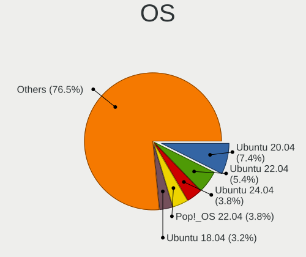

| Name                         | Notebooks | Percent |
|------------------------------|-----------|---------|
| Ubuntu 20.04                 | 84        | 7.39%   |
| Ubuntu 22.04                 | 61        | 5.37%   |
| Ubuntu 24.04                 | 43        | 3.79%   |
| Pop!_OS 22.04                | 43        | 3.79%   |
| Ubuntu 18.04                 | 36        | 3.17%   |
| Arch Rolling                 | 33        | 2.9%    |
| Debian 12                    | 27        | 2.38%   |
| Debian 11                    | 23        | 2.02%   |
| Fedora 40                    | 21        | 1.85%   |
| ArcoLinux Rolling            | 20        | 1.76%   |
| Ubuntu 23.04                 | 17        | 1.5%    |
| Fedora 42                    | 17        | 1.5%    |
| Zorin 17                     | 16        | 1.41%   |
| Zorin 16                     | 16        | 1.41%   |
| OpenMandriva 25.06           | 15        | 1.32%   |
| Linux Mint 22.1              | 14        | 1.23%   |
| Fedora 35                    | 13        | 1.14%   |
| OpenMandriva 24.12           | 12        | 1.06%   |
| Manjaro                      | 12        | 1.06%   |
| OpenMandriva 4.2             | 11        | 0.97%   |
| Fedora 39                    | 11        | 0.97%   |
| Fedora 38                    | 11        | 0.97%   |
| Fedora 31                    | 11        | 0.97%   |
| Ubuntu 23.10                 | 10        | 0.88%   |
| Ubuntu 22.10                 | 10        | 0.88%   |
| Ubuntu 20.10                 | 10        | 0.88%   |
| openSUSE Tumbleweed-XXXXXXXX | 10        | 0.88%   |
| Linux Mint 20.3              | 10        | 0.88%   |
| KDE neon 20.04               | 10        | 0.88%   |
| Pop!_OS 21.10                | 9         | 0.79%   |
| OpenMandriva 4.3             | 9         | 0.79%   |
| OpenMandriva 25.01           | 9         | 0.79%   |
| Linux Mint 21.3              | 9         | 0.79%   |
| Fedora 36                    | 9         | 0.79%   |
| Fedora 34                    | 9         | 0.79%   |
| Ubuntu 19.04                 | 8         | 0.7%    |
| Pop!_OS 21.04                | 8         | 0.7%    |
| Pop!_OS 20.10                | 8         | 0.7%    |
| OpenMandriva 5.0             | 8         | 0.7%    |
| OpenMandriva 25.90           | 8         | 0.7%    |

OS Family
---------

OS without a version

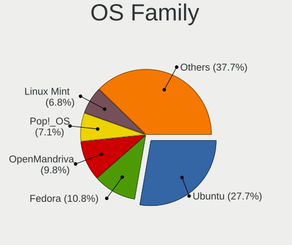

| Name          | Notebooks | Percent |
|---------------|-----------|---------|
| Ubuntu        | 293       | 27.72%  |
| Fedora        | 114       | 10.79%  |
| OpenMandriva  | 104       | 9.84%   |
| Pop!_OS       | 75        | 7.1%    |
| Linux Mint    | 72        | 6.81%   |
| Debian        | 62        | 5.87%   |
| Zorin         | 40        | 3.78%   |
| Arch          | 37        | 3.5%    |
| Manjaro       | 31        | 2.93%   |
| KDE neon      | 26        | 2.46%   |
| ArcoLinux     | 20        | 1.89%   |
| Kubuntu       | 17        | 1.61%   |
| openSUSE      | 14        | 1.32%   |
| Kali          | 14        | 1.32%   |
| Elementary    | 14        | 1.32%   |
| Xubuntu       | 13        | 1.23%   |
| Ubuntu MATE   | 8         | 0.76%   |
| Bazzite       | 8         | 0.76%   |
| NixOS         | 7         | 0.66%   |
| ROSA          | 6         | 0.57%   |
| MX            | 6         | 0.57%   |
| Lubuntu       | 6         | 0.57%   |
| Gentoo        | 6         | 0.57%   |
| EndeavourOS   | 6         | 0.57%   |
| Xero          | 4         | 0.38%   |
| Ubuntu Budgie | 4         | 0.38%   |
| TUXEDO OS     | 4         | 0.38%   |
| Nobara        | 4         | 0.38%   |
| CachyOS       | 4         | 0.38%   |
| Void Linux    | 3         | 0.28%   |
| Parrot        | 3         | 0.28%   |
| LMDE          | 3         | 0.28%   |
| Clear Linux   | 3         | 0.28%   |
| CentOS        | 3         | 0.28%   |
| Ubuntu Unity  | 2         | 0.19%   |
| Ubuntu Studio | 2         | 0.19%   |
| Solus         | 2         | 0.19%   |
| Peppermint    | 2         | 0.19%   |
| Devuan        | 2         | 0.19%   |
| SteamOS       | 1         | 0.09%   |

Kernel
------

Version of the Linux kernel

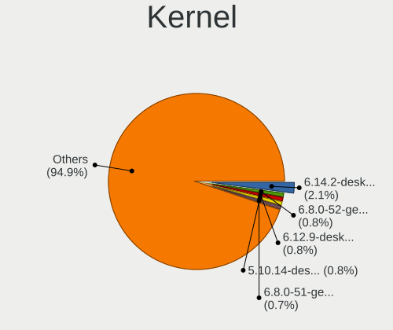

| Version                             | Notebooks | Percent |
|-------------------------------------|-----------|---------|
| 6.14.2-desktop-3omv2590             | 26        | 2.06%   |
| 6.8.0-52-generic                    | 10        | 0.79%   |
| 6.12.9-desktop-1omv2490             | 10        | 0.79%   |
| 5.10.14-desktop-1omv4002            | 10        | 0.79%   |
| 6.8.0-51-generic                    | 9         | 0.71%   |
| 6.12.1-desktop-1omv2490             | 9         | 0.71%   |
| 5.4.0-42-generic                    | 9         | 0.71%   |
| 6.6.2-desktop-1omv2390              | 8         | 0.63%   |
| 6.2.6-desktop-1omv2390              | 8         | 0.63%   |
| 6.2.0-39-generic                    | 8         | 0.63%   |
| 6.2.0-20-generic                    | 8         | 0.63%   |
| 5.16.7-desktop-1omv4003             | 8         | 0.63%   |
| 6.8.0-45-generic                    | 7         | 0.55%   |
| 6.14.0-33-generic                   | 7         | 0.55%   |
| 5.3.0-46-generic                    | 7         | 0.55%   |
| 5.15.0-46-generic                   | 7         | 0.55%   |
| 6.8.0-57-generic                    | 6         | 0.48%   |
| 6.2.6-76060206-generic              | 6         | 0.48%   |
| 6.2.0-26-generic                    | 6         | 0.48%   |
| 6.14.0-36-generic                   | 6         | 0.48%   |
| 6.12.10-76061203-generic            | 6         | 0.48%   |
| 6.11.0-19-generic                   | 6         | 0.48%   |
| 6.10.0-desktop-1omv2490             | 6         | 0.48%   |
| 5.4.0-58-generic                    | 6         | 0.48%   |
| 5.19.0-76051900-generic             | 6         | 0.48%   |
| 5.15.0-48-generic                   | 6         | 0.48%   |
| 5.11.0-40-generic                   | 6         | 0.48%   |
| 6.9.3-76060903-generic              | 5         | 0.4%    |
| 6.8.0-40-generic                    | 5         | 0.4%    |
| 6.5.6-76060506-generic              | 5         | 0.4%    |
| 6.4.6-76060406-generic              | 5         | 0.4%    |
| 6.11.0-24-generic                   | 5         | 0.4%    |
| 5.8.0-44-generic                    | 5         | 0.4%    |
| 5.4.0-91-generic                    | 5         | 0.4%    |
| 5.4.0-74-generic                    | 5         | 0.4%    |
| 5.4.0-48-generic                    | 5         | 0.4%    |
| 5.4.0-26-generic                    | 5         | 0.4%    |
| 6.8.0-76060800daily20240311-generic | 4         | 0.32%   |
| 6.8.0-49-generic                    | 4         | 0.32%   |
| 6.8.0-41-generic                    | 4         | 0.32%   |

Kernel Family
-------------

Linux kernel without a distro release

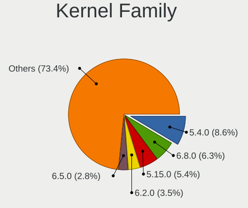

| Version | Notebooks | Percent |
|---------|-----------|---------|
| 5.4.0   | 103       | 8.59%   |
| 6.8.0   | 75        | 6.26%   |
| 5.15.0  | 65        | 5.42%   |
| 6.2.0   | 42        | 3.5%    |
| 6.5.0   | 34        | 2.84%   |
| 6.14.0  | 33        | 2.75%   |
| 5.19.0  | 33        | 2.75%   |
| 6.1.0   | 32        | 2.67%   |
| 5.8.0   | 32        | 2.67%   |
| 6.14.2  | 29        | 2.42%   |
| 5.11.0  | 29        | 2.42%   |
| 6.11.0  | 26        | 2.17%   |
| 4.15.0  | 25        | 2.09%   |
| 5.3.0   | 23        | 1.92%   |
| 5.10.0  | 23        | 1.92%   |
| 5.13.0  | 21        | 1.75%   |
| 6.2.6   | 15        | 1.25%   |
| 5.0.0   | 15        | 1.25%   |
| 6.12.1  | 13        | 1.08%   |
| 4.18.0  | 12        | 1%      |
| 6.12.9  | 10        | 0.83%   |
| 5.10.14 | 10        | 0.83%   |
| 6.6.2   | 8         | 0.67%   |
| 5.16.7  | 8         | 0.67%   |
| 6.9.3   | 6         | 0.5%    |
| 6.5.6   | 6         | 0.5%    |
| 6.5.3   | 6         | 0.5%    |
| 6.12.10 | 6         | 0.5%    |
| 6.10.0  | 6         | 0.5%    |
| 6.8.7   | 5         | 0.42%   |
| 6.4.6   | 5         | 0.42%   |
| 6.4.12  | 5         | 0.42%   |
| 6.10.6  | 5         | 0.42%   |
| 5.17.5  | 5         | 0.42%   |
| 5.17.0  | 5         | 0.42%   |
| 5.16.11 | 5         | 0.42%   |
| 6.9.7   | 4         | 0.33%   |
| 6.4.0   | 4         | 0.33%   |
| 6.17.9  | 4         | 0.33%   |
| 6.17.0  | 4         | 0.33%   |

Kernel Major Ver.
-----------------

Linux kernel major version

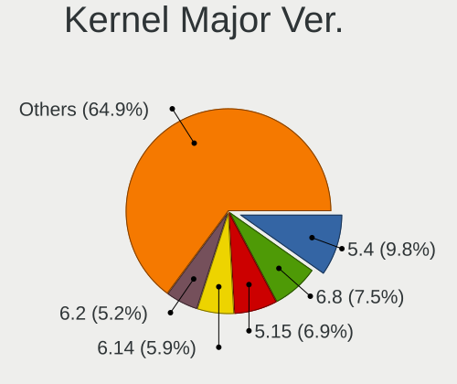

| Version | Notebooks | Percent |
|---------|-----------|---------|
| 5.4     | 115       | 9.76%   |
| 6.8     | 88        | 7.47%   |
| 5.15    | 81        | 6.88%   |
| 6.14    | 69        | 5.86%   |
| 6.2     | 61        | 5.18%   |
| 6.5     | 51        | 4.33%   |
| 6.1     | 49        | 4.16%   |
| 6.12    | 47        | 3.99%   |
| 5.19    | 41        | 3.48%   |
| 5.10    | 41        | 3.48%   |
| 6.11    | 40        | 3.4%    |
| 5.8     | 38        | 3.23%   |
| 5.13    | 36        | 3.06%   |
| 5.11    | 35        | 2.97%   |
| 5.3     | 31        | 2.63%   |
| 5.16    | 27        | 2.29%   |
| 6.6     | 26        | 2.21%   |
| 4.15    | 25        | 2.12%   |
| 6.10    | 23        | 1.95%   |
| 6.4     | 22        | 1.87%   |
| 5.17    | 20        | 1.7%    |
| 6.9     | 19        | 1.61%   |
| 6.17    | 19        | 1.61%   |
| 6.15    | 18        | 1.53%   |
| 6.0     | 17        | 1.44%   |
| 5.14    | 16        | 1.36%   |
| 5.0     | 15        | 1.27%   |
| 4.18    | 15        | 1.27%   |
| 5.9     | 11        | 0.93%   |
| 5.18    | 11        | 0.93%   |
| 6.16    | 10        | 0.85%   |
| 6.13    | 10        | 0.85%   |
| 6.7     | 8         | 0.68%   |
| 6.3     | 8         | 0.68%   |
| 5.12    | 8         | 0.68%   |
| 4.19    | 6         | 0.51%   |
| 5.5     | 5         | 0.42%   |
| 6.18    | 3         | 0.25%   |
| 5.7     | 3         | 0.25%   |
| 4.9     | 3         | 0.25%   |

Arch
----

OS architecture (x86_64, i586, etc.)

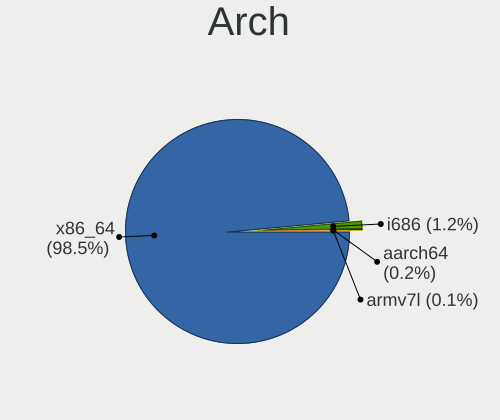

| Name    | Notebooks | Percent |
|---------|-----------|---------|
| x86_64  | 1001      | 98.52%  |
| i686    | 12        | 1.18%   |
| aarch64 | 2         | 0.2%    |
| armv7l  | 1         | 0.1%    |

DE
--

Desktop Environment

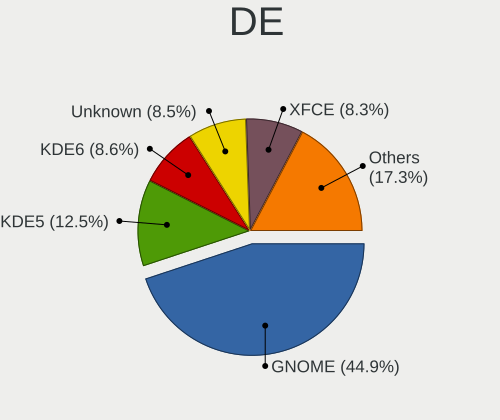

| Name              | Notebooks | Percent |
|-------------------|-----------|---------|
| GNOME             | 478       | 44.92%  |
| KDE5              | 133       | 12.5%   |
| KDE6              | 91        | 8.55%   |
| Unknown           | 90        | 8.46%   |
| XFCE              | 88        | 8.27%   |
| X-Cinnamon        | 56        | 5.26%   |
| MATE              | 20        | 1.88%   |
| KDE               | 16        | 1.5%    |
| i3                | 15        | 1.41%   |
| Pantheon          | 14        | 1.32%   |
| LXQt              | 11        | 1.03%   |
| Cinnamon          | 8         | 0.75%   |
| Hyprland          | 7         | 0.66%   |
| GNOME Flashback   | 6         | 0.56%   |
| KDE4              | 5         | 0.47%   |
| COSMIC            | 5         | 0.47%   |
| Budgie            | 5         | 0.47%   |
| LXDE              | 3         | 0.28%   |
| Unity             | 2         | 0.19%   |
| Yaru:ubuntu:GNOME | 1         | 0.09%   |
| xmonad            | 1         | 0.09%   |
| xinit-compat      | 1         | 0.09%   |
| Trinity           | 1         | 0.09%   |
| sway:wlroots      | 1         | 0.09%   |
| qtile             | 1         | 0.09%   |
| niri              | 1         | 0.09%   |
| i3-with-shmlog    | 1         | 0.09%   |
| Deepin            | 1         | 0.09%   |
| bspwm             | 1         | 0.09%   |
| awesome           | 1         | 0.09%   |

Display Server
--------------

X11 or Wayland

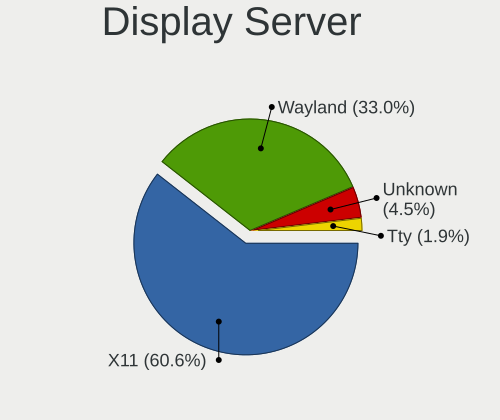

| Name    | Notebooks | Percent |
|---------|-----------|---------|
| X11     | 642       | 60.57%  |
| Wayland | 350       | 33.02%  |
| Unknown | 48        | 4.53%   |
| Tty     | 20        | 1.89%   |

Display Manager
---------------

SDDM, LightDM, etc.

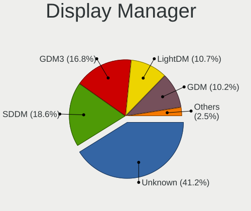

| Name    | Notebooks | Percent |
|---------|-----------|---------|
| Unknown | 440       | 41.16%  |
| SDDM    | 199       | 18.62%  |
| GDM3    | 180       | 16.84%  |
| LightDM | 114       | 10.66%  |
| GDM     | 109       | 10.2%   |
| TDM     | 17        | 1.59%   |
| KDM     | 3         | 0.28%   |
| GREETD  | 3         | 0.28%   |
| XDM     | 1         | 0.09%   |
| SLiM    | 1         | 0.09%   |
| LY-DM   | 1         | 0.09%   |
| LEMURS  | 1         | 0.09%   |

OS Lang
-------

Language

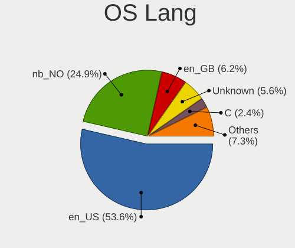

| Lang        | Notebooks | Percent |
|-------------|-----------|---------|
| en_US       | 559       | 53.6%   |
| nb_NO       | 260       | 24.93%  |
| en_GB       | 65        | 6.23%   |
| Unknown     | 58        | 5.56%   |
| C           | 25        | 2.4%    |
| nn_NO       | 16        | 1.53%   |
| pl_PL       | 13        | 1.25%   |
| en_DK       | 12        | 1.15%   |
| de_DE       | 6         | 0.58%   |
| sv_SE       | 3         | 0.29%   |
| ru_RU       | 3         | 0.29%   |
| it_IT       | 3         | 0.29%   |
| pt_PT       | 2         | 0.19%   |
| fi_FI       | 2         | 0.19%   |
| es_ES       | 2         | 0.19%   |
| en_IE       | 2         | 0.19%   |
| sr_RS@latin | 1         | 0.1%    |
| ru_UA       | 1         | 0.1%    |
| POSIX       | 1         | 0.1%    |
| nl_NL       | 1         | 0.1%    |
| fr_FR       | 1         | 0.1%    |
| en_US.utf-8 | 1         | 0.1%    |
| en_NZ       | 1         | 0.1%    |
| en_AU       | 1         | 0.1%    |
| en_150      | 1         | 0.1%    |
| en_001      | 1         | 0.1%    |
| el_GR       | 1         | 0.1%    |
| aa_DJ       | 1         | 0.1%    |

Boot Mode
---------

EFI or BIOS

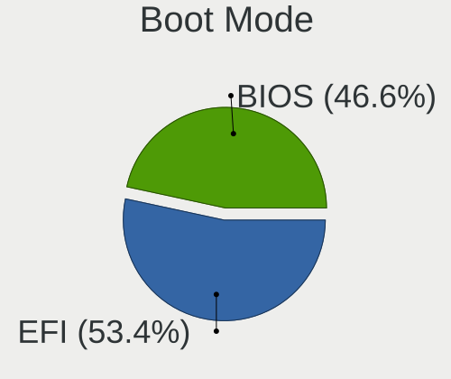

| Mode | Notebooks | Percent |
|------|-----------|---------|
| EFI  | 554       | 53.37%  |
| BIOS | 484       | 46.63%  |

Filesystem
----------

Type of filesystem

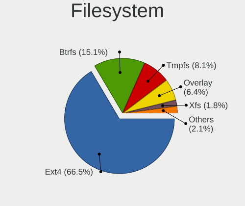

| Type    | Notebooks | Percent |
|---------|-----------|---------|
| Ext4    | 698       | 66.48%  |
| Btrfs   | 159       | 15.14%  |
| Tmpfs   | 85        | 8.1%    |
| Overlay | 67        | 6.38%   |
| Xfs     | 19        | 1.81%   |
| Unknown | 12        | 1.14%   |
| Zfs     | 6         | 0.57%   |
| Ext3    | 2         | 0.19%   |
| Ext2    | 2         | 0.19%   |

Part. scheme
------------

Scheme of partitioning

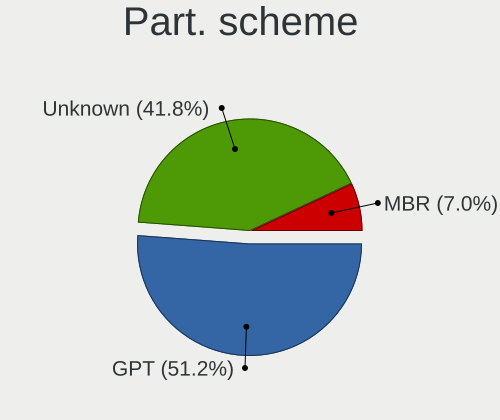

| Type    | Notebooks | Percent |
|---------|-----------|---------|
| GPT     | 537       | 51.19%  |
| Unknown | 439       | 41.85%  |
| MBR     | 73        | 6.96%   |

Dual Boot with Linux/BSD
------------------------

Hosting more than one Linux/BSD

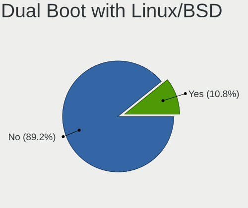

| Dual boot | Notebooks | Percent |
|-----------|-----------|---------|
| No        | 924       | 89.19%  |
| Yes       | 112       | 10.81%  |

Dual Boot (Win)
---------------

Hosting Linux and Windows

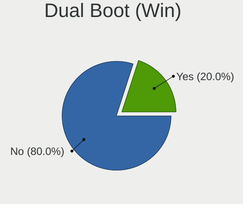

| Dual boot | Notebooks | Percent |
|-----------|-----------|---------|
| No        | 827       | 79.98%  |
| Yes       | 207       | 20.02%  |

Board
-----

Vendor
------

Motherboard manufacturer

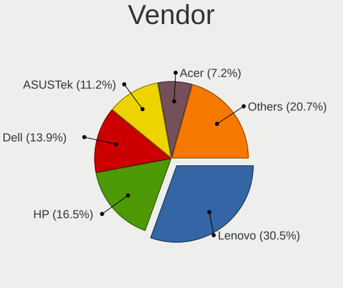

| Name                 | Notebooks | Percent |
|----------------------|-----------|---------|
| Lenovo               | 310       | 30.51%  |
| Hewlett-Packard      | 168       | 16.54%  |
| Dell                 | 141       | 13.88%  |
| ASUSTek Computer     | 114       | 11.22%  |
| Acer                 | 73        | 7.19%   |
| Apple                | 43        | 4.23%   |
| MSI                  | 38        | 3.74%   |
| Samsung Electronics  | 22        | 2.17%   |
| HUAWEI               | 19        | 1.87%   |
| Notebook             | 14        | 1.38%   |
| Toshiba              | 12        | 1.18%   |
| Google               | 10        | 0.98%   |
| Packard Bell         | 7         | 0.69%   |
| Unknown              | 6         | 0.59%   |
| Clevo                | 5         | 0.49%   |
| TUXEDO               | 4         | 0.39%   |
| Fujitsu              | 3         | 0.3%    |
| Alienware            | 3         | 0.3%    |
| Panasonic            | 2         | 0.2%    |
| Komplett             | 2         | 0.2%    |
| Intel Client Systems | 2         | 0.2%    |
| Teclast              | 1         | 0.1%    |
| Star Labs            | 1         | 0.1%    |
| Sony                 | 1         | 0.1%    |
| Razer                | 1         | 0.1%    |
| Nokia                | 1         | 0.1%    |
| Multicom             | 1         | 0.1%    |
| Medion               | 1         | 0.1%    |
| LG Electronics       | 1         | 0.1%    |
| LAMINA               | 1         | 0.1%    |
| Intel                | 1         | 0.1%    |
| IGEL Technology      | 1         | 0.1%    |
| Hatteland Technology | 1         | 0.1%    |
| GPD                  | 1         | 0.1%    |
| GMKtec               | 1         | 0.1%    |
| Getac                | 1         | 0.1%    |
| eMachines            | 1         | 0.1%    |
| Chuwi                | 1         | 0.1%    |
| Cepter               | 1         | 0.1%    |

Model
-----

Motherboard model

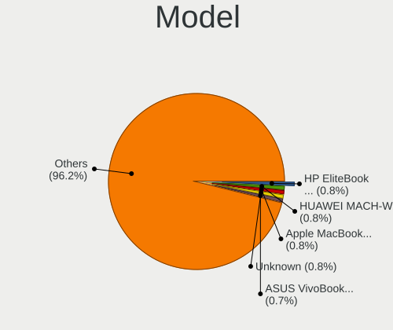

| Name                                       | Notebooks | Percent |
|--------------------------------------------|-----------|---------|
| HUAWEI MACH-WX9                            | 8         | 0.79%   |
| HP EliteBook 840 G6                        | 8         | 0.79%   |
| Apple MacBookPro12,1                       | 8         | 0.79%   |
| Unknown                                    | 8         | 0.79%   |
| ASUS VivoBook_ASUSLaptop K3402ZA_K3402ZA   | 7         | 0.69%   |
| Dell Precision 5530                        | 6         | 0.59%   |
| Lenovo Yoga Slim 7 14ARE05 82A2            | 5         | 0.49%   |
| HUAWEI WRT-WX9                             | 5         | 0.49%   |
| HP Pavilion Notebook                       | 5         | 0.49%   |
| Dell XPS 15 9570                           | 5         | 0.49%   |
| Dell XPS 15 9520                           | 5         | 0.49%   |
| Lenovo Yoga Pro 7 14AHP9 83E3              | 4         | 0.39%   |
| HP ProBook 430 G2                          | 4         | 0.39%   |
| Dell XPS 13 9380                           | 4         | 0.39%   |
| Dell Latitude E7240                        | 4         | 0.39%   |
| Apple MacBookPro9,2                        | 4         | 0.39%   |
| Apple MacBookPro8,1                        | 4         | 0.39%   |
| Apple MacBookAir6,2                        | 4         | 0.39%   |
| Acer Aspire A315-24P                       | 4         | 0.39%   |
| Samsung 950XCJ/951XCJ/950XCR               | 3         | 0.3%    |
| Lenovo Yoga Slim 7 Pro 14IAH7 82UT         | 3         | 0.3%    |
| Lenovo Yoga Slim 7 Carbon 14ACN6 82L0      | 3         | 0.3%    |
| Lenovo ThinkPad X1 Carbon Gen 9 20XW005PMX | 3         | 0.3%    |
| Lenovo LOQ 15APH8 82XT                     | 3         | 0.3%    |
| Lenovo Legion Y540-15IRH 81SX              | 3         | 0.3%    |
| Lenovo Legion 5 15ACH6H 82JU               | 3         | 0.3%    |
| HP ProBook 450 G2                          | 3         | 0.3%    |
| HP ProBook 440 G5                          | 3         | 0.3%    |
| HP OMEN by Laptop                          | 3         | 0.3%    |
| HP EliteBook 8470p                         | 3         | 0.3%    |
| HP EliteBook 840 G8 Notebook PC            | 3         | 0.3%    |
| HP EliteBook 840 G5                        | 3         | 0.3%    |
| HP EliteBook 840 G4                        | 3         | 0.3%    |
| HP EliteBook 830 G6                        | 3         | 0.3%    |
| Dell XPS 15 9530                           | 3         | 0.3%    |
| Dell XPS 15 9510                           | 3         | 0.3%    |
| Dell XPS 15 9500                           | 3         | 0.3%    |
| Dell XPS 15 7590                           | 3         | 0.3%    |
| Dell Latitude E6520                        | 3         | 0.3%    |
| Dell Latitude E5470                        | 3         | 0.3%    |

Model Family
------------

Motherboard model prefix

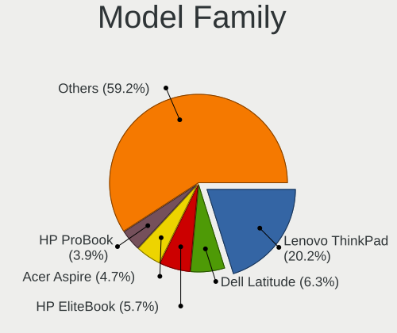

| Name                  | Notebooks | Percent |
|-----------------------|-----------|---------|
| Lenovo ThinkPad       | 205       | 20.18%  |
| Dell Latitude         | 64        | 6.3%    |
| HP EliteBook          | 58        | 5.71%   |
| Acer Aspire           | 48        | 4.72%   |
| HP ProBook            | 40        | 3.94%   |
| Dell XPS              | 36        | 3.54%   |
| Lenovo IdeaPad        | 32        | 3.15%   |
| ASUS VivoBook         | 32        | 3.15%   |
| Lenovo Yoga           | 26        | 2.56%   |
| Dell Precision        | 25        | 2.46%   |
| HP Pavilion           | 21        | 2.07%   |
| Lenovo Legion         | 14        | 1.38%   |
| HP ZBook              | 14        | 1.38%   |
| Acer Swift            | 14        | 1.38%   |
| HP Laptop             | 12        | 1.18%   |
| ASUS Zenbook          | 11        | 1.08%   |
| Toshiba Satellite     | 10        | 0.98%   |
| HUAWEI MACH-WX9       | 8         | 0.79%   |
| Dell Inspiron         | 8         | 0.79%   |
| Apple MacBookPro12    | 8         | 0.79%   |
| Unknown               | 8         | 0.79%   |
| Packard Bell EasyNote | 6         | 0.59%   |
| Lenovo ThinkBook      | 6         | 0.59%   |
| HP OMEN               | 6         | 0.59%   |
| ASUS ASUS             | 6         | 0.59%   |
| Apple MacBookPro11    | 6         | 0.59%   |
| Acer Nitro            | 6         | 0.59%   |
| Lenovo LOQ            | 5         | 0.49%   |
| HUAWEI WRT-WX9        | 5         | 0.49%   |
| ASUS ROG              | 5         | 0.49%   |
| Apple MacBookPro8     | 5         | 0.49%   |
| Apple MacBookAir6     | 5         | 0.49%   |
| MSI Katana            | 4         | 0.39%   |
| ASUS TUF              | 4         | 0.39%   |
| Apple MacBookPro9     | 4         | 0.39%   |
| Samsung 950XCJ        | 3         | 0.3%    |
| MSI GS65              | 3         | 0.3%    |
| MSI GL62              | 3         | 0.3%    |
| MSI GF63              | 3         | 0.3%    |
| Lenovo G50-80         | 3         | 0.3%    |

MFG Year
--------

Motherboard manufacture year

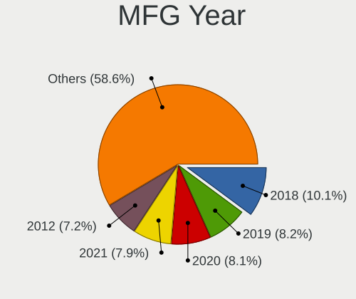

| Year    | Notebooks | Percent |
|---------|-----------|---------|
| 2018    | 103       | 10.14%  |
| 2019    | 83        | 8.17%   |
| 2020    | 82        | 8.07%   |
| 2021    | 80        | 7.87%   |
| 2012    | 73        | 7.19%   |
| 2022    | 66        | 6.5%    |
| 2017    | 65        | 6.4%    |
| 2013    | 65        | 6.4%    |
| 2015    | 60        | 5.91%   |
| 2016    | 58        | 5.71%   |
| 2011    | 58        | 5.71%   |
| 2014    | 53        | 5.22%   |
| 2023    | 43        | 4.23%   |
| 2024    | 34        | 3.35%   |
| 2010    | 33        | 3.25%   |
| 2008    | 18        | 1.77%   |
| 2009    | 16        | 1.57%   |
| 2007    | 11        | 1.08%   |
| 2025    | 9         | 0.89%   |
| 2006    | 3         | 0.3%    |
| Unknown | 2         | 0.2%    |
| 2005    | 1         | 0.1%    |

Form Factor
-----------

Physical design of the computer

| Name     | Notebooks | Percent |
|----------|-----------|---------|
| Notebook | 1016      | 100%    |

Secure Boot
-----------

Enabled or disabled

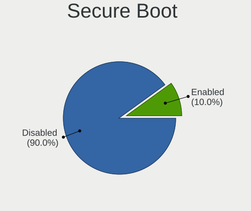

| State    | Notebooks | Percent |
|----------|-----------|---------|
| Disabled | 921       | 90.03%  |
| Enabled  | 102       | 9.97%   |

Coreboot
--------

Have coreboot on board

| Used | Notebooks | Percent |
|------|-----------|---------|
| No   | 1004      | 98.82%  |
| Yes  | 12        | 1.18%   |

RAM Size
--------

Total RAM memory

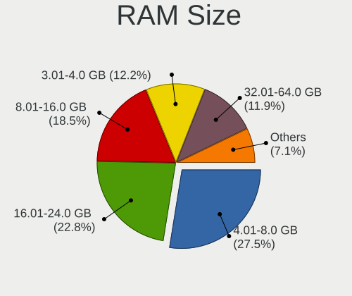

| Size in GB  | Notebooks | Percent |
|-------------|-----------|---------|
| 4.01-8.0    | 285       | 27.54%  |
| 16.01-24.0  | 236       | 22.8%   |
| 8.01-16.0   | 191       | 18.45%  |
| 3.01-4.0    | 126       | 12.17%  |
| 32.01-64.0  | 123       | 11.88%  |
| 24.01-32.0  | 30        | 2.9%    |
| 64.01-256.0 | 20        | 1.93%   |
| 1.01-2.0    | 16        | 1.55%   |
| 2.01-3.0    | 4         | 0.39%   |
| 0.51-1.0    | 3         | 0.29%   |
| 0.01-0.5    | 1         | 0.1%    |

RAM Used
--------

Used RAM memory

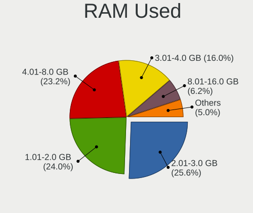

| Used GB    | Notebooks | Percent |
|------------|-----------|---------|
| 2.01-3.0   | 294       | 25.59%  |
| 1.01-2.0   | 276       | 24.02%  |
| 4.01-8.0   | 266       | 23.15%  |
| 3.01-4.0   | 184       | 16.01%  |
| 8.01-16.0  | 71        | 6.18%   |
| 0.51-1.0   | 37        | 3.22%   |
| 0.01-0.5   | 11        | 0.96%   |
| 16.01-24.0 | 7         | 0.61%   |
| 24.01-32.0 | 3         | 0.26%   |

Total Drives
------------

Number of drives on board

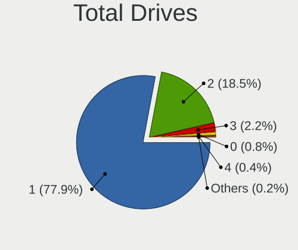

| Drives | Notebooks | Percent |
|--------|-----------|---------|
| 1      | 813       | 77.95%  |
| 2      | 193       | 18.5%   |
| 3      | 23        | 2.21%   |
| 0      | 8         | 0.77%   |
| 4      | 4         | 0.38%   |
| 6      | 1         | 0.1%    |
| 5      | 1         | 0.1%    |

Has CD-ROM
----------

Has CD-ROM on board

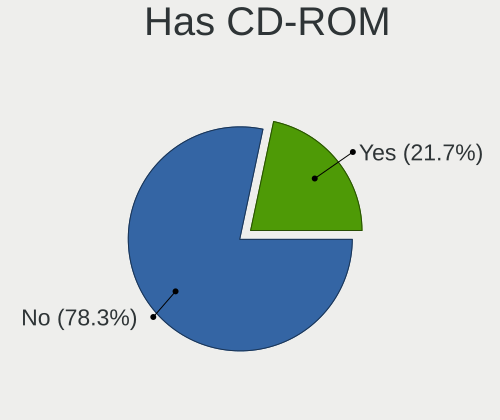

| Presented | Notebooks | Percent |
|-----------|-----------|---------|
| No        | 798       | 78.31%  |
| Yes       | 221       | 21.69%  |

Has Ethernet
------------

Has Ethernet on board

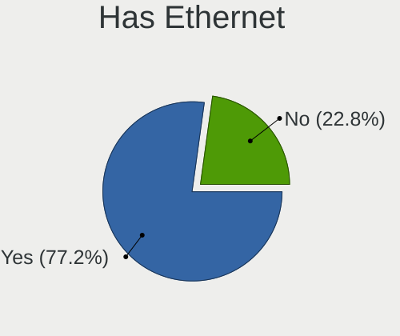

| Presented | Notebooks | Percent |
|-----------|-----------|---------|
| Yes       | 788       | 77.18%  |
| No        | 233       | 22.82%  |

Has WiFi
--------

Has WiFi module

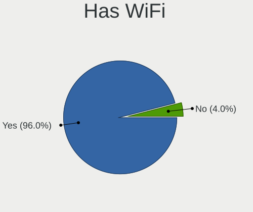

| Presented | Notebooks | Percent |
|-----------|-----------|---------|
| Yes       | 975       | 95.96%  |
| No        | 41        | 4.04%   |

Has Bluetooth
-------------

Has Bluetooth module

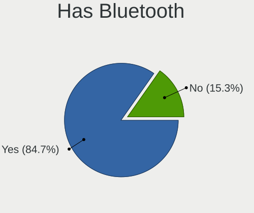

| Presented | Notebooks | Percent |
|-----------|-----------|---------|
| Yes       | 872       | 84.74%  |
| No        | 157       | 15.26%  |

Location
--------

Country
-------

Geographic location (country)

| Country | Notebooks | Percent |
|---------|-----------|---------|
| Norway  | 1016      | 100%    |

City
----

Geographic location (city)

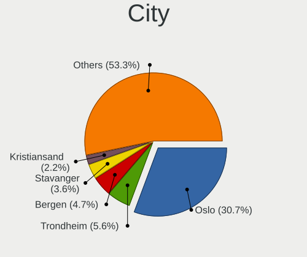

| City                 | Notebooks | Percent |
|----------------------|-----------|---------|
| Oslo                 | 334       | 30.67%  |
| Trondheim            | 61        | 5.6%    |
| Bergen               | 51        | 4.68%   |
| Stavanger            | 39        | 3.58%   |
| Kristiansand         | 24        | 2.2%    |
| Tromsø              | 21        | 1.93%   |
| Skien                | 15        | 1.38%   |
| Ålesund             | 14        | 1.29%   |
| Fredrikstad          | 13        | 1.19%   |
| Drammen              | 13        | 1.19%   |
| Haugesund            | 12        | 1.1%    |
| Moss                 | 10        | 0.92%   |
| Bodø                | 10        | 0.92%   |
| Røyken Municipality | 8         | 0.73%   |
| Fornebu              | 8         | 0.73%   |
| Asker                | 7         | 0.64%   |
| Tønsberg            | 6         | 0.55%   |
| Ski                  | 6         | 0.55%   |
| Sarpsborg            | 6         | 0.55%   |
| Sandnes              | 6         | 0.55%   |
| Mo i Rana            | 6         | 0.55%   |
| Lillehammer          | 6         | 0.55%   |
| Hamar                | 6         | 0.55%   |
| Drobak               | 6         | 0.55%   |
| Arendal              | 6         | 0.55%   |
| Sandefjord           | 5         | 0.46%   |
| Porsgrunn            | 5         | 0.46%   |
| Nesttun              | 5         | 0.46%   |
| Molde                | 5         | 0.46%   |
| Melhus               | 5         | 0.46%   |
| Jessheim             | 5         | 0.46%   |
| Bryne                | 5         | 0.46%   |
| Lyngdal              | 4         | 0.37%   |
| Kristiansund         | 4         | 0.37%   |
| Honefoss             | 4         | 0.37%   |
| Harstad              | 4         | 0.37%   |
| Eina                 | 4         | 0.37%   |
| Brumunddal           | 4         | 0.37%   |
| Algard               | 4         | 0.37%   |
| Verdal               | 3         | 0.28%   |

Drives
------

Drive Vendor
------------

Hard drive vendors

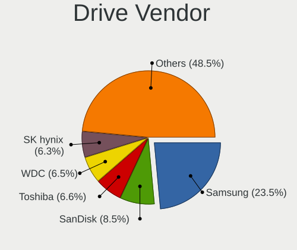

| Vendor                         | Notebooks | Drives | Percent |
|--------------------------------|-----------|--------|---------|
| Samsung Electronics            | 291       | 404    | 23.52%  |
| SanDisk                        | 105       | 144    | 8.49%   |
| Toshiba                        | 82        | 102    | 6.63%   |
| WDC                            | 81        | 98     | 6.55%   |
| SK hynix                       | 78        | 105    | 6.31%   |
| Kingston                       | 76        | 105    | 6.14%   |
| Seagate                        | 71        | 83     | 5.74%   |
| Unknown                        | 56        | 67     | 4.53%   |
| Micron Technology              | 55        | 76     | 4.45%   |
| Intel                          | 47        | 52     | 3.8%    |
| Hitachi                        | 28        | 42     | 2.26%   |
| Apple                          | 27        | 33     | 2.18%   |
| HGST                           | 24        | 28     | 1.94%   |
| Crucial                        | 23        | 26     | 1.86%   |
| KIOXIA                         | 21        | 32     | 1.7%    |
| LITEON                         | 18        | 26     | 1.46%   |
| Kingston Technology Company    | 16        | 18     | 1.29%   |
| PNY                            | 14        | 20     | 1.13%   |
| LITEONIT                       | 9         | 18     | 0.73%   |
| Lenovo                         | 7         | 7      | 0.57%   |
| Corsair                        | 6         | 8      | 0.49%   |
| A-DATA Technology              | 6         | 9      | 0.49%   |
| Phison                         | 5         | 7      | 0.4%    |
| JMicron Technology             | 5         | 6      | 0.4%    |
| Verbatim                       | 4         | 4      | 0.32%   |
| Union Memory                   | 4         | 4      | 0.32%   |
| UMIS                           | 4         | 4      | 0.32%   |
| Transcend                      | 4         | 4      | 0.32%   |
| OCZ                            | 4         | 5      | 0.32%   |
| Fujitsu                        | 4         | 4      | 0.32%   |
| China                          | 4         | 4      | 0.32%   |
| Realtek Semiconductor          | 3         | 4      | 0.24%   |
| Phison Electronics             | 3         | 3      | 0.24%   |
| Netac                          | 3         | 3      | 0.24%   |
| Intenso                        | 3         | 8      | 0.24%   |
| XPG                            | 2         | 2      | 0.16%   |
| Union Memory (Shenzhen)        | 2         | 2      | 0.16%   |
| Solid State Storage Technology | 2         | 2      | 0.16%   |
| Micron/Crucial Technology      | 2         | 2      | 0.16%   |
| Lexar                          | 2         | 2      | 0.16%   |

Drive Model
-----------

Hard drive models

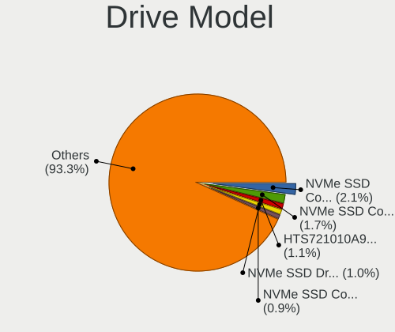

| Model                                                | Notebooks | Percent |
|------------------------------------------------------|-----------|---------|
| Samsung NVMe SSD Controller SM981/PM981/PM983 1TB    | 27        | 2.09%   |
| Samsung NVMe SSD Controller PM9A1/PM9A3/980PRO 1TB   | 22        | 1.7%    |
| HGST HTS721010A9E630 1TB                             | 14        | 1.08%   |
| Samsung NVMe SSD Drive 256GB                         | 13        | 1.01%   |
| Samsung NVMe SSD Controller SM961/PM961/SM963 1024GB | 11        | 0.85%   |
| PNY ELITE PSSD 960GB                                 | 10        | 0.77%   |
| Kingston Company SNV2S1000G 1TB                      | 9         | 0.7%    |
| Unknown MMC Card  64GB                               | 8         | 0.62%   |
| SanDisk NVMe SSD Drive 1TB                           | 8         | 0.62%   |
| Kingston SV300S37A120G 120GB SSD                     | 8         | 0.62%   |
| Toshiba XG6 NVMe SSD Controller 1024GB               | 7         | 0.54%   |
| Seagate ST1000LM024 HN-M101MBB 1TB                   | 7         | 0.54%   |
| Micron 2450_MTFDKBA512TFK 512GB                      | 7         | 0.54%   |
| Intel SSD 660P Series 512GB                          | 7         | 0.54%   |
| Apple SSD SM0128G 121GB                              | 7         | 0.54%   |
| Toshiba NVMe SSD Drive 256GB                         | 6         | 0.46%   |
| SK hynix SKHynix_HFS512GDE9X084N 512GB               | 6         | 0.46%   |
| Sandisk WD Blue SN550 NVMe SSD 1024GB                | 6         | 0.46%   |
| Samsung SSD 850 EVO 250GB                            | 6         | 0.46%   |
| Kingston SA400S37240G 240GB SSD                      | 6         | 0.46%   |
| Unknown MMC Card  32GB                               | 5         | 0.39%   |
| Unknown MMC Card  16GB                               | 5         | 0.39%   |
| SK hynix SKHynix_HFS512GEJ9X115N 512GB               | 5         | 0.39%   |
| Sandisk WD Blue SN500 / PC SN520 NVMe SSD 128GB      | 5         | 0.39%   |
| Sandisk WD Black SN750 / PC SN730 NVMe SSD 500GB     | 5         | 0.39%   |
| SanDisk NVMe SSD Drive 512GB                         | 5         | 0.39%   |
| SanDisk NVMe SSD Drive 256GB                         | 5         | 0.39%   |
| Samsung SSD 870 QVO 1TB                              | 5         | 0.39%   |
| Samsung NVMe SSD Drive 1024GB                        | 5         | 0.39%   |
| WDC WD10JPVX-22JC3T0 1TB                             | 4         | 0.31%   |
| WDC PC SN730 SDBQNTY-512G-1001 512GB                 | 4         | 0.31%   |
| Unknown NVMe SSD Drive 512GB                         | 4         | 0.31%   |
| Toshiba NVMe SSD Drive 512GB                         | 4         | 0.31%   |
| Toshiba BG3 NVMe SSD Controller 256GB                | 4         | 0.31%   |
| SK hynix NVMe SSD Drive 512GB                        | 4         | 0.31%   |
| SK hynix HFS128G39TND-N210A 128GB SSD                | 4         | 0.31%   |
| Seagate ST9500325AS 500GB                            | 4         | 0.31%   |
| Seagate ST500LT012-1DG142 500GB                      | 4         | 0.31%   |
| Seagate Expansion 2TB                                | 4         | 0.31%   |
| SanDisk SD8SN8U-128G-1006 128GB SSD                  | 4         | 0.31%   |

HDD Vendor
----------

Hard disk drive vendors

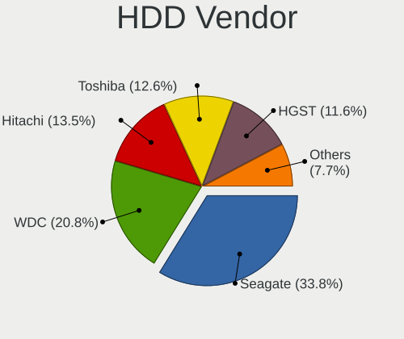

| Vendor              | Notebooks | Drives | Percent |
|---------------------|-----------|--------|---------|
| Seagate             | 70        | 82     | 33.82%  |
| WDC                 | 43        | 57     | 20.77%  |
| Hitachi             | 28        | 42     | 13.53%  |
| Toshiba             | 26        | 32     | 12.56%  |
| HGST                | 24        | 28     | 11.59%  |
| Fujitsu             | 4         | 4      | 1.93%   |
| Intenso             | 3         | 8      | 1.45%   |
| JMicron Technology  | 2         | 3      | 0.97%   |
| Unknown             | 1         | 1      | 0.48%   |
| STEC                | 1         | 1      | 0.48%   |
| Samsung Electronics | 1         | 3      | 0.48%   |
| LaCie               | 1         | 1      | 0.48%   |
| ASMT                | 1         | 2      | 0.48%   |
| ASMedia             | 1         | 3      | 0.48%   |
| Apple               | 1         | 1      | 0.48%   |

SSD Vendor
----------

Solid state drive vendors

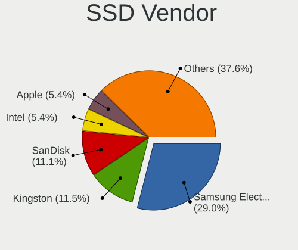

| Vendor              | Notebooks | Drives | Percent |
|---------------------|-----------|--------|---------|
| Samsung Electronics | 118       | 154    | 28.99%  |
| Kingston            | 47        | 61     | 11.55%  |
| SanDisk             | 45        | 54     | 11.06%  |
| Intel               | 22        | 24     | 5.41%   |
| Apple               | 22        | 25     | 5.41%   |
| Crucial             | 20        | 23     | 4.91%   |
| LITEON              | 16        | 24     | 3.93%   |
| PNY                 | 14        | 20     | 3.44%   |
| Toshiba             | 13        | 16     | 3.19%   |
| Micron Technology   | 13        | 18     | 3.19%   |
| SK hynix            | 12        | 14     | 2.95%   |
| WDC                 | 10        | 13     | 2.46%   |
| LITEONIT            | 9         | 18     | 2.21%   |
| Corsair             | 5         | 7      | 1.23%   |
| A-DATA Technology   | 5         | 8      | 1.23%   |
| Verbatim            | 4         | 4      | 0.98%   |
| Transcend           | 4         | 4      | 0.98%   |
| OCZ                 | 4         | 5      | 0.98%   |
| China               | 4         | 4      | 0.98%   |
| Netac               | 3         | 3      | 0.74%   |
| BIWIN               | 2         | 2      | 0.49%   |
| XINCUU              | 1         | 1      | 0.25%   |
| Teclast             | 1         | 1      | 0.25%   |
| Seagate             | 1         | 1      | 0.25%   |
| Quanji              | 1         | 3      | 0.25%   |
| PNY CS90            | 1         | 1      | 0.25%   |
| Phison              | 1         | 2      | 0.25%   |
| Patriot             | 1         | 1      | 0.25%   |
| OWC                 | 1         | 1      | 0.25%   |
| Lenovo              | 1         | 1      | 0.25%   |
| KingSpec            | 1         | 2      | 0.25%   |
| Hewlett-Packard     | 1         | 1      | 0.25%   |
| GOODRAM             | 1         | 1      | 0.25%   |
| FORESEE             | 1         | 1      | 0.25%   |
| ASMT                | 1         | 1      | 0.25%   |
| Unknown             | 1         | 1      | 0.25%   |

Drive Kind
----------

HDD or SSD

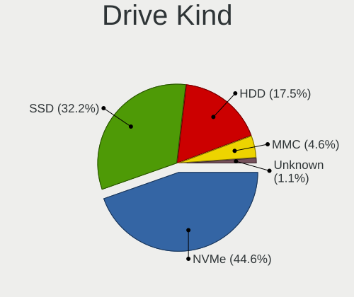

| Kind    | Notebooks | Drives | Percent |
|---------|-----------|--------|---------|
| NVMe    | 518       | 749    | 44.62%  |
| SSD     | 374       | 520    | 32.21%  |
| HDD     | 203       | 268    | 17.48%  |
| MMC     | 53        | 64     | 4.57%   |
| Unknown | 13        | 15     | 1.12%   |

Drive Connector
---------------

SATA, SAS, NVMe, etc.

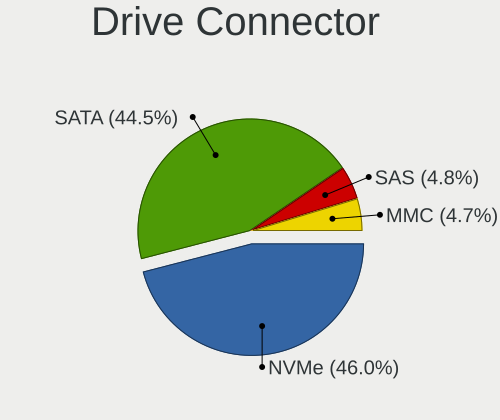

| Type | Notebooks | Drives | Percent |
|------|-----------|--------|---------|
| NVMe | 518       | 744    | 45.96%  |
| SATA | 502       | 721    | 44.54%  |
| SAS  | 54        | 87     | 4.79%   |
| MMC  | 53        | 64     | 4.7%    |

Drive Size
----------

Size of hard drive

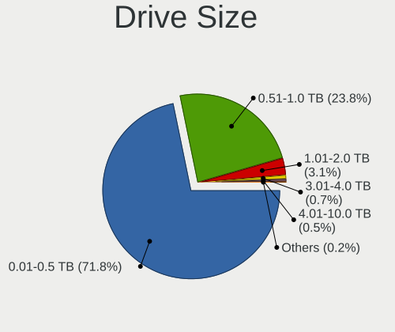

| Size in TB | Notebooks | Drives | Percent |
|------------|-----------|--------|---------|
| 0.01-0.5   | 417       | 582    | 71.77%  |
| 0.51-1.0   | 138       | 169    | 23.75%  |
| 1.01-2.0   | 18        | 27     | 3.1%    |
| 3.01-4.0   | 4         | 4      | 0.69%   |
| 4.01-10.0  | 3         | 4      | 0.52%   |
| 2.01-3.0   | 1         | 2      | 0.17%   |

Space Total
-----------

Amount of disk space available on the file system

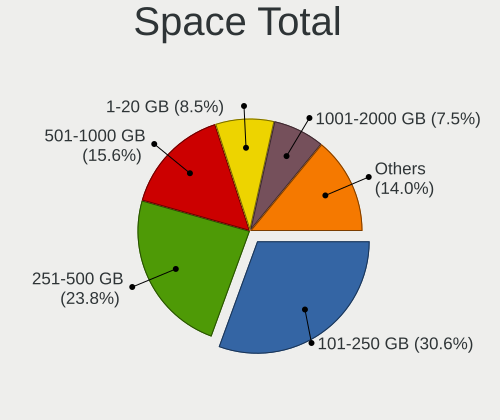

| Size in GB     | Notebooks | Percent |
|----------------|-----------|---------|
| 101-250        | 331       | 30.56%  |
| 251-500        | 258       | 23.82%  |
| 501-1000       | 169       | 15.6%   |
| 1-20           | 92        | 8.49%   |
| 1001-2000      | 81        | 7.48%   |
| 51-100         | 37        | 3.42%   |
| Unknown        | 34        | 3.14%   |
| More than 3000 | 28        | 2.59%   |
| 21-50          | 28        | 2.59%   |
| 2001-3000      | 25        | 2.31%   |

Space Used
----------

Amount of used disk space

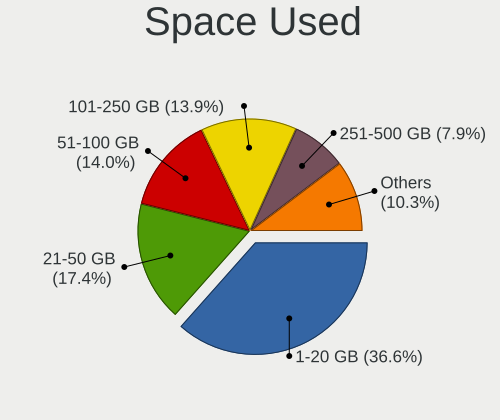

| Used GB        | Notebooks | Percent |
|----------------|-----------|---------|
| 1-20           | 419       | 36.56%  |
| 21-50          | 199       | 17.36%  |
| 51-100         | 160       | 13.96%  |
| 101-250        | 159       | 13.87%  |
| 251-500        | 91        | 7.94%   |
| 501-1000       | 37        | 3.23%   |
| Unknown        | 34        | 2.97%   |
| 1001-2000      | 28        | 2.44%   |
| More than 3000 | 12        | 1.05%   |
| 0              | 6         | 0.52%   |
| 2001-3000      | 1         | 0.09%   |

Malfunc. Drives
---------------

Drive models with a malfunction

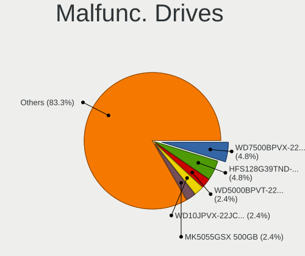

| Model                                               | Notebooks | Drives | Percent |
|-----------------------------------------------------|-----------|--------|---------|
| WDC WD7500BPVX-22JC3T0 752GB                        | 2         | 2      | 4.76%   |
| SK hynix HFS128G39TND-N210A 128GB SSD               | 2         | 2      | 4.76%   |
| WDC WD5000BPVT-22HXZT3 500GB                        | 1         | 1      | 2.38%   |
| WDC WD10JPVX-22JC3T0 1TB                            | 1         | 1      | 2.38%   |
| Toshiba MK5055GSX 500GB                             | 1         | 3      | 2.38%   |
| SK hynix SH920 2.5 7MM 128GB SSD                    | 1         | 1      | 2.38%   |
| SK hynix SC210 2.5 7MM 256GB SSD                    | 1         | 1      | 2.38%   |
| SK hynix HFS256G39TND-N210A 256GB SSD               | 1         | 1      | 2.38%   |
| Seagate ST9750420AS 752GB                           | 1         | 1      | 2.38%   |
| Seagate ST9500423AS 500GB                           | 1         | 1      | 2.38%   |
| Seagate ST500LT012-1DG142 500GB                     | 1         | 1      | 2.38%   |
| Seagate ST500LM000-SSHD-8GB                         | 1         | 1      | 2.38%   |
| Seagate ST1000LM014-SSHD-8GB                        | 1         | 1      | 2.38%   |
| SanDisk SSD i100 24GB                               | 1         | 1      | 2.38%   |
| SanDisk SD8TN8U-256G-1006 256GB SSD                 | 1         | 1      | 2.38%   |
| Samsung Electronics SSD SM841 2.5 7mm 256GB         | 1         | 1      | 2.38%   |
| Samsung Electronics SSD 980 1TB                     | 1         | 1      | 2.38%   |
| Samsung Electronics MZVL22T0HBLB-00BH1 2TB          | 1         | 1      | 2.38%   |
| Micron Technology MTFDDAK256MAY-1AH12ABHA 256GB SSD | 1         | 4      | 2.38%   |
| Micron Technology 1100_MTFDDAV512TBN 512GB SSD      | 1         | 1      | 2.38%   |
| Micron Technology 1100_MTFDDAK512TBN 512GB SSD      | 1         | 2      | 2.38%   |
| LITEON LCH-256V2S 256GB SSD                         | 1         | 1      | 2.38%   |
| LITEON CV8-8E128-HP 128GB SSD                       | 1         | 3      | 2.38%   |
| Lenovo LENSE20256GMSP34MEAT2TA 256GB                | 1         | 1      | 2.38%   |
| Kingston SA400S37960G 960GB SSD                     | 1         | 1      | 2.38%   |
| Kingston SA400S37240G 240GB SSD                     | 1         | 1      | 2.38%   |
| Kingston SA2000M81000G 1TB                          | 1         | 2      | 2.38%   |
| Intel SSDSA2M080G2GC 80GB                           | 1         | 1      | 2.38%   |
| Intel SSDSA1M080G2LE 80GB                           | 1         | 1      | 2.38%   |
| Intel SSDPEKNW512G8H 512GB                          | 1         | 2      | 2.38%   |
| Hitachi HTS725032A9A364 320GB                       | 1         | 1      | 2.38%   |
| Hitachi HTS725025A9A364 250GB                       | 1         | 2      | 2.38%   |
| Hitachi HTS723232A7A364 320GB                       | 1         | 1      | 2.38%   |
| Hitachi HTS547564A9E384 640GB                       | 1         | 1      | 2.38%   |
| HGST HTS725050A7E630 500GB                          | 1         | 1      | 2.38%   |
| HGST HTS545050A7E680 500GB                          | 1         | 1      | 2.38%   |
| Crucial CT256M550SSD1 256GB                         | 1         | 1      | 2.38%   |
| Corsair Performance Pro 128GB SSD                   | 1         | 2      | 2.38%   |
| Corsair Force GS 240GB SSD                          | 1         | 2      | 2.38%   |
| Apple SSD SM0256F 256GB                             | 1         | 1      | 2.38%   |

Malfunc. Drive Vendor
---------------------

Vendors of faulty drives

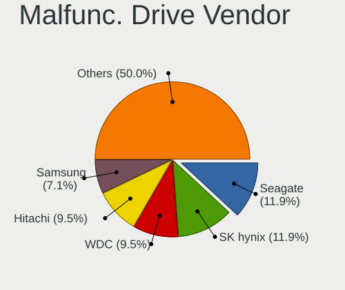

| Vendor              | Notebooks | Drives | Percent |
|---------------------|-----------|--------|---------|
| SK hynix            | 5         | 5      | 11.9%   |
| Seagate             | 5         | 5      | 11.9%   |
| WDC                 | 4         | 4      | 9.52%   |
| Hitachi             | 4         | 5      | 9.52%   |
| Samsung Electronics | 3         | 3      | 7.14%   |
| Micron Technology   | 3         | 7      | 7.14%   |
| Kingston            | 3         | 4      | 7.14%   |
| Intel               | 3         | 4      | 7.14%   |
| SanDisk             | 2         | 2      | 4.76%   |
| LITEON              | 2         | 4      | 4.76%   |
| HGST                | 2         | 2      | 4.76%   |
| Corsair             | 2         | 4      | 4.76%   |
| Toshiba             | 1         | 3      | 2.38%   |
| Lenovo              | 1         | 1      | 2.38%   |
| Crucial             | 1         | 1      | 2.38%   |
| Apple               | 1         | 1      | 2.38%   |

Malfunc. HDD Vendor
-------------------

Vendors of faulty HDD drives

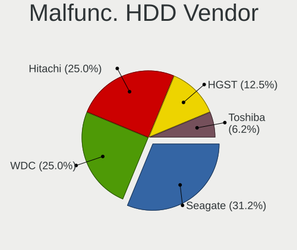

| Vendor  | Notebooks | Drives | Percent |
|---------|-----------|--------|---------|
| Seagate | 5         | 5      | 31.25%  |
| WDC     | 4         | 4      | 25%     |
| Hitachi | 4         | 5      | 25%     |
| HGST    | 2         | 2      | 12.5%   |
| Toshiba | 1         | 3      | 6.25%   |

Malfunc. Drive Kind
-------------------

Kinds of faulty drives

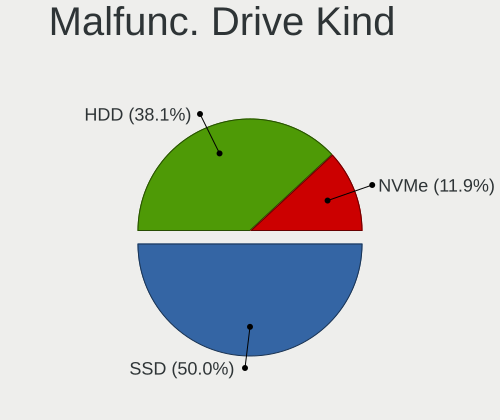

| Kind | Notebooks | Drives | Percent |
|------|-----------|--------|---------|
| SSD  | 21        | 29     | 50%     |
| HDD  | 16        | 19     | 38.1%   |
| NVMe | 5         | 7      | 11.9%   |

Failed Drives
-------------

Failed drive models

| Model                                  | Notebooks | Drives | Percent |
|----------------------------------------|-----------|--------|---------|
| Toshiba XG6 NVMe SSD Controller 1024GB | 1         | 1      | 100%    |

Failed Drive Vendor
-------------------

Failed drive vendors

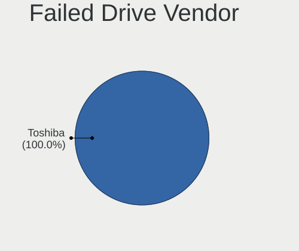

| Vendor  | Notebooks | Drives | Percent |
|---------|-----------|--------|---------|
| Toshiba | 1         | 1      | 100%    |

Drive Status
------------

Number of failed and malfunc. drives

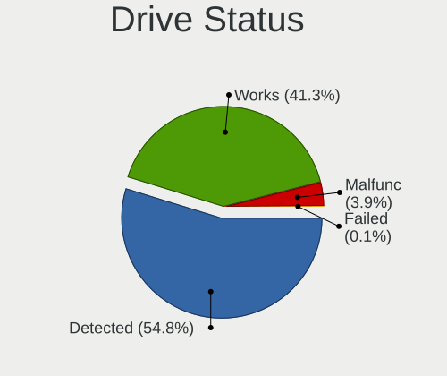

| Status   | Notebooks | Drives | Percent |
|----------|-----------|--------|---------|
| Detected | 593       | 935    | 54.76%  |
| Works    | 447       | 625    | 41.27%  |
| Malfunc  | 42        | 55     | 3.88%   |
| Failed   | 1         | 1      | 0.09%   |

Storage controller
------------------

Storage Vendor
--------------

Storage controller vendors

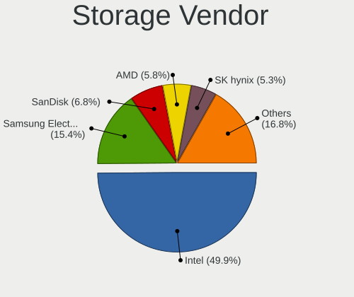

| Vendor                                  | Notebooks | Percent |
|-----------------------------------------|-----------|---------|
| Intel                                   | 616       | 49.88%  |
| Samsung Electronics                     | 190       | 15.38%  |
| SanDisk                                 | 84        | 6.8%    |
| AMD                                     | 72        | 5.83%   |
| SK hynix                                | 65        | 5.26%   |
| Kingston Technology Company             | 45        | 3.64%   |
| Toshiba America Info Systems            | 43        | 3.48%   |
| Micron Technology                       | 42        | 3.4%    |
| KIOXIA                                  | 19        | 1.54%   |
| Union Memory (Shenzhen)                 | 8         | 0.65%   |
| Phison Electronics                      | 7         | 0.57%   |
| Solidigm                                | 6         | 0.49%   |
| Lenovo                                  | 6         | 0.49%   |
| Micron/Crucial Technology               | 5         | 0.4%    |
| Solid State Storage Technology          | 4         | 0.32%   |
| Marvell Technology Group                | 4         | 0.32%   |
| Realtek Semiconductor                   | 3         | 0.24%   |
| Lite-On Technology                      | 3         | 0.24%   |
| Apple                                   | 3         | 0.24%   |
| Shenzhen Unionmemory Information System | 2         | 0.16%   |
| Nvidia                                  | 2         | 0.16%   |
| ADATA Technology                        | 2         | 0.16%   |
| Silicon Motion                          | 1         | 0.08%   |
| MAXIO Technology (Hangzhou)             | 1         | 0.08%   |
| Biwin Storage Technology                | 1         | 0.08%   |
| ASMedia Technology                      | 1         | 0.08%   |

Storage Model
-------------

Storage controller models

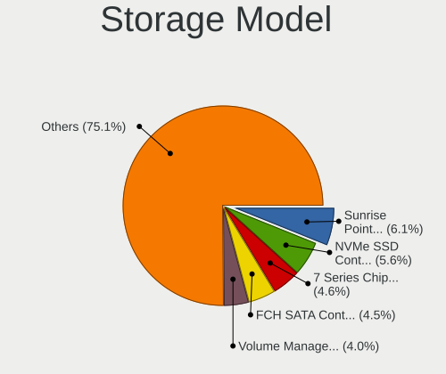

| Model                                                                          | Notebooks | Percent |
|--------------------------------------------------------------------------------|-----------|---------|
| Intel Sunrise Point-LP SATA Controller [AHCI mode]                             | 79        | 6.1%    |
| Samsung NVMe SSD Controller SM981/PM981/PM983                                  | 73        | 5.64%   |
| Intel 7 Series Chipset Family 6-port SATA Controller [AHCI mode]               | 60        | 4.63%   |
| AMD FCH SATA Controller [AHCI mode]                                            | 58        | 4.48%   |
| Intel Volume Management Device NVMe RAID Controller                            | 52        | 4.02%   |
| Intel 6 Series/C200 Series Chipset Family 6 port Mobile SATA AHCI Controller   | 52        | 4.02%   |
| Intel 82801 Mobile SATA Controller [RAID mode]                                 | 46        | 3.55%   |
| Intel Cannon Lake Mobile PCH SATA AHCI Controller                              | 42        | 3.24%   |
| Intel 8 Series SATA Controller 1 [AHCI mode]                                   | 38        | 2.93%   |
| Samsung NVMe SSD Controller PM9A1/PM9A3/980PRO                                 | 33        | 2.55%   |
| Intel 8 Series/C220 Series Chipset Family 6-port SATA Controller 1 [AHCI mode] | 31        | 2.39%   |
| Samsung NVMe SSD Controller SM961/PM961/SM963                                  | 29        | 2.24%   |
| Intel Wildcat Point-LP SATA Controller [AHCI Mode]                             | 28        | 2.16%   |
| Samsung NVMe SSD Controller 980 (DRAM-less)                                    | 25        | 1.93%   |
| Intel HM170/QM170 Chipset SATA Controller [AHCI Mode]                          | 25        | 1.93%   |
| Toshiba America Info Systems XG6 NVMe SSD Controller                           | 23        | 1.78%   |
| Micron 2450 NVMe SSD [HendrixV] (DRAM-less)                                    | 19        | 1.47%   |
| SanDisk Extreme Pro / WD Black SN750 / PC SN730 / Red SN700 NVMe SSD           | 18        | 1.39%   |
| Intel 82801IBM/IEM (ICH9M/ICH9M-E) 4 port SATA Controller [AHCI mode]          | 17        | 1.31%   |
| SK hynix Gold P31/BC711/PC711 NVMe Solid State Drive                           | 15        | 1.16%   |
| SanDisk Ultra 3D / WD PC SN530, IX SN530, Blue SN550 NVMe SSD (DRAM-less)      | 15        | 1.16%   |
| Intel SSD 660P Series                                                          | 15        | 1.16%   |
| Intel 5 Series/3400 Series Chipset 6 port SATA AHCI Controller                 | 14        | 1.08%   |
| Intel 5 Series/3400 Series Chipset 4 port SATA AHCI Controller                 | 14        | 1.08%   |
| SK hynix Platinum P41/PC801 NVMe Solid State Drive                             | 13        | 1%      |
| SK hynix PC401 NVMe Solid State Drive 256GB                                    | 12        | 0.93%   |
| Intel Cannon Point-LP SATA Controller [AHCI Mode]                              | 12        | 0.93%   |
| SanDisk Extreme Pro / WD Black 2018/SN750/PC SN720 NVMe SSD                    | 10        | 0.77%   |
| Samsung S4LN058A01[SSUBX] AHCI SSD Controller (Apple slot)                     | 10        | 0.77%   |
| Kingston Company KC3000/FURY Renegade NVMe SSD [E18]                           | 10        | 0.77%   |
| Intel Q170/Q150/B150/H170/H110/Z170/CM236 Chipset SATA Controller [AHCI Mode]  | 10        | 0.77%   |
| SanDisk WD Blue SN500 / PC SN520 x2 M.2 2280 NVMe SSD                          | 9         | 0.69%   |
| AMD SB7x0/SB8x0/SB9x0 SATA Controller [AHCI mode]                              | 9         | 0.69%   |
| Toshiba America Info Systems XG5 NVMe SSD Controller                           | 8         | 0.62%   |
| Samsung NVMe SSD Controller PM9B1 (DRAM-less)                                  | 8         | 0.62%   |
| Intel Tiger Lake SATA AHCI Controller                                          | 8         | 0.62%   |
| SanDisk WD PC SN810 / Black SN850 NVMe SSD                                     | 7         | 0.54%   |
| Samsung NVMe SSD Controller PM9C1a (DRAM-less)                                 | 7         | 0.54%   |
| Micron 3400 NVMe SSD [Hendrix]                                                 | 7         | 0.54%   |
| KIOXIA NVMe SSD Controller BG4 (DRAM-less)                                     | 7         | 0.54%   |

Storage Kind
------------

Kind of storage controller (IDE, SATA, NVMe, SAS, ...)

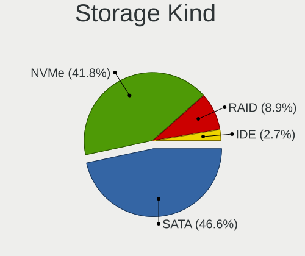

| Kind | Notebooks | Percent |
|------|-----------|---------|
| SATA | 577       | 46.65%  |
| NVMe | 517       | 41.79%  |
| RAID | 110       | 8.89%   |
| IDE  | 33        | 2.67%   |

Processor
---------

CPU Vendor
----------

Processor vendors

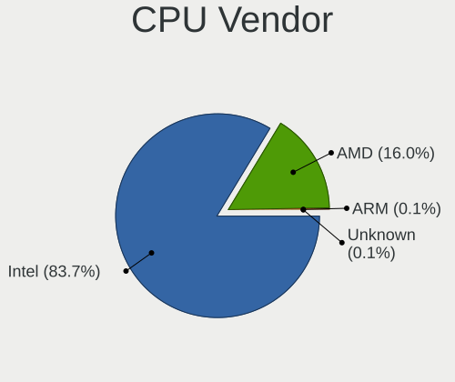

| Vendor   | Notebooks | Percent |
|----------|-----------|---------|
| Intel    | 850       | 83.66%  |
| AMD      | 163       | 16.04%  |
| Qualcomm | 1         | 0.1%    |
| ARM      | 1         | 0.1%    |
| Unknown  | 1         | 0.1%    |

CPU Model
---------

Processor models

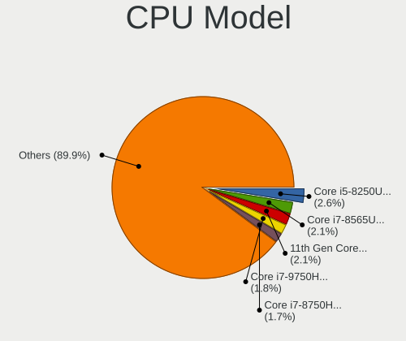

| Model                                      | Notebooks | Percent |
|--------------------------------------------|-----------|---------|
| Intel Core i5-8250U CPU @ 1.60GHz          | 26        | 2.56%   |
| Intel Core i7-8565U CPU @ 1.80GHz          | 21        | 2.06%   |
| Intel 11th Gen Core i7-1165G7 @ 2.80GHz    | 21        | 2.06%   |
| Intel Core i7-9750H CPU @ 2.60GHz          | 18        | 1.77%   |
| Intel Core i7-8750H CPU @ 2.20GHz          | 17        | 1.67%   |
| Intel Core i7-8550U CPU @ 1.80GHz          | 16        | 1.57%   |
| Intel Core i5-7200U CPU @ 2.50GHz          | 16        | 1.57%   |
| Intel Core i5-6200U CPU @ 2.30GHz          | 16        | 1.57%   |
| Intel Core i5-8265U CPU @ 1.60GHz          | 15        | 1.47%   |
| Intel 11th Gen Core i5-1135G7 @ 2.40GHz    | 15        | 1.47%   |
| Intel Core i5-3210M CPU @ 2.50GHz          | 14        | 1.38%   |
| Intel Core i7-6700HQ CPU @ 2.60GHz         | 11        | 1.08%   |
| Intel 12th Gen Core i5-12500H              | 11        | 1.08%   |
| Intel Core i5-6300U CPU @ 2.40GHz          | 10        | 0.98%   |
| Intel Core i7-6600U CPU @ 2.60GHz          | 9         | 0.88%   |
| Intel Core i5-5200U CPU @ 2.20GHz          | 9         | 0.88%   |
| Intel Core i7-7700HQ CPU @ 2.80GHz         | 8         | 0.79%   |
| Intel Core i7-7500U CPU @ 2.70GHz          | 8         | 0.79%   |
| Intel Core i7-5600U CPU @ 2.60GHz          | 8         | 0.79%   |
| Intel Core i7-3520M CPU @ 2.90GHz          | 8         | 0.79%   |
| Intel Core i7-2630QM CPU @ 2.00GHz         | 8         | 0.79%   |
| Intel Core i5-5257U CPU @ 2.70GHz          | 8         | 0.79%   |
| Intel Core i5-2520M CPU @ 2.50GHz          | 8         | 0.79%   |
| Intel 11th Gen Core i7-11800H @ 2.30GHz    | 8         | 0.79%   |
| Intel 11th Gen Core i5-11400H @ 2.70GHz    | 8         | 0.79%   |
| AMD Ryzen 5 7520U with Radeon Graphics     | 8         | 0.79%   |
| Intel Core i7-10750H CPU @ 2.60GHz         | 7         | 0.69%   |
| Intel Core i7-10510U CPU @ 1.80GHz         | 7         | 0.69%   |
| Intel Core i5-9300H CPU @ 2.40GHz          | 7         | 0.69%   |
| Intel Core i5-8350U CPU @ 1.70GHz          | 7         | 0.69%   |
| Intel Core i5-6300HQ CPU @ 2.30GHz         | 7         | 0.69%   |
| Intel Core i5-4200U CPU @ 1.60GHz          | 7         | 0.69%   |
| Intel Core i5-4200M CPU @ 2.50GHz          | 7         | 0.69%   |
| Intel Core i5-3320M CPU @ 2.60GHz          | 7         | 0.69%   |
| Intel Core i3-4030U CPU @ 1.90GHz          | 7         | 0.69%   |
| Intel 12th Gen Core i7-12700H              | 7         | 0.69%   |
| Intel 12th Gen Core i7-1260P               | 7         | 0.69%   |
| AMD Ryzen 7 8845HS w/ Radeon 780M Graphics | 7         | 0.69%   |
| AMD Ryzen 5 5600H with Radeon Graphics     | 7         | 0.69%   |
| AMD Ryzen 5 4500U with Radeon Graphics     | 7         | 0.69%   |

CPU Model Family
----------------

Processor model prefix

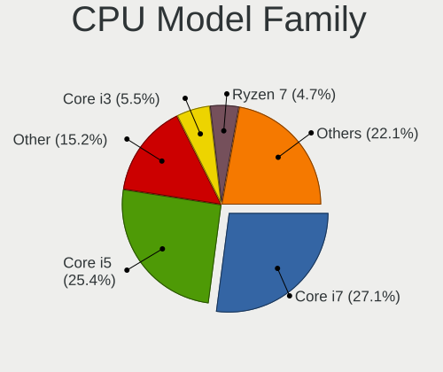

| Model                   | Notebooks | Percent |
|-------------------------|-----------|---------|
| Intel Core i7           | 275       | 27.07%  |
| Intel Core i5           | 258       | 25.39%  |
| Other                   | 154       | 15.16%  |
| Intel Core i3           | 56        | 5.51%   |
| AMD Ryzen 7             | 48        | 4.72%   |
| AMD Ryzen 5             | 38        | 3.74%   |
| Intel Celeron           | 33        | 3.25%   |
| Intel Core 2 Duo        | 18        | 1.77%   |
| Intel Pentium           | 16        | 1.57%   |
| Intel Core              | 14        | 1.38%   |
| AMD Ryzen 3             | 11        | 1.08%   |
| Intel Core i9           | 9         | 0.89%   |
| AMD Ryzen 7 PRO         | 8         | 0.79%   |
| AMD Ryzen 9             | 7         | 0.69%   |
| Intel Atom              | 6         | 0.59%   |
| AMD A8                  | 6         | 0.59%   |
| AMD A6                  | 6         | 0.59%   |
| Intel Genuine           | 5         | 0.49%   |
| Intel Core 2            | 4         | 0.39%   |
| AMD Ryzen 5 PRO         | 4         | 0.39%   |
| AMD E2                  | 4         | 0.39%   |
| AMD A10                 | 4         | 0.39%   |
| Intel Pentium Dual-Core | 3         | 0.3%    |
| AMD E1                  | 3         | 0.3%    |
| AMD E                   | 3         | 0.3%    |
| Intel Pentium Silver    | 2         | 0.2%    |
| AMD Turion 64 X2 Mobile | 2         | 0.2%    |
| AMD Phenom II           | 2         | 0.2%    |
| AMD Athlon II           | 2         | 0.2%    |
| Intel Xeon              | 1         | 0.1%    |
| Intel Pentium Gold      | 1         | 0.1%    |
| Intel Core m7           | 1         | 0.1%    |
| Intel Core m3           | 1         | 0.1%    |
| Intel Core M            | 1         | 0.1%    |
| Intel Core 2 Solo       | 1         | 0.1%    |
| Intel Celeron Dual-Core | 1         | 0.1%    |
| AMD V160                | 1         | 0.1%    |
| AMD V120                | 1         | 0.1%    |
| AMD Ryzen Embedded      | 1         | 0.1%    |
| AMD Ryzen 3 PRO         | 1         | 0.1%    |

CPU Cores
---------

Number of processor cores

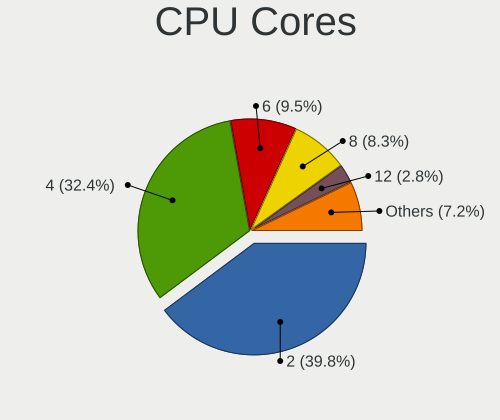

| Number | Notebooks | Percent |
|--------|-----------|---------|
| 2      | 405       | 39.78%  |
| 4      | 330       | 32.42%  |
| 6      | 97        | 9.53%   |
| 8      | 85        | 8.35%   |
| 12     | 28        | 2.75%   |
| 14     | 26        | 2.55%   |
| 10     | 25        | 2.46%   |
| 1      | 13        | 1.28%   |
| 16     | 7         | 0.69%   |
| 24     | 1         | 0.1%    |
| 3      | 1         | 0.1%    |

CPU Sockets
-----------

Number of sockets

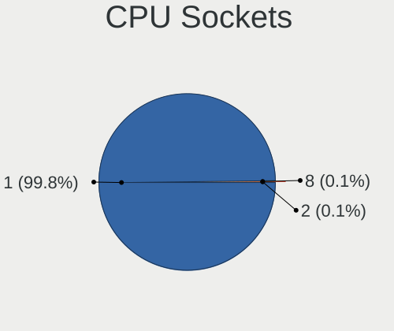

| Number | Notebooks | Percent |
|--------|-----------|---------|
| 1      | 1014      | 99.8%   |
| 8      | 1         | 0.1%    |
| 2      | 1         | 0.1%    |

CPU Threads
-----------

Threads per core (Hyper-Threading)

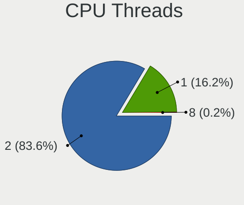

| Number | Notebooks | Percent |
|--------|-----------|---------|
| 2      | 856       | 83.59%  |
| 1      | 166       | 16.21%  |
| 8      | 2         | 0.2%    |

CPU Op-Modes
------------

CPU Operation Modes (32-bit, 64-bit)

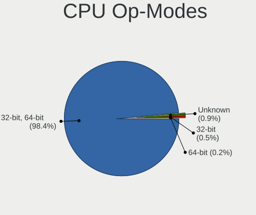

| Op mode        | Notebooks | Percent |
|----------------|-----------|---------|
| 32-bit, 64-bit | 1001      | 98.43%  |
| Unknown        | 9         | 0.88%   |
| 32-bit         | 5         | 0.49%   |
| 64-bit         | 2         | 0.2%    |

CPU Microcode
-------------

Microcode number

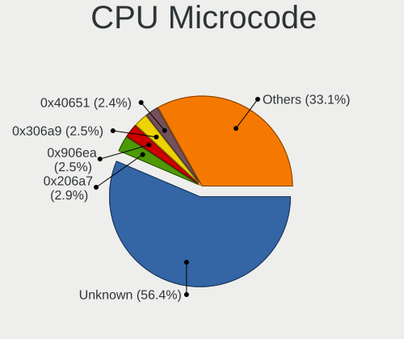

| Number     | Notebooks | Percent |
|------------|-----------|---------|
| Unknown    | 599       | 56.4%   |
| 0x206a7    | 31        | 2.92%   |
| 0x906ea    | 27        | 2.54%   |
| 0x306a9    | 27        | 2.54%   |
| 0x40651    | 26        | 2.45%   |
| 0x806ea    | 25        | 2.35%   |
| 0x406e3    | 24        | 2.26%   |
| 0x806ec    | 20        | 1.88%   |
| 0x306d4    | 20        | 1.88%   |
| 0x806e9    | 19        | 1.79%   |
| 0x806c1    | 14        | 1.32%   |
| 0x306c3    | 13        | 1.22%   |
| 0x20655    | 13        | 1.22%   |
| 0x506e3    | 12        | 1.13%   |
| 0xa0652    | 11        | 1.04%   |
| 0x1067a    | 11        | 1.04%   |
| 0x08600106 | 11        | 1.04%   |
| 0x906a3    | 10        | 0.94%   |
| 0x906e9    | 9         | 0.85%   |
| 0x806eb    | 8         | 0.75%   |
| 0x806d1    | 8         | 0.75%   |
| 0x0a50000c | 6         | 0.56%   |
| 0x010000c8 | 6         | 0.56%   |
| 0x20652    | 5         | 0.47%   |
| 0x08600103 | 5         | 0.47%   |
| 0x08108109 | 5         | 0.47%   |
| 0x906ed    | 4         | 0.38%   |
| 0x6fd      | 4         | 0.38%   |
| 0x506c9    | 4         | 0.38%   |
| 0x08108102 | 4         | 0.38%   |
| 0x05000119 | 4         | 0.38%   |
| 0x906a4    | 3         | 0.28%   |
| 0x706a1    | 3         | 0.28%   |
| 0x406c4    | 3         | 0.28%   |
| 0x10676    | 3         | 0.28%   |
| 0x0a404102 | 3         | 0.28%   |
| 0x08608103 | 3         | 0.28%   |
| 0x08600104 | 3         | 0.28%   |
| 0xb06a3    | 2         | 0.19%   |
| 0x906c0    | 2         | 0.19%   |

CPU Microarch
-------------

Microarchitecture

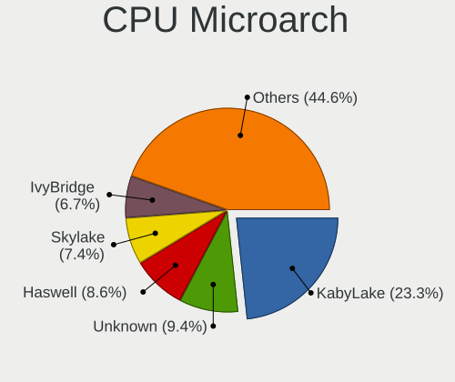

| Name              | Notebooks | Percent |
|-------------------|-----------|---------|
| KabyLake          | 238       | 23.31%  |
| Unknown           | 96        | 9.4%    |
| Haswell           | 88        | 8.62%   |
| Skylake           | 76        | 7.44%   |
| IvyBridge         | 68        | 6.66%   |
| SandyBridge       | 62        | 6.07%   |
| Alderlake Hybrid  | 55        | 5.39%   |
| TigerLake         | 45        | 4.41%   |
| Broadwell         | 40        | 3.92%   |
| Zen 2             | 30        | 2.94%   |
| Westmere          | 26        | 2.55%   |
| Zen 3             | 24        | 2.35%   |
| IceLake           | 20        | 1.96%   |
| Penryn            | 19        | 1.86%   |
| Zen+              | 15        | 1.47%   |
| CometLake         | 15        | 1.47%   |
| Silvermont        | 14        | 1.37%   |
| Core              | 10        | 0.98%   |
| Meteorlake Hybrid | 9         | 0.88%   |
| Goldmont plus     | 9         | 0.88%   |
| K10               | 7         | 0.69%   |
| Excavator         | 7         | 0.69%   |
| Goldmont          | 6         | 0.59%   |
| Piledriver        | 5         | 0.49%   |
| Bobcat            | 5         | 0.49%   |
| Zen               | 4         | 0.39%   |
| Bonnell           | 4         | 0.39%   |
| Tremont           | 3         | 0.29%   |
| Puma              | 3         | 0.29%   |
| P6                | 3         | 0.29%   |
| Nehalem           | 3         | 0.29%   |
| K8 Hammer         | 3         | 0.29%   |
| K10 Llano         | 3         | 0.29%   |
| Jaguar            | 3         | 0.29%   |
| Steamroller       | 2         | 0.2%    |
| Lunarlake Hybrid  | 1         | 0.1%    |

Graphics
--------

GPU Vendor
----------

Vendors of graphics cards

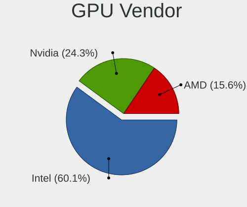

| Vendor | Notebooks | Percent |
|--------|-----------|---------|
| Intel  | 782       | 60.11%  |
| Nvidia | 316       | 24.29%  |
| AMD    | 203       | 15.6%   |

GPU Model
---------

Graphics card models

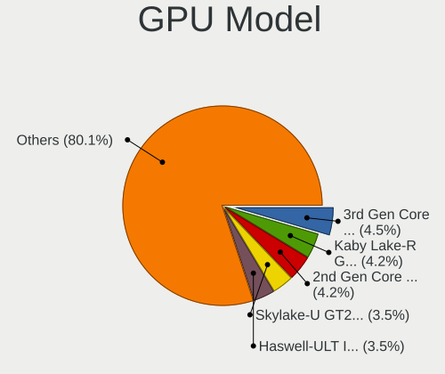

| Model                                                                                    | Notebooks | Percent |
|------------------------------------------------------------------------------------------|-----------|---------|
| Intel 3rd Gen Core processor Graphics Controller                                         | 60        | 4.53%   |
| Intel Kaby Lake-R GT2 [UHD Graphics 620]                                                 | 55        | 4.15%   |
| Intel 2nd Generation Core Processor Family Integrated Graphics Controller                | 55        | 4.15%   |
| Intel Skylake-U GT2 [HD Graphics 520]                                                    | 47        | 3.55%   |
| Intel Haswell-ULT Integrated Graphics Controller                                         | 47        | 3.55%   |
| Intel WhiskeyLake-U GT2 [UHD Graphics 620]                                               | 46        | 3.47%   |
| Intel CoffeeLake-H GT2 [UHD Graphics 630]                                                | 46        | 3.47%   |
| Intel TigerLake-LP GT2 [Iris Xe Graphics]                                                | 41        | 3.1%    |
| Intel Kaby Lake-U GT2 [HD Graphics 620]                                                  | 35        | 2.64%   |
| Intel Alder Lake-P GT2 [Iris Xe Graphics]                                                | 32        | 2.42%   |
| Intel 4th Gen Core Processor Integrated Graphics Controller                              | 32        | 2.42%   |
| AMD Renoir [Radeon Vega Series / Radeon Vega Mobile Series]                              | 30        | 2.27%   |
| Intel Broadwell-U GT2 [HD Graphics 5500]                                                 | 29        | 2.19%   |
| Intel Skylake-H GT2 [HD Graphics 530]                                                    | 22        | 1.66%   |
| Intel TigerLake-H GT1 [UHD Graphics]                                                     | 20        | 1.51%   |
| Intel Raptor Lake-P [Iris Xe Graphics]                                                   | 20        | 1.51%   |
| AMD Cezanne [Radeon Vega Series / Radeon Vega Mobile Series]                             | 20        | 1.51%   |
| Intel CometLake-U GT2 [UHD Graphics]                                                     | 17        | 1.28%   |
| Intel Core Processor Integrated Graphics Controller                                      | 16        | 1.21%   |
| AMD Picasso/Raven 2 [Radeon Vega Series / Radeon Vega Mobile Series]                     | 15        | 1.13%   |
| Intel Mobile 4 Series Chipset Integrated Graphics Controller                             | 14        | 1.06%   |
| Nvidia GP108M [GeForce MX150]                                                            | 13        | 0.98%   |
| Nvidia GM107M [GeForce GTX 960M]                                                         | 13        | 0.98%   |
| Intel CometLake-H GT2 [UHD Graphics]                                                     | 13        | 0.98%   |
| Intel Alder Lake-UP3 GT2 [Iris Xe Graphics]                                              | 13        | 0.98%   |
| Nvidia TU116M [GeForce GTX 1660 Ti Mobile]                                               | 12        | 0.91%   |
| Nvidia GP107M [GeForce GTX 1050 Ti Mobile]                                               | 12        | 0.91%   |
| Nvidia GA107M [GeForce RTX 3050 Ti Mobile]                                               | 12        | 0.91%   |
| Nvidia GA106M [GeForce RTX 3060 Mobile / Max-Q]                                          | 11        | 0.83%   |
| AMD Mendocino [Radeon 610M]                                                              | 11        | 0.83%   |
| Nvidia TU117M [GeForce GTX 1650 Mobile / Max-Q]                                          | 10        | 0.76%   |
| Nvidia AD107M [GeForce RTX 4060 Max-Q / Mobile]                                          | 9         | 0.68%   |
| Intel Kaby Lake-H GT2 [HD Graphics 630]                                                  | 9         | 0.68%   |
| Intel Atom/Celeron/Pentium Processor x5-E8000/J3xxx/N3xxx Integrated Graphics Controller | 9         | 0.68%   |
| AMD Rembrandt [Radeon 680M]                                                              | 9         | 0.68%   |
| AMD HawkPoint1                                                                           | 9         | 0.68%   |
| Nvidia TU106M [GeForce RTX 2060 Mobile]                                                  | 8         | 0.6%    |
| Nvidia GM107M [GeForce GTX 950M]                                                         | 8         | 0.6%    |
| Intel GeminiLake [UHD Graphics 600]                                                      | 8         | 0.6%    |
| Intel Broadwell-U GT3 [Iris Graphics 6100]                                               | 8         | 0.6%    |

GPU Combo
---------

Combinations of graphics cards

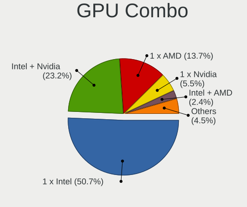

| Name           | Notebooks | Percent |
|----------------|-----------|---------|
| 1 x Intel      | 518       | 50.68%  |
| Intel + Nvidia | 237       | 23.19%  |
| 1 x AMD        | 140       | 13.7%   |
| 1 x Nvidia     | 56        | 5.48%   |
| Intel + AMD    | 25        | 2.45%   |
| AMD + Nvidia   | 25        | 2.45%   |
| 2 x AMD        | 14        | 1.37%   |
| 2 x Intel      | 4         | 0.39%   |
| Other          | 3         | 0.29%   |

GPU Driver
----------

Free vs proprietary

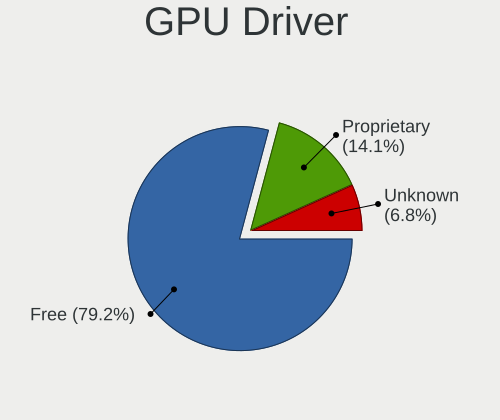

| Driver      | Notebooks | Percent |
|-------------|-----------|---------|
| Free        | 820       | 79.15%  |
| Proprietary | 146       | 14.09%  |
| Unknown     | 70        | 6.76%   |

GPU Memory
----------

Total video memory

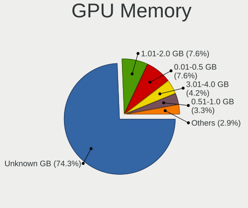

| Size in GB | Notebooks | Percent |
|------------|-----------|---------|
| Unknown    | 771       | 74.35%  |
| 1.01-2.0   | 79        | 7.62%   |
| 0.01-0.5   | 79        | 7.62%   |
| 3.01-4.0   | 44        | 4.24%   |
| 0.51-1.0   | 34        | 3.28%   |
| 5.01-6.0   | 16        | 1.54%   |
| 7.01-8.0   | 10        | 0.96%   |
| 2.01-3.0   | 3         | 0.29%   |
| 16.01-24.0 | 1         | 0.1%    |

Monitor
-------

Monitor Vendor
--------------

Monitor vendors

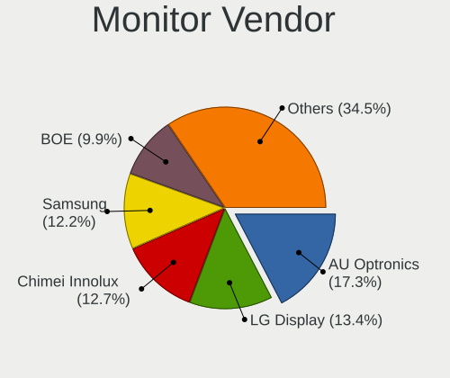

| Vendor                  | Notebooks | Percent |
|-------------------------|-----------|---------|
| AU Optronics            | 211       | 17.34%  |
| LG Display              | 163       | 13.39%  |
| Chimei Innolux          | 154       | 12.65%  |
| Samsung Electronics     | 148       | 12.16%  |
| BOE                     | 121       | 9.94%   |
| Sharp                   | 45        | 3.7%    |
| Lenovo                  | 41        | 3.37%   |
| Dell                    | 41        | 3.37%   |
| Apple                   | 40        | 3.29%   |
| InfoVision              | 24        | 1.97%   |
| Hewlett-Packard         | 24        | 1.97%   |
| Chi Mei Optoelectronics | 21        | 1.73%   |
| BenQ                    | 19        | 1.56%   |
| AOC                     | 15        | 1.23%   |
| Philips                 | 14        | 1.15%   |
| CSO                     | 13        | 1.07%   |
| PANDA                   | 11        | 0.9%    |
| Goldstar                | 11        | 0.9%    |
| JDI                     | 9         | 0.74%   |
| Panasonic               | 8         | 0.66%   |
| Acer                    | 8         | 0.66%   |
| Ancor Communications    | 7         | 0.58%   |
| Sony                    | 6         | 0.49%   |
| NEC Computers           | 5         | 0.41%   |
| ASUSTek Computer        | 5         | 0.41%   |
| MSI                     | 4         | 0.33%   |
| CSOT                    | 4         | 0.33%   |
| KDB                     | 3         | 0.25%   |
| Grundig                 | 3         | 0.25%   |
| CSW                     | 3         | 0.25%   |
| ViewSonic               | 2         | 0.16%   |
| Vestel Elektronik       | 2         | 0.16%   |
| MiTAC                   | 2         | 0.16%   |
| LG Philips              | 2         | 0.16%   |
| HannStar                | 2         | 0.16%   |
| Fujitsu Siemens         | 2         | 0.16%   |
| Eizo                    | 2         | 0.16%   |
| CTO                     | 2         | 0.16%   |
| VOXICON                 | 1         | 0.08%   |
| Toshiba                 | 1         | 0.08%   |

Monitor Model
-------------

Monitor models

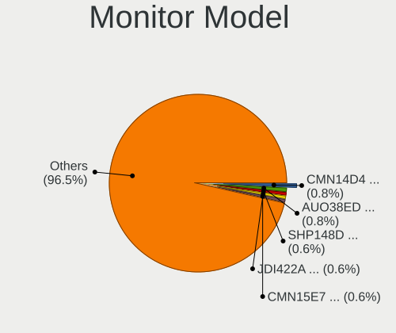

| Model                                                                     | Notebooks | Percent |
|---------------------------------------------------------------------------|-----------|---------|
| Chimei Innolux LCD Monitor CMN14D4 1920x1080 309x173mm 13.9-inch          | 10        | 0.8%    |
| AU Optronics LCD Monitor AUO38ED 1920x1080 344x193mm 15.5-inch            | 10        | 0.8%    |
| Sharp LCD Monitor SHP148D 3840x2160 344x194mm 15.5-inch                   | 8         | 0.64%   |
| JDI LCD Monitor JDI422A 3000x2000 293x196mm 13.9-inch                     | 8         | 0.64%   |
| Chimei Innolux LCD Monitor CMN15E7 1920x1080 344x193mm 15.5-inch          | 8         | 0.64%   |
| Chi Mei Optoelectronics LCD Monitor CMO1720 1920x1080 382x215mm 17.3-inch | 8         | 0.64%   |
| Samsung Electronics LCD Monitor SDC4171 2880x1800 302x189mm 14.0-inch     | 7         | 0.56%   |
| LG Display LCD Monitor LGD0521 1920x1080 309x174mm 14.0-inch              | 7         | 0.56%   |
| Chimei Innolux LCD Monitor CMN14F2 1920x1080 309x173mm 13.9-inch          | 7         | 0.56%   |
| BOE LCD Monitor BOE084D 1920x1080 344x193mm 15.5-inch                     | 7         | 0.56%   |
| AU Optronics LCD Monitor AUO403D 1920x1080 309x174mm 14.0-inch            | 7         | 0.56%   |
| LG Display LCD Monitor LGD046F 1920x1080 344x194mm 15.5-inch              | 6         | 0.48%   |
| LG Display LCD Monitor LGD02D8 1366x768 277x156mm 12.5-inch               | 6         | 0.48%   |
| Chimei Innolux LCD Monitor CMN1735 1920x1080 381x214mm 17.2-inch          | 6         | 0.48%   |
| AU Optronics LCD Monitor AUO80ED 1920x1080 344x193mm 15.5-inch            | 6         | 0.48%   |
| AU Optronics LCD Monitor AUO573D 1920x1080 309x174mm 14.0-inch            | 6         | 0.48%   |
| AU Optronics LCD Monitor AUO313D 1920x1080 309x174mm 14.0-inch            | 6         | 0.48%   |
| LG Display LCD Monitor LGD046D 1920x1080 309x174mm 14.0-inch              | 5         | 0.4%    |
| Chimei Innolux P130ZFA-BA1 CMN8201 2160x1440 275x183mm 13.0-inch          | 5         | 0.4%    |
| Chimei Innolux LCD Monitor CMN14C3 1366x768 309x173mm 13.9-inch           | 5         | 0.4%    |
| Chimei Innolux LCD Monitor CMN14B1 1920x1080 308x173mm 13.9-inch          | 5         | 0.4%    |
| AU Optronics LCD Monitor AUOD291 1920x1200 301x188mm 14.0-inch            | 5         | 0.4%    |
| AU Optronics LCD Monitor AUO26EC 1366x768 344x193mm 15.5-inch             | 5         | 0.4%    |
| AU Optronics LCD Monitor AUO243D 1920x1080 309x173mm 13.9-inch            | 5         | 0.4%    |
| AU Optronics LCD Monitor AUO213D 1920x1080 309x173mm 13.9-inch            | 5         | 0.4%    |
| Apple Color LCD APP9CC7 1280x800 286x179mm 13.3-inch                      | 5         | 0.4%    |
| AOC 32G1WG4 AOC3201 1920x1080 697x392mm 31.5-inch                         | 5         | 0.4%    |
| Sharp LCD Monitor SHP1516 3840x2400 336x210mm 15.6-inch                   | 4         | 0.32%   |
| Sharp LCD Monitor SHP14D0 3840x2400 336x210mm 15.6-inch                   | 4         | 0.32%   |
| Samsung Electronics LF24T35 SAM707D 1920x1080 528x297mm 23.9-inch         | 4         | 0.32%   |
| Samsung Electronics LCD Monitor SEC5441 1280x800 331x207mm 15.4-inch      | 4         | 0.32%   |
| Samsung Electronics LCD Monitor SEC3859 1366x768 293x165mm 13.2-inch      | 4         | 0.32%   |
| Panasonic VVX11F009G00 MEI96A2 1920x1080 344x193mm 15.5-inch              | 4         | 0.32%   |
| NEC Computers P403 NEC692B 1920x1080 886x498mm 40.0-inch                  | 4         | 0.32%   |
| LG Display LCD Monitor LGD0590 1920x1080 344x194mm 15.5-inch              | 4         | 0.32%   |
| LG Display LCD Monitor LGD0354 1366x768 293x165mm 13.2-inch               | 4         | 0.32%   |
| LG Display LCD Monitor LGD02DC 1366x768 344x194mm 15.5-inch               | 4         | 0.32%   |
| LG Display LCD Monitor LGD0259 1920x1080 345x194mm 15.6-inch              | 4         | 0.32%   |
| Lenovo LCD Monitor LEN40B1 1600x900 345x194mm 15.6-inch                   | 4         | 0.32%   |
| Lenovo LCD Monitor LEN4036 1440x900 303x190mm 14.1-inch                   | 4         | 0.32%   |

Monitor Resolution
------------------

Monitor screen resolution

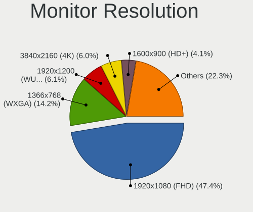

| Resolution         | Notebooks | Percent |
|--------------------|-----------|---------|
| 1920x1080 (FHD)    | 548       | 47.36%  |
| 1366x768 (WXGA)    | 164       | 14.17%  |
| 1920x1200 (WUXGA)  | 70        | 6.05%   |
| 3840x2160 (4K)     | 69        | 5.96%   |
| 1600x900 (HD+)     | 48        | 4.15%   |
| 2560x1440 (QHD)    | 47        | 4.06%   |
| 2880x1800          | 35        | 3.03%   |
| 2560x1600          | 34        | 2.94%   |
| 1280x800 (WXGA)    | 22        | 1.9%    |
| 1440x900 (WXGA+)   | 15        | 1.3%    |
| 3840x2400          | 14        | 1.21%   |
| 3440x1440          | 12        | 1.04%   |
| 3840x1080          | 9         | 0.78%   |
| 3000x2000          | 9         | 0.78%   |
| 2160x1440          | 8         | 0.69%   |
| 1280x1024 (SXGA)   | 5         | 0.43%   |
| 1024x600           | 4         | 0.35%   |
| Unknown            | 4         | 0.35%   |
| 3200x2000          | 3         | 0.26%   |
| 3072x1920          | 3         | 0.26%   |
| 2240x1400          | 3         | 0.26%   |
| 1920x540           | 3         | 0.26%   |
| 1360x768           | 3         | 0.26%   |
| 1280x720 (HD)      | 3         | 0.26%   |
| 3840x1600          | 2         | 0.17%   |
| 3456x2160          | 2         | 0.17%   |
| 3200x1800 (QHD+)   | 2         | 0.17%   |
| 2880x1620          | 2         | 0.17%   |
| 2560x1080          | 2         | 0.17%   |
| 1680x1050 (WSXGA+) | 2         | 0.17%   |
| 9600x2160          | 1         | 0.09%   |
| 3840x2560          | 1         | 0.09%   |
| 3840x1100          | 1         | 0.09%   |
| 2646x1024          | 1         | 0.09%   |
| 2304x1440          | 1         | 0.09%   |
| 2256x1504          | 1         | 0.09%   |
| 2160x1350          | 1         | 0.09%   |
| 2048x1152          | 1         | 0.09%   |
| 1920x1280          | 1         | 0.09%   |
| 1366x912           | 1         | 0.09%   |

Monitor Diagonal
----------------

Diagonal size in inches

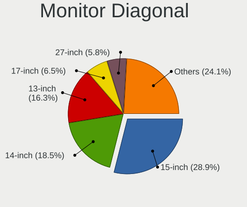

| Inches  | Notebooks | Percent |
|---------|-----------|---------|
| 15      | 352       | 28.92%  |
| 14      | 225       | 18.49%  |
| 13      | 198       | 16.27%  |
| 17      | 79        | 6.49%   |
| 27      | 70        | 5.75%   |
| 24      | 53        | 4.35%   |
| 12      | 40        | 3.29%   |
| 16      | 35        | 2.88%   |
| 31      | 24        | 1.97%   |
| 21      | 16        | 1.31%   |
| 23      | 15        | 1.23%   |
| Unknown | 15        | 1.23%   |
| 34      | 13        | 1.07%   |
| 40      | 8         | 0.66%   |
| 48      | 7         | 0.58%   |
| 11      | 7         | 0.58%   |
| 54      | 6         | 0.49%   |
| 49      | 6         | 0.49%   |
| 32      | 6         | 0.49%   |
| 84      | 4         | 0.33%   |
| 72      | 4         | 0.33%   |
| 25      | 4         | 0.33%   |
| 22      | 3         | 0.25%   |
| 10      | 3         | 0.25%   |
| 55      | 2         | 0.16%   |
| 43      | 2         | 0.16%   |
| 38      | 2         | 0.16%   |
| 28      | 2         | 0.16%   |
| 26      | 2         | 0.16%   |
| 19      | 2         | 0.16%   |
| 18      | 2         | 0.16%   |
| 85      | 1         | 0.08%   |
| 65      | 1         | 0.08%   |
| 60      | 1         | 0.08%   |
| 42      | 1         | 0.08%   |
| 39      | 1         | 0.08%   |
| 37      | 1         | 0.08%   |
| 36      | 1         | 0.08%   |
| 33      | 1         | 0.08%   |
| 29      | 1         | 0.08%   |

Monitor Width
-------------

Physical width

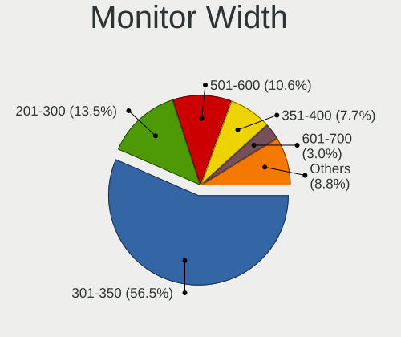

| Width in mm | Notebooks | Percent |
|-------------|-----------|---------|
| 301-350     | 684       | 56.53%  |
| 201-300     | 163       | 13.47%  |
| 501-600     | 128       | 10.58%  |
| 351-400     | 93        | 7.69%   |
| 601-700     | 36        | 2.98%   |
| 1001-1500   | 23        | 1.9%    |
| 401-500     | 22        | 1.82%   |
| 701-800     | 21        | 1.74%   |
| Unknown     | 15        | 1.24%   |
| 801-900     | 12        | 0.99%   |
| 1501-2000   | 9         | 0.74%   |
| 901-1000    | 3         | 0.25%   |
| 101-200     | 1         | 0.08%   |

Aspect Ratio
------------

Proportional relationship between the width and the height

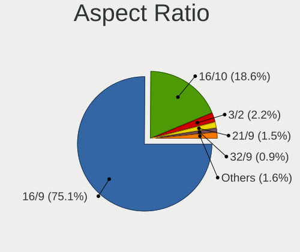

| Ratio   | Notebooks | Percent |
|---------|-----------|---------|
| 16/9    | 803       | 75.12%  |
| 16/10   | 199       | 18.62%  |
| 3/2     | 24        | 2.25%   |
| 21/9    | 16        | 1.5%    |
| 32/9    | 10        | 0.94%   |
| Unknown | 10        | 0.94%   |
| 5/4     | 6         | 0.56%   |
| 3.40    | 1         | 0.09%   |

Monitor Area
------------

Area in inch²

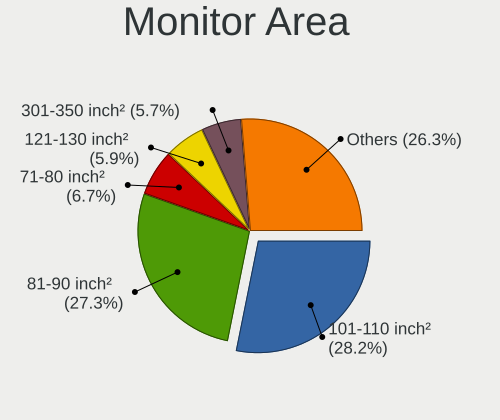

| Area in inch² | Notebooks | Percent |
|----------------|-----------|---------|
| 101-110        | 343       | 28.16%  |
| 81-90          | 332       | 27.26%  |
| 71-80          | 81        | 6.65%   |
| 121-130        | 72        | 5.91%   |
| 301-350        | 70        | 5.75%   |
| 201-250        | 65        | 5.34%   |
| 351-500        | 46        | 3.78%   |
| 111-120        | 40        | 3.28%   |
| 61-70          | 39        | 3.2%    |
| 251-300        | 27        | 2.22%   |
| 501-1000       | 26        | 2.13%   |
| More than 1000 | 22        | 1.81%   |
| Unknown        | 15        | 1.23%   |
| 91-100         | 12        | 0.99%   |
| 51-60          | 8         | 0.66%   |
| 131-140        | 8         | 0.66%   |
| 151-200        | 4         | 0.33%   |
| 141-150        | 4         | 0.33%   |
| 41-50          | 3         | 0.25%   |
| 1-40           | 1         | 0.08%   |

Pixel Density
-------------

Pixels per inch

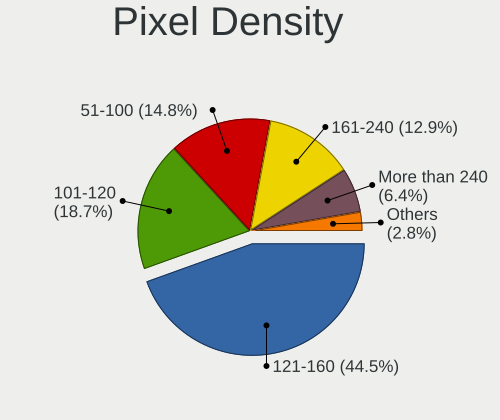

| Density       | Notebooks | Percent |
|---------------|-----------|---------|
| 121-160       | 534       | 44.5%   |
| 101-120       | 224       | 18.67%  |
| 51-100        | 177       | 14.75%  |
| 161-240       | 155       | 12.92%  |
| More than 240 | 77        | 6.42%   |
| 1-50          | 18        | 1.5%    |
| Unknown       | 15        | 1.25%   |

Multiple Monitors
-----------------

Total monitors connected

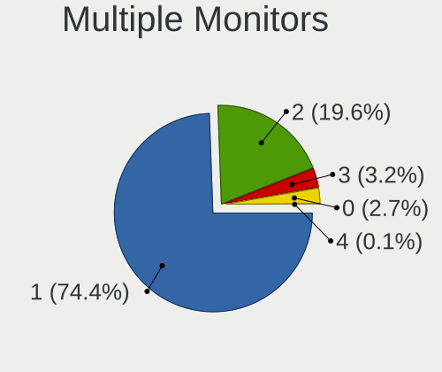

| Total | Notebooks | Percent |
|-------|-----------|---------|
| 1     | 783       | 74.43%  |
| 2     | 206       | 19.58%  |
| 3     | 34        | 3.23%   |
| 0     | 28        | 2.66%   |
| 4     | 1         | 0.1%    |

Network
-------

Net Controller Vendor
---------------------

Controller vendors

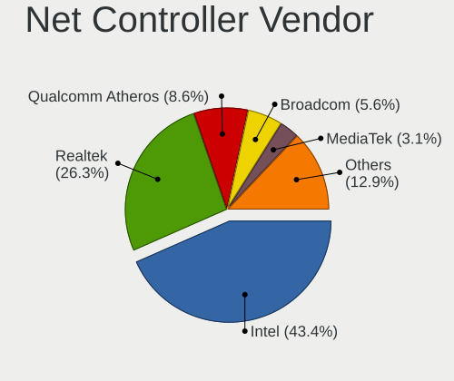

| Vendor                            | Notebooks | Percent |
|-----------------------------------|-----------|---------|
| Intel                             | 681       | 43.4%   |
| Realtek Semiconductor             | 413       | 26.32%  |
| Qualcomm Atheros                  | 135       | 8.6%    |
| Broadcom                          | 88        | 5.61%   |
| MediaTek                          | 49        | 3.12%   |
| Broadcom Limited                  | 26        | 1.66%   |
| Sierra Wireless                   | 20        | 1.27%   |
| Ericsson Business Mobile Networks | 19        | 1.21%   |
| Dell                              | 17        | 1.08%   |
| Shenzhen Goodix Technology        | 14        | 0.89%   |
| Lenovo                            | 10        | 0.64%   |
| Hewlett-Packard                   | 10        | 0.64%   |
| Samsung Electronics               | 8         | 0.51%   |
| Qualcomm                          | 8         | 0.51%   |
| DisplayLink                       | 8         | 0.51%   |
| Ralink Technology                 | 7         | 0.45%   |
| Ralink                            | 6         | 0.38%   |
| Fibocom                           | 6         | 0.38%   |
| ASUSTek Computer                  | 6         | 0.38%   |
| TP-Link                           | 5         | 0.32%   |
| Marvell Technology Group          | 5         | 0.32%   |
| NetGear                           | 4         | 0.25%   |
| Qualcomm Atheros Communications   | 3         | 0.19%   |
| JMicron Technology                | 3         | 0.19%   |
| Qualcomm Technologies             | 2         | 0.13%   |
| Nvidia                            | 2         | 0.13%   |
| Microsoft                         | 2         | 0.13%   |
| Google                            | 2         | 0.13%   |
| D-Link                            | 2         | 0.13%   |
| Apple                             | 2         | 0.13%   |
| T & A Mobile Phones               | 1         | 0.06%   |
| SEGGER                            | 1         | 0.06%   |
| ROCCAT                            | 1         | 0.06%   |
| Nordic Semiconductor ASA          | 1         | 0.06%   |
| Huawei Technologies               | 1         | 0.06%   |
| ASIX Electronics                  | 1         | 0.06%   |

Net Controller Model
--------------------

Controller models

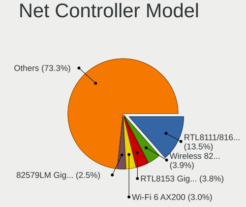

| Model                                                                  | Notebooks | Percent |
|------------------------------------------------------------------------|-----------|---------|
| Realtek RTL8111/8168/8211/8411 PCI Express Gigabit Ethernet Controller | 263       | 13.52%  |
| Intel Wireless 8265 / 8275                                             | 75        | 3.86%   |
| Realtek RTL8153 Gigabit Ethernet Adapter                               | 74        | 3.8%    |
| Intel Wi-Fi 6 AX200                                                    | 58        | 2.98%   |
| Intel 82579LM Gigabit Network Connection (Lewisville)                  | 49        | 2.52%   |
| Intel Wireless 8260                                                    | 44        | 2.26%   |
| Intel Alder Lake-P PCH CNVi WiFi                                       | 43        | 2.21%   |
| Intel Wireless 7265                                                    | 42        | 2.16%   |
| Intel Wireless 7260                                                    | 41        | 2.11%   |
| Intel Wi-Fi 6 AX201                                                    | 33        | 1.7%    |
| Intel Centrino Advanced-N 6205 [Taylor Peak]                           | 29        | 1.49%   |
| Intel Cannon Point-LP CNVi [Wireless-AC]                               | 28        | 1.44%   |
| Realtek RTL810xE PCI Express Fast Ethernet controller                  | 26        | 1.34%   |
| Intel Ethernet Connection (4) I219-V                                   | 26        | 1.34%   |
| Intel Ethernet Connection (4) I219-LM                                  | 25        | 1.29%   |
| Intel Cannon Lake PCH CNVi WiFi                                        | 25        | 1.29%   |
| Qualcomm Atheros QCA6174 802.11ac Wireless Network Adapter             | 24        | 1.23%   |
| Intel Raptor Lake PCH CNVi WiFi                                        | 22        | 1.13%   |
| Intel Ethernet Connection (6) I219-V                                   | 20        | 1.03%   |
| Realtek RTL8821CE 802.11ac PCIe Wireless Network Adapter               | 19        | 0.98%   |
| Qualcomm Atheros AR9285 Wireless Network Adapter (PCI-Express)         | 19        | 0.98%   |
| MediaTek MT7921 802.11ax PCIe Wireless Network Adapter [Filogic 330]   | 19        | 0.98%   |
| Intel Wi-Fi 5(802.11ac) Wireless-AC 9x6x [Thunder Peak]                | 19        | 0.98%   |
| Intel Centrino Ultimate-N 6300                                         | 19        | 0.98%   |
| Qualcomm Atheros QCA9565 / AR9565 Wireless Network Adapter             | 18        | 0.93%   |
| MediaTek MT7922 802.11ax PCI Express Wireless Network Adapter          | 18        | 0.93%   |
| Intel Tiger Lake PCH CNVi WiFi                                         | 18        | 0.93%   |
| Intel Centrino Advanced-N 6235                                         | 18        | 0.93%   |
| Intel Ethernet Connection I219-V                                       | 17        | 0.87%   |
| Intel Comet Lake PCH-LP CNVi WiFi                                      | 17        | 0.87%   |
| Qualcomm Atheros QCA9377 802.11ac Wireless Network Adapter             | 16        | 0.82%   |
| Realtek RTL8852AE 802.11ax PCIe Wireless Network Adapter               | 15        | 0.77%   |
| Shenzhen Goodix Fingerprint Reader                                     | 14        | 0.72%   |
| Intel Wi-Fi 6E(802.11ax) AX210/AX1675* 2x2 [Typhoon Peak]              | 14        | 0.72%   |
| Intel Ethernet Connection I218-LM                                      | 14        | 0.72%   |
| Intel Ethernet Connection (3) I218-LM                                  | 14        | 0.72%   |
| Intel Wireless 3165                                                    | 13        | 0.67%   |
| Intel Ethernet Connection I219-LM                                      | 13        | 0.67%   |
| Broadcom BCM43228 802.11a/b/g/n                                        | 13        | 0.67%   |
| Sierra Wireless EM7455                                                 | 12        | 0.62%   |

Wireless Vendor
---------------

Wireless vendors

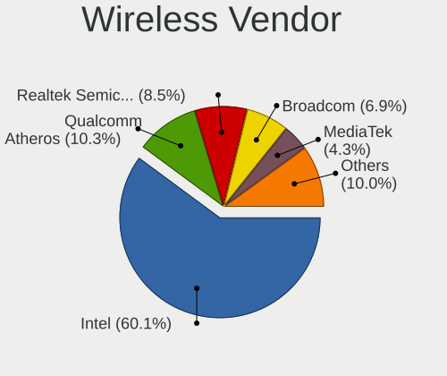

| Vendor                            | Notebooks | Percent |
|-----------------------------------|-----------|---------|
| Intel                             | 633       | 60.11%  |
| Qualcomm Atheros                  | 108       | 10.26%  |
| Realtek Semiconductor             | 89        | 8.45%   |
| Broadcom                          | 73        | 6.93%   |
| MediaTek                          | 45        | 4.27%   |
| Broadcom Limited                  | 23        | 2.18%   |
| Sierra Wireless                   | 20        | 1.9%    |
| Dell                              | 10        | 0.95%   |
| Ralink Technology                 | 7         | 0.66%   |
| Ralink                            | 6         | 0.57%   |
| Qualcomm                          | 6         | 0.57%   |
| Fibocom                           | 6         | 0.57%   |
| ASUSTek Computer                  | 6         | 0.57%   |
| Hewlett-Packard                   | 5         | 0.47%   |
| TP-Link                           | 4         | 0.38%   |
| NetGear                           | 4         | 0.38%   |
| Qualcomm Atheros Communications   | 3         | 0.28%   |
| Microsoft                         | 2         | 0.19%   |
| Qualcomm Technologies             | 1         | 0.09%   |
| Ericsson Business Mobile Networks | 1         | 0.09%   |
| D-Link                            | 1         | 0.09%   |

Wireless Model
--------------

Wireless models

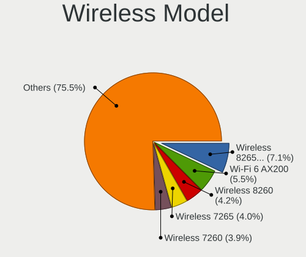

| Model                                                                | Notebooks | Percent |
|----------------------------------------------------------------------|-----------|---------|
| Intel Wireless 8265 / 8275                                           | 75        | 7.08%   |
| Intel Wi-Fi 6 AX200                                                  | 58        | 5.47%   |
| Intel Wireless 8260                                                  | 44        | 4.15%   |
| Intel Wireless 7265                                                  | 42        | 3.96%   |
| Intel Wireless 7260                                                  | 41        | 3.87%   |
| Intel Wi-Fi 6 AX201                                                  | 33        | 3.11%   |
| Intel Centrino Advanced-N 6205 [Taylor Peak]                         | 29        | 2.74%   |
| Intel Cannon Point-LP CNVi [Wireless-AC]                             | 28        | 2.64%   |
| Intel Alder Lake-P PCH CNVi WiFi                                     | 28        | 2.64%   |
| Intel Cannon Lake PCH CNVi WiFi                                      | 25        | 2.36%   |
| Qualcomm Atheros QCA6174 802.11ac Wireless Network Adapter           | 24        | 2.26%   |
| Realtek RTL8821CE 802.11ac PCIe Wireless Network Adapter             | 19        | 1.79%   |
| Qualcomm Atheros AR9285 Wireless Network Adapter (PCI-Express)       | 19        | 1.79%   |
| MediaTek MT7921 802.11ax PCIe Wireless Network Adapter [Filogic 330] | 19        | 1.79%   |
| Intel Wi-Fi 5(802.11ac) Wireless-AC 9x6x [Thunder Peak]              | 19        | 1.79%   |
| Intel Raptor Lake PCH CNVi WiFi                                      | 19        | 1.79%   |
| Intel Centrino Ultimate-N 6300                                       | 19        | 1.79%   |
| Qualcomm Atheros QCA9565 / AR9565 Wireless Network Adapter           | 18        | 1.7%    |
| Intel Tiger Lake PCH CNVi WiFi                                       | 18        | 1.7%    |
| Intel Centrino Advanced-N 6235                                       | 18        | 1.7%    |
| Intel Comet Lake PCH-LP CNVi WiFi                                    | 17        | 1.6%    |
| Qualcomm Atheros QCA9377 802.11ac Wireless Network Adapter           | 16        | 1.51%   |
| MediaTek MT7922 802.11ax PCI Express Wireless Network Adapter        | 16        | 1.51%   |
| Realtek RTL8852AE 802.11ax PCIe Wireless Network Adapter             | 15        | 1.42%   |
| Intel Wi-Fi 6E(802.11ax) AX210/AX1675* 2x2 [Typhoon Peak]            | 14        | 1.32%   |
| Intel Wireless 3165                                                  | 13        | 1.23%   |
| Broadcom BCM43228 802.11a/b/g/n                                      | 13        | 1.23%   |
| Sierra Wireless EM7455                                               | 12        | 1.13%   |
| Qualcomm Atheros AR9462 Wireless Network Adapter                     | 12        | 1.13%   |
| Intel Comet Lake PCH CNVi WiFi                                       | 12        | 1.13%   |
| Broadcom BCM4313 802.11bgn Wireless Network Adapter                  | 12        | 1.13%   |
| Intel Wireless 3160                                                  | 11        | 1.04%   |
| Qualcomm Atheros AR9485 Wireless Network Adapter                     | 9         | 0.85%   |
| Intel WiFi Link 5100                                                 | 9         | 0.85%   |
| Intel Meteor Lake PCH CNVi WiFi                                      | 9         | 0.85%   |
| Intel Dual Band Wireless-AC 3165 Plus Bluetooth                      | 9         | 0.85%   |
| Broadcom Limited BCM4360 802.11ac Dual Band Wireless Network Adapter | 9         | 0.85%   |
| Broadcom BCM4331 802.11a/b/g/n                                       | 9         | 0.85%   |
| Realtek RTL8822CE 802.11ac PCIe Wireless Network Adapter             | 8         | 0.75%   |
| Realtek RTL8723BE PCIe Wireless Network Adapter                      | 8         | 0.75%   |

Ethernet Vendor
---------------

Ethernet vendors

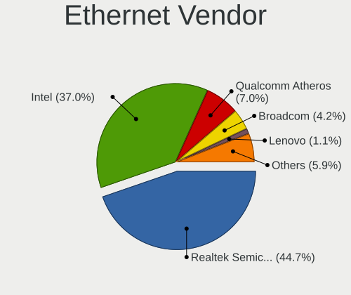

| Vendor                   | Notebooks | Percent |
|--------------------------|-----------|---------|
| Realtek Semiconductor    | 369       | 44.73%  |
| Intel                    | 305       | 36.97%  |
| Qualcomm Atheros         | 58        | 7.03%   |
| Broadcom                 | 35        | 4.24%   |
| Lenovo                   | 9         | 1.09%   |
| Samsung Electronics      | 8         | 0.97%   |
| DisplayLink              | 8         | 0.97%   |
| Marvell Technology Group | 5         | 0.61%   |
| Broadcom Limited         | 5         | 0.61%   |
| MediaTek                 | 4         | 0.48%   |
| JMicron Technology       | 3         | 0.36%   |
| Qualcomm                 | 2         | 0.24%   |
| Nvidia                   | 2         | 0.24%   |
| Hewlett-Packard          | 2         | 0.24%   |
| Google                   | 2         | 0.24%   |
| Apple                    | 2         | 0.24%   |
| TP-Link                  | 1         | 0.12%   |
| T & A Mobile Phones      | 1         | 0.12%   |
| Qualcomm Technologies    | 1         | 0.12%   |
| Huawei Technologies      | 1         | 0.12%   |
| D-Link                   | 1         | 0.12%   |
| ASIX Electronics         | 1         | 0.12%   |

Ethernet Model
--------------

Ethernet models

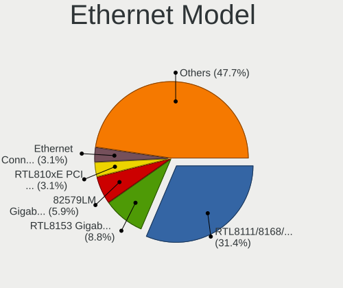

| Model                                                                  | Notebooks | Percent |
|------------------------------------------------------------------------|-----------|---------|
| Realtek RTL8111/8168/8211/8411 PCI Express Gigabit Ethernet Controller | 263       | 31.42%  |
| Realtek RTL8153 Gigabit Ethernet Adapter                               | 74        | 8.84%   |
| Intel 82579LM Gigabit Network Connection (Lewisville)                  | 49        | 5.85%   |
| Realtek RTL810xE PCI Express Fast Ethernet controller                  | 26        | 3.11%   |
| Intel Ethernet Connection (4) I219-V                                   | 26        | 3.11%   |
| Intel Ethernet Connection (4) I219-LM                                  | 25        | 2.99%   |
| Intel Ethernet Connection (6) I219-V                                   | 20        | 2.39%   |
| Intel Ethernet Connection I219-V                                       | 17        | 2.03%   |
| Intel Alder Lake-P PCH CNVi WiFi                                       | 15        | 1.79%   |
| Intel Ethernet Connection I218-LM                                      | 14        | 1.67%   |
| Intel Ethernet Connection (3) I218-LM                                  | 14        | 1.67%   |
| Intel Ethernet Connection I219-LM                                      | 13        | 1.55%   |
| Qualcomm Atheros AR8151 v2.0 Gigabit Ethernet                          | 12        | 1.43%   |
| Qualcomm Atheros QCA8171 Gigabit Ethernet                              | 10        | 1.19%   |
| Intel 82577LM Gigabit Network Connection                               | 10        | 1.19%   |
| Qualcomm Atheros Killer E2500 Gigabit Ethernet Controller              | 9         | 1.08%   |
| Intel Ethernet Connection I217-LM                                      | 9         | 1.08%   |
| Broadcom NetXtreme BCM57765 Gigabit Ethernet PCIe                      | 9         | 1.08%   |
| Intel Ethernet Connection (2) I219-LM                                  | 7         | 0.84%   |
| Intel Ethernet Connection (13) I219-V                                  | 7         | 0.84%   |
| Qualcomm Atheros Killer E220x Gigabit Ethernet Controller              | 6         | 0.72%   |
| Intel Ethernet Connection (6) I219-LM                                  | 6         | 0.72%   |
| Intel Ethernet Connection (16) I219-V                                  | 6         | 0.72%   |
| Broadcom NetXtreme BCM57786 Gigabit Ethernet PCIe                      | 6         | 0.72%   |
| Qualcomm Atheros QCA8172 Fast Ethernet                                 | 5         | 0.6%    |
| Intel Ethernet Connection (16) I219-LM                                 | 5         | 0.6%    |
| Intel Ethernet Connection (10) I219-LM                                 | 5         | 0.6%    |
| Intel 82579V Gigabit Network Connection                                | 5         | 0.6%    |
| Intel 82567LM Gigabit Network Connection                               | 5         | 0.6%    |
| Broadcom NetLink BCM57785 Gigabit Ethernet PCIe                        | 5         | 0.6%    |
| Samsung GT-I9070 (network tethering, USB debugging enabled)            | 4         | 0.48%   |
| Samsung Galaxy series, misc. (tethering mode)                          | 4         | 0.48%   |
| Realtek RTL8852CE PCIe 802.11ax Wireless Network Controller            | 4         | 0.48%   |
| Realtek RTL8125 2.5GbE Controller                                      | 4         | 0.48%   |
| Qualcomm Atheros AR8131 Gigabit Ethernet                               | 4         | 0.48%   |
| Intel Ethernet Connection (7) I219-LM                                  | 4         | 0.48%   |
| Intel Ethernet Connection (3) I218-V                                   | 4         | 0.48%   |
| Realtek Killer E3000 2.5GbE Controller                                 | 3         | 0.36%   |
| Qualcomm Atheros Killer E2400 Gigabit Ethernet Controller              | 3         | 0.36%   |
| Qualcomm Atheros AR8161 Gigabit Ethernet                               | 3         | 0.36%   |

Net Controller Kind
-------------------

Ethernet, WiFi or modem

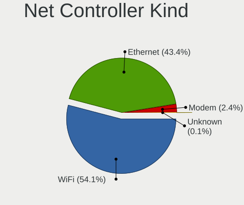

| Kind     | Notebooks | Percent |
|----------|-----------|---------|
| WiFi     | 974       | 54.08%  |
| Ethernet | 781       | 43.36%  |
| Modem    | 44        | 2.44%   |
| Unknown  | 2         | 0.11%   |

Used Controller
---------------

Currently used network controller

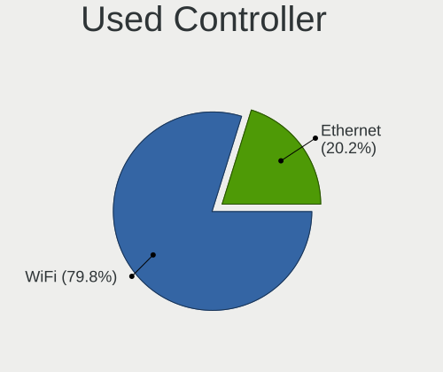

| Kind     | Notebooks | Percent |
|----------|-----------|---------|
| WiFi     | 849       | 79.79%  |
| Ethernet | 215       | 20.21%  |

NICs
----

Total network controllers on board

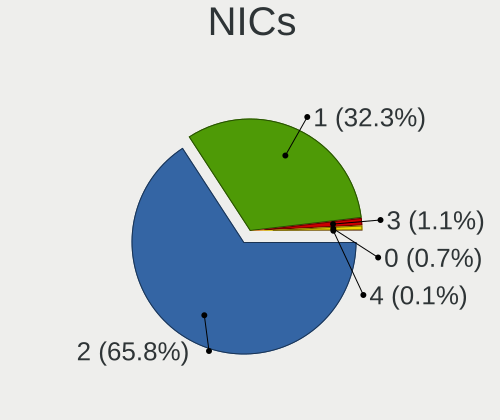

| Total | Notebooks | Percent |
|-------|-----------|---------|
| 2     | 670       | 65.82%  |
| 1     | 329       | 32.32%  |
| 3     | 11        | 1.08%   |
| 0     | 7         | 0.69%   |
| 4     | 1         | 0.1%    |

IPv6
----

IPv6 vs IPv4

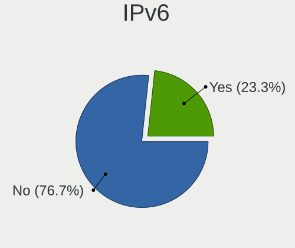

| Used | Notebooks | Percent |
|------|-----------|---------|
| No   | 809       | 76.68%  |
| Yes  | 246       | 23.32%  |

Bluetooth
---------

Bluetooth Vendor
----------------

Controller vendors

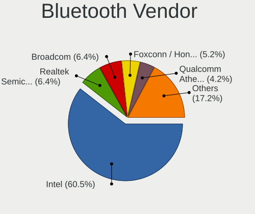

| Vendor                          | Notebooks | Percent |
|---------------------------------|-----------|---------|
| Intel                           | 531       | 60.55%  |
| Realtek Semiconductor           | 56        | 6.39%   |
| Broadcom                        | 56        | 6.39%   |
| Foxconn / Hon Hai               | 46        | 5.25%   |
| Qualcomm Atheros Communications | 37        | 4.22%   |
| IMC Networks                    | 36        | 4.1%    |
| Apple                           | 32        | 3.65%   |
| Lite-On Technology              | 29        | 3.31%   |
| Hewlett-Packard                 | 15        | 1.71%   |
| Dell                            | 15        | 1.71%   |
| ASUSTek Computer                | 6         | 0.68%   |
| USI                             | 3         | 0.34%   |
| MediaTek                        | 3         | 0.34%   |
| Cambridge Silicon Radio         | 3         | 0.34%   |
| Toshiba                         | 2         | 0.23%   |
| Realtek                         | 2         | 0.23%   |
| TP-Link                         | 1         | 0.11%   |
| Ralink Technology               | 1         | 0.11%   |
| Ralink                          | 1         | 0.11%   |
| Integrated System Solution      | 1         | 0.11%   |
| Edimax Technology               | 1         | 0.11%   |

Bluetooth Model
---------------

Controller models

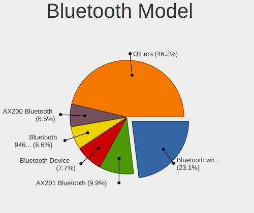

| Model                                              | Notebooks | Percent |
|----------------------------------------------------|-----------|---------|
| Intel Bluetooth wireless interface                 | 203       | 23.07%  |
| Intel AX201 Bluetooth                              | 87        | 9.89%   |
| Intel Bluetooth Device                             | 68        | 7.73%   |
| Intel Bluetooth 9460/9560 Jefferson Peak (JfP)     | 58        | 6.59%   |
| Intel AX200 Bluetooth                              | 57        | 6.48%   |
| Realtek Bluetooth Radio                            | 41        | 4.66%   |
| Intel Centrino Bluetooth Wireless Transceiver      | 20        | 2.27%   |
| Intel Wireless-AC 9260 Bluetooth Adapter           | 18        | 2.05%   |
| Apple Bluetooth Host Controller                    | 18        | 2.05%   |
| Foxconn / Hon Hai Wireless_Device                  | 17        | 1.93%   |
| Broadcom BCM2045B (BDC-2.1)                        | 16        | 1.82%   |
| Lite-On Bluetooth Device                           | 13        | 1.48%   |
| Intel AX210 Bluetooth                              | 13        | 1.48%   |
| IMC Networks Wireless_Device                       | 13        | 1.48%   |
| Foxconn / Hon Hai Bluetooth Device                 | 13        | 1.48%   |
| Realtek  Bluetooth 4.2 Adapter                     | 11        | 1.25%   |
| Qualcomm Atheros AR3012 Bluetooth 4.0              | 11        | 1.25%   |
| IMC Networks Bluetooth Radio                       | 11        | 1.25%   |
| HP Broadcom 2070 Bluetooth Combo                   | 11        | 1.25%   |
| Apple Bluetooth USB Host Controller                | 11        | 1.25%   |
| Broadcom BCM20702 Bluetooth 4.0 [ThinkPad]         | 10        | 1.14%   |
| Qualcomm Atheros  Bluetooth Device                 | 9         | 1.02%   |
| Foxconn / Hon Hai MediaTek Bluetooth Adapter       | 9         | 1.02%   |
| Qualcomm Atheros AR3011 Bluetooth                  | 8         | 0.91%   |
| Qualcomm Atheros QCA61x4 Bluetooth 4.0             | 6         | 0.68%   |
| Lite-On Wireless_Device                            | 6         | 0.68%   |
| Lite-On Qualcomm Atheros QCA9377 Bluetooth         | 6         | 0.68%   |
| Dell DW375 Bluetooth Module                        | 6         | 0.68%   |
| Broadcom HP Portable SoftSailing                   | 6         | 0.68%   |
| IMC Networks Bluetooth Device                      | 5         | 0.57%   |
| Dell BCM20702A0 Bluetooth Module                   | 5         | 0.57%   |
| Broadcom BCM2045B (BDC-2.1) [Bluetooth Controller] | 5         | 0.57%   |
| Intel Wireless-AC 3168 Bluetooth                   | 4         | 0.45%   |
| Intel Centrino Advanced-N 6230 Bluetooth adapter   | 4         | 0.45%   |
| IMC Networks Atheros AR3012 Bluetooth 4.0 Adapter  | 4         | 0.45%   |
| Broadcom BCM20702A0                                | 4         | 0.45%   |
| USI Bluetooth Device                               | 3         | 0.34%   |
| Qualcomm Atheros AR3012 Bluetooth                  | 3         | 0.34%   |
| Lite-On Atheros AR3012 Bluetooth                   | 3         | 0.34%   |
| HP Bluetooth 2.0 Interface [Broadcom BCM2045]      | 3         | 0.34%   |

Sound
-----

Sound Vendor
------------

Sound card vendors

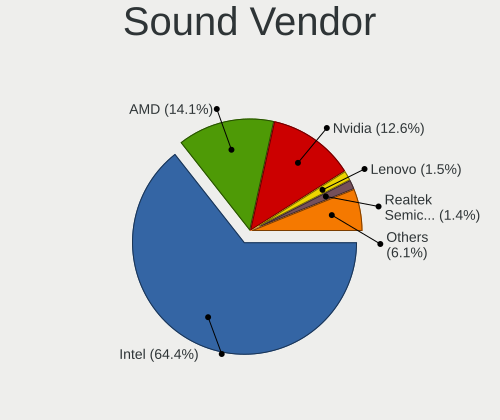

| Vendor                                       | Notebooks | Percent |
|----------------------------------------------|-----------|---------|
| Intel                                        | 843       | 64.4%   |
| AMD                                          | 184       | 14.06%  |
| Nvidia                                       | 165       | 12.61%  |
| Lenovo                                       | 19        | 1.45%   |
| Realtek Semiconductor                        | 18        | 1.38%   |
| Logitech                                     | 9         | 0.69%   |
| Kingston Technology                          | 8         | 0.61%   |
| GN Netcom                                    | 7         | 0.53%   |
| C-Media Electronics                          | 7         | 0.53%   |
| Hewlett-Packard                              | 6         | 0.46%   |
| Sony                                         | 3         | 0.23%   |
| Zoran Co. Personal Media Division (Nogatech) | 2         | 0.15%   |
| Razer USA                                    | 2         | 0.15%   |
| Plantronics                                  | 2         | 0.15%   |
| KTMicro                                      | 2         | 0.15%   |
| JMTek                                        | 2         | 0.15%   |
| DSEA A/S                                     | 2         | 0.15%   |
| Dell                                         | 2         | 0.15%   |
| Texas Instruments                            | 1         | 0.08%   |
| SteelSeries ApS                              | 1         | 0.08%   |
| Sonicstar                                    | 1         | 0.08%   |
| somic                                        | 1         | 0.08%   |
| SAVITECH                                     | 1         | 0.08%   |
| Roland                                       | 1         | 0.08%   |
| ROCCAT                                       | 1         | 0.08%   |
| RME                                          | 1         | 0.08%   |
| Ploytec                                      | 1         | 0.08%   |
| Nordic Semiconductor ASA                     | 1         | 0.08%   |
| NAD                                          | 1         | 0.08%   |
| Mark of the Unicorn                          | 1         | 0.08%   |
| Huawei Technologies                          | 1         | 0.08%   |
| Harman International                         | 1         | 0.08%   |
| Generalplus Technology                       | 1         | 0.08%   |
| Focusrite-Novation                           | 1         | 0.08%   |
| FiiO Electronics Technology                  | 1         | 0.08%   |
| ESI Audiotechnik                             | 1         | 0.08%   |
| Elgato Systems                               | 1         | 0.08%   |
| Drop                                         | 1         | 0.08%   |
| Corsair                                      | 1         | 0.08%   |
| Conexant Systems                             | 1         | 0.08%   |

Sound Model
-----------

Sound card models

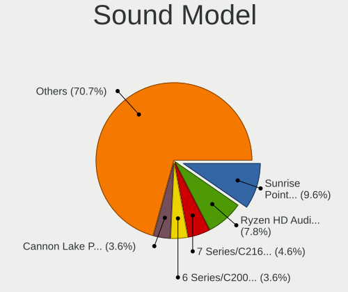

| Model                                                                      | Notebooks | Percent |
|----------------------------------------------------------------------------|-----------|---------|
| Intel Sunrise Point-LP HD Audio                                            | 151       | 9.62%   |
| AMD Ryzen HD Audio Controller                                              | 123       | 7.83%   |
| Intel 7 Series/C216 Chipset Family High Definition Audio Controller        | 73        | 4.65%   |
| Intel 6 Series/C200 Series Chipset Family High Definition Audio Controller | 57        | 3.63%   |
| Intel Cannon Lake PCH cAVS                                                 | 56        | 3.57%   |
| Intel Alder Lake PCH-P High Definition Audio Controller                    | 51        | 3.25%   |
| AMD Renoir/Cezanne HDMI/DP Audio Controller                                | 51        | 3.25%   |
| Intel Cannon Point-LP High Definition Audio Controller                     | 49        | 3.12%   |
| Intel Haswell-ULT HD Audio Controller                                      | 48        | 3.06%   |
| Intel 8 Series HD Audio Controller                                         | 48        | 3.06%   |
| Intel Tiger Lake-LP Smart Sound Technology Audio Controller                | 45        | 2.87%   |
| Intel Wildcat Point-LP High Definition Audio Controller                    | 40        | 2.55%   |
| Intel Broadwell-U Audio Controller                                         | 40        | 2.55%   |
| Intel 8 Series/C220 Series Chipset High Definition Audio Controller        | 40        | 2.55%   |
| AMD Radeon High Definition Audio Controller                                | 38        | 2.42%   |
| Intel Xeon E3-1200 v3/4th Gen Core Processor HD Audio Controller           | 29        | 1.85%   |
| Intel 5 Series/3400 Series Chipset High Definition Audio                   | 29        | 1.85%   |
| Intel Raptor Lake-P/U/H cAVS                                               | 25        | 1.59%   |
| Intel 100 Series/C230 Series Chipset Family HD Audio Controller            | 22        | 1.4%    |
| Intel Tiger Lake-H HD Audio Controller                                     | 21        | 1.34%   |
| Intel 82801I (ICH9 Family) HD Audio Controller                             | 20        | 1.27%   |
| AMD FCH Azalia Controller                                                  | 19        | 1.21%   |
| Realtek Semiconductor USB Audio                                            | 18        | 1.15%   |
| Intel Comet Lake PCH-LP cAVS                                               | 17        | 1.08%   |
| AMD Raven/Raven2/Fenghuang HDMI/DP Audio Controller                        | 17        | 1.08%   |
| Intel CM238 HD Audio Controller                                            | 16        | 1.02%   |
| Intel Comet Lake PCH cAVS                                                  | 14        | 0.89%   |
| Nvidia TU106 High Definition Audio Controller                              | 13        | 0.83%   |
| Nvidia TU116 High Definition Audio Controller                              | 12        | 0.76%   |
| AMD SBx00 Azalia (Intel HDA)                                               | 12        | 0.76%   |
| Nvidia GA106 High Definition Audio Controller                              | 11        | 0.7%    |
| Intel Meteor Lake-P HD Audio Controller                                    | 11        | 0.7%    |
| Nvidia GP107GL High Definition Audio Controller                            | 10        | 0.64%   |
| Nvidia GK107 HDMI Audio Controller                                         | 10        | 0.64%   |
| Nvidia GF108 High Definition Audio Controller                              | 10        | 0.64%   |
| Nvidia TU107 GeForce GTX 1650 High Definition Audio Controller             | 9         | 0.57%   |
| Nvidia GA104 High Definition Audio Controller                              | 9         | 0.57%   |
| Nvidia AD107 High Definition Audio Controller                              | 9         | 0.57%   |
| Intel NM10/ICH7 Family High Definition Audio Controller                    | 9         | 0.57%   |
| Intel Celeron/Pentium Silver Processor High Definition Audio               | 9         | 0.57%   |

Memory
------

Memory Vendor
-------------

Memory module vendors

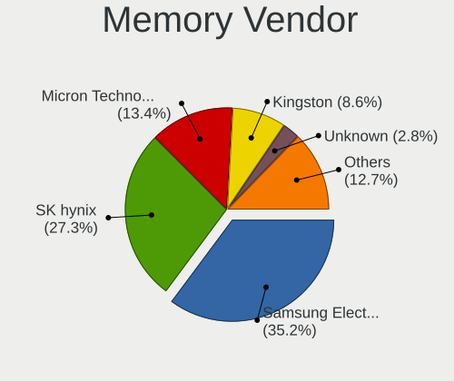

| Vendor                 | Notebooks | Percent |
|------------------------|-----------|---------|
| Samsung Electronics    | 229       | 35.18%  |
| SK hynix               | 178       | 27.34%  |
| Micron Technology      | 87        | 13.36%  |
| Kingston               | 56        | 8.6%    |
| Unknown                | 18        | 2.76%   |
| Crucial                | 15        | 2.3%    |
| Ramaxel Technology     | 13        | 2%      |
| Elpida                 | 10        | 1.54%   |
| Corsair                | 10        | 1.54%   |
| Unknown                | 10        | 1.54%   |
| A-DATA Technology      | 6         | 0.92%   |
| Nanya Technology       | 4         | 0.61%   |
| G.Skill                | 2         | 0.31%   |
| Unknown (ABCD)         | 1         | 0.15%   |
| Unknown (89F7)         | 1         | 0.15%   |
| Unknown (0x0D0E)       | 1         | 0.15%   |
| Unknown (00000000802C) | 1         | 0.15%   |
| Transcend              | 1         | 0.15%   |
| Toshiba                | 1         | 0.15%   |
| Team                   | 1         | 0.15%   |
| GSkill                 | 1         | 0.15%   |
| ff                     | 1         | 0.15%   |
| fef5                   | 1         | 0.15%   |
| ASint Technology       | 1         | 0.15%   |
| 4ea5                   | 1         | 0.15%   |
| 48spaces               | 1         | 0.15%   |

Memory Model
------------

Memory module models

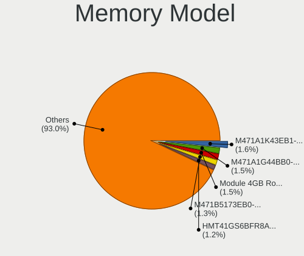

| Model                                                            | Notebooks | Percent |
|------------------------------------------------------------------|-----------|---------|
| Samsung RAM M471A1K43EB1-CWE 8GB SODIMM DDR4 3200MT/s            | 11        | 1.6%    |
| Samsung RAM M471A1G44BB0-CWE 8GB SODIMM DDR4 3200MT/s            | 10        | 1.45%   |
| Unknown                                                          | 10        | 1.45%   |
| Samsung RAM M471B5173EB0-YK0 4GB SODIMM DDR3 1600MT/s            | 9         | 1.31%   |
| SK hynix RAM HMT41GS6BFR8A-PB 8GB SODIMM DDR3 2667MT/s           | 8         | 1.16%   |
| SK hynix RAM HMT451S6BFR8A-PB 4GB SODIMM DDR3 1600MT/s           | 7         | 1.02%   |
| SK hynix RAM HMA851S6AFR6N-UH 4GB SODIMM DDR4 2667MT/s           | 7         | 1.02%   |
| Samsung RAM M471B5273DH0-CH9 4GB SODIMM DDR3 1600MT/s            | 7         | 1.02%   |
| Samsung RAM M471B5173QH0-YK0 4GB SODIMM DDR3 1600MT/s            | 7         | 1.02%   |
| Samsung RAM M471A2K43CB1-CRC 16GB SODIMM DDR4 2667MT/s           | 7         | 1.02%   |
| Samsung RAM M471A1K43DB1-CTD 8GB SODIMM DDR4 2667MT/s            | 6         | 0.87%   |
| Samsung RAM M471A1K43CB1-CRC 8GB SODIMM DDR4 8400MT/s            | 6         | 0.87%   |
| Samsung RAM M471A1K43BB1-CRC 8GB SODIMM DDR4 2667MT/s            | 6         | 0.87%   |
| Samsung RAM M471A1G44AB0-CWE 8GiB SODIMM DDR4 3200MT/s           | 6         | 0.87%   |
| Micron RAM MT52L1G32D4PG-093 8GB Row Of Chips LPDDR3 2133MT/s    | 6         | 0.87%   |
| Unknown RAM Module 4GB Chip DDR4 2133MT/s                        | 5         | 0.73%   |
| SK hynix RAM Module 16GB SODIMM DDR4 2667MT/s                    | 5         | 0.73%   |
| SK hynix RAM HMT41GS6AFR8A-PB 8GiB SODIMM DDR3 2667MT/s          | 5         | 0.73%   |
| Samsung RAM Module 4GB SODIMM DDR3 1867MT/s                      | 5         | 0.73%   |
| Samsung RAM M471A1K43DB1-CWE 8GB SODIMM DDR4 3200MT/s            | 5         | 0.73%   |
| Samsung RAM M425R2GA3BB0-CQKOL 16GB SODIMM DDR5 4800MT/s         | 5         | 0.73%   |
| SK hynix RAM HMT351S6EFR8A-PB 4GB SODIMM DDR3 1600MT/s           | 4         | 0.58%   |
| SK hynix RAM HMAG68EXNSA051N 8GB SODIMM DDR4 3200MT/s            | 4         | 0.58%   |
| SK hynix RAM HMAA1GS6CJR6N-XN 8GB SODIMM DDR4 3200MT/s           | 4         | 0.58%   |
| SK hynix RAM HMA851S6AFR6N-TF 4GB SODIMM DDR4 2133MT/s           | 4         | 0.58%   |
| SK hynix RAM HMA81GS6AFR8N-UH 8GB SODIMM DDR4 2667MT/s           | 4         | 0.58%   |
| SK hynix RAM HMA41GS6AFR8N-TF 8GB SODIMM DDR4 2667MT/s           | 4         | 0.58%   |
| SK hynix RAM H9JCNNNCP3MLYR-N6E 2GB Row Of Chips LPDDR5 6400MT/s | 4         | 0.58%   |
| SK hynix RAM H9CCNNNCLGALAR-NVD 8GB Row Of Chips LPDDR3 2133MT/s | 4         | 0.58%   |
| Samsung RAM UBE3D4AA-MGCR 2GB Row Of Chips LPDDR4 4267MT/s       | 4         | 0.58%   |
| Samsung RAM Module 8GB SODIMM DDR4 3200MT/s                      | 4         | 0.58%   |
| Samsung RAM M471B5273CH0-CH9 4GB SODIMM DDR3 1334MT/s            | 4         | 0.58%   |
| Samsung RAM M471B1G73EB0-YK0 8192MB SODIMM DDR3 1600MT/s         | 4         | 0.58%   |
| Samsung RAM M471B1G73DB0-YK0 8GB SODIMM DDR3 1600MT/s            | 4         | 0.58%   |
| Samsung RAM M471A5244CB0-CTD 4GB SODIMM DDR4 3266MT/s            | 4         | 0.58%   |
| Samsung RAM M471A5244CB0-CRC 4GB SODIMM DDR4 2667MT/s            | 4         | 0.58%   |
| Samsung RAM K4E6E304EB-EGCG 4GB Row Of Chips LPDDR3 2133MT/s     | 4         | 0.58%   |
| Ramaxel RAM RMSA3260ME78HAF-2666 8GB SODIMM DDR4 2667MT/s        | 4         | 0.58%   |
| Micron RAM 53E2G32D4NQ-046 4GB Row Of Chips LPDDR4 4267MT/s      | 4         | 0.58%   |
| Micron RAM 4ATF1G64HZ-3G2E1 8GB Row Of Chips DDR4 3200MT/s       | 4         | 0.58%   |

Memory Kind
-----------

Memory module kinds

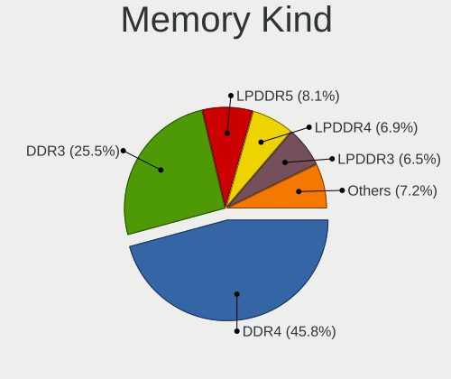

| Kind    | Notebooks | Percent |
|---------|-----------|---------|
| DDR4    | 260       | 45.77%  |
| DDR3    | 145       | 25.53%  |
| LPDDR5  | 46        | 8.1%    |
| LPDDR4  | 39        | 6.87%   |
| LPDDR3  | 37        | 6.51%   |
| DDR5    | 27        | 4.75%   |
| SDRAM   | 6         | 1.06%   |
| DDR2    | 6         | 1.06%   |
| Unknown | 2         | 0.35%   |

Memory Form Factor
------------------

Physical design of the memory module

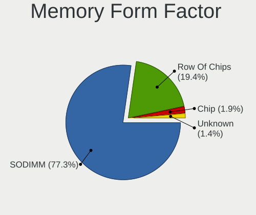

| Name         | Notebooks | Percent |
|--------------|-----------|---------|
| SODIMM       | 442       | 77.27%  |
| Row Of Chips | 111       | 19.41%  |
| Chip         | 11        | 1.92%   |
| Unknown      | 8         | 1.4%    |

Memory Size
-----------

Memory module size

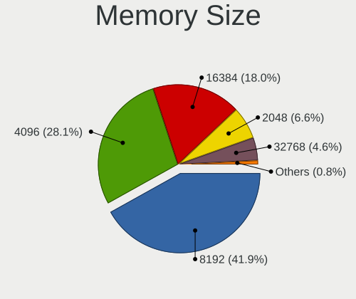

| Size  | Notebooks | Percent |
|-------|-----------|---------|
| 8192  | 254       | 41.91%  |
| 4096  | 170       | 28.05%  |
| 16384 | 109       | 17.99%  |
| 2048  | 40        | 6.6%    |
| 32768 | 28        | 4.62%   |
| 1024  | 3         | 0.5%    |
| 12288 | 1         | 0.17%   |
| 6144  | 1         | 0.17%   |

Memory Speed
------------

Memory module speed

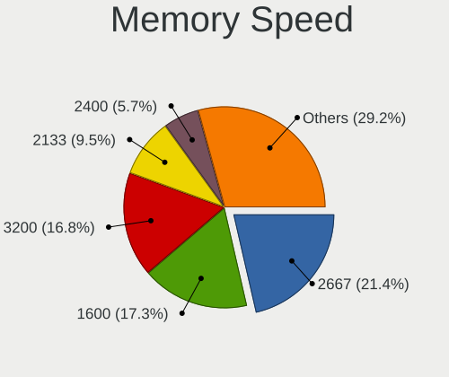

| Speed | Notebooks | Percent |
|-------|-----------|---------|
| 2667  | 131       | 21.41%  |
| 1600  | 106       | 17.32%  |
| 3200  | 103       | 16.83%  |
| 2133  | 58        | 9.48%   |
| 2400  | 35        | 5.72%   |
| 6400  | 28        | 4.58%   |
| 4267  | 23        | 3.76%   |
| 1867  | 17        | 2.78%   |
| 1334  | 15        | 2.45%   |
| 5600  | 14        | 2.29%   |
| 4800  | 13        | 2.12%   |
| 7500  | 10        | 1.63%   |
| 1333  | 10        | 1.63%   |
| 8400  | 8         | 1.31%   |
| 1067  | 6         | 0.98%   |
| 4199  | 5         | 0.82%   |
| 667   | 5         | 0.82%   |
| 8533  | 4         | 0.65%   |
| 4266  | 4         | 0.65%   |
| 3266  | 4         | 0.65%   |
| 7467  | 2         | 0.33%   |
| 2933  | 2         | 0.33%   |
| 1066  | 2         | 0.33%   |
| 8600  | 1         | 0.16%   |
| 8000  | 1         | 0.16%   |
| 3733  | 1         | 0.16%   |
| 2048  | 1         | 0.16%   |
| 1866  | 1         | 0.16%   |
| 975   | 1         | 0.16%   |
| 800   | 1         | 0.16%   |

Printers & scanners
-------------------

Printer Vendor
--------------

Printer device vendors

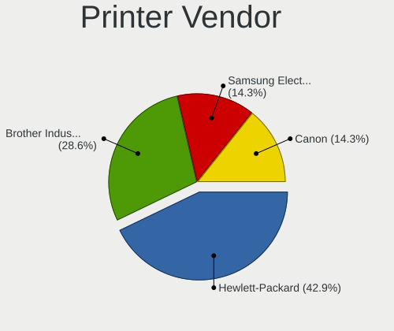

| Vendor              | Notebooks | Percent |
|---------------------|-----------|---------|
| Hewlett-Packard     | 3         | 42.86%  |
| Brother Industries  | 2         | 28.57%  |
| Samsung Electronics | 1         | 14.29%  |
| Canon               | 1         | 14.29%  |

Printer Model
-------------

Printer device models

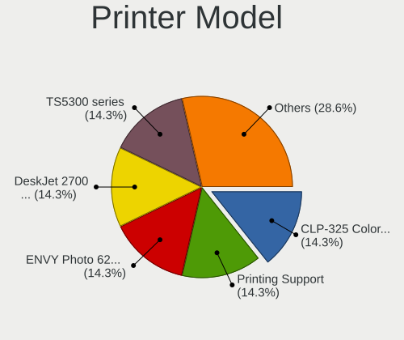

| Model                               | Notebooks | Percent |
|-------------------------------------|-----------|---------|
| Samsung CLP-325 Color Laser Printer | 1         | 14.29%  |
| HP Printing Support                 | 1         | 14.29%  |
| HP ENVY Photo 6200 series           | 1         | 14.29%  |
| HP DeskJet 2700 series              | 1         | 14.29%  |
| Canon TS5300 series                 | 1         | 14.29%  |
| Brother PT-2450DX                   | 1         | 14.29%  |
| Brother HL-1210W series             | 1         | 14.29%  |

Scanner Vendor
--------------

Scanner device vendors

Zero info for selected period =(

Scanner Model
-------------

Scanner device models

Zero info for selected period =(

Camera
------

Camera Vendor
-------------

Camera device vendors

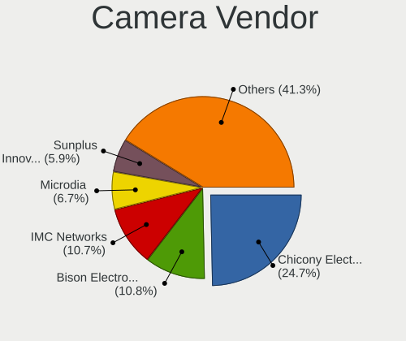

| Vendor                                 | Notebooks | Percent |
|----------------------------------------|-----------|---------|
| Chicony Electronics                    | 229       | 24.68%  |
| Bison Electronics                      | 100       | 10.78%  |
| IMC Networks                           | 99        | 10.67%  |
| Microdia                               | 62        | 6.68%   |
| Sunplus Innovation Technology          | 55        | 5.93%   |
| Realtek Semiconductor                  | 53        | 5.71%   |
| Quanta                                 | 49        | 5.28%   |
| Lite-On Technology                     | 34        | 3.66%   |
| Cheng Uei Precision Industry (Foxlink) | 32        | 3.45%   |
| Apple                                  | 32        | 3.45%   |
| Luxvisions Innotech Limited            | 27        | 2.91%   |
| Logitech                               | 22        | 2.37%   |
| Suyin                                  | 21        | 2.26%   |
| Syntek                                 | 17        | 1.83%   |
| Lenovo                                 | 13        | 1.4%    |
| ShineTech                              | 10        | 1.08%   |
| Silicon Motion                         | 9         | 0.97%   |
| Alcor Micro                            | 8         | 0.86%   |
| Samsung Electronics                    | 6         | 0.65%   |
| Primax Electronics                     | 6         | 0.65%   |
| Sonix Technology                       | 5         | 0.54%   |
| Ricoh                                  | 5         | 0.54%   |
| Shenzhen Kingcome Optoelectronic       | 4         | 0.43%   |
| Acer                                   | 4         | 0.43%   |
| Microsoft                              | 3         | 0.32%   |
| ALi                                    | 3         | 0.32%   |
| Z-Star Microelectronics                | 2         | 0.22%   |
| LianYi                                 | 2         | 0.22%   |
| Intel                                  | 2         | 0.22%   |
| Importek                               | 2         | 0.22%   |
| Generalplus Technology                 | 2         | 0.22%   |
| Creative Technology                    | 2         | 0.22%   |
| Y Media                                | 1         | 0.11%   |
| SunplusIT                              | 1         | 0.11%   |
| Sunplus Technology                     | 1         | 0.11%   |
| Sony Ericsson Mobile Communications AB | 1         | 0.11%   |
| Mustek Systems                         | 1         | 0.11%   |
| icSpring                               | 1         | 0.11%   |
| DigiTech                               | 1         | 0.11%   |
| Dell                                   | 1         | 0.11%   |

Camera Model
------------

Camera device models

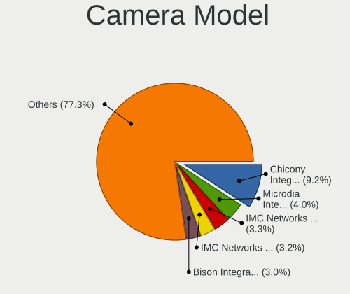

| Model                                               | Notebooks | Percent |
|-----------------------------------------------------|-----------|---------|
| Chicony Integrated Camera                           | 86        | 9.2%    |
| Microdia Integrated_Webcam_HD                       | 37        | 3.96%   |
| IMC Networks Integrated Camera                      | 31        | 3.32%   |
| IMC Networks USB2.0 HD UVC WebCam                   | 30        | 3.21%   |
| Bison Integrated Camera                             | 28        | 2.99%   |
| Chicony HD Webcam                                   | 22        | 2.35%   |
| Chicony HP HD Camera                                | 21        | 2.25%   |
| Sunplus Integrated_Webcam_HD                        | 15        | 1.6%    |
| Lite-On Integrated Camera                           | 15        | 1.6%    |
| Syntek Integrated Camera                            | 14        | 1.5%    |
| Realtek Integrated_Webcam_HD                        | 14        | 1.5%    |
| Apple iPhone 5/5C/5S/6/SE/7/8/X                     | 14        | 1.5%    |
| Chicony HP HD Webcam                                | 13        | 1.39%   |
| Bison HD Webcam                                     | 12        | 1.28%   |
| Lite-On HP HD Camera                                | 11        | 1.18%   |
| Bison SunplusIT Integrated Camera                   | 11        | 1.18%   |
| Luxvisions Innotech Limited Integrated Camera       | 10        | 1.07%   |
| Bison Lenovo EasyCamera                             | 10        | 1.07%   |
| Sunplus HD WebCam                                   | 9         | 0.96%   |
| Quanta HP HD Camera                                 | 9         | 0.96%   |
| Cheng Uei Precision Industry (Foxlink) HD Camera    | 9         | 0.96%   |
| Apple FaceTime HD Camera                            | 9         | 0.96%   |
| Chicony Integrated HP HD Webcam                     | 8         | 0.86%   |
| Sunplus ASUS Webcam                                 | 7         | 0.75%   |
| Quanta HD User Facing                               | 7         | 0.75%   |
| Luxvisions Innotech Limited Integrated RGB Camera   | 7         | 0.75%   |
| Lenovo Integrated Webcam [R5U877]                   | 7         | 0.75%   |
| Bison BisonCam, NB Pro                              | 7         | 0.75%   |
| ShineTech USB2.0 HD UVC WebCam                      | 6         | 0.64%   |
| Samsung Galaxy series, misc. (MTP mode)             | 6         | 0.64%   |
| Quanta HD Webcam                                    | 6         | 0.64%   |
| Microdia Integrated Webcam                          | 6         | 0.64%   |
| IMC Networks USB2.0 VGA UVC WebCam                  | 6         | 0.64%   |
| Chicony HP Wide Vision HD Camera                    | 6         | 0.64%   |
| Cheng Uei Precision Industry (Foxlink) HP HD Camera | 6         | 0.64%   |
| Bison Lenovo Integrated Webcam                      | 6         | 0.64%   |
| Sunplus Laptop Integrated Webcam HD                 | 5         | 0.53%   |
| Realtek USB2.0 HD UVC WebCam                        | 5         | 0.53%   |
| Quanta HP TrueVision HD Camera                      | 5         | 0.53%   |
| Quanta ACER HD User Facing                          | 5         | 0.53%   |

Security
--------

Fingerprint Vendor
------------------

Fingerprint sensor vendors

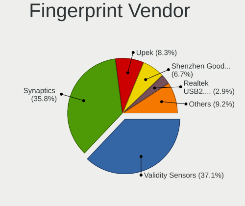

| Vendor                             | Notebooks | Percent |
|------------------------------------|-----------|---------|
| Validity Sensors                   | 89        | 37.08%  |
| Synaptics                          | 86        | 35.83%  |
| Upek                               | 20        | 8.33%   |
| Shenzhen Goodix Technology         | 16        | 6.67%   |
| Realtek USB2.0 Finger Print Bridge | 7         | 2.92%   |
| Elan Microelectronics              | 7         | 2.92%   |
| LighTuning Technology              | 6         | 2.5%    |
| AuthenTec                          | 5         | 2.08%   |
| Samsung Electronics                | 3         | 1.25%   |
| STMicroelectronics                 | 1         | 0.42%   |

Fingerprint Model
-----------------

Fingerprint sensor models

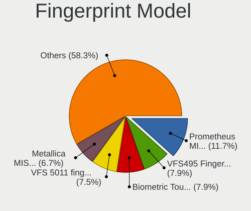

| Model                                                                      | Notebooks | Percent |
|----------------------------------------------------------------------------|-----------|---------|
| Synaptics Prometheus MIS Touch Fingerprint Reader                          | 28        | 11.67%  |
| Validity Sensors VFS495 Fingerprint Reader                                 | 19        | 7.92%   |
| Upek Biometric Touchchip/Touchstrip Fingerprint Sensor                     | 19        | 7.92%   |
| Validity Sensors VFS 5011 fingerprint sensor                               | 18        | 7.5%    |
| Synaptics Metallica MIS Touch Fingerprint Reader                           | 16        | 6.67%   |
| Validity Sensors Synaptics WBDI                                            | 11        | 4.58%   |
| Synaptics Prometheus Fingerprint Reader                                    | 11        | 4.58%   |
| Validity Sensors VFS7500 Touch Fingerprint Sensor                          | 9         | 3.75%   |
| Validity Sensors VFS491                                                    | 8         | 3.33%   |
| Synaptics UWP WBDI Device                                                  | 8         | 3.33%   |
| Synaptics Fingerprint reader [HP G6]                                       | 8         | 3.33%   |
| Realtek USB2.0 Finger Print Bridge FocalTech Fingerprint Device            | 7         | 2.92%   |
| Validity Sensors VFS5011 Fingerprint Reader                                | 6         | 2.5%    |
| Validity Sensors VFS471 Fingerprint Reader                                 | 6         | 2.5%    |
| Synaptics FS7604 Touch Fingerprint Sensor with PurePrint                   | 6         | 2.5%    |
| Shenzhen Goodix  FingerPrint Device                                        | 6         | 2.5%    |
| Shenzhen Goodix FingerPrint                                                | 6         | 2.5%    |
| Elan ELAN:Fingerprint                                                      | 6         | 2.5%    |
| Validity Sensors Synaptics VFS7552 Touch Fingerprint Sensor with PurePrint | 5         | 2.08%   |
| LighTuning EgisTec Touch Fingerprint Sensor                                | 5         | 2.08%   |
| Shenzhen Goodix Fingerprint Reader                                         | 4         | 1.67%   |
| Validity Sensors VFS451 Fingerprint Reader                                 | 3         | 1.25%   |
| Synaptics WBDI                                                             | 3         | 1.25%   |
| Samsung Fingerprint Sensor Device - 730B                                   | 3         | 1.25%   |
| AuthenTec AES2810                                                          | 3         | 1.25%   |
| Synaptics  FS7604 Touch Fingerprint Sensor with PurePrint                  | 2         | 0.83%   |
| Synaptics Metallica MOH Touch Fingerprint Reader                           | 2         | 0.83%   |
| Validity Sensors VFS301 Fingerprint Reader                                 | 1         | 0.42%   |
| Validity Sensors VFS Fingerprint sensor                                    | 1         | 0.42%   |
| Validity Sensors Synaptics VFS7552 Touch Fingerprint Sensor                | 1         | 0.42%   |
| Validity Sensors Fingerprint scanner                                       | 1         | 0.42%   |
| Upek TCS5B Fingerprint sensor                                              | 1         | 0.42%   |
| Synaptics WBDI Fingerprint Reader USB 086                                  | 1         | 0.42%   |
| STMicroelectronics Fingerprint Reader                                      | 1         | 0.42%   |
| LighTuning Fingerprint Reader                                              | 1         | 0.42%   |
| Elan fingerprint sensor [FeinTech FPS00200]                                | 1         | 0.42%   |
| AuthenTec AES2501 Fingerprint Sensor                                       | 1         | 0.42%   |
| AuthenTec AES1600                                                          | 1         | 0.42%   |
| Unknown                                                                    | 1         | 0.42%   |

Chipcard Vendor
---------------

Chipcard module vendors

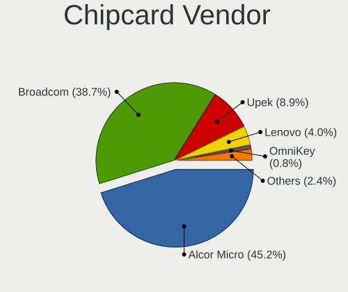

| Vendor                | Notebooks | Percent |
|-----------------------|-----------|---------|
| Alcor Micro           | 56        | 45.16%  |
| Broadcom              | 48        | 38.71%  |
| Upek                  | 11        | 8.87%   |
| Lenovo                | 5         | 4.03%   |
| OmniKey               | 1         | 0.81%   |
| O2 Micro              | 1         | 0.81%   |
| Hewlett-Packard       | 1         | 0.81%   |
| Gemalto (was Gemplus) | 1         | 0.81%   |

Chipcard Model
--------------

Chipcard module models

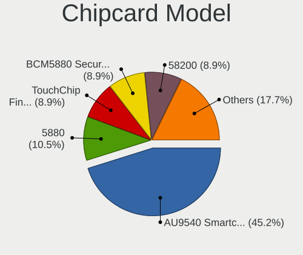

| Model                                                                        | Notebooks | Percent |
|------------------------------------------------------------------------------|-----------|---------|
| Alcor Micro AU9540 Smartcard Reader                                          | 56        | 45.16%  |
| Broadcom 5880                                                                | 13        | 10.48%  |
| Upek TouchChip Fingerprint Coprocessor (WBF advanced mode)                   | 11        | 8.87%   |
| Broadcom BCM5880 Secure Applications Processor with fingerprint swipe sensor | 11        | 8.87%   |
| Broadcom 58200                                                               | 11        | 8.87%   |
| Broadcom BCM5880 Secure Applications Processor                               | 8         | 6.45%   |
| Lenovo Integrated Smart Card Reader                                          | 5         | 4.03%   |
| Broadcom BCM58200 ControlVault 3 (FingerPrint sensor + Contacted SmartCard)  | 5         | 4.03%   |
| OmniKey CardMan 3021 / 3121                                                  | 1         | 0.81%   |
| O2 Micro OZ776 CCID Smartcard Reader                                         | 1         | 0.81%   |
| Hewlett-Packard SC Keyboard - Apollo (Liteon)                                | 1         | 0.81%   |
| Gemalto (was Gemplus) Compact Smart Card Reader Writer                       | 1         | 0.81%   |

Unsupported
-----------

Unsupported Devices
-------------------

Total unsupported devices on board

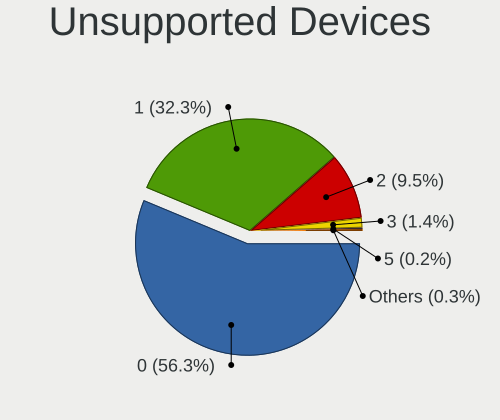

| Total | Notebooks | Percent |
|-------|-----------|---------|
| 0     | 596       | 56.28%  |
| 1     | 342       | 32.29%  |
| 2     | 101       | 9.54%   |
| 3     | 15        | 1.42%   |
| 5     | 2         | 0.19%   |
| 7     | 1         | 0.09%   |
| 6     | 1         | 0.09%   |
| 4     | 1         | 0.09%   |

Unsupported Device Types
------------------------

Types of unsupported devices

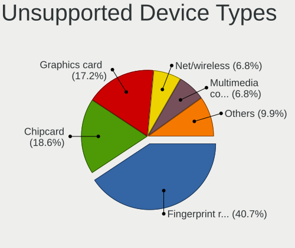

| Type                     | Notebooks | Percent |
|--------------------------|-----------|---------|
| Fingerprint reader       | 239       | 40.72%  |
| Chipcard                 | 109       | 18.57%  |
| Graphics card            | 101       | 17.21%  |
| Net/wireless             | 40        | 6.81%   |
| Multimedia controller    | 40        | 6.81%   |
| Camera                   | 19        | 3.24%   |
| Card reader              | 10        | 1.7%    |
| Storage                  | 7         | 1.19%   |
| Bluetooth                | 7         | 1.19%   |
| Communication controller | 6         | 1.02%   |
| Sound                    | 4         | 0.68%   |
| Net/ethernet             | 3         | 0.51%   |
| Modem                    | 2         | 0.34%   |

