Linux in Norway - Tested Hardware & Statistics (Notebooks)
----------------------------------------------------------

A project to collect tested hardware configurations for Linux in Norway.

Anyone can contribute to this report by the [hw-probe](https://github.com/linuxhw/hw-probe) tool:

    sudo -E hw-probe -all -upload

Please contribute! Especially if your hardware is rare.

Contents
--------

* [ Test Cases ](#test-cases)

* [ System ](#system)
  - [ OS                       ](#os)
  - [ OS Family                ](#os-family)
  - [ Kernel                   ](#kernel)
  - [ Kernel Family            ](#kernel-family)
  - [ Kernel Major Ver.        ](#kernel-major-ver)
  - [ Arch                     ](#arch)
  - [ DE                       ](#de)
  - [ Display Server           ](#display-server)
  - [ Display Manager          ](#display-manager)
  - [ OS Lang                  ](#os-lang)
  - [ Boot Mode                ](#boot-mode)
  - [ Filesystem               ](#filesystem)
  - [ Part. scheme             ](#part-scheme)
  - [ Dual Boot with Linux/BSD ](#dual-boot-with-linuxbsd)
  - [ Dual Boot (Win)          ](#dual-boot-win)

* [ Board ](#board)
  - [ Vendor                   ](#vendor)
  - [ Model                    ](#model)
  - [ Model Family             ](#model-family)
  - [ MFG Year                 ](#mfg-year)
  - [ Form Factor              ](#form-factor)
  - [ Secure Boot              ](#secure-boot)
  - [ Coreboot                 ](#coreboot)
  - [ RAM Size                 ](#ram-size)
  - [ RAM Used                 ](#ram-used)
  - [ Total Drives             ](#total-drives)
  - [ Has CD-ROM               ](#has-cd-rom)
  - [ Has Ethernet             ](#has-ethernet)
  - [ Has WiFi                 ](#has-wifi)
  - [ Has Bluetooth            ](#has-bluetooth)

* [ Location ](#location)
  - [ Country                  ](#country)
  - [ City                     ](#city)

* [ Drives ](#drives)
  - [ Drive Vendor             ](#drive-vendor)
  - [ Drive Model              ](#drive-model)
  - [ HDD Vendor               ](#hdd-vendor)
  - [ SSD Vendor               ](#ssd-vendor)
  - [ Drive Kind               ](#drive-kind)
  - [ Drive Connector          ](#drive-connector)
  - [ Drive Size               ](#drive-size)
  - [ Space Total              ](#space-total)
  - [ Space Used               ](#space-used)
  - [ Malfunc. Drives          ](#malfunc-drives)
  - [ Malfunc. Drive Vendor    ](#malfunc-drive-vendor)
  - [ Malfunc. HDD Vendor      ](#malfunc-hdd-vendor)
  - [ Malfunc. Drive Kind      ](#malfunc-drive-kind)
  - [ Failed Drives            ](#failed-drives)
  - [ Failed Drive Vendor      ](#failed-drive-vendor)
  - [ Drive Status             ](#drive-status)

* [ Storage controller ](#storage-controller)
  - [ Storage Vendor           ](#storage-vendor)
  - [ Storage Model            ](#storage-model)
  - [ Storage Kind             ](#storage-kind)

* [ Processor ](#processor)
  - [ CPU Vendor               ](#cpu-vendor)
  - [ CPU Model                ](#cpu-model)
  - [ CPU Model Family         ](#cpu-model-family)
  - [ CPU Cores                ](#cpu-cores)
  - [ CPU Sockets              ](#cpu-sockets)
  - [ CPU Threads              ](#cpu-threads)
  - [ CPU Op-Modes             ](#cpu-op-modes)
  - [ CPU Microcode            ](#cpu-microcode)
  - [ CPU Microarch            ](#cpu-microarch)

* [ Graphics ](#graphics)
  - [ GPU Vendor               ](#gpu-vendor)
  - [ GPU Model                ](#gpu-model)
  - [ GPU Combo                ](#gpu-combo)
  - [ GPU Driver               ](#gpu-driver)
  - [ GPU Memory               ](#gpu-memory)

* [ Monitor ](#monitor)
  - [ Monitor Vendor           ](#monitor-vendor)
  - [ Monitor Model            ](#monitor-model)
  - [ Monitor Resolution       ](#monitor-resolution)
  - [ Monitor Diagonal         ](#monitor-diagonal)
  - [ Monitor Width            ](#monitor-width)
  - [ Aspect Ratio             ](#aspect-ratio)
  - [ Monitor Area             ](#monitor-area)
  - [ Pixel Density            ](#pixel-density)
  - [ Multiple Monitors        ](#multiple-monitors)

* [ Network ](#network)
  - [ Net Controller Vendor    ](#net-controller-vendor)
  - [ Net Controller Model     ](#net-controller-model)
  - [ Wireless Vendor          ](#wireless-vendor)
  - [ Wireless Model           ](#wireless-model)
  - [ Ethernet Vendor          ](#ethernet-vendor)
  - [ Ethernet Model           ](#ethernet-model)
  - [ Net Controller Kind      ](#net-controller-kind)
  - [ Used Controller          ](#used-controller)
  - [ NICs                     ](#nics)
  - [ IPv6                     ](#ipv6)

* [ Bluetooth ](#bluetooth)
  - [ Bluetooth Vendor         ](#bluetooth-vendor)
  - [ Bluetooth Model          ](#bluetooth-model)

* [ Sound ](#sound)
  - [ Sound Vendor             ](#sound-vendor)
  - [ Sound Model              ](#sound-model)

* [ Memory ](#memory)
  - [ Memory Vendor            ](#memory-vendor)
  - [ Memory Model             ](#memory-model)
  - [ Memory Kind              ](#memory-kind)
  - [ Memory Form Factor       ](#memory-form-factor)
  - [ Memory Size              ](#memory-size)
  - [ Memory Speed             ](#memory-speed)

* [ Printers & scanners ](#printers--scanners)
  - [ Printer Vendor           ](#printer-vendor)
  - [ Printer Model            ](#printer-model)
  - [ Scanner Vendor           ](#scanner-vendor)
  - [ Scanner Model            ](#scanner-model)

* [ Camera ](#camera)
  - [ Camera Vendor            ](#camera-vendor)
  - [ Camera Model             ](#camera-model)

* [ Security ](#security)
  - [ Fingerprint Vendor       ](#fingerprint-vendor)
  - [ Fingerprint Model        ](#fingerprint-model)
  - [ Chipcard Vendor          ](#chipcard-vendor)
  - [ Chipcard Model           ](#chipcard-model)

* [ Unsupported ](#unsupported)
  - [ Unsupported Devices      ](#unsupported-devices)
  - [ Unsupported Device Types ](#unsupported-device-types)

Test Cases
----------

Total: 1141

| Vendor        | Model                       | Probe                                                      | Date         |
|---------------|-----------------------------|------------------------------------------------------------|--------------|
| Panasonic     | CF-53SAWZYMN                | [15a322275f](https://linux-hardware.org/?probe=15a322275f) | May 08, 2024 |
| Lenovo        | IdeaPad S510p 20298         | [b941b8d062](https://linux-hardware.org/?probe=b941b8d062) | May 07, 2024 |
| Lenovo        | Yoga Slim 7 14ARE05 82A2    | [c7a39f14e7](https://linux-hardware.org/?probe=c7a39f14e7) | May 03, 2024 |
| HP            | ProBook 430 G8 Notebook ... | [67f5f847c9](https://linux-hardware.org/?probe=67f5f847c9) | May 03, 2024 |
| HP            | EliteBook 8570w             | [050889a119](https://linux-hardware.org/?probe=050889a119) | May 03, 2024 |
| HP            | EliteBook 8570w             | [6b53737811](https://linux-hardware.org/?probe=6b53737811) | May 03, 2024 |
| Lenovo        | ThinkPad T480 20L60034MX    | [eec0c4ee95](https://linux-hardware.org/?probe=eec0c4ee95) | May 02, 2024 |
| Lenovo        | ThinkPad T470 W10DG 20JN... | [def7a0898e](https://linux-hardware.org/?probe=def7a0898e) | May 02, 2024 |
| IGEL Techn... | M350C                       | [c63a48250c](https://linux-hardware.org/?probe=c63a48250c) | May 01, 2024 |
| Lenovo        | ThinkPad T510 43494JG       | [fe8480c6c4](https://linux-hardware.org/?probe=fe8480c6c4) | Apr 30, 2024 |
| HP            | ProBook 440 G6              | [3cf105c072](https://linux-hardware.org/?probe=3cf105c072) | Apr 26, 2024 |
| Lenovo        | Yoga Slim 7 Carbon 14ACN... | [3f76329bd6](https://linux-hardware.org/?probe=3f76329bd6) | Apr 23, 2024 |
| Lenovo        | ThinkPad P1 Gen 4i 20Y30... | [5d84a72fcf](https://linux-hardware.org/?probe=5d84a72fcf) | Apr 22, 2024 |
| Lenovo        | ThinkPad X1 Carbon Gen 1... | [994aae0769](https://linux-hardware.org/?probe=994aae0769) | Apr 21, 2024 |
| Lenovo        | ThinkPad X1 Carbon Gen 1... | [e26cecc411](https://linux-hardware.org/?probe=e26cecc411) | Apr 21, 2024 |
| Samsung       | 950XDB/951XDB/950XDY        | [252a0c4e05](https://linux-hardware.org/?probe=252a0c4e05) | Apr 21, 2024 |
| Lenovo        | ThinkPad T14 Gen 1 20UD0... | [0231457347](https://linux-hardware.org/?probe=0231457347) | Apr 21, 2024 |
| Acer          | Enduro EUN314-51W           | [7a57f25e0e](https://linux-hardware.org/?probe=7a57f25e0e) | Apr 20, 2024 |
| Lenovo        | ThinkPad T520 42433ZG       | [d2899d8de6](https://linux-hardware.org/?probe=d2899d8de6) | Apr 19, 2024 |
| Apple         | MacBookAir6,1               | [08ca3d5ea0](https://linux-hardware.org/?probe=08ca3d5ea0) | Apr 19, 2024 |
| Clevo         | P170EM                      | [62fe8276aa](https://linux-hardware.org/?probe=62fe8276aa) | Apr 18, 2024 |
| Clevo         | P170EM                      | [46daa154fe](https://linux-hardware.org/?probe=46daa154fe) | Apr 18, 2024 |
| Lenovo        | ThinkPad P14s Gen 2a 21A... | [0cd0c2f953](https://linux-hardware.org/?probe=0cd0c2f953) | Apr 17, 2024 |
| Google        | Morphius                    | [422dcd7238](https://linux-hardware.org/?probe=422dcd7238) | Apr 14, 2024 |
| Google        | Morphius                    | [97da05767b](https://linux-hardware.org/?probe=97da05767b) | Apr 13, 2024 |
| Acer          | Enduro EUN314-51W           | [fa7d224ee9](https://linux-hardware.org/?probe=fa7d224ee9) | Apr 11, 2024 |
| Lenovo        | Yoga Slim 6 14APU8 82X3     | [5ec749c52a](https://linux-hardware.org/?probe=5ec749c52a) | Apr 08, 2024 |
| Dell          | Latitude E7240              | [a323cf8e2e](https://linux-hardware.org/?probe=a323cf8e2e) | Apr 08, 2024 |
| MSI           | Katana GF76 11SC            | [937a23fec5](https://linux-hardware.org/?probe=937a23fec5) | Apr 08, 2024 |
| Lenovo        | ThinkPad W530 24476F1       | [14d694fe39](https://linux-hardware.org/?probe=14d694fe39) | Apr 05, 2024 |
| HP            | ProBook 450 G2              | [1753d19bc6](https://linux-hardware.org/?probe=1753d19bc6) | Mar 30, 2024 |
| Notebook      | NJx0AU                      | [93425cb488](https://linux-hardware.org/?probe=93425cb488) | Mar 29, 2024 |
| ASUSTek       | G53SX                       | [6d2eeefcd5](https://linux-hardware.org/?probe=6d2eeefcd5) | Mar 27, 2024 |
| Lenovo        | ThinkPad X280 20KES6M100    | [07c23b72ec](https://linux-hardware.org/?probe=07c23b72ec) | Mar 25, 2024 |
| Lenovo        | IdeaPad Gaming 3 15ACH6 ... | [8ee75a3460](https://linux-hardware.org/?probe=8ee75a3460) | Mar 23, 2024 |
| Dell          | Latitude E7240              | [a295e64d94](https://linux-hardware.org/?probe=a295e64d94) | Mar 21, 2024 |
| TUXEDO        | Polaris Intel Gen3 (TGL)    | [69a6ff7b62](https://linux-hardware.org/?probe=69a6ff7b62) | Mar 18, 2024 |
| TUXEDO        | Polaris Intel Gen3 (TGL)    | [f58b97df65](https://linux-hardware.org/?probe=f58b97df65) | Mar 18, 2024 |
| ASUSTek       | ROG Zephyrus G15 GA502IV... | [8406675c12](https://linux-hardware.org/?probe=8406675c12) | Mar 11, 2024 |
| ASUSTek       | ROG Zephyrus G15 GA502IV... | [dac802bc03](https://linux-hardware.org/?probe=dac802bc03) | Mar 11, 2024 |
| MSI           | GP70 2QF                    | [0b3d8c1b0e](https://linux-hardware.org/?probe=0b3d8c1b0e) | Mar 10, 2024 |
| Dell          | Latitude 7280               | [1149975fb9](https://linux-hardware.org/?probe=1149975fb9) | Mar 08, 2024 |
| Toshiba       | Satellite C50D-A-133        | [65ea7ee4de](https://linux-hardware.org/?probe=65ea7ee4de) | Mar 07, 2024 |
| Apple         | MacBookPro11,2              | [3c91f66fcd](https://linux-hardware.org/?probe=3c91f66fcd) | Mar 04, 2024 |
| Cepter        | N530-01                     | [00dd983443](https://linux-hardware.org/?probe=00dd983443) | Mar 03, 2024 |
| Acer          | Aspire VN7-592G             | [dd6617c3d7](https://linux-hardware.org/?probe=dd6617c3d7) | Feb 23, 2024 |
| Lenovo        | ThinkPad E16 Gen 1 21JT0... | [a87320ad88](https://linux-hardware.org/?probe=a87320ad88) | Feb 22, 2024 |
| Dell          | XPS 13 9370                 | [086a1782c7](https://linux-hardware.org/?probe=086a1782c7) | Feb 22, 2024 |
| Apple         | MacBookPro9,2               | [a308cdb145](https://linux-hardware.org/?probe=a308cdb145) | Feb 20, 2024 |
| MSI           | Katana GF76 11SC            | [255453e6e0](https://linux-hardware.org/?probe=255453e6e0) | Feb 18, 2024 |
| HP            | ProBook 430 G2              | [a4b236fd41](https://linux-hardware.org/?probe=a4b236fd41) | Feb 17, 2024 |
| Acer          | Aspire V5-552               | [e442dc1b93](https://linux-hardware.org/?probe=e442dc1b93) | Feb 13, 2024 |
| Acer          | Swift SF14-71T              | [be5a1a32c8](https://linux-hardware.org/?probe=be5a1a32c8) | Feb 13, 2024 |
| HP            | EliteBook 840 G5            | [ba2e17a0f0](https://linux-hardware.org/?probe=ba2e17a0f0) | Feb 11, 2024 |
| HP            | ProBook 430 G1              | [191e61f6f6](https://linux-hardware.org/?probe=191e61f6f6) | Feb 09, 2024 |
| Dell          | Inspiron 7559               | [9f3df9cfa3](https://linux-hardware.org/?probe=9f3df9cfa3) | Feb 09, 2024 |
| HP            | ProBook 6450b               | [423b15dea2](https://linux-hardware.org/?probe=423b15dea2) | Feb 09, 2024 |
| ASUSTek       | ROG Strix G712LV_G712LV     | [9a088ac635](https://linux-hardware.org/?probe=9a088ac635) | Feb 08, 2024 |
| ASUSTek       | ROG Strix G712LV_G712LV     | [24923511bf](https://linux-hardware.org/?probe=24923511bf) | Feb 08, 2024 |
| HP            | ProBook 450 G2              | [7a2fbcd83a](https://linux-hardware.org/?probe=7a2fbcd83a) | Feb 08, 2024 |
| HP            | ProBook 450 G2              | [77995292b4](https://linux-hardware.org/?probe=77995292b4) | Feb 08, 2024 |
| HP            | ProBook 440 G5              | [d4ab212d03](https://linux-hardware.org/?probe=d4ab212d03) | Feb 06, 2024 |
| Lenovo        | IdeaPad 5 15ARE05 81YQ      | [f6f21ad952](https://linux-hardware.org/?probe=f6f21ad952) | Feb 04, 2024 |
| HP            | ProBook 650 G1              | [26cf710a63](https://linux-hardware.org/?probe=26cf710a63) | Jan 27, 2024 |
| ASUSTek       | VivoBook_ASUSLaptop K360... | [5948bdd871](https://linux-hardware.org/?probe=5948bdd871) | Jan 25, 2024 |
| MSI           | P65 Creator 9SE             | [863ad9098e](https://linux-hardware.org/?probe=863ad9098e) | Jan 24, 2024 |
| HP            | Elite Dragonfly 13.5 inc... | [e78a5c9804](https://linux-hardware.org/?probe=e78a5c9804) | Jan 24, 2024 |
| Lenovo        | ThinkPad T490 20N3SA9100    | [02efe357c0](https://linux-hardware.org/?probe=02efe357c0) | Jan 21, 2024 |
| HP            | EliteBook 830 G6            | [7f5c817c53](https://linux-hardware.org/?probe=7f5c817c53) | Jan 21, 2024 |
| Lenovo        | ThinkPad X1 Carbon Gen 1... | [50d318d640](https://linux-hardware.org/?probe=50d318d640) | Jan 18, 2024 |
| HP            | ZBook 14 G2                 | [e2c1850473](https://linux-hardware.org/?probe=e2c1850473) | Jan 18, 2024 |
| Samsung       | R780                        | [b3adbfa6ae](https://linux-hardware.org/?probe=b3adbfa6ae) | Jan 17, 2024 |
| Lenovo        | ThinkPad T460p 20FXS1G70... | [519458acdc](https://linux-hardware.org/?probe=519458acdc) | Jan 15, 2024 |
| Acer          | Aspire V5-551G              | [699c652ddd](https://linux-hardware.org/?probe=699c652ddd) | Jan 12, 2024 |
| Acer          | Aspire V5-551G              | [8c23e0fefc](https://linux-hardware.org/?probe=8c23e0fefc) | Jan 12, 2024 |
| HP            | Elite Dragonfly 13.5 inc... | [1b8551739b](https://linux-hardware.org/?probe=1b8551739b) | Jan 12, 2024 |
| Lenovo        | Legion Pro 7 16IRX8H 82W... | [9b78bbc950](https://linux-hardware.org/?probe=9b78bbc950) | Jan 11, 2024 |
| Dell          | Latitude 7420               | [03a0ad44ae](https://linux-hardware.org/?probe=03a0ad44ae) | Jan 09, 2024 |
| MSI           | Katana GF76 11SC            | [e85c0b091c](https://linux-hardware.org/?probe=e85c0b091c) | Jan 08, 2024 |
| MSI           | P65 Creator 9SE             | [33a2ceb954](https://linux-hardware.org/?probe=33a2ceb954) | Jan 08, 2024 |
| HP            | ZBook 14 G2                 | [a5d8d9ecc9](https://linux-hardware.org/?probe=a5d8d9ecc9) | Jan 06, 2024 |
| Lenovo        | ThinkBook 13s G2 ITL 20V... | [329f1f3fa2](https://linux-hardware.org/?probe=329f1f3fa2) | Jan 05, 2024 |
| Notebook      | X170KM-G                    | [731411ae4d](https://linux-hardware.org/?probe=731411ae4d) | Jan 02, 2024 |
| Lenovo        | Legion Pro 5 16ARX8 82WM    | [67ef36b749](https://linux-hardware.org/?probe=67ef36b749) | Jan 01, 2024 |
| MSI           | P65 Creator 9SE             | [2e5c1a6b06](https://linux-hardware.org/?probe=2e5c1a6b06) | Jan 01, 2024 |
| HP            | Elite Dragonfly 13.5 inc... | [bc788ac36f](https://linux-hardware.org/?probe=bc788ac36f) | Dec 31, 2023 |
| HP            | ZBook 14 G2                 | [0d092c7ece](https://linux-hardware.org/?probe=0d092c7ece) | Dec 29, 2023 |
| HP            | EliteBook 820 G3            | [42985f8c13](https://linux-hardware.org/?probe=42985f8c13) | Dec 28, 2023 |
| HP            | Laptop 14-ck0xxx            | [6be155ee0d](https://linux-hardware.org/?probe=6be155ee0d) | Dec 27, 2023 |
| Acer          | Nitro AN515-54              | [67492721ec](https://linux-hardware.org/?probe=67492721ec) | Dec 26, 2023 |
| Lenovo        | Legion Pro 5 16ARX8 82WM    | [6d8c495e90](https://linux-hardware.org/?probe=6d8c495e90) | Dec 23, 2023 |
| HP            | EliteBook 8460p             | [6ff6445717](https://linux-hardware.org/?probe=6ff6445717) | Dec 22, 2023 |
| Dell          | Latitude 5430               | [bce74a439e](https://linux-hardware.org/?probe=bce74a439e) | Dec 18, 2023 |
| ASUSTek       | VivoBook_ASUSLaptop K340... | [d34cfca6c8](https://linux-hardware.org/?probe=d34cfca6c8) | Dec 16, 2023 |
| Lenovo        | Legion Pro 7 16IRX8H 82W... | [41ff1cd0ca](https://linux-hardware.org/?probe=41ff1cd0ca) | Dec 12, 2023 |
| Dell          | Latitude 5400               | [6e887e1547](https://linux-hardware.org/?probe=6e887e1547) | Dec 11, 2023 |
| Google        | Electro                     | [503645df79](https://linux-hardware.org/?probe=503645df79) | Dec 11, 2023 |
| ASUSTek       | G53SX                       | [6d01f19f82](https://linux-hardware.org/?probe=6d01f19f82) | Dec 08, 2023 |
| HUAWEI        | KLVC-WXX9                   | [cd7c131bf1](https://linux-hardware.org/?probe=cd7c131bf1) | Dec 07, 2023 |
| Acer          | Nitro AN517-41              | [a1b25ec823](https://linux-hardware.org/?probe=a1b25ec823) | Dec 04, 2023 |
| HP            | ProBook 4330s               | [48a060af86](https://linux-hardware.org/?probe=48a060af86) | Dec 04, 2023 |
| Lenovo        | ThinkPad P51 20HH001RMX     | [e9b9374641](https://linux-hardware.org/?probe=e9b9374641) | Dec 02, 2023 |
| Dell          | Latitude E7240              | [e5ac912c4c](https://linux-hardware.org/?probe=e5ac912c4c) | Dec 02, 2023 |
| HP            | Pavilion dv7                | [dc015f1023](https://linux-hardware.org/?probe=dc015f1023) | Dec 01, 2023 |
| Lenovo        | ThinkPad P51 20HJS02H00     | [deafec47f7](https://linux-hardware.org/?probe=deafec47f7) | Dec 01, 2023 |
| ASUSTek       | Zenbook UX6404VI_UX6404V... | [e52dad2488](https://linux-hardware.org/?probe=e52dad2488) | Nov 30, 2023 |
| ASUSTek       | VivoBook_ASUSLaptop K540... | [fc00682f42](https://linux-hardware.org/?probe=fc00682f42) | Nov 29, 2023 |
| Dell          | Latitude 7440               | [aa4dce8576](https://linux-hardware.org/?probe=aa4dce8576) | Nov 27, 2023 |
| Dell          | Latitude 3350               | [395158b705](https://linux-hardware.org/?probe=395158b705) | Nov 27, 2023 |
| Lenovo        | ThinkPad P51 20HJS02H00     | [440b3f0798](https://linux-hardware.org/?probe=440b3f0798) | Nov 25, 2023 |
| Lenovo        | ThinkPad L14 Gen 2 20X2S... | [4515ea6be6](https://linux-hardware.org/?probe=4515ea6be6) | Nov 24, 2023 |
| Dell          | Latitude 7440               | [c05ecee673](https://linux-hardware.org/?probe=c05ecee673) | Nov 23, 2023 |
| Lenovo        | Z50-75 80EC                 | [8470d1677a](https://linux-hardware.org/?probe=8470d1677a) | Nov 22, 2023 |
| Lenovo        | ThinkPad X1 Carbon Gen 9... | [c4ade3f05e](https://linux-hardware.org/?probe=c4ade3f05e) | Nov 22, 2023 |
| Lenovo        | ThinkPad X1 Carbon Gen 9... | [ead4849578](https://linux-hardware.org/?probe=ead4849578) | Nov 22, 2023 |
| Dell          | Latitude 5400               | [a2994234ca](https://linux-hardware.org/?probe=a2994234ca) | Nov 21, 2023 |
| Lenovo        | ThinkPad P51 20HJS02H00     | [9c025dacfd](https://linux-hardware.org/?probe=9c025dacfd) | Nov 19, 2023 |
| MSI           | Cyborg 15 A12VF             | [fc41df67a4](https://linux-hardware.org/?probe=fc41df67a4) | Nov 19, 2023 |
| Lenovo        | ThinkBook 16p Gen 2 20YM    | [204303d116](https://linux-hardware.org/?probe=204303d116) | Nov 17, 2023 |
| Lenovo        | Yoga Slim 7 14ARE05 82A2    | [c8af1c096b](https://linux-hardware.org/?probe=c8af1c096b) | Nov 17, 2023 |
| Lenovo        | Yoga Slim 7 Pro 14IAH7 8... | [75009bf512](https://linux-hardware.org/?probe=75009bf512) | Nov 17, 2023 |
| Lenovo        | ThinkPad T15 Gen 2i 20W4... | [362ad8efa4](https://linux-hardware.org/?probe=362ad8efa4) | Nov 16, 2023 |
| MSI           | Cyborg 15 A12VF             | [3cd966cd6a](https://linux-hardware.org/?probe=3cd966cd6a) | Nov 14, 2023 |
| Acer          | Aspire A515-57              | [7b7cf69882](https://linux-hardware.org/?probe=7b7cf69882) | Nov 14, 2023 |
| Acer          | Aspire A515-57              | [bb0f5fe1e2](https://linux-hardware.org/?probe=bb0f5fe1e2) | Nov 14, 2023 |
| Dell          | XPS 15 9510                 | [d660dfe17a](https://linux-hardware.org/?probe=d660dfe17a) | Nov 09, 2023 |
| Lenovo        | ThinkPad P51 20HJS02H00     | [4345e63ae2](https://linux-hardware.org/?probe=4345e63ae2) | Nov 08, 2023 |
| MSI           | Cyborg 15 A12VF             | [be39067306](https://linux-hardware.org/?probe=be39067306) | Nov 05, 2023 |
| ASUSTek       | G53SX                       | [7834b537a1](https://linux-hardware.org/?probe=7834b537a1) | Nov 05, 2023 |
| Lenovo        | Legion Pro 5 16ARX8 82WM    | [9ea1c674f9](https://linux-hardware.org/?probe=9ea1c674f9) | Nov 03, 2023 |
| Lenovo        | Legion 5 Pro 16ARH7H 82R... | [26bc5f025c](https://linux-hardware.org/?probe=26bc5f025c) | Nov 02, 2023 |
| HP            | ProBook 6450b               | [75ad2cf5f8](https://linux-hardware.org/?probe=75ad2cf5f8) | Nov 02, 2023 |
| Lenovo        | ThinkPad L460 20FVS12A00    | [fab360eece](https://linux-hardware.org/?probe=fab360eece) | Nov 02, 2023 |
| Lenovo        | ThinkPad L460 20FVS12A00    | [a2273dea0e](https://linux-hardware.org/?probe=a2273dea0e) | Nov 01, 2023 |
| Dell          | Latitude 7430               | [3e9717ffe0](https://linux-hardware.org/?probe=3e9717ffe0) | Oct 31, 2023 |
| Lenovo        | IdeaPad Slim 3 14AMN8 82... | [3fe09c27c2](https://linux-hardware.org/?probe=3fe09c27c2) | Oct 29, 2023 |
| ASUSTek       | ZenBook UX431FA_UX431FA     | [8f56c1076b](https://linux-hardware.org/?probe=8f56c1076b) | Oct 28, 2023 |
| Lenovo        | IdeaPad Slim 3 14AMN8 82... | [0277411276](https://linux-hardware.org/?probe=0277411276) | Oct 28, 2023 |
| Dell          | Latitude 7430               | [e9cfada6a4](https://linux-hardware.org/?probe=e9cfada6a4) | Oct 26, 2023 |
| HP            | Pavilion Notebook           | [4f269eeaa7](https://linux-hardware.org/?probe=4f269eeaa7) | Oct 23, 2023 |
| Dell          | Latitude E7240              | [6fead70e93](https://linux-hardware.org/?probe=6fead70e93) | Oct 23, 2023 |
| Lenovo        | Y50-70 20378                | [6f65dcd448](https://linux-hardware.org/?probe=6f65dcd448) | Oct 23, 2023 |
| ASUSTek       | X550JX                      | [b1a9053ac6](https://linux-hardware.org/?probe=b1a9053ac6) | Oct 22, 2023 |
| ASUSTek       | G53SX                       | [d19756d24b](https://linux-hardware.org/?probe=d19756d24b) | Oct 22, 2023 |
| MSI           | Cyborg 15 A12VF             | [b1a3bf1a75](https://linux-hardware.org/?probe=b1a3bf1a75) | Oct 21, 2023 |
| MSI           | Cyborg 15 A12VF             | [7fab57f39a](https://linux-hardware.org/?probe=7fab57f39a) | Oct 19, 2023 |
| ASUSTek       | VivoBook_ASUSLaptop K340... | [9d7f8ee0f1](https://linux-hardware.org/?probe=9d7f8ee0f1) | Oct 17, 2023 |
| Lenovo        | ThinkPad T480 20L50101US    | [c6913c1b75](https://linux-hardware.org/?probe=c6913c1b75) | Oct 16, 2023 |
| Lenovo        | IdeaPad 5 15ARE05 81YQ      | [a2d4463dfc](https://linux-hardware.org/?probe=a2d4463dfc) | Oct 12, 2023 |
| HP            | ProBook 6450b               | [70e33902c1](https://linux-hardware.org/?probe=70e33902c1) | Oct 07, 2023 |
| HP            | ProBook 6450b               | [ddd8417a28](https://linux-hardware.org/?probe=ddd8417a28) | Oct 07, 2023 |
| Dell          | Precision 5530              | [38fdcea75f](https://linux-hardware.org/?probe=38fdcea75f) | Oct 06, 2023 |
| ASUSTek       | G750JH                      | [66396378dd](https://linux-hardware.org/?probe=66396378dd) | Oct 06, 2023 |
| Dell          | Latitude E6540              | [78c4b71781](https://linux-hardware.org/?probe=78c4b71781) | Oct 04, 2023 |
| Lenovo        | ThinkPad X1 Carbon Gen 1... | [82820de211](https://linux-hardware.org/?probe=82820de211) | Oct 03, 2023 |
| Dell          | Latitude E6540              | [290b4bd42e](https://linux-hardware.org/?probe=290b4bd42e) | Oct 03, 2023 |
| Lenovo        | ThinkPad L430 24662W2       | [21ee2a6e8f](https://linux-hardware.org/?probe=21ee2a6e8f) | Oct 03, 2023 |
| Lenovo        | ThinkPad L460 20FVS12A00    | [ad3d8f3522](https://linux-hardware.org/?probe=ad3d8f3522) | Oct 02, 2023 |
| HP            | EliteBook 650 15.6 inch ... | [75667a0116](https://linux-hardware.org/?probe=75667a0116) | Oct 02, 2023 |
| HP            | EliteBook 640 14 inch G9... | [336d3c6536](https://linux-hardware.org/?probe=336d3c6536) | Oct 02, 2023 |
| HP            | EliteBook 640 14 inch G9... | [7144e87b6b](https://linux-hardware.org/?probe=7144e87b6b) | Oct 02, 2023 |
| ASUSTek       | G53SX                       | [21e6d88bd9](https://linux-hardware.org/?probe=21e6d88bd9) | Oct 02, 2023 |
| Dell          | XPS 13 9350                 | [42f7e22cf3](https://linux-hardware.org/?probe=42f7e22cf3) | Oct 02, 2023 |
| MSI           | Cyborg 15 A12VF             | [5f76307503](https://linux-hardware.org/?probe=5f76307503) | Oct 01, 2023 |
| Lenovo        | Legion Pro 5 16ARX8 82WM    | [83d91ea2fe](https://linux-hardware.org/?probe=83d91ea2fe) | Sep 30, 2023 |
| Lenovo        | Legion Pro 5 16ARX8 82WM    | [0fad85dfc9](https://linux-hardware.org/?probe=0fad85dfc9) | Sep 30, 2023 |
| Dell          | Latitude 5430               | [583aa8cf02](https://linux-hardware.org/?probe=583aa8cf02) | Sep 29, 2023 |
| Intel         | SharkBay Platform           | [2406bf1c0d](https://linux-hardware.org/?probe=2406bf1c0d) | Sep 29, 2023 |
| MSI           | Cyborg 15 A12VF             | [960cd34617](https://linux-hardware.org/?probe=960cd34617) | Sep 29, 2023 |
| Lenovo        | Yoga Slim 7 Carbon 14ACN... | [a5e7296c29](https://linux-hardware.org/?probe=a5e7296c29) | Sep 28, 2023 |
| ASUSTek       | ROG Strix G814JI_G814JI     | [2a507c567b](https://linux-hardware.org/?probe=2a507c567b) | Sep 28, 2023 |
| Lenovo        | ThinkPad X270 W10DG 20K5... | [ab332c2dcb](https://linux-hardware.org/?probe=ab332c2dcb) | Sep 25, 2023 |
| MSI           | Cyborg 15 A12VF             | [f934062b23](https://linux-hardware.org/?probe=f934062b23) | Sep 25, 2023 |
| MSI           | Cyborg 15 A12VF             | [7aa2ea2853](https://linux-hardware.org/?probe=7aa2ea2853) | Sep 24, 2023 |
| HP            | EliteBook 8470p             | [220a0f8733](https://linux-hardware.org/?probe=220a0f8733) | Sep 23, 2023 |
| Dell          | XPS 15 9530                 | [908d74fdc8](https://linux-hardware.org/?probe=908d74fdc8) | Sep 19, 2023 |
| Lenovo        | ThinkPad X1 Carbon Gen 1... | [987e4c193b](https://linux-hardware.org/?probe=987e4c193b) | Sep 19, 2023 |
| ASUSTek       | VivoBook_ASUSLaptop E410... | [1180346586](https://linux-hardware.org/?probe=1180346586) | Sep 19, 2023 |
| Lenovo        | ThinkPad T14s Gen 4 21F7... | [2c90700f4f](https://linux-hardware.org/?probe=2c90700f4f) | Sep 16, 2023 |
| Acer          | Predator PH317-53           | [13e8645c6c](https://linux-hardware.org/?probe=13e8645c6c) | Sep 16, 2023 |
| Acer          | Predator PH317-53           | [183adfb8b6](https://linux-hardware.org/?probe=183adfb8b6) | Sep 16, 2023 |
| Notebook      | NV4XMB,ME,MZ                | [35bc7480cb](https://linux-hardware.org/?probe=35bc7480cb) | Sep 15, 2023 |
| ASUSTek       | VivoBook_ASUSLaptop K340... | [de94d54f00](https://linux-hardware.org/?probe=de94d54f00) | Sep 15, 2023 |
| MSI           | Cyborg 15 A12VF             | [d1ef9fa580](https://linux-hardware.org/?probe=d1ef9fa580) | Sep 15, 2023 |
| Lenovo        | ThinkPad E14 20RA005MMX     | [d9d0c012b3](https://linux-hardware.org/?probe=d9d0c012b3) | Sep 13, 2023 |
| Lenovo        | ThinkPad X260 20F5S7QT00    | [8475dc74df](https://linux-hardware.org/?probe=8475dc74df) | Sep 09, 2023 |
| Apple         | MacBookPro11,2              | [83b997b3ab](https://linux-hardware.org/?probe=83b997b3ab) | Sep 09, 2023 |
| Lenovo        | ThinkPad X1 Carbon Gen 1... | [8c22ca23f2](https://linux-hardware.org/?probe=8c22ca23f2) | Sep 07, 2023 |
| Acer          | Swift SF314-51              | [7e7c32364d](https://linux-hardware.org/?probe=7e7c32364d) | Sep 06, 2023 |
| Panasonic     | CF-191HACHFN                | [2c3ca0bdcf](https://linux-hardware.org/?probe=2c3ca0bdcf) | Sep 06, 2023 |
| Star Labs     | StarBook                    | [ac568bfcd4](https://linux-hardware.org/?probe=ac568bfcd4) | Sep 03, 2023 |
| Dell          | XPS 15 9570                 | [9607f36921](https://linux-hardware.org/?probe=9607f36921) | Sep 03, 2023 |
| Dell          | Latitude 3540               | [e7d1d4f160](https://linux-hardware.org/?probe=e7d1d4f160) | Sep 03, 2023 |
| Dell          | XPS 15 9570                 | [72c5c271b6](https://linux-hardware.org/?probe=72c5c271b6) | Sep 03, 2023 |
| Lenovo        | IdeaPad 5 15ARE05 81YQ      | [19e076e3e1](https://linux-hardware.org/?probe=19e076e3e1) | Sep 01, 2023 |
| Google        | Galtic                      | [e9ccd3a286](https://linux-hardware.org/?probe=e9ccd3a286) | Sep 01, 2023 |
| Dell          | Latitude E7240              | [cb61859037](https://linux-hardware.org/?probe=cb61859037) | Aug 24, 2023 |
| HP            | 255 G8 Notebook PC          | [68c01672c3](https://linux-hardware.org/?probe=68c01672c3) | Aug 24, 2023 |
| Dell          | Precision M4700             | [9ec95d5a4d](https://linux-hardware.org/?probe=9ec95d5a4d) | Aug 21, 2023 |
| eMachines     | E520 V1.06                  | [bd63874856](https://linux-hardware.org/?probe=bd63874856) | Aug 20, 2023 |
| Dell          | Precision 5520              | [42587aac96](https://linux-hardware.org/?probe=42587aac96) | Aug 20, 2023 |
| Dell          | Precision 5520              | [bec735d800](https://linux-hardware.org/?probe=bec735d800) | Aug 20, 2023 |
| Lenovo        | ThinkPad L430 24662W2       | [10b7d76c38](https://linux-hardware.org/?probe=10b7d76c38) | Aug 20, 2023 |
| Lenovo        | V320-17ISK 81B6             | [cc96bcc8d9](https://linux-hardware.org/?probe=cc96bcc8d9) | Aug 19, 2023 |
| Lenovo        | IdeaPad 1 14ADA7 82R0       | [41b00dc8b3](https://linux-hardware.org/?probe=41b00dc8b3) | Aug 18, 2023 |
| MSI           | Cyborg 15 A12VF             | [b80142953c](https://linux-hardware.org/?probe=b80142953c) | Aug 17, 2023 |
| MSI           | Cyborg 15 A12VF             | [1ba4da3bec](https://linux-hardware.org/?probe=1ba4da3bec) | Aug 17, 2023 |
| HP            | EliteBook Folio 9470m       | [d7f0d8e9cd](https://linux-hardware.org/?probe=d7f0d8e9cd) | Aug 15, 2023 |
| Lenovo        | IdeaPad 530S-14ARR 81H1     | [cec1060cd6](https://linux-hardware.org/?probe=cec1060cd6) | Aug 10, 2023 |
| Lenovo        | IdeaPad 530S-14ARR 81H1     | [33beb40ea6](https://linux-hardware.org/?probe=33beb40ea6) | Aug 09, 2023 |
| MSI           | Cyborg 15 A12VF             | [5fe9a17769](https://linux-hardware.org/?probe=5fe9a17769) | Aug 07, 2023 |
| HP            | EliteBook 840 G6            | [9f230de889](https://linux-hardware.org/?probe=9f230de889) | Aug 07, 2023 |
| Lenovo        | ThinkBook 16p Gen 2 20YM    | [2f529a830c](https://linux-hardware.org/?probe=2f529a830c) | Aug 05, 2023 |
| Lenovo        | ThinkBook 16p Gen 2 20YM    | [9d00f10bab](https://linux-hardware.org/?probe=9d00f10bab) | Aug 05, 2023 |
| Lenovo        | IdeaPad 5 15ARE05 81YQ      | [24dc4f34a2](https://linux-hardware.org/?probe=24dc4f34a2) | Aug 05, 2023 |
| Lenovo        | IdeaPad 5 Pro 14ACN6 82L... | [f7354ee466](https://linux-hardware.org/?probe=f7354ee466) | Aug 04, 2023 |
| Dell          | Latitude E7240              | [ec5ec88e59](https://linux-hardware.org/?probe=ec5ec88e59) | Aug 02, 2023 |
| HP            | ProBook x360 11 G1 EE       | [ab8efe91ea](https://linux-hardware.org/?probe=ab8efe91ea) | Jul 30, 2023 |
| HP            | ProBook x360 11 G1 EE       | [30784ff697](https://linux-hardware.org/?probe=30784ff697) | Jul 30, 2023 |
| HP            | ZBook 15u G5                | [1b0bb754bc](https://linux-hardware.org/?probe=1b0bb754bc) | Jul 28, 2023 |
| HP            | ZBook 15u G5                | [54684f905d](https://linux-hardware.org/?probe=54684f905d) | Jul 28, 2023 |
| HP            | Pavilion Gaming Laptop 1... | [f3cc428da8](https://linux-hardware.org/?probe=f3cc428da8) | Jul 25, 2023 |
| HP            | Pavilion Gaming Laptop 1... | [6c03bf1d0d](https://linux-hardware.org/?probe=6c03bf1d0d) | Jul 25, 2023 |
| HP            | Laptop 14s-dq1xxx           | [405387be09](https://linux-hardware.org/?probe=405387be09) | Jul 23, 2023 |
| MSI           | Cyborg 15 A12VF             | [62efe51727](https://linux-hardware.org/?probe=62efe51727) | Jul 23, 2023 |
| Lenovo        | V145-15AST 81MT             | [ecce500445](https://linux-hardware.org/?probe=ecce500445) | Jul 22, 2023 |
| MSI           | GL72 6QF                    | [0484bc209c](https://linux-hardware.org/?probe=0484bc209c) | Jul 21, 2023 |
| Lenovo        | IdeaPad 530S-14ARR 81H1     | [a05f11a6b4](https://linux-hardware.org/?probe=a05f11a6b4) | Jul 20, 2023 |
| Lenovo        | IdeaPad 530S-14ARR 81H1     | [2e18524ef0](https://linux-hardware.org/?probe=2e18524ef0) | Jul 20, 2023 |
| Lenovo        | Legion Y540-15IRH 81SX      | [15ef7f9ce4](https://linux-hardware.org/?probe=15ef7f9ce4) | Jul 16, 2023 |
| Samsung       | 300V3A/300V4A/300V5A/200... | [bae54aa498](https://linux-hardware.org/?probe=bae54aa498) | Jul 12, 2023 |
| MSI           | Cyborg 15 A12VF             | [2c4a8d9d63](https://linux-hardware.org/?probe=2c4a8d9d63) | Jul 12, 2023 |
| Dell          | Precision 5680              | [e1363522ee](https://linux-hardware.org/?probe=e1363522ee) | Jul 11, 2023 |
| Lenovo        | ThinkPad 13 2nd Gen 20J2... | [0fbc8ca097](https://linux-hardware.org/?probe=0fbc8ca097) | Jul 11, 2023 |
| Lenovo        | ThinkPad 13 2nd Gen 20J2... | [fddbab0cf6](https://linux-hardware.org/?probe=fddbab0cf6) | Jul 11, 2023 |
| HP            | EliteBook 1040 G4           | [d7209e7141](https://linux-hardware.org/?probe=d7209e7141) | Jul 11, 2023 |
| HP            | EliteBook 1040 G4           | [33aa3fcdbc](https://linux-hardware.org/?probe=33aa3fcdbc) | Jul 10, 2023 |
| Dell          | Latitude 7370               | [d47bb47c61](https://linux-hardware.org/?probe=d47bb47c61) | Jul 10, 2023 |
| MSI           | GL72 6QF                    | [487fd6cc0e](https://linux-hardware.org/?probe=487fd6cc0e) | Jul 09, 2023 |
| Acer          | Swift SF514-51              | [74c43ecd5c](https://linux-hardware.org/?probe=74c43ecd5c) | Jul 08, 2023 |
| Apple         | MacBookPro8,1               | [ee299280f8](https://linux-hardware.org/?probe=ee299280f8) | Jul 07, 2023 |
| HP            | EliteBook 1040 G4           | [cbc100e6b1](https://linux-hardware.org/?probe=cbc100e6b1) | Jul 07, 2023 |
| HP            | EliteBook 1040 G4           | [3177785c7f](https://linux-hardware.org/?probe=3177785c7f) | Jul 07, 2023 |
| Dell          | Latitude 7480               | [4c07c7b04a](https://linux-hardware.org/?probe=4c07c7b04a) | Jul 07, 2023 |
| HP            | EliteBook 840 G6            | [2fa3986e67](https://linux-hardware.org/?probe=2fa3986e67) | Jul 05, 2023 |
| ASUSTek       | X556UR                      | [79d8c96e3c](https://linux-hardware.org/?probe=79d8c96e3c) | Jul 05, 2023 |
| MSI           | Cyborg 15 A12VF             | [156f923a72](https://linux-hardware.org/?probe=156f923a72) | Jul 04, 2023 |
| Lenovo        | ThinkPad T440s 20ARA1DJM... | [18230f7c64](https://linux-hardware.org/?probe=18230f7c64) | Jul 03, 2023 |
| Dell          | XPS 17 9710                 | [8f6145f929](https://linux-hardware.org/?probe=8f6145f929) | Jul 02, 2023 |
| Dell          | Latitude 7390               | [ef05796af7](https://linux-hardware.org/?probe=ef05796af7) | Jul 01, 2023 |
| Dell          | Latitude 7390               | [ea8982e574](https://linux-hardware.org/?probe=ea8982e574) | Jul 01, 2023 |
| MSI           | Katana GF66 11UG            | [e9f98cc102](https://linux-hardware.org/?probe=e9f98cc102) | Jun 30, 2023 |
| Lenovo        | IdeaPad 1 14AMN7 82VF       | [c44fba1fa2](https://linux-hardware.org/?probe=c44fba1fa2) | Jun 29, 2023 |
| Lenovo        | IdeaPad 5 15ARE05 81YQ      | [ff560998d8](https://linux-hardware.org/?probe=ff560998d8) | Jun 28, 2023 |
| Lenovo        | ThinkPad T470s 20HF005QM... | [fee1e04033](https://linux-hardware.org/?probe=fee1e04033) | Jun 28, 2023 |
| Dell          | XPS 15 9510                 | [0294ef5e1f](https://linux-hardware.org/?probe=0294ef5e1f) | Jun 28, 2023 |
| HP            | EliteBook 840 G3            | [ef2e8da48a](https://linux-hardware.org/?probe=ef2e8da48a) | Jun 26, 2023 |
| Lenovo        | ThinkPad P51 20HJS02H00     | [6cb0af7fea](https://linux-hardware.org/?probe=6cb0af7fea) | Jun 24, 2023 |
| MSI           | Cyborg 15 A12VF             | [703e12843e](https://linux-hardware.org/?probe=703e12843e) | Jun 23, 2023 |
| Lenovo        | IdeaPad 5 15ARE05 81YQ      | [fed92425f3](https://linux-hardware.org/?probe=fed92425f3) | Jun 23, 2023 |
| Dell          | Latitude E7240              | [f8b3fce80b](https://linux-hardware.org/?probe=f8b3fce80b) | Jun 21, 2023 |
| HP            | EliteBook 840 G6            | [8d35565fd3](https://linux-hardware.org/?probe=8d35565fd3) | Jun 20, 2023 |
| Lenovo        | ThinkPad L490 20Q5001YMX    | [c04ebf8de3](https://linux-hardware.org/?probe=c04ebf8de3) | Jun 20, 2023 |
| HP            | EliteBook 840 G6            | [058b2ea405](https://linux-hardware.org/?probe=058b2ea405) | Jun 20, 2023 |
| ASUSTek       | ZenBook UX425EA_UX425EA     | [785b0849fd](https://linux-hardware.org/?probe=785b0849fd) | Jun 13, 2023 |
| Lenovo        | G565 4385                   | [2fd61f3fc5](https://linux-hardware.org/?probe=2fd61f3fc5) | Jun 11, 2023 |
| ASUSTek       | GX501VIK                    | [e54a895262](https://linux-hardware.org/?probe=e54a895262) | Jun 11, 2023 |
| Dell          | Latitude E7240              | [e21cc2151b](https://linux-hardware.org/?probe=e21cc2151b) | Jun 08, 2023 |
| HP            | EliteBook 840 G6            | [0763f751ac](https://linux-hardware.org/?probe=0763f751ac) | Jun 05, 2023 |
| Lenovo        | ThinkPad X1 Carbon Gen 1... | [a39c2e8d55](https://linux-hardware.org/?probe=a39c2e8d55) | Jun 04, 2023 |
| ASUSTek       | VivoBook_ASUSLaptop X512... | [58f688ebc5](https://linux-hardware.org/?probe=58f688ebc5) | Jun 02, 2023 |
| Sony          | SVT1121B2EW                 | [67819a243c](https://linux-hardware.org/?probe=67819a243c) | May 31, 2023 |
| ASUSTek       | ROG Strix G513RS_G513RS     | [69b1782cce](https://linux-hardware.org/?probe=69b1782cce) | May 31, 2023 |
| ASUSTek       | ZenBook UX425EA_UX425EA     | [b4b6bfda0c](https://linux-hardware.org/?probe=b4b6bfda0c) | May 31, 2023 |
| Lenovo        | ThinkPad E495 20NE001GMX    | [cc966f1ede](https://linux-hardware.org/?probe=cc966f1ede) | May 23, 2023 |
| Dell          | Latitude 7370               | [756455c062](https://linux-hardware.org/?probe=756455c062) | May 19, 2023 |
| ASUSTek       | UX430UNR                    | [36f918cce7](https://linux-hardware.org/?probe=36f918cce7) | May 15, 2023 |
| ASUSTek       | UX430UNR                    | [1ba0adc2ba](https://linux-hardware.org/?probe=1ba0adc2ba) | May 15, 2023 |
| ASUSTek       | UX430UNR                    | [a15b90ff4b](https://linux-hardware.org/?probe=a15b90ff4b) | May 13, 2023 |
| Lenovo        | ThinkPad T420 4238AB4       | [795e44d159](https://linux-hardware.org/?probe=795e44d159) | May 12, 2023 |
| Acer          | Aspire VN7-591G             | [1fe1a8fcd2](https://linux-hardware.org/?probe=1fe1a8fcd2) | May 09, 2023 |
| Lenovo        | IdeaPad 5 15ARE05 81YQ      | [727163d7b9](https://linux-hardware.org/?probe=727163d7b9) | May 09, 2023 |
| Lenovo        | IdeaPad 5 15ARE05 81YQ      | [96d3be3118](https://linux-hardware.org/?probe=96d3be3118) | May 09, 2023 |
| Dell          | XPS 13 9300                 | [7bbdc5e568](https://linux-hardware.org/?probe=7bbdc5e568) | May 07, 2023 |
| Lenovo        | ThinkPad X230 23252CG       | [00ff147a9a](https://linux-hardware.org/?probe=00ff147a9a) | May 03, 2023 |
| Dell          | Precision 7510              | [1e73564cf9](https://linux-hardware.org/?probe=1e73564cf9) | May 03, 2023 |
| Lenovo        | ThinkPad T420 4238AB4       | [3f6a89023c](https://linux-hardware.org/?probe=3f6a89023c) | Apr 28, 2023 |
| HP            | EliteBook 2570p             | [dd76e10243](https://linux-hardware.org/?probe=dd76e10243) | Apr 28, 2023 |
| Lenovo        | IdeaPad 5 15ARE05 81YQ      | [e7b20d71b7](https://linux-hardware.org/?probe=e7b20d71b7) | Apr 25, 2023 |
| HP            | EliteBook 2570p             | [2a8a92135b](https://linux-hardware.org/?probe=2a8a92135b) | Apr 24, 2023 |
| Dell          | Latitude E6520              | [a8b5c5c3ad](https://linux-hardware.org/?probe=a8b5c5c3ad) | Apr 23, 2023 |
| Lenovo        | ThinkPad T14 Gen 1 20UES... | [620334c0fc](https://linux-hardware.org/?probe=620334c0fc) | Apr 23, 2023 |
| Lenovo        | ThinkPad T460s 20F9005CM... | [2aa36b9cfd](https://linux-hardware.org/?probe=2aa36b9cfd) | Apr 22, 2023 |
| Dell          | Latitude 7420               | [480290fd34](https://linux-hardware.org/?probe=480290fd34) | Apr 19, 2023 |
| Lenovo        | ThinkPad T470s W10DG 20J... | [c622c73721](https://linux-hardware.org/?probe=c622c73721) | Apr 16, 2023 |
| HP            | Mini 210-1000               | [e8b0b26e10](https://linux-hardware.org/?probe=e8b0b26e10) | Apr 15, 2023 |
| HP            | Pavilion Power Laptop 15... | [b66c208e18](https://linux-hardware.org/?probe=b66c208e18) | Apr 15, 2023 |
| Notebook      | NLx0MU                      | [6d04c51285](https://linux-hardware.org/?probe=6d04c51285) | Apr 11, 2023 |
| Samsung       | 950XCJ/951XCJ/950XCR        | [332f3ed32f](https://linux-hardware.org/?probe=332f3ed32f) | Apr 09, 2023 |
| Samsung       | 950XCJ/951XCJ/950XCR        | [d6cbe10f95](https://linux-hardware.org/?probe=d6cbe10f95) | Apr 09, 2023 |
| Apple         | MacBookPro12,1              | [0844c71fd0](https://linux-hardware.org/?probe=0844c71fd0) | Apr 07, 2023 |
| Lenovo        | ThinkPad P51 20HH001RMX     | [7f55348e8b](https://linux-hardware.org/?probe=7f55348e8b) | Apr 05, 2023 |
| Apple         | MacBookPro12,1              | [c77ef60bcc](https://linux-hardware.org/?probe=c77ef60bcc) | Apr 05, 2023 |
| HP            | Pavilion Laptop 14-dv0xx... | [3f750a4d82](https://linux-hardware.org/?probe=3f750a4d82) | Apr 05, 2023 |
| Dell          | Latitude E7240              | [fce3da8380](https://linux-hardware.org/?probe=fce3da8380) | Apr 04, 2023 |
| Apple         | MacBookPro12,1              | [edb2f4188e](https://linux-hardware.org/?probe=edb2f4188e) | Apr 03, 2023 |
| Lenovo        | ThinkPad P15v Gen 2i 21A... | [c76f4f4354](https://linux-hardware.org/?probe=c76f4f4354) | Mar 31, 2023 |
| Lenovo        | ThinkPad P15v Gen 2i 21A... | [3a74487ae8](https://linux-hardware.org/?probe=3a74487ae8) | Mar 31, 2023 |
| HP            | ProBook 6360b               | [cf027e03de](https://linux-hardware.org/?probe=cf027e03de) | Mar 30, 2023 |
| Apple         | MacBookPro12,1              | [21515b7373](https://linux-hardware.org/?probe=21515b7373) | Mar 30, 2023 |
| Apple         | MacBookPro12,1              | [080e22fdb2](https://linux-hardware.org/?probe=080e22fdb2) | Mar 30, 2023 |
| MSI           | GT70 2PE                    | [493cabf3f8](https://linux-hardware.org/?probe=493cabf3f8) | Mar 29, 2023 |
| Toshiba       | Satellite L750              | [0bc21ff162](https://linux-hardware.org/?probe=0bc21ff162) | Mar 28, 2023 |
| Samsung       | 950XCJ/951XCJ/950XCR        | [df27b06a95](https://linux-hardware.org/?probe=df27b06a95) | Mar 28, 2023 |
| Dell          | Latitude E7240              | [3d91b46fda](https://linux-hardware.org/?probe=3d91b46fda) | Mar 26, 2023 |
| Lenovo        | ThinkPad T460s 20F9005CM... | [640a9ac505](https://linux-hardware.org/?probe=640a9ac505) | Mar 24, 2023 |
| Apple         | MacBookPro12,1              | [aff8d829e0](https://linux-hardware.org/?probe=aff8d829e0) | Mar 22, 2023 |
| Apple         | MacBookPro12,1              | [af60ed4cde](https://linux-hardware.org/?probe=af60ed4cde) | Mar 22, 2023 |
| Lenovo        | ThinkPad T540p 20BE00B8M... | [4cb81db618](https://linux-hardware.org/?probe=4cb81db618) | Mar 19, 2023 |
| ASUSTek       | VivoBook_ASUSLaptop E410... | [ac3bb4cdf4](https://linux-hardware.org/?probe=ac3bb4cdf4) | Mar 18, 2023 |
| Dell          | Latitude E7240              | [d4ed345a47](https://linux-hardware.org/?probe=d4ed345a47) | Mar 14, 2023 |
| Lenovo        | ThinkPad T470s 20HGS1C20... | [4853be01f6](https://linux-hardware.org/?probe=4853be01f6) | Mar 14, 2023 |
| Dell          | Latitude E7240              | [4a7d442938](https://linux-hardware.org/?probe=4a7d442938) | Mar 14, 2023 |
| Acer          | Aspire V3-571G              | [2d722aa2b5](https://linux-hardware.org/?probe=2d722aa2b5) | Mar 13, 2023 |
| Lenovo        | ThinkPad T470s 20HGS1C20... | [41cee24fa8](https://linux-hardware.org/?probe=41cee24fa8) | Mar 13, 2023 |
| MSI           | GT72 2QE                    | [b3c4766473](https://linux-hardware.org/?probe=b3c4766473) | Mar 12, 2023 |
| ASUSTek       | VivoBook S14 X411UF         | [e101a1c94c](https://linux-hardware.org/?probe=e101a1c94c) | Mar 11, 2023 |
| HP            | Presario CQ57               | [87bbd773ac](https://linux-hardware.org/?probe=87bbd773ac) | Mar 09, 2023 |
| HP            | Presario CQ57               | [ffa117dde1](https://linux-hardware.org/?probe=ffa117dde1) | Mar 08, 2023 |
| HP            | Pavilion g7                 | [c5c1815bc8](https://linux-hardware.org/?probe=c5c1815bc8) | Mar 08, 2023 |
| Lenovo        | Yoga Slim 7 Carbon 14ACN... | [c3476001d3](https://linux-hardware.org/?probe=c3476001d3) | Mar 07, 2023 |
| Dell          | Latitude 3510               | [983c57e386](https://linux-hardware.org/?probe=983c57e386) | Mar 06, 2023 |
| Lenovo        | Legion 5 15ACH6H 82JU       | [779113ef3c](https://linux-hardware.org/?probe=779113ef3c) | Mar 05, 2023 |
| GMKtec        | NucBox5                     | [fc11280fe6](https://linux-hardware.org/?probe=fc11280fe6) | Mar 02, 2023 |
| ASUSTek       | ROG Zephyrus G14 GA401QM... | [7b7df086e0](https://linux-hardware.org/?probe=7b7df086e0) | Feb 28, 2023 |
| Apple         | MacBookPro9,2               | [97192c0aef](https://linux-hardware.org/?probe=97192c0aef) | Feb 26, 2023 |
| Lenovo        | ThinkPad T400s 2808D9G      | [b101883e65](https://linux-hardware.org/?probe=b101883e65) | Feb 24, 2023 |
| Dell          | Latitude E7240              | [7f8278ff44](https://linux-hardware.org/?probe=7f8278ff44) | Feb 23, 2023 |
| Acer          | Swift SF314-42              | [48817e62c6](https://linux-hardware.org/?probe=48817e62c6) | Feb 21, 2023 |
| Lenovo        | ThinkPad X1 Carbon 7th 2... | [5b33608a35](https://linux-hardware.org/?probe=5b33608a35) | Feb 20, 2023 |
| Dell          | Latitude E7240              | [461873da2d](https://linux-hardware.org/?probe=461873da2d) | Feb 18, 2023 |
| Lenovo        | ThinkPad T520 4243W83       | [e6abb63f33](https://linux-hardware.org/?probe=e6abb63f33) | Feb 17, 2023 |
| Apple         | MacBookPro12,1              | [bdb6e585b0](https://linux-hardware.org/?probe=bdb6e585b0) | Feb 15, 2023 |
| Apple         | MacBookPro12,1              | [139b92595a](https://linux-hardware.org/?probe=139b92595a) | Feb 12, 2023 |
| Lenovo        | V310-15ISK 80SY             | [b96dc1b089](https://linux-hardware.org/?probe=b96dc1b089) | Feb 12, 2023 |
| HP            | Pavilion Laptop 14-ce0xx... | [49b463f14c](https://linux-hardware.org/?probe=49b463f14c) | Feb 10, 2023 |
| Acer          | Aspire V3-571G              | [dcb244db8e](https://linux-hardware.org/?probe=dcb244db8e) | Feb 08, 2023 |
| Lenovo        | ThinkPad T14s Gen 2i 20W... | [81a3a141ba](https://linux-hardware.org/?probe=81a3a141ba) | Feb 08, 2023 |
| Lenovo        | IdeaPad 5 Pro 16ACH6 82L... | [30db5b00f4](https://linux-hardware.org/?probe=30db5b00f4) | Feb 08, 2023 |
| Lenovo        | IdeaPad 5 Pro 16ACH6 82L... | [e9fac81aa1](https://linux-hardware.org/?probe=e9fac81aa1) | Feb 08, 2023 |
| Lenovo        | IdeaPad 5 Pro 16ACH6 82L... | [0e4bbcc317](https://linux-hardware.org/?probe=0e4bbcc317) | Feb 07, 2023 |
| Dell          | Latitude E7240              | [da54499919](https://linux-hardware.org/?probe=da54499919) | Feb 03, 2023 |
| Dell          | Precision 3571              | [8ee8f6f768](https://linux-hardware.org/?probe=8ee8f6f768) | Feb 02, 2023 |
| Dell          | Precision 3571              | [9453f26568](https://linux-hardware.org/?probe=9453f26568) | Feb 02, 2023 |
| Dell          | Latitude E7240              | [a1f713f6e3](https://linux-hardware.org/?probe=a1f713f6e3) | Jan 30, 2023 |
| Dell          | Precision 5530              | [92399ea8dc](https://linux-hardware.org/?probe=92399ea8dc) | Jan 29, 2023 |
| Toshiba       | Satellite L500              | [327e2d4e3e](https://linux-hardware.org/?probe=327e2d4e3e) | Jan 28, 2023 |
| Dell          | Precision 5530              | [a9a54c5b7f](https://linux-hardware.org/?probe=a9a54c5b7f) | Jan 28, 2023 |
| Dell          | Latitude E7240              | [d88cdedff3](https://linux-hardware.org/?probe=d88cdedff3) | Jan 26, 2023 |
| Lenovo        | IdeaPad 5 15ARE05 81YQ      | [293a308d86](https://linux-hardware.org/?probe=293a308d86) | Jan 25, 2023 |
| Dell          | Latitude E7240              | [2d488752b6](https://linux-hardware.org/?probe=2d488752b6) | Jan 25, 2023 |
| Dell          | Latitude E7240              | [9d44efa2f9](https://linux-hardware.org/?probe=9d44efa2f9) | Jan 24, 2023 |
| HP            | Notebook                    | [57bf6826ef](https://linux-hardware.org/?probe=57bf6826ef) | Jan 22, 2023 |
| Samsung       | 3570R/370R/470R/450R/510... | [8c4a855d8e](https://linux-hardware.org/?probe=8c4a855d8e) | Jan 21, 2023 |
| Lenovo        | ThinkPad T14s Gen 2i 20W... | [e8a0c0066b](https://linux-hardware.org/?probe=e8a0c0066b) | Jan 21, 2023 |
| Samsung       | 3570R/370R/470R/450R/510... | [0ea26f4af6](https://linux-hardware.org/?probe=0ea26f4af6) | Jan 20, 2023 |
| Dell          | Latitude E7240              | [a4e01b187f](https://linux-hardware.org/?probe=a4e01b187f) | Jan 20, 2023 |
| Dell          | Latitude E7240              | [475187029d](https://linux-hardware.org/?probe=475187029d) | Jan 19, 2023 |
| Dell          | XPS 15 9570                 | [859d3c1b58](https://linux-hardware.org/?probe=859d3c1b58) | Jan 18, 2023 |
| HP            | Laptop 17-ca0xxx            | [a8fbe01fc5](https://linux-hardware.org/?probe=a8fbe01fc5) | Jan 17, 2023 |
| ASUSTek       | K55VM                       | [5b8deec807](https://linux-hardware.org/?probe=5b8deec807) | Jan 16, 2023 |
| Dell          | Latitude E7240              | [dc47f005d6](https://linux-hardware.org/?probe=dc47f005d6) | Jan 16, 2023 |
| Lenovo        | ThinkPad P51 20HJS02H00     | [ab26ff36b1](https://linux-hardware.org/?probe=ab26ff36b1) | Jan 14, 2023 |
| Dell          | Latitude E7240              | [76f54ae84c](https://linux-hardware.org/?probe=76f54ae84c) | Jan 14, 2023 |
| Dell          | Latitude 3350               | [d7ca8710c2](https://linux-hardware.org/?probe=d7ca8710c2) | Jan 14, 2023 |
| Dell          | Latitude E7240              | [9eed89d744](https://linux-hardware.org/?probe=9eed89d744) | Jan 14, 2023 |
| Dell          | Latitude E7240              | [ed7ff7569c](https://linux-hardware.org/?probe=ed7ff7569c) | Jan 14, 2023 |
| Dell          | Latitude E7240              | [93d832d08f](https://linux-hardware.org/?probe=93d832d08f) | Jan 11, 2023 |
| HP            | ProBook 650 G1              | [1dba72668b](https://linux-hardware.org/?probe=1dba72668b) | Jan 10, 2023 |
| HP            | ProBook 650 G1              | [e6d3982bc0](https://linux-hardware.org/?probe=e6d3982bc0) | Jan 10, 2023 |
| HP            | EliteBook 855 G7 Noteboo... | [e14b3158f3](https://linux-hardware.org/?probe=e14b3158f3) | Jan 10, 2023 |
| Dell          | Latitude 7490               | [0780580a38](https://linux-hardware.org/?probe=0780580a38) | Jan 09, 2023 |
| Dell          | Latitude E7240              | [c191d76ac2](https://linux-hardware.org/?probe=c191d76ac2) | Jan 09, 2023 |
| Notebook      | NLx0MU                      | [69b46423cb](https://linux-hardware.org/?probe=69b46423cb) | Jan 08, 2023 |
| Notebook      | NLx0MU                      | [e43de3e94e](https://linux-hardware.org/?probe=e43de3e94e) | Jan 08, 2023 |
| HP            | ZBook Fury 15 G7 Mobile ... | [2b8c216e1a](https://linux-hardware.org/?probe=2b8c216e1a) | Jan 08, 2023 |
| Cepter        | N530-01                     | [2b5d455bfd](https://linux-hardware.org/?probe=2b5d455bfd) | Jan 07, 2023 |
| Dell          | Latitude E7240              | [c7cf2afdd9](https://linux-hardware.org/?probe=c7cf2afdd9) | Jan 07, 2023 |
| Dell          | Latitude E7240              | [7018e90a09](https://linux-hardware.org/?probe=7018e90a09) | Jan 07, 2023 |
| Dell          | Latitude E7240              | [d4dc080444](https://linux-hardware.org/?probe=d4dc080444) | Jan 07, 2023 |
| Dell          | Latitude E7240              | [b00208bba7](https://linux-hardware.org/?probe=b00208bba7) | Jan 06, 2023 |
| Dell          | Latitude E7240              | [6eae9dc932](https://linux-hardware.org/?probe=6eae9dc932) | Jan 05, 2023 |
| Dell          | Latitude E5520              | [fd30377f05](https://linux-hardware.org/?probe=fd30377f05) | Jan 04, 2023 |
| Acer          | Aspire A515-57G             | [854bee8efb](https://linux-hardware.org/?probe=854bee8efb) | Jan 02, 2023 |
| Dell          | Latitude E7240              | [ccf48432e0](https://linux-hardware.org/?probe=ccf48432e0) | Jan 02, 2023 |
| MSI           | GE60 2OC\2OE                | [c307379c36](https://linux-hardware.org/?probe=c307379c36) | Dec 30, 2022 |
| Dell          | Latitude E7240              | [5f83c8f4ad](https://linux-hardware.org/?probe=5f83c8f4ad) | Dec 30, 2022 |
| ASUSTek       | VivoBook_ASUS Laptop E40... | [78c6c15502](https://linux-hardware.org/?probe=78c6c15502) | Dec 27, 2022 |
| Acer          | Aspire A114-32              | [593969da1f](https://linux-hardware.org/?probe=593969da1f) | Dec 26, 2022 |
| Dell          | Latitude E7240              | [918223cece](https://linux-hardware.org/?probe=918223cece) | Dec 23, 2022 |
| Dell          | Latitude E7240              | [7bd2309063](https://linux-hardware.org/?probe=7bd2309063) | Dec 23, 2022 |
| Lenovo        | IdeaPad 5 15ARE05 81YQ      | [d7b8ef01e2](https://linux-hardware.org/?probe=d7b8ef01e2) | Dec 23, 2022 |
| Dell          | Latitude E7240              | [d81efafde1](https://linux-hardware.org/?probe=d81efafde1) | Dec 22, 2022 |
| Dell          | Latitude E7240              | [545294a23a](https://linux-hardware.org/?probe=545294a23a) | Dec 21, 2022 |
| Dell          | Latitude E7240              | [a368a7be00](https://linux-hardware.org/?probe=a368a7be00) | Dec 21, 2022 |
| Dell          | XPS 13 9360                 | [30eb665688](https://linux-hardware.org/?probe=30eb665688) | Dec 20, 2022 |
| Lenovo        | ThinkPad Edge E531 68852... | [24affad285](https://linux-hardware.org/?probe=24affad285) | Dec 18, 2022 |
| Google        | Cyan                        | [df6e213ea7](https://linux-hardware.org/?probe=df6e213ea7) | Dec 17, 2022 |
| Google        | Cyan                        | [b0872d0327](https://linux-hardware.org/?probe=b0872d0327) | Dec 17, 2022 |
| Lenovo        | IdeaPad 5 15ARE05 81YQ      | [544e464dab](https://linux-hardware.org/?probe=544e464dab) | Dec 15, 2022 |
| Dell          | Latitude E7240              | [d6dddd9632](https://linux-hardware.org/?probe=d6dddd9632) | Dec 11, 2022 |
| Acer          | Aspire E1-572               | [7a6c67f095](https://linux-hardware.org/?probe=7a6c67f095) | Dec 09, 2022 |
| Apple         | MacBookPro6,1               | [6bb486dbb5](https://linux-hardware.org/?probe=6bb486dbb5) | Dec 07, 2022 |
| Apple         | MacBookPro6,1               | [68fa42c5f5](https://linux-hardware.org/?probe=68fa42c5f5) | Dec 06, 2022 |
| Lenovo        | ThinkPad X1 Carbon Gen 9... | [a6763bdd89](https://linux-hardware.org/?probe=a6763bdd89) | Dec 05, 2022 |
| HP            | EliteBook 840 G5            | [3caa213ecf](https://linux-hardware.org/?probe=3caa213ecf) | Dec 04, 2022 |
| Dell          | Latitude E7240              | [6f34110d45](https://linux-hardware.org/?probe=6f34110d45) | Dec 04, 2022 |
| HP            | ZBook 14 G2                 | [b2bba919b2](https://linux-hardware.org/?probe=b2bba919b2) | Nov 30, 2022 |
| Dell          | Latitude E7240              | [8b0b984870](https://linux-hardware.org/?probe=8b0b984870) | Nov 29, 2022 |
| Dell          | Latitude E7240              | [831ec54e18](https://linux-hardware.org/?probe=831ec54e18) | Nov 26, 2022 |
| HP            | Presario CQ56               | [919fad0653](https://linux-hardware.org/?probe=919fad0653) | Nov 25, 2022 |
| Lenovo        | ThinkPad T14 Gen 3 21AJS... | [71c464a407](https://linux-hardware.org/?probe=71c464a407) | Nov 22, 2022 |
| Lenovo        | ThinkPad T14 Gen 3 21AJS... | [0278a1f18d](https://linux-hardware.org/?probe=0278a1f18d) | Nov 18, 2022 |
| HP            | ZBook 14 G2                 | [8ce9402aad](https://linux-hardware.org/?probe=8ce9402aad) | Nov 16, 2022 |
| Acer          | Aspire A114-32              | [5a76aee400](https://linux-hardware.org/?probe=5a76aee400) | Nov 16, 2022 |
| Lenovo        | ThinkPad X1 Carbon Gen 1... | [6677ca6be8](https://linux-hardware.org/?probe=6677ca6be8) | Nov 12, 2022 |
| Acer          | Aspire A114-32              | [aec286073d](https://linux-hardware.org/?probe=aec286073d) | Nov 12, 2022 |
| Acer          | Aspire A114-32              | [3884507df6](https://linux-hardware.org/?probe=3884507df6) | Nov 11, 2022 |
| Dell          | Latitude E7240              | [d6644079ac](https://linux-hardware.org/?probe=d6644079ac) | Nov 11, 2022 |
| Acer          | Aspire A114-32              | [a06fb78621](https://linux-hardware.org/?probe=a06fb78621) | Nov 10, 2022 |
| Lenovo        | ThinkPad T14s Gen 1 20UJ... | [d6fd1a5ecd](https://linux-hardware.org/?probe=d6fd1a5ecd) | Nov 10, 2022 |
| HP            | EliteBook 850 G5            | [3408fb4c36](https://linux-hardware.org/?probe=3408fb4c36) | Nov 07, 2022 |
| HP            | EliteBook 855 G7 Noteboo... | [5264f28363](https://linux-hardware.org/?probe=5264f28363) | Nov 07, 2022 |
| HP            | Pavilion dv6                | [f715c6e15c](https://linux-hardware.org/?probe=f715c6e15c) | Nov 07, 2022 |
| Dell          | Latitude 3340               | [2c6380f259](https://linux-hardware.org/?probe=2c6380f259) | Nov 06, 2022 |
| Dell          | Latitude E7240              | [2db569e056](https://linux-hardware.org/?probe=2db569e056) | Nov 06, 2022 |
| Samsung       | 300V3A/300V4A/300V5A/200... | [e2cadc512e](https://linux-hardware.org/?probe=e2cadc512e) | Nov 05, 2022 |
| HP            | EliteBook 840 G5            | [34c050ed44](https://linux-hardware.org/?probe=34c050ed44) | Nov 03, 2022 |
| HP            | EliteBook 855 G7 Noteboo... | [ada830a489](https://linux-hardware.org/?probe=ada830a489) | Nov 03, 2022 |
| Dell          | Precision 14 5470           | [dab29b7f5b](https://linux-hardware.org/?probe=dab29b7f5b) | Nov 03, 2022 |
| Acer          | Aspire A114-32              | [2394d00673](https://linux-hardware.org/?probe=2394d00673) | Nov 03, 2022 |
| Acer          | Aspire A114-32              | [036ff9e51f](https://linux-hardware.org/?probe=036ff9e51f) | Nov 02, 2022 |
| Acer          | Aspire A114-32              | [d5d1583252](https://linux-hardware.org/?probe=d5d1583252) | Nov 02, 2022 |
| Dell          | Latitude E7240              | [effafc033d](https://linux-hardware.org/?probe=effafc033d) | Nov 01, 2022 |
| ASUSTek       | K55VD                       | [6e2ff87fad](https://linux-hardware.org/?probe=6e2ff87fad) | Nov 01, 2022 |
| Dell          | Latitude E7240              | [d8ae1a7195](https://linux-hardware.org/?probe=d8ae1a7195) | Nov 01, 2022 |
| MSI           | GF63 Thin 11UD              | [8f48ae7586](https://linux-hardware.org/?probe=8f48ae7586) | Oct 29, 2022 |
| MSI           | GF63 Thin 11UD              | [8f1f41f3b0](https://linux-hardware.org/?probe=8f1f41f3b0) | Oct 29, 2022 |
| Lenovo        | Legion Y540-15IRH-PG0 81... | [f845ed2866](https://linux-hardware.org/?probe=f845ed2866) | Oct 28, 2022 |
| MSI           | GF63 Thin 11UD              | [e2a6e0f610](https://linux-hardware.org/?probe=e2a6e0f610) | Oct 28, 2022 |
| MSI           | GF63 Thin 11UD              | [9f7121381b](https://linux-hardware.org/?probe=9f7121381b) | Oct 27, 2022 |
| MSI           | GF63 Thin 11UD              | [2b6b8d3854](https://linux-hardware.org/?probe=2b6b8d3854) | Oct 26, 2022 |
| Lenovo        | Yoga Slim 7 Pro 14ACH5 8... | [3375318388](https://linux-hardware.org/?probe=3375318388) | Oct 25, 2022 |
| Dell          | Latitude E7240              | [6966cfc71f](https://linux-hardware.org/?probe=6966cfc71f) | Oct 25, 2022 |
| Dell          | Latitude 5480               | [0b8576ce3b](https://linux-hardware.org/?probe=0b8576ce3b) | Oct 25, 2022 |
| Apple         | MacBookAir6,2               | [c271de3628](https://linux-hardware.org/?probe=c271de3628) | Oct 24, 2022 |
| Lenovo        | ThinkPad X1 Carbon 7th 2... | [5eeed3a9f0](https://linux-hardware.org/?probe=5eeed3a9f0) | Oct 24, 2022 |
| MSI           | GF63 Thin 11UD              | [ca39605260](https://linux-hardware.org/?probe=ca39605260) | Oct 18, 2022 |
| Lenovo        | IdeaPad 5 Pro 16IAH7 82S... | [dfa3140411](https://linux-hardware.org/?probe=dfa3140411) | Oct 17, 2022 |
| MSI           | GF63 Thin 11UD              | [d522208941](https://linux-hardware.org/?probe=d522208941) | Oct 17, 2022 |
| Lenovo        | ThinkPad T510 43495KG       | [4668319862](https://linux-hardware.org/?probe=4668319862) | Oct 16, 2022 |
| Getac         | V110G3                      | [09cd83f0ec](https://linux-hardware.org/?probe=09cd83f0ec) | Oct 14, 2022 |
| Lenovo        | ThinkPad T510 43495KG       | [dbe29306f4](https://linux-hardware.org/?probe=dbe29306f4) | Oct 12, 2022 |
| ASUSTek       | VivoBook_ASUSLaptop X421... | [46b44504df](https://linux-hardware.org/?probe=46b44504df) | Oct 08, 2022 |
| MSI           | GL62 6QD                    | [d97ad417e9](https://linux-hardware.org/?probe=d97ad417e9) | Oct 07, 2022 |
| Lenovo        | ThinkPad L512 44444WG       | [b27c3b70a7](https://linux-hardware.org/?probe=b27c3b70a7) | Oct 07, 2022 |
| Acer          | Aspire A515-57G             | [f8d3a419e6](https://linux-hardware.org/?probe=f8d3a419e6) | Oct 07, 2022 |
| Dell          | Latitude 5400               | [00789b23c6](https://linux-hardware.org/?probe=00789b23c6) | Oct 06, 2022 |
| HP            | ProBook 645 G1              | [a085d5e42c](https://linux-hardware.org/?probe=a085d5e42c) | Oct 06, 2022 |
| Dell          | Latitude 5400               | [14ed107028](https://linux-hardware.org/?probe=14ed107028) | Oct 05, 2022 |
| MSI           | GF63 Thin 11UD              | [25077cf5e8](https://linux-hardware.org/?probe=25077cf5e8) | Oct 04, 2022 |
| Lenovo        | ThinkPad X1 Carbon 3rd 2... | [5037913bd4](https://linux-hardware.org/?probe=5037913bd4) | Oct 04, 2022 |
| Dell          | Latitude E7240              | [0a41ea4b4c](https://linux-hardware.org/?probe=0a41ea4b4c) | Oct 04, 2022 |
| MSI           | GF63 Thin 11UD              | [b8237b1bd7](https://linux-hardware.org/?probe=b8237b1bd7) | Oct 04, 2022 |
| Intel Clie... | LAPQC71A                    | [6d7beecaf6](https://linux-hardware.org/?probe=6d7beecaf6) | Sep 30, 2022 |
| Lenovo        | ThinkPad X1 Carbon 7th 2... | [54bc787611](https://linux-hardware.org/?probe=54bc787611) | Sep 29, 2022 |
| Dell          | XPS 13 9350                 | [23142407b0](https://linux-hardware.org/?probe=23142407b0) | Sep 28, 2022 |
| MSI           | GS66 Stealth 10SGS          | [644efb07cf](https://linux-hardware.org/?probe=644efb07cf) | Sep 27, 2022 |
| Dell          | XPS 15 9520                 | [fab5b34402](https://linux-hardware.org/?probe=fab5b34402) | Sep 25, 2022 |
| Dell          | XPS 15 9500                 | [1095e2f7f0](https://linux-hardware.org/?probe=1095e2f7f0) | Sep 25, 2022 |
| MSI           | GF63 Thin 11UD              | [fac56b0962](https://linux-hardware.org/?probe=fac56b0962) | Sep 24, 2022 |
| HP            | Presario CQ56               | [ed937514cf](https://linux-hardware.org/?probe=ed937514cf) | Sep 23, 2022 |
| Lenovo        | Yoga Slim 7 Pro 14IAH7 8... | [4dd83a1b80](https://linux-hardware.org/?probe=4dd83a1b80) | Sep 16, 2022 |
| Lenovo        | Yoga Slim 7 Pro 14IAH7 8... | [80638ed98f](https://linux-hardware.org/?probe=80638ed98f) | Sep 15, 2022 |
| ASUSTek       | TUF Gaming FX505DT_FX505... | [3196144640](https://linux-hardware.org/?probe=3196144640) | Sep 15, 2022 |
| ASUSTek       | VivoBook_ASUSLaptop X421... | [38fa0eaf03](https://linux-hardware.org/?probe=38fa0eaf03) | Sep 15, 2022 |
| ASUSTek       | VivoBook_ASUSLaptop X421... | [72c53fd3c8](https://linux-hardware.org/?probe=72c53fd3c8) | Sep 15, 2022 |
| HUAWEI        | KLVL-WXX9                   | [7bc7cbca76](https://linux-hardware.org/?probe=7bc7cbca76) | Sep 12, 2022 |
| Acer          | Aspire 6930G                | [cb054f2964](https://linux-hardware.org/?probe=cb054f2964) | Sep 12, 2022 |
| Lenovo        | IdeaPad 5 15ARE05 81YQ      | [e1d128b56a](https://linux-hardware.org/?probe=e1d128b56a) | Sep 12, 2022 |
| HP            | ZBook 15 G5                 | [fe1d0da2fc](https://linux-hardware.org/?probe=fe1d0da2fc) | Sep 10, 2022 |
| ASUSTek       | VivoBook_ASUSLaptop E410... | [30488e19df](https://linux-hardware.org/?probe=30488e19df) | Sep 08, 2022 |
| MSI           | Katana GF66 11UE            | [36b2cba297](https://linux-hardware.org/?probe=36b2cba297) | Sep 05, 2022 |
| Lenovo        | IdeaPad 5 15ARE05 81YQ      | [5472c45d04](https://linux-hardware.org/?probe=5472c45d04) | Sep 03, 2022 |
| MSI           | GF65 Thin 10SER             | [9438d3a4fe](https://linux-hardware.org/?probe=9438d3a4fe) | Sep 03, 2022 |
| MSI           | GF65 Thin 10SER             | [5344528fa4](https://linux-hardware.org/?probe=5344528fa4) | Sep 03, 2022 |
| Intel Clie... | LAPQC71A                    | [9bc39724f8](https://linux-hardware.org/?probe=9bc39724f8) | Sep 02, 2022 |
| Lenovo        | IdeaPad 5 15ARE05 81YQ      | [b6e6d0a261](https://linux-hardware.org/?probe=b6e6d0a261) | Sep 02, 2022 |
| HP            | EliteBook 840 G8 Noteboo... | [7277e72eb4](https://linux-hardware.org/?probe=7277e72eb4) | Aug 31, 2022 |
| Notebook      | NLx0MU                      | [90c9b01136](https://linux-hardware.org/?probe=90c9b01136) | Aug 31, 2022 |
| Notebook      | NLx0MU                      | [77d4b4ff99](https://linux-hardware.org/?probe=77d4b4ff99) | Aug 31, 2022 |
| MSI           | GL72 6QF                    | [1ffe55389e](https://linux-hardware.org/?probe=1ffe55389e) | Aug 27, 2022 |
| MSI           | GL72 6QF                    | [46b40c3c67](https://linux-hardware.org/?probe=46b40c3c67) | Aug 27, 2022 |
| HP            | ProBook 430 G8 Notebook ... | [17260bd4fb](https://linux-hardware.org/?probe=17260bd4fb) | Aug 24, 2022 |
| Acer          | Aspire 5742                 | [6692313edb](https://linux-hardware.org/?probe=6692313edb) | Aug 22, 2022 |
| HP            | EliteBook 645 14 inch G9... | [d287893b82](https://linux-hardware.org/?probe=d287893b82) | Aug 22, 2022 |
| Lenovo        | B570e 476022G               | [ad4a4c25d5](https://linux-hardware.org/?probe=ad4a4c25d5) | Aug 22, 2022 |
| Dell          | Latitude E7240              | [4adf6ab444](https://linux-hardware.org/?probe=4adf6ab444) | Aug 22, 2022 |
| Dell          | XPS 13 9350                 | [e663637449](https://linux-hardware.org/?probe=e663637449) | Aug 21, 2022 |
| Lenovo        | ThinkBook 16p Gen 2 20YM    | [2b746c613f](https://linux-hardware.org/?probe=2b746c613f) | Aug 16, 2022 |
| MSI           | GF63 Thin 11UD              | [82bfe63c71](https://linux-hardware.org/?probe=82bfe63c71) | Aug 14, 2022 |
| Acer          | Aspire 6930G                | [c0ba049caf](https://linux-hardware.org/?probe=c0ba049caf) | Aug 14, 2022 |
| ASUSTek       | VivoBook_ASUSLaptop X421... | [3dcb75072e](https://linux-hardware.org/?probe=3dcb75072e) | Aug 12, 2022 |
| HP            | Compaq Presario CQ71        | [68c8f97537](https://linux-hardware.org/?probe=68c8f97537) | Aug 11, 2022 |
| Lenovo        | ThinkPad L512 44444WG       | [e2a0bef6d4](https://linux-hardware.org/?probe=e2a0bef6d4) | Aug 10, 2022 |
| Lenovo        | ThinkPad L512 44444WG       | [fc0389fd3e](https://linux-hardware.org/?probe=fc0389fd3e) | Aug 10, 2022 |
| ASUSTek       | VivoBook_ASUSLaptop X421... | [4312639df6](https://linux-hardware.org/?probe=4312639df6) | Aug 09, 2022 |
| HP            | EliteBook 820 G1            | [1bdfc2f218](https://linux-hardware.org/?probe=1bdfc2f218) | Aug 09, 2022 |
| Dell          | Latitude E5470              | [8cd7ffad9e](https://linux-hardware.org/?probe=8cd7ffad9e) | Aug 08, 2022 |
| MSI           | GF63 Thin 11UD              | [67e1664484](https://linux-hardware.org/?probe=67e1664484) | Aug 07, 2022 |
| Lenovo        | IdeaPad 100S-14IBR 80R9     | [6b1d79046a](https://linux-hardware.org/?probe=6b1d79046a) | Aug 06, 2022 |
| Lenovo        | ThinkPad L512 44444WG       | [06da05d12b](https://linux-hardware.org/?probe=06da05d12b) | Aug 03, 2022 |
| Notebook      | NV4XMB,ME,MZ                | [7b369e1cdf](https://linux-hardware.org/?probe=7b369e1cdf) | Aug 01, 2022 |
| ASUSTek       | VivoBook_ASUSLaptop X421... | [4bcdc51e89](https://linux-hardware.org/?probe=4bcdc51e89) | Jul 27, 2022 |
| MSI           | GF63 Thin 11UD              | [ce18b4e9ab](https://linux-hardware.org/?probe=ce18b4e9ab) | Jul 26, 2022 |
| Acer          | Aspire 5739G                | [aef89fc83f](https://linux-hardware.org/?probe=aef89fc83f) | Jul 26, 2022 |
| MSI           | GS40 6QE Phantom            | [137d7c8701](https://linux-hardware.org/?probe=137d7c8701) | Jul 26, 2022 |
| MSI           | GS40 6QE Phantom            | [76bd6feebe](https://linux-hardware.org/?probe=76bd6feebe) | Jul 26, 2022 |
| ASUSTek       | VivoBook_ASUSLaptop X421... | [37ebea2647](https://linux-hardware.org/?probe=37ebea2647) | Jul 25, 2022 |
| HP            | ProBook 450 G2              | [3e2f9e1e86](https://linux-hardware.org/?probe=3e2f9e1e86) | Jul 25, 2022 |
| Notebook      | NV4XMB,ME,MZ                | [f965008c98](https://linux-hardware.org/?probe=f965008c98) | Jul 21, 2022 |
| ASUSTek       | VivoBook_ASUSLaptop X421... | [ca9e042e30](https://linux-hardware.org/?probe=ca9e042e30) | Jul 18, 2022 |
| ASUSTek       | VivoBook_ASUSLaptop E410... | [68a78a8ed1](https://linux-hardware.org/?probe=68a78a8ed1) | Jul 18, 2022 |
| Lenovo        | ThinkPad W540 20BG001CMN    | [117f9a585b](https://linux-hardware.org/?probe=117f9a585b) | Jul 17, 2022 |
| Toshiba       | Satellite L500              | [5ac3a7aa95](https://linux-hardware.org/?probe=5ac3a7aa95) | Jul 17, 2022 |
| Lenovo        | ThinkPad W540 20BG001CMN    | [e408c1236c](https://linux-hardware.org/?probe=e408c1236c) | Jul 17, 2022 |
| HP            | ProBook 430 G2              | [0be149d703](https://linux-hardware.org/?probe=0be149d703) | Jul 16, 2022 |
| HUAWEI        | MACH-WX9                    | [76035ea427](https://linux-hardware.org/?probe=76035ea427) | Jul 15, 2022 |
| Dell          | XPS 15 9520                 | [271277c36b](https://linux-hardware.org/?probe=271277c36b) | Jul 14, 2022 |
| MSI           | GF63 Thin 11UD              | [b4cf81df26](https://linux-hardware.org/?probe=b4cf81df26) | Jul 13, 2022 |
| Acer          | Aspire A515-44              | [c0d1086ae8](https://linux-hardware.org/?probe=c0d1086ae8) | Jul 09, 2022 |
| HUAWEI        | MACH-WX9                    | [486d051b71](https://linux-hardware.org/?probe=486d051b71) | Jul 08, 2022 |
| Dell          | Latitude D531               | [008236dd11](https://linux-hardware.org/?probe=008236dd11) | Jul 07, 2022 |
| Lenovo        | ThinkPad T14s Gen 1 20T0... | [fec0786471](https://linux-hardware.org/?probe=fec0786471) | Jul 06, 2022 |
| MSI           | GF63 Thin 11UD              | [7847c0275c](https://linux-hardware.org/?probe=7847c0275c) | Jul 02, 2022 |
| MSI           | GF63 Thin 11UD              | [325fec2ac6](https://linux-hardware.org/?probe=325fec2ac6) | Jul 01, 2022 |
| HP            | ZBook Fury 15 G7 Mobile ... | [1967dad271](https://linux-hardware.org/?probe=1967dad271) | Jun 22, 2022 |
| Dell          | Latitude E7240              | [1c76f3cdf4](https://linux-hardware.org/?probe=1c76f3cdf4) | Jun 21, 2022 |
| Dell          | Latitude E7240              | [2974c5fa7c](https://linux-hardware.org/?probe=2974c5fa7c) | Jun 21, 2022 |
| HP            | EliteBook 840 G1            | [4a3e29a7c0](https://linux-hardware.org/?probe=4a3e29a7c0) | Jun 20, 2022 |
| HP            | ZBook Fury 15 G7 Mobile ... | [4a1a0294d8](https://linux-hardware.org/?probe=4a1a0294d8) | Jun 18, 2022 |
| Dell          | Latitude E7240              | [2ed64f08f3](https://linux-hardware.org/?probe=2ed64f08f3) | Jun 17, 2022 |
| Dell          | Latitude E7240              | [31340542c2](https://linux-hardware.org/?probe=31340542c2) | Jun 17, 2022 |
| Dell          | Latitude E7240              | [08efb8dcc5](https://linux-hardware.org/?probe=08efb8dcc5) | Jun 17, 2022 |
| Dell          | Latitude E7240              | [b6978a823c](https://linux-hardware.org/?probe=b6978a823c) | Jun 17, 2022 |
| Lenovo        | ThinkPad X220 4286CTO       | [fd2fb2f646](https://linux-hardware.org/?probe=fd2fb2f646) | Jun 14, 2022 |
| HP            | Mini 210-1000               | [8746b5b684](https://linux-hardware.org/?probe=8746b5b684) | Jun 10, 2022 |
| HP            | Mini 210-1000               | [65b65f1319](https://linux-hardware.org/?probe=65b65f1319) | Jun 08, 2022 |
| ASUSTek       | X55U                        | [66e1c7ed1d](https://linux-hardware.org/?probe=66e1c7ed1d) | Jun 06, 2022 |
| Toshiba       | Satellite L500              | [b4b4831c86](https://linux-hardware.org/?probe=b4b4831c86) | Jun 05, 2022 |
| Acer          | Aspire 5739G                | [6f6f16ee08](https://linux-hardware.org/?probe=6f6f16ee08) | May 31, 2022 |
| Notebook      | Multicom Xishan NL50        | [9ffa89c7a9](https://linux-hardware.org/?probe=9ffa89c7a9) | May 31, 2022 |
| Lenovo        | ThinkPad T14s Gen 1 20UJ... | [ed28d49715](https://linux-hardware.org/?probe=ed28d49715) | May 30, 2022 |
| Notebook      | Multicom Xishan NL50        | [0c45263f11](https://linux-hardware.org/?probe=0c45263f11) | May 30, 2022 |
| Acer          | Aspire 6930G                | [a07fb7cbcd](https://linux-hardware.org/?probe=a07fb7cbcd) | May 25, 2022 |
| Lenovo        | ThinkPad T490s 20NX0077M... | [cea81a1d63](https://linux-hardware.org/?probe=cea81a1d63) | May 24, 2022 |
| Acer          | Aspire 5739G                | [428631aa4a](https://linux-hardware.org/?probe=428631aa4a) | May 23, 2022 |
| Notebook      | N8xEJEK                     | [5c2c66e8f5](https://linux-hardware.org/?probe=5c2c66e8f5) | May 17, 2022 |
| ASUSTek       | TUF Gaming Z690-PLUS WIF... | [48c983a184](https://linux-hardware.org/?probe=48c983a184) | May 15, 2022 |
| Lenovo        | ThinkPad P51 20HJS02H00     | [fc7562c140](https://linux-hardware.org/?probe=fc7562c140) | May 12, 2022 |
| Lenovo        | ThinkPad P51 20HJS02H00     | [810fda94b1](https://linux-hardware.org/?probe=810fda94b1) | May 12, 2022 |
| HP            | ZBook Power 15.6 inch G8... | [c195f80f3c](https://linux-hardware.org/?probe=c195f80f3c) | May 12, 2022 |
| HP            | EliteBook 840 G7 Noteboo... | [1b52e22774](https://linux-hardware.org/?probe=1b52e22774) | May 10, 2022 |
| HP            | EliteBook 840 G8 Noteboo... | [47b730f9bd](https://linux-hardware.org/?probe=47b730f9bd) | May 10, 2022 |
| Dell          | Latitude E5430 non-vPro     | [2075bfcc02](https://linux-hardware.org/?probe=2075bfcc02) | May 05, 2022 |
| Dell          | Latitude E5430 non-vPro     | [71f8f45765](https://linux-hardware.org/?probe=71f8f45765) | May 05, 2022 |
| HP            | ProBook 4330s               | [7cad0acb2c](https://linux-hardware.org/?probe=7cad0acb2c) | May 04, 2022 |
| HP            | ProBook 4330s               | [ca6474fbfc](https://linux-hardware.org/?probe=ca6474fbfc) | May 04, 2022 |
| HP            | EliteBook 840 G7 Noteboo... | [0295d9e820](https://linux-hardware.org/?probe=0295d9e820) | May 04, 2022 |
| Lenovo        | ThinkPad X13 Gen 1 20UFC... | [3835b6bdb8](https://linux-hardware.org/?probe=3835b6bdb8) | May 03, 2022 |
| Apple         | MacBookPro12,1              | [5f68858e66](https://linux-hardware.org/?probe=5f68858e66) | May 01, 2022 |
| HP            | ZBook Firefly 15 inch G8... | [6cdff366fa](https://linux-hardware.org/?probe=6cdff366fa) | Apr 28, 2022 |
| HP            | ZBook Fury 15 G7 Mobile ... | [620718bb9e](https://linux-hardware.org/?probe=620718bb9e) | Apr 26, 2022 |
| Lenovo        | V15 G2 ALC 82KD             | [743177a467](https://linux-hardware.org/?probe=743177a467) | Apr 24, 2022 |
| Acer          | Swift SF514-51              | [d6c47a5367](https://linux-hardware.org/?probe=d6c47a5367) | Apr 23, 2022 |
| Dell          | Latitude E6430              | [91bbf4068b](https://linux-hardware.org/?probe=91bbf4068b) | Apr 20, 2022 |
| Google        | Cave                        | [c762019e08](https://linux-hardware.org/?probe=c762019e08) | Apr 18, 2022 |
| Lenovo        | V130-14IKB 81HQ             | [19299bc16d](https://linux-hardware.org/?probe=19299bc16d) | Apr 14, 2022 |
| ASUSTek       | K52Dr                       | [29124147fe](https://linux-hardware.org/?probe=29124147fe) | Apr 14, 2022 |
| Lenovo        | ThinkPad T490s 20NX003UM... | [60dca75a93](https://linux-hardware.org/?probe=60dca75a93) | Apr 14, 2022 |
| HP            | ZBook Power 15.6 inch G8... | [7f83d03bf3](https://linux-hardware.org/?probe=7f83d03bf3) | Apr 13, 2022 |
| HP            | ZBook Power 15.6 inch G8... | [bbcb05781f](https://linux-hardware.org/?probe=bbcb05781f) | Apr 13, 2022 |
| Lenovo        | ThinkPad T460s 20F90044M... | [47498ed4aa](https://linux-hardware.org/?probe=47498ed4aa) | Apr 13, 2022 |
| MSI           | GS66 Stealth 10UH           | [5589b339ed](https://linux-hardware.org/?probe=5589b339ed) | Apr 11, 2022 |
| HP            | EliteBook 840 G4            | [dd511f4bf0](https://linux-hardware.org/?probe=dd511f4bf0) | Apr 09, 2022 |
| Lenovo        | Yoga Slim 7 Carbon 14ACN... | [5328fde624](https://linux-hardware.org/?probe=5328fde624) | Apr 08, 2022 |
| Dell          | Inspiron 5370               | [abc7562fb9](https://linux-hardware.org/?probe=abc7562fb9) | Apr 07, 2022 |
| MSI           | GS66 Stealth 10UH           | [bd6f031bc8](https://linux-hardware.org/?probe=bd6f031bc8) | Apr 06, 2022 |
| Apple         | MacBookPro11,1              | [f41079b495](https://linux-hardware.org/?probe=f41079b495) | Apr 05, 2022 |
| Lenovo        | ThinkPad T520 4243W83       | [79c6231f19](https://linux-hardware.org/?probe=79c6231f19) | Apr 02, 2022 |
| Dell          | Latitude E5430 non-vPro     | [b47f5b30db](https://linux-hardware.org/?probe=b47f5b30db) | Apr 01, 2022 |
| Lenovo        | ThinkPad L512 44444WG       | [ea012026c5](https://linux-hardware.org/?probe=ea012026c5) | Mar 30, 2022 |
| HP            | Laptop 14s-fq0xxx           | [0a68b0e55c](https://linux-hardware.org/?probe=0a68b0e55c) | Mar 24, 2022 |
| Lenovo        | ThinkPad X1 Carbon 4th 2... | [f4e2b38106](https://linux-hardware.org/?probe=f4e2b38106) | Mar 20, 2022 |
| ASUSTek       | UL50VT                      | [6911af9ce1](https://linux-hardware.org/?probe=6911af9ce1) | Mar 20, 2022 |
| HP            | ZBook Firefly 15 inch G8... | [674a4429c2](https://linux-hardware.org/?probe=674a4429c2) | Mar 19, 2022 |
| ASUSTek       | GL502VMK                    | [f2fedaa3c3](https://linux-hardware.org/?probe=f2fedaa3c3) | Mar 18, 2022 |
| Notebook      | NV4XMB,ME,MZ                | [ce34107bae](https://linux-hardware.org/?probe=ce34107bae) | Mar 14, 2022 |
| Dell          | XPS 13 9310                 | [acef37559c](https://linux-hardware.org/?probe=acef37559c) | Mar 14, 2022 |
| Dell          | XPS 13 9310                 | [884e853e6f](https://linux-hardware.org/?probe=884e853e6f) | Mar 14, 2022 |
| Intel Clie... | LAPQC71A                    | [14108beccf](https://linux-hardware.org/?probe=14108beccf) | Mar 12, 2022 |
| Intel Clie... | LAPQC71A                    | [ee7f4f0b82](https://linux-hardware.org/?probe=ee7f4f0b82) | Mar 12, 2022 |
| Dell          | Latitude 5480               | [d7fe091593](https://linux-hardware.org/?probe=d7fe091593) | Mar 12, 2022 |
| Dell          | Latitude E5450              | [0e4fb3e1fd](https://linux-hardware.org/?probe=0e4fb3e1fd) | Mar 12, 2022 |
| Dell          | Latitude 7480               | [bb03e5e22e](https://linux-hardware.org/?probe=bb03e5e22e) | Mar 11, 2022 |
| HP            | ZBook Fury 15 G7 Mobile ... | [917a6b65a8](https://linux-hardware.org/?probe=917a6b65a8) | Mar 10, 2022 |
| Dell          | Precision M6800             | [239dd5797a](https://linux-hardware.org/?probe=239dd5797a) | Mar 10, 2022 |
| Samsung       | 950XCJ/951XCJ/950XCR        | [3a9118e8bc](https://linux-hardware.org/?probe=3a9118e8bc) | Mar 07, 2022 |
| ASUSTek       | UL50VT                      | [5a711af850](https://linux-hardware.org/?probe=5a711af850) | Mar 07, 2022 |
| Lenovo        | ThinkPad T480 20L60033MX    | [fda7557aa0](https://linux-hardware.org/?probe=fda7557aa0) | Mar 07, 2022 |
| Lenovo        | ThinkPad T400s 2808D9G      | [6a5d0584bd](https://linux-hardware.org/?probe=6a5d0584bd) | Mar 02, 2022 |
| Lenovo        | ThinkPad T460 20FMS1XX00    | [78e82c6674](https://linux-hardware.org/?probe=78e82c6674) | Feb 24, 2022 |
| Dell          | XPS 15 7590                 | [69896e5117](https://linux-hardware.org/?probe=69896e5117) | Feb 23, 2022 |
| HP            | EliteBook 840 G4            | [7bb148611f](https://linux-hardware.org/?probe=7bb148611f) | Feb 23, 2022 |
| Lenovo        | ThinkPad T460s 20F9S1G20... | [6a6c0b0b39](https://linux-hardware.org/?probe=6a6c0b0b39) | Feb 21, 2022 |
| ASUSTek       | UX430UAR                    | [c7cd5ce50d](https://linux-hardware.org/?probe=c7cd5ce50d) | Feb 21, 2022 |
| Lenovo        | ThinkPad Edge E330 3354D... | [0337480978](https://linux-hardware.org/?probe=0337480978) | Feb 17, 2022 |
| HUAWEI        | KLVL-WXX9                   | [34bd2af067](https://linux-hardware.org/?probe=34bd2af067) | Feb 14, 2022 |
| HP            | ProBook 4330s               | [3781146b1f](https://linux-hardware.org/?probe=3781146b1f) | Feb 14, 2022 |
| ASUSTek       | G74Sx                       | [a3709f6df1](https://linux-hardware.org/?probe=a3709f6df1) | Feb 12, 2022 |
| HUAWEI        | BOHK-WAX9X                  | [68d863ab48](https://linux-hardware.org/?probe=68d863ab48) | Feb 10, 2022 |
| Lenovo        | ThinkPad Edge 0301DMG       | [ab580c3edd](https://linux-hardware.org/?probe=ab580c3edd) | Feb 10, 2022 |
| Lenovo        | ThinkPad Edge 0301DMG       | [c11f9d5c6d](https://linux-hardware.org/?probe=c11f9d5c6d) | Feb 10, 2022 |
| Lenovo        | ThinkPad T470s 20HGS0FJ0... | [6dc9215373](https://linux-hardware.org/?probe=6dc9215373) | Feb 07, 2022 |
| Acer          | Swift SF314-511             | [9f7733e6ec](https://linux-hardware.org/?probe=9f7733e6ec) | Feb 03, 2022 |
| Dell          | Latitude E4200              | [35dbab3b2e](https://linux-hardware.org/?probe=35dbab3b2e) | Jan 31, 2022 |
| Toshiba       | Satellite C660D             | [d6498c16bb](https://linux-hardware.org/?probe=d6498c16bb) | Jan 27, 2022 |
| Lenovo        | ThinkPad T520 4243W83       | [698c80468a](https://linux-hardware.org/?probe=698c80468a) | Jan 25, 2022 |
| Lenovo        | ThinkPad E15 Gen 2 20TD0... | [29ce7637f6](https://linux-hardware.org/?probe=29ce7637f6) | Jan 23, 2022 |
| HP            | OMEN by Laptop 15-dc1xxx    | [cbf995ff80](https://linux-hardware.org/?probe=cbf995ff80) | Jan 22, 2022 |
| HUAWEI        | KLVL-WXX9                   | [ae399035f5](https://linux-hardware.org/?probe=ae399035f5) | Jan 21, 2022 |
| Lenovo        | ThinkPad E15 Gen 2 20TD0... | [634d45ff9e](https://linux-hardware.org/?probe=634d45ff9e) | Jan 21, 2022 |
| Dell          | Latitude 7280               | [6b9dcc88b7](https://linux-hardware.org/?probe=6b9dcc88b7) | Jan 21, 2022 |
| Dell          | Latitude 7280               | [beb9306791](https://linux-hardware.org/?probe=beb9306791) | Jan 21, 2022 |
| Lenovo        | ThinkPad X230 23252EG       | [e236263783](https://linux-hardware.org/?probe=e236263783) | Jan 19, 2022 |
| Lenovo        | G50-30 80G0                 | [5a609ef492](https://linux-hardware.org/?probe=5a609ef492) | Jan 16, 2022 |
| HP            | Laptop 17-cn0xxx            | [5cb4bc2ed8](https://linux-hardware.org/?probe=5cb4bc2ed8) | Jan 14, 2022 |
| Dell          | Precision 7560              | [a58a852902](https://linux-hardware.org/?probe=a58a852902) | Jan 13, 2022 |
| HP            | ZBook Fury 15 G7 Mobile ... | [9fa645342b](https://linux-hardware.org/?probe=9fa645342b) | Jan 12, 2022 |
| HP            | EliteBook 820 G1            | [37dd78dd6e](https://linux-hardware.org/?probe=37dd78dd6e) | Jan 11, 2022 |
| Apple         | MacBookPro9,2               | [831591fe79](https://linux-hardware.org/?probe=831591fe79) | Jan 11, 2022 |
| MSI           | GS66 Stealth 10UH           | [a38abf3dd0](https://linux-hardware.org/?probe=a38abf3dd0) | Jan 10, 2022 |
| Dell          | Latitude 5480               | [c572bd1eac](https://linux-hardware.org/?probe=c572bd1eac) | Jan 08, 2022 |
| Apple         | MacBookPro9,2               | [b5bd2eca7d](https://linux-hardware.org/?probe=b5bd2eca7d) | Jan 07, 2022 |
| HP            | Pavilion dv6000 (GH912EA... | [a41f8d2d74](https://linux-hardware.org/?probe=a41f8d2d74) | Jan 03, 2022 |
| Dell          | Latitude E7440              | [9df6480d3e](https://linux-hardware.org/?probe=9df6480d3e) | Jan 02, 2022 |
| Lenovo        | ThinkPad T410s 2924W79      | [43fe13f2a4](https://linux-hardware.org/?probe=43fe13f2a4) | Dec 30, 2021 |
| Dell          | Latitude 5480               | [e560c10eb8](https://linux-hardware.org/?probe=e560c10eb8) | Dec 29, 2021 |
| Acer          | Aspire E1-572               | [ab9c63e097](https://linux-hardware.org/?probe=ab9c63e097) | Dec 28, 2021 |
| Lenovo        | ThinkPad E595 20NFCTO1WW    | [04ebd359f1](https://linux-hardware.org/?probe=04ebd359f1) | Dec 28, 2021 |
| Acer          | Aspire E1-572               | [63f4428f24](https://linux-hardware.org/?probe=63f4428f24) | Dec 28, 2021 |
| Lenovo        | ThinkPad L512 44444WG       | [0f7bd5b933](https://linux-hardware.org/?probe=0f7bd5b933) | Dec 26, 2021 |
| MSI           | GS66 Stealth 10UH           | [6246228e2d](https://linux-hardware.org/?probe=6246228e2d) | Dec 26, 2021 |
| Lenovo        | ThinkPad L512 44444WG       | [113b39ddbc](https://linux-hardware.org/?probe=113b39ddbc) | Dec 25, 2021 |
| HP            | ZBook 15                    | [57cb28cc81](https://linux-hardware.org/?probe=57cb28cc81) | Dec 24, 2021 |
| Dell          | Latitude 5480               | [5c91ed91a8](https://linux-hardware.org/?probe=5c91ed91a8) | Dec 24, 2021 |
| Acer          | Aspire xxxx                 | [13b21c09d2](https://linux-hardware.org/?probe=13b21c09d2) | Dec 23, 2021 |
| Dell          | XPS 15 9500                 | [86789982ba](https://linux-hardware.org/?probe=86789982ba) | Dec 21, 2021 |
| Lenovo        | ThinkPad E580 20KS001EMX    | [366aae1cd6](https://linux-hardware.org/?probe=366aae1cd6) | Dec 18, 2021 |
| ASUSTek       | ZenBook UX450FDX_UX480FD    | [3cd4b5c111](https://linux-hardware.org/?probe=3cd4b5c111) | Dec 18, 2021 |
| ASUSTek       | ZenBook UX450FDX_UX480FD    | [03115bdd2e](https://linux-hardware.org/?probe=03115bdd2e) | Dec 18, 2021 |
| Lenovo        | ThinkPad T410s 2924W79      | [f26b8b4f98](https://linux-hardware.org/?probe=f26b8b4f98) | Dec 17, 2021 |
| Acer          | Aspire xxxx                 | [dfa568d766](https://linux-hardware.org/?probe=dfa568d766) | Dec 17, 2021 |
| Toshiba       | Satellite L750              | [30ad7918cd](https://linux-hardware.org/?probe=30ad7918cd) | Dec 13, 2021 |
| Acer          | Aspire A114-32              | [dd9fb384ea](https://linux-hardware.org/?probe=dd9fb384ea) | Dec 13, 2021 |
| Lenovo        | ThinkPad L512 44444WG       | [711aa97225](https://linux-hardware.org/?probe=711aa97225) | Dec 13, 2021 |
| HP            | ZBook 15                    | [cb2487cb67](https://linux-hardware.org/?probe=cb2487cb67) | Dec 11, 2021 |
| ASUSTek       | VivoBook_ASUSLaptop X509... | [204f77ca68](https://linux-hardware.org/?probe=204f77ca68) | Dec 10, 2021 |
| HP            | ZBook 15                    | [c0d2e24505](https://linux-hardware.org/?probe=c0d2e24505) | Dec 10, 2021 |
| ASUSTek       | N550JV                      | [696dd578ab](https://linux-hardware.org/?probe=696dd578ab) | Dec 08, 2021 |
| HP            | OMEN by Laptop              | [b44117a400](https://linux-hardware.org/?probe=b44117a400) | Dec 06, 2021 |
| Dell          | Inspiron M5030              | [b28a3fe6a7](https://linux-hardware.org/?probe=b28a3fe6a7) | Dec 05, 2021 |
| ASUSTek       | ZenBook UX425EA_BX425EA     | [c579de06b5](https://linux-hardware.org/?probe=c579de06b5) | Dec 03, 2021 |
| Lenovo        | ThinkPad T580 20LAS2BH00    | [e85a481d36](https://linux-hardware.org/?probe=e85a481d36) | Dec 02, 2021 |
| Acer          | Aspire A114-32              | [64005f7018](https://linux-hardware.org/?probe=64005f7018) | Nov 30, 2021 |
| Dell          | Inspiron 15-3552            | [7fbb6be9e3](https://linux-hardware.org/?probe=7fbb6be9e3) | Nov 30, 2021 |
| Acer          | Aspire A114-32              | [a380d2a0c8](https://linux-hardware.org/?probe=a380d2a0c8) | Nov 29, 2021 |
| Acer          | Aspire A315-42              | [a0483c5539](https://linux-hardware.org/?probe=a0483c5539) | Nov 27, 2021 |
| HP            | EliteBook 8460p             | [ca30b13118](https://linux-hardware.org/?probe=ca30b13118) | Nov 24, 2021 |
| ASUSTek       | VivoBook_ASUSLaptop X712... | [969dde57b0](https://linux-hardware.org/?probe=969dde57b0) | Nov 22, 2021 |
| Lenovo        | ThinkPad L512 44444WG       | [1d12ea147a](https://linux-hardware.org/?probe=1d12ea147a) | Nov 20, 2021 |
| Dell          | Latitude E7440              | [89fdff42c1](https://linux-hardware.org/?probe=89fdff42c1) | Nov 20, 2021 |
| Acer          | Aspire 5810T                | [c6e0003dcb](https://linux-hardware.org/?probe=c6e0003dcb) | Nov 20, 2021 |
| Acer          | Aspire 5810T                | [6b485f4c9a](https://linux-hardware.org/?probe=6b485f4c9a) | Nov 20, 2021 |
| Acer          | Swift SF514-51              | [07e73dc8ab](https://linux-hardware.org/?probe=07e73dc8ab) | Nov 19, 2021 |
| Lenovo        | ThinkPad T520 42433VG       | [529262c2e4](https://linux-hardware.org/?probe=529262c2e4) | Nov 17, 2021 |
| HP            | ZBook Fury 15 G7 Mobile ... | [6196137046](https://linux-hardware.org/?probe=6196137046) | Nov 17, 2021 |
| Lenovo        | ThinkPad T14 Gen 2i 20W0... | [564ef15a99](https://linux-hardware.org/?probe=564ef15a99) | Nov 16, 2021 |
| HP            | ProBook 440 G4              | [f5d53e44ae](https://linux-hardware.org/?probe=f5d53e44ae) | Nov 15, 2021 |
| Lenovo        | ThinkPad X1 Carbon Gen 8... | [bb1201e75c](https://linux-hardware.org/?probe=bb1201e75c) | Nov 06, 2021 |
| Lenovo        | ThinkPad W540 20BHS0NQ00    | [69f4b3d974](https://linux-hardware.org/?probe=69f4b3d974) | Nov 03, 2021 |
| Lenovo        | Yoga Slim 7 Pro 14ACH5 8... | [0b7ae3ebf5](https://linux-hardware.org/?probe=0b7ae3ebf5) | Nov 03, 2021 |
| Dell          | XPS 13 9370                 | [458d3682a5](https://linux-hardware.org/?probe=458d3682a5) | Nov 03, 2021 |
| ASUSTek       | VivoBook_ASUSLaptop X412... | [070b533b05](https://linux-hardware.org/?probe=070b533b05) | Nov 02, 2021 |
| Lenovo        | ThinkPad E15 Gen 3 20YG0... | [3acc230d6a](https://linux-hardware.org/?probe=3acc230d6a) | Nov 02, 2021 |
| Lenovo        | ThinkPad E15 Gen 3 20YG0... | [c88adaac6e](https://linux-hardware.org/?probe=c88adaac6e) | Nov 02, 2021 |
| Acer          | Aspire 5739G                | [9366122bdb](https://linux-hardware.org/?probe=9366122bdb) | Nov 01, 2021 |
| Acer          | Aspire 5739G                | [aaf8f33249](https://linux-hardware.org/?probe=aaf8f33249) | Nov 01, 2021 |
| Acer          | Aspire 5739G                | [7979c29593](https://linux-hardware.org/?probe=7979c29593) | Oct 29, 2021 |
| Lenovo        | ThinkPad X1 Carbon 5th 2... | [2eac1bfc4f](https://linux-hardware.org/?probe=2eac1bfc4f) | Oct 24, 2021 |
| Lenovo        | ThinkPad T450s 20BWS3EG0... | [df466b506d](https://linux-hardware.org/?probe=df466b506d) | Oct 20, 2021 |
| Lenovo        | ThinkPad T450s 20BWS3EG0... | [748d3e56a7](https://linux-hardware.org/?probe=748d3e56a7) | Oct 20, 2021 |
| HP            | EliteBook 820 G1            | [278ec34902](https://linux-hardware.org/?probe=278ec34902) | Oct 19, 2021 |
| Dell          | XPS 15 9570                 | [26d1a4225d](https://linux-hardware.org/?probe=26d1a4225d) | Oct 17, 2021 |
| Lenovo        | ThinkPad X260 20F5S08Q00    | [2929e779ad](https://linux-hardware.org/?probe=2929e779ad) | Oct 15, 2021 |
| ASUSTek       | VivoBook_ASUSLaptop X712... | [fe7520a392](https://linux-hardware.org/?probe=fe7520a392) | Oct 15, 2021 |
| ASUSTek       | VivoBook_ASUSLaptop X712... | [8fab065f3b](https://linux-hardware.org/?probe=8fab065f3b) | Oct 14, 2021 |
| ASUSTek       | VivoBook_ASUSLaptop X712... | [8502c5d5f7](https://linux-hardware.org/?probe=8502c5d5f7) | Oct 13, 2021 |
| Lenovo        | ThinkPad T460p 20FWCTO1W... | [d7f1b3f27e](https://linux-hardware.org/?probe=d7f1b3f27e) | Oct 12, 2021 |
| Acer          | Aspire A515-45              | [4b45531984](https://linux-hardware.org/?probe=4b45531984) | Oct 09, 2021 |
| Lenovo        | ThinkPad L14 Gen 1 20U50... | [4206d52561](https://linux-hardware.org/?probe=4206d52561) | Oct 07, 2021 |
| Lenovo        | ThinkPad L14 Gen 1 20U50... | [8e94483caf](https://linux-hardware.org/?probe=8e94483caf) | Oct 07, 2021 |
| HP            | EliteBook 840 G5            | [e64aeb5fa4](https://linux-hardware.org/?probe=e64aeb5fa4) | Oct 01, 2021 |
| HP            | EliteBook 840 G5            | [28bfae31ee](https://linux-hardware.org/?probe=28bfae31ee) | Oct 01, 2021 |
| Acer          | Aspire A114-32              | [e1dc7a64a4](https://linux-hardware.org/?probe=e1dc7a64a4) | Sep 30, 2021 |
| Dell          | Latitude E5530 non-vPro     | [7e710da685](https://linux-hardware.org/?probe=7e710da685) | Sep 27, 2021 |
| Dell          | Latitude E5530 non-vPro     | [87dd9f48a9](https://linux-hardware.org/?probe=87dd9f48a9) | Sep 26, 2021 |
| Lenovo        | IdeaPad L340-15IRH Gamin... | [bf5a5a2c74](https://linux-hardware.org/?probe=bf5a5a2c74) | Sep 26, 2021 |
| Apple         | MacBookPro12,1              | [4d798633db](https://linux-hardware.org/?probe=4d798633db) | Sep 25, 2021 |
| Dell          | XPS 15 9570                 | [a54466b990](https://linux-hardware.org/?probe=a54466b990) | Sep 24, 2021 |
| ASUSTek       | E403NA                      | [382c1a7b47](https://linux-hardware.org/?probe=382c1a7b47) | Sep 24, 2021 |
| Dell          | Latitude E5470              | [17d97e59de](https://linux-hardware.org/?probe=17d97e59de) | Sep 23, 2021 |
| ASUSTek       | E402NA                      | [8262dd102f](https://linux-hardware.org/?probe=8262dd102f) | Sep 23, 2021 |
| Lenovo        | ThinkPad E15 20RES6DF07     | [2f5045ab95](https://linux-hardware.org/?probe=2f5045ab95) | Sep 21, 2021 |
| Acer          | Aspire A114-32              | [333d881ec2](https://linux-hardware.org/?probe=333d881ec2) | Sep 20, 2021 |
| Acer          | Aspire A114-32              | [da860f1378](https://linux-hardware.org/?probe=da860f1378) | Sep 20, 2021 |
| HUAWEI        | EUL-WX9                     | [4ab59b64df](https://linux-hardware.org/?probe=4ab59b64df) | Sep 18, 2021 |
| Lenovo        | ThinkPad X1 Carbon 6th 2... | [b640e5da6d](https://linux-hardware.org/?probe=b640e5da6d) | Sep 17, 2021 |
| Dell          | Latitude 5480               | [ac2c5649d3](https://linux-hardware.org/?probe=ac2c5649d3) | Sep 17, 2021 |
| Dell          | Latitude E5470              | [82aca1d7b4](https://linux-hardware.org/?probe=82aca1d7b4) | Sep 16, 2021 |
| Dell          | Latitude E5470              | [c898d2b210](https://linux-hardware.org/?probe=c898d2b210) | Sep 16, 2021 |
| HP            | ZBook 15u G5                | [a5331a4d5e](https://linux-hardware.org/?probe=a5331a4d5e) | Sep 15, 2021 |
| HP            | ZBook Fury 15 G7 Mobile ... | [a92f9c3457](https://linux-hardware.org/?probe=a92f9c3457) | Sep 15, 2021 |
| HP            | EliteBook 820 G1            | [cf1e0581f3](https://linux-hardware.org/?probe=cf1e0581f3) | Sep 15, 2021 |
| MSI           | Alpha 17 A4DE               | [0be8b0b607](https://linux-hardware.org/?probe=0be8b0b607) | Sep 14, 2021 |
| Lenovo        | ThinkPad E590 20NBCTO1WW    | [2b5735f34c](https://linux-hardware.org/?probe=2b5735f34c) | Sep 13, 2021 |
| Samsung       | RF511/RF411/RF711           | [0918a27e6a](https://linux-hardware.org/?probe=0918a27e6a) | Sep 08, 2021 |
| Acer          | Aspire 5745G                | [680d788d4b](https://linux-hardware.org/?probe=680d788d4b) | Sep 07, 2021 |
| MSI           | Alpha 17 A4DE               | [3f0de31253](https://linux-hardware.org/?probe=3f0de31253) | Sep 06, 2021 |
| Dell          | Precision 5510              | [1339721ac0](https://linux-hardware.org/?probe=1339721ac0) | Sep 06, 2021 |
| Lenovo        | ThinkPad P15v Gen 1 20TQ... | [7bc3201683](https://linux-hardware.org/?probe=7bc3201683) | Sep 06, 2021 |
| Samsung       | RF511/RF411/RF711           | [332124aa7f](https://linux-hardware.org/?probe=332124aa7f) | Sep 04, 2021 |
| Acer          | Aspire A515-45              | [16a250faf6](https://linux-hardware.org/?probe=16a250faf6) | Sep 01, 2021 |
| Acer          | Aspire E1-772               | [2b6d07434a](https://linux-hardware.org/?probe=2b6d07434a) | Sep 01, 2021 |
| Dell          | Latitude E7270              | [1bd5f17116](https://linux-hardware.org/?probe=1bd5f17116) | Sep 01, 2021 |
| Acer          | Aspire E1-772               | [4c1d560351](https://linux-hardware.org/?probe=4c1d560351) | Sep 01, 2021 |
| ASUSTek       | UX430UQ                     | [2bd5adb706](https://linux-hardware.org/?probe=2bd5adb706) | Aug 31, 2021 |
| Lenovo        | G710 20252                  | [bcb68ab6d0](https://linux-hardware.org/?probe=bcb68ab6d0) | Aug 21, 2021 |
| Dell          | Studio 1747                 | [ba0f2b7d03](https://linux-hardware.org/?probe=ba0f2b7d03) | Aug 15, 2021 |
| Teclast       | F6 Plus                     | [a1df449dea](https://linux-hardware.org/?probe=a1df449dea) | Aug 13, 2021 |
| HUAWEI        | NBLK-WAX9X                  | [5742cb7dd7](https://linux-hardware.org/?probe=5742cb7dd7) | Aug 12, 2021 |
| Alienware     | x17 R1                      | [447d4de752](https://linux-hardware.org/?probe=447d4de752) | Aug 12, 2021 |
| Clevo         | W55xEU                      | [ee96e1ca32](https://linux-hardware.org/?probe=ee96e1ca32) | Aug 08, 2021 |
| Lenovo        | ThinkPad X240 20AMS0BU0T    | [f22b591a0a](https://linux-hardware.org/?probe=f22b591a0a) | Aug 07, 2021 |
| Lenovo        | ThinkPad T440s 20ARA1DJM... | [3d02d8b67f](https://linux-hardware.org/?probe=3d02d8b67f) | Aug 07, 2021 |
| Apple         | MacBookPro11,5              | [938ff270ef](https://linux-hardware.org/?probe=938ff270ef) | Jul 31, 2021 |
| Lenovo        | ThinkPad X1 Carbon 5th 2... | [b62fb400bf](https://linux-hardware.org/?probe=b62fb400bf) | Jul 31, 2021 |
| HP            | ProBook 4740s               | [624b649eb0](https://linux-hardware.org/?probe=624b649eb0) | Jul 28, 2021 |
| HP            | EliteBook 1040 G4           | [693137b6b8](https://linux-hardware.org/?probe=693137b6b8) | Jul 26, 2021 |
| Dell          | Latitude 5480               | [64665ed287](https://linux-hardware.org/?probe=64665ed287) | Jul 25, 2021 |
| Dell          | Latitude 5480               | [1b32299688](https://linux-hardware.org/?probe=1b32299688) | Jul 24, 2021 |
| HP            | Presario CQ56               | [7148aa989e](https://linux-hardware.org/?probe=7148aa989e) | Jul 21, 2021 |
| Apple         | MacBook8,1                  | [1220a734d7](https://linux-hardware.org/?probe=1220a734d7) | Jul 20, 2021 |
| Packard Be... | EasyNote ENTG71BM           | [788b497894](https://linux-hardware.org/?probe=788b497894) | Jul 19, 2021 |
| Dell          | XPS 15 9500                 | [610bb918de](https://linux-hardware.org/?probe=610bb918de) | Jul 14, 2021 |
| Notebook      | NV4XMB,ME,MZ                | [eba2e6ade8](https://linux-hardware.org/?probe=eba2e6ade8) | Jul 13, 2021 |
| HP            | Presario CQ56               | [7a202a99e9](https://linux-hardware.org/?probe=7a202a99e9) | Jul 11, 2021 |
| Acer          | Aspire E5-575G              | [27fd4c16ae](https://linux-hardware.org/?probe=27fd4c16ae) | Jul 08, 2021 |
| Lenovo        | IdeaPad 320-17AST 80XW      | [b8a40b6dbd](https://linux-hardware.org/?probe=b8a40b6dbd) | Jul 02, 2021 |
| Lenovo        | G50-80 80L0                 | [ca1d482329](https://linux-hardware.org/?probe=ca1d482329) | Jun 27, 2021 |
| Lenovo        | ThinkPad X230 23252EG       | [77c68fb077](https://linux-hardware.org/?probe=77c68fb077) | Jun 23, 2021 |
| Lenovo        | ThinkPad T460s 20FA0047M... | [eeb383631b](https://linux-hardware.org/?probe=eeb383631b) | Jun 20, 2021 |
| Lenovo        | ThinkPad T520 4243W83       | [b17a1f2c15](https://linux-hardware.org/?probe=b17a1f2c15) | Jun 19, 2021 |
| HP            | EliteBook 820 G1            | [09ff787c3f](https://linux-hardware.org/?probe=09ff787c3f) | Jun 17, 2021 |
| HP            | EliteBook 820 G1            | [b64bd1afcd](https://linux-hardware.org/?probe=b64bd1afcd) | Jun 17, 2021 |
| Lenovo        | ThinkPad T580 20LAS2BH00    | [bbedefdee0](https://linux-hardware.org/?probe=bbedefdee0) | Jun 16, 2021 |
| Dell          | XPS 13 9380                 | [41972327e1](https://linux-hardware.org/?probe=41972327e1) | Jun 15, 2021 |
| Lenovo        | ThinkPad T14 Gen 1 20UDC... | [4ecc3eec8f](https://linux-hardware.org/?probe=4ecc3eec8f) | Jun 14, 2021 |
| Lenovo        | ThinkPad T440p 20AW0048G... | [8b1ba139f9](https://linux-hardware.org/?probe=8b1ba139f9) | Jun 13, 2021 |
| Lenovo        | ThinkPad T580 20LAS2BH00    | [9674952e07](https://linux-hardware.org/?probe=9674952e07) | Jun 11, 2021 |
| Lenovo        | ThinkPad T580 20LAS2BH00    | [b39699b009](https://linux-hardware.org/?probe=b39699b009) | Jun 11, 2021 |
| Lenovo        | ThinkPad T410s 291236G      | [ebbdc74a27](https://linux-hardware.org/?probe=ebbdc74a27) | Jun 06, 2021 |
| Acer          | Nitro AN515-42              | [28aadacd07](https://linux-hardware.org/?probe=28aadacd07) | Jun 02, 2021 |
| Lenovo        | ThinkPad T430s 2356GBG      | [aef8c27b50](https://linux-hardware.org/?probe=aef8c27b50) | May 31, 2021 |
| Lenovo        | ThinkPad T430s 2356GBG      | [e67f4b0fd4](https://linux-hardware.org/?probe=e67f4b0fd4) | May 31, 2021 |
| HUAWEI        | MACH-WX9                    | [7fd687d091](https://linux-hardware.org/?probe=7fd687d091) | May 29, 2021 |
| Lenovo        | ThinkPad T450 20BUS0WK03    | [6131e3c22a](https://linux-hardware.org/?probe=6131e3c22a) | May 27, 2021 |
| ASUSTek       | N53TK                       | [cee81adbaf](https://linux-hardware.org/?probe=cee81adbaf) | May 25, 2021 |
| Dell          | XPS 15 9500                 | [8c072ea1c4](https://linux-hardware.org/?probe=8c072ea1c4) | May 24, 2021 |
| Acer          | Aspire 5745G                | [30f455f132](https://linux-hardware.org/?probe=30f455f132) | May 22, 2021 |
| HP            | Spectre Pro x360 G2         | [236efc033e](https://linux-hardware.org/?probe=236efc033e) | May 21, 2021 |
| Razer         | Blade 15 Base Model (Ear... | [2b97441fb1](https://linux-hardware.org/?probe=2b97441fb1) | May 17, 2021 |
| Razer         | Blade 15 Base Model (Ear... | [f9420a7960](https://linux-hardware.org/?probe=f9420a7960) | May 16, 2021 |
| Acer          | Aspire 5745G                | [cb987a733a](https://linux-hardware.org/?probe=cb987a733a) | May 15, 2021 |
| Lenovo        | ThinkPad X230 2325AJG       | [c4b7c3340c](https://linux-hardware.org/?probe=c4b7c3340c) | May 11, 2021 |
| Toshiba       | Satellite L510              | [01753d1f93](https://linux-hardware.org/?probe=01753d1f93) | May 02, 2021 |
| Acer          | TravelMate 8472             | [bdf53780fb](https://linux-hardware.org/?probe=bdf53780fb) | May 01, 2021 |
| Lenovo        | ThinkPad T490s 20NX0054M... | [4cc25622a5](https://linux-hardware.org/?probe=4cc25622a5) | Apr 28, 2021 |
| Acer          | TravelMate 8472             | [84fea7d029](https://linux-hardware.org/?probe=84fea7d029) | Apr 25, 2021 |
| Acer          | TravelMate 8472             | [a4aafc8541](https://linux-hardware.org/?probe=a4aafc8541) | Apr 25, 2021 |
| MSI           | GP70 2QF                    | [3e3f73559d](https://linux-hardware.org/?probe=3e3f73559d) | Apr 23, 2021 |
| MSI           | GP70 2QF                    | [22e9e676d9](https://linux-hardware.org/?probe=22e9e676d9) | Apr 23, 2021 |
| Samsung       | 900X3C/900X3D/900X4C/900... | [58df3a61b0](https://linux-hardware.org/?probe=58df3a61b0) | Apr 21, 2021 |
| Dell          | Precision M4500             | [8c35250407](https://linux-hardware.org/?probe=8c35250407) | Apr 17, 2021 |
| ASUSTek       | Zephyrus M GU502GU_GU502... | [67c2373bdf](https://linux-hardware.org/?probe=67c2373bdf) | Apr 15, 2021 |
| ASUSTek       | Zephyrus M GU502GU_GU502... | [db960abcdb](https://linux-hardware.org/?probe=db960abcdb) | Apr 15, 2021 |
| Dell          | XPS 13 9380                 | [cf23d87096](https://linux-hardware.org/?probe=cf23d87096) | Apr 08, 2021 |
| Acer          | NU-A515-44-R68D             | [7e8724905f](https://linux-hardware.org/?probe=7e8724905f) | Apr 06, 2021 |
| Dell          | XPS 13 9380                 | [1631f6bb81](https://linux-hardware.org/?probe=1631f6bb81) | Apr 06, 2021 |
| HP            | ProBook 430 G1              | [6d2b17825a](https://linux-hardware.org/?probe=6d2b17825a) | Apr 05, 2021 |
| Dell          | Latitude E6530              | [0078b55697](https://linux-hardware.org/?probe=0078b55697) | Apr 05, 2021 |
| Acer          | Aspire V3-571G              | [a5268098b2](https://linux-hardware.org/?probe=a5268098b2) | Apr 02, 2021 |
| Dell          | Studio 1747                 | [31c1b6a828](https://linux-hardware.org/?probe=31c1b6a828) | Apr 01, 2021 |
| HP            | Pavilion Notebook           | [6189b0e033](https://linux-hardware.org/?probe=6189b0e033) | Mar 27, 2021 |
| HP            | Pavilion Notebook           | [df09bd2c58](https://linux-hardware.org/?probe=df09bd2c58) | Mar 25, 2021 |
| Dell          | Latitude E6530              | [7cce6316f6](https://linux-hardware.org/?probe=7cce6316f6) | Mar 24, 2021 |
| Lenovo        | ThinkPad X201 4492A23       | [0cace83a52](https://linux-hardware.org/?probe=0cace83a52) | Mar 23, 2021 |
| ASUSTek       | GL553VW                     | [7d8aed9645](https://linux-hardware.org/?probe=7d8aed9645) | Mar 21, 2021 |
| Acer          | Nitro AN515-51              | [79b5d4aed8](https://linux-hardware.org/?probe=79b5d4aed8) | Mar 16, 2021 |
| Acer          | Nitro AN515-51              | [ac92ab9404](https://linux-hardware.org/?probe=ac92ab9404) | Mar 15, 2021 |
| Lenovo        | Y520-15IKBN 80WK            | [1725699a96](https://linux-hardware.org/?probe=1725699a96) | Mar 12, 2021 |
| Lenovo        | ThinkPad X230 2325AJG       | [f55532e284](https://linux-hardware.org/?probe=f55532e284) | Mar 12, 2021 |
| Lenovo        | IdeaPad Y700-15ISK 80NV     | [e74933164b](https://linux-hardware.org/?probe=e74933164b) | Mar 10, 2021 |
| Lenovo        | Yoga Slim 7 14ARE05 82A2    | [406b41e802](https://linux-hardware.org/?probe=406b41e802) | Mar 10, 2021 |
| HP            | EliteBook 830 G6            | [45f8bdabb0](https://linux-hardware.org/?probe=45f8bdabb0) | Mar 09, 2021 |
| HP            | EliteBook 830 G6            | [de6b1ee9fe](https://linux-hardware.org/?probe=de6b1ee9fe) | Mar 09, 2021 |
| HP            | EliteBook 8470p             | [d97eb7724a](https://linux-hardware.org/?probe=d97eb7724a) | Mar 04, 2021 |
| Acer          | Aspire E5-575G              | [9f523080d5](https://linux-hardware.org/?probe=9f523080d5) | Mar 03, 2021 |
| Dell          | Precision 5550              | [98abf3a7d0](https://linux-hardware.org/?probe=98abf3a7d0) | Mar 02, 2021 |
| ASUSTek       | TUF Gaming FX505DV_FX505... | [8235a48b49](https://linux-hardware.org/?probe=8235a48b49) | Feb 26, 2021 |
| HP            | EliteBook 820 G3            | [22a4daed00](https://linux-hardware.org/?probe=22a4daed00) | Feb 25, 2021 |
| HP            | ZBook 15 G3                 | [7c24c07795](https://linux-hardware.org/?probe=7c24c07795) | Feb 25, 2021 |
| HP            | OMEN by Laptop 17-cb0xxx    | [a2fdf109b0](https://linux-hardware.org/?probe=a2fdf109b0) | Feb 20, 2021 |
| HP            | Pavilion Notebook           | [db4bc9fa7a](https://linux-hardware.org/?probe=db4bc9fa7a) | Feb 20, 2021 |
| Lenovo        | ThinkPad T460s 20F90057M... | [2bf00440b7](https://linux-hardware.org/?probe=2bf00440b7) | Feb 18, 2021 |
| Apple         | MacBookAir7,2               | [01c84ea037](https://linux-hardware.org/?probe=01c84ea037) | Feb 18, 2021 |
| Lenovo        | Z50-70 20354                | [84b15e21ec](https://linux-hardware.org/?probe=84b15e21ec) | Feb 17, 2021 |
| Lenovo        | ThinkPad T420s 4176A11      | [626009a335](https://linux-hardware.org/?probe=626009a335) | Feb 16, 2021 |
| Packard Be... | EasyNote ENTG71BM           | [d11dd1d1a0](https://linux-hardware.org/?probe=d11dd1d1a0) | Feb 14, 2021 |
| Packard Be... | SJV50MV                     | [aba113ee3f](https://linux-hardware.org/?probe=aba113ee3f) | Feb 14, 2021 |
| ASUSTek       | X556URK                     | [6af569fcf4](https://linux-hardware.org/?probe=6af569fcf4) | Feb 13, 2021 |
| Lenovo        | ThinkPad L450 20DT001NMN    | [9a71946a9e](https://linux-hardware.org/?probe=9a71946a9e) | Feb 13, 2021 |
| Lenovo        | ThinkPad L450 20DT001NMN    | [f43d50a826](https://linux-hardware.org/?probe=f43d50a826) | Feb 13, 2021 |
| ASUSTek       | X55U                        | [aea7a001db](https://linux-hardware.org/?probe=aea7a001db) | Feb 13, 2021 |
| Unknown       | T3 MRD                      | [a71b7acc18](https://linux-hardware.org/?probe=a71b7acc18) | Feb 10, 2021 |
| Lenovo        | ThinkPad T420s 4176A11      | [f26de119c9](https://linux-hardware.org/?probe=f26de119c9) | Feb 08, 2021 |
| Lenovo        | ThinkPad T420s 4176A11      | [670ce5270a](https://linux-hardware.org/?probe=670ce5270a) | Feb 07, 2021 |
| Acer          | NG-AN515-52-74W6            | [70574e752f](https://linux-hardware.org/?probe=70574e752f) | Feb 05, 2021 |
| Clevo         | P170EM                      | [eff7a04dad](https://linux-hardware.org/?probe=eff7a04dad) | Feb 02, 2021 |
| ASUSTek       | N501VW                      | [a5a63c6343](https://linux-hardware.org/?probe=a5a63c6343) | Feb 01, 2021 |
| Acer          | Aspire M3-581TG             | [f87979122a](https://linux-hardware.org/?probe=f87979122a) | Jan 31, 2021 |
| Lenovo        | ThinkPad E14 Gen 2 20T7S... | [c71286b553](https://linux-hardware.org/?probe=c71286b553) | Jan 31, 2021 |
| Apple         | MacBookAir4,2               | [590fdfe6bb](https://linux-hardware.org/?probe=590fdfe6bb) | Jan 30, 2021 |
| Lenovo        | ThinkPad X240 20AM006KMN    | [7c40d08353](https://linux-hardware.org/?probe=7c40d08353) | Jan 28, 2021 |
| Lenovo        | ThinkPad T500 22439AG       | [fe8ffb1fc3](https://linux-hardware.org/?probe=fe8ffb1fc3) | Jan 27, 2021 |
| Lenovo        | Y520-15IKBN 80WK            | [a2b88b8f9d](https://linux-hardware.org/?probe=a2b88b8f9d) | Jan 27, 2021 |
| Lenovo        | Y520-15IKBN 80WK            | [29f9f04453](https://linux-hardware.org/?probe=29f9f04453) | Jan 27, 2021 |
| Lenovo        | ThinkPad T480 20L6002DMX    | [5dd69602d6](https://linux-hardware.org/?probe=5dd69602d6) | Jan 27, 2021 |
| ASUSTek       | GL753VE                     | [af8e0933c0](https://linux-hardware.org/?probe=af8e0933c0) | Jan 24, 2021 |
| Acer          | Swift SF314-42              | [daeea162bf](https://linux-hardware.org/?probe=daeea162bf) | Jan 18, 2021 |
| ASUSTek       | ROG Zephyrus G14 GA401IU... | [aca39bcba0](https://linux-hardware.org/?probe=aca39bcba0) | Jan 18, 2021 |
| MSI           | GE72VR 7RF                  | [1dfd19668d](https://linux-hardware.org/?probe=1dfd19668d) | Jan 14, 2021 |
| Acer          | NU-A515-44-R68D             | [f45afd1e14](https://linux-hardware.org/?probe=f45afd1e14) | Jan 12, 2021 |
| HP            | Stream Laptop 14-cb1XX      | [69a7ec5b7c](https://linux-hardware.org/?probe=69a7ec5b7c) | Jan 07, 2021 |
| Acer          | Swift SF314-42              | [5761cc2a05](https://linux-hardware.org/?probe=5761cc2a05) | Jan 06, 2021 |
| Dell          | XPS 15 7590                 | [69a5abe225](https://linux-hardware.org/?probe=69a5abe225) | Jan 05, 2021 |
| ASUSTek       | GL552JX                     | [5dd9cde584](https://linux-hardware.org/?probe=5dd9cde584) | Jan 03, 2021 |
| ASUSTek       | GL552JX                     | [4dfc0f1909](https://linux-hardware.org/?probe=4dfc0f1909) | Jan 03, 2021 |
| Lenovo        | ThinkPad S1 Yoga 20CD003... | [70d4988c38](https://linux-hardware.org/?probe=70d4988c38) | Dec 30, 2020 |
| Lenovo        | ThinkPad X220 4286CTO       | [bef81325c0](https://linux-hardware.org/?probe=bef81325c0) | Dec 27, 2020 |
| ASUSTek       | G75VW                       | [d04692210c](https://linux-hardware.org/?probe=d04692210c) | Dec 23, 2020 |
| ASUSTek       | G75VW                       | [cc1a212c60](https://linux-hardware.org/?probe=cc1a212c60) | Dec 23, 2020 |
| ASUSTek       | N61Ja                       | [324c64905b](https://linux-hardware.org/?probe=324c64905b) | Dec 20, 2020 |
| Dell          | Latitude E6420              | [d4e4d15cf4](https://linux-hardware.org/?probe=d4e4d15cf4) | Dec 20, 2020 |
| Acer          | Swift SF514-51              | [f04b672d42](https://linux-hardware.org/?probe=f04b672d42) | Dec 15, 2020 |
| Acer          | Swift SF514-51              | [31b51cc2b0](https://linux-hardware.org/?probe=31b51cc2b0) | Dec 13, 2020 |
| Lenovo        | IdeaPad 500-15ACZ 80K4      | [7a59304f76](https://linux-hardware.org/?probe=7a59304f76) | Dec 08, 2020 |
| Dell          | XPS 15 9570                 | [d164834ae1](https://linux-hardware.org/?probe=d164834ae1) | Dec 03, 2020 |
| Dell          | XPS 15 9570                 | [5031a2060f](https://linux-hardware.org/?probe=5031a2060f) | Dec 03, 2020 |
| Dell          | XPS 15 9570                 | [b30cae7041](https://linux-hardware.org/?probe=b30cae7041) | Dec 03, 2020 |
| Lenovo        | Yoga S740-14IIL 81RS        | [80b2a9b7a0](https://linux-hardware.org/?probe=80b2a9b7a0) | Dec 01, 2020 |
| Dell          | Precision 5530              | [2d3e299290](https://linux-hardware.org/?probe=2d3e299290) | Nov 29, 2020 |
| Dell          | XPS 13 9380                 | [c27456cd80](https://linux-hardware.org/?probe=c27456cd80) | Nov 28, 2020 |
| Lenovo        | ThinkPad T460s 20F9005CM... | [0b39212390](https://linux-hardware.org/?probe=0b39212390) | Nov 26, 2020 |
| Lenovo        | Legion 5 17IMH05H 81Y8      | [cb0b2991f5](https://linux-hardware.org/?probe=cb0b2991f5) | Nov 26, 2020 |
| Apple         | MacBookPro11,1              | [29f9bd8133](https://linux-hardware.org/?probe=29f9bd8133) | Nov 26, 2020 |
| Apple         | MacBookPro11,1              | [c7a03e79d1](https://linux-hardware.org/?probe=c7a03e79d1) | Nov 26, 2020 |
| HP            | EliteBook 840 G1            | [44f18b2c9c](https://linux-hardware.org/?probe=44f18b2c9c) | Nov 25, 2020 |
| Dell          | XPS 15 9530                 | [498a6352ca](https://linux-hardware.org/?probe=498a6352ca) | Nov 17, 2020 |
| HP            | Presario CQ56               | [dc13808697](https://linux-hardware.org/?probe=dc13808697) | Nov 15, 2020 |
| HP            | EliteBook 840 G4            | [5476e88101](https://linux-hardware.org/?probe=5476e88101) | Nov 13, 2020 |
| Lenovo        | Legion 5 17IMH05H 81Y8      | [94c7b24f6f](https://linux-hardware.org/?probe=94c7b24f6f) | Nov 12, 2020 |
| HP            | EliteBook 840 G4            | [365d184384](https://linux-hardware.org/?probe=365d184384) | Nov 12, 2020 |
| Acer          | Swift SF314-42              | [b1d5b6d202](https://linux-hardware.org/?probe=b1d5b6d202) | Nov 11, 2020 |
| Razer         | Blade 15 Base Model (Ear... | [8aaa52acfe](https://linux-hardware.org/?probe=8aaa52acfe) | Nov 11, 2020 |
| Samsung       | 870Z5G/880Z5F               | [1edba5531d](https://linux-hardware.org/?probe=1edba5531d) | Nov 11, 2020 |
| Samsung       | 870Z5G/880Z5F               | [c8f54522bc](https://linux-hardware.org/?probe=c8f54522bc) | Nov 11, 2020 |
| Lenovo        | ThinkPad L450 20DT001NMN    | [2c04018d8b](https://linux-hardware.org/?probe=2c04018d8b) | Nov 10, 2020 |
| Lenovo        | ThinkPad L450 20DT001NMN    | [e1bfa030b6](https://linux-hardware.org/?probe=e1bfa030b6) | Nov 10, 2020 |
| Lenovo        | ThinkPad T14s Gen 1 20UJ... | [d80b3d6e1b](https://linux-hardware.org/?probe=d80b3d6e1b) | Nov 10, 2020 |
| Apple         | MacBookPro10,1              | [de48058cc4](https://linux-hardware.org/?probe=de48058cc4) | Nov 07, 2020 |
| Lenovo        | ThinkPad T470s 20HGS33N0... | [46e54eb12c](https://linux-hardware.org/?probe=46e54eb12c) | Nov 05, 2020 |
| ASUSTek       | E203NA                      | [83f3bbfada](https://linux-hardware.org/?probe=83f3bbfada) | Nov 05, 2020 |
| Acer          | Aspire V3-571G              | [43a7cef240](https://linux-hardware.org/?probe=43a7cef240) | Nov 01, 2020 |
| Razer         | Blade 15 Base Model (Ear... | [5ec26083ab](https://linux-hardware.org/?probe=5ec26083ab) | Oct 31, 2020 |
| Acer          | Swift SF314-42              | [2b56b5b407](https://linux-hardware.org/?probe=2b56b5b407) | Oct 30, 2020 |
| Acer          | Aspire V3-571G              | [4b0d12f5b0](https://linux-hardware.org/?probe=4b0d12f5b0) | Oct 29, 2020 |
| Acer          | Aspire V3-571G              | [aed3a57697](https://linux-hardware.org/?probe=aed3a57697) | Oct 28, 2020 |
| HP            | EliteBook 8540w             | [22041bab6b](https://linux-hardware.org/?probe=22041bab6b) | Oct 28, 2020 |
| HP            | Pavilion g6                 | [de072f8297](https://linux-hardware.org/?probe=de072f8297) | Oct 26, 2020 |
| HP            | EliteBook 8540w             | [d7a8999c8f](https://linux-hardware.org/?probe=d7a8999c8f) | Oct 22, 2020 |
| HP            | EliteBook 840 G6            | [47c1ff9096](https://linux-hardware.org/?probe=47c1ff9096) | Oct 19, 2020 |
| HP            | EliteBook 725 G2            | [fbdc47c84f](https://linux-hardware.org/?probe=fbdc47c84f) | Oct 15, 2020 |
| LAMINA        | T-1012B NORD                | [633e33d892](https://linux-hardware.org/?probe=633e33d892) | Oct 12, 2020 |
| HP            | ProBook 6475b               | [c547b7b23e](https://linux-hardware.org/?probe=c547b7b23e) | Oct 11, 2020 |
| Clevo         | W150HRM                     | [8859e15cb5](https://linux-hardware.org/?probe=8859e15cb5) | Oct 10, 2020 |
| Nokia         | N900                        | [7960cb48cc](https://linux-hardware.org/?probe=7960cb48cc) | Oct 05, 2020 |
| Toshiba       | Satellite A100              | [93f3a15a9e](https://linux-hardware.org/?probe=93f3a15a9e) | Oct 04, 2020 |
| Toshiba       | Satellite C55-A-1MW         | [a0a0d949d6](https://linux-hardware.org/?probe=a0a0d949d6) | Oct 03, 2020 |
| Lenovo        | ThinkPad X1 Carbon 7th 2... | [06cc9298b0](https://linux-hardware.org/?probe=06cc9298b0) | Oct 02, 2020 |
| HP            | EliteBook 830 G6            | [f3313ab891](https://linux-hardware.org/?probe=f3313ab891) | Sep 28, 2020 |
| Apple         | MacBook2,1                  | [a11af3313e](https://linux-hardware.org/?probe=a11af3313e) | Sep 28, 2020 |
| ASUSTek       | UX430UQ                     | [c201929d1a](https://linux-hardware.org/?probe=c201929d1a) | Sep 27, 2020 |
| HP            | ProBook 6550b               | [b5e0d7059d](https://linux-hardware.org/?probe=b5e0d7059d) | Sep 25, 2020 |
| ASUSTek       | K75DE                       | [f58f907928](https://linux-hardware.org/?probe=f58f907928) | Sep 20, 2020 |
| Lenovo        | ThinkPad Yoga 11e 20DAS0... | [88f6a44ae4](https://linux-hardware.org/?probe=88f6a44ae4) | Sep 17, 2020 |
| Lenovo        | ThinkPad L14 Gen 1 20U50... | [c9adcfd59a](https://linux-hardware.org/?probe=c9adcfd59a) | Sep 13, 2020 |
| HP            | EliteBook Revolve 810 G2    | [5aaf924422](https://linux-hardware.org/?probe=5aaf924422) | Sep 13, 2020 |
| Lenovo        | ThinkPad T495 20NJCTO1WW    | [956bfaaad9](https://linux-hardware.org/?probe=956bfaaad9) | Sep 11, 2020 |
| Lenovo        | ThinkPad S2 20GKS03C00      | [3db4820f00](https://linux-hardware.org/?probe=3db4820f00) | Sep 05, 2020 |
| Acer          | Swift SF314-42              | [fcce649648](https://linux-hardware.org/?probe=fcce649648) | Sep 04, 2020 |
| Dell          | XPS 13 9380                 | [d97dc026d9](https://linux-hardware.org/?probe=d97dc026d9) | Sep 03, 2020 |
| Clevo         | P15xEMx                     | [6aa236976d](https://linux-hardware.org/?probe=6aa236976d) | Sep 03, 2020 |
| HP            | EliteBook Revolve 810 G2    | [62bf637d91](https://linux-hardware.org/?probe=62bf637d91) | Sep 02, 2020 |
| Lenovo        | ThinkPad X201 3323BSG       | [16840940a8](https://linux-hardware.org/?probe=16840940a8) | Sep 02, 2020 |
| Apple         | MacBookPro12,1              | [08ca1bc0c6](https://linux-hardware.org/?probe=08ca1bc0c6) | Aug 31, 2020 |
| HP            | EliteBook 840 G3            | [e87474d550](https://linux-hardware.org/?probe=e87474d550) | Aug 31, 2020 |
| Dell          | Latitude E7450              | [96a90e1ad3](https://linux-hardware.org/?probe=96a90e1ad3) | Aug 30, 2020 |
| HP            | EliteBook Revolve 810 G2    | [a0f29a4ba9](https://linux-hardware.org/?probe=a0f29a4ba9) | Aug 30, 2020 |
| Lenovo        | Legion Y540-15IRH 81SX      | [d045f2314f](https://linux-hardware.org/?probe=d045f2314f) | Aug 24, 2020 |
| Lenovo        | ThinkPad X250 20CLS8MD00    | [cdc5a7009e](https://linux-hardware.org/?probe=cdc5a7009e) | Aug 18, 2020 |
| Lenovo        | ThinkPad X1 Carbon 6th 2... | [2a83273e54](https://linux-hardware.org/?probe=2a83273e54) | Aug 16, 2020 |
| HP            | G62                         | [79f5cf8c86](https://linux-hardware.org/?probe=79f5cf8c86) | Aug 08, 2020 |
| HP            | EliteBook 8540w             | [d89e8704d1](https://linux-hardware.org/?probe=d89e8704d1) | Aug 03, 2020 |
| Lenovo        | IdeaPad 710S Plus-13IKB ... | [58887ecbe5](https://linux-hardware.org/?probe=58887ecbe5) | Jul 28, 2020 |
| Notebook      | W230SD                      | [17334fe86e](https://linux-hardware.org/?probe=17334fe86e) | Jul 24, 2020 |
| Lenovo        | ThinkPad X230 23252EG       | [2617c14fa9](https://linux-hardware.org/?probe=2617c14fa9) | Jul 24, 2020 |
| Lenovo        | ThinkPad X230 23252EG       | [16ae7ff56d](https://linux-hardware.org/?probe=16ae7ff56d) | Jul 23, 2020 |
| Packard Be... | EasyNote_BU45               | [8e4b6e270b](https://linux-hardware.org/?probe=8e4b6e270b) | Jul 21, 2020 |
| Dell          | Latitude 7400               | [69e41d5126](https://linux-hardware.org/?probe=69e41d5126) | Jul 20, 2020 |
| Dell          | Latitude 7400               | [42561b6e01](https://linux-hardware.org/?probe=42561b6e01) | Jul 20, 2020 |
| HP            | EliteBook 850 G3            | [6bdfab8f44](https://linux-hardware.org/?probe=6bdfab8f44) | Jul 19, 2020 |
| HP            | Notebook                    | [47c49601e5](https://linux-hardware.org/?probe=47c49601e5) | Jul 17, 2020 |
| Dell          | Latitude 7400               | [606ef1afa8](https://linux-hardware.org/?probe=606ef1afa8) | Jul 17, 2020 |
| ASUSTek       | GL552VX                     | [b1e86e0658](https://linux-hardware.org/?probe=b1e86e0658) | Jul 13, 2020 |
| HP            | Notebook                    | [0193bf657a](https://linux-hardware.org/?probe=0193bf657a) | Jul 10, 2020 |
| Lenovo        | Yoga Slim 7 14ARE05 82A2    | [323451d34a](https://linux-hardware.org/?probe=323451d34a) | Jul 07, 2020 |
| Lenovo        | ThinkPad X220 429137G       | [81eaa774db](https://linux-hardware.org/?probe=81eaa774db) | Jun 27, 2020 |
| HP            | EliteBook 840 G2            | [4030e9a77b](https://linux-hardware.org/?probe=4030e9a77b) | Jun 26, 2020 |
| HP            | ProBook 430 G2              | [5a207f8ecb](https://linux-hardware.org/?probe=5a207f8ecb) | Jun 22, 2020 |
| Lenovo        | ThinkPad L480 20LS001AMX    | [ac9b1fcfc1](https://linux-hardware.org/?probe=ac9b1fcfc1) | Jun 19, 2020 |
| Lenovo        | ThinkPad L480 20LS001AMX    | [aae11be071](https://linux-hardware.org/?probe=aae11be071) | Jun 19, 2020 |
| Lenovo        | ThinkPad X220 5114707       | [b7b5a2d3c4](https://linux-hardware.org/?probe=b7b5a2d3c4) | Jun 17, 2020 |
| Acer          | Nitro AN517-51              | [e97d053d44](https://linux-hardware.org/?probe=e97d053d44) | Jun 14, 2020 |
| HP            | ZBook Studio G3             | [fa56c43e8b](https://linux-hardware.org/?probe=fa56c43e8b) | Jun 08, 2020 |
| ASUSTek       | K53SK                       | [70a8febf11](https://linux-hardware.org/?probe=70a8febf11) | Jun 06, 2020 |
| HP            | ProBook 450 G4              | [0fb21e7f95](https://linux-hardware.org/?probe=0fb21e7f95) | Jun 06, 2020 |
| HP            | ProBook 450 G4              | [59b277ce7e](https://linux-hardware.org/?probe=59b277ce7e) | Jun 06, 2020 |
| Apple         | MacBookPro12,1              | [a173aacb52](https://linux-hardware.org/?probe=a173aacb52) | Jun 03, 2020 |
| Apple         | MacBookPro12,1              | [3b583f9685](https://linux-hardware.org/?probe=3b583f9685) | Jun 03, 2020 |
| MSI           | GS65 Stealth Thin 8RE       | [272d2636c4](https://linux-hardware.org/?probe=272d2636c4) | Jun 02, 2020 |
| Apple         | MacBookPro8,2               | [0916b13ab9](https://linux-hardware.org/?probe=0916b13ab9) | May 30, 2020 |
| Lenovo        | ThinkPad X200 74598Y7       | [4552172a72](https://linux-hardware.org/?probe=4552172a72) | May 28, 2020 |
| HP            | ProBook 6550b               | [be0095e38a](https://linux-hardware.org/?probe=be0095e38a) | May 27, 2020 |
| HP            | ProBook 6560b               | [db77e16126](https://linux-hardware.org/?probe=db77e16126) | May 26, 2020 |
| Lenovo        | ThinkPad T480s 20L7001HM... | [8c6c9a5faa](https://linux-hardware.org/?probe=8c6c9a5faa) | May 25, 2020 |
| Packard Be... | EasyNote TS11HR             | [6983e57f22](https://linux-hardware.org/?probe=6983e57f22) | May 24, 2020 |
| Packard Be... | EasyNote TS11HR             | [6191587002](https://linux-hardware.org/?probe=6191587002) | May 24, 2020 |
| HP            | EliteBook 8560p             | [4e386aed8d](https://linux-hardware.org/?probe=4e386aed8d) | May 22, 2020 |
| HP            | EliteBook 8560p             | [97625a0aa5](https://linux-hardware.org/?probe=97625a0aa5) | May 21, 2020 |
| HP            | ZBook 15 G6                 | [4826fc8a4e](https://linux-hardware.org/?probe=4826fc8a4e) | May 15, 2020 |
| Lenovo        | ThinkPad X220 42915CG       | [57fd312a24](https://linux-hardware.org/?probe=57fd312a24) | May 10, 2020 |
| Lenovo        | ThinkPad X220 42915CG       | [2f5ff0ecb0](https://linux-hardware.org/?probe=2f5ff0ecb0) | May 10, 2020 |
| Dell          | Latitude E5450              | [1267f8327e](https://linux-hardware.org/?probe=1267f8327e) | May 05, 2020 |
| Dell          | Latitude E5450              | [869437538e](https://linux-hardware.org/?probe=869437538e) | May 05, 2020 |
| Dell          | Precision M4600             | [f08cd698ff](https://linux-hardware.org/?probe=f08cd698ff) | May 05, 2020 |
| Dell          | Latitude E6330              | [e4ed5b9a57](https://linux-hardware.org/?probe=e4ed5b9a57) | May 05, 2020 |
| HP            | ProBook 6360b               | [877e10ccd2](https://linux-hardware.org/?probe=877e10ccd2) | May 03, 2020 |
| HP            | Presario V6500              | [f4363eb821](https://linux-hardware.org/?probe=f4363eb821) | May 03, 2020 |
| Packard Be... | EasyNote MB65               | [afdaaf53ba](https://linux-hardware.org/?probe=afdaaf53ba) | Apr 30, 2020 |
| Packard Be... | EasyNote MB65               | [18bc60d2a7](https://linux-hardware.org/?probe=18bc60d2a7) | Apr 30, 2020 |

...

See full list of test cases in the file [Test_Cases.md](</Location/Norway/Notebook/Test_Cases.md>).

System
------

OS
--

Installed operating systems

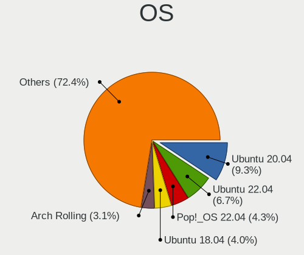

| Name                         | Notebooks | Percent |
|------------------------------|-----------|---------|
| Ubuntu 20.04                 | 81        | 10.66%  |
| Ubuntu 22.04                 | 53        | 6.97%   |
| Ubuntu 18.04                 | 35        | 4.61%   |
| Pop!_OS 22.04                | 34        | 4.47%   |
| Debian 11                    | 22        | 2.89%   |
| Arch Rolling                 | 18        | 2.37%   |
| Ubuntu 23.04                 | 17        | 2.24%   |
| Zorin 16                     | 16        | 2.11%   |
| ArcoLinux Rolling            | 14        | 1.84%   |
| Fedora 35                    | 13        | 1.71%   |
| OpenMandriva 4.2             | 11        | 1.45%   |
| Fedora 38                    | 11        | 1.45%   |
| Fedora 31                    | 11        | 1.45%   |
| Debian 12                    | 11        | 1.45%   |
| Ubuntu 22.10                 | 10        | 1.32%   |
| Ubuntu 20.10                 | 10        | 1.32%   |
| Manjaro                      | 10        | 1.32%   |
| KDE neon 20.04               | 10        | 1.32%   |
| Fedora 39                    | 10        | 1.32%   |
| Ubuntu 23.10                 | 9         | 1.18%   |
| Pop!_OS 21.10                | 9         | 1.18%   |
| openSUSE Tumbleweed-XXXXXXXX | 9         | 1.18%   |
| OpenMandriva 4.3             | 9         | 1.18%   |
| Linux Mint 20.3              | 9         | 1.18%   |
| Fedora 36                    | 9         | 1.18%   |
| Fedora 34                    | 9         | 1.18%   |
| Ubuntu 19.04                 | 8         | 1.05%   |
| Pop!_OS 21.04                | 8         | 1.05%   |
| Pop!_OS 20.10                | 8         | 1.05%   |
| Linux Mint 20.2              | 8         | 1.05%   |
| Xubuntu 20.04                | 7         | 0.92%   |
| KDE neon 22.04               | 7         | 0.92%   |
| Ubuntu 19.10                 | 6         | 0.79%   |
| Pop!_OS 20.04                | 6         | 0.79%   |
| OpenMandriva 23.03           | 6         | 0.79%   |
| Linux Mint 19.3              | 6         | 0.79%   |
| Fedora 37                    | 6         | 0.79%   |
| OpenMandriva 5.0             | 5         | 0.66%   |
| Linux Mint 21.1              | 5         | 0.66%   |
| Linux Mint 20.1              | 5         | 0.66%   |

OS Family
---------

OS without a version

| Name          | Notebooks | Percent |
|---------------|-----------|---------|
| Ubuntu        | 232       | 32.4%   |
| Fedora        | 71        | 9.92%   |
| Pop!_OS       | 61        | 8.52%   |
| Linux Mint    | 44        | 6.15%   |
| Debian        | 42        | 5.87%   |
| OpenMandriva  | 37        | 5.17%   |
| Manjaro       | 28        | 3.91%   |
| Zorin         | 23        | 3.21%   |
| Arch          | 22        | 3.07%   |
| KDE neon      | 19        | 2.65%   |
| ArcoLinux     | 14        | 1.96%   |
| openSUSE      | 12        | 1.68%   |
| Xubuntu       | 11        | 1.54%   |
| Kubuntu       | 11        | 1.54%   |
| Kali          | 11        | 1.54%   |
| Elementary    | 9         | 1.26%   |
| Ubuntu MATE   | 7         | 0.98%   |
| Gentoo        | 6         | 0.84%   |
| ROSA          | 5         | 0.7%    |
| EndeavourOS   | 5         | 0.7%    |
| Xero          | 4         | 0.56%   |
| Ubuntu Budgie | 3         | 0.42%   |
| Nobara        | 3         | 0.42%   |
| NixOS         | 3         | 0.42%   |
| MX            | 3         | 0.42%   |
| Lubuntu       | 3         | 0.42%   |
| Clear Linux   | 3         | 0.42%   |
| CentOS        | 3         | 0.42%   |
| Void Linux    | 2         | 0.28%   |
| Ubuntu Unity  | 2         | 0.28%   |
| Ubuntu Studio | 2         | 0.28%   |
| TUXEDO OS     | 2         | 0.28%   |
| Solus         | 2         | 0.28%   |
| Parrot        | 2         | 0.28%   |
| Devuan        | 2         | 0.28%   |
| Rocky Linux   | 1         | 0.14%   |
| RHEL          | 1         | 0.14%   |
| Peppermint    | 1         | 0.14%   |
| LMDE          | 1         | 0.14%   |
| Cleanjaro     | 1         | 0.14%   |

Kernel
------

Version of the Linux kernel

| Version                  | Notebooks | Percent |
|--------------------------|-----------|---------|
| 5.10.14-desktop-1omv4002 | 10        | 1.17%   |
| 5.4.0-42-generic         | 9         | 1.06%   |
| 6.2.0-39-generic         | 8         | 0.94%   |
| 6.2.0-20-generic         | 8         | 0.94%   |
| 5.16.7-desktop-1omv4003  | 8         | 0.94%   |
| 5.3.0-46-generic         | 7         | 0.82%   |
| 5.15.0-46-generic        | 7         | 0.82%   |
| 6.2.6-desktop-1omv2390   | 6         | 0.7%    |
| 6.2.6-76060206-generic   | 6         | 0.7%    |
| 6.2.0-26-generic         | 6         | 0.7%    |
| 5.4.0-58-generic         | 6         | 0.7%    |
| 5.19.0-76051900-generic  | 6         | 0.7%    |
| 5.15.0-48-generic        | 6         | 0.7%    |
| 5.11.0-40-generic        | 6         | 0.7%    |
| 6.6.2-desktop-1omv2390   | 5         | 0.59%   |
| 6.5.6-76060506-generic   | 5         | 0.59%   |
| 6.4.6-76060406-generic   | 5         | 0.59%   |
| 5.8.0-44-generic         | 5         | 0.59%   |
| 5.4.0-91-generic         | 5         | 0.59%   |
| 5.4.0-74-generic         | 5         | 0.59%   |
| 5.4.0-48-generic         | 5         | 0.59%   |
| 5.4.0-26-generic         | 5         | 0.59%   |
| 6.5.0-28-generic         | 4         | 0.47%   |
| 6.5.0-27-generic         | 4         | 0.47%   |
| 6.5.0-14-generic         | 4         | 0.47%   |
| 6.1.1-desktop-1omv2290   | 4         | 0.47%   |
| 6.0.12-76060006-generic  | 4         | 0.47%   |
| 5.8.0-7630-generic       | 4         | 0.47%   |
| 5.8.0-43-generic         | 4         | 0.47%   |
| 5.4.0-45-generic         | 4         | 0.47%   |
| 5.4.0-33-generic         | 4         | 0.47%   |
| 5.3.0-40-generic         | 4         | 0.47%   |
| 5.19.0-35-generic        | 4         | 0.47%   |
| 5.17.5-76051705-generic  | 4         | 0.47%   |
| 5.17.15-76051715-generic | 4         | 0.47%   |
| 5.15.0-76-generic        | 4         | 0.47%   |
| 5.15.0-60-generic        | 4         | 0.47%   |
| 5.15.0-52-generic        | 4         | 0.47%   |
| 5.13.0-7620-generic      | 4         | 0.47%   |
| 5.13.0-39-generic        | 4         | 0.47%   |

Kernel Family
-------------

Linux kernel without a distro release

| Version | Notebooks | Percent |
|---------|-----------|---------|
| 5.4.0   | 102       | 12.7%   |
| 5.15.0  | 54        | 6.72%   |
| 6.2.0   | 42        | 5.23%   |
| 5.19.0  | 33        | 4.11%   |
| 5.8.0   | 32        | 3.99%   |
| 5.11.0  | 29        | 3.61%   |
| 6.5.0   | 27        | 3.36%   |
| 4.15.0  | 25        | 3.11%   |
| 5.3.0   | 23        | 2.86%   |
| 5.10.0  | 22        | 2.74%   |
| 5.13.0  | 21        | 2.62%   |
| 5.0.0   | 15        | 1.87%   |
| 6.1.0   | 14        | 1.74%   |
| 6.2.6   | 13        | 1.62%   |
| 4.18.0  | 12        | 1.49%   |
| 5.10.14 | 10        | 1.25%   |
| 5.16.7  | 8         | 1%      |
| 6.5.6   | 6         | 0.75%   |
| 6.6.2   | 5         | 0.62%   |
| 6.5.3   | 5         | 0.62%   |
| 6.4.6   | 5         | 0.62%   |
| 6.4.12  | 5         | 0.62%   |
| 5.17.5  | 5         | 0.62%   |
| 5.17.0  | 5         | 0.62%   |
| 5.16.11 | 5         | 0.62%   |
| 6.1.1   | 4         | 0.5%    |
| 6.0.12  | 4         | 0.5%    |
| 6.0.0   | 4         | 0.5%    |
| 5.18.0  | 4         | 0.5%    |
| 5.17.15 | 4         | 0.5%    |
| 5.14.0  | 4         | 0.5%    |
| 5.12.4  | 4         | 0.5%    |
| 4.19.0  | 4         | 0.5%    |
| 6.8.7   | 3         | 0.37%   |
| 6.6.9   | 3         | 0.37%   |
| 6.4.0   | 3         | 0.37%   |
| 6.0.6   | 3         | 0.37%   |
| 6.0.2   | 3         | 0.37%   |
| 5.9.0   | 3         | 0.37%   |
| 5.5.5   | 3         | 0.37%   |

Kernel Major Ver.
-----------------

Linux kernel major version

| Version | Notebooks | Percent |
|---------|-----------|---------|
| 5.4     | 114       | 14.5%   |
| 5.15    | 70        | 8.91%   |
| 6.2     | 59        | 7.51%   |
| 6.5     | 42        | 5.34%   |
| 5.19    | 41        | 5.22%   |
| 5.10    | 40        | 5.09%   |
| 5.8     | 38        | 4.83%   |
| 5.13    | 36        | 4.58%   |
| 5.11    | 35        | 4.45%   |
| 5.3     | 31        | 3.94%   |
| 6.1     | 28        | 3.56%   |
| 5.16    | 27        | 3.44%   |
| 4.15    | 25        | 3.18%   |
| 6.4     | 21        | 2.67%   |
| 5.17    | 20        | 2.54%   |
| 6.6     | 17        | 2.16%   |
| 6.0     | 17        | 2.16%   |
| 5.14    | 16        | 2.04%   |
| 5.0     | 15        | 1.91%   |
| 4.18    | 15        | 1.91%   |
| 5.9     | 11        | 1.4%    |
| 5.18    | 11        | 1.4%    |
| 6.8     | 8         | 1.02%   |
| 6.7     | 8         | 1.02%   |
| 6.3     | 8         | 1.02%   |
| 5.12    | 8         | 1.02%   |
| 4.19    | 6         | 0.76%   |
| 5.5     | 5         | 0.64%   |
| 5.7     | 3         | 0.38%   |
| 4.9     | 3         | 0.38%   |
| 5.6     | 2         | 0.25%   |
| 5.2     | 2         | 0.25%   |
| 5.1     | 2         | 0.25%   |
| 6.9     | 1         | 0.13%   |
| 4.4     | 1         | 0.13%   |

Arch
----

OS architecture (x86_64, i586, etc.)

| Name   | Notebooks | Percent |
|--------|-----------|---------|
| x86_64 | 672       | 98.1%   |
| i686   | 12        | 1.75%   |
| armv7l | 1         | 0.15%   |

DE
--

Desktop Environment

| Name              | Notebooks | Percent |
|-------------------|-----------|---------|
| GNOME             | 350       | 48.95%  |
| KDE5              | 114       | 15.94%  |
| Unknown           | 70        | 9.79%   |
| XFCE              | 67        | 9.37%   |
| X-Cinnamon        | 30        | 4.2%    |
| MATE              | 17        | 2.38%   |
| KDE               | 13        | 1.82%   |
| Pantheon          | 9         | 1.26%   |
| i3                | 8         | 1.12%   |
| Cinnamon          | 8         | 1.12%   |
| GNOME Flashback   | 6         | 0.84%   |
| LXQt              | 5         | 0.7%    |
| Budgie            | 4         | 0.56%   |
| Unity             | 2         | 0.28%   |
| LXDE              | 2         | 0.28%   |
| KDE4              | 2         | 0.28%   |
| Hyprland          | 2         | 0.28%   |
| Yaru:ubuntu:GNOME | 1         | 0.14%   |
| xinit-compat      | 1         | 0.14%   |
| KDE6              | 1         | 0.14%   |
| i3-with-shmlog    | 1         | 0.14%   |
| Deepin            | 1         | 0.14%   |
| bspwm             | 1         | 0.14%   |

Display Server
--------------

X11 or Wayland

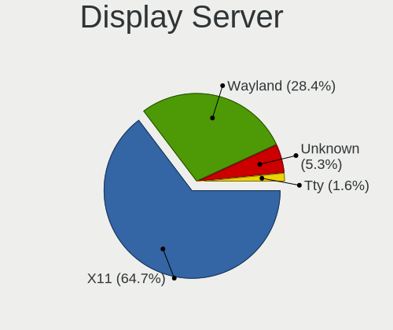

| Name    | Notebooks | Percent |
|---------|-----------|---------|
| X11     | 491       | 68.96%  |
| Wayland | 169       | 23.74%  |
| Unknown | 42        | 5.9%    |
| Tty     | 10        | 1.4%    |

Display Manager
---------------

SDDM, LightDM, etc.

| Name    | Notebooks | Percent |
|---------|-----------|---------|
| Unknown | 310       | 42.94%  |
| GDM3    | 121       | 16.76%  |
| SDDM    | 100       | 13.85%  |
| GDM     | 92        | 12.74%  |
| LightDM | 77        | 10.66%  |
| TDM     | 17        | 2.35%   |
| KDM     | 3         | 0.42%   |
| XDM     | 1         | 0.14%   |
| SLiM    | 1         | 0.14%   |

OS Lang
-------

Language

| Lang        | Notebooks | Percent |
|-------------|-----------|---------|
| en_US       | 371       | 52.4%   |
| nb_NO       | 176       | 24.86%  |
| Unknown     | 57        | 8.05%   |
| en_GB       | 41        | 5.79%   |
| C           | 15        | 2.12%   |
| nn_NO       | 13        | 1.84%   |
| pl_PL       | 9         | 1.27%   |
| en_DK       | 6         | 0.85%   |
| de_DE       | 5         | 0.71%   |
| ru_RU       | 2         | 0.28%   |
| en_IE       | 2         | 0.28%   |
| sv_SE       | 1         | 0.14%   |
| pt_PT       | 1         | 0.14%   |
| POSIX       | 1         | 0.14%   |
| it_IT       | 1         | 0.14%   |
| fr_FR       | 1         | 0.14%   |
| fi_FI       | 1         | 0.14%   |
| en_US.utf-8 | 1         | 0.14%   |
| en_NZ       | 1         | 0.14%   |
| en_150      | 1         | 0.14%   |
| en_001      | 1         | 0.14%   |
| el_GR       | 1         | 0.14%   |

Boot Mode
---------

EFI or BIOS

| Mode | Notebooks | Percent |
|------|-----------|---------|
| EFI  | 385       | 55%     |
| BIOS | 315       | 45%     |

Filesystem
----------

Type of filesystem

| Type    | Notebooks | Percent |
|---------|-----------|---------|
| Ext4    | 504       | 71.09%  |
| Btrfs   | 88        | 12.41%  |
| Overlay | 41        | 5.78%   |
| Tmpfs   | 40        | 5.64%   |
| Xfs     | 15        | 2.12%   |
| Unknown | 12        | 1.69%   |
| Zfs     | 5         | 0.71%   |
| Ext3    | 2         | 0.28%   |
| Ext2    | 2         | 0.28%   |

Part. scheme
------------

Scheme of partitioning

| Type    | Notebooks | Percent |
|---------|-----------|---------|
| GPT     | 335       | 47.25%  |
| Unknown | 319       | 44.99%  |
| MBR     | 55        | 7.76%   |

Dual Boot with Linux/BSD
------------------------

Hosting more than one Linux/BSD

| Dual boot | Notebooks | Percent |
|-----------|-----------|---------|
| No        | 618       | 88.54%  |
| Yes       | 80        | 11.46%  |

Dual Boot (Win)
---------------

Hosting Linux and Windows

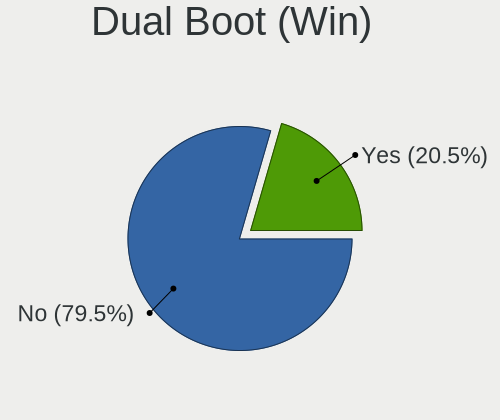

| Dual boot | Notebooks | Percent |
|-----------|-----------|---------|
| No        | 544       | 78.16%  |
| Yes       | 152       | 21.84%  |

Board
-----

Vendor
------

Motherboard manufacturer

| Name                 | Notebooks | Percent |
|----------------------|-----------|---------|
| Lenovo               | 207       | 30.22%  |
| Hewlett-Packard      | 129       | 18.83%  |
| Dell                 | 103       | 15.04%  |
| ASUSTek Computer     | 70        | 10.22%  |
| Acer                 | 48        | 7.01%   |
| Apple                | 27        | 3.94%   |
| MSI                  | 22        | 3.21%   |
| HUAWEI               | 14        | 2.04%   |
| Samsung Electronics  | 13        | 1.9%    |
| Toshiba              | 9         | 1.31%   |
| Notebook             | 7         | 1.02%   |
| Packard Bell         | 6         | 0.88%   |
| Google               | 5         | 0.73%   |
| Clevo                | 5         | 0.73%   |
| Unknown              | 3         | 0.44%   |
| Panasonic            | 2         | 0.29%   |
| TUXEDO               | 1         | 0.15%   |
| Teclast              | 1         | 0.15%   |
| Star Labs            | 1         | 0.15%   |
| Sony                 | 1         | 0.15%   |
| Razer                | 1         | 0.15%   |
| Nokia                | 1         | 0.15%   |
| LAMINA               | 1         | 0.15%   |
| Intel Client Systems | 1         | 0.15%   |
| Intel                | 1         | 0.15%   |
| IGEL Technology      | 1         | 0.15%   |
| GMKtec               | 1         | 0.15%   |
| Getac                | 1         | 0.15%   |
| eMachines            | 1         | 0.15%   |
| Cepter               | 1         | 0.15%   |
| Alienware            | 1         | 0.15%   |

Model
-----

Motherboard model

| Name                                        | Notebooks | Percent |
|---------------------------------------------|-----------|---------|
| Apple MacBookPro12,1                        | 7         | 1.02%   |
| HUAWEI MACH-WX9                             | 6         | 0.88%   |
| HP EliteBook 840 G6                         | 6         | 0.88%   |
| Dell Precision 5530                         | 6         | 0.88%   |
| Lenovo Yoga Slim 7 14ARE05 82A2             | 4         | 0.58%   |
| HP ProBook 430 G2                           | 4         | 0.58%   |
| Dell XPS 15 9570                            | 4         | 0.58%   |
| Dell Latitude E7240                         | 4         | 0.58%   |
| Unknown                                     | 4         | 0.58%   |
| Samsung 950XCJ/951XCJ/950XCR                | 3         | 0.44%   |
| Lenovo Yoga Slim 7 Pro 14IAH7 82UT          | 3         | 0.44%   |
| Lenovo Yoga Slim 7 Carbon 14ACN6 82L0       | 3         | 0.44%   |
| HUAWEI WRT-WX9                              | 3         | 0.44%   |
| HP ProBook 450 G2                           | 3         | 0.44%   |
| HP Pavilion Notebook                        | 3         | 0.44%   |
| HP OMEN by Laptop                           | 3         | 0.44%   |
| HP EliteBook 8470p                          | 3         | 0.44%   |
| HP EliteBook 840 G5                         | 3         | 0.44%   |
| HP EliteBook 830 G6                         | 3         | 0.44%   |
| Dell XPS 15 9500                            | 3         | 0.44%   |
| Dell XPS 13 9380                            | 3         | 0.44%   |
| Dell Latitude E5470                         | 3         | 0.44%   |
| Dell Latitude 5480                          | 3         | 0.44%   |
| ASUS VivoBook_ASUSLaptop K3402ZA_K3402ZA    | 3         | 0.44%   |
| ASUS VivoBook_ASUSLaptop E410MAB_E410MA     | 3         | 0.44%   |
| Apple MacBookPro9,2                         | 3         | 0.44%   |
| Acer Aspire V3-571G                         | 3         | 0.44%   |
| Samsung 300V3A/300V4A/300V5A/200A4B/200A5B  | 2         | 0.29%   |
| MSI Katana GF76 11SC                        | 2         | 0.29%   |
| MSI GF63 Thin 11UD                          | 2         | 0.29%   |
| Lenovo Z50-70 20354                         | 2         | 0.29%   |
| Lenovo Y520-15IKBN 80WK                     | 2         | 0.29%   |
| Lenovo ThinkPad X230 23252EG                | 2         | 0.29%   |
| Lenovo ThinkPad X1 Carbon Gen 9 20XWCTO1WW  | 2         | 0.29%   |
| Lenovo ThinkPad X1 Carbon Gen 10 21CBCTO1WW | 2         | 0.29%   |
| Lenovo ThinkPad X1 Carbon 7th 20QD00L1MX    | 2         | 0.29%   |
| Lenovo ThinkPad T460s 20F9005CMN            | 2         | 0.29%   |
| Lenovo ThinkPad L450 20DT001NMN             | 2         | 0.29%   |
| Lenovo ThinkBook 16p Gen 2 20YM             | 2         | 0.29%   |
| Lenovo Legion Y540-15IRH 81SX               | 2         | 0.29%   |

Model Family
------------

Motherboard model prefix

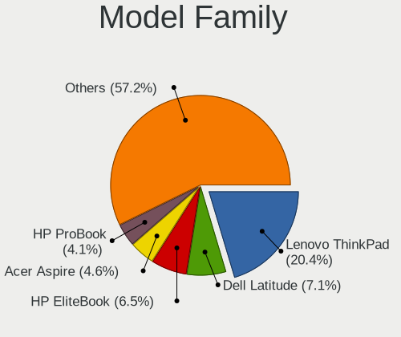

| Name                  | Notebooks | Percent |
|-----------------------|-----------|---------|
| Lenovo ThinkPad       | 145       | 21.17%  |
| Dell Latitude         | 49        | 7.15%   |
| HP EliteBook          | 48        | 7.01%   |
| HP ProBook            | 31        | 4.53%   |
| Acer Aspire           | 31        | 4.53%   |
| Dell XPS              | 25        | 3.65%   |
| Dell Precision        | 20        | 2.92%   |
| Lenovo IdeaPad        | 19        | 2.77%   |
| ASUS VivoBook         | 16        | 2.34%   |
| HP Pavilion           | 14        | 2.04%   |
| Lenovo Yoga           | 13        | 1.9%    |
| HP ZBook              | 11        | 1.61%   |
| Lenovo Legion         | 8         | 1.17%   |
| Toshiba Satellite     | 7         | 1.02%   |
| Dell Inspiron         | 7         | 1.02%   |
| Apple MacBookPro12    | 7         | 1.02%   |
| Acer Swift            | 7         | 1.02%   |
| HUAWEI MACH-WX9       | 6         | 0.88%   |
| HP Laptop             | 6         | 0.88%   |
| ASUS ZenBook          | 6         | 0.88%   |
| Packard Bell EasyNote | 5         | 0.73%   |
| HP OMEN               | 5         | 0.73%   |
| ASUS ROG              | 5         | 0.73%   |
| Apple MacBookPro11    | 5         | 0.73%   |
| Acer Nitro            | 5         | 0.73%   |
| MSI Katana            | 4         | 0.58%   |
| Unknown               | 4         | 0.58%   |
| Samsung 950XCJ        | 3         | 0.44%   |
| Lenovo ThinkBook      | 3         | 0.44%   |
| HUAWEI WRT-WX9        | 3         | 0.44%   |
| HP Presario           | 3         | 0.44%   |
| ASUS TUF              | 3         | 0.44%   |
| Apple MacBookPro9     | 3         | 0.44%   |
| Samsung 300V3A        | 2         | 0.29%   |
| MSI GS66              | 2         | 0.29%   |
| MSI GF63              | 2         | 0.29%   |
| Lenovo Z50-70         | 2         | 0.29%   |
| Lenovo Y520-15IKBN    | 2         | 0.29%   |
| HP Notebook           | 2         | 0.29%   |
| HP Compaq             | 2         | 0.29%   |

MFG Year
--------

Motherboard manufacture year

| Year    | Notebooks | Percent |
|---------|-----------|---------|
| 2019    | 64        | 9.34%   |
| 2018    | 63        | 9.2%    |
| 2020    | 62        | 9.05%   |
| 2012    | 53        | 7.74%   |
| 2021    | 52        | 7.59%   |
| 2017    | 48        | 7.01%   |
| 2016    | 48        | 7.01%   |
| 2011    | 47        | 6.86%   |
| 2013    | 46        | 6.72%   |
| 2015    | 41        | 5.99%   |
| 2014    | 40        | 5.84%   |
| 2022    | 29        | 4.23%   |
| 2010    | 29        | 4.23%   |
| 2023    | 18        | 2.63%   |
| 2009    | 16        | 2.34%   |
| 2008    | 14        | 2.04%   |
| 2007    | 10        | 1.46%   |
| 2024    | 2         | 0.29%   |
| 2006    | 1         | 0.15%   |
| 2005    | 1         | 0.15%   |
| Unknown | 1         | 0.15%   |

Form Factor
-----------

Physical design of the computer

| Name     | Notebooks | Percent |
|----------|-----------|---------|
| Notebook | 685       | 100%    |

Secure Boot
-----------

Enabled or disabled

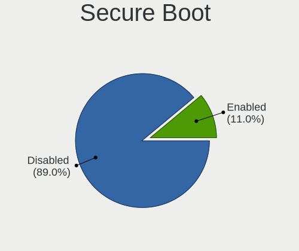

| State    | Notebooks | Percent |
|----------|-----------|---------|
| Disabled | 609       | 88.52%  |
| Enabled  | 79        | 11.48%  |

Coreboot
--------

Have coreboot on board

| Used | Notebooks | Percent |
|------|-----------|---------|
| No   | 678       | 98.98%  |
| Yes  | 7         | 1.02%   |

RAM Size
--------

Total RAM memory

| Size in GB  | Notebooks | Percent |
|-------------|-----------|---------|
| 4.01-8.0    | 203       | 29.12%  |
| 16.01-24.0  | 161       | 23.1%   |
| 8.01-16.0   | 123       | 17.65%  |
| 3.01-4.0    | 93        | 13.34%  |
| 32.01-64.0  | 79        | 11.33%  |
| 1.01-2.0    | 13        | 1.87%   |
| 64.01-256.0 | 10        | 1.43%   |
| 24.01-32.0  | 8         | 1.15%   |
| 2.01-3.0    | 3         | 0.43%   |
| 0.51-1.0    | 3         | 0.43%   |
| 0.01-0.5    | 1         | 0.14%   |

RAM Used
--------

Used RAM memory

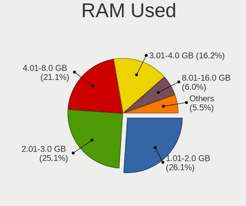

| Used GB    | Notebooks | Percent |
|------------|-----------|---------|
| 1.01-2.0   | 215       | 27.56%  |
| 2.01-3.0   | 190       | 24.36%  |
| 4.01-8.0   | 167       | 21.41%  |
| 3.01-4.0   | 128       | 16.41%  |
| 8.01-16.0  | 38        | 4.87%   |
| 0.51-1.0   | 28        | 3.59%   |
| 0.01-0.5   | 9         | 1.15%   |
| 16.01-24.0 | 4         | 0.51%   |
| 24.01-32.0 | 1         | 0.13%   |

Total Drives
------------

Number of drives on board

| Drives | Notebooks | Percent |
|--------|-----------|---------|
| 1      | 555       | 78.72%  |
| 2      | 120       | 17.02%  |
| 3      | 21        | 2.98%   |
| 0      | 6         | 0.85%   |
| 4      | 2         | 0.28%   |
| 6      | 1         | 0.14%   |

Has CD-ROM
----------

Has CD-ROM on board

| Presented | Notebooks | Percent |
|-----------|-----------|---------|
| No        | 522       | 75.98%  |
| Yes       | 165       | 24.02%  |

Has Ethernet
------------

Has Ethernet on board

| Presented | Notebooks | Percent |
|-----------|-----------|---------|
| Yes       | 543       | 78.92%  |
| No        | 145       | 21.08%  |

Has WiFi
--------

Has WiFi module

| Presented | Notebooks | Percent |
|-----------|-----------|---------|
| Yes       | 678       | 98.98%  |
| No        | 7         | 1.02%   |

Has Bluetooth
-------------

Has Bluetooth module

| Presented | Notebooks | Percent |
|-----------|-----------|---------|
| Yes       | 572       | 82.07%  |
| No        | 125       | 17.93%  |

Location
--------

Country
-------

Geographic location (country)

| Country | Notebooks | Percent |
|---------|-----------|---------|
| Norway  | 685       | 100%    |

City
----

Geographic location (city)

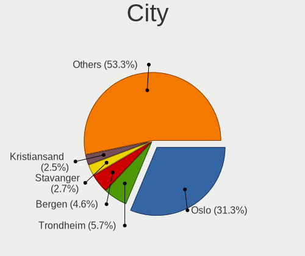

| City                 | Notebooks | Percent |
|----------------------|-----------|---------|
| Oslo                 | 235       | 31.89%  |
| Trondheim            | 41        | 5.56%   |
| Bergen               | 32        | 4.34%   |
| Kristiansand         | 19        | 2.58%   |
| Stavanger            | 17        | 2.31%   |
| Troms              | 11        | 1.49%   |
| Skien                | 10        | 1.36%   |
| Ryken Municipality | 8         | 1.09%   |
| Bod                | 8         | 1.09%   |
| lesund             | 8         | 1.09%   |
| Moss                 | 7         | 0.95%   |
| Fornebu              | 7         | 0.95%   |
| Drammen              | 7         | 0.95%   |
| Sandnes              | 6         | 0.81%   |
| Haugesund            | 6         | 0.81%   |
| Fredrikstad          | 6         | 0.81%   |
| Tnsberg            | 5         | 0.68%   |
| Sarpsborg            | 5         | 0.68%   |
| Melhus               | 5         | 0.68%   |
| Lillehammer          | 5         | 0.68%   |
| Hamar                | 5         | 0.68%   |
| Drobak               | 5         | 0.68%   |
| Asker                | 5         | 0.68%   |
| Arendal              | 5         | 0.68%   |
| Nesttun              | 4         | 0.54%   |
| Algard               | 4         | 0.54%   |
| Verdal               | 3         | 0.41%   |
| Vear                 | 3         | 0.41%   |
| Ski                  | 3         | 0.41%   |
| Sandefjord           | 3         | 0.41%   |
| Rong                 | 3         | 0.41%   |
| Porsgrunn            | 3         | 0.41%   |
| Mjondalen            | 3         | 0.41%   |
| Lysaker              | 3         | 0.41%   |
| Lyngdal              | 3         | 0.41%   |
| Lorenskog            | 3         | 0.41%   |
| Langevag             | 3         | 0.41%   |
| Kristiansund         | 3         | 0.41%   |
| Horten               | 3         | 0.41%   |
| Honefoss             | 3         | 0.41%   |

Drives
------

Drive Vendor
------------

Hard drive vendors

| Vendor                         | Notebooks | Drives | Percent |
|--------------------------------|-----------|--------|---------|
| Samsung Electronics            | 193       | 275    | 23.17%  |
| Sandisk                        | 69        | 89     | 8.28%   |
| Toshiba                        | 65        | 78     | 7.8%    |
| WDC                            | 57        | 70     | 6.84%   |
| Seagate                        | 52        | 61     | 6.24%   |
| SK hynix                       | 50        | 66     | 6%      |
| Kingston                       | 45        | 65     | 5.4%    |
| Unknown                        | 40        | 49     | 4.8%    |
| Micron Technology              | 36        | 46     | 4.32%   |
| Intel                          | 32        | 37     | 3.84%   |
| Hitachi                        | 27        | 39     | 3.24%   |
| Crucial                        | 21        | 23     | 2.52%   |
| Apple                          | 18        | 21     | 2.16%   |
| HGST                           | 17        | 19     | 2.04%   |
| PNY                            | 13        | 18     | 1.56%   |
| LITEON                         | 12        | 16     | 1.44%   |
| KIOXIA                         | 11        | 19     | 1.32%   |
| LITEONIT                       | 6         | 15     | 0.72%   |
| Lenovo                         | 5         | 5      | 0.6%    |
| A-DATA Technology              | 5         | 8      | 0.6%    |
| Phison                         | 4         | 6      | 0.48%   |
| Kingston Technology Company    | 4         | 4      | 0.48%   |
| JMicron Technology             | 4         | 5      | 0.48%   |
| Fujitsu                        | 4         | 4      | 0.48%   |
| Corsair                        | 4         | 5      | 0.48%   |
| OCZ                            | 3         | 3      | 0.36%   |
| China                          | 3         | 3      | 0.36%   |
| XPG                            | 2         | 2      | 0.24%   |
| Union Memory                   | 2         | 2      | 0.24%   |
| Transcend                      | 2         | 2      | 0.24%   |
| Solid State Storage Technology | 2         | 2      | 0.24%   |
| Phison Electronics             | 2         | 2      | 0.24%   |
| Lexar                          | 2         | 2      | 0.24%   |
| Intenso                        | 2         | 6      | 0.24%   |
| ASMT                           | 2         | 3      | 0.24%   |
| UMIS                           | 1         | 1      | 0.12%   |
| Ugreen                         | 1         | 1      | 0.12%   |
| UFD 256G                       | 1         | 1      | 0.12%   |
| Teclast                        | 1         | 1      | 0.12%   |
| STEC                           | 1         | 1      | 0.12%   |

Drive Model
-----------

Hard drive models

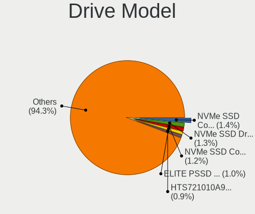

| Model                                              | Notebooks | Percent |
|----------------------------------------------------|-----------|---------|
| Samsung PM963 2.5" NVMe PCIe SSD 256GB             | 13        | 1.49%   |
| PNY ELITE PSSD 480GB                               | 10        | 1.15%   |
| HGST HTS721010A9E630 1TB                           | 9         | 1.03%   |
| Samsung NVMe SSD Controller PM9A1/PM9A3/980PRO 1TB | 8         | 0.92%   |
| Unknown MMC Card  64GB                             | 6         | 0.69%   |
| Toshiba NVMe SSD Drive 256GB                       | 6         | 0.69%   |
| Samsung NVMe SSD Controller SM981/PM981/PM983 1TB  | 6         | 0.69%   |
| Apple SSD SM0128G 121GB                            | 6         | 0.69%   |
| Seagate ST1000LM024 HN-M101MBB 1TB                 | 5         | 0.57%   |
| Sandisk WD Blue SN550 NVMe SSD 2TB                 | 5         | 0.57%   |
| SanDisk NVMe SSD Drive 512GB                       | 5         | 0.57%   |
| SanDisk NVMe SSD Drive 256GB                       | 5         | 0.57%   |
| Samsung NVMe SSD Drive 1024GB                      | 5         | 0.57%   |
| Samsung NVMe SSD Controller SM961/PM961/SM963 1TB  | 5         | 0.57%   |
| Kingston SV300S37A120G 120GB SSD                   | 5         | 0.57%   |
| Kingston SA400S37240G 240GB SSD                    | 5         | 0.57%   |
| WDC PC SN730 SDBQNTY-512G-1001 512GB               | 4         | 0.46%   |
| Toshiba NVMe SSD Drive 512GB                       | 4         | 0.46%   |
| SK hynix SKHynix_HFS512GDE9X084N 512GB             | 4         | 0.46%   |
| SK hynix NVMe SSD Drive 512GB                      | 4         | 0.46%   |
| Seagate ST9500325AS 500GB                          | 4         | 0.46%   |
| Seagate Expansion 2TB                              | 4         | 0.46%   |
| Sandisk WD Black SN750 / PC SN730 NVMe SSD 512GB   | 4         | 0.46%   |
| SanDisk SD8SN8U-128G-1006 128GB SSD                | 4         | 0.46%   |
| SanDisk NVMe SSD Drive 500GB                       | 4         | 0.46%   |
| Samsung SSD 850 EVO 500GB                          | 4         | 0.46%   |
| Samsung NVMe SSD Drive 500GB                       | 4         | 0.46%   |
| Kingston OM8PCP3512F-AI1 512GB                     | 4         | 0.46%   |
| Intel NVMe SSD Drive 512GB                         | 4         | 0.46%   |
| WDC WDS500G2B0A-00SM50 500GB SSD                   | 3         | 0.34%   |
| Unknown MMC Card  16GB                             | 3         | 0.34%   |
| Unknown G1J38E  64GB                               | 3         | 0.34%   |
| Toshiba XG6 NVMe SSD Controller 1024GB             | 3         | 0.34%   |
| SK hynix PC401 NVMe 512GB                          | 3         | 0.34%   |
| SK hynix PC401 NVMe 1TB                            | 3         | 0.34%   |
| SK hynix HFS256G39TND-N210A 256GB SSD              | 3         | 0.34%   |
| SK hynix HFS128G39TND-N210A 128GB SSD              | 3         | 0.34%   |
| Sandisk WD Blue SN500 / PC SN520 NVMe SSD 512GB    | 3         | 0.34%   |
| SanDisk SD6SB1M-128G-1006 128GB SSD                | 3         | 0.34%   |
| SanDisk NVMe SSD Drive 1TB                         | 3         | 0.34%   |

HDD Vendor
----------

Hard disk drive vendors

| Vendor              | Notebooks | Drives | Percent |
|---------------------|-----------|--------|---------|
| Seagate             | 51        | 60     | 32.9%   |
| Hitachi             | 27        | 39     | 17.42%  |
| WDC                 | 25        | 36     | 16.13%  |
| Toshiba             | 21        | 25     | 13.55%  |
| HGST                | 17        | 19     | 10.97%  |
| Fujitsu             | 4         | 4      | 2.58%   |
| JMicron Technology  | 2         | 3      | 1.29%   |
| Intenso             | 2         | 6      | 1.29%   |
| Unknown             | 1         | 1      | 0.65%   |
| STEC                | 1         | 1      | 0.65%   |
| Samsung Electronics | 1         | 3      | 0.65%   |
| LaCie               | 1         | 1      | 0.65%   |
| ASMT                | 1         | 2      | 0.65%   |
| Apple               | 1         | 1      | 0.65%   |

SSD Vendor
----------

Solid state drive vendors

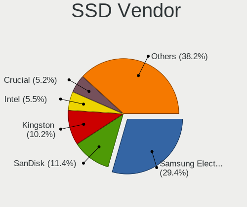

| Vendor              | Notebooks | Drives | Percent |
|---------------------|-----------|--------|---------|
| Samsung Electronics | 94        | 123    | 31.65%  |
| SanDisk             | 32        | 41     | 10.77%  |
| Kingston            | 30        | 38     | 10.1%   |
| Crucial             | 18        | 20     | 6.06%   |
| Intel               | 16        | 18     | 5.39%   |
| Apple               | 16        | 19     | 5.39%   |
| PNY                 | 13        | 18     | 4.38%   |
| Micron Technology   | 13        | 17     | 4.38%   |
| LITEON              | 10        | 14     | 3.37%   |
| Toshiba             | 9         | 12     | 3.03%   |
| SK hynix            | 9         | 11     | 3.03%   |
| WDC                 | 7         | 9      | 2.36%   |
| LITEONIT            | 6         | 15     | 2.02%   |
| Corsair             | 4         | 5      | 1.35%   |
| A-DATA Technology   | 4         | 7      | 1.35%   |
| OCZ                 | 3         | 3      | 1.01%   |
| China               | 3         | 3      | 1.01%   |
| Transcend           | 2         | 2      | 0.67%   |
| Teclast             | 1         | 1      | 0.34%   |
| Seagate             | 1         | 1      | 0.34%   |
| Phison              | 1         | 2      | 0.34%   |
| Patriot             | 1         | 1      | 0.34%   |
| Netac               | 1         | 1      | 0.34%   |
| GOODRAM             | 1         | 1      | 0.34%   |
| BIWIN               | 1         | 1      | 0.34%   |
| ASMT                | 1         | 1      | 0.34%   |

Drive Kind
----------

HDD or SSD

| Kind    | Notebooks | Drives | Percent |
|---------|-----------|--------|---------|
| NVMe    | 310       | 444    | 39.54%  |
| SSD     | 273       | 384    | 34.82%  |
| HDD     | 152       | 201    | 19.39%  |
| MMC     | 41        | 50     | 5.23%   |
| Unknown | 8         | 9      | 1.02%   |

Drive Connector
---------------

SATA, SAS, NVMe, etc.

| Type | Notebooks | Drives | Percent |
|------|-----------|--------|---------|
| SATA | 370       | 526    | 48.49%  |
| NVMe | 310       | 443    | 40.63%  |
| SAS  | 42        | 69     | 5.5%    |
| MMC  | 41        | 50     | 5.37%   |

Drive Size
----------

Size of hard drive

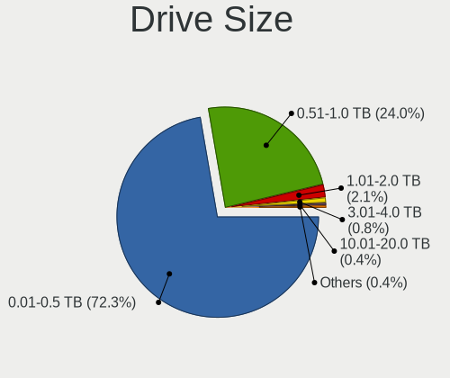

| Size in TB | Notebooks | Drives | Percent |
|------------|-----------|--------|---------|
| 0.01-0.5   | 315       | 457    | 74.29%  |
| 0.51-1.0   | 90        | 101    | 21.23%  |
| 1.01-2.0   | 13        | 16     | 3.07%   |
| 2.01-3.0   | 2         | 6      | 0.47%   |
| 4.01-10.0  | 2         | 3      | 0.47%   |
| 3.01-4.0   | 1         | 1      | 0.24%   |
| 10.01-20.0 | 1         | 1      | 0.24%   |

Space Total
-----------

Amount of disk space available on the file system

| Size in GB     | Notebooks | Percent |
|----------------|-----------|---------|
| 101-250        | 235       | 32.19%  |
| 251-500        | 183       | 25.07%  |
| 501-1000       | 105       | 14.38%  |
| 1-20           | 58        | 7.95%   |
| 1001-2000      | 51        | 6.99%   |
| 51-100         | 31        | 4.25%   |
| 21-50          | 20        | 2.74%   |
| More than 3000 | 17        | 2.33%   |
| Unknown        | 16        | 2.19%   |
| 2001-3000      | 14        | 1.92%   |

Space Used
----------

Amount of used disk space

| Used GB        | Notebooks | Percent |
|----------------|-----------|---------|
| 1-20           | 293       | 37.86%  |
| 21-50          | 139       | 17.96%  |
| 101-250        | 107       | 13.82%  |
| 51-100         | 101       | 13.05%  |
| 251-500        | 65        | 8.4%    |
| 501-1000       | 27        | 3.49%   |
| 1001-2000      | 17        | 2.2%    |
| Unknown        | 16        | 2.07%   |
| More than 3000 | 8         | 1.03%   |
| 0              | 1         | 0.13%   |

Malfunc. Drives
---------------

Drive models with a malfunction

| Model                                               | Notebooks | Drives | Percent |
|-----------------------------------------------------|-----------|--------|---------|
| WDC WD7500BPVX-22JC3T0 752GB                        | 2         | 2      | 6.45%   |
| WDC WD10JPVX-22JC3T0 1TB                            | 1         | 1      | 3.23%   |
| Toshiba MK5055GSX 500GB                             | 1         | 3      | 3.23%   |
| SK hynix SH920 2.5 7MM 128GB SSD                    | 1         | 1      | 3.23%   |
| SK hynix SC210 2.5 7MM 256GB SSD                    | 1         | 1      | 3.23%   |
| SK hynix HFS256G39TND-N210A 256GB SSD               | 1         | 1      | 3.23%   |
| SK hynix HFS128G39TND-N210A 128GB SSD               | 1         | 1      | 3.23%   |
| Seagate ST9750420AS 752GB                           | 1         | 1      | 3.23%   |
| Seagate ST500LT012-1DG142 500GB                     | 1         | 1      | 3.23%   |
| Seagate ST500LM000-SSHD-8GB                         | 1         | 1      | 3.23%   |
| Seagate ST1000LM014-SSHD-8GB                        | 1         | 1      | 3.23%   |
| SanDisk SD8TN8U-256G-1006 256GB SSD                 | 1         | 1      | 3.23%   |
| Samsung Electronics SSD SM841 2.5 7mm 256GB         | 1         | 1      | 3.23%   |
| Micron Technology MTFDDAK256MAY-1AH12ABHA 256GB SSD | 1         | 4      | 3.23%   |
| Micron Technology 1100_MTFDDAV512TBN 512GB SSD      | 1         | 1      | 3.23%   |
| Micron Technology 1100_MTFDDAK512TBN 512GB SSD      | 1         | 1      | 3.23%   |
| Lenovo LENSE20256GMSP34MEAT2TA 256GB                | 1         | 1      | 3.23%   |
| Kingston SA400S37960G 960GB SSD                     | 1         | 1      | 3.23%   |
| Kingston SA2000M81000G 1TB                          | 1         | 2      | 3.23%   |
| Intel SSDSA1M080G2LE 80GB                           | 1         | 1      | 3.23%   |
| Intel SSDPEKNW512G8H 512GB                          | 1         | 2      | 3.23%   |
| Hitachi HTS725032A9A364 320GB                       | 1         | 1      | 3.23%   |
| Hitachi HTS725025A9A364 250GB                       | 1         | 2      | 3.23%   |
| Hitachi HTS723232A7A364 320GB                       | 1         | 1      | 3.23%   |
| Hitachi HTS547564A9E384 640GB                       | 1         | 1      | 3.23%   |
| HGST HTS725050A7E630 500GB                          | 1         | 1      | 3.23%   |
| Crucial CT256M550SSD1 256GB                         | 1         | 1      | 3.23%   |
| Corsair Performance Pro 128GB SSD                   | 1         | 1      | 3.23%   |
| Corsair Force GS 240GB SSD                          | 1         | 2      | 3.23%   |
| Apple SSD SM0256F 256GB                             | 1         | 1      | 3.23%   |

Malfunc. Drive Vendor
---------------------

Vendors of faulty drives

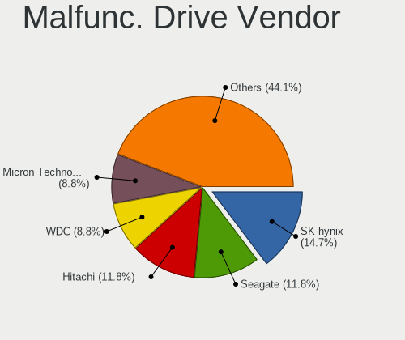

| Vendor              | Notebooks | Drives | Percent |
|---------------------|-----------|--------|---------|
| SK hynix            | 4         | 4      | 12.9%   |
| Seagate             | 4         | 4      | 12.9%   |
| Hitachi             | 4         | 5      | 12.9%   |
| WDC                 | 3         | 3      | 9.68%   |
| Micron Technology   | 3         | 6      | 9.68%   |
| Kingston            | 2         | 3      | 6.45%   |
| Intel               | 2         | 3      | 6.45%   |
| Corsair             | 2         | 3      | 6.45%   |
| Toshiba             | 1         | 3      | 3.23%   |
| SanDisk             | 1         | 1      | 3.23%   |
| Samsung Electronics | 1         | 1      | 3.23%   |
| Lenovo              | 1         | 1      | 3.23%   |
| HGST                | 1         | 1      | 3.23%   |
| Crucial             | 1         | 1      | 3.23%   |
| Apple               | 1         | 1      | 3.23%   |

Malfunc. HDD Vendor
-------------------

Vendors of faulty HDD drives

| Vendor  | Notebooks | Drives | Percent |
|---------|-----------|--------|---------|
| Seagate | 4         | 4      | 30.77%  |
| Hitachi | 4         | 5      | 30.77%  |
| WDC     | 3         | 3      | 23.08%  |
| Toshiba | 1         | 3      | 7.69%   |
| HGST    | 1         | 1      | 7.69%   |

Malfunc. Drive Kind
-------------------

Kinds of faulty drives

| Kind | Notebooks | Drives | Percent |
|------|-----------|--------|---------|
| SSD  | 15        | 19     | 48.39%  |
| HDD  | 13        | 16     | 41.94%  |
| NVMe | 3         | 5      | 9.68%   |

Failed Drives
-------------

Failed drive models

Zero info for selected period =(

Failed Drive Vendor
-------------------

Failed drive vendors

Zero info for selected period =(

Drive Status
------------

Number of failed and malfunc. drives

| Status   | Notebooks | Drives | Percent |
|----------|-----------|--------|---------|
| Detected | 417       | 644    | 56.58%  |
| Works    | 289       | 404    | 39.21%  |
| Malfunc  | 31        | 40     | 4.21%   |

Storage controller
------------------

Storage Vendor
--------------

Storage controller vendors

| Vendor                         | Notebooks | Percent |
|--------------------------------|-----------|---------|
| Intel                          | 438       | 52.96%  |
| Samsung Electronics            | 114       | 13.78%  |
| SanDisk                        | 59        | 7.13%   |
| AMD                            | 58        | 7.01%   |
| SK hynix                       | 40        | 4.84%   |
| Toshiba America Info Systems   | 36        | 4.35%   |
| Micron Technology              | 23        | 2.78%   |
| Kingston Technology Company    | 19        | 2.3%    |
| KIOXIA                         | 9         | 1.09%   |
| Lenovo                         | 5         | 0.6%    |
| Phison Electronics             | 4         | 0.48%   |
| Union Memory (Shenzhen)        | 3         | 0.36%   |
| Micron/Crucial Technology      | 3         | 0.36%   |
| Lite-On Technology             | 3         | 0.36%   |
| Solid State Storage Technology | 2         | 0.24%   |
| Nvidia                         | 2         | 0.24%   |
| Marvell Technology Group       | 2         | 0.24%   |
| ADATA Technology               | 2         | 0.24%   |
| Solidigm                       | 1         | 0.12%   |
| Silicon Motion                 | 1         | 0.12%   |
| Realtek Semiconductor          | 1         | 0.12%   |
| MAXIO Technology (Hangzhou)    | 1         | 0.12%   |
| Apple                          | 1         | 0.12%   |

Storage Model
-------------

Storage controller models

| Model                                                                          | Notebooks | Percent |
|--------------------------------------------------------------------------------|-----------|---------|
| Intel Sunrise Point-LP SATA Controller [AHCI mode]                             | 53        | 6.11%   |
| Samsung NVMe SSD Controller SM981/PM981/PM983                                  | 48        | 5.53%   |
| AMD FCH SATA Controller [AHCI mode]                                            | 45        | 5.18%   |
| Intel 7 Series Chipset Family 6-port SATA Controller [AHCI mode]               | 41        | 4.72%   |
| Intel 6 Series/C200 Series Chipset Family 6 port Mobile SATA AHCI Controller   | 39        | 4.49%   |
| Intel 82801 Mobile SATA Controller [RAID mode]                                 | 37        | 4.26%   |
| Intel Volume Management Device NVMe RAID Controller                            | 29        | 3.34%   |
| Intel 8 Series SATA Controller 1 [AHCI mode]                                   | 29        | 3.34%   |
| Intel Cannon Lake Mobile PCH SATA AHCI Controller                              | 26        | 3%      |
| Samsung NVMe SSD Controller SM961/PM961/SM963                                  | 22        | 2.53%   |
| Intel Wildcat Point-LP SATA Controller [AHCI Mode]                             | 21        | 2.42%   |
| Intel 8 Series/C220 Series Chipset Family 6-port SATA Controller 1 [AHCI mode] | 21        | 2.42%   |
| Toshiba America Info Systems XG6 NVMe SSD Controller                           | 19        | 2.19%   |
| Intel HM170/QM170 Chipset SATA Controller [AHCI Mode]                          | 19        | 2.19%   |
| SanDisk Extreme Pro / WD Black SN750 / PC SN730 / Red SN700 NVMe SSD           | 16        | 1.84%   |
| Samsung NVMe SSD Controller PM9A1/PM9A3/980PRO                                 | 16        | 1.84%   |
| Intel 82801IBM/IEM (ICH9M/ICH9M-E) 4 port SATA Controller [AHCI mode]          | 15        | 1.73%   |
| SanDisk Ultra 3D / WD Blue SN550 NVMe SSD                                      | 14        | 1.61%   |
| Intel 5 Series/3400 Series Chipset 6 port SATA AHCI Controller                 | 14        | 1.61%   |
| Samsung NVMe SSD Controller 980 (DRAM-less)                                    | 13        | 1.5%    |
| Intel 5 Series/3400 Series Chipset 4 port SATA AHCI Controller                 | 11        | 1.27%   |
| Intel SSD 660P Series                                                          | 10        | 1.15%   |
| SK hynix Gold P31/BC711/PC711 NVMe Solid State Drive                           | 9         | 1.04%   |
| Samsung S4LN058A01[SSUBX] AHCI SSD Controller (Apple slot)                     | 9         | 1.04%   |
| AMD SB7x0/SB8x0/SB9x0 SATA Controller [AHCI mode]                              | 9         | 1.04%   |
| Toshiba America Info Systems XG5 NVMe SSD Controller                           | 8         | 0.92%   |
| SK hynix PC401 NVMe Solid State Drive 256GB                                    | 8         | 0.92%   |
| SanDisk Extreme Pro / WD Black 2018/SN750/PC SN720 NVMe SSD                    | 8         | 0.92%   |
| Micron 2450 NVMe SSD [HendrixV] (DRAM-less)                                    | 8         | 0.92%   |
| SanDisk WD Blue SN500 / PC SN520 x2 M.2 2280 NVMe SSD                          | 7         | 0.81%   |
| Intel Tiger Lake SATA AHCI Controller                                          | 7         | 0.81%   |
| Intel Q170/Q150/B150/H170/H110/Z170/CM236 Chipset SATA Controller [AHCI Mode]  | 7         | 0.81%   |
| Intel Celeron/Pentium Silver Processor SATA Controller                         | 7         | 0.81%   |
| Intel Cannon Point-LP SATA Controller [AHCI Mode]                              | 7         | 0.81%   |
| SK hynix Platinum P41/PC801 NVMe Solid State Drive                             | 6         | 0.69%   |
| KIOXIA NVMe SSD Controller BG4 (DRAM-less)                                     | 6         | 0.69%   |
| SK hynix PC611 NVMe Solid State Drive                                          | 5         | 0.58%   |
| SK hynix BC501 NVMe Solid State Drive                                          | 5         | 0.58%   |
| Micron 2200S NVMe SSD [Cassandra]                                              | 5         | 0.58%   |
| Kingston Company OM8PCP Design-In PCIe 3 NVMe SSD (DRAM-less)                  | 5         | 0.58%   |

Storage Kind
------------

Kind of storage controller (IDE, SATA, NVMe, SAS, ...)

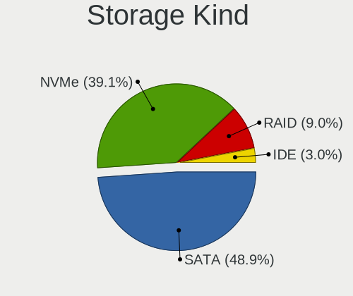

| Kind | Notebooks | Percent |
|------|-----------|---------|
| SATA | 422       | 50.84%  |
| NVMe | 309       | 37.23%  |
| RAID | 72        | 8.67%   |
| IDE  | 27        | 3.25%   |

Processor
---------

CPU Vendor
----------

Processor vendors

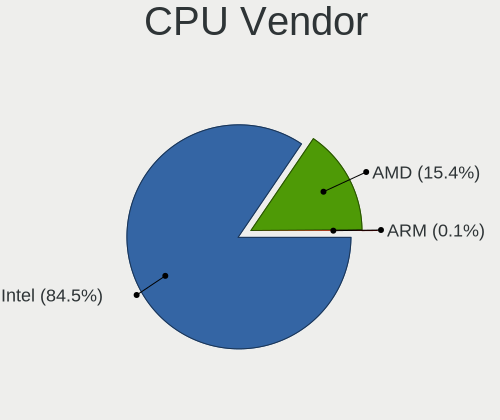

| Vendor | Notebooks | Percent |
|--------|-----------|---------|
| Intel  | 583       | 85.11%  |
| AMD    | 101       | 14.74%  |
| ARM    | 1         | 0.15%   |

CPU Model
---------

Processor models

| Model                                   | Notebooks | Percent |
|-----------------------------------------|-----------|---------|
| Intel Core i5-8250U CPU @ 1.60GHz       | 18        | 2.63%   |
| Intel Core i7-8565U CPU @ 1.80GHz       | 14        | 2.04%   |
| Intel 11th Gen Core i7-1165G7 @ 2.80GHz | 13        | 1.9%    |
| Intel Core i7-8550U CPU @ 1.80GHz       | 12        | 1.75%   |
| Intel Core i5-8265U CPU @ 1.60GHz       | 12        | 1.75%   |
| Intel Core i5-7200U CPU @ 2.50GHz       | 12        | 1.75%   |
| Intel Core i7-9750H CPU @ 2.60GHz       | 11        | 1.61%   |
| Intel Core i7-8750H CPU @ 2.20GHz       | 10        | 1.46%   |
| Intel Core i5-6200U CPU @ 2.30GHz       | 10        | 1.46%   |
| Intel Core i5-3210M CPU @ 2.50GHz       | 10        | 1.46%   |
| Intel Core i7-6700HQ CPU @ 2.60GHz      | 9         | 1.31%   |
| Intel Core i7-6600U CPU @ 2.60GHz       | 9         | 1.31%   |
| Intel Core i5-6300U CPU @ 2.40GHz       | 9         | 1.31%   |
| Intel 11th Gen Core i5-1135G7 @ 2.40GHz | 9         | 1.31%   |
| Intel Core i7-3520M CPU @ 2.90GHz       | 8         | 1.17%   |
| Intel Core i5-5200U CPU @ 2.20GHz       | 8         | 1.17%   |
| Intel Core i7-7700HQ CPU @ 2.80GHz      | 7         | 1.02%   |
| Intel Core i5-5257U CPU @ 2.70GHz       | 7         | 1.02%   |
| Intel Core i5-4200U CPU @ 1.60GHz       | 7         | 1.02%   |
| Intel Core i5-3320M CPU @ 2.60GHz       | 7         | 1.02%   |
| Intel Core i5-2520M CPU @ 2.50GHz       | 7         | 1.02%   |
| Intel 12th Gen Core i5-12500H           | 7         | 1.02%   |
| AMD Ryzen 5 4500U with Radeon Graphics  | 7         | 1.02%   |
| Intel Core i7-7500U CPU @ 2.70GHz       | 6         | 0.88%   |
| Intel Core i7-5600U CPU @ 2.60GHz       | 6         | 0.88%   |
| Intel Core i7-10750H CPU @ 2.60GHz      | 6         | 0.88%   |
| Intel 11th Gen Core i5-11400H @ 2.70GHz | 6         | 0.88%   |
| Intel Core i9-8950HK CPU @ 2.90GHz      | 5         | 0.73%   |
| Intel Core i7-6500U CPU @ 2.50GHz       | 5         | 0.73%   |
| Intel Core i7-4720HQ CPU @ 2.60GHz      | 5         | 0.73%   |
| Intel Core i7-2630QM CPU @ 2.00GHz      | 5         | 0.73%   |
| Intel Core i7-10510U CPU @ 1.80GHz      | 5         | 0.73%   |
| Intel Core i5-10210U CPU @ 1.60GHz      | 5         | 0.73%   |
| Intel Core i3-6100U CPU @ 2.30GHz       | 5         | 0.73%   |
| Intel Core i3-4030U CPU @ 1.90GHz       | 5         | 0.73%   |
| AMD Ryzen 7 4700U with Radeon Graphics  | 5         | 0.73%   |
| Intel Core i7-8850H CPU @ 2.60GHz       | 4         | 0.58%   |
| Intel Core i7-8665U CPU @ 1.90GHz       | 4         | 0.58%   |
| Intel Core i7-6820HQ CPU @ 2.70GHz      | 4         | 0.58%   |
| Intel Core i7-4810MQ CPU @ 2.80GHz      | 4         | 0.58%   |

CPU Model Family
----------------

Processor model prefix

| Model                   | Notebooks | Percent |
|-------------------------|-----------|---------|
| Intel Core i7           | 202       | 29.49%  |
| Intel Core i5           | 188       | 27.45%  |
| Other                   | 81        | 11.82%  |
| Intel Core i3           | 33        | 4.82%   |
| Intel Celeron           | 23        | 3.36%   |
| AMD Ryzen 7             | 22        | 3.21%   |
| AMD Ryzen 5             | 22        | 3.21%   |
| Intel Pentium           | 12        | 1.75%   |
| Intel Core 2 Duo        | 12        | 1.75%   |
| Intel Core i9           | 9         | 1.31%   |
| Intel Atom              | 6         | 0.88%   |
| AMD Ryzen 7 PRO         | 6         | 0.88%   |
| AMD A8                  | 6         | 0.88%   |
| Intel Genuine           | 5         | 0.73%   |
| AMD Ryzen 9             | 5         | 0.73%   |
| AMD Ryzen 3             | 5         | 0.73%   |
| AMD A6                  | 5         | 0.73%   |
| Intel Core 2            | 4         | 0.58%   |
| Intel Pentium Dual-Core | 3         | 0.44%   |
| AMD Ryzen 5 PRO         | 3         | 0.44%   |
| AMD E2                  | 3         | 0.44%   |
| AMD E1                  | 3         | 0.44%   |
| AMD E                   | 3         | 0.44%   |
| AMD A10                 | 3         | 0.44%   |
| AMD Turion 64 X2 Mobile | 2         | 0.29%   |
| AMD Phenom II           | 2         | 0.29%   |
| AMD Athlon II           | 2         | 0.29%   |
| Intel Xeon              | 1         | 0.15%   |
| Intel Pentium Silver    | 1         | 0.15%   |
| Intel Pentium Gold      | 1         | 0.15%   |
| Intel Core m7           | 1         | 0.15%   |
| Intel Core M            | 1         | 0.15%   |
| Intel Core 2 Solo       | 1         | 0.15%   |
| Intel Celeron Dual-Core | 1         | 0.15%   |
| AMD V160                | 1         | 0.15%   |
| AMD V120                | 1         | 0.15%   |
| AMD Ryzen Embedded      | 1         | 0.15%   |
| AMD Ryzen 3 PRO         | 1         | 0.15%   |
| AMD Athlon II Dual-Core | 1         | 0.15%   |
| AMD Athlon 64 X2        | 1         | 0.15%   |

CPU Cores
---------

Number of processor cores

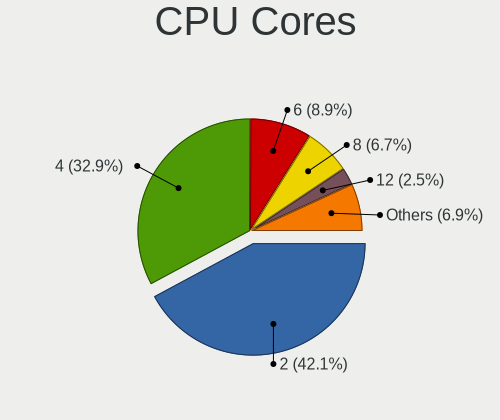

| Number | Notebooks | Percent |
|--------|-----------|---------|
| 2      | 302       | 43.96%  |
| 4      | 225       | 32.75%  |
| 6      | 66        | 9.61%   |
| 8      | 43        | 6.26%   |
| 12     | 14        | 2.04%   |
| 10     | 13        | 1.89%   |
| 1      | 12        | 1.75%   |
| 14     | 9         | 1.31%   |
| 24     | 1         | 0.15%   |
| 16     | 1         | 0.15%   |
| 3      | 1         | 0.15%   |

CPU Sockets
-----------

Number of sockets

| Number | Notebooks | Percent |
|--------|-----------|---------|
| 1      | 685       | 100%    |

CPU Threads
-----------

Threads per core (Hyper-Threading)

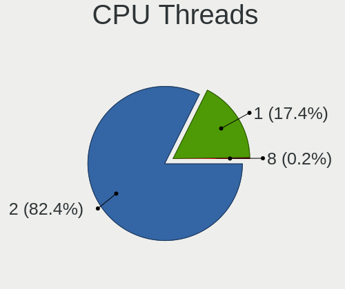

| Number | Notebooks | Percent |
|--------|-----------|---------|
| 2      | 562       | 81.45%  |
| 1      | 126       | 18.26%  |
| 8      | 2         | 0.29%   |

CPU Op-Modes
------------

CPU Operation Modes (32-bit, 64-bit)

| Op mode        | Notebooks | Percent |
|----------------|-----------|---------|
| 32-bit, 64-bit | 672       | 97.96%  |
| Unknown        | 9         | 1.31%   |
| 32-bit         | 5         | 0.73%   |

CPU Microcode
-------------

Microcode number

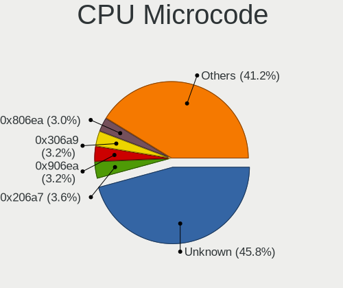

| Number     | Notebooks | Percent |
|------------|-----------|---------|
| Unknown    | 281       | 38.92%  |
| 0x206a7    | 30        | 4.16%   |
| 0x906ea    | 27        | 3.74%   |
| 0x306a9    | 26        | 3.6%    |
| 0x806ea    | 24        | 3.32%   |
| 0x406e3    | 24        | 3.32%   |
| 0x40651    | 24        | 3.32%   |
| 0x806ec    | 20        | 2.77%   |
| 0x306d4    | 19        | 2.63%   |
| 0x806e9    | 16        | 2.22%   |
| 0x806c1    | 14        | 1.94%   |
| 0x20655    | 13        | 1.8%    |
| 0x506e3    | 12        | 1.66%   |
| 0x306c3    | 12        | 1.66%   |
| 0xa0652    | 11        | 1.52%   |
| 0x1067a    | 11        | 1.52%   |
| 0x08600106 | 11        | 1.52%   |
| 0x906a3    | 10        | 1.39%   |
| 0x906e9    | 9         | 1.25%   |
| 0x806d1    | 8         | 1.11%   |
| 0x806eb    | 7         | 0.97%   |
| 0x0a50000c | 6         | 0.83%   |
| 0x010000c8 | 6         | 0.83%   |
| 0x20652    | 5         | 0.69%   |
| 0x08600103 | 5         | 0.69%   |
| 0x08108109 | 5         | 0.69%   |
| 0x906ed    | 4         | 0.55%   |
| 0x506c9    | 4         | 0.55%   |
| 0x08108102 | 4         | 0.55%   |
| 0x05000119 | 4         | 0.55%   |
| 0x906a4    | 3         | 0.42%   |
| 0x706a1    | 3         | 0.42%   |
| 0x6fd      | 3         | 0.42%   |
| 0x406c4    | 3         | 0.42%   |
| 0x08608103 | 3         | 0.42%   |
| 0x08600104 | 3         | 0.42%   |
| 0xb06a3    | 2         | 0.28%   |
| 0x706e5    | 2         | 0.28%   |
| 0x706a8    | 2         | 0.28%   |
| 0x6f6      | 2         | 0.28%   |

CPU Microarch
-------------

Microarchitecture

| Name             | Notebooks | Percent |
|------------------|-----------|---------|
| KabyLake         | 158       | 22.97%  |
| Haswell          | 64        | 9.3%    |
| Skylake          | 59        | 8.58%   |
| IvyBridge        | 48        | 6.98%   |
| SandyBridge      | 45        | 6.54%   |
| Alderlake Hybrid | 33        | 4.8%    |
| Broadwell        | 31        | 4.51%   |
| TigerLake        | 27        | 3.92%   |
| Zen 2            | 26        | 3.78%   |
| Westmere         | 23        | 3.34%   |
| Unknown          | 22        | 3.2%    |
| Icelake          | 17        | 2.47%   |
| Zen 3            | 16        | 2.33%   |
| Penryn           | 16        | 2.33%   |
| CometLake        | 13        | 1.89%   |
| Zen+             | 12        | 1.74%   |
| Silvermont       | 9         | 1.31%   |
| Goldmont plus    | 8         | 1.16%   |
| K10              | 7         | 1.02%   |
| Core             | 7         | 1.02%   |
| Piledriver       | 5         | 0.73%   |
| Goldmont         | 5         | 0.73%   |
| Excavator        | 5         | 0.73%   |
| Bobcat           | 5         | 0.73%   |
| Bonnell          | 4         | 0.58%   |
| Puma             | 3         | 0.44%   |
| P6               | 3         | 0.44%   |
| Nehalem          | 3         | 0.44%   |
| K8 Hammer        | 3         | 0.44%   |
| K10 Llano        | 3         | 0.44%   |
| Zen              | 2         | 0.29%   |
| Tremont          | 2         | 0.29%   |
| Steamroller      | 2         | 0.29%   |
| Jaguar           | 2         | 0.29%   |

Graphics
--------

GPU Vendor
----------

Vendors of graphics cards

| Vendor | Notebooks | Percent |
|--------|-----------|---------|
| Intel  | 533       | 60.5%   |
| Nvidia | 215       | 24.4%   |
| AMD    | 133       | 15.1%   |

GPU Model
---------

Graphics card models

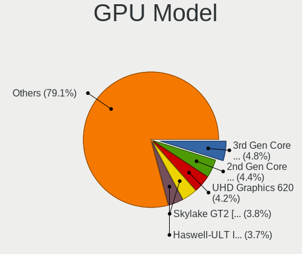

| Model                                                                                    | Notebooks | Percent |
|------------------------------------------------------------------------------------------|-----------|---------|
| Intel 3rd Gen Core processor Graphics Controller                                         | 43        | 4.79%   |
| Intel 2nd Generation Core Processor Family Integrated Graphics Controller                | 41        | 4.57%   |
| Intel Skylake GT2 [HD Graphics 520]                                                      | 38        | 4.24%   |
| Intel UHD Graphics 620                                                                   | 37        | 4.12%   |
| Intel Haswell-ULT Integrated Graphics Controller                                         | 34        | 3.79%   |
| Intel WhiskeyLake-U GT2 [UHD Graphics 620]                                               | 33        | 3.68%   |
| Intel CoffeeLake-H GT2 [UHD Graphics 630]                                                | 29        | 3.23%   |
| AMD Renoir [Radeon RX Vega 6 (Ryzen 4000/5000 Mobile Series)]                            | 26        | 2.9%    |
| Intel TigerLake-LP GT2 [Iris Xe Graphics]                                                | 25        | 2.79%   |
| Intel HD Graphics 620                                                                    | 25        | 2.79%   |
| Intel 4th Gen Core Processor Integrated Graphics Controller                              | 24        | 2.68%   |
| Intel HD Graphics 5500                                                                   | 22        | 2.45%   |
| Intel HD Graphics 530                                                                    | 16        | 1.78%   |
| Intel Core Processor Integrated Graphics Controller                                      | 15        | 1.67%   |
| Intel Alder Lake-P GT2 [Iris Xe Graphics]                                                | 15        | 1.67%   |
| Intel TigerLake-H GT1 [UHD Graphics]                                                     | 14        | 1.56%   |
| AMD Cezanne [Radeon Vega Series / Radeon Vega Mobile Series]                             | 14        | 1.56%   |
| Intel Mobile 4 Series Chipset Integrated Graphics Controller                             | 12        | 1.34%   |
| AMD Picasso/Raven 2 [Radeon Vega Series / Radeon Vega Mobile Series]                     | 12        | 1.34%   |
| Intel CometLake-U GT2 [UHD Graphics]                                                     | 11        | 1.23%   |
| Intel CometLake-H GT2 [UHD Graphics]                                                     | 11        | 1.23%   |
| Nvidia GP108M [GeForce MX150]                                                            | 10        | 1.11%   |
| Nvidia GP107M [GeForce GTX 1050 Ti Mobile]                                               | 9         | 1%      |
| Intel Raptor Lake-P [Iris Xe Graphics]                                                   | 9         | 1%      |
| Nvidia TU117M [GeForce GTX 1650 Mobile / Max-Q]                                          | 8         | 0.89%   |
| Nvidia TU116M [GeForce GTX 1660 Ti Mobile]                                               | 8         | 0.89%   |
| Nvidia GM107M [GeForce GTX 960M]                                                         | 8         | 0.89%   |
| Nvidia GA106M [GeForce RTX 3060 Mobile / Max-Q]                                          | 8         | 0.89%   |
| Intel HD Graphics 630                                                                    | 8         | 0.89%   |
| Nvidia TU106M [GeForce RTX 2060 Mobile]                                                  | 7         | 0.78%   |
| Intel Iris Graphics 6100                                                                 | 7         | 0.78%   |
| Intel GeminiLake [UHD Graphics 600]                                                      | 7         | 0.78%   |
| Nvidia GM107M [GeForce GTX 950M]                                                         | 6         | 0.67%   |
| Nvidia GA107M [GeForce RTX 3050 Ti Mobile]                                               | 6         | 0.67%   |
| Intel Atom/Celeron/Pentium Processor x5-E8000/J3xxx/N3xxx Integrated Graphics Controller | 6         | 0.67%   |
| Nvidia TU117GLM [Quadro T2000 Mobile / Max-Q]                                            | 5         | 0.56%   |
| Nvidia GP107GLM [Quadro P1000 Mobile]                                                    | 5         | 0.56%   |
| Nvidia GM108M [GeForce 940MX]                                                            | 5         | 0.56%   |
| Intel Mobile 945GM/GMS/GME, 943/940GML Express Integrated Graphics Controller            | 5         | 0.56%   |
| Intel Alder Lake-UP3 GT2 [Iris Xe Graphics]                                              | 5         | 0.56%   |

GPU Combo
---------

Combinations of graphics cards

| Name           | Notebooks | Percent |
|----------------|-----------|---------|
| 1 x Intel      | 351       | 51.09%  |
| Intel + Nvidia | 162       | 23.58%  |
| 1 x AMD        | 88        | 12.81%  |
| 1 x Nvidia     | 39        | 5.68%   |
| Intel + AMD    | 21        | 3.06%   |
| AMD + Nvidia   | 14        | 2.04%   |
| 2 x AMD        | 11        | 1.6%    |
| Other          | 1         | 0.15%   |

GPU Driver
----------

Free vs proprietary

| Driver      | Notebooks | Percent |
|-------------|-----------|---------|
| Free        | 560       | 80.11%  |
| Proprietary | 121       | 17.31%  |
| Unknown     | 18        | 2.58%   |

GPU Memory
----------

Total video memory

| Size in GB | Notebooks | Percent |
|------------|-----------|---------|
| Unknown    | 493       | 70.63%  |
| 1.01-2.0   | 63        | 9.03%   |
| 0.01-0.5   | 61        | 8.74%   |
| 3.01-4.0   | 36        | 5.16%   |
| 0.51-1.0   | 27        | 3.87%   |
| 5.01-6.0   | 10        | 1.43%   |
| 7.01-8.0   | 5         | 0.72%   |
| 2.01-3.0   | 2         | 0.29%   |
| 16.01-24.0 | 1         | 0.14%   |

Monitor
-------

Monitor Vendor
--------------

Monitor vendors

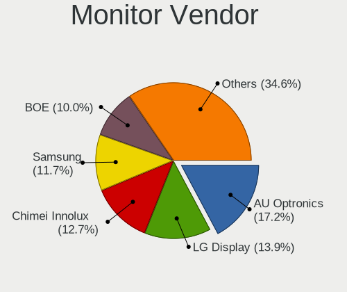

| Vendor                  | Notebooks | Percent |
|-------------------------|-----------|---------|
| AU Optronics            | 141       | 17.05%  |
| LG Display              | 122       | 14.75%  |
| Chimei Innolux          | 101       | 12.21%  |
| Samsung Electronics     | 90        | 10.88%  |
| BOE                     | 80        | 9.67%   |
| Sharp                   | 37        | 4.47%   |
| Dell                    | 34        | 4.11%   |
| Apple                   | 24        | 2.9%    |
| Lenovo                  | 23        | 2.78%   |
| InfoVision              | 16        | 1.93%   |
| Hewlett-Packard         | 16        | 1.93%   |
| BenQ                    | 15        | 1.81%   |
| Chi Mei Optoelectronics | 14        | 1.69%   |
| AOC                     | 13        | 1.57%   |
| CSO                     | 11        | 1.33%   |
| Philips                 | 10        | 1.21%   |
| PANDA                   | 7         | 0.85%   |
| JDI                     | 7         | 0.85%   |
| Ancor Communications    | 7         | 0.85%   |
| Sony                    | 6         | 0.73%   |
| Acer                    | 6         | 0.73%   |
| Panasonic               | 5         | 0.6%    |
| Goldstar                | 5         | 0.6%    |
| NEC Computers           | 4         | 0.48%   |
| ASUSTek Computer        | 4         | 0.48%   |
| MSI                     | 3         | 0.36%   |
| Grundig                 | 3         | 0.36%   |
| MiTAC                   | 2         | 0.24%   |
| LG Philips              | 2         | 0.24%   |
| HannStar                | 2         | 0.24%   |
| VOXICON                 | 1         | 0.12%   |
| ViewSonic               | 1         | 0.12%   |
| Vestel Elektronik       | 1         | 0.12%   |
| Toshiba                 | 1         | 0.12%   |
| TMX                     | 1         | 0.12%   |
| Tatung                  | 1         | 0.12%   |
| STA                     | 1         | 0.12%   |
| SSD                     | 1         | 0.12%   |
| Seiko/Epson             | 1         | 0.12%   |
| S2-Tek                  | 1         | 0.12%   |

Monitor Model
-------------

Monitor models

| Model                                                                 | Notebooks | Percent |
|-----------------------------------------------------------------------|-----------|---------|
| Sharp LCD Monitor SHP148D 3840x2160 344x194mm 15.5-inch               | 7         | 0.83%   |
| Chimei Innolux LCD Monitor CMN14F2 1920x1080 309x173mm 13.9-inch      | 7         | 0.83%   |
| Chimei Innolux LCD Monitor CMN14D4 1920x1080 309x173mm 13.9-inch      | 7         | 0.83%   |
| LG Display LCD Monitor LGD02D8 1366x768 277x156mm 12.5-inch           | 6         | 0.71%   |
| JDI LCD Monitor JDI422A 3000x2000 293x196mm 13.9-inch                 | 6         | 0.71%   |
| LG Display LCD Monitor LGD046F 1920x1080 340x190mm 15.3-inch          | 5         | 0.59%   |
| AU Optronics LCD Monitor AUO80ED 1920x1080 344x193mm 15.5-inch        | 5         | 0.59%   |
| AU Optronics LCD Monitor AUO573D 1920x1080 309x174mm 14.0-inch        | 5         | 0.59%   |
| AU Optronics LCD Monitor AUO38ED 1920x1080 344x193mm 15.5-inch        | 5         | 0.59%   |
| Sharp LCD Monitor SHP14D0 3840x2400 336x210mm 15.6-inch               | 4         | 0.47%   |
| Samsung Electronics LF24T35 SAM707D 1920x1080 528x297mm 23.9-inch     | 4         | 0.47%   |
| Samsung Electronics LCD Monitor SEC3859 1366x768 293x165mm 13.2-inch  | 4         | 0.47%   |
| NEC Computers P403 NEC692B 1920x1080 886x498mm 40.0-inch              | 4         | 0.47%   |
| LG Display LCD Monitor LGD0521 1920x1080 309x174mm 14.0-inch          | 4         | 0.47%   |
| LG Display LCD Monitor LGD046D 1920x1080 309x174mm 14.0-inch          | 4         | 0.47%   |
| LG Display LCD Monitor LGD02DC 1366x768 344x194mm 15.5-inch           | 4         | 0.47%   |
| Chimei Innolux LCD Monitor CMN14B1 1920x1080 308x173mm 13.9-inch      | 4         | 0.47%   |
| AU Optronics LCD Monitor AUO403D 1920x1080 309x174mm 14.0-inch        | 4         | 0.47%   |
| AU Optronics LCD Monitor AUO313D 1920x1080 309x174mm 14.0-inch        | 4         | 0.47%   |
| AU Optronics LCD Monitor AUO26EC 1366x768 344x193mm 15.5-inch         | 4         | 0.47%   |
| AOC Q32G1WG4 AOC3201 2560x1440 697x393mm 31.5-inch                    | 4         | 0.47%   |
| Sharp LCD Monitor SHP149A 1920x1080 344x194mm 15.5-inch               | 3         | 0.36%   |
| Samsung Electronics LCD Monitor SEC5441 1366x768 344x194mm 15.5-inch  | 3         | 0.36%   |
| Samsung Electronics LCD Monitor SEC324C 1600x900 310x174mm 14.0-inch  | 3         | 0.36%   |
| Samsung Electronics LCD Monitor SDC4171 2880x1800 302x189mm 14.0-inch | 3         | 0.36%   |
| Samsung Electronics LCD Monitor SDC4152 2880x1800 302x189mm 14.0-inch | 3         | 0.36%   |
| Panasonic VVX13F009G00 MEI96A2 1920x1080 344x193mm 15.5-inch          | 3         | 0.36%   |
| LG Display LCD Monitor LGD0590 1920x1080 344x194mm 15.5-inch          | 3         | 0.36%   |
| LG Display LCD Monitor LGD056D 1920x1080 382x215mm 17.3-inch          | 3         | 0.36%   |
| LG Display LCD Monitor LGD0354 1366x768 293x165mm 13.2-inch           | 3         | 0.36%   |
| LG Display LCD Monitor LGD0306 1600x900 310x174mm 14.0-inch           | 3         | 0.36%   |
| LG Display LCD Monitor LGD02D9 1920x1080 344x194mm 15.5-inch          | 3         | 0.36%   |
| LG Display LCD Monitor LGD0259 1920x1080 345x194mm 15.6-inch          | 3         | 0.36%   |
| Lenovo LCD Monitor LEN40B1 1600x900 345x194mm 15.6-inch               | 3         | 0.36%   |
| Lenovo LCD Monitor LEN4036 1440x900 303x190mm 14.1-inch               | 3         | 0.36%   |
| Lenovo LCD Monitor LEN4011 1280x800 261x163mm 12.1-inch               | 3         | 0.36%   |
| Grundig WXGA GRU4448 1600x1200                                        | 3         | 0.36%   |
| Dell U2718Q DELA0EC 3840x2160 609x349mm 27.6-inch                     | 3         | 0.36%   |
| Dell U2717D DEL40EA 2560x1440 597x336mm 27.0-inch                     | 3         | 0.36%   |
| CSO LCD Monitor CSO1404 1920x1200 302x189mm 14.0-inch                 | 3         | 0.36%   |

Monitor Resolution
------------------

Monitor screen resolution

| Resolution         | Notebooks | Percent |
|--------------------|-----------|---------|
| 1920x1080 (FHD)    | 374       | 47.7%   |
| 1366x768 (WXGA)    | 130       | 16.58%  |
| 3840x2160 (4K)     | 53        | 6.76%   |
| 1600x900 (HD+)     | 37        | 4.72%   |
| 1920x1200 (WUXGA)  | 36        | 4.59%   |
| 2560x1440 (QHD)    | 32        | 4.08%   |
| 2880x1800          | 18        | 2.3%    |
| 1280x800 (WXGA)    | 17        | 2.17%   |
| 2560x1600          | 14        | 1.79%   |
| 3840x2400          | 9         | 1.15%   |
| 3000x2000          | 7         | 0.89%   |
| 1440x900 (WXGA+)   | 7         | 0.89%   |
| 3440x1440          | 6         | 0.77%   |
| 3840x1080          | 5         | 0.64%   |
| 2160x1440          | 5         | 0.64%   |
| 1280x1024 (SXGA)   | 4         | 0.51%   |
| 1024x600           | 4         | 0.51%   |
| 1920x540           | 3         | 0.38%   |
| 1360x768           | 3         | 0.38%   |
| 1280x720 (HD)      | 3         | 0.38%   |
| 3200x1800 (QHD+)   | 2         | 0.26%   |
| 1680x1050 (WSXGA+) | 2         | 0.26%   |
| Unknown            | 2         | 0.26%   |
| 9600x2160          | 1         | 0.13%   |
| 3840x1600          | 1         | 0.13%   |
| 3840x1100          | 1         | 0.13%   |
| 3456x2160          | 1         | 0.13%   |
| 3200x2000          | 1         | 0.13%   |
| 2646x1024          | 1         | 0.13%   |
| 2560x1080          | 1         | 0.13%   |
| 2304x1440          | 1         | 0.13%   |
| 2240x1400          | 1         | 0.13%   |
| 2048x1152          | 1         | 0.13%   |
| 1920x1280          | 1         | 0.13%   |

Monitor Diagonal
----------------

Diagonal size in inches

| Inches  | Notebooks | Percent |
|---------|-----------|---------|
| 15      | 254       | 30.64%  |
| 14      | 140       | 16.89%  |
| 13      | 135       | 16.28%  |
| 17      | 54        | 6.51%   |
| 27      | 48        | 5.79%   |
| 24      | 40        | 4.83%   |
| 12      | 37        | 4.46%   |
| 31      | 14        | 1.69%   |
| 16      | 14        | 1.69%   |
| Unknown | 11        | 1.33%   |
| 23      | 8         | 0.97%   |
| 40      | 6         | 0.72%   |
| 34      | 6         | 0.72%   |
| 11      | 6         | 0.72%   |
| 54      | 5         | 0.6%    |
| 21      | 5         | 0.6%    |
| 48      | 4         | 0.48%   |
| 84      | 3         | 0.36%   |
| 72      | 3         | 0.36%   |
| 32      | 3         | 0.36%   |
| 25      | 3         | 0.36%   |
| 22      | 3         | 0.36%   |
| 10      | 3         | 0.36%   |
| 55      | 2         | 0.24%   |
| 49      | 2         | 0.24%   |
| 43      | 2         | 0.24%   |
| 39      | 2         | 0.24%   |
| 26      | 2         | 0.24%   |
| 19      | 2         | 0.24%   |
| 85      | 1         | 0.12%   |
| 65      | 1         | 0.12%   |
| 60      | 1         | 0.12%   |
| 42      | 1         | 0.12%   |
| 38      | 1         | 0.12%   |
| 37      | 1         | 0.12%   |
| 36      | 1         | 0.12%   |
| 33      | 1         | 0.12%   |
| 29      | 1         | 0.12%   |
| 28      | 1         | 0.12%   |
| 18      | 1         | 0.12%   |

Monitor Width
-------------

Physical width

| Width in mm | Notebooks | Percent |
|-------------|-----------|---------|
| 301-350     | 463       | 56.19%  |
| 201-300     | 117       | 14.2%   |
| 501-600     | 87        | 10.56%  |
| 351-400     | 65        | 7.89%   |
| 601-700     | 24        | 2.91%   |
| 1001-1500   | 15        | 1.82%   |
| 701-800     | 11        | 1.33%   |
| Unknown     | 11        | 1.33%   |
| 801-900     | 10        | 1.21%   |
| 401-500     | 10        | 1.21%   |
| 1501-2000   | 7         | 0.85%   |
| 901-1000    | 3         | 0.36%   |
| 101-200     | 1         | 0.12%   |

Aspect Ratio
------------

Proportional relationship between the width and the height

| Ratio   | Notebooks | Percent |
|---------|-----------|---------|
| 16/9    | 571       | 79.75%  |
| 16/10   | 102       | 14.25%  |
| 3/2     | 16        | 2.23%   |
| 21/9    | 8         | 1.12%   |
| Unknown | 7         | 0.98%   |
| 32/9    | 6         | 0.84%   |
| 5/4     | 5         | 0.7%    |
| 3.40    | 1         | 0.14%   |

Monitor Area
------------

Area in inch

| Area in inch | Notebooks | Percent |
|----------------|-----------|---------|
| 101-110        | 250       | 30.12%  |
| 81-90          | 218       | 26.27%  |
| 71-80          | 55        | 6.63%   |
| 301-350        | 48        | 5.78%   |
| 121-130        | 48        | 5.78%   |
| 201-250        | 41        | 4.94%   |
| 61-70          | 36        | 4.34%   |
| 351-500        | 25        | 3.01%   |
| 251-300        | 19        | 2.29%   |
| 501-1000       | 19        | 2.29%   |
| More than 1000 | 17        | 2.05%   |
| 111-120        | 15        | 1.81%   |
| Unknown        | 11        | 1.33%   |
| 51-60          | 7         | 0.84%   |
| 131-140        | 7         | 0.84%   |
| 151-200        | 4         | 0.48%   |
| 41-50          | 3         | 0.36%   |
| 141-150        | 3         | 0.36%   |
| 91-100         | 3         | 0.36%   |
| 1-40           | 1         | 0.12%   |

Pixel Density
-------------

Pixels per inch

| Density       | Notebooks | Percent |
|---------------|-----------|---------|
| 121-160       | 375       | 45.9%   |
| 101-120       | 158       | 19.34%  |
| 51-100        | 126       | 15.42%  |
| 161-240       | 79        | 9.67%   |
| More than 240 | 55        | 6.73%   |
| 1-50          | 13        | 1.59%   |
| Unknown       | 11        | 1.35%   |

Multiple Monitors
-----------------

Total monitors connected

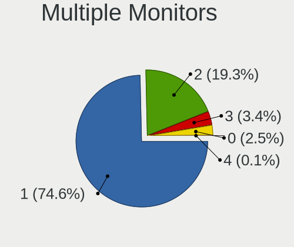

| Total | Notebooks | Percent |
|-------|-----------|---------|
| 1     | 521       | 73.17%  |
| 2     | 148       | 20.79%  |
| 3     | 23        | 3.23%   |
| 0     | 19        | 2.67%   |
| 4     | 1         | 0.14%   |

Network
-------

Net Controller Vendor
---------------------

Controller vendors

| Vendor                            | Notebooks | Percent |
|-----------------------------------|-----------|---------|
| Intel                             | 464       | 43.94%  |
| Realtek Semiconductor             | 282       | 26.7%   |
| Qualcomm Atheros                  | 99        | 9.38%   |
| Broadcom                          | 62        | 5.87%   |
| Broadcom Limited                  | 21        | 1.99%   |
| Ericsson Business Mobile Networks | 17        | 1.61%   |
| Sierra Wireless                   | 14        | 1.33%   |
| MediaTek                          | 14        | 1.33%   |
| Dell                              | 13        | 1.23%   |
| Hewlett-Packard                   | 9         | 0.85%   |
| Lenovo                            | 7         | 0.66%   |
| Ralink Technology                 | 6         | 0.57%   |
| Ralink                            | 6         | 0.57%   |
| ASUSTek Computer                  | 6         | 0.57%   |
| Marvell Technology Group          | 5         | 0.47%   |
| DisplayLink                       | 5         | 0.47%   |
| NetGear                           | 4         | 0.38%   |
| FIBOCOM                           | 4         | 0.38%   |
| Qualcomm                          | 3         | 0.28%   |
| TP-Link                           | 2         | 0.19%   |
| Qualcomm Atheros Communications   | 2         | 0.19%   |
| Nvidia                            | 2         | 0.19%   |
| Microsoft                         | 2         | 0.19%   |
| JMicron Technology                | 2         | 0.19%   |
| T & A Mobile Phones               | 1         | 0.09%   |
| Samsung Electronics               | 1         | 0.09%   |
| Huawei Technologies               | 1         | 0.09%   |
| D-Link                            | 1         | 0.09%   |
| Apple                             | 1         | 0.09%   |

Net Controller Model
--------------------

Controller models

| Model                                                                  | Notebooks | Percent |
|------------------------------------------------------------------------|-----------|---------|
| Realtek RTL8111/8168/8211/8411 PCI Express Gigabit Ethernet Controller | 175       | 13.17%  |
| Intel Wireless 8265 / 8275                                             | 52        | 3.91%   |
| Realtek RTL8153 Gigabit Ethernet Adapter                               | 48        | 3.61%   |
| Intel Wi-Fi 6 AX200                                                    | 43        | 3.24%   |
| Intel 82579LM Gigabit Network Connection (Lewisville)                  | 43        | 3.24%   |
| Intel Wireless 8260                                                    | 38        | 2.86%   |
| Intel Wireless 7265                                                    | 31        | 2.33%   |
| Intel Wireless 7260                                                    | 30        | 2.26%   |
| Intel Centrino Advanced-N 6205 [Taylor Peak]                           | 26        | 1.96%   |
| Intel Cannon Point-LP CNVi [Wireless-AC]                               | 22        | 1.66%   |
| Intel Alder Lake-P PCH CNVi WiFi                                       | 22        | 1.66%   |
| Realtek RTL810xE PCI Express Fast Ethernet controller                  | 21        | 1.58%   |
| Qualcomm Atheros QCA6174 802.11ac Wireless Network Adapter             | 20        | 1.5%    |
| Qualcomm Atheros AR9285 Wireless Network Adapter (PCI-Express)         | 17        | 1.28%   |
| Intel Wi-Fi 6 AX201                                                    | 17        | 1.28%   |
| Intel Ethernet Connection (4) I219-V                                   | 17        | 1.28%   |
| Intel Ethernet Connection (4) I219-LM                                  | 17        | 1.28%   |
| Intel Centrino Ultimate-N 6300                                         | 16        | 1.2%    |
| Intel Cannon Lake PCH CNVi WiFi                                        | 16        | 1.2%    |
| Qualcomm Atheros QCA9565 / AR9565 Wireless Network Adapter             | 14        | 1.05%   |
| Intel Ethernet Connection (6) I219-V                                   | 14        | 1.05%   |
| Realtek RTL8852AE 802.11ax PCIe Wireless Network Adapter               | 13        | 0.98%   |
| Qualcomm Atheros QCA9377 802.11ac Wireless Network Adapter             | 13        | 0.98%   |
| Intel Tiger Lake PCH CNVi WiFi                                         | 13        | 0.98%   |
| Intel Ethernet Connection I219-LM                                      | 13        | 0.98%   |
| Intel Wi-Fi 5(802.11ac) Wireless-AC 9x6x [Thunder Peak]                | 12        | 0.9%    |
| Intel Ethernet Connection I218-LM                                      | 12        | 0.9%    |
| Intel Centrino Advanced-N 6235                                         | 12        | 0.9%    |
| Broadcom BCM4313 802.11bgn Wireless Network Adapter                    | 12        | 0.9%    |
| Intel Raptor Lake PCH CNVi WiFi                                        | 11        | 0.83%   |
| Intel Ethernet Connection I219-V                                       | 11        | 0.83%   |
| Intel Ethernet Connection (3) I218-LM                                  | 11        | 0.83%   |
| Intel Comet Lake PCH-LP CNVi WiFi                                      | 11        | 0.83%   |
| Intel Comet Lake PCH CNVi WiFi                                         | 10        | 0.75%   |
| Intel 82577LM Gigabit Network Connection                               | 10        | 0.75%   |
| Broadcom BCM43228 802.11a/b/g/n                                        | 10        | 0.75%   |
| Realtek RTL8821CE 802.11ac PCIe Wireless Network Adapter               | 9         | 0.68%   |
| Intel WiFi Link 5100                                                   | 8         | 0.6%    |
| Intel Wi-Fi 6E(802.11ax) AX210/AX1675* 2x2 [Typhoon Peak]              | 8         | 0.6%    |
| Intel Ethernet Connection I217-LM                                      | 8         | 0.6%    |

Wireless Vendor
---------------

Wireless vendors

| Vendor                          | Notebooks | Percent |
|---------------------------------|-----------|---------|
| Intel                           | 444       | 60.33%  |
| Qualcomm Atheros                | 83        | 11.28%  |
| Realtek Semiconductor           | 65        | 8.83%   |
| Broadcom                        | 52        | 7.07%   |
| Broadcom Limited                | 18        | 2.45%   |
| Sierra Wireless                 | 14        | 1.9%    |
| MediaTek                        | 14        | 1.9%    |
| Dell                            | 8         | 1.09%   |
| Ralink Technology               | 6         | 0.82%   |
| Ralink                          | 6         | 0.82%   |
| ASUSTek Computer                | 6         | 0.82%   |
| NetGear                         | 4         | 0.54%   |
| FIBOCOM                         | 4         | 0.54%   |
| Qualcomm                        | 3         | 0.41%   |
| Hewlett-Packard                 | 3         | 0.41%   |
| TP-Link                         | 2         | 0.27%   |
| Qualcomm Atheros Communications | 2         | 0.27%   |
| Microsoft                       | 2         | 0.27%   |

Wireless Model
--------------

Wireless models

| Model                                                          | Notebooks | Percent |
|----------------------------------------------------------------|-----------|---------|
| Intel Wireless 8265 / 8275                                     | 52        | 7.05%   |
| Intel Wi-Fi 6 AX200                                            | 43        | 5.83%   |
| Intel Wireless 8260                                            | 38        | 5.15%   |
| Intel Wireless 7265                                            | 31        | 4.2%    |
| Intel Wireless 7260                                            | 30        | 4.07%   |
| Intel Centrino Advanced-N 6205 [Taylor Peak]                   | 26        | 3.52%   |
| Intel Cannon Point-LP CNVi [Wireless-AC]                       | 22        | 2.98%   |
| Intel Alder Lake-P PCH CNVi WiFi                               | 22        | 2.98%   |
| Qualcomm Atheros QCA6174 802.11ac Wireless Network Adapter     | 20        | 2.71%   |
| Qualcomm Atheros AR9285 Wireless Network Adapter (PCI-Express) | 17        | 2.3%    |
| Intel Wi-Fi 6 AX201                                            | 17        | 2.3%    |
| Intel Centrino Ultimate-N 6300                                 | 16        | 2.17%   |
| Intel Cannon Lake PCH CNVi WiFi                                | 16        | 2.17%   |
| Qualcomm Atheros QCA9565 / AR9565 Wireless Network Adapter     | 14        | 1.9%    |
| Realtek RTL8852AE 802.11ax PCIe Wireless Network Adapter       | 13        | 1.76%   |
| Qualcomm Atheros QCA9377 802.11ac Wireless Network Adapter     | 13        | 1.76%   |
| Intel Tiger Lake PCH CNVi WiFi                                 | 13        | 1.76%   |
| Intel Wi-Fi 5(802.11ac) Wireless-AC 9x6x [Thunder Peak]        | 12        | 1.63%   |
| Intel Centrino Advanced-N 6235                                 | 12        | 1.63%   |
| Broadcom BCM4313 802.11bgn Wireless Network Adapter            | 12        | 1.63%   |
| Intel Raptor Lake PCH CNVi WiFi                                | 11        | 1.49%   |
| Intel Comet Lake PCH-LP CNVi WiFi                              | 11        | 1.49%   |
| Intel Comet Lake PCH CNVi WiFi                                 | 10        | 1.36%   |
| Broadcom BCM43228 802.11a/b/g/n                                | 10        | 1.36%   |
| Realtek RTL8821CE 802.11ac PCIe Wireless Network Adapter       | 9         | 1.22%   |
| Intel WiFi Link 5100                                           | 8         | 1.08%   |
| Intel Wi-Fi 6E(802.11ax) AX210/AX1675* 2x2 [Typhoon Peak]      | 8         | 1.08%   |
| Sierra Wireless EM7455                                         | 7         | 0.95%   |
| Realtek RTL8822CE 802.11ac PCIe Wireless Network Adapter       | 7         | 0.95%   |
| Realtek RTL8723BE PCIe Wireless Network Adapter                | 7         | 0.95%   |
| MediaTek MT7921 802.11ax PCI Express Wireless Network Adapter  | 7         | 0.95%   |
| Intel Wireless 3165                                            | 7         | 0.95%   |
| Intel Wireless 3160                                            | 7         | 0.95%   |
| Qualcomm Atheros AR9462 Wireless Network Adapter               | 6         | 0.81%   |
| Broadcom BCM43224 802.11a/b/g/n                                | 6         | 0.81%   |
| Sierra Wireless Sierra Wireless EM7345 4G LTE                  | 5         | 0.68%   |
| Qualcomm Atheros AR9485 Wireless Network Adapter               | 5         | 0.68%   |
| MediaTek MT7922 802.11ax PCI Express Wireless Network Adapter  | 5         | 0.68%   |
| Intel Dual Band Wireless-AC 3165 Plus Bluetooth                | 5         | 0.68%   |
| Dell DW5811e Snapdragon X7 LTE                           | 5         | 0.68%   |

Ethernet Vendor
---------------

Ethernet vendors

| Vendor                   | Notebooks | Percent |
|--------------------------|-----------|---------|
| Realtek Semiconductor    | 248       | 44.36%  |
| Intel                    | 218       | 39%     |
| Qualcomm Atheros         | 36        | 6.44%   |
| Broadcom                 | 25        | 4.47%   |
| Lenovo                   | 7         | 1.25%   |
| Marvell Technology Group | 5         | 0.89%   |
| DisplayLink              | 5         | 0.89%   |
| Broadcom Limited         | 5         | 0.89%   |
| Nvidia                   | 2         | 0.36%   |
| JMicron Technology       | 2         | 0.36%   |
| T & A Mobile Phones      | 1         | 0.18%   |
| Samsung Electronics      | 1         | 0.18%   |
| Huawei Technologies      | 1         | 0.18%   |
| Hewlett-Packard          | 1         | 0.18%   |
| D-Link                   | 1         | 0.18%   |
| Apple                    | 1         | 0.18%   |

Ethernet Model
--------------

Ethernet models

| Model                                                                  | Notebooks | Percent |
|------------------------------------------------------------------------|-----------|---------|
| Realtek RTL8111/8168/8211/8411 PCI Express Gigabit Ethernet Controller | 175       | 31.03%  |
| Realtek RTL8153 Gigabit Ethernet Adapter                               | 48        | 8.51%   |
| Intel 82579LM Gigabit Network Connection (Lewisville)                  | 43        | 7.62%   |
| Realtek RTL810xE PCI Express Fast Ethernet controller                  | 21        | 3.72%   |
| Intel Ethernet Connection (4) I219-V                                   | 17        | 3.01%   |
| Intel Ethernet Connection (4) I219-LM                                  | 17        | 3.01%   |
| Intel Ethernet Connection (6) I219-V                                   | 14        | 2.48%   |
| Intel Ethernet Connection I219-LM                                      | 13        | 2.3%    |
| Intel Ethernet Connection I218-LM                                      | 12        | 2.13%   |
| Intel Ethernet Connection I219-V                                       | 11        | 1.95%   |
| Intel Ethernet Connection (3) I218-LM                                  | 11        | 1.95%   |
| Intel 82577LM Gigabit Network Connection                               | 10        | 1.77%   |
| Intel Ethernet Connection I217-LM                                      | 8         | 1.42%   |
| Qualcomm Atheros QCA8171 Gigabit Ethernet                              | 6         | 1.06%   |
| Intel Ethernet Connection (6) I219-LM                                  | 6         | 1.06%   |
| Intel Ethernet Connection (2) I219-LM                                  | 6         | 1.06%   |
| Qualcomm Atheros QCA8172 Fast Ethernet                                 | 5         | 0.89%   |
| Intel Ethernet Connection (13) I219-V                                  | 5         | 0.89%   |
| Broadcom NetXtreme BCM57765 Gigabit Ethernet PCIe                      | 5         | 0.89%   |
| Broadcom NetLink BCM57785 Gigabit Ethernet PCIe                        | 5         | 0.89%   |
| Qualcomm Atheros Killer E2500 Gigabit Ethernet Controller              | 4         | 0.71%   |
| Qualcomm Atheros Killer E220x Gigabit Ethernet Controller              | 4         | 0.71%   |
| Qualcomm Atheros AR8151 v2.0 Gigabit Ethernet                          | 4         | 0.71%   |
| Qualcomm Atheros AR8131 Gigabit Ethernet                               | 4         | 0.71%   |
| Intel Ethernet Connection (3) I218-V                                   | 4         | 0.71%   |
| Intel Ethernet Connection (16) I219-LM                                 | 4         | 0.71%   |
| Intel 82567LM Gigabit Network Connection                               | 4         | 0.71%   |
| Broadcom NetXtreme BCM57786 Gigabit Ethernet PCIe                      | 4         | 0.71%   |
| Intel Ethernet Connection (7) I219-LM                                  | 3         | 0.53%   |
| Intel Ethernet Connection (5) I219-LM                                  | 3         | 0.53%   |
| Intel Ethernet Connection (16) I219-V                                  | 3         | 0.53%   |
| Intel 82579V Gigabit Network Connection                                | 3         | 0.53%   |
| Intel 82577LC Gigabit Network Connection                               | 3         | 0.53%   |
| Broadcom NetXtreme BCM5761 Gigabit Ethernet PCIe                       | 3         | 0.53%   |
| Realtek RTL8152 Fast Ethernet Adapter                                  | 2         | 0.35%   |
| Realtek RTL8125 2.5GbE Controller                                      | 2         | 0.35%   |
| Realtek Killer E3000 2.5GbE Controller                                 | 2         | 0.35%   |
| Qualcomm Atheros AR8161 Gigabit Ethernet                               | 2         | 0.35%   |
| Qualcomm Atheros AR8152 v2.0 Fast Ethernet                             | 2         | 0.35%   |
| Qualcomm Atheros AR8151 v1.0 Gigabit Ethernet                          | 2         | 0.35%   |

Net Controller Kind
-------------------

Ethernet, WiFi or modem

| Kind     | Notebooks | Percent |
|----------|-----------|---------|
| WiFi     | 678       | 54.55%  |
| Ethernet | 538       | 43.28%  |
| Modem    | 25        | 2.01%   |
| Unknown  | 2         | 0.16%   |

Used Controller
---------------

Currently used network controller

| Kind     | Notebooks | Percent |
|----------|-----------|---------|
| WiFi     | 602       | 81.68%  |
| Ethernet | 135       | 18.32%  |

NICs
----

Total network controllers on board

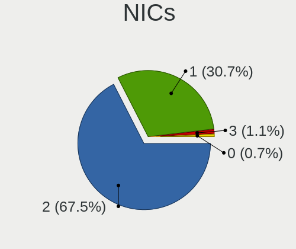

| Total | Notebooks | Percent |
|-------|-----------|---------|
| 2     | 480       | 69.87%  |
| 1     | 193       | 28.09%  |
| 3     | 8         | 1.16%   |
| 0     | 6         | 0.87%   |

IPv6
----

IPv6 vs IPv4

| Used | Notebooks | Percent |
|------|-----------|---------|
| No   | 587       | 82.91%  |
| Yes  | 121       | 17.09%  |

Bluetooth
---------

Bluetooth Vendor
----------------

Controller vendors

| Vendor                          | Notebooks | Percent |
|---------------------------------|-----------|---------|
| Intel                           | 342       | 59.38%  |
| Broadcom                        | 50        | 8.68%   |
| Realtek Semiconductor           | 37        | 6.42%   |
| Qualcomm Atheros Communications | 28        | 4.86%   |
| Foxconn / Hon Hai               | 22        | 3.82%   |
| Lite-On Technology              | 20        | 3.47%   |
| Apple                           | 20        | 3.47%   |
| IMC Networks                    | 18        | 3.13%   |
| Hewlett-Packard                 | 13        | 2.26%   |
| Dell                            | 10        | 1.74%   |
| ASUSTek Computer                | 6         | 1.04%   |
| Realtek                         | 2         | 0.35%   |
| Cambridge Silicon Radio         | 2         | 0.35%   |
| Toshiba                         | 1         | 0.17%   |
| Ralink Technology               | 1         | 0.17%   |
| Ralink                          | 1         | 0.17%   |
| MediaTek                        | 1         | 0.17%   |
| Integrated System Solution      | 1         | 0.17%   |
| Edimax Technology               | 1         | 0.17%   |

Bluetooth Model
---------------

Controller models

| Model                                              | Notebooks | Percent |
|----------------------------------------------------|-----------|---------|
| Intel Bluetooth Device                             | 79        | 13.67%  |
| Intel Bluetooth wireless interface                 | 63        | 10.9%   |
| Intel AX201 Bluetooth                              | 52        | 9%      |
| Intel AX200 Bluetooth                              | 42        | 7.27%   |
| Intel Bluetooth 9460/9560 Jefferson Peak (JfP)     | 41        | 7.09%   |
| Intel AX211 Bluetooth                              | 31        | 5.36%   |
| Realtek Bluetooth Radio                            | 28        | 4.84%   |
| Broadcom BCM2045B (BDC-2.1)                        | 15        | 2.6%    |
| Intel Centrino Bluetooth Wireless Transceiver      | 13        | 2.25%   |
| Intel Wireless-AC 9260 Bluetooth Adapter           | 12        | 2.08%   |
| Apple Bluetooth Host Controller                    | 12        | 2.08%   |
| Lite-On Bluetooth Device                           | 10        | 1.73%   |
| HP Broadcom 2070 Bluetooth Combo                   | 10        | 1.73%   |
| Foxconn / Hon Hai Bluetooth Device                 | 9         | 1.56%   |
| Broadcom BCM20702 Bluetooth 4.0 [ThinkPad]         | 9         | 1.56%   |
| Qualcomm Atheros AR3012 Bluetooth 4.0              | 8         | 1.38%   |
| Qualcomm Atheros  Bluetooth Device                 | 7         | 1.21%   |
| Qualcomm Atheros AR3011 Bluetooth                  | 7         | 1.21%   |
| Intel AX210 Bluetooth                              | 7         | 1.21%   |
| IMC Networks Bluetooth Radio                       | 7         | 1.21%   |
| Apple Bluetooth USB Host Controller                | 6         | 1.04%   |
| Lite-On Qualcomm Atheros QCA9377 Bluetooth         | 5         | 0.87%   |
| Realtek  Bluetooth 4.2 Adapter                     | 4         | 0.69%   |
| IMC Networks Bluetooth Device                      | 4         | 0.69%   |
| Foxconn / Hon Hai Wireless_Device                  | 4         | 0.69%   |
| Dell BCM20702A0 Bluetooth Module                   | 4         | 0.69%   |
| Broadcom HP Portable SoftSailing                   | 4         | 0.69%   |
| Broadcom BCM20702A0                                | 4         | 0.69%   |
| Broadcom BCM2045B (BDC-2.1) [Bluetooth Controller] | 4         | 0.69%   |
| Qualcomm Atheros QCA61x4 Bluetooth 4.0             | 3         | 0.52%   |
| Qualcomm Atheros AR3012 Bluetooth                  | 3         | 0.52%   |
| IMC Networks Wireless_Device                       | 3         | 0.52%   |
| Foxconn / Hon Hai MediaTek Bluetooth Adapter       | 3         | 0.52%   |
| Dell DW375 Bluetooth Module                        | 3         | 0.52%   |
| Broadcom HP Portable Bumble Bee                    | 3         | 0.52%   |
| Broadcom BCM43142A0 Bluetooth Device               | 3         | 0.52%   |
| Realtek 802.11ac WLAN Adapter                      | 2         | 0.35%   |
| Realtek Bluetooth Radio                            | 2         | 0.35%   |
| Lite-On Wireless_Device                            | 2         | 0.35%   |
| Lite-On Atheros AR3012 Bluetooth                   | 2         | 0.35%   |

Sound
-----

Sound Vendor
------------

Sound card vendors

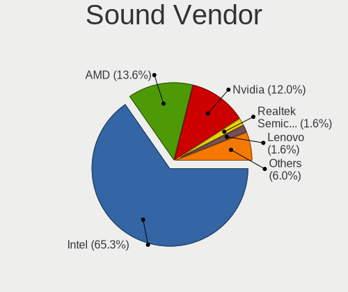

| Vendor                                       | Notebooks | Percent |
|----------------------------------------------|-----------|---------|
| Intel                                        | 578       | 65.98%  |
| AMD                                          | 115       | 13.13%  |
| Nvidia                                       | 107       | 12.21%  |
| Realtek Semiconductor                        | 16        | 1.83%   |
| Lenovo                                       | 13        | 1.48%   |
| Logitech                                     | 7         | 0.8%    |
| Kingston Technology                          | 6         | 0.68%   |
| GN Netcom                                    | 5         | 0.57%   |
| C-Media Electronics                          | 3         | 0.34%   |
| Sony                                         | 2         | 0.23%   |
| Plantronics                                  | 2         | 0.23%   |
| Hewlett-Packard                              | 2         | 0.23%   |
| DSEA A/S                                     | 2         | 0.23%   |
| Zoran Co. Personal Media Division (Nogatech) | 1         | 0.11%   |
| SteelSeries ApS                              | 1         | 0.11%   |
| Sonicstar                                    | 1         | 0.11%   |
| SAVITECH                                     | 1         | 0.11%   |
| Roland                                       | 1         | 0.11%   |
| ROCCAT                                       | 1         | 0.11%   |
| Razer USA                                    | 1         | 0.11%   |
| NAD                                          | 1         | 0.11%   |
| Mark of the Unicorn                          | 1         | 0.11%   |
| JMTek                                        | 1         | 0.11%   |
| Focusrite-Novation                           | 1         | 0.11%   |
| FiiO Electronics Technology                  | 1         | 0.11%   |
| Elgato Systems                               | 1         | 0.11%   |
| Drop                                         | 1         | 0.11%   |
| Dell                                         | 1         | 0.11%   |
| DCMT Technology                              | 1         | 0.11%   |
| Corsair                                      | 1         | 0.11%   |
| Conexant Systems                             | 1         | 0.11%   |

Sound Model
-----------

Sound card models

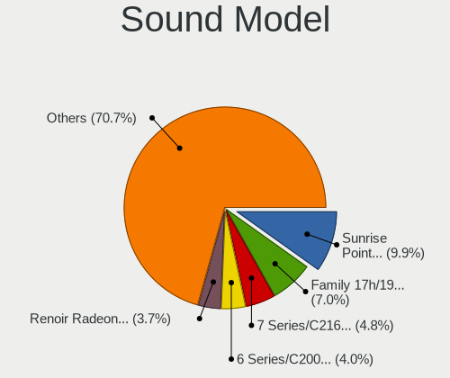

| Model                                                                      | Notebooks | Percent |
|----------------------------------------------------------------------------|-----------|---------|
| Intel Sunrise Point-LP HD Audio                                            | 105       | 10%     |
| AMD Family 17h/19h HD Audio Controller                                     | 64        | 6.1%    |
| Intel 7 Series/C216 Chipset Family High Definition Audio Controller        | 51        | 4.86%   |
| Intel 6 Series/C200 Series Chipset Family High Definition Audio Controller | 42        | 4%      |
| AMD Renoir Radeon High Definition Audio Controller                         | 40        | 3.81%   |
| Intel Cannon Lake PCH cAVS                                                 | 37        | 3.52%   |
| Intel Haswell-ULT HD Audio Controller                                      | 35        | 3.33%   |
| Intel 8 Series HD Audio Controller                                         | 35        | 3.33%   |
| Intel Cannon Point-LP High Definition Audio Controller                     | 34        | 3.24%   |
| Intel Wildcat Point-LP High Definition Audio Controller                    | 31        | 2.95%   |
| Intel Broadwell-U Audio Controller                                         | 31        | 2.95%   |
| Intel 8 Series/C220 Series Chipset High Definition Audio Controller        | 29        | 2.76%   |
| Intel Tiger Lake-LP Smart Sound Technology Audio Controller                | 27        | 2.57%   |
| Intel 5 Series/3400 Series Chipset High Definition Audio                   | 26        | 2.48%   |
| Intel Alder Lake PCH-P High Definition Audio Controller                    | 25        | 2.38%   |
| Intel Xeon E3-1200 v3/4th Gen Core Processor HD Audio Controller           | 22        | 2.1%    |
| AMD FCH Azalia Controller                                                  | 18        | 1.71%   |
| Intel 82801I (ICH9 Family) HD Audio Controller                             | 17        | 1.62%   |
| Realtek Semiconductor USB Audio                                            | 16        | 1.52%   |
| Intel 100 Series/C230 Series Chipset Family HD Audio Controller            | 16        | 1.52%   |
| Intel Tiger Lake-H HD Audio Controller                                     | 15        | 1.43%   |
| Intel CM238 HD Audio Controller                                            | 13        | 1.24%   |
| Intel Raptor Lake-P/U/H cAVS                                               | 12        | 1.14%   |
| Intel Comet Lake PCH cAVS                                                  | 12        | 1.14%   |
| AMD SBx00 Azalia (Intel HDA)                                               | 12        | 1.14%   |
| AMD Raven/Raven2/Fenghuang HDMI/DP Audio Controller                        | 12        | 1.14%   |
| Intel Comet Lake PCH-LP cAVS                                               | 11        | 1.05%   |
| Nvidia TU106 High Definition Audio Controller                              | 9         | 0.86%   |
| Intel NM10/ICH7 Family High Definition Audio Controller                    | 9         | 0.86%   |
| Nvidia TU116 High Definition Audio Controller                              | 8         | 0.76%   |
| Nvidia TU107 GeForce GTX 1650 High Definition Audio Controller             | 8         | 0.76%   |
| Nvidia GA106 High Definition Audio Controller                              | 8         | 0.76%   |
| Nvidia GA104 High Definition Audio Controller                              | 8         | 0.76%   |
| Intel Celeron/Pentium Silver Processor High Definition Audio               | 8         | 0.76%   |
| AMD RV710/730 HDMI Audio [Radeon HD 4000 series]                           | 8         | 0.76%   |
| Nvidia GT216 HDMI Audio Controller                                         | 7         | 0.67%   |
| Nvidia GP107GL High Definition Audio Controller                            | 7         | 0.67%   |
| Nvidia GF108 High Definition Audio Controller                              | 7         | 0.67%   |
| Nvidia Audio device                                                        | 6         | 0.57%   |
| AMD Kabini HDMI/DP Audio                                                   | 6         | 0.57%   |

Memory
------

Memory Vendor
-------------

Memory module vendors

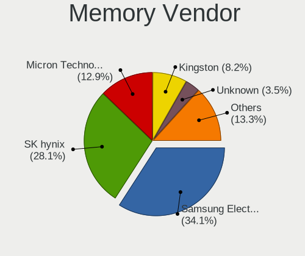

| Vendor              | Notebooks | Percent |
|---------------------|-----------|---------|
| Samsung Electronics | 156       | 35.14%  |
| SK hynix            | 120       | 27.03%  |
| Micron Technology   | 58        | 13.06%  |
| Kingston            | 38        | 8.56%   |
| Unknown             | 17        | 3.83%   |
| Crucial             | 11        | 2.48%   |
| Elpida              | 9         | 2.03%   |
| Ramaxel Technology  | 7         | 1.58%   |
| Corsair             | 6         | 1.35%   |
| A-DATA Technology   | 6         | 1.35%   |
| Unknown             | 4         | 0.9%    |
| Nanya Technology    | 3         | 0.68%   |
| Unknown (ABCD)      | 1         | 0.23%   |
| Transcend           | 1         | 0.23%   |
| Toshiba             | 1         | 0.23%   |
| Team                | 1         | 0.23%   |
| GSkill              | 1         | 0.23%   |
| G.Skill             | 1         | 0.23%   |
| fef5                | 1         | 0.23%   |
| ASint Technology    | 1         | 0.23%   |
| 48spaces            | 1         | 0.23%   |

Memory Model
------------

Memory module models

| Model                                                            | Notebooks | Percent |
|------------------------------------------------------------------|-----------|---------|
| Samsung RAM M471B5173EB0-YK0 4GB SODIMM DDR3 1600MT/s            | 7         | 1.5%    |
| Samsung RAM M471A1K43EB1-CWE 8GB SODIMM DDR4 3200MT/s            | 7         | 1.5%    |
| Samsung RAM M471B5273DH0-CH9 4GB SODIMM DDR3 1334MT/s            | 6         | 1.28%   |
| Samsung RAM M471A2K43CB1-CRC 16GB SODIMM DDR4 2667MT/s           | 6         | 1.28%   |
| Unknown RAM Module 4GB Chip DDR4 2133MT/s                        | 5         | 1.07%   |
| SK hynix RAM HMT451S6BFR8A-PB 4GB SODIMM DDR3 1600MT/s           | 5         | 1.07%   |
| SK hynix RAM HMA851S6AFR6N-UH 4GB SODIMM DDR4 2667MT/s           | 5         | 1.07%   |
| Samsung RAM Module 4GB SODIMM DDR3 1867MT/s                      | 5         | 1.07%   |
| Samsung RAM M471B5173QH0-YK0 4GB SODIMM DDR3 1600MT/s            | 5         | 1.07%   |
| Samsung RAM M471A1K43DB1-CTD 8GB SODIMM DDR4 2667MT/s            | 5         | 1.07%   |
| Samsung RAM M471A1G44BB0-CWE 8GB SODIMM DDR4 3200MT/s            | 5         | 1.07%   |
| Samsung RAM M471A1G44AB0-CWE 8192MB SODIMM DDR4 3200MT/s         | 5         | 1.07%   |
| Micron RAM MT52L1G32D4PG-093 8GB Row Of Chips LPDDR3 2133MT/s    | 5         | 1.07%   |
| SK hynix RAM HMT41GS6BFR8A-PB 8GB SODIMM DDR3 1600MT/s           | 4         | 0.85%   |
| SK hynix RAM HMT41GS6AFR8A-PB 8GB SODIMM DDR3 1600MT/s           | 4         | 0.85%   |
| SK hynix RAM HMT351S6EFR8A-PB 4GB SODIMM DDR3 1600MT/s           | 4         | 0.85%   |
| SK hynix RAM HMAA1GS6CJR6N-XN 8GB SODIMM DDR4 3200MT/s           | 4         | 0.85%   |
| SK hynix RAM HMA41GS6AFR8N-TF 8GB SODIMM DDR4 2667MT/s           | 4         | 0.85%   |
| Samsung RAM M471B1G73DB0-YK0 8GB SODIMM DDR3 1600MT/s            | 4         | 0.85%   |
| Samsung RAM M471A5244CB0-CRC 4GB SODIMM DDR4 2667MT/s            | 4         | 0.85%   |
| Samsung RAM M471A1K43DB1-CWE 8GB SODIMM DDR4 3200MT/s            | 4         | 0.85%   |
| Micron RAM 4ATF1G64HZ-3G2E1 8GB Row Of Chips DDR4 3200MT/s       | 4         | 0.85%   |
| Micron RAM 16ATF2G64HZ-2G6E1 16GB SODIMM DDR4 2667MT/s           | 4         | 0.85%   |
| Kingston RAM KN2M64-ETB 8GB SODIMM DDR3 1600MT/s                 | 4         | 0.85%   |
| Unknown                                                          | 4         | 0.85%   |
| SK hynix RAM Module 16GB SODIMM DDR4 2667MT/s                    | 3         | 0.64%   |
| SK hynix RAM HMT351S6CFR8C-PB 4GB SODIMM DDR3 1600MT/s           | 3         | 0.64%   |
| SK hynix RAM HMA82GS6DJR8N-VK 16GB SODIMM DDR4 2667MT/s          | 3         | 0.64%   |
| SK hynix RAM HMA82GS6CJR8N-VK 16GB SODIMM DDR4 2667MT/s          | 3         | 0.64%   |
| SK hynix RAM HMA81GS6AFR8N-UH 8GB SODIMM DDR4 2667MT/s           | 3         | 0.64%   |
| SK hynix RAM H9CCNNNCLGALAR-NVD 8GB Row Of Chips LPDDR3 2133MT/s | 3         | 0.64%   |
| Samsung RAM Module 8GB SODIMM DDR4 3200MT/s                      | 3         | 0.64%   |
| Samsung RAM Module 8192MB SODIMM DDR4 2133MT/s                   | 3         | 0.64%   |
| Samsung RAM M471B5173DB0-YK0 4GB SODIMM DDR3 1600MT/s            | 3         | 0.64%   |
| Samsung RAM M471B1G73EB0-YK0 8GB SODIMM DDR3 1600MT/s            | 3         | 0.64%   |
| Samsung RAM M471A4G43MB1-CTD 32GB SODIMM DDR4 2667MT/s           | 3         | 0.64%   |
| Samsung RAM M471A2K43DB1-CWE 16GB SODIMM DDR4 3200MT/s           | 3         | 0.64%   |
| Samsung RAM M471A2G44AM0-CTD 16GB DDR4 2667MT/s                  | 3         | 0.64%   |
| Samsung RAM M471A1K43CB1-CRC 8GB SODIMM DDR4 2667MT/s            | 3         | 0.64%   |
| Samsung RAM M471A1K43BB1-CTD 8GB SODIMM DDR4 2667MT/s            | 3         | 0.64%   |

Memory Kind
-----------

Memory module kinds

| Kind    | Notebooks | Percent |
|---------|-----------|---------|
| DDR4    | 189       | 49.48%  |
| DDR3    | 109       | 28.53%  |
| LPDDR3  | 30        | 7.85%   |
| LPDDR4  | 22        | 5.76%   |
| LPDDR5  | 12        | 3.14%   |
| DDR5    | 8         | 2.09%   |
| SDRAM   | 5         | 1.31%   |
| DDR2    | 5         | 1.31%   |
| Unknown | 2         | 0.52%   |

Memory Form Factor
------------------

Physical design of the memory module

| Name         | Notebooks | Percent |
|--------------|-----------|---------|
| SODIMM       | 307       | 79.33%  |
| Row Of Chips | 65        | 16.8%   |
| Chip         | 10        | 2.58%   |
| Unknown      | 5         | 1.29%   |

Memory Size
-----------

Memory module size

| Size  | Notebooks | Percent |
|-------|-----------|---------|
| 8192  | 175       | 42.68%  |
| 4096  | 118       | 28.78%  |
| 16384 | 78        | 19.02%  |
| 2048  | 23        | 5.61%   |
| 32768 | 15        | 3.66%   |
| 1024  | 1         | 0.24%   |

Memory Speed
------------

Memory module speed

| Speed | Notebooks | Percent |
|-------|-----------|---------|
| 2667  | 91        | 22.14%  |
| 1600  | 79        | 19.22%  |
| 3200  | 73        | 17.76%  |
| 2133  | 45        | 10.95%  |
| 2400  | 24        | 5.84%   |
| 1867  | 16        | 3.89%   |
| 1334  | 15        | 3.65%   |
| 6400  | 11        | 2.68%   |
| 4267  | 11        | 2.68%   |
| 1333  | 8         | 1.95%   |
| 1067  | 6         | 1.46%   |
| 4800  | 5         | 1.22%   |
| 4199  | 4         | 0.97%   |
| 667   | 4         | 0.97%   |
| 5600  | 3         | 0.73%   |
| 4266  | 3         | 0.73%   |
| 8400  | 2         | 0.49%   |
| 3266  | 2         | 0.49%   |
| 1066  | 2         | 0.49%   |
| 7467  | 1         | 0.24%   |
| 3733  | 1         | 0.24%   |
| 2933  | 1         | 0.24%   |
| 2048  | 1         | 0.24%   |
| 1866  | 1         | 0.24%   |
| 975   | 1         | 0.24%   |
| 800   | 1         | 0.24%   |

Printers & scanners
-------------------

Printer Vendor
--------------

Printer device vendors

| Vendor             | Notebooks | Percent |
|--------------------|-----------|---------|
| Hewlett-Packard    | 2         | 40%     |
| Brother Industries | 2         | 40%     |
| Canon              | 1         | 20%     |

Printer Model
-------------

Printer device models

| Model                     | Notebooks | Percent |
|---------------------------|-----------|---------|
| HP Printing Support       | 1         | 20%     |
| HP ENVY Photo 6200 series | 1         | 20%     |
| Canon TS5300 series       | 1         | 20%     |
| Brother PT-2450DX         | 1         | 20%     |
| Brother HL-1210W series   | 1         | 20%     |

Scanner Vendor
--------------

Scanner device vendors

Zero info for selected period =(

Scanner Model
-------------

Scanner device models

Zero info for selected period =(

Camera
------

Camera Vendor
-------------

Camera device vendors

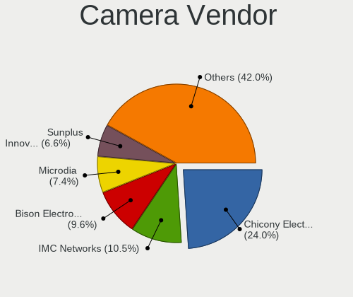

| Vendor                                 | Notebooks | Percent |
|----------------------------------------|-----------|---------|
| Chicony Electronics                    | 158       | 24.84%  |
| IMC Networks                           | 70        | 11.01%  |
| Bison Electronics                      | 53        | 8.33%   |
| Microdia                               | 44        | 6.92%   |
| Sunplus Innovation Technology          | 43        | 6.76%   |
| Realtek Semiconductor                  | 39        | 6.13%   |
| Lite-On Technology                     | 27        | 4.25%   |
| Quanta                                 | 25        | 3.93%   |
| Cheng Uei Precision Industry (Foxlink) | 25        | 3.93%   |
| Apple                                  | 22        | 3.46%   |
| Acer                                   | 21        | 3.3%    |
| Suyin                                  | 16        | 2.52%   |
| Logitech                               | 15        | 2.36%   |
| Luxvisions Innotech Limited            | 13        | 2.04%   |
| Lenovo                                 | 12        | 1.89%   |
| Alcor Micro                            | 7         | 1.1%    |
| Silicon Motion                         | 6         | 0.94%   |
| Samsung Electronics                    | 6         | 0.94%   |
| Primax Electronics                     | 5         | 0.79%   |
| Syntek                                 | 4         | 0.63%   |
| Shenzhen Kingcome Optoelectronic       | 4         | 0.63%   |
| Z-Star Microelectronics                | 2         | 0.31%   |
| Sonix Technology                       | 2         | 0.31%   |
| ShineTech                              | 2         | 0.31%   |
| Ricoh                                  | 2         | 0.31%   |
| Microsoft                              | 2         | 0.31%   |
| Generalplus Technology                 | 2         | 0.31%   |
| ALi                                    | 2         | 0.31%   |
| Y Media                                | 1         | 0.16%   |
| Sunplus Technology                     | 1         | 0.16%   |
| Sony Ericsson Mobile Communications AB | 1         | 0.16%   |
| Mustek Systems                         | 1         | 0.16%   |
| Intel                                  | 1         | 0.16%   |
| Dell                                   | 1         | 0.16%   |
| Creative Technology                    | 1         | 0.16%   |

Camera Model
------------

Camera device models

| Model                                               | Notebooks | Percent |
|-----------------------------------------------------|-----------|---------|
| Chicony Integrated Camera                           | 56        | 8.75%   |
| Microdia Integrated_Webcam_HD                       | 27        | 4.22%   |
| IMC Networks Integrated Camera                      | 27        | 4.22%   |
| IMC Networks USB2.0 HD UVC WebCam                   | 20        | 3.13%   |
| Chicony HP HD Camera                                | 15        | 2.34%   |
| Realtek Integrated_Webcam_HD                        | 13        | 2.03%   |
| Chicony HP HD Webcam                                | 13        | 2.03%   |
| Chicony HD WebCam                                   | 13        | 2.03%   |
| Sunplus Integrated_Webcam_HD                        | 12        | 1.88%   |
| Lite-On Integrated Camera                           | 12        | 1.88%   |
| Bison Integrated Camera                             | 12        | 1.88%   |
| Apple iPhone 5/5C/5S/6/SE/7/8/X                     | 11        | 1.72%   |
| Lite-On HP HD Camera                                | 10        | 1.56%   |
| Bison SunplusIT Integrated Camera                   | 8         | 1.25%   |
| Bison HD Webcam                                     | 8         | 1.25%   |
| Lenovo Integrated Webcam [R5U877]                   | 7         | 1.09%   |
| Chicony Integrated HP HD Webcam                     | 7         | 1.09%   |
| Cheng Uei Precision Industry (Foxlink) HP HD Camera | 7         | 1.09%   |
| Cheng Uei Precision Industry (Foxlink) HD Camera    | 7         | 1.09%   |
| Sunplus HD WebCam                                   | 6         | 0.94%   |
| Samsung Galaxy series, misc. (MTP mode)             | 6         | 0.94%   |
| Quanta HD User Facing                               | 6         | 0.94%   |
| Acer Integrated Camera                              | 6         | 0.94%   |
| Sunplus Laptop Integrated Webcam HD                 | 5         | 0.78%   |
| Sunplus ASUS Webcam                                 | 5         | 0.78%   |
| Realtek USB2.0 HD UVC WebCam                        | 5         | 0.78%   |
| Quanta HP HD Camera                                 | 5         | 0.78%   |
| Microdia Integrated Webcam                          | 5         | 0.78%   |
| Luxvisions Innotech Limited Integrated Camera       | 5         | 0.78%   |
| Lite-On HP HD Webcam                                | 5         | 0.78%   |
| Chicony HP Wide Vision HD Camera                    | 5         | 0.78%   |
| Bison Lenovo EasyCamera                             | 5         | 0.78%   |
| Bison BisonCam, NB Pro                              | 5         | 0.78%   |
| Apple FaceTime HD Camera                            | 5         | 0.78%   |
| Shenzhen Kingcome Optoelectronic 720p HD Camera     | 4         | 0.63%   |
| Realtek USB Camera                                  | 4         | 0.63%   |
| Quanta HP TrueVision HD Camera                      | 4         | 0.63%   |
| Primax HP HD Webcam [Fixed]                         | 4         | 0.63%   |
| Luxvisions Innotech Limited HP HD Camera            | 4         | 0.63%   |
| Chicony Lenovo Integrated Camera (0.3MP)            | 4         | 0.63%   |

Security
--------

Fingerprint Vendor
------------------

Fingerprint sensor vendors

| Vendor                             | Notebooks | Percent |
|------------------------------------|-----------|---------|
| Validity Sensors                   | 72        | 42.11%  |
| Synaptics                          | 52        | 30.41%  |
| Upek                               | 18        | 10.53%  |
| Shenzhen Goodix Technology         | 11        | 6.43%   |
| Elan Microelectronics              | 6         | 3.51%   |
| Samsung Electronics                | 3         | 1.75%   |
| Realtek USB2.0 Finger Print Bridge | 3         | 1.75%   |
| LighTuning Technology              | 3         | 1.75%   |
| AuthenTec                          | 3         | 1.75%   |

Fingerprint Model
-----------------

Fingerprint sensor models

| Model                                                                      | Notebooks | Percent |
|----------------------------------------------------------------------------|-----------|---------|
| Synaptics Prometheus MIS Touch Fingerprint Reader                          | 23        | 13.45%  |
| Validity Sensors VFS495 Fingerprint Reader                                 | 17        | 9.94%   |
| Upek Biometric Touchchip/Touchstrip Fingerprint Sensor                     | 17        | 9.94%   |
| Validity Sensors VFS 5011 fingerprint sensor                               | 14        | 8.19%   |
| Validity Sensors VFS7500 Touch Fingerprint Sensor                          | 9         | 5.26%   |
| Synaptics Metallica MIS Touch Fingerprint Reader                           | 9         | 5.26%   |
| Validity Sensors Synaptics WBDI                                            | 7         | 4.09%   |
| Validity Sensors VFS491                                                    | 6         | 3.51%   |
| Synaptics Fingerprint reader [HP G6]                                       | 6         | 3.51%   |
| Shenzhen Goodix FingerPrint                                                | 6         | 3.51%   |
| Elan ELAN:Fingerprint                                                      | 6         | 3.51%   |
| Validity Sensors VFS471 Fingerprint Reader                                 | 5         | 2.92%   |
| Validity Sensors VFS5011 Fingerprint Reader                                | 4         | 2.34%   |
| Validity Sensors Synaptics VFS7552 Touch Fingerprint Sensor with PurePrint | 4         | 2.34%   |
| Shenzhen Goodix  FingerPrint Device                                        | 4         | 2.34%   |
| Validity Sensors VFS451 Fingerprint Reader                                 | 3         | 1.75%   |
| Synaptics UWP WBDI Device                                                  | 3         | 1.75%   |
| Synaptics FS7604 Touch Fingerprint Sensor with PurePrint                   | 3         | 1.75%   |
| Samsung Fingerprint Sensor Device - 730B                                   | 3         | 1.75%   |
| Realtek USB2.0 Finger Print Bridge FocalTech Fingerprint Device            | 3         | 1.75%   |
| Synaptics WBDI                                                             | 2         | 1.17%   |
| Synaptics  FS7604 Touch Fingerprint Sensor with PurePrint                  | 2         | 1.17%   |
| Synaptics Metallica MOH Touch Fingerprint Reader                           | 2         | 1.17%   |
| LighTuning EgisTec Touch Fingerprint Sensor                                | 2         | 1.17%   |
| AuthenTec AES2810                                                          | 2         | 1.17%   |
| Validity Sensors VFS301 Fingerprint Reader                                 | 1         | 0.58%   |
| Validity Sensors Synaptics VFS7552 Touch Fingerprint Sensor                | 1         | 0.58%   |
| Validity Sensors Fingerprint scanner                                       | 1         | 0.58%   |
| Upek TCS5B Fingerprint sensor                                              | 1         | 0.58%   |
| Synaptics WBDI Fingerprint Reader USB 086                                  | 1         | 0.58%   |
| Shenzhen Goodix Fingerprint Reader                                         | 1         | 0.58%   |
| LighTuning Fingerprint Reader                                              | 1         | 0.58%   |
| AuthenTec AES1600                                                          | 1         | 0.58%   |
| Unknown                                                                    | 1         | 0.58%   |

Chipcard Vendor
---------------

Chipcard module vendors

| Vendor                | Notebooks | Percent |
|-----------------------|-----------|---------|
| Alcor Micro           | 40        | 44.44%  |
| Broadcom              | 34        | 37.78%  |
| Upek                  | 9         | 10%     |
| Lenovo                | 5         | 5.56%   |
| Hewlett-Packard       | 1         | 1.11%   |
| Gemalto (was Gemplus) | 1         | 1.11%   |

Chipcard Model
--------------

Chipcard module models

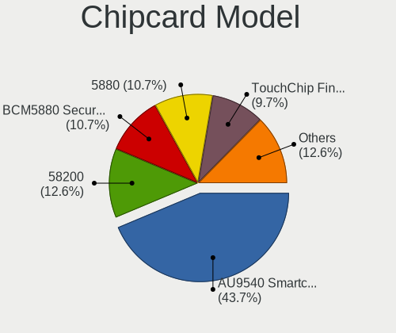

| Model                                                                        | Notebooks | Percent |
|------------------------------------------------------------------------------|-----------|---------|
| Alcor Micro AU9540 Smartcard Reader                                          | 40        | 44.44%  |
| Broadcom BCM5880 Secure Applications Processor with fingerprint swipe sensor | 10        | 11.11%  |
| Broadcom 5880                                                                | 10        | 11.11%  |
| Broadcom 58200                                                               | 10        | 11.11%  |
| Upek TouchChip Fingerprint Coprocessor (WBF advanced mode)                   | 9         | 10%     |
| Lenovo Integrated Smart Card Reader                                          | 5         | 5.56%   |
| Broadcom BCM5880 Secure Applications Processor                               | 4         | 4.44%   |
| Hewlett-Packard SC Keyboard - Apollo (Liteon)                                | 1         | 1.11%   |
| Gemalto (was Gemplus) Compact Smart Card Reader Writer                       | 1         | 1.11%   |

Unsupported
-----------

Unsupported Devices
-------------------

Total unsupported devices on board

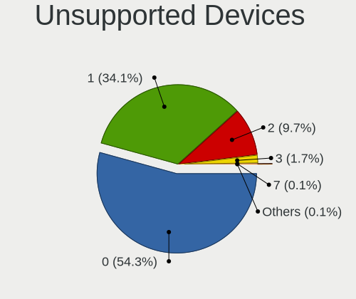

| Total | Notebooks | Percent |
|-------|-----------|---------|
| 0     | 387       | 54.2%   |
| 1     | 249       | 34.87%  |
| 2     | 65        | 9.1%    |
| 3     | 11        | 1.54%   |
| 7     | 1         | 0.14%   |
| 4     | 1         | 0.14%   |

Unsupported Device Types
------------------------

Types of unsupported devices

| Type                  | Notebooks | Percent |
|-----------------------|-----------|---------|
| Fingerprint reader    | 170       | 42.18%  |
| Chipcard              | 76        | 18.86%  |
| Graphics card         | 64        | 15.88%  |
| Net/wireless          | 28        | 6.95%   |
| Multimedia controller | 26        | 6.45%   |
| Camera                | 16        | 3.97%   |
| Card reader           | 8         | 1.99%   |
| Storage               | 5         | 1.24%   |
| Bluetooth             | 4         | 0.99%   |
| Sound                 | 2         | 0.5%    |
| Net/ethernet          | 2         | 0.5%    |
| Modem                 | 2         | 0.5%    |

