Linux in Norway - Tested Hardware & Statistics (Notebooks)
----------------------------------------------------------

A project to collect tested hardware configurations for Linux in Norway.

Anyone can contribute to this report by the [hw-probe](https://github.com/linuxhw/hw-probe) tool:

    sudo -E hw-probe -all -upload

Please contribute! Especially if your hardware is rare.

Contents
--------

* [ Test Cases ](#test-cases)

* [ System ](#system)
  - [ OS                       ](#os)
  - [ OS Family                ](#os-family)
  - [ Kernel                   ](#kernel)
  - [ Kernel Family            ](#kernel-family)
  - [ Kernel Major Ver.        ](#kernel-major-ver)
  - [ Arch                     ](#arch)
  - [ DE                       ](#de)
  - [ Display Server           ](#display-server)
  - [ Display Manager          ](#display-manager)
  - [ OS Lang                  ](#os-lang)
  - [ Boot Mode                ](#boot-mode)
  - [ Filesystem               ](#filesystem)
  - [ Part. scheme             ](#part-scheme)
  - [ Dual Boot with Linux/BSD ](#dual-boot-with-linuxbsd)
  - [ Dual Boot (Win)          ](#dual-boot-win)

* [ Board ](#board)
  - [ Vendor                   ](#vendor)
  - [ Model                    ](#model)
  - [ Model Family             ](#model-family)
  - [ MFG Year                 ](#mfg-year)
  - [ Form Factor              ](#form-factor)
  - [ Secure Boot              ](#secure-boot)
  - [ Coreboot                 ](#coreboot)
  - [ RAM Size                 ](#ram-size)
  - [ RAM Used                 ](#ram-used)
  - [ Total Drives             ](#total-drives)
  - [ Has CD-ROM               ](#has-cd-rom)
  - [ Has Ethernet             ](#has-ethernet)
  - [ Has WiFi                 ](#has-wifi)
  - [ Has Bluetooth            ](#has-bluetooth)

* [ Location ](#location)
  - [ Country                  ](#country)
  - [ City                     ](#city)

* [ Drives ](#drives)
  - [ Drive Vendor             ](#drive-vendor)
  - [ Drive Model              ](#drive-model)
  - [ HDD Vendor               ](#hdd-vendor)
  - [ SSD Vendor               ](#ssd-vendor)
  - [ Drive Kind               ](#drive-kind)
  - [ Drive Connector          ](#drive-connector)
  - [ Drive Size               ](#drive-size)
  - [ Space Total              ](#space-total)
  - [ Space Used               ](#space-used)
  - [ Malfunc. Drives          ](#malfunc-drives)
  - [ Malfunc. Drive Vendor    ](#malfunc-drive-vendor)
  - [ Malfunc. HDD Vendor      ](#malfunc-hdd-vendor)
  - [ Malfunc. Drive Kind      ](#malfunc-drive-kind)
  - [ Failed Drives            ](#failed-drives)
  - [ Failed Drive Vendor      ](#failed-drive-vendor)
  - [ Drive Status             ](#drive-status)

* [ Storage controller ](#storage-controller)
  - [ Storage Vendor           ](#storage-vendor)
  - [ Storage Model            ](#storage-model)
  - [ Storage Kind             ](#storage-kind)

* [ Processor ](#processor)
  - [ CPU Vendor               ](#cpu-vendor)
  - [ CPU Model                ](#cpu-model)
  - [ CPU Model Family         ](#cpu-model-family)
  - [ CPU Cores                ](#cpu-cores)
  - [ CPU Sockets              ](#cpu-sockets)
  - [ CPU Threads              ](#cpu-threads)
  - [ CPU Op-Modes             ](#cpu-op-modes)
  - [ CPU Microcode            ](#cpu-microcode)
  - [ CPU Microarch            ](#cpu-microarch)

* [ Graphics ](#graphics)
  - [ GPU Vendor               ](#gpu-vendor)
  - [ GPU Model                ](#gpu-model)
  - [ GPU Combo                ](#gpu-combo)
  - [ GPU Driver               ](#gpu-driver)
  - [ GPU Memory               ](#gpu-memory)

* [ Monitor ](#monitor)
  - [ Monitor Vendor           ](#monitor-vendor)
  - [ Monitor Model            ](#monitor-model)
  - [ Monitor Resolution       ](#monitor-resolution)
  - [ Monitor Diagonal         ](#monitor-diagonal)
  - [ Monitor Width            ](#monitor-width)
  - [ Aspect Ratio             ](#aspect-ratio)
  - [ Monitor Area             ](#monitor-area)
  - [ Pixel Density            ](#pixel-density)
  - [ Multiple Monitors        ](#multiple-monitors)

* [ Network ](#network)
  - [ Net Controller Vendor    ](#net-controller-vendor)
  - [ Net Controller Model     ](#net-controller-model)
  - [ Wireless Vendor          ](#wireless-vendor)
  - [ Wireless Model           ](#wireless-model)
  - [ Ethernet Vendor          ](#ethernet-vendor)
  - [ Ethernet Model           ](#ethernet-model)
  - [ Net Controller Kind      ](#net-controller-kind)
  - [ Used Controller          ](#used-controller)
  - [ NICs                     ](#nics)
  - [ IPv6                     ](#ipv6)

* [ Bluetooth ](#bluetooth)
  - [ Bluetooth Vendor         ](#bluetooth-vendor)
  - [ Bluetooth Model          ](#bluetooth-model)

* [ Sound ](#sound)
  - [ Sound Vendor             ](#sound-vendor)
  - [ Sound Model              ](#sound-model)

* [ Memory ](#memory)
  - [ Memory Vendor            ](#memory-vendor)
  - [ Memory Model             ](#memory-model)
  - [ Memory Kind              ](#memory-kind)
  - [ Memory Form Factor       ](#memory-form-factor)
  - [ Memory Size              ](#memory-size)
  - [ Memory Speed             ](#memory-speed)

* [ Printers & scanners ](#printers--scanners)
  - [ Printer Vendor           ](#printer-vendor)
  - [ Printer Model            ](#printer-model)
  - [ Scanner Vendor           ](#scanner-vendor)
  - [ Scanner Model            ](#scanner-model)

* [ Camera ](#camera)
  - [ Camera Vendor            ](#camera-vendor)
  - [ Camera Model             ](#camera-model)

* [ Security ](#security)
  - [ Fingerprint Vendor       ](#fingerprint-vendor)
  - [ Fingerprint Model        ](#fingerprint-model)
  - [ Chipcard Vendor          ](#chipcard-vendor)
  - [ Chipcard Model           ](#chipcard-model)

* [ Unsupported ](#unsupported)
  - [ Unsupported Devices      ](#unsupported-devices)
  - [ Unsupported Device Types ](#unsupported-device-types)

Test Cases
----------

Total: 807

| Vendor        | Model                       | Probe                                                      | Date         |
|---------------|-----------------------------|------------------------------------------------------------|--------------|
| ASUSTek       | ROG Zephyrus G14 GA401QM... | [7b7df086e0](https://linux-hardware.org/?probe=7b7df086e0) | Feb 28, 2023 |
| Apple         | MacBookPro9,2               | [97192c0aef](https://linux-hardware.org/?probe=97192c0aef) | Feb 26, 2023 |
| Lenovo        | ThinkPad T400s 2808D9G      | [b101883e65](https://linux-hardware.org/?probe=b101883e65) | Feb 24, 2023 |
| Dell          | Latitude E7240              | [7f8278ff44](https://linux-hardware.org/?probe=7f8278ff44) | Feb 23, 2023 |
| Acer          | Swift SF314-42              | [48817e62c6](https://linux-hardware.org/?probe=48817e62c6) | Feb 21, 2023 |
| Lenovo        | ThinkPad X1 Carbon 7th 2... | [5b33608a35](https://linux-hardware.org/?probe=5b33608a35) | Feb 20, 2023 |
| Dell          | Latitude E7240              | [461873da2d](https://linux-hardware.org/?probe=461873da2d) | Feb 18, 2023 |
| Lenovo        | ThinkPad T520 4243W83       | [e6abb63f33](https://linux-hardware.org/?probe=e6abb63f33) | Feb 17, 2023 |
| Apple         | MacBookPro12,1              | [bdb6e585b0](https://linux-hardware.org/?probe=bdb6e585b0) | Feb 15, 2023 |
| Apple         | MacBookPro12,1              | [139b92595a](https://linux-hardware.org/?probe=139b92595a) | Feb 12, 2023 |
| Lenovo        | V310-15ISK 80SY             | [b96dc1b089](https://linux-hardware.org/?probe=b96dc1b089) | Feb 12, 2023 |
| HP            | Pavilion Laptop 14-ce0xx... | [49b463f14c](https://linux-hardware.org/?probe=49b463f14c) | Feb 10, 2023 |
| Acer          | Aspire V3-571G              | [dcb244db8e](https://linux-hardware.org/?probe=dcb244db8e) | Feb 08, 2023 |
| Lenovo        | ThinkPad T14s Gen 2i 20W... | [81a3a141ba](https://linux-hardware.org/?probe=81a3a141ba) | Feb 08, 2023 |
| Lenovo        | IdeaPad 5 Pro 16ACH6 82L... | [30db5b00f4](https://linux-hardware.org/?probe=30db5b00f4) | Feb 08, 2023 |
| Lenovo        | IdeaPad 5 Pro 16ACH6 82L... | [e9fac81aa1](https://linux-hardware.org/?probe=e9fac81aa1) | Feb 08, 2023 |
| Lenovo        | IdeaPad 5 Pro 16ACH6 82L... | [0e4bbcc317](https://linux-hardware.org/?probe=0e4bbcc317) | Feb 07, 2023 |
| Dell          | Latitude E7240              | [da54499919](https://linux-hardware.org/?probe=da54499919) | Feb 03, 2023 |
| Dell          | Precision 3571              | [8ee8f6f768](https://linux-hardware.org/?probe=8ee8f6f768) | Feb 02, 2023 |
| Dell          | Precision 3571              | [9453f26568](https://linux-hardware.org/?probe=9453f26568) | Feb 02, 2023 |
| Dell          | Latitude E7240              | [a1f713f6e3](https://linux-hardware.org/?probe=a1f713f6e3) | Jan 30, 2023 |
| Dell          | Precision 5530              | [92399ea8dc](https://linux-hardware.org/?probe=92399ea8dc) | Jan 29, 2023 |
| Toshiba       | Satellite L500              | [327e2d4e3e](https://linux-hardware.org/?probe=327e2d4e3e) | Jan 28, 2023 |
| Dell          | Precision 5530              | [a9a54c5b7f](https://linux-hardware.org/?probe=a9a54c5b7f) | Jan 28, 2023 |
| Dell          | Latitude E7240              | [d88cdedff3](https://linux-hardware.org/?probe=d88cdedff3) | Jan 26, 2023 |
| Lenovo        | IdeaPad 5 15ARE05 81YQ      | [293a308d86](https://linux-hardware.org/?probe=293a308d86) | Jan 25, 2023 |
| Dell          | Latitude E7240              | [2d488752b6](https://linux-hardware.org/?probe=2d488752b6) | Jan 25, 2023 |
| Dell          | Latitude E7240              | [9d44efa2f9](https://linux-hardware.org/?probe=9d44efa2f9) | Jan 24, 2023 |
| HP            | Notebook                    | [57bf6826ef](https://linux-hardware.org/?probe=57bf6826ef) | Jan 22, 2023 |
| Samsung       | 3570R/370R/470R/450R/510... | [8c4a855d8e](https://linux-hardware.org/?probe=8c4a855d8e) | Jan 21, 2023 |
| Lenovo        | ThinkPad T14s Gen 2i 20W... | [e8a0c0066b](https://linux-hardware.org/?probe=e8a0c0066b) | Jan 21, 2023 |
| Samsung       | 3570R/370R/470R/450R/510... | [0ea26f4af6](https://linux-hardware.org/?probe=0ea26f4af6) | Jan 20, 2023 |
| Dell          | Latitude E7240              | [a4e01b187f](https://linux-hardware.org/?probe=a4e01b187f) | Jan 20, 2023 |
| Dell          | Latitude E7240              | [475187029d](https://linux-hardware.org/?probe=475187029d) | Jan 19, 2023 |
| Dell          | XPS 15 9570                 | [859d3c1b58](https://linux-hardware.org/?probe=859d3c1b58) | Jan 18, 2023 |
| HP            | Laptop 17-ca0xxx            | [a8fbe01fc5](https://linux-hardware.org/?probe=a8fbe01fc5) | Jan 17, 2023 |
| ASUSTek       | K55VM                       | [5b8deec807](https://linux-hardware.org/?probe=5b8deec807) | Jan 16, 2023 |
| Dell          | Latitude E7240              | [dc47f005d6](https://linux-hardware.org/?probe=dc47f005d6) | Jan 16, 2023 |
| Lenovo        | ThinkPad P51 20HJS02H00     | [ab26ff36b1](https://linux-hardware.org/?probe=ab26ff36b1) | Jan 14, 2023 |
| Dell          | Latitude E7240              | [76f54ae84c](https://linux-hardware.org/?probe=76f54ae84c) | Jan 14, 2023 |
| Dell          | Latitude 3350               | [d7ca8710c2](https://linux-hardware.org/?probe=d7ca8710c2) | Jan 14, 2023 |
| Dell          | Latitude E7240              | [9eed89d744](https://linux-hardware.org/?probe=9eed89d744) | Jan 14, 2023 |
| Dell          | Latitude E7240              | [ed7ff7569c](https://linux-hardware.org/?probe=ed7ff7569c) | Jan 14, 2023 |
| Dell          | Latitude E7240              | [93d832d08f](https://linux-hardware.org/?probe=93d832d08f) | Jan 11, 2023 |
| HP            | ProBook 650 G1              | [1dba72668b](https://linux-hardware.org/?probe=1dba72668b) | Jan 10, 2023 |
| HP            | ProBook 650 G1              | [e6d3982bc0](https://linux-hardware.org/?probe=e6d3982bc0) | Jan 10, 2023 |
| HP            | EliteBook 855 G7 Noteboo... | [e14b3158f3](https://linux-hardware.org/?probe=e14b3158f3) | Jan 10, 2023 |
| Dell          | Latitude 7490               | [0780580a38](https://linux-hardware.org/?probe=0780580a38) | Jan 09, 2023 |
| Dell          | Latitude E7240              | [c191d76ac2](https://linux-hardware.org/?probe=c191d76ac2) | Jan 09, 2023 |
| Notebook      | NLx0MU                      | [69b46423cb](https://linux-hardware.org/?probe=69b46423cb) | Jan 08, 2023 |
| Notebook      | NLx0MU                      | [e43de3e94e](https://linux-hardware.org/?probe=e43de3e94e) | Jan 08, 2023 |
| HP            | ZBook Fury 15 G7 Mobile ... | [2b8c216e1a](https://linux-hardware.org/?probe=2b8c216e1a) | Jan 08, 2023 |
| Cepter        | N530-01                     | [2b5d455bfd](https://linux-hardware.org/?probe=2b5d455bfd) | Jan 07, 2023 |
| Dell          | Latitude E7240              | [c7cf2afdd9](https://linux-hardware.org/?probe=c7cf2afdd9) | Jan 07, 2023 |
| Dell          | Latitude E7240              | [7018e90a09](https://linux-hardware.org/?probe=7018e90a09) | Jan 07, 2023 |
| Dell          | Latitude E7240              | [d4dc080444](https://linux-hardware.org/?probe=d4dc080444) | Jan 07, 2023 |
| Dell          | Latitude E7240              | [b00208bba7](https://linux-hardware.org/?probe=b00208bba7) | Jan 06, 2023 |
| Dell          | Latitude E7240              | [6eae9dc932](https://linux-hardware.org/?probe=6eae9dc932) | Jan 05, 2023 |
| Dell          | Latitude E5520              | [fd30377f05](https://linux-hardware.org/?probe=fd30377f05) | Jan 04, 2023 |
| Acer          | Aspire A515-57G             | [854bee8efb](https://linux-hardware.org/?probe=854bee8efb) | Jan 02, 2023 |
| Dell          | Latitude E7240              | [ccf48432e0](https://linux-hardware.org/?probe=ccf48432e0) | Jan 02, 2023 |
| MSI           | GE60 2OC\2OE                | [c307379c36](https://linux-hardware.org/?probe=c307379c36) | Dec 30, 2022 |
| Dell          | Latitude E7240              | [5f83c8f4ad](https://linux-hardware.org/?probe=5f83c8f4ad) | Dec 30, 2022 |
| ASUSTek       | VivoBook_ASUS Laptop E40... | [78c6c15502](https://linux-hardware.org/?probe=78c6c15502) | Dec 27, 2022 |
| Acer          | Aspire A114-32              | [593969da1f](https://linux-hardware.org/?probe=593969da1f) | Dec 26, 2022 |
| Dell          | Latitude E7240              | [918223cece](https://linux-hardware.org/?probe=918223cece) | Dec 23, 2022 |
| Dell          | Latitude E7240              | [7bd2309063](https://linux-hardware.org/?probe=7bd2309063) | Dec 23, 2022 |
| Lenovo        | IdeaPad 5 15ARE05 81YQ      | [d7b8ef01e2](https://linux-hardware.org/?probe=d7b8ef01e2) | Dec 23, 2022 |
| Dell          | Latitude E7240              | [d81efafde1](https://linux-hardware.org/?probe=d81efafde1) | Dec 22, 2022 |
| Dell          | Latitude E7240              | [545294a23a](https://linux-hardware.org/?probe=545294a23a) | Dec 21, 2022 |
| Dell          | Latitude E7240              | [a368a7be00](https://linux-hardware.org/?probe=a368a7be00) | Dec 21, 2022 |
| Dell          | XPS 13 9360                 | [30eb665688](https://linux-hardware.org/?probe=30eb665688) | Dec 20, 2022 |
| Lenovo        | ThinkPad Edge E531 68852... | [24affad285](https://linux-hardware.org/?probe=24affad285) | Dec 18, 2022 |
| Google        | Cyan                        | [df6e213ea7](https://linux-hardware.org/?probe=df6e213ea7) | Dec 17, 2022 |
| Google        | Cyan                        | [b0872d0327](https://linux-hardware.org/?probe=b0872d0327) | Dec 17, 2022 |
| Lenovo        | IdeaPad 5 15ARE05 81YQ      | [544e464dab](https://linux-hardware.org/?probe=544e464dab) | Dec 15, 2022 |
| Dell          | Latitude E7240              | [d6dddd9632](https://linux-hardware.org/?probe=d6dddd9632) | Dec 11, 2022 |
| Acer          | Aspire E1-572               | [7a6c67f095](https://linux-hardware.org/?probe=7a6c67f095) | Dec 09, 2022 |
| Apple         | MacBookPro6,1               | [6bb486dbb5](https://linux-hardware.org/?probe=6bb486dbb5) | Dec 07, 2022 |
| Apple         | MacBookPro6,1               | [68fa42c5f5](https://linux-hardware.org/?probe=68fa42c5f5) | Dec 06, 2022 |
| Lenovo        | ThinkPad X1 Carbon Gen 9... | [a6763bdd89](https://linux-hardware.org/?probe=a6763bdd89) | Dec 05, 2022 |
| HP            | EliteBook 840 G5            | [3caa213ecf](https://linux-hardware.org/?probe=3caa213ecf) | Dec 04, 2022 |
| Dell          | Latitude E7240              | [6f34110d45](https://linux-hardware.org/?probe=6f34110d45) | Dec 04, 2022 |
| HP            | ZBook 14 G2                 | [b2bba919b2](https://linux-hardware.org/?probe=b2bba919b2) | Nov 30, 2022 |
| Dell          | Latitude E7240              | [8b0b984870](https://linux-hardware.org/?probe=8b0b984870) | Nov 29, 2022 |
| Dell          | Latitude E7240              | [831ec54e18](https://linux-hardware.org/?probe=831ec54e18) | Nov 26, 2022 |
| HP            | Presario CQ56               | [919fad0653](https://linux-hardware.org/?probe=919fad0653) | Nov 25, 2022 |
| Lenovo        | ThinkPad T14 Gen 3 21AJS... | [71c464a407](https://linux-hardware.org/?probe=71c464a407) | Nov 22, 2022 |
| Lenovo        | ThinkPad T14 Gen 3 21AJS... | [0278a1f18d](https://linux-hardware.org/?probe=0278a1f18d) | Nov 18, 2022 |
| HP            | ZBook 14 G2                 | [8ce9402aad](https://linux-hardware.org/?probe=8ce9402aad) | Nov 16, 2022 |
| Acer          | Aspire A114-32              | [5a76aee400](https://linux-hardware.org/?probe=5a76aee400) | Nov 16, 2022 |
| Lenovo        | ThinkPad X1 Carbon Gen 1... | [6677ca6be8](https://linux-hardware.org/?probe=6677ca6be8) | Nov 12, 2022 |
| Acer          | Aspire A114-32              | [aec286073d](https://linux-hardware.org/?probe=aec286073d) | Nov 12, 2022 |
| Acer          | Aspire A114-32              | [3884507df6](https://linux-hardware.org/?probe=3884507df6) | Nov 11, 2022 |
| Dell          | Latitude E7240              | [d6644079ac](https://linux-hardware.org/?probe=d6644079ac) | Nov 11, 2022 |
| Acer          | Aspire A114-32              | [a06fb78621](https://linux-hardware.org/?probe=a06fb78621) | Nov 10, 2022 |
| Lenovo        | ThinkPad T14s Gen 1 20UJ... | [d6fd1a5ecd](https://linux-hardware.org/?probe=d6fd1a5ecd) | Nov 10, 2022 |
| HP            | EliteBook 850 G5            | [3408fb4c36](https://linux-hardware.org/?probe=3408fb4c36) | Nov 07, 2022 |
| HP            | EliteBook 855 G7 Noteboo... | [5264f28363](https://linux-hardware.org/?probe=5264f28363) | Nov 07, 2022 |
| HP            | Pavilion dv6                | [f715c6e15c](https://linux-hardware.org/?probe=f715c6e15c) | Nov 07, 2022 |
| Dell          | Latitude 3340               | [2c6380f259](https://linux-hardware.org/?probe=2c6380f259) | Nov 06, 2022 |
| Dell          | Latitude E7240              | [2db569e056](https://linux-hardware.org/?probe=2db569e056) | Nov 06, 2022 |
| Samsung       | 300V3A/300V4A/300V5A/200... | [e2cadc512e](https://linux-hardware.org/?probe=e2cadc512e) | Nov 05, 2022 |
| HP            | EliteBook 840 G5            | [34c050ed44](https://linux-hardware.org/?probe=34c050ed44) | Nov 03, 2022 |
| HP            | EliteBook 855 G7 Noteboo... | [ada830a489](https://linux-hardware.org/?probe=ada830a489) | Nov 03, 2022 |
| Dell          | Precision 14 5470           | [dab29b7f5b](https://linux-hardware.org/?probe=dab29b7f5b) | Nov 03, 2022 |
| Acer          | Aspire A114-32              | [2394d00673](https://linux-hardware.org/?probe=2394d00673) | Nov 03, 2022 |
| Acer          | Aspire A114-32              | [036ff9e51f](https://linux-hardware.org/?probe=036ff9e51f) | Nov 02, 2022 |
| Acer          | Aspire A114-32              | [d5d1583252](https://linux-hardware.org/?probe=d5d1583252) | Nov 02, 2022 |
| Dell          | Latitude E7240              | [effafc033d](https://linux-hardware.org/?probe=effafc033d) | Nov 01, 2022 |
| ASUSTek       | K55VD                       | [6e2ff87fad](https://linux-hardware.org/?probe=6e2ff87fad) | Nov 01, 2022 |
| Dell          | Latitude E7240              | [d8ae1a7195](https://linux-hardware.org/?probe=d8ae1a7195) | Nov 01, 2022 |
| MSI           | GF63 Thin 11UD              | [8f48ae7586](https://linux-hardware.org/?probe=8f48ae7586) | Oct 29, 2022 |
| MSI           | GF63 Thin 11UD              | [8f1f41f3b0](https://linux-hardware.org/?probe=8f1f41f3b0) | Oct 29, 2022 |
| Lenovo        | Legion Y540-15IRH-PG0 81... | [f845ed2866](https://linux-hardware.org/?probe=f845ed2866) | Oct 28, 2022 |
| MSI           | GF63 Thin 11UD              | [e2a6e0f610](https://linux-hardware.org/?probe=e2a6e0f610) | Oct 28, 2022 |
| MSI           | GF63 Thin 11UD              | [9f7121381b](https://linux-hardware.org/?probe=9f7121381b) | Oct 27, 2022 |
| MSI           | GF63 Thin 11UD              | [2b6b8d3854](https://linux-hardware.org/?probe=2b6b8d3854) | Oct 26, 2022 |
| Lenovo        | Yoga Slim 7 Pro 14ACH5 8... | [3375318388](https://linux-hardware.org/?probe=3375318388) | Oct 25, 2022 |
| Dell          | Latitude E7240              | [6966cfc71f](https://linux-hardware.org/?probe=6966cfc71f) | Oct 25, 2022 |
| Dell          | Latitude 5480               | [0b8576ce3b](https://linux-hardware.org/?probe=0b8576ce3b) | Oct 25, 2022 |
| Apple         | MacBookAir6,2               | [c271de3628](https://linux-hardware.org/?probe=c271de3628) | Oct 24, 2022 |
| Lenovo        | ThinkPad X1 Carbon 7th 2... | [5eeed3a9f0](https://linux-hardware.org/?probe=5eeed3a9f0) | Oct 24, 2022 |
| MSI           | GF63 Thin 11UD              | [ca39605260](https://linux-hardware.org/?probe=ca39605260) | Oct 18, 2022 |
| Lenovo        | IdeaPad 5 Pro 16IAH7 82S... | [dfa3140411](https://linux-hardware.org/?probe=dfa3140411) | Oct 17, 2022 |
| MSI           | GF63 Thin 11UD              | [d522208941](https://linux-hardware.org/?probe=d522208941) | Oct 17, 2022 |
| Lenovo        | ThinkPad T510 43495KG       | [4668319862](https://linux-hardware.org/?probe=4668319862) | Oct 16, 2022 |
| Getac         | V110G3                      | [09cd83f0ec](https://linux-hardware.org/?probe=09cd83f0ec) | Oct 14, 2022 |
| Lenovo        | ThinkPad T510 43495KG       | [dbe29306f4](https://linux-hardware.org/?probe=dbe29306f4) | Oct 12, 2022 |
| ASUSTek       | VivoBook_ASUSLaptop X421... | [46b44504df](https://linux-hardware.org/?probe=46b44504df) | Oct 08, 2022 |
| MSI           | GL62 6QD                    | [d97ad417e9](https://linux-hardware.org/?probe=d97ad417e9) | Oct 07, 2022 |
| Lenovo        | ThinkPad L512 44444WG       | [b27c3b70a7](https://linux-hardware.org/?probe=b27c3b70a7) | Oct 07, 2022 |
| Acer          | Aspire A515-57G             | [f8d3a419e6](https://linux-hardware.org/?probe=f8d3a419e6) | Oct 07, 2022 |
| Dell          | Latitude 5400               | [00789b23c6](https://linux-hardware.org/?probe=00789b23c6) | Oct 06, 2022 |
| HP            | ProBook 645 G1              | [a085d5e42c](https://linux-hardware.org/?probe=a085d5e42c) | Oct 06, 2022 |
| Dell          | Latitude 5400               | [14ed107028](https://linux-hardware.org/?probe=14ed107028) | Oct 05, 2022 |
| MSI           | GF63 Thin 11UD              | [25077cf5e8](https://linux-hardware.org/?probe=25077cf5e8) | Oct 04, 2022 |
| Lenovo        | ThinkPad X1 Carbon 3rd 2... | [5037913bd4](https://linux-hardware.org/?probe=5037913bd4) | Oct 04, 2022 |
| Dell          | Latitude E7240              | [0a41ea4b4c](https://linux-hardware.org/?probe=0a41ea4b4c) | Oct 04, 2022 |
| MSI           | GF63 Thin 11UD              | [b8237b1bd7](https://linux-hardware.org/?probe=b8237b1bd7) | Oct 04, 2022 |
| Intel Clie... | LAPQC71A                    | [6d7beecaf6](https://linux-hardware.org/?probe=6d7beecaf6) | Sep 30, 2022 |
| Lenovo        | ThinkPad X1 Carbon 7th 2... | [54bc787611](https://linux-hardware.org/?probe=54bc787611) | Sep 29, 2022 |
| Dell          | XPS 13 9350                 | [23142407b0](https://linux-hardware.org/?probe=23142407b0) | Sep 28, 2022 |
| MSI           | GS66 Stealth 10SGS          | [644efb07cf](https://linux-hardware.org/?probe=644efb07cf) | Sep 27, 2022 |
| Dell          | XPS 15 9520                 | [fab5b34402](https://linux-hardware.org/?probe=fab5b34402) | Sep 25, 2022 |
| Dell          | XPS 15 9500                 | [1095e2f7f0](https://linux-hardware.org/?probe=1095e2f7f0) | Sep 25, 2022 |
| MSI           | GF63 Thin 11UD              | [fac56b0962](https://linux-hardware.org/?probe=fac56b0962) | Sep 24, 2022 |
| HP            | Presario CQ56               | [ed937514cf](https://linux-hardware.org/?probe=ed937514cf) | Sep 23, 2022 |
| Lenovo        | Yoga Slim 7 Pro 14IAH7 8... | [4dd83a1b80](https://linux-hardware.org/?probe=4dd83a1b80) | Sep 16, 2022 |
| Lenovo        | Yoga Slim 7 Pro 14IAH7 8... | [80638ed98f](https://linux-hardware.org/?probe=80638ed98f) | Sep 15, 2022 |
| ASUSTek       | TUF Gaming FX505DT_FX505... | [3196144640](https://linux-hardware.org/?probe=3196144640) | Sep 15, 2022 |
| ASUSTek       | VivoBook_ASUSLaptop X421... | [38fa0eaf03](https://linux-hardware.org/?probe=38fa0eaf03) | Sep 15, 2022 |
| ASUSTek       | VivoBook_ASUSLaptop X421... | [72c53fd3c8](https://linux-hardware.org/?probe=72c53fd3c8) | Sep 15, 2022 |
| HUAWEI        | KLVL-WXX9                   | [7bc7cbca76](https://linux-hardware.org/?probe=7bc7cbca76) | Sep 12, 2022 |
| Acer          | Aspire 6930G                | [cb054f2964](https://linux-hardware.org/?probe=cb054f2964) | Sep 12, 2022 |
| Lenovo        | IdeaPad 5 15ARE05 81YQ      | [e1d128b56a](https://linux-hardware.org/?probe=e1d128b56a) | Sep 12, 2022 |
| HP            | ZBook 15 G5                 | [fe1d0da2fc](https://linux-hardware.org/?probe=fe1d0da2fc) | Sep 10, 2022 |
| ASUSTek       | VivoBook_ASUSLaptop E410... | [30488e19df](https://linux-hardware.org/?probe=30488e19df) | Sep 08, 2022 |
| MSI           | Katana GF66 11UE            | [36b2cba297](https://linux-hardware.org/?probe=36b2cba297) | Sep 05, 2022 |
| Lenovo        | IdeaPad 5 15ARE05 81YQ      | [5472c45d04](https://linux-hardware.org/?probe=5472c45d04) | Sep 03, 2022 |
| MSI           | GF65 Thin 10SER             | [9438d3a4fe](https://linux-hardware.org/?probe=9438d3a4fe) | Sep 03, 2022 |
| MSI           | GF65 Thin 10SER             | [5344528fa4](https://linux-hardware.org/?probe=5344528fa4) | Sep 03, 2022 |
| Intel Clie... | LAPQC71A                    | [9bc39724f8](https://linux-hardware.org/?probe=9bc39724f8) | Sep 02, 2022 |
| Lenovo        | IdeaPad 5 15ARE05 81YQ      | [b6e6d0a261](https://linux-hardware.org/?probe=b6e6d0a261) | Sep 02, 2022 |
| HP            | EliteBook 840 G8 Noteboo... | [7277e72eb4](https://linux-hardware.org/?probe=7277e72eb4) | Aug 31, 2022 |
| Notebook      | NLx0MU                      | [90c9b01136](https://linux-hardware.org/?probe=90c9b01136) | Aug 31, 2022 |
| Notebook      | NLx0MU                      | [77d4b4ff99](https://linux-hardware.org/?probe=77d4b4ff99) | Aug 31, 2022 |
| MSI           | GL72 6QF                    | [1ffe55389e](https://linux-hardware.org/?probe=1ffe55389e) | Aug 27, 2022 |
| MSI           | GL72 6QF                    | [46b40c3c67](https://linux-hardware.org/?probe=46b40c3c67) | Aug 27, 2022 |
| HP            | ProBook 430 G8 Notebook ... | [17260bd4fb](https://linux-hardware.org/?probe=17260bd4fb) | Aug 24, 2022 |
| Acer          | Aspire 5742                 | [6692313edb](https://linux-hardware.org/?probe=6692313edb) | Aug 22, 2022 |
| HP            | EliteBook 645 14 inch G9... | [d287893b82](https://linux-hardware.org/?probe=d287893b82) | Aug 22, 2022 |
| Lenovo        | B570e 476022G               | [ad4a4c25d5](https://linux-hardware.org/?probe=ad4a4c25d5) | Aug 22, 2022 |
| Dell          | Latitude E7240              | [4adf6ab444](https://linux-hardware.org/?probe=4adf6ab444) | Aug 22, 2022 |
| Dell          | XPS 13 9350                 | [e663637449](https://linux-hardware.org/?probe=e663637449) | Aug 21, 2022 |
| Lenovo        | ThinkBook 16p Gen 2 20YM    | [2b746c613f](https://linux-hardware.org/?probe=2b746c613f) | Aug 16, 2022 |
| MSI           | GF63 Thin 11UD              | [82bfe63c71](https://linux-hardware.org/?probe=82bfe63c71) | Aug 14, 2022 |
| Acer          | Aspire 6930G                | [c0ba049caf](https://linux-hardware.org/?probe=c0ba049caf) | Aug 14, 2022 |
| ASUSTek       | VivoBook_ASUSLaptop X421... | [3dcb75072e](https://linux-hardware.org/?probe=3dcb75072e) | Aug 12, 2022 |
| HP            | Compaq Presario CQ71        | [68c8f97537](https://linux-hardware.org/?probe=68c8f97537) | Aug 11, 2022 |
| Lenovo        | ThinkPad L512 44444WG       | [e2a0bef6d4](https://linux-hardware.org/?probe=e2a0bef6d4) | Aug 10, 2022 |
| Lenovo        | ThinkPad L512 44444WG       | [fc0389fd3e](https://linux-hardware.org/?probe=fc0389fd3e) | Aug 10, 2022 |
| ASUSTek       | VivoBook_ASUSLaptop X421... | [4312639df6](https://linux-hardware.org/?probe=4312639df6) | Aug 09, 2022 |
| HP            | EliteBook 820 G1            | [1bdfc2f218](https://linux-hardware.org/?probe=1bdfc2f218) | Aug 09, 2022 |
| Dell          | Latitude E5470              | [8cd7ffad9e](https://linux-hardware.org/?probe=8cd7ffad9e) | Aug 08, 2022 |
| MSI           | GF63 Thin 11UD              | [67e1664484](https://linux-hardware.org/?probe=67e1664484) | Aug 07, 2022 |
| Lenovo        | IdeaPad 100S-14IBR 80R9     | [6b1d79046a](https://linux-hardware.org/?probe=6b1d79046a) | Aug 06, 2022 |
| Lenovo        | ThinkPad L512 44444WG       | [06da05d12b](https://linux-hardware.org/?probe=06da05d12b) | Aug 03, 2022 |
| Notebook      | NV4XMB,ME,MZ                | [7b369e1cdf](https://linux-hardware.org/?probe=7b369e1cdf) | Aug 01, 2022 |
| ASUSTek       | VivoBook_ASUSLaptop X421... | [4bcdc51e89](https://linux-hardware.org/?probe=4bcdc51e89) | Jul 27, 2022 |
| MSI           | GF63 Thin 11UD              | [ce18b4e9ab](https://linux-hardware.org/?probe=ce18b4e9ab) | Jul 26, 2022 |
| Acer          | Aspire 5739G                | [aef89fc83f](https://linux-hardware.org/?probe=aef89fc83f) | Jul 26, 2022 |
| MSI           | GS40 6QE Phantom            | [137d7c8701](https://linux-hardware.org/?probe=137d7c8701) | Jul 26, 2022 |
| MSI           | GS40 6QE Phantom            | [76bd6feebe](https://linux-hardware.org/?probe=76bd6feebe) | Jul 26, 2022 |
| ASUSTek       | VivoBook_ASUSLaptop X421... | [37ebea2647](https://linux-hardware.org/?probe=37ebea2647) | Jul 25, 2022 |
| HP            | ProBook 450 G2              | [3e2f9e1e86](https://linux-hardware.org/?probe=3e2f9e1e86) | Jul 25, 2022 |
| Notebook      | NV4XMB,ME,MZ                | [f965008c98](https://linux-hardware.org/?probe=f965008c98) | Jul 21, 2022 |
| ASUSTek       | VivoBook_ASUSLaptop X421... | [ca9e042e30](https://linux-hardware.org/?probe=ca9e042e30) | Jul 18, 2022 |
| ASUSTek       | VivoBook_ASUSLaptop E410... | [68a78a8ed1](https://linux-hardware.org/?probe=68a78a8ed1) | Jul 18, 2022 |
| Lenovo        | ThinkPad W540 20BG001CMN    | [117f9a585b](https://linux-hardware.org/?probe=117f9a585b) | Jul 17, 2022 |
| Toshiba       | Satellite L500              | [5ac3a7aa95](https://linux-hardware.org/?probe=5ac3a7aa95) | Jul 17, 2022 |
| Lenovo        | ThinkPad W540 20BG001CMN    | [e408c1236c](https://linux-hardware.org/?probe=e408c1236c) | Jul 17, 2022 |
| HP            | ProBook 430 G2              | [0be149d703](https://linux-hardware.org/?probe=0be149d703) | Jul 16, 2022 |
| HUAWEI        | MACH-WX9                    | [76035ea427](https://linux-hardware.org/?probe=76035ea427) | Jul 15, 2022 |
| Dell          | XPS 15 9520                 | [271277c36b](https://linux-hardware.org/?probe=271277c36b) | Jul 14, 2022 |
| MSI           | GF63 Thin 11UD              | [b4cf81df26](https://linux-hardware.org/?probe=b4cf81df26) | Jul 13, 2022 |
| Acer          | Aspire A515-44              | [c0d1086ae8](https://linux-hardware.org/?probe=c0d1086ae8) | Jul 09, 2022 |
| HUAWEI        | MACH-WX9                    | [486d051b71](https://linux-hardware.org/?probe=486d051b71) | Jul 08, 2022 |
| Dell          | Latitude D531               | [008236dd11](https://linux-hardware.org/?probe=008236dd11) | Jul 07, 2022 |
| Lenovo        | ThinkPad T14s Gen 1 20T0... | [fec0786471](https://linux-hardware.org/?probe=fec0786471) | Jul 06, 2022 |
| MSI           | GF63 Thin 11UD              | [7847c0275c](https://linux-hardware.org/?probe=7847c0275c) | Jul 02, 2022 |
| MSI           | GF63 Thin 11UD              | [325fec2ac6](https://linux-hardware.org/?probe=325fec2ac6) | Jul 01, 2022 |
| HP            | ZBook Fury 15 G7 Mobile ... | [1967dad271](https://linux-hardware.org/?probe=1967dad271) | Jun 22, 2022 |
| Dell          | Latitude E7240              | [1c76f3cdf4](https://linux-hardware.org/?probe=1c76f3cdf4) | Jun 21, 2022 |
| Dell          | Latitude E7240              | [2974c5fa7c](https://linux-hardware.org/?probe=2974c5fa7c) | Jun 21, 2022 |
| HP            | EliteBook 840 G1            | [4a3e29a7c0](https://linux-hardware.org/?probe=4a3e29a7c0) | Jun 20, 2022 |
| HP            | ZBook Fury 15 G7 Mobile ... | [4a1a0294d8](https://linux-hardware.org/?probe=4a1a0294d8) | Jun 18, 2022 |
| Dell          | Latitude E7240              | [2ed64f08f3](https://linux-hardware.org/?probe=2ed64f08f3) | Jun 17, 2022 |
| Dell          | Latitude E7240              | [31340542c2](https://linux-hardware.org/?probe=31340542c2) | Jun 17, 2022 |
| Dell          | Latitude E7240              | [08efb8dcc5](https://linux-hardware.org/?probe=08efb8dcc5) | Jun 17, 2022 |
| Dell          | Latitude E7240              | [b6978a823c](https://linux-hardware.org/?probe=b6978a823c) | Jun 17, 2022 |
| Lenovo        | ThinkPad X220 4286CTO       | [fd2fb2f646](https://linux-hardware.org/?probe=fd2fb2f646) | Jun 14, 2022 |
| HP            | Mini 210-1000               | [8746b5b684](https://linux-hardware.org/?probe=8746b5b684) | Jun 10, 2022 |
| HP            | Mini 210-1000               | [65b65f1319](https://linux-hardware.org/?probe=65b65f1319) | Jun 08, 2022 |
| ASUSTek       | X55U                        | [66e1c7ed1d](https://linux-hardware.org/?probe=66e1c7ed1d) | Jun 06, 2022 |
| Toshiba       | Satellite L500              | [b4b4831c86](https://linux-hardware.org/?probe=b4b4831c86) | Jun 05, 2022 |
| Acer          | Aspire 5739G                | [6f6f16ee08](https://linux-hardware.org/?probe=6f6f16ee08) | May 31, 2022 |
| Notebook      | Multicom Xishan NL50        | [9ffa89c7a9](https://linux-hardware.org/?probe=9ffa89c7a9) | May 31, 2022 |
| Lenovo        | ThinkPad T14s Gen 1 20UJ... | [ed28d49715](https://linux-hardware.org/?probe=ed28d49715) | May 30, 2022 |
| Notebook      | Multicom Xishan NL50        | [0c45263f11](https://linux-hardware.org/?probe=0c45263f11) | May 30, 2022 |
| Acer          | Aspire 6930G                | [a07fb7cbcd](https://linux-hardware.org/?probe=a07fb7cbcd) | May 25, 2022 |
| Lenovo        | ThinkPad T490s 20NX0077M... | [cea81a1d63](https://linux-hardware.org/?probe=cea81a1d63) | May 24, 2022 |
| Acer          | Aspire 5739G                | [428631aa4a](https://linux-hardware.org/?probe=428631aa4a) | May 23, 2022 |
| Notebook      | N8xEJEK                     | [5c2c66e8f5](https://linux-hardware.org/?probe=5c2c66e8f5) | May 17, 2022 |
| ASUSTek       | TUF Gaming Z690-PLUS WIF... | [48c983a184](https://linux-hardware.org/?probe=48c983a184) | May 15, 2022 |
| Lenovo        | ThinkPad P51 20HJS02H00     | [fc7562c140](https://linux-hardware.org/?probe=fc7562c140) | May 12, 2022 |
| Lenovo        | ThinkPad P51 20HJS02H00     | [810fda94b1](https://linux-hardware.org/?probe=810fda94b1) | May 12, 2022 |
| HP            | ZBook Power 15.6 inch G8... | [c195f80f3c](https://linux-hardware.org/?probe=c195f80f3c) | May 12, 2022 |
| HP            | EliteBook 840 G7 Noteboo... | [1b52e22774](https://linux-hardware.org/?probe=1b52e22774) | May 10, 2022 |
| HP            | EliteBook 840 G8 Noteboo... | [47b730f9bd](https://linux-hardware.org/?probe=47b730f9bd) | May 10, 2022 |
| Dell          | Latitude E5430 non-vPro     | [2075bfcc02](https://linux-hardware.org/?probe=2075bfcc02) | May 05, 2022 |
| Dell          | Latitude E5430 non-vPro     | [71f8f45765](https://linux-hardware.org/?probe=71f8f45765) | May 05, 2022 |
| HP            | ProBook 4330s               | [7cad0acb2c](https://linux-hardware.org/?probe=7cad0acb2c) | May 04, 2022 |
| HP            | ProBook 4330s               | [ca6474fbfc](https://linux-hardware.org/?probe=ca6474fbfc) | May 04, 2022 |
| HP            | EliteBook 840 G7 Noteboo... | [0295d9e820](https://linux-hardware.org/?probe=0295d9e820) | May 04, 2022 |
| Lenovo        | ThinkPad X13 Gen 1 20UFC... | [3835b6bdb8](https://linux-hardware.org/?probe=3835b6bdb8) | May 03, 2022 |
| Apple         | MacBookPro12,1              | [5f68858e66](https://linux-hardware.org/?probe=5f68858e66) | May 01, 2022 |
| HP            | ZBook Firefly 15 inch G8... | [6cdff366fa](https://linux-hardware.org/?probe=6cdff366fa) | Apr 28, 2022 |
| HP            | ZBook Fury 15 G7 Mobile ... | [620718bb9e](https://linux-hardware.org/?probe=620718bb9e) | Apr 26, 2022 |
| Lenovo        | V15 G2 ALC 82KD             | [743177a467](https://linux-hardware.org/?probe=743177a467) | Apr 24, 2022 |
| Acer          | Swift SF514-51              | [d6c47a5367](https://linux-hardware.org/?probe=d6c47a5367) | Apr 23, 2022 |
| Dell          | Latitude E6430              | [91bbf4068b](https://linux-hardware.org/?probe=91bbf4068b) | Apr 20, 2022 |
| Google        | Cave                        | [c762019e08](https://linux-hardware.org/?probe=c762019e08) | Apr 18, 2022 |
| Lenovo        | V130-14IKB 81HQ             | [19299bc16d](https://linux-hardware.org/?probe=19299bc16d) | Apr 14, 2022 |
| ASUSTek       | K52Dr                       | [29124147fe](https://linux-hardware.org/?probe=29124147fe) | Apr 14, 2022 |
| Lenovo        | ThinkPad T490s 20NX003UM... | [60dca75a93](https://linux-hardware.org/?probe=60dca75a93) | Apr 14, 2022 |
| HP            | ZBook Power 15.6 inch G8... | [7f83d03bf3](https://linux-hardware.org/?probe=7f83d03bf3) | Apr 13, 2022 |
| HP            | ZBook Power 15.6 inch G8... | [bbcb05781f](https://linux-hardware.org/?probe=bbcb05781f) | Apr 13, 2022 |
| Lenovo        | ThinkPad T460s 20F90044M... | [47498ed4aa](https://linux-hardware.org/?probe=47498ed4aa) | Apr 13, 2022 |
| MSI           | GS66 Stealth 10UH           | [5589b339ed](https://linux-hardware.org/?probe=5589b339ed) | Apr 11, 2022 |
| HP            | EliteBook 840 G4            | [dd511f4bf0](https://linux-hardware.org/?probe=dd511f4bf0) | Apr 09, 2022 |
| Lenovo        | Yoga Slim 7 Carbon 14ACN... | [5328fde624](https://linux-hardware.org/?probe=5328fde624) | Apr 08, 2022 |
| Dell          | Inspiron 5370               | [abc7562fb9](https://linux-hardware.org/?probe=abc7562fb9) | Apr 07, 2022 |
| MSI           | GS66 Stealth 10UH           | [bd6f031bc8](https://linux-hardware.org/?probe=bd6f031bc8) | Apr 06, 2022 |
| Apple         | MacBookPro11,1              | [f41079b495](https://linux-hardware.org/?probe=f41079b495) | Apr 05, 2022 |
| Lenovo        | ThinkPad T520 4243W83       | [79c6231f19](https://linux-hardware.org/?probe=79c6231f19) | Apr 02, 2022 |
| Dell          | Latitude E5430 non-vPro     | [b47f5b30db](https://linux-hardware.org/?probe=b47f5b30db) | Apr 01, 2022 |
| Lenovo        | ThinkPad L512 44444WG       | [ea012026c5](https://linux-hardware.org/?probe=ea012026c5) | Mar 30, 2022 |
| HP            | Laptop 14s-fq0xxx           | [0a68b0e55c](https://linux-hardware.org/?probe=0a68b0e55c) | Mar 24, 2022 |
| Lenovo        | ThinkPad X1 Carbon 4th 2... | [f4e2b38106](https://linux-hardware.org/?probe=f4e2b38106) | Mar 20, 2022 |
| ASUSTek       | UL50VT                      | [6911af9ce1](https://linux-hardware.org/?probe=6911af9ce1) | Mar 20, 2022 |
| HP            | ZBook Firefly 15 inch G8... | [674a4429c2](https://linux-hardware.org/?probe=674a4429c2) | Mar 19, 2022 |
| ASUSTek       | GL502VMK                    | [f2fedaa3c3](https://linux-hardware.org/?probe=f2fedaa3c3) | Mar 18, 2022 |
| Notebook      | NV4XMB,ME,MZ                | [ce34107bae](https://linux-hardware.org/?probe=ce34107bae) | Mar 14, 2022 |
| Dell          | XPS 13 9310                 | [acef37559c](https://linux-hardware.org/?probe=acef37559c) | Mar 14, 2022 |
| Dell          | XPS 13 9310                 | [884e853e6f](https://linux-hardware.org/?probe=884e853e6f) | Mar 14, 2022 |
| Intel Clie... | LAPQC71A                    | [14108beccf](https://linux-hardware.org/?probe=14108beccf) | Mar 12, 2022 |
| Intel Clie... | LAPQC71A                    | [ee7f4f0b82](https://linux-hardware.org/?probe=ee7f4f0b82) | Mar 12, 2022 |
| Dell          | Latitude 5480               | [d7fe091593](https://linux-hardware.org/?probe=d7fe091593) | Mar 12, 2022 |
| Dell          | Latitude E5450              | [0e4fb3e1fd](https://linux-hardware.org/?probe=0e4fb3e1fd) | Mar 12, 2022 |
| Dell          | Latitude 7480               | [bb03e5e22e](https://linux-hardware.org/?probe=bb03e5e22e) | Mar 11, 2022 |
| HP            | ZBook Fury 15 G7 Mobile ... | [917a6b65a8](https://linux-hardware.org/?probe=917a6b65a8) | Mar 10, 2022 |
| Dell          | Precision M6800             | [239dd5797a](https://linux-hardware.org/?probe=239dd5797a) | Mar 10, 2022 |
| Samsung       | 950XCJ/951XCJ/950XCR        | [3a9118e8bc](https://linux-hardware.org/?probe=3a9118e8bc) | Mar 07, 2022 |
| ASUSTek       | UL50VT                      | [5a711af850](https://linux-hardware.org/?probe=5a711af850) | Mar 07, 2022 |
| Lenovo        | ThinkPad T480 20L60033MX    | [fda7557aa0](https://linux-hardware.org/?probe=fda7557aa0) | Mar 07, 2022 |
| Lenovo        | ThinkPad T400s 2808D9G      | [6a5d0584bd](https://linux-hardware.org/?probe=6a5d0584bd) | Mar 02, 2022 |
| Lenovo        | ThinkPad T460 20FMS1XX00    | [78e82c6674](https://linux-hardware.org/?probe=78e82c6674) | Feb 24, 2022 |
| Dell          | XPS 15 7590                 | [69896e5117](https://linux-hardware.org/?probe=69896e5117) | Feb 23, 2022 |
| HP            | EliteBook 840 G4            | [7bb148611f](https://linux-hardware.org/?probe=7bb148611f) | Feb 23, 2022 |
| Lenovo        | ThinkPad T460s 20F9S1G20... | [6a6c0b0b39](https://linux-hardware.org/?probe=6a6c0b0b39) | Feb 21, 2022 |
| ASUSTek       | UX430UAR                    | [c7cd5ce50d](https://linux-hardware.org/?probe=c7cd5ce50d) | Feb 21, 2022 |
| Lenovo        | ThinkPad Edge E330 3354D... | [0337480978](https://linux-hardware.org/?probe=0337480978) | Feb 17, 2022 |
| HUAWEI        | KLVL-WXX9                   | [34bd2af067](https://linux-hardware.org/?probe=34bd2af067) | Feb 14, 2022 |
| HP            | ProBook 4330s               | [3781146b1f](https://linux-hardware.org/?probe=3781146b1f) | Feb 14, 2022 |
| ASUSTek       | G74Sx                       | [a3709f6df1](https://linux-hardware.org/?probe=a3709f6df1) | Feb 12, 2022 |
| HUAWEI        | BOHK-WAX9X                  | [68d863ab48](https://linux-hardware.org/?probe=68d863ab48) | Feb 10, 2022 |
| Lenovo        | ThinkPad Edge 0301DMG       | [ab580c3edd](https://linux-hardware.org/?probe=ab580c3edd) | Feb 10, 2022 |
| Lenovo        | ThinkPad Edge 0301DMG       | [c11f9d5c6d](https://linux-hardware.org/?probe=c11f9d5c6d) | Feb 10, 2022 |
| Lenovo        | ThinkPad T470s 20HGS0FJ0... | [6dc9215373](https://linux-hardware.org/?probe=6dc9215373) | Feb 07, 2022 |
| Acer          | Swift SF314-511             | [9f7733e6ec](https://linux-hardware.org/?probe=9f7733e6ec) | Feb 03, 2022 |
| Dell          | Latitude E4200              | [35dbab3b2e](https://linux-hardware.org/?probe=35dbab3b2e) | Jan 31, 2022 |
| Toshiba       | Satellite C660D             | [d6498c16bb](https://linux-hardware.org/?probe=d6498c16bb) | Jan 27, 2022 |
| Lenovo        | ThinkPad T520 4243W83       | [698c80468a](https://linux-hardware.org/?probe=698c80468a) | Jan 25, 2022 |
| Lenovo        | ThinkPad E15 Gen 2 20TD0... | [29ce7637f6](https://linux-hardware.org/?probe=29ce7637f6) | Jan 23, 2022 |
| HP            | OMEN by Laptop 15-dc1xxx    | [cbf995ff80](https://linux-hardware.org/?probe=cbf995ff80) | Jan 22, 2022 |
| HUAWEI        | KLVL-WXX9                   | [ae399035f5](https://linux-hardware.org/?probe=ae399035f5) | Jan 21, 2022 |
| Lenovo        | ThinkPad E15 Gen 2 20TD0... | [634d45ff9e](https://linux-hardware.org/?probe=634d45ff9e) | Jan 21, 2022 |
| Dell          | Latitude 7280               | [6b9dcc88b7](https://linux-hardware.org/?probe=6b9dcc88b7) | Jan 21, 2022 |
| Dell          | Latitude 7280               | [beb9306791](https://linux-hardware.org/?probe=beb9306791) | Jan 21, 2022 |
| Lenovo        | ThinkPad X230 23252EG       | [e236263783](https://linux-hardware.org/?probe=e236263783) | Jan 19, 2022 |
| Lenovo        | G50-30 80G0                 | [5a609ef492](https://linux-hardware.org/?probe=5a609ef492) | Jan 16, 2022 |
| HP            | Laptop 17-cn0xxx            | [5cb4bc2ed8](https://linux-hardware.org/?probe=5cb4bc2ed8) | Jan 14, 2022 |
| Dell          | Precision 7560              | [a58a852902](https://linux-hardware.org/?probe=a58a852902) | Jan 13, 2022 |
| HP            | ZBook Fury 15 G7 Mobile ... | [9fa645342b](https://linux-hardware.org/?probe=9fa645342b) | Jan 12, 2022 |
| HP            | EliteBook 820 G1            | [37dd78dd6e](https://linux-hardware.org/?probe=37dd78dd6e) | Jan 11, 2022 |
| Apple         | MacBookPro9,2               | [831591fe79](https://linux-hardware.org/?probe=831591fe79) | Jan 11, 2022 |
| MSI           | GS66 Stealth 10UH           | [a38abf3dd0](https://linux-hardware.org/?probe=a38abf3dd0) | Jan 10, 2022 |
| Dell          | Latitude 5480               | [c572bd1eac](https://linux-hardware.org/?probe=c572bd1eac) | Jan 08, 2022 |
| Apple         | MacBookPro9,2               | [b5bd2eca7d](https://linux-hardware.org/?probe=b5bd2eca7d) | Jan 07, 2022 |
| HP            | Pavilion dv6000 (GH912EA... | [a41f8d2d74](https://linux-hardware.org/?probe=a41f8d2d74) | Jan 03, 2022 |
| Dell          | Latitude E7440              | [9df6480d3e](https://linux-hardware.org/?probe=9df6480d3e) | Jan 02, 2022 |
| Lenovo        | ThinkPad T410s 2924W79      | [43fe13f2a4](https://linux-hardware.org/?probe=43fe13f2a4) | Dec 30, 2021 |
| Dell          | Latitude 5480               | [e560c10eb8](https://linux-hardware.org/?probe=e560c10eb8) | Dec 29, 2021 |
| Acer          | Aspire E1-572               | [ab9c63e097](https://linux-hardware.org/?probe=ab9c63e097) | Dec 28, 2021 |
| Lenovo        | ThinkPad E595 20NFCTO1WW    | [04ebd359f1](https://linux-hardware.org/?probe=04ebd359f1) | Dec 28, 2021 |
| Acer          | Aspire E1-572               | [63f4428f24](https://linux-hardware.org/?probe=63f4428f24) | Dec 28, 2021 |
| Lenovo        | ThinkPad L512 44444WG       | [0f7bd5b933](https://linux-hardware.org/?probe=0f7bd5b933) | Dec 26, 2021 |
| MSI           | GS66 Stealth 10UH           | [6246228e2d](https://linux-hardware.org/?probe=6246228e2d) | Dec 26, 2021 |
| Lenovo        | ThinkPad L512 44444WG       | [113b39ddbc](https://linux-hardware.org/?probe=113b39ddbc) | Dec 25, 2021 |
| HP            | ZBook 15                    | [57cb28cc81](https://linux-hardware.org/?probe=57cb28cc81) | Dec 24, 2021 |
| Dell          | Latitude 5480               | [5c91ed91a8](https://linux-hardware.org/?probe=5c91ed91a8) | Dec 24, 2021 |
| Acer          | Aspire xxxx                 | [13b21c09d2](https://linux-hardware.org/?probe=13b21c09d2) | Dec 23, 2021 |
| Dell          | XPS 15 9500                 | [86789982ba](https://linux-hardware.org/?probe=86789982ba) | Dec 21, 2021 |
| Lenovo        | ThinkPad E580 20KS001EMX    | [366aae1cd6](https://linux-hardware.org/?probe=366aae1cd6) | Dec 18, 2021 |
| ASUSTek       | ZenBook UX450FDX_UX480FD    | [3cd4b5c111](https://linux-hardware.org/?probe=3cd4b5c111) | Dec 18, 2021 |
| ASUSTek       | ZenBook UX450FDX_UX480FD    | [03115bdd2e](https://linux-hardware.org/?probe=03115bdd2e) | Dec 18, 2021 |
| Lenovo        | ThinkPad T410s 2924W79      | [f26b8b4f98](https://linux-hardware.org/?probe=f26b8b4f98) | Dec 17, 2021 |
| Acer          | Aspire xxxx                 | [dfa568d766](https://linux-hardware.org/?probe=dfa568d766) | Dec 17, 2021 |
| Toshiba       | Satellite L750              | [30ad7918cd](https://linux-hardware.org/?probe=30ad7918cd) | Dec 13, 2021 |
| Acer          | Aspire A114-32              | [dd9fb384ea](https://linux-hardware.org/?probe=dd9fb384ea) | Dec 13, 2021 |
| Lenovo        | ThinkPad L512 44444WG       | [711aa97225](https://linux-hardware.org/?probe=711aa97225) | Dec 13, 2021 |
| HP            | ZBook 15                    | [cb2487cb67](https://linux-hardware.org/?probe=cb2487cb67) | Dec 11, 2021 |
| ASUSTek       | VivoBook_ASUSLaptop X509... | [204f77ca68](https://linux-hardware.org/?probe=204f77ca68) | Dec 10, 2021 |
| HP            | ZBook 15                    | [c0d2e24505](https://linux-hardware.org/?probe=c0d2e24505) | Dec 10, 2021 |
| ASUSTek       | N550JV                      | [696dd578ab](https://linux-hardware.org/?probe=696dd578ab) | Dec 08, 2021 |
| HP            | OMEN by Laptop              | [b44117a400](https://linux-hardware.org/?probe=b44117a400) | Dec 06, 2021 |
| Dell          | Inspiron M5030              | [b28a3fe6a7](https://linux-hardware.org/?probe=b28a3fe6a7) | Dec 05, 2021 |
| ASUSTek       | ZenBook UX425EA_BX425EA     | [c579de06b5](https://linux-hardware.org/?probe=c579de06b5) | Dec 03, 2021 |
| Lenovo        | ThinkPad T580 20LAS2BH00    | [e85a481d36](https://linux-hardware.org/?probe=e85a481d36) | Dec 02, 2021 |
| Acer          | Aspire A114-32              | [64005f7018](https://linux-hardware.org/?probe=64005f7018) | Nov 30, 2021 |
| Dell          | Inspiron 15-3552            | [7fbb6be9e3](https://linux-hardware.org/?probe=7fbb6be9e3) | Nov 30, 2021 |
| Acer          | Aspire A114-32              | [a380d2a0c8](https://linux-hardware.org/?probe=a380d2a0c8) | Nov 29, 2021 |
| Acer          | Aspire A315-42              | [a0483c5539](https://linux-hardware.org/?probe=a0483c5539) | Nov 27, 2021 |
| HP            | EliteBook 8460p             | [ca30b13118](https://linux-hardware.org/?probe=ca30b13118) | Nov 24, 2021 |
| ASUSTek       | VivoBook_ASUSLaptop X712... | [969dde57b0](https://linux-hardware.org/?probe=969dde57b0) | Nov 22, 2021 |
| Lenovo        | ThinkPad L512 44444WG       | [1d12ea147a](https://linux-hardware.org/?probe=1d12ea147a) | Nov 20, 2021 |
| Dell          | Latitude E7440              | [89fdff42c1](https://linux-hardware.org/?probe=89fdff42c1) | Nov 20, 2021 |
| Acer          | Aspire 5810T                | [c6e0003dcb](https://linux-hardware.org/?probe=c6e0003dcb) | Nov 20, 2021 |
| Acer          | Aspire 5810T                | [6b485f4c9a](https://linux-hardware.org/?probe=6b485f4c9a) | Nov 20, 2021 |
| Acer          | Swift SF514-51              | [07e73dc8ab](https://linux-hardware.org/?probe=07e73dc8ab) | Nov 19, 2021 |
| Lenovo        | ThinkPad T520 42433VG       | [529262c2e4](https://linux-hardware.org/?probe=529262c2e4) | Nov 17, 2021 |
| HP            | ZBook Fury 15 G7 Mobile ... | [6196137046](https://linux-hardware.org/?probe=6196137046) | Nov 17, 2021 |
| Lenovo        | ThinkPad T14 Gen 2i 20W0... | [564ef15a99](https://linux-hardware.org/?probe=564ef15a99) | Nov 16, 2021 |
| HP            | ProBook 440 G4              | [f5d53e44ae](https://linux-hardware.org/?probe=f5d53e44ae) | Nov 15, 2021 |
| Lenovo        | ThinkPad X1 Carbon Gen 8... | [bb1201e75c](https://linux-hardware.org/?probe=bb1201e75c) | Nov 06, 2021 |
| Lenovo        | ThinkPad W540 20BHS0NQ00    | [69f4b3d974](https://linux-hardware.org/?probe=69f4b3d974) | Nov 03, 2021 |
| Lenovo        | Yoga Slim 7 Pro 14ACH5 8... | [0b7ae3ebf5](https://linux-hardware.org/?probe=0b7ae3ebf5) | Nov 03, 2021 |
| Dell          | XPS 13 9370                 | [458d3682a5](https://linux-hardware.org/?probe=458d3682a5) | Nov 03, 2021 |
| ASUSTek       | VivoBook_ASUSLaptop X412... | [070b533b05](https://linux-hardware.org/?probe=070b533b05) | Nov 02, 2021 |
| Lenovo        | ThinkPad E15 Gen 3 20YG0... | [3acc230d6a](https://linux-hardware.org/?probe=3acc230d6a) | Nov 02, 2021 |
| Lenovo        | ThinkPad E15 Gen 3 20YG0... | [c88adaac6e](https://linux-hardware.org/?probe=c88adaac6e) | Nov 02, 2021 |
| Acer          | Aspire 5739G                | [9366122bdb](https://linux-hardware.org/?probe=9366122bdb) | Nov 01, 2021 |
| Acer          | Aspire 5739G                | [aaf8f33249](https://linux-hardware.org/?probe=aaf8f33249) | Nov 01, 2021 |
| Acer          | Aspire 5739G                | [7979c29593](https://linux-hardware.org/?probe=7979c29593) | Oct 29, 2021 |
| Lenovo        | ThinkPad X1 Carbon 5th 2... | [2eac1bfc4f](https://linux-hardware.org/?probe=2eac1bfc4f) | Oct 24, 2021 |
| Lenovo        | ThinkPad T450s 20BWS3EG0... | [df466b506d](https://linux-hardware.org/?probe=df466b506d) | Oct 20, 2021 |
| Lenovo        | ThinkPad T450s 20BWS3EG0... | [748d3e56a7](https://linux-hardware.org/?probe=748d3e56a7) | Oct 20, 2021 |
| HP            | EliteBook 820 G1            | [278ec34902](https://linux-hardware.org/?probe=278ec34902) | Oct 19, 2021 |
| Dell          | XPS 15 9570                 | [26d1a4225d](https://linux-hardware.org/?probe=26d1a4225d) | Oct 17, 2021 |
| Lenovo        | ThinkPad X260 20F5S08Q00    | [2929e779ad](https://linux-hardware.org/?probe=2929e779ad) | Oct 15, 2021 |
| ASUSTek       | VivoBook_ASUSLaptop X712... | [fe7520a392](https://linux-hardware.org/?probe=fe7520a392) | Oct 15, 2021 |
| ASUSTek       | VivoBook_ASUSLaptop X712... | [8fab065f3b](https://linux-hardware.org/?probe=8fab065f3b) | Oct 14, 2021 |
| ASUSTek       | VivoBook_ASUSLaptop X712... | [8502c5d5f7](https://linux-hardware.org/?probe=8502c5d5f7) | Oct 13, 2021 |
| Lenovo        | ThinkPad T460p 20FWCTO1W... | [d7f1b3f27e](https://linux-hardware.org/?probe=d7f1b3f27e) | Oct 12, 2021 |
| Acer          | Aspire A515-45              | [4b45531984](https://linux-hardware.org/?probe=4b45531984) | Oct 09, 2021 |
| Lenovo        | ThinkPad L14 Gen 1 20U50... | [4206d52561](https://linux-hardware.org/?probe=4206d52561) | Oct 07, 2021 |
| Lenovo        | ThinkPad L14 Gen 1 20U50... | [8e94483caf](https://linux-hardware.org/?probe=8e94483caf) | Oct 07, 2021 |
| HP            | EliteBook 840 G5            | [e64aeb5fa4](https://linux-hardware.org/?probe=e64aeb5fa4) | Oct 01, 2021 |
| HP            | EliteBook 840 G5            | [28bfae31ee](https://linux-hardware.org/?probe=28bfae31ee) | Oct 01, 2021 |
| Acer          | Aspire A114-32              | [e1dc7a64a4](https://linux-hardware.org/?probe=e1dc7a64a4) | Sep 30, 2021 |
| Dell          | Latitude E5530 non-vPro     | [7e710da685](https://linux-hardware.org/?probe=7e710da685) | Sep 27, 2021 |
| Dell          | Latitude E5530 non-vPro     | [87dd9f48a9](https://linux-hardware.org/?probe=87dd9f48a9) | Sep 26, 2021 |
| Lenovo        | IdeaPad L340-15IRH Gamin... | [bf5a5a2c74](https://linux-hardware.org/?probe=bf5a5a2c74) | Sep 26, 2021 |
| Apple         | MacBookPro12,1              | [4d798633db](https://linux-hardware.org/?probe=4d798633db) | Sep 25, 2021 |
| Dell          | XPS 15 9570                 | [a54466b990](https://linux-hardware.org/?probe=a54466b990) | Sep 24, 2021 |
| ASUSTek       | E403NA                      | [382c1a7b47](https://linux-hardware.org/?probe=382c1a7b47) | Sep 24, 2021 |
| Dell          | Latitude E5470              | [17d97e59de](https://linux-hardware.org/?probe=17d97e59de) | Sep 23, 2021 |
| ASUSTek       | E402NA                      | [8262dd102f](https://linux-hardware.org/?probe=8262dd102f) | Sep 23, 2021 |
| Lenovo        | ThinkPad E15 20RES6DF07     | [2f5045ab95](https://linux-hardware.org/?probe=2f5045ab95) | Sep 21, 2021 |
| Acer          | Aspire A114-32              | [333d881ec2](https://linux-hardware.org/?probe=333d881ec2) | Sep 20, 2021 |
| Acer          | Aspire A114-32              | [da860f1378](https://linux-hardware.org/?probe=da860f1378) | Sep 20, 2021 |
| HUAWEI        | EUL-WX9                     | [4ab59b64df](https://linux-hardware.org/?probe=4ab59b64df) | Sep 18, 2021 |
| Lenovo        | ThinkPad X1 Carbon 6th 2... | [b640e5da6d](https://linux-hardware.org/?probe=b640e5da6d) | Sep 17, 2021 |
| Dell          | Latitude 5480               | [ac2c5649d3](https://linux-hardware.org/?probe=ac2c5649d3) | Sep 17, 2021 |
| Dell          | Latitude E5470              | [82aca1d7b4](https://linux-hardware.org/?probe=82aca1d7b4) | Sep 16, 2021 |
| Dell          | Latitude E5470              | [c898d2b210](https://linux-hardware.org/?probe=c898d2b210) | Sep 16, 2021 |
| HP            | ZBook 15u G5                | [a5331a4d5e](https://linux-hardware.org/?probe=a5331a4d5e) | Sep 15, 2021 |
| HP            | ZBook Fury 15 G7 Mobile ... | [a92f9c3457](https://linux-hardware.org/?probe=a92f9c3457) | Sep 15, 2021 |
| HP            | EliteBook 820 G1            | [cf1e0581f3](https://linux-hardware.org/?probe=cf1e0581f3) | Sep 15, 2021 |
| MSI           | Alpha 17 A4DE               | [0be8b0b607](https://linux-hardware.org/?probe=0be8b0b607) | Sep 14, 2021 |
| Lenovo        | ThinkPad E590 20NBCTO1WW    | [2b5735f34c](https://linux-hardware.org/?probe=2b5735f34c) | Sep 13, 2021 |
| Samsung       | RF511/RF411/RF711           | [0918a27e6a](https://linux-hardware.org/?probe=0918a27e6a) | Sep 08, 2021 |
| Acer          | Aspire 5745G                | [680d788d4b](https://linux-hardware.org/?probe=680d788d4b) | Sep 07, 2021 |
| MSI           | Alpha 17 A4DE               | [3f0de31253](https://linux-hardware.org/?probe=3f0de31253) | Sep 06, 2021 |
| Dell          | Precision 5510              | [1339721ac0](https://linux-hardware.org/?probe=1339721ac0) | Sep 06, 2021 |
| Lenovo        | ThinkPad P15v Gen 1 20TQ... | [7bc3201683](https://linux-hardware.org/?probe=7bc3201683) | Sep 06, 2021 |
| Samsung       | RF511/RF411/RF711           | [332124aa7f](https://linux-hardware.org/?probe=332124aa7f) | Sep 04, 2021 |
| Acer          | Aspire A515-45              | [16a250faf6](https://linux-hardware.org/?probe=16a250faf6) | Sep 01, 2021 |
| Acer          | Aspire E1-772               | [2b6d07434a](https://linux-hardware.org/?probe=2b6d07434a) | Sep 01, 2021 |
| Dell          | Latitude E7270              | [1bd5f17116](https://linux-hardware.org/?probe=1bd5f17116) | Sep 01, 2021 |
| Acer          | Aspire E1-772               | [4c1d560351](https://linux-hardware.org/?probe=4c1d560351) | Sep 01, 2021 |
| ASUSTek       | UX430UQ                     | [2bd5adb706](https://linux-hardware.org/?probe=2bd5adb706) | Aug 31, 2021 |
| Lenovo        | G710 20252                  | [bcb68ab6d0](https://linux-hardware.org/?probe=bcb68ab6d0) | Aug 21, 2021 |
| Dell          | Studio 1747                 | [ba0f2b7d03](https://linux-hardware.org/?probe=ba0f2b7d03) | Aug 15, 2021 |
| Teclast       | F6 Plus                     | [a1df449dea](https://linux-hardware.org/?probe=a1df449dea) | Aug 13, 2021 |
| HUAWEI        | NBLK-WAX9X                  | [5742cb7dd7](https://linux-hardware.org/?probe=5742cb7dd7) | Aug 12, 2021 |
| Alienware     | x17 R1                      | [447d4de752](https://linux-hardware.org/?probe=447d4de752) | Aug 12, 2021 |
| Clevo         | W55xEU                      | [ee96e1ca32](https://linux-hardware.org/?probe=ee96e1ca32) | Aug 08, 2021 |
| Lenovo        | ThinkPad X240 20AMS0BU0T    | [f22b591a0a](https://linux-hardware.org/?probe=f22b591a0a) | Aug 07, 2021 |
| Lenovo        | ThinkPad T440s 20ARA1DJM... | [3d02d8b67f](https://linux-hardware.org/?probe=3d02d8b67f) | Aug 07, 2021 |
| Apple         | MacBookPro11,5              | [938ff270ef](https://linux-hardware.org/?probe=938ff270ef) | Jul 31, 2021 |
| Lenovo        | ThinkPad X1 Carbon 5th 2... | [b62fb400bf](https://linux-hardware.org/?probe=b62fb400bf) | Jul 31, 2021 |
| HP            | ProBook 4740s               | [624b649eb0](https://linux-hardware.org/?probe=624b649eb0) | Jul 28, 2021 |
| HP            | EliteBook 1040 G4           | [693137b6b8](https://linux-hardware.org/?probe=693137b6b8) | Jul 26, 2021 |
| Dell          | Latitude 5480               | [64665ed287](https://linux-hardware.org/?probe=64665ed287) | Jul 25, 2021 |
| Dell          | Latitude 5480               | [1b32299688](https://linux-hardware.org/?probe=1b32299688) | Jul 24, 2021 |
| HP            | Presario CQ56               | [7148aa989e](https://linux-hardware.org/?probe=7148aa989e) | Jul 21, 2021 |
| Apple         | MacBook8,1                  | [1220a734d7](https://linux-hardware.org/?probe=1220a734d7) | Jul 20, 2021 |
| Packard Be... | EasyNote ENTG71BM           | [788b497894](https://linux-hardware.org/?probe=788b497894) | Jul 19, 2021 |
| Dell          | XPS 15 9500                 | [610bb918de](https://linux-hardware.org/?probe=610bb918de) | Jul 14, 2021 |
| Notebook      | NV4XMB,ME,MZ                | [eba2e6ade8](https://linux-hardware.org/?probe=eba2e6ade8) | Jul 13, 2021 |
| HP            | Presario CQ56               | [7a202a99e9](https://linux-hardware.org/?probe=7a202a99e9) | Jul 11, 2021 |
| Acer          | Aspire E5-575G              | [27fd4c16ae](https://linux-hardware.org/?probe=27fd4c16ae) | Jul 08, 2021 |
| Lenovo        | IdeaPad 320-17AST 80XW      | [b8a40b6dbd](https://linux-hardware.org/?probe=b8a40b6dbd) | Jul 02, 2021 |
| Lenovo        | G50-80 80L0                 | [ca1d482329](https://linux-hardware.org/?probe=ca1d482329) | Jun 27, 2021 |
| Lenovo        | ThinkPad X230 23252EG       | [77c68fb077](https://linux-hardware.org/?probe=77c68fb077) | Jun 23, 2021 |
| Lenovo        | ThinkPad T460s 20FA0047M... | [eeb383631b](https://linux-hardware.org/?probe=eeb383631b) | Jun 20, 2021 |
| Lenovo        | ThinkPad T520 4243W83       | [b17a1f2c15](https://linux-hardware.org/?probe=b17a1f2c15) | Jun 19, 2021 |
| HP            | EliteBook 820 G1            | [09ff787c3f](https://linux-hardware.org/?probe=09ff787c3f) | Jun 17, 2021 |
| HP            | EliteBook 820 G1            | [b64bd1afcd](https://linux-hardware.org/?probe=b64bd1afcd) | Jun 17, 2021 |
| Lenovo        | ThinkPad T580 20LAS2BH00    | [bbedefdee0](https://linux-hardware.org/?probe=bbedefdee0) | Jun 16, 2021 |
| Dell          | XPS 13 9380                 | [41972327e1](https://linux-hardware.org/?probe=41972327e1) | Jun 15, 2021 |
| Lenovo        | ThinkPad T14 Gen 1 20UDC... | [4ecc3eec8f](https://linux-hardware.org/?probe=4ecc3eec8f) | Jun 14, 2021 |
| Lenovo        | ThinkPad T440p 20AW0048G... | [8b1ba139f9](https://linux-hardware.org/?probe=8b1ba139f9) | Jun 13, 2021 |
| Lenovo        | ThinkPad T580 20LAS2BH00    | [9674952e07](https://linux-hardware.org/?probe=9674952e07) | Jun 11, 2021 |
| Lenovo        | ThinkPad T580 20LAS2BH00    | [b39699b009](https://linux-hardware.org/?probe=b39699b009) | Jun 11, 2021 |
| Lenovo        | ThinkPad T410s 291236G      | [ebbdc74a27](https://linux-hardware.org/?probe=ebbdc74a27) | Jun 06, 2021 |
| Acer          | Nitro AN515-42              | [28aadacd07](https://linux-hardware.org/?probe=28aadacd07) | Jun 02, 2021 |
| Lenovo        | ThinkPad T430s 2356GBG      | [aef8c27b50](https://linux-hardware.org/?probe=aef8c27b50) | May 31, 2021 |
| Lenovo        | ThinkPad T430s 2356GBG      | [e67f4b0fd4](https://linux-hardware.org/?probe=e67f4b0fd4) | May 31, 2021 |
| HUAWEI        | MACH-WX9                    | [7fd687d091](https://linux-hardware.org/?probe=7fd687d091) | May 29, 2021 |
| Lenovo        | ThinkPad T450 20BUS0WK03    | [6131e3c22a](https://linux-hardware.org/?probe=6131e3c22a) | May 27, 2021 |
| ASUSTek       | N53TK                       | [cee81adbaf](https://linux-hardware.org/?probe=cee81adbaf) | May 25, 2021 |
| Dell          | XPS 15 9500                 | [8c072ea1c4](https://linux-hardware.org/?probe=8c072ea1c4) | May 24, 2021 |
| Acer          | Aspire 5745G                | [30f455f132](https://linux-hardware.org/?probe=30f455f132) | May 22, 2021 |
| HP            | Spectre Pro x360 G2         | [236efc033e](https://linux-hardware.org/?probe=236efc033e) | May 21, 2021 |
| Razer         | Blade 15 Base Model (Ear... | [2b97441fb1](https://linux-hardware.org/?probe=2b97441fb1) | May 17, 2021 |
| Razer         | Blade 15 Base Model (Ear... | [f9420a7960](https://linux-hardware.org/?probe=f9420a7960) | May 16, 2021 |
| Acer          | Aspire 5745G                | [cb987a733a](https://linux-hardware.org/?probe=cb987a733a) | May 15, 2021 |
| Lenovo        | ThinkPad X230 2325AJG       | [c4b7c3340c](https://linux-hardware.org/?probe=c4b7c3340c) | May 11, 2021 |
| Toshiba       | Satellite L510              | [01753d1f93](https://linux-hardware.org/?probe=01753d1f93) | May 02, 2021 |
| Acer          | TravelMate 8472             | [bdf53780fb](https://linux-hardware.org/?probe=bdf53780fb) | May 01, 2021 |
| Lenovo        | ThinkPad T490s 20NX0054M... | [4cc25622a5](https://linux-hardware.org/?probe=4cc25622a5) | Apr 28, 2021 |
| Acer          | TravelMate 8472             | [84fea7d029](https://linux-hardware.org/?probe=84fea7d029) | Apr 25, 2021 |
| Acer          | TravelMate 8472             | [a4aafc8541](https://linux-hardware.org/?probe=a4aafc8541) | Apr 25, 2021 |
| MSI           | MS-175A                     | [3e3f73559d](https://linux-hardware.org/?probe=3e3f73559d) | Apr 23, 2021 |
| MSI           | MS-175A                     | [22e9e676d9](https://linux-hardware.org/?probe=22e9e676d9) | Apr 23, 2021 |
| Samsung       | 900X3C/900X3D/900X4C/900... | [58df3a61b0](https://linux-hardware.org/?probe=58df3a61b0) | Apr 21, 2021 |
| Dell          | Precision M4500             | [8c35250407](https://linux-hardware.org/?probe=8c35250407) | Apr 17, 2021 |
| ASUSTek       | Zephyrus M GU502GU_GU502... | [67c2373bdf](https://linux-hardware.org/?probe=67c2373bdf) | Apr 15, 2021 |
| ASUSTek       | Zephyrus M GU502GU_GU502... | [db960abcdb](https://linux-hardware.org/?probe=db960abcdb) | Apr 15, 2021 |
| Dell          | XPS 13 9380                 | [cf23d87096](https://linux-hardware.org/?probe=cf23d87096) | Apr 08, 2021 |
| Acer          | NU-A515-44-R68D             | [7e8724905f](https://linux-hardware.org/?probe=7e8724905f) | Apr 06, 2021 |
| Dell          | XPS 13 9380                 | [1631f6bb81](https://linux-hardware.org/?probe=1631f6bb81) | Apr 06, 2021 |
| HP            | ProBook 430 G1              | [6d2b17825a](https://linux-hardware.org/?probe=6d2b17825a) | Apr 05, 2021 |
| Dell          | Latitude E6530              | [0078b55697](https://linux-hardware.org/?probe=0078b55697) | Apr 05, 2021 |
| Acer          | Aspire V3-571G              | [a5268098b2](https://linux-hardware.org/?probe=a5268098b2) | Apr 02, 2021 |
| Dell          | Studio 1747                 | [31c1b6a828](https://linux-hardware.org/?probe=31c1b6a828) | Apr 01, 2021 |
| HP            | Pavilion Notebook           | [6189b0e033](https://linux-hardware.org/?probe=6189b0e033) | Mar 27, 2021 |
| HP            | Pavilion Notebook           | [df09bd2c58](https://linux-hardware.org/?probe=df09bd2c58) | Mar 25, 2021 |
| Dell          | Latitude E6530              | [7cce6316f6](https://linux-hardware.org/?probe=7cce6316f6) | Mar 24, 2021 |
| Lenovo        | ThinkPad X201 4492A23       | [0cace83a52](https://linux-hardware.org/?probe=0cace83a52) | Mar 23, 2021 |
| ASUSTek       | GL553VW                     | [7d8aed9645](https://linux-hardware.org/?probe=7d8aed9645) | Mar 21, 2021 |
| Acer          | Nitro AN515-51              | [79b5d4aed8](https://linux-hardware.org/?probe=79b5d4aed8) | Mar 16, 2021 |
| Acer          | Nitro AN515-51              | [ac92ab9404](https://linux-hardware.org/?probe=ac92ab9404) | Mar 15, 2021 |
| Lenovo        | Y520-15IKBN 80WK            | [1725699a96](https://linux-hardware.org/?probe=1725699a96) | Mar 12, 2021 |
| Lenovo        | ThinkPad X230 2325AJG       | [f55532e284](https://linux-hardware.org/?probe=f55532e284) | Mar 12, 2021 |
| Lenovo        | IdeaPad Y700-15ISK 80NV     | [e74933164b](https://linux-hardware.org/?probe=e74933164b) | Mar 10, 2021 |
| Lenovo        | Yoga Slim 7 14ARE05 82A2    | [406b41e802](https://linux-hardware.org/?probe=406b41e802) | Mar 10, 2021 |
| HP            | EliteBook 830 G6            | [45f8bdabb0](https://linux-hardware.org/?probe=45f8bdabb0) | Mar 09, 2021 |
| HP            | EliteBook 830 G6            | [de6b1ee9fe](https://linux-hardware.org/?probe=de6b1ee9fe) | Mar 09, 2021 |
| HP            | EliteBook 8470p             | [d97eb7724a](https://linux-hardware.org/?probe=d97eb7724a) | Mar 04, 2021 |
| Acer          | Aspire E5-575G              | [9f523080d5](https://linux-hardware.org/?probe=9f523080d5) | Mar 03, 2021 |
| Dell          | Precision 5550              | [98abf3a7d0](https://linux-hardware.org/?probe=98abf3a7d0) | Mar 02, 2021 |
| ASUSTek       | TUF Gaming FX505DV_FX505... | [8235a48b49](https://linux-hardware.org/?probe=8235a48b49) | Feb 26, 2021 |
| HP            | EliteBook 820 G3            | [22a4daed00](https://linux-hardware.org/?probe=22a4daed00) | Feb 25, 2021 |
| HP            | ZBook 15 G3                 | [7c24c07795](https://linux-hardware.org/?probe=7c24c07795) | Feb 25, 2021 |
| HP            | OMEN by Laptop 17-cb0xxx    | [a2fdf109b0](https://linux-hardware.org/?probe=a2fdf109b0) | Feb 20, 2021 |
| HP            | Pavilion Notebook           | [db4bc9fa7a](https://linux-hardware.org/?probe=db4bc9fa7a) | Feb 20, 2021 |
| Lenovo        | ThinkPad T460s 20F90057M... | [2bf00440b7](https://linux-hardware.org/?probe=2bf00440b7) | Feb 18, 2021 |
| Apple         | MacBookAir7,2               | [01c84ea037](https://linux-hardware.org/?probe=01c84ea037) | Feb 18, 2021 |
| Lenovo        | Z50-70 20354                | [84b15e21ec](https://linux-hardware.org/?probe=84b15e21ec) | Feb 17, 2021 |
| Lenovo        | ThinkPad T420s 4176A11      | [626009a335](https://linux-hardware.org/?probe=626009a335) | Feb 16, 2021 |
| Packard Be... | EasyNote ENTG71BM           | [d11dd1d1a0](https://linux-hardware.org/?probe=d11dd1d1a0) | Feb 14, 2021 |
| Packard Be... | SJV50MV                     | [aba113ee3f](https://linux-hardware.org/?probe=aba113ee3f) | Feb 14, 2021 |
| ASUSTek       | X556URK                     | [6af569fcf4](https://linux-hardware.org/?probe=6af569fcf4) | Feb 13, 2021 |
| Lenovo        | ThinkPad L450 20DT001NMN    | [9a71946a9e](https://linux-hardware.org/?probe=9a71946a9e) | Feb 13, 2021 |
| Lenovo        | ThinkPad L450 20DT001NMN    | [f43d50a826](https://linux-hardware.org/?probe=f43d50a826) | Feb 13, 2021 |
| ASUSTek       | X55U                        | [aea7a001db](https://linux-hardware.org/?probe=aea7a001db) | Feb 13, 2021 |
| Unknown       | T3 MRD                      | [a71b7acc18](https://linux-hardware.org/?probe=a71b7acc18) | Feb 10, 2021 |
| Lenovo        | ThinkPad T420s 4176A11      | [f26de119c9](https://linux-hardware.org/?probe=f26de119c9) | Feb 08, 2021 |
| Lenovo        | ThinkPad T420s 4176A11      | [670ce5270a](https://linux-hardware.org/?probe=670ce5270a) | Feb 07, 2021 |
| Acer          | NG-AN515-52-74W6            | [70574e752f](https://linux-hardware.org/?probe=70574e752f) | Feb 05, 2021 |
| Clevo         | P170EM                      | [eff7a04dad](https://linux-hardware.org/?probe=eff7a04dad) | Feb 02, 2021 |
| ASUSTek       | N501VW                      | [a5a63c6343](https://linux-hardware.org/?probe=a5a63c6343) | Feb 01, 2021 |
| Acer          | Aspire M3-581TG             | [f87979122a](https://linux-hardware.org/?probe=f87979122a) | Jan 31, 2021 |
| Lenovo        | ThinkPad E14 Gen 2 20T7S... | [c71286b553](https://linux-hardware.org/?probe=c71286b553) | Jan 31, 2021 |
| Apple         | MacBookAir4,2               | [590fdfe6bb](https://linux-hardware.org/?probe=590fdfe6bb) | Jan 30, 2021 |
| Lenovo        | ThinkPad X240 20AM006KMN    | [7c40d08353](https://linux-hardware.org/?probe=7c40d08353) | Jan 28, 2021 |
| Lenovo        | ThinkPad T500 22439AG       | [fe8ffb1fc3](https://linux-hardware.org/?probe=fe8ffb1fc3) | Jan 27, 2021 |
| Lenovo        | Y520-15IKBN 80WK            | [a2b88b8f9d](https://linux-hardware.org/?probe=a2b88b8f9d) | Jan 27, 2021 |
| Lenovo        | Y520-15IKBN 80WK            | [29f9f04453](https://linux-hardware.org/?probe=29f9f04453) | Jan 27, 2021 |
| Lenovo        | ThinkPad T480 20L6002DMX    | [5dd69602d6](https://linux-hardware.org/?probe=5dd69602d6) | Jan 27, 2021 |
| ASUSTek       | GL753VE                     | [af8e0933c0](https://linux-hardware.org/?probe=af8e0933c0) | Jan 24, 2021 |
| Acer          | Swift SF314-42              | [daeea162bf](https://linux-hardware.org/?probe=daeea162bf) | Jan 18, 2021 |
| ASUSTek       | ROG Zephyrus G14 GA401IU... | [aca39bcba0](https://linux-hardware.org/?probe=aca39bcba0) | Jan 18, 2021 |
| MSI           | GE72VR 7RF                  | [1dfd19668d](https://linux-hardware.org/?probe=1dfd19668d) | Jan 14, 2021 |
| Acer          | NU-A515-44-R68D             | [f45afd1e14](https://linux-hardware.org/?probe=f45afd1e14) | Jan 12, 2021 |
| HP            | Stream Laptop 14-cb1XX      | [69a7ec5b7c](https://linux-hardware.org/?probe=69a7ec5b7c) | Jan 07, 2021 |
| Acer          | Swift SF314-42              | [5761cc2a05](https://linux-hardware.org/?probe=5761cc2a05) | Jan 06, 2021 |
| Dell          | XPS 15 7590                 | [69a5abe225](https://linux-hardware.org/?probe=69a5abe225) | Jan 05, 2021 |
| ASUSTek       | GL552JX                     | [5dd9cde584](https://linux-hardware.org/?probe=5dd9cde584) | Jan 03, 2021 |
| ASUSTek       | GL552JX                     | [4dfc0f1909](https://linux-hardware.org/?probe=4dfc0f1909) | Jan 03, 2021 |
| Lenovo        | ThinkPad S1 Yoga 20CD003... | [70d4988c38](https://linux-hardware.org/?probe=70d4988c38) | Dec 30, 2020 |
| Lenovo        | ThinkPad X220 4286CTO       | [bef81325c0](https://linux-hardware.org/?probe=bef81325c0) | Dec 27, 2020 |
| ASUSTek       | G75VW                       | [d04692210c](https://linux-hardware.org/?probe=d04692210c) | Dec 23, 2020 |
| ASUSTek       | G75VW                       | [cc1a212c60](https://linux-hardware.org/?probe=cc1a212c60) | Dec 23, 2020 |
| ASUSTek       | N61Ja                       | [324c64905b](https://linux-hardware.org/?probe=324c64905b) | Dec 20, 2020 |
| Dell          | Latitude E6420              | [d4e4d15cf4](https://linux-hardware.org/?probe=d4e4d15cf4) | Dec 20, 2020 |
| Acer          | Swift SF514-51              | [f04b672d42](https://linux-hardware.org/?probe=f04b672d42) | Dec 15, 2020 |
| Acer          | Swift SF514-51              | [31b51cc2b0](https://linux-hardware.org/?probe=31b51cc2b0) | Dec 13, 2020 |
| Lenovo        | IdeaPad 500-15ACZ 80K4      | [7a59304f76](https://linux-hardware.org/?probe=7a59304f76) | Dec 08, 2020 |
| Dell          | XPS 15 9570                 | [d164834ae1](https://linux-hardware.org/?probe=d164834ae1) | Dec 03, 2020 |
| Dell          | XPS 15 9570                 | [5031a2060f](https://linux-hardware.org/?probe=5031a2060f) | Dec 03, 2020 |
| Dell          | XPS 15 9570                 | [b30cae7041](https://linux-hardware.org/?probe=b30cae7041) | Dec 03, 2020 |
| Lenovo        | Yoga S740-14IIL 81RS        | [80b2a9b7a0](https://linux-hardware.org/?probe=80b2a9b7a0) | Dec 01, 2020 |
| Dell          | Precision 5530              | [2d3e299290](https://linux-hardware.org/?probe=2d3e299290) | Nov 29, 2020 |
| Dell          | XPS 13 9380                 | [c27456cd80](https://linux-hardware.org/?probe=c27456cd80) | Nov 28, 2020 |
| Lenovo        | ThinkPad T460s 20F9005CM... | [0b39212390](https://linux-hardware.org/?probe=0b39212390) | Nov 26, 2020 |
| Lenovo        | Legion 5 17IMH05H 81Y8      | [cb0b2991f5](https://linux-hardware.org/?probe=cb0b2991f5) | Nov 26, 2020 |
| Apple         | MacBookPro11,1              | [29f9bd8133](https://linux-hardware.org/?probe=29f9bd8133) | Nov 26, 2020 |
| Apple         | MacBookPro11,1              | [c7a03e79d1](https://linux-hardware.org/?probe=c7a03e79d1) | Nov 26, 2020 |
| HP            | EliteBook 840 G1            | [44f18b2c9c](https://linux-hardware.org/?probe=44f18b2c9c) | Nov 25, 2020 |
| Dell          | XPS 15 9530                 | [498a6352ca](https://linux-hardware.org/?probe=498a6352ca) | Nov 17, 2020 |
| HP            | Presario CQ56               | [dc13808697](https://linux-hardware.org/?probe=dc13808697) | Nov 15, 2020 |
| HP            | EliteBook 840 G4            | [5476e88101](https://linux-hardware.org/?probe=5476e88101) | Nov 13, 2020 |
| Lenovo        | Legion 5 17IMH05H 81Y8      | [94c7b24f6f](https://linux-hardware.org/?probe=94c7b24f6f) | Nov 12, 2020 |
| HP            | EliteBook 840 G4            | [365d184384](https://linux-hardware.org/?probe=365d184384) | Nov 12, 2020 |
| Acer          | Swift SF314-42              | [b1d5b6d202](https://linux-hardware.org/?probe=b1d5b6d202) | Nov 11, 2020 |
| Razer         | Blade 15 Base Model (Ear... | [8aaa52acfe](https://linux-hardware.org/?probe=8aaa52acfe) | Nov 11, 2020 |
| Samsung       | 870Z5G/880Z5F               | [1edba5531d](https://linux-hardware.org/?probe=1edba5531d) | Nov 11, 2020 |
| Samsung       | 870Z5G/880Z5F               | [c8f54522bc](https://linux-hardware.org/?probe=c8f54522bc) | Nov 11, 2020 |
| Lenovo        | ThinkPad L450 20DT001NMN    | [2c04018d8b](https://linux-hardware.org/?probe=2c04018d8b) | Nov 10, 2020 |
| Lenovo        | ThinkPad L450 20DT001NMN    | [e1bfa030b6](https://linux-hardware.org/?probe=e1bfa030b6) | Nov 10, 2020 |
| Lenovo        | ThinkPad T14s Gen 1 20UJ... | [d80b3d6e1b](https://linux-hardware.org/?probe=d80b3d6e1b) | Nov 10, 2020 |
| Apple         | MacBookPro10,1              | [de48058cc4](https://linux-hardware.org/?probe=de48058cc4) | Nov 07, 2020 |
| Lenovo        | ThinkPad T470s 20HGS33N0... | [46e54eb12c](https://linux-hardware.org/?probe=46e54eb12c) | Nov 05, 2020 |
| ASUSTek       | E203NA                      | [83f3bbfada](https://linux-hardware.org/?probe=83f3bbfada) | Nov 05, 2020 |
| Acer          | Aspire V3-571G              | [43a7cef240](https://linux-hardware.org/?probe=43a7cef240) | Nov 01, 2020 |
| Razer         | Blade 15 Base Model (Ear... | [5ec26083ab](https://linux-hardware.org/?probe=5ec26083ab) | Oct 31, 2020 |
| Acer          | Swift SF314-42              | [2b56b5b407](https://linux-hardware.org/?probe=2b56b5b407) | Oct 30, 2020 |
| Acer          | Aspire V3-571G              | [4b0d12f5b0](https://linux-hardware.org/?probe=4b0d12f5b0) | Oct 29, 2020 |
| Acer          | Aspire V3-571G              | [aed3a57697](https://linux-hardware.org/?probe=aed3a57697) | Oct 28, 2020 |
| HP            | EliteBook 8540w             | [22041bab6b](https://linux-hardware.org/?probe=22041bab6b) | Oct 28, 2020 |
| HP            | Pavilion g6                 | [de072f8297](https://linux-hardware.org/?probe=de072f8297) | Oct 26, 2020 |
| HP            | EliteBook 8540w             | [d7a8999c8f](https://linux-hardware.org/?probe=d7a8999c8f) | Oct 22, 2020 |
| HP            | EliteBook 840 G6            | [47c1ff9096](https://linux-hardware.org/?probe=47c1ff9096) | Oct 19, 2020 |
| HP            | EliteBook 725 G2            | [fbdc47c84f](https://linux-hardware.org/?probe=fbdc47c84f) | Oct 15, 2020 |
| LAMINA        | T-1012B NORD                | [633e33d892](https://linux-hardware.org/?probe=633e33d892) | Oct 12, 2020 |
| HP            | ProBook 6475b               | [c547b7b23e](https://linux-hardware.org/?probe=c547b7b23e) | Oct 11, 2020 |
| Clevo         | W150HRM                     | [8859e15cb5](https://linux-hardware.org/?probe=8859e15cb5) | Oct 10, 2020 |
| Nokia         | N900                        | [7960cb48cc](https://linux-hardware.org/?probe=7960cb48cc) | Oct 05, 2020 |
| Toshiba       | Satellite A100              | [93f3a15a9e](https://linux-hardware.org/?probe=93f3a15a9e) | Oct 04, 2020 |
| Toshiba       | Satellite C55-A-1MW         | [a0a0d949d6](https://linux-hardware.org/?probe=a0a0d949d6) | Oct 03, 2020 |
| Lenovo        | ThinkPad X1 Carbon 7th 2... | [06cc9298b0](https://linux-hardware.org/?probe=06cc9298b0) | Oct 02, 2020 |
| HP            | EliteBook 830 G6            | [f3313ab891](https://linux-hardware.org/?probe=f3313ab891) | Sep 28, 2020 |
| Apple         | MacBook2,1                  | [a11af3313e](https://linux-hardware.org/?probe=a11af3313e) | Sep 28, 2020 |
| ASUSTek       | UX430UQ                     | [c201929d1a](https://linux-hardware.org/?probe=c201929d1a) | Sep 27, 2020 |
| HP            | ProBook 6550b               | [b5e0d7059d](https://linux-hardware.org/?probe=b5e0d7059d) | Sep 25, 2020 |
| ASUSTek       | K75DE                       | [f58f907928](https://linux-hardware.org/?probe=f58f907928) | Sep 20, 2020 |
| Lenovo        | ThinkPad Yoga 11e 20DAS0... | [88f6a44ae4](https://linux-hardware.org/?probe=88f6a44ae4) | Sep 17, 2020 |
| Lenovo        | ThinkPad L14 Gen 1 20U50... | [c9adcfd59a](https://linux-hardware.org/?probe=c9adcfd59a) | Sep 13, 2020 |
| HP            | EliteBook Revolve 810 G2    | [5aaf924422](https://linux-hardware.org/?probe=5aaf924422) | Sep 13, 2020 |
| Lenovo        | ThinkPad T495 20NJCTO1WW    | [956bfaaad9](https://linux-hardware.org/?probe=956bfaaad9) | Sep 11, 2020 |
| Lenovo        | ThinkPad S2 20GKS03C00      | [3db4820f00](https://linux-hardware.org/?probe=3db4820f00) | Sep 05, 2020 |
| Acer          | Swift SF314-42              | [fcce649648](https://linux-hardware.org/?probe=fcce649648) | Sep 04, 2020 |
| Dell          | XPS 13 9380                 | [d97dc026d9](https://linux-hardware.org/?probe=d97dc026d9) | Sep 03, 2020 |
| Clevo         | P15xEMx                     | [6aa236976d](https://linux-hardware.org/?probe=6aa236976d) | Sep 03, 2020 |
| HP            | EliteBook Revolve 810 G2    | [62bf637d91](https://linux-hardware.org/?probe=62bf637d91) | Sep 02, 2020 |
| Lenovo        | ThinkPad X201 3323BSG       | [16840940a8](https://linux-hardware.org/?probe=16840940a8) | Sep 02, 2020 |
| Apple         | MacBookPro12,1              | [08ca1bc0c6](https://linux-hardware.org/?probe=08ca1bc0c6) | Aug 31, 2020 |
| HP            | EliteBook 840 G3            | [e87474d550](https://linux-hardware.org/?probe=e87474d550) | Aug 31, 2020 |
| Dell          | Latitude E7450              | [96a90e1ad3](https://linux-hardware.org/?probe=96a90e1ad3) | Aug 30, 2020 |
| HP            | EliteBook Revolve 810 G2    | [a0f29a4ba9](https://linux-hardware.org/?probe=a0f29a4ba9) | Aug 30, 2020 |
| Lenovo        | Legion Y540-15IRH 81SX      | [d045f2314f](https://linux-hardware.org/?probe=d045f2314f) | Aug 24, 2020 |
| Lenovo        | ThinkPad X250 20CLS8MD00    | [cdc5a7009e](https://linux-hardware.org/?probe=cdc5a7009e) | Aug 18, 2020 |
| Lenovo        | ThinkPad X1 Carbon 6th 2... | [2a83273e54](https://linux-hardware.org/?probe=2a83273e54) | Aug 16, 2020 |
| HP            | G62                         | [79f5cf8c86](https://linux-hardware.org/?probe=79f5cf8c86) | Aug 08, 2020 |
| HP            | EliteBook 8540w             | [d89e8704d1](https://linux-hardware.org/?probe=d89e8704d1) | Aug 03, 2020 |
| Lenovo        | IdeaPad 710S Plus-13IKB ... | [58887ecbe5](https://linux-hardware.org/?probe=58887ecbe5) | Jul 28, 2020 |
| Notebook      | W230SD                      | [17334fe86e](https://linux-hardware.org/?probe=17334fe86e) | Jul 24, 2020 |
| Lenovo        | ThinkPad X230 23252EG       | [2617c14fa9](https://linux-hardware.org/?probe=2617c14fa9) | Jul 24, 2020 |
| Lenovo        | ThinkPad X230 23252EG       | [16ae7ff56d](https://linux-hardware.org/?probe=16ae7ff56d) | Jul 23, 2020 |
| Packard Be... | EasyNote_BU45               | [8e4b6e270b](https://linux-hardware.org/?probe=8e4b6e270b) | Jul 21, 2020 |
| Dell          | Latitude 7400               | [69e41d5126](https://linux-hardware.org/?probe=69e41d5126) | Jul 20, 2020 |
| Dell          | Latitude 7400               | [42561b6e01](https://linux-hardware.org/?probe=42561b6e01) | Jul 20, 2020 |
| HP            | EliteBook 850 G3            | [6bdfab8f44](https://linux-hardware.org/?probe=6bdfab8f44) | Jul 19, 2020 |
| HP            | Notebook                    | [47c49601e5](https://linux-hardware.org/?probe=47c49601e5) | Jul 17, 2020 |
| Dell          | Latitude 7400               | [606ef1afa8](https://linux-hardware.org/?probe=606ef1afa8) | Jul 17, 2020 |
| ASUSTek       | GL552VX                     | [b1e86e0658](https://linux-hardware.org/?probe=b1e86e0658) | Jul 13, 2020 |
| HP            | Notebook                    | [0193bf657a](https://linux-hardware.org/?probe=0193bf657a) | Jul 10, 2020 |
| Lenovo        | Yoga Slim 7 14ARE05 82A2    | [323451d34a](https://linux-hardware.org/?probe=323451d34a) | Jul 07, 2020 |
| Lenovo        | ThinkPad X220 429137G       | [81eaa774db](https://linux-hardware.org/?probe=81eaa774db) | Jun 27, 2020 |
| HP            | EliteBook 840 G2            | [4030e9a77b](https://linux-hardware.org/?probe=4030e9a77b) | Jun 26, 2020 |
| HP            | ProBook 430 G2              | [5a207f8ecb](https://linux-hardware.org/?probe=5a207f8ecb) | Jun 22, 2020 |
| Lenovo        | ThinkPad L480 20LS001AMX    | [ac9b1fcfc1](https://linux-hardware.org/?probe=ac9b1fcfc1) | Jun 19, 2020 |
| Lenovo        | ThinkPad L480 20LS001AMX    | [aae11be071](https://linux-hardware.org/?probe=aae11be071) | Jun 19, 2020 |
| Lenovo        | ThinkPad X220 5114707       | [b7b5a2d3c4](https://linux-hardware.org/?probe=b7b5a2d3c4) | Jun 17, 2020 |
| Acer          | Nitro AN517-51              | [e97d053d44](https://linux-hardware.org/?probe=e97d053d44) | Jun 14, 2020 |
| HP            | ZBook Studio G3             | [fa56c43e8b](https://linux-hardware.org/?probe=fa56c43e8b) | Jun 08, 2020 |
| ASUSTek       | K53SK                       | [70a8febf11](https://linux-hardware.org/?probe=70a8febf11) | Jun 06, 2020 |
| HP            | ProBook 450 G4              | [0fb21e7f95](https://linux-hardware.org/?probe=0fb21e7f95) | Jun 06, 2020 |
| HP            | ProBook 450 G4              | [59b277ce7e](https://linux-hardware.org/?probe=59b277ce7e) | Jun 06, 2020 |
| Apple         | MacBookPro12,1              | [a173aacb52](https://linux-hardware.org/?probe=a173aacb52) | Jun 03, 2020 |
| Apple         | MacBookPro12,1              | [3b583f9685](https://linux-hardware.org/?probe=3b583f9685) | Jun 03, 2020 |
| MSI           | GS65 Stealth Thin 8RE       | [272d2636c4](https://linux-hardware.org/?probe=272d2636c4) | Jun 02, 2020 |
| Apple         | MacBookPro8,2               | [0916b13ab9](https://linux-hardware.org/?probe=0916b13ab9) | May 30, 2020 |
| Lenovo        | ThinkPad X200 74598Y7       | [4552172a72](https://linux-hardware.org/?probe=4552172a72) | May 28, 2020 |
| HP            | ProBook 6550b               | [be0095e38a](https://linux-hardware.org/?probe=be0095e38a) | May 27, 2020 |
| HP            | ProBook 6560b               | [db77e16126](https://linux-hardware.org/?probe=db77e16126) | May 26, 2020 |
| Lenovo        | ThinkPad T480s 20L7001HM... | [8c6c9a5faa](https://linux-hardware.org/?probe=8c6c9a5faa) | May 25, 2020 |
| Packard Be... | EasyNote TS11HR             | [6983e57f22](https://linux-hardware.org/?probe=6983e57f22) | May 24, 2020 |
| Packard Be... | EasyNote TS11HR             | [6191587002](https://linux-hardware.org/?probe=6191587002) | May 24, 2020 |
| HP            | EliteBook 8560p             | [4e386aed8d](https://linux-hardware.org/?probe=4e386aed8d) | May 22, 2020 |
| HP            | EliteBook 8560p             | [97625a0aa5](https://linux-hardware.org/?probe=97625a0aa5) | May 21, 2020 |
| HP            | ZBook 15 G6                 | [4826fc8a4e](https://linux-hardware.org/?probe=4826fc8a4e) | May 15, 2020 |
| Lenovo        | ThinkPad X220 42915CG       | [57fd312a24](https://linux-hardware.org/?probe=57fd312a24) | May 10, 2020 |
| Lenovo        | ThinkPad X220 42915CG       | [2f5ff0ecb0](https://linux-hardware.org/?probe=2f5ff0ecb0) | May 10, 2020 |
| Dell          | Latitude E5450              | [1267f8327e](https://linux-hardware.org/?probe=1267f8327e) | May 05, 2020 |
| Dell          | Latitude E5450              | [869437538e](https://linux-hardware.org/?probe=869437538e) | May 05, 2020 |
| Dell          | Precision M4600             | [f08cd698ff](https://linux-hardware.org/?probe=f08cd698ff) | May 05, 2020 |
| Dell          | Latitude E6330              | [e4ed5b9a57](https://linux-hardware.org/?probe=e4ed5b9a57) | May 05, 2020 |
| HP            | ProBook 6360b               | [877e10ccd2](https://linux-hardware.org/?probe=877e10ccd2) | May 03, 2020 |
| HP            | Presario V6500              | [f4363eb821](https://linux-hardware.org/?probe=f4363eb821) | May 03, 2020 |
| Packard Be... | EasyNote MB65               | [afdaaf53ba](https://linux-hardware.org/?probe=afdaaf53ba) | Apr 30, 2020 |
| Packard Be... | EasyNote MB65               | [18bc60d2a7](https://linux-hardware.org/?probe=18bc60d2a7) | Apr 30, 2020 |
| Dell          | Precision 5540              | [6cf02adf6c](https://linux-hardware.org/?probe=6cf02adf6c) | Apr 29, 2020 |
| HP            | Notebook                    | [edd7cc080c](https://linux-hardware.org/?probe=edd7cc080c) | Apr 29, 2020 |
| HP            | OMEN by Laptop              | [afa4e06e15](https://linux-hardware.org/?probe=afa4e06e15) | Apr 27, 2020 |
| Dell          | Precision 5540              | [520210c4e8](https://linux-hardware.org/?probe=520210c4e8) | Apr 26, 2020 |
| Dell          | Precision 5540              | [0c96c9ee27](https://linux-hardware.org/?probe=0c96c9ee27) | Apr 26, 2020 |
| Lenovo        | ThinkPad T490 20N2CTO1WW    | [48c077167c](https://linux-hardware.org/?probe=48c077167c) | Apr 24, 2020 |
| Lenovo        | ThinkPad T490 20N2CTO1WW    | [2f07d3f214](https://linux-hardware.org/?probe=2f07d3f214) | Apr 23, 2020 |
| Lenovo        | ThinkPad T430s 2356GCG      | [9204f9b549](https://linux-hardware.org/?probe=9204f9b549) | Apr 21, 2020 |
| Lenovo        | ThinkPad T430s 2356GCG      | [8adfba26f0](https://linux-hardware.org/?probe=8adfba26f0) | Apr 21, 2020 |
| HP            | EliteBook 840 G6            | [b177ca5c0c](https://linux-hardware.org/?probe=b177ca5c0c) | Apr 19, 2020 |
| HP            | EliteBook 840 G6            | [ace8e5ae82](https://linux-hardware.org/?probe=ace8e5ae82) | Apr 19, 2020 |
| HP            | EliteBook 840 G6            | [d0dd5b9cfe](https://linux-hardware.org/?probe=d0dd5b9cfe) | Apr 19, 2020 |
| Apple         | MacBookPro12,1              | [4cf3de7438](https://linux-hardware.org/?probe=4cf3de7438) | Apr 19, 2020 |
| Lenovo        | ThinkPad T460s 20F9003WM... | [1b1c89732c](https://linux-hardware.org/?probe=1b1c89732c) | Apr 19, 2020 |
| Lenovo        | IdeaPad S510p 20298         | [41e6690bfd](https://linux-hardware.org/?probe=41e6690bfd) | Apr 17, 2020 |
| ASUSTek       | K53E                        | [006182b224](https://linux-hardware.org/?probe=006182b224) | Apr 17, 2020 |
| ASUSTek       | K53E                        | [07c8dde574](https://linux-hardware.org/?probe=07c8dde574) | Apr 17, 2020 |
| Apple         | MacBookPro12,1              | [bf90b17b91](https://linux-hardware.org/?probe=bf90b17b91) | Apr 15, 2020 |
| Apple         | MacBookPro12,1              | [e3673127d2](https://linux-hardware.org/?probe=e3673127d2) | Apr 14, 2020 |
| Acer          | Aspire ES1-520              | [1ebbc3ef40](https://linux-hardware.org/?probe=1ebbc3ef40) | Apr 13, 2020 |
| Acer          | Aspire ES1-520              | [27ba93c17e](https://linux-hardware.org/?probe=27ba93c17e) | Apr 13, 2020 |
| HP            | EliteBook 8470p             | [8607854607](https://linux-hardware.org/?probe=8607854607) | Apr 13, 2020 |
| HP            | EliteBook 8470p             | [4ea04e46a0](https://linux-hardware.org/?probe=4ea04e46a0) | Apr 13, 2020 |
| HP            | EliteBook 840 G5            | [b0d990b779](https://linux-hardware.org/?probe=b0d990b779) | Apr 12, 2020 |
| Lenovo        | Flex 3-1480                 | [4327baf273](https://linux-hardware.org/?probe=4327baf273) | Apr 11, 2020 |
| HP            | G62                         | [65f362927c](https://linux-hardware.org/?probe=65f362927c) | Apr 04, 2020 |
| HP            | Compaq 8710w (GC125EA#AB... | [a06e142488](https://linux-hardware.org/?probe=a06e142488) | Mar 28, 2020 |
| Lenovo        | ThinkPad T450 20BV003SMN    | [15d72b17e9](https://linux-hardware.org/?probe=15d72b17e9) | Mar 27, 2020 |
| Dell          | Inspiron 910                | [5a445b86f5](https://linux-hardware.org/?probe=5a445b86f5) | Mar 26, 2020 |
| ASUSTek       | VivoBook_ASUSLaptop X512... | [c8544c05c8](https://linux-hardware.org/?probe=c8544c05c8) | Mar 23, 2020 |
| HP            | G62                         | [6f4776017d](https://linux-hardware.org/?probe=6f4776017d) | Mar 21, 2020 |
| Lenovo        | ThinkPad P53 20QQS1JE00     | [6692834531](https://linux-hardware.org/?probe=6692834531) | Mar 18, 2020 |
| Dell          | Inspiron 910                | [40deae1721](https://linux-hardware.org/?probe=40deae1721) | Mar 18, 2020 |
| Lenovo        | ThinkPad W500 40613EG       | [07fbc1a98c](https://linux-hardware.org/?probe=07fbc1a98c) | Mar 16, 2020 |
| Lenovo        | ThinkPad T560 20FH0036MN    | [443d40d6e8](https://linux-hardware.org/?probe=443d40d6e8) | Mar 15, 2020 |
| Lenovo        | ThinkPad P1 Gen 2 20QT00... | [9e6de9df80](https://linux-hardware.org/?probe=9e6de9df80) | Mar 15, 2020 |
| Acer          | Aspire E1-572G              | [cc8b5532c5](https://linux-hardware.org/?probe=cc8b5532c5) | Mar 12, 2020 |
| Dell          | Inspiron 910                | [b8ec7ce084](https://linux-hardware.org/?probe=b8ec7ce084) | Mar 10, 2020 |
| HP            | ProBook 6360b               | [b3c23a39d0](https://linux-hardware.org/?probe=b3c23a39d0) | Mar 06, 2020 |
| ASUSTek       | VivoBook_ASUSLaptop X512... | [a7d5b5cbba](https://linux-hardware.org/?probe=a7d5b5cbba) | Mar 05, 2020 |
| HP            | ProBook 6360b               | [0a33c7ca36](https://linux-hardware.org/?probe=0a33c7ca36) | Mar 05, 2020 |
| Acer          | Aspire 5552                 | [b10fce36b2](https://linux-hardware.org/?probe=b10fce36b2) | Feb 28, 2020 |
| Acer          | Aspire A517-51              | [2e94416a6c](https://linux-hardware.org/?probe=2e94416a6c) | Feb 28, 2020 |
| Lenovo        | ThinkPad P53 20QQS1JE00     | [41b2c57c35](https://linux-hardware.org/?probe=41b2c57c35) | Feb 26, 2020 |
| Lenovo        | B575e 36852EG               | [af105c3035](https://linux-hardware.org/?probe=af105c3035) | Feb 23, 2020 |
| HP            | EliteBook 2570p             | [ee7aa6d846](https://linux-hardware.org/?probe=ee7aa6d846) | Feb 23, 2020 |
| HP            | EliteBook 2570p             | [910fb6d461](https://linux-hardware.org/?probe=910fb6d461) | Feb 23, 2020 |
| Samsung       | N150/N210/N220              | [ee94964d7c](https://linux-hardware.org/?probe=ee94964d7c) | Feb 23, 2020 |
| HP            | Pavilion dv8                | [58ccc99c12](https://linux-hardware.org/?probe=58ccc99c12) | Feb 22, 2020 |
| Notebook      | N8xEJEK                     | [8fc5a6eb72](https://linux-hardware.org/?probe=8fc5a6eb72) | Feb 22, 2020 |
| Dell          | Inspiron 1545               | [174a4904a7](https://linux-hardware.org/?probe=174a4904a7) | Feb 18, 2020 |
| HP            | ProBook 440 G5              | [eee6e3a9af](https://linux-hardware.org/?probe=eee6e3a9af) | Feb 16, 2020 |
| Dell          | Precision 5530              | [354c8ce45c](https://linux-hardware.org/?probe=354c8ce45c) | Feb 10, 2020 |
| MSI           | GL62M 7REX                  | [c80fad9158](https://linux-hardware.org/?probe=c80fad9158) | Feb 09, 2020 |
| MSI           | GL62M 7REX                  | [a40633b816](https://linux-hardware.org/?probe=a40633b816) | Feb 09, 2020 |
| Dell          | Precision 5530              | [520e69cfef](https://linux-hardware.org/?probe=520e69cfef) | Feb 03, 2020 |
| Toshiba       | NB520                       | [a6b76ee94c](https://linux-hardware.org/?probe=a6b76ee94c) | Feb 02, 2020 |
| Toshiba       | NB520                       | [7fcee73990](https://linux-hardware.org/?probe=7fcee73990) | Feb 02, 2020 |
| Dell          | Precision 5530              | [b28c9b7db5](https://linux-hardware.org/?probe=b28c9b7db5) | Feb 01, 2020 |
| Dell          | Precision 5530              | [767587099c](https://linux-hardware.org/?probe=767587099c) | Feb 01, 2020 |
| Lenovo        | ThinkPad X230 2325WBG       | [bd6ea83361](https://linux-hardware.org/?probe=bd6ea83361) | Jan 25, 2020 |
| HP            | EliteBook 830 G6            | [c4078ad25e](https://linux-hardware.org/?probe=c4078ad25e) | Jan 25, 2020 |
| Lenovo        | ThinkPad P1 Gen 2 20QT00... | [a343aeccf1](https://linux-hardware.org/?probe=a343aeccf1) | Jan 15, 2020 |
| Lenovo        | ThinkPad P1 Gen 2 20QT00... | [d1ef555bfb](https://linux-hardware.org/?probe=d1ef555bfb) | Jan 15, 2020 |
| Lenovo        | Z50-70 20354                | [37002c2466](https://linux-hardware.org/?probe=37002c2466) | Jan 12, 2020 |
| HUAWEI        | WRT-WX9                     | [30f6145d8c](https://linux-hardware.org/?probe=30f6145d8c) | Jan 10, 2020 |
| HUAWEI        | WRT-WX9                     | [c0a2dbc240](https://linux-hardware.org/?probe=c0a2dbc240) | Jan 10, 2020 |
| HUAWEI        | WRT-WX9                     | [e809c2c313](https://linux-hardware.org/?probe=e809c2c313) | Jan 10, 2020 |
| HUAWEI        | WRT-WX9                     | [b639ae9260](https://linux-hardware.org/?probe=b639ae9260) | Jan 10, 2020 |
| HUAWEI        | WRT-WX9                     | [2d2afb9984](https://linux-hardware.org/?probe=2d2afb9984) | Jan 08, 2020 |
| HP            | Pavilion Notebook           | [3aa5a0e012](https://linux-hardware.org/?probe=3aa5a0e012) | Dec 31, 2019 |
| HP            | ENVY Laptop 13-ad1xx        | [e44d4d3221](https://linux-hardware.org/?probe=e44d4d3221) | Dec 21, 2019 |
| Packard Be... | EasyNote TE11HC             | [7857e6a77b](https://linux-hardware.org/?probe=7857e6a77b) | Dec 18, 2019 |
| HP            | Compaq 8710w (GC125EA#AB... | [d201d96afe](https://linux-hardware.org/?probe=d201d96afe) | Dec 12, 2019 |
| ASUSTek       | TP500LA                     | [5e1d50070f](https://linux-hardware.org/?probe=5e1d50070f) | Nov 25, 2019 |
| HP            | EliteBook 840 G6            | [a64d688094](https://linux-hardware.org/?probe=a64d688094) | Nov 23, 2019 |
| Lenovo        | ThinkPad T480 20L60033MX    | [6bc4be7b85](https://linux-hardware.org/?probe=6bc4be7b85) | Nov 23, 2019 |
| Lenovo        | ThinkPad T450s 20BWS1U60... | [ce78a45975](https://linux-hardware.org/?probe=ce78a45975) | Nov 16, 2019 |
| ASUSTek       | ZenBook Pro Duo UX581GV_... | [3200b20576](https://linux-hardware.org/?probe=3200b20576) | Nov 16, 2019 |
| ASUSTek       | ZenBook Pro Duo UX581GV_... | [b7089462b3](https://linux-hardware.org/?probe=b7089462b3) | Nov 16, 2019 |
| Apple         | MacBookPro6,1               | [4f5f07bc6e](https://linux-hardware.org/?probe=4f5f07bc6e) | Nov 10, 2019 |
| Lenovo        | ThinkPad X1 Carbon 7th 2... | [71a554266d](https://linux-hardware.org/?probe=71a554266d) | Nov 08, 2019 |
| HP            | Pavilion dv6                | [bf5a8c1756](https://linux-hardware.org/?probe=bf5a8c1756) | Nov 01, 2019 |
| HP            | Pavilion dv6                | [5d194be097](https://linux-hardware.org/?probe=5d194be097) | Nov 01, 2019 |
| Apple         | MacBookPro6,1               | [2029685373](https://linux-hardware.org/?probe=2029685373) | Oct 19, 2019 |
| Dell          | Latitude D531               | [e5d515dd75](https://linux-hardware.org/?probe=e5d515dd75) | Oct 19, 2019 |
| Acer          | Aspire xxxx                 | [d4d6a3752e](https://linux-hardware.org/?probe=d4d6a3752e) | Oct 18, 2019 |
| Toshiba       | Unknown                     | [64c90921de](https://linux-hardware.org/?probe=64c90921de) | Oct 18, 2019 |
| Lenovo        | ThinkPad X1 Carbon 6th 2... | [aced6cd1bd](https://linux-hardware.org/?probe=aced6cd1bd) | Oct 17, 2019 |
| Acer          | Aspire V3-574G              | [632726f3fc](https://linux-hardware.org/?probe=632726f3fc) | Oct 16, 2019 |
| Acer          | Aspire V3-574G              | [933dfaebec](https://linux-hardware.org/?probe=933dfaebec) | Oct 16, 2019 |
| HUAWEI        | MACH-WX9                    | [aaa6c2a79e](https://linux-hardware.org/?probe=aaa6c2a79e) | Oct 10, 2019 |
| HP            | ProBook 6550b               | [f359c727c3](https://linux-hardware.org/?probe=f359c727c3) | Oct 07, 2019 |
| HP            | ProBook 430 G2              | [845cc60615](https://linux-hardware.org/?probe=845cc60615) | Oct 02, 2019 |
| Lenovo        | ThinkPad T530 2392APU       | [1236a173c5](https://linux-hardware.org/?probe=1236a173c5) | Sep 02, 2019 |
| Lenovo        | ThinkPad T430 23472M1       | [0327550660](https://linux-hardware.org/?probe=0327550660) | Sep 01, 2019 |
| HP            | OMEN by Laptop              | [60a6a7a4f4](https://linux-hardware.org/?probe=60a6a7a4f4) | Aug 13, 2019 |
| HUAWEI        | MACH-WX9                    | [5f7a70586e](https://linux-hardware.org/?probe=5f7a70586e) | Jul 27, 2019 |
| Lenovo        | ThinkPad T420 4180EA3       | [fbf8462f41](https://linux-hardware.org/?probe=fbf8462f41) | Jul 22, 2019 |
| Lenovo        | G550 20023                  | [370dcd58cc](https://linux-hardware.org/?probe=370dcd58cc) | Jul 22, 2019 |
| Acer          | Aspire A515-52G             | [517cad6069](https://linux-hardware.org/?probe=517cad6069) | Jul 18, 2019 |
| HP            | ProBook 430 G2              | [3e165ac0a4](https://linux-hardware.org/?probe=3e165ac0a4) | Jul 17, 2019 |
| HP            | Laptop 14-bp0xx             | [6fdcfe86c2](https://linux-hardware.org/?probe=6fdcfe86c2) | Jul 14, 2019 |
| Acer          | Aspire xxxx                 | [a67af78289](https://linux-hardware.org/?probe=a67af78289) | Jul 13, 2019 |
| Acer          | Aspire xxxx                 | [7bc2ed3297](https://linux-hardware.org/?probe=7bc2ed3297) | Jul 11, 2019 |
| HP            | ProBook 430 G2              | [c935897214](https://linux-hardware.org/?probe=c935897214) | Jul 10, 2019 |
| Lenovo        | ThinkPad T420s 4174PEG      | [270133c428](https://linux-hardware.org/?probe=270133c428) | Jul 07, 2019 |
| HP            | ProBook 430 G2              | [45ad728ed9](https://linux-hardware.org/?probe=45ad728ed9) | Jul 03, 2019 |
| HP            | ProBook 430 G2              | [7ca78fa791](https://linux-hardware.org/?probe=7ca78fa791) | Jul 02, 2019 |
| HP            | ProBook 430 G2              | [909a60cd55](https://linux-hardware.org/?probe=909a60cd55) | Jul 02, 2019 |
| Lenovo        | IdeaPad 330S-15IKB 81F5     | [3c2262b65c](https://linux-hardware.org/?probe=3c2262b65c) | Jun 19, 2019 |
| Lenovo        | ThinkPad T420s 4174PEG      | [eedc970aa6](https://linux-hardware.org/?probe=eedc970aa6) | Jun 17, 2019 |
| HP            | EliteBook 8470p             | [707703a569](https://linux-hardware.org/?probe=707703a569) | Jun 09, 2019 |
| Dell          | Precision 7520              | [edeb5aff4c](https://linux-hardware.org/?probe=edeb5aff4c) | Jun 08, 2019 |
| ASUSTek       | K53TK                       | [6a47875df8](https://linux-hardware.org/?probe=6a47875df8) | Jun 08, 2019 |
| Dell          | Latitude E6510              | [a9143beecd](https://linux-hardware.org/?probe=a9143beecd) | Jun 05, 2019 |
| Dell          | G3 3579                     | [59eaf9f30e](https://linux-hardware.org/?probe=59eaf9f30e) | May 17, 2019 |
| Dell          | G3 3579                     | [47fb6be810](https://linux-hardware.org/?probe=47fb6be810) | May 17, 2019 |
| Acer          | Swift SF315-51              | [1bb011abd5](https://linux-hardware.org/?probe=1bb011abd5) | May 12, 2019 |
| Acer          | Nitro AN515-52              | [4b221958a2](https://linux-hardware.org/?probe=4b221958a2) | Apr 28, 2019 |
| Lenovo        | ThinkPad X201 3626GWG       | [18496881cc](https://linux-hardware.org/?probe=18496881cc) | Apr 23, 2019 |
| Samsung       | R19/R20/R21                 | [5d5c459e44](https://linux-hardware.org/?probe=5d5c459e44) | Apr 19, 2019 |
| Dell          | Inspiron MP061              | [d671256209](https://linux-hardware.org/?probe=d671256209) | Apr 18, 2019 |
| Dell          | Inspiron MP061              | [0fd2ab6ca2](https://linux-hardware.org/?probe=0fd2ab6ca2) | Apr 18, 2019 |
| HUAWEI        | MACH-WX9                    | [9c7220422a](https://linux-hardware.org/?probe=9c7220422a) | Apr 07, 2019 |
| ASUSTek       | Zephyrus M GM501GM          | [db4f84abe8](https://linux-hardware.org/?probe=db4f84abe8) | Mar 28, 2019 |
| ASUSTek       | K56CA                       | [8b6978a8bf](https://linux-hardware.org/?probe=8b6978a8bf) | Mar 24, 2019 |
| ASUSTek       | K56CA                       | [0aa8c51eca](https://linux-hardware.org/?probe=0aa8c51eca) | Mar 20, 2019 |
| Lenovo        | ThinkPad T450s 20BX000VM... | [f15c77aa62](https://linux-hardware.org/?probe=f15c77aa62) | Mar 20, 2019 |
| Dell          | Precision 5530              | [0590fe5aab](https://linux-hardware.org/?probe=0590fe5aab) | Mar 01, 2019 |
| HUAWEI        | MACH-WX9                    | [910d0e78a5](https://linux-hardware.org/?probe=910d0e78a5) | Jan 14, 2019 |
| HP            | EliteBook 8560p             | [c94827d5d2](https://linux-hardware.org/?probe=c94827d5d2) | Jan 07, 2019 |
| ASUSTek       | N53SV                       | [ba26650150](https://linux-hardware.org/?probe=ba26650150) | Dec 10, 2018 |
| HP            | EliteBook 850 G2            | [9bc872a1df](https://linux-hardware.org/?probe=9bc872a1df) | Nov 16, 2018 |
| HP            | ProBook 4340s               | [f37c4eb7b0](https://linux-hardware.org/?probe=f37c4eb7b0) | Nov 06, 2018 |
| HP            | ProBook 4340s               | [f8a6517e9f](https://linux-hardware.org/?probe=f8a6517e9f) | Nov 06, 2018 |
| Lenovo        | ThinkPad X220 42914CG       | [218f1cab0a](https://linux-hardware.org/?probe=218f1cab0a) | Oct 21, 2018 |
| Unknown       | Unknown                     | [59c80c3cb7](https://linux-hardware.org/?probe=59c80c3cb7) | Oct 17, 2018 |
| Unknown       | Unknown                     | [ced1bff049](https://linux-hardware.org/?probe=ced1bff049) | Oct 17, 2018 |
| Apple         | MacBook6,1                  | [546260009b](https://linux-hardware.org/?probe=546260009b) | Aug 14, 2018 |

...

See full list of test cases in the file [Test_Cases.md](</Location/Norway/Notebook/Test_Cases.md>).

System
------

OS
--

Installed operating systems

| Name                         | Notebooks | Percent |
|------------------------------|-----------|---------|
| Ubuntu 20.04                 | 76        | 14.13%  |
| Ubuntu 18.04                 | 35        | 6.51%   |
| Pop!_OS 22.04                | 22        | 4.09%   |
| Ubuntu 22.04                 | 19        | 3.53%   |
| Debian 11                    | 16        | 2.97%   |
| Fedora 35                    | 13        | 2.42%   |
| Zorin 16                     | 11        | 2.04%   |
| OpenMandriva 4.2             | 11        | 2.04%   |
| Fedora 31                    | 11        | 2.04%   |
| Ubuntu 20.10                 | 10        | 1.86%   |
| KDE neon 20.04               | 10        | 1.86%   |
| Arch Rolling                 | 10        | 1.86%   |
| Pop!_OS 21.10                | 9         | 1.67%   |
| Fedora 36                    | 9         | 1.67%   |
| Fedora 34                    | 9         | 1.67%   |
| Ubuntu 22.10                 | 8         | 1.49%   |
| Ubuntu 19.04                 | 8         | 1.49%   |
| Pop!_OS 21.04                | 8         | 1.49%   |
| Pop!_OS 20.10                | 8         | 1.49%   |
| Linux Mint 20.3              | 8         | 1.49%   |
| Linux Mint 20.2              | 8         | 1.49%   |
| ArcoLinux Rolling            | 8         | 1.49%   |
| Xubuntu 20.04                | 7         | 1.3%    |
| OpenMandriva 4.3             | 7         | 1.3%    |
| Manjaro                      | 7         | 1.3%    |
| Ubuntu 19.10                 | 6         | 1.12%   |
| Pop!_OS 20.04                | 6         | 1.12%   |
| openSUSE Tumbleweed-XXXXXXXX | 6         | 1.12%   |
| Linux Mint 20.1              | 5         | 0.93%   |
| Linux Mint 19.3              | 5         | 0.93%   |
| Fedora 37                    | 5         | 0.93%   |
| Debian 10                    | 5         | 0.93%   |
| Arch                         | 5         | 0.93%   |
| Zorin 15                     | 4         | 0.74%   |
| Ubuntu 21.10                 | 4         | 0.74%   |
| Manjaro 20.2.1               | 4         | 0.74%   |
| Linux Mint 19.1              | 4         | 0.74%   |
| Fedora 33                    | 4         | 0.74%   |
| Elementary 6.1               | 4         | 0.74%   |
| Xubuntu 18.04                | 3         | 0.56%   |

OS Family
---------

OS without a version

| Name          | Notebooks | Percent |
|---------------|-----------|---------|
| Ubuntu        | 167       | 32.75%  |
| Fedora        | 50        | 9.8%    |
| Pop!_OS       | 49        | 9.61%   |
| Linux Mint    | 34        | 6.67%   |
| Debian        | 26        | 5.1%    |
| OpenMandriva  | 23        | 4.51%   |
| Manjaro       | 23        | 4.51%   |
| Zorin         | 16        | 3.14%   |
| Arch          | 15        | 2.94%   |
| KDE neon      | 14        | 2.75%   |
| Xubuntu       | 11        | 2.16%   |
| openSUSE      | 9         | 1.76%   |
| ArcoLinux     | 8         | 1.57%   |
| Ubuntu MATE   | 7         | 1.37%   |
| Kali          | 7         | 1.37%   |
| Elementary    | 7         | 1.37%   |
| Gentoo        | 5         | 0.98%   |
| ROSA          | 4         | 0.78%   |
| Ubuntu Budgie | 3         | 0.59%   |
| Lubuntu       | 3         | 0.59%   |
| Kubuntu       | 3         | 0.59%   |
| EndeavourOS   | 3         | 0.59%   |
| Clear Linux   | 3         | 0.59%   |
| Xero          | 2         | 0.39%   |
| Ubuntu Unity  | 2         | 0.39%   |
| Solus         | 2         | 0.39%   |
| MX            | 2         | 0.39%   |
| CentOS        | 2         | 0.39%   |
| Void Linux    | 1         | 0.2%    |
| Ubuntu Studio | 1         | 0.2%    |
| RHEL          | 1         | 0.2%    |
| Peppermint    | 1         | 0.2%    |
| Nobara        | 1         | 0.2%    |
| LMDE          | 1         | 0.2%    |
| Devuan        | 1         | 0.2%    |
| Cleanjaro     | 1         | 0.2%    |
| Chrome OS     | 1         | 0.2%    |
| antergos      | 1         | 0.2%    |

Kernel
------

Version of the Linux kernel

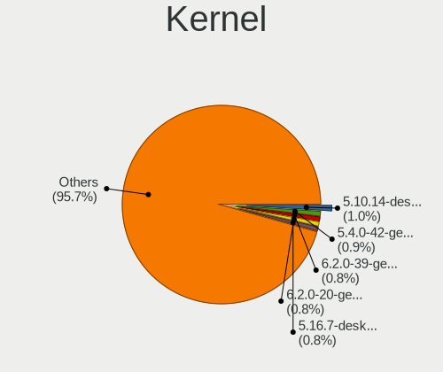

| Version                  | Notebooks | Percent |
|--------------------------|-----------|---------|
| 5.10.14-desktop-1omv4002 | 10        | 1.67%   |
| 5.4.0-42-generic         | 9         | 1.51%   |
| 5.3.0-46-generic         | 7         | 1.17%   |
| 5.15.0-46-generic        | 7         | 1.17%   |
| 5.4.0-58-generic         | 6         | 1%      |
| 5.19.0-76051900-generic  | 6         | 1%      |
| 5.16.7-desktop-1omv4003  | 6         | 1%      |
| 5.15.0-48-generic        | 6         | 1%      |
| 5.11.0-40-generic        | 6         | 1%      |
| 5.8.0-44-generic         | 5         | 0.84%   |
| 5.4.0-91-generic         | 5         | 0.84%   |
| 5.4.0-74-generic         | 5         | 0.84%   |
| 5.4.0-48-generic         | 5         | 0.84%   |
| 5.4.0-26-generic         | 5         | 0.84%   |
| 6.0.12-76060006-generic  | 4         | 0.67%   |
| 5.8.0-7630-generic       | 4         | 0.67%   |
| 5.8.0-43-generic         | 4         | 0.67%   |
| 5.4.0-45-generic         | 4         | 0.67%   |
| 5.4.0-33-generic         | 4         | 0.67%   |
| 5.3.0-40-generic         | 4         | 0.67%   |
| 5.17.5-76051705-generic  | 4         | 0.67%   |
| 5.17.15-76051715-generic | 4         | 0.67%   |
| 5.15.0-60-generic        | 4         | 0.67%   |
| 5.15.0-52-generic        | 4         | 0.67%   |
| 5.13.0-7620-generic      | 4         | 0.67%   |
| 5.13.0-39-generic        | 4         | 0.67%   |
| 5.13.0-28-generic        | 4         | 0.67%   |
| 5.11.0-7620-generic      | 4         | 0.67%   |
| 5.10.0-8-amd64           | 4         | 0.67%   |
| 5.0.0-31-generic         | 4         | 0.67%   |
| 6.1.1-desktop-1omv2290   | 3         | 0.5%    |
| 6.0.6-76060006-generic   | 3         | 0.5%    |
| 6.0.2-76060002-generic   | 3         | 0.5%    |
| 5.8.0-7642-generic       | 3         | 0.5%    |
| 5.8.0-50-generic         | 3         | 0.5%    |
| 5.8.0-48-generic         | 3         | 0.5%    |
| 5.4.0-81-generic         | 3         | 0.5%    |
| 5.4.0-56-generic         | 3         | 0.5%    |
| 5.4.0-53-generic         | 3         | 0.5%    |
| 5.4.0-40-generic         | 3         | 0.5%    |

Kernel Family
-------------

Linux kernel without a distro release

| Version | Notebooks | Percent |
|---------|-----------|---------|
| 5.4.0   | 100       | 17.83%  |
| 5.15.0  | 34        | 6.06%   |
| 5.8.0   | 32        | 5.7%    |
| 5.11.0  | 29        | 5.17%   |
| 4.15.0  | 25        | 4.46%   |
| 5.3.0   | 23        | 4.1%    |
| 5.13.0  | 21        | 3.74%   |
| 5.19.0  | 17        | 3.03%   |
| 5.10.0  | 17        | 3.03%   |
| 5.0.0   | 15        | 2.67%   |
| 4.18.0  | 12        | 2.14%   |
| 5.10.14 | 10        | 1.78%   |
| 5.16.7  | 6         | 1.07%   |
| 5.17.5  | 5         | 0.89%   |
| 5.17.0  | 5         | 0.89%   |
| 5.16.11 | 5         | 0.89%   |
| 6.0.12  | 4         | 0.71%   |
| 5.18.0  | 4         | 0.71%   |
| 5.17.15 | 4         | 0.71%   |
| 4.19.0  | 4         | 0.71%   |
| 6.1.1   | 3         | 0.53%   |
| 6.0.6   | 3         | 0.53%   |
| 6.0.2   | 3         | 0.53%   |
| 5.9.0   | 3         | 0.53%   |
| 5.5.5   | 3         | 0.53%   |
| 5.4.14  | 3         | 0.53%   |
| 5.18.10 | 3         | 0.53%   |
| 5.16.15 | 3         | 0.53%   |
| 5.16.10 | 3         | 0.53%   |
| 5.15.5  | 3         | 0.53%   |
| 5.14.16 | 3         | 0.53%   |
| 5.13.19 | 3         | 0.53%   |
| 5.12.4  | 3         | 0.53%   |
| 5.10.7  | 3         | 0.53%   |
| 6.0.3   | 2         | 0.36%   |
| 6.0.0   | 2         | 0.36%   |
| 5.9.8   | 2         | 0.36%   |
| 5.9.16  | 2         | 0.36%   |
| 5.4.8   | 2         | 0.36%   |
| 5.4.6   | 2         | 0.36%   |

Kernel Major Ver.
-----------------

Linux kernel major version

| Version | Notebooks | Percent |
|---------|-----------|---------|
| 5.4     | 112       | 20.36%  |
| 5.15    | 50        | 9.09%   |
| 5.8     | 38        | 6.91%   |
| 5.13    | 36        | 6.55%   |
| 5.11    | 35        | 6.36%   |
| 5.10    | 35        | 6.36%   |
| 5.3     | 31        | 5.64%   |
| 5.16    | 25        | 4.55%   |
| 4.15    | 25        | 4.55%   |
| 5.19    | 24        | 4.36%   |
| 5.17    | 20        | 3.64%   |
| 6.0     | 15        | 2.73%   |
| 5.0     | 15        | 2.73%   |
| 4.18    | 15        | 2.73%   |
| 5.14    | 14        | 2.55%   |
| 5.9     | 11        | 2%      |
| 5.18    | 11        | 2%      |
| 5.12    | 7         | 1.27%   |
| 6.1     | 6         | 1.09%   |
| 4.19    | 6         | 1.09%   |
| 5.5     | 5         | 0.91%   |
| 5.7     | 3         | 0.55%   |
| 4.9     | 3         | 0.55%   |
| 5.6     | 2         | 0.36%   |
| 5.2     | 2         | 0.36%   |
| 5.1     | 2         | 0.36%   |
| 6.2     | 1         | 0.18%   |
| 4.4     | 1         | 0.18%   |

Arch
----

OS architecture (x86_64, i586, etc.)

| Name   | Notebooks | Percent |
|--------|-----------|---------|
| x86_64 | 479       | 97.36%  |
| i686   | 12        | 2.44%   |
| armv7l | 1         | 0.2%    |

DE
--

Desktop Environment

| Name              | Notebooks | Percent |
|-------------------|-----------|---------|
| GNOME             | 251       | 49.02%  |
| KDE5              | 72        | 14.06%  |
| Unknown           | 59        | 11.52%  |
| XFCE              | 44        | 8.59%   |
| X-Cinnamon        | 23        | 4.49%   |
| MATE              | 12        | 2.34%   |
| KDE               | 12        | 2.34%   |
| Pantheon          | 6         | 1.17%   |
| Cinnamon          | 6         | 1.17%   |
| i3                | 5         | 0.98%   |
| GNOME Flashback   | 4         | 0.78%   |
| Budgie            | 4         | 0.78%   |
| LXQt              | 3         | 0.59%   |
| Unity             | 2         | 0.39%   |
| LXDE              | 2         | 0.39%   |
| KDE4              | 2         | 0.39%   |
| Yaru:ubuntu:GNOME | 1         | 0.2%    |
| xinit-compat      | 1         | 0.2%    |
| i3-with-shmlog    | 1         | 0.2%    |
| Deepin            | 1         | 0.2%    |
| bspwm             | 1         | 0.2%    |

Display Server
--------------

X11 or Wayland

| Name    | Notebooks | Percent |
|---------|-----------|---------|
| X11     | 387       | 76.03%  |
| Wayland | 85        | 16.7%   |
| Unknown | 31        | 6.09%   |
| Tty     | 6         | 1.18%   |

Display Manager
---------------

SDDM, LightDM, etc.

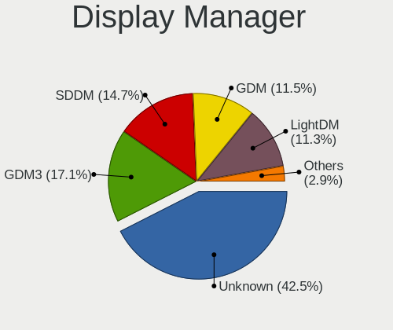

| Name    | Notebooks | Percent |
|---------|-----------|---------|
| Unknown | 246       | 47.49%  |
| GDM     | 82        | 15.83%  |
| SDDM    | 61        | 11.78%  |
| LightDM | 54        | 10.42%  |
| GDM3    | 54        | 10.42%  |
| TDM     | 17        | 3.28%   |
| KDM     | 3         | 0.58%   |
| XDM     | 1         | 0.19%   |

OS Lang
-------

Language

| Lang        | Notebooks | Percent |
|-------------|-----------|---------|
| en_US       | 258       | 51.09%  |
| nb_NO       | 128       | 25.35%  |
| Unknown     | 55        | 10.89%  |
| en_GB       | 25        | 4.95%   |
| C           | 9         | 1.78%   |
| nn_NO       | 8         | 1.58%   |
| pl_PL       | 6         | 1.19%   |
| de_DE       | 4         | 0.79%   |
| en_DK       | 3         | 0.59%   |
| ru_RU       | 1         | 0.2%    |
| pt_PT       | 1         | 0.2%    |
| fi_FI       | 1         | 0.2%    |
| en_US.utf-8 | 1         | 0.2%    |
| en_NZ       | 1         | 0.2%    |
| en_IE       | 1         | 0.2%    |
| en_150      | 1         | 0.2%    |
| en_001      | 1         | 0.2%    |
| el_GR       | 1         | 0.2%    |

Boot Mode
---------

EFI or BIOS

| Mode | Notebooks | Percent |
|------|-----------|---------|
| EFI  | 267       | 53.4%   |
| BIOS | 233       | 46.6%   |

Filesystem
----------

Type of filesystem

| Type    | Notebooks | Percent |
|---------|-----------|---------|
| Ext4    | 395       | 79%     |
| Btrfs   | 48        | 9.6%    |
| Overlay | 28        | 5.6%    |
| Unknown | 12        | 2.4%    |
| Xfs     | 11        | 2.2%    |
| Zfs     | 4         | 0.8%    |
| Ext3    | 1         | 0.2%    |
| Ext2    | 1         | 0.2%    |

Part. scheme
------------

Scheme of partitioning

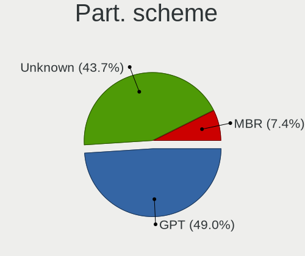

| Type    | Notebooks | Percent |
|---------|-----------|---------|
| Unknown | 267       | 52.98%  |
| GPT     | 194       | 38.49%  |
| MBR     | 43        | 8.53%   |

Dual Boot with Linux/BSD
------------------------

Hosting more than one Linux/BSD

| Dual boot | Notebooks | Percent |
|-----------|-----------|---------|
| No        | 450       | 90.18%  |
| Yes       | 49        | 9.82%   |

Dual Boot (Win)
---------------

Hosting Linux and Windows

| Dual boot | Notebooks | Percent |
|-----------|-----------|---------|
| No        | 388       | 77.76%  |
| Yes       | 111       | 22.24%  |

Board
-----

Vendor
------

Motherboard manufacturer

| Name                 | Notebooks | Percent |
|----------------------|-----------|---------|
| Lenovo               | 142       | 28.86%  |
| Hewlett-Packard      | 95        | 19.31%  |
| Dell                 | 77        | 15.65%  |
| ASUSTek Computer     | 50        | 10.16%  |
| Acer                 | 37        | 7.52%   |
| Apple                | 19        | 3.86%   |
| MSI                  | 15        | 3.05%   |
| HUAWEI               | 13        | 2.64%   |
| Toshiba              | 8         | 1.63%   |
| Samsung Electronics  | 8         | 1.63%   |
| Packard Bell         | 6         | 1.22%   |
| Notebook             | 5         | 1.02%   |
| Clevo                | 4         | 0.81%   |
| Unknown              | 3         | 0.61%   |
| Google               | 2         | 0.41%   |
| Teclast              | 1         | 0.2%    |
| Razer                | 1         | 0.2%    |
| Nokia                | 1         | 0.2%    |
| LAMINA               | 1         | 0.2%    |
| Intel Client Systems | 1         | 0.2%    |
| Getac                | 1         | 0.2%    |
| Cepter               | 1         | 0.2%    |
| Alienware            | 1         | 0.2%    |

Model
-----

Motherboard model

| Name                                     | Notebooks | Percent |
|------------------------------------------|-----------|---------|
| HUAWEI MACH-WX9                          | 6         | 1.22%   |
| Dell Precision 5530                      | 6         | 1.22%   |
| HP ProBook 430 G2                        | 4         | 0.81%   |
| Dell XPS 15 9570                         | 4         | 0.81%   |
| Dell Latitude E7240                      | 4         | 0.81%   |
| Apple MacBookPro12,1                     | 4         | 0.81%   |
| Unknown                                  | 4         | 0.81%   |
| HUAWEI WRT-WX9                           | 3         | 0.61%   |
| HP OMEN by Laptop                        | 3         | 0.61%   |
| HP EliteBook 8470p                       | 3         | 0.61%   |
| HP EliteBook 840 G6                      | 3         | 0.61%   |
| HP EliteBook 840 G5                      | 3         | 0.61%   |
| Dell XPS 15 9500                         | 3         | 0.61%   |
| Dell XPS 13 9380                         | 3         | 0.61%   |
| Dell Latitude E5470                      | 3         | 0.61%   |
| Dell Latitude 5480                       | 3         | 0.61%   |
| Acer Aspire V3-571G                      | 3         | 0.61%   |
| MSI GF63 Thin 11UD                       | 2         | 0.41%   |
| Lenovo Z50-70 20354                      | 2         | 0.41%   |
| Lenovo Yoga Slim 7 Pro 14IAH7 82UT       | 2         | 0.41%   |
| Lenovo Yoga Slim 7 14ARE05 82A2          | 2         | 0.41%   |
| Lenovo Y520-15IKBN 80WK                  | 2         | 0.41%   |
| Lenovo ThinkPad X230 23252EG             | 2         | 0.41%   |
| Lenovo ThinkPad X1 Carbon 7th 20QD00L1MX | 2         | 0.41%   |
| Lenovo ThinkPad L450 20DT001NMN          | 2         | 0.41%   |
| HP ProBook 6550b                         | 2         | 0.41%   |
| HP ProBook 4330s                         | 2         | 0.41%   |
| HP Pavilion Notebook                     | 2         | 0.41%   |
| HP Pavilion dv6                          | 2         | 0.41%   |
| HP Notebook                              | 2         | 0.41%   |
| HP EliteBook 8560p                       | 2         | 0.41%   |
| HP EliteBook 840 G8 Notebook PC          | 2         | 0.41%   |
| HP EliteBook 840 G4                      | 2         | 0.41%   |
| HP EliteBook 840 G1                      | 2         | 0.41%   |
| HP EliteBook 830 G6                      | 2         | 0.41%   |
| HP EliteBook 820 G1                      | 2         | 0.41%   |
| Dell XPS 15 9520                         | 2         | 0.41%   |
| Dell XPS 15 7590                         | 2         | 0.41%   |
| Dell Latitude E6530                      | 2         | 0.41%   |
| Dell Latitude E5450                      | 2         | 0.41%   |

Model Family
------------

Motherboard model prefix

| Name                  | Notebooks | Percent |
|-----------------------|-----------|---------|
| Lenovo ThinkPad       | 106       | 21.54%  |
| HP EliteBook          | 36        | 7.32%   |
| Dell Latitude         | 34        | 6.91%   |
| Acer Aspire           | 26        | 5.28%   |
| HP ProBook            | 21        | 4.27%   |
| Dell XPS              | 19        | 3.86%   |
| Dell Precision        | 16        | 3.25%   |
| Lenovo IdeaPad        | 11        | 2.24%   |
| HP ZBook              | 10        | 2.03%   |
| ASUS VivoBook         | 9         | 1.83%   |
| HP Pavilion           | 8         | 1.63%   |
| Lenovo Yoga           | 7         | 1.42%   |
| Toshiba Satellite     | 6         | 1.22%   |
| HUAWEI MACH-WX9       | 6         | 1.22%   |
| Dell Inspiron         | 6         | 1.22%   |
| Packard Bell EasyNote | 5         | 1.02%   |
| HP OMEN               | 5         | 1.02%   |
| Acer Swift            | 5         | 1.02%   |
| HP Laptop             | 4         | 0.81%   |
| Apple MacBookPro12    | 4         | 0.81%   |
| Unknown               | 4         | 0.81%   |
| Lenovo Legion         | 3         | 0.61%   |
| HUAWEI WRT-WX9        | 3         | 0.61%   |
| ASUS ZenBook          | 3         | 0.61%   |
| ASUS TUF              | 3         | 0.61%   |
| Apple MacBookPro11    | 3         | 0.61%   |
| Acer Nitro            | 3         | 0.61%   |
| MSI GS66              | 2         | 0.41%   |
| MSI GF63              | 2         | 0.41%   |
| Lenovo Z50-70         | 2         | 0.41%   |
| Lenovo Y520-15IKBN    | 2         | 0.41%   |
| HP Presario           | 2         | 0.41%   |
| HP Notebook           | 2         | 0.41%   |
| HP Compaq             | 2         | 0.41%   |
| ASUS Zephyrus         | 2         | 0.41%   |
| ASUS X55U             | 2         | 0.41%   |
| ASUS UX430UQ          | 2         | 0.41%   |
| ASUS ROG              | 2         | 0.41%   |
| Apple MacBookPro9     | 2         | 0.41%   |
| Apple MacBookPro6     | 2         | 0.41%   |

MFG Year
--------

Motherboard manufacture year

| Year    | Notebooks | Percent |
|---------|-----------|---------|
| 2018    | 56        | 11.38%  |
| 2019    | 50        | 10.16%  |
| 2016    | 43        | 8.74%   |
| 2012    | 43        | 8.74%   |
| 2020    | 41        | 8.33%   |
| 2011    | 36        | 7.32%   |
| 2015    | 35        | 7.11%   |
| 2017    | 31        | 6.3%    |
| 2021    | 30        | 6.1%    |
| 2013    | 28        | 5.69%   |
| 2014    | 26        | 5.28%   |
| 2010    | 26        | 5.28%   |
| 2009    | 15        | 3.05%   |
| 2022    | 13        | 2.64%   |
| 2007    | 9         | 1.83%   |
| 2008    | 7         | 1.42%   |
| 2006    | 1         | 0.2%    |
| 2005    | 1         | 0.2%    |
| Unknown | 1         | 0.2%    |

Form Factor
-----------

Physical design of the computer

| Name     | Notebooks | Percent |
|----------|-----------|---------|
| Notebook | 492       | 100%    |

Secure Boot
-----------

Enabled or disabled

| State    | Notebooks | Percent |
|----------|-----------|---------|
| Disabled | 433       | 87.83%  |
| Enabled  | 60        | 12.17%  |

Coreboot
--------

Have coreboot on board

| Used | Notebooks | Percent |
|------|-----------|---------|
| No   | 489       | 99.39%  |
| Yes  | 3         | 0.61%   |

RAM Size
--------

Total RAM memory

| Size in GB  | Notebooks | Percent |
|-------------|-----------|---------|
| 4.01-8.0    | 149       | 29.92%  |
| 16.01-24.0  | 114       | 22.89%  |
| 8.01-16.0   | 86        | 17.27%  |
| 3.01-4.0    | 72        | 14.46%  |
| 32.01-64.0  | 49        | 9.84%   |
| 1.01-2.0    | 12        | 2.41%   |
| 64.01-256.0 | 5         | 1%      |
| 24.01-32.0  | 4         | 0.8%    |
| 2.01-3.0    | 3         | 0.6%    |
| 0.51-1.0    | 3         | 0.6%    |
| 0.01-0.5    | 1         | 0.2%    |

RAM Used
--------

Used RAM memory

| Used GB    | Notebooks | Percent |
|------------|-----------|---------|
| 1.01-2.0   | 163       | 29.64%  |
| 2.01-3.0   | 142       | 25.82%  |
| 4.01-8.0   | 107       | 19.45%  |
| 3.01-4.0   | 89        | 16.18%  |
| 0.51-1.0   | 22        | 4%      |
| 8.01-16.0  | 21        | 3.82%   |
| 0.01-0.5   | 4         | 0.73%   |
| 16.01-24.0 | 2         | 0.36%   |

Total Drives
------------

Number of drives on board

| Drives | Notebooks | Percent |
|--------|-----------|---------|
| 1      | 401       | 79.88%  |
| 2      | 85        | 16.93%  |
| 3      | 10        | 1.99%   |
| 0      | 4         | 0.8%    |
| 6      | 1         | 0.2%    |
| 4      | 1         | 0.2%    |

Has CD-ROM
----------

Has CD-ROM on board

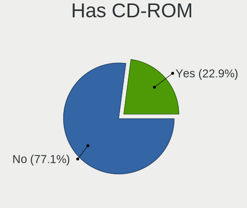

| Presented | Notebooks | Percent |
|-----------|-----------|---------|
| No        | 368       | 74.19%  |
| Yes       | 128       | 25.81%  |

Has Ethernet
------------

Has Ethernet on board

| Presented | Notebooks | Percent |
|-----------|-----------|---------|
| Yes       | 398       | 80.73%  |
| No        | 95        | 19.27%  |

Has WiFi
--------

Has WiFi module

| Presented | Notebooks | Percent |
|-----------|-----------|---------|
| Yes       | 486       | 98.78%  |
| No        | 6         | 1.22%   |

Has Bluetooth
-------------

Has Bluetooth module

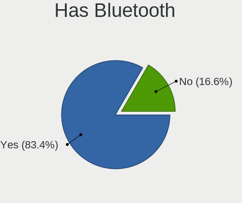

| Presented | Notebooks | Percent |
|-----------|-----------|---------|
| Yes       | 398       | 79.6%   |
| No        | 102       | 20.4%   |

Location
--------

Country
-------

Geographic location (country)

| Country | Notebooks | Percent |
|---------|-----------|---------|
| Norway  | 492       | 100%    |

City
----

Geographic location (city)

| City                 | Notebooks | Percent |
|----------------------|-----------|---------|
| Oslo                 | 161       | 30.55%  |
| Trondheim            | 28        | 5.31%   |
| Bergen               | 24        | 4.55%   |
| Kristiansand         | 16        | 3.04%   |
| Stavanger            | 13        | 2.47%   |
| Troms              | 10        | 1.9%    |
| Ryken Municipality | 8         | 1.52%   |
| Fredrikstad          | 7         | 1.33%   |
| Skien                | 6         | 1.14%   |
| Sandnes              | 6         | 1.14%   |
| Drammen              | 6         | 1.14%   |
| Bod                | 6         | 1.14%   |
| Melhus               | 5         | 0.95%   |
| Hamar                | 5         | 0.95%   |
| Drobak               | 5         | 0.95%   |
| Nesttun              | 4         | 0.76%   |
| Moss                 | 4         | 0.76%   |
| Fornebu              | 4         | 0.76%   |
| Vear                 | 3         | 0.57%   |
| Tnsberg            | 3         | 0.57%   |
| Sarpsborg            | 3         | 0.57%   |
| Sandefjord           | 3         | 0.57%   |
| Rong                 | 3         | 0.57%   |
| Mjondalen            | 3         | 0.57%   |
| Horten               | 3         | 0.57%   |
| Honefoss             | 3         | 0.57%   |
| Haugesund            | 3         | 0.57%   |
| Asker                | 3         | 0.57%   |
| Arendal              | 3         | 0.57%   |
| lesund             | 3         | 0.57%   |
| Stord                | 2         | 0.38%   |
| Stjordal             | 2         | 0.38%   |
| Stabekk              | 2         | 0.38%   |
| Skoppum              | 2         | 0.38%   |
| Skollenborg          | 2         | 0.38%   |
| Skiptvet             | 2         | 0.38%   |
| Ski                  | 2         | 0.38%   |
| Sistranda            | 2         | 0.38%   |
| Saetre               | 2         | 0.38%   |
| Notteroy             | 2         | 0.38%   |

Drives
------

Drive Vendor
------------

Hard drive vendors

| Vendor                         | Notebooks | Drives | Percent |
|--------------------------------|-----------|--------|---------|
| Samsung Electronics            | 134       | 183    | 22.79%  |
| Toshiba                        | 50        | 58     | 8.5%    |
| WDC                            | 45        | 57     | 7.65%   |
| SanDisk                        | 45        | 61     | 7.65%   |
| Seagate                        | 39        | 44     | 6.63%   |
| SK hynix                       | 37        | 41     | 6.29%   |
| Unknown                        | 32        | 40     | 5.44%   |
| Kingston                       | 24        | 33     | 4.08%   |
| Intel                          | 24        | 28     | 4.08%   |
| Micron Technology              | 22        | 32     | 3.74%   |
| Hitachi                        | 18        | 26     | 3.06%   |
| Crucial                        | 16        | 18     | 2.72%   |
| HGST                           | 15        | 15     | 2.55%   |
| Apple                          | 12        | 14     | 2.04%   |
| LITEON                         | 11        | 15     | 1.87%   |
| PNY                            | 7         | 12     | 1.19%   |
| KIOXIA                         | 6         | 14     | 1.02%   |
| A-DATA Technology              | 5         | 8      | 0.85%   |
| Phison                         | 4         | 5      | 0.68%   |
| LITEONIT                       | 4         | 5      | 0.68%   |
| Lenovo                         | 4         | 4      | 0.68%   |
| OCZ                            | 3         | 3      | 0.51%   |
| Fujitsu                        | 3         | 3      | 0.51%   |
| Corsair                        | 3         | 3      | 0.51%   |
| XPG                            | 2         | 2      | 0.34%   |
| Transcend                      | 2         | 2      | 0.34%   |
| Lexar                          | 2         | 2      | 0.34%   |
| Intenso                        | 2         | 2      | 0.34%   |
| China                          | 2         | 2      | 0.34%   |
| ASMT                           | 2         | 2      | 0.34%   |
| Ugreen                         | 1         | 1      | 0.17%   |
| Teclast                        | 1         | 1      | 0.17%   |
| STEC                           | 1         | 1      | 0.17%   |
| Solid State Storage Technology | 1         | 1      | 0.17%   |
| Phison Electronics             | 1         | 1      | 0.17%   |
| Patriot                        | 1         | 1      | 0.17%   |
| Lite-On                        | 1         | 1      | 0.17%   |
| Linux                          | 1         | 1      | 0.17%   |
| LaCie                          | 1         | 1      | 0.17%   |
| GOODRAM                        | 1         | 1      | 0.17%   |

Drive Model
-----------

Hard drive models

| Model                                  | Notebooks | Percent |
|----------------------------------------|-----------|---------|
| Samsung SM963 2.5" NVMe PCIe SSD 256GB | 13        | 2.11%   |
| HGST HTS721010A9E630 1TB               | 7         | 1.14%   |
| Toshiba NVMe SSD Drive 256GB           | 6         | 0.98%   |
| PNY ELITE PSSD 240GB                   | 6         | 0.98%   |
| Unknown MMC Card  64GB                 | 5         | 0.81%   |
| SanDisk NVMe SSD Drive 512GB           | 5         | 0.81%   |
| Samsung NVMe SSD Drive 1024GB          | 5         | 0.81%   |
| Toshiba NVMe SSD Drive 512GB           | 4         | 0.65%   |
| SK hynix NVMe SSD Drive 512GB          | 4         | 0.65%   |
| SanDisk NVMe SSD Drive 500GB           | 4         | 0.65%   |
| SanDisk NVMe SSD Drive 256GB           | 4         | 0.65%   |
| Samsung NVMe SSD Drive 500GB           | 4         | 0.65%   |
| Kingston SV300S37A120G 120GB SSD       | 4         | 0.65%   |
| Intel NVMe SSD Drive 512GB             | 4         | 0.65%   |
| WDC WDS500G2B0A-00SM50 500GB SSD       | 3         | 0.49%   |
| WDC PC SN730 SDBQNTY-512G-1001 512GB   | 3         | 0.49%   |
| Unknown MMC Card  16GB                 | 3         | 0.49%   |
| SK hynix PC401 NVMe 512GB              | 3         | 0.49%   |
| SK hynix PC401 NVMe 1TB                | 3         | 0.49%   |
| SK hynix HFS128G39TND-N210A 128GB SSD  | 3         | 0.49%   |
| Seagate ST9500325AS 500GB              | 3         | 0.49%   |
| Seagate ST1000LM024 HN-M101MBB 1TB     | 3         | 0.49%   |
| Seagate Expansion 1TB                  | 3         | 0.49%   |
| SanDisk SD8SN8U-128G-1006 128GB SSD    | 3         | 0.49%   |
| SanDisk SD6SB1M-128G-1006 128GB SSD    | 3         | 0.49%   |
| SanDisk NVMe SSD Drive 1TB             | 3         | 0.49%   |
| Samsung SSD 850 EVO 500GB              | 3         | 0.49%   |
| Samsung SSD 850 EVO 250GB              | 3         | 0.49%   |
| Samsung NVMe SSD Drive 512GB           | 3         | 0.49%   |
| Samsung MZ7LN256HCHP-000L7 256GB SSD   | 3         | 0.49%   |
| OCZ AGILITY3 120GB SSD                 | 3         | 0.49%   |
| Micron NVMe SSD Drive 512GB            | 3         | 0.49%   |
| Micron MTFDKBA512TFH 512GB             | 3         | 0.49%   |
| Micron 1100_MTFDDAV256TBN 256GB SSD    | 3         | 0.49%   |
| Kingston SA400S37240G 240GB SSD        | 3         | 0.49%   |
| Kingston OM8PCP3512F-AI1 512GB         | 3         | 0.49%   |
| Kingston NVMe SSD Drive 512GB          | 3         | 0.49%   |
| Hitachi HTS545050B9A300 500GB          | 3         | 0.49%   |
| HGST HTS725050A7E630 500GB             | 3         | 0.49%   |
| Crucial CT120BX500SSD1 120GB           | 3         | 0.49%   |

HDD Vendor
----------

Hard disk drive vendors

| Vendor              | Notebooks | Drives | Percent |
|---------------------|-----------|--------|---------|
| Seagate             | 38        | 43     | 31.93%  |
| WDC                 | 23        | 33     | 19.33%  |
| Hitachi             | 18        | 26     | 15.13%  |
| Toshiba             | 17        | 21     | 14.29%  |
| HGST                | 15        | 15     | 12.61%  |
| Fujitsu             | 3         | 3      | 2.52%   |
| Intenso             | 2         | 2      | 1.68%   |
| Unknown             | 1         | 1      | 0.84%   |
| Samsung Electronics | 1         | 3      | 0.84%   |
| LaCie               | 1         | 1      | 0.84%   |

SSD Vendor
----------

Solid state drive vendors

| Vendor              | Notebooks | Drives | Percent |
|---------------------|-----------|--------|---------|
| Samsung Electronics | 67        | 86     | 30.04%  |
| SanDisk             | 24        | 32     | 10.76%  |
| Kingston            | 18        | 20     | 8.07%   |
| Crucial             | 16        | 18     | 7.17%   |
| Intel               | 14        | 16     | 6.28%   |
| Apple               | 11        | 13     | 4.93%   |
| Micron Technology   | 10        | 14     | 4.48%   |
| LITEON              | 9         | 13     | 4.04%   |
| SK hynix            | 8         | 9      | 3.59%   |
| Toshiba             | 7         | 8      | 3.14%   |
| PNY                 | 7         | 12     | 3.14%   |
| WDC                 | 6         | 8      | 2.69%   |
| LITEONIT            | 4         | 5      | 1.79%   |
| A-DATA Technology   | 4         | 7      | 1.79%   |
| OCZ                 | 3         | 3      | 1.35%   |
| Corsair             | 3         | 3      | 1.35%   |
| Transcend           | 2         | 2      | 0.9%    |
| China               | 2         | 2      | 0.9%    |
| ASMT                | 2         | 2      | 0.9%    |
| Teclast             | 1         | 1      | 0.45%   |
| Seagate             | 1         | 1      | 0.45%   |
| Phison              | 1         | 1      | 0.45%   |
| Patriot             | 1         | 1      | 0.45%   |
| GOODRAM             | 1         | 1      | 0.45%   |
| BIWIN               | 1         | 1      | 0.45%   |

Drive Kind
----------

HDD or SSD

| Kind    | Notebooks | Drives | Percent |
|---------|-----------|--------|---------|
| SSD     | 209       | 279    | 37.25%  |
| NVMe    | 195       | 272    | 34.76%  |
| HDD     | 117       | 148    | 20.86%  |
| MMC     | 33        | 41     | 5.88%   |
| Unknown | 7         | 7      | 1.25%   |

Drive Connector
---------------

SATA, SAS, NVMe, etc.

| Type | Notebooks | Drives | Percent |
|------|-----------|--------|---------|
| SATA | 294       | 396    | 53.65%  |
| NVMe | 195       | 272    | 35.58%  |
| MMC  | 33        | 41     | 6.02%   |
| SAS  | 26        | 38     | 4.74%   |

Drive Size
----------

Size of hard drive

| Size in TB | Notebooks | Drives | Percent |
|------------|-----------|--------|---------|
| 0.01-0.5   | 248       | 342    | 76.07%  |
| 0.51-1.0   | 67        | 72     | 20.55%  |
| 1.01-2.0   | 7         | 8      | 2.15%   |
| 3.01-4.0   | 2         | 2      | 0.61%   |
| 4.01-10.0  | 2         | 3      | 0.61%   |

Space Total
-----------

Amount of disk space available on the file system

| Size in GB     | Notebooks | Percent |
|----------------|-----------|---------|
| 101-250        | 179       | 34.56%  |
| 251-500        | 135       | 26.06%  |
| 501-1000       | 64        | 12.36%  |
| 1-20           | 40        | 7.72%   |
| 1001-2000      | 35        | 6.76%   |
| 51-100         | 21        | 4.05%   |
| 21-50          | 14        | 2.7%    |
| More than 3000 | 12        | 2.32%   |
| 2001-3000      | 11        | 2.12%   |
| Unknown        | 7         | 1.35%   |

Space Used
----------

Amount of used disk space

| Used GB        | Notebooks | Percent |
|----------------|-----------|---------|
| 1-20           | 210       | 38.46%  |
| 21-50          | 90        | 16.48%  |
| 101-250        | 82        | 15.02%  |
| 51-100         | 73        | 13.37%  |
| 251-500        | 48        | 8.79%   |
| 501-1000       | 16        | 2.93%   |
| 1001-2000      | 15        | 2.75%   |
| Unknown        | 7         | 1.28%   |
| More than 3000 | 5         | 0.92%   |

Malfunc. Drives
---------------

Drive models with a malfunction

| Model                                               | Notebooks | Drives | Percent |
|-----------------------------------------------------|-----------|--------|---------|
| WDC WD7500BPVX-22JC3T0 752GB                        | 2         | 2      | 7.41%   |
| WDC WD10JPVX-22JC3T0 1TB                            | 1         | 1      | 3.7%    |
| Toshiba MK5055GSX 500GB                             | 1         | 3      | 3.7%    |
| SK hynix SH920 2.5 7MM 128GB SSD                    | 1         | 1      | 3.7%    |
| SK hynix SC210 2.5 7MM 256GB SSD                    | 1         | 1      | 3.7%    |
| SK hynix HFS128G39TND-N210A 128GB SSD               | 1         | 1      | 3.7%    |
| Seagate ST9750420AS 752GB                           | 1         | 1      | 3.7%    |
| Seagate ST500LT012-1DG142 500GB                     | 1         | 1      | 3.7%    |
| Seagate ST500LM000-SSHD-8GB                         | 1         | 1      | 3.7%    |
| Seagate ST1000LM014-SSHD-8GB                        | 1         | 1      | 3.7%    |
| SanDisk SD8TN8U-256G-1006 256GB SSD                 | 1         | 1      | 3.7%    |
| Samsung Electronics SSD SM841 2.5 7mm 256GB         | 1         | 1      | 3.7%    |
| Micron Technology MTFDDAK256MAY-1AH12ABHA 256GB SSD | 1         | 4      | 3.7%    |
| Micron Technology 1100_MTFDDAV512TBN 512GB SSD      | 1         | 1      | 3.7%    |
| Micron Technology 1100_MTFDDAK512TBN 512GB SSD      | 1         | 1      | 3.7%    |
| Lenovo LENSE20256GMSP34MEAT2TA 256GB                | 1         | 1      | 3.7%    |
| Kingston SA2000M81000G 1TB                          | 1         | 2      | 3.7%    |
| Intel SSDSA1M080G2LE 80GB                           | 1         | 1      | 3.7%    |
| Intel SSDPEKNW512G8H 512GB                          | 1         | 2      | 3.7%    |
| Hitachi HTS725032A9A364 320GB                       | 1         | 1      | 3.7%    |
| Hitachi HTS725025A9A364 250GB                       | 1         | 1      | 3.7%    |
| Hitachi HTS547564A9E384 640GB                       | 1         | 1      | 3.7%    |
| HGST HTS725050A7E630 500GB                          | 1         | 1      | 3.7%    |
| Crucial CT256M550SSD1 256GB                         | 1         | 1      | 3.7%    |
| Corsair Performance Pro 128GB SSD                   | 1         | 1      | 3.7%    |
| Corsair Force GS 240GB SSD                          | 1         | 1      | 3.7%    |

Malfunc. Drive Vendor
---------------------

Vendors of faulty drives

| Vendor              | Notebooks | Drives | Percent |
|---------------------|-----------|--------|---------|
| Seagate             | 4         | 4      | 14.81%  |
| WDC                 | 3         | 3      | 11.11%  |
| SK hynix            | 3         | 3      | 11.11%  |
| Micron Technology   | 3         | 6      | 11.11%  |
| Hitachi             | 3         | 3      | 11.11%  |
| Intel               | 2         | 3      | 7.41%   |
| Corsair             | 2         | 2      | 7.41%   |
| Toshiba             | 1         | 3      | 3.7%    |
| SanDisk             | 1         | 1      | 3.7%    |
| Samsung Electronics | 1         | 1      | 3.7%    |
| Lenovo              | 1         | 1      | 3.7%    |
| Kingston            | 1         | 2      | 3.7%    |
| HGST                | 1         | 1      | 3.7%    |
| Crucial             | 1         | 1      | 3.7%    |

Malfunc. HDD Vendor
-------------------

Vendors of faulty HDD drives

| Vendor  | Notebooks | Drives | Percent |
|---------|-----------|--------|---------|
| Seagate | 4         | 4      | 33.33%  |
| WDC     | 3         | 3      | 25%     |
| Hitachi | 3         | 3      | 25%     |
| Toshiba | 1         | 3      | 8.33%   |
| HGST    | 1         | 1      | 8.33%   |

Malfunc. Drive Kind
-------------------

Kinds of faulty drives

| Kind | Notebooks | Drives | Percent |
|------|-----------|--------|---------|
| SSD  | 12        | 15     | 44.44%  |
| HDD  | 12        | 14     | 44.44%  |
| NVMe | 3         | 5      | 11.11%  |

Failed Drives
-------------

Failed drive models

Zero info for selected period =(

Failed Drive Vendor
-------------------

Failed drive vendors

Zero info for selected period =(

Drive Status
------------

Number of failed and malfunc. drives

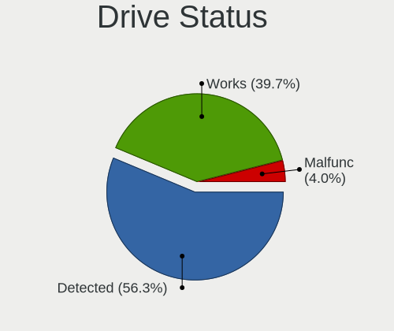

| Status   | Notebooks | Drives | Percent |
|----------|-----------|--------|---------|
| Detected | 306       | 452    | 58.06%  |
| Works    | 194       | 261    | 36.81%  |
| Malfunc  | 27        | 34     | 5.12%   |

Storage controller
------------------

Storage Vendor
--------------

Storage controller vendors

| Vendor                         | Notebooks | Percent |
|--------------------------------|-----------|---------|
| Intel                          | 335       | 57.86%  |
| Samsung Electronics            | 75        | 12.95%  |
| AMD                            | 39        | 6.74%   |
| SanDisk                        | 35        | 6.04%   |
| SK hynix                       | 28        | 4.84%   |
| Toshiba America Info Systems   | 27        | 4.66%   |
| Micron Technology              | 12        | 2.07%   |
| Kingston Technology Company    | 6         | 1.04%   |
| Lenovo                         | 4         | 0.69%   |
| KIOXIA                         | 4         | 0.69%   |
| Phison Electronics             | 3         | 0.52%   |
| Lite-On Technology             | 3         | 0.52%   |
| Nvidia                         | 2         | 0.35%   |
| Marvell Technology Group       | 2         | 0.35%   |
| ADATA Technology               | 2         | 0.35%   |
| Solid State Storage Technology | 1         | 0.17%   |
| Apple                          | 1         | 0.17%   |

Storage Model
-------------

Storage controller models

| Model                                                                          | Notebooks | Percent |
|--------------------------------------------------------------------------------|-----------|---------|
| Intel Sunrise Point-LP SATA Controller [AHCI mode]                             | 42        | 6.89%   |
| Samsung NVMe SSD Controller SM981/PM981/PM983                                  | 38        | 6.23%   |
| Intel 7 Series Chipset Family 6-port SATA Controller [AHCI mode]               | 34        | 5.57%   |
| Intel 6 Series/C200 Series Chipset Family 6 port Mobile SATA AHCI Controller   | 30        | 4.92%   |
| AMD FCH SATA Controller [AHCI mode]                                            | 29        | 4.75%   |
| Intel 82801 Mobile SATA Controller [RAID mode]                                 | 28        | 4.59%   |
| Intel 8 Series SATA Controller 1 [AHCI mode]                                   | 25        | 4.1%    |
| Intel Cannon Lake Mobile PCH SATA AHCI Controller                              | 23        | 3.77%   |
| Intel Wildcat Point-LP SATA Controller [AHCI Mode]                             | 19        | 3.11%   |
| Intel Volume Management Device NVMe RAID Controller                            | 18        | 2.95%   |
| Samsung NVMe SSD Controller SM961/PM961/SM963                                  | 15        | 2.46%   |
| Intel HM170/QM170 Chipset SATA Controller [AHCI Mode]                          | 15        | 2.46%   |
| Toshiba America Info Systems XG6 NVMe SSD Controller                           | 14        | 2.3%    |
| Intel 82801IBM/IEM (ICH9M/ICH9M-E) 4 port SATA Controller [AHCI mode]          | 14        | 2.3%    |
| Intel 8 Series/C220 Series Chipset Family 6-port SATA Controller 1 [AHCI mode] | 14        | 2.3%    |
| SanDisk WD Black SN750 / PC SN730 NVMe SSD                                     | 12        | 1.97%   |
| Micron Non-Volatile memory controller                                          | 12        | 1.97%   |
| Intel 5 Series/3400 Series Chipset 6 port SATA AHCI Controller                 | 12        | 1.97%   |
| Intel 5 Series/3400 Series Chipset 4 port SATA AHCI Controller                 | 10        | 1.64%   |
| Toshiba America Info Systems XG5 NVMe SSD Controller                           | 8         | 1.31%   |
| SK hynix PC401 NVMe Solid State Drive 256GB                                    | 8         | 1.31%   |
| SanDisk WD Blue SN550 NVMe SSD                                                 | 8         | 1.31%   |
| Samsung NVMe SSD Controller 980                                                | 8         | 1.31%   |
| SK hynix Non-Volatile memory controller                                        | 7         | 1.15%   |
| Samsung NVMe SSD Controller PM9A1/PM9A3/980PRO                                 | 6         | 0.98%   |
| Samsung Electronics SATA controller                                            | 6         | 0.98%   |
| Intel SSD 660P Series                                                          | 6         | 0.98%   |
| Intel Celeron/Pentium Silver Processor SATA Controller                         | 6         | 0.98%   |
| AMD SB7x0/SB8x0/SB9x0 SATA Controller [AHCI mode]                              | 6         | 0.98%   |
| SK hynix Gold P31/PC711 NVMe Solid State Drive                                 | 5         | 0.82%   |
| SanDisk WD Black 2018/SN750 / PC SN720 NVMe SSD                                | 5         | 0.82%   |
| Kingston Company Company Non-Volatile memory controller                        | 5         | 0.82%   |
| Intel Q170/Q150/B150/H170/H110/Z170/CM236 Chipset SATA Controller [AHCI Mode]  | 5         | 0.82%   |
| SK hynix BC501 NVMe Solid State Drive                                          | 4         | 0.66%   |
| Intel Cannon Point-LP SATA Controller [AHCI Mode]                              | 4         | 0.66%   |
| Intel 82801GBM/GHM (ICH7-M Family) SATA Controller [IDE mode]                  | 4         | 0.66%   |
| Intel 82801G (ICH7 Family) IDE Controller                                      | 4         | 0.66%   |
| SK hynix Platinum P41 NVMe Solid State Drive 2TB                               | 3         | 0.49%   |
| SanDisk WD Blue SN500 / PC SN520 NVMe SSD                                      | 3         | 0.49%   |
| Lite-On Non-Volatile memory controller                                         | 3         | 0.49%   |

Storage Kind
------------

Kind of storage controller (IDE, SATA, NVMe, SAS, ...)

| Kind | Notebooks | Percent |
|------|-----------|---------|
| SATA | 327       | 55.52%  |
| NVMe | 194       | 32.94%  |
| RAID | 46        | 7.81%   |
| IDE  | 22        | 3.74%   |

Processor
---------

CPU Vendor
----------

Processor vendors

| Vendor | Notebooks | Percent |
|--------|-----------|---------|
| Intel  | 428       | 86.99%  |
| AMD    | 63        | 12.8%   |
| ARM    | 1         | 0.2%    |

CPU Model
---------

Processor models

| Model                                      | Notebooks | Percent |
|--------------------------------------------|-----------|---------|
| Intel Core i7-8565U CPU @ 1.80GHz          | 14        | 2.85%   |
| Intel Core i5-8250U CPU @ 1.60GHz          | 14        | 2.85%   |
| Intel Core i5-7200U CPU @ 2.50GHz          | 12        | 2.44%   |
| Intel Core i7-8750H CPU @ 2.20GHz          | 10        | 2.03%   |
| Intel Core i7-8550U CPU @ 1.80GHz          | 10        | 2.03%   |
| Intel Core i7-9750H CPU @ 2.60GHz          | 9         | 1.83%   |
| Intel Core i7-6600U CPU @ 2.60GHz          | 9         | 1.83%   |
| Intel Core i5-3210M CPU @ 2.50GHz          | 9         | 1.83%   |
| Intel Core i5-5200U CPU @ 2.20GHz          | 8         | 1.63%   |
| Intel 11th Gen Core i7-1165G7 @ 2.80GHz    | 8         | 1.63%   |
| Intel Core i5-8265U CPU @ 1.60GHz          | 7         | 1.42%   |
| Intel Core i5-6300U CPU @ 2.40GHz          | 7         | 1.42%   |
| Intel Core i5-6200U CPU @ 2.30GHz          | 7         | 1.42%   |
| Intel Core i7-6700HQ CPU @ 2.60GHz         | 6         | 1.22%   |
| Intel Core i7-5600U CPU @ 2.60GHz          | 6         | 1.22%   |
| Intel Core i7-3520M CPU @ 2.90GHz          | 6         | 1.22%   |
| Intel Core i5-4200U CPU @ 1.60GHz          | 6         | 1.22%   |
| Intel Core i5-2520M CPU @ 2.50GHz          | 6         | 1.22%   |
| Intel Core i9-8950HK CPU @ 2.90GHz         | 5         | 1.02%   |
| Intel Core i7-7700HQ CPU @ 2.80GHz         | 5         | 1.02%   |
| Intel Core i7-7500U CPU @ 2.70GHz          | 5         | 1.02%   |
| Intel Core i7-10750H CPU @ 2.60GHz         | 5         | 1.02%   |
| Intel Core i5-3320M CPU @ 2.60GHz          | 5         | 1.02%   |
| Intel Core i3-4030U CPU @ 1.90GHz          | 5         | 1.02%   |
| Intel 11th Gen Core i5-1135G7 @ 2.40GHz    | 5         | 1.02%   |
| AMD Ryzen 5 4500U with Radeon Graphics     | 5         | 1.02%   |
| Intel Core i7-8850H CPU @ 2.60GHz          | 4         | 0.81%   |
| Intel Core i7-2630QM CPU @ 2.00GHz         | 4         | 0.81%   |
| Intel Core i5-6300HQ CPU @ 2.30GHz         | 4         | 0.81%   |
| Intel Core i5-5300U CPU @ 2.30GHz          | 4         | 0.81%   |
| Intel Core i5-5257U CPU @ 2.70GHz          | 4         | 0.81%   |
| Intel Core i5-4300U CPU @ 1.90GHz          | 4         | 0.81%   |
| Intel Core i5-4200M CPU @ 2.50GHz          | 4         | 0.81%   |
| Intel Core i5-10210U CPU @ 1.60GHz         | 4         | 0.81%   |
| AMD Ryzen 7 PRO 4750U with Radeon Graphics | 4         | 0.81%   |
| AMD Ryzen 7 4700U with Radeon Graphics     | 4         | 0.81%   |
| Intel Core i7-8650U CPU @ 1.90GHz          | 3         | 0.61%   |
| Intel Core i7-6820HQ CPU @ 2.70GHz         | 3         | 0.61%   |
| Intel Core i7-6500U CPU @ 2.50GHz          | 3         | 0.61%   |
| Intel Core i7-4600U CPU @ 2.10GHz          | 3         | 0.61%   |

CPU Model Family
----------------

Processor model prefix

| Model                   | Notebooks | Percent |
|-------------------------|-----------|---------|
| Intel Core i7           | 154       | 31.3%   |
| Intel Core i5           | 151       | 30.69%  |
| Other                   | 33        | 6.71%   |
| Intel Core i3           | 25        | 5.08%   |
| Intel Celeron           | 18        | 3.66%   |
| AMD Ryzen 7             | 15        | 3.05%   |
| Intel Core 2 Duo        | 12        | 2.44%   |
| AMD Ryzen 5             | 11        | 2.24%   |
| Intel Core i9           | 8         | 1.63%   |
| Intel Pentium           | 6         | 1.22%   |
| Intel Atom              | 6         | 1.22%   |
| AMD Ryzen 7 PRO         | 5         | 1.02%   |
| AMD A8                  | 5         | 1.02%   |
| Intel Genuine           | 4         | 0.81%   |
| Intel Core 2            | 4         | 0.81%   |
| AMD A6                  | 4         | 0.81%   |
| Intel Pentium Dual-Core | 3         | 0.61%   |
| AMD Turion 64 X2 Mobile | 2         | 0.41%   |
| AMD Ryzen 9             | 2         | 0.41%   |
| AMD Ryzen 3             | 2         | 0.41%   |
| AMD Phenom II           | 2         | 0.41%   |
| AMD E2                  | 2         | 0.41%   |
| AMD E1                  | 2         | 0.41%   |
| AMD E                   | 2         | 0.41%   |
| Intel Xeon              | 1         | 0.2%    |
| Intel Pentium Silver    | 1         | 0.2%    |
| Intel Pentium Gold      | 1         | 0.2%    |
| Intel Core M            | 1         | 0.2%    |
| Intel Core 2 Solo       | 1         | 0.2%    |
| Intel Celeron Dual-Core | 1         | 0.2%    |
| AMD V160                | 1         | 0.2%    |
| AMD V120                | 1         | 0.2%    |
| AMD Ryzen 5 PRO         | 1         | 0.2%    |
| AMD Ryzen 3 PRO         | 1         | 0.2%    |
| AMD Athlon II           | 1         | 0.2%    |
| AMD Athlon 64 X2        | 1         | 0.2%    |
| AMD Athlon              | 1         | 0.2%    |
| AMD A10                 | 1         | 0.2%    |

CPU Cores
---------

Number of processor cores

| Number | Notebooks | Percent |
|--------|-----------|---------|
| 2      | 243       | 49.39%  |
| 4      | 155       | 31.5%   |
| 6      | 49        | 9.96%   |
| 8      | 26        | 5.28%   |
| 1      | 8         | 1.63%   |
| 12     | 5         | 1.02%   |
| 14     | 4         | 0.81%   |
| 10     | 1         | 0.2%    |
| 3      | 1         | 0.2%    |

CPU Sockets
-----------

Number of sockets

| Number | Notebooks | Percent |
|--------|-----------|---------|
| 1      | 492       | 100%    |

CPU Threads
-----------

Threads per core (Hyper-Threading)

| Number | Notebooks | Percent |
|--------|-----------|---------|
| 2      | 395       | 79.96%  |
| 1      | 98        | 19.84%  |
| 8      | 1         | 0.2%    |

CPU Op-Modes
------------

CPU Operation Modes (32-bit, 64-bit)

| Op mode        | Notebooks | Percent |
|----------------|-----------|---------|
| 32-bit, 64-bit | 479       | 97.16%  |
| Unknown        | 9         | 1.83%   |
| 32-bit         | 5         | 1.01%   |

CPU Microcode
-------------

Microcode number

| Number     | Notebooks | Percent |
|------------|-----------|---------|
| Unknown    | 131       | 25.49%  |
| 0x206a7    | 29        | 5.64%   |
| 0x906ea    | 27        | 5.25%   |
| 0x306a9    | 24        | 4.67%   |
| 0x806ea    | 21        | 4.09%   |
| 0x40651    | 21        | 4.09%   |
| 0x406e3    | 20        | 3.89%   |
| 0x806ec    | 18        | 3.5%    |
| 0x306d4    | 18        | 3.5%    |
| 0x806e9    | 15        | 2.92%   |
| 0x20655    | 13        | 2.53%   |
| 0xa0652    | 11        | 2.14%   |
| 0x806c1    | 11        | 2.14%   |
| 0x506e3    | 11        | 2.14%   |
| 0x306c3    | 11        | 2.14%   |
| 0x1067a    | 11        | 2.14%   |
| 0x906e9    | 8         | 1.56%   |
| 0x08600106 | 8         | 1.56%   |
| 0x906a3    | 7         | 1.36%   |
| 0x806eb    | 7         | 1.36%   |
| 0x806d1    | 6         | 1.17%   |
| 0x20652    | 5         | 0.97%   |
| 0x08600103 | 5         | 0.97%   |
| 0x010000c8 | 5         | 0.97%   |
| 0x906ed    | 4         | 0.78%   |
| 0x05000119 | 4         | 0.78%   |
| 0x706a1    | 3         | 0.58%   |
| 0x506c9    | 3         | 0.58%   |
| 0x406c4    | 3         | 0.58%   |
| 0x08600104 | 3         | 0.58%   |
| 0x08108109 | 3         | 0.58%   |
| 0x08108102 | 3         | 0.58%   |
| 0x706a8    | 2         | 0.39%   |
| 0x6fd      | 2         | 0.39%   |
| 0x6f6      | 2         | 0.39%   |
| 0x406c3    | 2         | 0.39%   |
| 0x30678    | 2         | 0.39%   |
| 0x106e5    | 2         | 0.39%   |
| 0x106ca    | 2         | 0.39%   |
| 0x10676    | 2         | 0.39%   |

CPU Microarch
-------------

Microarchitecture

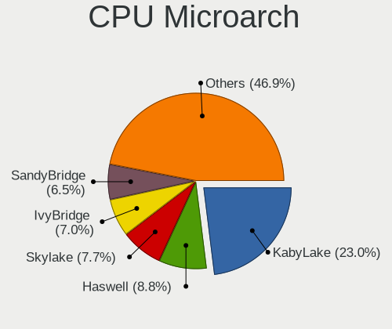

| Name             | Notebooks | Percent |
|------------------|-----------|---------|
| KabyLake         | 123       | 24.85%  |
| Haswell          | 47        | 9.49%   |
| Skylake          | 43        | 8.69%   |
| IvyBridge        | 37        | 7.47%   |
| SandyBridge      | 36        | 7.27%   |
| Broadwell        | 26        | 5.25%   |
| Zen 2            | 20        | 4.04%   |
| Westmere         | 20        | 4.04%   |
| TigerLake        | 16        | 3.23%   |
| Penryn           | 16        | 3.23%   |
| CometLake        | 11        | 2.22%   |
| Unknown          | 10        | 2.02%   |
| Silvermont       | 9         | 1.82%   |
| Zen+             | 8         | 1.62%   |
| Alderlake Hybrid | 8         | 1.62%   |
| Icelake          | 7         | 1.41%   |
| Goldmont plus    | 7         | 1.41%   |
| Zen 3            | 6         | 1.21%   |
| Core             | 6         | 1.21%   |
| K10              | 5         | 1.01%   |
| Excavator        | 4         | 0.81%   |
| Bonnell          | 4         | 0.81%   |
| Bobcat           | 4         | 0.81%   |
| Piledriver       | 3         | 0.61%   |
| P6               | 3         | 0.61%   |
| Nehalem          | 3         | 0.61%   |
| K8 Hammer        | 3         | 0.61%   |
| Goldmont         | 3         | 0.61%   |
| Puma             | 2         | 0.4%    |
| K10 Llano        | 2         | 0.4%    |
| Zen              | 1         | 0.2%    |
| Steamroller      | 1         | 0.2%    |
| Jaguar           | 1         | 0.2%    |

Graphics
--------

GPU Vendor
----------

Vendors of graphics cards

| Vendor | Notebooks | Percent |
|--------|-----------|---------|
| Intel  | 389       | 61.16%  |
| Nvidia | 156       | 24.53%  |
| AMD    | 91        | 14.31%  |

GPU Model
---------

Graphics card models

| Model                                                                                    | Notebooks | Percent |
|------------------------------------------------------------------------------------------|-----------|---------|
| Intel 2nd Generation Core Processor Family Integrated Graphics Controller                | 34        | 5.23%   |
| Intel 3rd Gen Core processor Graphics Controller                                         | 33        | 5.08%   |
| Intel Haswell-ULT Integrated Graphics Controller                                         | 30        | 4.62%   |
| Intel UHD Graphics 620                                                                   | 29        | 4.46%   |
| Intel Skylake GT2 [HD Graphics 520]                                                      | 29        | 4.46%   |
| Intel WhiskeyLake-U GT2 [UHD Graphics 620]                                               | 25        | 3.85%   |
| Intel CoffeeLake-H GT2 [UHD Graphics 630]                                                | 25        | 3.85%   |
| Intel HD Graphics 620                                                                    | 21        | 3.23%   |
| Intel HD Graphics 5500                                                                   | 20        | 3.08%   |
| AMD Renoir                                                                               | 20        | 3.08%   |
| Intel 4th Gen Core Processor Integrated Graphics Controller                              | 16        | 2.46%   |
| Intel TigerLake-LP GT2 [Iris Xe Graphics]                                                | 14        | 2.15%   |
| Intel Core Processor Integrated Graphics Controller                                      | 14        | 2.15%   |
| Intel HD Graphics 530                                                                    | 13        | 2%      |
| Intel Mobile 4 Series Chipset Integrated Graphics Controller                             | 11        | 1.69%   |
| Intel CometLake-H GT2 [UHD Graphics]                                                     | 10        | 1.54%   |
| Nvidia GP108M [GeForce MX150]                                                            | 9         | 1.38%   |
| Nvidia GP107M [GeForce GTX 1050 Ti Mobile]                                               | 9         | 1.38%   |
| Intel Alder Lake-P Integrated Graphics Controller                                        | 9         | 1.38%   |
| AMD Picasso/Raven 2 [Radeon Vega Series / Radeon Vega Mobile Series]                     | 8         | 1.23%   |
| Nvidia TU117M [GeForce GTX 1650 Mobile / Max-Q]                                          | 6         | 0.92%   |
| Intel HD Graphics 630                                                                    | 6         | 0.92%   |
| Intel GeminiLake [UHD Graphics 600]                                                      | 6         | 0.92%   |
| Intel CometLake-U GT2 [UHD Graphics]                                                     | 6         | 0.92%   |
| Intel Atom/Celeron/Pentium Processor x5-E8000/J3xxx/N3xxx Integrated Graphics Controller | 6         | 0.92%   |
| Nvidia TU117GLM [Quadro T2000 Mobile / Max-Q]                                            | 5         | 0.77%   |
| Nvidia TU116M [GeForce GTX 1660 Ti Mobile]                                               | 5         | 0.77%   |
| Nvidia TU106M [GeForce RTX 2060 Mobile]                                                  | 5         | 0.77%   |
| Nvidia GP107GLM [Quadro P1000 Mobile]                                                    | 5         | 0.77%   |
| Nvidia GM107M [GeForce GTX 960M]                                                         | 5         | 0.77%   |
| Nvidia GM107M [GeForce GTX 950M]                                                         | 5         | 0.77%   |
| Intel TigerLake-H GT1 [UHD Graphics]                                                     | 5         | 0.77%   |
| Intel Mobile 945GM/GMS/GME, 943/940GML Express Integrated Graphics Controller            | 5         | 0.77%   |
| AMD Cezanne [Radeon Vega Series / Radeon Vega Mobile Series]                             | 5         | 0.77%   |
| Nvidia TU117M [GeForce GTX 1650 Ti Mobile]                                               | 4         | 0.62%   |
| Nvidia GM108M [GeForce 940MX]                                                            | 4         | 0.62%   |
| Nvidia GA107M [GeForce RTX 3050 Ti Mobile]                                               | 4         | 0.62%   |
| Intel Mobile 945GM/GMS, 943/940GML Express Integrated Graphics Controller                | 4         | 0.62%   |
| Intel Iris Graphics 6100                                                                 | 4         | 0.62%   |
| AMD Thames [Radeon HD 7500M/7600M Series]                                                | 4         | 0.62%   |

GPU Combo
---------

Combinations of graphics cards

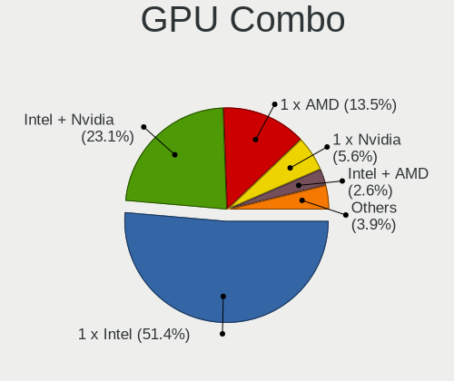

| Name           | Notebooks | Percent |
|----------------|-----------|---------|
| 1 x Intel      | 250       | 50.61%  |
| Intel + Nvidia | 123       | 24.9%   |
| 1 x AMD        | 61        | 12.35%  |
| 1 x Nvidia     | 28        | 5.67%   |
| Intel + AMD    | 17        | 3.44%   |
| 2 x AMD        | 9         | 1.82%   |
| AMD + Nvidia   | 5         | 1.01%   |
| Other          | 1         | 0.2%    |

GPU Driver
----------

Free vs proprietary

| Driver      | Notebooks | Percent |
|-------------|-----------|---------|
| Free        | 399       | 79.8%   |
| Proprietary | 88        | 17.6%   |
| Unknown     | 13        | 2.6%    |

GPU Memory
----------

Total video memory

| Size in GB | Notebooks | Percent |
|------------|-----------|---------|
| Unknown    | 335       | 66.87%  |
| 1.01-2.0   | 49        | 9.78%   |
| 0.01-0.5   | 49        | 9.78%   |
| 3.01-4.0   | 31        | 6.19%   |
| 0.51-1.0   | 22        | 4.39%   |
| 5.01-6.0   | 8         | 1.6%    |
| 7.01-8.0   | 4         | 0.8%    |
| 2.01-3.0   | 2         | 0.4%    |
| 16.01-24.0 | 1         | 0.2%    |

Monitor
-------

Monitor Vendor
--------------

Monitor vendors

| Vendor                  | Notebooks | Percent |
|-------------------------|-----------|---------|
| LG Display              | 101       | 17.06%  |
| AU Optronics            | 95        | 16.05%  |
| Chimei Innolux          | 71        | 11.99%  |
| Samsung Electronics     | 58        | 9.8%    |
| BOE                     | 55        | 9.29%   |
| Sharp                   | 29        | 4.9%    |
| Dell                    | 24        | 4.05%   |
| Lenovo                  | 20        | 3.38%   |
| Apple                   | 18        | 3.04%   |
| Hewlett-Packard         | 13        | 2.2%    |
| AOC                     | 10        | 1.69%   |
| InfoVision              | 9         | 1.52%   |
| BenQ                    | 9         | 1.52%   |
| Chi Mei Optoelectronics | 8         | 1.35%   |
| JDI                     | 7         | 1.18%   |
| CSO                     | 7         | 1.18%   |
| Ancor Communications    | 7         | 1.18%   |
| Philips                 | 6         | 1.01%   |
| PANDA                   | 6         | 1.01%   |
| Acer                    | 6         | 1.01%   |
| Goldstar                | 5         | 0.84%   |
| ASUSTek Computer        | 3         | 0.51%   |
| Sony                    | 2         | 0.34%   |
| MiTAC                   | 2         | 0.34%   |
| HannStar                | 2         | 0.34%   |
| Grundig                 | 2         | 0.34%   |
| VOXICON                 | 1         | 0.17%   |
| Vestel Elektronik       | 1         | 0.17%   |
| Toshiba                 | 1         | 0.17%   |
| TMX                     | 1         | 0.17%   |
| Tatung                  | 1         | 0.17%   |
| SSD                     | 1         | 0.17%   |
| Seiko/Epson             | 1         | 0.17%   |
| S2-Tek                  | 1         | 0.17%   |
| Panasonic               | 1         | 0.17%   |
| MSI                     | 1         | 0.17%   |
| LGD                     | 1         | 0.17%   |
| LG Philips              | 1         | 0.17%   |
| HGC                     | 1         | 0.17%   |
| Fujitsu Siemens         | 1         | 0.17%   |

Monitor Model
-------------

Monitor models

| Model                                                                 | Notebooks | Percent |
|-----------------------------------------------------------------------|-----------|---------|
| Sharp LCD Monitor SHP148D 3840x2160 344x194mm 15.5-inch               | 7         | 1.17%   |
| JDI LCD Monitor JDI422A 3000x2000 293x196mm 13.9-inch                 | 6         | 1%      |
| LG Display LCD Monitor LGD02D8 1366x768 277x156mm 12.5-inch           | 5         | 0.83%   |
| Chimei Innolux LCD Monitor CMN14F2 1920x1080 309x173mm 13.9-inch      | 5         | 0.83%   |
| AU Optronics LCD Monitor AUO573D 1920x1080 309x174mm 14.0-inch        | 5         | 0.83%   |
| LG Display LCD Monitor LGD046D 1920x1080 309x174mm 14.0-inch          | 4         | 0.67%   |
| LG Display LCD Monitor LGD02DC 1366x768 344x194mm 15.5-inch           | 4         | 0.67%   |
| AU Optronics LCD Monitor AUO80ED 1920x1080 344x194mm 15.5-inch        | 4         | 0.67%   |
| AU Optronics LCD Monitor AUO313D 1920x1080 309x174mm 14.0-inch        | 4         | 0.67%   |
| AU Optronics LCD Monitor AUO26EC 1366x768 344x193mm 15.5-inch         | 4         | 0.67%   |
| Sharp LCD Monitor SHP14D0 3840x2400 336x210mm 15.6-inch               | 3         | 0.5%    |
| Sharp LCD Monitor SHP149A 1920x1080 344x194mm 15.5-inch               | 3         | 0.5%    |
| Samsung Electronics LF24T35 SAM707D 1920x1080 528x297mm 23.9-inch     | 3         | 0.5%    |
| Samsung Electronics LCD Monitor SEC5441 1366x768 293x165mm 13.2-inch  | 3         | 0.5%    |
| Samsung Electronics LCD Monitor SEC3859 1366x768 293x165mm 13.2-inch  | 3         | 0.5%    |
| Samsung Electronics LCD Monitor SEC324C 1600x900 310x174mm 14.0-inch  | 3         | 0.5%    |
| LG Display LCD Monitor LGD0590 1920x1080 344x194mm 15.5-inch          | 3         | 0.5%    |
| LG Display LCD Monitor LGD0521 1920x1080 309x174mm 14.0-inch          | 3         | 0.5%    |
| LG Display LCD Monitor LGD046F 1920x1080 344x194mm 15.5-inch          | 3         | 0.5%    |
| LG Display LCD Monitor LGD0354 1366x768 293x165mm 13.2-inch           | 3         | 0.5%    |
| LG Display LCD Monitor LGD0306 1600x900 310x174mm 14.0-inch           | 3         | 0.5%    |
| Lenovo LCD Monitor LEN4036 1440x900 303x190mm 14.1-inch               | 3         | 0.5%    |
| Lenovo LCD Monitor LEN4011 1280x800 261x163mm 12.1-inch               | 3         | 0.5%    |
| Dell U2718Q DELA0EC 3840x2160 609x349mm 27.6-inch                     | 3         | 0.5%    |
| Dell U2717D DEL40EA 2560x1440 597x336mm 27.0-inch                     | 3         | 0.5%    |
| Chimei Innolux P130ZFA-BA1 CMN8201 2160x1440 275x183mm 13.0-inch      | 3         | 0.5%    |
| Chimei Innolux LCD Monitor CMN15E7 1920x1080 344x193mm 15.5-inch      | 3         | 0.5%    |
| Chimei Innolux LCD Monitor CMN14D4 1920x1080 309x173mm 13.9-inch      | 3         | 0.5%    |
| AU Optronics LCD Monitor AUO61ED 1920x1080 344x193mm 15.5-inch        | 3         | 0.5%    |
| AU Optronics LCD Monitor AUO38ED 1920x1080 344x193mm 15.5-inch        | 3         | 0.5%    |
| AU Optronics LCD Monitor AUO133D 1920x1080 309x173mm 13.9-inch        | 3         | 0.5%    |
| AOC Q32G1WG4 AOC3201 2560x1440 697x393mm 31.5-inch                    | 3         | 0.5%    |
| Sharp LCD Monitor SHP1516 3840x2400 336x210mm 15.6-inch               | 2         | 0.33%   |
| Samsung Electronics LCD Monitor SEC324A 1366x768 344x194mm 15.5-inch  | 2         | 0.33%   |
| Samsung Electronics LCD Monitor SDCA029 3840x2160 344x194mm 15.5-inch | 2         | 0.33%   |
| Samsung Electronics LCD Monitor SDC324C 1920x1080 344x194mm 15.5-inch | 2         | 0.33%   |
| Samsung Electronics CF791 SAM0DC8 3440x1440 797x333mm 34.0-inch       | 2         | 0.33%   |
| PANDA LCD Monitor NCP0050 1920x1080 309x174mm 14.0-inch               | 2         | 0.33%   |
| LG Display LCD Monitor LGD056D 1920x1080 382x215mm 17.3-inch          | 2         | 0.33%   |
| LG Display LCD Monitor LGD0446 1920x1080 309x174mm 14.0-inch          | 2         | 0.33%   |

Monitor Resolution
------------------

Monitor screen resolution

| Resolution        | Notebooks | Percent |
|-------------------|-----------|---------|
| 1920x1080 (FHD)   | 258       | 46.07%  |
| 1366x768 (WXGA)   | 106       | 18.93%  |
| 3840x2160 (4K)    | 40        | 7.14%   |
| 1600x900 (HD+)    | 32        | 5.71%   |
| 2560x1440 (QHD)   | 24        | 4.29%   |
| 1920x1200 (WUXGA) | 20        | 3.57%   |
| 1280x800 (WXGA)   | 14        | 2.5%    |
| 2560x1600         | 9         | 1.61%   |
| 3000x2000         | 7         | 1.25%   |
| 1440x900 (WXGA+)  | 7         | 1.25%   |
| 3840x2400         | 6         | 1.07%   |
| 2880x1800         | 6         | 1.07%   |
| 2160x1440         | 4         | 0.71%   |
| 1280x1024 (SXGA)  | 4         | 0.71%   |
| 1024x600          | 4         | 0.71%   |
| 3440x1440         | 3         | 0.54%   |
| 1920x540          | 2         | 0.36%   |
| 1360x768          | 2         | 0.36%   |
| Unknown           | 2         | 0.36%   |
| 9600x2160         | 1         | 0.18%   |
| 3840x1600         | 1         | 0.18%   |
| 3840x1100         | 1         | 0.18%   |
| 3840x1080         | 1         | 0.18%   |
| 3200x1800 (QHD+)  | 1         | 0.18%   |
| 2646x1024         | 1         | 0.18%   |
| 2560x1080         | 1         | 0.18%   |
| 2304x1440         | 1         | 0.18%   |
| 2048x1152         | 1         | 0.18%   |
| 1280x720 (HD)     | 1         | 0.18%   |

Monitor Diagonal
----------------

Diagonal size in inches

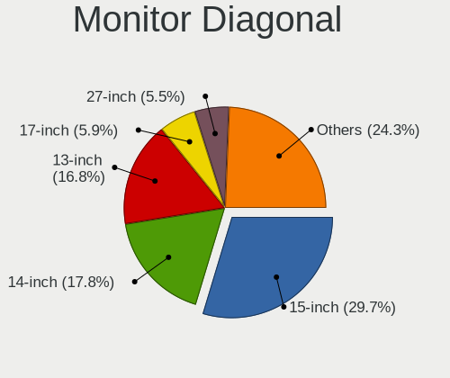

| Inches  | Notebooks | Percent |
|---------|-----------|---------|
| 15      | 194       | 32.88%  |
| 13      | 99        | 16.78%  |
| 14      | 92        | 15.59%  |
| 27      | 40        | 6.78%   |
| 17      | 37        | 6.27%   |
| 12      | 32        | 5.42%   |
| 24      | 24        | 4.07%   |
| 23      | 9         | 1.53%   |
| Unknown | 9         | 1.53%   |
| 31      | 6         | 1.02%   |
| 11      | 4         | 0.68%   |
| 84      | 3         | 0.51%   |
| 34      | 3         | 0.51%   |
| 25      | 3         | 0.51%   |
| 16      | 3         | 0.51%   |
| 10      | 3         | 0.51%   |
| 72      | 2         | 0.34%   |
| 54      | 2         | 0.34%   |
| 48      | 2         | 0.34%   |
| 43      | 2         | 0.34%   |
| 32      | 2         | 0.34%   |
| 26      | 2         | 0.34%   |
| 21      | 2         | 0.34%   |
| 19      | 2         | 0.34%   |
| 60      | 1         | 0.17%   |
| 55      | 1         | 0.17%   |
| 42      | 1         | 0.17%   |
| 40      | 1         | 0.17%   |
| 39      | 1         | 0.17%   |
| 38      | 1         | 0.17%   |
| 37      | 1         | 0.17%   |
| 36      | 1         | 0.17%   |
| 29      | 1         | 0.17%   |
| 28      | 1         | 0.17%   |
| 22      | 1         | 0.17%   |
| 18      | 1         | 0.17%   |
| 8       | 1         | 0.17%   |

Monitor Width
-------------

Physical width

| Width in mm | Notebooks | Percent |
|-------------|-----------|---------|
| 301-350     | 327       | 55.9%   |
| 201-300     | 93        | 15.9%   |
| 501-600     | 67        | 11.45%  |
| 351-400     | 46        | 7.86%   |
| 601-700     | 14        | 2.39%   |
| Unknown     | 9         | 1.54%   |
| 701-800     | 6         | 1.03%   |
| 1001-1500   | 6         | 1.03%   |
| 1501-2000   | 5         | 0.85%   |
| 801-900     | 4         | 0.68%   |
| 401-500     | 4         | 0.68%   |
| 901-1000    | 3         | 0.51%   |
| 101-200     | 1         | 0.17%   |

Aspect Ratio
------------

Proportional relationship between the width and the height

| Ratio   | Notebooks | Percent |
|---------|-----------|---------|
| 16/9    | 415       | 82.02%  |
| 16/10   | 59        | 11.66%  |
| 3/2     | 14        | 2.77%   |
| Unknown | 6         | 1.19%   |
| 5/4     | 5         | 0.99%   |
| 21/9    | 5         | 0.99%   |
| 32/9    | 1         | 0.2%    |
| 3.40    | 1         | 0.2%    |

Monitor Area
------------

Area in inch

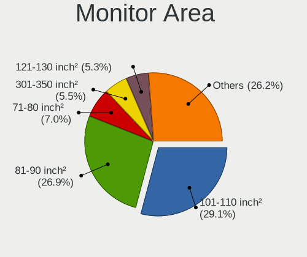

| Area in inch | Notebooks | Percent |
|----------------|-----------|---------|
| 101-110        | 191       | 32.43%  |
| 81-90          | 150       | 25.47%  |
| 71-80          | 41        | 6.96%   |
| 301-350        | 40        | 6.79%   |
| 61-70          | 31        | 5.26%   |
| 121-130        | 31        | 5.26%   |
| 201-250        | 27        | 4.58%   |
| 351-500        | 13        | 2.21%   |
| 251-300        | 13        | 2.21%   |
| More than 1000 | 10        | 1.7%    |
| Unknown        | 9         | 1.53%   |
| 501-1000       | 8         | 1.36%   |
| 51-60          | 5         | 0.85%   |
| 131-140        | 5         | 0.85%   |
| 111-120        | 5         | 0.85%   |
| 41-50          | 3         | 0.51%   |
| 141-150        | 3         | 0.51%   |
| 151-200        | 2         | 0.34%   |
| 1-40           | 1         | 0.17%   |
| 91-100         | 1         | 0.17%   |

Pixel Density
-------------

Pixels per inch

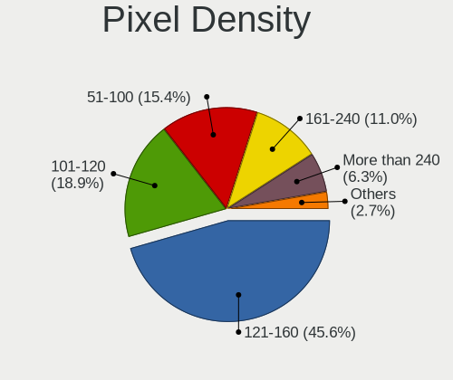

| Density       | Notebooks | Percent |
|---------------|-----------|---------|
| 121-160       | 274       | 47.08%  |
| 101-120       | 124       | 21.31%  |
| 51-100        | 84        | 14.43%  |
| 161-240       | 47        | 8.08%   |
| More than 240 | 38        | 6.53%   |
| Unknown       | 9         | 1.55%   |
| 1-50          | 6         | 1.03%   |

Multiple Monitors
-----------------

Total monitors connected

| Total | Notebooks | Percent |
|-------|-----------|---------|
| 1     | 373       | 73.57%  |
| 2     | 104       | 20.51%  |
| 3     | 16        | 3.16%   |
| 0     | 14        | 2.76%   |

Network
-------

Net Controller Vendor
---------------------

Controller vendors

| Vendor                            | Notebooks | Percent |
|-----------------------------------|-----------|---------|
| Intel                             | 328       | 42.88%  |
| Realtek Semiconductor             | 191       | 24.97%  |
| Qualcomm Atheros                  | 77        | 10.07%  |
| Broadcom                          | 52        | 6.8%    |
| Broadcom Limited                  | 19        | 2.48%   |
| Ericsson Business Mobile Networks | 15        | 1.96%   |
| Dell                              | 12        | 1.57%   |
| Sierra Wireless                   | 11        | 1.44%   |
| Lenovo                            | 6         | 0.78%   |
| Hewlett-Packard                   | 6         | 0.78%   |
| Ralink                            | 5         | 0.65%   |
| MediaTek                          | 5         | 0.65%   |
| ASUSTek Computer                  | 5         | 0.65%   |
| Ralink Technology                 | 4         | 0.52%   |
| Marvell Technology Group          | 4         | 0.52%   |
| Fibocom                           | 4         | 0.52%   |
| DisplayLink                       | 4         | 0.52%   |
| Qualcomm                          | 3         | 0.39%   |
| NetGear                           | 3         | 0.39%   |
| Nvidia                            | 2         | 0.26%   |
| JMicron Technology                | 2         | 0.26%   |
| TP-Link                           | 1         | 0.13%   |
| T & A Mobile Phones               | 1         | 0.13%   |
| Samsung Electronics               | 1         | 0.13%   |
| Qualcomm Atheros Communications   | 1         | 0.13%   |
| Microsoft                         | 1         | 0.13%   |
| Huawei Technologies               | 1         | 0.13%   |
| D-Link                            | 1         | 0.13%   |

Net Controller Model
--------------------

Controller models

| Model                                                              | Notebooks | Percent |
|--------------------------------------------------------------------|-----------|---------|
| Realtek RTL8111/8168/8411 PCI Express Gigabit Ethernet Controller  | 126       | 13.04%  |
| Intel Wireless 8265 / 8275                                         | 39        | 4.04%   |
| Intel Wi-Fi 6 AX200                                                | 33        | 3.42%   |
| Intel 82579LM Gigabit Network Connection (Lewisville)              | 31        | 3.21%   |
| Intel Wireless 7265                                                | 27        | 2.8%    |
| Intel Wireless 7260                                                | 26        | 2.69%   |
| Intel Wireless 8260                                                | 25        | 2.59%   |
| Realtek RTL8153 Gigabit Ethernet Adapter                           | 23        | 2.38%   |
| Intel Centrino Advanced-N 6205 [Taylor Peak]                       | 19        | 1.97%   |
| Realtek RTL810xE PCI Express Fast Ethernet controller              | 18        | 1.86%   |
| Intel Cannon Point-LP CNVi [Wireless-AC]                           | 16        | 1.66%   |
| Qualcomm Atheros QCA6174 802.11ac Wireless Network Adapter         | 15        | 1.55%   |
| Qualcomm Atheros AR9285 Wireless Network Adapter (PCI-Express)     | 14        | 1.45%   |
| Intel Ethernet Connection (4) I219-V                               | 13        | 1.35%   |
| Intel Centrino Ultimate-N 6300                                     | 13        | 1.35%   |
| Intel Ethernet Connection I218-LM                                  | 12        | 1.24%   |
| Intel Ethernet Connection (4) I219-LM                              | 12        | 1.24%   |
| Intel Cannon Lake PCH CNVi WiFi                                    | 12        | 1.24%   |
| Qualcomm Atheros QCA9565 / AR9565 Wireless Network Adapter         | 11        | 1.14%   |
| Qualcomm Atheros QCA9377 802.11ac Wireless Network Adapter         | 11        | 1.14%   |
| Intel Ethernet Connection I219-LM                                  | 11        | 1.14%   |
| Intel Ethernet Connection (3) I218-LM                              | 11        | 1.14%   |
| Intel Wi-Fi 6 AX201                                                | 10        | 1.04%   |
| Intel Ethernet Connection (6) I219-V                               | 10        | 1.04%   |
| Intel Alder Lake-P PCH CNVi WiFi                                   | 10        | 1.04%   |
| Intel Wireless-AC 9260                                             | 9         | 0.93%   |
| Intel Comet Lake PCH CNVi WiFi                                     | 9         | 0.93%   |
| Intel 82577LM Gigabit Network Connection                           | 9         | 0.93%   |
| Broadcom BCM4313 802.11bgn Wireless Network Adapter                | 9         | 0.93%   |
| Intel WiFi Link 5100                                               | 8         | 0.83%   |
| Broadcom BCM43228 802.11a/b/g/n                                    | 8         | 0.83%   |
| Intel Wireless 3165                                                | 7         | 0.72%   |
| Intel Centrino Advanced-N 6235                                     | 7         | 0.72%   |
| Ericsson Business Mobile Networks F5521gw                          | 7         | 0.72%   |
| Realtek RTL8822CE 802.11ac PCIe Wireless Network Adapter           | 6         | 0.62%   |
| Realtek RTL8821CE 802.11ac PCIe Wireless Network Adapter           | 6         | 0.62%   |
| Realtek RTL8723BE PCIe Wireless Network Adapter                    | 6         | 0.62%   |
| Intel Ethernet Connection I219-V                                   | 6         | 0.62%   |
| Intel Comet Lake PCH-LP CNVi WiFi                                  | 6         | 0.62%   |
| Ericsson Business Mobile Networks H5321 gw Mobile Broadband Module | 6         | 0.62%   |

Wireless Vendor
---------------

Wireless vendors

| Vendor                            | Notebooks | Percent |
|-----------------------------------|-----------|---------|
| Intel                             | 316       | 59.18%  |
| Qualcomm Atheros                  | 65        | 12.17%  |
| Realtek Semiconductor             | 42        | 7.87%   |
| Broadcom                          | 42        | 7.87%   |
| Broadcom Limited                  | 16        | 3%      |
| Sierra Wireless                   | 11        | 2.06%   |
| Dell                              | 7         | 1.31%   |
| Ralink                            | 5         | 0.94%   |
| ASUSTek Computer                  | 5         | 0.94%   |
| Ralink Technology                 | 4         | 0.75%   |
| MediaTek                          | 4         | 0.75%   |
| Fibocom                           | 4         | 0.75%   |
| Qualcomm                          | 3         | 0.56%   |
| NetGear                           | 3         | 0.56%   |
| Hewlett-Packard                   | 3         | 0.56%   |
| TP-Link                           | 1         | 0.19%   |
| Qualcomm Atheros Communications   | 1         | 0.19%   |
| Microsoft                         | 1         | 0.19%   |
| Ericsson Business Mobile Networks | 1         | 0.19%   |

Wireless Model
--------------

Wireless models

| Model                                                          | Notebooks | Percent |
|----------------------------------------------------------------|-----------|---------|
| Intel Wireless 8265 / 8275                                     | 39        | 7.29%   |
| Intel Wi-Fi 6 AX200                                            | 33        | 6.17%   |
| Intel Wireless 7265                                            | 27        | 5.05%   |
| Intel Wireless 7260                                            | 26        | 4.86%   |
| Intel Wireless 8260                                            | 25        | 4.67%   |
| Intel Centrino Advanced-N 6205 [Taylor Peak]                   | 19        | 3.55%   |
| Intel Cannon Point-LP CNVi [Wireless-AC]                       | 16        | 2.99%   |
| Qualcomm Atheros QCA6174 802.11ac Wireless Network Adapter     | 15        | 2.8%    |
| Qualcomm Atheros AR9285 Wireless Network Adapter (PCI-Express) | 14        | 2.62%   |
| Intel Centrino Ultimate-N 6300                                 | 13        | 2.43%   |
| Intel Cannon Lake PCH CNVi WiFi                                | 12        | 2.24%   |
| Qualcomm Atheros QCA9565 / AR9565 Wireless Network Adapter     | 11        | 2.06%   |
| Qualcomm Atheros QCA9377 802.11ac Wireless Network Adapter     | 11        | 2.06%   |
| Intel Wi-Fi 6 AX201                                            | 10        | 1.87%   |
| Intel Alder Lake-P PCH CNVi WiFi                               | 10        | 1.87%   |
| Intel Wireless-AC 9260                                         | 9         | 1.68%   |
| Intel Comet Lake PCH CNVi WiFi                                 | 9         | 1.68%   |
| Broadcom BCM4313 802.11bgn Wireless Network Adapter            | 9         | 1.68%   |
| Intel WiFi Link 5100                                           | 8         | 1.5%    |
| Broadcom BCM43228 802.11a/b/g/n                                | 8         | 1.5%    |
| Intel Wireless 3165                                            | 7         | 1.31%   |
| Intel Centrino Advanced-N 6235                                 | 7         | 1.31%   |
| Realtek RTL8822CE 802.11ac PCIe Wireless Network Adapter       | 6         | 1.12%   |
| Realtek RTL8821CE 802.11ac PCIe Wireless Network Adapter       | 6         | 1.12%   |
| Realtek RTL8723BE PCIe Wireless Network Adapter                | 6         | 1.12%   |
| Intel Comet Lake PCH-LP CNVi WiFi                              | 6         | 1.12%   |
| Sierra Wireless EM7455                                         | 5         | 0.93%   |
| Qualcomm Atheros AR9485 Wireless Network Adapter               | 5         | 0.93%   |
| Intel Dual Band Wireless-AC 3165 Plus Bluetooth                | 5         | 0.93%   |
| Broadcom BCM43224 802.11a/b/g/n                                | 5         | 0.93%   |
| Sierra Wireless EM7345 4G LTE                                  | 4         | 0.75%   |
| Intel Wireless 3160                                            | 4         | 0.75%   |
| Intel Wi-Fi 6 AX210/AX211/AX411 160MHz                         | 4         | 0.75%   |
| Intel Tiger Lake PCH CNVi WiFi                                 | 4         | 0.75%   |
| Intel Centrino Wireless-N 2230                                 | 4         | 0.75%   |
| Intel Centrino Advanced-N 6200                                 | 4         | 0.75%   |
| Fibocom L830-EB-00 LTE WWAN Modem                              | 4         | 0.75%   |
| Dell DW5811e Snapdragon X7 LTE                           | 4         | 0.75%   |
| Broadcom Limited BCM4360 802.11ac Wireless Network Adapter     | 4         | 0.75%   |
| Broadcom Limited BCM4352 802.11ac Wireless Network Adapter     | 4         | 0.75%   |

Ethernet Vendor
---------------

Ethernet vendors

| Vendor                   | Notebooks | Percent |
|--------------------------|-----------|---------|
| Realtek Semiconductor    | 169       | 41.32%  |
| Intel                    | 164       | 40.1%   |
| Qualcomm Atheros         | 25        | 6.11%   |
| Broadcom                 | 23        | 5.62%   |
| Lenovo                   | 6         | 1.47%   |
| Broadcom Limited         | 5         | 1.22%   |
| Marvell Technology Group | 4         | 0.98%   |
| DisplayLink              | 4         | 0.98%   |
| Nvidia                   | 2         | 0.49%   |
| JMicron Technology       | 2         | 0.49%   |
| T & A Mobile Phones      | 1         | 0.24%   |
| Samsung Electronics      | 1         | 0.24%   |
| MediaTek                 | 1         | 0.24%   |
| Huawei Technologies      | 1         | 0.24%   |
| D-Link                   | 1         | 0.24%   |

Ethernet Model
--------------

Ethernet models

| Model                                                             | Notebooks | Percent |
|-------------------------------------------------------------------|-----------|---------|
| Realtek RTL8111/8168/8411 PCI Express Gigabit Ethernet Controller | 126       | 30.81%  |
| Intel 82579LM Gigabit Network Connection (Lewisville)             | 31        | 7.58%   |
| Realtek RTL8153 Gigabit Ethernet Adapter                          | 23        | 5.62%   |
| Realtek RTL810xE PCI Express Fast Ethernet controller             | 18        | 4.4%    |
| Intel Ethernet Connection (4) I219-V                              | 13        | 3.18%   |
| Intel Ethernet Connection I218-LM                                 | 12        | 2.93%   |
| Intel Ethernet Connection (4) I219-LM                             | 12        | 2.93%   |
| Intel Ethernet Connection I219-LM                                 | 11        | 2.69%   |
| Intel Ethernet Connection (3) I218-LM                             | 11        | 2.69%   |
| Intel Ethernet Connection (6) I219-V                              | 10        | 2.44%   |
| Intel 82577LM Gigabit Network Connection                          | 9         | 2.2%    |
| Intel Ethernet Connection I219-V                                  | 6         | 1.47%   |
| Intel Ethernet Connection I217-LM                                 | 5         | 1.22%   |
| Broadcom NetLink BCM57785 Gigabit Ethernet PCIe                   | 5         | 1.22%   |
| Qualcomm Atheros AR8131 Gigabit Ethernet                          | 4         | 0.98%   |
| Intel Ethernet Connection (3) I218-V                              | 4         | 0.98%   |
| Intel Ethernet Connection (2) I219-LM                             | 4         | 0.98%   |
| Intel 82567LM Gigabit Network Connection                          | 4         | 0.98%   |
| Broadcom NetXtreme BCM57786 Gigabit Ethernet PCIe                 | 4         | 0.98%   |
| Qualcomm Atheros QCA8172 Fast Ethernet                            | 3         | 0.73%   |
| Qualcomm Atheros QCA8171 Gigabit Ethernet                         | 3         | 0.73%   |
| Qualcomm Atheros AR8151 v2.0 Gigabit Ethernet                     | 3         | 0.73%   |
| Intel Ethernet Connection (7) I219-LM                             | 3         | 0.73%   |
| Intel Ethernet Connection (6) I219-LM                             | 3         | 0.73%   |
| Intel Ethernet Connection (13) I219-V                             | 3         | 0.73%   |
| Broadcom NetXtreme BCM57765 Gigabit Ethernet PCIe                 | 3         | 0.73%   |
| Broadcom NetXtreme BCM5761 Gigabit Ethernet PCIe                  | 3         | 0.73%   |
| Qualcomm Atheros Killer E2500 Gigabit Ethernet Controller         | 2         | 0.49%   |
| Qualcomm Atheros Killer E220x Gigabit Ethernet Controller         | 2         | 0.49%   |
| Qualcomm Atheros AR8161 Gigabit Ethernet                          | 2         | 0.49%   |
| Qualcomm Atheros AR8152 v2.0 Fast Ethernet                        | 2         | 0.49%   |
| Qualcomm Atheros AR8151 v1.0 Gigabit Ethernet                     | 2         | 0.49%   |
| Marvell Group 88E8040 PCI-E Fast Ethernet Controller              | 2         | 0.49%   |
| Lenovo ThinkPad TBT3 LAN                                          | 2         | 0.49%   |
| JMicron JMC250 PCI Express Gigabit Ethernet Controller            | 2         | 0.49%   |
| Intel PRO/100 VE Network Connection                               | 2         | 0.49%   |
| Intel Ethernet controller                                         | 2         | 0.49%   |
| Intel Ethernet Connection (5) I219-LM                             | 2         | 0.49%   |
| Intel Ethernet Connection (16) I219-LM                            | 2         | 0.49%   |
| Intel Ethernet Connection (10) I219-LM                            | 2         | 0.49%   |

Net Controller Kind
-------------------

Ethernet, WiFi or modem

| Kind     | Notebooks | Percent |
|----------|-----------|---------|
| WiFi     | 486       | 53.82%  |
| Ethernet | 395       | 43.74%  |
| Modem    | 21        | 2.33%   |
| Unknown  | 1         | 0.11%   |

Used Controller
---------------

Currently used network controller

| Kind     | Notebooks | Percent |
|----------|-----------|---------|
| WiFi     | 432       | 82.76%  |
| Ethernet | 90        | 17.24%  |

NICs
----

Total network controllers on board

| Total | Notebooks | Percent |
|-------|-----------|---------|
| 2     | 360       | 73.02%  |
| 1     | 126       | 25.56%  |
| 3     | 4         | 0.81%   |
| 0     | 3         | 0.61%   |

IPv6
----

IPv6 vs IPv4

| Used | Notebooks | Percent |
|------|-----------|---------|
| No   | 441       | 87.33%  |
| Yes  | 64        | 12.67%  |

Bluetooth
---------

Bluetooth Vendor
----------------

Controller vendors

| Vendor                          | Notebooks | Percent |
|---------------------------------|-----------|---------|
| Intel                           | 230       | 57.36%  |
| Broadcom                        | 41        | 10.22%  |
| Realtek Semiconductor           | 19        | 4.74%   |
| Qualcomm Atheros Communications | 19        | 4.74%   |
| Lite-On Technology              | 15        | 3.74%   |
| Apple                           | 15        | 3.74%   |
| IMC Networks                    | 14        | 3.49%   |
| Foxconn / Hon Hai               | 14        | 3.49%   |
| Hewlett-Packard                 | 11        | 2.74%   |
| Dell                            | 10        | 2.49%   |
| ASUSTek Computer                | 6         | 1.5%    |
| Realtek                         | 2         | 0.5%    |
| Cambridge Silicon Radio         | 2         | 0.5%    |
| Ralink Technology               | 1         | 0.25%   |
| Ralink                          | 1         | 0.25%   |
| MediaTek                        | 1         | 0.25%   |

Bluetooth Model
---------------

Controller models

| Model                                               | Notebooks | Percent |
|-----------------------------------------------------|-----------|---------|
| Intel Bluetooth wireless interface                  | 109       | 27.11%  |
| Intel AX200 Bluetooth                               | 32        | 7.96%   |
| Intel Bluetooth 9460/9560 Jefferson Peak (JfP)      | 29        | 7.21%   |
| Intel AX201 Bluetooth                               | 28        | 6.97%   |
| Realtek Bluetooth Radio                             | 13        | 3.23%   |
| Broadcom BCM2045B (BDC-2.1)                         | 12        | 2.99%   |
| Intel Wireless-AC 9260 Bluetooth Adapter            | 9         | 2.24%   |
| Intel Centrino Bluetooth Wireless Transceiver       | 9         | 2.24%   |
| Apple Bluetooth Host Controller                     | 9         | 2.24%   |
| Intel Bluetooth Device                              | 8         | 1.99%   |
| HP Broadcom 2070 Bluetooth Combo                    | 8         | 1.99%   |
| Lite-On Bluetooth Device                            | 7         | 1.74%   |
| Foxconn / Hon Hai Bluetooth Device                  | 7         | 1.74%   |
| Broadcom BCM20702 Bluetooth 4.0 [ThinkPad]          | 7         | 1.74%   |
| Qualcomm Atheros AR3011 Bluetooth                   | 5         | 1.24%   |
| Lite-On Qualcomm Atheros QCA9377 Bluetooth          | 5         | 1.24%   |
| IMC Networks Bluetooth Radio                        | 5         | 1.24%   |
| Qualcomm Atheros  Bluetooth Device                  | 4         | 1%      |
| Qualcomm Atheros AR3012 Bluetooth 4.0               | 4         | 1%      |
| Intel AX210 Bluetooth                               | 4         | 1%      |
| Dell BCM20702A0 Bluetooth Module                    | 4         | 1%      |
| Broadcom BCM20702A0                                 | 4         | 1%      |
| Broadcom BCM2045B (BDC-2.1) [Bluetooth Controller]  | 4         | 1%      |
| Apple Bluetooth USB Host Controller                 | 4         | 1%      |
| Realtek  Bluetooth 4.2 Adapter                      | 3         | 0.75%   |
| Qualcomm Atheros QCA61x4 Bluetooth 4.0              | 3         | 0.75%   |
| Qualcomm Atheros AR3012 Bluetooth                   | 3         | 0.75%   |
| IMC Networks Bluetooth Device                       | 3         | 0.75%   |
| Dell DW375 Bluetooth Module                         | 3         | 0.75%   |
| Broadcom BCM43142A0 Bluetooth Device                | 3         | 0.75%   |
| Realtek 802.11ac WLAN Adapter                       | 2         | 0.5%    |
| Lite-On Atheros AR3012 Bluetooth                    | 2         | 0.5%    |
| Intel Wireless-AC 3168 Bluetooth                    | 2         | 0.5%    |
| IMC Networks Wireless_Device                        | 2         | 0.5%    |
| IMC Networks Atheros AR3012 Bluetooth 4.0 Adapter   | 2         | 0.5%    |
| HP Bluetooth 2.0 Interface [Broadcom BCM2045]       | 2         | 0.5%    |
| Foxconn / Hon Hai Acer Bluetooth module             | 2         | 0.5%    |
| Cambridge Silicon Radio Bluetooth Dongle (HCI mode) | 2         | 0.5%    |
| Broadcom HP Portable SoftSailing                    | 2         | 0.5%    |
| Broadcom HP Portable Bumble Bee                     | 2         | 0.5%    |

Sound
-----

Sound Vendor
------------

Sound card vendors

| Vendor                      | Notebooks | Percent |
|-----------------------------|-----------|---------|
| Intel                       | 423       | 68.34%  |
| AMD                         | 77        | 12.44%  |
| Nvidia                      | 69        | 11.15%  |
| Realtek Semiconductor       | 10        | 1.62%   |
| Lenovo                      | 9         | 1.45%   |
| Logitech                    | 5         | 0.81%   |
| Kingston Technology         | 5         | 0.81%   |
| GN Netcom                   | 2         | 0.32%   |
| C-Media Electronics         | 2         | 0.32%   |
| Sony                        | 1         | 0.16%   |
| Sonicstar                   | 1         | 0.16%   |
| SAVITECH                    | 1         | 0.16%   |
| Roland                      | 1         | 0.16%   |
| ROCCAT                      | 1         | 0.16%   |
| Razer USA                   | 1         | 0.16%   |
| NAD                         | 1         | 0.16%   |
| Mark of the Unicorn         | 1         | 0.16%   |
| Hewlett-Packard             | 1         | 0.16%   |
| Focusrite-Novation          | 1         | 0.16%   |
| FiiO Electronics Technology | 1         | 0.16%   |
| Elgato Systems              | 1         | 0.16%   |
| DSEA A/S                    | 1         | 0.16%   |
| Drop                        | 1         | 0.16%   |
| Dell                        | 1         | 0.16%   |
| Corsair                     | 1         | 0.16%   |
| Conexant Systems            | 1         | 0.16%   |

Sound Model
-----------

Sound card models

| Model                                                                                             | Notebooks | Percent |
|---------------------------------------------------------------------------------------------------|-----------|---------|
| Intel Sunrise Point-LP HD Audio                                                                   | 80        | 10.74%  |
| Intel 7 Series/C216 Chipset Family High Definition Audio Controller                               | 40        | 5.37%   |
| AMD Family 17h/19h HD Audio Controller                                                            | 37        | 4.97%   |
| Intel Cannon Lake PCH cAVS                                                                        | 33        | 4.43%   |
| Intel 6 Series/C200 Series Chipset Family High Definition Audio Controller                        | 33        | 4.43%   |
| Intel Haswell-ULT HD Audio Controller                                                             | 30        | 4.03%   |
| Intel 8 Series HD Audio Controller                                                                | 30        | 4.03%   |
| AMD Renoir Radeon High Definition Audio Controller                                                | 27        | 3.62%   |
| Intel Wildcat Point-LP High Definition Audio Controller                                           | 26        | 3.49%   |
| Intel Broadwell-U Audio Controller                                                                | 26        | 3.49%   |
| Intel Cannon Point-LP High Definition Audio Controller                                            | 25        | 3.36%   |
| Intel 5 Series/3400 Series Chipset High Definition Audio                                          | 23        | 3.09%   |
| Intel 8 Series/C220 Series Chipset High Definition Audio Controller                               | 17        | 2.28%   |
| Intel Tiger Lake-LP Smart Sound Technology Audio Controller                                       | 16        | 2.15%   |
| Intel 82801I (ICH9 Family) HD Audio Controller                                                    | 16        | 2.15%   |
| Intel Xeon E3-1200 v3/4th Gen Core Processor HD Audio Controller                                  | 15        | 2.01%   |
| Intel 100 Series/C230 Series Chipset Family HD Audio Controller                                   | 12        | 1.61%   |
| AMD FCH Azalia Controller                                                                         | 12        | 1.61%   |
| Intel Comet Lake PCH cAVS                                                                         | 11        | 1.48%   |
| Realtek Semiconductor USB Audio                                                                   | 10        | 1.34%   |
| Intel Alder Lake PCH-P High Definition Audio Controller                                           | 10        | 1.34%   |
| Intel NM10/ICH7 Family High Definition Audio Controller                                           | 9         | 1.21%   |
| Intel CM238 HD Audio Controller                                                                   | 9         | 1.21%   |
| AMD SBx00 Azalia (Intel HDA)                                                                      | 9         | 1.21%   |
| Nvidia TU107 GeForce GTX 1650 High Definition Audio Controller                                    | 8         | 1.07%   |
| Nvidia GF108 High Definition Audio Controller                                                     | 7         | 0.94%   |
| Intel Celeron/Pentium Silver Processor High Definition Audio                                      | 7         | 0.94%   |
| AMD RV710/730 HDMI Audio [Radeon HD 4000 series]                                                  | 7         | 0.94%   |
| AMD Raven/Raven2/Fenghuang HDMI/DP Audio Controller                                               | 7         | 0.94%   |
| Nvidia TU106 High Definition Audio Controller                                                     | 6         | 0.81%   |
| Nvidia GT216 HDMI Audio Controller                                                                | 6         | 0.81%   |
| Nvidia GP107GL High Definition Audio Controller                                                   | 6         | 0.81%   |
| Intel Tiger Lake-H HD Audio Controller                                                            | 6         | 0.81%   |
| Intel Comet Lake PCH-LP cAVS                                                                      | 6         | 0.81%   |
| Nvidia TU116 High Definition Audio Controller                                                     | 5         | 0.67%   |
| Kingston Technology HyperX 7.1 Audio                                                              | 4         | 0.54%   |
| Intel Atom/Celeron/Pentium Processor x5-E8000/J3xxx/N3xxx Series High Definition Audio Controller | 4         | 0.54%   |
| AMD Kabini HDMI/DP Audio                                                                          | 4         | 0.54%   |
| AMD Family 15h (Models 60h-6fh) Audio Controller                                                  | 4         | 0.54%   |
| Nvidia GK106 HDMI Audio Controller                                                                | 3         | 0.4%    |

Memory
------

Memory Vendor
-------------

Memory module vendors

| Vendor              | Notebooks | Percent |
|---------------------|-----------|---------|
| Samsung Electronics | 114       | 36.89%  |
| SK hynix            | 84        | 27.18%  |
| Micron Technology   | 39        | 12.62%  |
| Kingston            | 23        | 7.44%   |
| Unknown             | 12        | 3.88%   |
| Elpida              | 8         | 2.59%   |
| Crucial             | 7         | 2.27%   |
| Corsair             | 5         | 1.62%   |
| A-DATA Technology   | 5         | 1.62%   |
| Ramaxel Technology  | 4         | 1.29%   |
| Unknown (ABCD)      | 1         | 0.32%   |
| Transcend           | 1         | 0.32%   |
| Toshiba             | 1         | 0.32%   |
| Team                | 1         | 0.32%   |
| Nanya Technology    | 1         | 0.32%   |
| ASint Technology    | 1         | 0.32%   |
| 48spaces            | 1         | 0.32%   |
| Unknown             | 1         | 0.32%   |

Memory Model
------------

Memory module models

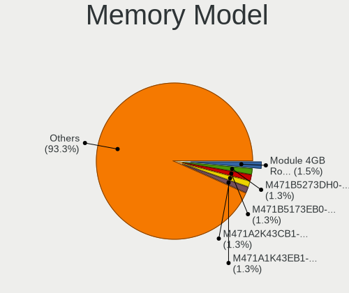

| Model                                                               | Notebooks | Percent |
|---------------------------------------------------------------------|-----------|---------|
| Samsung RAM M471B5273DH0-CH9 4GB SODIMM DDR3 1334MT/s               | 6         | 1.86%   |
| Samsung RAM M471B5173EB0-YK0 4GB SODIMM DDR3 1600MT/s               | 6         | 1.86%   |
| Samsung RAM M471A2K43CB1-CRC 16GB SODIMM DDR4 2667MT/s              | 6         | 1.86%   |
| Samsung RAM M471B5173QH0-YK0 4GB SODIMM DDR3 1600MT/s               | 5         | 1.55%   |
| Samsung RAM M471A1G44AB0-CWE 8GB SODIMM DDR4 3200MT/s               | 5         | 1.55%   |
| Unknown RAM Module 4GB Chip DDR4 2133MT/s                           | 4         | 1.24%   |
| SK hynix RAM HMT451S6BFR8A-PB 4GB SODIMM DDR3 1600MT/s              | 4         | 1.24%   |
| SK hynix RAM HMT41GS6BFR8A-PB 8GB SODIMM DDR3 1600MT/s              | 4         | 1.24%   |
| SK hynix RAM HMT351S6EFR8A-PB 4GB SODIMM DDR3 1600MT/s              | 4         | 1.24%   |
| SK hynix RAM HMA851S6AFR6N-UH 4GB SODIMM DDR4 2667MT/s              | 4         | 1.24%   |
| Samsung RAM M471A1K43DB1-CTD 8GB SODIMM DDR4 2667MT/s               | 4         | 1.24%   |
| Micron RAM MT52L1G32D4PG-093 8GB Row Of Chips LPDDR3 2133MT/s       | 4         | 1.24%   |
| SK hynix RAM HMA82GS6DJR8N-VK 16GB SODIMM DDR4 2667MT/s             | 3         | 0.93%   |
| SK hynix RAM HMA82GS6CJR8N-VK 16GB SODIMM DDR4 2667MT/s             | 3         | 0.93%   |
| SK hynix RAM HMA41GS6AFR8N-TF 8GB SODIMM DDR4 2667MT/s              | 3         | 0.93%   |
| SK hynix RAM H9CCNNNCLGALAR-NVD 8GB Row Of Chips LPDDR3 2133MT/s    | 3         | 0.93%   |
| Samsung RAM Module 8192MB SODIMM DDR4 2133MT/s                      | 3         | 0.93%   |
| Samsung RAM M471B5173DB0-YK0 4GB SODIMM DDR3 1600MT/s               | 3         | 0.93%   |
| Samsung RAM M471B1G73EB0-YK0 8192MB SODIMM DDR3 1600MT/s            | 3         | 0.93%   |
| Samsung RAM M471B1G73DB0-YK0 8192MB SODIMM DDR3 1600MT/s            | 3         | 0.93%   |
| Samsung RAM M471A5244CB0-CRC 4GB SODIMM DDR4 2667MT/s               | 3         | 0.93%   |
| Samsung RAM M471A2K43DB1-CWE 16GB SODIMM DDR4 3200MT/s              | 3         | 0.93%   |
| Samsung RAM M471A1K43DB1-CWE 8GB SODIMM DDR4 3200MT/s               | 3         | 0.93%   |
| Micron RAM 16ATF2G64HZ-2G6E1 16GB SODIMM DDR4 2667MT/s              | 3         | 0.93%   |
| Kingston RAM KN2M64-ETB 8GB SODIMM DDR3 1600MT/s                    | 3         | 0.93%   |
| SK hynix RAM HMT451S6AFR8A-PB 4GB SODIMM DDR3 1600MT/s              | 2         | 0.62%   |
| SK hynix RAM HMT41GS6AFR8A-PB 8GB SODIMM DDR3 1600MT/s              | 2         | 0.62%   |
| SK hynix RAM HMT351S6CFR8C-PB 4GB SODIMM DDR3 1600MT/s              | 2         | 0.62%   |
| SK hynix RAM HMT351S6BFR8C-H9 4GB SODIMM DDR3 1334MT/s              | 2         | 0.62%   |
| SK hynix RAM HMA851S6CJR6N-VK 4GB SODIMM DDR4 2667MT/s              | 2         | 0.62%   |
| SK hynix RAM HMA82GS6DJR8N-XN 16384MB SODIMM DDR4 3200MT/s          | 2         | 0.62%   |
| SK hynix RAM HMA81GS6AFR8N-UH 8GB SODIMM DDR4 2667MT/s              | 2         | 0.62%   |
| SK hynix RAM H9CCNNNBJTALAR-NVD 4096MB Row Of Chips LPDDR3 2133MT/s | 2         | 0.62%   |
| Samsung RAM Module 8GB SODIMM DDR4 3200MT/s                         | 2         | 0.62%   |
| Samsung RAM Module 4GB SODIMM DDR3 1867MT/s                         | 2         | 0.62%   |
| Samsung RAM Module 16384MB SODIMM DDR4 2667MT/s                     | 2         | 0.62%   |
| Samsung RAM M471B5773DH0-CH9 2GB SODIMM DDR3 1600MT/s               | 2         | 0.62%   |
| Samsung RAM M471B5673EH1-CF8 2048MB SODIMM DDR3 4199MT/s            | 2         | 0.62%   |
| Samsung RAM M471B5273CH0-CH9 4GB SODIMM DDR3 1334MT/s               | 2         | 0.62%   |
| Samsung RAM M471B1G73QH0-YK0 8GB SODIMM DDR3 1867MT/s               | 2         | 0.62%   |

Memory Kind
-----------

Memory module kinds

| Kind    | Notebooks | Percent |
|---------|-----------|---------|
| DDR4    | 127       | 47.74%  |
| DDR3    | 89        | 33.46%  |
| LPDDR3  | 24        | 9.02%   |
| LPDDR4  | 11        | 4.14%   |
| LPDDR5  | 5         | 1.88%   |
| SDRAM   | 4         | 1.5%    |
| DDR2    | 4         | 1.5%    |
| DDR5    | 1         | 0.38%   |
| Unknown | 1         | 0.38%   |

Memory Form Factor
------------------

Physical design of the memory module

| Name         | Notebooks | Percent |
|--------------|-----------|---------|
| SODIMM       | 218       | 81.04%  |
| Row Of Chips | 40        | 14.87%  |
| Chip         | 9         | 3.35%   |
| Unknown      | 2         | 0.74%   |

Memory Size
-----------

Memory module size

| Size  | Notebooks | Percent |
|-------|-----------|---------|
| 8192  | 113       | 40.07%  |
| 4096  | 96        | 34.04%  |
| 16384 | 48        | 17.02%  |
| 2048  | 19        | 6.74%   |
| 32768 | 5         | 1.77%   |
| 1024  | 1         | 0.35%   |

Memory Speed
------------

Memory module speed

| Speed | Notebooks | Percent |
|-------|-----------|---------|
| 2667  | 71        | 24.91%  |
| 1600  | 65        | 22.81%  |
| 3200  | 36        | 12.63%  |
| 2133  | 36        | 12.63%  |
| 2400  | 15        | 5.26%   |
| 1867  | 12        | 4.21%   |
| 1334  | 12        | 4.21%   |
| 1333  | 6         | 2.11%   |
| 6400  | 5         | 1.75%   |
| 1067  | 5         | 1.75%   |
| 4267  | 4         | 1.4%    |
| 4199  | 4         | 1.4%    |
| 667   | 3         | 1.05%   |
| 8400  | 2         | 0.7%    |
| 4266  | 2         | 0.7%    |
| 3266  | 2         | 0.7%    |
| 1066  | 2         | 0.7%    |
| 4800  | 1         | 0.35%   |
| 1866  | 1         | 0.35%   |
| 975   | 1         | 0.35%   |

Printers & scanners
-------------------

Printer Vendor
--------------

Printer device vendors

| Vendor             | Notebooks | Percent |
|--------------------|-----------|---------|
| Hewlett-Packard    | 2         | 50%     |
| Brother Industries | 2         | 50%     |

Printer Model
-------------

Printer device models

| Model                     | Notebooks | Percent |
|---------------------------|-----------|---------|
| HP Printing Support       | 1         | 25%     |
| HP ENVY Photo 6200 series | 1         | 25%     |
| Brother PT-2450DX         | 1         | 25%     |
| Brother HL-1210W series   | 1         | 25%     |

Scanner Vendor
--------------

Scanner device vendors

Zero info for selected period =(

Scanner Model
-------------

Scanner device models

Zero info for selected period =(

Camera
------

Camera Vendor
-------------

Camera device vendors

| Vendor                                 | Notebooks | Percent |
|----------------------------------------|-----------|---------|
| Chicony Electronics                    | 116       | 25.05%  |
| Acer                                   | 52        | 11.23%  |
| IMC Networks                           | 47        | 10.15%  |
| Microdia                               | 36        | 7.78%   |
| Sunplus Innovation Technology          | 32        | 6.91%   |
| Realtek Semiconductor                  | 23        | 4.97%   |
| Cheng Uei Precision Industry (Foxlink) | 22        | 4.75%   |
| Quanta                                 | 20        | 4.32%   |
| Lite-On Technology                     | 18        | 3.89%   |
| Apple                                  | 16        | 3.46%   |
| Suyin                                  | 14        | 3.02%   |
| Lenovo                                 | 11        | 2.38%   |
| Logitech                               | 10        | 2.16%   |
| Luxvisions Innotech Limited            | 6         | 1.3%    |
| Silicon Motion                         | 5         | 1.08%   |
| Samsung Electronics                    | 5         | 1.08%   |
| Alcor Micro                            | 5         | 1.08%   |
| Primax Electronics                     | 4         | 0.86%   |
| Syntek                                 | 2         | 0.43%   |
| Sonix Technology                       | 2         | 0.43%   |
| Ricoh                                  | 2         | 0.43%   |
| Microsoft                              | 2         | 0.43%   |
| Generalplus Technology                 | 2         | 0.43%   |
| ALi                                    | 2         | 0.43%   |
| Z-Star Microelectronics                | 1         | 0.22%   |
| Y Media                                | 1         | 0.22%   |
| Unknown                                | 1         | 0.22%   |
| Sunplus Technology                     | 1         | 0.22%   |
| Sony Ericsson Mobile Communications AB | 1         | 0.22%   |
| Mustek Systems                         | 1         | 0.22%   |
| Intel                                  | 1         | 0.22%   |
| Dell                                   | 1         | 0.22%   |
| Creative Technology                    | 1         | 0.22%   |

Camera Model
------------

Camera device models

| Model                                               | Notebooks | Percent |
|-----------------------------------------------------|-----------|---------|
| Chicony Integrated Camera                           | 40        | 8.58%   |
| Microdia Integrated_Webcam_HD                       | 23        | 4.94%   |
| IMC Networks Integrated Camera                      | 17        | 3.65%   |
| Sunplus Integrated_Webcam_HD                        | 12        | 2.58%   |
| IMC Networks USB2.0 HD UVC WebCam                   | 12        | 2.58%   |
| Chicony HP HD Camera                                | 12        | 2.58%   |
| Chicony HP HD Webcam                                | 11        | 2.36%   |
| Lite-On Integrated Camera                           | 9         | 1.93%   |
| Chicony HD WebCam                                   | 9         | 1.93%   |
| Acer Integrated Camera                              | 9         | 1.93%   |
| Realtek Integrated_Webcam_HD                        | 8         | 1.72%   |
| Cheng Uei Precision Industry (Foxlink) HD Camera    | 7         | 1.5%    |
| Apple iPhone 5/5C/5S/6/SE                           | 7         | 1.5%    |
| Acer Lenovo EasyCamera                              | 7         | 1.5%    |
| Acer BisonCam, NB Pro                               | 7         | 1.5%    |
| Lenovo Integrated Webcam [R5U877]                   | 6         | 1.29%   |
| Sunplus Laptop Integrated Webcam HD                 | 5         | 1.07%   |
| Sunplus HD WebCam                                   | 5         | 1.07%   |
| Samsung Galaxy A5 (MTP)                             | 5         | 1.07%   |
| Quanta HD User Facing                               | 5         | 1.07%   |
| Microdia Integrated Webcam                          | 5         | 1.07%   |
| Lite-On HP HD Camera                                | 5         | 1.07%   |
| Chicony Integrated HP HD Webcam                     | 5         | 1.07%   |
| Cheng Uei Precision Industry (Foxlink) HP HD Camera | 5         | 1.07%   |
| Acer SunplusIT Integrated Camera                    | 5         | 1.07%   |
| Acer Lenovo Integrated Webcam                       | 5         | 1.07%   |
| Sunplus Asus Webcam                                 | 4         | 0.86%   |
| Quanta HP HD Camera                                 | 4         | 0.86%   |
| Primax HP HD Webcam [Fixed]                         | 4         | 0.86%   |
| Luxvisions Innotech Limited HP HD Camera            | 4         | 0.86%   |
| Lite-On HP HD Webcam                                | 4         | 0.86%   |
| Chicony HP Wide Vision HD Camera                    | 4         | 0.86%   |
| Acer HD Webcam                                      | 4         | 0.86%   |
| Quanta HP TrueVision HD Camera                      | 3         | 0.64%   |
| Quanta HD Webcam                                    | 3         | 0.64%   |
| Lenovo Integrated Webcam                            | 3         | 0.64%   |
| IMC Networks USB camera                             | 3         | 0.64%   |
| Chicony Lenovo Integrated Camera (0.3MP)            | 3         | 0.64%   |
| Chicony Integrated Camera (1280x720@30)             | 3         | 0.64%   |
| Apple FaceTime HD Camera                            | 3         | 0.64%   |

Security
--------

Fingerprint Vendor
------------------

Fingerprint sensor vendors

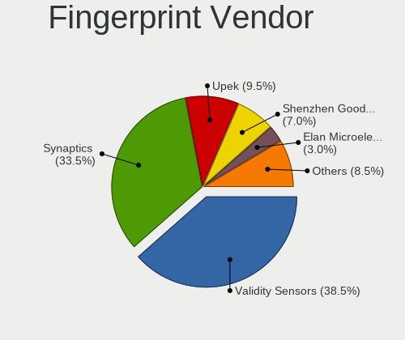

| Vendor                     | Notebooks | Percent |
|----------------------------|-----------|---------|
| Validity Sensors           | 57        | 43.85%  |
| Synaptics                  | 38        | 29.23%  |
| Upek                       | 15        | 11.54%  |
| Shenzhen Goodix Technology | 9         | 6.92%   |
| Elan Microelectronics      | 5         | 3.85%   |
| AuthenTec                  | 3         | 2.31%   |
| LighTuning Technology      | 2         | 1.54%   |
| Samsung Electronics        | 1         | 0.77%   |

Fingerprint Model
-----------------

Fingerprint sensor models

| Model                                                                      | Notebooks | Percent |
|----------------------------------------------------------------------------|-----------|---------|
| Synaptics Prometheus MIS Touch Fingerprint Reader                          | 19        | 14.62%  |
| Validity Sensors VFS495 Fingerprint Reader                                 | 14        | 10.77%  |
| Upek Biometric Touchchip/Touchstrip Fingerprint Sensor                     | 14        | 10.77%  |
| Validity Sensors VFS 5011 fingerprint sensor                               | 12        | 9.23%   |
| Validity Sensors VFS7500 Touch Fingerprint Sensor                          | 7         | 5.38%   |
| Synaptics Metallica MIS Touch Fingerprint Reader                           | 7         | 5.38%   |
| Shenzhen Goodix FingerPrint                                                | 5         | 3.85%   |
| Elan ELAN:Fingerprint                                                      | 5         | 3.85%   |
| Unknown                                                                    | 5         | 3.85%   |
| Validity Sensors VFS5011 Fingerprint Reader                                | 4         | 3.08%   |
| Validity Sensors VFS471 Fingerprint Reader                                 | 4         | 3.08%   |
| Validity Sensors Synaptics WBDI                                            | 4         | 3.08%   |
| Validity Sensors Synaptics VFS7552 Touch Fingerprint Sensor with PurePrint | 4         | 3.08%   |
| Validity Sensors VFS491                                                    | 3         | 2.31%   |
| Synaptics  VFS7552 Touch Fingerprint Sensor with PurePrint                 | 3         | 2.31%   |
| Shenzhen Goodix  Fingerprint Device                                        | 3         | 2.31%   |
| Validity Sensors VFS451 Fingerprint Reader                                 | 2         | 1.54%   |
| Synaptics  FS7604 Touch Fingerprint Sensor with PurePrint                  | 2         | 1.54%   |
| Synaptics Metallica MOH Touch Fingerprint Reader                           | 2         | 1.54%   |
| AuthenTec AES2810                                                          | 2         | 1.54%   |
| Validity Sensors VFS301 Fingerprint Reader                                 | 1         | 0.77%   |
| Validity Sensors Synaptics VFS7552 Touch Fingerprint Sensor                | 1         | 0.77%   |
| Validity Sensors Fingerprint scanner                                       | 1         | 0.77%   |
| Upek TCS5B Fingerprint sensor                                              | 1         | 0.77%   |
| Shenzhen Goodix Fingerprint Reader                                         | 1         | 0.77%   |
| Samsung Fingerprint Sensor Device - 730B                                   | 1         | 0.77%   |
| LighTuning Fingerprint Reader                                              | 1         | 0.77%   |
| LighTuning EgisTec Touch Fingerprint Sensor                                | 1         | 0.77%   |
| AuthenTec AES1600                                                          | 1         | 0.77%   |

Chipcard Vendor
---------------

Chipcard module vendors

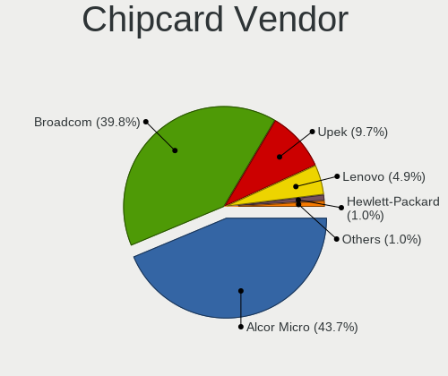

| Vendor                | Notebooks | Percent |
|-----------------------|-----------|---------|
| Broadcom              | 26        | 40.63%  |
| Alcor Micro           | 25        | 39.06%  |
| Upek                  | 7         | 10.94%  |
| Lenovo                | 5         | 7.81%   |
| Gemalto (was Gemplus) | 1         | 1.56%   |

Chipcard Model
--------------

Chipcard module models

| Model                                                                        | Notebooks | Percent |
|------------------------------------------------------------------------------|-----------|---------|
| Alcor Micro AU9540 Smartcard Reader                                          | 25        | 39.06%  |
| Broadcom BCM5880 Secure Applications Processor with fingerprint swipe sensor | 10        | 15.63%  |
| Broadcom 5880                                                                | 8         | 12.5%   |
| Upek TouchChip Fingerprint Coprocessor (WBF advanced mode)                   | 7         | 10.94%  |
| Lenovo Integrated Smart Card Reader                                          | 5         | 7.81%   |
| Broadcom 58200                                                               | 5         | 7.81%   |
| Broadcom BCM5880 Secure Applications Processor                               | 3         | 4.69%   |
| Gemalto (was Gemplus) Compact Smart Card Reader Writer                       | 1         | 1.56%   |

Unsupported
-----------

Unsupported Devices
-------------------

Total unsupported devices on board

| Total | Notebooks | Percent |
|-------|-----------|---------|
| 0     | 270       | 52.94%  |
| 1     | 183       | 35.88%  |
| 2     | 46        | 9.02%   |
| 3     | 11        | 2.16%   |

Unsupported Device Types
------------------------

Types of unsupported devices

| Type                  | Notebooks | Percent |
|-----------------------|-----------|---------|
| Fingerprint reader    | 130       | 44.22%  |
| Chipcard              | 55        | 18.71%  |
| Graphics card         | 46        | 15.65%  |
| Net/wireless          | 23        | 7.82%   |
| Multimedia controller | 15        | 5.1%    |
| Camera                | 10        | 3.4%    |
| Card reader           | 6         | 2.04%   |
| Storage               | 4         | 1.36%   |
| Net/ethernet          | 2         | 0.68%   |
| Sound                 | 1         | 0.34%   |
| Modem                 | 1         | 0.34%   |
| Bluetooth             | 1         | 0.34%   |

