Linux in Norway - Tested Hardware & Statistics
----------------------------------------------

A project to collect tested hardware configurations for Linux in Norway.

Anyone can contribute to this report by the [hw-probe](https://github.com/linuxhw/hw-probe) tool:

    sudo -E hw-probe -all -upload

Please contribute! Especially if your hardware is rare.

This is a report for all computer types. See also reports for [desktops](/Location/Norway/Desktop/README.md) and [notebooks](/Location/Norway/Notebook/README.md).

Contents
--------

* [ Test Cases ](#test-cases)

* [ System ](#system)
  - [ OS                       ](#os)
  - [ OS Family                ](#os-family)
  - [ Kernel                   ](#kernel)
  - [ Kernel Family            ](#kernel-family)
  - [ Kernel Major Ver.        ](#kernel-major-ver)
  - [ Arch                     ](#arch)
  - [ DE                       ](#de)
  - [ Display Server           ](#display-server)
  - [ Display Manager          ](#display-manager)
  - [ OS Lang                  ](#os-lang)
  - [ Boot Mode                ](#boot-mode)
  - [ Filesystem               ](#filesystem)
  - [ Part. scheme             ](#part-scheme)
  - [ Dual Boot with Linux/BSD ](#dual-boot-with-linuxbsd)
  - [ Dual Boot (Win)          ](#dual-boot-win)

* [ Board ](#board)
  - [ Vendor                   ](#vendor)
  - [ Model                    ](#model)
  - [ Model Family             ](#model-family)
  - [ MFG Year                 ](#mfg-year)
  - [ Form Factor              ](#form-factor)
  - [ Secure Boot              ](#secure-boot)
  - [ Coreboot                 ](#coreboot)
  - [ RAM Size                 ](#ram-size)
  - [ RAM Used                 ](#ram-used)
  - [ Total Drives             ](#total-drives)
  - [ Has CD-ROM               ](#has-cd-rom)
  - [ Has Ethernet             ](#has-ethernet)
  - [ Has WiFi                 ](#has-wifi)
  - [ Has Bluetooth            ](#has-bluetooth)

* [ Location ](#location)
  - [ Country                  ](#country)
  - [ City                     ](#city)

* [ Drives ](#drives)
  - [ Drive Vendor             ](#drive-vendor)
  - [ Drive Model              ](#drive-model)
  - [ HDD Vendor               ](#hdd-vendor)
  - [ SSD Vendor               ](#ssd-vendor)
  - [ Drive Kind               ](#drive-kind)
  - [ Drive Connector          ](#drive-connector)
  - [ Drive Size               ](#drive-size)
  - [ Space Total              ](#space-total)
  - [ Space Used               ](#space-used)
  - [ Malfunc. Drives          ](#malfunc-drives)
  - [ Malfunc. Drive Vendor    ](#malfunc-drive-vendor)
  - [ Malfunc. HDD Vendor      ](#malfunc-hdd-vendor)
  - [ Malfunc. Drive Kind      ](#malfunc-drive-kind)
  - [ Failed Drives            ](#failed-drives)
  - [ Failed Drive Vendor      ](#failed-drive-vendor)
  - [ Drive Status             ](#drive-status)

* [ Storage controller ](#storage-controller)
  - [ Storage Vendor           ](#storage-vendor)
  - [ Storage Model            ](#storage-model)
  - [ Storage Kind             ](#storage-kind)

* [ Processor ](#processor)
  - [ CPU Vendor               ](#cpu-vendor)
  - [ CPU Model                ](#cpu-model)
  - [ CPU Model Family         ](#cpu-model-family)
  - [ CPU Cores                ](#cpu-cores)
  - [ CPU Sockets              ](#cpu-sockets)
  - [ CPU Threads              ](#cpu-threads)
  - [ CPU Op-Modes             ](#cpu-op-modes)
  - [ CPU Microcode            ](#cpu-microcode)
  - [ CPU Microarch            ](#cpu-microarch)

* [ Graphics ](#graphics)
  - [ GPU Vendor               ](#gpu-vendor)
  - [ GPU Model                ](#gpu-model)
  - [ GPU Combo                ](#gpu-combo)
  - [ GPU Driver               ](#gpu-driver)
  - [ GPU Memory               ](#gpu-memory)

* [ Monitor ](#monitor)
  - [ Monitor Vendor           ](#monitor-vendor)
  - [ Monitor Model            ](#monitor-model)
  - [ Monitor Resolution       ](#monitor-resolution)
  - [ Monitor Diagonal         ](#monitor-diagonal)
  - [ Monitor Width            ](#monitor-width)
  - [ Aspect Ratio             ](#aspect-ratio)
  - [ Monitor Area             ](#monitor-area)
  - [ Pixel Density            ](#pixel-density)
  - [ Multiple Monitors        ](#multiple-monitors)

* [ Network ](#network)
  - [ Net Controller Vendor    ](#net-controller-vendor)
  - [ Net Controller Model     ](#net-controller-model)
  - [ Wireless Vendor          ](#wireless-vendor)
  - [ Wireless Model           ](#wireless-model)
  - [ Ethernet Vendor          ](#ethernet-vendor)
  - [ Ethernet Model           ](#ethernet-model)
  - [ Net Controller Kind      ](#net-controller-kind)
  - [ Used Controller          ](#used-controller)
  - [ NICs                     ](#nics)
  - [ IPv6                     ](#ipv6)

* [ Bluetooth ](#bluetooth)
  - [ Bluetooth Vendor         ](#bluetooth-vendor)
  - [ Bluetooth Model          ](#bluetooth-model)

* [ Sound ](#sound)
  - [ Sound Vendor             ](#sound-vendor)
  - [ Sound Model              ](#sound-model)

* [ Memory ](#memory)
  - [ Memory Vendor            ](#memory-vendor)
  - [ Memory Model             ](#memory-model)
  - [ Memory Kind              ](#memory-kind)
  - [ Memory Form Factor       ](#memory-form-factor)
  - [ Memory Size              ](#memory-size)
  - [ Memory Speed             ](#memory-speed)

* [ Printers & scanners ](#printers--scanners)
  - [ Printer Vendor           ](#printer-vendor)
  - [ Printer Model            ](#printer-model)
  - [ Scanner Vendor           ](#scanner-vendor)
  - [ Scanner Model            ](#scanner-model)

* [ Camera ](#camera)
  - [ Camera Vendor            ](#camera-vendor)
  - [ Camera Model             ](#camera-model)

* [ Security ](#security)
  - [ Fingerprint Vendor       ](#fingerprint-vendor)
  - [ Fingerprint Model        ](#fingerprint-model)
  - [ Chipcard Vendor          ](#chipcard-vendor)
  - [ Chipcard Model           ](#chipcard-model)

* [ Unsupported ](#unsupported)
  - [ Unsupported Devices      ](#unsupported-devices)
  - [ Unsupported Device Types ](#unsupported-device-types)

Test Cases
----------

Total: 3237

| Vendor        | Model                       | Form-Factor | Probe                                                      | Date         |
|---------------|-----------------------------|-------------|------------------------------------------------------------|--------------|
| Shenzhen M... | DRBAA                       | Desktop     | [ded9418dc9](https://linux-hardware.org/?probe=ded9418dc9) | Jan 02, 2026 |
| Dell          | Precision 5570              | Notebook    | [13dd453699](https://linux-hardware.org/?probe=13dd453699) | Jan 02, 2026 |
| ASUSTek       | ZenBook UX325EA_UX325EA     | Notebook    | [57eb7853d7](https://linux-hardware.org/?probe=57eb7853d7) | Jan 01, 2026 |
| ASUSTek       | ROG STRIX Z690-F GAMING ... | Desktop     | [2c97d36b4b](https://linux-hardware.org/?probe=2c97d36b4b) | Dec 30, 2025 |
| Lenovo        | Yoga Slim 7 14AKP10 83JY    | Notebook    | [b8f463f4d9](https://linux-hardware.org/?probe=b8f463f4d9) | Dec 30, 2025 |
| MSI           | GT73VR 7RF                  | Notebook    | [aba4402e58](https://linux-hardware.org/?probe=aba4402e58) | Dec 30, 2025 |
| Acer          | Aspire A315-24P             | Notebook    | [8dc3baeb3e](https://linux-hardware.org/?probe=8dc3baeb3e) | Dec 28, 2025 |
| ASUSTek       | TUF Gaming B650-PLUS WIF... | Desktop     | [5df0ba1ebe](https://linux-hardware.org/?probe=5df0ba1ebe) | Dec 28, 2025 |
| ASRock        | X870E Taichi Lite           | Desktop     | [0ff807e542](https://linux-hardware.org/?probe=0ff807e542) | Dec 28, 2025 |
| ASUSTek       | ROG STRIX Z790-F GAMING ... | Desktop     | [fd6c6399ca](https://linux-hardware.org/?probe=fd6c6399ca) | Dec 27, 2025 |
| Intel         | NUC6i5SYB H81131-505        | Mini pc     | [33c8e71144](https://linux-hardware.org/?probe=33c8e71144) | Dec 27, 2025 |
| ASUSTek       | Z170-E                      | Desktop     | [235e8f2580](https://linux-hardware.org/?probe=235e8f2580) | Dec 26, 2025 |
| HP            | EliteBook 8560w (XX058AV... | Notebook    | [dfe1b50b42](https://linux-hardware.org/?probe=dfe1b50b42) | Dec 26, 2025 |
| HP            | EliteBook 8560w (XX058AV... | Notebook    | [c884bf747d](https://linux-hardware.org/?probe=c884bf747d) | Dec 26, 2025 |
| Gigabyte      | X570 I AORUS PRO WIFI       | Desktop     | [9d74bb300d](https://linux-hardware.org/?probe=9d74bb300d) | Dec 25, 2025 |
| TOPC          | FP7R2-12 V1.0               | Desktop     | [4d67d6b135](https://linux-hardware.org/?probe=4d67d6b135) | Dec 25, 2025 |
| Lenovo        | Legion 7 16ARHA7 82UH       | Notebook    | [b3dfdd0a6e](https://linux-hardware.org/?probe=b3dfdd0a6e) | Dec 24, 2025 |
| Lenovo        | ThinkPad L450 20DSS1G63R    | Notebook    | [5f8751f7e9](https://linux-hardware.org/?probe=5f8751f7e9) | Dec 24, 2025 |
| MSI           | Z270 TOMAHAWK               | Desktop     | [9b895b0a2e](https://linux-hardware.org/?probe=9b895b0a2e) | Dec 24, 2025 |
| Dell          | Latitude 7370               | Notebook    | [39aef9f9e7](https://linux-hardware.org/?probe=39aef9f9e7) | Dec 23, 2025 |
| HP            | EliteBook 840 G8 Noteboo... | Notebook    | [46a0f29377](https://linux-hardware.org/?probe=46a0f29377) | Dec 23, 2025 |
| HP            | EliteBook 840 G8 Noteboo... | Notebook    | [fb04f3e827](https://linux-hardware.org/?probe=fb04f3e827) | Dec 22, 2025 |
| Lenovo        | ThinkPad L580 20LW000VMX    | Notebook    | [c6cfe81aa5](https://linux-hardware.org/?probe=c6cfe81aa5) | Dec 20, 2025 |
| ASUSTek       | ROG STRIX X570-F GAMING     | Desktop     | [f8b4382a36](https://linux-hardware.org/?probe=f8b4382a36) | Dec 19, 2025 |
| ASUSTek       | PRIME B550M-A WIFI II       | Desktop     | [cc2b3fa079](https://linux-hardware.org/?probe=cc2b3fa079) | Dec 18, 2025 |
| ASUSTek       | ROG STRIX B450-F GAMING     | Desktop     | [16135e0893](https://linux-hardware.org/?probe=16135e0893) | Dec 18, 2025 |
| MSI           | MPG X570 GAMING PLUS        | Desktop     | [97b08577ff](https://linux-hardware.org/?probe=97b08577ff) | Dec 17, 2025 |
| ASUSTek       | ROG STRIX B660-F GAMING ... | Desktop     | [d01e9f1bee](https://linux-hardware.org/?probe=d01e9f1bee) | Dec 16, 2025 |
| ASRock        | X870 Pro RS WiFi            | Desktop     | [3300b18294](https://linux-hardware.org/?probe=3300b18294) | Dec 16, 2025 |
| ASUSTek       | PN41-S1                     | Mini pc     | [a9064d4c29](https://linux-hardware.org/?probe=a9064d4c29) | Dec 16, 2025 |
| ASUSTek       | TUF Z370-PRO GAMING         | Desktop     | [aca2764a00](https://linux-hardware.org/?probe=aca2764a00) | Dec 16, 2025 |
| Samsung       | 960XHA                      | Notebook    | [fb39d4f895](https://linux-hardware.org/?probe=fb39d4f895) | Dec 15, 2025 |
| Gigabyte      | B550M S2H                   | Desktop     | [b27f9d8f05](https://linux-hardware.org/?probe=b27f9d8f05) | Dec 14, 2025 |
| Lenovo        | MAHOBAY NO DPK              | Desktop     | [5410484a9c](https://linux-hardware.org/?probe=5410484a9c) | Dec 14, 2025 |
| MSI           | MPG B550 GAMING PLUS        | Desktop     | [cfc56adf3a](https://linux-hardware.org/?probe=cfc56adf3a) | Dec 13, 2025 |
| Lenovo        | 312D SDK0J40697 WIN 3305... | Mini pc     | [055473b5c9](https://linux-hardware.org/?probe=055473b5c9) | Dec 13, 2025 |
| Apple         | MacBookPro9,2               | Notebook    | [f10dfee6d4](https://linux-hardware.org/?probe=f10dfee6d4) | Dec 10, 2025 |
| Unknown       | Apple MacBook Air (M1, 2... | Notebook    | [c5aeb1fb77](https://linux-hardware.org/?probe=c5aeb1fb77) | Dec 09, 2025 |
| MSI           | MAG X870E TOMAHAWK WIFI     | Desktop     | [8bb31182d4](https://linux-hardware.org/?probe=8bb31182d4) | Dec 09, 2025 |
| ASUSTek       | ROG STRIX B360-I GAMING     | Desktop     | [5c28189eb0](https://linux-hardware.org/?probe=5c28189eb0) | Dec 08, 2025 |
| ASUSTek       | SABERTOOTH 990FX R2.0       | Desktop     | [d5a4391277](https://linux-hardware.org/?probe=d5a4391277) | Dec 08, 2025 |
| ASUSTek       | TUF Gaming B650-PLUS WIF... | Notebook    | [91f31882b9](https://linux-hardware.org/?probe=91f31882b9) | Dec 08, 2025 |
| MSI           | P67A-C45                    | Desktop     | [d91307c0a6](https://linux-hardware.org/?probe=d91307c0a6) | Dec 07, 2025 |
| ASUSTek       | STRIX Z270F GAMING          | Desktop     | [793ba789cd](https://linux-hardware.org/?probe=793ba789cd) | Dec 07, 2025 |
| Lenovo        | ThinkPad X13 Gen 6 21RMC... | Notebook    | [1f5f97cae0](https://linux-hardware.org/?probe=1f5f97cae0) | Dec 07, 2025 |
| ASUSTek       | SABERTOOTH 990FX R2.0       | Desktop     | [4bdeb438e4](https://linux-hardware.org/?probe=4bdeb438e4) | Dec 07, 2025 |
| ASUSTek       | STRIX Z270F GAMING          | Desktop     | [35e01bd68c](https://linux-hardware.org/?probe=35e01bd68c) | Dec 07, 2025 |
| Apple         | MacBookPro8,1               | Notebook    | [dc1e0eff2b](https://linux-hardware.org/?probe=dc1e0eff2b) | Dec 07, 2025 |
| Apple         | MacBookPro8,1               | Notebook    | [a077455bdc](https://linux-hardware.org/?probe=a077455bdc) | Dec 07, 2025 |
| HP            | ZBook Power 15.6 inch G8... | Notebook    | [03ec4bcdb3](https://linux-hardware.org/?probe=03ec4bcdb3) | Dec 06, 2025 |
| HP            | Laptop 17-cp2xxx            | Notebook    | [1313a11f35](https://linux-hardware.org/?probe=1313a11f35) | Dec 05, 2025 |
| HP            | EliteBook 640 14 inch G9... | Notebook    | [0f27f1eaa4](https://linux-hardware.org/?probe=0f27f1eaa4) | Dec 05, 2025 |
| HP            | ProBook 430 G6              | Notebook    | [9a8496d968](https://linux-hardware.org/?probe=9a8496d968) | Dec 02, 2025 |
| ASUSTek       | ZenBook UX325EA_UX325EA     | Notebook    | [8622f08fab](https://linux-hardware.org/?probe=8622f08fab) | Dec 02, 2025 |
| Acer          | Aspire 7741                 | Notebook    | [7471a64ef9](https://linux-hardware.org/?probe=7471a64ef9) | Dec 02, 2025 |
| Acer          | Aspire 7741                 | Notebook    | [39d01009cb](https://linux-hardware.org/?probe=39d01009cb) | Dec 02, 2025 |
| ASUSTek       | PRIME X370-PRO              | Desktop     | [f0f5a408e7](https://linux-hardware.org/?probe=f0f5a408e7) | Nov 29, 2025 |
| Fujitsu       | LIFEBOOK A544               | Notebook    | [8faee56196](https://linux-hardware.org/?probe=8faee56196) | Nov 29, 2025 |
| Lenovo        | ThinkPad W530 2447EJ7       | Notebook    | [45f8cfb8f9](https://linux-hardware.org/?probe=45f8cfb8f9) | Nov 29, 2025 |
| HP            | ProBook 440 14 inch G10 ... | Notebook    | [cad2de6417](https://linux-hardware.org/?probe=cad2de6417) | Nov 28, 2025 |
| Lenovo        | ThinkPad P15s Gen 1 20T4... | Notebook    | [378a8ca4e5](https://linux-hardware.org/?probe=378a8ca4e5) | Nov 28, 2025 |
| ASUSTek       | ROG STRIX Z390-F GAMING     | Desktop     | [21bc349d51](https://linux-hardware.org/?probe=21bc349d51) | Nov 27, 2025 |
| Lenovo        | ThinkPad P15s Gen 1 20T4... | Notebook    | [d700729ac4](https://linux-hardware.org/?probe=d700729ac4) | Nov 27, 2025 |
| MSI           | MAG B550 TOMAHAWK           | Desktop     | [8fa7682797](https://linux-hardware.org/?probe=8fa7682797) | Nov 27, 2025 |
| ASUSTek       | ROG CROSSHAIR VIII HERO     | Desktop     | [0ff449cd74](https://linux-hardware.org/?probe=0ff449cd74) | Nov 26, 2025 |
| Dell          | Latitude E5410              | Notebook    | [5378034632](https://linux-hardware.org/?probe=5378034632) | Nov 26, 2025 |
| Acer          | Aspire F5-571               | Notebook    | [43137bff2a](https://linux-hardware.org/?probe=43137bff2a) | Nov 26, 2025 |
| MSI           | MAG B550 TOMAHAWK           | Desktop     | [6470925fcd](https://linux-hardware.org/?probe=6470925fcd) | Nov 25, 2025 |
| ASUSTek       | TUF Gaming B650-PLUS WIF... | Desktop     | [eb2dfde192](https://linux-hardware.org/?probe=eb2dfde192) | Nov 25, 2025 |
| ASUSTek       | ROG STRIX B850-I GAMING ... | Desktop     | [1c30e18293](https://linux-hardware.org/?probe=1c30e18293) | Nov 23, 2025 |
| Lenovo        | ThinkPad W530 2447EJ7       | Notebook    | [53c5dc9587](https://linux-hardware.org/?probe=53c5dc9587) | Nov 23, 2025 |
| ASUSTek       | GL752VW                     | Notebook    | [78933458ca](https://linux-hardware.org/?probe=78933458ca) | Nov 23, 2025 |
| Lenovo        | ThinkPad X270 W10DG 20K5... | Notebook    | [f17c758449](https://linux-hardware.org/?probe=f17c758449) | Nov 22, 2025 |
| HP            | Pavilion Laptop 14-ce0xx... | Notebook    | [0db935a593](https://linux-hardware.org/?probe=0db935a593) | Nov 22, 2025 |
| Apple         | Mac-7BA5B2794B2CDB12 Mac... | Mini pc     | [599cb2892f](https://linux-hardware.org/?probe=599cb2892f) | Nov 22, 2025 |
| Dell          | Latitude 7370               | Notebook    | [4657a17cb6](https://linux-hardware.org/?probe=4657a17cb6) | Nov 21, 2025 |
| Lenovo        | Yoga C640-13IML 81UE        | Convertible | [ad690d0180](https://linux-hardware.org/?probe=ad690d0180) | Nov 21, 2025 |
| HP            | Laptop 15-bs1xx             | Notebook    | [671b71e7fb](https://linux-hardware.org/?probe=671b71e7fb) | Nov 20, 2025 |
| Lenovo        | V15 G2 ALC 82KD             | Notebook    | [60ccba01cb](https://linux-hardware.org/?probe=60ccba01cb) | Nov 16, 2025 |
| HP            | Pavilion Laptop 14-ce0xx... | Notebook    | [c254b63287](https://linux-hardware.org/?probe=c254b63287) | Nov 16, 2025 |
| Gigabyte      | B450 AORUS ELITE            | Desktop     | [0e1517ec55](https://linux-hardware.org/?probe=0e1517ec55) | Nov 15, 2025 |
| ASRock        | A55M-HVS                    | Desktop     | [33354a41f1](https://linux-hardware.org/?probe=33354a41f1) | Nov 15, 2025 |
| ASUSTek       | TUF Gaming X570-PLUS        | Desktop     | [048590a8e2](https://linux-hardware.org/?probe=048590a8e2) | Nov 14, 2025 |
| Dell          | XPS 15 9520                 | Notebook    | [c88a1544e1](https://linux-hardware.org/?probe=c88a1544e1) | Nov 12, 2025 |
| ASRock        | B550M Pro4                  | Desktop     | [ef69b9e956](https://linux-hardware.org/?probe=ef69b9e956) | Nov 12, 2025 |
| Gigabyte      | Z790 GAMING X AX            | Desktop     | [d5a7037387](https://linux-hardware.org/?probe=d5a7037387) | Nov 11, 2025 |
| Lenovo        | ThinkPad T470s 20HF004UM... | Notebook    | [b5a9a5ffe0](https://linux-hardware.org/?probe=b5a9a5ffe0) | Nov 11, 2025 |
| Gigabyte      | B650M GAMING X AX           | Desktop     | [6776f19283](https://linux-hardware.org/?probe=6776f19283) | Nov 11, 2025 |
| Lenovo        | ThinkPad P14s Gen 3 21J5... | Notebook    | [9094cb21d8](https://linux-hardware.org/?probe=9094cb21d8) | Nov 11, 2025 |
| MSI           | MAG X870 TOMAHAWK WIFI      | Desktop     | [95d1c38312](https://linux-hardware.org/?probe=95d1c38312) | Nov 10, 2025 |
| HP            | ProBook 6470b               | Notebook    | [f83658397d](https://linux-hardware.org/?probe=f83658397d) | Nov 07, 2025 |
| ASRock        | A55M-HVS                    | Desktop     | [48e96f1134](https://linux-hardware.org/?probe=48e96f1134) | Nov 06, 2025 |
| Dell          | Latitude 5410               | Notebook    | [32ed87cfd9](https://linux-hardware.org/?probe=32ed87cfd9) | Nov 06, 2025 |
| MSI           | MAG X870 TOMAHAWK WIFI      | Desktop     | [e90a2a065f](https://linux-hardware.org/?probe=e90a2a065f) | Nov 05, 2025 |
| Komplett      | LAPQC71A                    | Notebook    | [e7d4c00b80](https://linux-hardware.org/?probe=e7d4c00b80) | Nov 05, 2025 |
| Toshiba       | Satellite Pro A50-C         | Notebook    | [47a638b685](https://linux-hardware.org/?probe=47a638b685) | Nov 05, 2025 |
| Unknown       | Unknown                     | Notebook    | [1b2e977664](https://linux-hardware.org/?probe=1b2e977664) | Nov 03, 2025 |
| Dell          | Latitude 7490               | Notebook    | [89c2642ef3](https://linux-hardware.org/?probe=89c2642ef3) | Nov 02, 2025 |
| Lenovo        | Legion 5 15ACH6H 82JU       | Notebook    | [f1fa5969b0](https://linux-hardware.org/?probe=f1fa5969b0) | Nov 01, 2025 |
| ASUSTek       | VivoBook_ASUSLaptop K340... | Notebook    | [1350ae2c05](https://linux-hardware.org/?probe=1350ae2c05) | Nov 01, 2025 |
| HUAWEI        | MACH-WX9                    | Notebook    | [6ef9ca67fe](https://linux-hardware.org/?probe=6ef9ca67fe) | Oct 30, 2025 |
| Lenovo        | ThinkPad P16s Gen 4 AMD ... | Notebook    | [ada2256e8d](https://linux-hardware.org/?probe=ada2256e8d) | Oct 30, 2025 |
| Packard Be... | EasyNote LS11HR             | Notebook    | [14b7317d76](https://linux-hardware.org/?probe=14b7317d76) | Oct 30, 2025 |
| Acer          | Aspire F5-571               | Notebook    | [17a639a47a](https://linux-hardware.org/?probe=17a639a47a) | Oct 29, 2025 |
| Lenovo        | ThinkPad L440 20ASS0EQ00    | Notebook    | [b6595cbd86](https://linux-hardware.org/?probe=b6595cbd86) | Oct 28, 2025 |
| Lenovo        | ThinkPad L440 20ASS0EQ00    | Notebook    | [18b18fe7fc](https://linux-hardware.org/?probe=18b18fe7fc) | Oct 28, 2025 |
| Dell          | Studio XPS 1640             | Notebook    | [b4bd0594e5](https://linux-hardware.org/?probe=b4bd0594e5) | Oct 27, 2025 |
| HP            | Laptop 17-ak0xx             | Notebook    | [a9607800f8](https://linux-hardware.org/?probe=a9607800f8) | Oct 27, 2025 |
| ASUSTek       | ROG STRIX X570-F GAMING     | Desktop     | [8f1baeb436](https://linux-hardware.org/?probe=8f1baeb436) | Oct 27, 2025 |
| Lenovo        | Yoga Slim 7 14AKP10 83JY    | Notebook    | [ed6fec9094](https://linux-hardware.org/?probe=ed6fec9094) | Oct 26, 2025 |
| Apple         | MacBookPro8,1               | Notebook    | [5a2be7d97a](https://linux-hardware.org/?probe=5a2be7d97a) | Oct 26, 2025 |
| MSI           | MPG B550 GAMING PLUS        | Desktop     | [aa0544fca9](https://linux-hardware.org/?probe=aa0544fca9) | Oct 25, 2025 |
| ASUSTek       | CROSSHAIR VI HERO           | Desktop     | [30f52d8b63](https://linux-hardware.org/?probe=30f52d8b63) | Oct 24, 2025 |
| ASUSTek       | CROSSHAIR VI HERO           | Desktop     | [4010a67b5f](https://linux-hardware.org/?probe=4010a67b5f) | Oct 24, 2025 |
| Acer          | Aspire V5-122               | Notebook    | [42f8fd53d8](https://linux-hardware.org/?probe=42f8fd53d8) | Oct 23, 2025 |
| ASRock        | H310M-STX                   | Desktop     | [86dd242414](https://linux-hardware.org/?probe=86dd242414) | Oct 23, 2025 |
| ASRock        | H310M-STX                   | Desktop     | [2beca8cd57](https://linux-hardware.org/?probe=2beca8cd57) | Oct 23, 2025 |
| Lenovo        | ThinkPad X1 Carbon Gen 1... | Notebook    | [4aa6152849](https://linux-hardware.org/?probe=4aa6152849) | Oct 22, 2025 |
| Dell          | Pro 13 Plus PB13250         | Notebook    | [f2274a2707](https://linux-hardware.org/?probe=f2274a2707) | Oct 22, 2025 |
| ASUSTek       | ZenBook UX325EA_UX325EA     | Notebook    | [84a6076b4a](https://linux-hardware.org/?probe=84a6076b4a) | Oct 22, 2025 |
| ASUSTek       | ASUS Vivobook S 14 M5406... | Notebook    | [8f9c3b7f23](https://linux-hardware.org/?probe=8f9c3b7f23) | Oct 21, 2025 |
| MSI           | GT63 Titan 8RF              | Notebook    | [cd5d5c4875](https://linux-hardware.org/?probe=cd5d5c4875) | Oct 21, 2025 |
| Apple         | MacBookPro13,3              | Notebook    | [180a81a8c2](https://linux-hardware.org/?probe=180a81a8c2) | Oct 21, 2025 |
| FIRICH        | J1900                       | Desktop     | [eba97e323c](https://linux-hardware.org/?probe=eba97e323c) | Oct 21, 2025 |
| ASUSTek       | GL552VW                     | Notebook    | [b747c4f87c](https://linux-hardware.org/?probe=b747c4f87c) | Oct 21, 2025 |
| Lenovo        | 3136 SDK0J40697 WIN 3305... | Mini pc     | [f0670f17c3](https://linux-hardware.org/?probe=f0670f17c3) | Oct 20, 2025 |
| ASUSTek       | VivoBook_ASUSLaptop X571... | Notebook    | [2722d838ff](https://linux-hardware.org/?probe=2722d838ff) | Oct 20, 2025 |
| Lenovo        | ThinkPad T520 4243R83       | Notebook    | [aaf7bd688d](https://linux-hardware.org/?probe=aaf7bd688d) | Oct 20, 2025 |
| ONDA          | B650PLUS-ITX-W Ver:1.04     | Desktop     | [02dd26cc3c](https://linux-hardware.org/?probe=02dd26cc3c) | Oct 19, 2025 |
| Gigabyte      | B550 AORUS PRO              | Desktop     | [7191f3a71e](https://linux-hardware.org/?probe=7191f3a71e) | Oct 19, 2025 |
| ASUSTek       | Z170-P                      | Desktop     | [a5e4473abc](https://linux-hardware.org/?probe=a5e4473abc) | Oct 19, 2025 |
| HP            | 8055                        | Desktop     | [9545076669](https://linux-hardware.org/?probe=9545076669) | Oct 18, 2025 |
| Dell          | XPS 17 9710                 | Notebook    | [4f962c3701](https://linux-hardware.org/?probe=4f962c3701) | Oct 18, 2025 |
| Alienware     | M14xR2                      | Notebook    | [261e0fa00e](https://linux-hardware.org/?probe=261e0fa00e) | Oct 17, 2025 |
| Acer          | Aspire V3-771               | Notebook    | [5dd53f692d](https://linux-hardware.org/?probe=5dd53f692d) | Oct 16, 2025 |
| Lenovo        | Legion 5 15ACH6H 82JU       | Notebook    | [24a464bb7b](https://linux-hardware.org/?probe=24a464bb7b) | Oct 16, 2025 |
| Gigabyte      | Z97X-SLI-CF                 | Desktop     | [8265c3ec90](https://linux-hardware.org/?probe=8265c3ec90) | Oct 16, 2025 |
| ASUSTek       | Z97-PRO                     | Desktop     | [71ad1078d6](https://linux-hardware.org/?probe=71ad1078d6) | Oct 14, 2025 |
| Lenovo        | Yoga Slim 7 14AKP10 83JY    | Notebook    | [c84041c8ed](https://linux-hardware.org/?probe=c84041c8ed) | Oct 12, 2025 |
| HP            | 89B4 A                      | Desktop     | [6f4c936680](https://linux-hardware.org/?probe=6f4c936680) | Oct 12, 2025 |
| ASRock        | 960GM-GS3 FX                | Desktop     | [58d73a3351](https://linux-hardware.org/?probe=58d73a3351) | Oct 11, 2025 |
| ASUSTek       | X556URK                     | Notebook    | [d1efa18e92](https://linux-hardware.org/?probe=d1efa18e92) | Oct 11, 2025 |
| MSI           | B650 GAMING PLUS WIFI       | Desktop     | [838c78e71b](https://linux-hardware.org/?probe=838c78e71b) | Oct 11, 2025 |
| HP            | ENVY x360 Convertible 13... | Convertible | [7cfda4fc67](https://linux-hardware.org/?probe=7cfda4fc67) | Oct 11, 2025 |
| Lenovo        | Yoga Slim 7 14AKP10 83JY    | Notebook    | [d9d13e3ff4](https://linux-hardware.org/?probe=d9d13e3ff4) | Oct 11, 2025 |
| ASRock        | X570 Taichi                 | Desktop     | [43961c2249](https://linux-hardware.org/?probe=43961c2249) | Oct 11, 2025 |
| Samsung       | 750XFG                      | Notebook    | [a611acfd68](https://linux-hardware.org/?probe=a611acfd68) | Oct 09, 2025 |
| Lenovo        | G50-80 80E5                 | Notebook    | [e2ac1616ee](https://linux-hardware.org/?probe=e2ac1616ee) | Oct 09, 2025 |
| HP            | 18E7                        | Desktop     | [adad647e48](https://linux-hardware.org/?probe=adad647e48) | Oct 07, 2025 |
| Notebook      | W35xSTQ_370ST               | Notebook    | [1bd7181933](https://linux-hardware.org/?probe=1bd7181933) | Oct 06, 2025 |
| Lenovo        | Yoga Slim 7 14ARE05 82A2    | Notebook    | [7ac115bb52](https://linux-hardware.org/?probe=7ac115bb52) | Oct 05, 2025 |
| ASUSTek       | TUF Z390-PLUS GAMING        | Desktop     | [05a9e76ab5](https://linux-hardware.org/?probe=05a9e76ab5) | Oct 05, 2025 |
| HP            | 8598                        | Desktop     | [360a269034](https://linux-hardware.org/?probe=360a269034) | Oct 05, 2025 |
| Unknown       | Unknown                     | Notebook    | [869ac68ef2](https://linux-hardware.org/?probe=869ac68ef2) | Oct 04, 2025 |
| Gigabyte      | B550M AORUS ELITE           | Desktop     | [55e0293b8f](https://linux-hardware.org/?probe=55e0293b8f) | Oct 03, 2025 |
| HP            | 8598                        | Desktop     | [fd32152d36](https://linux-hardware.org/?probe=fd32152d36) | Oct 02, 2025 |
| Acer          | Swift SFG14-73              | Notebook    | [7373e7d94c](https://linux-hardware.org/?probe=7373e7d94c) | Oct 02, 2025 |
| Unknown       | Unknown                     | Notebook    | [178c1601f3](https://linux-hardware.org/?probe=178c1601f3) | Sep 30, 2025 |
| ASRock        | X870E Taichi Lite           | Desktop     | [dddeaf2cfa](https://linux-hardware.org/?probe=dddeaf2cfa) | Sep 28, 2025 |
| ASUSTek       | CM6330_CM6630_CM6730_CM6... | Desktop     | [95351c88fd](https://linux-hardware.org/?probe=95351c88fd) | Sep 23, 2025 |
| ASUSTek       | ROG STRIX B450-E GAMING     | Desktop     | [16837ac6a8](https://linux-hardware.org/?probe=16837ac6a8) | Sep 21, 2025 |
| HP            | EliteBook 8560w (XX058AV... | Notebook    | [1427c48451](https://linux-hardware.org/?probe=1427c48451) | Sep 21, 2025 |
| MSI           | PRO Z790-P WIFI             | Desktop     | [59541f2db4](https://linux-hardware.org/?probe=59541f2db4) | Sep 20, 2025 |
| Lenovo        | ThinkPad E520 1143A14       | Notebook    | [f9409c1692](https://linux-hardware.org/?probe=f9409c1692) | Sep 20, 2025 |
| MSI           | B450I GAMING PLUS AC        | Desktop     | [065ccbbefd](https://linux-hardware.org/?probe=065ccbbefd) | Sep 20, 2025 |
| GPD           | WIN2                        | Notebook    | [f06311a5d7](https://linux-hardware.org/?probe=f06311a5d7) | Sep 20, 2025 |
| GPD           | WIN2                        | Notebook    | [a30ca468a6](https://linux-hardware.org/?probe=a30ca468a6) | Sep 20, 2025 |
| ASUSTek       | M51BC                       | Desktop     | [d543f31eb1](https://linux-hardware.org/?probe=d543f31eb1) | Sep 19, 2025 |
| ASUSTek       | ASUS Vivobook S 14 M5406... | Notebook    | [8d4a40e632](https://linux-hardware.org/?probe=8d4a40e632) | Sep 19, 2025 |
| Google        | Auron_Yuna                  | Notebook    | [cdac624e05](https://linux-hardware.org/?probe=cdac624e05) | Sep 17, 2025 |
| ASUSTek       | M51BC                       | Desktop     | [99eb67785c](https://linux-hardware.org/?probe=99eb67785c) | Sep 15, 2025 |
| Neousys Te... | NVS-9650 Rev. A2            | Server      | [9b94cb9199](https://linux-hardware.org/?probe=9b94cb9199) | Sep 15, 2025 |
| ASUSTek       | PRIME B650M-A AX II         | Desktop     | [fd9484610b](https://linux-hardware.org/?probe=fd9484610b) | Sep 15, 2025 |
| GPD           | WIN2                        | Notebook    | [a5720f8bf0](https://linux-hardware.org/?probe=a5720f8bf0) | Sep 14, 2025 |
| HUAWEI        | MACH-WX9                    | Notebook    | [64cd540d09](https://linux-hardware.org/?probe=64cd540d09) | Sep 13, 2025 |
| Apple         | Mac-DB15BD556843C820 iMa... | All in one  | [65da5e29e3](https://linux-hardware.org/?probe=65da5e29e3) | Sep 12, 2025 |
| Apple         | Mac-DB15BD556843C820 iMa... | All in one  | [4566a69f74](https://linux-hardware.org/?probe=4566a69f74) | Sep 12, 2025 |
| ASUSTek       | TUF Gaming B550M-PLUS WI... | Desktop     | [2f3ae89e40](https://linux-hardware.org/?probe=2f3ae89e40) | Sep 11, 2025 |
| Gigabyte      | B365M HD3                   | Desktop     | [3d8d93b3c9](https://linux-hardware.org/?probe=3d8d93b3c9) | Sep 10, 2025 |
| Lenovo        | ThinkPad T14s Gen 6 21M1... | Notebook    | [0ac959506f](https://linux-hardware.org/?probe=0ac959506f) | Sep 10, 2025 |
| Lenovo        | ThinkPad X1 Carbon Gen 9... | Notebook    | [84b48bc8ae](https://linux-hardware.org/?probe=84b48bc8ae) | Sep 09, 2025 |
| Microsoft     | Surface Book                | Tablet      | [ed91336ec5](https://linux-hardware.org/?probe=ed91336ec5) | Sep 09, 2025 |
| ASUSTek       | ROG STRIX X670E-A GAMING... | Desktop     | [5b5a84ac71](https://linux-hardware.org/?probe=5b5a84ac71) | Sep 08, 2025 |
| MSI           | P67A-C45                    | Desktop     | [60a6161d52](https://linux-hardware.org/?probe=60a6161d52) | Sep 07, 2025 |
| ASUSTek       | TUF Gaming A620-PRO WIFI    | Desktop     | [17c1fbfb6c](https://linux-hardware.org/?probe=17c1fbfb6c) | Sep 07, 2025 |
| Intel Clie... | LAPQC71A                    | Notebook    | [098e302a66](https://linux-hardware.org/?probe=098e302a66) | Sep 07, 2025 |
| ASUSTek       | PRIME B650M-A AX II         | Desktop     | [09550d2f78](https://linux-hardware.org/?probe=09550d2f78) | Sep 07, 2025 |
| Lenovo        | ThinkPad X1 Carbon Gen 9... | Notebook    | [853667f795](https://linux-hardware.org/?probe=853667f795) | Sep 06, 2025 |
| ASUSTek       | PRIME B650M-A AX II         | Desktop     | [50b2ef5447](https://linux-hardware.org/?probe=50b2ef5447) | Sep 06, 2025 |
| Dell          | 0KV62T A00                  | Desktop     | [e60392368d](https://linux-hardware.org/?probe=e60392368d) | Sep 05, 2025 |
| Lenovo        | ThinkPad T470s 20HF0001M... | Notebook    | [8b78bbf5f7](https://linux-hardware.org/?probe=8b78bbf5f7) | Sep 05, 2025 |
| Lenovo        | Legion Slim 5 16APH8 82Y... | Notebook    | [59448d9c88](https://linux-hardware.org/?probe=59448d9c88) | Sep 03, 2025 |
| GMKtec        | NucBox G3                   | Other       | [717f29b9e7](https://linux-hardware.org/?probe=717f29b9e7) | Sep 02, 2025 |
| HP            | ProBook 430 G6              | Notebook    | [1cf3c858d4](https://linux-hardware.org/?probe=1cf3c858d4) | Sep 01, 2025 |
| Google        | Auron_Yuna                  | Notebook    | [015c0847e0](https://linux-hardware.org/?probe=015c0847e0) | Sep 01, 2025 |
| Acer          | Nitro N50-650               | Desktop     | [38e124dae6](https://linux-hardware.org/?probe=38e124dae6) | Aug 31, 2025 |
| Lenovo        | ThinkPad L470 W10DG 20JV... | Notebook    | [8236ebb2af](https://linux-hardware.org/?probe=8236ebb2af) | Aug 29, 2025 |
| ASUSTek       | ROG STRIX B550-F GAMING     | Desktop     | [9d6198cef5](https://linux-hardware.org/?probe=9d6198cef5) | Aug 28, 2025 |
| Lenovo        | IdeaPad Slim 5 14AHP10 8... | Notebook    | [e172ce1edc](https://linux-hardware.org/?probe=e172ce1edc) | Aug 27, 2025 |
| ASUSTek       | TUF Gaming B650-PLUS WIF... | Desktop     | [e90fddc206](https://linux-hardware.org/?probe=e90fddc206) | Aug 27, 2025 |
| Lenovo        | IdeaPad 5 Pro 16ACH6 82L... | Notebook    | [f14f9e275a](https://linux-hardware.org/?probe=f14f9e275a) | Aug 26, 2025 |
| Microsoft     | Surface Book                | Tablet      | [724a3c73eb](https://linux-hardware.org/?probe=724a3c73eb) | Aug 26, 2025 |
| Multicom      | U230                        | Notebook    | [3daae44f9e](https://linux-hardware.org/?probe=3daae44f9e) | Aug 25, 2025 |
| Apple         | MacBookPro12,1              | Notebook    | [4a3a6ffbed](https://linux-hardware.org/?probe=4a3a6ffbed) | Aug 25, 2025 |
| Dell          | Latitude 7280               | Notebook    | [c8cf432a18](https://linux-hardware.org/?probe=c8cf432a18) | Aug 23, 2025 |
| ASUSTek       | VivoBook_ASUSLaptop K360... | Notebook    | [f44857c8f5](https://linux-hardware.org/?probe=f44857c8f5) | Aug 22, 2025 |
| Lenovo        | ThinkPad T14 Gen 5 21MMS... | Notebook    | [43e3e58f31](https://linux-hardware.org/?probe=43e3e58f31) | Aug 22, 2025 |
| ASUSTek       | TUF Gaming B550-PRO         | Desktop     | [559914ae16](https://linux-hardware.org/?probe=559914ae16) | Aug 22, 2025 |
| HP            | Pavilion Notebook           | Notebook    | [d0c801db66](https://linux-hardware.org/?probe=d0c801db66) | Aug 21, 2025 |
| Lenovo        | ThinkPad T14 Gen 1 20S1S... | Notebook    | [1aca49c3d8](https://linux-hardware.org/?probe=1aca49c3d8) | Aug 21, 2025 |
| ASRock        | B850M-X WiFi R2.0           | Desktop     | [7edc632588](https://linux-hardware.org/?probe=7edc632588) | Aug 21, 2025 |
| ASUSTek       | ROG STRIX B560-F GAMING ... | Desktop     | [368141ee44](https://linux-hardware.org/?probe=368141ee44) | Aug 19, 2025 |
| ASUSTek       | VivoBook_ASUSLaptop K340... | Notebook    | [752289982c](https://linux-hardware.org/?probe=752289982c) | Aug 16, 2025 |
| ASUSTek       | ZenBook UX450FDX_UX480FD    | Notebook    | [9be5a7e4be](https://linux-hardware.org/?probe=9be5a7e4be) | Aug 14, 2025 |
| Acer          | Swift SFG14-73              | Notebook    | [e346f67717](https://linux-hardware.org/?probe=e346f67717) | Aug 14, 2025 |
| ASUSTek       | PRIME B650-PLUS             | Desktop     | [119ed8bf47](https://linux-hardware.org/?probe=119ed8bf47) | Aug 13, 2025 |
| TUXEDO        | InfinityBook Pro Gen7 (M... | Notebook    | [ad4d93d9df](https://linux-hardware.org/?probe=ad4d93d9df) | Aug 12, 2025 |
| HP            | Pavilion dv7                | Notebook    | [4d9e24fc79](https://linux-hardware.org/?probe=4d9e24fc79) | Aug 12, 2025 |
| ASUSTek       | Z170 PRO GAMING             | Desktop     | [15927edb70](https://linux-hardware.org/?probe=15927edb70) | Aug 12, 2025 |
| ASUSTek       | CM6330_CM6630_CM6730_CM6... | Desktop     | [659f358e83](https://linux-hardware.org/?probe=659f358e83) | Aug 10, 2025 |
| Notebook      | NH5x_7xEDx,RCx,RDx          | Notebook    | [1f5411a102](https://linux-hardware.org/?probe=1f5411a102) | Aug 09, 2025 |
| Lenovo        | IdeaPad 5 15ARE05 81YQ      | Notebook    | [1ccb284032](https://linux-hardware.org/?probe=1ccb284032) | Aug 09, 2025 |
| Lenovo        | IdeaPad 5 15ARE05 81YQ      | Notebook    | [0bc5e91b9e](https://linux-hardware.org/?probe=0bc5e91b9e) | Aug 09, 2025 |
| Gigabyte      | B650 AORUS ELITE AX V2      | Desktop     | [01f4d157fc](https://linux-hardware.org/?probe=01f4d157fc) | Aug 09, 2025 |
| ANGXUN        | X99-P4 V1.0                 | Desktop     | [9a60a99d71](https://linux-hardware.org/?probe=9a60a99d71) | Aug 08, 2025 |
| ASUSTek       | ZenBook UX450FDX_UX480FD    | Notebook    | [9d446f9ef6](https://linux-hardware.org/?probe=9d446f9ef6) | Aug 08, 2025 |
| Dell          | G3 3579                     | Notebook    | [7c29186675](https://linux-hardware.org/?probe=7c29186675) | Aug 06, 2025 |
| Multicom      | U230                        | Notebook    | [4f10d35f78](https://linux-hardware.org/?probe=4f10d35f78) | Aug 03, 2025 |
| HP            | 1825                        | Desktop     | [5e39115a0f](https://linux-hardware.org/?probe=5e39115a0f) | Aug 03, 2025 |
| HP            | 1825                        | Desktop     | [b54786ef9d](https://linux-hardware.org/?probe=b54786ef9d) | Aug 03, 2025 |
| Dell          | 0VHWTR A02                  | Desktop     | [6859268e4e](https://linux-hardware.org/?probe=6859268e4e) | Aug 02, 2025 |
| Samsung       | 750XFG                      | Notebook    | [298cbd3620](https://linux-hardware.org/?probe=298cbd3620) | Aug 01, 2025 |
| ASUSTek       | P8B75-M                     | Desktop     | [407dcc7d56](https://linux-hardware.org/?probe=407dcc7d56) | Aug 01, 2025 |
| MSI           | B75MA-P45                   | Desktop     | [b2b0e2fa21](https://linux-hardware.org/?probe=b2b0e2fa21) | Jul 31, 2025 |
| ASUSTek       | ROG STRIX B850-F GAMING ... | Desktop     | [7ad100f7f2](https://linux-hardware.org/?probe=7ad100f7f2) | Jul 30, 2025 |
| Multicom N... | Multicom Talisa U235        | Tablet      | [c89692c11d](https://linux-hardware.org/?probe=c89692c11d) | Jul 30, 2025 |
| Lenovo        | MAHOBAY NOK                 | Desktop     | [5f9fe138f4](https://linux-hardware.org/?probe=5f9fe138f4) | Jul 29, 2025 |
| Fujitsu       | D3384-A1 S26361-D3384-A1... | Server      | [639b4d85f3](https://linux-hardware.org/?probe=639b4d85f3) | Jul 29, 2025 |
| Lenovo        | LOQ 15ARP9 83JC             | Notebook    | [66901ef278](https://linux-hardware.org/?probe=66901ef278) | Jul 29, 2025 |
| Dell          | 0XCR8D A02                  | Desktop     | [9e67d345d7](https://linux-hardware.org/?probe=9e67d345d7) | Jul 28, 2025 |
| Apple         | MacBookPro12,1              | Notebook    | [b370c4a3fa](https://linux-hardware.org/?probe=b370c4a3fa) | Jul 28, 2025 |
| Notebook      | NH5x_NH7xHP                 | Notebook    | [df2299d5be](https://linux-hardware.org/?probe=df2299d5be) | Jul 28, 2025 |
| Gigabyte      | B550I AORUS PRO AX          | Desktop     | [b6d0605f4e](https://linux-hardware.org/?probe=b6d0605f4e) | Jul 28, 2025 |
| ASUSTek       | ROG STRIX B450-F GAMING     | Desktop     | [73e5d21fbd](https://linux-hardware.org/?probe=73e5d21fbd) | Jul 25, 2025 |
| Gigabyte      | B550I AORUS PRO AX          | Desktop     | [b398f5a684](https://linux-hardware.org/?probe=b398f5a684) | Jul 25, 2025 |
| Lenovo        | ThinkPad P15v Gen 2i 21A... | Notebook    | [00a24d1538](https://linux-hardware.org/?probe=00a24d1538) | Jul 24, 2025 |
| Lenovo        | LOQ 15APH8 82XT             | Notebook    | [3385358c83](https://linux-hardware.org/?probe=3385358c83) | Jul 24, 2025 |
| MSI           | MS-B090                     | All in one  | [82a8207bdd](https://linux-hardware.org/?probe=82a8207bdd) | Jul 24, 2025 |
| Acer          | Swift SFG14-73              | Notebook    | [db03a0f935](https://linux-hardware.org/?probe=db03a0f935) | Jul 23, 2025 |
| Dell          | Latitude 7370               | Notebook    | [95187b00bf](https://linux-hardware.org/?probe=95187b00bf) | Jul 23, 2025 |
| MSI           | X670E GAMING PLUS WIFI      | Desktop     | [b7a1f5791a](https://linux-hardware.org/?probe=b7a1f5791a) | Jul 22, 2025 |
| Lenovo        | ThinkPad E14 Gen 2 20TA0... | Notebook    | [d3877a50dd](https://linux-hardware.org/?probe=d3877a50dd) | Jul 22, 2025 |
| ASUSTek       | PRIME X670-P WIFI           | Desktop     | [7ff4e62170](https://linux-hardware.org/?probe=7ff4e62170) | Jul 22, 2025 |
| ASRock        | B550M Pro4                  | Desktop     | [04de4fa0e7](https://linux-hardware.org/?probe=04de4fa0e7) | Jul 21, 2025 |
| Unknown       | Unknown                     | Desktop     | [2ca6441bba](https://linux-hardware.org/?probe=2ca6441bba) | Jul 20, 2025 |
| MSI           | Cyborg 15 A12VE             | Notebook    | [cfddb7bf75](https://linux-hardware.org/?probe=cfddb7bf75) | Jul 20, 2025 |
| ASUSTek       | GL752VW                     | Notebook    | [9648d71d87](https://linux-hardware.org/?probe=9648d71d87) | Jul 19, 2025 |
| ASUSTek       | PRIME X399-A                | Desktop     | [706f52707e](https://linux-hardware.org/?probe=706f52707e) | Jul 19, 2025 |
| ASUSTek       | TUF B450M-PLUS GAMING       | Desktop     | [bcfd7dec50](https://linux-hardware.org/?probe=bcfd7dec50) | Jul 17, 2025 |
| HP            | Pro x360 435 13.3 inch G... | Convertible | [9f299ee3f0](https://linux-hardware.org/?probe=9f299ee3f0) | Jul 16, 2025 |
| ASUSTek       | TUF Gaming B550-PRO         | Desktop     | [a9459274e1](https://linux-hardware.org/?probe=a9459274e1) | Jul 16, 2025 |
| Lenovo        | ThinkPad L14 Gen 5 21L50... | Notebook    | [85f2bc279e](https://linux-hardware.org/?probe=85f2bc279e) | Jul 15, 2025 |
| ASUSTek       | PRIME B650M-A AX II         | Desktop     | [ad5820dde6](https://linux-hardware.org/?probe=ad5820dde6) | Jul 15, 2025 |
| Unknown       | Unknown                     | Desktop     | [945f05ad0f](https://linux-hardware.org/?probe=945f05ad0f) | Jul 15, 2025 |
| Unknown       | Unknown                     | Desktop     | [48e794dff2](https://linux-hardware.org/?probe=48e794dff2) | Jul 15, 2025 |
| Multicom N... | Multicom Talisa U235        | Tablet      | [f9b54ad608](https://linux-hardware.org/?probe=f9b54ad608) | Jul 14, 2025 |
| HP            | Laptop 14-dk0xxx            | Notebook    | [e288c5d0c8](https://linux-hardware.org/?probe=e288c5d0c8) | Jul 14, 2025 |
| MSI           | H270 PC MATE                | Desktop     | [c48d45da58](https://linux-hardware.org/?probe=c48d45da58) | Jul 14, 2025 |
| ASUSTek       | PRIME B650M-A AX II         | Desktop     | [37a35d9bb1](https://linux-hardware.org/?probe=37a35d9bb1) | Jul 14, 2025 |
| Acer          | Aspire A315-24P             | Notebook    | [bff0982c3c](https://linux-hardware.org/?probe=bff0982c3c) | Jul 13, 2025 |
| ASUSTek       | PRIME B650M-A AX II         | Desktop     | [f48e487339](https://linux-hardware.org/?probe=f48e487339) | Jul 13, 2025 |
| Google        | Bloog                       | Notebook    | [961e45d888](https://linux-hardware.org/?probe=961e45d888) | Jul 09, 2025 |
| Fujitsu       | LIFEBOOK A544               | Notebook    | [dcd70a9d3b](https://linux-hardware.org/?probe=dcd70a9d3b) | Jul 09, 2025 |
| HP            | EliteBook X G1i 14 inch ... | Notebook    | [67df04ab29](https://linux-hardware.org/?probe=67df04ab29) | Jul 09, 2025 |
| HP            | EliteBook X G1i 14 inch ... | Notebook    | [821301d97a](https://linux-hardware.org/?probe=821301d97a) | Jul 08, 2025 |
| Lenovo        | ThinkPad P14s Gen 3 21J5... | Notebook    | [fc42c93dfe](https://linux-hardware.org/?probe=fc42c93dfe) | Jul 08, 2025 |
| Lenovo        | IdeaPad S145-15IWL 81S9     | Notebook    | [c76a8c2e93](https://linux-hardware.org/?probe=c76a8c2e93) | Jul 08, 2025 |
| Unknown       | Unknown                     | Mini pc     | [5a5706654d](https://linux-hardware.org/?probe=5a5706654d) | Jul 08, 2025 |
| Dell          | Vostro 15 3530              | Notebook    | [a13d0863b4](https://linux-hardware.org/?probe=a13d0863b4) | Jul 08, 2025 |
| Acer          | Swift SFG14-63              | Notebook    | [089d1a60f7](https://linux-hardware.org/?probe=089d1a60f7) | Jul 07, 2025 |
| Microsoft     | Surface 3                   | Tablet      | [18f8ef0e8f](https://linux-hardware.org/?probe=18f8ef0e8f) | Jul 07, 2025 |
| MSI           | GP72 2QE                    | Notebook    | [d438f3b8f7](https://linux-hardware.org/?probe=d438f3b8f7) | Jul 07, 2025 |
| ASUSTek       | TUF Gaming B650-PLUS WIF... | Desktop     | [546539cf10](https://linux-hardware.org/?probe=546539cf10) | Jul 07, 2025 |
| HP            | ZBook 15 G4                 | Notebook    | [d9ae3fcaf2](https://linux-hardware.org/?probe=d9ae3fcaf2) | Jul 07, 2025 |
| Lenovo        | LOQ 15IAX9 83GS             | Notebook    | [81197ad32d](https://linux-hardware.org/?probe=81197ad32d) | Jul 06, 2025 |
| Lenovo        | ThinkPad X1 Carbon Gen 9... | Notebook    | [b21e57966a](https://linux-hardware.org/?probe=b21e57966a) | Jul 06, 2025 |
| Lenovo        | Yoga Pro 7 14ARP8 83AU      | Notebook    | [82fb91ab48](https://linux-hardware.org/?probe=82fb91ab48) | Jul 05, 2025 |
| Lenovo        | Yoga Pro 7 14ARP8 83AU      | Notebook    | [7b1303b585](https://linux-hardware.org/?probe=7b1303b585) | Jul 05, 2025 |
| Unknown       | Unknown                     | Desktop     | [d7fa2baeb8](https://linux-hardware.org/?probe=d7fa2baeb8) | Jul 05, 2025 |
| ASUSTek       | TUF Gaming B650-PLUS WIF... | Desktop     | [40d2b47b6b](https://linux-hardware.org/?probe=40d2b47b6b) | Jul 02, 2025 |
| ASUSTek       | VivoBook_ASUSLaptop K340... | Notebook    | [0477416c24](https://linux-hardware.org/?probe=0477416c24) | Jul 01, 2025 |
| Dell          | Latitude E6400              | Notebook    | [f06cd91aac](https://linux-hardware.org/?probe=f06cd91aac) | Jul 01, 2025 |
| Lenovo        | 333D SDK0T76530 WIN 3556... | Mini pc     | [6dd3fa97c6](https://linux-hardware.org/?probe=6dd3fa97c6) | Jun 30, 2025 |
| Dell          | Latitude 7370               | Notebook    | [9cc1635adc](https://linux-hardware.org/?probe=9cc1635adc) | Jun 30, 2025 |
| MSI           | Z97S SLI Krait Edition      | Desktop     | [a9fc919a78](https://linux-hardware.org/?probe=a9fc919a78) | Jun 29, 2025 |
| Gigabyte      | Z390 AORUS MASTER-CF        | Desktop     | [ae3442f257](https://linux-hardware.org/?probe=ae3442f257) | Jun 29, 2025 |
| Raspberry ... | Raspberry Pi 5 Model B R... | Soc         | [a9a93a062f](https://linux-hardware.org/?probe=a9a93a062f) | Jun 29, 2025 |
| HP            | Pavilion Plus Laptop 14-... | Notebook    | [1fd6041d66](https://linux-hardware.org/?probe=1fd6041d66) | Jun 29, 2025 |
| ASUSTek       | ASUS TUF Gaming F15 FX50... | Notebook    | [1cf1f252bf](https://linux-hardware.org/?probe=1cf1f252bf) | Jun 29, 2025 |
| HP            | ProBook 430 G6              | Notebook    | [31c18d8314](https://linux-hardware.org/?probe=31c18d8314) | Jun 28, 2025 |
| Gigabyte      | Z390 AORUS MASTER-CF        | Desktop     | [182619f811](https://linux-hardware.org/?probe=182619f811) | Jun 28, 2025 |
| Lenovo        | 3111 SDK0J40697 WIN 3305... | Desktop     | [dea5afab6e](https://linux-hardware.org/?probe=dea5afab6e) | Jun 27, 2025 |
| Dell          | Vostro 15 3530              | Notebook    | [f5cfdb6f4b](https://linux-hardware.org/?probe=f5cfdb6f4b) | Jun 27, 2025 |
| MSI           | Prestige 16Studio A13VF     | Notebook    | [23648b34d6](https://linux-hardware.org/?probe=23648b34d6) | Jun 26, 2025 |
| MSI           | Prestige 16Studio A13VF     | Notebook    | [c80c700709](https://linux-hardware.org/?probe=c80c700709) | Jun 26, 2025 |
| ASUSTek       | ROG ZENITH II EXTREME AL... | Desktop     | [5a7dd3bd99](https://linux-hardware.org/?probe=5a7dd3bd99) | Jun 26, 2025 |
| ASUSTek       | ROG ZENITH II EXTREME AL... | Desktop     | [0971d41731](https://linux-hardware.org/?probe=0971d41731) | Jun 26, 2025 |
| Lenovo        | 36EF SDK0J40709 WIN 3259... | Desktop     | [97e11f9b51](https://linux-hardware.org/?probe=97e11f9b51) | Jun 26, 2025 |
| Unknown       | Unknown                     | Desktop     | [626cfabe1d](https://linux-hardware.org/?probe=626cfabe1d) | Jun 25, 2025 |
| MSI           | GP72 2QE                    | Notebook    | [85185bb78f](https://linux-hardware.org/?probe=85185bb78f) | Jun 24, 2025 |
| ASUSTek       | TUF Gaming B850-PLUS WIF... | Desktop     | [05da3f2d39](https://linux-hardware.org/?probe=05da3f2d39) | Jun 24, 2025 |
| HP            | EliteBook 840 G6            | Notebook    | [9b7c7d3ac8](https://linux-hardware.org/?probe=9b7c7d3ac8) | Jun 21, 2025 |
| Gigabyte      | B550 AORUS PRO              | Desktop     | [2c816bd7f7](https://linux-hardware.org/?probe=2c816bd7f7) | Jun 21, 2025 |
| TB            | WTR R1                      | Desktop     | [9339bbea2a](https://linux-hardware.org/?probe=9339bbea2a) | Jun 18, 2025 |
| Shenzhen M... | A5WSR                       | Desktop     | [a6c357e825](https://linux-hardware.org/?probe=a6c357e825) | Jun 17, 2025 |
| ASUSTek       | K56CA                       | Notebook    | [1a997a147d](https://linux-hardware.org/?probe=1a997a147d) | Jun 17, 2025 |
| Apple         | Mac-942B59F58194171B iMa... | All in one  | [e973bd27a0](https://linux-hardware.org/?probe=e973bd27a0) | Jun 17, 2025 |
| Dell          | Precision 3550              | Notebook    | [08f0d2b034](https://linux-hardware.org/?probe=08f0d2b034) | Jun 17, 2025 |
| HP            | EliteBook x360 1030 G3      | Convertible | [c70829893f](https://linux-hardware.org/?probe=c70829893f) | Jun 14, 2025 |
| HP            | EliteBook 8560w (XX058AV... | Notebook    | [e9b45572c5](https://linux-hardware.org/?probe=e9b45572c5) | Jun 13, 2025 |
| Dell          | Vostro 3360                 | Notebook    | [c8dab51b0b](https://linux-hardware.org/?probe=c8dab51b0b) | Jun 13, 2025 |
| Lenovo        | ThinkPad L480 20LS0018MX    | Notebook    | [938237a22a](https://linux-hardware.org/?probe=938237a22a) | Jun 13, 2025 |
| Dell          | Latitude E6400              | Notebook    | [333377ce04](https://linux-hardware.org/?probe=333377ce04) | Jun 13, 2025 |
| Acer          | Aspire A317-51K             | Notebook    | [1cd3be735e](https://linux-hardware.org/?probe=1cd3be735e) | Jun 12, 2025 |
| Lenovo        | IdeaPad 500-15ISK 80NT      | Notebook    | [d2724d6f18](https://linux-hardware.org/?probe=d2724d6f18) | Jun 12, 2025 |
| ASUSTek       | EX-A320M-GAMING             | Desktop     | [c6dc0c8f1c](https://linux-hardware.org/?probe=c6dc0c8f1c) | Jun 11, 2025 |
| ASUSTek       | ROG Ally RC71L_RC71L        | Tablet      | [85cb48b03b](https://linux-hardware.org/?probe=85cb48b03b) | Jun 11, 2025 |
| ASUSTek       | M5A99X EVO R2.0             | Desktop     | [dc1904c693](https://linux-hardware.org/?probe=dc1904c693) | Jun 11, 2025 |
| Lenovo        | ThinkPad X390 Yoga 20NQS... | Convertible | [772b76580c](https://linux-hardware.org/?probe=772b76580c) | Jun 11, 2025 |
| Acer          | Aspire X3400                | Desktop     | [2cb6c08951](https://linux-hardware.org/?probe=2cb6c08951) | Jun 10, 2025 |
| ASUSTek       | TUF Gaming Z790-PLUS WIF... | Desktop     | [e7cd512921](https://linux-hardware.org/?probe=e7cd512921) | Jun 10, 2025 |
| ASUSTek       | TUF Gaming B550M-PLUS WI... | Desktop     | [e874a95f2d](https://linux-hardware.org/?probe=e874a95f2d) | Jun 08, 2025 |
| TB            | WTR R1                      | Desktop     | [eced865450](https://linux-hardware.org/?probe=eced865450) | Jun 07, 2025 |
| MSI           | P67A-C45                    | Desktop     | [a5f8527ac7](https://linux-hardware.org/?probe=a5f8527ac7) | Jun 07, 2025 |
| ASUSTek       | ROG STRIX X470-F GAMING     | Desktop     | [d6c3a977c7](https://linux-hardware.org/?probe=d6c3a977c7) | Jun 06, 2025 |
| Notebook      | NB50TJ1_TK1                 | Notebook    | [6b0d7cf8c5](https://linux-hardware.org/?probe=6b0d7cf8c5) | Jun 06, 2025 |
| Acer          | Aspire 6930G                | Notebook    | [cbb19fabd7](https://linux-hardware.org/?probe=cbb19fabd7) | Jun 05, 2025 |
| ASUSTek       | TUF Gaming B850-PLUS WIF... | Desktop     | [f4a9eee5a0](https://linux-hardware.org/?probe=f4a9eee5a0) | Jun 05, 2025 |
| Apple         | Mac-942B59F58194171B iMa... | All in one  | [218594e9ea](https://linux-hardware.org/?probe=218594e9ea) | Jun 04, 2025 |
| Apple         | MacBookAir6,2               | Notebook    | [8f3c72c739](https://linux-hardware.org/?probe=8f3c72c739) | Jun 03, 2025 |
| ASUSTek       | EX-A320M-GAMING             | Desktop     | [6e41c8cf8d](https://linux-hardware.org/?probe=6e41c8cf8d) | Jun 03, 2025 |
| MSI           | GF63 Thin 9SC               | Notebook    | [9156784683](https://linux-hardware.org/?probe=9156784683) | Jun 02, 2025 |
| Lenovo        | Yoga Pro 7 14AHP9 83E3      | Notebook    | [d32977a0b6](https://linux-hardware.org/?probe=d32977a0b6) | Jun 02, 2025 |
| MSI           | GF63 Thin 9SC               | Notebook    | [895231ffc8](https://linux-hardware.org/?probe=895231ffc8) | Jun 02, 2025 |
| Acer          | Aspire A315-44P             | Notebook    | [8ee691d822](https://linux-hardware.org/?probe=8ee691d822) | Jun 02, 2025 |
| Dell          | XPS 15 9530                 | Notebook    | [e9e0c13e33](https://linux-hardware.org/?probe=e9e0c13e33) | Jun 02, 2025 |
| ASUSTek       | PRIME B650M-A AX II         | Desktop     | [a6cc825ce1](https://linux-hardware.org/?probe=a6cc825ce1) | Jun 02, 2025 |
| Lenovo        | IdeaPad L340-15IRH Gamin... | Notebook    | [8ca4eb3d77](https://linux-hardware.org/?probe=8ca4eb3d77) | Jun 01, 2025 |
| ASUSTek       | ASUS TUF Gaming F17 FX70... | Notebook    | [ef413831da](https://linux-hardware.org/?probe=ef413831da) | Jun 01, 2025 |
| ASUSTek       | PRIME B650M-A AX II         | Desktop     | [8edd09d658](https://linux-hardware.org/?probe=8edd09d658) | Jun 01, 2025 |
| ASUSTek       | TUF Gaming B550M-PLUS WI... | Desktop     | [6c0fa44404](https://linux-hardware.org/?probe=6c0fa44404) | May 31, 2025 |
| Gigabyte      | Z390 AORUS MASTER-CF        | Desktop     | [e697d68e9c](https://linux-hardware.org/?probe=e697d68e9c) | May 30, 2025 |
| Komplett      | LAPQC71B                    | Notebook    | [0ab698ffed](https://linux-hardware.org/?probe=0ab698ffed) | May 30, 2025 |
| Apple         | Mac-942B59F58194171B iMa... | All in one  | [2c24d9eafd](https://linux-hardware.org/?probe=2c24d9eafd) | May 30, 2025 |
| Apple         | Mac-942B59F58194171B iMa... | All in one  | [cecd4ae48f](https://linux-hardware.org/?probe=cecd4ae48f) | May 30, 2025 |
| ASUSTek       | EX-A320M-GAMING             | Desktop     | [b423307cf4](https://linux-hardware.org/?probe=b423307cf4) | May 30, 2025 |
| Apple         | MacBookPro13,2              | Notebook    | [57fc94287a](https://linux-hardware.org/?probe=57fc94287a) | May 29, 2025 |
| Gigabyte      | B550 AORUS ELITE V2         | Desktop     | [d7ecb1585d](https://linux-hardware.org/?probe=d7ecb1585d) | May 29, 2025 |
| ASUSTek       | ASUS TUF Gaming F17 FX70... | Notebook    | [c76bbfb5a1](https://linux-hardware.org/?probe=c76bbfb5a1) | May 27, 2025 |
| Lenovo        | ThinkPad X1 Nano Gen 1 2... | Notebook    | [dcae35eb22](https://linux-hardware.org/?probe=dcae35eb22) | May 24, 2025 |
| HP            | 8643 SMVB                   | Desktop     | [6a29c6cf4c](https://linux-hardware.org/?probe=6a29c6cf4c) | May 23, 2025 |
| ASUSTek       | ROG STRIX B550-F GAMING     | Desktop     | [d29780625d](https://linux-hardware.org/?probe=d29780625d) | May 22, 2025 |
| MSI           | GV72 8RD                    | Notebook    | [c526187a9c](https://linux-hardware.org/?probe=c526187a9c) | May 21, 2025 |
| Fujitsu       | LIFEBOOK A544               | Notebook    | [8e795daa77](https://linux-hardware.org/?probe=8e795daa77) | May 21, 2025 |
| ASRock        | X870E Taichi Lite           | Desktop     | [76f190191c](https://linux-hardware.org/?probe=76f190191c) | May 20, 2025 |
| MSI           | H97 GAMING 3                | Desktop     | [b8f0d5339d](https://linux-hardware.org/?probe=b8f0d5339d) | May 20, 2025 |
| MSI           | GV72 8RD                    | Notebook    | [1fe9c6fec6](https://linux-hardware.org/?probe=1fe9c6fec6) | May 20, 2025 |
| Apple         | Mac-F2268DC8                | All in one  | [5415540d89](https://linux-hardware.org/?probe=5415540d89) | May 18, 2025 |
| ASUSTek       | TUF Gaming X670E-PLUS WI... | Desktop     | [755ac095ae](https://linux-hardware.org/?probe=755ac095ae) | May 18, 2025 |
| Samsung       | 750XED                      | Notebook    | [a76796e840](https://linux-hardware.org/?probe=a76796e840) | May 18, 2025 |
| Lenovo        | ThinkPad P14s Gen 4 21K6... | Notebook    | [55727022ab](https://linux-hardware.org/?probe=55727022ab) | May 16, 2025 |
| ASUSTek       | TUF B450M-PLUS GAMING       | Desktop     | [37cca1aa54](https://linux-hardware.org/?probe=37cca1aa54) | May 14, 2025 |
| HP            | Pavilion Gaming Laptop 1... | Notebook    | [ef537531af](https://linux-hardware.org/?probe=ef537531af) | May 14, 2025 |
| HP            | 845A                        | Desktop     | [6c65960af4](https://linux-hardware.org/?probe=6c65960af4) | May 13, 2025 |
| HP            | 845A                        | Desktop     | [ae30bf928c](https://linux-hardware.org/?probe=ae30bf928c) | May 13, 2025 |
| TB            | WTR R1                      | Desktop     | [41a5817138](https://linux-hardware.org/?probe=41a5817138) | May 12, 2025 |
| Microsoft     | Surface Pro 7+              | Tablet      | [e755d0ce74](https://linux-hardware.org/?probe=e755d0ce74) | May 12, 2025 |
| MSI           | MAG B560 TORPEDO            | Desktop     | [604172b572](https://linux-hardware.org/?probe=604172b572) | May 11, 2025 |
| Gigabyte      | X870E AORUS PRO ICE         | Desktop     | [cd8610c692](https://linux-hardware.org/?probe=cd8610c692) | May 10, 2025 |
| Huanan        | X99-F8D PLUS V1.3           | Desktop     | [35006977e7](https://linux-hardware.org/?probe=35006977e7) | May 10, 2025 |
| MSI           | H97 GAMING 3                | Desktop     | [4b593c3f3f](https://linux-hardware.org/?probe=4b593c3f3f) | May 10, 2025 |
| Lenovo        | ThinkPad X1 Carbon 6th 2... | Notebook    | [48f2f8201b](https://linux-hardware.org/?probe=48f2f8201b) | May 07, 2025 |
| Dell          | 0WN7Y6 A01                  | Desktop     | [76bf22d3c9](https://linux-hardware.org/?probe=76bf22d3c9) | May 06, 2025 |
| MSI           | X370 GAMING PLUS            | Desktop     | [7667e82704](https://linux-hardware.org/?probe=7667e82704) | May 05, 2025 |
| Dell          | Vostro 15 3530              | Notebook    | [950bf2de82](https://linux-hardware.org/?probe=950bf2de82) | May 05, 2025 |
| Lenovo        | ThinkPad X1 Nano Gen 1 2... | Notebook    | [9f4fe63a3f](https://linux-hardware.org/?probe=9f4fe63a3f) | May 03, 2025 |
| Lenovo        | ThinkPad S1 Yoga 20CD003... | Notebook    | [75f0541d37](https://linux-hardware.org/?probe=75f0541d37) | May 03, 2025 |
| ASUSTek       | ROG STRIX B550-F GAMING     | Desktop     | [1cc9be73a5](https://linux-hardware.org/?probe=1cc9be73a5) | May 03, 2025 |
| HP            | EliteBook 8560w (XX058AV... | Notebook    | [da38cfedd6](https://linux-hardware.org/?probe=da38cfedd6) | May 03, 2025 |
| ASUSTek       | PRIME B650M-A AX II         | Desktop     | [e7cb6912e5](https://linux-hardware.org/?probe=e7cb6912e5) | May 03, 2025 |
| ASUSTek       | PRIME B650M-A AX II         | Desktop     | [aec34cf394](https://linux-hardware.org/?probe=aec34cf394) | May 02, 2025 |
| MSI           | GF63 Thin 9SC               | Notebook    | [a56c510397](https://linux-hardware.org/?probe=a56c510397) | May 01, 2025 |
| Toshiba       | Satellite L50-B             | Notebook    | [3957218262](https://linux-hardware.org/?probe=3957218262) | May 01, 2025 |
| HP            | ProBook 6470b               | Notebook    | [b0c5349af2](https://linux-hardware.org/?probe=b0c5349af2) | Apr 30, 2025 |
| Dell          | Vostro 15 3530              | Notebook    | [5018f3f92d](https://linux-hardware.org/?probe=5018f3f92d) | Apr 30, 2025 |
| ASUSTek       | PRIME B650M-A AX II         | Desktop     | [3190416c65](https://linux-hardware.org/?probe=3190416c65) | Apr 30, 2025 |
| Lenovo        | ThinkPad X1 Nano Gen 1 2... | Notebook    | [77d5486eed](https://linux-hardware.org/?probe=77d5486eed) | Apr 30, 2025 |
| Lenovo        | ThinkPad X1 Nano Gen 1 2... | Notebook    | [4f8d8f2eb2](https://linux-hardware.org/?probe=4f8d8f2eb2) | Apr 30, 2025 |
| Gigabyte      | X870 GAMING WIFI6           | Desktop     | [46d0d47224](https://linux-hardware.org/?probe=46d0d47224) | Apr 29, 2025 |
| HP            | EliteBook 830 G5            | Notebook    | [e325080e8c](https://linux-hardware.org/?probe=e325080e8c) | Apr 29, 2025 |
| HP            | EliteBook 830 G5            | Notebook    | [214ee207fb](https://linux-hardware.org/?probe=214ee207fb) | Apr 29, 2025 |
| ASUSTek       | ROG STRIX Z390-F GAMING     | Desktop     | [8917a9e2a7](https://linux-hardware.org/?probe=8917a9e2a7) | Apr 29, 2025 |
| Dell          | XPS 9320                    | Notebook    | [dfbcd93398](https://linux-hardware.org/?probe=dfbcd93398) | Apr 29, 2025 |
| Dell          | XPS 9320                    | Notebook    | [01cd9d22fa](https://linux-hardware.org/?probe=01cd9d22fa) | Apr 29, 2025 |
| ASUSTek       | PRIME B650M-A AX II         | Desktop     | [24b664af92](https://linux-hardware.org/?probe=24b664af92) | Apr 29, 2025 |
| ASUSTek       | VivoBook_ASUSLaptop K340... | Notebook    | [f474225f47](https://linux-hardware.org/?probe=f474225f47) | Apr 28, 2025 |
| MSI           | GS65 Stealth Thin 8RE       | Notebook    | [50f27e692c](https://linux-hardware.org/?probe=50f27e692c) | Apr 27, 2025 |
| HP            | Pavilion Plus Laptop 14-... | Notebook    | [2bee108b2b](https://linux-hardware.org/?probe=2bee108b2b) | Apr 26, 2025 |
| Dell          | System XPS L702X            | Notebook    | [2bd3bd27ad](https://linux-hardware.org/?probe=2bd3bd27ad) | Apr 26, 2025 |
| HP            | Pavilion Plus Laptop 14-... | Notebook    | [da0a99fa23](https://linux-hardware.org/?probe=da0a99fa23) | Apr 26, 2025 |
| Lenovo        | ThinkPad X1 Nano Gen 1 2... | Notebook    | [2255884d9a](https://linux-hardware.org/?probe=2255884d9a) | Apr 26, 2025 |
| Apple         | MacBookAir6,2               | Notebook    | [98e1d45ac6](https://linux-hardware.org/?probe=98e1d45ac6) | Apr 26, 2025 |
| ASUSTek       | G75VW                       | Notebook    | [48fb9c18bd](https://linux-hardware.org/?probe=48fb9c18bd) | Apr 25, 2025 |
| Dell          | System XPS L702X            | Notebook    | [2b442feb7f](https://linux-hardware.org/?probe=2b442feb7f) | Apr 25, 2025 |
| ASUSTek       | G75VW                       | Notebook    | [dfd21655e2](https://linux-hardware.org/?probe=dfd21655e2) | Apr 24, 2025 |
| GMKtec        | NucBox G3                   | Other       | [b6407557d1](https://linux-hardware.org/?probe=b6407557d1) | Apr 24, 2025 |
| Lenovo        | MAHOBAY NO DPK              | Desktop     | [c65a768977](https://linux-hardware.org/?probe=c65a768977) | Apr 22, 2025 |
| MSI           | H97 GAMING 3                | Desktop     | [911a0bc4ce](https://linux-hardware.org/?probe=911a0bc4ce) | Apr 22, 2025 |
| ASUSTek       | TUF Gaming X670E-PLUS WI... | Desktop     | [b2e3a1ff20](https://linux-hardware.org/?probe=b2e3a1ff20) | Apr 22, 2025 |
| ASUSTek       | ROG STRIX X570-F GAMING     | Desktop     | [27310303af](https://linux-hardware.org/?probe=27310303af) | Apr 21, 2025 |
| Dell          | Latitude 7370               | Notebook    | [90c719e3a3](https://linux-hardware.org/?probe=90c719e3a3) | Apr 21, 2025 |
| Lenovo        | IdeaPad 5 15ARE05 81YQ      | Notebook    | [ced29f8e8f](https://linux-hardware.org/?probe=ced29f8e8f) | Apr 20, 2025 |
| Samsung       | N150/N210/N220              | Notebook    | [85c2dcf458](https://linux-hardware.org/?probe=85c2dcf458) | Apr 20, 2025 |
| Apple         | MacBookPro8,1               | Notebook    | [6d61c8f847](https://linux-hardware.org/?probe=6d61c8f847) | Apr 20, 2025 |
| ASUSTek       | ROG STRIX X570-F GAMING     | Desktop     | [bcd4e95f31](https://linux-hardware.org/?probe=bcd4e95f31) | Apr 20, 2025 |
| Notebook      | N8xEJEK                     | Notebook    | [3f90c80970](https://linux-hardware.org/?probe=3f90c80970) | Apr 20, 2025 |
| Toshiba       | Satellite L50-B             | Notebook    | [ed6b97afbc](https://linux-hardware.org/?probe=ed6b97afbc) | Apr 20, 2025 |
| Lenovo        | IdeaPad 3 14IML05 81WA      | Notebook    | [620a2b8121](https://linux-hardware.org/?probe=620a2b8121) | Apr 20, 2025 |
| Lenovo        | ThinkBook 14 G7 ARP 21MV    | Notebook    | [ddb91b994a](https://linux-hardware.org/?probe=ddb91b994a) | Apr 19, 2025 |
| Lenovo        | ThinkPad X1 Carbon 5th 2... | Notebook    | [37d053454d](https://linux-hardware.org/?probe=37d053454d) | Apr 19, 2025 |
| ASUSTek       | TUF Gaming B650-PLUS WIF... | Desktop     | [badc259ca3](https://linux-hardware.org/?probe=badc259ca3) | Apr 17, 2025 |
| Dell          | Latitude E6520              | Notebook    | [d491b4c925](https://linux-hardware.org/?probe=d491b4c925) | Apr 16, 2025 |
| HP            | EliteBook x360 830 G6       | Convertible | [bc7512ec16](https://linux-hardware.org/?probe=bc7512ec16) | Apr 16, 2025 |
| Lenovo        | ThinkStation S20 4105J6G    | Desktop     | [dcca17605e](https://linux-hardware.org/?probe=dcca17605e) | Apr 15, 2025 |
| Dell          | 0WWJRX A00                  | Desktop     | [5cb44e756c](https://linux-hardware.org/?probe=5cb44e756c) | Apr 14, 2025 |
| Dell          | 0WWJRX A00                  | Desktop     | [9e0233cc61](https://linux-hardware.org/?probe=9e0233cc61) | Apr 14, 2025 |
| ASUSTek       | ZenBook UX325EA_UX325EA     | Notebook    | [be2ef762c6](https://linux-hardware.org/?probe=be2ef762c6) | Apr 14, 2025 |
| Lenovo        | ThinkCentre M91p 7052A9G    | Desktop     | [944fb85015](https://linux-hardware.org/?probe=944fb85015) | Apr 13, 2025 |
| Lenovo        | ThinkCentre M91p 7052A9G    | Desktop     | [cc4bab3b31](https://linux-hardware.org/?probe=cc4bab3b31) | Apr 13, 2025 |
| ASUSTek       | PRIME B450-PLUS             | Desktop     | [5cd72a80ab](https://linux-hardware.org/?probe=5cd72a80ab) | Apr 13, 2025 |
| HUAWEI        | WRT-WX9                     | Notebook    | [da4eb8bdbd](https://linux-hardware.org/?probe=da4eb8bdbd) | Apr 13, 2025 |
| ASUSTek       | K52JT                       | Notebook    | [49b2804692](https://linux-hardware.org/?probe=49b2804692) | Apr 13, 2025 |
| Acer          | Aspire E1-572               | Notebook    | [0fd8fe7c1f](https://linux-hardware.org/?probe=0fd8fe7c1f) | Apr 13, 2025 |
| Toshiba       | Satellite L840              | Notebook    | [7e975ff874](https://linux-hardware.org/?probe=7e975ff874) | Apr 13, 2025 |
| Lenovo        | ThinkPad X1 Nano Gen 1 2... | Notebook    | [5d48b7e823](https://linux-hardware.org/?probe=5d48b7e823) | Apr 13, 2025 |
| Acer          | Aspire E1-572               | Notebook    | [126874ad19](https://linux-hardware.org/?probe=126874ad19) | Apr 12, 2025 |
| Dell          | 0WR7PY A01                  | Desktop     | [8688ac6200](https://linux-hardware.org/?probe=8688ac6200) | Apr 12, 2025 |
| Dell          | Latitude E6520              | Notebook    | [d529474909](https://linux-hardware.org/?probe=d529474909) | Apr 12, 2025 |
| ASUSTek       | G771JW                      | Notebook    | [5a7339b296](https://linux-hardware.org/?probe=5a7339b296) | Apr 11, 2025 |
| Lenovo        | ThinkBook 14 G7 ARP 21MV    | Notebook    | [f0ec490718](https://linux-hardware.org/?probe=f0ec490718) | Apr 11, 2025 |
| TB            | WTR R1                      | Desktop     | [2a63457459](https://linux-hardware.org/?probe=2a63457459) | Apr 08, 2025 |
| ASUSTek       | M5A78L LE                   | Desktop     | [5db2bc83bb](https://linux-hardware.org/?probe=5db2bc83bb) | Apr 08, 2025 |
| ASUSTek       | Maximus VII RANGER          | Desktop     | [e64d4536b0](https://linux-hardware.org/?probe=e64d4536b0) | Apr 06, 2025 |
| ASUSTek       | VivoBook_ASUSLaptop X412... | Notebook    | [d5feb46735](https://linux-hardware.org/?probe=d5feb46735) | Apr 05, 2025 |
| ASUSTek       | VivoBook_ASUSLaptop X412... | Notebook    | [acfc27c49a](https://linux-hardware.org/?probe=acfc27c49a) | Apr 05, 2025 |
| Lenovo        | Yoga S730-13IWL 81J0        | Notebook    | [647e7983ca](https://linux-hardware.org/?probe=647e7983ca) | Apr 05, 2025 |
| ASUSTek       | TUF Gaming B850-PLUS WIF... | Desktop     | [30acd44253](https://linux-hardware.org/?probe=30acd44253) | Apr 04, 2025 |
| Lenovo        | ThinkPad P1 Gen 5 21DDS7... | Notebook    | [36bbd166a4](https://linux-hardware.org/?probe=36bbd166a4) | Apr 04, 2025 |
| ASUSTek       | Maximus VII RANGER          | Desktop     | [9fc6574b6d](https://linux-hardware.org/?probe=9fc6574b6d) | Apr 04, 2025 |
| ASUSTek       | X751SA                      | Notebook    | [a990ff9bfa](https://linux-hardware.org/?probe=a990ff9bfa) | Apr 04, 2025 |
| ASUSTek       | VivoBook 15_ASUS Laptop ... | Notebook    | [f2f9b1e7ea](https://linux-hardware.org/?probe=f2f9b1e7ea) | Apr 01, 2025 |
| Lenovo        | ThinkPad P1 Gen 5 21DDS7... | Notebook    | [c3408df532](https://linux-hardware.org/?probe=c3408df532) | Mar 31, 2025 |
| ASUSTek       | PRIME B650M-A AX II         | Desktop     | [9692fb6496](https://linux-hardware.org/?probe=9692fb6496) | Mar 31, 2025 |
| Dell          | Latitude 5490               | Notebook    | [8de4accfb7](https://linux-hardware.org/?probe=8de4accfb7) | Mar 30, 2025 |
| Gigabyte      | B650 UD AX-Y1               | Desktop     | [b7a75840df](https://linux-hardware.org/?probe=b7a75840df) | Mar 30, 2025 |
| ASRock        | X300M-STX                   | Desktop     | [34e032bc9b](https://linux-hardware.org/?probe=34e032bc9b) | Mar 30, 2025 |
| ASUSTek       | PRIME B650M-A AX II         | Desktop     | [9337ab7b34](https://linux-hardware.org/?probe=9337ab7b34) | Mar 30, 2025 |
| ASUSTek       | X553SA                      | Notebook    | [78117600f4](https://linux-hardware.org/?probe=78117600f4) | Mar 29, 2025 |
| Lenovo        | ThinkPad X1 Nano Gen 1 2... | Notebook    | [1dcea37442](https://linux-hardware.org/?probe=1dcea37442) | Mar 29, 2025 |
| Lenovo        | ThinkPad L490 20Q6S8JY00    | Notebook    | [71f0e20dd8](https://linux-hardware.org/?probe=71f0e20dd8) | Mar 29, 2025 |
| ASUSTek       | TUF Gaming B650-PLUS WIF... | Desktop     | [cdb8b96838](https://linux-hardware.org/?probe=cdb8b96838) | Mar 27, 2025 |
| Lenovo        | Yoga C940-14IIL 81Q9        | Convertible | [59d85d9d21](https://linux-hardware.org/?probe=59d85d9d21) | Mar 27, 2025 |
| Intel         | DX58SO2 AAG10925-205        | Desktop     | [e29e9ee9e7](https://linux-hardware.org/?probe=e29e9ee9e7) | Mar 27, 2025 |
| Lenovo        | Yoga C940-14IIL 81Q9        | Convertible | [46cd03a597](https://linux-hardware.org/?probe=46cd03a597) | Mar 27, 2025 |
| Lenovo        | LOQ 15APH8 82XT             | Notebook    | [8b96d56c3a](https://linux-hardware.org/?probe=8b96d56c3a) | Mar 26, 2025 |
| ASUSTek       | TUF Gaming B650-PLUS WIF... | Desktop     | [f54e810176](https://linux-hardware.org/?probe=f54e810176) | Mar 26, 2025 |
| HP            | EliteBook 8560w (XX058AV... | Notebook    | [4a4be3a01f](https://linux-hardware.org/?probe=4a4be3a01f) | Mar 25, 2025 |
| MSI           | MAG B650 TOMAHAWK WIFI      | Desktop     | [119460f9e6](https://linux-hardware.org/?probe=119460f9e6) | Mar 24, 2025 |
| ASUSTek       | VivoBook_ASUSLaptop K340... | Notebook    | [9e6e97d53e](https://linux-hardware.org/?probe=9e6e97d53e) | Mar 23, 2025 |
| MSI           | GF75 Thin 10SCSR            | Notebook    | [abb221a61e](https://linux-hardware.org/?probe=abb221a61e) | Mar 22, 2025 |
| ASUSTek       | ROG STRIX Z590-F GAMING ... | Desktop     | [b8c924de73](https://linux-hardware.org/?probe=b8c924de73) | Mar 21, 2025 |
| ASUSTek       | X751SA                      | Notebook    | [57d3334b97](https://linux-hardware.org/?probe=57d3334b97) | Mar 21, 2025 |
| ASUSTek       | G750JX                      | Notebook    | [d90d908f99](https://linux-hardware.org/?probe=d90d908f99) | Mar 20, 2025 |
| ASUSTek       | P9X79                       | Desktop     | [b426ecd4cf](https://linux-hardware.org/?probe=b426ecd4cf) | Mar 17, 2025 |
| Lenovo        | Legion 5 Pro 16ACH6H 82J... | Notebook    | [760da2520f](https://linux-hardware.org/?probe=760da2520f) | Mar 17, 2025 |
| ASUSTek       | X751SA                      | Notebook    | [0bed219b28](https://linux-hardware.org/?probe=0bed219b28) | Mar 16, 2025 |
| ASUSTek       | PRIME B650M-A AX II         | Desktop     | [e543764ec0](https://linux-hardware.org/?probe=e543764ec0) | Mar 15, 2025 |
| Acer          | Aspire 5720Z                | Notebook    | [f78e5989b7](https://linux-hardware.org/?probe=f78e5989b7) | Mar 15, 2025 |
| HP            | ENVY x360 Convertible 13... | Convertible | [d81e2d2d4e](https://linux-hardware.org/?probe=d81e2d2d4e) | Mar 15, 2025 |
| Apple         | MacBookPro14,1              | Notebook    | [720f33af54](https://linux-hardware.org/?probe=720f33af54) | Mar 15, 2025 |
| Acer          | Aspire A314-22              | Notebook    | [ea0707c761](https://linux-hardware.org/?probe=ea0707c761) | Mar 14, 2025 |
| Lenovo        | IdeaPad Duet 3 10IGL5 82... | Tablet      | [55590b6b4a](https://linux-hardware.org/?probe=55590b6b4a) | Mar 14, 2025 |
| Acer          | Aspire V5-431P              | Notebook    | [e2ff470521](https://linux-hardware.org/?probe=e2ff470521) | Mar 14, 2025 |
| MSI           | B650 GAMING PLUS WIFI       | Desktop     | [af3ba71913](https://linux-hardware.org/?probe=af3ba71913) | Mar 14, 2025 |
| Dell          | Inspiron 7559               | Notebook    | [3092d7fe11](https://linux-hardware.org/?probe=3092d7fe11) | Mar 14, 2025 |
| ASUSTek       | ROG STRIX B450-E GAMING     | Desktop     | [36ad3c5546](https://linux-hardware.org/?probe=36ad3c5546) | Mar 14, 2025 |
| ASUSTek       | PRIME B650M-A AX II         | Desktop     | [e988277868](https://linux-hardware.org/?probe=e988277868) | Mar 14, 2025 |
| Unknown       | FAY-002                     | Desktop     | [be524ef9e3](https://linux-hardware.org/?probe=be524ef9e3) | Mar 14, 2025 |
| Medion        | Major X10                   | Notebook    | [aa90baa3ac](https://linux-hardware.org/?probe=aa90baa3ac) | Mar 13, 2025 |
| Samsung       | 730QDA                      | Convertible | [7a06fddb39](https://linux-hardware.org/?probe=7a06fddb39) | Mar 13, 2025 |
| Samsung       | 750XFG                      | Notebook    | [93227679b2](https://linux-hardware.org/?probe=93227679b2) | Mar 13, 2025 |
| Lenovo        | ThinkBook 14 G7 ARP 21MV    | Notebook    | [5e1993d2fd](https://linux-hardware.org/?probe=5e1993d2fd) | Mar 12, 2025 |
| ASUSTek       | ROG STRIX Z490-F GAMING     | Desktop     | [556caaea36](https://linux-hardware.org/?probe=556caaea36) | Mar 12, 2025 |
| ASUSTek       | P9X79                       | Desktop     | [35c1fbf87a](https://linux-hardware.org/?probe=35c1fbf87a) | Mar 11, 2025 |
| Acer          | Swift SF313-52              | Notebook    | [b48e21272f](https://linux-hardware.org/?probe=b48e21272f) | Mar 09, 2025 |
| ASUSTek       | PRIME B550-PLUS             | Desktop     | [95af58cba0](https://linux-hardware.org/?probe=95af58cba0) | Mar 09, 2025 |
| Lenovo        | IdeaPad Pro 5 16APH8 83A... | Notebook    | [388597b49e](https://linux-hardware.org/?probe=388597b49e) | Mar 09, 2025 |
| Acer          | Swift SF313-52              | Notebook    | [ab4e19b202](https://linux-hardware.org/?probe=ab4e19b202) | Mar 09, 2025 |
| Lenovo        | IdeaPad Pro 5 16APH8 83A... | Notebook    | [64a94d8784](https://linux-hardware.org/?probe=64a94d8784) | Mar 08, 2025 |
| Apple         | MacBookAir6,2               | Notebook    | [c6e9bbdd8e](https://linux-hardware.org/?probe=c6e9bbdd8e) | Mar 08, 2025 |
| MSI           | P67A-C45                    | Desktop     | [8105d42d82](https://linux-hardware.org/?probe=8105d42d82) | Mar 07, 2025 |
| Lenovo        | Yoga Slim 7 Pro 14ACH5 8... | Notebook    | [79114b92ec](https://linux-hardware.org/?probe=79114b92ec) | Mar 07, 2025 |
| ASUSTek       | ROG STRIX B550-F GAMING     | Desktop     | [40de859fde](https://linux-hardware.org/?probe=40de859fde) | Mar 06, 2025 |
| ASUSTek       | Vivobook Go E1404FA_L140... | Notebook    | [cbdf32fe70](https://linux-hardware.org/?probe=cbdf32fe70) | Mar 06, 2025 |
| ASUSTek       | PRIME B760M-A WIFI D4       | Desktop     | [f3e8a8b208](https://linux-hardware.org/?probe=f3e8a8b208) | Mar 05, 2025 |
| ASRock        | B650 Steel Legend WiFi      | Desktop     | [afac7d06ba](https://linux-hardware.org/?probe=afac7d06ba) | Mar 04, 2025 |
| Apple         | Mac-F2238BAE iMac11,3       | All in one  | [071d557d4d](https://linux-hardware.org/?probe=071d557d4d) | Mar 03, 2025 |
| HP            | 843B                        | Desktop     | [a2055080a9](https://linux-hardware.org/?probe=a2055080a9) | Mar 03, 2025 |
| Fujitsu       | LIFEBOOK U7410              | Notebook    | [8e0803f218](https://linux-hardware.org/?probe=8e0803f218) | Mar 03, 2025 |
| Medion        | Major X10                   | Notebook    | [c77ace2918](https://linux-hardware.org/?probe=c77ace2918) | Mar 02, 2025 |
| ASUSTek       | P8Z68-V LX                  | Desktop     | [9961590288](https://linux-hardware.org/?probe=9961590288) | Mar 02, 2025 |
| HP            | ProBook 650 G5              | Notebook    | [e3fc8e402d](https://linux-hardware.org/?probe=e3fc8e402d) | Mar 02, 2025 |
| HP            | Unknown                     | Notebook    | [1c0ae6cb40](https://linux-hardware.org/?probe=1c0ae6cb40) | Mar 01, 2025 |
| Gigabyte      | Z790 AORUS ELITE AX         | Desktop     | [d627ce917f](https://linux-hardware.org/?probe=d627ce917f) | Feb 27, 2025 |
| Lenovo        | IdeaPad 5 15ARE05 81YQ      | Notebook    | [dd80059311](https://linux-hardware.org/?probe=dd80059311) | Feb 27, 2025 |
| Lenovo        | ThinkPad T14s Gen 6 21N1... | Notebook    | [de84a012e9](https://linux-hardware.org/?probe=de84a012e9) | Feb 27, 2025 |
| Microsoft     | Surface 3                   | Tablet      | [b86c64eff2](https://linux-hardware.org/?probe=b86c64eff2) | Feb 26, 2025 |
| Acidanther... | Mac-DB15BD556843C820 iMa... | All in one  | [f855a4bde2](https://linux-hardware.org/?probe=f855a4bde2) | Feb 26, 2025 |
| Lenovo        | ThinkPad Edge E530 3259H... | Notebook    | [d282936889](https://linux-hardware.org/?probe=d282936889) | Feb 26, 2025 |
| Lenovo        | ThinkPad E15 Gen 4 21E7S... | Notebook    | [58acab76a1](https://linux-hardware.org/?probe=58acab76a1) | Feb 25, 2025 |
| Acer          | Aspire A315-44P             | Notebook    | [9666eadf1f](https://linux-hardware.org/?probe=9666eadf1f) | Feb 24, 2025 |
| Lenovo        | Legion Y540-15IRH 81SX      | Notebook    | [45e2d0700d](https://linux-hardware.org/?probe=45e2d0700d) | Feb 24, 2025 |
| ASUSTek       | TUF Gaming B650-PLUS WIF... | Desktop     | [b993a2fe96](https://linux-hardware.org/?probe=b993a2fe96) | Feb 22, 2025 |
| ASUSTek       | ROG STRIX B550-F GAMING     | Desktop     | [f8d5f582cb](https://linux-hardware.org/?probe=f8d5f582cb) | Feb 22, 2025 |
| Lenovo        | ThinkPad X1 Carbon Gen 9... | Notebook    | [37b9634b26](https://linux-hardware.org/?probe=37b9634b26) | Feb 20, 2025 |
| Lenovo        | ThinkPad L490 20Q6S10Y00    | Notebook    | [01d1731fc3](https://linux-hardware.org/?probe=01d1731fc3) | Feb 19, 2025 |
| HP            | ProBook 450 G8 Notebook ... | Notebook    | [5f4c1c3dfd](https://linux-hardware.org/?probe=5f4c1c3dfd) | Feb 18, 2025 |
| Dell          | Latitude E7240              | Notebook    | [91382e9f8b](https://linux-hardware.org/?probe=91382e9f8b) | Feb 18, 2025 |
| Gigabyte      | X870E AORUS ELITE WIFI7     | Desktop     | [989b802d99](https://linux-hardware.org/?probe=989b802d99) | Feb 17, 2025 |
| Lenovo        | Yoga Pro 7 14IMH9 83E2      | Notebook    | [bc777dbe30](https://linux-hardware.org/?probe=bc777dbe30) | Feb 17, 2025 |
| Dell          | Vostro 15 3530              | Notebook    | [8655170044](https://linux-hardware.org/?probe=8655170044) | Feb 17, 2025 |
| ASUSTek       | PRIME X670E-PRO WIFI        | Desktop     | [b488cbf2eb](https://linux-hardware.org/?probe=b488cbf2eb) | Feb 16, 2025 |
| HP            | 89D8 SMVB                   | Desktop     | [70656ccbda](https://linux-hardware.org/?probe=70656ccbda) | Feb 16, 2025 |
| Apple         | MacBookPro10,1              | Notebook    | [e335335ef3](https://linux-hardware.org/?probe=e335335ef3) | Feb 16, 2025 |
| Apple         | MacBookPro10,1              | Notebook    | [93ff2080f7](https://linux-hardware.org/?probe=93ff2080f7) | Feb 16, 2025 |
| ASUSTek       | PRIME X670E-PRO WIFI        | Desktop     | [1f60bae417](https://linux-hardware.org/?probe=1f60bae417) | Feb 15, 2025 |
| HP            | 0B4Ch D                     | Desktop     | [7e2311842a](https://linux-hardware.org/?probe=7e2311842a) | Feb 15, 2025 |
| MSI           | PRO Z690-A DDR4             | Desktop     | [1a483a59b0](https://linux-hardware.org/?probe=1a483a59b0) | Feb 12, 2025 |
| ASRock        | Z97 Extreme6                | Desktop     | [99724c4337](https://linux-hardware.org/?probe=99724c4337) | Feb 11, 2025 |
| ASRock        | Z97 Extreme6                | Desktop     | [d39e075fbd](https://linux-hardware.org/?probe=d39e075fbd) | Feb 11, 2025 |
| CompuLab      | Intense-PC                  | Mini pc     | [8e6455570a](https://linux-hardware.org/?probe=8e6455570a) | Feb 08, 2025 |
| CompuLab      | Intense-PC                  | Mini pc     | [60a5f6cebc](https://linux-hardware.org/?probe=60a5f6cebc) | Feb 08, 2025 |
| HP            | EliteBook 840 G4            | Notebook    | [c575f2afae](https://linux-hardware.org/?probe=c575f2afae) | Feb 07, 2025 |
| Lenovo        | Yoga Pro 7 14AHP9 83E3      | Notebook    | [e60e58be28](https://linux-hardware.org/?probe=e60e58be28) | Feb 07, 2025 |
| MSI           | MPG X870E CARBON WIFI       | Desktop     | [968e529947](https://linux-hardware.org/?probe=968e529947) | Feb 07, 2025 |
| Google        | Blipper                     | Notebook    | [ffa79d345d](https://linux-hardware.org/?probe=ffa79d345d) | Feb 05, 2025 |
| HP            | Pavilion Notebook           | Notebook    | [f2a1764a42](https://linux-hardware.org/?probe=f2a1764a42) | Feb 05, 2025 |
| Lenovo        | ThinkPad T400 276552G       | Notebook    | [34e44a417e](https://linux-hardware.org/?probe=34e44a417e) | Feb 05, 2025 |
| Lenovo        | ThinkPad T480s 20L8002AM... | Notebook    | [cb2518577e](https://linux-hardware.org/?probe=cb2518577e) | Feb 04, 2025 |
| Acer          | Aspire 5745G                | Notebook    | [1b7baca35b](https://linux-hardware.org/?probe=1b7baca35b) | Feb 04, 2025 |
| Acer          | Aspire AV15-51              | Notebook    | [73d9fa49d9](https://linux-hardware.org/?probe=73d9fa49d9) | Feb 03, 2025 |
| Lenovo        | ThinkPad P1 Gen 5 21DDS7... | Notebook    | [cf0b620604](https://linux-hardware.org/?probe=cf0b620604) | Feb 03, 2025 |
| Apple         | Mac-F2238BAE iMac11,3       | All in one  | [f276b0cec6](https://linux-hardware.org/?probe=f276b0cec6) | Feb 02, 2025 |
| Dell          | Inspiron 7559               | Notebook    | [84770f7edc](https://linux-hardware.org/?probe=84770f7edc) | Feb 02, 2025 |
| Lenovo        | ThinkPad L460 20FU002KMN    | Notebook    | [49d6aa0917](https://linux-hardware.org/?probe=49d6aa0917) | Feb 01, 2025 |
| ASUSTek       | VivoBook 15_ASUS Laptop ... | Notebook    | [0188436546](https://linux-hardware.org/?probe=0188436546) | Feb 01, 2025 |
| Lenovo        | ThinkPad T450s 20BWS1U60... | Notebook    | [b7c2061856](https://linux-hardware.org/?probe=b7c2061856) | Jan 31, 2025 |
| HP            | ProBook 650 G2              | Notebook    | [e5493257da](https://linux-hardware.org/?probe=e5493257da) | Jan 31, 2025 |
| HP            | ProBook 650 G2              | Notebook    | [c635811f8c](https://linux-hardware.org/?probe=c635811f8c) | Jan 31, 2025 |
| Huanan        | X99-F8D PLUS V1.3           | Desktop     | [97b3244934](https://linux-hardware.org/?probe=97b3244934) | Jan 31, 2025 |
| Huanan        | X99-F8D PLUS V1.3           | Desktop     | [2dcc62b591](https://linux-hardware.org/?probe=2dcc62b591) | Jan 31, 2025 |
| Shenzhen M... | HPBSD                       | Mini pc     | [3a89201b2c](https://linux-hardware.org/?probe=3a89201b2c) | Jan 30, 2025 |
| Unknown       | Unknown                     | Desktop     | [d1fc064bd1](https://linux-hardware.org/?probe=d1fc064bd1) | Jan 30, 2025 |
| Unknown       | Unknown                     | Desktop     | [2225be9af0](https://linux-hardware.org/?probe=2225be9af0) | Jan 28, 2025 |
| Lenovo        | Yoga Slim 6 14APU8 82X3     | Notebook    | [f33d3fc84e](https://linux-hardware.org/?probe=f33d3fc84e) | Jan 28, 2025 |
| HP            | 0B4Ch D                     | Desktop     | [3effeb9d36](https://linux-hardware.org/?probe=3effeb9d36) | Jan 28, 2025 |
| HP            | ZBook 15 G6                 | Notebook    | [0847d2a312](https://linux-hardware.org/?probe=0847d2a312) | Jan 28, 2025 |
| ASUSTek       | ROG CROSSHAIR VIII DARK ... | Desktop     | [e5cb79f2cd](https://linux-hardware.org/?probe=e5cb79f2cd) | Jan 28, 2025 |
| ASUSTek       | VivoBook_ASUSLaptop M150... | Notebook    | [0c5d2fc824](https://linux-hardware.org/?probe=0c5d2fc824) | Jan 27, 2025 |
| ASUSTek       | VivoBook_ASUSLaptop M150... | Notebook    | [da3b646bab](https://linux-hardware.org/?probe=da3b646bab) | Jan 27, 2025 |
| Dell          | 073MMW A02                  | Desktop     | [ae7574e47b](https://linux-hardware.org/?probe=ae7574e47b) | Jan 26, 2025 |
| ASUSTek       | PRIME B650M-A AX II         | Desktop     | [c2d92a1c7c](https://linux-hardware.org/?probe=c2d92a1c7c) | Jan 26, 2025 |
| Lenovo        | G50-80 80L0                 | Notebook    | [51fc58911b](https://linux-hardware.org/?probe=51fc58911b) | Jan 25, 2025 |
| MSI           | B150M BAZOOKA PLUS          | Desktop     | [59956d52dd](https://linux-hardware.org/?probe=59956d52dd) | Jan 25, 2025 |
| ASUSTek       | PRIME B650M-A AX II         | Desktop     | [00c9f3280f](https://linux-hardware.org/?probe=00c9f3280f) | Jan 25, 2025 |
| ASUSTek       | VivoBook 15_ASUS Laptop ... | Notebook    | [f63e199aab](https://linux-hardware.org/?probe=f63e199aab) | Jan 25, 2025 |
| MSI           | GL63 8SE                    | Notebook    | [7d7668e50c](https://linux-hardware.org/?probe=7d7668e50c) | Jan 24, 2025 |
| Unknown       | Unknown                     | Desktop     | [ede811c88c](https://linux-hardware.org/?probe=ede811c88c) | Jan 23, 2025 |
| Lenovo        | G50-30 80G0                 | Notebook    | [b4e1e5397c](https://linux-hardware.org/?probe=b4e1e5397c) | Jan 23, 2025 |
| Lenovo        | ThinkPad E14 Gen 4 21EB0... | Notebook    | [e50b943794](https://linux-hardware.org/?probe=e50b943794) | Jan 23, 2025 |
| Apple         | Mac-F2238BAE iMac11,3       | All in one  | [e82bc0c198](https://linux-hardware.org/?probe=e82bc0c198) | Jan 23, 2025 |
| Apple         | Mac-F2238BAE iMac11,3       | All in one  | [bf5db2a6e3](https://linux-hardware.org/?probe=bf5db2a6e3) | Jan 23, 2025 |
| Alienware     | M17xR4                      | Notebook    | [b0f688aedd](https://linux-hardware.org/?probe=b0f688aedd) | Jan 23, 2025 |
| Google        | Auron_Yuna                  | Notebook    | [3c0f987813](https://linux-hardware.org/?probe=3c0f987813) | Jan 23, 2025 |
| HP            | 8595                        | Desktop     | [0d173e8de7](https://linux-hardware.org/?probe=0d173e8de7) | Jan 22, 2025 |
| HP            | 8595                        | Desktop     | [faab330a1c](https://linux-hardware.org/?probe=faab330a1c) | Jan 22, 2025 |
| HP            | 8595                        | Desktop     | [8078244d6a](https://linux-hardware.org/?probe=8078244d6a) | Jan 22, 2025 |
| ASUSTek       | VivoBook_ASUSLaptop M350... | Notebook    | [67b2cdbe60](https://linux-hardware.org/?probe=67b2cdbe60) | Jan 22, 2025 |
| ASUSTek       | VivoBook_ASUSLaptop K340... | Notebook    | [59c2d03e22](https://linux-hardware.org/?probe=59c2d03e22) | Jan 22, 2025 |
| Gigabyte      | B760M H DDR4                | Desktop     | [996cb0e70c](https://linux-hardware.org/?probe=996cb0e70c) | Jan 22, 2025 |
| ASUSTek       | P8B75-V                     | Desktop     | [be172ab30d](https://linux-hardware.org/?probe=be172ab30d) | Jan 21, 2025 |
| Getac         | V110G3                      | Notebook    | [f450cbf62e](https://linux-hardware.org/?probe=f450cbf62e) | Jan 21, 2025 |
| Hatteland ... | HTB30                       | Notebook    | [5a99d383c9](https://linux-hardware.org/?probe=5a99d383c9) | Jan 20, 2025 |
| MSI           | PRO Z790-P WIFI             | Desktop     | [a63799b5f1](https://linux-hardware.org/?probe=a63799b5f1) | Jan 20, 2025 |
| ASUSTek       | PRIME B760M-A WIFI D4       | Desktop     | [2e18707fb4](https://linux-hardware.org/?probe=2e18707fb4) | Jan 18, 2025 |
| MSI           | GT70 2PE                    | Notebook    | [04a04df9e3](https://linux-hardware.org/?probe=04a04df9e3) | Jan 18, 2025 |
| ASUSTek       | PRIME X370-PRO              | Desktop     | [a9d386f1aa](https://linux-hardware.org/?probe=a9d386f1aa) | Jan 17, 2025 |
| HP            | EliteBook x360 1040 G7 N... | Convertible | [5834cf3e0f](https://linux-hardware.org/?probe=5834cf3e0f) | Jan 16, 2025 |
| Dell          | XPS 15 9510                 | Notebook    | [be5e071b05](https://linux-hardware.org/?probe=be5e071b05) | Jan 15, 2025 |
| Lenovo        | ThinkPad T480s 20L8002XM... | Notebook    | [ab8423d06d](https://linux-hardware.org/?probe=ab8423d06d) | Jan 14, 2025 |
| MSI           | MAG X670E TOMAHAWK WIFI     | Desktop     | [02fdf8c660](https://linux-hardware.org/?probe=02fdf8c660) | Jan 13, 2025 |
| Acer          | Nitro AN16-42               | Notebook    | [a414245f9b](https://linux-hardware.org/?probe=a414245f9b) | Jan 12, 2025 |
| Gigabyte      | Z390 AORUS XTREME-CF        | Desktop     | [77af0a3170](https://linux-hardware.org/?probe=77af0a3170) | Jan 12, 2025 |
| ASUSTek       | N53SV                       | Notebook    | [4aff319db5](https://linux-hardware.org/?probe=4aff319db5) | Jan 11, 2025 |
| Microsoft     | Surface Pro 7+              | Tablet      | [17c6d02e72](https://linux-hardware.org/?probe=17c6d02e72) | Jan 09, 2025 |
| Alienware     | M17xR4                      | Notebook    | [8f7dc5b6e3](https://linux-hardware.org/?probe=8f7dc5b6e3) | Jan 08, 2025 |
| MSI           | GL62 6QD                    | Notebook    | [33cdcea197](https://linux-hardware.org/?probe=33cdcea197) | Jan 08, 2025 |
| Dell          | Vostro 15 3530              | Notebook    | [5a686a6988](https://linux-hardware.org/?probe=5a686a6988) | Jan 07, 2025 |
| ASUSTek       | PRIME B650M-A AX II         | Desktop     | [dead8f40dd](https://linux-hardware.org/?probe=dead8f40dd) | Jan 07, 2025 |
| Dell          | 0WKGTH A04                  | Server      | [c030f0c2ed](https://linux-hardware.org/?probe=c030f0c2ed) | Jan 07, 2025 |
| ASUSTek       | PRIME B650M-A AX II         | Desktop     | [7fea0bb2a1](https://linux-hardware.org/?probe=7fea0bb2a1) | Jan 06, 2025 |
| ASUSTek       | TUF Gaming B550M-PLUS       | Desktop     | [a7c3662aec](https://linux-hardware.org/?probe=a7c3662aec) | Jan 05, 2025 |
| MSI           | B250M BAZOOKA               | Desktop     | [30ef92bbfc](https://linux-hardware.org/?probe=30ef92bbfc) | Jan 05, 2025 |
| Dell          | 0WKGTH A04                  | Server      | [069319fa9f](https://linux-hardware.org/?probe=069319fa9f) | Jan 05, 2025 |
| Dell          | 0HFG24 A01                  | Server      | [9484e3f188](https://linux-hardware.org/?probe=9484e3f188) | Jan 05, 2025 |
| Supermicro    | X10SLM-F                    | Desktop     | [a8188b3af2](https://linux-hardware.org/?probe=a8188b3af2) | Jan 04, 2025 |
| Acer          | Aspire XC-705               | Desktop     | [9196850d14](https://linux-hardware.org/?probe=9196850d14) | Jan 04, 2025 |
| Dell          | Vostro 15 3530              | Notebook    | [20a13b2865](https://linux-hardware.org/?probe=20a13b2865) | Jan 04, 2025 |
| Dell          | XPS 13 9380                 | Notebook    | [063a26fa4d](https://linux-hardware.org/?probe=063a26fa4d) | Jan 02, 2025 |
| Apple         | MacBookPro11,3              | Notebook    | [5dcd5abfd5](https://linux-hardware.org/?probe=5dcd5abfd5) | Jan 02, 2025 |
| Dell          | XPS 13 9380                 | Notebook    | [fd629307a9](https://linux-hardware.org/?probe=fd629307a9) | Jan 02, 2025 |
| Apple         | MacBookPro11,3              | Notebook    | [29c6fca19b](https://linux-hardware.org/?probe=29c6fca19b) | Jan 01, 2025 |
| ASUSTek       | PRIME B650M-A AX II         | Desktop     | [c619b6152e](https://linux-hardware.org/?probe=c619b6152e) | Jan 01, 2025 |
| ASUSTek       | PRIME B650M-A AX II         | Desktop     | [04eb3b79c5](https://linux-hardware.org/?probe=04eb3b79c5) | Dec 31, 2024 |
| Lenovo        | ThinkPad T460 20FN004CMN    | Notebook    | [c918606381](https://linux-hardware.org/?probe=c918606381) | Dec 29, 2024 |
| Dell          | Latitude E7450              | Notebook    | [6677188d5d](https://linux-hardware.org/?probe=6677188d5d) | Dec 27, 2024 |
| ASRock        | X570 Taichi                 | Desktop     | [56b87a8422](https://linux-hardware.org/?probe=56b87a8422) | Dec 25, 2024 |
| Notebook      | L2x0TU                      | Notebook    | [da7db18331](https://linux-hardware.org/?probe=da7db18331) | Dec 24, 2024 |
| MSI           | X370 XPOWER GAMING TITAN... | Desktop     | [d464edfda5](https://linux-hardware.org/?probe=d464edfda5) | Dec 23, 2024 |
| Samsung       | 700G7A                      | Notebook    | [0f56340187](https://linux-hardware.org/?probe=0f56340187) | Dec 23, 2024 |
| HP            | EliteBook 8560w (XX058AV... | Notebook    | [fd12235221](https://linux-hardware.org/?probe=fd12235221) | Dec 23, 2024 |
| Lenovo        | ThinkPad T440 20B6009EMN    | Notebook    | [cc41649abd](https://linux-hardware.org/?probe=cc41649abd) | Dec 22, 2024 |
| TUXEDO        | Pulse 14 Gen4               | Notebook    | [dfdca3924e](https://linux-hardware.org/?probe=dfdca3924e) | Dec 22, 2024 |
| MSI           | X299 SLI PLUS               | Desktop     | [6aee2c68c6](https://linux-hardware.org/?probe=6aee2c68c6) | Dec 21, 2024 |
| MSI           | MS-B090                     | All in one  | [d80b4e7372](https://linux-hardware.org/?probe=d80b4e7372) | Dec 21, 2024 |
| Notebook      | P375SM                      | Notebook    | [d888f7c54b](https://linux-hardware.org/?probe=d888f7c54b) | Dec 20, 2024 |
| Dell          | Vostro 15 3530              | Notebook    | [efe67ce19b](https://linux-hardware.org/?probe=efe67ce19b) | Dec 19, 2024 |
| ASRock        | B450 Gaming-ITX/ac          | Desktop     | [be8f18e2ad](https://linux-hardware.org/?probe=be8f18e2ad) | Dec 19, 2024 |
| ASUSTek       | SABERTOOTH Z170 MARK 1      | Notebook    | [98eb4dd31b](https://linux-hardware.org/?probe=98eb4dd31b) | Dec 18, 2024 |
| Acer          | Predator G3610              | Desktop     | [e1311f0567](https://linux-hardware.org/?probe=e1311f0567) | Dec 16, 2024 |
| Dell          | Vostro 15 3530              | Notebook    | [4c4dc318a7](https://linux-hardware.org/?probe=4c4dc318a7) | Dec 16, 2024 |
| Acer          | Predator G3610              | Desktop     | [6daec71034](https://linux-hardware.org/?probe=6daec71034) | Dec 15, 2024 |
| Dell          | 0GN6JF A01                  | Desktop     | [fce4597ad2](https://linux-hardware.org/?probe=fce4597ad2) | Dec 13, 2024 |
| ASUSTek       | TUF Gaming X670E-PLUS WI... | Desktop     | [edbb2404ff](https://linux-hardware.org/?probe=edbb2404ff) | Dec 12, 2024 |
| Acer          | Aspire A315-24P             | Notebook    | [c2c84cd977](https://linux-hardware.org/?probe=c2c84cd977) | Dec 12, 2024 |
| ASUSTek       | K56CB                       | Notebook    | [7bf07316a0](https://linux-hardware.org/?probe=7bf07316a0) | Dec 09, 2024 |
| Dell          | 0WV424 A00                  | Desktop     | [ca372688a2](https://linux-hardware.org/?probe=ca372688a2) | Dec 09, 2024 |
| ASUSTek       | ASUS TUF Gaming A15 FA50... | Notebook    | [4fef924a63](https://linux-hardware.org/?probe=4fef924a63) | Dec 09, 2024 |
| ASUSTek       | SABERTOOTH Z170 MARK 1      | Notebook    | [d1af1da978](https://linux-hardware.org/?probe=d1af1da978) | Dec 08, 2024 |
| ASUSTek       | ASUS TUF Gaming A15 FA50... | Notebook    | [31a8469396](https://linux-hardware.org/?probe=31a8469396) | Dec 08, 2024 |
| ASUSTek       | EX-A320M-GAMING             | Desktop     | [0f1748d404](https://linux-hardware.org/?probe=0f1748d404) | Dec 08, 2024 |
| ASUSTek       | N53SN                       | Notebook    | [fcda31ce2d](https://linux-hardware.org/?probe=fcda31ce2d) | Dec 08, 2024 |
| HP            | EliteBook 8560w (XX058AV... | Notebook    | [8eac1d1836](https://linux-hardware.org/?probe=8eac1d1836) | Dec 08, 2024 |
| MSI           | P67A-C45                    | Desktop     | [7ef8acc2eb](https://linux-hardware.org/?probe=7ef8acc2eb) | Dec 07, 2024 |
| MSI           | GE75 Raider 9SG             | Notebook    | [cafb130468](https://linux-hardware.org/?probe=cafb130468) | Dec 07, 2024 |
| Intel         | NUC10i7FNB M38062-307       | Mini pc     | [c6449eda95](https://linux-hardware.org/?probe=c6449eda95) | Dec 07, 2024 |
| Acer          | Swift SF314-52              | Notebook    | [4ac3dc04a3](https://linux-hardware.org/?probe=4ac3dc04a3) | Dec 06, 2024 |
| MSI           | MS-B090                     | All in one  | [c1b90fd6f0](https://linux-hardware.org/?probe=c1b90fd6f0) | Dec 06, 2024 |
| ASUSTek       | ROG STRIX B550-F GAMING     | Desktop     | [a9ec07c3c9](https://linux-hardware.org/?probe=a9ec07c3c9) | Dec 06, 2024 |
| Samsung       | 930X5J/910S5J/940X5J        | Notebook    | [0ac516c429](https://linux-hardware.org/?probe=0ac516c429) | Dec 05, 2024 |
| Lenovo        | ThinkPad P51 20HJS02H00     | Notebook    | [2839330374](https://linux-hardware.org/?probe=2839330374) | Dec 05, 2024 |
| Gigabyte      | Z170-Gaming K3              | Desktop     | [eb3f1d8587](https://linux-hardware.org/?probe=eb3f1d8587) | Dec 05, 2024 |
| Lenovo        | ThinkPad T480s 20L7S0BM0... | Notebook    | [77513c5287](https://linux-hardware.org/?probe=77513c5287) | Dec 03, 2024 |
| Lenovo        | ThinkBook 13s G2 ITL 20V... | Notebook    | [a3435f001c](https://linux-hardware.org/?probe=a3435f001c) | Dec 03, 2024 |
| Lenovo        | ThinkBook 13s G2 ITL 20V... | Notebook    | [601d3d0748](https://linux-hardware.org/?probe=601d3d0748) | Dec 02, 2024 |
| Acer          | Aspire AV15-51              | Notebook    | [c98b2b5898](https://linux-hardware.org/?probe=c98b2b5898) | Dec 01, 2024 |
| Dell          | 0654JC A01                  | Desktop     | [f675f7736c](https://linux-hardware.org/?probe=f675f7736c) | Dec 01, 2024 |
| Dell          | 0654JC A01                  | Desktop     | [c195b37ae1](https://linux-hardware.org/?probe=c195b37ae1) | Nov 30, 2024 |
| Gigabyte      | Z790 AORUS ELITE AX         | Desktop     | [97a6701e22](https://linux-hardware.org/?probe=97a6701e22) | Nov 28, 2024 |
| MSI           | X470 GAMING PLUS MAX        | Desktop     | [bfdfec9a0f](https://linux-hardware.org/?probe=bfdfec9a0f) | Nov 28, 2024 |
| ASUSTek       | VivoBook_ASUSLaptop K360... | Notebook    | [68e95f2aff](https://linux-hardware.org/?probe=68e95f2aff) | Nov 27, 2024 |
| MSI           | GL62 6QF                    | Notebook    | [a78b9f5e5d](https://linux-hardware.org/?probe=a78b9f5e5d) | Nov 26, 2024 |
| ASUSTek       | PRIME B650M-A AX II         | Desktop     | [146aa6feef](https://linux-hardware.org/?probe=146aa6feef) | Nov 24, 2024 |
| Google        | Lillipup rev3               | Notebook    | [26051de0da](https://linux-hardware.org/?probe=26051de0da) | Nov 24, 2024 |
| ASUSTek       | PRIME B650M-A AX II         | Desktop     | [bfdfab6c5a](https://linux-hardware.org/?probe=bfdfab6c5a) | Nov 23, 2024 |
| Apple         | Mac-031AEE4D24BFF0B1 Mac... | Mini pc     | [7bf8a4f66e](https://linux-hardware.org/?probe=7bf8a4f66e) | Nov 21, 2024 |
| ASUSTek       | ROG STRIX Z390-F GAMING     | Desktop     | [896963442d](https://linux-hardware.org/?probe=896963442d) | Nov 18, 2024 |
| ASUSTek       | ROG STRIX Z390-F GAMING     | Desktop     | [5590d9581e](https://linux-hardware.org/?probe=5590d9581e) | Nov 18, 2024 |
| Raspberry ... | Raspberry Pi 5 Model B R... | Soc         | [190740e091](https://linux-hardware.org/?probe=190740e091) | Nov 16, 2024 |
| Raspberry ... | Raspberry Pi 5 Model B R... | Soc         | [8cf19c813b](https://linux-hardware.org/?probe=8cf19c813b) | Nov 16, 2024 |
| HP            | Compaq 15                   | Notebook    | [6c4420c44c](https://linux-hardware.org/?probe=6c4420c44c) | Nov 16, 2024 |
| Lenovo        | 30D0 SDK0J40705 WIN 3425... | Desktop     | [3f3987da44](https://linux-hardware.org/?probe=3f3987da44) | Nov 16, 2024 |
| HP            | Pavilion Laptop 14-ec0xx... | Notebook    | [2aba476766](https://linux-hardware.org/?probe=2aba476766) | Nov 15, 2024 |
| HP            | 212B                        | Desktop     | [336e3528d0](https://linux-hardware.org/?probe=336e3528d0) | Nov 15, 2024 |
| ASUSTek       | TUF Gaming B650-PLUS WIF... | Desktop     | [3d319a0574](https://linux-hardware.org/?probe=3d319a0574) | Nov 14, 2024 |
| HP            | Laptop 15-db0xxx            | Notebook    | [660923eef0](https://linux-hardware.org/?probe=660923eef0) | Nov 14, 2024 |
| Lenovo        | Yoga Pro 7 14AHP9 83E3      | Notebook    | [75fd7eeca3](https://linux-hardware.org/?probe=75fd7eeca3) | Nov 13, 2024 |
| HP            | 212B                        | Desktop     | [bcc3afab34](https://linux-hardware.org/?probe=bcc3afab34) | Nov 13, 2024 |
| HP            | 212B                        | Desktop     | [c0172b4c4f](https://linux-hardware.org/?probe=c0172b4c4f) | Nov 13, 2024 |
| HP            | 212B                        | Desktop     | [3aae2e5b8b](https://linux-hardware.org/?probe=3aae2e5b8b) | Nov 13, 2024 |
| HP            | 212B                        | Desktop     | [c9d3c3b8cc](https://linux-hardware.org/?probe=c9d3c3b8cc) | Nov 13, 2024 |
| HP            | 212B                        | Desktop     | [75df095057](https://linux-hardware.org/?probe=75df095057) | Nov 13, 2024 |
| HUAWEI        | WRT-WX9                     | Notebook    | [1334a3e15b](https://linux-hardware.org/?probe=1334a3e15b) | Nov 11, 2024 |
| Dell          | 06XMFM A02                  | Desktop     | [c0a82d98c4](https://linux-hardware.org/?probe=c0a82d98c4) | Nov 09, 2024 |
| Dell          | 06XMFM A02                  | Desktop     | [cd63b86620](https://linux-hardware.org/?probe=cd63b86620) | Nov 09, 2024 |
| ASUSTek       | TUF Gaming B650-PLUS WIF... | Desktop     | [f58b0b5292](https://linux-hardware.org/?probe=f58b0b5292) | Nov 09, 2024 |
| ASUSTek       | CM6330_CM6630_CM6730_CM6... | Desktop     | [d6d52be38a](https://linux-hardware.org/?probe=d6d52be38a) | Nov 08, 2024 |
| Intel Clie... | LAPQC71A                    | Notebook    | [f25cf6f8a6](https://linux-hardware.org/?probe=f25cf6f8a6) | Nov 08, 2024 |
| HP            | 8053                        | Desktop     | [b08855c6d0](https://linux-hardware.org/?probe=b08855c6d0) | Nov 07, 2024 |
| Intel Clie... | LAPQC71A                    | Notebook    | [f349a34202](https://linux-hardware.org/?probe=f349a34202) | Nov 06, 2024 |
| ASUSTek       | PRIME X399-A                | Desktop     | [47631494b7](https://linux-hardware.org/?probe=47631494b7) | Nov 02, 2024 |
| Acer          | EM61SM/EM61PM               | Desktop     | [7dcd4deccd](https://linux-hardware.org/?probe=7dcd4deccd) | Nov 01, 2024 |
| Lenovo        | IdeaPad 530S-14IKB 81EU     | Notebook    | [81c61ad299](https://linux-hardware.org/?probe=81c61ad299) | Oct 30, 2024 |
| HP            | EliteBook 850 G8 Noteboo... | Notebook    | [bad5c7e702](https://linux-hardware.org/?probe=bad5c7e702) | Oct 29, 2024 |
| HP            | EliteBook 820 G2            | Notebook    | [648ab7b15f](https://linux-hardware.org/?probe=648ab7b15f) | Oct 29, 2024 |
| Lenovo        | Yoga 300-11IBR 80M1         | Notebook    | [d47c826466](https://linux-hardware.org/?probe=d47c826466) | Oct 28, 2024 |
| Lenovo        | IdeaPad 530S-14IKB 81EU     | Notebook    | [76d1943e3b](https://linux-hardware.org/?probe=76d1943e3b) | Oct 28, 2024 |
| TUXEDO        | Sirius 16 Gen2              | Notebook    | [701fca6089](https://linux-hardware.org/?probe=701fca6089) | Oct 28, 2024 |
| ASUSTek       | ROG STRIX Z690-F GAMING ... | Desktop     | [6a6fb283b0](https://linux-hardware.org/?probe=6a6fb283b0) | Oct 28, 2024 |
| ASUSTek       | ROG STRIX Z690-F GAMING ... | Desktop     | [08bd9a802a](https://linux-hardware.org/?probe=08bd9a802a) | Oct 28, 2024 |
| Acer          | Aspire XC-830               | Desktop     | [a69d23e60d](https://linux-hardware.org/?probe=a69d23e60d) | Oct 26, 2024 |
| Samsung       | 550P5C/550P7C               | Notebook    | [68724c7216](https://linux-hardware.org/?probe=68724c7216) | Oct 26, 2024 |
| TB            | WTR R1                      | Desktop     | [deb31354cb](https://linux-hardware.org/?probe=deb31354cb) | Oct 25, 2024 |
| Gigabyte      | TRX40 AORUS MASTER          | Desktop     | [f0e623c28f](https://linux-hardware.org/?probe=f0e623c28f) | Oct 23, 2024 |
| Gigabyte      | TRX40 AORUS MASTER          | Desktop     | [7778bb842b](https://linux-hardware.org/?probe=7778bb842b) | Oct 22, 2024 |
| Lenovo        | Yoga Pro 7 14IMH9 83E2      | Notebook    | [9c4dde9307](https://linux-hardware.org/?probe=9c4dde9307) | Oct 22, 2024 |
| TB            | WTR R1                      | Desktop     | [77199b6dc7](https://linux-hardware.org/?probe=77199b6dc7) | Oct 21, 2024 |
| MSI           | MAG B650 TOMAHAWK WIFI      | Desktop     | [8c3c800cab](https://linux-hardware.org/?probe=8c3c800cab) | Oct 20, 2024 |
| MSI           | Z590-A PRO                  | Desktop     | [d30d302c17](https://linux-hardware.org/?probe=d30d302c17) | Oct 19, 2024 |
| MSI           | Z590-A PRO                  | Desktop     | [81b2d1e1f4](https://linux-hardware.org/?probe=81b2d1e1f4) | Oct 19, 2024 |
| Dell          | Latitude 7390               | Notebook    | [2859da8ef7](https://linux-hardware.org/?probe=2859da8ef7) | Oct 19, 2024 |
| ASUSTek       | Pro WS X570-ACE             | Desktop     | [bc04563516](https://linux-hardware.org/?probe=bc04563516) | Oct 17, 2024 |
| ASUSTek       | Pro WS X570-ACE             | Desktop     | [dd98dbec76](https://linux-hardware.org/?probe=dd98dbec76) | Oct 17, 2024 |
| Dell          | Latitude 5550               | Notebook    | [31ec440570](https://linux-hardware.org/?probe=31ec440570) | Oct 16, 2024 |
| ASUSTek       | VivoBook_ASUSLaptop K360... | Notebook    | [dc830d2570](https://linux-hardware.org/?probe=dc830d2570) | Oct 16, 2024 |
| Dell          | Precision 5570              | Notebook    | [91acfd36a9](https://linux-hardware.org/?probe=91acfd36a9) | Oct 14, 2024 |
| Dell          | Precision 5570              | Notebook    | [59646d280c](https://linux-hardware.org/?probe=59646d280c) | Oct 14, 2024 |
| Lenovo        | Yoga Slim 6 14APU8 82X3     | Notebook    | [846f23a439](https://linux-hardware.org/?probe=846f23a439) | Oct 14, 2024 |
| Dell          | Precision 5470              | Notebook    | [f4c728542b](https://linux-hardware.org/?probe=f4c728542b) | Oct 14, 2024 |
| Acer          | Swift SF314-52              | Notebook    | [2c18405cfe](https://linux-hardware.org/?probe=2c18405cfe) | Oct 14, 2024 |
| Apple         | MacBookPro8,1               | Notebook    | [d2d644c166](https://linux-hardware.org/?probe=d2d644c166) | Oct 13, 2024 |
| ASUSTek       | PRIME B650M-A AX II         | Desktop     | [f0e04419cd](https://linux-hardware.org/?probe=f0e04419cd) | Oct 13, 2024 |
| HP            | 250 G7 Notebook PC          | Notebook    | [e1c4a5a26f](https://linux-hardware.org/?probe=e1c4a5a26f) | Oct 12, 2024 |
| Lenovo        | ThinkPad X1 Fold 16 Gen ... | Tablet      | [cf313fdfa9](https://linux-hardware.org/?probe=cf313fdfa9) | Oct 12, 2024 |
| ASUSTek       | PRIME B650M-A AX II         | Desktop     | [f5ef0479ee](https://linux-hardware.org/?probe=f5ef0479ee) | Oct 12, 2024 |
| Lenovo        | ThinkPad X13 Gen 3 21BQS... | Notebook    | [b3284fe53e](https://linux-hardware.org/?probe=b3284fe53e) | Oct 10, 2024 |
| MSI           | X299 SLI PLUS               | Desktop     | [56774f9775](https://linux-hardware.org/?probe=56774f9775) | Oct 08, 2024 |
| HP            | OMEN by Gaming Laptop 16... | Notebook    | [8adc49985c](https://linux-hardware.org/?probe=8adc49985c) | Oct 08, 2024 |
| Acer          | Swift SFG16-72              | Notebook    | [b8f102b8b2](https://linux-hardware.org/?probe=b8f102b8b2) | Oct 08, 2024 |
| Lenovo        | SHARKBAY 0B98401 WIN        | Desktop     | [063daa6250](https://linux-hardware.org/?probe=063daa6250) | Oct 07, 2024 |
| Dell          | Latitude 7480               | Notebook    | [9c71766baa](https://linux-hardware.org/?probe=9c71766baa) | Oct 07, 2024 |
| Lenovo        | Yoga Slim 6 14APU8 82X3     | Notebook    | [f295336477](https://linux-hardware.org/?probe=f295336477) | Oct 06, 2024 |
| MSI           | X299 SLI PLUS               | Desktop     | [6e0a3be817](https://linux-hardware.org/?probe=6e0a3be817) | Oct 04, 2024 |
| Samsung       | 900X3F                      | Notebook    | [12e6b46207](https://linux-hardware.org/?probe=12e6b46207) | Oct 03, 2024 |
| Samsung       | 900X3F                      | Notebook    | [5b7f51059a](https://linux-hardware.org/?probe=5b7f51059a) | Oct 03, 2024 |
| Lenovo        | Yoga Pro 7 14AHP9 83E3      | Notebook    | [ed0a6b20fe](https://linux-hardware.org/?probe=ed0a6b20fe) | Oct 02, 2024 |
| Acer          | Aspire A315-24P             | Notebook    | [f6b769cb7f](https://linux-hardware.org/?probe=f6b769cb7f) | Oct 01, 2024 |
| Lenovo        | IdeaPad 320-15IKB 80XL      | Notebook    | [fc70ade81c](https://linux-hardware.org/?probe=fc70ade81c) | Sep 30, 2024 |
| Dell          | Latitude E6520              | Notebook    | [4ed4a2acc3](https://linux-hardware.org/?probe=4ed4a2acc3) | Sep 30, 2024 |
| Acer          | Aspire A315-44P             | Notebook    | [99406631a5](https://linux-hardware.org/?probe=99406631a5) | Sep 30, 2024 |
| Dell          | 0FM586                      | Desktop     | [67cb39d9d4](https://linux-hardware.org/?probe=67cb39d9d4) | Sep 29, 2024 |
| HP            | ProBook 440 G5              | Notebook    | [9cc0b761cf](https://linux-hardware.org/?probe=9cc0b761cf) | Sep 27, 2024 |
| Gigabyte      | X570 AORUS ULTRA            | Desktop     | [716c7d8042](https://linux-hardware.org/?probe=716c7d8042) | Sep 27, 2024 |
| Lenovo        | ThinkPad X1 Carbon 6th 2... | Notebook    | [2091c77d29](https://linux-hardware.org/?probe=2091c77d29) | Sep 24, 2024 |
| Lenovo        | ThinkPad L430 24662W2       | Notebook    | [a44f25c4d7](https://linux-hardware.org/?probe=a44f25c4d7) | Sep 22, 2024 |
| Lenovo        | ThinkPad T470 20HDS14L00    | Notebook    | [4944f4cf4f](https://linux-hardware.org/?probe=4944f4cf4f) | Sep 22, 2024 |
| HP            | Elite Dragonfly 13.5 inc... | Notebook    | [dfc03a83e8](https://linux-hardware.org/?probe=dfc03a83e8) | Sep 19, 2024 |
| Lenovo        | Yoga Slim 6 14APU8 82X3     | Notebook    | [b39128c23f](https://linux-hardware.org/?probe=b39128c23f) | Sep 18, 2024 |
| Gigabyte      | Z390 AORUS ULTRA-CF         | Desktop     | [a6bb869814](https://linux-hardware.org/?probe=a6bb869814) | Sep 18, 2024 |
| MSI           | GT72VR 7RD                  | Notebook    | [2a5a3fd32e](https://linux-hardware.org/?probe=2a5a3fd32e) | Sep 16, 2024 |
| Lenovo        | IdeaPad 1 14AMN7 82VF       | Notebook    | [797d319058](https://linux-hardware.org/?probe=797d319058) | Sep 14, 2024 |
| ASUSTek       | ROG STRIX B550-F GAMING     | Desktop     | [c73c99f4e9](https://linux-hardware.org/?probe=c73c99f4e9) | Sep 14, 2024 |
| Lenovo        | ThinkBook 16p Gen 2 20YM    | Notebook    | [2200373513](https://linux-hardware.org/?probe=2200373513) | Sep 14, 2024 |
| Lenovo        | ThinkPad X1 Carbon 6th 2... | Notebook    | [7c8b25d3fc](https://linux-hardware.org/?probe=7c8b25d3fc) | Sep 14, 2024 |
| ASUSTek       | Vivobook Go E1404FA_L140... | Notebook    | [b1c4f4a5a0](https://linux-hardware.org/?probe=b1c4f4a5a0) | Sep 13, 2024 |
| HP            | Laptop 15-db0xxx            | Notebook    | [98dd12cddc](https://linux-hardware.org/?probe=98dd12cddc) | Sep 12, 2024 |
| HP            | Elite Dragonfly 13.5 inc... | Notebook    | [e8ae45a202](https://linux-hardware.org/?probe=e8ae45a202) | Sep 10, 2024 |
| ASUSTek       | ROG STRIX B550-F GAMING     | Desktop     | [b3f2ac8f95](https://linux-hardware.org/?probe=b3f2ac8f95) | Sep 10, 2024 |
| Lenovo        | ThinkPad E590 20NBCTO1WW    | Notebook    | [8e796bbcbb](https://linux-hardware.org/?probe=8e796bbcbb) | Sep 10, 2024 |
| ASUSTek       | EX-A320M-GAMING             | Desktop     | [846c96bd78](https://linux-hardware.org/?probe=846c96bd78) | Sep 10, 2024 |
| ASUSTek       | PRIME X670-P                | Desktop     | [6d3e3c0adf](https://linux-hardware.org/?probe=6d3e3c0adf) | Sep 08, 2024 |
| ASRock        | Z690M-ITX/ax                | Desktop     | [ed55d6abbe](https://linux-hardware.org/?probe=ed55d6abbe) | Sep 08, 2024 |
| ASUSTek       | PRIME B650M-A AX II         | Desktop     | [3400f05f97](https://linux-hardware.org/?probe=3400f05f97) | Sep 08, 2024 |
| MSI           | P67A-C45                    | Desktop     | [48d827e24e](https://linux-hardware.org/?probe=48d827e24e) | Sep 07, 2024 |
| ASUSTek       | PRIME B650M-A AX II         | Desktop     | [f05502ceea](https://linux-hardware.org/?probe=f05502ceea) | Sep 07, 2024 |
| MSI           | X299 SLI PLUS               | Desktop     | [ae13914400](https://linux-hardware.org/?probe=ae13914400) | Sep 05, 2024 |
| ASUSTek       | SABERTOOTH Z170 MARK 1      | Notebook    | [ae2092a033](https://linux-hardware.org/?probe=ae2092a033) | Sep 04, 2024 |
| IBM           | 69Y5698                     | Server      | [3286b36b51](https://linux-hardware.org/?probe=3286b36b51) | Sep 03, 2024 |
| Samsung       | 940XFG                      | Notebook    | [aa1058489d](https://linux-hardware.org/?probe=aa1058489d) | Sep 02, 2024 |
| Raspberry ... | Raspberry Pi 2 Model B R... | Soc         | [b81e949dbb](https://linux-hardware.org/?probe=b81e949dbb) | Sep 02, 2024 |
| MSI           | MS-B1831                    | Desktop     | [de641ad19f](https://linux-hardware.org/?probe=de641ad19f) | Sep 02, 2024 |
| ASUSTek       | ROG STRIX B550-F GAMING     | Desktop     | [2ef9058707](https://linux-hardware.org/?probe=2ef9058707) | Sep 01, 2024 |
| Lenovo        | Yoga Slim 6 14APU8 82X3     | Notebook    | [66bca1f436](https://linux-hardware.org/?probe=66bca1f436) | Sep 01, 2024 |
| ASUSTek       | TUF Gaming B550-PLUS        | Desktop     | [ae44ee2cee](https://linux-hardware.org/?probe=ae44ee2cee) | Sep 01, 2024 |
| Dell          | XPS 14 9440                 | Notebook    | [7d09dc6039](https://linux-hardware.org/?probe=7d09dc6039) | Sep 01, 2024 |
| ASUSTek       | G75VW                       | Notebook    | [1029d7df86](https://linux-hardware.org/?probe=1029d7df86) | Sep 01, 2024 |
| HP            | ZBook Studio 16 inch G10... | Notebook    | [12c5234bb4](https://linux-hardware.org/?probe=12c5234bb4) | Aug 31, 2024 |
| Lenovo        | ThinkPad L480 20LTS15Q00    | Notebook    | [c7bd2c3d2e](https://linux-hardware.org/?probe=c7bd2c3d2e) | Aug 26, 2024 |
| Lenovo        | IdeaPad 510S-14IKB 80UV     | Notebook    | [d5aa8a720a](https://linux-hardware.org/?probe=d5aa8a720a) | Aug 26, 2024 |
| Lenovo        | ThinkPad T431s 20AA000EM... | Notebook    | [ac07d62bd7](https://linux-hardware.org/?probe=ac07d62bd7) | Aug 26, 2024 |
| Dell          | Precision 5470              | Notebook    | [88ce2aa72b](https://linux-hardware.org/?probe=88ce2aa72b) | Aug 26, 2024 |
| Dell          | Latitude E7440              | Notebook    | [86020e73b7](https://linux-hardware.org/?probe=86020e73b7) | Aug 26, 2024 |
| ASUSTek       | SABERTOOTH Z87              | Desktop     | [e7e038d435](https://linux-hardware.org/?probe=e7e038d435) | Aug 24, 2024 |
| MSI           | P67A-C45                    | Desktop     | [cb9aa1df4e](https://linux-hardware.org/?probe=cb9aa1df4e) | Aug 24, 2024 |
| HP            | ProBook 640 G8 Notebook ... | Notebook    | [c8c7a1fc43](https://linux-hardware.org/?probe=c8c7a1fc43) | Aug 24, 2024 |
| HP            | ProBook 640 G8 Notebook ... | Notebook    | [d9ae779618](https://linux-hardware.org/?probe=d9ae779618) | Aug 24, 2024 |
| Apple         | MacBookPro15,2              | Notebook    | [6d965eb60b](https://linux-hardware.org/?probe=6d965eb60b) | Aug 24, 2024 |
| Acer          | Aspire XC-885 V:1.1         | Desktop     | [15c0568e70](https://linux-hardware.org/?probe=15c0568e70) | Aug 23, 2024 |
| Dell          | Precision 3581              | Notebook    | [4812e53bbd](https://linux-hardware.org/?probe=4812e53bbd) | Aug 22, 2024 |
| Lenovo        | Yoga Slim 6 14APU8 82X3     | Notebook    | [eb3ae6069e](https://linux-hardware.org/?probe=eb3ae6069e) | Aug 21, 2024 |
| ASUSTek       | VivoBook_ASUSLaptop K360... | Notebook    | [27c1719af0](https://linux-hardware.org/?probe=27c1719af0) | Aug 20, 2024 |
| Lenovo        | ThinkBook 14s Yoga ITL 2... | Convertible | [5b7c55fd49](https://linux-hardware.org/?probe=5b7c55fd49) | Aug 20, 2024 |
| ASUSTek       | VivoBook_ASUSLaptop K360... | Notebook    | [9119a914b1](https://linux-hardware.org/?probe=9119a914b1) | Aug 19, 2024 |
| ASUSTek       | UX32VD                      | Notebook    | [6ac8ebe2f4](https://linux-hardware.org/?probe=6ac8ebe2f4) | Aug 18, 2024 |
| Lenovo        | ThinkBook 16 G4+ IAP 21C... | Notebook    | [b426ce3ac2](https://linux-hardware.org/?probe=b426ce3ac2) | Aug 17, 2024 |
| HP            | ProLiant ML110 Gen9         | Desktop     | [f428b6b837](https://linux-hardware.org/?probe=f428b6b837) | Aug 17, 2024 |
| ASUSTek       | ROG Maximus Z690 EXTREME... | Desktop     | [5e56291b25](https://linux-hardware.org/?probe=5e56291b25) | Aug 17, 2024 |
| Lenovo        | ThinkBook 14s Yoga ITL 2... | Convertible | [c51e04df17](https://linux-hardware.org/?probe=c51e04df17) | Aug 16, 2024 |
| HP            | EliteBook 840 G6            | Notebook    | [bdd1d10448](https://linux-hardware.org/?probe=bdd1d10448) | Aug 16, 2024 |
| HP            | EliteBook x360 1040 G7 N... | Convertible | [eb1799cffa](https://linux-hardware.org/?probe=eb1799cffa) | Aug 16, 2024 |
| ASUSTek       | PRIME B650M-A AX II         | Desktop     | [f7ebc5bc72](https://linux-hardware.org/?probe=f7ebc5bc72) | Aug 16, 2024 |
| ASUSTek       | PRIME B650M-A AX II         | Desktop     | [b5ee4cb48d](https://linux-hardware.org/?probe=b5ee4cb48d) | Aug 15, 2024 |
| ASUSTek       | PRIME B650M-A AX II         | Desktop     | [af442e0a7d](https://linux-hardware.org/?probe=af442e0a7d) | Aug 14, 2024 |
| ASUSTek       | ROG STRIX X570-F GAMING     | Desktop     | [eabbd49dde](https://linux-hardware.org/?probe=eabbd49dde) | Aug 13, 2024 |
| Lenovo        | Yoga Slim 6 14APU8 82X3     | Notebook    | [316a411fbd](https://linux-hardware.org/?probe=316a411fbd) | Aug 13, 2024 |
| Dell          | Latitude 7450               | Notebook    | [70b1ad6bf2](https://linux-hardware.org/?probe=70b1ad6bf2) | Aug 13, 2024 |
| Lenovo        | Yoga Slim 6 14APU8 82X3     | Notebook    | [0932664d6f](https://linux-hardware.org/?probe=0932664d6f) | Aug 11, 2024 |
| Apple         | MacBookAir4,2               | Notebook    | [a7885ab6c7](https://linux-hardware.org/?probe=a7885ab6c7) | Aug 10, 2024 |
| Chuwi         | CoreBook X                  | Notebook    | [626b500f3e](https://linux-hardware.org/?probe=626b500f3e) | Aug 09, 2024 |
| ASUSTek       | ROG STRIX Z590-I GAMING ... | Desktop     | [89f8fa0d8c](https://linux-hardware.org/?probe=89f8fa0d8c) | Aug 09, 2024 |
| ASUSTek       | VivoBook_ASUSLaptop E410... | Notebook    | [7d0bd59b78](https://linux-hardware.org/?probe=7d0bd59b78) | Aug 08, 2024 |
| Acer          | Aspire A314-23P             | Notebook    | [e2643f5f7f](https://linux-hardware.org/?probe=e2643f5f7f) | Aug 08, 2024 |
| ASUSTek       | TUF Gaming B650-PLUS WIF... | Desktop     | [2a9dc2c85f](https://linux-hardware.org/?probe=2a9dc2c85f) | Aug 07, 2024 |
| LG Electro... | 16Z90Q-G.AD78B              | Notebook    | [1a7313e7df](https://linux-hardware.org/?probe=1a7313e7df) | Aug 06, 2024 |
| HUAWEI        | MACH-WX9                    | Notebook    | [dec24e68aa](https://linux-hardware.org/?probe=dec24e68aa) | Aug 06, 2024 |
| ASUSTek       | K53E                        | Notebook    | [3a238385b4](https://linux-hardware.org/?probe=3a238385b4) | Aug 03, 2024 |
| HUAWEI        | KPL-W0X                     | Notebook    | [ef1e8a18e7](https://linux-hardware.org/?probe=ef1e8a18e7) | Aug 03, 2024 |
| Lenovo        | ThinkPad X61s 76693KG       | Notebook    | [26fdf1c09d](https://linux-hardware.org/?probe=26fdf1c09d) | Aug 02, 2024 |
| MSI           | MS-B0961                    | All in one  | [6b74bf289c](https://linux-hardware.org/?probe=6b74bf289c) | Aug 01, 2024 |
| Lenovo        | ThinkPad T400 276552G       | Notebook    | [4311887bdf](https://linux-hardware.org/?probe=4311887bdf) | Jul 31, 2024 |
| Lenovo        | ThinkPad P14s Gen 3 21J5... | Notebook    | [4c340a6167](https://linux-hardware.org/?probe=4c340a6167) | Jul 30, 2024 |
| Unknown       | Unknown                     | Notebook    | [f2b5207407](https://linux-hardware.org/?probe=f2b5207407) | Jul 28, 2024 |
| ASUSTek       | ROG CROSSHAIR X670E HERO    | Desktop     | [9b0b51426a](https://linux-hardware.org/?probe=9b0b51426a) | Jul 28, 2024 |
| ASUSTek       | TUF Gaming X670E-PLUS WI... | Desktop     | [41b190e88c](https://linux-hardware.org/?probe=41b190e88c) | Jul 28, 2024 |
| ASUSTek       | EX-A320M-GAMING             | Desktop     | [7bfff8a581](https://linux-hardware.org/?probe=7bfff8a581) | Jul 26, 2024 |
| HP            | ProLiant ML110 Gen9         | Desktop     | [b717e22824](https://linux-hardware.org/?probe=b717e22824) | Jul 26, 2024 |
| Dell          | 0WKGTH A04                  | Server      | [87c92916e9](https://linux-hardware.org/?probe=87c92916e9) | Jul 25, 2024 |
| ASUSTek       | PRIME B650M-A WIFI II       | Desktop     | [666296eb9c](https://linux-hardware.org/?probe=666296eb9c) | Jul 25, 2024 |
| ASUSTek       | PRIME B650M-A WIFI II       | Desktop     | [e1a52b039d](https://linux-hardware.org/?probe=e1a52b039d) | Jul 25, 2024 |
| HP            | ZBook Fury 15 G7 Mobile ... | Notebook    | [e077261e5a](https://linux-hardware.org/?probe=e077261e5a) | Jul 24, 2024 |
| Dell          | 0WKGTH A04                  | Server      | [141c0c0b21](https://linux-hardware.org/?probe=141c0c0b21) | Jul 24, 2024 |
| Unknown       | Unknown                     | Notebook    | [73874c0806](https://linux-hardware.org/?probe=73874c0806) | Jul 24, 2024 |
| MSI           | Z370 GAMING PRO CARBON A... | Desktop     | [b0c0954f50](https://linux-hardware.org/?probe=b0c0954f50) | Jul 23, 2024 |
| Acer          | Aspire S3-391               | Notebook    | [60eea9dc9a](https://linux-hardware.org/?probe=60eea9dc9a) | Jul 22, 2024 |
| ASUSTek       | ROG STRIX Z370-H GAMING     | Desktop     | [cfaf08c641](https://linux-hardware.org/?probe=cfaf08c641) | Jul 22, 2024 |
| HP            | Pavilion 13                 | Notebook    | [8b052076e8](https://linux-hardware.org/?probe=8b052076e8) | Jul 22, 2024 |
| MSI           | P67A-C45                    | Desktop     | [32f2434090](https://linux-hardware.org/?probe=32f2434090) | Jul 22, 2024 |
| ASUSTek       | GL10CS                      | Desktop     | [f08d921c78](https://linux-hardware.org/?probe=f08d921c78) | Jul 21, 2024 |
| Unknown       | Unknown                     | Notebook    | [2af4aa15ea](https://linux-hardware.org/?probe=2af4aa15ea) | Jul 21, 2024 |
| Acer          | Aspire XC-885 V:1.1         | Desktop     | [9302be7b15](https://linux-hardware.org/?probe=9302be7b15) | Jul 16, 2024 |
| ASUSTek       | Zenbook 15 UM3504DA_UM35... | Notebook    | [b0be759962](https://linux-hardware.org/?probe=b0be759962) | Jul 16, 2024 |
| MSI           | Z370 GAMING PRO CARBON A... | Desktop     | [cc6d4ce84a](https://linux-hardware.org/?probe=cc6d4ce84a) | Jul 16, 2024 |
| Lenovo        | LOQ 15APH8 82XT             | Notebook    | [80c4e78361](https://linux-hardware.org/?probe=80c4e78361) | Jul 14, 2024 |
| Dell          | Latitude 7370               | Notebook    | [1f1b9c9726](https://linux-hardware.org/?probe=1f1b9c9726) | Jul 14, 2024 |
| HP            | ProLiant ML110 Gen9         | Desktop     | [25e2740170](https://linux-hardware.org/?probe=25e2740170) | Jul 12, 2024 |
| Dell          | XPS 15 7590                 | Notebook    | [08d6f2654e](https://linux-hardware.org/?probe=08d6f2654e) | Jul 11, 2024 |
| Acer          | Aspire A315-44P             | Notebook    | [a919306bf7](https://linux-hardware.org/?probe=a919306bf7) | Jul 11, 2024 |
| MSI           | B650 GAMING PLUS WIFI       | Desktop     | [cf5ee7cc21](https://linux-hardware.org/?probe=cf5ee7cc21) | Jul 09, 2024 |
| Dell          | XPS 15 9520                 | Notebook    | [c4078b647c](https://linux-hardware.org/?probe=c4078b647c) | Jul 08, 2024 |
| ASUSTek       | PRIME B650M-A AX II         | Desktop     | [88a5f445af](https://linux-hardware.org/?probe=88a5f445af) | Jul 08, 2024 |
| HP            | EliteBook 840 G6            | Notebook    | [ff7b2c54f1](https://linux-hardware.org/?probe=ff7b2c54f1) | Jul 07, 2024 |
| Gigabyte      | B550I AORUS PRO AX          | Desktop     | [d6e942d4e3](https://linux-hardware.org/?probe=d6e942d4e3) | Jul 07, 2024 |
| ASUSTek       | PRIME B650M-A AX II         | Desktop     | [0deca696e0](https://linux-hardware.org/?probe=0deca696e0) | Jul 07, 2024 |
| Lenovo        | Yoga Slim 6 14APU8 82X3     | Notebook    | [d3bd873756](https://linux-hardware.org/?probe=d3bd873756) | Jul 06, 2024 |
| Lenovo        | ThinkPad W541 20EF0020MN    | Notebook    | [302903fcd9](https://linux-hardware.org/?probe=302903fcd9) | Jul 06, 2024 |
| Acer          | Aspire A315-44P             | Notebook    | [36c4d7b87f](https://linux-hardware.org/?probe=36c4d7b87f) | Jul 06, 2024 |
| Lenovo        | IdeaPad 530S-15IKB 81EV     | Notebook    | [8c7530298d](https://linux-hardware.org/?probe=8c7530298d) | Jul 04, 2024 |
| Gigabyte      | B550I AORUS PRO AX          | Desktop     | [fab8d92d5f](https://linux-hardware.org/?probe=fab8d92d5f) | Jul 02, 2024 |
| Lenovo        | Yoga Pro 7 14IRH8 82Y7      | Notebook    | [95cdf4988a](https://linux-hardware.org/?probe=95cdf4988a) | Jul 01, 2024 |
| Lenovo        | ThinkPad X1 Yoga Gen 8 2... | Convertible | [536df19897](https://linux-hardware.org/?probe=536df19897) | Jun 30, 2024 |
| Dell          | Latitude E7240              | Notebook    | [0fa0d32428](https://linux-hardware.org/?probe=0fa0d32428) | Jun 29, 2024 |
| Acer          | Swift SFE16-42              | Notebook    | [18caa8c46b](https://linux-hardware.org/?probe=18caa8c46b) | Jun 28, 2024 |
| Apple         | MacBookAir7,2               | Notebook    | [1f18213681](https://linux-hardware.org/?probe=1f18213681) | Jun 27, 2024 |
| Supermicro    | X10SLM-F                    | Desktop     | [62b652db82](https://linux-hardware.org/?probe=62b652db82) | Jun 25, 2024 |
| Dell          | 0WKGTH A04                  | Server      | [42a12e08f1](https://linux-hardware.org/?probe=42a12e08f1) | Jun 25, 2024 |
| Apple         | MacBookAir7,2               | Notebook    | [7c932fd75a](https://linux-hardware.org/?probe=7c932fd75a) | Jun 23, 2024 |
| ASUSTek       | ROG STRIX X670E-E GAMING... | Desktop     | [fe782c8c71](https://linux-hardware.org/?probe=fe782c8c71) | Jun 23, 2024 |
| Lenovo        | ThinkPad E14 Gen 2 20T60... | Notebook    | [3789df3305](https://linux-hardware.org/?probe=3789df3305) | Jun 22, 2024 |
| Dell          | Precision 5480              | Notebook    | [37179d6d1c](https://linux-hardware.org/?probe=37179d6d1c) | Jun 20, 2024 |
| MSI           | MPG B550 GAMING CARBON W... | Desktop     | [60c254e2f0](https://linux-hardware.org/?probe=60c254e2f0) | Jun 20, 2024 |
| HP            | EliteBook x360 1030 G8 N... | Convertible | [96e12f1536](https://linux-hardware.org/?probe=96e12f1536) | Jun 19, 2024 |
| HP            | ProBook 450 G2              | Notebook    | [b844682a3b](https://linux-hardware.org/?probe=b844682a3b) | Jun 19, 2024 |
| MSI           | B450M MORTAR TITANIUM       | Desktop     | [b621a9b1f4](https://linux-hardware.org/?probe=b621a9b1f4) | Jun 19, 2024 |
| HP            | Unknown                     | Notebook    | [79daced6d2](https://linux-hardware.org/?probe=79daced6d2) | Jun 18, 2024 |
| HP            | 1496                        | Desktop     | [05cd12bc4d](https://linux-hardware.org/?probe=05cd12bc4d) | Jun 17, 2024 |
| Dell          | Latitude 3350               | Notebook    | [8f3c5adaf1](https://linux-hardware.org/?probe=8f3c5adaf1) | Jun 17, 2024 |
| Shuttle       | FZ87                        | Desktop     | [f4ac7bddd5](https://linux-hardware.org/?probe=f4ac7bddd5) | Jun 17, 2024 |
| Dell          | Latitude E7240              | Notebook    | [10ea2586d7](https://linux-hardware.org/?probe=10ea2586d7) | Jun 16, 2024 |
| ASUSTek       | TUF Gaming B760-PLUS WIF... | Desktop     | [eff3f4b978](https://linux-hardware.org/?probe=eff3f4b978) | Jun 16, 2024 |
| Dell          | 0WKGTH A04                  | Server      | [c673b401e1](https://linux-hardware.org/?probe=c673b401e1) | Jun 16, 2024 |
| Gigabyte      | H470 HD3                    | Desktop     | [ea194468c8](https://linux-hardware.org/?probe=ea194468c8) | Jun 16, 2024 |
| Gigabyte      | H470 HD3                    | Desktop     | [0106eb3156](https://linux-hardware.org/?probe=0106eb3156) | Jun 16, 2024 |
| Notebook      | NS50_70MU                   | Notebook    | [dcd8f923f3](https://linux-hardware.org/?probe=dcd8f923f3) | Jun 16, 2024 |
| Lenovo        | IdeaPadFlex 5 14ALC7 82R... | Convertible | [06c5c9df08](https://linux-hardware.org/?probe=06c5c9df08) | Jun 16, 2024 |
| Lenovo        | IdeaPad Slim 3 14AMN8 82... | Notebook    | [f3996c1ab2](https://linux-hardware.org/?probe=f3996c1ab2) | Jun 15, 2024 |
| Lenovo        | IdeaPad Slim 3 14AMN8 82... | Notebook    | [467d268175](https://linux-hardware.org/?probe=467d268175) | Jun 15, 2024 |
| HP            | 1998                        | Desktop     | [f7a7075080](https://linux-hardware.org/?probe=f7a7075080) | Jun 13, 2024 |
| Lenovo        | ThinkPad P14s Gen 2i 20V... | Notebook    | [8364c453eb](https://linux-hardware.org/?probe=8364c453eb) | Jun 12, 2024 |
| MSI           | P67A-C45                    | Desktop     | [583c078205](https://linux-hardware.org/?probe=583c078205) | Jun 07, 2024 |
| ASUSTek       | ROG STRIX B450-F GAMING     | Desktop     | [5bf18fb60c](https://linux-hardware.org/?probe=5bf18fb60c) | Jun 07, 2024 |
| Lenovo        | ThinkPad T14 Gen 1 20UD0... | Notebook    | [318d35c49a](https://linux-hardware.org/?probe=318d35c49a) | Jun 05, 2024 |
| ASUSTek       | ROG STRIX B450-F GAMING     | Desktop     | [1d5e9aec18](https://linux-hardware.org/?probe=1d5e9aec18) | Jun 03, 2024 |
| ASUSTek       | ROG STRIX B450-F GAMING     | Desktop     | [cb866e4800](https://linux-hardware.org/?probe=cb866e4800) | Jun 03, 2024 |
| Microsoft     | Surface Pro 7+              | Tablet      | [e675325ec2](https://linux-hardware.org/?probe=e675325ec2) | Jun 02, 2024 |
| Dell          | XPS 15 9570                 | Notebook    | [4f3b26e053](https://linux-hardware.org/?probe=4f3b26e053) | Jun 02, 2024 |
| ASUSTek       | ROG STRIX B550-E GAMING     | Desktop     | [7d1dffb618](https://linux-hardware.org/?probe=7d1dffb618) | Jun 02, 2024 |
| Acer          | Aspire XC-705               | Desktop     | [4465a8e0b3](https://linux-hardware.org/?probe=4465a8e0b3) | Jun 02, 2024 |
| Microsoft     | Surface Pro 7+              | Tablet      | [5d80767cc9](https://linux-hardware.org/?probe=5d80767cc9) | Jun 01, 2024 |
| ASRock        | X570 Phantom Gaming 4       | Desktop     | [5585219ec0](https://linux-hardware.org/?probe=5585219ec0) | May 31, 2024 |
| HP            | Laptop 14-ck0xxx            | Notebook    | [c9932cd3cf](https://linux-hardware.org/?probe=c9932cd3cf) | May 29, 2024 |
| Lenovo        | ThinkPad L490 20Q6S93T00    | Notebook    | [d289a1a217](https://linux-hardware.org/?probe=d289a1a217) | May 28, 2024 |
| HP            | Laptop 14-ck0xxx            | Notebook    | [ddf6c003ee](https://linux-hardware.org/?probe=ddf6c003ee) | May 27, 2024 |
| Acer          | Aspire A315-44P             | Notebook    | [2bae45a3cc](https://linux-hardware.org/?probe=2bae45a3cc) | May 26, 2024 |
| HP            | ProLiant ML110 Gen9         | Desktop     | [f07223229b](https://linux-hardware.org/?probe=f07223229b) | May 25, 2024 |
| ASUSTek       | ROG STRIX B450-F GAMING     | Desktop     | [950f5fd416](https://linux-hardware.org/?probe=950f5fd416) | May 25, 2024 |
| Techvision    | TVI7309X B0                 | Desktop     | [c60f456077](https://linux-hardware.org/?probe=c60f456077) | May 24, 2024 |
| MSI           | GS65 Stealth 9SF            | Notebook    | [f8a0862274](https://linux-hardware.org/?probe=f8a0862274) | May 23, 2024 |
| MSI           | GS65 Stealth 9SF            | Notebook    | [321be6fff1](https://linux-hardware.org/?probe=321be6fff1) | May 23, 2024 |
| ASUSTek       | PRIME B650M-A AX II         | Desktop     | [71a450cd04](https://linux-hardware.org/?probe=71a450cd04) | May 20, 2024 |
| HP            | 1998                        | Desktop     | [f89a8cd471](https://linux-hardware.org/?probe=f89a8cd471) | May 17, 2024 |
| Lenovo        | ThinkPad T14 Gen 5 21MLC... | Notebook    | [c712ae4c63](https://linux-hardware.org/?probe=c712ae4c63) | May 15, 2024 |
| Dell          | XPS 15 9520                 | Notebook    | [ddfa8c6085](https://linux-hardware.org/?probe=ddfa8c6085) | May 15, 2024 |
| Dell          | XPS 15 9520                 | Notebook    | [6c753b0264](https://linux-hardware.org/?probe=6c753b0264) | May 14, 2024 |
| ASRock        | Z790 Taichi Lite            | Desktop     | [71cb8f37ed](https://linux-hardware.org/?probe=71cb8f37ed) | May 11, 2024 |
| ASUSTek       | ASUS TUF Gaming A15 FA50... | Notebook    | [98c20b9fc4](https://linux-hardware.org/?probe=98c20b9fc4) | May 09, 2024 |
| Panasonic     | CF-53SAWZYMN                | Notebook    | [15a322275f](https://linux-hardware.org/?probe=15a322275f) | May 08, 2024 |
| Dell          | 0GN6JF A01                  | Desktop     | [b9877feccd](https://linux-hardware.org/?probe=b9877feccd) | May 08, 2024 |
| Lenovo        | IdeaPad S510p 20298         | Notebook    | [b941b8d062](https://linux-hardware.org/?probe=b941b8d062) | May 07, 2024 |
| Lenovo        | ThinkPad X1 Yoga 2nd 20J... | Convertible | [92d80bd754](https://linux-hardware.org/?probe=92d80bd754) | May 06, 2024 |
| MSI           | 2AE0                        | Desktop     | [25c9b3836b](https://linux-hardware.org/?probe=25c9b3836b) | May 06, 2024 |
| Raspberry ... | Raspberry Pi 5 Model B R... | Soc         | [37ed88bcea](https://linux-hardware.org/?probe=37ed88bcea) | May 03, 2024 |
| Lenovo        | Yoga Slim 7 14ARE05 82A2    | Notebook    | [c7a39f14e7](https://linux-hardware.org/?probe=c7a39f14e7) | May 03, 2024 |
| HP            | ProBook 430 G8 Notebook ... | Notebook    | [67f5f847c9](https://linux-hardware.org/?probe=67f5f847c9) | May 03, 2024 |
| HP            | EliteBook 8570w             | Notebook    | [050889a119](https://linux-hardware.org/?probe=050889a119) | May 03, 2024 |
| HP            | EliteBook 8570w             | Notebook    | [6b53737811](https://linux-hardware.org/?probe=6b53737811) | May 03, 2024 |
| Lenovo        | ThinkPad T480 20L60034MX    | Notebook    | [eec0c4ee95](https://linux-hardware.org/?probe=eec0c4ee95) | May 02, 2024 |
| Lenovo        | ThinkPad T470 W10DG 20JN... | Notebook    | [def7a0898e](https://linux-hardware.org/?probe=def7a0898e) | May 02, 2024 |
| ASUSTek       | TUF Gaming X670E-PLUS WI... | Desktop     | [10d6846920](https://linux-hardware.org/?probe=10d6846920) | May 01, 2024 |
| IGEL Techn... | M350C                       | Notebook    | [c63a48250c](https://linux-hardware.org/?probe=c63a48250c) | May 01, 2024 |
| Acer          | EM61SM/EM61PM               | Desktop     | [3b2c0bd5f6](https://linux-hardware.org/?probe=3b2c0bd5f6) | May 01, 2024 |
| ASUSTek       | ROG STRIX B450-F GAMING     | Desktop     | [bb7791835b](https://linux-hardware.org/?probe=bb7791835b) | May 01, 2024 |
| Lenovo        | ThinkPad T510 43494JG       | Notebook    | [fe8480c6c4](https://linux-hardware.org/?probe=fe8480c6c4) | Apr 30, 2024 |
| Dell          | 06NWYK A00                  | Desktop     | [ec673a2386](https://linux-hardware.org/?probe=ec673a2386) | Apr 30, 2024 |
| ASUSTek       | ROG STRIX B460-F GAMING     | Desktop     | [b335a417f1](https://linux-hardware.org/?probe=b335a417f1) | Apr 30, 2024 |
| HP            | 0A98h                       | Desktop     | [1ebb8c49e0](https://linux-hardware.org/?probe=1ebb8c49e0) | Apr 29, 2024 |
| Raspberry ... | Raspberry Pi 5 Model B R... | Soc         | [4ef11d14a3](https://linux-hardware.org/?probe=4ef11d14a3) | Apr 29, 2024 |
| Apple         | Mac-DB15BD556843C820 iMa... | All in one  | [cabdbdd8b4](https://linux-hardware.org/?probe=cabdbdd8b4) | Apr 29, 2024 |
| ASUSTek       | PRIME Z790-P WIFI           | Desktop     | [3c89d5f47c](https://linux-hardware.org/?probe=3c89d5f47c) | Apr 29, 2024 |
| Gigabyte      | X570 I AORUS PRO WIFI       | Desktop     | [58fc3d5b13](https://linux-hardware.org/?probe=58fc3d5b13) | Apr 29, 2024 |
| ASUSTek       | PRIME X299-A                | Desktop     | [82f302ed14](https://linux-hardware.org/?probe=82f302ed14) | Apr 29, 2024 |
| ASUSTek       | PRIME X299-A                | Desktop     | [18f815fd59](https://linux-hardware.org/?probe=18f815fd59) | Apr 29, 2024 |
| Raspberry ... | Raspberry Pi 5 Model B R... | Soc         | [723af200e1](https://linux-hardware.org/?probe=723af200e1) | Apr 27, 2024 |
| HP            | ProBook 440 G6              | Notebook    | [3cf105c072](https://linux-hardware.org/?probe=3cf105c072) | Apr 26, 2024 |
| MSI           | MS-B1831                    | Desktop     | [63fec5c61b](https://linux-hardware.org/?probe=63fec5c61b) | Apr 25, 2024 |
| Lenovo        | Yoga Slim 7 Carbon 14ACN... | Notebook    | [3f76329bd6](https://linux-hardware.org/?probe=3f76329bd6) | Apr 23, 2024 |
| Lenovo        | ThinkPad P1 Gen 4i 20Y30... | Notebook    | [5d84a72fcf](https://linux-hardware.org/?probe=5d84a72fcf) | Apr 22, 2024 |
| ASUSTek       | ROG STRIX B450-F GAMING     | Desktop     | [f126ef0f39](https://linux-hardware.org/?probe=f126ef0f39) | Apr 22, 2024 |
| Dell          | 00V62H A01                  | Desktop     | [89c9b39716](https://linux-hardware.org/?probe=89c9b39716) | Apr 22, 2024 |
| Lenovo        | ThinkPad X1 Carbon Gen 1... | Notebook    | [994aae0769](https://linux-hardware.org/?probe=994aae0769) | Apr 21, 2024 |
| Lenovo        | ThinkPad X1 Carbon Gen 1... | Notebook    | [e26cecc411](https://linux-hardware.org/?probe=e26cecc411) | Apr 21, 2024 |
| Samsung       | 950XDB/951XDB/950XDY        | Notebook    | [252a0c4e05](https://linux-hardware.org/?probe=252a0c4e05) | Apr 21, 2024 |
| Lenovo        | ThinkPad T14 Gen 1 20UD0... | Notebook    | [0231457347](https://linux-hardware.org/?probe=0231457347) | Apr 21, 2024 |
| ASUSTek       | PRIME B650M-A WIFI II       | Desktop     | [bf7ed0943a](https://linux-hardware.org/?probe=bf7ed0943a) | Apr 21, 2024 |
| Apple         | Mac-DB15BD556843C820 iMa... | All in one  | [28f75ed494](https://linux-hardware.org/?probe=28f75ed494) | Apr 21, 2024 |
| Acer          | Enduro EUN314-51W           | Notebook    | [7a57f25e0e](https://linux-hardware.org/?probe=7a57f25e0e) | Apr 20, 2024 |
| Lenovo        | 312D SDK0J40697 WIN 3305... | Mini pc     | [bef996dda3](https://linux-hardware.org/?probe=bef996dda3) | Apr 20, 2024 |
| Acer          | Aspire XC-705               | Desktop     | [da91a97808](https://linux-hardware.org/?probe=da91a97808) | Apr 20, 2024 |
| HP            | Spectre x360 Convertible... | Convertible | [d99c576d13](https://linux-hardware.org/?probe=d99c576d13) | Apr 19, 2024 |
| Lenovo        | ThinkPad T520 42433ZG       | Notebook    | [d2899d8de6](https://linux-hardware.org/?probe=d2899d8de6) | Apr 19, 2024 |
| Apple         | MacBookAir6,1               | Notebook    | [08ca3d5ea0](https://linux-hardware.org/?probe=08ca3d5ea0) | Apr 19, 2024 |
| ASUSTek       | PRIME B650M-A AX II         | Desktop     | [6b0dd29862](https://linux-hardware.org/?probe=6b0dd29862) | Apr 19, 2024 |
| Clevo         | P170EM                      | Notebook    | [62fe8276aa](https://linux-hardware.org/?probe=62fe8276aa) | Apr 18, 2024 |
| Clevo         | P170EM                      | Notebook    | [46daa154fe](https://linux-hardware.org/?probe=46daa154fe) | Apr 18, 2024 |
| ASUSTek       | PRIME B650M-A WIFI II       | Desktop     | [f841d88fe9](https://linux-hardware.org/?probe=f841d88fe9) | Apr 17, 2024 |
| Lenovo        | ThinkPad P14s Gen 2a 21A... | Notebook    | [0cd0c2f953](https://linux-hardware.org/?probe=0cd0c2f953) | Apr 17, 2024 |
| ASUSTek       | ROG CROSSHAIR VIII HERO     | Desktop     | [e9fcf03a9f](https://linux-hardware.org/?probe=e9fcf03a9f) | Apr 17, 2024 |
| MSI           | PRO Z790-P WIFI             | Desktop     | [8d77664d91](https://linux-hardware.org/?probe=8d77664d91) | Apr 16, 2024 |
| MSI           | PRO Z790-P WIFI             | Desktop     | [40c6d6959f](https://linux-hardware.org/?probe=40c6d6959f) | Apr 15, 2024 |
| Google        | Morphius                    | Notebook    | [422dcd7238](https://linux-hardware.org/?probe=422dcd7238) | Apr 14, 2024 |
| Google        | Morphius                    | Notebook    | [97da05767b](https://linux-hardware.org/?probe=97da05767b) | Apr 13, 2024 |
| Dell          | 06X1TJ A00                  | Desktop     | [462d691265](https://linux-hardware.org/?probe=462d691265) | Apr 12, 2024 |
| Dell          | 06X1TJ A00                  | Desktop     | [be5c35a265](https://linux-hardware.org/?probe=be5c35a265) | Apr 12, 2024 |
| HP            | ProLiant ML110 Gen9         | Desktop     | [4ea596e363](https://linux-hardware.org/?probe=4ea596e363) | Apr 11, 2024 |
| Acer          | Enduro EUN314-51W           | Notebook    | [fa7d224ee9](https://linux-hardware.org/?probe=fa7d224ee9) | Apr 11, 2024 |
| Lenovo        | Yoga Slim 6 14APU8 82X3     | Notebook    | [5ec749c52a](https://linux-hardware.org/?probe=5ec749c52a) | Apr 08, 2024 |
| Dell          | Latitude E7240              | Notebook    | [a323cf8e2e](https://linux-hardware.org/?probe=a323cf8e2e) | Apr 08, 2024 |
| MSI           | Katana GF76 11SC            | Notebook    | [937a23fec5](https://linux-hardware.org/?probe=937a23fec5) | Apr 08, 2024 |
| Acer          | Aspire XC-705               | Desktop     | [867eb764b1](https://linux-hardware.org/?probe=867eb764b1) | Apr 08, 2024 |
| MSI           | X99A RAIDER                 | Desktop     | [8ebbe74fff](https://linux-hardware.org/?probe=8ebbe74fff) | Apr 08, 2024 |
| Raspberry ... | Raspberry Pi 5 Model B R... | Soc         | [0079f0fad1](https://linux-hardware.org/?probe=0079f0fad1) | Apr 07, 2024 |
| Radxa         | ROCK 5 Model B              | Soc         | [eccb316f36](https://linux-hardware.org/?probe=eccb316f36) | Apr 07, 2024 |

...

See full list of test cases in the file [Test_Cases.md](</Location/Norway/All/Test_Cases.md>).

System
------

OS
--

Installed operating systems

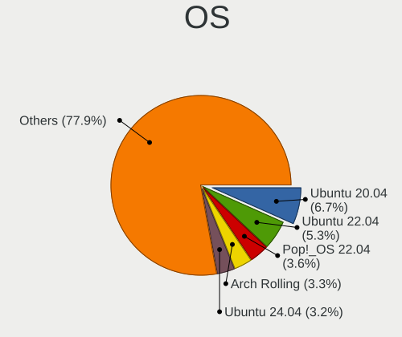

| Name                         | Computers | Percent |
|------------------------------|-----------|---------|
| Ubuntu 20.04                 | 136       | 6.66%   |
| Ubuntu 22.04                 | 109       | 5.34%   |
| Pop!_OS 22.04                | 73        | 3.58%   |
| Arch Rolling                 | 68        | 3.33%   |
| Ubuntu 24.04                 | 66        | 3.23%   |
| Ubuntu 18.04                 | 62        | 3.04%   |
| Debian 12                    | 57        | 2.79%   |
| Debian 11                    | 42        | 2.06%   |
| Fedora 42                    | 35        | 1.71%   |
| ArcoLinux Rolling            | 33        | 1.62%   |
| Fedora 40                    | 32        | 1.57%   |
| Zorin 16                     | 31        | 1.52%   |
| Zorin 17                     | 29        | 1.42%   |
| Linux Mint 22.1              | 24        | 1.18%   |
| Fedora 41                    | 23        | 1.13%   |
| Ubuntu 23.04                 | 22        | 1.08%   |
| openSUSE Tumbleweed-XXXXXXXX | 21        | 1.03%   |
| OpenMandriva 25.06           | 21        | 1.03%   |
| Manjaro                      | 21        | 1.03%   |
| Ubuntu 20.10                 | 20        | 0.98%   |
| OpenMandriva 4.3             | 20        | 0.98%   |
| OpenMandriva 4.2             | 20        | 0.98%   |
| Fedora 38                    | 20        | 0.98%   |
| Fedora 35                    | 20        | 0.98%   |
| Fedora 39                    | 19        | 0.93%   |
| Ubuntu 23.10                 | 18        | 0.88%   |
| OpenMandriva 24.12           | 18        | 0.88%   |
| Fedora 36                    | 17        | 0.83%   |
| Arch                         | 17        | 0.83%   |
| Pop!_OS 21.04                | 15        | 0.73%   |
| KDE neon 22.04               | 15        | 0.73%   |
| Pop!_OS 21.10                | 14        | 0.69%   |
| OpenMandriva 25.03           | 14        | 0.69%   |
| KDE neon 20.04               | 14        | 0.69%   |
| Fedora 37                    | 14        | 0.69%   |
| Fedora 34                    | 14        | 0.69%   |
| Fedora 31                    | 14        | 0.69%   |
| Ubuntu 22.10                 | 13        | 0.64%   |
| Ubuntu 19.10                 | 13        | 0.64%   |
| Ubuntu 19.04                 | 13        | 0.64%   |

OS Family
---------

OS without a version

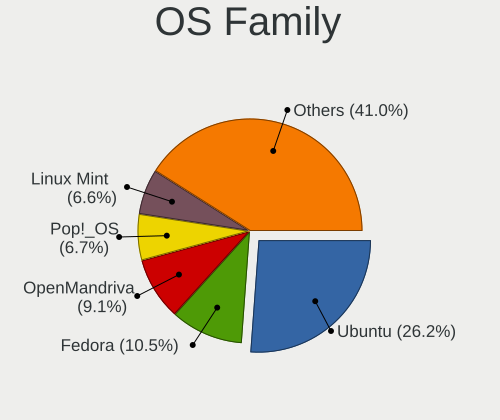

| Name          | Computers | Percent |
|---------------|-----------|---------|
| Ubuntu        | 499       | 26.17%  |
| Fedora        | 201       | 10.54%  |
| OpenMandriva  | 173       | 9.07%   |
| Pop!_OS       | 127       | 6.66%   |
| Linux Mint    | 125       | 6.55%   |
| Debian        | 125       | 6.55%   |
| Arch          | 84        | 4.4%    |
| Zorin         | 73        | 3.83%   |
| Manjaro       | 58        | 3.04%   |
| KDE neon      | 41        | 2.15%   |
| Kubuntu       | 39        | 2.05%   |
| ArcoLinux     | 34        | 1.78%   |
| openSUSE      | 30        | 1.57%   |
| Bazzite       | 28        | 1.47%   |
| Xubuntu       | 23        | 1.21%   |
| Elementary    | 19        | 1%      |
| Kali          | 17        | 0.89%   |
| Nobara        | 14        | 0.73%   |
| Gentoo        | 14        | 0.73%   |
| Ubuntu MATE   | 13        | 0.68%   |
| NixOS         | 13        | 0.68%   |
| EndeavourOS   | 11        | 0.58%   |
| ROSA          | 10        | 0.52%   |
| CachyOS       | 9         | 0.47%   |
| MX            | 8         | 0.42%   |
| Lubuntu       | 8         | 0.42%   |
| LMDE          | 8         | 0.42%   |
| Clear Linux   | 8         | 0.42%   |
| CentOS        | 8         | 0.42%   |
| Ubuntu Budgie | 7         | 0.37%   |
| RHEL          | 7         | 0.37%   |
| Garuda Linux  | 6         | 0.31%   |
| Ubuntu Unity  | 5         | 0.26%   |
| Alpine        | 5         | 0.26%   |
| Xero          | 4         | 0.21%   |
| TUXEDO OS     | 4         | 0.21%   |
| SteamOS       | 4         | 0.21%   |
| Solus         | 4         | 0.21%   |
| Void Linux    | 3         | 0.16%   |
| Ubuntu Studio | 3         | 0.16%   |

Kernel
------

Version of the Linux kernel

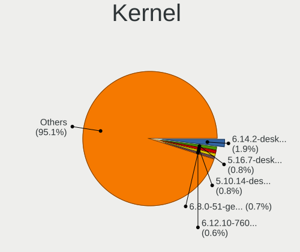

| Version                     | Computers | Percent |
|-----------------------------|-----------|---------|
| 6.14.2-desktop-3omv2590     | 44        | 1.92%   |
| 5.16.7-desktop-1omv4003     | 19        | 0.83%   |
| 5.10.14-desktop-1omv4002    | 19        | 0.83%   |
| 6.8.0-51-generic            | 16        | 0.7%    |
| 6.12.10-76061203-generic    | 14        | 0.61%   |
| 5.4.0-42-generic            | 14        | 0.61%   |
| 6.12.1-desktop-1omv2490     | 13        | 0.57%   |
| 6.8.0-52-generic            | 12        | 0.52%   |
| 6.6.2-desktop-1omv2390      | 12        | 0.52%   |
| 6.2.6-desktop-1omv2390      | 12        | 0.52%   |
| 6.12.9-desktop-1omv2490     | 12        | 0.52%   |
| 6.8.0-40-generic            | 11        | 0.48%   |
| 6.5.0-28-generic            | 11        | 0.48%   |
| 6.2.0-39-generic            | 11        | 0.48%   |
| 6.9.3-76060903-generic      | 10        | 0.44%   |
| 6.8.0-57-generic            | 10        | 0.44%   |
| 6.8.0-45-generic            | 10        | 0.44%   |
| 6.14.0-33-generic           | 10        | 0.44%   |
| 6.11.0-19-generic           | 10        | 0.44%   |
| 5.19.0-76051900-generic     | 10        | 0.44%   |
| 5.15.0-46-generic           | 10        | 0.44%   |
| 6.5.6-76060506-generic      | 9         | 0.39%   |
| 5.4.0-58-generic            | 9         | 0.39%   |
| 5.3.0-46-generic            | 9         | 0.39%   |
| 5.15.0-76-generic           | 9         | 0.39%   |
| 4.18.0-16-generic           | 9         | 0.39%   |
| 3.10.0-1062.12.1.el7.x86_64 | 9         | 0.39%   |
| 6.8.0-49-generic            | 8         | 0.35%   |
| 6.8.0-31-generic            | 8         | 0.35%   |
| 6.2.0-26-generic            | 8         | 0.35%   |
| 6.2.0-20-generic            | 8         | 0.35%   |
| 6.1.1-desktop-1omv2290      | 8         | 0.35%   |
| 5.4.0-74-generic            | 8         | 0.35%   |
| 5.4.0-48-generic            | 8         | 0.35%   |
| 5.11.0-40-generic           | 8         | 0.35%   |
| 5.11.0-38-generic           | 8         | 0.35%   |
| 6.8.0-41-generic            | 7         | 0.31%   |
| 6.5.0-41-generic            | 7         | 0.31%   |
| 6.5.0-10-generic            | 7         | 0.31%   |
| 6.2.6-76060206-generic      | 7         | 0.31%   |

Kernel Family
-------------

Linux kernel without a distro release

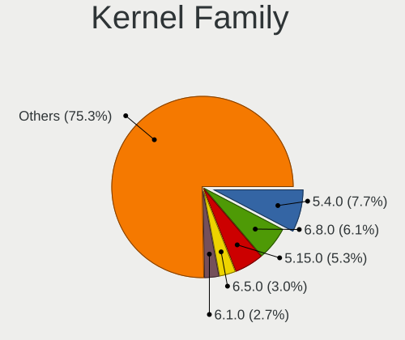

| Version | Computers | Percent |
|---------|-----------|---------|
| 5.4.0   | 167       | 7.69%   |
| 6.8.0   | 132       | 6.07%   |
| 5.15.0  | 115       | 5.29%   |
| 6.5.0   | 65        | 2.99%   |
| 6.1.0   | 58        | 2.67%   |
| 6.2.0   | 57        | 2.62%   |
| 5.11.0  | 55        | 2.53%   |
| 6.14.0  | 54        | 2.49%   |
| 5.8.0   | 54        | 2.49%   |
| 5.19.0  | 51        | 2.35%   |
| 6.14.2  | 50        | 2.3%    |
| 5.3.0   | 42        | 1.93%   |
| 6.11.0  | 41        | 1.89%   |
| 5.13.0  | 39        | 1.79%   |
| 5.10.0  | 39        | 1.79%   |
| 4.15.0  | 38        | 1.75%   |
| 4.18.0  | 30        | 1.38%   |
| 5.0.0   | 25        | 1.15%   |
| 6.2.6   | 21        | 0.97%   |
| 5.16.7  | 19        | 0.87%   |
| 5.10.14 | 19        | 0.87%   |
| 6.12.1  | 18        | 0.83%   |
| 6.12.10 | 16        | 0.74%   |
| 6.9.3   | 13        | 0.6%    |
| 6.12.9  | 13        | 0.6%    |
| 6.6.2   | 12        | 0.55%   |
| 6.5.6   | 11        | 0.51%   |
| 6.17.7  | 11        | 0.51%   |
| 6.17.9  | 10        | 0.46%   |
| 3.10.0  | 10        | 0.46%   |
| 6.17.0  | 9         | 0.41%   |
| 4.19.0  | 9         | 0.41%   |
| 6.12.6  | 8         | 0.37%   |
| 6.11.4  | 8         | 0.37%   |
| 6.1.1   | 8         | 0.37%   |
| 6.0.12  | 8         | 0.37%   |
| 5.17.5  | 8         | 0.37%   |
| 6.4.0   | 7         | 0.32%   |
| 6.13.5  | 7         | 0.32%   |
| 5.16.0  | 7         | 0.32%   |

Kernel Major Ver.
-----------------

Linux kernel major version

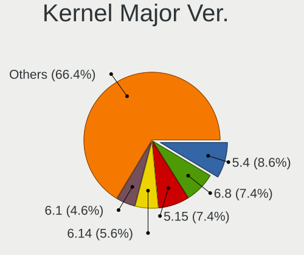

| Version | Computers | Percent |
|---------|-----------|---------|
| 5.4     | 184       | 8.62%   |
| 6.8     | 159       | 7.45%   |
| 5.15    | 158       | 7.4%    |
| 6.14    | 119       | 5.57%   |
| 6.1     | 98        | 4.59%   |
| 6.5     | 94        | 4.4%    |
| 6.2     | 94        | 4.4%    |
| 6.12    | 88        | 4.12%   |
| 5.10    | 72        | 3.37%   |
| 6.11    | 71        | 3.33%   |
| 5.8     | 70        | 3.28%   |
| 5.19    | 70        | 3.28%   |
| 5.11    | 64        | 3%      |
| 5.13    | 61        | 2.86%   |
| 5.3     | 51        | 2.39%   |
| 5.16    | 51        | 2.39%   |
| 6.6     | 50        | 2.34%   |
| 6.17    | 45        | 2.11%   |
| 4.15    | 38        | 1.78%   |
| 6.4     | 36        | 1.69%   |
| 6.9     | 34        | 1.59%   |
| 6.10    | 34        | 1.59%   |
| 6.15    | 33        | 1.55%   |
| 4.18    | 33        | 1.55%   |
| 5.17    | 31        | 1.45%   |
| 6.0     | 30        | 1.41%   |
| 6.13    | 27        | 1.26%   |
| 5.0     | 27        | 1.26%   |
| 5.14    | 23        | 1.08%   |
| 6.16    | 22        | 1.03%   |
| 5.9     | 21        | 0.98%   |
| 6.7     | 19        | 0.89%   |
| 6.3     | 19        | 0.89%   |
| 5.18    | 18        | 0.84%   |
| 5.12    | 16        | 0.75%   |
| 5.5     | 12        | 0.56%   |
| 5.7     | 11        | 0.52%   |
| 4.19    | 11        | 0.52%   |
| 3.10    | 10        | 0.47%   |
| 5.6     | 8         | 0.37%   |

Arch
----

OS architecture (x86_64, i586, etc.)

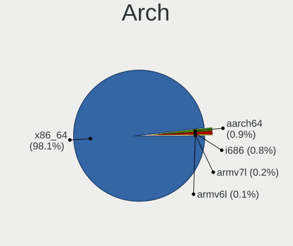

| Name    | Computers | Percent |
|---------|-----------|---------|
| x86_64  | 1799      | 98.09%  |
| aarch64 | 16        | 0.87%   |
| i686    | 14        | 0.76%   |
| armv7l  | 4         | 0.22%   |
| armv6l  | 1         | 0.05%   |

DE
--

Desktop Environment

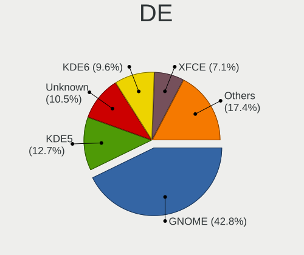

| Name              | Computers | Percent |
|-------------------|-----------|---------|
| GNOME             | 823       | 42.78%  |
| KDE5              | 245       | 12.73%  |
| Unknown           | 202       | 10.5%   |
| KDE6              | 184       | 9.56%   |
| XFCE              | 136       | 7.07%   |
| X-Cinnamon        | 109       | 5.67%   |
| MATE              | 38        | 1.98%   |
| KDE               | 30        | 1.56%   |
| i3                | 25        | 1.3%    |
| Pantheon          | 18        | 0.94%   |
| LXQt              | 14        | 0.73%   |
| Hyprland          | 14        | 0.73%   |
| Cinnamon          | 13        | 0.68%   |
| KDE4              | 11        | 0.57%   |
| Budgie            | 11        | 0.57%   |
| GNOME Flashback   | 8         | 0.42%   |
| COSMIC            | 8         | 0.42%   |
| LXDE              | 7         | 0.36%   |
| Unity             | 5         | 0.26%   |
| AWESOME           | 3         | 0.16%   |
| qtile             | 2         | 0.1%    |
| i3-with-shmlog    | 2         | 0.1%    |
| dwm               | 2         | 0.1%    |
| Yaru:ubuntu:GNOME | 1         | 0.05%   |
| xmonad            | 1         | 0.05%   |
| xinit-compat      | 1         | 0.05%   |
| Trinity           | 1         | 0.05%   |
| sway:wlroots      | 1         | 0.05%   |
| Openbox           | 1         | 0.05%   |
| niri              | 1         | 0.05%   |
| LeftWM            | 1         | 0.05%   |
| GNOME:Phosh       | 1         | 0.05%   |
| GNOME-Classic     | 1         | 0.05%   |
| GNOME Classic     | 1         | 0.05%   |
| Endless:GNOME     | 1         | 0.05%   |
| Deepin            | 1         | 0.05%   |
| bspwm             | 1         | 0.05%   |

Display Server
--------------

X11 or Wayland

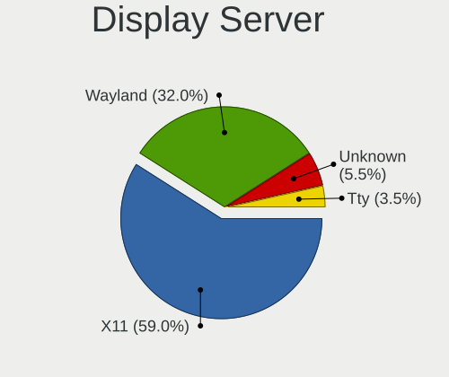

| Name    | Computers | Percent |
|---------|-----------|---------|
| X11     | 1132      | 59.02%  |
| Wayland | 613       | 31.96%  |
| Unknown | 106       | 5.53%   |
| Tty     | 67        | 3.49%   |

Display Manager
---------------

SDDM, LightDM, etc.

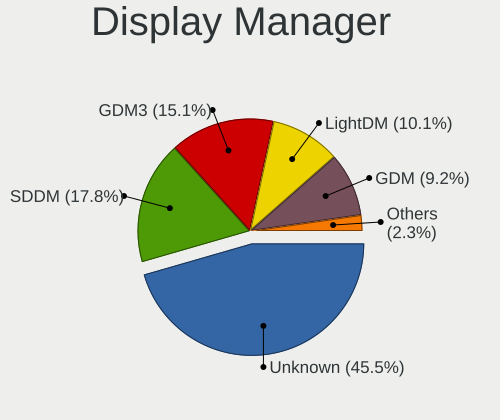

| Name    | Computers | Percent |
|---------|-----------|---------|
| Unknown | 876       | 45.53%  |
| SDDM    | 342       | 17.78%  |
| GDM3    | 290       | 15.07%  |
| LightDM | 195       | 10.14%  |
| GDM     | 177       | 9.2%    |
| TDM     | 28        | 1.46%   |
| KDM     | 4         | 0.21%   |
| GREETD  | 4         | 0.21%   |
| XDM     | 2         | 0.1%    |
| LY-DM   | 2         | 0.1%    |
| LEMURS  | 2         | 0.1%    |
| SLiM    | 1         | 0.05%   |
| Ly      | 1         | 0.05%   |

OS Lang
-------

Language

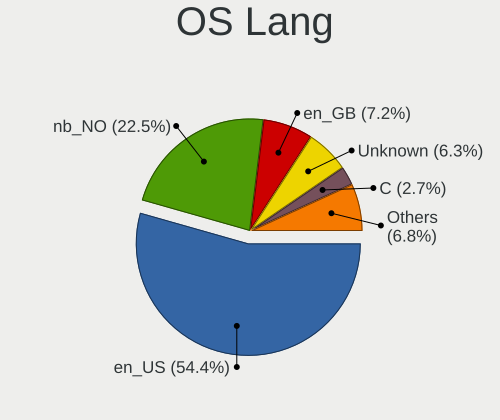

| Lang        | Computers | Percent |
|-------------|-----------|---------|
| en_US       | 1026      | 54.4%   |
| nb_NO       | 425       | 22.53%  |
| en_GB       | 136       | 7.21%   |
| Unknown     | 119       | 6.31%   |
| C           | 51        | 2.7%    |
| nn_NO       | 26        | 1.38%   |
| en_DK       | 21        | 1.11%   |
| pl_PL       | 19        | 1.01%   |
| de_DE       | 12        | 0.64%   |
| ru_RU       | 5         | 0.27%   |
| it_IT       | 5         | 0.27%   |
| POSIX       | 4         | 0.21%   |
| en_IE       | 4         | 0.21%   |
| sv_SE       | 3         | 0.16%   |
| pt_PT       | 3         | 0.16%   |
| fr_FR       | 3         | 0.16%   |
| es_ES       | 3         | 0.16%   |
| ru_UA       | 2         | 0.11%   |
| fi_FI       | 2         | 0.11%   |
| da_DK       | 2         | 0.11%   |
| C.UTF8      | 2         | 0.11%   |
| UTF-8       | 1         | 0.05%   |
| sr_RS@latin | 1         | 0.05%   |
| nl_NL       | 1         | 0.05%   |
| lt_LT       | 1         | 0.05%   |
| en_US.utf-8 | 1         | 0.05%   |
| en_NZ       | 1         | 0.05%   |
| en_CA       | 1         | 0.05%   |
| en_AU       | 1         | 0.05%   |
| en_AG       | 1         | 0.05%   |
| en_150      | 1         | 0.05%   |
| en_001      | 1         | 0.05%   |
| el_GR       | 1         | 0.05%   |
| aa_DJ       | 1         | 0.05%   |

Boot Mode
---------

EFI or BIOS

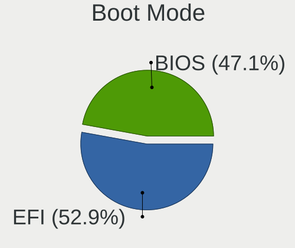

| Mode | Computers | Percent |
|------|-----------|---------|
| EFI  | 991       | 52.85%  |
| BIOS | 884       | 47.15%  |

Filesystem
----------

Type of filesystem

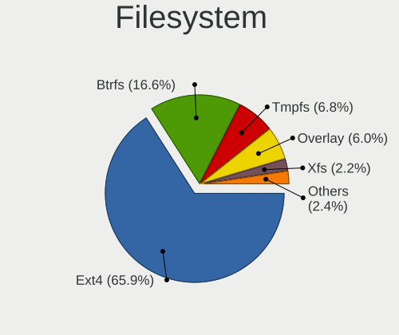

| Type    | Computers | Percent |
|---------|-----------|---------|
| Ext4    | 1243      | 65.94%  |
| Btrfs   | 312       | 16.55%  |
| Tmpfs   | 129       | 6.84%   |
| Overlay | 114       | 6.05%   |
| Xfs     | 41        | 2.18%   |
| Unknown | 24        | 1.27%   |
| Zfs     | 13        | 0.69%   |
| Ext2    | 5         | 0.27%   |
| Ext3    | 2         | 0.11%   |
| F2fs    | 1         | 0.05%   |
| Aufs    | 1         | 0.05%   |

Part. scheme
------------

Scheme of partitioning

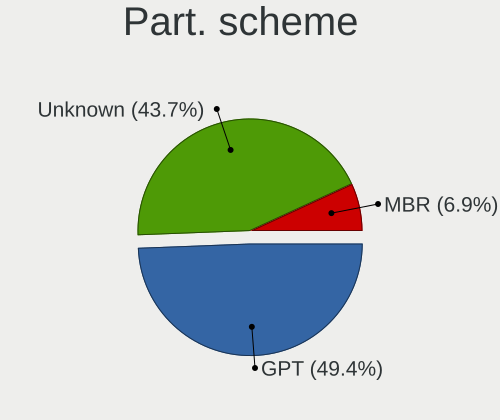

| Type    | Computers | Percent |
|---------|-----------|---------|
| GPT     | 934       | 49.39%  |
| Unknown | 827       | 43.73%  |
| MBR     | 130       | 6.87%   |

Dual Boot with Linux/BSD
------------------------

Hosting more than one Linux/BSD

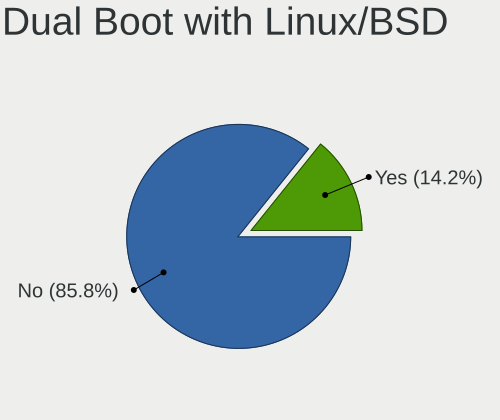

| Dual boot | Computers | Percent |
|-----------|-----------|---------|
| No        | 1617      | 85.78%  |
| Yes       | 268       | 14.22%  |

Dual Boot (Win)
---------------

Hosting Linux and Windows

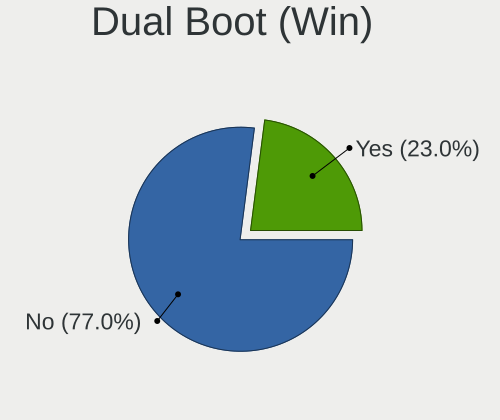

| Dual boot | Computers | Percent |
|-----------|-----------|---------|
| No        | 1442      | 77.03%  |
| Yes       | 430       | 22.97%  |

Board
-----

Vendor
------

Motherboard manufacturer

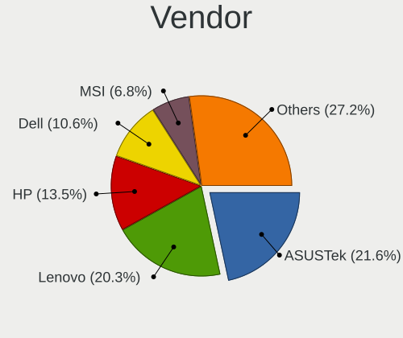

| Name                                 | Computers | Percent |
|--------------------------------------|-----------|---------|
| ASUSTek Computer                     | 397       | 21.65%  |
| Lenovo                               | 372       | 20.28%  |
| Hewlett-Packard                      | 247       | 13.47%  |
| Dell                                 | 194       | 10.58%  |
| MSI                                  | 125       | 6.82%   |
| Acer                                 | 88        | 4.8%    |
| Gigabyte Technology                  | 80        | 4.36%   |
| Apple                                | 62        | 3.38%   |
| ASRock                               | 49        | 2.67%   |
| Samsung Electronics                  | 24        | 1.31%   |
| HUAWEI                               | 19        | 1.04%   |
| Raspberry Pi Foundation              | 15        | 0.82%   |
| Unknown                              | 15        | 0.82%   |
| Notebook                             | 14        | 0.76%   |
| Intel                                | 14        | 0.76%   |
| Toshiba                              | 12        | 0.65%   |
| Google                               | 10        | 0.55%   |
| Microsoft                            | 9         | 0.49%   |
| Packard Bell                         | 8         | 0.44%   |
| Fujitsu                              | 5         | 0.27%   |
| Clevo                                | 5         | 0.27%   |
| TUXEDO                               | 4         | 0.22%   |
| Supermicro                           | 4         | 0.22%   |
| Shenzhen Meigao Electronic Equipment | 3         | 0.16%   |
| Pegatron                             | 3         | 0.16%   |
| ASRockRack                           | 3         | 0.16%   |
| Alienware                            | 3         | 0.16%   |
| Shuttle                              | 2         | 0.11%   |
| Panasonic                            | 2         | 0.11%   |
| Multicom Norge AS                    | 2         | 0.11%   |
| Komplett                             | 2         | 0.11%   |
| Intel Client Systems                 | 2         | 0.11%   |
| GMKtec                               | 2         | 0.11%   |
| Acidanthera                          | 2         | 0.11%   |
| ZOTAC                                | 1         | 0.05%   |
| Xunlong                              | 1         | 0.05%   |
| Wibtek                               | 1         | 0.05%   |
| TYAN Computer                        | 1         | 0.05%   |
| TOPC                                 | 1         | 0.05%   |
| Teclast                              | 1         | 0.05%   |

Model
-----

Motherboard model

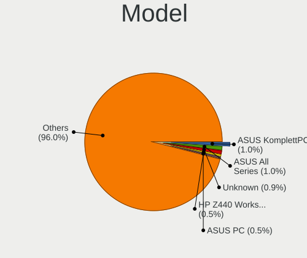

| Name                                     | Computers | Percent |
|------------------------------------------|-----------|---------|
| ASUS KomplettPC                          | 18        | 0.98%   |
| ASUS All Series                          | 18        | 0.98%   |
| Unknown                                  | 17        | 0.93%   |
| HP Z440 Workstation                      | 10        | 0.55%   |
| ASUS PC                                  | 10        | 0.55%   |
| HUAWEI MACH-WX9                          | 8         | 0.44%   |
| HP EliteBook 840 G6                      | 8         | 0.44%   |
| Apple MacBookPro12,1                     | 8         | 0.44%   |
| ASUS VivoBook_ASUSLaptop K3402ZA_K3402ZA | 7         | 0.38%   |
| Dell Precision 5530                      | 6         | 0.33%   |
| Dell OptiPlex 9020                       | 6         | 0.33%   |
| ASUS TUF Gaming B650-PLUS WIFI           | 6         | 0.33%   |
| ASUS ROG STRIX B360-F GAMING             | 6         | 0.33%   |
| Lenovo Yoga Slim 7 14ARE05 82A2          | 5         | 0.27%   |
| HUAWEI WRT-WX9                           | 5         | 0.27%   |
| HP Pavilion Notebook                     | 5         | 0.27%   |
| Dell XPS 15 9570                         | 5         | 0.27%   |
| Dell XPS 15 9520                         | 5         | 0.27%   |
| Dell PowerEdge R230                      | 5         | 0.27%   |
| ASUS ROG STRIX X570-F GAMING             | 5         | 0.27%   |
| ASUS ROG STRIX B550-E GAMING             | 5         | 0.27%   |
| ASUS ROG STRIX B450-F GAMING             | 5         | 0.27%   |
| ASUS ROG CROSSHAIR VIII HERO             | 5         | 0.27%   |
| MSI MS-7A93                              | 4         | 0.22%   |
| MSI MS-7885                              | 4         | 0.22%   |
| Lenovo Yoga Pro 7 14AHP9 83E3            | 4         | 0.22%   |
| HP ProBook 430 G2                        | 4         | 0.22%   |
| Gigabyte GA-970A-UD3                     | 4         | 0.22%   |
| Dell XPS 13 9380                         | 4         | 0.22%   |
| Dell OptiPlex 7010                       | 4         | 0.22%   |
| Dell Latitude E7240                      | 4         | 0.22%   |
| ASUS Z170 PRO GAMING                     | 4         | 0.22%   |
| ASUS TUF Gaming B550-PRO                 | 4         | 0.22%   |
| ASUS SABERTOOTH P67                      | 4         | 0.22%   |
| ASUS ROG STRIX X470-F GAMING             | 4         | 0.22%   |
| ASUS ROG STRIX B550-F GAMING             | 4         | 0.22%   |
| ASUS PRIME X370-PRO                      | 4         | 0.22%   |
| ASUS M2R-FVM                             | 4         | 0.22%   |
| ASUS CROSSHAIR VI HERO                   | 4         | 0.22%   |
| ASRock X570 Taichi                       | 4         | 0.22%   |

Model Family
------------

Motherboard model prefix

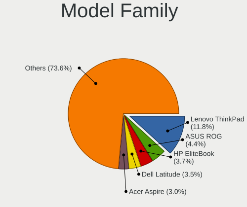

| Name               | Computers | Percent |
|--------------------|-----------|---------|
| Lenovo ThinkPad    | 216       | 11.78%  |
| ASUS ROG           | 81        | 4.42%   |
| HP EliteBook       | 68        | 3.71%   |
| Dell Latitude      | 65        | 3.54%   |
| Acer Aspire        | 55        | 3%      |
| HP ProBook         | 40        | 2.18%   |
| ASUS PRIME         | 40        | 2.18%   |
| Lenovo Yoga        | 38        | 2.07%   |
| Dell XPS           | 37        | 2.02%   |
| Dell Precision     | 35        | 1.91%   |
| ASUS TUF           | 34        | 1.85%   |
| Lenovo IdeaPad     | 33        | 1.8%    |
| ASUS VivoBook      | 32        | 1.74%   |
| Dell OptiPlex      | 26        | 1.42%   |
| HP Pavilion        | 25        | 1.36%   |
| Lenovo ThinkCentre | 23        | 1.25%   |
| ASUS KomplettPC    | 18        | 0.98%   |
| ASUS All           | 18        | 0.98%   |
| Lenovo Legion      | 17        | 0.93%   |
| Unknown            | 17        | 0.93%   |
| RPi Raspberry      | 15        | 0.82%   |
| HP EliteDesk       | 15        | 0.82%   |
| HP ZBook           | 14        | 0.76%   |
| Dell PowerEdge     | 14        | 0.76%   |
| Acer Swift         | 14        | 0.76%   |
| HP Laptop          | 12        | 0.65%   |
| Gigabyte X570      | 11        | 0.6%    |
| ASUS ZenBook       | 11        | 0.6%    |
| Toshiba Satellite  | 10        | 0.55%   |
| HP Z440            | 10        | 0.55%   |
| ASUS PC            | 10        | 0.55%   |
| Microsoft Surface  | 9         | 0.49%   |
| Dell Inspiron      | 9         | 0.49%   |
| ASUS SABERTOOTH    | 9         | 0.49%   |
| HUAWEI MACH-WX9    | 8         | 0.44%   |
| HP Compaq          | 8         | 0.44%   |
| Apple MacBookPro12 | 8         | 0.44%   |
| Lenovo ThinkBook   | 7         | 0.38%   |
| Gigabyte B550      | 7         | 0.38%   |
| ASRock X570        | 7         | 0.38%   |

MFG Year
--------

Motherboard manufacture year

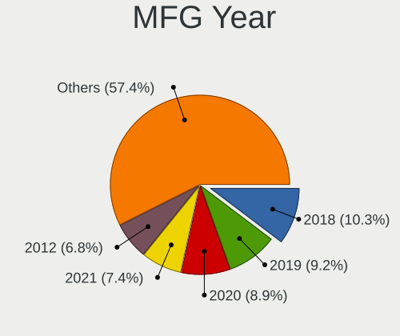

| Year    | Computers | Percent |
|---------|-----------|---------|
| 2018    | 189       | 10.31%  |
| 2019    | 169       | 9.21%   |
| 2020    | 163       | 8.89%   |
| 2021    | 136       | 7.42%   |
| 2012    | 124       | 6.76%   |
| 2022    | 119       | 6.49%   |
| 2017    | 119       | 6.49%   |
| 2015    | 109       | 5.94%   |
| 2013    | 108       | 5.89%   |
| 2014    | 106       | 5.78%   |
| 2016    | 91        | 4.96%   |
| 2011    | 91        | 4.96%   |
| 2023    | 71        | 3.87%   |
| 2024    | 68        | 3.71%   |
| 2010    | 50        | 2.73%   |
| 2009    | 29        | 1.58%   |
| 2008    | 25        | 1.36%   |
| Unknown | 18        | 0.98%   |
| 2025    | 17        | 0.93%   |
| 2007    | 17        | 0.93%   |
| 2006    | 10        | 0.55%   |
| 2005    | 4         | 0.22%   |
| 2001    | 1         | 0.05%   |

Form Factor
-----------

Physical design of the computer

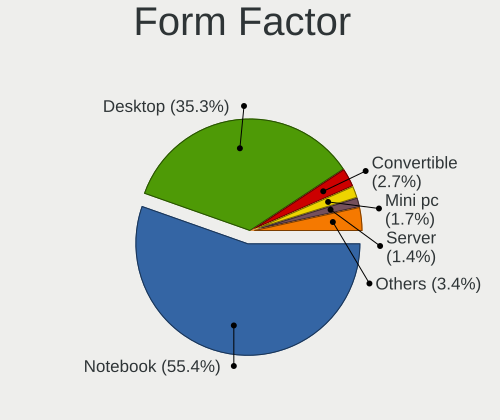

| Name           | Computers | Percent |
|----------------|-----------|---------|
| Notebook       | 1016      | 55.4%   |
| Desktop        | 648       | 35.33%  |
| Convertible    | 50        | 2.73%   |
| Mini pc        | 32        | 1.74%   |
| Server         | 25        | 1.36%   |
| All in one     | 24        | 1.31%   |
| Tablet         | 20        | 1.09%   |
| System on chip | 18        | 0.98%   |
| Other          | 1         | 0.05%   |

Secure Boot
-----------

Enabled or disabled

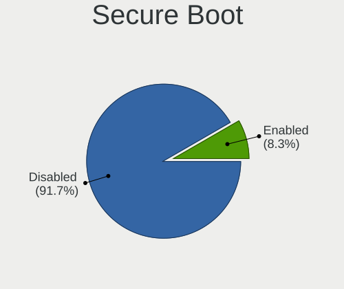

| State    | Computers | Percent |
|----------|-----------|---------|
| Disabled | 1696      | 91.68%  |
| Enabled  | 154       | 8.32%   |

Coreboot
--------

Have coreboot on board

| Used | Computers | Percent |
|------|-----------|---------|
| No   | 1822      | 99.35%  |
| Yes  | 12        | 0.65%   |

RAM Size
--------

Total RAM memory

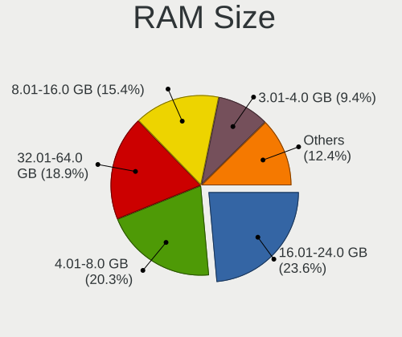

| Size in GB      | Computers | Percent |
|-----------------|-----------|---------|
| 16.01-24.0      | 442       | 23.57%  |
| 4.01-8.0        | 381       | 20.32%  |
| 32.01-64.0      | 354       | 18.88%  |
| 8.01-16.0       | 289       | 15.41%  |
| 3.01-4.0        | 177       | 9.44%   |
| 64.01-256.0     | 121       | 6.45%   |
| 24.01-32.0      | 68        | 3.63%   |
| 1.01-2.0        | 24        | 1.28%   |
| 2.01-3.0        | 6         | 0.32%   |
| 0.51-1.0        | 5         | 0.27%   |
| More than 256.0 | 4         | 0.21%   |
| 0.01-0.5        | 4         | 0.21%   |

RAM Used
--------

Used RAM memory

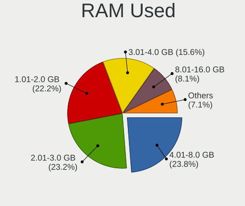

| Used GB     | Computers | Percent |
|-------------|-----------|---------|
| 4.01-8.0    | 495       | 23.75%  |
| 2.01-3.0    | 484       | 23.22%  |
| 1.01-2.0    | 463       | 22.22%  |
| 3.01-4.0    | 325       | 15.6%   |
| 8.01-16.0   | 168       | 8.06%   |
| 0.51-1.0    | 76        | 3.65%   |
| 16.01-24.0  | 25        | 1.2%    |
| 0.01-0.5    | 24        | 1.15%   |
| 24.01-32.0  | 14        | 0.67%   |
| 32.01-64.0  | 8         | 0.38%   |
| 64.01-256.0 | 2         | 0.1%    |

Total Drives
------------

Number of drives on board

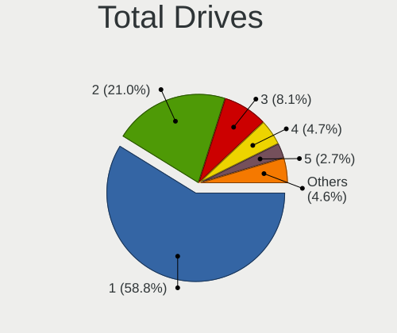

| Drives | Computers | Percent |
|--------|-----------|---------|
| 1      | 1124      | 58.82%  |
| 2      | 402       | 21.04%  |
| 3      | 155       | 8.11%   |
| 4      | 90        | 4.71%   |
| 5      | 52        | 2.72%   |
| 6      | 31        | 1.62%   |
| 0      | 24        | 1.26%   |
| 7      | 16        | 0.84%   |
| 8      | 6         | 0.31%   |
| 11     | 4         | 0.21%   |
| 10     | 3         | 0.16%   |
| 9      | 3         | 0.16%   |
| 12     | 1         | 0.05%   |

Has CD-ROM
----------

Has CD-ROM on board

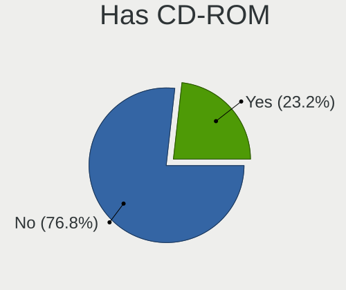

| Presented | Computers | Percent |
|-----------|-----------|---------|
| No        | 1418      | 76.77%  |
| Yes       | 429       | 23.23%  |

Has Ethernet
------------

Has Ethernet on board

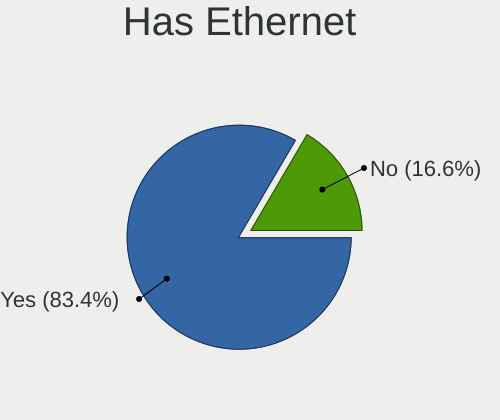

| Presented | Computers | Percent |
|-----------|-----------|---------|
| Yes       | 1537      | 83.44%  |
| No        | 305       | 16.56%  |

Has WiFi
--------

Has WiFi module

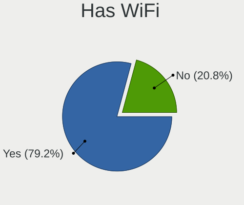

| Presented | Computers | Percent |
|-----------|-----------|---------|
| Yes       | 1461      | 79.19%  |
| No        | 384       | 20.81%  |

Has Bluetooth
-------------

Has Bluetooth module

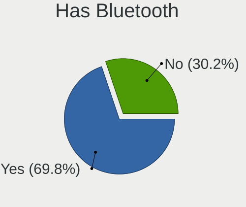

| Presented | Computers | Percent |
|-----------|-----------|---------|
| Yes       | 1296      | 69.83%  |
| No        | 560       | 30.17%  |

Location
--------

Country
-------

Geographic location (country)

| Country | Computers | Percent |
|---------|-----------|---------|
| Norway  | 1834      | 100%    |

City
----

Geographic location (city)

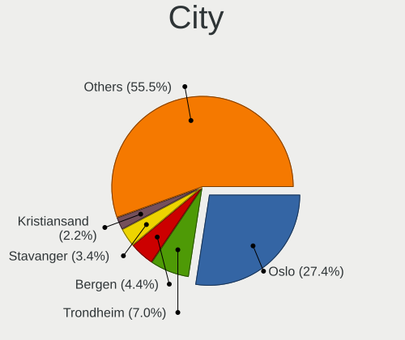

| City                 | Computers | Percent |
|----------------------|-----------|---------|
| Oslo                 | 537       | 27.43%  |
| Trondheim            | 138       | 7.05%   |
| Bergen               | 87        | 4.44%   |
| Stavanger            | 66        | 3.37%   |
| Kristiansand         | 44        | 2.25%   |
| Ålesund             | 29        | 1.48%   |
| Tromsø              | 28        | 1.43%   |
| Skien                | 26        | 1.33%   |
| Fredrikstad          | 25        | 1.28%   |
| Drammen              | 23        | 1.17%   |
| Sandefjord           | 20        | 1.02%   |
| Haugesund            | 16        | 0.82%   |
| Fornebu              | 15        | 0.77%   |
| Sandnes              | 13        | 0.66%   |
| Porsgrunn            | 13        | 0.66%   |
| Asker                | 13        | 0.66%   |
| Moss                 | 12        | 0.61%   |
| Lillehammer          | 12        | 0.61%   |
| Kongsberg            | 12        | 0.61%   |
| Sarpsborg            | 11        | 0.56%   |
| Nesttun              | 11        | 0.56%   |
| Molde                | 11        | 0.56%   |
| Mo i Rana            | 11        | 0.56%   |
| Bodø                | 11        | 0.56%   |
| Arendal              | 11        | 0.56%   |
| Stjordal             | 10        | 0.51%   |
| Ski                  | 10        | 0.51%   |
| Levanger             | 10        | 0.51%   |
| Jessheim             | 10        | 0.51%   |
| Røyken Municipality | 9         | 0.46%   |
| Kristiansund         | 9         | 0.46%   |
| Langhus              | 8         | 0.41%   |
| Honefoss             | 8         | 0.41%   |
| Harstad              | 8         | 0.41%   |
| Hamar                | 8         | 0.41%   |
| Egersund             | 8         | 0.41%   |
| Drobak               | 8         | 0.41%   |
| Tønsberg            | 7         | 0.36%   |
| Soreide              | 7         | 0.36%   |
| Halden               | 7         | 0.36%   |

Drives
------

Drive Vendor
------------

Hard drive vendors

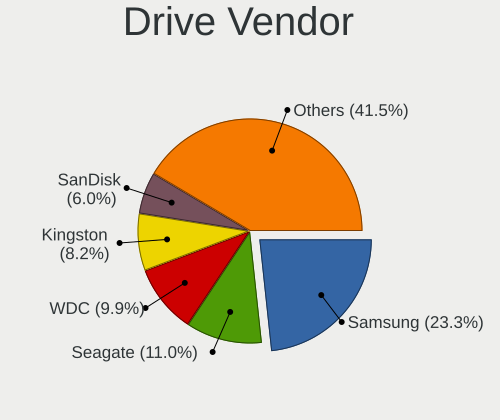

| Vendor                      | Computers | Drives | Percent |
|-----------------------------|-----------|--------|---------|
| Samsung Electronics         | 645       | 1072   | 23.31%  |
| Seagate                     | 305       | 589    | 11.02%  |
| WDC                         | 275       | 577    | 9.94%   |
| Kingston                    | 228       | 338    | 8.24%   |
| SanDisk                     | 167       | 222    | 6.04%   |
| Toshiba                     | 141       | 224    | 5.1%    |
| Intel                       | 100       | 130    | 3.61%   |
| SK hynix                    | 94        | 123    | 3.4%    |
| Unknown                     | 83        | 104    | 3%      |
| Crucial                     | 72        | 108    | 2.6%    |
| Micron Technology           | 71        | 96     | 2.57%   |
| Kingston Technology Company | 66        | 91     | 2.39%   |
| Hitachi                     | 52        | 78     | 1.88%   |
| HGST                        | 42        | 65     | 1.52%   |
| Phison Electronics          | 37        | 50     | 1.34%   |
| Apple                       | 37        | 48     | 1.34%   |
| Corsair                     | 33        | 49     | 1.19%   |
| PNY                         | 27        | 42     | 0.98%   |
| KIOXIA                      | 26        | 40     | 0.94%   |
| LITEON                      | 25        | 33     | 0.9%    |
| Phison                      | 20        | 26     | 0.72%   |
| OCZ                         | 20        | 24     | 0.72%   |
| LITEONIT                    | 16        | 25     | 0.58%   |
| A-DATA Technology           | 13        | 21     | 0.47%   |
| JMicron Technology          | 9         | 9      | 0.33%   |
| Micron/Crucial Technology   | 8         | 8      | 0.29%   |
| Lenovo                      | 8         | 8      | 0.29%   |
| China                       | 7         | 8      | 0.25%   |
| Unknown                     | 7         | 10     | 0.25%   |
| Verbatim                    | 6         | 7      | 0.22%   |
| Transcend                   | 6         | 6      | 0.22%   |
| Intenso                     | 6         | 12     | 0.22%   |
| Fujitsu                     | 5         | 5      | 0.18%   |
| Union Memory                | 4         | 4      | 0.14%   |
| UMIS                        | 4         | 4      | 0.14%   |
| Silicon Motion              | 4         | 5      | 0.14%   |
| Realtek Semiconductor       | 4         | 5      | 0.14%   |
| Netac                       | 4         | 4      | 0.14%   |
| LaCie                       | 4         | 4      | 0.14%   |
| Hewlett-Packard             | 4         | 10     | 0.14%   |

Drive Model
-----------

Hard drive models

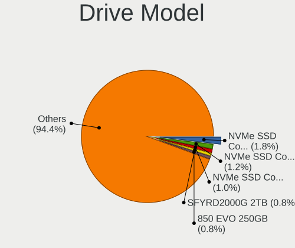

| Model                                                | Computers | Percent |
|------------------------------------------------------|-----------|---------|
| Samsung NVMe SSD Controller SM981/PM981/PM983 1TB    | 58        | 1.84%   |
| Samsung NVMe SSD Controller PM9A1/PM9A3/980PRO 1TB   | 39        | 1.24%   |
| Samsung NVMe SSD Controller SM961/PM961/SM963 1024GB | 30        | 0.95%   |
| Kingston SFYRD2000G 2TB                              | 25        | 0.79%   |
| Samsung SSD 850 EVO 250GB                            | 24        | 0.76%   |
| Kingston SV300S37A120G 120GB SSD                     | 24        | 0.76%   |
| Samsung SSD 850 EVO 500GB                            | 22        | 0.7%    |
| Samsung NVMe SSD Drive 256GB                         | 22        | 0.7%    |
| Kingston Company SNV2S1000G 1TB                      | 21        | 0.67%   |
| Samsung SSD 860 EVO 1TB                              | 20        | 0.63%   |
| Samsung SSD 840 EVO 250GB                            | 20        | 0.63%   |
| Phison E12 NVMe Controller 1TB                       | 18        | 0.57%   |
| Kingston SA400S37240G 240GB SSD                      | 18        | 0.57%   |
| WDC WDS500G2B0A-00SM50 500GB                         | 16        | 0.51%   |
| Seagate ST500DM002-1BD142 500GB                      | 16        | 0.51%   |
| Samsung SSD 860 EVO 500GB                            | 16        | 0.51%   |
| Kingston Company A2000 NVMe SSD 250GB                | 16        | 0.51%   |
| Seagate ST4000DM004-2CV104 4TB                       | 15        | 0.48%   |
| Intel SSD 660P Series 512GB                          | 14        | 0.44%   |
| HGST HTS721010A9E630 1TB                             | 14        | 0.44%   |
| Sandisk WD Black SN750 / PC SN730 NVMe SSD 500GB     | 13        | 0.41%   |
| SanDisk NVMe SSD Drive 1TB                           | 13        | 0.41%   |
| Samsung SSD 990 PRO 2TB                              | 13        | 0.41%   |
| Kingston SKC3000D2048G 2TB                           | 13        | 0.41%   |
| Seagate Expansion 2TB                                | 12        | 0.38%   |
| Phison E16 PCIe4 NVMe Controller 1TB                 | 12        | 0.38%   |
| Seagate ST4000VN008-2DR166 4TB                       | 11        | 0.35%   |
| Seagate ST1000DM003-1CH162 1TB                       | 11        | 0.35%   |
| Samsung NVMe SSD Drive 500GB                         | 11        | 0.35%   |
| Seagate ST1000LM024 HN-M101MBB 1TB                   | 10        | 0.32%   |
| Seagate ST1000DM010-2EP102 1TB                       | 10        | 0.32%   |
| Sandisk WD Blue SN550 NVMe SSD 1024GB                | 10        | 0.32%   |
| Samsung SSD 970 EVO Plus 1TB                         | 10        | 0.32%   |
| Samsung SSD 870 QVO 2TB                              | 10        | 0.32%   |
| Samsung SSD 860 EVO 250GB                            | 10        | 0.32%   |
| Samsung SSD 840 EVO 120GB                            | 10        | 0.32%   |
| PNY ELITE PSSD 960GB                                 | 10        | 0.32%   |
| Unknown MMC Card  64GB                               | 9         | 0.29%   |
| Toshiba NVMe SSD Drive 256GB                         | 9         | 0.29%   |
| Seagate ST2000DM006-2DM164 2TB                       | 9         | 0.29%   |

HDD Vendor
----------

Hard disk drive vendors

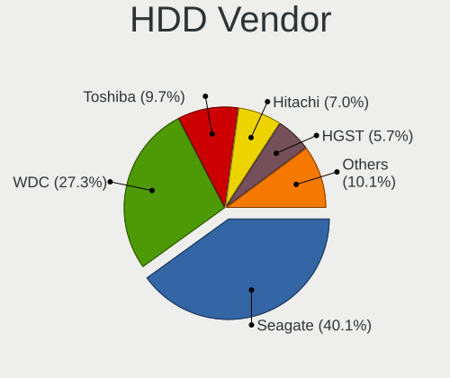

| Vendor              | Computers | Drives | Percent |
|---------------------|-----------|--------|---------|
| Seagate             | 296       | 575    | 40.05%  |
| WDC                 | 202       | 434    | 27.33%  |
| Toshiba             | 72        | 127    | 9.74%   |
| Hitachi             | 52        | 78     | 7.04%   |
| HGST                | 42        | 65     | 5.68%   |
| Samsung Electronics | 38        | 76     | 5.14%   |
| Apple               | 9         | 11     | 1.22%   |
| Intenso             | 5         | 11     | 0.68%   |
| Fujitsu             | 5         | 5      | 0.68%   |
| Unknown             | 4         | 6      | 0.54%   |
| JMicron Technology  | 4         | 5      | 0.54%   |
| Hewlett-Packard     | 2         | 3      | 0.27%   |
| STEC                | 1         | 1      | 0.14%   |
| SSK                 | 1         | 1      | 0.14%   |
| LaCie               | 1         | 1      | 0.14%   |
| IET                 | 1         | 2      | 0.14%   |
| IBM-ESXS            | 1         | 5      | 0.14%   |
| ASMT                | 1         | 2      | 0.14%   |
| ASMedia             | 1         | 3      | 0.14%   |
| Unknown             | 1         | 1      | 0.14%   |

SSD Vendor
----------

Solid state drive vendors

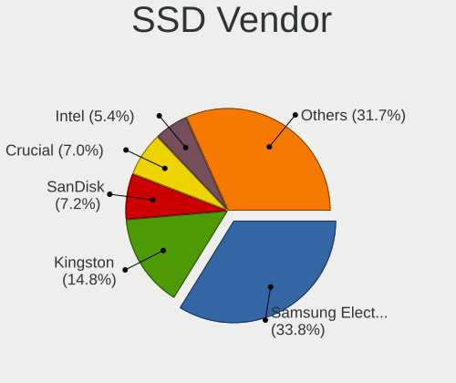

| Vendor              | Computers | Drives | Percent |
|---------------------|-----------|--------|---------|
| Samsung Electronics | 308       | 463    | 33.81%  |
| Kingston            | 135       | 183    | 14.82%  |
| SanDisk             | 66        | 80     | 7.24%   |
| Crucial             | 64        | 100    | 7.03%   |
| Intel               | 49        | 64     | 5.38%   |
| WDC                 | 37        | 93     | 4.06%   |
| PNY                 | 27        | 42     | 2.96%   |
| Apple               | 23        | 26     | 2.52%   |
| LITEON              | 22        | 30     | 2.41%   |
| Micron Technology   | 21        | 29     | 2.31%   |
| OCZ                 | 20        | 24     | 2.2%    |
| Toshiba             | 18        | 30     | 1.98%   |
| SK hynix            | 18        | 20     | 1.98%   |
| Corsair             | 18        | 25     | 1.98%   |
| LITEONIT            | 16        | 25     | 1.76%   |
| A-DATA Technology   | 11        | 19     | 1.21%   |
| China               | 7         | 8      | 0.77%   |
| Verbatim            | 6         | 7      | 0.66%   |
| Transcend           | 5         | 5      | 0.55%   |
| Netac               | 4         | 4      | 0.44%   |
| SPCC                | 2         | 2      | 0.22%   |
| Patriot             | 2         | 2      | 0.22%   |
| KingSpec            | 2         | 4      | 0.22%   |
| GOODRAM             | 2         | 2      | 0.22%   |
| BIWIN               | 2         | 2      | 0.22%   |
| Unknown             | 2         | 3      | 0.22%   |
| XINCUU              | 1         | 1      | 0.11%   |
| Teclast             | 1         | 1      | 0.11%   |
| Team                | 1         | 1      | 0.11%   |
| Seagate             | 1         | 1      | 0.11%   |
| SandForce           | 1         | 2      | 0.11%   |
| SABRENT             | 1         | 2      | 0.11%   |
| Radeon              | 1         | 1      | 0.11%   |
| Quanji              | 1         | 3      | 0.11%   |
| PNY CS90            | 1         | 1      | 0.11%   |
| Phison              | 1         | 2      | 0.11%   |
| OWC                 | 1         | 1      | 0.11%   |
| OSCOO               | 1         | 1      | 0.11%   |
| ORICO               | 1         | 1      | 0.11%   |
| Lenovo              | 1         | 1      | 0.11%   |

Drive Kind
----------

HDD or SSD

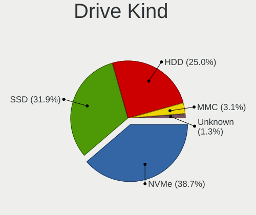

| Kind    | Computers | Drives | Percent |
|---------|-----------|--------|---------|
| NVMe    | 944       | 1514   | 38.74%  |
| SSD     | 777       | 1323   | 31.88%  |
| HDD     | 610       | 1412   | 25.03%  |
| MMC     | 75        | 94     | 3.08%   |
| Unknown | 31        | 42     | 1.27%   |

Drive Connector
---------------

SATA, SAS, NVMe, etc.

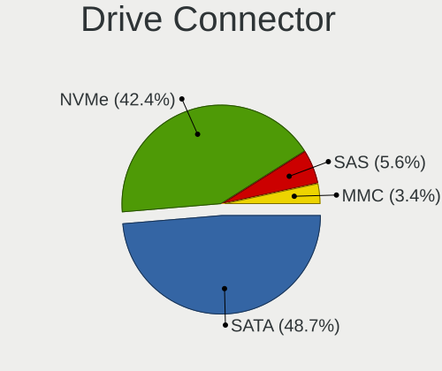

| Type | Computers | Drives | Percent |
|------|-----------|--------|---------|
| SATA | 1082      | 2580   | 48.67%  |
| NVMe | 942       | 1505   | 42.38%  |
| SAS  | 124       | 206    | 5.58%   |
| MMC  | 75        | 94     | 3.37%   |

Drive Size
----------

Size of hard drive

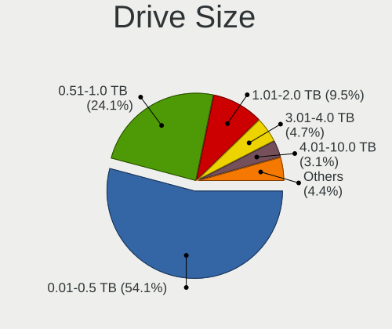

| Size in TB | Computers | Drives | Percent |
|------------|-----------|--------|---------|
| 0.01-0.5   | 825       | 1389   | 54.13%  |
| 0.51-1.0   | 367       | 553    | 24.08%  |
| 1.01-2.0   | 145       | 333    | 9.51%   |
| 3.01-4.0   | 72        | 125    | 4.72%   |
| 2.01-3.0   | 48        | 118    | 3.15%   |
| 4.01-10.0  | 48        | 180    | 3.15%   |
| 10.01-20.0 | 19        | 37     | 1.25%   |

Space Total
-----------

Amount of disk space available on the file system

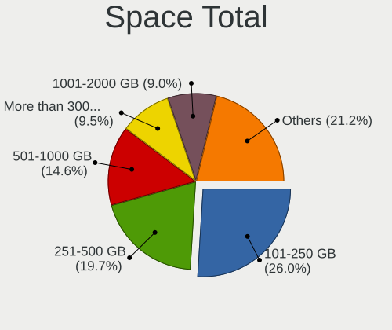

| Size in GB     | Computers | Percent |
|----------------|-----------|---------|
| 101-250        | 510       | 25.98%  |
| 251-500        | 386       | 19.66%  |
| 501-1000       | 287       | 14.62%  |
| More than 3000 | 187       | 9.53%   |
| 1001-2000      | 176       | 8.97%   |
| 1-20           | 147       | 7.49%   |
| 2001-3000      | 84        | 4.28%   |
| Unknown        | 73        | 3.72%   |
| 51-100         | 65        | 3.31%   |
| 21-50          | 48        | 2.45%   |

Space Used
----------

Amount of used disk space

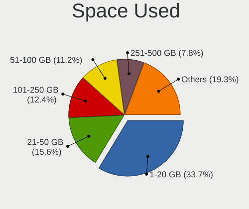

| Used GB        | Computers | Percent |
|----------------|-----------|---------|
| 1-20           | 695       | 33.67%  |
| 21-50          | 321       | 15.55%  |
| 101-250        | 256       | 12.4%   |
| 51-100         | 231       | 11.19%  |
| 251-500        | 162       | 7.85%   |
| 501-1000       | 118       | 5.72%   |
| 1001-2000      | 99        | 4.8%    |
| Unknown        | 73        | 3.54%   |
| More than 3000 | 70        | 3.39%   |
| 2001-3000      | 31        | 1.5%    |
| 0              | 8         | 0.39%   |

Malfunc. Drives
---------------

Drive models with a malfunction

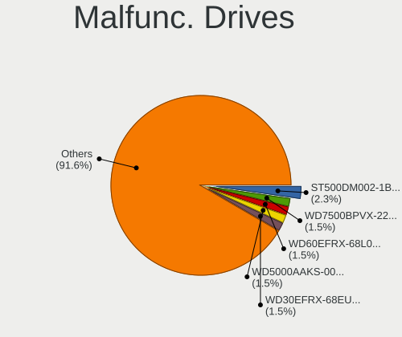

| Model                                 | Computers | Drives | Percent |
|---------------------------------------|-----------|--------|---------|
| Seagate ST500DM002-1BD142 500GB       | 3         | 4      | 2.29%   |
| WDC WD7500BPVX-22JC3T0 752GB          | 2         | 2      | 1.53%   |
| WDC WD60EFRX-68L0BN1 6TB              | 2         | 2      | 1.53%   |
| WDC WD5000AAKS-00UU3A0 500GB          | 2         | 5      | 1.53%   |
| WDC WD30EFRX-68EUZN0 3TB              | 2         | 2      | 1.53%   |
| WDC WD1002FAEX-00Z3A0 1TB             | 2         | 3      | 1.53%   |
| Toshiba MQ01ABD100 1TB                | 2         | 3      | 1.53%   |
| SK hynix HFS128G39TND-N210A 128GB SSD | 2         | 2      | 1.53%   |
| Seagate ST31000528AS 1TB              | 2         | 2      | 1.53%   |
| Seagate ST31000524AS 1TB              | 2         | 2      | 1.53%   |
| Seagate ST2000DM008-2FR102 2TB        | 2         | 2      | 1.53%   |
| Samsung Electronics HD501LJ 500GB     | 2         | 2      | 1.53%   |
| LITEON CV8-8E128-HP 128GB SSD         | 2         | 4      | 1.53%   |
| Hitachi HTS543216L9SA00 160GB         | 2         | 2      | 1.53%   |
| Hitachi HDS722020ALA330 2TB           | 2         | 3      | 1.53%   |
| WDC WDS500G2B0A-00SM50 500GB          | 1         | 8      | 0.76%   |
| WDC WD800JB-00CRA1 80GB               | 1         | 1      | 0.76%   |
| WDC WD800BB-00CAA1 80GB               | 1         | 1      | 0.76%   |
| WDC WD6400AAKS-75A7B0 640GB           | 1         | 2      | 0.76%   |
| WDC WD5000BPVT-22HXZT3 500GB          | 1         | 1      | 0.76%   |
| WDC WD5000AAJS-00YFA0 500GB           | 1         | 1      | 0.76%   |
| WDC WD40EFRX-68WT0N0 4TB              | 1         | 4      | 0.76%   |
| WDC WD3200AAKS-00V1A0 320GB           | 1         | 1      | 0.76%   |
| WDC WD30EZRX-00AZ6B0 3TB              | 1         | 1      | 0.76%   |
| WDC WD20EARS-00MVWB0 2TB              | 1         | 1      | 0.76%   |
| WDC WD2002FAEX-007BA0 2TB             | 1         | 1      | 0.76%   |
| WDC WD10JPVX-22JC3T0 1TB              | 1         | 1      | 0.76%   |
| WDC WD10JPVT-60A1YT0 1TB              | 1         | 1      | 0.76%   |
| WDC WD10EALX-009BA0 1TB               | 1         | 1      | 0.76%   |
| WDC WD10EADS-114BB1 1TB               | 1         | 1      | 0.76%   |
| WDC WD1002FBYS-18W8B1 1TB             | 1         | 3      | 0.76%   |
| WDC WD Blue SA510 M.2 2280 1000GB     | 1         | 1      | 0.76%   |
| Toshiba MK5055GSX 500GB               | 1         | 3      | 0.76%   |
| Toshiba HDWD130 3TB                   | 1         | 2      | 0.76%   |
| Toshiba HDWD110 1TB                   | 1         | 1      | 0.76%   |
| Toshiba DT01ACA100 1TB                | 1         | 1      | 0.76%   |
| SK hynix SH920 2.5 7MM 128GB SSD      | 1         | 1      | 0.76%   |
| SK hynix SC210 2.5 7MM 256GB SSD      | 1         | 1      | 0.76%   |
| SK hynix HFS256G39TND-N210A 256GB SSD | 1         | 1      | 0.76%   |
| Seagate ST9750420AS 752GB             | 1         | 1      | 0.76%   |

Malfunc. Drive Vendor
---------------------

Vendors of faulty drives

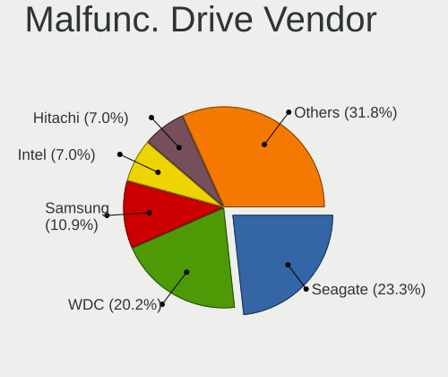

| Vendor              | Computers | Drives | Percent |
|---------------------|-----------|--------|---------|
| Seagate             | 30        | 52     | 23.26%  |
| WDC                 | 26        | 44     | 20.16%  |
| Samsung Electronics | 14        | 15     | 10.85%  |
| Intel               | 9         | 11     | 6.98%   |
| Hitachi             | 9         | 11     | 6.98%   |
| Toshiba             | 6         | 10     | 4.65%   |
| SK hynix            | 5         | 5      | 3.88%   |
| LITEON              | 5         | 7      | 3.88%   |
| Kingston            | 5         | 6      | 3.88%   |
| HGST                | 4         | 5      | 3.1%    |
| SanDisk             | 3         | 3      | 2.33%   |
| Micron Technology   | 3         | 7      | 2.33%   |
| Corsair             | 3         | 5      | 2.33%   |
| OCZ                 | 2         | 2      | 1.55%   |
| Crucial             | 2         | 2      | 1.55%   |
| Lenovo              | 1         | 1      | 0.78%   |
| Emtec               | 1         | 1      | 0.78%   |
| Apple               | 1         | 1      | 0.78%   |

Malfunc. HDD Vendor
-------------------

Vendors of faulty HDD drives

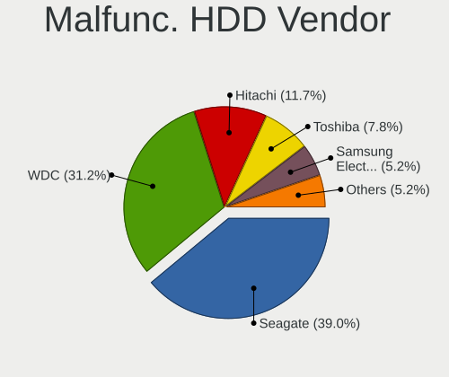

| Vendor              | Computers | Drives | Percent |
|---------------------|-----------|--------|---------|
| Seagate             | 30        | 52     | 38.96%  |
| WDC                 | 24        | 35     | 31.17%  |
| Hitachi             | 9         | 11     | 11.69%  |
| Toshiba             | 6         | 10     | 7.79%   |
| Samsung Electronics | 4         | 4      | 5.19%   |
| HGST                | 4         | 5      | 5.19%   |

Malfunc. Drive Kind
-------------------

Kinds of faulty drives

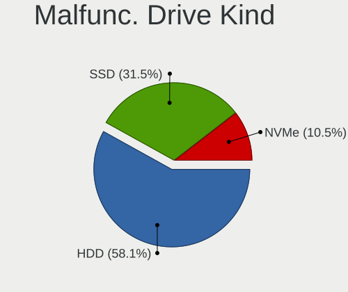

| Kind | Computers | Drives | Percent |
|------|-----------|--------|---------|
| HDD  | 72        | 117    | 58.06%  |
| SSD  | 39        | 55     | 31.45%  |
| NVMe | 13        | 16     | 10.48%  |

Failed Drives
-------------

Failed drive models

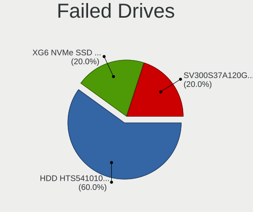

| Model                                  | Computers | Drives | Percent |
|----------------------------------------|-----------|--------|---------|
| Apple HDD HTS541010A9E662 1TB          | 3         | 3      | 60%     |
| Toshiba XG6 NVMe SSD Controller 1024GB | 1         | 1      | 20%     |
| Kingston SV300S37A120G 120GB SSD       | 1         | 1      | 20%     |

Failed Drive Vendor
-------------------

Failed drive vendors

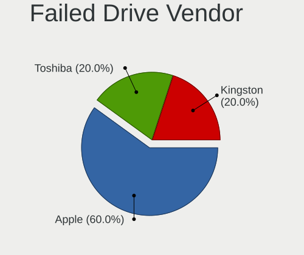

| Vendor   | Computers | Drives | Percent |
|----------|-----------|--------|---------|
| Apple    | 3         | 3      | 60%     |
| Toshiba  | 1         | 1      | 20%     |
| Kingston | 1         | 1      | 20%     |

Drive Status
------------

Number of failed and malfunc. drives

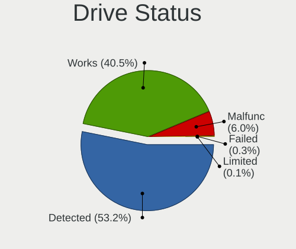

| Status   | Computers | Drives | Percent |
|----------|-----------|--------|---------|
| Detected | 1062      | 2428   | 53.15%  |
| Works    | 810       | 1762   | 40.54%  |
| Malfunc  | 120       | 188    | 6.01%   |
| Failed   | 5         | 5      | 0.25%   |
| Limited  | 1         | 2      | 0.05%   |

Storage controller
------------------

Storage Vendor
--------------

Storage controller vendors

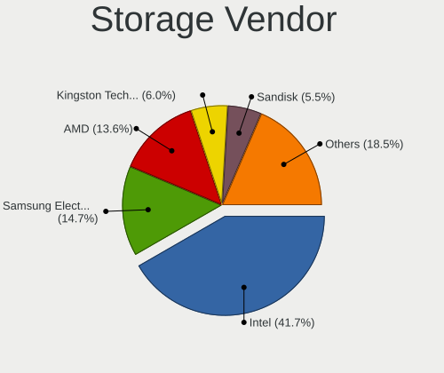

| Vendor                                  | Computers | Percent |
|-----------------------------------------|-----------|---------|
| Intel                                   | 1081      | 41.69%  |
| Samsung Electronics                     | 380       | 14.65%  |
| AMD                                     | 352       | 13.58%  |
| Kingston Technology Company             | 156       | 6.02%   |
| Sandisk                                 | 143       | 5.51%   |
| SK hynix                                | 75        | 2.89%   |
| Phison Electronics                      | 68        | 2.62%   |
| Toshiba America Info Systems            | 52        | 2.01%   |
| Micron Technology                       | 50        | 1.93%   |
| ASMedia Technology                      | 48        | 1.85%   |
| KIOXIA                                  | 25        | 0.96%   |
| Marvell Technology Group                | 17        | 0.66%   |
| Micron/Crucial Technology               | 15        | 0.58%   |
| Broadcom / LSI                          | 15        | 0.58%   |
| Nvidia                                  | 14        | 0.54%   |
| LSI Logic / Symbios Logic               | 14        | 0.54%   |
| JMicron Technology                      | 12        | 0.46%   |
| Union Memory (Shenzhen)                 | 8         | 0.31%   |
| ADATA Technology                        | 8         | 0.31%   |
| Lenovo                                  | 7         | 0.27%   |
| Solidigm                                | 6         | 0.23%   |
| Seagate Technology                      | 6         | 0.23%   |
| Silicon Motion                          | 5         | 0.19%   |
| Apple                                   | 5         | 0.19%   |
| Solid State Storage Technology          | 4         | 0.15%   |
| Realtek Semiconductor                   | 4         | 0.15%   |
| Lite-On Technology                      | 4         | 0.15%   |
| Shenzhen Longsys Electronics            | 3         | 0.12%   |
| MAXIO Technology (Hangzhou)             | 3         | 0.12%   |
| Shenzhen Unionmemory Information System | 2         | 0.08%   |
| Hosin Global Electronics                | 2         | 0.08%   |
| Hewlett-Packard                         | 2         | 0.08%   |
| Transcend                               | 1         | 0.04%   |
| Silicon Integrated Systems [SiS]        | 1         | 0.04%   |
| Silicon Image                           | 1         | 0.04%   |
| INNOGRIT                                | 1         | 0.04%   |
| Biwin Storage Technology                | 1         | 0.04%   |
| Adaptec                                 | 1         | 0.04%   |
| 3ware                                   | 1         | 0.04%   |

Storage Model
-------------

Storage controller models

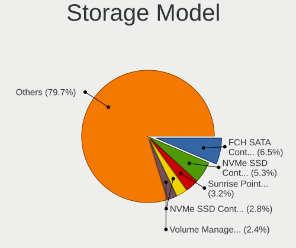

| Model                                                                          | Computers | Percent |
|--------------------------------------------------------------------------------|-----------|---------|
| AMD FCH SATA Controller [AHCI mode]                                            | 188       | 6.52%   |
| Samsung NVMe SSD Controller SM981/PM981/PM983                                  | 154       | 5.34%   |
| Intel Sunrise Point-LP SATA Controller [AHCI mode]                             | 93        | 3.22%   |
| Samsung NVMe SSD Controller SM961/PM961/SM963                                  | 80        | 2.77%   |
| Intel Volume Management Device NVMe RAID Controller                            | 70        | 2.43%   |
| Intel 8 Series/C220 Series Chipset Family 6-port SATA Controller 1 [AHCI mode] | 68        | 2.36%   |
| Intel 7 Series Chipset Family 6-port SATA Controller [AHCI mode]               | 63        | 2.18%   |
| Samsung NVMe SSD Controller PM9A1/PM9A3/980PRO                                 | 58        | 2.01%   |
| Intel Q170/Q150/B150/H170/H110/Z170/CM236 Chipset SATA Controller [AHCI Mode]  | 58        | 2.01%   |
| AMD 600 Series Chipset SATA Controller                                         | 55        | 1.91%   |
| Intel 6 Series/C200 Series Chipset Family 6 port Mobile SATA AHCI Controller   | 54        | 1.87%   |
| AMD 500 Series Chipset SATA Controller                                         | 50        | 1.73%   |
| Intel 82801 Mobile SATA Controller [RAID mode]                                 | 48        | 1.66%   |
| Kingston Company KC3000/FURY Renegade NVMe SSD [E18]                           | 45        | 1.56%   |
| ASMedia ASM1061/ASM1062 Serial ATA Controller                                  | 45        | 1.56%   |
| Intel 8 Series SATA Controller 1 [AHCI mode]                                   | 44        | 1.53%   |
| AMD 400 Series Chipset SATA Controller                                         | 43        | 1.49%   |
| Intel Cannon Lake PCH SATA AHCI Controller                                     | 42        | 1.46%   |
| Intel Cannon Lake Mobile PCH SATA AHCI Controller                              | 42        | 1.46%   |
| Samsung NVMe SSD Controller 980 (DRAM-less)                                    | 38        | 1.32%   |
| Intel SATA Controller [RAID mode]                                              | 38        | 1.32%   |
| Intel 200 Series PCH SATA controller [AHCI mode]                               | 37        | 1.28%   |
| Kingston Company A2000 NVMe SSD [SM2263EN]                                     | 34        | 1.18%   |
| SanDisk Extreme Pro / WD Black SN750 / PC SN730 / Red SN700 NVMe SSD           | 30        | 1.04%   |
| Intel Wildcat Point-LP SATA Controller [AHCI Mode]                             | 30        | 1.04%   |
| SanDisk Ultra 3D / WD PC SN530, IX SN530, Blue SN550 NVMe SSD (DRAM-less)      | 28        | 0.97%   |
| Phison E12 NVMe Controller                                                     | 28        | 0.97%   |
| Intel SSD 660P Series                                                          | 27        | 0.94%   |
| Phison E16 PCIe4 NVMe Controller                                               | 26        | 0.9%    |
| Intel HM170/QM170 Chipset SATA Controller [AHCI Mode]                          | 26        | 0.9%    |
| AMD SB7x0/SB8x0/SB9x0 SATA Controller [AHCI mode]                              | 26        | 0.9%    |
| Intel 7 Series/C210 Series Chipset Family 6-port SATA Controller [AHCI mode]   | 25        | 0.87%   |
| Toshiba America Info Systems XG6 NVMe SSD Controller                           | 24        | 0.83%   |
| Samsung NVMe SSD Controller S4LV008[Pascal]                                    | 24        | 0.83%   |
| Kingston Company NV2 NVMe SSD [SM2267XT] (DRAM-less)                           | 24        | 0.83%   |
| Intel C610/X99 series chipset sSATA Controller [AHCI mode]                     | 24        | 0.83%   |
| Intel C610/X99 series chipset 6-Port SATA Controller [AHCI mode]               | 23        | 0.8%    |
| Micron 2450 NVMe SSD [HendrixV] (DRAM-less)                                    | 20        | 0.69%   |
| Samsung NVMe SSD Controller SM951/PM951                                        | 19        | 0.66%   |
| Intel 6 Series/C200 Series Chipset Family 6 port Desktop SATA AHCI Controller  | 19        | 0.66%   |

Storage Kind
------------

Kind of storage controller (IDE, SATA, NVMe, SAS, ...)

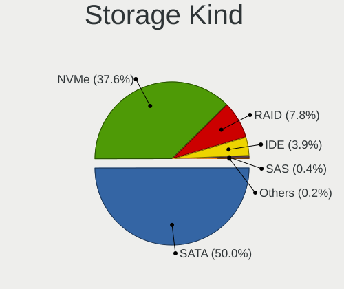

| Kind | Computers | Percent |
|------|-----------|---------|
| SATA | 1252      | 49.98%  |
| NVMe | 942       | 37.6%   |
| RAID | 196       | 7.82%   |
| IDE  | 98        | 3.91%   |
| SAS  | 11        | 0.44%   |
| SCSI | 6         | 0.24%   |

Processor
---------

CPU Vendor
----------

Processor vendors

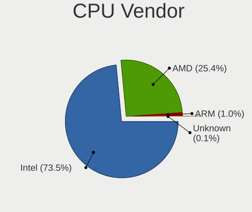

| Vendor   | Computers | Percent |
|----------|-----------|---------|
| Intel    | 1348      | 73.5%   |
| AMD      | 465       | 25.35%  |
| ARM      | 18        | 0.98%   |
| QUALCOMM | 2         | 0.11%   |
| Unknown  | 1         | 0.05%   |

CPU Model
---------

Processor models

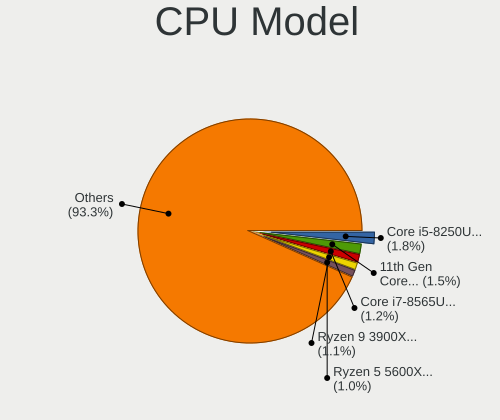

| Model                                   | Computers | Percent |
|-----------------------------------------|-----------|---------|
| Intel Core i5-8250U CPU @ 1.60GHz       | 33        | 1.79%   |
| Intel 11th Gen Core i7-1165G7 @ 2.80GHz | 28        | 1.52%   |
| Intel Core i7-8565U CPU @ 1.80GHz       | 23        | 1.25%   |
| AMD Ryzen 9 3900X 12-Core Processor     | 20        | 1.09%   |
| AMD Ryzen 5 5600X 6-Core Processor      | 19        | 1.03%   |
| Intel Core i7-9750H CPU @ 2.60GHz       | 18        | 0.98%   |
| Intel Core i5-7200U CPU @ 2.50GHz       | 18        | 0.98%   |
| Intel Core i7-8750H CPU @ 2.20GHz       | 17        | 0.92%   |
| Intel Core i7-8550U CPU @ 1.80GHz       | 16        | 0.87%   |
| Intel Core i5-8265U CPU @ 1.60GHz       | 16        | 0.87%   |
| Intel Core i5-6200U CPU @ 2.30GHz       | 16        | 0.87%   |
| Intel Core i5-3210M CPU @ 2.50GHz       | 15        | 0.81%   |
| Intel 11th Gen Core i5-1135G7 @ 2.40GHz | 15        | 0.81%   |
| AMD Ryzen 5 3600 6-Core Processor       | 14        | 0.76%   |
| ARM Processor                           | 13        | 0.71%   |
| AMD Ryzen 9 5900X 12-Core Processor     | 13        | 0.71%   |
| AMD Ryzen 7 3700X 8-Core Processor      | 13        | 0.71%   |
| AMD Ryzen 7 9800X3D 8-Core Processor    | 12        | 0.65%   |
| Intel Core i7-6700HQ CPU @ 2.60GHz      | 11        | 0.6%    |
| Intel Core i7-6600U CPU @ 2.60GHz       | 11        | 0.6%    |
| Intel 12th Gen Core i5-12500H           | 11        | 0.6%    |
| AMD Ryzen 7 5800X 8-Core Processor      | 11        | 0.6%    |
| AMD Ryzen 7 2700X Eight-Core Processor  | 11        | 0.6%    |
| Intel Xeon CPU E5-1630 v3 @ 3.70GHz     | 10        | 0.54%   |
| Intel Core i7-7500U CPU @ 2.70GHz       | 10        | 0.54%   |
| Intel Core i7-10510U CPU @ 1.80GHz      | 10        | 0.54%   |
| Intel Core i5-6300U CPU @ 2.40GHz       | 10        | 0.54%   |
| Intel Core i5-5200U CPU @ 2.20GHz       | 10        | 0.54%   |
| Intel Core i7-7700K CPU @ 4.20GHz       | 9         | 0.49%   |
| Intel Core i7-6700K CPU @ 4.00GHz       | 9         | 0.49%   |
| Intel Core i7-4790 CPU @ 3.60GHz        | 9         | 0.49%   |
| Intel Core i5-8350U CPU @ 1.70GHz       | 9         | 0.49%   |
| AMD Ryzen 9 5950X 16-Core Processor     | 9         | 0.49%   |
| Intel Core i7-7700HQ CPU @ 2.80GHz      | 8         | 0.43%   |
| Intel Core i7-5600U CPU @ 2.60GHz       | 8         | 0.43%   |
| Intel Core i7-3520M CPU @ 2.90GHz       | 8         | 0.43%   |
| Intel Core i7-2630QM CPU @ 2.00GHz      | 8         | 0.43%   |
| Intel Core i7-2600K CPU @ 3.40GHz       | 8         | 0.43%   |
| Intel Core i7-10750H CPU @ 2.60GHz      | 8         | 0.43%   |
| Intel Core i5-5257U CPU @ 2.70GHz       | 8         | 0.43%   |

CPU Model Family
----------------

Processor model prefix

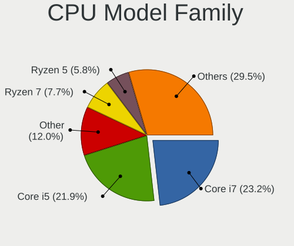

| Model                   | Computers | Percent |
|-------------------------|-----------|---------|
| Intel Core i7           | 427       | 23.22%  |
| Intel Core i5           | 402       | 21.86%  |
| Other                   | 220       | 11.96%  |
| AMD Ryzen 7             | 141       | 7.67%   |
| AMD Ryzen 5             | 106       | 5.76%   |
| AMD Ryzen 9             | 79        | 4.3%    |
| Intel Core i3           | 78        | 4.24%   |
| Intel Xeon              | 54        | 2.94%   |
| Intel Celeron           | 48        | 2.61%   |
| Intel Core i9           | 31        | 1.69%   |
| Intel Pentium           | 25        | 1.36%   |
| Intel Core 2 Duo        | 23        | 1.25%   |
| AMD FX                  | 15        | 0.82%   |
| Intel Core              | 14        | 0.76%   |
| AMD Ryzen 3             | 14        | 0.76%   |
| Intel Atom              | 13        | 0.71%   |
| AMD Ryzen 7 PRO         | 9         | 0.49%   |
| AMD A8                  | 9         | 0.49%   |
| AMD A10                 | 9         | 0.49%   |
| AMD A6                  | 8         | 0.44%   |
| AMD Ryzen 5 PRO         | 7         | 0.38%   |
| AMD Athlon 64 X2        | 7         | 0.38%   |
| Intel Core 2            | 6         | 0.33%   |
| AMD Ryzen Threadripper  | 6         | 0.33%   |
| Intel Xeon Silver       | 5         | 0.27%   |
| Intel Pentium Dual-Core | 5         | 0.27%   |
| Intel Genuine           | 5         | 0.27%   |
| AMD Phenom II X4        | 5         | 0.27%   |
| Intel Pentium Silver    | 4         | 0.22%   |
| Intel Core 2 Quad       | 4         | 0.22%   |
| AMD E2                  | 4         | 0.22%   |
| ARM BCM                 | 3         | 0.16%   |
| AMD E1                  | 3         | 0.16%   |
| AMD E                   | 3         | 0.16%   |
| AMD Athlon              | 3         | 0.16%   |
| AMD A4                  | 3         | 0.16%   |
| Intel Xeon Gold         | 2         | 0.11%   |
| Intel Pentium Gold      | 2         | 0.11%   |
| Intel Core m7           | 2         | 0.11%   |
| AMD Turion 64 X2 Mobile | 2         | 0.11%   |

CPU Cores
---------

Number of processor cores

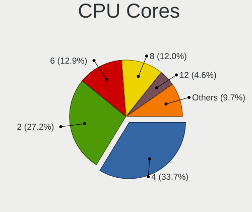

| Number  | Computers | Percent |
|---------|-----------|---------|
| 4       | 622       | 33.73%  |
| 2       | 501       | 27.17%  |
| 6       | 237       | 12.85%  |
| 8       | 221       | 11.98%  |
| 12      | 84        | 4.56%   |
| 16      | 43        | 2.33%   |
| 10      | 39        | 2.11%   |
| 14      | 32        | 1.74%   |
| 1       | 21        | 1.14%   |
| 24      | 10        | 0.54%   |
| 20      | 9         | 0.49%   |
| 3       | 9         | 0.49%   |
| Unknown | 5         | 0.27%   |
| 28      | 4         | 0.22%   |
| 40      | 3         | 0.16%   |
| 32      | 2         | 0.11%   |
| 18      | 2         | 0.11%   |

CPU Sockets
-----------

Number of sockets

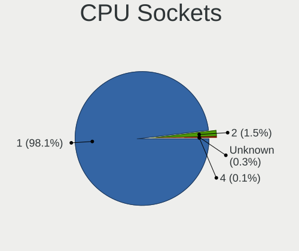

| Number  | Computers | Percent |
|---------|-----------|---------|
| 1       | 1801      | 98.09%  |
| 2       | 28        | 1.53%   |
| Unknown | 5         | 0.27%   |
| 8       | 1         | 0.05%   |
| 4       | 1         | 0.05%   |

CPU Threads
-----------

Threads per core (Hyper-Threading)

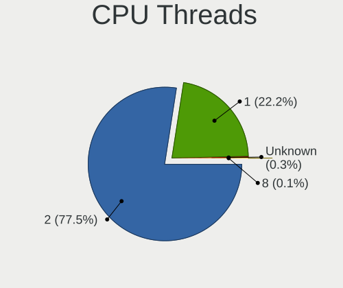

| Number  | Computers | Percent |
|---------|-----------|---------|
| 2       | 1429      | 77.45%  |
| 1       | 409       | 22.17%  |
| Unknown | 5         | 0.27%   |
| 8       | 2         | 0.11%   |

CPU Op-Modes
------------

CPU Operation Modes (32-bit, 64-bit)

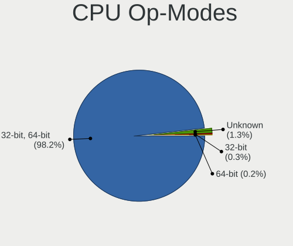

| Op mode        | Computers | Percent |
|----------------|-----------|---------|
| 32-bit, 64-bit | 1802      | 98.2%   |
| Unknown        | 23        | 1.25%   |
| 32-bit         | 6         | 0.33%   |
| 64-bit         | 4         | 0.22%   |

CPU Microcode
-------------

Microcode number

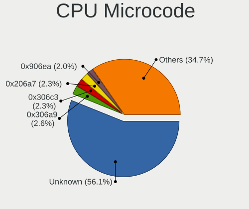

| Number     | Computers | Percent |
|------------|-----------|---------|
| Unknown    | 1076      | 56.1%   |
| 0x306a9    | 50        | 2.61%   |
| 0x306c3    | 45        | 2.35%   |
| 0x206a7    | 44        | 2.29%   |
| 0x906ea    | 38        | 1.98%   |
| 0x806ea    | 34        | 1.77%   |
| 0x506e3    | 34        | 1.77%   |
| 0x40651    | 30        | 1.56%   |
| 0x406e3    | 29        | 1.51%   |
| 0x806e9    | 25        | 1.3%    |
| 0x906e9    | 23        | 1.2%    |
| 0x806ec    | 23        | 1.2%    |
| 0x306d4    | 21        | 1.09%   |
| 0x08701021 | 21        | 1.09%   |
| 0x306f2    | 19        | 0.99%   |
| 0x806c1    | 15        | 0.78%   |
| 0x1067a    | 15        | 0.78%   |
| 0x20655    | 13        | 0.68%   |
| 0x08600106 | 13        | 0.68%   |
| 0xa0652    | 11        | 0.57%   |
| 0x906a3    | 11        | 0.57%   |
| 0x010000c8 | 10        | 0.52%   |
| 0x806eb    | 9         | 0.47%   |
| 0x08701013 | 9         | 0.47%   |
| 0x906ed    | 8         | 0.42%   |
| 0x806d1    | 8         | 0.42%   |
| 0x0a601203 | 8         | 0.42%   |
| 0x0a50000c | 8         | 0.42%   |
| 0x0a201016 | 8         | 0.42%   |
| 0x0800820d | 8         | 0.42%   |
| 0x06001119 | 7         | 0.36%   |
| 0x20652    | 6         | 0.31%   |
| 0x0a20120a | 6         | 0.31%   |
| 0x0a201009 | 6         | 0.31%   |
| 0x08108109 | 6         | 0.31%   |
| 0x06000852 | 6         | 0.31%   |
| 0x906ec    | 5         | 0.26%   |
| 0x706e5    | 5         | 0.26%   |
| 0x706a8    | 5         | 0.26%   |
| 0x6fd      | 5         | 0.26%   |

CPU Microarch
-------------

Microarchitecture

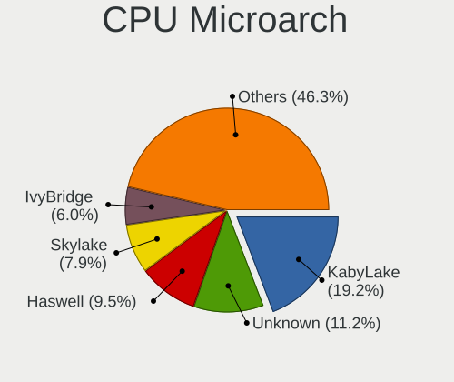

| Name              | Computers | Percent |
|-------------------|-----------|---------|
| KabyLake          | 354       | 19.17%  |
| Unknown           | 206       | 11.15%  |
| Haswell           | 176       | 9.53%   |
| Skylake           | 145       | 7.85%   |
| IvyBridge         | 110       | 5.96%   |
| Zen 2             | 98        | 5.31%   |
| Zen 3             | 95        | 5.14%   |
| SandyBridge       | 94        | 5.09%   |
| Alderlake Hybrid  | 78        | 4.22%   |
| TigerLake         | 53        | 2.87%   |
| Broadwell         | 51        | 2.76%   |
| Zen+              | 40        | 2.17%   |
| CometLake         | 37        | 2%      |
| Westmere          | 36        | 1.95%   |
| Penryn            | 30        | 1.62%   |
| Zen               | 27        | 1.46%   |
| Icelake           | 26        | 1.41%   |
| Piledriver        | 25        | 1.35%   |
| Silvermont        | 24        | 1.3%    |
| K10               | 17        | 0.92%   |
| K8 Hammer         | 15        | 0.81%   |
| Core              | 15        | 0.81%   |
| Goldmont plus     | 14        | 0.76%   |
| Nehalem           | 11        | 0.6%    |
| Meteorlake Hybrid | 9         | 0.49%   |
| Excavator         | 9         | 0.49%   |
| Goldmont          | 8         | 0.43%   |
| Bonnell           | 7         | 0.38%   |
| Tremont           | 5         | 0.27%   |
| Bulldozer         | 5         | 0.27%   |
| Bobcat            | 5         | 0.27%   |
| Steamroller       | 4         | 0.22%   |
| Puma              | 4         | 0.22%   |
| P6                | 4         | 0.22%   |
| K10 Llano         | 4         | 0.22%   |
| Jaguar            | 4         | 0.22%   |
| NetBurst          | 1         | 0.05%   |
| Lunarlake Hybrid  | 1         | 0.05%   |

Graphics
--------

GPU Vendor
----------

Vendors of graphics cards

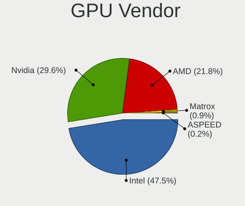

| Vendor                     | Computers | Percent |
|----------------------------|-----------|---------|
| Intel                      | 1029      | 47.46%  |
| Nvidia                     | 642       | 29.61%  |
| AMD                        | 472       | 21.77%  |
| Matrox Electronics Systems | 20        | 0.92%   |
| ASPEED Technology          | 5         | 0.23%   |

GPU Model
---------

Graphics card models

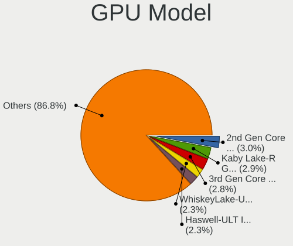

| Model                                                                       | Computers | Percent |
|-----------------------------------------------------------------------------|-----------|---------|
| Intel 2nd Generation Core Processor Family Integrated Graphics Controller   | 66        | 2.95%   |
| Intel Kaby Lake-R GT2 [UHD Graphics 620]                                    | 65        | 2.91%   |
| Intel 3rd Gen Core processor Graphics Controller                            | 63        | 2.82%   |
| Intel WhiskeyLake-U GT2 [UHD Graphics 620]                                  | 51        | 2.28%   |
| Intel Haswell-ULT Integrated Graphics Controller                            | 51        | 2.28%   |
| Intel Skylake-U GT2 [HD Graphics 520]                                       | 50        | 2.24%   |
| Intel TigerLake-LP GT2 [Iris Xe Graphics]                                   | 49        | 2.19%   |
| Intel CoffeeLake-H GT2 [UHD Graphics 630]                                   | 46        | 2.06%   |
| Intel Kaby Lake-U GT2 [HD Graphics 620]                                     | 42        | 1.88%   |
| AMD Renoir [Radeon Vega Series / Radeon Vega Mobile Series]                 | 38        | 1.7%    |
| Intel Xeon E3-1200 v3/4th Gen Core Processor Integrated Graphics Controller | 33        | 1.48%   |
| Intel Alder Lake-P GT2 [Iris Xe Graphics]                                   | 33        | 1.48%   |
| Intel 4th Gen Core Processor Integrated Graphics Controller                 | 32        | 1.43%   |
| Intel Broadwell-U GT2 [HD Graphics 5500]                                    | 31        | 1.39%   |
| AMD Ellesmere [Radeon RX 470/480/570/570X/580/580X/590]                     | 28        | 1.25%   |
| AMD Cezanne [Radeon Vega Series / Radeon Vega Mobile Series]                | 26        | 1.16%   |
| Intel CoffeeLake-S GT2 [UHD Graphics 630]                                   | 25        | 1.12%   |
| AMD Raphael                                                                 | 24        | 1.07%   |
| Intel Skylake-H GT2 [HD Graphics 530]                                       | 22        | 0.98%   |
| Intel CometLake-U GT2 [UHD Graphics]                                        | 22        | 0.98%   |
| AMD Navi 10 [Radeon RX 5600 OEM/5600 XT / 5700/5700 XT]                     | 22        | 0.98%   |
| Nvidia GP104 [GeForce GTX 1070]                                             | 21        | 0.94%   |
| Nvidia GM204 [GeForce GTX 970]                                              | 21        | 0.94%   |
| Intel Raptor Lake-P [Iris Xe Graphics]                                      | 21        | 0.94%   |
| Intel TigerLake-H GT1 [UHD Graphics]                                        | 20        | 0.9%    |
| Intel Core Processor Integrated Graphics Controller                         | 18        | 0.81%   |
| AMD Picasso/Raven 2 [Radeon Vega Series / Radeon Vega Mobile Series]        | 17        | 0.76%   |
| AMD Navi 21 [Radeon RX 6800/6800 XT / 6900 XT]                              | 17        | 0.76%   |
| Nvidia GP106 [GeForce GTX 1060 6GB]                                         | 16        | 0.72%   |
| Intel Skylake-S GT2 [HD Graphics 530]                                       | 16        | 0.72%   |
| Nvidia GP108M [GeForce MX150]                                               | 15        | 0.67%   |
| Intel CometLake-H GT2 [UHD Graphics]                                        | 15        | 0.67%   |
| AMD Navi 31 [Radeon RX 7900 XT/7900 XTX/7900 GRE/7900M]                     | 15        | 0.67%   |
| AMD Granite Ridge [Radeon Graphics]                                         | 15        | 0.67%   |
| Intel Mobile 4 Series Chipset Integrated Graphics Controller                | 14        | 0.63%   |
| Nvidia GM107M [GeForce GTX 960M]                                            | 13        | 0.58%   |
| Intel Xeon E3-1200 v2/3rd Gen Core processor Graphics Controller            | 13        | 0.58%   |
| Intel Alder Lake-UP3 GT2 [Iris Xe Graphics]                                 | 13        | 0.58%   |
| Nvidia TU116M [GeForce GTX 1660 Ti Mobile]                                  | 12        | 0.54%   |
| Nvidia GP107M [GeForce GTX 1050 Ti Mobile]                                  | 12        | 0.54%   |

GPU Combo
---------

Combinations of graphics cards

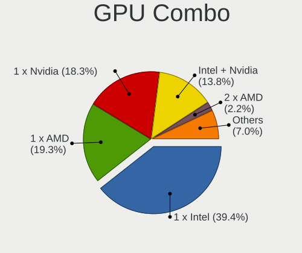

| Name                 | Computers | Percent |
|----------------------|-----------|---------|
| 1 x Intel            | 729       | 39.36%  |
| 1 x AMD              | 358       | 19.33%  |
| 1 x Nvidia           | 339       | 18.3%   |
| Intel + Nvidia       | 256       | 13.82%  |
| 2 x AMD              | 40        | 2.16%   |
| AMD + Nvidia         | 39        | 2.11%   |
| Intel + AMD          | 32        | 1.73%   |
| Other                | 23        | 1.24%   |
| 1 x Matrox           | 18        | 0.97%   |
| 2 x Nvidia           | 4         | 0.22%   |
| 2 x Intel            | 4         | 0.22%   |
| 2 x AMD + 1 x Nvidia | 2         | 0.11%   |
| Nvidia + Matrox      | 2         | 0.11%   |
| 1 x ASPEED           | 2         | 0.11%   |
| AMD + ASPEED         | 2         | 0.11%   |
| 3 x Nvidia           | 1         | 0.05%   |
| Nvidia + ASPEED      | 1         | 0.05%   |

GPU Driver
----------

Free vs proprietary

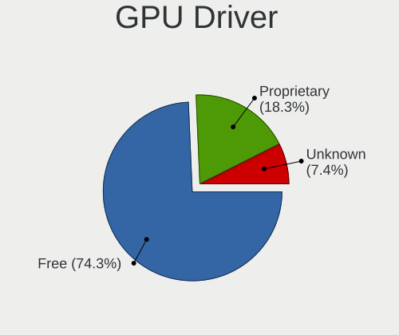

| Driver      | Computers | Percent |
|-------------|-----------|---------|
| Free        | 1392      | 74.32%  |
| Proprietary | 342       | 18.26%  |
| Unknown     | 139       | 7.42%   |

GPU Memory
----------

Total video memory

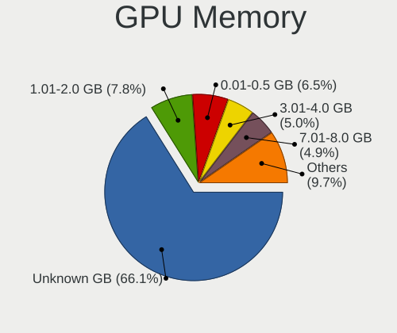

| Size in GB | Computers | Percent |
|------------|-----------|---------|
| Unknown    | 1246      | 66.1%   |
| 1.01-2.0   | 147       | 7.8%    |
| 0.01-0.5   | 123       | 6.53%   |
| 3.01-4.0   | 94        | 4.99%   |
| 7.01-8.0   | 93        | 4.93%   |
| 0.51-1.0   | 57        | 3.02%   |
| 8.01-16.0  | 54        | 2.86%   |
| 5.01-6.0   | 38        | 2.02%   |
| 16.01-24.0 | 19        | 1.01%   |
| 2.01-3.0   | 12        | 0.64%   |
| 4.01-5.0   | 2         | 0.11%   |

Monitor
-------

Monitor Vendor
--------------

Monitor vendors

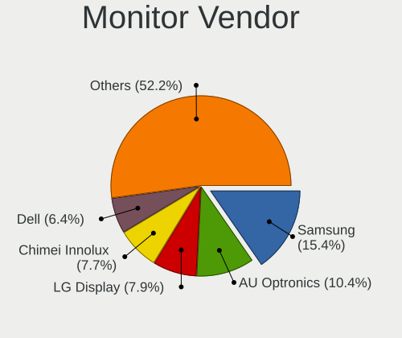

| Vendor                  | Computers | Percent |
|-------------------------|-----------|---------|
| Samsung Electronics     | 328       | 15.36%  |
| AU Optronics            | 223       | 10.44%  |
| LG Display              | 169       | 7.92%   |
| Chimei Innolux          | 164       | 7.68%   |
| Dell                    | 137       | 6.42%   |
| BOE                     | 132       | 6.18%   |
| BenQ                    | 85        | 3.98%   |
| AOC                     | 83        | 3.89%   |
| Hewlett-Packard         | 76        | 3.56%   |
| Acer                    | 74        | 3.47%   |
| Lenovo                  | 67        | 3.14%   |
| Philips                 | 64        | 3%      |
| Apple                   | 51        | 2.39%   |
| Sharp                   | 49        | 2.3%    |
| Ancor Communications    | 49        | 2.3%    |
| Goldstar                | 43        | 2.01%   |
| ASUSTek Computer        | 40        | 1.87%   |
| InfoVision              | 36        | 1.69%   |
| Chi Mei Optoelectronics | 21        | 0.98%   |
| NEC Computers           | 18        | 0.84%   |
| MSI                     | 16        | 0.75%   |
| Panasonic               | 15        | 0.7%    |
| Sony                    | 14        | 0.66%   |
| CSO                     | 13        | 0.61%   |
| PANDA                   | 11        | 0.52%   |
| Eizo                    | 11        | 0.52%   |
| JDI                     | 9         | 0.42%   |
| Gigabyte Technology     | 8         | 0.37%   |
| ViewSonic               | 6         | 0.28%   |
| Unknown                 | 6         | 0.28%   |
| Grundig                 | 6         | 0.28%   |
| Denver                  | 6         | 0.28%   |
| Vestel Elektronik       | 5         | 0.23%   |
| HVR                     | 5         | 0.23%   |
| Fujitsu Siemens         | 5         | 0.23%   |
| LG Electronics          | 4         | 0.19%   |
| Iiyama                  | 4         | 0.19%   |
| CSOT                    | 4         | 0.19%   |
| VOXICON                 | 3         | 0.14%   |
| Onkyo                   | 3         | 0.14%   |

Monitor Model
-------------

Monitor models

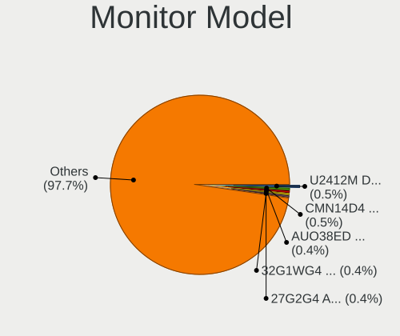

| Model                                                                     | Computers | Percent |
|---------------------------------------------------------------------------|-----------|---------|
| Dell U2412M DELA07A 1920x1200 518x324mm 24.1-inch                         | 12        | 0.54%   |
| Chimei Innolux LCD Monitor CMN14D4 1920x1080 309x173mm 13.9-inch          | 11        | 0.49%   |
| AU Optronics LCD Monitor AUO38ED 1920x1080 344x193mm 15.5-inch            | 10        | 0.45%   |
| AOC 32G1WG4 AOC3201 1920x1080 697x392mm 31.5-inch                         | 9         | 0.4%    |
| AOC 27G2G4 AOC2702 1920x1080 598x336mm 27.0-inch                          | 9         | 0.4%    |
| Sharp LCD Monitor SHP148D 3840x2160 344x194mm 15.5-inch                   | 8         | 0.36%   |
| Panasonic VVX11F009G00 MEI96A2 1920x1080 344x193mm 15.5-inch              | 8         | 0.36%   |
| JDI LCD Monitor JDI422A 3000x2000 293x196mm 13.9-inch                     | 8         | 0.36%   |
| Hewlett-Packard LA2306 HWP294A 1920x1080 510x287mm 23.0-inch              | 8         | 0.36%   |
| Chimei Innolux LCD Monitor CMN15E7 1920x1080 344x193mm 15.5-inch          | 8         | 0.36%   |
| Chi Mei Optoelectronics LCD Monitor CMO1720 1920x1080 382x215mm 17.3-inch | 8         | 0.36%   |
| BenQ GL2450H BNQ78A7 1920x1080 531x298mm 24.0-inch                        | 8         | 0.36%   |
| Samsung Electronics LCD Monitor SDC4171 2880x1800 302x189mm 14.0-inch     | 7         | 0.31%   |
| Samsung Electronics C34H89x SAM0E26 3440x1440 797x333mm 34.0-inch         | 7         | 0.31%   |
| LG Display LCD Monitor LGD0521 1920x1080 309x174mm 14.0-inch              | 7         | 0.31%   |
| Chimei Innolux LCD Monitor CMN14F2 1920x1080 309x173mm 13.9-inch          | 7         | 0.31%   |
| BOE LCD Monitor BOE084D 1920x1080 344x193mm 15.5-inch                     | 7         | 0.31%   |
| BenQ G2420HD BNQ7840 1920x1080 531x299mm 24.0-inch                        | 7         | 0.31%   |
| AU Optronics LCD Monitor AUO403D 1920x1080 309x174mm 14.0-inch            | 7         | 0.31%   |
| Acer XB271HU ACR0490 2560x1440 598x336mm 27.0-inch                        | 7         | 0.31%   |
| Samsung Electronics SE790C SAM0BFE 3440x1440 797x333mm 34.0-inch          | 6         | 0.27%   |
| Samsung Electronics C49RG9x SAM0F9C 3360x1440 1193x336mm 48.8-inch        | 6         | 0.27%   |
| Samsung Electronics C34H89x SAM0E25 3440x1440 797x333mm 34.0-inch         | 6         | 0.27%   |
| LG Display LCD Monitor LGD046F 1920x1080 344x194mm 15.5-inch              | 6         | 0.27%   |
| LG Display LCD Monitor LGD02D8 1366x768 277x156mm 12.5-inch               | 6         | 0.27%   |
| Grundig WUXGA GRU4448 1360x768                                            | 6         | 0.27%   |
| Dell U2713HM DEL4080 2560x1440 597x336mm 27.0-inch                        | 6         | 0.27%   |
| Chimei Innolux LCD Monitor CMN1735 1920x1080 381x214mm 17.2-inch          | 6         | 0.27%   |
| Chimei Innolux LCD Monitor CMN14C3 1366x768 309x173mm 13.9-inch           | 6         | 0.27%   |
| AU Optronics LCD Monitor AUO80ED 1920x1080 344x193mm 15.5-inch            | 6         | 0.27%   |
| AU Optronics LCD Monitor AUO573D 1920x1080 309x174mm 14.0-inch            | 6         | 0.27%   |
| AU Optronics LCD Monitor AUO313D 1920x1080 309x174mm 14.0-inch            | 6         | 0.27%   |
| AOC 2470W AOC2470 1920x1080 521x293mm 23.5-inch                           | 6         | 0.27%   |
| Vestel Elektronik 40UHD_LCD_TV VES3700 3840x2160 880x500mm 39.8-inch      | 5         | 0.22%   |
| Samsung Electronics S24F350 SAM0D20 1920x1080 521x293mm 23.5-inch         | 5         | 0.22%   |
| Samsung Electronics LF24T35 SAM707D 1920x1080 528x297mm 23.9-inch         | 5         | 0.22%   |
| Samsung Electronics LC49G95T SAM7053 3840x1080 1193x336mm 48.8-inch       | 5         | 0.22%   |
| LG Display LCD Monitor LGD046D 1920x1080 309x174mm 14.0-inch              | 5         | 0.22%   |
| Hewlett-Packard Z32x HWP3275 3840x2160 697x392mm 31.5-inch                | 5         | 0.22%   |
| Dell U2717D DEL40EA 2560x1440 597x336mm 27.0-inch                         | 5         | 0.22%   |

Monitor Resolution
------------------

Monitor screen resolution

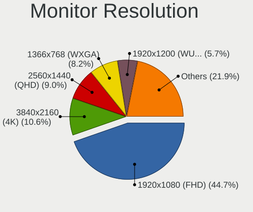

| Resolution         | Computers | Percent |
|--------------------|-----------|---------|
| 1920x1080 (FHD)    | 911       | 44.66%  |
| 3840x2160 (4K)     | 217       | 10.64%  |
| 2560x1440 (QHD)    | 183       | 8.97%   |
| 1366x768 (WXGA)    | 167       | 8.19%   |
| 1920x1200 (WUXGA)  | 116       | 5.69%   |
| 3440x1440          | 61        | 2.99%   |
| 1600x900 (HD+)     | 49        | 2.4%    |
| 2560x1600          | 37        | 1.81%   |
| 2880x1800          | 36        | 1.76%   |
| 3840x1080          | 33        | 1.62%   |
| 1280x800 (WXGA)    | 22        | 1.08%   |
| Unknown            | 22        | 1.08%   |
| 1680x1050 (WSXGA+) | 20        | 0.98%   |
| 1280x1024 (SXGA)   | 17        | 0.83%   |
| 1440x900 (WXGA+)   | 16        | 0.78%   |
| 3840x2400          | 15        | 0.74%   |
| 2560x1080          | 11        | 0.54%   |
| 3840x1600          | 10        | 0.49%   |
| 2160x1440          | 10        | 0.49%   |
| 3000x2000          | 9         | 0.44%   |
| 1600x1200          | 7         | 0.34%   |
| 1360x768           | 5         | 0.25%   |
| 2288x1287          | 4         | 0.2%    |
| 2160x1200          | 4         | 0.2%    |
| 1920x540           | 4         | 0.2%    |
| 1280x720 (HD)      | 4         | 0.2%    |
| 1024x600           | 4         | 0.2%    |
| 3200x2000          | 3         | 0.15%   |
| 3072x1920          | 3         | 0.15%   |
| 2880x1920          | 3         | 0.15%   |
| 2240x1400          | 3         | 0.15%   |
| 5120x1440          | 2         | 0.1%    |
| 4480x1440          | 2         | 0.1%    |
| 3840x1200          | 2         | 0.1%    |
| 3456x2160          | 2         | 0.1%    |
| 3200x1800 (QHD+)   | 2         | 0.1%    |
| 2880x1620          | 2         | 0.1%    |
| 9600x2160          | 1         | 0.05%   |
| 7680x1440          | 1         | 0.05%   |
| 7680x1080          | 1         | 0.05%   |

Monitor Diagonal
----------------

Diagonal size in inches

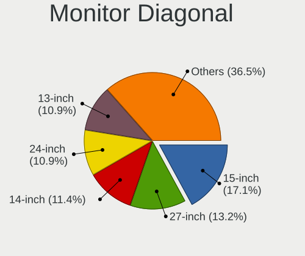

| Inches  | Computers | Percent |
|---------|-----------|---------|
| 15      | 362       | 17.07%  |
| 27      | 281       | 13.25%  |
| 14      | 241       | 11.36%  |
| 24      | 231       | 10.89%  |
| 13      | 231       | 10.89%  |
| 23      | 89        | 4.2%    |
| Unknown | 83        | 3.91%   |
| 17      | 80        | 3.77%   |
| 31      | 77        | 3.63%   |
| 34      | 68        | 3.21%   |
| 12      | 42        | 1.98%   |
| 16      | 36        | 1.7%    |
| 21      | 34        | 1.6%    |
| 84      | 27        | 1.27%   |
| 48      | 24        | 1.13%   |
| 40      | 24        | 1.13%   |
| 22      | 17        | 0.8%    |
| 54      | 16        | 0.75%   |
| 32      | 15        | 0.71%   |
| 25      | 13        | 0.61%   |
| 49      | 11        | 0.52%   |
| 19      | 11        | 0.52%   |
| 37      | 9         | 0.42%   |
| 20      | 9         | 0.42%   |
| 72      | 8         | 0.38%   |
| 11      | 8         | 0.38%   |
| 26      | 7         | 0.33%   |
| 65      | 6         | 0.28%   |
| 43      | 5         | 0.24%   |
| 42      | 5         | 0.24%   |
| 142     | 4         | 0.19%   |
| 55      | 4         | 0.19%   |
| 39      | 4         | 0.19%   |
| 18      | 4         | 0.19%   |
| 85      | 3         | 0.14%   |
| 60      | 3         | 0.14%   |
| 33      | 3         | 0.14%   |
| 28      | 3         | 0.14%   |
| 10      | 3         | 0.14%   |
| 63      | 2         | 0.09%   |

Monitor Width
-------------

Physical width

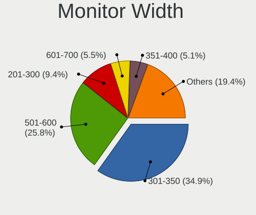

| Width in mm    | Computers | Percent |
|----------------|-----------|---------|
| 301-350        | 718       | 34.87%  |
| 501-600        | 531       | 25.79%  |
| 201-300        | 194       | 9.42%   |
| 601-700        | 113       | 5.49%   |
| 351-400        | 104       | 5.05%   |
| 701-800        | 84        | 4.08%   |
| Unknown        | 83        | 4.03%   |
| 1001-1500      | 71        | 3.45%   |
| 401-500        | 61        | 2.96%   |
| 801-900        | 45        | 2.19%   |
| 1501-2000      | 39        | 1.89%   |
| 901-1000       | 9         | 0.44%   |
| More than 2000 | 4         | 0.19%   |
| 101-200        | 3         | 0.15%   |

Aspect Ratio
------------

Proportional relationship between the width and the height

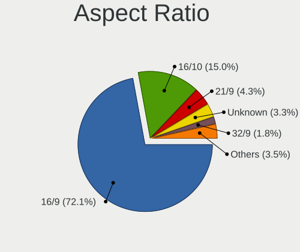

| Ratio   | Computers | Percent |
|---------|-----------|---------|
| 16/9    | 1353      | 72.12%  |
| 16/10   | 281       | 14.98%  |
| 21/9    | 81        | 4.32%   |
| Unknown | 62        | 3.3%    |
| 32/9    | 33        | 1.76%   |
| 3/2     | 32        | 1.71%   |
| 5/4     | 17        | 0.91%   |
| 4/3     | 6         | 0.32%   |
| 1.00    | 4         | 0.21%   |
| 6/5     | 1         | 0.05%   |
| 3.76    | 1         | 0.05%   |
| 3.40    | 1         | 0.05%   |
| 3.20    | 1         | 0.05%   |
| 0.80    | 1         | 0.05%   |
| 0.79    | 1         | 0.05%   |
| 0.63    | 1         | 0.05%   |

Monitor Area
------------

Area in inch²

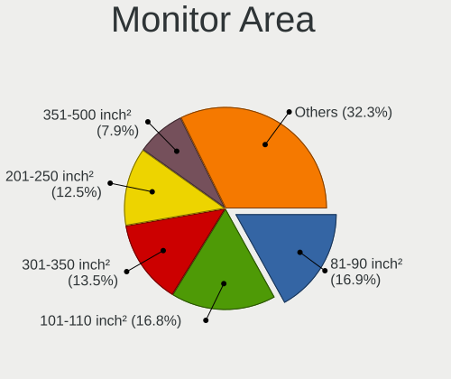

| Area in inch² | Computers | Percent |
|----------------|-----------|---------|
| 81-90          | 355       | 16.94%  |
| 101-110        | 353       | 16.84%  |
| 301-350        | 283       | 13.5%   |
| 201-250        | 263       | 12.55%  |
| 351-500        | 165       | 7.87%   |
| 71-80          | 107       | 5.1%    |
| 251-300        | 103       | 4.91%   |
| 501-1000       | 84        | 4.01%   |
| Unknown        | 83        | 3.96%   |
| More than 1000 | 78        | 3.72%   |
| 121-130        | 73        | 3.48%   |
| 61-70          | 41        | 1.96%   |
| 111-120        | 40        | 1.91%   |
| 151-200        | 28        | 1.34%   |
| 91-100         | 12        | 0.57%   |
| 51-60          | 9         | 0.43%   |
| 131-140        | 8         | 0.38%   |
| 141-150        | 5         | 0.24%   |
| 41-50          | 3         | 0.14%   |
| 1-40           | 3         | 0.14%   |

Pixel Density
-------------

Pixels per inch

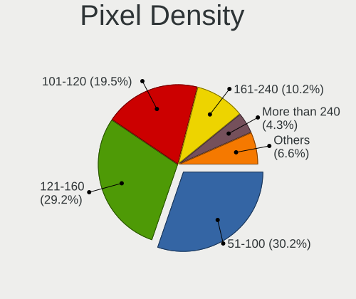

| Density       | Computers | Percent |
|---------------|-----------|---------|
| 51-100        | 618       | 30.25%  |
| 121-160       | 597       | 29.22%  |
| 101-120       | 398       | 19.48%  |
| 161-240       | 208       | 10.18%  |
| More than 240 | 88        | 4.31%   |
| Unknown       | 83        | 4.06%   |
| 1-50          | 51        | 2.5%    |

Multiple Monitors
-----------------

Total monitors connected

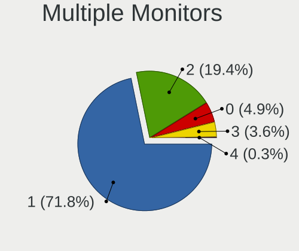

| Total | Computers | Percent |
|-------|-----------|---------|
| 1     | 1364      | 71.79%  |
| 2     | 368       | 19.37%  |
| 0     | 94        | 4.95%   |
| 3     | 69        | 3.63%   |
| 4     | 5         | 0.26%   |

Network
-------

Net Controller Vendor
---------------------

Controller vendors

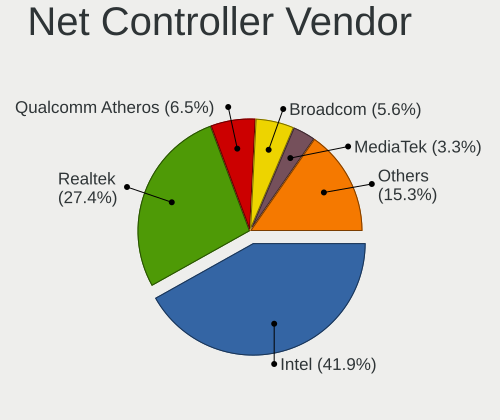

| Vendor                            | Computers | Percent |
|-----------------------------------|-----------|---------|
| Intel                             | 1163      | 41.88%  |
| Realtek Semiconductor             | 762       | 27.44%  |
| Qualcomm Atheros                  | 180       | 6.48%   |
| Broadcom                          | 155       | 5.58%   |
| MediaTek                          | 92        | 3.31%   |
| Broadcom Limited                  | 32        | 1.15%   |
| TP-Link                           | 26        | 0.94%   |
| Sierra Wireless                   | 24        | 0.86%   |
| Ralink Technology                 | 21        | 0.76%   |
| Ericsson Business Mobile Networks | 19        | 0.68%   |
| Dell                              | 19        | 0.68%   |
| NetGear                           | 18        | 0.65%   |
| Microsoft                         | 18        | 0.65%   |
| ASUSTek Computer                  | 18        | 0.65%   |
| Ralink                            | 16        | 0.58%   |
| Shenzhen Goodix Technology        | 14        | 0.5%    |
| Samsung Electronics               | 14        | 0.5%    |
| Marvell Technology Group          | 13        | 0.47%   |
| Nvidia                            | 12        | 0.43%   |
| Lenovo                            | 12        | 0.43%   |
| Hewlett-Packard                   | 11        | 0.4%    |
| DisplayLink                       | 11        | 0.4%    |
| D-Link                            | 11        | 0.4%    |
| Aquantia                          | 11        | 0.4%    |
| Qualcomm                          | 9         | 0.32%   |
| Qualcomm Atheros Communications   | 7         | 0.25%   |
| Microchip Technology              | 7         | 0.25%   |
| Mellanox Technologies             | 6         | 0.22%   |
| Fibocom                           | 6         | 0.22%   |
| Qualcomm Technologies             | 5         | 0.18%   |
| Motorola PCS                      | 5         | 0.18%   |
| Linksys                           | 5         | 0.18%   |
| ASIX Electronics                  | 5         | 0.18%   |
| Raspberry Pi                      | 4         | 0.14%   |
| Wacom                             | 3         | 0.11%   |
| OnePlus Technology (Shenzhen)     | 3         | 0.11%   |
| JMicron Technology                | 3         | 0.11%   |
| Huawei Technologies               | 3         | 0.11%   |
| Google                            | 3         | 0.11%   |
| Chu Yuen Enterprise               | 3         | 0.11%   |

Net Controller Model
--------------------

Controller models

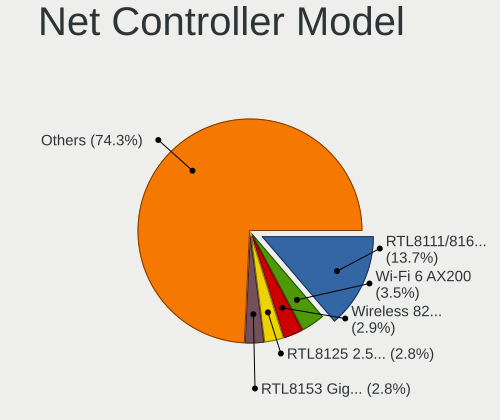

| Model                                                                  | Computers | Percent |
|------------------------------------------------------------------------|-----------|---------|
| Realtek RTL8111/8168/8211/8411 PCI Express Gigabit Ethernet Controller | 465       | 13.75%  |
| Intel Wi-Fi 6 AX200                                                    | 118       | 3.49%   |
| Intel Wireless 8265 / 8275                                             | 98        | 2.9%    |
| Realtek RTL8125 2.5GbE Controller                                      | 96        | 2.84%   |
| Realtek RTL8153 Gigabit Ethernet Adapter                               | 94        | 2.78%   |
| Intel I211 Gigabit Network Connection                                  | 80        | 2.36%   |
| Intel 82579LM Gigabit Network Connection (Lewisville)                  | 73        | 2.16%   |
| Intel Ethernet Controller I225-V                                       | 51        | 1.51%   |
| Intel Wireless 8260                                                    | 50        | 1.48%   |
| Intel Wireless 7265                                                    | 50        | 1.48%   |
| Intel Alder Lake-P PCH CNVi WiFi                                       | 46        | 1.36%   |
| Intel Wireless 7260                                                    | 43        | 1.27%   |
| Intel Ethernet Connection (2) I219-V                                   | 42        | 1.24%   |
| Intel Wi-Fi 6E(802.11ax) AX210/AX1675* 2x2 [Typhoon Peak]              | 39        | 1.15%   |
| Intel Wi-Fi 6 AX201                                                    | 38        | 1.12%   |
| Intel Cannon Lake PCH CNVi WiFi                                        | 38        | 1.12%   |
| MediaTek MT7922 802.11ax PCI Express Wireless Network Adapter          | 35        | 1.03%   |
| Intel Cannon Point-LP CNVi [Wireless-AC]                               | 32        | 0.95%   |
| Intel Ethernet Connection (7) I219-V                                   | 31        | 0.92%   |
| Intel Wi-Fi 5(802.11ac) Wireless-AC 9x6x [Thunder Peak]                | 30        | 0.89%   |
| Intel Ethernet Connection I217-LM                                      | 30        | 0.89%   |
| Intel Centrino Advanced-N 6205 [Taylor Peak]                           | 29        | 0.86%   |
| Qualcomm Atheros QCA6174 802.11ac Wireless Network Adapter             | 28        | 0.83%   |
| Intel Ethernet Connection (4) I219-V                                   | 28        | 0.83%   |
| Realtek RTL8821CE 802.11ac PCIe Wireless Network Adapter               | 27        | 0.8%    |
| Intel Ethernet Connection (4) I219-LM                                  | 27        | 0.8%    |
| Intel Comet Lake PCH-LP CNVi WiFi                                      | 27        | 0.8%    |
| Realtek RTL810xE PCI Express Fast Ethernet controller                  | 26        | 0.77%   |
| MediaTek MT7921 802.11ax PCIe Wireless Network Adapter [Filogic 330]   | 24        | 0.71%   |
| Intel Raptor Lake PCH CNVi WiFi                                        | 24        | 0.71%   |
| Intel Ethernet Connection (6) I219-V                                   | 23        | 0.68%   |
| Qualcomm Atheros AR9285 Wireless Network Adapter (PCI-Express)         | 22        | 0.65%   |
| Qualcomm Atheros QCA9377 802.11ac Wireless Network Adapter             | 21        | 0.62%   |
| Intel Centrino Advanced-N 6235                                         | 20        | 0.59%   |
| Realtek RTL8852BE PCIe 802.11ax Wireless Network Controller            | 19        | 0.56%   |
| Intel Wireless 3165                                                    | 19        | 0.56%   |
| Intel Tiger Lake PCH CNVi WiFi                                         | 19        | 0.56%   |
| Intel Ethernet Connection I219-V                                       | 19        | 0.56%   |
| Intel Ethernet Connection (2) I219-LM                                  | 19        | 0.56%   |
| Intel Centrino Ultimate-N 6300                                         | 19        | 0.56%   |

Wireless Vendor
---------------

Wireless vendors

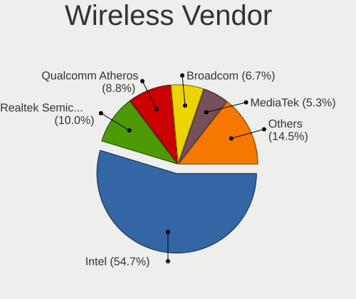

| Vendor                            | Computers | Percent |
|-----------------------------------|-----------|---------|
| Intel                             | 862       | 54.7%   |
| Realtek Semiconductor             | 158       | 10.03%  |
| Qualcomm Atheros                  | 139       | 8.82%   |
| Broadcom                          | 106       | 6.73%   |
| MediaTek                          | 83        | 5.27%   |
| Broadcom Limited                  | 28        | 1.78%   |
| TP-Link                           | 25        | 1.59%   |
| Sierra Wireless                   | 24        | 1.52%   |
| Ralink Technology                 | 21        | 1.33%   |
| NetGear                           | 18        | 1.14%   |
| ASUSTek Computer                  | 18        | 1.14%   |
| Ralink                            | 16        | 1.02%   |
| Microsoft                         | 15        | 0.95%   |
| Dell                              | 10        | 0.63%   |
| D-Link                            | 10        | 0.63%   |
| Qualcomm Atheros Communications   | 7         | 0.44%   |
| Qualcomm                          | 6         | 0.38%   |
| Fibocom                           | 6         | 0.38%   |
| Hewlett-Packard                   | 5         | 0.32%   |
| Marvell Technology Group          | 4         | 0.25%   |
| Linksys                           | 4         | 0.25%   |
| Wacom                             | 3         | 0.19%   |
| Chu Yuen Enterprise               | 3         | 0.19%   |
| Wilocity                          | 1         | 0.06%   |
| Qualcomm Technologies             | 1         | 0.06%   |
| Micro Star International          | 1         | 0.06%   |
| Ericsson Business Mobile Networks | 1         | 0.06%   |
| D-Link System                     | 1         | 0.06%   |

Wireless Model
--------------

Wireless models

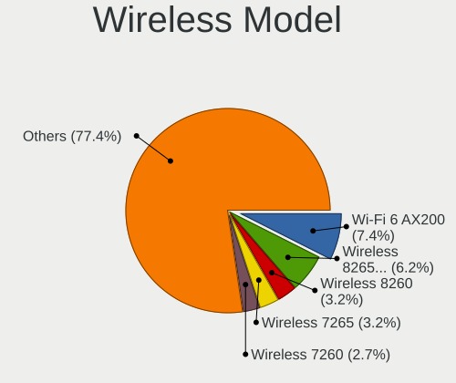

| Model                                                                | Computers | Percent |
|----------------------------------------------------------------------|-----------|---------|
| Intel Wi-Fi 6 AX200                                                  | 118       | 7.44%   |
| Intel Wireless 8265 / 8275                                           | 98        | 6.18%   |
| Intel Wireless 8260                                                  | 50        | 3.15%   |
| Intel Wireless 7265                                                  | 50        | 3.15%   |
| Intel Wireless 7260                                                  | 43        | 2.71%   |
| Intel Wi-Fi 6E(802.11ax) AX210/AX1675* 2x2 [Typhoon Peak]            | 39        | 2.46%   |
| Intel Wi-Fi 6 AX201                                                  | 38        | 2.4%    |
| Intel Cannon Lake PCH CNVi WiFi                                      | 38        | 2.4%    |
| MediaTek MT7922 802.11ax PCI Express Wireless Network Adapter        | 33        | 2.08%   |
| Intel Cannon Point-LP CNVi [Wireless-AC]                             | 32        | 2.02%   |
| Intel Wi-Fi 5(802.11ac) Wireless-AC 9x6x [Thunder Peak]              | 30        | 1.89%   |
| Intel Alder Lake-P PCH CNVi WiFi                                     | 30        | 1.89%   |
| Intel Centrino Advanced-N 6205 [Taylor Peak]                         | 29        | 1.83%   |
| Qualcomm Atheros QCA6174 802.11ac Wireless Network Adapter           | 28        | 1.77%   |
| Realtek RTL8821CE 802.11ac PCIe Wireless Network Adapter             | 27        | 1.7%    |
| Intel Comet Lake PCH-LP CNVi WiFi                                    | 27        | 1.7%    |
| MediaTek MT7921 802.11ax PCIe Wireless Network Adapter [Filogic 330] | 24        | 1.51%   |
| Qualcomm Atheros AR9285 Wireless Network Adapter (PCI-Express)       | 22        | 1.39%   |
| Qualcomm Atheros QCA9377 802.11ac Wireless Network Adapter           | 21        | 1.32%   |
| Intel Raptor Lake PCH CNVi WiFi                                      | 21        | 1.32%   |
| Intel Centrino Advanced-N 6235                                       | 20        | 1.26%   |
| Intel Wireless 3165                                                  | 19        | 1.2%    |
| Intel Tiger Lake PCH CNVi WiFi                                       | 19        | 1.2%    |
| Intel Centrino Ultimate-N 6300                                       | 19        | 1.2%    |
| Qualcomm Atheros QCA9565 / AR9565 Wireless Network Adapter           | 18        | 1.14%   |
| Broadcom BCM4360 802.11ac Dual Band Wireless Network Adapter         | 18        | 1.14%   |
| Realtek RTL8852BE PCIe 802.11ax Wireless Network Controller          | 17        | 1.07%   |
| Sierra Wireless EM7455                                               | 16        | 1.01%   |
| Realtek RTL8852AE 802.11ax PCIe Wireless Network Adapter             | 16        | 1.01%   |
| Intel Comet Lake PCH CNVi WiFi                                       | 16        | 1.01%   |
| Realtek RTL8822CE 802.11ac PCIe Wireless Network Adapter             | 14        | 0.88%   |
| NetGear A6100 AC600 DB Wireless Adapter [Realtek RTL8811AU]          | 14        | 0.88%   |
| Intel Wireless 3160                                                  | 14        | 0.88%   |
| Intel 700 Series Chipset CNVi WiFi                                   | 14        | 0.88%   |
| Qualcomm Atheros AR9462 Wireless Network Adapter                     | 13        | 0.82%   |
| Intel Dual Band Wireless-AC 3168NGW [Stone Peak]                     | 13        | 0.82%   |
| Intel Dual Band Wireless-AC 3165 Plus Bluetooth                      | 13        | 0.82%   |
| Broadcom BCM43228 802.11a/b/g/n                                      | 13        | 0.82%   |
| Qualcomm Atheros AR9485 Wireless Network Adapter                     | 12        | 0.76%   |
| Broadcom Limited BCM4360 802.11ac Dual Band Wireless Network Adapter | 12        | 0.76%   |

Ethernet Vendor
---------------

Ethernet vendors

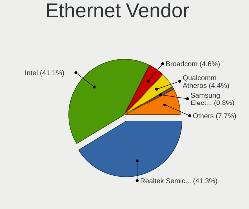

| Vendor                                 | Computers | Percent |
|----------------------------------------|-----------|---------|
| Realtek Semiconductor                  | 694       | 41.33%  |
| Intel                                  | 690       | 41.1%   |
| Broadcom                               | 77        | 4.59%   |
| Qualcomm Atheros                       | 74        | 4.41%   |
| Samsung Electronics                    | 14        | 0.83%   |
| Nvidia                                 | 12        | 0.71%   |
| Lenovo                                 | 11        | 0.66%   |
| DisplayLink                            | 11        | 0.66%   |
| Aquantia                               | 11        | 0.66%   |
| Marvell Technology Group               | 9         | 0.54%   |
| MediaTek                               | 8         | 0.48%   |
| Broadcom Limited                       | 6         | 0.36%   |
| Motorola PCS                           | 5         | 0.3%    |
| Mellanox Technologies                  | 5         | 0.3%    |
| ASIX Electronics                       | 5         | 0.3%    |
| Raspberry Pi                           | 4         | 0.24%   |
| Qualcomm Technologies                  | 4         | 0.24%   |
| Qualcomm                               | 3         | 0.18%   |
| Microsoft                              | 3         | 0.18%   |
| Microchip Technology                   | 3         | 0.18%   |
| JMicron Technology                     | 3         | 0.18%   |
| Huawei Technologies                    | 3         | 0.18%   |
| Hewlett-Packard                        | 3         | 0.18%   |
| Google                                 | 3         | 0.18%   |
| OnePlus Technology (Shenzhen)          | 2         | 0.12%   |
| Dell                                   | 2         | 0.12%   |
| Apple                                  | 2         | 0.12%   |
| TP-Link                                | 1         | 0.06%   |
| T & A Mobile Phones                    | 1         | 0.06%   |
| Sony Ericsson Mobile Communications AB | 1         | 0.06%   |
| OPPO Electronics                       | 1         | 0.06%   |
| NetXen Incorporated                    | 1         | 0.06%   |
| Linksys                                | 1         | 0.06%   |
| IBM                                    | 1         | 0.06%   |
| D-Link                                 | 1         | 0.06%   |
| Cisco Systems                          | 1         | 0.06%   |
| ATEN International                     | 1         | 0.06%   |
| American Megatrends                    | 1         | 0.06%   |
| 3Com                                   | 1         | 0.06%   |

Ethernet Model
--------------

Ethernet models

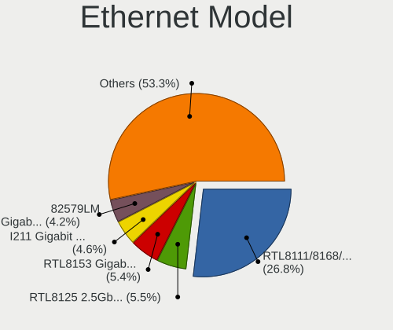

| Model                                                                  | Computers | Percent |
|------------------------------------------------------------------------|-----------|---------|
| Realtek RTL8111/8168/8211/8411 PCI Express Gigabit Ethernet Controller | 465       | 26.85%  |
| Realtek RTL8125 2.5GbE Controller                                      | 96        | 5.54%   |
| Realtek RTL8153 Gigabit Ethernet Adapter                               | 94        | 5.43%   |
| Intel I211 Gigabit Network Connection                                  | 80        | 4.62%   |
| Intel 82579LM Gigabit Network Connection (Lewisville)                  | 73        | 4.21%   |
| Intel Ethernet Controller I225-V                                       | 51        | 2.94%   |
| Intel Ethernet Connection (2) I219-V                                   | 42        | 2.42%   |
| Intel Ethernet Connection (7) I219-V                                   | 31        | 1.79%   |
| Intel Ethernet Connection I217-LM                                      | 30        | 1.73%   |
| Intel Ethernet Connection (4) I219-V                                   | 28        | 1.62%   |
| Intel Ethernet Connection (4) I219-LM                                  | 27        | 1.56%   |
| Realtek RTL810xE PCI Express Fast Ethernet controller                  | 26        | 1.5%    |
| Intel Ethernet Connection (6) I219-V                                   | 23        | 1.33%   |
| Intel Ethernet Connection I219-V                                       | 19        | 1.1%    |
| Intel Ethernet Connection (2) I219-LM                                  | 19        | 1.1%    |
| Intel 82579V Gigabit Network Connection                                | 18        | 1.04%   |
| Intel Ethernet Connection (2) I218-V                                   | 16        | 0.92%   |
| Intel Alder Lake-P PCH CNVi WiFi                                       | 16        | 0.92%   |
| Intel Ethernet Connection (7) I219-LM                                  | 15        | 0.87%   |
| Intel Ethernet Connection I219-LM                                      | 14        | 0.81%   |
| Intel Ethernet Connection I218-LM                                      | 14        | 0.81%   |
| Intel Ethernet Connection (3) I218-LM                                  | 14        | 0.81%   |
| Intel I210 Gigabit Network Connection                                  | 13        | 0.75%   |
| Intel Ethernet Controller I226-V                                       | 13        | 0.75%   |
| Broadcom NetXtreme BCM57765 Gigabit Ethernet PCIe                      | 13        | 0.75%   |
| Qualcomm Atheros QCA8171 Gigabit Ethernet                              | 12        | 0.69%   |
| Qualcomm Atheros Killer E220x Gigabit Ethernet Controller              | 12        | 0.69%   |
| Qualcomm Atheros AR8151 v2.0 Gigabit Ethernet                          | 12        | 0.69%   |
| Intel Ethernet Connection (2) I218-LM                                  | 12        | 0.69%   |
| Qualcomm Atheros Killer E2500 Gigabit Ethernet Controller              | 10        | 0.58%   |
| Intel 82577LM Gigabit Network Connection                               | 10        | 0.58%   |
| Samsung Galaxy series, misc. (tethering mode)                          | 9         | 0.52%   |
| Intel Ethernet Connection I217-V                                       | 9         | 0.52%   |
| Broadcom NetXtreme BCM57766 Gigabit Ethernet PCIe                      | 9         | 0.52%   |
| Intel Ethernet Connection (13) I219-V                                  | 8         | 0.46%   |
| Intel Ethernet Connection (10) I219-V                                  | 8         | 0.46%   |
| Realtek RTL8126 5GbE Controller                                        | 7         | 0.4%    |
| Intel I350 Gigabit Network Connection                                  | 7         | 0.4%    |
| Intel Ethernet Connection (6) I219-LM                                  | 7         | 0.4%    |
| Intel 82574L Gigabit Network Connection                                | 7         | 0.4%    |

Net Controller Kind
-------------------

Ethernet, WiFi or modem

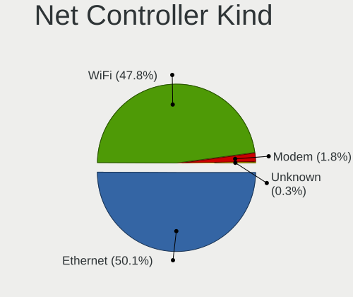

| Kind     | Computers | Percent |
|----------|-----------|---------|
| Ethernet | 1529      | 50.08%  |
| WiFi     | 1459      | 47.79%  |
| Modem    | 56        | 1.83%   |
| Unknown  | 9         | 0.29%   |

Used Controller
---------------

Currently used network controller

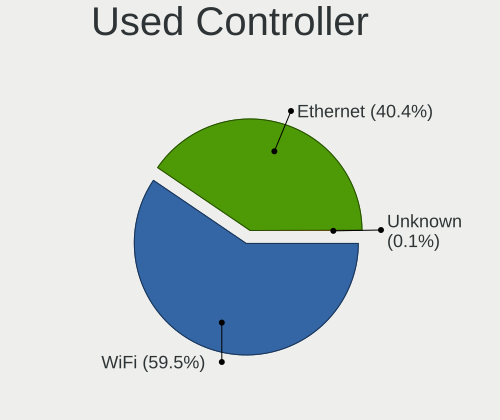

| Kind     | Computers | Percent |
|----------|-----------|---------|
| WiFi     | 1127      | 59.5%   |
| Ethernet | 766       | 40.44%  |
| Unknown  | 1         | 0.05%   |

NICs
----

Total network controllers on board

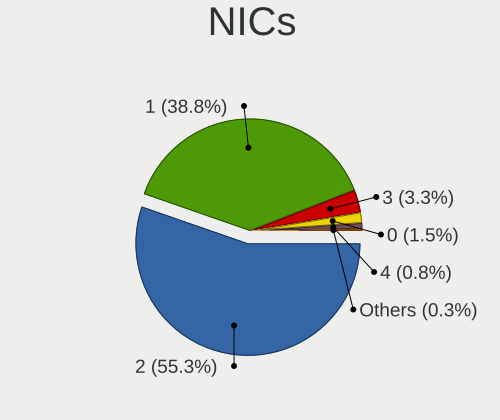

| Total | Computers | Percent |
|-------|-----------|---------|
| 2     | 1019      | 55.32%  |
| 1     | 714       | 38.76%  |
| 3     | 60        | 3.26%   |
| 0     | 28        | 1.52%   |
| 4     | 15        | 0.81%   |
| 6     | 3         | 0.16%   |
| 5     | 2         | 0.11%   |
| 8     | 1         | 0.05%   |

IPv6
----

IPv6 vs IPv4

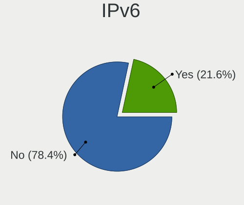

| Used | Computers | Percent |
|------|-----------|---------|
| No   | 1483      | 78.38%  |
| Yes  | 409       | 21.62%  |

Bluetooth
---------

Bluetooth Vendor
----------------

Controller vendors

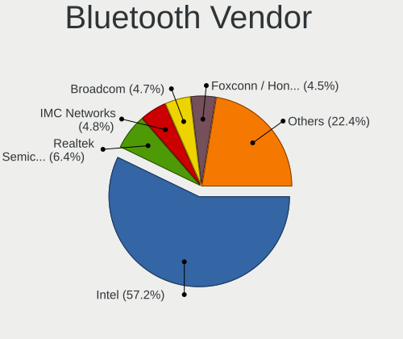

| Vendor                          | Computers | Percent |
|---------------------------------|-----------|---------|
| Intel                           | 747       | 57.15%  |
| Realtek Semiconductor           | 84        | 6.43%   |
| IMC Networks                    | 63        | 4.82%   |
| Broadcom                        | 61        | 4.67%   |
| Foxconn / Hon Hai               | 59        | 4.51%   |
| Apple                           | 52        | 3.98%   |
| Qualcomm Atheros Communications | 43        | 3.29%   |
| Cambridge Silicon Radio         | 41        | 3.14%   |
| ASUSTek Computer                | 32        | 2.45%   |
| Lite-On Technology              | 31        | 2.37%   |
| MediaTek                        | 24        | 1.84%   |
| Hewlett-Packard                 | 15        | 1.15%   |
| Dell                            | 15        | 1.15%   |
| TP-Link                         | 9         | 0.69%   |
| Marvell Semiconductor           | 6         | 0.46%   |
| HTC (High Tech Computer)        | 6         | 0.46%   |
| Belkin Components               | 5         | 0.38%   |
| USI                             | 3         | 0.23%   |
| Toshiba                         | 2         | 0.15%   |
| Realtek                         | 2         | 0.15%   |
| Integrated System Solution      | 2         | 0.15%   |
| Ralink Technology               | 1         | 0.08%   |
| Ralink                          | 1         | 0.08%   |
| Micro Star International        | 1         | 0.08%   |
| Edimax Technology               | 1         | 0.08%   |
| Actions                         | 1         | 0.08%   |

Bluetooth Model
---------------

Controller models

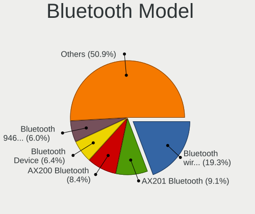

| Model                                                                | Computers | Percent |
|----------------------------------------------------------------------|-----------|---------|
| Intel Bluetooth wireless interface                                   | 253       | 19.27%  |
| Intel AX201 Bluetooth                                                | 119       | 9.06%   |
| Intel AX200 Bluetooth                                                | 110       | 8.38%   |
| Intel Bluetooth Device                                               | 84        | 6.4%    |
| Intel Bluetooth 9460/9560 Jefferson Peak (JfP)                       | 79        | 6.02%   |
| Realtek Bluetooth Radio                                              | 61        | 4.65%   |
| Cambridge Silicon Radio Bluetooth Dongle (HCI mode)                  | 41        | 3.12%   |
| Intel AX210 Bluetooth                                                | 37        | 2.82%   |
| Intel Wireless-AC 9260 Bluetooth Adapter                             | 28        | 2.13%   |
| IMC Networks Bluetooth Radio                                         | 26        | 1.98%   |
| Intel Centrino Bluetooth Wireless Transceiver                        | 25        | 1.9%    |
| Foxconn / Hon Hai Wireless_Device                                    | 25        | 1.9%    |
| MediaTek Wireless_Device                                             | 23        | 1.75%   |
| IMC Networks Wireless_Device                                         | 21        | 1.6%    |
| Apple Bluetooth USB Host Controller                                  | 21        | 1.6%    |
| Apple Bluetooth Host Controller                                      | 20        | 1.52%   |
| Foxconn / Hon Hai Bluetooth Device                                   | 18        | 1.37%   |
| Broadcom BCM2045B (BDC-2.1)                                          | 16        | 1.22%   |
| Lite-On Bluetooth Device                                             | 14        | 1.07%   |
| Realtek  Bluetooth 4.2 Adapter                                       | 12        | 0.91%   |
| Qualcomm Atheros AR3012 Bluetooth 4.0                                | 12        | 0.91%   |
| Qualcomm Atheros  Bluetooth Device                                   | 11        | 0.84%   |
| Intel Wireless-AC 3168 Bluetooth                                     | 11        | 0.84%   |
| HP Broadcom 2070 Bluetooth Combo                                     | 11        | 0.84%   |
| ASUS Broadcom BCM20702A0 Bluetooth                                   | 11        | 0.84%   |
| Qualcomm Atheros AR3011 Bluetooth                                    | 10        | 0.76%   |
| Broadcom BCM20702 Bluetooth 4.0 [ThinkPad]                           | 10        | 0.76%   |
| ASUS ASUS USB-BT500                                                  | 10        | 0.76%   |
| Apple Built-in Bluetooth 2.0+EDR HCI                                 | 10        | 0.76%   |
| TP-Link TP-T@- UB500 Adapter                                         | 9         | 0.69%   |
| Foxconn / Hon Hai MediaTek Bluetooth Adapter                         | 9         | 0.69%   |
| Qualcomm Atheros QCA61x4 Bluetooth 4.0                               | 7         | 0.53%   |
| Lite-On Qualcomm Atheros QCA9377 Bluetooth                           | 7         | 0.53%   |
| IMC Networks Bluetooth Device                                        | 7         | 0.53%   |
| Realtek Bluetooth 5.3 Radio                                          | 6         | 0.46%   |
| Lite-On Wireless_Device                                              | 6         | 0.46%   |
| HTC (High Tech Computer) Vive Hub Bluetooth 4.1 (Broadcom BCM920703) | 6         | 0.46%   |
| Dell DW375 Bluetooth Module                                          | 6         | 0.46%   |
| Broadcom HP Portable SoftSailing                                     | 6         | 0.46%   |
| Dell BCM20702A0 Bluetooth Module                                     | 5         | 0.38%   |

Sound
-----

Sound Vendor
------------

Sound card vendors

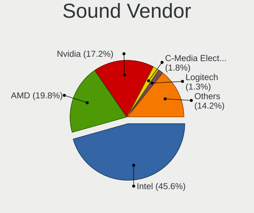

| Vendor                                       | Computers | Percent |
|----------------------------------------------|-----------|---------|
| Intel                                        | 1294      | 45.63%  |
| AMD                                          | 562       | 19.82%  |
| Nvidia                                       | 488       | 17.21%  |
| C-Media Electronics                          | 50        | 1.76%   |
| Logitech                                     | 38        | 1.34%   |
| SteelSeries ApS                              | 35        | 1.23%   |
| Realtek Semiconductor                        | 25        | 0.88%   |
| ASUSTek Computer                             | 22        | 0.78%   |
| Kingston Technology                          | 21        | 0.74%   |
| Lenovo                                       | 20        | 0.71%   |
| GN Netcom                                    | 17        | 0.6%    |
| Focusrite-Novation                           | 16        | 0.56%   |
| Hewlett-Packard                              | 15        | 0.53%   |
| Blue Microphones                             | 15        | 0.53%   |
| Razer USA                                    | 12        | 0.42%   |
| Creative Labs                                | 12        | 0.42%   |
| Corsair                                      | 11        | 0.39%   |
| Creative Technology                          | 9         | 0.32%   |
| Texas Instruments                            | 8         | 0.28%   |
| FiiO Electronics Technology                  | 8         | 0.28%   |
| Sony                                         | 7         | 0.25%   |
| SAVITECH                                     | 7         | 0.25%   |
| Micro Star International                     | 7         | 0.25%   |
| DSEA A/S                                     | 7         | 0.25%   |
| RODE Microphones                             | 6         | 0.21%   |
| Plantronics                                  | 6         | 0.21%   |
| Zoran Co. Personal Media Division (Nogatech) | 5         | 0.18%   |
| XMOS                                         | 5         | 0.18%   |
| KTMicro                                      | 5         | 0.18%   |
| JMTek                                        | 5         | 0.18%   |
| ASRock                                       | 5         | 0.18%   |
| M-Audio                                      | 4         | 0.14%   |
| Generalplus Technology                       | 4         | 0.14%   |
| ROCCAT                                       | 3         | 0.11%   |
| RME                                          | 3         | 0.11%   |
| GYROCOM C&C                                  | 3         | 0.11%   |
| Elgato Systems                               | 3         | 0.11%   |
| Astro Gaming                                 | 3         | 0.11%   |
| Yamaha                                       | 2         | 0.07%   |
| Valve Software                               | 2         | 0.07%   |

Sound Model
-----------

Sound card models

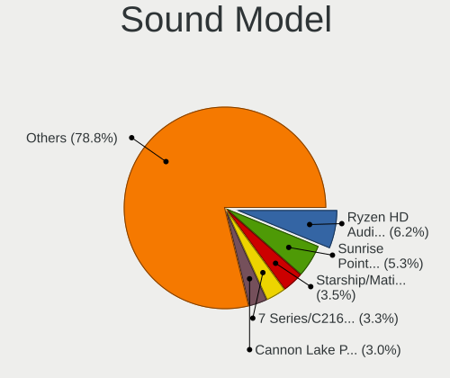

| Model                                                                      | Computers | Percent |
|----------------------------------------------------------------------------|-----------|---------|
| AMD Ryzen HD Audio Controller                                              | 207       | 6.18%   |
| Intel Sunrise Point-LP HD Audio                                            | 178       | 5.31%   |
| AMD Starship/Matisse HD Audio Controller                                   | 116       | 3.46%   |
| Intel 7 Series/C216 Chipset Family High Definition Audio Controller        | 109       | 3.25%   |
| Intel Cannon Lake PCH cAVS                                                 | 100       | 2.98%   |
| Intel 6 Series/C200 Series Chipset Family High Definition Audio Controller | 82        | 2.45%   |
| AMD Radeon High Definition Audio Controller                                | 82        | 2.45%   |
| Intel 8 Series/C220 Series Chipset High Definition Audio Controller        | 80        | 2.39%   |
| AMD Renoir/Cezanne HDMI/DP Audio Controller                                | 71        | 2.12%   |
| Intel 100 Series/C230 Series Chipset Family HD Audio Controller            | 66        | 1.97%   |
| Intel Xeon E3-1200 v3/4th Gen Core Processor HD Audio Controller           | 62        | 1.85%   |
| Intel Cannon Point-LP High Definition Audio Controller                     | 56        | 1.67%   |
| Intel Haswell-ULT HD Audio Controller                                      | 54        | 1.61%   |
| Intel Tiger Lake-LP Smart Sound Technology Audio Controller                | 53        | 1.58%   |
| Intel 8 Series HD Audio Controller                                         | 53        | 1.58%   |
| Intel Alder Lake PCH-P High Definition Audio Controller                    | 51        | 1.52%   |
| AMD Navi 21/23 HDMI/DP Audio Controller                                    | 45        | 1.34%   |
| Intel Wildcat Point-LP High Definition Audio Controller                    | 42        | 1.25%   |
| Intel Broadwell-U Audio Controller                                         | 42        | 1.25%   |
| Intel 200 Series PCH HD Audio                                              | 41        | 1.22%   |
| Nvidia GP104 High Definition Audio Controller                              | 39        | 1.16%   |
| AMD SBx00 Azalia (Intel HDA)                                               | 39        | 1.16%   |
| Nvidia GP106 High Definition Audio Controller                              | 36        | 1.07%   |
| Intel 5 Series/3400 Series Chipset High Definition Audio                   | 36        | 1.07%   |
| AMD Family 17h (Models 00h-0fh) HD Audio Controller                        | 36        | 1.07%   |
| Nvidia GA104 High Definition Audio Controller                              | 35        | 1.04%   |
| AMD FCH Azalia Controller                                                  | 32        | 0.95%   |
| AMD Ellesmere HDMI Audio [Radeon RX 470/480 / 570/580/590]                 | 29        | 0.87%   |
| Intel Raptor Lake-P/U/H cAVS                                               | 27        | 0.81%   |
| Intel Comet Lake PCH-LP cAVS                                               | 27        | 0.81%   |
| Intel Tiger Lake-H HD Audio Controller                                     | 26        | 0.78%   |
| AMD Navi 10 HDMI Audio                                                     | 26        | 0.78%   |
| AMD Raven/Raven2/Fenghuang HDMI/DP Audio Controller                        | 25        | 0.75%   |
| AMD Navi 31 HDMI/DP Audio                                                  | 25        | 0.75%   |
| Nvidia TU106 High Definition Audio Controller                              | 24        | 0.72%   |
| Nvidia GP107GL High Definition Audio Controller                            | 24        | 0.72%   |
| Nvidia GM204 High Definition Audio Controller                              | 24        | 0.72%   |
| Intel 82801I (ICH9 Family) HD Audio Controller                             | 24        | 0.72%   |
| Intel Comet Lake PCH cAVS                                                  | 23        | 0.69%   |
| Intel C610/X99 series chipset HD Audio Controller                          | 23        | 0.69%   |

Memory
------

Memory Vendor
-------------

Memory module vendors

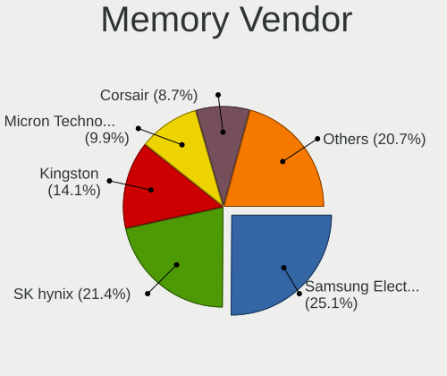

| Vendor                 | Computers | Percent |
|------------------------|-----------|---------|
| Samsung Electronics    | 288       | 25.11%  |
| SK hynix               | 246       | 21.45%  |
| Kingston               | 162       | 14.12%  |
| Micron Technology      | 113       | 9.85%   |
| Corsair                | 100       | 8.72%   |
| Crucial                | 56        | 4.88%   |
| Unknown                | 46        | 4.01%   |
| G.Skill                | 38        | 3.31%   |
| Ramaxel Technology     | 18        | 1.57%   |
| Unknown                | 16        | 1.39%   |
| Elpida                 | 12        | 1.05%   |
| A-DATA Technology      | 9         | 0.78%   |
| Nanya Technology       | 6         | 0.52%   |
| Team                   | 3         | 0.26%   |
| Patriot                | 3         | 0.26%   |
| Unknown (ABCD)         | 2         | 0.17%   |
| Transcend              | 2         | 0.17%   |
| Unknown (89F7)         | 1         | 0.09%   |
| Unknown (0x0D0E)       | 1         | 0.09%   |
| Unknown (00000000802C) | 1         | 0.09%   |
| Toshiba                | 1         | 0.09%   |
| Timetec                | 1         | 0.09%   |
| SK_Hynix               | 1         | 0.09%   |
| Samsung / Micron       | 1         | 0.09%   |
| Lexar                  | 1         | 0.09%   |
| Kllisre                | 1         | 0.09%   |
| Hewlett-Packard        | 1         | 0.09%   |
| GSkill                 | 1         | 0.09%   |
| GOODRAM                | 1         | 0.09%   |
| GeIL                   | 1         | 0.09%   |
| ff                     | 1         | 0.09%   |
| fef5                   | 1         | 0.09%   |
| ASint Technology       | 1         | 0.09%   |
| Apacer                 | 1         | 0.09%   |
| 98000817752EA5DF       | 1         | 0.09%   |
| 98000817752E90DE       | 1         | 0.09%   |
| 98000817752E75DE       | 1         | 0.09%   |
| 98000817702EBEDE       | 1         | 0.09%   |
| 98000817702EBDDE       | 1         | 0.09%   |
| 98000817702EBBDF       | 1         | 0.09%   |

Memory Model
------------

Memory module models

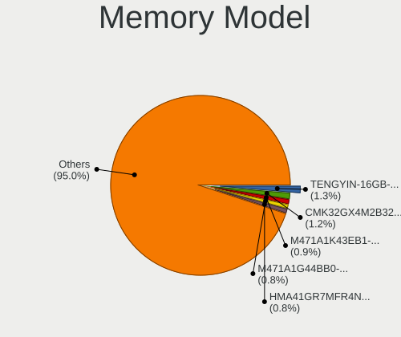

| Model                                                         | Computers | Percent |
|---------------------------------------------------------------|-----------|---------|
| Unknown                                                       | 16        | 1.32%   |
| Corsair RAM CMK32GX4M2B3200C16 16GB DIMM DDR4 3800MT/s        | 14        | 1.16%   |
| Samsung RAM M471A1K43EB1-CWE 8GB SODIMM DDR4 3200MT/s         | 11        | 0.91%   |
| SK hynix RAM HMA41GR7MFR4N-TF 8GB DIMM DDR4 2133MT/s          | 10        | 0.83%   |
| Samsung RAM M471A1G44BB0-CWE 8GB SODIMM DDR4 3200MT/s         | 10        | 0.83%   |
| Corsair RAM CMK16GX4M2B3200C16 8GB DIMM DDR4 3600MT/s         | 10        | 0.83%   |
| Samsung RAM M471B5173EB0-YK0 4GB SODIMM DDR3 1600MT/s         | 9         | 0.74%   |
| SK hynix RAM HMT41GS6BFR8A-PB 8GB SODIMM DDR3 2667MT/s        | 8         | 0.66%   |
| SK hynix RAM HMA851S6AFR6N-UH 4GB SODIMM DDR4 2667MT/s        | 8         | 0.66%   |
| Samsung RAM M471A2K43CB1-CRC 16GB SODIMM DDR4 2667MT/s        | 8         | 0.66%   |
| Kingston RAM KHX2666C16/8G 8GiB DIMM DDR4 3466MT/s            | 8         | 0.66%   |
| SK hynix RAM HMT451S6BFR8A-PB 4GB SODIMM DDR3 1600MT/s        | 7         | 0.58%   |
| SK hynix RAM HMA41GS6AFR8N-TF 8GB SODIMM DDR4 2667MT/s        | 7         | 0.58%   |
| Samsung RAM M471B5273DH0-CH9 4GB SODIMM DDR3 1600MT/s         | 7         | 0.58%   |
| Samsung RAM M471B5173QH0-YK0 4GB SODIMM DDR3 1600MT/s         | 7         | 0.58%   |
| Samsung RAM M471A1K43DB1-CTD 8GB SODIMM DDR4 2667MT/s         | 7         | 0.58%   |
| Samsung RAM M471A1K43CB1-CRC 8GB SODIMM DDR4 8400MT/s         | 7         | 0.58%   |
| Micron RAM MT52L1G32D4PG-093 8GB Row Of Chips LPDDR3 2133MT/s | 7         | 0.58%   |
| Samsung RAM M471A1K43DB1-CWE 8GB SODIMM DDR4 3200MT/s         | 6         | 0.5%    |
| Samsung RAM M471A1K43BB1-CRC 8GB SODIMM DDR4 2667MT/s         | 6         | 0.5%    |
| Samsung RAM M471A1G44AB0-CWE 8GiB SODIMM DDR4 3200MT/s        | 6         | 0.5%    |
| Corsair RAM CMK16GX4M2B3000C15 8GB DIMM DDR4 3600MT/s         | 6         | 0.5%    |
| Unknown RAM Module 4GB Chip DDR4 2133MT/s                     | 5         | 0.41%   |
| Unknown RAM Module 2GB DIMM DDR2 667MT/s                      | 5         | 0.41%   |
| SK hynix RAM Module 16GB SODIMM DDR4 2667MT/s                 | 5         | 0.41%   |
| SK hynix RAM HMT41GS6AFR8A-PB 8GiB SODIMM DDR3 2667MT/s       | 5         | 0.41%   |
| SK hynix RAM HMA81GU7AFR8N-UH 8GB DIMM DDR4 2400MT/s          | 5         | 0.41%   |
| SK hynix RAM HMA81GS6DJR8N-XN 8GB SODIMM DDR4 3200MT/s        | 5         | 0.41%   |
| SK hynix RAM HMA81GS6AFR8N-UH 8GB SODIMM DDR4 2667MT/s        | 5         | 0.41%   |
| Samsung RAM UBE3D4AA-MGCR 2GB Row Of Chips LPDDR4 4267MT/s    | 5         | 0.41%   |
| Samsung RAM Module 4GB SODIMM DDR3 1867MT/s                   | 5         | 0.41%   |
| Samsung RAM M471B1G73DB0-YK0 8GB SODIMM DDR3 1600MT/s         | 5         | 0.41%   |
| Samsung RAM M471A1K43CB1-CTD 8GB SODIMM DDR4 3200MT/s         | 5         | 0.41%   |
| Samsung RAM M425R2GA3BB0-CQKOL 16GB SODIMM DDR5 4800MT/s      | 5         | 0.41%   |
| Samsung RAM K4E6E304EB-EGCG 4GB Row Of Chips LPDDR3 2133MT/s  | 5         | 0.41%   |
| Kingston RAM KN2M64-ETB 8GB SODIMM DDR3 1600MT/s              | 5         | 0.41%   |
| Kingston RAM KHX2400C15/8G 8GB DIMM DDR4 3400MT/s             | 5         | 0.41%   |
| Kingston RAM KF560C36-16 16GB DIMM DDR5 6000MT/s              | 5         | 0.41%   |
| G.Skill RAM F4-3600C16-16GTZNC 16GiB DIMM DDR4 3600MT/s       | 5         | 0.41%   |
| SK hynix RAM HMT351S6EFR8A-PB 4GB SODIMM DDR3 1600MT/s        | 4         | 0.33%   |

Memory Kind
-----------

Memory module kinds

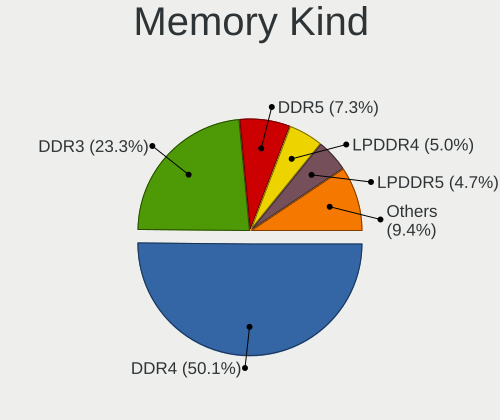

| Kind    | Computers | Percent |
|---------|-----------|---------|
| DDR4    | 507       | 50.15%  |
| DDR3    | 236       | 23.34%  |
| DDR5    | 74        | 7.32%   |
| LPDDR4  | 51        | 5.04%   |
| LPDDR5  | 48        | 4.75%   |
| LPDDR3  | 45        | 4.45%   |
| DDR2    | 18        | 1.78%   |
| SDRAM   | 14        | 1.38%   |
| Unknown | 12        | 1.19%   |
| DRAM    | 4         | 0.4%    |
| DDR     | 2         | 0.2%    |

Memory Form Factor
------------------

Physical design of the memory module

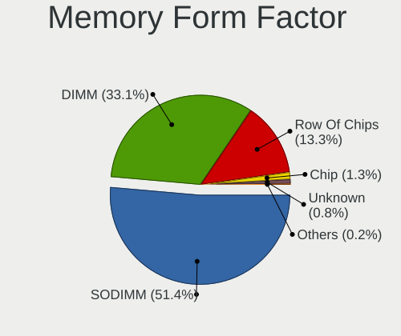

| Name         | Computers | Percent |
|--------------|-----------|---------|
| SODIMM       | 519       | 51.39%  |
| DIMM         | 334       | 33.07%  |
| Row Of Chips | 134       | 13.27%  |
| Chip         | 13        | 1.29%   |
| Unknown      | 8         | 0.79%   |
| FB-DIMM      | 2         | 0.2%    |

Memory Size
-----------

Memory module size

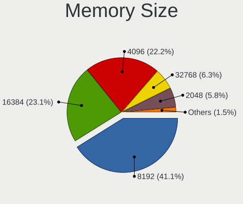

| Size  | Computers | Percent |
|-------|-----------|---------|
| 8192  | 444       | 41.11%  |
| 16384 | 249       | 23.06%  |
| 4096  | 240       | 22.22%  |
| 32768 | 68        | 6.3%    |
| 2048  | 63        | 5.83%   |
| 1024  | 10        | 0.93%   |
| 49152 | 2         | 0.19%   |
| 12288 | 1         | 0.09%   |
| 6144  | 1         | 0.09%   |
| 512   | 1         | 0.09%   |
| 128   | 1         | 0.09%   |

Memory Speed
------------

Memory module speed

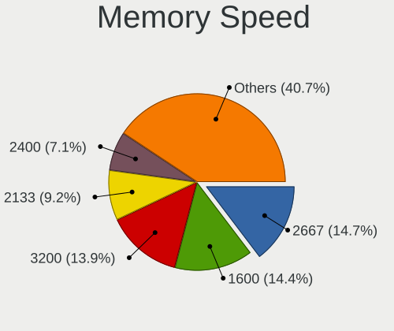

| Speed   | Computers | Percent |
|---------|-----------|---------|
| 2667    | 160       | 14.67%  |
| 1600    | 157       | 14.39%  |
| 3200    | 152       | 13.93%  |
| 2133    | 100       | 9.17%   |
| 2400    | 78        | 7.15%   |
| 3600    | 39        | 3.57%   |
| 1333    | 35        | 3.21%   |
| 6400    | 31        | 2.84%   |
| 4267    | 28        | 2.57%   |
| 5600    | 23        | 2.11%   |
| 1867    | 22        | 2.02%   |
| 4800    | 21        | 1.92%   |
| 3800    | 19        | 1.74%   |
| 6000    | 16        | 1.47%   |
| 667     | 16        | 1.47%   |
| 1334    | 15        | 1.37%   |
| 3733    | 13        | 1.19%   |
| 8400    | 10        | 0.92%   |
| 7500    | 10        | 0.92%   |
| 6200    | 9         | 0.82%   |
| 3866    | 9         | 0.82%   |
| 3000    | 9         | 0.82%   |
| 1800    | 9         | 0.82%   |
| 3466    | 8         | 0.73%   |
| 3400    | 8         | 0.73%   |
| 1067    | 8         | 0.73%   |
| 2666    | 7         | 0.64%   |
| 2800    | 6         | 0.55%   |
| 4199    | 5         | 0.46%   |
| 4000    | 5         | 0.46%   |
| 2933    | 5         | 0.46%   |
| 1066    | 5         | 0.46%   |
| 8533    | 4         | 0.37%   |
| 4266    | 4         | 0.37%   |
| 3266    | 4         | 0.37%   |
| 3100    | 4         | 0.37%   |
| 800     | 4         | 0.37%   |
| 3333    | 3         | 0.27%   |
| 2000    | 3         | 0.27%   |
| Unknown | 3         | 0.27%   |

Printers & scanners
-------------------

Printer Vendor
--------------

Printer device vendors

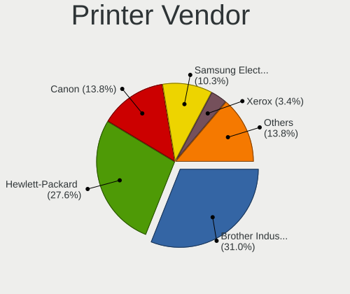

| Vendor              | Computers | Percent |
|---------------------|-----------|---------|
| Brother Industries  | 9         | 31.03%  |
| Hewlett-Packard     | 8         | 27.59%  |
| Canon               | 4         | 13.79%  |
| Samsung Electronics | 3         | 10.34%  |
| Xerox               | 1         | 3.45%   |
| Seiko Epson         | 1         | 3.45%   |
| Pantum              | 1         | 3.45%   |
| Kyocera             | 1         | 3.45%   |
| Dymo-CoStar         | 1         | 3.45%   |

Printer Model
-------------

Printer device models

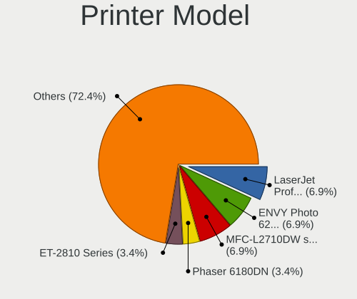

| Model                                | Computers | Percent |
|--------------------------------------|-----------|---------|
| HP LaserJet Professional P 1102w     | 2         | 6.9%    |
| HP ENVY Photo 6200 series            | 2         | 6.9%    |
| Brother MFC-L2710DW series           | 2         | 6.9%    |
| Xerox Phaser 6180DN                  | 1         | 3.45%   |
| Seiko Epson ET-2810 Series           | 1         | 3.45%   |
| Samsung ML-216x Series Laser Printer | 1         | 3.45%   |
| Samsung M2020 Series                 | 1         | 3.45%   |
| Samsung CLP-325 Color Laser Printer  | 1         | 3.45%   |
| Pantum P2500W series                 | 1         | 3.45%   |
| Kyocera ECOSYS P2235dn               | 1         | 3.45%   |
| HP Printing Support                  | 1         | 3.45%   |
| HP DeskJet F300 series               | 1         | 3.45%   |
| HP DeskJet 2700 series               | 1         | 3.45%   |
| HP Deskjet 2540 series               | 1         | 3.45%   |
| Dymo-CoStar DYMO LabelWriter 450 DUO | 1         | 3.45%   |
| Canon TS5300 series                  | 1         | 3.45%   |
| Canon PIXMA MX530 Series             | 1         | 3.45%   |
| Canon LiDE 300                       | 1         | 3.45%   |
| Canon iP2600 series                  | 1         | 3.45%   |
| Brother QL-800 Label Printer         | 1         | 3.45%   |
| Brother QL-550 printer               | 1         | 3.45%   |
| Brother PT-2450DX                    | 1         | 3.45%   |
| Brother MFC-J5740DW                  | 1         | 3.45%   |
| Brother HL-1210W series              | 1         | 3.45%   |
| Brother DCP-8085DN                   | 1         | 3.45%   |
| Brother DCP-7030                     | 1         | 3.45%   |

Scanner Vendor
--------------

Scanner device vendors

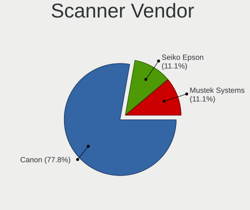

| Vendor         | Computers | Percent |
|----------------|-----------|---------|
| Canon          | 7         | 77.78%  |
| Seiko Epson    | 1         | 11.11%  |
| Mustek Systems | 1         | 11.11%  |

Scanner Model
-------------

Scanner device models

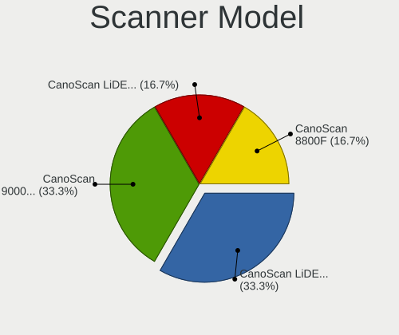

| Model                               | Computers | Percent |
|-------------------------------------|-----------|---------|
| Canon CanoScan LiDE 200             | 2         | 22.22%  |
| Canon CanoScan LiDE 110             | 2         | 22.22%  |
| Canon CanoScan 9000F Mark II        | 2         | 22.22%  |
| Seiko Epson Perfection V37/V370     | 1         | 11.11%  |
| Mustek Systems BearPaw 1200 CU Plus | 1         | 11.11%  |
| Canon CanoScan 8800F                | 1         | 11.11%  |

Camera
------

Camera Vendor
-------------

Camera device vendors

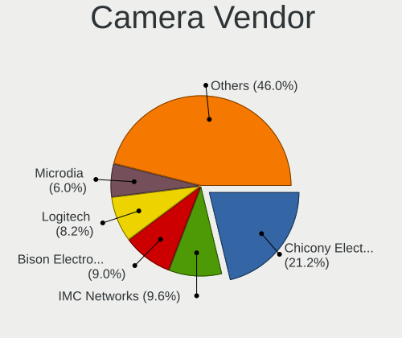

| Vendor                                 | Computers | Percent |
|----------------------------------------|-----------|---------|
| Chicony Electronics                    | 246       | 21.24%  |
| IMC Networks                           | 111       | 9.59%   |
| Bison Electronics                      | 104       | 8.98%   |
| Logitech                               | 95        | 8.2%    |
| Microdia                               | 69        | 5.96%   |
| Sunplus Innovation Technology          | 64        | 5.53%   |
| Realtek Semiconductor                  | 58        | 5.01%   |
| Quanta                                 | 54        | 4.66%   |
| Apple                                  | 50        | 4.32%   |
| Lite-On Technology                     | 38        | 3.28%   |
| Cheng Uei Precision Industry (Foxlink) | 36        | 3.11%   |
| Luxvisions Innotech Limited            | 28        | 2.42%   |
| Suyin                                  | 21        | 1.81%   |
| Syntek                                 | 20        | 1.73%   |
| Microsoft                              | 14        | 1.21%   |
| Lenovo                                 | 14        | 1.21%   |
| Samsung Electronics                    | 11        | 0.95%   |
| ShineTech                              | 10        | 0.86%   |
| Silicon Motion                         | 9         | 0.78%   |
| Creative Technology                    | 9         | 0.78%   |
| Alcor Micro                            | 9         | 0.78%   |
| Shenzhen Kingcome Optoelectronic       | 6         | 0.52%   |
| Razer USA                              | 6         | 0.52%   |
| Primax Electronics                     | 6         | 0.52%   |
| Sonix Technology                       | 5         | 0.43%   |
| Ricoh                                  | 5         | 0.43%   |
| Z-Star Microelectronics                | 4         | 0.35%   |
| Acer                                   | 4         | 0.35%   |
| Sony Ericsson Mobile Communications AB | 3         | 0.26%   |
| Omnivision                             | 3         | 0.26%   |
| MacroSilicon                           | 3         | 0.26%   |
| ALi                                    | 3         | 0.26%   |
| YGTek                                  | 2         | 0.17%   |
| Valve Software                         | 2         | 0.17%   |
| Trust                                  | 2         | 0.17%   |
| Sunplus Technology                     | 2         | 0.17%   |
| LianYi                                 | 2         | 0.17%   |
| Intel                                  | 2         | 0.17%   |
| Importek                               | 2         | 0.17%   |
| Generalplus Technology                 | 2         | 0.17%   |

Camera Model
------------

Camera device models

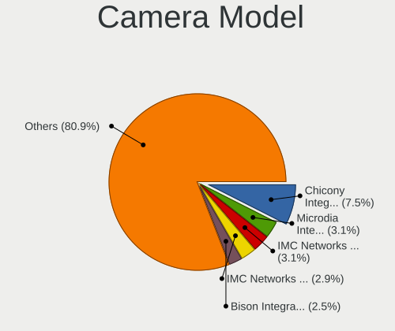

| Model                                             | Computers | Percent |
|---------------------------------------------------|-----------|---------|
| Chicony Integrated Camera                         | 88        | 7.48%   |
| Microdia Integrated_Webcam_HD                     | 37        | 3.15%   |
| IMC Networks Integrated Camera                    | 37        | 3.15%   |
| IMC Networks USB2.0 HD UVC WebCam                 | 34        | 2.89%   |
| Bison Integrated Camera                           | 29        | 2.47%   |
| Chicony HP HD Camera                              | 24        | 2.04%   |
| Chicony HD Webcam                                 | 23        | 1.96%   |
| Apple iPhone 5/5C/5S/6/SE/7/8/X                   | 20        | 1.7%    |
| Logitech C922 Pro Stream Webcam                   | 16        | 1.36%   |
| Lite-On Integrated Camera                         | 16        | 1.36%   |
| Syntek Integrated Camera                          | 15        | 1.28%   |
| Sunplus Integrated_Webcam_HD                      | 15        | 1.28%   |
| Realtek Integrated_Webcam_HD                      | 14        | 1.19%   |
| Logitech HD Pro Webcam C920                       | 14        | 1.19%   |
| Quanta HP HD Camera                               | 13        | 1.11%   |
| Chicony HP HD Webcam                              | 13        | 1.11%   |
| Bison HD Webcam                                   | 13        | 1.11%   |
| Lite-On HP HD Camera                              | 12        | 1.02%   |
| Bison SunplusIT Integrated Camera                 | 12        | 1.02%   |
| Samsung Galaxy series, misc. (MTP mode)           | 11        | 0.94%   |
| Luxvisions Innotech Limited Integrated Camera     | 11        | 0.94%   |
| Apple FaceTime HD Camera (Built-in)               | 11        | 0.94%   |
| Bison Lenovo EasyCamera                           | 10        | 0.85%   |
| Sunplus HD WebCam                                 | 9         | 0.77%   |
| Logitech Webcam C270                              | 9         | 0.77%   |
| Cheng Uei Precision Industry (Foxlink) HD Camera  | 9         | 0.77%   |
| Apple FaceTime HD Camera                          | 9         | 0.77%   |
| Sunplus FULL HD webcam                            | 8         | 0.68%   |
| Chicony Integrated HP HD Webcam                   | 8         | 0.68%   |
| Sunplus ASUS Webcam                               | 7         | 0.6%    |
| Quanta HD User Facing                             | 7         | 0.6%    |
| Microsoft LifeCam Cinema                          | 7         | 0.6%    |
| Luxvisions Innotech Limited Integrated RGB Camera | 7         | 0.6%    |
| Logitech StreamCam                                | 7         | 0.6%    |
| Logitech Logitech Webcam C925e                    | 7         | 0.6%    |
| Lenovo Integrated Webcam [R5U877]                 | 7         | 0.6%    |
| Chicony HP Wide Vision HD Camera                  | 7         | 0.6%    |
| Chicony EasyCamera                                | 7         | 0.6%    |
| Bison BisonCam, NB Pro                            | 7         | 0.6%    |
| Apple Built-in iSight                             | 7         | 0.6%    |

Security
--------

Fingerprint Vendor
------------------

Fingerprint sensor vendors

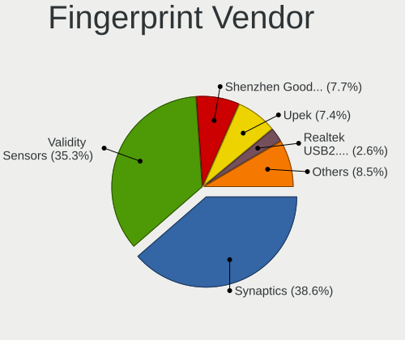

| Vendor                             | Computers | Percent |
|------------------------------------|-----------|---------|
| Synaptics                          | 105       | 38.6%   |
| Validity Sensors                   | 96        | 35.29%  |
| Shenzhen Goodix Technology         | 21        | 7.72%   |
| Upek                               | 20        | 7.35%   |
| Realtek USB2.0 Finger Print Bridge | 7         | 2.57%   |
| Elan Microelectronics              | 7         | 2.57%   |
| LighTuning Technology              | 6         | 2.21%   |
| AuthenTec                          | 5         | 1.84%   |
| Samsung Electronics                | 4         | 1.47%   |
| STMicroelectronics                 | 1         | 0.37%   |

Fingerprint Model
-----------------

Fingerprint sensor models

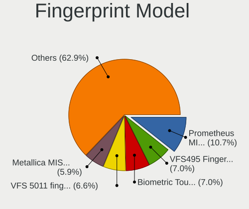

| Model                                                                      | Computers | Percent |
|----------------------------------------------------------------------------|-----------|---------|
| Synaptics Prometheus MIS Touch Fingerprint Reader                          | 29        | 10.66%  |
| Validity Sensors VFS495 Fingerprint Reader                                 | 19        | 6.99%   |
| Upek Biometric Touchchip/Touchstrip Fingerprint Sensor                     | 19        | 6.99%   |
| Validity Sensors VFS 5011 fingerprint sensor                               | 18        | 6.62%   |
| Synaptics Metallica MIS Touch Fingerprint Reader                           | 16        | 5.88%   |
| Validity Sensors Synaptics WBDI                                            | 14        | 5.15%   |
| Synaptics Prometheus Fingerprint Reader                                    | 12        | 4.41%   |
| Synaptics Fingerprint reader [HP G6]                                       | 10        | 3.68%   |
| Validity Sensors VFS7500 Touch Fingerprint Sensor                          | 9         | 3.31%   |
| Validity Sensors VFS491                                                    | 8         | 2.94%   |
| Validity Sensors Synaptics VFS7552 Touch Fingerprint Sensor with PurePrint | 8         | 2.94%   |
| Synaptics UWP WBDI Device                                                  | 8         | 2.94%   |
| Shenzhen Goodix Fingerprint Reader                                         | 8         | 2.94%   |
| Synaptics WBDI                                                             | 7         | 2.57%   |
| Shenzhen Goodix  FingerPrint Device                                        | 7         | 2.57%   |
| Realtek USB2.0 Finger Print Bridge FocalTech Fingerprint Device            | 7         | 2.57%   |
| Validity Sensors VFS5011 Fingerprint Reader                                | 6         | 2.21%   |
| Validity Sensors VFS471 Fingerprint Reader                                 | 6         | 2.21%   |
| Synaptics  FS7604 Touch Fingerprint Sensor with PurePrint                  | 6         | 2.21%   |
| Synaptics FS7604 Touch Fingerprint Sensor with PurePrint                   | 6         | 2.21%   |
| Shenzhen Goodix FingerPrint                                                | 6         | 2.21%   |
| Elan ELAN:Fingerprint                                                      | 6         | 2.21%   |
| LighTuning EgisTec Touch Fingerprint Sensor                                | 5         | 1.84%   |
| Samsung Fingerprint Sensor Device - 730B                                   | 4         | 1.47%   |
| Validity Sensors VFS451 Fingerprint Reader                                 | 3         | 1.1%    |
| Synaptics UWP WBDI                                                         | 3         | 1.1%    |
| Synaptics Metallica MOH Touch Fingerprint Reader                           | 3         | 1.1%    |
| AuthenTec AES2810                                                          | 3         | 1.1%    |
| Validity Sensors Synaptics VFS7552 Touch Fingerprint Sensor                | 2         | 0.74%   |
| Synaptics  WBDI                                                            | 2         | 0.74%   |
| Validity Sensors VFS301 Fingerprint Reader                                 | 1         | 0.37%   |
| Validity Sensors VFS Fingerprint sensor                                    | 1         | 0.37%   |
| Validity Sensors Fingerprint scanner                                       | 1         | 0.37%   |
| Upek TCS5B Fingerprint sensor                                              | 1         | 0.37%   |
| Synaptics WBDI Fingerprint Reader USB 102                                  | 1         | 0.37%   |
| Synaptics WBDI Fingerprint Reader USB 086                                  | 1         | 0.37%   |
| STMicroelectronics Fingerprint Reader                                      | 1         | 0.37%   |
| LighTuning Fingerprint Reader                                              | 1         | 0.37%   |
| Elan fingerprint sensor [FeinTech FPS00200]                                | 1         | 0.37%   |
| AuthenTec AES2501 Fingerprint Sensor                                       | 1         | 0.37%   |

Chipcard Vendor
---------------

Chipcard module vendors

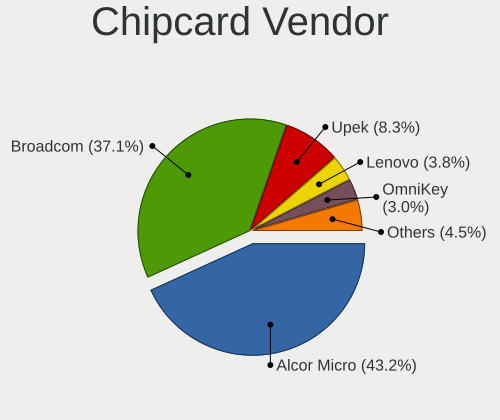

| Vendor                | Computers | Percent |
|-----------------------|-----------|---------|
| Alcor Micro           | 57        | 43.18%  |
| Broadcom              | 49        | 37.12%  |
| Upek                  | 11        | 8.33%   |
| Lenovo                | 5         | 3.79%   |
| OmniKey               | 4         | 3.03%   |
| Yubico.com            | 1         | 0.76%   |
| O2 Micro              | 1         | 0.76%   |
| Hewlett-Packard       | 1         | 0.76%   |
| Gemalto (was Gemplus) | 1         | 0.76%   |
| Chicony Electronics   | 1         | 0.76%   |
| Advanced Card Systems | 1         | 0.76%   |

Chipcard Model
--------------

Chipcard module models

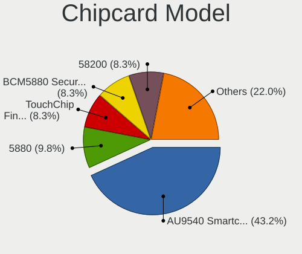

| Model                                                                        | Computers | Percent |
|------------------------------------------------------------------------------|-----------|---------|
| Alcor Micro AU9540 Smartcard Reader                                          | 57        | 43.18%  |
| Broadcom 5880                                                                | 13        | 9.85%   |
| Upek TouchChip Fingerprint Coprocessor (WBF advanced mode)                   | 11        | 8.33%   |
| Broadcom BCM5880 Secure Applications Processor with fingerprint swipe sensor | 11        | 8.33%   |
| Broadcom 58200                                                               | 11        | 8.33%   |
| Broadcom BCM5880 Secure Applications Processor                               | 8         | 6.06%   |
| Broadcom BCM58200 ControlVault 3 (FingerPrint sensor + Contacted SmartCard)  | 6         | 4.55%   |
| Lenovo Integrated Smart Card Reader                                          | 5         | 3.79%   |
| OmniKey CardMan 3021 / 3121                                                  | 3         | 2.27%   |
| Yubico.com Yubikey 4/5 CCID                                                  | 1         | 0.76%   |
| OmniKey 3x21 Smart Card Reader                                               | 1         | 0.76%   |
| O2 Micro OZ776 CCID Smartcard Reader                                         | 1         | 0.76%   |
| Hewlett-Packard SC Keyboard - Apollo (Liteon)                                | 1         | 0.76%   |
| Gemalto (was Gemplus) Compact Smart Card Reader Writer                       | 1         | 0.76%   |
| Chicony Electronics HP Skylab USB Smartcard Keyboard                         | 1         | 0.76%   |
| Advanced Card Systems ACR39U                                                 | 1         | 0.76%   |

Unsupported
-----------

Unsupported Devices
-------------------

Total unsupported devices on board

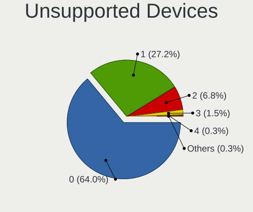

| Total | Computers | Percent |
|-------|-----------|---------|
| 0     | 1213      | 64.01%  |
| 1     | 516       | 27.23%  |
| 2     | 128       | 6.75%   |
| 3     | 28        | 1.48%   |
| 4     | 5         | 0.26%   |
| 5     | 3         | 0.16%   |
| 7     | 1         | 0.05%   |
| 6     | 1         | 0.05%   |

Unsupported Device Types
------------------------

Types of unsupported devices

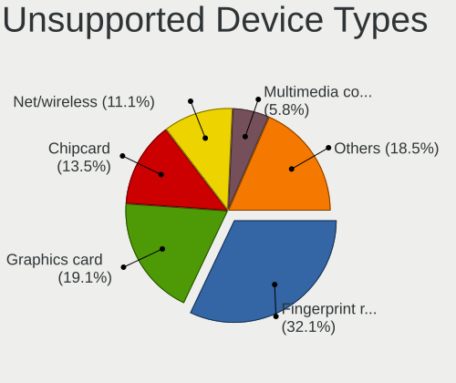

| Type                     | Computers | Percent |
|--------------------------|-----------|---------|
| Fingerprint reader       | 271       | 32.07%  |
| Graphics card            | 161       | 19.05%  |
| Chipcard                 | 114       | 13.49%  |
| Net/wireless             | 94        | 11.12%  |
| Multimedia controller    | 49        | 5.8%    |
| Unassigned class         | 41        | 4.85%   |
| Communication controller | 28        | 3.31%   |
| Camera                   | 23        | 2.72%   |
| Sound                    | 14        | 1.66%   |
| Bluetooth                | 14        | 1.66%   |
| Card reader              | 12        | 1.42%   |
| Storage                  | 7         | 0.83%   |
| Net/ethernet             | 7         | 0.83%   |
| Wireless                 | 4         | 0.47%   |
| Storage/raid             | 2         | 0.24%   |
| Modem                    | 2         | 0.24%   |
| Network                  | 1         | 0.12%   |
| Dvb card                 | 1         | 0.12%   |

