Linux in Norway - Tested Hardware & Statistics
----------------------------------------------

A project to collect tested hardware configurations for Linux in Norway.

Anyone can contribute to this report by the [hw-probe](https://github.com/linuxhw/hw-probe) tool:

    sudo -E hw-probe -all -upload

Please contribute! Especially if your hardware is rare.

This is a report for all computer types. See also reports for [desktops](/Location/Norway/Desktop/README.md) and [notebooks](/Location/Norway/Notebook/README.md).

Contents
--------

* [ Test Cases ](#test-cases)

* [ System ](#system)
  - [ OS                       ](#os)
  - [ OS Family                ](#os-family)
  - [ Kernel                   ](#kernel)
  - [ Kernel Family            ](#kernel-family)
  - [ Kernel Major Ver.        ](#kernel-major-ver)
  - [ Arch                     ](#arch)
  - [ DE                       ](#de)
  - [ Display Server           ](#display-server)
  - [ Display Manager          ](#display-manager)
  - [ OS Lang                  ](#os-lang)
  - [ Boot Mode                ](#boot-mode)
  - [ Filesystem               ](#filesystem)
  - [ Part. scheme             ](#part-scheme)
  - [ Dual Boot with Linux/BSD ](#dual-boot-with-linuxbsd)
  - [ Dual Boot (Win)          ](#dual-boot-win)

* [ Board ](#board)
  - [ Vendor                   ](#vendor)
  - [ Model                    ](#model)
  - [ Model Family             ](#model-family)
  - [ MFG Year                 ](#mfg-year)
  - [ Form Factor              ](#form-factor)
  - [ Secure Boot              ](#secure-boot)
  - [ Coreboot                 ](#coreboot)
  - [ RAM Size                 ](#ram-size)
  - [ RAM Used                 ](#ram-used)
  - [ Total Drives             ](#total-drives)
  - [ Has CD-ROM               ](#has-cd-rom)
  - [ Has Ethernet             ](#has-ethernet)
  - [ Has WiFi                 ](#has-wifi)
  - [ Has Bluetooth            ](#has-bluetooth)

* [ Location ](#location)
  - [ Country                  ](#country)
  - [ City                     ](#city)

* [ Drives ](#drives)
  - [ Drive Vendor             ](#drive-vendor)
  - [ Drive Model              ](#drive-model)
  - [ HDD Vendor               ](#hdd-vendor)
  - [ SSD Vendor               ](#ssd-vendor)
  - [ Drive Kind               ](#drive-kind)
  - [ Drive Connector          ](#drive-connector)
  - [ Drive Size               ](#drive-size)
  - [ Space Total              ](#space-total)
  - [ Space Used               ](#space-used)
  - [ Malfunc. Drives          ](#malfunc-drives)
  - [ Malfunc. Drive Vendor    ](#malfunc-drive-vendor)
  - [ Malfunc. HDD Vendor      ](#malfunc-hdd-vendor)
  - [ Malfunc. Drive Kind      ](#malfunc-drive-kind)
  - [ Failed Drives            ](#failed-drives)
  - [ Failed Drive Vendor      ](#failed-drive-vendor)
  - [ Drive Status             ](#drive-status)

* [ Storage controller ](#storage-controller)
  - [ Storage Vendor           ](#storage-vendor)
  - [ Storage Model            ](#storage-model)
  - [ Storage Kind             ](#storage-kind)

* [ Processor ](#processor)
  - [ CPU Vendor               ](#cpu-vendor)
  - [ CPU Model                ](#cpu-model)
  - [ CPU Model Family         ](#cpu-model-family)
  - [ CPU Cores                ](#cpu-cores)
  - [ CPU Sockets              ](#cpu-sockets)
  - [ CPU Threads              ](#cpu-threads)
  - [ CPU Op-Modes             ](#cpu-op-modes)
  - [ CPU Microcode            ](#cpu-microcode)
  - [ CPU Microarch            ](#cpu-microarch)

* [ Graphics ](#graphics)
  - [ GPU Vendor               ](#gpu-vendor)
  - [ GPU Model                ](#gpu-model)
  - [ GPU Combo                ](#gpu-combo)
  - [ GPU Driver               ](#gpu-driver)
  - [ GPU Memory               ](#gpu-memory)

* [ Monitor ](#monitor)
  - [ Monitor Vendor           ](#monitor-vendor)
  - [ Monitor Model            ](#monitor-model)
  - [ Monitor Resolution       ](#monitor-resolution)
  - [ Monitor Diagonal         ](#monitor-diagonal)
  - [ Monitor Width            ](#monitor-width)
  - [ Aspect Ratio             ](#aspect-ratio)
  - [ Monitor Area             ](#monitor-area)
  - [ Pixel Density            ](#pixel-density)
  - [ Multiple Monitors        ](#multiple-monitors)

* [ Network ](#network)
  - [ Net Controller Vendor    ](#net-controller-vendor)
  - [ Net Controller Model     ](#net-controller-model)
  - [ Wireless Vendor          ](#wireless-vendor)
  - [ Wireless Model           ](#wireless-model)
  - [ Ethernet Vendor          ](#ethernet-vendor)
  - [ Ethernet Model           ](#ethernet-model)
  - [ Net Controller Kind      ](#net-controller-kind)
  - [ Used Controller          ](#used-controller)
  - [ NICs                     ](#nics)
  - [ IPv6                     ](#ipv6)

* [ Bluetooth ](#bluetooth)
  - [ Bluetooth Vendor         ](#bluetooth-vendor)
  - [ Bluetooth Model          ](#bluetooth-model)

* [ Sound ](#sound)
  - [ Sound Vendor             ](#sound-vendor)
  - [ Sound Model              ](#sound-model)

* [ Memory ](#memory)
  - [ Memory Vendor            ](#memory-vendor)
  - [ Memory Model             ](#memory-model)
  - [ Memory Kind              ](#memory-kind)
  - [ Memory Form Factor       ](#memory-form-factor)
  - [ Memory Size              ](#memory-size)
  - [ Memory Speed             ](#memory-speed)

* [ Printers & scanners ](#printers--scanners)
  - [ Printer Vendor           ](#printer-vendor)
  - [ Printer Model            ](#printer-model)
  - [ Scanner Vendor           ](#scanner-vendor)
  - [ Scanner Model            ](#scanner-model)

* [ Camera ](#camera)
  - [ Camera Vendor            ](#camera-vendor)
  - [ Camera Model             ](#camera-model)

* [ Security ](#security)
  - [ Fingerprint Vendor       ](#fingerprint-vendor)
  - [ Fingerprint Model        ](#fingerprint-model)
  - [ Chipcard Vendor          ](#chipcard-vendor)
  - [ Chipcard Model           ](#chipcard-model)

* [ Unsupported ](#unsupported)
  - [ Unsupported Devices      ](#unsupported-devices)
  - [ Unsupported Device Types ](#unsupported-device-types)

Test Cases
----------

Total: 2617

| Vendor        | Model                       | Form-Factor | Probe                                                      | Date         |
|---------------|-----------------------------|-------------|------------------------------------------------------------|--------------|
| ASUSTek       | PRIME B650M-A AX II         | Desktop     | [7fea0bb2a1](https://linux-hardware.org/?probe=7fea0bb2a1) | Jan 06, 2025 |
| ASUSTek       | TUF Gaming B550M-PLUS       | Desktop     | [a7c3662aec](https://linux-hardware.org/?probe=a7c3662aec) | Jan 05, 2025 |
| MSI           | B250M BAZOOKA               | Desktop     | [30ef92bbfc](https://linux-hardware.org/?probe=30ef92bbfc) | Jan 05, 2025 |
| Dell          | 0WKGTH A04                  | Server      | [069319fa9f](https://linux-hardware.org/?probe=069319fa9f) | Jan 05, 2025 |
| Dell          | 0HFG24 A01                  | Server      | [9484e3f188](https://linux-hardware.org/?probe=9484e3f188) | Jan 05, 2025 |
| Supermicro    | X10SLM-F                    | Desktop     | [a8188b3af2](https://linux-hardware.org/?probe=a8188b3af2) | Jan 04, 2025 |
| Acer          | Aspire XC-705               | Desktop     | [9196850d14](https://linux-hardware.org/?probe=9196850d14) | Jan 04, 2025 |
| Dell          | Vostro 15 3530              | Notebook    | [20a13b2865](https://linux-hardware.org/?probe=20a13b2865) | Jan 04, 2025 |
| Dell          | XPS 13 9380                 | Notebook    | [063a26fa4d](https://linux-hardware.org/?probe=063a26fa4d) | Jan 02, 2025 |
| Apple         | MacBookPro11,3              | Notebook    | [5dcd5abfd5](https://linux-hardware.org/?probe=5dcd5abfd5) | Jan 02, 2025 |
| Dell          | XPS 13 9380                 | Notebook    | [fd629307a9](https://linux-hardware.org/?probe=fd629307a9) | Jan 02, 2025 |
| Apple         | MacBookPro11,3              | Notebook    | [29c6fca19b](https://linux-hardware.org/?probe=29c6fca19b) | Jan 01, 2025 |
| ASUSTek       | PRIME B650M-A AX II         | Desktop     | [c619b6152e](https://linux-hardware.org/?probe=c619b6152e) | Jan 01, 2025 |
| ASUSTek       | PRIME B650M-A AX II         | Desktop     | [04eb3b79c5](https://linux-hardware.org/?probe=04eb3b79c5) | Dec 31, 2024 |
| Lenovo        | ThinkPad T460 20FN004CMN    | Notebook    | [c918606381](https://linux-hardware.org/?probe=c918606381) | Dec 29, 2024 |
| Dell          | Latitude E7450              | Notebook    | [6677188d5d](https://linux-hardware.org/?probe=6677188d5d) | Dec 27, 2024 |
| ASRock        | X570 Taichi                 | Desktop     | [56b87a8422](https://linux-hardware.org/?probe=56b87a8422) | Dec 25, 2024 |
| Notebook      | L2x0TU                      | Notebook    | [da7db18331](https://linux-hardware.org/?probe=da7db18331) | Dec 24, 2024 |
| MSI           | X370 XPOWER GAMING TITAN... | Desktop     | [d464edfda5](https://linux-hardware.org/?probe=d464edfda5) | Dec 23, 2024 |
| Samsung       | 700G7A                      | Notebook    | [0f56340187](https://linux-hardware.org/?probe=0f56340187) | Dec 23, 2024 |
| HP            | EliteBook 8560w (XX058AV... | Notebook    | [fd12235221](https://linux-hardware.org/?probe=fd12235221) | Dec 23, 2024 |
| Lenovo        | ThinkPad T440 20B6009EMN    | Notebook    | [cc41649abd](https://linux-hardware.org/?probe=cc41649abd) | Dec 22, 2024 |
| TUXEDO        | Pulse 14 Gen4               | Notebook    | [dfdca3924e](https://linux-hardware.org/?probe=dfdca3924e) | Dec 22, 2024 |
| MSI           | X299 SLI PLUS               | Desktop     | [6aee2c68c6](https://linux-hardware.org/?probe=6aee2c68c6) | Dec 21, 2024 |
| MSI           | MS-B090                     | All in one  | [d80b4e7372](https://linux-hardware.org/?probe=d80b4e7372) | Dec 21, 2024 |
| Notebook      | P375SM                      | Notebook    | [d888f7c54b](https://linux-hardware.org/?probe=d888f7c54b) | Dec 20, 2024 |
| Dell          | Vostro 15 3530              | Notebook    | [efe67ce19b](https://linux-hardware.org/?probe=efe67ce19b) | Dec 19, 2024 |
| ASRock        | B450 Gaming-ITX/ac          | Desktop     | [be8f18e2ad](https://linux-hardware.org/?probe=be8f18e2ad) | Dec 19, 2024 |
| ASUSTek       | SABERTOOTH Z170 MARK 1      | Notebook    | [98eb4dd31b](https://linux-hardware.org/?probe=98eb4dd31b) | Dec 18, 2024 |
| Acer          | Predator G3610              | Desktop     | [e1311f0567](https://linux-hardware.org/?probe=e1311f0567) | Dec 16, 2024 |
| Dell          | Vostro 15 3530              | Notebook    | [4c4dc318a7](https://linux-hardware.org/?probe=4c4dc318a7) | Dec 16, 2024 |
| Acer          | Predator G3610              | Desktop     | [6daec71034](https://linux-hardware.org/?probe=6daec71034) | Dec 15, 2024 |
| Dell          | 0GN6JF A01                  | Desktop     | [fce4597ad2](https://linux-hardware.org/?probe=fce4597ad2) | Dec 13, 2024 |
| ASUSTek       | TUF Gaming X670E-PLUS WI... | Desktop     | [edbb2404ff](https://linux-hardware.org/?probe=edbb2404ff) | Dec 12, 2024 |
| Acer          | Aspire A315-24P             | Notebook    | [c2c84cd977](https://linux-hardware.org/?probe=c2c84cd977) | Dec 12, 2024 |
| ASUSTek       | K56CB                       | Notebook    | [7bf07316a0](https://linux-hardware.org/?probe=7bf07316a0) | Dec 09, 2024 |
| Dell          | 0WV424 A00                  | Desktop     | [ca372688a2](https://linux-hardware.org/?probe=ca372688a2) | Dec 09, 2024 |
| ASUSTek       | ASUS TUF Gaming A15 FA50... | Notebook    | [4fef924a63](https://linux-hardware.org/?probe=4fef924a63) | Dec 09, 2024 |
| ASUSTek       | SABERTOOTH Z170 MARK 1      | Notebook    | [d1af1da978](https://linux-hardware.org/?probe=d1af1da978) | Dec 08, 2024 |
| ASUSTek       | ASUS TUF Gaming A15 FA50... | Notebook    | [31a8469396](https://linux-hardware.org/?probe=31a8469396) | Dec 08, 2024 |
| ASUSTek       | EX-A320M-GAMING             | Desktop     | [0f1748d404](https://linux-hardware.org/?probe=0f1748d404) | Dec 08, 2024 |
| ASUSTek       | N53SN                       | Notebook    | [fcda31ce2d](https://linux-hardware.org/?probe=fcda31ce2d) | Dec 08, 2024 |
| HP            | EliteBook 8560w (XX058AV... | Notebook    | [8eac1d1836](https://linux-hardware.org/?probe=8eac1d1836) | Dec 08, 2024 |
| MSI           | P67A-C45                    | Desktop     | [7ef8acc2eb](https://linux-hardware.org/?probe=7ef8acc2eb) | Dec 07, 2024 |
| MSI           | GE75 Raider 9SG             | Notebook    | [cafb130468](https://linux-hardware.org/?probe=cafb130468) | Dec 07, 2024 |
| Intel         | NUC10i7FNB M38062-307       | Mini pc     | [c6449eda95](https://linux-hardware.org/?probe=c6449eda95) | Dec 07, 2024 |
| Acer          | Swift SF314-52              | Notebook    | [4ac3dc04a3](https://linux-hardware.org/?probe=4ac3dc04a3) | Dec 06, 2024 |
| MSI           | MS-B090                     | All in one  | [c1b90fd6f0](https://linux-hardware.org/?probe=c1b90fd6f0) | Dec 06, 2024 |
| ASUSTek       | ROG STRIX B550-F GAMING     | Desktop     | [a9ec07c3c9](https://linux-hardware.org/?probe=a9ec07c3c9) | Dec 06, 2024 |
| Samsung       | 930X5J/910S5J/940X5J        | Notebook    | [0ac516c429](https://linux-hardware.org/?probe=0ac516c429) | Dec 05, 2024 |
| Lenovo        | ThinkPad P51 20HJS02H00     | Notebook    | [2839330374](https://linux-hardware.org/?probe=2839330374) | Dec 05, 2024 |
| Gigabyte      | Z170-Gaming K3              | Desktop     | [eb3f1d8587](https://linux-hardware.org/?probe=eb3f1d8587) | Dec 05, 2024 |
| Lenovo        | ThinkPad T480s 20L7S0BM0... | Notebook    | [77513c5287](https://linux-hardware.org/?probe=77513c5287) | Dec 03, 2024 |
| Lenovo        | ThinkBook 13s G2 ITL 20V... | Notebook    | [a3435f001c](https://linux-hardware.org/?probe=a3435f001c) | Dec 03, 2024 |
| Lenovo        | ThinkBook 13s G2 ITL 20V... | Notebook    | [601d3d0748](https://linux-hardware.org/?probe=601d3d0748) | Dec 02, 2024 |
| Acer          | Aspire AV15-51              | Notebook    | [c98b2b5898](https://linux-hardware.org/?probe=c98b2b5898) | Dec 01, 2024 |
| Dell          | 0654JC A01                  | Desktop     | [f675f7736c](https://linux-hardware.org/?probe=f675f7736c) | Dec 01, 2024 |
| Dell          | 0654JC A01                  | Desktop     | [c195b37ae1](https://linux-hardware.org/?probe=c195b37ae1) | Nov 30, 2024 |
| Gigabyte      | Z790 AORUS ELITE AX         | Desktop     | [97a6701e22](https://linux-hardware.org/?probe=97a6701e22) | Nov 28, 2024 |
| MSI           | X470 GAMING PLUS MAX        | Desktop     | [bfdfec9a0f](https://linux-hardware.org/?probe=bfdfec9a0f) | Nov 28, 2024 |
| ASUSTek       | VivoBook_ASUSLaptop K360... | Notebook    | [68e95f2aff](https://linux-hardware.org/?probe=68e95f2aff) | Nov 27, 2024 |
| MSI           | GL62 6QF                    | Notebook    | [a78b9f5e5d](https://linux-hardware.org/?probe=a78b9f5e5d) | Nov 26, 2024 |
| ASUSTek       | PRIME B650M-A AX II         | Desktop     | [146aa6feef](https://linux-hardware.org/?probe=146aa6feef) | Nov 24, 2024 |
| Google        | Lillipup rev3               | Notebook    | [26051de0da](https://linux-hardware.org/?probe=26051de0da) | Nov 24, 2024 |
| ASUSTek       | PRIME B650M-A AX II         | Desktop     | [bfdfab6c5a](https://linux-hardware.org/?probe=bfdfab6c5a) | Nov 23, 2024 |
| Apple         | Mac-031AEE4D24BFF0B1 Mac... | Mini pc     | [7bf8a4f66e](https://linux-hardware.org/?probe=7bf8a4f66e) | Nov 21, 2024 |
| ASUSTek       | ROG STRIX Z390-F GAMING     | Desktop     | [896963442d](https://linux-hardware.org/?probe=896963442d) | Nov 18, 2024 |
| ASUSTek       | ROG STRIX Z390-F GAMING     | Desktop     | [5590d9581e](https://linux-hardware.org/?probe=5590d9581e) | Nov 18, 2024 |
| Raspberry ... | Raspberry Pi 5 Model B R... | Soc         | [190740e091](https://linux-hardware.org/?probe=190740e091) | Nov 16, 2024 |
| Raspberry ... | Raspberry Pi 5 Model B R... | Soc         | [8cf19c813b](https://linux-hardware.org/?probe=8cf19c813b) | Nov 16, 2024 |
| HP            | Compaq 15                   | Notebook    | [6c4420c44c](https://linux-hardware.org/?probe=6c4420c44c) | Nov 16, 2024 |
| Lenovo        | 30D0 SDK0J40705 WIN 3425... | Desktop     | [3f3987da44](https://linux-hardware.org/?probe=3f3987da44) | Nov 16, 2024 |
| HP            | Pavilion Laptop 14-ec0xx... | Notebook    | [2aba476766](https://linux-hardware.org/?probe=2aba476766) | Nov 15, 2024 |
| HP            | 212B                        | Desktop     | [336e3528d0](https://linux-hardware.org/?probe=336e3528d0) | Nov 15, 2024 |
| ASUSTek       | TUF Gaming B650-PLUS WIF... | Desktop     | [3d319a0574](https://linux-hardware.org/?probe=3d319a0574) | Nov 14, 2024 |
| HP            | Laptop 15-db0xxx            | Notebook    | [660923eef0](https://linux-hardware.org/?probe=660923eef0) | Nov 14, 2024 |
| Lenovo        | Yoga Pro 7 14AHP9 83E3      | Notebook    | [75fd7eeca3](https://linux-hardware.org/?probe=75fd7eeca3) | Nov 13, 2024 |
| HP            | 212B                        | Desktop     | [bcc3afab34](https://linux-hardware.org/?probe=bcc3afab34) | Nov 13, 2024 |
| HP            | 212B                        | Desktop     | [c0172b4c4f](https://linux-hardware.org/?probe=c0172b4c4f) | Nov 13, 2024 |
| HP            | 212B                        | Desktop     | [3aae2e5b8b](https://linux-hardware.org/?probe=3aae2e5b8b) | Nov 13, 2024 |
| HP            | 212B                        | Desktop     | [c9d3c3b8cc](https://linux-hardware.org/?probe=c9d3c3b8cc) | Nov 13, 2024 |
| HP            | 212B                        | Desktop     | [75df095057](https://linux-hardware.org/?probe=75df095057) | Nov 13, 2024 |
| HUAWEI        | WRT-WX9                     | Notebook    | [1334a3e15b](https://linux-hardware.org/?probe=1334a3e15b) | Nov 11, 2024 |
| Dell          | 06XMFM A02                  | Desktop     | [c0a82d98c4](https://linux-hardware.org/?probe=c0a82d98c4) | Nov 09, 2024 |
| Dell          | 06XMFM A02                  | Desktop     | [cd63b86620](https://linux-hardware.org/?probe=cd63b86620) | Nov 09, 2024 |
| ASUSTek       | TUF Gaming B650-PLUS WIF... | Desktop     | [f58b0b5292](https://linux-hardware.org/?probe=f58b0b5292) | Nov 09, 2024 |
| ASUSTek       | CM6330_CM6630_CM6730_CM6... | Desktop     | [d6d52be38a](https://linux-hardware.org/?probe=d6d52be38a) | Nov 08, 2024 |
| Intel Clie... | LAPQC71A                    | Notebook    | [f25cf6f8a6](https://linux-hardware.org/?probe=f25cf6f8a6) | Nov 08, 2024 |
| HP            | 8053                        | Desktop     | [b08855c6d0](https://linux-hardware.org/?probe=b08855c6d0) | Nov 07, 2024 |
| Intel Clie... | LAPQC71A                    | Notebook    | [f349a34202](https://linux-hardware.org/?probe=f349a34202) | Nov 06, 2024 |
| ASUSTek       | PRIME X399-A                | Desktop     | [47631494b7](https://linux-hardware.org/?probe=47631494b7) | Nov 02, 2024 |
| Acer          | EM61SM/EM61PM               | Desktop     | [7dcd4deccd](https://linux-hardware.org/?probe=7dcd4deccd) | Nov 01, 2024 |
| Lenovo        | IdeaPad 530S-14IKB 81EU     | Notebook    | [81c61ad299](https://linux-hardware.org/?probe=81c61ad299) | Oct 30, 2024 |
| HP            | EliteBook 850 G8 Noteboo... | Notebook    | [bad5c7e702](https://linux-hardware.org/?probe=bad5c7e702) | Oct 29, 2024 |
| HP            | EliteBook 820 G2            | Notebook    | [648ab7b15f](https://linux-hardware.org/?probe=648ab7b15f) | Oct 29, 2024 |
| Lenovo        | Yoga 300-11IBR 80M1         | Notebook    | [d47c826466](https://linux-hardware.org/?probe=d47c826466) | Oct 28, 2024 |
| Lenovo        | IdeaPad 530S-14IKB 81EU     | Notebook    | [76d1943e3b](https://linux-hardware.org/?probe=76d1943e3b) | Oct 28, 2024 |
| TUXEDO        | Sirius 16 Gen2              | Notebook    | [701fca6089](https://linux-hardware.org/?probe=701fca6089) | Oct 28, 2024 |
| ASUSTek       | ROG STRIX Z690-F GAMING ... | Desktop     | [6a6fb283b0](https://linux-hardware.org/?probe=6a6fb283b0) | Oct 28, 2024 |
| ASUSTek       | ROG STRIX Z690-F GAMING ... | Desktop     | [08bd9a802a](https://linux-hardware.org/?probe=08bd9a802a) | Oct 28, 2024 |
| Acer          | Aspire XC-830               | Desktop     | [a69d23e60d](https://linux-hardware.org/?probe=a69d23e60d) | Oct 26, 2024 |
| Samsung       | 550P5C/550P7C               | Notebook    | [68724c7216](https://linux-hardware.org/?probe=68724c7216) | Oct 26, 2024 |
| TB            | WTR R1                      | Desktop     | [deb31354cb](https://linux-hardware.org/?probe=deb31354cb) | Oct 25, 2024 |
| Gigabyte      | TRX40 AORUS MASTER          | Desktop     | [f0e623c28f](https://linux-hardware.org/?probe=f0e623c28f) | Oct 23, 2024 |
| Gigabyte      | TRX40 AORUS MASTER          | Desktop     | [7778bb842b](https://linux-hardware.org/?probe=7778bb842b) | Oct 22, 2024 |
| Lenovo        | Yoga Pro 7 14IMH9 83E2      | Notebook    | [9c4dde9307](https://linux-hardware.org/?probe=9c4dde9307) | Oct 22, 2024 |
| TB            | WTR R1                      | Desktop     | [77199b6dc7](https://linux-hardware.org/?probe=77199b6dc7) | Oct 21, 2024 |
| MSI           | MAG B650 TOMAHAWK WIFI      | Desktop     | [8c3c800cab](https://linux-hardware.org/?probe=8c3c800cab) | Oct 20, 2024 |
| MSI           | Z590-A PRO                  | Desktop     | [d30d302c17](https://linux-hardware.org/?probe=d30d302c17) | Oct 19, 2024 |
| MSI           | Z590-A PRO                  | Desktop     | [81b2d1e1f4](https://linux-hardware.org/?probe=81b2d1e1f4) | Oct 19, 2024 |
| Dell          | Latitude 7390               | Notebook    | [2859da8ef7](https://linux-hardware.org/?probe=2859da8ef7) | Oct 19, 2024 |
| ASUSTek       | Pro WS X570-ACE             | Desktop     | [bc04563516](https://linux-hardware.org/?probe=bc04563516) | Oct 17, 2024 |
| ASUSTek       | Pro WS X570-ACE             | Desktop     | [dd98dbec76](https://linux-hardware.org/?probe=dd98dbec76) | Oct 17, 2024 |
| Dell          | Latitude 5550               | Notebook    | [31ec440570](https://linux-hardware.org/?probe=31ec440570) | Oct 16, 2024 |
| ASUSTek       | VivoBook_ASUSLaptop K360... | Notebook    | [dc830d2570](https://linux-hardware.org/?probe=dc830d2570) | Oct 16, 2024 |
| Dell          | Precision 5570              | Notebook    | [91acfd36a9](https://linux-hardware.org/?probe=91acfd36a9) | Oct 14, 2024 |
| Dell          | Precision 5570              | Notebook    | [59646d280c](https://linux-hardware.org/?probe=59646d280c) | Oct 14, 2024 |
| Lenovo        | Yoga Slim 6 14APU8 82X3     | Notebook    | [846f23a439](https://linux-hardware.org/?probe=846f23a439) | Oct 14, 2024 |
| Dell          | Precision 5470              | Notebook    | [f4c728542b](https://linux-hardware.org/?probe=f4c728542b) | Oct 14, 2024 |
| Acer          | Swift SF314-52              | Notebook    | [2c18405cfe](https://linux-hardware.org/?probe=2c18405cfe) | Oct 14, 2024 |
| Apple         | MacBookPro8,1               | Notebook    | [d2d644c166](https://linux-hardware.org/?probe=d2d644c166) | Oct 13, 2024 |
| ASUSTek       | PRIME B650M-A AX II         | Desktop     | [f0e04419cd](https://linux-hardware.org/?probe=f0e04419cd) | Oct 13, 2024 |
| HP            | 250 G7 Notebook PC          | Notebook    | [e1c4a5a26f](https://linux-hardware.org/?probe=e1c4a5a26f) | Oct 12, 2024 |
| Lenovo        | ThinkPad X1 Fold 16 Gen ... | Tablet      | [cf313fdfa9](https://linux-hardware.org/?probe=cf313fdfa9) | Oct 12, 2024 |
| ASUSTek       | PRIME B650M-A AX II         | Desktop     | [f5ef0479ee](https://linux-hardware.org/?probe=f5ef0479ee) | Oct 12, 2024 |
| Lenovo        | ThinkPad X13 Gen 3 21BQS... | Notebook    | [b3284fe53e](https://linux-hardware.org/?probe=b3284fe53e) | Oct 10, 2024 |
| MSI           | X299 SLI PLUS               | Desktop     | [56774f9775](https://linux-hardware.org/?probe=56774f9775) | Oct 08, 2024 |
| HP            | OMEN by Gaming Laptop 16... | Notebook    | [8adc49985c](https://linux-hardware.org/?probe=8adc49985c) | Oct 08, 2024 |
| Acer          | Swift SFG16-72              | Notebook    | [b8f102b8b2](https://linux-hardware.org/?probe=b8f102b8b2) | Oct 08, 2024 |
| Lenovo        | SHARKBAY 0B98401 WIN        | Desktop     | [063daa6250](https://linux-hardware.org/?probe=063daa6250) | Oct 07, 2024 |
| Dell          | Latitude 7480               | Notebook    | [9c71766baa](https://linux-hardware.org/?probe=9c71766baa) | Oct 07, 2024 |
| Lenovo        | Yoga Slim 6 14APU8 82X3     | Notebook    | [f295336477](https://linux-hardware.org/?probe=f295336477) | Oct 06, 2024 |
| MSI           | X299 SLI PLUS               | Desktop     | [6e0a3be817](https://linux-hardware.org/?probe=6e0a3be817) | Oct 04, 2024 |
| Samsung       | 900X3F                      | Notebook    | [12e6b46207](https://linux-hardware.org/?probe=12e6b46207) | Oct 03, 2024 |
| Samsung       | 900X3F                      | Notebook    | [5b7f51059a](https://linux-hardware.org/?probe=5b7f51059a) | Oct 03, 2024 |
| Lenovo        | Yoga Pro 7 14AHP9 83E3      | Notebook    | [ed0a6b20fe](https://linux-hardware.org/?probe=ed0a6b20fe) | Oct 02, 2024 |
| Acer          | Aspire A315-24P             | Notebook    | [f6b769cb7f](https://linux-hardware.org/?probe=f6b769cb7f) | Oct 01, 2024 |
| Lenovo        | IdeaPad 320-15IKB 80XL      | Notebook    | [fc70ade81c](https://linux-hardware.org/?probe=fc70ade81c) | Sep 30, 2024 |
| Dell          | Latitude E6520              | Notebook    | [4ed4a2acc3](https://linux-hardware.org/?probe=4ed4a2acc3) | Sep 30, 2024 |
| Acer          | Aspire A315-44P             | Notebook    | [99406631a5](https://linux-hardware.org/?probe=99406631a5) | Sep 30, 2024 |
| Dell          | 0FM586                      | Desktop     | [67cb39d9d4](https://linux-hardware.org/?probe=67cb39d9d4) | Sep 29, 2024 |
| HP            | ProBook 440 G5              | Notebook    | [9cc0b761cf](https://linux-hardware.org/?probe=9cc0b761cf) | Sep 27, 2024 |
| Gigabyte      | X570 AORUS ULTRA            | Desktop     | [716c7d8042](https://linux-hardware.org/?probe=716c7d8042) | Sep 27, 2024 |
| Lenovo        | ThinkPad X1 Carbon 6th 2... | Notebook    | [2091c77d29](https://linux-hardware.org/?probe=2091c77d29) | Sep 24, 2024 |
| Lenovo        | ThinkPad L430 24662W2       | Notebook    | [a44f25c4d7](https://linux-hardware.org/?probe=a44f25c4d7) | Sep 22, 2024 |
| Lenovo        | ThinkPad T470 20HDS14L00    | Notebook    | [4944f4cf4f](https://linux-hardware.org/?probe=4944f4cf4f) | Sep 22, 2024 |
| HP            | Elite Dragonfly 13.5 inc... | Notebook    | [dfc03a83e8](https://linux-hardware.org/?probe=dfc03a83e8) | Sep 19, 2024 |
| Lenovo        | Yoga Slim 6 14APU8 82X3     | Notebook    | [b39128c23f](https://linux-hardware.org/?probe=b39128c23f) | Sep 18, 2024 |
| Gigabyte      | Z390 AORUS ULTRA-CF         | Desktop     | [a6bb869814](https://linux-hardware.org/?probe=a6bb869814) | Sep 18, 2024 |
| MSI           | GT72VR 7RD                  | Notebook    | [2a5a3fd32e](https://linux-hardware.org/?probe=2a5a3fd32e) | Sep 16, 2024 |
| Lenovo        | IdeaPad 1 14AMN7 82VF       | Notebook    | [797d319058](https://linux-hardware.org/?probe=797d319058) | Sep 14, 2024 |
| ASUSTek       | ROG STRIX B550-F GAMING     | Desktop     | [c73c99f4e9](https://linux-hardware.org/?probe=c73c99f4e9) | Sep 14, 2024 |
| Lenovo        | ThinkBook 16p Gen 2 20YM    | Notebook    | [2200373513](https://linux-hardware.org/?probe=2200373513) | Sep 14, 2024 |
| Lenovo        | ThinkPad X1 Carbon 6th 2... | Notebook    | [7c8b25d3fc](https://linux-hardware.org/?probe=7c8b25d3fc) | Sep 14, 2024 |
| ASUSTek       | Vivobook Go E1404FA_L140... | Notebook    | [b1c4f4a5a0](https://linux-hardware.org/?probe=b1c4f4a5a0) | Sep 13, 2024 |
| HP            | Laptop 15-db0xxx            | Notebook    | [98dd12cddc](https://linux-hardware.org/?probe=98dd12cddc) | Sep 12, 2024 |
| HP            | Elite Dragonfly 13.5 inc... | Notebook    | [e8ae45a202](https://linux-hardware.org/?probe=e8ae45a202) | Sep 10, 2024 |
| ASUSTek       | ROG STRIX B550-F GAMING     | Desktop     | [b3f2ac8f95](https://linux-hardware.org/?probe=b3f2ac8f95) | Sep 10, 2024 |
| Lenovo        | ThinkPad E590 20NBCTO1WW    | Notebook    | [8e796bbcbb](https://linux-hardware.org/?probe=8e796bbcbb) | Sep 10, 2024 |
| ASUSTek       | EX-A320M-GAMING             | Desktop     | [846c96bd78](https://linux-hardware.org/?probe=846c96bd78) | Sep 10, 2024 |
| ASUSTek       | PRIME X670-P                | Desktop     | [6d3e3c0adf](https://linux-hardware.org/?probe=6d3e3c0adf) | Sep 08, 2024 |
| ASRock        | Z690M-ITX/ax                | Desktop     | [ed55d6abbe](https://linux-hardware.org/?probe=ed55d6abbe) | Sep 08, 2024 |
| ASUSTek       | PRIME B650M-A AX II         | Desktop     | [3400f05f97](https://linux-hardware.org/?probe=3400f05f97) | Sep 08, 2024 |
| MSI           | P67A-C45                    | Desktop     | [48d827e24e](https://linux-hardware.org/?probe=48d827e24e) | Sep 07, 2024 |
| ASUSTek       | PRIME B650M-A AX II         | Desktop     | [f05502ceea](https://linux-hardware.org/?probe=f05502ceea) | Sep 07, 2024 |
| MSI           | X299 SLI PLUS               | Desktop     | [ae13914400](https://linux-hardware.org/?probe=ae13914400) | Sep 05, 2024 |
| ASUSTek       | SABERTOOTH Z170 MARK 1      | Notebook    | [ae2092a033](https://linux-hardware.org/?probe=ae2092a033) | Sep 04, 2024 |
| IBM           | 69Y5698                     | Server      | [3286b36b51](https://linux-hardware.org/?probe=3286b36b51) | Sep 03, 2024 |
| Samsung       | 940XFG                      | Notebook    | [aa1058489d](https://linux-hardware.org/?probe=aa1058489d) | Sep 02, 2024 |
| Raspberry ... | Raspberry Pi 2 Model B R... | Soc         | [b81e949dbb](https://linux-hardware.org/?probe=b81e949dbb) | Sep 02, 2024 |
| MSI           | MS-B1831                    | Desktop     | [de641ad19f](https://linux-hardware.org/?probe=de641ad19f) | Sep 02, 2024 |
| ASUSTek       | ROG STRIX B550-F GAMING     | Desktop     | [2ef9058707](https://linux-hardware.org/?probe=2ef9058707) | Sep 01, 2024 |
| Lenovo        | Yoga Slim 6 14APU8 82X3     | Notebook    | [66bca1f436](https://linux-hardware.org/?probe=66bca1f436) | Sep 01, 2024 |
| ASUSTek       | TUF Gaming B550-PLUS        | Desktop     | [ae44ee2cee](https://linux-hardware.org/?probe=ae44ee2cee) | Sep 01, 2024 |
| Dell          | XPS 14 9440                 | Notebook    | [7d09dc6039](https://linux-hardware.org/?probe=7d09dc6039) | Sep 01, 2024 |
| ASUSTek       | G75VW                       | Notebook    | [1029d7df86](https://linux-hardware.org/?probe=1029d7df86) | Sep 01, 2024 |
| HP            | ZBook Studio 16 inch G10... | Notebook    | [12c5234bb4](https://linux-hardware.org/?probe=12c5234bb4) | Aug 31, 2024 |
| Lenovo        | ThinkPad L480 20LTS15Q00    | Notebook    | [c7bd2c3d2e](https://linux-hardware.org/?probe=c7bd2c3d2e) | Aug 26, 2024 |
| Lenovo        | IdeaPad 510S-14IKB 80UV     | Notebook    | [d5aa8a720a](https://linux-hardware.org/?probe=d5aa8a720a) | Aug 26, 2024 |
| Lenovo        | ThinkPad T431s 20AA000EM... | Notebook    | [ac07d62bd7](https://linux-hardware.org/?probe=ac07d62bd7) | Aug 26, 2024 |
| Dell          | Precision 5470              | Notebook    | [88ce2aa72b](https://linux-hardware.org/?probe=88ce2aa72b) | Aug 26, 2024 |
| Dell          | Latitude E7440              | Notebook    | [86020e73b7](https://linux-hardware.org/?probe=86020e73b7) | Aug 26, 2024 |
| ASUSTek       | SABERTOOTH Z87              | Desktop     | [e7e038d435](https://linux-hardware.org/?probe=e7e038d435) | Aug 24, 2024 |
| MSI           | P67A-C45                    | Desktop     | [cb9aa1df4e](https://linux-hardware.org/?probe=cb9aa1df4e) | Aug 24, 2024 |
| HP            | ProBook 640 G8 Notebook ... | Notebook    | [c8c7a1fc43](https://linux-hardware.org/?probe=c8c7a1fc43) | Aug 24, 2024 |
| HP            | ProBook 640 G8 Notebook ... | Notebook    | [d9ae779618](https://linux-hardware.org/?probe=d9ae779618) | Aug 24, 2024 |
| Apple         | MacBookPro15,2              | Notebook    | [6d965eb60b](https://linux-hardware.org/?probe=6d965eb60b) | Aug 24, 2024 |
| Acer          | Aspire XC-885 V:1.1         | Desktop     | [15c0568e70](https://linux-hardware.org/?probe=15c0568e70) | Aug 23, 2024 |
| Dell          | Precision 3581              | Notebook    | [4812e53bbd](https://linux-hardware.org/?probe=4812e53bbd) | Aug 22, 2024 |
| Lenovo        | Yoga Slim 6 14APU8 82X3     | Notebook    | [eb3ae6069e](https://linux-hardware.org/?probe=eb3ae6069e) | Aug 21, 2024 |
| ASUSTek       | VivoBook_ASUSLaptop K360... | Notebook    | [27c1719af0](https://linux-hardware.org/?probe=27c1719af0) | Aug 20, 2024 |
| Lenovo        | ThinkBook 14s Yoga ITL 2... | Convertible | [5b7c55fd49](https://linux-hardware.org/?probe=5b7c55fd49) | Aug 20, 2024 |
| ASUSTek       | VivoBook_ASUSLaptop K360... | Notebook    | [9119a914b1](https://linux-hardware.org/?probe=9119a914b1) | Aug 19, 2024 |
| ASUSTek       | UX32VD                      | Notebook    | [6ac8ebe2f4](https://linux-hardware.org/?probe=6ac8ebe2f4) | Aug 18, 2024 |
| Lenovo        | ThinkBook 16 G4+ IAP 21C... | Notebook    | [b426ce3ac2](https://linux-hardware.org/?probe=b426ce3ac2) | Aug 17, 2024 |
| HP            | ProLiant ML110 Gen9         | Desktop     | [f428b6b837](https://linux-hardware.org/?probe=f428b6b837) | Aug 17, 2024 |
| ASUSTek       | ROG Maximus Z690 EXTREME... | Desktop     | [5e56291b25](https://linux-hardware.org/?probe=5e56291b25) | Aug 17, 2024 |
| Lenovo        | ThinkBook 14s Yoga ITL 2... | Convertible | [c51e04df17](https://linux-hardware.org/?probe=c51e04df17) | Aug 16, 2024 |
| HP            | EliteBook 840 G6            | Notebook    | [bdd1d10448](https://linux-hardware.org/?probe=bdd1d10448) | Aug 16, 2024 |
| HP            | EliteBook x360 1040 G7 N... | Convertible | [eb1799cffa](https://linux-hardware.org/?probe=eb1799cffa) | Aug 16, 2024 |
| ASUSTek       | PRIME B650M-A AX II         | Desktop     | [f7ebc5bc72](https://linux-hardware.org/?probe=f7ebc5bc72) | Aug 16, 2024 |
| ASUSTek       | PRIME B650M-A AX II         | Desktop     | [b5ee4cb48d](https://linux-hardware.org/?probe=b5ee4cb48d) | Aug 15, 2024 |
| ASUSTek       | PRIME B650M-A AX II         | Desktop     | [af442e0a7d](https://linux-hardware.org/?probe=af442e0a7d) | Aug 14, 2024 |
| ASUSTek       | ROG STRIX X570-F GAMING     | Desktop     | [eabbd49dde](https://linux-hardware.org/?probe=eabbd49dde) | Aug 13, 2024 |
| Lenovo        | Yoga Slim 6 14APU8 82X3     | Notebook    | [316a411fbd](https://linux-hardware.org/?probe=316a411fbd) | Aug 13, 2024 |
| Dell          | Latitude 7450               | Notebook    | [70b1ad6bf2](https://linux-hardware.org/?probe=70b1ad6bf2) | Aug 13, 2024 |
| Lenovo        | Yoga Slim 6 14APU8 82X3     | Notebook    | [0932664d6f](https://linux-hardware.org/?probe=0932664d6f) | Aug 11, 2024 |
| Apple         | MacBookAir4,2               | Notebook    | [a7885ab6c7](https://linux-hardware.org/?probe=a7885ab6c7) | Aug 10, 2024 |
| Chuwi         | CoreBook X                  | Notebook    | [626b500f3e](https://linux-hardware.org/?probe=626b500f3e) | Aug 09, 2024 |
| ASUSTek       | ROG STRIX Z590-I GAMING ... | Desktop     | [89f8fa0d8c](https://linux-hardware.org/?probe=89f8fa0d8c) | Aug 09, 2024 |
| ASUSTek       | VivoBook_ASUSLaptop E410... | Notebook    | [7d0bd59b78](https://linux-hardware.org/?probe=7d0bd59b78) | Aug 08, 2024 |
| Acer          | Aspire A314-23P             | Notebook    | [e2643f5f7f](https://linux-hardware.org/?probe=e2643f5f7f) | Aug 08, 2024 |
| ASUSTek       | TUF Gaming B650-PLUS WIF... | Desktop     | [2a9dc2c85f](https://linux-hardware.org/?probe=2a9dc2c85f) | Aug 07, 2024 |
| LG Electro... | 16Z90Q-G.AD78B              | Notebook    | [1a7313e7df](https://linux-hardware.org/?probe=1a7313e7df) | Aug 06, 2024 |
| HUAWEI        | MACH-WX9                    | Notebook    | [dec24e68aa](https://linux-hardware.org/?probe=dec24e68aa) | Aug 06, 2024 |
| ASUSTek       | K53E                        | Notebook    | [3a238385b4](https://linux-hardware.org/?probe=3a238385b4) | Aug 03, 2024 |
| HUAWEI        | KPL-W0X                     | Notebook    | [ef1e8a18e7](https://linux-hardware.org/?probe=ef1e8a18e7) | Aug 03, 2024 |
| Lenovo        | ThinkPad X61s 76693KG       | Notebook    | [26fdf1c09d](https://linux-hardware.org/?probe=26fdf1c09d) | Aug 02, 2024 |
| MSI           | MS-B0961                    | All in one  | [6b74bf289c](https://linux-hardware.org/?probe=6b74bf289c) | Aug 01, 2024 |
| Lenovo        | ThinkPad T400 276552G       | Notebook    | [4311887bdf](https://linux-hardware.org/?probe=4311887bdf) | Jul 31, 2024 |
| Lenovo        | ThinkPad P14s Gen 3 21J5... | Notebook    | [4c340a6167](https://linux-hardware.org/?probe=4c340a6167) | Jul 30, 2024 |
| Unknown       | Unknown                     | Notebook    | [f2b5207407](https://linux-hardware.org/?probe=f2b5207407) | Jul 28, 2024 |
| ASUSTek       | ROG CROSSHAIR X670E HERO    | Desktop     | [9b0b51426a](https://linux-hardware.org/?probe=9b0b51426a) | Jul 28, 2024 |
| ASUSTek       | TUF Gaming X670E-PLUS WI... | Desktop     | [41b190e88c](https://linux-hardware.org/?probe=41b190e88c) | Jul 28, 2024 |
| ASUSTek       | EX-A320M-GAMING             | Desktop     | [7bfff8a581](https://linux-hardware.org/?probe=7bfff8a581) | Jul 26, 2024 |
| HP            | ProLiant ML110 Gen9         | Desktop     | [b717e22824](https://linux-hardware.org/?probe=b717e22824) | Jul 26, 2024 |
| Dell          | 0WKGTH A04                  | Server      | [87c92916e9](https://linux-hardware.org/?probe=87c92916e9) | Jul 25, 2024 |
| ASUSTek       | PRIME B650M-A WIFI II       | Desktop     | [666296eb9c](https://linux-hardware.org/?probe=666296eb9c) | Jul 25, 2024 |
| ASUSTek       | PRIME B650M-A WIFI II       | Desktop     | [e1a52b039d](https://linux-hardware.org/?probe=e1a52b039d) | Jul 25, 2024 |
| HP            | ZBook Fury 15 G7 Mobile ... | Notebook    | [e077261e5a](https://linux-hardware.org/?probe=e077261e5a) | Jul 24, 2024 |
| Dell          | 0WKGTH A04                  | Server      | [141c0c0b21](https://linux-hardware.org/?probe=141c0c0b21) | Jul 24, 2024 |
| Unknown       | Unknown                     | Notebook    | [73874c0806](https://linux-hardware.org/?probe=73874c0806) | Jul 24, 2024 |
| MSI           | Z370 GAMING PRO CARBON A... | Desktop     | [b0c0954f50](https://linux-hardware.org/?probe=b0c0954f50) | Jul 23, 2024 |
| Acer          | Aspire S3-391               | Notebook    | [60eea9dc9a](https://linux-hardware.org/?probe=60eea9dc9a) | Jul 22, 2024 |
| ASUSTek       | ROG STRIX Z370-H GAMING     | Desktop     | [cfaf08c641](https://linux-hardware.org/?probe=cfaf08c641) | Jul 22, 2024 |
| HP            | Pavilion 13                 | Notebook    | [8b052076e8](https://linux-hardware.org/?probe=8b052076e8) | Jul 22, 2024 |
| MSI           | P67A-C45                    | Desktop     | [32f2434090](https://linux-hardware.org/?probe=32f2434090) | Jul 22, 2024 |
| ASUSTek       | GL10CS                      | Desktop     | [f08d921c78](https://linux-hardware.org/?probe=f08d921c78) | Jul 21, 2024 |
| Unknown       | Unknown                     | Notebook    | [2af4aa15ea](https://linux-hardware.org/?probe=2af4aa15ea) | Jul 21, 2024 |
| Acer          | Aspire XC-885 V:1.1         | Desktop     | [9302be7b15](https://linux-hardware.org/?probe=9302be7b15) | Jul 16, 2024 |
| ASUSTek       | Zenbook 15 UM3504DA_UM35... | Notebook    | [b0be759962](https://linux-hardware.org/?probe=b0be759962) | Jul 16, 2024 |
| MSI           | Z370 GAMING PRO CARBON A... | Desktop     | [cc6d4ce84a](https://linux-hardware.org/?probe=cc6d4ce84a) | Jul 16, 2024 |
| Lenovo        | LOQ 15APH8 82XT             | Notebook    | [80c4e78361](https://linux-hardware.org/?probe=80c4e78361) | Jul 14, 2024 |
| Dell          | Latitude 7370               | Notebook    | [1f1b9c9726](https://linux-hardware.org/?probe=1f1b9c9726) | Jul 14, 2024 |
| HP            | ProLiant ML110 Gen9         | Desktop     | [25e2740170](https://linux-hardware.org/?probe=25e2740170) | Jul 12, 2024 |
| Dell          | XPS 15 7590                 | Notebook    | [08d6f2654e](https://linux-hardware.org/?probe=08d6f2654e) | Jul 11, 2024 |
| Acer          | Aspire A315-44P             | Notebook    | [a919306bf7](https://linux-hardware.org/?probe=a919306bf7) | Jul 11, 2024 |
| MSI           | B650 GAMING PLUS WIFI       | Desktop     | [cf5ee7cc21](https://linux-hardware.org/?probe=cf5ee7cc21) | Jul 09, 2024 |
| Dell          | XPS 15 9520                 | Notebook    | [c4078b647c](https://linux-hardware.org/?probe=c4078b647c) | Jul 08, 2024 |
| ASUSTek       | PRIME B650M-A AX II         | Desktop     | [88a5f445af](https://linux-hardware.org/?probe=88a5f445af) | Jul 08, 2024 |
| HP            | EliteBook 840 G6            | Notebook    | [ff7b2c54f1](https://linux-hardware.org/?probe=ff7b2c54f1) | Jul 07, 2024 |
| Gigabyte      | B550I AORUS PRO AX          | Desktop     | [d6e942d4e3](https://linux-hardware.org/?probe=d6e942d4e3) | Jul 07, 2024 |
| ASUSTek       | PRIME B650M-A AX II         | Desktop     | [0deca696e0](https://linux-hardware.org/?probe=0deca696e0) | Jul 07, 2024 |
| Lenovo        | Yoga Slim 6 14APU8 82X3     | Notebook    | [d3bd873756](https://linux-hardware.org/?probe=d3bd873756) | Jul 06, 2024 |
| Lenovo        | ThinkPad W541 20EF0020MN    | Notebook    | [302903fcd9](https://linux-hardware.org/?probe=302903fcd9) | Jul 06, 2024 |
| Acer          | Aspire A315-44P             | Notebook    | [36c4d7b87f](https://linux-hardware.org/?probe=36c4d7b87f) | Jul 06, 2024 |
| Lenovo        | IdeaPad 530S-15IKB 81EV     | Notebook    | [8c7530298d](https://linux-hardware.org/?probe=8c7530298d) | Jul 04, 2024 |
| Gigabyte      | B550I AORUS PRO AX          | Desktop     | [fab8d92d5f](https://linux-hardware.org/?probe=fab8d92d5f) | Jul 02, 2024 |
| Lenovo        | Yoga Pro 7 14IRH8 82Y7      | Notebook    | [95cdf4988a](https://linux-hardware.org/?probe=95cdf4988a) | Jul 01, 2024 |
| Lenovo        | ThinkPad X1 Yoga Gen 8 2... | Convertible | [536df19897](https://linux-hardware.org/?probe=536df19897) | Jun 30, 2024 |
| Dell          | Latitude E7240              | Notebook    | [0fa0d32428](https://linux-hardware.org/?probe=0fa0d32428) | Jun 29, 2024 |
| Acer          | Swift SFE16-42              | Notebook    | [18caa8c46b](https://linux-hardware.org/?probe=18caa8c46b) | Jun 28, 2024 |
| Apple         | MacBookAir7,2               | Notebook    | [1f18213681](https://linux-hardware.org/?probe=1f18213681) | Jun 27, 2024 |
| Supermicro    | X10SLM-F                    | Desktop     | [62b652db82](https://linux-hardware.org/?probe=62b652db82) | Jun 25, 2024 |
| Dell          | 0WKGTH A04                  | Server      | [42a12e08f1](https://linux-hardware.org/?probe=42a12e08f1) | Jun 25, 2024 |
| Apple         | MacBookAir7,2               | Notebook    | [7c932fd75a](https://linux-hardware.org/?probe=7c932fd75a) | Jun 23, 2024 |
| ASUSTek       | ROG STRIX X670E-E GAMING... | Desktop     | [fe782c8c71](https://linux-hardware.org/?probe=fe782c8c71) | Jun 23, 2024 |
| Lenovo        | ThinkPad E14 Gen 2 20T60... | Notebook    | [3789df3305](https://linux-hardware.org/?probe=3789df3305) | Jun 22, 2024 |
| Dell          | Precision 5480              | Notebook    | [37179d6d1c](https://linux-hardware.org/?probe=37179d6d1c) | Jun 20, 2024 |
| MSI           | MPG B550 GAMING CARBON W... | Desktop     | [60c254e2f0](https://linux-hardware.org/?probe=60c254e2f0) | Jun 20, 2024 |
| HP            | EliteBook x360 1030 G8 N... | Convertible | [96e12f1536](https://linux-hardware.org/?probe=96e12f1536) | Jun 19, 2024 |
| HP            | ProBook 450 G2              | Notebook    | [b844682a3b](https://linux-hardware.org/?probe=b844682a3b) | Jun 19, 2024 |
| MSI           | B450M MORTAR TITANIUM       | Desktop     | [b621a9b1f4](https://linux-hardware.org/?probe=b621a9b1f4) | Jun 19, 2024 |
| HP            | Unknown                     | Notebook    | [79daced6d2](https://linux-hardware.org/?probe=79daced6d2) | Jun 18, 2024 |
| HP            | 1496                        | Desktop     | [05cd12bc4d](https://linux-hardware.org/?probe=05cd12bc4d) | Jun 17, 2024 |
| Dell          | Latitude 3350               | Notebook    | [8f3c5adaf1](https://linux-hardware.org/?probe=8f3c5adaf1) | Jun 17, 2024 |
| Shuttle       | FZ87                        | Desktop     | [f4ac7bddd5](https://linux-hardware.org/?probe=f4ac7bddd5) | Jun 17, 2024 |
| Dell          | Latitude E7240              | Notebook    | [10ea2586d7](https://linux-hardware.org/?probe=10ea2586d7) | Jun 16, 2024 |
| ASUSTek       | TUF Gaming B760-PLUS WIF... | Desktop     | [eff3f4b978](https://linux-hardware.org/?probe=eff3f4b978) | Jun 16, 2024 |
| Dell          | 0WKGTH A04                  | Server      | [c673b401e1](https://linux-hardware.org/?probe=c673b401e1) | Jun 16, 2024 |
| Gigabyte      | H470 HD3                    | Desktop     | [ea194468c8](https://linux-hardware.org/?probe=ea194468c8) | Jun 16, 2024 |
| Gigabyte      | H470 HD3                    | Desktop     | [0106eb3156](https://linux-hardware.org/?probe=0106eb3156) | Jun 16, 2024 |
| Notebook      | NS50_70MU                   | Notebook    | [dcd8f923f3](https://linux-hardware.org/?probe=dcd8f923f3) | Jun 16, 2024 |
| Lenovo        | IdeaPadFlex 5 14ALC7 82R... | Convertible | [06c5c9df08](https://linux-hardware.org/?probe=06c5c9df08) | Jun 16, 2024 |
| Lenovo        | IdeaPad Slim 3 14AMN8 82... | Notebook    | [f3996c1ab2](https://linux-hardware.org/?probe=f3996c1ab2) | Jun 15, 2024 |
| Lenovo        | IdeaPad Slim 3 14AMN8 82... | Notebook    | [467d268175](https://linux-hardware.org/?probe=467d268175) | Jun 15, 2024 |
| HP            | 1998                        | Desktop     | [f7a7075080](https://linux-hardware.org/?probe=f7a7075080) | Jun 13, 2024 |
| Lenovo        | ThinkPad P14s Gen 2i 20V... | Notebook    | [8364c453eb](https://linux-hardware.org/?probe=8364c453eb) | Jun 12, 2024 |
| MSI           | P67A-C45                    | Desktop     | [583c078205](https://linux-hardware.org/?probe=583c078205) | Jun 07, 2024 |
| ASUSTek       | ROG STRIX B450-F GAMING     | Desktop     | [5bf18fb60c](https://linux-hardware.org/?probe=5bf18fb60c) | Jun 07, 2024 |
| Lenovo        | ThinkPad T14 Gen 1 20UD0... | Notebook    | [318d35c49a](https://linux-hardware.org/?probe=318d35c49a) | Jun 05, 2024 |
| ASUSTek       | ROG STRIX B450-F GAMING     | Desktop     | [1d5e9aec18](https://linux-hardware.org/?probe=1d5e9aec18) | Jun 03, 2024 |
| ASUSTek       | ROG STRIX B450-F GAMING     | Desktop     | [cb866e4800](https://linux-hardware.org/?probe=cb866e4800) | Jun 03, 2024 |
| Microsoft     | Surface Pro 7+              | Tablet      | [e675325ec2](https://linux-hardware.org/?probe=e675325ec2) | Jun 02, 2024 |
| Dell          | XPS 15 9570                 | Notebook    | [4f3b26e053](https://linux-hardware.org/?probe=4f3b26e053) | Jun 02, 2024 |
| ASUSTek       | ROG STRIX B550-E GAMING     | Desktop     | [7d1dffb618](https://linux-hardware.org/?probe=7d1dffb618) | Jun 02, 2024 |
| Acer          | Aspire XC-705               | Desktop     | [4465a8e0b3](https://linux-hardware.org/?probe=4465a8e0b3) | Jun 02, 2024 |
| Microsoft     | Surface Pro 7+              | Tablet      | [5d80767cc9](https://linux-hardware.org/?probe=5d80767cc9) | Jun 01, 2024 |
| ASRock        | X570 Phantom Gaming 4       | Desktop     | [5585219ec0](https://linux-hardware.org/?probe=5585219ec0) | May 31, 2024 |
| HP            | Laptop 14-ck0xxx            | Notebook    | [c9932cd3cf](https://linux-hardware.org/?probe=c9932cd3cf) | May 29, 2024 |
| Lenovo        | ThinkPad L490 20Q6S93T00    | Notebook    | [d289a1a217](https://linux-hardware.org/?probe=d289a1a217) | May 28, 2024 |
| HP            | Laptop 14-ck0xxx            | Notebook    | [ddf6c003ee](https://linux-hardware.org/?probe=ddf6c003ee) | May 27, 2024 |
| Acer          | Aspire A315-44P             | Notebook    | [2bae45a3cc](https://linux-hardware.org/?probe=2bae45a3cc) | May 26, 2024 |
| HP            | ProLiant ML110 Gen9         | Desktop     | [f07223229b](https://linux-hardware.org/?probe=f07223229b) | May 25, 2024 |
| ASUSTek       | ROG STRIX B450-F GAMING     | Desktop     | [950f5fd416](https://linux-hardware.org/?probe=950f5fd416) | May 25, 2024 |
| Techvision    | TVI7309X B0                 | Desktop     | [c60f456077](https://linux-hardware.org/?probe=c60f456077) | May 24, 2024 |
| MSI           | GS65 Stealth 9SF            | Notebook    | [f8a0862274](https://linux-hardware.org/?probe=f8a0862274) | May 23, 2024 |
| MSI           | GS65 Stealth 9SF            | Notebook    | [321be6fff1](https://linux-hardware.org/?probe=321be6fff1) | May 23, 2024 |
| ASUSTek       | PRIME B650M-A AX II         | Desktop     | [71a450cd04](https://linux-hardware.org/?probe=71a450cd04) | May 20, 2024 |
| HP            | 1998                        | Desktop     | [f89a8cd471](https://linux-hardware.org/?probe=f89a8cd471) | May 17, 2024 |
| Lenovo        | ThinkPad T14 Gen 5 21MLC... | Notebook    | [c712ae4c63](https://linux-hardware.org/?probe=c712ae4c63) | May 15, 2024 |
| Dell          | XPS 15 9520                 | Notebook    | [ddfa8c6085](https://linux-hardware.org/?probe=ddfa8c6085) | May 15, 2024 |
| Dell          | XPS 15 9520                 | Notebook    | [6c753b0264](https://linux-hardware.org/?probe=6c753b0264) | May 14, 2024 |
| ASRock        | Z790 Taichi Lite            | Desktop     | [71cb8f37ed](https://linux-hardware.org/?probe=71cb8f37ed) | May 11, 2024 |
| ASUSTek       | ASUS TUF Gaming A15 FA50... | Notebook    | [98c20b9fc4](https://linux-hardware.org/?probe=98c20b9fc4) | May 09, 2024 |
| Panasonic     | CF-53SAWZYMN                | Notebook    | [15a322275f](https://linux-hardware.org/?probe=15a322275f) | May 08, 2024 |
| Dell          | 0GN6JF A01                  | Desktop     | [b9877feccd](https://linux-hardware.org/?probe=b9877feccd) | May 08, 2024 |
| Lenovo        | IdeaPad S510p 20298         | Notebook    | [b941b8d062](https://linux-hardware.org/?probe=b941b8d062) | May 07, 2024 |
| Lenovo        | ThinkPad X1 Yoga 2nd 20J... | Convertible | [92d80bd754](https://linux-hardware.org/?probe=92d80bd754) | May 06, 2024 |
| MSI           | 2AE0                        | Desktop     | [25c9b3836b](https://linux-hardware.org/?probe=25c9b3836b) | May 06, 2024 |
| Raspberry ... | Raspberry Pi 5 Model B R... | Soc         | [37ed88bcea](https://linux-hardware.org/?probe=37ed88bcea) | May 03, 2024 |
| Lenovo        | Yoga Slim 7 14ARE05 82A2    | Notebook    | [c7a39f14e7](https://linux-hardware.org/?probe=c7a39f14e7) | May 03, 2024 |
| HP            | ProBook 430 G8 Notebook ... | Notebook    | [67f5f847c9](https://linux-hardware.org/?probe=67f5f847c9) | May 03, 2024 |
| HP            | EliteBook 8570w             | Notebook    | [050889a119](https://linux-hardware.org/?probe=050889a119) | May 03, 2024 |
| HP            | EliteBook 8570w             | Notebook    | [6b53737811](https://linux-hardware.org/?probe=6b53737811) | May 03, 2024 |
| Lenovo        | ThinkPad T480 20L60034MX    | Notebook    | [eec0c4ee95](https://linux-hardware.org/?probe=eec0c4ee95) | May 02, 2024 |
| Lenovo        | ThinkPad T470 W10DG 20JN... | Notebook    | [def7a0898e](https://linux-hardware.org/?probe=def7a0898e) | May 02, 2024 |
| ASUSTek       | TUF Gaming X670E-PLUS WI... | Desktop     | [10d6846920](https://linux-hardware.org/?probe=10d6846920) | May 01, 2024 |
| IGEL Techn... | M350C                       | Notebook    | [c63a48250c](https://linux-hardware.org/?probe=c63a48250c) | May 01, 2024 |
| Acer          | EM61SM/EM61PM               | Desktop     | [3b2c0bd5f6](https://linux-hardware.org/?probe=3b2c0bd5f6) | May 01, 2024 |
| ASUSTek       | ROG STRIX B450-F GAMING     | Desktop     | [bb7791835b](https://linux-hardware.org/?probe=bb7791835b) | May 01, 2024 |
| Lenovo        | ThinkPad T510 43494JG       | Notebook    | [fe8480c6c4](https://linux-hardware.org/?probe=fe8480c6c4) | Apr 30, 2024 |
| Dell          | 06NWYK A00                  | Desktop     | [ec673a2386](https://linux-hardware.org/?probe=ec673a2386) | Apr 30, 2024 |
| ASUSTek       | ROG STRIX B460-F GAMING     | Desktop     | [b335a417f1](https://linux-hardware.org/?probe=b335a417f1) | Apr 30, 2024 |
| HP            | 0A98h                       | Desktop     | [1ebb8c49e0](https://linux-hardware.org/?probe=1ebb8c49e0) | Apr 29, 2024 |
| Raspberry ... | Raspberry Pi 5 Model B R... | Soc         | [4ef11d14a3](https://linux-hardware.org/?probe=4ef11d14a3) | Apr 29, 2024 |
| Apple         | Mac-DB15BD556843C820 iMa... | All in one  | [cabdbdd8b4](https://linux-hardware.org/?probe=cabdbdd8b4) | Apr 29, 2024 |
| ASUSTek       | PRIME Z790-P WIFI           | Desktop     | [3c89d5f47c](https://linux-hardware.org/?probe=3c89d5f47c) | Apr 29, 2024 |
| Gigabyte      | X570 I AORUS PRO WIFI       | Desktop     | [58fc3d5b13](https://linux-hardware.org/?probe=58fc3d5b13) | Apr 29, 2024 |
| ASUSTek       | PRIME X299-A                | Desktop     | [82f302ed14](https://linux-hardware.org/?probe=82f302ed14) | Apr 29, 2024 |
| ASUSTek       | PRIME X299-A                | Desktop     | [18f815fd59](https://linux-hardware.org/?probe=18f815fd59) | Apr 29, 2024 |
| Raspberry ... | Raspberry Pi 5 Model B R... | Soc         | [723af200e1](https://linux-hardware.org/?probe=723af200e1) | Apr 27, 2024 |
| HP            | ProBook 440 G6              | Notebook    | [3cf105c072](https://linux-hardware.org/?probe=3cf105c072) | Apr 26, 2024 |
| MSI           | MS-B1831                    | Desktop     | [63fec5c61b](https://linux-hardware.org/?probe=63fec5c61b) | Apr 25, 2024 |
| Lenovo        | Yoga Slim 7 Carbon 14ACN... | Notebook    | [3f76329bd6](https://linux-hardware.org/?probe=3f76329bd6) | Apr 23, 2024 |
| Lenovo        | ThinkPad P1 Gen 4i 20Y30... | Notebook    | [5d84a72fcf](https://linux-hardware.org/?probe=5d84a72fcf) | Apr 22, 2024 |
| ASUSTek       | ROG STRIX B450-F GAMING     | Desktop     | [f126ef0f39](https://linux-hardware.org/?probe=f126ef0f39) | Apr 22, 2024 |
| Dell          | 00V62H A01                  | Desktop     | [89c9b39716](https://linux-hardware.org/?probe=89c9b39716) | Apr 22, 2024 |
| Lenovo        | ThinkPad X1 Carbon Gen 1... | Notebook    | [994aae0769](https://linux-hardware.org/?probe=994aae0769) | Apr 21, 2024 |
| Lenovo        | ThinkPad X1 Carbon Gen 1... | Notebook    | [e26cecc411](https://linux-hardware.org/?probe=e26cecc411) | Apr 21, 2024 |
| Samsung       | 950XDB/951XDB/950XDY        | Notebook    | [252a0c4e05](https://linux-hardware.org/?probe=252a0c4e05) | Apr 21, 2024 |
| Lenovo        | ThinkPad T14 Gen 1 20UD0... | Notebook    | [0231457347](https://linux-hardware.org/?probe=0231457347) | Apr 21, 2024 |
| ASUSTek       | PRIME B650M-A WIFI II       | Desktop     | [bf7ed0943a](https://linux-hardware.org/?probe=bf7ed0943a) | Apr 21, 2024 |
| Apple         | Mac-DB15BD556843C820 iMa... | All in one  | [28f75ed494](https://linux-hardware.org/?probe=28f75ed494) | Apr 21, 2024 |
| Acer          | Enduro EUN314-51W           | Notebook    | [7a57f25e0e](https://linux-hardware.org/?probe=7a57f25e0e) | Apr 20, 2024 |
| Lenovo        | 312D SDK0J40697 WIN 3305... | Mini pc     | [bef996dda3](https://linux-hardware.org/?probe=bef996dda3) | Apr 20, 2024 |
| Acer          | Aspire XC-705               | Desktop     | [da91a97808](https://linux-hardware.org/?probe=da91a97808) | Apr 20, 2024 |
| HP            | Spectre x360 Convertible... | Convertible | [d99c576d13](https://linux-hardware.org/?probe=d99c576d13) | Apr 19, 2024 |
| Lenovo        | ThinkPad T520 42433ZG       | Notebook    | [d2899d8de6](https://linux-hardware.org/?probe=d2899d8de6) | Apr 19, 2024 |
| Apple         | MacBookAir6,1               | Notebook    | [08ca3d5ea0](https://linux-hardware.org/?probe=08ca3d5ea0) | Apr 19, 2024 |
| ASUSTek       | PRIME B650M-A AX II         | Desktop     | [6b0dd29862](https://linux-hardware.org/?probe=6b0dd29862) | Apr 19, 2024 |
| Clevo         | P170EM                      | Notebook    | [62fe8276aa](https://linux-hardware.org/?probe=62fe8276aa) | Apr 18, 2024 |
| Clevo         | P170EM                      | Notebook    | [46daa154fe](https://linux-hardware.org/?probe=46daa154fe) | Apr 18, 2024 |
| ASUSTek       | PRIME B650M-A WIFI II       | Desktop     | [f841d88fe9](https://linux-hardware.org/?probe=f841d88fe9) | Apr 17, 2024 |
| Lenovo        | ThinkPad P14s Gen 2a 21A... | Notebook    | [0cd0c2f953](https://linux-hardware.org/?probe=0cd0c2f953) | Apr 17, 2024 |
| ASUSTek       | ROG CROSSHAIR VIII HERO     | Desktop     | [e9fcf03a9f](https://linux-hardware.org/?probe=e9fcf03a9f) | Apr 17, 2024 |
| MSI           | PRO Z790-P WIFI             | Desktop     | [8d77664d91](https://linux-hardware.org/?probe=8d77664d91) | Apr 16, 2024 |
| MSI           | PRO Z790-P WIFI             | Desktop     | [40c6d6959f](https://linux-hardware.org/?probe=40c6d6959f) | Apr 15, 2024 |
| Google        | Morphius                    | Notebook    | [422dcd7238](https://linux-hardware.org/?probe=422dcd7238) | Apr 14, 2024 |
| Google        | Morphius                    | Notebook    | [97da05767b](https://linux-hardware.org/?probe=97da05767b) | Apr 13, 2024 |
| Dell          | 06X1TJ A00                  | Desktop     | [462d691265](https://linux-hardware.org/?probe=462d691265) | Apr 12, 2024 |
| Dell          | 06X1TJ A00                  | Desktop     | [be5c35a265](https://linux-hardware.org/?probe=be5c35a265) | Apr 12, 2024 |
| HP            | ProLiant ML110 Gen9         | Desktop     | [4ea596e363](https://linux-hardware.org/?probe=4ea596e363) | Apr 11, 2024 |
| Acer          | Enduro EUN314-51W           | Notebook    | [fa7d224ee9](https://linux-hardware.org/?probe=fa7d224ee9) | Apr 11, 2024 |
| Lenovo        | Yoga Slim 6 14APU8 82X3     | Notebook    | [5ec749c52a](https://linux-hardware.org/?probe=5ec749c52a) | Apr 08, 2024 |
| Dell          | Latitude E7240              | Notebook    | [a323cf8e2e](https://linux-hardware.org/?probe=a323cf8e2e) | Apr 08, 2024 |
| MSI           | Katana GF76 11SC            | Notebook    | [937a23fec5](https://linux-hardware.org/?probe=937a23fec5) | Apr 08, 2024 |
| Acer          | Aspire XC-705               | Desktop     | [867eb764b1](https://linux-hardware.org/?probe=867eb764b1) | Apr 08, 2024 |
| MSI           | X99A RAIDER                 | Desktop     | [8ebbe74fff](https://linux-hardware.org/?probe=8ebbe74fff) | Apr 08, 2024 |
| Raspberry ... | Raspberry Pi 5 Model B R... | Soc         | [0079f0fad1](https://linux-hardware.org/?probe=0079f0fad1) | Apr 07, 2024 |
| Radxa         | ROCK 5 Model B              | Soc         | [eccb316f36](https://linux-hardware.org/?probe=eccb316f36) | Apr 07, 2024 |
| MSI           | X99A RAIDER                 | Desktop     | [b35623df85](https://linux-hardware.org/?probe=b35623df85) | Apr 07, 2024 |
| MSI           | X99A RAIDER                 | Desktop     | [bae1a9abd7](https://linux-hardware.org/?probe=bae1a9abd7) | Apr 06, 2024 |
| Lenovo        | ThinkPad W530 24476F1       | Notebook    | [14d694fe39](https://linux-hardware.org/?probe=14d694fe39) | Apr 05, 2024 |
| Acer          | ConceptD CC715-71P          | Convertible | [cefbc5d802](https://linux-hardware.org/?probe=cefbc5d802) | Apr 04, 2024 |
| Lenovo        | Legion Go 8APU1 83E1        | Tablet      | [bdff9c20d1](https://linux-hardware.org/?probe=bdff9c20d1) | Apr 03, 2024 |
| Raspberry ... | Raspberry Pi 5 Model B R... | Soc         | [ced1751326](https://linux-hardware.org/?probe=ced1751326) | Apr 01, 2024 |
| HP            | ProBook 450 G2              | Notebook    | [1753d19bc6](https://linux-hardware.org/?probe=1753d19bc6) | Mar 30, 2024 |
| Notebook      | NJx0AU                      | Notebook    | [93425cb488](https://linux-hardware.org/?probe=93425cb488) | Mar 29, 2024 |
| ASUSTek       | TUF Gaming B550-PRO         | Desktop     | [81603f2f58](https://linux-hardware.org/?probe=81603f2f58) | Mar 29, 2024 |
| Acer          | Aspire XC-885 V:1.1         | Desktop     | [363b15345f](https://linux-hardware.org/?probe=363b15345f) | Mar 28, 2024 |
| ASUSTek       | G53SX                       | Notebook    | [6d2eeefcd5](https://linux-hardware.org/?probe=6d2eeefcd5) | Mar 27, 2024 |
| Huanan        | X99-F8D PLUS V1.3           | Desktop     | [f21a67ba94](https://linux-hardware.org/?probe=f21a67ba94) | Mar 26, 2024 |
| Lenovo        | ThinkPad X280 20KES6M100    | Notebook    | [07c23b72ec](https://linux-hardware.org/?probe=07c23b72ec) | Mar 25, 2024 |
| Lenovo        | IdeaPad Gaming 3 15ACH6 ... | Notebook    | [8ee75a3460](https://linux-hardware.org/?probe=8ee75a3460) | Mar 23, 2024 |
| HP            | 8266                        | Desktop     | [df49dd1099](https://linux-hardware.org/?probe=df49dd1099) | Mar 22, 2024 |
| Dell          | Latitude E7240              | Notebook    | [a295e64d94](https://linux-hardware.org/?probe=a295e64d94) | Mar 21, 2024 |
| MSI           | B450M MORTAR TITANIUM       | Desktop     | [b862d6b8c5](https://linux-hardware.org/?probe=b862d6b8c5) | Mar 19, 2024 |
| TUXEDO        | Polaris Intel Gen3 (TGL)    | Notebook    | [69a6ff7b62](https://linux-hardware.org/?probe=69a6ff7b62) | Mar 18, 2024 |
| TUXEDO        | Polaris Intel Gen3 (TGL)    | Notebook    | [f58b97df65](https://linux-hardware.org/?probe=f58b97df65) | Mar 18, 2024 |
| ASUSTek       | P8P67 EVO                   | Desktop     | [3ece14c501](https://linux-hardware.org/?probe=3ece14c501) | Mar 13, 2024 |
| ASUSTek       | ROG Zephyrus G15 GA502IV... | Notebook    | [8406675c12](https://linux-hardware.org/?probe=8406675c12) | Mar 11, 2024 |
| ASUSTek       | ROG Zephyrus G15 GA502IV... | Notebook    | [dac802bc03](https://linux-hardware.org/?probe=dac802bc03) | Mar 11, 2024 |
| MSI           | GP70 2QF                    | Notebook    | [0b3d8c1b0e](https://linux-hardware.org/?probe=0b3d8c1b0e) | Mar 10, 2024 |
| HP            | EliteBook x360 1030 G7 N... | Convertible | [0f0640b2bf](https://linux-hardware.org/?probe=0f0640b2bf) | Mar 10, 2024 |
| Microsoft     | Surface Pro 7               | Tablet      | [352a2fc191](https://linux-hardware.org/?probe=352a2fc191) | Mar 08, 2024 |
| Dell          | Latitude 7280               | Notebook    | [1149975fb9](https://linux-hardware.org/?probe=1149975fb9) | Mar 08, 2024 |
| MSI           | P67A-C45                    | Desktop     | [061c462ad8](https://linux-hardware.org/?probe=061c462ad8) | Mar 07, 2024 |
| Toshiba       | Satellite C50D-A-133        | Notebook    | [65ea7ee4de](https://linux-hardware.org/?probe=65ea7ee4de) | Mar 07, 2024 |
| AAEON         | UP-APL03 V1.0               | Desktop     | [81f53abe10](https://linux-hardware.org/?probe=81f53abe10) | Mar 06, 2024 |
| Apple         | MacBookPro11,2              | Notebook    | [3c91f66fcd](https://linux-hardware.org/?probe=3c91f66fcd) | Mar 04, 2024 |
| Cepter        | N530-01                     | Notebook    | [00dd983443](https://linux-hardware.org/?probe=00dd983443) | Mar 03, 2024 |
| HP            | Spectre x360 Convertible... | Convertible | [0ea6482b6a](https://linux-hardware.org/?probe=0ea6482b6a) | Feb 29, 2024 |
| Acer          | Spin SP513-51               | Convertible | [83c6f25aaa](https://linux-hardware.org/?probe=83c6f25aaa) | Feb 27, 2024 |
| Raspberry ... | Raspberry Pi 3 Model B P... | Soc         | [bada5f6377](https://linux-hardware.org/?probe=bada5f6377) | Feb 25, 2024 |
| ASUSTek       | PRIME Z390-A                | Desktop     | [b3e5fe0754](https://linux-hardware.org/?probe=b3e5fe0754) | Feb 24, 2024 |
| Acer          | Aspire VN7-592G             | Notebook    | [dd6617c3d7](https://linux-hardware.org/?probe=dd6617c3d7) | Feb 23, 2024 |
| ASUSTek       | TUF Gaming B550-PRO         | Desktop     | [244cd38058](https://linux-hardware.org/?probe=244cd38058) | Feb 23, 2024 |
| ASUSTek       | ROG Maximus Z790 HERO       | Desktop     | [e131682563](https://linux-hardware.org/?probe=e131682563) | Feb 22, 2024 |
| Lenovo        | ThinkPad E16 Gen 1 21JT0... | Notebook    | [a87320ad88](https://linux-hardware.org/?probe=a87320ad88) | Feb 22, 2024 |
| Dell          | XPS 13 9370                 | Notebook    | [086a1782c7](https://linux-hardware.org/?probe=086a1782c7) | Feb 22, 2024 |
| Raspberry ... | Raspberry Pi 5 Model B R... | Soc         | [2cb764d171](https://linux-hardware.org/?probe=2cb764d171) | Feb 21, 2024 |
| Apple         | MacBookPro9,2               | Notebook    | [a308cdb145](https://linux-hardware.org/?probe=a308cdb145) | Feb 20, 2024 |
| HP            | EliteBook x360 1030 G4      | Convertible | [42cd24e908](https://linux-hardware.org/?probe=42cd24e908) | Feb 20, 2024 |
| MSI           | X99A RAIDER                 | Desktop     | [2a1f27fe39](https://linux-hardware.org/?probe=2a1f27fe39) | Feb 19, 2024 |
| ASUSTek       | ROG STRIX B550-F GAMING     | Desktop     | [8ff055ea98](https://linux-hardware.org/?probe=8ff055ea98) | Feb 18, 2024 |
| MSI           | Katana GF76 11SC            | Notebook    | [255453e6e0](https://linux-hardware.org/?probe=255453e6e0) | Feb 18, 2024 |
| MSI           | X99A RAIDER                 | Desktop     | [20ae1292c5](https://linux-hardware.org/?probe=20ae1292c5) | Feb 18, 2024 |
| Raspberry ... | Raspberry Pi 5 Model B R... | Soc         | [64223925d6](https://linux-hardware.org/?probe=64223925d6) | Feb 18, 2024 |
| HP            | ProBook 430 G2              | Notebook    | [a4b236fd41](https://linux-hardware.org/?probe=a4b236fd41) | Feb 17, 2024 |
| Raspberry ... | Raspberry Pi 5 Model B R... | Soc         | [963e62d63c](https://linux-hardware.org/?probe=963e62d63c) | Feb 17, 2024 |
| Gigabyte      | Z790 AORUS PRO X            | Desktop     | [1036cc6203](https://linux-hardware.org/?probe=1036cc6203) | Feb 16, 2024 |
| Acer          | v1.0                        | Desktop     | [a7ba3b84dc](https://linux-hardware.org/?probe=a7ba3b84dc) | Feb 14, 2024 |
| ASUSTek       | M5A97 R2.0                  | Desktop     | [02bcb4fe60](https://linux-hardware.org/?probe=02bcb4fe60) | Feb 14, 2024 |
| ASUSTek       | ROG CROSSHAIR VIII DARK ... | Desktop     | [3103ce546a](https://linux-hardware.org/?probe=3103ce546a) | Feb 14, 2024 |
| Acer          | Aspire V5-552               | Notebook    | [e442dc1b93](https://linux-hardware.org/?probe=e442dc1b93) | Feb 13, 2024 |
| HP            | 805D                        | Desktop     | [1d6e8a52ad](https://linux-hardware.org/?probe=1d6e8a52ad) | Feb 13, 2024 |
| Acer          | Swift SF14-71T              | Notebook    | [be5a1a32c8](https://linux-hardware.org/?probe=be5a1a32c8) | Feb 13, 2024 |
| Gigabyte      | Z790 AORUS ELITE AX         | Desktop     | [1c7c2e02cb](https://linux-hardware.org/?probe=1c7c2e02cb) | Feb 13, 2024 |
| HP            | EliteBook 840 G5            | Notebook    | [ba2e17a0f0](https://linux-hardware.org/?probe=ba2e17a0f0) | Feb 11, 2024 |
| HP            | ProBook 430 G1              | Notebook    | [191e61f6f6](https://linux-hardware.org/?probe=191e61f6f6) | Feb 09, 2024 |
| ASUSTek       | EX-A320M-GAMING             | Desktop     | [4dae359014](https://linux-hardware.org/?probe=4dae359014) | Feb 09, 2024 |
| HP            | 89D8 SMVB                   | Desktop     | [2130b12c50](https://linux-hardware.org/?probe=2130b12c50) | Feb 09, 2024 |
| Dell          | Inspiron 7559               | Notebook    | [9f3df9cfa3](https://linux-hardware.org/?probe=9f3df9cfa3) | Feb 09, 2024 |
| HP            | ProBook 6450b               | Notebook    | [423b15dea2](https://linux-hardware.org/?probe=423b15dea2) | Feb 09, 2024 |
| ASRock        | 990FX Professional          | Desktop     | [1f9d6c28fc](https://linux-hardware.org/?probe=1f9d6c28fc) | Feb 08, 2024 |
| HP            | 212B                        | Desktop     | [720fcf3685](https://linux-hardware.org/?probe=720fcf3685) | Feb 08, 2024 |
| ASUSTek       | ROG Strix G712LV_G712LV     | Notebook    | [9a088ac635](https://linux-hardware.org/?probe=9a088ac635) | Feb 08, 2024 |
| ASUSTek       | ROG Strix G712LV_G712LV     | Notebook    | [24923511bf](https://linux-hardware.org/?probe=24923511bf) | Feb 08, 2024 |
| HP            | ProBook 450 G2              | Notebook    | [7a2fbcd83a](https://linux-hardware.org/?probe=7a2fbcd83a) | Feb 08, 2024 |
| HP            | ProBook 450 G2              | Notebook    | [77995292b4](https://linux-hardware.org/?probe=77995292b4) | Feb 08, 2024 |
| HP            | ProBook 440 G5              | Notebook    | [d4ab212d03](https://linux-hardware.org/?probe=d4ab212d03) | Feb 06, 2024 |
| HP            | 212B                        | Desktop     | [b3bc6c9d57](https://linux-hardware.org/?probe=b3bc6c9d57) | Feb 05, 2024 |
| HP            | 212B                        | Desktop     | [4ce740d8ad](https://linux-hardware.org/?probe=4ce740d8ad) | Feb 05, 2024 |
| HP            | 212B                        | Desktop     | [7ea5081cc7](https://linux-hardware.org/?probe=7ea5081cc7) | Feb 05, 2024 |
| HP            | 212B                        | Desktop     | [13dac46d00](https://linux-hardware.org/?probe=13dac46d00) | Feb 05, 2024 |
| HP            | 212B                        | Desktop     | [ca3ce84394](https://linux-hardware.org/?probe=ca3ce84394) | Feb 05, 2024 |
| HP            | 212B                        | Desktop     | [3e5dd21126](https://linux-hardware.org/?probe=3e5dd21126) | Feb 05, 2024 |
| HP            | 212B                        | Desktop     | [94722f627b](https://linux-hardware.org/?probe=94722f627b) | Feb 05, 2024 |
| HP            | 212B                        | Desktop     | [45ef556ddc](https://linux-hardware.org/?probe=45ef556ddc) | Feb 05, 2024 |
| HP            | 212B                        | Desktop     | [a289a17f37](https://linux-hardware.org/?probe=a289a17f37) | Feb 05, 2024 |
| Lenovo        | IdeaPad 5 15ARE05 81YQ      | Notebook    | [f6f21ad952](https://linux-hardware.org/?probe=f6f21ad952) | Feb 04, 2024 |
| MSI           | X99A RAIDER                 | Desktop     | [4e9d6930c7](https://linux-hardware.org/?probe=4e9d6930c7) | Feb 03, 2024 |
| MSI           | X99A RAIDER                 | Desktop     | [158530e4dc](https://linux-hardware.org/?probe=158530e4dc) | Feb 02, 2024 |
| MSI           | X99A RAIDER                 | Desktop     | [3953592045](https://linux-hardware.org/?probe=3953592045) | Feb 01, 2024 |
| ASUSTek       | ProArt B550-CREATOR         | Desktop     | [52f18f604d](https://linux-hardware.org/?probe=52f18f604d) | Feb 01, 2024 |
| ASUSTek       | ROG STRIX B360-F GAMING     | Desktop     | [ad0630a0fc](https://linux-hardware.org/?probe=ad0630a0fc) | Feb 01, 2024 |
| MSI           | X99A RAIDER                 | Desktop     | [ffaf5dab37](https://linux-hardware.org/?probe=ffaf5dab37) | Jan 31, 2024 |
| Raspberry ... | Raspberry Pi 5 Model B R... | Soc         | [f47e169ab1](https://linux-hardware.org/?probe=f47e169ab1) | Jan 30, 2024 |
| MSI           | MAG B560 TORPEDO            | Desktop     | [429541ce17](https://linux-hardware.org/?probe=429541ce17) | Jan 29, 2024 |
| Raspberry ... | Raspberry Pi 5 Model B R... | Soc         | [7f3a619e25](https://linux-hardware.org/?probe=7f3a619e25) | Jan 27, 2024 |
| HP            | ProBook 650 G1              | Notebook    | [26cf710a63](https://linux-hardware.org/?probe=26cf710a63) | Jan 27, 2024 |
| MSI           | MAG B560 TORPEDO            | Desktop     | [30954e841f](https://linux-hardware.org/?probe=30954e841f) | Jan 26, 2024 |
| Gigabyte      | Z68X-UD4-B3                 | Desktop     | [e114381673](https://linux-hardware.org/?probe=e114381673) | Jan 25, 2024 |
| ASUSTek       | VivoBook_ASUSLaptop K360... | Notebook    | [5948bdd871](https://linux-hardware.org/?probe=5948bdd871) | Jan 25, 2024 |
| MSI           | P65 Creator 9SE             | Notebook    | [863ad9098e](https://linux-hardware.org/?probe=863ad9098e) | Jan 24, 2024 |
| HP            | Elite Dragonfly 13.5 inc... | Notebook    | [e78a5c9804](https://linux-hardware.org/?probe=e78a5c9804) | Jan 24, 2024 |
| Lenovo        | ThinkPad T490 20N3SA9100    | Notebook    | [02efe357c0](https://linux-hardware.org/?probe=02efe357c0) | Jan 21, 2024 |
| HP            | EliteBook 830 G6            | Notebook    | [7f5c817c53](https://linux-hardware.org/?probe=7f5c817c53) | Jan 21, 2024 |
| HP            | ProLiant ML110 Gen9         | Desktop     | [f5eb92f644](https://linux-hardware.org/?probe=f5eb92f644) | Jan 20, 2024 |
| Lenovo        | ThinkPad X1 Carbon Gen 1... | Notebook    | [50d318d640](https://linux-hardware.org/?probe=50d318d640) | Jan 18, 2024 |
| HP            | ZBook 14 G2                 | Notebook    | [e2c1850473](https://linux-hardware.org/?probe=e2c1850473) | Jan 18, 2024 |
| Samsung       | R780                        | Notebook    | [b3adbfa6ae](https://linux-hardware.org/?probe=b3adbfa6ae) | Jan 17, 2024 |
| Lenovo        | ThinkPad T460p 20FXS1G70... | Notebook    | [519458acdc](https://linux-hardware.org/?probe=519458acdc) | Jan 15, 2024 |
| Acer          | Aspire V5-551G              | Notebook    | [699c652ddd](https://linux-hardware.org/?probe=699c652ddd) | Jan 12, 2024 |
| Acer          | Aspire V5-551G              | Notebook    | [8c23e0fefc](https://linux-hardware.org/?probe=8c23e0fefc) | Jan 12, 2024 |
| HP            | Elite Dragonfly 13.5 inc... | Notebook    | [1b8551739b](https://linux-hardware.org/?probe=1b8551739b) | Jan 12, 2024 |
| Lenovo        | Legion Pro 7 16IRX8H 82W... | Notebook    | [9b78bbc950](https://linux-hardware.org/?probe=9b78bbc950) | Jan 11, 2024 |
| Dell          | Latitude 7420               | Notebook    | [03a0ad44ae](https://linux-hardware.org/?probe=03a0ad44ae) | Jan 09, 2024 |
| MSI           | Katana GF76 11SC            | Notebook    | [e85c0b091c](https://linux-hardware.org/?probe=e85c0b091c) | Jan 08, 2024 |
| MSI           | P65 Creator 9SE             | Notebook    | [33a2ceb954](https://linux-hardware.org/?probe=33a2ceb954) | Jan 08, 2024 |
| HP            | ZBook 14 G2                 | Notebook    | [a5d8d9ecc9](https://linux-hardware.org/?probe=a5d8d9ecc9) | Jan 06, 2024 |
| Lenovo        | ThinkBook 13s G2 ITL 20V... | Notebook    | [329f1f3fa2](https://linux-hardware.org/?probe=329f1f3fa2) | Jan 05, 2024 |
| HP            | ProLiant ML110 Gen9         | Desktop     | [2cefb2c1d5](https://linux-hardware.org/?probe=2cefb2c1d5) | Jan 04, 2024 |
| MSI           | X99A RAIDER                 | Desktop     | [353e6f7966](https://linux-hardware.org/?probe=353e6f7966) | Jan 03, 2024 |
| Notebook      | X170KM-G                    | Notebook    | [731411ae4d](https://linux-hardware.org/?probe=731411ae4d) | Jan 02, 2024 |
| MSI           | X99A RAIDER                 | Desktop     | [0c40685bac](https://linux-hardware.org/?probe=0c40685bac) | Jan 02, 2024 |
| Lenovo        | Legion Pro 5 16ARX8 82WM    | Notebook    | [67ef36b749](https://linux-hardware.org/?probe=67ef36b749) | Jan 01, 2024 |
| MSI           | P65 Creator 9SE             | Notebook    | [2e5c1a6b06](https://linux-hardware.org/?probe=2e5c1a6b06) | Jan 01, 2024 |
| MSI           | X99A RAIDER                 | Desktop     | [bb37fe4632](https://linux-hardware.org/?probe=bb37fe4632) | Jan 01, 2024 |
| HP            | Elite Dragonfly 13.5 inc... | Notebook    | [bc788ac36f](https://linux-hardware.org/?probe=bc788ac36f) | Dec 31, 2023 |
| ASUSTek       | SABERTOOTH P67              | Desktop     | [fa478c5226](https://linux-hardware.org/?probe=fa478c5226) | Dec 31, 2023 |
| Gigabyte      | H77N-WIFI                   | Desktop     | [a7a54aba38](https://linux-hardware.org/?probe=a7a54aba38) | Dec 31, 2023 |
| MSI           | X99A RAIDER                 | Desktop     | [a9aee13c48](https://linux-hardware.org/?probe=a9aee13c48) | Dec 31, 2023 |
| ASRock        | Q1900M                      | Desktop     | [67778ed569](https://linux-hardware.org/?probe=67778ed569) | Dec 31, 2023 |
| HP            | ProLiant ML110 Gen9         | Desktop     | [0181b68b4a](https://linux-hardware.org/?probe=0181b68b4a) | Dec 31, 2023 |
| MSI           | B450M MORTAR TITANIUM       | Desktop     | [646c8d24fb](https://linux-hardware.org/?probe=646c8d24fb) | Dec 30, 2023 |
| HP            | ProLiant ML110 Gen9         | Desktop     | [4cb0683071](https://linux-hardware.org/?probe=4cb0683071) | Dec 30, 2023 |
| HP            | ZBook 14 G2                 | Notebook    | [0d092c7ece](https://linux-hardware.org/?probe=0d092c7ece) | Dec 29, 2023 |
| ASUSTek       | ROG STRIX B660-I GAMING ... | Desktop     | [159d5b2ef2](https://linux-hardware.org/?probe=159d5b2ef2) | Dec 28, 2023 |
| HP            | EliteBook 820 G3            | Notebook    | [42985f8c13](https://linux-hardware.org/?probe=42985f8c13) | Dec 28, 2023 |
| HP            | Laptop 14-ck0xxx            | Notebook    | [6be155ee0d](https://linux-hardware.org/?probe=6be155ee0d) | Dec 27, 2023 |
| Acer          | Nitro AN515-54              | Notebook    | [67492721ec](https://linux-hardware.org/?probe=67492721ec) | Dec 26, 2023 |
| Gigabyte      | H77N-WIFI                   | Desktop     | [814681e28a](https://linux-hardware.org/?probe=814681e28a) | Dec 25, 2023 |
| MSI           | X99A RAIDER                 | Desktop     | [bd10b63ca1](https://linux-hardware.org/?probe=bd10b63ca1) | Dec 25, 2023 |
| MSI           | X99A RAIDER                 | Desktop     | [b150280df5](https://linux-hardware.org/?probe=b150280df5) | Dec 24, 2023 |
| Lenovo        | Legion Pro 5 16ARX8 82WM    | Notebook    | [6d8c495e90](https://linux-hardware.org/?probe=6d8c495e90) | Dec 23, 2023 |
| HP            | EliteBook 8460p             | Notebook    | [6ff6445717](https://linux-hardware.org/?probe=6ff6445717) | Dec 22, 2023 |
| Dell          | 0FM586                      | Desktop     | [eadcdb629b](https://linux-hardware.org/?probe=eadcdb629b) | Dec 20, 2023 |
| Dell          | Latitude 5430               | Notebook    | [bce74a439e](https://linux-hardware.org/?probe=bce74a439e) | Dec 18, 2023 |
| ASUSTek       | PRIME B250M-PLUS            | Desktop     | [8cb0e95e29](https://linux-hardware.org/?probe=8cb0e95e29) | Dec 18, 2023 |
| MSI           | X99A RAIDER                 | Desktop     | [84c183a024](https://linux-hardware.org/?probe=84c183a024) | Dec 18, 2023 |
| Raspberry ... | Raspberry Pi 4 Model B R... | Soc         | [0baa198f9f](https://linux-hardware.org/?probe=0baa198f9f) | Dec 17, 2023 |
| MSI           | X99A RAIDER                 | Desktop     | [047995ad80](https://linux-hardware.org/?probe=047995ad80) | Dec 17, 2023 |
| ASUSTek       | VivoBook_ASUSLaptop K340... | Notebook    | [d34cfca6c8](https://linux-hardware.org/?probe=d34cfca6c8) | Dec 16, 2023 |
| Raspberry ... | Raspberry Pi 4 Model B R... | Soc         | [95deb85c40](https://linux-hardware.org/?probe=95deb85c40) | Dec 16, 2023 |
| Dell          | 0FM586                      | Desktop     | [c895a8d51f](https://linux-hardware.org/?probe=c895a8d51f) | Dec 15, 2023 |
| HP            | 1496                        | Desktop     | [a89ca6e62d](https://linux-hardware.org/?probe=a89ca6e62d) | Dec 14, 2023 |
| ASUSTek       | CROSSHAIR VI HERO           | Desktop     | [03b847bfea](https://linux-hardware.org/?probe=03b847bfea) | Dec 13, 2023 |
| Gigabyte      | P35-DS3                     | Desktop     | [b8b172a5f2](https://linux-hardware.org/?probe=b8b172a5f2) | Dec 12, 2023 |
| Gigabyte      | P35-DS3                     | Desktop     | [d386a28d7e](https://linux-hardware.org/?probe=d386a28d7e) | Dec 12, 2023 |
| Lenovo        | Legion Pro 7 16IRX8H 82W... | Notebook    | [41ff1cd0ca](https://linux-hardware.org/?probe=41ff1cd0ca) | Dec 12, 2023 |
| ASUSTek       | WS-C621E-SAGE Series        | Server      | [076e19b0aa](https://linux-hardware.org/?probe=076e19b0aa) | Dec 11, 2023 |
| Dell          | Latitude 5400               | Notebook    | [6e887e1547](https://linux-hardware.org/?probe=6e887e1547) | Dec 11, 2023 |
| Google        | Electro                     | Notebook    | [503645df79](https://linux-hardware.org/?probe=503645df79) | Dec 11, 2023 |
| Dell          | 0FM586                      | Desktop     | [2bf8665376](https://linux-hardware.org/?probe=2bf8665376) | Dec 10, 2023 |
| ASUSTek       | G53SX                       | Notebook    | [6d01f19f82](https://linux-hardware.org/?probe=6d01f19f82) | Dec 08, 2023 |
| HUAWEI        | KLVC-WXX9                   | Notebook    | [cd7c131bf1](https://linux-hardware.org/?probe=cd7c131bf1) | Dec 07, 2023 |
| MSI           | P67A-C45                    | Desktop     | [65f9196217](https://linux-hardware.org/?probe=65f9196217) | Dec 07, 2023 |
| Acer          | Nitro AN517-41              | Notebook    | [a1b25ec823](https://linux-hardware.org/?probe=a1b25ec823) | Dec 04, 2023 |
| HP            | ProBook 4330s               | Notebook    | [48a060af86](https://linux-hardware.org/?probe=48a060af86) | Dec 04, 2023 |
| HP            | ProLiant ML110 Gen9         | Desktop     | [c5f6a282c6](https://linux-hardware.org/?probe=c5f6a282c6) | Dec 03, 2023 |
| Apple         | Mac-F65AE981FFA204ED Mac... | Mini pc     | [f59641873e](https://linux-hardware.org/?probe=f59641873e) | Dec 03, 2023 |
| Apple         | Mac-F65AE981FFA204ED Mac... | Mini pc     | [427b578e83](https://linux-hardware.org/?probe=427b578e83) | Dec 02, 2023 |
| Lenovo        | ThinkPad P51 20HH001RMX     | Notebook    | [e9b9374641](https://linux-hardware.org/?probe=e9b9374641) | Dec 02, 2023 |
| Dell          | Latitude E7240              | Notebook    | [e5ac912c4c](https://linux-hardware.org/?probe=e5ac912c4c) | Dec 02, 2023 |
| HP            | Pavilion dv7                | Notebook    | [dc015f1023](https://linux-hardware.org/?probe=dc015f1023) | Dec 01, 2023 |
| ASUSTek       | CROSSHAIR VI HERO           | Desktop     | [1199d4ddfe](https://linux-hardware.org/?probe=1199d4ddfe) | Dec 01, 2023 |
| HP            | 212B                        | Desktop     | [dc1382e549](https://linux-hardware.org/?probe=dc1382e549) | Dec 01, 2023 |
| Lenovo        | ThinkPad P51 20HJS02H00     | Notebook    | [deafec47f7](https://linux-hardware.org/?probe=deafec47f7) | Dec 01, 2023 |
| ASUSTek       | Zenbook UX6404VI_UX6404V... | Notebook    | [e52dad2488](https://linux-hardware.org/?probe=e52dad2488) | Nov 30, 2023 |
| ASUSTek       | VivoBook_ASUSLaptop K540... | Notebook    | [fc00682f42](https://linux-hardware.org/?probe=fc00682f42) | Nov 29, 2023 |
| ASUSTek       | PRIME X299-A                | Desktop     | [64f654aa34](https://linux-hardware.org/?probe=64f654aa34) | Nov 29, 2023 |
| Dell          | Latitude 7440               | Notebook    | [aa4dce8576](https://linux-hardware.org/?probe=aa4dce8576) | Nov 27, 2023 |
| Dell          | 06X1TJ A00                  | Desktop     | [4819314a84](https://linux-hardware.org/?probe=4819314a84) | Nov 27, 2023 |
| Dell          | Latitude 3350               | Notebook    | [395158b705](https://linux-hardware.org/?probe=395158b705) | Nov 27, 2023 |
| Lenovo        | ThinkPad P51 20HJS02H00     | Notebook    | [440b3f0798](https://linux-hardware.org/?probe=440b3f0798) | Nov 25, 2023 |
| ASRockRack    | B650D4U-2L2T/BCM            | Server      | [904f3a4c07](https://linux-hardware.org/?probe=904f3a4c07) | Nov 25, 2023 |
| Lenovo        | ThinkPad L14 Gen 2 20X2S... | Notebook    | [4515ea6be6](https://linux-hardware.org/?probe=4515ea6be6) | Nov 24, 2023 |
| Dell          | Latitude 7440               | Notebook    | [c05ecee673](https://linux-hardware.org/?probe=c05ecee673) | Nov 23, 2023 |
| Lenovo        | Z50-75 80EC                 | Notebook    | [8470d1677a](https://linux-hardware.org/?probe=8470d1677a) | Nov 22, 2023 |
| ASUSTek       | TUF B360M-PLUS GAMING       | Desktop     | [21257dcbad](https://linux-hardware.org/?probe=21257dcbad) | Nov 22, 2023 |
| ASUSTek       | TUF B360M-PLUS GAMING       | Desktop     | [b69760e673](https://linux-hardware.org/?probe=b69760e673) | Nov 22, 2023 |
| Lenovo        | ThinkPad X1 Carbon Gen 9... | Notebook    | [c4ade3f05e](https://linux-hardware.org/?probe=c4ade3f05e) | Nov 22, 2023 |
| Lenovo        | ThinkPad X1 Carbon Gen 9... | Notebook    | [ead4849578](https://linux-hardware.org/?probe=ead4849578) | Nov 22, 2023 |
| Supermicro    | X9DRE-TF+/X9DR7-TF+         | Server      | [383f5969c5](https://linux-hardware.org/?probe=383f5969c5) | Nov 21, 2023 |
| Dell          | Latitude 5400               | Notebook    | [a2994234ca](https://linux-hardware.org/?probe=a2994234ca) | Nov 21, 2023 |
| ASUSTek       | Maximus VII FORMULA         | Desktop     | [e696c3dd13](https://linux-hardware.org/?probe=e696c3dd13) | Nov 21, 2023 |
| ASUSTek       | Maximus VII FORMULA         | Desktop     | [07e18044ae](https://linux-hardware.org/?probe=07e18044ae) | Nov 21, 2023 |
| MSI           | X99A RAIDER                 | Desktop     | [3844682c90](https://linux-hardware.org/?probe=3844682c90) | Nov 21, 2023 |
| ASUSTek       | PRIME X299-A                | Desktop     | [8295e7e21e](https://linux-hardware.org/?probe=8295e7e21e) | Nov 20, 2023 |
| MSI           | X99A RAIDER                 | Desktop     | [fd4876bdbc](https://linux-hardware.org/?probe=fd4876bdbc) | Nov 20, 2023 |
| Lenovo        | ThinkPad P51 20HJS02H00     | Notebook    | [9c025dacfd](https://linux-hardware.org/?probe=9c025dacfd) | Nov 19, 2023 |
| ASUSTek       | Maximus VII FORMULA         | Desktop     | [1aed7bfcb8](https://linux-hardware.org/?probe=1aed7bfcb8) | Nov 19, 2023 |
| ASUSTek       | Maximus VII FORMULA         | Desktop     | [8c24f72ac9](https://linux-hardware.org/?probe=8c24f72ac9) | Nov 19, 2023 |
| MSI           | Cyborg 15 A12VF             | Notebook    | [fc41df67a4](https://linux-hardware.org/?probe=fc41df67a4) | Nov 19, 2023 |
| Gigabyte      | P35-DS3                     | Desktop     | [ece45e3b1c](https://linux-hardware.org/?probe=ece45e3b1c) | Nov 18, 2023 |
| Gigabyte      | P35-DS3                     | Desktop     | [1f7e5feb84](https://linux-hardware.org/?probe=1f7e5feb84) | Nov 17, 2023 |
| Lenovo        | ThinkBook 16p Gen 2 20YM    | Notebook    | [204303d116](https://linux-hardware.org/?probe=204303d116) | Nov 17, 2023 |
| Lenovo        | Yoga Slim 7 14ARE05 82A2    | Notebook    | [c8af1c096b](https://linux-hardware.org/?probe=c8af1c096b) | Nov 17, 2023 |
| Lenovo        | Yoga Slim 7 Pro 14IAH7 8... | Notebook    | [75009bf512](https://linux-hardware.org/?probe=75009bf512) | Nov 17, 2023 |
| Lenovo        | ThinkPad T15 Gen 2i 20W4... | Notebook    | [362ad8efa4](https://linux-hardware.org/?probe=362ad8efa4) | Nov 16, 2023 |
| ASUSTek       | PRIME X299-A                | Desktop     | [2118effdd4](https://linux-hardware.org/?probe=2118effdd4) | Nov 15, 2023 |
| Gigabyte      | P35-DS3                     | Desktop     | [fac1d1b119](https://linux-hardware.org/?probe=fac1d1b119) | Nov 14, 2023 |
| MSI           | Cyborg 15 A12VF             | Notebook    | [3cd966cd6a](https://linux-hardware.org/?probe=3cd966cd6a) | Nov 14, 2023 |
| Acer          | Aspire A515-57              | Notebook    | [7b7cf69882](https://linux-hardware.org/?probe=7b7cf69882) | Nov 14, 2023 |
| Acer          | Aspire A515-57              | Notebook    | [bb0f5fe1e2](https://linux-hardware.org/?probe=bb0f5fe1e2) | Nov 14, 2023 |
| Lenovo        | 330B NOK                    | Mini pc     | [f720496c11](https://linux-hardware.org/?probe=f720496c11) | Nov 13, 2023 |
| ASUSTek       | SABERTOOTH P67              | Desktop     | [61994e2e2e](https://linux-hardware.org/?probe=61994e2e2e) | Nov 12, 2023 |
| ASUSTek       | ROG STRIX X670E-E GAMING... | Desktop     | [8762b09fbd](https://linux-hardware.org/?probe=8762b09fbd) | Nov 12, 2023 |
| ASUSTek       | SABERTOOTH P67              | Desktop     | [1473413ce2](https://linux-hardware.org/?probe=1473413ce2) | Nov 09, 2023 |
| Dell          | XPS 15 9510                 | Notebook    | [d660dfe17a](https://linux-hardware.org/?probe=d660dfe17a) | Nov 09, 2023 |
| Lenovo        | ThinkPad P51 20HJS02H00     | Notebook    | [4345e63ae2](https://linux-hardware.org/?probe=4345e63ae2) | Nov 08, 2023 |
| MSI           | X99A RAIDER                 | Desktop     | [722c36be7f](https://linux-hardware.org/?probe=722c36be7f) | Nov 07, 2023 |
| HP            | 8594                        | Desktop     | [d51c507511](https://linux-hardware.org/?probe=d51c507511) | Nov 06, 2023 |
| ASUSTek       | PRIME X299-A                | Desktop     | [8d9bbb07dd](https://linux-hardware.org/?probe=8d9bbb07dd) | Nov 06, 2023 |
| MSI           | X99A RAIDER                 | Desktop     | [3a2a72df26](https://linux-hardware.org/?probe=3a2a72df26) | Nov 06, 2023 |
| ASUSTek       | TUF Gaming B560M-PLUS       | Desktop     | [9655bf2db1](https://linux-hardware.org/?probe=9655bf2db1) | Nov 06, 2023 |
| MSI           | Z77 MPower                  | Desktop     | [9a199b462a](https://linux-hardware.org/?probe=9a199b462a) | Nov 05, 2023 |
| MSI           | B450M MORTAR TITANIUM       | Desktop     | [8e5ae08c12](https://linux-hardware.org/?probe=8e5ae08c12) | Nov 05, 2023 |
| MSI           | Cyborg 15 A12VF             | Notebook    | [be39067306](https://linux-hardware.org/?probe=be39067306) | Nov 05, 2023 |
| ASUSTek       | G53SX                       | Notebook    | [7834b537a1](https://linux-hardware.org/?probe=7834b537a1) | Nov 05, 2023 |
| ASUSTek       | PRIME X299-A                | Desktop     | [387194bdf6](https://linux-hardware.org/?probe=387194bdf6) | Nov 03, 2023 |
| Lenovo        | Legion Pro 5 16ARX8 82WM    | Notebook    | [9ea1c674f9](https://linux-hardware.org/?probe=9ea1c674f9) | Nov 03, 2023 |
| Lenovo        | Legion 5 Pro 16ARH7H 82R... | Notebook    | [26bc5f025c](https://linux-hardware.org/?probe=26bc5f025c) | Nov 02, 2023 |
| HP            | ProBook 6450b               | Notebook    | [75ad2cf5f8](https://linux-hardware.org/?probe=75ad2cf5f8) | Nov 02, 2023 |
| Supermicro    | X9DRE-TF+/X9DR7-TF+         | Server      | [1274766930](https://linux-hardware.org/?probe=1274766930) | Nov 02, 2023 |
| Lenovo        | ThinkPad L460 20FVS12A00    | Notebook    | [fab360eece](https://linux-hardware.org/?probe=fab360eece) | Nov 02, 2023 |
| Lenovo        | ThinkPad L460 20FVS12A00    | Notebook    | [a2273dea0e](https://linux-hardware.org/?probe=a2273dea0e) | Nov 01, 2023 |
| ASRockRack    | X570D4U-2L2T/BCM            | Server      | [66607ff17c](https://linux-hardware.org/?probe=66607ff17c) | Oct 31, 2023 |
| Dell          | Latitude 7430               | Notebook    | [3e9717ffe0](https://linux-hardware.org/?probe=3e9717ffe0) | Oct 31, 2023 |
| ASRock        | H110 Pro BTC+               | Desktop     | [c889a29b7f](https://linux-hardware.org/?probe=c889a29b7f) | Oct 31, 2023 |
| Lenovo        | IdeaPad Slim 3 14AMN8 82... | Notebook    | [3fe09c27c2](https://linux-hardware.org/?probe=3fe09c27c2) | Oct 29, 2023 |
| Dell          | 0HFG24 A01                  | Server      | [12d5c69b6a](https://linux-hardware.org/?probe=12d5c69b6a) | Oct 29, 2023 |
| ASUSTek       | ZenBook UX431FA_UX431FA     | Notebook    | [8f56c1076b](https://linux-hardware.org/?probe=8f56c1076b) | Oct 28, 2023 |
| Lenovo        | IdeaPad Slim 3 14AMN8 82... | Notebook    | [0277411276](https://linux-hardware.org/?probe=0277411276) | Oct 28, 2023 |
| Dell          | Latitude 7430               | Notebook    | [e9cfada6a4](https://linux-hardware.org/?probe=e9cfada6a4) | Oct 26, 2023 |
| HP            | Pavilion Notebook           | Notebook    | [4f269eeaa7](https://linux-hardware.org/?probe=4f269eeaa7) | Oct 23, 2023 |
| Dell          | Latitude E7240              | Notebook    | [6fead70e93](https://linux-hardware.org/?probe=6fead70e93) | Oct 23, 2023 |
| Lenovo        | Y50-70 20378                | Notebook    | [6f65dcd448](https://linux-hardware.org/?probe=6f65dcd448) | Oct 23, 2023 |
| ASUSTek       | X550JX                      | Notebook    | [b1a9053ac6](https://linux-hardware.org/?probe=b1a9053ac6) | Oct 22, 2023 |
| ASUSTek       | G53SX                       | Notebook    | [d19756d24b](https://linux-hardware.org/?probe=d19756d24b) | Oct 22, 2023 |
| MSI           | X99A RAIDER                 | Desktop     | [3ba4cde45a](https://linux-hardware.org/?probe=3ba4cde45a) | Oct 22, 2023 |
| MSI           | Cyborg 15 A12VF             | Notebook    | [b1a3bf1a75](https://linux-hardware.org/?probe=b1a3bf1a75) | Oct 21, 2023 |
| ASUSTek       | Rampage III Extreme         | Desktop     | [36827ef46c](https://linux-hardware.org/?probe=36827ef46c) | Oct 21, 2023 |
| MSI           | X99A RAIDER                 | Desktop     | [edefe667a4](https://linux-hardware.org/?probe=edefe667a4) | Oct 21, 2023 |
| ASUSTek       | ROG Maximus XI HERO         | Desktop     | [95c5dfe865](https://linux-hardware.org/?probe=95c5dfe865) | Oct 19, 2023 |
| MSI           | Cyborg 15 A12VF             | Notebook    | [7fab57f39a](https://linux-hardware.org/?probe=7fab57f39a) | Oct 19, 2023 |
| ASUSTek       | ROG CROSSHAIR VIII HERO     | Desktop     | [ed3ce7aaa6](https://linux-hardware.org/?probe=ed3ce7aaa6) | Oct 18, 2023 |
| ASUSTek       | VivoBook_ASUSLaptop K340... | Notebook    | [9d7f8ee0f1](https://linux-hardware.org/?probe=9d7f8ee0f1) | Oct 17, 2023 |
| ASUSTek       | TUF Gaming X570-PRO         | Desktop     | [8422037a50](https://linux-hardware.org/?probe=8422037a50) | Oct 17, 2023 |
| Lenovo        | ThinkPad T480 20L50101US    | Notebook    | [c6913c1b75](https://linux-hardware.org/?probe=c6913c1b75) | Oct 16, 2023 |
| Lenovo        | IdeaPad 5 15ARE05 81YQ      | Notebook    | [a2d4463dfc](https://linux-hardware.org/?probe=a2d4463dfc) | Oct 12, 2023 |
| ASUSTek       | Pro WS W480-ACE             | Desktop     | [110e9a1566](https://linux-hardware.org/?probe=110e9a1566) | Oct 11, 2023 |
| ASUSTek       | TUF Gaming X670E-PLUS WI... | Desktop     | [d44d655589](https://linux-hardware.org/?probe=d44d655589) | Oct 11, 2023 |
| ASUSTek       | ROG CROSSHAIR VIII HERO     | Desktop     | [4ce0d26e3c](https://linux-hardware.org/?probe=4ce0d26e3c) | Oct 11, 2023 |
| ASUSTek       | TUF Gaming X670E-PLUS WI... | Desktop     | [5089a21326](https://linux-hardware.org/?probe=5089a21326) | Oct 07, 2023 |
| HP            | ProBook 6450b               | Notebook    | [70e33902c1](https://linux-hardware.org/?probe=70e33902c1) | Oct 07, 2023 |
| HP            | ProBook 6450b               | Notebook    | [ddd8417a28](https://linux-hardware.org/?probe=ddd8417a28) | Oct 07, 2023 |
| Gigabyte      | B75M-D3H                    | Desktop     | [5181895f59](https://linux-hardware.org/?probe=5181895f59) | Oct 06, 2023 |
| Dell          | Precision 5530              | Notebook    | [38fdcea75f](https://linux-hardware.org/?probe=38fdcea75f) | Oct 06, 2023 |
| ASRock        | Z790M-ITX WiFi              | Desktop     | [560aec8a01](https://linux-hardware.org/?probe=560aec8a01) | Oct 06, 2023 |
| ASUSTek       | G750JH                      | Notebook    | [66396378dd](https://linux-hardware.org/?probe=66396378dd) | Oct 06, 2023 |
| Dell          | Latitude E6540              | Notebook    | [78c4b71781](https://linux-hardware.org/?probe=78c4b71781) | Oct 04, 2023 |
| Lenovo        | 3136 SDK0J40697 WIN 3305... | Mini pc     | [bbff3c4662](https://linux-hardware.org/?probe=bbff3c4662) | Oct 04, 2023 |
| Lenovo        | ThinkPad X1 Carbon Gen 1... | Notebook    | [82820de211](https://linux-hardware.org/?probe=82820de211) | Oct 03, 2023 |
| Dell          | Latitude E6540              | Notebook    | [290b4bd42e](https://linux-hardware.org/?probe=290b4bd42e) | Oct 03, 2023 |
| Lenovo        | ThinkPad L430 24662W2       | Notebook    | [21ee2a6e8f](https://linux-hardware.org/?probe=21ee2a6e8f) | Oct 03, 2023 |
| Lenovo        | ThinkPad L460 20FVS12A00    | Notebook    | [ad3d8f3522](https://linux-hardware.org/?probe=ad3d8f3522) | Oct 02, 2023 |
| HP            | 212B                        | Desktop     | [079a0c34d3](https://linux-hardware.org/?probe=079a0c34d3) | Oct 02, 2023 |
| HP            | EliteBook 650 15.6 inch ... | Notebook    | [75667a0116](https://linux-hardware.org/?probe=75667a0116) | Oct 02, 2023 |
| Gigabyte      | B550 AORUS ELITE            | Desktop     | [49375c2b21](https://linux-hardware.org/?probe=49375c2b21) | Oct 02, 2023 |
| HP            | EliteBook 640 14 inch G9... | Notebook    | [336d3c6536](https://linux-hardware.org/?probe=336d3c6536) | Oct 02, 2023 |
| HP            | EliteBook 640 14 inch G9... | Notebook    | [7144e87b6b](https://linux-hardware.org/?probe=7144e87b6b) | Oct 02, 2023 |
| ASUSTek       | G53SX                       | Notebook    | [21e6d88bd9](https://linux-hardware.org/?probe=21e6d88bd9) | Oct 02, 2023 |
| MSI           | X99A RAIDER                 | Desktop     | [5442de3655](https://linux-hardware.org/?probe=5442de3655) | Oct 02, 2023 |
| Dell          | XPS 13 9350                 | Notebook    | [42f7e22cf3](https://linux-hardware.org/?probe=42f7e22cf3) | Oct 02, 2023 |
| MSI           | Cyborg 15 A12VF             | Notebook    | [5f76307503](https://linux-hardware.org/?probe=5f76307503) | Oct 01, 2023 |
| MSI           | X99A RAIDER                 | Desktop     | [3e13770075](https://linux-hardware.org/?probe=3e13770075) | Oct 01, 2023 |
| Lenovo        | Legion Pro 5 16ARX8 82WM    | Notebook    | [83d91ea2fe](https://linux-hardware.org/?probe=83d91ea2fe) | Sep 30, 2023 |
| Lenovo        | Legion Pro 5 16ARX8 82WM    | Notebook    | [0fad85dfc9](https://linux-hardware.org/?probe=0fad85dfc9) | Sep 30, 2023 |
| MSI           | X99A RAIDER                 | Desktop     | [a36938e994](https://linux-hardware.org/?probe=a36938e994) | Sep 30, 2023 |
| MSI           | Z68A-GD65                   | Desktop     | [c0f968740b](https://linux-hardware.org/?probe=c0f968740b) | Sep 29, 2023 |
| Dell          | Latitude 5430               | Notebook    | [583aa8cf02](https://linux-hardware.org/?probe=583aa8cf02) | Sep 29, 2023 |
| Intel         | SharkBay Platform           | Notebook    | [2406bf1c0d](https://linux-hardware.org/?probe=2406bf1c0d) | Sep 29, 2023 |
| MSI           | Cyborg 15 A12VF             | Notebook    | [960cd34617](https://linux-hardware.org/?probe=960cd34617) | Sep 29, 2023 |
| Lenovo        | Yoga Slim 7 Carbon 14ACN... | Notebook    | [a5e7296c29](https://linux-hardware.org/?probe=a5e7296c29) | Sep 28, 2023 |
| ASUSTek       | ROG Strix G814JI_G814JI     | Notebook    | [2a507c567b](https://linux-hardware.org/?probe=2a507c567b) | Sep 28, 2023 |
| MSI           | X99A RAIDER                 | Desktop     | [b69e9b97ec](https://linux-hardware.org/?probe=b69e9b97ec) | Sep 26, 2023 |
| Lenovo        | ThinkPad X270 W10DG 20K5... | Notebook    | [ab332c2dcb](https://linux-hardware.org/?probe=ab332c2dcb) | Sep 25, 2023 |
| MSI           | Cyborg 15 A12VF             | Notebook    | [f934062b23](https://linux-hardware.org/?probe=f934062b23) | Sep 25, 2023 |
| MSI           | X99A RAIDER                 | Desktop     | [c6dc860de5](https://linux-hardware.org/?probe=c6dc860de5) | Sep 25, 2023 |
| MSI           | Cyborg 15 A12VF             | Notebook    | [7aa2ea2853](https://linux-hardware.org/?probe=7aa2ea2853) | Sep 24, 2023 |
| Gigabyte      | X570 AORUS PRO              | Desktop     | [45c1c156af](https://linux-hardware.org/?probe=45c1c156af) | Sep 23, 2023 |
| HP            | EliteBook 8470p             | Notebook    | [220a0f8733](https://linux-hardware.org/?probe=220a0f8733) | Sep 23, 2023 |
| Dell          | XPS 15 9530                 | Notebook    | [908d74fdc8](https://linux-hardware.org/?probe=908d74fdc8) | Sep 19, 2023 |
| Lenovo        | ThinkPad X1 Carbon Gen 1... | Notebook    | [987e4c193b](https://linux-hardware.org/?probe=987e4c193b) | Sep 19, 2023 |
| ASUSTek       | VivoBook_ASUSLaptop E410... | Notebook    | [1180346586](https://linux-hardware.org/?probe=1180346586) | Sep 19, 2023 |
| Gigabyte      | X570 AORUS ELITE WIFI       | Desktop     | [96a6758726](https://linux-hardware.org/?probe=96a6758726) | Sep 18, 2023 |
| Lenovo        | ThinkPad T14s Gen 4 21F7... | Notebook    | [2c90700f4f](https://linux-hardware.org/?probe=2c90700f4f) | Sep 16, 2023 |
| Acer          | Predator PH317-53           | Notebook    | [13e8645c6c](https://linux-hardware.org/?probe=13e8645c6c) | Sep 16, 2023 |
| Acer          | Predator PH317-53           | Notebook    | [183adfb8b6](https://linux-hardware.org/?probe=183adfb8b6) | Sep 16, 2023 |
| Notebook      | NV4XMB,ME,MZ                | Notebook    | [35bc7480cb](https://linux-hardware.org/?probe=35bc7480cb) | Sep 15, 2023 |
| ASUSTek       | VivoBook_ASUSLaptop K340... | Notebook    | [de94d54f00](https://linux-hardware.org/?probe=de94d54f00) | Sep 15, 2023 |
| MSI           | Cyborg 15 A12VF             | Notebook    | [d1ef9fa580](https://linux-hardware.org/?probe=d1ef9fa580) | Sep 15, 2023 |
| Lenovo        | ThinkPad E14 20RA005MMX     | Notebook    | [d9d0c012b3](https://linux-hardware.org/?probe=d9d0c012b3) | Sep 13, 2023 |
| Lenovo        | ThinkPad X260 20F5S7QT00    | Notebook    | [8475dc74df](https://linux-hardware.org/?probe=8475dc74df) | Sep 09, 2023 |
| Apple         | MacBookPro11,2              | Notebook    | [83b997b3ab](https://linux-hardware.org/?probe=83b997b3ab) | Sep 09, 2023 |
| BESSTAR Te... | GB7                         | Mini pc     | [c936953cf7](https://linux-hardware.org/?probe=c936953cf7) | Sep 08, 2023 |
| HP            | EliteBook x360 1030 G4      | Convertible | [f4ddf6b6ec](https://linux-hardware.org/?probe=f4ddf6b6ec) | Sep 08, 2023 |
| MSI           | X99A RAIDER                 | Desktop     | [362b2dadfc](https://linux-hardware.org/?probe=362b2dadfc) | Sep 08, 2023 |
| ASUSTek       | ROG STRIX B550-E GAMING     | Desktop     | [7a0e6bd16c](https://linux-hardware.org/?probe=7a0e6bd16c) | Sep 07, 2023 |
| ASRock        | B450M Pro4                  | Desktop     | [bedbf331b0](https://linux-hardware.org/?probe=bedbf331b0) | Sep 07, 2023 |
| MSI           | X99A RAIDER                 | Desktop     | [0434d08b59](https://linux-hardware.org/?probe=0434d08b59) | Sep 07, 2023 |
| MSI           | B450 TOMAHAWK MAX II        | Desktop     | [96d3b5db5c](https://linux-hardware.org/?probe=96d3b5db5c) | Sep 07, 2023 |
| Lenovo        | ThinkPad X1 Carbon Gen 1... | Notebook    | [8c22ca23f2](https://linux-hardware.org/?probe=8c22ca23f2) | Sep 07, 2023 |
| Acer          | Swift SF314-51              | Notebook    | [7e7c32364d](https://linux-hardware.org/?probe=7e7c32364d) | Sep 06, 2023 |
| Panasonic     | CF-191HACHFN                | Notebook    | [2c3ca0bdcf](https://linux-hardware.org/?probe=2c3ca0bdcf) | Sep 06, 2023 |
| MSI           | X99A RAIDER                 | Desktop     | [c06fdd0648](https://linux-hardware.org/?probe=c06fdd0648) | Sep 05, 2023 |
| MSI           | MPG X570S EDGE MAX WIFI     | Desktop     | [59b20fdfab](https://linux-hardware.org/?probe=59b20fdfab) | Sep 04, 2023 |
| MSI           | X99A RAIDER                 | Desktop     | [6bf9db20f8](https://linux-hardware.org/?probe=6bf9db20f8) | Sep 04, 2023 |
| Star Labs     | StarBook                    | Notebook    | [ac568bfcd4](https://linux-hardware.org/?probe=ac568bfcd4) | Sep 03, 2023 |
| ASUSTek       | PRIME H610M-A WIFI D4       | Desktop     | [499d13e212](https://linux-hardware.org/?probe=499d13e212) | Sep 03, 2023 |
| Dell          | XPS 15 9570                 | Notebook    | [9607f36921](https://linux-hardware.org/?probe=9607f36921) | Sep 03, 2023 |
| Dell          | Latitude 3540               | Notebook    | [e7d1d4f160](https://linux-hardware.org/?probe=e7d1d4f160) | Sep 03, 2023 |
| Dell          | XPS 15 9570                 | Notebook    | [72c5c271b6](https://linux-hardware.org/?probe=72c5c271b6) | Sep 03, 2023 |
| Lenovo        | IdeaPad 5 15ARE05 81YQ      | Notebook    | [19e076e3e1](https://linux-hardware.org/?probe=19e076e3e1) | Sep 01, 2023 |
| Dell          | 06X1TJ A00                  | Desktop     | [ef4c22cc94](https://linux-hardware.org/?probe=ef4c22cc94) | Sep 01, 2023 |
| Google        | Galtic                      | Notebook    | [e9ccd3a286](https://linux-hardware.org/?probe=e9ccd3a286) | Sep 01, 2023 |
| BESSTAR Te... | GB7                         | Mini pc     | [7f9db7db99](https://linux-hardware.org/?probe=7f9db7db99) | Sep 01, 2023 |
| MSI           | X299 SLI PLUS               | Desktop     | [572982299a](https://linux-hardware.org/?probe=572982299a) | Aug 31, 2023 |
| ASUSTek       | ROG STRIX Z390-F GAMING     | Desktop     | [44e98cb157](https://linux-hardware.org/?probe=44e98cb157) | Aug 29, 2023 |
| ASUSTek       | TUF Gaming X570-PRO         | Desktop     | [771adfa310](https://linux-hardware.org/?probe=771adfa310) | Aug 25, 2023 |
| ASUSTek       | ProArt X670E-CREATOR WIF... | Desktop     | [3067310cf8](https://linux-hardware.org/?probe=3067310cf8) | Aug 25, 2023 |
| Dell          | Latitude E7240              | Notebook    | [cb61859037](https://linux-hardware.org/?probe=cb61859037) | Aug 24, 2023 |
| HP            | 255 G8 Notebook PC          | Notebook    | [68c01672c3](https://linux-hardware.org/?probe=68c01672c3) | Aug 24, 2023 |
| Apple         | Mac-BE088AF8C5EB4FA2 iMa... | All in one  | [5a388c766a](https://linux-hardware.org/?probe=5a388c766a) | Aug 23, 2023 |
| ASUSTek       | P7H55-M PRO                 | Desktop     | [10345216a9](https://linux-hardware.org/?probe=10345216a9) | Aug 22, 2023 |
| Dell          | Precision M4700             | Notebook    | [9ec95d5a4d](https://linux-hardware.org/?probe=9ec95d5a4d) | Aug 21, 2023 |
| eMachines     | E520 V1.06                  | Notebook    | [bd63874856](https://linux-hardware.org/?probe=bd63874856) | Aug 20, 2023 |
| Dell          | Precision 5520              | Notebook    | [42587aac96](https://linux-hardware.org/?probe=42587aac96) | Aug 20, 2023 |
| Dell          | Precision 5520              | Notebook    | [bec735d800](https://linux-hardware.org/?probe=bec735d800) | Aug 20, 2023 |
| Lenovo        | ThinkPad L430 24662W2       | Notebook    | [10b7d76c38](https://linux-hardware.org/?probe=10b7d76c38) | Aug 20, 2023 |
| Lenovo        | V320-17ISK 81B6             | Notebook    | [cc96bcc8d9](https://linux-hardware.org/?probe=cc96bcc8d9) | Aug 19, 2023 |
| Lenovo        | IdeaPad 1 14ADA7 82R0       | Notebook    | [41b00dc8b3](https://linux-hardware.org/?probe=41b00dc8b3) | Aug 18, 2023 |
| Dell          | 06X1TJ A00                  | Desktop     | [e0a9b4c86f](https://linux-hardware.org/?probe=e0a9b4c86f) | Aug 18, 2023 |
| MSI           | Cyborg 15 A12VF             | Notebook    | [b80142953c](https://linux-hardware.org/?probe=b80142953c) | Aug 17, 2023 |
| MSI           | Cyborg 15 A12VF             | Notebook    | [1ba4da3bec](https://linux-hardware.org/?probe=1ba4da3bec) | Aug 17, 2023 |
| Raspberry ... | Raspberry Pi Model B Plu... | Soc         | [6ed8f5fce9](https://linux-hardware.org/?probe=6ed8f5fce9) | Aug 16, 2023 |
| Dell          | 0HFG24 A01                  | Server      | [b2377a274f](https://linux-hardware.org/?probe=b2377a274f) | Aug 16, 2023 |
| Intel         | X99                         | Desktop     | [64c64eec64](https://linux-hardware.org/?probe=64c64eec64) | Aug 16, 2023 |
| ASUSTek       | ROG STRIX B660-F GAMING ... | Desktop     | [2412623eac](https://linux-hardware.org/?probe=2412623eac) | Aug 15, 2023 |
| HP            | EliteBook Folio 9470m       | Notebook    | [d7f0d8e9cd](https://linux-hardware.org/?probe=d7f0d8e9cd) | Aug 15, 2023 |
| ASUSTek       | ROG ZENITH EXTREME          | Desktop     | [48ae062db8](https://linux-hardware.org/?probe=48ae062db8) | Aug 15, 2023 |
| MSI           | X99A RAIDER                 | Desktop     | [88056b62e3](https://linux-hardware.org/?probe=88056b62e3) | Aug 13, 2023 |
| Gigabyte      | X570 AORUS ELITE            | Desktop     | [0c0df32662](https://linux-hardware.org/?probe=0c0df32662) | Aug 12, 2023 |
| MSI           | X99A RAIDER                 | Desktop     | [90816726b0](https://linux-hardware.org/?probe=90816726b0) | Aug 12, 2023 |
| ASUSTek       | ROG STRIX Z590-I GAMING ... | Desktop     | [8903899ce9](https://linux-hardware.org/?probe=8903899ce9) | Aug 11, 2023 |
| MSI           | X99A RAIDER                 | Desktop     | [ee1a7cb0aa](https://linux-hardware.org/?probe=ee1a7cb0aa) | Aug 11, 2023 |
| Lenovo        | IdeaPad 530S-14ARR 81H1     | Notebook    | [cec1060cd6](https://linux-hardware.org/?probe=cec1060cd6) | Aug 10, 2023 |
| ASRock        | H77M-ITX                    | Desktop     | [01dc3bfc4b](https://linux-hardware.org/?probe=01dc3bfc4b) | Aug 09, 2023 |
| Lenovo        | IdeaPad 530S-14ARR 81H1     | Notebook    | [33beb40ea6](https://linux-hardware.org/?probe=33beb40ea6) | Aug 09, 2023 |
| MSI           | Cyborg 15 A12VF             | Notebook    | [5fe9a17769](https://linux-hardware.org/?probe=5fe9a17769) | Aug 07, 2023 |
| HP            | EliteBook 840 G6            | Notebook    | [9f230de889](https://linux-hardware.org/?probe=9f230de889) | Aug 07, 2023 |
| Lenovo        | ThinkBook 16p Gen 2 20YM    | Notebook    | [2f529a830c](https://linux-hardware.org/?probe=2f529a830c) | Aug 05, 2023 |
| Lenovo        | ThinkBook 16p Gen 2 20YM    | Notebook    | [9d00f10bab](https://linux-hardware.org/?probe=9d00f10bab) | Aug 05, 2023 |
| Lenovo        | IdeaPad 5 15ARE05 81YQ      | Notebook    | [24dc4f34a2](https://linux-hardware.org/?probe=24dc4f34a2) | Aug 05, 2023 |
| MSI           | X99A RAIDER                 | Desktop     | [87fc943eb1](https://linux-hardware.org/?probe=87fc943eb1) | Aug 05, 2023 |
| Lenovo        | IdeaPad 5 Pro 14ACN6 82L... | Notebook    | [f7354ee466](https://linux-hardware.org/?probe=f7354ee466) | Aug 04, 2023 |
| HP            | 8620                        | Mini pc     | [3203f90412](https://linux-hardware.org/?probe=3203f90412) | Aug 04, 2023 |
| MSI           | X99A RAIDER                 | Desktop     | [4077d11575](https://linux-hardware.org/?probe=4077d11575) | Aug 04, 2023 |
| ASUSTek       | TUF Gaming B660-PLUS WIF... | Desktop     | [31d1c3bfbc](https://linux-hardware.org/?probe=31d1c3bfbc) | Aug 03, 2023 |
| Dell          | Latitude E7240              | Notebook    | [ec5ec88e59](https://linux-hardware.org/?probe=ec5ec88e59) | Aug 02, 2023 |
| HP            | ProBook x360 11 G1 EE       | Notebook    | [ab8efe91ea](https://linux-hardware.org/?probe=ab8efe91ea) | Jul 30, 2023 |
| ASUSTek       | UX461UN                     | Convertible | [8f48f3562c](https://linux-hardware.org/?probe=8f48f3562c) | Jul 30, 2023 |
| HP            | ProBook x360 11 G1 EE       | Notebook    | [30784ff697](https://linux-hardware.org/?probe=30784ff697) | Jul 30, 2023 |
| MSI           | X99S SLI PLUS               | Desktop     | [edf7fd3a91](https://linux-hardware.org/?probe=edf7fd3a91) | Jul 28, 2023 |
| ASUSTek       | TUF Gaming X670E-PLUS WI... | Desktop     | [a5467c396a](https://linux-hardware.org/?probe=a5467c396a) | Jul 28, 2023 |
| HP            | ZBook 15u G5                | Notebook    | [1b0bb754bc](https://linux-hardware.org/?probe=1b0bb754bc) | Jul 28, 2023 |
| HP            | ZBook 15u G5                | Notebook    | [54684f905d](https://linux-hardware.org/?probe=54684f905d) | Jul 28, 2023 |
| ASUSTek       | ROG CROSSHAIR VIII HERO     | Desktop     | [aac37c9ed6](https://linux-hardware.org/?probe=aac37c9ed6) | Jul 27, 2023 |
| MSI           | X99A RAIDER                 | Desktop     | [9b1ae569c1](https://linux-hardware.org/?probe=9b1ae569c1) | Jul 26, 2023 |
| HP            | Pavilion Gaming Laptop 1... | Notebook    | [f3cc428da8](https://linux-hardware.org/?probe=f3cc428da8) | Jul 25, 2023 |
| HP            | Pavilion Gaming Laptop 1... | Notebook    | [6c03bf1d0d](https://linux-hardware.org/?probe=6c03bf1d0d) | Jul 25, 2023 |
| MSI           | X99A RAIDER                 | Desktop     | [7ee6422d01](https://linux-hardware.org/?probe=7ee6422d01) | Jul 25, 2023 |
| HP            | Laptop 14s-dq1xxx           | Notebook    | [405387be09](https://linux-hardware.org/?probe=405387be09) | Jul 23, 2023 |
| MSI           | Cyborg 15 A12VF             | Notebook    | [62efe51727](https://linux-hardware.org/?probe=62efe51727) | Jul 23, 2023 |
| Lenovo        | V145-15AST 81MT             | Notebook    | [ecce500445](https://linux-hardware.org/?probe=ecce500445) | Jul 22, 2023 |
| ASUSTek       | PRIME H670-PLUS D4          | Desktop     | [f4e52f14b5](https://linux-hardware.org/?probe=f4e52f14b5) | Jul 22, 2023 |
| MSI           | GL72 6QF                    | Notebook    | [0484bc209c](https://linux-hardware.org/?probe=0484bc209c) | Jul 21, 2023 |
| Lenovo        | Yoga 710-14IKB 80V4         | Convertible | [c81d7372fb](https://linux-hardware.org/?probe=c81d7372fb) | Jul 21, 2023 |
| Lenovo        | IdeaPad 530S-14ARR 81H1     | Notebook    | [a05f11a6b4](https://linux-hardware.org/?probe=a05f11a6b4) | Jul 20, 2023 |
| Lenovo        | IdeaPad 530S-14ARR 81H1     | Notebook    | [2e18524ef0](https://linux-hardware.org/?probe=2e18524ef0) | Jul 20, 2023 |
| Dell          | 0HFG24 A01                  | Server      | [e0303e4012](https://linux-hardware.org/?probe=e0303e4012) | Jul 17, 2023 |
| Lenovo        | Legion Y540-15IRH 81SX      | Notebook    | [15ef7f9ce4](https://linux-hardware.org/?probe=15ef7f9ce4) | Jul 16, 2023 |
| Dell          | 0CRH6C A02                  | Desktop     | [abf1be3307](https://linux-hardware.org/?probe=abf1be3307) | Jul 16, 2023 |
| Supermicro    | X9DRT                       | Server      | [b95f28343e](https://linux-hardware.org/?probe=b95f28343e) | Jul 14, 2023 |
| Dell          | 0HFG24 A01                  | Server      | [e7898eacb6](https://linux-hardware.org/?probe=e7898eacb6) | Jul 13, 2023 |
| ASUSTek       | PRIME B350-PLUS             | Desktop     | [e241cdbe45](https://linux-hardware.org/?probe=e241cdbe45) | Jul 12, 2023 |
| Lenovo        | ThinkPad 8 20BN001RMN       | Tablet      | [6801265f9f](https://linux-hardware.org/?probe=6801265f9f) | Jul 12, 2023 |
| Samsung       | 300V3A/300V4A/300V5A/200... | Notebook    | [bae54aa498](https://linux-hardware.org/?probe=bae54aa498) | Jul 12, 2023 |
| ASUSTek       | ROG CROSSHAIR VIII HERO     | Desktop     | [f99bab3454](https://linux-hardware.org/?probe=f99bab3454) | Jul 12, 2023 |
| MSI           | Cyborg 15 A12VF             | Notebook    | [2c4a8d9d63](https://linux-hardware.org/?probe=2c4a8d9d63) | Jul 12, 2023 |
| Dell          | 0CRH6C A02                  | Desktop     | [333813fa10](https://linux-hardware.org/?probe=333813fa10) | Jul 11, 2023 |
| Dell          | 0CRH6C A02                  | Desktop     | [66fb93438f](https://linux-hardware.org/?probe=66fb93438f) | Jul 11, 2023 |
| Dell          | Precision 5680              | Notebook    | [e1363522ee](https://linux-hardware.org/?probe=e1363522ee) | Jul 11, 2023 |
| Lenovo        | ThinkPad 13 2nd Gen 20J2... | Notebook    | [0fbc8ca097](https://linux-hardware.org/?probe=0fbc8ca097) | Jul 11, 2023 |
| Lenovo        | ThinkPad 13 2nd Gen 20J2... | Notebook    | [fddbab0cf6](https://linux-hardware.org/?probe=fddbab0cf6) | Jul 11, 2023 |
| HP            | EliteBook 1040 G4           | Notebook    | [d7209e7141](https://linux-hardware.org/?probe=d7209e7141) | Jul 11, 2023 |
| HP            | EliteBook 1040 G4           | Notebook    | [33aa3fcdbc](https://linux-hardware.org/?probe=33aa3fcdbc) | Jul 10, 2023 |
| Dell          | Latitude 7370               | Notebook    | [d47bb47c61](https://linux-hardware.org/?probe=d47bb47c61) | Jul 10, 2023 |
| MSI           | GL72 6QF                    | Notebook    | [487fd6cc0e](https://linux-hardware.org/?probe=487fd6cc0e) | Jul 09, 2023 |
| MSI           | X99A RAIDER                 | Desktop     | [30658f7ab7](https://linux-hardware.org/?probe=30658f7ab7) | Jul 09, 2023 |
| Acer          | Swift SF514-51              | Notebook    | [74c43ecd5c](https://linux-hardware.org/?probe=74c43ecd5c) | Jul 08, 2023 |
| MSI           | B550M PRO-VDH               | Desktop     | [220629a068](https://linux-hardware.org/?probe=220629a068) | Jul 08, 2023 |
| MSI           | X99A RAIDER                 | Desktop     | [f86f946540](https://linux-hardware.org/?probe=f86f946540) | Jul 08, 2023 |
| Apple         | MacBookPro8,1               | Notebook    | [ee299280f8](https://linux-hardware.org/?probe=ee299280f8) | Jul 07, 2023 |
| HP            | EliteBook 1040 G4           | Notebook    | [cbc100e6b1](https://linux-hardware.org/?probe=cbc100e6b1) | Jul 07, 2023 |
| HP            | EliteBook 1040 G4           | Notebook    | [3177785c7f](https://linux-hardware.org/?probe=3177785c7f) | Jul 07, 2023 |
| Dell          | Latitude 7480               | Notebook    | [4c07c7b04a](https://linux-hardware.org/?probe=4c07c7b04a) | Jul 07, 2023 |
| HP            | EliteBook 840 G6            | Notebook    | [2fa3986e67](https://linux-hardware.org/?probe=2fa3986e67) | Jul 05, 2023 |
| ASUSTek       | X556UR                      | Notebook    | [79d8c96e3c](https://linux-hardware.org/?probe=79d8c96e3c) | Jul 05, 2023 |
| Multicom N... | Multicom Talisa U235        | Tablet      | [155825a56a](https://linux-hardware.org/?probe=155825a56a) | Jul 04, 2023 |
| MSI           | Cyborg 15 A12VF             | Notebook    | [156f923a72](https://linux-hardware.org/?probe=156f923a72) | Jul 04, 2023 |
| Lenovo        | Yoga 7 14ARB7 82QF          | Convertible | [205dfa0056](https://linux-hardware.org/?probe=205dfa0056) | Jul 03, 2023 |
| MSI           | X99A RAIDER                 | Desktop     | [40ca2e97cc](https://linux-hardware.org/?probe=40ca2e97cc) | Jul 03, 2023 |
| Lenovo        | ThinkPad T440s 20ARA1DJM... | Notebook    | [18230f7c64](https://linux-hardware.org/?probe=18230f7c64) | Jul 03, 2023 |
| ASUSTek       | TUF Gaming X670E-PLUS WI... | Desktop     | [69c34bf001](https://linux-hardware.org/?probe=69c34bf001) | Jul 02, 2023 |
| Multicom N... | Multicom Talisa U235        | Tablet      | [6b9216eef4](https://linux-hardware.org/?probe=6b9216eef4) | Jul 02, 2023 |
| Dell          | XPS 17 9710                 | Notebook    | [8f6145f929](https://linux-hardware.org/?probe=8f6145f929) | Jul 02, 2023 |
| Multicom N... | Multicom Talisa U235        | Tablet      | [dba19e3fa3](https://linux-hardware.org/?probe=dba19e3fa3) | Jul 02, 2023 |
| Unknown       | Unknown                     | Desktop     | [556867d0f2](https://linux-hardware.org/?probe=556867d0f2) | Jul 02, 2023 |
| Unknown       | Unknown                     | Desktop     | [b36612c9e4](https://linux-hardware.org/?probe=b36612c9e4) | Jul 02, 2023 |
| MSI           | X99A RAIDER                 | Desktop     | [c2b529a2ee](https://linux-hardware.org/?probe=c2b529a2ee) | Jul 02, 2023 |
| Dell          | Latitude 7390               | Notebook    | [ef05796af7](https://linux-hardware.org/?probe=ef05796af7) | Jul 01, 2023 |
| Dell          | Latitude 7390               | Notebook    | [ea8982e574](https://linux-hardware.org/?probe=ea8982e574) | Jul 01, 2023 |
| MSI           | X99A RAIDER                 | Desktop     | [d7efa66a54](https://linux-hardware.org/?probe=d7efa66a54) | Jul 01, 2023 |
| ASRock        | FM2A88X Extreme6+           | Desktop     | [8ea4c888cf](https://linux-hardware.org/?probe=8ea4c888cf) | Jul 01, 2023 |
| MSI           | Katana GF66 11UG            | Notebook    | [e9f98cc102](https://linux-hardware.org/?probe=e9f98cc102) | Jun 30, 2023 |
| ASRock        | FM2A88X Extreme6+           | Desktop     | [77e6b09eb9](https://linux-hardware.org/?probe=77e6b09eb9) | Jun 30, 2023 |
| MSI           | X99A RAIDER                 | Desktop     | [bb8a8eac46](https://linux-hardware.org/?probe=bb8a8eac46) | Jun 30, 2023 |
| Lenovo        | IdeaPad 1 14AMN7 82VF       | Notebook    | [c44fba1fa2](https://linux-hardware.org/?probe=c44fba1fa2) | Jun 29, 2023 |
| MSI           | B450-A PRO MAX              | Desktop     | [69cb8803e1](https://linux-hardware.org/?probe=69cb8803e1) | Jun 29, 2023 |
| Lenovo        | IdeaPad 5 15ARE05 81YQ      | Notebook    | [ff560998d8](https://linux-hardware.org/?probe=ff560998d8) | Jun 28, 2023 |
| Lenovo        | ThinkPad T470s 20HF005QM... | Notebook    | [fee1e04033](https://linux-hardware.org/?probe=fee1e04033) | Jun 28, 2023 |
| Dell          | XPS 15 9510                 | Notebook    | [0294ef5e1f](https://linux-hardware.org/?probe=0294ef5e1f) | Jun 28, 2023 |
| Supermicro    | X9DRT                       | Server      | [807e745cb1](https://linux-hardware.org/?probe=807e745cb1) | Jun 27, 2023 |
| HP            | EliteBook 840 G3            | Notebook    | [ef2e8da48a](https://linux-hardware.org/?probe=ef2e8da48a) | Jun 26, 2023 |
| ASRock        | FM2A88X Extreme6+           | Desktop     | [a974c1b82e](https://linux-hardware.org/?probe=a974c1b82e) | Jun 26, 2023 |
| MSI           | X99A RAIDER                 | Desktop     | [31fc00f1ac](https://linux-hardware.org/?probe=31fc00f1ac) | Jun 26, 2023 |
| ASRock        | FM2A88X Extreme6+           | Desktop     | [1c648f1f3e](https://linux-hardware.org/?probe=1c648f1f3e) | Jun 25, 2023 |
| MSI           | X99A RAIDER                 | Desktop     | [684000f2c5](https://linux-hardware.org/?probe=684000f2c5) | Jun 25, 2023 |
| Lenovo        | ThinkPad P51 20HJS02H00     | Notebook    | [6cb0af7fea](https://linux-hardware.org/?probe=6cb0af7fea) | Jun 24, 2023 |
| MSI           | Cyborg 15 A12VF             | Notebook    | [703e12843e](https://linux-hardware.org/?probe=703e12843e) | Jun 23, 2023 |
| Dell          | 0CRH6C A02                  | Desktop     | [7ce8bcbc26](https://linux-hardware.org/?probe=7ce8bcbc26) | Jun 23, 2023 |
| Lenovo        | IdeaPad 5 15ARE05 81YQ      | Notebook    | [fed92425f3](https://linux-hardware.org/?probe=fed92425f3) | Jun 23, 2023 |
| Dell          | Latitude E7240              | Notebook    | [f8b3fce80b](https://linux-hardware.org/?probe=f8b3fce80b) | Jun 21, 2023 |
| HP            | EliteBook 840 G6            | Notebook    | [8d35565fd3](https://linux-hardware.org/?probe=8d35565fd3) | Jun 20, 2023 |
| Supermicro    | X9DRT                       | Server      | [5b25db1cae](https://linux-hardware.org/?probe=5b25db1cae) | Jun 20, 2023 |
| Gigabyte      | G1.Sniper A88X-CF           | Desktop     | [d4470db5d3](https://linux-hardware.org/?probe=d4470db5d3) | Jun 20, 2023 |
| Lenovo        | ThinkPad L490 20Q5001YMX    | Notebook    | [c04ebf8de3](https://linux-hardware.org/?probe=c04ebf8de3) | Jun 20, 2023 |
| HP            | EliteBook 840 G6            | Notebook    | [058b2ea405](https://linux-hardware.org/?probe=058b2ea405) | Jun 20, 2023 |
| MSI           | X299 TOMAHAWK               | Desktop     | [aa2a65c324](https://linux-hardware.org/?probe=aa2a65c324) | Jun 19, 2023 |
| Dell          | 0HFG24 A01                  | Server      | [00e6086d35](https://linux-hardware.org/?probe=00e6086d35) | Jun 19, 2023 |
| Supermicro    | X9DRT                       | Server      | [7efb88b5d7](https://linux-hardware.org/?probe=7efb88b5d7) | Jun 19, 2023 |
| Multicom N... | Multicom Talisa U235        | Tablet      | [50d54b5967](https://linux-hardware.org/?probe=50d54b5967) | Jun 18, 2023 |
| Dell          | 0CRH6C A02                  | Desktop     | [3dc796f9d3](https://linux-hardware.org/?probe=3dc796f9d3) | Jun 18, 2023 |
| Multicom N... | Multicom Talisa U235        | Tablet      | [cb5806fefc](https://linux-hardware.org/?probe=cb5806fefc) | Jun 18, 2023 |
| Lenovo        | Yoga 710-14IKB 80V4         | Convertible | [b61d1afa3c](https://linux-hardware.org/?probe=b61d1afa3c) | Jun 17, 2023 |
| Dell          | 0HFG24 A01                  | Server      | [1bb6017aaa](https://linux-hardware.org/?probe=1bb6017aaa) | Jun 17, 2023 |
| ASUSTek       | ROG CROSSHAIR VIII HERO     | Desktop     | [87cd6547ad](https://linux-hardware.org/?probe=87cd6547ad) | Jun 16, 2023 |
| ASUSTek       | ROG STRIX B550-E GAMING     | Desktop     | [4fac659113](https://linux-hardware.org/?probe=4fac659113) | Jun 13, 2023 |
| ASUSTek       | ZenBook UX425EA_UX425EA     | Notebook    | [785b0849fd](https://linux-hardware.org/?probe=785b0849fd) | Jun 13, 2023 |
| MSI           | P67A-C45                    | Desktop     | [4f3aa2017f](https://linux-hardware.org/?probe=4f3aa2017f) | Jun 13, 2023 |
| Lenovo        | G565 4385                   | Notebook    | [2fd61f3fc5](https://linux-hardware.org/?probe=2fd61f3fc5) | Jun 11, 2023 |
| ASUSTek       | GX501VIK                    | Notebook    | [e54a895262](https://linux-hardware.org/?probe=e54a895262) | Jun 11, 2023 |
| MSI           | X99A RAIDER                 | Desktop     | [1fd265b6d8](https://linux-hardware.org/?probe=1fd265b6d8) | Jun 11, 2023 |
| ASRock        | FM2A88X Extreme6+           | Desktop     | [1c5e1b092a](https://linux-hardware.org/?probe=1c5e1b092a) | Jun 11, 2023 |
| MSI           | X99A RAIDER                 | Desktop     | [4ab556e4b8](https://linux-hardware.org/?probe=4ab556e4b8) | Jun 10, 2023 |
| ASRock        | FM2A88X Extreme6+           | Desktop     | [212c44c43f](https://linux-hardware.org/?probe=212c44c43f) | Jun 10, 2023 |
| Dell          | Latitude E7240              | Notebook    | [e21cc2151b](https://linux-hardware.org/?probe=e21cc2151b) | Jun 08, 2023 |
| MSI           | P67A-C45                    | Desktop     | [673f3774bc](https://linux-hardware.org/?probe=673f3774bc) | Jun 07, 2023 |
| MSI           | X99A RAIDER                 | Desktop     | [d70fe31101](https://linux-hardware.org/?probe=d70fe31101) | Jun 06, 2023 |
| ASRock        | FM2A88X Extreme6+           | Desktop     | [3c3708dcec](https://linux-hardware.org/?probe=3c3708dcec) | Jun 06, 2023 |
| HP            | EliteBook 840 G6            | Notebook    | [0763f751ac](https://linux-hardware.org/?probe=0763f751ac) | Jun 05, 2023 |
| ASRock        | FM2A88X Extreme6+           | Desktop     | [79b80daf83](https://linux-hardware.org/?probe=79b80daf83) | Jun 05, 2023 |
| MSI           | X99A RAIDER                 | Desktop     | [36173d5a42](https://linux-hardware.org/?probe=36173d5a42) | Jun 05, 2023 |
| Lenovo        | ThinkPad X1 Carbon Gen 1... | Notebook    | [a39c2e8d55](https://linux-hardware.org/?probe=a39c2e8d55) | Jun 04, 2023 |
| MSI           | B550M PRO-VDH               | Desktop     | [d09ba05086](https://linux-hardware.org/?probe=d09ba05086) | Jun 03, 2023 |
| MSI           | B550M PRO-VDH               | Desktop     | [9f13a5184c](https://linux-hardware.org/?probe=9f13a5184c) | Jun 03, 2023 |
| ASUSTek       | VivoBook_ASUSLaptop X512... | Notebook    | [58f688ebc5](https://linux-hardware.org/?probe=58f688ebc5) | Jun 02, 2023 |
| Lenovo        | Yoga 710-14IKB 80V4         | Convertible | [02d5f4b511](https://linux-hardware.org/?probe=02d5f4b511) | Jun 01, 2023 |
| Lenovo        | Yoga 710-14IKB 80V4         | Convertible | [835a44b010](https://linux-hardware.org/?probe=835a44b010) | Jun 01, 2023 |
| MSI           | X99A RAIDER                 | Desktop     | [b951e6223c](https://linux-hardware.org/?probe=b951e6223c) | Jun 01, 2023 |
| ASRock        | FM2A88X Extreme6+           | Desktop     | [df9086deb4](https://linux-hardware.org/?probe=df9086deb4) | Jun 01, 2023 |
| Sony          | SVT1121B2EW                 | Notebook    | [67819a243c](https://linux-hardware.org/?probe=67819a243c) | May 31, 2023 |
| ASUSTek       | ROG Strix G513RS_G513RS     | Notebook    | [69b1782cce](https://linux-hardware.org/?probe=69b1782cce) | May 31, 2023 |
| MSI           | X99A RAIDER                 | Desktop     | [3404cb6c67](https://linux-hardware.org/?probe=3404cb6c67) | May 31, 2023 |
| ASRock        | FM2A88X Extreme6+           | Desktop     | [4a908da319](https://linux-hardware.org/?probe=4a908da319) | May 31, 2023 |
| ASUSTek       | ZenBook UX425EA_UX425EA     | Notebook    | [b4b6bfda0c](https://linux-hardware.org/?probe=b4b6bfda0c) | May 31, 2023 |
| ASRock        | FM2A88X Extreme6+           | Desktop     | [8b96413dfd](https://linux-hardware.org/?probe=8b96413dfd) | May 30, 2023 |
| MSI           | X99A RAIDER                 | Desktop     | [ffe895debc](https://linux-hardware.org/?probe=ffe895debc) | May 30, 2023 |
| MSI           | X99A RAIDER                 | Desktop     | [0b7f7fb99a](https://linux-hardware.org/?probe=0b7f7fb99a) | May 29, 2023 |
| ASRock        | FM2A88X Extreme6+           | Desktop     | [38936854c8](https://linux-hardware.org/?probe=38936854c8) | May 29, 2023 |
| ASUSTek       | ROG CROSSHAIR VIII HERO     | Desktop     | [439a2f1c9e](https://linux-hardware.org/?probe=439a2f1c9e) | May 28, 2023 |
| ASUSTek       | TUF Gaming B650-PLUS WIF... | Desktop     | [7e895c167b](https://linux-hardware.org/?probe=7e895c167b) | May 27, 2023 |
| ASUSTek       | TUF Gaming B650-PLUS WIF... | Desktop     | [526503fef7](https://linux-hardware.org/?probe=526503fef7) | May 27, 2023 |
| MSI           | B550M PRO-VDH               | Desktop     | [f7fddb36e8](https://linux-hardware.org/?probe=f7fddb36e8) | May 26, 2023 |
| ASUSTek       | ROG STRIX X470-I GAMING     | Desktop     | [362ad8bcaf](https://linux-hardware.org/?probe=362ad8bcaf) | May 23, 2023 |
| Lenovo        | ThinkPad E495 20NE001GMX    | Notebook    | [cc966f1ede](https://linux-hardware.org/?probe=cc966f1ede) | May 23, 2023 |
| ASRock        | FM2A88X Extreme6+           | Desktop     | [ec7d8d12e1](https://linux-hardware.org/?probe=ec7d8d12e1) | May 23, 2023 |
| MSI           | X99A RAIDER                 | Desktop     | [1b7089a58b](https://linux-hardware.org/?probe=1b7089a58b) | May 23, 2023 |
| MSI           | X99A RAIDER                 | Desktop     | [1fd2d41164](https://linux-hardware.org/?probe=1fd2d41164) | May 22, 2023 |
| ASRock        | FM2A88X Extreme6+           | Desktop     | [ecc77ee7a9](https://linux-hardware.org/?probe=ecc77ee7a9) | May 22, 2023 |
| Lenovo        | 30D0 SDK0J40705 WIN 3425... | Desktop     | [5534aabaf1](https://linux-hardware.org/?probe=5534aabaf1) | May 21, 2023 |
| MSI           | B550M PRO-VDH               | Desktop     | [3f5a6968d4](https://linux-hardware.org/?probe=3f5a6968d4) | May 21, 2023 |
| Dell          | Latitude 7370               | Notebook    | [756455c062](https://linux-hardware.org/?probe=756455c062) | May 19, 2023 |
| ASUSTek       | ROG CROSSHAIR VIII HERO     | Desktop     | [a100e90e0b](https://linux-hardware.org/?probe=a100e90e0b) | May 19, 2023 |
| ASUSTek       | TUF Gaming X570-PRO WIFI... | Desktop     | [9b29aafd95](https://linux-hardware.org/?probe=9b29aafd95) | May 16, 2023 |
| ASUSTek       | TUF Gaming B550-PRO         | Desktop     | [9ed74f5d63](https://linux-hardware.org/?probe=9ed74f5d63) | May 15, 2023 |
| ASUSTek       | TUF Gaming B550-PRO         | Desktop     | [b4ffbbf7d3](https://linux-hardware.org/?probe=b4ffbbf7d3) | May 15, 2023 |
| ASRock        | FM2A88X Extreme6+           | Desktop     | [d4344603b6](https://linux-hardware.org/?probe=d4344603b6) | May 15, 2023 |
| MSI           | X99A RAIDER                 | Desktop     | [14928b0276](https://linux-hardware.org/?probe=14928b0276) | May 15, 2023 |
| ASUSTek       | UX430UNR                    | Notebook    | [36f918cce7](https://linux-hardware.org/?probe=36f918cce7) | May 15, 2023 |
| ASUSTek       | UX430UNR                    | Notebook    | [1ba0adc2ba](https://linux-hardware.org/?probe=1ba0adc2ba) | May 15, 2023 |
| ASRock        | FM2A88X Extreme6+           | Desktop     | [903ece310a](https://linux-hardware.org/?probe=903ece310a) | May 14, 2023 |
| MSI           | X99A RAIDER                 | Desktop     | [2d942e3436](https://linux-hardware.org/?probe=2d942e3436) | May 14, 2023 |
| ASUSTek       | ProArt X670E-CREATOR WIF... | Desktop     | [6bfe747b4d](https://linux-hardware.org/?probe=6bfe747b4d) | May 13, 2023 |
| ASUSTek       | UX430UNR                    | Notebook    | [a15b90ff4b](https://linux-hardware.org/?probe=a15b90ff4b) | May 13, 2023 |
| ASUSTek       | ROG CROSSHAIR VIII HERO     | Desktop     | [1d4c35daa6](https://linux-hardware.org/?probe=1d4c35daa6) | May 13, 2023 |
| MSI           | X99A RAIDER                 | Desktop     | [2e2b57870b](https://linux-hardware.org/?probe=2e2b57870b) | May 13, 2023 |
| ASRock        | FM2A88X Extreme6+           | Desktop     | [4243b6a57b](https://linux-hardware.org/?probe=4243b6a57b) | May 13, 2023 |
| ASUSTek       | ROG CROSSHAIR VIII HERO     | Desktop     | [2a1dfd0d0c](https://linux-hardware.org/?probe=2a1dfd0d0c) | May 12, 2023 |
| Lenovo        | ThinkPad T420 4238AB4       | Notebook    | [795e44d159](https://linux-hardware.org/?probe=795e44d159) | May 12, 2023 |
| MSI           | X99A RAIDER                 | Desktop     | [08adc44b64](https://linux-hardware.org/?probe=08adc44b64) | May 12, 2023 |
| ASRock        | FM2A88X Extreme6+           | Desktop     | [e985d1beac](https://linux-hardware.org/?probe=e985d1beac) | May 12, 2023 |
| Intel         | NUC8BEB J72688-307          | Mini pc     | [184f099d28](https://linux-hardware.org/?probe=184f099d28) | May 10, 2023 |
| Acer          | Aspire VN7-591G             | Notebook    | [1fe1a8fcd2](https://linux-hardware.org/?probe=1fe1a8fcd2) | May 09, 2023 |
| Lenovo        | IdeaPad 5 15ARE05 81YQ      | Notebook    | [727163d7b9](https://linux-hardware.org/?probe=727163d7b9) | May 09, 2023 |
| Lenovo        | IdeaPad 5 15ARE05 81YQ      | Notebook    | [96d3be3118](https://linux-hardware.org/?probe=96d3be3118) | May 09, 2023 |
| MSI           | X99A RAIDER                 | Desktop     | [dfdc7713b6](https://linux-hardware.org/?probe=dfdc7713b6) | May 09, 2023 |
| ASRock        | FM2A88X Extreme6+           | Desktop     | [e2bbbffe45](https://linux-hardware.org/?probe=e2bbbffe45) | May 09, 2023 |
| MSI           | X99A RAIDER                 | Desktop     | [bc30b63ce3](https://linux-hardware.org/?probe=bc30b63ce3) | May 08, 2023 |
| ASRock        | FM2A88X Extreme6+           | Desktop     | [53c03d6942](https://linux-hardware.org/?probe=53c03d6942) | May 08, 2023 |
| Gigabyte      | Z370 HD3P-CF                | Desktop     | [e40d8038da](https://linux-hardware.org/?probe=e40d8038da) | May 07, 2023 |
| ASUSTek       | E3 PRO GAMING V5            | Desktop     | [507036954e](https://linux-hardware.org/?probe=507036954e) | May 07, 2023 |
| Dell          | XPS 13 9300                 | Notebook    | [7bbdc5e568](https://linux-hardware.org/?probe=7bbdc5e568) | May 07, 2023 |
| ASUSTek       | TUF Gaming X670E-PLUS WI... | Desktop     | [98008481eb](https://linux-hardware.org/?probe=98008481eb) | May 07, 2023 |
| Gigabyte      | AX370-Gaming K7             | Desktop     | [ca84298b9d](https://linux-hardware.org/?probe=ca84298b9d) | May 05, 2023 |
| MSI           | X299 SLI PLUS               | Desktop     | [db983da641](https://linux-hardware.org/?probe=db983da641) | May 04, 2023 |
| Lenovo        | ThinkPad X230 23252CG       | Notebook    | [00ff147a9a](https://linux-hardware.org/?probe=00ff147a9a) | May 03, 2023 |
| Dell          | Precision 7510              | Notebook    | [1e73564cf9](https://linux-hardware.org/?probe=1e73564cf9) | May 03, 2023 |
| MSI           | MS-7025                     | Desktop     | [a15dc17cfc](https://linux-hardware.org/?probe=a15dc17cfc) | May 02, 2023 |
| ASRock        | FM2A88X Extreme6+           | Desktop     | [513f1e9efb](https://linux-hardware.org/?probe=513f1e9efb) | May 02, 2023 |
| MSI           | X99A RAIDER                 | Desktop     | [51c2405640](https://linux-hardware.org/?probe=51c2405640) | May 02, 2023 |
| MSI           | X99A RAIDER                 | Desktop     | [f2c73a1fbb](https://linux-hardware.org/?probe=f2c73a1fbb) | May 01, 2023 |
| ASRock        | FM2A88X Extreme6+           | Desktop     | [be8b69e1b4](https://linux-hardware.org/?probe=be8b69e1b4) | May 01, 2023 |
| ASRock        | FM2A88X Extreme6+           | Desktop     | [c33288abe2](https://linux-hardware.org/?probe=c33288abe2) | Apr 30, 2023 |
| MSI           | X99A RAIDER                 | Desktop     | [606b173cab](https://linux-hardware.org/?probe=606b173cab) | Apr 30, 2023 |
| Lenovo        | ThinkPad T420 4238AB4       | Notebook    | [3f6a89023c](https://linux-hardware.org/?probe=3f6a89023c) | Apr 28, 2023 |
| ASUSTek       | P9D-M Series                | Server      | [44b55b4721](https://linux-hardware.org/?probe=44b55b4721) | Apr 28, 2023 |
| HP            | EliteBook 2570p             | Notebook    | [dd76e10243](https://linux-hardware.org/?probe=dd76e10243) | Apr 28, 2023 |
| Unknown       | Unknown                     | Desktop     | [e9f8ff6596](https://linux-hardware.org/?probe=e9f8ff6596) | Apr 27, 2023 |
| ASRock        | FM2A88X Extreme6+           | Desktop     | [853016bfe3](https://linux-hardware.org/?probe=853016bfe3) | Apr 27, 2023 |
| MSI           | X99A RAIDER                 | Desktop     | [d6bf052a2f](https://linux-hardware.org/?probe=d6bf052a2f) | Apr 27, 2023 |
| ASUSTek       | ROG STRIX B550-I GAMING     | Desktop     | [e14205d01a](https://linux-hardware.org/?probe=e14205d01a) | Apr 26, 2023 |
| ASRock        | FM2A88X Extreme6+           | Desktop     | [909ad37ab0](https://linux-hardware.org/?probe=909ad37ab0) | Apr 26, 2023 |
| MSI           | X99A RAIDER                 | Desktop     | [71983d0574](https://linux-hardware.org/?probe=71983d0574) | Apr 26, 2023 |
| ASUSTek       | ROG CROSSHAIR VIII HERO     | Desktop     | [517a694a82](https://linux-hardware.org/?probe=517a694a82) | Apr 25, 2023 |
| Lenovo        | IdeaPad 5 15ARE05 81YQ      | Notebook    | [e7b20d71b7](https://linux-hardware.org/?probe=e7b20d71b7) | Apr 25, 2023 |
| Lenovo        | 1037 SDK0Q40104 WIN 3305... | Server      | [1d6082efe8](https://linux-hardware.org/?probe=1d6082efe8) | Apr 25, 2023 |
| Lenovo        | 1037 SDK0Q40104 WIN 3305... | Server      | [d86639089a](https://linux-hardware.org/?probe=d86639089a) | Apr 25, 2023 |
| HP            | EliteBook 2570p             | Notebook    | [2a8a92135b](https://linux-hardware.org/?probe=2a8a92135b) | Apr 24, 2023 |
| Gigabyte      | GA-970A-UD3                 | Desktop     | [6f3f14d26d](https://linux-hardware.org/?probe=6f3f14d26d) | Apr 23, 2023 |
| Dell          | Latitude E6520              | Notebook    | [a8b5c5c3ad](https://linux-hardware.org/?probe=a8b5c5c3ad) | Apr 23, 2023 |
| Lenovo        | ThinkPad T14 Gen 1 20UES... | Notebook    | [620334c0fc](https://linux-hardware.org/?probe=620334c0fc) | Apr 23, 2023 |
| Lenovo        | ThinkPad T460s 20F9005CM... | Notebook    | [2aa36b9cfd](https://linux-hardware.org/?probe=2aa36b9cfd) | Apr 22, 2023 |
| Dell          | Latitude 7420               | Notebook    | [480290fd34](https://linux-hardware.org/?probe=480290fd34) | Apr 19, 2023 |
| Xunlong       | Orange Pi One               | Soc         | [5542de4f04](https://linux-hardware.org/?probe=5542de4f04) | Apr 19, 2023 |
| Lenovo        | Yoga 520-14IKB 80X8         | Convertible | [79029817b8](https://linux-hardware.org/?probe=79029817b8) | Apr 17, 2023 |
| Lenovo        | ThinkPad T470s W10DG 20J... | Notebook    | [c622c73721](https://linux-hardware.org/?probe=c622c73721) | Apr 16, 2023 |
| HP            | Mini 210-1000               | Notebook    | [e8b0b26e10](https://linux-hardware.org/?probe=e8b0b26e10) | Apr 15, 2023 |
| HP            | Pavilion Power Laptop 15... | Notebook    | [b66c208e18](https://linux-hardware.org/?probe=b66c208e18) | Apr 15, 2023 |
| ASUSTek       | PRIME X670-P WIFI           | Desktop     | [0f678c5ded](https://linux-hardware.org/?probe=0f678c5ded) | Apr 15, 2023 |
| ASUSTek       | PRIME X670-P WIFI           | Desktop     | [ee48e89e45](https://linux-hardware.org/?probe=ee48e89e45) | Apr 15, 2023 |
| Gigabyte      | X670 GAMING X AX            | Desktop     | [57cc389eff](https://linux-hardware.org/?probe=57cc389eff) | Apr 14, 2023 |
| MSI           | B550M PRO-VDH               | Desktop     | [0d0a704eae](https://linux-hardware.org/?probe=0d0a704eae) | Apr 12, 2023 |
| Notebook      | NLx0MU                      | Notebook    | [6d04c51285](https://linux-hardware.org/?probe=6d04c51285) | Apr 11, 2023 |
| MSI           | P67A-C45                    | Desktop     | [25a90d2595](https://linux-hardware.org/?probe=25a90d2595) | Apr 10, 2023 |
| MSI           | X99A RAIDER                 | Desktop     | [35d855a901](https://linux-hardware.org/?probe=35d855a901) | Apr 10, 2023 |
| ASRock        | FM2A88X Extreme6+           | Desktop     | [6fe9dfd9a6](https://linux-hardware.org/?probe=6fe9dfd9a6) | Apr 10, 2023 |
| Samsung       | 950XCJ/951XCJ/950XCR        | Notebook    | [332f3ed32f](https://linux-hardware.org/?probe=332f3ed32f) | Apr 09, 2023 |
| Samsung       | 950XCJ/951XCJ/950XCR        | Notebook    | [d6cbe10f95](https://linux-hardware.org/?probe=d6cbe10f95) | Apr 09, 2023 |
| MSI           | X99A RAIDER                 | Desktop     | [3f8d1c6a26](https://linux-hardware.org/?probe=3f8d1c6a26) | Apr 09, 2023 |
| ASRock        | FM2A88X Extreme6+           | Desktop     | [87f9a72b18](https://linux-hardware.org/?probe=87f9a72b18) | Apr 09, 2023 |
| HP            | 83E9                        | Desktop     | [4e62f72ee2](https://linux-hardware.org/?probe=4e62f72ee2) | Apr 08, 2023 |
| HP            | 83E9                        | Desktop     | [36fdd064cc](https://linux-hardware.org/?probe=36fdd064cc) | Apr 08, 2023 |
| Apple         | MacBookPro12,1              | Notebook    | [0844c71fd0](https://linux-hardware.org/?probe=0844c71fd0) | Apr 07, 2023 |
| Lenovo        | ThinkPad P51 20HH001RMX     | Notebook    | [7f55348e8b](https://linux-hardware.org/?probe=7f55348e8b) | Apr 05, 2023 |
| Apple         | MacBookPro12,1              | Notebook    | [c77ef60bcc](https://linux-hardware.org/?probe=c77ef60bcc) | Apr 05, 2023 |
| HP            | Pavilion Laptop 14-dv0xx... | Notebook    | [3f750a4d82](https://linux-hardware.org/?probe=3f750a4d82) | Apr 05, 2023 |
| Dell          | Latitude E7240              | Notebook    | [fce3da8380](https://linux-hardware.org/?probe=fce3da8380) | Apr 04, 2023 |
| Apple         | MacBookPro12,1              | Notebook    | [edb2f4188e](https://linux-hardware.org/?probe=edb2f4188e) | Apr 03, 2023 |
| ASRock        | FM2A88X Extreme6+           | Desktop     | [94df0605ae](https://linux-hardware.org/?probe=94df0605ae) | Apr 02, 2023 |
| MSI           | X99A RAIDER                 | Desktop     | [d6f7c92fc7](https://linux-hardware.org/?probe=d6f7c92fc7) | Apr 02, 2023 |
| ASRock        | FM2A88X Extreme6+           | Desktop     | [4a9aebc7f0](https://linux-hardware.org/?probe=4a9aebc7f0) | Apr 01, 2023 |
| MSI           | X99A RAIDER                 | Desktop     | [50e745e72a](https://linux-hardware.org/?probe=50e745e72a) | Apr 01, 2023 |
| Lenovo        | ThinkPad P15v Gen 2i 21A... | Notebook    | [c76f4f4354](https://linux-hardware.org/?probe=c76f4f4354) | Mar 31, 2023 |
| Lenovo        | ThinkPad P15v Gen 2i 21A... | Notebook    | [3a74487ae8](https://linux-hardware.org/?probe=3a74487ae8) | Mar 31, 2023 |
| ASUSTek       | ROG STRIX B360-F GAMING     | Desktop     | [8bc61e0fcd](https://linux-hardware.org/?probe=8bc61e0fcd) | Mar 31, 2023 |
| ASRock        | Z87 Extreme11/ac            | Desktop     | [283593a105](https://linux-hardware.org/?probe=283593a105) | Mar 31, 2023 |
| ASUSTek       | ROG STRIX B360-F GAMING     | Desktop     | [0f26b74917](https://linux-hardware.org/?probe=0f26b74917) | Mar 30, 2023 |
| HP            | ProBook 6360b               | Notebook    | [cf027e03de](https://linux-hardware.org/?probe=cf027e03de) | Mar 30, 2023 |
| Apple         | MacBookPro12,1              | Notebook    | [21515b7373](https://linux-hardware.org/?probe=21515b7373) | Mar 30, 2023 |
| Lenovo        | Yoga 6 13ALC6 82ND          | Convertible | [455ce69724](https://linux-hardware.org/?probe=455ce69724) | Mar 30, 2023 |
| Apple         | MacBookPro12,1              | Notebook    | [080e22fdb2](https://linux-hardware.org/?probe=080e22fdb2) | Mar 30, 2023 |
| MSI           | GT70 2PE                    | Notebook    | [493cabf3f8](https://linux-hardware.org/?probe=493cabf3f8) | Mar 29, 2023 |
| Lenovo        | Yoga 6 13ALC6 82ND          | Convertible | [aebe1aa0af](https://linux-hardware.org/?probe=aebe1aa0af) | Mar 29, 2023 |
| Acer          | Predator G3-605             | Desktop     | [8a1a55a1da](https://linux-hardware.org/?probe=8a1a55a1da) | Mar 29, 2023 |
| Toshiba       | Satellite L750              | Notebook    | [0bc21ff162](https://linux-hardware.org/?probe=0bc21ff162) | Mar 28, 2023 |
| Samsung       | 950XCJ/951XCJ/950XCR        | Notebook    | [df27b06a95](https://linux-hardware.org/?probe=df27b06a95) | Mar 28, 2023 |

...

See full list of test cases in the file [Test_Cases.md](</Location/Norway/All/Test_Cases.md>).

System
------

OS
--

Installed operating systems

| Name                         | Computers | Percent |
|------------------------------|-----------|---------|
| Ubuntu 20.04                 | 135       | 8.52%   |
| Ubuntu 22.04                 | 105       | 6.63%   |
| Ubuntu 18.04                 | 62        | 3.91%   |
| Pop!_OS 22.04                | 60        | 3.79%   |
| Arch Rolling                 | 53        | 3.35%   |
| Debian 12                    | 44        | 2.78%   |
| Debian 11                    | 41        | 2.59%   |
| Fedora 40                    | 32        | 2.02%   |
| Zorin 16                     | 31        | 1.96%   |
| ArcoLinux Rolling            | 30        | 1.89%   |
| Ubuntu 24.04                 | 26        | 1.64%   |
| Ubuntu 23.04                 | 22        | 1.39%   |
| Ubuntu 20.10                 | 20        | 1.26%   |
| OpenMandriva 4.2             | 20        | 1.26%   |
| Fedora 38                    | 20        | 1.26%   |
| Fedora 35                    | 20        | 1.26%   |
| OpenMandriva 4.3             | 19        | 1.2%    |
| Fedora 39                    | 19        | 1.2%    |
| Ubuntu 23.10                 | 18        | 1.14%   |
| openSUSE Tumbleweed-XXXXXXXX | 18        | 1.14%   |
| Manjaro                      | 18        | 1.14%   |
| Fedora 36                    | 17        | 1.07%   |
| Arch                         | 17        | 1.07%   |
| Zorin 17                     | 15        | 0.95%   |
| Pop!_OS 21.04                | 15        | 0.95%   |
| KDE neon 22.04               | 15        | 0.95%   |
| Pop!_OS 21.10                | 14        | 0.88%   |
| KDE neon 20.04               | 14        | 0.88%   |
| Fedora 37                    | 14        | 0.88%   |
| Fedora 34                    | 14        | 0.88%   |
| Fedora 31                    | 14        | 0.88%   |
| Ubuntu 22.10                 | 13        | 0.82%   |
| Ubuntu 19.10                 | 13        | 0.82%   |
| Ubuntu 19.04                 | 13        | 0.82%   |
| Ubuntu 18.10                 | 12        | 0.76%   |
| Pop!_OS 20.10                | 12        | 0.76%   |
| Pop!_OS 20.04                | 12        | 0.76%   |
| Linux Mint 20.3              | 12        | 0.76%   |
| Linux Mint 20.2              | 12        | 0.76%   |
| Linux Mint 21.3              | 11        | 0.69%   |

OS Family
---------

OS without a version

| Name          | Computers | Percent |
|---------------|-----------|---------|
| Ubuntu        | 437       | 29.33%  |
| Fedora        | 157       | 10.54%  |
| Pop!_OS       | 108       | 7.25%   |
| Debian        | 105       | 7.05%   |
| Linux Mint    | 88        | 5.91%   |
| OpenMandriva  | 85        | 5.7%    |
| Arch          | 69        | 4.63%   |
| Zorin         | 54        | 3.62%   |
| Manjaro       | 54        | 3.62%   |
| KDE neon      | 33        | 2.21%   |
| ArcoLinux     | 31        | 2.08%   |
| Kubuntu       | 29        | 1.95%   |
| openSUSE      | 26        | 1.74%   |
| Xubuntu       | 19        | 1.28%   |
| Elementary    | 15        | 1.01%   |
| Kali          | 14        | 0.94%   |
| Gentoo        | 11        | 0.74%   |
| Ubuntu MATE   | 10        | 0.67%   |
| ROSA          | 10        | 0.67%   |
| Nobara        | 10        | 0.67%   |
| EndeavourOS   | 10        | 0.67%   |
| Clear Linux   | 8         | 0.54%   |
| CentOS        | 8         | 0.54%   |
| Ubuntu Budgie | 7         | 0.47%   |
| RHEL          | 7         | 0.47%   |
| NixOS         | 7         | 0.47%   |
| Lubuntu       | 7         | 0.47%   |
| MX            | 6         | 0.4%    |
| LMDE          | 5         | 0.34%   |
| Garuda Linux  | 5         | 0.34%   |
| Alpine        | 5         | 0.34%   |
| Xero          | 4         | 0.27%   |
| Ubuntu Unity  | 4         | 0.27%   |
| Solus         | 4         | 0.27%   |
| Bazzite       | 4         | 0.27%   |
| Ubuntu Studio | 3         | 0.2%    |
| TUXEDO OS     | 3         | 0.2%    |
| Raspbian      | 3         | 0.2%    |
| Void Linux    | 2         | 0.13%   |
| Rocky Linux   | 2         | 0.13%   |

Kernel
------

Version of the Linux kernel

| Version                     | Computers | Percent |
|-----------------------------|-----------|---------|
| 5.10.14-desktop-1omv4002    | 19        | 1.06%   |
| 5.16.7-desktop-1omv4003     | 18        | 1.01%   |
| 5.4.0-42-generic            | 14        | 0.78%   |
| 6.5.0-28-generic            | 11        | 0.62%   |
| 6.2.0-39-generic            | 11        | 0.62%   |
| 6.8.0-45-generic            | 10        | 0.56%   |
| 6.8.0-40-generic            | 10        | 0.56%   |
| 6.6.2-desktop-1omv2390      | 10        | 0.56%   |
| 6.2.6-desktop-1omv2390      | 10        | 0.56%   |
| 5.19.0-76051900-generic     | 10        | 0.56%   |
| 5.15.0-46-generic           | 10        | 0.56%   |
| 6.5.6-76060506-generic      | 9         | 0.5%    |
| 5.4.0-58-generic            | 9         | 0.5%    |
| 5.3.0-46-generic            | 9         | 0.5%    |
| 5.15.0-76-generic           | 9         | 0.5%    |
| 4.18.0-16-generic           | 9         | 0.5%    |
| 3.10.0-1062.12.1.el7.x86_64 | 9         | 0.5%    |
| 6.8.0-49-generic            | 8         | 0.45%   |
| 6.8.0-31-generic            | 8         | 0.45%   |
| 6.2.0-26-generic            | 8         | 0.45%   |
| 6.2.0-20-generic            | 8         | 0.45%   |
| 6.1.1-desktop-1omv2290      | 8         | 0.45%   |
| 5.4.0-74-generic            | 8         | 0.45%   |
| 5.4.0-48-generic            | 8         | 0.45%   |
| 5.11.0-40-generic           | 8         | 0.45%   |
| 5.11.0-38-generic           | 8         | 0.45%   |
| 6.9.3-76060903-generic      | 7         | 0.39%   |
| 6.5.0-41-generic            | 7         | 0.39%   |
| 6.2.6-76060206-generic      | 7         | 0.39%   |
| 6.0.12-76060006-generic     | 7         | 0.39%   |
| 5.8.0-7630-generic          | 7         | 0.39%   |
| 5.8.0-44-generic            | 7         | 0.39%   |
| 5.8.0-43-generic            | 7         | 0.39%   |
| 5.4.0-91-generic            | 7         | 0.39%   |
| 5.4.0-26-generic            | 7         | 0.39%   |
| 5.3.0-40-generic            | 7         | 0.39%   |
| 5.15.0-58-generic           | 7         | 0.39%   |
| 5.15.0-56-generic           | 7         | 0.39%   |
| 5.15.0-48-generic           | 7         | 0.39%   |
| 5.11.0-7620-generic         | 7         | 0.39%   |

Kernel Family
-------------

Linux kernel without a distro release

| Version | Computers | Percent |
|---------|-----------|---------|
| 5.4.0   | 167       | 9.89%   |
| 5.15.0  | 109       | 6.46%   |
| 6.5.0   | 64        | 3.79%   |
| 6.8.0   | 61        | 3.61%   |
| 6.2.0   | 57        | 3.38%   |
| 5.11.0  | 55        | 3.26%   |
| 5.8.0   | 54        | 3.2%    |
| 5.19.0  | 51        | 3.02%   |
| 6.1.0   | 44        | 2.61%   |
| 5.3.0   | 42        | 2.49%   |
| 5.13.0  | 39        | 2.31%   |
| 5.10.0  | 38        | 2.25%   |
| 4.15.0  | 38        | 2.25%   |
| 4.18.0  | 30        | 1.78%   |
| 5.0.0   | 25        | 1.48%   |
| 6.2.6   | 19        | 1.13%   |
| 5.10.14 | 19        | 1.13%   |
| 5.16.7  | 18        | 1.07%   |
| 6.5.6   | 11        | 0.65%   |
| 6.11.0  | 11        | 0.65%   |
| 6.9.3   | 10        | 0.59%   |
| 6.6.2   | 10        | 0.59%   |
| 3.10.0  | 10        | 0.59%   |
| 4.19.0  | 9         | 0.53%   |
| 6.1.1   | 8         | 0.47%   |
| 6.0.12  | 8         | 0.47%   |
| 5.17.5  | 8         | 0.47%   |
| 5.16.0  | 7         | 0.41%   |
| 6.7.4   | 6         | 0.36%   |
| 6.5.3   | 6         | 0.36%   |
| 6.4.6   | 6         | 0.36%   |
| 6.4.12  | 6         | 0.36%   |
| 6.4.0   | 6         | 0.36%   |
| 6.12.1  | 6         | 0.36%   |
| 6.0.0   | 6         | 0.36%   |
| 5.17.0  | 6         | 0.36%   |
| 5.16.11 | 6         | 0.36%   |
| 5.12.4  | 6         | 0.36%   |
| 6.8.7   | 5         | 0.3%    |
| 6.8.11  | 5         | 0.3%    |

Kernel Major Ver.
-----------------

Linux kernel major version

| Version | Computers | Percent |
|---------|-----------|---------|
| 5.4     | 184       | 11.09%  |
| 5.15    | 152       | 9.16%   |
| 6.5     | 92        | 5.55%   |
| 6.2     | 92        | 5.55%   |
| 6.8     | 89        | 5.36%   |
| 6.1     | 84        | 5.06%   |
| 5.10    | 71        | 4.28%   |
| 5.8     | 70        | 4.22%   |
| 5.19    | 70        | 4.22%   |
| 5.11    | 64        | 3.86%   |
| 5.13    | 61        | 3.68%   |
| 5.3     | 51        | 3.07%   |
| 5.16    | 50        | 3.01%   |
| 6.6     | 42        | 2.53%   |
| 4.15    | 38        | 2.29%   |
| 6.4     | 35        | 2.11%   |
| 4.18    | 33        | 1.99%   |
| 6.10    | 32        | 1.93%   |
| 6.9     | 31        | 1.87%   |
| 6.11    | 31        | 1.87%   |
| 5.17    | 31        | 1.87%   |
| 6.0     | 30        | 1.81%   |
| 5.0     | 27        | 1.63%   |
| 5.14    | 23        | 1.39%   |
| 5.9     | 21        | 1.27%   |
| 6.7     | 19        | 1.15%   |
| 6.3     | 19        | 1.15%   |
| 5.18    | 18        | 1.08%   |
| 5.12    | 16        | 0.96%   |
| 6.12    | 15        | 0.9%    |
| 5.5     | 12        | 0.72%   |
| 5.7     | 11        | 0.66%   |
| 4.19    | 11        | 0.66%   |
| 3.10    | 10        | 0.6%    |
| 5.6     | 8         | 0.48%   |
| 4.9     | 4         | 0.24%   |
| 5.1     | 3         | 0.18%   |
| 5.2     | 2         | 0.12%   |
| 4.4     | 2         | 0.12%   |
| 4.8     | 1         | 0.06%   |

Arch
----

OS architecture (x86_64, i586, etc.)

| Name    | Computers | Percent |
|---------|-----------|---------|
| x86_64  | 1402      | 97.77%  |
| i686    | 14        | 0.98%   |
| aarch64 | 13        | 0.91%   |
| armv7l  | 4         | 0.28%   |
| armv6l  | 1         | 0.07%   |

DE
--

Desktop Environment

| Name              | Computers | Percent |
|-------------------|-----------|---------|
| GNOME             | 691       | 46.13%  |
| KDE5              | 226       | 15.09%  |
| Unknown           | 190       | 12.68%  |
| XFCE              | 112       | 7.48%   |
| X-Cinnamon        | 72        | 4.81%   |
| KDE6              | 36        | 2.4%    |
| MATE              | 33        | 2.2%    |
| KDE               | 25        | 1.67%   |
| i3                | 18        | 1.2%    |
| Pantheon          | 14        | 0.93%   |
| Cinnamon          | 12        | 0.8%    |
| LXQt              | 11        | 0.73%   |
| Budgie            | 11        | 0.73%   |
| GNOME Flashback   | 8         | 0.53%   |
| Hyprland          | 7         | 0.47%   |
| LXDE              | 6         | 0.4%    |
| KDE4              | 5         | 0.33%   |
| Unity             | 4         | 0.27%   |
| i3-with-shmlog    | 2         | 0.13%   |
| dwm               | 2         | 0.13%   |
| COSMIC            | 2         | 0.13%   |
| AWESOME           | 2         | 0.13%   |
| Yaru:ubuntu:GNOME | 1         | 0.07%   |
| xmonad            | 1         | 0.07%   |
| xinit-compat      | 1         | 0.07%   |
| qtile             | 1         | 0.07%   |
| LeftWM            | 1         | 0.07%   |
| GNOME:Phosh       | 1         | 0.07%   |
| GNOME-Classic     | 1         | 0.07%   |
| Deepin            | 1         | 0.07%   |
| bspwm             | 1         | 0.07%   |

Display Server
--------------

X11 or Wayland

| Name    | Computers | Percent |
|---------|-----------|---------|
| X11     | 951       | 63.57%  |
| Wayland | 393       | 26.27%  |
| Unknown | 97        | 6.48%   |
| Tty     | 55        | 3.68%   |

Display Manager
---------------

SDDM, LightDM, etc.

| Name    | Computers | Percent |
|---------|-----------|---------|
| Unknown | 697       | 46.28%  |
| GDM3    | 232       | 15.41%  |
| SDDM    | 220       | 14.61%  |
| LightDM | 160       | 10.62%  |
| GDM     | 159       | 10.56%  |
| TDM     | 28        | 1.86%   |
| KDM     | 4         | 0.27%   |
| XDM     | 2         | 0.13%   |
| SLiM    | 1         | 0.07%   |
| LY-DM   | 1         | 0.07%   |
| Ly      | 1         | 0.07%   |
| GREETD  | 1         | 0.07%   |

OS Lang
-------

Language

| Lang        | Computers | Percent |
|-------------|-----------|---------|
| en_US       | 794       | 53.83%  |
| nb_NO       | 322       | 21.83%  |
| Unknown     | 118       | 8%      |
| en_GB       | 97        | 6.58%   |
| C           | 39        | 2.64%   |
| nn_NO       | 24        | 1.63%   |
| en_DK       | 19        | 1.29%   |
| pl_PL       | 16        | 1.08%   |
| de_DE       | 11        | 0.75%   |
| it_IT       | 4         | 0.27%   |
| en_IE       | 4         | 0.27%   |
| ru_RU       | 3         | 0.2%    |
| POSIX       | 3         | 0.2%    |
| fr_FR       | 3         | 0.2%    |
| es_ES       | 3         | 0.2%    |
| sv_SE       | 2         | 0.14%   |
| pt_PT       | 2         | 0.14%   |
| fi_FI       | 2         | 0.14%   |
| ru_UA       | 1         | 0.07%   |
| en_US.utf-8 | 1         | 0.07%   |
| en_NZ       | 1         | 0.07%   |
| en_CA       | 1         | 0.07%   |
| en_AG       | 1         | 0.07%   |
| en_150      | 1         | 0.07%   |
| en_001      | 1         | 0.07%   |
| el_GR       | 1         | 0.07%   |
| da_DK       | 1         | 0.07%   |

Boot Mode
---------

EFI or BIOS

| Mode | Computers | Percent |
|------|-----------|---------|
| EFI  | 789       | 53.86%  |
| BIOS | 676       | 46.14%  |

Filesystem
----------

Type of filesystem

| Type    | Computers | Percent |
|---------|-----------|---------|
| Ext4    | 1012      | 68.61%  |
| Btrfs   | 211       | 14.31%  |
| Tmpfs   | 87        | 5.9%    |
| Overlay | 82        | 5.56%   |
| Xfs     | 38        | 2.58%   |
| Unknown | 24        | 1.63%   |
| Zfs     | 12        | 0.81%   |
| Ext2    | 5         | 0.34%   |
| Ext3    | 2         | 0.14%   |
| F2fs    | 1         | 0.07%   |
| Aufs    | 1         | 0.07%   |

Part. scheme
------------

Scheme of partitioning

| Type    | Computers | Percent |
|---------|-----------|---------|
| GPT     | 712       | 48.04%  |
| Unknown | 658       | 44.4%   |
| MBR     | 112       | 7.56%   |

Dual Boot with Linux/BSD
------------------------

Hosting more than one Linux/BSD

| Dual boot | Computers | Percent |
|-----------|-----------|---------|
| No        | 1255      | 85.08%  |
| Yes       | 220       | 14.92%  |

Dual Boot (Win)
---------------

Hosting Linux and Windows

| Dual boot | Computers | Percent |
|-----------|-----------|---------|
| No        | 1110      | 75.87%  |
| Yes       | 353       | 24.13%  |

Board
-----

Vendor
------

Motherboard manufacturer

| Name                    | Computers | Percent |
|-------------------------|-----------|---------|
| ASUSTek Computer        | 300       | 20.92%  |
| Lenovo                  | 288       | 20.08%  |
| Hewlett-Packard         | 208       | 14.5%   |
| Dell                    | 168       | 11.72%  |
| MSI                     | 92        | 6.42%   |
| Acer                    | 72        | 5.02%   |
| Gigabyte Technology     | 64        | 4.46%   |
| Apple                   | 45        | 3.14%   |
| ASRock                  | 35        | 2.44%   |
| Samsung Electronics     | 19        | 1.32%   |
| HUAWEI                  | 16        | 1.12%   |
| Raspberry Pi Foundation | 14        | 0.98%   |
| Intel                   | 12        | 0.84%   |
| Notebook                | 10        | 0.7%    |
| Unknown                 | 10        | 0.7%    |
| Toshiba                 | 9         | 0.63%   |
| Packard Bell            | 7         | 0.49%   |
| Google                  | 6         | 0.42%   |
| Microsoft               | 5         | 0.35%   |
| Clevo                   | 5         | 0.35%   |
| Supermicro              | 4         | 0.28%   |
| TUXEDO                  | 3         | 0.21%   |
| Pegatron                | 3         | 0.21%   |
| ASRockRack              | 3         | 0.21%   |
| Shuttle                 | 2         | 0.14%   |
| Panasonic               | 2         | 0.14%   |
| ZOTAC                   | 1         | 0.07%   |
| Xunlong                 | 1         | 0.07%   |
| Wibtek                  | 1         | 0.07%   |
| TYAN Computer           | 1         | 0.07%   |
| Teclast                 | 1         | 0.07%   |
| Techvision              | 1         | 0.07%   |
| TB                      | 1         | 0.07%   |
| Star Labs               | 1         | 0.07%   |
| Sony                    | 1         | 0.07%   |
| Razer                   | 1         | 0.07%   |
| Radxa                   | 1         | 0.07%   |
| Nokia                   | 1         | 0.07%   |
| Multicom Norge AS       | 1         | 0.07%   |
| LG Electronics          | 1         | 0.07%   |

Model
-----

Motherboard model

| Name                                  | Computers | Percent |
|---------------------------------------|-----------|---------|
| ASUS All Series                       | 16        | 1.12%   |
| Unknown                               | 12        | 0.84%   |
| ASUS KomplettPC                       | 11        | 0.77%   |
| HP Z440 Workstation                   | 10        | 0.7%    |
| ASUS PC                               | 8         | 0.56%   |
| HP EliteBook 840 G6                   | 7         | 0.49%   |
| Apple MacBookPro12,1                  | 7         | 0.49%   |
| HUAWEI MACH-WX9                       | 6         | 0.42%   |
| Dell Precision 5530                   | 6         | 0.42%   |
| ASUS ROG STRIX B360-F GAMING          | 6         | 0.42%   |
| Dell XPS 15 9570                      | 5         | 0.35%   |
| Dell PowerEdge R230                   | 5         | 0.35%   |
| Dell OptiPlex 9020                    | 5         | 0.35%   |
| ASUS ROG STRIX B550-E GAMING          | 5         | 0.35%   |
| MSI MS-7A93                           | 4         | 0.28%   |
| MSI MS-7885                           | 4         | 0.28%   |
| Lenovo Yoga Slim 7 14ARE05 82A2       | 4         | 0.28%   |
| HUAWEI WRT-WX9                        | 4         | 0.28%   |
| HP ProBook 430 G2                     | 4         | 0.28%   |
| Gigabyte GA-970A-UD3                  | 4         | 0.28%   |
| Dell XPS 15 9520                      | 4         | 0.28%   |
| Dell XPS 13 9380                      | 4         | 0.28%   |
| Dell Latitude E7240                   | 4         | 0.28%   |
| ASUS SABERTOOTH P67                   | 4         | 0.28%   |
| ASUS ROG STRIX X570-F GAMING          | 4         | 0.28%   |
| ASUS ROG STRIX B550-F GAMING          | 4         | 0.28%   |
| ASUS ROG STRIX B450-F GAMING          | 4         | 0.28%   |
| ASUS ROG CROSSHAIR VIII HERO          | 4         | 0.28%   |
| ASUS M2R-FVM                          | 4         | 0.28%   |
| Samsung 950XCJ/951XCJ/950XCR          | 3         | 0.21%   |
| RPi Raspberry Pi 5 Model B Rev 1.0    | 3         | 0.21%   |
| MSI MS-B09012                         | 3         | 0.21%   |
| MSI MS-7B86                           | 3         | 0.21%   |
| Lenovo Yoga Slim 7 Pro 14IAH7 82UT    | 3         | 0.21%   |
| Lenovo Yoga Slim 7 Carbon 14ACN6 82L0 | 3         | 0.21%   |
| HP ProBook 450 G2                     | 3         | 0.21%   |
| HP ProBook 440 G5                     | 3         | 0.21%   |
| HP Pavilion Notebook                  | 3         | 0.21%   |
| HP OMEN by Laptop                     | 3         | 0.21%   |
| HP EliteBook 8470p                    | 3         | 0.21%   |

Model Family
------------

Motherboard model prefix

| Name               | Computers | Percent |
|--------------------|-----------|---------|
| Lenovo ThinkPad    | 173       | 12.06%  |
| ASUS ROG           | 67        | 4.67%   |
| HP EliteBook       | 59        | 4.11%   |
| Dell Latitude      | 58        | 4.04%   |
| Acer Aspire        | 44        | 3.07%   |
| HP ProBook         | 33        | 2.3%    |
| Dell XPS           | 32        | 2.23%   |
| Dell Precision     | 32        | 2.23%   |
| ASUS PRIME         | 32        | 2.23%   |
| Lenovo Yoga        | 28        | 1.95%   |
| Lenovo IdeaPad     | 25        | 1.74%   |
| Dell OptiPlex      | 21        | 1.46%   |
| ASUS VivoBook      | 20        | 1.39%   |
| HP Pavilion        | 18        | 1.26%   |
| ASUS TUF           | 17        | 1.19%   |
| Lenovo ThinkCentre | 16        | 1.12%   |
| ASUS All           | 16        | 1.12%   |
| RPi Raspberry      | 14        | 0.98%   |
| Dell PowerEdge     | 14        | 0.98%   |
| HP ZBook           | 12        | 0.84%   |
| Unknown            | 12        | 0.84%   |
| HP EliteDesk       | 11        | 0.77%   |
| ASUS KomplettPC    | 11        | 0.77%   |
| Acer Swift         | 11        | 0.77%   |
| Lenovo Legion      | 10        | 0.7%    |
| HP Z440            | 10        | 0.7%    |
| Gigabyte X570      | 10        | 0.7%    |
| HP Laptop          | 8         | 0.56%   |
| HP Compaq          | 8         | 0.56%   |
| Dell Inspiron      | 8         | 0.56%   |
| ASUS SABERTOOTH    | 8         | 0.56%   |
| ASUS PC            | 8         | 0.56%   |
| Toshiba Satellite  | 7         | 0.49%   |
| ASUS ZenBook       | 7         | 0.49%   |
| Apple MacBookPro12 | 7         | 0.49%   |
| Lenovo ThinkBook   | 6         | 0.42%   |
| HUAWEI MACH-WX9    | 6         | 0.42%   |
| HP Spectre         | 6         | 0.42%   |
| HP OMEN            | 6         | 0.42%   |
| Gigabyte B550      | 6         | 0.42%   |

MFG Year
--------

Motherboard manufacture year

| Year    | Computers | Percent |
|---------|-----------|---------|
| 2018    | 145       | 10.11%  |
| 2019    | 139       | 9.69%   |
| 2020    | 133       | 9.27%   |
| 2017    | 104       | 7.25%   |
| 2012    | 104       | 7.25%   |
| 2021    | 101       | 7.04%   |
| 2014    | 93        | 6.49%   |
| 2013    | 87        | 6.07%   |
| 2015    | 84        | 5.86%   |
| 2022    | 78        | 5.44%   |
| 2016    | 78        | 5.44%   |
| 2011    | 75        | 5.23%   |
| 2023    | 52        | 3.63%   |
| 2010    | 42        | 2.93%   |
| 2009    | 27        | 1.88%   |
| 2008    | 23        | 1.6%    |
| 2024    | 22        | 1.53%   |
| 2007    | 18        | 1.26%   |
| Unknown | 16        | 1.12%   |
| 2006    | 8         | 0.56%   |
| 2005    | 4         | 0.28%   |
| 2001    | 1         | 0.07%   |

Form Factor
-----------

Physical design of the computer

| Name           | Computers | Percent |
|----------------|-----------|---------|
| Notebook       | 800       | 55.79%  |
| Desktop        | 500       | 34.87%  |
| Convertible    | 41        | 2.86%   |
| Mini pc        | 23        | 1.6%    |
| Server         | 23        | 1.6%    |
| System on chip | 17        | 1.19%   |
| All in one     | 17        | 1.19%   |
| Tablet         | 13        | 0.91%   |

Secure Boot
-----------

Enabled or disabled

| State    | Computers | Percent |
|----------|-----------|---------|
| Disabled | 1313      | 90.8%   |
| Enabled  | 133       | 9.2%    |

Coreboot
--------

Have coreboot on board

| Used | Computers | Percent |
|------|-----------|---------|
| No   | 1426      | 99.44%  |
| Yes  | 8         | 0.56%   |

RAM Size
--------

Total RAM memory

| Size in GB      | Computers | Percent |
|-----------------|-----------|---------|
| 16.01-24.0      | 348       | 23.8%   |
| 4.01-8.0        | 317       | 21.68%  |
| 32.01-64.0      | 268       | 18.33%  |
| 8.01-16.0       | 223       | 15.25%  |
| 3.01-4.0        | 148       | 10.12%  |
| 64.01-256.0     | 87        | 5.95%   |
| 24.01-32.0      | 32        | 2.19%   |
| 1.01-2.0        | 22        | 1.5%    |
| 2.01-3.0        | 5         | 0.34%   |
| 0.51-1.0        | 5         | 0.34%   |
| 0.01-0.5        | 4         | 0.27%   |
| More than 256.0 | 3         | 0.21%   |

RAM Used
--------

Used RAM memory

| Used GB     | Computers | Percent |
|-------------|-----------|---------|
| 1.01-2.0    | 396       | 24.29%  |
| 2.01-3.0    | 371       | 22.76%  |
| 4.01-8.0    | 354       | 21.72%  |
| 3.01-4.0    | 259       | 15.89%  |
| 8.01-16.0   | 124       | 7.61%   |
| 0.51-1.0    | 64        | 3.93%   |
| 0.01-0.5    | 22        | 1.35%   |
| 16.01-24.0  | 19        | 1.17%   |
| 24.01-32.0  | 13        | 0.8%    |
| 32.01-64.0  | 6         | 0.37%   |
| 64.01-256.0 | 2         | 0.12%   |

Total Drives
------------

Number of drives on board

| Drives | Computers | Percent |
|--------|-----------|---------|
| 1      | 888       | 59.32%  |
| 2      | 294       | 19.64%  |
| 3      | 122       | 8.15%   |
| 4      | 74        | 4.94%   |
| 5      | 46        | 3.07%   |
| 6      | 27        | 1.8%    |
| 0      | 21        | 1.4%    |
| 7      | 10        | 0.67%   |
| 11     | 4         | 0.27%   |
| 8      | 4         | 0.27%   |
| 10     | 3         | 0.2%    |
| 9      | 3         | 0.2%    |
| 12     | 1         | 0.07%   |

Has CD-ROM
----------

Has CD-ROM on board

| Presented | Computers | Percent |
|-----------|-----------|---------|
| No        | 1085      | 75.14%  |
| Yes       | 359       | 24.86%  |

Has Ethernet
------------

Has Ethernet on board

| Presented | Computers | Percent |
|-----------|-----------|---------|
| Yes       | 1205      | 83.68%  |
| No        | 235       | 16.32%  |

Has WiFi
--------

Has WiFi module

| Presented | Computers | Percent |
|-----------|-----------|---------|
| Yes       | 1138      | 78.97%  |
| No        | 303       | 21.03%  |

Has Bluetooth
-------------

Has Bluetooth module

| Presented | Computers | Percent |
|-----------|-----------|---------|
| Yes       | 980       | 67.4%   |
| No        | 474       | 32.6%   |

Location
--------

Country
-------

Geographic location (country)

| Country | Computers | Percent |
|---------|-----------|---------|
| Norway  | 1434      | 100%    |

City
----

Geographic location (city)

| City                 | Computers | Percent |
|----------------------|-----------|---------|
| Oslo                 | 420       | 27.4%   |
| Trondheim            | 104       | 6.78%   |
| Bergen               | 69        | 4.5%    |
| Stavanger            | 46        | 3%      |
| Kristiansand         | 37        | 2.41%   |
| lesund             | 22        | 1.44%   |
| Troms              | 20        | 1.3%    |
| Skien                | 19        | 1.24%   |
| Drammen              | 17        | 1.11%   |
| Sandefjord           | 16        | 1.04%   |
| Fornebu              | 14        | 0.91%   |
| Fredrikstad          | 13        | 0.85%   |
| Lillehammer          | 12        | 0.78%   |
| Kongsberg            | 12        | 0.78%   |
| Haugesund            | 12        | 0.78%   |
| Asker                | 12        | 0.78%   |
| Sarpsborg            | 11        | 0.72%   |
| Sandnes              | 11        | 0.72%   |
| Moss                 | 11        | 0.72%   |
| Porsgrunn            | 10        | 0.65%   |
| Nesttun              | 10        | 0.65%   |
| Levanger             | 10        | 0.65%   |
| Arendal              | 10        | 0.65%   |
| Ryken Municipality | 9         | 0.59%   |
| Mo i Rana            | 9         | 0.59%   |
| Bod                | 9         | 0.59%   |
| Stjordal             | 8         | 0.52%   |
| Ski                  | 8         | 0.52%   |
| Hamar                | 8         | 0.52%   |
| Kristiansund         | 7         | 0.46%   |
| Jessheim             | 7         | 0.46%   |
| Honefoss             | 7         | 0.46%   |
| Fetsund              | 7         | 0.46%   |
| Bo                   | 7         | 0.46%   |
| Tnsberg            | 6         | 0.39%   |
| Notodden             | 6         | 0.39%   |
| Langhus              | 6         | 0.39%   |
| Harstad              | 6         | 0.39%   |
| Drobak               | 6         | 0.39%   |
| Voll                 | 5         | 0.33%   |

Drives
------

Drive Vendor
------------

Hard drive vendors

| Vendor                         | Computers | Drives | Percent |
|--------------------------------|-----------|--------|---------|
| Samsung Electronics            | 509       | 859    | 23.61%  |
| Seagate                        | 261       | 502    | 12.11%  |
| WDC                            | 219       | 471    | 10.16%  |
| Kingston                       | 156       | 237    | 7.24%   |
| SanDisk                        | 123       | 161    | 5.71%   |
| Toshiba                        | 119       | 194    | 5.52%   |
| Intel                          | 77        | 105    | 3.57%   |
| SK hynix                       | 72        | 94     | 3.34%   |
| Unknown                        | 67        | 83     | 3.11%   |
| Crucial                        | 62        | 94     | 2.88%   |
| Micron Technology              | 57        | 76     | 2.64%   |
| Hitachi                        | 50        | 71     | 2.32%   |
| HGST                           | 34        | 47     | 1.58%   |
| Corsair                        | 30        | 45     | 1.39%   |
| Apple                          | 29        | 35     | 1.35%   |
| Kingston Technology Company    | 26        | 32     | 1.21%   |
| Phison Electronics             | 24        | 34     | 1.11%   |
| PNY                            | 22        | 33     | 1.02%   |
| Phison                         | 19        | 25     | 0.88%   |
| OCZ                            | 19        | 22     | 0.88%   |
| LITEON                         | 19        | 23     | 0.88%   |
| KIOXIA                         | 17        | 25     | 0.79%   |
| LITEONIT                       | 13        | 22     | 0.6%    |
| A-DATA Technology              | 12        | 20     | 0.56%   |
| JMicron Technology             | 8         | 8      | 0.37%   |
| Unknown                        | 8         | 11     | 0.37%   |
| Lenovo                         | 7         | 7      | 0.32%   |
| Verbatim                       | 6         | 7      | 0.28%   |
| Intenso                        | 6         | 12     | 0.28%   |
| China                          | 6         | 7      | 0.28%   |
| Fujitsu                        | 5         | 5      | 0.23%   |
| Transcend                      | 4         | 4      | 0.19%   |
| Union Memory                   | 3         | 3      | 0.14%   |
| Silicon Motion                 | 3         | 4      | 0.14%   |
| Netac                          | 3         | 3      | 0.14%   |
| Hewlett-Packard                | 3         | 9      | 0.14%   |
| XPG                            | 2         | 2      | 0.09%   |
| UMIS                           | 2         | 2      | 0.09%   |
| SSK                            | 2         | 2      | 0.09%   |
| Solid State Storage Technology | 2         | 2      | 0.09%   |

Drive Model
-----------

Hard drive models

| Model                                                | Computers | Percent |
|------------------------------------------------------|-----------|---------|
| Samsung NVMe SSD Controller SM981/PM981/PM983 512GB  | 32        | 1.29%   |
| Samsung NVMe SSD Controller PM9A1/PM9A3/980PRO 512GB | 23        | 0.93%   |
| Samsung NVMe SSD Drive 256GB                         | 22        | 0.89%   |
| Samsung SSD 850 EVO 250GB                            | 21        | 0.85%   |
| Samsung SSD 860 EVO 1TB                              | 19        | 0.77%   |
| Samsung SSD 850 EVO 500GB                            | 19        | 0.77%   |
| Samsung NVMe SSD Controller SM961/PM961/SM963 256GB  | 19        | 0.77%   |
| Kingston SV300S37A120G 120GB SSD                     | 19        | 0.77%   |
| Samsung SSD 840 EVO 250GB                            | 17        | 0.69%   |
| WDC WDS500G2B0A-00SM50 500GB SSD                     | 16        | 0.65%   |
| Seagate ST500DM002-1BD142 500GB                      | 16        | 0.65%   |
| Samsung SSD 860 EVO 500GB                            | 13        | 0.53%   |
| Kingston SA400S37240G 240GB SSD                      | 13        | 0.53%   |
| Seagate ST4000DM004-2CV104 4TB                       | 11        | 0.44%   |
| Seagate Expansion 1TB                                | 11        | 0.44%   |
| Samsung NVMe SSD Drive 500GB                         | 11        | 0.44%   |
| Kingston SFYRD2000G 2TB                              | 11        | 0.44%   |
| Sandisk WD Black SN750 / PC SN730 NVMe SSD 512GB     | 10        | 0.4%    |
| Samsung SSD 970 EVO Plus 1TB                         | 10        | 0.4%    |
| Samsung SSD 860 EVO 250GB                            | 10        | 0.4%    |
| PNY ELITE PSSD 960GB                                 | 10        | 0.4%    |
| Phison E12 NVMe Controller 480GB                     | 10        | 0.4%    |
| Kingston Company SNV2S1000G 1TB                      | 10        | 0.4%    |
| Toshiba NVMe SSD Drive 256GB                         | 9         | 0.36%   |
| Seagate ST4000VN008-2DR166 4TB                       | 9         | 0.36%   |
| Seagate ST1000DM010-2EP102 1TB                       | 9         | 0.36%   |
| Seagate ST1000DM003-1CH162 1TB                       | 9         | 0.36%   |
| Samsung SSD 840 EVO 120GB                            | 9         | 0.36%   |
| Samsung NVMe SSD Drive 512GB                         | 9         | 0.36%   |
| Samsung NVMe SSD Drive 1TB                           | 9         | 0.36%   |
| Phison E16 PCIe4 NVMe Controller 1TB                 | 9         | 0.36%   |
| HGST HTS721010A9E630 1TB                             | 9         | 0.36%   |
| WDC WD30EFRX-68EUZN0 3TB                             | 8         | 0.32%   |
| Unknown MMC Card  64GB                               | 8         | 0.32%   |
| Seagate ST2000DM006-2DM164 2TB                       | 8         | 0.32%   |
| Seagate ST1000LM024 HN-M101MBB 1TB                   | 8         | 0.32%   |
| Sandisk WD Blue SN550 NVMe SSD 256GB                 | 8         | 0.32%   |
| SanDisk NVMe SSD Drive 1TB                           | 8         | 0.32%   |
| Kingston SV300S37A240G 240GB SSD                     | 8         | 0.32%   |
| Intel SSD 660P Series 1024GB                         | 8         | 0.32%   |

HDD Vendor
----------

Hard disk drive vendors

| Vendor              | Computers | Drives | Percent |
|---------------------|-----------|--------|---------|
| Seagate             | 252       | 490    | 41.04%  |
| WDC                 | 153       | 349    | 24.92%  |
| Toshiba             | 60        | 111    | 9.77%   |
| Hitachi             | 50        | 71     | 8.14%   |
| HGST                | 34        | 47     | 5.54%   |
| Samsung Electronics | 33        | 69     | 5.37%   |
| Apple               | 7         | 8      | 1.14%   |
| Fujitsu             | 5         | 5      | 0.81%   |
| Unknown             | 4         | 6      | 0.65%   |
| JMicron Technology  | 4         | 5      | 0.65%   |
| Intenso             | 4         | 9      | 0.65%   |
| STEC                | 1         | 1      | 0.16%   |
| SABRENT             | 1         | 2      | 0.16%   |
| LaCie               | 1         | 1      | 0.16%   |
| IET                 | 1         | 2      | 0.16%   |
| IBM-ESXS            | 1         | 5      | 0.16%   |
| Hewlett-Packard     | 1         | 2      | 0.16%   |
| ASMT                | 1         | 1      | 0.16%   |
| Unknown             | 1         | 1      | 0.16%   |

SSD Vendor
----------

Solid state drive vendors

| Vendor              | Computers | Drives | Percent |
|---------------------|-----------|--------|---------|
| Samsung Electronics | 262       | 387    | 34.61%  |
| Kingston            | 102       | 140    | 13.47%  |
| Crucial             | 54        | 86     | 7.13%   |
| SanDisk             | 53        | 64     | 7%      |
| Intel               | 41        | 55     | 5.42%   |
| WDC                 | 34        | 76     | 4.49%   |
| PNY                 | 22        | 33     | 2.91%   |
| OCZ                 | 19        | 22     | 2.51%   |
| Micron Technology   | 19        | 25     | 2.51%   |
| Apple               | 19        | 22     | 2.51%   |
| SK hynix            | 18        | 20     | 2.38%   |
| LITEON              | 16        | 20     | 2.11%   |
| Corsair             | 16        | 22     | 2.11%   |
| Toshiba             | 15        | 27     | 1.98%   |
| LITEONIT            | 13        | 22     | 1.72%   |
| A-DATA Technology   | 10        | 18     | 1.32%   |
| Verbatim            | 6         | 7      | 0.79%   |
| China               | 6         | 7      | 0.79%   |
| Transcend           | 4         | 4      | 0.53%   |
| Netac               | 3         | 3      | 0.4%    |
| Unknown             | 3         | 4      | 0.4%    |
| Patriot             | 2         | 2      | 0.26%   |
| KingSpec            | 2         | 3      | 0.26%   |
| Goodram             | 2         | 2      | 0.26%   |
| Teclast             | 1         | 1      | 0.13%   |
| Team                | 1         | 1      | 0.13%   |
| SPCC                | 1         | 1      | 0.13%   |
| Seagate             | 1         | 1      | 0.13%   |
| SandForce           | 1         | 2      | 0.13%   |
| Radeon              | 1         | 1      | 0.13%   |
| PNY CS90            | 1         | 1      | 0.13%   |
| Phison              | 1         | 2      | 0.13%   |
| OWC                 | 1         | 1      | 0.13%   |
| LDLC                | 1         | 1      | 0.13%   |
| KIOXIA-EXCERIA      | 1         | 3      | 0.13%   |
| KingFast            | 1         | 1      | 0.13%   |
| Intenso             | 1         | 1      | 0.13%   |
| Hewlett-Packard     | 1         | 1      | 0.13%   |
| BIWIN               | 1         | 1      | 0.13%   |
| ASMT                | 1         | 2      | 0.13%   |

Drive Kind
----------

HDD or SSD

| Kind    | Computers | Drives | Percent |
|---------|-----------|--------|---------|
| NVMe    | 676       | 1076   | 35.43%  |
| SSD     | 646       | 1092   | 33.86%  |
| HDD     | 503       | 1185   | 26.36%  |
| MMC     | 62        | 79     | 3.25%   |
| Unknown | 21        | 29     | 1.1%    |

Drive Connector
---------------

SATA, SAS, NVMe, etc.

| Type | Computers | Drives | Percent |
|------|-----------|--------|---------|
| SATA | 886       | 2146   | 51.27%  |
| NVMe | 674       | 1065   | 39%     |
| SAS  | 106       | 171    | 6.13%   |
| MMC  | 62        | 79     | 3.59%   |

Drive Size
----------

Size of hard drive

| Size in TB | Computers | Drives | Percent |
|------------|-----------|--------|---------|
| 0.01-0.5   | 695       | 1178   | 54.94%  |
| 0.51-1.0   | 305       | 470    | 24.11%  |
| 1.01-2.0   | 107       | 245    | 8.46%   |
| 3.01-4.0   | 59        | 107    | 4.66%   |
| 4.01-10.0  | 42        | 150    | 3.32%   |
| 2.01-3.0   | 41        | 101    | 3.24%   |
| 10.01-20.0 | 16        | 26     | 1.26%   |

Space Total
-----------

Amount of disk space available on the file system

| Size in GB     | Computers | Percent |
|----------------|-----------|---------|
| 101-250        | 417       | 27.18%  |
| 251-500        | 312       | 20.34%  |
| 501-1000       | 218       | 14.21%  |
| More than 3000 | 139       | 9.06%   |
| 1001-2000      | 133       | 8.67%   |
| 1-20           | 114       | 7.43%   |
| 51-100         | 58        | 3.78%   |
| 2001-3000      | 56        | 3.65%   |
| Unknown        | 49        | 3.19%   |
| 21-50          | 38        | 2.48%   |

Space Used
----------

Amount of used disk space

| Used GB        | Computers | Percent |
|----------------|-----------|---------|
| 1-20           | 564       | 34.88%  |
| 21-50          | 251       | 15.52%  |
| 101-250        | 202       | 12.49%  |
| 51-100         | 177       | 10.95%  |
| 251-500        | 128       | 7.92%   |
| 501-1000       | 93        | 5.75%   |
| 1001-2000      | 70        | 4.33%   |
| More than 3000 | 57        | 3.53%   |
| Unknown        | 49        | 3.03%   |
| 2001-3000      | 24        | 1.48%   |
| 0              | 2         | 0.12%   |

Malfunc. Drives
---------------

Drive models with a malfunction

| Model                                 | Computers | Drives | Percent |
|---------------------------------------|-----------|--------|---------|
| Seagate ST500DM002-1BD142 500GB       | 3         | 4      | 2.65%   |
| WDC WD7500BPVX-22JC3T0 752GB          | 2         | 2      | 1.77%   |
| WDC WD60EFRX-68L0BN1 6TB              | 2         | 2      | 1.77%   |
| WDC WD5000AAKS-00UU3A0 500GB          | 2         | 5      | 1.77%   |
| WDC WD30EFRX-68EUZN0 3TB              | 2         | 2      | 1.77%   |
| SK hynix HFS128G39TND-N210A 128GB SSD | 2         | 2      | 1.77%   |
| Seagate ST31000528AS 1TB              | 2         | 2      | 1.77%   |
| Seagate ST31000524AS 1TB              | 2         | 2      | 1.77%   |
| Seagate ST2000DM008-2FR102 2TB        | 2         | 2      | 1.77%   |
| Samsung Electronics HD501LJ 500GB     | 2         | 2      | 1.77%   |
| Hitachi HTS543216L9SA00 160GB         | 2         | 2      | 1.77%   |
| Hitachi HDS722020ALA330 2TB           | 2         | 2      | 1.77%   |
| WDC WDS500G2B0A-00SM50 500GB SSD      | 1         | 2      | 0.88%   |
| WDC WD800JB-00CRA1 80GB               | 1         | 1      | 0.88%   |
| WDC WD800BB-00CAA1 80GB               | 1         | 1      | 0.88%   |
| WDC WD6400AAKS-75A7B0 640GB           | 1         | 2      | 0.88%   |
| WDC WD5000AAJS-00YFA0 500GB           | 1         | 1      | 0.88%   |
| WDC WD40EFRX-68WT0N0 4TB              | 1         | 4      | 0.88%   |
| WDC WD3200AAKS-00V1A0 320GB           | 1         | 1      | 0.88%   |
| WDC WD30EZRX-00AZ6B0 3TB              | 1         | 1      | 0.88%   |
| WDC WD2002FAEX-007BA0 2TB             | 1         | 1      | 0.88%   |
| WDC WD10JPVX-22JC3T0 1TB              | 1         | 1      | 0.88%   |
| WDC WD10JPVT-60A1YT0 1TB              | 1         | 1      | 0.88%   |
| WDC WD10EALX-009BA0 1TB               | 1         | 1      | 0.88%   |
| WDC WD10EADS-114BB1 1TB               | 1         | 1      | 0.88%   |
| WDC WD1002FBYS-18W8B1 1TB             | 1         | 3      | 0.88%   |
| WDC WD1002FAEX-00Z3A0 1TB             | 1         | 1      | 0.88%   |
| WDC WD Blue SA510 M.2 2280 1000GB SSD | 1         | 1      | 0.88%   |
| Toshiba MQ01ABD100 1TB                | 1         | 1      | 0.88%   |
| Toshiba MK5055GSX 500GB               | 1         | 3      | 0.88%   |
| Toshiba HDWD130 3TB                   | 1         | 2      | 0.88%   |
| Toshiba HDWD110 1TB                   | 1         | 1      | 0.88%   |
| Toshiba DT01ACA100 1TB                | 1         | 1      | 0.88%   |
| SK hynix SH920 2.5 7MM 128GB SSD      | 1         | 1      | 0.88%   |
| SK hynix SC210 2.5 7MM 256GB SSD      | 1         | 1      | 0.88%   |
| SK hynix HFS256G39TND-N210A 256GB SSD | 1         | 1      | 0.88%   |
| Seagate ST9750420AS 752GB             | 1         | 1      | 0.88%   |
| Seagate ST9320320AS 320GB             | 1         | 1      | 0.88%   |
| Seagate ST9250827AS 250GB             | 1         | 1      | 0.88%   |
| Seagate ST9250315AS 250GB             | 1         | 1      | 0.88%   |

Malfunc. Drive Vendor
---------------------

Vendors of faulty drives

| Vendor              | Computers | Drives | Percent |
|---------------------|-----------|--------|---------|
| Seagate             | 27        | 47     | 24.32%  |
| WDC                 | 23        | 34     | 20.72%  |
| Samsung Electronics | 9         | 9      | 8.11%   |
| Hitachi             | 9         | 10     | 8.11%   |
| Intel               | 7         | 9      | 6.31%   |
| Toshiba             | 5         | 8      | 4.5%    |
| SK hynix            | 5         | 5      | 4.5%    |
| Kingston            | 4         | 5      | 3.6%    |
| HGST                | 4         | 5      | 3.6%    |
| SanDisk             | 3         | 3      | 2.7%    |
| Micron Technology   | 3         | 6      | 2.7%    |
| LITEON              | 3         | 3      | 2.7%    |
| Corsair             | 3         | 4      | 2.7%    |
| OCZ                 | 2         | 2      | 1.8%    |
| Crucial             | 2         | 2      | 1.8%    |
| Lenovo              | 1         | 1      | 0.9%    |
| Apple               | 1         | 1      | 0.9%    |

Malfunc. HDD Vendor
-------------------

Vendors of faulty HDD drives

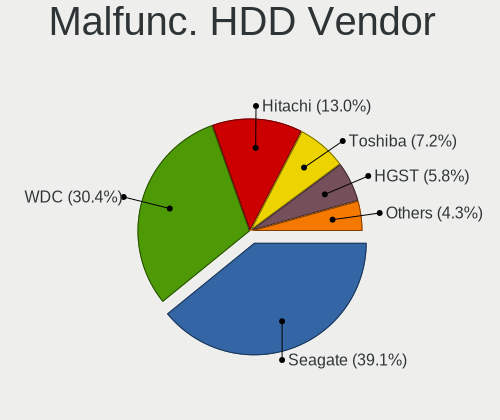

| Vendor              | Computers | Drives | Percent |
|---------------------|-----------|--------|---------|
| Seagate             | 27        | 47     | 39.13%  |
| WDC                 | 21        | 31     | 30.43%  |
| Hitachi             | 9         | 10     | 13.04%  |
| Toshiba             | 5         | 8      | 7.25%   |
| HGST                | 4         | 5      | 5.8%    |
| Samsung Electronics | 3         | 3      | 4.35%   |

Malfunc. Drive Kind
-------------------

Kinds of faulty drives

| Kind | Computers | Drives | Percent |
|------|-----------|--------|---------|
| HDD  | 64        | 104    | 60.38%  |
| SSD  | 32        | 38     | 30.19%  |
| NVMe | 10        | 12     | 9.43%   |

Failed Drives
-------------

Failed drive models

| Model                            | Computers | Drives | Percent |
|----------------------------------|-----------|--------|---------|
| Apple HDD HTS541010A9E662 1TB    | 3         | 3      | 75%     |
| Kingston SV300S37A120G 120GB SSD | 1         | 1      | 25%     |

Failed Drive Vendor
-------------------

Failed drive vendors

| Vendor   | Computers | Drives | Percent |
|----------|-----------|--------|---------|
| Apple    | 3         | 3      | 75%     |
| Kingston | 1         | 1      | 25%     |

Drive Status
------------

Number of failed and malfunc. drives

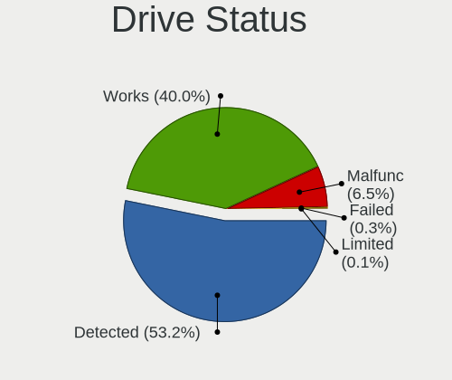

| Status   | Computers | Drives | Percent |
|----------|-----------|--------|---------|
| Detected | 837       | 1908   | 53.18%  |
| Works    | 629       | 1393   | 39.96%  |
| Malfunc  | 103       | 154    | 6.54%   |
| Failed   | 4         | 4      | 0.25%   |
| Limited  | 1         | 2      | 0.06%   |

Storage controller
------------------

Storage Vendor
--------------

Storage controller vendors

| Vendor                                  | Computers | Percent |
|-----------------------------------------|-----------|---------|
| Intel                                   | 877       | 44.25%  |
| Samsung Electronics                     | 285       | 14.38%  |
| AMD                                     | 263       | 13.27%  |
| SanDisk                                 | 109       | 5.5%    |
| Kingston Technology Company             | 83        | 4.19%   |
| SK hynix                                | 53        | 2.67%   |
| Phison Electronics                      | 52        | 2.62%   |
| Toshiba America Info Systems            | 46        | 2.32%   |
| Micron Technology                       | 38        | 1.92%   |
| ASMedia Technology                      | 35        | 1.77%   |
| KIOXIA                                  | 16        | 0.81%   |
| Marvell Technology Group                | 14        | 0.71%   |
| LSI Logic / Symbios Logic               | 14        | 0.71%   |
| Nvidia                                  | 13        | 0.66%   |
| Broadcom / LSI                          | 13        | 0.66%   |
| JMicron Technology                      | 10        | 0.5%    |
| Micron/Crucial Technology               | 9         | 0.45%   |
| Lenovo                                  | 7         | 0.35%   |
| Union Memory (Shenzhen)                 | 5         | 0.25%   |
| Solidigm                                | 5         | 0.25%   |
| Seagate Technology                      | 5         | 0.25%   |
| ADATA Technology                        | 5         | 0.25%   |
| Silicon Motion                          | 4         | 0.2%    |
| Lite-On Technology                      | 4         | 0.2%    |
| Apple                                   | 3         | 0.15%   |
| Solid State Storage Technology          | 2         | 0.1%    |
| Realtek Semiconductor                   | 2         | 0.1%    |
| Hewlett-Packard                         | 2         | 0.1%    |
| Silicon Integrated Systems [SiS]        | 1         | 0.05%   |
| Silicon Image                           | 1         | 0.05%   |
| Shenzhen Unionmemory Information System | 1         | 0.05%   |
| MAXIO Technology (Hangzhou)             | 1         | 0.05%   |
| INNOGRIT                                | 1         | 0.05%   |
| Biwin Storage Technology                | 1         | 0.05%   |
| Adaptec                                 | 1         | 0.05%   |
| 3ware                                   | 1         | 0.05%   |

Storage Model
-------------

Storage controller models

| Model                                                                          | Computers | Percent |
|--------------------------------------------------------------------------------|-----------|---------|
| AMD FCH SATA Controller [AHCI mode]                                            | 161       | 7.28%   |
| Samsung NVMe SSD Controller SM981/PM981/PM983                                  | 123       | 5.56%   |
| Intel Sunrise Point-LP SATA Controller [AHCI mode]                             | 76        | 3.44%   |
| Samsung NVMe SSD Controller SM961/PM961/SM963                                  | 67        | 3.03%   |
| Intel 8 Series/C220 Series Chipset Family 6-port SATA Controller 1 [AHCI mode] | 57        | 2.58%   |
| Intel 7 Series Chipset Family 6-port SATA Controller [AHCI mode]               | 52        | 2.35%   |
| Intel Volume Management Device NVMe RAID Controller                            | 50        | 2.26%   |
| Intel Q170/Q150/B150/H170/H110/Z170/CM236 Chipset SATA Controller [AHCI Mode]  | 48        | 2.17%   |
| Intel 6 Series/C200 Series Chipset Family 6 port Mobile SATA AHCI Controller   | 45        | 2.04%   |
| Intel 82801 Mobile SATA Controller [RAID mode]                                 | 43        | 1.94%   |
| Samsung NVMe SSD Controller PM9A1/PM9A3/980PRO                                 | 40        | 1.81%   |
| Intel 8 Series SATA Controller 1 [AHCI mode]                                   | 38        | 1.72%   |
| AMD 500 Series Chipset SATA Controller                                         | 35        | 1.58%   |
| AMD 400 Series Chipset SATA Controller                                         | 35        | 1.58%   |
| ASMedia ASM1061/ASM1062 Serial ATA Controller                                  | 33        | 1.49%   |
| Intel Cannon Lake PCH SATA AHCI Controller                                     | 30        | 1.36%   |
| Intel 200 Series PCH SATA controller [AHCI mode]                               | 30        | 1.36%   |
| Intel SATA Controller [RAID mode]                                              | 29        | 1.31%   |
| Intel Cannon Lake Mobile PCH SATA AHCI Controller                              | 29        | 1.31%   |
| Samsung NVMe SSD Controller 980 (DRAM-less)                                    | 27        | 1.22%   |
| SanDisk Ultra 3D / WD PC SN530, IX SN530, Blue SN550 NVMe SSD (DRAM-less)      | 26        | 1.18%   |
| Intel Wildcat Point-LP SATA Controller [AHCI Mode]                             | 26        | 1.18%   |
| SanDisk Extreme Pro / WD Black SN750 / PC SN730 / Red SN700 NVMe SSD           | 25        | 1.13%   |
| Intel C610/X99 series chipset sSATA Controller [AHCI mode]                     | 24        | 1.09%   |
| Phison E16 PCIe4 NVMe Controller                                               | 23        | 1.04%   |
| Kingston Company A2000 NVMe SSD [SM2263EN]                                     | 23        | 1.04%   |
| Intel C610/X99 series chipset 6-Port SATA Controller [AHCI mode]               | 23        | 1.04%   |
| Toshiba America Info Systems XG6 NVMe SSD Controller                           | 22        | 1%      |
| Intel HM170/QM170 Chipset SATA Controller [AHCI Mode]                          | 22        | 1%      |
| Intel 7 Series/C210 Series Chipset Family 6-port SATA Controller [AHCI mode]   | 22        | 1%      |
| AMD SB7x0/SB8x0/SB9x0 SATA Controller [AHCI mode]                              | 22        | 1%      |
| Phison E12 NVMe Controller                                                     | 20        | 0.9%    |
| Intel SSD 660P Series                                                          | 20        | 0.9%    |
| Kingston Company KC3000/FURY Renegade NVMe SSD [E18]                           | 19        | 0.86%   |
| AMD 600 Series Chipset SATA Controller                                         | 18        | 0.81%   |
| Intel 6 Series/C200 Series Chipset Family 6 port Desktop SATA AHCI Controller  | 17        | 0.77%   |
| Intel 5 Series/3400 Series Chipset 6 port SATA AHCI Controller                 | 17        | 0.77%   |
| Intel 82801IBM/IEM (ICH9M/ICH9M-E) 4 port SATA Controller [AHCI mode]          | 16        | 0.72%   |
| Samsung NVMe SSD Controller SM951/PM951                                        | 15        | 0.68%   |
| Micron 2450 NVMe SSD [HendrixV] (DRAM-less)                                    | 14        | 0.63%   |

Storage Kind
------------

Kind of storage controller (IDE, SATA, NVMe, SAS, ...)

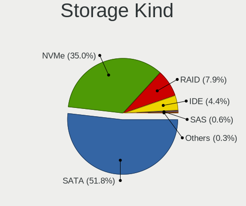

| Kind | Computers | Percent |
|------|-----------|---------|
| SATA | 999       | 51.82%  |
| NVMe | 674       | 34.96%  |
| RAID | 153       | 7.94%   |
| IDE  | 85        | 4.41%   |
| SAS  | 11        | 0.57%   |
| SCSI | 6         | 0.31%   |

Processor
---------

CPU Vendor
----------

Processor vendors

| Vendor   | Computers | Percent |
|----------|-----------|---------|
| Intel    | 1076      | 75.03%  |
| AMD      | 340       | 23.71%  |
| ARM      | 17        | 1.19%   |
| QUALCOMM | 1         | 0.07%   |

CPU Model
---------

Processor models

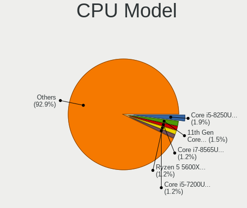

| Model                                   | Computers | Percent |
|-----------------------------------------|-----------|---------|
| Intel Core i5-8250U CPU @ 1.60GHz       | 27        | 1.88%   |
| Intel 11th Gen Core i7-1165G7 @ 2.80GHz | 22        | 1.53%   |
| Intel Core i7-8565U CPU @ 1.80GHz       | 18        | 1.25%   |
| AMD Ryzen 5 5600X 6-Core Processor      | 18        | 1.25%   |
| Intel Core i5-7200U CPU @ 2.50GHz       | 17        | 1.18%   |
| AMD Ryzen 9 3900X 12-Core Processor     | 16        | 1.11%   |
| Intel Core i7-9750H CPU @ 2.60GHz       | 13        | 0.9%    |
| Intel Core i5-8265U CPU @ 1.60GHz       | 13        | 0.9%    |
| Intel Core i7-8550U CPU @ 1.80GHz       | 12        | 0.83%   |
| ARM Processor                           | 12        | 0.83%   |
| Intel Core i7-8750H CPU @ 2.20GHz       | 11        | 0.76%   |
| Intel Core i5-6200U CPU @ 2.30GHz       | 11        | 0.76%   |
| Intel Core i5-3210M CPU @ 2.50GHz       | 11        | 0.76%   |
| Intel 11th Gen Core i5-1135G7 @ 2.40GHz | 11        | 0.76%   |
| AMD Ryzen 5 3600 6-Core Processor       | 11        | 0.76%   |
| Intel Xeon CPU E5-1630 v3 @ 3.70GHz     | 10        | 0.69%   |
| AMD Ryzen 7 2700X Eight-Core Processor  | 10        | 0.69%   |
| Intel Core i7-6700HQ CPU @ 2.60GHz      | 9         | 0.63%   |
| Intel Core i7-6600U CPU @ 2.60GHz       | 9         | 0.63%   |
| Intel Core i5-6300U CPU @ 2.40GHz       | 9         | 0.63%   |
| Intel Core i5-5200U CPU @ 2.20GHz       | 9         | 0.63%   |
| AMD Ryzen 7 3700X 8-Core Processor      | 9         | 0.63%   |
| Intel Core i7-7700HQ CPU @ 2.80GHz      | 8         | 0.56%   |
| Intel Core i7-7500U CPU @ 2.70GHz       | 8         | 0.56%   |
| Intel Core i7-6700K CPU @ 4.00GHz       | 8         | 0.56%   |
| Intel Core i7-3520M CPU @ 2.90GHz       | 8         | 0.56%   |
| Intel Core i7-2600K CPU @ 3.40GHz       | 8         | 0.56%   |
| Intel Core i5-8350U CPU @ 1.70GHz       | 8         | 0.56%   |
| Intel Core i5-4200U CPU @ 1.60GHz       | 8         | 0.56%   |
| AMD Ryzen 9 5950X 16-Core Processor     | 8         | 0.56%   |
| AMD Ryzen 9 5900X 12-Core Processor     | 8         | 0.56%   |
| AMD Ryzen 7 5800X 8-Core Processor      | 8         | 0.56%   |
| AMD Ryzen 7 4700U with Radeon Graphics  | 8         | 0.56%   |
| Intel Core i7-5600U CPU @ 2.60GHz       | 7         | 0.49%   |
| Intel Core i7-10750H CPU @ 2.60GHz      | 7         | 0.49%   |
| Intel Core i7-10510U CPU @ 1.80GHz      | 7         | 0.49%   |
| Intel Core i5-5257U CPU @ 2.70GHz       | 7         | 0.49%   |
| Intel Core i5-3320M CPU @ 2.60GHz       | 7         | 0.49%   |
| Intel Core i5-2520M CPU @ 2.50GHz       | 7         | 0.49%   |
| Intel 12th Gen Core i5-12500H           | 7         | 0.49%   |

CPU Model Family
----------------

Processor model prefix

| Model                   | Computers | Percent |
|-------------------------|-----------|---------|
| Intel Core i7           | 350       | 24.34%  |
| Intel Core i5           | 321       | 22.32%  |
| Other                   | 153       | 10.64%  |
| AMD Ryzen 7             | 89        | 6.19%   |
| AMD Ryzen 5             | 79        | 5.49%   |
| Intel Core i3           | 60        | 4.17%   |
| AMD Ryzen 9             | 54        | 3.76%   |
| Intel Xeon              | 49        | 3.41%   |
| Intel Celeron           | 36        | 2.5%    |
| Intel Core i9           | 27        | 1.88%   |
| Intel Pentium           | 23        | 1.6%    |
| Intel Core 2 Duo        | 19        | 1.32%   |
| AMD FX                  | 12        | 0.83%   |
| Intel Atom              | 11        | 0.76%   |
| AMD Ryzen 3             | 10        | 0.7%    |
| AMD A8                  | 9         | 0.63%   |
| AMD Ryzen 7 PRO         | 8         | 0.56%   |
| AMD A10                 | 8         | 0.56%   |
| Intel Core              | 7         | 0.49%   |
| AMD Ryzen 5 PRO         | 7         | 0.49%   |
| AMD Athlon 64 X2        | 7         | 0.49%   |
| Intel Core 2            | 6         | 0.42%   |
| AMD A6                  | 6         | 0.42%   |
| Intel Pentium Dual-Core | 5         | 0.35%   |
| Intel Genuine           | 5         | 0.35%   |
| AMD Ryzen Threadripper  | 5         | 0.35%   |
| AMD Phenom II X4        | 5         | 0.35%   |
| Intel Xeon Silver       | 4         | 0.28%   |
| Intel Core 2 Quad       | 4         | 0.28%   |
| Intel Pentium Silver    | 3         | 0.21%   |
| ARM BCM                 | 3         | 0.21%   |
| AMD E2                  | 3         | 0.21%   |
| AMD E1                  | 3         | 0.21%   |
| AMD E                   | 3         | 0.21%   |
| AMD Athlon              | 3         | 0.21%   |
| AMD A4                  | 3         | 0.21%   |
| Intel Xeon Gold         | 2         | 0.14%   |
| Intel Pentium Gold      | 2         | 0.14%   |
| Intel Core m7           | 2         | 0.14%   |
| AMD Turion 64 X2 Mobile | 2         | 0.14%   |

CPU Cores
---------

Number of processor cores

| Number  | Computers | Percent |
|---------|-----------|---------|
| 4       | 502       | 34.79%  |
| 2       | 423       | 29.31%  |
| 6       | 177       | 12.27%  |
| 8       | 142       | 9.84%   |
| 12      | 58        | 4.02%   |
| 10      | 31        | 2.15%   |
| 16      | 30        | 2.08%   |
| 14      | 23        | 1.59%   |
| 1       | 20        | 1.39%   |
| 20      | 9         | 0.62%   |
| 3       | 7         | 0.49%   |
| 24      | 6         | 0.42%   |
| 28      | 4         | 0.28%   |
| Unknown | 4         | 0.28%   |
| 40      | 3         | 0.21%   |
| 32      | 2         | 0.14%   |
| 18      | 2         | 0.14%   |

CPU Sockets
-----------

Number of sockets

| Number  | Computers | Percent |
|---------|-----------|---------|
| 1       | 1406      | 97.91%  |
| 2       | 25        | 1.74%   |
| Unknown | 4         | 0.28%   |
| 4       | 1         | 0.07%   |

CPU Threads
-----------

Threads per core (Hyper-Threading)

| Number  | Computers | Percent |
|---------|-----------|---------|
| 2       | 1112      | 77.06%  |
| 1       | 325       | 22.52%  |
| Unknown | 4         | 0.28%   |
| 8       | 2         | 0.14%   |

CPU Op-Modes
------------

CPU Operation Modes (32-bit, 64-bit)

| Op mode        | Computers | Percent |
|----------------|-----------|---------|
| 32-bit, 64-bit | 1404      | 97.84%  |
| Unknown        | 23        | 1.6%    |
| 32-bit         | 6         | 0.42%   |
| 64-bit         | 2         | 0.14%   |

CPU Microcode
-------------

Microcode number

| Number     | Computers | Percent |
|------------|-----------|---------|
| Unknown    | 677       | 45.01%  |
| 0x306a9    | 50        | 3.32%   |
| 0x306c3    | 44        | 2.93%   |
| 0x206a7    | 42        | 2.79%   |
| 0x906ea    | 38        | 2.53%   |
| 0x806ea    | 34        | 2.26%   |
| 0x506e3    | 33        | 2.19%   |
| 0x406e3    | 29        | 1.93%   |
| 0x40651    | 29        | 1.93%   |
| 0x906e9    | 23        | 1.53%   |
| 0x806ec    | 23        | 1.53%   |
| 0x806e9    | 23        | 1.53%   |
| 0x306d4    | 21        | 1.4%    |
| 0x08701021 | 21        | 1.4%    |
| 0x306f2    | 19        | 1.26%   |
| 0x806c1    | 15        | 1%      |
| 0x1067a    | 15        | 1%      |
| 0x20655    | 13        | 0.86%   |
| 0x08600106 | 13        | 0.86%   |
| 0xa0652    | 11        | 0.73%   |
| 0x906a3    | 11        | 0.73%   |
| 0x806eb    | 9         | 0.6%    |
| 0x08701013 | 9         | 0.6%    |
| 0x010000c8 | 9         | 0.6%    |
| 0x906ed    | 8         | 0.53%   |
| 0x806d1    | 8         | 0.53%   |
| 0x0a601203 | 8         | 0.53%   |
| 0x0a50000c | 8         | 0.53%   |
| 0x0a201016 | 8         | 0.53%   |
| 0x0800820d | 8         | 0.53%   |
| 0x06001119 | 7         | 0.47%   |
| 0x20652    | 6         | 0.4%    |
| 0x0a20120a | 6         | 0.4%    |
| 0x0a201009 | 6         | 0.4%    |
| 0x08108109 | 6         | 0.4%    |
| 0x06000852 | 6         | 0.4%    |
| 0x906ec    | 5         | 0.33%   |
| 0x706e5    | 5         | 0.33%   |
| 0x706a8    | 5         | 0.33%   |
| 0x506c9    | 5         | 0.33%   |

CPU Microarch
-------------

Microarchitecture

| Name              | Computers | Percent |
|-------------------|-----------|---------|
| KabyLake          | 275       | 19.11%  |
| Haswell           | 147       | 10.22%  |
| Skylake           | 120       | 8.34%   |
| Unknown           | 105       | 7.3%    |
| IvyBridge         | 90        | 6.25%   |
| Zen 2             | 82        | 5.7%    |
| SandyBridge       | 77        | 5.35%   |
| Zen 3             | 69        | 4.79%   |
| Alderlake Hybrid  | 54        | 3.75%   |
| Broadwell         | 46        | 3.2%    |
| TigerLake         | 41        | 2.85%   |
| Zen+              | 33        | 2.29%   |
| CometLake         | 32        | 2.22%   |
| Westmere          | 31        | 2.15%   |
| Penryn            | 27        | 1.88%   |
| Zen               | 25        | 1.74%   |
| IceLake           | 22        | 1.53%   |
| Piledriver        | 21        | 1.46%   |
| Silvermont        | 17        | 1.18%   |
| K10               | 16        | 1.11%   |
| K8 Hammer         | 15        | 1.04%   |
| Core              | 14        | 0.97%   |
| Goldmont plus     | 11        | 0.76%   |
| Nehalem           | 8         | 0.56%   |
| Meteorlake Hybrid | 7         | 0.49%   |
| Goldmont          | 7         | 0.49%   |
| Excavator         | 7         | 0.49%   |
| Bonnell           | 7         | 0.49%   |
| Bulldozer         | 5         | 0.35%   |
| Bobcat            | 5         | 0.35%   |
| Tremont           | 4         | 0.28%   |
| Steamroller       | 4         | 0.28%   |
| Puma              | 4         | 0.28%   |
| P6                | 4         | 0.28%   |
| K10 Llano         | 3         | 0.21%   |
| Jaguar            | 3         | 0.21%   |
| NetBurst          | 1         | 0.07%   |

Graphics
--------

GPU Vendor
----------

Vendors of graphics cards

| Vendor                     | Computers | Percent |
|----------------------------|-----------|---------|
| Intel                      | 816       | 48.34%  |
| Nvidia                     | 503       | 29.8%   |
| AMD                        | 345       | 20.44%  |
| Matrox Electronics Systems | 19        | 1.13%   |
| ASPEED Technology          | 5         | 0.3%    |

GPU Model
---------

Graphics card models

| Model                                                                       | Computers | Percent |
|-----------------------------------------------------------------------------|-----------|---------|
| Intel 2nd Generation Core Processor Family Integrated Graphics Controller   | 54        | 3.13%   |
| Intel UHD Graphics 620                                                      | 53        | 3.07%   |
| Intel 3rd Gen Core processor Graphics Controller                            | 53        | 3.07%   |
| Intel Haswell-ULT Integrated Graphics Controller                            | 42        | 2.43%   |
| Intel WhiskeyLake-U GT2 [UHD Graphics 620]                                  | 40        | 2.32%   |
| Intel Skylake GT2 [HD Graphics 520]                                         | 40        | 2.32%   |
| Intel TigerLake-LP GT2 [Iris Xe Graphics]                                   | 38        | 2.2%    |
| Intel HD Graphics 620                                                       | 38        | 2.2%    |
| AMD Renoir [Radeon Vega Series / Radeon Vega Mobile Series]                 | 35        | 2.03%   |
| Intel CoffeeLake-H GT2 [UHD Graphics 630]                                   | 33        | 1.91%   |
| Intel HD Graphics 530                                                       | 31        | 1.8%    |
| Intel Xeon E3-1200 v3/4th Gen Core Processor Integrated Graphics Controller | 28        | 1.62%   |
| Intel HD Graphics 5500                                                      | 27        | 1.56%   |
| Intel 4th Gen Core Processor Integrated Graphics Controller                 | 25        | 1.45%   |
| AMD Ellesmere [Radeon RX 470/480/570/570X/580/580X/590]                     | 24        | 1.39%   |
| Intel Alder Lake-P GT2 [Iris Xe Graphics]                                   | 22        | 1.27%   |
| AMD Cezanne [Radeon Vega Series / Radeon Vega Mobile Series]                | 19        | 1.1%    |
| Nvidia GM204 [GeForce GTX 970]                                              | 18        | 1.04%   |
| Intel Core Processor Integrated Graphics Controller                         | 17        | 0.98%   |
| Intel CoffeeLake-S GT2 [UHD Graphics 630]                                   | 17        | 0.98%   |
| Nvidia GP104 [GeForce GTX 1070]                                             | 16        | 0.93%   |
| Intel Raptor Lake-P [Iris Xe Graphics]                                      | 16        | 0.93%   |
| Nvidia GP106 [GeForce GTX 1060 6GB]                                         | 15        | 0.87%   |
| Intel CometLake-U GT2 [UHD Graphics]                                        | 15        | 0.87%   |
| Intel TigerLake-H GT1 [UHD Graphics]                                        | 14        | 0.81%   |
| Intel HD Graphics 630                                                       | 14        | 0.81%   |
| AMD Raphael                                                                 | 14        | 0.81%   |
| AMD Picasso/Raven 2 [Radeon Vega Series / Radeon Vega Mobile Series]        | 14        | 0.81%   |
| AMD Navi 21 [Radeon RX 6800/6800 XT / 6900 XT]                              | 14        | 0.81%   |
| AMD Navi 10 [Radeon RX 5600 OEM/5600 XT / 5700/5700 XT]                     | 14        | 0.81%   |
| Nvidia GP108M [GeForce MX150]                                               | 13        | 0.75%   |
| Intel Mobile 4 Series Chipset Integrated Graphics Controller                | 13        | 0.75%   |
| Intel CometLake-H GT2 [UHD Graphics]                                        | 13        | 0.75%   |
| AMD Vega 10 XL/XT [Radeon RX Vega 56/64]                                    | 11        | 0.64%   |
| Nvidia GP107M [GeForce GTX 1050 Ti Mobile]                                  | 10        | 0.58%   |
| Nvidia GP102 [GeForce GTX 1080 Ti]                                          | 10        | 0.58%   |
| Intel Xeon E3-1200 v2/3rd Gen Core processor Graphics Controller            | 10        | 0.58%   |
| Intel IvyBridge GT2 [HD Graphics 4000]                                      | 10        | 0.58%   |
| AMD Raven Ridge [Radeon Vega Series / Radeon Vega Mobile Series]            | 10        | 0.58%   |
| Nvidia TU117M [GeForce GTX 1650 Mobile / Max-Q]                             | 9         | 0.52%   |

GPU Combo
---------

Combinations of graphics cards

| Name                 | Computers | Percent |
|----------------------|-----------|---------|
| 1 x Intel            | 579       | 40.1%   |
| 1 x Nvidia           | 271       | 18.77%  |
| 1 x AMD              | 271       | 18.77%  |
| Intel + Nvidia       | 199       | 13.78%  |
| Intel + AMD          | 26        | 1.8%    |
| 2 x AMD              | 23        | 1.59%   |
| AMD + Nvidia         | 22        | 1.52%   |
| Other                | 20        | 1.39%   |
| 1 x Matrox           | 17        | 1.18%   |
| 2 x Nvidia           | 4         | 0.28%   |
| 2 x Intel            | 2         | 0.14%   |
| 2 x AMD + 1 x Nvidia | 2         | 0.14%   |
| Nvidia + Matrox      | 2         | 0.14%   |
| 1 x ASPEED           | 2         | 0.14%   |
| AMD + ASPEED         | 2         | 0.14%   |
| 3 x Nvidia           | 1         | 0.07%   |
| Nvidia + ASPEED      | 1         | 0.07%   |

GPU Driver
----------

Free vs proprietary

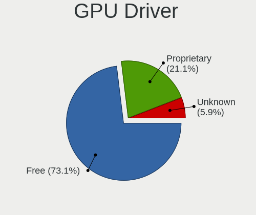

| Driver      | Computers | Percent |
|-------------|-----------|---------|
| Free        | 1069      | 73.07%  |
| Proprietary | 308       | 21.05%  |
| Unknown     | 86        | 5.88%   |

GPU Memory
----------

Total video memory

| Size in GB | Computers | Percent |
|------------|-----------|---------|
| Unknown    | 933       | 63.25%  |
| 1.01-2.0   | 130       | 8.81%   |
| 0.01-0.5   | 104       | 7.05%   |
| 7.01-8.0   | 82        | 5.56%   |
| 3.01-4.0   | 82        | 5.56%   |
| 0.51-1.0   | 47        | 3.19%   |
| 8.01-16.0  | 37        | 2.51%   |
| 5.01-6.0   | 35        | 2.37%   |
| 16.01-24.0 | 12        | 0.81%   |
| 2.01-3.0   | 11        | 0.75%   |
| 4.01-5.0   | 2         | 0.14%   |

Monitor
-------

Monitor Vendor
--------------

Monitor vendors

| Vendor                  | Computers | Percent |
|-------------------------|-----------|---------|
| Samsung Electronics     | 248       | 14.85%  |
| AU Optronics            | 176       | 10.54%  |
| LG Display              | 139       | 8.32%   |
| Chimei Innolux          | 129       | 7.72%   |
| Dell                    | 117       | 7.01%   |
| BOE                     | 105       | 6.29%   |
| BenQ                    | 72        | 4.31%   |
| AOC                     | 65        | 3.89%   |
| Hewlett-Packard         | 58        | 3.47%   |
| Acer                    | 58        | 3.47%   |
| Lenovo                  | 50        | 2.99%   |
| Philips                 | 47        | 2.81%   |
| Sharp                   | 46        | 2.75%   |
| Ancor Communications    | 44        | 2.63%   |
| Apple                   | 35        | 2.1%    |
| InfoVision              | 30        | 1.8%    |
| ASUSTek Computer        | 28        | 1.68%   |
| Goldstar                | 25        | 1.5%    |
| Chi Mei Optoelectronics | 17        | 1.02%   |
| NEC Computers           | 14        | 0.84%   |
| CSO                     | 13        | 0.78%   |
| Panasonic               | 11        | 0.66%   |
| Sony                    | 10        | 0.6%    |
| PANDA                   | 9         | 0.54%   |
| Eizo                    | 8         | 0.48%   |
| MSI                     | 7         | 0.42%   |
| JDI                     | 7         | 0.42%   |
| Grundig                 | 6         | 0.36%   |
| ViewSonic               | 5         | 0.3%    |
| Unknown                 | 5         | 0.3%    |
| Fujitsu Siemens         | 5         | 0.3%    |
| Vestel Elektronik       | 4         | 0.24%   |
| LG Electronics          | 4         | 0.24%   |
| Iiyama                  | 4         | 0.24%   |
| HVR                     | 4         | 0.24%   |
| VOXICON                 | 3         | 0.18%   |
| Gigabyte Technology     | 3         | 0.18%   |
| Denver                  | 3         | 0.18%   |
| AUS                     | 3         | 0.18%   |
| Toshiba                 | 2         | 0.12%   |

Monitor Model
-------------

Monitor models

| Model                                                                     | Computers | Percent |
|---------------------------------------------------------------------------|-----------|---------|
| Chimei Innolux LCD Monitor CMN14D4 1920x1080 309x173mm 13.9-inch          | 9         | 0.52%   |
| Sharp LCD Monitor SHP148D 3840x2160 344x194mm 15.5-inch                   | 8         | 0.46%   |
| Hewlett-Packard LA2306 HWP294A 1920x1080 509x286mm 23.0-inch              | 8         | 0.46%   |
| Dell U2412M DELA07A 1920x1200 518x324mm 24.1-inch                         | 8         | 0.46%   |
| Chimei Innolux LCD Monitor CMN14F2 1920x1080 309x173mm 13.9-inch          | 7         | 0.4%    |
| BenQ GL2450H BNQ78A7 1920x1080 530x300mm 24.0-inch                        | 7         | 0.4%    |
| BenQ G2420HD BNQ7840 1920x1080 531x299mm 24.0-inch                        | 7         | 0.4%    |
| AU Optronics LCD Monitor AUO403D 1920x1080 309x174mm 14.0-inch            | 7         | 0.4%    |
| AOC Q32G1WG4 AOC3201 2560x1440 697x393mm 31.5-inch                        | 7         | 0.4%    |
| Samsung Electronics C49RG9x SAM0F9C 3840x1080 1193x336mm 48.8-inch        | 6         | 0.34%   |
| LG Display LCD Monitor LGD02D8 1366x768 277x156mm 12.5-inch               | 6         | 0.34%   |
| JDI LCD Monitor JDI422A 3000x2000 293x196mm 13.9-inch                     | 6         | 0.34%   |
| Grundig WXGA GRU4448 1600x1200                                            | 6         | 0.34%   |
| Dell U2713HM DEL4080 2560x1440 597x336mm 27.0-inch                        | 6         | 0.34%   |
| AU Optronics LCD Monitor AUO573D 1920x1080 309x174mm 14.0-inch            | 6         | 0.34%   |
| AOC 2470W AOC2470 1920x1080 521x293mm 23.5-inch                           | 6         | 0.34%   |
| Acer XB271HU ACR0490 2560x1440 598x336mm 27.0-inch                        | 6         | 0.34%   |
| Samsung Electronics LF24T35 SAM707D 1920x1080 528x297mm 23.9-inch         | 5         | 0.29%   |
| Samsung Electronics C34H89x SAM0E26 3440x1440 797x333mm 34.0-inch         | 5         | 0.29%   |
| Panasonic LCD Monitor MEI96A2 2560x1440 309x173mm 13.9-inch               | 5         | 0.29%   |
| LG Display LCD Monitor LGD046F 1920x1080 344x194mm 15.5-inch              | 5         | 0.29%   |
| LG Display LCD Monitor LGD046D 1920x1080 309x174mm 14.0-inch              | 5         | 0.29%   |
| Hewlett-Packard Z32x HWP3275 3840x2160 697x392mm 31.5-inch                | 5         | 0.29%   |
| Dell U2717D DEL40EA 2560x1440 597x336mm 27.0-inch                         | 5         | 0.29%   |
| Chimei Innolux LCD Monitor CMN15E7 1920x1080 344x193mm 15.5-inch          | 5         | 0.29%   |
| Chimei Innolux LCD Monitor CMN14C3 1366x768 309x173mm 13.9-inch           | 5         | 0.29%   |
| Chimei Innolux LCD Monitor CMN14B1 1920x1080 308x173mm 13.9-inch          | 5         | 0.29%   |
| Chi Mei Optoelectronics LCD Monitor CMO1720 1920x1080 382x215mm 17.3-inch | 5         | 0.29%   |
| AU Optronics LCD Monitor AUO80ED 1920x1080 344x193mm 15.5-inch            | 5         | 0.29%   |
| AU Optronics LCD Monitor AUO38ED 1920x1080 344x193mm 15.5-inch            | 5         | 0.29%   |
| AU Optronics LCD Monitor AUO26EC 1366x768 344x193mm 15.5-inch             | 5         | 0.29%   |
| AOC 2475W1 AOC2475 1920x1080 527x296mm 23.8-inch                          | 5         | 0.29%   |
| Vestel Elektronik 49FHD_LCD_TV VES3700 1920x1080 1280x720mm 57.8-inch     | 4         | 0.23%   |
| Sharp LCD Monitor SHP14D0 3840x2400 336x210mm 15.6-inch                   | 4         | 0.23%   |
| Samsung Electronics SyncMaster SAM0255 1680x1050 474x296mm 22.0-inch      | 4         | 0.23%   |
| Samsung Electronics SE790C SAM0BFE 3440x1440 797x333mm 34.0-inch          | 4         | 0.23%   |
| Samsung Electronics LCD Monitor SEC3859 1366x768 293x165mm 13.2-inch      | 4         | 0.23%   |
| Samsung Electronics LC49G95T SAM7053 3840x1080 1193x336mm 48.8-inch       | 4         | 0.23%   |
| NEC Computers P403 NEC692B 1920x1080 886x498mm 40.0-inch                  | 4         | 0.23%   |
| LG Display LCD Monitor LGD0521 1920x1080 309x174mm 14.0-inch              | 4         | 0.23%   |

Monitor Resolution
------------------

Monitor screen resolution

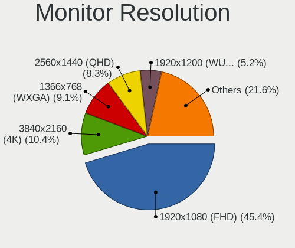

| Resolution         | Computers | Percent |
|--------------------|-----------|---------|
| 1920x1080 (FHD)    | 725       | 45.37%  |
| 3840x2160 (4K)     | 166       | 10.39%  |
| 1366x768 (WXGA)    | 146       | 9.14%   |
| 2560x1440 (QHD)    | 133       | 8.32%   |
| 1920x1200 (WUXGA)  | 83        | 5.19%   |
| 3440x1440          | 41        | 2.57%   |
| 1600x900 (HD+)     | 41        | 2.57%   |
| 2560x1600          | 24        | 1.5%    |
| 3840x1080          | 23        | 1.44%   |
| 2880x1800          | 23        | 1.44%   |
| Unknown            | 20        | 1.25%   |
| 1680x1050 (WSXGA+) | 19        | 1.19%   |
| 1280x800 (WXGA)    | 18        | 1.13%   |
| 1280x1024 (SXGA)   | 15        | 0.94%   |
| 3840x2400          | 13        | 0.81%   |
| 1440x900 (WXGA+)   | 12        | 0.75%   |
| 3840x1600          | 9         | 0.56%   |
| 2160x1440          | 9         | 0.56%   |
| 3000x2000          | 7         | 0.44%   |
| 2560x1080          | 7         | 0.44%   |
| 1600x1200          | 7         | 0.44%   |
| 1360x768           | 5         | 0.31%   |
| 2160x1200          | 4         | 0.25%   |
| 1280x720 (HD)      | 4         | 0.25%   |
| 1024x600           | 4         | 0.25%   |
| 2880x1920          | 3         | 0.19%   |
| 2288x1287          | 3         | 0.19%   |
| 1920x540           | 3         | 0.19%   |
| 5120x1440          | 2         | 0.13%   |
| 4480x1440          | 2         | 0.13%   |
| 3840x1200          | 2         | 0.13%   |
| 3200x2000          | 2         | 0.13%   |
| 3200x1800 (QHD+)   | 2         | 0.13%   |
| 9600x2160          | 1         | 0.06%   |
| 7680x1440          | 1         | 0.06%   |
| 7680x1080          | 1         | 0.06%   |
| 6880x1440          | 1         | 0.06%   |
| 5760x2160          | 1         | 0.06%   |
| 5520x1080          | 1         | 0.06%   |
| 5360x1440          | 1         | 0.06%   |

Monitor Diagonal
----------------

Diagonal size in inches

| Inches  | Computers | Percent |
|---------|-----------|---------|
| 15      | 295       | 17.82%  |
| 27      | 210       | 12.69%  |
| 24      | 187       | 11.3%   |
| 13      | 187       | 11.3%   |
| 14      | 185       | 11.18%  |
| Unknown | 75        | 4.53%   |
| 23      | 69        | 4.17%   |
| 17      | 57        | 3.44%   |
| 31      | 53        | 3.2%    |
| 34      | 45        | 2.72%   |
| 12      | 40        | 2.42%   |
| 16      | 25        | 1.51%   |
| 21      | 22        | 1.33%   |
| 40      | 19        | 1.15%   |
| 84      | 18        | 1.09%   |
| 22      | 16        | 0.97%   |
| 48      | 15        | 0.91%   |
| 54      | 13        | 0.79%   |
| 32      | 12        | 0.73%   |
| 19      | 11        | 0.66%   |
| 25      | 10        | 0.6%    |
| 37      | 9         | 0.54%   |
| 20      | 9         | 0.54%   |
| 72      | 8         | 0.48%   |
| 49      | 7         | 0.42%   |
| 11      | 7         | 0.42%   |
| 43      | 5         | 0.3%    |
| 39      | 4         | 0.24%   |
| 142     | 3         | 0.18%   |
| 55      | 3         | 0.18%   |
| 42      | 3         | 0.18%   |
| 35      | 3         | 0.18%   |
| 33      | 3         | 0.18%   |
| 26      | 3         | 0.18%   |
| 18      | 3         | 0.18%   |
| 10      | 3         | 0.18%   |
| 85      | 2         | 0.12%   |
| 65      | 2         | 0.12%   |
| 60      | 2         | 0.12%   |
| 46      | 2         | 0.12%   |

Monitor Width
-------------

Physical width

| Width in mm    | Computers | Percent |
|----------------|-----------|---------|
| 301-350        | 572       | 35.64%  |
| 501-600        | 403       | 25.11%  |
| 201-300        | 159       | 9.91%   |
| 601-700        | 84        | 5.23%   |
| 351-400        | 82        | 5.11%   |
| Unknown        | 75        | 4.67%   |
| 701-800        | 60        | 3.74%   |
| 401-500        | 47        | 2.93%   |
| 1001-1500      | 46        | 2.87%   |
| 801-900        | 38        | 2.37%   |
| 1501-2000      | 28        | 1.74%   |
| 901-1000       | 7         | 0.44%   |
| More than 2000 | 3         | 0.19%   |
| 101-200        | 1         | 0.06%   |

Aspect Ratio
------------

Proportional relationship between the width and the height

| Ratio   | Computers | Percent |
|---------|-----------|---------|
| 16/9    | 1071      | 73.16%  |
| 16/10   | 200       | 13.66%  |
| Unknown | 60        | 4.1%    |
| 21/9    | 57        | 3.89%   |
| 3/2     | 26        | 1.78%   |
| 32/9    | 20        | 1.37%   |
| 5/4     | 15        | 1.02%   |
| 4/3     | 6         | 0.41%   |
| 1.00    | 3         | 0.2%    |
| 6/5     | 1         | 0.07%   |
| 3.76    | 1         | 0.07%   |
| 3.40    | 1         | 0.07%   |
| 3.20    | 1         | 0.07%   |
| 0.80    | 1         | 0.07%   |
| 0.79    | 1         | 0.07%   |

Monitor Area
------------

Area in inch

| Area in inch | Computers | Percent |
|----------------|-----------|---------|
| 101-110        | 290       | 17.72%  |
| 81-90          | 280       | 17.1%   |
| 301-350        | 211       | 12.89%  |
| 201-250        | 210       | 12.83%  |
| 351-500        | 116       | 7.09%   |
| 71-80          | 86        | 5.25%   |
| 251-300        | 78        | 4.76%   |
| Unknown        | 75        | 4.58%   |
| 501-1000       | 64        | 3.91%   |
| More than 1000 | 54        | 3.3%    |
| 121-130        | 52        | 3.18%   |
| 61-70          | 39        | 2.38%   |
| 151-200        | 27        | 1.65%   |
| 111-120        | 25        | 1.53%   |
| 51-60          | 8         | 0.49%   |
| 91-100         | 8         | 0.49%   |
| 131-140        | 7         | 0.43%   |
| 41-50          | 3         | 0.18%   |
| 141-150        | 3         | 0.18%   |
| 1-40           | 1         | 0.06%   |

Pixel Density
-------------

Pixels per inch

| Density       | Computers | Percent |
|---------------|-----------|---------|
| 121-160       | 486       | 30.43%  |
| 51-100        | 481       | 30.12%  |
| 101-120       | 306       | 19.16%  |
| 161-240       | 144       | 9.02%   |
| Unknown       | 75        | 4.7%    |
| More than 240 | 68        | 4.26%   |
| 1-50          | 37        | 2.32%   |

Multiple Monitors
-----------------

Total monitors connected

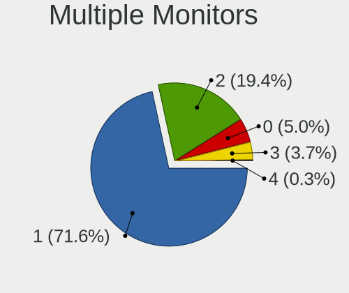

| Total | Computers | Percent |
|-------|-----------|---------|
| 1     | 1064      | 71.6%   |
| 2     | 289       | 19.45%  |
| 0     | 74        | 4.98%   |
| 3     | 55        | 3.7%    |
| 4     | 4         | 0.27%   |

Network
-------

Net Controller Vendor
---------------------

Controller vendors

| Vendor                                 | Computers | Percent |
|----------------------------------------|-----------|---------|
| Intel                                  | 930       | 43.26%  |
| Realtek Semiconductor                  | 571       | 26.56%  |
| Qualcomm Atheros                       | 148       | 6.88%   |
| Broadcom                               | 122       | 5.67%   |
| MediaTek                               | 43        | 2%      |
| Broadcom Limited                       | 26        | 1.21%   |
| Sierra Wireless                        | 19        | 0.88%   |
| Ericsson Business Mobile Networks      | 19        | 0.88%   |
| TP-Link                                | 18        | 0.84%   |
| Dell                                   | 18        | 0.84%   |
| Ralink Technology                      | 17        | 0.79%   |
| NetGear                                | 16        | 0.74%   |
| Ralink                                 | 15        | 0.7%    |
| ASUSTek Computer                       | 15        | 0.7%    |
| Microsoft                              | 13        | 0.6%    |
| Samsung Electronics                    | 11        | 0.51%   |
| Nvidia                                 | 11        | 0.51%   |
| Lenovo                                 | 10        | 0.47%   |
| Hewlett-Packard                        | 10        | 0.47%   |
| D-Link                                 | 10        | 0.47%   |
| Marvell Technology Group               | 9         | 0.42%   |
| DisplayLink                            | 9         | 0.42%   |
| Aquantia                               | 9         | 0.42%   |
| Qualcomm Atheros Communications        | 7         | 0.33%   |
| Microchip Technology                   | 7         | 0.33%   |
| Linksys                                | 5         | 0.23%   |
| Qualcomm                               | 4         | 0.19%   |
| Motorola PCS                           | 4         | 0.19%   |
| Mellanox Technologies                  | 4         | 0.19%   |
| Fibocom                                | 4         | 0.19%   |
| Wacom                                  | 3         | 0.14%   |
| Raspberry Pi                           | 3         | 0.14%   |
| OnePlus Technology (Shenzhen)          | 3         | 0.14%   |
| Huawei Technologies                    | 3         | 0.14%   |
| Google                                 | 3         | 0.14%   |
| Chu Yuen Enterprise                    | 3         | 0.14%   |
| ASIX Electronics                       | 3         | 0.14%   |
| Sony Ericsson Mobile Communications AB | 2         | 0.09%   |
| Sigma Designs                          | 2         | 0.09%   |
| JMicron Technology                     | 2         | 0.09%   |

Net Controller Model
--------------------

Controller models

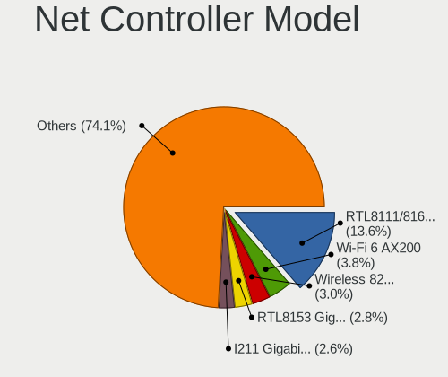

| Model                                                                  | Computers | Percent |
|------------------------------------------------------------------------|-----------|---------|
| Realtek RTL8111/8168/8211/8411 PCI Express Gigabit Ethernet Controller | 359       | 13.64%  |
| Intel Wi-Fi 6 AX200                                                    | 100       | 3.8%    |
| Intel Wireless 8265 / 8275                                             | 79        | 3%      |
| Realtek RTL8153 Gigabit Ethernet Adapter                               | 75        | 2.85%   |
| Intel I211 Gigabit Network Connection                                  | 68        | 2.58%   |
| Intel 82579LM Gigabit Network Connection (Lewisville)                  | 63        | 2.39%   |
| Realtek RTL8125 2.5GbE Controller                                      | 53        | 2.01%   |
| Intel Wireless 7265                                                    | 45        | 1.71%   |
| Intel Wireless 8260                                                    | 43        | 1.63%   |
| Intel Ethernet Controller I225-V                                       | 43        | 1.63%   |
| Intel Wireless 7260                                                    | 36        | 1.37%   |
| Intel Ethernet Connection (2) I219-V                                   | 34        | 1.29%   |
| Intel Alder Lake-P PCH CNVi WiFi                                       | 32        | 1.22%   |
| Intel Wi-Fi 6E(802.11ax) AX210/AX1675* 2x2 [Typhoon Peak]              | 29        | 1.1%    |
| Intel Centrino Advanced-N 6205 [Taylor Peak]                           | 28        | 1.06%   |
| Qualcomm Atheros QCA6174 802.11ac Wireless Network Adapter             | 27        | 1.03%   |
| Intel Cannon Point-LP CNVi [Wireless-AC]                               | 27        | 1.03%   |
| Intel Wi-Fi 6 AX201                                                    | 26        | 0.99%   |
| Intel Ethernet Connection I217-LM                                      | 26        | 0.99%   |
| Intel Ethernet Connection (4) I219-LM                                  | 24        | 0.91%   |
| Intel Cannon Lake PCH CNVi WiFi                                        | 24        | 0.91%   |
| Realtek RTL810xE PCI Express Fast Ethernet controller                  | 23        | 0.87%   |
| Intel Wi-Fi 5(802.11ac) Wireless-AC 9x6x [Thunder Peak]                | 23        | 0.87%   |
| Intel Ethernet Connection (7) I219-V                                   | 23        | 0.87%   |
| Qualcomm Atheros AR9285 Wireless Network Adapter (PCI-Express)         | 20        | 0.76%   |
| Intel Ethernet Connection (4) I219-V                                   | 20        | 0.76%   |
| Qualcomm Atheros QCA9377 802.11ac Wireless Network Adapter             | 19        | 0.72%   |
| Intel Ethernet Connection (6) I219-V                                   | 19        | 0.72%   |
| Intel Comet Lake PCH-LP CNVi WiFi                                      | 19        | 0.72%   |
| Intel Centrino Advanced-N 6235                                         | 19        | 0.72%   |
| Realtek RTL8821CE 802.11ac PCIe Wireless Network Adapter               | 18        | 0.68%   |
| Intel Raptor Lake PCH CNVi WiFi                                        | 18        | 0.68%   |
| Intel Ethernet Connection (2) I219-LM                                  | 17        | 0.65%   |
| Intel Centrino Ultimate-N 6300                                         | 17        | 0.65%   |
| Realtek RTL8852AE 802.11ax PCIe Wireless Network Adapter               | 15        | 0.57%   |
| Qualcomm Atheros QCA9565 / AR9565 Wireless Network Adapter             | 15        | 0.57%   |
| MediaTek MT7922 802.11ax PCI Express Wireless Network Adapter          | 15        | 0.57%   |
| Intel 82579V Gigabit Network Connection                                | 15        | 0.57%   |
| Broadcom BCM4360 802.11ac Dual Band Wireless Network Adapter           | 15        | 0.57%   |
| Intel Ethernet Connection I219-LM                                      | 14        | 0.53%   |

Wireless Vendor
---------------

Wireless vendors

| Vendor                          | Computers | Percent |
|---------------------------------|-----------|---------|
| Intel                           | 704       | 57.19%  |
| Qualcomm Atheros                | 116       | 9.42%   |
| Realtek Semiconductor           | 111       | 9.02%   |
| Broadcom                        | 85        | 6.9%    |
| MediaTek                        | 32        | 2.6%    |
| Broadcom Limited                | 22        | 1.79%   |
| Sierra Wireless                 | 19        | 1.54%   |
| TP-Link                         | 18        | 1.46%   |
| Ralink Technology               | 17        | 1.38%   |
| NetGear                         | 16        | 1.3%    |
| Ralink                          | 15        | 1.22%   |
| ASUSTek Computer                | 15        | 1.22%   |
| Microsoft                       | 10        | 0.81%   |
| Dell                            | 10        | 0.81%   |
| D-Link                          | 9         | 0.73%   |
| Qualcomm Atheros Communications | 7         | 0.57%   |
| Hewlett-Packard                 | 5         | 0.41%   |
| Qualcomm                        | 4         | 0.32%   |
| Linksys                         | 4         | 0.32%   |
| Fibocom                         | 4         | 0.32%   |
| Wacom                           | 3         | 0.24%   |
| Chu Yuen Enterprise             | 3         | 0.24%   |
| Wilocity                        | 1         | 0.08%   |
| D-Link System                   | 1         | 0.08%   |

Wireless Model
--------------

Wireless models

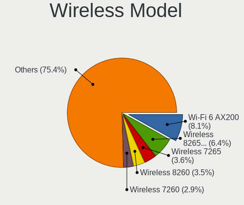

| Model                                                          | Computers | Percent |
|----------------------------------------------------------------|-----------|---------|
| Intel Wi-Fi 6 AX200                                            | 100       | 8.1%    |
| Intel Wireless 8265 / 8275                                     | 79        | 6.4%    |
| Intel Wireless 7265                                            | 45        | 3.65%   |
| Intel Wireless 8260                                            | 43        | 3.48%   |
| Intel Wireless 7260                                            | 36        | 2.92%   |
| Intel Alder Lake-P PCH CNVi WiFi                               | 32        | 2.59%   |
| Intel Wi-Fi 6E(802.11ax) AX210/AX1675* 2x2 [Typhoon Peak]      | 29        | 2.35%   |
| Intel Centrino Advanced-N 6205 [Taylor Peak]                   | 28        | 2.27%   |
| Qualcomm Atheros QCA6174 802.11ac Wireless Network Adapter     | 27        | 2.19%   |
| Intel Cannon Point-LP CNVi [Wireless-AC]                       | 27        | 2.19%   |
| Intel Wi-Fi 6 AX201                                            | 26        | 2.11%   |
| Intel Cannon Lake PCH CNVi WiFi                                | 24        | 1.94%   |
| Intel Wi-Fi 5(802.11ac) Wireless-AC 9x6x [Thunder Peak]        | 23        | 1.86%   |
| Qualcomm Atheros AR9285 Wireless Network Adapter (PCI-Express) | 20        | 1.62%   |
| Qualcomm Atheros QCA9377 802.11ac Wireless Network Adapter     | 19        | 1.54%   |
| Intel Comet Lake PCH-LP CNVi WiFi                              | 19        | 1.54%   |
| Intel Centrino Advanced-N 6235                                 | 19        | 1.54%   |
| Realtek RTL8821CE 802.11ac PCIe Wireless Network Adapter       | 18        | 1.46%   |
| Intel Raptor Lake PCH CNVi WiFi                                | 18        | 1.46%   |
| Intel Centrino Ultimate-N 6300                                 | 17        | 1.38%   |
| Realtek RTL8852AE 802.11ax PCIe Wireless Network Adapter       | 15        | 1.22%   |
| Qualcomm Atheros QCA9565 / AR9565 Wireless Network Adapter     | 15        | 1.22%   |
| Broadcom BCM4360 802.11ac Dual Band Wireless Network Adapter   | 15        | 1.22%   |
| Intel Comet Lake PCH CNVi WiFi                                 | 14        | 1.13%   |
| NetGear A6100 AC600 DB Wireless Adapter [Realtek RTL8811AU]    | 13        | 1.05%   |
| MediaTek MT7921 802.11ax PCI Express Wireless Network Adapter  | 13        | 1.05%   |
| Intel Wireless 3165                                            | 13        | 1.05%   |
| Intel Tiger Lake PCH CNVi WiFi                                 | 13        | 1.05%   |
| Sierra Wireless EM7455                                         | 12        | 0.97%   |
| Broadcom BCM4313 802.11bgn Wireless Network Adapter            | 12        | 0.97%   |
| Realtek RTL8822CE 802.11ac PCIe Wireless Network Adapter       | 11        | 0.89%   |
| Intel Wireless 3160                                            | 11        | 0.89%   |
| Intel Dual Band Wireless-AC 3165 Plus Bluetooth                | 11        | 0.89%   |
| Broadcom BCM43228 802.11a/b/g/n                                | 11        | 0.89%   |
| Qualcomm Atheros AR9485 Wireless Network Adapter               | 10        | 0.81%   |
| Intel Raptor Lake-S PCH CNVi WiFi                              | 10        | 0.81%   |
| Intel Dual Band Wireless-AC 3168NGW [Stone Peak]               | 10        | 0.81%   |
| Qualcomm Atheros AR9462 Wireless Network Adapter               | 9         | 0.73%   |
| Intel Centrino Wireless-N 2230                                 | 9         | 0.73%   |
| Broadcom BCM4331 802.11a/b/g/n                                 | 9         | 0.73%   |

Ethernet Vendor
---------------

Ethernet vendors

| Vendor                                 | Computers | Percent |
|----------------------------------------|-----------|---------|
| Intel                                  | 555       | 42.53%  |
| Realtek Semiconductor                  | 516       | 39.54%  |
| Broadcom                               | 60        | 4.6%    |
| Qualcomm Atheros                       | 57        | 4.37%   |
| Nvidia                                 | 11        | 0.84%   |
| MediaTek                               | 10        | 0.77%   |
| Lenovo                                 | 10        | 0.77%   |
| Marvell Technology Group               | 9         | 0.69%   |
| DisplayLink                            | 9         | 0.69%   |
| Aquantia                               | 9         | 0.69%   |
| Samsung Electronics                    | 6         | 0.46%   |
| Broadcom Limited                       | 6         | 0.46%   |
| Motorola PCS                           | 4         | 0.31%   |
| Mellanox Technologies                  | 4         | 0.31%   |
| Raspberry Pi                           | 3         | 0.23%   |
| Microsoft                              | 3         | 0.23%   |
| Microchip Technology                   | 3         | 0.23%   |
| Huawei Technologies                    | 3         | 0.23%   |
| Google                                 | 3         | 0.23%   |
| ASIX Electronics                       | 3         | 0.23%   |
| OnePlus Technology (Shenzhen)          | 2         | 0.15%   |
| JMicron Technology                     | 2         | 0.15%   |
| Hewlett-Packard                        | 2         | 0.15%   |
| Dell                                   | 2         | 0.15%   |
| Apple                                  | 2         | 0.15%   |
| T & A Mobile Phones                    | 1         | 0.08%   |
| Sony Ericsson Mobile Communications AB | 1         | 0.08%   |
| OPPO Electronics                       | 1         | 0.08%   |
| NetXen Incorporated                    | 1         | 0.08%   |
| Linksys                                | 1         | 0.08%   |
| IBM                                    | 1         | 0.08%   |
| D-Link                                 | 1         | 0.08%   |
| Cisco Systems                          | 1         | 0.08%   |
| ATEN International                     | 1         | 0.08%   |
| American Megatrends                    | 1         | 0.08%   |
| 3Com                                   | 1         | 0.08%   |

Ethernet Model
--------------

Ethernet models

| Model                                                                  | Computers | Percent |
|------------------------------------------------------------------------|-----------|---------|
| Realtek RTL8111/8168/8211/8411 PCI Express Gigabit Ethernet Controller | 359       | 26.61%  |
| Realtek RTL8153 Gigabit Ethernet Adapter                               | 75        | 5.56%   |
| Intel I211 Gigabit Network Connection                                  | 68        | 5.04%   |
| Intel 82579LM Gigabit Network Connection (Lewisville)                  | 63        | 4.67%   |
| Realtek RTL8125 2.5GbE Controller                                      | 53        | 3.93%   |
| Intel Ethernet Controller I225-V                                       | 43        | 3.19%   |
| Intel Ethernet Connection (2) I219-V                                   | 34        | 2.52%   |
| Intel Ethernet Connection I217-LM                                      | 26        | 1.93%   |
| Intel Ethernet Connection (4) I219-LM                                  | 24        | 1.78%   |
| Realtek RTL810xE PCI Express Fast Ethernet controller                  | 23        | 1.7%    |
| Intel Ethernet Connection (7) I219-V                                   | 23        | 1.7%    |
| Intel Ethernet Connection (4) I219-V                                   | 20        | 1.48%   |
| Intel Ethernet Connection (6) I219-V                                   | 19        | 1.41%   |
| Intel Ethernet Connection (2) I219-LM                                  | 17        | 1.26%   |
| Intel 82579V Gigabit Network Connection                                | 15        | 1.11%   |
| Intel Ethernet Connection I219-LM                                      | 14        | 1.04%   |
| Intel Ethernet Connection I219-V                                       | 13        | 0.96%   |
| Intel Ethernet Connection I218-LM                                      | 13        | 0.96%   |
| Intel Ethernet Connection (3) I218-LM                                  | 13        | 0.96%   |
| Intel Ethernet Connection (2) I218-V                                   | 13        | 0.96%   |
| Intel I210 Gigabit Network Connection                                  | 12        | 0.89%   |
| Intel Ethernet Connection (2) I218-LM                                  | 12        | 0.89%   |
| MediaTek MT7922 802.11ax PCI Express Wireless Network Adapter          | 10        | 0.74%   |
| Intel Ethernet Connection (7) I219-LM                                  | 10        | 0.74%   |
| Intel 82577LM Gigabit Network Connection                               | 10        | 0.74%   |
| Qualcomm Atheros QCA8171 Gigabit Ethernet                              | 9         | 0.67%   |
| Qualcomm Atheros Killer E220x Gigabit Ethernet Controller              | 9         | 0.67%   |
| Qualcomm Atheros Killer E2500 Gigabit Ethernet Controller              | 8         | 0.59%   |
| Intel Ethernet Connection (13) I219-V                                  | 8         | 0.59%   |
| Broadcom NetXtreme BCM57766 Gigabit Ethernet PCIe                      | 8         | 0.59%   |
| Broadcom NetXtreme BCM57765 Gigabit Ethernet PCIe                      | 8         | 0.59%   |
| Intel Ethernet Connection I217-V                                       | 7         | 0.52%   |
| Intel 82574L Gigabit Network Connection                                | 7         | 0.52%   |
| Samsung Galaxy series, misc. (tethering mode)                          | 6         | 0.44%   |
| Qualcomm Atheros AR8151 v2.0 Gigabit Ethernet                          | 6         | 0.44%   |
| Intel I350 Gigabit Network Connection                                  | 6         | 0.44%   |
| Intel Ethernet Connection (6) I219-LM                                  | 6         | 0.44%   |
| Intel Ethernet Connection (5) I219-LM                                  | 6         | 0.44%   |
| Intel Ethernet Connection (10) I219-V                                  | 6         | 0.44%   |
| Broadcom NetXtreme BCM5720 Gigabit Ethernet PCIe                       | 6         | 0.44%   |

Net Controller Kind
-------------------

Ethernet, WiFi or modem

| Kind     | Computers | Percent |
|----------|-----------|---------|
| Ethernet | 1196      | 50.19%  |
| WiFi     | 1137      | 47.71%  |
| Modem    | 45        | 1.89%   |
| Unknown  | 5         | 0.21%   |

Used Controller
---------------

Currently used network controller

| Kind     | Computers | Percent |
|----------|-----------|---------|
| WiFi     | 898       | 60.43%  |
| Ethernet | 587       | 39.5%   |
| Unknown  | 1         | 0.07%   |

NICs
----

Total network controllers on board

| Total | Computers | Percent |
|-------|-----------|---------|
| 2     | 794       | 55.1%   |
| 1     | 558       | 38.72%  |
| 3     | 48        | 3.33%   |
| 0     | 26        | 1.8%    |
| 4     | 11        | 0.76%   |
| 6     | 3         | 0.21%   |
| 5     | 1         | 0.07%   |

IPv6
----

IPv6 vs IPv4

| Used | Computers | Percent |
|------|-----------|---------|
| No   | 1218      | 82.41%  |
| Yes  | 260       | 17.59%  |

Bluetooth
---------

Bluetooth Vendor
----------------

Controller vendors

| Vendor                          | Computers | Percent |
|---------------------------------|-----------|---------|
| Intel                           | 576       | 58.36%  |
| Realtek Semiconductor           | 61        | 6.18%   |
| Broadcom                        | 57        | 5.78%   |
| Qualcomm Atheros Communications | 39        | 3.95%   |
| Apple                           | 37        | 3.75%   |
| IMC Networks                    | 35        | 3.55%   |
| Foxconn / Hon Hai               | 35        | 3.55%   |
| Cambridge Silicon Radio         | 33        | 3.34%   |
| ASUSTek Computer                | 27        | 2.74%   |
| Lite-On Technology              | 26        | 2.63%   |
| Hewlett-Packard                 | 15        | 1.52%   |
| Dell                            | 11        | 1.11%   |
| MediaTek                        | 9         | 0.91%   |
| TP-Link                         | 5         | 0.51%   |
| HTC (High Tech Computer)        | 5         | 0.51%   |
| Belkin Components               | 4         | 0.41%   |
| Realtek                         | 2         | 0.2%    |
| Marvell Semiconductor           | 2         | 0.2%    |
| Integrated System Solution      | 2         | 0.2%    |
| USI                             | 1         | 0.1%    |
| Toshiba                         | 1         | 0.1%    |
| Ralink Technology               | 1         | 0.1%    |
| Ralink                          | 1         | 0.1%    |
| Edimax Technology               | 1         | 0.1%    |
| Actions                         | 1         | 0.1%    |

Bluetooth Model
---------------

Controller models

| Model                                                                | Computers | Percent |
|----------------------------------------------------------------------|-----------|---------|
| Intel Bluetooth wireless interface                                   | 204       | 20.61%  |
| Intel AX200 Bluetooth                                                | 92        | 9.29%   |
| Intel AX201 Bluetooth                                                | 83        | 8.38%   |
| Intel AX211 Bluetooth                                                | 60        | 6.06%   |
| Intel Bluetooth 9460/9560 Jefferson Peak (JfP)                       | 55        | 5.56%   |
| Realtek Bluetooth Radio                                              | 43        | 4.34%   |
| Cambridge Silicon Radio Bluetooth Dongle (HCI mode)                  | 33        | 3.33%   |
| Intel AX210 Bluetooth                                                | 27        | 2.73%   |
| Intel Centrino Bluetooth Wireless Transceiver                        | 23        | 2.32%   |
| Intel Wireless-AC 9260 Bluetooth Adapter                             | 22        | 2.22%   |
| Broadcom BCM2045B (BDC-2.1)                                          | 15        | 1.52%   |
| Apple Bluetooth USB Host Controller                                  | 15        | 1.52%   |
| Apple Bluetooth Host Controller                                      | 15        | 1.52%   |
| IMC Networks Bluetooth Radio                                         | 14        | 1.41%   |
| Lite-On Bluetooth Device                                             | 12        | 1.21%   |
| Foxconn / Hon Hai Wireless_Device                                    | 12        | 1.21%   |
| Qualcomm Atheros  Bluetooth Device                                   | 11        | 1.11%   |
| HP Broadcom 2070 Bluetooth Combo                                     | 11        | 1.11%   |
| Foxconn / Hon Hai Bluetooth Device                                   | 11        | 1.11%   |
| Qualcomm Atheros AR3012 Bluetooth 4.0                                | 10        | 1.01%   |
| ASUS Broadcom BCM20702A0 Bluetooth                                   | 10        | 1.01%   |
| Qualcomm Atheros AR3011 Bluetooth                                    | 9         | 0.91%   |
| IMC Networks Wireless_Device                                         | 9         | 0.91%   |
| Broadcom BCM20702 Bluetooth 4.0 [ThinkPad]                           | 9         | 0.91%   |
| Realtek  Bluetooth 4.2 Adapter                                       | 8         | 0.81%   |
| MediaTek Wireless_Device                                             | 8         | 0.81%   |
| Intel Wireless-AC 3168 Bluetooth                                     | 8         | 0.81%   |
| ASUS ASUS USB-BT500                                                  | 7         | 0.71%   |
| Qualcomm Atheros QCA61x4 Bluetooth 4.0                               | 6         | 0.61%   |
| Lite-On Qualcomm Atheros QCA9377 Bluetooth                           | 6         | 0.61%   |
| Apple Built-in Bluetooth 2.0+EDR HCI                                 | 6         | 0.61%   |
| TP-Link TP-Link Bluetooth USB Adapter                                | 5         | 0.51%   |
| Lite-On Wireless_Device                                              | 5         | 0.51%   |
| IMC Networks Bluetooth Device                                        | 5         | 0.51%   |
| HTC (High Tech Computer) Vive Hub Bluetooth 4.1 (Broadcom BCM920703) | 5         | 0.51%   |
| Foxconn / Hon Hai MediaTek Bluetooth Adapter                         | 5         | 0.51%   |
| Broadcom BCM2045B (BDC-2.1) [Bluetooth Controller]                   | 5         | 0.51%   |
| Dell DW375 Bluetooth Module                                          | 4         | 0.4%    |
| Dell BCM20702A0 Bluetooth Module                                     | 4         | 0.4%    |
| Broadcom HP Portable SoftSailing                                     | 4         | 0.4%    |

Sound
-----

Sound Vendor
------------

Sound card vendors

| Vendor                                       | Computers | Percent |
|----------------------------------------------|-----------|---------|
| Intel                                        | 1028      | 47.33%  |
| AMD                                          | 412       | 18.97%  |
| Nvidia                                       | 378       | 17.4%   |
| C-Media Electronics                          | 38        | 1.75%   |
| SteelSeries ApS                              | 27        | 1.24%   |
| Logitech                                     | 26        | 1.2%    |
| Realtek Semiconductor                        | 20        | 0.92%   |
| Lenovo                                       | 17        | 0.78%   |
| Kingston Technology                          | 17        | 0.78%   |
| GN Netcom                                    | 14        | 0.64%   |
| ASUSTek Computer                             | 14        | 0.64%   |
| Focusrite-Novation                           | 13        | 0.6%    |
| Blue Microphones                             | 11        | 0.51%   |
| Hewlett-Packard                              | 8         | 0.37%   |
| Creative Labs                                | 8         | 0.37%   |
| Corsair                                      | 8         | 0.37%   |
| Razer USA                                    | 7         | 0.32%   |
| Texas Instruments                            | 6         | 0.28%   |
| SAVITECH                                     | 6         | 0.28%   |
| Sony                                         | 5         | 0.23%   |
| Plantronics                                  | 5         | 0.23%   |
| FiiO Electronics Technology                  | 5         | 0.23%   |
| Creative Technology                          | 5         | 0.23%   |
| M-Audio                                      | 4         | 0.18%   |
| KTMicro                                      | 4         | 0.18%   |
| JMTek                                        | 4         | 0.18%   |
| Zoran Co. Personal Media Division (Nogatech) | 3         | 0.14%   |
| XMOS                                         | 3         | 0.14%   |
| RODE Microphones                             | 3         | 0.14%   |
| RME                                          | 3         | 0.14%   |
| Micro Star International                     | 3         | 0.14%   |
| GYROCOM C&C                                  | 3         | 0.14%   |
| Generalplus Technology                       | 3         | 0.14%   |
| DSEA A/S                                     | 3         | 0.14%   |
| Yamaha                                       | 2         | 0.09%   |
| Samson Technologies                          | 2         | 0.09%   |
| Roland                                       | 2         | 0.09%   |
| ROCCAT                                       | 2         | 0.09%   |
| Nordic Semiconductor ASA                     | 2         | 0.09%   |
| Musical Fidelity                             | 2         | 0.09%   |

Sound Model
-----------

Sound card models

| Model                                                                      | Computers | Percent |
|----------------------------------------------------------------------------|-----------|---------|
| Intel Sunrise Point-LP HD Audio                                            | 144       | 5.66%   |
| AMD Family 17h/19h/1ah HD Audio Controller                                 | 126       | 4.95%   |
| AMD Starship/Matisse HD Audio Controller                                   | 93        | 3.65%   |
| Intel 7 Series/C216 Chipset Family High Definition Audio Controller        | 88        | 3.46%   |
| Intel Cannon Lake PCH cAVS                                                 | 73        | 2.87%   |
| Intel 6 Series/C200 Series Chipset Family High Definition Audio Controller | 68        | 2.67%   |
| Intel 8 Series/C220 Series Chipset High Definition Audio Controller        | 66        | 2.59%   |
| AMD Renoir Radeon High Definition Audio Controller                         | 58        | 2.28%   |
| Intel 100 Series/C230 Series Chipset Family HD Audio Controller            | 54        | 2.12%   |
| Intel Xeon E3-1200 v3/4th Gen Core Processor HD Audio Controller           | 51        | 2%      |
| Intel Haswell-ULT HD Audio Controller                                      | 45        | 1.77%   |
| Intel Cannon Point-LP High Definition Audio Controller                     | 45        | 1.77%   |
| Intel 8 Series HD Audio Controller                                         | 44        | 1.73%   |
| Intel Tiger Lake-LP Smart Sound Technology Audio Controller                | 41        | 1.61%   |
| Intel Wildcat Point-LP High Definition Audio Controller                    | 37        | 1.45%   |
| Intel Broadwell-U Audio Controller                                         | 37        | 1.45%   |
| Intel Alder Lake PCH-P High Definition Audio Controller                    | 35        | 1.37%   |
| AMD SBx00 Azalia (Intel HDA)                                               | 35        | 1.37%   |
| AMD Navi 21/23 HDMI/DP Audio Controller                                    | 34        | 1.34%   |
| Intel 200 Series PCH HD Audio                                              | 33        | 1.3%    |
| AMD Rembrandt Radeon High Definition Audio Controller                      | 32        | 1.26%   |
| Intel 5 Series/3400 Series Chipset High Definition Audio                   | 31        | 1.22%   |
| AMD FCH Azalia Controller                                                  | 30        | 1.18%   |
| AMD Family 17h (Models 00h-0fh) HD Audio Controller                        | 30        | 1.18%   |
| Nvidia GP106 High Definition Audio Controller                              | 29        | 1.14%   |
| Nvidia GP104 High Definition Audio Controller                              | 29        | 1.14%   |
| Nvidia GA104 High Definition Audio Controller                              | 29        | 1.14%   |
| AMD Ellesmere HDMI Audio [Radeon RX 470/480 / 570/580/590]                 | 25        | 0.98%   |
| Intel C610/X99 series chipset HD Audio Controller                          | 23        | 0.9%    |
| Intel 82801I (ICH9 Family) HD Audio Controller                             | 22        | 0.86%   |
| AMD Raven/Raven2/Fenghuang HDMI/DP Audio Controller                        | 22        | 0.86%   |
| Nvidia GM204 High Definition Audio Controller                              | 21        | 0.82%   |
| Intel Raptor Lake-P/U/H cAVS                                               | 20        | 0.79%   |
| Intel Comet Lake PCH cAVS                                                  | 20        | 0.79%   |
| AMD Oland/Hainan/Cape Verde/Pitcairn HDMI Audio [Radeon HD 7000 Series]    | 20        | 0.79%   |
| Nvidia GP107GL High Definition Audio Controller                            | 19        | 0.75%   |
| Intel Tiger Lake-H HD Audio Controller                                     | 19        | 0.75%   |
| Intel Comet Lake PCH-LP cAVS                                               | 19        | 0.75%   |
| Realtek Semiconductor USB Audio                                            | 18        | 0.71%   |
| Nvidia GF108 High Definition Audio Controller                              | 18        | 0.71%   |

Memory
------

Memory Vendor
-------------

Memory module vendors

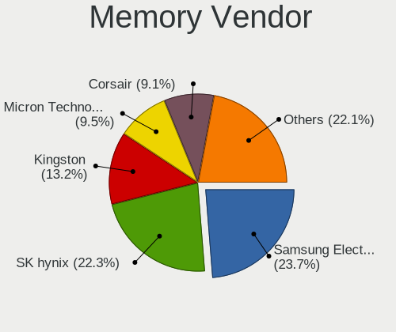

| Vendor                 | Computers | Percent |
|------------------------|-----------|---------|
| Samsung Electronics    | 217       | 23.74%  |
| SK hynix               | 204       | 22.32%  |
| Kingston               | 121       | 13.24%  |
| Micron Technology      | 87        | 9.52%   |
| Corsair                | 83        | 9.08%   |
| Crucial                | 50        | 5.47%   |
| Unknown                | 44        | 4.81%   |
| G.Skill                | 33        | 3.61%   |
| Ramaxel Technology     | 12        | 1.31%   |
| Elpida                 | 11        | 1.2%    |
| Unknown                | 10        | 1.09%   |
| A-DATA Technology      | 8         | 0.88%   |
| Nanya Technology       | 4         | 0.44%   |
| Unknown (ABCD)         | 2         | 0.22%   |
| Team                   | 2         | 0.22%   |
| Patriot                | 2         | 0.22%   |
| Unknown (89F7)         | 1         | 0.11%   |
| Unknown (0x0D0E)       | 1         | 0.11%   |
| Unknown (00000000802C) | 1         | 0.11%   |
| Transcend              | 1         | 0.11%   |
| Toshiba                | 1         | 0.11%   |
| Timetec                | 1         | 0.11%   |
| SK_Hynix               | 1         | 0.11%   |
| Samsung / Micron       | 1         | 0.11%   |
| Lexar                  | 1         | 0.11%   |
| Hewlett-Packard        | 1         | 0.11%   |
| GSkill                 | 1         | 0.11%   |
| GeIL                   | 1         | 0.11%   |
| fef5                   | 1         | 0.11%   |
| ASint Technology       | 1         | 0.11%   |
| Apacer                 | 1         | 0.11%   |
| 98000817752EA5DF       | 1         | 0.11%   |
| 98000817752E90DE       | 1         | 0.11%   |
| 98000817752E75DE       | 1         | 0.11%   |
| 98000817702EBEDE       | 1         | 0.11%   |
| 98000817702EBDDE       | 1         | 0.11%   |
| 98000817702EBBDF       | 1         | 0.11%   |
| 98000817702E73DE       | 1         | 0.11%   |
| 98000817702E65DE       | 1         | 0.11%   |
| 48spaces               | 1         | 0.11%   |

Memory Model
------------

Memory module models

| Model                                                               | Computers | Percent |
|---------------------------------------------------------------------|-----------|---------|
| Corsair RAM CMK32GX4M2B3200C16 16GB DIMM DDR4 3800MT/s              | 12        | 1.25%   |
| SK hynix RAM HMA41GR7MFR4N-TF 8GB DIMM DDR4 2133MT/s                | 10        | 1.04%   |
| Unknown                                                             | 10        | 1.04%   |
| Corsair RAM CMK16GX4M2B3200C16 8GB DIMM DDR4 3600MT/s               | 9         | 0.93%   |
| Samsung RAM M471A2K43CB1-CRC 16GB SODIMM DDR4 2667MT/s              | 8         | 0.83%   |
| SK hynix RAM HMA851S6AFR6N-UH 4GB SODIMM DDR4 2667MT/s              | 7         | 0.73%   |
| Samsung RAM M471B5273DH0-CH9 4GB SODIMM DDR3 1334MT/s               | 7         | 0.73%   |
| Samsung RAM M471B5173EB0-YK0 4GB SODIMM DDR3 1600MT/s               | 7         | 0.73%   |
| Samsung RAM M471A1K43EB1-CWE 8GB SODIMM DDR4 3200MT/s               | 7         | 0.73%   |
| SK hynix RAM HMT451S6BFR8A-PB 4096MB SODIMM DDR3 1600MT/s           | 6         | 0.62%   |
| SK hynix RAM HMT41GS6BFR8A-PB 8GB SODIMM DDR3 1600MT/s              | 6         | 0.62%   |
| SK hynix RAM HMA41GS6AFR8N-TF 8GB SODIMM DDR4 2667MT/s              | 6         | 0.62%   |
| Micron RAM MT52L1G32D4PG-093 8GB Row Of Chips LPDDR3 2133MT/s       | 6         | 0.62%   |
| Kingston RAM KHX2666C16/8G 8GB DIMM DDR4 3466MT/s                   | 6         | 0.62%   |
| Unknown RAM Module 4GB Chip DDR4 2133MT/s                           | 5         | 0.52%   |
| Unknown RAM Module 2GB DIMM DDR2 667MT/s                            | 5         | 0.52%   |
| SK hynix RAM HMA81GU7AFR8N-UH 8GB DIMM DDR4 2400MT/s                | 5         | 0.52%   |
| SK hynix RAM HMA81GS6DJR8N-XN 8GB SODIMM DDR4 3200MT/s              | 5         | 0.52%   |
| Samsung RAM Module 4GB SODIMM DDR3 1867MT/s                         | 5         | 0.52%   |
| Samsung RAM M471B5173QH0-YK0 4GB SODIMM DDR3 1600MT/s               | 5         | 0.52%   |
| Samsung RAM M471B1G73DB0-YK0 8GB SODIMM DDR3 1600MT/s               | 5         | 0.52%   |
| Samsung RAM M471A1K43DB1-CWE 8GB SODIMM DDR4 3200MT/s               | 5         | 0.52%   |
| Samsung RAM M471A1K43DB1-CTD 8GB SODIMM DDR4 2667MT/s               | 5         | 0.52%   |
| Samsung RAM M471A1G44BB0-CWE 8GB SODIMM DDR4 3200MT/s               | 5         | 0.52%   |
| Samsung RAM M471A1G44AB0-CWE 8GB SODIMM DDR4 3200MT/s               | 5         | 0.52%   |
| Kingston RAM KN2M64-ETB 8GB SODIMM DDR3 1600MT/s                    | 5         | 0.52%   |
| G.Skill RAM F4-3600C16-16GTZNC 16GB DIMM DDR4 3866MT/s              | 5         | 0.52%   |
| SK hynix RAM HMT41GS6AFR8A-PB 8GB SODIMM DDR3 2667MT/s              | 4         | 0.42%   |
| SK hynix RAM HMT351S6EFR8A-PB 4GB SODIMM DDR3 1600MT/s              | 4         | 0.42%   |
| SK hynix RAM HMAA1GS6CJR6N-XN 8GB SODIMM DDR4 3200MT/s              | 4         | 0.42%   |
| SK hynix RAM HMA82GS6CJR8N-VK 16GB SODIMM DDR4 2667MT/s             | 4         | 0.42%   |
| SK hynix RAM HMA81GS6AFR8N-UH 8GB SODIMM DDR4 2667MT/s              | 4         | 0.42%   |
| SK hynix RAM H9CCNNNCLGALAR-NVD 8192MB Row Of Chips LPDDR3 2133MT/s | 4         | 0.42%   |
| Samsung RAM M471A5244CB0-CRC 4GB SODIMM DDR4 2667MT/s               | 4         | 0.42%   |
| Samsung RAM M471A4G43MB1-CTD 32GB SODIMM DDR4 2667MT/s              | 4         | 0.42%   |
| Samsung RAM M471A1K43CB1-CRC 8GB SODIMM DDR4 2667MT/s               | 4         | 0.42%   |
| Samsung RAM K4E6E304EB-EGCG 4GB Row Of Chips LPDDR3 2133MT/s        | 4         | 0.42%   |
| Micron RAM 4ATF1G64HZ-3G2E1 8GB Row Of Chips DDR4 3200MT/s          | 4         | 0.42%   |
| Micron RAM 16ATF2G64HZ-2G6E1 16GB SODIMM DDR4 2667MT/s              | 4         | 0.42%   |
| Kingston RAM KHX2400C15/8G 8GB DIMM DDR4 3400MT/s                   | 4         | 0.42%   |

Memory Kind
-----------

Memory module kinds

| Kind    | Computers | Percent |
|---------|-----------|---------|
| DDR4    | 413       | 51.56%  |
| DDR3    | 195       | 24.34%  |
| LPDDR3  | 39        | 4.87%   |
| DDR5    | 39        | 4.87%   |
| LPDDR5  | 35        | 4.37%   |
| LPDDR4  | 35        | 4.37%   |
| DDR2    | 18        | 2.25%   |
| Unknown | 12        | 1.5%    |
| SDRAM   | 9         | 1.12%   |
| DRAM    | 4         | 0.5%    |
| DDR     | 2         | 0.25%   |

Memory Form Factor
------------------

Physical design of the memory module

| Name         | Computers | Percent |
|--------------|-----------|---------|
| SODIMM       | 408       | 50.87%  |
| DIMM         | 274       | 34.16%  |
| Row Of Chips | 100       | 12.47%  |
| Chip         | 13        | 1.62%   |
| Unknown      | 5         | 0.62%   |
| FB-DIMM      | 2         | 0.25%   |

Memory Size
-----------

Memory module size

| Size  | Computers | Percent |
|-------|-----------|---------|
| 8192  | 362       | 42.34%  |
| 4096  | 199       | 23.27%  |
| 16384 | 194       | 22.69%  |
| 32768 | 44        | 5.15%   |
| 2048  | 44        | 5.15%   |
| 1024  | 9         | 1.05%   |
| 49152 | 1         | 0.12%   |
| 512   | 1         | 0.12%   |
| 128   | 1         | 0.12%   |

Memory Speed
------------

Memory module speed

| Speed   | Computers | Percent |
|---------|-----------|---------|
| 1600    | 125       | 14.5%   |
| 2667    | 124       | 14.39%  |
| 3200    | 117       | 13.57%  |
| 2133    | 83        | 9.63%   |
| 2400    | 70        | 8.12%   |
| 3600    | 30        | 3.48%   |
| 1333    | 28        | 3.25%   |
| 6400    | 27        | 3.13%   |
| 1867    | 23        | 2.67%   |
| 1334    | 19        | 2.2%    |
| 4267    | 16        | 1.86%   |
| 3800    | 16        | 1.86%   |
| 667     | 16        | 1.86%   |
| 4800    | 13        | 1.51%   |
| 6000    | 10        | 1.16%   |
| 5600    | 10        | 1.16%   |
| 3866    | 8         | 0.93%   |
| 3733    | 8         | 0.93%   |
| 3000    | 8         | 0.93%   |
| 1800    | 8         | 0.93%   |
| 3400    | 7         | 0.81%   |
| 2666    | 7         | 0.81%   |
| 1067    | 7         | 0.81%   |
| 3466    | 6         | 0.7%    |
| 2800    | 6         | 0.7%    |
| 1066    | 5         | 0.58%   |
| 7500    | 4         | 0.46%   |
| 4199    | 4         | 0.46%   |
| 4000    | 4         | 0.46%   |
| 2933    | 4         | 0.46%   |
| 800     | 4         | 0.46%   |
| 8400    | 3         | 0.35%   |
| 7467    | 3         | 0.35%   |
| 4266    | 3         | 0.35%   |
| 3333    | 3         | 0.35%   |
| 3100    | 3         | 0.35%   |
| Unknown | 3         | 0.35%   |
| 5900    | 2         | 0.23%   |
| 3266    | 2         | 0.23%   |
| 3151    | 2         | 0.23%   |

Printers & scanners
-------------------

Printer Vendor
--------------

Printer device vendors

| Vendor              | Computers | Percent |
|---------------------|-----------|---------|
| Hewlett-Packard     | 8         | 34.78%  |
| Brother Industries  | 7         | 30.43%  |
| Canon               | 3         | 13.04%  |
| Samsung Electronics | 2         | 8.7%    |
| Seiko Epson         | 1         | 4.35%   |
| Pantum              | 1         | 4.35%   |
| Kyocera             | 1         | 4.35%   |

Printer Model
-------------

Printer device models

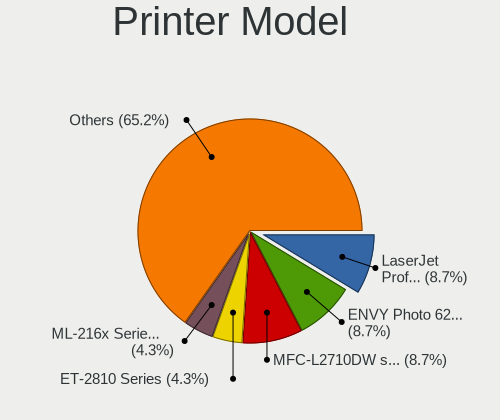

| Model                                | Computers | Percent |
|--------------------------------------|-----------|---------|
| HP LaserJet Professional P 1102w     | 2         | 8.7%    |
| HP ENVY Photo 6200 series            | 2         | 8.7%    |
| Brother MFC-L2710DW series           | 2         | 8.7%    |
| Seiko Epson ET-2810 Series           | 1         | 4.35%   |
| Samsung ML-216x Series Laser Printer | 1         | 4.35%   |
| Samsung M2020 Series                 | 1         | 4.35%   |
| Pantum P2500W series                 | 1         | 4.35%   |
| Kyocera ECOSYS P2235dn               | 1         | 4.35%   |
| HP Printing Support                  | 1         | 4.35%   |
| HP DeskJet F300 series               | 1         | 4.35%   |
| HP DeskJet 2700 series               | 1         | 4.35%   |
| HP Deskjet 2540 series               | 1         | 4.35%   |
| Canon TS5300 series                  | 1         | 4.35%   |
| Canon PIXMA MX530 Series             | 1         | 4.35%   |
| Canon CanoScan LiDE 300              | 1         | 4.35%   |
| Brother QL-800 Label Printer         | 1         | 4.35%   |
| Brother QL-550 printer               | 1         | 4.35%   |
| Brother PT-2450DX                    | 1         | 4.35%   |
| Brother HL-1210W series              | 1         | 4.35%   |
| Brother DCP-8085DN                   | 1         | 4.35%   |

Scanner Vendor
--------------

Scanner device vendors

| Vendor         | Computers | Percent |
|----------------|-----------|---------|
| Canon          | 7         | 77.78%  |
| Seiko Epson    | 1         | 11.11%  |
| Mustek Systems | 1         | 11.11%  |

Scanner Model
-------------

Scanner device models

| Model                               | Computers | Percent |
|-------------------------------------|-----------|---------|
| Canon CanoScan LiDE 200             | 2         | 22.22%  |
| Canon CanoScan LiDE 110             | 2         | 22.22%  |
| Canon CanoScan 9000F Mark II        | 2         | 22.22%  |
| Seiko Epson Perfection V37/V370     | 1         | 11.11%  |
| Mustek Systems BearPaw 1200 CU Plus | 1         | 11.11%  |
| Canon CanoScan 8800F                | 1         | 11.11%  |

Camera
------

Camera Vendor
-------------

Camera device vendors

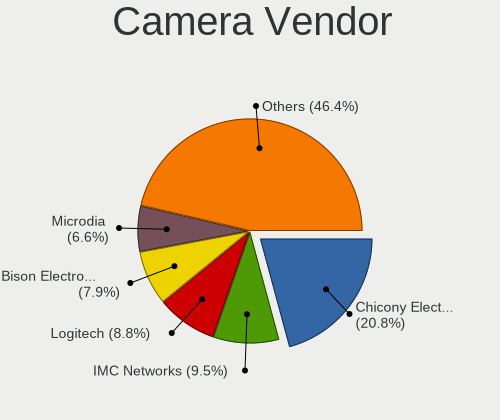

| Vendor                                 | Computers | Percent |
|----------------------------------------|-----------|---------|
| Chicony Electronics                    | 192       | 20.8%   |
| IMC Networks                           | 88        | 9.53%   |
| Logitech                               | 81        | 8.78%   |
| Bison Electronics                      | 73        | 7.91%   |
| Microdia                               | 61        | 6.61%   |
| Sunplus Innovation Technology          | 55        | 5.96%   |
| Realtek Semiconductor                  | 47        | 5.09%   |
| Quanta                                 | 39        | 4.23%   |
| Apple                                  | 36        | 3.9%    |
| Lite-On Technology                     | 32        | 3.47%   |
| Cheng Uei Precision Industry (Foxlink) | 30        | 3.25%   |
| Luxvisions Innotech Limited            | 20        | 2.17%   |
| Suyin                                  | 18        | 1.95%   |
| Acer                                   | 17        | 1.84%   |
| Lenovo                                 | 13        | 1.41%   |
| Microsoft                              | 12        | 1.3%    |
| Samsung Electronics                    | 11        | 1.19%   |
| Silicon Motion                         | 9         | 0.98%   |
| Creative Technology                    | 9         | 0.98%   |
| Syntek                                 | 8         | 0.87%   |
| Alcor Micro                            | 8         | 0.87%   |
| Shinetech                              | 6         | 0.65%   |
| Shenzhen Kingcome Optoelectronic       | 5         | 0.54%   |
| Razer USA                              | 5         | 0.54%   |
| Primax Electronics                     | 5         | 0.54%   |
| Sonix Technology                       | 4         | 0.43%   |
| Z-Star Microelectronics                | 3         | 0.33%   |
| Sony Ericsson Mobile Communications AB | 3         | 0.33%   |
| Omnivision                             | 3         | 0.33%   |
| MacroSilicon                           | 3         | 0.33%   |
| Sunplus Technology                     | 2         | 0.22%   |
| Ricoh                                  | 2         | 0.22%   |
| Generalplus Technology                 | 2         | 0.22%   |
| Dell                                   | 2         | 0.22%   |
| Cubeternet                             | 2         | 0.22%   |
| ALi                                    | 2         | 0.22%   |
| Y Media                                | 1         | 0.11%   |
| Valve Software                         | 1         | 0.11%   |
| Trust                                  | 1         | 0.11%   |
| Technologies                           | 1         | 0.11%   |

Camera Model
------------

Camera device models

| Model                                               | Computers | Percent |
|-----------------------------------------------------|-----------|---------|
| Chicony Integrated Camera                           | 67        | 7.16%   |
| Microdia Integrated_Webcam_HD                       | 33        | 3.53%   |
| IMC Networks Integrated Camera                      | 32        | 3.42%   |
| IMC Networks USB2.0 HD UVC WebCam                   | 25        | 2.67%   |
| Bison Integrated Camera                             | 21        | 2.24%   |
| Logitech HD Pro Webcam C920                         | 18        | 1.92%   |
| Chicony HP HD Camera                                | 17        | 1.82%   |
| Apple iPhone 5/5C/5S/6/SE/7/8/X/XR                  | 15        | 1.6%    |
| Sunplus Integrated_Webcam_HD                        | 14        | 1.5%    |
| Realtek Integrated_Webcam_HD                        | 14        | 1.5%    |
| Lite-On Integrated Camera                           | 14        | 1.5%    |
| Chicony HD Webcam                                   | 14        | 1.5%    |
| Logitech C922 Pro Stream Webcam                     | 13        | 1.39%   |
| Chicony HP HD Webcam                                | 13        | 1.39%   |
| Samsung Galaxy series, misc. (MTP mode)             | 11        | 1.18%   |
| Quanta HP HD Camera                                 | 11        | 1.18%   |
| Lite-On HP HD Camera                                | 11        | 1.18%   |
| Bison SunplusIT Integrated Camera                   | 10        | 1.07%   |
| Bison HD Webcam                                     | 10        | 1.07%   |
| Luxvisions Innotech Limited Integrated Camera       | 8         | 0.85%   |
| Apple FaceTime HD Camera (Built-in)                 | 8         | 0.85%   |
| Quanta HD User Facing                               | 7         | 0.75%   |
| Logitech Webcam C270                                | 7         | 0.75%   |
| Lenovo Integrated Webcam [R5U877]                   | 7         | 0.75%   |
| Chicony Integrated HP HD Webcam                     | 7         | 0.75%   |
| Chicony EasyCamera                                  | 7         | 0.75%   |
| Cheng Uei Precision Industry (Foxlink) HD Camera    | 7         | 0.75%   |
| Sunplus HD WebCam                                   | 6         | 0.64%   |
| Sunplus ASUS Webcam                                 | 6         | 0.64%   |
| Quanta ACER HD User Facing                          | 6         | 0.64%   |
| Microsoft LifeCam Cinema                            | 6         | 0.64%   |
| Microdia Integrated Webcam                          | 6         | 0.64%   |
| Cheng Uei Precision Industry (Foxlink) HP HD Camera | 6         | 0.64%   |
| Bison Lenovo EasyCamera                             | 6         | 0.64%   |
| Apple FaceTime HD Camera                            | 6         | 0.64%   |
| Sunplus Laptop Integrated Webcam HD                 | 5         | 0.53%   |
| Sunplus HD 720P webcam                              | 5         | 0.53%   |
| Shenzhen Kingcome Optoelectronic 720p HD Camera     | 5         | 0.53%   |
| Realtek USB2.0 HD UVC WebCam                        | 5         | 0.53%   |
| Quanta HP TrueVision HD Camera                      | 5         | 0.53%   |

Security
--------

Fingerprint Vendor
------------------

Fingerprint sensor vendors

| Vendor                             | Computers | Percent |
|------------------------------------|-----------|---------|
| Validity Sensors                   | 83        | 37.05%  |
| Synaptics                          | 81        | 36.16%  |
| Upek                               | 19        | 8.48%   |
| Shenzhen Goodix Technology         | 18        | 8.04%   |
| Elan Microelectronics              | 6         | 2.68%   |
| LighTuning Technology              | 5         | 2.23%   |
| AuthenTec                          | 5         | 2.23%   |
| Samsung Electronics                | 3         | 1.34%   |
| Realtek USB2.0 Finger Print Bridge | 3         | 1.34%   |
| STMicroelectronics                 | 1         | 0.45%   |

Fingerprint Model
-----------------

Fingerprint sensor models

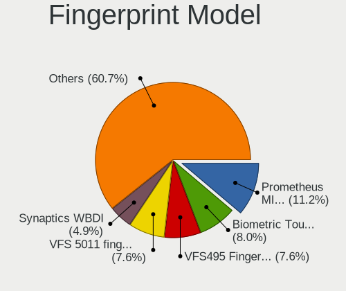

| Model                                                                      | Computers | Percent |
|----------------------------------------------------------------------------|-----------|---------|
| Synaptics Prometheus MIS Touch Fingerprint Reader                          | 25        | 11.16%  |
| Upek Biometric Touchchip/Touchstrip Fingerprint Sensor                     | 18        | 8.04%   |
| Validity Sensors VFS495 Fingerprint Reader                                 | 17        | 7.59%   |
| Validity Sensors VFS 5011 fingerprint sensor                               | 17        | 7.59%   |
| Validity Sensors Synaptics WBDI                                            | 11        | 4.91%   |
| Synaptics Metallica MIS Touch Fingerprint Reader                           | 11        | 4.91%   |
| Validity Sensors VFS7500 Touch Fingerprint Sensor                          | 9         | 4.02%   |
| Synaptics Fingerprint reader [HP G6]                                       | 8         | 3.57%   |
| Synaptics Prometheus Fingerprint Reader                                    | 7         | 3.13%   |
| Validity Sensors VFS491                                                    | 6         | 2.68%   |
| Validity Sensors VFS471 Fingerprint Reader                                 | 6         | 2.68%   |
| Validity Sensors Synaptics VFS7552 Touch Fingerprint Sensor with PurePrint | 6         | 2.68%   |
| Shenzhen Goodix  FingerPrint Device                                        | 6         | 2.68%   |
| Shenzhen Goodix Fingerprint Reader                                         | 6         | 2.68%   |
| Shenzhen Goodix FingerPrint                                                | 6         | 2.68%   |
| Synaptics WBDI                                                             | 5         | 2.23%   |
| Synaptics UWP WBDI Device                                                  | 5         | 2.23%   |
| Synaptics  FS7604 Touch Fingerprint Sensor with PurePrint                  | 5         | 2.23%   |
| Synaptics FS7604 Touch Fingerprint Sensor with PurePrint                   | 5         | 2.23%   |
| Validity Sensors VFS5011 Fingerprint Reader                                | 4         | 1.79%   |
| LighTuning EgisTec Touch Fingerprint Sensor                                | 4         | 1.79%   |
| Elan ELAN:Fingerprint                                                      | 4         | 1.79%   |
| Validity Sensors VFS451 Fingerprint Reader                                 | 3         | 1.34%   |
| Synaptics Metallica MOH Touch Fingerprint Reader                           | 3         | 1.34%   |
| Samsung Fingerprint Sensor Device - 730B                                   | 3         | 1.34%   |
| Realtek USB2.0 Finger Print Bridge FocalTech Fingerprint Device            | 3         | 1.34%   |
| AuthenTec AES2810                                                          | 3         | 1.34%   |
| Validity Sensors Synaptics VFS7552 Touch Fingerprint Sensor                | 2         | 0.89%   |
| Synaptics UWP WBDI                                                         | 2         | 0.89%   |
| Synaptics  WBDI                                                            | 2         | 0.89%   |
| Elan WBF Fingerprint Sensor                                                | 2         | 0.89%   |
| Validity Sensors VFS301 Fingerprint Reader                                 | 1         | 0.45%   |
| Validity Sensors Fingerprint scanner                                       | 1         | 0.45%   |
| Upek TCS5B Fingerprint sensor                                              | 1         | 0.45%   |
| Synaptics WBDI Fingerprint Reader USB 102                                  | 1         | 0.45%   |
| Synaptics WBDI Fingerprint Reader USB 086                                  | 1         | 0.45%   |
| STMicroelectronics Fingerprint Reader                                      | 1         | 0.45%   |
| LighTuning Fingerprint Reader                                              | 1         | 0.45%   |
| AuthenTec AES2501 Fingerprint Sensor                                       | 1         | 0.45%   |
| AuthenTec AES1600                                                          | 1         | 0.45%   |

Chipcard Vendor
---------------

Chipcard module vendors

| Vendor                | Computers | Percent |
|-----------------------|-----------|---------|
| Alcor Micro           | 46        | 41.82%  |
| Broadcom              | 42        | 38.18%  |
| Upek                  | 10        | 9.09%   |
| Lenovo                | 5         | 4.55%   |
| OmniKey               | 2         | 1.82%   |
| Yubico.com            | 1         | 0.91%   |
| Hewlett-Packard       | 1         | 0.91%   |
| Gemalto (was Gemplus) | 1         | 0.91%   |
| Chicony Electronics   | 1         | 0.91%   |
| Advanced Card Systems | 1         | 0.91%   |

Chipcard Model
--------------

Chipcard module models

| Model                                                                        | Computers | Percent |
|------------------------------------------------------------------------------|-----------|---------|
| Alcor Micro AU9540 Smartcard Reader                                          | 46        | 41.82%  |
| Broadcom 58200                                                               | 14        | 12.73%  |
| Broadcom BCM5880 Secure Applications Processor with fingerprint swipe sensor | 11        | 10%     |
| Broadcom 5880                                                                | 11        | 10%     |
| Upek TouchChip Fingerprint Coprocessor (WBF advanced mode)                   | 10        | 9.09%   |
| Broadcom BCM5880 Secure Applications Processor                               | 6         | 5.45%   |
| Lenovo Integrated Smart Card Reader                                          | 5         | 4.55%   |
| OmniKey CardMan 3021 / 3121                                                  | 2         | 1.82%   |
| Yubico.com Yubikey 4/5 CCID                                                  | 1         | 0.91%   |
| Hewlett-Packard SC Keyboard - Apollo (Liteon)                                | 1         | 0.91%   |
| Gemalto (was Gemplus) Compact Smart Card Reader Writer                       | 1         | 0.91%   |
| Chicony Electronics HP Skylab USB Smartcard Keyboard                         | 1         | 0.91%   |
| Advanced Card Systems ACR39U                                                 | 1         | 0.91%   |

Unsupported
-----------

Unsupported Devices
-------------------

Total unsupported devices on board

| Total | Computers | Percent |
|-------|-----------|---------|
| 0     | 922       | 62.55%  |
| 1     | 418       | 28.36%  |
| 2     | 104       | 7.06%   |
| 3     | 24        | 1.63%   |
| 5     | 3         | 0.2%    |
| 4     | 2         | 0.14%   |
| 7     | 1         | 0.07%   |

Unsupported Device Types
------------------------

Types of unsupported devices

| Type                     | Computers | Percent |
|--------------------------|-----------|---------|
| Fingerprint reader       | 223       | 32.55%  |
| Graphics card            | 121       | 17.66%  |
| Chipcard                 | 92        | 13.43%  |
| Net/wireless             | 78        | 11.39%  |
| Unassigned class         | 40        | 5.84%   |
| Multimedia controller    | 40        | 5.84%   |
| Communication controller | 21        | 3.07%   |
| Camera                   | 21        | 3.07%   |
| Card reader              | 10        | 1.46%   |
| Bluetooth                | 10        | 1.46%   |
| Sound                    | 9         | 1.31%   |
| Storage                  | 6         | 0.88%   |
| Net/ethernet             | 5         | 0.73%   |
| Wireless                 | 4         | 0.58%   |
| Storage/raid             | 2         | 0.29%   |
| Modem                    | 2         | 0.29%   |
| Dvb card                 | 1         | 0.15%   |

