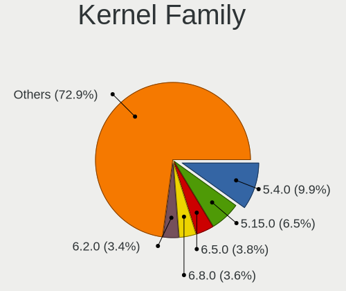
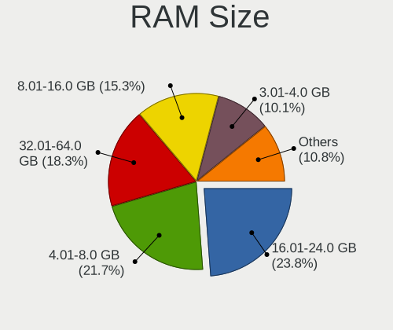
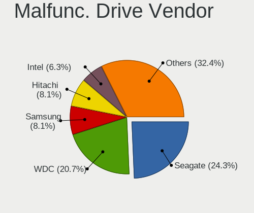
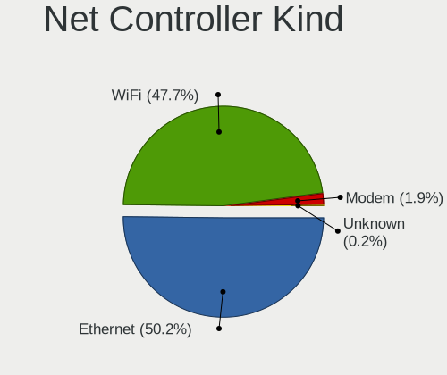
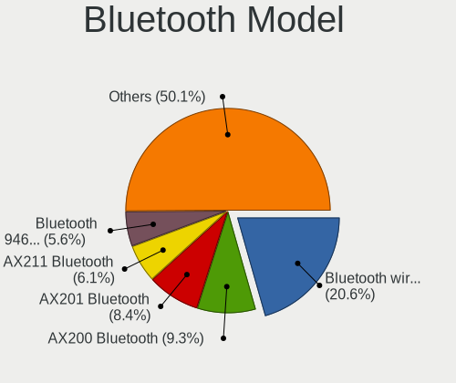
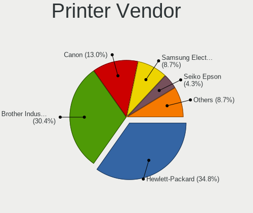
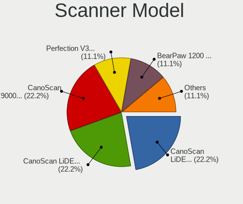

Linux in Norway - Tested Hardware & Statistics
----------------------------------------------

A project to collect tested hardware configurations for Linux in Norway.

Anyone can contribute to this report by the [hw-probe](https://github.com/linuxhw/hw-probe) tool:

    sudo -E hw-probe -all -upload

Please contribute! Especially if your hardware is rare.

This is a report for all computer types. See also reports for [desktops](/Location/Norway/Desktop/README.md) and [notebooks](/Location/Norway/Notebook/README.md).

Contents
--------

* [ Test Cases ](#test-cases)

* [ System ](#system)
  - [ OS                       ](#os)
  - [ OS Family                ](#os-family)
  - [ Kernel                   ](#kernel)
  - [ Kernel Family            ](#kernel-family)
  - [ Kernel Major Ver.        ](#kernel-major-ver)
  - [ Arch                     ](#arch)
  - [ DE                       ](#de)
  - [ Display Server           ](#display-server)
  - [ Display Manager          ](#display-manager)
  - [ OS Lang                  ](#os-lang)
  - [ Boot Mode                ](#boot-mode)
  - [ Filesystem               ](#filesystem)
  - [ Part. scheme             ](#part-scheme)
  - [ Dual Boot with Linux/BSD ](#dual-boot-with-linuxbsd)
  - [ Dual Boot (Win)          ](#dual-boot-win)

* [ Board ](#board)
  - [ Vendor                   ](#vendor)
  - [ Model                    ](#model)
  - [ Model Family             ](#model-family)
  - [ MFG Year                 ](#mfg-year)
  - [ Form Factor              ](#form-factor)
  - [ Secure Boot              ](#secure-boot)
  - [ Coreboot                 ](#coreboot)
  - [ RAM Size                 ](#ram-size)
  - [ RAM Used                 ](#ram-used)
  - [ Total Drives             ](#total-drives)
  - [ Has CD-ROM               ](#has-cd-rom)
  - [ Has Ethernet             ](#has-ethernet)
  - [ Has WiFi                 ](#has-wifi)
  - [ Has Bluetooth            ](#has-bluetooth)

* [ Location ](#location)
  - [ Country                  ](#country)
  - [ City                     ](#city)

* [ Drives ](#drives)
  - [ Drive Vendor             ](#drive-vendor)
  - [ Drive Model              ](#drive-model)
  - [ HDD Vendor               ](#hdd-vendor)
  - [ SSD Vendor               ](#ssd-vendor)
  - [ Drive Kind               ](#drive-kind)
  - [ Drive Connector          ](#drive-connector)
  - [ Drive Size               ](#drive-size)
  - [ Space Total              ](#space-total)
  - [ Space Used               ](#space-used)
  - [ Malfunc. Drives          ](#malfunc-drives)
  - [ Malfunc. Drive Vendor    ](#malfunc-drive-vendor)
  - [ Malfunc. HDD Vendor      ](#malfunc-hdd-vendor)
  - [ Malfunc. Drive Kind      ](#malfunc-drive-kind)
  - [ Failed Drives            ](#failed-drives)
  - [ Failed Drive Vendor      ](#failed-drive-vendor)
  - [ Drive Status             ](#drive-status)

* [ Storage controller ](#storage-controller)
  - [ Storage Vendor           ](#storage-vendor)
  - [ Storage Model            ](#storage-model)
  - [ Storage Kind             ](#storage-kind)

* [ Processor ](#processor)
  - [ CPU Vendor               ](#cpu-vendor)
  - [ CPU Model                ](#cpu-model)
  - [ CPU Model Family         ](#cpu-model-family)
  - [ CPU Cores                ](#cpu-cores)
  - [ CPU Sockets              ](#cpu-sockets)
  - [ CPU Threads              ](#cpu-threads)
  - [ CPU Op-Modes             ](#cpu-op-modes)
  - [ CPU Microcode            ](#cpu-microcode)
  - [ CPU Microarch            ](#cpu-microarch)

* [ Graphics ](#graphics)
  - [ GPU Vendor               ](#gpu-vendor)
  - [ GPU Model                ](#gpu-model)
  - [ GPU Combo                ](#gpu-combo)
  - [ GPU Driver               ](#gpu-driver)
  - [ GPU Memory               ](#gpu-memory)

* [ Monitor ](#monitor)
  - [ Monitor Vendor           ](#monitor-vendor)
  - [ Monitor Model            ](#monitor-model)
  - [ Monitor Resolution       ](#monitor-resolution)
  - [ Monitor Diagonal         ](#monitor-diagonal)
  - [ Monitor Width            ](#monitor-width)
  - [ Aspect Ratio             ](#aspect-ratio)
  - [ Monitor Area             ](#monitor-area)
  - [ Pixel Density            ](#pixel-density)
  - [ Multiple Monitors        ](#multiple-monitors)

* [ Network ](#network)
  - [ Net Controller Vendor    ](#net-controller-vendor)
  - [ Net Controller Model     ](#net-controller-model)
  - [ Wireless Vendor          ](#wireless-vendor)
  - [ Wireless Model           ](#wireless-model)
  - [ Ethernet Vendor          ](#ethernet-vendor)
  - [ Ethernet Model           ](#ethernet-model)
  - [ Net Controller Kind      ](#net-controller-kind)
  - [ Used Controller          ](#used-controller)
  - [ NICs                     ](#nics)
  - [ IPv6                     ](#ipv6)

* [ Bluetooth ](#bluetooth)
  - [ Bluetooth Vendor         ](#bluetooth-vendor)
  - [ Bluetooth Model          ](#bluetooth-model)

* [ Sound ](#sound)
  - [ Sound Vendor             ](#sound-vendor)
  - [ Sound Model              ](#sound-model)

* [ Memory ](#memory)
  - [ Memory Vendor            ](#memory-vendor)
  - [ Memory Model             ](#memory-model)
  - [ Memory Kind              ](#memory-kind)
  - [ Memory Form Factor       ](#memory-form-factor)
  - [ Memory Size              ](#memory-size)
  - [ Memory Speed             ](#memory-speed)

* [ Printers & scanners ](#printers--scanners)
  - [ Printer Vendor           ](#printer-vendor)
  - [ Printer Model            ](#printer-model)
  - [ Scanner Vendor           ](#scanner-vendor)
  - [ Scanner Model            ](#scanner-model)

* [ Camera ](#camera)
  - [ Camera Vendor            ](#camera-vendor)
  - [ Camera Model             ](#camera-model)

* [ Security ](#security)
  - [ Fingerprint Vendor       ](#fingerprint-vendor)
  - [ Fingerprint Model        ](#fingerprint-model)
  - [ Chipcard Vendor          ](#chipcard-vendor)
  - [ Chipcard Model           ](#chipcard-model)

* [ Unsupported ](#unsupported)
  - [ Unsupported Devices      ](#unsupported-devices)
  - [ Unsupported Device Types ](#unsupported-device-types)

Test Cases
----------

Total: 1236

| Vendor        | Model                       | Form-Factor | Probe                                                      | Date         |
|---------------|-----------------------------|-------------|------------------------------------------------------------|--------------|
| ASRock        | FM2A88X Extreme6+           | Desktop     | [689c3aa34d](https://linux-hardware.org/?probe=689c3aa34d) | Sep 01, 2022 |
| MSI           | X99A RAIDER                 | Desktop     | [5cf1e75ad4](https://linux-hardware.org/?probe=5cf1e75ad4) | Sep 01, 2022 |
| Acer          | Aspire X3400                | Desktop     | [705a3242ae](https://linux-hardware.org/?probe=705a3242ae) | Sep 01, 2022 |
| HP            | EliteBook 840 G8 Noteboo... | Notebook    | [7277e72eb4](https://linux-hardware.org/?probe=7277e72eb4) | Aug 31, 2022 |
| Acer          | Aspire X3400                | Desktop     | [cb5288e92d](https://linux-hardware.org/?probe=cb5288e92d) | Aug 31, 2022 |
| Acer          | Aspire X3400                | Desktop     | [5e9e5dd1ce](https://linux-hardware.org/?probe=5e9e5dd1ce) | Aug 31, 2022 |
| Notebook      | NLx0MU                      | Notebook    | [90c9b01136](https://linux-hardware.org/?probe=90c9b01136) | Aug 31, 2022 |
| Notebook      | NLx0MU                      | Notebook    | [77d4b4ff99](https://linux-hardware.org/?probe=77d4b4ff99) | Aug 31, 2022 |
| ASRock        | FM2A88X Extreme6+           | Desktop     | [df96c4acaf](https://linux-hardware.org/?probe=df96c4acaf) | Aug 31, 2022 |
| MSI           | X99A RAIDER                 | Desktop     | [56a6f41ffa](https://linux-hardware.org/?probe=56a6f41ffa) | Aug 31, 2022 |
| Dell          | 0NW6H5 A00                  | Desktop     | [d4de10030b](https://linux-hardware.org/?probe=d4de10030b) | Aug 30, 2022 |
| MSI           | X99A RAIDER                 | Desktop     | [09b6390c84](https://linux-hardware.org/?probe=09b6390c84) | Aug 30, 2022 |
| ASRock        | FM2A88X Extreme6+           | Desktop     | [eba231b7db](https://linux-hardware.org/?probe=eba231b7db) | Aug 30, 2022 |
| MSI           | P67A-C45                    | Desktop     | [5ffb676e01](https://linux-hardware.org/?probe=5ffb676e01) | Aug 27, 2022 |
| MSI           | GL72 6QF                    | Notebook    | [1ffe55389e](https://linux-hardware.org/?probe=1ffe55389e) | Aug 27, 2022 |
| MSI           | GL72 6QF                    | Notebook    | [46b40c3c67](https://linux-hardware.org/?probe=46b40c3c67) | Aug 27, 2022 |
| MSI           | X99A RAIDER                 | Desktop     | [8b0ab8f988](https://linux-hardware.org/?probe=8b0ab8f988) | Aug 26, 2022 |
| ASRock        | FM2A88X Extreme6+           | Desktop     | [ff55a7dbf1](https://linux-hardware.org/?probe=ff55a7dbf1) | Aug 26, 2022 |
| Acer          | Aspire X3400                | Desktop     | [81acff75f6](https://linux-hardware.org/?probe=81acff75f6) | Aug 25, 2022 |
| MSI           | X99A RAIDER                 | Desktop     | [ec4d28f5de](https://linux-hardware.org/?probe=ec4d28f5de) | Aug 25, 2022 |
| ASRock        | FM2A88X Extreme6+           | Desktop     | [f80abd07f3](https://linux-hardware.org/?probe=f80abd07f3) | Aug 25, 2022 |
| HP            | ProBook 430 G8 Notebook ... | Notebook    | [17260bd4fb](https://linux-hardware.org/?probe=17260bd4fb) | Aug 24, 2022 |
| Lenovo        | ThinkPad X1 Yoga 2nd 20J... | Convertible | [3df60311dc](https://linux-hardware.org/?probe=3df60311dc) | Aug 24, 2022 |
| Lenovo        | 370A SDK0J40700 WIN 3258... | Desktop     | [8118d6f78c](https://linux-hardware.org/?probe=8118d6f78c) | Aug 23, 2022 |
| Acer          | Aspire 5742                 | Notebook    | [6692313edb](https://linux-hardware.org/?probe=6692313edb) | Aug 22, 2022 |
| HP            | EliteBook 645 14 inch G9... | Notebook    | [d287893b82](https://linux-hardware.org/?probe=d287893b82) | Aug 22, 2022 |
| Lenovo        | B570e 476022G               | Notebook    | [ad4a4c25d5](https://linux-hardware.org/?probe=ad4a4c25d5) | Aug 22, 2022 |
| Dell          | Latitude E7240              | Notebook    | [4adf6ab444](https://linux-hardware.org/?probe=4adf6ab444) | Aug 22, 2022 |
| Dell          | XPS 13 9350                 | Notebook    | [e663637449](https://linux-hardware.org/?probe=e663637449) | Aug 21, 2022 |
| ASUSTek       | ROG STRIX B550-I GAMING     | Desktop     | [d98e5c8b5e](https://linux-hardware.org/?probe=d98e5c8b5e) | Aug 17, 2022 |
| ASUSTek       | UX461UN                     | Convertible | [da2ae510f9](https://linux-hardware.org/?probe=da2ae510f9) | Aug 17, 2022 |
| Lenovo        | ThinkBook 16p Gen 2 20YM    | Notebook    | [2b746c613f](https://linux-hardware.org/?probe=2b746c613f) | Aug 16, 2022 |
| ASRock        | FM2A88X Extreme6+           | Desktop     | [3f83c9e402](https://linux-hardware.org/?probe=3f83c9e402) | Aug 16, 2022 |
| MSI           | X99A RAIDER                 | Desktop     | [f1a0029208](https://linux-hardware.org/?probe=f1a0029208) | Aug 16, 2022 |
| Dell          | 0H21J3 A04                  | Server      | [14f7add408](https://linux-hardware.org/?probe=14f7add408) | Aug 16, 2022 |
| ZOTAC         | ZBOXNANO-CI520NANO/CI540... | Mini pc     | [96b090be6a](https://linux-hardware.org/?probe=96b090be6a) | Aug 15, 2022 |
| MSI           | X99A RAIDER                 | Desktop     | [91a402ab9e](https://linux-hardware.org/?probe=91a402ab9e) | Aug 15, 2022 |
| ASRock        | FM2A88X Extreme6+           | Desktop     | [1298facab1](https://linux-hardware.org/?probe=1298facab1) | Aug 15, 2022 |
| MSI           | GF63 Thin 11UD              | Notebook    | [82bfe63c71](https://linux-hardware.org/?probe=82bfe63c71) | Aug 14, 2022 |
| Acer          | Aspire 6930G                | Notebook    | [c0ba049caf](https://linux-hardware.org/?probe=c0ba049caf) | Aug 14, 2022 |
| HP            | 829A                        | Mini pc     | [0e36f81a7b](https://linux-hardware.org/?probe=0e36f81a7b) | Aug 13, 2022 |
| ASUSTek       | VivoBook_ASUSLaptop X421... | Notebook    | [3dcb75072e](https://linux-hardware.org/?probe=3dcb75072e) | Aug 12, 2022 |
| HP            | Compaq Presario CQ71        | Notebook    | [68c8f97537](https://linux-hardware.org/?probe=68c8f97537) | Aug 11, 2022 |
| Lenovo        | ThinkPad L512 44444WG       | Notebook    | [e2a0bef6d4](https://linux-hardware.org/?probe=e2a0bef6d4) | Aug 10, 2022 |
| Lenovo        | ThinkPad L512 44444WG       | Notebook    | [fc0389fd3e](https://linux-hardware.org/?probe=fc0389fd3e) | Aug 10, 2022 |
| ASUSTek       | VivoBook_ASUSLaptop X421... | Notebook    | [4312639df6](https://linux-hardware.org/?probe=4312639df6) | Aug 09, 2022 |
| HP            | EliteBook 820 G1            | Notebook    | [1bdfc2f218](https://linux-hardware.org/?probe=1bdfc2f218) | Aug 09, 2022 |
| ASRock        | FM2A88X Extreme6+           | Desktop     | [91a2943c51](https://linux-hardware.org/?probe=91a2943c51) | Aug 09, 2022 |
| MSI           | X99A RAIDER                 | Desktop     | [0318e6b173](https://linux-hardware.org/?probe=0318e6b173) | Aug 09, 2022 |
| Dell          | Latitude E5470              | Notebook    | [8cd7ffad9e](https://linux-hardware.org/?probe=8cd7ffad9e) | Aug 08, 2022 |
| MSI           | GF63 Thin 11UD              | Notebook    | [29d3bf5483](https://linux-hardware.org/?probe=29d3bf5483) | Aug 08, 2022 |
| ASRock        | FM2A88X Extreme6+           | Desktop     | [244025d59e](https://linux-hardware.org/?probe=244025d59e) | Aug 08, 2022 |
| MSI           | X99A RAIDER                 | Desktop     | [2d55725824](https://linux-hardware.org/?probe=2d55725824) | Aug 08, 2022 |
| MSI           | GF63 Thin 11UD              | Notebook    | [d8a5d82c22](https://linux-hardware.org/?probe=d8a5d82c22) | Aug 08, 2022 |
| MSI           | GF63 Thin 11UD              | Notebook    | [53e660f72b](https://linux-hardware.org/?probe=53e660f72b) | Aug 07, 2022 |
| MSI           | GF63 Thin 11UD              | Notebook    | [67e1664484](https://linux-hardware.org/?probe=67e1664484) | Aug 07, 2022 |
| MSI           | GF63 Thin 11UD              | Notebook    | [ecb313e10d](https://linux-hardware.org/?probe=ecb313e10d) | Aug 07, 2022 |
| ASUSTek       | P9X79 LE                    | Desktop     | [f8a36826db](https://linux-hardware.org/?probe=f8a36826db) | Aug 07, 2022 |
| Lenovo        | IdeaPad 100S-14IBR 80R9     | Notebook    | [6b1d79046a](https://linux-hardware.org/?probe=6b1d79046a) | Aug 06, 2022 |
| MSI           | X99A RAIDER                 | Desktop     | [284fd5ef07](https://linux-hardware.org/?probe=284fd5ef07) | Aug 05, 2022 |
| ASRock        | FM2A88X Extreme6+           | Desktop     | [9320816ca5](https://linux-hardware.org/?probe=9320816ca5) | Aug 05, 2022 |
| ASUSTek       | P9X79                       | Desktop     | [48606f92a6](https://linux-hardware.org/?probe=48606f92a6) | Aug 05, 2022 |
| ASUSTek       | P9X79                       | Desktop     | [c55f1b0a46](https://linux-hardware.org/?probe=c55f1b0a46) | Aug 05, 2022 |
| ASUSTek       | PRIME B365-PLUS             | Desktop     | [324410a493](https://linux-hardware.org/?probe=324410a493) | Aug 04, 2022 |
| MSI           | X99A RAIDER                 | Desktop     | [33c854adcd](https://linux-hardware.org/?probe=33c854adcd) | Aug 04, 2022 |
| ASRock        | FM2A88X Extreme6+           | Desktop     | [b224ef1b8d](https://linux-hardware.org/?probe=b224ef1b8d) | Aug 04, 2022 |
| Lenovo        | ThinkPad L512 44444WG       | Notebook    | [06da05d12b](https://linux-hardware.org/?probe=06da05d12b) | Aug 03, 2022 |
| MSI           | GF63 Thin 11UD              | Notebook    | [bf4a2c0e11](https://linux-hardware.org/?probe=bf4a2c0e11) | Aug 03, 2022 |
| MSI           | GF63 Thin 11UD              | Notebook    | [f31ac48621](https://linux-hardware.org/?probe=f31ac48621) | Aug 03, 2022 |
| Lenovo        | MIIX 2 11 20327             | Tablet      | [49ba856687](https://linux-hardware.org/?probe=49ba856687) | Aug 03, 2022 |
| MSI           | GF63 Thin 11UD              | Notebook    | [2e6cf4c0bd](https://linux-hardware.org/?probe=2e6cf4c0bd) | Aug 02, 2022 |
| MSI           | X99A RAIDER                 | Desktop     | [a56f943225](https://linux-hardware.org/?probe=a56f943225) | Aug 02, 2022 |
| ASRock        | FM2A88X Extreme6+           | Desktop     | [015ec264f5](https://linux-hardware.org/?probe=015ec264f5) | Aug 02, 2022 |
| Notebook      | NV4XMB,ME,MZ                | Notebook    | [7b369e1cdf](https://linux-hardware.org/?probe=7b369e1cdf) | Aug 01, 2022 |
| MSI           | X99A RAIDER                 | Desktop     | [5fe6f7eb57](https://linux-hardware.org/?probe=5fe6f7eb57) | Aug 01, 2022 |
| ASRock        | FM2A88X Extreme6+           | Desktop     | [8ea1e0f22c](https://linux-hardware.org/?probe=8ea1e0f22c) | Aug 01, 2022 |
| MSI           | X99A RAIDER                 | Desktop     | [76a30e3042](https://linux-hardware.org/?probe=76a30e3042) | Jul 31, 2022 |
| ASRock        | FM2A88X Extreme6+           | Desktop     | [9dd9d17e79](https://linux-hardware.org/?probe=9dd9d17e79) | Jul 31, 2022 |
| MSI           | X99A RAIDER                 | Desktop     | [ebfa3daff5](https://linux-hardware.org/?probe=ebfa3daff5) | Jul 30, 2022 |
| ASRock        | FM2A88X Extreme6+           | Desktop     | [9a7de8cc64](https://linux-hardware.org/?probe=9a7de8cc64) | Jul 30, 2022 |
| Intel         | TR440BXA A16643-311         | Desktop     | [e6245255f4](https://linux-hardware.org/?probe=e6245255f4) | Jul 29, 2022 |
| ASRock        | FM2A88X Extreme6+           | Desktop     | [c0ce536184](https://linux-hardware.org/?probe=c0ce536184) | Jul 29, 2022 |
| MSI           | X99A RAIDER                 | Desktop     | [d5034f5f52](https://linux-hardware.org/?probe=d5034f5f52) | Jul 29, 2022 |
| ASRock        | H77M-ITX                    | Desktop     | [ca0d4b7108](https://linux-hardware.org/?probe=ca0d4b7108) | Jul 28, 2022 |
| MSI           | GF63 Thin 11UD              | Notebook    | [7c25b2c2c7](https://linux-hardware.org/?probe=7c25b2c2c7) | Jul 28, 2022 |
| ASUSTek       | VC65                        | Desktop     | [b43ad009f1](https://linux-hardware.org/?probe=b43ad009f1) | Jul 28, 2022 |
| ASRock        | FM2A88X Extreme6+           | Desktop     | [a9c3256946](https://linux-hardware.org/?probe=a9c3256946) | Jul 28, 2022 |
| MSI           | X99A RAIDER                 | Desktop     | [db30ba1d0e](https://linux-hardware.org/?probe=db30ba1d0e) | Jul 28, 2022 |
| MSI           | GF63 Thin 11UD              | Notebook    | [97bbabec13](https://linux-hardware.org/?probe=97bbabec13) | Jul 28, 2022 |
| ASUSTek       | VivoBook_ASUSLaptop X421... | Notebook    | [4bcdc51e89](https://linux-hardware.org/?probe=4bcdc51e89) | Jul 27, 2022 |
| Gigabyte      | B150N Phoenix-WIFI-CF       | Desktop     | [e214df8838](https://linux-hardware.org/?probe=e214df8838) | Jul 27, 2022 |
| ASRock        | H77M-ITX                    | Desktop     | [78a53c9be0](https://linux-hardware.org/?probe=78a53c9be0) | Jul 26, 2022 |
| ASRock        | H77M-ITX                    | Desktop     | [8c749dd7e6](https://linux-hardware.org/?probe=8c749dd7e6) | Jul 26, 2022 |
| MSI           | GF63 Thin 11UD              | Notebook    | [ce18b4e9ab](https://linux-hardware.org/?probe=ce18b4e9ab) | Jul 26, 2022 |
| Acer          | Aspire 5739G                | Notebook    | [aef89fc83f](https://linux-hardware.org/?probe=aef89fc83f) | Jul 26, 2022 |
| MSI           | GS40 6QE Phantom            | Notebook    | [137d7c8701](https://linux-hardware.org/?probe=137d7c8701) | Jul 26, 2022 |
| MSI           | GS40 6QE Phantom            | Notebook    | [76bd6feebe](https://linux-hardware.org/?probe=76bd6feebe) | Jul 26, 2022 |
| ASUSTek       | ROG STRIX B550-I GAMING     | Desktop     | [1361193180](https://linux-hardware.org/?probe=1361193180) | Jul 25, 2022 |
| ASUSTek       | VivoBook_ASUSLaptop X421... | Notebook    | [37ebea2647](https://linux-hardware.org/?probe=37ebea2647) | Jul 25, 2022 |
| HP            | ProBook 450 G2              | Notebook    | [3e2f9e1e86](https://linux-hardware.org/?probe=3e2f9e1e86) | Jul 25, 2022 |
| ASRock        | FM2A88X Extreme6+           | Desktop     | [2632256ed7](https://linux-hardware.org/?probe=2632256ed7) | Jul 25, 2022 |
| MSI           | X99A RAIDER                 | Desktop     | [57beac41bc](https://linux-hardware.org/?probe=57beac41bc) | Jul 25, 2022 |
| MSI           | GF63 Thin 11UD              | Notebook    | [03bb89eced](https://linux-hardware.org/?probe=03bb89eced) | Jul 24, 2022 |
| MSI           | GF63 Thin 11UD              | Notebook    | [d41e7515af](https://linux-hardware.org/?probe=d41e7515af) | Jul 24, 2022 |
| MSI           | X99A RAIDER                 | Desktop     | [79d402e1ff](https://linux-hardware.org/?probe=79d402e1ff) | Jul 24, 2022 |
| ASRock        | FM2A88X Extreme6+           | Desktop     | [8bb191bc8f](https://linux-hardware.org/?probe=8bb191bc8f) | Jul 24, 2022 |
| MSI           | GF63 Thin 11UD              | Notebook    | [fdada0c3a6](https://linux-hardware.org/?probe=fdada0c3a6) | Jul 24, 2022 |
| ASUSTek       | CROSSHAIR II FORMULA        | Desktop     | [aa2242c51f](https://linux-hardware.org/?probe=aa2242c51f) | Jul 23, 2022 |
| MSI           | X99A RAIDER                 | Desktop     | [7a33ccf211](https://linux-hardware.org/?probe=7a33ccf211) | Jul 23, 2022 |
| ASRock        | FM2A88X Extreme6+           | Desktop     | [9c1f5f7a4e](https://linux-hardware.org/?probe=9c1f5f7a4e) | Jul 23, 2022 |
| MSI           | X99A RAIDER                 | Desktop     | [347ff14d90](https://linux-hardware.org/?probe=347ff14d90) | Jul 22, 2022 |
| ASRock        | FM2A88X Extreme6+           | Desktop     | [d758abd21c](https://linux-hardware.org/?probe=d758abd21c) | Jul 22, 2022 |
| Notebook      | NV4XMB,ME,MZ                | Notebook    | [f965008c98](https://linux-hardware.org/?probe=f965008c98) | Jul 21, 2022 |
| ASRock        | FM2A88X Extreme6+           | Desktop     | [b54cb1f930](https://linux-hardware.org/?probe=b54cb1f930) | Jul 21, 2022 |
| MSI           | X99A RAIDER                 | Desktop     | [a671047cb4](https://linux-hardware.org/?probe=a671047cb4) | Jul 21, 2022 |
| ASRock        | FM2A88X Extreme6+           | Desktop     | [8cae76caea](https://linux-hardware.org/?probe=8cae76caea) | Jul 20, 2022 |
| MSI           | X99A RAIDER                 | Desktop     | [05a5bc0fa8](https://linux-hardware.org/?probe=05a5bc0fa8) | Jul 20, 2022 |
| MSI           | MS-B090                     | All in one  | [b5df4140d1](https://linux-hardware.org/?probe=b5df4140d1) | Jul 18, 2022 |
| ASUSTek       | VivoBook_ASUSLaptop X421... | Notebook    | [ac616e6f37](https://linux-hardware.org/?probe=ac616e6f37) | Jul 18, 2022 |
| ASUSTek       | VivoBook_ASUSLaptop X421... | Notebook    | [ca9e042e30](https://linux-hardware.org/?probe=ca9e042e30) | Jul 18, 2022 |
| ASUSTek       | VivoBook_ASUSLaptop E410... | Notebook    | [68a78a8ed1](https://linux-hardware.org/?probe=68a78a8ed1) | Jul 18, 2022 |
| Lenovo        | ThinkPad W540 20BG001CMN    | Notebook    | [117f9a585b](https://linux-hardware.org/?probe=117f9a585b) | Jul 17, 2022 |
| Toshiba       | Satellite L500              | Notebook    | [5ac3a7aa95](https://linux-hardware.org/?probe=5ac3a7aa95) | Jul 17, 2022 |
| Lenovo        | ThinkPad W540 20BG001CMN    | Notebook    | [e408c1236c](https://linux-hardware.org/?probe=e408c1236c) | Jul 17, 2022 |
| HP            | ProBook 430 G2              | Notebook    | [0be149d703](https://linux-hardware.org/?probe=0be149d703) | Jul 16, 2022 |
| HUAWEI        | MACH-WX9                    | Notebook    | [76035ea427](https://linux-hardware.org/?probe=76035ea427) | Jul 15, 2022 |
| Dell          | XPS 15 9520                 | Notebook    | [271277c36b](https://linux-hardware.org/?probe=271277c36b) | Jul 14, 2022 |
| MSI           | GF63 Thin 11UD              | Notebook    | [b4cf81df26](https://linux-hardware.org/?probe=b4cf81df26) | Jul 13, 2022 |
| MSI           | GF63 Thin 11UD              | Notebook    | [7107c7c2eb](https://linux-hardware.org/?probe=7107c7c2eb) | Jul 13, 2022 |
| MSI           | X99A RAIDER                 | Desktop     | [108d31db10](https://linux-hardware.org/?probe=108d31db10) | Jul 12, 2022 |
| ASRock        | FM2A88X Extreme6+           | Desktop     | [ce2e8f2a2a](https://linux-hardware.org/?probe=ce2e8f2a2a) | Jul 12, 2022 |
| MSI           | X99A RAIDER                 | Desktop     | [7ce0875267](https://linux-hardware.org/?probe=7ce0875267) | Jul 11, 2022 |
| ASRock        | FM2A88X Extreme6+           | Desktop     | [84f993f04d](https://linux-hardware.org/?probe=84f993f04d) | Jul 11, 2022 |
| Microsoft     | Surface Pro 2               | Tablet      | [ae0184c434](https://linux-hardware.org/?probe=ae0184c434) | Jul 10, 2022 |
| Microsoft     | Surface Pro 2               | Tablet      | [42158587b1](https://linux-hardware.org/?probe=42158587b1) | Jul 10, 2022 |
| Acer          | Aspire A515-44              | Notebook    | [c0d1086ae8](https://linux-hardware.org/?probe=c0d1086ae8) | Jul 09, 2022 |
| Gigabyte      | X470 AORUS GAMING 7 WIFI... | Desktop     | [e888c3e118](https://linux-hardware.org/?probe=e888c3e118) | Jul 08, 2022 |
| HUAWEI        | MACH-WX9                    | Notebook    | [486d051b71](https://linux-hardware.org/?probe=486d051b71) | Jul 08, 2022 |
| Dell          | Latitude D531               | Notebook    | [008236dd11](https://linux-hardware.org/?probe=008236dd11) | Jul 07, 2022 |
| Lenovo        | ThinkPad T14s Gen 1 20T0... | Notebook    | [fec0786471](https://linux-hardware.org/?probe=fec0786471) | Jul 06, 2022 |
| ASRock        | FM2A88X Extreme6+           | Desktop     | [1bec4af414](https://linux-hardware.org/?probe=1bec4af414) | Jul 02, 2022 |
| MSI           | X99A RAIDER                 | Desktop     | [e6eeb4dfe6](https://linux-hardware.org/?probe=e6eeb4dfe6) | Jul 02, 2022 |
| MSI           | GF63 Thin 11UD              | Notebook    | [7847c0275c](https://linux-hardware.org/?probe=7847c0275c) | Jul 02, 2022 |
| MSI           | GF63 Thin 11UD              | Notebook    | [6b1e1133e4](https://linux-hardware.org/?probe=6b1e1133e4) | Jul 01, 2022 |
| MSI           | GF63 Thin 11UD              | Notebook    | [63508059d3](https://linux-hardware.org/?probe=63508059d3) | Jul 01, 2022 |
| MSI           | GF63 Thin 11UD              | Notebook    | [b7aef43e9e](https://linux-hardware.org/?probe=b7aef43e9e) | Jul 01, 2022 |
| MSI           | GF63 Thin 11UD              | Notebook    | [325fec2ac6](https://linux-hardware.org/?probe=325fec2ac6) | Jul 01, 2022 |
| MSI           | X99A RAIDER                 | Desktop     | [e1c3d1dfad](https://linux-hardware.org/?probe=e1c3d1dfad) | Jul 01, 2022 |
| ASRock        | FM2A88X Extreme6+           | Desktop     | [a658ebf5e9](https://linux-hardware.org/?probe=a658ebf5e9) | Jul 01, 2022 |
| ASUSTek       | TUF B350M-PLUS GAMING       | Desktop     | [a082da0857](https://linux-hardware.org/?probe=a082da0857) | Jun 30, 2022 |
| ASRock        | FM2A88X Extreme6+           | Desktop     | [163a5c29e6](https://linux-hardware.org/?probe=163a5c29e6) | Jun 30, 2022 |
| MSI           | X99A RAIDER                 | Desktop     | [2da2ad735c](https://linux-hardware.org/?probe=2da2ad735c) | Jun 30, 2022 |
| MSI           | X99A RAIDER                 | Desktop     | [b197a0fd35](https://linux-hardware.org/?probe=b197a0fd35) | Jun 29, 2022 |
| ASRock        | FM2A88X Extreme6+           | Desktop     | [66b8ec6b28](https://linux-hardware.org/?probe=66b8ec6b28) | Jun 29, 2022 |
| MSI           | P67A-C45                    | Desktop     | [79a2dd2b27](https://linux-hardware.org/?probe=79a2dd2b27) | Jun 22, 2022 |
| HP            | ZBook Fury 15 G7 Mobile ... | Notebook    | [1967dad271](https://linux-hardware.org/?probe=1967dad271) | Jun 22, 2022 |
| Dell          | Latitude E7240              | Notebook    | [1c76f3cdf4](https://linux-hardware.org/?probe=1c76f3cdf4) | Jun 21, 2022 |
| Dell          | Latitude E7240              | Notebook    | [2974c5fa7c](https://linux-hardware.org/?probe=2974c5fa7c) | Jun 21, 2022 |
| HP            | EliteBook 840 G1            | Notebook    | [4a3e29a7c0](https://linux-hardware.org/?probe=4a3e29a7c0) | Jun 20, 2022 |
| ASRock        | FM2A88X Extreme6+           | Desktop     | [4801136187](https://linux-hardware.org/?probe=4801136187) | Jun 18, 2022 |
| MSI           | X99A RAIDER                 | Desktop     | [550772184f](https://linux-hardware.org/?probe=550772184f) | Jun 18, 2022 |
| HP            | ZBook Fury 15 G7 Mobile ... | Notebook    | [4a1a0294d8](https://linux-hardware.org/?probe=4a1a0294d8) | Jun 18, 2022 |
| Dell          | Latitude E7240              | Notebook    | [2ed64f08f3](https://linux-hardware.org/?probe=2ed64f08f3) | Jun 17, 2022 |
| Dell          | Latitude E7240              | Notebook    | [31340542c2](https://linux-hardware.org/?probe=31340542c2) | Jun 17, 2022 |
| Dell          | Latitude E7240              | Notebook    | [08efb8dcc5](https://linux-hardware.org/?probe=08efb8dcc5) | Jun 17, 2022 |
| ASUSTek       | ROG STRIX B550-I GAMING     | Desktop     | [f54dda344d](https://linux-hardware.org/?probe=f54dda344d) | Jun 17, 2022 |
| ASRock        | FM2A88X Extreme6+           | Desktop     | [680bf4c033](https://linux-hardware.org/?probe=680bf4c033) | Jun 17, 2022 |
| MSI           | X99A RAIDER                 | Desktop     | [184ad2670a](https://linux-hardware.org/?probe=184ad2670a) | Jun 17, 2022 |
| Dell          | Latitude E7240              | Notebook    | [b6978a823c](https://linux-hardware.org/?probe=b6978a823c) | Jun 17, 2022 |
| Lenovo        | ThinkPad X220 4286CTO       | Notebook    | [fd2fb2f646](https://linux-hardware.org/?probe=fd2fb2f646) | Jun 14, 2022 |
| MSI           | X99A RAIDER                 | Desktop     | [6b279160dc](https://linux-hardware.org/?probe=6b279160dc) | Jun 14, 2022 |
| ASRock        | FM2A88X Extreme6+           | Desktop     | [7990c32699](https://linux-hardware.org/?probe=7990c32699) | Jun 14, 2022 |
| MSI           | X99A RAIDER                 | Desktop     | [2f784679b0](https://linux-hardware.org/?probe=2f784679b0) | Jun 13, 2022 |
| ASRock        | FM2A88X Extreme6+           | Desktop     | [dcd3256961](https://linux-hardware.org/?probe=dcd3256961) | Jun 13, 2022 |
| HP            | Mini 210-1000               | Notebook    | [8746b5b684](https://linux-hardware.org/?probe=8746b5b684) | Jun 10, 2022 |
| HP            | Mini 210-1000               | Notebook    | [65b65f1319](https://linux-hardware.org/?probe=65b65f1319) | Jun 08, 2022 |
| MSI           | P67A-C45                    | Desktop     | [86fc259ec4](https://linux-hardware.org/?probe=86fc259ec4) | Jun 07, 2022 |
| MSI           | X99A RAIDER                 | Desktop     | [34e068e6ad](https://linux-hardware.org/?probe=34e068e6ad) | Jun 07, 2022 |
| ASRock        | FM2A88X Extreme6+           | Desktop     | [5a835b2aa6](https://linux-hardware.org/?probe=5a835b2aa6) | Jun 07, 2022 |
| ASUSTek       | X55U                        | Notebook    | [66e1c7ed1d](https://linux-hardware.org/?probe=66e1c7ed1d) | Jun 06, 2022 |
| MSI           | X99A RAIDER                 | Desktop     | [9dc558e0e2](https://linux-hardware.org/?probe=9dc558e0e2) | Jun 06, 2022 |
| ASRock        | FM2A88X Extreme6+           | Desktop     | [838e0b8e42](https://linux-hardware.org/?probe=838e0b8e42) | Jun 06, 2022 |
| Toshiba       | Satellite L500              | Notebook    | [b4b4831c86](https://linux-hardware.org/?probe=b4b4831c86) | Jun 05, 2022 |
| ASRock        | FM2A88X Extreme6+           | Desktop     | [cb07ae6e24](https://linux-hardware.org/?probe=cb07ae6e24) | Jun 02, 2022 |
| MSI           | X99A RAIDER                 | Desktop     | [97428f0f4d](https://linux-hardware.org/?probe=97428f0f4d) | Jun 02, 2022 |
| ASRock        | FM2A88X Extreme6+           | Desktop     | [dd51d706e3](https://linux-hardware.org/?probe=dd51d706e3) | Jun 01, 2022 |
| MSI           | X99A RAIDER                 | Desktop     | [0b16a52ca1](https://linux-hardware.org/?probe=0b16a52ca1) | Jun 01, 2022 |
| Acer          | Aspire 5739G                | Notebook    | [6f6f16ee08](https://linux-hardware.org/?probe=6f6f16ee08) | May 31, 2022 |
| Unknown       | Unknown                     | Desktop     | [c2d6d647d8](https://linux-hardware.org/?probe=c2d6d647d8) | May 31, 2022 |
| Notebook      | Multicom Xishan NL50        | Notebook    | [9ffa89c7a9](https://linux-hardware.org/?probe=9ffa89c7a9) | May 31, 2022 |
| MSI           | X99A RAIDER                 | Desktop     | [8794ca2ca9](https://linux-hardware.org/?probe=8794ca2ca9) | May 31, 2022 |
| ASRock        | FM2A88X Extreme6+           | Desktop     | [85a456dd94](https://linux-hardware.org/?probe=85a456dd94) | May 31, 2022 |
| Lenovo        | ThinkPad T14s Gen 1 20UJ... | Notebook    | [ed28d49715](https://linux-hardware.org/?probe=ed28d49715) | May 30, 2022 |
| Unknown       | Unknown                     | Desktop     | [59d0634230](https://linux-hardware.org/?probe=59d0634230) | May 30, 2022 |
| Notebook      | Multicom Xishan NL50        | Notebook    | [0c45263f11](https://linux-hardware.org/?probe=0c45263f11) | May 30, 2022 |
| ASRock        | FM2A88X Extreme6+           | Desktop     | [ff73ff1ea6](https://linux-hardware.org/?probe=ff73ff1ea6) | May 30, 2022 |
| MSI           | X99A RAIDER                 | Desktop     | [e6fc3ad487](https://linux-hardware.org/?probe=e6fc3ad487) | May 30, 2022 |
| ASRock        | FM2A88X Extreme6+           | Desktop     | [3487c76d47](https://linux-hardware.org/?probe=3487c76d47) | May 29, 2022 |
| MSI           | X99A RAIDER                 | Desktop     | [1783c56618](https://linux-hardware.org/?probe=1783c56618) | May 29, 2022 |
| Gigabyte      | X470 AORUS GAMING 7 WIFI... | Desktop     | [8306cefd31](https://linux-hardware.org/?probe=8306cefd31) | May 28, 2022 |
| ASRock        | FM2A88X Extreme6+           | Desktop     | [db4eade79e](https://linux-hardware.org/?probe=db4eade79e) | May 28, 2022 |
| MSI           | X99A RAIDER                 | Desktop     | [d83c99fb0e](https://linux-hardware.org/?probe=d83c99fb0e) | May 28, 2022 |
| MSI           | X99A RAIDER                 | Desktop     | [8226c07ba6](https://linux-hardware.org/?probe=8226c07ba6) | May 27, 2022 |
| Gigabyte      | F2A68HM-DS2                 | Desktop     | [1fa6bb2d62](https://linux-hardware.org/?probe=1fa6bb2d62) | May 26, 2022 |
| Acer          | Aspire 6930G                | Notebook    | [a07fb7cbcd](https://linux-hardware.org/?probe=a07fb7cbcd) | May 25, 2022 |
| Lenovo        | ThinkPad T490s 20NX0077M... | Notebook    | [cea81a1d63](https://linux-hardware.org/?probe=cea81a1d63) | May 24, 2022 |
| Acer          | Aspire 5739G                | Notebook    | [428631aa4a](https://linux-hardware.org/?probe=428631aa4a) | May 23, 2022 |
| ASRock        | FM2A88X Extreme6+           | Desktop     | [19d23eb25f](https://linux-hardware.org/?probe=19d23eb25f) | May 22, 2022 |
| ASRock        | FM2A88X Extreme6+           | Desktop     | [f5ea71aeb2](https://linux-hardware.org/?probe=f5ea71aeb2) | May 21, 2022 |
| Notebook      | N8xEJEK                     | Notebook    | [5c2c66e8f5](https://linux-hardware.org/?probe=5c2c66e8f5) | May 17, 2022 |
| ASUSTek       | Pro WS X570-ACE             | Desktop     | [79682a20fa](https://linux-hardware.org/?probe=79682a20fa) | May 16, 2022 |
| ASUSTek       | ROG STRIX X570-F GAMING     | Desktop     | [d1dbcd7651](https://linux-hardware.org/?probe=d1dbcd7651) | May 16, 2022 |
| ASUSTek       | TUF Gaming Z690-PLUS WIF... | Notebook    | [48c983a184](https://linux-hardware.org/?probe=48c983a184) | May 15, 2022 |
| MSI           | MAG X570S TOMAHAWK MAX W... | Desktop     | [d4e303b92c](https://linux-hardware.org/?probe=d4e303b92c) | May 15, 2022 |
| Lenovo        | ThinkPad P51 20HJS02H00     | Notebook    | [fc7562c140](https://linux-hardware.org/?probe=fc7562c140) | May 12, 2022 |
| Lenovo        | ThinkPad P51 20HJS02H00     | Notebook    | [810fda94b1](https://linux-hardware.org/?probe=810fda94b1) | May 12, 2022 |
| Gigabyte      | Z170-Gaming K3              | Desktop     | [768acb5df2](https://linux-hardware.org/?probe=768acb5df2) | May 12, 2022 |
| HP            | ZBook Power 15.6 inch G8... | Notebook    | [c195f80f3c](https://linux-hardware.org/?probe=c195f80f3c) | May 12, 2022 |
| ASUSTek       | ROG CROSSHAIR VIII IMPAC... | Desktop     | [a6a2ef59b0](https://linux-hardware.org/?probe=a6a2ef59b0) | May 11, 2022 |
| ASUSTek       | ROG STRIX B550-E GAMING     | Desktop     | [927afa0c20](https://linux-hardware.org/?probe=927afa0c20) | May 11, 2022 |
| ASUSTek       | ROG STRIX B550-E GAMING     | Desktop     | [b9766a94d7](https://linux-hardware.org/?probe=b9766a94d7) | May 11, 2022 |
| HP            | EliteBook 840 G7 Noteboo... | Notebook    | [1b52e22774](https://linux-hardware.org/?probe=1b52e22774) | May 10, 2022 |
| HP            | EliteBook 840 G8 Noteboo... | Notebook    | [47b730f9bd](https://linux-hardware.org/?probe=47b730f9bd) | May 10, 2022 |
| ASUSTek       | Z170-A                      | Desktop     | [97e2613936](https://linux-hardware.org/?probe=97e2613936) | May 08, 2022 |
| Gigabyte      | X570 GAMING X               | Desktop     | [ffc6dac164](https://linux-hardware.org/?probe=ffc6dac164) | May 07, 2022 |
| ASUSTek       | ROG STRIX B550-F GAMING     | Desktop     | [afac7f7fb3](https://linux-hardware.org/?probe=afac7f7fb3) | May 07, 2022 |
| Gigabyte      | X570 GAMING X               | Desktop     | [816a78b4cd](https://linux-hardware.org/?probe=816a78b4cd) | May 06, 2022 |
| ASUSTek       | PRIME B250M-PLUS            | Desktop     | [6f9cfe324a](https://linux-hardware.org/?probe=6f9cfe324a) | May 05, 2022 |
| Dell          | Latitude E5430 non-vPro     | Notebook    | [2075bfcc02](https://linux-hardware.org/?probe=2075bfcc02) | May 05, 2022 |
| Dell          | Latitude E5430 non-vPro     | Notebook    | [71f8f45765](https://linux-hardware.org/?probe=71f8f45765) | May 05, 2022 |
| HP            | ProBook 4330s               | Notebook    | [7cad0acb2c](https://linux-hardware.org/?probe=7cad0acb2c) | May 04, 2022 |
| HP            | ProBook 4330s               | Notebook    | [ca6474fbfc](https://linux-hardware.org/?probe=ca6474fbfc) | May 04, 2022 |
| HP            | EliteBook 840 G7 Noteboo... | Notebook    | [0295d9e820](https://linux-hardware.org/?probe=0295d9e820) | May 04, 2022 |
| ASUSTek       | ROG STRIX X570-F GAMING     | Desktop     | [7d9a2b425f](https://linux-hardware.org/?probe=7d9a2b425f) | May 03, 2022 |
| Lenovo        | ThinkPad X13 Gen 1 20UFC... | Notebook    | [3835b6bdb8](https://linux-hardware.org/?probe=3835b6bdb8) | May 03, 2022 |
| ASUSTek       | PN50                        | Mini pc     | [01de94a143](https://linux-hardware.org/?probe=01de94a143) | May 02, 2022 |
| Apple         | MacBookPro12,1              | Notebook    | [5f68858e66](https://linux-hardware.org/?probe=5f68858e66) | May 01, 2022 |
| MSI           | 970 GAMING                  | Desktop     | [32052450db](https://linux-hardware.org/?probe=32052450db) | May 01, 2022 |
| Gigabyte      | X570 AORUS ELITE            | Desktop     | [8db041a1e4](https://linux-hardware.org/?probe=8db041a1e4) | May 01, 2022 |
| HP            | ZBook Firefly 15 inch G8... | Notebook    | [6cdff366fa](https://linux-hardware.org/?probe=6cdff366fa) | Apr 28, 2022 |
| ASUSTek       | ROG STRIX B550-I GAMING     | Desktop     | [5456280ec0](https://linux-hardware.org/?probe=5456280ec0) | Apr 26, 2022 |
| HP            | ZBook Fury 15 G7 Mobile ... | Notebook    | [620718bb9e](https://linux-hardware.org/?probe=620718bb9e) | Apr 26, 2022 |
| Gigabyte      | B150N Phoenix-WIFI-CF       | Desktop     | [dbaaf867f6](https://linux-hardware.org/?probe=dbaaf867f6) | Apr 25, 2022 |
| Lenovo        | V15 G2 ALC 82KD             | Notebook    | [743177a467](https://linux-hardware.org/?probe=743177a467) | Apr 24, 2022 |
| Acer          | Swift SF514-51              | Notebook    | [d6c47a5367](https://linux-hardware.org/?probe=d6c47a5367) | Apr 23, 2022 |
| ASUSTek       | ROG STRIX B550-I GAMING     | Desktop     | [b9ea98672f](https://linux-hardware.org/?probe=b9ea98672f) | Apr 23, 2022 |
| ASUSTek       | ROG STRIX B550-I GAMING     | Desktop     | [c3f809fc02](https://linux-hardware.org/?probe=c3f809fc02) | Apr 23, 2022 |
| Acer          | Predator G3610              | Desktop     | [a53edf84d4](https://linux-hardware.org/?probe=a53edf84d4) | Apr 22, 2022 |
| Dell          | Latitude E6430              | Notebook    | [91bbf4068b](https://linux-hardware.org/?probe=91bbf4068b) | Apr 20, 2022 |
| ASUSTek       | PRIME X399-A                | Desktop     | [e595903b64](https://linux-hardware.org/?probe=e595903b64) | Apr 18, 2022 |
| Google        | Cave                        | Notebook    | [c762019e08](https://linux-hardware.org/?probe=c762019e08) | Apr 18, 2022 |
| ASUSTek       | PRIME X399-A                | Desktop     | [b2fe9a09fd](https://linux-hardware.org/?probe=b2fe9a09fd) | Apr 17, 2022 |
| Lenovo        | V130-14IKB 81HQ             | Notebook    | [19299bc16d](https://linux-hardware.org/?probe=19299bc16d) | Apr 14, 2022 |
| ASUSTek       | K52Dr                       | Notebook    | [29124147fe](https://linux-hardware.org/?probe=29124147fe) | Apr 14, 2022 |
| Lenovo        | ThinkPad T490s 20NX003UM... | Notebook    | [60dca75a93](https://linux-hardware.org/?probe=60dca75a93) | Apr 14, 2022 |
| ASRock        | B450 Gaming-ITX/ac          | Desktop     | [1211bed149](https://linux-hardware.org/?probe=1211bed149) | Apr 13, 2022 |
| HP            | ZBook Power 15.6 inch G8... | Notebook    | [7f83d03bf3](https://linux-hardware.org/?probe=7f83d03bf3) | Apr 13, 2022 |
| ASUSTek       | PN50                        | Mini pc     | [2d44f4a10b](https://linux-hardware.org/?probe=2d44f4a10b) | Apr 13, 2022 |
| HP            | ZBook Power 15.6 inch G8... | Notebook    | [bbcb05781f](https://linux-hardware.org/?probe=bbcb05781f) | Apr 13, 2022 |
| Lenovo        | ThinkPad T460s 20F90044M... | Notebook    | [47498ed4aa](https://linux-hardware.org/?probe=47498ed4aa) | Apr 13, 2022 |
| MSI           | Z390-A PRO                  | Desktop     | [bfec30bf8d](https://linux-hardware.org/?probe=bfec30bf8d) | Apr 13, 2022 |
| Gigabyte      | B550 AORUS ELITE AX V2      | Desktop     | [e2cbc23977](https://linux-hardware.org/?probe=e2cbc23977) | Apr 12, 2022 |
| MSI           | GS66 Stealth 10UH           | Notebook    | [5589b339ed](https://linux-hardware.org/?probe=5589b339ed) | Apr 11, 2022 |
| HP            | 87F9 A00                    | All in one  | [a5081405c2](https://linux-hardware.org/?probe=a5081405c2) | Apr 11, 2022 |
| Gigabyte      | B550 AORUS ELITE AX V2      | Desktop     | [486b6a5d64](https://linux-hardware.org/?probe=486b6a5d64) | Apr 10, 2022 |
| Gigabyte      | B550 AORUS ELITE AX V2      | Desktop     | [ec3689ffdc](https://linux-hardware.org/?probe=ec3689ffdc) | Apr 10, 2022 |
| Dell          | 0MN1TX A02                  | Desktop     | [cf2e65caf4](https://linux-hardware.org/?probe=cf2e65caf4) | Apr 10, 2022 |
| Fujitsu       | D2912-A1 S26361-D2912-A1    | Desktop     | [c344a9c7b9](https://linux-hardware.org/?probe=c344a9c7b9) | Apr 10, 2022 |
| HP            | EliteBook 840 G4            | Notebook    | [dd511f4bf0](https://linux-hardware.org/?probe=dd511f4bf0) | Apr 09, 2022 |
| Lenovo        | Yoga Slim 7 Carbon 14ACN... | Notebook    | [5328fde624](https://linux-hardware.org/?probe=5328fde624) | Apr 08, 2022 |
| ASRock        | FM2A88X Extreme6+           | Desktop     | [6eb6b5ebaf](https://linux-hardware.org/?probe=6eb6b5ebaf) | Apr 08, 2022 |
| Dell          | Inspiron 5370               | Notebook    | [abc7562fb9](https://linux-hardware.org/?probe=abc7562fb9) | Apr 07, 2022 |
| MSI           | GS66 Stealth 10UH           | Notebook    | [bd6f031bc8](https://linux-hardware.org/?probe=bd6f031bc8) | Apr 06, 2022 |
| MSI           | B350M MORTAR ARCTIC         | Desktop     | [cf7f6c5ed4](https://linux-hardware.org/?probe=cf7f6c5ed4) | Apr 05, 2022 |
| Apple         | MacBookPro11,1              | Notebook    | [f41079b495](https://linux-hardware.org/?probe=f41079b495) | Apr 05, 2022 |
| ASUSTek       | ROG STRIX B550-E GAMING     | Desktop     | [448e59a9a6](https://linux-hardware.org/?probe=448e59a9a6) | Apr 02, 2022 |
| Lenovo        | ThinkPad T520 4243W83       | Notebook    | [79c6231f19](https://linux-hardware.org/?probe=79c6231f19) | Apr 02, 2022 |
| Dell          | Latitude E5430 non-vPro     | Notebook    | [b47f5b30db](https://linux-hardware.org/?probe=b47f5b30db) | Apr 01, 2022 |
| Acer          | Aspire X3400                | Desktop     | [47097032fd](https://linux-hardware.org/?probe=47097032fd) | Mar 31, 2022 |
| Dell          | 0MN1TX A02                  | Desktop     | [f9be94fa9b](https://linux-hardware.org/?probe=f9be94fa9b) | Mar 31, 2022 |
| ASUSTek       | M2R-FVM                     | Desktop     | [94beabac6e](https://linux-hardware.org/?probe=94beabac6e) | Mar 30, 2022 |
| Lenovo        | ThinkPad L512 44444WG       | Notebook    | [ea012026c5](https://linux-hardware.org/?probe=ea012026c5) | Mar 30, 2022 |
| ASUSTek       | M2R-FVM                     | Desktop     | [76ec39764b](https://linux-hardware.org/?probe=76ec39764b) | Mar 26, 2022 |
| ASUSTek       | ROG STRIX B360-F GAMING     | Desktop     | [6190e57794](https://linux-hardware.org/?probe=6190e57794) | Mar 25, 2022 |
| ASUSTek       | M2R-FVM                     | Desktop     | [eaaef17c19](https://linux-hardware.org/?probe=eaaef17c19) | Mar 25, 2022 |
| HP            | Laptop 14s-fq0xxx           | Notebook    | [0a68b0e55c](https://linux-hardware.org/?probe=0a68b0e55c) | Mar 24, 2022 |
| ASUSTek       | X99-A                       | Desktop     | [b071309501](https://linux-hardware.org/?probe=b071309501) | Mar 23, 2022 |
| ASUSTek       | M2R-FVM                     | Desktop     | [eb934cc46a](https://linux-hardware.org/?probe=eb934cc46a) | Mar 23, 2022 |
| Lenovo        | ThinkPad X1 Carbon 4th 2... | Notebook    | [f4e2b38106](https://linux-hardware.org/?probe=f4e2b38106) | Mar 20, 2022 |
| ASUSTek       | UL50VT                      | Notebook    | [6911af9ce1](https://linux-hardware.org/?probe=6911af9ce1) | Mar 20, 2022 |
| HP            | ZBook Firefly 15 inch G8... | Notebook    | [674a4429c2](https://linux-hardware.org/?probe=674a4429c2) | Mar 19, 2022 |
| Dell          | 0YNVJG A01                  | Desktop     | [7a52c137cf](https://linux-hardware.org/?probe=7a52c137cf) | Mar 18, 2022 |
| ASUSTek       | GL502VMK                    | Notebook    | [f2fedaa3c3](https://linux-hardware.org/?probe=f2fedaa3c3) | Mar 18, 2022 |
| MSI           | Z170A PC MATE               | Desktop     | [56c1c58549](https://linux-hardware.org/?probe=56c1c58549) | Mar 15, 2022 |
| Notebook      | NV4XMB,ME,MZ                | Notebook    | [ce34107bae](https://linux-hardware.org/?probe=ce34107bae) | Mar 14, 2022 |
| Dell          | XPS 13 9310                 | Notebook    | [acef37559c](https://linux-hardware.org/?probe=acef37559c) | Mar 14, 2022 |
| Dell          | XPS 13 9310                 | Notebook    | [884e853e6f](https://linux-hardware.org/?probe=884e853e6f) | Mar 14, 2022 |
| Intel Clie... | LAPQC71A                    | Notebook    | [14108beccf](https://linux-hardware.org/?probe=14108beccf) | Mar 12, 2022 |
| Intel Clie... | LAPQC71A                    | Notebook    | [ee7f4f0b82](https://linux-hardware.org/?probe=ee7f4f0b82) | Mar 12, 2022 |
| Dell          | Latitude 5480               | Notebook    | [d7fe091593](https://linux-hardware.org/?probe=d7fe091593) | Mar 12, 2022 |
| Dell          | Latitude E5450              | Notebook    | [0e4fb3e1fd](https://linux-hardware.org/?probe=0e4fb3e1fd) | Mar 12, 2022 |
| Dell          | Latitude 7480               | Notebook    | [bb03e5e22e](https://linux-hardware.org/?probe=bb03e5e22e) | Mar 11, 2022 |
| HP            | ZBook Fury 15 G7 Mobile ... | Notebook    | [917a6b65a8](https://linux-hardware.org/?probe=917a6b65a8) | Mar 10, 2022 |
| Dell          | Precision M6800             | Notebook    | [239dd5797a](https://linux-hardware.org/?probe=239dd5797a) | Mar 10, 2022 |
| Gigabyte      | B150N Phoenix-WIFI-CF       | Desktop     | [a64818ccea](https://linux-hardware.org/?probe=a64818ccea) | Mar 10, 2022 |
| Samsung       | 950XCJ/951XCJ/950XCR        | Notebook    | [3a9118e8bc](https://linux-hardware.org/?probe=3a9118e8bc) | Mar 07, 2022 |
| ASUSTek       | UL50VT                      | Notebook    | [5a711af850](https://linux-hardware.org/?probe=5a711af850) | Mar 07, 2022 |
| Lenovo        | ThinkPad T480 20L60033MX    | Notebook    | [fda7557aa0](https://linux-hardware.org/?probe=fda7557aa0) | Mar 07, 2022 |
| Gigabyte      | 970A-DS3P                   | Desktop     | [eaae14de4f](https://linux-hardware.org/?probe=eaae14de4f) | Mar 05, 2022 |
| ASUSTek       | ROG STRIX B450-F GAMING     | Desktop     | [f1b0d6e847](https://linux-hardware.org/?probe=f1b0d6e847) | Mar 03, 2022 |
| Lenovo        | ThinkPad T400s 2808D9G      | Notebook    | [6a5d0584bd](https://linux-hardware.org/?probe=6a5d0584bd) | Mar 02, 2022 |
| Gigabyte      | 970A-DS3P                   | Desktop     | [54ae8c7668](https://linux-hardware.org/?probe=54ae8c7668) | Mar 01, 2022 |
| Gigabyte      | 970A-DS3P                   | Desktop     | [ad43671e4c](https://linux-hardware.org/?probe=ad43671e4c) | Mar 01, 2022 |
| ASRock        | FM2A88X Extreme6+           | Desktop     | [9d178352ca](https://linux-hardware.org/?probe=9d178352ca) | Mar 01, 2022 |
| Lenovo        | SHARKBAY NO DPK             | Desktop     | [9670ab829e](https://linux-hardware.org/?probe=9670ab829e) | Feb 26, 2022 |
| ASUSTek       | ROG STRIX Z590-F GAMING ... | Desktop     | [d61754bba9](https://linux-hardware.org/?probe=d61754bba9) | Feb 26, 2022 |
| MSI           | 990FXA-GD65                 | Desktop     | [290919912c](https://linux-hardware.org/?probe=290919912c) | Feb 26, 2022 |
| Lenovo        | ThinkPad T460 20FMS1XX00    | Notebook    | [78e82c6674](https://linux-hardware.org/?probe=78e82c6674) | Feb 24, 2022 |
| Lenovo        | 0B98401 PRO                 | Desktop     | [c332efa9f8](https://linux-hardware.org/?probe=c332efa9f8) | Feb 24, 2022 |
| Lenovo        | MAHOBAY NO DPK              | Desktop     | [1c6d204561](https://linux-hardware.org/?probe=1c6d204561) | Feb 24, 2022 |
| Dell          | XPS 15 7590                 | Notebook    | [69896e5117](https://linux-hardware.org/?probe=69896e5117) | Feb 23, 2022 |
| HP            | EliteBook 840 G4            | Notebook    | [7bb148611f](https://linux-hardware.org/?probe=7bb148611f) | Feb 23, 2022 |
| ASRock        | FM2A88X Extreme6+           | Desktop     | [67deab7343](https://linux-hardware.org/?probe=67deab7343) | Feb 22, 2022 |
| Lenovo        | ThinkPad T460s 20F9S1G20... | Notebook    | [6a6c0b0b39](https://linux-hardware.org/?probe=6a6c0b0b39) | Feb 21, 2022 |
| ASUSTek       | UX430UAR                    | Notebook    | [c7cd5ce50d](https://linux-hardware.org/?probe=c7cd5ce50d) | Feb 21, 2022 |
| ASUSTek       | ROG STRIX B450-F GAMING     | Desktop     | [160ecaffd8](https://linux-hardware.org/?probe=160ecaffd8) | Feb 21, 2022 |
| ASUSTek       | A4110                       | All in one  | [8fd1f10c40](https://linux-hardware.org/?probe=8fd1f10c40) | Feb 18, 2022 |
| Lenovo        | ThinkPad Edge E330 3354D... | Notebook    | [0337480978](https://linux-hardware.org/?probe=0337480978) | Feb 17, 2022 |
| ASUSTek       | A4110                       | All in one  | [ede6469471](https://linux-hardware.org/?probe=ede6469471) | Feb 16, 2022 |
| HUAWEI        | KLVL-WXX9                   | Notebook    | [34bd2af067](https://linux-hardware.org/?probe=34bd2af067) | Feb 14, 2022 |
| HP            | ProBook 4330s               | Notebook    | [3781146b1f](https://linux-hardware.org/?probe=3781146b1f) | Feb 14, 2022 |
| ASUSTek       | G74Sx                       | Notebook    | [a3709f6df1](https://linux-hardware.org/?probe=a3709f6df1) | Feb 12, 2022 |
| ASUSTek       | SABERTOOTH P67              | Desktop     | [2ad209abc4](https://linux-hardware.org/?probe=2ad209abc4) | Feb 12, 2022 |
| HUAWEI        | BOHK-WAX9X                  | Notebook    | [68d863ab48](https://linux-hardware.org/?probe=68d863ab48) | Feb 10, 2022 |
| Lenovo        | ThinkPad Edge 0301DMG       | Notebook    | [ab580c3edd](https://linux-hardware.org/?probe=ab580c3edd) | Feb 10, 2022 |
| Lenovo        | ThinkPad Edge 0301DMG       | Notebook    | [c11f9d5c6d](https://linux-hardware.org/?probe=c11f9d5c6d) | Feb 10, 2022 |
| Lenovo        | ThinkPad T470s 20HGS0FJ0... | Notebook    | [6dc9215373](https://linux-hardware.org/?probe=6dc9215373) | Feb 07, 2022 |
| ASUSTek       | Maximus VIII HERO           | Desktop     | [ef92dfd4f1](https://linux-hardware.org/?probe=ef92dfd4f1) | Feb 03, 2022 |
| Acer          | Swift SF314-511             | Notebook    | [9f7733e6ec](https://linux-hardware.org/?probe=9f7733e6ec) | Feb 03, 2022 |
| Dell          | Latitude E4200              | Notebook    | [35dbab3b2e](https://linux-hardware.org/?probe=35dbab3b2e) | Jan 31, 2022 |
| ASUSTek       | TUF Gaming X570-PLUS        | Desktop     | [ccd7847b28](https://linux-hardware.org/?probe=ccd7847b28) | Jan 30, 2022 |
| ASRock        | ION3D-HT                    | Desktop     | [5a4158f549](https://linux-hardware.org/?probe=5a4158f549) | Jan 29, 2022 |
| Unknown       | OnePlus 6                   | Soc         | [d9aedf2258](https://linux-hardware.org/?probe=d9aedf2258) | Jan 28, 2022 |
| Gigabyte      | Z490I AORUS ULTRA           | Desktop     | [908edb3724](https://linux-hardware.org/?probe=908edb3724) | Jan 27, 2022 |
| Toshiba       | Satellite C660D             | Notebook    | [d6498c16bb](https://linux-hardware.org/?probe=d6498c16bb) | Jan 27, 2022 |
| Intel         | D54250WYK H13922-303        | Desktop     | [8b6b3d70bf](https://linux-hardware.org/?probe=8b6b3d70bf) | Jan 26, 2022 |
| Lenovo        | ThinkPad T520 4243W83       | Notebook    | [698c80468a](https://linux-hardware.org/?probe=698c80468a) | Jan 25, 2022 |
| Lenovo        | ThinkPad E15 Gen 2 20TD0... | Notebook    | [29ce7637f6](https://linux-hardware.org/?probe=29ce7637f6) | Jan 23, 2022 |
| Intel         | NUC7i7DNB J83500-206        | Mini pc     | [65ae59d048](https://linux-hardware.org/?probe=65ae59d048) | Jan 23, 2022 |
| HP            | OMEN by Laptop 15-dc1xxx    | Notebook    | [cbf995ff80](https://linux-hardware.org/?probe=cbf995ff80) | Jan 22, 2022 |
| HUAWEI        | KLVL-WXX9                   | Notebook    | [ae399035f5](https://linux-hardware.org/?probe=ae399035f5) | Jan 21, 2022 |
| Lenovo        | ThinkPad E15 Gen 2 20TD0... | Notebook    | [634d45ff9e](https://linux-hardware.org/?probe=634d45ff9e) | Jan 21, 2022 |
| Gigabyte      | 970A-DS3P                   | Desktop     | [b96e414ae9](https://linux-hardware.org/?probe=b96e414ae9) | Jan 21, 2022 |
| Dell          | Latitude 7280               | Notebook    | [6b9dcc88b7](https://linux-hardware.org/?probe=6b9dcc88b7) | Jan 21, 2022 |
| Dell          | Latitude 7280               | Notebook    | [beb9306791](https://linux-hardware.org/?probe=beb9306791) | Jan 21, 2022 |
| Lenovo        | ThinkPad X230 23252EG       | Notebook    | [e236263783](https://linux-hardware.org/?probe=e236263783) | Jan 19, 2022 |
| Microsoft     | Surface Pro 7               | Tablet      | [c9587deb57](https://linux-hardware.org/?probe=c9587deb57) | Jan 19, 2022 |
| Gigabyte      | 970A-DS3P                   | Desktop     | [96047ce382](https://linux-hardware.org/?probe=96047ce382) | Jan 19, 2022 |
| ASRock        | Z87 Killer                  | Desktop     | [6931f1ca2f](https://linux-hardware.org/?probe=6931f1ca2f) | Jan 17, 2022 |
| MSI           | P67A-C45                    | Desktop     | [953176b34f](https://linux-hardware.org/?probe=953176b34f) | Jan 17, 2022 |
| Lenovo        | G50-30 80G0                 | Notebook    | [5a609ef492](https://linux-hardware.org/?probe=5a609ef492) | Jan 16, 2022 |
| ASUSTek       | P5L8L-SE                    | Desktop     | [459b062c3e](https://linux-hardware.org/?probe=459b062c3e) | Jan 14, 2022 |
| MSI           | MAG X570 TOMAHAWK WIFI      | Desktop     | [7921e32637](https://linux-hardware.org/?probe=7921e32637) | Jan 14, 2022 |
| ASUSTek       | CROSSHAIR VI HERO           | Desktop     | [7b12fb3749](https://linux-hardware.org/?probe=7b12fb3749) | Jan 14, 2022 |
| HP            | Laptop 17-cn0xxx            | Notebook    | [5cb4bc2ed8](https://linux-hardware.org/?probe=5cb4bc2ed8) | Jan 14, 2022 |
| Dell          | Precision 7560              | Notebook    | [a58a852902](https://linux-hardware.org/?probe=a58a852902) | Jan 13, 2022 |
| HP            | ZBook Fury 15 G7 Mobile ... | Notebook    | [9fa645342b](https://linux-hardware.org/?probe=9fa645342b) | Jan 12, 2022 |
| Samsung       | 950QDB                      | Convertible | [d2f65665cd](https://linux-hardware.org/?probe=d2f65665cd) | Jan 12, 2022 |
| HP            | EliteBook 820 G1            | Notebook    | [37dd78dd6e](https://linux-hardware.org/?probe=37dd78dd6e) | Jan 11, 2022 |
| Apple         | MacBookPro9,2               | Notebook    | [831591fe79](https://linux-hardware.org/?probe=831591fe79) | Jan 11, 2022 |
| MSI           | GS66 Stealth 10UH           | Notebook    | [a38abf3dd0](https://linux-hardware.org/?probe=a38abf3dd0) | Jan 10, 2022 |
| Dell          | Latitude 5480               | Notebook    | [c572bd1eac](https://linux-hardware.org/?probe=c572bd1eac) | Jan 08, 2022 |
| Apple         | MacBookPro9,2               | Notebook    | [b5bd2eca7d](https://linux-hardware.org/?probe=b5bd2eca7d) | Jan 07, 2022 |
| HP            | Pavilion dv6000 (GH912EA... | Notebook    | [a41f8d2d74](https://linux-hardware.org/?probe=a41f8d2d74) | Jan 03, 2022 |
| Dell          | Latitude E7440              | Notebook    | [9df6480d3e](https://linux-hardware.org/?probe=9df6480d3e) | Jan 02, 2022 |
| Acer          | Aspire X3400                | Desktop     | [6833137bc8](https://linux-hardware.org/?probe=6833137bc8) | Jan 02, 2022 |
| Raspberry ... | Raspberry Pi Compute Mod... | Soc         | [de0e6691cd](https://linux-hardware.org/?probe=de0e6691cd) | Jan 02, 2022 |
| MSI           | H110M PRO-VH                | Desktop     | [a32495b8e4](https://linux-hardware.org/?probe=a32495b8e4) | Jan 02, 2022 |
| Lenovo        | ThinkPad T410s 2924W79      | Notebook    | [43fe13f2a4](https://linux-hardware.org/?probe=43fe13f2a4) | Dec 30, 2021 |
| Dell          | Latitude 5480               | Notebook    | [e560c10eb8](https://linux-hardware.org/?probe=e560c10eb8) | Dec 29, 2021 |
| Acer          | Aspire E1-572               | Notebook    | [ab9c63e097](https://linux-hardware.org/?probe=ab9c63e097) | Dec 28, 2021 |
| Lenovo        | ThinkPad E595 20NFCTO1WW    | Notebook    | [04ebd359f1](https://linux-hardware.org/?probe=04ebd359f1) | Dec 28, 2021 |
| Acer          | Aspire E1-572               | Notebook    | [63f4428f24](https://linux-hardware.org/?probe=63f4428f24) | Dec 28, 2021 |
| Lenovo        | ThinkPad L512 44444WG       | Notebook    | [0f7bd5b933](https://linux-hardware.org/?probe=0f7bd5b933) | Dec 26, 2021 |
| MSI           | GS66 Stealth 10UH           | Notebook    | [6246228e2d](https://linux-hardware.org/?probe=6246228e2d) | Dec 26, 2021 |
| Lenovo        | ThinkPad L512 44444WG       | Notebook    | [113b39ddbc](https://linux-hardware.org/?probe=113b39ddbc) | Dec 25, 2021 |
| HP            | ZBook 15                    | Notebook    | [57cb28cc81](https://linux-hardware.org/?probe=57cb28cc81) | Dec 24, 2021 |
| Dell          | Latitude 5480               | Notebook    | [5c91ed91a8](https://linux-hardware.org/?probe=5c91ed91a8) | Dec 24, 2021 |
| Acer          | Aspire xxxx                 | Notebook    | [13b21c09d2](https://linux-hardware.org/?probe=13b21c09d2) | Dec 23, 2021 |
| Dell          | XPS 15 9500                 | Notebook    | [86789982ba](https://linux-hardware.org/?probe=86789982ba) | Dec 21, 2021 |
| Gigabyte      | B550 AORUS PRO AC           | Desktop     | [1b62246b10](https://linux-hardware.org/?probe=1b62246b10) | Dec 21, 2021 |
| Raspberry ... | Raspberry Pi                | Soc         | [17fbd36a25](https://linux-hardware.org/?probe=17fbd36a25) | Dec 18, 2021 |
| Lenovo        | ThinkPad E580 20KS001EMX    | Notebook    | [366aae1cd6](https://linux-hardware.org/?probe=366aae1cd6) | Dec 18, 2021 |
| ASUSTek       | ZenBook UX450FDX_UX480FD    | Notebook    | [3cd4b5c111](https://linux-hardware.org/?probe=3cd4b5c111) | Dec 18, 2021 |
| ASUSTek       | ZenBook UX450FDX_UX480FD    | Notebook    | [03115bdd2e](https://linux-hardware.org/?probe=03115bdd2e) | Dec 18, 2021 |
| Lenovo        | ThinkPad T410s 2924W79      | Notebook    | [f26b8b4f98](https://linux-hardware.org/?probe=f26b8b4f98) | Dec 17, 2021 |
| Acer          | Aspire xxxx                 | Notebook    | [dfa568d766](https://linux-hardware.org/?probe=dfa568d766) | Dec 17, 2021 |
| ASUSTek       | ROG STRIX Z690-G GAMING ... | Desktop     | [b86150c4bd](https://linux-hardware.org/?probe=b86150c4bd) | Dec 16, 2021 |
| ASUSTek       | ROG STRIX Z690-G GAMING ... | Desktop     | [923f77a787](https://linux-hardware.org/?probe=923f77a787) | Dec 16, 2021 |
| ASUSTek       | SABERTOOTH P67              | Desktop     | [af2732b8a5](https://linux-hardware.org/?probe=af2732b8a5) | Dec 15, 2021 |
| ASUSTek       | TUF Gaming B550-PRO         | Desktop     | [62f4289baa](https://linux-hardware.org/?probe=62f4289baa) | Dec 14, 2021 |
| Lenovo        | MAHOBAY NO DPK              | Desktop     | [12da1dc78f](https://linux-hardware.org/?probe=12da1dc78f) | Dec 14, 2021 |
| Toshiba       | Satellite L750              | Notebook    | [30ad7918cd](https://linux-hardware.org/?probe=30ad7918cd) | Dec 13, 2021 |
| Acer          | Aspire A114-32              | Notebook    | [dd9fb384ea](https://linux-hardware.org/?probe=dd9fb384ea) | Dec 13, 2021 |
| Lenovo        | ThinkPad L512 44444WG       | Notebook    | [711aa97225](https://linux-hardware.org/?probe=711aa97225) | Dec 13, 2021 |
| Lenovo        | SHARKBAY NOK                | Desktop     | [882e308c93](https://linux-hardware.org/?probe=882e308c93) | Dec 11, 2021 |
| HP            | ZBook 15                    | Notebook    | [cb2487cb67](https://linux-hardware.org/?probe=cb2487cb67) | Dec 11, 2021 |
| ASUSTek       | VivoBook_ASUSLaptop X509... | Notebook    | [204f77ca68](https://linux-hardware.org/?probe=204f77ca68) | Dec 10, 2021 |
| HP            | ZBook 15                    | Notebook    | [c0d2e24505](https://linux-hardware.org/?probe=c0d2e24505) | Dec 10, 2021 |
| ASUSTek       | N550JV                      | Notebook    | [696dd578ab](https://linux-hardware.org/?probe=696dd578ab) | Dec 08, 2021 |
| HP            | OMEN by Laptop              | Notebook    | [b44117a400](https://linux-hardware.org/?probe=b44117a400) | Dec 06, 2021 |
| Dell          | Inspiron M5030              | Notebook    | [b28a3fe6a7](https://linux-hardware.org/?probe=b28a3fe6a7) | Dec 05, 2021 |
| ASRockRack    | ROMED8-2T                   | Desktop     | [87b9d0f1e5](https://linux-hardware.org/?probe=87b9d0f1e5) | Dec 04, 2021 |
| ASRockRack    | ROMED8-2T                   | Desktop     | [071e272398](https://linux-hardware.org/?probe=071e272398) | Dec 04, 2021 |
| ASUSTek       | ZenBook UX425EA_BX425EA     | Notebook    | [c579de06b5](https://linux-hardware.org/?probe=c579de06b5) | Dec 03, 2021 |
| Lenovo        | ThinkPad T580 20LAS2BH00    | Notebook    | [e85a481d36](https://linux-hardware.org/?probe=e85a481d36) | Dec 02, 2021 |
| Lenovo        | Yoga 7 15ITL5 82BJ          | Convertible | [4b1553b16a](https://linux-hardware.org/?probe=4b1553b16a) | Dec 01, 2021 |
| Acer          | Aspire A114-32              | Notebook    | [64005f7018](https://linux-hardware.org/?probe=64005f7018) | Nov 30, 2021 |
| Dell          | Inspiron 15-3552            | Notebook    | [7fbb6be9e3](https://linux-hardware.org/?probe=7fbb6be9e3) | Nov 30, 2021 |
| Acer          | Aspire A114-32              | Notebook    | [a380d2a0c8](https://linux-hardware.org/?probe=a380d2a0c8) | Nov 29, 2021 |
| ASRock        | B450M Steel Legend          | Desktop     | [5c0f6b8395](https://linux-hardware.org/?probe=5c0f6b8395) | Nov 28, 2021 |
| ASUSTek       | STRIX Z270H GAMING          | Desktop     | [fb92bb54af](https://linux-hardware.org/?probe=fb92bb54af) | Nov 28, 2021 |
| Acer          | Aspire A315-42              | Notebook    | [a0483c5539](https://linux-hardware.org/?probe=a0483c5539) | Nov 27, 2021 |
| MSI           | B350M MORTAR ARCTIC         | Desktop     | [7c0e3a92a5](https://linux-hardware.org/?probe=7c0e3a92a5) | Nov 26, 2021 |
| ASUSTek       | ROG Maximus Z690 HERO       | Desktop     | [f3e1cfcdab](https://linux-hardware.org/?probe=f3e1cfcdab) | Nov 26, 2021 |
| MSI           | MAG X570 TOMAHAWK WIFI      | Desktop     | [846877b55f](https://linux-hardware.org/?probe=846877b55f) | Nov 25, 2021 |
| MSI           | H170 GAMING M3              | Desktop     | [e9a754ed5c](https://linux-hardware.org/?probe=e9a754ed5c) | Nov 24, 2021 |
| Gigabyte      | Z170-Gaming K3              | Desktop     | [496b525711](https://linux-hardware.org/?probe=496b525711) | Nov 24, 2021 |
| HP            | EliteBook 8460p             | Notebook    | [ca30b13118](https://linux-hardware.org/?probe=ca30b13118) | Nov 24, 2021 |
| ASUSTek       | VivoBook_ASUSLaptop X712... | Notebook    | [969dde57b0](https://linux-hardware.org/?probe=969dde57b0) | Nov 22, 2021 |
| ASRock        | X99M Extreme4               | Desktop     | [3f738eedfc](https://linux-hardware.org/?probe=3f738eedfc) | Nov 22, 2021 |
| ASUSTek       | ET2002G                     | All in one  | [a31ccc8a05](https://linux-hardware.org/?probe=a31ccc8a05) | Nov 21, 2021 |
| Gigabyte      | X570 AORUS ULTRA            | Desktop     | [756684e469](https://linux-hardware.org/?probe=756684e469) | Nov 20, 2021 |
| Acer          | EG43M                       | Desktop     | [03dc3c8d61](https://linux-hardware.org/?probe=03dc3c8d61) | Nov 20, 2021 |
| Lenovo        | ThinkPad L512 44444WG       | Notebook    | [1d12ea147a](https://linux-hardware.org/?probe=1d12ea147a) | Nov 20, 2021 |
| Dell          | Latitude E7440              | Notebook    | [89fdff42c1](https://linux-hardware.org/?probe=89fdff42c1) | Nov 20, 2021 |
| Acer          | Aspire 5810T                | Notebook    | [c6e0003dcb](https://linux-hardware.org/?probe=c6e0003dcb) | Nov 20, 2021 |
| Acer          | Aspire 5810T                | Notebook    | [6b485f4c9a](https://linux-hardware.org/?probe=6b485f4c9a) | Nov 20, 2021 |
| Acer          | Swift SF514-51              | Notebook    | [07e73dc8ab](https://linux-hardware.org/?probe=07e73dc8ab) | Nov 19, 2021 |
| ASUSTek       | P8Z77-V LX                  | Desktop     | [6807e3fa8c](https://linux-hardware.org/?probe=6807e3fa8c) | Nov 18, 2021 |
| Lenovo        | ThinkPad T520 42433VG       | Notebook    | [529262c2e4](https://linux-hardware.org/?probe=529262c2e4) | Nov 17, 2021 |
| HP            | ZBook Fury 15 G7 Mobile ... | Notebook    | [6196137046](https://linux-hardware.org/?probe=6196137046) | Nov 17, 2021 |
| Lenovo        | ThinkPad T14 Gen 2i 20W0... | Notebook    | [564ef15a99](https://linux-hardware.org/?probe=564ef15a99) | Nov 16, 2021 |
| HP            | 8056                        | Desktop     | [f62a924908](https://linux-hardware.org/?probe=f62a924908) | Nov 16, 2021 |
| HP            | ProBook 440 G4              | Notebook    | [f5d53e44ae](https://linux-hardware.org/?probe=f5d53e44ae) | Nov 15, 2021 |
| Gigabyte      | H87N-WIFI                   | Desktop     | [b19a68b774](https://linux-hardware.org/?probe=b19a68b774) | Nov 13, 2021 |
| MSI           | B75MA-P45                   | Desktop     | [8196870f95](https://linux-hardware.org/?probe=8196870f95) | Nov 11, 2021 |
| Lenovo        | ThinkPad X1 Carbon Gen 8... | Notebook    | [bb1201e75c](https://linux-hardware.org/?probe=bb1201e75c) | Nov 06, 2021 |
| Gigabyte      | F2A78M-D3H                  | Desktop     | [43e09b8e80](https://linux-hardware.org/?probe=43e09b8e80) | Nov 05, 2021 |
| ASUSTek       | STRIX Z270H GAMING          | Desktop     | [4615791bf1](https://linux-hardware.org/?probe=4615791bf1) | Nov 04, 2021 |
| Lenovo        | ThinkPad W540 20BHS0NQ00    | Notebook    | [69f4b3d974](https://linux-hardware.org/?probe=69f4b3d974) | Nov 03, 2021 |
| Lenovo        | Yoga Slim 7 Pro 14ACH5 8... | Notebook    | [0b7ae3ebf5](https://linux-hardware.org/?probe=0b7ae3ebf5) | Nov 03, 2021 |
| Lenovo        | ThinkPad X1 Tablet Gen 2... | Tablet      | [39c0680056](https://linux-hardware.org/?probe=39c0680056) | Nov 03, 2021 |
| Dell          | XPS 13 9370                 | Notebook    | [458d3682a5](https://linux-hardware.org/?probe=458d3682a5) | Nov 03, 2021 |
| ASUSTek       | VivoBook_ASUSLaptop X412... | Notebook    | [070b533b05](https://linux-hardware.org/?probe=070b533b05) | Nov 02, 2021 |
| Lenovo        | ThinkPad E15 Gen 3 20YG0... | Notebook    | [3acc230d6a](https://linux-hardware.org/?probe=3acc230d6a) | Nov 02, 2021 |
| Lenovo        | ThinkPad E15 Gen 3 20YG0... | Notebook    | [c88adaac6e](https://linux-hardware.org/?probe=c88adaac6e) | Nov 02, 2021 |
| Acer          | Aspire 5739G                | Notebook    | [9366122bdb](https://linux-hardware.org/?probe=9366122bdb) | Nov 01, 2021 |
| Acer          | Aspire 5739G                | Notebook    | [aaf8f33249](https://linux-hardware.org/?probe=aaf8f33249) | Nov 01, 2021 |
| Acer          | Aspire 5739G                | Notebook    | [7979c29593](https://linux-hardware.org/?probe=7979c29593) | Oct 29, 2021 |
| ASUSTek       | P8Z77-V LX                  | Desktop     | [0cc8ca1a78](https://linux-hardware.org/?probe=0cc8ca1a78) | Oct 27, 2021 |
| MSI           | MAG X570 TOMAHAWK WIFI      | Desktop     | [688a36c9df](https://linux-hardware.org/?probe=688a36c9df) | Oct 26, 2021 |
| ASUSTek       | STRIX Z270H GAMING          | Desktop     | [ccce1ad4e4](https://linux-hardware.org/?probe=ccce1ad4e4) | Oct 26, 2021 |
| ASUSTek       | STRIX Z270H GAMING          | Desktop     | [a96916c86f](https://linux-hardware.org/?probe=a96916c86f) | Oct 26, 2021 |
| Gigabyte      | X570 AORUS MASTER           | Desktop     | [3862cf57e0](https://linux-hardware.org/?probe=3862cf57e0) | Oct 25, 2021 |
| Lenovo        | ThinkPad X1 Carbon 5th 2... | Notebook    | [2eac1bfc4f](https://linux-hardware.org/?probe=2eac1bfc4f) | Oct 24, 2021 |
| MSI           | Z77A-GD65                   | Desktop     | [5273767a7e](https://linux-hardware.org/?probe=5273767a7e) | Oct 22, 2021 |
| Gigabyte      | X570 AORUS MASTER           | Desktop     | [666f084a0f](https://linux-hardware.org/?probe=666f084a0f) | Oct 21, 2021 |
| Gigabyte      | X570 AORUS MASTER           | Desktop     | [395d19ae36](https://linux-hardware.org/?probe=395d19ae36) | Oct 21, 2021 |
| ASUSTek       | P8Z77-V LX                  | Desktop     | [f4442e94e7](https://linux-hardware.org/?probe=f4442e94e7) | Oct 21, 2021 |
| HP            | 1998                        | Desktop     | [db3a3fbce2](https://linux-hardware.org/?probe=db3a3fbce2) | Oct 21, 2021 |
| Pegatron      | 2AC3                        | Desktop     | [ae8b02d9cb](https://linux-hardware.org/?probe=ae8b02d9cb) | Oct 21, 2021 |
| Lenovo        | ThinkPad T450s 20BWS3EG0... | Notebook    | [df466b506d](https://linux-hardware.org/?probe=df466b506d) | Oct 20, 2021 |
| Lenovo        | ThinkPad T450s 20BWS3EG0... | Notebook    | [748d3e56a7](https://linux-hardware.org/?probe=748d3e56a7) | Oct 20, 2021 |
| ASUSTek       | PRIME B460M-A               | Desktop     | [6db5e9be6b](https://linux-hardware.org/?probe=6db5e9be6b) | Oct 19, 2021 |
| HP            | EliteBook 820 G1            | Notebook    | [278ec34902](https://linux-hardware.org/?probe=278ec34902) | Oct 19, 2021 |
| Dell          | XPS 15 9570                 | Notebook    | [26d1a4225d](https://linux-hardware.org/?probe=26d1a4225d) | Oct 17, 2021 |
| Lenovo        | ThinkPad X260 20F5S08Q00    | Notebook    | [2929e779ad](https://linux-hardware.org/?probe=2929e779ad) | Oct 15, 2021 |
| ASUSTek       | VivoBook_ASUSLaptop X712... | Notebook    | [fe7520a392](https://linux-hardware.org/?probe=fe7520a392) | Oct 15, 2021 |
| ASUSTek       | VivoBook_ASUSLaptop X712... | Notebook    | [8fab065f3b](https://linux-hardware.org/?probe=8fab065f3b) | Oct 14, 2021 |
| ASUSTek       | VivoBook_ASUSLaptop X712... | Notebook    | [8502c5d5f7](https://linux-hardware.org/?probe=8502c5d5f7) | Oct 13, 2021 |
| Lenovo        | ThinkPad T460p 20FWCTO1W... | Notebook    | [d7f1b3f27e](https://linux-hardware.org/?probe=d7f1b3f27e) | Oct 12, 2021 |
| Dell          | 0D28YY A02                  | Desktop     | [237a82041b](https://linux-hardware.org/?probe=237a82041b) | Oct 09, 2021 |
| Acer          | Aspire A515-45              | Notebook    | [4b45531984](https://linux-hardware.org/?probe=4b45531984) | Oct 09, 2021 |
| Gigabyte      | B450 AORUS ELITE            | Desktop     | [bc7f078524](https://linux-hardware.org/?probe=bc7f078524) | Oct 07, 2021 |
| Lenovo        | ThinkPad L14 Gen 1 20U50... | Notebook    | [4206d52561](https://linux-hardware.org/?probe=4206d52561) | Oct 07, 2021 |
| Lenovo        | ThinkPad L14 Gen 1 20U50... | Notebook    | [8e94483caf](https://linux-hardware.org/?probe=8e94483caf) | Oct 07, 2021 |
| Packard Be... | IXTREME M5120               | Desktop     | [315bbefc53](https://linux-hardware.org/?probe=315bbefc53) | Oct 06, 2021 |
| ASUSTek       | ROG STRIX X570-F GAMING     | Desktop     | [c9022127a9](https://linux-hardware.org/?probe=c9022127a9) | Oct 03, 2021 |
| ASUSTek       | TUF Gaming B550M-PLUS       | Desktop     | [99b237ae08](https://linux-hardware.org/?probe=99b237ae08) | Oct 02, 2021 |
| HP            | EliteBook 840 G5            | Notebook    | [e64aeb5fa4](https://linux-hardware.org/?probe=e64aeb5fa4) | Oct 01, 2021 |
| HP            | EliteBook 840 G5            | Notebook    | [28bfae31ee](https://linux-hardware.org/?probe=28bfae31ee) | Oct 01, 2021 |
| Acer          | Aspire A114-32              | Notebook    | [e1dc7a64a4](https://linux-hardware.org/?probe=e1dc7a64a4) | Sep 30, 2021 |
| Lenovo        | Yoga 530-14ARR 81H9         | Convertible | [6af7a7f851](https://linux-hardware.org/?probe=6af7a7f851) | Sep 27, 2021 |
| Lenovo        | Yoga 530-14ARR 81H9         | Convertible | [eca410ddc4](https://linux-hardware.org/?probe=eca410ddc4) | Sep 27, 2021 |
| Dell          | Latitude E5530 non-vPro     | Notebook    | [7e710da685](https://linux-hardware.org/?probe=7e710da685) | Sep 27, 2021 |
| Dell          | Latitude E5530 non-vPro     | Notebook    | [87dd9f48a9](https://linux-hardware.org/?probe=87dd9f48a9) | Sep 26, 2021 |
| HP            | 8056                        | Desktop     | [2199f7a715](https://linux-hardware.org/?probe=2199f7a715) | Sep 26, 2021 |
| Lenovo        | IdeaPad L340-15IRH Gamin... | Notebook    | [bf5a5a2c74](https://linux-hardware.org/?probe=bf5a5a2c74) | Sep 26, 2021 |
| Apple         | MacBookPro12,1              | Notebook    | [4d798633db](https://linux-hardware.org/?probe=4d798633db) | Sep 25, 2021 |
| Dell          | XPS 15 9570                 | Notebook    | [a54466b990](https://linux-hardware.org/?probe=a54466b990) | Sep 24, 2021 |
| ASUSTek       | E403NA                      | Notebook    | [382c1a7b47](https://linux-hardware.org/?probe=382c1a7b47) | Sep 24, 2021 |
| ASUSTek       | PRIME B350M-A               | Desktop     | [3808823182](https://linux-hardware.org/?probe=3808823182) | Sep 23, 2021 |
| Dell          | Latitude E5470              | Notebook    | [17d97e59de](https://linux-hardware.org/?probe=17d97e59de) | Sep 23, 2021 |
| ASUSTek       | E402NA                      | Notebook    | [8262dd102f](https://linux-hardware.org/?probe=8262dd102f) | Sep 23, 2021 |
| ASUSTek       | PRIME B350-PLUS             | Desktop     | [f28906612f](https://linux-hardware.org/?probe=f28906612f) | Sep 21, 2021 |
| Lenovo        | ThinkPad E15 20RES6DF07     | Notebook    | [2f5045ab95](https://linux-hardware.org/?probe=2f5045ab95) | Sep 21, 2021 |
| ASUSTek       | PRIME B350-PLUS             | Desktop     | [17ad477c6f](https://linux-hardware.org/?probe=17ad477c6f) | Sep 21, 2021 |
| Acer          | Aspire A114-32              | Notebook    | [333d881ec2](https://linux-hardware.org/?probe=333d881ec2) | Sep 20, 2021 |
| Acer          | Aspire A114-32              | Notebook    | [da860f1378](https://linux-hardware.org/?probe=da860f1378) | Sep 20, 2021 |
| ASUSTek       | PRIME B350-PLUS             | Desktop     | [a122cb5006](https://linux-hardware.org/?probe=a122cb5006) | Sep 19, 2021 |
| HUAWEI        | EUL-WX9                     | Notebook    | [4ab59b64df](https://linux-hardware.org/?probe=4ab59b64df) | Sep 18, 2021 |
| Lenovo        | ThinkPad X1 Carbon 6th 2... | Notebook    | [b640e5da6d](https://linux-hardware.org/?probe=b640e5da6d) | Sep 17, 2021 |
| Dell          | Latitude 5480               | Notebook    | [ac2c5649d3](https://linux-hardware.org/?probe=ac2c5649d3) | Sep 17, 2021 |
| Acer          | EG43M                       | Desktop     | [03cff58061](https://linux-hardware.org/?probe=03cff58061) | Sep 17, 2021 |
| Dell          | Latitude E5470              | Notebook    | [82aca1d7b4](https://linux-hardware.org/?probe=82aca1d7b4) | Sep 16, 2021 |
| Dell          | Latitude E5470              | Notebook    | [c898d2b210](https://linux-hardware.org/?probe=c898d2b210) | Sep 16, 2021 |
| HP            | ZBook 15u G5                | Notebook    | [a5331a4d5e](https://linux-hardware.org/?probe=a5331a4d5e) | Sep 15, 2021 |
| HP            | ZBook Fury 15 G7 Mobile ... | Notebook    | [a92f9c3457](https://linux-hardware.org/?probe=a92f9c3457) | Sep 15, 2021 |
| HP            | EliteBook 820 G1            | Notebook    | [cf1e0581f3](https://linux-hardware.org/?probe=cf1e0581f3) | Sep 15, 2021 |
| MSI           | Alpha 17 A4DE               | Notebook    | [0be8b0b607](https://linux-hardware.org/?probe=0be8b0b607) | Sep 14, 2021 |
| HP            | 8056                        | Desktop     | [61c50556d0](https://linux-hardware.org/?probe=61c50556d0) | Sep 13, 2021 |
| Lenovo        | ThinkPad E590 20NBCTO1WW    | Notebook    | [2b5735f34c](https://linux-hardware.org/?probe=2b5735f34c) | Sep 13, 2021 |
| ASUSTek       | Z170-A                      | Desktop     | [630fec5a83](https://linux-hardware.org/?probe=630fec5a83) | Sep 11, 2021 |
| Intel         | NUC10i7FNB K61360-303       | Mini pc     | [74817fdcb8](https://linux-hardware.org/?probe=74817fdcb8) | Sep 10, 2021 |
| Samsung       | RF511/RF411/RF711           | Notebook    | [0918a27e6a](https://linux-hardware.org/?probe=0918a27e6a) | Sep 08, 2021 |
| Acer          | Aspire 5745G                | Notebook    | [680d788d4b](https://linux-hardware.org/?probe=680d788d4b) | Sep 07, 2021 |
| Apple         | Mac-BE088AF8C5EB4FA2 iMa... | All in one  | [f1b9bebe99](https://linux-hardware.org/?probe=f1b9bebe99) | Sep 07, 2021 |
| Intel         | NUC10i7FNB K61360-303       | Mini pc     | [94a243f26a](https://linux-hardware.org/?probe=94a243f26a) | Sep 07, 2021 |
| MSI           | Alpha 17 A4DE               | Notebook    | [3f0de31253](https://linux-hardware.org/?probe=3f0de31253) | Sep 06, 2021 |
| Dell          | Precision 5510              | Notebook    | [1339721ac0](https://linux-hardware.org/?probe=1339721ac0) | Sep 06, 2021 |
| Lenovo        | ThinkPad P15v Gen 1 20TQ... | Notebook    | [7bc3201683](https://linux-hardware.org/?probe=7bc3201683) | Sep 06, 2021 |
| HP            | Spectre x360 Convertible... | Convertible | [211ef30ef4](https://linux-hardware.org/?probe=211ef30ef4) | Sep 04, 2021 |
| Samsung       | RF511/RF411/RF711           | Notebook    | [332124aa7f](https://linux-hardware.org/?probe=332124aa7f) | Sep 04, 2021 |
| Acer          | Aspire A515-45              | Notebook    | [16a250faf6](https://linux-hardware.org/?probe=16a250faf6) | Sep 01, 2021 |
| Acer          | Aspire E1-772               | Notebook    | [2b6d07434a](https://linux-hardware.org/?probe=2b6d07434a) | Sep 01, 2021 |
| Dell          | Latitude E7270              | Notebook    | [1bd5f17116](https://linux-hardware.org/?probe=1bd5f17116) | Sep 01, 2021 |
| Acer          | Aspire E1-772               | Notebook    | [4c1d560351](https://linux-hardware.org/?probe=4c1d560351) | Sep 01, 2021 |
| ASUSTek       | UX430UQ                     | Notebook    | [2bd5adb706](https://linux-hardware.org/?probe=2bd5adb706) | Aug 31, 2021 |
| Gigabyte      | J3455N-D3H                  | Desktop     | [24bc89b42a](https://linux-hardware.org/?probe=24bc89b42a) | Aug 31, 2021 |
| HP            | 0B40h                       | Desktop     | [da95bc989c](https://linux-hardware.org/?probe=da95bc989c) | Aug 30, 2021 |
| Supermicro    | X10DAI                      | Desktop     | [078ab4c114](https://linux-hardware.org/?probe=078ab4c114) | Aug 24, 2021 |
| Lenovo        | G710 20252                  | Notebook    | [bcb68ab6d0](https://linux-hardware.org/?probe=bcb68ab6d0) | Aug 21, 2021 |
| ASRock        | X370 Gaming-ITX/ac          | Desktop     | [5909ea8d8d](https://linux-hardware.org/?probe=5909ea8d8d) | Aug 20, 2021 |
| HP            | 802E                        | Desktop     | [35a2f000fd](https://linux-hardware.org/?probe=35a2f000fd) | Aug 19, 2021 |
| ASUSTek       | B150M-C                     | Desktop     | [794387ddd6](https://linux-hardware.org/?probe=794387ddd6) | Aug 16, 2021 |
| ASUSTek       | PRIME Z270-A                | Desktop     | [eaac722778](https://linux-hardware.org/?probe=eaac722778) | Aug 16, 2021 |
| ASUSTek       | PRIME Z270-A                | Desktop     | [a24db8e84d](https://linux-hardware.org/?probe=a24db8e84d) | Aug 16, 2021 |
| ASUSTek       | PRIME Z270-A                | Desktop     | [51b28dbd02](https://linux-hardware.org/?probe=51b28dbd02) | Aug 16, 2021 |
| Dell          | Studio 1747                 | Notebook    | [ba0f2b7d03](https://linux-hardware.org/?probe=ba0f2b7d03) | Aug 15, 2021 |
| Teclast       | F6 Plus                     | Notebook    | [a1df449dea](https://linux-hardware.org/?probe=a1df449dea) | Aug 13, 2021 |
| Acer          | Aspire X3400                | Desktop     | [0a158e8bce](https://linux-hardware.org/?probe=0a158e8bce) | Aug 13, 2021 |
| HUAWEI        | NBLK-WAX9X                  | Notebook    | [5742cb7dd7](https://linux-hardware.org/?probe=5742cb7dd7) | Aug 12, 2021 |
| Alienware     | x17 R1                      | Notebook    | [447d4de752](https://linux-hardware.org/?probe=447d4de752) | Aug 12, 2021 |
| Lenovo        | SKYBAY SDK0J40705 WIN 34... | Desktop     | [034630b7f9](https://linux-hardware.org/?probe=034630b7f9) | Aug 11, 2021 |
| Acer          | Aspire X3400                | Desktop     | [6836f60d13](https://linux-hardware.org/?probe=6836f60d13) | Aug 11, 2021 |
| Clevo         | W55xEU                      | Notebook    | [ee96e1ca32](https://linux-hardware.org/?probe=ee96e1ca32) | Aug 08, 2021 |
| Lenovo        | ThinkPad X240 20AMS0BU0T    | Notebook    | [f22b591a0a](https://linux-hardware.org/?probe=f22b591a0a) | Aug 07, 2021 |
| Lenovo        | ThinkPad T440s 20ARA1DJM... | Notebook    | [3d02d8b67f](https://linux-hardware.org/?probe=3d02d8b67f) | Aug 07, 2021 |
| Fujitsu Si... | D2264-A1 S26361-D2264-A1    | Desktop     | [a1768aa578](https://linux-hardware.org/?probe=a1768aa578) | Aug 06, 2021 |
| Fujitsu Si... | D2264-A1 S26361-D2264-A1    | Desktop     | [52aa712b0c](https://linux-hardware.org/?probe=52aa712b0c) | Aug 05, 2021 |
| HP            | 3397                        | Desktop     | [d5add95307](https://linux-hardware.org/?probe=d5add95307) | Aug 05, 2021 |
| Apple         | MacBookPro11,5              | Notebook    | [938ff270ef](https://linux-hardware.org/?probe=938ff270ef) | Jul 31, 2021 |
| ASRock        | Z370M-ITX/ac                | Desktop     | [30511d93c4](https://linux-hardware.org/?probe=30511d93c4) | Jul 31, 2021 |
| Lenovo        | ThinkPad X1 Carbon 5th 2... | Notebook    | [b62fb400bf](https://linux-hardware.org/?probe=b62fb400bf) | Jul 31, 2021 |
| Wibtek        | TH61G-S                     | Desktop     | [346ae2c85d](https://linux-hardware.org/?probe=346ae2c85d) | Jul 29, 2021 |
| HP            | 87D6 SMVB                   | Desktop     | [77f9eee003](https://linux-hardware.org/?probe=77f9eee003) | Jul 28, 2021 |
| HP            | ProBook 4740s               | Notebook    | [624b649eb0](https://linux-hardware.org/?probe=624b649eb0) | Jul 28, 2021 |
| ASUSTek       | ROG STRIX X570-F GAMING     | Desktop     | [88d668c3ab](https://linux-hardware.org/?probe=88d668c3ab) | Jul 27, 2021 |
| HP            | EliteBook 1040 G4           | Notebook    | [693137b6b8](https://linux-hardware.org/?probe=693137b6b8) | Jul 26, 2021 |
| Dell          | Latitude 5480               | Notebook    | [64665ed287](https://linux-hardware.org/?probe=64665ed287) | Jul 25, 2021 |
| ASUSTek       | ROG STRIX B450-F GAMING     | Desktop     | [1e8f9a7189](https://linux-hardware.org/?probe=1e8f9a7189) | Jul 24, 2021 |
| ASRock        | B450 Gaming K4              | Desktop     | [563a58b492](https://linux-hardware.org/?probe=563a58b492) | Jul 24, 2021 |
| Dell          | Latitude 5480               | Notebook    | [1b32299688](https://linux-hardware.org/?probe=1b32299688) | Jul 24, 2021 |
| HP            | Presario CQ56               | Notebook    | [7148aa989e](https://linux-hardware.org/?probe=7148aa989e) | Jul 21, 2021 |
| Apple         | MacBook8,1                  | Notebook    | [1220a734d7](https://linux-hardware.org/?probe=1220a734d7) | Jul 20, 2021 |
| Packard Be... | EasyNote ENTG71BM           | Notebook    | [788b497894](https://linux-hardware.org/?probe=788b497894) | Jul 19, 2021 |
| ASRock        | X570 Steel Legend           | Desktop     | [6f026a93d1](https://linux-hardware.org/?probe=6f026a93d1) | Jul 17, 2021 |
| ASRock        | X570 Steel Legend           | Desktop     | [af12b529b0](https://linux-hardware.org/?probe=af12b529b0) | Jul 17, 2021 |
| Dell          | XPS 15 9500                 | Notebook    | [610bb918de](https://linux-hardware.org/?probe=610bb918de) | Jul 14, 2021 |
| Notebook      | NV4XMB,ME,MZ                | Notebook    | [eba2e6ade8](https://linux-hardware.org/?probe=eba2e6ade8) | Jul 13, 2021 |
| Gigabyte      | B550 AORUS MASTER           | Desktop     | [35bf19b527](https://linux-hardware.org/?probe=35bf19b527) | Jul 13, 2021 |
| HP            | 872B                        | Desktop     | [319ce0e306](https://linux-hardware.org/?probe=319ce0e306) | Jul 13, 2021 |
| HP            | Presario CQ56               | Notebook    | [7a202a99e9](https://linux-hardware.org/?probe=7a202a99e9) | Jul 11, 2021 |
| Acer          | Aspire E5-575G              | Notebook    | [27fd4c16ae](https://linux-hardware.org/?probe=27fd4c16ae) | Jul 08, 2021 |
| HP            | ENVY x360 Convertible 15... | Convertible | [1bd2963aa0](https://linux-hardware.org/?probe=1bd2963aa0) | Jul 06, 2021 |
| Apple         | Mac-F22C86C8                | Mini pc     | [f1c608dcbd](https://linux-hardware.org/?probe=f1c608dcbd) | Jul 04, 2021 |
| Gigabyte      | B450 AORUS PRO-CF           | Desktop     | [ef051fc485](https://linux-hardware.org/?probe=ef051fc485) | Jul 04, 2021 |
| Lenovo        | IdeaPad 320-17AST 80XW      | Notebook    | [b8a40b6dbd](https://linux-hardware.org/?probe=b8a40b6dbd) | Jul 02, 2021 |
| HP            | 1998                        | Desktop     | [8f095c8449](https://linux-hardware.org/?probe=8f095c8449) | Jul 01, 2021 |
| ASUSTek       | P5G41T-M                    | Desktop     | [8553d8a919](https://linux-hardware.org/?probe=8553d8a919) | Jun 30, 2021 |
| ASUSTek       | M5A97 R2.0                  | Desktop     | [04c4ddf9b0](https://linux-hardware.org/?probe=04c4ddf9b0) | Jun 29, 2021 |
| Lenovo        | G50-80 80L0                 | Notebook    | [ca1d482329](https://linux-hardware.org/?probe=ca1d482329) | Jun 27, 2021 |
| Acer          | EG43LMK                     | Desktop     | [5df39d6ba0](https://linux-hardware.org/?probe=5df39d6ba0) | Jun 26, 2021 |
| Lenovo        | ThinkPad X230 23252EG       | Notebook    | [77c68fb077](https://linux-hardware.org/?probe=77c68fb077) | Jun 23, 2021 |
| MSI           | B85M-E45                    | Desktop     | [5508d6a84e](https://linux-hardware.org/?probe=5508d6a84e) | Jun 23, 2021 |
| Lenovo        | ThinkPad T460s 20FA0047M... | Notebook    | [eeb383631b](https://linux-hardware.org/?probe=eeb383631b) | Jun 20, 2021 |
| Lenovo        | ThinkPad T520 4243W83       | Notebook    | [b17a1f2c15](https://linux-hardware.org/?probe=b17a1f2c15) | Jun 19, 2021 |
| HP            | EliteBook 820 G1            | Notebook    | [09ff787c3f](https://linux-hardware.org/?probe=09ff787c3f) | Jun 17, 2021 |
| HP            | EliteBook 820 G1            | Notebook    | [b64bd1afcd](https://linux-hardware.org/?probe=b64bd1afcd) | Jun 17, 2021 |
| Lenovo        | ThinkPad T580 20LAS2BH00    | Notebook    | [bbedefdee0](https://linux-hardware.org/?probe=bbedefdee0) | Jun 16, 2021 |
| Dell          | XPS 13 9380                 | Notebook    | [41972327e1](https://linux-hardware.org/?probe=41972327e1) | Jun 15, 2021 |
| MSI           | B75MA-P45                   | Desktop     | [0ccd0cdf44](https://linux-hardware.org/?probe=0ccd0cdf44) | Jun 15, 2021 |
| Lenovo        | ThinkPad T14 Gen 1 20UDC... | Notebook    | [4ecc3eec8f](https://linux-hardware.org/?probe=4ecc3eec8f) | Jun 14, 2021 |
| Dell          | 02YYK5 A01                  | Desktop     | [74a4b076a9](https://linux-hardware.org/?probe=74a4b076a9) | Jun 13, 2021 |
| Lenovo        | ThinkPad T440p 20AW0048G... | Notebook    | [8b1ba139f9](https://linux-hardware.org/?probe=8b1ba139f9) | Jun 13, 2021 |
| ASUSTek       | ROG STRIX X570-F GAMING     | Desktop     | [8081e6a752](https://linux-hardware.org/?probe=8081e6a752) | Jun 12, 2021 |
| Lenovo        | ThinkPad T580 20LAS2BH00    | Notebook    | [9674952e07](https://linux-hardware.org/?probe=9674952e07) | Jun 11, 2021 |
| Lenovo        | ThinkPad T580 20LAS2BH00    | Notebook    | [b39699b009](https://linux-hardware.org/?probe=b39699b009) | Jun 11, 2021 |
| ASUSTek       | X99-DELUXE                  | Desktop     | [382c24055c](https://linux-hardware.org/?probe=382c24055c) | Jun 09, 2021 |
| Lenovo        | ThinkPad T410s 291236G      | Notebook    | [ebbdc74a27](https://linux-hardware.org/?probe=ebbdc74a27) | Jun 06, 2021 |
| HP            | EliteBook x360 1040 G5      | Convertible | [3af4716969](https://linux-hardware.org/?probe=3af4716969) | Jun 06, 2021 |
| Lenovo        | SDK0E50510 WIN              | Desktop     | [9cfdd32388](https://linux-hardware.org/?probe=9cfdd32388) | Jun 04, 2021 |
| Acer          | Nitro AN515-42              | Notebook    | [28aadacd07](https://linux-hardware.org/?probe=28aadacd07) | Jun 02, 2021 |
| Lenovo        | ThinkPad T430s 2356GBG      | Notebook    | [aef8c27b50](https://linux-hardware.org/?probe=aef8c27b50) | May 31, 2021 |
| Lenovo        | ThinkPad T430s 2356GBG      | Notebook    | [e67f4b0fd4](https://linux-hardware.org/?probe=e67f4b0fd4) | May 31, 2021 |
| ASUSTek       | PRIME B460M-A               | Desktop     | [5125306d59](https://linux-hardware.org/?probe=5125306d59) | May 31, 2021 |
| Dell          | 015C68 A02                  | Server      | [0335142464](https://linux-hardware.org/?probe=0335142464) | May 29, 2021 |
| HUAWEI        | MACH-WX9                    | Notebook    | [7fd687d091](https://linux-hardware.org/?probe=7fd687d091) | May 29, 2021 |
| ASUSTek       | M5A97 R2.0                  | Desktop     | [f0145b568f](https://linux-hardware.org/?probe=f0145b568f) | May 27, 2021 |
| Lenovo        | ThinkPad T450 20BUS0WK03    | Notebook    | [6131e3c22a](https://linux-hardware.org/?probe=6131e3c22a) | May 27, 2021 |
| ASUSTek       | N53TK                       | Notebook    | [cee81adbaf](https://linux-hardware.org/?probe=cee81adbaf) | May 25, 2021 |
| Dell          | XPS 15 9500                 | Notebook    | [8c072ea1c4](https://linux-hardware.org/?probe=8c072ea1c4) | May 24, 2021 |
| Acer          | Aspire 5745G                | Notebook    | [30f455f132](https://linux-hardware.org/?probe=30f455f132) | May 22, 2021 |
| HP            | Spectre Pro x360 G2         | Notebook    | [236efc033e](https://linux-hardware.org/?probe=236efc033e) | May 21, 2021 |
| Lenovo        | ThinkPad X1 Tablet 20GGS... | Tablet      | [1c271464f4](https://linux-hardware.org/?probe=1c271464f4) | May 21, 2021 |
| Razer         | Blade 15 Base Model (Ear... | Notebook    | [2b97441fb1](https://linux-hardware.org/?probe=2b97441fb1) | May 17, 2021 |
| Razer         | Blade 15 Base Model (Ear... | Notebook    | [f9420a7960](https://linux-hardware.org/?probe=f9420a7960) | May 16, 2021 |
| Acer          | Aspire 5745G                | Notebook    | [cb987a733a](https://linux-hardware.org/?probe=cb987a733a) | May 15, 2021 |
| ASUSTek       | Maximus VIII HERO           | Desktop     | [4550202db3](https://linux-hardware.org/?probe=4550202db3) | May 15, 2021 |
| Gigabyte      | GA-970A-UD3                 | Desktop     | [1cf830acd9](https://linux-hardware.org/?probe=1cf830acd9) | May 13, 2021 |
| HP            | EliteBook x360 1030 G3      | Convertible | [633cde303a](https://linux-hardware.org/?probe=633cde303a) | May 13, 2021 |
| Lenovo        | ThinkPad X1 Tablet 20GGS... | Tablet      | [ec046b0e9c](https://linux-hardware.org/?probe=ec046b0e9c) | May 12, 2021 |
| Lenovo        | ThinkPad X230 2325AJG       | Notebook    | [c4b7c3340c](https://linux-hardware.org/?probe=c4b7c3340c) | May 11, 2021 |
| Lenovo        | ThinkPad X1 Tablet 20GGS... | Tablet      | [50e2395959](https://linux-hardware.org/?probe=50e2395959) | May 11, 2021 |
| Raspberry ... | Raspberry Pi 400 Rev 1.0    | Soc         | [3d2e6af706](https://linux-hardware.org/?probe=3d2e6af706) | May 10, 2021 |
| Gigabyte      | X99-UD7 WIFI-CF             | Desktop     | [87d92ce1b4](https://linux-hardware.org/?probe=87d92ce1b4) | May 08, 2021 |
| Gigabyte      | X99-UD7 WIFI-CF             | Desktop     | [766557aeb8](https://linux-hardware.org/?probe=766557aeb8) | May 07, 2021 |
| Lenovo        | ThinkPad X1 Tablet 20GGS... | Tablet      | [4a03c325a9](https://linux-hardware.org/?probe=4a03c325a9) | May 06, 2021 |
| Raspberry ... | Raspberry Pi 400 Rev 1.0    | Soc         | [7aa400cdbf](https://linux-hardware.org/?probe=7aa400cdbf) | May 06, 2021 |
| Lenovo        | ThinkPad X1 Tablet 20GGS... | Tablet      | [c381bf1a74](https://linux-hardware.org/?probe=c381bf1a74) | May 04, 2021 |
| Lenovo        | ThinkPad X1 Tablet 20GGS... | Tablet      | [f83b83c1f0](https://linux-hardware.org/?probe=f83b83c1f0) | May 04, 2021 |
| Dell          | 0M9KCM A02                  | Desktop     | [c016fc8897](https://linux-hardware.org/?probe=c016fc8897) | May 03, 2021 |
| Toshiba       | Satellite L510              | Notebook    | [01753d1f93](https://linux-hardware.org/?probe=01753d1f93) | May 02, 2021 |
| Acer          | TravelMate 8472             | Notebook    | [bdf53780fb](https://linux-hardware.org/?probe=bdf53780fb) | May 01, 2021 |
| ASUSTek       | PRIME Z490-A                | Desktop     | [af5179a1f9](https://linux-hardware.org/?probe=af5179a1f9) | Apr 30, 2021 |
| Dell          | 0CRWCR A01                  | All in one  | [0e4a62b59f](https://linux-hardware.org/?probe=0e4a62b59f) | Apr 29, 2021 |
| Dell          | 02YYK5 A01                  | Desktop     | [bd1254fe8d](https://linux-hardware.org/?probe=bd1254fe8d) | Apr 28, 2021 |
| Lenovo        | ThinkPad T490s 20NX0054M... | Notebook    | [4cc25622a5](https://linux-hardware.org/?probe=4cc25622a5) | Apr 28, 2021 |
| Acer          | TravelMate 8472             | Notebook    | [84fea7d029](https://linux-hardware.org/?probe=84fea7d029) | Apr 25, 2021 |
| Acer          | TravelMate 8472             | Notebook    | [a4aafc8541](https://linux-hardware.org/?probe=a4aafc8541) | Apr 25, 2021 |
| MSI           | MS-175A                     | Notebook    | [3e3f73559d](https://linux-hardware.org/?probe=3e3f73559d) | Apr 23, 2021 |
| MSI           | MS-175A                     | Notebook    | [22e9e676d9](https://linux-hardware.org/?probe=22e9e676d9) | Apr 23, 2021 |
| Samsung       | 900X3C/900X3D/900X4C/900... | Notebook    | [58df3a61b0](https://linux-hardware.org/?probe=58df3a61b0) | Apr 21, 2021 |
| Dell          | Precision M4500             | Notebook    | [8c35250407](https://linux-hardware.org/?probe=8c35250407) | Apr 17, 2021 |
| MSI           | Z97S SLI Krait Edition      | Desktop     | [afb9057dda](https://linux-hardware.org/?probe=afb9057dda) | Apr 16, 2021 |
| ASUSTek       | Zephyrus M GU502GU_GU502... | Notebook    | [67c2373bdf](https://linux-hardware.org/?probe=67c2373bdf) | Apr 15, 2021 |
| ASUSTek       | Zephyrus M GU502GU_GU502... | Notebook    | [db960abcdb](https://linux-hardware.org/?probe=db960abcdb) | Apr 15, 2021 |
| HP            | ENVY x360 NoteBook PC       | Convertible | [235d55372b](https://linux-hardware.org/?probe=235d55372b) | Apr 14, 2021 |
| ASRock        | X470 Taichi Ultimate        | Desktop     | [7ab07ae1e9](https://linux-hardware.org/?probe=7ab07ae1e9) | Apr 11, 2021 |
| ASRock        | X470 Taichi Ultimate        | Desktop     | [174dc97643](https://linux-hardware.org/?probe=174dc97643) | Apr 11, 2021 |
| Gigabyte      | B450M DS3H-CF               | Desktop     | [2116d4313c](https://linux-hardware.org/?probe=2116d4313c) | Apr 11, 2021 |
| Dell          | 0WMJ54 A01                  | Desktop     | [59c7b4d6ff](https://linux-hardware.org/?probe=59c7b4d6ff) | Apr 10, 2021 |
| Dell          | XPS 13 9380                 | Notebook    | [cf23d87096](https://linux-hardware.org/?probe=cf23d87096) | Apr 08, 2021 |
| Acer          | NU-A515-44-R68D             | Notebook    | [7e8724905f](https://linux-hardware.org/?probe=7e8724905f) | Apr 06, 2021 |
| Dell          | XPS 13 9380                 | Notebook    | [1631f6bb81](https://linux-hardware.org/?probe=1631f6bb81) | Apr 06, 2021 |
| ASUSTek       | F2A85-M                     | Desktop     | [9548d9f0c6](https://linux-hardware.org/?probe=9548d9f0c6) | Apr 06, 2021 |
| HP            | ProBook 430 G1              | Notebook    | [6d2b17825a](https://linux-hardware.org/?probe=6d2b17825a) | Apr 05, 2021 |
| Dell          | Latitude E6530              | Notebook    | [0078b55697](https://linux-hardware.org/?probe=0078b55697) | Apr 05, 2021 |
| ASUSTek       | PRIME Z490-A                | Desktop     | [9db70676f4](https://linux-hardware.org/?probe=9db70676f4) | Apr 05, 2021 |
| Raspberry ... | Raspberry Pi 4 Model B R... | Soc         | [1d9693a3dc](https://linux-hardware.org/?probe=1d9693a3dc) | Apr 05, 2021 |
| HP            | 1790                        | Desktop     | [d03e7a12c6](https://linux-hardware.org/?probe=d03e7a12c6) | Apr 04, 2021 |
| Gigabyte      | X570 AORUS XTREME           | Desktop     | [39f6ad5463](https://linux-hardware.org/?probe=39f6ad5463) | Apr 04, 2021 |
| Raspberry ... | Raspberry Pi                | Soc         | [5978e08085](https://linux-hardware.org/?probe=5978e08085) | Apr 02, 2021 |
| Acer          | Aspire V3-571G              | Notebook    | [a5268098b2](https://linux-hardware.org/?probe=a5268098b2) | Apr 02, 2021 |
| Dell          | Studio 1747                 | Notebook    | [31c1b6a828](https://linux-hardware.org/?probe=31c1b6a828) | Apr 01, 2021 |
| Gigabyte      | Z370 AORUS Gaming K3-CF     | Desktop     | [393b9a2647](https://linux-hardware.org/?probe=393b9a2647) | Mar 31, 2021 |
| ASUSTek       | TUF Gaming B550-PLUS        | Desktop     | [6a1ee4ca94](https://linux-hardware.org/?probe=6a1ee4ca94) | Mar 31, 2021 |
| Lenovo        | 3140 SDK0J40700 WIN 3258... | Desktop     | [394a2510d4](https://linux-hardware.org/?probe=394a2510d4) | Mar 31, 2021 |
| Cisco Syst... | UCSB-B200-M4 73-15862-03    | Desktop     | [4c55de0b30](https://linux-hardware.org/?probe=4c55de0b30) | Mar 31, 2021 |
| HP            | Pavilion Notebook           | Notebook    | [6189b0e033](https://linux-hardware.org/?probe=6189b0e033) | Mar 27, 2021 |
| HP            | Pavilion Notebook           | Notebook    | [df09bd2c58](https://linux-hardware.org/?probe=df09bd2c58) | Mar 25, 2021 |
| ASRock        | B450M Pro4-F                | Desktop     | [c7223020fe](https://linux-hardware.org/?probe=c7223020fe) | Mar 25, 2021 |
| Dell          | Latitude E6530              | Notebook    | [7cce6316f6](https://linux-hardware.org/?probe=7cce6316f6) | Mar 24, 2021 |
| Lenovo        | ThinkPad X201 4492A23       | Notebook    | [0cace83a52](https://linux-hardware.org/?probe=0cace83a52) | Mar 23, 2021 |
| ASUSTek       | GL553VW                     | Notebook    | [7d8aed9645](https://linux-hardware.org/?probe=7d8aed9645) | Mar 21, 2021 |
| Raspberry ... | Raspberry Pi                | Soc         | [3e9c3b2719](https://linux-hardware.org/?probe=3e9c3b2719) | Mar 18, 2021 |
| ASUSTek       | PRIME X470-PRO              | Desktop     | [c3f70afbd8](https://linux-hardware.org/?probe=c3f70afbd8) | Mar 18, 2021 |
| ASUSTek       | M4A79T Deluxe               | Desktop     | [2ccff038d2](https://linux-hardware.org/?probe=2ccff038d2) | Mar 16, 2021 |
| Acer          | Nitro AN515-51              | Notebook    | [79b5d4aed8](https://linux-hardware.org/?probe=79b5d4aed8) | Mar 16, 2021 |
| Raspberry ... | Raspberry Pi                | Soc         | [980941367e](https://linux-hardware.org/?probe=980941367e) | Mar 16, 2021 |
| Acer          | Nitro AN515-51              | Notebook    | [ac92ab9404](https://linux-hardware.org/?probe=ac92ab9404) | Mar 15, 2021 |
| HP            | 802F                        | Desktop     | [9ea8632891](https://linux-hardware.org/?probe=9ea8632891) | Mar 14, 2021 |
| MSI           | X99A RAIDER                 | Desktop     | [6f27ffd7aa](https://linux-hardware.org/?probe=6f27ffd7aa) | Mar 13, 2021 |
| Lenovo        | Y520-15IKBN 80WK            | Notebook    | [1725699a96](https://linux-hardware.org/?probe=1725699a96) | Mar 12, 2021 |
| Lenovo        | ThinkPad X230 2325AJG       | Notebook    | [f55532e284](https://linux-hardware.org/?probe=f55532e284) | Mar 12, 2021 |
| Lenovo        | IdeaPad Y700-15ISK 80NV     | Notebook    | [e74933164b](https://linux-hardware.org/?probe=e74933164b) | Mar 10, 2021 |
| Lenovo        | Yoga Slim 7 14ARE05 82A2    | Notebook    | [406b41e802](https://linux-hardware.org/?probe=406b41e802) | Mar 10, 2021 |
| HP            | EliteBook 830 G6            | Notebook    | [45f8bdabb0](https://linux-hardware.org/?probe=45f8bdabb0) | Mar 09, 2021 |
| HP            | EliteBook 830 G6            | Notebook    | [de6b1ee9fe](https://linux-hardware.org/?probe=de6b1ee9fe) | Mar 09, 2021 |
| HP            | EliteBook 8470p             | Notebook    | [d97eb7724a](https://linux-hardware.org/?probe=d97eb7724a) | Mar 04, 2021 |
| Acer          | Aspire E5-575G              | Notebook    | [9f523080d5](https://linux-hardware.org/?probe=9f523080d5) | Mar 03, 2021 |
| Dell          | Precision 5550              | Notebook    | [98abf3a7d0](https://linux-hardware.org/?probe=98abf3a7d0) | Mar 02, 2021 |
| ASUSTek       | ROG STRIX B360-H GAMING     | Desktop     | [9625a9c184](https://linux-hardware.org/?probe=9625a9c184) | Feb 26, 2021 |
| ASUSTek       | TUF Gaming FX505DV_FX505... | Notebook    | [8235a48b49](https://linux-hardware.org/?probe=8235a48b49) | Feb 26, 2021 |
| HP            | EliteBook 820 G3            | Notebook    | [22a4daed00](https://linux-hardware.org/?probe=22a4daed00) | Feb 25, 2021 |
| HP            | ZBook 15 G3                 | Notebook    | [7c24c07795](https://linux-hardware.org/?probe=7c24c07795) | Feb 25, 2021 |
| Dell          | 0NK70N A03                  | Desktop     | [5354c0cb90](https://linux-hardware.org/?probe=5354c0cb90) | Feb 22, 2021 |
| HP            | 2B35                        | Desktop     | [ab5c723699](https://linux-hardware.org/?probe=ab5c723699) | Feb 20, 2021 |
| HP            | OMEN by Laptop 17-cb0xxx    | Notebook    | [a2fdf109b0](https://linux-hardware.org/?probe=a2fdf109b0) | Feb 20, 2021 |
| MSI           | MEG X570 UNIFY              | Desktop     | [455cf08e86](https://linux-hardware.org/?probe=455cf08e86) | Feb 20, 2021 |
| HP            | Pavilion Notebook           | Notebook    | [db4bc9fa7a](https://linux-hardware.org/?probe=db4bc9fa7a) | Feb 20, 2021 |
| Lenovo        | ThinkPad T460s 20F90057M... | Notebook    | [2bf00440b7](https://linux-hardware.org/?probe=2bf00440b7) | Feb 18, 2021 |
| Dell          | 0MN1TX A01                  | Desktop     | [ebc826cccc](https://linux-hardware.org/?probe=ebc826cccc) | Feb 18, 2021 |
| Apple         | MacBookAir7,2               | Notebook    | [01c84ea037](https://linux-hardware.org/?probe=01c84ea037) | Feb 18, 2021 |
| Lenovo        | Z50-70 20354                | Notebook    | [84b15e21ec](https://linux-hardware.org/?probe=84b15e21ec) | Feb 17, 2021 |
| Acer          | Predator G3-605             | Desktop     | [f1a8ae2c26](https://linux-hardware.org/?probe=f1a8ae2c26) | Feb 17, 2021 |
| Lenovo        | ThinkPad T420s 4176A11      | Notebook    | [626009a335](https://linux-hardware.org/?probe=626009a335) | Feb 16, 2021 |
| ASUSTek       | ROG STRIX B460-F GAMING     | Desktop     | [c445cf637b](https://linux-hardware.org/?probe=c445cf637b) | Feb 15, 2021 |
| Packard Be... | EasyNote ENTG71BM           | Notebook    | [d11dd1d1a0](https://linux-hardware.org/?probe=d11dd1d1a0) | Feb 14, 2021 |
| Packard Be... | SJV50MV                     | Notebook    | [aba113ee3f](https://linux-hardware.org/?probe=aba113ee3f) | Feb 14, 2021 |
| MSI           | X299 SLI PLUS               | Desktop     | [1499657b8c](https://linux-hardware.org/?probe=1499657b8c) | Feb 13, 2021 |
| ASUSTek       | X556URK                     | Notebook    | [6af569fcf4](https://linux-hardware.org/?probe=6af569fcf4) | Feb 13, 2021 |
| Lenovo        | ThinkPad L450 20DT001NMN    | Notebook    | [9a71946a9e](https://linux-hardware.org/?probe=9a71946a9e) | Feb 13, 2021 |
| ASUSTek       | STRIX Z270F GAMING          | Desktop     | [743d5820cc](https://linux-hardware.org/?probe=743d5820cc) | Feb 13, 2021 |
| Lenovo        | ThinkPad L450 20DT001NMN    | Notebook    | [f43d50a826](https://linux-hardware.org/?probe=f43d50a826) | Feb 13, 2021 |
| ASUSTek       | X55U                        | Notebook    | [aea7a001db](https://linux-hardware.org/?probe=aea7a001db) | Feb 13, 2021 |
| Intel         | NUC10i3FNB K61362-303       | Mini pc     | [a514810ae0](https://linux-hardware.org/?probe=a514810ae0) | Feb 11, 2021 |
| Unknown       | T3 MRD                      | Notebook    | [a71b7acc18](https://linux-hardware.org/?probe=a71b7acc18) | Feb 10, 2021 |
| Lenovo        | ThinkPad T420s 4176A11      | Notebook    | [f26de119c9](https://linux-hardware.org/?probe=f26de119c9) | Feb 08, 2021 |
| Lenovo        | ThinkPad T420s 4176A11      | Notebook    | [670ce5270a](https://linux-hardware.org/?probe=670ce5270a) | Feb 07, 2021 |
| Acer          | NG-AN515-52-74W6            | Notebook    | [70574e752f](https://linux-hardware.org/?probe=70574e752f) | Feb 05, 2021 |
| Clevo         | P170EM                      | Notebook    | [eff7a04dad](https://linux-hardware.org/?probe=eff7a04dad) | Feb 02, 2021 |
| ASRock        | X570 Taichi                 | Desktop     | [96d6904297](https://linux-hardware.org/?probe=96d6904297) | Feb 01, 2021 |
| ASUSTek       | N501VW                      | Notebook    | [a5a63c6343](https://linux-hardware.org/?probe=a5a63c6343) | Feb 01, 2021 |
| Acer          | Aspire M3-581TG             | Notebook    | [f87979122a](https://linux-hardware.org/?probe=f87979122a) | Jan 31, 2021 |
| Lenovo        | ThinkPad E14 Gen 2 20T7S... | Notebook    | [c71286b553](https://linux-hardware.org/?probe=c71286b553) | Jan 31, 2021 |
| Apple         | MacBookAir4,2               | Notebook    | [590fdfe6bb](https://linux-hardware.org/?probe=590fdfe6bb) | Jan 30, 2021 |
| Lenovo        | ThinkPad X240 20AM006KMN    | Notebook    | [7c40d08353](https://linux-hardware.org/?probe=7c40d08353) | Jan 28, 2021 |
| Lenovo        | ThinkPad T500 22439AG       | Notebook    | [fe8ffb1fc3](https://linux-hardware.org/?probe=fe8ffb1fc3) | Jan 27, 2021 |
| Lenovo        | Y520-15IKBN 80WK            | Notebook    | [a2b88b8f9d](https://linux-hardware.org/?probe=a2b88b8f9d) | Jan 27, 2021 |
| Lenovo        | Y520-15IKBN 80WK            | Notebook    | [29f9f04453](https://linux-hardware.org/?probe=29f9f04453) | Jan 27, 2021 |
| Lenovo        | ThinkPad T480 20L6002DMX    | Notebook    | [5dd69602d6](https://linux-hardware.org/?probe=5dd69602d6) | Jan 27, 2021 |
| HP            | ProLiant DL580 G7           | Server      | [e93d128090](https://linux-hardware.org/?probe=e93d128090) | Jan 25, 2021 |
| ASUSTek       | GL753VE                     | Notebook    | [af8e0933c0](https://linux-hardware.org/?probe=af8e0933c0) | Jan 24, 2021 |
| Apple         | Mac-F2268CC8                | All in one  | [897000022a](https://linux-hardware.org/?probe=897000022a) | Jan 22, 2021 |
| ASUSTek       | P8Z77-M                     | Desktop     | [d60b967710](https://linux-hardware.org/?probe=d60b967710) | Jan 22, 2021 |
| Dell          | 00V62H A00                  | Desktop     | [3d8b11fbf3](https://linux-hardware.org/?probe=3d8b11fbf3) | Jan 20, 2021 |
| ASUSTek       | Z170 PRO GAMING             | Desktop     | [7a840d41b2](https://linux-hardware.org/?probe=7a840d41b2) | Jan 19, 2021 |
| Acer          | Swift SF314-42              | Notebook    | [daeea162bf](https://linux-hardware.org/?probe=daeea162bf) | Jan 18, 2021 |
| ASUSTek       | ROG Zephyrus G14 GA401IU... | Notebook    | [aca39bcba0](https://linux-hardware.org/?probe=aca39bcba0) | Jan 18, 2021 |
| MSI           | MAG B550M MORTAR            | Desktop     | [0900f71645](https://linux-hardware.org/?probe=0900f71645) | Jan 17, 2021 |
| ASUSTek       | PRIME Z270-P                | Desktop     | [d3150c1175](https://linux-hardware.org/?probe=d3150c1175) | Jan 14, 2021 |
| MSI           | GE72VR 7RF                  | Notebook    | [1dfd19668d](https://linux-hardware.org/?probe=1dfd19668d) | Jan 14, 2021 |
| Acer          | NU-A515-44-R68D             | Notebook    | [f45afd1e14](https://linux-hardware.org/?probe=f45afd1e14) | Jan 12, 2021 |
| Acidanther... | Mac-F60DEB81FF30ACF6 Mac... | Desktop     | [772bf2459f](https://linux-hardware.org/?probe=772bf2459f) | Jan 11, 2021 |
| MSI           | B350M MORTAR ARCTIC         | Desktop     | [0d39b0f1de](https://linux-hardware.org/?probe=0d39b0f1de) | Jan 10, 2021 |
| HP            | Stream Laptop 14-cb1XX      | Notebook    | [69a7ec5b7c](https://linux-hardware.org/?probe=69a7ec5b7c) | Jan 07, 2021 |
| Acer          | Swift SF314-42              | Notebook    | [5761cc2a05](https://linux-hardware.org/?probe=5761cc2a05) | Jan 06, 2021 |
| Dell          | XPS 15 7590                 | Notebook    | [69a5abe225](https://linux-hardware.org/?probe=69a5abe225) | Jan 05, 2021 |
| Raspberry ... | Raspberry Pi 4 Model B R... | Soc         | [5bf107cf29](https://linux-hardware.org/?probe=5bf107cf29) | Jan 04, 2021 |
| ASUSTek       | GL552JX                     | Notebook    | [5dd9cde584](https://linux-hardware.org/?probe=5dd9cde584) | Jan 03, 2021 |
| ASUSTek       | GL552JX                     | Notebook    | [4dfc0f1909](https://linux-hardware.org/?probe=4dfc0f1909) | Jan 03, 2021 |
| Lenovo        | ThinkPad S1 Yoga 20CD003... | Notebook    | [70d4988c38](https://linux-hardware.org/?probe=70d4988c38) | Dec 30, 2020 |
| Lenovo        | ThinkPad X220 4286CTO       | Notebook    | [bef81325c0](https://linux-hardware.org/?probe=bef81325c0) | Dec 27, 2020 |
| Dell          | 0VD5HY A00                  | Desktop     | [470703f4af](https://linux-hardware.org/?probe=470703f4af) | Dec 27, 2020 |
| TYAN Compu... | S2895 Thunder K8WE S2895    | Server      | [768571b831](https://linux-hardware.org/?probe=768571b831) | Dec 26, 2020 |
| ASUSTek       | G75VW                       | Notebook    | [d04692210c](https://linux-hardware.org/?probe=d04692210c) | Dec 23, 2020 |
| ASUSTek       | G75VW                       | Notebook    | [cc1a212c60](https://linux-hardware.org/?probe=cc1a212c60) | Dec 23, 2020 |
| ASUSTek       | ROG Maximus XII FORMULA     | Desktop     | [656256db83](https://linux-hardware.org/?probe=656256db83) | Dec 22, 2020 |
| TYAN Compu... | S2895 Thunder K8WE S2895    | Server      | [f879fd97f7](https://linux-hardware.org/?probe=f879fd97f7) | Dec 21, 2020 |
| ASUSTek       | N61Ja                       | Notebook    | [324c64905b](https://linux-hardware.org/?probe=324c64905b) | Dec 20, 2020 |
| Dell          | Latitude E6420              | Notebook    | [d4e4d15cf4](https://linux-hardware.org/?probe=d4e4d15cf4) | Dec 20, 2020 |
| Gigabyte      | B550 AORUS PRO              | Desktop     | [1520dcde71](https://linux-hardware.org/?probe=1520dcde71) | Dec 20, 2020 |
| ASUSTek       | ROG STRIX B550-I GAMING     | Desktop     | [03fbf815fb](https://linux-hardware.org/?probe=03fbf815fb) | Dec 19, 2020 |
| Lenovo        | 3140 SDK0J40700 WIN 3258... | Desktop     | [6cff41d0d5](https://linux-hardware.org/?probe=6cff41d0d5) | Dec 18, 2020 |
| Acer          | Swift SF514-51              | Notebook    | [f04b672d42](https://linux-hardware.org/?probe=f04b672d42) | Dec 15, 2020 |
| Acer          | Swift SF514-51              | Notebook    | [31b51cc2b0](https://linux-hardware.org/?probe=31b51cc2b0) | Dec 13, 2020 |
| Lenovo        | IdeaPad 500-15ACZ 80K4      | Notebook    | [7a59304f76](https://linux-hardware.org/?probe=7a59304f76) | Dec 08, 2020 |
| ASUSTek       | ROG STRIX B460-F GAMING     | Desktop     | [3673aeec97](https://linux-hardware.org/?probe=3673aeec97) | Dec 07, 2020 |
| ASUSTek       | CROSSHAIR V FORMULA-Z       | Desktop     | [e9fb942639](https://linux-hardware.org/?probe=e9fb942639) | Dec 04, 2020 |
| Dell          | XPS 15 9570                 | Notebook    | [d164834ae1](https://linux-hardware.org/?probe=d164834ae1) | Dec 03, 2020 |
| Dell          | XPS 15 9570                 | Notebook    | [5031a2060f](https://linux-hardware.org/?probe=5031a2060f) | Dec 03, 2020 |
| Dell          | XPS 15 9570                 | Notebook    | [b30cae7041](https://linux-hardware.org/?probe=b30cae7041) | Dec 03, 2020 |
| Lenovo        | Yoga S740-14IIL 81RS        | Notebook    | [80b2a9b7a0](https://linux-hardware.org/?probe=80b2a9b7a0) | Dec 01, 2020 |
| Dell          | Precision 5530              | Notebook    | [2d3e299290](https://linux-hardware.org/?probe=2d3e299290) | Nov 29, 2020 |
| Dell          | XPS 13 9380                 | Notebook    | [c27456cd80](https://linux-hardware.org/?probe=c27456cd80) | Nov 28, 2020 |
| ASUSTek       | ROG STRIX B360-F GAMING     | Desktop     | [38c026cbb9](https://linux-hardware.org/?probe=38c026cbb9) | Nov 28, 2020 |
| Lenovo        | ThinkPad T460s 20F9005CM... | Notebook    | [0b39212390](https://linux-hardware.org/?probe=0b39212390) | Nov 26, 2020 |
| Lenovo        | Legion 5 17IMH05H 81Y8      | Notebook    | [cb0b2991f5](https://linux-hardware.org/?probe=cb0b2991f5) | Nov 26, 2020 |
| Apple         | MacBookPro11,1              | Notebook    | [29f9bd8133](https://linux-hardware.org/?probe=29f9bd8133) | Nov 26, 2020 |
| Apple         | MacBookPro11,1              | Notebook    | [c7a03e79d1](https://linux-hardware.org/?probe=c7a03e79d1) | Nov 26, 2020 |
| HP            | EliteBook 840 G1            | Notebook    | [44f18b2c9c](https://linux-hardware.org/?probe=44f18b2c9c) | Nov 25, 2020 |
| Lenovo        | 0800-E3G                    | Desktop     | [82f0cc6d73](https://linux-hardware.org/?probe=82f0cc6d73) | Nov 24, 2020 |
| Lenovo        | 0800-E3G                    | Desktop     | [f7a3cae158](https://linux-hardware.org/?probe=f7a3cae158) | Nov 24, 2020 |
| Raspberry ... | Raspberry Pi 4 Model B R... | Soc         | [7911fae966](https://linux-hardware.org/?probe=7911fae966) | Nov 23, 2020 |
| HP            | 0AA8h                       | Desktop     | [5b9abc7e6e](https://linux-hardware.org/?probe=5b9abc7e6e) | Nov 21, 2020 |
| ASUSTek       | SABERTOOTH Z77              | Desktop     | [4497d1907e](https://linux-hardware.org/?probe=4497d1907e) | Nov 21, 2020 |
| HP            | ENVY x360 NoteBook PC       | Convertible | [2481d41538](https://linux-hardware.org/?probe=2481d41538) | Nov 20, 2020 |
| Dell          | XPS 15 9530                 | Notebook    | [498a6352ca](https://linux-hardware.org/?probe=498a6352ca) | Nov 17, 2020 |
| ASUSTek       | P8Z77-V PRO/THUNDERBOLT     | Desktop     | [1945ae5a25](https://linux-hardware.org/?probe=1945ae5a25) | Nov 16, 2020 |
| HP            | Presario CQ56               | Notebook    | [dc13808697](https://linux-hardware.org/?probe=dc13808697) | Nov 15, 2020 |
| HP            | EliteBook 840 G4            | Notebook    | [5476e88101](https://linux-hardware.org/?probe=5476e88101) | Nov 13, 2020 |
| Lenovo        | Legion 5 17IMH05H 81Y8      | Notebook    | [94c7b24f6f](https://linux-hardware.org/?probe=94c7b24f6f) | Nov 12, 2020 |
| HP            | EliteBook 840 G4            | Notebook    | [365d184384](https://linux-hardware.org/?probe=365d184384) | Nov 12, 2020 |
| Acer          | Swift SF314-42              | Notebook    | [b1d5b6d202](https://linux-hardware.org/?probe=b1d5b6d202) | Nov 11, 2020 |
| Razer         | Blade 15 Base Model (Ear... | Notebook    | [8aaa52acfe](https://linux-hardware.org/?probe=8aaa52acfe) | Nov 11, 2020 |
| Samsung       | 870Z5G/880Z5F               | Notebook    | [1edba5531d](https://linux-hardware.org/?probe=1edba5531d) | Nov 11, 2020 |
| Samsung       | 870Z5G/880Z5F               | Notebook    | [c8f54522bc](https://linux-hardware.org/?probe=c8f54522bc) | Nov 11, 2020 |
| Lenovo        | ThinkPad L450 20DT001NMN    | Notebook    | [2c04018d8b](https://linux-hardware.org/?probe=2c04018d8b) | Nov 10, 2020 |
| Lenovo        | ThinkPad L450 20DT001NMN    | Notebook    | [e1bfa030b6](https://linux-hardware.org/?probe=e1bfa030b6) | Nov 10, 2020 |
| Lenovo        | ThinkPad T14s Gen 1 20UJ... | Notebook    | [d80b3d6e1b](https://linux-hardware.org/?probe=d80b3d6e1b) | Nov 10, 2020 |
| ASUSTek       | P9X79 LE                    | Desktop     | [535bb960c8](https://linux-hardware.org/?probe=535bb960c8) | Nov 09, 2020 |
| Apple         | MacBookPro10,1              | Notebook    | [de48058cc4](https://linux-hardware.org/?probe=de48058cc4) | Nov 07, 2020 |
| Lenovo        | ThinkPad T470s 20HGS33N0... | Notebook    | [46e54eb12c](https://linux-hardware.org/?probe=46e54eb12c) | Nov 05, 2020 |
| ASUSTek       | E203NA                      | Notebook    | [83f3bbfada](https://linux-hardware.org/?probe=83f3bbfada) | Nov 05, 2020 |
| ASUSTek       | PRIME X370-PRO              | Desktop     | [8cc1c3b402](https://linux-hardware.org/?probe=8cc1c3b402) | Nov 05, 2020 |
| Lenovo        | Yoga C740-14IML 81TC        | Convertible | [acabcd3fe5](https://linux-hardware.org/?probe=acabcd3fe5) | Nov 03, 2020 |
| ASUSTek       | PRIME X570-P                | Desktop     | [7cc067fb03](https://linux-hardware.org/?probe=7cc067fb03) | Nov 03, 2020 |
| ASUSTek       | PRIME X570-P                | Desktop     | [2a45f74eda](https://linux-hardware.org/?probe=2a45f74eda) | Nov 02, 2020 |
| Acer          | Aspire V3-571G              | Notebook    | [43a7cef240](https://linux-hardware.org/?probe=43a7cef240) | Nov 01, 2020 |
| ASUSTek       | EX-A320M-GAMING             | Desktop     | [d44d323649](https://linux-hardware.org/?probe=d44d323649) | Oct 31, 2020 |
| Gigabyte      | GA-970A-UD3                 | Desktop     | [1e3afeadf1](https://linux-hardware.org/?probe=1e3afeadf1) | Oct 31, 2020 |
| Gigabyte      | GA-970A-UD3                 | Desktop     | [c36062c763](https://linux-hardware.org/?probe=c36062c763) | Oct 31, 2020 |
| ASUSTek       | ROG STRIX B360-F GAMING     | Desktop     | [509ec4584c](https://linux-hardware.org/?probe=509ec4584c) | Oct 31, 2020 |
| Razer         | Blade 15 Base Model (Ear... | Notebook    | [5ec26083ab](https://linux-hardware.org/?probe=5ec26083ab) | Oct 31, 2020 |
| Acer          | Swift SF314-42              | Notebook    | [2b56b5b407](https://linux-hardware.org/?probe=2b56b5b407) | Oct 30, 2020 |
| ASUSTek       | P8Z77-M                     | Desktop     | [ca7e76d821](https://linux-hardware.org/?probe=ca7e76d821) | Oct 30, 2020 |
| ASUSTek       | PRIME X370-PRO              | Desktop     | [01bfabd117](https://linux-hardware.org/?probe=01bfabd117) | Oct 29, 2020 |
| Acer          | Aspire V3-571G              | Notebook    | [4b0d12f5b0](https://linux-hardware.org/?probe=4b0d12f5b0) | Oct 29, 2020 |
| Acer          | Aspire V3-571G              | Notebook    | [aed3a57697](https://linux-hardware.org/?probe=aed3a57697) | Oct 28, 2020 |
| HP            | EliteBook 8540w             | Notebook    | [22041bab6b](https://linux-hardware.org/?probe=22041bab6b) | Oct 28, 2020 |
| HP            | Pavilion g6                 | Notebook    | [de072f8297](https://linux-hardware.org/?probe=de072f8297) | Oct 26, 2020 |
| Apple         | Mac-DB15BD556843C820 iMa... | All in one  | [95b9da5ba3](https://linux-hardware.org/?probe=95b9da5ba3) | Oct 26, 2020 |
| HP            | EliteBook 8540w             | Notebook    | [d7a8999c8f](https://linux-hardware.org/?probe=d7a8999c8f) | Oct 22, 2020 |
| Gigabyte      | 970A-DS3P                   | Desktop     | [4c38164a20](https://linux-hardware.org/?probe=4c38164a20) | Oct 21, 2020 |
| HP            | EliteBook 840 G6            | Notebook    | [47c1ff9096](https://linux-hardware.org/?probe=47c1ff9096) | Oct 19, 2020 |
| ASRock        | X570 Extreme4               | Desktop     | [40e091c5f4](https://linux-hardware.org/?probe=40e091c5f4) | Oct 16, 2020 |
| HP            | EliteBook 725 G2            | Notebook    | [fbdc47c84f](https://linux-hardware.org/?probe=fbdc47c84f) | Oct 15, 2020 |
| Dell          | 00V62H A01                  | Desktop     | [d246c4d7c9](https://linux-hardware.org/?probe=d246c4d7c9) | Oct 15, 2020 |
| ASRock        | FM2A75M-HD+                 | Desktop     | [eb66178779](https://linux-hardware.org/?probe=eb66178779) | Oct 13, 2020 |
| ASRock        | X570 Extreme4               | Desktop     | [cad3c5d0ba](https://linux-hardware.org/?probe=cad3c5d0ba) | Oct 13, 2020 |
| Gigabyte      | MQLP5AP-00                  | Desktop     | [bec4249ac9](https://linux-hardware.org/?probe=bec4249ac9) | Oct 12, 2020 |
| LAMINA        | T-1012B NORD                | Notebook    | [633e33d892](https://linux-hardware.org/?probe=633e33d892) | Oct 12, 2020 |
| HP            | ProBook 6475b               | Notebook    | [c547b7b23e](https://linux-hardware.org/?probe=c547b7b23e) | Oct 11, 2020 |
| Clevo         | W150HRM                     | Notebook    | [8859e15cb5](https://linux-hardware.org/?probe=8859e15cb5) | Oct 10, 2020 |
| Nokia         | N900                        | Notebook    | [7960cb48cc](https://linux-hardware.org/?probe=7960cb48cc) | Oct 05, 2020 |
| Toshiba       | Satellite A100              | Notebook    | [93f3a15a9e](https://linux-hardware.org/?probe=93f3a15a9e) | Oct 04, 2020 |
| Toshiba       | Satellite C55-A-1MW         | Notebook    | [a0a0d949d6](https://linux-hardware.org/?probe=a0a0d949d6) | Oct 03, 2020 |
| ASUSTek       | STRIX Z270E GAMING          | Desktop     | [80b8079281](https://linux-hardware.org/?probe=80b8079281) | Oct 02, 2020 |
| Lenovo        | ThinkPad X1 Carbon 7th 2... | Notebook    | [06cc9298b0](https://linux-hardware.org/?probe=06cc9298b0) | Oct 02, 2020 |
| ASUSTek       | ROG STRIX B550-E GAMING     | Desktop     | [4fa10cd09d](https://linux-hardware.org/?probe=4fa10cd09d) | Sep 30, 2020 |
| Gigabyte      | X570 AORUS ELITE            | Desktop     | [07fab4cd26](https://linux-hardware.org/?probe=07fab4cd26) | Sep 29, 2020 |
| ASUSTek       | ROG STRIX B360-F GAMING     | Desktop     | [7e8f9659ac](https://linux-hardware.org/?probe=7e8f9659ac) | Sep 28, 2020 |
| HP            | EliteBook 830 G6            | Notebook    | [f3313ab891](https://linux-hardware.org/?probe=f3313ab891) | Sep 28, 2020 |
| Gigabyte      | H310N                       | Desktop     | [af0cc1312f](https://linux-hardware.org/?probe=af0cc1312f) | Sep 28, 2020 |
| MSI           | X99A RAIDER                 | Desktop     | [dad099d968](https://linux-hardware.org/?probe=dad099d968) | Sep 28, 2020 |
| Apple         | MacBook2,1                  | Notebook    | [a11af3313e](https://linux-hardware.org/?probe=a11af3313e) | Sep 28, 2020 |
| ASUSTek       | UX430UQ                     | Notebook    | [c201929d1a](https://linux-hardware.org/?probe=c201929d1a) | Sep 27, 2020 |
| HP            | EliteBook x360 1030 G2      | Convertible | [815a2e1378](https://linux-hardware.org/?probe=815a2e1378) | Sep 26, 2020 |
| ASRock        | X570 Taichi                 | Desktop     | [60d17efc7c](https://linux-hardware.org/?probe=60d17efc7c) | Sep 25, 2020 |
| HP            | ProBook 6550b               | Notebook    | [b5e0d7059d](https://linux-hardware.org/?probe=b5e0d7059d) | Sep 25, 2020 |
| ASUSTek       | K75DE                       | Notebook    | [f58f907928](https://linux-hardware.org/?probe=f58f907928) | Sep 20, 2020 |
| Lenovo        | ThinkPad Yoga 11e 20DAS0... | Notebook    | [88f6a44ae4](https://linux-hardware.org/?probe=88f6a44ae4) | Sep 17, 2020 |
| Lenovo        | SHARKBAY SDK0J40705 WIN ... | Desktop     | [a7176bb601](https://linux-hardware.org/?probe=a7176bb601) | Sep 15, 2020 |
| Apple         | Mac-F65AE981FFA204ED Mac... | Mini pc     | [21f025a337](https://linux-hardware.org/?probe=21f025a337) | Sep 15, 2020 |
| ASUSTek       | P9X79 LE                    | Desktop     | [6cb5707322](https://linux-hardware.org/?probe=6cb5707322) | Sep 15, 2020 |
| Lenovo        | 0x30F617AA SDK0J40697 WI... | Desktop     | [576daf4d41](https://linux-hardware.org/?probe=576daf4d41) | Sep 15, 2020 |
| ASUSTek       | SABERTOOTH Z87              | Desktop     | [726f3b1370](https://linux-hardware.org/?probe=726f3b1370) | Sep 14, 2020 |
| ASUSTek       | SABERTOOTH Z87              | Desktop     | [d6885cac52](https://linux-hardware.org/?probe=d6885cac52) | Sep 14, 2020 |
| Lenovo        | ThinkPad L14 Gen 1 20U50... | Notebook    | [c9adcfd59a](https://linux-hardware.org/?probe=c9adcfd59a) | Sep 13, 2020 |
| HP            | EliteBook Revolve 810 G2    | Notebook    | [5aaf924422](https://linux-hardware.org/?probe=5aaf924422) | Sep 13, 2020 |
| Lenovo        | ThinkPad T495 20NJCTO1WW    | Notebook    | [956bfaaad9](https://linux-hardware.org/?probe=956bfaaad9) | Sep 11, 2020 |
| ASUSTek       | NARRA2                      | Desktop     | [54160f4cb5](https://linux-hardware.org/?probe=54160f4cb5) | Sep 10, 2020 |
| ASUSTek       | EX-A320M-GAMING             | Desktop     | [f604a231fa](https://linux-hardware.org/?probe=f604a231fa) | Sep 10, 2020 |
| ASUSTek       | PRIME X570-P                | Desktop     | [08210e360a](https://linux-hardware.org/?probe=08210e360a) | Sep 10, 2020 |
| Lenovo        | Yoga 520-14IKB 81C8         | Convertible | [1b230fa054](https://linux-hardware.org/?probe=1b230fa054) | Sep 07, 2020 |
| Lenovo        | ThinkPad S2 20GKS03C00      | Notebook    | [3db4820f00](https://linux-hardware.org/?probe=3db4820f00) | Sep 05, 2020 |
| ASUSTek       | X99-E WS                    | Desktop     | [e37af5c1c2](https://linux-hardware.org/?probe=e37af5c1c2) | Sep 05, 2020 |
| Gigabyte      | 970A-DS3P                   | Desktop     | [b1248e2b3b](https://linux-hardware.org/?probe=b1248e2b3b) | Sep 05, 2020 |
| Acer          | Swift SF314-42              | Notebook    | [fcce649648](https://linux-hardware.org/?probe=fcce649648) | Sep 04, 2020 |
| MSI           | B350 TOMAHAWK               | Desktop     | [cf16a05fb6](https://linux-hardware.org/?probe=cf16a05fb6) | Sep 03, 2020 |
| Dell          | XPS 13 9380                 | Notebook    | [d97dc026d9](https://linux-hardware.org/?probe=d97dc026d9) | Sep 03, 2020 |
| ASUSTek       | ROG STRIX X570-E GAMING     | Desktop     | [8f3f962b06](https://linux-hardware.org/?probe=8f3f962b06) | Sep 03, 2020 |
| Clevo         | P15xEMx                     | Notebook    | [6aa236976d](https://linux-hardware.org/?probe=6aa236976d) | Sep 03, 2020 |
| HP            | EliteBook Revolve 810 G2    | Notebook    | [62bf637d91](https://linux-hardware.org/?probe=62bf637d91) | Sep 02, 2020 |
| Lenovo        | ThinkPad X201 3323BSG       | Notebook    | [16840940a8](https://linux-hardware.org/?probe=16840940a8) | Sep 02, 2020 |
| Apple         | MacBookPro12,1              | Notebook    | [08ca1bc0c6](https://linux-hardware.org/?probe=08ca1bc0c6) | Aug 31, 2020 |
| HP            | EliteBook 840 G3            | Notebook    | [e87474d550](https://linux-hardware.org/?probe=e87474d550) | Aug 31, 2020 |
| Dell          | Latitude E7450              | Notebook    | [96a90e1ad3](https://linux-hardware.org/?probe=96a90e1ad3) | Aug 30, 2020 |
| HP            | EliteBook Revolve 810 G2    | Notebook    | [a0f29a4ba9](https://linux-hardware.org/?probe=a0f29a4ba9) | Aug 30, 2020 |
| Dell          | 0WPG9H A01                  | All in one  | [3db3c89532](https://linux-hardware.org/?probe=3db3c89532) | Aug 27, 2020 |
| Gigabyte      | TRX40 AORUS PRO WIFI        | Desktop     | [b3bb6fe3dc](https://linux-hardware.org/?probe=b3bb6fe3dc) | Aug 27, 2020 |
| MSI           | Z97S SLI Krait Edition      | Desktop     | [c4b10f778e](https://linux-hardware.org/?probe=c4b10f778e) | Aug 25, 2020 |
| ASUSTek       | X99-E WS                    | Desktop     | [ed9d8c885d](https://linux-hardware.org/?probe=ed9d8c885d) | Aug 25, 2020 |
| Lenovo        | Legion Y540-15IRH 81SX      | Notebook    | [d045f2314f](https://linux-hardware.org/?probe=d045f2314f) | Aug 24, 2020 |
| Gigabyte      | TRX40 AORUS PRO WIFI        | Desktop     | [a59b0acdfe](https://linux-hardware.org/?probe=a59b0acdfe) | Aug 24, 2020 |
| ASUSTek       | PRIME Z270-P                | Desktop     | [904934805a](https://linux-hardware.org/?probe=904934805a) | Aug 19, 2020 |
| Lenovo        | ThinkPad X250 20CLS8MD00    | Notebook    | [cdc5a7009e](https://linux-hardware.org/?probe=cdc5a7009e) | Aug 18, 2020 |
| ASUSTek       | Z170-P                      | Desktop     | [b15339e143](https://linux-hardware.org/?probe=b15339e143) | Aug 17, 2020 |
| Lenovo        | ThinkPad X1 Carbon 6th 2... | Notebook    | [2a83273e54](https://linux-hardware.org/?probe=2a83273e54) | Aug 16, 2020 |
| Gigabyte      | Z490I AORUS ULTRA           | Desktop     | [58dce1215c](https://linux-hardware.org/?probe=58dce1215c) | Aug 13, 2020 |
| MSI           | B350M MORTAR ARCTIC         | Desktop     | [c6d5a14495](https://linux-hardware.org/?probe=c6d5a14495) | Aug 12, 2020 |
| MSI           | B350M MORTAR ARCTIC         | Desktop     | [143846fb82](https://linux-hardware.org/?probe=143846fb82) | Aug 12, 2020 |
| ASUSTek       | GRYPHON Z97 ARMOR EDITIO... | Desktop     | [e0855b4bf3](https://linux-hardware.org/?probe=e0855b4bf3) | Aug 09, 2020 |
| HP            | G62                         | Notebook    | [79f5cf8c86](https://linux-hardware.org/?probe=79f5cf8c86) | Aug 08, 2020 |
| ASUSTek       | Z170 PRO GAMING             | Desktop     | [9b4f4dc28b](https://linux-hardware.org/?probe=9b4f4dc28b) | Aug 07, 2020 |
| Lenovo        | 312D SDK0J40697 WIN 3305... | Mini pc     | [5eed133928](https://linux-hardware.org/?probe=5eed133928) | Aug 05, 2020 |
| MSI           | Z87-G45 GAMING              | Desktop     | [edfa113106](https://linux-hardware.org/?probe=edfa113106) | Aug 03, 2020 |
| HP            | EliteBook 8540w             | Notebook    | [d89e8704d1](https://linux-hardware.org/?probe=d89e8704d1) | Aug 03, 2020 |
| Lenovo        | IdeaPad 710S Plus-13IKB ... | Notebook    | [58887ecbe5](https://linux-hardware.org/?probe=58887ecbe5) | Jul 28, 2020 |
| ASUSTek       | B85M-G                      | Desktop     | [917bed383b](https://linux-hardware.org/?probe=917bed383b) | Jul 26, 2020 |
| Gigabyte      | GA-MA770T-UD3P              | Desktop     | [552295571e](https://linux-hardware.org/?probe=552295571e) | Jul 26, 2020 |
| MSI           | Z87-G45 GAMING              | Desktop     | [c91081e069](https://linux-hardware.org/?probe=c91081e069) | Jul 26, 2020 |
| ASUSTek       | B85M-G                      | Desktop     | [475dbf0ad7](https://linux-hardware.org/?probe=475dbf0ad7) | Jul 25, 2020 |
| MSI           | Z87-G45 GAMING              | Desktop     | [cd32144f93](https://linux-hardware.org/?probe=cd32144f93) | Jul 25, 2020 |
| Notebook      | W230SD                      | Notebook    | [17334fe86e](https://linux-hardware.org/?probe=17334fe86e) | Jul 24, 2020 |
| Lenovo        | ThinkPad X230 23252EG       | Notebook    | [2617c14fa9](https://linux-hardware.org/?probe=2617c14fa9) | Jul 24, 2020 |
| Lenovo        | ThinkPad X230 23252EG       | Notebook    | [16ae7ff56d](https://linux-hardware.org/?probe=16ae7ff56d) | Jul 23, 2020 |
| ASUSTek       | Z170 PRO GAMING             | Desktop     | [c6f296962b](https://linux-hardware.org/?probe=c6f296962b) | Jul 23, 2020 |
| Packard Be... | EasyNote_BU45               | Notebook    | [8e4b6e270b](https://linux-hardware.org/?probe=8e4b6e270b) | Jul 21, 2020 |
| Dell          | Latitude 7400               | Notebook    | [69e41d5126](https://linux-hardware.org/?probe=69e41d5126) | Jul 20, 2020 |
| Dell          | Latitude 7400               | Notebook    | [42561b6e01](https://linux-hardware.org/?probe=42561b6e01) | Jul 20, 2020 |
| HP            | EliteBook 850 G3            | Notebook    | [6bdfab8f44](https://linux-hardware.org/?probe=6bdfab8f44) | Jul 19, 2020 |
| HP            | Notebook                    | Notebook    | [47c49601e5](https://linux-hardware.org/?probe=47c49601e5) | Jul 17, 2020 |
| Dell          | Latitude 7400               | Notebook    | [606ef1afa8](https://linux-hardware.org/?probe=606ef1afa8) | Jul 17, 2020 |
| ASUSTek       | GL552VX                     | Notebook    | [b1e86e0658](https://linux-hardware.org/?probe=b1e86e0658) | Jul 13, 2020 |
| HP            | Notebook                    | Notebook    | [0193bf657a](https://linux-hardware.org/?probe=0193bf657a) | Jul 10, 2020 |
| Lenovo        | 0x30F617AA SDK0J40697 WI... | Desktop     | [76fb21829c](https://linux-hardware.org/?probe=76fb21829c) | Jul 07, 2020 |
| Lenovo        | Yoga Slim 7 14ARE05 82A2    | Notebook    | [323451d34a](https://linux-hardware.org/?probe=323451d34a) | Jul 07, 2020 |
| ASRock        | KBL-NUC                     | Desktop     | [0fb87b772d](https://linux-hardware.org/?probe=0fb87b772d) | Jul 05, 2020 |
| ASUSTek       | TUF Z270 MARK 2             | Desktop     | [e6aca4abae](https://linux-hardware.org/?probe=e6aca4abae) | Jul 01, 2020 |
| ASUSTek       | TUF Z270 MARK 2             | Desktop     | [3662f6e30e](https://linux-hardware.org/?probe=3662f6e30e) | Jul 01, 2020 |
| ASUSTek       | PRIME X570-P                | Desktop     | [d7dfd2a0d2](https://linux-hardware.org/?probe=d7dfd2a0d2) | Jun 30, 2020 |
| Lenovo        | ThinkPad X220 429137G       | Notebook    | [81eaa774db](https://linux-hardware.org/?probe=81eaa774db) | Jun 27, 2020 |
| HP            | EliteBook 840 G2            | Notebook    | [4030e9a77b](https://linux-hardware.org/?probe=4030e9a77b) | Jun 26, 2020 |
| ASUSTek       | X99-E WS                    | Desktop     | [b1bdbcd5d8](https://linux-hardware.org/?probe=b1bdbcd5d8) | Jun 24, 2020 |
| HP            | ProBook 430 G2              | Notebook    | [5a207f8ecb](https://linux-hardware.org/?probe=5a207f8ecb) | Jun 22, 2020 |
| Dell          | 02K9CR A01                  | Desktop     | [823eca4894](https://linux-hardware.org/?probe=823eca4894) | Jun 22, 2020 |
| ASUSTek       | PRIME X570-P                | Desktop     | [16394021f5](https://linux-hardware.org/?probe=16394021f5) | Jun 21, 2020 |
| ASUSTek       | PRIME X570-P                | Desktop     | [392a2f214f](https://linux-hardware.org/?probe=392a2f214f) | Jun 20, 2020 |
| Lenovo        | ThinkPad L480 20LS001AMX    | Notebook    | [ac9b1fcfc1](https://linux-hardware.org/?probe=ac9b1fcfc1) | Jun 19, 2020 |
| Lenovo        | ThinkPad L480 20LS001AMX    | Notebook    | [aae11be071](https://linux-hardware.org/?probe=aae11be071) | Jun 19, 2020 |
| Lenovo        | ThinkPad X220 5114707       | Notebook    | [b7b5a2d3c4](https://linux-hardware.org/?probe=b7b5a2d3c4) | Jun 17, 2020 |
| Acer          | Nitro AN517-51              | Notebook    | [e97d053d44](https://linux-hardware.org/?probe=e97d053d44) | Jun 14, 2020 |
| ASUSTek       | Z170-P                      | Desktop     | [7bbf45616d](https://linux-hardware.org/?probe=7bbf45616d) | Jun 11, 2020 |
| HP            | EliteBook x360 1030 G4      | Convertible | [d6fb3d833a](https://linux-hardware.org/?probe=d6fb3d833a) | Jun 09, 2020 |
| HP            | ZBook Studio G3             | Notebook    | [fa56c43e8b](https://linux-hardware.org/?probe=fa56c43e8b) | Jun 08, 2020 |
| ASUSTek       | K53SK                       | Notebook    | [70a8febf11](https://linux-hardware.org/?probe=70a8febf11) | Jun 06, 2020 |
| Apple         | Mac-35C5E08120C7EEAF Mac... | Mini pc     | [d1ea8f810e](https://linux-hardware.org/?probe=d1ea8f810e) | Jun 06, 2020 |
| HP            | ProBook 450 G4              | Notebook    | [0fb21e7f95](https://linux-hardware.org/?probe=0fb21e7f95) | Jun 06, 2020 |
| HP            | ProBook 450 G4              | Notebook    | [59b277ce7e](https://linux-hardware.org/?probe=59b277ce7e) | Jun 06, 2020 |
| Lenovo        | Yoga 730-13IWL 81JR         | Convertible | [e5fde57481](https://linux-hardware.org/?probe=e5fde57481) | Jun 05, 2020 |
| Apple         | MacBookPro12,1              | Notebook    | [a173aacb52](https://linux-hardware.org/?probe=a173aacb52) | Jun 03, 2020 |
| Apple         | MacBookPro12,1              | Notebook    | [3b583f9685](https://linux-hardware.org/?probe=3b583f9685) | Jun 03, 2020 |
| ASUSTek       | SABERTOOTH X58              | Desktop     | [b96a58003f](https://linux-hardware.org/?probe=b96a58003f) | Jun 02, 2020 |
| MSI           | GS65 Stealth Thin 8RE       | Notebook    | [272d2636c4](https://linux-hardware.org/?probe=272d2636c4) | Jun 02, 2020 |
| Apple         | Mac-35C5E08120C7EEAF Mac... | Mini pc     | [14f073f3c9](https://linux-hardware.org/?probe=14f073f3c9) | Jun 01, 2020 |
| Apple         | Mac-35C5E08120C7EEAF Mac... | Mini pc     | [d16792eb95](https://linux-hardware.org/?probe=d16792eb95) | Jun 01, 2020 |
| Apple         | MacBookPro8,2               | Notebook    | [0916b13ab9](https://linux-hardware.org/?probe=0916b13ab9) | May 30, 2020 |
| Lenovo        | ThinkPad X200 74598Y7       | Notebook    | [4552172a72](https://linux-hardware.org/?probe=4552172a72) | May 28, 2020 |
| ASUSTek       | M5A97 R2.0                  | Desktop     | [f83c6bc99a](https://linux-hardware.org/?probe=f83c6bc99a) | May 28, 2020 |
| HP            | ProBook 6550b               | Notebook    | [be0095e38a](https://linux-hardware.org/?probe=be0095e38a) | May 27, 2020 |
| HP            | ProBook 6560b               | Notebook    | [db77e16126](https://linux-hardware.org/?probe=db77e16126) | May 26, 2020 |
| Lenovo        | ThinkPad T480s 20L7001HM... | Notebook    | [8c6c9a5faa](https://linux-hardware.org/?probe=8c6c9a5faa) | May 25, 2020 |
| Packard Be... | EasyNote TS11HR             | Notebook    | [6983e57f22](https://linux-hardware.org/?probe=6983e57f22) | May 24, 2020 |
| Packard Be... | EasyNote TS11HR             | Notebook    | [6191587002](https://linux-hardware.org/?probe=6191587002) | May 24, 2020 |
| ASUSTek       | M5A97 R2.0                  | Desktop     | [4479197ed4](https://linux-hardware.org/?probe=4479197ed4) | May 23, 2020 |
| HP            | EliteBook 8560p             | Notebook    | [4e386aed8d](https://linux-hardware.org/?probe=4e386aed8d) | May 22, 2020 |
| HP            | EliteBook 8560p             | Notebook    | [97625a0aa5](https://linux-hardware.org/?probe=97625a0aa5) | May 21, 2020 |
| ASUSTek       | ROG STRIX B360-F GAMING     | Desktop     | [0580ffcbce](https://linux-hardware.org/?probe=0580ffcbce) | May 18, 2020 |
| ASUSTek       | SABERTOOTH X58              | Desktop     | [0ac27b4c34](https://linux-hardware.org/?probe=0ac27b4c34) | May 18, 2020 |
| ASUSTek       | SABERTOOTH X58              | Desktop     | [bc5ccb2621](https://linux-hardware.org/?probe=bc5ccb2621) | May 18, 2020 |
| HP            | ZBook 15 G6                 | Notebook    | [4826fc8a4e](https://linux-hardware.org/?probe=4826fc8a4e) | May 15, 2020 |
| ASUSTek       | CROSSHAIR VI HERO           | Desktop     | [386740675c](https://linux-hardware.org/?probe=386740675c) | May 13, 2020 |
| Lenovo        | ThinkPad X220 42915CG       | Notebook    | [57fd312a24](https://linux-hardware.org/?probe=57fd312a24) | May 10, 2020 |
| Lenovo        | ThinkPad X220 42915CG       | Notebook    | [2f5ff0ecb0](https://linux-hardware.org/?probe=2f5ff0ecb0) | May 10, 2020 |
| ASUSTek       | CROSSHAIR V FORMULA-Z       | Desktop     | [98d3987a61](https://linux-hardware.org/?probe=98d3987a61) | May 06, 2020 |
| Dell          | Latitude E5450              | Notebook    | [1267f8327e](https://linux-hardware.org/?probe=1267f8327e) | May 05, 2020 |
| Dell          | Latitude E5450              | Notebook    | [869437538e](https://linux-hardware.org/?probe=869437538e) | May 05, 2020 |
| Dell          | Precision M4600             | Notebook    | [f08cd698ff](https://linux-hardware.org/?probe=f08cd698ff) | May 05, 2020 |
| Dell          | Latitude E6330              | Notebook    | [e4ed5b9a57](https://linux-hardware.org/?probe=e4ed5b9a57) | May 05, 2020 |
| ASUSTek       | H81I-PLUS                   | Desktop     | [33d922e46d](https://linux-hardware.org/?probe=33d922e46d) | May 05, 2020 |
| HP            | ProBook 6360b               | Notebook    | [877e10ccd2](https://linux-hardware.org/?probe=877e10ccd2) | May 03, 2020 |
| HP            | Presario V6500              | Notebook    | [f4363eb821](https://linux-hardware.org/?probe=f4363eb821) | May 03, 2020 |
| Packard Be... | EasyNote MB65               | Notebook    | [afdaaf53ba](https://linux-hardware.org/?probe=afdaaf53ba) | Apr 30, 2020 |
| Packard Be... | EasyNote MB65               | Notebook    | [18bc60d2a7](https://linux-hardware.org/?probe=18bc60d2a7) | Apr 30, 2020 |
| Dell          | Precision 5540              | Notebook    | [6cf02adf6c](https://linux-hardware.org/?probe=6cf02adf6c) | Apr 29, 2020 |
| HP            | Notebook                    | Notebook    | [edd7cc080c](https://linux-hardware.org/?probe=edd7cc080c) | Apr 29, 2020 |
| ASUSTek       | P8H77-I                     | Desktop     | [cd6981fca0](https://linux-hardware.org/?probe=cd6981fca0) | Apr 28, 2020 |
| ASUSTek       | P8H77-I                     | Desktop     | [9fdad4ca4b](https://linux-hardware.org/?probe=9fdad4ca4b) | Apr 28, 2020 |
| ASUSTek       | ROG STRIX Z390-F GAMING     | Desktop     | [5cae2ee3d0](https://linux-hardware.org/?probe=5cae2ee3d0) | Apr 28, 2020 |
| ASUSTek       | ROG STRIX Z390-F GAMING     | Desktop     | [a5bf0d9b6b](https://linux-hardware.org/?probe=a5bf0d9b6b) | Apr 28, 2020 |
| ASUSTek       | ROG STRIX Z390-F GAMING     | Desktop     | [4e2748672a](https://linux-hardware.org/?probe=4e2748672a) | Apr 28, 2020 |
| HP            | 3397                        | Desktop     | [e6727c485f](https://linux-hardware.org/?probe=e6727c485f) | Apr 27, 2020 |
| HP            | OMEN by Laptop              | Notebook    | [afa4e06e15](https://linux-hardware.org/?probe=afa4e06e15) | Apr 27, 2020 |
| Dell          | Precision 5540              | Notebook    | [520210c4e8](https://linux-hardware.org/?probe=520210c4e8) | Apr 26, 2020 |
| Dell          | Precision 5540              | Notebook    | [0c96c9ee27](https://linux-hardware.org/?probe=0c96c9ee27) | Apr 26, 2020 |
| Lenovo        | ThinkPad T490 20N2CTO1WW    | Notebook    | [48c077167c](https://linux-hardware.org/?probe=48c077167c) | Apr 24, 2020 |
| Lenovo        | ThinkPad T490 20N2CTO1WW    | Notebook    | [2f07d3f214](https://linux-hardware.org/?probe=2f07d3f214) | Apr 23, 2020 |
| Lenovo        | ThinkPad T430s 2356GCG      | Notebook    | [9204f9b549](https://linux-hardware.org/?probe=9204f9b549) | Apr 21, 2020 |
| Lenovo        | ThinkPad T430s 2356GCG      | Notebook    | [8adfba26f0](https://linux-hardware.org/?probe=8adfba26f0) | Apr 21, 2020 |
| HP            | EliteBook 840 G6            | Notebook    | [b177ca5c0c](https://linux-hardware.org/?probe=b177ca5c0c) | Apr 19, 2020 |
| HP            | EliteBook 840 G6            | Notebook    | [ace8e5ae82](https://linux-hardware.org/?probe=ace8e5ae82) | Apr 19, 2020 |
| HP            | EliteBook 840 G6            | Notebook    | [d0dd5b9cfe](https://linux-hardware.org/?probe=d0dd5b9cfe) | Apr 19, 2020 |
| Apple         | MacBookPro12,1              | Notebook    | [4cf3de7438](https://linux-hardware.org/?probe=4cf3de7438) | Apr 19, 2020 |
| Lenovo        | ThinkPad T460s 20F9003WM... | Notebook    | [1b1c89732c](https://linux-hardware.org/?probe=1b1c89732c) | Apr 19, 2020 |
| HP            | Spectre x360 Convertible... | Convertible | [994d011cd9](https://linux-hardware.org/?probe=994d011cd9) | Apr 17, 2020 |
| Lenovo        | IdeaPad S510p 20298         | Notebook    | [41e6690bfd](https://linux-hardware.org/?probe=41e6690bfd) | Apr 17, 2020 |
| ASUSTek       | K53E                        | Notebook    | [006182b224](https://linux-hardware.org/?probe=006182b224) | Apr 17, 2020 |
| ASUSTek       | K53E                        | Notebook    | [07c8dde574](https://linux-hardware.org/?probe=07c8dde574) | Apr 17, 2020 |
| Apple         | MacBookPro12,1              | Notebook    | [bf90b17b91](https://linux-hardware.org/?probe=bf90b17b91) | Apr 15, 2020 |
| Apple         | MacBookPro12,1              | Notebook    | [e3673127d2](https://linux-hardware.org/?probe=e3673127d2) | Apr 14, 2020 |
| Acer          | Aspire ES1-520              | Notebook    | [1ebbc3ef40](https://linux-hardware.org/?probe=1ebbc3ef40) | Apr 13, 2020 |
| Acer          | Aspire ES1-520              | Notebook    | [27ba93c17e](https://linux-hardware.org/?probe=27ba93c17e) | Apr 13, 2020 |
| HP            | EliteBook 8470p             | Notebook    | [8607854607](https://linux-hardware.org/?probe=8607854607) | Apr 13, 2020 |
| HP            | EliteBook 8470p             | Notebook    | [4ea04e46a0](https://linux-hardware.org/?probe=4ea04e46a0) | Apr 13, 2020 |
| HP            | EliteBook 840 G5            | Notebook    | [b0d990b779](https://linux-hardware.org/?probe=b0d990b779) | Apr 12, 2020 |
| Lenovo        | 0x30F617AA SDK0J40697 WI... | Desktop     | [6a5b331028](https://linux-hardware.org/?probe=6a5b331028) | Apr 11, 2020 |
| ASRock        | X99M Extreme4               | Desktop     | [45030fab5d](https://linux-hardware.org/?probe=45030fab5d) | Apr 11, 2020 |
| Lenovo        | Flex 3-1480                 | Notebook    | [4327baf273](https://linux-hardware.org/?probe=4327baf273) | Apr 11, 2020 |
| Microsoft     | Surface Pro 2               | Tablet      | [279f85d33d](https://linux-hardware.org/?probe=279f85d33d) | Apr 09, 2020 |
| Gigabyte      | GA-MA785GT-UD3H             | Desktop     | [a71754c00c](https://linux-hardware.org/?probe=a71754c00c) | Apr 07, 2020 |
| Gigabyte      | GA-MA785GT-UD3H             | Desktop     | [2557527190](https://linux-hardware.org/?probe=2557527190) | Apr 06, 2020 |
| ASUSTek       | X99-E WS                    | Desktop     | [cab8397e58](https://linux-hardware.org/?probe=cab8397e58) | Apr 05, 2020 |
| HP            | 0A68h                       | Desktop     | [21961765f3](https://linux-hardware.org/?probe=21961765f3) | Apr 04, 2020 |
| HP            | G62                         | Notebook    | [65f362927c](https://linux-hardware.org/?probe=65f362927c) | Apr 04, 2020 |
| ASUSTek       | X99-E WS                    | Desktop     | [535aa9a5c6](https://linux-hardware.org/?probe=535aa9a5c6) | Apr 01, 2020 |
| HP            | Compaq 8710w (GC125EA#AB... | Notebook    | [a06e142488](https://linux-hardware.org/?probe=a06e142488) | Mar 28, 2020 |
| Lenovo        | ThinkPad T450 20BV003SMN    | Notebook    | [15d72b17e9](https://linux-hardware.org/?probe=15d72b17e9) | Mar 27, 2020 |
| Dell          | Inspiron 910                | Notebook    | [5a445b86f5](https://linux-hardware.org/?probe=5a445b86f5) | Mar 26, 2020 |
| ASUSTek       | Maximus VIII RANGER         | Desktop     | [83594d554f](https://linux-hardware.org/?probe=83594d554f) | Mar 26, 2020 |
| ASUSTek       | VivoBook_ASUSLaptop X512... | Notebook    | [c8544c05c8](https://linux-hardware.org/?probe=c8544c05c8) | Mar 23, 2020 |
| HP            | 0A68h                       | Desktop     | [e48c1d8956](https://linux-hardware.org/?probe=e48c1d8956) | Mar 21, 2020 |
| MSI           | Z270 GAMING PRO CARBON      | Desktop     | [a5c1f26d9c](https://linux-hardware.org/?probe=a5c1f26d9c) | Mar 21, 2020 |
| HP            | G62                         | Notebook    | [6f4776017d](https://linux-hardware.org/?probe=6f4776017d) | Mar 21, 2020 |
| MSI           | B450M BAZOOKA               | Desktop     | [a97b201643](https://linux-hardware.org/?probe=a97b201643) | Mar 19, 2020 |
| Lenovo        | ThinkPad P53 20QQS1JE00     | Notebook    | [6692834531](https://linux-hardware.org/?probe=6692834531) | Mar 18, 2020 |
| Dell          | Inspiron 910                | Notebook    | [40deae1721](https://linux-hardware.org/?probe=40deae1721) | Mar 18, 2020 |
| MSI           | Z270 GAMING PRO CARBON      | Desktop     | [731ed47f34](https://linux-hardware.org/?probe=731ed47f34) | Mar 17, 2020 |
| Lenovo        | 3140 SDK0J40700 WIN 3258... | Desktop     | [b5a0ec3283](https://linux-hardware.org/?probe=b5a0ec3283) | Mar 16, 2020 |
| Lenovo        | ThinkPad W500 40613EG       | Notebook    | [07fbc1a98c](https://linux-hardware.org/?probe=07fbc1a98c) | Mar 16, 2020 |
| Lenovo        | ThinkPad T560 20FH0036MN    | Notebook    | [443d40d6e8](https://linux-hardware.org/?probe=443d40d6e8) | Mar 15, 2020 |
| Lenovo        | ThinkPad P1 Gen 2 20QT00... | Notebook    | [9e6de9df80](https://linux-hardware.org/?probe=9e6de9df80) | Mar 15, 2020 |
| Gigabyte      | B450 AORUS M                | Desktop     | [3c6e4bca36](https://linux-hardware.org/?probe=3c6e4bca36) | Mar 13, 2020 |
| Acer          | Aspire E1-572G              | Notebook    | [cc8b5532c5](https://linux-hardware.org/?probe=cc8b5532c5) | Mar 12, 2020 |
| Dell          | Inspiron 910                | Notebook    | [b8ec7ce084](https://linux-hardware.org/?probe=b8ec7ce084) | Mar 10, 2020 |
| HP            | ProBook 6360b               | Notebook    | [b3c23a39d0](https://linux-hardware.org/?probe=b3c23a39d0) | Mar 06, 2020 |
| ASUSTek       | VivoBook_ASUSLaptop X512... | Notebook    | [a7d5b5cbba](https://linux-hardware.org/?probe=a7d5b5cbba) | Mar 05, 2020 |
| HP            | ProBook 6360b               | Notebook    | [0a33c7ca36](https://linux-hardware.org/?probe=0a33c7ca36) | Mar 05, 2020 |
| Shuttle       | FS35V4                      | Desktop     | [c52e6f6535](https://linux-hardware.org/?probe=c52e6f6535) | Mar 02, 2020 |
| ASUSTek       | P8Z77-V PRO                 | Desktop     | [5d7f28b50a](https://linux-hardware.org/?probe=5d7f28b50a) | Feb 29, 2020 |
| Acer          | Aspire 5552                 | Notebook    | [b10fce36b2](https://linux-hardware.org/?probe=b10fce36b2) | Feb 28, 2020 |
| Acer          | Aspire A517-51              | Notebook    | [2e94416a6c](https://linux-hardware.org/?probe=2e94416a6c) | Feb 28, 2020 |
| HP            | ENVY x360 Convertible       | Convertible | [d98a9e0c48](https://linux-hardware.org/?probe=d98a9e0c48) | Feb 27, 2020 |
| Lenovo        | ThinkPad P53 20QQS1JE00     | Notebook    | [41b2c57c35](https://linux-hardware.org/?probe=41b2c57c35) | Feb 26, 2020 |
| ASUSTek       | PRIME H270-PLUS             | Desktop     | [c89b46d092](https://linux-hardware.org/?probe=c89b46d092) | Feb 25, 2020 |
| Lenovo        | B575e 36852EG               | Notebook    | [af105c3035](https://linux-hardware.org/?probe=af105c3035) | Feb 23, 2020 |
| Shuttle       | FS35V4                      | Desktop     | [86b9422986](https://linux-hardware.org/?probe=86b9422986) | Feb 23, 2020 |
| HP            | EliteBook 2570p             | Notebook    | [ee7aa6d846](https://linux-hardware.org/?probe=ee7aa6d846) | Feb 23, 2020 |
| HP            | EliteBook 2570p             | Notebook    | [910fb6d461](https://linux-hardware.org/?probe=910fb6d461) | Feb 23, 2020 |
| Samsung       | N150/N210/N220              | Notebook    | [ee94964d7c](https://linux-hardware.org/?probe=ee94964d7c) | Feb 23, 2020 |
| HP            | Pavilion dv8                | Notebook    | [58ccc99c12](https://linux-hardware.org/?probe=58ccc99c12) | Feb 22, 2020 |
| Notebook      | N8xEJEK                     | Notebook    | [8fc5a6eb72](https://linux-hardware.org/?probe=8fc5a6eb72) | Feb 22, 2020 |
| Dell          | 0FRVY0 A05                  | Server      | [e2a3815dd2](https://linux-hardware.org/?probe=e2a3815dd2) | Feb 21, 2020 |
| Dell          | 0FRVY0 A05                  | Server      | [da0c7d43d0](https://linux-hardware.org/?probe=da0c7d43d0) | Feb 21, 2020 |
| Dell          | 0FRVY0 A05                  | Server      | [07bde7dae0](https://linux-hardware.org/?probe=07bde7dae0) | Feb 21, 2020 |
| Dell          | 0FRVY0 A05                  | Server      | [6e7911571a](https://linux-hardware.org/?probe=6e7911571a) | Feb 21, 2020 |
| Dell          | 0FRVY0 A06                  | Server      | [40545e3bb0](https://linux-hardware.org/?probe=40545e3bb0) | Feb 21, 2020 |
| Dell          | 0CNCJW A05                  | Server      | [c436f9e67a](https://linux-hardware.org/?probe=c436f9e67a) | Feb 21, 2020 |
| Dell          | 0CNCJW A05                  | Server      | [0b376dd32a](https://linux-hardware.org/?probe=0b376dd32a) | Feb 21, 2020 |
| Dell          | 08D89F A02                  | Server      | [502ac45263](https://linux-hardware.org/?probe=502ac45263) | Feb 21, 2020 |
| Dell          | 08D89F A02                  | Server      | [412539e106](https://linux-hardware.org/?probe=412539e106) | Feb 21, 2020 |
| Pegatron      | 2AB5                        | Desktop     | [8cd66072e1](https://linux-hardware.org/?probe=8cd66072e1) | Feb 21, 2020 |
| Gigabyte      | Z270N-WIFI-CF               | Desktop     | [765c227e7c](https://linux-hardware.org/?probe=765c227e7c) | Feb 21, 2020 |
| ASRock        | H81M-ITX/WiFi               | Desktop     | [4b746c7d20](https://linux-hardware.org/?probe=4b746c7d20) | Feb 19, 2020 |
| Dell          | Inspiron 1545               | Notebook    | [174a4904a7](https://linux-hardware.org/?probe=174a4904a7) | Feb 18, 2020 |
| Gigabyte      | GA-970A-UD3                 | Desktop     | [9d30831796](https://linux-hardware.org/?probe=9d30831796) | Feb 17, 2020 |
| Gigabyte      | GA-970A-UD3                 | Desktop     | [3d45ca6f5b](https://linux-hardware.org/?probe=3d45ca6f5b) | Feb 17, 2020 |
| HP            | ProBook 440 G5              | Notebook    | [eee6e3a9af](https://linux-hardware.org/?probe=eee6e3a9af) | Feb 16, 2020 |
| Dell          | 0DF42J A00                  | Desktop     | [315459c675](https://linux-hardware.org/?probe=315459c675) | Feb 16, 2020 |
| ASUSTek       | Maximus VIII RANGER         | Desktop     | [0be68258a3](https://linux-hardware.org/?probe=0be68258a3) | Feb 11, 2020 |
| Dell          | Precision 5530              | Notebook    | [354c8ce45c](https://linux-hardware.org/?probe=354c8ce45c) | Feb 10, 2020 |
| MSI           | GL62M 7REX                  | Notebook    | [c80fad9158](https://linux-hardware.org/?probe=c80fad9158) | Feb 09, 2020 |
| MSI           | GL62M 7REX                  | Notebook    | [a40633b816](https://linux-hardware.org/?probe=a40633b816) | Feb 09, 2020 |
| Acer          | FRS690L                     | Desktop     | [da0aa833d2](https://linux-hardware.org/?probe=da0aa833d2) | Feb 07, 2020 |
| Acer          | FRS690L                     | Desktop     | [d2f7944838](https://linux-hardware.org/?probe=d2f7944838) | Feb 07, 2020 |
| Acer          | FRS690L                     | Desktop     | [52e677d939](https://linux-hardware.org/?probe=52e677d939) | Feb 07, 2020 |
| ASUSTek       | ROG STRIX X470-F GAMING     | Desktop     | [174e1402cf](https://linux-hardware.org/?probe=174e1402cf) | Feb 03, 2020 |
| Dell          | Precision 5530              | Notebook    | [520e69cfef](https://linux-hardware.org/?probe=520e69cfef) | Feb 03, 2020 |
| Toshiba       | NB520                       | Notebook    | [a6b76ee94c](https://linux-hardware.org/?probe=a6b76ee94c) | Feb 02, 2020 |
| Toshiba       | NB520                       | Notebook    | [7fcee73990](https://linux-hardware.org/?probe=7fcee73990) | Feb 02, 2020 |
| Dell          | Precision 5530              | Notebook    | [b28c9b7db5](https://linux-hardware.org/?probe=b28c9b7db5) | Feb 01, 2020 |
| Dell          | Precision 5530              | Notebook    | [767587099c](https://linux-hardware.org/?probe=767587099c) | Feb 01, 2020 |
| Lenovo        | ThinkPad X230 2325WBG       | Notebook    | [bd6ea83361](https://linux-hardware.org/?probe=bd6ea83361) | Jan 25, 2020 |
| HP            | EliteBook 830 G6            | Notebook    | [c4078ad25e](https://linux-hardware.org/?probe=c4078ad25e) | Jan 25, 2020 |
| Dell          | 0MN1TX A02                  | Desktop     | [5c482e9676](https://linux-hardware.org/?probe=5c482e9676) | Jan 18, 2020 |
| Dell          | 0MN1TX A02                  | Desktop     | [5f652869cd](https://linux-hardware.org/?probe=5f652869cd) | Jan 18, 2020 |
| Lenovo        | ThinkPad P1 Gen 2 20QT00... | Notebook    | [a343aeccf1](https://linux-hardware.org/?probe=a343aeccf1) | Jan 15, 2020 |
| Lenovo        | ThinkPad P1 Gen 2 20QT00... | Notebook    | [d1ef555bfb](https://linux-hardware.org/?probe=d1ef555bfb) | Jan 15, 2020 |
| Lenovo        | Z50-70 20354                | Notebook    | [37002c2466](https://linux-hardware.org/?probe=37002c2466) | Jan 12, 2020 |
| HUAWEI        | WRT-WX9                     | Notebook    | [30f6145d8c](https://linux-hardware.org/?probe=30f6145d8c) | Jan 10, 2020 |
| HUAWEI        | WRT-WX9                     | Notebook    | [c0a2dbc240](https://linux-hardware.org/?probe=c0a2dbc240) | Jan 10, 2020 |
| HUAWEI        | WRT-WX9                     | Notebook    | [e809c2c313](https://linux-hardware.org/?probe=e809c2c313) | Jan 10, 2020 |
| HUAWEI        | WRT-WX9                     | Notebook    | [b639ae9260](https://linux-hardware.org/?probe=b639ae9260) | Jan 10, 2020 |
| HUAWEI        | WRT-WX9                     | Notebook    | [2d2afb9984](https://linux-hardware.org/?probe=2d2afb9984) | Jan 08, 2020 |
| HP            | Pavilion Notebook           | Notebook    | [3aa5a0e012](https://linux-hardware.org/?probe=3aa5a0e012) | Dec 31, 2019 |
| ASRock        | H81M-ITX/WiFi               | Desktop     | [b4fc494391](https://linux-hardware.org/?probe=b4fc494391) | Dec 30, 2019 |
| HP            | ENVY Laptop 13-ad1xx        | Notebook    | [e44d4d3221](https://linux-hardware.org/?probe=e44d4d3221) | Dec 21, 2019 |
| MSI           | MPG X570 GAMING EDGE WIF... | Desktop     | [6df8cd9ddd](https://linux-hardware.org/?probe=6df8cd9ddd) | Dec 20, 2019 |
| Packard Be... | EasyNote TE11HC             | Notebook    | [7857e6a77b](https://linux-hardware.org/?probe=7857e6a77b) | Dec 18, 2019 |
| HP            | Compaq 8710w (GC125EA#AB... | Notebook    | [d201d96afe](https://linux-hardware.org/?probe=d201d96afe) | Dec 12, 2019 |
| ASUSTek       | P7P55D                      | Desktop     | [a630b7494e](https://linux-hardware.org/?probe=a630b7494e) | Dec 07, 2019 |
| ASUSTek       | TP500LA                     | Notebook    | [5e1d50070f](https://linux-hardware.org/?probe=5e1d50070f) | Nov 25, 2019 |
| ASUSTek       | Z170-A                      | Desktop     | [23b0f48535](https://linux-hardware.org/?probe=23b0f48535) | Nov 24, 2019 |
| Lenovo        | MIIX 300-10IBY 80NR         | Tablet      | [711c6b9ce4](https://linux-hardware.org/?probe=711c6b9ce4) | Nov 24, 2019 |
| HP            | EliteBook 840 G6            | Notebook    | [a64d688094](https://linux-hardware.org/?probe=a64d688094) | Nov 23, 2019 |
| Lenovo        | ThinkPad T480 20L60033MX    | Notebook    | [6bc4be7b85](https://linux-hardware.org/?probe=6bc4be7b85) | Nov 23, 2019 |
| Lenovo        | ThinkPad T450s 20BWS1U60... | Notebook    | [ce78a45975](https://linux-hardware.org/?probe=ce78a45975) | Nov 16, 2019 |
| Gigabyte      | B450 I AORUS PRO WIFI-CF    | Desktop     | [2581a2d661](https://linux-hardware.org/?probe=2581a2d661) | Nov 16, 2019 |
| ASUSTek       | ZenBook Pro Duo UX581GV_... | Notebook    | [3200b20576](https://linux-hardware.org/?probe=3200b20576) | Nov 16, 2019 |
| ASUSTek       | ZenBook Pro Duo UX581GV_... | Notebook    | [b7089462b3](https://linux-hardware.org/?probe=b7089462b3) | Nov 16, 2019 |
| Apple         | MacBookPro6,1               | Notebook    | [4f5f07bc6e](https://linux-hardware.org/?probe=4f5f07bc6e) | Nov 10, 2019 |
| Lenovo        | ThinkPad X1 Carbon 7th 2... | Notebook    | [71a554266d](https://linux-hardware.org/?probe=71a554266d) | Nov 08, 2019 |
| Dell          | 06X1TJ A01                  | Desktop     | [9da4eeda28](https://linux-hardware.org/?probe=9da4eeda28) | Nov 05, 2019 |
| HP            | Pavilion dv6                | Notebook    | [bf5a8c1756](https://linux-hardware.org/?probe=bf5a8c1756) | Nov 01, 2019 |
| HP            | Pavilion dv6                | Notebook    | [5d194be097](https://linux-hardware.org/?probe=5d194be097) | Nov 01, 2019 |
| ASUSTek       | P9D WS                      | Desktop     | [549ecf66d0](https://linux-hardware.org/?probe=549ecf66d0) | Oct 23, 2019 |
| Intel         | NUC8BEB J72688-305          | Mini pc     | [a19c18fb17](https://linux-hardware.org/?probe=a19c18fb17) | Oct 22, 2019 |
| Intel         | NUC8BEB J72688-305          | Mini pc     | [6a76ffd00a](https://linux-hardware.org/?probe=6a76ffd00a) | Oct 22, 2019 |
| Intel         | NUC8BEB J72688-305          | Mini pc     | [697d5b6bb8](https://linux-hardware.org/?probe=697d5b6bb8) | Oct 21, 2019 |
| Apple         | MacBookPro6,1               | Notebook    | [2029685373](https://linux-hardware.org/?probe=2029685373) | Oct 19, 2019 |
| Dell          | Latitude D531               | Notebook    | [e5d515dd75](https://linux-hardware.org/?probe=e5d515dd75) | Oct 19, 2019 |
| Acer          | Aspire xxxx                 | Notebook    | [d4d6a3752e](https://linux-hardware.org/?probe=d4d6a3752e) | Oct 18, 2019 |
| Toshiba       | Unknown                     | Notebook    | [64c90921de](https://linux-hardware.org/?probe=64c90921de) | Oct 18, 2019 |
| Lenovo        | ThinkPad X1 Carbon 6th 2... | Notebook    | [aced6cd1bd](https://linux-hardware.org/?probe=aced6cd1bd) | Oct 17, 2019 |
| Acer          | Aspire V3-574G              | Notebook    | [632726f3fc](https://linux-hardware.org/?probe=632726f3fc) | Oct 16, 2019 |
| Acer          | Aspire V3-574G              | Notebook    | [933dfaebec](https://linux-hardware.org/?probe=933dfaebec) | Oct 16, 2019 |
| HP            | 2AE2                        | Desktop     | [ac16964bc3](https://linux-hardware.org/?probe=ac16964bc3) | Oct 15, 2019 |
| HUAWEI        | MACH-WX9                    | Notebook    | [aaa6c2a79e](https://linux-hardware.org/?probe=aaa6c2a79e) | Oct 10, 2019 |
| HP            | ProBook 6550b               | Notebook    | [f359c727c3](https://linux-hardware.org/?probe=f359c727c3) | Oct 07, 2019 |
| HP            | ProBook 430 G2              | Notebook    | [845cc60615](https://linux-hardware.org/?probe=845cc60615) | Oct 02, 2019 |
| HP            | 2AE2                        | Desktop     | [ea13e02e53](https://linux-hardware.org/?probe=ea13e02e53) | Oct 01, 2019 |
| ASUSTek       | A8NE-FM                     | Desktop     | [741f8cff05](https://linux-hardware.org/?probe=741f8cff05) | Sep 29, 2019 |
| ASUSTek       | H87I-PLUS                   | Desktop     | [b74b1c5ad4](https://linux-hardware.org/?probe=b74b1c5ad4) | Sep 05, 2019 |
| Lenovo        | ThinkPad T530 2392APU       | Notebook    | [1236a173c5](https://linux-hardware.org/?probe=1236a173c5) | Sep 02, 2019 |
| Lenovo        | ThinkPad T430 23472M1       | Notebook    | [0327550660](https://linux-hardware.org/?probe=0327550660) | Sep 01, 2019 |
| ASUSTek       | M5A78L-M/USB3               | Desktop     | [7c2f30c389](https://linux-hardware.org/?probe=7c2f30c389) | Aug 25, 2019 |
| HP            | OMEN by Laptop              | Notebook    | [60a6a7a4f4](https://linux-hardware.org/?probe=60a6a7a4f4) | Aug 13, 2019 |
| MSI           | 2AE0                        | Desktop     | [e8c2927bde](https://linux-hardware.org/?probe=e8c2927bde) | Aug 03, 2019 |
| MSI           | B450-A PRO                  | Desktop     | [b1e465082e](https://linux-hardware.org/?probe=b1e465082e) | Aug 02, 2019 |
| MSI           | B450-A PRO                  | Desktop     | [a1382a1557](https://linux-hardware.org/?probe=a1382a1557) | Jul 30, 2019 |
| ASRock        | Z390 Taichi Ultimate        | Desktop     | [62a28aa523](https://linux-hardware.org/?probe=62a28aa523) | Jul 30, 2019 |
| HUAWEI        | MACH-WX9                    | Notebook    | [5f7a70586e](https://linux-hardware.org/?probe=5f7a70586e) | Jul 27, 2019 |
| ASUSTek       | ROG STRIX X470-F GAMING     | Desktop     | [cdc565d73d](https://linux-hardware.org/?probe=cdc565d73d) | Jul 23, 2019 |
| Lenovo        | ThinkPad T420 4180EA3       | Notebook    | [fbf8462f41](https://linux-hardware.org/?probe=fbf8462f41) | Jul 22, 2019 |
| Lenovo        | ThinkPad X1 Yoga 2nd 20J... | Convertible | [3ac5b5c4ad](https://linux-hardware.org/?probe=3ac5b5c4ad) | Jul 22, 2019 |
| Lenovo        | G550 20023                  | Notebook    | [370dcd58cc](https://linux-hardware.org/?probe=370dcd58cc) | Jul 22, 2019 |
| Acer          | Aspire A515-52G             | Notebook    | [517cad6069](https://linux-hardware.org/?probe=517cad6069) | Jul 18, 2019 |
| HP            | ProBook 430 G2              | Notebook    | [3e165ac0a4](https://linux-hardware.org/?probe=3e165ac0a4) | Jul 17, 2019 |
| HP            | Laptop 14-bp0xx             | Notebook    | [6fdcfe86c2](https://linux-hardware.org/?probe=6fdcfe86c2) | Jul 14, 2019 |
| MSI           | Z97-G43 GAMING              | Desktop     | [5c83686f9c](https://linux-hardware.org/?probe=5c83686f9c) | Jul 14, 2019 |
| Acer          | Aspire xxxx                 | Notebook    | [a67af78289](https://linux-hardware.org/?probe=a67af78289) | Jul 13, 2019 |
| Acer          | Aspire xxxx                 | Notebook    | [7bc2ed3297](https://linux-hardware.org/?probe=7bc2ed3297) | Jul 11, 2019 |
| MSI           | H87I                        | Desktop     | [b0be456a64](https://linux-hardware.org/?probe=b0be456a64) | Jul 10, 2019 |
| ASUSTek       | UX461UA                     | Convertible | [7bbd1ab6fe](https://linux-hardware.org/?probe=7bbd1ab6fe) | Jul 10, 2019 |
| HP            | ProBook 430 G2              | Notebook    | [c935897214](https://linux-hardware.org/?probe=c935897214) | Jul 10, 2019 |
| ASUSTek       | B85M-G                      | Desktop     | [08d84a1ff9](https://linux-hardware.org/?probe=08d84a1ff9) | Jul 09, 2019 |
| Lenovo        | ThinkPad T420s 4174PEG      | Notebook    | [270133c428](https://linux-hardware.org/?probe=270133c428) | Jul 07, 2019 |
| HP            | ProBook 430 G2              | Notebook    | [45ad728ed9](https://linux-hardware.org/?probe=45ad728ed9) | Jul 03, 2019 |
| HP            | ProBook 430 G2              | Notebook    | [7ca78fa791](https://linux-hardware.org/?probe=7ca78fa791) | Jul 02, 2019 |
| HP            | ProBook 430 G2              | Notebook    | [909a60cd55](https://linux-hardware.org/?probe=909a60cd55) | Jul 02, 2019 |
| HP            | 2AE2                        | Desktop     | [7827916e15](https://linux-hardware.org/?probe=7827916e15) | Jul 01, 2019 |
| Lenovo        | IdeaPad 330S-15IKB 81F5     | Notebook    | [3c2262b65c](https://linux-hardware.org/?probe=3c2262b65c) | Jun 19, 2019 |
| Lenovo        | ThinkPad T420s 4174PEG      | Notebook    | [eedc970aa6](https://linux-hardware.org/?probe=eedc970aa6) | Jun 17, 2019 |
| HP            | 2AE2                        | Desktop     | [b999d6bd6d](https://linux-hardware.org/?probe=b999d6bd6d) | Jun 17, 2019 |
| ASUSTek       | SABERTOOTH P67              | Desktop     | [0eef21306d](https://linux-hardware.org/?probe=0eef21306d) | Jun 17, 2019 |
| HP            | EliteBook 8470p             | Notebook    | [707703a569](https://linux-hardware.org/?probe=707703a569) | Jun 09, 2019 |
| Dell          | Precision 7520              | Notebook    | [edeb5aff4c](https://linux-hardware.org/?probe=edeb5aff4c) | Jun 08, 2019 |
| ASUSTek       | K53TK                       | Notebook    | [6a47875df8](https://linux-hardware.org/?probe=6a47875df8) | Jun 08, 2019 |
| Dell          | Latitude E6510              | Notebook    | [a9143beecd](https://linux-hardware.org/?probe=a9143beecd) | Jun 05, 2019 |
| Dell          | 06X1TJ A01                  | Desktop     | [9a78ee6839](https://linux-hardware.org/?probe=9a78ee6839) | May 28, 2019 |
| Dell          | G3 3579                     | Notebook    | [59eaf9f30e](https://linux-hardware.org/?probe=59eaf9f30e) | May 17, 2019 |
| Dell          | G3 3579                     | Notebook    | [47fb6be810](https://linux-hardware.org/?probe=47fb6be810) | May 17, 2019 |
| Acer          | Swift SF315-51              | Notebook    | [1bb011abd5](https://linux-hardware.org/?probe=1bb011abd5) | May 12, 2019 |
| MSI           | X299 SLI PLUS               | Desktop     | [692c95368a](https://linux-hardware.org/?probe=692c95368a) | May 06, 2019 |
| ASUSTek       | STRIX H270I GAMING          | Desktop     | [fc59e7df18](https://linux-hardware.org/?probe=fc59e7df18) | May 04, 2019 |
| Acer          | Nitro AN515-52              | Notebook    | [4b221958a2](https://linux-hardware.org/?probe=4b221958a2) | Apr 28, 2019 |
| ASUSTek       | STRIX H270I GAMING          | Desktop     | [106016dd36](https://linux-hardware.org/?probe=106016dd36) | Apr 28, 2019 |
| Lenovo        | ThinkPad X201 3626GWG       | Notebook    | [18496881cc](https://linux-hardware.org/?probe=18496881cc) | Apr 23, 2019 |
| HP            | Spectre x360 Convertible    | Convertible | [c894e5633b](https://linux-hardware.org/?probe=c894e5633b) | Apr 22, 2019 |
| Apple         | Mac-942B5BF58194151B        | All in one  | [d6b9184305](https://linux-hardware.org/?probe=d6b9184305) | Apr 21, 2019 |
| Apple         | Mac-942B5BF58194151B        | All in one  | [66e42457b4](https://linux-hardware.org/?probe=66e42457b4) | Apr 21, 2019 |
| Samsung       | R19/R20/R21                 | Notebook    | [5d5c459e44](https://linux-hardware.org/?probe=5d5c459e44) | Apr 19, 2019 |
| Dell          | Inspiron MP061              | Notebook    | [d671256209](https://linux-hardware.org/?probe=d671256209) | Apr 18, 2019 |
| Dell          | Inspiron MP061              | Notebook    | [0fd2ab6ca2](https://linux-hardware.org/?probe=0fd2ab6ca2) | Apr 18, 2019 |
| ASUSTek       | STRIX H270I GAMING          | Desktop     | [2786657449](https://linux-hardware.org/?probe=2786657449) | Apr 12, 2019 |
| Microsoft     | Surface Pro 4               | Tablet      | [794d43edd9](https://linux-hardware.org/?probe=794d43edd9) | Apr 10, 2019 |
| Intel         | DG45FC AAE27730-308         | Desktop     | [459dc2d57f](https://linux-hardware.org/?probe=459dc2d57f) | Apr 08, 2019 |
| HUAWEI        | MACH-WX9                    | Notebook    | [9c7220422a](https://linux-hardware.org/?probe=9c7220422a) | Apr 07, 2019 |
| Apple         | Mac-942B59F58194171B iMa... | All in one  | [602e2c649e](https://linux-hardware.org/?probe=602e2c649e) | Apr 07, 2019 |
| ASUSTek       | Zephyrus M GM501GM          | Notebook    | [db4f84abe8](https://linux-hardware.org/?probe=db4f84abe8) | Mar 28, 2019 |
| Gigabyte      | Z97MX-Gaming 5              | Desktop     | [d94ade2c40](https://linux-hardware.org/?probe=d94ade2c40) | Mar 27, 2019 |
| Dell          | 0K240Y A01                  | Desktop     | [4683a284a4](https://linux-hardware.org/?probe=4683a284a4) | Mar 26, 2019 |
| MSI           | 2AE0                        | Desktop     | [5585935586](https://linux-hardware.org/?probe=5585935586) | Mar 25, 2019 |
| ASUSTek       | K56CA                       | Notebook    | [8b6978a8bf](https://linux-hardware.org/?probe=8b6978a8bf) | Mar 24, 2019 |
| ASUSTek       | K56CA                       | Notebook    | [0aa8c51eca](https://linux-hardware.org/?probe=0aa8c51eca) | Mar 20, 2019 |
| Lenovo        | ThinkPad T450s 20BX000VM... | Notebook    | [f15c77aa62](https://linux-hardware.org/?probe=f15c77aa62) | Mar 20, 2019 |
| Dell          | 0HN7XN A01                  | Desktop     | [0b8a535d2a](https://linux-hardware.org/?probe=0b8a535d2a) | Mar 16, 2019 |
| Lenovo        | MIIX 300-10IBY 80NR         | Tablet      | [ba68741082](https://linux-hardware.org/?probe=ba68741082) | Mar 16, 2019 |
| ASUSTek       | SABERTOOTH P67              | Desktop     | [eaa09576b4](https://linux-hardware.org/?probe=eaa09576b4) | Mar 12, 2019 |
| Pegatron      | 2A72h                       | Desktop     | [aa54b4c1d3](https://linux-hardware.org/?probe=aa54b4c1d3) | Mar 07, 2019 |
| Dell          | Precision 5530              | Notebook    | [0590fe5aab](https://linux-hardware.org/?probe=0590fe5aab) | Mar 01, 2019 |
| Lenovo        | Yoga 510-14ISK 80S7         | Convertible | [4aced2b19a](https://linux-hardware.org/?probe=4aced2b19a) | Feb 28, 2019 |
| MSI           | Z68A-GD65                   | Desktop     | [883872e8b0](https://linux-hardware.org/?probe=883872e8b0) | Feb 18, 2019 |
| ASUSTek       | B85M-G                      | Desktop     | [b45f44a0f7](https://linux-hardware.org/?probe=b45f44a0f7) | Jan 23, 2019 |
| ASUSTek       | V241IC-R                    | All in one  | [aa4322078c](https://linux-hardware.org/?probe=aa4322078c) | Jan 15, 2019 |
| HUAWEI        | MACH-WX9                    | Notebook    | [910d0e78a5](https://linux-hardware.org/?probe=910d0e78a5) | Jan 14, 2019 |
| HP            | EliteBook 8560p             | Notebook    | [c94827d5d2](https://linux-hardware.org/?probe=c94827d5d2) | Jan 07, 2019 |
| Lenovo        | 36EF SDK0J40700 WIN 3258... | Desktop     | [b077a03fb3](https://linux-hardware.org/?probe=b077a03fb3) | Jan 07, 2019 |
| HP            | 0B54h D                     | Desktop     | [1456dd6d91](https://linux-hardware.org/?probe=1456dd6d91) | Jan 06, 2019 |
| Dell          | 0RW203                      | Desktop     | [7773935ee9](https://linux-hardware.org/?probe=7773935ee9) | Dec 23, 2018 |
| Dell          | 0RW203                      | Desktop     | [bb86cab506](https://linux-hardware.org/?probe=bb86cab506) | Dec 23, 2018 |
| ASUSTek       | N53SV                       | Notebook    | [ba26650150](https://linux-hardware.org/?probe=ba26650150) | Dec 10, 2018 |
| ASUSTek       | SABERTOOTH Z77              | Desktop     | [41b6e4c6b2](https://linux-hardware.org/?probe=41b6e4c6b2) | Dec 06, 2018 |
| HP            | Spectre x360 Convertible    | Convertible | [9b6ef1ba93](https://linux-hardware.org/?probe=9b6ef1ba93) | Nov 22, 2018 |
| HP            | EliteBook 850 G2            | Notebook    | [9bc872a1df](https://linux-hardware.org/?probe=9bc872a1df) | Nov 16, 2018 |
| HP            | ProBook 4340s               | Notebook    | [f37c4eb7b0](https://linux-hardware.org/?probe=f37c4eb7b0) | Nov 06, 2018 |
| HP            | ProBook 4340s               | Notebook    | [f8a6517e9f](https://linux-hardware.org/?probe=f8a6517e9f) | Nov 06, 2018 |
| ASUSTek       | EB1501P                     | Desktop     | [4a6eb1071a](https://linux-hardware.org/?probe=4a6eb1071a) | Oct 21, 2018 |
| Lenovo        | ThinkPad X220 42914CG       | Notebook    | [218f1cab0a](https://linux-hardware.org/?probe=218f1cab0a) | Oct 21, 2018 |
| Unknown       | Unknown                     | Notebook    | [59c80c3cb7](https://linux-hardware.org/?probe=59c80c3cb7) | Oct 17, 2018 |
| Unknown       | Unknown                     | Notebook    | [ced1bff049](https://linux-hardware.org/?probe=ced1bff049) | Oct 17, 2018 |
| Gigabyte      | F2A75M-D3H                  | Desktop     | [41a0eb1b0d](https://linux-hardware.org/?probe=41a0eb1b0d) | Oct 06, 2018 |
| Apple         | MacBook6,1                  | Notebook    | [546260009b](https://linux-hardware.org/?probe=546260009b) | Aug 14, 2018 |
| ASUSTek       | AM1I-A                      | Desktop     | [e6a8378a5b](https://linux-hardware.org/?probe=e6a8378a5b) | Jun 15, 2018 |

System
------

OS
--

Installed operating systems

| Name                         | Computers | Percent |
|------------------------------|-----------|---------|
| Ubuntu 20.04                 | 127       | 15.32%  |
| Ubuntu 18.04                 | 61        | 7.36%   |
| Debian 11                    | 23        | 2.77%   |
| OpenMandriva 4.2             | 20        | 2.41%   |
| Fedora 35                    | 20        | 2.41%   |
| Ubuntu 20.10                 | 19        | 2.29%   |
| Zorin 16                     | 18        | 2.17%   |
| Ubuntu 22.04                 | 16        | 1.93%   |
| Pop!_OS 22.04                | 16        | 1.93%   |
| Arch                         | 16        | 1.93%   |
| Pop!_OS 21.04                | 15        | 1.81%   |
| Arch Rolling                 | 15        | 1.81%   |
| Ubuntu 19.10                 | 14        | 1.69%   |
| Pop!_OS 21.10                | 14        | 1.69%   |
| OpenMandriva 4.3             | 14        | 1.69%   |
| Fedora 34                    | 14        | 1.69%   |
| Fedora 31                    | 14        | 1.69%   |
| ArcoLinux Rolling            | 14        | 1.69%   |
| Ubuntu 19.04                 | 13        | 1.57%   |
| KDE neon 20.04               | 13        | 1.57%   |
| Ubuntu 18.10                 | 12        | 1.45%   |
| Pop!_OS 20.10                | 12        | 1.45%   |
| Pop!_OS 20.04                | 12        | 1.45%   |
| Linux Mint 20.2              | 12        | 1.45%   |
| openSUSE Tumbleweed-XXXXXXXX | 11        | 1.33%   |
| Manjaro                      | 10        | 1.21%   |
| Ubuntu 21.10                 | 9         | 1.09%   |
| Linux Mint 20.1              | 9         | 1.09%   |
| Fedora 36                    | 9         | 1.09%   |
| Fedora 32                    | 9         | 1.09%   |
| Debian 10                    | 9         | 1.09%   |
| Zorin 15                     | 8         | 0.97%   |
| Xubuntu 20.04                | 8         | 0.97%   |
| Linux Mint 20.3              | 8         | 0.97%   |
| Fedora 33                    | 8         | 0.97%   |
| Ubuntu 21.04                 | 7         | 0.84%   |
| Linux Mint 19.3              | 7         | 0.84%   |
| Linux Mint 19.1              | 7         | 0.84%   |
| RHEL 7                       | 6         | 0.72%   |
| Manjaro 20.2.1               | 6         | 0.72%   |
| Kubuntu 20.04                | 6         | 0.72%   |
| Gentoo 2.7                   | 5         | 0.6%    |
| Fedora 30                    | 5         | 0.6%    |
| Xubuntu 18.04                | 4         | 0.48%   |
| Ubuntu MATE 20.04            | 4         | 0.48%   |
| OpenMandriva 4.50            | 4         | 0.48%   |
| Manjaro 20.1                 | 4         | 0.48%   |
| KDE neon 18.04               | 4         | 0.48%   |
| EndeavourOS Rolling          | 4         | 0.48%   |
| Elementary 6.1               | 4         | 0.48%   |
| Debian Testing               | 4         | 0.48%   |
| CentOS 7                     | 4         | 0.48%   |
| Ubuntu Budgie 20.04          | 3         | 0.36%   |
| ROSA R10                     | 3         | 0.36%   |
| Manjaro 18.1.5               | 3         | 0.36%   |
| Linux Mint 20                | 3         | 0.36%   |
| Gentoo 2.6                   | 3         | 0.36%   |
| Debian Unstable              | 3         | 0.36%   |
| CentOS 8                     | 3         | 0.36%   |
| Xubuntu 19.10                | 2         | 0.24%   |

OS Family
---------

OS without a version

| Name          | Computers | Percent |
|---------------|-----------|---------|
| Ubuntu        | 272       | 34.21%  |
| Fedora        | 72        | 9.06%   |
| Pop!_OS       | 63        | 7.92%   |
| Linux Mint    | 48        | 6.04%   |
| Manjaro       | 40        | 5.03%   |
| Debian        | 40        | 5.03%   |
| OpenMandriva  | 38        | 4.78%   |
| Arch          | 31        | 3.9%    |
| Zorin         | 27        | 3.4%    |
| KDE neon      | 16        | 2.01%   |
| openSUSE      | 15        | 1.89%   |
| ArcoLinux     | 15        | 1.89%   |
| Xubuntu       | 14        | 1.76%   |
| Kubuntu       | 10        | 1.26%   |
| Gentoo        | 8         | 1.01%   |
| Elementary    | 8         | 1.01%   |
| Clear Linux   | 8         | 1.01%   |
| RHEL          | 7         | 0.88%   |
| Kali          | 7         | 0.88%   |
| CentOS        | 7         | 0.88%   |
| Ubuntu MATE   | 6         | 0.75%   |
| Ubuntu Budgie | 6         | 0.75%   |
| ROSA          | 6         | 0.75%   |
| EndeavourOS   | 5         | 0.63%   |
| Solus         | 4         | 0.5%    |
| Lubuntu       | 3         | 0.38%   |
| Ubuntu Studio | 2         | 0.25%   |
| MX            | 2         | 0.25%   |
| LMDE          | 2         | 0.25%   |
| Alpine        | 2         | 0.25%   |
| Xero          | 1         | 0.13%   |
| Void Linux    | 1         | 0.13%   |
| Rocky Linux   | 1         | 0.13%   |
| PostmarketOS  | 1         | 0.13%   |
| Peppermint    | 1         | 0.13%   |
| Garuda Linux  | 1         | 0.13%   |
| Feren OS      | 1         | 0.13%   |
| Devuan        | 1         | 0.13%   |
| Cleanjaro     | 1         | 0.13%   |
| Chrome OS     | 1         | 0.13%   |
| antergos      | 1         | 0.13%   |

Kernel
------

Version of the Linux kernel

| Version                     | Computers | Percent |
|-----------------------------|-----------|---------|
| 5.10.14-desktop-1omv4002    | 19        | 2.1%    |
| 5.4.0-42-generic            | 14        | 1.55%   |
| 5.16.7-desktop-1omv4003     | 13        | 1.44%   |
| 5.4.0-58-generic            | 9         | 1%      |
| 5.3.0-46-generic            | 9         | 1%      |
| 5.15.0-46-generic           | 9         | 1%      |
| 4.18.0-16-generic           | 9         | 1%      |
| 3.10.0-1062.12.1.el7.x86_64 | 9         | 1%      |
| 5.4.0-74-generic            | 8         | 0.88%   |
| 5.4.0-48-generic            | 8         | 0.88%   |
| 5.11.0-40-generic           | 8         | 0.88%   |
| 5.11.0-38-generic           | 8         | 0.88%   |
| 5.8.0-7630-generic          | 7         | 0.77%   |
| 5.8.0-44-generic            | 7         | 0.77%   |
| 5.8.0-43-generic            | 7         | 0.77%   |
| 5.4.0-91-generic            | 7         | 0.77%   |
| 5.4.0-26-generic            | 7         | 0.77%   |
| 5.3.0-40-generic            | 7         | 0.77%   |
| 5.11.0-7620-generic         | 7         | 0.77%   |
| 5.4.0-47-generic            | 6         | 0.66%   |
| 5.4.0-45-generic            | 6         | 0.66%   |
| 5.4.0-29-generic            | 6         | 0.66%   |
| 5.3.0-28-generic            | 6         | 0.66%   |
| 5.15.0-41-generic           | 6         | 0.66%   |
| 5.11.0-27-generic           | 6         | 0.66%   |
| 5.10.0-8-amd64              | 6         | 0.66%   |
| 5.0.0-20-generic            | 6         | 0.66%   |
| 5.8.0-48-generic            | 5         | 0.55%   |
| 5.4.0-72-generic            | 5         | 0.55%   |
| 5.4.0-33-generic            | 5         | 0.55%   |
| 5.3.0-42-generic            | 5         | 0.55%   |
| 5.18.10-76051810-generic    | 5         | 0.55%   |
| 5.13.0-7620-generic         | 5         | 0.55%   |
| 5.13.0-39-generic           | 5         | 0.55%   |
| 5.13.0-28-generic           | 5         | 0.55%   |
| 4.18.0-25-generic           | 5         | 0.55%   |
| 5.9.16-1-MANJARO            | 4         | 0.44%   |
| 5.5.5-200.fc31.x86_64       | 4         | 0.44%   |
| 5.4.0-89-generic            | 4         | 0.44%   |
| 5.4.0-70-generic            | 4         | 0.44%   |
| 5.4.0-53-generic            | 4         | 0.44%   |
| 5.4.0-40-generic            | 4         | 0.44%   |
| 5.4.0-28-generic            | 4         | 0.44%   |
| 5.4.0-122-generic           | 4         | 0.44%   |
| 5.4.0-107-generic           | 4         | 0.44%   |
| 5.17.5-76051705-generic     | 4         | 0.44%   |
| 5.17.15-76051715-generic    | 4         | 0.44%   |
| 5.16.15-76051615-generic    | 4         | 0.44%   |
| 5.13.0-7614-generic         | 4         | 0.44%   |
| 5.13.0-40-generic           | 4         | 0.44%   |
| 5.12.4-desktop-1omv4050     | 4         | 0.44%   |
| 5.11.0-7614-generic         | 4         | 0.44%   |
| 5.11.0-34-generic           | 4         | 0.44%   |
| 5.0.0-32-generic            | 4         | 0.44%   |
| 5.0.0-31-generic            | 4         | 0.44%   |
| 5.0.0-23-generic            | 4         | 0.44%   |
| 5.8.0-7642-generic          | 3         | 0.33%   |
| 5.8.0-59-generic            | 3         | 0.33%   |
| 5.8.0-50-generic            | 3         | 0.33%   |
| 5.8.0-33-generic            | 3         | 0.33%   |

Kernel Family
-------------

Linux kernel without a distro release

| Version | Computers | Percent |
|---------|-----------|---------|
| 5.4.0   | 160       | 18.63%  |
| 5.8.0   | 54        | 6.29%   |
| 5.11.0  | 54        | 6.29%   |
| 5.3.0   | 42        | 4.89%   |
| 5.13.0  | 39        | 4.54%   |
| 4.15.0  | 38        | 4.42%   |
| 4.18.0  | 30        | 3.49%   |
| 5.10.0  | 27        | 3.14%   |
| 5.0.0   | 25        | 2.91%   |
| 5.15.0  | 22        | 2.56%   |
| 5.10.14 | 19        | 2.21%   |
| 5.16.7  | 13        | 1.51%   |
| 3.10.0  | 10        | 1.16%   |
| 4.19.0  | 9         | 1.05%   |
| 5.16.0  | 7         | 0.81%   |
| 5.17.5  | 6         | 0.7%    |
| 5.16.11 | 6         | 0.7%    |
| 5.9.16  | 5         | 0.58%   |
| 5.5.5   | 5         | 0.58%   |
| 5.18.10 | 5         | 0.58%   |
| 5.12.4  | 5         | 0.58%   |
| 5.18.0  | 4         | 0.47%   |
| 5.17.15 | 4         | 0.47%   |
| 5.16.15 | 4         | 0.47%   |
| 5.15.8  | 4         | 0.47%   |
| 5.15.5  | 4         | 0.47%   |
| 5.15.4  | 4         | 0.47%   |
| 5.12.9  | 4         | 0.47%   |
| 5.9.8   | 3         | 0.35%   |
| 5.9.11  | 3         | 0.35%   |
| 5.9.0   | 3         | 0.35%   |
| 5.8.16  | 3         | 0.35%   |
| 5.8.12  | 3         | 0.35%   |
| 5.6.0   | 3         | 0.35%   |
| 5.4.14  | 3         | 0.35%   |
| 5.3.11  | 3         | 0.35%   |
| 5.19.0  | 3         | 0.35%   |
| 5.17.9  | 3         | 0.35%   |
| 5.17.6  | 3         | 0.35%   |
| 5.17.1  | 3         | 0.35%   |
| 5.17.0  | 3         | 0.35%   |
| 5.16.10 | 3         | 0.35%   |
| 5.15.7  | 3         | 0.35%   |
| 5.15.12 | 3         | 0.35%   |
| 5.15.11 | 3         | 0.35%   |
| 5.14.16 | 3         | 0.35%   |
| 5.14.14 | 3         | 0.35%   |
| 5.14.10 | 3         | 0.35%   |
| 5.13.19 | 3         | 0.35%   |
| 5.13.15 | 3         | 0.35%   |
| 5.13.12 | 3         | 0.35%   |
| 5.11.11 | 3         | 0.35%   |
| 5.10.7  | 3         | 0.35%   |
| 5.9.3   | 2         | 0.23%   |
| 5.8.6   | 2         | 0.23%   |
| 5.8.5   | 2         | 0.23%   |
| 5.7.9   | 2         | 0.23%   |
| 5.7.17  | 2         | 0.23%   |
| 5.7.12  | 2         | 0.23%   |
| 5.7.0   | 2         | 0.23%   |

Kernel Major Ver.
-----------------

Linux kernel major version

| Version | Computers | Percent |
|---------|-----------|---------|
| 5.4     | 177       | 20.82%  |
| 5.8     | 70        | 8.24%   |
| 5.11    | 63        | 7.41%   |
| 5.13    | 61        | 7.18%   |
| 5.10    | 59        | 6.94%   |
| 5.15    | 56        | 6.59%   |
| 5.3     | 51        | 6%      |
| 5.16    | 45        | 5.29%   |
| 4.15    | 38        | 4.47%   |
| 4.18    | 33        | 3.88%   |
| 5.17    | 28        | 3.29%   |
| 5.0     | 27        | 3.18%   |
| 5.9     | 21        | 2.47%   |
| 5.14    | 19        | 2.24%   |
| 5.18    | 15        | 1.76%   |
| 5.12    | 15        | 1.76%   |
| 5.5     | 12        | 1.41%   |
| 5.7     | 11        | 1.29%   |
| 4.19    | 11        | 1.29%   |
| 3.10    | 10        | 1.18%   |
| 5.6     | 8         | 0.94%   |
| 5.19    | 5         | 0.59%   |
| 4.9     | 4         | 0.47%   |
| 5.1     | 3         | 0.35%   |
| 5.2     | 2         | 0.24%   |
| 4.4     | 2         | 0.24%   |
| 4.20    | 1         | 0.12%   |
| 4.12    | 1         | 0.12%   |
| 4.10    | 1         | 0.12%   |
| 4.1     | 1         | 0.12%   |

Arch
----

OS architecture (x86_64, i586, etc.)

| Name    | Computers | Percent |
|---------|-----------|---------|
| x86_64  | 752       | 97.03%  |
| i686    | 14        | 1.81%   |
| aarch64 | 8         | 1.03%   |
| armv7l  | 1         | 0.13%   |

DE
--

Desktop Environment

| Name              | Computers | Percent |
|-------------------|-----------|---------|
| GNOME             | 377       | 46.95%  |
| Unknown           | 129       | 16.06%  |
| KDE5              | 108       | 13.45%  |
| XFCE              | 62        | 7.72%   |
| X-Cinnamon        | 33        | 4.11%   |
| KDE               | 24        | 2.99%   |
| MATE              | 11        | 1.37%   |
| Cinnamon          | 9         | 1.12%   |
| Budgie            | 9         | 1.12%   |
| i3                | 8         | 1%      |
| Pantheon          | 6         | 0.75%   |
| GNOME Flashback   | 5         | 0.62%   |
| Unity             | 4         | 0.5%    |
| LXDE              | 4         | 0.5%    |
| LXQt              | 3         | 0.37%   |
| KDE4              | 3         | 0.37%   |
| Yaru:ubuntu:GNOME | 1         | 0.12%   |
| xinit-compat      | 1         | 0.12%   |
| qtile             | 1         | 0.12%   |
| LeftWM            | 1         | 0.12%   |
| i3-with-shmlog    | 1         | 0.12%   |
| GNOME:Phosh       | 1         | 0.12%   |
| Deepin            | 1         | 0.12%   |
| bspwm             | 1         | 0.12%   |

Display Server
--------------

X11 or Wayland

| Name    | Computers | Percent |
|---------|-----------|---------|
| X11     | 614       | 76.85%  |
| Wayland | 98        | 12.27%  |
| Unknown | 68        | 8.51%   |
| Tty     | 19        | 2.38%   |

Display Manager
---------------

SDDM, LightDM, etc.

| Name    | Computers | Percent |
|---------|-----------|---------|
| Unknown | 435       | 54.44%  |
| GDM     | 119       | 14.89%  |
| SDDM    | 98        | 12.27%  |
| LightDM | 64        | 8.01%   |
| GDM3    | 50        | 6.26%   |
| TDM     | 28        | 3.5%    |
| KDM     | 4         | 0.5%    |
| XDM     | 1         | 0.13%   |

OS Lang
-------

Language

| Lang        | Computers | Percent |
|-------------|-----------|---------|
| en_US       | 405       | 51.14%  |
| nb_NO       | 177       | 22.35%  |
| Unknown     | 107       | 13.51%  |
| en_GB       | 43        | 5.43%   |
| C           | 15        | 1.89%   |
| nn_NO       | 12        | 1.52%   |
| en_DK       | 7         | 0.88%   |
| pl_PL       | 5         | 0.63%   |
| de_DE       | 5         | 0.63%   |
| en_IE       | 3         | 0.38%   |
| pt_PT       | 2         | 0.25%   |
| fr_FR       | 2         | 0.25%   |
| ru_RU       | 1         | 0.13%   |
| fi_FI       | 1         | 0.13%   |
| es_ES       | 1         | 0.13%   |
| en_US.utf-8 | 1         | 0.13%   |
| en_CA       | 1         | 0.13%   |
| en_AG       | 1         | 0.13%   |
| en_150      | 1         | 0.13%   |
| en_001      | 1         | 0.13%   |
| el_GR       | 1         | 0.13%   |

Boot Mode
---------

EFI or BIOS

| Mode | Computers | Percent |
|------|-----------|---------|
| EFI  | 411       | 52.56%  |
| BIOS | 371       | 47.44%  |

Filesystem
----------

Type of filesystem

| Type    | Computers | Percent |
|---------|-----------|---------|
| Ext4    | 615       | 78.34%  |
| Btrfs   | 69        | 8.79%   |
| Overlay | 43        | 5.48%   |
| Xfs     | 24        | 3.06%   |
| Unknown | 24        | 3.06%   |
| Zfs     | 5         | 0.64%   |
| Ext2    | 4         | 0.51%   |
| Ext3    | 1         | 0.13%   |

Part. scheme
------------

Scheme of partitioning

| Type    | Computers | Percent |
|---------|-----------|---------|
| Unknown | 446       | 57.03%  |
| GPT     | 269       | 34.4%   |
| MBR     | 67        | 8.57%   |

Dual Boot with Linux/BSD
------------------------

Hosting more than one Linux/BSD

| Dual boot | Computers | Percent |
|-----------|-----------|---------|
| No        | 677       | 85.91%  |
| Yes       | 111       | 14.09%  |

Dual Boot (Win)
---------------

Hosting Linux and Windows

| Dual boot | Computers | Percent |
|-----------|-----------|---------|
| No        | 579       | 73.66%  |
| Yes       | 207       | 26.34%  |

Board
-----

Vendor
------

Motherboard manufacturer

| Name                    | Computers | Percent |
|-------------------------|-----------|---------|
| ASUSTek Computer        | 167       | 21.55%  |
| Lenovo                  | 151       | 19.48%  |
| Hewlett-Packard         | 112       | 14.45%  |
| Dell                    | 95        | 12.26%  |
| MSI                     | 42        | 5.42%   |
| Acer                    | 40        | 5.16%   |
| Gigabyte Technology     | 39        | 5.03%   |
| Apple                   | 23        | 2.97%   |
| ASRock                  | 19        | 2.45%   |
| HUAWEI                  | 13        | 1.68%   |
| Toshiba                 | 8         | 1.03%   |
| Samsung Electronics     | 7         | 0.9%    |
| Raspberry Pi Foundation | 7         | 0.9%    |
| Packard Bell            | 7         | 0.9%    |
| Intel                   | 7         | 0.9%    |
| Notebook                | 5         | 0.65%   |
| Unknown                 | 5         | 0.65%   |
| Clevo                   | 4         | 0.52%   |
| Pegatron                | 3         | 0.39%   |
| Microsoft               | 3         | 0.39%   |
| ZOTAC                   | 1         | 0.13%   |
| Wibtek                  | 1         | 0.13%   |
| TYAN Computer           | 1         | 0.13%   |
| Teclast                 | 1         | 0.13%   |
| Supermicro              | 1         | 0.13%   |
| Shuttle                 | 1         | 0.13%   |
| Razer                   | 1         | 0.13%   |
| Nokia                   | 1         | 0.13%   |
| Lenovo Product          | 1         | 0.13%   |
| LAMINA                  | 1         | 0.13%   |
| Intel Client Systems    | 1         | 0.13%   |
| Google                  | 1         | 0.13%   |
| Fujitsu Siemens         | 1         | 0.13%   |
| Fujitsu                 | 1         | 0.13%   |
| Cisco Systems           | 1         | 0.13%   |
| ASRockRack              | 1         | 0.13%   |
| Alienware               | 1         | 0.13%   |
| Acidanthera             | 1         | 0.13%   |

Model
-----

Motherboard model

| Name                                     | Computers | Percent |
|------------------------------------------|-----------|---------|
| ASUS All Series                          | 13        | 1.68%   |
| HUAWEI MACH-WX9                          | 6         | 0.77%   |
| Unknown                                  | 6         | 0.77%   |
| Dell Precision 5530                      | 5         | 0.65%   |
| Dell PowerEdge R230                      | 5         | 0.65%   |
| HP ProBook 430 G2                        | 4         | 0.52%   |
| ASUS ROG STRIX X570-F GAMING             | 4         | 0.52%   |
| ASUS ROG STRIX B360-F GAMING             | 4         | 0.52%   |
| ASUS M2R-FVM                             | 4         | 0.52%   |
| MSI MS-7885                              | 3         | 0.39%   |
| HUAWEI WRT-WX9                           | 3         | 0.39%   |
| HP OMEN by Laptop                        | 3         | 0.39%   |
| HP EliteBook 8470p                       | 3         | 0.39%   |
| HP EliteBook 840 G6                      | 3         | 0.39%   |
| Gigabyte GA-970A-UD3                     | 3         | 0.39%   |
| Dell XPS 15 9570                         | 3         | 0.39%   |
| Dell XPS 13 9380                         | 3         | 0.39%   |
| Dell OptiPlex 9020                       | 3         | 0.39%   |
| Dell OptiPlex 7010                       | 3         | 0.39%   |
| Dell Latitude E7240                      | 3         | 0.39%   |
| Dell Latitude E5470                      | 3         | 0.39%   |
| ASUS SABERTOOTH P67                      | 3         | 0.39%   |
| ASUS ROG STRIX B550-I GAMING             | 3         | 0.39%   |
| ASUS PRIME X570-P                        | 3         | 0.39%   |
| ASUS P9X79 LE                            | 3         | 0.39%   |
| Apple MacBookPro12,1                     | 3         | 0.39%   |
| RPi Raspberry Pi 4 Model B Rev 1.1       | 2         | 0.26%   |
| RPi Raspberry Pi                         | 2         | 0.26%   |
| MSI MS-7A37                              | 2         | 0.26%   |
| MSI GF63 Thin 11UD                       | 2         | 0.26%   |
| Microsoft Surface Pro 2                  | 2         | 0.26%   |
| Lenovo Z50-70 20354                      | 2         | 0.26%   |
| Lenovo Yoga Slim 7 14ARE05 82A2          | 2         | 0.26%   |
| Lenovo Y520-15IKBN 80WK                  | 2         | 0.26%   |
| Lenovo ThinkPad X230 23252EG             | 2         | 0.26%   |
| Lenovo ThinkPad X1 Carbon 7th 20QD00L1MX | 2         | 0.26%   |
| Lenovo ThinkPad L450 20DT001NMN          | 2         | 0.26%   |
| HP ProBook 6550b                         | 2         | 0.26%   |
| HP ProBook 4330s                         | 2         | 0.26%   |
| HP Pavilion Notebook                     | 2         | 0.26%   |
| HP ENVY x360 NoteBook PC                 | 2         | 0.26%   |
| HP EliteBook 8560p                       | 2         | 0.26%   |
| HP EliteBook 840 G8 Notebook PC          | 2         | 0.26%   |
| HP EliteBook 840 G5                      | 2         | 0.26%   |
| HP EliteBook 840 G4                      | 2         | 0.26%   |
| HP EliteBook 840 G1                      | 2         | 0.26%   |
| HP EliteBook 830 G6                      | 2         | 0.26%   |
| HP EliteBook 820 G1                      | 2         | 0.26%   |
| Gigabyte Z490I AORUS ULTRA               | 2         | 0.26%   |
| Gigabyte X570 AORUS ELITE                | 2         | 0.26%   |
| Gigabyte 970A-DS3P                       | 2         | 0.26%   |
| Dell XPS 15 9500                         | 2         | 0.26%   |
| Dell XPS 15 7590                         | 2         | 0.26%   |
| Dell PowerEdge R740                      | 2         | 0.26%   |
| Dell PowerEdge R630                      | 2         | 0.26%   |
| Dell Latitude E6530                      | 2         | 0.26%   |
| Dell Latitude E5450                      | 2         | 0.26%   |
| Dell Latitude D531                       | 2         | 0.26%   |
| Dell Latitude 5480                       | 2         | 0.26%   |
| ASUS Z170 PRO GAMING                     | 2         | 0.26%   |

Model Family
------------

Motherboard model prefix

| Name                  | Computers | Percent |
|-----------------------|-----------|---------|
| Lenovo ThinkPad       | 101       | 13.03%  |
| HP EliteBook          | 37        | 4.77%   |
| ASUS ROG              | 29        | 3.74%   |
| Dell Latitude         | 27        | 3.48%   |
| Acer Aspire           | 25        | 3.23%   |
| HP ProBook            | 19        | 2.45%   |
| Dell Precision        | 17        | 2.19%   |
| ASUS PRIME            | 17        | 2.19%   |
| Dell XPS              | 16        | 2.06%   |
| Dell OptiPlex         | 15        | 1.94%   |
| ASUS All              | 13        | 1.68%   |
| Dell PowerEdge        | 12        | 1.55%   |
| Lenovo Yoga           | 11        | 1.42%   |
| Lenovo IdeaPad        | 8         | 1.03%   |
| HP ZBook              | 8         | 1.03%   |
| ASUS TUF              | 8         | 1.03%   |
| RPi Raspberry         | 7         | 0.9%    |
| Lenovo ThinkCentre    | 7         | 0.9%    |
| HP Pavilion           | 7         | 0.9%    |
| ASUS VivoBook         | 7         | 0.9%    |
| Toshiba Satellite     | 6         | 0.77%   |
| HUAWEI MACH-WX9       | 6         | 0.77%   |
| Gigabyte X570         | 6         | 0.77%   |
| Dell Inspiron         | 6         | 0.77%   |
| ASUS SABERTOOTH       | 6         | 0.77%   |
| Unknown               | 6         | 0.77%   |
| Packard Bell EasyNote | 5         | 0.65%   |
| HP OMEN               | 5         | 0.65%   |
| HP ENVY               | 5         | 0.65%   |
| Acer Swift            | 5         | 0.65%   |
| HP Spectre            | 4         | 0.52%   |
| HP EliteDesk          | 4         | 0.52%   |
| HP Compaq             | 4         | 0.52%   |
| Gigabyte B550         | 4         | 0.52%   |
| Gigabyte B450         | 4         | 0.52%   |
| ASUS STRIX            | 4         | 0.52%   |
| ASUS P9X79            | 4         | 0.52%   |
| ASUS P8Z77-V          | 4         | 0.52%   |
| ASUS M2R-FVM          | 4         | 0.52%   |
| ASUS CROSSHAIR        | 4         | 0.52%   |
| ASRock X570           | 4         | 0.52%   |
| MSI MS-7885           | 3         | 0.39%   |
| Microsoft Surface     | 3         | 0.39%   |
| Lenovo Legion         | 3         | 0.39%   |
| HUAWEI WRT-WX9        | 3         | 0.39%   |
| HP Laptop             | 3         | 0.39%   |
| Gigabyte GA-970A-UD3  | 3         | 0.39%   |
| ASUS ZenBook          | 3         | 0.39%   |
| ASUS Maximus          | 3         | 0.39%   |
| Apple MacBookPro12    | 3         | 0.39%   |
| Apple MacBookPro11    | 3         | 0.39%   |
| Acer Nitro            | 3         | 0.39%   |
| MSI MS-7A37           | 2         | 0.26%   |
| MSI GF63              | 2         | 0.26%   |
| Lenovo Z50-70         | 2         | 0.26%   |
| Lenovo Y520-15IKBN    | 2         | 0.26%   |
| Lenovo MIIX           | 2         | 0.26%   |
| Lenovo IdeaCentre     | 2         | 0.26%   |
| HP Z240               | 2         | 0.26%   |
| HP Presario           | 2         | 0.26%   |

MFG Year
--------

Motherboard manufacture year

| Year    | Computers | Percent |
|---------|-----------|---------|
| 2018    | 91        | 11.74%  |
| 2019    | 89        | 11.48%  |
| 2020    | 72        | 9.29%   |
| 2012    | 65        | 8.39%   |
| 2017    | 62        | 8%      |
| 2015    | 60        | 7.74%   |
| 2016    | 55        | 7.1%    |
| 2013    | 50        | 6.45%   |
| 2011    | 49        | 6.32%   |
| 2014    | 45        | 5.81%   |
| 2010    | 36        | 4.65%   |
| 2021    | 32        | 4.13%   |
| 2009    | 24        | 3.1%    |
| 2007    | 12        | 1.55%   |
| 2008    | 11        | 1.42%   |
| Unknown | 9         | 1.16%   |
| 2006    | 6         | 0.77%   |
| 2022    | 3         | 0.39%   |
| 2005    | 3         | 0.39%   |
| 2001    | 1         | 0.13%   |

Form Factor
-----------

Physical design of the computer

| Name           | Computers | Percent |
|----------------|-----------|---------|
| Notebook       | 428       | 55.23%  |
| Desktop        | 273       | 35.23%  |
| Convertible    | 22        | 2.84%   |
| Server         | 13        | 1.68%   |
| Mini pc        | 12        | 1.55%   |
| All in one     | 12        | 1.55%   |
| System on chip | 8         | 1.03%   |
| Tablet         | 7         | 0.9%    |

Secure Boot
-----------

Enabled or disabled

| State    | Computers | Percent |
|----------|-----------|---------|
| Disabled | 706       | 90.63%  |
| Enabled  | 73        | 9.37%   |

Coreboot
--------

Have coreboot on board

| Used | Computers | Percent |
|------|-----------|---------|
| No   | 773       | 99.74%  |
| Yes  | 2         | 0.26%   |

RAM Size
--------

Total RAM memory

| Size in GB      | Computers | Percent |
|-----------------|-----------|---------|
| 16.01-24.0      | 204       | 26.09%  |
| 4.01-8.0        | 177       | 22.63%  |
| 8.01-16.0       | 120       | 15.35%  |
| 32.01-64.0      | 115       | 14.71%  |
| 3.01-4.0        | 101       | 12.92%  |
| 64.01-256.0     | 29        | 3.71%   |
| 1.01-2.0        | 16        | 2.05%   |
| 24.01-32.0      | 8         | 1.02%   |
| 2.01-3.0        | 4         | 0.51%   |
| More than 256.0 | 3         | 0.38%   |
| 0.51-1.0        | 3         | 0.38%   |
| 0.01-0.5        | 2         | 0.26%   |

RAM Used
--------

Used RAM memory

| Used GB     | Computers | Percent |
|-------------|-----------|---------|
| 1.01-2.0    | 245       | 28.62%  |
| 2.01-3.0    | 194       | 22.66%  |
| 4.01-8.0    | 169       | 19.74%  |
| 3.01-4.0    | 135       | 15.77%  |
| 8.01-16.0   | 45        | 5.26%   |
| 0.51-1.0    | 41        | 4.79%   |
| 16.01-24.0  | 11        | 1.29%   |
| 0.01-0.5    | 8         | 0.93%   |
| 32.01-64.0  | 4         | 0.47%   |
| 24.01-32.0  | 3         | 0.35%   |
| 64.01-256.0 | 1         | 0.12%   |

Total Drives
------------

Number of drives on board

| Drives | Computers | Percent |
|--------|-----------|---------|
| 1      | 475       | 60.13%  |
| 2      | 156       | 19.75%  |
| 3      | 67        | 8.48%   |
| 4      | 37        | 4.68%   |
| 5      | 15        | 1.9%    |
| 6      | 14        | 1.77%   |
| 0      | 11        | 1.39%   |
| 7      | 6         | 0.76%   |
| 11     | 3         | 0.38%   |
| 9      | 3         | 0.38%   |
| 8      | 3         | 0.38%   |

Has CD-ROM
----------

Has CD-ROM on board

| Presented | Computers | Percent |
|-----------|-----------|---------|
| No        | 561       | 71.92%  |
| Yes       | 219       | 28.08%  |

Has Ethernet
------------

Has Ethernet on board

| Presented | Computers | Percent |
|-----------|-----------|---------|
| Yes       | 664       | 85.46%  |
| No        | 113       | 14.54%  |

Has WiFi
--------

Has WiFi module

| Presented | Computers | Percent |
|-----------|-----------|---------|
| Yes       | 608       | 78.35%  |
| No        | 168       | 21.65%  |

Has Bluetooth
-------------

Has Bluetooth module

| Presented | Computers | Percent |
|-----------|-----------|---------|
| Yes       | 493       | 62.72%  |
| No        | 293       | 37.28%  |

Location
--------

Country
-------

Geographic location (country)

| Country | Computers | Percent |
|---------|-----------|---------|
| Norway  | 775       | 100%    |

City
----

Geographic location (city)

| City                 | Computers | Percent |
|----------------------|-----------|---------|
| Oslo                 | 222       | 27.48%  |
| Trondheim            | 55        | 6.81%   |
| Bergen               | 33        | 4.08%   |
| Kristiansand         | 24        | 2.97%   |
| Stavanger            | 23        | 2.85%   |
| Troms              | 17        | 2.1%    |
| Skien                | 12        | 1.49%   |
| Sandefjord           | 11        | 1.36%   |
| lesund             | 11        | 1.36%   |
| Drammen              | 10        | 1.24%   |
| Nesttun              | 8         | 0.99%   |
| Sandnes              | 7         | 0.87%   |
| Fornebu              | 7         | 0.87%   |
| Sarpsborg            | 6         | 0.74%   |
| Ryken Municipality | 6         | 0.74%   |
| Lillehammer          | 6         | 0.74%   |
| Kongsberg            | 6         | 0.74%   |
| Fredrikstad          | 6         | 0.74%   |
| Bod                | 6         | 0.74%   |
| Moss                 | 5         | 0.62%   |
| Honefoss             | 5         | 0.62%   |
| Haugesund            | 5         | 0.62%   |
| Harstad              | 5         | 0.62%   |
| Drobak               | 5         | 0.62%   |
| Asker                | 5         | 0.62%   |
| Arendal              | 5         | 0.62%   |
| Tnsberg            | 4         | 0.5%    |
| Stjordal             | 4         | 0.5%    |
| Heimdal              | 4         | 0.5%    |
| Fetsund              | 4         | 0.5%    |
| Vollen               | 3         | 0.37%   |
| Vennesla             | 3         | 0.37%   |
| Vear                 | 3         | 0.37%   |
| Saetre               | 3         | 0.37%   |
| Notteroy             | 3         | 0.37%   |
| Mo i Rana            | 3         | 0.37%   |
| Mjondalen            | 3         | 0.37%   |
| Lunner               | 3         | 0.37%   |
| Lorenskog            | 3         | 0.37%   |
| Lillesand            | 3         | 0.37%   |
| Larvik               | 3         | 0.37%   |
| Kopervik             | 3         | 0.37%   |
| Holmestrand          | 3         | 0.37%   |
| Hamar                | 3         | 0.37%   |
| Halden               | 3         | 0.37%   |
| Gjvik              | 3         | 0.37%   |
| Floro                | 3         | 0.37%   |
| Fannrem              | 3         | 0.37%   |
| Egersund             | 3         | 0.37%   |
| As                   | 3         | 0.37%   |
| Vanse                | 2         | 0.25%   |
| Storsteinnes         | 2         | 0.25%   |
| Storebo              | 2         | 0.25%   |
| Stokmarknes          | 2         | 0.25%   |
| Stabekk              | 2         | 0.25%   |
| Soreide              | 2         | 0.25%   |
| Solbergelva          | 2         | 0.25%   |
| Slattum              | 2         | 0.25%   |
| Skoppum              | 2         | 0.25%   |
| Skollenborg          | 2         | 0.25%   |

Drives
------

Drive Vendor
------------

Hard drive vendors

| Vendor                         | Computers | Drives  | Percent |
|--------------------------------|-----------|---------|---------|
| Samsung Electronics            | 280       | 413     | 24.65%  |
| Seagate                        | 146       | 259     | 12.85%  |
| WDC                            | 128       | 251     | 11.27%  |
| Kingston                       | 73        | 103     | 6.43%   |
| Toshiba                        | 71        | 85      | 6.25%   |
| SanDisk                        | 55        | 65      | 4.84%   |
| Intel                          | 47        | 56      | 4.14%   |
| Crucial                        | 42        | 61      | 3.7%    |
| SK hynix                       | 36        | 38      | 3.17%   |
| Unknown                        | 35        | 44      | 3.08%   |
| Hitachi                        | 29        | 39      | 2.55%   |
| HGST                           | 22        | 29      | 1.94%   |
| Micron Technology              | 20        | 29      | 1.76%   |
| Corsair                        | 19        | 27      | 1.67%   |
| Phison                         | 17        | 22      | 1.5%    |
| Apple                          | 16        | 18      | 1.41%   |
| OCZ                            | 12        | 12      | 1.06%   |
| LITEON                         | 11        | 15      | 0.97%   |
| PNY                            | 8         | 11      | 0.7%    |
| LITEONIT                       | 8         | 8       | 0.7%    |
| A-DATA Technology              | 8         | 10      | 0.7%    |
| KIOXIA                         | 5         | 12      | 0.44%   |
| Lenovo                         | 4         | 4       | 0.35%   |
| Fujitsu                        | 4         | 4       | 0.35%   |
| Intenso                        | 3         | 3       | 0.26%   |
| XPG                            | 2         | 2       | 0.18%   |
| Transcend                      | 2         | 2       | 0.18%   |
| Silicon Motion                 | 2         | 3       | 0.18%   |
| Lexar                          | 2         | 2       | 0.18%   |
| Goodram                        | 2         | 2       | 0.18%   |
| China                          | 2         | 2       | 0.18%   |
| ASMT                           | 2         | 2       | 0.18%   |
| Unknown                        | 2         | 3       | 0.18%   |
| Ugreen                         | 1         | 1       | 0.09%   |
| Teclast                        | 1         | 1       | 0.09%   |
| Team                           | 1         | 1       | 0.09%   |
| STEC                           | 1         | 1       | 0.09%   |
| SPCC                           | 1         | 1       | 0.09%   |
| Solid State Storage Technology | 1         | 1       | 0.09%   |
| SandForce                      | 1         | 2       | 0.09%   |
| Radeon                         | 1         | 1       | 0.09%   |
| Patriot                        | 1         | 1       | 0.09%   |
| Netac                          | 1         | 1       | 0.09%   |
| MBED                           | 1         | 1       | 0.09%   |
| Lite-On                        | 1         | 1       | 0.09%   |
| Linux                          | 1         | 1       | 0.09%   |
| LDLC                           | 1         | 1       | 0.09%   |
| LaCie                          | 1         | 1       | 0.09%   |
| KingSpec                       | 1         | 2       | 0.09%   |
| JMicron Technology             | 1         | Unknown | 0.09%   |
| IET                            | 1         | 2       | 0.09%   |
| BIWIN                          | 1         | 1       | 0.09%   |
| Artisan                        | 1         | 1       | 0.09%   |
| Advantech                      | 1         | 1       | 0.09%   |

Drive Model
-----------

Hard drive models

| Model                                   | Computers | Percent |
|-----------------------------------------|-----------|---------|
| Samsung NVMe SSD Drive 256GB            | 22        | 1.7%    |
| Samsung SSD 850 EVO 250GB               | 14        | 1.08%   |
| WDC WDS500G2B0A-00SM50 500GB SSD        | 12        | 0.93%   |
| Kingston SV300S37A120G 120GB SSD        | 12        | 0.93%   |
| Samsung SSD 860 EVO 1TB                 | 11        | 0.85%   |
| Samsung SSD 840 EVO 250GB               | 11        | 0.85%   |
| Samsung NVMe SSD Drive 500GB            | 11        | 0.85%   |
| Toshiba KBG30ZMS128G 128GB NVMe SSD     | 10        | 0.77%   |
| Samsung SSD 850 EVO 500GB               | 10        | 0.77%   |
| Samsung NVMe SSD Drive 1TB              | 9         | 0.7%    |
| Seagate ST4000DM004-2CV104 4TB          | 8         | 0.62%   |
| Samsung SSD 970 EVO Plus 1TB            | 8         | 0.62%   |
| Samsung SSD 860 EVO 500GB               | 8         | 0.62%   |
| Samsung NVMe SSD Drive 512GB            | 8         | 0.62%   |
| WDC WD30EFRX-68EUZN0 3TB                | 7         | 0.54%   |
| Seagate ST2000DM001-1ER164 2TB          | 7         | 0.54%   |
| Samsung SSD 840 EVO 120GB               | 7         | 0.54%   |
| Kingston NVMe SSD Drive 1TB             | 7         | 0.54%   |
| HGST HTS721010A9E630 1TB                | 7         | 0.54%   |
| Seagate ST1000DM003-1CH162 1TB          | 6         | 0.46%   |
| Samsung MZ7LF192HCGS-000L1 192GB SSD    | 6         | 0.46%   |
| Kingston SV300S37A240G 240GB SSD        | 6         | 0.46%   |
| Unknown MMC Card  64GB                  | 5         | 0.39%   |
| Unknown MMC Card  16GB                  | 5         | 0.39%   |
| Toshiba NVMe SSD Drive 512GB            | 5         | 0.39%   |
| Toshiba MG04ACA100NY 1TB                | 5         | 0.39%   |
| Seagate ST4000VN008-2DR166 4TB          | 5         | 0.39%   |
| Seagate ST1000DM010-2EP102 1TB          | 5         | 0.39%   |
| Seagate Expansion 500GB                 | 5         | 0.39%   |
| Seagate Backup+ Hub BK 8TB              | 5         | 0.39%   |
| SanDisk NVMe SSD Drive 512GB            | 5         | 0.39%   |
| SanDisk NVMe SSD Drive 500GB            | 5         | 0.39%   |
| SanDisk NVMe SSD Drive 256GB            | 5         | 0.39%   |
| SanDisk NVMe SSD Drive 1TB              | 5         | 0.39%   |
| Samsung SSD 860 EVO 250GB               | 5         | 0.39%   |
| Samsung SM963 2.5" NVMe PCIe SSD 1024GB | 5         | 0.39%   |
| Phison NVMe SSD Drive 1TB               | 5         | 0.39%   |
| Kingston SUV400S37240G 240GB SSD        | 5         | 0.39%   |
| Kingston SA400S37120G 120GB SSD         | 5         | 0.39%   |
| Intel SSDPEKNW010T8 1TB                 | 5         | 0.39%   |
| HGST HTS725050A7E630 500GB              | 5         | 0.39%   |
| Crucial CT500MX500SSD1 500GB            | 5         | 0.39%   |
| Crucial CT480BX500SSD1 480GB            | 5         | 0.39%   |
| Toshiba HDWD110 1TB                     | 4         | 0.31%   |
| Seagate ST2000DM006-2DM164 2TB          | 4         | 0.31%   |
| Seagate ST2000DM001-9YN164 2TB          | 4         | 0.31%   |
| Seagate ST1000LM024 HN-M101MBB 1TB      | 4         | 0.31%   |
| Samsung SSD 840 PRO Series 256GB        | 4         | 0.31%   |
| Samsung NVMe SSD Drive 2TB              | 4         | 0.31%   |
| Samsung NVMe SSD Drive 250GB            | 4         | 0.31%   |
| Samsung MZVLW256HEHP-000H1 256GB        | 4         | 0.31%   |
| Samsung HD753LJ 752GB                   | 4         | 0.31%   |
| Samsung HD103SJ 1TB                     | 4         | 0.31%   |
| PNY ELITE PSSD 480GB                    | 4         | 0.31%   |
| Phison NVMe SSD Drive 960GB             | 4         | 0.31%   |
| OCZ AGILITY3 120GB SSD                  | 4         | 0.31%   |
| Micron 1100_MTFDDAV256TBN 256GB SSD     | 4         | 0.31%   |
| Kingston SA400S37240G 240GB SSD         | 4         | 0.31%   |
| Kingston SA2000M81000G 1TB              | 4         | 0.31%   |
| Intel NVMe SSD Drive 512GB              | 4         | 0.31%   |

HDD Vendor
----------

Hard disk drive vendors

| Vendor              | Computers | Drives | Percent |
|---------------------|-----------|--------|---------|
| Seagate             | 142       | 254    | 39.66%  |
| WDC                 | 91        | 190    | 25.42%  |
| Toshiba             | 36        | 45     | 10.06%  |
| Hitachi             | 29        | 39     | 8.1%    |
| Samsung Electronics | 23        | 37     | 6.42%   |
| HGST                | 22        | 29     | 6.15%   |
| Fujitsu             | 4         | 4      | 1.12%   |
| Apple               | 4         | 4      | 1.12%   |
| Intenso             | 2         | 2      | 0.56%   |
| ASMT                | 2         | 2      | 0.56%   |
| Unknown             | 1         | 1      | 0.28%   |
| LaCie               | 1         | 1      | 0.28%   |
| IET                 | 1         | 2      | 0.28%   |

SSD Vendor
----------

Solid state drive vendors

| Vendor              | Computers | Drives | Percent |
|---------------------|-----------|--------|---------|
| Samsung Electronics | 154       | 209    | 34.84%  |
| Kingston            | 53        | 67     | 11.99%  |
| Crucial             | 39        | 58     | 8.82%   |
| SanDisk             | 31        | 35     | 7.01%   |
| Intel               | 28        | 36     | 6.33%   |
| WDC                 | 19        | 33     | 4.3%    |
| Micron Technology   | 14        | 20     | 3.17%   |
| Corsair             | 13        | 17     | 2.94%   |
| SK hynix            | 12        | 13     | 2.71%   |
| OCZ                 | 12        | 12     | 2.71%   |
| Apple               | 10        | 12     | 2.26%   |
| LITEON              | 9         | 13     | 2.04%   |
| Toshiba             | 8         | 8      | 1.81%   |
| PNY                 | 8         | 11     | 1.81%   |
| LITEONIT            | 8         | 8      | 1.81%   |
| A-DATA Technology   | 6         | 8      | 1.36%   |
| Transcend           | 2         | 2      | 0.45%   |
| Goodram             | 2         | 2      | 0.45%   |
| China               | 2         | 2      | 0.45%   |
| Teclast             | 1         | 1      | 0.23%   |
| Team                | 1         | 1      | 0.23%   |
| SPCC                | 1         | 1      | 0.23%   |
| Seagate             | 1         | 1      | 0.23%   |
| SandForce           | 1         | 2      | 0.23%   |
| Radeon              | 1         | 1      | 0.23%   |
| Patriot             | 1         | 1      | 0.23%   |
| LDLC                | 1         | 1      | 0.23%   |
| KingSpec            | 1         | 2      | 0.23%   |
| Intenso             | 1         | 1      | 0.23%   |
| BIWIN               | 1         | 1      | 0.23%   |
| Unknown             | 1         | 2      | 0.23%   |

Drive Kind
----------

HDD or SSD

| Kind    | Computers | Drives | Percent |
|---------|-----------|--------|---------|
| SSD     | 381       | 581    | 37.13%  |
| HDD     | 302       | 610    | 29.43%  |
| NVMe    | 295       | 412    | 28.75%  |
| MMC     | 34        | 43     | 3.31%   |
| Unknown | 14        | 13     | 1.36%   |

Drive Connector
---------------

SATA, SAS, NVMe, etc.

| Type | Computers | Drives | Percent |
|------|-----------|--------|---------|
| SATA | 536       | 1142   | 58.9%   |
| NVMe | 295       | 412    | 32.42%  |
| SAS  | 45        | 62     | 4.95%   |
| MMC  | 34        | 43     | 3.74%   |

Drive Size
----------

Size of hard drive

| Size in TB | Computers | Drives | Percent |
|------------|-----------|--------|---------|
| 0.01-0.5   | 436       | 678    | 59.08%  |
| 0.51-1.0   | 163       | 235    | 22.09%  |
| 1.01-2.0   | 54        | 91     | 7.32%   |
| 3.01-4.0   | 30        | 59     | 4.07%   |
| 2.01-3.0   | 30        | 59     | 4.07%   |
| 4.01-10.0  | 25        | 69     | 3.39%   |

Space Total
-----------

Amount of disk space available on the file system

| Size in GB     | Computers | Percent |
|----------------|-----------|---------|
| 101-250        | 250       | 30.94%  |
| 251-500        | 166       | 20.54%  |
| 501-1000       | 106       | 13.12%  |
| 1001-2000      | 64        | 7.92%   |
| More than 3000 | 63        | 7.8%    |
| 1-20           | 54        | 6.68%   |
| 51-100         | 34        | 4.21%   |
| 2001-3000      | 27        | 3.34%   |
| Unknown        | 24        | 2.97%   |
| 21-50          | 20        | 2.48%   |

Space Used
----------

Amount of used disk space

| Used GB        | Computers | Percent |
|----------------|-----------|---------|
| 1-20           | 304       | 36.1%   |
| 21-50          | 115       | 13.66%  |
| 101-250        | 107       | 12.71%  |
| 51-100         | 99        | 11.76%  |
| 251-500        | 69        | 8.19%   |
| 501-1000       | 46        | 5.46%   |
| 1001-2000      | 42        | 4.99%   |
| More than 3000 | 27        | 3.21%   |
| Unknown        | 24        | 2.85%   |
| 2001-3000      | 8         | 0.95%   |
| 0              | 1         | 0.12%   |

Malfunc. Drives
---------------

Drive models with a malfunction

| Model                                               | Computers | Drives | Percent |
|-----------------------------------------------------|-----------|--------|---------|
| WDC WD5000AAKS-00UU3A0 500GB                        | 2         | 5      | 3.13%   |
| WDC WD30EFRX-68EUZN0 3TB                            | 2         | 2      | 3.13%   |
| Seagate ST31000524AS 1TB                            | 2         | 2      | 3.13%   |
| WDC WD800JB-00CRA1 80GB                             | 1         | 1      | 1.56%   |
| WDC WD800BB-00CAA1 80GB                             | 1         | 1      | 1.56%   |
| WDC WD7500BPVX-22JC3T0 752GB                        | 1         | 1      | 1.56%   |
| WDC WD60EFRX-68L0BN1 6TB                            | 1         | 1      | 1.56%   |
| WDC WD5000AAJS-00YFA0 500GB                         | 1         | 1      | 1.56%   |
| WDC WD40EFRX-68WT0N0 4TB                            | 1         | 4      | 1.56%   |
| WDC WD3200AAKS-00V1A0 320GB                         | 1         | 1      | 1.56%   |
| WDC WD10JPVX-22JC3T0 1TB                            | 1         | 1      | 1.56%   |
| WDC WD10EALX-009BA0 1TB                             | 1         | 1      | 1.56%   |
| WDC WD1002FAEX-00Z3A0 1TB                           | 1         | 1      | 1.56%   |
| Toshiba MK5055GSX 500GB                             | 1         | 2      | 1.56%   |
| Toshiba HDWD110 1TB                                 | 1         | 1      | 1.56%   |
| SK hynix SH920 2.5 7MM 128GB SSD                    | 1         | 1      | 1.56%   |
| SK hynix SC210 2.5 7MM 256GB SSD                    | 1         | 1      | 1.56%   |
| SK hynix HFS128G39TND-N210A 128GB SSD               | 1         | 1      | 1.56%   |
| Seagate ST9750420AS 752GB                           | 1         | 1      | 1.56%   |
| Seagate ST9250827AS 250GB                           | 1         | 1      | 1.56%   |
| Seagate ST9250315AS 250GB                           | 1         | 1      | 1.56%   |
| Seagate ST500LT012-1DG142 500GB                     | 1         | 1      | 1.56%   |
| Seagate ST500LM000-SSHD-8GB                         | 1         | 1      | 1.56%   |
| Seagate ST4000VN008-2DR166 4TB                      | 1         | 1      | 1.56%   |
| Seagate ST4000LM024-2AN17V 4TB                      | 1         | 1      | 1.56%   |
| Seagate ST3500418AS 500GB                           | 1         | 1      | 1.56%   |
| Seagate ST31000528AS 1TB                            | 1         | 1      | 1.56%   |
| Seagate ST3000DM008-2DM166 3TB                      | 1         | 1      | 1.56%   |
| Seagate ST3000DM001-1CH166 3TB                      | 1         | 8      | 1.56%   |
| Seagate ST2000DM001-1E6164 2TB                      | 1         | 1      | 1.56%   |
| Seagate ST1000LM014-SSHD-8GB                        | 1         | 1      | 1.56%   |
| Seagate ST1000DM010-2EP102 1TB                      | 1         | 1      | 1.56%   |
| Seagate ST1000DM003-1CH162 1TB                      | 1         | 1      | 1.56%   |
| SanDisk SSD PLUS 1000GB                             | 1         | 1      | 1.56%   |
| SanDisk SD8TN8U-256G-1006 256GB SSD                 | 1         | 1      | 1.56%   |
| Samsung Electronics SSD SM841 2.5 7mm 256GB         | 1         | 1      | 1.56%   |
| Samsung Electronics SSD 970 EVO 500GB               | 1         | 1      | 1.56%   |
| Samsung Electronics SSD 840 EVO 250GB               | 1         | 1      | 1.56%   |
| Samsung Electronics SP1614C 160GB                   | 1         | 1      | 1.56%   |
| OCZ VERTEX3 240GB SSD                               | 1         | 1      | 1.56%   |
| Micron Technology MTFDDAK256MAY-1AH12ABHA 256GB SSD | 1         | 4      | 1.56%   |
| Micron Technology 1100_MTFDDAV512TBN 512GB SSD      | 1         | 1      | 1.56%   |
| Micron Technology 1100_MTFDDAK512TBN 512GB SSD      | 1         | 1      | 1.56%   |
| LITEON LCH-256V2S-11 2.5 7mm 256GB SSD              | 1         | 1      | 1.56%   |
| Lenovo LENSE20256GMSP34MEAT2TA 256GB                | 1         | 1      | 1.56%   |
| Kingston SHSS37A240G 240GB SSD                      | 1         | 1      | 1.56%   |
| Intel SSDSC2CT120A3 120GB                           | 1         | 1      | 1.56%   |
| Intel SSDSC2BX400G4R 400GB                          | 1         | 2      | 1.56%   |
| Intel SSDSA1M080G2LE 80GB                           | 1         | 1      | 1.56%   |
| Intel SSDPEKKW512G7 512GB                           | 1         | 1      | 1.56%   |
| Intel SSDPEKKW256G7 256GB                           | 1         | 1      | 1.56%   |
| Hitachi HTS725032A9A364 320GB                       | 1         | 1      | 1.56%   |
| Hitachi HTS725025A9A364 250GB                       | 1         | 1      | 1.56%   |
| Hitachi HTS541612J9SA00 120GB                       | 1         | 1      | 1.56%   |
| Hitachi HDS722020ALA330 2TB                         | 1         | 1      | 1.56%   |
| HGST HTS725050A7E630 500GB                          | 1         | 1      | 1.56%   |
| HGST HDS724040ALE640 4TB                            | 1         | 2      | 1.56%   |
| Crucial CT256M550SSD1 256GB                         | 1         | 1      | 1.56%   |
| Crucial CT1000P1SSD8 1TB                            | 1         | 1      | 1.56%   |
| Corsair Performance Pro 128GB SSD                   | 1         | 1      | 1.56%   |

Malfunc. Drive Vendor
---------------------

Vendors of faulty drives

| Vendor              | Computers | Drives | Percent |
|---------------------|-----------|--------|---------|
| Seagate             | 16        | 24     | 25.81%  |
| WDC                 | 13        | 20     | 20.97%  |
| Intel               | 5         | 6      | 8.06%   |
| Samsung Electronics | 4         | 4      | 6.45%   |
| Hitachi             | 4         | 4      | 6.45%   |
| SK hynix            | 3         | 3      | 4.84%   |
| Micron Technology   | 3         | 6      | 4.84%   |
| Toshiba             | 2         | 3      | 3.23%   |
| SanDisk             | 2         | 2      | 3.23%   |
| HGST                | 2         | 3      | 3.23%   |
| Crucial             | 2         | 2      | 3.23%   |
| Corsair             | 2         | 2      | 3.23%   |
| OCZ                 | 1         | 1      | 1.61%   |
| LITEON              | 1         | 1      | 1.61%   |
| Lenovo              | 1         | 1      | 1.61%   |
| Kingston            | 1         | 1      | 1.61%   |

Malfunc. HDD Vendor
-------------------

Vendors of faulty HDD drives

| Vendor              | Computers | Drives | Percent |
|---------------------|-----------|--------|---------|
| Seagate             | 16        | 24     | 42.11%  |
| WDC                 | 13        | 20     | 34.21%  |
| Hitachi             | 4         | 4      | 10.53%  |
| Toshiba             | 2         | 3      | 5.26%   |
| HGST                | 2         | 3      | 5.26%   |
| Samsung Electronics | 1         | 1      | 2.63%   |

Malfunc. Drive Kind
-------------------

Kinds of faulty drives

| Kind | Computers | Drives | Percent |
|------|-----------|--------|---------|
| HDD  | 36        | 55     | 60%     |
| SSD  | 19        | 23     | 31.67%  |
| NVMe | 5         | 5      | 8.33%   |

Failed Drives
-------------

Failed drive models

| Model                            | Computers | Drives | Percent |
|----------------------------------|-----------|--------|---------|
| Apple HDD HTS541010A9E662 1TB    | 3         | 3      | 75%     |
| Kingston SV300S37A120G 120GB SSD | 1         | 1      | 25%     |

Failed Drive Vendor
-------------------

Failed drive vendors

| Vendor   | Computers | Drives | Percent |
|----------|-----------|--------|---------|
| Apple    | 3         | 3      | 75%     |
| Kingston | 1         | 1      | 25%     |

Drive Status
------------

Number of failed and malfunc. drives

| Status   | Computers | Drives | Percent |
|----------|-----------|--------|---------|
| Detected | 470       | 988    | 55.95%  |
| Works    | 307       | 584    | 36.55%  |
| Malfunc  | 59        | 83     | 7.02%   |
| Failed   | 4         | 4      | 0.48%   |

Storage controller
------------------

Storage Vendor
--------------

Storage controller vendors

| Vendor                           | Computers | Percent |
|----------------------------------|-----------|---------|
| Intel                            | 506       | 49.56%  |
| AMD                              | 142       | 13.91%  |
| Samsung Electronics              | 136       | 13.32%  |
| SanDisk                          | 47        | 4.6%    |
| Toshiba America Info Systems     | 28        | 2.74%   |
| SK hynix                         | 24        | 2.35%   |
| Phison Electronics               | 22        | 2.15%   |
| Kingston Technology Company      | 22        | 2.15%   |
| ASMedia Technology               | 22        | 2.15%   |
| Nvidia                           | 11        | 1.08%   |
| LSI Logic / Symbios Logic        | 11        | 1.08%   |
| Broadcom / LSI                   | 8         | 0.78%   |
| Micron Technology                | 6         | 0.59%   |
| Marvell Technology Group         | 5         | 0.49%   |
| JMicron Technology               | 5         | 0.49%   |
| Lenovo                           | 4         | 0.39%   |
| ADATA Technology                 | 4         | 0.39%   |
| Micron/Crucial Technology        | 3         | 0.29%   |
| Lite-On Technology               | 3         | 0.29%   |
| KIOXIA                           | 3         | 0.29%   |
| Silicon Motion                   | 2         | 0.2%    |
| Solid State Storage Technology   | 1         | 0.1%    |
| Silicon Integrated Systems [SiS] | 1         | 0.1%    |
| Silicon Image                    | 1         | 0.1%    |
| Seagate Technology               | 1         | 0.1%    |
| Hewlett-Packard                  | 1         | 0.1%    |
| Apple                            | 1         | 0.1%    |
| 3ware                            | 1         | 0.1%    |

Storage Model
-------------

Storage controller models

| Model                                                                            | Computers | Percent |
|----------------------------------------------------------------------------------|-----------|---------|
| AMD FCH SATA Controller [AHCI mode]                                              | 91        | 7.98%   |
| Samsung NVMe SSD Controller SM981/PM981/PM983                                    | 69        | 6.05%   |
| Intel Sunrise Point-LP SATA Controller [AHCI mode]                               | 47        | 4.12%   |
| Samsung NVMe SSD Controller SM961/PM961/SM963                                    | 44        | 3.86%   |
| Intel 8 Series/C220 Series Chipset Family 6-port SATA Controller 1 [AHCI mode]   | 35        | 3.07%   |
| Intel Q170/Q150/B150/H170/H110/Z170/CM236 Chipset SATA Controller [AHCI Mode]    | 30        | 2.63%   |
| Intel 82801 Mobile SATA Controller [RAID mode]                                   | 29        | 2.54%   |
| Intel 7 Series Chipset Family 6-port SATA Controller [AHCI mode]                 | 29        | 2.54%   |
| Intel 8 Series SATA Controller 1 [AHCI mode]                                     | 27        | 2.37%   |
| Intel 6 Series/C200 Series Chipset Family 6 port Mobile SATA AHCI Controller     | 27        | 2.37%   |
| ASMedia ASM1062 Serial ATA Controller                                            | 21        | 1.84%   |
| Intel Cannon Lake Mobile PCH SATA AHCI Controller                                | 19        | 1.67%   |
| AMD 400 Series Chipset SATA Controller                                           | 19        | 1.67%   |
| Intel SATA Controller [RAID mode]                                                | 18        | 1.58%   |
| Intel 7 Series/C210 Series Chipset Family 6-port SATA Controller [AHCI mode]     | 18        | 1.58%   |
| Intel 200 Series PCH SATA controller [AHCI mode]                                 | 18        | 1.58%   |
| Intel Wildcat Point-LP SATA Controller [AHCI Mode]                               | 17        | 1.49%   |
| AMD SB7x0/SB8x0/SB9x0 SATA Controller [AHCI mode]                                | 16        | 1.4%    |
| AMD 500 Series Chipset SATA Controller                                           | 16        | 1.4%    |
| SanDisk WD Black SN750 / PC SN730 NVMe SSD                                       | 14        | 1.23%   |
| Intel Volume Management Device NVMe RAID Controller                              | 14        | 1.23%   |
| Intel HM170/QM170 Chipset SATA Controller [AHCI Mode]                            | 14        | 1.23%   |
| Intel 82801IBM/IEM (ICH9M/ICH9M-E) 4 port SATA Controller [AHCI mode]            | 14        | 1.23%   |
| Kingston Company A2000 NVMe SSD                                                  | 13        | 1.14%   |
| Intel 5 Series/3400 Series Chipset 6 port SATA AHCI Controller                   | 13        | 1.14%   |
| Toshiba America Info Systems XG6 NVMe SSD Controller                             | 12        | 1.05%   |
| SanDisk WD Blue SN550 NVMe SSD                                                   | 12        | 1.05%   |
| Toshiba America Info Systems Toshiba America Info Non-Volatile memory controller | 11        | 0.96%   |
| Intel SSD 660P Series                                                            | 11        | 0.96%   |
| Intel C610/X99 series chipset sSATA Controller [AHCI mode]                       | 11        | 0.96%   |
| Intel C610/X99 series chipset 6-Port SATA Controller [AHCI mode]                 | 11        | 0.96%   |
| Intel 6 Series/C200 Series Chipset Family 6 port Desktop SATA AHCI Controller    | 11        | 0.96%   |
| AMD SB7x0/SB8x0/SB9x0 IDE Controller                                             | 11        | 0.96%   |
| Intel Cannon Lake PCH SATA AHCI Controller                                       | 10        | 0.88%   |
| Samsung NVMe SSD Controller 980                                                  | 9         | 0.79%   |
| Phison E16 PCIe4 NVMe Controller                                                 | 9         | 0.79%   |
| Phison E12 NVMe Controller                                                       | 9         | 0.79%   |
| Intel 5 Series/3400 Series Chipset 4 port SATA AHCI Controller                   | 9         | 0.79%   |
| SK hynix PC401 NVMe Solid State Drive 256GB                                      | 8         | 0.7%    |
| SanDisk WD Black 2018/SN750 / PC SN720 NVMe SSD                                  | 8         | 0.7%    |
| Samsung NVMe SSD Controller SM951/PM951                                          | 8         | 0.7%    |
| Samsung NVMe SSD Controller PM9A1/PM9A3/980PRO                                   | 8         | 0.7%    |
| Intel 82801G (ICH7 Family) IDE Controller                                        | 8         | 0.7%    |
| AMD SB600 Non-Raid-5 SATA                                                        | 8         | 0.7%    |
| AMD SB600 IDE                                                                    | 8         | 0.7%    |
| Intel Comet Lake SATA AHCI Controller                                            | 7         | 0.61%   |
| Samsung Electronics SATA controller                                              | 6         | 0.53%   |
| Micron Non-Volatile memory controller                                            | 6         | 0.53%   |
| Kingston Company Company Non-Volatile memory controller                          | 6         | 0.53%   |
| Intel 400 Series Chipset Family SATA AHCI Controller                             | 6         | 0.53%   |
| Broadcom / LSI MegaRAID SAS-3 3108 [Invader]                                     | 6         | 0.53%   |
| AMD SB7x0/SB8x0/SB9x0 SATA Controller [IDE mode]                                 | 6         | 0.53%   |
| AMD 300 Series Chipset SATA Controller                                           | 6         | 0.53%   |
| SK hynix Non-Volatile memory controller                                          | 5         | 0.44%   |
| SK hynix BC501 NVMe Solid State Drive                                            | 5         | 0.44%   |
| LSI Logic / Symbios Logic MegaRAID SAS-3 3008 [Fury]                             | 5         | 0.44%   |
| Intel Celeron/Pentium Silver Processor SATA Controller                           | 5         | 0.44%   |
| Intel C600/X79 series chipset 6-Port SATA AHCI Controller                        | 5         | 0.44%   |
| AMD X370 Series Chipset SATA Controller                                          | 5         | 0.44%   |
| SK hynix Gold P31 SSD                                                            | 4         | 0.35%   |

Storage Kind
------------

Kind of storage controller (IDE, SATA, NVMe, SAS, ...)

| Kind | Computers | Percent |
|------|-----------|---------|
| SATA | 569       | 56.28%  |
| NVMe | 295       | 29.18%  |
| RAID | 78        | 7.72%   |
| IDE  | 62        | 6.13%   |
| SAS  | 4         | 0.4%    |
| SCSI | 3         | 0.3%    |

Processor
---------

CPU Vendor
----------

Processor vendors

| Vendor   | Computers | Percent |
|----------|-----------|---------|
| Intel    | 595       | 76.77%  |
| AMD      | 171       | 22.06%  |
| ARM      | 8         | 1.03%   |
| QUALCOMM | 1         | 0.13%   |

CPU Model
---------

Processor models

| Model                                      | Computers | Percent |
|--------------------------------------------|-----------|---------|
| Intel Core i5-8250U CPU @ 1.60GHz          | 16        | 2.06%   |
| Intel Core i7-8565U CPU @ 1.80GHz          | 15        | 1.93%   |
| Intel Core i5-7200U CPU @ 2.50GHz          | 12        | 1.55%   |
| Intel 11th Gen Core i7-1165G7 @ 2.80GHz    | 10        | 1.29%   |
| AMD Ryzen 9 3900X 12-Core Processor        | 10        | 1.29%   |
| Intel Core i7-9750H CPU @ 2.60GHz          | 9         | 1.16%   |
| Intel Core i7-8750H CPU @ 2.20GHz          | 9         | 1.16%   |
| Intel Core i7-8550U CPU @ 1.80GHz          | 9         | 1.16%   |
| Intel Core i7-6600U CPU @ 2.60GHz          | 9         | 1.16%   |
| AMD Ryzen 7 2700X Eight-Core Processor     | 8         | 1.03%   |
| Intel Core i7-6700K CPU @ 4.00GHz          | 7         | 0.9%    |
| Intel Core i5-6200U CPU @ 2.30GHz          | 7         | 0.9%    |
| Intel Core i5-5200U CPU @ 2.20GHz          | 7         | 0.9%    |
| ARM Processor                              | 7         | 0.9%    |
| AMD Ryzen 5 5600X 6-Core Processor         | 7         | 0.9%    |
| Intel Core i7-7500U CPU @ 2.70GHz          | 6         | 0.77%   |
| Intel Core i7-6700HQ CPU @ 2.60GHz         | 6         | 0.77%   |
| Intel Core i7-4790 CPU @ 3.60GHz           | 6         | 0.77%   |
| Intel Core i7-3520M CPU @ 2.90GHz          | 6         | 0.77%   |
| Intel Core i5-8265U CPU @ 1.60GHz          | 6         | 0.77%   |
| Intel Core i5-3210M CPU @ 2.50GHz          | 6         | 0.77%   |
| Intel Core i5-2520M CPU @ 2.50GHz          | 6         | 0.77%   |
| AMD Ryzen 7 3700X 8-Core Processor         | 6         | 0.77%   |
| AMD Ryzen 5 3600 6-Core Processor          | 6         | 0.77%   |
| Intel Xeon CPU E3-1220 v5 @ 3.00GHz        | 5         | 0.64%   |
| Intel Core i7-7700HQ CPU @ 2.80GHz         | 5         | 0.64%   |
| Intel Core i7-5600U CPU @ 2.60GHz          | 5         | 0.64%   |
| Intel Core i7-3770 CPU @ 3.40GHz           | 5         | 0.64%   |
| Intel Core i5-6300U CPU @ 2.40GHz          | 5         | 0.64%   |
| Intel Core i5-4200U CPU @ 1.60GHz          | 5         | 0.64%   |
| Intel Core i5-3320M CPU @ 2.60GHz          | 5         | 0.64%   |
| Intel Core i3-4030U CPU @ 1.90GHz          | 5         | 0.64%   |
| AMD Ryzen 9 5900X 12-Core Processor        | 5         | 0.64%   |
| AMD Ryzen 7 4700U with Radeon Graphics     | 5         | 0.64%   |
| Intel Core i9-8950HK CPU @ 2.90GHz         | 4         | 0.52%   |
| Intel Core i7-7700K CPU @ 4.20GHz          | 4         | 0.52%   |
| Intel Core i7-6500U CPU @ 2.50GHz          | 4         | 0.52%   |
| Intel Core i7-5820K CPU @ 3.30GHz          | 4         | 0.52%   |
| Intel Core i7-3770K CPU @ 3.50GHz          | 4         | 0.52%   |
| Intel Core i7-2630QM CPU @ 2.00GHz         | 4         | 0.52%   |
| Intel Core i7-2600K CPU @ 3.40GHz          | 4         | 0.52%   |
| Intel Core i7-10750H CPU @ 2.60GHz         | 4         | 0.52%   |
| Intel Core i5-8350U CPU @ 1.70GHz          | 4         | 0.52%   |
| Intel Core i5-5300U CPU @ 2.30GHz          | 4         | 0.52%   |
| Intel Core i5-4460 CPU @ 3.20GHz           | 4         | 0.52%   |
| Intel Core i5-4300U CPU @ 1.90GHz          | 4         | 0.52%   |
| Intel Core i5-10210U CPU @ 1.60GHz         | 4         | 0.52%   |
| Intel 11th Gen Core i5-1135G7 @ 2.40GHz    | 4         | 0.52%   |
| AMD Ryzen 7 5800X 8-Core Processor         | 4         | 0.52%   |
| AMD Ryzen 5 4500U with Radeon Graphics     | 4         | 0.52%   |
| AMD Ryzen 5 1600 Six-Core Processor        | 4         | 0.52%   |
| AMD Athlon 64 X2 Dual Core Processor 5400+ | 4         | 0.52%   |
| Intel Core i7-8850H CPU @ 2.60GHz          | 3         | 0.39%   |
| Intel Core i7-8665U CPU @ 1.90GHz          | 3         | 0.39%   |
| Intel Core i7-8650U CPU @ 1.90GHz          | 3         | 0.39%   |
| Intel Core i7-7700 CPU @ 3.60GHz           | 3         | 0.39%   |
| Intel Core i7-7600U CPU @ 2.80GHz          | 3         | 0.39%   |
| Intel Core i7-6820HQ CPU @ 2.70GHz         | 3         | 0.39%   |
| Intel Core i7-6800K CPU @ 3.40GHz          | 3         | 0.39%   |
| Intel Core i7-4600U CPU @ 2.10GHz          | 3         | 0.39%   |

CPU Model Family
----------------

Processor model prefix

| Model                   | Computers | Percent |
|-------------------------|-----------|---------|
| Intel Core i7           | 221       | 28.48%  |
| Intel Core i5           | 194       | 25%     |
| AMD Ryzen 7             | 42        | 5.41%   |
| Intel Core i3           | 38        | 4.9%    |
| Other                   | 36        | 4.64%   |
| AMD Ryzen 5             | 34        | 4.38%   |
| Intel Xeon              | 21        | 2.71%   |
| AMD Ryzen 9             | 21        | 2.71%   |
| Intel Celeron           | 19        | 2.45%   |
| Intel Core 2 Duo        | 16        | 2.06%   |
| Intel Core i9           | 14        | 1.8%    |
| Intel Pentium           | 11        | 1.42%   |
| AMD FX                  | 11        | 1.42%   |
| Intel Atom              | 10        | 1.29%   |
| AMD Athlon 64 X2        | 7         | 0.9%    |
| Intel Core 2            | 6         | 0.77%   |
| Intel Pentium Dual-Core | 5         | 0.64%   |
| AMD Ryzen 7 PRO         | 5         | 0.64%   |
| AMD A8                  | 5         | 0.64%   |
| AMD A10                 | 5         | 0.64%   |
| Intel Genuine           | 4         | 0.52%   |
| AMD A6                  | 4         | 0.52%   |
| AMD Ryzen 3             | 3         | 0.39%   |
| AMD Phenom II X4        | 3         | 0.39%   |
| AMD Athlon              | 3         | 0.39%   |
| Intel Xeon Silver       | 2         | 0.26%   |
| Intel Pentium Silver    | 2         | 0.26%   |
| AMD Turion 64 X2 Mobile | 2         | 0.26%   |
| AMD Ryzen Threadripper  | 2         | 0.26%   |
| AMD Phenom II           | 2         | 0.26%   |
| AMD E2                  | 2         | 0.26%   |
| AMD E                   | 2         | 0.26%   |
| AMD Dual Core Opteron   | 2         | 0.26%   |
| AMD Athlon II X4        | 2         | 0.26%   |
| AMD A4                  | 2         | 0.26%   |
| Intel Pentium III       | 1         | 0.13%   |
| Intel Pentium Gold      | 1         | 0.13%   |
| Intel Pentium Dual      | 1         | 0.13%   |
| Intel Core m7           | 1         | 0.13%   |
| Intel Core M            | 1         | 0.13%   |
| Intel Core 2 Solo       | 1         | 0.13%   |
| Intel Core 2 Quad       | 1         | 0.13%   |
| Intel Celeron Dual-Core | 1         | 0.13%   |
| AMD V160                | 1         | 0.13%   |
| AMD V120                | 1         | 0.13%   |
| AMD Sempron             | 1         | 0.13%   |
| AMD Ryzen 5 PRO         | 1         | 0.13%   |
| AMD Phenom II X6        | 1         | 0.13%   |
| AMD Opteron             | 1         | 0.13%   |
| AMD EPYC                | 1         | 0.13%   |
| AMD E1                  | 1         | 0.13%   |
| AMD Athlon II           | 1         | 0.13%   |
| AMD Athlon Dual Core    | 1         | 0.13%   |

CPU Cores
---------

Number of processor cores

| Number | Computers | Percent |
|--------|-----------|---------|
| 4      | 281       | 36.21%  |
| 2      | 281       | 36.21%  |
| 6      | 91        | 11.73%  |
| 8      | 63        | 8.12%   |
| 12     | 17        | 2.19%   |
| 1      | 13        | 1.68%   |
| 16     | 8         | 1.03%   |
| 3      | 7         | 0.9%    |
| 10     | 6         | 0.77%   |
| 20     | 3         | 0.39%   |
| 28     | 2         | 0.26%   |
| 40     | 1         | 0.13%   |
| 32     | 1         | 0.13%   |
| 24     | 1         | 0.13%   |
| 14     | 1         | 0.13%   |

CPU Sockets
-----------

Number of sockets

| Number | Computers | Percent |
|--------|-----------|---------|
| 1      | 762       | 98.32%  |
| 2      | 12        | 1.55%   |
| 4      | 1         | 0.13%   |

CPU Threads
-----------

Threads per core (Hyper-Threading)

| Number | Computers | Percent |
|--------|-----------|---------|
| 2      | 580       | 74.74%  |
| 1      | 195       | 25.13%  |
| 8      | 1         | 0.13%   |

CPU Op-Modes
------------

CPU Operation Modes (32-bit, 64-bit)

| Op mode        | Computers | Percent |
|----------------|-----------|---------|
| 32-bit, 64-bit | 750       | 96.65%  |
| Unknown        | 18        | 2.32%   |
| 32-bit         | 6         | 0.77%   |
| 64-bit         | 2         | 0.26%   |

CPU Microcode
-------------

Microcode number

| Number     | Computers | Percent |
|------------|-----------|---------|
| Unknown    | 206       | 25.91%  |
| 0x306a9    | 43        | 5.41%   |
| 0x206a7    | 37        | 4.65%   |
| 0x306c3    | 36        | 4.53%   |
| 0x906ea    | 29        | 3.65%   |
| 0x506e3    | 28        | 3.52%   |
| 0x806ea    | 24        | 3.02%   |
| 0x406e3    | 24        | 3.02%   |
| 0x40651    | 23        | 2.89%   |
| 0x906e9    | 20        | 2.52%   |
| 0x806ec    | 19        | 2.39%   |
| 0x806e9    | 19        | 2.39%   |
| 0x306d4    | 15        | 1.89%   |
| 0x1067a    | 15        | 1.89%   |
| 0x08701021 | 14        | 1.76%   |
| 0x20655    | 12        | 1.51%   |
| 0x806c1    | 9         | 1.13%   |
| 0xa0652    | 8         | 1.01%   |
| 0x806eb    | 8         | 1.01%   |
| 0x08701013 | 8         | 1.01%   |
| 0x906ed    | 7         | 0.88%   |
| 0x306f2    | 7         | 0.88%   |
| 0x20652    | 6         | 0.75%   |
| 0x06001119 | 6         | 0.75%   |
| 0x06000852 | 6         | 0.75%   |
| 0x010000c8 | 6         | 0.75%   |
| 0x806d1    | 5         | 0.63%   |
| 0x0a201016 | 5         | 0.63%   |
| 0x0a201009 | 5         | 0.63%   |
| 0x08600106 | 5         | 0.63%   |
| 0x08600104 | 5         | 0.63%   |
| 0x08600103 | 5         | 0.63%   |
| 0x6f6      | 4         | 0.5%    |
| 0x506c9    | 4         | 0.5%    |
| 0x406f1    | 4         | 0.5%    |
| 0x206d7    | 4         | 0.5%    |
| 0x106e5    | 4         | 0.5%    |
| 0x106ca    | 4         | 0.5%    |
| 0x0a50000c | 4         | 0.5%    |
| 0x08108109 | 4         | 0.5%    |
| 0x0800820d | 4         | 0.5%    |
| 0x05000119 | 4         | 0.5%    |
| 0x906ec    | 3         | 0.38%   |
| 0x706e5    | 3         | 0.38%   |
| 0x6fd      | 3         | 0.38%   |
| 0x6fb      | 3         | 0.38%   |
| 0x406c4    | 3         | 0.38%   |
| 0x30678    | 3         | 0.38%   |
| 0x0a201204 | 3         | 0.38%   |
| 0x08108102 | 3         | 0.38%   |
| 0x0600063e | 3         | 0.38%   |
| 0xa0655    | 2         | 0.25%   |
| 0xa0653    | 2         | 0.25%   |
| 0x90672    | 2         | 0.25%   |
| 0x706a8    | 2         | 0.25%   |
| 0x406c3    | 2         | 0.25%   |
| 0x30673    | 2         | 0.25%   |
| 0x106c2    | 2         | 0.25%   |
| 0x10676    | 2         | 0.25%   |
| 0x08608103 | 2         | 0.25%   |

CPU Microarch
-------------

Microarchitecture

| Name             | Computers | Percent |
|------------------|-----------|---------|
| KabyLake         | 162       | 20.85%  |
| Haswell          | 86        | 11.07%  |
| Skylake          | 74        | 9.52%   |
| IvyBridge        | 55        | 7.08%   |
| SandyBridge      | 49        | 6.31%   |
| Zen 2            | 48        | 6.18%   |
| Broadwell        | 29        | 3.73%   |
| Zen 3            | 26        | 3.35%   |
| Westmere         | 22        | 2.83%   |
| Penryn           | 22        | 2.83%   |
| Zen+             | 21        | 2.7%    |
| Unknown          | 18        | 2.32%   |
| TigerLake        | 17        | 2.19%   |
| CometLake        | 17        | 2.19%   |
| Piledriver       | 16        | 2.06%   |
| Zen              | 13        | 1.67%   |
| K8 Hammer        | 13        | 1.67%   |
| Silvermont       | 11        | 1.42%   |
| K10              | 11        | 1.42%   |
| Core             | 11        | 1.42%   |
| IceLake          | 7         | 0.9%    |
| Bonnell          | 7         | 0.9%    |
| Nehalem          | 6         | 0.77%   |
| Goldmont plus    | 6         | 0.77%   |
| P6               | 4         | 0.51%   |
| Goldmont         | 4         | 0.51%   |
| Excavator        | 4         | 0.51%   |
| Bulldozer        | 4         | 0.51%   |
| Bobcat           | 4         | 0.51%   |
| Steamroller      | 3         | 0.39%   |
| K10 Llano        | 2         | 0.26%   |
| Jaguar           | 2         | 0.26%   |
| Alderlake Hybrid | 2         | 0.26%   |
| Puma             | 1         | 0.13%   |

Graphics
--------

GPU Vendor
----------

Vendors of graphics cards

| Vendor                     | Computers | Percent |
|----------------------------|-----------|---------|
| Intel                      | 447       | 49.01%  |
| Nvidia                     | 272       | 29.82%  |
| AMD                        | 180       | 19.74%  |
| Matrox Electronics Systems | 13        | 1.43%   |

GPU Model
---------

Graphics card models

| Model                                                                                    | Computers | Percent |
|------------------------------------------------------------------------------------------|-----------|---------|
| Intel 2nd Generation Core Processor Family Integrated Graphics Controller                | 37        | 3.98%   |
| Intel UHD Graphics 620                                                                   | 32        | 3.44%   |
| Intel Haswell-ULT Integrated Graphics Controller                                         | 30        | 3.23%   |
| Intel 3rd Gen Core processor Graphics Controller                                         | 28        | 3.01%   |
| Intel Skylake GT2 [HD Graphics 520]                                                      | 27        | 2.91%   |
| Intel WhiskeyLake-U GT2 [UHD Graphics 620]                                               | 26        | 2.8%    |
| Intel HD Graphics 620                                                                    | 23        | 2.48%   |
| Intel CoffeeLake-H GT2 [UHD Graphics 630]                                                | 23        | 2.48%   |
| Intel Xeon E3-1200 v3/4th Gen Core Processor Integrated Graphics Controller              | 21        | 2.26%   |
| AMD Renoir                                                                               | 21        | 2.26%   |
| Intel HD Graphics 530                                                                    | 20        | 2.15%   |
| Intel HD Graphics 5500                                                                   | 18        | 1.94%   |
| AMD Ellesmere [Radeon RX 470/480/570/570X/580/580X/590]                                  | 17        | 1.83%   |
| Intel TigerLake-LP GT2 [Iris Xe Graphics]                                                | 15        | 1.61%   |
| Nvidia GP104 [GeForce GTX 1070]                                                          | 14        | 1.51%   |
| Intel Core Processor Integrated Graphics Controller                                      | 14        | 1.51%   |
| Intel 4th Gen Core Processor Integrated Graphics Controller                              | 14        | 1.51%   |
| Nvidia GP106 [GeForce GTX 1060 6GB]                                                      | 11        | 1.18%   |
| Intel Mobile 4 Series Chipset Integrated Graphics Controller                             | 11        | 1.18%   |
| AMD Navi 10 [Radeon RX 5600 OEM/5600 XT / 5700/5700 XT]                                  | 11        | 1.18%   |
| Intel HD Graphics 630                                                                    | 10        | 1.08%   |
| Nvidia GP108M [GeForce MX150]                                                            | 9         | 0.97%   |
| AMD Vega 10 XL/XT [Radeon RX Vega 56/64]                                                 | 9         | 0.97%   |
| Nvidia GP107M [GeForce GTX 1050 Ti Mobile]                                               | 8         | 0.86%   |
| Matrox Electronics Systems G200eR2                                                       | 8         | 0.86%   |
| Intel CometLake-U GT2 [UHD Graphics]                                                     | 8         | 0.86%   |
| AMD Picasso/Raven 2 [Radeon Vega Series / Radeon Vega Mobile Series]                     | 8         | 0.86%   |
| Intel Xeon E3-1200 v2/3rd Gen Core processor Graphics Controller                         | 7         | 0.75%   |
| Intel CometLake-H GT2 [UHD Graphics]                                                     | 7         | 0.75%   |
| Nvidia GP104 [GeForce GTX 1080]                                                          | 6         | 0.65%   |
| Intel IvyBridge GT2 [HD Graphics 4000]                                                   | 6         | 0.65%   |
| Intel Atom/Celeron/Pentium Processor x5-E8000/J3xxx/N3xxx Integrated Graphics Controller | 6         | 0.65%   |
| AMD Navi 21 [Radeon RX 6800/6800 XT / 6900 XT]                                           | 6         | 0.65%   |
| AMD Cezanne                                                                              | 6         | 0.65%   |
| Nvidia TU117GLM [Quadro T2000 Mobile / Max-Q]                                            | 5         | 0.54%   |
| Nvidia TU116M [GeForce GTX 1660 Ti Mobile]                                               | 5         | 0.54%   |
| Nvidia GP107 [GeForce GTX 1050 Ti]                                                       | 5         | 0.54%   |
| Nvidia GP106 [GeForce GTX 1060 3GB]                                                      | 5         | 0.54%   |
| Nvidia GM204 [GeForce GTX 970]                                                           | 5         | 0.54%   |
| Nvidia GM107M [GeForce GTX 960M]                                                         | 5         | 0.54%   |
| Nvidia GA102 [GeForce RTX 3090]                                                          | 5         | 0.54%   |
| Intel Mobile 945GM/GMS/GME, 943/940GML Express Integrated Graphics Controller            | 5         | 0.54%   |
| Intel CoffeeLake-S GT2 [UHD Graphics 630]                                                | 5         | 0.54%   |
| Intel Atom Processor Z36xxx/Z37xxx Series Graphics & Display                             | 5         | 0.54%   |
| Nvidia TU117M [GeForce GTX 1650 Mobile / Max-Q]                                          | 4         | 0.43%   |
| Nvidia TU106M [GeForce RTX 2060 Mobile]                                                  | 4         | 0.43%   |
| Nvidia GP102 [GeForce GTX 1080 Ti]                                                       | 4         | 0.43%   |
| Nvidia GM206 [GeForce GTX 960]                                                           | 4         | 0.43%   |
| Nvidia GM108M [GeForce 940MX]                                                            | 4         | 0.43%   |
| Nvidia GM107M [GeForce GTX 950M]                                                         | 4         | 0.43%   |
| Nvidia GK208B [GeForce GT 710]                                                           | 4         | 0.43%   |
| Nvidia GF108 [GeForce GT 630]                                                            | 4         | 0.43%   |
| Nvidia GA104 [GeForce RTX 3070]                                                          | 4         | 0.43%   |
| Intel TigerLake-H GT1 [UHD Graphics]                                                     | 4         | 0.43%   |
| Intel Mobile 945GM/GMS, 943/940GML Express Integrated Graphics Controller                | 4         | 0.43%   |
| Intel GeminiLake [UHD Graphics 600]                                                      | 4         | 0.43%   |
| AMD Thames [Radeon HD 7500M/7600M Series]                                                | 4         | 0.43%   |
| AMD RS880M [Mobility Radeon HD 4225/4250]                                                | 4         | 0.43%   |
| AMD Pitcairn PRO [Radeon HD 7850 / R7 265 / R9 270 1024SP]                               | 4         | 0.43%   |
| AMD Lexa PRO [Radeon 540/540X/550/550X / RX 540X/550/550X]                               | 4         | 0.43%   |

GPU Combo
---------

Combinations of graphics cards

| Name           | Computers | Percent |
|----------------|-----------|---------|
| 1 x Intel      | 313       | 40.13%  |
| 1 x Nvidia     | 151       | 19.36%  |
| 1 x AMD        | 147       | 18.85%  |
| Intel + Nvidia | 110       | 14.1%   |
| Intel + AMD    | 17        | 2.18%   |
| 1 x Matrox     | 13        | 1.67%   |
| Other          | 10        | 1.28%   |
| 2 x AMD        | 9         | 1.15%   |
| AMD + Nvidia   | 7         | 0.9%    |
| 2 x Nvidia     | 3         | 0.38%   |

GPU Driver
----------

Free vs proprietary

| Driver      | Computers | Percent |
|-------------|-----------|---------|
| Free        | 588       | 74.52%  |
| Proprietary | 168       | 21.29%  |
| Unknown     | 33        | 4.18%   |

GPU Memory
----------

Total video memory

| Size in GB | Computers | Percent |
|------------|-----------|---------|
| Unknown    | 444       | 56.2%   |
| 1.01-2.0   | 89        | 11.27%  |
| 0.01-0.5   | 68        | 8.61%   |
| 7.01-8.0   | 54        | 6.84%   |
| 3.01-4.0   | 52        | 6.58%   |
| 0.51-1.0   | 32        | 4.05%   |
| 5.01-6.0   | 22        | 2.78%   |
| 2.01-3.0   | 12        | 1.52%   |
| 8.01-16.0  | 12        | 1.52%   |
| 16.01-24.0 | 3         | 0.38%   |
| 4.01-5.0   | 2         | 0.25%   |

Monitor
-------

Monitor Vendor
--------------

Monitor vendors

| Vendor                  | Computers | Percent |
|-------------------------|-----------|---------|
| Samsung Electronics     | 126       | 14.24%  |
| LG Display              | 93        | 10.51%  |
| AU Optronics            | 90        | 10.17%  |
| Dell                    | 61        | 6.89%   |
| Chimei Innolux          | 61        | 6.89%   |
| BOE                     | 53        | 5.99%   |
| AOC                     | 38        | 4.29%   |
| BenQ                    | 37        | 4.18%   |
| Acer                    | 34        | 3.84%   |
| Hewlett-Packard         | 29        | 3.28%   |
| Philips                 | 28        | 3.16%   |
| Lenovo                  | 28        | 3.16%   |
| Ancor Communications    | 28        | 3.16%   |
| Sharp                   | 25        | 2.82%   |
| Apple                   | 19        | 2.15%   |
| InfoVision              | 13        | 1.47%   |
| Goldstar                | 12        | 1.36%   |
| ASUSTek Computer        | 11        | 1.24%   |
| Chi Mei Optoelectronics | 8         | 0.9%    |
| JDI                     | 7         | 0.79%   |
| Sony                    | 5         | 0.56%   |
| PANDA                   | 5         | 0.56%   |
| Grundig                 | 5         | 0.56%   |
| NEC Computers           | 4         | 0.45%   |
| VOXICON                 | 3         | 0.34%   |
| LG Electronics          | 3         | 0.34%   |
| Iiyama                  | 3         | 0.34%   |
| HVR                     | 3         | 0.34%   |
| Eizo                    | 3         | 0.34%   |
| CSO                     | 3         | 0.34%   |
| AUS                     | 3         | 0.34%   |
| Vestel Elektronik       | 2         | 0.23%   |
| Unknown                 | 2         | 0.23%   |
| Toshiba                 | 2         | 0.23%   |
| Panasonic               | 2         | 0.23%   |
| MSI                     | 2         | 0.23%   |
| MiTAC                   | 2         | 0.23%   |
| HannStar                | 2         | 0.23%   |
| Gigabyte Technology     | 2         | 0.23%   |
| ___                     | 1         | 0.11%   |
| ViewSonic               | 1         | 0.11%   |
| Vestel                  | 1         | 0.11%   |
| Tatung                  | 1         | 0.11%   |
| SSD                     | 1         | 0.11%   |
| SET                     | 1         | 0.11%   |
| Seiko/Epson             | 1         | 0.11%   |
| S2-Tek                  | 1         | 0.11%   |
| Positivo                | 1         | 0.11%   |
| Pioneer Electronic      | 1         | 0.11%   |
| Packard Bell            | 1         | 0.11%   |
| MStar                   | 1         | 0.11%   |
| Medion                  | 1         | 0.11%   |
| Matrox                  | 1         | 0.11%   |
| LGD                     | 1         | 0.11%   |
| LG Philips              | 1         | 0.11%   |
| Lenovo Group Limited    | 1         | 0.11%   |
| ITE                     | 1         | 0.11%   |
| FUS                     | 1         | 0.11%   |
| Fujitsu Siemens         | 1         | 0.11%   |
| Denver                  | 1         | 0.11%   |

Monitor Model
-------------

Monitor models

| Model                                                                  | Computers | Percent |
|------------------------------------------------------------------------|-----------|---------|
| Sharp LCD Monitor SHP148D 3840x2160 344x194mm 15.5-inch                | 7         | 0.76%   |
| JDI LCD Monitor JDI422A 3000x2000 293x196mm 13.9-inch                  | 6         | 0.65%   |
| Samsung Electronics C49RG9x SAM0F9C 3840x1080 1193x336mm 48.8-inch     | 5         | 0.54%   |
| LG Display LCD Monitor LGD02D8 1366x768 277x156mm 12.5-inch            | 5         | 0.54%   |
| Hewlett-Packard Z32x HWP3275 3840x2160 697x392mm 31.5-inch             | 5         | 0.54%   |
| Grundig WUXGA GRU4448 1920x1080 1210x680mm 54.6-inch                   | 5         | 0.54%   |
| BenQ G2420HD BNQ7840 1920x1080 531x299mm 24.0-inch                     | 5         | 0.54%   |
| AU Optronics LCD Monitor AUO573D 1920x1080 309x174mm 14.0-inch         | 5         | 0.54%   |
| Samsung Electronics SyncMaster SAM0255 1680x1050 474x296mm 22.0-inch   | 4         | 0.43%   |
| LG Display LCD Monitor LGD046D 1920x1080 309x174mm 14.0-inch           | 4         | 0.43%   |
| LG Display LCD Monitor LGD02DC 1366x768 344x194mm 15.5-inch            | 4         | 0.43%   |
| Dell U2713HM DEL4080 2560x1440 597x336mm 27.0-inch                     | 4         | 0.43%   |
| Dell U2412M DELA07B 1920x1200 518x324mm 24.1-inch                      | 4         | 0.43%   |
| Dell U2412M DELA07A 1920x1200 518x324mm 24.1-inch                      | 4         | 0.43%   |
| AU Optronics LCD Monitor AUO313D 1920x1080 309x174mm 14.0-inch         | 4         | 0.43%   |
| ASUSTek Computer VG245 AUS24A1 1920x1080 531x299mm 24.0-inch           | 4         | 0.43%   |
| AOC Q32G1WG4 AOC3201 2560x1440 697x393mm 31.5-inch                     | 4         | 0.43%   |
| AOC G2460 AOC2460 1920x1080 531x299mm 24.0-inch                        | 4         | 0.43%   |
| AOC 2470W AOC2470 1920x1080 521x293mm 23.5-inch                        | 4         | 0.43%   |
| Sony TV SNYEE01 1920x1080                                              | 3         | 0.33%   |
| Samsung Electronics S24F350 SAM0D20 1920x1080 521x293mm 23.5-inch      | 3         | 0.33%   |
| Samsung Electronics LCD Monitor SEC3859 1366x768 293x165mm 13.2-inch   | 3         | 0.33%   |
| Samsung Electronics LCD Monitor SEC324C 1600x900 310x174mm 14.0-inch   | 3         | 0.33%   |
| LG Display LCD Monitor LGD0590 1920x1080 344x194mm 15.5-inch           | 3         | 0.33%   |
| LG Display LCD Monitor LGD0521 1920x1080 309x174mm 14.0-inch           | 3         | 0.33%   |
| LG Display LCD Monitor LGD046F 1920x1080 345x194mm 15.6-inch           | 3         | 0.33%   |
| LG Display LCD Monitor LGD0354 1366x768 293x165mm 13.2-inch            | 3         | 0.33%   |
| LG Display LCD Monitor LGD0306 1600x900 310x174mm 14.0-inch            | 3         | 0.33%   |
| Lenovo LCD Monitor LEN4036 1440x900 304x190mm 14.1-inch                | 3         | 0.33%   |
| Lenovo LCD Monitor LEN4011 1280x800 261x163mm 12.1-inch                | 3         | 0.33%   |
| InfoVision LCD Monitor IVO057F 1920x1080 309x174mm 14.0-inch           | 3         | 0.33%   |
| HVR HTC-VIVE HVRAA01 2160x1200                                         | 3         | 0.33%   |
| Dell U2718Q DELA0EC 3840x2160 609x349mm 27.6-inch                      | 3         | 0.33%   |
| Dell U2717D DEL40EA 2560x1440 597x336mm 27.0-inch                      | 3         | 0.33%   |
| Chimei Innolux P130ZFA-BA1 CMN8201 2160x1440 275x183mm 13.0-inch       | 3         | 0.33%   |
| Chimei Innolux LCD Monitor CMN15D8 1920x1080 344x193mm 15.5-inch       | 3         | 0.33%   |
| Chimei Innolux LCD Monitor CMN14F2 1920x1080 309x173mm 13.9-inch       | 3         | 0.33%   |
| Chimei Innolux LCD Monitor CMN14D4 1920x1080 309x173mm 13.9-inch       | 3         | 0.33%   |
| Chimei Innolux LCD Monitor CMN14C3 1366x768 309x173mm 13.9-inch        | 3         | 0.33%   |
| BOE LCD Monitor BOE0718 1920x1080 309x173mm 13.9-inch                  | 3         | 0.33%   |
| BenQ GL2450H BNQ78A7 1920x1080 531x298mm 24.0-inch                     | 3         | 0.33%   |
| AU Optronics LCD Monitor AUO80ED 1920x1080 340x190mm 15.3-inch         | 3         | 0.33%   |
| AU Optronics LCD Monitor AUO61ED 1920x1080 344x193mm 15.5-inch         | 3         | 0.33%   |
| AU Optronics LCD Monitor AUO38ED 1920x1080 344x193mm 15.5-inch         | 3         | 0.33%   |
| AOC AG273QS3R4 AOC2730 2560x1440 597x336mm 27.0-inch                   | 3         | 0.33%   |
| Ancor Communications ASUS VN247 ACI24C3 1920x1080 521x293mm 23.5-inch  | 3         | 0.33%   |
| VOXICON D27Q0 DUS2700 2560x1440 597x336mm 27.0-inch                    | 2         | 0.22%   |
| Vestel Elektronik 50UHD_LCD_TV VES3700 3840x2160 1872x1053mm 84.6-inch | 2         | 0.22%   |
| Sharp LCD Monitor SHP14D0 3840x2400 336x210mm 15.6-inch                | 2         | 0.22%   |
| Samsung Electronics SyncMaster SAM05CD 1920x1080                       | 2         | 0.22%   |
| Samsung Electronics SyncMaster SAM0302 1680x1050 459x296mm 21.5-inch   | 2         | 0.22%   |
| Samsung Electronics SE790C SAM0BFE 3440x1440 797x333mm 34.0-inch       | 2         | 0.22%   |
| Samsung Electronics S24D390 SAM0B65 1920x1080 520x290mm 23.4-inch      | 2         | 0.22%   |
| Samsung Electronics S24B350 SAM08DA 1920x1080 531x299mm 24.0-inch      | 2         | 0.22%   |
| Samsung Electronics LCD Monitor SEC5441 1366x768 344x194mm 15.5-inch   | 2         | 0.22%   |
| Samsung Electronics LCD Monitor SEC3242 1024x600 223x125mm 10.1-inch   | 2         | 0.22%   |
| Samsung Electronics LCD Monitor SDC4244 2160x1440 254x169mm 12.0-inch  | 2         | 0.22%   |
| Samsung Electronics LCD Monitor SDC324C 1920x1080 344x194mm 15.5-inch  | 2         | 0.22%   |
| Samsung Electronics LCD Monitor SAM0FEF 3840x2160 950x540mm 43.0-inch  | 2         | 0.22%   |
| Samsung Electronics LCD Monitor SAM0F0B 3840x2160 1210x680mm 54.6-inch | 2         | 0.22%   |

Monitor Resolution
------------------

Monitor screen resolution

| Resolution         | Computers | Percent |
|--------------------|-----------|---------|
| 1920x1080 (FHD)    | 389       | 45.98%  |
| 1366x768 (WXGA)    | 93        | 10.99%  |
| 3840x2160 (4K)     | 85        | 10.05%  |
| 2560x1440 (QHD)    | 57        | 6.74%   |
| 1920x1200 (WUXGA)  | 35        | 4.14%   |
| 1600x900 (HD+)     | 30        | 3.55%   |
| 3440x1440          | 19        | 2.25%   |
| Unknown            | 14        | 1.65%   |
| 1280x800 (WXGA)    | 13        | 1.54%   |
| 3840x1080          | 12        | 1.42%   |
| 1280x1024 (SXGA)   | 12        | 1.42%   |
| 1680x1050 (WSXGA+) | 9         | 1.06%   |
| 3000x2000          | 7         | 0.83%   |
| 2560x1600          | 7         | 0.83%   |
| 1440x900 (WXGA+)   | 7         | 0.83%   |
| 2160x1440          | 6         | 0.71%   |
| 3840x2400          | 4         | 0.47%   |
| 3840x1600          | 4         | 0.47%   |
| 2880x1800          | 4         | 0.47%   |
| 2560x1080          | 4         | 0.47%   |
| 1360x768           | 4         | 0.47%   |
| 1024x600           | 4         | 0.47%   |
| 2160x1200          | 3         | 0.35%   |
| 1600x1200          | 3         | 0.35%   |
| 5120x1440          | 2         | 0.24%   |
| 4480x1440          | 2         | 0.24%   |
| 1920x540           | 2         | 0.24%   |
| 1280x720 (HD)      | 2         | 0.24%   |
| 9600x2160          | 1         | 0.12%   |
| 7680x1440          | 1         | 0.12%   |
| 7680x1080          | 1         | 0.12%   |
| 6880x1440          | 1         | 0.12%   |
| 5760x2160          | 1         | 0.12%   |
| 5360x1440          | 1         | 0.12%   |
| 3840x1200          | 1         | 0.12%   |
| 3840x1100          | 1         | 0.12%   |
| 3840x1024          | 1         | 0.12%   |
| 2736x1824          | 1         | 0.12%   |
| 2646x1024          | 1         | 0.12%   |
| 2304x1440          | 1         | 0.12%   |
| 2048x1152          | 1         | 0.12%   |

Monitor Diagonal
----------------

Diagonal size in inches

| Inches  | Computers | Percent |
|---------|-----------|---------|
| 15      | 171       | 19.52%  |
| 24      | 103       | 11.76%  |
| 27      | 101       | 11.53%  |
| 13      | 99        | 11.3%   |
| 14      | 85        | 9.7%    |
| Unknown | 55        | 6.28%   |
| 23      | 37        | 4.22%   |
| 17      | 34        | 3.88%   |
| 12      | 34        | 3.88%   |
| 31      | 22        | 2.51%   |
| 34      | 17        | 1.94%   |
| 21      | 12        | 1.37%   |
| 84      | 11        | 1.26%   |
| 48      | 10        | 1.14%   |
| 19      | 9         | 1.03%   |
| 22      | 8         | 0.91%   |
| 54      | 7         | 0.8%    |
| 25      | 7         | 0.8%    |
| 72      | 5         | 0.57%   |
| 32      | 5         | 0.57%   |
| 37      | 4         | 0.46%   |
| 20      | 4         | 0.46%   |
| 43      | 3         | 0.34%   |
| 40      | 3         | 0.34%   |
| 35      | 3         | 0.34%   |
| 26      | 3         | 0.34%   |
| 11      | 3         | 0.34%   |
| 10      | 3         | 0.34%   |
| 55      | 2         | 0.23%   |
| 39      | 2         | 0.23%   |
| 33      | 2         | 0.23%   |
| 18      | 2         | 0.23%   |
| 65      | 1         | 0.11%   |
| 60      | 1         | 0.11%   |
| 46      | 1         | 0.11%   |
| 44      | 1         | 0.11%   |
| 42      | 1         | 0.11%   |
| 36      | 1         | 0.11%   |
| 30      | 1         | 0.11%   |
| 28      | 1         | 0.11%   |
| 16      | 1         | 0.11%   |
| 8       | 1         | 0.11%   |

Monitor Width
-------------

Physical width

| Width in mm | Computers | Percent |
|-------------|-----------|---------|
| 301-350     | 295       | 34.71%  |
| 501-600     | 215       | 25.29%  |
| 201-300     | 96        | 11.29%  |
| Unknown     | 55        | 6.47%   |
| 351-400     | 49        | 5.76%   |
| 601-700     | 37        | 4.35%   |
| 701-800     | 24        | 2.82%   |
| 401-500     | 24        | 2.82%   |
| 1001-1500   | 22        | 2.59%   |
| 1501-2000   | 15        | 1.76%   |
| 801-900     | 13        | 1.53%   |
| 901-1000    | 4         | 0.47%   |
| 101-200     | 1         | 0.12%   |

Aspect Ratio
------------

Proportional relationship between the width and the height

| Ratio   | Computers | Percent |
|---------|-----------|---------|
| 16/9    | 579       | 74.81%  |
| 16/10   | 81        | 10.47%  |
| Unknown | 44        | 5.68%   |
| 21/9    | 25        | 3.23%   |
| 3/2     | 19        | 2.45%   |
| 5/4     | 12        | 1.55%   |
| 32/9    | 9         | 1.16%   |
| 4/3     | 2         | 0.26%   |
| 6/5     | 1         | 0.13%   |
| 3.76    | 1         | 0.13%   |
| 3.40    | 1         | 0.13%   |

Monitor Area
------------

Area in inch

| Area in inch | Computers | Percent |
|----------------|-----------|---------|
| 101-110        | 169       | 19.58%  |
| 81-90          | 139       | 16.11%  |
| 201-250        | 118       | 13.67%  |
| 301-350        | 102       | 11.82%  |
| Unknown        | 55        | 6.37%   |
| 351-500        | 49        | 5.68%   |
| 71-80          | 46        | 5.33%   |
| 251-300        | 40        | 4.63%   |
| 61-70          | 32        | 3.71%   |
| 121-130        | 30        | 3.48%   |
| More than 1000 | 27        | 3.13%   |
| 501-1000       | 23        | 2.67%   |
| 151-200        | 16        | 1.85%   |
| 51-60          | 4         | 0.46%   |
| 41-50          | 3         | 0.35%   |
| 141-150        | 3         | 0.35%   |
| 131-140        | 3         | 0.35%   |
| 111-120        | 2         | 0.23%   |
| 1-40           | 1         | 0.12%   |
| 91-100         | 1         | 0.12%   |

Pixel Density
-------------

Pixels per inch

| Density       | Computers | Percent |
|---------------|-----------|---------|
| 121-160       | 268       | 31.68%  |
| 51-100        | 253       | 29.91%  |
| 101-120       | 158       | 18.68%  |
| 161-240       | 60        | 7.09%   |
| Unknown       | 55        | 6.5%    |
| More than 240 | 33        | 3.9%    |
| 1-50          | 19        | 2.25%   |

Multiple Monitors
-----------------

Total monitors connected

| Total | Computers | Percent |
|-------|-----------|---------|
| 1     | 572       | 72.5%   |
| 2     | 149       | 18.88%  |
| 0     | 39        | 4.94%   |
| 3     | 27        | 3.42%   |
| 4     | 2         | 0.25%   |

Network
-------

Net Controller Vendor
---------------------

Controller vendors

| Vendor                                 | Computers | Percent |
|----------------------------------------|-----------|---------|
| Intel                                  | 485       | 42.03%  |
| Realtek Semiconductor                  | 292       | 25.3%   |
| Qualcomm Atheros                       | 97        | 8.41%   |
| Broadcom                               | 73        | 6.33%   |
| Broadcom Limited                       | 20        | 1.73%   |
| Ericsson Business Mobile Networks      | 14        | 1.21%   |
| Sierra Wireless                        | 13        | 1.13%   |
| Ralink                                 | 12        | 1.04%   |
| NetGear                                | 12        | 1.04%   |
| Dell                                   | 11        | 0.95%   |
| Nvidia                                 | 10        | 0.87%   |
| ASUSTek Computer                       | 10        | 0.87%   |
| Ralink Technology                      | 9         | 0.78%   |
| Marvell Technology Group               | 7         | 0.61%   |
| TP-Link                                | 6         | 0.52%   |
| Samsung Electronics                    | 6         | 0.52%   |
| Hewlett-Packard                        | 6         | 0.52%   |
| Linksys                                | 5         | 0.43%   |
| Lenovo                                 | 5         | 0.43%   |
| DisplayLink                            | 5         | 0.43%   |
| Motorola PCS                           | 4         | 0.35%   |
| Microsoft                              | 4         | 0.35%   |
| MediaTek                               | 4         | 0.35%   |
| Fibocom                                | 4         | 0.35%   |
| Aquantia                               | 4         | 0.35%   |
| Qualcomm Atheros Communications        | 3         | 0.26%   |
| Qualcomm                               | 3         | 0.26%   |
| Microchip Technology                   | 3         | 0.26%   |
| Huawei Technologies                    | 3         | 0.26%   |
| Chu Yuen Enterprise                    | 3         | 0.26%   |
| ASIX Electronics                       | 3         | 0.26%   |
| Sigma Designs                          | 2         | 0.17%   |
| JMicron Technology                     | 2         | 0.17%   |
| Arduino SA                             | 2         | 0.17%   |
| Winbond Electronics                    | 1         | 0.09%   |
| Wacom                                  | 1         | 0.09%   |
| T & A Mobile Phones                    | 1         | 0.09%   |
| Sony Ericsson Mobile Communications AB | 1         | 0.09%   |
| SEGGER                                 | 1         | 0.09%   |
| OnePlus Technology (Shenzhen)          | 1         | 0.09%   |
| NetXen Incorporated                    | 1         | 0.09%   |
| Holtek Semiconductor                   | 1         | 0.09%   |
| D-Link                                 | 1         | 0.09%   |
| Cisco Systems                          | 1         | 0.09%   |
| ATEN International                     | 1         | 0.09%   |
| 3Com                                   | 1         | 0.09%   |

Net Controller Model
--------------------

Controller models

| Model                                                              | Computers | Percent |
|--------------------------------------------------------------------|-----------|---------|
| Realtek RTL8111/8168/8411 PCI Express Gigabit Ethernet Controller  | 212       | 14.91%  |
| Intel Wi-Fi 6 AX200                                                | 63        | 4.43%   |
| Intel Wireless 8265 / 8275                                         | 48        | 3.38%   |
| Intel 82579LM Gigabit Network Connection (Lewisville)              | 43        | 3.02%   |
| Intel I211 Gigabit Network Connection                              | 38        | 2.67%   |
| Intel Wireless 7265                                                | 30        | 2.11%   |
| Intel Wireless 8260                                                | 27        | 1.9%    |
| Intel Wireless 7260                                                | 26        | 1.83%   |
| Realtek RTL8153 Gigabit Ethernet Adapter                           | 22        | 1.55%   |
| Intel Ethernet Connection (2) I219-V                               | 20        | 1.41%   |
| Intel Centrino Advanced-N 6205 [Taylor Peak]                       | 19        | 1.34%   |
| Realtek RTL810xE PCI Express Fast Ethernet controller              | 17        | 1.2%    |
| Qualcomm Atheros AR9285 Wireless Network Adapter (PCI-Express)     | 17        | 1.2%    |
| Intel Ethernet Connection I217-LM                                  | 16        | 1.13%   |
| Intel Cannon Point-LP CNVi [Wireless-AC]                           | 16        | 1.13%   |
| Qualcomm Atheros QCA6174 802.11ac Wireless Network Adapter         | 15        | 1.05%   |
| Intel Wireless-AC 9260                                             | 15        | 1.05%   |
| Intel Ethernet Controller I225-V                                   | 15        | 1.05%   |
| Qualcomm Atheros QCA9377 802.11ac Wireless Network Adapter         | 14        | 0.98%   |
| Realtek RTL8125 2.5GbE Controller                                  | 12        | 0.84%   |
| Intel Ethernet Connection I218-LM                                  | 12        | 0.84%   |
| Intel Ethernet Connection (4) I219-V                               | 12        | 0.84%   |
| Intel Centrino Ultimate-N 6300                                     | 12        | 0.84%   |
| Intel Ethernet Connection I219-LM                                  | 11        | 0.77%   |
| Intel Ethernet Connection (4) I219-LM                              | 11        | 0.77%   |
| Intel 82579V Gigabit Network Connection                            | 11        | 0.77%   |
| NetGear A6100 AC600 DB Wireless Adapter [Realtek RTL8811AU]        | 10        | 0.7%    |
| Intel Ethernet Connection (7) I219-V                               | 10        | 0.7%    |
| Intel Ethernet Connection (3) I218-LM                              | 10        | 0.7%    |
| Intel Cannon Lake PCH CNVi WiFi                                    | 10        | 0.7%    |
| Sierra Wireless EM7455                                             | 9         | 0.63%   |
| Qualcomm Atheros QCA9565 / AR9565 Wireless Network Adapter         | 9         | 0.63%   |
| Intel Wi-Fi 6 AX201                                                | 9         | 0.63%   |
| Intel Ethernet Connection (6) I219-V                               | 9         | 0.63%   |
| Intel Comet Lake PCH-LP CNVi WiFi                                  | 9         | 0.63%   |
| Intel Comet Lake PCH CNVi WiFi                                     | 9         | 0.63%   |
| Realtek RTL8822CE 802.11ac PCIe Wireless Network Adapter           | 8         | 0.56%   |
| Intel WiFi Link 5100                                               | 8         | 0.56%   |
| Intel Wi-Fi 6 AX210/AX211/AX411 160MHz                             | 8         | 0.56%   |
| Intel Ethernet Connection (2) I219-LM                              | 8         | 0.56%   |
| Intel Ethernet Connection (2) I218-V                               | 8         | 0.56%   |
| Intel 82577LM Gigabit Network Connection                           | 8         | 0.56%   |
| Broadcom BCM4313 802.11bgn Wireless Network Adapter                | 8         | 0.56%   |
| Qualcomm Atheros AR9485 Wireless Network Adapter                   | 7         | 0.49%   |
| Intel Wireless 3160                                                | 7         | 0.49%   |
| Intel Ethernet Connection I219-V                                   | 7         | 0.49%   |
| Intel Dual Band Wireless-AC 3168NGW [Stone Peak]                   | 7         | 0.49%   |
| Ericsson Business Mobile Networks F5521gw                          | 7         | 0.49%   |
| Broadcom BCM4360 802.11ac Wireless Network Adapter                 | 7         | 0.49%   |
| Realtek RTL8821CE 802.11ac PCIe Wireless Network Adapter           | 6         | 0.42%   |
| Qualcomm Atheros Killer E220x Gigabit Ethernet Controller          | 6         | 0.42%   |
| Intel Wireless 3165                                                | 6         | 0.42%   |
| Intel I210 Gigabit Network Connection                              | 6         | 0.42%   |
| Intel Dual Band Wireless-AC 3165 Plus Bluetooth                    | 6         | 0.42%   |
| Intel Centrino Advanced-N 6235                                     | 6         | 0.42%   |
| Ericsson Business Mobile Networks H5321 gw Mobile Broadband Module | 6         | 0.42%   |
| Broadcom BCM43602 802.11ac Wireless LAN SoC                        | 6         | 0.42%   |
| Broadcom BCM43228 802.11a/b/g/n                                    | 6         | 0.42%   |
| Samsung Galaxy series, misc. (tethering mode)                      | 5         | 0.35%   |
| Realtek RTL8723BE PCIe Wireless Network Adapter                    | 5         | 0.35%   |

Wireless Vendor
---------------

Wireless vendors

| Vendor                          | Computers | Percent |
|---------------------------------|-----------|---------|
| Intel                           | 370       | 56.32%  |
| Qualcomm Atheros                | 76        | 11.57%  |
| Realtek Semiconductor           | 52        | 7.91%   |
| Broadcom                        | 50        | 7.61%   |
| Broadcom Limited                | 17        | 2.59%   |
| Ralink                          | 12        | 1.83%   |
| NetGear                         | 12        | 1.83%   |
| Sierra Wireless                 | 10        | 1.52%   |
| ASUSTek Computer                | 10        | 1.52%   |
| Ralink Technology               | 9         | 1.37%   |
| TP-Link                         | 6         | 0.91%   |
| Dell                            | 6         | 0.91%   |
| MediaTek                        | 4         | 0.61%   |
| Linksys                         | 4         | 0.61%   |
| Fibocom                         | 4         | 0.61%   |
| Qualcomm Atheros Communications | 3         | 0.46%   |
| Qualcomm                        | 3         | 0.46%   |
| Microsoft                       | 3         | 0.46%   |
| Chu Yuen Enterprise             | 3         | 0.46%   |
| Hewlett-Packard                 | 2         | 0.3%    |
| Wacom                           | 1         | 0.15%   |

Wireless Model
--------------

Wireless models

| Model                                                          | Computers | Percent |
|----------------------------------------------------------------|-----------|---------|
| Intel Wi-Fi 6 AX200                                            | 63        | 9.59%   |
| Intel Wireless 8265 / 8275                                     | 48        | 7.31%   |
| Intel Wireless 7265                                            | 30        | 4.57%   |
| Intel Wireless 8260                                            | 27        | 4.11%   |
| Intel Wireless 7260                                            | 26        | 3.96%   |
| Intel Centrino Advanced-N 6205 [Taylor Peak]                   | 19        | 2.89%   |
| Qualcomm Atheros AR9285 Wireless Network Adapter (PCI-Express) | 17        | 2.59%   |
| Intel Cannon Point-LP CNVi [Wireless-AC]                       | 16        | 2.44%   |
| Qualcomm Atheros QCA6174 802.11ac Wireless Network Adapter     | 15        | 2.28%   |
| Intel Wireless-AC 9260                                         | 15        | 2.28%   |
| Qualcomm Atheros QCA9377 802.11ac Wireless Network Adapter     | 14        | 2.13%   |
| Intel Centrino Ultimate-N 6300                                 | 12        | 1.83%   |
| NetGear A6100 AC600 DB Wireless Adapter [Realtek RTL8811AU]    | 10        | 1.52%   |
| Intel Cannon Lake PCH CNVi WiFi                                | 10        | 1.52%   |
| Sierra Wireless EM7455                                         | 9         | 1.37%   |
| Qualcomm Atheros QCA9565 / AR9565 Wireless Network Adapter     | 9         | 1.37%   |
| Intel Wi-Fi 6 AX201                                            | 9         | 1.37%   |
| Intel Comet Lake PCH-LP CNVi WiFi                              | 9         | 1.37%   |
| Intel Comet Lake PCH CNVi WiFi                                 | 9         | 1.37%   |
| Realtek RTL8822CE 802.11ac PCIe Wireless Network Adapter       | 8         | 1.22%   |
| Intel WiFi Link 5100                                           | 8         | 1.22%   |
| Intel Wi-Fi 6 AX210/AX211/AX411 160MHz                         | 8         | 1.22%   |
| Broadcom BCM4313 802.11bgn Wireless Network Adapter            | 8         | 1.22%   |
| Qualcomm Atheros AR9485 Wireless Network Adapter               | 7         | 1.07%   |
| Intel Wireless 3160                                            | 7         | 1.07%   |
| Intel Dual Band Wireless-AC 3168NGW [Stone Peak]               | 7         | 1.07%   |
| Broadcom BCM4360 802.11ac Wireless Network Adapter             | 7         | 1.07%   |
| Realtek RTL8821CE 802.11ac PCIe Wireless Network Adapter       | 6         | 0.91%   |
| Intel Wireless 3165                                            | 6         | 0.91%   |
| Intel Dual Band Wireless-AC 3165 Plus Bluetooth                | 6         | 0.91%   |
| Intel Centrino Advanced-N 6235                                 | 6         | 0.91%   |
| Broadcom BCM43602 802.11ac Wireless LAN SoC                    | 6         | 0.91%   |
| Broadcom BCM43228 802.11a/b/g/n                                | 6         | 0.91%   |
| Realtek RTL8723BE PCIe Wireless Network Adapter                | 5         | 0.76%   |
| Qualcomm Atheros AR93xx Wireless Network Adapter               | 5         | 0.76%   |
| Intel Centrino Wireless-N 2230                                 | 5         | 0.76%   |
| Ralink RT2870/RT3070 Wireless Adapter                          | 4         | 0.61%   |
| Intel Centrino Advanced-N 6200                                 | 4         | 0.61%   |
| Fibocom L830-EB-00 LTE WWAN Modem                              | 4         | 0.61%   |
| Broadcom Limited BCM4360 802.11ac Wireless Network Adapter     | 4         | 0.61%   |
| Broadcom Limited BCM4352 802.11ac Wireless Network Adapter     | 4         | 0.61%   |
| Broadcom BCM43224 802.11a/b/g/n                                | 4         | 0.61%   |
| ASUS 802.11ac NIC                                              | 4         | 0.61%   |
| Realtek RTL8822BE 802.11a/b/g/n/ac WiFi adapter                | 3         | 0.46%   |
| Realtek RTL8812AU 802.11a/b/g/n/ac 2T2R DB WLAN Adapter        | 3         | 0.46%   |
| Realtek RTL8812AE 802.11ac PCIe Wireless Network Adapter       | 3         | 0.46%   |
| Realtek RTL8188EUS 802.11n Wireless Network Adapter            | 3         | 0.46%   |
| Realtek RTL8188CE 802.11b/g/n WiFi Adapter                     | 3         | 0.46%   |
| Ralink RT5390 Wireless 802.11n 1T/1R PCIe                      | 3         | 0.46%   |
| Ralink RT3592 Wireless 802.11abgn 2T/2R PCIe                   | 3         | 0.46%   |
| Qualcomm Atheros AR9271 802.11n                                | 3         | 0.46%   |
| Qualcomm Atheros AR928X Wireless Network Adapter (PCI-Express) | 3         | 0.46%   |
| Intel Ultimate N WiFi Link 5300                                | 3         | 0.46%   |
| Intel Tiger Lake PCH CNVi WiFi                                 | 3         | 0.46%   |
| Intel PRO/Wireless 4965 AG or AGN [Kedron] Network Connection  | 3         | 0.46%   |
| Intel Ice Lake-LP PCH CNVi WiFi                                | 3         | 0.46%   |
| Dell DW5811e Snapdragon X7 LTE                           | 3         | 0.46%   |
| Chu Yuen Enterprise GN-WB32L 802.11n USB WLAN Card             | 3         | 0.46%   |
| Broadcom Limited BCM4312 802.11b/g LP-PHY                      | 3         | 0.46%   |
| Broadcom BCM4331 802.11a/b/g/n                                 | 3         | 0.46%   |

Ethernet Vendor
---------------

Ethernet vendors

| Vendor                        | Computers | Percent |
|-------------------------------|-----------|---------|
| Intel                         | 305       | 43.08%  |
| Realtek Semiconductor         | 268       | 37.85%  |
| Qualcomm Atheros              | 36        | 5.08%   |
| Broadcom                      | 36        | 5.08%   |
| Nvidia                        | 10        | 1.41%   |
| Marvell Technology Group      | 7         | 0.99%   |
| Samsung Electronics           | 6         | 0.85%   |
| Lenovo                        | 5         | 0.71%   |
| DisplayLink                   | 5         | 0.71%   |
| Broadcom Limited              | 5         | 0.71%   |
| Aquantia                      | 4         | 0.56%   |
| Sierra Wireless               | 3         | 0.42%   |
| Huawei Technologies           | 3         | 0.42%   |
| ASIX Electronics              | 3         | 0.42%   |
| JMicron Technology            | 2         | 0.28%   |
| T & A Mobile Phones           | 1         | 0.14%   |
| OnePlus Technology (Shenzhen) | 1         | 0.14%   |
| NetXen Incorporated           | 1         | 0.14%   |
| Microsoft                     | 1         | 0.14%   |
| Linksys                       | 1         | 0.14%   |
| Hewlett-Packard               | 1         | 0.14%   |
| D-Link                        | 1         | 0.14%   |
| Cisco Systems                 | 1         | 0.14%   |
| ATEN International            | 1         | 0.14%   |
| 3Com                          | 1         | 0.14%   |

Ethernet Model
--------------

Ethernet models

| Model                                                             | Computers | Percent |
|-------------------------------------------------------------------|-----------|---------|
| Realtek RTL8111/8168/8411 PCI Express Gigabit Ethernet Controller | 212       | 29.12%  |
| Intel 82579LM Gigabit Network Connection (Lewisville)             | 43        | 5.91%   |
| Intel I211 Gigabit Network Connection                             | 38        | 5.22%   |
| Realtek RTL8153 Gigabit Ethernet Adapter                          | 22        | 3.02%   |
| Intel Ethernet Connection (2) I219-V                              | 20        | 2.75%   |
| Realtek RTL810xE PCI Express Fast Ethernet controller             | 17        | 2.34%   |
| Intel Ethernet Connection I217-LM                                 | 16        | 2.2%    |
| Intel Ethernet Controller I225-V                                  | 15        | 2.06%   |
| Realtek RTL8125 2.5GbE Controller                                 | 12        | 1.65%   |
| Intel Ethernet Connection I218-LM                                 | 12        | 1.65%   |
| Intel Ethernet Connection (4) I219-V                              | 12        | 1.65%   |
| Intel Ethernet Connection I219-LM                                 | 11        | 1.51%   |
| Intel Ethernet Connection (4) I219-LM                             | 11        | 1.51%   |
| Intel 82579V Gigabit Network Connection                           | 11        | 1.51%   |
| Intel Ethernet Connection (7) I219-V                              | 10        | 1.37%   |
| Intel Ethernet Connection (3) I218-LM                             | 10        | 1.37%   |
| Intel Ethernet Connection (6) I219-V                              | 9         | 1.24%   |
| Intel Ethernet Connection (2) I219-LM                             | 8         | 1.1%    |
| Intel Ethernet Connection (2) I218-V                              | 8         | 1.1%    |
| Intel 82577LM Gigabit Network Connection                          | 8         | 1.1%    |
| Intel Ethernet Connection I219-V                                  | 7         | 0.96%   |
| Qualcomm Atheros Killer E220x Gigabit Ethernet Controller         | 6         | 0.82%   |
| Intel I210 Gigabit Network Connection                             | 6         | 0.82%   |
| Samsung Galaxy series, misc. (tethering mode)                     | 5         | 0.69%   |
| Qualcomm Atheros AR8131 Gigabit Ethernet                          | 5         | 0.69%   |
| Intel I350 Gigabit Network Connection                             | 5         | 0.69%   |
| Intel 82574L Gigabit Network Connection                           | 5         | 0.69%   |
| Broadcom NetXtreme BCM5720 Gigabit Ethernet PCIe                  | 5         | 0.69%   |
| Qualcomm Atheros QCA8171 Gigabit Ethernet                         | 4         | 0.55%   |
| Qualcomm Atheros AR8161 Gigabit Ethernet                          | 4         | 0.55%   |
| Intel Ethernet Connection (5) I219-LM                             | 4         | 0.55%   |
| Intel 82567LM Gigabit Network Connection                          | 4         | 0.55%   |
| Broadcom NetXtreme BCM57766 Gigabit Ethernet PCIe                 | 4         | 0.55%   |
| Broadcom NetXtreme BCM57765 Gigabit Ethernet PCIe                 | 4         | 0.55%   |
| Broadcom NetLink BCM57785 Gigabit Ethernet PCIe                   | 4         | 0.55%   |
| Sierra Wireless EM7345 4G LTE                                     | 3         | 0.41%   |
| Qualcomm Atheros QCA8172 Fast Ethernet                            | 3         | 0.41%   |
| Qualcomm Atheros Killer E2400 Gigabit Ethernet Controller         | 3         | 0.41%   |
| Qualcomm Atheros AR8152 v2.0 Fast Ethernet                        | 3         | 0.41%   |
| Qualcomm Atheros AR8151 v2.0 Gigabit Ethernet                     | 3         | 0.41%   |
| Nvidia MCP79 Ethernet                                             | 3         | 0.41%   |
| Lenovo ThinkPad TBT3 LAN                                          | 3         | 0.41%   |
| Intel Ethernet Controller X550                                    | 3         | 0.41%   |
| Intel Ethernet Connection I217-V                                  | 3         | 0.41%   |
| Intel Ethernet Connection (7) I219-LM                             | 3         | 0.41%   |
| Intel Ethernet Connection (6) I219-LM                             | 3         | 0.41%   |
| Intel Ethernet Connection (3) I218-V                              | 3         | 0.41%   |
| Intel Ethernet Connection (13) I219-V                             | 3         | 0.41%   |
| Intel Ethernet Connection (10) I219-V                             | 3         | 0.41%   |
| Intel 82578DM Gigabit Network Connection                          | 3         | 0.41%   |
| Huawei JNY-LX1                                                    | 3         | 0.41%   |
| Broadcom NetXtreme BCM57786 Gigabit Ethernet PCIe                 | 3         | 0.41%   |
| Broadcom NetLink BCM57780 Gigabit Ethernet PCIe                   | 3         | 0.41%   |
| Aquantia AQC107 NBase-T/IEEE 802.3bz Ethernet Controller [AQtion] | 3         | 0.41%   |
| Realtek RTL8169 PCI Gigabit Ethernet Controller                   | 2         | 0.27%   |
| Realtek RTL-8100/8101L/8139 PCI Fast Ethernet Adapter             | 2         | 0.27%   |
| Qualcomm Atheros Killer E2500 Gigabit Ethernet Controller         | 2         | 0.27%   |
| Qualcomm Atheros AR8151 v1.0 Gigabit Ethernet                     | 2         | 0.27%   |
| Nvidia MCP77 Ethernet                                             | 2         | 0.27%   |
| Nvidia MCP61 Ethernet                                             | 2         | 0.27%   |

Net Controller Kind
-------------------

Ethernet, WiFi or modem

| Kind     | Computers | Percent |
|----------|-----------|---------|
| Ethernet | 660       | 50.57%  |
| WiFi     | 608       | 46.59%  |
| Modem    | 30        | 2.3%    |
| Unknown  | 7         | 0.54%   |

Used Controller
---------------

Currently used network controller

| Kind     | Computers | Percent |
|----------|-----------|---------|
| WiFi     | 483       | 60.83%  |
| Ethernet | 310       | 39.04%  |
| Unknown  | 1         | 0.13%   |

NICs
----

Total network controllers on board

| Total | Computers | Percent |
|-------|-----------|---------|
| 2     | 448       | 57.66%  |
| 1     | 286       | 36.81%  |
| 3     | 21        | 2.7%    |
| 0     | 15        | 1.93%   |
| 4     | 5         | 0.64%   |
| 6     | 2         | 0.26%   |

IPv6
----

IPv6 vs IPv4

| Used | Computers | Percent |
|------|-----------|---------|
| No   | 711       | 90.23%  |
| Yes  | 77        | 9.77%   |

Bluetooth
---------

Bluetooth Vendor
----------------

Controller vendors

| Vendor                          | Computers | Percent |
|---------------------------------|-----------|---------|
| Intel                           | 280       | 56.34%  |
| Broadcom                        | 44        | 8.85%   |
| Cambridge Silicon Radio         | 23        | 4.63%   |
| Qualcomm Atheros Communications | 20        | 4.02%   |
| Apple                           | 20        | 4.02%   |
| Realtek Semiconductor           | 19        | 3.82%   |
| ASUSTek Computer                | 16        | 3.22%   |
| Lite-On Technology              | 14        | 2.82%   |
| IMC Networks                    | 12        | 2.41%   |
| Foxconn / Hon Hai               | 12        | 2.41%   |
| Hewlett-Packard                 | 11        | 2.21%   |
| Dell                            | 10        | 2.01%   |
| Belkin Components               | 4         | 0.8%    |
| HTC (High Tech Computer)        | 3         | 0.6%    |
| Realtek                         | 2         | 0.4%    |
| MediaTek                        | 2         | 0.4%    |
| Marvell Semiconductor           | 2         | 0.4%    |
| Ralink Technology               | 1         | 0.2%    |
| Ralink                          | 1         | 0.2%    |
| Integrated System Solution      | 1         | 0.2%    |

Bluetooth Model
---------------

Controller models

| Model                                                                | Computers | Percent |
|----------------------------------------------------------------------|-----------|---------|
| Intel Bluetooth wireless interface                                   | 127       | 25.5%   |
| Intel AX200 Bluetooth                                                | 57        | 11.45%  |
| Intel AX201 Bluetooth                                                | 32        | 6.43%   |
| Intel Bluetooth 9460/9560 Jefferson Peak (JfP)                       | 26        | 5.22%   |
| Cambridge Silicon Radio Bluetooth Dongle (HCI mode)                  | 23        | 4.62%   |
| Realtek Bluetooth Radio                                              | 15        | 3.01%   |
| Intel Wireless-AC 9260 Bluetooth Adapter                             | 15        | 3.01%   |
| Broadcom BCM2045B (BDC-2.1)                                          | 12        | 2.41%   |
| ASUS Broadcom BCM20702A0 Bluetooth                                   | 9         | 1.81%   |
| Apple Bluetooth Host Controller                                      | 9         | 1.81%   |
| Intel Centrino Bluetooth Wireless Transceiver                        | 8         | 1.61%   |
| Intel AX210 Bluetooth                                                | 8         | 1.61%   |
| HP Broadcom 2070 Bluetooth Combo                                     | 8         | 1.61%   |
| Lite-On Bluetooth Device                                             | 7         | 1.41%   |
| Broadcom BCM20702 Bluetooth 4.0 [ThinkPad]                           | 7         | 1.41%   |
| Qualcomm Atheros  Bluetooth Device                                   | 6         | 1.2%    |
| Qualcomm Atheros AR3011 Bluetooth                                    | 6         | 1.2%    |
| Foxconn / Hon Hai Bluetooth Device                                   | 6         | 1.2%    |
| Apple Bluetooth USB Host Controller                                  | 6         | 1.2%    |
| Qualcomm Atheros AR3012 Bluetooth 4.0                                | 5         | 1%      |
| Lite-On Qualcomm Atheros QCA9377 Bluetooth                           | 5         | 1%      |
| Intel Wireless-AC 3168 Bluetooth                                     | 5         | 1%      |
| IMC Networks Bluetooth Radio                                         | 5         | 1%      |
| IMC Networks Bluetooth Device                                        | 4         | 0.8%    |
| Dell BCM20702A0 Bluetooth Module                                     | 4         | 0.8%    |
| Broadcom BCM20702A0                                                  | 4         | 0.8%    |
| Broadcom BCM2045B (BDC-2.1) [Bluetooth Controller]                   | 4         | 0.8%    |
| Apple Built-in Bluetooth 2.0+EDR HCI                                 | 4         | 0.8%    |
| HTC (High Tech Computer) Vive Hub Bluetooth 4.1 (Broadcom BCM920703) | 3         | 0.6%    |
| Dell DW375 Bluetooth Module                                          | 3         | 0.6%    |
| Broadcom BCM43142A0 Bluetooth Device                                 | 3         | 0.6%    |
| Belkin Components F8T065BF Mini Bluetooth 4.0 Adapter                | 3         | 0.6%    |
| Realtek Bluetooth Radio                                              | 2         | 0.4%    |
| Qualcomm Atheros AR3012 Bluetooth                                    | 2         | 0.4%    |
| Marvell Bluetooth and Wireless LAN Composite Device                  | 2         | 0.4%    |
| Intel Bluetooth Device                                               | 2         | 0.4%    |
| HP Bluetooth 2.0 Interface [Broadcom BCM2045]                        | 2         | 0.4%    |
| Foxconn / Hon Hai Acer Bluetooth module                              | 2         | 0.4%    |
| Broadcom HP Portable SoftSailing                                     | 2         | 0.4%    |
| Broadcom Bluetooth 2.1 Device                                        | 2         | 0.4%    |
| Broadcom BCM20702A0 Bluetooth 4.0                                    | 2         | 0.4%    |
| Broadcom BCM20702A0 Bluetooth                                        | 2         | 0.4%    |
| ASUS Qualcomm Bluetooth 4.1                                          | 2         | 0.4%    |
| ASUS BT-270 Bluetooth Adapter                                        | 2         | 0.4%    |
| Realtek RTL8822BE Bluetooth 4.2 Adapter                              | 1         | 0.2%    |
| Realtek RTL8821A Bluetooth                                           | 1         | 0.2%    |
| Realtek RTL8723B Bluetooth                                           | 1         | 0.2%    |
| Realtek  Bluetooth 4.2 Adapter                                       | 1         | 0.2%    |
| Ralink CSR BS8510                                                    | 1         | 0.2%    |
| Ralink RT3290 Bluetooth                                              | 1         | 0.2%    |
| Qualcomm Atheros QCA61x4 Bluetooth 4.0                               | 1         | 0.2%    |
| MediaTek Wireless_Device                                             | 1         | 0.2%    |
| MediaTek BT                                                          | 1         | 0.2%    |
| Lite-On Atheros Bluetooth                                            | 1         | 0.2%    |
| Lite-On Atheros AR3012 Bluetooth                                     | 1         | 0.2%    |
| Integrated System Solution Bluetooth Device                          | 1         | 0.2%    |
| IMC Networks Wireless_Device                                         | 1         | 0.2%    |
| IMC Networks Atheros AR3012 Bluetooth 4.0 Adapter                    | 1         | 0.2%    |
| IMC Networks Asus Integrated Bluetooth module [AR3011]               | 1         | 0.2%    |
| HP Integrated Module with Bluetooth 2.1 Wireless technology          | 1         | 0.2%    |

Sound
-----

Sound Vendor
------------

Sound card vendors

| Vendor                                       | Computers | Percent |
|----------------------------------------------|-----------|---------|
| Intel                                        | 567       | 48.71%  |
| AMD                                          | 215       | 18.47%  |
| Nvidia                                       | 197       | 16.92%  |
| C-Media Electronics                          | 20        | 1.72%   |
| Logitech                                     | 16        | 1.37%   |
| SteelSeries ApS                              | 13        | 1.12%   |
| Realtek Semiconductor                        | 13        | 1.12%   |
| Kingston Technology                          | 12        | 1.03%   |
| Lenovo                                       | 8         | 0.69%   |
| Blue Microphones                             | 7         | 0.6%    |
| GN Netcom                                    | 6         | 0.52%   |
| Focusrite-Novation                           | 6         | 0.52%   |
| Creative Labs                                | 6         | 0.52%   |
| Corsair                                      | 6         | 0.52%   |
| Razer USA                                    | 5         | 0.43%   |
| Texas Instruments                            | 4         | 0.34%   |
| SAVITECH                                     | 4         | 0.34%   |
| ASUSTek Computer                             | 4         | 0.34%   |
| Sony                                         | 3         | 0.26%   |
| FiiO Electronics Technology                  | 3         | 0.26%   |
| Yamaha                                       | 2         | 0.17%   |
| XMOS                                         | 2         | 0.17%   |
| Roland                                       | 2         | 0.17%   |
| RODE Microphones                             | 2         | 0.17%   |
| ROCCAT                                       | 2         | 0.17%   |
| M-Audio                                      | 2         | 0.17%   |
| JMTek                                        | 2         | 0.17%   |
| GYROCOM C&C                                  | 2         | 0.17%   |
| Creative Technology                          | 2         | 0.17%   |
| Asahi Kasei Microsystems                     | 2         | 0.17%   |
| Zoran Co. Personal Media Division (Nogatech) | 1         | 0.09%   |
| ZOOM                                         | 1         | 0.09%   |
| www.hirestech.com 2010 REV 1.4               | 1         | 0.09%   |
| Sonicstar                                    | 1         | 0.09%   |
| Silicon Integrated Systems [SiS]             | 1         | 0.09%   |
| Shenzhen Riitek Technology                   | 1         | 0.09%   |
| Sennheiser Communications                    | 1         | 0.09%   |
| Schiit Audio                                 | 1         | 0.09%   |
| Samson Technologies                          | 1         | 0.09%   |
| PS Audio                                     | 1         | 0.09%   |
| Plantronics                                  | 1         | 0.09%   |
| OLKB                                         | 1         | 0.09%   |
| Nektar                                       | 1         | 0.09%   |
| NAD                                          | 1         | 0.09%   |
| Musical Fidelity                             | 1         | 0.09%   |
| Micronas                                     | 1         | 0.09%   |
| Micro Star International                     | 1         | 0.09%   |
| Mark of the Unicorn                          | 1         | 0.09%   |
| Mackie Designs                               | 1         | 0.09%   |
| Hewlett-Packard                              | 1         | 0.09%   |
| Giga-Byte Technology                         | 1         | 0.09%   |
| Evolution Electronics                        | 1         | 0.09%   |
| Elgato Systems                               | 1         | 0.09%   |
| DCMT Technology                              | 1         | 0.09%   |
| Conexant Systems                             | 1         | 0.09%   |
| B & W Group                                  | 1         | 0.09%   |
| AudioQuest                                   | 1         | 0.09%   |
| Audio-Technica                               | 1         | 0.09%   |
| Astro Gaming                                 | 1         | 0.09%   |

Sound Model
-----------

Sound card models

| Model                                                                      | Computers | Percent |
|----------------------------------------------------------------------------|-----------|---------|
| Intel Sunrise Point-LP HD Audio                                            | 89        | 6.54%   |
| Intel 7 Series/C216 Chipset Family High Definition Audio Controller        | 56        | 4.11%   |
| AMD Starship/Matisse HD Audio Controller                                   | 46        | 3.38%   |
| Intel 6 Series/C200 Series Chipset Family High Definition Audio Controller | 42        | 3.09%   |
| AMD Family 17h/19h HD Audio Controller                                     | 42        | 3.09%   |
| Intel Cannon Lake PCH cAVS                                                 | 41        | 3.01%   |
| Intel 8 Series/C220 Series Chipset High Definition Audio Controller        | 40        | 2.94%   |
| Intel Xeon E3-1200 v3/4th Gen Core Processor HD Audio Controller           | 34        | 2.5%    |
| Intel 100 Series/C230 Series Chipset Family HD Audio Controller            | 33        | 2.42%   |
| Intel Haswell-ULT HD Audio Controller                                      | 32        | 2.35%   |
| Intel 8 Series HD Audio Controller                                         | 31        | 2.28%   |
| AMD Renoir Radeon High Definition Audio Controller                         | 29        | 2.13%   |
| AMD SBx00 Azalia (Intel HDA)                                               | 28        | 2.06%   |
| Intel Cannon Point-LP High Definition Audio Controller                     | 27        | 1.98%   |
| Intel 5 Series/3400 Series Chipset High Definition Audio                   | 25        | 1.84%   |
| Nvidia GP104 High Definition Audio Controller                              | 23        | 1.69%   |
| Intel Wildcat Point-LP High Definition Audio Controller                    | 23        | 1.69%   |
| Intel Broadwell-U Audio Controller                                         | 23        | 1.69%   |
| AMD Family 17h (Models 00h-0fh) HD Audio Controller                        | 21        | 1.54%   |
| Nvidia GP106 High Definition Audio Controller                              | 20        | 1.47%   |
| Intel 200 Series PCH HD Audio                                              | 19        | 1.4%    |
| AMD FCH Azalia Controller                                                  | 19        | 1.4%    |
| Intel Tiger Lake-LP Smart Sound Technology Audio Controller                | 17        | 1.25%   |
| Intel 82801I (ICH9 Family) HD Audio Controller                             | 17        | 1.25%   |
| AMD Ellesmere HDMI Audio [Radeon RX 470/480 / 570/580/590]                 | 17        | 1.25%   |
| Intel NM10/ICH7 Family High Definition Audio Controller                    | 14        | 1.03%   |
| Nvidia GA104 High Definition Audio Controller                              | 13        | 0.96%   |
| AMD Navi 10 HDMI Audio                                                     | 13        | 0.96%   |
| Nvidia GP107GL High Definition Audio Controller                            | 12        | 0.88%   |
| Nvidia GF108 High Definition Audio Controller                              | 12        | 0.88%   |
| Intel Comet Lake PCH cAVS                                                  | 12        | 0.88%   |
| Realtek Semiconductor USB Audio                                            | 11        | 0.81%   |
| AMD Oland/Hainan/Cape Verde/Pitcairn HDMI Audio [Radeon HD 7000 Series]    | 11        | 0.81%   |
| Kingston Technology HyperX 7.1 Audio                                       | 10        | 0.73%   |
| Intel C610/X99 series chipset HD Audio Controller                          | 10        | 0.73%   |
| AMD Raven/Raven2/Fenghuang HDMI/DP Audio Controller                        | 10        | 0.73%   |
| AMD Navi 21/23 HDMI/DP Audio Controller                                    | 10        | 0.73%   |
| Nvidia GA102 High Definition Audio Controller                              | 9         | 0.66%   |
| Intel Comet Lake PCH-LP cAVS                                               | 9         | 0.66%   |
| Intel CM238 HD Audio Controller                                            | 9         | 0.66%   |
| AMD Vega 10 HDMI Audio [Radeon Vega 56/64]                                 | 9         | 0.66%   |
| Nvidia GK104 HDMI Audio Controller                                         | 8         | 0.59%   |
| AMD RV710/730 HDMI Audio [Radeon HD 4000 series]                           | 8         | 0.59%   |
| SteelSeries ApS SteelSeries Arctis 7                                       | 7         | 0.51%   |
| Nvidia TU116 High Definition Audio Controller                              | 7         | 0.51%   |
| Nvidia TU107 GeForce GTX 1650 High Definition Audio Controller             | 7         | 0.51%   |
| Nvidia TU106 High Definition Audio Controller                              | 7         | 0.51%   |
| Nvidia TU104 HD Audio Controller                                           | 6         | 0.44%   |
| Nvidia GM204 High Definition Audio Controller                              | 6         | 0.44%   |
| Nvidia GK208 HDMI/DP Audio Controller                                      | 6         | 0.44%   |
| Intel Tiger Lake-H HD Audio Controller                                     | 6         | 0.44%   |
| Intel Celeron/Pentium Silver Processor High Definition Audio               | 6         | 0.44%   |
| Blue Microphones Yeti Stereo Microphone                                    | 6         | 0.44%   |
| AMD Trinity HDMI Audio Controller                                          | 6         | 0.44%   |
| Nvidia GT216 HDMI Audio Controller                                         | 5         | 0.37%   |
| Nvidia GM206 High Definition Audio Controller                              | 5         | 0.37%   |
| Nvidia GM107 High Definition Audio Controller [GeForce 940MX]              | 5         | 0.37%   |
| Intel C600/X79 series chipset High Definition Audio Controller             | 5         | 0.37%   |
| Intel 82801JI (ICH10 Family) HD Audio Controller                           | 5         | 0.37%   |
| Nvidia MCP79 High Definition Audio                                         | 4         | 0.29%   |

Memory
------

Memory Vendor
-------------

Memory module vendors

| Vendor              | Computers | Percent |
|---------------------|-----------|---------|
| Samsung Electronics | 115       | 24.57%  |
| SK hynix            | 100       | 21.37%  |
| Kingston            | 62        | 13.25%  |
| Micron Technology   | 41        | 8.76%   |
| Corsair             | 39        | 8.33%   |
| Crucial             | 32        | 6.84%   |
| Unknown             | 30        | 6.41%   |
| G.Skill             | 14        | 2.99%   |
| Elpida              | 10        | 2.14%   |
| Ramaxel Technology  | 6         | 1.28%   |
| A-DATA Technology   | 6         | 1.28%   |
| Team                | 2         | 0.43%   |
| Unknown (ABCD)      | 1         | 0.21%   |
| Transcend           | 1         | 0.21%   |
| Toshiba             | 1         | 0.21%   |
| SK_Hynix            | 1         | 0.21%   |
| Patriot             | 1         | 0.21%   |
| Nanya Technology    | 1         | 0.21%   |
| GeIL                | 1         | 0.21%   |
| ASint Technology    | 1         | 0.21%   |
| Apacer              | 1         | 0.21%   |
| 48spaces            | 1         | 0.21%   |
| Unknown             | 1         | 0.21%   |

Memory Model
------------

Memory module models

| Model                                                            | Computers | Percent |
|------------------------------------------------------------------|-----------|---------|
| Samsung RAM M471A2K43CB1-CRC 16GB SODIMM DDR4 2667MT/s           | 6         | 1.22%   |
| Unknown RAM Module 2GB DIMM DDR2 667MT/s                         | 5         | 1.02%   |
| SK hynix RAM HMA81GU7AFR8N-UH 8192MB DIMM DDR4 2400MT/s          | 5         | 1.02%   |
| Samsung RAM M471B5273DH0-CH9 4096MB SODIMM DDR3 1334MT/s         | 5         | 1.02%   |
| Samsung RAM M471B5173QH0-YK0 4GB SODIMM DDR3 1600MT/s            | 5         | 1.02%   |
| Samsung RAM M471B5173EB0-YK0 4GB SODIMM DDR3 1600MT/s            | 5         | 1.02%   |
| Samsung RAM M471A1G44AB0-CWE 8GB SODIMM DDR4 3200MT/s            | 5         | 1.02%   |
| Micron RAM MT52L1G32D4PG-093 8GB Row Of Chips LPDDR3 2133MT/s    | 5         | 1.02%   |
| Corsair RAM CMK32GX4M2B3200C16 16GB DIMM DDR4 3400MT/s           | 5         | 1.02%   |
| Unknown RAM Module 4GB Chip DDR4 2133MT/s                        | 4         | 0.82%   |
| SK hynix RAM HMT451S6BFR8A-PB 4GB SODIMM DDR3 1600MT/s           | 4         | 0.82%   |
| SK hynix RAM HMA851S6AFR6N-UH 4GB SODIMM DDR4 2667MT/s           | 4         | 0.82%   |
| Samsung RAM M471B1G73DB0-YK0 8GB SODIMM DDR3 1600MT/s            | 4         | 0.82%   |
| Samsung RAM M471A1K43DB1-CTD 8GB SODIMM DDR4 2667MT/s            | 4         | 0.82%   |
| G.Skill RAM F4-3600C16-16GTZNC 16GB DIMM DDR4 3600MT/s           | 4         | 0.82%   |
| Corsair RAM CMK16GX4M2B3200C16 8GB DIMM DDR4 3600MT/s            | 4         | 0.82%   |
| SK hynix RAM HMT351S6EFR8A-PB 4GB SODIMM DDR3 1600MT/s           | 3         | 0.61%   |
| SK hynix RAM HMA82GS6DJR8N-VK 16384MB SODIMM DDR4 2667MT/s       | 3         | 0.61%   |
| SK hynix RAM HMA82GS6CJR8N-VK 16GB SODIMM DDR4 2667MT/s          | 3         | 0.61%   |
| SK hynix RAM HMA41GS6AFR8N-TF 8GB SODIMM DDR4 2667MT/s           | 3         | 0.61%   |
| SK hynix RAM H9CCNNNCLGALAR-NVD 8GB Row Of Chips LPDDR3 2133MT/s | 3         | 0.61%   |
| Samsung RAM Module 8192MB SODIMM DDR4 2133MT/s                   | 3         | 0.61%   |
| Samsung RAM M471B5173DB0-YK0 4096MB SODIMM DDR3 1600MT/s         | 3         | 0.61%   |
| Samsung RAM M471B1G73EB0-YK0 8GB SODIMM DDR3 1600MT/s            | 3         | 0.61%   |
| Samsung RAM M471A5244CB0-CRC 4GB SODIMM DDR4 2667MT/s            | 3         | 0.61%   |
| Samsung RAM M471A2K43DB1-CWE 16GB SODIMM DDR4 3200MT/s           | 3         | 0.61%   |
| Samsung RAM M471A1K43DB1-CWE 8GB SODIMM DDR4 3200MT/s            | 3         | 0.61%   |
| Samsung RAM M471A1K43CB1-CRC 8GB SODIMM DDR4 2667MT/s            | 3         | 0.61%   |
| Kingston RAM KN2M64-ETB 8GB SODIMM DDR3 1600MT/s                 | 3         | 0.61%   |
| Kingston RAM KHX2400C15/8G 8GB DIMM DDR4 2933MT/s                | 3         | 0.61%   |
| Crucial RAM BLS8G3D1609DS1S00. 8GB DIMM DDR3 1600MT/s            | 3         | 0.61%   |
| Corsair RAM CMK16GX4M2B3000C15 8GB DIMM DDR4 3000MT/s            | 3         | 0.61%   |
| Unknown RAM Module 4GB DIMM 1333MT/s                             | 2         | 0.41%   |
| SK hynix RAM HMT41GU6BFR8A-PB 8192MB DIMM DDR3 2000MT/s          | 2         | 0.41%   |
| SK hynix RAM HMT41GS6BFR8A-PB 8GB SODIMM DDR3 1600MT/s           | 2         | 0.41%   |
| SK hynix RAM HMT351S6CFR8C-PB 4GB SODIMM DDR3 1600MT/s           | 2         | 0.41%   |
| SK hynix RAM HMT351S6BFR8C-H9 4GB SODIMM DDR3 1334MT/s           | 2         | 0.41%   |
| SK hynix RAM HMA851S6CJR6N-VK 4GB SODIMM DDR4 2667MT/s           | 2         | 0.41%   |
| SK hynix RAM HMA81GS6AFR8N-UH 8GB SODIMM DDR4 2667MT/s           | 2         | 0.41%   |
| SK hynix RAM HMA81GR7AFR8N-VK 8192MB DIMM DDR4 2666MT/s          | 2         | 0.41%   |
| SK hynix RAM HMA451S6AFR8N-TF 4GB SODIMM DDR4 2133MT/s           | 2         | 0.41%   |
| SK hynix RAM HMA451R7MFR8N-TF 4096MB DIMM DDR4 2133MT/s          | 2         | 0.41%   |
| SK hynix RAM H9CCNNNCLTMLAR 8GB SODIMM LPDDR3 1867MT/s           | 2         | 0.41%   |
| SK hynix RAM H9CCNNNCLTMLAR 8GB Chip LPDDR3 1867MT/s             | 2         | 0.41%   |
| SK hynix RAM H9CCNNNBJTALAR-NVD 4GB Row Of Chips LPDDR3 2133MT/s | 2         | 0.41%   |
| Samsung RAM Module 16384MB SODIMM DDR4 2667MT/s                  | 2         | 0.41%   |
| Samsung RAM M471B5673EH1-CF8 2048MB SODIMM DDR3 4199MT/s         | 2         | 0.41%   |
| Samsung RAM M471B5273CH0-CH9 4096MB SODIMM DDR3 1334MT/s         | 2         | 0.41%   |
| Samsung RAM M471B1G73QH0-YK0 8GB SODIMM DDR3 1600MT/s            | 2         | 0.41%   |
| Samsung RAM M471A5244CB0-CTD 4096MB SODIMM DDR4 3266MT/s         | 2         | 0.41%   |
| Samsung RAM M471A4G43MB1-CTD 32GB SODIMM DDR4 2667MT/s           | 2         | 0.41%   |
| Samsung RAM M471A2K43DB1-CTD 16GB SODIMM DDR4 2667MT/s           | 2         | 0.41%   |
| Samsung RAM M471A2K43CB1-CTD 16GB SODIMM DDR4 8400MT/s           | 2         | 0.41%   |
| Samsung RAM M471A1K43EB1-CWE 8GB SODIMM DDR4 3200MT/s            | 2         | 0.41%   |
| Samsung RAM M471A1K43BB1-CTD 8GB SODIMM DDR4 2667MT/s            | 2         | 0.41%   |
| Samsung RAM M471A1K43BB1-CTD 8GB Row Of Chips DDR4 2667MT/s      | 2         | 0.41%   |
| Samsung RAM K4E6E304EB-EGCG 4GB Row Of Chips LPDDR3 2133MT/s     | 2         | 0.41%   |
| Micron RAM MT52L512M32D2PF-09 4GB Row Of Chips LPDDR3 2133MT/s   | 2         | 0.41%   |
| Micron RAM Module 4GB SODIMM DDR3 1600MT/s                       | 2         | 0.41%   |
| Micron RAM Module 16GB SODIMM DDR4 2400MT/s                      | 2         | 0.41%   |

Memory Kind
-----------

Memory module kinds

| Kind    | Computers | Percent |
|---------|-----------|---------|
| DDR4    | 211       | 51.34%  |
| DDR3    | 131       | 31.87%  |
| LPDDR3  | 28        | 6.81%   |
| DDR2    | 15        | 3.65%   |
| LPDDR4  | 13        | 3.16%   |
| SDRAM   | 6         | 1.46%   |
| Unknown | 6         | 1.46%   |
| DDR     | 1         | 0.24%   |

Memory Form Factor
------------------

Physical design of the memory module

| Name         | Computers | Percent |
|--------------|-----------|---------|
| SODIMM       | 217       | 52.29%  |
| DIMM         | 146       | 35.18%  |
| Row Of Chips | 40        | 9.64%   |
| Chip         | 9         | 2.17%   |
| Unknown      | 2         | 0.48%   |
| FB-DIMM      | 1         | 0.24%   |

Memory Size
-----------

Memory module size

| Size  | Computers | Percent |
|-------|-----------|---------|
| 8192  | 180       | 41.86%  |
| 4096  | 123       | 28.6%   |
| 16384 | 79        | 18.37%  |
| 2048  | 28        | 6.51%   |
| 32768 | 13        | 3.02%   |
| 1024  | 6         | 1.4%    |
| 128   | 1         | 0.23%   |

Memory Speed
------------

Memory module speed

| Speed   | Computers | Percent |
|---------|-----------|---------|
| 1600    | 89        | 20.14%  |
| 2667    | 71        | 16.06%  |
| 2133    | 49        | 11.09%  |
| 3200    | 44        | 9.95%   |
| 2400    | 32        | 7.24%   |
| 1333    | 21        | 4.75%   |
| 3600    | 18        | 4.07%   |
| 1867    | 14        | 3.17%   |
| 667     | 13        | 2.94%   |
| 1334    | 10        | 2.26%   |
| 3400    | 7         | 1.58%   |
| 3466    | 6         | 1.36%   |
| 2933    | 6         | 1.36%   |
| 1066    | 5         | 1.13%   |
| 4267    | 4         | 0.9%    |
| 3000    | 4         | 0.9%    |
| 1067    | 4         | 0.9%    |
| 8400    | 3         | 0.68%   |
| 4199    | 3         | 0.68%   |
| 3733    | 3         | 0.68%   |
| 2800    | 3         | 0.68%   |
| 2666    | 3         | 0.68%   |
| 1800    | 3         | 0.68%   |
| 4800    | 2         | 0.45%   |
| 4266    | 2         | 0.45%   |
| 3866    | 2         | 0.45%   |
| 3333    | 2         | 0.45%   |
| 3266    | 2         | 0.45%   |
| 3151    | 2         | 0.45%   |
| 3100    | 2         | 0.45%   |
| 2000    | 2         | 0.45%   |
| 800     | 2         | 0.45%   |
| 4000    | 1         | 0.23%   |
| 3533    | 1         | 0.23%   |
| 2733    | 1         | 0.23%   |
| 2187    | 1         | 0.23%   |
| 2048    | 1         | 0.23%   |
| 1866    | 1         | 0.23%   |
| 975     | 1         | 0.23%   |
| 100     | 1         | 0.23%   |
| Unknown | 1         | 0.23%   |

Printers & scanners
-------------------

Printer Vendor
--------------

Printer device vendors

| Vendor              | Computers | Percent |
|---------------------|-----------|---------|
| Hewlett-Packard     | 6         | 42.86%  |
| Brother Industries  | 5         | 35.71%  |
| Samsung Electronics | 1         | 7.14%   |
| Pantum              | 1         | 7.14%   |
| Canon               | 1         | 7.14%   |

Printer Model
-------------

Printer device models

| Model                                | Computers | Percent |
|--------------------------------------|-----------|---------|
| HP ENVY Photo 6200 series            | 2         | 14.29%  |
| Samsung M2020 Series                 | 1         | 7.14%   |
| Pantum P2500W series                 | 1         | 7.14%   |
| HP Printing Support                  | 1         | 7.14%   |
| HP LaserJet Professional P 1102w     | 1         | 7.14%   |
| HP DeskJet F300 series               | 1         | 7.14%   |
| HP Deskjet 2540 series               | 1         | 7.14%   |
| Canon PIXMA MX530 Series             | 1         | 7.14%   |
| Brother QL-800 P-touch Label Printer | 1         | 7.14%   |
| Brother QL-550 printer               | 1         | 7.14%   |
| Brother PT-2450DX                    | 1         | 7.14%   |
| Brother HL-1210W series              | 1         | 7.14%   |
| Brother DCP-8085DN                   | 1         | 7.14%   |

Scanner Vendor
--------------

Scanner device vendors

| Vendor | Computers | Percent |
|--------|-----------|---------|
| Canon  | 2         | 100%    |

Scanner Model
-------------

Scanner device models

| Model                   | Computers | Percent |
|-------------------------|-----------|---------|
| Canon CanoScan LiDE 200 | 1         | 50%     |
| Canon CanoScan LiDE 110 | 1         | 50%     |

Camera
------

Camera Vendor
-------------

Camera device vendors

| Vendor                                 | Computers | Percent |
|----------------------------------------|-----------|---------|
| Chicony Electronics                    | 109       | 21.76%  |
| Acer                                   | 50        | 9.98%   |
| IMC Networks                           | 48        | 9.58%   |
| Logitech                               | 42        | 8.38%   |
| Microdia                               | 36        | 7.19%   |
| Sunplus Innovation Technology          | 29        | 5.79%   |
| Cheng Uei Precision Industry (Foxlink) | 22        | 4.39%   |
| Realtek Semiconductor                  | 20        | 3.99%   |
| Quanta                                 | 18        | 3.59%   |
| Lite-On Technology                     | 18        | 3.59%   |
| Apple                                  | 18        | 3.59%   |
| Suyin                                  | 13        | 2.59%   |
| Lenovo                                 | 10        | 2%      |
| Microsoft                              | 9         | 1.8%    |
| Creative Technology                    | 6         | 1.2%    |
| Alcor Micro                            | 6         | 1.2%    |
| Samsung Electronics                    | 5         | 1%      |
| Luxvisions Innotech Limited            | 5         | 1%      |
| Primax Electronics                     | 4         | 0.8%    |
| Silicon Motion                         | 3         | 0.6%    |
| Omnivision                             | 3         | 0.6%    |
| MacroSilicon                           | 3         | 0.6%    |
| Z-Star Microelectronics                | 2         | 0.4%    |
| Unknown                                | 2         | 0.4%    |
| Sunplus Technology                     | 2         | 0.4%    |
| Ricoh                                  | 2         | 0.4%    |
| Razer USA                              | 2         | 0.4%    |
| Generalplus Technology                 | 2         | 0.4%    |
| Cubeternet                             | 2         | 0.4%    |
| ALi                                    | 2         | 0.4%    |
| Vimicro                                | 1         | 0.2%    |
| Technologies                           | 1         | 0.2%    |
| Syntek                                 | 1         | 0.2%    |
| Sonix Technology                       | 1         | 0.2%    |
| Novatek Microelectronics               | 1         | 0.2%    |
| Mustek Systems                         | 1         | 0.2%    |
| Intel                                  | 1         | 0.2%    |
| Elgato Systems                         | 1         | 0.2%    |

Camera Model
------------

Camera device models

| Model                                                   | Computers | Percent |
|---------------------------------------------------------|-----------|---------|
| Chicony Integrated Camera                               | 33        | 6.45%   |
| Microdia Integrated_Webcam_HD                           | 20        | 3.91%   |
| IMC Networks Integrated Camera                          | 17        | 3.32%   |
| IMC Networks USB2.0 HD UVC WebCam                       | 14        | 2.73%   |
| Chicony HP HD Camera                                    | 11        | 2.15%   |
| Sunplus Integrated_Webcam_HD                            | 10        | 1.95%   |
| Acer Integrated Camera                                  | 10        | 1.95%   |
| Chicony HP HD Webcam                                    | 9         | 1.76%   |
| Logitech C922 Pro Stream Webcam                         | 8         | 1.56%   |
| Lite-On Integrated Camera                               | 8         | 1.56%   |
| Chicony HD Webcam                                       | 8         | 1.56%   |
| Logitech HD Pro Webcam C920                             | 7         | 1.37%   |
| Cheng Uei Precision Industry (Foxlink) HD Camera        | 7         | 1.37%   |
| Acer Lenovo EasyCamera                                  | 7         | 1.37%   |
| Acer BisonCam, NB Pro                                   | 7         | 1.37%   |
| Realtek Integrated_Webcam_HD                            | 6         | 1.17%   |
| Apple iPhone 5/5C/5S/6/SE                               | 6         | 1.17%   |
| Sunplus HD WebCam                                       | 5         | 0.98%   |
| Samsung Galaxy series, misc. (MTP mode)                 | 5         | 0.98%   |
| Quanta HD User Facing                                   | 5         | 0.98%   |
| Microdia Integrated Webcam                              | 5         | 0.98%   |
| Logitech Webcam C270                                    | 5         | 0.98%   |
| Lite-On HP HD Camera                                    | 5         | 0.98%   |
| Lenovo Integrated Webcam [R5U877]                       | 5         | 0.98%   |
| Creative Live! Cam Chat HD [VF0700]                     | 5         | 0.98%   |
| Chicony Integrated HP HD Webcam                         | 5         | 0.98%   |
| Cheng Uei Precision Industry (Foxlink) HP HD Camera     | 5         | 0.98%   |
| Apple FaceTime HD Camera (Built-in)                     | 5         | 0.98%   |
| Acer SunplusIT Integrated Camera                        | 5         | 0.98%   |
| Realtek USB2.0 HD UVC WebCam                            | 4         | 0.78%   |
| Primax HP HD Webcam [Fixed]                             | 4         | 0.78%   |
| Microsoft LifeCam Cinema                                | 4         | 0.78%   |
| Luxvisions Innotech Limited HP HD Camera                | 4         | 0.78%   |
| Lite-On HP HD Webcam                                    | 4         | 0.78%   |
| Cheng Uei Precision Industry (Foxlink) HP TrueVision HD | 4         | 0.78%   |
| Acer Lenovo Integrated Webcam                           | 4         | 0.78%   |
| Sunplus Laptop Integrated Webcam HD                     | 3         | 0.59%   |
| Quanta HP TrueVision HD Camera                          | 3         | 0.59%   |
| Quanta HP HD Camera                                     | 3         | 0.59%   |
| Quanta HD Webcam                                        | 3         | 0.59%   |
| Omnivision Scanner Mouse                                | 3         | 0.59%   |
| MacroSilicon USB Video                                  | 3         | 0.59%   |
| Logitech Webcam C930e                                   | 3         | 0.59%   |
| Logitech Webcam C925e                                   | 3         | 0.59%   |
| Lenovo Integrated Webcam                                | 3         | 0.59%   |
| IMC Networks USB camera                                 | 3         | 0.59%   |
| Chicony Lenovo Integrated Camera (0.3MP)                | 3         | 0.59%   |
| Chicony Lenovo EasyCamera                               | 3         | 0.59%   |
| Chicony Integrated Camera (1280x720@30)                 | 3         | 0.59%   |
| Chicony HP Wide Vision HD Camera                        | 3         | 0.59%   |
| Cheng Uei Precision Industry (Foxlink) HP IR Camera     | 3         | 0.59%   |
| Apple Built-in iSight                                   | 3         | 0.59%   |
| Acer HD Webcam                                          | 3         | 0.59%   |
| Acer EasyCamera                                         | 3         | 0.59%   |
| Unknown 720p HD Camera                                  | 2         | 0.39%   |
| Suyin USB 2.0 Camera                                    | 2         | 0.39%   |
| Suyin HP Webcam-101                                     | 2         | 0.39%   |
| Suyin HD Video WebCam                                   | 2         | 0.39%   |
| Suyin Acer/HP Integrated Webcam [CN0314]                | 2         | 0.39%   |
| Sunplus HP Truevision Full HD                           | 2         | 0.39%   |

Security
--------

Fingerprint Vendor
------------------

Fingerprint sensor vendors

| Vendor                     | Computers | Percent |
|----------------------------|-----------|---------|
| Validity Sensors           | 55        | 42.31%  |
| Synaptics                  | 41        | 31.54%  |
| Upek                       | 14        | 10.77%  |
| Shenzhen Goodix Technology | 9         | 6.92%   |
| Elan Microelectronics      | 5         | 3.85%   |
| AuthenTec                  | 3         | 2.31%   |
| LighTuning Technology      | 2         | 1.54%   |
| Samsung Electronics        | 1         | 0.77%   |

Fingerprint Model
-----------------

Fingerprint sensor models

| Model                                                                      | Computers | Percent |
|----------------------------------------------------------------------------|-----------|---------|
| Synaptics Prometheus MIS Touch Fingerprint Reader                          | 17        | 13.08%  |
| Validity Sensors VFS495 Fingerprint Reader                                 | 13        | 10%     |
| Upek Biometric Touchchip/Touchstrip Fingerprint Sensor                     | 13        | 10%     |
| Validity Sensors VFS 5011 fingerprint sensor                               | 11        | 8.46%   |
| Unknown                                                                    | 8         | 6.15%   |
| Validity Sensors VFS7500 Touch Fingerprint Sensor                          | 7         | 5.38%   |
| Synaptics Metallica MIS Touch Fingerprint Reader                           | 7         | 5.38%   |
| Validity Sensors Synaptics WBDI                                            | 6         | 4.62%   |
| Elan ELAN:Fingerprint                                                      | 5         | 3.85%   |
| Validity Sensors VFS471 Fingerprint Reader                                 | 4         | 3.08%   |
| Validity Sensors Synaptics VFS7552 Touch Fingerprint Sensor with PurePrint | 4         | 3.08%   |
| Synaptics  VFS7552 Touch Fingerprint Sensor with PurePrint                 | 4         | 3.08%   |
| Shenzhen Goodix FingerPrint                                                | 4         | 3.08%   |
| Validity Sensors VFS491                                                    | 3         | 2.31%   |
| Shenzhen Goodix  Fingerprint Device                                        | 3         | 2.31%   |
| Validity Sensors VFS5011 Fingerprint Reader                                | 2         | 1.54%   |
| Validity Sensors VFS451 Fingerprint Reader                                 | 2         | 1.54%   |
| Validity Sensors Synaptics VFS7552 Touch Fingerprint Sensor                | 2         | 1.54%   |
| Synaptics  FS7604 Touch Fingerprint Sensor with PurePrint                  | 2         | 1.54%   |
| Synaptics Metallica MOH Touch Fingerprint Reader                           | 2         | 1.54%   |
| Shenzhen Goodix Fingerprint Reader                                         | 2         | 1.54%   |
| AuthenTec AES2810                                                          | 2         | 1.54%   |
| Validity Sensors VFS301 Fingerprint Reader                                 | 1         | 0.77%   |
| Upek TCS5B Fingerprint sensor                                              | 1         | 0.77%   |
| Synaptics  WBDI                                                            | 1         | 0.77%   |
| Samsung Fingerprint Sensor Device - 730B                                   | 1         | 0.77%   |
| LighTuning Fingerprint Reader                                              | 1         | 0.77%   |
| LighTuning EgisTec Touch Fingerprint Sensor                                | 1         | 0.77%   |
| AuthenTec AES1600                                                          | 1         | 0.77%   |

Chipcard Vendor
---------------

Chipcard module vendors

| Vendor                | Computers | Percent |
|-----------------------|-----------|---------|
| Alcor Micro           | 22        | 38.6%   |
| Broadcom              | 20        | 35.09%  |
| Upek                  | 7         | 12.28%  |
| Lenovo                | 4         | 7.02%   |
| OmniKey               | 2         | 3.51%   |
| Yubico.com            | 1         | 1.75%   |
| Gemalto (was Gemplus) | 1         | 1.75%   |

Chipcard Model
--------------

Chipcard module models

| Model                                                                        | Computers | Percent |
|------------------------------------------------------------------------------|-----------|---------|
| Alcor Micro AU9540 Smartcard Reader                                          | 22        | 38.6%   |
| Broadcom BCM5880 Secure Applications Processor with fingerprint swipe sensor | 9         | 15.79%  |
| Upek TouchChip Fingerprint Coprocessor (WBF advanced mode)                   | 7         | 12.28%  |
| Broadcom 5880                                                                | 6         | 10.53%  |
| Lenovo Integrated Smart Card Reader                                          | 4         | 7.02%   |
| Broadcom BCM5880 Secure Applications Processor                               | 3         | 5.26%   |
| OmniKey CardMan 3021 / 3121                                                  | 2         | 3.51%   |
| Broadcom 58200                                                               | 2         | 3.51%   |
| Yubico.com Yubikey 4/5 CCID                                                  | 1         | 1.75%   |
| Gemalto (was Gemplus) Compact Smart Card Reader Writer                       | 1         | 1.75%   |

Unsupported
-----------

Unsupported Devices
-------------------

Total unsupported devices on board

| Total | Computers | Percent |
|-------|-----------|---------|
| 0     | 509       | 64.59%  |
| 1     | 212       | 26.9%   |
| 2     | 52        | 6.6%    |
| 3     | 15        | 1.9%    |

Unsupported Device Types
------------------------

Types of unsupported devices

| Type                     | Computers | Percent |
|--------------------------|-----------|---------|
| Fingerprint reader       | 130       | 38.12%  |
| Graphics card            | 52        | 15.25%  |
| Chipcard                 | 49        | 14.37%  |
| Net/wireless             | 45        | 13.2%   |
| Unassigned class         | 19        | 5.57%   |
| Multimedia controller    | 12        | 3.52%   |
| Communication controller | 6         | 1.76%   |
| Card reader              | 5         | 1.47%   |
| Camera                   | 5         | 1.47%   |
| Sound                    | 4         | 1.17%   |
| Net/ethernet             | 4         | 1.17%   |
| Wireless                 | 3         | 0.88%   |
| Storage                  | 3         | 0.88%   |
| Bluetooth                | 3         | 0.88%   |
| Dvb card                 | 1         | 0.29%   |

