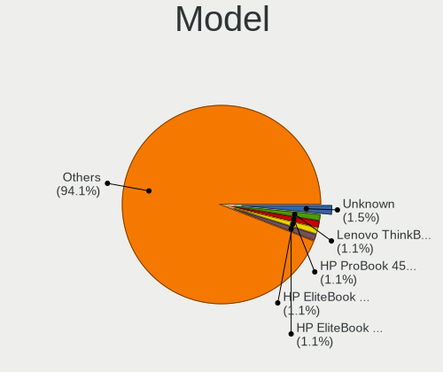
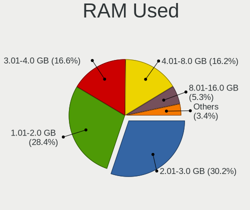
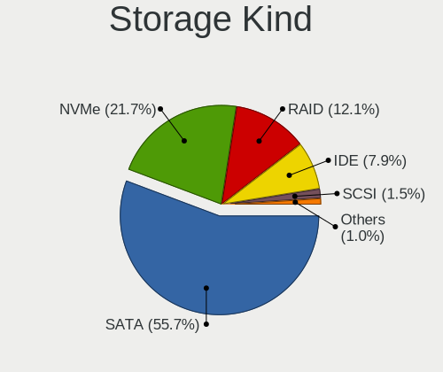
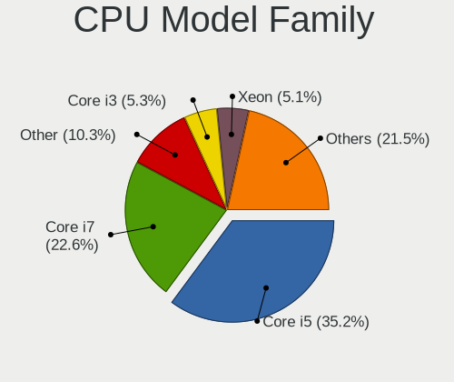
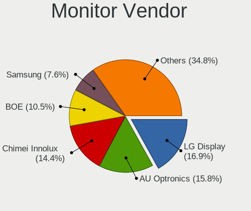
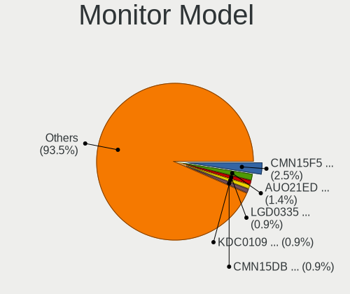

Linux in Pakistan - Tested Hardware & Statistics
------------------------------------------------

A project to collect tested hardware configurations for Linux in Pakistan.

Anyone can contribute to this report by the [hw-probe](https://github.com/linuxhw/hw-probe) tool:

    sudo -E hw-probe -all -upload

Please contribute! Especially if your hardware is rare.

This is a report for all computer types. See also reports for [desktops](/Location/Pakistan/Desktop/README.md) and [notebooks](/Location/Pakistan/Notebook/README.md).

Contents
--------

* [ Test Cases ](#test-cases)

* [ System ](#system)
  - [ OS                       ](#os)
  - [ OS Family                ](#os-family)
  - [ Kernel                   ](#kernel)
  - [ Kernel Family            ](#kernel-family)
  - [ Kernel Major Ver.        ](#kernel-major-ver)
  - [ Arch                     ](#arch)
  - [ DE                       ](#de)
  - [ Display Server           ](#display-server)
  - [ Display Manager          ](#display-manager)
  - [ OS Lang                  ](#os-lang)
  - [ Boot Mode                ](#boot-mode)
  - [ Filesystem               ](#filesystem)
  - [ Part. scheme             ](#part-scheme)
  - [ Dual Boot with Linux/BSD ](#dual-boot-with-linuxbsd)
  - [ Dual Boot (Win)          ](#dual-boot-win)

* [ Board ](#board)
  - [ Vendor                   ](#vendor)
  - [ Model                    ](#model)
  - [ Model Family             ](#model-family)
  - [ MFG Year                 ](#mfg-year)
  - [ Form Factor              ](#form-factor)
  - [ Secure Boot              ](#secure-boot)
  - [ Coreboot                 ](#coreboot)
  - [ RAM Size                 ](#ram-size)
  - [ RAM Used                 ](#ram-used)
  - [ Total Drives             ](#total-drives)
  - [ Has CD-ROM               ](#has-cd-rom)
  - [ Has Ethernet             ](#has-ethernet)
  - [ Has WiFi                 ](#has-wifi)
  - [ Has Bluetooth            ](#has-bluetooth)

* [ Location ](#location)
  - [ Country                  ](#country)
  - [ City                     ](#city)

* [ Drives ](#drives)
  - [ Drive Vendor             ](#drive-vendor)
  - [ Drive Model              ](#drive-model)
  - [ HDD Vendor               ](#hdd-vendor)
  - [ SSD Vendor               ](#ssd-vendor)
  - [ Drive Kind               ](#drive-kind)
  - [ Drive Connector          ](#drive-connector)
  - [ Drive Size               ](#drive-size)
  - [ Space Total              ](#space-total)
  - [ Space Used               ](#space-used)
  - [ Malfunc. Drives          ](#malfunc-drives)
  - [ Malfunc. Drive Vendor    ](#malfunc-drive-vendor)
  - [ Malfunc. HDD Vendor      ](#malfunc-hdd-vendor)
  - [ Malfunc. Drive Kind      ](#malfunc-drive-kind)
  - [ Failed Drives            ](#failed-drives)
  - [ Failed Drive Vendor      ](#failed-drive-vendor)
  - [ Drive Status             ](#drive-status)

* [ Storage controller ](#storage-controller)
  - [ Storage Vendor           ](#storage-vendor)
  - [ Storage Model            ](#storage-model)
  - [ Storage Kind             ](#storage-kind)

* [ Processor ](#processor)
  - [ CPU Vendor               ](#cpu-vendor)
  - [ CPU Model                ](#cpu-model)
  - [ CPU Model Family         ](#cpu-model-family)
  - [ CPU Cores                ](#cpu-cores)
  - [ CPU Sockets              ](#cpu-sockets)
  - [ CPU Threads              ](#cpu-threads)
  - [ CPU Op-Modes             ](#cpu-op-modes)
  - [ CPU Microcode            ](#cpu-microcode)
  - [ CPU Microarch            ](#cpu-microarch)

* [ Graphics ](#graphics)
  - [ GPU Vendor               ](#gpu-vendor)
  - [ GPU Model                ](#gpu-model)
  - [ GPU Combo                ](#gpu-combo)
  - [ GPU Driver               ](#gpu-driver)
  - [ GPU Memory               ](#gpu-memory)

* [ Monitor ](#monitor)
  - [ Monitor Vendor           ](#monitor-vendor)
  - [ Monitor Model            ](#monitor-model)
  - [ Monitor Resolution       ](#monitor-resolution)
  - [ Monitor Diagonal         ](#monitor-diagonal)
  - [ Monitor Width            ](#monitor-width)
  - [ Aspect Ratio             ](#aspect-ratio)
  - [ Monitor Area             ](#monitor-area)
  - [ Pixel Density            ](#pixel-density)
  - [ Multiple Monitors        ](#multiple-monitors)

* [ Network ](#network)
  - [ Net Controller Vendor    ](#net-controller-vendor)
  - [ Net Controller Model     ](#net-controller-model)
  - [ Wireless Vendor          ](#wireless-vendor)
  - [ Wireless Model           ](#wireless-model)
  - [ Ethernet Vendor          ](#ethernet-vendor)
  - [ Ethernet Model           ](#ethernet-model)
  - [ Net Controller Kind      ](#net-controller-kind)
  - [ Used Controller          ](#used-controller)
  - [ NICs                     ](#nics)
  - [ IPv6                     ](#ipv6)

* [ Bluetooth ](#bluetooth)
  - [ Bluetooth Vendor         ](#bluetooth-vendor)
  - [ Bluetooth Model          ](#bluetooth-model)

* [ Sound ](#sound)
  - [ Sound Vendor             ](#sound-vendor)
  - [ Sound Model              ](#sound-model)

* [ Memory ](#memory)
  - [ Memory Vendor            ](#memory-vendor)
  - [ Memory Model             ](#memory-model)
  - [ Memory Kind              ](#memory-kind)
  - [ Memory Form Factor       ](#memory-form-factor)
  - [ Memory Size              ](#memory-size)
  - [ Memory Speed             ](#memory-speed)

* [ Printers & scanners ](#printers--scanners)
  - [ Printer Vendor           ](#printer-vendor)
  - [ Printer Model            ](#printer-model)
  - [ Scanner Vendor           ](#scanner-vendor)
  - [ Scanner Model            ](#scanner-model)

* [ Camera ](#camera)
  - [ Camera Vendor            ](#camera-vendor)
  - [ Camera Model             ](#camera-model)

* [ Security ](#security)
  - [ Fingerprint Vendor       ](#fingerprint-vendor)
  - [ Fingerprint Model        ](#fingerprint-model)
  - [ Chipcard Vendor          ](#chipcard-vendor)
  - [ Chipcard Model           ](#chipcard-model)

* [ Unsupported ](#unsupported)
  - [ Unsupported Devices      ](#unsupported-devices)
  - [ Unsupported Device Types ](#unsupported-device-types)

Test Cases
----------

Total: 381

| Vendor    | Model                       | Form-Factor | Probe                                                      | Date         |
|-----------|-----------------------------|-------------|------------------------------------------------------------|--------------|
| HP        | EliteBook 850 G8 Noteboo... | Notebook    | [b01a9ac97f](https://linux-hardware.org/?probe=b01a9ac97f) | Sep 24, 2022 |
| HP        | Laptop 15-bs1xx             | Notebook    | [5657597c18](https://linux-hardware.org/?probe=5657597c18) | Sep 22, 2022 |
| HP        | ENVY 15                     | Notebook    | [6921f93893](https://linux-hardware.org/?probe=6921f93893) | Sep 20, 2022 |
| Dell      | Inspiron 7791 2n1           | Convertible | [31e3939680](https://linux-hardware.org/?probe=31e3939680) | Sep 18, 2022 |
| Dell      | Inspiron 7791 2n1           | Convertible | [f207769c14](https://linux-hardware.org/?probe=f207769c14) | Sep 18, 2022 |
| HP        | EliteBook 840 G2            | Notebook    | [ca96e9bf9b](https://linux-hardware.org/?probe=ca96e9bf9b) | Sep 14, 2022 |
| HP        | EliteBook 840 G3            | Notebook    | [be88e72feb](https://linux-hardware.org/?probe=be88e72feb) | Sep 14, 2022 |
| HP        | EliteBook 840 G3            | Notebook    | [2b1c502b28](https://linux-hardware.org/?probe=2b1c502b28) | Sep 14, 2022 |
| Lenovo    | ThinkPad E15 Gen 2 20TDS... | Notebook    | [2b12cc11f2](https://linux-hardware.org/?probe=2b12cc11f2) | Sep 13, 2022 |
| HP        | ProBook 4540s               | Notebook    | [c1bf52b653](https://linux-hardware.org/?probe=c1bf52b653) | Sep 13, 2022 |
| HP        | ProBook 4540s               | Notebook    | [320e270f44](https://linux-hardware.org/?probe=320e270f44) | Sep 13, 2022 |
| HP        | EliteBook Folio 9470m       | Notebook    | [c03777782c](https://linux-hardware.org/?probe=c03777782c) | Sep 13, 2022 |
| HP        | Unknown                     | Notebook    | [5cf262a728](https://linux-hardware.org/?probe=5cf262a728) | Sep 10, 2022 |
| Lenovo    | ThinkPad T470 20HES3370A    | Notebook    | [5beda28487](https://linux-hardware.org/?probe=5beda28487) | Sep 09, 2022 |
| Dell      | Latitude 3340               | Notebook    | [ec720c63b1](https://linux-hardware.org/?probe=ec720c63b1) | Sep 06, 2022 |
| Lenovo    | ThinkPad T470 20HES3370A    | Notebook    | [3a466cef0a](https://linux-hardware.org/?probe=3a466cef0a) | Sep 05, 2022 |
| Dell      | Latitude E6420              | Notebook    | [98a628a92a](https://linux-hardware.org/?probe=98a628a92a) | Sep 03, 2022 |
| Dell      | Latitude E6420              | Notebook    | [e9c43bd2ab](https://linux-hardware.org/?probe=e9c43bd2ab) | Sep 03, 2022 |
| Lenovo    | ThinkPad T470 20HES3370A    | Notebook    | [ae1d14117b](https://linux-hardware.org/?probe=ae1d14117b) | Sep 02, 2022 |
| Dell      | Latitude 3340               | Notebook    | [d64525742a](https://linux-hardware.org/?probe=d64525742a) | Sep 01, 2022 |
| Dell      | Latitude 3340               | Notebook    | [b9d472b965](https://linux-hardware.org/?probe=b9d472b965) | Sep 01, 2022 |
| HP        | EliteBook 840 G2            | Notebook    | [4da3485e34](https://linux-hardware.org/?probe=4da3485e34) | Sep 01, 2022 |
| Dell      | Latitude 7390               | Notebook    | [571b195a12](https://linux-hardware.org/?probe=571b195a12) | Aug 31, 2022 |
| Dell      | Latitude 7390               | Notebook    | [3c3f6114f6](https://linux-hardware.org/?probe=3c3f6114f6) | Aug 31, 2022 |
| HP        | EliteBook 840 G2            | Notebook    | [5ba91d8167](https://linux-hardware.org/?probe=5ba91d8167) | Aug 30, 2022 |
| HP        | EliteBook 840 G1            | Notebook    | [23d73aa95c](https://linux-hardware.org/?probe=23d73aa95c) | Aug 30, 2022 |
| HP        | EliteBook 840 G2            | Notebook    | [bed3be5142](https://linux-hardware.org/?probe=bed3be5142) | Aug 30, 2022 |
| HP        | EliteBook 840 G2            | Notebook    | [b588415d06](https://linux-hardware.org/?probe=b588415d06) | Aug 30, 2022 |
| Lenovo    | ThinkPad T470 20HES3370A    | Notebook    | [3b1630e4bc](https://linux-hardware.org/?probe=3b1630e4bc) | Aug 30, 2022 |
| HP        | Unknown                     | Notebook    | [9b22ce41e3](https://linux-hardware.org/?probe=9b22ce41e3) | Aug 27, 2022 |
| ASUSTek   | VivoBook_ASUSLaptop TP41... | Convertible | [1b2c235511](https://linux-hardware.org/?probe=1b2c235511) | Aug 22, 2022 |
| ASUSTek   | VivoBook_ASUSLaptop TP41... | Convertible | [c563f4b965](https://linux-hardware.org/?probe=c563f4b965) | Aug 22, 2022 |
| Lenovo    | ThinkStation D30 4223CC9    | Desktop     | [16e54152fd](https://linux-hardware.org/?probe=16e54152fd) | Aug 18, 2022 |
| Lenovo    | ThinkStation D30 4223CC9    | Desktop     | [e0208cab99](https://linux-hardware.org/?probe=e0208cab99) | Aug 18, 2022 |
| Dell      | Latitude 7400               | Notebook    | [7f870ac8c2](https://linux-hardware.org/?probe=7f870ac8c2) | Aug 17, 2022 |
| Acer      | Predator PH317-53           | Notebook    | [8578e9a77a](https://linux-hardware.org/?probe=8578e9a77a) | Aug 11, 2022 |
| Lenovo    | IdeaPad 330-15IKB 81DE      | Notebook    | [072d897eda](https://linux-hardware.org/?probe=072d897eda) | Jul 28, 2022 |
| Dell      | Latitude E6420              | Notebook    | [07a671ae31](https://linux-hardware.org/?probe=07a671ae31) | Jul 22, 2022 |
| Dell      | Latitude E5440              | Notebook    | [3b30865387](https://linux-hardware.org/?probe=3b30865387) | Jul 20, 2022 |
| Dell      | Latitude E6420              | Notebook    | [fadad1be46](https://linux-hardware.org/?probe=fadad1be46) | Jul 14, 2022 |
| Quanta    | 2ABB 101                    | Desktop     | [3d241d58b9](https://linux-hardware.org/?probe=3d241d58b9) | Jul 13, 2022 |
| Gigabyte  | A520M S2H                   | Desktop     | [52aab7f65b](https://linux-hardware.org/?probe=52aab7f65b) | Jul 12, 2022 |
| Sony      | VPCEA26FG                   | Notebook    | [c5432e157a](https://linux-hardware.org/?probe=c5432e157a) | Jul 11, 2022 |
| Dell      | Latitude E7450              | Notebook    | [d0c3f69765](https://linux-hardware.org/?probe=d0c3f69765) | Jul 09, 2022 |
| ASUSTek   | TUF Gaming B550-PLUS WIF... | Desktop     | [44db6036ce](https://linux-hardware.org/?probe=44db6036ce) | Jul 08, 2022 |
| Sony      | VPCEA26FG                   | Notebook    | [2075c04c4c](https://linux-hardware.org/?probe=2075c04c4c) | Jul 03, 2022 |
| Sony      | VPCEA26FG                   | Notebook    | [b72a4de42b](https://linux-hardware.org/?probe=b72a4de42b) | Jul 01, 2022 |
| Lenovo    | ThinkPad E15 Gen 2 20TD0... | Notebook    | [18fbe5a2d0](https://linux-hardware.org/?probe=18fbe5a2d0) | Jun 28, 2022 |
| HP        | EliteBook 8470p             | Notebook    | [d6adb170de](https://linux-hardware.org/?probe=d6adb170de) | Jun 25, 2022 |
| Gigabyte  | A520M S2H                   | Desktop     | [094c3f1e98](https://linux-hardware.org/?probe=094c3f1e98) | Jun 24, 2022 |
| HP        | 339A                        | Desktop     | [a20191b759](https://linux-hardware.org/?probe=a20191b759) | Jun 23, 2022 |
| HP        | EliteBook 8470p             | Notebook    | [f9895656b6](https://linux-hardware.org/?probe=f9895656b6) | Jun 23, 2022 |
| HP        | EliteBook 8470p             | Notebook    | [2e2bcb63d7](https://linux-hardware.org/?probe=2e2bcb63d7) | Jun 23, 2022 |
| HP        | 18E7                        | Desktop     | [f2d50ba3c2](https://linux-hardware.org/?probe=f2d50ba3c2) | Jun 13, 2022 |
| HP        | EliteBook 850 G5            | Notebook    | [085f5c458d](https://linux-hardware.org/?probe=085f5c458d) | Jun 10, 2022 |
| HP        | Laptop 15s-fq2xxx           | Notebook    | [5bcb742cbe](https://linux-hardware.org/?probe=5bcb742cbe) | Jun 04, 2022 |
| Lenovo    | ThinkPad T450 20BV0005US    | Notebook    | [a795ed872f](https://linux-hardware.org/?probe=a795ed872f) | Jun 03, 2022 |
| ASUSTek   | STRIX B250H GAMING          | Desktop     | [9f28088790](https://linux-hardware.org/?probe=9f28088790) | Jun 01, 2022 |
| HP        | EliteBook 8460p             | Notebook    | [a9cca9972f](https://linux-hardware.org/?probe=a9cca9972f) | May 31, 2022 |
| HP        | EliteBook 8460p             | Notebook    | [f05323c723](https://linux-hardware.org/?probe=f05323c723) | May 31, 2022 |
| Dell      | Inspiron 3543               | Notebook    | [c48c32ae19](https://linux-hardware.org/?probe=c48c32ae19) | May 25, 2022 |
| HP        | Notebook                    | Notebook    | [4508e41795](https://linux-hardware.org/?probe=4508e41795) | May 22, 2022 |
| HP        | Notebook                    | Notebook    | [dc587c572e](https://linux-hardware.org/?probe=dc587c572e) | May 22, 2022 |
| HP        | 1495                        | Desktop     | [9ec1730693](https://linux-hardware.org/?probe=9ec1730693) | May 11, 2022 |
| Lenovo    | SDK0E50510 WIN              | Desktop     | [07526b3b20](https://linux-hardware.org/?probe=07526b3b20) | May 10, 2022 |
| Dell      | Latitude 3330               | Notebook    | [4f05d8475c](https://linux-hardware.org/?probe=4f05d8475c) | May 08, 2022 |
| Dell      | Latitude E6420              | Notebook    | [8c12f58910](https://linux-hardware.org/?probe=8c12f58910) | May 01, 2022 |
| HP        | 3396                        | Desktop     | [bd2e5eb69c](https://linux-hardware.org/?probe=bd2e5eb69c) | Apr 29, 2022 |
| HP        | 3396                        | Desktop     | [705baf56a1](https://linux-hardware.org/?probe=705baf56a1) | Apr 29, 2022 |
| HP        | EliteBook 840 G1            | Notebook    | [411c79850c](https://linux-hardware.org/?probe=411c79850c) | Apr 29, 2022 |
| Lenovo    | ThinkPad E15 Gen 2 20TDS... | Notebook    | [59a49b2d04](https://linux-hardware.org/?probe=59a49b2d04) | Apr 23, 2022 |
| HP        | EliteBook 840 G2            | Notebook    | [3e0d410668](https://linux-hardware.org/?probe=3e0d410668) | Apr 19, 2022 |
| HP        | 3396                        | Desktop     | [2c07ec89d4](https://linux-hardware.org/?probe=2c07ec89d4) | Apr 17, 2022 |
| HP        | ProBook 450 G8 Notebook ... | Notebook    | [1974bfe63a](https://linux-hardware.org/?probe=1974bfe63a) | Apr 15, 2022 |
| Dell      | Latitude 3520               | Notebook    | [ee204b07aa](https://linux-hardware.org/?probe=ee204b07aa) | Apr 11, 2022 |
| HP        | Pavilion TS 11              | Notebook    | [9a817f6695](https://linux-hardware.org/?probe=9a817f6695) | Apr 09, 2022 |
| Lenovo    | ThinkPad E15 Gen 2 20TDS... | Notebook    | [0626d13541](https://linux-hardware.org/?probe=0626d13541) | Apr 07, 2022 |
| HP        | 87D6 SMVB                   | Desktop     | [57d44d9705](https://linux-hardware.org/?probe=57d44d9705) | Apr 03, 2022 |
| HP        | 87D6 SMVB                   | Desktop     | [e70c6e6d89](https://linux-hardware.org/?probe=e70c6e6d89) | Apr 03, 2022 |
| Dell      | Latitude 7480               | Notebook    | [bf00ec6a76](https://linux-hardware.org/?probe=bf00ec6a76) | Mar 23, 2022 |
| Lenovo    | ThinkPad E15 Gen 2 20TD0... | Notebook    | [1936ee53b3](https://linux-hardware.org/?probe=1936ee53b3) | Mar 22, 2022 |
| Dell      | Latitude 7480               | Notebook    | [faddba28a8](https://linux-hardware.org/?probe=faddba28a8) | Mar 19, 2022 |
| Lenovo    | V110-15IKB 80TH             | Notebook    | [a3aeef468a](https://linux-hardware.org/?probe=a3aeef468a) | Mar 12, 2022 |
| Dell      | 0HR330                      | Desktop     | [9e351420b6](https://linux-hardware.org/?probe=9e351420b6) | Mar 04, 2022 |
| Gigabyte  | A520M S2H                   | Desktop     | [06db14c491](https://linux-hardware.org/?probe=06db14c491) | Mar 01, 2022 |
| Dell      | 0HR330                      | Desktop     | [7e4c13a9bd](https://linux-hardware.org/?probe=7e4c13a9bd) | Mar 01, 2022 |
| Dell      | 0HR330                      | Desktop     | [3533cd70af](https://linux-hardware.org/?probe=3533cd70af) | Feb 26, 2022 |
| Dell      | 0HR330                      | Desktop     | [e587783731](https://linux-hardware.org/?probe=e587783731) | Feb 26, 2022 |
| Lenovo    | ThinkBook 15 G2 ITL 20VE    | Notebook    | [e0169c3e87](https://linux-hardware.org/?probe=e0169c3e87) | Feb 23, 2022 |
| HP        | EliteBook Folio 9470m       | Notebook    | [1aa838368f](https://linux-hardware.org/?probe=1aa838368f) | Feb 20, 2022 |
| HP        | EliteBook Folio 9470m       | Notebook    | [8f3df927df](https://linux-hardware.org/?probe=8f3df927df) | Feb 18, 2022 |
| HP        | 8717                        | Desktop     | [d5d2ee0ab5](https://linux-hardware.org/?probe=d5d2ee0ab5) | Feb 18, 2022 |
| Dell      | Inspiron 3501               | Notebook    | [7fdd5b66fc](https://linux-hardware.org/?probe=7fdd5b66fc) | Feb 14, 2022 |
| Lenovo    | IdeaPad 510-15ISK 80SR      | Notebook    | [a5407aa128](https://linux-hardware.org/?probe=a5407aa128) | Feb 13, 2022 |
| Dell      | Inspiron 5547               | Notebook    | [2d6ff07a82](https://linux-hardware.org/?probe=2d6ff07a82) | Feb 12, 2022 |
| Dell      | Inspiron 3501               | Notebook    | [0dd77f2f7a](https://linux-hardware.org/?probe=0dd77f2f7a) | Feb 12, 2022 |
| HP        | 8061                        | Desktop     | [f721051d60](https://linux-hardware.org/?probe=f721051d60) | Feb 11, 2022 |
| HP        | 8717                        | Desktop     | [97d99714a1](https://linux-hardware.org/?probe=97d99714a1) | Feb 10, 2022 |
| Lenovo    | ThinkPad E15 Gen 2 20TDS... | Notebook    | [5a9a256568](https://linux-hardware.org/?probe=5a9a256568) | Feb 01, 2022 |
| Dell      | Inspiron 3501               | Notebook    | [4a0c4a62b7](https://linux-hardware.org/?probe=4a0c4a62b7) | Feb 01, 2022 |
| Dell      | Inspiron 3501               | Notebook    | [c902cc42a6](https://linux-hardware.org/?probe=c902cc42a6) | Jan 18, 2022 |
| Dell      | 0DR845                      | Desktop     | [daa833f06d](https://linux-hardware.org/?probe=daa833f06d) | Jan 08, 2022 |
| Dell      | Inspiron 3501               | Notebook    | [ce839c3628](https://linux-hardware.org/?probe=ce839c3628) | Jan 08, 2022 |
| Lenovo    | ThinkPad T540p 20BFS5630... | Notebook    | [e1e090d622](https://linux-hardware.org/?probe=e1e090d622) | Jan 02, 2022 |
| HP        | Pavilion Laptop 15-cs0xx... | Notebook    | [fb332a2529](https://linux-hardware.org/?probe=fb332a2529) | Jan 01, 2022 |
| HP        | EliteBook Folio 9470m       | Notebook    | [90d57a20ee](https://linux-hardware.org/?probe=90d57a20ee) | Dec 31, 2021 |
| HP        | EliteBook Folio 9470m       | Notebook    | [4db624e8a0](https://linux-hardware.org/?probe=4db624e8a0) | Dec 31, 2021 |
| HP        | EliteBook Folio 9470m       | Notebook    | [b79e118712](https://linux-hardware.org/?probe=b79e118712) | Dec 31, 2021 |
| HP        | ProLiant DL360 G7           | Server      | [70e6bfadc4](https://linux-hardware.org/?probe=70e6bfadc4) | Dec 26, 2021 |
| Acer      | Aspire ES1-411              | Notebook    | [9a5ebb6379](https://linux-hardware.org/?probe=9a5ebb6379) | Dec 19, 2021 |
| HP        | EliteBook 8470p             | Notebook    | [0f7389c7d9](https://linux-hardware.org/?probe=0f7389c7d9) | Dec 14, 2021 |
| Dell      | Inspiron 5515               | Notebook    | [901f720089](https://linux-hardware.org/?probe=901f720089) | Dec 11, 2021 |
| Dell      | Inspiron 5515               | Notebook    | [7c0553b250](https://linux-hardware.org/?probe=7c0553b250) | Dec 11, 2021 |
| HP        | 0B3Ch HP P/N                | Desktop     | [2805378159](https://linux-hardware.org/?probe=2805378159) | Dec 10, 2021 |
| HP        | ZBook 15 G3                 | Notebook    | [e662c8b956](https://linux-hardware.org/?probe=e662c8b956) | Dec 07, 2021 |
| Lenovo    | ThinkStation D30 4223CC9    | Desktop     | [0784c5596b](https://linux-hardware.org/?probe=0784c5596b) | Dec 04, 2021 |
| Dell      | 0VHRW1 A03                  | Desktop     | [ebfaaee6ef](https://linux-hardware.org/?probe=ebfaaee6ef) | Dec 04, 2021 |
| Lenovo    | ThinkStation D30 4223CC9    | Desktop     | [50a026d588](https://linux-hardware.org/?probe=50a026d588) | Dec 02, 2021 |
| Dell      | 0VHRW1 A03                  | Desktop     | [19fd4c2057](https://linux-hardware.org/?probe=19fd4c2057) | Nov 30, 2021 |
| Lenovo    | ThinkStation D30 4223CC9    | Desktop     | [7493408721](https://linux-hardware.org/?probe=7493408721) | Nov 29, 2021 |
| Dell      | 0VHRW1 A03                  | Desktop     | [637bba1c58](https://linux-hardware.org/?probe=637bba1c58) | Nov 29, 2021 |
| Dell      | 06FW8P A02                  | Desktop     | [555032936f](https://linux-hardware.org/?probe=555032936f) | Nov 28, 2021 |
| Dell      | Inspiron 15 7000 Gaming     | Notebook    | [538c96bb62](https://linux-hardware.org/?probe=538c96bb62) | Nov 26, 2021 |
| Dell      | Latitude E6440              | Notebook    | [e0e5edfc03](https://linux-hardware.org/?probe=e0e5edfc03) | Nov 24, 2021 |
| HP        | Unknown                     | Notebook    | [ef28d45f68](https://linux-hardware.org/?probe=ef28d45f68) | Nov 23, 2021 |
| Dell      | G3 3579                     | Notebook    | [38e9f54ba1](https://linux-hardware.org/?probe=38e9f54ba1) | Nov 23, 2021 |
| Dell      | Inspiron 5520               | Notebook    | [6c6e631ffc](https://linux-hardware.org/?probe=6c6e631ffc) | Nov 20, 2021 |
| HP        | Unknown                     | Notebook    | [23dc38032d](https://linux-hardware.org/?probe=23dc38032d) | Nov 20, 2021 |
| Shuttle   | FS81                        | Desktop     | [ac6138c9d7](https://linux-hardware.org/?probe=ac6138c9d7) | Nov 19, 2021 |
| Shuttle   | FS81                        | Desktop     | [d889090212](https://linux-hardware.org/?probe=d889090212) | Nov 18, 2021 |
| Dell      | Inspiron 15 7000 Gaming     | Notebook    | [cd386145b8](https://linux-hardware.org/?probe=cd386145b8) | Nov 18, 2021 |
| HP        | Pavilion Laptop 14-ce2xx... | Notebook    | [f9ebb771b0](https://linux-hardware.org/?probe=f9ebb771b0) | Nov 14, 2021 |
| HP        | ZBook 15 G3                 | Notebook    | [67e5184b17](https://linux-hardware.org/?probe=67e5184b17) | Nov 13, 2021 |
| Dell      | Vostro 1500                 | Notebook    | [23aeb68ca2](https://linux-hardware.org/?probe=23aeb68ca2) | Nov 11, 2021 |
| HP        | 0AECh D                     | Desktop     | [7d8a81315d](https://linux-hardware.org/?probe=7d8a81315d) | Nov 11, 2021 |
| HP        | ZBook 15 G3                 | Notebook    | [3e94ac7df1](https://linux-hardware.org/?probe=3e94ac7df1) | Nov 09, 2021 |
| Dell      | 06FW8P A02                  | Desktop     | [72f1028535](https://linux-hardware.org/?probe=72f1028535) | Nov 09, 2021 |
| Dell      | 06FW8P A02                  | Desktop     | [e43d36b3cf](https://linux-hardware.org/?probe=e43d36b3cf) | Nov 09, 2021 |
| Dell      | Inspiron 3501               | Notebook    | [5d35bd9e4a](https://linux-hardware.org/?probe=5d35bd9e4a) | Nov 07, 2021 |
| Dell      | Inspiron 15-3567            | Notebook    | [630a9144f1](https://linux-hardware.org/?probe=630a9144f1) | Nov 06, 2021 |
| ASUSTek   | PRIME B550-PLUS             | Desktop     | [98ddca21d9](https://linux-hardware.org/?probe=98ddca21d9) | Nov 06, 2021 |
| HP        | 0AECh D                     | Desktop     | [cd2f6268cf](https://linux-hardware.org/?probe=cd2f6268cf) | Oct 28, 2021 |
| Dell      | 06FW8P A02                  | Desktop     | [2f188b606a](https://linux-hardware.org/?probe=2f188b606a) | Oct 25, 2021 |
| HP        | 650                         | Notebook    | [c32592cabb](https://linux-hardware.org/?probe=c32592cabb) | Oct 20, 2021 |
| Apple     | MacBookPro14,1              | Notebook    | [bb1aa448fd](https://linux-hardware.org/?probe=bb1aa448fd) | Oct 20, 2021 |
| HP        | ProBook 450 G7              | Notebook    | [a47cdaa2ba](https://linux-hardware.org/?probe=a47cdaa2ba) | Oct 20, 2021 |
| Dell      | 0XPDFK A01                  | Desktop     | [0e66d5fd62](https://linux-hardware.org/?probe=0e66d5fd62) | Oct 16, 2021 |
| Lenovo    | ThinkBook 15-IIL 20SM       | Notebook    | [c7fc550482](https://linux-hardware.org/?probe=c7fc550482) | Oct 16, 2021 |
| HP        | ProBook 450 G7              | Notebook    | [f2a84de135](https://linux-hardware.org/?probe=f2a84de135) | Oct 12, 2021 |
| Dell      | Latitude E5570              | Notebook    | [938d1a781d](https://linux-hardware.org/?probe=938d1a781d) | Oct 08, 2021 |
| Lenovo    | ThinkPad X220 Tablet 429... | Notebook    | [33137c7c23](https://linux-hardware.org/?probe=33137c7c23) | Oct 07, 2021 |
| HP        | 0AECh D                     | Desktop     | [415146d6ec](https://linux-hardware.org/?probe=415146d6ec) | Oct 07, 2021 |
| Dell      | 06FW8P A02                  | Desktop     | [06efedbf24](https://linux-hardware.org/?probe=06efedbf24) | Oct 07, 2021 |
| Lenovo    | ThinkBook 15 G2 ITL 20VE    | Notebook    | [196fa579f8](https://linux-hardware.org/?probe=196fa579f8) | Oct 04, 2021 |
| Haier     | Y11C                        | Notebook    | [74b9ee5509](https://linux-hardware.org/?probe=74b9ee5509) | Oct 03, 2021 |
| Dell      | Precision M6400             | Notebook    | [5f6ec9333e](https://linux-hardware.org/?probe=5f6ec9333e) | Oct 03, 2021 |
| Haier     | Y11C                        | Notebook    | [591740bf00](https://linux-hardware.org/?probe=591740bf00) | Sep 27, 2021 |
| Dell      | 06FW8P A02                  | Desktop     | [029b85826d](https://linux-hardware.org/?probe=029b85826d) | Sep 27, 2021 |
| Dell      | Inspiron 5515               | Notebook    | [64af4c4882](https://linux-hardware.org/?probe=64af4c4882) | Sep 24, 2021 |
| HP        | 0AECh D                     | Desktop     | [202ada3fc3](https://linux-hardware.org/?probe=202ada3fc3) | Sep 23, 2021 |
| HP        | 3047h                       | Desktop     | [356ad972a7](https://linux-hardware.org/?probe=356ad972a7) | Sep 22, 2021 |
| Lenovo    | ThinkPad X220 Tablet 429... | Notebook    | [d0e2e19e84](https://linux-hardware.org/?probe=d0e2e19e84) | Sep 12, 2021 |
| HP        | 1587h                       | Desktop     | [5447d2e6c3](https://linux-hardware.org/?probe=5447d2e6c3) | Sep 12, 2021 |
| Unknown   | Unknown                     | Desktop     | [321a93dff9](https://linux-hardware.org/?probe=321a93dff9) | Sep 07, 2021 |
| Shuttle   | FS81                        | Desktop     | [9a98a31681](https://linux-hardware.org/?probe=9a98a31681) | Sep 06, 2021 |
| HP        | ProLiant DL380p Gen8        | Server      | [c5c3b2d36c](https://linux-hardware.org/?probe=c5c3b2d36c) | Sep 02, 2021 |
| HP        | ProLiant DL380p Gen8        | Server      | [ece6c14756](https://linux-hardware.org/?probe=ece6c14756) | Sep 02, 2021 |
| HP        | ProLiant DL380p Gen8        | Server      | [262cc4f3e7](https://linux-hardware.org/?probe=262cc4f3e7) | Aug 29, 2021 |
| Dell      | 09KPNV A01                  | Desktop     | [7e939d9f5f](https://linux-hardware.org/?probe=7e939d9f5f) | Aug 20, 2021 |
| ASUSTek   | VivoBook_ASUSLaptop X571... | Notebook    | [966a09526a](https://linux-hardware.org/?probe=966a09526a) | Aug 14, 2021 |
| Dell      | Inspiron 3542               | Notebook    | [0909599e9c](https://linux-hardware.org/?probe=0909599e9c) | Aug 11, 2021 |
| Dell      | Inspiron 5570               | Notebook    | [9adf19d9c0](https://linux-hardware.org/?probe=9adf19d9c0) | Aug 10, 2021 |
| Dell      | Inspiron 5593               | Notebook    | [1f6017347e](https://linux-hardware.org/?probe=1f6017347e) | Aug 05, 2021 |
| Lenovo    | MAHOBAY NOK                 | Desktop     | [921bde522e](https://linux-hardware.org/?probe=921bde522e) | Jul 31, 2021 |
| Dell      | Latitude E5250              | Notebook    | [f50f84a6a3](https://linux-hardware.org/?probe=f50f84a6a3) | Jul 26, 2021 |
| Gigabyte  | Z590 UD AC                  | Desktop     | [7e8e35538a](https://linux-hardware.org/?probe=7e8e35538a) | Jul 26, 2021 |
| Dell      | Latitude E5250              | Notebook    | [9806ab15ab](https://linux-hardware.org/?probe=9806ab15ab) | Jul 25, 2021 |
| Dell      | Latitude E5250              | Notebook    | [9a475d76a4](https://linux-hardware.org/?probe=9a475d76a4) | Jul 25, 2021 |
| Lenovo    | MAHOBAY NOK                 | Desktop     | [00614fd705](https://linux-hardware.org/?probe=00614fd705) | Jul 23, 2021 |
| Lenovo    | MAHOBAY NOK                 | Desktop     | [37924533d9](https://linux-hardware.org/?probe=37924533d9) | Jul 23, 2021 |
| Gigabyte  | Z590 UD AC                  | Desktop     | [4fc5079d7e](https://linux-hardware.org/?probe=4fc5079d7e) | Jul 20, 2021 |
| Dell      | Latitude E5250              | Notebook    | [d65621a003](https://linux-hardware.org/?probe=d65621a003) | Jul 16, 2021 |
| HP        | EliteBook 8440p             | Notebook    | [d89b69a6a3](https://linux-hardware.org/?probe=d89b69a6a3) | Jul 16, 2021 |
| Lenovo    | ThinkCentre M70e 0830F2U    | Desktop     | [8dad962f2f](https://linux-hardware.org/?probe=8dad962f2f) | Jul 09, 2021 |
| Dell      | Inspiron 15 7000 Gaming     | Notebook    | [d320594f42](https://linux-hardware.org/?probe=d320594f42) | Jul 07, 2021 |
| Lenovo    | ThinkPad E14 20RA007SAD     | Notebook    | [eb51ce8f36](https://linux-hardware.org/?probe=eb51ce8f36) | Jul 07, 2021 |
| Dell      | Inspiron 7306 2n1           | Convertible | [f4d326f499](https://linux-hardware.org/?probe=f4d326f499) | Jul 05, 2021 |
| Dell      | Precision 5530              | Notebook    | [7d267375f2](https://linux-hardware.org/?probe=7d267375f2) | Jul 05, 2021 |
| Dell      | Inspiron 7306 2n1           | Convertible | [7236dc0c95](https://linux-hardware.org/?probe=7236dc0c95) | Jul 04, 2021 |
| Dell      | Inspiron 5593               | Notebook    | [926e72bc56](https://linux-hardware.org/?probe=926e72bc56) | Jul 03, 2021 |
| HP        | Pavilion Notebook           | Notebook    | [f5ac8e2aca](https://linux-hardware.org/?probe=f5ac8e2aca) | Jun 25, 2021 |
| HP        | Pavilion dv6                | Notebook    | [c3529dc2aa](https://linux-hardware.org/?probe=c3529dc2aa) | Jun 24, 2021 |
| Dell      | Precision M6400             | Notebook    | [7f2245c976](https://linux-hardware.org/?probe=7f2245c976) | Jun 24, 2021 |
| HP        | 158A                        | Desktop     | [1da50908cf](https://linux-hardware.org/?probe=1da50908cf) | Jun 10, 2021 |
| Dell      | Latitude 3510               | Notebook    | [79c73e5595](https://linux-hardware.org/?probe=79c73e5595) | Jun 09, 2021 |
| Toshiba   | Satellite L850              | Notebook    | [6beced18da](https://linux-hardware.org/?probe=6beced18da) | May 23, 2021 |
| Dell      | Vostro 14-3468              | Notebook    | [1742ee5823](https://linux-hardware.org/?probe=1742ee5823) | May 21, 2021 |
| Dell      | 042P49 A00                  | Desktop     | [2d9b300bd3](https://linux-hardware.org/?probe=2d9b300bd3) | May 13, 2021 |
| Dell      | Latitude E5250              | Notebook    | [8c3b8c27c8](https://linux-hardware.org/?probe=8c3b8c27c8) | May 10, 2021 |
| Lenovo    | MAHOBAY NOK                 | Desktop     | [5a9b9278df](https://linux-hardware.org/?probe=5a9b9278df) | Apr 26, 2021 |
| Dell      | 06FW8P A01                  | Desktop     | [08f4c825cc](https://linux-hardware.org/?probe=08f4c825cc) | Apr 25, 2021 |
| Lenovo    | MAHOBAY NOK                 | Desktop     | [3423651b5d](https://linux-hardware.org/?probe=3423651b5d) | Apr 23, 2021 |
| Dell      | 0VHRW1 A03                  | Desktop     | [bc7c3f8c4d](https://linux-hardware.org/?probe=bc7c3f8c4d) | Apr 23, 2021 |
| Lenovo    | ThinkStation D30 4223CC9    | Desktop     | [8d7a62ce1a](https://linux-hardware.org/?probe=8d7a62ce1a) | Apr 20, 2021 |
| Dell      | 06FW8P A02                  | Desktop     | [583acd1f2e](https://linux-hardware.org/?probe=583acd1f2e) | Apr 20, 2021 |
| Dell      | 06FW8P A01                  | Desktop     | [a0b4b692ff](https://linux-hardware.org/?probe=a0b4b692ff) | Apr 20, 2021 |
| Shuttle   | FS81                        | Desktop     | [14e78cfe43](https://linux-hardware.org/?probe=14e78cfe43) | Apr 20, 2021 |
| Dell      | Latitude E6420              | Notebook    | [6e3288ca3a](https://linux-hardware.org/?probe=6e3288ca3a) | Apr 11, 2021 |
| Dell      | Inspiron 17-7779            | Notebook    | [2cf1f86b67](https://linux-hardware.org/?probe=2cf1f86b67) | Apr 06, 2021 |
| Gigabyte  | AERO 15-SA                  | Notebook    | [b162082414](https://linux-hardware.org/?probe=b162082414) | Apr 03, 2021 |
| Gigabyte  | AERO 15-SA                  | Notebook    | [536dfb993f](https://linux-hardware.org/?probe=536dfb993f) | Mar 28, 2021 |
| Dell      | Latitude 3510               | Notebook    | [1ef27c1786](https://linux-hardware.org/?probe=1ef27c1786) | Mar 25, 2021 |
| ASUSTek   | PN61                        | Mini pc     | [45389ef622](https://linux-hardware.org/?probe=45389ef622) | Mar 24, 2021 |
| HP        | EliteBook 2170p             | Notebook    | [eba311c4d7](https://linux-hardware.org/?probe=eba311c4d7) | Mar 22, 2021 |
| HP        | EliteBook 2170p             | Notebook    | [e506fc315e](https://linux-hardware.org/?probe=e506fc315e) | Mar 21, 2021 |
| Dell      | 0GU083 A00                  | Desktop     | [03e87a4ada](https://linux-hardware.org/?probe=03e87a4ada) | Mar 20, 2021 |
| Lenovo    | IdeaPad L340-15IWL 81LG     | Notebook    | [eb713030d2](https://linux-hardware.org/?probe=eb713030d2) | Mar 18, 2021 |
| Dell      | Latitude E6420              | Notebook    | [a062baeb24](https://linux-hardware.org/?probe=a062baeb24) | Mar 12, 2021 |
| Dell      | 0C27VV A01                  | Desktop     | [2ab353f0c6](https://linux-hardware.org/?probe=2ab353f0c6) | Mar 06, 2021 |
| HP        | EliteBook 850 G7 Noteboo... | Notebook    | [6dbe550700](https://linux-hardware.org/?probe=6dbe550700) | Feb 28, 2021 |
| Lenovo    | MAHOBAY NOK                 | Desktop     | [67ea005277](https://linux-hardware.org/?probe=67ea005277) | Feb 24, 2021 |
| HP        | EliteBook 840 G3            | Notebook    | [b8a8ea9182](https://linux-hardware.org/?probe=b8a8ea9182) | Feb 24, 2021 |
| HP        | EliteBook 840 G3            | Notebook    | [ce415da689](https://linux-hardware.org/?probe=ce415da689) | Feb 23, 2021 |
| ASUSTek   | TUF Gaming FA706IU_FA706... | Notebook    | [64c73f58bb](https://linux-hardware.org/?probe=64c73f58bb) | Feb 22, 2021 |
| Lenovo    | ThinkBook 15-IIL 20SM       | Notebook    | [0426a1c07e](https://linux-hardware.org/?probe=0426a1c07e) | Feb 20, 2021 |
| Lenovo    | MAHOBAY 31900003 STD        | Desktop     | [845f5a30c2](https://linux-hardware.org/?probe=845f5a30c2) | Feb 13, 2021 |
| HP        | 14                          | Notebook    | [d5382b721f](https://linux-hardware.org/?probe=d5382b721f) | Feb 11, 2021 |
| Toshiba   | Satellite S50t-B            | Notebook    | [2fe86bc977](https://linux-hardware.org/?probe=2fe86bc977) | Feb 06, 2021 |
| Toshiba   | Satellite S50t-B            | Notebook    | [ec72426035](https://linux-hardware.org/?probe=ec72426035) | Feb 05, 2021 |
| Toshiba   | Satellite S50t-B            | Notebook    | [f7709c05cb](https://linux-hardware.org/?probe=f7709c05cb) | Feb 05, 2021 |
| HP        | 14                          | Notebook    | [f27a999e26](https://linux-hardware.org/?probe=f27a999e26) | Feb 03, 2021 |
| Sony      | SVE15126CXS                 | Notebook    | [8a27b129a3](https://linux-hardware.org/?probe=8a27b129a3) | Feb 02, 2021 |
| Apple     | MacBookPro16,2              | Notebook    | [e3790fd911](https://linux-hardware.org/?probe=e3790fd911) | Jan 31, 2021 |
| Apple     | MacBookPro16,2              | Notebook    | [0ee13de953](https://linux-hardware.org/?probe=0ee13de953) | Jan 31, 2021 |
| Lenovo    | ThinkPad E15 20RD0088UE     | Notebook    | [d2bfe04a2b](https://linux-hardware.org/?probe=d2bfe04a2b) | Jan 28, 2021 |
| Lenovo    | ThinkCentre M58 7373C51     | Desktop     | [3e79476403](https://linux-hardware.org/?probe=3e79476403) | Jan 27, 2021 |
| HP        | ProBook 450 G5              | Notebook    | [e4b829fff8](https://linux-hardware.org/?probe=e4b829fff8) | Jan 26, 2021 |
| HP        | ProBook 450 G2              | Notebook    | [7db1cae3c0](https://linux-hardware.org/?probe=7db1cae3c0) | Jan 25, 2021 |
| HP        | ProBook 450 G5              | Notebook    | [0421fbf0d1](https://linux-hardware.org/?probe=0421fbf0d1) | Jan 25, 2021 |
| Lenovo    | ThinkPad T460 20FMS39800    | Notebook    | [7b4f78f648](https://linux-hardware.org/?probe=7b4f78f648) | Jan 10, 2021 |
| HP        | 3047h                       | Desktop     | [8b50e12296](https://linux-hardware.org/?probe=8b50e12296) | Jan 07, 2021 |
| HP        | ENVY x360 m6 Convertible    | Convertible | [c3c2bbd2bc](https://linux-hardware.org/?probe=c3c2bbd2bc) | Jan 06, 2021 |
| Dell      | Inspiron 7391 2n1           | Convertible | [01da85c434](https://linux-hardware.org/?probe=01da85c434) | Dec 25, 2020 |
| Dell      | Inspiron 7391 2n1           | Convertible | [597b76daa1](https://linux-hardware.org/?probe=597b76daa1) | Dec 25, 2020 |
| Dell      | Latitude E6510              | Notebook    | [2557f813e4](https://linux-hardware.org/?probe=2557f813e4) | Dec 15, 2020 |
| Dell      | Inspiron 15 7000 Gaming     | Notebook    | [b04b3b207e](https://linux-hardware.org/?probe=b04b3b207e) | Dec 11, 2020 |
| Fujitsu   | LIFEBOOK E752               | Notebook    | [252afde67a](https://linux-hardware.org/?probe=252afde67a) | Dec 08, 2020 |
| Lenovo    | ThinkBook 15-IML 20RW       | Notebook    | [f84c7affac](https://linux-hardware.org/?probe=f84c7affac) | Dec 07, 2020 |
| Dell      | Latitude E7440              | Notebook    | [0d04075b3e](https://linux-hardware.org/?probe=0d04075b3e) | Dec 03, 2020 |
| Lenovo    | ThinkPad W500 40612HU       | Notebook    | [06465bf227](https://linux-hardware.org/?probe=06465bf227) | Dec 01, 2020 |
| Lenovo    | ThinkPad T60 1951WAT        | Notebook    | [4da418a597](https://linux-hardware.org/?probe=4da418a597) | Nov 28, 2020 |
| Dell      | Latitude E7450              | Notebook    | [20ee05f0fa](https://linux-hardware.org/?probe=20ee05f0fa) | Nov 27, 2020 |
| Dell      | Latitude E7440              | Notebook    | [9627b61c6f](https://linux-hardware.org/?probe=9627b61c6f) | Nov 25, 2020 |
| Dell      | Latitude E7450              | Notebook    | [e9a83f5dc5](https://linux-hardware.org/?probe=e9a83f5dc5) | Nov 24, 2020 |
| HP        | 3047h                       | Desktop     | [b65caab721](https://linux-hardware.org/?probe=b65caab721) | Nov 24, 2020 |
| HP        | EliteBook 2540p             | Notebook    | [00a011fa83](https://linux-hardware.org/?probe=00a011fa83) | Nov 22, 2020 |
| HP        | EliteBook 2540p             | Notebook    | [12f4630385](https://linux-hardware.org/?probe=12f4630385) | Nov 22, 2020 |
| Microsoft | Surface Pro 3               | Tablet      | [eb17673652](https://linux-hardware.org/?probe=eb17673652) | Nov 21, 2020 |
| Lenovo    | ThinkPad E560 20EV0010UK    | Notebook    | [a52f064714](https://linux-hardware.org/?probe=a52f064714) | Nov 19, 2020 |
| Dell      | Inspiron 5567               | Notebook    | [f563b4b50d](https://linux-hardware.org/?probe=f563b4b50d) | Nov 18, 2020 |
| HP        | 650                         | Notebook    | [67e06d1514](https://linux-hardware.org/?probe=67e06d1514) | Nov 09, 2020 |
| HP        | Pavilion g6                 | Notebook    | [98124ff6a4](https://linux-hardware.org/?probe=98124ff6a4) | Nov 08, 2020 |
| HP        | EliteBook 8470p             | Notebook    | [847807840d](https://linux-hardware.org/?probe=847807840d) | Nov 05, 2020 |
| HP        | ProBook 6560b               | Notebook    | [934ffc99e6](https://linux-hardware.org/?probe=934ffc99e6) | Oct 30, 2020 |
| Dell      | 07N90W A01                  | Desktop     | [127c1a4946](https://linux-hardware.org/?probe=127c1a4946) | Oct 29, 2020 |
| Dell      | Inspiron 15-3567            | Notebook    | [2b138e461a](https://linux-hardware.org/?probe=2b138e461a) | Oct 26, 2020 |
| Dell      | Inspiron 15-3567            | Notebook    | [4460c27fd7](https://linux-hardware.org/?probe=4460c27fd7) | Oct 26, 2020 |
| Dell      | Inspiron 15-3567            | Notebook    | [b647bae107](https://linux-hardware.org/?probe=b647bae107) | Oct 24, 2020 |
| Apple     | MacBookAir6,2               | Notebook    | [3509d2f6e3](https://linux-hardware.org/?probe=3509d2f6e3) | Oct 22, 2020 |
| Toshiba   | PORTEGE Z30-B               | Notebook    | [d7c9922a29](https://linux-hardware.org/?probe=d7c9922a29) | Oct 21, 2020 |
| HP        | ProBook 4340s               | Notebook    | [3db4ff09f4](https://linux-hardware.org/?probe=3db4ff09f4) | Oct 18, 2020 |
| Dell      | Latitude E6540              | Notebook    | [36688dde6e](https://linux-hardware.org/?probe=36688dde6e) | Oct 06, 2020 |
| HP        | 650                         | Notebook    | [1ea9bf783e](https://linux-hardware.org/?probe=1ea9bf783e) | Oct 03, 2020 |
| HP        | ProBook 450 G5              | Notebook    | [94eb24ff74](https://linux-hardware.org/?probe=94eb24ff74) | Oct 02, 2020 |
| Dell      | Latitude E4300              | Notebook    | [12b944fb30](https://linux-hardware.org/?probe=12b944fb30) | Oct 02, 2020 |
| HP        | ProBook 450 G5              | Notebook    | [cb2cef5fcf](https://linux-hardware.org/?probe=cb2cef5fcf) | Oct 01, 2020 |
| Lenovo    | ThinkPad T440p 20AWS0DU0... | Notebook    | [caf12cb57f](https://linux-hardware.org/?probe=caf12cb57f) | Sep 30, 2020 |
| Lenovo    | ThinkPad T440p 20AWS0DU0... | Notebook    | [d3cc62a7f5](https://linux-hardware.org/?probe=d3cc62a7f5) | Sep 30, 2020 |
| Dell      | Latitude E7450              | Notebook    | [7df34be11f](https://linux-hardware.org/?probe=7df34be11f) | Sep 29, 2020 |
| Dell      | Latitude E7450              | Notebook    | [8149a50311](https://linux-hardware.org/?probe=8149a50311) | Sep 29, 2020 |
| HP        | ENVY x360 m6 Convertible    | Convertible | [974d6d3289](https://linux-hardware.org/?probe=974d6d3289) | Sep 29, 2020 |
| Samsung   | QX311/QX411/QX412/QX511     | Notebook    | [b6f7494e44](https://linux-hardware.org/?probe=b6f7494e44) | Sep 21, 2020 |
| HP        | 650                         | Notebook    | [278a9afdeb](https://linux-hardware.org/?probe=278a9afdeb) | Sep 21, 2020 |
| Dell      | Vostro 14-3468              | Notebook    | [4ab76fd5c2](https://linux-hardware.org/?probe=4ab76fd5c2) | Sep 20, 2020 |
| HP        | 650                         | Notebook    | [8aaa8d7e4d](https://linux-hardware.org/?probe=8aaa8d7e4d) | Sep 19, 2020 |
| Samsung   | QX311/QX411/QX412/QX511     | Notebook    | [1ec83fe97e](https://linux-hardware.org/?probe=1ec83fe97e) | Sep 17, 2020 |
| HP        | EliteBook 840 G3            | Notebook    | [d6204bd9e2](https://linux-hardware.org/?probe=d6204bd9e2) | Sep 16, 2020 |
| HP        | ProBook 455 G7              | Notebook    | [d84e4c8838](https://linux-hardware.org/?probe=d84e4c8838) | Sep 13, 2020 |
| HP        | ENVY 17                     | Notebook    | [08285409ad](https://linux-hardware.org/?probe=08285409ad) | Sep 13, 2020 |
| HP        | ProBook 455 G7              | Notebook    | [290aad9d0d](https://linux-hardware.org/?probe=290aad9d0d) | Sep 12, 2020 |
| HP        | ENVY x360 m6 Convertible    | Convertible | [dd76cd9006](https://linux-hardware.org/?probe=dd76cd9006) | Sep 12, 2020 |
| HP        | ProBook 450 G7              | Notebook    | [85d0104e28](https://linux-hardware.org/?probe=85d0104e28) | Sep 10, 2020 |
| Dell      | Inspiron 15-3573            | Notebook    | [9be442a7dd](https://linux-hardware.org/?probe=9be442a7dd) | Sep 07, 2020 |
| HP        | 8433 11                     | Desktop     | [1d000792d8](https://linux-hardware.org/?probe=1d000792d8) | Sep 03, 2020 |
| HP        | ProBook 440 G7              | Notebook    | [1c4d1f875b](https://linux-hardware.org/?probe=1c4d1f875b) | Sep 01, 2020 |
| HP        | ProBook 4340s               | Notebook    | [f7580ed51b](https://linux-hardware.org/?probe=f7580ed51b) | Aug 31, 2020 |
| Dell      | 0D6H9T A01                  | Desktop     | [1f914ddd57](https://linux-hardware.org/?probe=1f914ddd57) | Aug 31, 2020 |
| Dell      | Latitude E7250              | Notebook    | [ff13c002c8](https://linux-hardware.org/?probe=ff13c002c8) | Aug 27, 2020 |
| HP        | EliteBook 820 G2            | Notebook    | [f35b20067d](https://linux-hardware.org/?probe=f35b20067d) | Aug 25, 2020 |
| Dell      | 0HY9JP A02                  | Desktop     | [19795140c8](https://linux-hardware.org/?probe=19795140c8) | Aug 22, 2020 |
| Dell      | 0HY9JP A02                  | Desktop     | [b739a3410a](https://linux-hardware.org/?probe=b739a3410a) | Aug 22, 2020 |
| HP        | Laptop 15-da2xxx            | Notebook    | [031606a1a9](https://linux-hardware.org/?probe=031606a1a9) | Aug 21, 2020 |
| Dell      | 0PP150 A00                  | Desktop     | [a990cf0ce7](https://linux-hardware.org/?probe=a990cf0ce7) | Aug 21, 2020 |
| Dell      | Latitude E7250              | Notebook    | [63024e0df6](https://linux-hardware.org/?probe=63024e0df6) | Aug 19, 2020 |
| HP        | ProBook 450 G7              | Notebook    | [8a5fc0bc23](https://linux-hardware.org/?probe=8a5fc0bc23) | Aug 13, 2020 |
| HP        | ProBook 440 G5              | Notebook    | [fa604583d6](https://linux-hardware.org/?probe=fa604583d6) | Aug 10, 2020 |
| HP        | ProBook 440 G5              | Notebook    | [255da50641](https://linux-hardware.org/?probe=255da50641) | Aug 10, 2020 |
| HP        | 0B4Ch D                     | Desktop     | [4053256264](https://linux-hardware.org/?probe=4053256264) | Aug 10, 2020 |
| Lenovo    | ThinkPad X201 3249CTO       | Notebook    | [930fbc43ed](https://linux-hardware.org/?probe=930fbc43ed) | Aug 09, 2020 |
| HP        | Pavilion Notebook           | Notebook    | [f62759a869](https://linux-hardware.org/?probe=f62759a869) | Aug 05, 2020 |
| Dell      | 0DR845                      | Desktop     | [e4ff6acb83](https://linux-hardware.org/?probe=e4ff6acb83) | Aug 01, 2020 |
| Dell      | 0DR845                      | Desktop     | [4b9fbd7a8f](https://linux-hardware.org/?probe=4b9fbd7a8f) | Aug 01, 2020 |
| Dell      | Inspiron 15-3567            | Notebook    | [4af4cdfef7](https://linux-hardware.org/?probe=4af4cdfef7) | Jul 30, 2020 |
| HP        | ProBook 440 G7              | Notebook    | [4b38ecdae9](https://linux-hardware.org/?probe=4b38ecdae9) | Jul 28, 2020 |
| HP        | EliteBook 840 G2            | Notebook    | [9dbea8590b](https://linux-hardware.org/?probe=9dbea8590b) | Jul 19, 2020 |
| HP        | ProBook 450 G7              | Notebook    | [45478d9106](https://linux-hardware.org/?probe=45478d9106) | Jul 18, 2020 |
| HP        | 1589                        | Desktop     | [d142f54a38](https://linux-hardware.org/?probe=d142f54a38) | Jul 11, 2020 |
| HP        | Pavilion x360 Convertibl... | Convertible | [8ce6e9cb36](https://linux-hardware.org/?probe=8ce6e9cb36) | Jul 10, 2020 |
| HP        | ProBook 470 G2              | Notebook    | [c42c686ae8](https://linux-hardware.org/?probe=c42c686ae8) | Jul 09, 2020 |
| MOTION    | NVX00                       | Notebook    | [fd07831802](https://linux-hardware.org/?probe=fd07831802) | Jul 04, 2020 |
| HP        | ProBook 450 G3              | Notebook    | [a12518d58c](https://linux-hardware.org/?probe=a12518d58c) | Jun 30, 2020 |
| Dell      | Latitude E6440              | Notebook    | [a7fe187945](https://linux-hardware.org/?probe=a7fe187945) | Jun 28, 2020 |
| Haier     | Y11C                        | Notebook    | [6b98c2c449](https://linux-hardware.org/?probe=6b98c2c449) | Jun 23, 2020 |
| Gigabyte  | B450M S2H                   | Desktop     | [4e6a9e5117](https://linux-hardware.org/?probe=4e6a9e5117) | Jun 12, 2020 |
| Lenovo    | ThinkPad X201 3249CTO       | Notebook    | [8c8ed3d489](https://linux-hardware.org/?probe=8c8ed3d489) | Jun 06, 2020 |
| Haier     | Y11C                        | Notebook    | [7f9f93809f](https://linux-hardware.org/?probe=7f9f93809f) | Jun 01, 2020 |
| Gigabyte  | B250M-D3H-CF                | Desktop     | [f74cf1545a](https://linux-hardware.org/?probe=f74cf1545a) | May 21, 2020 |
| Dell      | Latitude E6410              | Notebook    | [60757c8504](https://linux-hardware.org/?probe=60757c8504) | May 21, 2020 |
| Lenovo    | ThinkPad X201 3249CTO       | Notebook    | [86a1d31e5c](https://linux-hardware.org/?probe=86a1d31e5c) | May 21, 2020 |
| Dell      | Latitude E7450              | Notebook    | [1031b89b4b](https://linux-hardware.org/?probe=1031b89b4b) | May 12, 2020 |
| HP        | EliteBook Folio 1040 G1     | Notebook    | [34b0697bf6](https://linux-hardware.org/?probe=34b0697bf6) | May 10, 2020 |
| Dell      | Latitude E6320              | Notebook    | [cedc2c5001](https://linux-hardware.org/?probe=cedc2c5001) | May 10, 2020 |
| Dell      | 0GU083 A00                  | Desktop     | [a31c9c5f4f](https://linux-hardware.org/?probe=a31c9c5f4f) | May 05, 2020 |
| Gigabyte  | Z170X-Gaming 7              | Desktop     | [e3400fb2b7](https://linux-hardware.org/?probe=e3400fb2b7) | May 04, 2020 |
| Dell      | 0PP150 A00                  | Desktop     | [51f69f1430](https://linux-hardware.org/?probe=51f69f1430) | May 02, 2020 |
| Lenovo    | ThinkCentre M57 6072W2A     | Desktop     | [d42ad893b6](https://linux-hardware.org/?probe=d42ad893b6) | May 01, 2020 |
| Lenovo    | ThinkCentre M57 6072W2A     | Desktop     | [366d3d0483](https://linux-hardware.org/?probe=366d3d0483) | May 01, 2020 |
| Dell      | 0PP150 A00                  | Desktop     | [f224ee60e5](https://linux-hardware.org/?probe=f224ee60e5) | Apr 30, 2020 |
| Acer      | Aspire E5-576               | Notebook    | [581af37cda](https://linux-hardware.org/?probe=581af37cda) | Apr 19, 2020 |
| Dell      | Latitude E5420              | Notebook    | [6d2ddeb934](https://linux-hardware.org/?probe=6d2ddeb934) | Apr 18, 2020 |
| HP        | EliteBook 6930p             | Notebook    | [ea52c08646](https://linux-hardware.org/?probe=ea52c08646) | Apr 09, 2020 |
| Dell      | Latitude E4300              | Notebook    | [5e38d54ea2](https://linux-hardware.org/?probe=5e38d54ea2) | Mar 18, 2020 |
| Dell      | 0XPDFK A01                  | Desktop     | [9434f7214c](https://linux-hardware.org/?probe=9434f7214c) | Mar 16, 2020 |
| Dell      | 0XPDFK A01                  | Desktop     | [4a53b5e634](https://linux-hardware.org/?probe=4a53b5e634) | Mar 11, 2020 |
| HP        | EliteBook 8440p             | Notebook    | [cd13c97ddb](https://linux-hardware.org/?probe=cd13c97ddb) | Mar 11, 2020 |
| Lenovo    | ThinkBook 15-IML 20RW       | Notebook    | [3cd2a73254](https://linux-hardware.org/?probe=3cd2a73254) | Mar 09, 2020 |
| Dell      | 054KM3 A01                  | Desktop     | [857f976c7f](https://linux-hardware.org/?probe=857f976c7f) | Jan 29, 2020 |
| HP        | 1497                        | Desktop     | [fe24ec7591](https://linux-hardware.org/?probe=fe24ec7591) | Jan 28, 2020 |
| HP        | Pavilion dv7                | Notebook    | [c727a0fa74](https://linux-hardware.org/?probe=c727a0fa74) | Jan 27, 2020 |
| Dell      | 054KM3 A01                  | Desktop     | [f682ad8814](https://linux-hardware.org/?probe=f682ad8814) | Jan 21, 2020 |
| HP        | EliteBook 8470p             | Notebook    | [e257c71d0b](https://linux-hardware.org/?probe=e257c71d0b) | Jan 14, 2020 |
| HP        | ProBook 450 G3              | Notebook    | [f73167982a](https://linux-hardware.org/?probe=f73167982a) | Jan 01, 2020 |
| Acer      | Veriton X6620G v1.0         | Desktop     | [e921d3af77](https://linux-hardware.org/?probe=e921d3af77) | Dec 13, 2019 |
| Dell      | Inspiron 5567               | Notebook    | [aba56c558d](https://linux-hardware.org/?probe=aba56c558d) | Nov 10, 2019 |
| Dell      | Latitude XT3                | Notebook    | [4ccaa2e0e2](https://linux-hardware.org/?probe=4ccaa2e0e2) | Oct 29, 2019 |
| Lenovo    | ThinkPad T440 20B7S1NK05    | Notebook    | [310405c604](https://linux-hardware.org/?probe=310405c604) | Oct 29, 2019 |
| HP        | EliteBook 6930p             | Notebook    | [856fcded98](https://linux-hardware.org/?probe=856fcded98) | Oct 25, 2019 |
| HP        | Unknown                     | Notebook    | [25dd8af3ee](https://linux-hardware.org/?probe=25dd8af3ee) | Oct 22, 2019 |
| ASUSTek   | Q87M-E                      | Desktop     | [01f990ea56](https://linux-hardware.org/?probe=01f990ea56) | Oct 19, 2019 |
| Lenovo    | ThinkPad 10 20C3001QAU      | Tablet      | [b1cb7238da](https://linux-hardware.org/?probe=b1cb7238da) | Oct 04, 2019 |
| HP        | EliteBook 6930p             | Notebook    | [43c8f2b72c](https://linux-hardware.org/?probe=43c8f2b72c) | Sep 13, 2019 |
| HP        | EliteBook 6930p             | Notebook    | [964e933faf](https://linux-hardware.org/?probe=964e933faf) | Sep 13, 2019 |
| Samsung   | 940Z5L                      | Notebook    | [28c94787df](https://linux-hardware.org/?probe=28c94787df) | Sep 13, 2019 |
| AMI       | Unknown                     | Notebook    | [407590d103](https://linux-hardware.org/?probe=407590d103) | Sep 09, 2019 |
| HP        | ProBook 6470b               | Notebook    | [81e17acdb1](https://linux-hardware.org/?probe=81e17acdb1) | Aug 02, 2019 |
| HP        | EliteBook 840 G3            | Notebook    | [b419735d70](https://linux-hardware.org/?probe=b419735d70) | Jul 04, 2019 |
| Sony      | VPCCB490X                   | Notebook    | [ed39416136](https://linux-hardware.org/?probe=ed39416136) | Jun 22, 2019 |
| Haier     | Y11C                        | Notebook    | [ab6b2cf0e5](https://linux-hardware.org/?probe=ab6b2cf0e5) | Jun 20, 2019 |
| Haier     | Y11C                        | Notebook    | [74a3547ed6](https://linux-hardware.org/?probe=74a3547ed6) | Jun 20, 2019 |
| HP        | 304Ah                       | Desktop     | [4f72bfd1f5](https://linux-hardware.org/?probe=4f72bfd1f5) | May 13, 2019 |
| Dell      | Latitude E6420              | Notebook    | [c5063bb936](https://linux-hardware.org/?probe=c5063bb936) | May 12, 2019 |
| Dell      | Latitude E6420              | Notebook    | [9563d07d0a](https://linux-hardware.org/?probe=9563d07d0a) | May 12, 2019 |
| Haier     | Y11B                        | Notebook    | [d90f70d18f](https://linux-hardware.org/?probe=d90f70d18f) | May 11, 2019 |
| Dell      | 054KM3 A01                  | Desktop     | [144815a4e9](https://linux-hardware.org/?probe=144815a4e9) | Jan 15, 2019 |
| Dell      | 054KM3 A01                  | Desktop     | [f83bcddf2e](https://linux-hardware.org/?probe=f83bcddf2e) | Jan 08, 2019 |
| Dell      | 054KM3 A01                  | Desktop     | [404e699144](https://linux-hardware.org/?probe=404e699144) | Jan 08, 2019 |
| Haier     | Y11B                        | Notebook    | [e359a25a69](https://linux-hardware.org/?probe=e359a25a69) | Nov 18, 2018 |
| Haier     | Y11B                        | Notebook    | [13e5308d20](https://linux-hardware.org/?probe=13e5308d20) | Nov 18, 2018 |
| HP        | Pavilion Notebook           | Notebook    | [7e2949f7da](https://linux-hardware.org/?probe=7e2949f7da) | Nov 11, 2018 |
| Acer      | Aspire 5733                 | Notebook    | [970a40e3d0](https://linux-hardware.org/?probe=970a40e3d0) | Oct 23, 2018 |
| ASUSTek   | K53U                        | Notebook    | [f644624e98](https://linux-hardware.org/?probe=f644624e98) | Oct 01, 2018 |

System
------

OS
--

Installed operating systems

| Name               | Computers | Percent |
|--------------------|-----------|---------|
| Ubuntu 20.04       | 82        | 30.37%  |
| Ubuntu 18.04       | 25        | 9.26%   |
| Ubuntu 22.04       | 15        | 5.56%   |
| Debian 11          | 8         | 2.96%   |
| Arch               | 8         | 2.96%   |
| Ubuntu 21.04       | 6         | 2.22%   |
| KDE neon 20.04     | 6         | 2.22%   |
| Debian 10          | 6         | 2.22%   |
| Zorin 15           | 5         | 1.85%   |
| Pop!_OS 20.04      | 5         | 1.85%   |
| OpenMandriva 4.3   | 5         | 1.85%   |
| Ubuntu 19.04       | 4         | 1.48%   |
| Pop!_OS 21.04      | 4         | 1.48%   |
| OpenMandriva 4.2   | 4         | 1.48%   |
| Linux Mint 20      | 4         | 1.48%   |
| Fedora 36          | 4         | 1.48%   |
| Ubuntu 21.10       | 3         | 1.11%   |
| Pop!_OS 20.10      | 3         | 1.11%   |
| Manjaro            | 3         | 1.11%   |
| Linux Mint 20.3    | 3         | 1.11%   |
| Linux Mint 20.2    | 3         | 1.11%   |
| Kubuntu 20.04      | 3         | 1.11%   |
| Fedora 34          | 3         | 1.11%   |
| Fedora 33          | 3         | 1.11%   |
| Zorin 16           | 2         | 0.74%   |
| Ubuntu 20.10       | 2         | 0.74%   |
| Pop!_OS 22.04      | 2         | 0.74%   |
| Parrot 4.10        | 2         | 0.74%   |
| Linux Mint 20.1    | 2         | 0.74%   |
| Linux Mint 19.3    | 2         | 0.74%   |
| Kali 2022.2        | 2         | 0.74%   |
| Elementary 6.1     | 2         | 0.74%   |
| CentOS 7           | 2         | 0.74%   |
| Zorin 12           | 1         | 0.37%   |
| Xero Rolling       | 1         | 0.37%   |
| Ubuntu Unity 20.04 | 1         | 0.37%   |
| Ubuntu Unity 18.04 | 1         | 0.37%   |
| Ubuntu Unity 16.04 | 1         | 0.37%   |
| Ubuntu MATE 18.04  | 1         | 0.37%   |
| Ubuntu 19.10       | 1         | 0.37%   |

OS Family
---------

OS without a version

| Name         | Computers | Percent |
|--------------|-----------|---------|
| Ubuntu       | 139       | 52.85%  |
| Linux Mint   | 14        | 5.32%   |
| Pop!_OS      | 13        | 4.94%   |
| Fedora       | 13        | 4.94%   |
| Debian       | 11        | 4.18%   |
| OpenMandriva | 9         | 3.42%   |
| Zorin        | 8         | 3.04%   |
| Arch         | 8         | 3.04%   |
| Kubuntu      | 6         | 2.28%   |
| KDE neon     | 6         | 2.28%   |
| Manjaro      | 5         | 1.9%    |
| Kali         | 4         | 1.52%   |
| Ubuntu Unity | 3         | 1.14%   |
| Endless      | 3         | 1.14%   |
| ROSA         | 2         | 0.76%   |
| Parrot       | 2         | 0.76%   |
| Elementary   | 2         | 0.76%   |
| CentOS       | 2         | 0.76%   |
| Xero         | 1         | 0.38%   |
| Ubuntu MATE  | 1         | 0.38%   |
| RHEL         | 1         | 0.38%   |
| Oracle Linux | 1         | 0.38%   |
| LMDE         | 1         | 0.38%   |
| LinuxFX      | 1         | 0.38%   |
| EndeavourOS  | 1         | 0.38%   |
| Deepin       | 1         | 0.38%   |
| Clear Linux  | 1         | 0.38%   |
| BlackPanther | 1         | 0.38%   |
| ArcoLinux    | 1         | 0.38%   |
| Alpine       | 1         | 0.38%   |
| AlmaLinux    | 1         | 0.38%   |

Kernel
------

Version of the Linux kernel

| Version                  | Computers | Percent |
|--------------------------|-----------|---------|
| 5.4.0-42-generic         | 10        | 3.48%   |
| 5.15.0-46-generic        | 8         | 2.79%   |
| 5.11.0-37-generic        | 6         | 2.09%   |
| 5.4.106-1-pve            | 5         | 1.74%   |
| 5.16.7-desktop-1omv4003  | 5         | 1.74%   |
| 5.8.0-59-generic         | 4         | 1.39%   |
| 5.4.0-54-generic         | 4         | 1.39%   |
| 5.4.0-52-generic         | 4         | 1.39%   |
| 5.4.0-48-generic         | 4         | 1.39%   |
| 5.4.0-47-generic         | 4         | 1.39%   |
| 5.4.0-40-generic         | 4         | 1.39%   |
| 5.4.0-26-generic         | 4         | 1.39%   |
| 5.15.0-47-generic        | 4         | 1.39%   |
| 5.11.0-27-generic        | 4         | 1.39%   |
| 5.10.14-desktop-1omv4002 | 4         | 1.39%   |
| 5.8.0-7630-generic       | 3         | 1.05%   |
| 5.8.0-44-generic         | 3         | 1.05%   |
| 5.8.0-41-generic         | 3         | 1.05%   |
| 5.4.0-7642-generic       | 3         | 1.05%   |
| 5.4.0-58-generic         | 3         | 1.05%   |
| 5.3.0-28-generic         | 3         | 1.05%   |
| 5.15.0-41-generic        | 3         | 1.05%   |
| 5.13.0-39-generic        | 3         | 1.05%   |
| 5.13.0-30-generic        | 3         | 1.05%   |
| 5.11.0-7620-generic      | 3         | 1.05%   |
| 5.11.0-43-generic        | 3         | 1.05%   |
| 5.11.0-41-generic        | 3         | 1.05%   |
| 5.11.0-40-generic        | 3         | 1.05%   |
| 5.11.0-38-generic        | 3         | 1.05%   |
| 5.0.0-23-generic         | 3         | 1.05%   |
| 5.9.8-200.fc33.x86_64    | 2         | 0.7%    |
| 5.8.0-48-generic         | 2         | 0.7%    |
| 5.8.0-43-generic         | 2         | 0.7%    |
| 5.7.0-2parrot2-amd64     | 2         | 0.7%    |
| 5.4.0-91-generic         | 2         | 0.7%    |
| 5.4.0-67-generic         | 2         | 0.7%    |
| 5.4.0-59-generic         | 2         | 0.7%    |
| 5.4.0-45-generic         | 2         | 0.7%    |
| 5.4.0-39-generic         | 2         | 0.7%    |
| 5.4.0-33-generic         | 2         | 0.7%    |

Kernel Family
-------------

Linux kernel without a distro release

| Version | Computers | Percent |
|---------|-----------|---------|
| 5.4.0   | 64        | 23.62%  |
| 5.11.0  | 30        | 11.07%  |
| 5.8.0   | 23        | 8.49%   |
| 5.15.0  | 20        | 7.38%   |
| 5.13.0  | 19        | 7.01%   |
| 4.15.0  | 16        | 5.9%    |
| 5.0.0   | 11        | 4.06%   |
| 5.3.0   | 7         | 2.58%   |
| 5.4.106 | 5         | 1.85%   |
| 5.16.7  | 5         | 1.85%   |
| 4.18.0  | 5         | 1.85%   |
| 5.11.22 | 4         | 1.48%   |
| 5.10.14 | 4         | 1.48%   |
| 5.10.0  | 3         | 1.11%   |
| 5.9.8   | 2         | 0.74%   |
| 5.7.0   | 2         | 0.74%   |
| 5.19.9  | 2         | 0.74%   |
| 5.16.15 | 2         | 0.74%   |
| 5.13.4  | 2         | 0.74%   |
| 5.13.19 | 2         | 0.74%   |
| 3.10.0  | 2         | 0.74%   |
| 5.9.10  | 1         | 0.37%   |
| 5.9.0   | 1         | 0.37%   |
| 5.8.3   | 1         | 0.37%   |
| 5.7.9   | 1         | 0.37%   |
| 5.7.19  | 1         | 0.37%   |
| 5.7.10  | 1         | 0.37%   |
| 5.6.0   | 1         | 0.37%   |
| 5.4.41  | 1         | 0.37%   |
| 5.4.36  | 1         | 0.37%   |
| 5.4.175 | 1         | 0.37%   |
| 5.4.17  | 1         | 0.37%   |
| 5.4.15  | 1         | 0.37%   |
| 5.3.7   | 1         | 0.37%   |
| 5.2.13  | 1         | 0.37%   |
| 5.19.0  | 1         | 0.37%   |
| 5.18.9  | 1         | 0.37%   |
| 5.18.18 | 1         | 0.37%   |
| 5.18.16 | 1         | 0.37%   |
| 5.18.0  | 1         | 0.37%   |

Kernel Major Ver.
-----------------

Linux kernel major version

| Version | Computers | Percent |
|---------|-----------|---------|
| 5.4     | 74        | 27.41%  |
| 5.11    | 34        | 12.59%  |
| 5.13    | 27        | 10%     |
| 5.8     | 24        | 8.89%   |
| 5.15    | 22        | 8.15%   |
| 4.15    | 16        | 5.93%   |
| 5.0     | 11        | 4.07%   |
| 5.10    | 10        | 3.7%    |
| 5.3     | 8         | 2.96%   |
| 5.16    | 8         | 2.96%   |
| 4.18    | 6         | 2.22%   |
| 5.7     | 5         | 1.85%   |
| 5.18    | 4         | 1.48%   |
| 5.9     | 3         | 1.11%   |
| 5.19    | 3         | 1.11%   |
| 5.17    | 3         | 1.11%   |
| 5.14    | 3         | 1.11%   |
| 3.10    | 3         | 1.11%   |
| 5.12    | 2         | 0.74%   |
| 5.6     | 1         | 0.37%   |
| 5.2     | 1         | 0.37%   |
| 4.9     | 1         | 0.37%   |
| 4.19    | 1         | 0.37%   |

Arch
----

OS architecture (x86_64, i586, etc.)

| Name   | Computers | Percent |
|--------|-----------|---------|
| x86_64 | 251       | 98.43%  |
| i686   | 4         | 1.57%   |

DE
--

Desktop Environment

| Name       | Computers | Percent |
|------------|-----------|---------|
| GNOME      | 164       | 62.36%  |
| Unknown    | 36        | 13.69%  |
| KDE5       | 22        | 8.37%   |
| X-Cinnamon | 12        | 4.56%   |
| KDE        | 8         | 3.04%   |
| XFCE       | 5         | 1.9%    |
| MATE       | 5         | 1.9%    |
| Unity      | 3         | 1.14%   |
| KDE4       | 3         | 1.14%   |
| Pantheon   | 2         | 0.76%   |
| i3         | 2         | 0.76%   |
| Deepin     | 1         | 0.38%   |

Display Server
--------------

X11 or Wayland

| Name    | Computers | Percent |
|---------|-----------|---------|
| X11     | 198       | 75.57%  |
| Wayland | 33        | 12.6%   |
| Unknown | 23        | 8.78%   |
| Tty     | 8         | 3.05%   |

Display Manager
---------------

SDDM, LightDM, etc.

| Name    | Computers | Percent |
|---------|-----------|---------|
| Unknown | 152       | 58.91%  |
| GDM     | 41        | 15.89%  |
| GDM3    | 35        | 13.57%  |
| SDDM    | 17        | 6.59%   |
| LightDM | 7         | 2.71%   |
| TDM     | 5         | 1.94%   |
| KDM     | 1         | 0.39%   |

OS Lang
-------

Language

| Lang    | Computers | Percent |
|---------|-----------|---------|
| en_US   | 220       | 85.27%  |
| Unknown | 23        | 8.91%   |
| en_GB   | 10        | 3.88%   |
| en_PK   | 3         | 1.16%   |
| ur_PK   | 1         | 0.39%   |
| C       | 1         | 0.39%   |

Boot Mode
---------

EFI or BIOS

| Mode | Computers | Percent |
|------|-----------|---------|
| BIOS | 140       | 53.44%  |
| EFI  | 122       | 46.56%  |

Filesystem
----------

Type of filesystem

| Type    | Computers | Percent |
|---------|-----------|---------|
| Ext4    | 222       | 84.41%  |
| Btrfs   | 13        | 4.94%   |
| Overlay | 11        | 4.18%   |
| Zfs     | 7         | 2.66%   |
| Unknown | 6         | 2.28%   |
| Xfs     | 4         | 1.52%   |

Part. scheme
------------

Scheme of partitioning

| Type    | Computers | Percent |
|---------|-----------|---------|
| Unknown | 173       | 67.32%  |
| GPT     | 67        | 26.07%  |
| MBR     | 17        | 6.61%   |

Dual Boot with Linux/BSD
------------------------

Hosting more than one Linux/BSD

| Dual boot | Computers | Percent |
|-----------|-----------|---------|
| No        | 228       | 87.36%  |
| Yes       | 33        | 12.64%  |

Dual Boot (Win)
---------------

Hosting Linux and Windows

| Dual boot | Computers | Percent |
|-----------|-----------|---------|
| No        | 165       | 63.22%  |
| Yes       | 96        | 36.78%  |

Board
-----

Vendor
------

Motherboard manufacturer

| Name                | Computers | Percent |
|---------------------|-----------|---------|
| Hewlett-Packard     | 94        | 36.86%  |
| Dell                | 79        | 30.98%  |
| Lenovo              | 36        | 14.12%  |
| ASUSTek Computer    | 9         | 3.53%   |
| Gigabyte Technology | 8         | 3.14%   |
| Haier               | 5         | 1.96%   |
| Acer                | 5         | 1.96%   |
| Toshiba             | 3         | 1.18%   |
| Sony                | 3         | 1.18%   |
| Apple               | 3         | 1.18%   |
| Shuttle             | 2         | 0.78%   |
| Samsung Electronics | 2         | 0.78%   |
| Quanta              | 1         | 0.39%   |
| MOTION              | 1         | 0.39%   |
| Microsoft           | 1         | 0.39%   |
| Fujitsu             | 1         | 0.39%   |
| AMI                 | 1         | 0.39%   |
| Unknown             | 1         | 0.39%   |

Model
-----

Motherboard model

| Name                             | Computers | Percent |
|----------------------------------|-----------|---------|
| HP ProBook 450 G7                | 5         | 1.96%   |
| HP EliteBook 8470p               | 5         | 1.96%   |
| HP EliteBook 840 G3              | 4         | 1.57%   |
| Dell Precision WorkStation T7500 | 4         | 1.57%   |
| Dell Latitude E7450              | 4         | 1.57%   |
| Dell Latitude E6420              | 4         | 1.57%   |
| Unknown                          | 4         | 1.57%   |
| HP EliteBook 840 G2              | 3         | 1.18%   |
| Haier Y11C                       | 3         | 1.18%   |
| Dell Precision WorkStation T3500 | 3         | 1.18%   |
| Shuttle DS81D                    | 2         | 0.78%   |
| Lenovo ThinkBook 15-IML 20RW     | 2         | 0.78%   |
| Lenovo ThinkBook 15-IIL 20SM     | 2         | 0.78%   |
| Lenovo ThinkBook 15 G2 ITL 20VE  | 2         | 0.78%   |
| HP ZBook 15 G3                   | 2         | 0.78%   |
| HP ProLiant DL380p Gen8          | 2         | 0.78%   |
| HP ProDesk 400 G7 Microtower PC  | 2         | 0.78%   |
| HP ProBook 450 G5                | 2         | 0.78%   |
| HP ProBook 450 G3                | 2         | 0.78%   |
| HP ProBook 440 G7                | 2         | 0.78%   |
| HP Pavilion Notebook             | 2         | 0.78%   |
| HP ENVY x360 m6 Convertible      | 2         | 0.78%   |
| HP EliteBook Folio 9470m         | 2         | 0.78%   |
| HP EliteBook 8440p               | 2         | 0.78%   |
| HP EliteBook 840 G1              | 2         | 0.78%   |
| HP EliteBook 6930p               | 2         | 0.78%   |
| HP 650                           | 2         | 0.78%   |
| Haier Y11B                       | 2         | 0.78%   |
| Gigabyte Z590 UD AC              | 2         | 0.78%   |
| Gigabyte A520M S2H               | 2         | 0.78%   |
| Dell XPS 630i                    | 2         | 0.78%   |
| Dell Vostro 430                  | 2         | 0.78%   |
| Dell Vostro 14-3468              | 2         | 0.78%   |
| Dell Precision WorkStation 490   | 2         | 0.78%   |
| Dell OptiPlex 755                | 2         | 0.78%   |
| Dell Latitude E6440              | 2         | 0.78%   |
| Dell Latitude E5250              | 2         | 0.78%   |
| Dell Latitude E4300              | 2         | 0.78%   |
| Dell Latitude 3510               | 2         | 0.78%   |
| Dell Inspiron 5593               | 2         | 0.78%   |

Model Family
------------

Motherboard model prefix

| Name               | Computers | Percent |
|--------------------|-----------|---------|
| Dell Latitude      | 32        | 12.55%  |
| HP EliteBook       | 28        | 10.98%  |
| HP ProBook         | 20        | 7.84%   |
| Lenovo ThinkPad    | 19        | 7.45%   |
| Dell Inspiron      | 19        | 7.45%   |
| Dell Precision     | 12        | 4.71%   |
| HP Pavilion        | 11        | 4.31%   |
| HP Compaq          | 8         | 3.14%   |
| Dell OptiPlex      | 7         | 2.75%   |
| Lenovo ThinkBook   | 6         | 2.35%   |
| Dell Vostro        | 6         | 2.35%   |
| Lenovo ThinkCentre | 5         | 1.96%   |
| HP ProDesk         | 4         | 1.57%   |
| HP ENVY            | 4         | 1.57%   |
| Unknown            | 4         | 1.57%   |
| Lenovo IdeaPad     | 3         | 1.18%   |
| HP ProLiant        | 3         | 1.18%   |
| HP Laptop          | 3         | 1.18%   |
| Haier Y11C         | 3         | 1.18%   |
| Acer Aspire        | 3         | 1.18%   |
| Toshiba Satellite  | 2         | 0.78%   |
| Shuttle DS81D      | 2         | 0.78%   |
| HP ZBook           | 2         | 0.78%   |
| HP 650             | 2         | 0.78%   |
| Haier Y11B         | 2         | 0.78%   |
| Gigabyte Z590      | 2         | 0.78%   |
| Gigabyte A520M     | 2         | 0.78%   |
| Dell XPS           | 2         | 0.78%   |
| ASUS VivoBook      | 2         | 0.78%   |
| ASUS TUF           | 2         | 0.78%   |
| Toshiba PORTEGE    | 1         | 0.39%   |
| Sony VPCEA26FG     | 1         | 0.39%   |
| Sony VPCCB490X     | 1         | 0.39%   |
| Sony SVE15126CXS   | 1         | 0.39%   |
| Samsung QX311      | 1         | 0.39%   |
| Samsung 940Z5L     | 1         | 0.39%   |
| Quanta TouchSmart  | 1         | 0.39%   |
| MOTION J3500       | 1         | 0.39%   |
| Microsoft Surface  | 1         | 0.39%   |
| Lenovo V110-15IKB  | 1         | 0.39%   |

MFG Year
--------

Motherboard manufacture year

| Year    | Computers | Percent |
|---------|-----------|---------|
| 2011    | 33        | 12.94%  |
| 2019    | 25        | 9.8%    |
| 2020    | 24        | 9.41%   |
| 2012    | 21        | 8.24%   |
| 2016    | 20        | 7.84%   |
| 2014    | 19        | 7.45%   |
| 2018    | 17        | 6.67%   |
| 2013    | 17        | 6.67%   |
| 2010    | 17        | 6.67%   |
| 2017    | 16        | 6.27%   |
| 2015    | 12        | 4.71%   |
| 2008    | 9         | 3.53%   |
| 2021    | 8         | 3.14%   |
| 2009    | 8         | 3.14%   |
| 2007    | 5         | 1.96%   |
| 2006    | 3         | 1.18%   |
| Unknown | 1         | 0.39%   |

Form Factor
-----------

Physical design of the computer

| Name        | Computers | Percent |
|-------------|-----------|---------|
| Notebook    | 178       | 69.8%   |
| Desktop     | 64        | 25.1%   |
| Convertible | 7         | 2.75%   |
| Server      | 3         | 1.18%   |
| Tablet      | 2         | 0.78%   |
| Mini pc     | 1         | 0.39%   |

Secure Boot
-----------

Enabled or disabled

| State    | Computers | Percent |
|----------|-----------|---------|
| Disabled | 242       | 94.53%  |
| Enabled  | 14        | 5.47%   |

Coreboot
--------

Have coreboot on board

| Used | Computers | Percent |
|------|-----------|---------|
| No   | 255       | 100%    |

RAM Size
--------

Total RAM memory

| Size in GB      | Computers | Percent |
|-----------------|-----------|---------|
| 4.01-8.0        | 78        | 30.35%  |
| 16.01-24.0      | 55        | 21.4%   |
| 3.01-4.0        | 53        | 20.62%  |
| 8.01-16.0       | 42        | 16.34%  |
| 32.01-64.0      | 14        | 5.45%   |
| 64.01-256.0     | 7         | 2.72%   |
| 1.01-2.0        | 4         | 1.56%   |
| 24.01-32.0      | 3         | 1.17%   |
| More than 256.0 | 1         | 0.39%   |

RAM Used
--------

Used RAM memory

| Used GB     | Computers | Percent |
|-------------|-----------|---------|
| 2.01-3.0    | 91        | 32.62%  |
| 1.01-2.0    | 89        | 31.9%   |
| 4.01-8.0    | 38        | 13.62%  |
| 3.01-4.0    | 36        | 12.9%   |
| 8.01-16.0   | 14        | 5.02%   |
| 0.51-1.0    | 6         | 2.15%   |
| 16.01-24.0  | 2         | 0.72%   |
| 32.01-64.0  | 1         | 0.36%   |
| 64.01-256.0 | 1         | 0.36%   |
| Unknown     | 1         | 0.36%   |

Total Drives
------------

Number of drives on board

| Drives | Computers | Percent |
|--------|-----------|---------|
| 1      | 165       | 62.5%   |
| 2      | 67        | 25.38%  |
| 3      | 14        | 5.3%    |
| 6      | 5         | 1.89%   |
| 4      | 4         | 1.52%   |
| 5      | 3         | 1.14%   |
| 13     | 1         | 0.38%   |
| 11     | 1         | 0.38%   |
| 10     | 1         | 0.38%   |
| 9      | 1         | 0.38%   |
| 8      | 1         | 0.38%   |
| 0      | 1         | 0.38%   |

Has CD-ROM
----------

Has CD-ROM on board

| Presented | Computers | Percent |
|-----------|-----------|---------|
| No        | 172       | 67.19%  |
| Yes       | 84        | 32.81%  |

Has Ethernet
------------

Has Ethernet on board

| Presented | Computers | Percent |
|-----------|-----------|---------|
| Yes       | 234       | 91.76%  |
| No        | 21        | 8.24%   |

Has WiFi
--------

Has WiFi module

| Presented | Computers | Percent |
|-----------|-----------|---------|
| Yes       | 220       | 85.6%   |
| No        | 37        | 14.4%   |

Has Bluetooth
-------------

Has Bluetooth module

| Presented | Computers | Percent |
|-----------|-----------|---------|
| Yes       | 160       | 61.07%  |
| No        | 102       | 38.93%  |

Location
--------

Country
-------

Geographic location (country)

| Country  | Computers | Percent |
|----------|-----------|---------|
| Pakistan | 255       | 100%    |

City
----

Geographic location (city)

| City                           | Computers | Percent |
|--------------------------------|-----------|---------|
| Lahore                         | 90        | 34.35%  |
| Karachi                        | 57        | 21.76%  |
| Islamabad                      | 44        | 16.79%  |
| Rawalpindi                     | 14        | 5.34%   |
| Faisalabad                     | 7         | 2.67%   |
| Multan                         | 6         | 2.29%   |
| Mirpur                         | 6         | 2.29%   |
| Peshawar                       | 5         | 1.91%   |
| Sialkot                        | 2         | 0.76%   |
| Sargodha                       | 2         | 0.76%   |
| Kamoke                         | 2         | 0.76%   |
| Jhelum                         | 2         | 0.76%   |
| Dina                           | 2         | 0.76%   |
| Bahawalpur                     | 2         | 0.76%   |
| Vehari                         | 1         | 0.38%   |
| Tando Allahyar                 | 1         | 0.38%   |
| Sheikhupura                    | 1         | 0.38%   |
| Sahiwal                        | 1         | 0.38%   |
| Rahim Yar Khan                 | 1         | 0.38%   |
| Pindi Gheb                     | 1         | 0.38%   |
| Mardan                         | 1         | 0.38%   |
| Layari                         | 1         | 0.38%   |
| Larkana                        | 1         | 0.38%   |
| Kohat                          | 1         | 0.38%   |
| Khanewal                       | 1         | 0.38%   |
| Hyderabad                      | 1         | 0.38%   |
| Hazro City                     | 1         | 0.38%   |
| Hassan Abdal                   | 1         | 0.38%   |
| Gujranwala                     | 1         | 0.38%   |
| Ghotki                         | 1         | 0.38%   |
| Daska Kalan                    | 1         | 0.38%   |
| Dadu                           | 1         | 0.38%   |
| Chak Five Hundred Seventy-five | 1         | 0.38%   |
| Burewala                       | 1         | 0.38%   |
| Abbottabad                     | 1         | 0.38%   |

Drives
------

Drive Vendor
------------

Hard drive vendors

| Vendor                       | Computers | Drives | Percent |
|------------------------------|-----------|--------|---------|
| Seagate                      | 66        | 109    | 17.69%  |
| WDC                          | 56        | 78     | 15.01%  |
| Samsung Electronics          | 48        | 56     | 12.87%  |
| Toshiba                      | 28        | 29     | 7.51%   |
| Hitachi                      | 20        | 27     | 5.36%   |
| Kingston                     | 14        | 16     | 3.75%   |
| Intel                        | 12        | 16     | 3.22%   |
| HGST                         | 9         | 10     | 2.41%   |
| Unknown                      | 8         | 9      | 2.14%   |
| Transcend                    | 8         | 8      | 2.14%   |
| SK hynix                     | 8         | 10     | 2.14%   |
| SanDisk                      | 8         | 9      | 2.14%   |
| Hewlett-Packard              | 7         | 18     | 1.88%   |
| Micron Technology            | 6         | 7      | 1.61%   |
| LITEON                       | 6         | 7      | 1.61%   |
| HS-SSD-E100                  | 6         | 6      | 1.61%   |
| Hajaan                       | 6         | 9      | 1.61%   |
| Silicon Motion               | 5         | 5      | 1.34%   |
| LITEONIT                     | 5         | 8      | 1.34%   |
| A-DATA Technology            | 5         | 5      | 1.34%   |
| Lexar                        | 4         | 6      | 1.07%   |
| Maxtor                       | 3         | 3      | 0.8%    |
| LaCie                        | 3         | 3      | 0.8%    |
| KIOXIA                       | 3         | 3      | 0.8%    |
| Crucial                      | 3         | 3      | 0.8%    |
| Apple                        | 3         | 4      | 0.8%    |
| Fujitsu                      | 2         | 2      | 0.54%   |
| China                        | 2         | 3      | 0.54%   |
| ZTE                          | 1         | 1      | 0.27%   |
| Toshiba America Info Systems | 1         | 1      | 0.27%   |
| Team                         | 1         | 1      | 0.27%   |
| SPCC                         | 1         | 1      | 0.27%   |
| PNY                          | 1         | 2      | 0.27%   |
| Phison                       | 1         | 2      | 0.27%   |
| PHD 3.0                      | 1         | 1      | 0.27%   |
| Netac                        | 1         | 1      | 0.27%   |
| MARSHAL                      | 1         | 1      | 0.27%   |
| Kingsand                     | 1         | 1      | 0.27%   |
| KingFast                     | 1         | 2      | 0.27%   |
| KESU                         | 1         | 1      | 0.27%   |

Drive Model
-----------

Hard drive models

| Model                                 | Computers | Percent |
|---------------------------------------|-----------|---------|
| Seagate ST3000NXCLAR3000 3TB          | 7         | 1.7%    |
| WDC WD10SPZX-60Z10T0 1TB              | 6         | 1.46%   |
| HP MB2000EBZQC 2TB                    | 6         | 1.46%   |
| Hajaan SSD 256G                       | 6         | 1.46%   |
| Seagate ST1000LM035-1RK172 1TB        | 5         | 1.22%   |
| Samsung SSD PM830 2.5 7mm 256GB       | 5         | 1.22%   |
| Toshiba MQ04ABF100 1TB                | 4         | 0.97%   |
| Toshiba MQ01ABF050 500GB              | 4         | 0.97%   |
| Seagate ST500LT012-1DG142 500GB       | 4         | 0.97%   |
| Seagate ST1000LM024 HN-M101MBB 1TB    | 4         | 0.97%   |
| Samsung MZALQ512HALU-000L1 512GB      | 4         | 0.97%   |
| WDC WD10SPZX-75Z10T3 1TB              | 3         | 0.73%   |
| WDC PC SN530 NVMe 256GB               | 3         | 0.73%   |
| Toshiba MQ01ACF050 500GB              | 3         | 0.73%   |
| Silicon Motion NVMe SSD Drive 512GB   | 3         | 0.73%   |
| Seagate ST8000DM004-2CX188 8TB        | 3         | 0.73%   |
| Seagate ST6000NM0024 6TB              | 3         | 0.73%   |
| Samsung MZ7PD128HCFV-000H1 128GB SSD  | 3         | 0.73%   |
| LITEONIT LCS-128M6S 2.5 7mm 128GB SSD | 3         | 0.73%   |
| LITEON CV1-CC128-11 2.5 7mm 128GB     | 3         | 0.73%   |
| Lexar 256GB SSD                       | 3         | 0.73%   |
| LaCie Rugged USB-C 4TB                | 3         | 0.73%   |
| Intel SSDSA2M080G2GN 73GB             | 3         | 0.73%   |
| HS-SSD-E100 128G                      | 3         | 0.73%   |
| WDC WD5000LPVX-75V0TT0 500GB          | 2         | 0.49%   |
| WDC WD10SPZX-24Z10 1TB                | 2         | 0.49%   |
| Transcend TS512GMTE110S 512GB         | 2         | 0.49%   |
| Transcend TS256GMTS830S 256GB SSD     | 2         | 0.49%   |
| Transcend TS120GSSD220S 120GB         | 2         | 0.49%   |
| Toshiba MQ01ABD100 1TB                | 2         | 0.49%   |
| Toshiba MQ01ABD050 500GB              | 2         | 0.49%   |
| SK hynix SC300 M.2 2280 256GB SSD     | 2         | 0.49%   |
| Seagate ST9320423AS 320GB             | 2         | 0.49%   |
| Seagate ST9250315AS 250GB             | 2         | 0.49%   |
| Seagate ST9250311CS 250GB             | 2         | 0.49%   |
| Seagate ST500LM000-1EJ162 500GB       | 2         | 0.49%   |
| Seagate ST500DM002-1BD142 500GB       | 2         | 0.49%   |
| Seagate ST3500414CS 500GB             | 2         | 0.49%   |
| Seagate ST3250318AS 250GB             | 2         | 0.49%   |
| Seagate ST2000VM003-1ET164 2TB        | 2         | 0.49%   |

HDD Vendor
----------

Hard disk drive vendors

| Vendor              | Computers | Drives | Percent |
|---------------------|-----------|--------|---------|
| Seagate             | 66        | 109    | 35.68%  |
| WDC                 | 47        | 62     | 25.41%  |
| Toshiba             | 24        | 25     | 12.97%  |
| Hitachi             | 20        | 27     | 10.81%  |
| HGST                | 9         | 10     | 4.86%   |
| Hewlett-Packard     | 6         | 17     | 3.24%   |
| Samsung Electronics | 4         | 4      | 2.16%   |
| Maxtor              | 3         | 3      | 1.62%   |
| Fujitsu             | 2         | 2      | 1.08%   |
| Unknown             | 1         | 1      | 0.54%   |
| PHD 3.0             | 1         | 1      | 0.54%   |
| MARSHAL             | 1         | 1      | 0.54%   |
| KESU                | 1         | 1      | 0.54%   |

SSD Vendor
----------

Solid state drive vendors

| Vendor              | Computers | Drives | Percent |
|---------------------|-----------|--------|---------|
| Samsung Electronics | 32        | 36     | 26.67%  |
| Kingston            | 11        | 13     | 9.17%   |
| SK hynix            | 7         | 9      | 5.83%   |
| WDC                 | 6         | 9      | 5%      |
| SanDisk             | 6         | 6      | 5%      |
| LITEON              | 6         | 7      | 5%      |
| Intel               | 6         | 7      | 5%      |
| Hajaan              | 6         | 9      | 5%      |
| Transcend           | 5         | 5      | 4.17%   |
| Micron Technology   | 5         | 6      | 4.17%   |
| LITEONIT            | 5         | 8      | 4.17%   |
| Lexar               | 4         | 6      | 3.33%   |
| A-DATA Technology   | 4         | 4      | 3.33%   |
| Crucial             | 3         | 3      | 2.5%    |
| Toshiba             | 2         | 2      | 1.67%   |
| China               | 2         | 3      | 1.67%   |
| Team                | 1         | 1      | 0.83%   |
| SPCC                | 1         | 1      | 0.83%   |
| PNY                 | 1         | 2      | 0.83%   |
| Netac               | 1         | 1      | 0.83%   |
| HS-SSD-E100         | 1         | 1      | 0.83%   |
| Hewlett-Packard     | 1         | 1      | 0.83%   |
| Gigabyte Technology | 1         | 2      | 0.83%   |
| Biostar             | 1         | 1      | 0.83%   |
| Apple               | 1         | 1      | 0.83%   |
| Apacer              | 1         | 1      | 0.83%   |

Drive Kind
----------

HDD or SSD

| Kind    | Computers | Drives | Percent |
|---------|-----------|--------|---------|
| HDD     | 152       | 263    | 47.8%   |
| SSD     | 98        | 145    | 30.82%  |
| NVMe    | 48        | 61     | 15.09%  |
| Unknown | 15        | 20     | 4.72%   |
| MMC     | 5         | 6      | 1.57%   |

Drive Connector
---------------

SATA, SAS, NVMe, etc.

| Type | Computers | Drives | Percent |
|------|-----------|--------|---------|
| SATA | 212       | 400    | 75.99%  |
| NVMe | 48        | 61     | 17.2%   |
| SAS  | 14        | 28     | 5.02%   |
| MMC  | 5         | 6      | 1.79%   |

Drive Size
----------

Size of hard drive

| Size in TB | Computers | Drives | Percent |
|------------|-----------|--------|---------|
| 0.01-0.5   | 163       | 265    | 63.92%  |
| 0.51-1.0   | 68        | 75     | 26.67%  |
| 1.01-2.0   | 12        | 36     | 4.71%   |
| 2.01-3.0   | 7         | 15     | 2.75%   |
| 4.01-10.0  | 3         | 15     | 1.18%   |
| 3.01-4.0   | 2         | 2      | 0.78%   |

Space Total
-----------

Amount of disk space available on the file system

| Size in GB     | Computers | Percent |
|----------------|-----------|---------|
| 101-250        | 97        | 35.93%  |
| 251-500        | 60        | 22.22%  |
| 51-100         | 48        | 17.78%  |
| 501-1000       | 22        | 8.15%   |
| 1-20           | 13        | 4.81%   |
| 21-50          | 10        | 3.7%    |
| 1001-2000      | 9         | 3.33%   |
| Unknown        | 8         | 2.96%   |
| More than 3000 | 2         | 0.74%   |
| 2001-3000      | 1         | 0.37%   |

Space Used
----------

Amount of used disk space

| Used GB   | Computers | Percent |
|-----------|-----------|---------|
| 1-20      | 111       | 40.36%  |
| 21-50     | 69        | 25.09%  |
| 101-250   | 33        | 12%     |
| 51-100    | 31        | 11.27%  |
| 251-500   | 13        | 4.73%   |
| 501-1000  | 9         | 3.27%   |
| Unknown   | 8         | 2.91%   |
| 1001-2000 | 1         | 0.36%   |

Malfunc. Drives
---------------

Drive models with a malfunction

| Model                                         | Computers | Drives | Percent |
|-----------------------------------------------|-----------|--------|---------|
| WDC WD5000LPVX-75V0TT0 500GB                  | 2         | 2      | 6.45%   |
| Seagate ST2000DM008-2FR1                      | 2         | 2      | 6.45%   |
| Hewlett-Packard MB2000EBZQC 2TB               | 2         | 3      | 6.45%   |
| Crucial CT525MX300SSD1 528GB                  | 2         | 2      | 6.45%   |
| WDC WD5000AAKX-75U6AA0 500GB                  | 1         | 1      | 3.23%   |
| WDC WD2500HHTZ-04N21V0 250GB                  | 1         | 1      | 3.23%   |
| WDC WD2500BEKT-75A25T0 250GB                  | 1         | 2      | 3.23%   |
| WDC WD2500AAKS-00F0A0 250GB                   | 1         | 1      | 3.23%   |
| WDC WD1600AAJS-22L7A0 160GB                   | 1         | 1      | 3.23%   |
| WDC WD10JPVT-75A1YT0 1TB                      | 1         | 1      | 3.23%   |
| SK hynix HFS128G39TND-N210A 128GB SSD         | 1         | 1      | 3.23%   |
| Seagate ST3500418AS 500GB                     | 1         | 1      | 3.23%   |
| Seagate ST3160215AS 160GB                     | 1         | 1      | 3.23%   |
| Seagate ST2000DM008-2FR102 2TB                | 1         | 2      | 3.23%   |
| Seagate ST1000LM035-1RK172 1TB                | 1         | 1      | 3.23%   |
| Seagate ST1000LM024 HN-M101MBB 1TB            | 1         | 1      | 3.23%   |
| Seagate ST1000DM010-2EP102 1TB                | 1         | 1      | 3.23%   |
| Samsung Electronics SP2004C 200GB             | 1         | 1      | 3.23%   |
| Samsung Electronics HD080HJ/ 80GB             | 1         | 1      | 3.23%   |
| Micron Technology MTFDDAT128MAM-1J2 128GB SSD | 1         | 1      | 3.23%   |
| Intel SSDSCKKF256G8H 256GB                    | 1         | 1      | 3.23%   |
| Intel SSDSA2M080G2GN 73GB                     | 1         | 1      | 3.23%   |
| Hitachi HUA723020ALA640 2TB                   | 1         | 2      | 3.23%   |
| Hitachi HTS725032A9A364 320GB                 | 1         | 1      | 3.23%   |
| Hitachi HTS543232A7A384 320GB                 | 1         | 1      | 3.23%   |
| Hitachi HDS721680PLA380 82GB                  | 1         | 1      | 3.23%   |
| Hitachi HDS721050CLA660 500GB                 | 1         | 1      | 3.23%   |

Malfunc. Drive Vendor
---------------------

Vendors of faulty drives

| Vendor              | Computers | Drives | Percent |
|---------------------|-----------|--------|---------|
| WDC                 | 8         | 9      | 26.67%  |
| Seagate             | 7         | 9      | 23.33%  |
| Hitachi             | 5         | 6      | 16.67%  |
| Samsung Electronics | 2         | 2      | 6.67%   |
| Intel               | 2         | 2      | 6.67%   |
| Hewlett-Packard     | 2         | 3      | 6.67%   |
| Crucial             | 2         | 2      | 6.67%   |
| SK hynix            | 1         | 1      | 3.33%   |
| Micron Technology   | 1         | 1      | 3.33%   |

Malfunc. HDD Vendor
-------------------

Vendors of faulty HDD drives

| Vendor              | Computers | Drives | Percent |
|---------------------|-----------|--------|---------|
| WDC                 | 8         | 9      | 33.33%  |
| Seagate             | 7         | 9      | 29.17%  |
| Hitachi             | 5         | 6      | 20.83%  |
| Samsung Electronics | 2         | 2      | 8.33%   |
| Hewlett-Packard     | 2         | 3      | 8.33%   |

Malfunc. Drive Kind
-------------------

Kinds of faulty drives

| Kind | Computers | Drives | Percent |
|------|-----------|--------|---------|
| HDD  | 17        | 29     | 73.91%  |
| SSD  | 6         | 6      | 26.09%  |

Failed Drives
-------------

Failed drive models

Zero info for selected period =(

Failed Drive Vendor
-------------------

Failed drive vendors

Zero info for selected period =(

Drive Status
------------

Number of failed and malfunc. drives

| Status   | Computers | Drives | Percent |
|----------|-----------|--------|---------|
| Detected | 177       | 300    | 64.36%  |
| Works    | 76        | 160    | 27.64%  |
| Malfunc  | 22        | 35     | 8%      |

Storage controller
------------------

Storage Vendor
--------------

Storage controller vendors

| Vendor                       | Computers | Percent |
|------------------------------|-----------|---------|
| Intel                        | 223       | 74.58%  |
| AMD                          | 15        | 5.02%   |
| Samsung Electronics          | 13        | 4.35%   |
| LSI Logic / Symbios Logic    | 8         | 2.68%   |
| SanDisk                      | 7         | 2.34%   |
| Silicon Motion               | 6         | 2.01%   |
| KIOXIA                       | 5         | 1.67%   |
| Kingston Technology Company  | 3         | 1%      |
| Hewlett-Packard              | 3         | 1%      |
| Transcend                    | 2         | 0.67%   |
| Toshiba America Info Systems | 2         | 0.67%   |
| Nvidia                       | 2         | 0.67%   |
| Apple                        | 2         | 0.67%   |
| SK hynix                     | 1         | 0.33%   |
| Realtek Semiconductor        | 1         | 0.33%   |
| Phison Electronics           | 1         | 0.33%   |
| Micron Technology            | 1         | 0.33%   |
| Marvell Technology Group     | 1         | 0.33%   |
| Broadcom / LSI               | 1         | 0.33%   |
| ASMedia Technology           | 1         | 0.33%   |
| Adaptec                      | 1         | 0.33%   |

Storage Model
-------------

Storage controller models

| Model                                                                          | Computers | Percent |
|--------------------------------------------------------------------------------|-----------|---------|
| Intel Sunrise Point-LP SATA Controller [AHCI mode]                             | 35        | 9.83%   |
| Intel 82801 Mobile SATA Controller [RAID mode]                                 | 18        | 5.06%   |
| Intel Comet Lake SATA AHCI Controller                                          | 16        | 4.49%   |
| Intel 7 Series Chipset Family 6-port SATA Controller [AHCI mode]               | 15        | 4.21%   |
| Intel Wildcat Point-LP SATA Controller [AHCI Mode]                             | 12        | 3.37%   |
| Intel 8 Series SATA Controller 1 [AHCI mode]                                   | 12        | 3.37%   |
| Intel 8 Series/C220 Series Chipset Family 6-port SATA Controller 1 [AHCI mode] | 11        | 3.09%   |
| Intel 6 Series/C200 Series Chipset Family 6 port Mobile SATA AHCI Controller   | 11        | 3.09%   |
| AMD FCH SATA Controller [AHCI mode]                                            | 9         | 2.53%   |
| LSI Logic / Symbios Logic SAS1068E PCI-Express Fusion-MPT SAS                  | 8         | 2.25%   |
| Intel 5 Series/3400 Series Chipset 6 port SATA AHCI Controller                 | 8         | 2.25%   |
| Samsung NVMe SSD Controller 980                                                | 7         | 1.97%   |
| Intel 6 Series/C200 Series Chipset Family 6 port Desktop SATA AHCI Controller  | 7         | 1.97%   |
| Silicon Motion SM2263EN/SM2263XT SSD Controller                                | 6         | 1.69%   |
| KIOXIA NVMe SSD Controller BG4                                                 | 5         | 1.4%    |
| Intel Volume Management Device NVMe RAID Controller                            | 5         | 1.4%    |
| Intel Tiger Lake-LP SATA Controller                                            | 5         | 1.4%    |
| Intel SATA Controller [RAID mode]                                              | 5         | 1.4%    |
| Intel Non-Volatile memory controller                                           | 5         | 1.4%    |
| Intel 82801JI (ICH10 Family) SATA AHCI Controller                              | 5         | 1.4%    |
| SanDisk Non-Volatile memory controller                                         | 4         | 1.12%   |
| LSI Logic / Symbios Logic SAS2008 PCI-Express Fusion-MPT SAS-2 [Falcon]        | 4         | 1.12%   |
| Intel Q170/Q150/B150/H170/H110/Z170/CM236 Chipset SATA Controller [AHCI Mode]  | 4         | 1.12%   |
| Intel Ice Lake-LP SATA Controller [AHCI mode]                                  | 4         | 1.12%   |
| Intel 82801IBM/IEM (ICH9M/ICH9M-E) 4 port SATA Controller [AHCI mode]          | 4         | 1.12%   |
| AMD 500 Series Chipset SATA Controller                                         | 4         | 1.12%   |
| Samsung NVMe SSD Controller SM981/PM981/PM983                                  | 3         | 0.84%   |
| Samsung NVMe SSD Controller SM961/PM961/SM963                                  | 3         | 0.84%   |
| Intel Mobile 4 Series Chipset PT IDER Controller                               | 3         | 0.84%   |
| Intel Cannon Lake Mobile PCH SATA AHCI Controller                              | 3         | 0.84%   |
| Intel C602 chipset 4-Port SATA Storage Control Unit                            | 3         | 0.84%   |
| Intel C600/X79 series chipset 6-Port SATA AHCI Controller                      | 3         | 0.84%   |
| Intel C600/X79 series chipset 4-Port SATA IDE Controller                       | 3         | 0.84%   |
| Intel 82801JI (ICH10 Family) 4 port SATA IDE Controller #1                     | 3         | 0.84%   |
| Intel 7 Series/C210 Series Chipset Family 6-port SATA Controller [AHCI mode]   | 3         | 0.84%   |
| AMD SB7x0/SB8x0/SB9x0 SATA Controller [AHCI mode]                              | 3         | 0.84%   |
| Transcend Non-Volatile memory controller                                       | 2         | 0.56%   |
| Nvidia MCP51 Serial ATA Controller                                             | 2         | 0.56%   |
| Nvidia MCP51 IDE                                                               | 2         | 0.56%   |
| LSI Logic / Symbios Logic SAS1064ET PCI-Express Fusion-MPT SAS                 | 2         | 0.56%   |

Storage Kind
------------

Kind of storage controller (IDE, SATA, NVMe, SAS, ...)

| Kind | Computers | Percent |
|------|-----------|---------|
| SATA | 190       | 58.1%   |
| NVMe | 48        | 14.68%  |
| RAID | 39        | 11.93%  |
| IDE  | 35        | 10.7%   |
| SCSI | 9         | 2.75%   |
| SAS  | 6         | 1.83%   |

Processor
---------

CPU Vendor
----------

Processor vendors

| Vendor | Computers | Percent |
|--------|-----------|---------|
| Intel  | 240       | 94.12%  |
| AMD    | 15        | 5.88%   |

CPU Model
---------

Processor models

| Model                                   | Computers | Percent |
|-----------------------------------------|-----------|---------|
| Intel Core i7-10510U CPU @ 1.80GHz      | 10        | 3.92%   |
| Intel Core i5-5300U CPU @ 2.30GHz       | 7         | 2.75%   |
| Intel Core i5-10210U CPU @ 1.60GHz      | 7         | 2.75%   |
| Intel 11th Gen Core i7-1165G7 @ 2.80GHz | 7         | 2.75%   |
| Intel 11th Gen Core i5-1135G7 @ 2.40GHz | 7         | 2.75%   |
| Intel Core i7-7500U CPU @ 2.70GHz       | 6         | 2.35%   |
| Intel Core i5-2520M CPU @ 2.50GHz       | 6         | 2.35%   |
| Intel Xeon CPU X5650 @ 2.67GHz          | 5         | 1.96%   |
| Intel Core i5-8250U CPU @ 1.60GHz       | 5         | 1.96%   |
| Intel Core i5-4300U CPU @ 1.90GHz       | 5         | 1.96%   |
| Intel Core i7-8550U CPU @ 1.80GHz       | 4         | 1.57%   |
| Intel Core i5-6200U CPU @ 2.30GHz       | 4         | 1.57%   |
| Intel Xeon CPU E5-2609 0 @ 2.40GHz      | 3         | 1.18%   |
| Intel Core m3-7Y30 CPU @ 1.00GHz        | 3         | 1.18%   |
| Intel Core i7-6600U CPU @ 2.60GHz       | 3         | 1.18%   |
| Intel Core i7-5600U CPU @ 2.60GHz       | 3         | 1.18%   |
| Intel Core i5-8265U CPU @ 1.60GHz       | 3         | 1.18%   |
| Intel Core i5-5200U CPU @ 2.20GHz       | 3         | 1.18%   |
| Intel Core i5-3570 CPU @ 3.40GHz        | 3         | 1.18%   |
| Intel Core i5-1035G1 CPU @ 1.00GHz      | 3         | 1.18%   |
| Intel Core i5 CPU M 520 @ 2.40GHz       | 3         | 1.18%   |
| Intel Core i3-3110M CPU @ 2.40GHz       | 3         | 1.18%   |
| Intel Core 2 Duo CPU E7500 @ 2.93GHz    | 3         | 1.18%   |
| Intel Xeon CPU X5660 @ 2.80GHz          | 2         | 0.78%   |
| Intel Xeon CPU 5160 @ 3.00GHz           | 2         | 0.78%   |
| Intel Core M-5Y10c CPU @ 0.80GHz        | 2         | 0.78%   |
| Intel Core i7-9750H CPU @ 2.60GHz       | 2         | 0.78%   |
| Intel Core i7-6820HQ CPU @ 2.70GHz      | 2         | 0.78%   |
| Intel Core i7-6500U CPU @ 2.50GHz       | 2         | 0.78%   |
| Intel Core i7-4600M CPU @ 2.90GHz       | 2         | 0.78%   |
| Intel Core i7-4510U CPU @ 2.00GHz       | 2         | 0.78%   |
| Intel Core i7-2620M CPU @ 2.70GHz       | 2         | 0.78%   |
| Intel Core i7-10700 CPU @ 2.90GHz       | 2         | 0.78%   |
| Intel Core i5-7200U CPU @ 2.50GHz       | 2         | 0.78%   |
| Intel Core i5-6300U CPU @ 2.40GHz       | 2         | 0.78%   |
| Intel Core i5-4210U CPU @ 1.70GHz       | 2         | 0.78%   |
| Intel Core i5-4200U CPU @ 1.60GHz       | 2         | 0.78%   |
| Intel Core i5-3427U CPU @ 1.80GHz       | 2         | 0.78%   |
| Intel Core i5-3360M CPU @ 2.80GHz       | 2         | 0.78%   |
| Intel Core i5-3210M CPU @ 2.50GHz       | 2         | 0.78%   |

CPU Model Family
----------------

Processor model prefix

| Model                | Computers | Percent |
|----------------------|-----------|---------|
| Intel Core i5        | 91        | 35.69%  |
| Intel Core i7        | 64        | 25.1%   |
| Intel Xeon           | 19        | 7.45%   |
| Other                | 16        | 6.27%   |
| Intel Core i3        | 15        | 5.88%   |
| Intel Core 2 Duo     | 14        | 5.49%   |
| Intel Celeron        | 5         | 1.96%   |
| AMD Ryzen 7          | 5         | 1.96%   |
| AMD Ryzen 5          | 4         | 1.57%   |
| Intel Pentium        | 3         | 1.18%   |
| Intel Core m3        | 3         | 1.18%   |
| Intel Core M         | 2         | 0.78%   |
| Intel Core 2 Quad    | 2         | 0.78%   |
| Intel Atom           | 2         | 0.78%   |
| AMD Athlon II X2     | 2         | 0.78%   |
| Intel Pentium Dual   | 1         | 0.39%   |
| Intel Genuine        | 1         | 0.39%   |
| Intel Core 2 Extreme | 1         | 0.39%   |
| Intel Core 2         | 1         | 0.39%   |
| AMD Ryzen 3          | 1         | 0.39%   |
| AMD E                | 1         | 0.39%   |
| AMD A6               | 1         | 0.39%   |
| AMD A12              | 1         | 0.39%   |

CPU Cores
---------

Number of processor cores

| Number | Computers | Percent |
|--------|-----------|---------|
| 2      | 137       | 53.52%  |
| 4      | 85        | 33.2%   |
| 6      | 15        | 5.86%   |
| 8      | 13        | 5.08%   |
| 12     | 3         | 1.17%   |
| 16     | 2         | 0.78%   |
| 1      | 1         | 0.39%   |

CPU Sockets
-----------

Number of sockets

| Number | Computers | Percent |
|--------|-----------|---------|
| 1      | 246       | 96.09%  |
| 2      | 10        | 3.91%   |

CPU Threads
-----------

Threads per core (Hyper-Threading)

| Number | Computers | Percent |
|--------|-----------|---------|
| 2      | 198       | 77.65%  |
| 1      | 57        | 22.35%  |

CPU Op-Modes
------------

CPU Operation Modes (32-bit, 64-bit)

| Op mode        | Computers | Percent |
|----------------|-----------|---------|
| 32-bit, 64-bit | 252       | 98.44%  |
| Unknown        | 3         | 1.17%   |
| 32-bit         | 1         | 0.39%   |

CPU Microcode
-------------

Microcode number

| Number     | Computers | Percent |
|------------|-----------|---------|
| Unknown    | 56        | 21.21%  |
| 0x206a7    | 22        | 8.33%   |
| 0x806ec    | 16        | 6.06%   |
| 0x306a9    | 15        | 5.68%   |
| 0x806e9    | 14        | 5.3%    |
| 0x806c1    | 12        | 4.55%   |
| 0x406e3    | 12        | 4.55%   |
| 0x306d4    | 12        | 4.55%   |
| 0x40651    | 10        | 3.79%   |
| 0x306c3    | 10        | 3.79%   |
| 0x20655    | 10        | 3.79%   |
| 0x1067a    | 10        | 3.79%   |
| 0x806ea    | 8         | 3.03%   |
| 0x206c2    | 6         | 2.27%   |
| 0x706e5    | 5         | 1.89%   |
| 0x206d7    | 5         | 1.89%   |
| 0x506e3    | 4         | 1.52%   |
| 0x906ea    | 3         | 1.14%   |
| 0x6f6      | 3         | 1.14%   |
| 0x30678    | 3         | 1.14%   |
| 0x10676    | 3         | 1.14%   |
| 0xa0655    | 2         | 0.76%   |
| 0x6fd      | 2         | 0.76%   |
| 0x106a5    | 2         | 0.76%   |
| 0x08701021 | 2         | 0.76%   |
| 0xa0671    | 1         | 0.38%   |
| 0xa0660    | 1         | 0.38%   |
| 0xa0652    | 1         | 0.38%   |
| 0x906e9    | 1         | 0.38%   |
| 0x806eb    | 1         | 0.38%   |
| 0x706a1    | 1         | 0.38%   |
| 0x6fb      | 1         | 0.38%   |
| 0x406c4    | 1         | 0.38%   |
| 0x20652    | 1         | 0.38%   |
| 0x08608103 | 1         | 0.38%   |
| 0x08600106 | 1         | 0.38%   |
| 0x08600104 | 1         | 0.38%   |
| 0x0800820d | 1         | 0.38%   |
| 0x0700010f | 1         | 0.38%   |
| 0x0600611a | 1         | 0.38%   |

CPU Microarch
-------------

Microarchitecture

| Name          | Computers | Percent |
|---------------|-----------|---------|
| KabyLake      | 51        | 20%     |
| SandyBridge   | 31        | 12.16%  |
| Haswell       | 26        | 10.2%   |
| Westmere      | 21        | 8.24%   |
| Skylake       | 20        | 7.84%   |
| IvyBridge     | 20        | 7.84%   |
| Broadwell     | 16        | 6.27%   |
| Penryn        | 15        | 5.88%   |
| TigerLake     | 14        | 5.49%   |
| Zen 2         | 6         | 2.35%   |
| Core          | 6         | 2.35%   |
| IceLake       | 5         | 1.96%   |
| Silvermont    | 4         | 1.57%   |
| CometLake     | 4         | 1.57%   |
| Nehalem       | 3         | 1.18%   |
| Unknown       | 3         | 1.18%   |
| Zen+          | 2         | 0.78%   |
| K10           | 2         | 0.78%   |
| Zen           | 1         | 0.39%   |
| P6            | 1         | 0.39%   |
| Jaguar        | 1         | 0.39%   |
| Goldmont plus | 1         | 0.39%   |
| Excavator     | 1         | 0.39%   |
| Bobcat        | 1         | 0.39%   |

Graphics
--------

GPU Vendor
----------

Vendors of graphics cards

| Vendor                     | Computers | Percent |
|----------------------------|-----------|---------|
| Intel                      | 197       | 65.45%  |
| Nvidia                     | 57        | 18.94%  |
| AMD                        | 45        | 14.95%  |
| Matrox Electronics Systems | 2         | 0.66%   |

GPU Model
---------

Graphics card models

| Model                                                                                 | Computers | Percent |
|---------------------------------------------------------------------------------------|-----------|---------|
| Intel 2nd Generation Core Processor Family Integrated Graphics Controller             | 19        | 6.15%   |
| Intel CometLake-U GT2 [UHD Graphics]                                                  | 16        | 5.18%   |
| Intel TigerLake-LP GT2 [Iris Xe Graphics]                                             | 14        | 4.53%   |
| Intel HD Graphics 5500                                                                | 14        | 4.53%   |
| Intel Haswell-ULT Integrated Graphics Controller                                      | 14        | 4.53%   |
| Intel Skylake GT2 [HD Graphics 520]                                                   | 13        | 4.21%   |
| Intel 3rd Gen Core processor Graphics Controller                                      | 13        | 4.21%   |
| Intel UHD Graphics 620                                                                | 10        | 3.24%   |
| Intel HD Graphics 620                                                                 | 10        | 3.24%   |
| Intel Core Processor Integrated Graphics Controller                                   | 9         | 2.91%   |
| AMD Topaz XT [Radeon R7 M260/M265 / M340/M360 / M440/M445 / 530/535 / 620/625 Mobile] | 8         | 2.59%   |
| Intel 4th Gen Core Processor Integrated Graphics Controller                           | 7         | 2.27%   |
| Nvidia GT218 [GeForce 210]                                                            | 5         | 1.62%   |
| Intel WhiskeyLake-U GT2 [UHD Graphics 620]                                            | 5         | 1.62%   |
| Intel HD Graphics 530                                                                 | 5         | 1.62%   |
| Intel 4 Series Chipset Integrated Graphics Controller                                 | 5         | 1.62%   |
| AMD Ellesmere [Radeon RX 470/480/570/570X/580/580X/590]                               | 5         | 1.62%   |
| Nvidia GP108M [GeForce MX230]                                                         | 4         | 1.29%   |
| Intel Mobile 4 Series Chipset Integrated Graphics Controller                          | 4         | 1.29%   |
| Intel Iris Plus Graphics G1 (Ice Lake)                                                | 4         | 1.29%   |
| Intel CoffeeLake-H GT2 [UHD Graphics 630]                                             | 4         | 1.29%   |
| Nvidia TU116M [GeForce GTX 1660 Ti Mobile]                                            | 3         | 0.97%   |
| Nvidia GP107 [GeForce GTX 1050 Ti]                                                    | 3         | 0.97%   |
| Intel Xeon E3-1200 v3/4th Gen Core Processor Integrated Graphics Controller           | 3         | 0.97%   |
| Intel Xeon E3-1200 v2/3rd Gen Core processor Graphics Controller                      | 3         | 0.97%   |
| Intel HD Graphics 615                                                                 | 3         | 0.97%   |
| Intel Atom Processor Z36xxx/Z37xxx Series Graphics & Display                          | 3         | 0.97%   |
| AMD Renoir                                                                            | 3         | 0.97%   |
| Nvidia GT218M [NVS 3100M]                                                             | 2         | 0.65%   |
| Nvidia GT218 [GeForce 310]                                                            | 2         | 0.65%   |
| Nvidia GP108M [GeForce MX250]                                                         | 2         | 0.65%   |
| Nvidia GM206 [GeForce GTX 960]                                                        | 2         | 0.65%   |
| Nvidia GF119M [NVS 4200M]                                                             | 2         | 0.65%   |
| Nvidia GF119 [GeForce GT 610]                                                         | 2         | 0.65%   |
| Nvidia GF108 [GeForce GT 730]                                                         | 2         | 0.65%   |
| Matrox Electronics Systems MGA G200EH                                                 | 2         | 0.65%   |
| Intel RocketLake-S GT1 [UHD Graphics 750]                                             | 2         | 0.65%   |
| Intel HD Graphics 5300                                                                | 2         | 0.65%   |
| Intel CometLake-S GT2 [UHD Graphics 630]                                              | 2         | 0.65%   |
| Intel 82Q35 Express Integrated Graphics Controller                                    | 2         | 0.65%   |

GPU Combo
---------

Combinations of graphics cards

| Name           | Computers | Percent |
|----------------|-----------|---------|
| 1 x Intel      | 154       | 59.69%  |
| 1 x Nvidia     | 28        | 10.85%  |
| Intel + Nvidia | 26        | 10.08%  |
| 1 x AMD        | 24        | 9.3%    |
| Intel + AMD    | 17        | 6.59%   |
| Other          | 2         | 0.78%   |
| 2 x AMD        | 2         | 0.78%   |
| 1 x Matrox     | 2         | 0.78%   |
| AMD + Nvidia   | 2         | 0.78%   |
| 2 x Nvidia     | 1         | 0.39%   |

GPU Driver
----------

Free vs proprietary

| Driver      | Computers | Percent |
|-------------|-----------|---------|
| Free        | 222       | 85.06%  |
| Proprietary | 28        | 10.73%  |
| Unknown     | 11        | 4.21%   |

GPU Memory
----------

Total video memory

| Size in GB | Computers | Percent |
|------------|-----------|---------|
| Unknown    | 185       | 70.88%  |
| 1.01-2.0   | 33        | 12.64%  |
| 0.01-0.5   | 18        | 6.9%    |
| 3.01-4.0   | 11        | 4.21%   |
| 0.51-1.0   | 10        | 3.83%   |
| 5.01-6.0   | 2         | 0.77%   |
| 2.01-3.0   | 1         | 0.38%   |
| 8.01-16.0  | 1         | 0.38%   |

Monitor
-------

Monitor Vendor
--------------

Monitor vendors

| Vendor                  | Computers | Percent |
|-------------------------|-----------|---------|
| LG Display              | 48        | 19.35%  |
| Chimei Innolux          | 37        | 14.92%  |
| AU Optronics            | 33        | 13.31%  |
| BOE                     | 26        | 10.48%  |
| Samsung Electronics     | 21        | 8.47%   |
| Hewlett-Packard         | 19        | 7.66%   |
| Dell                    | 19        | 7.66%   |
| Chi Mei Optoelectronics | 5         | 2.02%   |
| Acer                    | 5         | 2.02%   |
| Unknown                 | 4         | 1.61%   |
| Lenovo                  | 4         | 1.61%   |
| Goldstar                | 3         | 1.21%   |
| Apple                   | 3         | 1.21%   |
| Sony                    | 2         | 0.81%   |
| Sharp                   | 2         | 0.81%   |
| NEC Computers           | 2         | 0.81%   |
| LGD                     | 2         | 0.81%   |
| LG Philips              | 2         | 0.81%   |
| KDC                     | 2         | 0.81%   |
| ViewSonic               | 1         | 0.4%    |
| Planar                  | 1         | 0.4%    |
| Philips                 | 1         | 0.4%    |
| PANDA                   | 1         | 0.4%    |
| LPL                     | 1         | 0.4%    |
| InfoVision              | 1         | 0.4%    |
| Hitachi                 | 1         | 0.4%    |
| HannStar                | 1         | 0.4%    |
| BenQ                    | 1         | 0.4%    |

Monitor Model
-------------

Monitor models

| Model                                                                | Computers | Percent |
|----------------------------------------------------------------------|-----------|---------|
| Chimei Innolux LCD Monitor CMN15F5 1920x1080 344x193mm 15.5-inch     | 6         | 2.38%   |
| AU Optronics LCD Monitor AUO21ED 1920x1080 344x193mm 15.5-inch       | 5         | 1.98%   |
| LG Display LCD Monitor LGD0335 1366x768 310x174mm 14.0-inch          | 4         | 1.59%   |
| Chimei Innolux LCD Monitor CMN14C0 1920x1080 308x173mm 13.9-inch     | 4         | 1.59%   |
| LG Display LCD Monitor LGD0525 1366x768 344x194mm 15.5-inch          | 3         | 1.19%   |
| Hewlett-Packard 24fw HPN3545 1920x1080 527x296mm 23.8-inch           | 3         | 1.19%   |
| Chimei Innolux LCD Monitor CMN15DB 1366x768 344x193mm 15.5-inch      | 3         | 1.19%   |
| Chimei Innolux LCD Monitor CMN1490 1366x768 309x173mm 13.9-inch      | 3         | 1.19%   |
| AU Optronics LCD Monitor AUO403D 1920x1080 309x174mm 14.0-inch       | 3         | 1.19%   |
| Unknown LCD Monitor FFFF 2288x1287 2550x2550mm 142.0-inch            | 2         | 0.79%   |
| Samsung Electronics S24F350 SAM0D20 1920x1080 521x293mm 23.5-inch    | 2         | 0.79%   |
| Samsung Electronics LCD Monitor SEC5441 1366x768 353x198mm 15.9-inch | 2         | 0.79%   |
| Samsung Electronics LCD Monitor SDC544B 1600x900 309x174mm 14.0-inch | 2         | 0.79%   |
| Samsung Electronics LCD Monitor SDC484E 1600x900 309x174mm 14.0-inch | 2         | 0.79%   |
| LG Display LCD Monitor LGD05F2 1920x1080 344x194mm 15.5-inch         | 2         | 0.79%   |
| LG Display LCD Monitor LGD052F 1920x1080 344x194mm 15.5-inch         | 2         | 0.79%   |
| LG Display LCD Monitor LGD046D 1920x1080 309x174mm 14.0-inch         | 2         | 0.79%   |
| LG Display LCD Monitor LGD0456 1366x768 344x194mm 15.5-inch          | 2         | 0.79%   |
| LG Display LCD Monitor LGD0212 1366x768 309x174mm 14.0-inch          | 2         | 0.79%   |
| KDC LCD Monitor KDC0109 1366x768 256x144mm 11.6-inch                 | 2         | 0.79%   |
| Goldstar ULTRAWIDE GSM76F6 1920x1080 800x335mm 34.1-inch             | 2         | 0.79%   |
| Dell P2217H DELA0D9 1920x1080 476x267mm 21.5-inch                    | 2         | 0.79%   |
| Dell P2212H DELA07F 1920x1080 531x299mm 24.0-inch                    | 2         | 0.79%   |
| Chimei Innolux LCD Monitor CMN15C3 1920x1080 344x193mm 15.5-inch     | 2         | 0.79%   |
| Chimei Innolux LCD Monitor CMN1512 1920x1080 344x193mm 15.5-inch     | 2         | 0.79%   |
| Chimei Innolux LCD Monitor CMN1332 1366x768 293x165mm 13.2-inch      | 2         | 0.79%   |
| BOE LCD Monitor BOE08C6 1920x1080 344x194mm 15.5-inch                | 2         | 0.79%   |
| BOE LCD Monitor BOE0864 1920x1080 344x194mm 15.5-inch                | 2         | 0.79%   |
| BOE LCD Monitor BOE0697 1366x768 309x173mm 13.9-inch                 | 2         | 0.79%   |
| AU Optronics LCD Monitor AUO61ED 1920x1080 344x194mm 15.5-inch       | 2         | 0.79%   |
| AU Optronics LCD Monitor AUO5024 1280x800 286x178mm 13.3-inch        | 2         | 0.79%   |
| AU Optronics LCD Monitor AUO315C 1366x768 256x144mm 11.6-inch        | 2         | 0.79%   |
| ViewSonic LCD Monitor VA2451 SERIES 1920x1080                        | 1         | 0.4%    |
| Unknown LCD Monitor ITE DP2VGA V221 1680x1050                        | 1         | 0.4%    |
| Unknown LCD Monitor DellSP2008WFP 1680x1050                          | 1         | 0.4%    |
| Sony TV SNYAC03 1360x768                                             | 1         | 0.4%    |
| Sony LCD Monitor SNY05FA 1366x768 340x190mm 15.3-inch                | 1         | 0.4%    |
| Sharp LQ133M1JW02 SHP141A 1920x1080 294x165mm 13.3-inch              | 1         | 0.4%    |
| Sharp LCD Monitor SHP148D 3840x2160 344x194mm 15.5-inch              | 1         | 0.4%    |
| Samsung Electronics SyncMaster SAM0586 1920x1200 518x324mm 24.1-inch | 1         | 0.4%    |

Monitor Resolution
------------------

Monitor screen resolution

| Resolution         | Computers | Percent |
|--------------------|-----------|---------|
| 1920x1080 (FHD)    | 101       | 42.08%  |
| 1366x768 (WXGA)    | 74        | 30.83%  |
| 1600x900 (HD+)     | 11        | 4.58%   |
| 1680x1050 (WSXGA+) | 8         | 3.33%   |
| 1280x1024 (SXGA)   | 8         | 3.33%   |
| 3840x2160 (4K)     | 6         | 2.5%    |
| 1280x800 (WXGA)    | 6         | 2.5%    |
| 1920x1200 (WUXGA)  | 5         | 2.08%   |
| 1440x900 (WXGA+)   | 4         | 1.67%   |
| 1024x768 (XGA)     | 4         | 1.67%   |
| 3440x1440          | 3         | 1.25%   |
| 2288x1287          | 2         | 0.83%   |
| Unknown            | 2         | 0.83%   |
| 3640x1920          | 1         | 0.42%   |
| 3520x1080          | 1         | 0.42%   |
| 2880x1800          | 1         | 0.42%   |
| 2560x1600          | 1         | 0.42%   |
| 2160x1440          | 1         | 0.42%   |
| 1360x768           | 1         | 0.42%   |

Monitor Diagonal
----------------

Diagonal size in inches

| Inches  | Computers | Percent |
|---------|-----------|---------|
| 15      | 89        | 36.33%  |
| 14      | 38        | 15.51%  |
| 13      | 30        | 12.24%  |
| 17      | 13        | 5.31%   |
| 21      | 11        | 4.49%   |
| Unknown | 11        | 4.49%   |
| 24      | 10        | 4.08%   |
| 23      | 8         | 3.27%   |
| 12      | 7         | 2.86%   |
| 19      | 6         | 2.45%   |
| 22      | 5         | 2.04%   |
| 27      | 4         | 1.63%   |
| 11      | 4         | 1.63%   |
| 142     | 2         | 0.82%   |
| 40      | 2         | 0.82%   |
| 72      | 1         | 0.41%   |
| 31      | 1         | 0.41%   |
| 20      | 1         | 0.41%   |
| 18      | 1         | 0.41%   |
| 10      | 1         | 0.41%   |

Monitor Width
-------------

Physical width

| Width in mm    | Computers | Percent |
|----------------|-----------|---------|
| 301-350        | 142       | 58.44%  |
| 201-300        | 28        | 11.52%  |
| 501-600        | 21        | 8.64%   |
| 401-500        | 20        | 8.23%   |
| 351-400        | 15        | 6.17%   |
| Unknown        | 11        | 4.53%   |
| More than 2000 | 2         | 0.82%   |
| 801-900        | 2         | 0.82%   |
| 601-700        | 1         | 0.41%   |
| 1501-2000      | 1         | 0.41%   |

Aspect Ratio
------------

Proportional relationship between the width and the height

| Ratio   | Computers | Percent |
|---------|-----------|---------|
| 16/9    | 184       | 79.65%  |
| 16/10   | 21        | 9.09%   |
| Unknown | 11        | 4.76%   |
| 5/4     | 8         | 3.46%   |
| 4/3     | 4         | 1.73%   |
| 1.00    | 2         | 0.87%   |
| 3/2     | 1         | 0.43%   |

Monitor Area
------------

Area in inch

| Area in inch | Computers | Percent |
|----------------|-----------|---------|
| 101-110        | 88        | 36.07%  |
| 81-90          | 53        | 21.72%  |
| 201-250        | 27        | 11.07%  |
| 71-80          | 13        | 5.33%   |
| Unknown        | 11        | 4.51%   |
| 151-200        | 10        | 4.1%    |
| 61-70          | 7         | 2.87%   |
| 121-130        | 7         | 2.87%   |
| 141-150        | 5         | 2.05%   |
| 51-60          | 4         | 1.64%   |
| 301-350        | 4         | 1.64%   |
| More than 1000 | 3         | 1.23%   |
| 251-300        | 3         | 1.23%   |
| 91-100         | 3         | 1.23%   |
| 131-140        | 2         | 0.82%   |
| 501-1000       | 2         | 0.82%   |
| 351-500        | 1         | 0.41%   |
| 41-50          | 1         | 0.41%   |

Pixel Density
-------------

Pixels per inch

| Density       | Computers | Percent |
|---------------|-----------|---------|
| 121-160       | 89        | 36.93%  |
| 101-120       | 77        | 31.95%  |
| 51-100        | 49        | 20.33%  |
| Unknown       | 11        | 4.56%   |
| More than 240 | 6         | 2.49%   |
| 161-240       | 6         | 2.49%   |
| 1-50          | 3         | 1.24%   |

Multiple Monitors
-----------------

Total monitors connected

| Total | Computers | Percent |
|-------|-----------|---------|
| 1     | 217       | 83.78%  |
| 2     | 24        | 9.27%   |
| 0     | 17        | 6.56%   |
| 3     | 1         | 0.39%   |

Network
-------

Net Controller Vendor
---------------------

Controller vendors

| Vendor                          | Computers | Percent |
|---------------------------------|-----------|---------|
| Intel                           | 173       | 42.09%  |
| Realtek Semiconductor           | 117       | 28.47%  |
| Broadcom                        | 38        | 9.25%   |
| Qualcomm Atheros                | 22        | 5.35%   |
| Ralink Technology               | 9         | 2.19%   |
| Broadcom Limited                | 7         | 1.7%    |
| MediaTek                        | 6         | 1.46%   |
| Sierra Wireless                 | 4         | 0.97%   |
| Marvell Technology Group        | 4         | 0.97%   |
| Hewlett-Packard                 | 4         | 0.97%   |
| D-Link                          | 4         | 0.97%   |
| Samsung Electronics             | 3         | 0.73%   |
| Ralink                          | 3         | 0.73%   |
| Huawei Technologies             | 3         | 0.73%   |
| Nvidia                          | 2         | 0.49%   |
| Dell                            | 2         | 0.49%   |
| ASIX Electronics                | 2         | 0.49%   |
| ZTE WCDMA Technologies MSM      | 1         | 0.24%   |
| Xiaomi                          | 1         | 0.24%   |
| VIA Technologies                | 1         | 0.24%   |
| Qualcomm Atheros Communications | 1         | 0.24%   |
| Qualcomm                        | 1         | 0.24%   |
| QLogic                          | 1         | 0.24%   |
| Emulex                          | 1         | 0.24%   |
| 3Com                            | 1         | 0.24%   |

Net Controller Model
--------------------

Controller models

| Model                                                                | Computers | Percent |
|----------------------------------------------------------------------|-----------|---------|
| Realtek RTL8111/8168/8411 PCI Express Gigabit Ethernet Controller    | 76        | 15.05%  |
| Intel 82579LM Gigabit Network Connection (Lewisville)                | 31        | 6.14%   |
| Realtek RTL810xE PCI Express Fast Ethernet controller                | 16        | 3.17%   |
| Intel Wireless 7265                                                  | 15        | 2.97%   |
| Intel Comet Lake PCH-LP CNVi WiFi                                    | 15        | 2.97%   |
| Intel Wi-Fi 6 AX201                                                  | 13        | 2.57%   |
| Intel Ethernet Connection (3) I218-LM                                | 12        | 2.38%   |
| Intel Centrino Advanced-N 6205 [Taylor Peak]                         | 11        | 2.18%   |
| Intel Wireless 3165                                                  | 10        | 1.98%   |
| Ralink MT7601U Wireless Adapter                                      | 9         | 1.78%   |
| Qualcomm Atheros QCA9377 802.11ac Wireless Network Adapter           | 9         | 1.78%   |
| Intel Wireless 7260                                                  | 9         | 1.78%   |
| Broadcom NetXtreme BCM5761 Gigabit Ethernet PCIe                     | 9         | 1.78%   |
| Intel Wireless 8260                                                  | 8         | 1.58%   |
| Intel Ethernet Connection I217-LM                                    | 8         | 1.58%   |
| Realtek RTL8821CE 802.11ac PCIe Wireless Network Adapter             | 7         | 1.39%   |
| Realtek RTL8188EUS 802.11n Wireless Network Adapter                  | 7         | 1.39%   |
| Intel Ethernet Connection I218-LM                                    | 7         | 1.39%   |
| Intel 82577LM Gigabit Network Connection                             | 7         | 1.39%   |
| Intel 82599ES 10-Gigabit SFI/SFP+ Network Connection                 | 6         | 1.19%   |
| Realtek RTL8153 Gigabit Ethernet Adapter                             | 5         | 0.99%   |
| Qualcomm Atheros AR9485 Wireless Network Adapter                     | 5         | 0.99%   |
| Intel Ultimate N WiFi Link 5300                                      | 5         | 0.99%   |
| Intel Ethernet Connection I219-LM                                    | 5         | 0.99%   |
| Intel Centrino Advanced-N 6235                                       | 5         | 0.99%   |
| Intel Centrino Advanced-N 6200                                       | 5         | 0.99%   |
| Intel 82567LM Gigabit Network Connection                             | 5         | 0.99%   |
| Intel Wireless 8265 / 8275                                           | 4         | 0.79%   |
| Intel Centrino Ultimate-N 6300                                       | 4         | 0.79%   |
| Intel Cannon Point-LP CNVi [Wireless-AC]                             | 4         | 0.79%   |
| D-Link DWA-131 Wireless N Nano Adapter (Rev. E1) [Realtek RTL8192EU] | 4         | 0.79%   |
| Broadcom BCM4313 802.11bgn Wireless Network Adapter                  | 4         | 0.79%   |
| Samsung Galaxy series, misc. (tethering mode)                        | 3         | 0.59%   |
| Realtek RTL8723BE PCIe Wireless Network Adapter                      | 3         | 0.59%   |
| Realtek RTL8188FTV 802.11b/g/n 1T1R 2.4G WLAN Adapter                | 3         | 0.59%   |
| Realtek RTL8125 2.5GbE Controller                                    | 3         | 0.59%   |
| Realtek 802.11ac NIC                                                 | 3         | 0.59%   |
| Ralink RT3290 Wireless 802.11n 1T/1R PCIe                            | 3         | 0.59%   |
| Qualcomm Atheros QCA9565 / AR9565 Wireless Network Adapter           | 3         | 0.59%   |
| MediaTek Nokia 5.1 Plus                                              | 3         | 0.59%   |

Wireless Vendor
---------------

Wireless vendors

| Vendor                          | Computers | Percent |
|---------------------------------|-----------|---------|
| Intel                           | 133       | 57.08%  |
| Realtek Semiconductor           | 32        | 13.73%  |
| Qualcomm Atheros                | 19        | 8.15%   |
| Broadcom                        | 17        | 7.3%    |
| Ralink Technology               | 9         | 3.86%   |
| Sierra Wireless                 | 4         | 1.72%   |
| D-Link                          | 4         | 1.72%   |
| Ralink                          | 3         | 1.29%   |
| Broadcom Limited                | 3         | 1.29%   |
| MediaTek                        | 2         | 0.86%   |
| Marvell Technology Group        | 2         | 0.86%   |
| Hewlett-Packard                 | 2         | 0.86%   |
| Dell                            | 2         | 0.86%   |
| Qualcomm Atheros Communications | 1         | 0.43%   |

Wireless Model
--------------

Wireless models

| Model                                                                | Computers | Percent |
|----------------------------------------------------------------------|-----------|---------|
| Intel Wireless 7265                                                  | 15        | 6.36%   |
| Intel Comet Lake PCH-LP CNVi WiFi                                    | 15        | 6.36%   |
| Intel Wi-Fi 6 AX201                                                  | 13        | 5.51%   |
| Intel Centrino Advanced-N 6205 [Taylor Peak]                         | 11        | 4.66%   |
| Intel Wireless 3165                                                  | 10        | 4.24%   |
| Ralink MT7601U Wireless Adapter                                      | 9         | 3.81%   |
| Qualcomm Atheros QCA9377 802.11ac Wireless Network Adapter           | 9         | 3.81%   |
| Intel Wireless 7260                                                  | 9         | 3.81%   |
| Intel Wireless 8260                                                  | 8         | 3.39%   |
| Realtek RTL8821CE 802.11ac PCIe Wireless Network Adapter             | 7         | 2.97%   |
| Realtek RTL8188EUS 802.11n Wireless Network Adapter                  | 7         | 2.97%   |
| Qualcomm Atheros AR9485 Wireless Network Adapter                     | 5         | 2.12%   |
| Intel Ultimate N WiFi Link 5300                                      | 5         | 2.12%   |
| Intel Centrino Advanced-N 6235                                       | 5         | 2.12%   |
| Intel Centrino Advanced-N 6200                                       | 5         | 2.12%   |
| Intel Wireless 8265 / 8275                                           | 4         | 1.69%   |
| Intel Centrino Ultimate-N 6300                                       | 4         | 1.69%   |
| Intel Cannon Point-LP CNVi [Wireless-AC]                             | 4         | 1.69%   |
| D-Link DWA-131 Wireless N Nano Adapter (Rev. E1) [Realtek RTL8192EU] | 4         | 1.69%   |
| Broadcom BCM4313 802.11bgn Wireless Network Adapter                  | 4         | 1.69%   |
| Realtek RTL8723BE PCIe Wireless Network Adapter                      | 3         | 1.27%   |
| Realtek RTL8188FTV 802.11b/g/n 1T1R 2.4G WLAN Adapter                | 3         | 1.27%   |
| Realtek 802.11ac NIC                                                 | 3         | 1.27%   |
| Ralink RT3290 Wireless 802.11n 1T/1R PCIe                            | 3         | 1.27%   |
| Qualcomm Atheros QCA9565 / AR9565 Wireless Network Adapter           | 3         | 1.27%   |
| Intel Wireless 3160                                                  | 3         | 1.27%   |
| Broadcom BCM43142 802.11b/g/n                                        | 3         | 1.27%   |
| Sierra Wireless EM7345 4G LTE                                        | 2         | 0.85%   |
| Realtek RTL8822CE 802.11ac PCIe Wireless Network Adapter             | 2         | 0.85%   |
| Realtek RTL8723BU 802.11b/g/n WLAN Adapter                           | 2         | 0.85%   |
| MediaTek MT7921 802.11ax PCI Express Wireless Network Adapter        | 2         | 0.85%   |
| Intel Wireless-AC 9260                                               | 2         | 0.85%   |
| Intel Wi-Fi 6 AX200                                                  | 2         | 0.85%   |
| Intel Tiger Lake PCH CNVi WiFi                                       | 2         | 0.85%   |
| Intel Ice Lake-LP PCH CNVi WiFi                                      | 2         | 0.85%   |
| Intel Dual Band Wireless-AC 3165 Plus Bluetooth                      | 2         | 0.85%   |
| Intel Centrino Advanced-N + WiMAX 6250 [Kilmer Peak]                 | 2         | 0.85%   |
| Intel Cannon Lake PCH CNVi WiFi                                      | 2         | 0.85%   |
| HP lt4112 Gobi 4G Module Network Device                              | 2         | 0.85%   |
| Dell Hub of E-Port Replicator                                        | 2         | 0.85%   |

Ethernet Vendor
---------------

Ethernet vendors

| Vendor                     | Computers | Percent |
|----------------------------|-----------|---------|
| Intel                      | 107       | 41.15%  |
| Realtek Semiconductor      | 100       | 38.46%  |
| Broadcom                   | 22        | 8.46%   |
| MediaTek                   | 4         | 1.54%   |
| Broadcom Limited           | 4         | 1.54%   |
| Samsung Electronics        | 3         | 1.15%   |
| Qualcomm Atheros           | 3         | 1.15%   |
| Huawei Technologies        | 3         | 1.15%   |
| Nvidia                     | 2         | 0.77%   |
| Marvell Technology Group   | 2         | 0.77%   |
| ASIX Electronics           | 2         | 0.77%   |
| ZTE WCDMA Technologies MSM | 1         | 0.38%   |
| Xiaomi                     | 1         | 0.38%   |
| VIA Technologies           | 1         | 0.38%   |
| Qualcomm                   | 1         | 0.38%   |
| QLogic                     | 1         | 0.38%   |
| Hewlett-Packard            | 1         | 0.38%   |
| Emulex                     | 1         | 0.38%   |
| 3Com                       | 1         | 0.38%   |

Ethernet Model
--------------

Ethernet models

| Model                                                             | Computers | Percent |
|-------------------------------------------------------------------|-----------|---------|
| Realtek RTL8111/8168/8411 PCI Express Gigabit Ethernet Controller | 76        | 28.36%  |
| Intel 82579LM Gigabit Network Connection (Lewisville)             | 31        | 11.57%  |
| Realtek RTL810xE PCI Express Fast Ethernet controller             | 16        | 5.97%   |
| Intel Ethernet Connection (3) I218-LM                             | 12        | 4.48%   |
| Broadcom NetXtreme BCM5761 Gigabit Ethernet PCIe                  | 9         | 3.36%   |
| Intel Ethernet Connection I217-LM                                 | 8         | 2.99%   |
| Intel Ethernet Connection I218-LM                                 | 7         | 2.61%   |
| Intel 82577LM Gigabit Network Connection                          | 7         | 2.61%   |
| Intel 82599ES 10-Gigabit SFI/SFP+ Network Connection              | 6         | 2.24%   |
| Realtek RTL8153 Gigabit Ethernet Adapter                          | 5         | 1.87%   |
| Intel Ethernet Connection I219-LM                                 | 5         | 1.87%   |
| Intel 82567LM Gigabit Network Connection                          | 5         | 1.87%   |
| Samsung Galaxy series, misc. (tethering mode)                     | 3         | 1.12%   |
| Realtek RTL8125 2.5GbE Controller                                 | 3         | 1.12%   |
| MediaTek Nokia 5.1 Plus                                           | 3         | 1.12%   |
| Intel Ethernet Connection (4) I219-LM                             | 3         | 1.12%   |
| Intel Ethernet Connection (2) I219-V                              | 3         | 1.12%   |
| Intel 82579V Gigabit Network Connection                           | 3         | 1.12%   |
| Intel 82574L Gigabit Network Connection                           | 3         | 1.12%   |
| Intel 82566DM-2 Gigabit Network Connection                        | 3         | 1.12%   |
| Broadcom NetXtreme BCM5764M Gigabit Ethernet PCIe                 | 3         | 1.12%   |
| Broadcom NetLink BCM57780 Gigabit Ethernet PCIe                   | 3         | 1.12%   |
| Nvidia MCP51 Ethernet Controller                                  | 2         | 0.75%   |
| Intel Ethernet Connection I219-V                                  | 2         | 0.75%   |
| Intel Ethernet Connection (2) I219-LM                             | 2         | 0.75%   |
| Intel Ethernet Connection (11) I219-LM                            | 2         | 0.75%   |
| Intel Centrino Advanced-N + WiMAX 6250                            | 2         | 0.75%   |
| Intel 82567LM-3 Gigabit Network Connection                        | 2         | 0.75%   |
| Huawei E353/E3131                                                 | 2         | 0.75%   |
| Broadcom NetXtreme BCM5752 Gigabit Ethernet PCI Express           | 2         | 0.75%   |
| ASIX AX88179 Gigabit Ethernet                                     | 2         | 0.75%   |
| ZTE WCDMA MSM ZTE WCDMA MSM                                       | 1         | 0.37%   |
| Xiaomi Mi/Redmi series (RNDIS + ADB)                              | 1         | 0.37%   |
| VIA VT6105/VT6106S [Rhine-III]                                    | 1         | 0.37%   |
| Realtek Killer E2600 Gigabit Ethernet Controller                  | 1         | 0.37%   |
| Qualcomm Mobile Router                                            | 1         | 0.37%   |
| Qualcomm Atheros Killer E2500 Gigabit Ethernet Controller         | 1         | 0.37%   |
| Qualcomm Atheros Killer E2400 Gigabit Ethernet Controller         | 1         | 0.37%   |
| Qualcomm Atheros AR8151 v2.0 Gigabit Ethernet                     | 1         | 0.37%   |
| QLogic cLOM8214 1/10GbE Controller                                | 1         | 0.37%   |

Net Controller Kind
-------------------

Ethernet, WiFi or modem

| Kind     | Computers | Percent |
|----------|-----------|---------|
| Ethernet | 234       | 51.43%  |
| WiFi     | 220       | 48.35%  |
| Modem    | 1         | 0.22%   |

Used Controller
---------------

Currently used network controller

| Kind     | Computers | Percent |
|----------|-----------|---------|
| WiFi     | 186       | 73.52%  |
| Ethernet | 67        | 26.48%  |

NICs
----

Total network controllers on board

| Total | Computers | Percent |
|-------|-----------|---------|
| 2     | 181       | 70.43%  |
| 1     | 61        | 23.74%  |
| 3     | 6         | 2.33%   |
| 4     | 4         | 1.56%   |
| 0     | 4         | 1.56%   |
| 8     | 1         | 0.39%   |

IPv6
----

IPv6 vs IPv4

| Used | Computers | Percent |
|------|-----------|---------|
| No   | 245       | 95.33%  |
| Yes  | 12        | 4.67%   |

Bluetooth
---------

Bluetooth Vendor
----------------

Controller vendors

| Vendor                          | Computers | Percent |
|---------------------------------|-----------|---------|
| Intel                           | 92        | 56.79%  |
| Realtek Semiconductor           | 14        | 8.64%   |
| Qualcomm Atheros Communications | 13        | 8.02%   |
| Broadcom                        | 13        | 8.02%   |
| Cambridge Silicon Radio         | 12        | 7.41%   |
| Dell                            | 4         | 2.47%   |
| Ralink                          | 3         | 1.85%   |
| Foxconn / Hon Hai               | 3         | 1.85%   |
| IMC Networks                    | 2         | 1.23%   |
| Hewlett-Packard                 | 2         | 1.23%   |
| Marvell Semiconductor           | 1         | 0.62%   |
| Lite-On Technology              | 1         | 0.62%   |
| Apple                           | 1         | 0.62%   |
| AboCom Systems                  | 1         | 0.62%   |

Bluetooth Model
---------------

Controller models

| Model                                                                               | Computers | Percent |
|-------------------------------------------------------------------------------------|-----------|---------|
| Intel Bluetooth wireless interface                                                  | 47        | 29.01%  |
| Intel Bluetooth 9460/9560 Jefferson Peak (JfP)                                      | 20        | 12.35%  |
| Intel AX201 Bluetooth                                                               | 17        | 10.49%  |
| Cambridge Silicon Radio Bluetooth Dongle (HCI mode)                                 | 12        | 7.41%   |
| Realtek Bluetooth Radio                                                             | 9         | 5.56%   |
| Qualcomm Atheros  Bluetooth Device                                                  | 8         | 4.94%   |
| Realtek  Bluetooth 4.2 Adapter                                                      | 5         | 3.09%   |
| Intel Centrino Bluetooth Wireless Transceiver                                       | 4         | 2.47%   |
| Broadcom HP Portable SoftSailing                                                    | 4         | 2.47%   |
| Ralink RT3290 Bluetooth                                                             | 3         | 1.85%   |
| Qualcomm Atheros Bluetooth                                                          | 2         | 1.23%   |
| Intel AX200 Bluetooth                                                               | 2         | 1.23%   |
| HP Broadcom 2070 Bluetooth Combo                                                    | 2         | 1.23%   |
| Dell DW375 Bluetooth Module                                                         | 2         | 1.23%   |
| Broadcom BCM43142A0 Bluetooth 4.0                                                   | 2         | 1.23%   |
| Qualcomm Atheros QCA61x4 Bluetooth 4.0                                              | 1         | 0.62%   |
| Qualcomm Atheros AR9462 Bluetooth                                                   | 1         | 0.62%   |
| Qualcomm Atheros AR3012 Bluetooth                                                   | 1         | 0.62%   |
| Marvell Bluetooth and Wireless LAN Composite Device                                 | 1         | 0.62%   |
| Lite-On Qualcomm Atheros QCA9377 Bluetooth                                          | 1         | 0.62%   |
| Intel Wireless-AC 3168 Bluetooth                                                    | 1         | 0.62%   |
| Intel Centrino Advanced-N 6230 Bluetooth adapter                                    | 1         | 0.62%   |
| IMC Networks Wireless_Device                                                        | 1         | 0.62%   |
| IMC Networks Bluetooth Radio                                                        | 1         | 0.62%   |
| Foxconn / Hon Hai Foxconn T77H114 BCM2070 [Single-Chip Bluetooth 2.1 + EDR Adapter] | 1         | 0.62%   |
| Foxconn / Hon Hai Bluetooth USB Host Controller                                     | 1         | 0.62%   |
| Foxconn / Hon Hai BCM20702A0                                                        | 1         | 0.62%   |
| Dell Wireless 370 Bluetooth Mini-card                                               | 1         | 0.62%   |
| Dell Wireless 365 Bluetooth                                                         | 1         | 0.62%   |
| Broadcom HP Portable Valentine                                                      | 1         | 0.62%   |
| Broadcom HP Bluethunder                                                             | 1         | 0.62%   |
| Broadcom BCM43142 Bluetooth 4.0                                                     | 1         | 0.62%   |
| Broadcom BCM20702A0 Bluetooth                                                       | 1         | 0.62%   |
| Broadcom BCM2045B (BDC-2.1) [Bluetooth Controller]                                  | 1         | 0.62%   |
| Broadcom BCM2045B (BDC-2.1)                                                         | 1         | 0.62%   |
| Broadcom BCM2045 Bluetooth                                                          | 1         | 0.62%   |
| Apple Bluetooth USB Host Controller                                                 | 1         | 0.62%   |
| AboCom Systems AboCom Bluetooth Device                                              | 1         | 0.62%   |

Sound
-----

Sound Vendor
------------

Sound card vendors

| Vendor                 | Computers | Percent |
|------------------------|-----------|---------|
| Intel                  | 233       | 75.16%  |
| Nvidia                 | 36        | 11.61%  |
| AMD                    | 26        | 8.39%   |
| Generalplus Technology | 5         | 1.61%   |
| Logitech               | 2         | 0.65%   |
| C-Media Electronics    | 2         | 0.65%   |
| Texas Instruments      | 1         | 0.32%   |
| Realtek Semiconductor  | 1         | 0.32%   |
| OPPO Electronics       | 1         | 0.32%   |
| FIFINE 683 Microphone  | 1         | 0.32%   |
| Creative Labs          | 1         | 0.32%   |
| Apple                  | 1         | 0.32%   |

Sound Model
-----------

Sound card models

| Model                                                                      | Computers | Percent |
|----------------------------------------------------------------------------|-----------|---------|
| Intel Sunrise Point-LP HD Audio                                            | 38        | 10.44%  |
| Intel 6 Series/C200 Series Chipset Family High Definition Audio Controller | 24        | 6.59%   |
| Intel 7 Series/C216 Chipset Family High Definition Audio Controller        | 21        | 5.77%   |
| Intel Comet Lake PCH-LP cAVS                                               | 17        | 4.67%   |
| Intel Wildcat Point-LP High Definition Audio Controller                    | 16        | 4.4%    |
| Intel Broadwell-U Audio Controller                                         | 16        | 4.4%    |
| Intel Tiger Lake-LP Smart Sound Technology Audio Controller                | 14        | 3.85%   |
| Intel Haswell-ULT HD Audio Controller                                      | 14        | 3.85%   |
| Intel 8 Series HD Audio Controller                                         | 14        | 3.85%   |
| Intel 5 Series/3400 Series Chipset High Definition Audio                   | 13        | 3.57%   |
| Intel Xeon E3-1200 v3/4th Gen Core Processor HD Audio Controller           | 11        | 3.02%   |
| Intel 8 Series/C220 Series Chipset High Definition Audio Controller        | 11        | 3.02%   |
| Intel 82801JI (ICH10 Family) HD Audio Controller                           | 10        | 2.75%   |
| Intel 82801I (ICH9 Family) HD Audio Controller                             | 10        | 2.75%   |
| Nvidia High Definition Audio Controller                                    | 9         | 2.47%   |
| Nvidia GF119 HDMI Audio Controller                                         | 6         | 1.65%   |
| Nvidia GP107GL High Definition Audio Controller                            | 5         | 1.37%   |
| Intel Cannon Point-LP High Definition Audio Controller                     | 5         | 1.37%   |
| Intel 100 Series/C230 Series Chipset Family HD Audio Controller            | 5         | 1.37%   |
| AMD Family 17h/19h HD Audio Controller                                     | 5         | 1.37%   |
| AMD Ellesmere HDMI Audio [Radeon RX 470/480 / 570/580/590]                 | 5         | 1.37%   |
| Nvidia GM107 High Definition Audio Controller [GeForce 940MX]              | 4         | 1.1%    |
| Nvidia GF108 High Definition Audio Controller                              | 4         | 1.1%    |
| Intel Ice Lake-LP Smart Sound Technology Audio Controller                  | 4         | 1.1%    |
| Intel Cannon Lake PCH cAVS                                                 | 4         | 1.1%    |
| Intel C600/X79 series chipset High Definition Audio Controller             | 4         | 1.1%    |
| Generalplus Technology Usb Audio Device                                    | 4         | 1.1%    |
| AMD Renoir Radeon High Definition Audio Controller                         | 4         | 1.1%    |
| Nvidia TU116 High Definition Audio Controller                              | 3         | 0.82%   |
| Intel NM10/ICH7 Family High Definition Audio Controller                    | 3         | 0.82%   |
| Intel Comet Lake PCH cAVS                                                  | 3         | 0.82%   |
| Intel 82801JD/DO (ICH10 Family) HD Audio Controller                        | 3         | 0.82%   |
| AMD Starship/Matisse HD Audio Controller                                   | 3         | 0.82%   |
| AMD SBx00 Azalia (Intel HDA)                                               | 3         | 0.82%   |
| Nvidia MCP51 High Definition Audio                                         | 2         | 0.55%   |
| Nvidia GM206 High Definition Audio Controller                              | 2         | 0.55%   |
| Logitech Headset H340                                                      | 2         | 0.55%   |
| Intel Tiger Lake-H HD Audio Controller                                     | 2         | 0.55%   |
| Intel Atom Processor Z36xxx/Z37xxx Series High Definition Audio Controller | 2         | 0.55%   |
| Intel 82801H (ICH8 Family) HD Audio Controller                             | 2         | 0.55%   |

Memory
------

Memory Vendor
-------------

Memory module vendors

| Vendor              | Computers | Percent |
|---------------------|-----------|---------|
| Samsung Electronics | 47        | 30.52%  |
| SK hynix            | 43        | 27.92%  |
| Micron Technology   | 16        | 10.39%  |
| A-DATA Technology   | 9         | 5.84%   |
| Transcend           | 6         | 3.9%    |
| Unknown             | 5         | 3.25%   |
| Kingston            | 5         | 3.25%   |
| Elpida              | 4         | 2.6%    |
| Team                | 3         | 1.95%   |
| Crucial             | 3         | 1.95%   |
| Unknown (2C0B)      | 2         | 1.3%    |
| Spectek             | 2         | 1.3%    |
| Lexar               | 2         | 1.3%    |
| Unknown (768A)      | 1         | 0.65%   |
| TwinMOS             | 1         | 0.65%   |
| Toshiba-0098        | 1         | 0.65%   |
| Ramaxel Technology  | 1         | 0.65%   |
| Nanya Technology    | 1         | 0.65%   |
| Hikvision           | 1         | 0.65%   |
| Axiom               | 1         | 0.65%   |

Memory Model
------------

Memory module models

| Model                                                        | Computers | Percent |
|--------------------------------------------------------------|-----------|---------|
| A-DATA RAM Module 16384MB SODIMM DDR4 2667MT/s               | 5         | 2.87%   |
| SK hynix RAM HMA81GS6AFR8N-UH 8192MB SODIMM DDR4 2667MT/s    | 4         | 2.3%    |
| SK hynix RAM HMT451S6BFR8A-PB 4096MB SODIMM DDR3 1600MT/s    | 3         | 1.72%   |
| SK hynix RAM HMT351S6CFR8C-PB 4GB SODIMM DDR3 1600MT/s       | 3         | 1.72%   |
| Samsung RAM M471B5273DH0-CK0 4096MB SODIMM DDR3 1600MT/s     | 3         | 1.72%   |
| Samsung RAM M471B5173DB0-YK0 4GB SODIMM DDR3 1600MT/s        | 3         | 1.72%   |
| Samsung RAM M393B2G70BH0-YH9 16GB DIMM DDR3 1333MT/s         | 3         | 1.72%   |
| Samsung RAM M393B2G70BH0-CK0 16GB DIMM DDR3 1600MT/s         | 3         | 1.72%   |
| Micron RAM 8ATF1G64HZ-2G3B1 8GB SODIMM DDR4 2400MT/s         | 3         | 1.72%   |
| Unknown (2C0B) RAM Module 16GB DIMM DDR4 2667MT/s            | 2         | 1.15%   |
| Team RAM TEAMGROUP-SD4-3200 32GB SODIMM DDR4 3200MT/s        | 2         | 1.15%   |
| SK hynix RAM Module 8192MB SODIMM DDR4 2400MT/s              | 2         | 1.15%   |
| SK hynix RAM HMT42GR7AFR4A-PB 16GB DIMM DDR3 1600MT/s        | 2         | 1.15%   |
| SK hynix RAM HMT41GS6BFR8A-PB 8GB SODIMM DDR3 1600MT/s       | 2         | 1.15%   |
| Samsung RAM Module 8192MB SODIMM DDR4 3200MT/s               | 2         | 1.15%   |
| Samsung RAM Module 8192MB SODIMM DDR4 2133MT/s               | 2         | 1.15%   |
| Samsung RAM M471B5273DH0-CH9 4GB SODIMM DDR3 1334MT/s        | 2         | 1.15%   |
| Samsung RAM M471B1G73QH0-YK0 8192MB SODIMM DDR3 1600MT/s     | 2         | 1.15%   |
| Samsung RAM M471A5143DB0-CPB 4GB SODIMM DDR4 2133MT/s        | 2         | 1.15%   |
| Samsung RAM M471A1K43DB1-CTD 8GB SODIMM DDR4 2667MT/s        | 2         | 1.15%   |
| Micron RAM 16KTF51264HZ-1G6M1 4GB SODIMM DDR3 1600MT/s       | 2         | 1.15%   |
| Lexar RAM LD4AS016G-H2666G 16384MB SODIMM DDR4 2667MT/s      | 2         | 1.15%   |
| Unknown RAM Module 8GB SODIMM DDR4 2667MT/s                  | 1         | 0.57%   |
| Unknown RAM Module 4GB DIMM SDRAM 1066MT/s                   | 1         | 0.57%   |
| Unknown RAM Module 4096MB SODIMM DDR3 1600MT/s               | 1         | 0.57%   |
| Unknown RAM Module 2GB DIMM SDRAM 1066MT/s                   | 1         | 0.57%   |
| Unknown RAM Module 2048MB DIMM DDR3 1067MT/s                 | 1         | 0.57%   |
| Unknown RAM DDR3 1600 8G 8GB SODIMM DDR3 1333MT/s            | 1         | 0.57%   |
| Unknown (768A) RAM Module 16384MB SODIMM DDR4 2667MT/s       | 1         | 0.57%   |
| TwinMOS RAM CT16G4SFS8266.C8FB 16GB SODIMM DDR4 3200MT/s     | 1         | 0.57%   |
| Transcend RAM Module 8GB SODIMM DDR4 3200MT/s                | 1         | 0.57%   |
| Transcend RAM Module 8192MB SODIMM DDR4 3200MT/s             | 1         | 0.57%   |
| Transcend RAM Module 8192MB SODIMM DDR4 2400MT/s             | 1         | 0.57%   |
| Transcend RAM Module 16384MB SODIMM DDR4 2667MT/s            | 1         | 0.57%   |
| Transcend RAM JM2666HSB-16G 16GB SODIMM DDR4 2667MT/s        | 1         | 0.57%   |
| Transcend RAM JM2666HLB-16G 16GB DIMM DDR4 2667MT/s          | 1         | 0.57%   |
| Toshiba-0098 RAM 9965516-069.A00LF 8192MB DIMM DDR3 1067MT/s | 1         | 0.57%   |
| Toshiba-0098 RAM 9965516-057.A00LF 8192MB DIMM DDR3 1067MT/s | 1         | 0.57%   |
| Team RAM TEAMGROUP-SD4-3200 16GB SODIMM DDR4 3200MT/s        | 1         | 0.57%   |
| Spectek RAM Module 8GB Row Of Chips LPDDR3 1600MT/s          | 1         | 0.57%   |

Memory Kind
-----------

Memory module kinds

| Kind   | Computers | Percent |
|--------|-----------|---------|
| DDR4   | 53        | 46.09%  |
| DDR3   | 50        | 43.48%  |
| LPDDR3 | 4         | 3.48%   |
| SDRAM  | 3         | 2.61%   |
| LPDDR4 | 3         | 2.61%   |
| DDR2   | 1         | 0.87%   |
| DDR    | 1         | 0.87%   |

Memory Form Factor
------------------

Physical design of the memory module

| Name         | Computers | Percent |
|--------------|-----------|---------|
| SODIMM       | 79        | 69.91%  |
| DIMM         | 27        | 23.89%  |
| Row Of Chips | 7         | 6.19%   |

Memory Size
-----------

Memory module size

| Size  | Computers | Percent |
|-------|-----------|---------|
| 8192  | 44        | 34.65%  |
| 4096  | 35        | 27.56%  |
| 16384 | 29        | 22.83%  |
| 2048  | 16        | 12.6%   |
| 32768 | 3         | 2.36%   |

Memory Speed
------------

Memory module speed

| Speed | Computers | Percent |
|-------|-----------|---------|
| 1600  | 38        | 28.15%  |
| 2667  | 32        | 23.7%   |
| 3200  | 12        | 8.89%   |
| 1333  | 12        | 8.89%   |
| 2133  | 10        | 7.41%   |
| 2400  | 8         | 5.93%   |
| 1334  | 6         | 4.44%   |
| 1067  | 3         | 2.22%   |
| 4267  | 2         | 1.48%   |
| 1866  | 2         | 1.48%   |
| 1066  | 2         | 1.48%   |
| 8400  | 1         | 0.74%   |
| 4199  | 1         | 0.74%   |
| 3266  | 1         | 0.74%   |
| 2666  | 1         | 0.74%   |
| 2200  | 1         | 0.74%   |
| 2000  | 1         | 0.74%   |
| 1867  | 1         | 0.74%   |
| 800   | 1         | 0.74%   |

Printers & scanners
-------------------

Printer Vendor
--------------

Printer device vendors

Zero info for selected period =(

Printer Model
-------------

Printer device models

Zero info for selected period =(

Scanner Vendor
--------------

Scanner device vendors

| Vendor  | Computers | Percent |
|---------|-----------|---------|
| Plustek | 1         | 100%    |

Scanner Model
-------------

Scanner device models

| Model                          | Computers | Percent |
|--------------------------------|-----------|---------|
| Plustek OpticSlim 1200 Scanner | 1         | 100%    |

Camera
------

Camera Vendor
-------------

Camera device vendors

| Vendor                                 | Computers | Percent |
|----------------------------------------|-----------|---------|
| Chicony Electronics                    | 47        | 26.4%   |
| Microdia                               | 22        | 12.36%  |
| Sunplus Innovation Technology          | 16        | 8.99%   |
| Cheng Uei Precision Industry (Foxlink) | 16        | 8.99%   |
| Realtek Semiconductor                  | 14        | 7.87%   |
| Lite-On Technology                     | 11        | 6.18%   |
| Acer                                   | 7         | 3.93%   |
| Suyin                                  | 6         | 3.37%   |
| Ricoh                                  | 5         | 2.81%   |
| Quanta                                 | 5         | 2.81%   |
| IMC Networks                           | 5         | 2.81%   |
| Syntek                                 | 3         | 1.69%   |
| Silicon Motion                         | 3         | 1.69%   |
| Luxvisions Innotech Limited            | 3         | 1.69%   |
| Apple                                  | 3         | 1.69%   |
| Z-Star Microelectronics                | 2         | 1.12%   |
| Samsung Electronics                    | 1         | 0.56%   |
| Primax Electronics                     | 1         | 0.56%   |
| Pixart Imaging                         | 1         | 0.56%   |
| OmniVision Technologies                | 1         | 0.56%   |
| Microsoft                              | 1         | 0.56%   |
| MacroSilicon                           | 1         | 0.56%   |
| Logitech                               | 1         | 0.56%   |
| Lenovo                                 | 1         | 0.56%   |
| DigiTech                               | 1         | 0.56%   |
| Asuscom Network                        | 1         | 0.56%   |

Camera Model
------------

Camera device models

| Model                                                                      | Computers | Percent |
|----------------------------------------------------------------------------|-----------|---------|
| Microdia Integrated_Webcam_HD                                              | 11        | 6.11%   |
| Chicony Integrated Camera                                                  | 9         | 5%      |
| Chicony HP HD Camera                                                       | 9         | 5%      |
| Sunplus Integrated_Webcam_HD                                               | 7         | 3.89%   |
| Lite-On HP HD Webcam                                                       | 7         | 3.89%   |
| Cheng Uei Precision Industry (Foxlink) HP Wide Vision HD Integrated Webcam | 7         | 3.89%   |
| Realtek Integrated_Webcam_HD                                               | 6         | 3.33%   |
| Microdia Integrated Webcam                                                 | 4         | 2.22%   |
| Acer Integrated Camera                                                     | 4         | 2.22%   |
| Sunplus HP HD Webcam [Fixed]                                               | 3         | 1.67%   |
| Ricoh Laptop_Integrated_Webcam_FHD                                         | 3         | 1.67%   |
| Realtek Integrated Webcam                                                  | 3         | 1.67%   |
| IMC Networks USB2.0 HD UVC WebCam                                          | 3         | 1.67%   |
| Chicony USB 2.0Camera                                                      | 3         | 1.67%   |
| Chicony Integrated HP HD Webcam                                            | 3         | 1.67%   |
| Chicony EasyCamera                                                         | 3         | 1.67%   |
| Cheng Uei Precision Industry (Foxlink) Webcam                              | 3         | 1.67%   |
| Apple iPhone5/5C/5S/6                                                      | 3         | 1.67%   |
| Z-Star Venus USB2.0 Camera                                                 | 2         | 1.11%   |
| Syntek Integrated Camera                                                   | 2         | 1.11%   |
| Suyin HP Truevision HD                                                     | 2         | 1.11%   |
| Sunplus Laptop Integrated Webcam HD                                        | 2         | 1.11%   |
| Sunplus HP Universal Camera                                                | 2         | 1.11%   |
| Silicon Motion 300k Pixel Camera                                           | 2         | 1.11%   |
| Realtek USB2.0 camera                                                      | 2         | 1.11%   |
| Quanta HP HD Camera                                                        | 2         | 1.11%   |
| Microdia Laptop_Integrated_Webcam_HD                                       | 2         | 1.11%   |
| Microdia Integrated_Webcam_FHD                                             | 2         | 1.11%   |
| Lite-On Integrated Camera                                                  | 2         | 1.11%   |
| Lite-On HP HD Camera                                                       | 2         | 1.11%   |
| IMC Networks Integrated Camera                                             | 2         | 1.11%   |
| Chicony TOSHIBA Web Camera - HD                                            | 2         | 1.11%   |
| Chicony HP Webcam [2 MP Macro]                                             | 2         | 1.11%   |
| Chicony HP TrueVision HD Camera                                            | 2         | 1.11%   |
| Chicony HP Truevision HD                                                   | 2         | 1.11%   |
| Chicony HP HD Webcam [Fixed]                                               | 2         | 1.11%   |
| Cheng Uei Precision Industry (Foxlink) HP HD Webcam [Fixed]                | 2         | 1.11%   |
| Cheng Uei Precision Industry (Foxlink) HP HD Webcam                        | 2         | 1.11%   |
| Syntek USB 2.0 PC Cam                                                      | 1         | 0.56%   |
| Suyin Laptop_Integrated_Webcam_HD                                          | 1         | 0.56%   |

Security
--------

Fingerprint Vendor
------------------

Fingerprint sensor vendors

| Vendor                     | Computers | Percent |
|----------------------------|-----------|---------|
| Validity Sensors           | 41        | 70.69%  |
| Synaptics                  | 8         | 13.79%  |
| AuthenTec                  | 4         | 6.9%    |
| Shenzhen Goodix Technology | 3         | 5.17%   |
| Upek                       | 2         | 3.45%   |

Fingerprint Model
-----------------

Fingerprint sensor models

| Model                                                                      | Computers | Percent |
|----------------------------------------------------------------------------|-----------|---------|
| Validity Sensors VFS495 Fingerprint Reader                                 | 18        | 31.03%  |
| Validity Sensors VFS491                                                    | 9         | 15.52%  |
| Synaptics  FS7604 Touch Fingerprint Sensor with PurePrint                  | 7         | 12.07%  |
| Validity Sensors VFS451 Fingerprint Reader                                 | 4         | 6.9%    |
| Validity Sensors VFS 5011 fingerprint sensor                               | 3         | 5.17%   |
| Shenzhen Goodix  FingerPrint Device                                        | 3         | 5.17%   |
| AuthenTec AES2810                                                          | 3         | 5.17%   |
| Upek Biometric Touchchip/Touchstrip Fingerprint Sensor                     | 2         | 3.45%   |
| Validity Sensors VFS5011 Fingerprint Reader                                | 1         | 1.72%   |
| Validity Sensors VFS471 Fingerprint Reader                                 | 1         | 1.72%   |
| Validity Sensors VFS101 Fingerprint Reader                                 | 1         | 1.72%   |
| Validity Sensors VFS Fingerprint sensor                                    | 1         | 1.72%   |
| Validity Sensors Synaptics VFS7552 Touch Fingerprint Sensor with PurePrint | 1         | 1.72%   |
| Validity Sensors Swipe Fingerprint Sensor                                  | 1         | 1.72%   |
| Validity Sensors Fingerprint scanner                                       | 1         | 1.72%   |
| AuthenTec Fingerprint Sensor                                               | 1         | 1.72%   |
| Unknown                                                                    | 1         | 1.72%   |

Chipcard Vendor
---------------

Chipcard module vendors

| Vendor   | Computers | Percent |
|----------|-----------|---------|
| Broadcom | 21        | 95.45%  |
| O2 Micro | 1         | 4.55%   |

Chipcard Model
--------------

Chipcard module models

| Model                                                                        | Computers | Percent |
|------------------------------------------------------------------------------|-----------|---------|
| Broadcom BCM5880 Secure Applications Processor                               | 10        | 45.45%  |
| Broadcom BCM5880 Secure Applications Processor with fingerprint swipe sensor | 8         | 36.36%  |
| Broadcom 5880                                                                | 2         | 9.09%   |
| O2 Micro OZ776 CCID Smartcard Reader                                         | 1         | 4.55%   |
| Broadcom 58200                                                               | 1         | 4.55%   |

Unsupported
-----------

Unsupported Devices
-------------------

Total unsupported devices on board

| Total | Computers | Percent |
|-------|-----------|---------|
| 0     | 147       | 56.32%  |
| 1     | 94        | 36.02%  |
| 2     | 15        | 5.75%   |
| 4     | 2         | 0.77%   |
| 3     | 2         | 0.77%   |
| 5     | 1         | 0.38%   |

Unsupported Device Types
------------------------

Types of unsupported devices

| Type                     | Computers | Percent |
|--------------------------|-----------|---------|
| Fingerprint reader       | 57        | 41.91%  |
| Chipcard                 | 22        | 16.18%  |
| Graphics card            | 15        | 11.03%  |
| Net/wireless             | 14        | 10.29%  |
| Sound                    | 9         | 6.62%   |
| Storage                  | 5         | 3.68%   |
| Communication controller | 4         | 2.94%   |
| Bluetooth                | 4         | 2.94%   |
| Network                  | 2         | 1.47%   |
| Net/ethernet             | 2         | 1.47%   |
| Multimedia controller    | 1         | 0.74%   |
| Camera                   | 1         | 0.74%   |

