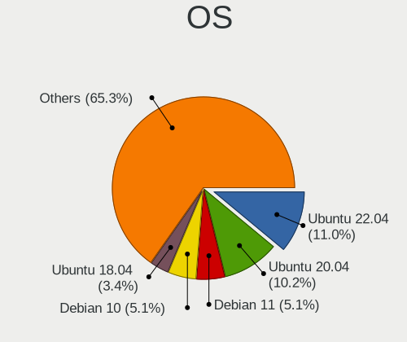
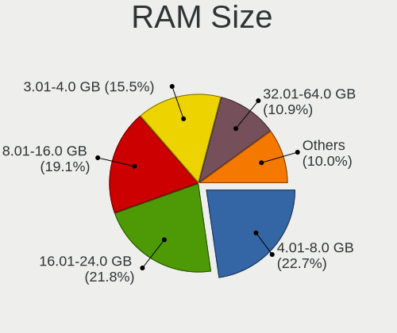
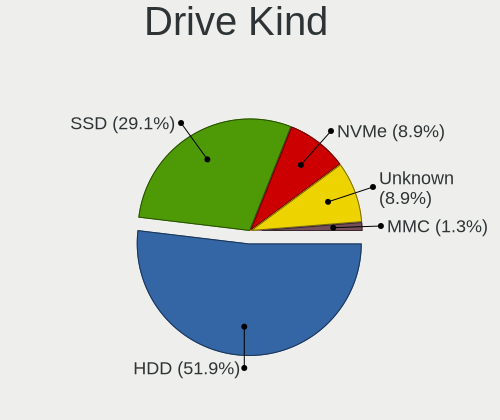
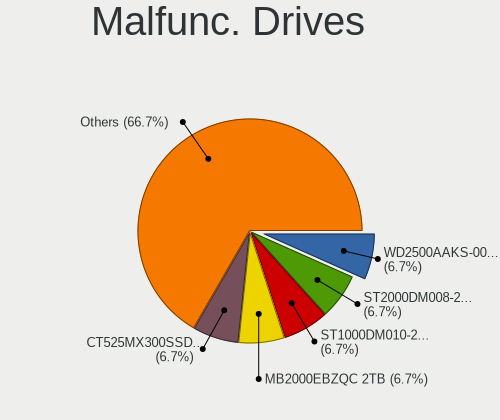
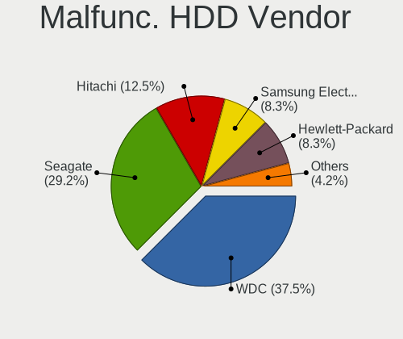
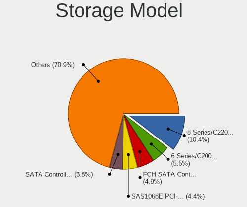
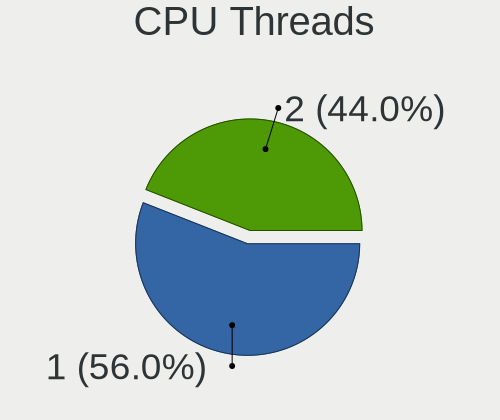
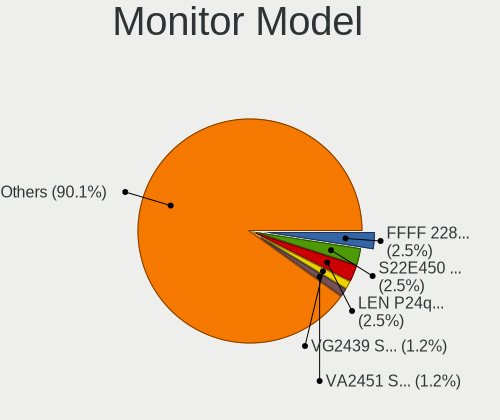
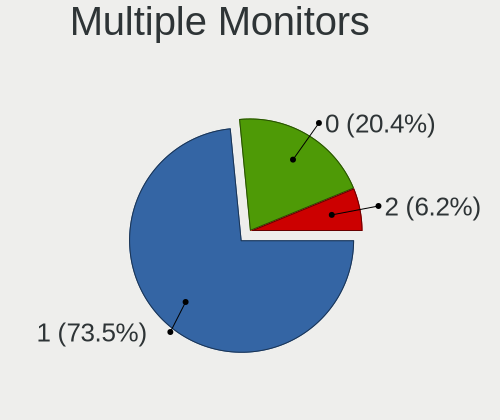
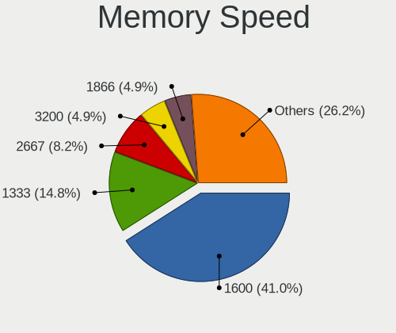

Linux in Pakistan - Tested Hardware & Statistics (Desktops)
-----------------------------------------------------------

A project to collect tested hardware configurations for Linux in Pakistan.

Anyone can contribute to this report by the [hw-probe](https://github.com/linuxhw/hw-probe) tool:

    sudo -E hw-probe -all -upload

Please contribute! Especially if your hardware is rare.

Contents
--------

* [ Test Cases ](#test-cases)

* [ System ](#system)
  - [ OS                       ](#os)
  - [ OS Family                ](#os-family)
  - [ Kernel                   ](#kernel)
  - [ Kernel Family            ](#kernel-family)
  - [ Kernel Major Ver.        ](#kernel-major-ver)
  - [ Arch                     ](#arch)
  - [ DE                       ](#de)
  - [ Display Server           ](#display-server)
  - [ Display Manager          ](#display-manager)
  - [ OS Lang                  ](#os-lang)
  - [ Boot Mode                ](#boot-mode)
  - [ Filesystem               ](#filesystem)
  - [ Part. scheme             ](#part-scheme)
  - [ Dual Boot with Linux/BSD ](#dual-boot-with-linuxbsd)
  - [ Dual Boot (Win)          ](#dual-boot-win)

* [ Board ](#board)
  - [ Vendor                   ](#vendor)
  - [ Model                    ](#model)
  - [ Model Family             ](#model-family)
  - [ MFG Year                 ](#mfg-year)
  - [ Form Factor              ](#form-factor)
  - [ Secure Boot              ](#secure-boot)
  - [ Coreboot                 ](#coreboot)
  - [ RAM Size                 ](#ram-size)
  - [ RAM Used                 ](#ram-used)
  - [ Total Drives             ](#total-drives)
  - [ Has CD-ROM               ](#has-cd-rom)
  - [ Has Ethernet             ](#has-ethernet)
  - [ Has WiFi                 ](#has-wifi)
  - [ Has Bluetooth            ](#has-bluetooth)

* [ Location ](#location)
  - [ Country                  ](#country)
  - [ City                     ](#city)

* [ Drives ](#drives)
  - [ Drive Vendor             ](#drive-vendor)
  - [ Drive Model              ](#drive-model)
  - [ HDD Vendor               ](#hdd-vendor)
  - [ SSD Vendor               ](#ssd-vendor)
  - [ Drive Kind               ](#drive-kind)
  - [ Drive Connector          ](#drive-connector)
  - [ Drive Size               ](#drive-size)
  - [ Space Total              ](#space-total)
  - [ Space Used               ](#space-used)
  - [ Malfunc. Drives          ](#malfunc-drives)
  - [ Malfunc. Drive Vendor    ](#malfunc-drive-vendor)
  - [ Malfunc. HDD Vendor      ](#malfunc-hdd-vendor)
  - [ Malfunc. Drive Kind      ](#malfunc-drive-kind)
  - [ Failed Drives            ](#failed-drives)
  - [ Failed Drive Vendor      ](#failed-drive-vendor)
  - [ Drive Status             ](#drive-status)

* [ Storage controller ](#storage-controller)
  - [ Storage Vendor           ](#storage-vendor)
  - [ Storage Model            ](#storage-model)
  - [ Storage Kind             ](#storage-kind)

* [ Processor ](#processor)
  - [ CPU Vendor               ](#cpu-vendor)
  - [ CPU Model                ](#cpu-model)
  - [ CPU Model Family         ](#cpu-model-family)
  - [ CPU Cores                ](#cpu-cores)
  - [ CPU Sockets              ](#cpu-sockets)
  - [ CPU Threads              ](#cpu-threads)
  - [ CPU Op-Modes             ](#cpu-op-modes)
  - [ CPU Microcode            ](#cpu-microcode)
  - [ CPU Microarch            ](#cpu-microarch)

* [ Graphics ](#graphics)
  - [ GPU Vendor               ](#gpu-vendor)
  - [ GPU Model                ](#gpu-model)
  - [ GPU Combo                ](#gpu-combo)
  - [ GPU Driver               ](#gpu-driver)
  - [ GPU Memory               ](#gpu-memory)

* [ Monitor ](#monitor)
  - [ Monitor Vendor           ](#monitor-vendor)
  - [ Monitor Model            ](#monitor-model)
  - [ Monitor Resolution       ](#monitor-resolution)
  - [ Monitor Diagonal         ](#monitor-diagonal)
  - [ Monitor Width            ](#monitor-width)
  - [ Aspect Ratio             ](#aspect-ratio)
  - [ Monitor Area             ](#monitor-area)
  - [ Pixel Density            ](#pixel-density)
  - [ Multiple Monitors        ](#multiple-monitors)

* [ Network ](#network)
  - [ Net Controller Vendor    ](#net-controller-vendor)
  - [ Net Controller Model     ](#net-controller-model)
  - [ Wireless Vendor          ](#wireless-vendor)
  - [ Wireless Model           ](#wireless-model)
  - [ Ethernet Vendor          ](#ethernet-vendor)
  - [ Ethernet Model           ](#ethernet-model)
  - [ Net Controller Kind      ](#net-controller-kind)
  - [ Used Controller          ](#used-controller)
  - [ NICs                     ](#nics)
  - [ IPv6                     ](#ipv6)

* [ Bluetooth ](#bluetooth)
  - [ Bluetooth Vendor         ](#bluetooth-vendor)
  - [ Bluetooth Model          ](#bluetooth-model)

* [ Sound ](#sound)
  - [ Sound Vendor             ](#sound-vendor)
  - [ Sound Model              ](#sound-model)

* [ Memory ](#memory)
  - [ Memory Vendor            ](#memory-vendor)
  - [ Memory Model             ](#memory-model)
  - [ Memory Kind              ](#memory-kind)
  - [ Memory Form Factor       ](#memory-form-factor)
  - [ Memory Size              ](#memory-size)
  - [ Memory Speed             ](#memory-speed)

* [ Printers & scanners ](#printers--scanners)
  - [ Printer Vendor           ](#printer-vendor)
  - [ Printer Model            ](#printer-model)
  - [ Scanner Vendor           ](#scanner-vendor)
  - [ Scanner Model            ](#scanner-model)

* [ Camera ](#camera)
  - [ Camera Vendor            ](#camera-vendor)
  - [ Camera Model             ](#camera-model)

* [ Security ](#security)
  - [ Fingerprint Vendor       ](#fingerprint-vendor)
  - [ Fingerprint Model        ](#fingerprint-model)
  - [ Chipcard Vendor          ](#chipcard-vendor)
  - [ Chipcard Model           ](#chipcard-model)

* [ Unsupported ](#unsupported)
  - [ Unsupported Devices      ](#unsupported-devices)
  - [ Unsupported Device Types ](#unsupported-device-types)

Test Cases
----------

Total: 101

| Vendor   | Model                       | Probe                                                      | Date         |
|----------|-----------------------------|------------------------------------------------------------|--------------|
| Quanta   | 2ABB 101                    | [3d241d58b9](https://linux-hardware.org/?probe=3d241d58b9) | Jul 13, 2022 |
| Gigabyte | A520M S2H                   | [52aab7f65b](https://linux-hardware.org/?probe=52aab7f65b) | Jul 12, 2022 |
| ASUSTek  | TUF Gaming B550-PLUS WIF... | [44db6036ce](https://linux-hardware.org/?probe=44db6036ce) | Jul 08, 2022 |
| Gigabyte | A520M S2H                   | [094c3f1e98](https://linux-hardware.org/?probe=094c3f1e98) | Jun 24, 2022 |
| HP       | 339A                        | [a20191b759](https://linux-hardware.org/?probe=a20191b759) | Jun 23, 2022 |
| HP       | 18E7                        | [f2d50ba3c2](https://linux-hardware.org/?probe=f2d50ba3c2) | Jun 13, 2022 |
| ASUSTek  | STRIX B250H GAMING          | [9f28088790](https://linux-hardware.org/?probe=9f28088790) | Jun 01, 2022 |
| HP       | 1495                        | [9ec1730693](https://linux-hardware.org/?probe=9ec1730693) | May 11, 2022 |
| Lenovo   | SDK0E50510 WIN              | [07526b3b20](https://linux-hardware.org/?probe=07526b3b20) | May 10, 2022 |
| HP       | 3396                        | [bd2e5eb69c](https://linux-hardware.org/?probe=bd2e5eb69c) | Apr 29, 2022 |
| HP       | 3396                        | [705baf56a1](https://linux-hardware.org/?probe=705baf56a1) | Apr 29, 2022 |
| HP       | 3396                        | [2c07ec89d4](https://linux-hardware.org/?probe=2c07ec89d4) | Apr 17, 2022 |
| HP       | 87D6 SMVB                   | [57d44d9705](https://linux-hardware.org/?probe=57d44d9705) | Apr 03, 2022 |
| HP       | 87D6 SMVB                   | [e70c6e6d89](https://linux-hardware.org/?probe=e70c6e6d89) | Apr 03, 2022 |
| Dell     | 0HR330                      | [9e351420b6](https://linux-hardware.org/?probe=9e351420b6) | Mar 04, 2022 |
| Gigabyte | A520M S2H                   | [06db14c491](https://linux-hardware.org/?probe=06db14c491) | Mar 01, 2022 |
| Dell     | 0HR330                      | [7e4c13a9bd](https://linux-hardware.org/?probe=7e4c13a9bd) | Mar 01, 2022 |
| Dell     | 0HR330                      | [3533cd70af](https://linux-hardware.org/?probe=3533cd70af) | Feb 26, 2022 |
| Dell     | 0HR330                      | [e587783731](https://linux-hardware.org/?probe=e587783731) | Feb 26, 2022 |
| HP       | 8717                        | [d5d2ee0ab5](https://linux-hardware.org/?probe=d5d2ee0ab5) | Feb 18, 2022 |
| HP       | 8061                        | [f721051d60](https://linux-hardware.org/?probe=f721051d60) | Feb 11, 2022 |
| HP       | 8717                        | [97d99714a1](https://linux-hardware.org/?probe=97d99714a1) | Feb 10, 2022 |
| Dell     | 0DR845                      | [daa833f06d](https://linux-hardware.org/?probe=daa833f06d) | Jan 08, 2022 |
| HP       | 0B3Ch HP P/N                | [2805378159](https://linux-hardware.org/?probe=2805378159) | Dec 10, 2021 |
| Lenovo   | ThinkStation D30 4223CC9    | [0784c5596b](https://linux-hardware.org/?probe=0784c5596b) | Dec 04, 2021 |
| Dell     | 0VHRW1 A03                  | [ebfaaee6ef](https://linux-hardware.org/?probe=ebfaaee6ef) | Dec 04, 2021 |
| Lenovo   | ThinkStation D30 4223CC9    | [50a026d588](https://linux-hardware.org/?probe=50a026d588) | Dec 02, 2021 |
| Dell     | 0VHRW1 A03                  | [19fd4c2057](https://linux-hardware.org/?probe=19fd4c2057) | Nov 30, 2021 |
| Lenovo   | ThinkStation D30 4223CC9    | [7493408721](https://linux-hardware.org/?probe=7493408721) | Nov 29, 2021 |
| Dell     | 0VHRW1 A03                  | [637bba1c58](https://linux-hardware.org/?probe=637bba1c58) | Nov 29, 2021 |
| Dell     | 06FW8P A02                  | [555032936f](https://linux-hardware.org/?probe=555032936f) | Nov 28, 2021 |
| Shuttle  | FS81                        | [ac6138c9d7](https://linux-hardware.org/?probe=ac6138c9d7) | Nov 19, 2021 |
| Shuttle  | FS81                        | [d889090212](https://linux-hardware.org/?probe=d889090212) | Nov 18, 2021 |
| HP       | 0AECh D                     | [7d8a81315d](https://linux-hardware.org/?probe=7d8a81315d) | Nov 11, 2021 |
| Dell     | 06FW8P A02                  | [72f1028535](https://linux-hardware.org/?probe=72f1028535) | Nov 09, 2021 |
| Dell     | 06FW8P A02                  | [e43d36b3cf](https://linux-hardware.org/?probe=e43d36b3cf) | Nov 09, 2021 |
| ASUSTek  | PRIME B550-PLUS             | [98ddca21d9](https://linux-hardware.org/?probe=98ddca21d9) | Nov 06, 2021 |
| HP       | 0AECh D                     | [cd2f6268cf](https://linux-hardware.org/?probe=cd2f6268cf) | Oct 28, 2021 |
| Dell     | 06FW8P A02                  | [2f188b606a](https://linux-hardware.org/?probe=2f188b606a) | Oct 25, 2021 |
| Dell     | 0XPDFK A01                  | [0e66d5fd62](https://linux-hardware.org/?probe=0e66d5fd62) | Oct 16, 2021 |
| HP       | 0AECh D                     | [415146d6ec](https://linux-hardware.org/?probe=415146d6ec) | Oct 07, 2021 |
| Dell     | 06FW8P A02                  | [06efedbf24](https://linux-hardware.org/?probe=06efedbf24) | Oct 07, 2021 |
| Dell     | 06FW8P A02                  | [029b85826d](https://linux-hardware.org/?probe=029b85826d) | Sep 27, 2021 |
| HP       | 0AECh D                     | [202ada3fc3](https://linux-hardware.org/?probe=202ada3fc3) | Sep 23, 2021 |
| HP       | 3047h                       | [356ad972a7](https://linux-hardware.org/?probe=356ad972a7) | Sep 22, 2021 |
| HP       | 1587h                       | [5447d2e6c3](https://linux-hardware.org/?probe=5447d2e6c3) | Sep 12, 2021 |
| Unknown  | Unknown                     | [321a93dff9](https://linux-hardware.org/?probe=321a93dff9) | Sep 07, 2021 |
| Shuttle  | FS81                        | [9a98a31681](https://linux-hardware.org/?probe=9a98a31681) | Sep 06, 2021 |
| Dell     | 09KPNV A01                  | [7e939d9f5f](https://linux-hardware.org/?probe=7e939d9f5f) | Aug 20, 2021 |
| Lenovo   | MAHOBAY NOK                 | [921bde522e](https://linux-hardware.org/?probe=921bde522e) | Jul 31, 2021 |
| Gigabyte | Z590 UD AC                  | [7e8e35538a](https://linux-hardware.org/?probe=7e8e35538a) | Jul 26, 2021 |
| Lenovo   | MAHOBAY NOK                 | [00614fd705](https://linux-hardware.org/?probe=00614fd705) | Jul 23, 2021 |
| Lenovo   | MAHOBAY NOK                 | [37924533d9](https://linux-hardware.org/?probe=37924533d9) | Jul 23, 2021 |
| Gigabyte | Z590 UD AC                  | [4fc5079d7e](https://linux-hardware.org/?probe=4fc5079d7e) | Jul 20, 2021 |
| Lenovo   | ThinkCentre M70e 0830F2U    | [8dad962f2f](https://linux-hardware.org/?probe=8dad962f2f) | Jul 09, 2021 |
| HP       | 158A                        | [1da50908cf](https://linux-hardware.org/?probe=1da50908cf) | Jun 10, 2021 |
| Dell     | 042P49 A00                  | [2d9b300bd3](https://linux-hardware.org/?probe=2d9b300bd3) | May 13, 2021 |
| Lenovo   | MAHOBAY NOK                 | [5a9b9278df](https://linux-hardware.org/?probe=5a9b9278df) | Apr 26, 2021 |
| Dell     | 06FW8P A01                  | [08f4c825cc](https://linux-hardware.org/?probe=08f4c825cc) | Apr 25, 2021 |
| Lenovo   | MAHOBAY NOK                 | [3423651b5d](https://linux-hardware.org/?probe=3423651b5d) | Apr 23, 2021 |
| Dell     | 0VHRW1 A03                  | [bc7c3f8c4d](https://linux-hardware.org/?probe=bc7c3f8c4d) | Apr 23, 2021 |
| Lenovo   | ThinkStation D30 4223CC9    | [8d7a62ce1a](https://linux-hardware.org/?probe=8d7a62ce1a) | Apr 20, 2021 |
| Dell     | 06FW8P A02                  | [583acd1f2e](https://linux-hardware.org/?probe=583acd1f2e) | Apr 20, 2021 |
| Dell     | 06FW8P A01                  | [a0b4b692ff](https://linux-hardware.org/?probe=a0b4b692ff) | Apr 20, 2021 |
| Shuttle  | FS81                        | [14e78cfe43](https://linux-hardware.org/?probe=14e78cfe43) | Apr 20, 2021 |
| Dell     | 0GU083 A00                  | [03e87a4ada](https://linux-hardware.org/?probe=03e87a4ada) | Mar 20, 2021 |
| Dell     | 0C27VV A01                  | [2ab353f0c6](https://linux-hardware.org/?probe=2ab353f0c6) | Mar 06, 2021 |
| Lenovo   | MAHOBAY NOK                 | [67ea005277](https://linux-hardware.org/?probe=67ea005277) | Feb 24, 2021 |
| Lenovo   | MAHOBAY 31900003 STD        | [845f5a30c2](https://linux-hardware.org/?probe=845f5a30c2) | Feb 13, 2021 |
| Lenovo   | ThinkCentre M58 7373C51     | [3e79476403](https://linux-hardware.org/?probe=3e79476403) | Jan 27, 2021 |
| HP       | 3047h                       | [8b50e12296](https://linux-hardware.org/?probe=8b50e12296) | Jan 07, 2021 |
| HP       | 3047h                       | [b65caab721](https://linux-hardware.org/?probe=b65caab721) | Nov 24, 2020 |
| Dell     | 07N90W A01                  | [127c1a4946](https://linux-hardware.org/?probe=127c1a4946) | Oct 29, 2020 |
| HP       | 8433 11                     | [1d000792d8](https://linux-hardware.org/?probe=1d000792d8) | Sep 03, 2020 |
| Dell     | 0D6H9T A01                  | [1f914ddd57](https://linux-hardware.org/?probe=1f914ddd57) | Aug 31, 2020 |
| Dell     | 0HY9JP A02                  | [19795140c8](https://linux-hardware.org/?probe=19795140c8) | Aug 22, 2020 |
| Dell     | 0HY9JP A02                  | [b739a3410a](https://linux-hardware.org/?probe=b739a3410a) | Aug 22, 2020 |
| Dell     | 0PP150 A00                  | [a990cf0ce7](https://linux-hardware.org/?probe=a990cf0ce7) | Aug 21, 2020 |
| HP       | 0B4Ch D                     | [4053256264](https://linux-hardware.org/?probe=4053256264) | Aug 10, 2020 |
| Dell     | 0DR845                      | [e4ff6acb83](https://linux-hardware.org/?probe=e4ff6acb83) | Aug 01, 2020 |
| Dell     | 0DR845                      | [4b9fbd7a8f](https://linux-hardware.org/?probe=4b9fbd7a8f) | Aug 01, 2020 |
| HP       | 1589                        | [d142f54a38](https://linux-hardware.org/?probe=d142f54a38) | Jul 11, 2020 |
| Gigabyte | B450M S2H                   | [4e6a9e5117](https://linux-hardware.org/?probe=4e6a9e5117) | Jun 12, 2020 |
| Gigabyte | B250M-D3H-CF                | [f74cf1545a](https://linux-hardware.org/?probe=f74cf1545a) | May 21, 2020 |
| Dell     | 0GU083 A00                  | [a31c9c5f4f](https://linux-hardware.org/?probe=a31c9c5f4f) | May 05, 2020 |
| Gigabyte | Z170X-Gaming 7              | [e3400fb2b7](https://linux-hardware.org/?probe=e3400fb2b7) | May 04, 2020 |
| Dell     | 0PP150 A00                  | [51f69f1430](https://linux-hardware.org/?probe=51f69f1430) | May 02, 2020 |
| Lenovo   | ThinkCentre M57 6072W2A     | [d42ad893b6](https://linux-hardware.org/?probe=d42ad893b6) | May 01, 2020 |
| Lenovo   | ThinkCentre M57 6072W2A     | [366d3d0483](https://linux-hardware.org/?probe=366d3d0483) | May 01, 2020 |
| Dell     | 0PP150 A00                  | [f224ee60e5](https://linux-hardware.org/?probe=f224ee60e5) | Apr 30, 2020 |
| Dell     | 0XPDFK A01                  | [9434f7214c](https://linux-hardware.org/?probe=9434f7214c) | Mar 16, 2020 |
| Dell     | 0XPDFK A01                  | [4a53b5e634](https://linux-hardware.org/?probe=4a53b5e634) | Mar 11, 2020 |
| Dell     | 054KM3 A01                  | [857f976c7f](https://linux-hardware.org/?probe=857f976c7f) | Jan 29, 2020 |
| HP       | 1497                        | [fe24ec7591](https://linux-hardware.org/?probe=fe24ec7591) | Jan 28, 2020 |
| Dell     | 054KM3 A01                  | [f682ad8814](https://linux-hardware.org/?probe=f682ad8814) | Jan 21, 2020 |
| Acer     | Veriton X6620G v1.0         | [e921d3af77](https://linux-hardware.org/?probe=e921d3af77) | Dec 13, 2019 |
| ASUSTek  | Q87M-E                      | [01f990ea56](https://linux-hardware.org/?probe=01f990ea56) | Oct 19, 2019 |
| HP       | 304Ah                       | [4f72bfd1f5](https://linux-hardware.org/?probe=4f72bfd1f5) | May 13, 2019 |
| Dell     | 054KM3 A01                  | [144815a4e9](https://linux-hardware.org/?probe=144815a4e9) | Jan 15, 2019 |
| Dell     | 054KM3 A01                  | [f83bcddf2e](https://linux-hardware.org/?probe=f83bcddf2e) | Jan 08, 2019 |
| Dell     | 054KM3 A01                  | [404e699144](https://linux-hardware.org/?probe=404e699144) | Jan 08, 2019 |

System
------

OS
--

Installed operating systems

| Name              | Desktops | Percent |
|-------------------|----------|---------|
| Ubuntu 20.04      | 11       | 15.28%  |
| Debian 11         | 6        | 8.33%   |
| Debian 10         | 6        | 8.33%   |
| Ubuntu 18.04      | 4        | 5.56%   |
| OpenMandriva 4.3  | 4        | 5.56%   |
| Zorin 15          | 3        | 4.17%   |
| Ubuntu 21.04      | 3        | 4.17%   |
| Arch              | 3        | 4.17%   |
| Ubuntu 22.04      | 2        | 2.78%   |
| Ubuntu 20.10      | 2        | 2.78%   |
| Pop!_OS 20.04     | 2        | 2.78%   |
| OpenMandriva 4.2  | 2        | 2.78%   |
| Manjaro           | 2        | 2.78%   |
| Linux Mint 19.3   | 2        | 2.78%   |
| Fedora 34         | 2        | 2.78%   |
| Ubuntu MATE 18.04 | 1        | 1.39%   |
| ROSA 12.2         | 1        | 1.39%   |
| Pop!_OS 21.04     | 1        | 1.39%   |
| Parrot 4.10       | 1        | 1.39%   |
| LMDE 4            | 1        | 1.39%   |
| Linux Mint 20.3   | 1        | 1.39%   |
| Linux Mint 20.2   | 1        | 1.39%   |
| Linux Mint 19.2   | 1        | 1.39%   |
| Kubuntu 21.10     | 1        | 1.39%   |
| Kubuntu 20.04     | 1        | 1.39%   |
| KDE neon 20.04    | 1        | 1.39%   |
| Kali 2022.2       | 1        | 1.39%   |
| Kali 2022.1       | 1        | 1.39%   |
| Fedora 36         | 1        | 1.39%   |
| Fedora 32         | 1        | 1.39%   |
| CentOS 7          | 1        | 1.39%   |
| BlackPanther 18.1 | 1        | 1.39%   |
| Alpine 3.11.2     | 1        | 1.39%   |

OS Family
---------

OS without a version

| Name         | Desktops | Percent |
|--------------|----------|---------|
| Ubuntu       | 21       | 30.88%  |
| Debian       | 9        | 13.24%  |
| OpenMandriva | 6        | 8.82%   |
| Linux Mint   | 5        | 7.35%   |
| Fedora       | 4        | 5.88%   |
| Zorin        | 3        | 4.41%   |
| Pop!_OS      | 3        | 4.41%   |
| Arch         | 3        | 4.41%   |
| Manjaro      | 2        | 2.94%   |
| Kubuntu      | 2        | 2.94%   |
| Kali         | 2        | 2.94%   |
| Ubuntu MATE  | 1        | 1.47%   |
| ROSA         | 1        | 1.47%   |
| Parrot       | 1        | 1.47%   |
| LMDE         | 1        | 1.47%   |
| KDE neon     | 1        | 1.47%   |
| CentOS       | 1        | 1.47%   |
| BlackPanther | 1        | 1.47%   |
| Alpine       | 1        | 1.47%   |

Kernel
------

Version of the Linux kernel

| Version                            | Desktops | Percent |
|------------------------------------|----------|---------|
| 5.4.106-1-pve                      | 5        | 6.76%   |
| 5.16.7-desktop-1omv4003            | 4        | 5.41%   |
| 5.8.0-44-generic                   | 2        | 2.7%    |
| 5.4.0-7642-generic                 | 2        | 2.7%    |
| 5.4.0-28-generic                   | 2        | 2.7%    |
| 5.13.19-1-pve                      | 2        | 2.7%    |
| 5.13.0-40-generic                  | 2        | 2.7%    |
| 5.10.14-desktop-1omv4002           | 2        | 2.7%    |
| 5.0.0-32-generic                   | 2        | 2.7%    |
| 5.8.3-2-MANJARO                    | 1        | 1.35%   |
| 5.8.0-63-generic                   | 1        | 1.35%   |
| 5.8.0-59-generic                   | 1        | 1.35%   |
| 5.8.0-43-generic                   | 1        | 1.35%   |
| 5.8.0-40-generic                   | 1        | 1.35%   |
| 5.7.10-201.fc32.x86_64             | 1        | 1.35%   |
| 5.7.0-2parrot2-amd64               | 1        | 1.35%   |
| 5.4.41-1-pve                       | 1        | 1.35%   |
| 5.4.36-1-MANJARO                   | 1        | 1.35%   |
| 5.4.0-88-generic                   | 1        | 1.35%   |
| 5.4.0-52-generic                   | 1        | 1.35%   |
| 5.4.0-42-generic                   | 1        | 1.35%   |
| 5.4.0-26-generic                   | 1        | 1.35%   |
| 5.4.0-109-generic                  | 1        | 1.35%   |
| 5.4.0-100-generic                  | 1        | 1.35%   |
| 5.3.7-arch1-1-ARCH                 | 1        | 1.35%   |
| 5.18.9-200.fc36.x86_64             | 1        | 1.35%   |
| 5.18.0-kali2-amd64                 | 1        | 1.35%   |
| 5.16.15-arch1-1                    | 1        | 1.35%   |
| 5.15.0-kali3-amd64                 | 1        | 1.35%   |
| 5.15.0-41-generic                  | 1        | 1.35%   |
| 5.15.0-39-generic                  | 1        | 1.35%   |
| 5.15.0-33-generic                  | 1        | 1.35%   |
| 5.13.4-200.fc34.x86_64             | 1        | 1.35%   |
| 5.13.14-200.fc34.x86_64            | 1        | 1.35%   |
| 5.13.0-051300-generic              | 1        | 1.35%   |
| 5.11.22-7-pve                      | 1        | 1.35%   |
| 5.11.22-6-pve                      | 1        | 1.35%   |
| 5.11.22-5-pve                      | 1        | 1.35%   |
| 5.11.22-4-pve                      | 1        | 1.35%   |
| 5.11.0-7620-generic                | 1        | 1.35%   |
| 5.11.0-44-generic                  | 1        | 1.35%   |
| 5.11.0-41-generic                  | 1        | 1.35%   |
| 5.11.0-40-generic                  | 1        | 1.35%   |
| 5.11.0-38-generic                  | 1        | 1.35%   |
| 5.11.0-37-generic                  | 1        | 1.35%   |
| 5.11.0-18-generic                  | 1        | 1.35%   |
| 5.11.0-16-generic                  | 1        | 1.35%   |
| 5.10.74-generic-2rosa2021.1-x86_64 | 1        | 1.35%   |
| 5.10.61-1-lts                      | 1        | 1.35%   |
| 5.0.0-37-generic                   | 1        | 1.35%   |
| 5.0.0-23-generic                   | 1        | 1.35%   |
| 4.19.0-18-amd64                    | 1        | 1.35%   |
| 4.18.16-desktop-1bP                | 1        | 1.35%   |
| 4.18.0-21-generic                  | 1        | 1.35%   |
| 4.18.0-18-generic                  | 1        | 1.35%   |
| 4.15.0-88-generic                  | 1        | 1.35%   |
| 4.15.0-72-generic                  | 1        | 1.35%   |
| 4.15.0-43-generic                  | 1        | 1.35%   |
| 3.10.105                           | 1        | 1.35%   |
| 3.10.0-1127.13.1.el7.x86_64        | 1        | 1.35%   |

Kernel Family
-------------

Linux kernel without a distro release

| Version  | Desktops | Percent |
|----------|----------|---------|
| 5.4.0    | 10       | 13.89%  |
| 5.11.0   | 7        | 9.72%   |
| 5.8.0    | 6        | 8.33%   |
| 5.4.106  | 5        | 6.94%   |
| 5.16.7   | 4        | 5.56%   |
| 5.11.22  | 4        | 5.56%   |
| 5.0.0    | 4        | 5.56%   |
| 5.15.0   | 3        | 4.17%   |
| 5.13.0   | 3        | 4.17%   |
| 4.15.0   | 3        | 4.17%   |
| 5.13.19  | 2        | 2.78%   |
| 5.10.14  | 2        | 2.78%   |
| 4.18.0   | 2        | 2.78%   |
| 5.8.3    | 1        | 1.39%   |
| 5.7.10   | 1        | 1.39%   |
| 5.7.0    | 1        | 1.39%   |
| 5.4.41   | 1        | 1.39%   |
| 5.4.36   | 1        | 1.39%   |
| 5.3.7    | 1        | 1.39%   |
| 5.18.9   | 1        | 1.39%   |
| 5.18.0   | 1        | 1.39%   |
| 5.16.15  | 1        | 1.39%   |
| 5.13.4   | 1        | 1.39%   |
| 5.13.14  | 1        | 1.39%   |
| 5.10.74  | 1        | 1.39%   |
| 5.10.61  | 1        | 1.39%   |
| 4.19.0   | 1        | 1.39%   |
| 4.18.16  | 1        | 1.39%   |
| 3.10.105 | 1        | 1.39%   |
| 3.10.0   | 1        | 1.39%   |

Kernel Major Ver.
-----------------

Linux kernel major version

| Version | Desktops | Percent |
|---------|----------|---------|
| 5.4     | 17       | 23.61%  |
| 5.11    | 11       | 15.28%  |
| 5.8     | 7        | 9.72%   |
| 5.13    | 7        | 9.72%   |
| 5.16    | 5        | 6.94%   |
| 5.10    | 4        | 5.56%   |
| 5.0     | 4        | 5.56%   |
| 5.15    | 3        | 4.17%   |
| 4.18    | 3        | 4.17%   |
| 4.15    | 3        | 4.17%   |
| 5.7     | 2        | 2.78%   |
| 5.18    | 2        | 2.78%   |
| 3.10    | 2        | 2.78%   |
| 5.3     | 1        | 1.39%   |
| 4.19    | 1        | 1.39%   |

Arch
----

OS architecture (x86_64, i586, etc.)

| Name   | Desktops | Percent |
|--------|----------|---------|
| x86_64 | 63       | 98.44%  |
| i686   | 1        | 1.56%   |

DE
--

Desktop Environment

| Name       | Desktops | Percent |
|------------|----------|---------|
| GNOME      | 30       | 44.78%  |
| Unknown    | 15       | 22.39%  |
| KDE5       | 10       | 14.93%  |
| X-Cinnamon | 4        | 5.97%   |
| MATE       | 4        | 5.97%   |
| KDE        | 2        | 2.99%   |
| KDE4       | 1        | 1.49%   |
| i3         | 1        | 1.49%   |

Display Server
--------------

X11 or Wayland

| Name    | Desktops | Percent |
|---------|----------|---------|
| X11     | 48       | 72.73%  |
| Tty     | 7        | 10.61%  |
| Unknown | 6        | 9.09%   |
| Wayland | 5        | 7.58%   |

Display Manager
---------------

SDDM, LightDM, etc.

| Name    | Desktops | Percent |
|---------|----------|---------|
| Unknown | 42       | 64.62%  |
| SDDM    | 10       | 15.38%  |
| GDM3    | 6        | 9.23%   |
| GDM     | 5        | 7.69%   |
| TDM     | 1        | 1.54%   |
| LightDM | 1        | 1.54%   |

OS Lang
-------

Language

| Lang    | Desktops | Percent |
|---------|----------|---------|
| en_US   | 53       | 81.54%  |
| en_GB   | 6        | 9.23%   |
| Unknown | 5        | 7.69%   |
| en_PK   | 1        | 1.54%   |

Boot Mode
---------

EFI or BIOS

| Mode | Desktops | Percent |
|------|----------|---------|
| BIOS | 47       | 70.15%  |
| EFI  | 20       | 29.85%  |

Filesystem
----------

Type of filesystem

| Type    | Desktops | Percent |
|---------|----------|---------|
| Ext4    | 51       | 72.86%  |
| Zfs     | 6        | 8.57%   |
| Overlay | 6        | 8.57%   |
| Btrfs   | 5        | 7.14%   |
| Xfs     | 1        | 1.43%   |
| Unknown | 1        | 1.43%   |

Part. scheme
------------

Scheme of partitioning

| Type    | Desktops | Percent |
|---------|----------|---------|
| Unknown | 40       | 61.54%  |
| GPT     | 20       | 30.77%  |
| MBR     | 5        | 7.69%   |

Dual Boot with Linux/BSD
------------------------

Hosting more than one Linux/BSD

| Dual boot | Desktops | Percent |
|-----------|----------|---------|
| No        | 55       | 80.88%  |
| Yes       | 13       | 19.12%  |

Dual Boot (Win)
---------------

Hosting Linux and Windows

| Dual boot | Desktops | Percent |
|-----------|----------|---------|
| No        | 41       | 61.19%  |
| Yes       | 26       | 38.81%  |

Board
-----

Vendor
------

Motherboard manufacturer

| Name                | Desktops | Percent |
|---------------------|----------|---------|
| Dell                | 22       | 34.38%  |
| Hewlett-Packard     | 19       | 29.69%  |
| Lenovo              | 7        | 10.94%  |
| Gigabyte Technology | 7        | 10.94%  |
| ASUSTek Computer    | 4        | 6.25%   |
| Shuttle             | 2        | 3.13%   |
| Quanta              | 1        | 1.56%   |
| Acer                | 1        | 1.56%   |
| Unknown             | 1        | 1.56%   |

Model
-----

Motherboard model

| Name                                       | Desktops | Percent |
|--------------------------------------------|----------|---------|
| Dell Precision WorkStation T7500           | 4        | 6.25%   |
| Dell Precision WorkStation T3500           | 3        | 4.69%   |
| Shuttle DS81D                              | 2        | 3.13%   |
| HP ProDesk 400 G7 Microtower PC            | 2        | 3.13%   |
| Gigabyte Z590 UD AC                        | 2        | 3.13%   |
| Gigabyte A520M S2H                         | 2        | 3.13%   |
| Dell XPS 630i                              | 2        | 3.13%   |
| Dell Vostro 430                            | 2        | 3.13%   |
| Dell Precision WorkStation 490             | 2        | 3.13%   |
| Dell OptiPlex 755                          | 2        | 3.13%   |
| Quanta TouchSmart 9300 Elite All-in-One PC | 1        | 1.56%   |
| Lenovo ThinkStation D30 4223CC9            | 1        | 1.56%   |
| Lenovo ThinkCentre M93z 10ACS12B00         | 1        | 1.56%   |
| Lenovo ThinkCentre M82 27423K1             | 1        | 1.56%   |
| Lenovo ThinkCentre M70e 0830F2U            | 1        | 1.56%   |
| Lenovo ThinkCentre M58 7373C51             | 1        | 1.56%   |
| Lenovo ThinkCentre M57 6072W2A             | 1        | 1.56%   |
| Lenovo H520 10094                          | 1        | 1.56%   |
| HP Z800 Workstation                        | 1        | 1.56%   |
| HP Z620 Workstation                        | 1        | 1.56%   |
| HP Z420 Workstation                        | 1        | 1.56%   |
| HP Z400 Workstation                        | 1        | 1.56%   |
| HP Z210 Workstation                        | 1        | 1.56%   |
| HP ProDesk 600 G1 SFF                      | 1        | 1.56%   |
| HP ProDesk 400 G3 MT                       | 1        | 1.56%   |
| HP Pavilion Gaming Desktop TG01-1xxx       | 1        | 1.56%   |
| HP Pavilion Desktop 590-p0xxx              | 1        | 1.56%   |
| HP Compaq Pro 6300 SFF                     | 1        | 1.56%   |
| HP Compaq Elite 8300 CMT                   | 1        | 1.56%   |
| HP Compaq dx7510 MT                        | 1        | 1.56%   |
| HP Compaq 8200 Elite MT PC                 | 1        | 1.56%   |
| HP Compaq 8100 Elite SFF PC                | 1        | 1.56%   |
| HP Compaq 6200 Pro MT PC                   | 1        | 1.56%   |
| HP Compaq 6005 Pro SFF PC                  | 1        | 1.56%   |
| HP Compaq 6005 Pro MT PC                   | 1        | 1.56%   |
| Gigabyte Z170X-Gaming 7                    | 1        | 1.56%   |
| Gigabyte B450M S2H                         | 1        | 1.56%   |
| Gigabyte B250M-D3H                         | 1        | 1.56%   |
| Dell Vostro 230                            | 1        | 1.56%   |
| Dell Precision T7600                       | 1        | 1.56%   |
| Dell OptiPlex 990                          | 1        | 1.56%   |
| Dell OptiPlex 790                          | 1        | 1.56%   |
| Dell OptiPlex 780                          | 1        | 1.56%   |
| Dell OptiPlex 745                          | 1        | 1.56%   |
| Dell OptiPlex 3010                         | 1        | 1.56%   |
| ASUS TUF Gaming B550-PLUS WIFI II          | 1        | 1.56%   |
| ASUS STRIX B250H GAMING                    | 1        | 1.56%   |
| ASUS Q87M-XA                               | 1        | 1.56%   |
| ASUS PRIME B550-PLUS                       | 1        | 1.56%   |
| Acer Veriton X6620G                        | 1        | 1.56%   |
| Unknown                                    | 1        | 1.56%   |

Model Family
------------

Motherboard model prefix

| Name                  | Desktops | Percent |
|-----------------------|----------|---------|
| Dell Precision        | 10       | 15.63%  |
| HP Compaq             | 8        | 12.5%   |
| Dell OptiPlex         | 7        | 10.94%  |
| Lenovo ThinkCentre    | 5        | 7.81%   |
| HP ProDesk            | 4        | 6.25%   |
| Dell Vostro           | 3        | 4.69%   |
| Shuttle DS81D         | 2        | 3.13%   |
| HP Pavilion           | 2        | 3.13%   |
| Gigabyte Z590         | 2        | 3.13%   |
| Gigabyte A520M        | 2        | 3.13%   |
| Dell XPS              | 2        | 3.13%   |
| Quanta TouchSmart     | 1        | 1.56%   |
| Lenovo ThinkStation   | 1        | 1.56%   |
| Lenovo H520           | 1        | 1.56%   |
| HP Z800               | 1        | 1.56%   |
| HP Z620               | 1        | 1.56%   |
| HP Z420               | 1        | 1.56%   |
| HP Z400               | 1        | 1.56%   |
| HP Z210               | 1        | 1.56%   |
| Gigabyte Z170X-Gaming | 1        | 1.56%   |
| Gigabyte B450M        | 1        | 1.56%   |
| Gigabyte B250M-D3H    | 1        | 1.56%   |
| ASUS TUF              | 1        | 1.56%   |
| ASUS STRIX            | 1        | 1.56%   |
| ASUS Q87M-XA          | 1        | 1.56%   |
| ASUS PRIME            | 1        | 1.56%   |
| Acer Veriton          | 1        | 1.56%   |
| Unknown               | 1        | 1.56%   |

MFG Year
--------

Motherboard manufacture year

| Year    | Desktops | Percent |
|---------|----------|---------|
| 2011    | 10       | 15.63%  |
| 2012    | 8        | 12.5%   |
| 2010    | 7        | 10.94%  |
| 2009    | 6        | 9.38%   |
| 2021    | 5        | 7.81%   |
| 2020    | 4        | 6.25%   |
| 2018    | 4        | 6.25%   |
| 2007    | 4        | 6.25%   |
| 2014    | 3        | 4.69%   |
| 2013    | 3        | 4.69%   |
| 2008    | 3        | 4.69%   |
| 2017    | 2        | 3.13%   |
| 2016    | 2        | 3.13%   |
| 2006    | 2        | 3.13%   |
| Unknown | 1        | 1.56%   |

Form Factor
-----------

Physical design of the computer

| Name    | Desktops | Percent |
|---------|----------|---------|
| Desktop | 64       | 100%    |

Secure Boot
-----------

Enabled or disabled

| State    | Desktops | Percent |
|----------|----------|---------|
| Disabled | 64       | 100%    |

Coreboot
--------

Have coreboot on board

| Used | Desktops | Percent |
|------|----------|---------|
| No   | 64       | 100%    |

RAM Size
--------

Total RAM memory

| Size in GB      | Desktops | Percent |
|-----------------|----------|---------|
| 3.01-4.0        | 14       | 21.54%  |
| 16.01-24.0      | 13       | 20%     |
| 4.01-8.0        | 12       | 18.46%  |
| 8.01-16.0       | 10       | 15.38%  |
| 64.01-256.0     | 7        | 10.77%  |
| 32.01-64.0      | 6        | 9.23%   |
| More than 256.0 | 1        | 1.54%   |
| 24.01-32.0      | 1        | 1.54%   |
| 1.01-2.0        | 1        | 1.54%   |

RAM Used
--------

Used RAM memory

| Used GB     | Desktops | Percent |
|-------------|----------|---------|
| 1.01-2.0    | 24       | 32.88%  |
| 2.01-3.0    | 22       | 30.14%  |
| 3.01-4.0    | 8        | 10.96%  |
| 8.01-16.0   | 7        | 9.59%   |
| 4.01-8.0    | 6        | 8.22%   |
| 16.01-24.0  | 2        | 2.74%   |
| 32.01-64.0  | 1        | 1.37%   |
| 64.01-256.0 | 1        | 1.37%   |
| 0.51-1.0    | 1        | 1.37%   |
| Unknown     | 1        | 1.37%   |

Total Drives
------------

Number of drives on board

| Drives | Desktops | Percent |
|--------|----------|---------|
| 2      | 23       | 32.39%  |
| 1      | 21       | 29.58%  |
| 3      | 11       | 15.49%  |
| 6      | 5        | 7.04%   |
| 5      | 3        | 4.23%   |
| 4      | 3        | 4.23%   |
| 13     | 1        | 1.41%   |
| 11     | 1        | 1.41%   |
| 10     | 1        | 1.41%   |
| 9      | 1        | 1.41%   |
| 8      | 1        | 1.41%   |

Has CD-ROM
----------

Has CD-ROM on board

| Presented | Desktops | Percent |
|-----------|----------|---------|
| No        | 34       | 53.13%  |
| Yes       | 30       | 46.88%  |

Has Ethernet
------------

Has Ethernet on board

| Presented | Desktops | Percent |
|-----------|----------|---------|
| Yes       | 64       | 100%    |

Has WiFi
--------

Has WiFi module

| Presented | Desktops | Percent |
|-----------|----------|---------|
| No        | 34       | 51.52%  |
| Yes       | 32       | 48.48%  |

Has Bluetooth
-------------

Has Bluetooth module

| Presented | Desktops | Percent |
|-----------|----------|---------|
| No        | 48       | 70.59%  |
| Yes       | 20       | 29.41%  |

Location
--------

Country
-------

Geographic location (country)

| Country  | Desktops | Percent |
|----------|----------|---------|
| Pakistan | 64       | 100%    |

City
----

Geographic location (city)

| City           | Desktops | Percent |
|----------------|----------|---------|
| Lahore         | 24       | 35.82%  |
| Karachi        | 13       | 19.4%   |
| Islamabad      | 11       | 16.42%  |
| Rawalpindi     | 3        | 4.48%   |
| Peshawar       | 2        | 2.99%   |
| Kamoke         | 2        | 2.99%   |
| Tando Allahyar | 1        | 1.49%   |
| Sialkot        | 1        | 1.49%   |
| Sheikhupura    | 1        | 1.49%   |
| Sargodha       | 1        | 1.49%   |
| Sahiwal        | 1        | 1.49%   |
| Mardan         | 1        | 1.49%   |
| Larkana        | 1        | 1.49%   |
| Hyderabad      | 1        | 1.49%   |
| Gujranwala     | 1        | 1.49%   |
| Faisalabad     | 1        | 1.49%   |
| Burewala       | 1        | 1.49%   |
| Abbottabad     | 1        | 1.49%   |

Drives
------

Drive Vendor
------------

Hard drive vendors

| Vendor              | Desktops | Drives | Percent |
|---------------------|----------|--------|---------|
| Seagate             | 36       | 72     | 25.9%   |
| WDC                 | 22       | 35     | 15.83%  |
| Samsung Electronics | 17       | 21     | 12.23%  |
| Hitachi             | 11       | 16     | 7.91%   |
| Hewlett-Packard     | 6        | 15     | 4.32%   |
| Hajaan              | 6        | 8      | 4.32%   |
| LITEONIT            | 4        | 6      | 2.88%   |
| LITEON              | 4        | 5      | 2.88%   |
| Toshiba             | 3        | 3      | 2.16%   |
| SK hynix            | 3        | 3      | 2.16%   |
| Maxtor              | 3        | 3      | 2.16%   |
| LaCie               | 3        | 3      | 2.16%   |
| HS-SSD-E100         | 3        | 3      | 2.16%   |
| Crucial             | 3        | 3      | 2.16%   |
| Lexar               | 2        | 4      | 1.44%   |
| Intel               | 2        | 2      | 1.44%   |
| ZTE                 | 1        | 1      | 0.72%   |
| Transcend           | 1        | 1      | 0.72%   |
| Silicon Motion      | 1        | 1      | 0.72%   |
| SanDisk             | 1        | 1      | 0.72%   |
| Micron Technology   | 1        | 2      | 0.72%   |
| MARSHAL             | 1        | 1      | 0.72%   |
| KingFast            | 1        | 2      | 0.72%   |
| IBM-ESXS            | 1        | 3      | 0.72%   |
| HGST                | 1        | 1      | 0.72%   |
| Gigabyte Technology | 1        | 2      | 0.72%   |
| A-DATA Technology   | 1        | 1      | 0.72%   |

Drive Model
-----------

Hard drive models

| Model                                 | Desktops | Percent |
|---------------------------------------|----------|---------|
| Seagate ST3000NXCLAR3000 3TB          | 7        | 4.17%   |
| HP MB2000EBZQC 2TB                    | 6        | 3.57%   |
| Hajaan SSD 256G                       | 6        | 3.57%   |
| Samsung SSD PM830 2.5 7mm 256GB       | 4        | 2.38%   |
| Seagate ST8000DM004-2CX188 8TB        | 3        | 1.79%   |
| Seagate ST6000NM0024 6TB              | 3        | 1.79%   |
| LITEONIT LCS-128M6S 2.5 7mm 128GB SSD | 3        | 1.79%   |
| LITEON CV1-CC128-11 2.5 7mm 128GB     | 3        | 1.79%   |
| LaCie Rugged USB-C 4TB                | 3        | 1.79%   |
| HS-SSD-E100 128G                      | 3        | 1.79%   |
| SK hynix SC300 M.2 2280 256GB SSD     | 2        | 1.19%   |
| Seagate ST500DM002-1BD142 500GB       | 2        | 1.19%   |
| Seagate ST3500414CS 500GB             | 2        | 1.19%   |
| Seagate ST3250318AS 250GB             | 2        | 1.19%   |
| Seagate ST2000VM003-1ET164 2TB        | 2        | 1.19%   |
| Seagate ST2000DM008-2FR102 2TB        | 2        | 1.19%   |
| Seagate ST2000DM008-2FR1              | 2        | 1.19%   |
| Seagate ST1000DM003-1SB102 1TB        | 2        | 1.19%   |
| Samsung NVMe SSD Drive 500GB          | 2        | 1.19%   |
| Samsung MZ7PD128HCFV-000H1 128GB SSD  | 2        | 1.19%   |
| Maxtor STM380215AS 80GB               | 2        | 1.19%   |
| Lexar 256GB SSD                       | 2        | 1.19%   |
| Hitachi HUA723020ALA640 2TB           | 2        | 1.19%   |
| Crucial CT525MX300SSD1 528GB          | 2        | 1.19%   |
| ZTE MMC Storage 942MB                 | 1        | 0.6%    |
| WDC WDS120G2G0A-00JH30 120GB SSD      | 1        | 0.6%    |
| WDC WD800JD-60LUA0 80GB               | 1        | 0.6%    |
| WDC WD800JD-00LSA0 80GB               | 1        | 0.6%    |
| WDC WD800ADFS-75SLR2 80GB             | 1        | 0.6%    |
| WDC WD800AAJS-75M0A0 80GB             | 1        | 0.6%    |
| WDC WD800AAJS-60M0A0 80GB             | 1        | 0.6%    |
| WDC WD7500AACS-00D6B0 752GB           | 1        | 0.6%    |
| WDC WD5000AAKX-75U6AA0 500GB          | 1        | 0.6%    |
| WDC WD5000AAKX-001CA0 500GB           | 1        | 0.6%    |
| WDC WD5000AACS-61M6B2 500GB           | 1        | 0.6%    |
| WDC WD5000AACS-00G8B1 500GB           | 1        | 0.6%    |
| WDC WD3200AAKS-61L9A0 320GB           | 1        | 0.6%    |
| WDC WD3200AAKS-00L9A0 320GB           | 1        | 0.6%    |
| WDC WD2500HHTZ-04N21V0 250GB          | 1        | 0.6%    |
| WDC WD2500AAKX-60U6AA0 250GB          | 1        | 0.6%    |
| WDC WD2500AAKS-00F0A0 250GB           | 1        | 0.6%    |
| WDC WD2500AAJS-75M0A0 250GB           | 1        | 0.6%    |
| WDC WD2500AAJS-75B4A0 250GB           | 1        | 0.6%    |
| WDC WD20EZRZ-00Z5HB0 2TB              | 1        | 0.6%    |
| WDC WD20EADS-22R6B0..... 2TB          | 1        | 0.6%    |
| WDC WD1600AAJS-75WAA0 160GB           | 1        | 0.6%    |
| WDC WD1600AAJS-75B4A0 160GB           | 1        | 0.6%    |
| WDC WD1600AAJS-22L7A0 160GB           | 1        | 0.6%    |
| WDC WD1600AAJS-00Z4A0 160GB           | 1        | 0.6%    |
| WDC WD10SPZX-75Z10T3 1TB              | 1        | 0.6%    |
| WDC WD10PURZ-85U8XY0 1TB              | 1        | 0.6%    |
| WDC WD10EZRX-00L4HB0 1TB              | 1        | 0.6%    |
| WDC WD10EURX-73C57Y0 1TB              | 1        | 0.6%    |
| WDC WD10EADS-00L5B1 1TB               | 1        | 0.6%    |
| WDC WD BLUE 128GB SSD                 | 1        | 0.6%    |
| Transcend TS120GSSD220S 120GB         | 1        | 0.6%    |
| Toshiba THNSNJ128GCSU 128GB SSD       | 1        | 0.6%    |
| Toshiba MG03SCA300 3TB                | 1        | 0.6%    |
| Toshiba DT01ACA100 1TB                | 1        | 0.6%    |
| SK hynix SC300 M.2 2280 256 256GB SSD | 1        | 0.6%    |

HDD Vendor
----------

Hard disk drive vendors

| Vendor              | Desktops | Drives | Percent |
|---------------------|----------|--------|---------|
| Seagate             | 36       | 72     | 42.86%  |
| WDC                 | 21       | 32     | 25%     |
| Hitachi             | 11       | 16     | 13.1%   |
| Hewlett-Packard     | 6        | 15     | 7.14%   |
| Samsung Electronics | 3        | 3      | 3.57%   |
| Maxtor              | 3        | 3      | 3.57%   |
| Toshiba             | 2        | 2      | 2.38%   |
| MARSHAL             | 1        | 1      | 1.19%   |
| HGST                | 1        | 1      | 1.19%   |

SSD Vendor
----------

Solid state drive vendors

| Vendor              | Desktops | Drives | Percent |
|---------------------|----------|--------|---------|
| Samsung Electronics | 11       | 14     | 25.58%  |
| Hajaan              | 6        | 8      | 13.95%  |
| LITEONIT            | 4        | 6      | 9.3%    |
| LITEON              | 4        | 5      | 9.3%    |
| SK hynix            | 3        | 3      | 6.98%   |
| Crucial             | 3        | 3      | 6.98%   |
| WDC                 | 2        | 3      | 4.65%   |
| Lexar               | 2        | 4      | 4.65%   |
| Intel               | 2        | 2      | 4.65%   |
| Transcend           | 1        | 1      | 2.33%   |
| Toshiba             | 1        | 1      | 2.33%   |
| SanDisk             | 1        | 1      | 2.33%   |
| Micron Technology   | 1        | 2      | 2.33%   |
| Gigabyte Technology | 1        | 2      | 2.33%   |
| A-DATA Technology   | 1        | 1      | 2.33%   |

Drive Kind
----------

HDD or SSD

| Kind    | Desktops | Drives | Percent |
|---------|----------|--------|---------|
| HDD     | 55       | 145    | 60.44%  |
| SSD     | 23       | 56     | 25.27%  |
| Unknown | 8        | 12     | 8.79%   |
| NVMe    | 5        | 5      | 5.49%   |

Drive Connector
---------------

SATA, SAS, NVMe, etc.

| Type | Desktops | Drives | Percent |
|------|----------|--------|---------|
| SATA | 60       | 190    | 80%     |
| SAS  | 10       | 23     | 13.33%  |
| NVMe | 5        | 5      | 6.67%   |

Drive Size
----------

Size of hard drive

| Size in TB | Desktops | Drives | Percent |
|------------|----------|--------|---------|
| 0.01-0.5   | 52       | 116    | 55.32%  |
| 0.51-1.0   | 19       | 21     | 20.21%  |
| 1.01-2.0   | 11       | 33     | 11.7%   |
| 2.01-3.0   | 7        | 14     | 7.45%   |
| 4.01-10.0  | 3        | 15     | 3.19%   |
| 3.01-4.0   | 2        | 2      | 2.13%   |

Space Total
-----------

Amount of disk space available on the file system

| Size in GB     | Desktops | Percent |
|----------------|----------|---------|
| 101-250        | 16       | 22.54%  |
| 51-100         | 14       | 19.72%  |
| 251-500        | 10       | 14.08%  |
| Unknown        | 7        | 9.86%   |
| 1001-2000      | 6        | 8.45%   |
| 501-1000       | 6        | 8.45%   |
| 21-50          | 5        | 7.04%   |
| 1-20           | 5        | 7.04%   |
| More than 3000 | 1        | 1.41%   |
| 2001-3000      | 1        | 1.41%   |

Space Used
----------

Amount of used disk space

| Used GB   | Desktops | Percent |
|-----------|----------|---------|
| 1-20      | 29       | 40.85%  |
| 21-50     | 10       | 14.08%  |
| 101-250   | 8        | 11.27%  |
| Unknown   | 7        | 9.86%   |
| 251-500   | 6        | 8.45%   |
| 51-100    | 6        | 8.45%   |
| 501-1000  | 4        | 5.63%   |
| 1001-2000 | 1        | 1.41%   |

Malfunc. Drives
---------------

Drive models with a malfunction

| Model                             | Desktops | Drives | Percent |
|-----------------------------------|----------|--------|---------|
| Seagate ST2000DM008-2FR1          | 2        | 2      | 10.53%  |
| Crucial CT525MX300SSD1 528GB      | 2        | 2      | 10.53%  |
| WDC WD5000AAKX-75U6AA0 500GB      | 1        | 1      | 5.26%   |
| WDC WD2500HHTZ-04N21V0 250GB      | 1        | 1      | 5.26%   |
| WDC WD2500AAKS-00F0A0 250GB       | 1        | 1      | 5.26%   |
| WDC WD1600AAJS-22L7A0 160GB       | 1        | 1      | 5.26%   |
| Seagate ST3500418AS 500GB         | 1        | 1      | 5.26%   |
| Seagate ST3160215AS 160GB         | 1        | 1      | 5.26%   |
| Seagate ST2000DM008-2FR102 2TB    | 1        | 2      | 5.26%   |
| Seagate ST1000DM010-2EP102 1TB    | 1        | 1      | 5.26%   |
| Samsung Electronics SP2004C 200GB | 1        | 1      | 5.26%   |
| Samsung Electronics HD080HJ/ 80GB | 1        | 1      | 5.26%   |
| Intel SSDSA2M080G2GN 73GB         | 1        | 1      | 5.26%   |
| Hitachi HUA723020ALA640 2TB       | 1        | 2      | 5.26%   |
| Hitachi HDS721680PLA380 80GB      | 1        | 1      | 5.26%   |
| Hitachi HDS721050CLA660 500GB     | 1        | 1      | 5.26%   |
| Hewlett-Packard MB2000EBZQC 2TB   | 1        | 2      | 5.26%   |

Malfunc. Drive Vendor
---------------------

Vendors of faulty drives

| Vendor              | Desktops | Drives | Percent |
|---------------------|----------|--------|---------|
| Seagate             | 5        | 7      | 27.78%  |
| WDC                 | 4        | 4      | 22.22%  |
| Hitachi             | 3        | 4      | 16.67%  |
| Samsung Electronics | 2        | 2      | 11.11%  |
| Crucial             | 2        | 2      | 11.11%  |
| Intel               | 1        | 1      | 5.56%   |
| Hewlett-Packard     | 1        | 2      | 5.56%   |

Malfunc. HDD Vendor
-------------------

Vendors of faulty HDD drives

| Vendor              | Desktops | Drives | Percent |
|---------------------|----------|--------|---------|
| Seagate             | 5        | 7      | 33.33%  |
| WDC                 | 4        | 4      | 26.67%  |
| Hitachi             | 3        | 4      | 20%     |
| Samsung Electronics | 2        | 2      | 13.33%  |
| Hewlett-Packard     | 1        | 2      | 6.67%   |

Malfunc. Drive Kind
-------------------

Kinds of faulty drives

| Kind | Desktops | Drives | Percent |
|------|----------|--------|---------|
| HDD  | 9        | 19     | 75%     |
| SSD  | 3        | 3      | 25%     |

Failed Drives
-------------

Failed drive models

Zero info for selected period =(

Failed Drive Vendor
-------------------

Failed drive vendors

Zero info for selected period =(

Drive Status
------------

Number of failed and malfunc. drives

| Status   | Desktops | Drives | Percent |
|----------|----------|--------|---------|
| Detected | 46       | 110    | 58.23%  |
| Works    | 22       | 86     | 27.85%  |
| Malfunc  | 11       | 22     | 13.92%  |

Storage controller
------------------

Storage Vendor
--------------

Storage controller vendors

| Vendor                    | Desktops | Percent |
|---------------------------|----------|---------|
| Intel                     | 53       | 66.25%  |
| AMD                       | 9        | 11.25%  |
| LSI Logic / Symbios Logic | 8        | 10%     |
| Samsung Electronics       | 4        | 5%      |
| Nvidia                    | 2        | 2.5%    |
| Silicon Motion            | 1        | 1.25%   |
| Broadcom / LSI            | 1        | 1.25%   |
| ASMedia Technology        | 1        | 1.25%   |
| Adaptec                   | 1        | 1.25%   |

Storage Model
-------------

Storage controller models

| Model                                                                          | Desktops | Percent |
|--------------------------------------------------------------------------------|----------|---------|
| LSI Logic / Symbios Logic SAS1068E PCI-Express Fusion-MPT SAS                  | 8        | 6.78%   |
| Intel 6 Series/C200 Series Chipset Family 6 port Desktop SATA AHCI Controller  | 7        | 5.93%   |
| Intel SATA Controller [RAID mode]                                              | 5        | 4.24%   |
| Intel 82801JI (ICH10 Family) SATA AHCI Controller                              | 5        | 4.24%   |
| Intel 8 Series/C220 Series Chipset Family 6-port SATA Controller 1 [AHCI mode] | 5        | 4.24%   |
| LSI Logic / Symbios Logic SAS2008 PCI-Express Fusion-MPT SAS-2 [Falcon]        | 4        | 3.39%   |
| AMD FCH SATA Controller [AHCI mode]                                            | 4        | 3.39%   |
| AMD 500 Series Chipset SATA Controller                                         | 4        | 3.39%   |
| Intel C602 chipset 4-Port SATA Storage Control Unit                            | 3        | 2.54%   |
| Intel C600/X79 series chipset 6-Port SATA AHCI Controller                      | 3        | 2.54%   |
| Intel 7 Series/C210 Series Chipset Family 6-port SATA Controller [AHCI mode]   | 3        | 2.54%   |
| Samsung NVMe SSD Controller SM981/PM981/PM983                                  | 2        | 1.69%   |
| Nvidia MCP51 Serial ATA Controller                                             | 2        | 1.69%   |
| Nvidia MCP51 IDE                                                               | 2        | 1.69%   |
| LSI Logic / Symbios Logic SAS1064ET PCI-Express Fusion-MPT SAS                 | 2        | 1.69%   |
| LSI Logic / Symbios Logic MegaRAID SAS 2008 [Falcon]                           | 2        | 1.69%   |
| Intel Q170/Q150/B150/H170/H110/Z170/CM236 Chipset SATA Controller [AHCI Mode]  | 2        | 1.69%   |
| Intel NM10/ICH7 Family SATA Controller [IDE mode]                              | 2        | 1.69%   |
| Intel Comet Lake SATA AHCI Controller                                          | 2        | 1.69%   |
| Intel C600/X79 series chipset IDE-r Controller                                 | 2        | 1.69%   |
| Intel 82Q35 Express PT IDER Controller                                         | 2        | 1.69%   |
| Intel 82801JI (ICH10 Family) 4 port SATA IDE Controller #1                     | 2        | 1.69%   |
| Intel 82801JI (ICH10 Family) 2 port SATA IDE Controller #2                     | 2        | 1.69%   |
| Intel 82801JD/DO (ICH10 Family) SATA AHCI Controller                           | 2        | 1.69%   |
| Intel 82801IR/IO/IH (ICH9R/DO/DH) 6 port SATA Controller [AHCI mode]           | 2        | 1.69%   |
| Intel 631xESB/632xESB/3100 Chipset SATA IDE Controller                         | 2        | 1.69%   |
| Intel 631xESB/632xESB IDE Controller                                           | 2        | 1.69%   |
| Intel 6 Series/C200 Series Chipset Family IDE-r Controller                     | 2        | 1.69%   |
| Intel 500 Series Chipset Family SATA AHCI Controller                           | 2        | 1.69%   |
| Intel 5 Series/3400 Series Chipset 6 port SATA AHCI Controller                 | 2        | 1.69%   |
| Intel 4 Series Chipset PT IDER Controller                                      | 2        | 1.69%   |
| Intel 200 Series PCH SATA controller [AHCI mode]                               | 2        | 1.69%   |
| AMD SB7x0/SB8x0/SB9x0 SATA Controller [AHCI mode]                              | 2        | 1.69%   |
| AMD 400 Series Chipset SATA Controller                                         | 2        | 1.69%   |
| Silicon Motion SM2263EN/SM2263XT SSD Controller                                | 1        | 0.85%   |
| Samsung NVMe SSD Controller SM961/PM961/SM963                                  | 1        | 0.85%   |
| Samsung NVMe SSD Controller 980                                                | 1        | 0.85%   |
| LSI Logic / Symbios Logic MegaRAID SAS 2108 [Liberator]                        | 1        | 0.85%   |
| Intel C600/X79 series chipset SATA RAID Controller                             | 1        | 0.85%   |
| Intel C600/X79 series chipset Dual 4-Port SATA Storage Control Unit            | 1        | 0.85%   |
| Intel C600/X79 series chipset 4-Port SATA IDE Controller                       | 1        | 0.85%   |
| Intel C600/X79 series chipset 2-Port SATA IDE Controller                       | 1        | 0.85%   |
| Intel 82801JD/DO (ICH10 Family) 4-port SATA IDE Controller                     | 1        | 0.85%   |
| Intel 82801JD/DO (ICH10 Family) 2-port SATA IDE Controller                     | 1        | 0.85%   |
| Intel 82801IR/IO/IH (ICH9R/DO/DH) 4 port SATA Controller [IDE mode]            | 1        | 0.85%   |
| Intel 82801I (ICH9 Family) 2 port SATA Controller [IDE mode]                   | 1        | 0.85%   |
| Intel 82801HR/HO/HH (ICH8R/DO/DH) 2 port SATA Controller [IDE mode]            | 1        | 0.85%   |
| Intel 82801H (ICH8 Family) 4 port SATA Controller [IDE mode]                   | 1        | 0.85%   |
| Intel 82801G (ICH7 Family) IDE Controller                                      | 1        | 0.85%   |
| Intel 7 Series/C210 Series Chipset Family 4-port SATA Controller [IDE mode]    | 1        | 0.85%   |
| Intel 7 Series/C210 Series Chipset Family 2-port SATA Controller [IDE mode]    | 1        | 0.85%   |
| Broadcom / LSI SAS1068E PCI-Express Fusion-MPT SAS                             | 1        | 0.85%   |
| ASMedia ASM1062 Serial ATA Controller                                          | 1        | 0.85%   |
| AMD 300 Series Chipset SATA Controller                                         | 1        | 0.85%   |
| Adaptec Serial ATA II RAID 1430SA                                              | 1        | 0.85%   |

Storage Kind
------------

Kind of storage controller (IDE, SATA, NVMe, SAS, ...)

| Kind | Desktops | Percent |
|------|----------|---------|
| SATA | 46       | 46.94%  |
| IDE  | 20       | 20.41%  |
| RAID | 12       | 12.24%  |
| SCSI | 9        | 9.18%   |
| SAS  | 6        | 6.12%   |
| NVMe | 5        | 5.1%    |

Processor
---------

CPU Vendor
----------

Processor vendors

| Vendor | Desktops | Percent |
|--------|----------|---------|
| Intel  | 55       | 85.94%  |
| AMD    | 9        | 14.06%  |

CPU Model
---------

Processor models

| Model                                       | Desktops | Percent |
|---------------------------------------------|----------|---------|
| Intel Xeon CPU X5650 @ 2.67GHz              | 5        | 7.81%   |
| Intel Core i5-3570 CPU @ 3.40GHz            | 3        | 4.69%   |
| Intel Core 2 Duo CPU E7500 @ 2.93GHz        | 3        | 4.69%   |
| Intel Xeon CPU 5160 @ 3.00GHz               | 2        | 3.13%   |
| Intel Core i7-10700 CPU @ 2.90GHz           | 2        | 3.13%   |
| Intel Core i5-2400 CPU @ 3.10GHz            | 2        | 3.13%   |
| Intel Core i5 CPU 650 @ 3.20GHz             | 2        | 3.13%   |
| Intel Core 2 Duo CPU E8400 @ 3.00GHz        | 2        | 3.13%   |
| Intel Celeron CPU G1850 @ 2.90GHz           | 2        | 3.13%   |
| Intel 11th Gen Core i7-11700K @ 3.60GHz     | 2        | 3.13%   |
| Intel Xeon CPU X5660 @ 2.80GHz              | 1        | 1.56%   |
| Intel Xeon CPU X5560 @ 2.80GHz              | 1        | 1.56%   |
| Intel Xeon CPU W3680 @ 3.33GHz              | 1        | 1.56%   |
| Intel Xeon CPU W3565 @ 3.20GHz              | 1        | 1.56%   |
| Intel Xeon CPU W3520 @ 2.67GHz              | 1        | 1.56%   |
| Intel Xeon CPU E5-2690 0 @ 2.90GHz          | 1        | 1.56%   |
| Intel Xeon CPU E5-2650 0 @ 2.00GHz          | 1        | 1.56%   |
| Intel Xeon CPU E5-2609 0 @ 2.40GHz          | 1        | 1.56%   |
| Intel Xeon CPU E5-1620 0 @ 3.60GHz          | 1        | 1.56%   |
| Intel Pentium Dual CPU E2180 @ 2.00GHz      | 1        | 1.56%   |
| Intel Pentium CPU G870 @ 3.10GHz            | 1        | 1.56%   |
| Intel Core i7-6700K CPU @ 4.00GHz           | 1        | 1.56%   |
| Intel Core i7-6700 CPU @ 3.40GHz            | 1        | 1.56%   |
| Intel Core i7-4790S CPU @ 3.20GHz           | 1        | 1.56%   |
| Intel Core i7-2600 CPU @ 3.40GHz            | 1        | 1.56%   |
| Intel Core i5-6500 CPU @ 3.20GHz            | 1        | 1.56%   |
| Intel Core i5-6400 CPU @ 2.70GHz            | 1        | 1.56%   |
| Intel Core i5-4570T CPU @ 2.90GHz           | 1        | 1.56%   |
| Intel Core i5-3470 CPU @ 3.20GHz            | 1        | 1.56%   |
| Intel Core i5-2500S CPU @ 2.70GHz           | 1        | 1.56%   |
| Intel Core i5-2500 CPU @ 3.30GHz            | 1        | 1.56%   |
| Intel Core i3-4130 CPU @ 3.40GHz            | 1        | 1.56%   |
| Intel Core i3-3220 CPU @ 3.30GHz            | 1        | 1.56%   |
| Intel Core i3-2120 CPU @ 3.30GHz            | 1        | 1.56%   |
| Intel Core i3 CPU 550 @ 3.20GHz             | 1        | 1.56%   |
| Intel Core 2 Quad CPU Q8400 @ 2.66GHz       | 1        | 1.56%   |
| Intel Core 2 Quad CPU Q6600 @ 2.40GHz       | 1        | 1.56%   |
| Intel Core 2 Duo CPU E8600 @ 3.33GHz        | 1        | 1.56%   |
| Intel Core 2 Duo CPU E8500 @ 3.16GHz        | 1        | 1.56%   |
| Intel Core 2 CPU 6600 @ 2.40GHz             | 1        | 1.56%   |
| AMD Ryzen 7 4700G with Radeon Graphics      | 1        | 1.56%   |
| AMD Ryzen 7 3800X 8-Core Processor          | 1        | 1.56%   |
| AMD Ryzen 7 3700X 8-Core Processor          | 1        | 1.56%   |
| AMD Ryzen 5 3600 6-Core Processor           | 1        | 1.56%   |
| AMD Ryzen 5 2600X Six-Core Processor        | 1        | 1.56%   |
| AMD Ryzen 5 2600 Six-Core Processor         | 1        | 1.56%   |
| AMD Ryzen 3 2200G with Radeon Vega Graphics | 1        | 1.56%   |
| AMD Athlon II X2 B26 Processor              | 1        | 1.56%   |
| AMD Athlon II X2 B24 Processor              | 1        | 1.56%   |

CPU Model Family
----------------

Processor model prefix

| Model              | Desktops | Percent |
|--------------------|----------|---------|
| Intel Xeon         | 16       | 25%     |
| Intel Core i5      | 13       | 20.31%  |
| Intel Core 2 Duo   | 7        | 10.94%  |
| Intel Core i7      | 6        | 9.38%   |
| Intel Core i3      | 4        | 6.25%   |
| AMD Ryzen 7        | 3        | 4.69%   |
| AMD Ryzen 5        | 3        | 4.69%   |
| Other              | 2        | 3.13%   |
| Intel Core 2 Quad  | 2        | 3.13%   |
| Intel Celeron      | 2        | 3.13%   |
| AMD Athlon II X2   | 2        | 3.13%   |
| Intel Pentium Dual | 1        | 1.56%   |
| Intel Pentium      | 1        | 1.56%   |
| Intel Core 2       | 1        | 1.56%   |
| AMD Ryzen 3        | 1        | 1.56%   |

CPU Cores
---------

Number of processor cores

| Number | Desktops | Percent |
|--------|----------|---------|
| 4      | 21       | 32.31%  |
| 2      | 21       | 32.31%  |
| 8      | 9        | 13.85%  |
| 6      | 9        | 13.85%  |
| 16     | 2        | 3.08%   |
| 12     | 2        | 3.08%   |
| 1      | 1        | 1.54%   |

CPU Sockets
-----------

Number of sockets

| Number | Desktops | Percent |
|--------|----------|---------|
| 1      | 58       | 89.23%  |
| 2      | 7        | 10.77%  |

CPU Threads
-----------

Threads per core (Hyper-Threading)

| Number | Desktops | Percent |
|--------|----------|---------|
| 1      | 34       | 53.13%  |
| 2      | 30       | 46.88%  |

CPU Op-Modes
------------

CPU Operation Modes (32-bit, 64-bit)

| Op mode        | Desktops | Percent |
|----------------|----------|---------|
| 32-bit, 64-bit | 63       | 98.44%  |
| Unknown        | 1        | 1.56%   |

CPU Microcode
-------------

Microcode number

| Number     | Desktops | Percent |
|------------|----------|---------|
| Unknown    | 19       | 27.94%  |
| 0x206a7    | 7        | 10.29%  |
| 0x206c2    | 6        | 8.82%   |
| 0x1067a    | 6        | 8.82%   |
| 0x306c3    | 4        | 5.88%   |
| 0x306a9    | 4        | 5.88%   |
| 0x6f6      | 3        | 4.41%   |
| 0x206d7    | 3        | 4.41%   |
| 0xa0655    | 2        | 2.94%   |
| 0x506e3    | 2        | 2.94%   |
| 0x106a5    | 2        | 2.94%   |
| 0x08701021 | 2        | 2.94%   |
| 0xa0671    | 1        | 1.47%   |
| 0x6fd      | 1        | 1.47%   |
| 0x6fb      | 1        | 1.47%   |
| 0x20655    | 1        | 1.47%   |
| 0x20652    | 1        | 1.47%   |
| 0x10676    | 1        | 1.47%   |
| 0x0800820d | 1        | 1.47%   |
| 0x010000b6 | 1        | 1.47%   |

CPU Microarch
-------------

Microarchitecture

| Name        | Desktops | Percent |
|-------------|----------|---------|
| SandyBridge | 11       | 17.19%  |
| Westmere    | 10       | 15.63%  |
| Penryn      | 8        | 12.5%   |
| IvyBridge   | 5        | 7.81%   |
| Haswell     | 5        | 7.81%   |
| Core        | 5        | 7.81%   |
| Zen 2       | 4        | 6.25%   |
| Skylake     | 4        | 6.25%   |
| Nehalem     | 3        | 4.69%   |
| Zen+        | 2        | 3.13%   |
| K10         | 2        | 3.13%   |
| CometLake   | 2        | 3.13%   |
| Unknown     | 2        | 3.13%   |
| Zen         | 1        | 1.56%   |

Graphics
--------

GPU Vendor
----------

Vendors of graphics cards

| Vendor | Desktops | Percent |
|--------|----------|---------|
| Nvidia | 26       | 38.81%  |
| Intel  | 24       | 35.82%  |
| AMD    | 17       | 25.37%  |

GPU Model
---------

Graphics card models

| Model                                                                       | Desktops | Percent |
|-----------------------------------------------------------------------------|----------|---------|
| Nvidia GT218 [GeForce 210]                                                  | 5        | 6.85%   |
| Intel 4 Series Chipset Integrated Graphics Controller                       | 5        | 6.85%   |
| AMD Ellesmere [Radeon RX 470/480/570/570X/580/580X/590]                     | 5        | 6.85%   |
| Nvidia GP107 [GeForce GTX 1050 Ti]                                          | 3        | 4.11%   |
| Intel Xeon E3-1200 v3/4th Gen Core Processor Integrated Graphics Controller | 3        | 4.11%   |
| Intel Xeon E3-1200 v2/3rd Gen Core processor Graphics Controller            | 3        | 4.11%   |
| Nvidia GT218 [GeForce 310]                                                  | 2        | 2.74%   |
| Nvidia GM206 [GeForce GTX 960]                                              | 2        | 2.74%   |
| Nvidia GF119 [GeForce GT 610]                                               | 2        | 2.74%   |
| Nvidia GF108 [GeForce GT 730]                                               | 2        | 2.74%   |
| Intel RocketLake-S GT1 [UHD Graphics 750]                                   | 2        | 2.74%   |
| Intel HD Graphics 530                                                       | 2        | 2.74%   |
| Intel Core Processor Integrated Graphics Controller                         | 2        | 2.74%   |
| Intel CometLake-S GT2 [UHD Graphics 630]                                    | 2        | 2.74%   |
| Intel 82Q35 Express Integrated Graphics Controller                          | 2        | 2.74%   |
| Intel 2nd Generation Core Processor Family Integrated Graphics Controller   | 2        | 2.74%   |
| AMD Oland [Radeon HD 8570 / R5 430 OEM / R7 240/340 / Radeon 520 OEM]       | 2        | 2.74%   |
| Nvidia TU102 [GeForce RTX 2080 Ti]                                          | 1        | 1.37%   |
| Nvidia GP106 [GeForce GTX 1060 6GB]                                         | 1        | 1.37%   |
| Nvidia GP106 [GeForce GTX 1060 3GB]                                         | 1        | 1.37%   |
| Nvidia GM107GL [Quadro K620]                                                | 1        | 1.37%   |
| Nvidia GM107 [GeForce GTX 750 Ti]                                           | 1        | 1.37%   |
| Nvidia GK107 [GeForce GTX 650]                                              | 1        | 1.37%   |
| Nvidia GK104 [GeForce GTX 690]                                              | 1        | 1.37%   |
| Nvidia GF119 [NVS 315]                                                      | 1        | 1.37%   |
| Nvidia GF119 [NVS 310]                                                      | 1        | 1.37%   |
| Nvidia GF108M [GeForce GT 425M]                                             | 1        | 1.37%   |
| Nvidia GF108GL [Quadro 600]                                                 | 1        | 1.37%   |
| Nvidia G98 [GeForce 8400 GS Rev. 2]                                         | 1        | 1.37%   |
| Nvidia G92 [GeForce 8800 GT]                                                | 1        | 1.37%   |
| Nvidia G71GL [Quadro FX 1500]                                               | 1        | 1.37%   |
| Intel 4th Generation Core Processor Family Integrated Graphics Controller   | 1        | 1.37%   |
| AMD RV730 GL [FirePro V3750]                                                | 1        | 1.37%   |
| AMD RV710 [Radeon HD 4550]                                                  | 1        | 1.37%   |
| AMD RV670 [Radeon HD 3870]                                                  | 1        | 1.37%   |
| AMD RV610 [Radeon HD 2400 PRO]                                              | 1        | 1.37%   |
| AMD RV370 [Radeon X300]                                                     | 1        | 1.37%   |
| AMD RV370 [Radeon X300 SE]                                                  | 1        | 1.37%   |
| AMD RS880 [Radeon HD 4200]                                                  | 1        | 1.37%   |
| AMD Renoir                                                                  | 1        | 1.37%   |
| AMD Redwood XT GL [FirePro V4800]                                           | 1        | 1.37%   |
| AMD Raven Ridge [Radeon Vega Series / Radeon Vega Mobile Series]            | 1        | 1.37%   |
| AMD Lexa PRO [Radeon 540/540X/550/550X / RX 540X/550/550X]                  | 1        | 1.37%   |
| AMD Caicos XT [Radeon HD 7470/8470 / R5 235/310 OEM]                        | 1        | 1.37%   |

GPU Combo
---------

Combinations of graphics cards

| Name           | Desktops | Percent |
|----------------|----------|---------|
| 1 x Nvidia     | 23       | 34.33%  |
| 1 x Intel      | 23       | 34.33%  |
| 1 x AMD        | 14       | 20.9%   |
| Other          | 2        | 2.99%   |
| 2 x AMD        | 2        | 2.99%   |
| 2 x Nvidia     | 1        | 1.49%   |
| Intel + Nvidia | 1        | 1.49%   |
| AMD + Nvidia   | 1        | 1.49%   |

GPU Driver
----------

Free vs proprietary

| Driver      | Desktops | Percent |
|-------------|----------|---------|
| Free        | 47       | 67.14%  |
| Proprietary | 13       | 18.57%  |
| Unknown     | 10       | 14.29%  |

GPU Memory
----------

Total video memory

| Size in GB | Desktops | Percent |
|------------|----------|---------|
| Unknown    | 42       | 61.76%  |
| 1.01-2.0   | 8        | 11.76%  |
| 0.01-0.5   | 8        | 11.76%  |
| 0.51-1.0   | 4        | 5.88%   |
| 3.01-4.0   | 3        | 4.41%   |
| 5.01-6.0   | 1        | 1.47%   |
| 2.01-3.0   | 1        | 1.47%   |
| 8.01-16.0  | 1        | 1.47%   |

Monitor
-------

Monitor Vendor
--------------

Monitor vendors

| Vendor              | Desktops | Percent |
|---------------------|----------|---------|
| Hewlett-Packard     | 16       | 34.78%  |
| Dell                | 10       | 21.74%  |
| Unknown             | 4        | 8.7%    |
| Acer                | 4        | 8.7%    |
| Samsung Electronics | 3        | 6.52%   |
| NEC Computers       | 2        | 4.35%   |
| Lenovo              | 2        | 4.35%   |
| ViewSonic           | 1        | 2.17%   |
| Philips             | 1        | 2.17%   |
| Hitachi             | 1        | 2.17%   |
| HannStar            | 1        | 2.17%   |
| Goldstar            | 1        | 2.17%   |

Monitor Model
-------------

Monitor models

| Model                                                                | Desktops | Percent |
|----------------------------------------------------------------------|----------|---------|
| Unknown LCD Monitor FFFF 2288x1287 2550x2550mm 142.0-inch            | 2        | 4%      |
| ViewSonic LCD Monitor VA2451 SERIES 1920x1080                        | 1        | 2%      |
| Unknown LCD Monitor ITE DP2VGA V221 1680x1050                        | 1        | 2%      |
| Unknown LCD Monitor DellSP2008WFP 1680x1050                          | 1        | 2%      |
| Samsung Electronics SyncMaster SAM0586 1920x1200 518x324mm 24.1-inch | 1        | 2%      |
| Samsung Electronics SMBX2240 SAM0684 1920x1080 477x268mm 21.5-inch   | 1        | 2%      |
| Samsung Electronics S24F350 SAM0D20 1920x1080 521x293mm 23.5-inch    | 1        | 2%      |
| Philips 150P PHL0814 1024x768 307x230mm 15.1-inch                    | 1        | 2%      |
| NEC Computers LCD1770NX NEC6665 1280x1024 338x270mm 17.0-inch        | 1        | 2%      |
| NEC Computers EA244WMi NEC68D6 1920x1200 519x324mm 24.1-inch         | 1        | 2%      |
| Lenovo LEN-M93z-B LEN0093 1920x1080 510x290mm 23.1-inch              | 1        | 2%      |
| Lenovo LEN T22i-10 LEN61A9 1920x1080 476x268mm 21.5-inch             | 1        | 2%      |
| Hitachi PC-DTA15AXGS HTCB88C 1024x768 304x228mm 15.0-inch            | 1        | 2%      |
| Hewlett-Packard ZR2440w HWP2956 1920x1200 518x324mm 24.1-inch        | 1        | 2%      |
| Hewlett-Packard Z22i HWP308E 1920x1080 477x268mm 21.5-inch           | 1        | 2%      |
| Hewlett-Packard TouchSmart HWP4204 1920x1080 510x287mm 23.0-inch     | 1        | 2%      |
| Hewlett-Packard M27fw FHD HPN370F 1920x1080 597x336mm 27.0-inch      | 1        | 2%      |
| Hewlett-Packard M27fw FHD HPN370E 1920x1080 597x336mm 27.0-inch      | 1        | 2%      |
| Hewlett-Packard LE2201w HWP2843 1680x1050 473x296mm 22.0-inch        | 1        | 2%      |
| Hewlett-Packard LE1901w HWP284E 1440x900 410x256mm 19.0-inch         | 1        | 2%      |
| Hewlett-Packard LE1901w HWP2842 1440x900 410x256mm 19.0-inch         | 1        | 2%      |
| Hewlett-Packard LCD Monitor ZR2740w                                  | 1        | 2%      |
| Hewlett-Packard LCD Monitor LA2206                                   | 1        | 2%      |
| Hewlett-Packard LCD Monitor L2245w 1680x1050                         | 1        | 2%      |
| Hewlett-Packard LCD Monitor 2009 3520x1080                           | 1        | 2%      |
| Hewlett-Packard LA2206 HWP2946 1920x1080 477x268mm 21.5-inch         | 1        | 2%      |
| Hewlett-Packard LA1956x HWP3021 1280x1024 376x301mm 19.0-inch        | 1        | 2%      |
| Hewlett-Packard L1955 HWP262C 1280x1024 380x300mm 19.1-inch          | 1        | 2%      |
| Hewlett-Packard E221c HWP3092 1920x1080 497x292mm 22.7-inch          | 1        | 2%      |
| Hewlett-Packard E221 HWP3060 1920x1080 496x292mm 22.7-inch           | 1        | 2%      |
| Hewlett-Packard 27es HWP3326 1920x1080 598x336mm 27.0-inch           | 1        | 2%      |
| Hewlett-Packard 24f HPN3545 1920x1080 527x296mm 23.8-inch            | 1        | 2%      |
| HannStar HP205DJB HSD3FB9 1600x900 432x240mm 19.5-inch               | 1        | 2%      |
| Goldstar ULTRAWIDE GSM76F6 3440x1440 800x335mm 34.1-inch             | 1        | 2%      |
| Dell U2413 DELF048 1920x1200 518x324mm 24.1-inch                     | 1        | 2%      |
| Dell S2409W DELA038 1920x1080 531x298mm 24.0-inch                    | 1        | 2%      |
| Dell P2311H DEL4066 1920x1080 509x286mm 23.0-inch                    | 1        | 2%      |
| Dell P2214H DELA098 1920x1080 477x268mm 21.5-inch                    | 1        | 2%      |
| Dell LCD Monitor P2214H 3640x1920                                    | 1        | 2%      |
| Dell E197FP DELA024 1280x1024 380x305mm 19.2-inch                    | 1        | 2%      |
| Dell E172FP DELA00A 1280x1024 338x270mm 17.0-inch                    | 1        | 2%      |
| Dell DEL 1908FPBLK DEL4048 1280x1024 376x301mm 19.0-inch             | 1        | 2%      |
| Dell DEL 1908FPBLK DEL4047 1280x1024 376x301mm 19.0-inch             | 1        | 2%      |
| Dell 1704FPT DEL4004 1280x1024 340x270mm 17.1-inch                   | 1        | 2%      |
| Acer V226HQL ACR0335 1920x1080 477x268mm 21.5-inch                   | 1        | 2%      |
| Acer LCD Monitor X34 3440x1440                                       | 1        | 2%      |
| Acer LCD Monitor B273H 1920x1080                                     | 1        | 2%      |
| Acer H226HQL ACR0319 1920x1080 476x268mm 21.5-inch                   | 1        | 2%      |
| Acer B273H ACR010F 1920x1080 598x336mm 27.0-inch                     | 1        | 2%      |

Monitor Resolution
------------------

Monitor screen resolution

| Resolution         | Desktops | Percent |
|--------------------|----------|---------|
| 1920x1080 (FHD)    | 20       | 43.48%  |
| 1280x1024 (SXGA)   | 7        | 15.22%  |
| 1680x1050 (WSXGA+) | 4        | 8.7%    |
| 1920x1200 (WUXGA)  | 3        | 6.52%   |
| 3440x1440          | 2        | 4.35%   |
| 2288x1287          | 2        | 4.35%   |
| 1024x768 (XGA)     | 2        | 4.35%   |
| Unknown            | 2        | 4.35%   |
| 3640x1920          | 1        | 2.17%   |
| 3520x1080          | 1        | 2.17%   |
| 1600x900 (HD+)     | 1        | 2.17%   |
| 1440x900 (WXGA+)   | 1        | 2.17%   |

Monitor Diagonal
----------------

Diagonal size in inches

| Inches  | Desktops | Percent |
|---------|----------|---------|
| Unknown | 8        | 17.78%  |
| 21      | 7        | 15.56%  |
| 19      | 6        | 13.33%  |
| 24      | 5        | 11.11%  |
| 27      | 4        | 8.89%   |
| 23      | 4        | 8.89%   |
| 22      | 3        | 6.67%   |
| 17      | 3        | 6.67%   |
| 142     | 2        | 4.44%   |
| 15      | 2        | 4.44%   |
| 40      | 1        | 2.22%   |

Monitor Width
-------------

Physical width

| Width in mm    | Desktops | Percent |
|----------------|----------|---------|
| 501-600        | 13       | 28.89%  |
| 401-500        | 12       | 26.67%  |
| Unknown        | 8        | 17.78%  |
| 301-350        | 5        | 11.11%  |
| 351-400        | 4        | 8.89%   |
| More than 2000 | 2        | 4.44%   |
| 801-900        | 1        | 2.22%   |

Aspect Ratio
------------

Proportional relationship between the width and the height

| Ratio   | Desktops | Percent |
|---------|----------|---------|
| 16/9    | 20       | 45.45%  |
| Unknown | 8        | 18.18%  |
| 5/4     | 7        | 15.91%  |
| 16/10   | 5        | 11.36%  |
| 4/3     | 2        | 4.55%   |
| 1.00    | 2        | 4.55%   |

Monitor Area
------------

Area in inch

| Area in inch | Desktops | Percent |
|----------------|----------|---------|
| 201-250        | 14       | 31.11%  |
| 151-200        | 8        | 17.78%  |
| Unknown        | 8        | 17.78%  |
| 301-350        | 4        | 8.89%   |
| 251-300        | 3        | 6.67%   |
| 141-150        | 3        | 6.67%   |
| More than 1000 | 2        | 4.44%   |
| 101-110        | 2        | 4.44%   |
| 501-1000       | 1        | 2.22%   |

Pixel Density
-------------

Pixels per inch

| Density | Desktops | Percent |
|---------|----------|---------|
| 51-100  | 27       | 61.36%  |
| Unknown | 8        | 18.18%  |
| 101-120 | 7        | 15.91%  |
| 1-50    | 2        | 4.55%   |

Multiple Monitors
-----------------

Total monitors connected

| Total | Desktops | Percent |
|-------|----------|---------|
| 1     | 45       | 67.16%  |
| 0     | 15       | 22.39%  |
| 2     | 7        | 10.45%  |

Network
-------

Net Controller Vendor
---------------------

Controller vendors

| Vendor                          | Desktops | Percent |
|---------------------------------|----------|---------|
| Intel                           | 34       | 30.09%  |
| Realtek Semiconductor           | 27       | 23.89%  |
| Broadcom                        | 22       | 19.47%  |
| Ralink Technology               | 8        | 7.08%   |
| Samsung Electronics             | 3        | 2.65%   |
| D-Link                          | 3        | 2.65%   |
| Nvidia                          | 2        | 1.77%   |
| MediaTek                        | 2        | 1.77%   |
| Marvell Technology Group        | 2        | 1.77%   |
| Huawei Technologies             | 2        | 1.77%   |
| ZTE WCDMA Technologies MSM      | 1        | 0.88%   |
| VIA Technologies                | 1        | 0.88%   |
| Sierra Wireless                 | 1        | 0.88%   |
| Qualcomm Atheros Communications | 1        | 0.88%   |
| Qualcomm Atheros                | 1        | 0.88%   |
| Broadcom Limited                | 1        | 0.88%   |
| ASIX Electronics                | 1        | 0.88%   |
| 3Com                            | 1        | 0.88%   |

Net Controller Model
--------------------

Controller models

| Model                                                                | Desktops | Percent |
|----------------------------------------------------------------------|----------|---------|
| Intel 82579LM Gigabit Network Connection (Lewisville)                | 13       | 10.66%  |
| Realtek RTL8111/8168/8411 PCI Express Gigabit Ethernet Controller    | 12       | 9.84%   |
| Broadcom NetXtreme BCM5761 Gigabit Ethernet PCIe                     | 9        | 7.38%   |
| Ralink MT7601U Wireless Adapter                                      | 8        | 6.56%   |
| Intel 82599ES 10-Gigabit SFI/SFP+ Network Connection                 | 6        | 4.92%   |
| Realtek RTL8188EUS 802.11n Wireless Network Adapter                  | 4        | 3.28%   |
| Samsung Galaxy series, misc. (tethering mode)                        | 3        | 2.46%   |
| Realtek RTL8188FTV 802.11b/g/n 1T1R 2.4G WLAN Adapter                | 3        | 2.46%   |
| Realtek RTL8125 2.5GbE Controller                                    | 3        | 2.46%   |
| Intel Ethernet Connection I217-LM                                    | 3        | 2.46%   |
| Intel Ethernet Connection (2) I219-V                                 | 3        | 2.46%   |
| Intel 82574L Gigabit Network Connection                              | 3        | 2.46%   |
| Intel 82566DM-2 Gigabit Network Connection                           | 3        | 2.46%   |
| D-Link DWA-131 Wireless N Nano Adapter (Rev. E1) [Realtek RTL8192EU] | 3        | 2.46%   |
| Broadcom NetXtreme BCM5764M Gigabit Ethernet PCIe                    | 3        | 2.46%   |
| Realtek RTL88x2bu [AC1200 Techkey]                                   | 2        | 1.64%   |
| Realtek RTL8821CE 802.11ac PCIe Wireless Network Adapter             | 2        | 1.64%   |
| Nvidia MCP51 Ethernet Controller                                     | 2        | 1.64%   |
| Intel Tiger Lake PCH CNVi WiFi                                       | 2        | 1.64%   |
| Intel Ethernet Connection (11) I219-LM                               | 2        | 1.64%   |
| Intel 82567LM-3 Gigabit Network Connection                           | 2        | 1.64%   |
| Broadcom NetXtreme BCM5752 Gigabit Ethernet PCI Express              | 2        | 1.64%   |
| Broadcom NetLink BCM57780 Gigabit Ethernet PCIe                      | 2        | 1.64%   |
| ZTE WCDMA MSM ZTE MSM                                                | 1        | 0.82%   |
| VIA VT6105/VT6106S [Rhine-III]                                       | 1        | 0.82%   |
| Sierra Wireless MC7700                                               | 1        | 0.82%   |
| Realtek RTL8192EU 802.11b/g/n WLAN Adapter                           | 1        | 0.82%   |
| Realtek RTL8191SU 802.11n WLAN Adapter                               | 1        | 0.82%   |
| Realtek RTL8190 802.11n PCI Wireless Network Adapter                 | 1        | 0.82%   |
| Realtek 802.11ac NIC                                                 | 1        | 0.82%   |
| Qualcomm Atheros Killer E2400 Gigabit Ethernet Controller            | 1        | 0.82%   |
| Qualcomm Atheros AR9271 802.11n                                      | 1        | 0.82%   |
| MediaTek MT7921 802.11ax PCI Express Wireless Network Adapter        | 1        | 0.82%   |
| MediaTek moto e(6) plus                                              | 1        | 0.82%   |
| Marvell Group 88W8361 [TopDog] 802.11n Wireless                      | 1        | 0.82%   |
| Marvell Group 88E8057 PCI-E Gigabit Ethernet Controller              | 1        | 0.82%   |
| Intel Wireless 7260                                                  | 1        | 0.82%   |
| Intel 82578DM Gigabit Network Connection                             | 1        | 0.82%   |
| Intel 82575GB Gigabit Network Connection                             | 1        | 0.82%   |
| Huawei Ideos (tethering mode)                                        | 1        | 0.82%   |
| Huawei E353/E3131                                                    | 1        | 0.82%   |
| Broadcom NetXtreme BCM5754 Gigabit Ethernet PCI Express              | 1        | 0.82%   |
| Broadcom NetXtreme BCM5715 Gigabit Ethernet                          | 1        | 0.82%   |
| Broadcom NetLink BCM57788 Gigabit Ethernet PCIe                      | 1        | 0.82%   |
| Broadcom Limited NetXtreme BCM5722 Gigabit Ethernet PCI Express      | 1        | 0.82%   |
| Broadcom BCM43227 802.11b/g/n                                        | 1        | 0.82%   |
| Broadcom BCM43225 802.11b/g/n                                        | 1        | 0.82%   |
| Broadcom BCM4318 [AirForce One 54g] 802.11g Wireless LAN Controller  | 1        | 0.82%   |
| ASIX AX88179 Gigabit Ethernet                                        | 1        | 0.82%   |
| 3Com 3c905C-TX/TX-M [Tornado]                                        | 1        | 0.82%   |

Wireless Vendor
---------------

Wireless vendors

| Vendor                          | Desktops | Percent |
|---------------------------------|----------|---------|
| Realtek Semiconductor           | 14       | 40%     |
| Ralink Technology               | 8        | 22.86%  |
| Intel                           | 3        | 8.57%   |
| D-Link                          | 3        | 8.57%   |
| Broadcom                        | 3        | 8.57%   |
| Sierra Wireless                 | 1        | 2.86%   |
| Qualcomm Atheros Communications | 1        | 2.86%   |
| MediaTek                        | 1        | 2.86%   |
| Marvell Technology Group        | 1        | 2.86%   |

Wireless Model
--------------

Wireless models

| Model                                                                | Desktops | Percent |
|----------------------------------------------------------------------|----------|---------|
| Ralink MT7601U Wireless Adapter                                      | 8        | 22.22%  |
| Realtek RTL8188EUS 802.11n Wireless Network Adapter                  | 4        | 11.11%  |
| Realtek RTL8188FTV 802.11b/g/n 1T1R 2.4G WLAN Adapter                | 3        | 8.33%   |
| D-Link DWA-131 Wireless N Nano Adapter (Rev. E1) [Realtek RTL8192EU] | 3        | 8.33%   |
| Realtek RTL88x2bu [AC1200 Techkey]                                   | 2        | 5.56%   |
| Realtek RTL8821CE 802.11ac PCIe Wireless Network Adapter             | 2        | 5.56%   |
| Intel Tiger Lake PCH CNVi WiFi                                       | 2        | 5.56%   |
| Sierra Wireless MC7700                                               | 1        | 2.78%   |
| Realtek RTL8192EU 802.11b/g/n WLAN Adapter                           | 1        | 2.78%   |
| Realtek RTL8191SU 802.11n WLAN Adapter                               | 1        | 2.78%   |
| Realtek RTL8190 802.11n PCI Wireless Network Adapter                 | 1        | 2.78%   |
| Realtek 802.11ac NIC                                                 | 1        | 2.78%   |
| Qualcomm Atheros AR9271 802.11n                                      | 1        | 2.78%   |
| MediaTek MT7921 802.11ax PCI Express Wireless Network Adapter        | 1        | 2.78%   |
| Marvell Group 88W8361 [TopDog] 802.11n Wireless                      | 1        | 2.78%   |
| Intel Wireless 7260                                                  | 1        | 2.78%   |
| Broadcom BCM43227 802.11b/g/n                                        | 1        | 2.78%   |
| Broadcom BCM43225 802.11b/g/n                                        | 1        | 2.78%   |
| Broadcom BCM4318 [AirForce One 54g] 802.11g Wireless LAN Controller  | 1        | 2.78%   |

Ethernet Vendor
---------------

Ethernet vendors

| Vendor                     | Desktops | Percent |
|----------------------------|----------|---------|
| Intel                      | 32       | 39.51%  |
| Broadcom                   | 19       | 23.46%  |
| Realtek Semiconductor      | 15       | 18.52%  |
| Samsung Electronics        | 3        | 3.7%    |
| Nvidia                     | 2        | 2.47%   |
| Huawei Technologies        | 2        | 2.47%   |
| ZTE WCDMA Technologies MSM | 1        | 1.23%   |
| VIA Technologies           | 1        | 1.23%   |
| Qualcomm Atheros           | 1        | 1.23%   |
| MediaTek                   | 1        | 1.23%   |
| Marvell Technology Group   | 1        | 1.23%   |
| Broadcom Limited           | 1        | 1.23%   |
| ASIX Electronics           | 1        | 1.23%   |
| 3Com                       | 1        | 1.23%   |

Ethernet Model
--------------

Ethernet models

| Model                                                             | Desktops | Percent |
|-------------------------------------------------------------------|----------|---------|
| Intel 82579LM Gigabit Network Connection (Lewisville)             | 13       | 15.12%  |
| Realtek RTL8111/8168/8411 PCI Express Gigabit Ethernet Controller | 12       | 13.95%  |
| Broadcom NetXtreme BCM5761 Gigabit Ethernet PCIe                  | 9        | 10.47%  |
| Intel 82599ES 10-Gigabit SFI/SFP+ Network Connection              | 6        | 6.98%   |
| Samsung Galaxy series, misc. (tethering mode)                     | 3        | 3.49%   |
| Realtek RTL8125 2.5GbE Controller                                 | 3        | 3.49%   |
| Intel Ethernet Connection I217-LM                                 | 3        | 3.49%   |
| Intel Ethernet Connection (2) I219-V                              | 3        | 3.49%   |
| Intel 82574L Gigabit Network Connection                           | 3        | 3.49%   |
| Intel 82566DM-2 Gigabit Network Connection                        | 3        | 3.49%   |
| Broadcom NetXtreme BCM5764M Gigabit Ethernet PCIe                 | 3        | 3.49%   |
| Nvidia MCP51 Ethernet Controller                                  | 2        | 2.33%   |
| Intel Ethernet Connection (11) I219-LM                            | 2        | 2.33%   |
| Intel 82567LM-3 Gigabit Network Connection                        | 2        | 2.33%   |
| Broadcom NetXtreme BCM5752 Gigabit Ethernet PCI Express           | 2        | 2.33%   |
| Broadcom NetLink BCM57780 Gigabit Ethernet PCIe                   | 2        | 2.33%   |
| ZTE WCDMA MSM ZTE MSM                                             | 1        | 1.16%   |
| VIA VT6105/VT6106S [Rhine-III]                                    | 1        | 1.16%   |
| Qualcomm Atheros Killer E2400 Gigabit Ethernet Controller         | 1        | 1.16%   |
| MediaTek moto e(6) plus                                           | 1        | 1.16%   |
| Marvell Group 88E8057 PCI-E Gigabit Ethernet Controller           | 1        | 1.16%   |
| Intel 82578DM Gigabit Network Connection                          | 1        | 1.16%   |
| Intel 82575GB Gigabit Network Connection                          | 1        | 1.16%   |
| Huawei Ideos (tethering mode)                                     | 1        | 1.16%   |
| Huawei E353/E3131                                                 | 1        | 1.16%   |
| Broadcom NetXtreme BCM5754 Gigabit Ethernet PCI Express           | 1        | 1.16%   |
| Broadcom NetXtreme BCM5715 Gigabit Ethernet                       | 1        | 1.16%   |
| Broadcom NetLink BCM57788 Gigabit Ethernet PCIe                   | 1        | 1.16%   |
| Broadcom Limited NetXtreme BCM5722 Gigabit Ethernet PCI Express   | 1        | 1.16%   |
| ASIX AX88179 Gigabit Ethernet                                     | 1        | 1.16%   |
| 3Com 3c905C-TX/TX-M [Tornado]                                     | 1        | 1.16%   |

Net Controller Kind
-------------------

Ethernet, WiFi or modem

| Kind     | Desktops | Percent |
|----------|----------|---------|
| Ethernet | 64       | 66.67%  |
| WiFi     | 32       | 33.33%  |

Used Controller
---------------

Currently used network controller

| Kind     | Desktops | Percent |
|----------|----------|---------|
| Ethernet | 44       | 74.58%  |
| WiFi     | 15       | 25.42%  |

NICs
----

Total network controllers on board

| Total | Desktops | Percent |
|-------|----------|---------|
| 1     | 38       | 59.38%  |
| 2     | 17       | 26.56%  |
| 3     | 5        | 7.81%   |
| 4     | 4        | 6.25%   |

IPv6
----

IPv6 vs IPv4

| Used | Desktops | Percent |
|------|----------|---------|
| No   | 63       | 95.45%  |
| Yes  | 3        | 4.55%   |

Bluetooth
---------

Bluetooth Vendor
----------------

Controller vendors

| Vendor                  | Desktops | Percent |
|-------------------------|----------|---------|
| Cambridge Silicon Radio | 12       | 54.55%  |
| Realtek Semiconductor   | 4        | 18.18%  |
| Intel                   | 3        | 13.64%  |
| Broadcom                | 2        | 9.09%   |
| AboCom Systems          | 1        | 4.55%   |

Bluetooth Model
---------------

Controller models

| Model                                               | Desktops | Percent |
|-----------------------------------------------------|----------|---------|
| Cambridge Silicon Radio Bluetooth Dongle (HCI mode) | 12       | 54.55%  |
| Realtek Bluetooth Radio                             | 3        | 13.64%  |
| Intel Bluetooth 9460/9560 Jefferson Peak (JfP)      | 2        | 9.09%   |
| Realtek  Bluetooth 4.2 Adapter                      | 1        | 4.55%   |
| Intel Bluetooth wireless interface                  | 1        | 4.55%   |
| Broadcom HP Bluethunder                             | 1        | 4.55%   |
| Broadcom BCM2045 Bluetooth                          | 1        | 4.55%   |
| AboCom Systems AboCom Bluetooth Device              | 1        | 4.55%   |

Sound
-----

Sound Vendor
------------

Sound card vendors

| Vendor                 | Desktops | Percent |
|------------------------|----------|---------|
| Intel                  | 53       | 51.46%  |
| Nvidia                 | 25       | 24.27%  |
| AMD                    | 17       | 16.5%   |
| Generalplus Technology | 3        | 2.91%   |
| C-Media Electronics    | 2        | 1.94%   |
| Texas Instruments      | 1        | 0.97%   |
| FIFINE 683 Microphone  | 1        | 0.97%   |
| Creative Labs          | 1        | 0.97%   |

Sound Model
-----------

Sound card models

| Model                                                                             | Desktops | Percent |
|-----------------------------------------------------------------------------------|----------|---------|
| Intel 82801JI (ICH10 Family) HD Audio Controller                                  | 10       | 8.77%   |
| Intel 6 Series/C200 Series Chipset Family High Definition Audio Controller        | 8        | 7.02%   |
| Nvidia High Definition Audio Controller                                           | 7        | 6.14%   |
| AMD Ellesmere HDMI Audio [Radeon RX 470/480 / 570/580/590]                        | 5        | 4.39%   |
| Nvidia GF119 HDMI Audio Controller                                                | 4        | 3.51%   |
| Nvidia GF108 High Definition Audio Controller                                     | 4        | 3.51%   |
| Intel Xeon E3-1200 v3/4th Gen Core Processor HD Audio Controller                  | 4        | 3.51%   |
| Intel C600/X79 series chipset High Definition Audio Controller                    | 4        | 3.51%   |
| Intel 8 Series/C220 Series Chipset High Definition Audio Controller               | 4        | 3.51%   |
| Intel 7 Series/C216 Chipset Family High Definition Audio Controller               | 4        | 3.51%   |
| Nvidia GP107GL High Definition Audio Controller                                   | 3        | 2.63%   |
| Intel 82801JD/DO (ICH10 Family) HD Audio Controller                               | 3        | 2.63%   |
| Intel 82801I (ICH9 Family) HD Audio Controller                                    | 3        | 2.63%   |
| Intel 5 Series/3400 Series Chipset High Definition Audio                          | 3        | 2.63%   |
| Generalplus Technology USB Audio Device                                           | 3        | 2.63%   |
| AMD Starship/Matisse HD Audio Controller                                          | 3        | 2.63%   |
| Nvidia MCP51 High Definition Audio                                                | 2        | 1.75%   |
| Nvidia GM206 High Definition Audio Controller                                     | 2        | 1.75%   |
| Nvidia GM107 High Definition Audio Controller [GeForce 940MX]                     | 2        | 1.75%   |
| Intel Tiger Lake-H HD Audio Controller                                            | 2        | 1.75%   |
| Intel NM10/ICH7 Family High Definition Audio Controller                           | 2        | 1.75%   |
| Intel Comet Lake PCH cAVS                                                         | 2        | 1.75%   |
| Intel 631xESB/632xESB High Definition Audio Controller                            | 2        | 1.75%   |
| Intel 200 Series PCH HD Audio                                                     | 2        | 1.75%   |
| Intel 100 Series/C230 Series Chipset Family HD Audio Controller                   | 2        | 1.75%   |
| AMD SBx00 Azalia (Intel HDA)                                                      | 2        | 1.75%   |
| AMD Oland/Hainan/Cape Verde/Pitcairn HDMI Audio [Radeon HD 7000 Series]           | 2        | 1.75%   |
| AMD Family 17h/19h HD Audio Controller                                            | 2        | 1.75%   |
| AMD Family 17h (Models 00h-0fh) HD Audio Controller                               | 2        | 1.75%   |
| Texas Instruments PCM2902 Audio Codec                                             | 1        | 0.88%   |
| Nvidia TU102 High Definition Audio Controller                                     | 1        | 0.88%   |
| Nvidia GP106 High Definition Audio Controller                                     | 1        | 0.88%   |
| Nvidia GK107 HDMI Audio Controller                                                | 1        | 0.88%   |
| Nvidia GK104 HDMI Audio Controller                                                | 1        | 0.88%   |
| Intel 82801H (ICH8 Family) HD Audio Controller                                    | 1        | 0.88%   |
| FIFINE 683 Microphone FIFINE 683 Microphone                                       | 1        | 0.88%   |
| Creative Labs EMU10k2/CA0100/CA0102/CA10200 [Sound Blaster Audigy Series]         | 1        | 0.88%   |
| C-Media Electronics USB Audio Device                                              | 1        | 0.88%   |
| C-Media Electronics CM108 Audio Controller                                        | 1        | 0.88%   |
| AMD RV670/680 HDMI Audio [Radeon HD 3690/3800 Series]                             | 1        | 0.88%   |
| AMD Renoir Radeon High Definition Audio Controller                                | 1        | 0.88%   |
| AMD Redwood HDMI Audio [Radeon HD 5000 Series]                                    | 1        | 0.88%   |
| AMD Raven/Raven2/Fenghuang HDMI/DP Audio Controller                               | 1        | 0.88%   |
| AMD Caicos HDMI Audio [Radeon HD 6450 / 7450/8450/8490 OEM / R5 230/235/235X OEM] | 1        | 0.88%   |
| AMD Baffin HDMI/DP Audio [Radeon RX 550 640SP / RX 560/560X]                      | 1        | 0.88%   |

Memory
------

Memory Vendor
-------------

Memory module vendors

| Vendor              | Desktops | Percent |
|---------------------|----------|---------|
| Samsung Electronics | 16       | 35.56%  |
| SK hynix            | 13       | 28.89%  |
| Kingston            | 4        | 8.89%   |
| Micron Technology   | 3        | 6.67%   |
| Unknown (2C0B)      | 2        | 4.44%   |
| Elpida              | 2        | 4.44%   |
| Unknown             | 1        | 2.22%   |
| Transcend           | 1        | 2.22%   |
| Toshiba-0098        | 1        | 2.22%   |
| Ramaxel Technology  | 1        | 2.22%   |
| A-DATA Technology   | 1        | 2.22%   |

Memory Model
------------

Memory module models

| Model                                                        | Desktops | Percent |
|--------------------------------------------------------------|----------|---------|
| Samsung RAM M393B2G70BH0-YH9 16GB DIMM DDR3 1333MT/s         | 3        | 5.17%   |
| Samsung RAM M393B2G70BH0-CK0 16GB DIMM DDR3 1600MT/s         | 3        | 5.17%   |
| Unknown (2C0B) RAM Module 16GB DIMM DDR4 2667MT/s            | 2        | 3.45%   |
| SK hynix RAM HMT42GR7AFR4A-PB 16GB DIMM DDR3 1600MT/s        | 2        | 3.45%   |
| SK hynix RAM HMT41GS6BFR8A-PB 8GB SODIMM DDR3 1600MT/s       | 2        | 3.45%   |
| Unknown RAM Module 4GB DIMM SDRAM 1066MT/s                   | 1        | 1.72%   |
| Unknown RAM Module 2GB DIMM SDRAM 1066MT/s                   | 1        | 1.72%   |
| Transcend RAM JM2666HLB-16G 16GB DIMM DDR4 2667MT/s          | 1        | 1.72%   |
| Toshiba-0098 RAM 9965516-069.A00LF 8192MB DIMM DDR3 1067MT/s | 1        | 1.72%   |
| Toshiba-0098 RAM 9965516-057.A00LF 8192MB DIMM DDR3 1067MT/s | 1        | 1.72%   |
| SK hynix RAM Module 2GB DIMM DDR3 1333MT/s                   | 1        | 1.72%   |
| SK hynix RAM Module 2048MB DIMM DDR3 1333MT/s                | 1        | 1.72%   |
| SK hynix RAM HMT451U6AFR8A-PB 4GB DIMM DDR3 1600MT/s         | 1        | 1.72%   |
| SK hynix RAM HMT42GR7AFR4A-PB 16GB DIMM DDR3 1067MT/s        | 1        | 1.72%   |
| SK hynix RAM HMT42GR7AFR4A 16GB DIMM DDR3 1600MT/s           | 1        | 1.72%   |
| SK hynix RAM HMT41GU6AFR8A-PB 8192MB DIMM DDR3 1600MT/s      | 1        | 1.72%   |
| SK hynix RAM HMT351S6CFR8C-PB 4GB DIMM DDR3 1333MT/s         | 1        | 1.72%   |
| SK hynix RAM HMT325U7BFR8C-H9 2048MB DIMM DDR3 1333MT/s      | 1        | 1.72%   |
| SK hynix RAM HMT125U7TFR8C-H9 2GB DIMM DDR3 1333MT/s         | 1        | 1.72%   |
| SK hynix RAM HMA82GU6CJR8N-VK 16GB DIMM DDR4 2667MT/s        | 1        | 1.72%   |
| Samsung RAM Module 4GB DIMM DDR4 2133MT/s                    | 1        | 1.72%   |
| Samsung RAM Module 2048MB DIMM DDR3 1333MT/s                 | 1        | 1.72%   |
| Samsung RAM M471B5773DH0-CH9 2GB SODIMM DDR3 1600MT/s        | 1        | 1.72%   |
| Samsung RAM M471B5773CHS-CH9 2GB SODIMM DDR3 4199MT/s        | 1        | 1.72%   |
| Samsung RAM M471B1G73QH0-YK0 8GB SODIMM DDR3 1600MT/s        | 1        | 1.72%   |
| Samsung RAM M393B5673EH1-CH9 2GB DIMM DDR3 1333MT/s          | 1        | 1.72%   |
| Samsung RAM M393B2G70QH0-YK0 16GB DIMM DDR3 1600MT/s         | 1        | 1.72%   |
| Samsung RAM M393B2G70QH0-YH9 16384MB DIMM DDR3 1333MT/s      | 1        | 1.72%   |
| Samsung RAM M393B2G70BH0-CK0 16GB DIMM DDR3 1067MT/s         | 1        | 1.72%   |
| Samsung RAM M393B2G70BH0 16GB DIMM DDR3 1866MT/s             | 1        | 1.72%   |
| Samsung RAM M393B1K70DH0-YK0 8192MB DIMM DDR3 1600MT/s       | 1        | 1.72%   |
| Samsung RAM M393B1K70DH0-CK0 8192MB DIMM DDR3 1600MT/s       | 1        | 1.72%   |
| Samsung RAM M393B1G70QH0-YK0 8192MB DIMM DDR3 1067MT/s       | 1        | 1.72%   |
| Samsung RAM M378B5773CH0-CH9 2GB DIMM DDR3 1867MT/s          | 1        | 1.72%   |
| Samsung RAM M378B5273DH0-CK0 4GB DIMM DDR3 2200MT/s          | 1        | 1.72%   |
| Samsung RAM M378B5273CH0-CK0 4GB DIMM DDR3 2000MT/s          | 1        | 1.72%   |
| Samsung RAM M378B5173QH0-CK0 4GB DIMM DDR3 1866MT/s          | 1        | 1.72%   |
| Samsung RAM M378B1G73QH0-CK0 8GB DIMM DDR3 1600MT/s          | 1        | 1.72%   |
| Ramaxel RAM RMR5030EF68F9W1600 4GB DIMM DDR3 1600MT/s        | 1        | 1.72%   |
| Micron RAM 8JTF25664AZ-1G4D1 2048MB DIMM DDR3 1333MT/s       | 1        | 1.72%   |
| Micron RAM 36KSF2G72PZ-1G4E1 16384MB DIMM DDR3 1333MT/s      | 1        | 1.72%   |
| Micron RAM 36JSF2G72PZ-1G6E1 16GB DIMM DDR3 1600MT/s         | 1        | 1.72%   |
| Micron RAM 16ATF2G64AZ-2G6E1 16GB DIMM DDR4 2667MT/s         | 1        | 1.72%   |
| Kingston RAM Module 2GB DIMM DDR3 1333MT/s                   | 1        | 1.72%   |
| Kingston RAM Module 2048MB DIMM DDR2 800MT/s                 | 1        | 1.72%   |
| Kingston RAM KVR648-PSB 8GB DIMM DDR3 1600MT/s               | 1        | 1.72%   |
| Kingston RAM KVR648-MIN 8GB DIMM DDR3 1600MT/s               | 1        | 1.72%   |
| Kingston RAM 99U5471-050.A00LF 8GB DIMM DDR3 1600MT/s        | 1        | 1.72%   |
| Elpida RAM Module 2GB DIMM DDR3 1333MT/s                     | 1        | 1.72%   |
| Elpida RAM EBJ21EE8BDFA-DJ-F 2GB DIMM DDR3 1333MT/s          | 1        | 1.72%   |
| A-DATA RAM Module 16384MB DIMM DDR4 2666MT/s                 | 1        | 1.72%   |

Memory Kind
-----------

Memory module kinds

| Kind  | Desktops | Percent |
|-------|----------|---------|
| DDR3  | 20       | 68.97%  |
| DDR4  | 5        | 17.24%  |
| SDRAM | 3        | 10.34%  |
| DDR2  | 1        | 3.45%   |

Memory Form Factor
------------------

Physical design of the memory module

| Name   | Desktops | Percent |
|--------|----------|---------|
| DIMM   | 25       | 89.29%  |
| SODIMM | 3        | 10.71%  |

Memory Size
-----------

Memory module size

| Size  | Desktops | Percent |
|-------|----------|---------|
| 16384 | 10       | 31.25%  |
| 2048  | 9        | 28.13%  |
| 8192  | 7        | 21.88%  |
| 4096  | 6        | 18.75%  |

Memory Speed
------------

Memory module speed

| Speed | Desktops | Percent |
|-------|----------|---------|
| 1600  | 12       | 32.43%  |
| 1333  | 9        | 24.32%  |
| 2667  | 5        | 13.51%  |
| 1866  | 2        | 5.41%   |
| 4199  | 1        | 2.7%    |
| 2666  | 1        | 2.7%    |
| 2200  | 1        | 2.7%    |
| 2133  | 1        | 2.7%    |
| 2000  | 1        | 2.7%    |
| 1867  | 1        | 2.7%    |
| 1067  | 1        | 2.7%    |
| 1066  | 1        | 2.7%    |
| 800   | 1        | 2.7%    |

Printers & scanners
-------------------

Printer Vendor
--------------

Printer device vendors

Zero info for selected period =(

Printer Model
-------------

Printer device models

Zero info for selected period =(

Scanner Vendor
--------------

Scanner device vendors

Zero info for selected period =(

Scanner Model
-------------

Scanner device models

Zero info for selected period =(

Camera
------

Camera Vendor
-------------

Camera device vendors

| Vendor                  | Desktops | Percent |
|-------------------------|----------|---------|
| Z-Star Microelectronics | 2        | 25%     |
| Samsung Electronics     | 1        | 12.5%   |
| OmniVision Technologies | 1        | 12.5%   |
| MacroSilicon            | 1        | 12.5%   |
| Asuscom Network         | 1        | 12.5%   |
| Apple                   | 1        | 12.5%   |
| Acer                    | 1        | 12.5%   |

Camera Model
------------

Camera device models

| Model                                | Desktops | Percent |
|--------------------------------------|----------|---------|
| Z-Star Venus USB2.0 Camera           | 2        | 25%     |
| Samsung Galaxy A5 (MTP)              | 1        | 12.5%   |
| OmniVision Monitor Integrated Webcam | 1        | 12.5%   |
| MacroSilicon USB3.0 HD VIDEO         | 1        | 12.5%   |
| Asuscom Network REDRAGON Live Camera | 1        | 12.5%   |
| Apple iPhone 5/5C/5S/6/SE            | 1        | 12.5%   |
| Acer Integrated Camera               | 1        | 12.5%   |

Security
--------

Fingerprint Vendor
------------------

Fingerprint sensor vendors

Zero info for selected period =(

Fingerprint Model
-----------------

Fingerprint sensor models

Zero info for selected period =(

Chipcard Vendor
---------------

Chipcard module vendors

Zero info for selected period =(

Chipcard Model
--------------

Chipcard module models

Zero info for selected period =(

Unsupported
-----------

Unsupported Devices
-------------------

Total unsupported devices on board

| Total | Desktops | Percent |
|-------|----------|---------|
| 0     | 45       | 65.22%  |
| 1     | 15       | 21.74%  |
| 2     | 5        | 7.25%   |
| 3     | 2        | 2.9%    |
| 5     | 1        | 1.45%   |
| 4     | 1        | 1.45%   |

Unsupported Device Types
------------------------

Types of unsupported devices

| Type                     | Desktops | Percent |
|--------------------------|----------|---------|
| Graphics card            | 12       | 35.29%  |
| Net/wireless             | 10       | 29.41%  |
| Sound                    | 7        | 20.59%  |
| Communication controller | 3        | 8.82%   |
| Network                  | 1        | 2.94%   |
| Net/ethernet             | 1        | 2.94%   |

