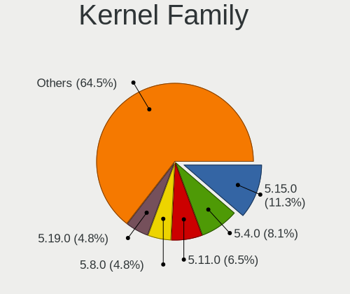
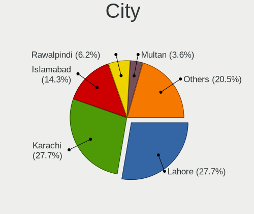
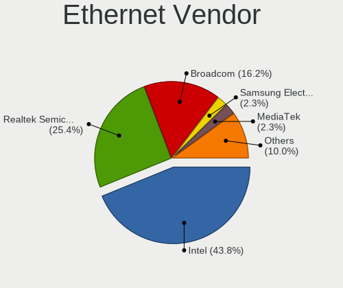
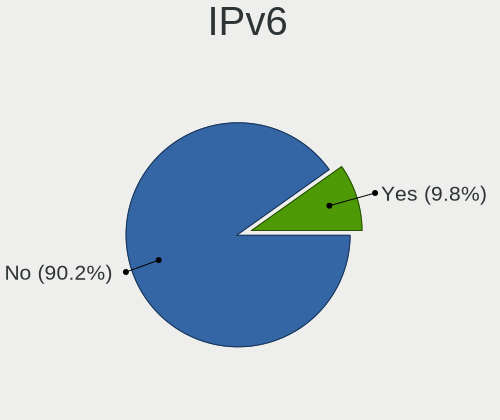
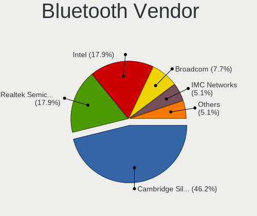
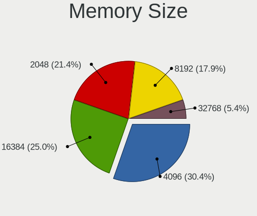
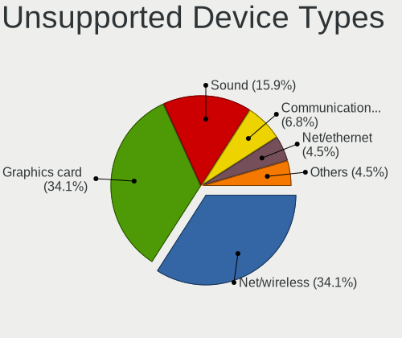

Linux in Pakistan - Tested Hardware & Statistics (Desktops)
-----------------------------------------------------------

A project to collect tested hardware configurations for Linux in Pakistan.

Anyone can contribute to this report by the [hw-probe](https://github.com/linuxhw/hw-probe) tool:

    sudo -E hw-probe -all -upload

Please contribute! Especially if your hardware is rare.

Contents
--------

* [ Test Cases ](#test-cases)

* [ System ](#system)
  - [ OS                       ](#os)
  - [ OS Family                ](#os-family)
  - [ Kernel                   ](#kernel)
  - [ Kernel Family            ](#kernel-family)
  - [ Kernel Major Ver.        ](#kernel-major-ver)
  - [ Arch                     ](#arch)
  - [ DE                       ](#de)
  - [ Display Server           ](#display-server)
  - [ Display Manager          ](#display-manager)
  - [ OS Lang                  ](#os-lang)
  - [ Boot Mode                ](#boot-mode)
  - [ Filesystem               ](#filesystem)
  - [ Part. scheme             ](#part-scheme)
  - [ Dual Boot with Linux/BSD ](#dual-boot-with-linuxbsd)
  - [ Dual Boot (Win)          ](#dual-boot-win)

* [ Board ](#board)
  - [ Vendor                   ](#vendor)
  - [ Model                    ](#model)
  - [ Model Family             ](#model-family)
  - [ MFG Year                 ](#mfg-year)
  - [ Form Factor              ](#form-factor)
  - [ Secure Boot              ](#secure-boot)
  - [ Coreboot                 ](#coreboot)
  - [ RAM Size                 ](#ram-size)
  - [ RAM Used                 ](#ram-used)
  - [ Total Drives             ](#total-drives)
  - [ Has CD-ROM               ](#has-cd-rom)
  - [ Has Ethernet             ](#has-ethernet)
  - [ Has WiFi                 ](#has-wifi)
  - [ Has Bluetooth            ](#has-bluetooth)

* [ Location ](#location)
  - [ Country                  ](#country)
  - [ City                     ](#city)

* [ Drives ](#drives)
  - [ Drive Vendor             ](#drive-vendor)
  - [ Drive Model              ](#drive-model)
  - [ HDD Vendor               ](#hdd-vendor)
  - [ SSD Vendor               ](#ssd-vendor)
  - [ Drive Kind               ](#drive-kind)
  - [ Drive Connector          ](#drive-connector)
  - [ Drive Size               ](#drive-size)
  - [ Space Total              ](#space-total)
  - [ Space Used               ](#space-used)
  - [ Malfunc. Drives          ](#malfunc-drives)
  - [ Malfunc. Drive Vendor    ](#malfunc-drive-vendor)
  - [ Malfunc. HDD Vendor      ](#malfunc-hdd-vendor)
  - [ Malfunc. Drive Kind      ](#malfunc-drive-kind)
  - [ Failed Drives            ](#failed-drives)
  - [ Failed Drive Vendor      ](#failed-drive-vendor)
  - [ Drive Status             ](#drive-status)

* [ Storage controller ](#storage-controller)
  - [ Storage Vendor           ](#storage-vendor)
  - [ Storage Model            ](#storage-model)
  - [ Storage Kind             ](#storage-kind)

* [ Processor ](#processor)
  - [ CPU Vendor               ](#cpu-vendor)
  - [ CPU Model                ](#cpu-model)
  - [ CPU Model Family         ](#cpu-model-family)
  - [ CPU Cores                ](#cpu-cores)
  - [ CPU Sockets              ](#cpu-sockets)
  - [ CPU Threads              ](#cpu-threads)
  - [ CPU Op-Modes             ](#cpu-op-modes)
  - [ CPU Microcode            ](#cpu-microcode)
  - [ CPU Microarch            ](#cpu-microarch)

* [ Graphics ](#graphics)
  - [ GPU Vendor               ](#gpu-vendor)
  - [ GPU Model                ](#gpu-model)
  - [ GPU Combo                ](#gpu-combo)
  - [ GPU Driver               ](#gpu-driver)
  - [ GPU Memory               ](#gpu-memory)

* [ Monitor ](#monitor)
  - [ Monitor Vendor           ](#monitor-vendor)
  - [ Monitor Model            ](#monitor-model)
  - [ Monitor Resolution       ](#monitor-resolution)
  - [ Monitor Diagonal         ](#monitor-diagonal)
  - [ Monitor Width            ](#monitor-width)
  - [ Aspect Ratio             ](#aspect-ratio)
  - [ Monitor Area             ](#monitor-area)
  - [ Pixel Density            ](#pixel-density)
  - [ Multiple Monitors        ](#multiple-monitors)

* [ Network ](#network)
  - [ Net Controller Vendor    ](#net-controller-vendor)
  - [ Net Controller Model     ](#net-controller-model)
  - [ Wireless Vendor          ](#wireless-vendor)
  - [ Wireless Model           ](#wireless-model)
  - [ Ethernet Vendor          ](#ethernet-vendor)
  - [ Ethernet Model           ](#ethernet-model)
  - [ Net Controller Kind      ](#net-controller-kind)
  - [ Used Controller          ](#used-controller)
  - [ NICs                     ](#nics)
  - [ IPv6                     ](#ipv6)

* [ Bluetooth ](#bluetooth)
  - [ Bluetooth Vendor         ](#bluetooth-vendor)
  - [ Bluetooth Model          ](#bluetooth-model)

* [ Sound ](#sound)
  - [ Sound Vendor             ](#sound-vendor)
  - [ Sound Model              ](#sound-model)

* [ Memory ](#memory)
  - [ Memory Vendor            ](#memory-vendor)
  - [ Memory Model             ](#memory-model)
  - [ Memory Kind              ](#memory-kind)
  - [ Memory Form Factor       ](#memory-form-factor)
  - [ Memory Size              ](#memory-size)
  - [ Memory Speed             ](#memory-speed)

* [ Printers & scanners ](#printers--scanners)
  - [ Printer Vendor           ](#printer-vendor)
  - [ Printer Model            ](#printer-model)
  - [ Scanner Vendor           ](#scanner-vendor)
  - [ Scanner Model            ](#scanner-model)

* [ Camera ](#camera)
  - [ Camera Vendor            ](#camera-vendor)
  - [ Camera Model             ](#camera-model)

* [ Security ](#security)
  - [ Fingerprint Vendor       ](#fingerprint-vendor)
  - [ Fingerprint Model        ](#fingerprint-model)
  - [ Chipcard Vendor          ](#chipcard-vendor)
  - [ Chipcard Model           ](#chipcard-model)

* [ Unsupported ](#unsupported)
  - [ Unsupported Devices      ](#unsupported-devices)
  - [ Unsupported Device Types ](#unsupported-device-types)

Test Cases
----------

Total: 150

| Vendor        | Model                       | Probe                                                      | Date         |
|---------------|-----------------------------|------------------------------------------------------------|--------------|
| MSI           | Z590-A PRO                  | [f6eb92aa92](https://linux-hardware.org/?probe=f6eb92aa92) | Dec 30, 2023 |
| Dell          | 0YXT71 A03                  | [7a857447b4](https://linux-hardware.org/?probe=7a857447b4) | Dec 28, 2023 |
| Dell          | 06X1TJ A00                  | [eac468f369](https://linux-hardware.org/?probe=eac468f369) | Dec 20, 2023 |
| MSI           | Z590-A PRO                  | [4298ef81a3](https://linux-hardware.org/?probe=4298ef81a3) | Dec 04, 2023 |
| HP            | 3646h                       | [1cfad160f4](https://linux-hardware.org/?probe=1cfad160f4) | Nov 12, 2023 |
| HP            | 845A                        | [95fbc211ec](https://linux-hardware.org/?probe=95fbc211ec) | Nov 11, 2023 |
| Gigabyte      | B250M-D3H-CF                | [cb1c24030f](https://linux-hardware.org/?probe=cb1c24030f) | Nov 07, 2023 |
| Colorful T... | CVN X570M GAMING PRO V14    | [65b9bad459](https://linux-hardware.org/?probe=65b9bad459) | Nov 03, 2023 |
| Gigabyte      | EX58-EXTREME                | [662889cd52](https://linux-hardware.org/?probe=662889cd52) | Oct 12, 2023 |
| MSI           | Z590-A PRO                  | [373685317f](https://linux-hardware.org/?probe=373685317f) | Oct 03, 2023 |
| Lenovo        | MAHOBAY                     | [9ced54f630](https://linux-hardware.org/?probe=9ced54f630) | Oct 01, 2023 |
| Gigabyte      | F2A88XM-D3H                 | [f597ec9360](https://linux-hardware.org/?probe=f597ec9360) | Sep 23, 2023 |
| Colorful T... | CVN X570M GAMING PRO V14    | [187d930341](https://linux-hardware.org/?probe=187d930341) | Aug 29, 2023 |
| Lenovo        | SHARKBAY 0B98401 PRO        | [4fe996e64f](https://linux-hardware.org/?probe=4fe996e64f) | Aug 29, 2023 |
| Unknown       | IPMSB-H61                   | [c104b6462e](https://linux-hardware.org/?probe=c104b6462e) | Aug 26, 2023 |
| HP            | 18E7                        | [a78496c36e](https://linux-hardware.org/?probe=a78496c36e) | Aug 23, 2023 |
| AAEON         | MF-001 V1.0                 | [1a2d3f1778](https://linux-hardware.org/?probe=1a2d3f1778) | Jul 30, 2023 |
| Biostar       | H61MGV                      | [4fadeeb5bd](https://linux-hardware.org/?probe=4fadeeb5bd) | Jul 12, 2023 |
| Acer          | Veriton N4620G              | [4f2cc019b8](https://linux-hardware.org/?probe=4f2cc019b8) | May 26, 2023 |
| MSI           | Z590-A PRO                  | [627afe1447](https://linux-hardware.org/?probe=627afe1447) | May 23, 2023 |
| MSI           | Z590-A PRO                  | [0c26a47ae5](https://linux-hardware.org/?probe=0c26a47ae5) | May 17, 2023 |
| Gigabyte      | B550 GAMING X V2            | [68573d1b85](https://linux-hardware.org/?probe=68573d1b85) | May 13, 2023 |
| Inventec      | Z CLASS A02                 | [44b6a5142e](https://linux-hardware.org/?probe=44b6a5142e) | Apr 25, 2023 |
| Intel         | DQ67OW AAG28716-309         | [e628a47ac6](https://linux-hardware.org/?probe=e628a47ac6) | Apr 01, 2023 |
| Intel         | DQ67OW AAG28716-309         | [3394687910](https://linux-hardware.org/?probe=3394687910) | Mar 29, 2023 |
| Intel         | DQ67OW AAG28716-309         | [3a82d680e5](https://linux-hardware.org/?probe=3a82d680e5) | Mar 29, 2023 |
| HP            | 1850                        | [5ae52efa64](https://linux-hardware.org/?probe=5ae52efa64) | Mar 25, 2023 |
| Inventec      | Z CLASS A02                 | [7b5d4c040b](https://linux-hardware.org/?probe=7b5d4c040b) | Mar 05, 2023 |
| HP            | 339A                        | [07001c3589](https://linux-hardware.org/?probe=07001c3589) | Feb 19, 2023 |
| HP            | 339A                        | [0d7bb8b04a](https://linux-hardware.org/?probe=0d7bb8b04a) | Feb 19, 2023 |
| ASUSTek       | A55BM-PLUS                  | [7c9763c23f](https://linux-hardware.org/?probe=7c9763c23f) | Feb 10, 2023 |
| Unknown       | IPMSB-H61                   | [7e13c996bd](https://linux-hardware.org/?probe=7e13c996bd) | Feb 02, 2023 |
| Dell          | 0KRC95 A00                  | [bf9e573abf](https://linux-hardware.org/?probe=bf9e573abf) | Jan 25, 2023 |
| MSI           | Z590-A PRO                  | [b55d0dfc1e](https://linux-hardware.org/?probe=b55d0dfc1e) | Jan 03, 2023 |
| MSI           | Z590-A PRO                  | [63adf72d53](https://linux-hardware.org/?probe=63adf72d53) | Jan 01, 2023 |
| HP            | 304Ah                       | [6106d55390](https://linux-hardware.org/?probe=6106d55390) | Dec 26, 2022 |
| Gigabyte      | Q87M-D2H                    | [0b6bf86b5e](https://linux-hardware.org/?probe=0b6bf86b5e) | Dec 10, 2022 |
| HP            | 198E                        | [9d22530b3c](https://linux-hardware.org/?probe=9d22530b3c) | Nov 25, 2022 |
| Dell          | 0HN7XN A00                  | [3e217adbf8](https://linux-hardware.org/?probe=3e217adbf8) | Nov 18, 2022 |
| Gigabyte      | Q87M-D2H                    | [e7c7b6c8a7](https://linux-hardware.org/?probe=e7c7b6c8a7) | Nov 14, 2022 |
| Gigabyte      | Q87M-D2H                    | [8224e059c6](https://linux-hardware.org/?probe=8224e059c6) | Nov 14, 2022 |
| Gigabyte      | Q87M-D2H                    | [543c3778c3](https://linux-hardware.org/?probe=543c3778c3) | Nov 12, 2022 |
| Gigabyte      | Q87M-D2H                    | [f73ba4186b](https://linux-hardware.org/?probe=f73ba4186b) | Nov 11, 2022 |
| Gigabyte      | Q87M-D2H                    | [143dc1e811](https://linux-hardware.org/?probe=143dc1e811) | Nov 05, 2022 |
| ASUSTek       | Q87M-E                      | [79f94ede46](https://linux-hardware.org/?probe=79f94ede46) | Oct 11, 2022 |
| HP            | 18E7                        | [797aa81ce0](https://linux-hardware.org/?probe=797aa81ce0) | Oct 02, 2022 |
| HP            | 18E7                        | [69e4bb94f3](https://linux-hardware.org/?probe=69e4bb94f3) | Oct 02, 2022 |
| Lenovo        | ThinkStation D30 4223CC9    | [16e54152fd](https://linux-hardware.org/?probe=16e54152fd) | Aug 18, 2022 |
| Lenovo        | ThinkStation D30 4223CC9    | [e0208cab99](https://linux-hardware.org/?probe=e0208cab99) | Aug 18, 2022 |
| Quanta        | 2ABB 101                    | [3d241d58b9](https://linux-hardware.org/?probe=3d241d58b9) | Jul 13, 2022 |
| Gigabyte      | A520M S2H                   | [52aab7f65b](https://linux-hardware.org/?probe=52aab7f65b) | Jul 12, 2022 |
| ASUSTek       | TUF Gaming B550-PLUS WIF... | [44db6036ce](https://linux-hardware.org/?probe=44db6036ce) | Jul 08, 2022 |
| Gigabyte      | A520M S2H                   | [094c3f1e98](https://linux-hardware.org/?probe=094c3f1e98) | Jun 24, 2022 |
| HP            | 339A                        | [a20191b759](https://linux-hardware.org/?probe=a20191b759) | Jun 23, 2022 |
| HP            | 18E7                        | [f2d50ba3c2](https://linux-hardware.org/?probe=f2d50ba3c2) | Jun 13, 2022 |
| ASUSTek       | STRIX B250H GAMING          | [9f28088790](https://linux-hardware.org/?probe=9f28088790) | Jun 01, 2022 |
| HP            | 1495                        | [9ec1730693](https://linux-hardware.org/?probe=9ec1730693) | May 11, 2022 |
| Lenovo        | SDK0E50510 WIN              | [07526b3b20](https://linux-hardware.org/?probe=07526b3b20) | May 10, 2022 |
| HP            | 3396                        | [bd2e5eb69c](https://linux-hardware.org/?probe=bd2e5eb69c) | Apr 29, 2022 |
| HP            | 3396                        | [705baf56a1](https://linux-hardware.org/?probe=705baf56a1) | Apr 29, 2022 |
| HP            | 3396                        | [2c07ec89d4](https://linux-hardware.org/?probe=2c07ec89d4) | Apr 17, 2022 |
| HP            | 87D6 SMVB                   | [57d44d9705](https://linux-hardware.org/?probe=57d44d9705) | Apr 03, 2022 |
| HP            | 87D6 SMVB                   | [e70c6e6d89](https://linux-hardware.org/?probe=e70c6e6d89) | Apr 03, 2022 |
| Dell          | 0HR330                      | [9e351420b6](https://linux-hardware.org/?probe=9e351420b6) | Mar 04, 2022 |
| Gigabyte      | A520M S2H                   | [06db14c491](https://linux-hardware.org/?probe=06db14c491) | Mar 01, 2022 |
| Dell          | 0HR330                      | [7e4c13a9bd](https://linux-hardware.org/?probe=7e4c13a9bd) | Mar 01, 2022 |
| Dell          | 0HR330                      | [3533cd70af](https://linux-hardware.org/?probe=3533cd70af) | Feb 26, 2022 |
| Dell          | 0HR330                      | [e587783731](https://linux-hardware.org/?probe=e587783731) | Feb 26, 2022 |
| HP            | 8717                        | [d5d2ee0ab5](https://linux-hardware.org/?probe=d5d2ee0ab5) | Feb 18, 2022 |
| HP            | 8061                        | [f721051d60](https://linux-hardware.org/?probe=f721051d60) | Feb 11, 2022 |
| HP            | 8717                        | [97d99714a1](https://linux-hardware.org/?probe=97d99714a1) | Feb 10, 2022 |
| Dell          | 0DR845                      | [daa833f06d](https://linux-hardware.org/?probe=daa833f06d) | Jan 08, 2022 |
| HP            | 0B3Ch HP P/N                | [2805378159](https://linux-hardware.org/?probe=2805378159) | Dec 10, 2021 |
| Lenovo        | ThinkStation D30 4223CC9    | [0784c5596b](https://linux-hardware.org/?probe=0784c5596b) | Dec 04, 2021 |
| Dell          | 0VHRW1 A03                  | [ebfaaee6ef](https://linux-hardware.org/?probe=ebfaaee6ef) | Dec 04, 2021 |
| Lenovo        | ThinkStation D30 4223CC9    | [50a026d588](https://linux-hardware.org/?probe=50a026d588) | Dec 02, 2021 |
| Dell          | 0VHRW1 A03                  | [19fd4c2057](https://linux-hardware.org/?probe=19fd4c2057) | Nov 30, 2021 |
| Lenovo        | ThinkStation D30 4223CC9    | [7493408721](https://linux-hardware.org/?probe=7493408721) | Nov 29, 2021 |
| Dell          | 0VHRW1 A03                  | [637bba1c58](https://linux-hardware.org/?probe=637bba1c58) | Nov 29, 2021 |
| Dell          | 06FW8P A02                  | [555032936f](https://linux-hardware.org/?probe=555032936f) | Nov 28, 2021 |
| Shuttle       | FS81                        | [ac6138c9d7](https://linux-hardware.org/?probe=ac6138c9d7) | Nov 19, 2021 |
| Shuttle       | FS81                        | [d889090212](https://linux-hardware.org/?probe=d889090212) | Nov 18, 2021 |
| HP            | 0AECh D                     | [7d8a81315d](https://linux-hardware.org/?probe=7d8a81315d) | Nov 11, 2021 |
| Dell          | 06FW8P A02                  | [72f1028535](https://linux-hardware.org/?probe=72f1028535) | Nov 09, 2021 |
| Dell          | 06FW8P A02                  | [e43d36b3cf](https://linux-hardware.org/?probe=e43d36b3cf) | Nov 09, 2021 |
| ASUSTek       | PRIME B550-PLUS             | [98ddca21d9](https://linux-hardware.org/?probe=98ddca21d9) | Nov 06, 2021 |
| HP            | 0AECh D                     | [cd2f6268cf](https://linux-hardware.org/?probe=cd2f6268cf) | Oct 28, 2021 |
| Dell          | 06FW8P A02                  | [2f188b606a](https://linux-hardware.org/?probe=2f188b606a) | Oct 25, 2021 |
| Dell          | 0XPDFK A01                  | [0e66d5fd62](https://linux-hardware.org/?probe=0e66d5fd62) | Oct 16, 2021 |
| HP            | 0AECh D                     | [415146d6ec](https://linux-hardware.org/?probe=415146d6ec) | Oct 07, 2021 |
| Dell          | 06FW8P A02                  | [06efedbf24](https://linux-hardware.org/?probe=06efedbf24) | Oct 07, 2021 |
| Dell          | 06FW8P A02                  | [029b85826d](https://linux-hardware.org/?probe=029b85826d) | Sep 27, 2021 |
| HP            | 0AECh D                     | [202ada3fc3](https://linux-hardware.org/?probe=202ada3fc3) | Sep 23, 2021 |
| HP            | 3047h                       | [356ad972a7](https://linux-hardware.org/?probe=356ad972a7) | Sep 22, 2021 |
| HP            | 1587h                       | [5447d2e6c3](https://linux-hardware.org/?probe=5447d2e6c3) | Sep 12, 2021 |
| Unknown       | Unknown                     | [321a93dff9](https://linux-hardware.org/?probe=321a93dff9) | Sep 07, 2021 |
| Shuttle       | FS81                        | [9a98a31681](https://linux-hardware.org/?probe=9a98a31681) | Sep 06, 2021 |
| Dell          | 09KPNV A01                  | [7e939d9f5f](https://linux-hardware.org/?probe=7e939d9f5f) | Aug 20, 2021 |
| Lenovo        | MAHOBAY NOK                 | [921bde522e](https://linux-hardware.org/?probe=921bde522e) | Jul 31, 2021 |
| Gigabyte      | Z590 UD AC                  | [7e8e35538a](https://linux-hardware.org/?probe=7e8e35538a) | Jul 26, 2021 |
| Lenovo        | MAHOBAY NOK                 | [00614fd705](https://linux-hardware.org/?probe=00614fd705) | Jul 23, 2021 |
| Lenovo        | MAHOBAY NOK                 | [37924533d9](https://linux-hardware.org/?probe=37924533d9) | Jul 23, 2021 |
| Gigabyte      | Z590 UD AC                  | [4fc5079d7e](https://linux-hardware.org/?probe=4fc5079d7e) | Jul 20, 2021 |
| Lenovo        | ThinkCentre M70e 0830F2U    | [8dad962f2f](https://linux-hardware.org/?probe=8dad962f2f) | Jul 09, 2021 |
| HP            | 158A                        | [1da50908cf](https://linux-hardware.org/?probe=1da50908cf) | Jun 10, 2021 |
| Dell          | 042P49 A00                  | [2d9b300bd3](https://linux-hardware.org/?probe=2d9b300bd3) | May 13, 2021 |
| Lenovo        | MAHOBAY NOK                 | [5a9b9278df](https://linux-hardware.org/?probe=5a9b9278df) | Apr 26, 2021 |
| Dell          | 06FW8P A01                  | [08f4c825cc](https://linux-hardware.org/?probe=08f4c825cc) | Apr 25, 2021 |
| Lenovo        | MAHOBAY NOK                 | [3423651b5d](https://linux-hardware.org/?probe=3423651b5d) | Apr 23, 2021 |
| Dell          | 0VHRW1 A03                  | [bc7c3f8c4d](https://linux-hardware.org/?probe=bc7c3f8c4d) | Apr 23, 2021 |
| Lenovo        | ThinkStation D30 4223CC9    | [8d7a62ce1a](https://linux-hardware.org/?probe=8d7a62ce1a) | Apr 20, 2021 |
| Dell          | 06FW8P A02                  | [583acd1f2e](https://linux-hardware.org/?probe=583acd1f2e) | Apr 20, 2021 |
| Dell          | 06FW8P A01                  | [a0b4b692ff](https://linux-hardware.org/?probe=a0b4b692ff) | Apr 20, 2021 |
| Shuttle       | FS81                        | [14e78cfe43](https://linux-hardware.org/?probe=14e78cfe43) | Apr 20, 2021 |
| Dell          | 0GU083 A00                  | [03e87a4ada](https://linux-hardware.org/?probe=03e87a4ada) | Mar 20, 2021 |
| Dell          | 0C27VV A01                  | [2ab353f0c6](https://linux-hardware.org/?probe=2ab353f0c6) | Mar 06, 2021 |
| Lenovo        | MAHOBAY NOK                 | [67ea005277](https://linux-hardware.org/?probe=67ea005277) | Feb 24, 2021 |
| Lenovo        | MAHOBAY 31900003 STD        | [845f5a30c2](https://linux-hardware.org/?probe=845f5a30c2) | Feb 13, 2021 |
| Lenovo        | ThinkCentre M58 7373C51     | [3e79476403](https://linux-hardware.org/?probe=3e79476403) | Jan 27, 2021 |
| HP            | 3047h                       | [8b50e12296](https://linux-hardware.org/?probe=8b50e12296) | Jan 07, 2021 |
| HP            | 3047h                       | [b65caab721](https://linux-hardware.org/?probe=b65caab721) | Nov 24, 2020 |
| Dell          | 07N90W A01                  | [127c1a4946](https://linux-hardware.org/?probe=127c1a4946) | Oct 29, 2020 |
| HP            | 8433 11                     | [1d000792d8](https://linux-hardware.org/?probe=1d000792d8) | Sep 03, 2020 |
| Dell          | 0D6H9T A01                  | [1f914ddd57](https://linux-hardware.org/?probe=1f914ddd57) | Aug 31, 2020 |
| Dell          | 0HY9JP A02                  | [19795140c8](https://linux-hardware.org/?probe=19795140c8) | Aug 22, 2020 |
| Dell          | 0HY9JP A02                  | [b739a3410a](https://linux-hardware.org/?probe=b739a3410a) | Aug 22, 2020 |
| Dell          | 0PP150 A00                  | [a990cf0ce7](https://linux-hardware.org/?probe=a990cf0ce7) | Aug 21, 2020 |
| HP            | 0B4Ch D                     | [4053256264](https://linux-hardware.org/?probe=4053256264) | Aug 10, 2020 |
| Dell          | 0DR845                      | [e4ff6acb83](https://linux-hardware.org/?probe=e4ff6acb83) | Aug 01, 2020 |
| Dell          | 0DR845                      | [4b9fbd7a8f](https://linux-hardware.org/?probe=4b9fbd7a8f) | Aug 01, 2020 |
| HP            | 1589                        | [d142f54a38](https://linux-hardware.org/?probe=d142f54a38) | Jul 11, 2020 |
| Gigabyte      | B450M S2H                   | [4e6a9e5117](https://linux-hardware.org/?probe=4e6a9e5117) | Jun 12, 2020 |
| Gigabyte      | B250M-D3H-CF                | [f74cf1545a](https://linux-hardware.org/?probe=f74cf1545a) | May 21, 2020 |
| Dell          | 0GU083 A00                  | [a31c9c5f4f](https://linux-hardware.org/?probe=a31c9c5f4f) | May 05, 2020 |
| Gigabyte      | Z170X-Gaming 7              | [e3400fb2b7](https://linux-hardware.org/?probe=e3400fb2b7) | May 04, 2020 |
| Dell          | 0PP150 A00                  | [51f69f1430](https://linux-hardware.org/?probe=51f69f1430) | May 02, 2020 |
| Lenovo        | ThinkCentre M57 6072W2A     | [d42ad893b6](https://linux-hardware.org/?probe=d42ad893b6) | May 01, 2020 |
| Lenovo        | ThinkCentre M57 6072W2A     | [366d3d0483](https://linux-hardware.org/?probe=366d3d0483) | May 01, 2020 |
| Dell          | 0PP150 A00                  | [f224ee60e5](https://linux-hardware.org/?probe=f224ee60e5) | Apr 30, 2020 |
| Dell          | 0XPDFK A01                  | [9434f7214c](https://linux-hardware.org/?probe=9434f7214c) | Mar 16, 2020 |
| Dell          | 0XPDFK A01                  | [4a53b5e634](https://linux-hardware.org/?probe=4a53b5e634) | Mar 11, 2020 |
| Dell          | 054KM3 A01                  | [857f976c7f](https://linux-hardware.org/?probe=857f976c7f) | Jan 29, 2020 |
| HP            | 1497                        | [fe24ec7591](https://linux-hardware.org/?probe=fe24ec7591) | Jan 28, 2020 |
| Dell          | 054KM3 A01                  | [f682ad8814](https://linux-hardware.org/?probe=f682ad8814) | Jan 21, 2020 |
| Acer          | Veriton X6620G v1.0         | [e921d3af77](https://linux-hardware.org/?probe=e921d3af77) | Dec 13, 2019 |
| ASUSTek       | Q87M-E                      | [01f990ea56](https://linux-hardware.org/?probe=01f990ea56) | Oct 19, 2019 |
| HP            | 304Ah                       | [4f72bfd1f5](https://linux-hardware.org/?probe=4f72bfd1f5) | May 13, 2019 |
| Dell          | 054KM3 A01                  | [144815a4e9](https://linux-hardware.org/?probe=144815a4e9) | Jan 15, 2019 |
| Dell          | 054KM3 A01                  | [f83bcddf2e](https://linux-hardware.org/?probe=f83bcddf2e) | Jan 08, 2019 |
| Dell          | 054KM3 A01                  | [404e699144](https://linux-hardware.org/?probe=404e699144) | Jan 08, 2019 |

System
------

OS
--

Installed operating systems

| Name                | Desktops | Percent |
|---------------------|----------|---------|
| Ubuntu 22.04        | 12       | 11.76%  |
| Ubuntu 20.04        | 12       | 11.76%  |
| Debian 11           | 6        | 5.88%   |
| Debian 10           | 6        | 5.88%   |
| Ubuntu 18.04        | 4        | 3.92%   |
| OpenMandriva 4.3    | 4        | 3.92%   |
| Zorin 15            | 3        | 2.94%   |
| Ubuntu 21.04        | 3        | 2.94%   |
| Arch                | 3        | 2.94%   |
| Xero Rolling        | 2        | 1.96%   |
| Ubuntu 22.10        | 2        | 1.96%   |
| Ubuntu 20.10        | 2        | 1.96%   |
| Pop!_OS 22.04       | 2        | 1.96%   |
| Pop!_OS 20.04       | 2        | 1.96%   |
| OpenMandriva 4.2    | 2        | 1.96%   |
| Manjaro             | 2        | 1.96%   |
| Linux Mint 19.3     | 2        | 1.96%   |
| Fedora 34           | 2        | 1.96%   |
| ArcoLinux Rolling   | 2        | 1.96%   |
| Zorin 16            | 1        | 0.98%   |
| Xubuntu 22.04       | 1        | 0.98%   |
| Ubuntu MATE 18.04   | 1        | 0.98%   |
| Ubuntu Budgie 23.04 | 1        | 0.98%   |
| Ubuntu 23.10        | 1        | 0.98%   |
| ROSA 12.2           | 1        | 0.98%   |
| Pop!_OS 21.04       | 1        | 0.98%   |
| Parrot 4.10         | 1        | 0.98%   |
| OpenMandriva 23.01  | 1        | 0.98%   |
| Lubuntu 22.04       | 1        | 0.98%   |
| LMDE 4              | 1        | 0.98%   |
| Linux Mint 21.2     | 1        | 0.98%   |
| Linux Mint 21.1     | 1        | 0.98%   |
| Linux Mint 20.3     | 1        | 0.98%   |
| Linux Mint 20.2     | 1        | 0.98%   |
| Linux Mint 19.2     | 1        | 0.98%   |
| Linux Lite 6.6      | 1        | 0.98%   |
| Kubuntu 21.10       | 1        | 0.98%   |
| Kubuntu 20.04       | 1        | 0.98%   |
| KDE neon 20.04      | 1        | 0.98%   |
| Kali 2022.2         | 1        | 0.98%   |

OS Family
---------

OS without a version

| Name          | Desktops | Percent |
|---------------|----------|---------|
| Ubuntu        | 35       | 35.71%  |
| Debian        | 9        | 9.18%   |
| OpenMandriva  | 7        | 7.14%   |
| Linux Mint    | 7        | 7.14%   |
| Pop!_OS       | 5        | 5.1%    |
| Fedora        | 5        | 5.1%    |
| Zorin         | 4        | 4.08%   |
| Arch          | 3        | 3.06%   |
| Xero          | 2        | 2.04%   |
| Manjaro       | 2        | 2.04%   |
| Kubuntu       | 2        | 2.04%   |
| Kali          | 2        | 2.04%   |
| ArcoLinux     | 2        | 2.04%   |
| Xubuntu       | 1        | 1.02%   |
| Ubuntu MATE   | 1        | 1.02%   |
| Ubuntu Budgie | 1        | 1.02%   |
| ROSA          | 1        | 1.02%   |
| Parrot        | 1        | 1.02%   |
| Lubuntu       | 1        | 1.02%   |
| LMDE          | 1        | 1.02%   |
| Linux Lite    | 1        | 1.02%   |
| KDE neon      | 1        | 1.02%   |
| Elementary    | 1        | 1.02%   |
| CentOS        | 1        | 1.02%   |
| BlackPanther  | 1        | 1.02%   |
| Alpine        | 1        | 1.02%   |

Kernel
------

Version of the Linux kernel

| Version                  | Desktops | Percent |
|--------------------------|----------|---------|
| 5.4.106-1-pve            | 5        | 4.55%   |
| 5.16.7-desktop-1omv4003  | 4        | 3.64%   |
| 5.15.0-53-generic        | 3        | 2.73%   |
| 5.8.0-44-generic         | 2        | 1.82%   |
| 5.4.0-7642-generic       | 2        | 1.82%   |
| 5.4.0-28-generic         | 2        | 1.82%   |
| 5.13.19-1-pve            | 2        | 1.82%   |
| 5.13.0-40-generic        | 2        | 1.82%   |
| 5.10.14-desktop-1omv4002 | 2        | 1.82%   |
| 5.0.0-32-generic         | 2        | 1.82%   |
| 6.6.7-arch1-1            | 1        | 0.91%   |
| 6.6.3-arch1-1            | 1        | 0.91%   |
| 6.5.5-arch1-1            | 1        | 0.91%   |
| 6.5.0-10-generic         | 1        | 0.91%   |
| 6.4.6-76060406-generic   | 1        | 0.91%   |
| 6.4.12-arch1-1           | 1        | 0.91%   |
| 6.3.2-arch1-1            | 1        | 0.91%   |
| 6.2.14-300.fc38.x86_64   | 1        | 0.91%   |
| 6.2.0-39-generic         | 1        | 0.91%   |
| 6.2.0-36-generic         | 1        | 0.91%   |
| 6.2.0-33-generic         | 1        | 0.91%   |
| 6.2.0-31-generic         | 1        | 0.91%   |
| 6.2.0-27-generic         | 1        | 0.91%   |
| 6.1.1-desktop-1omv2290   | 1        | 0.91%   |
| 6.1.1-arch1-1            | 1        | 0.91%   |
| 6.0.12-76060006-generic  | 1        | 0.91%   |
| 5.8.3-2-MANJARO          | 1        | 0.91%   |
| 5.8.0-63-generic         | 1        | 0.91%   |
| 5.8.0-59-generic         | 1        | 0.91%   |
| 5.8.0-43-generic         | 1        | 0.91%   |
| 5.8.0-40-generic         | 1        | 0.91%   |
| 5.7.10-201.fc32.x86_64   | 1        | 0.91%   |
| 5.7.0-2parrot2-amd64     | 1        | 0.91%   |
| 5.4.41-1-pve             | 1        | 0.91%   |
| 5.4.36-1-MANJARO         | 1        | 0.91%   |
| 5.4.0-88-generic         | 1        | 0.91%   |
| 5.4.0-52-generic         | 1        | 0.91%   |
| 5.4.0-42-generic         | 1        | 0.91%   |
| 5.4.0-26-generic         | 1        | 0.91%   |
| 5.4.0-109-generic        | 1        | 0.91%   |

Kernel Family
-------------

Linux kernel without a distro release

| Version | Desktops | Percent |
|---------|----------|---------|
| 5.15.0  | 14       | 13.08%  |
| 5.4.0   | 10       | 9.35%   |
| 5.11.0  | 8        | 7.48%   |
| 5.8.0   | 6        | 5.61%   |
| 5.19.0  | 6        | 5.61%   |
| 5.4.106 | 5        | 4.67%   |
| 6.2.0   | 4        | 3.74%   |
| 5.16.7  | 4        | 3.74%   |
| 5.11.22 | 4        | 3.74%   |
| 5.0.0   | 4        | 3.74%   |
| 5.13.0  | 3        | 2.8%    |
| 4.15.0  | 3        | 2.8%    |
| 6.1.1   | 2        | 1.87%   |
| 5.13.19 | 2        | 1.87%   |
| 5.10.14 | 2        | 1.87%   |
| 4.18.0  | 2        | 1.87%   |
| 6.6.7   | 1        | 0.93%   |
| 6.6.3   | 1        | 0.93%   |
| 6.5.5   | 1        | 0.93%   |
| 6.5.0   | 1        | 0.93%   |
| 6.4.6   | 1        | 0.93%   |
| 6.4.12  | 1        | 0.93%   |
| 6.3.2   | 1        | 0.93%   |
| 6.2.14  | 1        | 0.93%   |
| 6.0.12  | 1        | 0.93%   |
| 5.8.3   | 1        | 0.93%   |
| 5.7.10  | 1        | 0.93%   |
| 5.7.0   | 1        | 0.93%   |
| 5.4.41  | 1        | 0.93%   |
| 5.4.36  | 1        | 0.93%   |
| 5.3.7   | 1        | 0.93%   |
| 5.19.13 | 1        | 0.93%   |
| 5.18.9  | 1        | 0.93%   |
| 5.18.0  | 1        | 0.93%   |
| 5.16.15 | 1        | 0.93%   |
| 5.15.39 | 1        | 0.93%   |
| 5.13.4  | 1        | 0.93%   |
| 5.13.14 | 1        | 0.93%   |
| 5.10.74 | 1        | 0.93%   |
| 5.10.61 | 1        | 0.93%   |

Kernel Major Ver.
-----------------

Linux kernel major version

| Version | Desktops | Percent |
|---------|----------|---------|
| 5.4     | 17       | 15.89%  |
| 5.15    | 15       | 14.02%  |
| 5.11    | 12       | 11.21%  |
| 5.8     | 7        | 6.54%   |
| 5.19    | 7        | 6.54%   |
| 5.13    | 7        | 6.54%   |
| 6.2     | 5        | 4.67%   |
| 5.16    | 5        | 4.67%   |
| 5.10    | 4        | 3.74%   |
| 5.0     | 4        | 3.74%   |
| 4.18    | 3        | 2.8%    |
| 4.15    | 3        | 2.8%    |
| 6.6     | 2        | 1.87%   |
| 6.5     | 2        | 1.87%   |
| 6.4     | 2        | 1.87%   |
| 6.1     | 2        | 1.87%   |
| 5.7     | 2        | 1.87%   |
| 5.18    | 2        | 1.87%   |
| 3.10    | 2        | 1.87%   |
| 6.3     | 1        | 0.93%   |
| 6.0     | 1        | 0.93%   |
| 5.3     | 1        | 0.93%   |
| 4.19    | 1        | 0.93%   |

Arch
----

OS architecture (x86_64, i586, etc.)

| Name   | Desktops | Percent |
|--------|----------|---------|
| x86_64 | 93       | 98.94%  |
| i686   | 1        | 1.06%   |

DE
--

Desktop Environment

| Name       | Desktops | Percent |
|------------|----------|---------|
| GNOME      | 50       | 50%     |
| Unknown    | 15       | 15%     |
| KDE5       | 14       | 14%     |
| X-Cinnamon | 6        | 6%      |
| MATE       | 4        | 4%      |
| XFCE       | 3        | 3%      |
| KDE        | 2        | 2%      |
| i3         | 2        | 2%      |
| Pantheon   | 1        | 1%      |
| LXQt       | 1        | 1%      |
| KDE4       | 1        | 1%      |
| Budgie     | 1        | 1%      |

Display Server
--------------

X11 or Wayland

| Name    | Desktops | Percent |
|---------|----------|---------|
| X11     | 67       | 69.79%  |
| Wayland | 16       | 16.67%  |
| Tty     | 7        | 7.29%   |
| Unknown | 6        | 6.25%   |

Display Manager
---------------

SDDM, LightDM, etc.

| Name    | Desktops | Percent |
|---------|----------|---------|
| Unknown | 46       | 47.92%  |
| GDM3    | 21       | 21.88%  |
| SDDM    | 16       | 16.67%  |
| GDM     | 6        | 6.25%   |
| LightDM | 5        | 5.21%   |
| TDM     | 1        | 1.04%   |
| LXDM    | 1        | 1.04%   |

OS Lang
-------

Language

| Lang    | Desktops | Percent |
|---------|----------|---------|
| en_US   | 83       | 87.37%  |
| en_GB   | 6        | 6.32%   |
| Unknown | 5        | 5.26%   |
| en_PK   | 1        | 1.05%   |

Boot Mode
---------

EFI or BIOS

| Mode | Desktops | Percent |
|------|----------|---------|
| BIOS | 65       | 67.01%  |
| EFI  | 32       | 32.99%  |

Filesystem
----------

Type of filesystem

| Type     | Desktops | Percent |
|----------|----------|---------|
| Ext4     | 71       | 70.3%   |
| Overlay  | 8        | 7.92%   |
| Btrfs    | 7        | 6.93%   |
| Zfs      | 6        | 5.94%   |
| Tmpfs    | 6        | 5.94%   |
| Xfs      | 1        | 0.99%   |
| Reiserfs | 1        | 0.99%   |
| Unknown  | 1        | 0.99%   |

Part. scheme
------------

Scheme of partitioning

| Type    | Desktops | Percent |
|---------|----------|---------|
| Unknown | 44       | 46.32%  |
| GPT     | 42       | 44.21%  |
| MBR     | 9        | 9.47%   |

Dual Boot with Linux/BSD
------------------------

Hosting more than one Linux/BSD

| Dual boot | Desktops | Percent |
|-----------|----------|---------|
| No        | 81       | 81.82%  |
| Yes       | 18       | 18.18%  |

Dual Boot (Win)
---------------

Hosting Linux and Windows

| Dual boot | Desktops | Percent |
|-----------|----------|---------|
| No        | 55       | 56.7%   |
| Yes       | 42       | 43.3%   |

Board
-----

Vendor
------

Motherboard manufacturer

| Name                | Desktops | Percent |
|---------------------|----------|---------|
| Hewlett-Packard     | 27       | 28.72%  |
| Dell                | 26       | 27.66%  |
| Gigabyte Technology | 13       | 13.83%  |
| Lenovo              | 9        | 9.57%   |
| ASUSTek Computer    | 6        | 6.38%   |
| Shuttle             | 2        | 2.13%   |
| Acer                | 2        | 2.13%   |
| Unknown             | 2        | 2.13%   |
| Quanta              | 1        | 1.06%   |
| MSI                 | 1        | 1.06%   |
| Inventec            | 1        | 1.06%   |
| Intel               | 1        | 1.06%   |
| Colorful Technology | 1        | 1.06%   |
| Biostar             | 1        | 1.06%   |
| AAEON               | 1        | 1.06%   |

Model
-----

Motherboard model

| Name                                       | Desktops | Percent |
|--------------------------------------------|----------|---------|
| Dell Precision WorkStation T7500           | 4        | 4.26%   |
| Dell Precision WorkStation T3500           | 3        | 3.19%   |
| Shuttle DS81D                              | 2        | 2.13%   |
| HP ProDesk 600 G1 SFF                      | 2        | 2.13%   |
| HP ProDesk 400 G7 Microtower PC            | 2        | 2.13%   |
| HP Compaq 8100 Elite SFF PC                | 2        | 2.13%   |
| Gigabyte Z590 UD AC                        | 2        | 2.13%   |
| Gigabyte Q87M-D2H                          | 2        | 2.13%   |
| Gigabyte B250M-D3H                         | 2        | 2.13%   |
| Gigabyte A520M S2H                         | 2        | 2.13%   |
| Dell XPS 630i                              | 2        | 2.13%   |
| Dell Vostro 430                            | 2        | 2.13%   |
| Dell Precision WorkStation 490             | 2        | 2.13%   |
| Dell OptiPlex 755                          | 2        | 2.13%   |
| Dell OptiPlex 7010                         | 2        | 2.13%   |
| Unknown                                    | 2        | 2.13%   |
| Quanta TouchSmart 9300 Elite All-in-One PC | 1        | 1.06%   |
| MSI MS-7D09                                | 1        | 1.06%   |
| Lenovo ThinkStation D30 4223CC9            | 1        | 1.06%   |
| Lenovo ThinkCentre M93z 10ACS12B00         | 1        | 1.06%   |
| Lenovo ThinkCentre M93p 10AB000KUS         | 1        | 1.06%   |
| Lenovo ThinkCentre M82 27423K1             | 1        | 1.06%   |
| Lenovo ThinkCentre M70e 0830F2U            | 1        | 1.06%   |
| Lenovo ThinkCentre M58 7373C51             | 1        | 1.06%   |
| Lenovo ThinkCentre M57 6072W2A             | 1        | 1.06%   |
| Lenovo H520 10094                          | 1        | 1.06%   |
| Lenovo 3302F3U                             | 1        | 1.06%   |
| Inventec Z CLASS                           | 1        | 1.06%   |
| Intel DESKTOP 310                          | 1        | 1.06%   |
| HP Z800 Workstation                        | 1        | 1.06%   |
| HP Z620 Workstation                        | 1        | 1.06%   |
| HP Z420 Workstation                        | 1        | 1.06%   |
| HP Z400 Workstation                        | 1        | 1.06%   |
| HP Z210 Workstation                        | 1        | 1.06%   |
| HP ProDesk 600 G1 TWR                      | 1        | 1.06%   |
| HP ProDesk 400 G3 MT                       | 1        | 1.06%   |
| HP ProDesk 400 G2 MT (TPM DP)              | 1        | 1.06%   |
| HP Pavilion Gaming Desktop TG01-1xxx       | 1        | 1.06%   |
| HP Pavilion Desktop 590-p0xxx              | 1        | 1.06%   |
| HP EliteDesk 800 G4 DM 65W (TAA)           | 1        | 1.06%   |

Model Family
------------

Motherboard model prefix

| Name                  | Desktops | Percent |
|-----------------------|----------|---------|
| HP Compaq             | 12       | 12.77%  |
| Dell OptiPlex         | 11       | 11.7%   |
| Dell Precision        | 10       | 10.64%  |
| HP ProDesk            | 7        | 7.45%   |
| Lenovo ThinkCentre    | 6        | 6.38%   |
| Dell Vostro           | 3        | 3.19%   |
| Shuttle DS81D         | 2        | 2.13%   |
| HP Pavilion           | 2        | 2.13%   |
| Gigabyte Z590         | 2        | 2.13%   |
| Gigabyte Q87M-D2H     | 2        | 2.13%   |
| Gigabyte B250M-D3H    | 2        | 2.13%   |
| Gigabyte A520M        | 2        | 2.13%   |
| Dell XPS              | 2        | 2.13%   |
| Acer Veriton          | 2        | 2.13%   |
| Unknown               | 2        | 2.13%   |
| Quanta TouchSmart     | 1        | 1.06%   |
| MSI MS-7D09           | 1        | 1.06%   |
| Lenovo ThinkStation   | 1        | 1.06%   |
| Lenovo H520           | 1        | 1.06%   |
| Lenovo 3302F3U        | 1        | 1.06%   |
| Inventec Z            | 1        | 1.06%   |
| Intel DESKTOP         | 1        | 1.06%   |
| HP Z800               | 1        | 1.06%   |
| HP Z620               | 1        | 1.06%   |
| HP Z420               | 1        | 1.06%   |
| HP Z400               | 1        | 1.06%   |
| HP Z210               | 1        | 1.06%   |
| HP EliteDesk          | 1        | 1.06%   |
| Gigabyte Z170X-Gaming | 1        | 1.06%   |
| Gigabyte F2A88XM-D3H  | 1        | 1.06%   |
| Gigabyte EX58-EXTREME | 1        | 1.06%   |
| Gigabyte B550         | 1        | 1.06%   |
| Gigabyte B450M        | 1        | 1.06%   |
| Colorful CVN          | 1        | 1.06%   |
| Biostar H61MGV        | 1        | 1.06%   |
| ASUS TUF              | 1        | 1.06%   |
| ASUS STRIX            | 1        | 1.06%   |
| ASUS Q87M-XA          | 1        | 1.06%   |
| ASUS PRIME            | 1        | 1.06%   |
| ASUS All              | 1        | 1.06%   |

MFG Year
--------

Motherboard manufacture year

| Year    | Desktops | Percent |
|---------|----------|---------|
| 2012    | 14       | 14.89%  |
| 2013    | 13       | 13.83%  |
| 2011    | 11       | 11.7%   |
| 2009    | 10       | 10.64%  |
| 2010    | 7        | 7.45%   |
| 2021    | 6        | 6.38%   |
| 2020    | 5        | 5.32%   |
| 2014    | 5        | 5.32%   |
| 2007    | 4        | 4.26%   |
| 2018    | 3        | 3.19%   |
| 2016    | 3        | 3.19%   |
| 2015    | 3        | 3.19%   |
| 2008    | 3        | 3.19%   |
| 2017    | 2        | 2.13%   |
| 2006    | 2        | 2.13%   |
| 2022    | 1        | 1.06%   |
| 2019    | 1        | 1.06%   |
| Unknown | 1        | 1.06%   |

Form Factor
-----------

Physical design of the computer

| Name    | Desktops | Percent |
|---------|----------|---------|
| Desktop | 94       | 100%    |

Secure Boot
-----------

Enabled or disabled

| State    | Desktops | Percent |
|----------|----------|---------|
| Disabled | 94       | 100%    |

Coreboot
--------

Have coreboot on board

| Used | Desktops | Percent |
|------|----------|---------|
| No   | 94       | 100%    |

RAM Size
--------

Total RAM memory

| Size in GB      | Desktops | Percent |
|-----------------|----------|---------|
| 4.01-8.0        | 20       | 21.05%  |
| 16.01-24.0      | 19       | 20%     |
| 8.01-16.0       | 19       | 20%     |
| 3.01-4.0        | 17       | 17.89%  |
| 32.01-64.0      | 9        | 9.47%   |
| 64.01-256.0     | 7        | 7.37%   |
| 1.01-2.0        | 2        | 2.11%   |
| More than 256.0 | 1        | 1.05%   |
| 24.01-32.0      | 1        | 1.05%   |

RAM Used
--------

Used RAM memory

| Used GB     | Desktops | Percent |
|-------------|----------|---------|
| 1.01-2.0    | 35       | 32.71%  |
| 2.01-3.0    | 31       | 28.97%  |
| 4.01-8.0    | 13       | 12.15%  |
| 3.01-4.0    | 12       | 11.21%  |
| 8.01-16.0   | 9        | 8.41%   |
| 16.01-24.0  | 2        | 1.87%   |
| 0.51-1.0    | 2        | 1.87%   |
| 32.01-64.0  | 1        | 0.93%   |
| 64.01-256.0 | 1        | 0.93%   |
| Unknown     | 1        | 0.93%   |

Total Drives
------------

Number of drives on board

| Drives | Desktops | Percent |
|--------|----------|---------|
| 1      | 36       | 34.95%  |
| 2      | 35       | 33.98%  |
| 3      | 15       | 14.56%  |
| 6      | 5        | 4.85%   |
| 5      | 4        | 3.88%   |
| 4      | 3        | 2.91%   |
| 13     | 1        | 0.97%   |
| 11     | 1        | 0.97%   |
| 10     | 1        | 0.97%   |
| 9      | 1        | 0.97%   |
| 8      | 1        | 0.97%   |

Has CD-ROM
----------

Has CD-ROM on board

| Presented | Desktops | Percent |
|-----------|----------|---------|
| No        | 55       | 58.51%  |
| Yes       | 39       | 41.49%  |

Has Ethernet
------------

Has Ethernet on board

| Presented | Desktops | Percent |
|-----------|----------|---------|
| Yes       | 93       | 98.94%  |
| No        | 1        | 1.06%   |

Has WiFi
--------

Has WiFi module

| Presented | Desktops | Percent |
|-----------|----------|---------|
| Yes       | 51       | 53.13%  |
| No        | 45       | 46.88%  |

Has Bluetooth
-------------

Has Bluetooth module

| Presented | Desktops | Percent |
|-----------|----------|---------|
| No        | 70       | 70.71%  |
| Yes       | 29       | 29.29%  |

Location
--------

Country
-------

Geographic location (country)

| Country  | Desktops | Percent |
|----------|----------|---------|
| Pakistan | 94       | 100%    |

City
----

Geographic location (city)

| City           | Desktops | Percent |
|----------------|----------|---------|
| Lahore         | 28       | 28.87%  |
| Karachi        | 26       | 26.8%   |
| Islamabad      | 13       | 13.4%   |
| Rawalpindi     | 6        | 6.19%   |
| Multan         | 4        | 4.12%   |
| Peshawar       | 3        | 3.09%   |
| Kamoke         | 2        | 2.06%   |
| Tando Allahyar | 1        | 1.03%   |
| Sialkot        | 1        | 1.03%   |
| Sheikhupura    | 1        | 1.03%   |
| Sargodha       | 1        | 1.03%   |
| Sahiwal        | 1        | 1.03%   |
| Quetta         | 1        | 1.03%   |
| Mardan         | 1        | 1.03%   |
| Larkana        | 1        | 1.03%   |
| Jhelum         | 1        | 1.03%   |
| Hyderabad      | 1        | 1.03%   |
| Hafizabad      | 1        | 1.03%   |
| Gujranwala     | 1        | 1.03%   |
| Faisalabad     | 1        | 1.03%   |
| Burewala       | 1        | 1.03%   |
| Abbottabad     | 1        | 1.03%   |

Drives
------

Drive Vendor
------------

Hard drive vendors

| Vendor              | Desktops | Drives | Percent |
|---------------------|----------|--------|---------|
| Seagate             | 45       | 83     | 23.81%  |
| WDC                 | 32       | 55     | 16.93%  |
| Samsung Electronics | 21       | 29     | 11.11%  |
| Hitachi             | 14       | 21     | 7.41%   |
| Hewlett-Packard     | 7        | 18     | 3.7%    |
| Toshiba             | 6        | 6      | 3.17%   |
| LITEONIT            | 6        | 9      | 3.17%   |
| HS-SSD-E100         | 6        | 8      | 3.17%   |
| Hajaan              | 6        | 9      | 3.17%   |
| LITEON              | 5        | 6      | 2.65%   |
| Lexar               | 4        | 7      | 2.12%   |
| SK hynix            | 3        | 3      | 1.59%   |
| Maxtor              | 3        | 3      | 1.59%   |
| LaCie               | 3        | 3      | 1.59%   |
| Crucial             | 3        | 3      | 1.59%   |
| A-DATA Technology   | 3        | 4      | 1.59%   |
| Unknown             | 2        | 2      | 1.06%   |
| SanDisk             | 2        | 2      | 1.06%   |
| Micron Technology   | 2        | 3      | 1.06%   |
| Kingston            | 2        | 2      | 1.06%   |
| Intel               | 2        | 2      | 1.06%   |
| Gigabyte Technology | 2        | 3      | 1.06%   |
| ZTE                 | 1        | 1      | 0.53%   |
| Transcend           | 1        | 1      | 0.53%   |
| Silicon Motion      | 1        | 1      | 0.53%   |
| Netac               | 1        | 1      | 0.53%   |
| MARSHAL             | 1        | 1      | 0.53%   |
| KingFast            | 1        | 2      | 0.53%   |
| IBM-ESXS            | 1        | 3      | 0.53%   |
| HGST                | 1        | 1      | 0.53%   |
| China               | 1        | 1      | 0.53%   |
| ADATA Technology    | 1        | 1      | 0.53%   |

Drive Model
-----------

Hard drive models

| Model                                 | Desktops | Percent |
|---------------------------------------|----------|---------|
| Seagate ST3000NXCLAR3000 3TB          | 7        | 3.13%   |
| HP MB2000EBZQC 2TB                    | 6        | 2.68%   |
| Hajaan SSD 256G                       | 6        | 2.68%   |
| Samsung SSD PM830 2.5 7mm 256GB       | 4        | 1.79%   |
| LITEONIT LCS-128M6S 2.5 7mm 128GB SSD | 4        | 1.79%   |
| HS-SSD-E100 128G                      | 4        | 1.79%   |
| Seagate ST8000DM004-2CX188 8TB        | 3        | 1.34%   |
| Seagate ST6000NM0024 6TB              | 3        | 1.34%   |
| Seagate ST500DM002-1BD142 500GB       | 3        | 1.34%   |
| LITEON CV1-CC128-11 2.5 7mm 128GB SSD | 3        | 1.34%   |
| Lexar 256GB SSD                       | 3        | 1.34%   |
| LaCie Rugged USB-C 5TB                | 3        | 1.34%   |
| WDC WD5002ABYS-02B1B0 500GB           | 2        | 0.89%   |
| WDC WD5000AAKX-75U6AA0 500GB          | 2        | 0.89%   |
| WDC WD5000AAKX-60U6AA0 500GB          | 2        | 0.89%   |
| WDC WD20EZRZ-00Z5HB0 2TB              | 2        | 0.89%   |
| Toshiba DT01ACA100 1TB                | 2        | 0.89%   |
| SK hynix SC300 M.2 2280 256GB SSD     | 2        | 0.89%   |
| Seagate ST380815AS 80GB               | 2        | 0.89%   |
| Seagate ST3500414CS 500GB             | 2        | 0.89%   |
| Seagate ST3250318AS 250GB             | 2        | 0.89%   |
| Seagate ST2000VM003-1ET164 2TB        | 2        | 0.89%   |
| Seagate ST2000DM008-2FR102 2TB        | 2        | 0.89%   |
| Seagate ST2000DM008-2FR1 2TB          | 2        | 0.89%   |
| Seagate ST1000DM003-1SB10C 1TB        | 2        | 0.89%   |
| Seagate ST1000DM003-1SB102 1TB        | 2        | 0.89%   |
| Seagate ST1000DM003-1CH162 1TB        | 2        | 0.89%   |
| Samsung NVMe SSD Drive 500GB          | 2        | 0.89%   |
| Samsung MZ7PD128HCFV-000H1 128GB SSD  | 2        | 0.89%   |
| Samsung HD161GJ 160GB                 | 2        | 0.89%   |
| Maxtor STM380215AS 80GB               | 2        | 0.89%   |
| HS-SSD-E100 256G                      | 2        | 0.89%   |
| Hitachi HUA723020ALA640 2TB           | 2        | 0.89%   |
| Hitachi HTS545050A7E380 500GB         | 2        | 0.89%   |
| HP MB2000GCWDA 2TB                    | 2        | 0.89%   |
| Crucial CT525MX300SSD1 528GB          | 2        | 0.89%   |
| ZTE MMC Storage 942MB                 | 1        | 0.45%   |
| WDC WDS240G2G0A-00JH30 240GB SSD      | 1        | 0.45%   |
| WDC WDS120G2G0A-00JH30 120GB SSD      | 1        | 0.45%   |
| WDC WD800JD-60LUA0 80GB               | 1        | 0.45%   |

HDD Vendor
----------

Hard disk drive vendors

| Vendor              | Desktops | Drives | Percent |
|---------------------|----------|--------|---------|
| Seagate             | 45       | 83     | 40.91%  |
| WDC                 | 30       | 50     | 27.27%  |
| Hitachi             | 14       | 21     | 12.73%  |
| Hewlett-Packard     | 7        | 18     | 6.36%   |
| Toshiba             | 5        | 5      | 4.55%   |
| Samsung Electronics | 4        | 5      | 3.64%   |
| Maxtor              | 3        | 3      | 2.73%   |
| MARSHAL             | 1        | 1      | 0.91%   |
| HGST                | 1        | 1      | 0.91%   |

SSD Vendor
----------

Solid state drive vendors

| Vendor              | Desktops | Drives | Percent |
|---------------------|----------|--------|---------|
| Samsung Electronics | 12       | 15     | 20.69%  |
| LITEONIT            | 6        | 9      | 10.34%  |
| Hajaan              | 6        | 9      | 10.34%  |
| LITEON              | 5        | 6      | 8.62%   |
| WDC                 | 4        | 5      | 6.9%    |
| SK hynix            | 3        | 3      | 5.17%   |
| Lexar               | 3        | 5      | 5.17%   |
| Crucial             | 3        | 3      | 5.17%   |
| A-DATA Technology   | 3        | 4      | 5.17%   |
| SanDisk             | 2        | 2      | 3.45%   |
| Micron Technology   | 2        | 3      | 3.45%   |
| Kingston            | 2        | 2      | 3.45%   |
| Intel               | 2        | 2      | 3.45%   |
| Transcend           | 1        | 1      | 1.72%   |
| Toshiba             | 1        | 1      | 1.72%   |
| HS-SSD-E100         | 1        | 1      | 1.72%   |
| Gigabyte Technology | 1        | 2      | 1.72%   |
| China               | 1        | 1      | 1.72%   |

Drive Kind
----------

HDD or SSD

| Kind    | Desktops | Drives | Percent |
|---------|----------|--------|---------|
| HDD     | 73       | 187    | 54.48%  |
| SSD     | 37       | 74     | 27.61%  |
| NVMe    | 11       | 15     | 8.21%   |
| Unknown | 11       | 16     | 8.21%   |
| MMC     | 2        | 2      | 1.49%   |

Drive Connector
---------------

SATA, SAS, NVMe, etc.

| Type | Desktops | Drives | Percent |
|------|----------|--------|---------|
| SATA | 88       | 253    | 79.28%  |
| NVMe | 11       | 15     | 9.91%   |
| SAS  | 10       | 24     | 9.01%   |
| MMC  | 2        | 2      | 1.8%    |

Drive Size
----------

Size of hard drive

| Size in TB | Desktops | Drives | Percent |
|------------|----------|--------|---------|
| 0.01-0.5   | 72       | 150    | 56.69%  |
| 0.51-1.0   | 25       | 29     | 19.69%  |
| 1.01-2.0   | 15       | 40     | 11.81%  |
| 2.01-3.0   | 9        | 17     | 7.09%   |
| 4.01-10.0  | 4        | 23     | 3.15%   |
| 3.01-4.0   | 2        | 2      | 1.57%   |

Space Total
-----------

Amount of disk space available on the file system

| Size in GB     | Desktops | Percent |
|----------------|----------|---------|
| 101-250        | 26       | 25.24%  |
| 251-500        | 15       | 14.56%  |
| 51-100         | 15       | 14.56%  |
| 501-1000       | 10       | 9.71%   |
| 1001-2000      | 9        | 8.74%   |
| 21-50          | 8        | 7.77%   |
| 1-20           | 7        | 6.8%    |
| Unknown        | 7        | 6.8%    |
| More than 3000 | 4        | 3.88%   |
| 2001-3000      | 2        | 1.94%   |

Space Used
----------

Amount of used disk space

| Used GB        | Desktops | Percent |
|----------------|----------|---------|
| 1-20           | 40       | 38.83%  |
| 21-50          | 16       | 15.53%  |
| 251-500        | 10       | 9.71%   |
| 51-100         | 10       | 9.71%   |
| 101-250        | 9        | 8.74%   |
| Unknown        | 7        | 6.8%    |
| 501-1000       | 5        | 4.85%   |
| 1001-2000      | 3        | 2.91%   |
| 2001-3000      | 2        | 1.94%   |
| More than 3000 | 1        | 0.97%   |

Malfunc. Drives
---------------

Drive models with a malfunction

| Model                                         | Desktops | Drives | Percent |
|-----------------------------------------------|----------|--------|---------|
| Seagate ST2000DM008-2FR1 2TB                  | 2        | 2      | 7.69%   |
| Hewlett-Packard MB2000EBZQC 2TB               | 2        | 3      | 7.69%   |
| Crucial CT525MX300SSD1 528GB                  | 2        | 2      | 7.69%   |
| WDC WDS240G2G0A-00JH30 240GB SSD              | 1        | 1      | 3.85%   |
| WDC WD5000AAKX-75U6AA0 500GB                  | 1        | 1      | 3.85%   |
| WDC WD2500HHTZ-04N21V0 250GB                  | 1        | 1      | 3.85%   |
| WDC WD2500AAKS-00F0A0 250GB                   | 1        | 1      | 3.85%   |
| WDC WD20EZRZ-00Z5HB0 2TB                      | 1        | 1      | 3.85%   |
| WDC WD1600AAJS-22L7A0 160GB                   | 1        | 1      | 3.85%   |
| WDC WD10JPVT-60A1YT0 1TB                      | 1        | 1      | 3.85%   |
| Toshiba DT01ACA100 1TB                        | 1        | 1      | 3.85%   |
| Seagate ST3500418AS 500GB                     | 1        | 1      | 3.85%   |
| Seagate ST3160215AS 160GB                     | 1        | 1      | 3.85%   |
| Seagate ST2000DM008-2FR102 2TB                | 1        | 2      | 3.85%   |
| Seagate ST1000DM010-2EP102 1TB                | 1        | 1      | 3.85%   |
| Seagate ST1000DM003-1SB10C 1TB                | 1        | 1      | 3.85%   |
| Samsung Electronics SP2004C 200GB             | 1        | 1      | 3.85%   |
| Samsung Electronics HD080HJ 80GB              | 1        | 1      | 3.85%   |
| Micron Technology MTFDDAK128MAM-1J1 128GB SSD | 1        | 1      | 3.85%   |
| Intel SSDSA2M080G2GN 80GB                     | 1        | 1      | 3.85%   |
| Hitachi HUA723020ALA640 2TB                   | 1        | 2      | 3.85%   |
| Hitachi HDS721680PLA380 80GB                  | 1        | 1      | 3.85%   |
| Hitachi HDS721050CLA660 500GB                 | 1        | 1      | 3.85%   |

Malfunc. Drive Vendor
---------------------

Vendors of faulty drives

| Vendor              | Desktops | Drives | Percent |
|---------------------|----------|--------|---------|
| WDC                 | 6        | 7      | 25%     |
| Seagate             | 6        | 8      | 25%     |
| Hitachi             | 3        | 4      | 12.5%   |
| Samsung Electronics | 2        | 2      | 8.33%   |
| Hewlett-Packard     | 2        | 3      | 8.33%   |
| Crucial             | 2        | 2      | 8.33%   |
| Toshiba             | 1        | 1      | 4.17%   |
| Micron Technology   | 1        | 1      | 4.17%   |
| Intel               | 1        | 1      | 4.17%   |

Malfunc. HDD Vendor
-------------------

Vendors of faulty HDD drives

| Vendor              | Desktops | Drives | Percent |
|---------------------|----------|--------|---------|
| WDC                 | 6        | 6      | 30%     |
| Seagate             | 6        | 8      | 30%     |
| Hitachi             | 3        | 4      | 15%     |
| Samsung Electronics | 2        | 2      | 10%     |
| Hewlett-Packard     | 2        | 3      | 10%     |
| Toshiba             | 1        | 1      | 5%      |

Malfunc. Drive Kind
-------------------

Kinds of faulty drives

| Kind | Desktops | Drives | Percent |
|------|----------|--------|---------|
| HDD  | 13       | 24     | 76.47%  |
| SSD  | 4        | 5      | 23.53%  |

Failed Drives
-------------

Failed drive models

Zero info for selected period =(

Failed Drive Vendor
-------------------

Failed drive vendors

Zero info for selected period =(

Drive Status
------------

Number of failed and malfunc. drives

| Status   | Desktops | Drives | Percent |
|----------|----------|--------|---------|
| Detected | 65       | 148    | 57.52%  |
| Works    | 33       | 117    | 29.2%   |
| Malfunc  | 15       | 29     | 13.27%  |

Storage controller
------------------

Storage Vendor
--------------

Storage controller vendors

| Vendor                       | Desktops | Percent |
|------------------------------|----------|---------|
| Intel                        | 76       | 64.96%  |
| AMD                          | 15       | 12.82%  |
| LSI Logic / Symbios Logic    | 8        | 6.84%   |
| Samsung Electronics          | 6        | 5.13%   |
| Nvidia                       | 2        | 1.71%   |
| ASMedia Technology           | 2        | 1.71%   |
| Silicon Motion               | 1        | 0.85%   |
| Shenzhen Longsys Electronics | 1        | 0.85%   |
| Phison Electronics           | 1        | 0.85%   |
| Netac Technology             | 1        | 0.85%   |
| Marvell Technology Group     | 1        | 0.85%   |
| Broadcom / LSI               | 1        | 0.85%   |
| ADATA Technology             | 1        | 0.85%   |
| Adaptec                      | 1        | 0.85%   |

Storage Model
-------------

Storage controller models

| Model                                                                          | Desktops | Percent |
|--------------------------------------------------------------------------------|----------|---------|
| Intel 8 Series/C220 Series Chipset Family 6-port SATA Controller 1 [AHCI mode] | 12       | 7.55%   |
| Intel 6 Series/C200 Series Chipset Family 6 port Desktop SATA AHCI Controller  | 10       | 6.29%   |
| LSI Logic / Symbios Logic SAS1068E PCI-Express Fusion-MPT SAS                  | 8        | 5.03%   |
| AMD FCH SATA Controller [AHCI mode]                                            | 8        | 5.03%   |
| Intel SATA Controller [RAID mode]                                              | 6        | 3.77%   |
| Intel 82801JI (ICH10 Family) SATA AHCI Controller                              | 6        | 3.77%   |
| Intel 7 Series/C210 Series Chipset Family 6-port SATA Controller [AHCI mode]   | 6        | 3.77%   |
| AMD 500 Series Chipset SATA Controller                                         | 5        | 3.14%   |
| LSI Logic / Symbios Logic SAS2008 PCI-Express Fusion-MPT SAS-2 [Falcon]        | 4        | 2.52%   |
| Intel NM10/ICH7 Family SATA Controller [IDE mode]                              | 3        | 1.89%   |
| Intel C602 chipset 4-Port SATA Storage Control Unit                            | 3        | 1.89%   |
| Intel C600/X79 series chipset 6-Port SATA AHCI Controller                      | 3        | 1.89%   |
| Intel 82801JD/DO (ICH10 Family) SATA AHCI Controller                           | 3        | 1.89%   |
| Intel 6 Series/C200 Series Chipset Family IDE-r Controller                     | 3        | 1.89%   |
| Intel 500 Series Chipset Family SATA AHCI Controller                           | 3        | 1.89%   |
| Intel 5 Series/3400 Series Chipset 6 port SATA AHCI Controller                 | 3        | 1.89%   |
| Intel 4 Series Chipset PT IDER Controller                                      | 3        | 1.89%   |
| Intel 200 Series PCH SATA controller [AHCI mode]                               | 3        | 1.89%   |
| AMD SB7x0/SB8x0/SB9x0 SATA Controller [AHCI mode]                              | 3        | 1.89%   |
| Samsung NVMe SSD Controller SM981/PM981/PM983                                  | 2        | 1.26%   |
| Samsung NVMe SSD Controller 980 (DRAM-less)                                    | 2        | 1.26%   |
| Nvidia MCP51 Serial ATA Controller                                             | 2        | 1.26%   |
| Nvidia MCP51 IDE                                                               | 2        | 1.26%   |
| LSI Logic / Symbios Logic SAS1064ET PCI-Express Fusion-MPT SAS                 | 2        | 1.26%   |
| LSI Logic / Symbios Logic MegaRAID SAS 2008 [Falcon]                           | 2        | 1.26%   |
| Intel Q170/Q150/B150/H170/H110/Z170/CM236 Chipset SATA Controller [AHCI Mode]  | 2        | 1.26%   |
| Intel Comet Lake SATA AHCI Controller                                          | 2        | 1.26%   |
| Intel C600/X79 series chipset IDE-r Controller                                 | 2        | 1.26%   |
| Intel 82Q35 Express PT IDER Controller                                         | 2        | 1.26%   |
| Intel 82801JI (ICH10 Family) 4 port SATA IDE Controller #1                     | 2        | 1.26%   |
| Intel 82801JI (ICH10 Family) 2 port SATA IDE Controller #2                     | 2        | 1.26%   |
| Intel 82801IR/IO/IH (ICH9R/DO/DH) 6 port SATA Controller [AHCI mode]           | 2        | 1.26%   |
| Intel 82801G (ICH7 Family) IDE Controller                                      | 2        | 1.26%   |
| Intel 7 Series/C210 Series Chipset Family 4-port SATA Controller [IDE mode]    | 2        | 1.26%   |
| Intel 7 Series/C210 Series Chipset Family 2-port SATA Controller [IDE mode]    | 2        | 1.26%   |
| Intel 631xESB/632xESB/3100 Chipset SATA IDE Controller                         | 2        | 1.26%   |
| Intel 631xESB/632xESB IDE Controller                                           | 2        | 1.26%   |
| ASMedia ASM1062 Serial ATA Controller                                          | 2        | 1.26%   |
| AMD 400 Series Chipset SATA Controller                                         | 2        | 1.26%   |
| Silicon Motion SM2263EN/SM2263XT (DRAM-less) NVMe SSD Controllers              | 1        | 0.63%   |

Storage Kind
------------

Kind of storage controller (IDE, SATA, NVMe, SAS, ...)

| Kind | Desktops | Percent |
|------|----------|---------|
| SATA | 72       | 53.33%  |
| IDE  | 24       | 17.78%  |
| RAID | 13       | 9.63%   |
| NVMe | 11       | 8.15%   |
| SCSI | 9        | 6.67%   |
| SAS  | 6        | 4.44%   |

Processor
---------

CPU Vendor
----------

Processor vendors

| Vendor | Desktops | Percent |
|--------|----------|---------|
| Intel  | 79       | 84.04%  |
| AMD    | 15       | 15.96%  |

CPU Model
---------

Processor models

| Model                                   | Desktops | Percent |
|-----------------------------------------|----------|---------|
| Intel Xeon CPU X5650 @ 2.67GHz          | 5        | 5.32%   |
| Intel Core i5-3470 CPU @ 3.20GHz        | 4        | 4.26%   |
| Intel Core 2 Duo CPU E7500 @ 2.93GHz    | 4        | 4.26%   |
| Intel Core i5-4570 CPU @ 3.20GHz        | 3        | 3.19%   |
| Intel Core i5-3570 CPU @ 3.40GHz        | 3        | 3.19%   |
| Intel Core i5-2400 CPU @ 3.10GHz        | 3        | 3.19%   |
| Intel Core 2 Duo CPU E8400 @ 3.00GHz    | 3        | 3.19%   |
| Intel Xeon CPU 5160 @ 3.00GHz           | 2        | 2.13%   |
| Intel Core i7-10700 CPU @ 2.90GHz       | 2        | 2.13%   |
| Intel Core i5-4590 CPU @ 3.30GHz        | 2        | 2.13%   |
| Intel Core i5-4570T CPU @ 2.90GHz       | 2        | 2.13%   |
| Intel Core i5 CPU 650 @ 3.20GHz         | 2        | 2.13%   |
| Intel Core i3-2120 CPU @ 3.30GHz        | 2        | 2.13%   |
| Intel Celeron CPU G1850 @ 2.90GHz       | 2        | 2.13%   |
| Intel 11th Gen Core i7-11700K @ 3.60GHz | 2        | 2.13%   |
| Intel Xeon CPU X5660 @ 2.80GHz          | 1        | 1.06%   |
| Intel Xeon CPU X5560 @ 2.80GHz          | 1        | 1.06%   |
| Intel Xeon CPU W3680 @ 3.33GHz          | 1        | 1.06%   |
| Intel Xeon CPU W3565 @ 3.20GHz          | 1        | 1.06%   |
| Intel Xeon CPU W3520 @ 2.67GHz          | 1        | 1.06%   |
| Intel Xeon CPU E5-2690 0 @ 2.90GHz      | 1        | 1.06%   |
| Intel Xeon CPU E5-2650 0 @ 2.00GHz      | 1        | 1.06%   |
| Intel Xeon CPU E5-2609 0 @ 2.40GHz      | 1        | 1.06%   |
| Intel Xeon CPU E5-1620 0 @ 3.60GHz      | 1        | 1.06%   |
| Intel Pentium Dual CPU E2180 @ 2.00GHz  | 1        | 1.06%   |
| Intel Pentium CPU G870 @ 3.10GHz        | 1        | 1.06%   |
| Intel Core i7-6700K CPU @ 4.00GHz       | 1        | 1.06%   |
| Intel Core i7-6700 CPU @ 3.40GHz        | 1        | 1.06%   |
| Intel Core i7-4790S CPU @ 3.20GHz       | 1        | 1.06%   |
| Intel Core i7-4790 CPU @ 3.60GHz        | 1        | 1.06%   |
| Intel Core i7-3770S CPU @ 3.10GHz       | 1        | 1.06%   |
| Intel Core i7-2600 CPU @ 3.40GHz        | 1        | 1.06%   |
| Intel Core i7-10700K CPU @ 3.80GHz      | 1        | 1.06%   |
| Intel Core i7 CPU 920 @ 2.67GHz         | 1        | 1.06%   |
| Intel Core i5-8500 CPU @ 3.00GHz        | 1        | 1.06%   |
| Intel Core i5-7400 CPU @ 3.00GHz        | 1        | 1.06%   |
| Intel Core i5-6500 CPU @ 3.20GHz        | 1        | 1.06%   |
| Intel Core i5-6400 CPU @ 2.70GHz        | 1        | 1.06%   |
| Intel Core i5-4590S CPU @ 3.00GHz       | 1        | 1.06%   |
| Intel Core i5-3550 CPU @ 3.30GHz        | 1        | 1.06%   |

CPU Model Family
----------------

Processor model prefix

| Model              | Desktops | Percent |
|--------------------|----------|---------|
| Intel Core i5      | 28       | 29.79%  |
| Intel Xeon         | 16       | 17.02%  |
| Intel Core i7      | 10       | 10.64%  |
| Intel Core 2 Duo   | 9        | 9.57%   |
| Intel Core i3      | 6        | 6.38%   |
| AMD Ryzen 7        | 4        | 4.26%   |
| AMD Ryzen 5        | 3        | 3.19%   |
| Other              | 2        | 2.13%   |
| Intel Core 2 Quad  | 2        | 2.13%   |
| Intel Celeron      | 2        | 2.13%   |
| AMD Athlon II X2   | 2        | 2.13%   |
| Intel Pentium Dual | 1        | 1.06%   |
| Intel Pentium      | 1        | 1.06%   |
| Intel Core 2       | 1        | 1.06%   |
| Intel Atom         | 1        | 1.06%   |
| AMD Ryzen 9        | 1        | 1.06%   |
| AMD Ryzen 3        | 1        | 1.06%   |
| AMD PRO A8         | 1        | 1.06%   |
| AMD G              | 1        | 1.06%   |
| AMD Athlon X4      | 1        | 1.06%   |
| AMD A8             | 1        | 1.06%   |

CPU Cores
---------

Number of processor cores

| Number | Desktops | Percent |
|--------|----------|---------|
| 4      | 38       | 40%     |
| 2      | 30       | 31.58%  |
| 8      | 11       | 11.58%  |
| 6      | 10       | 10.53%  |
| 12     | 3        | 3.16%   |
| 16     | 2        | 2.11%   |
| 1      | 1        | 1.05%   |

CPU Sockets
-----------

Number of sockets

| Number | Desktops | Percent |
|--------|----------|---------|
| 1      | 88       | 92.63%  |
| 2      | 7        | 7.37%   |

CPU Threads
-----------

Threads per core (Hyper-Threading)

| Number | Desktops | Percent |
|--------|----------|---------|
| 1      | 52       | 55.32%  |
| 2      | 42       | 44.68%  |

CPU Op-Modes
------------

CPU Operation Modes (32-bit, 64-bit)

| Op mode        | Desktops | Percent |
|----------------|----------|---------|
| 32-bit, 64-bit | 93       | 98.94%  |
| Unknown        | 1        | 1.06%   |

CPU Microcode
-------------

Microcode number

| Number     | Desktops | Percent |
|------------|----------|---------|
| Unknown    | 36       | 36.36%  |
| 0x206a7    | 8        | 8.08%   |
| 0x306c3    | 7        | 7.07%   |
| 0x1067a    | 7        | 7.07%   |
| 0x306a9    | 6        | 6.06%   |
| 0x206c2    | 6        | 6.06%   |
| 0xa0655    | 3        | 3.03%   |
| 0x6f6      | 3        | 3.03%   |
| 0x206d7    | 3        | 3.03%   |
| 0x106a5    | 3        | 3.03%   |
| 0x506e3    | 2        | 2.02%   |
| 0x08701021 | 2        | 2.02%   |
| 0xa0671    | 1        | 1.01%   |
| 0x6fd      | 1        | 1.01%   |
| 0x6fb      | 1        | 1.01%   |
| 0x406c4    | 1        | 1.01%   |
| 0x20655    | 1        | 1.01%   |
| 0x20652    | 1        | 1.01%   |
| 0x10676    | 1        | 1.01%   |
| 0x0a50000c | 1        | 1.01%   |
| 0x0a201204 | 1        | 1.01%   |
| 0x0800820d | 1        | 1.01%   |
| 0x0600111f | 1        | 1.01%   |
| 0x05000119 | 1        | 1.01%   |
| 0x010000b6 | 1        | 1.01%   |

CPU Microarch
-------------

Microarchitecture

| Name        | Desktops | Percent |
|-------------|----------|---------|
| SandyBridge | 14       | 14.89%  |
| Haswell     | 13       | 13.83%  |
| Westmere    | 10       | 10.64%  |
| Penryn      | 10       | 10.64%  |
| IvyBridge   | 10       | 10.64%  |
| Nehalem     | 5        | 5.32%   |
| Core        | 5        | 5.32%   |
| Zen 2       | 4        | 4.26%   |
| Skylake     | 4        | 4.26%   |
| CometLake   | 3        | 3.19%   |
| Zen+        | 2        | 2.13%   |
| Zen 3       | 2        | 2.13%   |
| Steamroller | 2        | 2.13%   |
| KabyLake    | 2        | 2.13%   |
| K10         | 2        | 2.13%   |
| Unknown     | 2        | 2.13%   |
| Zen         | 1        | 1.06%   |
| Silvermont  | 1        | 1.06%   |
| Piledriver  | 1        | 1.06%   |
| Bobcat      | 1        | 1.06%   |

Graphics
--------

GPU Vendor
----------

Vendors of graphics cards

| Vendor | Desktops | Percent |
|--------|----------|---------|
| Intel  | 42       | 42.86%  |
| Nvidia | 31       | 31.63%  |
| AMD    | 25       | 25.51%  |

GPU Model
---------

Graphics card models

| Model                                                                                    | Desktops | Percent |
|------------------------------------------------------------------------------------------|----------|---------|
| Intel Xeon E3-1200 v3/4th Gen Core Processor Integrated Graphics Controller              | 10       | 9.52%   |
| Intel 4 Series Chipset Integrated Graphics Controller                                    | 7        | 6.67%   |
| Intel Xeon E3-1200 v2/3rd Gen Core processor Graphics Controller                         | 6        | 5.71%   |
| AMD Ellesmere [Radeon RX 470/480/570/570X/580/580X/590]                                  | 6        | 5.71%   |
| Nvidia GT218 [GeForce 210]                                                               | 5        | 4.76%   |
| Intel 2nd Generation Core Processor Family Integrated Graphics Controller                | 5        | 4.76%   |
| Nvidia GP107 [GeForce GTX 1050 Ti]                                                       | 3        | 2.86%   |
| Nvidia GT218 [GeForce 310]                                                               | 2        | 1.9%    |
| Nvidia GM206 [GeForce GTX 960]                                                           | 2        | 1.9%    |
| Nvidia GM107 [GeForce GTX 750 Ti]                                                        | 2        | 1.9%    |
| Nvidia GF119 [GeForce GT 610]                                                            | 2        | 1.9%    |
| Nvidia GF108 [GeForce GT 730]                                                            | 2        | 1.9%    |
| Intel RocketLake-S GT1 [UHD Graphics 750]                                                | 2        | 1.9%    |
| Intel HD Graphics 530                                                                    | 2        | 1.9%    |
| Intel Core Processor Integrated Graphics Controller                                      | 2        | 1.9%    |
| Intel CometLake-S GT2 [UHD Graphics 630]                                                 | 2        | 1.9%    |
| Intel 82Q35 Express Integrated Graphics Controller                                       | 2        | 1.9%    |
| AMD Oland [Radeon HD 8570 / R5 430 OEM / R7 240/340 / Radeon 520 OEM]                    | 2        | 1.9%    |
| Nvidia TU102 [GeForce RTX 2080 Ti]                                                       | 1        | 0.95%   |
| Nvidia GT218 [GeForce G210]                                                              | 1        | 0.95%   |
| Nvidia GP106 [GeForce GTX 1060 6GB]                                                      | 1        | 0.95%   |
| Nvidia GP106 [GeForce GTX 1060 3GB]                                                      | 1        | 0.95%   |
| Nvidia GM107GL [Quadro K620]                                                             | 1        | 0.95%   |
| Nvidia GK208B [GeForce GT 730]                                                           | 1        | 0.95%   |
| Nvidia GK107 [GeForce GTX 650]                                                           | 1        | 0.95%   |
| Nvidia GK107 [GeForce GT 640]                                                            | 1        | 0.95%   |
| Nvidia GK104 [GeForce GTX 690]                                                           | 1        | 0.95%   |
| Nvidia GF119 [NVS 315]                                                                   | 1        | 0.95%   |
| Nvidia GF119 [NVS 310]                                                                   | 1        | 0.95%   |
| Nvidia GF108M [GeForce GT 425M]                                                          | 1        | 0.95%   |
| Nvidia GF108GL [Quadro 600]                                                              | 1        | 0.95%   |
| Nvidia GA106 [GeForce RTX 3060 Lite Hash Rate]                                           | 1        | 0.95%   |
| Nvidia GA104 [GeForce RTX 3070]                                                          | 1        | 0.95%   |
| Nvidia G98 [GeForce 8400 GS Rev. 2]                                                      | 1        | 0.95%   |
| Nvidia G92 [GeForce 8800 GT]                                                             | 1        | 0.95%   |
| Nvidia G71GL [Quadro FX 1500]                                                            | 1        | 0.95%   |
| Intel IvyBridge GT2 [HD Graphics 4000]                                                   | 1        | 0.95%   |
| Intel CoffeeLake-S GT2 [UHD Graphics 630]                                                | 1        | 0.95%   |
| Intel Atom/Celeron/Pentium Processor x5-E8000/J3xxx/N3xxx Integrated Graphics Controller | 1        | 0.95%   |
| Intel 4th Generation Core Processor Family Integrated Graphics Controller                | 1        | 0.95%   |

GPU Combo
---------

Combinations of graphics cards

| Name           | Desktops | Percent |
|----------------|----------|---------|
| 1 x Intel      | 40       | 41.24%  |
| 1 x Nvidia     | 27       | 27.84%  |
| 1 x AMD        | 22       | 22.68%  |
| Other          | 2        | 2.06%   |
| 2 x Nvidia     | 2        | 2.06%   |
| 2 x AMD        | 2        | 2.06%   |
| Intel + Nvidia | 1        | 1.03%   |
| AMD + Nvidia   | 1        | 1.03%   |

GPU Driver
----------

Free vs proprietary

| Driver      | Desktops | Percent |
|-------------|----------|---------|
| Free        | 73       | 73%     |
| Proprietary | 17       | 17%     |
| Unknown     | 10       | 10%     |

GPU Memory
----------

Total video memory

| Size in GB | Desktops | Percent |
|------------|----------|---------|
| Unknown    | 62       | 63.27%  |
| 1.01-2.0   | 12       | 12.24%  |
| 0.01-0.5   | 10       | 10.2%   |
| 0.51-1.0   | 5        | 5.1%    |
| 3.01-4.0   | 3        | 3.06%   |
| 7.01-8.0   | 2        | 2.04%   |
| 8.01-16.0  | 2        | 2.04%   |
| 5.01-6.0   | 1        | 1.02%   |
| 2.01-3.0   | 1        | 1.02%   |

Monitor
-------

Monitor Vendor
--------------

Monitor vendors

| Vendor              | Desktops | Percent |
|---------------------|----------|---------|
| Hewlett-Packard     | 21       | 30.88%  |
| Dell                | 16       | 23.53%  |
| Samsung Electronics | 6        | 8.82%   |
| Acer                | 5        | 7.35%   |
| Unknown             | 4        | 5.88%   |
| Lenovo              | 4        | 5.88%   |
| NEC Computers       | 3        | 4.41%   |
| Hitachi             | 2        | 2.94%   |
| Goldstar            | 2        | 2.94%   |
| ViewSonic           | 1        | 1.47%   |
| Philips             | 1        | 1.47%   |
| LED                 | 1        | 1.47%   |
| HannStar            | 1        | 1.47%   |
| DENON               | 1        | 1.47%   |

Monitor Model
-------------

Monitor models

| Model                                                                | Desktops | Percent |
|----------------------------------------------------------------------|----------|---------|
| Unknown LCD Monitor FFFF 2288x1287 2550x2550mm 142.0-inch            | 2        | 2.78%   |
| Samsung Electronics S22E450 SAM0C7C 1680x1050 473x291mm 21.9-inch    | 2        | 2.78%   |
| Lenovo LEN P24q-20 LEN61F5 2560x1440 527x296mm 23.8-inch             | 2        | 2.78%   |
| ViewSonic LCD Monitor VA2451 SERIES 1920x1080                        | 1        | 1.39%   |
| Unknown LCD Monitor ITE DP2VGA V221 1680x1050                        | 1        | 1.39%   |
| Unknown LCD Monitor DellSP2008WFP 1680x1050                          | 1        | 1.39%   |
| Samsung Electronics SyncMaster SAM0586 1920x1200 518x324mm 24.1-inch | 1        | 1.39%   |
| Samsung Electronics SMBX2240 SAM0684 1920x1080 477x268mm 21.5-inch   | 1        | 1.39%   |
| Samsung Electronics S24F350 SAM0D20 1920x1080 521x293mm 23.5-inch    | 1        | 1.39%   |
| Samsung Electronics LCD Monitor S22D390 1920x1080                    | 1        | 1.39%   |
| Philips 150P PHL0814 1024x768 307x230mm 15.1-inch                    | 1        | 1.39%   |
| NEC Computers LCD72VM NEC6659 1280x1024 338x270mm 17.0-inch          | 1        | 1.39%   |
| NEC Computers LCD1770NX NEC6665 1280x1024 338x270mm 17.0-inch        | 1        | 1.39%   |
| NEC Computers EA244WMi NEC68D6 1920x1200 519x324mm 24.1-inch         | 1        | 1.39%   |
| Lenovo LEN-M93z-B LEN0093 1920x1080 510x290mm 23.1-inch              | 1        | 1.39%   |
| Lenovo LEN T22i-10 LEN61A9 1920x1080 476x268mm 21.5-inch             | 1        | 1.39%   |
| LED TV LED2968 1366x768 575x323mm 26.0-inch                          | 1        | 1.39%   |
| Hitachi PC-DTA15AXGS HTCB88C 1024x768 304x228mm 15.0-inch            | 1        | 1.39%   |
| Hitachi HDMI HEC0030 1920x1080 1150x650mm 52.0-inch                  | 1        | 1.39%   |
| Hewlett-Packard ZR2440w HWP2956 1920x1200 520x320mm 24.0-inch        | 1        | 1.39%   |
| Hewlett-Packard ZR2240w HWP2952 1920x1080 475x267mm 21.5-inch        | 1        | 1.39%   |
| Hewlett-Packard Z22i HWP308E 1920x1080 477x268mm 21.5-inch           | 1        | 1.39%   |
| Hewlett-Packard TouchSmart HWP4204 1920x1080 510x287mm 23.0-inch     | 1        | 1.39%   |
| Hewlett-Packard P240va HWP3307 1920x1080 527x296mm 23.8-inch         | 1        | 1.39%   |
| Hewlett-Packard M27fw FHD HPN370F 1920x1080 597x336mm 27.0-inch      | 1        | 1.39%   |
| Hewlett-Packard M27fw FHD HPN370E 1920x1080 597x336mm 27.0-inch      | 1        | 1.39%   |
| Hewlett-Packard LE2201w HWP2843 1680x1050 473x296mm 22.0-inch        | 1        | 1.39%   |
| Hewlett-Packard LE1901w HWP284E 1440x900 410x256mm 19.0-inch         | 1        | 1.39%   |
| Hewlett-Packard LE1901w HWP2842 1440x900 410x256mm 19.0-inch         | 1        | 1.39%   |
| Hewlett-Packard LCD Monitor ZR2740w                                  | 1        | 1.39%   |
| Hewlett-Packard LCD Monitor LA2206                                   | 1        | 1.39%   |
| Hewlett-Packard LCD Monitor L2245w 1680x1050                         | 1        | 1.39%   |
| Hewlett-Packard LCD Monitor 2009 3520x1080                           | 1        | 1.39%   |
| Hewlett-Packard LA2405x HWP301E 1920x1200 518x324mm 24.1-inch        | 1        | 1.39%   |
| Hewlett-Packard LA2206 HWP2946 1920x1080 476x268mm 21.5-inch         | 1        | 1.39%   |
| Hewlett-Packard LA1956x HWP3021 1280x1024 376x301mm 19.0-inch        | 1        | 1.39%   |
| Hewlett-Packard L2245w HWP26FB 1680x1050 473x296mm 22.0-inch         | 1        | 1.39%   |
| Hewlett-Packard L1955 HWP262C 1280x1024 380x300mm 19.1-inch          | 1        | 1.39%   |
| Hewlett-Packard E240 HWP3265 1920x1080 527x296mm 23.8-inch           | 1        | 1.39%   |
| Hewlett-Packard E221c HWP3092 1920x1080 497x292mm 22.7-inch          | 1        | 1.39%   |

Monitor Resolution
------------------

Monitor screen resolution

| Resolution         | Desktops | Percent |
|--------------------|----------|---------|
| 1920x1080 (FHD)    | 30       | 44.12%  |
| 1280x1024 (SXGA)   | 8        | 11.76%  |
| 1680x1050 (WSXGA+) | 7        | 10.29%  |
| 1920x1200 (WUXGA)  | 4        | 5.88%   |
| 2560x1440 (QHD)    | 3        | 4.41%   |
| 3840x2160 (4K)     | 2        | 2.94%   |
| 3440x1440          | 2        | 2.94%   |
| 2288x1287          | 2        | 2.94%   |
| 1440x900 (WXGA+)   | 2        | 2.94%   |
| 1024x768 (XGA)     | 2        | 2.94%   |
| Unknown            | 2        | 2.94%   |
| 3640x1920          | 1        | 1.47%   |
| 3520x1080          | 1        | 1.47%   |
| 1600x900 (HD+)     | 1        | 1.47%   |
| 1366x768 (WXGA)    | 1        | 1.47%   |

Monitor Diagonal
----------------

Diagonal size in inches

| Inches  | Desktops | Percent |
|---------|----------|---------|
| 24      | 11       | 16.42%  |
| 21      | 11       | 16.42%  |
| Unknown | 9        | 13.43%  |
| 23      | 7        | 10.45%  |
| 19      | 7        | 10.45%  |
| 27      | 5        | 7.46%   |
| 22      | 4        | 5.97%   |
| 17      | 4        | 5.97%   |
| 142     | 2        | 2.99%   |
| 15      | 2        | 2.99%   |
| 84      | 1        | 1.49%   |
| 72      | 1        | 1.49%   |
| 40      | 1        | 1.49%   |
| 26      | 1        | 1.49%   |
| 18      | 1        | 1.49%   |

Monitor Width
-------------

Physical width

| Width in mm    | Desktops | Percent |
|----------------|----------|---------|
| 501-600        | 24       | 35.82%  |
| 401-500        | 19       | 28.36%  |
| Unknown        | 9        | 13.43%  |
| 301-350        | 6        | 8.96%   |
| 351-400        | 4        | 5.97%   |
| More than 2000 | 2        | 2.99%   |
| 1501-2000      | 2        | 2.99%   |
| 801-900        | 1        | 1.49%   |

Aspect Ratio
------------

Proportional relationship between the width and the height

| Ratio   | Desktops | Percent |
|---------|----------|---------|
| 16/9    | 35       | 53.03%  |
| 16/10   | 10       | 15.15%  |
| Unknown | 9        | 13.64%  |
| 5/4     | 8        | 12.12%  |
| 4/3     | 2        | 3.03%   |
| 1.00    | 2        | 3.03%   |

Monitor Area
------------

Area in inch

| Area in inch | Desktops | Percent |
|----------------|----------|---------|
| 201-250        | 26       | 38.81%  |
| 151-200        | 10       | 14.93%  |
| Unknown        | 9        | 13.43%  |
| 301-350        | 5        | 7.46%   |
| 251-300        | 5        | 7.46%   |
| 141-150        | 5        | 7.46%   |
| More than 1000 | 4        | 5.97%   |
| 101-110        | 2        | 2.99%   |
| 501-1000       | 1        | 1.49%   |

Pixel Density
-------------

Pixels per inch

| Density | Desktops | Percent |
|---------|----------|---------|
| 51-100  | 42       | 63.64%  |
| 101-120 | 10       | 15.15%  |
| Unknown | 9        | 13.64%  |
| 1-50    | 3        | 4.55%   |
| 121-160 | 2        | 3.03%   |

Multiple Monitors
-----------------

Total monitors connected

| Total | Desktops | Percent |
|-------|----------|---------|
| 1     | 71       | 72.45%  |
| 0     | 20       | 20.41%  |
| 2     | 7        | 7.14%   |

Network
-------

Net Controller Vendor
---------------------

Controller vendors

| Vendor                          | Desktops | Percent |
|---------------------------------|----------|---------|
| Intel                           | 53       | 32.32%  |
| Realtek Semiconductor           | 41       | 25%     |
| Broadcom                        | 25       | 15.24%  |
| Ralink Technology               | 12       | 7.32%   |
| Qualcomm Atheros Communications | 4        | 2.44%   |
| MediaTek                        | 4        | 2.44%   |
| Samsung Electronics             | 3        | 1.83%   |
| D-Link                          | 3        | 1.83%   |
| TP-Link                         | 2        | 1.22%   |
| Qualcomm Atheros                | 2        | 1.22%   |
| Nvidia                          | 2        | 1.22%   |
| Marvell Technology Group        | 2        | 1.22%   |
| Huawei Technologies             | 2        | 1.22%   |
| Broadcom Limited                | 2        | 1.22%   |
| ZTE WCDMA Technologies MSM      | 1        | 0.61%   |
| Zoom Telephonics                | 1        | 0.61%   |
| VIA Technologies                | 1        | 0.61%   |
| Sierra Wireless                 | 1        | 0.61%   |
| Ralink                          | 1        | 0.61%   |
| ASIX Electronics                | 1        | 0.61%   |
| 3Com                            | 1        | 0.61%   |

Net Controller Model
--------------------

Controller models

| Model                                                                | Desktops | Percent |
|----------------------------------------------------------------------|----------|---------|
| Realtek RTL8111/8168/8411 PCI Express Gigabit Ethernet Controller    | 24       | 13.56%  |
| Intel 82579LM Gigabit Network Connection (Lewisville)                | 18       | 10.17%  |
| Intel Ethernet Connection I217-LM                                    | 10       | 5.65%   |
| Broadcom NetXtreme BCM5761 Gigabit Ethernet PCIe                     | 9        | 5.08%   |
| Ralink MT7601U Wireless Adapter                                      | 8        | 4.52%   |
| Intel 82599ES 10-Gigabit SFI/SFP+ Network Connection                 | 6        | 3.39%   |
| Realtek RTL8188FTV 802.11b/g/n 1T1R 2.4G WLAN Adapter                | 5        | 2.82%   |
| Realtek RTL8188EUS 802.11n Wireless Network Adapter                  | 4        | 2.26%   |
| Qualcomm Atheros AR9271 802.11n                                      | 4        | 2.26%   |
| Intel Ethernet Connection (2) I219-V                                 | 4        | 2.26%   |
| Samsung Galaxy series, misc. (tethering mode)                        | 3        | 1.69%   |
| Realtek RTL8125 2.5GbE Controller                                    | 3        | 1.69%   |
| MediaTek M40Air_EEA                                                  | 3        | 1.69%   |
| Intel Wireless 7260                                                  | 3        | 1.69%   |
| Intel 82574L Gigabit Network Connection                              | 3        | 1.69%   |
| Intel 82567LM-3 Gigabit Network Connection                           | 3        | 1.69%   |
| Intel 82566DM-2 Gigabit Network Connection                           | 3        | 1.69%   |
| D-Link DWA-131 Wireless N Nano Adapter (Rev. E1) [Realtek RTL8192EU] | 3        | 1.69%   |
| Broadcom NetXtreme BCM5764M Gigabit Ethernet PCIe                    | 3        | 1.69%   |
| Broadcom NetLink BCM57780 Gigabit Ethernet PCIe                      | 3        | 1.69%   |
| Broadcom BCM4318 [AirForce One 54g] 802.11g Wireless LAN Controller  | 3        | 1.69%   |
| Realtek RTL88x2bu [AC1200 Techkey]                                   | 2        | 1.13%   |
| Realtek RTL8821CE 802.11ac PCIe Wireless Network Adapter             | 2        | 1.13%   |
| Nvidia MCP51 Ethernet Controller                                     | 2        | 1.13%   |
| Intel Tiger Lake PCH CNVi WiFi                                       | 2        | 1.13%   |
| Intel Ethernet Connection (11) I219-LM                               | 2        | 1.13%   |
| Intel 82578DM Gigabit Network Connection                             | 2        | 1.13%   |
| Broadcom NetXtreme BCM5752 Gigabit Ethernet PCI Express              | 2        | 1.13%   |
| ZTE WCDMA MSM DEMO Mobile Boardband                                  | 1        | 0.56%   |
| Zoom Telephonics V.92 56K Mini External Modem Model 3095             | 1        | 0.56%   |
| VIA VT6105/VT6106S [Rhine-III]                                       | 1        | 0.56%   |
| TP-Link Archer T2U PLUS [RTL8821AU]                                  | 1        | 0.56%   |
| TP-Link 802.11n NIC                                                  | 1        | 0.56%   |
| Sierra Wireless MC7710                                               | 1        | 0.56%   |
| Realtek RTL8192EU 802.11b/g/n WLAN Adapter                           | 1        | 0.56%   |
| Realtek RTL8191SU 802.11n WLAN Adapter                               | 1        | 0.56%   |
| Realtek RTL8190 802.11n PCI Wireless Network Adapter                 | 1        | 0.56%   |
| Realtek RTL8188GU 802.11n WLAN Adapter (After Modeswitch)            | 1        | 0.56%   |
| Realtek RTL8187 Wireless Adapter                                     | 1        | 0.56%   |
| Realtek 802.11ac NIC                                                 | 1        | 0.56%   |

Wireless Vendor
---------------

Wireless vendors

| Vendor                          | Desktops | Percent |
|---------------------------------|----------|---------|
| Realtek Semiconductor           | 18       | 32.73%  |
| Ralink Technology               | 12       | 21.82%  |
| Intel                           | 6        | 10.91%  |
| Broadcom                        | 5        | 9.09%   |
| Qualcomm Atheros Communications | 4        | 7.27%   |
| D-Link                          | 3        | 5.45%   |
| TP-Link                         | 2        | 3.64%   |
| Sierra Wireless                 | 1        | 1.82%   |
| Ralink                          | 1        | 1.82%   |
| Qualcomm Atheros                | 1        | 1.82%   |
| MediaTek                        | 1        | 1.82%   |
| Marvell Technology Group        | 1        | 1.82%   |

Wireless Model
--------------

Wireless models

| Model                                                                | Desktops | Percent |
|----------------------------------------------------------------------|----------|---------|
| Ralink MT7601U Wireless Adapter                                      | 8        | 14.29%  |
| Realtek RTL8188FTV 802.11b/g/n 1T1R 2.4G WLAN Adapter                | 5        | 8.93%   |
| Realtek RTL8188EUS 802.11n Wireless Network Adapter                  | 4        | 7.14%   |
| Qualcomm Atheros AR9271 802.11n                                      | 4        | 7.14%   |
| Intel Wireless 7260                                                  | 3        | 5.36%   |
| D-Link DWA-131 Wireless N Nano Adapter (Rev. E1) [Realtek RTL8192EU] | 3        | 5.36%   |
| Broadcom BCM4318 [AirForce One 54g] 802.11g Wireless LAN Controller  | 3        | 5.36%   |
| Realtek RTL88x2bu [AC1200 Techkey]                                   | 2        | 3.57%   |
| Realtek RTL8821CE 802.11ac PCIe Wireless Network Adapter             | 2        | 3.57%   |
| Intel Tiger Lake PCH CNVi WiFi                                       | 2        | 3.57%   |
| TP-Link Archer T2U PLUS [RTL8821AU]                                  | 1        | 1.79%   |
| TP-Link 802.11n NIC                                                  | 1        | 1.79%   |
| Sierra Wireless MC7710                                               | 1        | 1.79%   |
| Realtek RTL8192EU 802.11b/g/n WLAN Adapter                           | 1        | 1.79%   |
| Realtek RTL8191SU 802.11n WLAN Adapter                               | 1        | 1.79%   |
| Realtek RTL8190 802.11n PCI Wireless Network Adapter                 | 1        | 1.79%   |
| Realtek RTL8188GU 802.11n WLAN Adapter (After Modeswitch)            | 1        | 1.79%   |
| Realtek RTL8187 Wireless Adapter                                     | 1        | 1.79%   |
| Realtek 802.11ac NIC                                                 | 1        | 1.79%   |
| Ralink RT5572 Wireless Adapter                                       | 1        | 1.79%   |
| Ralink RT5370 Wireless Adapter                                       | 1        | 1.79%   |
| Ralink RT2870/RT3070 Wireless Adapter                                | 1        | 1.79%   |
| Ralink RT2070 Wireless Adapter                                       | 1        | 1.79%   |
| Ralink RT2790 Wireless 802.11n 1T/2R PCIe                            | 1        | 1.79%   |
| Qualcomm Atheros AR9285 Wireless Network Adapter (PCI-Express)       | 1        | 1.79%   |
| MediaTek MT7921 802.11ax PCI Express Wireless Network Adapter        | 1        | 1.79%   |
| Marvell Group 88W8361 [TopDog] 802.11n Wireless                      | 1        | 1.79%   |
| Intel Cannon Lake PCH CNVi WiFi                                      | 1        | 1.79%   |
| Broadcom BCM43227 802.11b/g/n                                        | 1        | 1.79%   |
| Broadcom BCM43225 802.11b/g/n                                        | 1        | 1.79%   |

Ethernet Vendor
---------------

Ethernet vendors

| Vendor                     | Desktops | Percent |
|----------------------------|----------|---------|
| Intel                      | 50       | 43.48%  |
| Realtek Semiconductor      | 27       | 23.48%  |
| Broadcom                   | 20       | 17.39%  |
| Samsung Electronics        | 3        | 2.61%   |
| MediaTek                   | 3        | 2.61%   |
| Nvidia                     | 2        | 1.74%   |
| Huawei Technologies        | 2        | 1.74%   |
| Broadcom Limited           | 2        | 1.74%   |
| ZTE WCDMA Technologies MSM | 1        | 0.87%   |
| VIA Technologies           | 1        | 0.87%   |
| Qualcomm Atheros           | 1        | 0.87%   |
| Marvell Technology Group   | 1        | 0.87%   |
| ASIX Electronics           | 1        | 0.87%   |
| 3Com                       | 1        | 0.87%   |

Ethernet Model
--------------

Ethernet models

| Model                                                             | Desktops | Percent |
|-------------------------------------------------------------------|----------|---------|
| Realtek RTL8111/8168/8411 PCI Express Gigabit Ethernet Controller | 24       | 20%     |
| Intel 82579LM Gigabit Network Connection (Lewisville)             | 18       | 15%     |
| Intel Ethernet Connection I217-LM                                 | 10       | 8.33%   |
| Broadcom NetXtreme BCM5761 Gigabit Ethernet PCIe                  | 9        | 7.5%    |
| Intel 82599ES 10-Gigabit SFI/SFP+ Network Connection              | 6        | 5%      |
| Intel Ethernet Connection (2) I219-V                              | 4        | 3.33%   |
| Samsung Galaxy series, misc. (tethering mode)                     | 3        | 2.5%    |
| Realtek RTL8125 2.5GbE Controller                                 | 3        | 2.5%    |
| MediaTek M40Air_EEA                                               | 3        | 2.5%    |
| Intel 82574L Gigabit Network Connection                           | 3        | 2.5%    |
| Intel 82567LM-3 Gigabit Network Connection                        | 3        | 2.5%    |
| Intel 82566DM-2 Gigabit Network Connection                        | 3        | 2.5%    |
| Broadcom NetXtreme BCM5764M Gigabit Ethernet PCIe                 | 3        | 2.5%    |
| Broadcom NetLink BCM57780 Gigabit Ethernet PCIe                   | 3        | 2.5%    |
| Nvidia MCP51 Ethernet Controller                                  | 2        | 1.67%   |
| Intel Ethernet Connection (11) I219-LM                            | 2        | 1.67%   |
| Intel 82578DM Gigabit Network Connection                          | 2        | 1.67%   |
| Broadcom NetXtreme BCM5752 Gigabit Ethernet PCI Express           | 2        | 1.67%   |
| ZTE WCDMA MSM DEMO Mobile Boardband                               | 1        | 0.83%   |
| VIA VT6105/VT6106S [Rhine-III]                                    | 1        | 0.83%   |
| Qualcomm Atheros Killer E2400 Gigabit Ethernet Controller         | 1        | 0.83%   |
| Marvell Group 88E8057 PCI-E Gigabit Ethernet Controller           | 1        | 0.83%   |
| Intel I210 Gigabit Network Connection                             | 1        | 0.83%   |
| Intel Ethernet Controller I225-V                                  | 1        | 0.83%   |
| Intel Ethernet Connection (7) I219-LM                             | 1        | 0.83%   |
| Intel 82575GB Gigabit Network Connection                          | 1        | 0.83%   |
| Huawei Ideos (tethering mode)                                     | 1        | 0.83%   |
| Huawei E353/E3131                                                 | 1        | 0.83%   |
| Broadcom NetXtreme BCM5754 Gigabit Ethernet PCI Express           | 1        | 0.83%   |
| Broadcom NetXtreme BCM5715 Gigabit Ethernet                       | 1        | 0.83%   |
| Broadcom NetLink BCM57788 Gigabit Ethernet PCIe                   | 1        | 0.83%   |
| Broadcom Limited NetXtreme BCM5761 Gigabit Ethernet PCIe          | 1        | 0.83%   |
| Broadcom Limited NetXtreme BCM5722 Gigabit Ethernet PCI Express   | 1        | 0.83%   |
| ASIX AX88179 Gigabit Ethernet                                     | 1        | 0.83%   |
| 3Com 3c905C-TX/TX-M [Tornado]                                     | 1        | 0.83%   |

Net Controller Kind
-------------------

Ethernet, WiFi or modem

| Kind     | Desktops | Percent |
|----------|----------|---------|
| Ethernet | 93       | 64.14%  |
| WiFi     | 51       | 35.17%  |
| Modem    | 1        | 0.69%   |

Used Controller
---------------

Currently used network controller

| Kind     | Desktops | Percent |
|----------|----------|---------|
| Ethernet | 59       | 67.05%  |
| WiFi     | 29       | 32.95%  |

NICs
----

Total network controllers on board

| Total | Desktops | Percent |
|-------|----------|---------|
| 1     | 59       | 62.11%  |
| 2     | 27       | 28.42%  |
| 3     | 5        | 5.26%   |
| 4     | 4        | 4.21%   |

IPv6
----

IPv6 vs IPv4

| Used | Desktops | Percent |
|------|----------|---------|
| No   | 88       | 90.72%  |
| Yes  | 9        | 9.28%   |

Bluetooth
---------

Bluetooth Vendor
----------------

Controller vendors

| Vendor                  | Desktops | Percent |
|-------------------------|----------|---------|
| Cambridge Silicon Radio | 15       | 48.39%  |
| Realtek Semiconductor   | 6        | 19.35%  |
| Intel                   | 6        | 19.35%  |
| Broadcom                | 2        | 6.45%   |
| Realtek                 | 1        | 3.23%   |
| AboCom Systems          | 1        | 3.23%   |

Bluetooth Model
---------------

Controller models

| Model                                               | Desktops | Percent |
|-----------------------------------------------------|----------|---------|
| Cambridge Silicon Radio Bluetooth Dongle (HCI mode) | 15       | 48.39%  |
| Realtek Bluetooth Radio                             | 5        | 16.13%  |
| Intel Bluetooth wireless interface                  | 3        | 9.68%   |
| Intel Bluetooth 9460/9560 Jefferson Peak (JfP)      | 3        | 9.68%   |
| Realtek  Bluetooth 4.2 Adapter                      | 1        | 3.23%   |
| Realtek Bluetooth Radio                             | 1        | 3.23%   |
| Broadcom HP Bluethunder                             | 1        | 3.23%   |
| Broadcom BCM2045 Bluetooth                          | 1        | 3.23%   |
| AboCom Systems AboCom Bluetooth Device              | 1        | 3.23%   |

Sound
-----

Sound Vendor
------------

Sound card vendors

| Vendor                 | Desktops | Percent |
|------------------------|----------|---------|
| Intel                  | 75       | 52.45%  |
| Nvidia                 | 30       | 20.98%  |
| AMD                    | 26       | 18.18%  |
| C-Media Electronics    | 4        | 2.8%    |
| Generalplus Technology | 3        | 2.1%    |
| Texas Instruments      | 1        | 0.7%    |
| JMTek                  | 1        | 0.7%    |
| FIFINE 683 Microphone  | 1        | 0.7%    |
| Dell                   | 1        | 0.7%    |
| Creative Labs          | 1        | 0.7%    |

Sound Model
-----------

Sound card models

| Model                                                                      | Desktops | Percent |
|----------------------------------------------------------------------------|----------|---------|
| Intel 8 Series/C220 Series Chipset High Definition Audio Controller        | 12       | 7.19%   |
| Intel Xeon E3-1200 v3/4th Gen Core Processor HD Audio Controller           | 11       | 6.59%   |
| Intel 82801JI (ICH10 Family) HD Audio Controller                           | 11       | 6.59%   |
| Intel 6 Series/C200 Series Chipset Family High Definition Audio Controller | 11       | 6.59%   |
| Intel 7 Series/C216 Chipset Family High Definition Audio Controller        | 9        | 5.39%   |
| Nvidia High Definition Audio Controller                                    | 8        | 4.79%   |
| AMD Ellesmere HDMI Audio [Radeon RX 470/480 / 570/580/590]                 | 6        | 3.59%   |
| Nvidia GF119 HDMI Audio Controller                                         | 4        | 2.4%    |
| Nvidia GF108 High Definition Audio Controller                              | 4        | 2.4%    |
| Intel C600/X79 series chipset High Definition Audio Controller             | 4        | 2.4%    |
| Intel 82801JD/DO (ICH10 Family) HD Audio Controller                        | 4        | 2.4%    |
| Intel 5 Series/3400 Series Chipset High Definition Audio                   | 4        | 2.4%    |
| AMD Starship/Matisse HD Audio Controller                                   | 4        | 2.4%    |
| Nvidia GP107GL High Definition Audio Controller                            | 3        | 1.8%    |
| Nvidia GM107 High Definition Audio Controller [GeForce 940MX]              | 3        | 1.8%    |
| Intel NM10/ICH7 Family High Definition Audio Controller                    | 3        | 1.8%    |
| Intel 82801I (ICH9 Family) HD Audio Controller                             | 3        | 1.8%    |
| Intel 200 Series PCH HD Audio                                              | 3        | 1.8%    |
| Generalplus Technology USB Audio Device                                    | 3        | 1.8%    |
| AMD SBx00 Azalia (Intel HDA)                                               | 3        | 1.8%    |
| AMD Oland/Hainan/Cape Verde/Pitcairn HDMI Audio [Radeon HD 7000 Series]    | 3        | 1.8%    |
| AMD FCH Azalia Controller                                                  | 3        | 1.8%    |
| AMD Family 17h/19h HD Audio Controller                                     | 3        | 1.8%    |
| Nvidia MCP51 High Definition Audio                                         | 2        | 1.2%    |
| Nvidia GM206 High Definition Audio Controller                              | 2        | 1.2%    |
| Nvidia GK107 HDMI Audio Controller                                         | 2        | 1.2%    |
| Intel Tiger Lake-H HD Audio Controller                                     | 2        | 1.2%    |
| Intel Comet Lake PCH cAVS                                                  | 2        | 1.2%    |
| Intel 631xESB/632xESB High Definition Audio Controller                     | 2        | 1.2%    |
| Intel 100 Series/C230 Series Chipset Family HD Audio Controller            | 2        | 1.2%    |
| C-Media Electronics USB Audio Device                                       | 2        | 1.2%    |
| AMD Renoir Radeon High Definition Audio Controller                         | 2        | 1.2%    |
| AMD Family 17h (Models 00h-0fh) HD Audio Controller                        | 2        | 1.2%    |
| AMD Baffin HDMI/DP Audio [Radeon RX 550 640SP / RX 560/560X]               | 2        | 1.2%    |
| Texas Instruments PCM2902 Audio Codec                                      | 1        | 0.6%    |
| Nvidia TU102 High Definition Audio Controller                              | 1        | 0.6%    |
| Nvidia GP106 High Definition Audio Controller                              | 1        | 0.6%    |
| Nvidia GK208 HDMI/DP Audio Controller                                      | 1        | 0.6%    |
| Nvidia GK104 HDMI Audio Controller                                         | 1        | 0.6%    |
| Nvidia GA106 High Definition Audio Controller                              | 1        | 0.6%    |

Memory
------

Memory Vendor
-------------

Memory module vendors

| Vendor              | Desktops | Percent |
|---------------------|----------|---------|
| Samsung Electronics | 21       | 31.82%  |
| SK hynix            | 17       | 25.76%  |
| Kingston            | 7        | 10.61%  |
| Micron Technology   | 5        | 7.58%   |
| Unknown (2C0B)      | 2        | 3.03%   |
| Unknown             | 2        | 3.03%   |
| Team                | 2        | 3.03%   |
| Elpida              | 2        | 3.03%   |
| A-DATA Technology   | 2        | 3.03%   |
| Transcend           | 1        | 1.52%   |
| Toshiba-0098        | 1        | 1.52%   |
| S                   | 1        | 1.52%   |
| Ramaxel Technology  | 1        | 1.52%   |
| Lexar               | 1        | 1.52%   |
| H                   | 1        | 1.52%   |

Memory Model
------------

Memory module models

| Model                                                        | Desktops | Percent |
|--------------------------------------------------------------|----------|---------|
| Samsung RAM M378B5173DB0-CK0 4GB DIMM DDR3 1600MT/s          | 4        | 4.82%   |
| Samsung RAM M393B2G70BH0-YH9 16GB DIMM DDR3 1333MT/s         | 3        | 3.61%   |
| Samsung RAM M393B2G70BH0-CK0 16GB DIMM 1600MT/s              | 3        | 3.61%   |
| Unknown (2C0B) RAM Module 16GB DIMM DDR4 2667MT/s            | 2        | 2.41%   |
| SK hynix RAM HMT42GR7AFR4A-PB 16GB DIMM DDR3 1600MT/s        | 2        | 2.41%   |
| SK hynix RAM HMT41GS6BFR8A-PB 8GB SODIMM DDR3 1600MT/s       | 2        | 2.41%   |
| SK hynix RAM HMT325U6CFR8C-PB 2GB DIMM DDR3 1600MT/s         | 2        | 2.41%   |
| Unknown RAM Module 4GB DIMM SDRAM 1066MT/s                   | 1        | 1.2%    |
| Unknown RAM Module 4GB DIMM DDR3 1333MT/s                    | 1        | 1.2%    |
| Unknown RAM Module 2GB DIMM SDRAM 1066MT/s                   | 1        | 1.2%    |
| Transcend RAM JM2666HLB-16G 16GB DIMM DDR4 2667MT/s          | 1        | 1.2%    |
| Toshiba-0098 RAM 9965516-069.A00LF 8192MB DIMM DDR3 1067MT/s | 1        | 1.2%    |
| Toshiba-0098 RAM 9965516-057.A00LF 8192MB DIMM DDR3 1067MT/s | 1        | 1.2%    |
| Team RAM TEAMGROUP-UD4-3200 8GB DIMM DDR4 3733MT/s           | 1        | 1.2%    |
| Team RAM TEAMGROUP-UD4-3200 32GB DIMM DDR4 3800MT/s          | 1        | 1.2%    |
| SK hynix RAM Module 2GB DIMM DDR3 1600MT/s                   | 1        | 1.2%    |
| SK hynix RAM Module 2GB DIMM DDR3 1333MT/s                   | 1        | 1.2%    |
| SK hynix RAM Module 2048MB DIMM DDR3 1333MT/s                | 1        | 1.2%    |
| SK hynix RAM HMT451U6AFR8C-PB 4GB DIMM DDR3 1600MT/s         | 1        | 1.2%    |
| SK hynix RAM HMT451U6AFR8A-PB 4GB DIMM DDR3 1600MT/s         | 1        | 1.2%    |
| SK hynix RAM HMT42GR7AFR4A-PB 16GB DIMM DDR3 1067MT/s        | 1        | 1.2%    |
| SK hynix RAM HMT42GR7AFR4A 16GB DIMM DDR3 1600MT/s           | 1        | 1.2%    |
| SK hynix RAM HMT41GU6AFR8A-PB 8GB DIMM DDR3 1600MT/s         | 1        | 1.2%    |
| SK hynix RAM HMT351S6CFR8C-PB 4GB DIMM DDR3 1333MT/s         | 1        | 1.2%    |
| SK hynix RAM HMT325U7BFR8C-H9 2GB DIMM DDR3 1333MT/s         | 1        | 1.2%    |
| SK hynix RAM HMT125U7TFR8C-H9 2GB DIMM DDR3 1333MT/s         | 1        | 1.2%    |
| SK hynix RAM HMA82GU6CJR8N-VK 16GB DIMM DDR4 2667MT/s        | 1        | 1.2%    |
| Samsung RAM Module 4GB DIMM DDR4 2133MT/s                    | 1        | 1.2%    |
| Samsung RAM Module 2048MB DIMM DDR3 1333MT/s                 | 1        | 1.2%    |
| Samsung RAM M471B5773DH0-CH9 2048MB SODIMM DDR3 1600MT/s     | 1        | 1.2%    |
| Samsung RAM M471B5773CHS-CH9 2GB SODIMM DDR3 4199MT/s        | 1        | 1.2%    |
| Samsung RAM M471B1G73QH0-YK0 8GB SODIMM DDR3 1867MT/s        | 1        | 1.2%    |
| Samsung RAM M393B5673EH1-CH9 2GB DIMM DDR3 1333MT/s          | 1        | 1.2%    |
| Samsung RAM M393B2G70QH0-YK0 16GB DIMM DDR3 1600MT/s         | 1        | 1.2%    |
| Samsung RAM M393B2G70QH0-YH9 16384MB DIMM DDR3 1333MT/s      | 1        | 1.2%    |
| Samsung RAM M393B2G70BH0-CK0 16GB DIMM DDR3 1067MT/s         | 1        | 1.2%    |
| Samsung RAM M393B2G70BH0 16GB DIMM DDR3 1866MT/s             | 1        | 1.2%    |
| Samsung RAM M393B1K70DH0-YK0 8192MB DIMM DDR3 1600MT/s       | 1        | 1.2%    |
| Samsung RAM M393B1K70DH0-CK0 8192MB DIMM DDR3 1600MT/s       | 1        | 1.2%    |
| Samsung RAM M393B1G70QH0-YK0 8192MB DIMM DDR3 1067MT/s       | 1        | 1.2%    |

Memory Kind
-----------

Memory module kinds

| Kind  | Desktops | Percent |
|-------|----------|---------|
| DDR3  | 30       | 69.77%  |
| DDR4  | 9        | 20.93%  |
| SDRAM | 3        | 6.98%   |
| DDR2  | 1        | 2.33%   |

Memory Form Factor
------------------

Physical design of the memory module

| Name   | Desktops | Percent |
|--------|----------|---------|
| DIMM   | 38       | 90.48%  |
| SODIMM | 4        | 9.52%   |

Memory Size
-----------

Memory module size

| Size  | Desktops | Percent |
|-------|----------|---------|
| 4096  | 15       | 30%     |
| 2048  | 12       | 24%     |
| 16384 | 11       | 22%     |
| 8192  | 9        | 18%     |
| 32768 | 3        | 6%      |

Memory Speed
------------

Memory module speed

| Speed | Desktops | Percent |
|-------|----------|---------|
| 1600  | 21       | 38.89%  |
| 1333  | 10       | 18.52%  |
| 2667  | 5        | 9.26%   |
| 1866  | 3        | 5.56%   |
| 3200  | 2        | 3.7%    |
| 2133  | 2        | 3.7%    |
| 4199  | 1        | 1.85%   |
| 3800  | 1        | 1.85%   |
| 3733  | 1        | 1.85%   |
| 3000  | 1        | 1.85%   |
| 2666  | 1        | 1.85%   |
| 2200  | 1        | 1.85%   |
| 2000  | 1        | 1.85%   |
| 1867  | 1        | 1.85%   |
| 1067  | 1        | 1.85%   |
| 1066  | 1        | 1.85%   |
| 800   | 1        | 1.85%   |

Printers & scanners
-------------------

Printer Vendor
--------------

Printer device vendors

| Vendor             | Desktops | Percent |
|--------------------|----------|---------|
| Hewlett-Packard    | 2        | 66.67%  |
| STMicroelectronics | 1        | 33.33%  |

Printer Model
-------------

Printer device models

| Model                            | Desktops | Percent |
|----------------------------------|----------|---------|
| STMicroelectronics USB Printer P | 1        | 33.33%  |
| HP LaserJet 1300                 | 1        | 33.33%  |
| HP DeskJet F2492 All-in-One      | 1        | 33.33%  |

Scanner Vendor
--------------

Scanner device vendors

Zero info for selected period =(

Scanner Model
-------------

Scanner device models

Zero info for selected period =(

Camera
------

Camera Vendor
-------------

Camera device vendors

| Vendor                  | Desktops | Percent |
|-------------------------|----------|---------|
| Z-Star Microelectronics | 2        | 20%     |
| Sunplus Technology      | 1        | 10%     |
| Samsung Electronics     | 1        | 10%     |
| OmniVision Technologies | 1        | 10%     |
| MacroSilicon            | 1        | 10%     |
| Bison Electronics       | 1        | 10%     |
| Asuscom Network         | 1        | 10%     |
| Arkmicro Technologies   | 1        | 10%     |
| Apple                   | 1        | 10%     |

Camera Model
------------

Camera device models

| Model                                   | Desktops | Percent |
|-----------------------------------------|----------|---------|
| Z-Star Venus USB2.0 Camera              | 2        | 20%     |
| Sunplus USB Web-CAM                     | 1        | 10%     |
| Samsung Galaxy series, misc. (MTP mode) | 1        | 10%     |
| OmniVision Monitor Integrated Webcam    | 1        | 10%     |
| MacroSilicon USB3. 0 capture            | 1        | 10%     |
| Bison Integrated Camera                 | 1        | 10%     |
| Asuscom Network w300                    | 1        | 10%     |
| Arkmicro USB2.0 PC CAMERA               | 1        | 10%     |
| Apple iPhone 5/5C/5S/6/SE               | 1        | 10%     |

Security
--------

Fingerprint Vendor
------------------

Fingerprint sensor vendors

Zero info for selected period =(

Fingerprint Model
-----------------

Fingerprint sensor models

Zero info for selected period =(

Chipcard Vendor
---------------

Chipcard module vendors

Zero info for selected period =(

Chipcard Model
--------------

Chipcard module models

Zero info for selected period =(

Unsupported
-----------

Unsupported Devices
-------------------

Total unsupported devices on board

| Total | Desktops | Percent |
|-------|----------|---------|
| 0     | 73       | 73%     |
| 1     | 18       | 18%     |
| 2     | 5        | 5%      |
| 3     | 2        | 2%      |
| 7     | 1        | 1%      |
| 4     | 1        | 1%      |

Unsupported Device Types
------------------------

Types of unsupported devices

| Type                     | Desktops | Percent |
|--------------------------|----------|---------|
| Graphics card            | 14       | 35.9%   |
| Net/wireless             | 11       | 28.21%  |
| Sound                    | 7        | 17.95%  |
| Communication controller | 3        | 7.69%   |
| Net/ethernet             | 2        | 5.13%   |
| Storage/ata              | 1        | 2.56%   |
| Network                  | 1        | 2.56%   |

