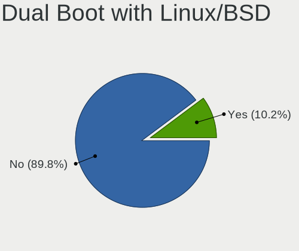
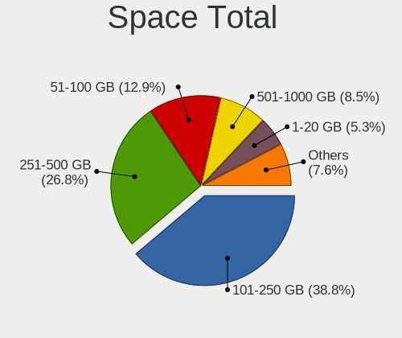
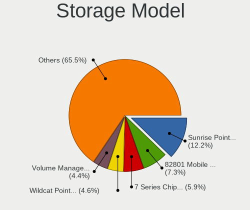
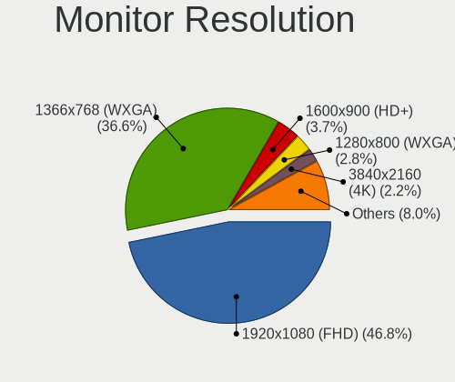
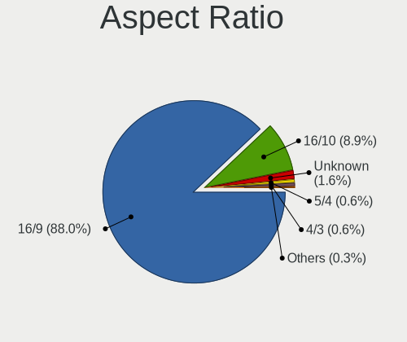
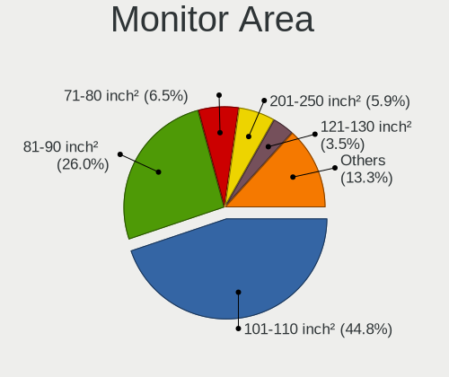
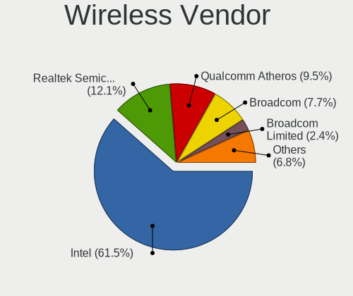
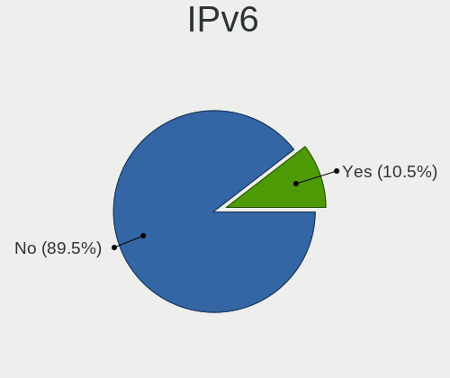
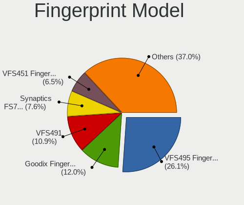

Linux in Pakistan - Tested Hardware & Statistics (Notebooks)
------------------------------------------------------------

A project to collect tested hardware configurations for Linux in Pakistan.

Anyone can contribute to this report by the [hw-probe](https://github.com/linuxhw/hw-probe) tool:

    sudo -E hw-probe -all -upload

Please contribute! Especially if your hardware is rare.

Contents
--------

* [ Test Cases ](#test-cases)

* [ System ](#system)
  - [ OS                       ](#os)
  - [ OS Family                ](#os-family)
  - [ Kernel                   ](#kernel)
  - [ Kernel Family            ](#kernel-family)
  - [ Kernel Major Ver.        ](#kernel-major-ver)
  - [ Arch                     ](#arch)
  - [ DE                       ](#de)
  - [ Display Server           ](#display-server)
  - [ Display Manager          ](#display-manager)
  - [ OS Lang                  ](#os-lang)
  - [ Boot Mode                ](#boot-mode)
  - [ Filesystem               ](#filesystem)
  - [ Part. scheme             ](#part-scheme)
  - [ Dual Boot with Linux/BSD ](#dual-boot-with-linuxbsd)
  - [ Dual Boot (Win)          ](#dual-boot-win)

* [ Board ](#board)
  - [ Vendor                   ](#vendor)
  - [ Model                    ](#model)
  - [ Model Family             ](#model-family)
  - [ MFG Year                 ](#mfg-year)
  - [ Form Factor              ](#form-factor)
  - [ Secure Boot              ](#secure-boot)
  - [ Coreboot                 ](#coreboot)
  - [ RAM Size                 ](#ram-size)
  - [ RAM Used                 ](#ram-used)
  - [ Total Drives             ](#total-drives)
  - [ Has CD-ROM               ](#has-cd-rom)
  - [ Has Ethernet             ](#has-ethernet)
  - [ Has WiFi                 ](#has-wifi)
  - [ Has Bluetooth            ](#has-bluetooth)

* [ Location ](#location)
  - [ Country                  ](#country)
  - [ City                     ](#city)

* [ Drives ](#drives)
  - [ Drive Vendor             ](#drive-vendor)
  - [ Drive Model              ](#drive-model)
  - [ HDD Vendor               ](#hdd-vendor)
  - [ SSD Vendor               ](#ssd-vendor)
  - [ Drive Kind               ](#drive-kind)
  - [ Drive Connector          ](#drive-connector)
  - [ Drive Size               ](#drive-size)
  - [ Space Total              ](#space-total)
  - [ Space Used               ](#space-used)
  - [ Malfunc. Drives          ](#malfunc-drives)
  - [ Malfunc. Drive Vendor    ](#malfunc-drive-vendor)
  - [ Malfunc. HDD Vendor      ](#malfunc-hdd-vendor)
  - [ Malfunc. Drive Kind      ](#malfunc-drive-kind)
  - [ Failed Drives            ](#failed-drives)
  - [ Failed Drive Vendor      ](#failed-drive-vendor)
  - [ Drive Status             ](#drive-status)

* [ Storage controller ](#storage-controller)
  - [ Storage Vendor           ](#storage-vendor)
  - [ Storage Model            ](#storage-model)
  - [ Storage Kind             ](#storage-kind)

* [ Processor ](#processor)
  - [ CPU Vendor               ](#cpu-vendor)
  - [ CPU Model                ](#cpu-model)
  - [ CPU Model Family         ](#cpu-model-family)
  - [ CPU Cores                ](#cpu-cores)
  - [ CPU Sockets              ](#cpu-sockets)
  - [ CPU Threads              ](#cpu-threads)
  - [ CPU Op-Modes             ](#cpu-op-modes)
  - [ CPU Microcode            ](#cpu-microcode)
  - [ CPU Microarch            ](#cpu-microarch)

* [ Graphics ](#graphics)
  - [ GPU Vendor               ](#gpu-vendor)
  - [ GPU Model                ](#gpu-model)
  - [ GPU Combo                ](#gpu-combo)
  - [ GPU Driver               ](#gpu-driver)
  - [ GPU Memory               ](#gpu-memory)

* [ Monitor ](#monitor)
  - [ Monitor Vendor           ](#monitor-vendor)
  - [ Monitor Model            ](#monitor-model)
  - [ Monitor Resolution       ](#monitor-resolution)
  - [ Monitor Diagonal         ](#monitor-diagonal)
  - [ Monitor Width            ](#monitor-width)
  - [ Aspect Ratio             ](#aspect-ratio)
  - [ Monitor Area             ](#monitor-area)
  - [ Pixel Density            ](#pixel-density)
  - [ Multiple Monitors        ](#multiple-monitors)

* [ Network ](#network)
  - [ Net Controller Vendor    ](#net-controller-vendor)
  - [ Net Controller Model     ](#net-controller-model)
  - [ Wireless Vendor          ](#wireless-vendor)
  - [ Wireless Model           ](#wireless-model)
  - [ Ethernet Vendor          ](#ethernet-vendor)
  - [ Ethernet Model           ](#ethernet-model)
  - [ Net Controller Kind      ](#net-controller-kind)
  - [ Used Controller          ](#used-controller)
  - [ NICs                     ](#nics)
  - [ IPv6                     ](#ipv6)

* [ Bluetooth ](#bluetooth)
  - [ Bluetooth Vendor         ](#bluetooth-vendor)
  - [ Bluetooth Model          ](#bluetooth-model)

* [ Sound ](#sound)
  - [ Sound Vendor             ](#sound-vendor)
  - [ Sound Model              ](#sound-model)

* [ Memory ](#memory)
  - [ Memory Vendor            ](#memory-vendor)
  - [ Memory Model             ](#memory-model)
  - [ Memory Kind              ](#memory-kind)
  - [ Memory Form Factor       ](#memory-form-factor)
  - [ Memory Size              ](#memory-size)
  - [ Memory Speed             ](#memory-speed)

* [ Printers & scanners ](#printers--scanners)
  - [ Printer Vendor           ](#printer-vendor)
  - [ Printer Model            ](#printer-model)
  - [ Scanner Vendor           ](#scanner-vendor)
  - [ Scanner Model            ](#scanner-model)

* [ Camera ](#camera)
  - [ Camera Vendor            ](#camera-vendor)
  - [ Camera Model             ](#camera-model)

* [ Security ](#security)
  - [ Fingerprint Vendor       ](#fingerprint-vendor)
  - [ Fingerprint Model        ](#fingerprint-model)
  - [ Chipcard Vendor          ](#chipcard-vendor)
  - [ Chipcard Model           ](#chipcard-model)

* [ Unsupported ](#unsupported)
  - [ Unsupported Devices      ](#unsupported-devices)
  - [ Unsupported Device Types ](#unsupported-device-types)

Test Cases
----------

Total: 364

| Vendor    | Model                       | Probe                                                      | Date         |
|-----------|-----------------------------|------------------------------------------------------------|--------------|
| Lenovo    | ThinkPad E15 Gen 2 20TDS... | [92d7b8d41e](https://linux-hardware.org/?probe=92d7b8d41e) | Sep 28, 2023 |
| Lenovo    | ThinkPad T450 20BUS1A100    | [f4887bacc7](https://linux-hardware.org/?probe=f4887bacc7) | Sep 25, 2023 |
| Dell      | Inspiron 15-7579            | [d85124e7d2](https://linux-hardware.org/?probe=d85124e7d2) | Sep 20, 2023 |
| Dell      | Latitude E6430              | [32cf98639a](https://linux-hardware.org/?probe=32cf98639a) | Sep 20, 2023 |
| HP        | Laptop 15s-fq5xxx           | [11d6fae345](https://linux-hardware.org/?probe=11d6fae345) | Sep 18, 2023 |
| Clevo     | P170HMx                     | [4abfcaf4ba](https://linux-hardware.org/?probe=4abfcaf4ba) | Sep 16, 2023 |
| HP        | Laptop 15-fc0xxx            | [9720b79b9d](https://linux-hardware.org/?probe=9720b79b9d) | Sep 16, 2023 |
| HP        | Laptop 15-fc0xxx            | [0f34501ff9](https://linux-hardware.org/?probe=0f34501ff9) | Sep 16, 2023 |
| Clevo     | P170HMx                     | [1a0ef2b235](https://linux-hardware.org/?probe=1a0ef2b235) | Sep 16, 2023 |
| HP        | Unknown                     | [defc1de0cf](https://linux-hardware.org/?probe=defc1de0cf) | Sep 11, 2023 |
| Acer      | Aspire 3820                 | [08f7d373e7](https://linux-hardware.org/?probe=08f7d373e7) | Sep 07, 2023 |
| Dell      | Inspiron 1545               | [cb4847f435](https://linux-hardware.org/?probe=cb4847f435) | Sep 01, 2023 |
| Lenovo    | ThinkBook 15 G2 ITL 20VE    | [f01ca37e4c](https://linux-hardware.org/?probe=f01ca37e4c) | Aug 31, 2023 |
| HP        | EliteBook 820 G1            | [79855ccf9d](https://linux-hardware.org/?probe=79855ccf9d) | Aug 30, 2023 |
| HP        | EliteBook 820 G1            | [c82147d598](https://linux-hardware.org/?probe=c82147d598) | Aug 29, 2023 |
| HP        | ProBook 640 G4              | [3b75cf22fb](https://linux-hardware.org/?probe=3b75cf22fb) | Aug 25, 2023 |
| ASUSTek   | G75VW                       | [7ef5fc5f0c](https://linux-hardware.org/?probe=7ef5fc5f0c) | Aug 23, 2023 |
| Fujitsu   | LIFEBOOK AH530              | [5e8e8a6397](https://linux-hardware.org/?probe=5e8e8a6397) | Aug 22, 2023 |
| Toshiba   | Satellite L55-B             | [4b2bcc2231](https://linux-hardware.org/?probe=4b2bcc2231) | Aug 18, 2023 |
| Lenovo    | ThinkPad T480 20L5S04F00    | [7eb670d219](https://linux-hardware.org/?probe=7eb670d219) | Aug 17, 2023 |
| Dell      | Latitude E7450              | [9d787db93a](https://linux-hardware.org/?probe=9d787db93a) | Aug 13, 2023 |
| Lenovo    | ThinkPad E15 Gen 2 20TD0... | [ab45ffe407](https://linux-hardware.org/?probe=ab45ffe407) | Aug 07, 2023 |
| Acer      | Aspire 3820                 | [e4d39c20bc](https://linux-hardware.org/?probe=e4d39c20bc) | Aug 05, 2023 |
| Acer      | Aspire 3820                 | [aac7924f4e](https://linux-hardware.org/?probe=aac7924f4e) | Aug 05, 2023 |
| Acer      | Aspire 3820                 | [ceca389ec4](https://linux-hardware.org/?probe=ceca389ec4) | Aug 03, 2023 |
| Acer      | Aspire 3820                 | [814b3a8cf8](https://linux-hardware.org/?probe=814b3a8cf8) | Aug 02, 2023 |
| Gateway   | NV57H                       | [efc311477f](https://linux-hardware.org/?probe=efc311477f) | Jul 28, 2023 |
| Lenovo    | Z50-75 80EC                 | [38a01d299e](https://linux-hardware.org/?probe=38a01d299e) | Jul 21, 2023 |
| Dell      | Latitude 5480               | [2db18c20d1](https://linux-hardware.org/?probe=2db18c20d1) | Jul 18, 2023 |
| Lenovo    | IdeaPad 5 Pro 16ACH6 82L... | [dc3fd72332](https://linux-hardware.org/?probe=dc3fd72332) | Jul 18, 2023 |
| ASUSTek   | G75VW                       | [2bd8f70433](https://linux-hardware.org/?probe=2bd8f70433) | Jul 17, 2023 |
| HP        | Unknown                     | [6100712075](https://linux-hardware.org/?probe=6100712075) | Jul 12, 2023 |
| Lenovo    | Edge 15 80H1                | [aff25effc2](https://linux-hardware.org/?probe=aff25effc2) | Jun 23, 2023 |
| Lenovo    | IdeaPad 3 15ITL6 82H8       | [32f2a1756a](https://linux-hardware.org/?probe=32f2a1756a) | Jun 23, 2023 |
| Alienware | x17 R2                      | [632fbfe682](https://linux-hardware.org/?probe=632fbfe682) | Jun 20, 2023 |
| Haier     | Y11B                        | [0c2abeea6e](https://linux-hardware.org/?probe=0c2abeea6e) | Jun 17, 2023 |
| Lenovo    | IdeaPad 310-15IKB 80TV      | [1f5222a92f](https://linux-hardware.org/?probe=1f5222a92f) | Jun 15, 2023 |
| HP        | ProBook 6360b               | [cdef37cb2d](https://linux-hardware.org/?probe=cdef37cb2d) | Jun 09, 2023 |
| ASUSTek   | T200TA                      | [2c98c872f8](https://linux-hardware.org/?probe=2c98c872f8) | Jun 08, 2023 |
| Clevo     | P170HMx                     | [6513e1e52e](https://linux-hardware.org/?probe=6513e1e52e) | Jun 08, 2023 |
| Clevo     | P170HMx                     | [7e2d7bfd0d](https://linux-hardware.org/?probe=7e2d7bfd0d) | Jun 06, 2023 |
| Dell      | Latitude E7450              | [fe7cb1e53f](https://linux-hardware.org/?probe=fe7cb1e53f) | Jun 03, 2023 |
| Lenovo    | Edge 15 80H1                | [75fdd71ca1](https://linux-hardware.org/?probe=75fdd71ca1) | May 28, 2023 |
| Dell      | Latitude E7450              | [4a88622321](https://linux-hardware.org/?probe=4a88622321) | May 26, 2023 |
| Dell      | Latitude 5480               | [adb6ba25f1](https://linux-hardware.org/?probe=adb6ba25f1) | May 25, 2023 |
| Dell      | Latitude 5480               | [45b63ce664](https://linux-hardware.org/?probe=45b63ce664) | May 25, 2023 |
| Dell      | Latitude 7280               | [c9a41b2795](https://linux-hardware.org/?probe=c9a41b2795) | May 24, 2023 |
| Dell      | Precision 5520              | [a5e0cc8586](https://linux-hardware.org/?probe=a5e0cc8586) | May 24, 2023 |
| HP        | EliteBook 850 G6            | [b38d6399b4](https://linux-hardware.org/?probe=b38d6399b4) | May 22, 2023 |
| Apple     | MacBookPro15,1              | [f1d994fa47](https://linux-hardware.org/?probe=f1d994fa47) | May 22, 2023 |
| Dell      | Latitude E7450              | [51f34cd446](https://linux-hardware.org/?probe=51f34cd446) | May 20, 2023 |
| Dell      | Latitude E7450              | [e844aeb177](https://linux-hardware.org/?probe=e844aeb177) | May 19, 2023 |
| HP        | OMEN by Laptop 16-b0xxx     | [d26275a2de](https://linux-hardware.org/?probe=d26275a2de) | May 14, 2023 |
| HP        | EliteBook 820 G1            | [9ba944eae5](https://linux-hardware.org/?probe=9ba944eae5) | May 09, 2023 |
| HP        | EliteBook 820 G1            | [3e9f94b26a](https://linux-hardware.org/?probe=3e9f94b26a) | May 09, 2023 |
| Dell      | Latitude E5440              | [6db42a9acc](https://linux-hardware.org/?probe=6db42a9acc) | May 08, 2023 |
| Dell      | Inspiron 17-7779            | [f5717fc896](https://linux-hardware.org/?probe=f5717fc896) | May 04, 2023 |
| Dell      | Latitude 5410               | [840aaee455](https://linux-hardware.org/?probe=840aaee455) | May 04, 2023 |
| Dell      | Latitude 5410               | [f95e1d32bf](https://linux-hardware.org/?probe=f95e1d32bf) | May 04, 2023 |
| Google    | Glimmer                     | [c9ccc1f6c9](https://linux-hardware.org/?probe=c9ccc1f6c9) | May 02, 2023 |
| Google    | Glimmer                     | [f4558038dd](https://linux-hardware.org/?probe=f4558038dd) | May 02, 2023 |
| HP        | Pavilion Laptop 15-cc1xx    | [2f3390afca](https://linux-hardware.org/?probe=2f3390afca) | Apr 24, 2023 |
| Dell      | Inspiron 3593               | [5ac8ce1eb9](https://linux-hardware.org/?probe=5ac8ce1eb9) | Apr 19, 2023 |
| Lenovo    | ThinkPad E15 Gen 3 20YG0... | [7ec2b3ff95](https://linux-hardware.org/?probe=7ec2b3ff95) | Apr 14, 2023 |
| HP        | EliteBook 8470w             | [47e8a4441b](https://linux-hardware.org/?probe=47e8a4441b) | Apr 04, 2023 |
| HP        | EliteBook 850 G6            | [303d201aa6](https://linux-hardware.org/?probe=303d201aa6) | Apr 04, 2023 |
| Dell      | G3 3500                     | [aa79addc8c](https://linux-hardware.org/?probe=aa79addc8c) | Mar 29, 2023 |
| HP        | Laptop 15s-fq5xxx           | [f84f8c068b](https://linux-hardware.org/?probe=f84f8c068b) | Mar 15, 2023 |
| Lenovo    | ThinkPad 11e 20DAS0T500     | [e6fd8c46b0](https://linux-hardware.org/?probe=e6fd8c46b0) | Mar 08, 2023 |
| HP        | EliteBook 840 G5            | [948a77b264](https://linux-hardware.org/?probe=948a77b264) | Mar 04, 2023 |
| HP        | EliteBook 840 G5            | [f245db2b9a](https://linux-hardware.org/?probe=f245db2b9a) | Mar 04, 2023 |
| Samsung   | 300E5EV/300E4EV/270E5EV/... | [6c74aa3736](https://linux-hardware.org/?probe=6c74aa3736) | Mar 02, 2023 |
| HP        | ProBook 450 G8 Notebook ... | [009eefdc1d](https://linux-hardware.org/?probe=009eefdc1d) | Feb 28, 2023 |
| HP        | ProBook 450 G8 Notebook ... | [17a7ee80ac](https://linux-hardware.org/?probe=17a7ee80ac) | Feb 28, 2023 |
| HP        | ProBook 645 G1              | [329c0a65eb](https://linux-hardware.org/?probe=329c0a65eb) | Feb 25, 2023 |
| Lenovo    | Legion S7 15ACH6 82K8       | [6f65703034](https://linux-hardware.org/?probe=6f65703034) | Feb 19, 2023 |
| HP        | Pavilion g6                 | [876f755425](https://linux-hardware.org/?probe=876f755425) | Feb 19, 2023 |
| HP        | Notebook                    | [047fd0d69e](https://linux-hardware.org/?probe=047fd0d69e) | Feb 18, 2023 |
| Apple     | MacBookPro11,3              | [b0ffb00d43](https://linux-hardware.org/?probe=b0ffb00d43) | Feb 10, 2023 |
| Apple     | MacBookPro11,3              | [b7cec06bcb](https://linux-hardware.org/?probe=b7cec06bcb) | Jan 30, 2023 |
| Dell      | Latitude E7470              | [42ace80c0b](https://linux-hardware.org/?probe=42ace80c0b) | Jan 27, 2023 |
| HP        | ProBook 6565b               | [0ef00f6bcc](https://linux-hardware.org/?probe=0ef00f6bcc) | Jan 25, 2023 |
| HP        | ProBook 6570b               | [3bc0488b6d](https://linux-hardware.org/?probe=3bc0488b6d) | Jan 22, 2023 |
| HP        | ENVY dv7                    | [4b7b0f98af](https://linux-hardware.org/?probe=4b7b0f98af) | Jan 15, 2023 |
| Lenovo    | S20-30 20421                | [43bee9503c](https://linux-hardware.org/?probe=43bee9503c) | Jan 11, 2023 |
| HP        | ProBook 6570b               | [e5c0ea26d1](https://linux-hardware.org/?probe=e5c0ea26d1) | Jan 09, 2023 |
| HP        | ENVY dv6                    | [2a01900cb1](https://linux-hardware.org/?probe=2a01900cb1) | Jan 07, 2023 |
| Haier     | Y11C                        | [cc9a03834f](https://linux-hardware.org/?probe=cc9a03834f) | Dec 21, 2022 |
| HP        | Laptop 15s-fq5xxx           | [86f0e8ad5d](https://linux-hardware.org/?probe=86f0e8ad5d) | Dec 20, 2022 |
| HP        | Laptop 15s-fq5xxx           | [8122fe7426](https://linux-hardware.org/?probe=8122fe7426) | Dec 20, 2022 |
| Dell      | Latitude D620               | [9f6317405c](https://linux-hardware.org/?probe=9f6317405c) | Nov 29, 2022 |
| Toshiba   | PORTEGE Z30t-A              | [8af94993bd](https://linux-hardware.org/?probe=8af94993bd) | Nov 28, 2022 |
| Dell      | Vostro 3500                 | [db276a4d2e](https://linux-hardware.org/?probe=db276a4d2e) | Nov 28, 2022 |
| Lenovo    | ThinkPad E14 20RAS04700     | [63d93d05db](https://linux-hardware.org/?probe=63d93d05db) | Nov 21, 2022 |
| Dell      | Latitude D620               | [d45ad40496](https://linux-hardware.org/?probe=d45ad40496) | Nov 21, 2022 |
| HP        | EliteBook 840 G3            | [835a83d0ea](https://linux-hardware.org/?probe=835a83d0ea) | Nov 20, 2022 |
| HP        | Laptop 15-dw3xxx            | [03426a19e5](https://linux-hardware.org/?probe=03426a19e5) | Nov 16, 2022 |
| Timi      | TM1613                      | [d038ff5636](https://linux-hardware.org/?probe=d038ff5636) | Nov 13, 2022 |
| HP        | Laptop 14-dq2xxx            | [dcb6d439d4](https://linux-hardware.org/?probe=dcb6d439d4) | Nov 13, 2022 |
| Lenovo    | ThinkPad E580 20KTA001GE    | [55dc6ac7ba](https://linux-hardware.org/?probe=55dc6ac7ba) | Oct 31, 2022 |
| Dell      | Inspiron 13-7359            | [239627f1d1](https://linux-hardware.org/?probe=239627f1d1) | Oct 19, 2022 |
| Dell      | Studio 1458                 | [57b5c85b2a](https://linux-hardware.org/?probe=57b5c85b2a) | Oct 19, 2022 |
| HP        | ProBook 450 G5              | [a7ebb4b3c4](https://linux-hardware.org/?probe=a7ebb4b3c4) | Oct 16, 2022 |
| Lenovo    | Legion 5 15IMH05H 81Y6      | [11573d282c](https://linux-hardware.org/?probe=11573d282c) | Oct 13, 2022 |
| Lenovo    | Legion 5 15IMH05H 81Y6      | [2d102e0f1e](https://linux-hardware.org/?probe=2d102e0f1e) | Oct 12, 2022 |
| Dell      | Vostro 15 5510              | [2aa595867e](https://linux-hardware.org/?probe=2aa595867e) | Oct 11, 2022 |
| Dell      | Vostro 15 5510              | [bd224480a9](https://linux-hardware.org/?probe=bd224480a9) | Oct 10, 2022 |
| HP        | Laptop 15s-du3xxx           | [cbacce92bd](https://linux-hardware.org/?probe=cbacce92bd) | Oct 05, 2022 |
| HP        | Pavilion dv6                | [2830144a8a](https://linux-hardware.org/?probe=2830144a8a) | Oct 04, 2022 |
| HP        | EliteBook 850 G8 Noteboo... | [b01a9ac97f](https://linux-hardware.org/?probe=b01a9ac97f) | Sep 24, 2022 |
| HP        | Laptop 15-bs1xx             | [5657597c18](https://linux-hardware.org/?probe=5657597c18) | Sep 22, 2022 |
| HP        | ENVY 15                     | [6921f93893](https://linux-hardware.org/?probe=6921f93893) | Sep 20, 2022 |
| HP        | EliteBook 840 G2            | [ca96e9bf9b](https://linux-hardware.org/?probe=ca96e9bf9b) | Sep 14, 2022 |
| HP        | EliteBook 840 G3            | [be88e72feb](https://linux-hardware.org/?probe=be88e72feb) | Sep 14, 2022 |
| HP        | EliteBook 840 G3            | [2b1c502b28](https://linux-hardware.org/?probe=2b1c502b28) | Sep 14, 2022 |
| Lenovo    | ThinkPad E15 Gen 2 20TDS... | [2b12cc11f2](https://linux-hardware.org/?probe=2b12cc11f2) | Sep 13, 2022 |
| HP        | ProBook 4540s               | [c1bf52b653](https://linux-hardware.org/?probe=c1bf52b653) | Sep 13, 2022 |
| HP        | ProBook 4540s               | [320e270f44](https://linux-hardware.org/?probe=320e270f44) | Sep 13, 2022 |
| HP        | EliteBook Folio 9470m       | [c03777782c](https://linux-hardware.org/?probe=c03777782c) | Sep 13, 2022 |
| HP        | Unknown                     | [5cf262a728](https://linux-hardware.org/?probe=5cf262a728) | Sep 10, 2022 |
| Lenovo    | ThinkPad T470 20HES3370A    | [5beda28487](https://linux-hardware.org/?probe=5beda28487) | Sep 09, 2022 |
| Dell      | Latitude 3340               | [ec720c63b1](https://linux-hardware.org/?probe=ec720c63b1) | Sep 06, 2022 |
| Lenovo    | ThinkPad T470 20HES3370A    | [3a466cef0a](https://linux-hardware.org/?probe=3a466cef0a) | Sep 05, 2022 |
| Dell      | Latitude E6420              | [98a628a92a](https://linux-hardware.org/?probe=98a628a92a) | Sep 03, 2022 |
| Dell      | Latitude E6420              | [e9c43bd2ab](https://linux-hardware.org/?probe=e9c43bd2ab) | Sep 03, 2022 |
| Dell      | Latitude 3340               | [b9d472b965](https://linux-hardware.org/?probe=b9d472b965) | Sep 01, 2022 |
| Dell      | Latitude 7390               | [571b195a12](https://linux-hardware.org/?probe=571b195a12) | Aug 31, 2022 |
| Dell      | Latitude 7390               | [3c3f6114f6](https://linux-hardware.org/?probe=3c3f6114f6) | Aug 31, 2022 |
| HP        | EliteBook 840 G2            | [5ba91d8167](https://linux-hardware.org/?probe=5ba91d8167) | Aug 30, 2022 |
| HP        | EliteBook 840 G1            | [23d73aa95c](https://linux-hardware.org/?probe=23d73aa95c) | Aug 30, 2022 |
| HP        | EliteBook 840 G2            | [bed3be5142](https://linux-hardware.org/?probe=bed3be5142) | Aug 30, 2022 |
| HP        | EliteBook 840 G2            | [b588415d06](https://linux-hardware.org/?probe=b588415d06) | Aug 30, 2022 |
| Lenovo    | ThinkPad T470 20HES3370A    | [3b1630e4bc](https://linux-hardware.org/?probe=3b1630e4bc) | Aug 30, 2022 |
| HP        | Unknown                     | [9b22ce41e3](https://linux-hardware.org/?probe=9b22ce41e3) | Aug 27, 2022 |
| Dell      | Latitude 7400               | [7f870ac8c2](https://linux-hardware.org/?probe=7f870ac8c2) | Aug 17, 2022 |
| Acer      | Predator PH317-53           | [8578e9a77a](https://linux-hardware.org/?probe=8578e9a77a) | Aug 11, 2022 |
| Lenovo    | IdeaPad 330-15IKB 81DE      | [072d897eda](https://linux-hardware.org/?probe=072d897eda) | Jul 28, 2022 |
| Dell      | Latitude E6420              | [07a671ae31](https://linux-hardware.org/?probe=07a671ae31) | Jul 22, 2022 |
| Dell      | Latitude E5440              | [3b30865387](https://linux-hardware.org/?probe=3b30865387) | Jul 20, 2022 |
| Sony      | VPCEA26FG                   | [c5432e157a](https://linux-hardware.org/?probe=c5432e157a) | Jul 11, 2022 |
| Dell      | Latitude E7450              | [d0c3f69765](https://linux-hardware.org/?probe=d0c3f69765) | Jul 09, 2022 |
| Sony      | VPCEA26FG                   | [2075c04c4c](https://linux-hardware.org/?probe=2075c04c4c) | Jul 03, 2022 |
| Sony      | VPCEA26FG                   | [b72a4de42b](https://linux-hardware.org/?probe=b72a4de42b) | Jul 01, 2022 |
| Lenovo    | ThinkPad E15 Gen 2 20TD0... | [18fbe5a2d0](https://linux-hardware.org/?probe=18fbe5a2d0) | Jun 28, 2022 |
| HP        | EliteBook 8470p             | [d6adb170de](https://linux-hardware.org/?probe=d6adb170de) | Jun 25, 2022 |
| HP        | EliteBook 8470p             | [f9895656b6](https://linux-hardware.org/?probe=f9895656b6) | Jun 23, 2022 |
| HP        | EliteBook 8470p             | [2e2bcb63d7](https://linux-hardware.org/?probe=2e2bcb63d7) | Jun 23, 2022 |
| HP        | EliteBook 850 G5            | [085f5c458d](https://linux-hardware.org/?probe=085f5c458d) | Jun 10, 2022 |
| HP        | Laptop 15s-fq2xxx           | [5bcb742cbe](https://linux-hardware.org/?probe=5bcb742cbe) | Jun 04, 2022 |
| Lenovo    | ThinkPad T450 20BV0005US    | [a795ed872f](https://linux-hardware.org/?probe=a795ed872f) | Jun 03, 2022 |
| HP        | EliteBook 8460p             | [a9cca9972f](https://linux-hardware.org/?probe=a9cca9972f) | May 31, 2022 |
| HP        | EliteBook 8460p             | [f05323c723](https://linux-hardware.org/?probe=f05323c723) | May 31, 2022 |
| Dell      | Inspiron 3543               | [c48c32ae19](https://linux-hardware.org/?probe=c48c32ae19) | May 25, 2022 |
| HP        | Notebook                    | [4508e41795](https://linux-hardware.org/?probe=4508e41795) | May 22, 2022 |
| HP        | Notebook                    | [dc587c572e](https://linux-hardware.org/?probe=dc587c572e) | May 22, 2022 |
| Dell      | Latitude 3330               | [4f05d8475c](https://linux-hardware.org/?probe=4f05d8475c) | May 08, 2022 |
| Dell      | Latitude E6420              | [8c12f58910](https://linux-hardware.org/?probe=8c12f58910) | May 01, 2022 |
| HP        | EliteBook 840 G1            | [411c79850c](https://linux-hardware.org/?probe=411c79850c) | Apr 29, 2022 |
| Lenovo    | ThinkPad E15 Gen 2 20TDS... | [59a49b2d04](https://linux-hardware.org/?probe=59a49b2d04) | Apr 23, 2022 |
| HP        | EliteBook 840 G2            | [3e0d410668](https://linux-hardware.org/?probe=3e0d410668) | Apr 19, 2022 |
| HP        | ProBook 450 G8 Notebook ... | [1974bfe63a](https://linux-hardware.org/?probe=1974bfe63a) | Apr 15, 2022 |
| Dell      | Latitude 3520               | [ee204b07aa](https://linux-hardware.org/?probe=ee204b07aa) | Apr 11, 2022 |
| HP        | Pavilion TS 11              | [9a817f6695](https://linux-hardware.org/?probe=9a817f6695) | Apr 09, 2022 |
| Lenovo    | ThinkPad E15 Gen 2 20TDS... | [0626d13541](https://linux-hardware.org/?probe=0626d13541) | Apr 07, 2022 |
| Dell      | Latitude 7480               | [bf00ec6a76](https://linux-hardware.org/?probe=bf00ec6a76) | Mar 23, 2022 |
| Lenovo    | ThinkPad E15 Gen 2 20TD0... | [1936ee53b3](https://linux-hardware.org/?probe=1936ee53b3) | Mar 22, 2022 |
| Dell      | Latitude 7480               | [faddba28a8](https://linux-hardware.org/?probe=faddba28a8) | Mar 19, 2022 |
| Lenovo    | V110-15IKB 80TH             | [a3aeef468a](https://linux-hardware.org/?probe=a3aeef468a) | Mar 12, 2022 |
| Lenovo    | ThinkBook 15 G2 ITL 20VE    | [e0169c3e87](https://linux-hardware.org/?probe=e0169c3e87) | Feb 23, 2022 |
| HP        | EliteBook Folio 9470m       | [1aa838368f](https://linux-hardware.org/?probe=1aa838368f) | Feb 20, 2022 |
| HP        | EliteBook Folio 9470m       | [8f3df927df](https://linux-hardware.org/?probe=8f3df927df) | Feb 18, 2022 |
| Dell      | Inspiron 3501               | [7fdd5b66fc](https://linux-hardware.org/?probe=7fdd5b66fc) | Feb 14, 2022 |
| Lenovo    | IdeaPad 510-15ISK 80SR      | [a5407aa128](https://linux-hardware.org/?probe=a5407aa128) | Feb 13, 2022 |
| Dell      | Inspiron 5547               | [2d6ff07a82](https://linux-hardware.org/?probe=2d6ff07a82) | Feb 12, 2022 |
| Dell      | Inspiron 3501               | [0dd77f2f7a](https://linux-hardware.org/?probe=0dd77f2f7a) | Feb 12, 2022 |
| Lenovo    | ThinkPad E15 Gen 2 20TDS... | [5a9a256568](https://linux-hardware.org/?probe=5a9a256568) | Feb 01, 2022 |
| Dell      | Inspiron 3501               | [4a0c4a62b7](https://linux-hardware.org/?probe=4a0c4a62b7) | Feb 01, 2022 |
| Dell      | Inspiron 3501               | [c902cc42a6](https://linux-hardware.org/?probe=c902cc42a6) | Jan 18, 2022 |
| Dell      | Inspiron 3501               | [ce839c3628](https://linux-hardware.org/?probe=ce839c3628) | Jan 08, 2022 |
| Lenovo    | ThinkPad T540p 20BFS5630... | [e1e090d622](https://linux-hardware.org/?probe=e1e090d622) | Jan 02, 2022 |
| HP        | Pavilion Laptop 15-cs0xx... | [fb332a2529](https://linux-hardware.org/?probe=fb332a2529) | Jan 01, 2022 |
| HP        | EliteBook Folio 9470m       | [90d57a20ee](https://linux-hardware.org/?probe=90d57a20ee) | Dec 31, 2021 |
| HP        | EliteBook Folio 9470m       | [4db624e8a0](https://linux-hardware.org/?probe=4db624e8a0) | Dec 31, 2021 |
| HP        | EliteBook Folio 9470m       | [b79e118712](https://linux-hardware.org/?probe=b79e118712) | Dec 31, 2021 |
| Acer      | Aspire ES1-411              | [9a5ebb6379](https://linux-hardware.org/?probe=9a5ebb6379) | Dec 19, 2021 |
| HP        | EliteBook 8470p             | [0f7389c7d9](https://linux-hardware.org/?probe=0f7389c7d9) | Dec 14, 2021 |
| Dell      | Inspiron 5515               | [901f720089](https://linux-hardware.org/?probe=901f720089) | Dec 11, 2021 |
| Dell      | Inspiron 5515               | [7c0553b250](https://linux-hardware.org/?probe=7c0553b250) | Dec 11, 2021 |
| HP        | ZBook 15 G3                 | [e662c8b956](https://linux-hardware.org/?probe=e662c8b956) | Dec 07, 2021 |
| Dell      | Inspiron 15 7000 Gaming     | [538c96bb62](https://linux-hardware.org/?probe=538c96bb62) | Nov 26, 2021 |
| Dell      | Latitude E6440              | [e0e5edfc03](https://linux-hardware.org/?probe=e0e5edfc03) | Nov 24, 2021 |
| HP        | Unknown                     | [ef28d45f68](https://linux-hardware.org/?probe=ef28d45f68) | Nov 23, 2021 |
| Dell      | G3 3579                     | [38e9f54ba1](https://linux-hardware.org/?probe=38e9f54ba1) | Nov 23, 2021 |
| Dell      | Inspiron 5520               | [6c6e631ffc](https://linux-hardware.org/?probe=6c6e631ffc) | Nov 20, 2021 |
| HP        | Unknown                     | [23dc38032d](https://linux-hardware.org/?probe=23dc38032d) | Nov 20, 2021 |
| Dell      | Inspiron 15 7000 Gaming     | [cd386145b8](https://linux-hardware.org/?probe=cd386145b8) | Nov 18, 2021 |
| HP        | Pavilion Laptop 14-ce2xx... | [f9ebb771b0](https://linux-hardware.org/?probe=f9ebb771b0) | Nov 14, 2021 |
| HP        | ZBook 15 G3                 | [67e5184b17](https://linux-hardware.org/?probe=67e5184b17) | Nov 13, 2021 |
| Dell      | Vostro 1500                 | [23aeb68ca2](https://linux-hardware.org/?probe=23aeb68ca2) | Nov 11, 2021 |
| HP        | ZBook 15 G3                 | [3e94ac7df1](https://linux-hardware.org/?probe=3e94ac7df1) | Nov 09, 2021 |
| Dell      | Inspiron 3501               | [5d35bd9e4a](https://linux-hardware.org/?probe=5d35bd9e4a) | Nov 07, 2021 |
| Dell      | Inspiron 15-3567            | [630a9144f1](https://linux-hardware.org/?probe=630a9144f1) | Nov 06, 2021 |
| HP        | 650                         | [c32592cabb](https://linux-hardware.org/?probe=c32592cabb) | Oct 20, 2021 |
| Apple     | MacBookPro14,1              | [bb1aa448fd](https://linux-hardware.org/?probe=bb1aa448fd) | Oct 20, 2021 |
| HP        | ProBook 450 G7              | [a47cdaa2ba](https://linux-hardware.org/?probe=a47cdaa2ba) | Oct 20, 2021 |
| Lenovo    | ThinkBook 15-IIL 20SM       | [c7fc550482](https://linux-hardware.org/?probe=c7fc550482) | Oct 16, 2021 |
| HP        | ProBook 450 G7              | [f2a84de135](https://linux-hardware.org/?probe=f2a84de135) | Oct 12, 2021 |
| Dell      | Latitude E5570              | [938d1a781d](https://linux-hardware.org/?probe=938d1a781d) | Oct 08, 2021 |
| Lenovo    | ThinkPad X220 Tablet 429... | [33137c7c23](https://linux-hardware.org/?probe=33137c7c23) | Oct 07, 2021 |
| Lenovo    | ThinkBook 15 G2 ITL 20VE    | [196fa579f8](https://linux-hardware.org/?probe=196fa579f8) | Oct 04, 2021 |
| Haier     | Y11C                        | [74b9ee5509](https://linux-hardware.org/?probe=74b9ee5509) | Oct 03, 2021 |
| Dell      | Precision M6400             | [5f6ec9333e](https://linux-hardware.org/?probe=5f6ec9333e) | Oct 03, 2021 |
| Haier     | Y11C                        | [591740bf00](https://linux-hardware.org/?probe=591740bf00) | Sep 27, 2021 |
| Dell      | Inspiron 5515               | [64af4c4882](https://linux-hardware.org/?probe=64af4c4882) | Sep 24, 2021 |
| Lenovo    | ThinkPad X220 Tablet 429... | [d0e2e19e84](https://linux-hardware.org/?probe=d0e2e19e84) | Sep 12, 2021 |
| ASUSTek   | VivoBook_ASUSLaptop X571... | [966a09526a](https://linux-hardware.org/?probe=966a09526a) | Aug 14, 2021 |
| Dell      | Inspiron 3542               | [0909599e9c](https://linux-hardware.org/?probe=0909599e9c) | Aug 11, 2021 |
| Dell      | Inspiron 5570               | [9adf19d9c0](https://linux-hardware.org/?probe=9adf19d9c0) | Aug 10, 2021 |
| Dell      | Inspiron 5593               | [1f6017347e](https://linux-hardware.org/?probe=1f6017347e) | Aug 05, 2021 |
| Dell      | Latitude E5250              | [f50f84a6a3](https://linux-hardware.org/?probe=f50f84a6a3) | Jul 26, 2021 |
| Dell      | Latitude E5250              | [9806ab15ab](https://linux-hardware.org/?probe=9806ab15ab) | Jul 25, 2021 |
| Dell      | Latitude E5250              | [9a475d76a4](https://linux-hardware.org/?probe=9a475d76a4) | Jul 25, 2021 |
| Dell      | Latitude E5250              | [d65621a003](https://linux-hardware.org/?probe=d65621a003) | Jul 16, 2021 |
| HP        | EliteBook 8440p             | [d89b69a6a3](https://linux-hardware.org/?probe=d89b69a6a3) | Jul 16, 2021 |
| Dell      | Inspiron 15 7000 Gaming     | [d320594f42](https://linux-hardware.org/?probe=d320594f42) | Jul 07, 2021 |
| Lenovo    | ThinkPad E14 20RA007SAD     | [eb51ce8f36](https://linux-hardware.org/?probe=eb51ce8f36) | Jul 07, 2021 |
| Dell      | Precision 5530              | [7d267375f2](https://linux-hardware.org/?probe=7d267375f2) | Jul 05, 2021 |
| Dell      | Inspiron 5593               | [926e72bc56](https://linux-hardware.org/?probe=926e72bc56) | Jul 03, 2021 |
| HP        | Pavilion Notebook           | [f5ac8e2aca](https://linux-hardware.org/?probe=f5ac8e2aca) | Jun 25, 2021 |
| HP        | Pavilion dv6                | [c3529dc2aa](https://linux-hardware.org/?probe=c3529dc2aa) | Jun 24, 2021 |
| Dell      | Precision M6400             | [7f2245c976](https://linux-hardware.org/?probe=7f2245c976) | Jun 24, 2021 |
| Dell      | Latitude 3510               | [79c73e5595](https://linux-hardware.org/?probe=79c73e5595) | Jun 09, 2021 |
| Toshiba   | Satellite L850              | [6beced18da](https://linux-hardware.org/?probe=6beced18da) | May 23, 2021 |
| Dell      | Vostro 14-3468              | [1742ee5823](https://linux-hardware.org/?probe=1742ee5823) | May 21, 2021 |
| Dell      | Latitude E5250              | [8c3b8c27c8](https://linux-hardware.org/?probe=8c3b8c27c8) | May 10, 2021 |
| Dell      | Latitude E6420              | [6e3288ca3a](https://linux-hardware.org/?probe=6e3288ca3a) | Apr 11, 2021 |
| Dell      | Inspiron 17-7779            | [2cf1f86b67](https://linux-hardware.org/?probe=2cf1f86b67) | Apr 06, 2021 |
| Gigabyte  | AERO 15-SA                  | [b162082414](https://linux-hardware.org/?probe=b162082414) | Apr 03, 2021 |
| Gigabyte  | AERO 15-SA                  | [536dfb993f](https://linux-hardware.org/?probe=536dfb993f) | Mar 28, 2021 |
| Dell      | Latitude 3510               | [1ef27c1786](https://linux-hardware.org/?probe=1ef27c1786) | Mar 25, 2021 |
| HP        | EliteBook 2170p             | [eba311c4d7](https://linux-hardware.org/?probe=eba311c4d7) | Mar 22, 2021 |
| HP        | EliteBook 2170p             | [e506fc315e](https://linux-hardware.org/?probe=e506fc315e) | Mar 21, 2021 |
| Lenovo    | IdeaPad L340-15IWL 81LG     | [eb713030d2](https://linux-hardware.org/?probe=eb713030d2) | Mar 18, 2021 |
| Dell      | Latitude E6420              | [a062baeb24](https://linux-hardware.org/?probe=a062baeb24) | Mar 12, 2021 |
| HP        | EliteBook 850 G7 Noteboo... | [6dbe550700](https://linux-hardware.org/?probe=6dbe550700) | Feb 28, 2021 |
| HP        | EliteBook 840 G3            | [b8a8ea9182](https://linux-hardware.org/?probe=b8a8ea9182) | Feb 24, 2021 |
| HP        | EliteBook 840 G3            | [ce415da689](https://linux-hardware.org/?probe=ce415da689) | Feb 23, 2021 |
| ASUSTek   | TUF Gaming FA706IU_FA706... | [64c73f58bb](https://linux-hardware.org/?probe=64c73f58bb) | Feb 22, 2021 |
| Lenovo    | ThinkBook 15-IIL 20SM       | [0426a1c07e](https://linux-hardware.org/?probe=0426a1c07e) | Feb 20, 2021 |
| HP        | 14                          | [d5382b721f](https://linux-hardware.org/?probe=d5382b721f) | Feb 11, 2021 |
| Toshiba   | Satellite S50t-B            | [2fe86bc977](https://linux-hardware.org/?probe=2fe86bc977) | Feb 06, 2021 |
| Toshiba   | Satellite S50t-B            | [ec72426035](https://linux-hardware.org/?probe=ec72426035) | Feb 05, 2021 |
| Toshiba   | Satellite S50t-B            | [f7709c05cb](https://linux-hardware.org/?probe=f7709c05cb) | Feb 05, 2021 |
| HP        | 14                          | [f27a999e26](https://linux-hardware.org/?probe=f27a999e26) | Feb 03, 2021 |
| Sony      | SVE15126CXS                 | [8a27b129a3](https://linux-hardware.org/?probe=8a27b129a3) | Feb 02, 2021 |
| Apple     | MacBookPro16,2              | [e3790fd911](https://linux-hardware.org/?probe=e3790fd911) | Jan 31, 2021 |
| Apple     | MacBookPro16,2              | [0ee13de953](https://linux-hardware.org/?probe=0ee13de953) | Jan 31, 2021 |
| Lenovo    | ThinkPad E15 20RD0088UE     | [d2bfe04a2b](https://linux-hardware.org/?probe=d2bfe04a2b) | Jan 28, 2021 |
| HP        | ProBook 450 G5              | [e4b829fff8](https://linux-hardware.org/?probe=e4b829fff8) | Jan 26, 2021 |
| HP        | ProBook 450 G2              | [7db1cae3c0](https://linux-hardware.org/?probe=7db1cae3c0) | Jan 25, 2021 |
| HP        | ProBook 450 G5              | [0421fbf0d1](https://linux-hardware.org/?probe=0421fbf0d1) | Jan 25, 2021 |
| Lenovo    | ThinkPad T460 20FMS39800    | [7b4f78f648](https://linux-hardware.org/?probe=7b4f78f648) | Jan 10, 2021 |
| Dell      | Latitude E6510              | [2557f813e4](https://linux-hardware.org/?probe=2557f813e4) | Dec 15, 2020 |
| Dell      | Inspiron 15 7000 Gaming     | [b04b3b207e](https://linux-hardware.org/?probe=b04b3b207e) | Dec 11, 2020 |
| Fujitsu   | LIFEBOOK E752               | [252afde67a](https://linux-hardware.org/?probe=252afde67a) | Dec 08, 2020 |
| Lenovo    | ThinkBook 15-IML 20RW       | [f84c7affac](https://linux-hardware.org/?probe=f84c7affac) | Dec 07, 2020 |
| Dell      | Latitude E7440              | [0d04075b3e](https://linux-hardware.org/?probe=0d04075b3e) | Dec 03, 2020 |
| Lenovo    | ThinkPad W500 40612HU       | [06465bf227](https://linux-hardware.org/?probe=06465bf227) | Dec 01, 2020 |
| Lenovo    | ThinkPad T60 1951WAT        | [4da418a597](https://linux-hardware.org/?probe=4da418a597) | Nov 28, 2020 |
| Dell      | Latitude E7450              | [20ee05f0fa](https://linux-hardware.org/?probe=20ee05f0fa) | Nov 27, 2020 |
| Dell      | Latitude E7440              | [9627b61c6f](https://linux-hardware.org/?probe=9627b61c6f) | Nov 25, 2020 |
| Dell      | Latitude E7450              | [e9a83f5dc5](https://linux-hardware.org/?probe=e9a83f5dc5) | Nov 24, 2020 |
| HP        | EliteBook 2540p             | [00a011fa83](https://linux-hardware.org/?probe=00a011fa83) | Nov 22, 2020 |
| HP        | EliteBook 2540p             | [12f4630385](https://linux-hardware.org/?probe=12f4630385) | Nov 22, 2020 |
| Lenovo    | ThinkPad E560 20EV0010UK    | [a52f064714](https://linux-hardware.org/?probe=a52f064714) | Nov 19, 2020 |
| Dell      | Inspiron 5567               | [f563b4b50d](https://linux-hardware.org/?probe=f563b4b50d) | Nov 18, 2020 |
| HP        | 650                         | [67e06d1514](https://linux-hardware.org/?probe=67e06d1514) | Nov 09, 2020 |
| HP        | Pavilion g6                 | [98124ff6a4](https://linux-hardware.org/?probe=98124ff6a4) | Nov 08, 2020 |
| HP        | EliteBook 8470p             | [847807840d](https://linux-hardware.org/?probe=847807840d) | Nov 05, 2020 |
| HP        | ProBook 6560b               | [934ffc99e6](https://linux-hardware.org/?probe=934ffc99e6) | Oct 30, 2020 |
| Dell      | Inspiron 15-3567            | [2b138e461a](https://linux-hardware.org/?probe=2b138e461a) | Oct 26, 2020 |
| Dell      | Inspiron 15-3567            | [4460c27fd7](https://linux-hardware.org/?probe=4460c27fd7) | Oct 26, 2020 |
| Dell      | Inspiron 15-3567            | [b647bae107](https://linux-hardware.org/?probe=b647bae107) | Oct 24, 2020 |
| Apple     | MacBookAir6,2               | [3509d2f6e3](https://linux-hardware.org/?probe=3509d2f6e3) | Oct 22, 2020 |
| Toshiba   | PORTEGE Z30-B               | [d7c9922a29](https://linux-hardware.org/?probe=d7c9922a29) | Oct 21, 2020 |
| HP        | ProBook 4340s               | [3db4ff09f4](https://linux-hardware.org/?probe=3db4ff09f4) | Oct 18, 2020 |
| Dell      | Latitude E6540              | [36688dde6e](https://linux-hardware.org/?probe=36688dde6e) | Oct 06, 2020 |
| HP        | 650                         | [1ea9bf783e](https://linux-hardware.org/?probe=1ea9bf783e) | Oct 03, 2020 |
| HP        | ProBook 450 G5              | [94eb24ff74](https://linux-hardware.org/?probe=94eb24ff74) | Oct 02, 2020 |
| Dell      | Latitude E4300              | [12b944fb30](https://linux-hardware.org/?probe=12b944fb30) | Oct 02, 2020 |
| HP        | ProBook 450 G5              | [cb2cef5fcf](https://linux-hardware.org/?probe=cb2cef5fcf) | Oct 01, 2020 |
| Lenovo    | ThinkPad T440p 20AWS0DU0... | [caf12cb57f](https://linux-hardware.org/?probe=caf12cb57f) | Sep 30, 2020 |
| Lenovo    | ThinkPad T440p 20AWS0DU0... | [d3cc62a7f5](https://linux-hardware.org/?probe=d3cc62a7f5) | Sep 30, 2020 |
| Dell      | Latitude E7450              | [7df34be11f](https://linux-hardware.org/?probe=7df34be11f) | Sep 29, 2020 |
| Dell      | Latitude E7450              | [8149a50311](https://linux-hardware.org/?probe=8149a50311) | Sep 29, 2020 |
| Samsung   | QX311/QX411/QX412/QX511     | [b6f7494e44](https://linux-hardware.org/?probe=b6f7494e44) | Sep 21, 2020 |
| HP        | 650                         | [278a9afdeb](https://linux-hardware.org/?probe=278a9afdeb) | Sep 21, 2020 |
| Dell      | Vostro 14-3468              | [4ab76fd5c2](https://linux-hardware.org/?probe=4ab76fd5c2) | Sep 20, 2020 |
| HP        | 650                         | [8aaa8d7e4d](https://linux-hardware.org/?probe=8aaa8d7e4d) | Sep 19, 2020 |
| Samsung   | QX311/QX411/QX412/QX511     | [1ec83fe97e](https://linux-hardware.org/?probe=1ec83fe97e) | Sep 17, 2020 |
| HP        | EliteBook 840 G3            | [d6204bd9e2](https://linux-hardware.org/?probe=d6204bd9e2) | Sep 16, 2020 |
| HP        | ProBook 455 G7              | [d84e4c8838](https://linux-hardware.org/?probe=d84e4c8838) | Sep 13, 2020 |
| HP        | ENVY 17                     | [08285409ad](https://linux-hardware.org/?probe=08285409ad) | Sep 13, 2020 |
| HP        | ProBook 455 G7              | [290aad9d0d](https://linux-hardware.org/?probe=290aad9d0d) | Sep 12, 2020 |
| HP        | ProBook 450 G7              | [85d0104e28](https://linux-hardware.org/?probe=85d0104e28) | Sep 10, 2020 |
| Dell      | Inspiron 15-3573            | [9be442a7dd](https://linux-hardware.org/?probe=9be442a7dd) | Sep 07, 2020 |
| HP        | ProBook 440 G7              | [1c4d1f875b](https://linux-hardware.org/?probe=1c4d1f875b) | Sep 01, 2020 |
| HP        | ProBook 4340s               | [f7580ed51b](https://linux-hardware.org/?probe=f7580ed51b) | Aug 31, 2020 |
| Dell      | Latitude E7250              | [ff13c002c8](https://linux-hardware.org/?probe=ff13c002c8) | Aug 27, 2020 |
| HP        | EliteBook 820 G2            | [f35b20067d](https://linux-hardware.org/?probe=f35b20067d) | Aug 25, 2020 |
| HP        | Laptop 15-da2xxx            | [031606a1a9](https://linux-hardware.org/?probe=031606a1a9) | Aug 21, 2020 |
| Dell      | Latitude E7250              | [63024e0df6](https://linux-hardware.org/?probe=63024e0df6) | Aug 19, 2020 |
| HP        | ProBook 450 G7              | [8a5fc0bc23](https://linux-hardware.org/?probe=8a5fc0bc23) | Aug 13, 2020 |
| HP        | ProBook 440 G5              | [fa604583d6](https://linux-hardware.org/?probe=fa604583d6) | Aug 10, 2020 |
| HP        | ProBook 440 G5              | [255da50641](https://linux-hardware.org/?probe=255da50641) | Aug 10, 2020 |
| Lenovo    | ThinkPad X201 3249CTO       | [930fbc43ed](https://linux-hardware.org/?probe=930fbc43ed) | Aug 09, 2020 |
| HP        | Pavilion Notebook           | [f62759a869](https://linux-hardware.org/?probe=f62759a869) | Aug 05, 2020 |
| Dell      | Inspiron 15-3567            | [4af4cdfef7](https://linux-hardware.org/?probe=4af4cdfef7) | Jul 30, 2020 |
| HP        | ProBook 440 G7              | [4b38ecdae9](https://linux-hardware.org/?probe=4b38ecdae9) | Jul 28, 2020 |
| HP        | EliteBook 840 G2            | [9dbea8590b](https://linux-hardware.org/?probe=9dbea8590b) | Jul 19, 2020 |
| HP        | ProBook 450 G7              | [45478d9106](https://linux-hardware.org/?probe=45478d9106) | Jul 18, 2020 |
| HP        | ProBook 470 G2              | [c42c686ae8](https://linux-hardware.org/?probe=c42c686ae8) | Jul 09, 2020 |
| MOTION    | NVX00                       | [fd07831802](https://linux-hardware.org/?probe=fd07831802) | Jul 04, 2020 |
| HP        | ProBook 450 G3              | [a12518d58c](https://linux-hardware.org/?probe=a12518d58c) | Jun 30, 2020 |
| Dell      | Latitude E6440              | [a7fe187945](https://linux-hardware.org/?probe=a7fe187945) | Jun 28, 2020 |
| Haier     | Y11C                        | [6b98c2c449](https://linux-hardware.org/?probe=6b98c2c449) | Jun 23, 2020 |
| Lenovo    | ThinkPad X201 3249CTO       | [8c8ed3d489](https://linux-hardware.org/?probe=8c8ed3d489) | Jun 06, 2020 |
| Haier     | Y11C                        | [7f9f93809f](https://linux-hardware.org/?probe=7f9f93809f) | Jun 01, 2020 |
| Dell      | Latitude E6410              | [60757c8504](https://linux-hardware.org/?probe=60757c8504) | May 21, 2020 |
| Lenovo    | ThinkPad X201 3249CTO       | [86a1d31e5c](https://linux-hardware.org/?probe=86a1d31e5c) | May 21, 2020 |
| Dell      | Latitude E7450              | [1031b89b4b](https://linux-hardware.org/?probe=1031b89b4b) | May 12, 2020 |
| HP        | EliteBook Folio 1040 G1     | [34b0697bf6](https://linux-hardware.org/?probe=34b0697bf6) | May 10, 2020 |
| Dell      | Latitude E6320              | [cedc2c5001](https://linux-hardware.org/?probe=cedc2c5001) | May 10, 2020 |
| Acer      | Aspire E5-576               | [581af37cda](https://linux-hardware.org/?probe=581af37cda) | Apr 19, 2020 |
| Dell      | Latitude E5420              | [6d2ddeb934](https://linux-hardware.org/?probe=6d2ddeb934) | Apr 18, 2020 |
| HP        | EliteBook 6930p             | [ea52c08646](https://linux-hardware.org/?probe=ea52c08646) | Apr 09, 2020 |
| Dell      | Latitude E4300              | [5e38d54ea2](https://linux-hardware.org/?probe=5e38d54ea2) | Mar 18, 2020 |
| HP        | EliteBook 8440p             | [cd13c97ddb](https://linux-hardware.org/?probe=cd13c97ddb) | Mar 11, 2020 |
| Lenovo    | ThinkBook 15-IML 20RW       | [3cd2a73254](https://linux-hardware.org/?probe=3cd2a73254) | Mar 09, 2020 |
| HP        | Pavilion dv7                | [c727a0fa74](https://linux-hardware.org/?probe=c727a0fa74) | Jan 27, 2020 |
| HP        | EliteBook 8470p             | [e257c71d0b](https://linux-hardware.org/?probe=e257c71d0b) | Jan 14, 2020 |
| HP        | ProBook 450 G3              | [f73167982a](https://linux-hardware.org/?probe=f73167982a) | Jan 01, 2020 |
| Dell      | Inspiron 5567               | [aba56c558d](https://linux-hardware.org/?probe=aba56c558d) | Nov 10, 2019 |
| Dell      | Latitude XT3                | [4ccaa2e0e2](https://linux-hardware.org/?probe=4ccaa2e0e2) | Oct 29, 2019 |
| Lenovo    | ThinkPad T440 20B7S1NK05    | [310405c604](https://linux-hardware.org/?probe=310405c604) | Oct 29, 2019 |
| HP        | EliteBook 6930p             | [856fcded98](https://linux-hardware.org/?probe=856fcded98) | Oct 25, 2019 |
| HP        | Unknown                     | [25dd8af3ee](https://linux-hardware.org/?probe=25dd8af3ee) | Oct 22, 2019 |
| HP        | EliteBook 6930p             | [43c8f2b72c](https://linux-hardware.org/?probe=43c8f2b72c) | Sep 13, 2019 |
| HP        | EliteBook 6930p             | [964e933faf](https://linux-hardware.org/?probe=964e933faf) | Sep 13, 2019 |
| Samsung   | 940Z5L                      | [28c94787df](https://linux-hardware.org/?probe=28c94787df) | Sep 13, 2019 |
| AMI       | Unknown                     | [407590d103](https://linux-hardware.org/?probe=407590d103) | Sep 09, 2019 |
| HP        | ProBook 6470b               | [81e17acdb1](https://linux-hardware.org/?probe=81e17acdb1) | Aug 02, 2019 |
| HP        | EliteBook 840 G3            | [b419735d70](https://linux-hardware.org/?probe=b419735d70) | Jul 04, 2019 |
| Sony      | VPCCB490X                   | [ed39416136](https://linux-hardware.org/?probe=ed39416136) | Jun 22, 2019 |
| Haier     | Y11C                        | [ab6b2cf0e5](https://linux-hardware.org/?probe=ab6b2cf0e5) | Jun 20, 2019 |
| Haier     | Y11C                        | [74a3547ed6](https://linux-hardware.org/?probe=74a3547ed6) | Jun 20, 2019 |
| Dell      | Latitude E6420              | [c5063bb936](https://linux-hardware.org/?probe=c5063bb936) | May 12, 2019 |
| Dell      | Latitude E6420              | [9563d07d0a](https://linux-hardware.org/?probe=9563d07d0a) | May 12, 2019 |
| Haier     | Y11B                        | [d90f70d18f](https://linux-hardware.org/?probe=d90f70d18f) | May 11, 2019 |
| Haier     | Y11B                        | [e359a25a69](https://linux-hardware.org/?probe=e359a25a69) | Nov 18, 2018 |
| Haier     | Y11B                        | [13e5308d20](https://linux-hardware.org/?probe=13e5308d20) | Nov 18, 2018 |
| HP        | Pavilion Notebook           | [7e2949f7da](https://linux-hardware.org/?probe=7e2949f7da) | Nov 11, 2018 |
| Acer      | Aspire 5733                 | [970a40e3d0](https://linux-hardware.org/?probe=970a40e3d0) | Oct 23, 2018 |
| ASUSTek   | K53U                        | [f644624e98](https://linux-hardware.org/?probe=f644624e98) | Oct 01, 2018 |

System
------

OS
--

Installed operating systems

| Name               | Notebooks | Percent |
|--------------------|-----------|---------|
| Ubuntu 20.04       | 70        | 25.93%  |
| Ubuntu 22.04       | 32        | 11.85%  |
| Ubuntu 18.04       | 20        | 7.41%   |
| Zorin 16           | 7         | 2.59%   |
| Ubuntu 23.04       | 6         | 2.22%   |
| KDE neon 20.04     | 5         | 1.85%   |
| Arch               | 5         | 1.85%   |
| Ubuntu 22.10       | 4         | 1.48%   |
| Pop!_OS 22.04      | 4         | 1.48%   |
| Kali 2023.2        | 4         | 1.48%   |
| Debian 11          | 4         | 1.48%   |
| Ubuntu 21.10       | 3         | 1.11%   |
| Ubuntu 21.04       | 3         | 1.11%   |
| Ubuntu 19.04       | 3         | 1.11%   |
| Pop!_OS 21.04      | 3         | 1.11%   |
| Pop!_OS 20.10      | 3         | 1.11%   |
| Pop!_OS 20.04      | 3         | 1.11%   |
| OpenMandriva 4.3   | 3         | 1.11%   |
| Linux Mint 20      | 3         | 1.11%   |
| Kubuntu 22.04      | 3         | 1.11%   |
| Kali 2023.3        | 3         | 1.11%   |
| Fedora 37          | 3         | 1.11%   |
| Fedora 33          | 3         | 1.11%   |
| Elementary 6.1     | 3         | 1.11%   |
| ArcoLinux Rolling  | 3         | 1.11%   |
| Zorin 15           | 2         | 0.74%   |
| Xero Rolling       | 2         | 0.74%   |
| OpenMandriva 4.2   | 2         | 0.74%   |
| OpenMandriva 23.03 | 2         | 0.74%   |
| OpenMandriva 23.01 | 2         | 0.74%   |
| Linux Mint 21.2    | 2         | 0.74%   |
| Linux Mint 21.1    | 2         | 0.74%   |
| Linux Mint 20.3    | 2         | 0.74%   |
| Linux Mint 20.2    | 2         | 0.74%   |
| Linux Mint 20.1    | 2         | 0.74%   |
| Kali 2022.3        | 2         | 0.74%   |
| Fedora 36          | 2         | 0.74%   |
| Arch Rolling       | 2         | 0.74%   |
| Zorin 12           | 1         | 0.37%   |
| Xubuntu 22.04      | 1         | 0.37%   |

OS Family
---------

OS without a version

| Name         | Notebooks | Percent |
|--------------|-----------|---------|
| Ubuntu       | 142       | 54.2%   |
| Pop!_OS      | 12        | 4.58%   |
| Linux Mint   | 12        | 4.58%   |
| Fedora       | 12        | 4.58%   |
| Zorin        | 10        | 3.82%   |
| Kali         | 10        | 3.82%   |
| OpenMandriva | 8         | 3.05%   |
| Arch         | 7         | 2.67%   |
| Kubuntu      | 5         | 1.91%   |
| KDE neon     | 5         | 1.91%   |
| Manjaro      | 4         | 1.53%   |
| Debian       | 4         | 1.53%   |
| ArcoLinux    | 4         | 1.53%   |
| Ubuntu Unity | 3         | 1.15%   |
| Endless      | 3         | 1.15%   |
| Elementary   | 3         | 1.15%   |
| Xero         | 2         | 0.76%   |
| Parrot       | 2         | 0.76%   |
| Artix        | 2         | 0.76%   |
| Xubuntu      | 1         | 0.38%   |
| ROSA         | 1         | 0.38%   |
| Rocky Linux  | 1         | 0.38%   |
| RHEL         | 1         | 0.38%   |
| Oracle Linux | 1         | 0.38%   |
| Nobara       | 1         | 0.38%   |
| Lubuntu      | 1         | 0.38%   |
| LinuxFX      | 1         | 0.38%   |
| EndeavourOS  | 1         | 0.38%   |
| Deepin       | 1         | 0.38%   |
| Clear Linux  | 1         | 0.38%   |
| AlmaLinux    | 1         | 0.38%   |

Kernel
------

Version of the Linux kernel

| Version                 | Notebooks | Percent |
|-------------------------|-----------|---------|
| 5.4.0-42-generic        | 9         | 3.11%   |
| 5.15.0-46-generic       | 8         | 2.77%   |
| 5.19.0-42-generic       | 5         | 1.73%   |
| 5.15.0-47-generic       | 5         | 1.73%   |
| 5.11.0-37-generic       | 5         | 1.73%   |
| 6.2.0-32-generic        | 4         | 1.38%   |
| 5.4.0-48-generic        | 4         | 1.38%   |
| 5.4.0-47-generic        | 4         | 1.38%   |
| 5.4.0-40-generic        | 4         | 1.38%   |
| 6.3.0-kali1-amd64       | 3         | 1.04%   |
| 5.8.0-7630-generic      | 3         | 1.04%   |
| 5.8.0-41-generic        | 3         | 1.04%   |
| 5.4.0-54-generic        | 3         | 1.04%   |
| 5.4.0-52-generic        | 3         | 1.04%   |
| 5.4.0-26-generic        | 3         | 1.04%   |
| 5.3.0-28-generic        | 3         | 1.04%   |
| 5.19.0-46-generic       | 3         | 1.04%   |
| 5.19.0-41-generic       | 3         | 1.04%   |
| 5.16.7-desktop-1omv4003 | 3         | 1.04%   |
| 5.15.0-79-generic       | 3         | 1.04%   |
| 5.15.0-58-generic       | 3         | 1.04%   |
| 5.15.0-56-generic       | 3         | 1.04%   |
| 5.13.0-39-generic       | 3         | 1.04%   |
| 5.13.0-30-generic       | 3         | 1.04%   |
| 6.4.0-kali3-amd64       | 2         | 0.69%   |
| 6.2.6-desktop-1omv2390  | 2         | 0.69%   |
| 6.2.0-31-generic        | 2         | 0.69%   |
| 6.2.0-26-generic        | 2         | 0.69%   |
| 6.1.1-desktop-1omv2290  | 2         | 0.69%   |
| 6.1.0-kali9-amd64       | 2         | 0.69%   |
| 6.0.8-300.fc37.x86_64   | 2         | 0.69%   |
| 5.9.8-200.fc33.x86_64   | 2         | 0.69%   |
| 5.8.0-59-generic        | 2         | 0.69%   |
| 5.8.0-48-generic        | 2         | 0.69%   |
| 5.4.0-91-generic        | 2         | 0.69%   |
| 5.4.0-58-generic        | 2         | 0.69%   |
| 5.4.0-45-generic        | 2         | 0.69%   |
| 5.4.0-39-generic        | 2         | 0.69%   |
| 5.4.0-33-generic        | 2         | 0.69%   |
| 5.4.0-29-generic        | 2         | 0.69%   |

Kernel Family
-------------

Linux kernel without a distro release

| Version | Notebooks | Percent |
|---------|-----------|---------|
| 5.4.0   | 50        | 18.45%  |
| 5.15.0  | 36        | 13.28%  |
| 5.19.0  | 23        | 8.49%   |
| 5.11.0  | 20        | 7.38%   |
| 5.8.0   | 16        | 5.9%    |
| 5.13.0  | 16        | 5.9%    |
| 4.15.0  | 12        | 4.43%   |
| 6.2.0   | 11        | 4.06%   |
| 5.3.0   | 7         | 2.58%   |
| 5.0.0   | 6         | 2.21%   |
| 5.10.0  | 5         | 1.85%   |
| 6.3.0   | 3         | 1.11%   |
| 6.2.6   | 3         | 1.11%   |
| 6.0.8   | 3         | 1.11%   |
| 5.16.7  | 3         | 1.11%   |
| 4.18.0  | 3         | 1.11%   |
| 6.4.0   | 2         | 0.74%   |
| 6.1.1   | 2         | 0.74%   |
| 6.1.0   | 2         | 0.74%   |
| 5.9.8   | 2         | 0.74%   |
| 5.19.9  | 2         | 0.74%   |
| 5.10.14 | 2         | 0.74%   |
| 6.5.4   | 1         | 0.37%   |
| 6.3.8   | 1         | 0.37%   |
| 6.2.10  | 1         | 0.37%   |
| 6.1.7   | 1         | 0.37%   |
| 6.1.20  | 1         | 0.37%   |
| 6.1.12  | 1         | 0.37%   |
| 6.0.6   | 1         | 0.37%   |
| 6.0.19  | 1         | 0.37%   |
| 6.0.12  | 1         | 0.37%   |
| 6.0.0   | 1         | 0.37%   |
| 5.9.10  | 1         | 0.37%   |
| 5.9.0   | 1         | 0.37%   |
| 5.7.9   | 1         | 0.37%   |
| 5.7.19  | 1         | 0.37%   |
| 5.7.0   | 1         | 0.37%   |
| 5.6.0   | 1         | 0.37%   |
| 5.4.175 | 1         | 0.37%   |
| 5.4.17  | 1         | 0.37%   |

Kernel Major Ver.
-----------------

Linux kernel major version

| Version | Notebooks | Percent |
|---------|-----------|---------|
| 5.4     | 53        | 19.63%  |
| 5.15    | 37        | 13.7%   |
| 5.19    | 27        | 10%     |
| 5.13    | 20        | 7.41%   |
| 5.11    | 20        | 7.41%   |
| 5.8     | 16        | 5.93%   |
| 6.2     | 15        | 5.56%   |
| 4.15    | 12        | 4.44%   |
| 5.10    | 8         | 2.96%   |
| 6.1     | 7         | 2.59%   |
| 6.0     | 7         | 2.59%   |
| 5.3     | 7         | 2.59%   |
| 5.0     | 6         | 2.22%   |
| 5.16    | 5         | 1.85%   |
| 6.3     | 4         | 1.48%   |
| 5.14    | 4         | 1.48%   |
| 5.9     | 3         | 1.11%   |
| 5.7     | 3         | 1.11%   |
| 5.17    | 3         | 1.11%   |
| 4.18    | 3         | 1.11%   |
| 6.4     | 2         | 0.74%   |
| 5.18    | 2         | 0.74%   |
| 5.12    | 2         | 0.74%   |
| 6.5     | 1         | 0.37%   |
| 5.6     | 1         | 0.37%   |
| 5.2     | 1         | 0.37%   |
| 4.9     | 1         | 0.37%   |

Arch
----

OS architecture (x86_64, i586, etc.)

| Name   | Notebooks | Percent |
|--------|-----------|---------|
| x86_64 | 253       | 98.44%  |
| i686   | 4         | 1.56%   |

DE
--

Desktop Environment

| Name       | Notebooks | Percent |
|------------|-----------|---------|
| GNOME      | 178       | 67.42%  |
| KDE5       | 23        | 8.71%   |
| Unknown    | 20        | 7.58%   |
| XFCE       | 13        | 4.92%   |
| X-Cinnamon | 11        | 4.17%   |
| KDE        | 5         | 1.89%   |
| Unity      | 3         | 1.14%   |
| Pantheon   | 3         | 1.14%   |
| MATE       | 2         | 0.76%   |
| i3         | 2         | 0.76%   |
| LXQt       | 1         | 0.38%   |
| KDE4       | 1         | 0.38%   |
| Hyprland   | 1         | 0.38%   |
| Deepin     | 1         | 0.38%   |

Display Server
--------------

X11 or Wayland

| Name    | Notebooks | Percent |
|---------|-----------|---------|
| X11     | 190       | 72.24%  |
| Wayland | 56        | 21.29%  |
| Unknown | 17        | 6.46%   |

Display Manager
---------------

SDDM, LightDM, etc.

| Name    | Notebooks | Percent |
|---------|-----------|---------|
| Unknown | 119       | 45.59%  |
| GDM3    | 60        | 22.99%  |
| GDM     | 41        | 15.71%  |
| SDDM    | 21        | 8.05%   |
| LightDM | 14        | 5.36%   |
| TDM     | 4         | 1.53%   |
| XDM     | 1         | 0.38%   |
| KDM     | 1         | 0.38%   |

OS Lang
-------

Language

| Lang    | Notebooks | Percent |
|---------|-----------|---------|
| en_US   | 224       | 85.82%  |
| Unknown | 17        | 6.51%   |
| en_GB   | 11        | 4.21%   |
| ur_PK   | 2         | 0.77%   |
| en_PK   | 2         | 0.77%   |
| en_IN   | 2         | 0.77%   |
| en_CA   | 1         | 0.38%   |
| en_AG   | 1         | 0.38%   |
| C       | 1         | 0.38%   |

Boot Mode
---------

EFI or BIOS

| Mode | Notebooks | Percent |
|------|-----------|---------|
| EFI  | 135       | 51.33%  |
| BIOS | 128       | 48.67%  |

Filesystem
----------

Type of filesystem

| Type    | Notebooks | Percent |
|---------|-----------|---------|
| Ext4    | 212       | 81.85%  |
| Btrfs   | 14        | 5.41%   |
| Tmpfs   | 13        | 5.02%   |
| Overlay | 9         | 3.47%   |
| Xfs     | 5         | 1.93%   |
| Unknown | 5         | 1.93%   |
| Zfs     | 1         | 0.39%   |

Part. scheme
------------

Scheme of partitioning

| Type    | Notebooks | Percent |
|---------|-----------|---------|
| Unknown | 143       | 54.79%  |
| GPT     | 91        | 34.87%  |
| MBR     | 27        | 10.34%  |

Dual Boot with Linux/BSD
------------------------

Hosting more than one Linux/BSD

| Dual boot | Notebooks | Percent |
|-----------|-----------|---------|
| No        | 230       | 88.8%   |
| Yes       | 29        | 11.2%   |

Dual Boot (Win)
---------------

Hosting Linux and Windows

| Dual boot | Notebooks | Percent |
|-----------|-----------|---------|
| No        | 170       | 64.89%  |
| Yes       | 92        | 35.11%  |

Board
-----

Vendor
------

Motherboard manufacturer

| Name                | Notebooks | Percent |
|---------------------|-----------|---------|
| Hewlett-Packard     | 96        | 37.35%  |
| Dell                | 72        | 28.02%  |
| Lenovo              | 45        | 17.51%  |
| Haier               | 7         | 2.72%   |
| Apple               | 6         | 2.33%   |
| Toshiba             | 5         | 1.95%   |
| ASUSTek Computer    | 5         | 1.95%   |
| Acer                | 5         | 1.95%   |
| Sony                | 3         | 1.17%   |
| Samsung Electronics | 3         | 1.17%   |
| Fujitsu             | 2         | 0.78%   |
| Timi                | 1         | 0.39%   |
| MOTION              | 1         | 0.39%   |
| Google              | 1         | 0.39%   |
| Gigabyte Technology | 1         | 0.39%   |
| Gateway             | 1         | 0.39%   |
| Clevo               | 1         | 0.39%   |
| AMI                 | 1         | 0.39%   |
| Alienware           | 1         | 0.39%   |

Model
-----

Motherboard model

| Name                                 | Notebooks | Percent |
|--------------------------------------|-----------|---------|
| HP ProBook 450 G7                    | 5         | 1.95%   |
| HP EliteBook 8470p                   | 5         | 1.95%   |
| HP EliteBook 840 G3                  | 5         | 1.95%   |
| Dell Latitude E7450                  | 5         | 1.95%   |
| Haier Y11C                           | 4         | 1.56%   |
| Dell Latitude E6420                  | 4         | 1.56%   |
| Unknown                              | 4         | 1.56%   |
| Lenovo ThinkBook 15 G2 ITL 20VE      | 3         | 1.17%   |
| HP ProBook 450 G5                    | 3         | 1.17%   |
| HP EliteBook 840 G2                  | 3         | 1.17%   |
| Haier Y11B                           | 3         | 1.17%   |
| Lenovo ThinkPad E15 Gen 2 20TDS0GF00 | 2         | 0.78%   |
| Lenovo ThinkPad E15 Gen 2 20TD000EUE | 2         | 0.78%   |
| Lenovo ThinkBook 15-IML 20RW         | 2         | 0.78%   |
| Lenovo ThinkBook 15-IIL 20SM         | 2         | 0.78%   |
| HP ZBook 15 G3                       | 2         | 0.78%   |
| HP ProBook 450 G8 Notebook PC        | 2         | 0.78%   |
| HP ProBook 450 G3                    | 2         | 0.78%   |
| HP ProBook 440 G7                    | 2         | 0.78%   |
| HP Pavilion Notebook                 | 2         | 0.78%   |
| HP Pavilion g6                       | 2         | 0.78%   |
| HP Pavilion dv6                      | 2         | 0.78%   |
| HP Notebook                          | 2         | 0.78%   |
| HP Laptop 15s-fq5xxx                 | 2         | 0.78%   |
| HP EliteBook Folio 9470m             | 2         | 0.78%   |
| HP EliteBook 850 G6                  | 2         | 0.78%   |
| HP EliteBook 8440p                   | 2         | 0.78%   |
| HP EliteBook 840 G1                  | 2         | 0.78%   |
| HP EliteBook 6930p                   | 2         | 0.78%   |
| HP 650                               | 2         | 0.78%   |
| Dell Vostro 14-3468                  | 2         | 0.78%   |
| Dell Latitude E6440                  | 2         | 0.78%   |
| Dell Latitude E5440                  | 2         | 0.78%   |
| Dell Latitude E5250                  | 2         | 0.78%   |
| Dell Latitude E4300                  | 2         | 0.78%   |
| Dell Latitude 5480                   | 2         | 0.78%   |
| Dell Latitude 3510                   | 2         | 0.78%   |
| Dell Inspiron 5593                   | 2         | 0.78%   |
| Dell Inspiron 3501                   | 2         | 0.78%   |
| Dell Inspiron 15-3567                | 2         | 0.78%   |

Model Family
------------

Motherboard model prefix

| Name               | Notebooks | Percent |
|--------------------|-----------|---------|
| Dell Latitude      | 41        | 15.95%  |
| HP EliteBook       | 34        | 13.23%  |
| HP ProBook         | 27        | 10.51%  |
| Lenovo ThinkPad    | 26        | 10.12%  |
| Dell Inspiron      | 20        | 7.78%   |
| HP Pavilion        | 11        | 4.28%   |
| HP Laptop          | 9         | 3.5%    |
| Lenovo ThinkBook   | 7         | 2.72%   |
| Lenovo IdeaPad     | 6         | 2.33%   |
| Dell Vostro        | 5         | 1.95%   |
| HP ENVY            | 4         | 1.56%   |
| Haier Y11C         | 4         | 1.56%   |
| Acer Aspire        | 4         | 1.56%   |
| Unknown            | 4         | 1.56%   |
| Toshiba Satellite  | 3         | 1.17%   |
| Haier Y11B         | 3         | 1.17%   |
| Dell Precision     | 3         | 1.17%   |
| Toshiba PORTEGE    | 2         | 0.78%   |
| Lenovo Legion      | 2         | 0.78%   |
| HP ZBook           | 2         | 0.78%   |
| HP Notebook        | 2         | 0.78%   |
| HP 650             | 2         | 0.78%   |
| Fujitsu LIFEBOOK   | 2         | 0.78%   |
| Dell G3            | 2         | 0.78%   |
| Apple MacBookPro11 | 2         | 0.78%   |
| Timi TM1613        | 1         | 0.39%   |
| Sony VPCEA26FG     | 1         | 0.39%   |
| Sony VPCCB490X     | 1         | 0.39%   |
| Sony SVE15126CXS   | 1         | 0.39%   |
| Samsung QX311      | 1         | 0.39%   |
| Samsung 940Z5L     | 1         | 0.39%   |
| Samsung 300E5EV    | 1         | 0.39%   |
| MOTION J3500       | 1         | 0.39%   |
| Lenovo Z50-75      | 1         | 0.39%   |
| Lenovo V110-15IKB  | 1         | 0.39%   |
| Lenovo S20-30      | 1         | 0.39%   |
| Lenovo Edge        | 1         | 0.39%   |
| HP OMEN            | 1         | 0.39%   |
| HP 14              | 1         | 0.39%   |
| Google Glimmer     | 1         | 0.39%   |

MFG Year
--------

Motherboard manufacture year

| Year | Notebooks | Percent |
|------|-----------|---------|
| 2019 | 28        | 10.89%  |
| 2014 | 27        | 10.51%  |
| 2020 | 26        | 10.12%  |
| 2011 | 26        | 10.12%  |
| 2016 | 22        | 8.56%   |
| 2017 | 19        | 7.39%   |
| 2013 | 18        | 7%      |
| 2012 | 18        | 7%      |
| 2018 | 16        | 6.23%   |
| 2010 | 15        | 5.84%   |
| 2015 | 13        | 5.06%   |
| 2021 | 11        | 4.28%   |
| 2008 | 8         | 3.11%   |
| 2022 | 4         | 1.56%   |
| 2009 | 2         | 0.78%   |
| 2006 | 2         | 0.78%   |
| 2023 | 1         | 0.39%   |
| 2007 | 1         | 0.39%   |

Form Factor
-----------

Physical design of the computer

| Name     | Notebooks | Percent |
|----------|-----------|---------|
| Notebook | 257       | 100%    |

Secure Boot
-----------

Enabled or disabled

| State    | Notebooks | Percent |
|----------|-----------|---------|
| Disabled | 239       | 92.64%  |
| Enabled  | 19        | 7.36%   |

Coreboot
--------

Have coreboot on board

| Used | Notebooks | Percent |
|------|-----------|---------|
| No   | 256       | 99.61%  |
| Yes  | 1         | 0.39%   |

RAM Size
--------

Total RAM memory

| Size in GB | Notebooks | Percent |
|------------|-----------|---------|
| 4.01-8.0   | 85        | 32.82%  |
| 8.01-16.0  | 52        | 20.08%  |
| 3.01-4.0   | 51        | 19.69%  |
| 16.01-24.0 | 50        | 19.31%  |
| 32.01-64.0 | 13        | 5.02%   |
| 1.01-2.0   | 5         | 1.93%   |
| 24.01-32.0 | 3         | 1.16%   |

RAM Used
--------

Used RAM memory

| Used GB   | Notebooks | Percent |
|-----------|-----------|---------|
| 2.01-3.0  | 88        | 31.65%  |
| 1.01-2.0  | 82        | 29.5%   |
| 4.01-8.0  | 50        | 17.99%  |
| 3.01-4.0  | 38        | 13.67%  |
| 8.01-16.0 | 14        | 5.04%   |
| 0.51-1.0  | 6         | 2.16%   |

Total Drives
------------

Number of drives on board

| Drives | Notebooks | Percent |
|--------|-----------|---------|
| 1      | 197       | 76.06%  |
| 2      | 58        | 22.39%  |
| 3      | 2         | 0.77%   |
| 4      | 1         | 0.39%   |
| 0      | 1         | 0.39%   |

Has CD-ROM
----------

Has CD-ROM on board

| Presented | Notebooks | Percent |
|-----------|-----------|---------|
| No        | 186       | 72.09%  |
| Yes       | 72        | 27.91%  |

Has Ethernet
------------

Has Ethernet on board

| Presented | Notebooks | Percent |
|-----------|-----------|---------|
| Yes       | 236       | 91.47%  |
| No        | 22        | 8.53%   |

Has WiFi
--------

Has WiFi module

| Presented | Notebooks | Percent |
|-----------|-----------|---------|
| Yes       | 254       | 98.83%  |
| No        | 3         | 1.17%   |

Has Bluetooth
-------------

Has Bluetooth module

| Presented | Notebooks | Percent |
|-----------|-----------|---------|
| Yes       | 193       | 73.95%  |
| No        | 68        | 26.05%  |

Location
--------

Country
-------

Geographic location (country)

| Country  | Notebooks | Percent |
|----------|-----------|---------|
| Pakistan | 257       | 100%    |

City
----

Geographic location (city)

| City                           | Notebooks | Percent |
|--------------------------------|-----------|---------|
| Lahore                         | 84        | 31.94%  |
| Karachi                        | 55        | 20.91%  |
| Islamabad                      | 44        | 16.73%  |
| Rawalpindi                     | 20        | 7.6%    |
| Faisalabad                     | 9         | 3.42%   |
| Multan                         | 7         | 2.66%   |
| Mirpur                         | 7         | 2.66%   |
| Sargodha                       | 3         | 1.14%   |
| Bahawalpur                     | 3         | 1.14%   |
| Peshawar                       | 2         | 0.76%   |
| Jhelum                         | 2         | 0.76%   |
| Gujranwala                     | 2         | 0.76%   |
| Abbottabad                     | 2         | 0.76%   |
| Wah                            | 1         | 0.38%   |
| Vehari                         | 1         | 0.38%   |
| Topi                           | 1         | 0.38%   |
| Taunsa                         | 1         | 0.38%   |
| Swabi                          | 1         | 0.38%   |
| Sukkur                         | 1         | 0.38%   |
| Sialkot                        | 1         | 0.38%   |
| Rahim Yar Khan                 | 1         | 0.38%   |
| Quetta                         | 1         | 0.38%   |
| Pindi Gheb                     | 1         | 0.38%   |
| Okara                          | 1         | 0.38%   |
| Layyah                         | 1         | 0.38%   |
| Layari                         | 1         | 0.38%   |
| Kohat                          | 1         | 0.38%   |
| Khanewal                       | 1         | 0.38%   |
| Hyderabad                      | 1         | 0.38%   |
| Hassan Abdal                   | 1         | 0.38%   |
| Ghotki                         | 1         | 0.38%   |
| Dina                           | 1         | 0.38%   |
| Daultala                       | 1         | 0.38%   |
| Daska Kalan                    | 1         | 0.38%   |
| Dadu                           | 1         | 0.38%   |
| Chak Five Hundred Seventy-five | 1         | 0.38%   |

Drives
------

Drive Vendor
------------

Hard drive vendors

| Vendor              | Notebooks | Drives | Percent |
|---------------------|-----------|--------|---------|
| WDC                 | 43        | 53     | 13.65%  |
| Seagate             | 42        | 53     | 13.33%  |
| Samsung Electronics | 38        | 44     | 12.06%  |
| Toshiba             | 35        | 36     | 11.11%  |
| Sandisk             | 15        | 16     | 4.76%   |
| Kingston            | 15        | 17     | 4.76%   |
| Hitachi             | 13        | 15     | 4.13%   |
| Unknown             | 10        | 12     | 3.17%   |
| Intel               | 10        | 12     | 3.17%   |
| Transcend           | 9         | 9      | 2.86%   |
| SK hynix            | 9         | 14     | 2.86%   |
| Micron Technology   | 8         | 9      | 2.54%   |
| HGST                | 7         | 9      | 2.22%   |
| KIOXIA              | 6         | 6      | 1.9%    |
| A-DATA Technology   | 6         | 6      | 1.9%    |
| Apple               | 5         | 6      | 1.59%   |
| Silicon Motion      | 4         | 4      | 1.27%   |
| LITEON              | 4         | 4      | 1.27%   |
| HS-SSD-E100         | 4         | 4      | 1.27%   |
| China               | 4         | 6      | 1.27%   |
| SPCC                | 3         | 3      | 0.95%   |
| Lexar               | 3         | 3      | 0.95%   |
| Crucial             | 3         | 4      | 0.95%   |
| Fujitsu             | 2         | 2      | 0.63%   |
| Vaseky              | 1         | 1      | 0.32%   |
| Team                | 1         | 1      | 0.32%   |
| Supersonic          | 1         | 1      | 0.32%   |
| PNY                 | 1         | 2      | 0.32%   |
| Phison              | 1         | 2      | 0.32%   |
| PHD 3.0             | 1         | 1      | 0.32%   |
| LITEONIT            | 1         | 1      | 0.32%   |
| Kingsand            | 1         | 1      | 0.32%   |
| KESU                | 1         | 1      | 0.32%   |
| Integral            | 1         | 2      | 0.32%   |
| HS-SSD-E100N        | 1         | 1      | 0.32%   |
| Hewlett-Packard     | 1         | 1      | 0.32%   |
| Gritronix           | 1         | 1      | 0.32%   |
| Emtec               | 1         | 1      | 0.32%   |
| CSD                 | 1         | 1      | 0.32%   |
| Biostar             | 1         | 1      | 0.32%   |

Drive Model
-----------

Hard drive models

| Model                                  | Notebooks | Percent |
|----------------------------------------|-----------|---------|
| Seagate ST1000LM035-1RK172 1TB         | 8         | 2.46%   |
| WDC WD10SPZX-60Z10T0 1TB               | 6         | 1.85%   |
| Toshiba MQ04ABF100 1TB                 | 6         | 1.85%   |
| Toshiba MQ01ABF050 500GB               | 6         | 1.85%   |
| Seagate ST1000LM024 HN-M101MBB 1TB     | 5         | 1.54%   |
| Samsung MZALQ512HALU-000L1 512GB       | 5         | 1.54%   |
| Seagate ST500LT012-1DG142 500GB        | 4         | 1.23%   |
| WDC PC SN530 NVMe 256GB                | 3         | 0.92%   |
| Toshiba MQ01ACF050 500GB               | 3         | 0.92%   |
| Silicon Motion NVMe SSD Drive 512GB    | 3         | 0.92%   |
| Seagate ST9250311CS 250GB              | 3         | 0.92%   |
| Seagate ST500LM000-1EJ162 500GB        | 3         | 0.92%   |
| LITEON CS1-SP32 32GB SSD               | 3         | 0.92%   |
| Hitachi HTS545032B9A300 320GB          | 3         | 0.92%   |
| Hitachi HTS543225A7A384 250GB          | 3         | 0.92%   |
| WDC WD5000LPVX-75V0TT0 500GB           | 2         | 0.62%   |
| WDC WD3200BEKX-75B7WT0 320GB           | 2         | 0.62%   |
| WDC WD10SPZX-75Z10T3 1TB               | 2         | 0.62%   |
| WDC WD10SPZX-24Z10 1TB                 | 2         | 0.62%   |
| WDC WD10JPCX-24UE4T0 1TB               | 2         | 0.62%   |
| WDC WD Elements 320GB                  | 2         | 0.62%   |
| Unknown MMC Card  32GB                 | 2         | 0.62%   |
| Transcend TS512GMTE110S 512GB          | 2         | 0.62%   |
| Transcend TS256GMTS830S 256GB SSD      | 2         | 0.62%   |
| Toshiba MQ01ACF032 320GB               | 2         | 0.62%   |
| Toshiba MQ01ABD100 1TB                 | 2         | 0.62%   |
| Toshiba MQ01ABD075 752GB               | 2         | 0.62%   |
| Toshiba MQ01ABD050 500GB               | 2         | 0.62%   |
| SK hynix SKHynix_HFS512GDE9X084N 512GB | 2         | 0.62%   |
| Seagate ST9320423AS 320GB              | 2         | 0.62%   |
| Seagate ST9250315AS 250GB              | 2         | 0.62%   |
| SanDisk X110 MSATA 128GB SSD           | 2         | 0.62%   |
| SanDisk SD8SN8U-256G-1006 256GB SSD    | 2         | 0.62%   |
| SanDisk SD7SN6S-256G-1006 256GB SSD    | 2         | 0.62%   |
| Samsung SSD 870 EVO 500GB              | 2         | 0.62%   |
| Micron MTFDHBA512QFD-1AX1AABHA 512GB   | 2         | 0.62%   |
| Lexar 512GB SSD                        | 2         | 0.62%   |
| KIOXIA NVMe SSD Drive 256GB            | 2         | 0.62%   |
| KIOXIA KBG40ZNS512G NVMe 512GB         | 2         | 0.62%   |
| KIOXIA KBG40ZNS256G NVMe 256GB         | 2         | 0.62%   |

HDD Vendor
----------

Hard disk drive vendors

| Vendor              | Notebooks | Drives | Percent |
|---------------------|-----------|--------|---------|
| Seagate             | 42        | 53     | 32.31%  |
| WDC                 | 33        | 38     | 25.38%  |
| Toshiba             | 29        | 30     | 22.31%  |
| Hitachi             | 13        | 15     | 10%     |
| HGST                | 7         | 9      | 5.38%   |
| Samsung Electronics | 2         | 2      | 1.54%   |
| Fujitsu             | 2         | 2      | 1.54%   |
| Unknown             | 1         | 1      | 0.77%   |
| KESU                | 1         | 1      | 0.77%   |

SSD Vendor
----------

Solid state drive vendors

| Vendor              | Notebooks | Drives | Percent |
|---------------------|-----------|--------|---------|
| Samsung Electronics | 23        | 24     | 21.5%   |
| Kingston            | 11        | 13     | 10.28%  |
| SanDisk             | 10        | 10     | 9.35%   |
| SK hynix            | 6         | 11     | 5.61%   |
| Micron Technology   | 5         | 5      | 4.67%   |
| Intel               | 5         | 6      | 4.67%   |
| WDC                 | 4         | 6      | 3.74%   |
| Transcend           | 4         | 4      | 3.74%   |
| LITEON              | 4         | 4      | 3.74%   |
| China               | 4         | 6      | 3.74%   |
| A-DATA Technology   | 4         | 4      | 3.74%   |
| Toshiba             | 3         | 3      | 2.8%    |
| SPCC                | 3         | 3      | 2.8%    |
| Lexar               | 3         | 3      | 2.8%    |
| Crucial             | 3         | 4      | 2.8%    |
| HS-SSD-E100         | 2         | 2      | 1.87%   |
| Apple               | 2         | 2      | 1.87%   |
| Vaseky              | 1         | 1      | 0.93%   |
| Team                | 1         | 1      | 0.93%   |
| Supersonic          | 1         | 1      | 0.93%   |
| PNY                 | 1         | 2      | 0.93%   |
| PHD 3.0             | 1         | 1      | 0.93%   |
| LITEONIT            | 1         | 1      | 0.93%   |
| Hewlett-Packard     | 1         | 1      | 0.93%   |
| Gritronix           | 1         | 1      | 0.93%   |
| Emtec               | 1         | 1      | 0.93%   |
| Biostar             | 1         | 1      | 0.93%   |
| Apacer              | 1         | 1      | 0.93%   |

Drive Kind
----------

HDD or SSD

| Kind    | Notebooks | Drives | Percent |
|---------|-----------|--------|---------|
| HDD     | 126       | 151    | 41.18%  |
| SSD     | 102       | 122    | 33.33%  |
| NVMe    | 63        | 76     | 20.59%  |
| Unknown | 8         | 9      | 2.61%   |
| MMC     | 7         | 9      | 2.29%   |

Drive Connector
---------------

SATA, SAS, NVMe, etc.

| Type | Notebooks | Drives | Percent |
|------|-----------|--------|---------|
| SATA | 202       | 276    | 72.66%  |
| NVMe | 63        | 76     | 22.66%  |
| MMC  | 7         | 9      | 2.52%   |
| SAS  | 6         | 6      | 2.16%   |

Drive Size
----------

Size of hard drive

| Size in TB | Notebooks | Drives | Percent |
|------------|-----------|--------|---------|
| 0.01-0.5   | 148       | 195    | 68.84%  |
| 0.51-1.0   | 67        | 78     | 31.16%  |

Space Total
-----------

Amount of disk space available on the file system

| Size in GB     | Notebooks | Percent |
|----------------|-----------|---------|
| 101-250        | 106       | 39.55%  |
| 251-500        | 71        | 26.49%  |
| 51-100         | 38        | 14.18%  |
| 501-1000       | 25        | 9.33%   |
| 1-20           | 12        | 4.48%   |
| 21-50          | 9         | 3.36%   |
| 1001-2000      | 6         | 2.24%   |
| More than 3000 | 1         | 0.37%   |

Space Used
----------

Amount of used disk space

| Used GB   | Notebooks | Percent |
|-----------|-----------|---------|
| 1-20      | 102       | 36.82%  |
| 21-50     | 79        | 28.52%  |
| 101-250   | 40        | 14.44%  |
| 51-100    | 39        | 14.08%  |
| 251-500   | 11        | 3.97%   |
| 501-1000  | 5         | 1.81%   |
| 1001-2000 | 1         | 0.36%   |

Malfunc. Drives
---------------

Drive models with a malfunction

| Model                                         | Notebooks | Drives | Percent |
|-----------------------------------------------|-----------|--------|---------|
| WDC WD5000LPVX-75V0TT0 500GB                  | 2         | 2      | 9.09%   |
| WDC WD2500BEKT-75A25T0 250GB                  | 1         | 2      | 4.55%   |
| WDC WD10JPVT-75A1YT0 1TB                      | 1         | 1      | 4.55%   |
| Toshiba MQ04ABF100 1TB                        | 1         | 1      | 4.55%   |
| Toshiba MQ01ABF050 500GB                      | 1         | 1      | 4.55%   |
| Supersonic SSD 256 256GB                      | 1         | 1      | 4.55%   |
| SK hynix HFS128G39TND-N210A 128GB SSD         | 1         | 1      | 4.55%   |
| Seagate ST980411ASG 80GB                      | 1         | 2      | 4.55%   |
| Seagate ST9750420AS 752GB                     | 1         | 1      | 4.55%   |
| Seagate ST500LM021-1KJ152 500GB               | 1         | 1      | 4.55%   |
| Seagate ST500LM000-1EJ162 500GB               | 1         | 1      | 4.55%   |
| Seagate ST1000LM035-1RK172 1TB                | 1         | 1      | 4.55%   |
| Seagate ST1000LM024 HN-M101MBB 1TB            | 1         | 1      | 4.55%   |
| Micron Technology MTFDDAT128MAM-1J2 128GB SSD | 1         | 1      | 4.55%   |
| Intel SSDSCKKF256G8H 256GB                    | 1         | 1      | 4.55%   |
| Intel SSDSC2BF180A4H 180GB                    | 1         | 1      | 4.55%   |
| HS-SSD-E100 SSD 1024G                         | 1         | 1      | 4.55%   |
| Hitachi HTS725032A9A364 320GB                 | 1         | 1      | 4.55%   |
| Hitachi HTS543232A7A384 320GB                 | 1         | 1      | 4.55%   |
| Gritronix M.2 2280 256GB SSD                  | 1         | 1      | 4.55%   |
| China SSD 240GB                               | 1         | 1      | 4.55%   |

Malfunc. Drive Vendor
---------------------

Vendors of faulty drives

| Vendor            | Notebooks | Drives | Percent |
|-------------------|-----------|--------|---------|
| Seagate           | 6         | 7      | 27.27%  |
| WDC               | 4         | 5      | 18.18%  |
| Toshiba           | 2         | 2      | 9.09%   |
| Intel             | 2         | 2      | 9.09%   |
| Hitachi           | 2         | 2      | 9.09%   |
| Supersonic        | 1         | 1      | 4.55%   |
| SK hynix          | 1         | 1      | 4.55%   |
| Micron Technology | 1         | 1      | 4.55%   |
| HS-SSD-E100       | 1         | 1      | 4.55%   |
| Gritronix         | 1         | 1      | 4.55%   |
| China             | 1         | 1      | 4.55%   |

Malfunc. HDD Vendor
-------------------

Vendors of faulty HDD drives

| Vendor  | Notebooks | Drives | Percent |
|---------|-----------|--------|---------|
| Seagate | 6         | 7      | 42.86%  |
| WDC     | 4         | 5      | 28.57%  |
| Toshiba | 2         | 2      | 14.29%  |
| Hitachi | 2         | 2      | 14.29%  |

Malfunc. Drive Kind
-------------------

Kinds of faulty drives

| Kind | Notebooks | Drives | Percent |
|------|-----------|--------|---------|
| HDD  | 14        | 16     | 63.64%  |
| SSD  | 8         | 8      | 36.36%  |

Failed Drives
-------------

Failed drive models

Zero info for selected period =(

Failed Drive Vendor
-------------------

Failed drive vendors

Zero info for selected period =(

Drive Status
------------

Number of failed and malfunc. drives

| Status   | Notebooks | Drives | Percent |
|----------|-----------|--------|---------|
| Detected | 165       | 237    | 61.34%  |
| Works    | 82        | 106    | 30.48%  |
| Malfunc  | 22        | 24     | 8.18%   |

Storage controller
------------------

Storage Vendor
--------------

Storage controller vendors

| Vendor                       | Notebooks | Percent |
|------------------------------|-----------|---------|
| Intel                        | 221       | 75.17%  |
| Samsung Electronics          | 16        | 5.44%   |
| SanDisk                      | 11        | 3.74%   |
| AMD                          | 10        | 3.4%    |
| KIOXIA                       | 8         | 2.72%   |
| Silicon Motion               | 5         | 1.7%    |
| Transcend                    | 4         | 1.36%   |
| Kingston Technology Company  | 4         | 1.36%   |
| SK hynix                     | 3         | 1.02%   |
| Micron Technology            | 3         | 1.02%   |
| Apple                        | 3         | 1.02%   |
| Toshiba America Info Systems | 2         | 0.68%   |
| Realtek Semiconductor        | 1         | 0.34%   |
| Phison Electronics           | 1         | 0.34%   |
| Marvell Technology Group     | 1         | 0.34%   |
| ADATA Technology             | 1         | 0.34%   |

Storage Model
-------------

Storage controller models

| Model                                                                                  | Notebooks | Percent |
|----------------------------------------------------------------------------------------|-----------|---------|
| Intel Sunrise Point-LP SATA Controller [AHCI mode]                                     | 46        | 14.56%  |
| Intel 82801 Mobile SATA Controller [RAID mode]                                         | 24        | 7.59%   |
| Intel 7 Series Chipset Family 6-port SATA Controller [AHCI mode]                       | 20        | 6.33%   |
| Intel Comet Lake SATA AHCI Controller                                                  | 15        | 4.75%   |
| Intel 8 Series SATA Controller 1 [AHCI mode]                                           | 15        | 4.75%   |
| Intel Wildcat Point-LP SATA Controller [AHCI Mode]                                     | 14        | 4.43%   |
| Intel 6 Series/C200 Series Chipset Family 6 port Mobile SATA AHCI Controller           | 14        | 4.43%   |
| Intel Volume Management Device NVMe RAID Controller                                    | 13        | 4.11%   |
| Intel Tiger Lake-LP SATA Controller                                                    | 10        | 3.16%   |
| Samsung NVMe SSD Controller 980                                                        | 9         | 2.85%   |
| AMD FCH SATA Controller [AHCI mode]                                                    | 9         | 2.85%   |
| KIOXIA NVMe SSD Controller BG4 (DRAM-less)                                             | 8         | 2.53%   |
| Intel 5 Series/3400 Series Chipset 6 port SATA AHCI Controller                         | 8         | 2.53%   |
| Intel 8 Series/C220 Series Chipset Family 6-port SATA Controller 1 [AHCI mode]         | 6         | 1.9%    |
| Silicon Motion SM2263EN/SM2263XT (DRAM-less) NVMe SSD Controllers                      | 5         | 1.58%   |
| Intel Ice Lake-LP SATA Controller [AHCI mode]                                          | 5         | 1.58%   |
| Intel 82801IBM/IEM (ICH9M/ICH9M-E) 4 port SATA Controller [AHCI mode]                  | 5         | 1.58%   |
| Intel 5 Series/3400 Series Chipset 4 port SATA AHCI Controller                         | 5         | 1.58%   |
| Transcend NVMe PCIe SSD 120S/112S (DRAM-less)                                          | 4         | 1.27%   |
| SanDisk IX SN530 NVMe SSD (DRAM-less)                                                  | 4         | 1.27%   |
| Intel Atom Processor E3800 Series SATA AHCI Controller                                 | 4         | 1.27%   |
| Samsung NVMe SSD Controller SM961/PM961/SM963                                          | 3         | 0.95%   |
| Micron 2210 NVMe SSD [Cobain]                                                          | 3         | 0.95%   |
| Intel Q170/Q150/B150/H170/H110/Z170/CM236 Chipset SATA Controller [AHCI Mode]          | 3         | 0.95%   |
| Intel Mobile 4 Series Chipset PT IDER Controller                                       | 3         | 0.95%   |
| Intel Cannon Point-LP SATA Controller [AHCI Mode]                                      | 3         | 0.95%   |
| Intel Cannon Lake Mobile PCH SATA AHCI Controller                                      | 3         | 0.95%   |
| SK hynix Gold P31/BC711/PC711 NVMe Solid State Drive                                   | 2         | 0.63%   |
| Samsung NVMe SSD Controller SM981/PM981/PM983                                          | 2         | 0.63%   |
| Kingston Company NVMe Controller                                                       | 2         | 0.63%   |
| Kingston Company A2000 NVMe SSD                                                        | 2         | 0.63%   |
| Intel SSD 670p Series [Keystone Harbor]                                                | 2         | 0.63%   |
| Intel Optane NVME SSD H10 with Solid State Storage [Teton Glacier]                     | 2         | 0.63%   |
| Intel 82801GBM/GHM (ICH7-M Family) SATA Controller [IDE mode]                          | 2         | 0.63%   |
| Intel 7 Series Chipset Family 4-port SATA Controller [IDE mode]                        | 2         | 0.63%   |
| Intel 7 Series Chipset Family 2-port SATA Controller [IDE mode]                        | 2         | 0.63%   |
| Intel 6 Series/C200 Series Chipset Family Mobile SATA Controller (IDE mode, ports 4-5) | 2         | 0.63%   |
| Intel 6 Series/C200 Series Chipset Family Mobile SATA Controller (IDE mode, ports 0-3) | 2         | 0.63%   |
| Intel 5 Series/3400 Series Chipset 4 port SATA IDE Controller                          | 2         | 0.63%   |
| Intel 5 Series/3400 Series Chipset 2 port SATA IDE Controller                          | 2         | 0.63%   |

Storage Kind
------------

Kind of storage controller (IDE, SATA, NVMe, SAS, ...)

| Kind | Notebooks | Percent |
|------|-----------|---------|
| SATA | 192       | 62.95%  |
| NVMe | 63        | 20.66%  |
| RAID | 37        | 12.13%  |
| IDE  | 13        | 4.26%   |

Processor
---------

CPU Vendor
----------

Processor vendors

| Vendor | Notebooks | Percent |
|--------|-----------|---------|
| Intel  | 244       | 94.94%  |
| AMD    | 13        | 5.06%   |

CPU Model
---------

Processor models

| Model                                   | Notebooks | Percent |
|-----------------------------------------|-----------|---------|
| Intel 11th Gen Core i5-1135G7 @ 2.40GHz | 11        | 4.28%   |
| Intel 11th Gen Core i7-1165G7 @ 2.80GHz | 10        | 3.89%   |
| Intel Core i7-10510U CPU @ 1.80GHz      | 9         | 3.5%    |
| Intel Core i5-5300U CPU @ 2.30GHz       | 9         | 3.5%    |
| Intel Core i7-8550U CPU @ 1.80GHz       | 7         | 2.72%   |
| Intel Core i5-8250U CPU @ 1.60GHz       | 7         | 2.72%   |
| Intel Core i5-10210U CPU @ 1.60GHz      | 7         | 2.72%   |
| Intel Core i5-6200U CPU @ 2.30GHz       | 6         | 2.33%   |
| Intel Core i5-2520M CPU @ 2.50GHz       | 6         | 2.33%   |
| Intel Core i7-7500U CPU @ 2.70GHz       | 5         | 1.95%   |
| Intel Core i7-6600U CPU @ 2.60GHz       | 5         | 1.95%   |
| Intel Core m3-7Y30 CPU @ 1.00GHz        | 4         | 1.56%   |
| Intel Core i5-4300U CPU @ 1.90GHz       | 4         | 1.56%   |
| Intel Core i5-4210U CPU @ 1.70GHz       | 4         | 1.56%   |
| Intel Core i5-3210M CPU @ 2.50GHz       | 4         | 1.56%   |
| Intel Core i5-2410M CPU @ 2.30GHz       | 4         | 1.56%   |
| Intel Core i5-1035G1 CPU @ 1.00GHz      | 4         | 1.56%   |
| Intel Core i5 CPU M 520 @ 2.40GHz       | 4         | 1.56%   |
| Intel Core M-5Y10c CPU @ 0.80GHz        | 3         | 1.17%   |
| Intel Core i7-6500U CPU @ 2.50GHz       | 3         | 1.17%   |
| Intel Core i7-5600U CPU @ 2.60GHz       | 3         | 1.17%   |
| Intel Core i7-4510U CPU @ 2.00GHz       | 3         | 1.17%   |
| Intel Core i7-3630QM CPU @ 2.40GHz      | 3         | 1.17%   |
| Intel Core i5-7300U CPU @ 2.60GHz       | 3         | 1.17%   |
| Intel Core i5-7200U CPU @ 2.50GHz       | 3         | 1.17%   |
| Intel Core i5-6300U CPU @ 2.40GHz       | 3         | 1.17%   |
| Intel Core i5-5200U CPU @ 2.20GHz       | 3         | 1.17%   |
| Intel Core i5-4200U CPU @ 1.60GHz       | 3         | 1.17%   |
| Intel Core i3-3110M CPU @ 2.40GHz       | 3         | 1.17%   |
| Intel Celeron CPU N2840 @ 2.16GHz       | 3         | 1.17%   |
| Intel Core i7-9750H CPU @ 2.60GHz       | 2         | 0.78%   |
| Intel Core i7-8850H CPU @ 2.60GHz       | 2         | 0.78%   |
| Intel Core i7-6820HQ CPU @ 2.70GHz      | 2         | 0.78%   |
| Intel Core i7-4600M CPU @ 2.90GHz       | 2         | 0.78%   |
| Intel Core i7-2670QM CPU @ 2.20GHz      | 2         | 0.78%   |
| Intel Core i7-2620M CPU @ 2.70GHz       | 2         | 0.78%   |
| Intel Core i7-10750H CPU @ 2.60GHz      | 2         | 0.78%   |
| Intel Core i5-8365U CPU @ 1.60GHz       | 2         | 0.78%   |
| Intel Core i5-8350U CPU @ 1.70GHz       | 2         | 0.78%   |
| Intel Core i5-8265U CPU @ 1.60GHz       | 2         | 0.78%   |

CPU Model Family
----------------

Processor model prefix

| Model                | Notebooks | Percent |
|----------------------|-----------|---------|
| Intel Core i5        | 105       | 40.86%  |
| Intel Core i7        | 72        | 28.02%  |
| Other                | 27        | 10.51%  |
| Intel Core i3        | 11        | 4.28%   |
| Intel Core 2 Duo     | 8         | 3.11%   |
| Intel Celeron        | 6         | 2.33%   |
| AMD Ryzen 7          | 6         | 2.33%   |
| Intel Core m3        | 4         | 1.56%   |
| Intel Core M         | 3         | 1.17%   |
| Intel Pentium        | 2         | 0.78%   |
| Intel Atom           | 2         | 0.78%   |
| AMD A6               | 2         | 0.78%   |
| Intel Xeon           | 1         | 0.39%   |
| Intel Genuine        | 1         | 0.39%   |
| Intel Core 2 Extreme | 1         | 0.39%   |
| Intel Core 2         | 1         | 0.39%   |
| AMD Ryzen 5          | 1         | 0.39%   |
| AMD FX               | 1         | 0.39%   |
| AMD E                | 1         | 0.39%   |
| AMD A4               | 1         | 0.39%   |
| AMD A12              | 1         | 0.39%   |

CPU Cores
---------

Number of processor cores

| Number | Notebooks | Percent |
|--------|-----------|---------|
| 2      | 146       | 56.81%  |
| 4      | 92        | 35.8%   |
| 6      | 9         | 3.5%    |
| 8      | 6         | 2.33%   |
| 10     | 2         | 0.78%   |
| 14     | 1         | 0.39%   |
| 1      | 1         | 0.39%   |

CPU Sockets
-----------

Number of sockets

| Number | Notebooks | Percent |
|--------|-----------|---------|
| 1      | 257       | 100%    |

CPU Threads
-----------

Threads per core (Hyper-Threading)

| Number | Notebooks | Percent |
|--------|-----------|---------|
| 2      | 228       | 88.37%  |
| 1      | 30        | 11.63%  |

CPU Op-Modes
------------

CPU Operation Modes (32-bit, 64-bit)

| Op mode        | Notebooks | Percent |
|----------------|-----------|---------|
| 32-bit, 64-bit | 255       | 98.84%  |
| Unknown        | 2         | 0.78%   |
| 32-bit         | 1         | 0.39%   |

CPU Microcode
-------------

Microcode number

| Number     | Notebooks | Percent |
|------------|-----------|---------|
| Unknown    | 74        | 27.72%  |
| 0x806c1    | 17        | 6.37%   |
| 0x406e3    | 17        | 6.37%   |
| 0x206a7    | 16        | 5.99%   |
| 0x806ec    | 14        | 5.24%   |
| 0x306a9    | 14        | 5.24%   |
| 0x806e9    | 13        | 4.87%   |
| 0x40651    | 13        | 4.87%   |
| 0x306d4    | 13        | 4.87%   |
| 0x806ea    | 12        | 4.49%   |
| 0x20655    | 9         | 3.37%   |
| 0x706e5    | 6         | 2.25%   |
| 0x306c3    | 6         | 2.25%   |
| 0x906ea    | 4         | 1.5%    |
| 0x1067a    | 4         | 1.5%    |
| 0xa0652    | 3         | 1.12%   |
| 0x30678    | 3         | 1.12%   |
| 0x906e9    | 2         | 0.75%   |
| 0x506e3    | 2         | 0.75%   |
| 0x10676    | 2         | 0.75%   |
| 0x0a50000c | 2         | 0.75%   |
| 0x08608103 | 2         | 0.75%   |
| 0xa0660    | 1         | 0.37%   |
| 0x906a4    | 1         | 0.37%   |
| 0x906a3    | 1         | 0.37%   |
| 0x806eb    | 1         | 0.37%   |
| 0x706a1    | 1         | 0.37%   |
| 0x6fd      | 1         | 0.37%   |
| 0x6f6      | 1         | 0.37%   |
| 0x406c4    | 1         | 0.37%   |
| 0x40661    | 1         | 0.37%   |
| 0x20652    | 1         | 0.37%   |
| 0x106e5    | 1         | 0.37%   |
| 0x0a50000d | 1         | 0.37%   |
| 0x08600106 | 1         | 0.37%   |
| 0x08600104 | 1         | 0.37%   |
| 0x0700010f | 1         | 0.37%   |
| 0x0600611a | 1         | 0.37%   |
| 0x0600111f | 1         | 0.37%   |
| 0x05000119 | 1         | 0.37%   |

CPU Microarch
-------------

Microarchitecture

| Name             | Notebooks | Percent |
|------------------|-----------|---------|
| KabyLake         | 61        | 23.64%  |
| Haswell          | 27        | 10.47%  |
| TigerLake        | 23        | 8.91%   |
| IvyBridge        | 23        | 8.91%   |
| Skylake          | 22        | 8.53%   |
| SandyBridge      | 21        | 8.14%   |
| Broadwell        | 19        | 7.36%   |
| Westmere         | 14        | 5.43%   |
| Penryn           | 8         | 3.1%    |
| Silvermont       | 7         | 2.71%   |
| IceLake          | 7         | 2.71%   |
| CometLake        | 4         | 1.55%   |
| Unknown          | 4         | 1.55%   |
| Zen 3            | 3         | 1.16%   |
| Zen 2            | 2         | 0.78%   |
| Core             | 2         | 0.78%   |
| Alderlake Hybrid | 2         | 0.78%   |
| Steamroller      | 1         | 0.39%   |
| Piledriver       | 1         | 0.39%   |
| P6               | 1         | 0.39%   |
| Nehalem          | 1         | 0.39%   |
| K10 Llano        | 1         | 0.39%   |
| Jaguar           | 1         | 0.39%   |
| Goldmont plus    | 1         | 0.39%   |
| Excavator        | 1         | 0.39%   |
| Bobcat           | 1         | 0.39%   |

Graphics
--------

GPU Vendor
----------

Vendors of graphics cards

| Vendor | Notebooks | Percent |
|--------|-----------|---------|
| Intel  | 226       | 70.4%   |
| Nvidia | 53        | 16.51%  |
| AMD    | 42        | 13.08%  |

GPU Model
---------

Graphics card models

| Model                                                                                 | Notebooks | Percent |
|---------------------------------------------------------------------------------------|-----------|---------|
| Intel TigerLake-LP GT2 [Iris Xe Graphics]                                             | 22        | 6.79%   |
| Intel Skylake GT2 [HD Graphics 520]                                                   | 19        | 5.86%   |
| Intel 3rd Gen Core processor Graphics Controller                                      | 19        | 5.86%   |
| Intel 2nd Generation Core Processor Family Integrated Graphics Controller             | 19        | 5.86%   |
| Intel Haswell-ULT Integrated Graphics Controller                                      | 18        | 5.56%   |
| Intel UHD Graphics 620                                                                | 16        | 4.94%   |
| Intel HD Graphics 5500                                                                | 16        | 4.94%   |
| Intel CometLake-U GT2 [UHD Graphics]                                                  | 16        | 4.94%   |
| Intel HD Graphics 620                                                                 | 12        | 3.7%    |
| Intel Core Processor Integrated Graphics Controller                                   | 9         | 2.78%   |
| AMD Topaz XT [Radeon R7 M260/M265 / M340/M360 / M440/M445 / 530/535 / 620/625 Mobile] | 8         | 2.47%   |
| Intel 4th Gen Core Processor Integrated Graphics Controller                           | 7         | 2.16%   |
| Intel Atom Processor Z36xxx/Z37xxx Series Graphics & Display                          | 6         | 1.85%   |
| Nvidia GP108M [GeForce MX230]                                                         | 5         | 1.54%   |
| Intel WhiskeyLake-U GT2 [UHD Graphics 620]                                            | 5         | 1.54%   |
| Intel Mobile 4 Series Chipset Integrated Graphics Controller                          | 5         | 1.54%   |
| Intel Iris Plus Graphics G1 (Ice Lake)                                                | 5         | 1.54%   |
| Intel HD Graphics 615                                                                 | 4         | 1.23%   |
| Intel CoffeeLake-H GT2 [UHD Graphics 630]                                             | 4         | 1.23%   |
| Nvidia TU117M [GeForce MX450]                                                         | 3         | 0.93%   |
| Nvidia TU116M [GeForce GTX 1660 Ti Mobile]                                            | 3         | 0.93%   |
| Nvidia GM108M [GeForce 940MX]                                                         | 3         | 0.93%   |
| Nvidia GF117M [GeForce 610M/710M/810M/820M / GT 620M/625M/630M/720M]                  | 3         | 0.93%   |
| Intel HD Graphics 5300                                                                | 3         | 0.93%   |
| Intel HD Graphics 530                                                                 | 3         | 0.93%   |
| Intel CometLake-H GT2 [UHD Graphics]                                                  | 3         | 0.93%   |
| Nvidia GT218M [NVS 3100M]                                                             | 2         | 0.62%   |
| Nvidia GP108M [GeForce MX150]                                                         | 2         | 0.62%   |
| Nvidia GM108M [GeForce 930MX]                                                         | 2         | 0.62%   |
| Nvidia GM108M [GeForce 840M]                                                          | 2         | 0.62%   |
| Nvidia GK107M [GeForce GT 750M Mac Edition]                                           | 2         | 0.62%   |
| Nvidia GF119M [NVS 4200M]                                                             | 2         | 0.62%   |
| Intel Mobile 945GM/GMS/GME, 943/940GML Express Integrated Graphics Controller         | 2         | 0.62%   |
| Intel Mobile 945GM/GMS, 943/940GML Express Integrated Graphics Controller             | 2         | 0.62%   |
| Intel Alder Lake-UP3 GT2 [Iris Xe Graphics]                                           | 2         | 0.62%   |
| AMD Topaz PRO [Radeon R5 M255]                                                        | 2         | 0.62%   |
| AMD Thames [Radeon HD 7550M/7570M/7650M]                                              | 2         | 0.62%   |
| AMD Sun XT [Radeon HD 8670A/8670M/8690M / R5 M330 / M430 / Radeon 520 Mobile]         | 2         | 0.62%   |
| AMD Renoir                                                                            | 2         | 0.62%   |
| AMD Madison [Mobility Radeon HD 5650/5750 / 6530M/6550M]                              | 2         | 0.62%   |

GPU Combo
---------

Combinations of graphics cards

| Name           | Notebooks | Percent |
|----------------|-----------|---------|
| 1 x Intel      | 165       | 63.95%  |
| Intel + Nvidia | 40        | 15.5%   |
| Intel + AMD    | 21        | 8.14%   |
| 1 x AMD        | 19        | 7.36%   |
| 1 x Nvidia     | 10        | 3.88%   |
| AMD + Nvidia   | 3         | 1.16%   |

GPU Driver
----------

Free vs proprietary

| Driver      | Notebooks | Percent |
|-------------|-----------|---------|
| Free        | 232       | 89.92%  |
| Proprietary | 25        | 9.69%   |
| Unknown     | 1         | 0.39%   |

GPU Memory
----------

Total video memory

| Size in GB | Notebooks | Percent |
|------------|-----------|---------|
| Unknown    | 187       | 71.92%  |
| 1.01-2.0   | 37        | 14.23%  |
| 0.01-0.5   | 14        | 5.38%   |
| 0.51-1.0   | 11        | 4.23%   |
| 3.01-4.0   | 10        | 3.85%   |
| 5.01-6.0   | 1         | 0.38%   |

Monitor
-------

Monitor Vendor
--------------

Monitor vendors

| Vendor                  | Notebooks | Percent |
|-------------------------|-----------|---------|
| LG Display              | 64        | 23.7%   |
| AU Optronics            | 47        | 17.41%  |
| Chimei Innolux          | 41        | 15.19%  |
| BOE                     | 39        | 14.44%  |
| Samsung Electronics     | 18        | 6.67%   |
| Dell                    | 10        | 3.7%    |
| Chi Mei Optoelectronics | 9         | 3.33%   |
| Apple                   | 6         | 2.22%   |
| InfoVision              | 5         | 1.85%   |
| Sharp                   | 4         | 1.48%   |
| Hewlett-Packard         | 4         | 1.48%   |
| KDC                     | 3         | 1.11%   |
| Sony                    | 2         | 0.74%   |
| PANDA                   | 2         | 0.74%   |
| MStar                   | 2         | 0.74%   |
| LGD                     | 2         | 0.74%   |
| LG Philips              | 2         | 0.74%   |
| Lenovo                  | 2         | 0.74%   |
| Goldstar                | 2         | 0.74%   |
| BenQ                    | 2         | 0.74%   |
| ViewSonic               | 1         | 0.37%   |
| LPL                     | 1         | 0.37%   |
| CSO                     | 1         | 0.37%   |
| Acer                    | 1         | 0.37%   |

Monitor Model
-------------

Monitor models

| Model                                                                     | Notebooks | Percent |
|---------------------------------------------------------------------------|-----------|---------|
| Chimei Innolux LCD Monitor CMN15F5 1920x1080 344x193mm 15.5-inch          | 8         | 2.95%   |
| AU Optronics LCD Monitor AUO21ED 1920x1080 344x194mm 15.5-inch            | 5         | 1.85%   |
| LG Display LCD Monitor LGD0335 1366x768 310x174mm 14.0-inch               | 4         | 1.48%   |
| Chimei Innolux LCD Monitor CMN14C0 1920x1080 310x170mm 13.9-inch          | 4         | 1.48%   |
| Chimei Innolux LCD Monitor CMN1490 1366x768 309x173mm 13.9-inch           | 4         | 1.48%   |
| LG Display LCD Monitor LGD062E 1920x1080 344x194mm 15.5-inch              | 3         | 1.11%   |
| LG Display LCD Monitor LGD0525 1366x768 344x194mm 15.5-inch               | 3         | 1.11%   |
| LG Display LCD Monitor LGD02DC 1366x768 344x194mm 15.5-inch               | 3         | 1.11%   |
| KDC LCD Monitor KDC0109 1366x768 256x144mm 11.6-inch                      | 3         | 1.11%   |
| InfoVision LCD Monitor IVO0489 1366x768 344x193mm 15.5-inch               | 3         | 1.11%   |
| Chimei Innolux LCD Monitor CMN15DB 1366x768 344x193mm 15.5-inch           | 3         | 1.11%   |
| AU Optronics LCD Monitor AUO193C 1366x768 309x173mm 13.9-inch             | 3         | 1.11%   |
| Samsung Electronics LCD Monitor SEC5441 1366x768 344x194mm 15.5-inch      | 2         | 0.74%   |
| Samsung Electronics LCD Monitor SDC544B 1600x900 309x174mm 14.0-inch      | 2         | 0.74%   |
| Samsung Electronics LCD Monitor SDC4C48 1920x1080 239x134mm 10.8-inch     | 2         | 0.74%   |
| Samsung Electronics LCD Monitor SDC484E 1600x900 309x174mm 14.0-inch      | 2         | 0.74%   |
| MStar Demo MST0030 1360x765 1150x650mm 52.0-inch                          | 2         | 0.74%   |
| LG Display LCD Monitor LGD05F2 1920x1080 344x194mm 15.5-inch              | 2         | 0.74%   |
| LG Display LCD Monitor LGD05F1 1920x1080 309x174mm 14.0-inch              | 2         | 0.74%   |
| LG Display LCD Monitor LGD0490 1920x1080 309x174mm 14.0-inch              | 2         | 0.74%   |
| LG Display LCD Monitor LGD046D 1920x1080 309x174mm 14.0-inch              | 2         | 0.74%   |
| LG Display LCD Monitor LGD0456 1366x768 344x194mm 15.5-inch               | 2         | 0.74%   |
| LG Display LCD Monitor LGD0395 1366x768 344x194mm 15.5-inch               | 2         | 0.74%   |
| LG Display LCD Monitor LGD0306 1600x900 310x174mm 14.0-inch               | 2         | 0.74%   |
| LG Display LCD Monitor LGD0212 1366x768 309x174mm 14.0-inch               | 2         | 0.74%   |
| Hewlett-Packard 24f HPN3545 1920x1080 527x296mm 23.8-inch                 | 2         | 0.74%   |
| Dell P2217H DELA0D9 1920x1080 476x267mm 21.5-inch                         | 2         | 0.74%   |
| Dell P2212H DELA07F 1920x1080 531x299mm 24.0-inch                         | 2         | 0.74%   |
| Chimei Innolux LCD Monitor CMN15C3 1920x1080 344x193mm 15.5-inch          | 2         | 0.74%   |
| Chimei Innolux LCD Monitor CMN1512 1920x1080 344x193mm 15.5-inch          | 2         | 0.74%   |
| Chimei Innolux LCD Monitor CMN1332 1366x768 293x165mm 13.2-inch           | 2         | 0.74%   |
| Chi Mei Optoelectronics LCD Monitor CMO1720 1920x1080 380x210mm 17.1-inch | 2         | 0.74%   |
| BOE LCD Monitor BOE08C6 1920x1080 344x194mm 15.5-inch                     | 2         | 0.74%   |
| BOE LCD Monitor BOE08C2 1920x1080 344x194mm 15.5-inch                     | 2         | 0.74%   |
| BOE LCD Monitor BOE0864 1920x1080 344x194mm 15.5-inch                     | 2         | 0.74%   |
| BOE LCD Monitor BOE0697 1366x768 309x173mm 13.9-inch                      | 2         | 0.74%   |
| AU Optronics LCD Monitor AUO5024 1280x800 286x178mm 13.3-inch             | 2         | 0.74%   |
| AU Optronics LCD Monitor AUO499F 1920x1080 344x194mm 15.5-inch            | 2         | 0.74%   |
| AU Optronics LCD Monitor AUO403D 1920x1080 309x173mm 13.9-inch            | 2         | 0.74%   |
| AU Optronics LCD Monitor AUO3191 1366x768 344x193mm 15.5-inch             | 2         | 0.74%   |

Monitor Resolution
------------------

Monitor screen resolution

| Resolution         | Notebooks | Percent |
|--------------------|-----------|---------|
| 1920x1080 (FHD)    | 112       | 43.24%  |
| 1366x768 (WXGA)    | 104       | 40.15%  |
| 1600x900 (HD+)     | 12        | 4.63%   |
| 3840x2160 (4K)     | 6         | 2.32%   |
| 1280x800 (WXGA)    | 6         | 2.32%   |
| 2880x1800          | 4         | 1.54%   |
| 1680x1050 (WSXGA+) | 4         | 1.54%   |
| 1440x900 (WXGA+)   | 3         | 1.16%   |
| 2560x1600          | 2         | 0.77%   |
| 3440x1440          | 1         | 0.39%   |
| 1920x1200 (WUXGA)  | 1         | 0.39%   |
| 1600x1200          | 1         | 0.39%   |
| 1360x768           | 1         | 0.39%   |
| 1280x1024 (SXGA)   | 1         | 0.39%   |
| 1024x768 (XGA)     | 1         | 0.39%   |

Monitor Diagonal
----------------

Diagonal size in inches

| Inches  | Notebooks | Percent |
|---------|-----------|---------|
| 15      | 124       | 46.1%   |
| 14      | 45        | 16.73%  |
| 13      | 40        | 14.87%  |
| 17      | 13        | 4.83%   |
| 12      | 9         | 3.35%   |
| 24      | 7         | 2.6%    |
| 11      | 6         | 2.23%   |
| 23      | 4         | 1.49%   |
| 21      | 4         | 1.49%   |
| Unknown | 4         | 1.49%   |
| 52      | 2         | 0.74%   |
| 22      | 2         | 0.74%   |
| 20      | 2         | 0.74%   |
| 18      | 2         | 0.74%   |
| 16      | 2         | 0.74%   |
| 72      | 1         | 0.37%   |
| 40      | 1         | 0.37%   |
| 31      | 1         | 0.37%   |

Monitor Width
-------------

Physical width

| Width in mm | Notebooks | Percent |
|-------------|-----------|---------|
| 301-350     | 189       | 70.79%  |
| 201-300     | 34        | 12.73%  |
| 351-400     | 15        | 5.62%   |
| 501-600     | 10        | 3.75%   |
| 401-500     | 10        | 3.75%   |
| Unknown     | 4         | 1.5%    |
| 1001-1500   | 2         | 0.75%   |
| 801-900     | 1         | 0.37%   |
| 601-700     | 1         | 0.37%   |
| 1501-2000   | 1         | 0.37%   |

Aspect Ratio
------------

Proportional relationship between the width and the height

| Ratio   | Notebooks | Percent |
|---------|-----------|---------|
| 16/9    | 224       | 89.24%  |
| 16/10   | 19        | 7.57%   |
| Unknown | 4         | 1.59%   |
| 4/3     | 2         | 0.8%    |
| 5/4     | 1         | 0.4%    |
| 3/2     | 1         | 0.4%    |

Monitor Area
------------

Area in inch

| Area in inch | Notebooks | Percent |
|----------------|-----------|---------|
| 101-110        | 124       | 46.27%  |
| 81-90          | 67        | 25%     |
| 71-80          | 16        | 5.97%   |
| 201-250        | 15        | 5.6%    |
| 121-130        | 10        | 3.73%   |
| 61-70          | 9         | 3.36%   |
| 51-60          | 6         | 2.24%   |
| Unknown        | 4         | 1.49%   |
| More than 1000 | 3         | 1.12%   |
| 151-200        | 3         | 1.12%   |
| 141-150        | 3         | 1.12%   |
| 91-100         | 3         | 1.12%   |
| 131-140        | 2         | 0.75%   |
| 351-500        | 1         | 0.37%   |
| 111-120        | 1         | 0.37%   |
| 501-1000       | 1         | 0.37%   |

Pixel Density
-------------

Pixels per inch

| Density       | Notebooks | Percent |
|---------------|-----------|---------|
| 121-160       | 123       | 46.24%  |
| 101-120       | 96        | 36.09%  |
| 51-100        | 25        | 9.4%    |
| 161-240       | 11        | 4.14%   |
| More than 240 | 4         | 1.5%    |
| Unknown       | 4         | 1.5%    |
| 1-50          | 3         | 1.13%   |

Multiple Monitors
-----------------

Total monitors connected

| Total | Notebooks | Percent |
|-------|-----------|---------|
| 1     | 235       | 90.73%  |
| 2     | 22        | 8.49%   |
| 3     | 1         | 0.39%   |
| 0     | 1         | 0.39%   |

Network
-------

Net Controller Vendor
---------------------

Controller vendors

| Vendor                     | Notebooks | Percent |
|----------------------------|-----------|---------|
| Intel                      | 177       | 42.86%  |
| Realtek Semiconductor      | 131       | 31.72%  |
| Qualcomm Atheros           | 31        | 7.51%   |
| Broadcom                   | 24        | 5.81%   |
| Broadcom Limited           | 10        | 2.42%   |
| MediaTek                   | 6         | 1.45%   |
| Hewlett-Packard            | 5         | 1.21%   |
| Ralink                     | 4         | 0.97%   |
| ASIX Electronics           | 4         | 0.97%   |
| ZTE WCDMA Technologies MSM | 2         | 0.48%   |
| Xiaomi                     | 2         | 0.48%   |
| TP-Link                    | 2         | 0.48%   |
| Spreadtrum Communications  | 2         | 0.48%   |
| Sierra Wireless            | 2         | 0.48%   |
| Marvell Technology Group   | 2         | 0.48%   |
| Dell                       | 2         | 0.48%   |
| Samsung Electronics        | 1         | 0.24%   |
| Ralink Technology          | 1         | 0.24%   |
| Qualcomm                   | 1         | 0.24%   |
| OPPO Electronics           | 1         | 0.24%   |
| JMicron Technology         | 1         | 0.24%   |
| Huawei Technologies        | 1         | 0.24%   |
| D-Link                     | 1         | 0.24%   |

Net Controller Model
--------------------

Controller models

| Model                                                             | Notebooks | Percent |
|-------------------------------------------------------------------|-----------|---------|
| Realtek RTL8111/8168/8411 PCI Express Gigabit Ethernet Controller | 91        | 17.4%   |
| Realtek RTL810xE PCI Express Fast Ethernet controller             | 21        | 4.02%   |
| Intel 82579LM Gigabit Network Connection (Lewisville)             | 20        | 3.82%   |
| Intel Wi-Fi 6 AX201                                               | 19        | 3.63%   |
| Intel Wireless 7265                                               | 15        | 2.87%   |
| Intel Ethernet Connection (3) I218-LM                             | 14        | 2.68%   |
| Intel Comet Lake PCH-LP CNVi WiFi                                 | 14        | 2.68%   |
| Intel Wireless 3165                                               | 13        | 2.49%   |
| Intel Centrino Advanced-N 6205 [Taylor Peak]                      | 13        | 2.49%   |
| Qualcomm Atheros QCA9377 802.11ac Wireless Network Adapter        | 12        | 2.29%   |
| Intel Wireless 8260                                               | 12        | 2.29%   |
| Intel Wireless 8265 / 8275                                        | 11        | 2.1%    |
| Intel Wireless 7260                                               | 11        | 2.1%    |
| Intel Ethernet Connection I218-LM                                 | 9         | 1.72%   |
| Qualcomm Atheros AR9485 Wireless Network Adapter                  | 8         | 1.53%   |
| Intel 82577LM Gigabit Network Connection                          | 8         | 1.53%   |
| Realtek RTL8821CE 802.11ac PCIe Wireless Network Adapter          | 7         | 1.34%   |
| Realtek RTL8153 Gigabit Ethernet Adapter                          | 7         | 1.34%   |
| Intel Ethernet Connection I219-LM                                 | 7         | 1.34%   |
| Intel Ethernet Connection (4) I219-LM                             | 7         | 1.34%   |
| Intel Centrino Advanced-N 6200                                    | 6         | 1.15%   |
| Realtek RTL8822CE 802.11ac PCIe Wireless Network Adapter          | 5         | 0.96%   |
| Qualcomm Atheros QCA9565 / AR9565 Wireless Network Adapter        | 5         | 0.96%   |
| Intel Wireless 3160                                               | 5         | 0.96%   |
| Intel Ultimate N WiFi Link 5300                                   | 5         | 0.96%   |
| Intel Ethernet Connection I217-LM                                 | 5         | 0.96%   |
| Intel Centrino Ultimate-N 6300                                    | 5         | 0.96%   |
| Intel Centrino Advanced-N 6235                                    | 5         | 0.96%   |
| Intel 82579V Gigabit Network Connection                           | 5         | 0.96%   |
| Intel 82567LM Gigabit Network Connection                          | 5         | 0.96%   |
| Broadcom BCM4313 802.11bgn Wireless Network Adapter               | 5         | 0.96%   |
| Realtek RTL8723BE PCIe Wireless Network Adapter                   | 4         | 0.76%   |
| Intel Wi-Fi 6 AX200                                               | 4         | 0.76%   |
| Broadcom BCM43228 802.11a/b/g/n                                   | 4         | 0.76%   |
| Realtek RTL8188EUS 802.11n Wireless Network Adapter               | 3         | 0.57%   |
| Realtek 802.11n WLAN Adapter                                      | 3         | 0.57%   |
| Ralink RT3290 Wireless 802.11n 1T/1R PCIe                         | 3         | 0.57%   |
| MediaTek MT7921 802.11ax PCI Express Wireless Network Adapter     | 3         | 0.57%   |
| Intel Ethernet Connection (4) I219-V                              | 3         | 0.57%   |
| Intel Comet Lake PCH CNVi WiFi                                    | 3         | 0.57%   |

Wireless Vendor
---------------

Wireless vendors

| Vendor                | Notebooks | Percent |
|-----------------------|-----------|---------|
| Intel                 | 166       | 61.94%  |
| Qualcomm Atheros      | 29        | 10.82%  |
| Realtek Semiconductor | 28        | 10.45%  |
| Broadcom              | 21        | 7.84%   |
| Broadcom Limited      | 7         | 2.61%   |
| Ralink                | 4         | 1.49%   |
| MediaTek              | 3         | 1.12%   |
| TP-Link               | 2         | 0.75%   |
| Sierra Wireless       | 2         | 0.75%   |
| Hewlett-Packard       | 2         | 0.75%   |
| Dell                  | 2         | 0.75%   |
| Ralink Technology     | 1         | 0.37%   |
| D-Link                | 1         | 0.37%   |

Wireless Model
--------------

Wireless models

| Model                                                          | Notebooks | Percent |
|----------------------------------------------------------------|-----------|---------|
| Intel Wi-Fi 6 AX201                                            | 19        | 7.04%   |
| Intel Wireless 7265                                            | 15        | 5.56%   |
| Intel Comet Lake PCH-LP CNVi WiFi                              | 14        | 5.19%   |
| Intel Wireless 3165                                            | 13        | 4.81%   |
| Intel Centrino Advanced-N 6205 [Taylor Peak]                   | 13        | 4.81%   |
| Qualcomm Atheros QCA9377 802.11ac Wireless Network Adapter     | 12        | 4.44%   |
| Intel Wireless 8260                                            | 12        | 4.44%   |
| Intel Wireless 8265 / 8275                                     | 11        | 4.07%   |
| Intel Wireless 7260                                            | 11        | 4.07%   |
| Qualcomm Atheros AR9485 Wireless Network Adapter               | 8         | 2.96%   |
| Realtek RTL8821CE 802.11ac PCIe Wireless Network Adapter       | 7         | 2.59%   |
| Intel Centrino Advanced-N 6200                                 | 6         | 2.22%   |
| Realtek RTL8822CE 802.11ac PCIe Wireless Network Adapter       | 5         | 1.85%   |
| Qualcomm Atheros QCA9565 / AR9565 Wireless Network Adapter     | 5         | 1.85%   |
| Intel Wireless 3160                                            | 5         | 1.85%   |
| Intel Ultimate N WiFi Link 5300                                | 5         | 1.85%   |
| Intel Centrino Ultimate-N 6300                                 | 5         | 1.85%   |
| Intel Centrino Advanced-N 6235                                 | 5         | 1.85%   |
| Broadcom BCM4313 802.11bgn Wireless Network Adapter            | 5         | 1.85%   |
| Realtek RTL8723BE PCIe Wireless Network Adapter                | 4         | 1.48%   |
| Intel Wi-Fi 6 AX200                                            | 4         | 1.48%   |
| Broadcom BCM43228 802.11a/b/g/n                                | 4         | 1.48%   |
| Realtek RTL8188EUS 802.11n Wireless Network Adapter            | 3         | 1.11%   |
| Realtek 802.11n WLAN Adapter                                   | 3         | 1.11%   |
| Ralink RT3290 Wireless 802.11n 1T/1R PCIe                      | 3         | 1.11%   |
| MediaTek MT7921 802.11ax PCI Express Wireless Network Adapter  | 3         | 1.11%   |
| Intel Comet Lake PCH CNVi WiFi                                 | 3         | 1.11%   |
| Intel Centrino Wireless-N 2230                                 | 3         | 1.11%   |
| Broadcom BCM43142 802.11b/g/n                                  | 3         | 1.11%   |
| TP-Link TL-WN823N v2/v3 [Realtek RTL8192EU]                    | 2         | 0.74%   |
| Qualcomm Atheros AR9285 Wireless Network Adapter (PCI-Express) | 2         | 0.74%   |
| Intel Wireless-AC 9260                                         | 2         | 0.74%   |
| Intel Ice Lake-LP PCH CNVi WiFi                                | 2         | 0.74%   |
| Intel Dual Band Wireless-AC 3168NGW [Stone Peak]               | 2         | 0.74%   |
| Intel Dual Band Wireless-AC 3165 Plus Bluetooth                | 2         | 0.74%   |
| Intel Centrino Advanced-N + WiMAX 6250 [Kilmer Peak]           | 2         | 0.74%   |
| Intel Cannon Point-LP CNVi [Wireless-AC]                       | 2         | 0.74%   |
| Intel Cannon Lake PCH CNVi WiFi                                | 2         | 0.74%   |
| HP lt4112 Gobi 4G Module Network Device                        | 2         | 0.74%   |
| Dell Hub of E-Port Replicator                                  | 2         | 0.74%   |

Ethernet Vendor
---------------

Ethernet vendors

| Vendor                     | Notebooks | Percent |
|----------------------------|-----------|---------|
| Realtek Semiconductor      | 121       | 48.59%  |
| Intel                      | 95        | 38.15%  |
| Qualcomm Atheros           | 4         | 1.61%   |
| Broadcom                   | 4         | 1.61%   |
| ASIX Electronics           | 4         | 1.61%   |
| MediaTek                   | 3         | 1.2%    |
| Broadcom Limited           | 3         | 1.2%    |
| ZTE WCDMA Technologies MSM | 2         | 0.8%    |
| Xiaomi                     | 2         | 0.8%    |
| Spreadtrum Communications  | 2         | 0.8%    |
| Marvell Technology Group   | 2         | 0.8%    |
| Hewlett-Packard            | 2         | 0.8%    |
| Samsung Electronics        | 1         | 0.4%    |
| Qualcomm                   | 1         | 0.4%    |
| OPPO Electronics           | 1         | 0.4%    |
| JMicron Technology         | 1         | 0.4%    |
| Huawei Technologies        | 1         | 0.4%    |

Ethernet Model
--------------

Ethernet models

| Model                                                                          | Notebooks | Percent |
|--------------------------------------------------------------------------------|-----------|---------|
| Realtek RTL8111/8168/8411 PCI Express Gigabit Ethernet Controller              | 91        | 36.11%  |
| Realtek RTL810xE PCI Express Fast Ethernet controller                          | 21        | 8.33%   |
| Intel 82579LM Gigabit Network Connection (Lewisville)                          | 20        | 7.94%   |
| Intel Ethernet Connection (3) I218-LM                                          | 14        | 5.56%   |
| Intel Ethernet Connection I218-LM                                              | 9         | 3.57%   |
| Intel 82577LM Gigabit Network Connection                                       | 8         | 3.17%   |
| Realtek RTL8153 Gigabit Ethernet Adapter                                       | 7         | 2.78%   |
| Intel Ethernet Connection I219-LM                                              | 7         | 2.78%   |
| Intel Ethernet Connection (4) I219-LM                                          | 7         | 2.78%   |
| Intel Ethernet Connection I217-LM                                              | 5         | 1.98%   |
| Intel 82579V Gigabit Network Connection                                        | 5         | 1.98%   |
| Intel 82567LM Gigabit Network Connection                                       | 5         | 1.98%   |
| Intel Ethernet Connection (4) I219-V                                           | 3         | 1.19%   |
| ASIX AX88179 Gigabit Ethernet                                                  | 3         | 1.19%   |
| ZTE WCDMA MSM SCSI CD-ROM 2.31                                                 | 2         | 0.79%   |
| Spreadtrum realme Phone                                                        | 2         | 0.79%   |
| Qualcomm Atheros AR8151 v2.0 Gigabit Ethernet                                  | 2         | 0.79%   |
| MediaTek Infinix SMART 6 HD                                                    | 2         | 0.79%   |
| Intel Ethernet Connection I219-V                                               | 2         | 0.79%   |
| Intel Ethernet Connection (6) I219-LM                                          | 2         | 0.79%   |
| Intel Ethernet Connection (2) I219-LM                                          | 2         | 0.79%   |
| Intel Centrino Advanced-N + WiMAX 6250                                         | 2         | 0.79%   |
| Broadcom NetLink BCM57780 Gigabit Ethernet PCIe                                | 2         | 0.79%   |
| Xiaomi Mi/Redmi series (RNDIS)                                                 | 1         | 0.4%    |
| Xiaomi Mi/Redmi series (RNDIS + ADB)                                           | 1         | 0.4%    |
| Samsung GT-I9070 (network tethering, USB debugging enabled)                    | 1         | 0.4%    |
| Realtek RTL8152 Fast Ethernet Adapter                                          | 1         | 0.4%    |
| Realtek Killer E3000 2.5GbE Controller                                         | 1         | 0.4%    |
| Realtek Killer E2600 Gigabit Ethernet Controller                               | 1         | 0.4%    |
| Qualcomm Redmi Note 8                                                          | 1         | 0.4%    |
| Qualcomm Atheros Killer E2500 Gigabit Ethernet Controller                      | 1         | 0.4%    |
| Qualcomm Atheros AR8151 v1.0 Gigabit Ethernet                                  | 1         | 0.4%    |
| OPPO 8                                                                         | 1         | 0.4%    |
| MediaTek Infinix HOT 11S NFC                                                   | 1         | 0.4%    |
| Marvell Group Yukon Optima 88E8059 [PCIe Gigabit Ethernet Controller with AVB] | 1         | 0.4%    |
| Marvell Group 88E8040 PCI-E Fast Ethernet Controller                           | 1         | 0.4%    |
| JMicron JMC250 PCI Express Gigabit Ethernet Controller                         | 1         | 0.4%    |
| Intel Ethernet Connection I218-V                                               | 1         | 0.4%    |
| Intel Ethernet Connection (3) I218-V                                           | 1         | 0.4%    |
| Intel Ethernet Connection (13) I219-V                                          | 1         | 0.4%    |

Net Controller Kind
-------------------

Ethernet, WiFi or modem

| Kind     | Notebooks | Percent |
|----------|-----------|---------|
| WiFi     | 254       | 51.73%  |
| Ethernet | 236       | 48.07%  |
| Modem    | 1         | 0.2%    |

Used Controller
---------------

Currently used network controller

| Kind     | Notebooks | Percent |
|----------|-----------|---------|
| WiFi     | 226       | 86.59%  |
| Ethernet | 35        | 13.41%  |

NICs
----

Total network controllers on board

| Total | Notebooks | Percent |
|-------|-----------|---------|
| 2     | 221       | 85.66%  |
| 1     | 31        | 12.02%  |
| 0     | 4         | 1.55%   |
| 4     | 1         | 0.39%   |
| 3     | 1         | 0.39%   |

IPv6
----

IPv6 vs IPv4

| Used | Notebooks | Percent |
|------|-----------|---------|
| No   | 238       | 92.25%  |
| Yes  | 20        | 7.75%   |

Bluetooth
---------

Bluetooth Vendor
----------------

Controller vendors

| Vendor                          | Notebooks | Percent |
|---------------------------------|-----------|---------|
| Intel                           | 116       | 60.1%   |
| Qualcomm Atheros Communications | 20        | 10.36%  |
| Realtek Semiconductor           | 18        | 9.33%   |
| Broadcom                        | 13        | 6.74%   |
| Dell                            | 6         | 3.11%   |
| Foxconn / Hon Hai               | 5         | 2.59%   |
| Ralink                          | 3         | 1.55%   |
| Apple                           | 3         | 1.55%   |
| IMC Networks                    | 2         | 1.04%   |
| Hewlett-Packard                 | 2         | 1.04%   |
| Cambridge Silicon Radio         | 2         | 1.04%   |
| Ralink Technology               | 1         | 0.52%   |
| Lite-On Technology              | 1         | 0.52%   |
| Askey Computer                  | 1         | 0.52%   |

Bluetooth Model
---------------

Controller models

| Model                                                                               | Notebooks | Percent |
|-------------------------------------------------------------------------------------|-----------|---------|
| Intel Bluetooth wireless interface                                                  | 60        | 31.09%  |
| Intel AX201 Bluetooth                                                               | 23        | 11.92%  |
| Intel Bluetooth 9460/9560 Jefferson Peak (JfP)                                      | 18        | 9.33%   |
| Realtek Bluetooth Radio                                                             | 12        | 6.22%   |
| Qualcomm Atheros  Bluetooth Device                                                  | 11        | 5.7%    |
| Intel Centrino Bluetooth Wireless Transceiver                                       | 6         | 3.11%   |
| Broadcom HP Portable SoftSailing                                                    | 5         | 2.59%   |
| Realtek  Bluetooth 4.2 Adapter                                                      | 4         | 2.07%   |
| Intel AX200 Bluetooth                                                               | 4         | 2.07%   |
| Ralink RT3290 Bluetooth                                                             | 3         | 1.55%   |
| Qualcomm Atheros AR3012 Bluetooth 4.0                                               | 3         | 1.55%   |
| Qualcomm Atheros Bluetooth                                                          | 2         | 1.04%   |
| Intel Wireless-AC 3168 Bluetooth                                                    | 2         | 1.04%   |
| Intel Centrino Advanced-N 6230 Bluetooth adapter                                    | 2         | 1.04%   |
| HP Broadcom 2070 Bluetooth Combo                                                    | 2         | 1.04%   |
| Foxconn / Hon Hai MediaTek Bluetooth Adapter                                        | 2         | 1.04%   |
| Dell Wireless 365 Bluetooth                                                         | 2         | 1.04%   |
| Dell DW375 Bluetooth Module                                                         | 2         | 1.04%   |
| Cambridge Silicon Radio Bluetooth Dongle (HCI mode)                                 | 2         | 1.04%   |
| Broadcom BCM43142A0 Bluetooth 4.0                                                   | 2         | 1.04%   |
| Apple Bluetooth Host Controller                                                     | 2         | 1.04%   |
| Realtek RTL8822BE Bluetooth 4.2 Adapter                                             | 1         | 0.52%   |
| Realtek RTL8821A Bluetooth                                                          | 1         | 0.52%   |
| Ralink CSR BS8510                                                                   | 1         | 0.52%   |
| Qualcomm Atheros QCA61x4 Bluetooth 4.0                                              | 1         | 0.52%   |
| Qualcomm Atheros AR9462 Bluetooth                                                   | 1         | 0.52%   |
| Qualcomm Atheros AR3012 Bluetooth                                                   | 1         | 0.52%   |
| Qualcomm Atheros AR3011 Bluetooth                                                   | 1         | 0.52%   |
| Lite-On Qualcomm Atheros QCA9377 Bluetooth                                          | 1         | 0.52%   |
| Intel Bluetooth Device                                                              | 1         | 0.52%   |
| IMC Networks Wireless_Device                                                        | 1         | 0.52%   |
| IMC Networks Bluetooth Radio                                                        | 1         | 0.52%   |
| Foxconn / Hon Hai Foxconn T77H114 BCM2070 [Single-Chip Bluetooth 2.1 + EDR Adapter] | 1         | 0.52%   |
| Foxconn / Hon Hai Bluetooth USB Host Controller                                     | 1         | 0.52%   |
| Foxconn / Hon Hai BCM20702A0                                                        | 1         | 0.52%   |
| Dell Wireless 370 Bluetooth Mini-card                                               | 1         | 0.52%   |
| Dell BCM20702A0 Bluetooth Module                                                    | 1         | 0.52%   |
| Broadcom HP Portable Valentine                                                      | 1         | 0.52%   |
| Broadcom HP Portable Bumble Bee                                                     | 1         | 0.52%   |
| Broadcom BCM43142 Bluetooth 4.0                                                     | 1         | 0.52%   |

Sound
-----

Sound Vendor
------------

Sound card vendors

| Vendor                 | Notebooks | Percent |
|------------------------|-----------|---------|
| Intel                  | 241       | 82.25%  |
| AMD                    | 21        | 7.17%   |
| Nvidia                 | 19        | 6.48%   |
| Logitech               | 3         | 1.02%   |
| Generalplus Technology | 3         | 1.02%   |
| Apple                  | 2         | 0.68%   |
| Realtek Semiconductor  | 1         | 0.34%   |
| OPPO Electronics       | 1         | 0.34%   |
| JMTek                  | 1         | 0.34%   |
| C-Media Electronics    | 1         | 0.34%   |

Sound Model
-----------

Sound card models

| Model                                                                      | Notebooks | Percent |
|----------------------------------------------------------------------------|-----------|---------|
| Intel Sunrise Point-LP HD Audio                                            | 52        | 14.9%   |
| Intel 7 Series/C216 Chipset Family High Definition Audio Controller        | 25        | 7.16%   |
| Intel Tiger Lake-LP Smart Sound Technology Audio Controller                | 23        | 6.59%   |
| Intel Wildcat Point-LP High Definition Audio Controller                    | 19        | 5.44%   |
| Intel Broadwell-U Audio Controller                                         | 19        | 5.44%   |
| Intel 6 Series/C200 Series Chipset Family High Definition Audio Controller | 19        | 5.44%   |
| Intel Haswell-ULT HD Audio Controller                                      | 18        | 5.16%   |
| Intel 8 Series HD Audio Controller                                         | 18        | 5.16%   |
| Intel Comet Lake PCH-LP cAVS                                               | 17        | 4.87%   |
| Intel 5 Series/3400 Series Chipset High Definition Audio                   | 15        | 4.3%    |
| Intel 8 Series/C220 Series Chipset High Definition Audio Controller        | 9         | 2.58%   |
| Intel 82801I (ICH9 Family) HD Audio Controller                             | 8         | 2.29%   |
| Intel Xeon E3-1200 v3/4th Gen Core Processor HD Audio Controller           | 7         | 2.01%   |
| AMD Family 17h/19h HD Audio Controller                                     | 7         | 2.01%   |
| AMD Renoir Radeon High Definition Audio Controller                         | 6         | 1.72%   |
| Intel Ice Lake-LP Smart Sound Technology Audio Controller                  | 5         | 1.43%   |
| Intel Cannon Point-LP High Definition Audio Controller                     | 5         | 1.43%   |
| Intel Atom Processor Z36xxx/Z37xxx Series High Definition Audio Controller | 5         | 1.43%   |
| Intel Cannon Lake PCH cAVS                                                 | 4         | 1.15%   |
| AMD FCH Azalia Controller                                                  | 4         | 1.15%   |
| Nvidia TU116 High Definition Audio Controller                              | 3         | 0.86%   |
| Nvidia High Definition Audio Controller                                    | 3         | 0.86%   |
| Nvidia GK107 HDMI Audio Controller                                         | 3         | 0.86%   |
| Logitech Headset H340                                                      | 3         | 0.86%   |
| Intel Comet Lake PCH cAVS                                                  | 3         | 0.86%   |
| Intel Alder Lake PCH-P High Definition Audio Controller                    | 3         | 0.86%   |
| Intel 100 Series/C230 Series Chipset Family HD Audio Controller            | 3         | 0.86%   |
| AMD Turks HDMI Audio [Radeon HD 6500/6600 / 6700M Series]                  | 3         | 0.86%   |
| Nvidia GP107GL High Definition Audio Controller                            | 2         | 0.57%   |
| Nvidia GM107 High Definition Audio Controller [GeForce 940MX]              | 2         | 0.57%   |
| Nvidia GF119 HDMI Audio Controller                                         | 2         | 0.57%   |
| Nvidia Audio device                                                        | 2         | 0.57%   |
| Intel NM10/ICH7 Family High Definition Audio Controller                    | 2         | 0.57%   |
| Intel CM238 HD Audio Controller                                            | 2         | 0.57%   |
| Generalplus Technology USB Audio Device                                    | 2         | 0.57%   |
| Apple Audio Device                                                         | 2         | 0.57%   |
| AMD Redwood HDMI Audio [Radeon HD 5000 Series]                             | 2         | 0.57%   |
| AMD Kabini HDMI/DP Audio                                                   | 2         | 0.57%   |
| Realtek Semiconductor USB Audio                                            | 1         | 0.29%   |
| OPPO Electronics RMX3393                                                   | 1         | 0.29%   |

Memory
------

Memory Vendor
-------------

Memory module vendors

| Vendor              | Notebooks | Percent |
|---------------------|-----------|---------|
| Samsung Electronics | 49        | 30.06%  |
| SK hynix            | 44        | 26.99%  |
| Micron Technology   | 21        | 12.88%  |
| A-DATA Technology   | 13        | 7.98%   |
| Transcend           | 6         | 3.68%   |
| Crucial             | 6         | 3.68%   |
| Kingston            | 4         | 2.45%   |
| Team                | 3         | 1.84%   |
| Lexar               | 3         | 1.84%   |
| Unknown             | 2         | 1.23%   |
| Spectek             | 2         | 1.23%   |
| Nanya Technology    | 2         | 1.23%   |
| Elpida              | 2         | 1.23%   |
| Unknown (768A)      | 1         | 0.61%   |
| TwinMOS             | 1         | 0.61%   |
| Ramaxel Technology  | 1         | 0.61%   |
| Patriot             | 1         | 0.61%   |
| Hikvision           | 1         | 0.61%   |
| Axiom               | 1         | 0.61%   |

Memory Model
------------

Memory module models

| Model                                                        | Notebooks | Percent |
|--------------------------------------------------------------|-----------|---------|
| SK hynix RAM HMT451S6BFR8A-PB 4GB SODIMM DDR3 1600MT/s       | 6         | 3.45%   |
| Samsung RAM M471B5173DB0-YK0 4GB SODIMM DDR3 1600MT/s        | 5         | 2.87%   |
| A-DATA RAM Module 16384MB SODIMM DDR4 2667MT/s               | 5         | 2.87%   |
| Team RAM TEAMGROUP-SD4-3200 16GB SODIMM DDR4 3200MT/s        | 3         | 1.72%   |
| SK hynix RAM HMT451S6AFR8A-PB 4GB SODIMM DDR3 1600MT/s       | 3         | 1.72%   |
| SK hynix RAM HMT351S6CFR8C-PB 4GB SODIMM DDR3 1600MT/s       | 3         | 1.72%   |
| SK hynix RAM HMA81GS6AFR8N-UH 8GB SODIMM DDR4 2667MT/s       | 3         | 1.72%   |
| Samsung RAM M471B5273DH0-CK0 4GB SODIMM DDR3 1600MT/s        | 3         | 1.72%   |
| Samsung RAM M471B5273DH0-CH9 4GB SODIMM DDR3 1334MT/s        | 3         | 1.72%   |
| Samsung RAM M471A5244CB0-CWE 4GB SODIMM DDR4 3200MT/s        | 3         | 1.72%   |
| SK hynix RAM Module 8192MB SODIMM DDR4 2400MT/s              | 2         | 1.15%   |
| SK hynix RAM HMAA1GS6CJR6N-XN 8GB Row Of Chips DDR4 3200MT/s | 2         | 1.15%   |
| SK hynix RAM HMA82GS6AFR8N-UH 16GB SODIMM DDR4 2667MT/s      | 2         | 1.15%   |
| SK hynix RAM HMA81GS6JJR8N-VK 8GB SODIMM DDR4 2667MT/s       | 2         | 1.15%   |
| Samsung RAM Module 8GB SODIMM DDR4 2400MT/s                  | 2         | 1.15%   |
| Samsung RAM Module 8192MB SODIMM DDR4 3200MT/s               | 2         | 1.15%   |
| Samsung RAM Module 8192MB SODIMM DDR4 2133MT/s               | 2         | 1.15%   |
| Samsung RAM M471A5143DB0-CPB 4GB SODIMM DDR4 2133MT/s        | 2         | 1.15%   |
| Samsung RAM M471A1K43DB1-CWE 8GB SODIMM DDR4 3200MT/s        | 2         | 1.15%   |
| Samsung RAM M471A1K43DB1-CTD 8GB SODIMM DDR4 2667MT/s        | 2         | 1.15%   |
| Samsung RAM M471A1K43BB0-CPB 8GB SODIMM DDR4 2133MT/s        | 2         | 1.15%   |
| Samsung RAM M471A1G44AB0-CWE 8GB SODIMM DDR4 3200MT/s        | 2         | 1.15%   |
| Micron RAM 8KTF51264HZ-1G6E1 4096MB SODIMM DDR3 1600MT/s     | 2         | 1.15%   |
| Micron RAM 8ATF1G64HZ-2G3B1 8GB SODIMM DDR4 2400MT/s         | 2         | 1.15%   |
| Micron RAM 16KTF51264HZ-1G6M1 4GB SODIMM DDR3 1600MT/s       | 2         | 1.15%   |
| Micron RAM 16KTF51264HZ-1G4M1 4GB SODIMM DDR3 1334MT/s       | 2         | 1.15%   |
| Lexar RAM LD4AS016G-H2666G 16GB SODIMM DDR4 2667MT/s         | 2         | 1.15%   |
| A-DATA RAM Module 8GB SODIMM DDR4 2667MT/s                   | 2         | 1.15%   |
| Unknown RAM Module 8GB SODIMM DDR4 2667MT/s                  | 1         | 0.57%   |
| Unknown RAM DDR3 1600 8G 8GB SODIMM DDR3 1333MT/s            | 1         | 0.57%   |
| Unknown (768A) RAM Module 16384MB SODIMM DDR4 2667MT/s       | 1         | 0.57%   |
| TwinMOS RAM CT16G4SFS8266.C8FB 16GB SODIMM DDR4 3200MT/s     | 1         | 0.57%   |
| Transcend RAM Module 8GB SODIMM DDR4 3200MT/s                | 1         | 0.57%   |
| Transcend RAM Module 8192MB SODIMM DDR4 3200MT/s             | 1         | 0.57%   |
| Transcend RAM Module 8192MB SODIMM DDR4 2400MT/s             | 1         | 0.57%   |
| Transcend RAM Module 16384MB SODIMM DDR4 2667MT/s            | 1         | 0.57%   |
| Transcend RAM JM3200HSE-32G 32GB SODIMM DDR4 3200MT/s        | 1         | 0.57%   |
| Transcend RAM JM2666HSB-16G 16GB SODIMM DDR4 2667MT/s        | 1         | 0.57%   |
| Spectek RAM Module 8GB Row Of Chips LPDDR3 1600MT/s          | 1         | 0.57%   |
| Spectek RAM Module 8192MB Row Of Chips LPDDR3 1600MT/s       | 1         | 0.57%   |

Memory Kind
-----------

Memory module kinds

| Kind   | Notebooks | Percent |
|--------|-----------|---------|
| DDR4   | 74        | 58.27%  |
| DDR3   | 45        | 35.43%  |
| LPDDR3 | 3         | 2.36%   |
| LPDDR4 | 2         | 1.57%   |
| DDR5   | 1         | 0.79%   |
| DDR2   | 1         | 0.79%   |
| DDR    | 1         | 0.79%   |

Memory Form Factor
------------------

Physical design of the memory module

| Name         | Notebooks | Percent |
|--------------|-----------|---------|
| SODIMM       | 118       | 92.19%  |
| Row Of Chips | 9         | 7.03%   |
| DIMM         | 1         | 0.78%   |

Memory Size
-----------

Memory module size

| Size  | Notebooks | Percent |
|-------|-----------|---------|
| 8192  | 62        | 43.97%  |
| 4096  | 38        | 26.95%  |
| 16384 | 26        | 18.44%  |
| 2048  | 10        | 7.09%   |
| 32768 | 5         | 3.55%   |

Memory Speed
------------

Memory module speed

| Speed | Notebooks | Percent |
|-------|-----------|---------|
| 1600  | 38        | 27.14%  |
| 2667  | 34        | 24.29%  |
| 3200  | 27        | 19.29%  |
| 2400  | 11        | 7.86%   |
| 2133  | 11        | 7.86%   |
| 1334  | 9         | 6.43%   |
| 1333  | 3         | 2.14%   |
| 8400  | 1         | 0.71%   |
| 4800  | 1         | 0.71%   |
| 4267  | 1         | 0.71%   |
| 2267  | 1         | 0.71%   |
| 1067  | 1         | 0.71%   |
| 1066  | 1         | 0.71%   |
| 975   | 1         | 0.71%   |

Printers & scanners
-------------------

Printer Vendor
--------------

Printer device vendors

Zero info for selected period =(

Printer Model
-------------

Printer device models

Zero info for selected period =(

Scanner Vendor
--------------

Scanner device vendors

| Vendor  | Notebooks | Percent |
|---------|-----------|---------|
| Plustek | 1         | 100%    |

Scanner Model
-------------

Scanner device models

| Model                          | Notebooks | Percent |
|--------------------------------|-----------|---------|
| Plustek OpticSlim 1200 Scanner | 1         | 100%    |

Camera
------

Camera Vendor
-------------

Camera device vendors

| Vendor                                 | Notebooks | Percent |
|----------------------------------------|-----------|---------|
| Chicony Electronics                    | 64        | 27.47%  |
| Microdia                               | 29        | 12.45%  |
| Sunplus Innovation Technology          | 23        | 9.87%   |
| Cheng Uei Precision Industry (Foxlink) | 21        | 9.01%   |
| Realtek Semiconductor                  | 16        | 6.87%   |
| Lite-On Technology                     | 14        | 6.01%   |
| Quanta                                 | 8         | 3.43%   |
| IMC Networks                           | 8         | 3.43%   |
| Syntek                                 | 7         | 3%      |
| Suyin                                  | 7         | 3%      |
| Bison Electronics                      | 7         | 3%      |
| Luxvisions Innotech Limited            | 6         | 2.58%   |
| Ricoh                                  | 5         | 2.15%   |
| Silicon Motion                         | 4         | 1.72%   |
| Apple                                  | 3         | 1.29%   |
| Logitech                               | 2         | 0.86%   |
| Acer                                   | 2         | 0.86%   |
| SunplusIT                              | 1         | 0.43%   |
| Primax Electronics                     | 1         | 0.43%   |
| Pixart Imaging                         | 1         | 0.43%   |
| Lenovo                                 | 1         | 0.43%   |
| DigiTech                               | 1         | 0.43%   |
| Colorado                               | 1         | 0.43%   |
| ALi                                    | 1         | 0.43%   |

Camera Model
------------

Camera device models

| Model                                                                      | Notebooks | Percent |
|----------------------------------------------------------------------------|-----------|---------|
| Sunplus Integrated_Webcam_HD                                               | 14        | 5.98%   |
| Microdia Integrated_Webcam_HD                                              | 14        | 5.98%   |
| Chicony Integrated Camera                                                  | 14        | 5.98%   |
| Chicony HP HD Camera                                                       | 10        | 4.27%   |
| Lite-On HP HD Webcam                                                       | 9         | 3.85%   |
| Cheng Uei Precision Industry (Foxlink) HP Wide Vision HD Integrated Webcam | 7         | 2.99%   |
| Realtek Integrated_Webcam_HD                                               | 5         | 2.14%   |
| Microdia Integrated Webcam                                                 | 5         | 2.14%   |
| Syntek Integrated Camera                                                   | 4         | 1.71%   |
| Quanta HP HD Camera                                                        | 4         | 1.71%   |
| IMC Networks Integrated Camera                                             | 4         | 1.71%   |
| Chicony USB 2.0Camera                                                      | 4         | 1.71%   |
| Chicony Integrated HP HD Webcam                                            | 4         | 1.71%   |
| Chicony HP TrueVision HD Camera                                            | 4         | 1.71%   |
| Chicony HP TrueVision HD                                                   | 4         | 1.71%   |
| Sunplus HP HD Webcam [Fixed]                                               | 3         | 1.28%   |
| Ricoh Laptop_Integrated_Webcam_FHD                                         | 3         | 1.28%   |
| Realtek USB2.0 camera                                                      | 3         | 1.28%   |
| Realtek Integrated Webcam                                                  | 3         | 1.28%   |
| Lite-On HP HD Camera                                                       | 3         | 1.28%   |
| IMC Networks USB2.0 HD UVC WebCam                                          | 3         | 1.28%   |
| Chicony HP HD Webcam [Fixed]                                               | 3         | 1.28%   |
| Chicony EasyCamera                                                         | 3         | 1.28%   |
| Cheng Uei Precision Industry (Foxlink) Webcam                              | 3         | 1.28%   |
| Cheng Uei Precision Industry (Foxlink) HP HD Webcam                        | 3         | 1.28%   |
| Bison Integrated Camera                                                    | 3         | 1.28%   |
| Apple iPhone 5/5C/5S/6/SE/7/8/X/XR                                         | 3         | 1.28%   |
| Suyin HP Truevision HD                                                     | 2         | 0.85%   |
| Sunplus Laptop Integrated Webcam HD                                        | 2         | 0.85%   |
| Sunplus HP Universal Camera                                                | 2         | 0.85%   |
| Silicon Motion 300k Pixel Camera                                           | 2         | 0.85%   |
| Realtek Integrated Webcam_HD                                               | 2         | 0.85%   |
| Realtek HP Truevision HD                                                   | 2         | 0.85%   |
| Quanta HP Wide Vision HD Camera                                            | 2         | 0.85%   |
| Microdia Laptop_Integrated_Webcam_HD                                       | 2         | 0.85%   |
| Microdia Integrated_Webcam_FHD                                             | 2         | 0.85%   |
| Luxvisions Innotech Limited Integrated Camera                              | 2         | 0.85%   |
| Luxvisions Innotech Limited HP TrueVision HD Camera                        | 2         | 0.85%   |
| Lite-On Integrated Camera                                                  | 2         | 0.85%   |
| Chicony Web Camera - HD                                                    | 2         | 0.85%   |

Security
--------

Fingerprint Vendor
------------------

Fingerprint sensor vendors

| Vendor                     | Notebooks | Percent |
|----------------------------|-----------|---------|
| Validity Sensors           | 49        | 62.82%  |
| Synaptics                  | 12        | 15.38%  |
| Shenzhen Goodix Technology | 8         | 10.26%  |
| AuthenTec                  | 4         | 5.13%   |
| Upek                       | 3         | 3.85%   |
| Elan Microelectronics      | 2         | 2.56%   |

Fingerprint Model
-----------------

Fingerprint sensor models

| Model                                                                      | Notebooks | Percent |
|----------------------------------------------------------------------------|-----------|---------|
| Validity Sensors VFS495 Fingerprint Reader                                 | 20        | 25.64%  |
| Validity Sensors VFS491                                                    | 10        | 12.82%  |
| Shenzhen Goodix  FingerPrint Device                                        | 8         | 10.26%  |
| Synaptics  FS7604 Touch Fingerprint Sensor with PurePrint                  | 7         | 8.97%   |
| Validity Sensors VFS451 Fingerprint Reader                                 | 5         | 6.41%   |
| Validity Sensors VFS 5011 fingerprint sensor                               | 3         | 3.85%   |
| Validity Sensors Fingerprint scanner                                       | 3         | 3.85%   |
| AuthenTec AES2810                                                          | 3         | 3.85%   |
| Validity Sensors VFS471 Fingerprint Reader                                 | 2         | 2.56%   |
| Validity Sensors Synaptics VFS7552 Touch Fingerprint Sensor with PurePrint | 2         | 2.56%   |
| Upek Biometric Touchchip/Touchstrip Fingerprint Sensor                     | 2         | 2.56%   |
| Synaptics Fingerprint reader [HP G6]                                       | 2         | 2.56%   |
| Elan ELAN:ARM-M4                                                           | 2         | 2.56%   |
| Validity Sensors VFS5011 Fingerprint Reader                                | 1         | 1.28%   |
| Validity Sensors VFS101 Fingerprint Reader                                 | 1         | 1.28%   |
| Validity Sensors VFS Fingerprint sensor                                    | 1         | 1.28%   |
| Validity Sensors Swipe Fingerprint Sensor                                  | 1         | 1.28%   |
| Upek TCS5B Fingerprint sensor                                              | 1         | 1.28%   |
| Synaptics Metallica MOH Touch Fingerprint Reader                           | 1         | 1.28%   |
| Synaptics Metallica MIS Touch Fingerprint Reader                           | 1         | 1.28%   |
| Synaptics FS7604 Touch Fingerprint Sensor with PurePrint                   | 1         | 1.28%   |
| AuthenTec Fingerprint Sensor                                               | 1         | 1.28%   |

Chipcard Vendor
---------------

Chipcard module vendors

| Vendor           | Notebooks | Percent |
|------------------|-----------|---------|
| Broadcom         | 25        | 83.33%  |
| O2 Micro         | 3         | 10%     |
| SCM Microsystems | 1         | 3.33%   |
| Alcor Micro      | 1         | 3.33%   |

Chipcard Model
--------------

Chipcard module models

| Model                                                                        | Notebooks | Percent |
|------------------------------------------------------------------------------|-----------|---------|
| Broadcom BCM5880 Secure Applications Processor                               | 10        | 33.33%  |
| Broadcom BCM5880 Secure Applications Processor with fingerprint swipe sensor | 9         | 30%     |
| Broadcom 5880                                                                | 4         | 13.33%  |
| O2 Micro OZ776 CCID Smartcard Reader                                         | 2         | 6.67%   |
| Broadcom 58200                                                               | 2         | 6.67%   |
| SCM Microsystems SCR3340 - ExpressCard54 Smart Card Reader                   | 1         | 3.33%   |
| O2 Micro Oz776 SmartCard Reader                                              | 1         | 3.33%   |
| Alcor Micro AU9540 Smartcard Reader                                          | 1         | 3.33%   |

Unsupported
-----------

Unsupported Devices
-------------------

Total unsupported devices on board

| Total | Notebooks | Percent |
|-------|-----------|---------|
| 0     | 133       | 50.96%  |
| 1     | 111       | 42.53%  |
| 2     | 15        | 5.75%   |
| 8     | 1         | 0.38%   |
| 4     | 1         | 0.38%   |

Unsupported Device Types
------------------------

Types of unsupported devices

| Type                     | Notebooks | Percent |
|--------------------------|-----------|---------|
| Fingerprint reader       | 77        | 50.99%  |
| Chipcard                 | 30        | 19.87%  |
| Graphics card            | 11        | 7.28%   |
| Net/wireless             | 7         | 4.64%   |
| Bluetooth                | 6         | 3.97%   |
| Storage                  | 5         | 3.31%   |
| Sound                    | 4         | 2.65%   |
| Multimedia controller    | 3         | 1.99%   |
| Camera                   | 3         | 1.99%   |
| Communication controller | 2         | 1.32%   |
| Network                  | 1         | 0.66%   |
| Net/ethernet             | 1         | 0.66%   |
| Card reader              | 1         | 0.66%   |

