Linux in Peru - Tested Hardware & Statistics (Desktops)
-------------------------------------------------------

A project to collect tested hardware configurations for Linux in Peru.

Anyone can contribute to this report by the [hw-probe](https://github.com/linuxhw/hw-probe) tool:

    sudo -E hw-probe -all -upload

Please contribute! Especially if your hardware is rare.

Contents
--------

* [ Test Cases ](#test-cases)

* [ System ](#system)
  - [ OS                       ](#os)
  - [ OS Family                ](#os-family)
  - [ Kernel                   ](#kernel)
  - [ Kernel Family            ](#kernel-family)
  - [ Kernel Major Ver.        ](#kernel-major-ver)
  - [ Arch                     ](#arch)
  - [ DE                       ](#de)
  - [ Display Server           ](#display-server)
  - [ Display Manager          ](#display-manager)
  - [ OS Lang                  ](#os-lang)
  - [ Boot Mode                ](#boot-mode)
  - [ Filesystem               ](#filesystem)
  - [ Part. scheme             ](#part-scheme)
  - [ Dual Boot with Linux/BSD ](#dual-boot-with-linuxbsd)
  - [ Dual Boot (Win)          ](#dual-boot-win)

* [ Board ](#board)
  - [ Vendor                   ](#vendor)
  - [ Model                    ](#model)
  - [ Model Family             ](#model-family)
  - [ MFG Year                 ](#mfg-year)
  - [ Form Factor              ](#form-factor)
  - [ Secure Boot              ](#secure-boot)
  - [ Coreboot                 ](#coreboot)
  - [ RAM Size                 ](#ram-size)
  - [ RAM Used                 ](#ram-used)
  - [ Total Drives             ](#total-drives)
  - [ Has CD-ROM               ](#has-cd-rom)
  - [ Has Ethernet             ](#has-ethernet)
  - [ Has WiFi                 ](#has-wifi)
  - [ Has Bluetooth            ](#has-bluetooth)

* [ Location ](#location)
  - [ Country                  ](#country)
  - [ City                     ](#city)

* [ Drives ](#drives)
  - [ Drive Vendor             ](#drive-vendor)
  - [ Drive Model              ](#drive-model)
  - [ HDD Vendor               ](#hdd-vendor)
  - [ SSD Vendor               ](#ssd-vendor)
  - [ Drive Kind               ](#drive-kind)
  - [ Drive Connector          ](#drive-connector)
  - [ Drive Size               ](#drive-size)
  - [ Space Total              ](#space-total)
  - [ Space Used               ](#space-used)
  - [ Malfunc. Drives          ](#malfunc-drives)
  - [ Malfunc. Drive Vendor    ](#malfunc-drive-vendor)
  - [ Malfunc. HDD Vendor      ](#malfunc-hdd-vendor)
  - [ Malfunc. Drive Kind      ](#malfunc-drive-kind)
  - [ Failed Drives            ](#failed-drives)
  - [ Failed Drive Vendor      ](#failed-drive-vendor)
  - [ Drive Status             ](#drive-status)

* [ Storage controller ](#storage-controller)
  - [ Storage Vendor           ](#storage-vendor)
  - [ Storage Model            ](#storage-model)
  - [ Storage Kind             ](#storage-kind)

* [ Processor ](#processor)
  - [ CPU Vendor               ](#cpu-vendor)
  - [ CPU Model                ](#cpu-model)
  - [ CPU Model Family         ](#cpu-model-family)
  - [ CPU Cores                ](#cpu-cores)
  - [ CPU Sockets              ](#cpu-sockets)
  - [ CPU Threads              ](#cpu-threads)
  - [ CPU Op-Modes             ](#cpu-op-modes)
  - [ CPU Microcode            ](#cpu-microcode)
  - [ CPU Microarch            ](#cpu-microarch)

* [ Graphics ](#graphics)
  - [ GPU Vendor               ](#gpu-vendor)
  - [ GPU Model                ](#gpu-model)
  - [ GPU Combo                ](#gpu-combo)
  - [ GPU Driver               ](#gpu-driver)
  - [ GPU Memory               ](#gpu-memory)

* [ Monitor ](#monitor)
  - [ Monitor Vendor           ](#monitor-vendor)
  - [ Monitor Model            ](#monitor-model)
  - [ Monitor Resolution       ](#monitor-resolution)
  - [ Monitor Diagonal         ](#monitor-diagonal)
  - [ Monitor Width            ](#monitor-width)
  - [ Aspect Ratio             ](#aspect-ratio)
  - [ Monitor Area             ](#monitor-area)
  - [ Pixel Density            ](#pixel-density)
  - [ Multiple Monitors        ](#multiple-monitors)

* [ Network ](#network)
  - [ Net Controller Vendor    ](#net-controller-vendor)
  - [ Net Controller Model     ](#net-controller-model)
  - [ Wireless Vendor          ](#wireless-vendor)
  - [ Wireless Model           ](#wireless-model)
  - [ Ethernet Vendor          ](#ethernet-vendor)
  - [ Ethernet Model           ](#ethernet-model)
  - [ Net Controller Kind      ](#net-controller-kind)
  - [ Used Controller          ](#used-controller)
  - [ NICs                     ](#nics)
  - [ IPv6                     ](#ipv6)

* [ Bluetooth ](#bluetooth)
  - [ Bluetooth Vendor         ](#bluetooth-vendor)
  - [ Bluetooth Model          ](#bluetooth-model)

* [ Sound ](#sound)
  - [ Sound Vendor             ](#sound-vendor)
  - [ Sound Model              ](#sound-model)

* [ Memory ](#memory)
  - [ Memory Vendor            ](#memory-vendor)
  - [ Memory Model             ](#memory-model)
  - [ Memory Kind              ](#memory-kind)
  - [ Memory Form Factor       ](#memory-form-factor)
  - [ Memory Size              ](#memory-size)
  - [ Memory Speed             ](#memory-speed)

* [ Printers & scanners ](#printers--scanners)
  - [ Printer Vendor           ](#printer-vendor)
  - [ Printer Model            ](#printer-model)
  - [ Scanner Vendor           ](#scanner-vendor)
  - [ Scanner Model            ](#scanner-model)

* [ Camera ](#camera)
  - [ Camera Vendor            ](#camera-vendor)
  - [ Camera Model             ](#camera-model)

* [ Security ](#security)
  - [ Fingerprint Vendor       ](#fingerprint-vendor)
  - [ Fingerprint Model        ](#fingerprint-model)
  - [ Chipcard Vendor          ](#chipcard-vendor)
  - [ Chipcard Model           ](#chipcard-model)

* [ Unsupported ](#unsupported)
  - [ Unsupported Devices      ](#unsupported-devices)
  - [ Unsupported Device Types ](#unsupported-device-types)

Test Cases
----------

Total: 346

| Vendor   | Model                       | Probe                                                      | Date         |
|----------|-----------------------------|------------------------------------------------------------|--------------|
| ASUSTek  | PRIME B450M-A II            | [ec642a449d](https://linux-hardware.org/?probe=ec642a449d) | Jan 03, 2026 |
| ASUSTek  | ROG CROSSHAIR X870E HERO    | [2c79b4517f](https://linux-hardware.org/?probe=2c79b4517f) | Dec 16, 2025 |
| MSI      | B560M PRO-VDH               | [1ba7902c43](https://linux-hardware.org/?probe=1ba7902c43) | Nov 25, 2025 |
| Intel    | DG31PR AAD97573-206         | [e8caf51d59](https://linux-hardware.org/?probe=e8caf51d59) | Nov 19, 2025 |
| HP       | 83E1                        | [2c3e7d27a3](https://linux-hardware.org/?probe=2c3e7d27a3) | Nov 17, 2025 |
| Gigabyte | GA-78LMT-USB3               | [d3c397c14b](https://linux-hardware.org/?probe=d3c397c14b) | Nov 10, 2025 |
| Lenovo   | 0B98401 PRO                 | [3d08aa3f09](https://linux-hardware.org/?probe=3d08aa3f09) | Oct 03, 2025 |
| MSI      | MAG B650 TOMAHAWK WIFI      | [39c62be752](https://linux-hardware.org/?probe=39c62be752) | Sep 21, 2025 |
| ASUSTek  | ROG STRIX B450-F GAMING     | [cf37812e4b](https://linux-hardware.org/?probe=cf37812e4b) | Sep 03, 2025 |
| Gigabyte | H110M-H-CF                  | [db3c3a7df8](https://linux-hardware.org/?probe=db3c3a7df8) | Sep 03, 2025 |
| Intel    | E5-A99 V1.2                 | [7a287213e0](https://linux-hardware.org/?probe=7a287213e0) | Aug 27, 2025 |
| AZW      | GK35                        | [63f0ff6444](https://linux-hardware.org/?probe=63f0ff6444) | Aug 20, 2025 |
| ASUSTek  | TUF Gaming Z790-PLUS WIF... | [e973a8a31f](https://linux-hardware.org/?probe=e973a8a31f) | Aug 16, 2025 |
| HP       | 2820h                       | [7fe6722bde](https://linux-hardware.org/?probe=7fe6722bde) | Aug 13, 2025 |
| HP       | 1998                        | [89408ccfdb](https://linux-hardware.org/?probe=89408ccfdb) | Aug 07, 2025 |
| HP       | 18E9                        | [2dd56f2159](https://linux-hardware.org/?probe=2dd56f2159) | Jul 16, 2025 |
| HP       | 18E9                        | [33223b10eb](https://linux-hardware.org/?probe=33223b10eb) | Jul 16, 2025 |
| ASUSTek  | H81M-K                      | [1aa55346ff](https://linux-hardware.org/?probe=1aa55346ff) | Jul 15, 2025 |
| Intel    | DG41WV AAE90316-104         | [5377a71efd](https://linux-hardware.org/?probe=5377a71efd) | Jul 06, 2025 |
| Lenovo   | 102F SDK0J40697 WIN 3305... | [498d9d0998](https://linux-hardware.org/?probe=498d9d0998) | Jul 02, 2025 |
| Lenovo   | 102F SDK0J40697 WIN 3305... | [08a56e6638](https://linux-hardware.org/?probe=08a56e6638) | Jul 01, 2025 |
| Gigabyte | GA-A55M-DS2                 | [98f661d54f](https://linux-hardware.org/?probe=98f661d54f) | May 29, 2025 |
| Intel    | X99-P4 V8.2                 | [5e8228edac](https://linux-hardware.org/?probe=5e8228edac) | May 28, 2025 |
| Gigabyte | GA-A55M-DS2                 | [07f2d56f5c](https://linux-hardware.org/?probe=07f2d56f5c) | May 27, 2025 |
| ASUSTek  | H81M-K                      | [de8512c245](https://linux-hardware.org/?probe=de8512c245) | May 27, 2025 |
| ASUSTek  | TUF Gaming X870-PLUS WIF... | [9a0c976c1b](https://linux-hardware.org/?probe=9a0c976c1b) | May 25, 2025 |
| MSI      | B450M PRO-VDH MAX           | [488ba1010e](https://linux-hardware.org/?probe=488ba1010e) | May 24, 2025 |
| ASRock   | H310CM-HDV/M.2              | [e27a6d87be](https://linux-hardware.org/?probe=e27a6d87be) | May 20, 2025 |
| Intel    | H61                         | [d777b95d1b](https://linux-hardware.org/?probe=d777b95d1b) | May 19, 2025 |
| MSI      | B560M PRO-VDH               | [abc3543de5](https://linux-hardware.org/?probe=abc3543de5) | May 13, 2025 |
| MSI      | B560M PRO-VDH               | [3d5f7c6097](https://linux-hardware.org/?probe=3d5f7c6097) | May 13, 2025 |
| Intel    | H61                         | [a24b0b5b9a](https://linux-hardware.org/?probe=a24b0b5b9a) | May 13, 2025 |
| ASRock   | B550M PG Riptide            | [20bbcb3cc3](https://linux-hardware.org/?probe=20bbcb3cc3) | May 08, 2025 |
| ASUSTek  | ROG STRIX X870-A GAMING ... | [157d4d27ad](https://linux-hardware.org/?probe=157d4d27ad) | Apr 24, 2025 |
| Intel    | X99-P4 V8.2                 | [a9b18afe7e](https://linux-hardware.org/?probe=a9b18afe7e) | Apr 21, 2025 |
| Intel    | X99-P4 V8.2                 | [7e74c4f2b0](https://linux-hardware.org/?probe=7e74c4f2b0) | Apr 21, 2025 |
| ASUSTek  | ROG STRIX X870-A GAMING ... | [b0f743463d](https://linux-hardware.org/?probe=b0f743463d) | Apr 18, 2025 |
| ASUSTek  | 970 PRO GAMING/AURA         | [a69599a51e](https://linux-hardware.org/?probe=a69599a51e) | Apr 14, 2025 |
| ASRock   | B550 Phantom Gaming 4/ac    | [53bed95c35](https://linux-hardware.org/?probe=53bed95c35) | Apr 13, 2025 |
| MSI      | PRO B760M-P DDR4            | [bfd031b4f1](https://linux-hardware.org/?probe=bfd031b4f1) | Apr 13, 2025 |
| MSI      | B450M PRO-M2 V2             | [be94c6e5e5](https://linux-hardware.org/?probe=be94c6e5e5) | Mar 27, 2025 |
| MSI      | B450M PRO-M2 V2             | [e537a268d5](https://linux-hardware.org/?probe=e537a268d5) | Mar 27, 2025 |
| Gigabyte | H81M-H                      | [5de95d974d](https://linux-hardware.org/?probe=5de95d974d) | Mar 17, 2025 |
| Gigabyte | B650M K                     | [e81618114e](https://linux-hardware.org/?probe=e81618114e) | Mar 14, 2025 |
| Intel    | DH67BL AAG10189-207         | [8e53d56480](https://linux-hardware.org/?probe=8e53d56480) | Feb 13, 2025 |
| MSI      | H370M BAZOOKA               | [cbad70265c](https://linux-hardware.org/?probe=cbad70265c) | Feb 10, 2025 |
| ASUSTek  | PRIME A320M-K               | [685afa4a21](https://linux-hardware.org/?probe=685afa4a21) | Jan 30, 2025 |
| ASUSTek  | TUF Gaming Z790-PLUS WIF... | [7a2cda8c7b](https://linux-hardware.org/?probe=7a2cda8c7b) | Jan 19, 2025 |
| MSI      | A320M-A PRO MAX             | [b3a3b93720](https://linux-hardware.org/?probe=b3a3b93720) | Jan 14, 2025 |
| ASUSTek  | PRIME B550M-A AC            | [059a87c4ac](https://linux-hardware.org/?probe=059a87c4ac) | Jan 12, 2025 |
| HP       | 859B                        | [2248c843df](https://linux-hardware.org/?probe=2248c843df) | Jan 09, 2025 |
| Gigabyte | B75M-D3H                    | [fd8023f83c](https://linux-hardware.org/?probe=fd8023f83c) | Dec 23, 2024 |
| ASRock   | B550 Phantom Gaming 4/ac    | [11dc169e95](https://linux-hardware.org/?probe=11dc169e95) | Dec 15, 2024 |
| Gigabyte | MKLP7AP-00                  | [3468d571f4](https://linux-hardware.org/?probe=3468d571f4) | Dec 12, 2024 |
| ASUSTek  | TUF Gaming Z790-PLUS WIF... | [9b636f440a](https://linux-hardware.org/?probe=9b636f440a) | Dec 09, 2024 |
| ASUSTek  | PRIME Z690-P WIFI           | [9da8aa84aa](https://linux-hardware.org/?probe=9da8aa84aa) | Dec 03, 2024 |
| ASUSTek  | PRIME B660M-K D4            | [c5069f8fa7](https://linux-hardware.org/?probe=c5069f8fa7) | Nov 29, 2024 |
| HP       | 8954                        | [58001c585c](https://linux-hardware.org/?probe=58001c585c) | Nov 19, 2024 |
| ASUSTek  | ROG STRIX B550-F GAMING     | [24a60bb59c](https://linux-hardware.org/?probe=24a60bb59c) | Nov 09, 2024 |
| Gigabyte | P55-USB3                    | [f2fb29214a](https://linux-hardware.org/?probe=f2fb29214a) | Nov 05, 2024 |
| ASUSTek  | H81M-A                      | [04eef716a6](https://linux-hardware.org/?probe=04eef716a6) | Nov 01, 2024 |
| ASUSTek  | TUF Gaming Z790-PLUS WIF... | [0642feaea1](https://linux-hardware.org/?probe=0642feaea1) | Oct 22, 2024 |
| ASUSTek  | TUF Gaming Z790-PLUS WIF... | [b13668c203](https://linux-hardware.org/?probe=b13668c203) | Oct 22, 2024 |
| HP       | 0A60h                       | [382484402a](https://linux-hardware.org/?probe=382484402a) | Oct 07, 2024 |
| Foxconn  | M61PMV FAB                  | [1d1eff2e7b](https://linux-hardware.org/?probe=1d1eff2e7b) | Oct 05, 2024 |
| MSI      | 2A9C                        | [61b9b2ee38](https://linux-hardware.org/?probe=61b9b2ee38) | Oct 05, 2024 |
| MSI      | H410M PRO                   | [50719966e4](https://linux-hardware.org/?probe=50719966e4) | Oct 05, 2024 |
| MSI      | PRO B550M-P GEN3            | [f216dafbba](https://linux-hardware.org/?probe=f216dafbba) | Oct 04, 2024 |
| MSI      | B550M PRO-VDH WIFI          | [9d076b194d](https://linux-hardware.org/?probe=9d076b194d) | Oct 02, 2024 |
| ASUSTek  | PRIME B450M-A               | [a67a357e0a](https://linux-hardware.org/?probe=a67a357e0a) | Sep 29, 2024 |
| ASUSTek  | 970 PRO GAMING/AURA         | [6c6276672b](https://linux-hardware.org/?probe=6c6276672b) | Sep 24, 2024 |
| ASUSTek  | PRIME A320M-K               | [b73138fbf5](https://linux-hardware.org/?probe=b73138fbf5) | Sep 23, 2024 |
| ASUSTek  | 970 PRO GAMING/AURA         | [1eafa59d7a](https://linux-hardware.org/?probe=1eafa59d7a) | Sep 23, 2024 |
| ECS      | Nettle3                     | [805686f76b](https://linux-hardware.org/?probe=805686f76b) | Sep 21, 2024 |
| Intel    | DG41WV AAE90316-103         | [4b0bf4e08e](https://linux-hardware.org/?probe=4b0bf4e08e) | Sep 18, 2024 |
| Intel    | DG41WV AAE90316-103         | [5fa1966f45](https://linux-hardware.org/?probe=5fa1966f45) | Sep 18, 2024 |
| ASUSTek  | PRIME B450M-A II            | [82245bc2ce](https://linux-hardware.org/?probe=82245bc2ce) | Sep 17, 2024 |
| ASUSTek  | PRIME B450M-A II            | [6e992b017a](https://linux-hardware.org/?probe=6e992b017a) | Sep 17, 2024 |
| MSI      | B450M PRO-VDH MAX           | [54ce0b3d34](https://linux-hardware.org/?probe=54ce0b3d34) | Sep 16, 2024 |
| ECS      | Nettle3                     | [578c7331e4](https://linux-hardware.org/?probe=578c7331e4) | Sep 13, 2024 |
| ASUSTek  | PRIME B650M-A WIFI          | [8c28139d23](https://linux-hardware.org/?probe=8c28139d23) | Sep 02, 2024 |
| ASUSTek  | PRIME B550M-A               | [a14eb52976](https://linux-hardware.org/?probe=a14eb52976) | Aug 29, 2024 |
| MSI      | MAG B550 TOMAHAWK           | [d0ff8dd9e3](https://linux-hardware.org/?probe=d0ff8dd9e3) | Aug 29, 2024 |
| ASRock   | B760M PG Lightning/D4       | [48b5227623](https://linux-hardware.org/?probe=48b5227623) | Aug 27, 2024 |
| Intel    | H61                         | [1fe94737e9](https://linux-hardware.org/?probe=1fe94737e9) | Aug 09, 2024 |
| ASUSTek  | ROG STRIX B550-F GAMING     | [476a7f88c7](https://linux-hardware.org/?probe=476a7f88c7) | Aug 06, 2024 |
| ASUSTek  | PRIME H510M-E               | [2144af0c60](https://linux-hardware.org/?probe=2144af0c60) | Jul 30, 2024 |
| ASUSTek  | PRIME H510M-E               | [df4775b9f4](https://linux-hardware.org/?probe=df4775b9f4) | Jul 30, 2024 |
| ASRock   | Z590 Taichi                 | [34c8d95eb6](https://linux-hardware.org/?probe=34c8d95eb6) | Jul 21, 2024 |
| Gigabyte | H470M H                     | [b76a4fcc5a](https://linux-hardware.org/?probe=b76a4fcc5a) | Jul 17, 2024 |
| ASUSTek  | H81M-C                      | [aa85d8c32a](https://linux-hardware.org/?probe=aa85d8c32a) | Jul 15, 2024 |
| Gigabyte | B450M S2H                   | [4a98de88bd](https://linux-hardware.org/?probe=4a98de88bd) | Jul 14, 2024 |
| MSI      | B350M MORTAR ARCTIC         | [23bb574c8c](https://linux-hardware.org/?probe=23bb574c8c) | Jul 11, 2024 |
| ASUSTek  | PRIME B550M-K               | [3a38699cac](https://linux-hardware.org/?probe=3a38699cac) | Jul 03, 2024 |
| Lenovo   | 3138 SDK0Q40104 WIN 3305... | [ddc5da5ba5](https://linux-hardware.org/?probe=ddc5da5ba5) | Jun 20, 2024 |
| ASUSTek  | PRIME B450M-A II            | [deab23a295](https://linux-hardware.org/?probe=deab23a295) | Jun 08, 2024 |
| Gigabyte | H110M-DS2V DDR3-CF          | [5ee5f69fb9](https://linux-hardware.org/?probe=5ee5f69fb9) | Jun 05, 2024 |
| Intel    | MAHOBAY                     | [da659a0ae5](https://linux-hardware.org/?probe=da659a0ae5) | Apr 23, 2024 |
| Intel    | MAHOBAY                     | [9cd8f52e56](https://linux-hardware.org/?probe=9cd8f52e56) | Apr 23, 2024 |
| MSI      | PRO Z690-A DDR4             | [d60ebaaa13](https://linux-hardware.org/?probe=d60ebaaa13) | Apr 15, 2024 |
| Gigabyte | GA-880GM-USB3               | [77bf8490e6](https://linux-hardware.org/?probe=77bf8490e6) | Mar 28, 2024 |
| Quanta   | 2AC7 011                    | [b4886173ba](https://linux-hardware.org/?probe=b4886173ba) | Feb 24, 2024 |
| MSI      | MAG B550M MORTAR            | [01b17246ec](https://linux-hardware.org/?probe=01b17246ec) | Feb 23, 2024 |
| Gigabyte | B460M DS3H V2               | [c0d8b37026](https://linux-hardware.org/?probe=c0d8b37026) | Feb 21, 2024 |
| ASUSTek  | PRIME B250M-A               | [48be70ca91](https://linux-hardware.org/?probe=48be70ca91) | Feb 18, 2024 |
| Gigabyte | F2A68HM-H                   | [f8f33cacdf](https://linux-hardware.org/?probe=f8f33cacdf) | Feb 13, 2024 |
| Quanta   | 2AC7 011                    | [2fbec21ee5](https://linux-hardware.org/?probe=2fbec21ee5) | Feb 12, 2024 |
| ASRock   | Z390 Pro4                   | [aa34bf9cf1](https://linux-hardware.org/?probe=aa34bf9cf1) | Feb 07, 2024 |
| ASRock   | Z390 Pro4                   | [3ced2256f7](https://linux-hardware.org/?probe=3ced2256f7) | Feb 07, 2024 |
| Dell     | 05XGC8 A01                  | [29ae38936a](https://linux-hardware.org/?probe=29ae38936a) | Feb 02, 2024 |
| ASUSTek  | ROG STRIX B350-F GAMING     | [0a1087fdad](https://linux-hardware.org/?probe=0a1087fdad) | Jan 29, 2024 |
| MSI      | PRO H610M-G DDR4            | [3f4325d337](https://linux-hardware.org/?probe=3f4325d337) | Jan 29, 2024 |
| Gigabyte | AX370M-Gaming 3-CF          | [ff5718cb34](https://linux-hardware.org/?probe=ff5718cb34) | Jan 20, 2024 |
| MSI      | MAG B650M MORTAR WIFI       | [947096fa7f](https://linux-hardware.org/?probe=947096fa7f) | Jan 16, 2024 |
| MSI      | H310M PRO-M2 PLUS           | [89b8dbd2bb](https://linux-hardware.org/?probe=89b8dbd2bb) | Jan 13, 2024 |
| ASRock   | X570 Taichi Razer Editio... | [08d900cdbb](https://linux-hardware.org/?probe=08d900cdbb) | Dec 27, 2023 |
| Gigabyte | AX370M-Gaming 3-CF          | [c4fe258ada](https://linux-hardware.org/?probe=c4fe258ada) | Dec 24, 2023 |
| Gigabyte | B75M-D3H                    | [f306ab4590](https://linux-hardware.org/?probe=f306ab4590) | Dec 17, 2023 |
| Gigabyte | F2A68HM-H                   | [57a63775b2](https://linux-hardware.org/?probe=57a63775b2) | Dec 05, 2023 |
| Gigabyte | B450M S2H                   | [5dcf20cb88](https://linux-hardware.org/?probe=5dcf20cb88) | Dec 04, 2023 |
| Gigabyte | B450M S2H                   | [2f07094763](https://linux-hardware.org/?probe=2f07094763) | Dec 04, 2023 |
| ASRock   | H310CM-HDV/M.2              | [4b91971e62](https://linux-hardware.org/?probe=4b91971e62) | Dec 01, 2023 |
| Gigabyte | B75M-D3H                    | [5be7c208c3](https://linux-hardware.org/?probe=5be7c208c3) | Nov 20, 2023 |
| HP       | 18E7                        | [212d6dba47](https://linux-hardware.org/?probe=212d6dba47) | Nov 02, 2023 |
| HP       | 18E7                        | [7064df5d87](https://linux-hardware.org/?probe=7064df5d87) | Nov 02, 2023 |
| MSI      | PRO B550M-P GEN3            | [8a9f37b293](https://linux-hardware.org/?probe=8a9f37b293) | Oct 31, 2023 |
| MSI      | B250M PRO-VDH               | [c3d5a72f41](https://linux-hardware.org/?probe=c3d5a72f41) | Oct 27, 2023 |
| Gigabyte | AX370M-Gaming 3-CF          | [dbc150b2b5](https://linux-hardware.org/?probe=dbc150b2b5) | Oct 13, 2023 |
| GIADA    | Braswell JHS60S             | [ed113a0bc0](https://linux-hardware.org/?probe=ed113a0bc0) | Oct 08, 2023 |
| ASRock   | G31M-S                      | [f1325a7f15](https://linux-hardware.org/?probe=f1325a7f15) | Sep 23, 2023 |
| ASUSTek  | V230IC                      | [aea46e7fc6](https://linux-hardware.org/?probe=aea46e7fc6) | Sep 21, 2023 |
| ASUSTek  | ROG STRIX B550-F GAMING     | [9d3a7e1014](https://linux-hardware.org/?probe=9d3a7e1014) | Sep 14, 2023 |
| HP       | 8433 11                     | [6160c13209](https://linux-hardware.org/?probe=6160c13209) | Sep 12, 2023 |
| HP       | 8433 11                     | [2fbe297e6c](https://linux-hardware.org/?probe=2fbe297e6c) | Sep 12, 2023 |
| ASUSTek  | ROG STRIX B460-H GAMING     | [865ce7b55b](https://linux-hardware.org/?probe=865ce7b55b) | Sep 04, 2023 |
| Gigabyte | X570 AORUS MASTER           | [89e3ba3d7d](https://linux-hardware.org/?probe=89e3ba3d7d) | Aug 28, 2023 |
| Gigabyte | X570 AORUS MASTER           | [0150e826ac](https://linux-hardware.org/?probe=0150e826ac) | Aug 28, 2023 |
| Gigabyte | F2A68HM-H                   | [82923ee337](https://linux-hardware.org/?probe=82923ee337) | Aug 18, 2023 |
| ASRock   | B460M Pro4                  | [66f1fd8cc5](https://linux-hardware.org/?probe=66f1fd8cc5) | Aug 07, 2023 |
| MSI      | MAG B550M MORTAR            | [87d27d2a99](https://linux-hardware.org/?probe=87d27d2a99) | Aug 04, 2023 |
| Gigabyte | GA-880GM-UD2H               | [bb88f3afdc](https://linux-hardware.org/?probe=bb88f3afdc) | Jul 31, 2023 |
| HP       | 83EE                        | [af63e7b8fd](https://linux-hardware.org/?probe=af63e7b8fd) | Jul 12, 2023 |
| ASUSTek  | B85M-G R2.0                 | [477ec4d403](https://linux-hardware.org/?probe=477ec4d403) | Jul 11, 2023 |
| HP       | 1493                        | [b22e0342bc](https://linux-hardware.org/?probe=b22e0342bc) | Jun 25, 2023 |
| Gigabyte | GA-78LMT-USB3 SEx           | [99341c9ba0](https://linux-hardware.org/?probe=99341c9ba0) | Jun 23, 2023 |
| Gigabyte | X570 GAMING X               | [576a624a1b](https://linux-hardware.org/?probe=576a624a1b) | Jun 09, 2023 |
| AMI      | Cherry Trail CR             | [5816e6a1cf](https://linux-hardware.org/?probe=5816e6a1cf) | Jun 07, 2023 |
| Gigabyte | GA-78LMT-USB3 SEx           | [d981de6f45](https://linux-hardware.org/?probe=d981de6f45) | Jun 06, 2023 |
| ASUSTek  | Z170-K                      | [a2c31cdc69](https://linux-hardware.org/?probe=a2c31cdc69) | Jun 05, 2023 |
| HP       | 1493                        | [b7432a020a](https://linux-hardware.org/?probe=b7432a020a) | Jun 04, 2023 |
| MSI      | MAG B550 TOMAHAWK           | [e242ec473b](https://linux-hardware.org/?probe=e242ec473b) | Jun 01, 2023 |
| MSI      | A68HM-E33 V2                | [24775c04a5](https://linux-hardware.org/?probe=24775c04a5) | May 30, 2023 |
| MSI      | A68HM-E33 V2                | [d6a2216b0f](https://linux-hardware.org/?probe=d6a2216b0f) | May 30, 2023 |
| ASUSTek  | PRIME X299-A                | [e52868c107](https://linux-hardware.org/?probe=e52868c107) | May 25, 2023 |
| ASUSTek  | TUF B365M-PLUS GAMING       | [7c32eb6bf9](https://linux-hardware.org/?probe=7c32eb6bf9) | Apr 11, 2023 |
| ASUSTek  | TUF B365M-PLUS GAMING       | [cabf7adac2](https://linux-hardware.org/?probe=cabf7adac2) | Apr 11, 2023 |
| MSI      | A320M-A PRO MAX             | [8c33d7498d](https://linux-hardware.org/?probe=8c33d7498d) | Apr 05, 2023 |
| HP       | 1850                        | [162ec03859](https://linux-hardware.org/?probe=162ec03859) | Apr 02, 2023 |
| Gigabyte | B75M-D3H                    | [871c53d3f3](https://linux-hardware.org/?probe=871c53d3f3) | Mar 31, 2023 |
| ASUSTek  | PRIME A320M-K               | [a0ac521beb](https://linux-hardware.org/?probe=a0ac521beb) | Mar 07, 2023 |
| Gigabyte | B360M DS3H                  | [3710f0f407](https://linux-hardware.org/?probe=3710f0f407) | Mar 07, 2023 |
| Gigabyte | B360M DS3H                  | [5a1521197e](https://linux-hardware.org/?probe=5a1521197e) | Mar 07, 2023 |
| Intel    | H61                         | [90e4a9358f](https://linux-hardware.org/?probe=90e4a9358f) | Feb 17, 2023 |
| ASUSTek  | PRIME B550M-A               | [2e458676e4](https://linux-hardware.org/?probe=2e458676e4) | Feb 01, 2023 |
| Lenovo   | NO DPK                      | [b1e29a464f](https://linux-hardware.org/?probe=b1e29a464f) | Jan 26, 2023 |
| HP       | 1850                        | [ccad003ff4](https://linux-hardware.org/?probe=ccad003ff4) | Jan 20, 2023 |
| MSI      | B350M GAMING PRO            | [df317ef3c8](https://linux-hardware.org/?probe=df317ef3c8) | Jan 11, 2023 |
| Gigabyte | B450M S2H                   | [afd3f452a1](https://linux-hardware.org/?probe=afd3f452a1) | Jan 07, 2023 |
| ECS      | H61H2-M2                    | [8525777743](https://linux-hardware.org/?probe=8525777743) | Dec 13, 2022 |
| ASUSTek  | M5A97 R2.0                  | [951b5a453d](https://linux-hardware.org/?probe=951b5a453d) | Dec 11, 2022 |
| HP       | 8767 A                      | [1d4dc77fa3](https://linux-hardware.org/?probe=1d4dc77fa3) | Dec 06, 2022 |
| ASUSTek  | PRIME Z690-P WIFI           | [763f309094](https://linux-hardware.org/?probe=763f309094) | Nov 18, 2022 |
| ASUSTek  | PRIME B550M-A               | [8600d864a4](https://linux-hardware.org/?probe=8600d864a4) | Nov 13, 2022 |
| Deltron  | H81H3-M4                    | [49530f2e0b](https://linux-hardware.org/?probe=49530f2e0b) | Nov 13, 2022 |
| Dell     | 096JG8 A01                  | [e8a62297a5](https://linux-hardware.org/?probe=e8a62297a5) | Nov 05, 2022 |
| Unknown  | Unknown                     | [8d93ee0286](https://linux-hardware.org/?probe=8d93ee0286) | Oct 28, 2022 |
| Dell     | 096JG8 A01                  | [ee436e327b](https://linux-hardware.org/?probe=ee436e327b) | Oct 16, 2022 |
| Dell     | 096JG8 A01                  | [86e01f1479](https://linux-hardware.org/?probe=86e01f1479) | Oct 16, 2022 |
| Gigabyte | H81M-H                      | [0dd7c3989e](https://linux-hardware.org/?probe=0dd7c3989e) | Oct 12, 2022 |
| Gigabyte | 970A-DS3P                   | [744091dcaa](https://linux-hardware.org/?probe=744091dcaa) | Oct 12, 2022 |
| ASUSTek  | PRIME Z690-P WIFI           | [5e33c2b674](https://linux-hardware.org/?probe=5e33c2b674) | Oct 08, 2022 |
| Gigabyte | A520M H                     | [acf2f9d381](https://linux-hardware.org/?probe=acf2f9d381) | Sep 25, 2022 |
| Gigabyte | A520M H                     | [21407ce4a8](https://linux-hardware.org/?probe=21407ce4a8) | Sep 21, 2022 |
| Intel    | D945GCNL AAD97184-106       | [a2bdc2d18c](https://linux-hardware.org/?probe=a2bdc2d18c) | Sep 11, 2022 |
| Lenovo   | 3111 SDK0J40697 WIN 3305... | [2be9b66ba1](https://linux-hardware.org/?probe=2be9b66ba1) | Aug 30, 2022 |
| MSI      | X370 KRAIT GAMING           | [ea80c11a16](https://linux-hardware.org/?probe=ea80c11a16) | Aug 20, 2022 |
| ASUSTek  | PRIME X570-P                | [ca185c2301](https://linux-hardware.org/?probe=ca185c2301) | Aug 10, 2022 |
| ASUSTek  | PRIME X570-P                | [49390f2f0e](https://linux-hardware.org/?probe=49390f2f0e) | Aug 06, 2022 |
| HP       | 1493                        | [2ac16ddc1f](https://linux-hardware.org/?probe=2ac16ddc1f) | Aug 03, 2022 |
| ASUSTek  | M5A97                       | [e5b05f8e39](https://linux-hardware.org/?probe=e5b05f8e39) | Aug 02, 2022 |
| Gigabyte | AX370M-Gaming 3-CF          | [1c92a49cd4](https://linux-hardware.org/?probe=1c92a49cd4) | Aug 01, 2022 |
| Gigabyte | B365M DS3H                  | [27bf18a32e](https://linux-hardware.org/?probe=27bf18a32e) | Jul 20, 2022 |
| ASUSTek  | H110M-R                     | [8d52662820](https://linux-hardware.org/?probe=8d52662820) | Jul 19, 2022 |
| Intel    | DH61CR AAG14064-204         | [0ebf0eb484](https://linux-hardware.org/?probe=0ebf0eb484) | Jul 08, 2022 |
| Intel    | D102GGC2 AAD42789-204       | [3ed07edb6a](https://linux-hardware.org/?probe=3ed07edb6a) | Jun 21, 2022 |
| ASUSTek  | PRIME A320M-K               | [67c7179045](https://linux-hardware.org/?probe=67c7179045) | Jun 15, 2022 |
| ASUSTek  | TUF Gaming B550M-PLUS       | [c1db97e482](https://linux-hardware.org/?probe=c1db97e482) | May 31, 2022 |
| ASUSTek  | TUF Gaming B550M-PLUS       | [c274a43a82](https://linux-hardware.org/?probe=c274a43a82) | May 30, 2022 |
| ASUSTek  | PRIME B450M-A               | [2ce35a0cba](https://linux-hardware.org/?probe=2ce35a0cba) | May 30, 2022 |
| Intel    | DP67BA AAG10219-300         | [005b9cdb8e](https://linux-hardware.org/?probe=005b9cdb8e) | May 26, 2022 |
| Gigabyte | G1.Sniper B5-CF             | [3bf7390ce3](https://linux-hardware.org/?probe=3bf7390ce3) | May 16, 2022 |
| HP       | 8056                        | [e9d15128a7](https://linux-hardware.org/?probe=e9d15128a7) | May 16, 2022 |
| ASUSTek  | PRIME B450M-A               | [03581837bc](https://linux-hardware.org/?probe=03581837bc) | May 14, 2022 |
| ASUSTek  | PRIME B450M-A               | [e436a62479](https://linux-hardware.org/?probe=e436a62479) | May 13, 2022 |
| Dell     | 0773VG A02                  | [0743f4573d](https://linux-hardware.org/?probe=0743f4573d) | May 12, 2022 |
| ASUSTek  | PRIME B450M-A               | [358cadc7df](https://linux-hardware.org/?probe=358cadc7df) | May 09, 2022 |
| SZMZ     | X99 DUAL Z8                 | [f68946f3d4](https://linux-hardware.org/?probe=f68946f3d4) | May 06, 2022 |
| Gigabyte | G1.Sniper B5-CF             | [7b488333bb](https://linux-hardware.org/?probe=7b488333bb) | May 05, 2022 |
| Gigabyte | A520M H                     | [80f3ccadb9](https://linux-hardware.org/?probe=80f3ccadb9) | May 02, 2022 |
| MSI      | A88XM-E45 V2                | [a50ad068b1](https://linux-hardware.org/?probe=a50ad068b1) | Apr 30, 2022 |
| Foxconn  | H61MXE                      | [d8168e72e7](https://linux-hardware.org/?probe=d8168e72e7) | Apr 27, 2022 |
| Gigabyte | G1.Sniper B5-CF             | [e0e448efcb](https://linux-hardware.org/?probe=e0e448efcb) | Apr 24, 2022 |
| Gigabyte | B365M DS3H                  | [ed62d97841](https://linux-hardware.org/?probe=ed62d97841) | Apr 18, 2022 |
| MSI      | H110M PRO-VH PLUS           | [a00c0b503b](https://linux-hardware.org/?probe=a00c0b503b) | Apr 06, 2022 |
| ASUSTek  | A68HM-E                     | [af6b7df94c](https://linux-hardware.org/?probe=af6b7df94c) | Apr 06, 2022 |
| Gigabyte | B75M-D3H                    | [53ca03e8ec](https://linux-hardware.org/?probe=53ca03e8ec) | Mar 17, 2022 |
| Foxconn  | 2A8C                        | [80e5e3a26c](https://linux-hardware.org/?probe=80e5e3a26c) | Mar 15, 2022 |
| Intel    | DX79SR AAG57199-200         | [1ab5b833d9](https://linux-hardware.org/?probe=1ab5b833d9) | Mar 12, 2022 |
| ASUSTek  | TUF Gaming B550M-PLUS       | [91e577540a](https://linux-hardware.org/?probe=91e577540a) | Feb 11, 2022 |
| Gigabyte | G1.Sniper B5-CF             | [15dd0e4767](https://linux-hardware.org/?probe=15dd0e4767) | Feb 08, 2022 |
| ASUSTek  | TUF Gaming X570-PLUS        | [f6a7e71141](https://linux-hardware.org/?probe=f6a7e71141) | Jan 18, 2022 |
| ASRock   | X570 Pro4                   | [9dccdb1f45](https://linux-hardware.org/?probe=9dccdb1f45) | Nov 17, 2021 |
| Gigabyte | 970A-DS3P                   | [180b98585e](https://linux-hardware.org/?probe=180b98585e) | Nov 11, 2021 |
| ASUSTek  | PRIME B550M-K               | [e995b26637](https://linux-hardware.org/?probe=e995b26637) | Nov 11, 2021 |
| Gigabyte | H110M-M2-CF                 | [83ce5b471d](https://linux-hardware.org/?probe=83ce5b471d) | Nov 10, 2021 |
| MSI      | B560M PRO-VDH               | [140cf1defc](https://linux-hardware.org/?probe=140cf1defc) | Nov 09, 2021 |
| ASRock   | B460M-HDV                   | [f343673932](https://linux-hardware.org/?probe=f343673932) | Nov 08, 2021 |
| ASUSTek  | TUF Gaming X570-PLUS        | [e071387ed6](https://linux-hardware.org/?probe=e071387ed6) | Oct 22, 2021 |
| ASUSTek  | Z97-P                       | [9343a7aac0](https://linux-hardware.org/?probe=9343a7aac0) | Oct 13, 2021 |
| MSI      | H170A GAMING PRO            | [2a068afc0c](https://linux-hardware.org/?probe=2a068afc0c) | Oct 11, 2021 |
| Lenovo   | 3098 SDK0E50510 PRO or W... | [57fb928b65](https://linux-hardware.org/?probe=57fb928b65) | Oct 03, 2021 |
| ASUSTek  | A88XM-A                     | [72114a075d](https://linux-hardware.org/?probe=72114a075d) | Sep 24, 2021 |
| Dell     | 0773VG A02                  | [5b63f0fc0a](https://linux-hardware.org/?probe=5b63f0fc0a) | Sep 16, 2021 |
| Intel    | DH55TC AAE70932-302         | [e5f7233230](https://linux-hardware.org/?probe=e5f7233230) | Sep 04, 2021 |
| Intel    | DG33BU AAD79951-413         | [9824fedcc4](https://linux-hardware.org/?probe=9824fedcc4) | Aug 16, 2021 |
| Gigabyte | M61PME-S2P                  | [46cd16e708](https://linux-hardware.org/?probe=46cd16e708) | Aug 13, 2021 |
| Gigabyte | B550M H                     | [b26c567912](https://linux-hardware.org/?probe=b26c567912) | Aug 03, 2021 |
| Gigabyte | F2A68HM-H                   | [5b80d3040f](https://linux-hardware.org/?probe=5b80d3040f) | Jul 25, 2021 |
| Gigabyte | F2A68HM-H                   | [771ef872d9](https://linux-hardware.org/?probe=771ef872d9) | Jul 25, 2021 |
| MSI      | B460M-A PRO                 | [da8382cb33](https://linux-hardware.org/?probe=da8382cb33) | Jul 15, 2021 |
| MSI      | B460M-A PRO                 | [146ce74ec9](https://linux-hardware.org/?probe=146ce74ec9) | Jul 15, 2021 |
| Gigabyte | B360 AORUS GAMING 3 WIFI... | [6001052e23](https://linux-hardware.org/?probe=6001052e23) | Jul 15, 2021 |
| ASUSTek  | Z97-P                       | [95fcf3868f](https://linux-hardware.org/?probe=95fcf3868f) | Jun 26, 2021 |
| HP       | 8054                        | [b0662fd84b](https://linux-hardware.org/?probe=b0662fd84b) | May 30, 2021 |
| HP       | 8054                        | [37f65c4171](https://linux-hardware.org/?probe=37f65c4171) | May 27, 2021 |
| Gigabyte | 970A-DS3P                   | [a1959c22e0](https://linux-hardware.org/?probe=a1959c22e0) | May 20, 2021 |
| MSI      | A88X-G45 GAMING             | [930993fd14](https://linux-hardware.org/?probe=930993fd14) | May 16, 2021 |
| MSI      | A88X-G45 GAMING             | [f7a3ab5c2f](https://linux-hardware.org/?probe=f7a3ab5c2f) | May 16, 2021 |
| Gigabyte | B550 AORUS ELITE            | [57b918a36e](https://linux-hardware.org/?probe=57b918a36e) | May 15, 2021 |
| ASUSTek  | Z97-P                       | [6eb605ae36](https://linux-hardware.org/?probe=6eb605ae36) | Apr 21, 2021 |
| ASUSTek  | Z97-P                       | [4bd5425a6b](https://linux-hardware.org/?probe=4bd5425a6b) | Apr 11, 2021 |
| Gigabyte | B550 AORUS ELITE            | [59cb82d24c](https://linux-hardware.org/?probe=59cb82d24c) | Apr 09, 2021 |
| MSI      | B75A-G43                    | [87a3e8d42c](https://linux-hardware.org/?probe=87a3e8d42c) | Apr 07, 2021 |
| Gigabyte | H110M-H-CF                  | [b02d3fa1c0](https://linux-hardware.org/?probe=b02d3fa1c0) | Apr 04, 2021 |
| Lenovo   | ThinkCentre M91 7516AD1     | [91ae7f221c](https://linux-hardware.org/?probe=91ae7f221c) | Apr 01, 2021 |
| Unknown  | Unknown                     | [860e86fde0](https://linux-hardware.org/?probe=860e86fde0) | Mar 19, 2021 |
| Unknown  | Unknown                     | [4d1099b04c](https://linux-hardware.org/?probe=4d1099b04c) | Mar 18, 2021 |
| Gigabyte | H81M-H                      | [96dd155871](https://linux-hardware.org/?probe=96dd155871) | Mar 07, 2021 |
| Intel    | H61                         | [77b62ac54a](https://linux-hardware.org/?probe=77b62ac54a) | Mar 05, 2021 |
| PCChips  | P49G                        | [a2f19ae622](https://linux-hardware.org/?probe=a2f19ae622) | Feb 17, 2021 |
| MSI      | A88X-G45 GAMING             | [05d5a888d4](https://linux-hardware.org/?probe=05d5a888d4) | Feb 16, 2021 |
| MSI      | A320M-A PRO MAX             | [c4f6a52387](https://linux-hardware.org/?probe=c4f6a52387) | Feb 13, 2021 |
| Intel    | D945GTP AAC97834-305        | [fa876f7290](https://linux-hardware.org/?probe=fa876f7290) | Feb 10, 2021 |
| Intel    | DP965LT AAD41694-209        | [c577103201](https://linux-hardware.org/?probe=c577103201) | Jan 02, 2021 |
| ASUSTek  | A88XM-A                     | [35757b1c8c](https://linux-hardware.org/?probe=35757b1c8c) | Dec 06, 2020 |
| Gigabyte | H110M-M2-CF                 | [228dc321d9](https://linux-hardware.org/?probe=228dc321d9) | Dec 05, 2020 |
| Foxconn  | 2A8C                        | [f0c3c358a0](https://linux-hardware.org/?probe=f0c3c358a0) | Dec 03, 2020 |
| Gigabyte | GA-MA790XT-UD4P             | [5837b78f0c](https://linux-hardware.org/?probe=5837b78f0c) | Nov 26, 2020 |
| Dell     | 0DR845                      | [80aa8797b0](https://linux-hardware.org/?probe=80aa8797b0) | Oct 29, 2020 |
| MSI      | B360M PRO-VH                | [d8eb2de621](https://linux-hardware.org/?probe=d8eb2de621) | Oct 21, 2020 |
| Gigabyte | 970A-DS3P                   | [943240cc2a](https://linux-hardware.org/?probe=943240cc2a) | Oct 09, 2020 |
| ASRock   | X570 Phantom Gaming 4       | [8987176239](https://linux-hardware.org/?probe=8987176239) | Sep 28, 2020 |
| Intel    | 945GCT-M                    | [c00c60e193](https://linux-hardware.org/?probe=c00c60e193) | Sep 26, 2020 |
| Intel    | 945GCT-M                    | [f714eaf1b2](https://linux-hardware.org/?probe=f714eaf1b2) | Sep 26, 2020 |
| MSI      | H81M-E33                    | [313883253c](https://linux-hardware.org/?probe=313883253c) | Sep 07, 2020 |
| ASUSTek  | A88XM-A                     | [47c7bf1c93](https://linux-hardware.org/?probe=47c7bf1c93) | Aug 30, 2020 |
| ASRock   | X470 Master SLI/ac          | [3ac15dbee9](https://linux-hardware.org/?probe=3ac15dbee9) | Aug 28, 2020 |
| Gigabyte | 970A-DS3P                   | [31a8ca3766](https://linux-hardware.org/?probe=31a8ca3766) | Aug 18, 2020 |
| ASUSTek  | A88XM-A                     | [2adefb78ad](https://linux-hardware.org/?probe=2adefb78ad) | Aug 13, 2020 |
| Intel    | DG31PR AAD97573-206         | [02c231ca67](https://linux-hardware.org/?probe=02c231ca67) | Jul 27, 2020 |
| ASUSTek  | PRIME X570-P                | [4e0fee8549](https://linux-hardware.org/?probe=4e0fee8549) | Jul 20, 2020 |
| Intel    | DG31PR AAD97573-305         | [e3bd0984ee](https://linux-hardware.org/?probe=e3bd0984ee) | Jul 17, 2020 |
| Intel    | H61M-DS2                    | [2e847ac1d0](https://linux-hardware.org/?probe=2e847ac1d0) | Jul 16, 2020 |
| Gigabyte | X570 AORUS MASTER           | [4716a84af9](https://linux-hardware.org/?probe=4716a84af9) | Jul 03, 2020 |
| HP       | 09E8h                       | [d9b1f1bf60](https://linux-hardware.org/?probe=d9b1f1bf60) | Jun 28, 2020 |
| Gigabyte | GA-890FXA-UD5               | [f073723231](https://linux-hardware.org/?probe=f073723231) | Jun 27, 2020 |
| Gigabyte | GA-890FXA-UD5               | [7f8abda42c](https://linux-hardware.org/?probe=7f8abda42c) | Jun 27, 2020 |
| Intel    | H61M-DS2                    | [aef4861ab1](https://linux-hardware.org/?probe=aef4861ab1) | Jun 25, 2020 |
| HP       | 3397                        | [3421ad000d](https://linux-hardware.org/?probe=3421ad000d) | Jun 21, 2020 |
| HP       | 09E8h                       | [14e6514858](https://linux-hardware.org/?probe=14e6514858) | Jun 20, 2020 |
| Intel    | DG41WV AAE90316-104         | [3b021c1b62](https://linux-hardware.org/?probe=3b021c1b62) | Jun 17, 2020 |
| Intel    | DG41WV AAE90316-104         | [821a7a7b85](https://linux-hardware.org/?probe=821a7a7b85) | Jun 17, 2020 |
| Dell     | 0DR845                      | [cb4b80e381](https://linux-hardware.org/?probe=cb4b80e381) | Jun 14, 2020 |
| Dell     | 0DR845                      | [107ec57e94](https://linux-hardware.org/?probe=107ec57e94) | Jun 13, 2020 |
| Foxconn  | 45CMX/45GMX/45CMX-K         | [89182244dc](https://linux-hardware.org/?probe=89182244dc) | Jun 12, 2020 |
| Intel    | DH61WW AAG23116-302         | [615d9bbafb](https://linux-hardware.org/?probe=615d9bbafb) | Jun 07, 2020 |
| Intel    | DH61WW AAG23116-302         | [db6aa4b6fa](https://linux-hardware.org/?probe=db6aa4b6fa) | Jun 07, 2020 |
| Dell     | 0WMJ54 A01                  | [b803424e29](https://linux-hardware.org/?probe=b803424e29) | May 31, 2020 |
| MSI      | A68HM-E33 V2                | [ea48f46d27](https://linux-hardware.org/?probe=ea48f46d27) | May 27, 2020 |
| Foxconn  | H61MXE/-S/-V/-K             | [3d5fc4df20](https://linux-hardware.org/?probe=3d5fc4df20) | May 27, 2020 |
| Biostar  | GF7025-M2                   | [66b5de774d](https://linux-hardware.org/?probe=66b5de774d) | May 26, 2020 |
| Dell     | 0WMJ54 A01                  | [4c93d3634b](https://linux-hardware.org/?probe=4c93d3634b) | May 24, 2020 |
| Gigabyte | G41MT-S2                    | [f8702707c6](https://linux-hardware.org/?probe=f8702707c6) | May 22, 2020 |
| Intel    | D945GCNL AAD97184-102       | [72691e43eb](https://linux-hardware.org/?probe=72691e43eb) | May 14, 2020 |
| Gigabyte | B450 GAMING X               | [404ef9032e](https://linux-hardware.org/?probe=404ef9032e) | May 12, 2020 |
| HP       | 0A58h                       | [a3a4679ef9](https://linux-hardware.org/?probe=a3a4679ef9) | May 05, 2020 |
| Intel    | DX58SO AAE29331-703         | [08c0779e95](https://linux-hardware.org/?probe=08c0779e95) | May 02, 2020 |
| Intel    | DH61WW AAG23116-204         | [eb77b46e2f](https://linux-hardware.org/?probe=eb77b46e2f) | Apr 30, 2020 |
| Gigabyte | GA-970A-D3                  | [32546cbd9d](https://linux-hardware.org/?probe=32546cbd9d) | Apr 26, 2020 |
| MSI      | A68HM-E33 V2                | [d88e072663](https://linux-hardware.org/?probe=d88e072663) | Apr 15, 2020 |
| ASRock   | X570 Phantom Gaming 4       | [71673b2f86](https://linux-hardware.org/?probe=71673b2f86) | Apr 09, 2020 |
| MSI      | A68HM-E33 V2                | [6277a6ec0b](https://linux-hardware.org/?probe=6277a6ec0b) | Apr 08, 2020 |
| HP       | 0A60h                       | [e929430fd0](https://linux-hardware.org/?probe=e929430fd0) | Apr 08, 2020 |
| PCChips  | P49G                        | [57f11f5c76](https://linux-hardware.org/?probe=57f11f5c76) | Apr 04, 2020 |
| HP       | 3397                        | [71764f18dd](https://linux-hardware.org/?probe=71764f18dd) | Mar 21, 2020 |
| HP       | 09E8h                       | [57904c47e1](https://linux-hardware.org/?probe=57904c47e1) | Mar 21, 2020 |
| HP       | 09E8h                       | [4c44586ba9](https://linux-hardware.org/?probe=4c44586ba9) | Mar 21, 2020 |
| PCChips  | P49G                        | [1cedc0a4f7](https://linux-hardware.org/?probe=1cedc0a4f7) | Mar 17, 2020 |
| Gigabyte | B450 GAMING X               | [145e6998fc](https://linux-hardware.org/?probe=145e6998fc) | Mar 06, 2020 |
| Gigabyte | G1.Sniper B5-CF             | [baaf155c68](https://linux-hardware.org/?probe=baaf155c68) | Mar 04, 2020 |
| Lenovo   | MAHOBAY                     | [651d7ac7be](https://linux-hardware.org/?probe=651d7ac7be) | Feb 28, 2020 |
| Lenovo   | MAHOBAY                     | [5b33f9565a](https://linux-hardware.org/?probe=5b33f9565a) | Feb 28, 2020 |
| Gigabyte | M68MT-S2                    | [6a5c6cf0dc](https://linux-hardware.org/?probe=6a5c6cf0dc) | Feb 23, 2020 |
| Gigabyte | G1.Sniper B5-CF             | [8a4a2a6066](https://linux-hardware.org/?probe=8a4a2a6066) | Feb 21, 2020 |
| Intel    | CM8V5CB8N K53774-201        | [4ba8cd9ca2](https://linux-hardware.org/?probe=4ba8cd9ca2) | Feb 16, 2020 |
| Intel    | CM8V5CB8N K53774-201        | [19086b2ac2](https://linux-hardware.org/?probe=19086b2ac2) | Feb 16, 2020 |
| MSI      | 970 GAMING                  | [7ae91dcf15](https://linux-hardware.org/?probe=7ae91dcf15) | Jan 21, 2020 |
| ASUSTek  | B85M-G R2.0                 | [12b760b696](https://linux-hardware.org/?probe=12b760b696) | Jan 20, 2020 |
| ASUSTek  | M5A97                       | [a381f0be23](https://linux-hardware.org/?probe=a381f0be23) | Jan 17, 2020 |
| Gigabyte | B75M-D3H                    | [5b67f6ed83](https://linux-hardware.org/?probe=5b67f6ed83) | Dec 26, 2019 |
| Dell     | 0G261D A00                  | [c05b5b48de](https://linux-hardware.org/?probe=c05b5b48de) | Dec 05, 2019 |
| Dell     | 0G261D A00                  | [3862b040a2](https://linux-hardware.org/?probe=3862b040a2) | Dec 04, 2019 |
| Dell     | 0G261D A00                  | [50ef5c54ef](https://linux-hardware.org/?probe=50ef5c54ef) | Nov 29, 2019 |
| Foxconn  | A76GMV                      | [ddfa1ad143](https://linux-hardware.org/?probe=ddfa1ad143) | Oct 22, 2019 |
| Gigabyte | EP35C-DS3R                  | [048c1a4f90](https://linux-hardware.org/?probe=048c1a4f90) | Jun 25, 2019 |
| Gigabyte | A55M-DS2                    | [9e2c603e49](https://linux-hardware.org/?probe=9e2c603e49) | Jun 23, 2019 |
| Gigabyte | Z77X-UD5H                   | [07dd5b8424](https://linux-hardware.org/?probe=07dd5b8424) | Jun 14, 2019 |
| Gigabyte | Z77X-UD5H                   | [5ca60ce3ac](https://linux-hardware.org/?probe=5ca60ce3ac) | Apr 06, 2019 |
| Gigabyte | Z77X-UD5H                   | [c7dd2b6e26](https://linux-hardware.org/?probe=c7dd2b6e26) | Mar 26, 2019 |
| AMI      | Cherry Trail CR             | [e248592999](https://linux-hardware.org/?probe=e248592999) | Nov 03, 2018 |
| MSI      | A68HM-E33 V2                | [765c79328e](https://linux-hardware.org/?probe=765c79328e) | Jun 26, 2018 |
| ECS      | MCP61M-M3                   | [a51a8c96df](https://linux-hardware.org/?probe=a51a8c96df) | Apr 08, 2018 |
| Intel    | DH55PJ AAE93812-303         | [4d498130d3](https://linux-hardware.org/?probe=4d498130d3) | Dec 24, 2016 |
| Intel    | DH55PJ AAE93812-303         | [58bc94c592](https://linux-hardware.org/?probe=58bc94c592) | Dec 24, 2016 |
| Intel    | DH55PJ AAE93812-303         | [7201ee94b8](https://linux-hardware.org/?probe=7201ee94b8) | Nov 07, 2016 |
| Intel    | DH55PJ AAE93812-303         | [4567d9bca4](https://linux-hardware.org/?probe=4567d9bca4) | Nov 02, 2016 |

System
------

OS
--

Installed operating systems

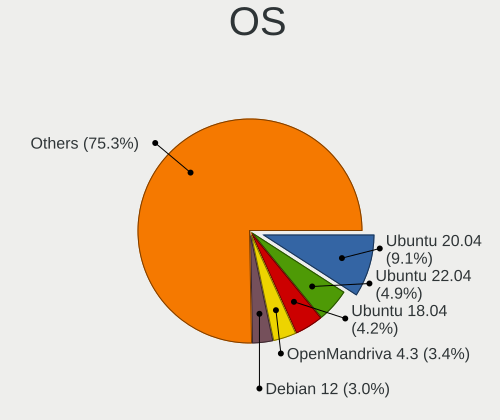

| Name                         | Desktops | Percent |
|------------------------------|----------|---------|
| Ubuntu 20.04                 | 24       | 9.13%   |
| Ubuntu 22.04                 | 13       | 4.94%   |
| Ubuntu 18.04                 | 11       | 4.18%   |
| OpenMandriva 4.3             | 9        | 3.42%   |
| Debian 12                    | 8        | 3.04%   |
| Arch Rolling                 | 8        | 3.04%   |
| OpenMandriva 4.2             | 7        | 2.66%   |
| Ubuntu 24.04                 | 6        | 2.28%   |
| OpenMandriva 24.07           | 6        | 2.28%   |
| Manjaro                      | 6        | 2.28%   |
| Zorin 17                     | 5        | 1.9%    |
| OpenMandriva 24.12           | 5        | 1.9%    |
| Debian 11                    | 5        | 1.9%    |
| Zorin 15                     | 4        | 1.52%   |
| Ubuntu 19.10                 | 4        | 1.52%   |
| Mageia 9                     | 4        | 1.52%   |
| Linux Mint 20.1              | 4        | 1.52%   |
| Linux Mint 19.3              | 4        | 1.52%   |
| KDE neon 22.04               | 4        | 1.52%   |
| Ubuntu 23.04                 | 3        | 1.14%   |
| Ubuntu 21.10                 | 3        | 1.14%   |
| Pop!_OS 22.04                | 3        | 1.14%   |
| Linux Mint 22.1              | 3        | 1.14%   |
| Linux Mint 21.2              | 3        | 1.14%   |
| Kubuntu 20.04                | 3        | 1.14%   |
| Fedora 40                    | 3        | 1.14%   |
| ROSA R9                      | 2        | 0.76%   |
| ROSA R8                      | 2        | 0.76%   |
| openSUSE Tumbleweed-XXXXXXXX | 2        | 0.76%   |
| OpenMandriva 5.0             | 2        | 0.76%   |
| OpenMandriva 23.03           | 2        | 0.76%   |
| OpenMandriva 23.01           | 2        | 0.76%   |
| Nobara 40                    | 2        | 0.76%   |
| LMDE 6                       | 2        | 0.76%   |
| Linux Mint 19.2              | 2        | 0.76%   |
| Kubuntu 22.04                | 2        | 0.76%   |
| KDE neon 20.04               | 2        | 0.76%   |
| Fedora 42                    | 2        | 0.76%   |
| Fedora 41                    | 2        | 0.76%   |
| Fedora 38                    | 2        | 0.76%   |

OS Family
---------

OS without a version

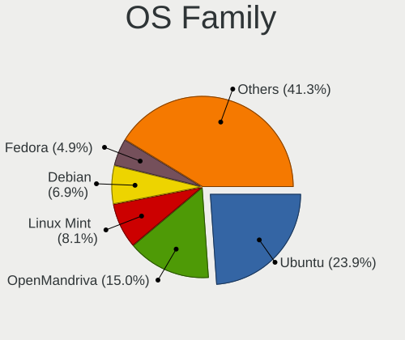

| Name         | Desktops | Percent |
|--------------|----------|---------|
| Ubuntu       | 59       | 23.89%  |
| OpenMandriva | 37       | 14.98%  |
| Linux Mint   | 20       | 8.1%    |
| Debian       | 17       | 6.88%   |
| Fedora       | 12       | 4.86%   |
| Zorin        | 11       | 4.45%   |
| ROSA         | 9        | 3.64%   |
| Manjaro      | 9        | 3.64%   |
| Arch         | 9        | 3.64%   |
| Kubuntu      | 8        | 3.24%   |
| KDE neon     | 6        | 2.43%   |
| Ubuntu MATE  | 5        | 2.02%   |
| Xubuntu      | 4        | 1.62%   |
| openSUSE     | 4        | 1.62%   |
| Mageia       | 4        | 1.62%   |
| Pop!_OS      | 3        | 1.21%   |
| Lubuntu      | 3        | 1.21%   |
| Linux Lite   | 3        | 1.21%   |
| Parrot       | 2        | 0.81%   |
| Nobara       | 2        | 0.81%   |
| LMDE         | 2        | 0.81%   |
| Endless      | 2        | 0.81%   |
| ChimeraOS    | 2        | 0.81%   |
| CentOS       | 2        | 0.81%   |
| Bazzite      | 2        | 0.81%   |
| Xero         | 1        | 0.4%    |
| Ubuntu Unity | 1        | 0.4%    |
| SteamOS      | 1        | 0.4%    |
| Q4OS         | 1        | 0.4%    |
| Peppermint   | 1        | 0.4%    |
| NixOS        | 1        | 0.4%    |
| Feren OS     | 1        | 0.4%    |
| CachyOS      | 1        | 0.4%    |
| ArcoLinux    | 1        | 0.4%    |
| antiX        | 1        | 0.4%    |

Kernel
------

Version of the Linux kernel

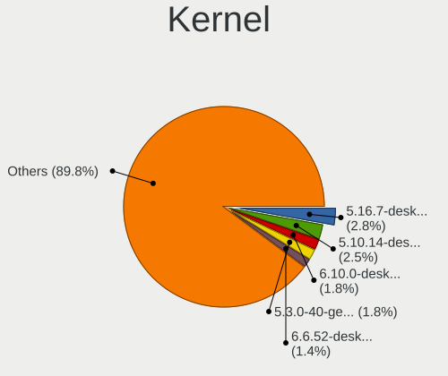

| Version                         | Desktops | Percent |
|---------------------------------|----------|---------|
| 5.16.7-desktop-1omv4003         | 8        | 2.81%   |
| 5.10.14-desktop-1omv4002        | 7        | 2.46%   |
| 6.10.0-desktop-1omv2490         | 5        | 1.75%   |
| 5.3.0-40-generic                | 5        | 1.75%   |
| 6.6.52-desktop-1.mga9           | 4        | 1.4%    |
| 6.5.0-15-generic                | 4        | 1.4%    |
| 6.14.2-desktop-3omv2590         | 4        | 1.4%    |
| 6.12.1-desktop-1omv2490         | 4        | 1.4%    |
| 5.4.0-70-generic                | 3        | 1.05%   |
| 5.4.0-66-generic                | 3        | 1.05%   |
| 5.4.0-52-generic                | 3        | 1.05%   |
| 5.4.0-37-generic                | 3        | 1.05%   |
| 5.4.0-31-generic                | 3        | 1.05%   |
| 5.11.0-40-generic               | 3        | 1.05%   |
| 4.18.0-15-generic               | 3        | 1.05%   |
| 6.8.0-63-generic                | 2        | 0.7%    |
| 6.6.2-desktop-1omv2390          | 2        | 0.7%    |
| 6.2.6-desktop-1omv2390          | 2        | 0.7%    |
| 6.2.0-20-generic                | 2        | 0.7%    |
| 6.14.0-35-generic               | 2        | 0.7%    |
| 6.12.41+deb13-amd64             | 2        | 0.7%    |
| 6.12.10-76061203-generic        | 2        | 0.7%    |
| 6.1.1-desktop-1omv2290          | 2        | 0.7%    |
| 6.1.0-37-amd64                  | 2        | 0.7%    |
| 6.1.0-25-amd64                  | 2        | 0.7%    |
| 5.8.0-48-generic                | 2        | 0.7%    |
| 5.4.0-58-generic                | 2        | 0.7%    |
| 5.4.0-40-generic                | 2        | 0.7%    |
| 5.4.0-29-generic                | 2        | 0.7%    |
| 5.4.0-28-generic                | 2        | 0.7%    |
| 5.3.0-46-generic                | 2        | 0.7%    |
| 5.3.0-26-generic                | 2        | 0.7%    |
| 5.15.0-48-generic               | 2        | 0.7%    |
| 5.15.0-43-generic               | 2        | 0.7%    |
| 5.15.0-27-generic               | 2        | 0.7%    |
| 5.10.0-21-amd64                 | 2        | 0.7%    |
| 4.9.20-nrj-desktop-1rosa-x86_64 | 2        | 0.7%    |
| 4.15.0-54-generic               | 2        | 0.7%    |
| 4.15.0-112-generic              | 2        | 0.7%    |
| 6.9.9-zen1-1-zen                | 1        | 0.35%   |

Kernel Family
-------------

Linux kernel without a distro release

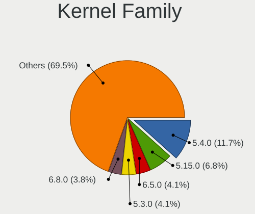

| Version | Desktops | Percent |
|---------|----------|---------|
| 5.4.0   | 31       | 11.65%  |
| 5.15.0  | 18       | 6.77%   |
| 6.5.0   | 11       | 4.14%   |
| 5.3.0   | 11       | 4.14%   |
| 6.8.0   | 10       | 3.76%   |
| 4.15.0  | 10       | 3.76%   |
| 6.1.0   | 9        | 3.38%   |
| 5.16.7  | 8        | 3.01%   |
| 5.10.14 | 7        | 2.63%   |
| 6.2.0   | 6        | 2.26%   |
| 6.14.0  | 6        | 2.26%   |
| 5.8.0   | 6        | 2.26%   |
| 5.13.0  | 6        | 2.26%   |
| 4.18.0  | 6        | 2.26%   |
| 6.10.0  | 5        | 1.88%   |
| 5.11.0  | 5        | 1.88%   |
| 5.10.0  | 5        | 1.88%   |
| 6.6.52  | 4        | 1.5%    |
| 6.14.2  | 4        | 1.5%    |
| 6.12.1  | 4        | 1.5%    |
| 6.2.6   | 3        | 1.13%   |
| 6.1.1   | 3        | 1.13%   |
| 5.19.0  | 3        | 1.13%   |
| 6.9.7   | 2        | 0.75%   |
| 6.9.12  | 2        | 0.75%   |
| 6.6.2   | 2        | 0.75%   |
| 6.4.6   | 2        | 0.75%   |
| 6.13.9  | 2        | 0.75%   |
| 6.12.41 | 2        | 0.75%   |
| 6.12.13 | 2        | 0.75%   |
| 6.12.10 | 2        | 0.75%   |
| 6.11.0  | 2        | 0.75%   |
| 5.3.18  | 2        | 0.75%   |
| 5.17.1  | 2        | 0.75%   |
| 4.9.20  | 2        | 0.75%   |
| 6.9.9   | 1        | 0.38%   |
| 6.9.5   | 1        | 0.38%   |
| 6.8.5   | 1        | 0.38%   |
| 6.8.11  | 1        | 0.38%   |
| 6.7.5   | 1        | 0.38%   |

Kernel Major Ver.
-----------------

Linux kernel major version

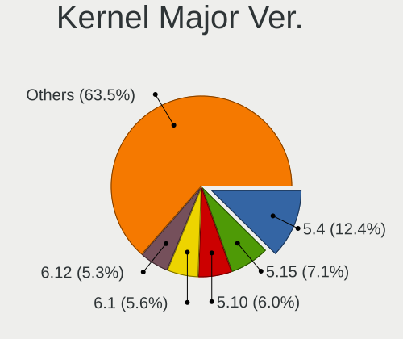

| Version | Desktops | Percent |
|---------|----------|---------|
| 5.4     | 33       | 12.41%  |
| 5.15    | 19       | 7.14%   |
| 5.10    | 16       | 6.02%   |
| 6.1     | 15       | 5.64%   |
| 6.12    | 14       | 5.26%   |
| 5.3     | 13       | 4.89%   |
| 6.8     | 12       | 4.51%   |
| 6.14    | 12       | 4.51%   |
| 6.5     | 11       | 4.14%   |
| 5.16    | 10       | 3.76%   |
| 4.15    | 10       | 3.76%   |
| 6.6     | 9        | 3.38%   |
| 6.2     | 9        | 3.38%   |
| 6.10    | 9        | 3.38%   |
| 5.8     | 7        | 2.63%   |
| 6.9     | 6        | 2.26%   |
| 5.13    | 6        | 2.26%   |
| 5.11    | 6        | 2.26%   |
| 4.18    | 6        | 2.26%   |
| 6.4     | 5        | 1.88%   |
| 5.19    | 5        | 1.88%   |
| 6.13    | 4        | 1.5%    |
| 6.11    | 4        | 1.5%    |
| 6.3     | 3        | 1.13%   |
| 5.17    | 3        | 1.13%   |
| 4.9     | 3        | 1.13%   |
| 6.0     | 2        | 0.75%   |
| 5.7     | 2        | 0.75%   |
| 5.6     | 2        | 0.75%   |
| 4.1     | 2        | 0.75%   |
| 6.7     | 1        | 0.38%   |
| 6.18    | 1        | 0.38%   |
| 6.17    | 1        | 0.38%   |
| 5.9     | 1        | 0.38%   |
| 5.18    | 1        | 0.38%   |
| 5.0     | 1        | 0.38%   |
| 4.8     | 1        | 0.38%   |
| 4.4     | 1        | 0.38%   |

Arch
----

OS architecture (x86_64, i586, etc.)

| Name   | Desktops | Percent |
|--------|----------|---------|
| x86_64 | 231      | 96.65%  |
| i686   | 8        | 3.35%   |

DE
--

Desktop Environment

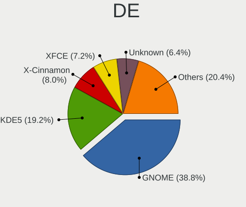

| Name            | Desktops | Percent |
|-----------------|----------|---------|
| GNOME           | 97       | 38.8%   |
| KDE5            | 48       | 19.2%   |
| X-Cinnamon      | 20       | 8%      |
| XFCE            | 18       | 7.2%    |
| Unknown         | 16       | 6.4%    |
| KDE6            | 15       | 6%      |
| MATE            | 11       | 4.4%    |
| KDE4            | 5        | 2%      |
| Hyprland        | 4        | 1.6%    |
| LXDE            | 3        | 1.2%    |
| qtile           | 2        | 0.8%    |
| LXQt            | 2        | 0.8%    |
| KDE             | 2        | 0.8%    |
| Unity           | 1        | 0.4%    |
| icewm           | 1        | 0.4%    |
| i3              | 1        | 0.4%    |
| GNOME Flashback | 1        | 0.4%    |
| GNOME Classic   | 1        | 0.4%    |
| Budgie          | 1        | 0.4%    |
| awesome         | 1        | 0.4%    |

Display Server
--------------

X11 or Wayland

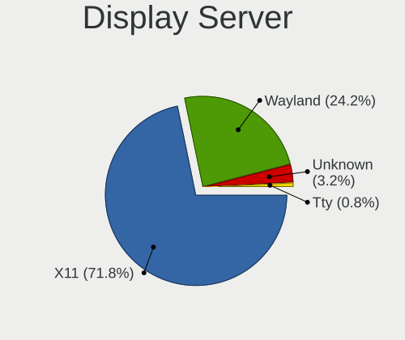

| Name    | Desktops | Percent |
|---------|----------|---------|
| X11     | 178      | 71.77%  |
| Wayland | 60       | 24.19%  |
| Unknown | 8        | 3.23%   |
| Tty     | 2        | 0.81%   |

Display Manager
---------------

SDDM, LightDM, etc.

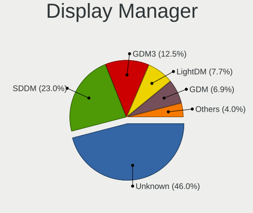

| Name    | Desktops | Percent |
|---------|----------|---------|
| Unknown | 114      | 45.97%  |
| SDDM    | 57       | 22.98%  |
| GDM3    | 31       | 12.5%   |
| LightDM | 19       | 7.66%   |
| GDM     | 17       | 6.85%   |
| KDM     | 5        | 2.02%   |
| TDM     | 3        | 1.21%   |
| SLIMSKI | 1        | 0.4%    |
| LY-DM   | 1        | 0.4%    |

OS Lang
-------

Language

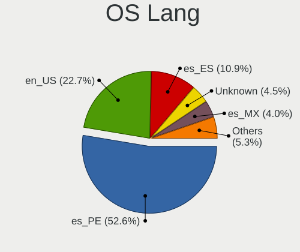

| Lang    | Desktops | Percent |
|---------|----------|---------|
| es_PE   | 130      | 52.63%  |
| en_US   | 56       | 22.67%  |
| es_ES   | 27       | 10.93%  |
| Unknown | 11       | 4.45%   |
| es_MX   | 10       | 4.05%   |
| es_AR   | 3        | 1.21%   |
| en_GB   | 3        | 1.21%   |
| C       | 2        | 0.81%   |
| ru_RU   | 1        | 0.4%    |
| es_US   | 1        | 0.4%    |
| es_HN   | 1        | 0.4%    |
| es_DO   | 1        | 0.4%    |
| de_DE   | 1        | 0.4%    |

Boot Mode
---------

EFI or BIOS

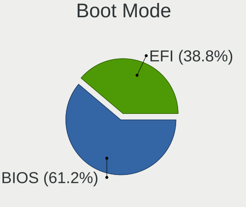

| Mode | Desktops | Percent |
|------|----------|---------|
| BIOS | 148      | 61.16%  |
| EFI  | 94       | 38.84%  |

Filesystem
----------

Type of filesystem

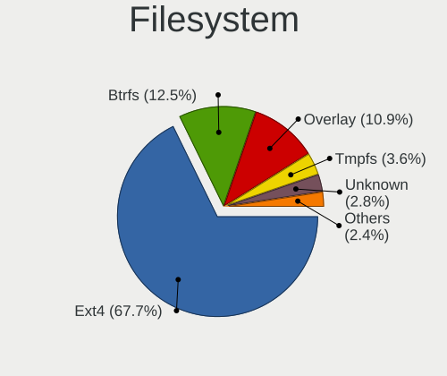

| Type    | Desktops | Percent |
|---------|----------|---------|
| Ext4    | 168      | 67.74%  |
| Btrfs   | 31       | 12.5%   |
| Overlay | 27       | 10.89%  |
| Tmpfs   | 9        | 3.63%   |
| Unknown | 7        | 2.82%   |
| Xfs     | 4        | 1.61%   |
| Ext3    | 2        | 0.81%   |

Part. scheme
------------

Scheme of partitioning

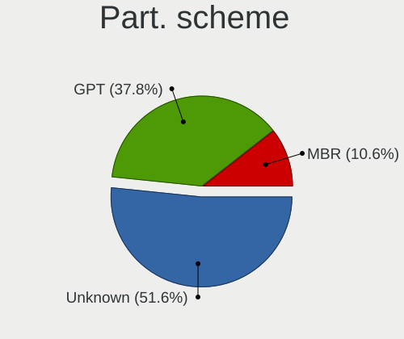

| Type    | Desktops | Percent |
|---------|----------|---------|
| Unknown | 127      | 51.63%  |
| GPT     | 93       | 37.8%   |
| MBR     | 26       | 10.57%  |

Dual Boot with Linux/BSD
------------------------

Hosting more than one Linux/BSD

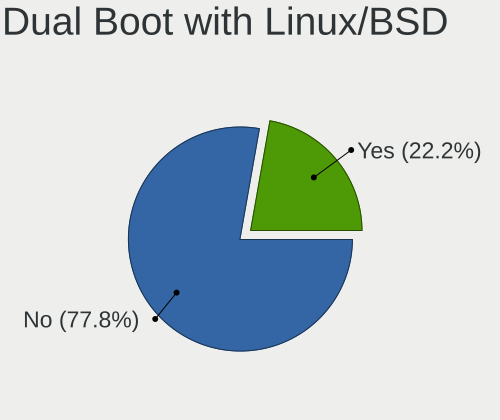

| Dual boot | Desktops | Percent |
|-----------|----------|---------|
| No        | 202      | 80.16%  |
| Yes       | 50       | 19.84%  |

Dual Boot (Win)
---------------

Hosting Linux and Windows

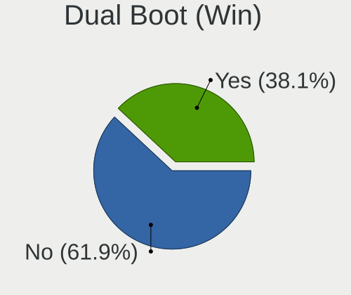

| Dual boot | Desktops | Percent |
|-----------|----------|---------|
| No        | 153      | 61.94%  |
| Yes       | 94       | 38.06%  |

Board
-----

Vendor
------

Motherboard manufacturer

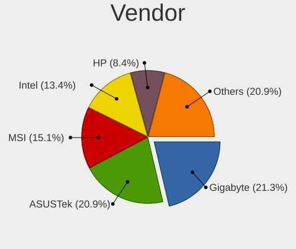

| Name                | Desktops | Percent |
|---------------------|----------|---------|
| Gigabyte Technology | 51       | 21.34%  |
| ASUSTek Computer    | 50       | 20.92%  |
| MSI                 | 36       | 15.06%  |
| Intel               | 32       | 13.39%  |
| Hewlett-Packard     | 20       | 8.37%   |
| ASRock              | 13       | 5.44%   |
| Lenovo              | 8        | 3.35%   |
| Foxconn             | 7        | 2.93%   |
| Dell                | 7        | 2.93%   |
| ECS                 | 3        | 1.26%   |
| Quanta              | 2        | 0.84%   |
| AMI                 | 2        | 0.84%   |
| Unknown             | 2        | 0.84%   |
| SZMZ                | 1        | 0.42%   |
| PCChips             | 1        | 0.42%   |
| GIADA               | 1        | 0.42%   |
| Deltron             | 1        | 0.42%   |
| Biostar             | 1        | 0.42%   |
| AZW                 | 1        | 0.42%   |

Model
-----

Motherboard model

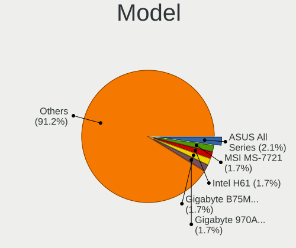

| Name                               | Desktops | Percent |
|------------------------------------|----------|---------|
| ASUS All Series                    | 5        | 2.09%   |
| MSI MS-7721                        | 4        | 1.67%   |
| Intel H61                          | 4        | 1.67%   |
| Gigabyte B75M-D3H                  | 4        | 1.67%   |
| Gigabyte 970A-DS3P                 | 4        | 1.67%   |
| ASUS PRIME A320M-K                 | 4        | 1.67%   |
| Gigabyte F2A68HM-H                 | 3        | 1.26%   |
| ASUS ROG STRIX B550-F GAMING       | 3        | 1.26%   |
| ASUS PRIME B450M-A II              | 3        | 1.26%   |
| Quanta 120-1016la                  | 2        | 0.84%   |
| MSI MS-7D18                        | 2        | 0.84%   |
| MSI MS-7C52                        | 2        | 0.84%   |
| MSI MS-7A38                        | 2        | 0.84%   |
| Intel DH55PJ AAE93812-303          | 2        | 0.84%   |
| Intel DG41WV AAE90316-104          | 2        | 0.84%   |
| Intel DG31PR AAD97573-206          | 2        | 0.84%   |
| HP Compaq dc5700 Small Form Factor | 2        | 0.84%   |
| HP Compaq 4000 Pro SFF PC          | 2        | 0.84%   |
| Gigabyte Z77X-UD5H                 | 2        | 0.84%   |
| Gigabyte X570 AORUS MASTER         | 2        | 0.84%   |
| Gigabyte H81M-H                    | 2        | 0.84%   |
| Gigabyte H110M-H                   | 2        | 0.84%   |
| Gigabyte A520M H                   | 2        | 0.84%   |
| Foxconn 500B Microtower            | 2        | 0.84%   |
| Dell OptiPlex 7010                 | 2        | 0.84%   |
| ASUS TUF Gaming B550M-PLUS         | 2        | 0.84%   |
| ASUS PRIME X570-P                  | 2        | 0.84%   |
| ASUS PRIME B550M-K                 | 2        | 0.84%   |
| ASUS PRIME B450M-A                 | 2        | 0.84%   |
| ASUS 970 PRO GAMING/AURA           | 2        | 0.84%   |
| AMI Z83-V                          | 2        | 0.84%   |
| Unknown                            | 2        | 0.84%   |
| SZMZ X99 DUAL Z8                   | 1        | 0.42%   |
| PCChips P49G                       | 1        | 0.42%   |
| MSI PPPPP-CCC#MMMMMMMM             | 1        | 0.42%   |
| MSI MS-7E02                        | 1        | 0.42%   |
| MSI MS-7D95                        | 1        | 0.42%   |
| MSI MS-7D76                        | 1        | 0.42%   |
| MSI MS-7D75                        | 1        | 0.42%   |
| MSI MS-7D46                        | 1        | 0.42%   |

Model Family
------------

Motherboard model prefix

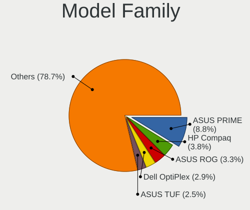

| Name                   | Desktops | Percent |
|------------------------|----------|---------|
| ASUS PRIME             | 21       | 8.79%   |
| HP Compaq              | 9        | 3.77%   |
| ASUS ROG               | 8        | 3.35%   |
| Dell OptiPlex          | 7        | 2.93%   |
| ASUS TUF               | 6        | 2.51%   |
| Lenovo ThinkCentre     | 5        | 2.09%   |
| ASUS All               | 5        | 2.09%   |
| MSI MS-7721            | 4        | 1.67%   |
| Intel H61              | 4        | 1.67%   |
| HP ProDesk             | 4        | 1.67%   |
| HP EliteDesk           | 4        | 1.67%   |
| Gigabyte B75M-D3H      | 4        | 1.67%   |
| Gigabyte 970A-DS3P     | 4        | 1.67%   |
| Lenovo ThinkStation    | 3        | 1.26%   |
| Intel DG41WV           | 3        | 1.26%   |
| Intel DG31PR           | 3        | 1.26%   |
| Gigabyte X570          | 3        | 1.26%   |
| Gigabyte F2A68HM-H     | 3        | 1.26%   |
| ASRock X570            | 3        | 1.26%   |
| Quanta 120-1016la      | 2        | 0.84%   |
| MSI MS-7D18            | 2        | 0.84%   |
| MSI MS-7C52            | 2        | 0.84%   |
| MSI MS-7A38            | 2        | 0.84%   |
| Intel DH61WW           | 2        | 0.84%   |
| Intel DH55PJ           | 2        | 0.84%   |
| Intel D945GCNL         | 2        | 0.84%   |
| Gigabyte Z77X-UD5H     | 2        | 0.84%   |
| Gigabyte H81M-H        | 2        | 0.84%   |
| Gigabyte H110M-H       | 2        | 0.84%   |
| Gigabyte GA-78LMT-USB3 | 2        | 0.84%   |
| Gigabyte A520M         | 2        | 0.84%   |
| Foxconn H61MXE         | 2        | 0.84%   |
| Foxconn 500B           | 2        | 0.84%   |
| ASUS M5A97             | 2        | 0.84%   |
| ASUS 970               | 2        | 0.84%   |
| AMI Z83-V              | 2        | 0.84%   |
| Unknown                | 2        | 0.84%   |
| SZMZ X99               | 1        | 0.42%   |
| PCChips P49G           | 1        | 0.42%   |
| MSI PPPPP-CCC#MMMMMMMM | 1        | 0.42%   |

MFG Year
--------

Motherboard manufacture year

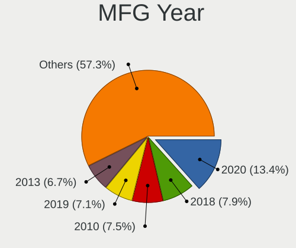

| Year | Desktops | Percent |
|------|----------|---------|
| 2020 | 32       | 13.39%  |
| 2018 | 19       | 7.95%   |
| 2010 | 18       | 7.53%   |
| 2019 | 17       | 7.11%   |
| 2013 | 16       | 6.69%   |
| 2012 | 16       | 6.69%   |
| 2011 | 14       | 5.86%   |
| 2017 | 13       | 5.44%   |
| 2014 | 13       | 5.44%   |
| 2016 | 12       | 5.02%   |
| 2015 | 11       | 4.6%    |
| 2008 | 11       | 4.6%    |
| 2022 | 10       | 4.18%   |
| 2021 | 9        | 3.77%   |
| 2009 | 8        | 3.35%   |
| 2007 | 6        | 2.51%   |
| 2023 | 5        | 2.09%   |
| 2024 | 4        | 1.67%   |
| 2006 | 4        | 1.67%   |
| 2004 | 1        | 0.42%   |

Form Factor
-----------

Physical design of the computer

| Name    | Desktops | Percent |
|---------|----------|---------|
| Desktop | 239      | 100%    |

Secure Boot
-----------

Enabled or disabled

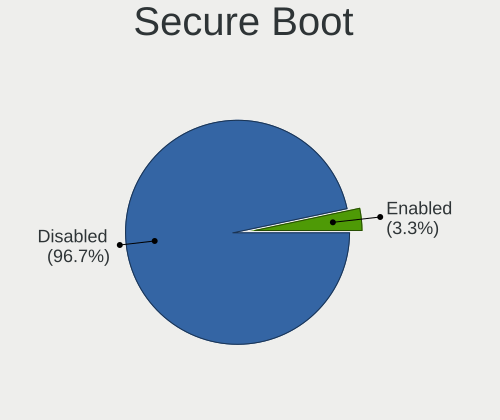

| State    | Desktops | Percent |
|----------|----------|---------|
| Disabled | 233      | 96.68%  |
| Enabled  | 8        | 3.32%   |

Coreboot
--------

Have coreboot on board

| Used | Desktops | Percent |
|------|----------|---------|
| No   | 239      | 100%    |

RAM Size
--------

Total RAM memory

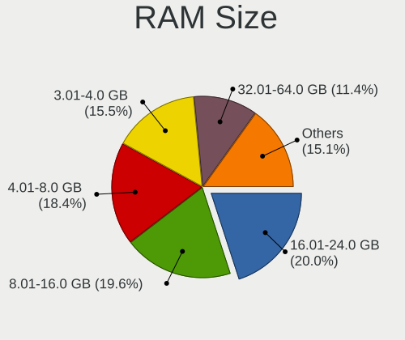

| Size in GB  | Desktops | Percent |
|-------------|----------|---------|
| 16.01-24.0  | 49       | 20%     |
| 8.01-16.0   | 48       | 19.59%  |
| 4.01-8.0    | 45       | 18.37%  |
| 3.01-4.0    | 38       | 15.51%  |
| 32.01-64.0  | 28       | 11.43%  |
| 64.01-256.0 | 14       | 5.71%   |
| 24.01-32.0  | 9        | 3.67%   |
| 1.01-2.0    | 8        | 3.27%   |
| 2.01-3.0    | 5        | 2.04%   |
| 0.51-1.0    | 1        | 0.41%   |

RAM Used
--------

Used RAM memory

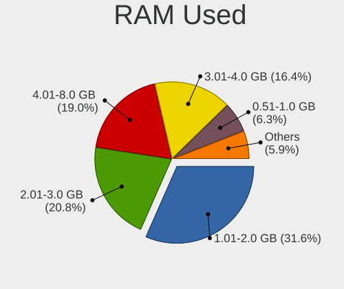

| Used GB    | Desktops | Percent |
|------------|----------|---------|
| 1.01-2.0   | 85       | 31.6%   |
| 2.01-3.0   | 56       | 20.82%  |
| 4.01-8.0   | 51       | 18.96%  |
| 3.01-4.0   | 44       | 16.36%  |
| 0.51-1.0   | 17       | 6.32%   |
| 8.01-16.0  | 13       | 4.83%   |
| 16.01-24.0 | 2        | 0.74%   |
| 32.01-64.0 | 1        | 0.37%   |

Total Drives
------------

Number of drives on board

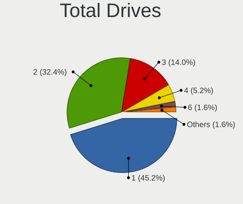

| Drives | Desktops | Percent |
|--------|----------|---------|
| 1      | 113      | 45.2%   |
| 2      | 81       | 32.4%   |
| 3      | 35       | 14%     |
| 4      | 13       | 5.2%    |
| 6      | 4        | 1.6%    |
| 5      | 3        | 1.2%    |
| 9      | 1        | 0.4%    |

Has CD-ROM
----------

Has CD-ROM on board

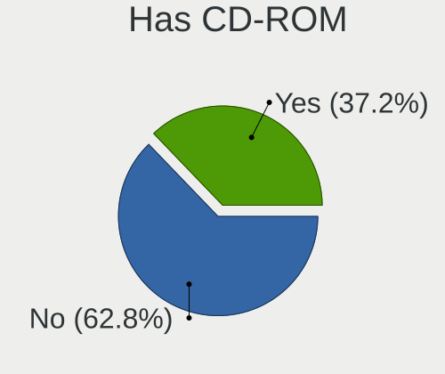

| Presented | Desktops | Percent |
|-----------|----------|---------|
| No        | 152      | 62.81%  |
| Yes       | 90       | 37.19%  |

Has Ethernet
------------

Has Ethernet on board

| Presented | Desktops | Percent |
|-----------|----------|---------|
| Yes       | 236      | 98.74%  |
| No        | 3        | 1.26%   |

Has WiFi
--------

Has WiFi module

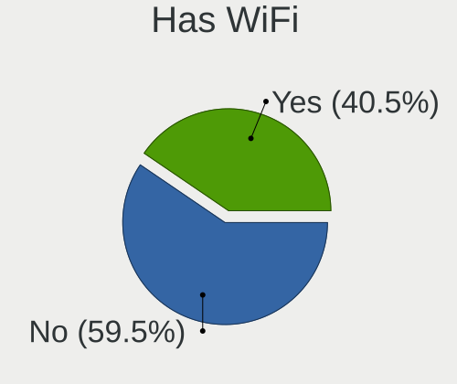

| Presented | Desktops | Percent |
|-----------|----------|---------|
| No        | 147      | 59.51%  |
| Yes       | 100      | 40.49%  |

Has Bluetooth
-------------

Has Bluetooth module

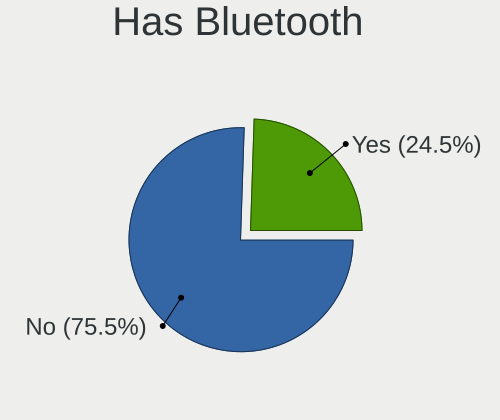

| Presented | Desktops | Percent |
|-----------|----------|---------|
| No        | 182      | 75.52%  |
| Yes       | 59       | 24.48%  |

Location
--------

Country
-------

Geographic location (country)

| Country | Desktops | Percent |
|---------|----------|---------|
| Peru    | 239      | 100%    |

City
----

Geographic location (city)

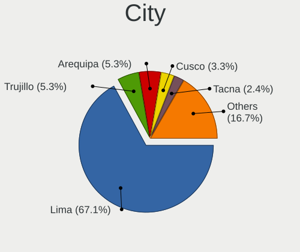

| City                                  | Desktops | Percent |
|---------------------------------------|----------|---------|
| Lima                                  | 165      | 67.07%  |
| Trujillo                              | 13       | 5.28%   |
| Arequipa                              | 13       | 5.28%   |
| Cusco                                 | 8        | 3.25%   |
| Tacna                                 | 6        | 2.44%   |
| Chiclayo                              | 5        | 2.03%   |
| Piura                                 | 4        | 1.63%   |
| Villa                                 | 3        | 1.22%   |
| Moquegua                              | 3        | 1.22%   |
| Huancayo                              | 3        | 1.22%   |
| Puno                                  | 2        | 0.81%   |
| Lima region                           | 2        | 0.81%   |
| Junin                                 | 2        | 0.81%   |
| Ica                                   | 2        | 0.81%   |
| Villa Poeta José Gálvez Barrenechea | 1        | 0.41%   |
| Tumbes                                | 1        | 0.41%   |
| San Isidro                            | 1        | 0.41%   |
| Pucallpa                              | 1        | 0.41%   |
| Lamas                                 | 1        | 0.41%   |
| Juliaca                               | 1        | 0.41%   |
| Huánuco                              | 1        | 0.41%   |
| Huancavelica                          | 1        | 0.41%   |
| Distrito de Lima                      | 1        | 0.41%   |
| Chimbote                              | 1        | 0.41%   |
| Carmen De La Legua Reynoso            | 1        | 0.41%   |
| Cajamarca                             | 1        | 0.41%   |
| Bellavista                            | 1        | 0.41%   |
| Barranco                              | 1        | 0.41%   |
| Abancay                               | 1        | 0.41%   |

Drives
------

Drive Vendor
------------

Hard drive vendors

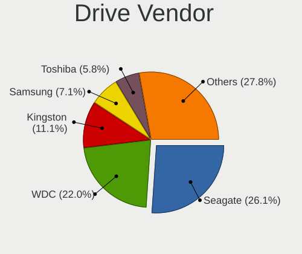

| Vendor                       | Desktops | Drives | Percent |
|------------------------------|----------|--------|---------|
| Seagate                      | 103      | 164    | 26.08%  |
| WDC                          | 87       | 143    | 22.03%  |
| Kingston                     | 44       | 59     | 11.14%  |
| Samsung Electronics          | 28       | 36     | 7.09%   |
| Toshiba                      | 23       | 24     | 5.82%   |
| SanDisk                      | 12       | 15     | 3.04%   |
| Kingston Technology Company  | 12       | 14     | 3.04%   |
| Crucial                      | 10       | 16     | 2.53%   |
| Hewlett-Packard              | 7        | 8      | 1.77%   |
| A-DATA Technology            | 6        | 6      | 1.52%   |
| Gigabyte Technology          | 5        | 5      | 1.27%   |
| PNY                          | 4        | 4      | 1.01%   |
| Phison Electronics           | 4        | 4      | 1.01%   |
| Micron/Crucial Technology    | 4        | 7      | 1.01%   |
| MAXIO Technology (Hangzhou)  | 4        | 5      | 1.01%   |
| Hitachi                      | 4        | 6      | 1.01%   |
| China                        | 4        | 4      | 1.01%   |
| Team                         | 2        | 2      | 0.51%   |
| T-FORCE                      | 2        | 3      | 0.51%   |
| SK hynix                     | 2        | 2      | 0.51%   |
| Silicon Motion               | 2        | 2      | 0.51%   |
| Biwin Storage Technology     | 2        | 2      | 0.51%   |
| Zheino                       | 1        | 1      | 0.25%   |
| XrayDisk                     | 1        | 2      | 0.25%   |
| WD MediaMax                  | 1        | 1      | 0.25%   |
| Unknown                      | 1        | 4      | 0.25%   |
| Union Memory (Shenzhen)      | 1        | 1      | 0.25%   |
| Shenzhen Longsys Electronics | 1        | 1      | 0.25%   |
| Realtek Semiconductor        | 1        | 1      | 0.25%   |
| Netac                        | 1        | 1      | 0.25%   |
| Mushkin                      | 1        | 2      | 0.25%   |
| Micron Technology            | 1        | 2      | 0.25%   |
| Maxone                       | 1        | 2      | 0.25%   |
| LITEON                       | 1        | 1      | 0.25%   |
| Lenovo                       | 1        | 1      | 0.25%   |
| KIOXIA                       | 1        | 1      | 0.25%   |
| KESU                         | 1        | 1      | 0.25%   |
| Intel                        | 1        | 1      | 0.25%   |
| HS-SSD-WAVE(N)               | 1        | 1      | 0.25%   |
| HS-SSD-W                     | 1        | 1      | 0.25%   |

Drive Model
-----------

Hard drive models

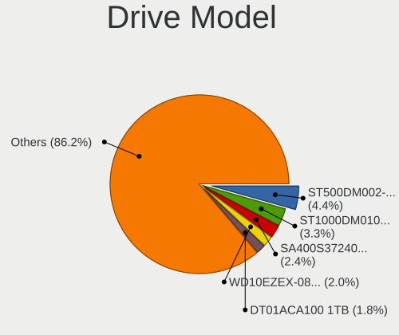

| Model                                             | Desktops | Percent |
|---------------------------------------------------|----------|---------|
| Seagate ST500DM002-1BD142 500GB                   | 20       | 4.39%   |
| Seagate ST1000DM010-2EP102 1TB                    | 15       | 3.29%   |
| Kingston SA400S37240G 240GB SSD                   | 11       | 2.41%   |
| WDC WD10EZEX-08WN4A0 1TB                          | 9        | 1.97%   |
| Toshiba DT01ACA100 1TB                            | 8        | 1.75%   |
| Seagate ST3500418AS 500GB                         | 8        | 1.75%   |
| Seagate ST1000DM003-1CH162 1TB                    | 8        | 1.75%   |
| Kingston SA400S37480G 480GB SSD                   | 8        | 1.75%   |
| WDC WDS480G2G0A-00JH30 480GB SSD                  | 7        | 1.54%   |
| Kingston Company SNV2S1000G 1TB                   | 7        | 1.54%   |
| Seagate ST2000DM001-1ER164 2TB                    | 6        | 1.32%   |
| Kingston SA400S37120G 120GB SSD                   | 6        | 1.32%   |
| WDC WDS100T3X0C-00SJG0 1TB                        | 4        | 0.88%   |
| Toshiba HDWD110 1TB                               | 4        | 0.88%   |
| Seagate ST3500413AS 500GB                         | 4        | 0.88%   |
| Seagate ST3500312CS 500GB                         | 4        | 0.88%   |
| Seagate ST2000DM008-2FR102 2TB                    | 4        | 0.88%   |
| Seagate ST2000DM006-2DM164 2TB                    | 4        | 0.88%   |
| Seagate ST1000LM035-1RK172 1TB                    | 4        | 0.88%   |
| Samsung HD161HJ 160GB                             | 4        | 0.88%   |
| Kingston SNVS250G 250GB                           | 4        | 0.88%   |
| WDC WDS120G2G0A-00JH30 120GB SSD                  | 3        | 0.66%   |
| WDC WDS100T2B0C-00PXH0 1TB                        | 3        | 0.66%   |
| WDC WD5000AAKX-60U6AA0 500GB                      | 3        | 0.66%   |
| WDC WD5000AAKX-083CA1 500GB                       | 3        | 0.66%   |
| WDC WD3200AAJS-56M0A0 320GB                       | 3        | 0.66%   |
| WDC WD10EZEX-00WN4A0 1TB                          | 3        | 0.66%   |
| Seagate ST2000DL003-9VT166 2TB                    | 3        | 0.66%   |
| Seagate ST1000DM003-9YN162 1TB                    | 3        | 0.66%   |
| Seagate ST1000DM003-1ER162 1TB                    | 3        | 0.66%   |
| Seagate Expansion 2TB                             | 3        | 0.66%   |
| Samsung NVMe SSD Controller SM981/PM981/PM983 1TB | 3        | 0.66%   |
| Kingston NVMe SSD Drive 500GB                     | 3        | 0.66%   |
| HP SSD S700 500GB                                 | 3        | 0.66%   |
| Crucial CT1000P1SSD8 1TB                          | 3        | 0.66%   |
| WDC WDS500G1X0E-00AFY0 500GB                      | 2        | 0.44%   |
| WDC WDS240G2G0A-00JH30 240GB SSD                  | 2        | 0.44%   |
| WDC WD80EFAX-68KNBN0 8TB                          | 2        | 0.44%   |
| WDC WD800BD-00MRA1 80GB                           | 2        | 0.44%   |
| WDC WD5000AAKX-001CA0 500GB                       | 2        | 0.44%   |

HDD Vendor
----------

Hard disk drive vendors

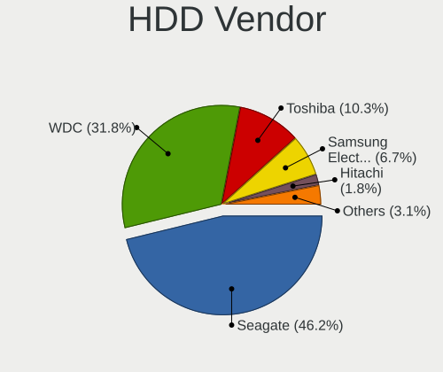

| Vendor              | Desktops | Drives | Percent |
|---------------------|----------|--------|---------|
| Seagate             | 103      | 163    | 46.19%  |
| WDC                 | 71       | 100    | 31.84%  |
| Toshiba             | 23       | 24     | 10.31%  |
| Samsung Electronics | 15       | 19     | 6.73%   |
| Hitachi             | 4        | 6      | 1.79%   |
| WD MediaMax         | 1        | 1      | 0.45%   |
| KESU                | 1        | 1      | 0.45%   |
| HGST                | 1        | 1      | 0.45%   |
| Hewlett-Packard     | 1        | 1      | 0.45%   |
| Fujitsu             | 1        | 1      | 0.45%   |
| ASMT                | 1        | 1      | 0.45%   |
| Apple               | 1        | 1      | 0.45%   |

SSD Vendor
----------

Solid state drive vendors

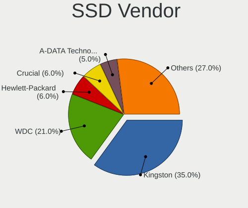

| Vendor              | Desktops | Drives | Percent |
|---------------------|----------|--------|---------|
| Kingston            | 35       | 43     | 35%     |
| WDC                 | 21       | 31     | 21%     |
| Hewlett-Packard     | 6        | 6      | 6%      |
| Crucial             | 6        | 9      | 6%      |
| A-DATA Technology   | 5        | 5      | 5%      |
| PNY                 | 4        | 4      | 4%      |
| Gigabyte Technology | 4        | 4      | 4%      |
| China               | 4        | 4      | 4%      |
| Samsung Electronics | 3        | 5      | 3%      |
| Team                | 2        | 2      | 2%      |
| SanDisk             | 2        | 2      | 2%      |
| XrayDisk            | 1        | 2      | 1%      |
| T-FORCE             | 1        | 1      | 1%      |
| Seagate             | 1        | 1      | 1%      |
| Netac               | 1        | 1      | 1%      |
| Maxone              | 1        | 2      | 1%      |
| LITEON              | 1        | 1      | 1%      |
| Lenovo              | 1        | 1      | 1%      |
| Intel               | 1        | 1      | 1%      |

Drive Kind
----------

HDD or SSD

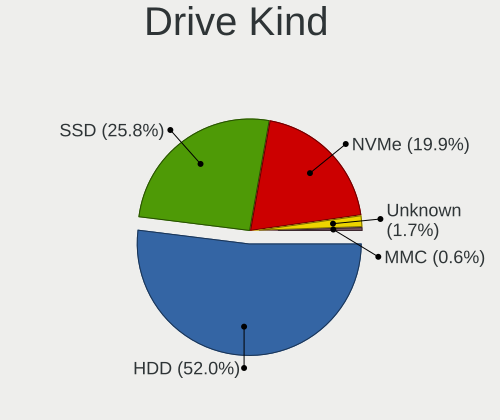

| Kind    | Desktops | Drives | Percent |
|---------|----------|--------|---------|
| HDD     | 185      | 319    | 51.97%  |
| SSD     | 92       | 125    | 25.84%  |
| NVMe    | 71       | 105    | 19.94%  |
| Unknown | 6        | 13     | 1.69%   |
| MMC     | 2        | 2      | 0.56%   |

Drive Connector
---------------

SATA, SAS, NVMe, etc.

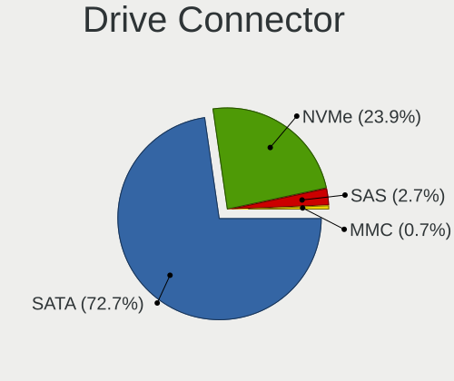

| Type | Desktops | Drives | Percent |
|------|----------|--------|---------|
| SATA | 216      | 446    | 72.73%  |
| NVMe | 71       | 105    | 23.91%  |
| SAS  | 8        | 11     | 2.69%   |
| MMC  | 2        | 2      | 0.67%   |

Drive Size
----------

Size of hard drive

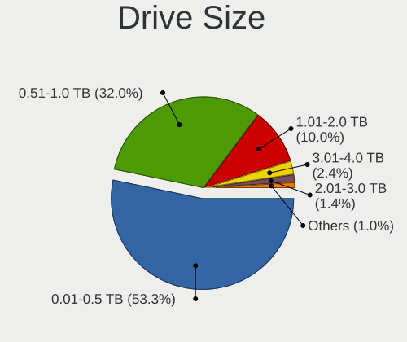

| Size in TB | Desktops | Drives | Percent |
|------------|----------|--------|---------|
| 0.01-0.5   | 155      | 248    | 53.26%  |
| 0.51-1.0   | 93       | 130    | 31.96%  |
| 1.01-2.0   | 29       | 45     | 9.97%   |
| 3.01-4.0   | 7        | 9      | 2.41%   |
| 2.01-3.0   | 4        | 5      | 1.37%   |
| 4.01-10.0  | 3        | 7      | 1.03%   |

Space Total
-----------

Amount of disk space available on the file system

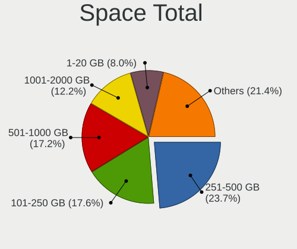

| Size in GB     | Desktops | Percent |
|----------------|----------|---------|
| 251-500        | 62       | 23.66%  |
| 101-250        | 46       | 17.56%  |
| 501-1000       | 45       | 17.18%  |
| 1001-2000      | 32       | 12.21%  |
| 1-20           | 21       | 8.02%   |
| 2001-3000      | 15       | 5.73%   |
| 51-100         | 15       | 5.73%   |
| More than 3000 | 13       | 4.96%   |
| 21-50          | 8        | 3.05%   |
| Unknown        | 5        | 1.91%   |

Space Used
----------

Amount of used disk space

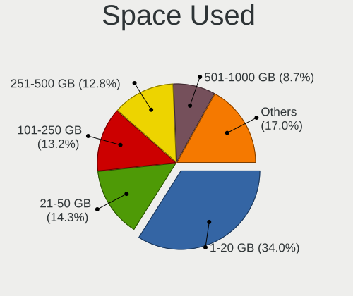

| Used GB        | Desktops | Percent |
|----------------|----------|---------|
| 1-20           | 90       | 33.96%  |
| 21-50          | 38       | 14.34%  |
| 101-250        | 35       | 13.21%  |
| 251-500        | 34       | 12.83%  |
| 501-1000       | 23       | 8.68%   |
| 51-100         | 19       | 7.17%   |
| 1001-2000      | 15       | 5.66%   |
| More than 3000 | 5        | 1.89%   |
| Unknown        | 5        | 1.89%   |
| 2001-3000      | 1        | 0.38%   |

Malfunc. Drives
---------------

Drive models with a malfunction

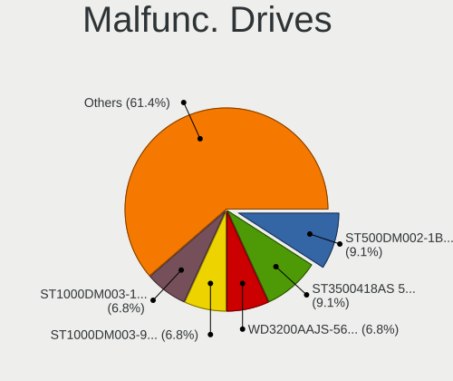

| Model                             | Desktops | Drives | Percent |
|-----------------------------------|----------|--------|---------|
| Seagate ST500DM002-1BD142 500GB   | 4        | 4      | 9.09%   |
| Seagate ST3500418AS 500GB         | 4        | 4      | 9.09%   |
| WDC WD3200AAJS-56M0A0 320GB       | 3        | 5      | 6.82%   |
| Seagate ST1000DM003-9YN162 1TB    | 3        | 3      | 6.82%   |
| Seagate ST1000DM003-1CH162 1TB    | 3        | 5      | 6.82%   |
| WDC WD5000AAKX-083CA1 500GB       | 2        | 2      | 4.55%   |
| WDC WDS480G2G0A-00JH30 480GB SSD  | 1        | 1      | 2.27%   |
| WDC WD800BD-00MRA1 80GB           | 1        | 1      | 2.27%   |
| WDC WD5000AAKS-00V1A0 500GB       | 1        | 1      | 2.27%   |
| WDC WD3200AAJS-00L7A0 320GB       | 1        | 1      | 2.27%   |
| WDC WD20EARX-00PASB0 2TB          | 1        | 1      | 2.27%   |
| WDC WD1600AAJS-75M0A0 160GB       | 1        | 1      | 2.27%   |
| WDC WD10EZEX-08WN4A0 1TB          | 1        | 1      | 2.27%   |
| Toshiba MQ01ABD100 1TB            | 1        | 1      | 2.27%   |
| Toshiba MK6475GSX 640GB           | 1        | 1      | 2.27%   |
| Toshiba DT01ACA100 1TB            | 1        | 1      | 2.27%   |
| Seagate ST980811AS 80GB           | 1        | 1      | 2.27%   |
| Seagate ST500LT012-1DG142 500GB   | 1        | 1      | 2.27%   |
| Seagate ST500DM002-9YN14C 500GB   | 1        | 2      | 2.27%   |
| Seagate ST3500312CS 500GB         | 1        | 1      | 2.27%   |
| Seagate ST3320820SCE 320GB        | 1        | 2      | 2.27%   |
| Seagate ST3250820AS 250GB         | 1        | 1      | 2.27%   |
| Seagate ST3250318AS 250GB         | 1        | 1      | 2.27%   |
| Seagate ST2000DM008-2FR102 2TB    | 1        | 1      | 2.27%   |
| Seagate ST1000LM035-1RK172 1TB    | 1        | 1      | 2.27%   |
| Samsung Electronics SP1644N 160GB | 1        | 1      | 2.27%   |
| Samsung Electronics HD161HJ 160GB | 1        | 2      | 2.27%   |
| Hitachi HTS545050A7E380 500GB     | 1        | 1      | 2.27%   |
| Hitachi HTS545032B9A300 320GB     | 1        | 1      | 2.27%   |
| Hewlett-Packard MB1000GCEEK 1TB   | 1        | 1      | 2.27%   |
| A-DATA Technology SP550 240GB SSD | 1        | 1      | 2.27%   |

Malfunc. Drive Vendor
---------------------

Vendors of faulty drives

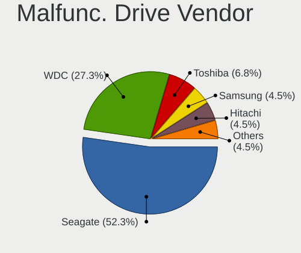

| Vendor              | Desktops | Drives | Percent |
|---------------------|----------|--------|---------|
| Seagate             | 23       | 27     | 52.27%  |
| WDC                 | 12       | 14     | 27.27%  |
| Toshiba             | 3        | 3      | 6.82%   |
| Samsung Electronics | 2        | 3      | 4.55%   |
| Hitachi             | 2        | 2      | 4.55%   |
| Hewlett-Packard     | 1        | 1      | 2.27%   |
| A-DATA Technology   | 1        | 1      | 2.27%   |

Malfunc. HDD Vendor
-------------------

Vendors of faulty HDD drives

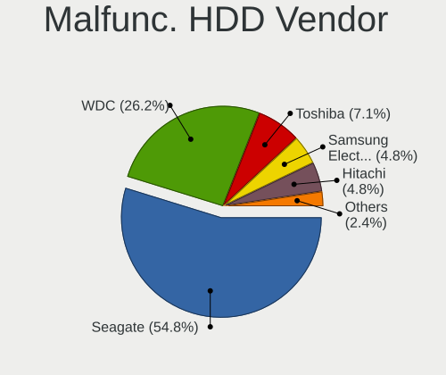

| Vendor              | Desktops | Drives | Percent |
|---------------------|----------|--------|---------|
| Seagate             | 23       | 27     | 54.76%  |
| WDC                 | 11       | 13     | 26.19%  |
| Toshiba             | 3        | 3      | 7.14%   |
| Samsung Electronics | 2        | 3      | 4.76%   |
| Hitachi             | 2        | 2      | 4.76%   |
| Hewlett-Packard     | 1        | 1      | 2.38%   |

Malfunc. Drive Kind
-------------------

Kinds of faulty drives

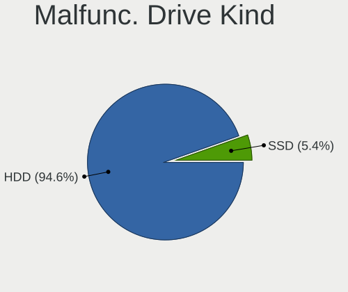

| Kind | Desktops | Drives | Percent |
|------|----------|--------|---------|
| HDD  | 35       | 49     | 94.59%  |
| SSD  | 2        | 2      | 5.41%   |

Failed Drives
-------------

Failed drive models

Zero info for selected period =(

Failed Drive Vendor
-------------------

Failed drive vendors

Zero info for selected period =(

Drive Status
------------

Number of failed and malfunc. drives

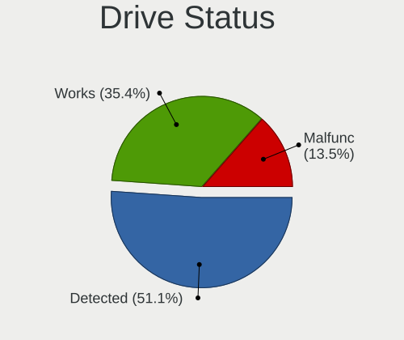

| Status   | Desktops | Drives | Percent |
|----------|----------|--------|---------|
| Detected | 140      | 313    | 51.09%  |
| Works    | 97       | 200    | 35.4%   |
| Malfunc  | 37       | 51     | 13.5%   |

Storage controller
------------------

Storage Vendor
--------------

Storage controller vendors

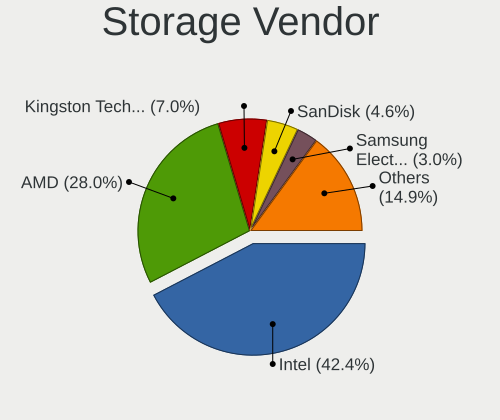

| Vendor                       | Desktops | Percent |
|------------------------------|----------|---------|
| Intel                        | 139      | 42.38%  |
| AMD                          | 92       | 28.05%  |
| Kingston Technology Company  | 23       | 7.01%   |
| SanDisk                      | 15       | 4.57%   |
| Samsung Electronics          | 10       | 3.05%   |
| Micron/Crucial Technology    | 7        | 2.13%   |
| Nvidia                       | 6        | 1.83%   |
| Marvell Technology Group     | 6        | 1.83%   |
| Silicon Motion               | 4        | 1.22%   |
| Phison Electronics           | 4        | 1.22%   |
| MAXIO Technology (Hangzhou)  | 4        | 1.22%   |
| JMicron Technology           | 4        | 1.22%   |
| ASMedia Technology           | 3        | 0.91%   |
| SK hynix                     | 2        | 0.61%   |
| Biwin Storage Technology     | 2        | 0.61%   |
| Union Memory (Shenzhen)      | 1        | 0.3%    |
| Shenzhen Longsys Electronics | 1        | 0.3%    |
| Realtek Semiconductor        | 1        | 0.3%    |
| Micron Technology            | 1        | 0.3%    |
| LSI Logic / Symbios Logic    | 1        | 0.3%    |
| KIOXIA                       | 1        | 0.3%    |
| ADATA Technology             | 1        | 0.3%    |

Storage Model
-------------

Storage controller models

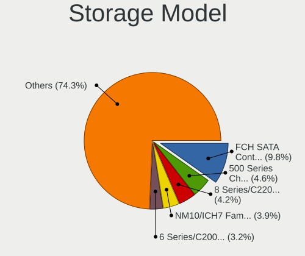

| Model                                                                                   | Desktops | Percent |
|-----------------------------------------------------------------------------------------|----------|---------|
| AMD FCH SATA Controller [AHCI mode]                                                     | 40       | 9.78%   |
| AMD 500 Series Chipset SATA Controller                                                  | 19       | 4.65%   |
| Intel 8 Series/C220 Series Chipset Family 6-port SATA Controller 1 [AHCI mode]          | 17       | 4.16%   |
| Intel NM10/ICH7 Family SATA Controller [IDE mode]                                       | 16       | 3.91%   |
| Intel 6 Series/C200 Series Chipset Family 6 port Desktop SATA AHCI Controller           | 13       | 3.18%   |
| Intel Q170/Q150/B150/H170/H110/Z170/CM236 Chipset SATA Controller [AHCI Mode]           | 12       | 2.93%   |
| AMD 400 Series Chipset SATA Controller                                                  | 12       | 2.93%   |
| Intel 82801G (ICH7 Family) IDE Controller                                               | 11       | 2.69%   |
| AMD SB7x0/SB8x0/SB9x0 SATA Controller [AHCI mode]                                       | 11       | 2.69%   |
| AMD SB7x0/SB8x0/SB9x0 IDE Controller                                                    | 11       | 2.69%   |
| Intel 7 Series/C210 Series Chipset Family 6-port SATA Controller [AHCI mode]            | 10       | 2.44%   |
| Kingston Company NV2 NVMe SSD [SM2267XT] (DRAM-less)                                    | 8        | 1.96%   |
| Intel Cannon Lake PCH SATA AHCI Controller                                              | 8        | 1.96%   |
| Intel 200 Series PCH SATA controller [AHCI mode]                                        | 8        | 1.96%   |
| AMD SB7x0/SB8x0/SB9x0 SATA Controller [IDE mode]                                        | 8        | 1.96%   |
| AMD 600 Series Chipset SATA Controller                                                  | 7        | 1.71%   |
| SanDisk Extreme Pro / WD Black SN750 / PC SN730 / Red SN700 NVMe SSD                    | 6        | 1.47%   |
| AMD A320 Chipset SATA Controller [AHCI mode]                                            | 6        | 1.47%   |
| Samsung NVMe SSD Controller SM981/PM981/PM983                                           | 5        | 1.22%   |
| Nvidia MCP61 SATA Controller                                                            | 5        | 1.22%   |
| Micron/Crucial P1 NVMe PCIe SSD[Frampton2]                                              | 5        | 1.22%   |
| Kingston Company NV1 NVMe SSD [SM2263XT] (DRAM-less)                                    | 5        | 1.22%   |
| Intel Alder Lake-S PCH SATA Controller [AHCI Mode]                                      | 5        | 1.22%   |
| Intel 5 Series/3400 Series Chipset 4 port SATA IDE Controller                           | 5        | 1.22%   |
| Intel 400 Series Chipset Family SATA AHCI Controller                                    | 5        | 1.22%   |
| SanDisk Ultra 3D / WD PC SN530, IX SN530, Blue SN550 NVMe SSD (DRAM-less)               | 4        | 0.98%   |
| Nvidia MCP61 IDE                                                                        | 4        | 0.98%   |
| JMicron JMB363 SATA/IDE Controller                                                      | 4        | 0.98%   |
| Intel SATA Controller [RAID mode]                                                       | 4        | 0.98%   |
| Intel 6 Series/C200 Series Chipset Family Desktop SATA Controller (IDE mode, ports 4-5) | 4        | 0.98%   |
| Intel 6 Series/C200 Series Chipset Family Desktop SATA Controller (IDE mode, ports 0-3) | 4        | 0.98%   |
| Intel 500 Series Chipset Family SATA AHCI Controller                                    | 4        | 0.98%   |
| AMD 300 Series Chipset SATA Controller                                                  | 4        | 0.98%   |
| Silicon Motion SM2263EN/SM2263XT (DRAM-less) NVMe SSD Controllers                       | 3        | 0.73%   |
| SanDisk WD PC SN810 / Black SN850 NVMe SSD                                              | 3        | 0.73%   |
| Micron/Crucial P2 [Nick P2] / P3 / P3 Plus NVMe PCIe SSD (DRAM-less)                    | 3        | 0.73%   |
| Kingston Company NV1 NVMe SSD [E13T] (DRAM-less)                                        | 3        | 0.73%   |
| Intel Raptor Lake SATA AHCI Controller                                                  | 3        | 0.73%   |
| Intel 82801H (ICH8 Family) 4 port SATA Controller [IDE mode]                            | 3        | 0.73%   |
| Intel 5 Series/3400 Series Chipset PT IDER Controller                                   | 3        | 0.73%   |

Storage Kind
------------

Kind of storage controller (IDE, SATA, NVMe, SAS, ...)

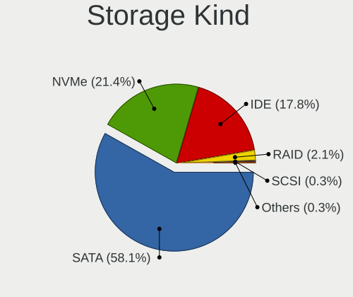

| Kind | Desktops | Percent |
|------|----------|---------|
| SATA | 193      | 58.13%  |
| NVMe | 71       | 21.39%  |
| IDE  | 59       | 17.77%  |
| RAID | 7        | 2.11%   |
| SAS  | 1        | 0.3%    |
| SCSI | 1        | 0.3%    |

Processor
---------

CPU Vendor
----------

Processor vendors

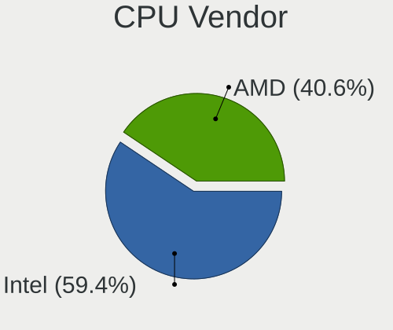

| Vendor | Desktops | Percent |
|--------|----------|---------|
| Intel  | 142      | 59.41%  |
| AMD    | 97       | 40.59%  |

CPU Model
---------

Processor models

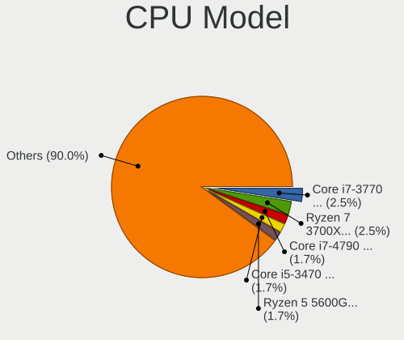

| Model                                       | Desktops | Percent |
|---------------------------------------------|----------|---------|
| Intel Core i7-3770 CPU @ 3.40GHz            | 6        | 2.5%    |
| AMD Ryzen 7 3700X 8-Core Processor          | 6        | 2.5%    |
| Intel Core i7-4790 CPU @ 3.60GHz            | 4        | 1.67%   |
| Intel Core i5-3470 CPU @ 3.20GHz            | 4        | 1.67%   |
| AMD Ryzen 5 5600G with Radeon Graphics      | 4        | 1.67%   |
| AMD Ryzen 5 3600 6-Core Processor           | 4        | 1.67%   |
| Intel Pentium Dual-Core CPU E5800 @ 3.20GHz | 3        | 1.25%   |
| Intel Pentium Dual CPU E2180 @ 2.00GHz      | 3        | 1.25%   |
| Intel Core i7-4770 CPU @ 3.40GHz            | 3        | 1.25%   |
| Intel Core i7-2600 CPU @ 3.40GHz            | 3        | 1.25%   |
| Intel Core i5-6500 CPU @ 3.20GHz            | 3        | 1.25%   |
| Intel Core i5-3330 CPU @ 3.00GHz            | 3        | 1.25%   |
| Intel Core i5-2400 CPU @ 3.10GHz            | 3        | 1.25%   |
| Intel Core i5 CPU 650 @ 3.20GHz             | 3        | 1.25%   |
| AMD Ryzen 7 5700G with Radeon Graphics      | 3        | 1.25%   |
| AMD Ryzen 7 2700X Eight-Core Processor      | 3        | 1.25%   |
| AMD Ryzen 7 2700 Eight-Core Processor       | 3        | 1.25%   |
| AMD Ryzen 3 3200G with Radeon Vega Graphics | 3        | 1.25%   |
| AMD Ryzen 3 2200G with Radeon Vega Graphics | 3        | 1.25%   |
| AMD FX-8350 Eight-Core Processor            | 3        | 1.25%   |
| AMD FX-6300 Six-Core Processor              | 3        | 1.25%   |
| Intel Pentium CPU G4560 @ 3.50GHz           | 2        | 0.83%   |
| Intel Core i7-8700 CPU @ 3.20GHz            | 2        | 0.83%   |
| Intel Core i7-4790S CPU @ 3.20GHz           | 2        | 0.83%   |
| Intel Core i7-10700 CPU @ 2.90GHz           | 2        | 0.83%   |
| Intel Core i5-6400 CPU @ 2.70GHz            | 2        | 0.83%   |
| Intel Core i5-4570 CPU @ 3.20GHz            | 2        | 0.83%   |
| Intel Core i5-10400 CPU @ 2.90GHz           | 2        | 0.83%   |
| Intel Core i3-9100F CPU @ 3.60GHz           | 2        | 0.83%   |
| Intel Core i3-6100 CPU @ 3.70GHz            | 2        | 0.83%   |
| Intel Core i3-3220 CPU @ 3.30GHz            | 2        | 0.83%   |
| Intel Core 2 Duo CPU E7500 @ 2.93GHz        | 2        | 0.83%   |
| Intel Core 2 Duo CPU E7300 @ 2.66GHz        | 2        | 0.83%   |
| Intel Core 2 CPU 6300 @ 1.86GHz             | 2        | 0.83%   |
| Intel Atom x5-Z8350 CPU @ 1.44GHz           | 2        | 0.83%   |
| Intel 12th Gen Core i5-12400F               | 2        | 0.83%   |
| AMD Sempron 140 Processor                   | 2        | 0.83%   |
| AMD Ryzen 9 7900X 12-Core Processor         | 2        | 0.83%   |
| AMD Ryzen 9 5950X 16-Core Processor         | 2        | 0.83%   |
| AMD Ryzen 5 5600X 6-Core Processor          | 2        | 0.83%   |

CPU Model Family
----------------

Processor model prefix

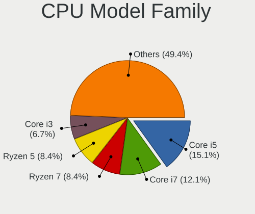

| Model                   | Desktops | Percent |
|-------------------------|----------|---------|
| Intel Core i5           | 36       | 15.06%  |
| Intel Core i7           | 29       | 12.13%  |
| AMD Ryzen 7             | 20       | 8.37%   |
| AMD Ryzen 5             | 20       | 8.37%   |
| Intel Core i3           | 16       | 6.69%   |
| Other                   | 10       | 4.18%   |
| Intel Core 2 Duo        | 10       | 4.18%   |
| Intel Xeon              | 9        | 3.77%   |
| AMD FX                  | 9        | 3.77%   |
| AMD Ryzen 9             | 8        | 3.35%   |
| Intel Pentium           | 7        | 2.93%   |
| AMD Ryzen 3             | 7        | 2.93%   |
| Intel Pentium Dual-Core | 5        | 2.09%   |
| Intel Pentium Dual      | 4        | 1.67%   |
| AMD Phenom II X4        | 4        | 1.67%   |
| AMD A10                 | 4        | 1.67%   |
| Intel Core 2 Quad       | 3        | 1.26%   |
| Intel Celeron           | 3        | 1.26%   |
| AMD A8                  | 3        | 1.26%   |
| AMD A6                  | 3        | 1.26%   |
| AMD A4                  | 3        | 1.26%   |
| Intel Pentium Gold      | 2        | 0.84%   |
| Intel Pentium 4         | 2        | 0.84%   |
| Intel Core 2            | 2        | 0.84%   |
| Intel Atom              | 2        | 0.84%   |
| AMD Sempron             | 2        | 0.84%   |
| AMD Phenom              | 2        | 0.84%   |
| AMD E                   | 2        | 0.84%   |
| AMD Athlon              | 2        | 0.84%   |
| Intel Pentium D         | 1        | 0.42%   |
| Intel Core i9           | 1        | 0.42%   |
| AMD Ryzen 7 PRO         | 1        | 0.42%   |
| AMD Ryzen 5 PRO         | 1        | 0.42%   |
| AMD Phenom II X3        | 1        | 0.42%   |
| AMD Phenom II X2        | 1        | 0.42%   |
| AMD Athlon X4           | 1        | 0.42%   |
| AMD Athlon II X3        | 1        | 0.42%   |
| AMD Athlon II X2        | 1        | 0.42%   |
| AMD Athlon 64 X2        | 1        | 0.42%   |

CPU Cores
---------

Number of processor cores

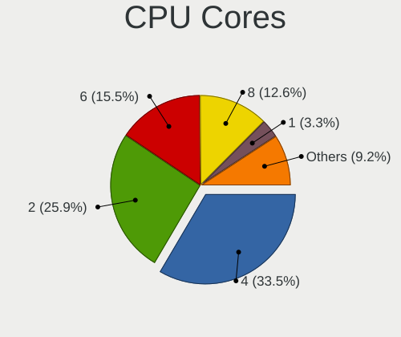

| Number  | Desktops | Percent |
|---------|----------|---------|
| 4       | 80       | 33.47%  |
| 2       | 62       | 25.94%  |
| 6       | 37       | 15.48%  |
| 8       | 30       | 12.55%  |
| 1       | 8        | 3.35%   |
| 3       | 6        | 2.51%   |
| 16      | 5        | 2.09%   |
| 12      | 5        | 2.09%   |
| 14      | 2        | 0.84%   |
| 20      | 1        | 0.42%   |
| 18      | 1        | 0.42%   |
| 10      | 1        | 0.42%   |
| Unknown | 1        | 0.42%   |

CPU Sockets
-----------

Number of sockets

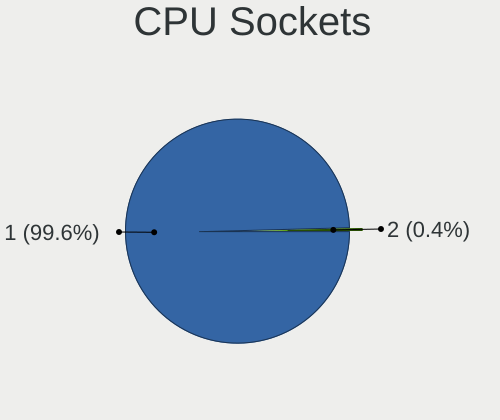

| Number | Desktops | Percent |
|--------|----------|---------|
| 1      | 238      | 99.58%  |
| 2      | 1        | 0.42%   |

CPU Threads
-----------

Threads per core (Hyper-Threading)

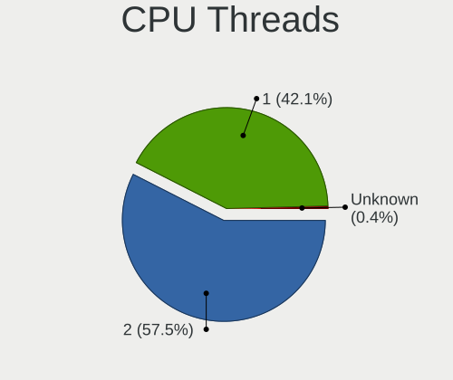

| Number  | Desktops | Percent |
|---------|----------|---------|
| 2       | 138      | 57.5%   |
| 1       | 101      | 42.08%  |
| Unknown | 1        | 0.42%   |

CPU Op-Modes
------------

CPU Operation Modes (32-bit, 64-bit)

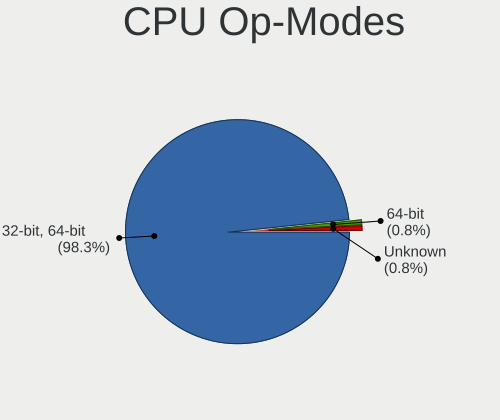

| Op mode        | Desktops | Percent |
|----------------|----------|---------|
| 32-bit, 64-bit | 236      | 98.33%  |
| 64-bit         | 2        | 0.83%   |
| Unknown        | 2        | 0.83%   |

CPU Microcode
-------------

Microcode number

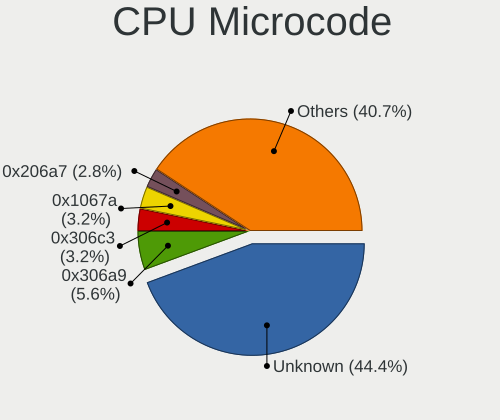

| Number     | Desktops | Percent |
|------------|----------|---------|
| Unknown    | 110      | 44.35%  |
| 0x306a9    | 14       | 5.65%   |
| 0x306c3    | 8        | 3.23%   |
| 0x1067a    | 8        | 3.23%   |
| 0x206a7    | 7        | 2.82%   |
| 0x08701021 | 7        | 2.82%   |
| 0x506e3    | 6        | 2.42%   |
| 0x6fd      | 5        | 2.02%   |
| 0x06003106 | 5        | 2.02%   |
| 0x06000852 | 5        | 2.02%   |
| 0x010000c8 | 5        | 2.02%   |
| 0xa0655    | 3        | 1.21%   |
| 0x906e9    | 3        | 1.21%   |
| 0x6fb      | 3        | 1.21%   |
| 0x10676    | 3        | 1.21%   |
| 0x0810100b | 3        | 1.21%   |
| 0x0800820d | 3        | 1.21%   |
| 0xf64      | 2        | 0.81%   |
| 0xa0671    | 2        | 0.81%   |
| 0x906ea    | 2        | 0.81%   |
| 0x20655    | 2        | 0.81%   |
| 0x0a50000c | 2        | 0.81%   |
| 0x0a201009 | 2        | 0.81%   |
| 0x08701013 | 2        | 0.81%   |
| 0x08108109 | 2        | 0.81%   |
| 0x06001119 | 2        | 0.81%   |
| 0x010000c7 | 2        | 0.81%   |
| 0xf49      | 1        | 0.4%    |
| 0xb0671    | 1        | 0.4%    |
| 0xa0653    | 1        | 0.4%    |
| 0x906ed    | 1        | 0.4%    |
| 0x90672    | 1        | 0.4%    |
| 0x806ec    | 1        | 0.4%    |
| 0x706a8    | 1        | 0.4%    |
| 0x6f6      | 1        | 0.4%    |
| 0x6f2      | 1        | 0.4%    |
| 0x406f1    | 1        | 0.4%    |
| 0x406c4    | 1        | 0.4%    |
| 0x206c2    | 1        | 0.4%    |
| 0x106e5    | 1        | 0.4%    |

CPU Microarch
-------------

Microarchitecture

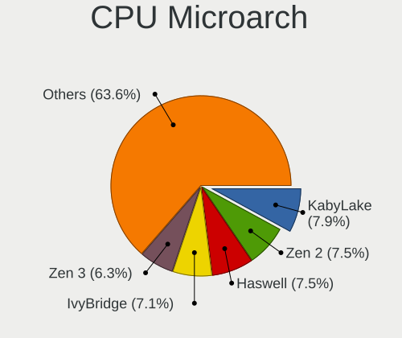

| Name             | Desktops | Percent |
|------------------|----------|---------|
| KabyLake         | 19       | 7.95%   |
| Zen 2            | 18       | 7.53%   |
| Haswell          | 18       | 7.53%   |
| IvyBridge        | 17       | 7.11%   |
| Zen 3            | 15       | 6.28%   |
| Penryn           | 15       | 6.28%   |
| Zen+             | 13       | 5.44%   |
| Skylake          | 13       | 5.44%   |
| K10              | 13       | 5.44%   |
| Unknown          | 13       | 5.44%   |
| SandyBridge      | 12       | 5.02%   |
| Piledriver       | 11       | 4.6%    |
| Core             | 11       | 4.6%    |
| CometLake        | 9        | 3.77%   |
| Steamroller      | 7        | 2.93%   |
| Zen              | 5        | 2.09%   |
| Westmere         | 5        | 2.09%   |
| Silvermont       | 3        | 1.26%   |
| NetBurst         | 3        | 1.26%   |
| Broadwell        | 3        | 1.26%   |
| Alderlake Hybrid | 3        | 1.26%   |
| K10 Llano        | 2        | 0.84%   |
| Icelake          | 2        | 0.84%   |
| Excavator        | 2        | 0.84%   |
| Bobcat           | 2        | 0.84%   |
| Nehalem          | 1        | 0.42%   |
| K8 Hammer        | 1        | 0.42%   |
| Goldmont plus    | 1        | 0.42%   |
| Goldmont         | 1        | 0.42%   |
| Bulldozer        | 1        | 0.42%   |

Graphics
--------

GPU Vendor
----------

Vendors of graphics cards

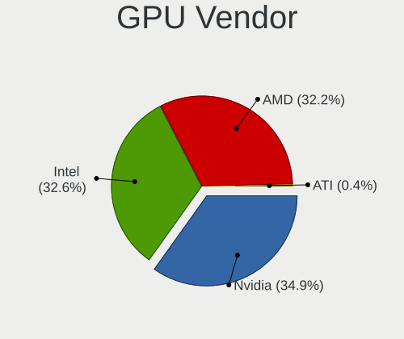

| Vendor           | Desktops | Percent |
|------------------|----------|---------|
| Nvidia           | 91       | 34.87%  |
| Intel            | 85       | 32.57%  |
| AMD              | 84       | 32.18%  |
| ATI Technologies | 1        | 0.38%   |

GPU Model
---------

Graphics card models

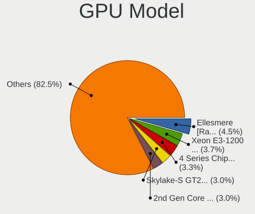

| Model                                                                                    | Desktops | Percent |
|------------------------------------------------------------------------------------------|----------|---------|
| AMD Ellesmere [Radeon RX 470/480/570/570X/580/580X/590]                                  | 12       | 4.46%   |
| Intel Xeon E3-1200 v3/4th Gen Core Processor Integrated Graphics Controller              | 10       | 3.72%   |
| Intel 4 Series Chipset Integrated Graphics Controller                                    | 9        | 3.35%   |
| Intel Skylake-S GT2 [HD Graphics 530]                                                    | 8        | 2.97%   |
| Intel 2nd Generation Core Processor Family Integrated Graphics Controller                | 8        | 2.97%   |
| Nvidia GP107 [GeForce GTX 1050 Ti]                                                       | 7        | 2.6%    |
| AMD Cezanne [Radeon Vega Series / Radeon Vega Mobile Series]                             | 7        | 2.6%    |
| Nvidia GF108 [GeForce GT 730]                                                            | 6        | 2.23%   |
| Nvidia GT218 [GeForce 210]                                                               | 5        | 1.86%   |
| Nvidia GP108 [GeForce GT 1030]                                                           | 5        | 1.86%   |
| Nvidia GK208B [GeForce GT 710]                                                           | 5        | 1.86%   |
| Intel Xeon E3-1200 v2/3rd Gen Core processor Graphics Controller                         | 5        | 1.86%   |
| Intel CometLake-S GT2 [UHD Graphics 630]                                                 | 5        | 1.86%   |
| Intel CoffeeLake-S GT2 [UHD Graphics 630]                                                | 5        | 1.86%   |
| Nvidia TU117 [GeForce GTX 1650]                                                          | 4        | 1.49%   |
| Nvidia GK208B [GeForce GT 730]                                                           | 4        | 1.49%   |
| Nvidia GA104 [GeForce RTX 3070]                                                          | 4        | 1.49%   |
| AMD Raven Ridge [Radeon Vega Series / Radeon Vega Mobile Series]                         | 4        | 1.49%   |
| AMD Raphael                                                                              | 4        | 1.49%   |
| AMD Picasso/Raven 2 [Radeon Vega Series / Radeon Vega Mobile Series]                     | 4        | 1.49%   |
| AMD Navi 14 [Radeon RX 5500/5500M / Pro 5500M]                                           | 4        | 1.49%   |
| AMD Cedar [Radeon HD 5000/6000/7350/8350 Series]                                         | 4        | 1.49%   |
| Nvidia GM206 [GeForce GTX 950]                                                           | 3        | 1.12%   |
| Intel Kaby Lake-S GT2 [HD Graphics 630]                                                  | 3        | 1.12%   |
| Intel IvyBridge GT2 [HD Graphics 4000]                                                   | 3        | 1.12%   |
| Intel Atom/Celeron/Pentium Processor x5-E8000/J3xxx/N3xxx Integrated Graphics Controller | 3        | 1.12%   |
| Intel 82Q963/Q965 Integrated Graphics Controller                                         | 3        | 1.12%   |
| Intel 82G33/G31 Express Integrated Graphics Controller                                   | 3        | 1.12%   |
| Intel 82945G/GZ Integrated Graphics Controller                                           | 3        | 1.12%   |
| AMD Turks XT [Radeon HD 6670/7670]                                                       | 3        | 1.12%   |
| AMD Kaveri [Radeon R7 Graphics]                                                          | 3        | 1.12%   |
| Nvidia TU116 [GeForce GTX 1650 SUPER]                                                    | 2        | 0.74%   |
| Nvidia TU106 [GeForce RTX 2060 Rev. A]                                                   | 2        | 0.74%   |
| Nvidia GP104 [GeForce GTX 1060 6GB]                                                      | 2        | 0.74%   |
| Nvidia GM107 [GeForce GTX 750 Ti]                                                        | 2        | 0.74%   |
| Nvidia GF119 [GeForce GT 610]                                                            | 2        | 0.74%   |
| Nvidia GF108 [GeForce GT 440]                                                            | 2        | 0.74%   |
| Nvidia GA102 [GeForce RTX 3080 Ti]                                                       | 2        | 0.74%   |
| Intel Kaby Lake-S GT1 [HD Graphics 610]                                                  | 2        | 0.74%   |
| Intel 4th Generation Core Processor Family Integrated Graphics Controller                | 2        | 0.74%   |

GPU Combo
---------

Combinations of graphics cards

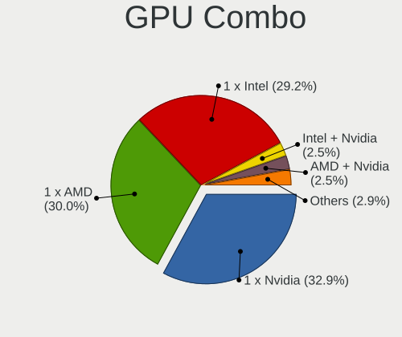

| Name           | Desktops | Percent |
|----------------|----------|---------|
| 1 x Nvidia     | 80       | 32.92%  |
| 1 x AMD        | 73       | 30.04%  |
| 1 x Intel      | 71       | 29.22%  |
| Intel + Nvidia | 6        | 2.47%   |
| AMD + Nvidia   | 6        | 2.47%   |
| 2 x AMD        | 4        | 1.65%   |
| Intel + AMD    | 2        | 0.82%   |
| 2 x Intel      | 1        | 0.41%   |

GPU Driver
----------

Free vs proprietary

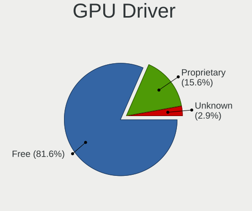

| Driver      | Desktops | Percent |
|-------------|----------|---------|
| Free        | 199      | 81.56%  |
| Proprietary | 38       | 15.57%  |
| Unknown     | 7        | 2.87%   |

GPU Memory
----------

Total video memory

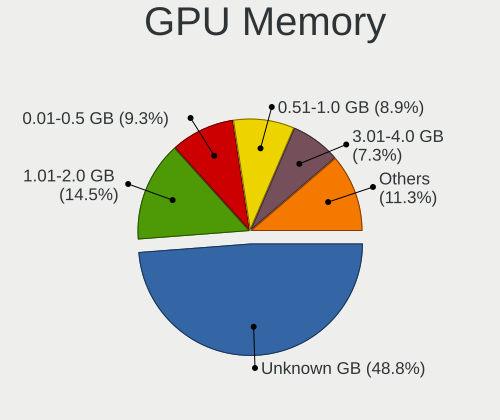

| Size in GB | Desktops | Percent |
|------------|----------|---------|
| Unknown    | 121      | 48.79%  |
| 1.01-2.0   | 36       | 14.52%  |
| 0.01-0.5   | 23       | 9.27%   |
| 0.51-1.0   | 22       | 8.87%   |
| 3.01-4.0   | 18       | 7.26%   |
| 7.01-8.0   | 16       | 6.45%   |
| 5.01-6.0   | 6        | 2.42%   |
| 8.01-16.0  | 6        | 2.42%   |

Monitor
-------

Monitor Vendor
--------------

Monitor vendors

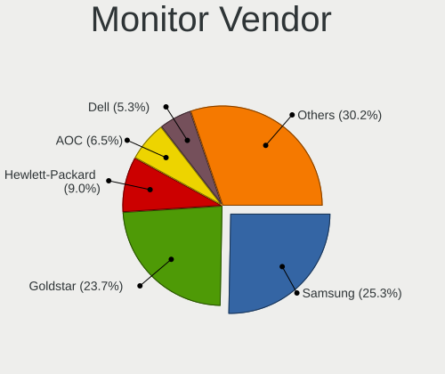

| Vendor               | Desktops | Percent |
|----------------------|----------|---------|
| Samsung Electronics  | 62       | 25.31%  |
| Goldstar             | 58       | 23.67%  |
| Hewlett-Packard      | 22       | 8.98%   |
| AOC                  | 16       | 6.53%   |
| Dell                 | 13       | 5.31%   |
| ViewSonic            | 9        | 3.67%   |
| Lenovo               | 7        | 2.86%   |
| BenQ                 | 7        | 2.86%   |
| Unknown              | 4        | 1.63%   |
| MSD                  | 4        | 1.63%   |
| ASUSTek Computer     | 4        | 1.63%   |
| Ancor Communications | 4        | 1.63%   |
| Sony                 | 3        | 1.22%   |
| LG Electronics       | 3        | 1.22%   |
| Acer                 | 3        | 1.22%   |
| Mi                   | 2        | 0.82%   |
| Lenovo Group Limited | 2        | 0.82%   |
| Hyundai ImageQuest   | 2        | 0.82%   |
| AXV                  | 2        | 0.82%   |
| VIZTA                | 1        | 0.41%   |
| Viotek               | 1        | 0.41%   |
| Unknown (XXX)        | 1        | 0.41%   |
| TopView              | 1        | 0.41%   |
| RGT                  | 1        | 0.41%   |
| Panasonic            | 1        | 0.41%   |
| NEW                  | 1        | 0.41%   |
| MStar                | 1        | 0.41%   |
| MSI                  | 1        | 0.41%   |
| Konka                | 1        | 0.41%   |
| JYT                  | 1        | 0.41%   |
| JRY                  | 1        | 0.41%   |
| Intehill             | 1        | 0.41%   |
| Huion                | 1        | 0.41%   |
| HKC                  | 1        | 0.41%   |
| Gigabyte Technology  | 1        | 0.41%   |
| Eizo                 | 1        | 0.41%   |
| Unknown              | 1        | 0.41%   |

Monitor Model
-------------

Monitor models

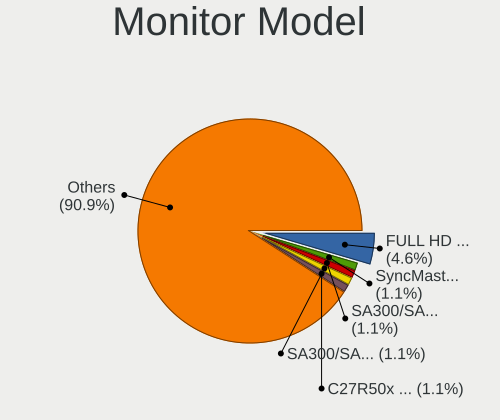

| Model                                                                  | Desktops | Percent |
|------------------------------------------------------------------------|----------|---------|
| Goldstar FULL HD GSM5B55 1920x1080 480x270mm 21.7-inch                 | 12       | 4.56%   |
| Samsung Electronics SyncMaster SAM0272 1280x1024 338x270mm 17.0-inch   | 3        | 1.14%   |
| Samsung Electronics SA300/SA350 SAM078D 1600x900 443x249mm 20.0-inch   | 3        | 1.14%   |
| Samsung Electronics SA300/SA350 SAM078A 1366x768 410x230mm 18.5-inch   | 3        | 1.14%   |
| Samsung Electronics C27R50x SAM0F9D 1920x1080 598x336mm 27.0-inch      | 3        | 1.14%   |
| Samsung Electronics C24F390 SAM0D2C 1920x1080 521x293mm 23.5-inch      | 3        | 1.14%   |
| Goldstar LG IPS FULLHD GSM5AB8 1920x1080 480x270mm 21.7-inch           | 3        | 1.14%   |
| Goldstar HD GSM5ACD 1366x768 410x230mm 18.5-inch                       | 3        | 1.14%   |
| Goldstar E1951 GSM4BFD 1366x768 410x230mm 18.5-inch                    | 3        | 1.14%   |
| BenQ GW2270 BNQ78DB 1920x1080 476x268mm 21.5-inch                      | 3        | 1.14%   |
| Ancor Communications ASUS VP228 ACI22C3 1920x1080 476x268mm 21.5-inch  | 3        | 1.14%   |
| ViewSonic VA2246 SERIES VSC6F2E 1920x1080 477x268mm 21.5-inch          | 2        | 0.76%   |
| Samsung Electronics SMB2030 SAM063D 1600x900 443x249mm 20.0-inch       | 2        | 0.76%   |
| Samsung Electronics S24F350 SAM0D20 1920x1080 521x293mm 23.5-inch      | 2        | 0.76%   |
| Samsung Electronics S22A33x SAM7122 1920x1080 479x260mm 21.5-inch      | 2        | 0.76%   |
| Samsung Electronics S20B300 SAM08A7 1600x900 443x249mm 20.0-inch       | 2        | 0.76%   |
| Samsung Electronics LCD Monitor SAM0A7D 1920x1080 1060x626mm 48.5-inch | 2        | 0.76%   |
| Samsung Electronics LCD Monitor SAM07D0 1360x768 700x390mm 31.5-inch   | 2        | 0.76%   |
| Samsung Electronics LCD Monitor SAM04FD 1360x768                       | 2        | 0.76%   |
| Samsung Electronics C27F591 SAM0D36 1920x1080 598x336mm 27.0-inch      | 2        | 0.76%   |
| MSD WV24FHDIN1 MSD2380 1920x1080 526x296mm 23.8-inch                   | 2        | 0.76%   |
| Hewlett-Packard LA1951 HWP285A 1280x1024 380x300mm 19.1-inch           | 2        | 0.76%   |
| Hewlett-Packard All-in-One HWP4218 1600x900 443x249mm 20.0-inch        | 2        | 0.76%   |
| Goldstar W2243 GSM56FE 1920x1080 477x269mm 21.6-inch                   | 2        | 0.76%   |
| Goldstar W1943 GSM4BAD 1360x768 406x229mm 18.4-inch                    | 2        | 0.76%   |
| Goldstar M2380A GSM57EE 1920x1080 509x286mm 23.0-inch                  | 2        | 0.76%   |
| Goldstar IPS FULLHD GSM5AB6 1920x1080 480x270mm 21.7-inch              | 2        | 0.76%   |
| Goldstar FULL HD GSM5BDF 1920x1080 480x270mm 21.7-inch                 | 2        | 0.76%   |
| Goldstar FULL HD GSM5B54 1920x1080 480x270mm 21.7-inch                 | 2        | 0.76%   |
| Goldstar E1941 GSM4BF0 1366x768 410x230mm 18.5-inch                    | 2        | 0.76%   |
| Goldstar 20M45 GSM4EF0 1600x900 443x249mm 20.0-inch                    | 2        | 0.76%   |
| Dell 3008WFP DEL4036 2560x1600 641x400mm 29.7-inch                     | 2        | 0.76%   |
| AXV VAX271QGX AXV2722 2560x1440 530x280mm 23.6-inch                    | 2        | 0.76%   |
| ASUSTek Computer VG27A AUS2722 2560x1440 597x336mm 27.0-inch           | 2        | 0.76%   |
| AOC 2239 AOC2239 1920x1080 477x268mm 21.5-inch                         | 2        | 0.76%   |
| VIZTA P241WDC JRY2150 1920x1080 409x330mm 20.7-inch                    | 1        | 0.38%   |
| Viotek FI24D VTK0238 2560x1440 530x290mm 23.8-inch                     | 1        | 0.38%   |
| ViewSonic VX2453 Series VSC0C28 1920x1080 520x290mm 23.4-inch          | 1        | 0.38%   |
| ViewSonic VX2370 SERIES VSC342C 1920x1080 509x286mm 23.0-inch          | 1        | 0.38%   |
| ViewSonic VG2236 SERIES VSCE726 1920x1080 480x270mm 21.7-inch          | 1        | 0.38%   |

Monitor Resolution
------------------

Monitor screen resolution

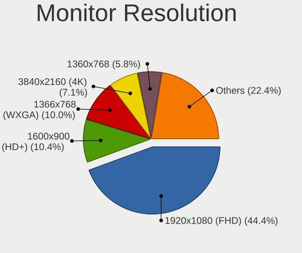

| Resolution         | Desktops | Percent |
|--------------------|----------|---------|
| 1920x1080 (FHD)    | 107      | 44.4%   |
| 1600x900 (HD+)     | 25       | 10.37%  |
| 1366x768 (WXGA)    | 24       | 9.96%   |
| 3840x2160 (4K)     | 17       | 7.05%   |
| 1360x768           | 14       | 5.81%   |
| 2560x1440 (QHD)    | 13       | 5.39%   |
| 1440x900 (WXGA+)   | 8        | 3.32%   |
| 1280x1024 (SXGA)   | 6        | 2.49%   |
| 3840x1080          | 5        | 2.07%   |
| 1680x1050 (WSXGA+) | 4        | 1.66%   |
| 1024x768 (XGA)     | 4        | 1.66%   |
| Unknown            | 4        | 1.66%   |
| 2560x1600          | 3        | 1.24%   |
| 2560x1080          | 3        | 1.24%   |
| 1920x1200 (WUXGA)  | 2        | 0.83%   |
| 3440x1440          | 1        | 0.41%   |
| 1280x720 (HD)      | 1        | 0.41%   |

Monitor Diagonal
----------------

Diagonal size in inches

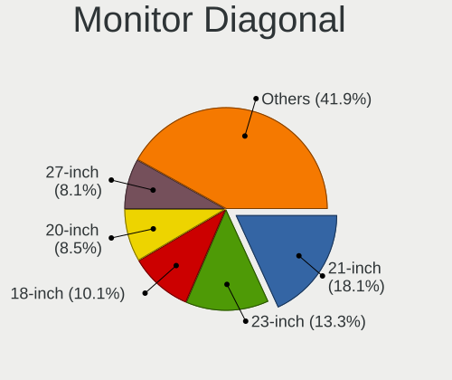

| Inches  | Desktops | Percent |
|---------|----------|---------|
| 21      | 45       | 18.15%  |
| 23      | 33       | 13.31%  |
| 18      | 25       | 10.08%  |
| 20      | 21       | 8.47%   |
| 27      | 20       | 8.06%   |
| Unknown | 18       | 7.26%   |
| 31      | 17       | 6.85%   |
| 19      | 16       | 6.45%   |
| 24      | 14       | 5.65%   |
| 17      | 9        | 3.63%   |
| 15      | 5        | 2.02%   |
| 22      | 4        | 1.61%   |
| 48      | 3        | 1.21%   |
| 32      | 3        | 1.21%   |
| 30      | 3        | 1.21%   |
| 52      | 2        | 0.81%   |
| 43      | 2        | 0.81%   |
| 13      | 2        | 0.81%   |
| 84      | 1        | 0.4%    |
| 63      | 1        | 0.4%    |
| 54      | 1        | 0.4%    |
| 46      | 1        | 0.4%    |
| 34      | 1        | 0.4%    |
| 25      | 1        | 0.4%    |

Monitor Width
-------------

Physical width

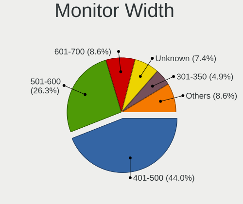

| Width in mm | Desktops | Percent |
|-------------|----------|---------|
| 401-500     | 107      | 44.03%  |
| 501-600     | 64       | 26.34%  |
| 601-700     | 21       | 8.64%   |
| Unknown     | 18       | 7.41%   |
| 301-350     | 12       | 4.94%   |
| 1001-1500   | 8        | 3.29%   |
| 701-800     | 4        | 1.65%   |
| 351-400     | 4        | 1.65%   |
| 201-300     | 2        | 0.82%   |
| 901-1000    | 2        | 0.82%   |
| 1501-2000   | 1        | 0.41%   |

Aspect Ratio
------------

Proportional relationship between the width and the height

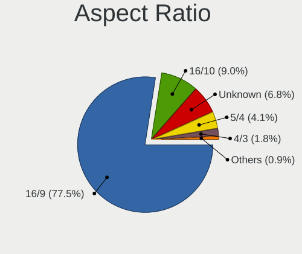

| Ratio   | Desktops | Percent |
|---------|----------|---------|
| 16/9    | 172      | 77.48%  |
| 16/10   | 20       | 9.01%   |
| Unknown | 15       | 6.76%   |
| 5/4     | 9        | 4.05%   |
| 4/3     | 4        | 1.8%    |
| 21/9    | 2        | 0.9%    |

Monitor Area
------------

Area in inch²

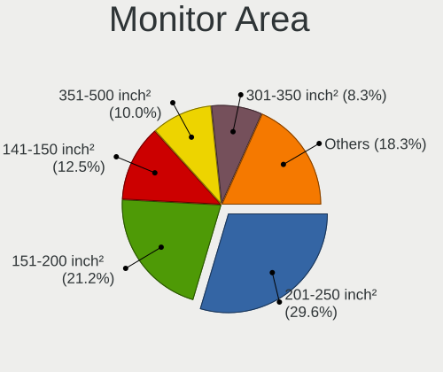

| Area in inch² | Desktops | Percent |
|----------------|----------|---------|
| 201-250        | 71       | 29.58%  |
| 151-200        | 51       | 21.25%  |
| 141-150        | 30       | 12.5%   |
| 351-500        | 24       | 10%     |
| 301-350        | 20       | 8.33%   |
| Unknown        | 18       | 7.5%    |
| More than 1000 | 8        | 3.33%   |
| 251-300        | 6        | 2.5%    |
| 101-110        | 5        | 2.08%   |
| 501-1000       | 3        | 1.25%   |
| 131-140        | 2        | 0.83%   |
| 81-90          | 1        | 0.42%   |
| 71-80          | 1        | 0.42%   |

Pixel Density
-------------

Pixels per inch

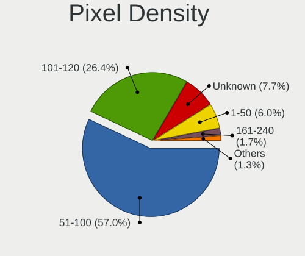

| Density | Desktops | Percent |
|---------|----------|---------|
| 51-100  | 134      | 57.02%  |
| 101-120 | 62       | 26.38%  |
| Unknown | 18       | 7.66%   |
| 1-50    | 14       | 5.96%   |
| 161-240 | 4        | 1.7%    |
| 121-160 | 3        | 1.28%   |

Multiple Monitors
-----------------

Total monitors connected

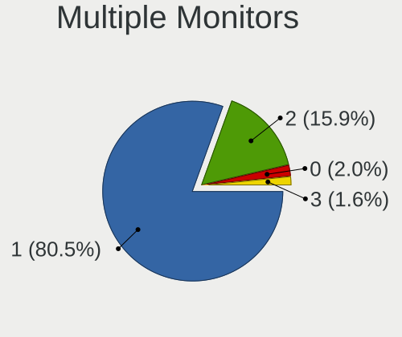

| Total | Desktops | Percent |
|-------|----------|---------|
| 1     | 198      | 80.49%  |
| 2     | 39       | 15.85%  |
| 0     | 5        | 2.03%   |
| 3     | 4        | 1.63%   |

Network
-------

Net Controller Vendor
---------------------

Controller vendors

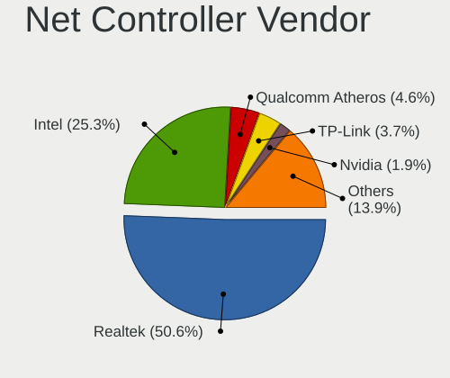

| Vendor                          | Desktops | Percent |
|---------------------------------|----------|---------|
| Realtek Semiconductor           | 164      | 50.62%  |
| Intel                           | 82       | 25.31%  |
| Qualcomm Atheros                | 15       | 4.63%   |
| TP-Link                         | 12       | 3.7%    |
| Nvidia                          | 6        | 1.85%   |
| MediaTek                        | 6        | 1.85%   |
| Ralink Technology               | 5        | 1.54%   |
| Microsoft                       | 5        | 1.54%   |
| Qualcomm Atheros Communications | 4        | 1.23%   |
| Broadcom Limited                | 4        | 1.23%   |
| Ralink                          | 3        | 0.93%   |
| D-Link System                   | 3        | 0.93%   |
| ASIX Electronics                | 3        | 0.93%   |
| Huawei Technologies             | 2        | 0.62%   |
| D-Link                          | 2        | 0.62%   |
| Broadcom                        | 2        | 0.62%   |
| ZTE WCDMA Technologies MSM      | 1        | 0.31%   |
| Xiaomi                          | 1        | 0.31%   |
| Sitecom Europe                  | 1        | 0.31%   |
| Qualcomm                        | 1        | 0.31%   |
| OPPO Electronics                | 1        | 0.31%   |
| Motorola PCS                    | 1        | 0.31%   |

Net Controller Model
--------------------

Controller models

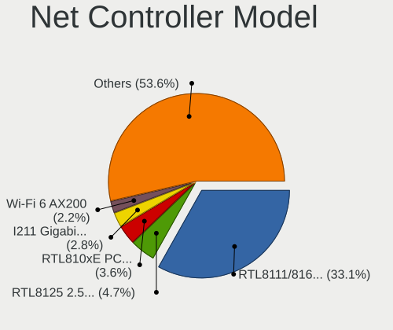

| Model                                                                           | Desktops | Percent |
|---------------------------------------------------------------------------------|----------|---------|
| Realtek RTL8111/8168/8211/8411 PCI Express Gigabit Ethernet Controller          | 120      | 33.15%  |
| Realtek RTL8125 2.5GbE Controller                                               | 17       | 4.7%    |
| Realtek RTL810xE PCI Express Fast Ethernet controller                           | 13       | 3.59%   |
| Intel I211 Gigabit Network Connection                                           | 10       | 2.76%   |
| Intel Wi-Fi 6 AX200                                                             | 8        | 2.21%   |
| Intel Ethernet Connection (2) I219-V                                            | 7        | 1.93%   |
| Intel 82579V Gigabit Network Connection                                         | 7        | 1.93%   |
| Realtek RTL8188EUS 802.11n Wireless Network Adapter                             | 6        | 1.66%   |
| Intel 82579LM Gigabit Network Connection (Lewisville)                           | 6        | 1.66%   |
| Realtek RTL8188EE Wireless Network Adapter                                      | 5        | 1.38%   |
| Nvidia MCP61 Ethernet                                                           | 5        | 1.38%   |
| TP-Link 802.11n NIC                                                             | 4        | 1.1%    |
| Realtek 802.11ac NIC                                                            | 4        | 1.1%    |
| Ralink MT7601U Wireless Adapter                                                 | 4        | 1.1%    |
| Qualcomm Atheros AR9271 802.11n                                                 | 4        | 1.1%    |
| Intel Ethernet Controller I225-V                                                | 4        | 1.1%    |
| Intel Ethernet Connection (12) I219-V                                           | 4        | 1.1%    |
| Realtek RTL8821CE 802.11ac PCIe Wireless Network Adapter                        | 3        | 0.83%   |
| Realtek RTL8192EE PCIe Wireless Network Adapter                                 | 3        | 0.83%   |
| Realtek RTL8192CU 802.11n WLAN Adapter                                          | 3        | 0.83%   |
| Qualcomm Atheros AR9485 Wireless Network Adapter                                | 3        | 0.83%   |
| Qualcomm Atheros AR8151 v2.0 Gigabit Ethernet                                   | 3        | 0.83%   |
| Microsoft Xbox Wireless Adapter for Windows                                     | 3        | 0.83%   |
| MediaTek MT7922 802.11ax PCI Express Wireless Network Adapter                   | 3        | 0.83%   |
| Intel Ethernet Controller I226-V                                                | 3        | 0.83%   |
| Intel Ethernet Connection I217-LM                                               | 3        | 0.83%   |
| Intel Ethernet Connection (7) I219-LM                                           | 3        | 0.83%   |
| Intel Ethernet Connection (2) I219-LM                                           | 3        | 0.83%   |
| Intel 82578DC Gigabit Network Connection                                        | 3        | 0.83%   |
| TP-Link AC600 wireless Realtek RTL8811AU [Archer T2U Nano]                      | 2        | 0.55%   |
| Realtek Killer E3000 2.5GbE Controller                                          | 2        | 0.55%   |
| Ralink RT5390 Wireless 802.11n 1T/1R PCIe                                       | 2        | 0.55%   |
| Qualcomm Atheros Killer E220x Gigabit Ethernet Controller                       | 2        | 0.55%   |
| Qualcomm Atheros AR9287 Wireless Network Adapter (PCI-Express)                  | 2        | 0.55%   |
| Qualcomm Atheros AR9285 Wireless Network Adapter (PCI-Express)                  | 2        | 0.55%   |
| Microsoft Xbox 360 Wireless Adapter                                             | 2        | 0.55%   |
| MediaTek MT7925 802.11be 160MHz 2x2 PCIe Wireless Network Adapter [Filogic 360] | 2        | 0.55%   |
| Intel Wireless 7265                                                             | 2        | 0.55%   |
| Intel Wireless 3165                                                             | 2        | 0.55%   |
| Intel Ethernet Connection (7) I219-V                                            | 2        | 0.55%   |

Wireless Vendor
---------------

Wireless vendors

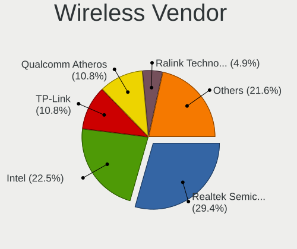

| Vendor                          | Desktops | Percent |
|---------------------------------|----------|---------|
| Realtek Semiconductor           | 30       | 29.41%  |
| Intel                           | 23       | 22.55%  |
| TP-Link                         | 11       | 10.78%  |
| Qualcomm Atheros                | 11       | 10.78%  |
| Ralink Technology               | 5        | 4.9%    |
| Microsoft                       | 5        | 4.9%    |
| Qualcomm Atheros Communications | 4        | 3.92%   |
| MediaTek                        | 4        | 3.92%   |
| Ralink                          | 3        | 2.94%   |
| D-Link                          | 2        | 1.96%   |
| Broadcom                        | 2        | 1.96%   |
| Sitecom Europe                  | 1        | 0.98%   |
| D-Link System                   | 1        | 0.98%   |

Wireless Model
--------------

Wireless models

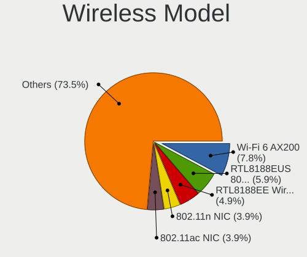

| Model                                                                  | Desktops | Percent |
|------------------------------------------------------------------------|----------|---------|
| Intel Wi-Fi 6 AX200                                                    | 8        | 7.84%   |
| Realtek RTL8188EUS 802.11n Wireless Network Adapter                    | 6        | 5.88%   |
| Realtek RTL8188EE Wireless Network Adapter                             | 5        | 4.9%    |
| TP-Link 802.11n NIC                                                    | 4        | 3.92%   |
| Realtek 802.11ac NIC                                                   | 4        | 3.92%   |
| Ralink MT7601U Wireless Adapter                                        | 4        | 3.92%   |
| Qualcomm Atheros AR9271 802.11n                                        | 4        | 3.92%   |
| Realtek RTL8821CE 802.11ac PCIe Wireless Network Adapter               | 3        | 2.94%   |
| Realtek RTL8192EE PCIe Wireless Network Adapter                        | 3        | 2.94%   |
| Realtek RTL8192CU 802.11n WLAN Adapter                                 | 3        | 2.94%   |
| Qualcomm Atheros AR9485 Wireless Network Adapter                       | 3        | 2.94%   |
| Microsoft Xbox Wireless Adapter for Windows                            | 3        | 2.94%   |
| MediaTek MT7922 802.11ax PCI Express Wireless Network Adapter          | 3        | 2.94%   |
| TP-Link AC600 wireless Realtek RTL8811AU [Archer T2U Nano]             | 2        | 1.96%   |
| Ralink RT5390 Wireless 802.11n 1T/1R PCIe                              | 2        | 1.96%   |
| Qualcomm Atheros AR9287 Wireless Network Adapter (PCI-Express)         | 2        | 1.96%   |
| Qualcomm Atheros AR9285 Wireless Network Adapter (PCI-Express)         | 2        | 1.96%   |
| Microsoft Xbox 360 Wireless Adapter                                    | 2        | 1.96%   |
| Intel Wireless 7265                                                    | 2        | 1.96%   |
| Intel Wireless 3165                                                    | 2        | 1.96%   |
| Intel Dual Band Wireless-AC 3168NGW [Stone Peak]                       | 2        | 1.96%   |
| Intel Centrino Wireless-N 2230                                         | 2        | 1.96%   |
| Intel Alder Lake-S PCH CNVi WiFi                                       | 2        | 1.96%   |
| TP-Link TL-WN823N v2/v3 [Realtek RTL8192EU]                            | 1        | 0.98%   |
| TP-Link TL-WN821N v5/v6 [RTL8192EU]                                    | 1        | 0.98%   |
| TP-Link TL-WN8200ND [Realtek RTL8192CU]                                | 1        | 0.98%   |
| TP-Link Archer T3U [Realtek RTL8812BU]                                 | 1        | 0.98%   |
| TP-Link Archer T2U PLUS [RTL8821AU]                                    | 1        | 0.98%   |
| Sitecom Europe RTL8191S WLAN Adapter                                   | 1        | 0.98%   |
| Realtek RTL8852BE PCIe 802.11ax Wireless Network Controller            | 1        | 0.98%   |
| Realtek RTL8821AE 802.11ac PCIe Wireless Network Adapter               | 1        | 0.98%   |
| Realtek RTL8812AE 802.11ac PCIe Wireless Network Adapter               | 1        | 0.98%   |
| Realtek RTL8723BE PCIe Wireless Network Adapter                        | 1        | 0.98%   |
| Realtek RTL8188FTV 802.11b/g/n 1T1R 2.4G WLAN Adapter                  | 1        | 0.98%   |
| Realtek RTL-8185 IEEE 802.11a/b/g Wireless LAN Controller              | 1        | 0.98%   |
| Ralink RT2870/RT3070 Wireless Adapter                                  | 1        | 0.98%   |
| Ralink RT2561/RT61 rev B 802.11g                                       | 1        | 0.98%   |
| Qualcomm Atheros AR9227 Wireless Network Adapter                       | 1        | 0.98%   |
| Qualcomm Atheros AR5416 Wireless Network Adapter [AR5008 802.11(a)bgn] | 1        | 0.98%   |
| Qualcomm Atheros AR5212/5213/2414 Wireless Network Adapter             | 1        | 0.98%   |

Ethernet Vendor
---------------

Ethernet vendors

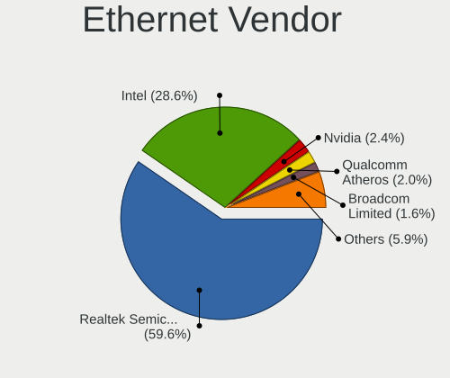

| Vendor                     | Desktops | Percent |
|----------------------------|----------|---------|
| Realtek Semiconductor      | 152      | 59.61%  |
| Intel                      | 73       | 28.63%  |
| Nvidia                     | 6        | 2.35%   |
| Qualcomm Atheros           | 5        | 1.96%   |
| Broadcom Limited           | 4        | 1.57%   |
| ASIX Electronics           | 3        | 1.18%   |
| MediaTek                   | 2        | 0.78%   |
| Huawei Technologies        | 2        | 0.78%   |
| D-Link System              | 2        | 0.78%   |
| ZTE WCDMA Technologies MSM | 1        | 0.39%   |
| Xiaomi                     | 1        | 0.39%   |
| TP-Link                    | 1        | 0.39%   |
| Qualcomm                   | 1        | 0.39%   |
| OPPO Electronics           | 1        | 0.39%   |
| Motorola PCS               | 1        | 0.39%   |

Ethernet Model
--------------

Ethernet models

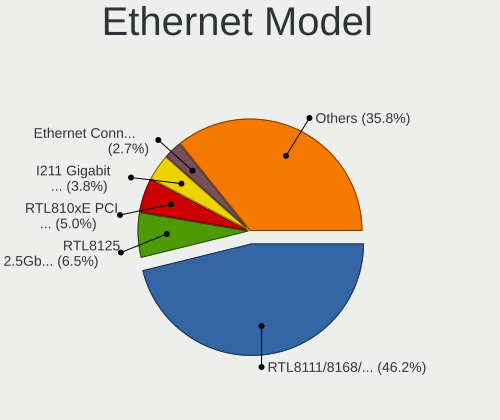

| Model                                                                           | Desktops | Percent |
|---------------------------------------------------------------------------------|----------|---------|
| Realtek RTL8111/8168/8211/8411 PCI Express Gigabit Ethernet Controller          | 120      | 46.15%  |
| Realtek RTL8125 2.5GbE Controller                                               | 17       | 6.54%   |
| Realtek RTL810xE PCI Express Fast Ethernet controller                           | 13       | 5%      |
| Intel I211 Gigabit Network Connection                                           | 10       | 3.85%   |
| Intel Ethernet Connection (2) I219-V                                            | 7        | 2.69%   |
| Intel 82579V Gigabit Network Connection                                         | 7        | 2.69%   |
| Intel 82579LM Gigabit Network Connection (Lewisville)                           | 6        | 2.31%   |
| Nvidia MCP61 Ethernet                                                           | 5        | 1.92%   |
| Intel Ethernet Controller I225-V                                                | 4        | 1.54%   |
| Intel Ethernet Connection (12) I219-V                                           | 4        | 1.54%   |
| Qualcomm Atheros AR8151 v2.0 Gigabit Ethernet                                   | 3        | 1.15%   |
| Intel Ethernet Controller I226-V                                                | 3        | 1.15%   |
| Intel Ethernet Connection I217-LM                                               | 3        | 1.15%   |
| Intel Ethernet Connection (7) I219-LM                                           | 3        | 1.15%   |
| Intel Ethernet Connection (2) I219-LM                                           | 3        | 1.15%   |
| Intel 82578DC Gigabit Network Connection                                        | 3        | 1.15%   |
| Realtek Killer E3000 2.5GbE Controller                                          | 2        | 0.77%   |
| Qualcomm Atheros Killer E220x Gigabit Ethernet Controller                       | 2        | 0.77%   |
| MediaTek MT7925 802.11be 160MHz 2x2 PCIe Wireless Network Adapter [Filogic 360] | 2        | 0.77%   |
| Intel Ethernet Connection (7) I219-V                                            | 2        | 0.77%   |
| Intel Ethernet Connection (14) I219-V                                           | 2        | 0.77%   |
| Intel 82567V-4 Gigabit Network Connection                                       | 2        | 0.77%   |
| Intel 82566DM-2 Gigabit Network Connection                                      | 2        | 0.77%   |
| Huawei FOA-LX9                                                                  | 2        | 0.77%   |
| D-Link System DGE-528T Gigabit Ethernet Adapter                                 | 2        | 0.77%   |
| Broadcom Limited NetXtreme BCM5755 Gigabit Ethernet PCI Express                 | 2        | 0.77%   |
| ASIX AX88179 Gigabit Ethernet                                                   | 2        | 0.77%   |
| ZTE WCDMA MSM ZTE Blade A54                                                     | 1        | 0.38%   |
| Xiaomi Mi/Redmi series (RNDIS)                                                  | 1        | 0.38%   |
| TP-Link USB 10/100 LAN                                                          | 1        | 0.38%   |
| Realtek RTL8126 5GbE Controller                                                 | 1        | 0.38%   |
| Realtek RTL-8100/8101L/8139 PCI Fast Ethernet Adapter                           | 1        | 0.38%   |
| Qualcomm Nokia X30 5G                                                           | 1        | 0.38%   |
| OPPO Ace 3V                                                                     | 1        | 0.38%   |
| Nvidia MCP67 Ethernet                                                           | 1        | 0.38%   |
| Motorola PCS moto g100 pro                                                      | 1        | 0.38%   |
| Intel NM10/ICH7 Family LAN Controller                                           | 1        | 0.38%   |
| Intel Ethernet Connection I219-V                                                | 1        | 0.38%   |
| Intel Ethernet Connection I217-V                                                | 1        | 0.38%   |
| Intel Ethernet Connection (6) I219-LM                                           | 1        | 0.38%   |

Net Controller Kind
-------------------

Ethernet, WiFi or modem

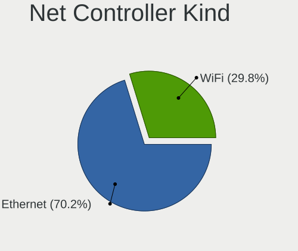

| Kind     | Desktops | Percent |
|----------|----------|---------|
| Ethernet | 236      | 70.24%  |
| WiFi     | 100      | 29.76%  |

Used Controller
---------------

Currently used network controller

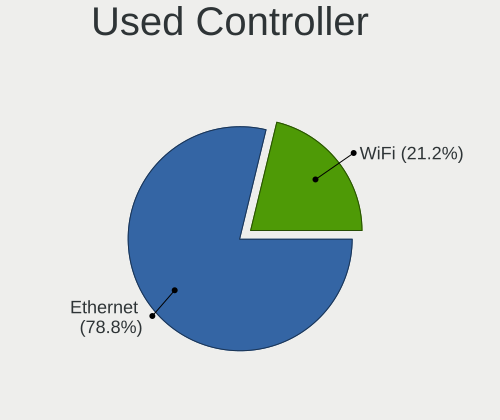

| Kind     | Desktops | Percent |
|----------|----------|---------|
| Ethernet | 193      | 78.78%  |
| WiFi     | 52       | 21.22%  |

NICs
----

Total network controllers on board

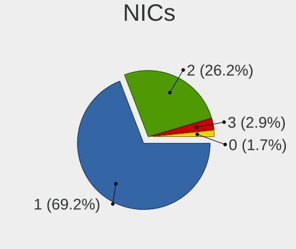

| Total | Desktops | Percent |
|-------|----------|---------|
| 1     | 166      | 69.17%  |
| 2     | 63       | 26.25%  |
| 3     | 7        | 2.92%   |
| 0     | 4        | 1.67%   |

IPv6
----

IPv6 vs IPv4

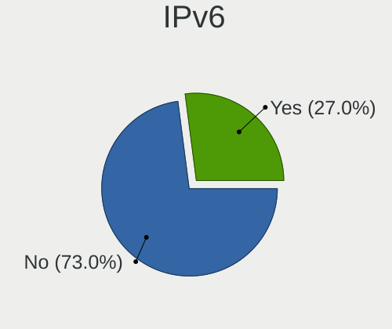

| Used | Desktops | Percent |
|------|----------|---------|
| No   | 178      | 72.95%  |
| Yes  | 66       | 27.05%  |

Bluetooth
---------

Bluetooth Vendor
----------------

Controller vendors

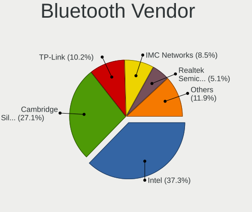

| Vendor                     | Desktops | Percent |
|----------------------------|----------|---------|
| Intel                      | 22       | 37.29%  |
| Cambridge Silicon Radio    | 16       | 27.12%  |
| TP-Link                    | 6        | 10.17%  |
| IMC Networks               | 5        | 8.47%   |
| Realtek Semiconductor      | 3        | 5.08%   |
| MediaTek                   | 3        | 5.08%   |
| TRENDnet                   | 1        | 1.69%   |
| Integrated System Solution | 1        | 1.69%   |
| Foxconn / Hon Hai          | 1        | 1.69%   |
| Unknown                    | 1        | 1.69%   |

Bluetooth Model
---------------

Controller models

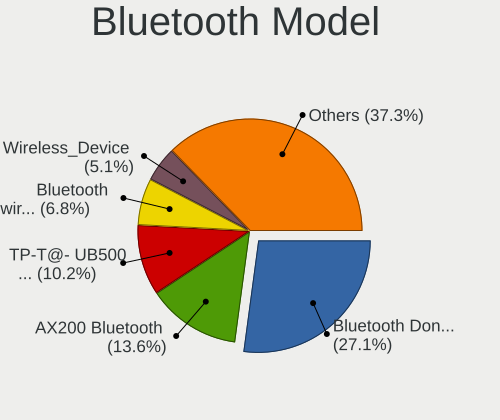

| Model                                                 | Desktops | Percent |
|-------------------------------------------------------|----------|---------|
| Cambridge Silicon Radio Bluetooth Dongle (HCI mode)   | 16       | 27.12%  |
| Intel AX200 Bluetooth                                 | 8        | 13.56%  |
| TP-Link TP-T@- UB500 Adapter                          | 6        | 10.17%  |
| Intel Bluetooth wireless interface                    | 4        | 6.78%   |
| MediaTek Wireless_Device                              | 3        | 5.08%   |
| IMC Networks Bluetooth Radio                          | 3        | 5.08%   |
| Realtek  Bluetooth 4.2 Adapter                        | 2        | 3.39%   |
| Intel Wireless-AC 3168 Bluetooth                      | 2        | 3.39%   |
| Intel Centrino Bluetooth Wireless Transceiver         | 2        | 3.39%   |
| Intel Bluetooth Device                                | 2        | 3.39%   |
| Intel Bluetooth 9460/9560 Jefferson Peak (JfP)        | 2        | 3.39%   |
| IMC Networks Wireless_Device                          | 2        | 3.39%   |
| TRENDnet TBW-108UB USB Adapter                        | 1        | 1.69%   |
| Realtek RTL8723B Bluetooth                            | 1        | 1.69%   |
| Intel AX210 Bluetooth                                 | 1        | 1.69%   |
| Intel AX201 Bluetooth                                 | 1        | 1.69%   |
| Integrated System Solution KY-BT100 Bluetooth Adapter | 1        | 1.69%   |
| Foxconn / Hon Hai Wireless_Device                     | 1        | 1.69%   |
| Unknown                                               | 1        | 1.69%   |

Sound
-----

Sound Vendor
------------

Sound card vendors

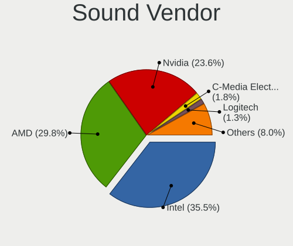

| Vendor                      | Desktops | Percent |
|-----------------------------|----------|---------|
| Intel                       | 137      | 35.49%  |
| AMD                         | 115      | 29.79%  |
| Nvidia                      | 91       | 23.58%  |
| C-Media Electronics         | 7        | 1.81%   |
| Logitech                    | 5        | 1.3%    |
| Microsoft                   | 3        | 0.78%   |
| Generalplus Technology      | 3        | 0.78%   |
| Texas Instruments           | 2        | 0.52%   |
| Micro Star International    | 2        | 0.52%   |
| Kingston Technology         | 2        | 0.52%   |
| JMTek                       | 2        | 0.52%   |
| Creative Labs               | 2        | 0.52%   |
| BEHRINGER International     | 2        | 0.52%   |
| ASUSTek Computer            | 2        | 0.52%   |
| VIA Technologies            | 1        | 0.26%   |
| Tenx Technology             | 1        | 0.26%   |
| Samson Technologies         | 1        | 0.26%   |
| KTMicro                     | 1        | 0.26%   |
| JBL                         | 1        | 0.26%   |
| FiiO Electronics Technology | 1        | 0.26%   |
| Creative Technology         | 1        | 0.26%   |
| Chicony Electronics         | 1        | 0.26%   |
| Barco Display Systems       | 1        | 0.26%   |
| ATI Technologies            | 1        | 0.26%   |
| Unknown                     | 1        | 0.26%   |

Sound Model
-----------

Sound card models

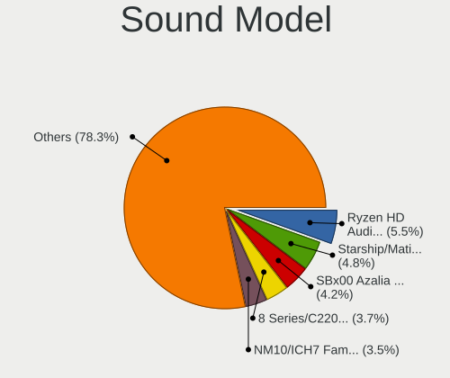

| Model                                                                      | Desktops | Percent |
|----------------------------------------------------------------------------|----------|---------|
| AMD Ryzen HD Audio Controller                                              | 25       | 5.48%   |
| AMD Starship/Matisse HD Audio Controller                                   | 22       | 4.82%   |
| AMD SBx00 Azalia (Intel HDA)                                               | 19       | 4.17%   |
| Intel 8 Series/C220 Series Chipset High Definition Audio Controller        | 17       | 3.73%   |
| Intel NM10/ICH7 Family High Definition Audio Controller                    | 16       | 3.51%   |
| Intel 6 Series/C200 Series Chipset Family High Definition Audio Controller | 16       | 3.51%   |
| Intel 100 Series/C230 Series Chipset Family HD Audio Controller            | 13       | 2.85%   |
| AMD FCH Azalia Controller                                                  | 13       | 2.85%   |
| AMD Ellesmere HDMI Audio [Radeon RX 470/480 / 570/580/590]                 | 13       | 2.85%   |
| Nvidia GF108 High Definition Audio Controller                              | 11       | 2.41%   |
| AMD Renoir/Cezanne HDMI/DP Audio Controller                                | 11       | 2.41%   |
| Nvidia GP107GL High Definition Audio Controller                            | 10       | 2.19%   |
| Intel Xeon E3-1200 v3/4th Gen Core Processor HD Audio Controller           | 10       | 2.19%   |
| Intel 7 Series/C216 Chipset Family High Definition Audio Controller        | 10       | 2.19%   |
| Nvidia GK208 HDMI/DP Audio Controller                                      | 9        | 1.97%   |
| Intel Cannon Lake PCH cAVS                                                 | 9        | 1.97%   |
| Intel 200 Series PCH HD Audio                                              | 8        | 1.75%   |
| AMD Raven/Raven2/Fenghuang HDMI/DP Audio Controller                        | 8        | 1.75%   |
| AMD Family 17h (Models 00h-0fh) HD Audio Controller                        | 8        | 1.75%   |
| Nvidia GA104 High Definition Audio Controller                              | 7        | 1.54%   |
| AMD Radeon High Definition Audio Controller                                | 7        | 1.54%   |
| AMD Oland/Hainan/Cape Verde/Pitcairn HDMI Audio [Radeon HD 7000 Series]    | 7        | 1.54%   |
| Intel 5 Series/3400 Series Chipset High Definition Audio                   | 6        | 1.32%   |
| AMD Navi 10 HDMI Audio                                                     | 6        | 1.32%   |
| Nvidia MCP61 High Definition Audio                                         | 5        | 1.1%    |
| Nvidia High Definition Audio Controller                                    | 5        | 1.1%    |
| Nvidia GP108 High Definition Audio Controller                              | 5        | 1.1%    |
| Intel Comet Lake PCH-V cAVS                                                | 5        | 1.1%    |
| Intel Alder Lake-S HD Audio Controller                                     | 5        | 1.1%    |
| Nvidia TU116 High Definition Audio Controller                              | 4        | 0.88%   |
| Nvidia TU107 GeForce GTX 1650 High Definition Audio Controller             | 4        | 0.88%   |
| Nvidia TU106 High Definition Audio Controller                              | 4        | 0.88%   |
| Nvidia GP104 High Definition Audio Controller                              | 4        | 0.88%   |
| Nvidia GA102 High Definition Audio Controller                              | 4        | 0.88%   |
| Intel 82801I (ICH9 Family) HD Audio Controller                             | 4        | 0.88%   |
| AMD Cedar HDMI Audio [Radeon HD 5400/6300/7300 Series]                     | 4        | 0.88%   |
| Nvidia TU104 HD Audio Controller                                           | 3        | 0.66%   |
| Nvidia GM206 High Definition Audio Controller                              | 3        | 0.66%   |
| Nvidia GM107 High Definition Audio Controller [GeForce 940MX]              | 3        | 0.66%   |
| Microsoft LifeChat LX-3000 Headset                                         | 3        | 0.66%   |

Memory
------

Memory Vendor
-------------

Memory module vendors

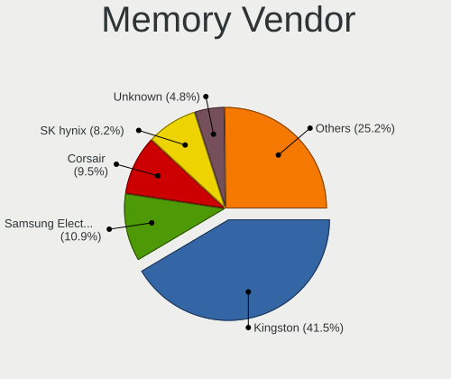

| Vendor                       | Desktops | Percent |
|------------------------------|----------|---------|
| Kingston                     | 61       | 41.5%   |
| Samsung Electronics          | 16       | 10.88%  |
| Corsair                      | 14       | 9.52%   |
| SK hynix                     | 12       | 8.16%   |
| Unknown                      | 7        | 4.76%   |
| Team                         | 7        | 4.76%   |
| Micron Technology            | 7        | 4.76%   |
| Crucial                      | 7        | 4.76%   |
| A-DATA Technology            | 6        | 4.08%   |
| Hewlett-Packard              | 2        | 1.36%   |
| Unknown (0x7FA8000000000000) | 1        | 0.68%   |
| Unknown (0x7F7FB5FFFFFFFFFF) | 1        | 0.68%   |
| S                            | 1        | 0.68%   |
| Qumo                         | 1        | 0.68%   |
| Princeton                    | 1        | 0.68%   |
| Nanya Technology             | 1        | 0.68%   |
| M                            | 1        | 0.68%   |
| GeIL                         | 1        | 0.68%   |

Memory Model
------------

Memory module models

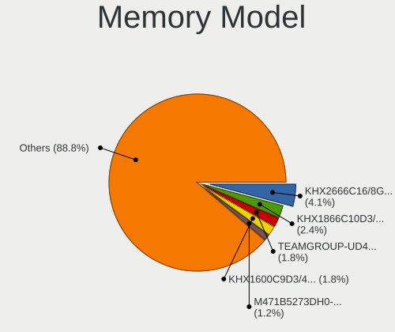

| Model                                                           | Desktops | Percent |
|-----------------------------------------------------------------|----------|---------|
| Kingston RAM KHX2666C16/8G 8GiB DIMM DDR4 3466MT/s              | 7        | 4.14%   |
| Kingston RAM KHX1866C10D3/8G 8GB DIMM DDR3 1867MT/s             | 4        | 2.37%   |
| Team RAM TEAMGROUP-UD4-3200 8GB DIMM DDR4 3800MT/s              | 3        | 1.78%   |
| Kingston RAM KHX1600C9D3/4GX 4GB DIMM DDR3 1867MT/s             | 3        | 1.78%   |
| SK hynix RAM HMT351U6CFR8C-PB 4GB DIMM DDR3 1800MT/s            | 2        | 1.18%   |
| SK hynix RAM HMT351S6BFR8C-H9 4GB DIMM DDR3 1333MT/s            | 2        | 1.18%   |
| Samsung RAM M471B5273DH0-CH9 4GB DIMM DDR3 1333MT/s             | 2        | 1.18%   |
| Samsung RAM M378B5173EB0 4GB DIMM DDR3 1600MT/s                 | 2        | 1.18%   |
| Kingston RAM KHX3466C17D4/32GX 32GB DIMM DDR4 3466MT/s          | 2        | 1.18%   |
| Kingston RAM KHX3466C16D4/16GX 16GB DIMM DDR4 3466MT/s          | 2        | 1.18%   |
| Kingston RAM KHX3200C16D4/8GX 8GB DIMM DDR4 3733MT/s            | 2        | 1.18%   |
| Kingston RAM KHX2666C16D4/16GX 16GB DIMM DDR4 3000MT/s          | 2        | 1.18%   |
| Kingston RAM KHX2666C15D4/4G 4GB DIMM DDR4 3200MT/s             | 2        | 1.18%   |
| Kingston RAM KHX2400C15/8G 8GB DIMM DDR4 3400MT/s               | 2        | 1.18%   |
| Kingston RAM KHX1600C10D3/8GX 8GB DIMM DDR3 1600MT/s            | 2        | 1.18%   |
| Kingston RAM KHX1600C10D3/8G 8GB DIMM DDR3 2133MT/s             | 2        | 1.18%   |
| Kingston RAM KF552C40-32 32GB DIMM DDR5 5200MT/s                | 2        | 1.18%   |
| Kingston RAM KF3200C16D4/8GX 8GiB DIMM DDR4 3600MT/s            | 2        | 1.18%   |
| Kingston RAM KF3200C16D4/16GX 16GB DIMM DDR4 3733MT/s           | 2        | 1.18%   |
| Kingston RAM CL16-18-18 D4-3200 8GB DIMM DDR4 3200MT/s          | 2        | 1.18%   |
| Kingston RAM 99U5403-436.A00LF 8GB DIMM DDR3 1333MT/s           | 2        | 1.18%   |
| Kingston RAM 9905471-017.A00LF 4096MB DIMM DDR3 1333MT/s        | 2        | 1.18%   |
| Corsair RAM CMK8GX4M1Z3200C16 8GB DIMM DDR4 3200MT/s            | 2        | 1.18%   |
| Corsair RAM CMK32GX4M2E3200C16 16GB DIMM DDR4 3600MT/s          | 2        | 1.18%   |
| Unknown RAM Module 8GB DIMM 1600MT/s                            | 1        | 0.59%   |
| Unknown RAM Module 512MB DIMM DDR2 533MT/s                      | 1        | 0.59%   |
| Unknown RAM Module 2GB DIMM SDRAM                               | 1        | 0.59%   |
| Unknown RAM Module 2GB DIMM DDR2                                | 1        | 0.59%   |
| Unknown RAM Module 2GB DIMM 800MT/s                             | 1        | 0.59%   |
| Unknown RAM Module 2048MB DIMM DDR2                             | 1        | 0.59%   |
| Unknown RAM Module 2048MB DIMM 400MT/s                          | 1        | 0.59%   |
| Unknown RAM Module 1GB DIMM 800MT/s                             | 1        | 0.59%   |
| Unknown (0x7FA8000000000000) RAM Module 512MB DIMM DDR2 533MT/s | 1        | 0.59%   |
| Unknown (0x7F7FB5FFFFFFFFFF) RAM Module 512MB DIMM DDR2 533MT/s | 1        | 0.59%   |
| Team RAM TEAMGROUP-UD4-3600 16GB DIMM DDR4 4000MT/s             | 1        | 0.59%   |
| Team RAM TEAMGROUP-UD4-3200 8GB DIMM DDR4 3733MT/s              | 1        | 0.59%   |
| Team RAM TEAMGROUP-UD4-2666 8GB DIMM DDR4 3000MT/s              | 1        | 0.59%   |
| Team RAM TEAMGROUP-UD4-2666 16GB DIMM DDR4 2667MT/s             | 1        | 0.59%   |
| SK hynix RAM Module 2GB DIMM DDR3 1066MT/s                      | 1        | 0.59%   |
| SK hynix RAM HYMP112U64CP8-S6 1GB DIMM DDR2 800MT/s             | 1        | 0.59%   |

Memory Kind
-----------

Memory module kinds

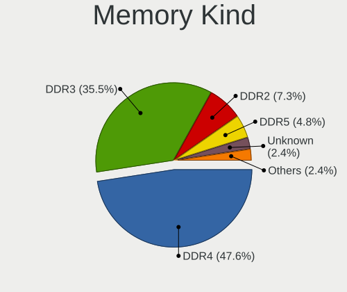

| Kind    | Desktops | Percent |
|---------|----------|---------|
| DDR4    | 59       | 47.58%  |
| DDR3    | 44       | 35.48%  |
| DDR2    | 9        | 7.26%   |
| DDR5    | 6        | 4.84%   |
| Unknown | 3        | 2.42%   |
| SDRAM   | 2        | 1.61%   |
| LPDDR3  | 1        | 0.81%   |

Memory Form Factor
------------------

Physical design of the memory module

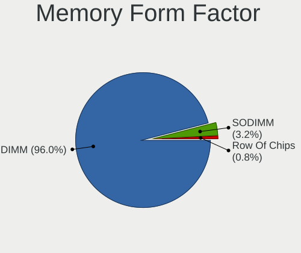

| Name         | Desktops | Percent |
|--------------|----------|---------|
| DIMM         | 119      | 95.97%  |
| SODIMM       | 4        | 3.23%   |
| Row Of Chips | 1        | 0.81%   |

Memory Size
-----------

Memory module size

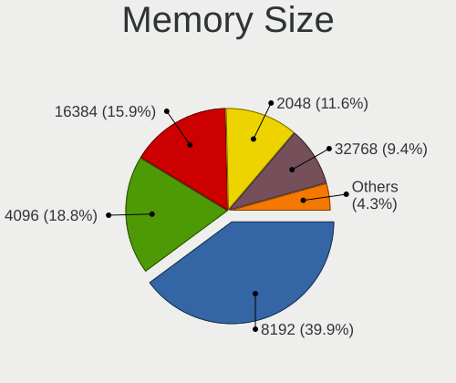

| Size  | Desktops | Percent |
|-------|----------|---------|
| 8192  | 55       | 39.86%  |
| 4096  | 26       | 18.84%  |
| 16384 | 22       | 15.94%  |
| 2048  | 16       | 11.59%  |
| 32768 | 13       | 9.42%   |
| 1024  | 4        | 2.9%    |
| 512   | 2        | 1.45%   |

Memory Speed
------------

Memory module speed

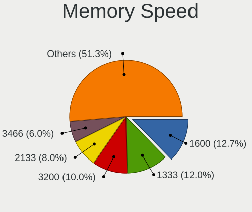

| Speed   | Desktops | Percent |
|---------|----------|---------|
| 1600    | 19       | 12.67%  |
| 1333    | 18       | 12%     |
| 3200    | 15       | 10%     |
| 2133    | 12       | 8%      |
| 3466    | 9        | 6%      |
| 2667    | 9        | 6%      |
| 2400    | 8        | 5.33%   |
| 3733    | 6        | 4%      |
| 3600    | 6        | 4%      |
| 3800    | 5        | 3.33%   |
| 3000    | 4        | 2.67%   |
| 800     | 4        | 2.67%   |
| 1866    | 3        | 2%      |
| 533     | 3        | 2%      |
| Unknown | 3        | 2%      |
| 6000    | 2        | 1.33%   |
| 5200    | 2        | 1.33%   |
| 3400    | 2        | 1.33%   |
| 1800    | 2        | 1.33%   |
| 5600    | 1        | 0.67%   |
| 5400    | 1        | 0.67%   |
| 4333    | 1        | 0.67%   |
| 4000    | 1        | 0.67%   |
| 3151    | 1        | 0.67%   |
| 3100    | 1        | 0.67%   |
| 3066    | 1        | 0.67%   |
| 2733    | 1        | 0.67%   |
| 2666    | 1        | 0.67%   |
| 2200    | 1        | 0.67%   |
| 2134    | 1        | 0.67%   |
| 1867    | 1        | 0.67%   |
| 1648    | 1        | 0.67%   |
| 1639    | 1        | 0.67%   |
| 1067    | 1        | 0.67%   |
| 1066    | 1        | 0.67%   |
| 667     | 1        | 0.67%   |
| 400     | 1        | 0.67%   |

Printers & scanners
-------------------

Printer Vendor
--------------

Printer device vendors

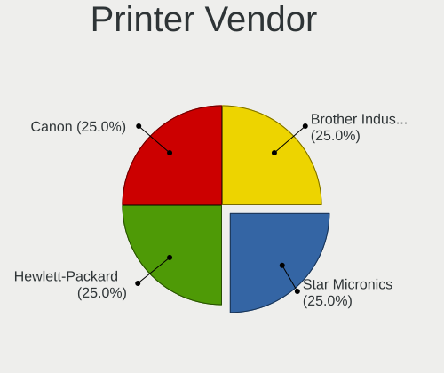

| Vendor                        | Desktops | Percent |
|-------------------------------|----------|---------|
| Brother Industries            | 3        | 30%     |
| Seiko Epson                   | 2        | 20%     |
| Hewlett-Packard               | 2        | 20%     |
| Star Micronics                | 1        | 10%     |
| Samsung Info. Systems America | 1        | 10%     |
| Canon                         | 1        | 10%     |

Printer Model
-------------

Printer device models

| Model                                         | Desktops | Percent |
|-----------------------------------------------|----------|---------|
| Brother DCP-T310                              | 2        | 20%     |
| Star Micronics TUP592 (STR_T-001)             | 1        | 10%     |
| Seiko Epson ET-2850 Series                    | 1        | 10%     |
| Seiko Epson ET-2810 Series                    | 1        | 10%     |
| Samsung Info. Systems America SAMSUNG SRP-270 | 1        | 10%     |
| HP PSC 1400                                   | 1        | 10%     |
| HP DeskJet 2700 series                        | 1        | 10%     |
| Canon PIXMA MG3600 Series                     | 1        | 10%     |
| Brother DCP-9020CDW                           | 1        | 10%     |

Scanner Vendor
--------------

Scanner device vendors

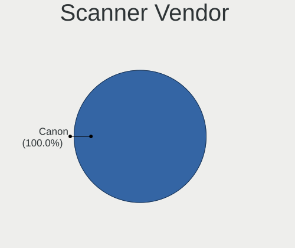

| Vendor          | Desktops | Percent |
|-----------------|----------|---------|
| Hewlett-Packard | 1        | 50%     |
| Canon           | 1        | 50%     |

Scanner Model
-------------

Scanner device models

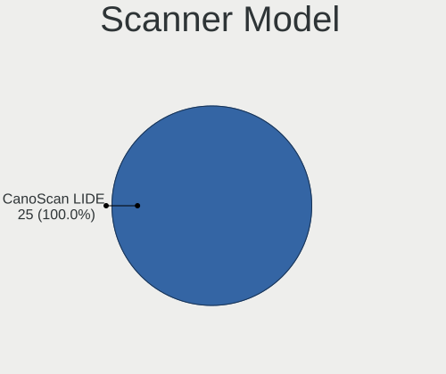

| Model                  | Desktops | Percent |
|------------------------|----------|---------|
| HP ScanJet 2400c       | 1        | 50%     |
| Canon CanoScan LIDE 25 | 1        | 50%     |

Camera
------

Camera Vendor
-------------

Camera device vendors

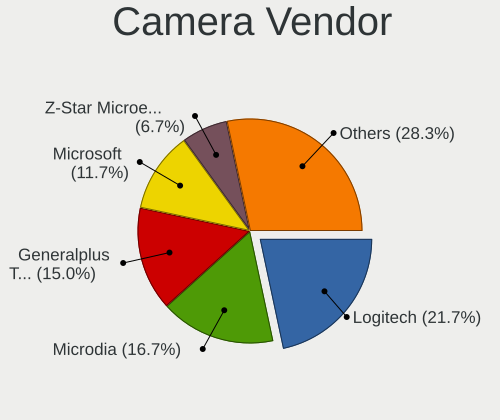

| Vendor                  | Desktops | Percent |
|-------------------------|----------|---------|
| Logitech                | 13       | 21.67%  |
| Microdia                | 10       | 16.67%  |
| Generalplus Technology  | 9        | 15%     |
| Microsoft               | 7        | 11.67%  |
| Z-Star Microelectronics | 4        | 6.67%   |
| Chicony Electronics     | 3        | 5%      |
| Samsung Electronics     | 2        | 3.33%   |
| Cubeternet              | 2        | 3.33%   |
| Xiongmai                | 1        | 1.67%   |
| Realtek Semiconductor   | 1        | 1.67%   |
| MacroSilicon            | 1        | 1.67%   |
| Jieli Technology        | 1        | 1.67%   |
| Huawei Technologies     | 1        | 1.67%   |
| GG-240527-X             | 1        | 1.67%   |
| Creative Technology     | 1        | 1.67%   |
| Bison Electronics       | 1        | 1.67%   |
| Aveo Technology         | 1        | 1.67%   |
| Apple                   | 1        | 1.67%   |

Camera Model
------------

Camera device models

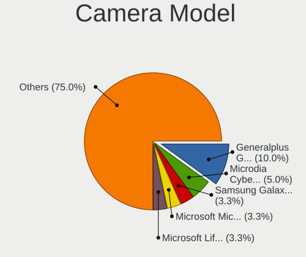

| Model                                                               | Desktops | Percent |
|---------------------------------------------------------------------|----------|---------|
| Generalplus GENERAL WEBCAM                                          | 6        | 10%     |
| Microdia CyberTrack H7                                              | 3        | 5%      |
| Samsung Galaxy series, misc. (MTP mode)                             | 2        | 3.33%   |
| Microsoft Microsoft LifeCam HD-6000 for Notebooks                   | 2        | 3.33%   |
| Microsoft LifeCam HD-3000                                           | 2        | 3.33%   |
| Microdia Integrated Camera                                          | 2        | 3.33%   |
| Microdia Defender G-Lens 2577 HD720p Camera                         | 2        | 3.33%   |
| Microdia Camera                                                     | 2        | 3.33%   |
| Logitech Webcam C270                                                | 2        | 3.33%   |
| Logitech Webcam C170                                                | 2        | 3.33%   |
| Logitech C920 PRO HD Webcam                                         | 2        | 3.33%   |
| Logitech BRIO Ultra HD Webcam                                       | 2        | 3.33%   |
| Generalplus 808 Camera #9 (web-cam mode)                            | 2        | 3.33%   |
| Cubeternet EtronTech CMOS based eSP570 WebCam [Onyx Titanium TC101] | 2        | 3.33%   |
| Chicony HP 0.3MP Webcam                                             | 2        | 3.33%   |
| Z-Star Venus USB2.0 Camera                                          | 1        | 1.67%   |
| Z-Star Sirius USB2.0 Camera                                         | 1        | 1.67%   |
| Z-Star Integrated Camera                                            | 1        | 1.67%   |
| Z-Star A4 TECH USB2.0 PC Camera E                                   | 1        | 1.67%   |
| Xiongmai web camera                                                 | 1        | 1.67%   |
| Realtek Laptop_Integrated_Webcam_FHD                                | 1        | 1.67%   |
| Microsoft Microsoft LifeCam Cinema                                  | 1        | 1.67%   |
| Microsoft LifeCam Studio                                            | 1        | 1.67%   |
| Microsoft LifeCam Cinema                                            | 1        | 1.67%   |
| Microdia Webcam Vitade AF                                           | 1        | 1.67%   |
| MacroSilicon UGREEN 15390                                           | 1        | 1.67%   |
| Logitech StreamCam                                                  | 1        | 1.67%   |
| Logitech Logi Webcam C920e                                          | 1        | 1.67%   |
| Logitech HD Webcam C525                                             | 1        | 1.67%   |
| Logitech C505e HD Webcam                                            | 1        | 1.67%   |
| Logitech Brio 105                                                   | 1        | 1.67%   |
| Jieli USB PHY 2.0                                                   | 1        | 1.67%   |
| Huawei HiCamera                                                     | 1        | 1.67%   |
| GG-240527-X TE-9072                                                 | 1        | 1.67%   |
| Generalplus WEB CAM                                                 | 1        | 1.67%   |
| Creative Live! Cam Sync 1080p                                       | 1        | 1.67%   |
| Chicony HD WebCam (Asus N-series)                                   | 1        | 1.67%   |
| Bison Integrated Camera                                             | 1        | 1.67%   |
| Aveo USB2.0 Camera                                                  | 1        | 1.67%   |
| Apple iPhone 5/5C/5S/6/SE/7/8/X                                     | 1        | 1.67%   |

Security
--------

Fingerprint Vendor
------------------

Fingerprint sensor vendors

Zero info for selected period =(

Fingerprint Model
-----------------

Fingerprint sensor models

Zero info for selected period =(

Chipcard Vendor
---------------

Chipcard module vendors

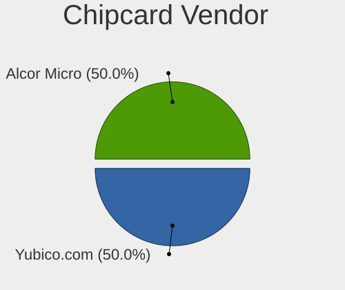

| Vendor      | Desktops | Percent |
|-------------|----------|---------|
| Yubico.com  | 1        | 50%     |
| Alcor Micro | 1        | 50%     |

Chipcard Model
--------------

Chipcard module models

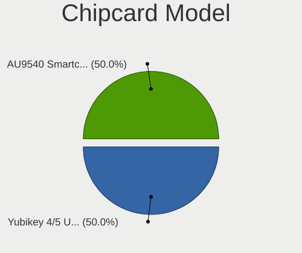

| Model                               | Desktops | Percent |
|-------------------------------------|----------|---------|
| Yubico.com Yubikey 4/5 U2F+CCID     | 1        | 50%     |
| Alcor Micro AU9540 Smartcard Reader | 1        | 50%     |

Unsupported
-----------

Unsupported Devices
-------------------

Total unsupported devices on board

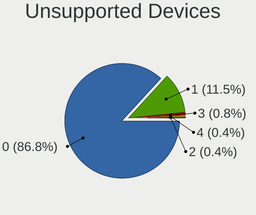

| Total | Desktops | Percent |
|-------|----------|---------|
| 0     | 211      | 86.83%  |
| 1     | 28       | 11.52%  |
| 3     | 2        | 0.82%   |
| 4     | 1        | 0.41%   |
| 2     | 1        | 0.41%   |

Unsupported Device Types
------------------------

Types of unsupported devices

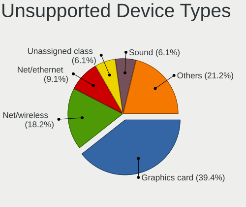

| Type                     | Desktops | Percent |
|--------------------------|----------|---------|
| Graphics card            | 13       | 39.39%  |
| Net/wireless             | 6        | 18.18%  |
| Net/ethernet             | 3        | 9.09%   |
| Unassigned class         | 2        | 6.06%   |
| Sound                    | 2        | 6.06%   |
| Communication controller | 2        | 6.06%   |
| Network                  | 1        | 3.03%   |
| Multimedia controller    | 1        | 3.03%   |
| Firewire controller      | 1        | 3.03%   |
| Chipcard                 | 1        | 3.03%   |
| Camera                   | 1        | 3.03%   |

