Linux in Peru - Tested Hardware & Statistics (Desktops)
-------------------------------------------------------

A project to collect tested hardware configurations for Linux in Peru.

Anyone can contribute to this report by the [hw-probe](https://github.com/linuxhw/hw-probe) tool:

    sudo -E hw-probe -all -upload

Please contribute! Especially if your hardware is rare.

Contents
--------

* [ Test Cases ](#test-cases)

* [ System ](#system)
  - [ OS                       ](#os)
  - [ OS Family                ](#os-family)
  - [ Kernel                   ](#kernel)
  - [ Kernel Family            ](#kernel-family)
  - [ Kernel Major Ver.        ](#kernel-major-ver)
  - [ Arch                     ](#arch)
  - [ DE                       ](#de)
  - [ Display Server           ](#display-server)
  - [ Display Manager          ](#display-manager)
  - [ OS Lang                  ](#os-lang)
  - [ Boot Mode                ](#boot-mode)
  - [ Filesystem               ](#filesystem)
  - [ Part. scheme             ](#part-scheme)
  - [ Dual Boot with Linux/BSD ](#dual-boot-with-linuxbsd)
  - [ Dual Boot (Win)          ](#dual-boot-win)

* [ Board ](#board)
  - [ Vendor                   ](#vendor)
  - [ Model                    ](#model)
  - [ Model Family             ](#model-family)
  - [ MFG Year                 ](#mfg-year)
  - [ Form Factor              ](#form-factor)
  - [ Secure Boot              ](#secure-boot)
  - [ Coreboot                 ](#coreboot)
  - [ RAM Size                 ](#ram-size)
  - [ RAM Used                 ](#ram-used)
  - [ Total Drives             ](#total-drives)
  - [ Has CD-ROM               ](#has-cd-rom)
  - [ Has Ethernet             ](#has-ethernet)
  - [ Has WiFi                 ](#has-wifi)
  - [ Has Bluetooth            ](#has-bluetooth)

* [ Location ](#location)
  - [ Country                  ](#country)
  - [ City                     ](#city)

* [ Drives ](#drives)
  - [ Drive Vendor             ](#drive-vendor)
  - [ Drive Model              ](#drive-model)
  - [ HDD Vendor               ](#hdd-vendor)
  - [ SSD Vendor               ](#ssd-vendor)
  - [ Drive Kind               ](#drive-kind)
  - [ Drive Connector          ](#drive-connector)
  - [ Drive Size               ](#drive-size)
  - [ Space Total              ](#space-total)
  - [ Space Used               ](#space-used)
  - [ Malfunc. Drives          ](#malfunc-drives)
  - [ Malfunc. Drive Vendor    ](#malfunc-drive-vendor)
  - [ Malfunc. HDD Vendor      ](#malfunc-hdd-vendor)
  - [ Malfunc. Drive Kind      ](#malfunc-drive-kind)
  - [ Failed Drives            ](#failed-drives)
  - [ Failed Drive Vendor      ](#failed-drive-vendor)
  - [ Drive Status             ](#drive-status)

* [ Storage controller ](#storage-controller)
  - [ Storage Vendor           ](#storage-vendor)
  - [ Storage Model            ](#storage-model)
  - [ Storage Kind             ](#storage-kind)

* [ Processor ](#processor)
  - [ CPU Vendor               ](#cpu-vendor)
  - [ CPU Model                ](#cpu-model)
  - [ CPU Model Family         ](#cpu-model-family)
  - [ CPU Cores                ](#cpu-cores)
  - [ CPU Sockets              ](#cpu-sockets)
  - [ CPU Threads              ](#cpu-threads)
  - [ CPU Op-Modes             ](#cpu-op-modes)
  - [ CPU Microcode            ](#cpu-microcode)
  - [ CPU Microarch            ](#cpu-microarch)

* [ Graphics ](#graphics)
  - [ GPU Vendor               ](#gpu-vendor)
  - [ GPU Model                ](#gpu-model)
  - [ GPU Combo                ](#gpu-combo)
  - [ GPU Driver               ](#gpu-driver)
  - [ GPU Memory               ](#gpu-memory)

* [ Monitor ](#monitor)
  - [ Monitor Vendor           ](#monitor-vendor)
  - [ Monitor Model            ](#monitor-model)
  - [ Monitor Resolution       ](#monitor-resolution)
  - [ Monitor Diagonal         ](#monitor-diagonal)
  - [ Monitor Width            ](#monitor-width)
  - [ Aspect Ratio             ](#aspect-ratio)
  - [ Monitor Area             ](#monitor-area)
  - [ Pixel Density            ](#pixel-density)
  - [ Multiple Monitors        ](#multiple-monitors)

* [ Network ](#network)
  - [ Net Controller Vendor    ](#net-controller-vendor)
  - [ Net Controller Model     ](#net-controller-model)
  - [ Wireless Vendor          ](#wireless-vendor)
  - [ Wireless Model           ](#wireless-model)
  - [ Ethernet Vendor          ](#ethernet-vendor)
  - [ Ethernet Model           ](#ethernet-model)
  - [ Net Controller Kind      ](#net-controller-kind)
  - [ Used Controller          ](#used-controller)
  - [ NICs                     ](#nics)
  - [ IPv6                     ](#ipv6)

* [ Bluetooth ](#bluetooth)
  - [ Bluetooth Vendor         ](#bluetooth-vendor)
  - [ Bluetooth Model          ](#bluetooth-model)

* [ Sound ](#sound)
  - [ Sound Vendor             ](#sound-vendor)
  - [ Sound Model              ](#sound-model)

* [ Memory ](#memory)
  - [ Memory Vendor            ](#memory-vendor)
  - [ Memory Model             ](#memory-model)
  - [ Memory Kind              ](#memory-kind)
  - [ Memory Form Factor       ](#memory-form-factor)
  - [ Memory Size              ](#memory-size)
  - [ Memory Speed             ](#memory-speed)

* [ Printers & scanners ](#printers--scanners)
  - [ Printer Vendor           ](#printer-vendor)
  - [ Printer Model            ](#printer-model)
  - [ Scanner Vendor           ](#scanner-vendor)
  - [ Scanner Model            ](#scanner-model)

* [ Camera ](#camera)
  - [ Camera Vendor            ](#camera-vendor)
  - [ Camera Model             ](#camera-model)

* [ Security ](#security)
  - [ Fingerprint Vendor       ](#fingerprint-vendor)
  - [ Fingerprint Model        ](#fingerprint-model)
  - [ Chipcard Vendor          ](#chipcard-vendor)
  - [ Chipcard Model           ](#chipcard-model)

* [ Unsupported ](#unsupported)
  - [ Unsupported Devices      ](#unsupported-devices)
  - [ Unsupported Device Types ](#unsupported-device-types)

Test Cases
----------

Total: 229

| Vendor   | Model                       | Probe                                                      | Date         |
|----------|-----------------------------|------------------------------------------------------------|--------------|
| Gigabyte | B75M-D3H                    | [f306ab4590](https://linux-hardware.org/?probe=f306ab4590) | Dec 17, 2023 |
| Gigabyte | F2A68HM-H                   | [57a63775b2](https://linux-hardware.org/?probe=57a63775b2) | Dec 05, 2023 |
| Gigabyte | B450M S2H                   | [5dcf20cb88](https://linux-hardware.org/?probe=5dcf20cb88) | Dec 04, 2023 |
| Gigabyte | B450M S2H                   | [2f07094763](https://linux-hardware.org/?probe=2f07094763) | Dec 04, 2023 |
| ASRock   | H310CM-HDV/M.2              | [4b91971e62](https://linux-hardware.org/?probe=4b91971e62) | Dec 01, 2023 |
| Gigabyte | B75M-D3H                    | [5be7c208c3](https://linux-hardware.org/?probe=5be7c208c3) | Nov 20, 2023 |
| HP       | 18E7                        | [212d6dba47](https://linux-hardware.org/?probe=212d6dba47) | Nov 02, 2023 |
| HP       | 18E7                        | [7064df5d87](https://linux-hardware.org/?probe=7064df5d87) | Nov 02, 2023 |
| MSI      | PRO B550M-P GEN3            | [8a9f37b293](https://linux-hardware.org/?probe=8a9f37b293) | Oct 31, 2023 |
| MSI      | B250M PRO-VDH               | [c3d5a72f41](https://linux-hardware.org/?probe=c3d5a72f41) | Oct 27, 2023 |
| Gigabyte | AX370M-Gaming 3-CF          | [dbc150b2b5](https://linux-hardware.org/?probe=dbc150b2b5) | Oct 13, 2023 |
| GIADA    | Braswell JHS60S             | [ed113a0bc0](https://linux-hardware.org/?probe=ed113a0bc0) | Oct 08, 2023 |
| ASRock   | G31M-S                      | [f1325a7f15](https://linux-hardware.org/?probe=f1325a7f15) | Sep 23, 2023 |
| ASUSTek  | V230IC                      | [aea46e7fc6](https://linux-hardware.org/?probe=aea46e7fc6) | Sep 21, 2023 |
| ASUSTek  | ROG STRIX B550-F GAMING     | [9d3a7e1014](https://linux-hardware.org/?probe=9d3a7e1014) | Sep 14, 2023 |
| HP       | 8433 11                     | [6160c13209](https://linux-hardware.org/?probe=6160c13209) | Sep 12, 2023 |
| HP       | 8433 11                     | [2fbe297e6c](https://linux-hardware.org/?probe=2fbe297e6c) | Sep 12, 2023 |
| ASUSTek  | ROG STRIX B460-H GAMING     | [865ce7b55b](https://linux-hardware.org/?probe=865ce7b55b) | Sep 04, 2023 |
| Gigabyte | X570 AORUS MASTER           | [89e3ba3d7d](https://linux-hardware.org/?probe=89e3ba3d7d) | Aug 28, 2023 |
| Gigabyte | X570 AORUS MASTER           | [0150e826ac](https://linux-hardware.org/?probe=0150e826ac) | Aug 28, 2023 |
| Gigabyte | F2A68HM-H                   | [82923ee337](https://linux-hardware.org/?probe=82923ee337) | Aug 18, 2023 |
| ASRock   | B460M Pro4                  | [66f1fd8cc5](https://linux-hardware.org/?probe=66f1fd8cc5) | Aug 07, 2023 |
| MSI      | MAG B550M MORTAR            | [87d27d2a99](https://linux-hardware.org/?probe=87d27d2a99) | Aug 04, 2023 |
| Gigabyte | GA-880GM-UD2H               | [bb88f3afdc](https://linux-hardware.org/?probe=bb88f3afdc) | Jul 31, 2023 |
| HP       | 83EE                        | [af63e7b8fd](https://linux-hardware.org/?probe=af63e7b8fd) | Jul 12, 2023 |
| ASUSTek  | B85M-G R2.0                 | [477ec4d403](https://linux-hardware.org/?probe=477ec4d403) | Jul 11, 2023 |
| HP       | 1493                        | [b22e0342bc](https://linux-hardware.org/?probe=b22e0342bc) | Jun 25, 2023 |
| Gigabyte | GA-78LMT-USB3 SEx           | [99341c9ba0](https://linux-hardware.org/?probe=99341c9ba0) | Jun 23, 2023 |
| Gigabyte | X570 GAMING X               | [576a624a1b](https://linux-hardware.org/?probe=576a624a1b) | Jun 09, 2023 |
| AMI      | Cherry Trail CR             | [5816e6a1cf](https://linux-hardware.org/?probe=5816e6a1cf) | Jun 07, 2023 |
| Gigabyte | GA-78LMT-USB3 SEx           | [d981de6f45](https://linux-hardware.org/?probe=d981de6f45) | Jun 06, 2023 |
| ASUSTek  | Z170-K                      | [a2c31cdc69](https://linux-hardware.org/?probe=a2c31cdc69) | Jun 05, 2023 |
| HP       | 1493                        | [b7432a020a](https://linux-hardware.org/?probe=b7432a020a) | Jun 04, 2023 |
| MSI      | MAG B550 TOMAHAWK           | [e242ec473b](https://linux-hardware.org/?probe=e242ec473b) | Jun 01, 2023 |
| MSI      | A68HM-E33 V2                | [24775c04a5](https://linux-hardware.org/?probe=24775c04a5) | May 30, 2023 |
| MSI      | A68HM-E33 V2                | [d6a2216b0f](https://linux-hardware.org/?probe=d6a2216b0f) | May 30, 2023 |
| ASUSTek  | PRIME X299-A                | [e52868c107](https://linux-hardware.org/?probe=e52868c107) | May 25, 2023 |
| ASUSTek  | TUF B365M-PLUS GAMING       | [7c32eb6bf9](https://linux-hardware.org/?probe=7c32eb6bf9) | Apr 11, 2023 |
| ASUSTek  | TUF B365M-PLUS GAMING       | [cabf7adac2](https://linux-hardware.org/?probe=cabf7adac2) | Apr 11, 2023 |
| MSI      | A320M-A PRO MAX             | [8c33d7498d](https://linux-hardware.org/?probe=8c33d7498d) | Apr 05, 2023 |
| HP       | 1850                        | [162ec03859](https://linux-hardware.org/?probe=162ec03859) | Apr 02, 2023 |
| Gigabyte | B75M-D3H                    | [871c53d3f3](https://linux-hardware.org/?probe=871c53d3f3) | Mar 31, 2023 |
| ASUSTek  | PRIME A320M-K               | [a0ac521beb](https://linux-hardware.org/?probe=a0ac521beb) | Mar 07, 2023 |
| Gigabyte | B360M DS3H                  | [3710f0f407](https://linux-hardware.org/?probe=3710f0f407) | Mar 07, 2023 |
| Gigabyte | B360M DS3H                  | [5a1521197e](https://linux-hardware.org/?probe=5a1521197e) | Mar 07, 2023 |
| Intel    | H61                         | [90e4a9358f](https://linux-hardware.org/?probe=90e4a9358f) | Feb 17, 2023 |
| ASUSTek  | PRIME B550M-A               | [2e458676e4](https://linux-hardware.org/?probe=2e458676e4) | Feb 01, 2023 |
| Lenovo   | NO DPK                      | [b1e29a464f](https://linux-hardware.org/?probe=b1e29a464f) | Jan 26, 2023 |
| HP       | 1850                        | [ccad003ff4](https://linux-hardware.org/?probe=ccad003ff4) | Jan 20, 2023 |
| MSI      | B350M GAMING PRO            | [df317ef3c8](https://linux-hardware.org/?probe=df317ef3c8) | Jan 11, 2023 |
| Gigabyte | B450M S2H                   | [afd3f452a1](https://linux-hardware.org/?probe=afd3f452a1) | Jan 07, 2023 |
| ECS      | H61H2-M2                    | [8525777743](https://linux-hardware.org/?probe=8525777743) | Dec 13, 2022 |
| ASUSTek  | M5A97 R2.0                  | [951b5a453d](https://linux-hardware.org/?probe=951b5a453d) | Dec 11, 2022 |
| HP       | 8767 A                      | [1d4dc77fa3](https://linux-hardware.org/?probe=1d4dc77fa3) | Dec 06, 2022 |
| ASUSTek  | PRIME Z690-P WIFI           | [763f309094](https://linux-hardware.org/?probe=763f309094) | Nov 18, 2022 |
| ASUSTek  | PRIME B550M-A               | [8600d864a4](https://linux-hardware.org/?probe=8600d864a4) | Nov 13, 2022 |
| Deltron  | H81H3-M4                    | [49530f2e0b](https://linux-hardware.org/?probe=49530f2e0b) | Nov 13, 2022 |
| Dell     | 096JG8 A01                  | [e8a62297a5](https://linux-hardware.org/?probe=e8a62297a5) | Nov 05, 2022 |
| Unknown  | Unknown                     | [8d93ee0286](https://linux-hardware.org/?probe=8d93ee0286) | Oct 28, 2022 |
| Dell     | 096JG8 A01                  | [ee436e327b](https://linux-hardware.org/?probe=ee436e327b) | Oct 16, 2022 |
| Dell     | 096JG8 A01                  | [86e01f1479](https://linux-hardware.org/?probe=86e01f1479) | Oct 16, 2022 |
| Gigabyte | H81M-H                      | [0dd7c3989e](https://linux-hardware.org/?probe=0dd7c3989e) | Oct 12, 2022 |
| Gigabyte | 970A-DS3P                   | [744091dcaa](https://linux-hardware.org/?probe=744091dcaa) | Oct 12, 2022 |
| ASUSTek  | PRIME Z690-P WIFI           | [5e33c2b674](https://linux-hardware.org/?probe=5e33c2b674) | Oct 08, 2022 |
| Gigabyte | A520M H                     | [acf2f9d381](https://linux-hardware.org/?probe=acf2f9d381) | Sep 25, 2022 |
| Gigabyte | A520M H                     | [21407ce4a8](https://linux-hardware.org/?probe=21407ce4a8) | Sep 21, 2022 |
| Intel    | D945GCNL AAD97184-106       | [a2bdc2d18c](https://linux-hardware.org/?probe=a2bdc2d18c) | Sep 11, 2022 |
| Lenovo   | 3111 SDK0J40697 WIN 3305... | [2be9b66ba1](https://linux-hardware.org/?probe=2be9b66ba1) | Aug 30, 2022 |
| MSI      | X370 KRAIT GAMING           | [ea80c11a16](https://linux-hardware.org/?probe=ea80c11a16) | Aug 20, 2022 |
| ASUSTek  | PRIME X570-P                | [ca185c2301](https://linux-hardware.org/?probe=ca185c2301) | Aug 10, 2022 |
| ASUSTek  | PRIME X570-P                | [49390f2f0e](https://linux-hardware.org/?probe=49390f2f0e) | Aug 06, 2022 |
| HP       | 1493                        | [2ac16ddc1f](https://linux-hardware.org/?probe=2ac16ddc1f) | Aug 03, 2022 |
| ASUSTek  | M5A97                       | [e5b05f8e39](https://linux-hardware.org/?probe=e5b05f8e39) | Aug 02, 2022 |
| Gigabyte | AX370M-Gaming 3-CF          | [1c92a49cd4](https://linux-hardware.org/?probe=1c92a49cd4) | Aug 01, 2022 |
| Gigabyte | B365M DS3H                  | [27bf18a32e](https://linux-hardware.org/?probe=27bf18a32e) | Jul 20, 2022 |
| ASUSTek  | H110M-R                     | [8d52662820](https://linux-hardware.org/?probe=8d52662820) | Jul 19, 2022 |
| Intel    | DH61CR AAG14064-204         | [0ebf0eb484](https://linux-hardware.org/?probe=0ebf0eb484) | Jul 08, 2022 |
| Intel    | D102GGC2 AAD42789-204       | [3ed07edb6a](https://linux-hardware.org/?probe=3ed07edb6a) | Jun 21, 2022 |
| ASUSTek  | PRIME A320M-K               | [67c7179045](https://linux-hardware.org/?probe=67c7179045) | Jun 15, 2022 |
| ASUSTek  | TUF Gaming B550M-PLUS       | [c1db97e482](https://linux-hardware.org/?probe=c1db97e482) | May 31, 2022 |
| ASUSTek  | TUF Gaming B550M-PLUS       | [c274a43a82](https://linux-hardware.org/?probe=c274a43a82) | May 30, 2022 |
| ASUSTek  | PRIME B450M-A               | [2ce35a0cba](https://linux-hardware.org/?probe=2ce35a0cba) | May 30, 2022 |
| Intel    | DP67BA AAG10219-300         | [005b9cdb8e](https://linux-hardware.org/?probe=005b9cdb8e) | May 26, 2022 |
| Gigabyte | G1.Sniper B5-CF             | [3bf7390ce3](https://linux-hardware.org/?probe=3bf7390ce3) | May 16, 2022 |
| HP       | 8056                        | [e9d15128a7](https://linux-hardware.org/?probe=e9d15128a7) | May 16, 2022 |
| ASUSTek  | PRIME B450M-A               | [03581837bc](https://linux-hardware.org/?probe=03581837bc) | May 14, 2022 |
| ASUSTek  | PRIME B450M-A               | [e436a62479](https://linux-hardware.org/?probe=e436a62479) | May 13, 2022 |
| Dell     | 0773VG A02                  | [0743f4573d](https://linux-hardware.org/?probe=0743f4573d) | May 12, 2022 |
| ASUSTek  | PRIME B450M-A               | [358cadc7df](https://linux-hardware.org/?probe=358cadc7df) | May 09, 2022 |
| SZMZ     | X99 DUAL Z8                 | [f68946f3d4](https://linux-hardware.org/?probe=f68946f3d4) | May 06, 2022 |
| Gigabyte | G1.Sniper B5-CF             | [7b488333bb](https://linux-hardware.org/?probe=7b488333bb) | May 05, 2022 |
| Gigabyte | A520M H                     | [80f3ccadb9](https://linux-hardware.org/?probe=80f3ccadb9) | May 02, 2022 |
| MSI      | A88XM-E45 V2                | [a50ad068b1](https://linux-hardware.org/?probe=a50ad068b1) | Apr 30, 2022 |
| Foxconn  | H61MXE                      | [d8168e72e7](https://linux-hardware.org/?probe=d8168e72e7) | Apr 27, 2022 |
| Gigabyte | G1.Sniper B5-CF             | [e0e448efcb](https://linux-hardware.org/?probe=e0e448efcb) | Apr 24, 2022 |
| Gigabyte | B365M DS3H                  | [ed62d97841](https://linux-hardware.org/?probe=ed62d97841) | Apr 18, 2022 |
| MSI      | H110M PRO-VH PLUS           | [a00c0b503b](https://linux-hardware.org/?probe=a00c0b503b) | Apr 06, 2022 |
| ASUSTek  | A68HM-E                     | [af6b7df94c](https://linux-hardware.org/?probe=af6b7df94c) | Apr 06, 2022 |
| Gigabyte | B75M-D3H                    | [53ca03e8ec](https://linux-hardware.org/?probe=53ca03e8ec) | Mar 17, 2022 |
| Foxconn  | 2A8C                        | [80e5e3a26c](https://linux-hardware.org/?probe=80e5e3a26c) | Mar 15, 2022 |
| Intel    | DX79SR AAG57199-200         | [1ab5b833d9](https://linux-hardware.org/?probe=1ab5b833d9) | Mar 12, 2022 |
| ASUSTek  | TUF Gaming B550M-PLUS       | [91e577540a](https://linux-hardware.org/?probe=91e577540a) | Feb 11, 2022 |
| Gigabyte | G1.Sniper B5-CF             | [15dd0e4767](https://linux-hardware.org/?probe=15dd0e4767) | Feb 08, 2022 |
| ASUSTek  | TUF Gaming X570-PLUS        | [f6a7e71141](https://linux-hardware.org/?probe=f6a7e71141) | Jan 18, 2022 |
| ASRock   | X570 Pro4                   | [9dccdb1f45](https://linux-hardware.org/?probe=9dccdb1f45) | Nov 17, 2021 |
| Gigabyte | 970A-DS3P                   | [180b98585e](https://linux-hardware.org/?probe=180b98585e) | Nov 11, 2021 |
| ASUSTek  | PRIME B550M-K               | [e995b26637](https://linux-hardware.org/?probe=e995b26637) | Nov 11, 2021 |
| Gigabyte | H110M-M2-CF                 | [83ce5b471d](https://linux-hardware.org/?probe=83ce5b471d) | Nov 10, 2021 |
| MSI      | B560M PRO-VDH               | [140cf1defc](https://linux-hardware.org/?probe=140cf1defc) | Nov 09, 2021 |
| ASRock   | B460M-HDV                   | [f343673932](https://linux-hardware.org/?probe=f343673932) | Nov 08, 2021 |
| ASUSTek  | TUF Gaming X570-PLUS        | [e071387ed6](https://linux-hardware.org/?probe=e071387ed6) | Oct 22, 2021 |
| ASUSTek  | Z97-P                       | [9343a7aac0](https://linux-hardware.org/?probe=9343a7aac0) | Oct 13, 2021 |
| MSI      | H170A GAMING PRO            | [2a068afc0c](https://linux-hardware.org/?probe=2a068afc0c) | Oct 11, 2021 |
| Lenovo   | 3098 SDK0E50510 PRO or W... | [57fb928b65](https://linux-hardware.org/?probe=57fb928b65) | Oct 03, 2021 |
| ASUSTek  | A88XM-A                     | [72114a075d](https://linux-hardware.org/?probe=72114a075d) | Sep 24, 2021 |
| Dell     | 0773VG A02                  | [5b63f0fc0a](https://linux-hardware.org/?probe=5b63f0fc0a) | Sep 16, 2021 |
| Intel    | DH55TC AAE70932-302         | [e5f7233230](https://linux-hardware.org/?probe=e5f7233230) | Sep 04, 2021 |
| Intel    | DG33BU AAD79951-413         | [9824fedcc4](https://linux-hardware.org/?probe=9824fedcc4) | Aug 16, 2021 |
| Gigabyte | M61PME-S2P                  | [46cd16e708](https://linux-hardware.org/?probe=46cd16e708) | Aug 13, 2021 |
| Gigabyte | B550M H                     | [b26c567912](https://linux-hardware.org/?probe=b26c567912) | Aug 03, 2021 |
| Gigabyte | F2A68HM-H                   | [5b80d3040f](https://linux-hardware.org/?probe=5b80d3040f) | Jul 25, 2021 |
| Gigabyte | F2A68HM-H                   | [771ef872d9](https://linux-hardware.org/?probe=771ef872d9) | Jul 25, 2021 |
| MSI      | B460M-A PRO                 | [da8382cb33](https://linux-hardware.org/?probe=da8382cb33) | Jul 15, 2021 |
| MSI      | B460M-A PRO                 | [146ce74ec9](https://linux-hardware.org/?probe=146ce74ec9) | Jul 15, 2021 |
| Gigabyte | B360 AORUS GAMING 3 WIFI... | [6001052e23](https://linux-hardware.org/?probe=6001052e23) | Jul 15, 2021 |
| ASUSTek  | Z97-P                       | [95fcf3868f](https://linux-hardware.org/?probe=95fcf3868f) | Jun 26, 2021 |
| HP       | 8054                        | [b0662fd84b](https://linux-hardware.org/?probe=b0662fd84b) | May 30, 2021 |
| HP       | 8054                        | [37f65c4171](https://linux-hardware.org/?probe=37f65c4171) | May 27, 2021 |
| Gigabyte | 970A-DS3P                   | [a1959c22e0](https://linux-hardware.org/?probe=a1959c22e0) | May 20, 2021 |
| MSI      | A88X-G45 GAMING             | [930993fd14](https://linux-hardware.org/?probe=930993fd14) | May 16, 2021 |
| MSI      | A88X-G45 GAMING             | [f7a3ab5c2f](https://linux-hardware.org/?probe=f7a3ab5c2f) | May 16, 2021 |
| Gigabyte | B550 AORUS ELITE            | [57b918a36e](https://linux-hardware.org/?probe=57b918a36e) | May 15, 2021 |
| ASUSTek  | Z97-P                       | [6eb605ae36](https://linux-hardware.org/?probe=6eb605ae36) | Apr 21, 2021 |
| ASUSTek  | Z97-P                       | [4bd5425a6b](https://linux-hardware.org/?probe=4bd5425a6b) | Apr 11, 2021 |
| Gigabyte | B550 AORUS ELITE            | [59cb82d24c](https://linux-hardware.org/?probe=59cb82d24c) | Apr 09, 2021 |
| MSI      | B75A-G43                    | [87a3e8d42c](https://linux-hardware.org/?probe=87a3e8d42c) | Apr 07, 2021 |
| Gigabyte | H110M-H-CF                  | [b02d3fa1c0](https://linux-hardware.org/?probe=b02d3fa1c0) | Apr 04, 2021 |
| Lenovo   | ThinkCentre M91 7516AD1     | [91ae7f221c](https://linux-hardware.org/?probe=91ae7f221c) | Apr 01, 2021 |
| Unknown  | Unknown                     | [860e86fde0](https://linux-hardware.org/?probe=860e86fde0) | Mar 19, 2021 |
| Unknown  | Unknown                     | [4d1099b04c](https://linux-hardware.org/?probe=4d1099b04c) | Mar 18, 2021 |
| Gigabyte | H81M-H                      | [96dd155871](https://linux-hardware.org/?probe=96dd155871) | Mar 07, 2021 |
| Intel    | H61                         | [77b62ac54a](https://linux-hardware.org/?probe=77b62ac54a) | Mar 05, 2021 |
| PCChips  | P49G                        | [a2f19ae622](https://linux-hardware.org/?probe=a2f19ae622) | Feb 17, 2021 |
| MSI      | A88X-G45 GAMING             | [05d5a888d4](https://linux-hardware.org/?probe=05d5a888d4) | Feb 16, 2021 |
| MSI      | A320M-A PRO MAX             | [c4f6a52387](https://linux-hardware.org/?probe=c4f6a52387) | Feb 13, 2021 |
| Intel    | D945GTP AAC97834-305        | [fa876f7290](https://linux-hardware.org/?probe=fa876f7290) | Feb 10, 2021 |
| Intel    | DP965LT AAD41694-209        | [c577103201](https://linux-hardware.org/?probe=c577103201) | Jan 02, 2021 |
| ASUSTek  | A88XM-A                     | [35757b1c8c](https://linux-hardware.org/?probe=35757b1c8c) | Dec 06, 2020 |
| Gigabyte | H110M-M2-CF                 | [228dc321d9](https://linux-hardware.org/?probe=228dc321d9) | Dec 05, 2020 |
| Foxconn  | 2A8C                        | [f0c3c358a0](https://linux-hardware.org/?probe=f0c3c358a0) | Dec 03, 2020 |
| Gigabyte | GA-MA790XT-UD4P             | [5837b78f0c](https://linux-hardware.org/?probe=5837b78f0c) | Nov 26, 2020 |
| Dell     | 0DR845                      | [80aa8797b0](https://linux-hardware.org/?probe=80aa8797b0) | Oct 29, 2020 |
| MSI      | B360M PRO-VH                | [d8eb2de621](https://linux-hardware.org/?probe=d8eb2de621) | Oct 21, 2020 |
| Gigabyte | 970A-DS3P                   | [943240cc2a](https://linux-hardware.org/?probe=943240cc2a) | Oct 09, 2020 |
| ASRock   | X570 Phantom Gaming 4       | [8987176239](https://linux-hardware.org/?probe=8987176239) | Sep 28, 2020 |
| Intel    | 945GCT-M                    | [c00c60e193](https://linux-hardware.org/?probe=c00c60e193) | Sep 26, 2020 |
| Intel    | 945GCT-M                    | [f714eaf1b2](https://linux-hardware.org/?probe=f714eaf1b2) | Sep 26, 2020 |
| MSI      | H81M-E33                    | [313883253c](https://linux-hardware.org/?probe=313883253c) | Sep 07, 2020 |
| ASUSTek  | A88XM-A                     | [47c7bf1c93](https://linux-hardware.org/?probe=47c7bf1c93) | Aug 30, 2020 |
| ASRock   | X470 Master SLI/ac          | [3ac15dbee9](https://linux-hardware.org/?probe=3ac15dbee9) | Aug 28, 2020 |
| Gigabyte | 970A-DS3P                   | [31a8ca3766](https://linux-hardware.org/?probe=31a8ca3766) | Aug 18, 2020 |
| ASUSTek  | A88XM-A                     | [2adefb78ad](https://linux-hardware.org/?probe=2adefb78ad) | Aug 13, 2020 |
| Intel    | DG31PR AAD97573-206         | [02c231ca67](https://linux-hardware.org/?probe=02c231ca67) | Jul 27, 2020 |
| ASUSTek  | PRIME X570-P                | [4e0fee8549](https://linux-hardware.org/?probe=4e0fee8549) | Jul 20, 2020 |
| Intel    | DG31PR AAD97573-305         | [e3bd0984ee](https://linux-hardware.org/?probe=e3bd0984ee) | Jul 17, 2020 |
| Intel    | H61M-DS2                    | [2e847ac1d0](https://linux-hardware.org/?probe=2e847ac1d0) | Jul 16, 2020 |
| Gigabyte | X570 AORUS MASTER           | [4716a84af9](https://linux-hardware.org/?probe=4716a84af9) | Jul 03, 2020 |
| HP       | 09E8h                       | [d9b1f1bf60](https://linux-hardware.org/?probe=d9b1f1bf60) | Jun 28, 2020 |
| Gigabyte | GA-890FXA-UD5               | [f073723231](https://linux-hardware.org/?probe=f073723231) | Jun 27, 2020 |
| Gigabyte | GA-890FXA-UD5               | [7f8abda42c](https://linux-hardware.org/?probe=7f8abda42c) | Jun 27, 2020 |
| Intel    | H61M-DS2                    | [aef4861ab1](https://linux-hardware.org/?probe=aef4861ab1) | Jun 25, 2020 |
| HP       | 3397                        | [3421ad000d](https://linux-hardware.org/?probe=3421ad000d) | Jun 21, 2020 |
| HP       | 09E8h                       | [14e6514858](https://linux-hardware.org/?probe=14e6514858) | Jun 20, 2020 |
| Intel    | DG41WV AAE90316-104         | [3b021c1b62](https://linux-hardware.org/?probe=3b021c1b62) | Jun 17, 2020 |
| Intel    | DG41WV AAE90316-104         | [821a7a7b85](https://linux-hardware.org/?probe=821a7a7b85) | Jun 17, 2020 |
| Dell     | 0DR845                      | [cb4b80e381](https://linux-hardware.org/?probe=cb4b80e381) | Jun 14, 2020 |
| Dell     | 0DR845                      | [107ec57e94](https://linux-hardware.org/?probe=107ec57e94) | Jun 13, 2020 |
| Foxconn  | 45CMX/45GMX/45CMX-K         | [89182244dc](https://linux-hardware.org/?probe=89182244dc) | Jun 12, 2020 |
| Intel    | DH61WW AAG23116-302         | [615d9bbafb](https://linux-hardware.org/?probe=615d9bbafb) | Jun 07, 2020 |
| Intel    | DH61WW AAG23116-302         | [db6aa4b6fa](https://linux-hardware.org/?probe=db6aa4b6fa) | Jun 07, 2020 |
| Dell     | 0WMJ54 A01                  | [b803424e29](https://linux-hardware.org/?probe=b803424e29) | May 31, 2020 |
| MSI      | A68HM-E33 V2                | [ea48f46d27](https://linux-hardware.org/?probe=ea48f46d27) | May 27, 2020 |
| Foxconn  | H61MXE/-S/-V/-K             | [3d5fc4df20](https://linux-hardware.org/?probe=3d5fc4df20) | May 27, 2020 |
| Biostar  | GF7025-M2                   | [66b5de774d](https://linux-hardware.org/?probe=66b5de774d) | May 26, 2020 |
| Dell     | 0WMJ54 A01                  | [4c93d3634b](https://linux-hardware.org/?probe=4c93d3634b) | May 24, 2020 |
| Gigabyte | G41MT-S2                    | [f8702707c6](https://linux-hardware.org/?probe=f8702707c6) | May 22, 2020 |
| Intel    | D945GCNL AAD97184-102       | [72691e43eb](https://linux-hardware.org/?probe=72691e43eb) | May 14, 2020 |
| Gigabyte | B450 GAMING X               | [404ef9032e](https://linux-hardware.org/?probe=404ef9032e) | May 12, 2020 |
| HP       | 0A58h                       | [a3a4679ef9](https://linux-hardware.org/?probe=a3a4679ef9) | May 05, 2020 |
| Intel    | DX58SO AAE29331-703         | [08c0779e95](https://linux-hardware.org/?probe=08c0779e95) | May 02, 2020 |
| Intel    | DH61WW AAG23116-204         | [eb77b46e2f](https://linux-hardware.org/?probe=eb77b46e2f) | Apr 30, 2020 |
| Gigabyte | GA-970A-D3                  | [32546cbd9d](https://linux-hardware.org/?probe=32546cbd9d) | Apr 26, 2020 |
| MSI      | A68HM-E33 V2                | [d88e072663](https://linux-hardware.org/?probe=d88e072663) | Apr 15, 2020 |
| ASRock   | X570 Phantom Gaming 4       | [71673b2f86](https://linux-hardware.org/?probe=71673b2f86) | Apr 09, 2020 |
| MSI      | A68HM-E33 V2                | [6277a6ec0b](https://linux-hardware.org/?probe=6277a6ec0b) | Apr 08, 2020 |
| HP       | 0A60h                       | [e929430fd0](https://linux-hardware.org/?probe=e929430fd0) | Apr 08, 2020 |
| PCChips  | P49G                        | [57f11f5c76](https://linux-hardware.org/?probe=57f11f5c76) | Apr 04, 2020 |
| HP       | 3397                        | [71764f18dd](https://linux-hardware.org/?probe=71764f18dd) | Mar 21, 2020 |
| HP       | 09E8h                       | [57904c47e1](https://linux-hardware.org/?probe=57904c47e1) | Mar 21, 2020 |
| HP       | 09E8h                       | [4c44586ba9](https://linux-hardware.org/?probe=4c44586ba9) | Mar 21, 2020 |
| PCChips  | P49G                        | [1cedc0a4f7](https://linux-hardware.org/?probe=1cedc0a4f7) | Mar 17, 2020 |
| Gigabyte | B450 GAMING X               | [145e6998fc](https://linux-hardware.org/?probe=145e6998fc) | Mar 06, 2020 |
| Gigabyte | G1.Sniper B5-CF             | [baaf155c68](https://linux-hardware.org/?probe=baaf155c68) | Mar 04, 2020 |
| Lenovo   | MAHOBAY                     | [651d7ac7be](https://linux-hardware.org/?probe=651d7ac7be) | Feb 28, 2020 |
| Lenovo   | MAHOBAY                     | [5b33f9565a](https://linux-hardware.org/?probe=5b33f9565a) | Feb 28, 2020 |
| Gigabyte | M68MT-S2                    | [6a5c6cf0dc](https://linux-hardware.org/?probe=6a5c6cf0dc) | Feb 23, 2020 |
| Gigabyte | G1.Sniper B5-CF             | [8a4a2a6066](https://linux-hardware.org/?probe=8a4a2a6066) | Feb 21, 2020 |
| Intel    | CM8V5CB8N K53774-201        | [4ba8cd9ca2](https://linux-hardware.org/?probe=4ba8cd9ca2) | Feb 16, 2020 |
| Intel    | CM8V5CB8N K53774-201        | [19086b2ac2](https://linux-hardware.org/?probe=19086b2ac2) | Feb 16, 2020 |
| MSI      | 970 GAMING                  | [7ae91dcf15](https://linux-hardware.org/?probe=7ae91dcf15) | Jan 21, 2020 |
| ASUSTek  | B85M-G R2.0                 | [12b760b696](https://linux-hardware.org/?probe=12b760b696) | Jan 20, 2020 |
| ASUSTek  | M5A97                       | [a381f0be23](https://linux-hardware.org/?probe=a381f0be23) | Jan 17, 2020 |
| Gigabyte | B75M-D3H                    | [5b67f6ed83](https://linux-hardware.org/?probe=5b67f6ed83) | Dec 26, 2019 |
| Dell     | 0G261D A00                  | [c05b5b48de](https://linux-hardware.org/?probe=c05b5b48de) | Dec 05, 2019 |
| Dell     | 0G261D A00                  | [3862b040a2](https://linux-hardware.org/?probe=3862b040a2) | Dec 04, 2019 |
| Dell     | 0G261D A00                  | [50ef5c54ef](https://linux-hardware.org/?probe=50ef5c54ef) | Nov 29, 2019 |
| Foxconn  | A76GMV                      | [ddfa1ad143](https://linux-hardware.org/?probe=ddfa1ad143) | Oct 22, 2019 |
| Gigabyte | EP35C-DS3R                  | [048c1a4f90](https://linux-hardware.org/?probe=048c1a4f90) | Jun 25, 2019 |
| Gigabyte | A55M-DS2                    | [9e2c603e49](https://linux-hardware.org/?probe=9e2c603e49) | Jun 23, 2019 |
| Gigabyte | Z77X-UD5H                   | [07dd5b8424](https://linux-hardware.org/?probe=07dd5b8424) | Jun 14, 2019 |
| Gigabyte | Z77X-UD5H                   | [5ca60ce3ac](https://linux-hardware.org/?probe=5ca60ce3ac) | Apr 06, 2019 |
| Gigabyte | Z77X-UD5H                   | [c7dd2b6e26](https://linux-hardware.org/?probe=c7dd2b6e26) | Mar 26, 2019 |
| AMI      | Cherry Trail CR             | [e248592999](https://linux-hardware.org/?probe=e248592999) | Nov 03, 2018 |
| MSI      | A68HM-E33 V2                | [765c79328e](https://linux-hardware.org/?probe=765c79328e) | Jun 26, 2018 |
| ECS      | MCP61M-M3                   | [a51a8c96df](https://linux-hardware.org/?probe=a51a8c96df) | Apr 08, 2018 |
| Intel    | DH55PJ AAE93812-303         | [4d498130d3](https://linux-hardware.org/?probe=4d498130d3) | Dec 24, 2016 |
| Intel    | DH55PJ AAE93812-303         | [58bc94c592](https://linux-hardware.org/?probe=58bc94c592) | Dec 24, 2016 |
| Intel    | DH55PJ AAE93812-303         | [7201ee94b8](https://linux-hardware.org/?probe=7201ee94b8) | Nov 07, 2016 |
| Intel    | DH55PJ AAE93812-303         | [4567d9bca4](https://linux-hardware.org/?probe=4567d9bca4) | Nov 02, 2016 |

System
------

OS
--

Installed operating systems

| Name                         | Desktops | Percent |
|------------------------------|----------|---------|
| Ubuntu 20.04                 | 23       | 13.53%  |
| Ubuntu 18.04                 | 11       | 6.47%   |
| Ubuntu 22.04                 | 9        | 5.29%   |
| OpenMandriva 4.3             | 9        | 5.29%   |
| OpenMandriva 4.2             | 7        | 4.12%   |
| Manjaro                      | 5        | 2.94%   |
| Zorin 15                     | 4        | 2.35%   |
| Ubuntu 19.10                 | 4        | 2.35%   |
| Linux Mint 19.3              | 4        | 2.35%   |
| Debian 11                    | 4        | 2.35%   |
| Ubuntu 23.04                 | 3        | 1.76%   |
| Ubuntu 21.10                 | 3        | 1.76%   |
| Linux Mint 20.1              | 3        | 1.76%   |
| Kubuntu 20.04                | 3        | 1.76%   |
| Debian 12                    | 3        | 1.76%   |
| ROSA R9                      | 2        | 1.18%   |
| ROSA R8                      | 2        | 1.18%   |
| openSUSE Tumbleweed-XXXXXXXX | 2        | 1.18%   |
| OpenMandriva 5.0             | 2        | 1.18%   |
| OpenMandriva 23.03           | 2        | 1.18%   |
| OpenMandriva 23.01           | 2        | 1.18%   |
| Linux Mint 21.2              | 2        | 1.18%   |
| Linux Mint 19.2              | 2        | 1.18%   |
| Kubuntu 22.04                | 2        | 1.18%   |
| KDE neon 22.04               | 2        | 1.18%   |
| KDE neon 20.04               | 2        | 1.18%   |
| Fedora 38                    | 2        | 1.18%   |
| Endless 3.5.7                | 2        | 1.18%   |
| CentOS 8                     | 2        | 1.18%   |
| Zorin 16                     | 1        | 0.59%   |
| Xubuntu 23.04                | 1        | 0.59%   |
| Xubuntu 20.04                | 1        | 0.59%   |
| Xubuntu 18.04                | 1        | 0.59%   |
| Xero Rolling                 | 1        | 0.59%   |
| Ubuntu Unity 18.04           | 1        | 0.59%   |
| Ubuntu MATE 22.04            | 1        | 0.59%   |
| Ubuntu MATE 21.04            | 1        | 0.59%   |
| Ubuntu MATE 20.10            | 1        | 0.59%   |
| Ubuntu MATE 18.04            | 1        | 0.59%   |
| Ubuntu MATE 16.04            | 1        | 0.59%   |

OS Family
---------

OS without a version

| Name         | Desktops | Percent |
|--------------|----------|---------|
| Ubuntu       | 49       | 30.25%  |
| OpenMandriva | 24       | 14.81%  |
| Linux Mint   | 13       | 8.02%   |
| Debian       | 9        | 5.56%   |
| ROSA         | 8        | 4.94%   |
| Manjaro      | 6        | 3.7%    |
| Kubuntu      | 6        | 3.7%    |
| Zorin        | 5        | 3.09%   |
| Ubuntu MATE  | 5        | 3.09%   |
| Fedora       | 5        | 3.09%   |
| openSUSE     | 4        | 2.47%   |
| KDE neon     | 4        | 2.47%   |
| Xubuntu      | 3        | 1.85%   |
| Lubuntu      | 3        | 1.85%   |
| Linux Lite   | 3        | 1.85%   |
| Endless      | 2        | 1.23%   |
| CentOS       | 2        | 1.23%   |
| Arch         | 2        | 1.23%   |
| Xero         | 1        | 0.62%   |
| Ubuntu Unity | 1        | 0.62%   |
| SteamOS      | 1        | 0.62%   |
| Q4OS         | 1        | 0.62%   |
| Pop!_OS      | 1        | 0.62%   |
| Peppermint   | 1        | 0.62%   |
| Feren OS     | 1        | 0.62%   |
| ArcoLinux    | 1        | 0.62%   |
| antiX        | 1        | 0.62%   |

Kernel
------

Version of the Linux kernel

| Version                         | Desktops | Percent |
|---------------------------------|----------|---------|
| 5.16.7-desktop-1omv4003         | 8        | 4.28%   |
| 5.10.14-desktop-1omv4002        | 7        | 3.74%   |
| 5.3.0-40-generic                | 5        | 2.67%   |
| 5.4.0-70-generic                | 3        | 1.6%    |
| 5.4.0-66-generic                | 3        | 1.6%    |
| 5.4.0-52-generic                | 3        | 1.6%    |
| 5.4.0-37-generic                | 3        | 1.6%    |
| 5.4.0-31-generic                | 3        | 1.6%    |
| 5.11.0-40-generic               | 3        | 1.6%    |
| 4.18.0-15-generic               | 3        | 1.6%    |
| 6.6.2-desktop-1omv2390          | 2        | 1.07%   |
| 6.2.6-desktop-1omv2390          | 2        | 1.07%   |
| 6.2.0-20-generic                | 2        | 1.07%   |
| 6.1.1-desktop-1omv2290          | 2        | 1.07%   |
| 5.8.0-48-generic                | 2        | 1.07%   |
| 5.4.0-58-generic                | 2        | 1.07%   |
| 5.4.0-40-generic                | 2        | 1.07%   |
| 5.4.0-29-generic                | 2        | 1.07%   |
| 5.4.0-28-generic                | 2        | 1.07%   |
| 5.3.0-46-generic                | 2        | 1.07%   |
| 5.3.0-26-generic                | 2        | 1.07%   |
| 5.15.0-48-generic               | 2        | 1.07%   |
| 5.15.0-43-generic               | 2        | 1.07%   |
| 5.15.0-27-generic               | 2        | 1.07%   |
| 5.10.0-21-amd64                 | 2        | 1.07%   |
| 4.9.20-nrj-desktop-1rosa-x86_64 | 2        | 1.07%   |
| 4.15.0-54-generic               | 2        | 1.07%   |
| 4.15.0-112-generic              | 2        | 1.07%   |
| 6.6.3-arch1-1                   | 1        | 0.53%   |
| 6.5.0-9-generic                 | 1        | 0.53%   |
| 6.4.6-200.fc38.x86_64           | 1        | 0.53%   |
| 6.4.6-1-liquorix-amd64          | 1        | 0.53%   |
| 6.4.2-zen1-1-zen                | 1        | 0.53%   |
| 6.4.15-200.fc38.x86_64          | 1        | 0.53%   |
| 6.4.11-desktop-1omv2390         | 1        | 0.53%   |
| 6.3.5-x64v3-xanmod1             | 1        | 0.53%   |
| 6.3.2-arch1-1                   | 1        | 0.53%   |
| 6.3.0-1-amd64                   | 1        | 0.53%   |
| 6.2.6-76060206-generic          | 1        | 0.53%   |
| 6.2.0-37-generic                | 1        | 0.53%   |

Kernel Family
-------------

Linux kernel without a distro release

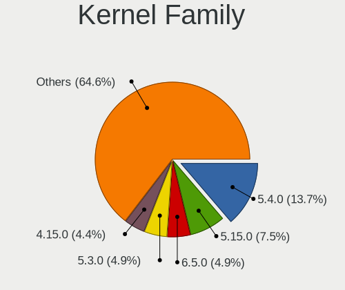

| Version | Desktops | Percent |
|---------|----------|---------|
| 5.4.0   | 29       | 16.86%  |
| 5.15.0  | 16       | 9.3%    |
| 5.3.0   | 11       | 6.4%    |
| 4.15.0  | 10       | 5.81%   |
| 5.16.7  | 8        | 4.65%   |
| 5.10.14 | 7        | 4.07%   |
| 5.8.0   | 6        | 3.49%   |
| 5.13.0  | 6        | 3.49%   |
| 4.18.0  | 6        | 3.49%   |
| 6.2.0   | 5        | 2.91%   |
| 5.11.0  | 5        | 2.91%   |
| 5.10.0  | 5        | 2.91%   |
| 6.2.6   | 3        | 1.74%   |
| 6.1.1   | 3        | 1.74%   |
| 5.19.0  | 3        | 1.74%   |
| 6.6.2   | 2        | 1.16%   |
| 6.4.6   | 2        | 1.16%   |
| 5.3.18  | 2        | 1.16%   |
| 5.17.1  | 2        | 1.16%   |
| 4.9.20  | 2        | 1.16%   |
| 6.6.3   | 1        | 0.58%   |
| 6.5.0   | 1        | 0.58%   |
| 6.4.2   | 1        | 0.58%   |
| 6.4.15  | 1        | 0.58%   |
| 6.4.11  | 1        | 0.58%   |
| 6.3.5   | 1        | 0.58%   |
| 6.3.2   | 1        | 0.58%   |
| 6.3.0   | 1        | 0.58%   |
| 6.1.21  | 1        | 0.58%   |
| 6.1.20  | 1        | 0.58%   |
| 6.1.0   | 1        | 0.58%   |
| 6.0.5   | 1        | 0.58%   |
| 6.0.10  | 1        | 0.58%   |
| 5.9.11  | 1        | 0.58%   |
| 5.8.7   | 1        | 0.58%   |
| 5.7.9   | 1        | 0.58%   |
| 5.7.14  | 1        | 0.58%   |
| 5.6.19  | 1        | 0.58%   |
| 5.6.0   | 1        | 0.58%   |
| 5.4.83  | 1        | 0.58%   |

Kernel Major Ver.
-----------------

Linux kernel major version

| Version | Desktops | Percent |
|---------|----------|---------|
| 5.4     | 31       | 18.02%  |
| 5.15    | 17       | 9.88%   |
| 5.10    | 16       | 9.3%    |
| 5.3     | 13       | 7.56%   |
| 5.16    | 10       | 5.81%   |
| 4.15    | 10       | 5.81%   |
| 6.2     | 8        | 4.65%   |
| 5.8     | 7        | 4.07%   |
| 6.1     | 6        | 3.49%   |
| 5.13    | 6        | 3.49%   |
| 5.11    | 6        | 3.49%   |
| 4.18    | 6        | 3.49%   |
| 6.4     | 5        | 2.91%   |
| 5.19    | 5        | 2.91%   |
| 6.6     | 3        | 1.74%   |
| 6.3     | 3        | 1.74%   |
| 5.17    | 3        | 1.74%   |
| 4.9     | 3        | 1.74%   |
| 6.0     | 2        | 1.16%   |
| 5.7     | 2        | 1.16%   |
| 5.6     | 2        | 1.16%   |
| 4.1     | 2        | 1.16%   |
| 6.5     | 1        | 0.58%   |
| 5.9     | 1        | 0.58%   |
| 5.18    | 1        | 0.58%   |
| 5.0     | 1        | 0.58%   |
| 4.8     | 1        | 0.58%   |
| 4.4     | 1        | 0.58%   |

Arch
----

OS architecture (x86_64, i586, etc.)

| Name   | Desktops | Percent |
|--------|----------|---------|
| x86_64 | 148      | 94.87%  |
| i686   | 8        | 5.13%   |

DE
--

Desktop Environment

| Name            | Desktops | Percent |
|-----------------|----------|---------|
| GNOME           | 61       | 37.65%  |
| KDE5            | 43       | 26.54%  |
| XFCE            | 14       | 8.64%   |
| X-Cinnamon      | 11       | 6.79%   |
| Unknown         | 9        | 5.56%   |
| MATE            | 7        | 4.32%   |
| KDE4            | 5        | 3.09%   |
| LXQt            | 2        | 1.23%   |
| LXDE            | 2        | 1.23%   |
| Unity           | 1        | 0.62%   |
| qtile           | 1        | 0.62%   |
| KDE             | 1        | 0.62%   |
| icewm           | 1        | 0.62%   |
| i3              | 1        | 0.62%   |
| GNOME Flashback | 1        | 0.62%   |
| Budgie          | 1        | 0.62%   |
| awesome         | 1        | 0.62%   |

Display Server
--------------

X11 or Wayland

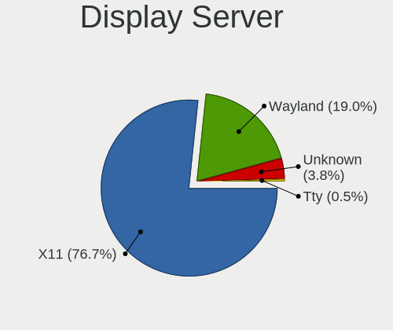

| Name    | Desktops | Percent |
|---------|----------|---------|
| X11     | 132      | 81.99%  |
| Wayland | 22       | 13.66%  |
| Unknown | 7        | 4.35%   |

Display Manager
---------------

SDDM, LightDM, etc.

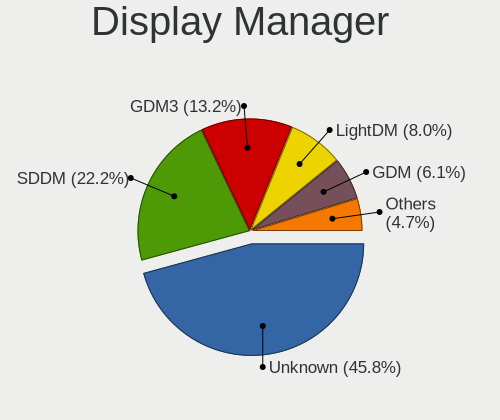

| Name    | Desktops | Percent |
|---------|----------|---------|
| Unknown | 74       | 45.68%  |
| SDDM    | 36       | 22.22%  |
| GDM3    | 21       | 12.96%  |
| GDM     | 11       | 6.79%   |
| LightDM | 10       | 6.17%   |
| KDM     | 5        | 3.09%   |
| TDM     | 3        | 1.85%   |
| SLIMSKI | 1        | 0.62%   |
| LY-DM   | 1        | 0.62%   |

OS Lang
-------

Language

| Lang    | Desktops | Percent |
|---------|----------|---------|
| es_PE   | 86       | 54.09%  |
| en_US   | 37       | 23.27%  |
| es_ES   | 15       | 9.43%   |
| Unknown | 11       | 6.92%   |
| es_MX   | 4        | 2.52%   |
| en_GB   | 2        | 1.26%   |
| ru_RU   | 1        | 0.63%   |
| es_US   | 1        | 0.63%   |
| de_DE   | 1        | 0.63%   |
| C       | 1        | 0.63%   |

Boot Mode
---------

EFI or BIOS

| Mode | Desktops | Percent |
|------|----------|---------|
| BIOS | 97       | 61.01%  |
| EFI  | 62       | 38.99%  |

Filesystem
----------

Type of filesystem

| Type    | Desktops | Percent |
|---------|----------|---------|
| Ext4    | 115      | 71.43%  |
| Overlay | 20       | 12.42%  |
| Btrfs   | 11       | 6.83%   |
| Unknown | 7        | 4.35%   |
| Xfs     | 4        | 2.48%   |
| Tmpfs   | 2        | 1.24%   |
| Ext3    | 2        | 1.24%   |

Part. scheme
------------

Scheme of partitioning

| Type    | Desktops | Percent |
|---------|----------|---------|
| Unknown | 88       | 54.66%  |
| GPT     | 54       | 33.54%  |
| MBR     | 19       | 11.8%   |

Dual Boot with Linux/BSD
------------------------

Hosting more than one Linux/BSD

| Dual boot | Desktops | Percent |
|-----------|----------|---------|
| No        | 127      | 77.44%  |
| Yes       | 37       | 22.56%  |

Dual Boot (Win)
---------------

Hosting Linux and Windows

| Dual boot | Desktops | Percent |
|-----------|----------|---------|
| No        | 97       | 60.25%  |
| Yes       | 64       | 39.75%  |

Board
-----

Vendor
------

Motherboard manufacturer

| Name                | Desktops | Percent |
|---------------------|----------|---------|
| Gigabyte Technology | 40       | 25.64%  |
| ASUSTek Computer    | 25       | 16.03%  |
| Intel               | 23       | 14.74%  |
| MSI                 | 20       | 12.82%  |
| Hewlett-Packard     | 13       | 8.33%   |
| ASRock              | 7        | 4.49%   |
| Foxconn             | 6        | 3.85%   |
| Dell                | 6        | 3.85%   |
| Lenovo              | 5        | 3.21%   |
| ECS                 | 2        | 1.28%   |
| AMI                 | 2        | 1.28%   |
| Unknown             | 2        | 1.28%   |
| SZMZ                | 1        | 0.64%   |
| PCChips             | 1        | 0.64%   |
| GIADA               | 1        | 0.64%   |
| Deltron             | 1        | 0.64%   |
| Biostar             | 1        | 0.64%   |

Model
-----

Motherboard model

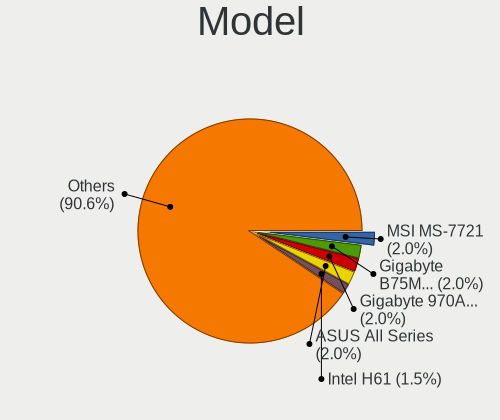

| Name                              | Desktops | Percent |
|-----------------------------------|----------|---------|
| MSI MS-7721                       | 4        | 2.56%   |
| Gigabyte B75M-D3H                 | 4        | 2.56%   |
| Gigabyte 970A-DS3P                | 4        | 2.56%   |
| Gigabyte F2A68HM-H                | 3        | 1.92%   |
| ASUS All Series                   | 3        | 1.92%   |
| Intel H61                         | 2        | 1.28%   |
| Intel DH55PJ AAE93812-303         | 2        | 1.28%   |
| HP Compaq 4000 Pro SFF PC         | 2        | 1.28%   |
| Gigabyte Z77X-UD5H                | 2        | 1.28%   |
| Gigabyte X570 AORUS MASTER        | 2        | 1.28%   |
| Gigabyte A520M H                  | 2        | 1.28%   |
| Foxconn 500B Microtower           | 2        | 1.28%   |
| Dell OptiPlex 7010                | 2        | 1.28%   |
| ASUS TUF Gaming B550M-PLUS        | 2        | 1.28%   |
| ASUS PRIME X570-P                 | 2        | 1.28%   |
| ASUS PRIME A320M-K                | 2        | 1.28%   |
| AMI Z83-V                         | 2        | 1.28%   |
| Unknown                           | 2        | 1.28%   |
| SZMZ X99 DUAL Z8                  | 1        | 0.64%   |
| PCChips P49G                      | 1        | 0.64%   |
| MSI MS-7D95                       | 1        | 0.64%   |
| MSI MS-7D18                       | 1        | 0.64%   |
| MSI MS-7C94                       | 1        | 0.64%   |
| MSI MS-7C91                       | 1        | 0.64%   |
| MSI MS-7C88                       | 1        | 0.64%   |
| MSI MS-7C52                       | 1        | 0.64%   |
| MSI MS-7B53                       | 1        | 0.64%   |
| MSI MS-7A70                       | 1        | 0.64%   |
| MSI MS-7A39                       | 1        | 0.64%   |
| MSI MS-7A33                       | 1        | 0.64%   |
| MSI MS-7A15                       | 1        | 0.64%   |
| MSI MS-7978                       | 1        | 0.64%   |
| MSI MS-7900                       | 1        | 0.64%   |
| MSI MS-7817                       | 1        | 0.64%   |
| MSI MS-7758                       | 1        | 0.64%   |
| MSI MS-7693                       | 1        | 0.64%   |
| Lenovo ThinkStation S30 43511K5   | 1        | 0.64%   |
| Lenovo ThinkCentre M91 7516AD1    | 1        | 0.64%   |
| Lenovo ThinkCentre M73 10B7A0UD00 | 1        | 0.64%   |
| Lenovo ThinkCentre M72z 3548B2S   | 1        | 0.64%   |

Model Family
------------

Motherboard model prefix

| Name               | Desktops | Percent |
|--------------------|----------|---------|
| ASUS PRIME         | 9        | 5.77%   |
| HP Compaq          | 7        | 4.49%   |
| Dell OptiPlex      | 6        | 3.85%   |
| MSI MS-7721        | 4        | 2.56%   |
| Lenovo ThinkCentre | 4        | 2.56%   |
| Gigabyte B75M-D3H  | 4        | 2.56%   |
| Gigabyte 970A-DS3P | 4        | 2.56%   |
| ASUS TUF           | 4        | 2.56%   |
| Gigabyte X570      | 3        | 1.92%   |
| Gigabyte F2A68HM-H | 3        | 1.92%   |
| ASUS All           | 3        | 1.92%   |
| Intel H61          | 2        | 1.28%   |
| Intel DH61WW       | 2        | 1.28%   |
| Intel DH55PJ       | 2        | 1.28%   |
| Intel DG31PR       | 2        | 1.28%   |
| Intel D945GCNL     | 2        | 1.28%   |
| HP ProDesk         | 2        | 1.28%   |
| HP EliteDesk       | 2        | 1.28%   |
| Gigabyte Z77X-UD5H | 2        | 1.28%   |
| Gigabyte A520M     | 2        | 1.28%   |
| Foxconn H61MXE     | 2        | 1.28%   |
| Foxconn 500B       | 2        | 1.28%   |
| ASUS ROG           | 2        | 1.28%   |
| ASUS M5A97         | 2        | 1.28%   |
| ASRock X570        | 2        | 1.28%   |
| AMI Z83-V          | 2        | 1.28%   |
| Unknown            | 2        | 1.28%   |
| SZMZ X99           | 1        | 0.64%   |
| PCChips P49G       | 1        | 0.64%   |
| MSI MS-7D95        | 1        | 0.64%   |
| MSI MS-7D18        | 1        | 0.64%   |
| MSI MS-7C94        | 1        | 0.64%   |
| MSI MS-7C91        | 1        | 0.64%   |
| MSI MS-7C88        | 1        | 0.64%   |
| MSI MS-7C52        | 1        | 0.64%   |
| MSI MS-7B53        | 1        | 0.64%   |
| MSI MS-7A70        | 1        | 0.64%   |
| MSI MS-7A39        | 1        | 0.64%   |
| MSI MS-7A33        | 1        | 0.64%   |
| MSI MS-7A15        | 1        | 0.64%   |

MFG Year
--------

Motherboard manufacture year

| Year | Desktops | Percent |
|------|----------|---------|
| 2020 | 21       | 13.46%  |
| 2012 | 15       | 9.62%   |
| 2019 | 13       | 8.33%   |
| 2010 | 13       | 8.33%   |
| 2018 | 11       | 7.05%   |
| 2014 | 11       | 7.05%   |
| 2013 | 11       | 7.05%   |
| 2017 | 10       | 6.41%   |
| 2015 | 10       | 6.41%   |
| 2011 | 10       | 6.41%   |
| 2016 | 7        | 4.49%   |
| 2008 | 7        | 4.49%   |
| 2007 | 7        | 4.49%   |
| 2009 | 4        | 2.56%   |
| 2021 | 2        | 1.28%   |
| 2006 | 2        | 1.28%   |
| 2022 | 1        | 0.64%   |
| 2004 | 1        | 0.64%   |

Form Factor
-----------

Physical design of the computer

| Name    | Desktops | Percent |
|---------|----------|---------|
| Desktop | 156      | 100%    |

Secure Boot
-----------

Enabled or disabled

| State    | Desktops | Percent |
|----------|----------|---------|
| Disabled | 151      | 96.79%  |
| Enabled  | 5        | 3.21%   |

Coreboot
--------

Have coreboot on board

| Used | Desktops | Percent |
|------|----------|---------|
| No   | 156      | 100%    |

RAM Size
--------

Total RAM memory

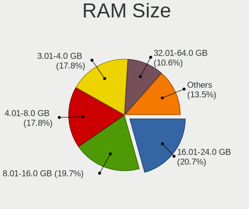

| Size in GB  | Desktops | Percent |
|-------------|----------|---------|
| 8.01-16.0   | 35       | 21.74%  |
| 4.01-8.0    | 32       | 19.88%  |
| 3.01-4.0    | 32       | 19.88%  |
| 16.01-24.0  | 27       | 16.77%  |
| 32.01-64.0  | 12       | 7.45%   |
| 1.01-2.0    | 8        | 4.97%   |
| 24.01-32.0  | 6        | 3.73%   |
| 64.01-256.0 | 6        | 3.73%   |
| 2.01-3.0    | 2        | 1.24%   |
| 0.51-1.0    | 1        | 0.62%   |

RAM Used
--------

Used RAM memory

| Used GB    | Desktops | Percent |
|------------|----------|---------|
| 1.01-2.0   | 65       | 36.72%  |
| 2.01-3.0   | 40       | 22.6%   |
| 4.01-8.0   | 29       | 16.38%  |
| 3.01-4.0   | 20       | 11.3%   |
| 0.51-1.0   | 17       | 9.6%    |
| 8.01-16.0  | 5        | 2.82%   |
| 16.01-24.0 | 1        | 0.56%   |

Total Drives
------------

Number of drives on board

| Drives | Desktops | Percent |
|--------|----------|---------|
| 1      | 76       | 46.63%  |
| 2      | 53       | 32.52%  |
| 3      | 20       | 12.27%  |
| 4      | 10       | 6.13%   |
| 5      | 2        | 1.23%   |
| 9      | 1        | 0.61%   |
| 6      | 1        | 0.61%   |

Has CD-ROM
----------

Has CD-ROM on board

| Presented | Desktops | Percent |
|-----------|----------|---------|
| No        | 87       | 55.06%  |
| Yes       | 71       | 44.94%  |

Has Ethernet
------------

Has Ethernet on board

| Presented | Desktops | Percent |
|-----------|----------|---------|
| Yes       | 152      | 97.44%  |
| No        | 4        | 2.56%   |

Has WiFi
--------

Has WiFi module

| Presented | Desktops | Percent |
|-----------|----------|---------|
| No        | 105      | 65.22%  |
| Yes       | 56       | 34.78%  |

Has Bluetooth
-------------

Has Bluetooth module

| Presented | Desktops | Percent |
|-----------|----------|---------|
| No        | 124      | 78.48%  |
| Yes       | 34       | 21.52%  |

Location
--------

Country
-------

Geographic location (country)

| Country | Desktops | Percent |
|---------|----------|---------|
| Peru    | 156      | 100%    |

City
----

Geographic location (city)

| City             | Desktops | Percent |
|------------------|----------|---------|
| Lima             | 109      | 68.13%  |
| Trujillo         | 11       | 6.88%   |
| Arequipa         | 6        | 3.75%   |
| Tacna            | 4        | 2.5%    |
| Chiclayo         | 4        | 2.5%    |
| Piura            | 3        | 1.88%   |
| Moquegua         | 3        | 1.88%   |
| Huancayo         | 3        | 1.88%   |
| Cusco            | 3        | 1.88%   |
| Villa            | 2        | 1.25%   |
| Junin            | 2        | 1.25%   |
| Ica              | 2        | 1.25%   |
| Puno             | 1        | 0.63%   |
| Pucallpa         | 1        | 0.63%   |
| Juliaca          | 1        | 0.63%   |
| Huancavelica     | 1        | 0.63%   |
| Distrito de Lima | 1        | 0.63%   |
| Bellavista       | 1        | 0.63%   |
| Barranco         | 1        | 0.63%   |
| Abancay          | 1        | 0.63%   |

Drives
------

Drive Vendor
------------

Hard drive vendors

| Vendor                    | Desktops | Drives | Percent |
|---------------------------|----------|--------|---------|
| Seagate                   | 74       | 122    | 30.96%  |
| WDC                       | 54       | 94     | 22.59%  |
| Kingston                  | 31       | 39     | 12.97%  |
| Samsung Electronics       | 18       | 24     | 7.53%   |
| Toshiba                   | 15       | 16     | 6.28%   |
| Crucial                   | 7        | 10     | 2.93%   |
| SanDisk                   | 6        | 7      | 2.51%   |
| Hewlett-Packard           | 5        | 6      | 2.09%   |
| PNY                       | 3        | 3      | 1.26%   |
| Micron/Crucial Technology | 3        | 4      | 1.26%   |
| Hitachi                   | 3        | 5      | 1.26%   |
| A-DATA Technology         | 3        | 3      | 1.26%   |
| Team                      | 2        | 2      | 0.84%   |
| Silicon Motion            | 2        | 2      | 0.84%   |
| Phison Electronics        | 2        | 2      | 0.84%   |
| Gigabyte Technology       | 2        | 2      | 0.84%   |
| WD MediaMax               | 1        | 1      | 0.42%   |
| Unknown                   | 1        | 3      | 0.42%   |
| Mushkin                   | 1        | 2      | 0.42%   |
| Maxone                    | 1        | 2      | 0.42%   |
| LITEON                    | 1        | 1      | 0.42%   |
| KIOXIA                    | 1        | 1      | 0.42%   |
| KESU                      | 1        | 1      | 0.42%   |
| Intel                     | 1        | 1      | 0.42%   |
| Unknown                   | 1        | 1      | 0.42%   |

Drive Model
-----------

Hard drive models

| Model                            | Desktops | Percent |
|----------------------------------|----------|---------|
| Seagate ST500DM002-1BD142 500GB  | 15       | 5.21%   |
| Seagate ST1000DM010-2EP102 1TB   | 11       | 3.82%   |
| WDC WD10EZEX-08WN4A0 1TB         | 7        | 2.43%   |
| Seagate ST2000DM001-1ER164 2TB   | 6        | 2.08%   |
| Kingston SA400S37480G 480GB SSD  | 6        | 2.08%   |
| Kingston SA400S37240G 240GB SSD  | 6        | 2.08%   |
| Kingston SA400S37120G 120GB SSD  | 6        | 2.08%   |
| Toshiba DT01ACA100 1TB           | 5        | 1.74%   |
| Seagate ST3500418AS 500GB        | 5        | 1.74%   |
| Seagate ST1000DM003-1CH162 1TB   | 5        | 1.74%   |
| WDC WDS480G2G0A-00JH30 480GB SSD | 4        | 1.39%   |
| Seagate ST3500413AS 500GB        | 4        | 1.39%   |
| Seagate ST3500312CS 500GB        | 4        | 1.39%   |
| Seagate ST2000DM006-2DM164 2TB   | 4        | 1.39%   |
| Seagate ST1000LM035-1RK172 1TB   | 4        | 1.39%   |
| WDC WDS100T3X0C-00SJG0 1TB       | 3        | 1.04%   |
| WDC WD3200AAJS-56M0A0 320GB      | 3        | 1.04%   |
| Toshiba HDWD110 1TB              | 3        | 1.04%   |
| Seagate ST2000DL003-9VT166 2TB   | 3        | 1.04%   |
| Seagate ST1000DM003-9YN162 1TB   | 3        | 1.04%   |
| Seagate ST1000DM003-1ER162 1TB   | 3        | 1.04%   |
| Kingston SNVS250G 250GB          | 3        | 1.04%   |
| Kingston NVMe SSD Drive 500GB    | 3        | 1.04%   |
| HP SSD S700 500GB                | 3        | 1.04%   |
| Crucial CT1000P1SSD8 1TB         | 3        | 1.04%   |
| WDC WDS240G2G0A-00JH30 240GB SSD | 2        | 0.69%   |
| WDC WDS120G2G0A-00JH30 120GB SSD | 2        | 0.69%   |
| WDC WDS100T2B0C-00PXH0 1TB       | 2        | 0.69%   |
| WDC WD80EFAX-68KNBN0 8TB         | 2        | 0.69%   |
| WDC WD3200BPVT-22ZEST0 320GB     | 2        | 0.69%   |
| WDC WD20EARX-00PASB0 2TB         | 2        | 0.69%   |
| WDC WD10EZEX-08M2NA0 1TB         | 2        | 0.69%   |
| WDC WD10EZEX-00WN4A0 1TB         | 2        | 0.69%   |
| Seagate ST3500414CS 500GB        | 2        | 0.69%   |
| Seagate ST3000DM008-2DM166 3TB   | 2        | 0.69%   |
| Seagate Expansion 1TB            | 2        | 0.69%   |
| SanDisk DF4032  32GB             | 2        | 0.69%   |
| Samsung HD322HJ 320GB            | 2        | 0.69%   |
| Samsung HD161HJ 160GB            | 2        | 0.69%   |
| Samsung HD080HJ 80GB             | 2        | 0.69%   |

HDD Vendor
----------

Hard disk drive vendors

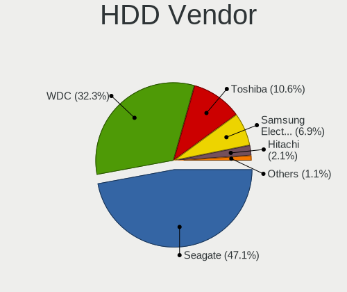

| Vendor              | Desktops | Drives | Percent |
|---------------------|----------|--------|---------|
| Seagate             | 74       | 122    | 50%     |
| WDC                 | 43       | 63     | 29.05%  |
| Toshiba             | 15       | 16     | 10.14%  |
| Samsung Electronics | 12       | 16     | 8.11%   |
| Hitachi             | 3        | 5      | 2.03%   |
| KESU                | 1        | 1      | 0.68%   |

SSD Vendor
----------

Solid state drive vendors

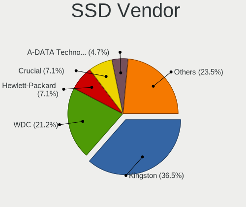

| Vendor              | Desktops | Drives | Percent |
|---------------------|----------|--------|---------|
| Kingston            | 23       | 26     | 36.51%  |
| WDC                 | 15       | 23     | 23.81%  |
| Hewlett-Packard     | 5        | 5      | 7.94%   |
| Crucial             | 4        | 6      | 6.35%   |
| PNY                 | 3        | 3      | 4.76%   |
| A-DATA Technology   | 3        | 3      | 4.76%   |
| Team                | 2        | 2      | 3.17%   |
| Samsung Electronics | 2        | 3      | 3.17%   |
| Gigabyte Technology | 2        | 2      | 3.17%   |
| SanDisk             | 1        | 1      | 1.59%   |
| Maxone              | 1        | 2      | 1.59%   |
| LITEON              | 1        | 1      | 1.59%   |
| Intel               | 1        | 1      | 1.59%   |

Drive Kind
----------

HDD or SSD

| Kind    | Desktops | Drives | Percent |
|---------|----------|--------|---------|
| HDD     | 125      | 223    | 56.31%  |
| SSD     | 58       | 78     | 26.13%  |
| NVMe    | 34       | 46     | 15.32%  |
| Unknown | 3        | 5      | 1.35%   |
| MMC     | 2        | 2      | 0.9%    |

Drive Connector
---------------

SATA, SAS, NVMe, etc.

| Type | Desktops | Drives | Percent |
|------|----------|--------|---------|
| SATA | 144      | 300    | 78.26%  |
| NVMe | 34       | 46     | 18.48%  |
| SAS  | 4        | 6      | 2.17%   |
| MMC  | 2        | 2      | 1.09%   |

Drive Size
----------

Size of hard drive

| Size in TB | Desktops | Drives | Percent |
|------------|----------|--------|---------|
| 0.01-0.5   | 107      | 176    | 54.87%  |
| 0.51-1.0   | 60       | 81     | 30.77%  |
| 1.01-2.0   | 19       | 30     | 9.74%   |
| 3.01-4.0   | 3        | 5      | 1.54%   |
| 2.01-3.0   | 3        | 3      | 1.54%   |
| 4.01-10.0  | 3        | 6      | 1.54%   |

Space Total
-----------

Amount of disk space available on the file system

| Size in GB     | Desktops | Percent |
|----------------|----------|---------|
| 251-500        | 47       | 27.33%  |
| 501-1000       | 32       | 18.6%   |
| 101-250        | 26       | 15.12%  |
| 1-20           | 14       | 8.14%   |
| 1001-2000      | 13       | 7.56%   |
| 51-100         | 13       | 7.56%   |
| 2001-3000      | 10       | 5.81%   |
| More than 3000 | 7        | 4.07%   |
| 21-50          | 6        | 3.49%   |
| Unknown        | 4        | 2.33%   |

Space Used
----------

Amount of used disk space

| Used GB        | Desktops | Percent |
|----------------|----------|---------|
| 1-20           | 65       | 36.93%  |
| 21-50          | 25       | 14.2%   |
| 101-250        | 23       | 13.07%  |
| 251-500        | 22       | 12.5%   |
| 501-1000       | 12       | 6.82%   |
| 51-100         | 12       | 6.82%   |
| 1001-2000      | 9        | 5.11%   |
| More than 3000 | 4        | 2.27%   |
| Unknown        | 4        | 2.27%   |

Malfunc. Drives
---------------

Drive models with a malfunction

| Model                             | Desktops | Drives | Percent |
|-----------------------------------|----------|--------|---------|
| WDC WD3200AAJS-56M0A0 320GB       | 3        | 4      | 9.68%   |
| Seagate ST1000DM003-9YN162 1TB    | 3        | 3      | 9.68%   |
| Seagate ST1000DM003-1CH162 1TB    | 3        | 4      | 9.68%   |
| Seagate ST500DM002-1BD142 500GB   | 2        | 2      | 6.45%   |
| Seagate ST3500418AS 500GB         | 2        | 2      | 6.45%   |
| WDC WD800BD-00MRA1 80GB           | 1        | 1      | 3.23%   |
| WDC WD5000AAKS-00V1A0 500GB       | 1        | 1      | 3.23%   |
| WDC WD3200AAJS-00L7A0 320GB       | 1        | 1      | 3.23%   |
| WDC WD20EARX-00PASB0 2TB          | 1        | 1      | 3.23%   |
| WDC WD1600AAJS-75M0A0 160GB       | 1        | 1      | 3.23%   |
| Toshiba MK6475GSX 640GB           | 1        | 1      | 3.23%   |
| Toshiba DT01ACA100 1TB            | 1        | 1      | 3.23%   |
| Seagate ST980811AS 80GB           | 1        | 1      | 3.23%   |
| Seagate ST500LT012-1DG142 500GB   | 1        | 1      | 3.23%   |
| Seagate ST500DM002-9YN14C 500GB   | 1        | 2      | 3.23%   |
| Seagate ST3500312CS 500GB         | 1        | 1      | 3.23%   |
| Seagate ST3320820SCE 320GB        | 1        | 2      | 3.23%   |
| Seagate ST3250820AS 250GB         | 1        | 1      | 3.23%   |
| Seagate ST1000LM035-1RK172 1TB    | 1        | 1      | 3.23%   |
| Samsung Electronics SP1644N 160GB | 1        | 1      | 3.23%   |
| Samsung Electronics HD161HJ 160GB | 1        | 2      | 3.23%   |
| Hitachi HTS545032B9A300 320GB     | 1        | 1      | 3.23%   |
| A-DATA Technology SP550 240GB SSD | 1        | 1      | 3.23%   |

Malfunc. Drive Vendor
---------------------

Vendors of faulty drives

| Vendor              | Desktops | Drives | Percent |
|---------------------|----------|--------|---------|
| Seagate             | 17       | 20     | 54.84%  |
| WDC                 | 8        | 9      | 25.81%  |
| Toshiba             | 2        | 2      | 6.45%   |
| Samsung Electronics | 2        | 3      | 6.45%   |
| Hitachi             | 1        | 1      | 3.23%   |
| A-DATA Technology   | 1        | 1      | 3.23%   |

Malfunc. HDD Vendor
-------------------

Vendors of faulty HDD drives

| Vendor              | Desktops | Drives | Percent |
|---------------------|----------|--------|---------|
| Seagate             | 17       | 20     | 56.67%  |
| WDC                 | 8        | 9      | 26.67%  |
| Toshiba             | 2        | 2      | 6.67%   |
| Samsung Electronics | 2        | 3      | 6.67%   |
| Hitachi             | 1        | 1      | 3.33%   |

Malfunc. Drive Kind
-------------------

Kinds of faulty drives

| Kind | Desktops | Drives | Percent |
|------|----------|--------|---------|
| HDD  | 24       | 35     | 96%     |
| SSD  | 1        | 1      | 4%      |

Failed Drives
-------------

Failed drive models

Zero info for selected period =(

Failed Drive Vendor
-------------------

Failed drive vendors

Zero info for selected period =(

Drive Status
------------

Number of failed and malfunc. drives

| Status   | Desktops | Drives | Percent |
|----------|----------|--------|---------|
| Detected | 90       | 196    | 50.85%  |
| Works    | 62       | 122    | 35.03%  |
| Malfunc  | 25       | 36     | 14.12%  |

Storage controller
------------------

Storage Vendor
--------------

Storage controller vendors

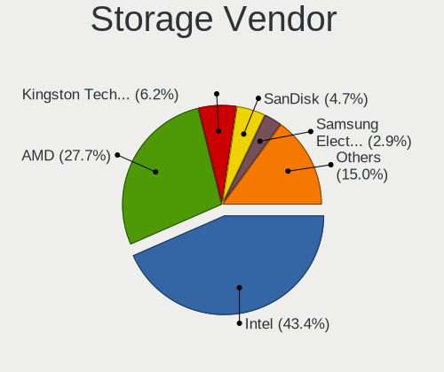

| Vendor                      | Desktops | Percent |
|-----------------------------|----------|---------|
| Intel                       | 93       | 46.73%  |
| AMD                         | 57       | 28.64%  |
| Kingston Technology Company | 10       | 5.03%   |
| SanDisk                     | 8        | 4.02%   |
| Micron/Crucial Technology   | 6        | 3.02%   |
| Marvell Technology Group    | 6        | 3.02%   |
| Silicon Motion              | 4        | 2.01%   |
| Samsung Electronics         | 4        | 2.01%   |
| Nvidia                      | 4        | 2.01%   |
| JMicron Technology          | 3        | 1.51%   |
| Phison Electronics          | 2        | 1.01%   |
| LSI Logic / Symbios Logic   | 1        | 0.5%    |
| KIOXIA                      | 1        | 0.5%    |

Storage Model
-------------

Storage controller models

| Model                                                                                   | Desktops | Percent |
|-----------------------------------------------------------------------------------------|----------|---------|
| AMD FCH SATA Controller [AHCI mode]                                                     | 29       | 11.37%  |
| Intel NM10/ICH7 Family SATA Controller [IDE mode]                                       | 13       | 5.1%    |
| AMD 500 Series Chipset SATA Controller                                                  | 12       | 4.71%   |
| Intel 82801G (ICH7 Family) IDE Controller                                               | 10       | 3.92%   |
| Intel 7 Series/C210 Series Chipset Family 6-port SATA Controller [AHCI mode]            | 10       | 3.92%   |
| Intel Q170/Q150/B150/H170/H110/Z170/CM236 Chipset SATA Controller [AHCI Mode]           | 9        | 3.53%   |
| Intel 8 Series/C220 Series Chipset Family 6-port SATA Controller 1 [AHCI mode]          | 9        | 3.53%   |
| Intel 6 Series/C200 Series Chipset Family 6 port Desktop SATA AHCI Controller           | 9        | 3.53%   |
| AMD SB7x0/SB8x0/SB9x0 IDE Controller                                                    | 9        | 3.53%   |
| AMD SB7x0/SB8x0/SB9x0 SATA Controller [IDE mode]                                        | 7        | 2.75%   |
| Intel 200 Series PCH SATA controller [AHCI mode]                                        | 6        | 2.35%   |
| AMD SB7x0/SB8x0/SB9x0 SATA Controller [AHCI mode]                                       | 6        | 2.35%   |
| Micron/Crucial P1 NVMe PCIe SSD[Frampton2]                                              | 5        | 1.96%   |
| SanDisk Extreme Pro / WD Black SN750 / PC SN730 / Red SN700 NVMe SSD                    | 4        | 1.57%   |
| Kingston Company NV1 NVMe SSD SM2263XT                                                  | 4        | 1.57%   |
| Intel Cannon Lake PCH SATA AHCI Controller                                              | 4        | 1.57%   |
| Intel 6 Series/C200 Series Chipset Family Desktop SATA Controller (IDE mode, ports 4-5) | 4        | 1.57%   |
| Intel 6 Series/C200 Series Chipset Family Desktop SATA Controller (IDE mode, ports 0-3) | 4        | 1.57%   |
| Intel 400 Series Chipset Family SATA AHCI Controller                                    | 4        | 1.57%   |
| AMD 400 Series Chipset SATA Controller                                                  | 4        | 1.57%   |
| Silicon Motion SM2263EN/SM2263XT (DRAM-less) NVMe SSD Controllers                       | 3        | 1.18%   |
| Nvidia MCP61 SATA Controller                                                            | 3        | 1.18%   |
| JMicron JMB363 SATA/IDE Controller                                                      | 3        | 1.18%   |
| Intel 5 Series/3400 Series Chipset PT IDER Controller                                   | 3        | 1.18%   |
| Intel 5 Series/3400 Series Chipset 4 port SATA IDE Controller                           | 3        | 1.18%   |
| AMD FCH SATA Controller D                                                               | 3        | 1.18%   |
| SanDisk Ultra 3D / WD Blue SN550 NVMe SSD                                               | 2        | 0.78%   |
| Samsung NVMe SSD Controller SM981/PM981/PM983                                           | 2        | 0.78%   |
| Nvidia MCP61 IDE                                                                        | 2        | 0.78%   |
| Micron/Crucial P2 [Nick P2] / P3 / P3 Plus NVMe PCIe SSD (DRAM-less)                    | 2        | 0.78%   |
| Marvell Group 88SE9172 SATA 6Gb/s Controller                                            | 2        | 0.78%   |
| Marvell Group 88SE6101/6102 single-port PATA133 interface                               | 2        | 0.78%   |
| Kingston Company NV1 NVMe SSD E13T                                                      | 2        | 0.78%   |
| Kingston Company KC3000/FURY Renegade NVMe SSD E18                                      | 2        | 0.78%   |
| Kingston Company A2000 NVMe SSD SM2263EN                                                | 2        | 0.78%   |
| Intel SATA Controller [RAID mode]                                                       | 2        | 0.78%   |
| Intel 82801JD/DO (ICH10 Family) 4-port SATA IDE Controller                              | 2        | 0.78%   |
| Intel 82801JD/DO (ICH10 Family) 2-port SATA IDE Controller                              | 2        | 0.78%   |
| Intel 82801IR/IO/IH (ICH9R/DO/DH) 6 port SATA Controller [AHCI mode]                    | 2        | 0.78%   |
| Intel 82801H (ICH8 Family) 4 port SATA Controller [IDE mode]                            | 2        | 0.78%   |

Storage Kind
------------

Kind of storage controller (IDE, SATA, NVMe, SAS, ...)

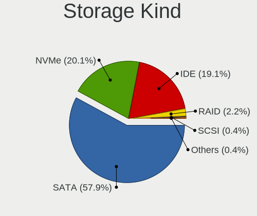

| Kind | Desktops | Percent |
|------|----------|---------|
| SATA | 120      | 58.25%  |
| IDE  | 46       | 22.33%  |
| NVMe | 34       | 16.5%   |
| RAID | 4        | 1.94%   |
| SAS  | 1        | 0.49%   |
| SCSI | 1        | 0.49%   |

Processor
---------

CPU Vendor
----------

Processor vendors

| Vendor | Desktops | Percent |
|--------|----------|---------|
| Intel  | 96       | 61.54%  |
| AMD    | 60       | 38.46%  |

CPU Model
---------

Processor models

| Model                                           | Desktops | Percent |
|-------------------------------------------------|----------|---------|
| Intel Core i7-3770 CPU @ 3.40GHz                | 5        | 3.18%   |
| AMD Ryzen 7 3700X 8-Core Processor              | 5        | 3.18%   |
| Intel Core i5-3470 CPU @ 3.20GHz                | 4        | 2.55%   |
| Intel Pentium Dual-Core CPU E5800 @ 3.20GHz     | 3        | 1.91%   |
| Intel Pentium Dual CPU E2180 @ 2.00GHz          | 3        | 1.91%   |
| Intel Core i7-4790 CPU @ 3.60GHz                | 3        | 1.91%   |
| Intel Core i5-6500 CPU @ 3.20GHz                | 3        | 1.91%   |
| Intel Core i5-3330 CPU @ 3.00GHz                | 3        | 1.91%   |
| Intel Core i5-2400 CPU @ 3.10GHz                | 3        | 1.91%   |
| AMD FX-8350 Eight-Core Processor                | 3        | 1.91%   |
| Intel Pentium CPU G4560 @ 3.50GHz               | 2        | 1.27%   |
| Intel Core i7-4770 CPU @ 3.40GHz                | 2        | 1.27%   |
| Intel Core i7-2600 CPU @ 3.40GHz                | 2        | 1.27%   |
| Intel Core i7-10700 CPU @ 2.90GHz               | 2        | 1.27%   |
| Intel Core i5 CPU 650 @ 3.20GHz                 | 2        | 1.27%   |
| Intel Core i3-3220 CPU @ 3.30GHz                | 2        | 1.27%   |
| Intel Core 2 Duo CPU E7500 @ 2.93GHz            | 2        | 1.27%   |
| Intel Core 2 CPU 6300 @ 1.86GHz                 | 2        | 1.27%   |
| Intel Atom x5-Z8350 CPU @ 1.44GHz               | 2        | 1.27%   |
| AMD Sempron 140 Processor                       | 2        | 1.27%   |
| AMD Ryzen 7 5700G with Radeon Graphics          | 2        | 1.27%   |
| AMD Ryzen 7 2700 Eight-Core Processor           | 2        | 1.27%   |
| AMD Ryzen 5 3600 6-Core Processor               | 2        | 1.27%   |
| AMD Ryzen 3 3200G with Radeon Vega Graphics     | 2        | 1.27%   |
| AMD Ryzen 3 2200G with Radeon Vega Graphics     | 2        | 1.27%   |
| AMD A8-7650K Radeon R7, 10 Compute Cores 4C+6G  | 2        | 1.27%   |
| AMD A10-7870K Radeon R7, 12 Compute Cores 4C+8G | 2        | 1.27%   |
| Intel Xeon CPU X5650 @ 2.67GHz                  | 1        | 0.64%   |
| Intel Xeon CPU E5-2698 v4 @ 2.20GHz             | 1        | 0.64%   |
| Intel Xeon CPU E5-2620 0 @ 2.00GHz              | 1        | 0.64%   |
| Intel Xeon CPU E5-1620 0 @ 3.60GHz              | 1        | 0.64%   |
| Intel Pentium Gold G6400 CPU @ 4.00GHz          | 1        | 0.64%   |
| Intel Pentium Gold G5400 CPU @ 3.70GHz          | 1        | 0.64%   |
| Intel Pentium Dual-Core CPU E5700 @ 3.00GHz     | 1        | 0.64%   |
| Intel Pentium Dual CPU E2200 @ 2.20GHz          | 1        | 0.64%   |
| Intel Pentium D CPU 3.00GHz                     | 1        | 0.64%   |
| Intel Pentium CPU G620 @ 2.60GHz                | 1        | 0.64%   |
| Intel Pentium CPU G3260 @ 3.30GHz               | 1        | 0.64%   |
| Intel Pentium CPU E5500 @ 2.80GHz               | 1        | 0.64%   |
| Intel Pentium 4 CPU 3.40GHz                     | 1        | 0.64%   |

CPU Model Family
----------------

Processor model prefix

| Model                   | Desktops | Percent |
|-------------------------|----------|---------|
| Intel Core i5           | 27       | 17.31%  |
| Intel Core i7           | 17       | 10.9%   |
| Intel Core i3           | 11       | 7.05%   |
| AMD Ryzen 7             | 11       | 7.05%   |
| AMD Ryzen 5             | 10       | 6.41%   |
| Intel Core 2 Duo        | 7        | 4.49%   |
| AMD FX                  | 7        | 4.49%   |
| Intel Pentium           | 5        | 3.21%   |
| AMD Ryzen 3             | 5        | 3.21%   |
| Intel Xeon              | 4        | 2.56%   |
| Intel Pentium Dual-Core | 4        | 2.56%   |
| Intel Pentium Dual      | 4        | 2.56%   |
| AMD Ryzen 9             | 4        | 2.56%   |
| AMD A10                 | 4        | 2.56%   |
| Intel Celeron           | 3        | 1.92%   |
| AMD Phenom II X4        | 3        | 1.92%   |
| AMD A8                  | 3        | 1.92%   |
| Other                   | 2        | 1.28%   |
| Intel Pentium Gold      | 2        | 1.28%   |
| Intel Pentium 4         | 2        | 1.28%   |
| Intel Core 2 Quad       | 2        | 1.28%   |
| Intel Core 2            | 2        | 1.28%   |
| Intel Atom              | 2        | 1.28%   |
| AMD Sempron             | 2        | 1.28%   |
| AMD A6                  | 2        | 1.28%   |
| AMD A4                  | 2        | 1.28%   |
| Intel Pentium D         | 1        | 0.64%   |
| Intel Core i9           | 1        | 0.64%   |
| AMD Ryzen 5 PRO         | 1        | 0.64%   |
| AMD Phenom II X3        | 1        | 0.64%   |
| AMD Athlon X4           | 1        | 0.64%   |
| AMD Athlon II X3        | 1        | 0.64%   |
| AMD Athlon II X2        | 1        | 0.64%   |
| AMD Athlon 64 X2        | 1        | 0.64%   |
| AMD Athlon              | 1        | 0.64%   |

CPU Cores
---------

Number of processor cores

| Number  | Desktops | Percent |
|---------|----------|---------|
| 4       | 59       | 37.82%  |
| 2       | 46       | 29.49%  |
| 6       | 17       | 10.9%   |
| 8       | 14       | 8.97%   |
| 1       | 8        | 5.13%   |
| 3       | 4        | 2.56%   |
| 16      | 3        | 1.92%   |
| 12      | 2        | 1.28%   |
| 20      | 1        | 0.64%   |
| 10      | 1        | 0.64%   |
| Unknown | 1        | 0.64%   |

CPU Sockets
-----------

Number of sockets

| Number | Desktops | Percent |
|--------|----------|---------|
| 1      | 156      | 100%    |

CPU Threads
-----------

Threads per core (Hyper-Threading)

| Number  | Desktops | Percent |
|---------|----------|---------|
| 2       | 85       | 54.49%  |
| 1       | 70       | 44.87%  |
| Unknown | 1        | 0.64%   |

CPU Op-Modes
------------

CPU Operation Modes (32-bit, 64-bit)

| Op mode        | Desktops | Percent |
|----------------|----------|---------|
| 32-bit, 64-bit | 153      | 97.45%  |
| 64-bit         | 2        | 1.27%   |
| Unknown        | 2        | 1.27%   |

CPU Microcode
-------------

Microcode number

| Number     | Desktops | Percent |
|------------|----------|---------|
| Unknown    | 37       | 22.84%  |
| 0x306a9    | 14       | 8.64%   |
| 0x306c3    | 8        | 4.94%   |
| 0x206a7    | 7        | 4.32%   |
| 0x1067a    | 7        | 4.32%   |
| 0x08701021 | 7        | 4.32%   |
| 0x506e3    | 6        | 3.7%    |
| 0x6fd      | 5        | 3.09%   |
| 0x06003106 | 5        | 3.09%   |
| 0x06000852 | 5        | 3.09%   |
| 0x010000c8 | 5        | 3.09%   |
| 0x6fb      | 3        | 1.85%   |
| 0xf64      | 2        | 1.23%   |
| 0xa0655    | 2        | 1.23%   |
| 0x906ea    | 2        | 1.23%   |
| 0x906e9    | 2        | 1.23%   |
| 0x20655    | 2        | 1.23%   |
| 0x10676    | 2        | 1.23%   |
| 0x0a50000c | 2        | 1.23%   |
| 0x0a201009 | 2        | 1.23%   |
| 0x08701013 | 2        | 1.23%   |
| 0x08108109 | 2        | 1.23%   |
| 0x0810100b | 2        | 1.23%   |
| 0x0800820d | 2        | 1.23%   |
| 0x06001119 | 2        | 1.23%   |
| 0x010000c7 | 2        | 1.23%   |
| 0xf49      | 1        | 0.62%   |
| 0xa0671    | 1        | 0.62%   |
| 0xa0653    | 1        | 0.62%   |
| 0x906ed    | 1        | 0.62%   |
| 0x806ec    | 1        | 0.62%   |
| 0x706a8    | 1        | 0.62%   |
| 0x6f6      | 1        | 0.62%   |
| 0x6f2      | 1        | 0.62%   |
| 0x406f1    | 1        | 0.62%   |
| 0x406c4    | 1        | 0.62%   |
| 0x206c2    | 1        | 0.62%   |
| 0x106e5    | 1        | 0.62%   |
| 0x0a50000d | 1        | 0.62%   |
| 0x0a20120a | 1        | 0.62%   |

CPU Microarch
-------------

Microarchitecture

| Name          | Desktops | Percent |
|---------------|----------|---------|
| IvyBridge     | 15       | 9.62%   |
| Zen 2         | 13       | 8.33%   |
| KabyLake      | 12       | 7.69%   |
| Penryn        | 11       | 7.05%   |
| SandyBridge   | 10       | 6.41%   |
| Haswell       | 10       | 6.41%   |
| Core          | 10       | 6.41%   |
| Skylake       | 9        | 5.77%   |
| Piledriver    | 9        | 5.77%   |
| K10           | 9        | 5.77%   |
| Zen 3         | 8        | 5.13%   |
| Steamroller   | 7        | 4.49%   |
| Zen+          | 6        | 3.85%   |
| CometLake     | 5        | 3.21%   |
| Zen           | 4        | 2.56%   |
| Westmere      | 3        | 1.92%   |
| Silvermont    | 3        | 1.92%   |
| NetBurst      | 3        | 1.92%   |
| Nehalem       | 1        | 0.64%   |
| K8 Hammer     | 1        | 0.64%   |
| K10 Llano     | 1        | 0.64%   |
| Icelake       | 1        | 0.64%   |
| Goldmont plus | 1        | 0.64%   |
| Excavator     | 1        | 0.64%   |
| Bulldozer     | 1        | 0.64%   |
| Broadwell     | 1        | 0.64%   |
| Unknown       | 1        | 0.64%   |

Graphics
--------

GPU Vendor
----------

Vendors of graphics cards

| Vendor | Desktops | Percent |
|--------|----------|---------|
| Intel  | 60       | 35.71%  |
| Nvidia | 56       | 33.33%  |
| AMD    | 52       | 30.95%  |

GPU Model
---------

Graphics card models

| Model                                                                                    | Desktops | Percent |
|------------------------------------------------------------------------------------------|----------|---------|
| AMD Ellesmere [Radeon RX 470/480/570/570X/580/580X/590]                                  | 10       | 5.78%   |
| Intel 4 Series Chipset Integrated Graphics Controller                                    | 7        | 4.05%   |
| Intel 2nd Generation Core Processor Family Integrated Graphics Controller                | 7        | 4.05%   |
| Nvidia GT218 [GeForce 210]                                                               | 5        | 2.89%   |
| Intel Xeon E3-1200 v2/3rd Gen Core processor Graphics Controller                         | 5        | 2.89%   |
| Intel HD Graphics 530                                                                    | 5        | 2.89%   |
| Nvidia GP107 [GeForce GTX 1050 Ti]                                                       | 4        | 2.31%   |
| Nvidia GK208B [GeForce GT 710]                                                           | 4        | 2.31%   |
| Nvidia GF108 [GeForce GT 730]                                                            | 4        | 2.31%   |
| Intel Xeon E3-1200 v3/4th Gen Core Processor Integrated Graphics Controller              | 4        | 2.31%   |
| Nvidia GP108 [GeForce GT 1030]                                                           | 3        | 1.73%   |
| Nvidia GM206 [GeForce GTX 950]                                                           | 3        | 1.73%   |
| Nvidia GK208B [GeForce GT 730]                                                           | 3        | 1.73%   |
| Intel IvyBridge GT2 [HD Graphics 4000]                                                   | 3        | 1.73%   |
| Intel CometLake-S GT2 [UHD Graphics 630]                                                 | 3        | 1.73%   |
| Intel CoffeeLake-S GT2 [UHD Graphics 630]                                                | 3        | 1.73%   |
| Intel Atom/Celeron/Pentium Processor x5-E8000/J3xxx/N3xxx Integrated Graphics Controller | 3        | 1.73%   |
| Intel 82G33/G31 Express Integrated Graphics Controller                                   | 3        | 1.73%   |
| Intel 82945G/GZ Integrated Graphics Controller                                           | 3        | 1.73%   |
| AMD Turks XT [Radeon HD 6670/7670]                                                       | 3        | 1.73%   |
| AMD Raven Ridge [Radeon Vega Series / Radeon Vega Mobile Series]                         | 3        | 1.73%   |
| AMD Picasso/Raven 2 [Radeon Vega Series / Radeon Vega Mobile Series]                     | 3        | 1.73%   |
| AMD Navi 14 [Radeon RX 5500/5500M / Pro 5500M]                                           | 3        | 1.73%   |
| AMD Cezanne [Radeon Vega Series / Radeon Vega Mobile Series]                             | 3        | 1.73%   |
| AMD Cedar [Radeon HD 5000/6000/7350/8350 Series]                                         | 3        | 1.73%   |
| Nvidia TU117 [GeForce GTX 1650]                                                          | 2        | 1.16%   |
| Nvidia TU116 [GeForce GTX 1650 SUPER]                                                    | 2        | 1.16%   |
| Nvidia GP104 [GeForce GTX 1060 6GB]                                                      | 2        | 1.16%   |
| Nvidia GF108 [GeForce GT 440]                                                            | 2        | 1.16%   |
| Intel HD Graphics 630                                                                    | 2        | 1.16%   |
| Intel HD Graphics 610                                                                    | 2        | 1.16%   |
| Intel 82Q963/Q965 Integrated Graphics Controller                                         | 2        | 1.16%   |
| Intel 4th Generation Core Processor Family Integrated Graphics Controller                | 2        | 1.16%   |
| AMD Trinity 2 [Radeon HD 7480D]                                                          | 2        | 1.16%   |
| AMD RV370 [Radeon X300]                                                                  | 2        | 1.16%   |
| AMD RV370 [Radeon X300 SE]                                                               | 2        | 1.16%   |
| AMD Navi 10 [Radeon RX 5600 OEM/5600 XT / 5700/5700 XT]                                  | 2        | 1.16%   |
| AMD Kaveri [Radeon R7 Graphics]                                                          | 2        | 1.16%   |
| Nvidia TU116 [GeForce GTX 1660]                                                          | 1        | 0.58%   |
| Nvidia TU116 [GeForce GTX 1660 SUPER]                                                    | 1        | 0.58%   |

GPU Combo
---------

Combinations of graphics cards

| Name           | Desktops | Percent |
|----------------|----------|---------|
| 1 x Nvidia     | 50       | 31.85%  |
| 1 x Intel      | 49       | 31.21%  |
| 1 x AMD        | 47       | 29.94%  |
| Intel + Nvidia | 5        | 3.18%   |
| 2 x AMD        | 3        | 1.91%   |
| 2 x Intel      | 1        | 0.64%   |
| Intel + AMD    | 1        | 0.64%   |
| AMD + Nvidia   | 1        | 0.64%   |

GPU Driver
----------

Free vs proprietary

| Driver      | Desktops | Percent |
|-------------|----------|---------|
| Free        | 128      | 81.01%  |
| Proprietary | 27       | 17.09%  |
| Unknown     | 3        | 1.9%    |

GPU Memory
----------

Total video memory

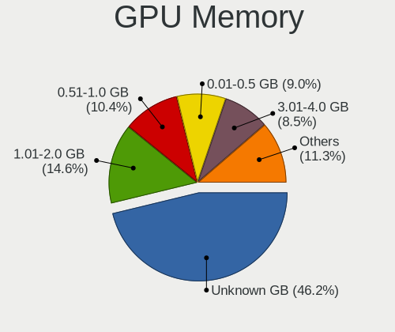

| Size in GB | Desktops | Percent |
|------------|----------|---------|
| Unknown    | 67       | 41.61%  |
| 1.01-2.0   | 30       | 18.63%  |
| 0.51-1.0   | 18       | 11.18%  |
| 0.01-0.5   | 14       | 8.7%    |
| 3.01-4.0   | 13       | 8.07%   |
| 7.01-8.0   | 12       | 7.45%   |
| 5.01-6.0   | 6        | 3.73%   |
| 8.01-16.0  | 1        | 0.62%   |

Monitor
-------

Monitor Vendor
--------------

Monitor vendors

| Vendor               | Desktops | Percent |
|----------------------|----------|---------|
| Samsung Electronics  | 41       | 27.33%  |
| Goldstar             | 39       | 26%     |
| AOC                  | 12       | 8%      |
| Hewlett-Packard      | 11       | 7.33%   |
| Dell                 | 7        | 4.67%   |
| ViewSonic            | 5        | 3.33%   |
| BenQ                 | 5        | 3.33%   |
| Unknown              | 4        | 2.67%   |
| Lenovo               | 4        | 2.67%   |
| Sony                 | 3        | 2%      |
| ASUSTek Computer     | 3        | 2%      |
| LG Electronics       | 2        | 1.33%   |
| Lenovo Group Limited | 2        | 1.33%   |
| Viotek               | 1        | 0.67%   |
| TopView              | 1        | 0.67%   |
| Panasonic            | 1        | 0.67%   |
| NEW                  | 1        | 0.67%   |
| MStar                | 1        | 0.67%   |
| MSD                  | 1        | 0.67%   |
| JRY                  | 1        | 0.67%   |
| Hyundai ImageQuest   | 1        | 0.67%   |
| Huion                | 1        | 0.67%   |
| Gigabyte Technology  | 1        | 0.67%   |
| Eizo                 | 1        | 0.67%   |
| Ancor Communications | 1        | 0.67%   |

Monitor Model
-------------

Monitor models

| Model                                                                  | Desktops | Percent |
|------------------------------------------------------------------------|----------|---------|
| Goldstar FULL HD GSM5B55 1920x1080 480x270mm 21.7-inch                 | 7        | 4.46%   |
| Samsung Electronics SA300/SA350 SAM078D 1600x900 443x249mm 20.0-inch   | 3        | 1.91%   |
| Samsung Electronics C24F390 SAM0D2C 1920x1080 521x293mm 23.5-inch      | 3        | 1.91%   |
| Goldstar LG IPS FULLHD GSM5AB8 1920x1080 480x270mm 21.7-inch           | 3        | 1.91%   |
| Goldstar E1951 GSM4BFD 1366x768 410x230mm 18.5-inch                    | 3        | 1.91%   |
| BenQ GW2270 BNQ78DB 1920x1080 476x268mm 21.5-inch                      | 3        | 1.91%   |
| ViewSonic VA2246 SERIES VSC6F2E 1920x1080 480x270mm 21.7-inch          | 2        | 1.27%   |
| Samsung Electronics SyncMaster SAM0272 1280x1024 338x270mm 17.0-inch   | 2        | 1.27%   |
| Samsung Electronics SA300/SA350 SAM078A 1366x768 410x230mm 18.5-inch   | 2        | 1.27%   |
| Samsung Electronics S20B300 SAM08A7 1600x900 443x249mm 20.0-inch       | 2        | 1.27%   |
| Samsung Electronics LCD Monitor SAM0A7D 1920x1080 1020x570mm 46.0-inch | 2        | 1.27%   |
| Samsung Electronics LCD Monitor SAM07D0 1360x768 700x390mm 31.5-inch   | 2        | 1.27%   |
| Samsung Electronics LCD Monitor SAM04FD 1280x720                       | 2        | 1.27%   |
| Samsung Electronics C27F591 SAM0D36 1920x1080 598x336mm 27.0-inch      | 2        | 1.27%   |
| Hewlett-Packard LA1951 HWP285A 1280x1024 380x300mm 19.1-inch           | 2        | 1.27%   |
| Goldstar W2243 GSM56FE 1920x1080 477x268mm 21.5-inch                   | 2        | 1.27%   |
| Goldstar M2380A GSM57EE 1920x1080 509x286mm 23.0-inch                  | 2        | 1.27%   |
| Goldstar IPS FULLHD GSM5AB6 1920x1080 480x270mm 21.7-inch              | 2        | 1.27%   |
| Goldstar HD GSM5ACD 1366x768 410x230mm 18.5-inch                       | 2        | 1.27%   |
| Goldstar E1941 GSM4BF0 1366x768 410x230mm 18.5-inch                    | 2        | 1.27%   |
| Dell 3008WFP DEL4036 2560x1600 641x400mm 29.7-inch                     | 2        | 1.27%   |
| AOC 2239 AOC2239 1920x1080 477x268mm 21.5-inch                         | 2        | 1.27%   |
| Viotek FI24D VTK0238 2560x1440 530x290mm 23.8-inch                     | 1        | 0.64%   |
| ViewSonic VX2453 Series VSC0C28 1920x1080 520x290mm 23.4-inch          | 1        | 0.64%   |
| ViewSonic VA2431 Series VSCD824 1920x1080 521x293mm 23.5-inch          | 1        | 0.64%   |
| ViewSonic VA2249 Series VSC7B2E 1920x1080 476x268mm 21.5-inch          | 1        | 0.64%   |
| Unknown LCD Monitor RJT HDMI                                           | 1        | 0.64%   |
| Unknown LCD Monitor OOO TE-3190N 2560x1440                             | 1        | 0.64%   |
| Unknown LCD Monitor OOO MA2224W 1920x1080                              | 1        | 0.64%   |
| Unknown LCD Monitor LHC TE-3125 1920x1080                              | 1        | 0.64%   |
| TopView HDMI TOP0814 1600x900 430x270mm 20.0-inch                      | 1        | 0.64%   |
| Sony TV SNY2601 1360x768 710x400mm 32.1-inch                           | 1        | 0.64%   |
| Sony LCD Monitor TV 1360x768                                           | 1        | 0.64%   |
| Sony LCD Monitor TV                                                    | 1        | 0.64%   |
| Samsung Electronics V230IC SAME330 1920x1080 509x286mm 23.0-inch       | 1        | 0.64%   |
| Samsung Electronics SyncMaster SAM05D5 1360x768                        | 1        | 0.64%   |
| Samsung Electronics SyncMaster SAM05C4 1920x1080 510x287mm 23.0-inch   | 1        | 0.64%   |
| Samsung Electronics SyncMaster SAM0598 1360x768 410x230mm 18.5-inch    | 1        | 0.64%   |
| Samsung Electronics SyncMaster SAM058C 1600x900 443x249mm 20.0-inch    | 1        | 0.64%   |
| Samsung Electronics SyncMaster SAM02E3 1440x900 367x229mm 17.0-inch    | 1        | 0.64%   |

Monitor Resolution
------------------

Monitor screen resolution

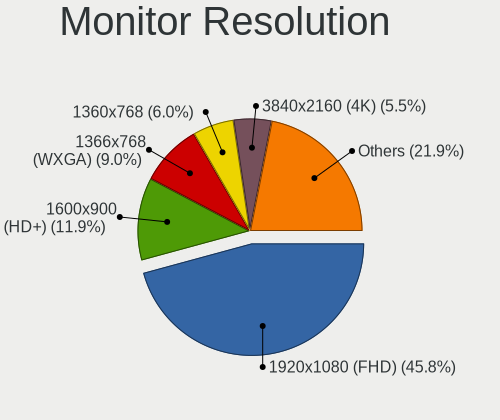

| Resolution        | Desktops | Percent |
|-------------------|----------|---------|
| 1920x1080 (FHD)   | 67       | 45.27%  |
| 1600x900 (HD+)    | 18       | 12.16%  |
| 1366x768 (WXGA)   | 14       | 9.46%   |
| 1360x768          | 11       | 7.43%   |
| 3840x2160 (4K)    | 8        | 5.41%   |
| 2560x1440 (QHD)   | 7        | 4.73%   |
| 1280x1024 (SXGA)  | 5        | 3.38%   |
| 1440x900 (WXGA+)  | 4        | 2.7%    |
| 1024x768 (XGA)    | 4        | 2.7%    |
| 3840x1080         | 2        | 1.35%   |
| 2560x1600         | 2        | 1.35%   |
| 2560x1080         | 2        | 1.35%   |
| Unknown           | 2        | 1.35%   |
| 3440x1440         | 1        | 0.68%   |
| 1920x1200 (WUXGA) | 1        | 0.68%   |

Monitor Diagonal
----------------

Diagonal size in inches

| Inches  | Desktops | Percent |
|---------|----------|---------|
| 21      | 40       | 26.67%  |
| 23      | 18       | 12%     |
| 18      | 15       | 10%     |
| 20      | 14       | 9.33%   |
| Unknown | 13       | 8.67%   |
| 27      | 9        | 6%      |
| 19      | 8        | 5.33%   |
| 24      | 6        | 4%      |
| 17      | 6        | 4%      |
| 31      | 4        | 2.67%   |
| 15      | 4        | 2.67%   |
| 48      | 3        | 2%      |
| 34      | 2        | 1.33%   |
| 32      | 2        | 1.33%   |
| 30      | 2        | 1.33%   |
| 84      | 1        | 0.67%   |
| 52      | 1        | 0.67%   |
| 43      | 1        | 0.67%   |
| 13      | 1        | 0.67%   |

Monitor Width
-------------

Physical width

| Width in mm | Desktops | Percent |
|-------------|----------|---------|
| 401-500     | 73       | 49.66%  |
| 501-600     | 32       | 21.77%  |
| Unknown     | 13       | 8.84%   |
| 301-350     | 9        | 6.12%   |
| 601-700     | 6        | 4.08%   |
| 701-800     | 4        | 2.72%   |
| 1001-1500   | 4        | 2.72%   |
| 351-400     | 3        | 2.04%   |
| 201-300     | 1        | 0.68%   |
| 1501-2000   | 1        | 0.68%   |
| 901-1000    | 1        | 0.68%   |

Aspect Ratio
------------

Proportional relationship between the width and the height

| Ratio   | Desktops | Percent |
|---------|----------|---------|
| 16/9    | 107      | 76.43%  |
| Unknown | 12       | 8.57%   |
| 16/10   | 8        | 5.71%   |
| 5/4     | 7        | 5%      |
| 4/3     | 4        | 2.86%   |
| 21/9    | 2        | 1.43%   |

Monitor Area
------------

Area in inch

| Area in inch | Desktops | Percent |
|----------------|----------|---------|
| 201-250        | 51       | 34.93%  |
| 151-200        | 31       | 21.23%  |
| 141-150        | 19       | 13.01%  |
| Unknown        | 13       | 8.9%    |
| 351-500        | 10       | 6.85%   |
| 301-350        | 9        | 6.16%   |
| More than 1000 | 5        | 3.42%   |
| 101-110        | 4        | 2.74%   |
| 81-90          | 1        | 0.68%   |
| 251-300        | 1        | 0.68%   |
| 131-140        | 1        | 0.68%   |
| 501-1000       | 1        | 0.68%   |

Pixel Density
-------------

Pixels per inch

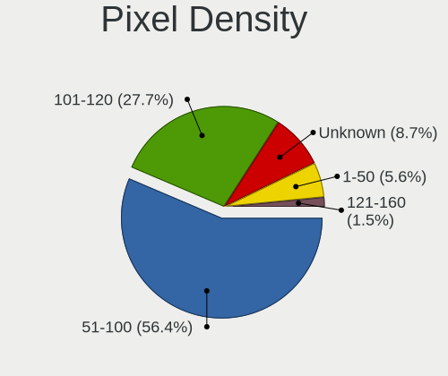

| Density | Desktops | Percent |
|---------|----------|---------|
| 51-100  | 71       | 50%     |
| 101-120 | 48       | 33.8%   |
| Unknown | 13       | 9.15%   |
| 1-50    | 9        | 6.34%   |
| 121-160 | 1        | 0.7%    |

Multiple Monitors
-----------------

Total monitors connected

| Total | Desktops | Percent |
|-------|----------|---------|
| 1     | 140      | 88.05%  |
| 2     | 14       | 8.81%   |
| 0     | 3        | 1.89%   |
| 3     | 2        | 1.26%   |

Network
-------

Net Controller Vendor
---------------------

Controller vendors

| Vendor                          | Desktops | Percent |
|---------------------------------|----------|---------|
| Realtek Semiconductor           | 105      | 51.22%  |
| Intel                           | 53       | 25.85%  |
| Qualcomm Atheros                | 11       | 5.37%   |
| TP-Link                         | 7        | 3.41%   |
| Ralink Technology               | 5        | 2.44%   |
| Qualcomm Atheros Communications | 4        | 1.95%   |
| Nvidia                          | 4        | 1.95%   |
| Broadcom Limited                | 3        | 1.46%   |
| Microsoft                       | 2        | 0.98%   |
| Huawei Technologies             | 2        | 0.98%   |
| D-Link System                   | 2        | 0.98%   |
| Broadcom                        | 2        | 0.98%   |
| ZTE WCDMA Technologies MSM      | 1        | 0.49%   |
| Qualcomm                        | 1        | 0.49%   |
| Motorola PCS                    | 1        | 0.49%   |
| D-Link                          | 1        | 0.49%   |
| ASIX Electronics                | 1        | 0.49%   |

Net Controller Model
--------------------

Controller models

| Model                                                             | Desktops | Percent |
|-------------------------------------------------------------------|----------|---------|
| Realtek RTL8111/8168/8411 PCI Express Gigabit Ethernet Controller | 80       | 35.56%  |
| Realtek RTL8125 2.5GbE Controller                                 | 9        | 4%      |
| Realtek RTL810xE PCI Express Fast Ethernet controller             | 8        | 3.56%   |
| Intel I211 Gigabit Network Connection                             | 6        | 2.67%   |
| Intel Ethernet Connection (2) I219-V                              | 6        | 2.67%   |
| Intel 82579V Gigabit Network Connection                           | 6        | 2.67%   |
| Intel 82579LM Gigabit Network Connection (Lewisville)             | 6        | 2.67%   |
| Intel Wi-Fi 6 AX200                                               | 5        | 2.22%   |
| Realtek RTL8188EUS 802.11n Wireless Network Adapter               | 4        | 1.78%   |
| Ralink MT7601U Wireless Adapter                                   | 4        | 1.78%   |
| Qualcomm Atheros AR9271 802.11n                                   | 4        | 1.78%   |
| TP-Link 802.11n NIC                                               | 3        | 1.33%   |
| Realtek RTL8192CU 802.11n WLAN Adapter                            | 3        | 1.33%   |
| Qualcomm Atheros AR8151 v2.0 Gigabit Ethernet                     | 3        | 1.33%   |
| Nvidia MCP61 Ethernet                                             | 3        | 1.33%   |
| Intel Ethernet Connection (2) I219-LM                             | 3        | 1.33%   |
| Intel Ethernet Connection (12) I219-V                             | 3        | 1.33%   |
| Intel 82578DC Gigabit Network Connection                          | 3        | 1.33%   |
| Realtek RTL8821CE 802.11ac PCIe Wireless Network Adapter          | 2        | 0.89%   |
| Realtek RTL8188EE Wireless Network Adapter                        | 2        | 0.89%   |
| Qualcomm Atheros Killer E220x Gigabit Ethernet Controller         | 2        | 0.89%   |
| Qualcomm Atheros AR9287 Wireless Network Adapter (PCI-Express)    | 2        | 0.89%   |
| Microsoft Xbox 360 Wireless Adapter                               | 2        | 0.89%   |
| Intel Wireless 7265                                               | 2        | 0.89%   |
| Intel 82567V-4 Gigabit Network Connection                         | 2        | 0.89%   |
| Huawei MAR-LX1M                                                   | 2        | 0.89%   |
| ZTE WCDMA MSM Unisoc Phone                                        | 1        | 0.44%   |
| TP-Link USB 10/100 LAN                                            | 1        | 0.44%   |
| TP-Link TL-WN8200ND [Realtek RTL8192CU]                           | 1        | 0.44%   |
| TP-Link Archer T3U [Realtek RTL8812BU]                            | 1        | 0.44%   |
| TP-Link AC600 wireless Realtek RTL8811AU [Archer T2U Nano]        | 1        | 0.44%   |
| Realtek RTL8821AE 802.11ac PCIe Wireless Network Adapter          | 1        | 0.44%   |
| Realtek RTL8723BE PCIe Wireless Network Adapter                   | 1        | 0.44%   |
| Realtek RTL8188FTV 802.11b/g/n 1T1R 2.4G WLAN Adapter             | 1        | 0.44%   |
| Realtek RTL-8185 IEEE 802.11a/b/g Wireless LAN Controller         | 1        | 0.44%   |
| Realtek RTL-8100/8101L/8139 PCI Fast Ethernet Adapter             | 1        | 0.44%   |
| Realtek 802.11ac NIC                                              | 1        | 0.44%   |
| Ralink RT2870/RT3070 Wireless Adapter                             | 1        | 0.44%   |
| Qualcomm Redmi 9T                                                 | 1        | 0.44%   |
| Qualcomm Atheros AR9485 Wireless Network Adapter                  | 1        | 0.44%   |

Wireless Vendor
---------------

Wireless vendors

| Vendor                          | Desktops | Percent |
|---------------------------------|----------|---------|
| Realtek Semiconductor           | 16       | 28.07%  |
| Intel                           | 13       | 22.81%  |
| Qualcomm Atheros                | 7        | 12.28%  |
| TP-Link                         | 6        | 10.53%  |
| Ralink Technology               | 5        | 8.77%   |
| Qualcomm Atheros Communications | 4        | 7.02%   |
| Microsoft                       | 2        | 3.51%   |
| Broadcom                        | 2        | 3.51%   |
| D-Link System                   | 1        | 1.75%   |
| D-Link                          | 1        | 1.75%   |

Wireless Model
--------------

Wireless models

| Model                                                                  | Desktops | Percent |
|------------------------------------------------------------------------|----------|---------|
| Intel Wi-Fi 6 AX200                                                    | 5        | 8.77%   |
| Realtek RTL8188EUS 802.11n Wireless Network Adapter                    | 4        | 7.02%   |
| Ralink MT7601U Wireless Adapter                                        | 4        | 7.02%   |
| Qualcomm Atheros AR9271 802.11n                                        | 4        | 7.02%   |
| TP-Link 802.11n NIC                                                    | 3        | 5.26%   |
| Realtek RTL8192CU 802.11n WLAN Adapter                                 | 3        | 5.26%   |
| Realtek RTL8821CE 802.11ac PCIe Wireless Network Adapter               | 2        | 3.51%   |
| Realtek RTL8188EE Wireless Network Adapter                             | 2        | 3.51%   |
| Qualcomm Atheros AR9287 Wireless Network Adapter (PCI-Express)         | 2        | 3.51%   |
| Microsoft Xbox 360 Wireless Adapter                                    | 2        | 3.51%   |
| Intel Wireless 7265                                                    | 2        | 3.51%   |
| TP-Link TL-WN8200ND [Realtek RTL8192CU]                                | 1        | 1.75%   |
| TP-Link Archer T3U [Realtek RTL8812BU]                                 | 1        | 1.75%   |
| TP-Link AC600 wireless Realtek RTL8811AU [Archer T2U Nano]             | 1        | 1.75%   |
| Realtek RTL8821AE 802.11ac PCIe Wireless Network Adapter               | 1        | 1.75%   |
| Realtek RTL8723BE PCIe Wireless Network Adapter                        | 1        | 1.75%   |
| Realtek RTL8188FTV 802.11b/g/n 1T1R 2.4G WLAN Adapter                  | 1        | 1.75%   |
| Realtek RTL-8185 IEEE 802.11a/b/g Wireless LAN Controller              | 1        | 1.75%   |
| Realtek 802.11ac NIC                                                   | 1        | 1.75%   |
| Ralink RT2870/RT3070 Wireless Adapter                                  | 1        | 1.75%   |
| Qualcomm Atheros AR9485 Wireless Network Adapter                       | 1        | 1.75%   |
| Qualcomm Atheros AR9285 Wireless Network Adapter (PCI-Express)         | 1        | 1.75%   |
| Qualcomm Atheros AR9227 Wireless Network Adapter                       | 1        | 1.75%   |
| Qualcomm Atheros AR5416 Wireless Network Adapter [AR5008 802.11(a)bgn] | 1        | 1.75%   |
| Qualcomm Atheros AR5212/5213/2414 Wireless Network Adapter             | 1        | 1.75%   |
| Intel Wireless 7260                                                    | 1        | 1.75%   |
| Intel Dual Band Wireless-AC 3168NGW [Stone Peak]                       | 1        | 1.75%   |
| Intel Centrino Wireless-N 2230                                         | 1        | 1.75%   |
| Intel Cannon Point-LP CNVi [Wireless-AC]                               | 1        | 1.75%   |
| Intel Cannon Lake PCH CNVi WiFi                                        | 1        | 1.75%   |
| Intel Alder Lake-S PCH CNVi WiFi                                       | 1        | 1.75%   |
| D-Link System DWA-125 Wireless N 150 Adapter(rev.A1) [Ralink RT3070]   | 1        | 1.75%   |
| D-Link DWL-G132 [Atheros AR5523]                                       | 1        | 1.75%   |
| Broadcom BCM4360 802.11ac Dual Band Wireless Network Adapter           | 1        | 1.75%   |
| Broadcom BCM4312 802.11b/g LP-PHY                                      | 1        | 1.75%   |

Ethernet Vendor
---------------

Ethernet vendors

| Vendor                     | Desktops | Percent |
|----------------------------|----------|---------|
| Realtek Semiconductor      | 97       | 59.51%  |
| Intel                      | 47       | 28.83%  |
| Qualcomm Atheros           | 5        | 3.07%   |
| Nvidia                     | 4        | 2.45%   |
| Broadcom Limited           | 3        | 1.84%   |
| Huawei Technologies        | 2        | 1.23%   |
| ZTE WCDMA Technologies MSM | 1        | 0.61%   |
| TP-Link                    | 1        | 0.61%   |
| Qualcomm                   | 1        | 0.61%   |
| D-Link System              | 1        | 0.61%   |
| ASIX Electronics           | 1        | 0.61%   |

Ethernet Model
--------------

Ethernet models

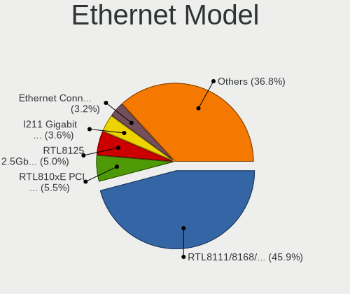

| Model                                                             | Desktops | Percent |
|-------------------------------------------------------------------|----------|---------|
| Realtek RTL8111/8168/8411 PCI Express Gigabit Ethernet Controller | 80       | 47.9%   |
| Realtek RTL8125 2.5GbE Controller                                 | 9        | 5.39%   |
| Realtek RTL810xE PCI Express Fast Ethernet controller             | 8        | 4.79%   |
| Intel I211 Gigabit Network Connection                             | 6        | 3.59%   |
| Intel Ethernet Connection (2) I219-V                              | 6        | 3.59%   |
| Intel 82579V Gigabit Network Connection                           | 6        | 3.59%   |
| Intel 82579LM Gigabit Network Connection (Lewisville)             | 6        | 3.59%   |
| Qualcomm Atheros AR8151 v2.0 Gigabit Ethernet                     | 3        | 1.8%    |
| Nvidia MCP61 Ethernet                                             | 3        | 1.8%    |
| Intel Ethernet Connection (2) I219-LM                             | 3        | 1.8%    |
| Intel Ethernet Connection (12) I219-V                             | 3        | 1.8%    |
| Intel 82578DC Gigabit Network Connection                          | 3        | 1.8%    |
| Qualcomm Atheros Killer E220x Gigabit Ethernet Controller         | 2        | 1.2%    |
| Intel 82567V-4 Gigabit Network Connection                         | 2        | 1.2%    |
| Huawei MAR-LX1M                                                   | 2        | 1.2%    |
| ZTE WCDMA MSM Unisoc Phone                                        | 1        | 0.6%    |
| TP-Link USB 10/100 LAN                                            | 1        | 0.6%    |
| Realtek RTL-8100/8101L/8139 PCI Fast Ethernet Adapter             | 1        | 0.6%    |
| Qualcomm Redmi 9T                                                 | 1        | 0.6%    |
| Nvidia MCP67 Ethernet                                             | 1        | 0.6%    |
| Intel NM10/ICH7 Family LAN Controller                             | 1        | 0.6%    |
| Intel Ethernet Controller I225-V                                  | 1        | 0.6%    |
| Intel Ethernet Connection I217-V                                  | 1        | 0.6%    |
| Intel Ethernet Connection I217-LM                                 | 1        | 0.6%    |
| Intel Ethernet Connection (7) I219-V                              | 1        | 0.6%    |
| Intel Ethernet Connection (7) I219-LM                             | 1        | 0.6%    |
| Intel Ethernet Connection (6) I219-LM                             | 1        | 0.6%    |
| Intel 82574L Gigabit Network Connection                           | 1        | 0.6%    |
| Intel 82572EI Gigabit Ethernet Controller (Copper)                | 1        | 0.6%    |
| Intel 82567LM-3 Gigabit Network Connection                        | 1        | 0.6%    |
| Intel 82567LM-2 Gigabit Network Connection                        | 1        | 0.6%    |
| Intel 82566DM-2 Gigabit Network Connection                        | 1        | 0.6%    |
| Intel 82566DM Gigabit Network Connection                          | 1        | 0.6%    |
| Intel 82566DC-2 Gigabit Network Connection                        | 1        | 0.6%    |
| Intel 82566DC Gigabit Network Connection                          | 1        | 0.6%    |
| D-Link System DGE-528T Gigabit Ethernet Adapter                   | 1        | 0.6%    |
| Broadcom Limited NetXtreme BCM5761 Gigabit Ethernet PCIe          | 1        | 0.6%    |
| Broadcom Limited NetXtreme BCM5755 Gigabit Ethernet PCI Express   | 1        | 0.6%    |
| Broadcom Limited NetXtreme BCM5751 Gigabit Ethernet PCI Express   | 1        | 0.6%    |
| ASIX AX88772A Fast Ethernet                                       | 1        | 0.6%    |

Net Controller Kind
-------------------

Ethernet, WiFi or modem

| Kind     | Desktops | Percent |
|----------|----------|---------|
| Ethernet | 152      | 72.73%  |
| WiFi     | 56       | 26.79%  |
| Unknown  | 1        | 0.48%   |

Used Controller
---------------

Currently used network controller

| Kind     | Desktops | Percent |
|----------|----------|---------|
| Ethernet | 128      | 80%     |
| WiFi     | 32       | 20%     |

NICs
----

Total network controllers on board

| Total | Desktops | Percent |
|-------|----------|---------|
| 1     | 119      | 75.8%   |
| 2     | 30       | 19.11%  |
| 3     | 5        | 3.18%   |
| 0     | 3        | 1.91%   |

IPv6
----

IPv6 vs IPv4

| Used | Desktops | Percent |
|------|----------|---------|
| No   | 129      | 81.65%  |
| Yes  | 29       | 18.35%  |

Bluetooth
---------

Bluetooth Vendor
----------------

Controller vendors

| Vendor                     | Desktops | Percent |
|----------------------------|----------|---------|
| Cambridge Silicon Radio    | 13       | 38.24%  |
| Intel                      | 12       | 35.29%  |
| TP-Link                    | 3        | 8.82%   |
| Realtek Semiconductor      | 3        | 8.82%   |
| TRENDnet                   | 1        | 2.94%   |
| Integrated System Solution | 1        | 2.94%   |
| IMC Networks               | 1        | 2.94%   |

Bluetooth Model
---------------

Controller models

| Model                                                 | Desktops | Percent |
|-------------------------------------------------------|----------|---------|
| Cambridge Silicon Radio Bluetooth Dongle (HCI mode)   | 13       | 38.24%  |
| Intel AX200 Bluetooth                                 | 5        | 14.71%  |
| TP-Link TP-Cdj+ UB5A Adapter                          | 3        | 8.82%   |
| Realtek  Bluetooth 4.2 Adapter                        | 2        | 5.88%   |
| Intel Bluetooth wireless interface                    | 2        | 5.88%   |
| Intel Bluetooth 9460/9560 Jefferson Peak (JfP)        | 2        | 5.88%   |
| TRENDnet TBW-108UB USB Adapter                        | 1        | 2.94%   |
| Realtek RTL8723B Bluetooth                            | 1        | 2.94%   |
| Intel Wireless-AC 3168 Bluetooth                      | 1        | 2.94%   |
| Intel Centrino Bluetooth Wireless Transceiver         | 1        | 2.94%   |
| Intel AX201 Bluetooth                                 | 1        | 2.94%   |
| Integrated System Solution KY-BT100 Bluetooth Adapter | 1        | 2.94%   |
| IMC Networks Bluetooth Radio                          | 1        | 2.94%   |

Sound
-----

Sound Vendor
------------

Sound card vendors

| Vendor                  | Desktops | Percent |
|-------------------------|----------|---------|
| Intel                   | 91       | 38.24%  |
| AMD                     | 73       | 30.67%  |
| Nvidia                  | 57       | 23.95%  |
| C-Media Electronics     | 4        | 1.68%   |
| Texas Instruments       | 2        | 0.84%   |
| Microsoft               | 2        | 0.84%   |
| Logitech                | 2        | 0.84%   |
| BEHRINGER International | 2        | 0.84%   |
| Tenx Technology         | 1        | 0.42%   |
| Samson Technologies     | 1        | 0.42%   |
| Kingston Technology     | 1        | 0.42%   |
| Creative Labs           | 1        | 0.42%   |
| Chicony Electronics     | 1        | 0.42%   |

Sound Model
-----------

Sound card models

| Model                                                                      | Desktops | Percent |
|----------------------------------------------------------------------------|----------|---------|
| AMD Starship/Matisse HD Audio Controller                                   | 15       | 5.36%   |
| Intel NM10/ICH7 Family High Definition Audio Controller                    | 13       | 4.64%   |
| AMD SBx00 Azalia (Intel HDA)                                               | 13       | 4.64%   |
| Intel 6 Series/C200 Series Chipset Family High Definition Audio Controller | 12       | 4.29%   |
| AMD FCH Azalia Controller                                                  | 12       | 4.29%   |
| AMD Family 17h/19h HD Audio Controller                                     | 12       | 4.29%   |
| AMD Ellesmere HDMI Audio [Radeon RX 470/480 / 570/580/590]                 | 11       | 3.93%   |
| Intel 7 Series/C216 Chipset Family High Definition Audio Controller        | 10       | 3.57%   |
| Intel 100 Series/C230 Series Chipset Family HD Audio Controller            | 10       | 3.57%   |
| Intel 8 Series/C220 Series Chipset High Definition Audio Controller        | 9        | 3.21%   |
| Nvidia GF108 High Definition Audio Controller                              | 8        | 2.86%   |
| Nvidia GK208 HDMI/DP Audio Controller                                      | 6        | 2.14%   |
| Intel Xeon E3-1200 v3/4th Gen Core Processor HD Audio Controller           | 6        | 2.14%   |
| Intel 200 Series PCH HD Audio                                              | 6        | 2.14%   |
| AMD Renoir Radeon High Definition Audio Controller                         | 6        | 2.14%   |
| AMD Raven/Raven2/Fenghuang HDMI/DP Audio Controller                        | 6        | 2.14%   |
| Nvidia High Definition Audio Controller                                    | 5        | 1.79%   |
| AMD Navi 10 HDMI Audio                                                     | 5        | 1.79%   |
| Nvidia TU116 High Definition Audio Controller                              | 4        | 1.43%   |
| Nvidia GP107GL High Definition Audio Controller                            | 4        | 1.43%   |
| Nvidia GP104 High Definition Audio Controller                              | 4        | 1.43%   |
| Intel Comet Lake PCH-V cAVS                                                | 4        | 1.43%   |
| Intel Cannon Lake PCH cAVS                                                 | 4        | 1.43%   |
| AMD Oland/Hainan/Cape Verde/Pitcairn HDMI Audio [Radeon HD 7000 Series]    | 4        | 1.43%   |
| Nvidia MCP61 High Definition Audio                                         | 3        | 1.07%   |
| Nvidia GP108 High Definition Audio Controller                              | 3        | 1.07%   |
| Nvidia GM206 High Definition Audio Controller                              | 3        | 1.07%   |
| Intel 82801JD/DO (ICH10 Family) HD Audio Controller                        | 3        | 1.07%   |
| Intel 82801I (ICH9 Family) HD Audio Controller                             | 3        | 1.07%   |
| Intel 5 Series/3400 Series Chipset High Definition Audio                   | 3        | 1.07%   |
| C-Media Electronics USB Audio Device                                       | 3        | 1.07%   |
| AMD Turks HDMI Audio [Radeon HD 6500/6600 / 6700M Series]                  | 3        | 1.07%   |
| AMD Family 17h (Models 00h-0fh) HD Audio Controller                        | 3        | 1.07%   |
| AMD Cedar HDMI Audio [Radeon HD 5400/6300/7300 Series]                     | 3        | 1.07%   |
| Texas Instruments PCM2902 Audio Codec                                      | 2        | 0.71%   |
| Nvidia TU107 GeForce GTX 1650 High Definition Audio Controller             | 2        | 0.71%   |
| Nvidia TU106 High Definition Audio Controller                              | 2        | 0.71%   |
| Nvidia GM107 High Definition Audio Controller [GeForce 940MX]              | 2        | 0.71%   |
| Nvidia GK107 HDMI Audio Controller                                         | 2        | 0.71%   |
| Nvidia GA104 High Definition Audio Controller                              | 2        | 0.71%   |

Memory
------

Memory Vendor
-------------

Memory module vendors

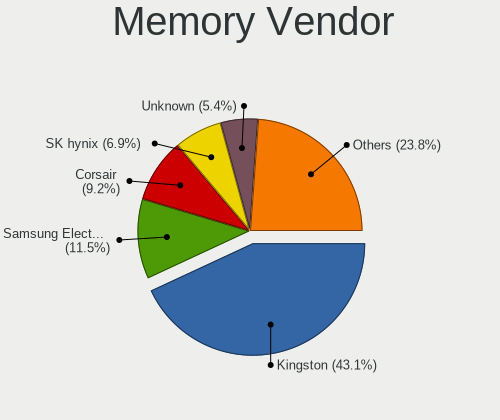

| Vendor                       | Desktops | Percent |
|------------------------------|----------|---------|
| Kingston                     | 45       | 46.39%  |
| Samsung Electronics          | 12       | 12.37%  |
| Corsair                      | 8        | 8.25%   |
| Unknown                      | 7        | 7.22%   |
| Micron Technology            | 5        | 5.15%   |
| SK hynix                     | 4        | 4.12%   |
| Crucial                      | 3        | 3.09%   |
| Team                         | 2        | 2.06%   |
| A-DATA Technology            | 2        | 2.06%   |
| Unknown (0x7FA8000000000000) | 1        | 1.03%   |
| Unknown (0x7F7FB5FFFFFFFFFF) | 1        | 1.03%   |
| S                            | 1        | 1.03%   |
| Qumo                         | 1        | 1.03%   |
| Princeton                    | 1        | 1.03%   |
| Nanya Technology             | 1        | 1.03%   |
| M                            | 1        | 1.03%   |
| Hewlett-Packard              | 1        | 1.03%   |
| GeIL                         | 1        | 1.03%   |

Memory Model
------------

Memory module models

| Model                                                           | Desktops | Percent |
|-----------------------------------------------------------------|----------|---------|
| Kingston RAM KHX2666C16/8G 8GB DIMM DDR4 3466MT/s               | 6        | 5.26%   |
| Kingston RAM KHX1866C10D3/8G 8GB DIMM DDR3 2133MT/s             | 4        | 3.51%   |
| Kingston RAM KHX1600C9D3/4GX 4GB DIMM DDR3 1600MT/s             | 3        | 2.63%   |
| SK hynix RAM HMT351U6CFR8C-PB 4GB DIMM DDR3 1800MT/s            | 2        | 1.75%   |
| Samsung RAM M378B5173EB0 4GB DIMM DDR3 1600MT/s                 | 2        | 1.75%   |
| Kingston RAM KHX3200C16D4/8GX 8GB DIMM DDR4 3733MT/s            | 2        | 1.75%   |
| Kingston RAM KHX2666C16D4/16GX 16GB DIMM DDR4 3000MT/s          | 2        | 1.75%   |
| Kingston RAM KHX2666C15D4/4G 4GB DIMM DDR4 3200MT/s             | 2        | 1.75%   |
| Kingston RAM KHX2400C15/8G 8GB DIMM DDR4 3400MT/s               | 2        | 1.75%   |
| Kingston RAM KHX1600C10D3/8GX 8GB DIMM DDR3 1600MT/s            | 2        | 1.75%   |
| Kingston RAM KF3200C16D4/16GX 16GB DIMM DDR4 3200MT/s           | 2        | 1.75%   |
| Kingston RAM CL16-18-18 D4-3200 16GB DIMM DDR4 3200MT/s         | 2        | 1.75%   |
| Kingston RAM 99U5403-436.A00LF 8GB DIMM DDR3 1333MT/s           | 2        | 1.75%   |
| Kingston RAM 9905471-017.A00LF 4GB DIMM DDR3 1333MT/s           | 2        | 1.75%   |
| Corsair RAM CMK32GX4M2E3200C16 16GB DIMM DDR4 3534MT/s          | 2        | 1.75%   |
| Unknown RAM Module 8GB DIMM 1600MT/s                            | 1        | 0.88%   |
| Unknown RAM Module 512MB DIMM DDR2 533MT/s                      | 1        | 0.88%   |
| Unknown RAM Module 2GB DIMM SDRAM                               | 1        | 0.88%   |
| Unknown RAM Module 2GB DIMM DDR2                                | 1        | 0.88%   |
| Unknown RAM Module 2GB DIMM 800MT/s                             | 1        | 0.88%   |
| Unknown RAM Module 2048MB DIMM DDR2                             | 1        | 0.88%   |
| Unknown RAM Module 2048MB DIMM 400MT/s                          | 1        | 0.88%   |
| Unknown RAM Module 1GB DIMM 800MT/s                             | 1        | 0.88%   |
| Unknown (0x7FA8000000000000) RAM Module 512MB DIMM DDR2 533MT/s | 1        | 0.88%   |
| Unknown (0x7F7FB5FFFFFFFFFF) RAM Module 512MB DIMM DDR2 533MT/s | 1        | 0.88%   |
| Team RAM TEAMGROUP-UD4-3600 8GB DIMM DDR4 3733MT/s              | 1        | 0.88%   |
| Team RAM TEAMGROUP-UD4-3200 16GB DIMM DDR4 3800MT/s             | 1        | 0.88%   |
| SK hynix RAM Module 2GB DIMM DDR3 1066MT/s                      | 1        | 0.88%   |
| SK hynix RAM HMT125U6TFR8C-H9 2GB DIMM DDR3 1333MT/s            | 1        | 0.88%   |
| Samsung RAM Module 8GB SODIMM DDR4 2133MT/s                     | 1        | 0.88%   |
| Samsung RAM Module 8GB DIMM DDR4 2400MT/s                       | 1        | 0.88%   |
| Samsung RAM Module 4GB DIMM DDR4 2133MT/s                       | 1        | 0.88%   |
| Samsung RAM Module 16GB DIMM DDR4 2400MT/s                      | 1        | 0.88%   |
| Samsung RAM M471B5273DH0-CK0 4GB DIMM DDR3 1333MT/s             | 1        | 0.88%   |
| Samsung RAM M378B5673FH0-CH9 2GB DIMM DDR3 1600MT/s             | 1        | 0.88%   |
| Samsung RAM M378B5673EH1-CF8 2GB DIMM DDR3 1067MT/s             | 1        | 0.88%   |
| Samsung RAM M378B5273DH0-CK0 4GB DIMM DDR3 2200MT/s             | 1        | 0.88%   |
| Samsung RAM M378B5173DB0 4GB DIMM DDR3 1600MT/s                 | 1        | 0.88%   |
| Samsung RAM K4E6E304EC-EGCG 4GB Row Of Chips LPDDR3 2133MT/s    | 1        | 0.88%   |
| Samsung RAM HMT351U6EFR8A-PB 8GB DIMM DDR3 1333MT/s             | 1        | 0.88%   |

Memory Kind
-----------

Memory module kinds

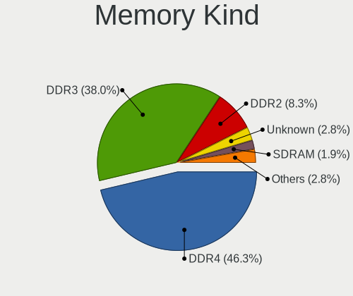

| Kind    | Desktops | Percent |
|---------|----------|---------|
| DDR4    | 38       | 45.78%  |
| DDR3    | 33       | 39.76%  |
| DDR2    | 6        | 7.23%   |
| Unknown | 3        | 3.61%   |
| SDRAM   | 2        | 2.41%   |
| LPDDR3  | 1        | 1.2%    |

Memory Form Factor
------------------

Physical design of the memory module

| Name         | Desktops | Percent |
|--------------|----------|---------|
| DIMM         | 80       | 96.39%  |
| SODIMM       | 2        | 2.41%   |
| Row Of Chips | 1        | 1.2%    |

Memory Size
-----------

Memory module size

| Size  | Desktops | Percent |
|-------|----------|---------|
| 8192  | 39       | 40.21%  |
| 4096  | 24       | 24.74%  |
| 2048  | 15       | 15.46%  |
| 16384 | 11       | 11.34%  |
| 32768 | 3        | 3.09%   |
| 1024  | 3        | 3.09%   |
| 512   | 2        | 2.06%   |

Memory Speed
------------

Memory module speed

| Speed   | Desktops | Percent |
|---------|----------|---------|
| 1333    | 16       | 15.84%  |
| 1600    | 13       | 12.87%  |
| 2133    | 10       | 9.9%    |
| 3200    | 9        | 8.91%   |
| 3466    | 7        | 6.93%   |
| 2400    | 7        | 6.93%   |
| 3733    | 4        | 3.96%   |
| 2667    | 4        | 3.96%   |
| 3400    | 3        | 2.97%   |
| Unknown | 3        | 2.97%   |
| 3534    | 2        | 1.98%   |
| 3000    | 2        | 1.98%   |
| 1800    | 2        | 1.98%   |
| 800     | 2        | 1.98%   |
| 533     | 2        | 1.98%   |
| 3800    | 1        | 0.99%   |
| 3600    | 1        | 0.99%   |
| 3151    | 1        | 0.99%   |
| 3100    | 1        | 0.99%   |
| 2800    | 1        | 0.99%   |
| 2733    | 1        | 0.99%   |
| 2666    | 1        | 0.99%   |
| 2200    | 1        | 0.99%   |
| 2134    | 1        | 0.99%   |
| 1867    | 1        | 0.99%   |
| 1866    | 1        | 0.99%   |
| 1067    | 1        | 0.99%   |
| 1066    | 1        | 0.99%   |
| 667     | 1        | 0.99%   |
| 400     | 1        | 0.99%   |

Printers & scanners
-------------------

Printer Vendor
--------------

Printer device vendors

| Vendor                        | Desktops | Percent |
|-------------------------------|----------|---------|
| Hewlett-Packard               | 2        | 25%     |
| Brother Industries            | 2        | 25%     |
| Star Micronics                | 1        | 12.5%   |
| Seiko Epson                   | 1        | 12.5%   |
| Samsung Info. Systems America | 1        | 12.5%   |
| Canon                         | 1        | 12.5%   |

Printer Model
-------------

Printer device models

| Model                                         | Desktops | Percent |
|-----------------------------------------------|----------|---------|
| Brother DCP-T310                              | 2        | 25%     |
| Star Micronics TUP592 (STR_T-001)             | 1        | 12.5%   |
| Seiko Epson ET-2810 Series                    | 1        | 12.5%   |
| Samsung Info. Systems America SAMSUNG SRP-270 | 1        | 12.5%   |
| HP PSC 1400                                   | 1        | 12.5%   |
| HP DeskJet 2700 series                        | 1        | 12.5%   |
| Canon PIXMA MG3600 Series                     | 1        | 12.5%   |

Scanner Vendor
--------------

Scanner device vendors

| Vendor          | Desktops | Percent |
|-----------------|----------|---------|
| Hewlett-Packard | 1        | 50%     |
| Canon           | 1        | 50%     |

Scanner Model
-------------

Scanner device models

| Model                  | Desktops | Percent |
|------------------------|----------|---------|
| HP ScanJet 2400c       | 1        | 50%     |
| Canon CanoScan LIDE 25 | 1        | 50%     |

Camera
------

Camera Vendor
-------------

Camera device vendors

| Vendor                  | Desktops | Percent |
|-------------------------|----------|---------|
| Logitech                | 7        | 20%     |
| Microdia                | 6        | 17.14%  |
| Microsoft               | 5        | 14.29%  |
| Z-Star Microelectronics | 4        | 11.43%  |
| Generalplus Technology  | 4        | 11.43%  |
| Cubeternet              | 2        | 5.71%   |
| Xiongmai                | 1        | 2.86%   |
| Samsung Electronics     | 1        | 2.86%   |
| Realtek Semiconductor   | 1        | 2.86%   |
| Jieli Technology        | 1        | 2.86%   |
| Chicony Electronics     | 1        | 2.86%   |
| Aveo Technology         | 1        | 2.86%   |
| Apple                   | 1        | 2.86%   |

Camera Model
------------

Camera device models

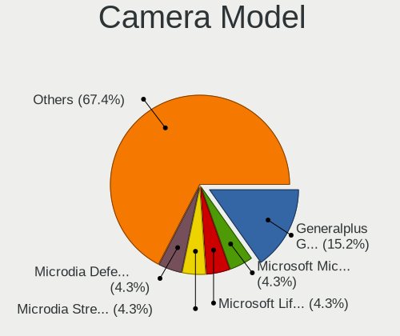

| Model                                                               | Desktops | Percent |
|---------------------------------------------------------------------|----------|---------|
| Generalplus GENERAL WEBCAM                                          | 3        | 8.57%   |
| Microsoft Microsoft LifeCam HD-6000 for Notebooks                 | 2        | 5.71%   |
| Microdia USB 2.0 Camera                                             | 2        | 5.71%   |
| Microdia Camera                                                     | 2        | 5.71%   |
| Logitech C920 PRO HD Webcam                                         | 2        | 5.71%   |
| Cubeternet EtronTech CMOS based eSP570 WebCam [Onyx Titanium TC101] | 2        | 5.71%   |
| Z-Star Venus USB2.0 Camera                                          | 1        | 2.86%   |
| Z-Star Sirius USB2.0 Camera                                         | 1        | 2.86%   |
| Z-Star Integrated Camera                                            | 1        | 2.86%   |
| Z-Star A4 TECH USB2.0 PC Camera E                                   | 1        | 2.86%   |
| Xiongmai web camera                                                 | 1        | 2.86%   |
| Samsung Galaxy series, misc. (MTP mode)                             | 1        | 2.86%   |
| Realtek HD Camera                                                   | 1        | 2.86%   |
| Microsoft Microsoft LifeCam Cinema                                | 1        | 2.86%   |
| Microsoft LifeCam HD-3000                                           | 1        | 2.86%   |
| Microsoft LifeCam Cinema                                            | 1        | 2.86%   |
| Microdia Webcam Vitade AF                                           | 1        | 2.86%   |
| Microdia Defender G-Lens 2577 HD720p Camera                         | 1        | 2.86%   |
| Logitech Webcam C270                                                | 1        | 2.86%   |
| Logitech Logi Webcam C920e                                          | 1        | 2.86%   |
| Logitech HD Webcam C525                                             | 1        | 2.86%   |
| Logitech C505e HD Webcam                                            | 1        | 2.86%   |
| Logitech BRIO Ultra HD Webcam                                       | 1        | 2.86%   |
| Jieli USB PHY 2.0                                                   | 1        | 2.86%   |
| Generalplus 808 Camera #9 (web-cam mode)                            | 1        | 2.86%   |
| Chicony HD WebCam (Asus N-series)                                   | 1        | 2.86%   |
| Aveo USB2.0 Camera                                                  | 1        | 2.86%   |
| Apple iPhone 5/5C/5S/6/SE/7/8/X/XR                                  | 1        | 2.86%   |

Security
--------

Fingerprint Vendor
------------------

Fingerprint sensor vendors

Zero info for selected period =(

Fingerprint Model
-----------------

Fingerprint sensor models

Zero info for selected period =(

Chipcard Vendor
---------------

Chipcard module vendors

| Vendor      | Desktops | Percent |
|-------------|----------|---------|
| Yubico.com  | 1        | 50%     |
| Alcor Micro | 1        | 50%     |

Chipcard Model
--------------

Chipcard module models

| Model                               | Desktops | Percent |
|-------------------------------------|----------|---------|
| Yubico.com Yubikey 4/5 U2F+CCID     | 1        | 50%     |
| Alcor Micro AU9540 Smartcard Reader | 1        | 50%     |

Unsupported
-----------

Unsupported Devices
-------------------

Total unsupported devices on board

| Total | Desktops | Percent |
|-------|----------|---------|
| 0     | 140      | 88.05%  |
| 1     | 16       | 10.06%  |
| 3     | 2        | 1.26%   |
| 2     | 1        | 0.63%   |

Unsupported Device Types
------------------------

Types of unsupported devices

| Type                | Desktops | Percent |
|---------------------|----------|---------|
| Graphics card       | 8        | 42.11%  |
| Net/wireless        | 4        | 21.05%  |
| Unassigned class    | 1        | 5.26%   |
| Sound               | 1        | 5.26%   |
| Network             | 1        | 5.26%   |
| Net/ethernet        | 1        | 5.26%   |
| Firewire controller | 1        | 5.26%   |
| Chipcard            | 1        | 5.26%   |
| Camera              | 1        | 5.26%   |

