Linux in Peru - Tested Hardware & Statistics (Desktops)
-------------------------------------------------------

A project to collect tested hardware configurations for Linux in Peru.

Anyone can contribute to this report by the [hw-probe](https://github.com/linuxhw/hw-probe) tool:

    sudo -E hw-probe -all -upload

Please contribute! Especially if your hardware is rare.

Contents
--------

* [ Test Cases ](#test-cases)

* [ System ](#system)
  - [ OS                       ](#os)
  - [ OS Family                ](#os-family)
  - [ Kernel                   ](#kernel)
  - [ Kernel Family            ](#kernel-family)
  - [ Kernel Major Ver.        ](#kernel-major-ver)
  - [ Arch                     ](#arch)
  - [ DE                       ](#de)
  - [ Display Server           ](#display-server)
  - [ Display Manager          ](#display-manager)
  - [ OS Lang                  ](#os-lang)
  - [ Boot Mode                ](#boot-mode)
  - [ Filesystem               ](#filesystem)
  - [ Part. scheme             ](#part-scheme)
  - [ Dual Boot with Linux/BSD ](#dual-boot-with-linuxbsd)
  - [ Dual Boot (Win)          ](#dual-boot-win)

* [ Board ](#board)
  - [ Vendor                   ](#vendor)
  - [ Model                    ](#model)
  - [ Model Family             ](#model-family)
  - [ MFG Year                 ](#mfg-year)
  - [ Form Factor              ](#form-factor)
  - [ Secure Boot              ](#secure-boot)
  - [ Coreboot                 ](#coreboot)
  - [ RAM Size                 ](#ram-size)
  - [ RAM Used                 ](#ram-used)
  - [ Total Drives             ](#total-drives)
  - [ Has CD-ROM               ](#has-cd-rom)
  - [ Has Ethernet             ](#has-ethernet)
  - [ Has WiFi                 ](#has-wifi)
  - [ Has Bluetooth            ](#has-bluetooth)

* [ Location ](#location)
  - [ Country                  ](#country)
  - [ City                     ](#city)

* [ Drives ](#drives)
  - [ Drive Vendor             ](#drive-vendor)
  - [ Drive Model              ](#drive-model)
  - [ HDD Vendor               ](#hdd-vendor)
  - [ SSD Vendor               ](#ssd-vendor)
  - [ Drive Kind               ](#drive-kind)
  - [ Drive Connector          ](#drive-connector)
  - [ Drive Size               ](#drive-size)
  - [ Space Total              ](#space-total)
  - [ Space Used               ](#space-used)
  - [ Malfunc. Drives          ](#malfunc-drives)
  - [ Malfunc. Drive Vendor    ](#malfunc-drive-vendor)
  - [ Malfunc. HDD Vendor      ](#malfunc-hdd-vendor)
  - [ Malfunc. Drive Kind      ](#malfunc-drive-kind)
  - [ Failed Drives            ](#failed-drives)
  - [ Failed Drive Vendor      ](#failed-drive-vendor)
  - [ Drive Status             ](#drive-status)

* [ Storage controller ](#storage-controller)
  - [ Storage Vendor           ](#storage-vendor)
  - [ Storage Model            ](#storage-model)
  - [ Storage Kind             ](#storage-kind)

* [ Processor ](#processor)
  - [ CPU Vendor               ](#cpu-vendor)
  - [ CPU Model                ](#cpu-model)
  - [ CPU Model Family         ](#cpu-model-family)
  - [ CPU Cores                ](#cpu-cores)
  - [ CPU Sockets              ](#cpu-sockets)
  - [ CPU Threads              ](#cpu-threads)
  - [ CPU Op-Modes             ](#cpu-op-modes)
  - [ CPU Microcode            ](#cpu-microcode)
  - [ CPU Microarch            ](#cpu-microarch)

* [ Graphics ](#graphics)
  - [ GPU Vendor               ](#gpu-vendor)
  - [ GPU Model                ](#gpu-model)
  - [ GPU Combo                ](#gpu-combo)
  - [ GPU Driver               ](#gpu-driver)
  - [ GPU Memory               ](#gpu-memory)

* [ Monitor ](#monitor)
  - [ Monitor Vendor           ](#monitor-vendor)
  - [ Monitor Model            ](#monitor-model)
  - [ Monitor Resolution       ](#monitor-resolution)
  - [ Monitor Diagonal         ](#monitor-diagonal)
  - [ Monitor Width            ](#monitor-width)
  - [ Aspect Ratio             ](#aspect-ratio)
  - [ Monitor Area             ](#monitor-area)
  - [ Pixel Density            ](#pixel-density)
  - [ Multiple Monitors        ](#multiple-monitors)

* [ Network ](#network)
  - [ Net Controller Vendor    ](#net-controller-vendor)
  - [ Net Controller Model     ](#net-controller-model)
  - [ Wireless Vendor          ](#wireless-vendor)
  - [ Wireless Model           ](#wireless-model)
  - [ Ethernet Vendor          ](#ethernet-vendor)
  - [ Ethernet Model           ](#ethernet-model)
  - [ Net Controller Kind      ](#net-controller-kind)
  - [ Used Controller          ](#used-controller)
  - [ NICs                     ](#nics)
  - [ IPv6                     ](#ipv6)

* [ Bluetooth ](#bluetooth)
  - [ Bluetooth Vendor         ](#bluetooth-vendor)
  - [ Bluetooth Model          ](#bluetooth-model)

* [ Sound ](#sound)
  - [ Sound Vendor             ](#sound-vendor)
  - [ Sound Model              ](#sound-model)

* [ Memory ](#memory)
  - [ Memory Vendor            ](#memory-vendor)
  - [ Memory Model             ](#memory-model)
  - [ Memory Kind              ](#memory-kind)
  - [ Memory Form Factor       ](#memory-form-factor)
  - [ Memory Size              ](#memory-size)
  - [ Memory Speed             ](#memory-speed)

* [ Printers & scanners ](#printers--scanners)
  - [ Printer Vendor           ](#printer-vendor)
  - [ Printer Model            ](#printer-model)
  - [ Scanner Vendor           ](#scanner-vendor)
  - [ Scanner Model            ](#scanner-model)

* [ Camera ](#camera)
  - [ Camera Vendor            ](#camera-vendor)
  - [ Camera Model             ](#camera-model)

* [ Security ](#security)
  - [ Fingerprint Vendor       ](#fingerprint-vendor)
  - [ Fingerprint Model        ](#fingerprint-model)
  - [ Chipcard Vendor          ](#chipcard-vendor)
  - [ Chipcard Model           ](#chipcard-model)

* [ Unsupported ](#unsupported)
  - [ Unsupported Devices      ](#unsupported-devices)
  - [ Unsupported Device Types ](#unsupported-device-types)

Test Cases
----------

Total: 163

| Vendor   | Model                       | Probe                                                      | Date         |
|----------|-----------------------------|------------------------------------------------------------|--------------|
| Lenovo   | 3111 SDK0J40697 WIN 3305... | [2be9b66ba1](https://linux-hardware.org/?probe=2be9b66ba1) | Aug 30, 2022 |
| MSI      | X370 KRAIT GAMING           | [ea80c11a16](https://linux-hardware.org/?probe=ea80c11a16) | Aug 20, 2022 |
| ASUSTek  | PRIME X570-P                | [ca185c2301](https://linux-hardware.org/?probe=ca185c2301) | Aug 10, 2022 |
| ASUSTek  | PRIME X570-P                | [fd78986d01](https://linux-hardware.org/?probe=fd78986d01) | Aug 06, 2022 |
| ASUSTek  | PRIME X570-P                | [49390f2f0e](https://linux-hardware.org/?probe=49390f2f0e) | Aug 06, 2022 |
| HP       | 1493                        | [2ac16ddc1f](https://linux-hardware.org/?probe=2ac16ddc1f) | Aug 03, 2022 |
| ASUSTek  | M5A97                       | [e5b05f8e39](https://linux-hardware.org/?probe=e5b05f8e39) | Aug 02, 2022 |
| Gigabyte | AX370M-Gaming 3-CF          | [1c92a49cd4](https://linux-hardware.org/?probe=1c92a49cd4) | Aug 01, 2022 |
| Gigabyte | B365M DS3H                  | [27bf18a32e](https://linux-hardware.org/?probe=27bf18a32e) | Jul 20, 2022 |
| ASUSTek  | H110M-R                     | [8d52662820](https://linux-hardware.org/?probe=8d52662820) | Jul 19, 2022 |
| Intel    | DH61CR AAG14064-204         | [0ebf0eb484](https://linux-hardware.org/?probe=0ebf0eb484) | Jul 08, 2022 |
| Intel    | D102GGC2 AAD42789-204       | [3ed07edb6a](https://linux-hardware.org/?probe=3ed07edb6a) | Jun 21, 2022 |
| ASUSTek  | PRIME A320M-K               | [67c7179045](https://linux-hardware.org/?probe=67c7179045) | Jun 15, 2022 |
| ASUSTek  | TUF Gaming B550M-PLUS       | [c1db97e482](https://linux-hardware.org/?probe=c1db97e482) | May 31, 2022 |
| ASUSTek  | TUF Gaming B550M-PLUS       | [c274a43a82](https://linux-hardware.org/?probe=c274a43a82) | May 30, 2022 |
| ASUSTek  | PRIME B450M-A               | [2ce35a0cba](https://linux-hardware.org/?probe=2ce35a0cba) | May 30, 2022 |
| Intel    | DP67BA AAG10219-300         | [005b9cdb8e](https://linux-hardware.org/?probe=005b9cdb8e) | May 26, 2022 |
| Gigabyte | G1.Sniper B5-CF             | [3bf7390ce3](https://linux-hardware.org/?probe=3bf7390ce3) | May 16, 2022 |
| HP       | 8056                        | [e9d15128a7](https://linux-hardware.org/?probe=e9d15128a7) | May 16, 2022 |
| ASUSTek  | PRIME B450M-A               | [03581837bc](https://linux-hardware.org/?probe=03581837bc) | May 14, 2022 |
| ASUSTek  | PRIME B450M-A               | [e436a62479](https://linux-hardware.org/?probe=e436a62479) | May 13, 2022 |
| Dell     | 0773VG A02                  | [0743f4573d](https://linux-hardware.org/?probe=0743f4573d) | May 12, 2022 |
| ASUSTek  | PRIME B450M-A               | [358cadc7df](https://linux-hardware.org/?probe=358cadc7df) | May 09, 2022 |
| SZMZ     | X99 DUAL Z8                 | [f68946f3d4](https://linux-hardware.org/?probe=f68946f3d4) | May 06, 2022 |
| Gigabyte | G1.Sniper B5-CF             | [7b488333bb](https://linux-hardware.org/?probe=7b488333bb) | May 05, 2022 |
| Gigabyte | A520M H                     | [80f3ccadb9](https://linux-hardware.org/?probe=80f3ccadb9) | May 02, 2022 |
| MSI      | A88XM-E45 V2                | [a50ad068b1](https://linux-hardware.org/?probe=a50ad068b1) | Apr 30, 2022 |
| Foxconn  | H61MXE                      | [d8168e72e7](https://linux-hardware.org/?probe=d8168e72e7) | Apr 27, 2022 |
| Gigabyte | G1.Sniper B5-CF             | [e0e448efcb](https://linux-hardware.org/?probe=e0e448efcb) | Apr 24, 2022 |
| Gigabyte | B365M DS3H                  | [ed62d97841](https://linux-hardware.org/?probe=ed62d97841) | Apr 18, 2022 |
| MSI      | H110M PRO-VH PLUS           | [a00c0b503b](https://linux-hardware.org/?probe=a00c0b503b) | Apr 06, 2022 |
| ASUSTek  | A68HM-E                     | [af6b7df94c](https://linux-hardware.org/?probe=af6b7df94c) | Apr 06, 2022 |
| Gigabyte | B75M-D3H                    | [53ca03e8ec](https://linux-hardware.org/?probe=53ca03e8ec) | Mar 17, 2022 |
| Foxconn  | 2A8C                        | [80e5e3a26c](https://linux-hardware.org/?probe=80e5e3a26c) | Mar 15, 2022 |
| Intel    | DX79SR AAG57199-200         | [1ab5b833d9](https://linux-hardware.org/?probe=1ab5b833d9) | Mar 12, 2022 |
| ASUSTek  | TUF Gaming B550M-PLUS       | [91e577540a](https://linux-hardware.org/?probe=91e577540a) | Feb 11, 2022 |
| Gigabyte | G1.Sniper B5-CF             | [15dd0e4767](https://linux-hardware.org/?probe=15dd0e4767) | Feb 08, 2022 |
| ASUSTek  | TUF Gaming X570-PLUS        | [f6a7e71141](https://linux-hardware.org/?probe=f6a7e71141) | Jan 18, 2022 |
| ASRock   | X570 Pro4                   | [9dccdb1f45](https://linux-hardware.org/?probe=9dccdb1f45) | Nov 17, 2021 |
| Gigabyte | 970A-DS3P                   | [180b98585e](https://linux-hardware.org/?probe=180b98585e) | Nov 11, 2021 |
| ASUSTek  | PRIME B550M-K               | [e995b26637](https://linux-hardware.org/?probe=e995b26637) | Nov 11, 2021 |
| Gigabyte | H110M-M2-CF                 | [83ce5b471d](https://linux-hardware.org/?probe=83ce5b471d) | Nov 10, 2021 |
| MSI      | B560M PRO-VDH               | [140cf1defc](https://linux-hardware.org/?probe=140cf1defc) | Nov 09, 2021 |
| ASRock   | B460M-HDV                   | [f343673932](https://linux-hardware.org/?probe=f343673932) | Nov 08, 2021 |
| ASUSTek  | TUF Gaming X570-PLUS        | [e071387ed6](https://linux-hardware.org/?probe=e071387ed6) | Oct 22, 2021 |
| ASUSTek  | Z97-P                       | [9343a7aac0](https://linux-hardware.org/?probe=9343a7aac0) | Oct 13, 2021 |
| MSI      | H170A GAMING PRO            | [2a068afc0c](https://linux-hardware.org/?probe=2a068afc0c) | Oct 11, 2021 |
| Lenovo   | 3098 SDK0E50510 PRO or W... | [57fb928b65](https://linux-hardware.org/?probe=57fb928b65) | Oct 03, 2021 |
| ASUSTek  | A88XM-A                     | [72114a075d](https://linux-hardware.org/?probe=72114a075d) | Sep 24, 2021 |
| Dell     | 0773VG A02                  | [5b63f0fc0a](https://linux-hardware.org/?probe=5b63f0fc0a) | Sep 16, 2021 |
| Intel    | DH55TC AAE70932-302         | [e5f7233230](https://linux-hardware.org/?probe=e5f7233230) | Sep 04, 2021 |
| Intel    | DG33BU AAD79951-413         | [9824fedcc4](https://linux-hardware.org/?probe=9824fedcc4) | Aug 16, 2021 |
| Gigabyte | M61PME-S2P                  | [46cd16e708](https://linux-hardware.org/?probe=46cd16e708) | Aug 13, 2021 |
| Gigabyte | B550M H                     | [b26c567912](https://linux-hardware.org/?probe=b26c567912) | Aug 03, 2021 |
| Gigabyte | F2A68HM-H                   | [5b80d3040f](https://linux-hardware.org/?probe=5b80d3040f) | Jul 25, 2021 |
| Gigabyte | F2A68HM-H                   | [771ef872d9](https://linux-hardware.org/?probe=771ef872d9) | Jul 25, 2021 |
| MSI      | B460M-A PRO                 | [da8382cb33](https://linux-hardware.org/?probe=da8382cb33) | Jul 15, 2021 |
| MSI      | B460M-A PRO                 | [146ce74ec9](https://linux-hardware.org/?probe=146ce74ec9) | Jul 15, 2021 |
| Gigabyte | B360 AORUS GAMING 3 WIFI... | [6001052e23](https://linux-hardware.org/?probe=6001052e23) | Jul 15, 2021 |
| ASUSTek  | Z97-P                       | [95fcf3868f](https://linux-hardware.org/?probe=95fcf3868f) | Jun 26, 2021 |
| HP       | 8054                        | [b0662fd84b](https://linux-hardware.org/?probe=b0662fd84b) | May 30, 2021 |
| HP       | 8054                        | [37f65c4171](https://linux-hardware.org/?probe=37f65c4171) | May 27, 2021 |
| Gigabyte | 970A-DS3P                   | [a1959c22e0](https://linux-hardware.org/?probe=a1959c22e0) | May 20, 2021 |
| MSI      | A88X-G45 GAMING             | [930993fd14](https://linux-hardware.org/?probe=930993fd14) | May 16, 2021 |
| MSI      | A88X-G45 GAMING             | [f7a3ab5c2f](https://linux-hardware.org/?probe=f7a3ab5c2f) | May 16, 2021 |
| Gigabyte | B550 AORUS ELITE            | [57b918a36e](https://linux-hardware.org/?probe=57b918a36e) | May 15, 2021 |
| ASUSTek  | Z97-P                       | [6eb605ae36](https://linux-hardware.org/?probe=6eb605ae36) | Apr 21, 2021 |
| ASUSTek  | Z97-P                       | [4bd5425a6b](https://linux-hardware.org/?probe=4bd5425a6b) | Apr 11, 2021 |
| Gigabyte | B550 AORUS ELITE            | [59cb82d24c](https://linux-hardware.org/?probe=59cb82d24c) | Apr 09, 2021 |
| MSI      | B75A-G43                    | [87a3e8d42c](https://linux-hardware.org/?probe=87a3e8d42c) | Apr 07, 2021 |
| Gigabyte | H110M-H-CF                  | [b02d3fa1c0](https://linux-hardware.org/?probe=b02d3fa1c0) | Apr 04, 2021 |
| Lenovo   | ThinkCentre M91 7516AD1     | [91ae7f221c](https://linux-hardware.org/?probe=91ae7f221c) | Apr 01, 2021 |
| Unknown  | Unknown                     | [860e86fde0](https://linux-hardware.org/?probe=860e86fde0) | Mar 19, 2021 |
| Unknown  | Unknown                     | [4d1099b04c](https://linux-hardware.org/?probe=4d1099b04c) | Mar 18, 2021 |
| Gigabyte | H81M-H                      | [96dd155871](https://linux-hardware.org/?probe=96dd155871) | Mar 07, 2021 |
| Intel    | H61                         | [77b62ac54a](https://linux-hardware.org/?probe=77b62ac54a) | Mar 05, 2021 |
| PCChips  | P49G                        | [a2f19ae622](https://linux-hardware.org/?probe=a2f19ae622) | Feb 17, 2021 |
| MSI      | A88X-G45 GAMING             | [05d5a888d4](https://linux-hardware.org/?probe=05d5a888d4) | Feb 16, 2021 |
| MSI      | A320M-A PRO MAX             | [c4f6a52387](https://linux-hardware.org/?probe=c4f6a52387) | Feb 13, 2021 |
| Intel    | D945GTP AAC97834-305        | [fa876f7290](https://linux-hardware.org/?probe=fa876f7290) | Feb 10, 2021 |
| Intel    | DP965LT AAD41694-209        | [c577103201](https://linux-hardware.org/?probe=c577103201) | Jan 02, 2021 |
| ASUSTek  | A88XM-A                     | [35757b1c8c](https://linux-hardware.org/?probe=35757b1c8c) | Dec 06, 2020 |
| Gigabyte | H110M-M2-CF                 | [228dc321d9](https://linux-hardware.org/?probe=228dc321d9) | Dec 05, 2020 |
| Foxconn  | 2A8C                        | [f0c3c358a0](https://linux-hardware.org/?probe=f0c3c358a0) | Dec 03, 2020 |
| Gigabyte | GA-MA790XT-UD4P             | [5837b78f0c](https://linux-hardware.org/?probe=5837b78f0c) | Nov 26, 2020 |
| Dell     | 0DR845                      | [80aa8797b0](https://linux-hardware.org/?probe=80aa8797b0) | Oct 29, 2020 |
| MSI      | B360M PRO-VH                | [d8eb2de621](https://linux-hardware.org/?probe=d8eb2de621) | Oct 21, 2020 |
| Gigabyte | 970A-DS3P                   | [943240cc2a](https://linux-hardware.org/?probe=943240cc2a) | Oct 09, 2020 |
| ASRock   | X570 Phantom Gaming 4       | [8987176239](https://linux-hardware.org/?probe=8987176239) | Sep 28, 2020 |
| Intel    | 945GCT-M                    | [c00c60e193](https://linux-hardware.org/?probe=c00c60e193) | Sep 26, 2020 |
| Intel    | 945GCT-M                    | [f714eaf1b2](https://linux-hardware.org/?probe=f714eaf1b2) | Sep 26, 2020 |
| MSI      | H81M-E33                    | [313883253c](https://linux-hardware.org/?probe=313883253c) | Sep 07, 2020 |
| ASUSTek  | A88XM-A                     | [47c7bf1c93](https://linux-hardware.org/?probe=47c7bf1c93) | Aug 30, 2020 |
| ASRock   | X470 Master SLI/ac          | [3ac15dbee9](https://linux-hardware.org/?probe=3ac15dbee9) | Aug 28, 2020 |
| Gigabyte | 970A-DS3P                   | [31a8ca3766](https://linux-hardware.org/?probe=31a8ca3766) | Aug 18, 2020 |
| ASUSTek  | A88XM-A                     | [2adefb78ad](https://linux-hardware.org/?probe=2adefb78ad) | Aug 13, 2020 |
| Intel    | DG31PR AAD97573-206         | [02c231ca67](https://linux-hardware.org/?probe=02c231ca67) | Jul 27, 2020 |
| ASUSTek  | PRIME X570-P                | [4e0fee8549](https://linux-hardware.org/?probe=4e0fee8549) | Jul 20, 2020 |
| Intel    | DG31PR AAD97573-305         | [e3bd0984ee](https://linux-hardware.org/?probe=e3bd0984ee) | Jul 17, 2020 |
| Intel    | H61M-DS2                    | [2e847ac1d0](https://linux-hardware.org/?probe=2e847ac1d0) | Jul 16, 2020 |
| Gigabyte | X570 AORUS MASTER           | [4716a84af9](https://linux-hardware.org/?probe=4716a84af9) | Jul 03, 2020 |
| HP       | 09E8h                       | [d9b1f1bf60](https://linux-hardware.org/?probe=d9b1f1bf60) | Jun 28, 2020 |
| Gigabyte | GA-890FXA-UD5               | [f073723231](https://linux-hardware.org/?probe=f073723231) | Jun 27, 2020 |
| Gigabyte | GA-890FXA-UD5               | [7f8abda42c](https://linux-hardware.org/?probe=7f8abda42c) | Jun 27, 2020 |
| Intel    | H61M-DS2                    | [aef4861ab1](https://linux-hardware.org/?probe=aef4861ab1) | Jun 25, 2020 |
| HP       | 3397                        | [3421ad000d](https://linux-hardware.org/?probe=3421ad000d) | Jun 21, 2020 |
| HP       | 09E8h                       | [14e6514858](https://linux-hardware.org/?probe=14e6514858) | Jun 20, 2020 |
| Intel    | DG41WV AAE90316-104         | [3b021c1b62](https://linux-hardware.org/?probe=3b021c1b62) | Jun 17, 2020 |
| Intel    | DG41WV AAE90316-104         | [821a7a7b85](https://linux-hardware.org/?probe=821a7a7b85) | Jun 17, 2020 |
| Dell     | 0DR845                      | [cb4b80e381](https://linux-hardware.org/?probe=cb4b80e381) | Jun 14, 2020 |
| Dell     | 0DR845                      | [107ec57e94](https://linux-hardware.org/?probe=107ec57e94) | Jun 13, 2020 |
| Foxconn  | 45CMX/45GMX/45CMX-K         | [89182244dc](https://linux-hardware.org/?probe=89182244dc) | Jun 12, 2020 |
| Intel    | DH61WW AAG23116-302         | [615d9bbafb](https://linux-hardware.org/?probe=615d9bbafb) | Jun 07, 2020 |
| Intel    | DH61WW AAG23116-302         | [db6aa4b6fa](https://linux-hardware.org/?probe=db6aa4b6fa) | Jun 07, 2020 |
| Dell     | 0WMJ54 A01                  | [b803424e29](https://linux-hardware.org/?probe=b803424e29) | May 31, 2020 |
| MSI      | A68HM-E33 V2                | [ea48f46d27](https://linux-hardware.org/?probe=ea48f46d27) | May 27, 2020 |
| Foxconn  | H61MXE/-S/-V/-K             | [3d5fc4df20](https://linux-hardware.org/?probe=3d5fc4df20) | May 27, 2020 |
| Biostar  | GF7025-M2                   | [66b5de774d](https://linux-hardware.org/?probe=66b5de774d) | May 26, 2020 |
| Dell     | 0WMJ54 A01                  | [4c93d3634b](https://linux-hardware.org/?probe=4c93d3634b) | May 24, 2020 |
| Gigabyte | G41MT-S2                    | [f8702707c6](https://linux-hardware.org/?probe=f8702707c6) | May 22, 2020 |
| Intel    | D945GCNL AAD97184-102       | [72691e43eb](https://linux-hardware.org/?probe=72691e43eb) | May 14, 2020 |
| Gigabyte | B450 GAMING X               | [404ef9032e](https://linux-hardware.org/?probe=404ef9032e) | May 12, 2020 |
| HP       | 0A58h                       | [a3a4679ef9](https://linux-hardware.org/?probe=a3a4679ef9) | May 05, 2020 |
| Intel    | DX58SO AAE29331-703         | [08c0779e95](https://linux-hardware.org/?probe=08c0779e95) | May 02, 2020 |
| Intel    | DH61WW AAG23116-204         | [eb77b46e2f](https://linux-hardware.org/?probe=eb77b46e2f) | Apr 30, 2020 |
| Gigabyte | GA-970A-D3                  | [32546cbd9d](https://linux-hardware.org/?probe=32546cbd9d) | Apr 26, 2020 |
| MSI      | A68HM-E33 V2                | [d88e072663](https://linux-hardware.org/?probe=d88e072663) | Apr 15, 2020 |
| ASRock   | X570 Phantom Gaming 4       | [71673b2f86](https://linux-hardware.org/?probe=71673b2f86) | Apr 09, 2020 |
| MSI      | A68HM-E33 V2                | [6277a6ec0b](https://linux-hardware.org/?probe=6277a6ec0b) | Apr 08, 2020 |
| HP       | 0A60h                       | [e929430fd0](https://linux-hardware.org/?probe=e929430fd0) | Apr 08, 2020 |
| PCChips  | P49G                        | [57f11f5c76](https://linux-hardware.org/?probe=57f11f5c76) | Apr 04, 2020 |
| HP       | 3397                        | [71764f18dd](https://linux-hardware.org/?probe=71764f18dd) | Mar 21, 2020 |
| HP       | 09E8h                       | [57904c47e1](https://linux-hardware.org/?probe=57904c47e1) | Mar 21, 2020 |
| HP       | 09E8h                       | [4c44586ba9](https://linux-hardware.org/?probe=4c44586ba9) | Mar 21, 2020 |
| PCChips  | P49G                        | [1cedc0a4f7](https://linux-hardware.org/?probe=1cedc0a4f7) | Mar 17, 2020 |
| Gigabyte | B450 GAMING X               | [145e6998fc](https://linux-hardware.org/?probe=145e6998fc) | Mar 06, 2020 |
| Gigabyte | G1.Sniper B5-CF             | [baaf155c68](https://linux-hardware.org/?probe=baaf155c68) | Mar 04, 2020 |
| Lenovo   | MAHOBAY                     | [651d7ac7be](https://linux-hardware.org/?probe=651d7ac7be) | Feb 28, 2020 |
| Lenovo   | MAHOBAY                     | [5b33f9565a](https://linux-hardware.org/?probe=5b33f9565a) | Feb 28, 2020 |
| Gigabyte | M68MT-S2                    | [6a5c6cf0dc](https://linux-hardware.org/?probe=6a5c6cf0dc) | Feb 23, 2020 |
| Gigabyte | G1.Sniper B5-CF             | [8a4a2a6066](https://linux-hardware.org/?probe=8a4a2a6066) | Feb 21, 2020 |
| Intel    | CM8V5CB8N K53774-201        | [4ba8cd9ca2](https://linux-hardware.org/?probe=4ba8cd9ca2) | Feb 16, 2020 |
| Intel    | CM8V5CB8N K53774-201        | [19086b2ac2](https://linux-hardware.org/?probe=19086b2ac2) | Feb 16, 2020 |
| MSI      | 970 GAMING                  | [7ae91dcf15](https://linux-hardware.org/?probe=7ae91dcf15) | Jan 21, 2020 |
| ASUSTek  | B85M-G R2.0                 | [12b760b696](https://linux-hardware.org/?probe=12b760b696) | Jan 20, 2020 |
| ASUSTek  | M5A97                       | [a381f0be23](https://linux-hardware.org/?probe=a381f0be23) | Jan 17, 2020 |
| Gigabyte | B75M-D3H                    | [5b67f6ed83](https://linux-hardware.org/?probe=5b67f6ed83) | Dec 26, 2019 |
| Dell     | 0G261D A00                  | [c05b5b48de](https://linux-hardware.org/?probe=c05b5b48de) | Dec 05, 2019 |
| Dell     | 0G261D A00                  | [3862b040a2](https://linux-hardware.org/?probe=3862b040a2) | Dec 04, 2019 |
| Dell     | 0G261D A00                  | [50ef5c54ef](https://linux-hardware.org/?probe=50ef5c54ef) | Nov 29, 2019 |
| Foxconn  | A76GMV                      | [ddfa1ad143](https://linux-hardware.org/?probe=ddfa1ad143) | Oct 22, 2019 |
| Gigabyte | EP35C-DS3R                  | [048c1a4f90](https://linux-hardware.org/?probe=048c1a4f90) | Jun 25, 2019 |
| Gigabyte | A55M-DS2                    | [9e2c603e49](https://linux-hardware.org/?probe=9e2c603e49) | Jun 23, 2019 |
| Gigabyte | Z77X-UD5H                   | [07dd5b8424](https://linux-hardware.org/?probe=07dd5b8424) | Jun 14, 2019 |
| Gigabyte | Z77X-UD5H                   | [5ca60ce3ac](https://linux-hardware.org/?probe=5ca60ce3ac) | Apr 06, 2019 |
| Gigabyte | Z77X-UD5H                   | [c7dd2b6e26](https://linux-hardware.org/?probe=c7dd2b6e26) | Mar 26, 2019 |
| AMI      | Cherry Trail CR             | [e248592999](https://linux-hardware.org/?probe=e248592999) | Nov 03, 2018 |
| MSI      | A68HM-E33 V2                | [765c79328e](https://linux-hardware.org/?probe=765c79328e) | Jun 26, 2018 |
| ECS      | MCP61M-M3                   | [a51a8c96df](https://linux-hardware.org/?probe=a51a8c96df) | Apr 08, 2018 |
| Intel    | DH55PJ AAE93812-303         | [4d498130d3](https://linux-hardware.org/?probe=4d498130d3) | Dec 24, 2016 |
| Intel    | DH55PJ AAE93812-303         | [58bc94c592](https://linux-hardware.org/?probe=58bc94c592) | Dec 24, 2016 |
| Intel    | DH55PJ AAE93812-303         | [7201ee94b8](https://linux-hardware.org/?probe=7201ee94b8) | Nov 07, 2016 |
| Intel    | DH55PJ AAE93812-303         | [4567d9bca4](https://linux-hardware.org/?probe=4567d9bca4) | Nov 02, 2016 |

System
------

OS
--

Installed operating systems

| Name                         | Desktops | Percent |
|------------------------------|----------|---------|
| Ubuntu 20.04                 | 22       | 18.8%   |
| Ubuntu 18.04                 | 11       | 9.4%    |
| OpenMandriva 4.2             | 7        | 5.98%   |
| OpenMandriva 4.3             | 6        | 5.13%   |
| Zorin 15                     | 4        | 3.42%   |
| Ubuntu 22.04                 | 4        | 3.42%   |
| Ubuntu 19.10                 | 4        | 3.42%   |
| Linux Mint 19.3              | 4        | 3.42%   |
| Ubuntu 21.10                 | 3        | 2.56%   |
| Manjaro                      | 3        | 2.56%   |
| Linux Mint 20.1              | 3        | 2.56%   |
| Kubuntu 20.04                | 3        | 2.56%   |
| ROSA R9                      | 2        | 1.71%   |
| ROSA R8                      | 2        | 1.71%   |
| openSUSE Tumbleweed-XXXXXXXX | 2        | 1.71%   |
| Linux Mint 19.2              | 2        | 1.71%   |
| KDE neon 20.04               | 2        | 1.71%   |
| Endless 3.5.7                | 2        | 1.71%   |
| Debian 11                    | 2        | 1.71%   |
| CentOS 8                     | 2        | 1.71%   |
| Zorin 16                     | 1        | 0.85%   |
| Xubuntu 20.04                | 1        | 0.85%   |
| Xubuntu 18.04                | 1        | 0.85%   |
| Ubuntu MATE 22.04            | 1        | 0.85%   |
| Ubuntu MATE 21.04            | 1        | 0.85%   |
| Ubuntu MATE 20.10            | 1        | 0.85%   |
| Ubuntu MATE 18.04            | 1        | 0.85%   |
| Ubuntu MATE 16.04            | 1        | 0.85%   |
| ROSA R11.1                   | 1        | 0.85%   |
| ROSA R11                     | 1        | 0.85%   |
| Peppermint 10                | 1        | 0.85%   |
| openSUSE Leap-15.3           | 1        | 0.85%   |
| openSUSE Leap-15.2           | 1        | 0.85%   |
| OpenMandriva 4.90            | 1        | 0.85%   |
| Manjaro 21.2.6               | 1        | 0.85%   |
| Lubuntu 20.04                | 1        | 0.85%   |
| Lubuntu 18.04                | 1        | 0.85%   |
| Linux Mint 21                | 1        | 0.85%   |
| Linux Mint 20.2              | 1        | 0.85%   |
| Linux Mint 19.1              | 1        | 0.85%   |
| Linux Lite 5.8               | 1        | 0.85%   |
| Linux Lite 5.2               | 1        | 0.85%   |
| Linux Lite 3.8               | 1        | 0.85%   |
| Feren OS 18.04               | 1        | 0.85%   |
| Fedora 32                    | 1        | 0.85%   |
| Debian 10                    | 1        | 0.85%   |
| Arch                         | 1        | 0.85%   |

OS Family
---------

OS without a version

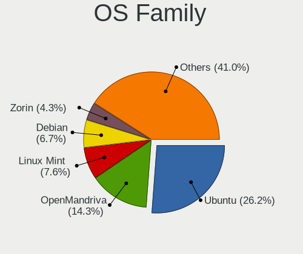

| Name         | Desktops | Percent |
|--------------|----------|---------|
| Ubuntu       | 40       | 35.71%  |
| OpenMandriva | 14       | 12.5%   |
| Linux Mint   | 11       | 9.82%   |
| ROSA         | 6        | 5.36%   |
| Zorin        | 5        | 4.46%   |
| Ubuntu MATE  | 5        | 4.46%   |
| openSUSE     | 4        | 3.57%   |
| Manjaro      | 4        | 3.57%   |
| Linux Lite   | 3        | 2.68%   |
| Kubuntu      | 3        | 2.68%   |
| Debian       | 3        | 2.68%   |
| Xubuntu      | 2        | 1.79%   |
| Lubuntu      | 2        | 1.79%   |
| KDE neon     | 2        | 1.79%   |
| Endless      | 2        | 1.79%   |
| CentOS       | 2        | 1.79%   |
| Peppermint   | 1        | 0.89%   |
| Feren OS     | 1        | 0.89%   |
| Fedora       | 1        | 0.89%   |
| Arch         | 1        | 0.89%   |

Kernel
------

Version of the Linux kernel

| Version                         | Desktops | Percent |
|---------------------------------|----------|---------|
| 5.10.14-desktop-1omv4002        | 7        | 5.34%   |
| 5.16.7-desktop-1omv4003         | 6        | 4.58%   |
| 5.3.0-40-generic                | 5        | 3.82%   |
| 5.4.0-70-generic                | 3        | 2.29%   |
| 5.4.0-66-generic                | 3        | 2.29%   |
| 5.4.0-52-generic                | 3        | 2.29%   |
| 5.4.0-37-generic                | 3        | 2.29%   |
| 5.4.0-31-generic                | 3        | 2.29%   |
| 5.11.0-40-generic               | 3        | 2.29%   |
| 4.18.0-15-generic               | 3        | 2.29%   |
| 5.8.0-48-generic                | 2        | 1.53%   |
| 5.4.0-58-generic                | 2        | 1.53%   |
| 5.4.0-40-generic                | 2        | 1.53%   |
| 5.4.0-29-generic                | 2        | 1.53%   |
| 5.4.0-28-generic                | 2        | 1.53%   |
| 5.3.0-46-generic                | 2        | 1.53%   |
| 5.3.0-26-generic                | 2        | 1.53%   |
| 5.15.0-43-generic               | 2        | 1.53%   |
| 5.15.0-27-generic               | 2        | 1.53%   |
| 4.9.20-nrj-desktop-1rosa-x86_64 | 2        | 1.53%   |
| 4.15.0-54-generic               | 2        | 1.53%   |
| 4.15.0-112-generic              | 2        | 1.53%   |
| 5.9.11-3-MANJARO                | 1        | 0.76%   |
| 5.8.7-1-default                 | 1        | 0.76%   |
| 5.8.0-63-generic                | 1        | 0.76%   |
| 5.8.0-53-generic                | 1        | 0.76%   |
| 5.8.0-45-generic                | 1        | 0.76%   |
| 5.8.0-31-generic                | 1        | 0.76%   |
| 5.8.0-2-amd64                   | 1        | 0.76%   |
| 5.7.9-xanmod1                   | 1        | 0.76%   |
| 5.7.14-200.fc32.x86_64          | 1        | 0.76%   |
| 5.6.19-2-MANJARO                | 1        | 0.76%   |
| 5.6.0-1-default                 | 1        | 0.76%   |
| 5.4.83-generic-2rosa-x86_64     | 1        | 0.76%   |
| 5.4.118-1-MANJARO               | 1        | 0.76%   |
| 5.4.0-81-generic                | 1        | 0.76%   |
| 5.4.0-77-generic                | 1        | 0.76%   |
| 5.4.0-73-generic                | 1        | 0.76%   |
| 5.4.0-48-generic                | 1        | 0.76%   |
| 5.4.0-45-generic                | 1        | 0.76%   |
| 5.4.0-39-generic                | 1        | 0.76%   |
| 5.4.0-33-generic                | 1        | 0.76%   |
| 5.4.0-21-generic                | 1        | 0.76%   |
| 5.4.0-124-generic               | 1        | 0.76%   |
| 5.4.0-104-generic               | 1        | 0.76%   |
| 5.3.18-lp152.19-default         | 1        | 0.76%   |
| 5.3.18-150300.59.54-default     | 1        | 0.76%   |
| 5.3.0-59-generic                | 1        | 0.76%   |
| 5.3.0-51-generic                | 1        | 0.76%   |
| 5.3.0-45-generic                | 1        | 0.76%   |
| 5.3.0-42-generic                | 1        | 0.76%   |
| 5.18.12-desktop-3omv4090        | 1        | 0.76%   |
| 5.17.5-arch1-1                  | 1        | 0.76%   |
| 5.17.1-3-MANJARO                | 1        | 0.76%   |
| 5.17.1-1-default                | 1        | 0.76%   |
| 5.16.0-051600-generic           | 1        | 0.76%   |
| 5.15.0-46-generic               | 1        | 0.76%   |
| 5.15.0-30-generic               | 1        | 0.76%   |
| 5.15.0-25-generic               | 1        | 0.76%   |
| 5.13.0-44-generic               | 1        | 0.76%   |

Kernel Family
-------------

Linux kernel without a distro release

| Version | Desktops | Percent |
|---------|----------|---------|
| 5.4.0   | 29       | 24.17%  |
| 5.3.0   | 11       | 9.17%   |
| 4.15.0  | 10       | 8.33%   |
| 5.10.14 | 7        | 5.83%   |
| 5.8.0   | 6        | 5%      |
| 5.16.7  | 6        | 5%      |
| 5.15.0  | 6        | 5%      |
| 5.13.0  | 6        | 5%      |
| 4.18.0  | 6        | 5%      |
| 5.11.0  | 5        | 4.17%   |
| 5.3.18  | 2        | 1.67%   |
| 5.17.1  | 2        | 1.67%   |
| 5.10.0  | 2        | 1.67%   |
| 4.9.20  | 2        | 1.67%   |
| 5.9.11  | 1        | 0.83%   |
| 5.8.7   | 1        | 0.83%   |
| 5.7.9   | 1        | 0.83%   |
| 5.7.14  | 1        | 0.83%   |
| 5.6.19  | 1        | 0.83%   |
| 5.6.0   | 1        | 0.83%   |
| 5.4.83  | 1        | 0.83%   |
| 5.4.118 | 1        | 0.83%   |
| 5.18.12 | 1        | 0.83%   |
| 5.17.5  | 1        | 0.83%   |
| 5.16.0  | 1        | 0.83%   |
| 5.11.19 | 1        | 0.83%   |
| 5.10.52 | 1        | 0.83%   |
| 5.10.2  | 1        | 0.83%   |
| 5.0.0   | 1        | 0.83%   |
| 4.9.155 | 1        | 0.83%   |
| 4.8.0   | 1        | 0.83%   |
| 4.4.0   | 1        | 0.83%   |
| 4.1.34  | 1        | 0.83%   |
| 4.1.25  | 1        | 0.83%   |

Kernel Major Ver.
-----------------

Linux kernel major version

| Version | Desktops | Percent |
|---------|----------|---------|
| 5.4     | 31       | 25.83%  |
| 5.3     | 13       | 10.83%  |
| 5.10    | 11       | 9.17%   |
| 4.15    | 10       | 8.33%   |
| 5.8     | 7        | 5.83%   |
| 5.16    | 7        | 5.83%   |
| 5.15    | 6        | 5%      |
| 5.13    | 6        | 5%      |
| 5.11    | 6        | 5%      |
| 4.18    | 6        | 5%      |
| 5.17    | 3        | 2.5%    |
| 4.9     | 3        | 2.5%    |
| 5.7     | 2        | 1.67%   |
| 5.6     | 2        | 1.67%   |
| 4.1     | 2        | 1.67%   |
| 5.9     | 1        | 0.83%   |
| 5.18    | 1        | 0.83%   |
| 5.0     | 1        | 0.83%   |
| 4.8     | 1        | 0.83%   |
| 4.4     | 1        | 0.83%   |

Arch
----

OS architecture (x86_64, i586, etc.)

| Name   | Desktops | Percent |
|--------|----------|---------|
| x86_64 | 101      | 92.66%  |
| i686   | 8        | 7.34%   |

DE
--

Desktop Environment

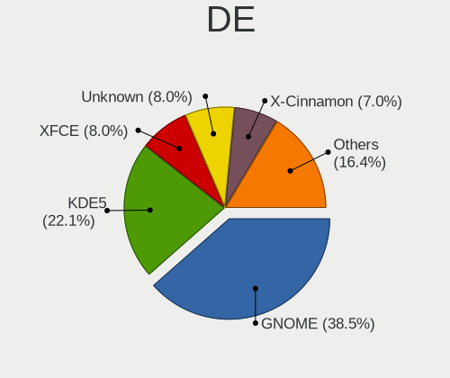

| Name       | Desktops | Percent |
|------------|----------|---------|
| GNOME      | 44       | 38.94%  |
| KDE5       | 22       | 19.47%  |
| XFCE       | 11       | 9.73%   |
| X-Cinnamon | 9        | 7.96%   |
| Unknown    | 9        | 7.96%   |
| MATE       | 7        | 6.19%   |
| KDE4       | 5        | 4.42%   |
| LXDE       | 2        | 1.77%   |
| Unity      | 1        | 0.88%   |
| LXQt       | 1        | 0.88%   |
| KDE        | 1        | 0.88%   |
| awesome    | 1        | 0.88%   |

Display Server
--------------

X11 or Wayland

| Name    | Desktops | Percent |
|---------|----------|---------|
| X11     | 97       | 86.61%  |
| Wayland | 8        | 7.14%   |
| Unknown | 7        | 6.25%   |

Display Manager
---------------

SDDM, LightDM, etc.

| Name    | Desktops | Percent |
|---------|----------|---------|
| Unknown | 61       | 53.51%  |
| SDDM    | 20       | 17.54%  |
| GDM3    | 12       | 10.53%  |
| LightDM | 7        | 6.14%   |
| GDM     | 6        | 5.26%   |
| KDM     | 5        | 4.39%   |
| TDM     | 3        | 2.63%   |

OS Lang
-------

Language

| Lang    | Desktops | Percent |
|---------|----------|---------|
| es_PE   | 62       | 56.88%  |
| en_US   | 22       | 20.18%  |
| Unknown | 11       | 10.09%  |
| es_ES   | 9        | 8.26%   |
| es_MX   | 2        | 1.83%   |
| es_US   | 1        | 0.92%   |
| en_GB   | 1        | 0.92%   |
| C       | 1        | 0.92%   |

Boot Mode
---------

EFI or BIOS

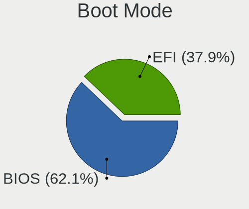

| Mode | Desktops | Percent |
|------|----------|---------|
| BIOS | 72       | 65.45%  |
| EFI  | 38       | 34.55%  |

Filesystem
----------

Type of filesystem

| Type    | Desktops | Percent |
|---------|----------|---------|
| Ext4    | 83       | 74.11%  |
| Overlay | 14       | 12.5%   |
| Unknown | 7        | 6.25%   |
| Btrfs   | 4        | 3.57%   |
| Xfs     | 2        | 1.79%   |
| Ext3    | 2        | 1.79%   |

Part. scheme
------------

Scheme of partitioning

| Type    | Desktops | Percent |
|---------|----------|---------|
| Unknown | 75       | 66.96%  |
| GPT     | 24       | 21.43%  |
| MBR     | 13       | 11.61%  |

Dual Boot with Linux/BSD
------------------------

Hosting more than one Linux/BSD

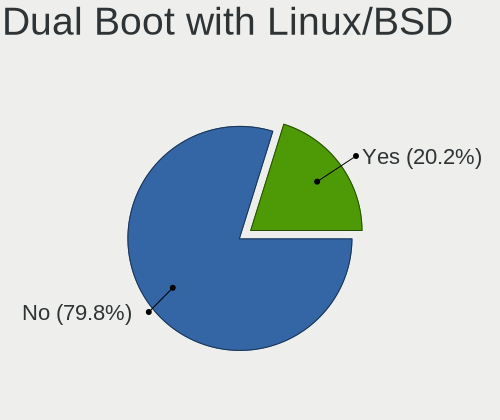

| Dual boot | Desktops | Percent |
|-----------|----------|---------|
| No        | 91       | 79.82%  |
| Yes       | 23       | 20.18%  |

Dual Boot (Win)
---------------

Hosting Linux and Windows

| Dual boot | Desktops | Percent |
|-----------|----------|---------|
| No        | 65       | 58.04%  |
| Yes       | 47       | 41.96%  |

Board
-----

Vendor
------

Motherboard manufacturer

| Name                | Desktops | Percent |
|---------------------|----------|---------|
| Gigabyte Technology | 28       | 25.69%  |
| Intel               | 21       | 19.27%  |
| MSI                 | 14       | 12.84%  |
| ASUSTek Computer    | 14       | 12.84%  |
| Hewlett-Packard     | 7        | 6.42%   |
| Foxconn             | 6        | 5.5%    |
| Dell                | 5        | 4.59%   |
| Lenovo              | 4        | 3.67%   |
| ASRock              | 4        | 3.67%   |
| SZMZ                | 1        | 0.92%   |
| PCChips             | 1        | 0.92%   |
| ECS                 | 1        | 0.92%   |
| Biostar             | 1        | 0.92%   |
| AMI                 | 1        | 0.92%   |
| Unknown             | 1        | 0.92%   |

Model
-----

Motherboard model

| Name                                   | Desktops | Percent |
|----------------------------------------|----------|---------|
| MSI MS-7721                            | 3        | 2.75%   |
| Gigabyte 970A-DS3P                     | 3        | 2.75%   |
| Intel DH55PJ AAE93812-303              | 2        | 1.83%   |
| Gigabyte Z77X-UD5H                     | 2        | 1.83%   |
| Gigabyte B75M-D3H                      | 2        | 1.83%   |
| Foxconn 500B Microtower                | 2        | 1.83%   |
| Dell OptiPlex 7010                     | 2        | 1.83%   |
| ASUS TUF Gaming B550M-PLUS             | 2        | 1.83%   |
| ASUS PRIME X570-P                      | 2        | 1.83%   |
| ASUS All Series                        | 2        | 1.83%   |
| SZMZ X99 DUAL Z8                       | 1        | 0.92%   |
| PCChips P49G                           | 1        | 0.92%   |
| MSI MS-7D18                            | 1        | 0.92%   |
| MSI MS-7C88                            | 1        | 0.92%   |
| MSI MS-7C52                            | 1        | 0.92%   |
| MSI MS-7B53                            | 1        | 0.92%   |
| MSI MS-7A33                            | 1        | 0.92%   |
| MSI MS-7A15                            | 1        | 0.92%   |
| MSI MS-7978                            | 1        | 0.92%   |
| MSI MS-7900                            | 1        | 0.92%   |
| MSI MS-7817                            | 1        | 0.92%   |
| MSI MS-7758                            | 1        | 0.92%   |
| MSI MS-7693                            | 1        | 0.92%   |
| Lenovo ThinkCentre M91 7516AD1         | 1        | 0.92%   |
| Lenovo ThinkCentre M73 10B7A0UD00      | 1        | 0.92%   |
| Lenovo ThinkCentre M72z 3548B2S        | 1        | 0.92%   |
| Lenovo ThinkCentre M710q 10MQSC0N00    | 1        | 0.92%   |
| Intel H61M-DS2                         | 1        | 0.92%   |
| Intel H61                              | 1        | 0.92%   |
| Intel DX79SR AAG57199-200              | 1        | 0.92%   |
| Intel DX58SO AAE29331-703              | 1        | 0.92%   |
| Intel DP965LT AAD41694-209             | 1        | 0.92%   |
| Intel DP67BA AAG10219-300              | 1        | 0.92%   |
| Intel DH61WW AAG23116-302              | 1        | 0.92%   |
| Intel DH61WW AAG23116-204              | 1        | 0.92%   |
| Intel DH61CR AAG14064-204              | 1        | 0.92%   |
| Intel DH55TC AAE70932-302              | 1        | 0.92%   |
| Intel DG41WV AAE90316-104              | 1        | 0.92%   |
| Intel DG33BU AAD79951-413              | 1        | 0.92%   |
| Intel DG31PR AAD97573-305              | 1        | 0.92%   |
| Intel DG31PR AAD97573-206              | 1        | 0.92%   |
| Intel D945GTP AAC97834-305             | 1        | 0.92%   |
| Intel D945GCNL AAD97184-102            | 1        | 0.92%   |
| Intel D102GGC2 AAD42789-204            | 1        | 0.92%   |
| Intel CM8V5CB8N                        | 1        | 0.92%   |
| Intel 945GCT-M                         | 1        | 0.92%   |
| HP EliteDesk 800 G2 SFF                | 1        | 0.92%   |
| HP EliteDesk 800 G2 DM 65W             | 1        | 0.92%   |
| HP Compaq Elite 8300 SFF               | 1        | 0.92%   |
| HP Compaq dc7700 Convertible Minitower | 1        | 0.92%   |
| HP Compaq dc5700 Small Form Factor     | 1        | 0.92%   |
| HP Compaq dc5100 SFF(PM215AV)          | 1        | 0.92%   |
| HP Compaq 4000 Pro SFF PC              | 1        | 0.92%   |
| Gigabyte X570 AORUS MASTER             | 1        | 0.92%   |
| Gigabyte M68MT-S2                      | 1        | 0.92%   |
| Gigabyte M61PME-S2P                    | 1        | 0.92%   |
| Gigabyte H81M-H                        | 1        | 0.92%   |
| Gigabyte H110M-M.2                     | 1        | 0.92%   |
| Gigabyte H110M-H                       | 1        | 0.92%   |
| Gigabyte GA-MA790XT-UD4P               | 1        | 0.92%   |

Model Family
------------

Motherboard model prefix

| Name                     | Desktops | Percent |
|--------------------------|----------|---------|
| HP Compaq                | 5        | 4.59%   |
| Dell OptiPlex            | 5        | 4.59%   |
| ASUS PRIME               | 5        | 4.59%   |
| Lenovo ThinkCentre       | 4        | 3.67%   |
| MSI MS-7721              | 3        | 2.75%   |
| Gigabyte 970A-DS3P       | 3        | 2.75%   |
| ASUS TUF                 | 3        | 2.75%   |
| Intel DH61WW             | 2        | 1.83%   |
| Intel DH55PJ             | 2        | 1.83%   |
| Intel DG31PR             | 2        | 1.83%   |
| HP EliteDesk             | 2        | 1.83%   |
| Gigabyte Z77X-UD5H       | 2        | 1.83%   |
| Gigabyte B75M-D3H        | 2        | 1.83%   |
| Foxconn H61MXE           | 2        | 1.83%   |
| Foxconn 500B             | 2        | 1.83%   |
| ASUS All                 | 2        | 1.83%   |
| ASRock X570              | 2        | 1.83%   |
| SZMZ X99                 | 1        | 0.92%   |
| PCChips P49G             | 1        | 0.92%   |
| MSI MS-7D18              | 1        | 0.92%   |
| MSI MS-7C88              | 1        | 0.92%   |
| MSI MS-7C52              | 1        | 0.92%   |
| MSI MS-7B53              | 1        | 0.92%   |
| MSI MS-7A33              | 1        | 0.92%   |
| MSI MS-7A15              | 1        | 0.92%   |
| MSI MS-7978              | 1        | 0.92%   |
| MSI MS-7900              | 1        | 0.92%   |
| MSI MS-7817              | 1        | 0.92%   |
| MSI MS-7758              | 1        | 0.92%   |
| MSI MS-7693              | 1        | 0.92%   |
| Intel H61M-DS2           | 1        | 0.92%   |
| Intel H61                | 1        | 0.92%   |
| Intel DX79SR             | 1        | 0.92%   |
| Intel DX58SO             | 1        | 0.92%   |
| Intel DP965LT            | 1        | 0.92%   |
| Intel DP67BA             | 1        | 0.92%   |
| Intel DH61CR             | 1        | 0.92%   |
| Intel DH55TC             | 1        | 0.92%   |
| Intel DG41WV             | 1        | 0.92%   |
| Intel DG33BU             | 1        | 0.92%   |
| Intel D945GTP            | 1        | 0.92%   |
| Intel D945GCNL           | 1        | 0.92%   |
| Intel D102GGC2           | 1        | 0.92%   |
| Intel CM8V5CB8N          | 1        | 0.92%   |
| Intel 945GCT-M           | 1        | 0.92%   |
| Gigabyte X570            | 1        | 0.92%   |
| Gigabyte M68MT-S2        | 1        | 0.92%   |
| Gigabyte M61PME-S2P      | 1        | 0.92%   |
| Gigabyte H81M-H          | 1        | 0.92%   |
| Gigabyte H110M-M.2       | 1        | 0.92%   |
| Gigabyte H110M-H         | 1        | 0.92%   |
| Gigabyte GA-MA790XT-UD4P | 1        | 0.92%   |
| Gigabyte GA-970A-D3      | 1        | 0.92%   |
| Gigabyte GA-890FXA-UD5   | 1        | 0.92%   |
| Gigabyte G41MT-S2        | 1        | 0.92%   |
| Gigabyte G1.Sniper       | 1        | 0.92%   |
| Gigabyte F2A68HM-H       | 1        | 0.92%   |
| Gigabyte EP35C-DS3R      | 1        | 0.92%   |
| Gigabyte B550M           | 1        | 0.92%   |
| Gigabyte B550            | 1        | 0.92%   |

MFG Year
--------

Motherboard manufacture year

| Year | Desktops | Percent |
|------|----------|---------|
| 2012 | 12       | 11.01%  |
| 2010 | 12       | 11.01%  |
| 2020 | 11       | 10.09%  |
| 2019 | 10       | 9.17%   |
| 2013 | 9        | 8.26%   |
| 2015 | 8        | 7.34%   |
| 2011 | 7        | 6.42%   |
| 2007 | 7        | 6.42%   |
| 2018 | 6        | 5.5%    |
| 2017 | 5        | 4.59%   |
| 2014 | 5        | 4.59%   |
| 2008 | 5        | 4.59%   |
| 2016 | 4        | 3.67%   |
| 2009 | 4        | 3.67%   |
| 2006 | 2        | 1.83%   |
| 2021 | 1        | 0.92%   |
| 2004 | 1        | 0.92%   |

Form Factor
-----------

Physical design of the computer

| Name    | Desktops | Percent |
|---------|----------|---------|
| Desktop | 109      | 100%    |

Secure Boot
-----------

Enabled or disabled

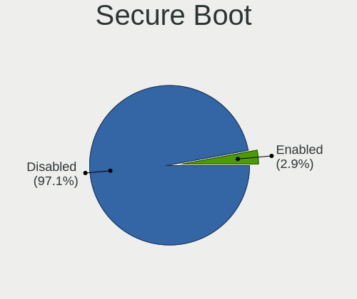

| State    | Desktops | Percent |
|----------|----------|---------|
| Disabled | 107      | 98.17%  |
| Enabled  | 2        | 1.83%   |

Coreboot
--------

Have coreboot on board

| Used | Desktops | Percent |
|------|----------|---------|
| No   | 109      | 100%    |

RAM Size
--------

Total RAM memory

| Size in GB  | Desktops | Percent |
|-------------|----------|---------|
| 3.01-4.0    | 27       | 23.89%  |
| 8.01-16.0   | 25       | 22.12%  |
| 4.01-8.0    | 19       | 16.81%  |
| 16.01-24.0  | 18       | 15.93%  |
| 32.01-64.0  | 10       | 8.85%   |
| 1.01-2.0    | 6        | 5.31%   |
| 24.01-32.0  | 3        | 2.65%   |
| 2.01-3.0    | 2        | 1.77%   |
| 64.01-256.0 | 2        | 1.77%   |
| 0.51-1.0    | 1        | 0.88%   |

RAM Used
--------

Used RAM memory

| Used GB    | Desktops | Percent |
|------------|----------|---------|
| 1.01-2.0   | 50       | 40.65%  |
| 2.01-3.0   | 28       | 22.76%  |
| 0.51-1.0   | 15       | 12.2%   |
| 4.01-8.0   | 14       | 11.38%  |
| 3.01-4.0   | 13       | 10.57%  |
| 8.01-16.0  | 2        | 1.63%   |
| 16.01-24.0 | 1        | 0.81%   |

Total Drives
------------

Number of drives on board

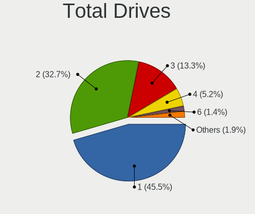

| Drives | Desktops | Percent |
|--------|----------|---------|
| 1      | 57       | 50%     |
| 2      | 35       | 30.7%   |
| 3      | 13       | 11.4%   |
| 4      | 8        | 7.02%   |
| 5      | 1        | 0.88%   |

Has CD-ROM
----------

Has CD-ROM on board

| Presented | Desktops | Percent |
|-----------|----------|---------|
| Yes       | 55       | 50.46%  |
| No        | 54       | 49.54%  |

Has Ethernet
------------

Has Ethernet on board

| Presented | Desktops | Percent |
|-----------|----------|---------|
| Yes       | 108      | 99.08%  |
| No        | 1        | 0.92%   |

Has WiFi
--------

Has WiFi module

| Presented | Desktops | Percent |
|-----------|----------|---------|
| No        | 79       | 69.3%   |
| Yes       | 35       | 30.7%   |

Has Bluetooth
-------------

Has Bluetooth module

| Presented | Desktops | Percent |
|-----------|----------|---------|
| No        | 90       | 81.08%  |
| Yes       | 21       | 18.92%  |

Location
--------

Country
-------

Geographic location (country)

| Country | Desktops | Percent |
|---------|----------|---------|
| Peru    | 109      | 100%    |

City
----

Geographic location (city)

| City             | Desktops | Percent |
|------------------|----------|---------|
| Lima             | 73       | 65.77%  |
| Trujillo         | 9        | 8.11%   |
| Arequipa         | 6        | 5.41%   |
| Tacna            | 3        | 2.7%    |
| Moquegua         | 3        | 2.7%    |
| Huancayo         | 3        | 2.7%    |
| Piura            | 2        | 1.8%    |
| Junin            | 2        | 1.8%    |
| Chiclayo         | 2        | 1.8%    |
| Villa            | 1        | 0.9%    |
| Puno             | 1        | 0.9%    |
| Pucallpa         | 1        | 0.9%    |
| Ica              | 1        | 0.9%    |
| Distrito de Lima | 1        | 0.9%    |
| Cusco            | 1        | 0.9%    |
| Barranco         | 1        | 0.9%    |
| Abancay          | 1        | 0.9%    |

Drives
------

Drive Vendor
------------

Hard drive vendors

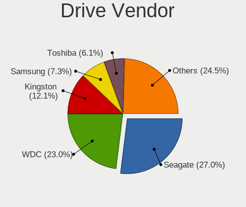

| Vendor                    | Desktops | Drives | Percent |
|---------------------------|----------|--------|---------|
| Seagate                   | 51       | 88     | 31.68%  |
| WDC                       | 36       | 59     | 22.36%  |
| Kingston                  | 17       | 21     | 10.56%  |
| Samsung Electronics       | 15       | 20     | 9.32%   |
| Toshiba                   | 9        | 10     | 5.59%   |
| Crucial                   | 6        | 9      | 3.73%   |
| Hewlett-Packard           | 4        | 5      | 2.48%   |
| PNY                       | 3        | 3      | 1.86%   |
| Micron/Crucial Technology | 3        | 3      | 1.86%   |
| A-DATA Technology         | 3        | 3      | 1.86%   |
| Team                      | 2        | 2      | 1.24%   |
| Silicon Motion            | 2        | 2      | 1.24%   |
| SanDisk                   | 2        | 2      | 1.24%   |
| Hitachi                   | 2        | 4      | 1.24%   |
| WD MediaMax               | 1        | 1      | 0.62%   |
| Mushkin                   | 1        | 2      | 0.62%   |
| Maxone                    | 1        | 2      | 0.62%   |
| LITEON                    | 1        | 1      | 0.62%   |
| KESU                      | 1        | 1      | 0.62%   |
| Intel                     | 1        | 1      | 0.62%   |

Drive Model
-----------

Hard drive models

| Model                             | Desktops | Percent |
|-----------------------------------|----------|---------|
| Seagate ST500DM002-1BD142 500GB   | 13       | 6.77%   |
| Seagate ST1000DM010-2EP102 1TB    | 6        | 3.13%   |
| Seagate ST3500418AS 500GB         | 4        | 2.08%   |
| Seagate ST3500413AS 500GB         | 4        | 2.08%   |
| Seagate ST2000DM001-1ER164 2TB    | 4        | 2.08%   |
| Seagate ST1000LM035-1RK172 1TB    | 4        | 2.08%   |
| Kingston SA400S37120G 120GB SSD   | 4        | 2.08%   |
| WDC WD10EZEX-08WN4A0 1TB          | 3        | 1.56%   |
| Toshiba DT01ACA100 1TB            | 3        | 1.56%   |
| Seagate ST3500312CS 500GB         | 3        | 1.56%   |
| Seagate ST2000DM006-2DM164 2TB    | 3        | 1.56%   |
| Seagate ST1000DM003-1CH162 1TB    | 3        | 1.56%   |
| Kingston SA400S37480G 480GB SSD   | 3        | 1.56%   |
| Kingston SA400S37240G 240GB SSD   | 3        | 1.56%   |
| Kingston NVMe SSD Drive 500GB     | 3        | 1.56%   |
| HP SSD S700 500GB                 | 3        | 1.56%   |
| WDC WDS480G2G0A-00JH30 480GB SSD  | 2        | 1.04%   |
| WDC WDS100T2B0C-00PXH0 1TB        | 2        | 1.04%   |
| WDC WD3200BPVT-22ZEST0 320GB      | 2        | 1.04%   |
| WDC WD10EZEX-08M2NA0 1TB          | 2        | 1.04%   |
| Seagate ST2000DL003-9VT166 2TB    | 2        | 1.04%   |
| Seagate ST1000DM003-1ER162 1TB    | 2        | 1.04%   |
| Seagate Expansion 500GB           | 2        | 1.04%   |
| Samsung HD322HJ 320GB             | 2        | 1.04%   |
| Samsung HD161HJ 160GB             | 2        | 1.04%   |
| Samsung HD080HJ 80GB              | 2        | 1.04%   |
| Micron/Crucial NVMe SSD Drive 1TB | 2        | 1.04%   |
| Kingston SV300S37A120G 120GB SSD  | 2        | 1.04%   |
| Kingston SNVS250G 250GB           | 2        | 1.04%   |
| Crucial CT1000P1SSD8 1TB          | 2        | 1.04%   |
| WDC WDS480G2G0B-00EPW0 480GB SSD  | 1        | 0.52%   |
| WDC WDS250G2B0B 250GB SSD         | 1        | 0.52%   |
| WDC WDS250G2B0A-00SM50 250GB SSD  | 1        | 0.52%   |
| WDC WDS250G2B0A 250GB SSD         | 1        | 0.52%   |
| WDC WDS250G1B0A-00H9H0 250GB SSD  | 1        | 0.52%   |
| WDC WDS240G2G0A-00JH30 240GB SSD  | 1        | 0.52%   |
| WDC WDS120G2G0A-00JH30 120GB SSD  | 1        | 0.52%   |
| WDC WDS100T3X0C-00SJG0 1TB        | 1        | 0.52%   |
| WDC WD80EFAX-68KNBN0 8TB          | 1        | 0.52%   |
| WDC WD800JD-60LSA5 80GB           | 1        | 0.52%   |
| WDC WD800BD-00MRA1 80GB           | 1        | 0.52%   |
| WDC WD7500BPVT-55HXZT3 752GB      | 1        | 0.52%   |
| WDC WD60PURZ-85ZUFY1 6TB          | 1        | 0.52%   |
| WDC WD5000LPVT-22G33T0 500GB      | 1        | 0.52%   |
| WDC WD5000AAKX-60U6AA0 500GB      | 1        | 0.52%   |
| WDC WD5000AAKX-08U6AA0 500GB      | 1        | 0.52%   |
| WDC WD5000AAKX-083CA1 500GB       | 1        | 0.52%   |
| WDC WD40EFRX-68N32N0 4TB          | 1        | 0.52%   |
| WDC WD400BD-75LRA0 40GB           | 1        | 0.52%   |
| WDC WD3200AAKS-75L9A0 320GB       | 1        | 0.52%   |
| WDC WD3200AAKS-00V1A0 320GB       | 1        | 0.52%   |
| WDC WD3200AAJS-60Z0A0 320GB       | 1        | 0.52%   |
| WDC WD3200AAJS-56M0A0 320GB       | 1        | 0.52%   |
| WDC WD3200AAJS-00L7A0 320GB       | 1        | 0.52%   |
| WDC WD30EZRZ-00WN9B0 1 3TB        | 1        | 0.52%   |
| WDC WD20EARX-00PASB0 2TB          | 1        | 0.52%   |
| WDC WD1600YS-01SHB1 164GB         | 1        | 0.52%   |
| WDC WD1600AAJS-60M0A0 160GB       | 1        | 0.52%   |
| WDC WD10SPZX-24Z10 1TB            | 1        | 0.52%   |
| WDC WD10SPCX-24HWST1 1TB          | 1        | 0.52%   |

HDD Vendor
----------

Hard disk drive vendors

| Vendor              | Desktops | Drives | Percent |
|---------------------|----------|--------|---------|
| Seagate             | 51       | 88     | 49.04%  |
| WDC                 | 29       | 41     | 27.88%  |
| Samsung Electronics | 12       | 16     | 11.54%  |
| Toshiba             | 9        | 10     | 8.65%   |
| Hitachi             | 2        | 4      | 1.92%   |
| KESU                | 1        | 1      | 0.96%   |

SSD Vendor
----------

Solid state drive vendors

| Vendor            | Desktops | Drives | Percent |
|-------------------|----------|--------|---------|
| Kingston          | 12       | 13     | 30%     |
| WDC               | 9        | 14     | 22.5%   |
| Hewlett-Packard   | 4        | 4      | 10%     |
| Crucial           | 4        | 6      | 10%     |
| PNY               | 3        | 3      | 7.5%    |
| A-DATA Technology | 3        | 3      | 7.5%    |
| Team              | 2        | 2      | 5%      |
| Maxone            | 1        | 2      | 2.5%    |
| LITEON            | 1        | 1      | 2.5%    |
| Intel             | 1        | 1      | 2.5%    |

Drive Kind
----------

HDD or SSD

| Kind    | Desktops | Drives | Percent |
|---------|----------|--------|---------|
| HDD     | 88       | 160    | 59.86%  |
| SSD     | 36       | 49     | 24.49%  |
| NVMe    | 21       | 28     | 14.29%  |
| MMC     | 1        | 1      | 0.68%   |
| Unknown | 1        | 1      | 0.68%   |

Drive Connector
---------------

SATA, SAS, NVMe, etc.

| Type | Desktops | Drives | Percent |
|------|----------|--------|---------|
| SATA | 103      | 207    | 80.47%  |
| NVMe | 21       | 28     | 16.41%  |
| SAS  | 3        | 3      | 2.34%   |
| MMC  | 1        | 1      | 0.78%   |

Drive Size
----------

Size of hard drive

| Size in TB | Desktops | Drives | Percent |
|------------|----------|--------|---------|
| 0.01-0.5   | 79       | 133    | 59.85%  |
| 0.51-1.0   | 36       | 47     | 27.27%  |
| 1.01-2.0   | 12       | 21     | 9.09%   |
| 3.01-4.0   | 2        | 3      | 1.52%   |
| 4.01-10.0  | 2        | 4      | 1.52%   |
| 2.01-3.0   | 1        | 1      | 0.76%   |

Space Total
-----------

Amount of disk space available on the file system

| Size in GB     | Desktops | Percent |
|----------------|----------|---------|
| 251-500        | 35       | 29.17%  |
| 501-1000       | 20       | 16.67%  |
| 101-250        | 17       | 14.17%  |
| 51-100         | 11       | 9.17%   |
| 2001-3000      | 10       | 8.33%   |
| 1-20           | 8        | 6.67%   |
| 1001-2000      | 6        | 5%      |
| 21-50          | 5        | 4.17%   |
| More than 3000 | 4        | 3.33%   |
| Unknown        | 4        | 3.33%   |

Space Used
----------

Amount of used disk space

| Used GB        | Desktops | Percent |
|----------------|----------|---------|
| 1-20           | 46       | 37.4%   |
| 21-50          | 18       | 14.63%  |
| 251-500        | 16       | 13.01%  |
| 101-250        | 12       | 9.76%   |
| 51-100         | 10       | 8.13%   |
| 501-1000       | 8        | 6.5%    |
| 1001-2000      | 6        | 4.88%   |
| Unknown        | 4        | 3.25%   |
| More than 3000 | 3        | 2.44%   |

Malfunc. Drives
---------------

Drive models with a malfunction

| Model                             | Desktops | Drives | Percent |
|-----------------------------------|----------|--------|---------|
| Seagate ST500DM002-1BD142 500GB   | 3        | 3      | 16.67%  |
| WDC WD800BD-00MRA1 80GB           | 1        | 1      | 5.56%   |
| WDC WD3200AAJS-56M0A0 320GB       | 1        | 1      | 5.56%   |
| WDC WD3200AAJS-00L7A0 320GB       | 1        | 1      | 5.56%   |
| Seagate ST980811AS 80GB           | 1        | 1      | 5.56%   |
| Seagate ST500LT012-1DG142 500GB   | 1        | 1      | 5.56%   |
| Seagate ST500DM002-9YN14C 500GB   | 1        | 1      | 5.56%   |
| Seagate ST3500418AS 500GB         | 1        | 1      | 5.56%   |
| Seagate ST3250820AS 250GB         | 1        | 1      | 5.56%   |
| Seagate ST1000LM035-1RK172 1TB    | 1        | 1      | 5.56%   |
| Seagate ST1000DM003-9YN162 1TB    | 1        | 1      | 5.56%   |
| Seagate ST1000DM003-1CH162 1TB    | 1        | 1      | 5.56%   |
| Samsung Electronics SP1644N 160GB | 1        | 1      | 5.56%   |
| Samsung Electronics HD161HJ 160GB | 1        | 2      | 5.56%   |
| Hitachi HTS545032B9A300 320GB     | 1        | 1      | 5.56%   |
| A-DATA Technology SP550 240GB SSD | 1        | 1      | 5.56%   |

Malfunc. Drive Vendor
---------------------

Vendors of faulty drives

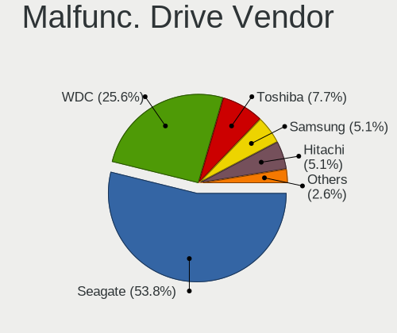

| Vendor              | Desktops | Drives | Percent |
|---------------------|----------|--------|---------|
| Seagate             | 11       | 11     | 61.11%  |
| WDC                 | 3        | 3      | 16.67%  |
| Samsung Electronics | 2        | 3      | 11.11%  |
| Hitachi             | 1        | 1      | 5.56%   |
| A-DATA Technology   | 1        | 1      | 5.56%   |

Malfunc. HDD Vendor
-------------------

Vendors of faulty HDD drives

| Vendor              | Desktops | Drives | Percent |
|---------------------|----------|--------|---------|
| Seagate             | 11       | 11     | 64.71%  |
| WDC                 | 3        | 3      | 17.65%  |
| Samsung Electronics | 2        | 3      | 11.76%  |
| Hitachi             | 1        | 1      | 5.88%   |

Malfunc. Drive Kind
-------------------

Kinds of faulty drives

| Kind | Desktops | Drives | Percent |
|------|----------|--------|---------|
| HDD  | 15       | 18     | 93.75%  |
| SSD  | 1        | 1      | 6.25%   |

Failed Drives
-------------

Failed drive models

Zero info for selected period =(

Failed Drive Vendor
-------------------

Failed drive vendors

Zero info for selected period =(

Drive Status
------------

Number of failed and malfunc. drives

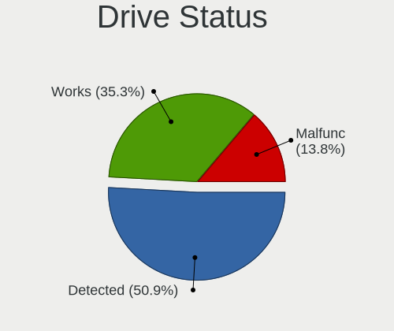

| Status   | Desktops | Drives | Percent |
|----------|----------|--------|---------|
| Detected | 70       | 152    | 57.38%  |
| Works    | 36       | 68     | 29.51%  |
| Malfunc  | 16       | 19     | 13.11%  |

Storage controller
------------------

Storage Vendor
--------------

Storage controller vendors

| Vendor                      | Desktops | Percent |
|-----------------------------|----------|---------|
| Intel                       | 67       | 47.86%  |
| AMD                         | 37       | 26.43%  |
| Marvell Technology Group    | 6        | 4.29%   |
| Kingston Technology Company | 6        | 4.29%   |
| Micron/Crucial Technology   | 5        | 3.57%   |
| Silicon Motion              | 4        | 2.86%   |
| SanDisk                     | 4        | 2.86%   |
| Nvidia                      | 4        | 2.86%   |
| Samsung Electronics         | 3        | 2.14%   |
| JMicron Technology          | 3        | 2.14%   |
| LSI Logic / Symbios Logic   | 1        | 0.71%   |

Storage Model
-------------

Storage controller models

| Model                                                                                   | Desktops | Percent |
|-----------------------------------------------------------------------------------------|----------|---------|
| AMD FCH SATA Controller [AHCI mode]                                                     | 21       | 11.54%  |
| Intel NM10/ICH7 Family SATA Controller [IDE mode]                                       | 11       | 6.04%   |
| Intel 82801G (ICH7 Family) IDE Controller                                               | 8        | 4.4%    |
| Intel 7 Series/C210 Series Chipset Family 6-port SATA Controller [AHCI mode]            | 8        | 4.4%    |
| Intel Q170/Q150/B150/H170/H110/Z170/CM236 Chipset SATA Controller [AHCI Mode]           | 7        | 3.85%   |
| Intel 6 Series/C200 Series Chipset Family 6 port Desktop SATA AHCI Controller           | 7        | 3.85%   |
| AMD SB7x0/SB8x0/SB9x0 IDE Controller                                                    | 7        | 3.85%   |
| Intel 8 Series/C220 Series Chipset Family 6-port SATA Controller 1 [AHCI mode]          | 6        | 3.3%    |
| AMD SB7x0/SB8x0/SB9x0 SATA Controller [IDE mode]                                        | 6        | 3.3%    |
| AMD 500 Series Chipset SATA Controller                                                  | 6        | 3.3%    |
| Micron/Crucial NVMe Controller                                                          | 4        | 2.2%    |
| Silicon Motion SM2263EN/SM2263XT SSD Controller                                         | 3        | 1.65%   |
| Nvidia MCP61 SATA Controller                                                            | 3        | 1.65%   |
| JMicron JMB363 SATA/IDE Controller                                                      | 3        | 1.65%   |
| Intel 6 Series/C200 Series Chipset Family Desktop SATA Controller (IDE mode, ports 4-5) | 3        | 1.65%   |
| Intel 6 Series/C200 Series Chipset Family Desktop SATA Controller (IDE mode, ports 0-3) | 3        | 1.65%   |
| Intel 5 Series/3400 Series Chipset PT IDER Controller                                   | 3        | 1.65%   |
| Intel 5 Series/3400 Series Chipset 4 port SATA IDE Controller                           | 3        | 1.65%   |
| AMD SB7x0/SB8x0/SB9x0 SATA Controller [AHCI mode]                                       | 3        | 1.65%   |
| AMD 400 Series Chipset SATA Controller                                                  | 3        | 1.65%   |
| SanDisk WD Blue SN550 NVMe SSD                                                          | 2        | 1.1%    |
| SanDisk WD Black SN750 / PC SN730 NVMe SSD                                              | 2        | 1.1%    |
| Samsung NVMe SSD Controller SM981/PM981/PM983                                           | 2        | 1.1%    |
| Nvidia MCP61 IDE                                                                        | 2        | 1.1%    |
| Micron/Crucial P2 NVMe PCIe SSD                                                         | 2        | 1.1%    |
| Marvell Group 88SE9172 SATA 6Gb/s Controller                                            | 2        | 1.1%    |
| Marvell Group 88SE6101/6102 single-port PATA133 interface                               | 2        | 1.1%    |
| Kingston Company Company Non-Volatile memory controller                                 | 2        | 1.1%    |
| Kingston Company SNVS2000G [NV1 NVMe PCIe SSD 2TB]                                      | 2        | 1.1%    |
| Kingston Company A2000 NVMe SSD                                                         | 2        | 1.1%    |
| Intel Cannon Lake PCH SATA AHCI Controller                                              | 2        | 1.1%    |
| Intel 82801JD/DO (ICH10 Family) 4-port SATA IDE Controller                              | 2        | 1.1%    |
| Intel 82801JD/DO (ICH10 Family) 2-port SATA IDE Controller                              | 2        | 1.1%    |
| Intel 82801IR/IO/IH (ICH9R/DO/DH) 6 port SATA Controller [AHCI mode]                    | 2        | 1.1%    |
| Intel 82801H (ICH8 Family) 4 port SATA Controller [IDE mode]                            | 2        | 1.1%    |
| Intel 400 Series Chipset Family SATA AHCI Controller                                    | 2        | 1.1%    |
| Intel 200 Series PCH SATA controller [AHCI mode]                                        | 2        | 1.1%    |
| AMD X370 Series Chipset SATA Controller                                                 | 2        | 1.1%    |
| AMD FCH SATA Controller D                                                               | 2        | 1.1%    |
| Silicon Motion SM2262/SM2262EN SSD Controller                                           | 1        | 0.55%   |
| Samsung NVMe SSD Controller SM961/PM961/SM963                                           | 1        | 0.55%   |
| Nvidia MCP67 IDE Controller                                                             | 1        | 0.55%   |
| Nvidia MCP67 AHCI Controller                                                            | 1        | 0.55%   |
| Marvell Group 88SE9128 PCIe SATA 6 Gb/s RAID controller with HyperDuo                   | 1        | 0.55%   |
| Marvell Group 88SE6111/6121 SATA II / PATA Controller                                   | 1        | 0.55%   |
| LSI Logic / Symbios Logic SAS1064ET PCI-Express Fusion-MPT SAS                          | 1        | 0.55%   |
| Intel Celeron/Pentium Silver Processor SATA Controller                                  | 1        | 0.55%   |
| Intel Cannon Point-LP SATA Controller [AHCI Mode]                                       | 1        | 0.55%   |
| Intel C610/X99 series chipset sSATA Controller [AHCI mode]                              | 1        | 0.55%   |
| Intel C600/X79 series chipset 6-Port SATA AHCI Controller                               | 1        | 0.55%   |
| Intel 9 Series Chipset Family SATA Controller [AHCI Mode]                               | 1        | 0.55%   |
| Intel 82Q35 Express PT IDER Controller                                                  | 1        | 0.55%   |
| Intel 82801JI (ICH10 Family) SATA AHCI Controller                                       | 1        | 0.55%   |
| Intel 82801IR/IO/IH (ICH9R/DO/DH) 4 port SATA Controller [IDE mode]                     | 1        | 0.55%   |
| Intel 82801I (ICH9 Family) 2 port SATA Controller [IDE mode]                            | 1        | 0.55%   |
| Intel 82801HR/HO/HH (ICH8R/DO/DH) 2 port SATA Controller [IDE mode]                     | 1        | 0.55%   |
| Intel 82801HB (ICH8) 4 port SATA Controller [AHCI mode]                                 | 1        | 0.55%   |
| Intel 82801FB/FW (ICH6/ICH6W) SATA Controller                                           | 1        | 0.55%   |
| Intel 82801FB/FBM/FR/FW/FRW (ICH6 Family) IDE Controller                                | 1        | 0.55%   |
| Intel 500 Series Chipset Family SATA AHCI Controller                                    | 1        | 0.55%   |

Storage Kind
------------

Kind of storage controller (IDE, SATA, NVMe, SAS, ...)

| Kind | Desktops | Percent |
|------|----------|---------|
| SATA | 80       | 56.74%  |
| IDE  | 39       | 27.66%  |
| NVMe | 21       | 14.89%  |
| SCSI | 1        | 0.71%   |

Processor
---------

CPU Vendor
----------

Processor vendors

| Vendor | Desktops | Percent |
|--------|----------|---------|
| Intel  | 69       | 63.3%   |
| AMD    | 40       | 36.7%   |

CPU Model
---------

Processor models

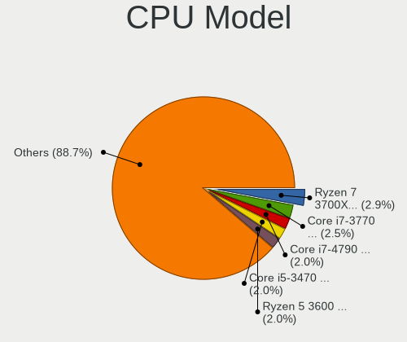

| Model                                       | Desktops | Percent |
|---------------------------------------------|----------|---------|
| Intel Core i7-3770 CPU @ 3.40GHz            | 5        | 4.55%   |
| AMD Ryzen 7 3700X 8-Core Processor          | 5        | 4.55%   |
| Intel Core i7-4790 CPU @ 3.60GHz            | 3        | 2.73%   |
| Intel Core i5-6500 CPU @ 3.20GHz            | 3        | 2.73%   |
| Intel Core i5-2400 CPU @ 3.10GHz            | 3        | 2.73%   |
| Intel Pentium Dual CPU E2180 @ 2.00GHz      | 2        | 1.82%   |
| Intel Pentium CPU G4560 @ 3.50GHz           | 2        | 1.82%   |
| Intel Core i5-3470 CPU @ 3.20GHz            | 2        | 1.82%   |
| Intel Core i5 CPU 650 @ 3.20GHz             | 2        | 1.82%   |
| Intel Core i3-3220 CPU @ 3.30GHz            | 2        | 1.82%   |
| Intel Core 2 Duo CPU E7500 @ 2.93GHz        | 2        | 1.82%   |
| Intel Core 2 CPU 6300 @ 1.86GHz             | 2        | 1.82%   |
| AMD Sempron 140 Processor                   | 2        | 1.82%   |
| AMD Ryzen 5 3600 6-Core Processor           | 2        | 1.82%   |
| AMD Ryzen 3 3200G with Radeon Vega Graphics | 2        | 1.82%   |
| AMD FX-8350 Eight-Core Processor            | 2        | 1.82%   |
| Intel Xeon CPU X5650 @ 2.67GHz              | 1        | 0.91%   |
| Intel Xeon CPU E5-2698 v4 @ 2.20GHz         | 1        | 0.91%   |
| Intel Xeon CPU E5-1620 0 @ 3.60GHz          | 1        | 0.91%   |
| Intel Pentium Dual-Core CPU E5800 @ 3.20GHz | 1        | 0.91%   |
| Intel Pentium Dual-Core CPU E5700 @ 3.00GHz | 1        | 0.91%   |
| Intel Pentium Dual CPU E2200 @ 2.20GHz      | 1        | 0.91%   |
| Intel Pentium D CPU 3.00GHz                 | 1        | 0.91%   |
| Intel Pentium CPU G620 @ 2.60GHz            | 1        | 0.91%   |
| Intel Pentium CPU E5500 @ 2.80GHz           | 1        | 0.91%   |
| Intel Pentium 4 CPU 3.40GHz                 | 1        | 0.91%   |
| Intel Pentium 4 CPU 3.20GHz                 | 1        | 0.91%   |
| Intel Core i7-9700F CPU @ 3.00GHz           | 1        | 0.91%   |
| Intel Core i7-4790S CPU @ 3.20GHz           | 1        | 0.91%   |
| Intel Core i7-4790K CPU @ 4.00GHz           | 1        | 0.91%   |
| Intel Core i7-4770 CPU @ 3.40GHz            | 1        | 0.91%   |
| Intel Core i7-3770S CPU @ 3.10GHz           | 1        | 0.91%   |
| Intel Core i7-2600 CPU @ 3.40GHz            | 1        | 0.91%   |
| Intel Core i5-9600K CPU @ 3.70GHz           | 1        | 0.91%   |
| Intel Core i5-9400F CPU @ 2.90GHz           | 1        | 0.91%   |
| Intel Core i5-8365U CPU @ 1.60GHz           | 1        | 0.91%   |
| Intel Core i5-7400T CPU @ 2.40GHz           | 1        | 0.91%   |
| Intel Core i5-6400 CPU @ 2.70GHz            | 1        | 0.91%   |
| Intel Core i5-3330 CPU @ 3.00GHz            | 1        | 0.91%   |
| Intel Core i5-10600K CPU @ 4.10GHz          | 1        | 0.91%   |
| Intel Core i5 CPU 760 @ 2.80GHz             | 1        | 0.91%   |
| Intel Core i3-6100 CPU @ 3.70GHz            | 1        | 0.91%   |
| Intel Core i3-4160 CPU @ 3.60GHz            | 1        | 0.91%   |
| Intel Core i3-4150 CPU @ 3.50GHz            | 1        | 0.91%   |
| Intel Core i3-2120 CPU @ 3.30GHz            | 1        | 0.91%   |
| Intel Core i3-2100 CPU @ 3.10GHz            | 1        | 0.91%   |
| Intel Core i3-10100 CPU @ 3.60GHz           | 1        | 0.91%   |
| Intel Core 2 Quad CPU Q6700 @ 2.66GHz       | 1        | 0.91%   |
| Intel Core 2 Quad CPU Q6600 @ 2.40GHz       | 1        | 0.91%   |
| Intel Core 2 Duo CPU E8400 @ 3.00GHz        | 1        | 0.91%   |
| Intel Core 2 Duo CPU E8200 @ 2.66GHz        | 1        | 0.91%   |
| Intel Core 2 Duo CPU E7200 @ 2.53GHz        | 1        | 0.91%   |
| Intel Core 2 Duo CPU E6750 @ 2.66GHz        | 1        | 0.91%   |
| Intel Core 2 Duo CPU E4600 @ 2.40GHz        | 1        | 0.91%   |
| Intel Celeron J4125 CPU @ 2.00GHz           | 1        | 0.91%   |
| Intel Celeron CPU E3400 @ 2.60GHz           | 1        | 0.91%   |
| Intel Atom x5-Z8350 CPU @ 1.44GHz           | 1        | 0.91%   |
| Intel 11th Gen Core i5-11400 @ 2.60GHz      | 1        | 0.91%   |
| AMD Ryzen 9 3950X 16-Core Processor         | 1        | 0.91%   |
| AMD Ryzen 9 3900X 12-Core Processor         | 1        | 0.91%   |

CPU Model Family
----------------

Processor model prefix

| Model                   | Desktops | Percent |
|-------------------------|----------|---------|
| Intel Core i5           | 18       | 16.51%  |
| Intel Core i7           | 13       | 11.93%  |
| Intel Core i3           | 8        | 7.34%   |
| Intel Core 2 Duo        | 7        | 6.42%   |
| AMD Ryzen 7             | 7        | 6.42%   |
| AMD Ryzen 5             | 7        | 6.42%   |
| Intel Pentium           | 4        | 3.67%   |
| AMD FX                  | 4        | 3.67%   |
| Intel Xeon              | 3        | 2.75%   |
| Intel Pentium Dual      | 3        | 2.75%   |
| AMD Ryzen 3             | 3        | 2.75%   |
| AMD A10                 | 3        | 2.75%   |
| Intel Pentium Dual-Core | 2        | 1.83%   |
| Intel Pentium 4         | 2        | 1.83%   |
| Intel Core 2 Quad       | 2        | 1.83%   |
| Intel Core 2            | 2        | 1.83%   |
| Intel Celeron           | 2        | 1.83%   |
| AMD Sempron             | 2        | 1.83%   |
| AMD Ryzen 9             | 2        | 1.83%   |
| AMD Phenom II X4        | 2        | 1.83%   |
| AMD A8                  | 2        | 1.83%   |
| Other                   | 1        | 0.92%   |
| Intel Pentium D         | 1        | 0.92%   |
| Intel Atom              | 1        | 0.92%   |
| AMD Phenom II X3        | 1        | 0.92%   |
| AMD Athlon X4           | 1        | 0.92%   |
| AMD Athlon II X3        | 1        | 0.92%   |
| AMD Athlon II X2        | 1        | 0.92%   |
| AMD Athlon 64 X2        | 1        | 0.92%   |
| AMD Athlon              | 1        | 0.92%   |
| AMD A6                  | 1        | 0.92%   |
| AMD A4                  | 1        | 0.92%   |

CPU Cores
---------

Number of processor cores

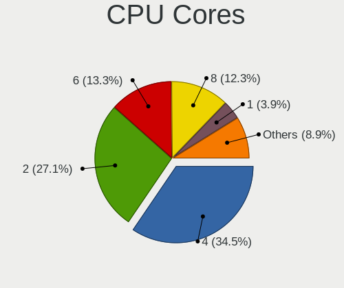

| Number  | Desktops | Percent |
|---------|----------|---------|
| 4       | 42       | 38.53%  |
| 2       | 35       | 32.11%  |
| 6       | 11       | 10.09%  |
| 8       | 8        | 7.34%   |
| 1       | 6        | 5.5%    |
| 3       | 3        | 2.75%   |
| 20      | 1        | 0.92%   |
| 16      | 1        | 0.92%   |
| 12      | 1        | 0.92%   |
| Unknown | 1        | 0.92%   |

CPU Sockets
-----------

Number of sockets

| Number | Desktops | Percent |
|--------|----------|---------|
| 1      | 109      | 100%    |

CPU Threads
-----------

Threads per core (Hyper-Threading)

| Number  | Desktops | Percent |
|---------|----------|---------|
| 2       | 56       | 51.38%  |
| 1       | 52       | 47.71%  |
| Unknown | 1        | 0.92%   |

CPU Op-Modes
------------

CPU Operation Modes (32-bit, 64-bit)

| Op mode        | Desktops | Percent |
|----------------|----------|---------|
| 32-bit, 64-bit | 106      | 96.36%  |
| 64-bit         | 2        | 1.82%   |
| Unknown        | 2        | 1.82%   |

CPU Microcode
-------------

Microcode number

| Number     | Desktops | Percent |
|------------|----------|---------|
| Unknown    | 12       | 10.71%  |
| 0x306a9    | 11       | 9.82%   |
| 0x306c3    | 7        | 6.25%   |
| 0x206a7    | 7        | 6.25%   |
| 0x08701021 | 7        | 6.25%   |
| 0x1067a    | 6        | 5.36%   |
| 0x506e3    | 5        | 4.46%   |
| 0x6fd      | 4        | 3.57%   |
| 0x06003106 | 4        | 3.57%   |
| 0x010000c8 | 4        | 3.57%   |
| 0x6fb      | 3        | 2.68%   |
| 0xf64      | 2        | 1.79%   |
| 0x906e9    | 2        | 1.79%   |
| 0x20655    | 2        | 1.79%   |
| 0x10676    | 2        | 1.79%   |
| 0x08701013 | 2        | 1.79%   |
| 0x08108109 | 2        | 1.79%   |
| 0x06001119 | 2        | 1.79%   |
| 0x06000852 | 2        | 1.79%   |
| 0x010000c7 | 2        | 1.79%   |
| 0xf49      | 1        | 0.89%   |
| 0xa0671    | 1        | 0.89%   |
| 0xa0655    | 1        | 0.89%   |
| 0xa0653    | 1        | 0.89%   |
| 0x906ed    | 1        | 0.89%   |
| 0x906ea    | 1        | 0.89%   |
| 0x806ec    | 1        | 0.89%   |
| 0x706a8    | 1        | 0.89%   |
| 0x6f6      | 1        | 0.89%   |
| 0x6f2      | 1        | 0.89%   |
| 0x406f1    | 1        | 0.89%   |
| 0x406c4    | 1        | 0.89%   |
| 0x206c2    | 1        | 0.89%   |
| 0x106e5    | 1        | 0.89%   |
| 0x0a50000c | 1        | 0.89%   |
| 0x0a201009 | 1        | 0.89%   |
| 0x08108102 | 1        | 0.89%   |
| 0x0810100b | 1        | 0.89%   |
| 0x0800820d | 1        | 0.89%   |
| 0x08001138 | 1        | 0.89%   |
| 0x0600063e | 1        | 0.89%   |
| 0x03000027 | 1        | 0.89%   |
| 0x010000db | 1        | 0.89%   |
| 0x01000083 | 1        | 0.89%   |

CPU Microarch
-------------

Microarchitecture

| Name          | Desktops | Percent |
|---------------|----------|---------|
| IvyBridge     | 11       | 10.09%  |
| Zen 2         | 10       | 9.17%   |
| Penryn        | 9        | 8.26%   |
| Core          | 9        | 8.26%   |
| SandyBridge   | 8        | 7.34%   |
| K10           | 8        | 7.34%   |
| KabyLake      | 7        | 6.42%   |
| Haswell       | 7        | 6.42%   |
| Zen+          | 5        | 4.59%   |
| Steamroller   | 5        | 4.59%   |
| Skylake       | 5        | 4.59%   |
| Piledriver    | 5        | 4.59%   |
| Westmere      | 3        | 2.75%   |
| NetBurst      | 3        | 2.75%   |
| Zen 3         | 2        | 1.83%   |
| Zen           | 2        | 1.83%   |
| CometLake     | 2        | 1.83%   |
| Silvermont    | 1        | 0.92%   |
| Nehalem       | 1        | 0.92%   |
| K8 Hammer     | 1        | 0.92%   |
| K10 Llano     | 1        | 0.92%   |
| Icelake       | 1        | 0.92%   |
| Goldmont plus | 1        | 0.92%   |
| Bulldozer     | 1        | 0.92%   |
| Broadwell     | 1        | 0.92%   |

Graphics
--------

GPU Vendor
----------

Vendors of graphics cards

| Vendor | Desktops | Percent |
|--------|----------|---------|
| Intel  | 44       | 37.93%  |
| AMD    | 37       | 31.9%   |
| Nvidia | 35       | 30.17%  |

GPU Model
---------

Graphics card models

| Model                                                                                    | Desktops | Percent |
|------------------------------------------------------------------------------------------|----------|---------|
| AMD Ellesmere [Radeon RX 470/480/570/570X/580/580X/590]                                  | 7        | 5.83%   |
| Intel 4 Series Chipset Integrated Graphics Controller                                    | 6        | 5%      |
| Intel 2nd Generation Core Processor Family Integrated Graphics Controller                | 6        | 5%      |
| Nvidia GT218 [GeForce 210]                                                               | 4        | 3.33%   |
| Nvidia GP107 [GeForce GTX 1050 Ti]                                                       | 3        | 2.5%    |
| Nvidia GK208B [GeForce GT 710]                                                           | 3        | 2.5%    |
| Intel Xeon E3-1200 v2/3rd Gen Core processor Graphics Controller                         | 3        | 2.5%    |
| Intel IvyBridge GT2 [HD Graphics 4000]                                                   | 3        | 2.5%    |
| Intel HD Graphics 530                                                                    | 3        | 2.5%    |
| Intel 82945G/GZ Integrated Graphics Controller                                           | 3        | 2.5%    |
| AMD Turks XT [Radeon HD 6670/7670]                                                       | 3        | 2.5%    |
| AMD Picasso/Raven 2 [Radeon Vega Series / Radeon Vega Mobile Series]                     | 3        | 2.5%    |
| AMD Cedar [Radeon HD 5000/6000/7350/8350 Series]                                         | 3        | 2.5%    |
| Nvidia TU116 [GeForce GTX 1650 SUPER]                                                    | 2        | 1.67%   |
| Nvidia GP108 [GeForce GT 1030]                                                           | 2        | 1.67%   |
| Nvidia GP104 [GeForce GTX 1060 6GB]                                                      | 2        | 1.67%   |
| Nvidia GF108 [GeForce GT 730]                                                            | 2        | 1.67%   |
| Intel Xeon E3-1200 v3/4th Gen Core Processor Integrated Graphics Controller              | 2        | 1.67%   |
| Intel HD Graphics 610                                                                    | 2        | 1.67%   |
| Intel CometLake-S GT2 [UHD Graphics 630]                                                 | 2        | 1.67%   |
| Intel 82Q963/Q965 Integrated Graphics Controller                                         | 2        | 1.67%   |
| Intel 82G33/G31 Express Integrated Graphics Controller                                   | 2        | 1.67%   |
| Intel 4th Generation Core Processor Family Integrated Graphics Controller                | 2        | 1.67%   |
| AMD RV370 [Radeon X300]                                                                  | 2        | 1.67%   |
| AMD RV370 [Radeon X300 SE]                                                               | 2        | 1.67%   |
| AMD Navi 14 [Radeon RX 5500/5500M / Pro 5500M]                                           | 2        | 1.67%   |
| AMD Kaveri [Radeon R7 Graphics]                                                          | 2        | 1.67%   |
| Nvidia TU117 [GeForce GTX 1650]                                                          | 1        | 0.83%   |
| Nvidia TU116 [GeForce GTX 1660]                                                          | 1        | 0.83%   |
| Nvidia TU116 [GeForce GTX 1660 SUPER]                                                    | 1        | 0.83%   |
| Nvidia TU104 [GeForce RTX 2060]                                                          | 1        | 0.83%   |
| Nvidia GP106 [GeForce GTX 1060 6GB]                                                      | 1        | 0.83%   |
| Nvidia GP104 [GeForce GTX 1070]                                                          | 1        | 0.83%   |
| Nvidia GM206 [GeForce GTX 950]                                                           | 1        | 0.83%   |
| Nvidia GM107 [GeForce GTX 750 Ti]                                                        | 1        | 0.83%   |
| Nvidia GK208B [GeForce GT 730]                                                           | 1        | 0.83%   |
| Nvidia GK107 [GeForce GT 640]                                                            | 1        | 0.83%   |
| Nvidia GF119 [GeForce GT 610]                                                            | 1        | 0.83%   |
| Nvidia GF114 [GeForce GTX 560]                                                           | 1        | 0.83%   |
| Nvidia GF108 [GeForce GT 440]                                                            | 1        | 0.83%   |
| Nvidia GF108 [GeForce GT 420]                                                            | 1        | 0.83%   |
| Nvidia GA102 [GeForce RTX 3080 Lite Hash Rate]                                           | 1        | 0.83%   |
| Nvidia G98 [GeForce 8400 GS Rev. 2]                                                      | 1        | 0.83%   |
| Nvidia C61 [GeForce 7025 / nForce 630a]                                                  | 1        | 0.83%   |
| Intel WhiskeyLake-U GT2 [UHD Graphics 620]                                               | 1        | 0.83%   |
| Intel RocketLake-S GT1 [UHD Graphics 730]                                                | 1        | 0.83%   |
| Intel HD Graphics 630                                                                    | 1        | 0.83%   |
| Intel GeminiLake [UHD Graphics 600]                                                      | 1        | 0.83%   |
| Intel CoffeeLake-S GT2 [UHD Graphics 630]                                                | 1        | 0.83%   |
| Intel Atom/Celeron/Pentium Processor x5-E8000/J3xxx/N3xxx Integrated Graphics Controller | 1        | 0.83%   |
| Intel 82Q35 Express Integrated Graphics Controller                                       | 1        | 0.83%   |
| Intel 82915G/GV/910GL Integrated Graphics Controller                                     | 1        | 0.83%   |
| AMD Trinity 2 [Radeon HD 7480D]                                                          | 1        | 0.83%   |
| AMD Tobago PRO [Radeon R7 360 / R9 360 OEM]                                              | 1        | 0.83%   |
| AMD Sumo [Radeon HD 6530D]                                                               | 1        | 0.83%   |
| AMD RV370 [Radeon X300/X550/X1050 Series] (Secondary)                                    | 1        | 0.83%   |
| AMD RV370 [Radeon X300/X550/X1050 Series]                                                | 1        | 0.83%   |
| AMD RC410 [Radeon Xpress 200/1100]                                                       | 1        | 0.83%   |
| AMD Raven Ridge [Radeon Vega Series / Radeon Vega Mobile Series]                         | 1        | 0.83%   |
| AMD Oland XT [Radeon HD 8670 / R5 340X OEM / R7 250/350/350X OEM]                        | 1        | 0.83%   |

GPU Combo
---------

Combinations of graphics cards

| Name           | Desktops | Percent |
|----------------|----------|---------|
| 1 x Intel      | 37       | 33.64%  |
| 1 x Nvidia     | 33       | 30%     |
| 1 x AMD        | 33       | 30%     |
| 2 x AMD        | 3        | 2.73%   |
| Intel + Nvidia | 2        | 1.82%   |
| 2 x Intel      | 1        | 0.91%   |
| Intel + AMD    | 1        | 0.91%   |

GPU Driver
----------

Free vs proprietary

| Driver      | Desktops | Percent |
|-------------|----------|---------|
| Free        | 91       | 82.73%  |
| Proprietary | 17       | 15.45%  |
| Unknown     | 2        | 1.82%   |

GPU Memory
----------

Total video memory

| Size in GB | Desktops | Percent |
|------------|----------|---------|
| Unknown    | 46       | 41.44%  |
| 1.01-2.0   | 21       | 18.92%  |
| 0.51-1.0   | 13       | 11.71%  |
| 0.01-0.5   | 10       | 9.01%   |
| 3.01-4.0   | 8        | 7.21%   |
| 7.01-8.0   | 7        | 6.31%   |
| 5.01-6.0   | 5        | 4.5%    |
| 8.01-16.0  | 1        | 0.9%    |

Monitor
-------

Monitor Vendor
--------------

Monitor vendors

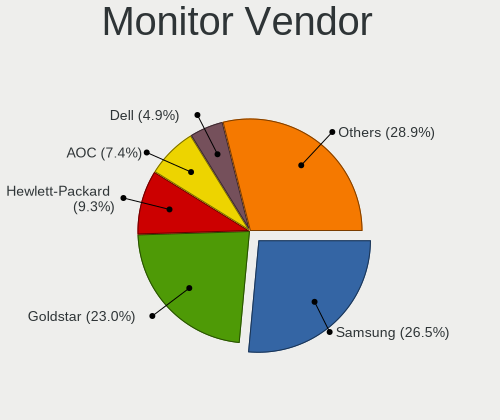

| Vendor               | Desktops | Percent |
|----------------------|----------|---------|
| Goldstar             | 29       | 28.43%  |
| Samsung Electronics  | 22       | 21.57%  |
| AOC                  | 12       | 11.76%  |
| Hewlett-Packard      | 8        | 7.84%   |
| Unknown              | 4        | 3.92%   |
| Lenovo               | 4        | 3.92%   |
| ViewSonic            | 3        | 2.94%   |
| Sony                 | 3        | 2.94%   |
| Dell                 | 3        | 2.94%   |
| BenQ                 | 3        | 2.94%   |
| LG Electronics       | 2        | 1.96%   |
| Viotek               | 1        | 0.98%   |
| Panasonic            | 1        | 0.98%   |
| NEW                  | 1        | 0.98%   |
| Lenovo Group Limited | 1        | 0.98%   |
| Hyundai ImageQuest   | 1        | 0.98%   |
| Huion                | 1        | 0.98%   |
| Gigabyte Technology  | 1        | 0.98%   |
| Eizo                 | 1        | 0.98%   |
| ASUSTek Computer     | 1        | 0.98%   |

Monitor Model
-------------

Monitor models

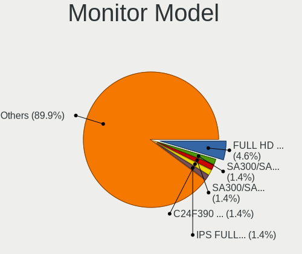

| Model                                                                 | Desktops | Percent |
|-----------------------------------------------------------------------|----------|---------|
| Goldstar FULL HD GSM5B55 1920x1080 480x270mm 21.7-inch                | 5        | 4.67%   |
| Samsung Electronics SA300/SA350 SAM078D 1600x900 440x250mm 19.9-inch  | 2        | 1.87%   |
| Samsung Electronics LCD Monitor SAM0A7D 1920x1080 890x500mm 40.2-inch | 2        | 1.87%   |
| Samsung Electronics LCD Monitor SAM04FD 1360x768                      | 2        | 1.87%   |
| Hewlett-Packard LA1951 HWP285A 1280x1024 380x300mm 19.1-inch          | 2        | 1.87%   |
| Goldstar W2243 GSM56FE 1920x1080 477x269mm 21.6-inch                  | 2        | 1.87%   |
| Goldstar LCD Monitor GSM5AB8 1920x1080 480x270mm 21.7-inch            | 2        | 1.87%   |
| Goldstar E1951 GSM4BFD 1366x768 410x230mm 18.5-inch                   | 2        | 1.87%   |
| Goldstar E1941 GSM4BF0 1366x768 410x230mm 18.5-inch                   | 2        | 1.87%   |
| Dell 3008WFP DEL4036 2560x1600 641x400mm 29.7-inch                    | 2        | 1.87%   |
| AOC 2239 AOC2239 1920x1080 477x268mm 21.5-inch                        | 2        | 1.87%   |
| Viotek FI24D VTK0238 2560x1440 530x290mm 23.8-inch                    | 1        | 0.93%   |
| ViewSonic VX2453 Series VSC0C28 1920x1080 520x290mm 23.4-inch         | 1        | 0.93%   |
| ViewSonic VA2431 Series VSCD824 1920x1080 521x293mm 23.5-inch         | 1        | 0.93%   |
| ViewSonic VA2246 SERIES VSC6F2E 1920x1080 477x268mm 21.5-inch         | 1        | 0.93%   |
| Unknown LCD Monitor RJT HDMI                                          | 1        | 0.93%   |
| Unknown LCD Monitor OOO TE-3190N 2560x1440                            | 1        | 0.93%   |
| Unknown LCD Monitor OOO MA2224W 1920x1080                             | 1        | 0.93%   |
| Unknown LCD Monitor LHC TE-3125 1920x1080                             | 1        | 0.93%   |
| Sony TV SNY2601 1360x768 710x400mm 32.1-inch                          | 1        | 0.93%   |
| Sony LCD Monitor TV 1360x768                                          | 1        | 0.93%   |
| Sony LCD Monitor TV                                                   | 1        | 0.93%   |
| Samsung Electronics SyncMaster SAM05C4 1920x1080 510x287mm 23.0-inch  | 1        | 0.93%   |
| Samsung Electronics SyncMaster SAM0598 1360x768 410x230mm 18.5-inch   | 1        | 0.93%   |
| Samsung Electronics SyncMaster SAM058C 1600x900 443x249mm 20.0-inch   | 1        | 0.93%   |
| Samsung Electronics SyncMaster SAM02E3 1440x900 367x229mm 17.0-inch   | 1        | 0.93%   |
| Samsung Electronics SyncMaster SAM022E 1024x768 267x200mm 13.1-inch   | 1        | 0.93%   |
| Samsung Electronics SyncMaster SAM01B7 1280x1024 338x270mm 17.0-inch  | 1        | 0.93%   |
| Samsung Electronics SMBX1931N SAM0768 1366x768 410x230mm 18.5-inch    | 1        | 0.93%   |
| Samsung Electronics SA300/SA350 SAM078A 1366x768 410x230mm 18.5-inch  | 1        | 0.93%   |
| Samsung Electronics S24F350 SAM0D20 1920x1080 521x293mm 23.5-inch     | 1        | 0.93%   |
| Samsung Electronics S20B300 SAM08A7 1600x900 443x249mm 20.0-inch      | 1        | 0.93%   |
| Samsung Electronics LCD Monitor SyncMaster 3840x1080                  | 1        | 0.93%   |
| Samsung Electronics LCD Monitor SAM0E8C 1920x1080 885x498mm 40.0-inch | 1        | 0.93%   |
| Samsung Electronics LCD Monitor SAM07D0 1360x768 700x390mm 31.5-inch  | 1        | 0.93%   |
| Samsung Electronics LCD Monitor SA300/SA350 1600x900                  | 1        | 0.93%   |
| Samsung Electronics C32F391 SAM0D34 1920x1080 698x393mm 31.5-inch     | 1        | 0.93%   |
| Samsung Electronics C27JG5x SAM0FDB 2560x1440 597x336mm 27.0-inch     | 1        | 0.93%   |
| Samsung Electronics C27F591 SAM0D36 1920x1080 600x340mm 27.2-inch     | 1        | 0.93%   |
| Samsung Electronics C24F390 SAM0D2C 1920x1080 520x290mm 23.4-inch     | 1        | 0.93%   |
| Panasonic TV MEIA296 3840x2160 698x392mm 31.5-inch                    | 1        | 0.93%   |
| NEW HDMI NEW2700 1920x1080 452x254mm 20.4-inch                        | 1        | 0.93%   |
| LG Electronics LCD Monitor LG ULTRAWIDE 2560x1080                     | 1        | 0.93%   |
| LG Electronics LCD Monitor 22MP55 3840x1080                           | 1        | 0.93%   |
| LG Electronics LCD Monitor 22MP55 1920x1080                           | 1        | 0.93%   |
| Lenovo LEN LT2013swA LEN60AB 1600x900 432x240mm 19.5-inch             | 1        | 0.93%   |
| Lenovo LEN L171 LEN240B 1280x1024 340x270mm 17.1-inch                 | 1        | 0.93%   |
| Lenovo LEN L151 LEN23CD 1024x768 304x228mm 15.0-inch                  | 1        | 0.93%   |
| Lenovo H61 LEN520B 1600x900 410x230mm 18.5-inch                       | 1        | 0.93%   |
| Lenovo Group Limited LCD Monitor LEN LT2013swA 1600x900               | 1        | 0.93%   |
| Hyundai ImageQuest HDIT19W DSUB IQT9008 1366x768 413x234mm 18.7-inch  | 1        | 0.93%   |
| Huion GT2201 HAT2201 1920x1080 480x260mm 21.5-inch                    | 1        | 0.93%   |
| Hewlett-Packard P202 HWP3229 1600x900 443x249mm 20.0-inch             | 1        | 0.93%   |
| Hewlett-Packard LA2405x HWP301F 1920x1200 518x324mm 24.1-inch         | 1        | 0.93%   |
| Hewlett-Packard LA2306 HWP294B 1920x1080 509x286mm 23.0-inch          | 1        | 0.93%   |
| Hewlett-Packard L1506 HWP265B 1024x768 304x228mm 15.0-inch            | 1        | 0.93%   |
| Hewlett-Packard f1503 HWP2590 1024x768 304x228mm 15.0-inch            | 1        | 0.93%   |
| Hewlett-Packard 24f HPN3545 1920x1080 527x296mm 23.8-inch             | 1        | 0.93%   |
| Goldstar W2243 GSM56FF 1920x1080 480x270mm 21.7-inch                  | 1        | 0.93%   |
| Goldstar W2043 GSM4E9E 1600x900 443x249mm 20.0-inch                   | 1        | 0.93%   |

Monitor Resolution
------------------

Monitor screen resolution

| Resolution        | Desktops | Percent |
|-------------------|----------|---------|
| 1920x1080 (FHD)   | 40       | 40%     |
| 1600x900 (HD+)    | 14       | 14%     |
| 1366x768 (WXGA)   | 8        | 8%      |
| 1360x768          | 8        | 8%      |
| 3840x2160 (4K)    | 6        | 6%      |
| 2560x1440 (QHD)   | 5        | 5%      |
| 1440x900 (WXGA+)  | 4        | 4%      |
| 1024x768 (XGA)    | 4        | 4%      |
| 3840x1080         | 2        | 2%      |
| 2560x1600         | 2        | 2%      |
| 1280x1024 (SXGA)  | 2        | 2%      |
| Unknown           | 2        | 2%      |
| 3440x1440         | 1        | 1%      |
| 2560x1080         | 1        | 1%      |
| 1920x1200 (WUXGA) | 1        | 1%      |

Monitor Diagonal
----------------

Diagonal size in inches

| Inches  | Desktops | Percent |
|---------|----------|---------|
| 21      | 24       | 23.53%  |
| 23      | 12       | 11.76%  |
| 20      | 10       | 9.8%    |
| 18      | 10       | 9.8%    |
| Unknown | 9        | 8.82%   |
| 19      | 7        | 6.86%   |
| 27      | 6        | 5.88%   |
| 24      | 4        | 3.92%   |
| 15      | 4        | 3.92%   |
| 31      | 3        | 2.94%   |
| 17      | 3        | 2.94%   |
| 48      | 2        | 1.96%   |
| 32      | 2        | 1.96%   |
| 30      | 2        | 1.96%   |
| 84      | 1        | 0.98%   |
| 43      | 1        | 0.98%   |
| 34      | 1        | 0.98%   |
| 13      | 1        | 0.98%   |

Monitor Width
-------------

Physical width

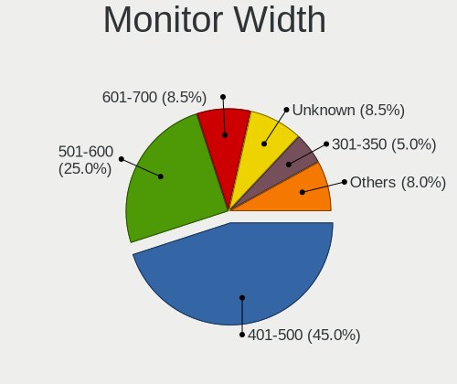

| Width in mm | Desktops | Percent |
|-------------|----------|---------|
| 401-500     | 48       | 48%     |
| 501-600     | 21       | 21%     |
| Unknown     | 9        | 9%      |
| 301-350     | 6        | 6%      |
| 601-700     | 5        | 5%      |
| 701-800     | 3        | 3%      |
| 351-400     | 3        | 3%      |
| 1001-1500   | 2        | 2%      |
| 201-300     | 1        | 1%      |
| 1501-2000   | 1        | 1%      |
| 901-1000    | 1        | 1%      |

Aspect Ratio
------------

Proportional relationship between the width and the height

| Ratio   | Desktops | Percent |
|---------|----------|---------|
| 16/9    | 70       | 73.68%  |
| Unknown | 9        | 9.47%   |
| 16/10   | 7        | 7.37%   |
| 5/4     | 4        | 4.21%   |
| 4/3     | 4        | 4.21%   |
| 21/9    | 1        | 1.05%   |

Monitor Area
------------

Area in inch

| Area in inch | Desktops | Percent |
|----------------|----------|---------|
| 201-250        | 28       | 28.28%  |
| 151-200        | 25       | 25.25%  |
| 141-150        | 12       | 12.12%  |
| Unknown        | 9        | 9.09%   |
| 351-500        | 8        | 8.08%   |
| 301-350        | 6        | 6.06%   |
| 101-110        | 4        | 4.04%   |
| More than 1000 | 3        | 3.03%   |
| 81-90          | 1        | 1.01%   |
| 251-300        | 1        | 1.01%   |
| 131-140        | 1        | 1.01%   |
| 501-1000       | 1        | 1.01%   |

Pixel Density
-------------

Pixels per inch

| Density | Desktops | Percent |
|---------|----------|---------|
| 51-100  | 50       | 51.02%  |
| 101-120 | 31       | 31.63%  |
| Unknown | 9        | 9.18%   |
| 1-50    | 6        | 6.12%   |
| 161-240 | 1        | 1.02%   |
| 121-160 | 1        | 1.02%   |

Multiple Monitors
-----------------

Total monitors connected

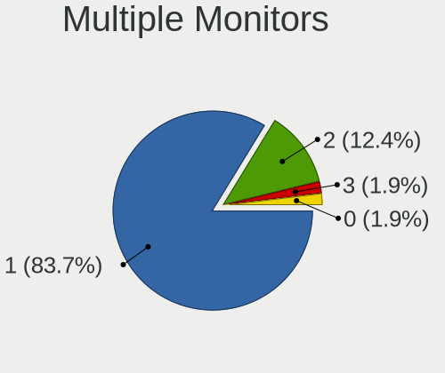

| Total | Desktops | Percent |
|-------|----------|---------|
| 1     | 98       | 88.29%  |
| 2     | 10       | 9.01%   |
| 0     | 2        | 1.8%    |
| 3     | 1        | 0.9%    |

Network
-------

Net Controller Vendor
---------------------

Controller vendors

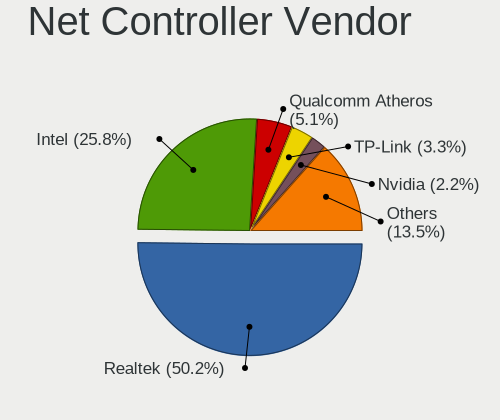

| Vendor                          | Desktops | Percent |
|---------------------------------|----------|---------|
| Realtek Semiconductor           | 68       | 47.22%  |
| Intel                           | 40       | 27.78%  |
| Qualcomm Atheros                | 8        | 5.56%   |
| TP-Link                         | 6        | 4.17%   |
| Ralink Technology               | 4        | 2.78%   |
| Qualcomm Atheros Communications | 4        | 2.78%   |
| Nvidia                          | 4        | 2.78%   |
| Huawei Technologies             | 2        | 1.39%   |
| D-Link System                   | 2        | 1.39%   |
| Broadcom Limited                | 2        | 1.39%   |
| ZTE WCDMA Technologies MSM      | 1        | 0.69%   |
| Microsoft                       | 1        | 0.69%   |
| D-Link                          | 1        | 0.69%   |
| ASIX Electronics                | 1        | 0.69%   |

Net Controller Model
--------------------

Controller models

| Model                                                                | Desktops | Percent |
|----------------------------------------------------------------------|----------|---------|
| Realtek RTL8111/8168/8411 PCI Express Gigabit Ethernet Controller    | 55       | 35.26%  |
| Intel 82579V Gigabit Network Connection                              | 6        | 3.85%   |
| Realtek RTL8125 2.5GbE Controller                                    | 5        | 3.21%   |
| Realtek RTL810xE PCI Express Fast Ethernet controller                | 5        | 3.21%   |
| Intel I211 Gigabit Network Connection                                | 5        | 3.21%   |
| Intel 82579LM Gigabit Network Connection (Lewisville)                | 5        | 3.21%   |
| Qualcomm Atheros AR9271 802.11n                                      | 4        | 2.56%   |
| TP-Link 802.11n NIC                                                  | 3        | 1.92%   |
| Ralink MT7601U Wireless Adapter                                      | 3        | 1.92%   |
| Nvidia MCP61 Ethernet                                                | 3        | 1.92%   |
| Intel Wi-Fi 6 AX200                                                  | 3        | 1.92%   |
| Intel Ethernet Connection (2) I219-V                                 | 3        | 1.92%   |
| Intel 82578DC Gigabit Network Connection                             | 3        | 1.92%   |
| Qualcomm Atheros Killer E220x Gigabit Ethernet Controller            | 2        | 1.28%   |
| Qualcomm Atheros AR9287 Wireless Network Adapter (PCI-Express)       | 2        | 1.28%   |
| Qualcomm Atheros AR8151 v2.0 Gigabit Ethernet                        | 2        | 1.28%   |
| Intel Wireless 7265                                                  | 2        | 1.28%   |
| Intel Ethernet Connection (2) I219-LM                                | 2        | 1.28%   |
| Huawei JNY-LX1                                                       | 2        | 1.28%   |
| ZTE WCDMA MSM Z6201V                                                 | 1        | 0.64%   |
| TP-Link USB 10/100 LAN                                               | 1        | 0.64%   |
| TP-Link TL-WN8200ND [Realtek RTL8192CU]                              | 1        | 0.64%   |
| TP-Link AC600 wireless Realtek RTL8811AU [Archer T2U Nano]           | 1        | 0.64%   |
| Realtek RTL8723BE PCIe Wireless Network Adapter                      | 1        | 0.64%   |
| Realtek RTL8192CU 802.11n WLAN Adapter                               | 1        | 0.64%   |
| Realtek RTL8188EUS 802.11n Wireless Network Adapter                  | 1        | 0.64%   |
| Realtek RTL8188EE Wireless Network Adapter                           | 1        | 0.64%   |
| Realtek RTL-8185 IEEE 802.11a/b/g Wireless LAN Controller            | 1        | 0.64%   |
| Realtek RTL-8100/8101L/8139 PCI Fast Ethernet Adapter                | 1        | 0.64%   |
| Ralink RT2870/RT3070 Wireless Adapter                                | 1        | 0.64%   |
| Qualcomm Atheros AR9485 Wireless Network Adapter                     | 1        | 0.64%   |
| Qualcomm Atheros AR9227 Wireless Network Adapter                     | 1        | 0.64%   |
| Qualcomm Atheros AR5212/5213/2414 Wireless Network Adapter           | 1        | 0.64%   |
| Nvidia MCP67 Ethernet                                                | 1        | 0.64%   |
| Microsoft Xbox 360 Wireless Adapter                                  | 1        | 0.64%   |
| Intel Wireless 7260                                                  | 1        | 0.64%   |
| Intel NM10/ICH7 Family LAN Controller                                | 1        | 0.64%   |
| Intel Ethernet Connection I217-V                                     | 1        | 0.64%   |
| Intel Ethernet Connection (7) I219-V                                 | 1        | 0.64%   |
| Intel Ethernet Connection (6) I219-LM                                | 1        | 0.64%   |
| Intel Ethernet Connection (12) I219-V                                | 1        | 0.64%   |
| Intel Dual Band Wireless-AC 3168NGW [Stone Peak]                     | 1        | 0.64%   |
| Intel Centrino Wireless-N 2230                                       | 1        | 0.64%   |
| Intel Cannon Point-LP CNVi [Wireless-AC]                             | 1        | 0.64%   |
| Intel Cannon Lake PCH CNVi WiFi                                      | 1        | 0.64%   |
| Intel 82574L Gigabit Network Connection                              | 1        | 0.64%   |
| Intel 82572EI Gigabit Ethernet Controller (Copper)                   | 1        | 0.64%   |
| Intel 82567V-4 Gigabit Network Connection                            | 1        | 0.64%   |
| Intel 82567LM-3 Gigabit Network Connection                           | 1        | 0.64%   |
| Intel 82567LM-2 Gigabit Network Connection                           | 1        | 0.64%   |
| Intel 82566DM-2 Gigabit Network Connection                           | 1        | 0.64%   |
| Intel 82566DM Gigabit Network Connection                             | 1        | 0.64%   |
| Intel 82566DC-2 Gigabit Network Connection                           | 1        | 0.64%   |
| Intel 82566DC Gigabit Network Connection                             | 1        | 0.64%   |
| D-Link System DWA-125 Wireless N 150 Adapter(rev.A1) [Ralink RT3070] | 1        | 0.64%   |
| D-Link System DGE-528T Gigabit Ethernet Adapter                      | 1        | 0.64%   |
| D-Link DWL-G132 [Atheros AR5523]                                     | 1        | 0.64%   |
| Broadcom Limited NetXtreme BCM5755 Gigabit Ethernet PCI Express      | 1        | 0.64%   |
| Broadcom Limited NetXtreme BCM5751 Gigabit Ethernet PCI Express      | 1        | 0.64%   |
| ASIX AX88772A Fast Ethernet                                          | 1        | 0.64%   |

Wireless Vendor
---------------

Wireless vendors

| Vendor                          | Desktops | Percent |
|---------------------------------|----------|---------|
| Intel                           | 10       | 27.78%  |
| TP-Link                         | 5        | 13.89%  |
| Realtek Semiconductor           | 5        | 13.89%  |
| Qualcomm Atheros                | 5        | 13.89%  |
| Ralink Technology               | 4        | 11.11%  |
| Qualcomm Atheros Communications | 4        | 11.11%  |
| Microsoft                       | 1        | 2.78%   |
| D-Link System                   | 1        | 2.78%   |
| D-Link                          | 1        | 2.78%   |

Wireless Model
--------------

Wireless models

| Model                                                                | Desktops | Percent |
|----------------------------------------------------------------------|----------|---------|
| Qualcomm Atheros AR9271 802.11n                                      | 4        | 11.11%  |
| TP-Link 802.11n NIC                                                  | 3        | 8.33%   |
| Ralink MT7601U Wireless Adapter                                      | 3        | 8.33%   |
| Intel Wi-Fi 6 AX200                                                  | 3        | 8.33%   |
| Qualcomm Atheros AR9287 Wireless Network Adapter (PCI-Express)       | 2        | 5.56%   |
| Intel Wireless 7265                                                  | 2        | 5.56%   |
| TP-Link TL-WN8200ND [Realtek RTL8192CU]                              | 1        | 2.78%   |
| TP-Link AC600 wireless Realtek RTL8811AU [Archer T2U Nano]           | 1        | 2.78%   |
| Realtek RTL8723BE PCIe Wireless Network Adapter                      | 1        | 2.78%   |
| Realtek RTL8192CU 802.11n WLAN Adapter                               | 1        | 2.78%   |
| Realtek RTL8188EUS 802.11n Wireless Network Adapter                  | 1        | 2.78%   |
| Realtek RTL8188EE Wireless Network Adapter                           | 1        | 2.78%   |
| Realtek RTL-8185 IEEE 802.11a/b/g Wireless LAN Controller            | 1        | 2.78%   |
| Ralink RT2870/RT3070 Wireless Adapter                                | 1        | 2.78%   |
| Qualcomm Atheros AR9485 Wireless Network Adapter                     | 1        | 2.78%   |
| Qualcomm Atheros AR9227 Wireless Network Adapter                     | 1        | 2.78%   |
| Qualcomm Atheros AR5212/5213/2414 Wireless Network Adapter           | 1        | 2.78%   |
| Microsoft Xbox 360 Wireless Adapter                                  | 1        | 2.78%   |
| Intel Wireless 7260                                                  | 1        | 2.78%   |
| Intel Dual Band Wireless-AC 3168NGW [Stone Peak]                     | 1        | 2.78%   |
| Intel Centrino Wireless-N 2230                                       | 1        | 2.78%   |
| Intel Cannon Point-LP CNVi [Wireless-AC]                             | 1        | 2.78%   |
| Intel Cannon Lake PCH CNVi WiFi                                      | 1        | 2.78%   |
| D-Link System DWA-125 Wireless N 150 Adapter(rev.A1) [Ralink RT3070] | 1        | 2.78%   |
| D-Link DWL-G132 [Atheros AR5523]                                     | 1        | 2.78%   |

Ethernet Vendor
---------------

Ethernet vendors

| Vendor                     | Desktops | Percent |
|----------------------------|----------|---------|
| Realtek Semiconductor      | 66       | 56.41%  |
| Intel                      | 35       | 29.91%  |
| Qualcomm Atheros           | 4        | 3.42%   |
| Nvidia                     | 4        | 3.42%   |
| Huawei Technologies        | 2        | 1.71%   |
| Broadcom Limited           | 2        | 1.71%   |
| ZTE WCDMA Technologies MSM | 1        | 0.85%   |
| TP-Link                    | 1        | 0.85%   |
| D-Link System              | 1        | 0.85%   |
| ASIX Electronics           | 1        | 0.85%   |

Ethernet Model
--------------

Ethernet models

| Model                                                             | Desktops | Percent |
|-------------------------------------------------------------------|----------|---------|
| Realtek RTL8111/8168/8411 PCI Express Gigabit Ethernet Controller | 55       | 45.83%  |
| Intel 82579V Gigabit Network Connection                           | 6        | 5%      |
| Realtek RTL8125 2.5GbE Controller                                 | 5        | 4.17%   |
| Realtek RTL810xE PCI Express Fast Ethernet controller             | 5        | 4.17%   |
| Intel I211 Gigabit Network Connection                             | 5        | 4.17%   |
| Intel 82579LM Gigabit Network Connection (Lewisville)             | 5        | 4.17%   |
| Nvidia MCP61 Ethernet                                             | 3        | 2.5%    |
| Intel Ethernet Connection (2) I219-V                              | 3        | 2.5%    |
| Intel 82578DC Gigabit Network Connection                          | 3        | 2.5%    |
| Qualcomm Atheros Killer E220x Gigabit Ethernet Controller         | 2        | 1.67%   |
| Qualcomm Atheros AR8151 v2.0 Gigabit Ethernet                     | 2        | 1.67%   |
| Intel Ethernet Connection (2) I219-LM                             | 2        | 1.67%   |
| Huawei JNY-LX1                                                    | 2        | 1.67%   |
| ZTE WCDMA MSM Z6201V                                              | 1        | 0.83%   |
| TP-Link USB 10/100 LAN                                            | 1        | 0.83%   |
| Realtek RTL-8100/8101L/8139 PCI Fast Ethernet Adapter             | 1        | 0.83%   |
| Nvidia MCP67 Ethernet                                             | 1        | 0.83%   |
| Intel NM10/ICH7 Family LAN Controller                             | 1        | 0.83%   |
| Intel Ethernet Connection I217-V                                  | 1        | 0.83%   |
| Intel Ethernet Connection (7) I219-V                              | 1        | 0.83%   |
| Intel Ethernet Connection (6) I219-LM                             | 1        | 0.83%   |
| Intel Ethernet Connection (12) I219-V                             | 1        | 0.83%   |
| Intel 82574L Gigabit Network Connection                           | 1        | 0.83%   |
| Intel 82572EI Gigabit Ethernet Controller (Copper)                | 1        | 0.83%   |
| Intel 82567V-4 Gigabit Network Connection                         | 1        | 0.83%   |
| Intel 82567LM-3 Gigabit Network Connection                        | 1        | 0.83%   |
| Intel 82567LM-2 Gigabit Network Connection                        | 1        | 0.83%   |
| Intel 82566DM-2 Gigabit Network Connection                        | 1        | 0.83%   |
| Intel 82566DM Gigabit Network Connection                          | 1        | 0.83%   |
| Intel 82566DC-2 Gigabit Network Connection                        | 1        | 0.83%   |
| Intel 82566DC Gigabit Network Connection                          | 1        | 0.83%   |
| D-Link System DGE-528T Gigabit Ethernet Adapter                   | 1        | 0.83%   |
| Broadcom Limited NetXtreme BCM5755 Gigabit Ethernet PCI Express   | 1        | 0.83%   |
| Broadcom Limited NetXtreme BCM5751 Gigabit Ethernet PCI Express   | 1        | 0.83%   |
| ASIX AX88772A Fast Ethernet                                       | 1        | 0.83%   |

Net Controller Kind
-------------------

Ethernet, WiFi or modem

| Kind     | Desktops | Percent |
|----------|----------|---------|
| Ethernet | 108      | 75.52%  |
| WiFi     | 35       | 24.48%  |

Used Controller
---------------

Currently used network controller

| Kind     | Desktops | Percent |
|----------|----------|---------|
| Ethernet | 90       | 78.26%  |
| WiFi     | 25       | 21.74%  |

NICs
----

Total network controllers on board

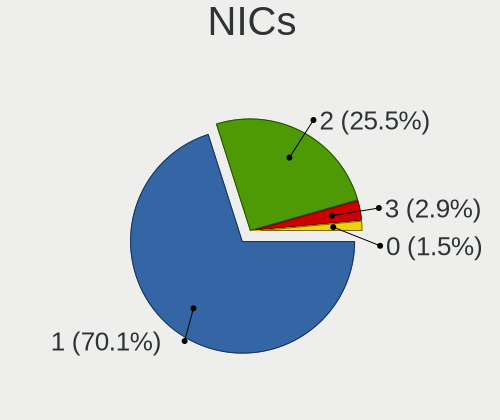

| Total | Desktops | Percent |
|-------|----------|---------|
| 1     | 86       | 78.18%  |
| 2     | 22       | 20%     |
| 3     | 2        | 1.82%   |

IPv6
----

IPv6 vs IPv4

| Used | Desktops | Percent |
|------|----------|---------|
| No   | 95       | 87.16%  |
| Yes  | 14       | 12.84%  |

Bluetooth
---------

Bluetooth Vendor
----------------

Controller vendors

| Vendor                     | Desktops | Percent |
|----------------------------|----------|---------|
| Intel                      | 9        | 42.86%  |
| Cambridge Silicon Radio    | 8        | 38.1%   |
| TRENDnet                   | 1        | 4.76%   |
| TP-Link                    | 1        | 4.76%   |
| Realtek Semiconductor      | 1        | 4.76%   |
| Integrated System Solution | 1        | 4.76%   |

Bluetooth Model
---------------

Controller models

| Model                                                 | Desktops | Percent |
|-------------------------------------------------------|----------|---------|
| Cambridge Silicon Radio Bluetooth Dongle (HCI mode)   | 8        | 38.1%   |
| Intel AX200 Bluetooth                                 | 3        | 14.29%  |
| Intel Bluetooth wireless interface                    | 2        | 9.52%   |
| Intel Bluetooth 9460/9560 Jefferson Peak (JfP)        | 2        | 9.52%   |
| TRENDnet TBW-108UB USB Adapter                        | 1        | 4.76%   |
| TP-Link UB500 Adapter                                 | 1        | 4.76%   |
| Realtek RTL8723B Bluetooth                            | 1        | 4.76%   |
| Intel Wireless-AC 3168 Bluetooth                      | 1        | 4.76%   |
| Intel Centrino Bluetooth Wireless Transceiver         | 1        | 4.76%   |
| Integrated System Solution KY-BT100 Bluetooth Adapter | 1        | 4.76%   |

Sound
-----

Sound Vendor
------------

Sound card vendors

| Vendor              | Desktops | Percent |
|---------------------|----------|---------|
| Intel               | 66       | 40.99%  |
| AMD                 | 48       | 29.81%  |
| Nvidia              | 36       | 22.36%  |
| Texas Instruments   | 2        | 1.24%   |
| Microsoft           | 2        | 1.24%   |
| C-Media Electronics | 2        | 1.24%   |
| Samson Technologies | 1        | 0.62%   |
| Logitech            | 1        | 0.62%   |
| Kingston Technology | 1        | 0.62%   |
| Creative Labs       | 1        | 0.62%   |
| Chicony Electronics | 1        | 0.62%   |

Sound Model
-----------

Sound card models

| Model                                                                             | Desktops | Percent |
|-----------------------------------------------------------------------------------|----------|---------|
| Intel NM10/ICH7 Family High Definition Audio Controller                           | 11       | 5.85%   |
| AMD Starship/Matisse HD Audio Controller                                          | 11       | 5.85%   |
| Intel 6 Series/C200 Series Chipset Family High Definition Audio Controller        | 10       | 5.32%   |
| AMD SBx00 Azalia (Intel HDA)                                                      | 9        | 4.79%   |
| Intel 7 Series/C216 Chipset Family High Definition Audio Controller               | 8        | 4.26%   |
| AMD FCH Azalia Controller                                                         | 8        | 4.26%   |
| Intel 100 Series/C230 Series Chipset Family HD Audio Controller                   | 7        | 3.72%   |
| AMD Ellesmere HDMI Audio [Radeon RX 470/480 / 570/580/590]                        | 7        | 3.72%   |
| Intel 8 Series/C220 Series Chipset High Definition Audio Controller               | 6        | 3.19%   |
| AMD Family 17h/19h HD Audio Controller                                            | 5        | 2.66%   |
| Nvidia TU116 High Definition Audio Controller                                     | 4        | 2.13%   |
| Nvidia High Definition Audio Controller                                           | 4        | 2.13%   |
| Nvidia GF108 High Definition Audio Controller                                     | 4        | 2.13%   |
| Intel Xeon E3-1200 v3/4th Gen Core Processor HD Audio Controller                  | 4        | 2.13%   |
| AMD Raven/Raven2/Fenghuang HDMI/DP Audio Controller                               | 4        | 2.13%   |
| AMD Oland/Hainan/Cape Verde/Pitcairn HDMI Audio [Radeon HD 7000 Series]           | 4        | 2.13%   |
| Nvidia MCP61 High Definition Audio                                                | 3        | 1.6%    |
| Nvidia GP107GL High Definition Audio Controller                                   | 3        | 1.6%    |
| Nvidia GP104 High Definition Audio Controller                                     | 3        | 1.6%    |
| Nvidia GK208 HDMI/DP Audio Controller                                             | 3        | 1.6%    |
| Intel 82801I (ICH9 Family) HD Audio Controller                                    | 3        | 1.6%    |
| Intel 5 Series/3400 Series Chipset High Definition Audio                          | 3        | 1.6%    |
| AMD Turks HDMI Audio [Radeon HD 6500/6600 / 6700M Series]                         | 3        | 1.6%    |
| AMD Navi 10 HDMI Audio                                                            | 3        | 1.6%    |
| AMD Cedar HDMI Audio [Radeon HD 5400/6300/7300 Series]                            | 3        | 1.6%    |
| Texas Instruments PCM2902 Audio Codec                                             | 2        | 1.06%   |
| Nvidia GP108 High Definition Audio Controller                                     | 2        | 1.06%   |
| Microsoft LifeChat LX-3000 Headset                                                | 2        | 1.06%   |
| Intel Comet Lake PCH-V cAVS                                                       | 2        | 1.06%   |
| Intel Cannon Lake PCH cAVS                                                        | 2        | 1.06%   |
| Intel 82801JD/DO (ICH10 Family) HD Audio Controller                               | 2        | 1.06%   |
| Intel 82801H (ICH8 Family) HD Audio Controller                                    | 2        | 1.06%   |
| Intel 200 Series PCH HD Audio                                                     | 2        | 1.06%   |
| AMD Kaveri HDMI/DP Audio Controller                                               | 2        | 1.06%   |
| AMD Family 17h (Models 00h-0fh) HD Audio Controller                               | 2        | 1.06%   |
| AMD Caicos HDMI Audio [Radeon HD 6450 / 7450/8450/8490 OEM / R5 230/235/235X OEM] | 2        | 1.06%   |
| Samson Technologies Q2U handheld mic with XLR                                     | 1        | 0.53%   |
| Nvidia TU107 GeForce GTX 1650 High Definition Audio Controller                    | 1        | 0.53%   |
| Nvidia TU104 HD Audio Controller                                                  | 1        | 0.53%   |
| Nvidia MCP67 High Definition Audio                                                | 1        | 0.53%   |
| Nvidia GP106 High Definition Audio Controller                                     | 1        | 0.53%   |
| Nvidia GM206 High Definition Audio Controller                                     | 1        | 0.53%   |
| Nvidia GM107 High Definition Audio Controller [GeForce 940MX]                     | 1        | 0.53%   |
| Nvidia GK107 HDMI Audio Controller                                                | 1        | 0.53%   |
| Nvidia GF119 HDMI Audio Controller                                                | 1        | 0.53%   |
| Nvidia GF114 HDMI Audio Controller                                                | 1        | 0.53%   |
| Nvidia GA102 High Definition Audio Controller                                     | 1        | 0.53%   |
| Logitech H390 headset with microphone                                             | 1        | 0.53%   |
| Kingston Technology HyperX QuadCast                                               | 1        | 0.53%   |
| Intel USB PnP Sound Device                                                        | 1        | 0.53%   |
| Intel Tiger Lake-H HD Audio Controller                                            | 1        | 0.53%   |
| Intel Celeron/Pentium Silver Processor High Definition Audio                      | 1        | 0.53%   |
| Intel Cannon Point-LP High Definition Audio Controller                            | 1        | 0.53%   |
| Intel C610/X99 series chipset HD Audio Controller                                 | 1        | 0.53%   |
| Intel C600/X79 series chipset High Definition Audio Controller                    | 1        | 0.53%   |
| Intel 9 Series Chipset Family HD Audio Controller                                 | 1        | 0.53%   |
| Intel 82801JI (ICH10 Family) HD Audio Controller                                  | 1        | 0.53%   |
| Intel 82801FB/FBM/FR/FW/FRW (ICH6 Family) AC'97 Audio Controller                  | 1        | 0.53%   |
| Creative Labs CA0108/CA10300 [Sound Blaster Audigy Series]                        | 1        | 0.53%   |
| Chicony Electronics Tt eSPORTS Challenger Ultimate gaming keyboard                | 1        | 0.53%   |

Memory
------

Memory Vendor
-------------

Memory module vendors

| Vendor                       | Desktops | Percent |
|------------------------------|----------|---------|
| Kingston                     | 28       | 47.46%  |
| Samsung Electronics          | 7        | 11.86%  |
| Unknown                      | 5        | 8.47%   |
| Corsair                      | 5        | 8.47%   |
| SK hynix                     | 3        | 5.08%   |
| Micron Technology            | 3        | 5.08%   |
| Unknown (0x7FA8000000000000) | 1        | 1.69%   |
| Unknown (0x7F7FB5FFFFFFFFFF) | 1        | 1.69%   |
| Qumo                         | 1        | 1.69%   |
| Princeton                    | 1        | 1.69%   |
| Hewlett-Packard              | 1        | 1.69%   |
| GeIL                         | 1        | 1.69%   |
| Crucial                      | 1        | 1.69%   |
| A-DATA Technology            | 1        | 1.69%   |

Memory Model
------------

Memory module models

| Model                                                           | Desktops | Percent |
|-----------------------------------------------------------------|----------|---------|
| Kingston RAM KHX2666C16/8G 8GB DIMM DDR4 3466MT/s               | 3        | 4.62%   |
| SK hynix RAM HMT351U6CFR8C-PB 4GB DIMM DDR3 1800MT/s            | 2        | 3.08%   |
| Kingston RAM KHX3200C16D4/8GX 8GB DIMM DDR4 3600MT/s            | 2        | 3.08%   |
| Kingston RAM KHX1866C10D3/8G 8GB DIMM DDR3 1867MT/s             | 2        | 3.08%   |
| Kingston RAM KHX1600C10D3/8GX 8192MB DIMM DDR3 1600MT/s         | 2        | 3.08%   |
| Kingston RAM CL16-18-18 D4-3200 8192MB DIMM DDR4 3200MT/s       | 2        | 3.08%   |
| Kingston RAM 9905471-017.A00LF 4096MB DIMM DDR3 1333MT/s        | 2        | 3.08%   |
| Unknown RAM Module 512MB DIMM DDR2 533MT/s                      | 1        | 1.54%   |
| Unknown RAM Module 2GB DIMM DDR2                                | 1        | 1.54%   |
| Unknown RAM Module 2GB DIMM 800MT/s                             | 1        | 1.54%   |
| Unknown RAM Module 2048MB DIMM DDR2                             | 1        | 1.54%   |
| Unknown RAM Module 2048MB DIMM 400MT/s                          | 1        | 1.54%   |
| Unknown RAM Module 1GB DIMM 800MT/s                             | 1        | 1.54%   |
| Unknown (0x7FA8000000000000) RAM Module 512MB DIMM DDR2 533MT/s | 1        | 1.54%   |
| Unknown (0x7F7FB5FFFFFFFFFF) RAM Module 512MB DIMM DDR2 533MT/s | 1        | 1.54%   |
| SK hynix RAM HMT125U6TFR8C-H9 2GB DIMM DDR3 1333MT/s            | 1        | 1.54%   |
| Samsung RAM Module 8GB SODIMM DDR4 2133MT/s                     | 1        | 1.54%   |
| Samsung RAM Module 4GB DIMM DDR4 2133MT/s                       | 1        | 1.54%   |
| Samsung RAM M378B5673FH0-CH9 2048MB DIMM DDR3 1600MT/s          | 1        | 1.54%   |
| Samsung RAM M378B5673EH1-CF8 2GB DIMM DDR3 1067MT/s             | 1        | 1.54%   |
| Samsung RAM M378B5273DH0-CK0 4GB DIMM DDR3 2200MT/s             | 1        | 1.54%   |
| Samsung RAM M378B5173EB0 4096MB DIMM DDR3 1600MT/s              | 1        | 1.54%   |
| Samsung RAM M378B5173DB0 4GB DIMM DDR3 1600MT/s                 | 1        | 1.54%   |
| Samsung RAM K4E6E304EC-EGCG 4GB Row Of Chips LPDDR3 2133MT/s    | 1        | 1.54%   |
| Qumo RAM Module 4096MB DIMM DDR3 1333MT/s                       | 1        | 1.54%   |
| Princeton RAM Module 512MB DIMM DDR2 533MT/s                    | 1        | 1.54%   |
| Micron RAM 8JTF51264AZ-1G6E1 4096MB DIMM DDR3 1600MT/s          | 1        | 1.54%   |
| Micron RAM 8JTF25664AZ-1G6M1 2GB DIMM DDR3 1600MT/s             | 1        | 1.54%   |
| Micron RAM 8JTF25664AZ-1G4M1 2GB DIMM DDR3 1333MT/s             | 1        | 1.54%   |
| Kingston RAM Module 512MB DIMM DDR2 533MT/s                     | 1        | 1.54%   |
| Kingston RAM Module 2048MB DIMM DDR2 800MT/s                    | 1        | 1.54%   |
| Kingston RAM KHX2666C16D4/16GX 16GB DIMM DDR4 2667MT/s          | 1        | 1.54%   |
| Kingston RAM KHX2400C15D4/8G 8GB DIMM DDR4 2400MT/s             | 1        | 1.54%   |
| Kingston RAM KHX2400C15D4/4G 4GB DIMM DDR4 3151MT/s             | 1        | 1.54%   |
| Kingston RAM KHX2133C11D3/4GX 4GB DIMM DDR3 2134MT/s            | 1        | 1.54%   |
| Kingston RAM KHX1600C9D3/4GX 4GB DIMM DDR3 2400MT/s             | 1        | 1.54%   |
| Kingston RAM KHX1600C10D3/8G 8GB DIMM DDR3 1600MT/s             | 1        | 1.54%   |
| Kingston RAM KHX1600C10D3/ 4GB DIMM DDR3 1600MT/s               | 1        | 1.54%   |
| Kingston RAM KF3600C18D4/16GX 16GB DIMM DDR4 3600MT/s           | 1        | 1.54%   |
| Kingston RAM 99U5474-038.A00LF 4GB DIMM DDR3 1333MT/s           | 1        | 1.54%   |
| Kingston RAM 99U5474-028.A00LF 4GB DIMM DDR3 1600MT/s           | 1        | 1.54%   |
| Kingston RAM 99U5474-020.A00LF 4096MB DIMM DDR3 1333MT/s        | 1        | 1.54%   |
| Kingston RAM 99U5471-052.A 8GB DIMM DDR3 1333MT/s               | 1        | 1.54%   |
| Kingston RAM 99U5403-436.A00LF 8GB DIMM DDR3 1333MT/s           | 1        | 1.54%   |
| Kingston RAM 99U5403-067.A00LF 4096MB DIMM DDR3 1600MT/s        | 1        | 1.54%   |
| Kingston RAM 9905471-001.A00LF 2GB DIMM DDR3 1333MT/s           | 1        | 1.54%   |
| Kingston RAM 9905403-038.A00G 4GB DIMM DDR3 1333MT/s            | 1        | 1.54%   |
| Kingston RAM 9905402-416.A00LF 2GB DIMM DDR3 1333MT/s           | 1        | 1.54%   |
| HP RAM 7EH64AA# 8GB DIMM DDR4 2667MT/s                          | 1        | 1.54%   |
| GeIL RAM CL16-18-18 D4-3200 8GB DIMM DDR4 3200MT/s              | 1        | 1.54%   |
| Crucial RAM BL8G26C16U4B.8FD 8192MB DIMM DDR4 2667MT/s          | 1        | 1.54%   |
| Corsair RAM CMV8GX4M1A2133C15 8192MB DIMM DDR4 2733MT/s         | 1        | 1.54%   |
| Corsair RAM CMK8GX4M1Z3200C16 8GB DIMM DDR4 3200MT/s            | 1        | 1.54%   |
| Corsair RAM CMK32GX4M2E3200C16 16GB DIMM DDR4 3200MT/s          | 1        | 1.54%   |
| Corsair RAM CMK32GX4M2B3200C16 16GB DIMM DDR4 3400MT/s          | 1        | 1.54%   |
| Corsair RAM CMD16GX4M2B3000C15 8192MB DIMM DDR4 3100MT/s        | 1        | 1.54%   |
| A-DATA RAM Module 1024MB DIMM DDR2 533MT/s                      | 1        | 1.54%   |

Memory Kind
-----------

Memory module kinds

| Kind    | Desktops | Percent |
|---------|----------|---------|
| DDR3    | 21       | 42%     |
| DDR4    | 20       | 40%     |
| DDR2    | 5        | 10%     |
| Unknown | 2        | 4%      |
| SDRAM   | 1        | 2%      |
| LPDDR3  | 1        | 2%      |

Memory Form Factor
------------------

Physical design of the memory module

| Name         | Desktops | Percent |
|--------------|----------|---------|
| DIMM         | 48       | 96%     |
| SODIMM       | 1        | 2%      |
| Row Of Chips | 1        | 2%      |

Memory Size
-----------

Memory module size

| Size  | Desktops | Percent |
|-------|----------|---------|
| 8192  | 20       | 35.09%  |
| 4096  | 16       | 28.07%  |
| 2048  | 11       | 19.3%   |
| 16384 | 6        | 10.53%  |
| 1024  | 2        | 3.51%   |
| 512   | 2        | 3.51%   |

Memory Speed
------------

Memory module speed

| Speed   | Desktops | Percent |
|---------|----------|---------|
| 1333    | 11       | 18.97%  |
| 1600    | 9        | 15.52%  |
| 3200    | 5        | 8.62%   |
| 2133    | 5        | 8.62%   |
| 3600    | 3        | 5.17%   |
| 3466    | 3        | 5.17%   |
| 2667    | 3        | 5.17%   |
| 2400    | 2        | 3.45%   |
| 1800    | 2        | 3.45%   |
| 800     | 2        | 3.45%   |
| 533     | 2        | 3.45%   |
| Unknown | 2        | 3.45%   |
| 3400    | 1        | 1.72%   |
| 3151    | 1        | 1.72%   |
| 3100    | 1        | 1.72%   |
| 2733    | 1        | 1.72%   |
| 2200    | 1        | 1.72%   |
| 2134    | 1        | 1.72%   |
| 1867    | 1        | 1.72%   |
| 1067    | 1        | 1.72%   |
| 400     | 1        | 1.72%   |

Printers & scanners
-------------------

Printer Vendor
--------------

Printer device vendors

| Vendor             | Desktops | Percent |
|--------------------|----------|---------|
| Star Micronics     | 1        | 25%     |
| Hewlett-Packard    | 1        | 25%     |
| Canon              | 1        | 25%     |
| Brother Industries | 1        | 25%     |

Printer Model
-------------

Printer device models

| Model                             | Desktops | Percent |
|-----------------------------------|----------|---------|
| Star Micronics TUP592 (STR_T-001) | 1        | 25%     |
| HP PSC 1400                       | 1        | 25%     |
| Canon PIXMA MG3600 Series         | 1        | 25%     |
| Brother DCP-T310                  | 1        | 25%     |

Scanner Vendor
--------------

Scanner device vendors

| Vendor          | Desktops | Percent |
|-----------------|----------|---------|
| Hewlett-Packard | 1        | 50%     |
| Canon           | 1        | 50%     |

Scanner Model
-------------

Scanner device models

| Model                  | Desktops | Percent |
|------------------------|----------|---------|
| HP ScanJet 2400c       | 1        | 50%     |
| Canon CanoScan LIDE 25 | 1        | 50%     |

Camera
------

Camera Vendor
-------------

Camera device vendors

| Vendor                  | Desktops | Percent |
|-------------------------|----------|---------|
| Microdia                | 6        | 25%     |
| Z-Star Microelectronics | 4        | 16.67%  |
| Microsoft               | 4        | 16.67%  |
| Logitech                | 3        | 12.5%   |
| Generalplus Technology  | 2        | 8.33%   |
| Xiongmai                | 1        | 4.17%   |
| Samsung Electronics     | 1        | 4.17%   |
| Realtek Semiconductor   | 1        | 4.17%   |
| Cubeternet              | 1        | 4.17%   |
| Aveo Technology         | 1        | 4.17%   |

Camera Model
------------

Camera device models

| Model                                                               | Desktops | Percent |
|---------------------------------------------------------------------|----------|---------|
| Microsoft Microsoft LifeCam HD-6000 for Notebooks                 | 2        | 8.33%   |
| Microdia USB 2.0 Camera                                             | 2        | 8.33%   |
| Microdia Camera                                                     | 2        | 8.33%   |
| Generalplus GENERAL WEBCAM                                          | 2        | 8.33%   |
| Z-Star Venus USB2.0 Camera                                          | 1        | 4.17%   |
| Z-Star Sirius USB2.0 Camera                                         | 1        | 4.17%   |
| Z-Star Integrated Camera                                            | 1        | 4.17%   |
| Z-Star A4 TECH USB2.0 PC Camera E                                   | 1        | 4.17%   |
| Xiongmai web camera                                                 | 1        | 4.17%   |
| Samsung Galaxy series, misc. (MTP mode)                             | 1        | 4.17%   |
| Realtek Laptop_Integrated_Webcam_FHD                                | 1        | 4.17%   |
| Microsoft Microsoft LifeCam Cinema                                | 1        | 4.17%   |
| Microsoft LifeCam Cinema                                            | 1        | 4.17%   |
| Microdia Webcam Vitade AF                                           | 1        | 4.17%   |
| Microdia Defender G-Lens 2577 HD720p Camera                         | 1        | 4.17%   |
| Logitech C920 PRO HD Webcam                                         | 1        | 4.17%   |
| Logitech C505e HD Webcam                                            | 1        | 4.17%   |
| Logitech BRIO Ultra HD Webcam                                       | 1        | 4.17%   |
| Cubeternet EtronTech CMOS based eSP570 WebCam [Onyx Titanium TC101] | 1        | 4.17%   |
| Aveo USB2.0 Camera                                                  | 1        | 4.17%   |

Security
--------

Fingerprint Vendor
------------------

Fingerprint sensor vendors

Zero info for selected period =(

Fingerprint Model
-----------------

Fingerprint sensor models

Zero info for selected period =(

Chipcard Vendor
---------------

Chipcard module vendors

| Vendor     | Desktops | Percent |
|------------|----------|---------|
| Yubico.com | 1        | 100%    |

Chipcard Model
--------------

Chipcard module models

| Model                         | Desktops | Percent |
|-------------------------------|----------|---------|
| Yubico.com Yubikey 4 U2F+CCID | 1        | 100%    |

Unsupported
-----------

Unsupported Devices
-------------------

Total unsupported devices on board

| Total | Desktops | Percent |
|-------|----------|---------|
| 0     | 100      | 90.09%  |
| 1     | 8        | 7.21%   |
| 3     | 2        | 1.8%    |
| 2     | 1        | 0.9%    |

Unsupported Device Types
------------------------

Types of unsupported devices

| Type                | Desktops | Percent |
|---------------------|----------|---------|
| Graphics card       | 3        | 27.27%  |
| Net/wireless        | 2        | 18.18%  |
| Unassigned class    | 1        | 9.09%   |
| Sound               | 1        | 9.09%   |
| Network             | 1        | 9.09%   |
| Net/ethernet        | 1        | 9.09%   |
| Firewire controller | 1        | 9.09%   |
| Camera              | 1        | 9.09%   |

