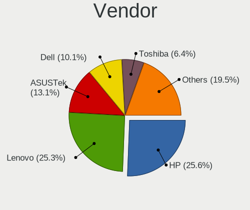
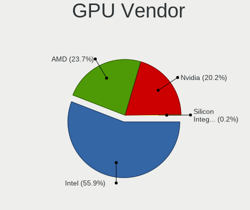
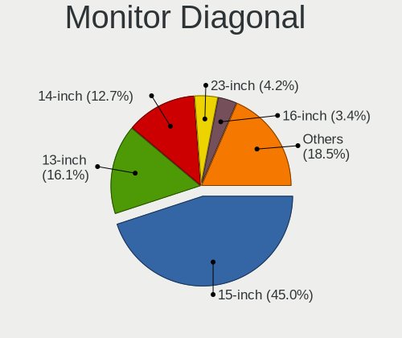
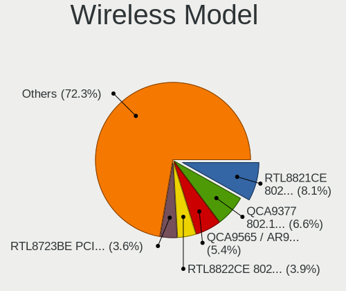
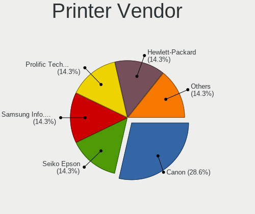
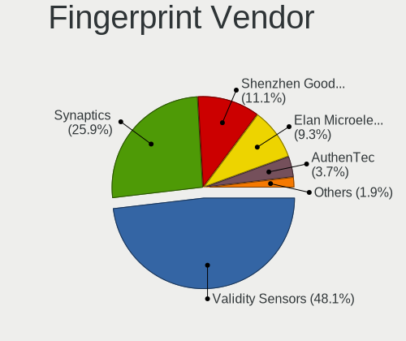

Linux in Peru - Tested Hardware & Statistics (Notebooks)
--------------------------------------------------------

A project to collect tested hardware configurations for Linux in Peru.

Anyone can contribute to this report by the [hw-probe](https://github.com/linuxhw/hw-probe) tool:

    sudo -E hw-probe -all -upload

Please contribute! Especially if your hardware is rare.

Contents
--------

* [ Test Cases ](#test-cases)

* [ System ](#system)
  - [ OS                       ](#os)
  - [ OS Family                ](#os-family)
  - [ Kernel                   ](#kernel)
  - [ Kernel Family            ](#kernel-family)
  - [ Kernel Major Ver.        ](#kernel-major-ver)
  - [ Arch                     ](#arch)
  - [ DE                       ](#de)
  - [ Display Server           ](#display-server)
  - [ Display Manager          ](#display-manager)
  - [ OS Lang                  ](#os-lang)
  - [ Boot Mode                ](#boot-mode)
  - [ Filesystem               ](#filesystem)
  - [ Part. scheme             ](#part-scheme)
  - [ Dual Boot with Linux/BSD ](#dual-boot-with-linuxbsd)
  - [ Dual Boot (Win)          ](#dual-boot-win)

* [ Board ](#board)
  - [ Vendor                   ](#vendor)
  - [ Model                    ](#model)
  - [ Model Family             ](#model-family)
  - [ MFG Year                 ](#mfg-year)
  - [ Form Factor              ](#form-factor)
  - [ Secure Boot              ](#secure-boot)
  - [ Coreboot                 ](#coreboot)
  - [ RAM Size                 ](#ram-size)
  - [ RAM Used                 ](#ram-used)
  - [ Total Drives             ](#total-drives)
  - [ Has CD-ROM               ](#has-cd-rom)
  - [ Has Ethernet             ](#has-ethernet)
  - [ Has WiFi                 ](#has-wifi)
  - [ Has Bluetooth            ](#has-bluetooth)

* [ Location ](#location)
  - [ Country                  ](#country)
  - [ City                     ](#city)

* [ Drives ](#drives)
  - [ Drive Vendor             ](#drive-vendor)
  - [ Drive Model              ](#drive-model)
  - [ HDD Vendor               ](#hdd-vendor)
  - [ SSD Vendor               ](#ssd-vendor)
  - [ Drive Kind               ](#drive-kind)
  - [ Drive Connector          ](#drive-connector)
  - [ Drive Size               ](#drive-size)
  - [ Space Total              ](#space-total)
  - [ Space Used               ](#space-used)
  - [ Malfunc. Drives          ](#malfunc-drives)
  - [ Malfunc. Drive Vendor    ](#malfunc-drive-vendor)
  - [ Malfunc. HDD Vendor      ](#malfunc-hdd-vendor)
  - [ Malfunc. Drive Kind      ](#malfunc-drive-kind)
  - [ Failed Drives            ](#failed-drives)
  - [ Failed Drive Vendor      ](#failed-drive-vendor)
  - [ Drive Status             ](#drive-status)

* [ Storage controller ](#storage-controller)
  - [ Storage Vendor           ](#storage-vendor)
  - [ Storage Model            ](#storage-model)
  - [ Storage Kind             ](#storage-kind)

* [ Processor ](#processor)
  - [ CPU Vendor               ](#cpu-vendor)
  - [ CPU Model                ](#cpu-model)
  - [ CPU Model Family         ](#cpu-model-family)
  - [ CPU Cores                ](#cpu-cores)
  - [ CPU Sockets              ](#cpu-sockets)
  - [ CPU Threads              ](#cpu-threads)
  - [ CPU Op-Modes             ](#cpu-op-modes)
  - [ CPU Microcode            ](#cpu-microcode)
  - [ CPU Microarch            ](#cpu-microarch)

* [ Graphics ](#graphics)
  - [ GPU Vendor               ](#gpu-vendor)
  - [ GPU Model                ](#gpu-model)
  - [ GPU Combo                ](#gpu-combo)
  - [ GPU Driver               ](#gpu-driver)
  - [ GPU Memory               ](#gpu-memory)

* [ Monitor ](#monitor)
  - [ Monitor Vendor           ](#monitor-vendor)
  - [ Monitor Model            ](#monitor-model)
  - [ Monitor Resolution       ](#monitor-resolution)
  - [ Monitor Diagonal         ](#monitor-diagonal)
  - [ Monitor Width            ](#monitor-width)
  - [ Aspect Ratio             ](#aspect-ratio)
  - [ Monitor Area             ](#monitor-area)
  - [ Pixel Density            ](#pixel-density)
  - [ Multiple Monitors        ](#multiple-monitors)

* [ Network ](#network)
  - [ Net Controller Vendor    ](#net-controller-vendor)
  - [ Net Controller Model     ](#net-controller-model)
  - [ Wireless Vendor          ](#wireless-vendor)
  - [ Wireless Model           ](#wireless-model)
  - [ Ethernet Vendor          ](#ethernet-vendor)
  - [ Ethernet Model           ](#ethernet-model)
  - [ Net Controller Kind      ](#net-controller-kind)
  - [ Used Controller          ](#used-controller)
  - [ NICs                     ](#nics)
  - [ IPv6                     ](#ipv6)

* [ Bluetooth ](#bluetooth)
  - [ Bluetooth Vendor         ](#bluetooth-vendor)
  - [ Bluetooth Model          ](#bluetooth-model)

* [ Sound ](#sound)
  - [ Sound Vendor             ](#sound-vendor)
  - [ Sound Model              ](#sound-model)

* [ Memory ](#memory)
  - [ Memory Vendor            ](#memory-vendor)
  - [ Memory Model             ](#memory-model)
  - [ Memory Kind              ](#memory-kind)
  - [ Memory Form Factor       ](#memory-form-factor)
  - [ Memory Size              ](#memory-size)
  - [ Memory Speed             ](#memory-speed)

* [ Printers & scanners ](#printers--scanners)
  - [ Printer Vendor           ](#printer-vendor)
  - [ Printer Model            ](#printer-model)
  - [ Scanner Vendor           ](#scanner-vendor)
  - [ Scanner Model            ](#scanner-model)

* [ Camera ](#camera)
  - [ Camera Vendor            ](#camera-vendor)
  - [ Camera Model             ](#camera-model)

* [ Security ](#security)
  - [ Fingerprint Vendor       ](#fingerprint-vendor)
  - [ Fingerprint Model        ](#fingerprint-model)
  - [ Chipcard Vendor          ](#chipcard-vendor)
  - [ Chipcard Model           ](#chipcard-model)

* [ Unsupported ](#unsupported)
  - [ Unsupported Devices      ](#unsupported-devices)
  - [ Unsupported Device Types ](#unsupported-device-types)

Test Cases
----------

Total: 253

| Vendor     | Model                       | Probe                                                      | Date         |
|------------|-----------------------------|------------------------------------------------------------|--------------|
| ASUSTek    | ASUS TUF Gaming A15 FA50... | [dca18dced0](https://linux-hardware.org/?probe=dca18dced0) | Oct 30, 2022 |
| Acer       | Aspire 5745                 | [2f79de6974](https://linux-hardware.org/?probe=2f79de6974) | Oct 28, 2022 |
| HP         | Pavilion Laptop 15-cc1xx    | [a977f9c3e9](https://linux-hardware.org/?probe=a977f9c3e9) | Oct 26, 2022 |
| ASUSTek    | X205TA                      | [2da58f110d](https://linux-hardware.org/?probe=2da58f110d) | Oct 24, 2022 |
| ADVANCE    | PS5077                      | [998e544711](https://linux-hardware.org/?probe=998e544711) | Oct 22, 2022 |
| ADVANCE    | PS5077                      | [97bfff0fc6](https://linux-hardware.org/?probe=97bfff0fc6) | Oct 22, 2022 |
| Lenovo     | ThinkBook 15-IIL 20SM       | [07acd27a70](https://linux-hardware.org/?probe=07acd27a70) | Oct 21, 2022 |
| Dell       | Latitude E5470              | [11ad7cd084](https://linux-hardware.org/?probe=11ad7cd084) | Oct 20, 2022 |
| ASUSTek    | VivoBook 15_ASUS Laptop ... | [7dce56f55d](https://linux-hardware.org/?probe=7dce56f55d) | Oct 10, 2022 |
| ASUSTek    | VivoBook_ASUSLaptop M350... | [f15acdf9d4](https://linux-hardware.org/?probe=f15acdf9d4) | Oct 09, 2022 |
| HUAWEI     | BOHB-WAX9                   | [6fec6456bc](https://linux-hardware.org/?probe=6fec6456bc) | Oct 07, 2022 |
| HUAWEI     | BOHB-WAX9                   | [fb954f84b4](https://linux-hardware.org/?probe=fb954f84b4) | Oct 07, 2022 |
| HUAWEI     | BOHB-WAX9                   | [d56cf9868c](https://linux-hardware.org/?probe=d56cf9868c) | Oct 07, 2022 |
| Lenovo     | IdeaPad 320-15ISK 80XH      | [44afa82c4a](https://linux-hardware.org/?probe=44afa82c4a) | Sep 19, 2022 |
| ASUSTek    | S550CA                      | [a403b2a79d](https://linux-hardware.org/?probe=a403b2a79d) | Sep 17, 2022 |
| HP         | Laptop 15-ef1xxx            | [dd55f6960d](https://linux-hardware.org/?probe=dd55f6960d) | Sep 15, 2022 |
| Lenovo     | V330-15IKB 81AX             | [0a91582802](https://linux-hardware.org/?probe=0a91582802) | Sep 14, 2022 |
| ASUSTek    | VivoBook_ASUSLaptop X515... | [2267f01dee](https://linux-hardware.org/?probe=2267f01dee) | Aug 27, 2022 |
| Lenovo     | G570 4334                   | [7bea18122c](https://linux-hardware.org/?probe=7bea18122c) | Aug 27, 2022 |
| HP         | 255 G7 Notebook PC          | [c001653a5a](https://linux-hardware.org/?probe=c001653a5a) | Aug 20, 2022 |
| Dell       | Vostro 3405                 | [2b5840062a](https://linux-hardware.org/?probe=2b5840062a) | Aug 18, 2022 |
| Dell       | Latitude E6430              | [91a44f9b39](https://linux-hardware.org/?probe=91a44f9b39) | Aug 13, 2022 |
| Dell       | Latitude E6430              | [864ad41c22](https://linux-hardware.org/?probe=864ad41c22) | Aug 13, 2022 |
| Lenovo     | ThinkPad T60 1953D9U        | [1c31cb6b44](https://linux-hardware.org/?probe=1c31cb6b44) | Jul 21, 2022 |
| Acer       | Aspire A515-51G             | [4414dd4c1b](https://linux-hardware.org/?probe=4414dd4c1b) | Jul 19, 2022 |
| ASUSTek    | VivoBook_ASUSLaptop X515... | [b511d2883b](https://linux-hardware.org/?probe=b511d2883b) | Jul 16, 2022 |
| Lenovo     | ThinkPad X140e 20BLA00C0... | [8c160ae192](https://linux-hardware.org/?probe=8c160ae192) | Jul 12, 2022 |
| Acer       | Aspire ES1-512              | [aa2ad87835](https://linux-hardware.org/?probe=aa2ad87835) | Jul 08, 2022 |
| Acer       | Aspire V3-471               | [75664ddf0f](https://linux-hardware.org/?probe=75664ddf0f) | Jul 07, 2022 |
| ASUSTek    | S550CA                      | [8ed63bbdfd](https://linux-hardware.org/?probe=8ed63bbdfd) | Jul 01, 2022 |
| MSI        | GL65 Leopard 10SEK          | [5043bf1cd4](https://linux-hardware.org/?probe=5043bf1cd4) | Jun 29, 2022 |
| Lenovo     | ThinkPad X140e 20BLA00C0... | [01fbfc98f8](https://linux-hardware.org/?probe=01fbfc98f8) | Jun 27, 2022 |
| Lenovo     | V15-IIL 82C5                | [1023ca742e](https://linux-hardware.org/?probe=1023ca742e) | Jun 27, 2022 |
| HP         | Laptop 15-ef1xxx            | [d0200625ac](https://linux-hardware.org/?probe=d0200625ac) | Jun 27, 2022 |
| Dell       | Inspiron 15-3567            | [e6d22a4d34](https://linux-hardware.org/?probe=e6d22a4d34) | Jun 27, 2022 |
| Dell       | Inspiron 15 7000 Gaming     | [fac01563a9](https://linux-hardware.org/?probe=fac01563a9) | Jun 24, 2022 |
| HP         | Laptop 15-ef1xxx            | [1d18aab349](https://linux-hardware.org/?probe=1d18aab349) | Jun 23, 2022 |
| Dell       | Inspiron 5570               | [4a61f83195](https://linux-hardware.org/?probe=4a61f83195) | Jun 23, 2022 |
| ASUSTek    | S550CA                      | [c7c236e5a1](https://linux-hardware.org/?probe=c7c236e5a1) | Jun 23, 2022 |
| Dell       | Inspiron 15-3567            | [9538654245](https://linux-hardware.org/?probe=9538654245) | Jun 21, 2022 |
| Lenovo     | V15-IIL 82C5                | [47f52294bb](https://linux-hardware.org/?probe=47f52294bb) | Jun 14, 2022 |
| HUAWEI     | NBLB-WAX9N                  | [e24239a843](https://linux-hardware.org/?probe=e24239a843) | Jun 09, 2022 |
| ASUSTek    | S550CA                      | [9ba4a449c6](https://linux-hardware.org/?probe=9ba4a449c6) | Jun 09, 2022 |
| Dell       | Latitude E7450              | [29219339b2](https://linux-hardware.org/?probe=29219339b2) | Jun 05, 2022 |
| ASUSTek    | ROG Strix G513QY_G513QY     | [49c400d1f7](https://linux-hardware.org/?probe=49c400d1f7) | May 31, 2022 |
| HP         | Pavilion Laptop 15-cw1xx... | [be0f84abb3](https://linux-hardware.org/?probe=be0f84abb3) | May 30, 2022 |
| ASUSTek    | X555UQ                      | [c266f3d070](https://linux-hardware.org/?probe=c266f3d070) | May 30, 2022 |
| Lenovo     | ThinkPad P52 20MAS3X200     | [da2a67f904](https://linux-hardware.org/?probe=da2a67f904) | May 28, 2022 |
| Acer       | TravelMate 5320             | [4d7e13024d](https://linux-hardware.org/?probe=4d7e13024d) | May 19, 2022 |
| Lenovo     | ThinkPad P52 20MAS3X200     | [7f0fc0c72e](https://linux-hardware.org/?probe=7f0fc0c72e) | May 19, 2022 |
| ASUSTek    | ROG Strix G513QY_G513QY     | [2ee4916960](https://linux-hardware.org/?probe=2ee4916960) | May 18, 2022 |
| Dell       | Vostro 3405                 | [fcec5f1cdd](https://linux-hardware.org/?probe=fcec5f1cdd) | May 17, 2022 |
| ASUSTek    | ROG Strix G513QY_G513QY     | [21f3f7368f](https://linux-hardware.org/?probe=21f3f7368f) | May 17, 2022 |
| Dell       | Vostro 3405                 | [3c8e334d43](https://linux-hardware.org/?probe=3c8e334d43) | May 12, 2022 |
| Lenovo     | Legion 5 17ITH6H 82JM       | [451c9ea765](https://linux-hardware.org/?probe=451c9ea765) | May 08, 2022 |
| Lenovo     | ThinkPad T530 24296G9       | [934e13a24c](https://linux-hardware.org/?probe=934e13a24c) | May 08, 2022 |
| HP         | ZBook 15                    | [bd8e2ed626](https://linux-hardware.org/?probe=bd8e2ed626) | May 07, 2022 |
| Compal     | QAQXX                       | [d3211e6bc6](https://linux-hardware.org/?probe=d3211e6bc6) | May 05, 2022 |
| HP         | Laptop 15-ef1xxx            | [d2eb5ae290](https://linux-hardware.org/?probe=d2eb5ae290) | May 05, 2022 |
| Lenovo     | V310-15ISK 80SY             | [1a791b0fd5](https://linux-hardware.org/?probe=1a791b0fd5) | May 04, 2022 |
| Lenovo     | V310-15ISK 80SY             | [3846d07c7f](https://linux-hardware.org/?probe=3846d07c7f) | May 04, 2022 |
| HP         | ENVY dv6                    | [23ad3290c2](https://linux-hardware.org/?probe=23ad3290c2) | May 03, 2022 |
| Lenovo     | ThinkPad L15 Gen 1 20U3S... | [74eec8c684](https://linux-hardware.org/?probe=74eec8c684) | May 01, 2022 |
| Lenovo     | V330-15IKB 81AX             | [60a636868c](https://linux-hardware.org/?probe=60a636868c) | Apr 30, 2022 |
| Lenovo     | IdeaPad S145-15IWL 81MV     | [05db30a69b](https://linux-hardware.org/?probe=05db30a69b) | Apr 30, 2022 |
| Acer       | Aspire E5-571               | [ebdc8b1380](https://linux-hardware.org/?probe=ebdc8b1380) | Apr 30, 2022 |
| Acer       | Aspire A315-23              | [865091bbc1](https://linux-hardware.org/?probe=865091bbc1) | Apr 30, 2022 |
| Acer       | Aspire A315-23              | [5ee29c3982](https://linux-hardware.org/?probe=5ee29c3982) | Apr 30, 2022 |
| ASUSTek    | X556UR                      | [3f920954f7](https://linux-hardware.org/?probe=3f920954f7) | Apr 30, 2022 |
| HP         | Pavilion Sleekbook 15       | [0003f9342e](https://linux-hardware.org/?probe=0003f9342e) | Apr 30, 2022 |
| HP         | Laptop 14-dq1xxx            | [7c9e2f4d8f](https://linux-hardware.org/?probe=7c9e2f4d8f) | Apr 30, 2022 |
| HP         | Notebook                    | [94f0ce7610](https://linux-hardware.org/?probe=94f0ce7610) | Apr 26, 2022 |
| Dell       | Vostro 3405                 | [2d5bae0eeb](https://linux-hardware.org/?probe=2d5bae0eeb) | Apr 24, 2022 |
| HP         | Pavilion Laptop 15-cw1xx... | [a33d067e62](https://linux-hardware.org/?probe=a33d067e62) | Apr 18, 2022 |
| HP         | Compaq Mini CQ10-100        | [89c92e2cf7](https://linux-hardware.org/?probe=89c92e2cf7) | Apr 15, 2022 |
| Dell       | Latitude 3410               | [78396d572c](https://linux-hardware.org/?probe=78396d572c) | Apr 15, 2022 |
| HP         | ZBook Firefly 15 G7 Mobi... | [0e9e99acae](https://linux-hardware.org/?probe=0e9e99acae) | Apr 13, 2022 |
| Lenovo     | ThinkPad X140e 20BLA00C0... | [9cad677222](https://linux-hardware.org/?probe=9cad677222) | Mar 24, 2022 |
| HP         | Stream Laptop 14-ax0XX      | [9b99145008](https://linux-hardware.org/?probe=9b99145008) | Mar 21, 2022 |
| HP         | Laptop 14-ck0xxx            | [92c7141f37](https://linux-hardware.org/?probe=92c7141f37) | Mar 12, 2022 |
| HP         | 340 G2                      | [c4f663b37b](https://linux-hardware.org/?probe=c4f663b37b) | Mar 04, 2022 |
| HP         | Pavilion Laptop 15-cd0xx    | [eeaed94df7](https://linux-hardware.org/?probe=eeaed94df7) | Feb 23, 2022 |
| Acer       | Aspire 4750                 | [b8f02b07fb](https://linux-hardware.org/?probe=b8f02b07fb) | Feb 18, 2022 |
| Acer       | Aspire 4750                 | [3269f565c4](https://linux-hardware.org/?probe=3269f565c4) | Feb 18, 2022 |
| HP         | 240 G7 Notebook PC          | [03f63a3789](https://linux-hardware.org/?probe=03f63a3789) | Feb 09, 2022 |
| efirstview | v01099                      | [ed22d3c2b6](https://linux-hardware.org/?probe=ed22d3c2b6) | Feb 04, 2022 |
| Toshiba    | Satellite C645              | [d552c9b132](https://linux-hardware.org/?probe=d552c9b132) | Feb 04, 2022 |
| ASUSTek    | VivoBook_ASUSLaptop X515... | [b7cb93aff2](https://linux-hardware.org/?probe=b7cb93aff2) | Jan 25, 2022 |
| ASUSTek    | ASUS TUF Gaming A15 FA50... | [f36cdb65e7](https://linux-hardware.org/?probe=f36cdb65e7) | Jan 24, 2022 |
| Lenovo     | IdeaPad S340-15API 81NC     | [1f065ea4dd](https://linux-hardware.org/?probe=1f065ea4dd) | Jan 12, 2022 |
| Sony       | VGN-FW56M                   | [9fb3fa0f32](https://linux-hardware.org/?probe=9fb3fa0f32) | Jan 09, 2022 |
| Lenovo     | IdeaPad S540-14API 81NH     | [eb23bd590c](https://linux-hardware.org/?probe=eb23bd590c) | Jan 07, 2022 |
| Toshiba    | Satellite E205              | [92431da366](https://linux-hardware.org/?probe=92431da366) | Dec 24, 2021 |
| Lenovo     | G400 20235                  | [c2bb5d0010](https://linux-hardware.org/?probe=c2bb5d0010) | Dec 18, 2021 |
| ASUSTek    | ASUS TUF Gaming A15 FA50... | [020b7460a1](https://linux-hardware.org/?probe=020b7460a1) | Dec 11, 2021 |
| HP         | Pavilion Gaming Laptop 1... | [fefa594281](https://linux-hardware.org/?probe=fefa594281) | Dec 10, 2021 |
| HP         | 250 G5 Notebook PC          | [3cd230924a](https://linux-hardware.org/?probe=3cd230924a) | Dec 04, 2021 |
| Lenovo     | ThinkPad X1 Carbon Gen 8... | [54f954491a](https://linux-hardware.org/?probe=54f954491a) | Nov 21, 2021 |
| Lenovo     | IdeaPad 330S-14IKB 81F4     | [e085c7e42a](https://linux-hardware.org/?probe=e085c7e42a) | Nov 09, 2021 |
| Lenovo     | IdeaPad S340-15IML 81NA     | [90fbcc38c3](https://linux-hardware.org/?probe=90fbcc38c3) | Nov 08, 2021 |
| Dell       | XPS 13 9360                 | [61db5bc9b5](https://linux-hardware.org/?probe=61db5bc9b5) | Nov 04, 2021 |
| Lenovo     | ThinkPad E15 Gen 2 20TES... | [df2d173d7c](https://linux-hardware.org/?probe=df2d173d7c) | Nov 01, 2021 |
| Lenovo     | V14-ARE 82DQ                | [8948989999](https://linux-hardware.org/?probe=8948989999) | Oct 31, 2021 |
| HP         | Laptop 15-db0xxx            | [f4d2f1104e](https://linux-hardware.org/?probe=f4d2f1104e) | Oct 28, 2021 |
| Lenovo     | IdeaPad S340-15IML 81NA     | [849c03d63c](https://linux-hardware.org/?probe=849c03d63c) | Oct 21, 2021 |
| Lenovo     | IdeaPad 3 14ADA05 81W0      | [87d959803d](https://linux-hardware.org/?probe=87d959803d) | Oct 15, 2021 |
| Dell       | XPS 13 9360                 | [8bb0307157](https://linux-hardware.org/?probe=8bb0307157) | Sep 25, 2021 |
| HP         | Notebook                    | [36fd24364d](https://linux-hardware.org/?probe=36fd24364d) | Sep 24, 2021 |
| Advance    | AN-5431                     | [d48465a943](https://linux-hardware.org/?probe=d48465a943) | Sep 14, 2021 |
| HP         | Notebook                    | [2a564798fd](https://linux-hardware.org/?probe=2a564798fd) | Sep 11, 2021 |
| Lenovo     | ThinkPad T440 20B7A08500    | [b7e859020c](https://linux-hardware.org/?probe=b7e859020c) | Aug 26, 2021 |
| HP         | 450                         | [9f5d03c478](https://linux-hardware.org/?probe=9f5d03c478) | Aug 19, 2021 |
| Chuwi      | GemiBook Pro                | [0ffe99b73b](https://linux-hardware.org/?probe=0ffe99b73b) | Aug 14, 2021 |
| Lenovo     | IdeaPad 3 14ADA05 81W0      | [392df1ef2b](https://linux-hardware.org/?probe=392df1ef2b) | Aug 13, 2021 |
| ASUSTek    | X542UQ                      | [63d2276d55](https://linux-hardware.org/?probe=63d2276d55) | Aug 03, 2021 |
| Advance    | AN-5431                     | [06409d8637](https://linux-hardware.org/?probe=06409d8637) | Aug 01, 2021 |
| Lenovo     | ThinkPad T580 20LAS0XD00    | [36f1b3eb94](https://linux-hardware.org/?probe=36f1b3eb94) | Jul 31, 2021 |
| Dell       | Latitude E5540              | [44b8f3a781](https://linux-hardware.org/?probe=44b8f3a781) | Jul 23, 2021 |
| HP         | Pavilion dv6                | [3e69858907](https://linux-hardware.org/?probe=3e69858907) | Jul 09, 2021 |
| Lenovo     | ThinkPad L460 20FVA0G400    | [378021c178](https://linux-hardware.org/?probe=378021c178) | Jul 06, 2021 |
| ASUSTek    | ROG Strix G532LW_G532LWI    | [b36be47753](https://linux-hardware.org/?probe=b36be47753) | Jun 27, 2021 |
| HP         | Pavilion Notebook           | [7684808016](https://linux-hardware.org/?probe=7684808016) | Jun 24, 2021 |
| Lenovo     | IdeaPad S540-14API 81NH     | [003f0d1c2a](https://linux-hardware.org/?probe=003f0d1c2a) | Jun 21, 2021 |
| ASUSTek    | ROG Strix G532LW_G532LWI    | [1344b72b26](https://linux-hardware.org/?probe=1344b72b26) | Jun 20, 2021 |
| Lenovo     | IdeaPad S340-15IML 81NA     | [6670e1c145](https://linux-hardware.org/?probe=6670e1c145) | Jun 01, 2021 |
| ASUSTek    | VivoBook_ASUSLaptop X509... | [af8045a7b3](https://linux-hardware.org/?probe=af8045a7b3) | May 31, 2021 |
| ASUSTek    | X550LD                      | [89bed4ca0a](https://linux-hardware.org/?probe=89bed4ca0a) | May 28, 2021 |
| Lenovo     | IdeaPad S340-15IML 81NA     | [ee9233be38](https://linux-hardware.org/?probe=ee9233be38) | May 26, 2021 |
| HP         | ProBook 450 G1              | [6d64546949](https://linux-hardware.org/?probe=6d64546949) | May 23, 2021 |
| HP         | ProBook 450 G1              | [1b52ac3979](https://linux-hardware.org/?probe=1b52ac3979) | May 23, 2021 |
| HP         | 240 G7                      | [9fff9c48ab](https://linux-hardware.org/?probe=9fff9c48ab) | May 16, 2021 |
| ASUSTek    | X550LC                      | [23a000c11b](https://linux-hardware.org/?probe=23a000c11b) | May 05, 2021 |
| ASUSTek    | X550LC                      | [d50b1f77d7](https://linux-hardware.org/?probe=d50b1f77d7) | May 05, 2021 |
| Toshiba    | Satellite L35               | [1abffa2c4c](https://linux-hardware.org/?probe=1abffa2c4c) | Apr 16, 2021 |
| HP         | 14                          | [9d65301476](https://linux-hardware.org/?probe=9d65301476) | Apr 09, 2021 |
| Lenovo     | IdeaPad S145-15IWL 81MV     | [14e58f968d](https://linux-hardware.org/?probe=14e58f968d) | Apr 07, 2021 |
| Toshiba    | Satellite C655D             | [1959880e8f](https://linux-hardware.org/?probe=1959880e8f) | Mar 28, 2021 |
| Dell       | Latitude E5470              | [6ade45ee37](https://linux-hardware.org/?probe=6ade45ee37) | Mar 21, 2021 |
| Lenovo     | V310-14ISK 80SX             | [529bb59872](https://linux-hardware.org/?probe=529bb59872) | Mar 12, 2021 |
| Toshiba    | Satellite A665              | [23143ad7ae](https://linux-hardware.org/?probe=23143ad7ae) | Mar 07, 2021 |
| Lenovo     | IdeaPad S145-14IWL 81MU     | [b2e0735680](https://linux-hardware.org/?probe=b2e0735680) | Feb 28, 2021 |
| MSI        | Prestige 14 A10SC           | [26f40cdcba](https://linux-hardware.org/?probe=26f40cdcba) | Feb 25, 2021 |
| HP         | ProBook 5330m               | [4a66a57a41](https://linux-hardware.org/?probe=4a66a57a41) | Feb 23, 2021 |
| Razer      | Blade                       | [58fcda1ac4](https://linux-hardware.org/?probe=58fcda1ac4) | Feb 18, 2021 |
| ASUSTek    | N56JN                       | [02008fdd48](https://linux-hardware.org/?probe=02008fdd48) | Jan 31, 2021 |
| Acer       | Aspire V5-471               | [3c0bc82dde](https://linux-hardware.org/?probe=3c0bc82dde) | Jan 16, 2021 |
| Lenovo     | V330-15IKB 81AX             | [48d877b127](https://linux-hardware.org/?probe=48d877b127) | Jan 07, 2021 |
| HP         | Pavilion dv7                | [7591424ea2](https://linux-hardware.org/?probe=7591424ea2) | Jan 06, 2021 |
| HP         | Pavilion dv7                | [d660b968a4](https://linux-hardware.org/?probe=d660b968a4) | Jan 06, 2021 |
| Dell       | Inspiron 14-3467            | [fe678ae6f5](https://linux-hardware.org/?probe=fe678ae6f5) | Jan 04, 2021 |
| Dell       | G5 5505                     | [156236cc47](https://linux-hardware.org/?probe=156236cc47) | Dec 30, 2020 |
| Dell       | Latitude E5470              | [f6a3bc1097](https://linux-hardware.org/?probe=f6a3bc1097) | Dec 28, 2020 |
| HP         | Pavilion Notebook           | [033a1ff3cd](https://linux-hardware.org/?probe=033a1ff3cd) | Dec 07, 2020 |
| ASUSTek    | N56JN                       | [776cb81132](https://linux-hardware.org/?probe=776cb81132) | Nov 25, 2020 |
| ASUSTek    | N56JN                       | [e14774acd5](https://linux-hardware.org/?probe=e14774acd5) | Nov 25, 2020 |
| HP         | 14                          | [918fb071c2](https://linux-hardware.org/?probe=918fb071c2) | Nov 22, 2020 |
| Dell       | Latitude 3440               | [17db1f31f6](https://linux-hardware.org/?probe=17db1f31f6) | Nov 13, 2020 |
| HP         | ProBook 440 G5              | [07ac3c5495](https://linux-hardware.org/?probe=07ac3c5495) | Oct 07, 2020 |
| HP         | ProBook 440 G5              | [123eb500e2](https://linux-hardware.org/?probe=123eb500e2) | Oct 06, 2020 |
| Lenovo     | IdeaPad S540-14API 81NH     | [735aea26c5](https://linux-hardware.org/?probe=735aea26c5) | Sep 28, 2020 |
| HP         | 240 G7                      | [2507cc1bc7](https://linux-hardware.org/?probe=2507cc1bc7) | Sep 28, 2020 |
| Lenovo     | ThinkPad T470 20HES0JQ00    | [4235f1fc42](https://linux-hardware.org/?probe=4235f1fc42) | Sep 20, 2020 |
| Acer       | Nitro AN515-54              | [60efe004ff](https://linux-hardware.org/?probe=60efe004ff) | Sep 19, 2020 |
| Lenovo     | Legion Y540-15IRH 81SX      | [123ba2dd21](https://linux-hardware.org/?probe=123ba2dd21) | Sep 15, 2020 |
| Lenovo     | Legion Y540-15IRH-PG0 81... | [e193207a8f](https://linux-hardware.org/?probe=e193207a8f) | Sep 14, 2020 |
| Lenovo     | IdeaPad S540-14API 81NH     | [d043bf1b42](https://linux-hardware.org/?probe=d043bf1b42) | Sep 06, 2020 |
| Lenovo     | ThinkPad T430 2349LRS       | [d886cd5c31](https://linux-hardware.org/?probe=d886cd5c31) | Sep 05, 2020 |
| Lenovo     | ThinkPad T430 2349LRS       | [38284d9848](https://linux-hardware.org/?probe=38284d9848) | Sep 05, 2020 |
| Lenovo     | V310-15ISK 80SY             | [fc06b19016](https://linux-hardware.org/?probe=fc06b19016) | Sep 05, 2020 |
| Lenovo     | IdeaPad S540-14API 81NH     | [395b3e9836](https://linux-hardware.org/?probe=395b3e9836) | Sep 05, 2020 |
| Lenovo     | ThinkPad T430s 23539KU      | [2f700d4f41](https://linux-hardware.org/?probe=2f700d4f41) | Sep 03, 2020 |
| Lenovo     | G475 20080                  | [c97ad59308](https://linux-hardware.org/?probe=c97ad59308) | Aug 26, 2020 |
| Acer       | Aspire A515-52G             | [86a890eb18](https://linux-hardware.org/?probe=86a890eb18) | Aug 23, 2020 |
| Acer       | Aspire A515-52G             | [5034bf6bc3](https://linux-hardware.org/?probe=5034bf6bc3) | Aug 23, 2020 |
| Toshiba    | Satellite C845              | [7e218cb089](https://linux-hardware.org/?probe=7e218cb089) | Aug 22, 2020 |
| ASUSTek    | VivoBook_ASUS Laptop X50... | [26fe839699](https://linux-hardware.org/?probe=26fe839699) | Aug 14, 2020 |
| ASUSTek    | VivoBook_ASUS Laptop X50... | [55d2d92173](https://linux-hardware.org/?probe=55d2d92173) | Aug 14, 2020 |
| Lenovo     | ThinkPad P50 20EQA09900     | [4360f8c6a6](https://linux-hardware.org/?probe=4360f8c6a6) | Aug 12, 2020 |
| Lenovo     | ThinkPad P50 20EQA09900     | [76f4cf6487](https://linux-hardware.org/?probe=76f4cf6487) | Aug 12, 2020 |
| Toshiba    | Satellite L45-B             | [ce51a04f5d](https://linux-hardware.org/?probe=ce51a04f5d) | Aug 01, 2020 |
| Lenovo     | ThinkPad T60 1953D9U        | [45c01e0aca](https://linux-hardware.org/?probe=45c01e0aca) | Jul 30, 2020 |
| HP         | 245 G3                      | [044b206096](https://linux-hardware.org/?probe=044b206096) | Jul 26, 2020 |
| Lenovo     | G480 20149                  | [7fdfad1fc4](https://linux-hardware.org/?probe=7fdfad1fc4) | Jul 11, 2020 |
| ASUSTek    | VivoBook 15_ASUS Laptop ... | [f0ed82358a](https://linux-hardware.org/?probe=f0ed82358a) | Jul 05, 2020 |
| Lenovo     | G480 20149                  | [c9d75e29d3](https://linux-hardware.org/?probe=c9d75e29d3) | Jun 30, 2020 |
| HP         | ProBook 645 G4              | [2fb2b6ad63](https://linux-hardware.org/?probe=2fb2b6ad63) | Jun 22, 2020 |
| HP         | Pavilion Laptop 15-cw1xx... | [844f7b115e](https://linux-hardware.org/?probe=844f7b115e) | Jun 21, 2020 |
| HP         | ProBook 645 G4              | [0803c9f10d](https://linux-hardware.org/?probe=0803c9f10d) | Jun 18, 2020 |
| ASUSTek    | X540LA                      | [333139a886](https://linux-hardware.org/?probe=333139a886) | Jun 17, 2020 |
| HP         | ProBook 645 G4              | [1c258b2abb](https://linux-hardware.org/?probe=1c258b2abb) | Jun 15, 2020 |
| Toshiba    | Satellite L855              | [adbdc1e191](https://linux-hardware.org/?probe=adbdc1e191) | Jun 13, 2020 |
| ASUSTek    | VivoBook 15_ASUS Laptop ... | [97237c08ac](https://linux-hardware.org/?probe=97237c08ac) | Jun 11, 2020 |
| Apple      | MacBookPro9,2               | [371c5ccd5a](https://linux-hardware.org/?probe=371c5ccd5a) | May 31, 2020 |
| HP         | ENVY 15                     | [9075368552](https://linux-hardware.org/?probe=9075368552) | May 29, 2020 |
| Lenovo     | G50-70 20351                | [fb33cd7cef](https://linux-hardware.org/?probe=fb33cd7cef) | May 26, 2020 |
| HP         | EliteBook 840 G6            | [07829f089a](https://linux-hardware.org/?probe=07829f089a) | May 24, 2020 |
| HP         | ENVY 15                     | [afcc7af453](https://linux-hardware.org/?probe=afcc7af453) | May 23, 2020 |
| Unknown    | Unknown                     | [aabfc32771](https://linux-hardware.org/?probe=aabfc32771) | May 19, 2020 |
| Unknown    | Unknown                     | [3bcd40acc0](https://linux-hardware.org/?probe=3bcd40acc0) | May 19, 2020 |
| Dell       | Precision M4600             | [7060267281](https://linux-hardware.org/?probe=7060267281) | May 08, 2020 |
| HP         | Pavilion Sleekbook 14 PC    | [c513103ac9](https://linux-hardware.org/?probe=c513103ac9) | May 05, 2020 |
| HP         | 450                         | [22b90eb634](https://linux-hardware.org/?probe=22b90eb634) | May 02, 2020 |
| HP         | 450                         | [0da93b6fce](https://linux-hardware.org/?probe=0da93b6fce) | May 02, 2020 |
| Dell       | System XPS L502X            | [939683d725](https://linux-hardware.org/?probe=939683d725) | Apr 27, 2020 |
| Dell       | System XPS L502X            | [c893f3f105](https://linux-hardware.org/?probe=c893f3f105) | Apr 24, 2020 |
| HP         | Pavilion Laptop 15-cs0xx... | [97261529e7](https://linux-hardware.org/?probe=97261529e7) | Apr 21, 2020 |
| HP         | Pavilion Laptop 15-cs0xx... | [babdfebf40](https://linux-hardware.org/?probe=babdfebf40) | Apr 17, 2020 |
| Lenovo     | Yoga 2 11 20332             | [bbd3b573e1](https://linux-hardware.org/?probe=bbd3b573e1) | Apr 05, 2020 |
| Lenovo     | Yoga 2 11 20332             | [51c0fd8c5c](https://linux-hardware.org/?probe=51c0fd8c5c) | Apr 05, 2020 |
| Toshiba    | NB505                       | [934ebfe06b](https://linux-hardware.org/?probe=934ebfe06b) | Apr 05, 2020 |
| Samsung    | 300E5EV/300E4EV/270E5EV/... | [b112c2d6c6](https://linux-hardware.org/?probe=b112c2d6c6) | Mar 30, 2020 |
| Samsung    | 300E5EV/300E4EV/270E5EV/... | [7dee8ed61e](https://linux-hardware.org/?probe=7dee8ed61e) | Mar 26, 2020 |
| Samsung    | 300E5EV/300E4EV/270E5EV/... | [e274c73209](https://linux-hardware.org/?probe=e274c73209) | Mar 23, 2020 |
| Sony       | SVF15A17CLB                 | [6f9e42f276](https://linux-hardware.org/?probe=6f9e42f276) | Mar 22, 2020 |
| Lenovo     | V310-15ISK 80SY             | [88cf0450ac](https://linux-hardware.org/?probe=88cf0450ac) | Mar 15, 2020 |
| Dell       | Inspiron 5567               | [e598212cee](https://linux-hardware.org/?probe=e598212cee) | Feb 28, 2020 |
| HP         | Pavilion Gaming Laptop 1... | [2eebfcd5e9](https://linux-hardware.org/?probe=2eebfcd5e9) | Feb 27, 2020 |
| HP         | Pavilion Gaming Laptop 1... | [1335c3693b](https://linux-hardware.org/?probe=1335c3693b) | Feb 27, 2020 |
| Lenovo     | IdeaPad 330-15ARR 81D2      | [9344a74aa9](https://linux-hardware.org/?probe=9344a74aa9) | Feb 26, 2020 |
| Lenovo     | IdeaPad 330-15ARR 81D2      | [b253180703](https://linux-hardware.org/?probe=b253180703) | Feb 20, 2020 |
| Lenovo     | IdeaPad 330-15ARR 81D2      | [ad43873fae](https://linux-hardware.org/?probe=ad43873fae) | Feb 19, 2020 |
| Toshiba    | QOSMIO X775                 | [6abcb623e3](https://linux-hardware.org/?probe=6abcb623e3) | Feb 02, 2020 |
| Toshiba    | QOSMIO X775                 | [a2cf60ec44](https://linux-hardware.org/?probe=a2cf60ec44) | Feb 02, 2020 |
| Acer       | Aspire ES1-572              | [8bc74bd7fb](https://linux-hardware.org/?probe=8bc74bd7fb) | Dec 06, 2019 |
| Unknown    | Unknown                     | [cd4af41624](https://linux-hardware.org/?probe=cd4af41624) | Nov 30, 2019 |
| HP         | Pavilion g4                 | [cb1f2e06e7](https://linux-hardware.org/?probe=cb1f2e06e7) | Nov 28, 2019 |
| Dell       | Latitude 5580               | [7abf5fbce7](https://linux-hardware.org/?probe=7abf5fbce7) | Nov 21, 2019 |
| Dell       | Latitude 5580               | [521a1d30b6](https://linux-hardware.org/?probe=521a1d30b6) | Nov 21, 2019 |
| Lenovo     | Y70-70 Touch 80DU           | [dfa431bef9](https://linux-hardware.org/?probe=dfa431bef9) | Nov 13, 2019 |
| Toshiba    | Satellite C55-B             | [ef97116a29](https://linux-hardware.org/?probe=ef97116a29) | Nov 12, 2019 |
| Lenovo     | V330-15IKB 81AX             | [d0612d575f](https://linux-hardware.org/?probe=d0612d575f) | Nov 04, 2019 |
| Dell       | Inspiron 3443               | [daa04d519c](https://linux-hardware.org/?probe=daa04d519c) | Oct 15, 2019 |
| Sony       | VPCEC2JFX                   | [ad30a52539](https://linux-hardware.org/?probe=ad30a52539) | Oct 03, 2019 |
| Lenovo     | IdeaPad 330S-14IKB 81F4     | [e486c2c05f](https://linux-hardware.org/?probe=e486c2c05f) | Sep 12, 2019 |
| Lenovo     | IdeaPad 330S-14IKB 81F4     | [b09160e7cf](https://linux-hardware.org/?probe=b09160e7cf) | Sep 10, 2019 |
| Lenovo     | IdeaPad 330S-14IKB 81F4     | [333fbc5a3b](https://linux-hardware.org/?probe=333fbc5a3b) | Aug 16, 2019 |
| Sony       | VPCEC2JFX                   | [f28ba85f16](https://linux-hardware.org/?probe=f28ba85f16) | Aug 04, 2019 |
| Acer       | Aspire ES1-572              | [432212e4c9](https://linux-hardware.org/?probe=432212e4c9) | Jul 31, 2019 |
| Acer       | Aspire ES1-572              | [8783b0d26c](https://linux-hardware.org/?probe=8783b0d26c) | Jul 31, 2019 |
| HP         | ProBook 440 G4              | [b0ae12ca81](https://linux-hardware.org/?probe=b0ae12ca81) | Jun 27, 2019 |
| Toshiba    | Satellite P755              | [8eaca3c3df](https://linux-hardware.org/?probe=8eaca3c3df) | Jun 13, 2019 |
| HP         | ProBook 645 G4              | [f2f88aaa9d](https://linux-hardware.org/?probe=f2f88aaa9d) | May 24, 2019 |
| HP         | ProBook 645 G4              | [049bd45822](https://linux-hardware.org/?probe=049bd45822) | May 24, 2019 |
| Lenovo     | IdeaPad 330S-14IKB 81F4     | [cdf8203e8f](https://linux-hardware.org/?probe=cdf8203e8f) | Apr 24, 2019 |
| Lenovo     | B50-80 80EW                 | [275d0c887d](https://linux-hardware.org/?probe=275d0c887d) | Dec 28, 2018 |
| Lenovo     | B50-80 80EW                 | [603e6d3da4](https://linux-hardware.org/?probe=603e6d3da4) | Dec 28, 2018 |
| HP         | 1000                        | [9bf9fc957a](https://linux-hardware.org/?probe=9bf9fc957a) | Sep 04, 2018 |
| HP         | 1000                        | [684f6b1db8](https://linux-hardware.org/?probe=684f6b1db8) | Jan 30, 2018 |
| Sony       | VGN-FW170J                  | [2ac505bc7b](https://linux-hardware.org/?probe=2ac505bc7b) | Jan 04, 2018 |
| HP         | 1000                        | [0e00b75fea](https://linux-hardware.org/?probe=0e00b75fea) | Dec 19, 2017 |
| Sony       | VGN-FW170J                  | [d2b4cdb291](https://linux-hardware.org/?probe=d2b4cdb291) | Nov 21, 2017 |
| Acer       | Aspire S3                   | [db53fb01bd](https://linux-hardware.org/?probe=db53fb01bd) | May 26, 2017 |
| Acer       | Aspire S3                   | [a3cfad5de1](https://linux-hardware.org/?probe=a3cfad5de1) | May 26, 2017 |

System
------

OS
--

Installed operating systems

| Name                         | Notebooks | Percent |
|------------------------------|-----------|---------|
| Ubuntu 20.04                 | 32        | 17.2%   |
| Ubuntu 18.04                 | 9         | 4.84%   |
| OpenMandriva 4.3             | 9         | 4.84%   |
| Zorin 15                     | 6         | 3.23%   |
| Ubuntu 22.04                 | 6         | 3.23%   |
| Ubuntu 19.10                 | 5         | 2.69%   |
| Arch                         | 5         | 2.69%   |
| Xubuntu 20.04                | 4         | 2.15%   |
| Ubuntu 21.04                 | 4         | 2.15%   |
| Pop!_OS 21.10                | 4         | 2.15%   |
| Manjaro                      | 4         | 2.15%   |
| Linux Mint 20.3              | 4         | 2.15%   |
| Debian 11                    | 4         | 2.15%   |
| Arch Rolling                 | 4         | 2.15%   |
| Ubuntu 19.04                 | 3         | 1.61%   |
| Pop!_OS 20.10                | 3         | 1.61%   |
| openSUSE Tumbleweed-XXXXXXXX | 3         | 1.61%   |
| OpenMandriva 4.2             | 3         | 1.61%   |
| Manjaro 20.1                 | 3         | 1.61%   |
| KDE neon 20.04               | 3         | 1.61%   |
| Elementary 5.1.7             | 3         | 1.61%   |
| Debian 10                    | 3         | 1.61%   |
| ROSA R9                      | 2         | 1.08%   |
| ROSA R10                     | 2         | 1.08%   |
| ROSA 12.2                    | 2         | 1.08%   |
| Pop!_OS 22.04                | 2         | 1.08%   |
| Pop!_OS 20.04                | 2         | 1.08%   |
| OpenMandriva 4.90            | 2         | 1.08%   |
| Linux Mint 20                | 2         | 1.08%   |
| Kubuntu 20.04                | 2         | 1.08%   |
| Fedora 35                    | 2         | 1.08%   |
| Fedora 34                    | 2         | 1.08%   |
| Fedora 33                    | 2         | 1.08%   |
| Fedora 32                    | 2         | 1.08%   |
| CentOS 8                     | 2         | 1.08%   |
| Zorin 16                     | 1         | 0.54%   |
| Void Linux                   | 1         | 0.54%   |
| Ubuntu Unity 18.10           | 1         | 0.54%   |
| Ubuntu MATE 20.04            | 1         | 0.54%   |
| Ubuntu MATE 18.04            | 1         | 0.54%   |

OS Family
---------

OS without a version

| Name          | Notebooks | Percent |
|---------------|-----------|---------|
| Ubuntu        | 60        | 32.61%  |
| OpenMandriva  | 15        | 8.15%   |
| Pop!_OS       | 12        | 6.52%   |
| Manjaro       | 10        | 5.43%   |
| Arch          | 10        | 5.43%   |
| Linux Mint    | 9         | 4.89%   |
| Fedora        | 9         | 4.89%   |
| Debian        | 8         | 4.35%   |
| Zorin         | 7         | 3.8%    |
| ROSA          | 7         | 3.8%    |
| Xubuntu       | 4         | 2.17%   |
| Elementary    | 4         | 2.17%   |
| openSUSE      | 3         | 1.63%   |
| KDE neon      | 3         | 1.63%   |
| Endless       | 3         | 1.63%   |
| Ubuntu MATE   | 2         | 1.09%   |
| Lubuntu       | 2         | 1.09%   |
| Kubuntu       | 2         | 1.09%   |
| CentOS        | 2         | 1.09%   |
| Void Linux    | 1         | 0.54%   |
| Ubuntu Unity  | 1         | 0.54%   |
| Ubuntu Budgie | 1         | 0.54%   |
| SteamOS       | 1         | 0.54%   |
| Peppermint    | 1         | 0.54%   |
| Parrot        | 1         | 0.54%   |
| MX            | 1         | 0.54%   |
| LMDE          | 1         | 0.54%   |
| Laxer OS      | 1         | 0.54%   |
| Kali          | 1         | 0.54%   |
| Artix         | 1         | 0.54%   |
| ArcoLinux     | 1         | 0.54%   |

Kernel
------

Version of the Linux kernel

| Version                         | Notebooks | Percent |
|---------------------------------|-----------|---------|
| 5.16.7-desktop-1omv4003         | 9         | 4.46%   |
| 5.13.0-40-generic               | 5         | 2.48%   |
| 5.4.0-42-generic                | 4         | 1.98%   |
| 5.4.0-26-generic                | 3         | 1.49%   |
| 5.3.0-40-generic                | 3         | 1.49%   |
| 5.13.0-51-generic               | 3         | 1.49%   |
| 5.11.0-25-generic               | 3         | 1.49%   |
| 5.10.0-13-amd64                 | 3         | 1.49%   |
| 5.8.0-44-generic                | 2         | 0.99%   |
| 5.4.0-7642-generic              | 2         | 0.99%   |
| 5.4.0-66-generic                | 2         | 0.99%   |
| 5.4.0-65-generic                | 2         | 0.99%   |
| 5.4.0-58-generic                | 2         | 0.99%   |
| 5.4.0-54-generic                | 2         | 0.99%   |
| 5.4.0-39-generic                | 2         | 0.99%   |
| 5.4.0-33-generic                | 2         | 0.99%   |
| 5.4.0-28-generic                | 2         | 0.99%   |
| 5.4.0-109-generic               | 2         | 0.99%   |
| 5.3.0-42-generic                | 2         | 0.99%   |
| 5.3.0-23-generic                | 2         | 0.99%   |
| 5.18.12-desktop-3omv4090        | 2         | 0.99%   |
| 5.17.5-arch1-1                  | 2         | 0.99%   |
| 5.16.19-76051619-generic        | 2         | 0.99%   |
| 5.15.49-1-lts                   | 2         | 0.99%   |
| 5.15.0-52-generic               | 2         | 0.99%   |
| 5.15.0-25-generic               | 2         | 0.99%   |
| 5.13.0-30-generic               | 2         | 0.99%   |
| 5.11.0-7614-generic             | 2         | 0.99%   |
| 5.10.14-desktop-1omv4002        | 2         | 0.99%   |
| 4.9.60-nrj-desktop-1rosa-x86_64 | 2         | 0.99%   |
| 4.9.20-nrj-desktop-1rosa-x86_64 | 2         | 0.99%   |
| 6.0.2-zen1-1-zen                | 1         | 0.5%    |
| 5.9.16-1-MANJARO                | 1         | 0.5%    |
| 5.9.11-3-MANJARO                | 1         | 0.5%    |
| 5.8.6-1-MANJARO                 | 1         | 0.5%    |
| 5.8.4-200.fc32.x86_64           | 1         | 0.5%    |
| 5.8.11-1-MANJARO                | 1         | 0.5%    |
| 5.8.0-63-generic                | 1         | 0.5%    |
| 5.8.0-55-generic                | 1         | 0.5%    |
| 5.8.0-50-generic                | 1         | 0.5%    |

Kernel Family
-------------

Linux kernel without a distro release

| Version | Notebooks | Percent |
|---------|-----------|---------|
| 5.4.0   | 36        | 18.56%  |
| 5.11.0  | 14        | 7.22%   |
| 5.13.0  | 13        | 6.7%    |
| 5.3.0   | 12        | 6.19%   |
| 5.15.0  | 10        | 5.15%   |
| 5.16.7  | 9         | 4.64%   |
| 5.8.0   | 7         | 3.61%   |
| 5.0.0   | 7         | 3.61%   |
| 4.15.0  | 7         | 3.61%   |
| 5.10.0  | 6         | 3.09%   |
| 4.18.0  | 6         | 3.09%   |
| 5.19.0  | 3         | 1.55%   |
| 5.17.5  | 3         | 1.55%   |
| 4.9.60  | 3         | 1.55%   |
| 5.18.12 | 2         | 1.03%   |
| 5.16.19 | 2         | 1.03%   |
| 5.15.49 | 2         | 1.03%   |
| 5.12.10 | 2         | 1.03%   |
| 5.10.14 | 2         | 1.03%   |
| 4.9.20  | 2         | 1.03%   |
| 4.19.0  | 2         | 1.03%   |
| 6.0.2   | 1         | 0.52%   |
| 5.9.16  | 1         | 0.52%   |
| 5.9.11  | 1         | 0.52%   |
| 5.8.6   | 1         | 0.52%   |
| 5.8.4   | 1         | 0.52%   |
| 5.8.11  | 1         | 0.52%   |
| 5.7.4   | 1         | 0.52%   |
| 5.7.17  | 1         | 0.52%   |
| 5.6.6   | 1         | 0.52%   |
| 5.6.14  | 1         | 0.52%   |
| 5.4.83  | 1         | 0.52%   |
| 5.4.64  | 1         | 0.52%   |
| 5.4.61  | 1         | 0.52%   |
| 5.19.5  | 1         | 0.52%   |
| 5.19.13 | 1         | 0.52%   |
| 5.18.6  | 1         | 0.52%   |
| 5.17.9  | 1         | 0.52%   |
| 5.17.7  | 1         | 0.52%   |
| 5.17.6  | 1         | 0.52%   |

Kernel Major Ver.
-----------------

Linux kernel major version

| Version | Notebooks | Percent |
|---------|-----------|---------|
| 5.4     | 39        | 20.42%  |
| 5.15    | 20        | 10.47%  |
| 5.11    | 15        | 7.85%   |
| 5.13    | 14        | 7.33%   |
| 5.3     | 12        | 6.28%   |
| 5.16    | 12        | 6.28%   |
| 5.10    | 12        | 6.28%   |
| 5.8     | 10        | 5.24%   |
| 5.17    | 7         | 3.66%   |
| 5.0     | 7         | 3.66%   |
| 4.15    | 7         | 3.66%   |
| 4.18    | 6         | 3.14%   |
| 5.19    | 5         | 2.62%   |
| 5.12    | 4         | 2.09%   |
| 4.9     | 4         | 2.09%   |
| 5.18    | 3         | 1.57%   |
| 5.14    | 3         | 1.57%   |
| 5.9     | 2         | 1.05%   |
| 5.7     | 2         | 1.05%   |
| 5.6     | 2         | 1.05%   |
| 4.19    | 2         | 1.05%   |
| 6.0     | 1         | 0.52%   |
| 5.1     | 1         | 0.52%   |
| 4.16    | 1         | 0.52%   |

Arch
----

OS architecture (x86_64, i586, etc.)

| Name   | Notebooks | Percent |
|--------|-----------|---------|
| x86_64 | 169       | 95.48%  |
| i686   | 8         | 4.52%   |

DE
--

Desktop Environment

| Name            | Notebooks | Percent |
|-----------------|-----------|---------|
| GNOME           | 88        | 48.35%  |
| KDE5            | 27        | 14.84%  |
| XFCE            | 16        | 8.79%   |
| Unknown         | 15        | 8.24%   |
| X-Cinnamon      | 7         | 3.85%   |
| KDE             | 6         | 3.3%    |
| MATE            | 5         | 2.75%   |
| Pantheon        | 4         | 2.2%    |
| KDE4            | 4         | 2.2%    |
| LXDE            | 2         | 1.1%    |
| i3              | 2         | 1.1%    |
| Budgie          | 2         | 1.1%    |
| Unity           | 1         | 0.55%   |
| spectrwm        | 1         | 0.55%   |
| LXQt            | 1         | 0.55%   |
| GNOME Flashback | 1         | 0.55%   |

Display Server
--------------

X11 or Wayland

| Name    | Notebooks | Percent |
|---------|-----------|---------|
| X11     | 141       | 77.47%  |
| Wayland | 27        | 14.84%  |
| Unknown | 13        | 7.14%   |
| Tty     | 1         | 0.55%   |

Display Manager
---------------

SDDM, LightDM, etc.

| Name    | Notebooks | Percent |
|---------|-----------|---------|
| Unknown | 87        | 47.8%   |
| GDM     | 32        | 17.58%  |
| SDDM    | 24        | 13.19%  |
| LightDM | 19        | 10.44%  |
| GDM3    | 13        | 7.14%   |
| KDM     | 4         | 2.2%    |
| TDM     | 2         | 1.1%    |
| XDM     | 1         | 0.55%   |

OS Lang
-------

Language

| Lang    | Notebooks | Percent |
|---------|-----------|---------|
| es_PE   | 86        | 47.51%  |
| en_US   | 48        | 26.52%  |
| es_ES   | 18        | 9.94%   |
| Unknown | 16        | 8.84%   |
| C       | 3         | 1.66%   |
| it_IT   | 2         | 1.1%    |
| en_GB   | 2         | 1.1%    |
| fr_FR   | 1         | 0.55%   |
| es_MX   | 1         | 0.55%   |
| es_CO   | 1         | 0.55%   |
| en_NZ   | 1         | 0.55%   |
| Default | 1         | 0.55%   |
| ca_ES   | 1         | 0.55%   |

Boot Mode
---------

EFI or BIOS

| Mode | Notebooks | Percent |
|------|-----------|---------|
| EFI  | 98        | 54.75%  |
| BIOS | 81        | 45.25%  |

Filesystem
----------

Type of filesystem

| Type    | Notebooks | Percent |
|---------|-----------|---------|
| Ext4    | 142       | 78.45%  |
| Overlay | 17        | 9.39%   |
| Btrfs   | 9         | 4.97%   |
| Unknown | 7         | 3.87%   |
| Xfs     | 5         | 2.76%   |
| Ext3    | 1         | 0.55%   |

Part. scheme
------------

Scheme of partitioning

| Type    | Notebooks | Percent |
|---------|-----------|---------|
| Unknown | 99        | 55%     |
| GPT     | 62        | 34.44%  |
| MBR     | 19        | 10.56%  |

Dual Boot with Linux/BSD
------------------------

Hosting more than one Linux/BSD

| Dual boot | Notebooks | Percent |
|-----------|-----------|---------|
| No        | 156       | 87.64%  |
| Yes       | 22        | 12.36%  |

Dual Boot (Win)
---------------

Hosting Linux and Windows

| Dual boot | Notebooks | Percent |
|-----------|-----------|---------|
| No        | 101       | 56.74%  |
| Yes       | 77        | 43.26%  |

Board
-----

Vendor
------

Motherboard manufacturer

| Name                | Notebooks | Percent |
|---------------------|-----------|---------|
| Lenovo              | 49        | 27.84%  |
| Hewlett-Packard     | 44        | 25%     |
| ASUSTek Computer    | 22        | 12.5%   |
| Dell                | 19        | 10.8%   |
| Acer                | 13        | 7.39%   |
| Toshiba             | 12        | 6.82%   |
| Sony                | 4         | 2.27%   |
| MSI                 | 2         | 1.14%   |
| HUAWEI              | 2         | 1.14%   |
| Advance             | 2         | 1.14%   |
| Samsung Electronics | 1         | 0.57%   |
| Razer               | 1         | 0.57%   |
| efirstview          | 1         | 0.57%   |
| Compal              | 1         | 0.57%   |
| Chuwi               | 1         | 0.57%   |
| Apple               | 1         | 0.57%   |
| Unknown             | 1         | 0.57%   |

Model
-----

Motherboard model

| Name                                                  | Notebooks | Percent |
|-------------------------------------------------------|-----------|---------|
| Lenovo V330-15IKB 81AX                                | 4         | 2.27%   |
| Lenovo V310-15ISK 80SY                                | 3         | 1.7%    |
| HP Pavilion Laptop 15-cw1xxx                          | 3         | 1.7%    |
| Lenovo IdeaPad S540-14API 81NH                        | 2         | 1.14%   |
| Lenovo IdeaPad S145-15IWL 81MV                        | 2         | 1.14%   |
| Lenovo IdeaPad 330S-14IKB 81F4                        | 2         | 1.14%   |
| Lenovo IdeaPad 3 14ADA05 81W0                         | 2         | 1.14%   |
| HP ProBook 645 G4                                     | 2         | 1.14%   |
| HP Laptop 15-ef1xxx                                   | 2         | 1.14%   |
| HP 450                                                | 2         | 1.14%   |
| HP 14                                                 | 2         | 1.14%   |
| Dell XPS 13 9360                                      | 2         | 1.14%   |
| ASUS VivoBook 15_ASUS Laptop X507UBR                  | 2         | 1.14%   |
| ASUS ASUS TUF Gaming A15 FA506IV_FX506IV              | 2         | 1.14%   |
| Toshiba Satellite P755                                | 1         | 0.57%   |
| Toshiba Satellite L855                                | 1         | 0.57%   |
| Toshiba Satellite L45-B                               | 1         | 0.57%   |
| Toshiba Satellite L35                                 | 1         | 0.57%   |
| Toshiba Satellite E205                                | 1         | 0.57%   |
| Toshiba Satellite C845                                | 1         | 0.57%   |
| Toshiba Satellite C655D                               | 1         | 0.57%   |
| Toshiba Satellite C645                                | 1         | 0.57%   |
| Toshiba Satellite C55-B                               | 1         | 0.57%   |
| Toshiba Satellite A665                                | 1         | 0.57%   |
| Toshiba QOSMIO X775                                   | 1         | 0.57%   |
| Toshiba NB505                                         | 1         | 0.57%   |
| Sony VPCEC2JFX                                        | 1         | 0.57%   |
| Sony VGN-FW56M                                        | 1         | 0.57%   |
| Sony VGN-FW170J                                       | 1         | 0.57%   |
| Sony SVF15A17CLB                                      | 1         | 0.57%   |
| Samsung 300E5EV/300E4EV/270E5EV/270E4EV/2470EV/2470EE | 1         | 0.57%   |
| Razer Blade                                           | 1         | 0.57%   |
| MSI Prestige 14 A10SC                                 | 1         | 0.57%   |
| MSI GL65 Leopard 10SEK                                | 1         | 0.57%   |
| Lenovo Yoga 2 11 20332                                | 1         | 0.57%   |
| Lenovo Y70-70 Touch 80DU                              | 1         | 0.57%   |
| Lenovo V310-14ISK 80SX                                | 1         | 0.57%   |
| Lenovo V15-IIL 82C5                                   | 1         | 0.57%   |
| Lenovo V14-ARE 82DQ                                   | 1         | 0.57%   |
| Lenovo ThinkPad X140e 20BLA00C00                      | 1         | 0.57%   |

Model Family
------------

Motherboard model prefix

| Name              | Notebooks | Percent |
|-------------------|-----------|---------|
| Lenovo ThinkPad   | 14        | 7.95%   |
| HP Pavilion       | 14        | 7.95%   |
| Lenovo IdeaPad    | 13        | 7.39%   |
| Acer Aspire       | 11        | 6.25%   |
| Toshiba Satellite | 10        | 5.68%   |
| ASUS VivoBook     | 8         | 4.55%   |
| Dell Latitude     | 7         | 3.98%   |
| HP ProBook        | 6         | 3.41%   |
| Dell Inspiron     | 6         | 3.41%   |
| HP Laptop         | 5         | 2.84%   |
| Lenovo V330-15IKB | 4         | 2.27%   |
| Lenovo V310-15ISK | 3         | 1.7%    |
| Lenovo Legion     | 3         | 1.7%    |
| ASUS ASUS         | 3         | 1.7%    |
| HP ZBook          | 2         | 1.14%   |
| HP ENVY           | 2         | 1.14%   |
| HP 450            | 2         | 1.14%   |
| HP 240            | 2         | 1.14%   |
| HP 14             | 2         | 1.14%   |
| Dell XPS          | 2         | 1.14%   |
| ASUS ROG          | 2         | 1.14%   |
| Toshiba QOSMIO    | 1         | 0.57%   |
| Toshiba NB505     | 1         | 0.57%   |
| Sony VPCEC2JFX    | 1         | 0.57%   |
| Sony VGN-FW56M    | 1         | 0.57%   |
| Sony VGN-FW170J   | 1         | 0.57%   |
| Sony SVF15A17CLB  | 1         | 0.57%   |
| Samsung 300E5EV   | 1         | 0.57%   |
| Razer Blade       | 1         | 0.57%   |
| MSI Prestige      | 1         | 0.57%   |
| MSI GL65          | 1         | 0.57%   |
| Lenovo Yoga       | 1         | 0.57%   |
| Lenovo Y70-70     | 1         | 0.57%   |
| Lenovo V310-14ISK | 1         | 0.57%   |
| Lenovo V15-IIL    | 1         | 0.57%   |
| Lenovo V14-ARE    | 1         | 0.57%   |
| Lenovo ThinkBook  | 1         | 0.57%   |
| Lenovo G570       | 1         | 0.57%   |
| Lenovo G50-70     | 1         | 0.57%   |
| Lenovo G480       | 1         | 0.57%   |

MFG Year
--------

Motherboard manufacture year

| Year | Notebooks | Percent |
|------|-----------|---------|
| 2020 | 21        | 11.93%  |
| 2019 | 21        | 11.93%  |
| 2018 | 19        | 10.8%   |
| 2012 | 18        | 10.23%  |
| 2017 | 16        | 9.09%   |
| 2016 | 15        | 8.52%   |
| 2014 | 14        | 7.95%   |
| 2011 | 14        | 7.95%   |
| 2013 | 11        | 6.25%   |
| 2021 | 9         | 5.11%   |
| 2010 | 5         | 2.84%   |
| 2015 | 4         | 2.27%   |
| 2009 | 3         | 1.7%    |
| 2008 | 3         | 1.7%    |
| 2007 | 2         | 1.14%   |
| 2006 | 1         | 0.57%   |

Form Factor
-----------

Physical design of the computer

| Name     | Notebooks | Percent |
|----------|-----------|---------|
| Notebook | 176       | 100%    |

Secure Boot
-----------

Enabled or disabled

| State    | Notebooks | Percent |
|----------|-----------|---------|
| Disabled | 158       | 89.77%  |
| Enabled  | 18        | 10.23%  |

Coreboot
--------

Have coreboot on board

| Used | Notebooks | Percent |
|------|-----------|---------|
| No   | 176       | 100%    |

RAM Size
--------

Total RAM memory

| Size in GB  | Notebooks | Percent |
|-------------|-----------|---------|
| 4.01-8.0    | 56        | 30.94%  |
| 8.01-16.0   | 47        | 25.97%  |
| 3.01-4.0    | 36        | 19.89%  |
| 16.01-24.0  | 28        | 15.47%  |
| 1.01-2.0    | 5         | 2.76%   |
| 2.01-3.0    | 4         | 2.21%   |
| 0.51-1.0    | 2         | 1.1%    |
| 32.01-64.0  | 1         | 0.55%   |
| 24.01-32.0  | 1         | 0.55%   |
| 64.01-256.0 | 1         | 0.55%   |

RAM Used
--------

Used RAM memory

| Used GB   | Notebooks | Percent |
|-----------|-----------|---------|
| 1.01-2.0  | 62        | 32.12%  |
| 2.01-3.0  | 59        | 30.57%  |
| 4.01-8.0  | 27        | 13.99%  |
| 3.01-4.0  | 24        | 12.44%  |
| 0.51-1.0  | 14        | 7.25%   |
| 8.01-16.0 | 6         | 3.11%   |
| 0.01-0.5  | 1         | 0.52%   |

Total Drives
------------

Number of drives on board

| Drives | Notebooks | Percent |
|--------|-----------|---------|
| 1      | 133       | 75.14%  |
| 2      | 41        | 23.16%  |
| 3      | 2         | 1.13%   |
| 0      | 1         | 0.56%   |

Has CD-ROM
----------

Has CD-ROM on board

| Presented | Notebooks | Percent |
|-----------|-----------|---------|
| No        | 110       | 62.5%   |
| Yes       | 66        | 37.5%   |

Has Ethernet
------------

Has Ethernet on board

| Presented | Notebooks | Percent |
|-----------|-----------|---------|
| Yes       | 151       | 85.31%  |
| No        | 26        | 14.69%  |

Has WiFi
--------

Has WiFi module

| Presented | Notebooks | Percent |
|-----------|-----------|---------|
| Yes       | 174       | 98.86%  |
| No        | 2         | 1.14%   |

Has Bluetooth
-------------

Has Bluetooth module

| Presented | Notebooks | Percent |
|-----------|-----------|---------|
| Yes       | 146       | 82.49%  |
| No        | 31        | 17.51%  |

Location
--------

Country
-------

Geographic location (country)

| Country | Notebooks | Percent |
|---------|-----------|---------|
| Peru    | 176       | 100%    |

City
----

Geographic location (city)

| City                  | Notebooks | Percent |
|-----------------------|-----------|---------|
| Lima                  | 123       | 67.58%  |
| Arequipa              | 17        | 9.34%   |
| Trujillo              | 13        | 7.14%   |
| Cusco                 | 5         | 2.75%   |
| Piura                 | 3         | 1.65%   |
| Chiclayo              | 3         | 1.65%   |
| Tacna                 | 2         | 1.1%    |
| Huancayo              | 2         | 1.1%    |
| Callao                | 2         | 1.1%    |
| San Vicente de Canete | 1         | 0.55%   |
| San Isidro            | 1         | 0.55%   |
| San Borja             | 1         | 0.55%   |
| Punta Colorada        | 1         | 0.55%   |
| Oxapampa              | 1         | 0.55%   |
| Moquegua              | 1         | 0.55%   |
| Juliaca               | 1         | 0.55%   |
| Iquitos               | 1         | 0.55%   |
| Ica                   | 1         | 0.55%   |
| Distrito de Lima      | 1         | 0.55%   |
| Barranco              | 1         | 0.55%   |
| Abancay               | 1         | 0.55%   |

Drives
------

Drive Vendor
------------

Hard drive vendors

| Vendor                         | Notebooks | Drives | Percent |
|--------------------------------|-----------|--------|---------|
| Toshiba                        | 40        | 48     | 18.6%   |
| WDC                            | 35        | 41     | 16.28%  |
| Seagate                        | 31        | 35     | 14.42%  |
| Kingston                       | 22        | 28     | 10.23%  |
| Samsung Electronics            | 11        | 14     | 5.12%   |
| SanDisk                        | 10        | 12     | 4.65%   |
| Crucial                        | 7         | 8      | 3.26%   |
| SK hynix                       | 5         | 7      | 2.33%   |
| Intel                          | 5         | 6      | 2.33%   |
| Hitachi                        | 5         | 7      | 2.33%   |
| Unknown                        | 4         | 4      | 1.86%   |
| Micron Technology              | 4         | 4      | 1.86%   |
| KIOXIA                         | 4         | 5      | 1.86%   |
| HGST                           | 4         | 4      | 1.86%   |
| LITEON                         | 3         | 3      | 1.4%    |
| TO Exter                       | 2         | 3      | 0.93%   |
| Hewlett-Packard                | 2         | 2      | 0.93%   |
| Gigabyte Technology            | 2         | 2      | 0.93%   |
| China                          | 2         | 2      | 0.93%   |
| Unknown                        | 2         | 2      | 0.93%   |
| Union Memory (Shenzhen)        | 1         | 1      | 0.47%   |
| UMIS                           | 1         | 1      | 0.47%   |
| Solid State Storage Technology | 1         | 1      | 0.47%   |
| Silicon Motion                 | 1         | 1      | 0.47%   |
| Phison Electronics             | 1         | 1      | 0.47%   |
| Phison                         | 1         | 1      | 0.47%   |
| Netac                          | 1         | 1      | 0.47%   |
| KingSpec                       | 1         | 1      | 0.47%   |
| ITHOO                          | 1         | 1      | 0.47%   |
| GLOWAY                         | 1         | 1      | 0.47%   |
| Fujitsu                        | 1         | 1      | 0.47%   |
| Dogfish                        | 1         | 1      | 0.47%   |
| Biwin Storage Technology       | 1         | 1      | 0.47%   |
| Apple                          | 1         | 1      | 0.47%   |
| A-DATA Technology              | 1         | 1      | 0.47%   |

Drive Model
-----------

Hard drive models

| Model                                | Notebooks | Percent |
|--------------------------------------|-----------|---------|
| Seagate ST1000LM035-1RK172 1TB       | 15        | 6.82%   |
| Toshiba MQ01ABD100 1TB               | 9         | 4.09%   |
| Toshiba MQ04ABF100 1TB               | 8         | 3.64%   |
| Kingston SA400S37240G 240GB SSD      | 8         | 3.64%   |
| WDC WDS240G2G0B-00EPW0 240GB SSD     | 6         | 2.73%   |
| Toshiba MQ01ABF050 500GB             | 5         | 2.27%   |
| WDC WD10SPZX-24Z10 1TB               | 3         | 1.36%   |
| WDC WD10JPCX-24UE4T0 1TB             | 3         | 1.36%   |
| Seagate ST1000LM049-2GH172 1TB       | 3         | 1.36%   |
| Seagate ST1000LM024 HN-M101MBB 1TB   | 3         | 1.36%   |
| Kingston SA400S37480G 480GB SSD      | 3         | 1.36%   |
| Intel SSDPEKNU512GZ 512GB            | 3         | 1.36%   |
| WDC WDS120G2G0A-00JH30 120GB SSD     | 2         | 0.91%   |
| WDC WD10JPVX-60JC3T0 1TB             | 2         | 0.91%   |
| WDC PC SN530 SDBPMPZ-256G-1101 256GB | 2         | 0.91%   |
| Toshiba MQ01ABD075 752GB             | 2         | 0.91%   |
| Toshiba MK2565GSXN 250GB             | 2         | 0.91%   |
| Toshiba HDWJ110 1TB                  | 2         | 0.91%   |
| TO Exter nal USB 3.0 1TB             | 2         | 0.91%   |
| Seagate ST9500325AS 500GB            | 2         | 0.91%   |
| Seagate ST500LT012-9WS142 500GB      | 2         | 0.91%   |
| SanDisk NVMe SSD Drive 1TB           | 2         | 0.91%   |
| Kingston SA400S37120G 120GB SSD      | 2         | 0.91%   |
| HGST HTS721010A9E630 1TB             | 2         | 0.91%   |
| HP SSD S700 500GB                    | 2         | 0.91%   |
| Crucial CT1000BX500SSD1 1TB          | 2         | 0.91%   |
| Unknown                              | 2         | 0.91%   |
| WDC WDS500G2B0A-00SM50 500GB SSD     | 1         | 0.45%   |
| WDC WDS500G1R0A-68A4W0 500GB SSD     | 1         | 0.45%   |
| WDC WDS240G2G0A-00JH30 240GB SSD     | 1         | 0.45%   |
| WDC WDS200T2B0A-00SM50 2TB SSD       | 1         | 0.45%   |
| WDC WDS100T2G0A-00JH30 1TB SSD       | 1         | 0.45%   |
| WDC WD6400BPVT-60HXZT1 640GB         | 1         | 0.45%   |
| WDC WD5000LPVX-22V0TT0 500GB         | 1         | 0.45%   |
| WDC WD5000LPVT-24G33T1 500GB         | 1         | 0.45%   |
| WDC WD5000BEVT-22A0RT0 500GB         | 1         | 0.45%   |
| WDC WD3200BPVT-24JJ5T0 320GB         | 1         | 0.45%   |
| WDC WD3200BEVT-00A0RT0 320GB         | 1         | 0.45%   |
| WDC WD2500BEVS-00UST0 250GB          | 1         | 0.45%   |
| WDC WD10SPCX-60KHST0 1TB             | 1         | 0.45%   |

HDD Vendor
----------

Hard disk drive vendors

| Vendor  | Notebooks | Drives | Percent |
|---------|-----------|--------|---------|
| Toshiba | 39        | 47     | 38.61%  |
| Seagate | 31        | 34     | 30.69%  |
| WDC     | 20        | 23     | 19.8%   |
| Hitachi | 5         | 7      | 4.95%   |
| HGST    | 4         | 4      | 3.96%   |
| Fujitsu | 1         | 1      | 0.99%   |
| Apple   | 1         | 1      | 0.99%   |

SSD Vendor
----------

Solid state drive vendors

| Vendor              | Notebooks | Drives | Percent |
|---------------------|-----------|--------|---------|
| Kingston            | 19        | 23     | 30.16%  |
| WDC                 | 13        | 14     | 20.63%  |
| Crucial             | 6         | 7      | 9.52%   |
| SanDisk             | 5         | 7      | 7.94%   |
| Samsung Electronics | 3         | 3      | 4.76%   |
| LITEON              | 3         | 3      | 4.76%   |
| TO Exter            | 2         | 3      | 3.17%   |
| Hewlett-Packard     | 2         | 2      | 3.17%   |
| China               | 2         | 2      | 3.17%   |
| SK hynix            | 1         | 3      | 1.59%   |
| Seagate             | 1         | 1      | 1.59%   |
| Netac               | 1         | 1      | 1.59%   |
| KingSpec            | 1         | 1      | 1.59%   |
| GLOWAY              | 1         | 1      | 1.59%   |
| Gigabyte Technology | 1         | 1      | 1.59%   |
| Dogfish             | 1         | 1      | 1.59%   |
| A-DATA Technology   | 1         | 1      | 1.59%   |

Drive Kind
----------

HDD or SSD

| Kind    | Notebooks | Drives | Percent |
|---------|-----------|--------|---------|
| HDD     | 100       | 117    | 48.08%  |
| SSD     | 58        | 74     | 27.88%  |
| NVMe    | 44        | 55     | 21.15%  |
| MMC     | 4         | 4      | 1.92%   |
| Unknown | 2         | 2      | 0.96%   |

Drive Connector
---------------

SATA, SAS, NVMe, etc.

| Type | Notebooks | Drives | Percent |
|------|-----------|--------|---------|
| SATA | 138       | 189    | 73.02%  |
| NVMe | 44        | 55     | 23.28%  |
| MMC  | 4         | 4      | 2.12%   |
| SAS  | 3         | 4      | 1.59%   |

Drive Size
----------

Size of hard drive

| Size in TB | Notebooks | Drives | Percent |
|------------|-----------|--------|---------|
| 0.01-0.5   | 78        | 103    | 50.98%  |
| 0.51-1.0   | 74        | 87     | 48.37%  |
| 1.01-2.0   | 1         | 1      | 0.65%   |

Space Total
-----------

Amount of disk space available on the file system

| Size in GB     | Notebooks | Percent |
|----------------|-----------|---------|
| 101-250        | 52        | 28.57%  |
| 501-1000       | 40        | 21.98%  |
| 251-500        | 39        | 21.43%  |
| 51-100         | 14        | 7.69%   |
| 21-50          | 12        | 6.59%   |
| 1-20           | 11        | 6.04%   |
| 1001-2000      | 8         | 4.4%    |
| More than 3000 | 2         | 1.1%    |
| 2001-3000      | 2         | 1.1%    |
| Unknown        | 2         | 1.1%    |

Space Used
----------

Amount of used disk space

| Used GB   | Notebooks | Percent |
|-----------|-----------|---------|
| 1-20      | 72        | 39.13%  |
| 21-50     | 45        | 24.46%  |
| 101-250   | 23        | 12.5%   |
| 51-100    | 18        | 9.78%   |
| 251-500   | 12        | 6.52%   |
| 501-1000  | 9         | 4.89%   |
| 1001-2000 | 2         | 1.09%   |
| Unknown   | 2         | 1.09%   |
| 2001-3000 | 1         | 0.54%   |

Malfunc. Drives
---------------

Drive models with a malfunction

| Model                            | Notebooks | Drives | Percent |
|----------------------------------|-----------|--------|---------|
| WDC WDS240G2G0B-00EPW0 240GB SSD | 1         | 1      | 6.25%   |
| WDC WDS100T2G0A-00JH30 1TB SSD   | 1         | 1      | 6.25%   |
| WDC WD10JPCX-24UE4T0 1TB         | 1         | 1      | 6.25%   |
| Toshiba MQ04ABF100 1TB           | 1         | 1      | 6.25%   |
| Toshiba MQ01ABF050 500GB         | 1         | 1      | 6.25%   |
| Toshiba MK5065GSXN 500GB         | 1         | 1      | 6.25%   |
| Toshiba MK2035GSS 200GB          | 1         | 1      | 6.25%   |
| Toshiba HDWJ110 1TB              | 1         | 1      | 6.25%   |
| Seagate ST9500325AS 500GB        | 1         | 1      | 6.25%   |
| Seagate ST1000LM014-1EJ164 1TB   | 1         | 1      | 6.25%   |
| Kingston SA400S37480G 480GB SSD  | 1         | 1      | 6.25%   |
| Hitachi HTS725050A7E630 500GB    | 1         | 1      | 6.25%   |
| Hitachi HTS545050B9A300 500GB    | 1         | 1      | 6.25%   |
| Hitachi HTS545050A7E380 500GB    | 1         | 3      | 6.25%   |
| Hitachi HTS545032B9A302 320GB    | 1         | 1      | 6.25%   |
| HGST HTS721010A9E630 1TB         | 1         | 1      | 6.25%   |

Malfunc. Drive Vendor
---------------------

Vendors of faulty drives

| Vendor   | Notebooks | Drives | Percent |
|----------|-----------|--------|---------|
| Toshiba  | 5         | 5      | 31.25%  |
| Hitachi  | 4         | 6      | 25%     |
| WDC      | 3         | 3      | 18.75%  |
| Seagate  | 2         | 2      | 12.5%   |
| Kingston | 1         | 1      | 6.25%   |
| HGST     | 1         | 1      | 6.25%   |

Malfunc. HDD Vendor
-------------------

Vendors of faulty HDD drives

| Vendor  | Notebooks | Drives | Percent |
|---------|-----------|--------|---------|
| Toshiba | 5         | 5      | 38.46%  |
| Hitachi | 4         | 6      | 30.77%  |
| Seagate | 2         | 2      | 15.38%  |
| WDC     | 1         | 1      | 7.69%   |
| HGST    | 1         | 1      | 7.69%   |

Malfunc. Drive Kind
-------------------

Kinds of faulty drives

| Kind | Notebooks | Drives | Percent |
|------|-----------|--------|---------|
| HDD  | 13        | 15     | 81.25%  |
| SSD  | 3         | 3      | 18.75%  |

Failed Drives
-------------

Failed drive models

| Model                   | Notebooks | Drives | Percent |
|-------------------------|-----------|--------|---------|
| Toshiba MK3252GSX 320GB | 1         | 2      | 100%    |

Failed Drive Vendor
-------------------

Failed drive vendors

| Vendor  | Notebooks | Drives | Percent |
|---------|-----------|--------|---------|
| Toshiba | 1         | 2      | 100%    |

Drive Status
------------

Number of failed and malfunc. drives

| Status   | Notebooks | Drives | Percent |
|----------|-----------|--------|---------|
| Detected | 108       | 152    | 57.75%  |
| Works    | 63        | 80     | 33.69%  |
| Malfunc  | 15        | 18     | 8.02%   |
| Failed   | 1         | 2      | 0.53%   |

Storage controller
------------------

Storage Vendor
--------------

Storage controller vendors

| Vendor                           | Notebooks | Percent |
|----------------------------------|-----------|---------|
| Intel                            | 130       | 65.66%  |
| AMD                              | 26        | 13.13%  |
| SanDisk                          | 9         | 4.55%   |
| Samsung Electronics              | 8         | 4.04%   |
| SK hynix                         | 4         | 2.02%   |
| Micron Technology                | 4         | 2.02%   |
| KIOXIA                           | 4         | 2.02%   |
| Kingston Technology Company      | 3         | 1.52%   |
| Phison Electronics               | 2         | 1.01%   |
| Unknown                          | 1         | 0.51%   |
| Union Memory (Shenzhen)          | 1         | 0.51%   |
| Toshiba America Info Systems     | 1         | 0.51%   |
| Solid State Storage Technology   | 1         | 0.51%   |
| Silicon Motion                   | 1         | 0.51%   |
| Silicon Integrated Systems [SiS] | 1         | 0.51%   |
| Micron/Crucial Technology        | 1         | 0.51%   |
| Biwin Storage Technology         | 1         | 0.51%   |

Storage Model
-------------

Storage controller models

| Model                                                                          | Notebooks | Percent |
|--------------------------------------------------------------------------------|-----------|---------|
| Intel Sunrise Point-LP SATA Controller [AHCI mode]                             | 27        | 13.04%  |
| AMD FCH SATA Controller [AHCI mode]                                            | 23        | 11.11%  |
| Intel 7 Series Chipset Family 6-port SATA Controller [AHCI mode]               | 16        | 7.73%   |
| Intel 82801 Mobile SATA Controller [RAID mode]                                 | 15        | 7.25%   |
| Intel 8 Series SATA Controller 1 [AHCI mode]                                   | 10        | 4.83%   |
| Intel 6 Series/C200 Series Chipset Family 6 port Mobile SATA AHCI Controller   | 9         | 4.35%   |
| Intel 5 Series/3400 Series Chipset 4 port SATA AHCI Controller                 | 6         | 2.9%    |
| Intel Wildcat Point-LP SATA Controller [AHCI Mode]                             | 5         | 2.42%   |
| Intel Comet Lake SATA AHCI Controller                                          | 5         | 2.42%   |
| Intel Cannon Lake Mobile PCH SATA AHCI Controller                              | 5         | 2.42%   |
| Samsung NVMe SSD Controller SM981/PM981/PM983                                  | 4         | 1.93%   |
| Micron Non-Volatile memory controller                                          | 4         | 1.93%   |
| KIOXIA NVMe SSD Controller BG4                                                 | 4         | 1.93%   |
| Intel Cannon Point-LP SATA Controller [AHCI Mode]                              | 4         | 1.93%   |
| Intel 8 Series/C220 Series Chipset Family 6-port SATA Controller 1 [AHCI mode] | 4         | 1.93%   |
| SK hynix BC511                                                                 | 3         | 1.45%   |
| SanDisk Non-Volatile memory controller                                         | 3         | 1.45%   |
| Samsung NVMe SSD Controller 980                                                | 3         | 1.45%   |
| Intel Non-Volatile memory controller                                           | 3         | 1.45%   |
| SanDisk WD Blue SN550 NVMe SSD                                                 | 2         | 0.97%   |
| SanDisk PC SN520 NVMe SSD                                                      | 2         | 0.97%   |
| Intel Ice Lake-LP SATA Controller [AHCI mode]                                  | 2         | 0.97%   |
| Intel Atom Processor E3800 Series SATA AHCI Controller                         | 2         | 0.97%   |
| Intel 82801IBM/IEM (ICH9M/ICH9M-E) 4 port SATA Controller [AHCI mode]          | 2         | 0.97%   |
| Intel 82801GBM/GHM (ICH7-M Family) SATA Controller [AHCI mode]                 | 2         | 0.97%   |
| AMD SB7x0/SB8x0/SB9x0 SATA Controller [AHCI mode]                              | 2         | 0.97%   |
| Unknown Non-Volatile memory controller                                         | 1         | 0.48%   |
| Union Memory (Shenzhen) Non-Volatile memory controller                         | 1         | 0.48%   |
| Toshiba America Info Systems XG4 NVMe SSD Controller                           | 1         | 0.48%   |
| Solid State Storage Non-Volatile memory controller                             | 1         | 0.48%   |
| SK hynix Gold P31 SSD                                                          | 1         | 0.48%   |
| Silicon Motion SM2263EN/SM2263XT SSD Controller                                | 1         | 0.48%   |
| Silicon Integrated Systems [SiS] SATA Controller / IDE mode                    | 1         | 0.48%   |
| Silicon Integrated Systems [SiS] 5513 IDE Controller                           | 1         | 0.48%   |
| SanDisk WD PC SN810 / Black SN850 NVMe SSD                                     | 1         | 0.48%   |
| SanDisk WD Black SN750 / PC SN730 NVMe SSD                                     | 1         | 0.48%   |
| Samsung NVMe SSD Controller SM951/PM951                                        | 1         | 0.48%   |
| Phison PS5013 E13 NVMe Controller                                              | 1         | 0.48%   |
| Phison NVMe Storage Controller                                                 | 1         | 0.48%   |
| Micron/Crucial P2 NVMe PCIe SSD                                                | 1         | 0.48%   |

Storage Kind
------------

Kind of storage controller (IDE, SATA, NVMe, SAS, ...)

| Kind | Notebooks | Percent |
|------|-----------|---------|
| SATA | 132       | 66%     |
| NVMe | 44        | 22%     |
| RAID | 18        | 9%      |
| IDE  | 6         | 3%      |

Processor
---------

CPU Vendor
----------

Processor vendors

| Vendor | Notebooks | Percent |
|--------|-----------|---------|
| Intel  | 141       | 80.11%  |
| AMD    | 35        | 19.89%  |

CPU Model
---------

Processor models

| Model                                           | Notebooks | Percent |
|-------------------------------------------------|-----------|---------|
| Intel Core i7-8550U CPU @ 1.80GHz               | 9         | 5.11%   |
| Intel Core i7-7500U CPU @ 2.70GHz               | 6         | 3.41%   |
| Intel Core i7-6500U CPU @ 2.50GHz               | 6         | 3.41%   |
| AMD Ryzen 5 3500U with Radeon Vega Mobile Gfx   | 6         | 3.41%   |
| Intel Core i7-10510U CPU @ 1.80GHz              | 4         | 2.27%   |
| Intel Core i5-8265U CPU @ 1.60GHz               | 4         | 2.27%   |
| Intel Core i5-8250U CPU @ 1.60GHz               | 4         | 2.27%   |
| Intel Core i5-10210U CPU @ 1.60GHz              | 4         | 2.27%   |
| Intel Core i3-4005U CPU @ 1.70GHz               | 4         | 2.27%   |
| Intel Core i7-2670QM CPU @ 2.20GHz              | 3         | 1.7%    |
| Intel Core i5-3210M CPU @ 2.50GHz               | 3         | 1.7%    |
| AMD Ryzen 7 4800H with Radeon Graphics          | 3         | 1.7%    |
| AMD Ryzen 7 3700U with Radeon Vega Mobile Gfx   | 3         | 1.7%    |
| Intel Core i7-9750H CPU @ 2.60GHz               | 2         | 1.14%   |
| Intel Core i7-5500U CPU @ 2.40GHz               | 2         | 1.14%   |
| Intel Core i7-3630QM CPU @ 2.40GHz              | 2         | 1.14%   |
| Intel Core i7-1065G7 CPU @ 1.30GHz              | 2         | 1.14%   |
| Intel Core i5-5200U CPU @ 2.20GHz               | 2         | 1.14%   |
| Intel Core i5-4210U CPU @ 1.70GHz               | 2         | 1.14%   |
| Intel Core i5-4200U CPU @ 1.60GHz               | 2         | 1.14%   |
| Intel Core i5-2450M CPU @ 2.50GHz               | 2         | 1.14%   |
| Intel Core i5 CPU M 480 @ 2.67GHz               | 2         | 1.14%   |
| Intel Core i3-7020U CPU @ 2.30GHz               | 2         | 1.14%   |
| Intel Core i3-6006U CPU @ 2.00GHz               | 2         | 1.14%   |
| Intel Core i3-3120M CPU @ 2.50GHz               | 2         | 1.14%   |
| Intel Core i3-3110M CPU @ 2.40GHz               | 2         | 1.14%   |
| Intel Core i3-2328M CPU @ 2.20GHz               | 2         | 1.14%   |
| Intel Celeron CPU 550 @ 2.00GHz                 | 2         | 1.14%   |
| AMD Ryzen 7 PRO 2700U w/ Radeon Vega Mobile Gfx | 2         | 1.14%   |
| AMD Ryzen 5 4500U with Radeon Graphics          | 2         | 1.14%   |
| AMD Athlon Silver 3050U with Radeon Graphics    | 2         | 1.14%   |
| Intel Pentium CPU N3540 @ 2.16GHz               | 1         | 0.57%   |
| Intel Pentium CPU B960 @ 2.20GHz                | 1         | 0.57%   |
| Intel Genuine CPU T2300 @ 1.66GHz               | 1         | 0.57%   |
| Intel Core i7-8850H CPU @ 2.60GHz               | 1         | 0.57%   |
| Intel Core i7-8750H CPU @ 2.20GHz               | 1         | 0.57%   |
| Intel Core i7-8565U CPU @ 1.80GHz               | 1         | 0.57%   |
| Intel Core i7-7700HQ CPU @ 2.80GHz              | 1         | 0.57%   |
| Intel Core i7-6820HQ CPU @ 2.70GHz              | 1         | 0.57%   |
| Intel Core i7-6600U CPU @ 2.60GHz               | 1         | 0.57%   |

CPU Model Family
----------------

Processor model prefix

| Model            | Notebooks | Percent |
|------------------|-----------|---------|
| Intel Core i7    | 55        | 31.25%  |
| Intel Core i5    | 44        | 25%     |
| Intel Core i3    | 23        | 13.07%  |
| AMD Ryzen 5      | 10        | 5.68%   |
| AMD Ryzen 7      | 8         | 4.55%   |
| Intel Celeron    | 6         | 3.41%   |
| Other            | 5         | 2.84%   |
| Intel Atom       | 4         | 2.27%   |
| Intel Pentium    | 2         | 1.14%   |
| Intel Core 2 Duo | 2         | 1.14%   |
| AMD Ryzen 9      | 2         | 1.14%   |
| AMD Ryzen 7 PRO  | 2         | 1.14%   |
| AMD Ryzen 3      | 2         | 1.14%   |
| AMD E1           | 2         | 1.14%   |
| AMD Athlon       | 2         | 1.14%   |
| AMD A8           | 2         | 1.14%   |
| Intel Genuine    | 1         | 0.57%   |
| Intel Celeron M  | 1         | 0.57%   |
| AMD E            | 1         | 0.57%   |
| AMD C-50         | 1         | 0.57%   |
| AMD A12          | 1         | 0.57%   |

CPU Cores
---------

Number of processor cores

| Number  | Notebooks | Percent |
|---------|-----------|---------|
| 2       | 85        | 48.3%   |
| 4       | 68        | 38.64%  |
| 8       | 9         | 5.11%   |
| 6       | 7         | 3.98%   |
| 1       | 6         | 3.41%   |
| Unknown | 1         | 0.57%   |

CPU Sockets
-----------

Number of sockets

| Number | Notebooks | Percent |
|--------|-----------|---------|
| 1      | 176       | 100%    |

CPU Threads
-----------

Threads per core (Hyper-Threading)

| Number  | Notebooks | Percent |
|---------|-----------|---------|
| 2       | 149       | 84.66%  |
| 1       | 26        | 14.77%  |
| Unknown | 1         | 0.57%   |

CPU Op-Modes
------------

CPU Operation Modes (32-bit, 64-bit)

| Op mode        | Notebooks | Percent |
|----------------|-----------|---------|
| 32-bit, 64-bit | 170       | 95.51%  |
| 64-bit         | 3         | 1.69%   |
| 32-bit         | 3         | 1.69%   |
| Unknown        | 2         | 1.12%   |

CPU Microcode
-------------

Microcode number

| Number     | Notebooks | Percent |
|------------|-----------|---------|
| Unknown    | 28        | 15.73%  |
| 0x206a7    | 15        | 8.43%   |
| 0x306a9    | 12        | 6.74%   |
| 0x806ea    | 10        | 5.62%   |
| 0x40651    | 10        | 5.62%   |
| 0x806ec    | 9         | 5.06%   |
| 0x406e3    | 9         | 5.06%   |
| 0x806e9    | 8         | 4.49%   |
| 0x08108109 | 7         | 3.93%   |
| 0x306d4    | 6         | 3.37%   |
| 0x906ea    | 5         | 2.81%   |
| 0x08108102 | 5         | 2.81%   |
| 0x306c3    | 4         | 2.25%   |
| 0x20655    | 4         | 2.25%   |
| 0x806eb    | 3         | 1.69%   |
| 0x706e5    | 3         | 1.69%   |
| 0x30678    | 3         | 1.69%   |
| 0xa0652    | 2         | 1.12%   |
| 0x906e9    | 2         | 1.12%   |
| 0x806c1    | 2         | 1.12%   |
| 0x20652    | 2         | 1.12%   |
| 0x10661    | 2         | 1.12%   |
| 0x0a50000c | 2         | 1.12%   |
| 0x08600106 | 2         | 1.12%   |
| 0x08600104 | 2         | 1.12%   |
| 0x05000029 | 2         | 1.12%   |
| 0x706a1    | 1         | 0.56%   |
| 0x6e8      | 1         | 0.56%   |
| 0x6d8      | 1         | 0.56%   |
| 0x506e3    | 1         | 0.56%   |
| 0x406c4    | 1         | 0.56%   |
| 0x106ca    | 1         | 0.56%   |
| 0x106c2    | 1         | 0.56%   |
| 0x1067a    | 1         | 0.56%   |
| 0x10676    | 1         | 0.56%   |
| 0x08600102 | 1         | 0.56%   |
| 0x08101016 | 1         | 0.56%   |
| 0x0810100b | 1         | 0.56%   |
| 0x08101007 | 1         | 0.56%   |
| 0x07030106 | 1         | 0.56%   |

CPU Microarch
-------------

Microarchitecture

| Name          | Notebooks | Percent |
|---------------|-----------|---------|
| KabyLake      | 47        | 26.7%   |
| SandyBridge   | 15        | 8.52%   |
| IvyBridge     | 15        | 8.52%   |
| Haswell       | 15        | 8.52%   |
| Zen+          | 13        | 7.39%   |
| Skylake       | 11        | 6.25%   |
| Zen 2         | 7         | 3.98%   |
| Westmere      | 7         | 3.98%   |
| Broadwell     | 6         | 3.41%   |
| Silvermont    | 5         | 2.84%   |
| Zen           | 4         | 2.27%   |
| IceLake       | 4         | 2.27%   |
| Excavator     | 3         | 1.7%    |
| CometLake     | 3         | 1.7%    |
| Zen 3         | 2         | 1.14%   |
| TigerLake     | 2         | 1.14%   |
| Puma          | 2         | 1.14%   |
| Penryn        | 2         | 1.14%   |
| P6            | 2         | 1.14%   |
| Core          | 2         | 1.14%   |
| Bonnell       | 2         | 1.14%   |
| Bobcat        | 2         | 1.14%   |
| Piledriver    | 1         | 0.57%   |
| Nehalem       | 1         | 0.57%   |
| Jaguar        | 1         | 0.57%   |
| Goldmont plus | 1         | 0.57%   |
| Unknown       | 1         | 0.57%   |

Graphics
--------

GPU Vendor
----------

Vendors of graphics cards

| Vendor                           | Notebooks | Percent |
|----------------------------------|-----------|---------|
| Intel                            | 131       | 56.47%  |
| AMD                              | 56        | 24.14%  |
| Nvidia                           | 44        | 18.97%  |
| Silicon Integrated Systems [SiS] | 1         | 0.43%   |

GPU Model
---------

Graphics card models

| Model                                                                                 | Notebooks | Percent |
|---------------------------------------------------------------------------------------|-----------|---------|
| Intel UHD Graphics 620                                                                | 14        | 5.83%   |
| Intel 3rd Gen Core processor Graphics Controller                                      | 14        | 5.83%   |
| Intel 2nd Generation Core Processor Family Integrated Graphics Controller             | 14        | 5.83%   |
| AMD Picasso/Raven 2 [Radeon Vega Series / Radeon Vega Mobile Series]                  | 13        | 5.42%   |
| Intel Haswell-ULT Integrated Graphics Controller                                      | 11        | 4.58%   |
| Intel HD Graphics 620                                                                 | 10        | 4.17%   |
| Intel Skylake GT2 [HD Graphics 520]                                                   | 9         | 3.75%   |
| AMD Topaz XT [Radeon R7 M260/M265 / M340/M360 / M440/M445 / 530/535 / 620/625 Mobile] | 9         | 3.75%   |
| Intel CometLake-U GT2 [UHD Graphics]                                                  | 8         | 3.33%   |
| AMD Renoir                                                                            | 7         | 2.92%   |
| Intel WhiskeyLake-U GT2 [UHD Graphics 620]                                            | 6         | 2.5%    |
| Intel HD Graphics 5500                                                                | 6         | 2.5%    |
| Intel Core Processor Integrated Graphics Controller                                   | 6         | 2.5%    |
| AMD Sun XT [Radeon HD 8670A/8670M/8690M / R5 M330 / M430 / Radeon 520 Mobile]         | 6         | 2.5%    |
| Intel CoffeeLake-H GT2 [UHD Graphics 630]                                             | 5         | 2.08%   |
| Nvidia GM108M [GeForce 940MX]                                                         | 4         | 1.67%   |
| Nvidia GF117M [GeForce 610M/710M/810M/820M / GT 620M/625M/630M/720M]                  | 4         | 1.67%   |
| Intel Atom Processor Z36xxx/Z37xxx Series Graphics & Display                          | 4         | 1.67%   |
| AMD Raven Ridge [Radeon Vega Series / Radeon Vega Mobile Series]                      | 4         | 1.67%   |
| Nvidia TU117M [GeForce GTX 1650 Mobile / Max-Q]                                       | 3         | 1.25%   |
| Nvidia TU106M [GeForce RTX 2060 Mobile]                                               | 3         | 1.25%   |
| Nvidia GM108M [GeForce MX110]                                                         | 3         | 1.25%   |
| Intel CometLake-H GT2 [UHD Graphics]                                                  | 3         | 1.25%   |
| Intel 4th Gen Core Processor Integrated Graphics Controller                           | 3         | 1.25%   |
| Nvidia TU117M [GeForce GTX 1650 Ti Mobile]                                            | 2         | 0.83%   |
| Nvidia GP107M [GeForce GTX 1050 Ti Mobile]                                            | 2         | 0.83%   |
| Nvidia GM108M [GeForce MX130]                                                         | 2         | 0.83%   |
| Nvidia GM108M [GeForce 840M]                                                          | 2         | 0.83%   |
| Intel TigerLake-LP GT2 [Iris Xe Graphics]                                             | 2         | 0.83%   |
| Intel Mobile 945GM/GMS/GME, 943/940GML Express Integrated Graphics Controller         | 2         | 0.83%   |
| Intel Iris Plus Graphics G7                                                           | 2         | 0.83%   |
| Intel Iris Plus Graphics G1 (Ice Lake)                                                | 2         | 0.83%   |
| Intel HD Graphics 630                                                                 | 2         | 0.83%   |
| AMD Sun LE [Radeon HD 8550M / R5 M230]                                                | 2         | 0.83%   |
| AMD Stoney [Radeon R2/R3/R4/R5 Graphics]                                              | 2         | 0.83%   |
| AMD Cezanne                                                                           | 2         | 0.83%   |
| Silicon Integrated Systems [SiS] 771/671 PCIE VGA Display Adapter                     | 1         | 0.42%   |
| Nvidia TU116M [GeForce GTX 1660 Ti Mobile]                                            | 1         | 0.42%   |
| Nvidia TU106M [GeForce RTX 2070 Mobile / Max-Q Refresh]                               | 1         | 0.42%   |
| Nvidia GP108M [GeForce MX230]                                                         | 1         | 0.42%   |

GPU Combo
---------

Combinations of graphics cards

| Name           | Notebooks | Percent |
|----------------|-----------|---------|
| 1 x Intel      | 79        | 44.89%  |
| Intel + Nvidia | 35        | 19.89%  |
| 1 x AMD        | 30        | 17.05%  |
| Intel + AMD    | 17        | 9.66%   |
| 2 x AMD        | 5         | 2.84%   |
| 1 x Nvidia     | 5         | 2.84%   |
| AMD + Nvidia   | 4         | 2.27%   |
| 1 x SiS        | 1         | 0.57%   |

GPU Driver
----------

Free vs proprietary

| Driver      | Notebooks | Percent |
|-------------|-----------|---------|
| Free        | 153       | 85.47%  |
| Proprietary | 22        | 12.29%  |
| Unknown     | 4         | 2.23%   |

GPU Memory
----------

Total video memory

| Size in GB | Notebooks | Percent |
|------------|-----------|---------|
| Unknown    | 96        | 53.04%  |
| 1.01-2.0   | 39        | 21.55%  |
| 0.01-0.5   | 22        | 12.15%  |
| 3.01-4.0   | 10        | 5.52%   |
| 0.51-1.0   | 8         | 4.42%   |
| 5.01-6.0   | 4         | 2.21%   |
| 7.01-8.0   | 1         | 0.55%   |
| 8.01-16.0  | 1         | 0.55%   |

Monitor
-------

Monitor Vendor
--------------

Monitor vendors

| Vendor              | Notebooks | Percent |
|---------------------|-----------|---------|
| Chimei Innolux      | 45        | 22.5%   |
| BOE                 | 37        | 18.5%   |
| AU Optronics        | 33        | 16.5%   |
| Samsung Electronics | 25        | 12.5%   |
| LG Display          | 20        | 10%     |
| Goldstar            | 5         | 2.5%    |
| PANDA               | 4         | 2%      |
| Sharp               | 3         | 1.5%    |
| Hewlett-Packard     | 3         | 1.5%    |
| Sony                | 2         | 1%      |
| Lenovo              | 2         | 1%      |
| JRY                 | 2         | 1%      |
| HannStar            | 2         | 1%      |
| Dell                | 2         | 1%      |
| AOC                 | 2         | 1%      |
| Unknown (XXX)       | 1         | 0.5%    |
| TMX                 | 1         | 0.5%    |
| Mi                  | 1         | 0.5%    |
| LGD                 | 1         | 0.5%    |
| InnoLux Display     | 1         | 0.5%    |
| InfoVision          | 1         | 0.5%    |
| Hitachi             | 1         | 0.5%    |
| EXP                 | 1         | 0.5%    |
| DZX                 | 1         | 0.5%    |
| Apple               | 1         | 0.5%    |
| AGO                 | 1         | 0.5%    |
| Acer                | 1         | 0.5%    |
| Unknown             | 1         | 0.5%    |

Monitor Model
-------------

Monitor models

| Model                                                                | Notebooks | Percent |
|----------------------------------------------------------------------|-----------|---------|
| Chimei Innolux LCD Monitor CMN15DB 1366x768 344x193mm 15.5-inch      | 10        | 5%      |
| Chimei Innolux LCD Monitor CMN14D6 1366x768 309x173mm 13.9-inch      | 6         | 3%      |
| Chimei Innolux LCD Monitor CMN15FD 1366x768 344x193mm 15.5-inch      | 3         | 1.5%    |
| Chimei Innolux LCD Monitor CMN1470 1366x768 309x174mm 14.0-inch      | 3         | 1.5%    |
| BOE LCD Monitor BOE06A5 1366x768 344x194mm 15.5-inch                 | 3         | 1.5%    |
| AU Optronics LCD Monitor AUO2E3C 1366x768 309x173mm 13.9-inch        | 3         | 1.5%    |
| Sharp LCD Monitor SHP144A 3200x1800 294x165mm 13.3-inch              | 2         | 1%      |
| Samsung Electronics LCD Monitor SDC4E51 1366x768 344x194mm 15.5-inch | 2         | 1%      |
| PANDA LCD Monitor NCP004D 1920x1080 344x194mm 15.5-inch              | 2         | 1%      |
| LG Display LCD Monitor LGD02DC 1366x768 344x194mm 15.5-inch          | 2         | 1%      |
| JRY HDMI JRY2380 1920x1080 527x296mm 23.8-inch                       | 2         | 1%      |
| Goldstar W1943 GSM4BAD 1360x768 406x229mm 18.4-inch                  | 2         | 1%      |
| Chimei Innolux LCD Monitor CMN15F5 1920x1080 344x193mm 15.5-inch     | 2         | 1%      |
| Chimei Innolux LCD Monitor CMN15E6 1366x768 344x193mm 15.5-inch      | 2         | 1%      |
| Chimei Innolux LCD Monitor CMN14C3 1366x768 309x173mm 13.9-inch      | 2         | 1%      |
| BOE LCD Monitor BOE0812 1920x1080 344x194mm 15.5-inch                | 2         | 1%      |
| BOE LCD Monitor BOE07C6 1366x768 309x173mm 13.9-inch                 | 2         | 1%      |
| BOE LCD Monitor BOE0757 1366x768 344x194mm 15.5-inch                 | 2         | 1%      |
| BOE LCD Monitor BOE0704 1366x768 344x194mm 15.5-inch                 | 2         | 1%      |
| BOE LCD Monitor BOE0700 1920x1080 344x194mm 15.5-inch                | 2         | 1%      |
| BOE LCD Monitor BOE06A4 1366x768 344x194mm 15.5-inch                 | 2         | 1%      |
| BOE LCD Monitor BOE0697 1366x768 309x173mm 13.9-inch                 | 2         | 1%      |
| BOE LCD Monitor BOE066E 1366x768 344x194mm 15.5-inch                 | 2         | 1%      |
| AU Optronics LCD Monitor AUO47EC 1366x768 344x193mm 15.5-inch        | 2         | 1%      |
| AU Optronics LCD Monitor AUO313C 1366x768 309x173mm 13.9-inch        | 2         | 1%      |
| Unknown (XXX) MS82PV XXX001A 1360x768 330x210mm 15.4-inch            | 1         | 0.5%    |
| TMX TL156MDMP01-0 TMX1560 3200x2000 336x210mm 15.6-inch              | 1         | 0.5%    |
| Sony TV SNYEF03 1600x900                                             | 1         | 0.5%    |
| Sony LCD SNY06FA 1600x900 291x164mm 13.2-inch                        | 1         | 0.5%    |
| Sharp LQ156M1JW09 SHP14D3 1920x1080 344x194mm 15.5-inch              | 1         | 0.5%    |
| Samsung Electronics SA300/SA350 SAM078D 1600x900 443x249mm 20.0-inch | 1         | 0.5%    |
| Samsung Electronics S22D390 SAM0B63 1920x1080 477x268mm 21.5-inch    | 1         | 0.5%    |
| Samsung Electronics LF22T35 SAM707B 1920x1080 477x268mm 21.5-inch    | 1         | 0.5%    |
| Samsung Electronics LCD Monitor SEC5742 1366x768 309x174mm 14.0-inch | 1         | 0.5%    |
| Samsung Electronics LCD Monitor SEC5541 1366x768 344x193mm 15.5-inch | 1         | 0.5%    |
| Samsung Electronics LCD Monitor SEC5441 1366x768 344x194mm 15.5-inch | 1         | 0.5%    |
| Samsung Electronics LCD Monitor SEC5142 1280x800 303x190mm 14.1-inch | 1         | 0.5%    |
| Samsung Electronics LCD Monitor SEC4B45 1366x768 309x174mm 14.0-inch | 1         | 0.5%    |
| Samsung Electronics LCD Monitor SEC454C 1366x768 309x174mm 14.0-inch | 1         | 0.5%    |
| Samsung Electronics LCD Monitor SEC4545 1280x800 331x207mm 15.4-inch | 1         | 0.5%    |

Monitor Resolution
------------------

Monitor screen resolution

| Resolution        | Notebooks | Percent |
|-------------------|-----------|---------|
| 1366x768 (WXGA)   | 108       | 55.67%  |
| 1920x1080 (FHD)   | 56        | 28.87%  |
| 1600x900 (HD+)    | 6         | 3.09%   |
| 1360x768          | 4         | 2.06%   |
| 3840x2160 (4K)    | 3         | 1.55%   |
| 1280x800 (WXGA)   | 3         | 1.55%   |
| 3200x1800 (QHD+)  | 2         | 1.03%   |
| 1440x900 (WXGA+)  | 2         | 1.03%   |
| 1024x600          | 2         | 1.03%   |
| Unknown           | 2         | 1.03%   |
| 3840x1080         | 1         | 0.52%   |
| 3200x2000         | 1         | 0.52%   |
| 2160x1440         | 1         | 0.52%   |
| 1920x1200 (WUXGA) | 1         | 0.52%   |
| 1280x720 (HD)     | 1         | 0.52%   |
| 1024x768 (XGA)    | 1         | 0.52%   |

Monitor Diagonal
----------------

Diagonal size in inches

| Inches  | Notebooks | Percent |
|---------|-----------|---------|
| 15      | 97        | 48.99%  |
| 13      | 36        | 18.18%  |
| 14      | 25        | 12.63%  |
| 23      | 7         | 3.54%   |
| 17      | 5         | 2.53%   |
| 18      | 4         | 2.02%   |
| 21      | 3         | 1.52%   |
| 11      | 3         | 1.52%   |
| 72      | 2         | 1.01%   |
| 12      | 2         | 1.01%   |
| 10      | 2         | 1.01%   |
| Unknown | 2         | 1.01%   |
| 84      | 1         | 0.51%   |
| 60      | 1         | 0.51%   |
| 54      | 1         | 0.51%   |
| 48      | 1         | 0.51%   |
| 46      | 1         | 0.51%   |
| 39      | 1         | 0.51%   |
| 27      | 1         | 0.51%   |
| 24      | 1         | 0.51%   |
| 20      | 1         | 0.51%   |
| 19      | 1         | 0.51%   |

Monitor Width
-------------

Physical width

| Width in mm | Notebooks | Percent |
|-------------|-----------|---------|
| 301-350     | 148       | 75.51%  |
| 201-300     | 13        | 6.63%   |
| 501-600     | 9         | 4.59%   |
| 401-500     | 9         | 4.59%   |
| 351-400     | 7         | 3.57%   |
| 1001-1500   | 4         | 2.04%   |
| 1501-2000   | 3         | 1.53%   |
| Unknown     | 2         | 1.02%   |
| 801-900     | 1         | 0.51%   |

Aspect Ratio
------------

Proportional relationship between the width and the height

| Ratio   | Notebooks | Percent |
|---------|-----------|---------|
| 16/9    | 159       | 90.86%  |
| 16/10   | 10        | 5.71%   |
| 4/3     | 3         | 1.71%   |
| Unknown | 2         | 1.14%   |
| 3/2     | 1         | 0.57%   |

Monitor Area
------------

Area in inch

| Area in inch | Notebooks | Percent |
|----------------|-----------|---------|
| 101-110        | 97        | 48.99%  |
| 81-90          | 55        | 27.78%  |
| 201-250        | 10        | 5.05%   |
| More than 1000 | 6         | 3.03%   |
| 71-80          | 6         | 3.03%   |
| 151-200        | 4         | 2.02%   |
| 121-130        | 4         | 2.02%   |
| 51-60          | 3         | 1.52%   |
| 141-150        | 3         | 1.52%   |
| 41-50          | 2         | 1.01%   |
| 501-1000       | 2         | 1.01%   |
| Unknown        | 2         | 1.01%   |
| 61-70          | 1         | 0.51%   |
| 301-350        | 1         | 0.51%   |
| 131-140        | 1         | 0.51%   |
| 91-100         | 1         | 0.51%   |

Pixel Density
-------------

Pixels per inch

| Density       | Notebooks | Percent |
|---------------|-----------|---------|
| 101-120       | 108       | 55.67%  |
| 121-160       | 49        | 25.26%  |
| 51-100        | 23        | 11.86%  |
| 1-50          | 6         | 3.09%   |
| More than 240 | 3         | 1.55%   |
| 161-240       | 3         | 1.55%   |
| Unknown       | 2         | 1.03%   |

Multiple Monitors
-----------------

Total monitors connected

| Total | Notebooks | Percent |
|-------|-----------|---------|
| 1     | 145       | 80.56%  |
| 2     | 29        | 16.11%  |
| 0     | 5         | 2.78%   |
| 3     | 1         | 0.56%   |

Network
-------

Net Controller Vendor
---------------------

Controller vendors

| Vendor                           | Notebooks | Percent |
|----------------------------------|-----------|---------|
| Realtek Semiconductor            | 116       | 41.43%  |
| Intel                            | 64        | 22.86%  |
| Qualcomm Atheros                 | 54        | 19.29%  |
| Broadcom                         | 12        | 4.29%   |
| TP-Link                          | 7         | 2.5%    |
| Ralink                           | 5         | 1.79%   |
| Marvell Technology Group         | 3         | 1.07%   |
| ASIX Electronics                 | 3         | 1.07%   |
| Xiaomi                           | 2         | 0.71%   |
| Ralink Technology                | 2         | 0.71%   |
| Motorola PCS                     | 2         | 0.71%   |
| MediaTek                         | 2         | 0.71%   |
| ICS Advent                       | 2         | 0.71%   |
| T & A Mobile Phones              | 1         | 0.36%   |
| Silicon Integrated Systems [SiS] | 1         | 0.36%   |
| Samsung Electronics              | 1         | 0.36%   |
| Lenovo                           | 1         | 0.36%   |
| Broadcom Limited                 | 1         | 0.36%   |
| Apple                            | 1         | 0.36%   |

Net Controller Model
--------------------

Controller models

| Model                                                             | Notebooks | Percent |
|-------------------------------------------------------------------|-----------|---------|
| Realtek RTL8111/8168/8411 PCI Express Gigabit Ethernet Controller | 78        | 22.94%  |
| Realtek RTL810xE PCI Express Fast Ethernet controller             | 22        | 6.47%   |
| Realtek RTL8821CE 802.11ac PCIe Wireless Network Adapter          | 19        | 5.59%   |
| Qualcomm Atheros QCA9377 802.11ac Wireless Network Adapter        | 13        | 3.82%   |
| Qualcomm Atheros QCA9565 / AR9565 Wireless Network Adapter        | 11        | 3.24%   |
| Qualcomm Atheros AR9485 Wireless Network Adapter                  | 8         | 2.35%   |
| Realtek RTL8822CE 802.11ac PCIe Wireless Network Adapter          | 6         | 1.76%   |
| Realtek RTL8723BE PCIe Wireless Network Adapter                   | 6         | 1.76%   |
| Qualcomm Atheros QCA6174 802.11ac Wireless Network Adapter        | 6         | 1.76%   |
| Qualcomm Atheros AR9285 Wireless Network Adapter (PCI-Express)    | 6         | 1.76%   |
| Intel Dual Band Wireless-AC 3165 Plus Bluetooth                   | 6         | 1.76%   |
| Intel Comet Lake PCH-LP CNVi WiFi                                 | 6         | 1.76%   |
| Intel 82579LM Gigabit Network Connection (Lewisville)             | 6         | 1.76%   |
| Broadcom BCM43142 802.11b/g/n                                     | 6         | 1.76%   |
| Intel Wireless 8265 / 8275                                        | 5         | 1.47%   |
| Intel Cannon Lake PCH CNVi WiFi                                   | 5         | 1.47%   |
| Realtek RTL8723DE Wireless Network Adapter                        | 4         | 1.18%   |
| Realtek RTL8153 Gigabit Ethernet Adapter                          | 4         | 1.18%   |
| Ralink RT3290 Wireless 802.11n 1T/1R PCIe                         | 4         | 1.18%   |
| Qualcomm Atheros AR8152 v2.0 Fast Ethernet                        | 4         | 1.18%   |
| Intel Wireless 8260                                               | 4         | 1.18%   |
| Intel Wireless 7260                                               | 4         | 1.18%   |
| TP-Link Archer T2U PLUS [RTL8821AU]                               | 3         | 0.88%   |
| Realtek RTL8188CE 802.11b/g/n WiFi Adapter                        | 3         | 0.88%   |
| Intel Wi-Fi 6 AX200                                               | 3         | 0.88%   |
| Intel Dual Band Wireless-AC 3168NGW [Stone Peak]                  | 3         | 0.88%   |
| Intel Centrino Advanced-N 6205 [Taylor Peak]                      | 3         | 0.88%   |
| Xiaomi Mi/Redmi series (RNDIS)                                    | 2         | 0.59%   |
| TP-Link TL-WN722N v2/v3 [Realtek RTL8188EUS]                      | 2         | 0.59%   |
| Realtek RTL8723AE PCIe Wireless Network Adapter                   | 2         | 0.59%   |
| Qualcomm Atheros AR9462 Wireless Network Adapter                  | 2         | 0.59%   |
| Qualcomm Atheros AR8152 v1.1 Fast Ethernet                        | 2         | 0.59%   |
| Motorola PCS moto g(6) plus                                       | 2         | 0.59%   |
| MediaTek MT7921 802.11ax PCI Express Wireless Network Adapter     | 2         | 0.59%   |
| Marvell Group 88E8055 PCI-E Gigabit Ethernet Controller           | 2         | 0.59%   |
| Intel Wireless 7265                                               | 2         | 0.59%   |
| Intel WiFi Link 5100                                              | 2         | 0.59%   |
| Intel Ethernet Connection I218-LM                                 | 2         | 0.59%   |
| Intel Ethernet Connection (4) I219-V                              | 2         | 0.59%   |
| Intel Ethernet Connection (10) I219-V                             | 2         | 0.59%   |

Wireless Vendor
---------------

Wireless vendors

| Vendor                | Notebooks | Percent |
|-----------------------|-----------|---------|
| Intel                 | 62        | 34.07%  |
| Qualcomm Atheros      | 48        | 26.37%  |
| Realtek Semiconductor | 46        | 25.27%  |
| Broadcom              | 10        | 5.49%   |
| TP-Link               | 6         | 3.3%    |
| Ralink                | 5         | 2.75%   |
| Ralink Technology     | 2         | 1.1%    |
| MediaTek              | 2         | 1.1%    |
| Broadcom Limited      | 1         | 0.55%   |

Wireless Model
--------------

Wireless models

| Model                                                          | Notebooks | Percent |
|----------------------------------------------------------------|-----------|---------|
| Realtek RTL8821CE 802.11ac PCIe Wireless Network Adapter       | 19        | 10.44%  |
| Qualcomm Atheros QCA9377 802.11ac Wireless Network Adapter     | 13        | 7.14%   |
| Qualcomm Atheros QCA9565 / AR9565 Wireless Network Adapter     | 11        | 6.04%   |
| Qualcomm Atheros AR9485 Wireless Network Adapter               | 8         | 4.4%    |
| Realtek RTL8822CE 802.11ac PCIe Wireless Network Adapter       | 6         | 3.3%    |
| Realtek RTL8723BE PCIe Wireless Network Adapter                | 6         | 3.3%    |
| Qualcomm Atheros QCA6174 802.11ac Wireless Network Adapter     | 6         | 3.3%    |
| Qualcomm Atheros AR9285 Wireless Network Adapter (PCI-Express) | 6         | 3.3%    |
| Intel Dual Band Wireless-AC 3165 Plus Bluetooth                | 6         | 3.3%    |
| Intel Comet Lake PCH-LP CNVi WiFi                              | 6         | 3.3%    |
| Broadcom BCM43142 802.11b/g/n                                  | 6         | 3.3%    |
| Intel Wireless 8265 / 8275                                     | 5         | 2.75%   |
| Intel Cannon Lake PCH CNVi WiFi                                | 5         | 2.75%   |
| Realtek RTL8723DE Wireless Network Adapter                     | 4         | 2.2%    |
| Ralink RT3290 Wireless 802.11n 1T/1R PCIe                      | 4         | 2.2%    |
| Intel Wireless 8260                                            | 4         | 2.2%    |
| Intel Wireless 7260                                            | 4         | 2.2%    |
| TP-Link Archer T2U PLUS [RTL8821AU]                            | 3         | 1.65%   |
| Realtek RTL8188CE 802.11b/g/n WiFi Adapter                     | 3         | 1.65%   |
| Intel Wi-Fi 6 AX200                                            | 3         | 1.65%   |
| Intel Dual Band Wireless-AC 3168NGW [Stone Peak]               | 3         | 1.65%   |
| Intel Centrino Advanced-N 6205 [Taylor Peak]                   | 3         | 1.65%   |
| TP-Link TL-WN722N v2/v3 [Realtek RTL8188EUS]                   | 2         | 1.1%    |
| Realtek RTL8723AE PCIe Wireless Network Adapter                | 2         | 1.1%    |
| Qualcomm Atheros AR9462 Wireless Network Adapter               | 2         | 1.1%    |
| MediaTek MT7921 802.11ax PCI Express Wireless Network Adapter  | 2         | 1.1%    |
| Intel Wireless 7265                                            | 2         | 1.1%    |
| Intel WiFi Link 5100                                           | 2         | 1.1%    |
| Intel Comet Lake PCH CNVi WiFi                                 | 2         | 1.1%    |
| Intel Centrino Wireless-N 1000 [Condor Peak]                   | 2         | 1.1%    |
| Intel Centrino Ultimate-N 6300                                 | 2         | 1.1%    |
| TP-Link TL-WN8200ND [Realtek RTL8192CU]                        | 1         | 0.55%   |
| Realtek RTL8821AE 802.11ac PCIe Wireless Network Adapter       | 1         | 0.55%   |
| Realtek RTL8191SEvB Wireless LAN Controller                    | 1         | 0.55%   |
| Realtek RTL8188FTV 802.11b/g/n 1T1R 2.4G WLAN Adapter          | 1         | 0.55%   |
| Realtek RTL8188EE Wireless Network Adapter                     | 1         | 0.55%   |
| Realtek RTL8187 Wireless Adapter                               | 1         | 0.55%   |
| Realtek 802.11ac NIC                                           | 1         | 0.55%   |
| Ralink RT2870/RT3070 Wireless Adapter                          | 1         | 0.55%   |
| Ralink MT7601U Wireless Adapter                                | 1         | 0.55%   |

Ethernet Vendor
---------------

Ethernet vendors

| Vendor                           | Notebooks | Percent |
|----------------------------------|-----------|---------|
| Realtek Semiconductor            | 104       | 66.24%  |
| Intel                            | 21        | 13.38%  |
| Qualcomm Atheros                 | 11        | 7.01%   |
| Marvell Technology Group         | 3         | 1.91%   |
| Broadcom                         | 3         | 1.91%   |
| ASIX Electronics                 | 3         | 1.91%   |
| Xiaomi                           | 2         | 1.27%   |
| Motorola PCS                     | 2         | 1.27%   |
| ICS Advent                       | 2         | 1.27%   |
| TP-Link                          | 1         | 0.64%   |
| T & A Mobile Phones              | 1         | 0.64%   |
| Silicon Integrated Systems [SiS] | 1         | 0.64%   |
| Samsung Electronics              | 1         | 0.64%   |
| Lenovo                           | 1         | 0.64%   |
| Apple                            | 1         | 0.64%   |

Ethernet Model
--------------

Ethernet models

| Model                                                                          | Notebooks | Percent |
|--------------------------------------------------------------------------------|-----------|---------|
| Realtek RTL8111/8168/8411 PCI Express Gigabit Ethernet Controller              | 78        | 49.37%  |
| Realtek RTL810xE PCI Express Fast Ethernet controller                          | 22        | 13.92%  |
| Intel 82579LM Gigabit Network Connection (Lewisville)                          | 6         | 3.8%    |
| Realtek RTL8153 Gigabit Ethernet Adapter                                       | 4         | 2.53%   |
| Qualcomm Atheros AR8152 v2.0 Fast Ethernet                                     | 4         | 2.53%   |
| Xiaomi Mi/Redmi series (RNDIS)                                                 | 2         | 1.27%   |
| Qualcomm Atheros AR8152 v1.1 Fast Ethernet                                     | 2         | 1.27%   |
| Motorola PCS moto g(6) plus                                                    | 2         | 1.27%   |
| Marvell Group 88E8055 PCI-E Gigabit Ethernet Controller                        | 2         | 1.27%   |
| Intel Ethernet Connection I218-LM                                              | 2         | 1.27%   |
| Intel Ethernet Connection (4) I219-V                                           | 2         | 1.27%   |
| Intel Ethernet Connection (10) I219-V                                          | 2         | 1.27%   |
| ICS Advent DM9601 Fast Ethernet Adapter                                        | 2         | 1.27%   |
| ASIX AX88179 Gigabit Ethernet                                                  | 2         | 1.27%   |
| TP-Link USB 10/100 LAN                                                         | 1         | 0.63%   |
| T & A Mobile Phones ALCATEL ONE TOUCH POP C1                                   | 1         | 0.63%   |
| Silicon Integrated Systems [SiS] 191 Gigabit Ethernet Adapter                  | 1         | 0.63%   |
| Samsung GT-I9070 (network tethering, USB debugging enabled)                    | 1         | 0.63%   |
| Realtek RTL-8100/8101L/8139 PCI Fast Ethernet Adapter                          | 1         | 0.63%   |
| Qualcomm Atheros QCA8172 Fast Ethernet                                         | 1         | 0.63%   |
| Qualcomm Atheros AR8162 Fast Ethernet                                          | 1         | 0.63%   |
| Qualcomm Atheros AR8161 Gigabit Ethernet                                       | 1         | 0.63%   |
| Qualcomm Atheros AR8151 v1.0 Gigabit Ethernet                                  | 1         | 0.63%   |
| Qualcomm Atheros AR8132 Fast Ethernet                                          | 1         | 0.63%   |
| Marvell Group Yukon Optima 88E8059 [PCIe Gigabit Ethernet Controller with AVB] | 1         | 0.63%   |
| Lenovo ThinkPad Lan                                                            | 1         | 0.63%   |
| Intel Ethernet Connection I219-V                                               | 1         | 0.63%   |
| Intel Ethernet Connection I219-LM                                              | 1         | 0.63%   |
| Intel Ethernet Connection I217-LM                                              | 1         | 0.63%   |
| Intel Ethernet Connection (7) I219-LM                                          | 1         | 0.63%   |
| Intel Ethernet Connection (6) I219-V                                           | 1         | 0.63%   |
| Intel Ethernet Connection (5) I219-LM                                          | 1         | 0.63%   |
| Intel Ethernet Connection (3) I218-LM                                          | 1         | 0.63%   |
| Intel Ethernet Connection (2) I219-LM                                          | 1         | 0.63%   |
| Intel 82573L Gigabit Ethernet Controller                                       | 1         | 0.63%   |
| Broadcom NetXtreme BCM57765 Gigabit Ethernet PCIe                              | 1         | 0.63%   |
| Broadcom NetLink BCM5787M Gigabit Ethernet PCI Express                         | 1         | 0.63%   |
| Broadcom NetLink BCM57785 Gigabit Ethernet PCIe                                | 1         | 0.63%   |
| ASIX AX88772                                                                   | 1         | 0.63%   |
| Apple iPad 4/Mini1                                                             | 1         | 0.63%   |

Net Controller Kind
-------------------

Ethernet, WiFi or modem

| Kind     | Notebooks | Percent |
|----------|-----------|---------|
| WiFi     | 174       | 53.54%  |
| Ethernet | 151       | 46.46%  |

Used Controller
---------------

Currently used network controller

| Kind     | Notebooks | Percent |
|----------|-----------|---------|
| WiFi     | 136       | 72.73%  |
| Ethernet | 51        | 27.27%  |

NICs
----

Total network controllers on board

| Total | Notebooks | Percent |
|-------|-----------|---------|
| 2     | 137       | 77.84%  |
| 1     | 37        | 21.02%  |
| 0     | 2         | 1.14%   |

IPv6
----

IPv6 vs IPv4

| Used | Notebooks | Percent |
|------|-----------|---------|
| No   | 151       | 84.36%  |
| Yes  | 28        | 15.64%  |

Bluetooth
---------

Bluetooth Vendor
----------------

Controller vendors

| Vendor                          | Notebooks | Percent |
|---------------------------------|-----------|---------|
| Intel                           | 46        | 31.51%  |
| Realtek Semiconductor           | 31        | 21.23%  |
| Qualcomm Atheros Communications | 28        | 19.18%  |
| Lite-On Technology              | 10        | 6.85%   |
| IMC Networks                    | 9         | 6.16%   |
| Toshiba                         | 4         | 2.74%   |
| Ralink                          | 4         | 2.74%   |
| Broadcom                        | 3         | 2.05%   |
| Hewlett-Packard                 | 2         | 1.37%   |
| Foxconn / Hon Hai               | 2         | 1.37%   |
| Dell                            | 2         | 1.37%   |
| Cambridge Silicon Radio         | 2         | 1.37%   |
| Foxconn International           | 1         | 0.68%   |
| Apple                           | 1         | 0.68%   |
| Alps Electric                   | 1         | 0.68%   |

Bluetooth Model
---------------

Controller models

| Model                                               | Notebooks | Percent |
|-----------------------------------------------------|-----------|---------|
| Intel Bluetooth wireless interface                  | 18        | 12.33%  |
| Qualcomm Atheros  Bluetooth Device                  | 16        | 10.96%  |
| Realtek  Bluetooth 4.2 Adapter                      | 15        | 10.27%  |
| Realtek Bluetooth Radio                             | 14        | 9.59%   |
| Intel Bluetooth 9460/9560 Jefferson Peak (JfP)      | 10        | 6.85%   |
| Intel AX201 Bluetooth                               | 7         | 4.79%   |
| Qualcomm Atheros AR3012 Bluetooth 4.0               | 5         | 3.42%   |
| Ralink RT3290 Bluetooth                             | 4         | 2.74%   |
| Qualcomm Atheros QCA61x4 Bluetooth 4.0              | 3         | 2.05%   |
| Lite-On Bluetooth Radio                             | 3         | 2.05%   |
| Lite-On Bluetooth Device                            | 3         | 2.05%   |
| Intel Wireless-AC 3168 Bluetooth                    | 3         | 2.05%   |
| Intel AX200 Bluetooth                               | 3         | 2.05%   |
| IMC Networks Bluetooth Radio                        | 3         | 2.05%   |
| IMC Networks Bluetooth Device                       | 3         | 2.05%   |
| Qualcomm Atheros AR9462 Bluetooth                   | 2         | 1.37%   |
| Lite-On Qualcomm Atheros QCA9377 Bluetooth          | 2         | 1.37%   |
| Intel Centrino Bluetooth Wireless Transceiver       | 2         | 1.37%   |
| Intel Centrino Advanced-N 6230 Bluetooth adapter    | 2         | 1.37%   |
| IMC Networks Wireless_Device                        | 2         | 1.37%   |
| HP Broadcom 2070 Bluetooth Combo                    | 2         | 1.37%   |
| Cambridge Silicon Radio Bluetooth Dongle (HCI mode) | 2         | 1.37%   |
| Toshiba RT Bluetooth Radio                          | 1         | 0.68%   |
| Toshiba Bluetooth Device                            | 1         | 0.68%   |
| Toshiba BCM43142A0                                  | 1         | 0.68%   |
| Toshiba Askey Bluetooth Module                      | 1         | 0.68%   |
| Realtek RTL8821A Bluetooth                          | 1         | 0.68%   |
| Realtek RTL8723B Bluetooth                          | 1         | 0.68%   |
| Qualcomm Atheros AR3012 Bluetooth                   | 1         | 0.68%   |
| Qualcomm Atheros AR3011 Bluetooth                   | 1         | 0.68%   |
| Lite-On Broadcom BCM43142A0 Bluetooth Device        | 1         | 0.68%   |
| Lite-On Atheros AR3012 Bluetooth                    | 1         | 0.68%   |
| Intel Wireless-AC 9260 Bluetooth Adapter            | 1         | 0.68%   |
| IMC Networks Atheros AR3012 Bluetooth 4.0 Adapter   | 1         | 0.68%   |
| Foxconn International BCM43142A0 Bluetooth module   | 1         | 0.68%   |
| Foxconn / Hon Hai Bluetooth Device                  | 1         | 0.68%   |
| Foxconn / Hon Hai BCM43142A0                        | 1         | 0.68%   |
| Dell DW375 Bluetooth Module                         | 1         | 0.68%   |
| Dell BCM20702A0 Bluetooth Module                    | 1         | 0.68%   |
| Broadcom BCM43142A0 Bluetooth Device                | 1         | 0.68%   |

Sound
-----

Sound Vendor
------------

Sound card vendors

| Vendor                           | Notebooks | Percent |
|----------------------------------|-----------|---------|
| Intel                            | 137       | 67.49%  |
| AMD                              | 39        | 19.21%  |
| Nvidia                           | 19        | 9.36%   |
| Generalplus Technology           | 2         | 0.99%   |
| C-Media Electronics              | 2         | 0.99%   |
| Silicon Integrated Systems [SiS] | 1         | 0.49%   |
| Razer USA                        | 1         | 0.49%   |
| Pixart Imaging                   | 1         | 0.49%   |
| Hewlett-Packard                  | 1         | 0.49%   |

Sound Model
-----------

Sound card models

| Model                                                                      | Notebooks | Percent |
|----------------------------------------------------------------------------|-----------|---------|
| Intel Sunrise Point-LP HD Audio                                            | 34        | 13.23%  |
| AMD Family 17h/19h HD Audio Controller                                     | 26        | 10.12%  |
| Intel 7 Series/C216 Chipset Family High Definition Audio Controller        | 20        | 7.78%   |
| AMD Raven/Raven2/Fenghuang HDMI/DP Audio Controller                        | 17        | 6.61%   |
| Intel 8 Series HD Audio Controller                                         | 11        | 4.28%   |
| Intel Haswell-ULT HD Audio Controller                                      | 10        | 3.89%   |
| Intel 6 Series/C200 Series Chipset Family High Definition Audio Controller | 10        | 3.89%   |
| AMD Renoir Radeon High Definition Audio Controller                         | 9         | 3.5%    |
| Intel Comet Lake PCH-LP cAVS                                               | 8         | 3.11%   |
| Intel 5 Series/3400 Series Chipset High Definition Audio                   | 8         | 3.11%   |
| Intel Cannon Point-LP High Definition Audio Controller                     | 7         | 2.72%   |
| Intel Wildcat Point-LP High Definition Audio Controller                    | 6         | 2.33%   |
| Intel Cannon Lake PCH cAVS                                                 | 6         | 2.33%   |
| Intel Broadwell-U Audio Controller                                         | 6         | 2.33%   |
| Nvidia TU106 High Definition Audio Controller                              | 4         | 1.56%   |
| Nvidia GF108 High Definition Audio Controller                              | 4         | 1.56%   |
| Intel Ice Lake-LP Smart Sound Technology Audio Controller                  | 4         | 1.56%   |
| Intel 8 Series/C220 Series Chipset High Definition Audio Controller        | 4         | 1.56%   |
| AMD Kabini HDMI/DP Audio                                                   | 4         | 1.56%   |
| AMD FCH Azalia Controller                                                  | 4         | 1.56%   |
| Nvidia TU107 GeForce GTX 1650 High Definition Audio Controller             | 3         | 1.17%   |
| Nvidia GP107GL High Definition Audio Controller                            | 3         | 1.17%   |
| Intel Xeon E3-1200 v3/4th Gen Core Processor HD Audio Controller           | 3         | 1.17%   |
| Intel NM10/ICH7 Family High Definition Audio Controller                    | 3         | 1.17%   |
| Intel Comet Lake PCH cAVS                                                  | 3         | 1.17%   |
| AMD Family 15h (Models 60h-6fh) Audio Controller                           | 3         | 1.17%   |
| Intel Tiger Lake-LP Smart Sound Technology Audio Controller                | 2         | 0.78%   |
| Intel CM238 HD Audio Controller                                            | 2         | 0.78%   |
| Intel Atom Processor Z36xxx/Z37xxx Series High Definition Audio Controller | 2         | 0.78%   |
| Intel 82801I (ICH9 Family) HD Audio Controller                             | 2         | 0.78%   |
| Generalplus Technology USB Audio Device                                    | 2         | 0.78%   |
| AMD SBx00 Azalia (Intel HDA)                                               | 2         | 0.78%   |
| AMD High Definition Audio Controller                                       | 2         | 0.78%   |
| Silicon Integrated Systems [SiS] Azalia Audio Controller                   | 1         | 0.39%   |
| Razer USA RZ19-0229 Gaming Microphone                                      | 1         | 0.39%   |
| Pixart Imaging Multimedia audio controller                                 | 1         | 0.39%   |
| Nvidia TU116 High Definition Audio Controller                              | 1         | 0.39%   |
| Nvidia GP106 High Definition Audio Controller                              | 1         | 0.39%   |
| Nvidia GM107 High Definition Audio Controller [GeForce 940MX]              | 1         | 0.39%   |
| Nvidia GK208 HDMI/DP Audio Controller                                      | 1         | 0.39%   |

Memory
------

Memory Vendor
-------------

Memory module vendors

| Vendor              | Notebooks | Percent |
|---------------------|-----------|---------|
| Samsung Electronics | 43        | 31.39%  |
| SK hynix            | 30        | 21.9%   |
| Micron Technology   | 22        | 16.06%  |
| Kingston            | 17        | 12.41%  |
| Unknown             | 7         | 5.11%   |
| Ramaxel Technology  | 7         | 5.11%   |
| Team                | 2         | 1.46%   |
| Hewlett-Packard     | 2         | 1.46%   |
| Crucial             | 2         | 1.46%   |
| Unknown (ABCD)      | 1         | 0.73%   |
| Patriot             | 1         | 0.73%   |
| Goldkey             | 1         | 0.73%   |
| CSX                 | 1         | 0.73%   |
| Corsair             | 1         | 0.73%   |

Memory Model
------------

Memory module models

| Model                                                            | Notebooks | Percent |
|------------------------------------------------------------------|-----------|---------|
| Samsung RAM M471A5244CB0-CTD 4GB SODIMM DDR4 3266MT/s            | 6         | 4.2%    |
| SK hynix RAM HMA851S6AFR6N-UH 4GB SODIMM DDR4 2667MT/s           | 5         | 3.5%    |
| Micron RAM 4ATF51264HZ-2G6E1 4GB SODIMM DDR4 2667MT/s            | 5         | 3.5%    |
| SK hynix RAM HMT351S6EFR8A-PB 4GB SODIMM DDR3 1600MT/s           | 3         | 2.1%    |
| SK hynix RAM HMA81GS6AFR8N-UH 8GB SODIMM DDR4 2667MT/s           | 3         | 2.1%    |
| Samsung RAM M471B5273DH0-CH9 4GB SODIMM DDR3 1334MT/s            | 3         | 2.1%    |
| Samsung RAM M471B5173EB0-YK0 4GB SODIMM DDR3 1600MT/s            | 3         | 2.1%    |
| Samsung RAM M471B5173DB0-YK0 4GB SODIMM DDR3 1600MT/s            | 3         | 2.1%    |
| Samsung RAM M471B1G73QH0-YK0 8GB SODIMM DDR3 1600MT/s            | 3         | 2.1%    |
| Samsung RAM M471A1K43CB1-CRC 8GB SODIMM DDR4 2667MT/s            | 3         | 2.1%    |
| Unknown RAM Module 2048MB SODIMM DDR2                            | 2         | 1.4%    |
| SK hynix RAM HMT451S6AFR8A-PB 4GB SODIMM DDR3 1600MT/s           | 2         | 1.4%    |
| SK hynix RAM HMT41GS6AFR8A-PB 8GB SODIMM DDR3 1600MT/s           | 2         | 1.4%    |
| SK hynix RAM HMA851S6JJR6N-VK 4GB SODIMM DDR4 2667MT/s           | 2         | 1.4%    |
| SK hynix RAM HMA81GS6JJR8N-VK 8GB SODIMM DDR4 2667MT/s           | 2         | 1.4%    |
| Samsung RAM M471A5244CB0-CRC 4GB SODIMM DDR4 2667MT/s            | 2         | 1.4%    |
| Samsung RAM M471A2K43DB1-CWE 16GB SODIMM DDR4 3200MT/s           | 2         | 1.4%    |
| Samsung RAM M471A1K43DB1-CWE 8GB SODIMM DDR4 3200MT/s            | 2         | 1.4%    |
| Samsung RAM M471A1K43CB1-CTD 8GB SODIMM DDR4 2667MT/s            | 2         | 1.4%    |
| Samsung RAM M471A1K43BB1-CRC 8GB SODIMM DDR4 2667MT/s            | 2         | 1.4%    |
| Ramaxel RAM RMSA3270ME86H9F-2666 4GB SODIMM DDR4 2667MT/s        | 2         | 1.4%    |
| Micron RAM 4ATF51264HZ-3G2J1 4GB SODIMM DDR4 3200MT/s            | 2         | 1.4%    |
| Micron RAM 4ATF1G64HZ-3G2E1 8GB SODIMM DDR4 3200MT/s             | 2         | 1.4%    |
| Kingston RAM 99U5428-046.A00LF 4GB SODIMM DDR3 1600MT/s          | 2         | 1.4%    |
| Unknown RAM Module 8192MB SODIMM DDR4 2667MT/s                   | 1         | 0.7%    |
| Unknown RAM Module 8192MB SODIMM DDR3 1600MT/s                   | 1         | 0.7%    |
| Unknown RAM Module 512MB SODIMM DDR2                             | 1         | 0.7%    |
| Unknown RAM Module 4096MB SODIMM DDR3 1333MT/s                   | 1         | 0.7%    |
| Unknown RAM Module 2048MB SODIMM SDRAM                           | 1         | 0.7%    |
| Unknown RAM Module 1GB SODIMM DDR3 1333MT/s                      | 1         | 0.7%    |
| Unknown (ABCD) RAM 123456789012345678 2GB SODIMM LPDDR4 2400MT/s | 1         | 0.7%    |
| Team RAM TEAMGROUP-SD4-3200 16GB SODIMM DDR4 3200MT/s            | 1         | 0.7%    |
| Team RAM TEAMGROUP-SD3-1600 8GB SODIMM DDR3 1600MT/s             | 1         | 0.7%    |
| SK hynix RAM HMT451S6BFR8A-PB 4GB SODIMM DDR3 1600MT/s           | 1         | 0.7%    |
| SK hynix RAM HMT451S6BFR8A-PB 4096MB SODIMM DDR3 1600MT/s        | 1         | 0.7%    |
| SK hynix RAM HMT425S6AFR6A-PB 2GB SODIMM DDR3 1600MT/s           | 1         | 0.7%    |
| SK hynix RAM HMT41GS6MFR8C-PB 8GB SODIMM DDR3 1600MT/s           | 1         | 0.7%    |
| SK hynix RAM HMT351S6CFR8C-PB 4GB SODIMM DDR3 1600MT/s           | 1         | 0.7%    |
| SK hynix RAM HMAA1GS6CMR6N-VK 8192MB SODIMM DDR4 2667MT/s        | 1         | 0.7%    |
| SK hynix RAM HMAA1GS6CJR6N-XN 8192MB SODIMM DDR4 3200MT/s        | 1         | 0.7%    |

Memory Kind
-----------

Memory module kinds

| Kind   | Notebooks | Percent |
|--------|-----------|---------|
| DDR4   | 50        | 50.51%  |
| DDR3   | 36        | 36.36%  |
| LPDDR4 | 6         | 6.06%   |
| LPDDR3 | 3         | 3.03%   |
| SDRAM  | 2         | 2.02%   |
| DDR2   | 2         | 2.02%   |

Memory Form Factor
------------------

Physical design of the memory module

| Name         | Notebooks | Percent |
|--------------|-----------|---------|
| SODIMM       | 94        | 95.92%  |
| Row Of Chips | 4         | 4.08%   |

Memory Size
-----------

Memory module size

| Size  | Notebooks | Percent |
|-------|-----------|---------|
| 8192  | 50        | 42.02%  |
| 4096  | 50        | 42.02%  |
| 2048  | 9         | 7.56%   |
| 16384 | 7         | 5.88%   |
| 32768 | 1         | 0.84%   |
| 1024  | 1         | 0.84%   |
| 512   | 1         | 0.84%   |

Memory Speed
------------

Memory module speed

| Speed   | Notebooks | Percent |
|---------|-----------|---------|
| 2667    | 41        | 34.75%  |
| 1600    | 28        | 23.73%  |
| 3200    | 16        | 13.56%  |
| 2400    | 7         | 5.93%   |
| 3266    | 6         | 5.08%   |
| 1333    | 5         | 4.24%   |
| 1334    | 4         | 3.39%   |
| 2133    | 3         | 2.54%   |
| Unknown | 3         | 2.54%   |
| 1867    | 2         | 1.69%   |
| 1067    | 2         | 1.69%   |
| 4199    | 1         | 0.85%   |

Printers & scanners
-------------------

Printer Vendor
--------------

Printer device vendors

| Vendor              | Notebooks | Percent |
|---------------------|-----------|---------|
| Canon               | 2         | 33.33%  |
| Seiko Epson         | 1         | 16.67%  |
| Prolific Technology | 1         | 16.67%  |
| Hewlett-Packard     | 1         | 16.67%  |
| Brother Industries  | 1         | 16.67%  |

Printer Model
-------------

Printer device models

| Model                            | Notebooks | Percent |
|----------------------------------|-----------|---------|
| Seiko Epson ET-2710 Series       | 1         | 16.67%  |
| Prolific PL2305 Parallel Port    | 1         | 16.67%  |
| HP LaserJet Professional P 1102w | 1         | 16.67%  |
| Canon G2010 series               | 1         | 16.67%  |
| Canon E400 series                | 1         | 16.67%  |
| Brother DCP-T300                 | 1         | 16.67%  |

Scanner Vendor
--------------

Scanner device vendors

Zero info for selected period =(

Scanner Model
-------------

Scanner device models

Zero info for selected period =(

Camera
------

Camera Vendor
-------------

Camera device vendors

| Vendor                                 | Notebooks | Percent |
|----------------------------------------|-----------|---------|
| Chicony Electronics                    | 36        | 21.05%  |
| IMC Networks                           | 20        | 11.7%   |
| Acer                                   | 16        | 9.36%   |
| Realtek Semiconductor                  | 15        | 8.77%   |
| Microdia                               | 12        | 7.02%   |
| Syntek                                 | 10        | 5.85%   |
| Sunplus Innovation Technology          | 10        | 5.85%   |
| Quanta                                 | 10        | 5.85%   |
| Lite-On Technology                     | 9         | 5.26%   |
| Cheng Uei Precision Industry (Foxlink) | 9         | 5.26%   |
| Suyin                                  | 8         | 4.68%   |
| Importek                               | 4         | 2.34%   |
| Sonix Technology                       | 2         | 1.17%   |
| Samsung Electronics                    | 2         | 1.17%   |
| Ricoh                                  | 2         | 1.17%   |
| Alcor Micro                            | 2         | 1.17%   |
| Luxvisions Innotech Limited            | 1         | 0.58%   |
| Logitech                               | 1         | 0.58%   |
| Apple                                  | 1         | 0.58%   |
| ANYKA                                  | 1         | 0.58%   |

Camera Model
------------

Camera device models

| Model                                                           | Notebooks | Percent |
|-----------------------------------------------------------------|-----------|---------|
| Syntek Integrated Camera                                        | 8         | 4.65%   |
| IMC Networks USB2.0 VGA UVC WebCam                              | 7         | 4.07%   |
| Acer Integrated Camera                                          | 5         | 2.91%   |
| Lite-On Integrated Camera                                       | 4         | 2.33%   |
| IMC Networks Integrated Camera                                  | 4         | 2.33%   |
| Chicony Integrated Camera                                       | 4         | 2.33%   |
| Chicony EasyCamera                                              | 4         | 2.33%   |
| Sunplus Integrated_Webcam_HD                                    | 3         | 1.74%   |
| Realtek Integrated_Webcam_HD                                    | 3         | 1.74%   |
| Microdia Integrated_Webcam_HD                                   | 3         | 1.74%   |
| Lite-On HP HD Camera                                            | 3         | 1.74%   |
| IMC Networks USB2.0 HD UVC WebCam                               | 3         | 1.74%   |
| Chicony Lenovo EasyCamera                                       | 3         | 1.74%   |
| Chicony HP Truevision HD                                        | 3         | 1.74%   |
| Chicony HD WebCam                                               | 3         | 1.74%   |
| Cheng Uei Precision Industry (Foxlink) HP Truevision HD         | 3         | 1.74%   |
| Suyin 1.3M HD WebCam                                            | 2         | 1.16%   |
| Sunplus Integrated Webcam                                       | 2         | 1.16%   |
| Sonix USB2.0 HD UVC WebCam                                      | 2         | 1.16%   |
| Samsung Galaxy series, misc. (MTP mode)                         | 2         | 1.16%   |
| Ricoh Sony Vaio Integrated Webcam                               | 2         | 1.16%   |
| Realtek USB2.0 VGA UVC WebCam                                   | 2         | 1.16%   |
| Realtek Integrated Webcam                                       | 2         | 1.16%   |
| Realtek HP Wide Vision HD Camera                                | 2         | 1.16%   |
| Quanta HP Webcam                                                | 2         | 1.16%   |
| Quanta HP TrueVision HD Camera                                  | 2         | 1.16%   |
| IMC Networks HP TrueVision HD Camera                            | 2         | 1.16%   |
| Chicony USB2.0 VGA UVC WebCam                                   | 2         | 1.16%   |
| Chicony USB2.0 HD UVC WebCam                                    | 2         | 1.16%   |
| Chicony TOSHIBA Web Camera - HD                                 | 2         | 1.16%   |
| Chicony HP Webcam                                               | 2         | 1.16%   |
| Chicony HP TrueVision HD Camera                                 | 2         | 1.16%   |
| Chicony HP HD Camera                                            | 2         | 1.16%   |
| Cheng Uei Precision Industry (Foxlink) Webcam                   | 2         | 1.16%   |
| Cheng Uei Precision Industry (Foxlink) HP Wide Vision HD Camera | 2         | 1.16%   |
| Alcor Micro TOSHIBA Web Camera - MP                             | 2         | 1.16%   |
| Acer SunplusIT Integrated Camera                                | 2         | 1.16%   |
| Acer EasyCamera                                                 | 2         | 1.16%   |
| Syntek USB Video Device                                         | 1         | 0.58%   |
| Syntek USB Camera Device                                        | 1         | 0.58%   |

Security
--------

Fingerprint Vendor
------------------

Fingerprint sensor vendors

| Vendor                     | Notebooks | Percent |
|----------------------------|-----------|---------|
| Validity Sensors           | 19        | 48.72%  |
| Synaptics                  | 11        | 28.21%  |
| Shenzhen Goodix Technology | 4         | 10.26%  |
| Elan Microelectronics      | 3         | 7.69%   |
| STMicroelectronics         | 1         | 2.56%   |
| AuthenTec                  | 1         | 2.56%   |

Fingerprint Model
-----------------

Fingerprint sensor models

| Model                                                      | Notebooks | Percent |
|------------------------------------------------------------|-----------|---------|
| Validity Sensors VFS5011 Fingerprint Reader                | 6         | 15.38%  |
| Validity Sensors VFS495 Fingerprint Reader                 | 6         | 15.38%  |
| Synaptics  WBDI                                            | 4         | 10.26%  |
| Validity Sensors Fingerprint scanner                       | 2         | 5.13%   |
| Synaptics Metallica MIS Touch Fingerprint Reader           | 2         | 5.13%   |
| Shenzhen Goodix  FingerPrint Device                        | 2         | 5.13%   |
| Shenzhen Goodix Fingerprint Reader                         | 2         | 5.13%   |
| Elan ELAN:Fingerprint                                      | 2         | 5.13%   |
| Unknown                                                    | 2         | 5.13%   |
| Validity Sensors VFS7500 Touch Fingerprint Sensor          | 1         | 2.56%   |
| Validity Sensors VFS471 Fingerprint Reader                 | 1         | 2.56%   |
| Validity Sensors VFS301 Fingerprint Reader                 | 1         | 2.56%   |
| Validity Sensors Synaptics WBDI                            | 1         | 2.56%   |
| Validity Sensors Swipe Fingerprint Sensor                  | 1         | 2.56%   |
| Synaptics  VFS7552 Touch Fingerprint Sensor with PurePrint | 1         | 2.56%   |
| Synaptics  FS7604 Touch Fingerprint Sensor with PurePrint  | 1         | 2.56%   |
| Synaptics Prometheus MIS Touch Fingerprint Reader          | 1         | 2.56%   |
| STMicroelectronics Fingerprint Reader                      | 1         | 2.56%   |
| Elan ELAN:ARM-M4                                           | 1         | 2.56%   |
| AuthenTec AES1660 Fingerprint Sensor                       | 1         | 2.56%   |

Chipcard Vendor
---------------

Chipcard module vendors

| Vendor      | Notebooks | Percent |
|-------------|-----------|---------|
| Upek        | 3         | 33.33%  |
| Broadcom    | 3         | 33.33%  |
| Alcor Micro | 2         | 22.22%  |
| O2 Micro    | 1         | 11.11%  |

Chipcard Model
--------------

Chipcard module models

| Model                                                                        | Notebooks | Percent |
|------------------------------------------------------------------------------|-----------|---------|
| Upek TouchChip Fingerprint Coprocessor (WBF advanced mode)                   | 3         | 33.33%  |
| Alcor Micro AU9540 Smartcard Reader                                          | 2         | 22.22%  |
| O2 Micro OZ776 CCID Smartcard Reader                                         | 1         | 11.11%  |
| Broadcom BCM5880 Secure Applications Processor with fingerprint swipe sensor | 1         | 11.11%  |
| Broadcom BCM5880 Secure Applications Processor                               | 1         | 11.11%  |
| Broadcom 5880                                                                | 1         | 11.11%  |

Unsupported
-----------

Unsupported Devices
-------------------

Total unsupported devices on board

| Total | Notebooks | Percent |
|-------|-----------|---------|
| 0     | 110       | 61.11%  |
| 1     | 61        | 33.89%  |
| 2     | 8         | 4.44%   |
| 3     | 1         | 0.56%   |

Unsupported Device Types
------------------------

Types of unsupported devices

| Type                  | Notebooks | Percent |
|-----------------------|-----------|---------|
| Fingerprint reader    | 39        | 48.75%  |
| Graphics card         | 12        | 15%     |
| Net/wireless          | 9         | 11.25%  |
| Chipcard              | 9         | 11.25%  |
| Bluetooth             | 5         | 6.25%   |
| Multimedia controller | 2         | 2.5%    |
| Card reader           | 2         | 2.5%    |
| Storage               | 1         | 1.25%   |
| Camera                | 1         | 1.25%   |

