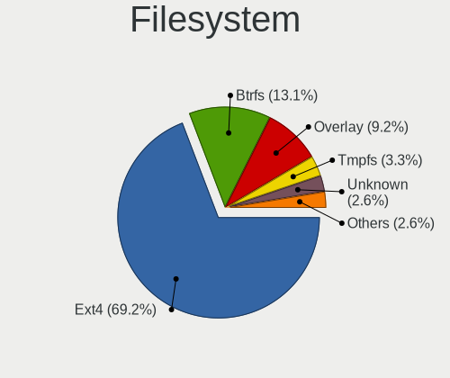
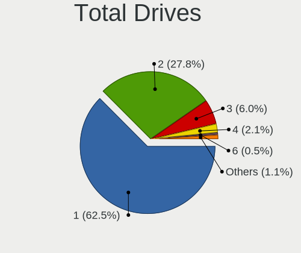
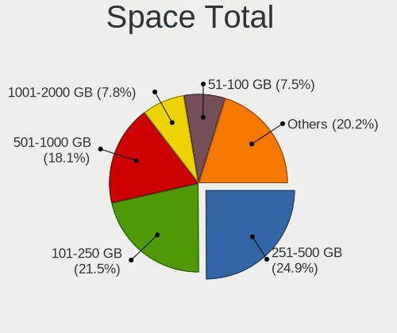
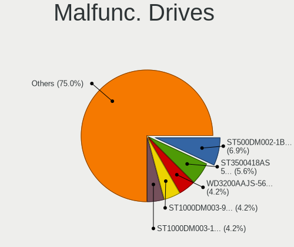
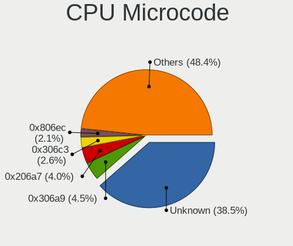
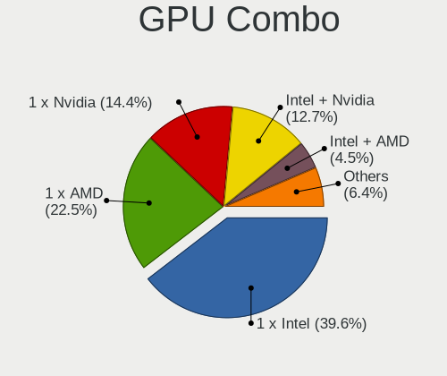
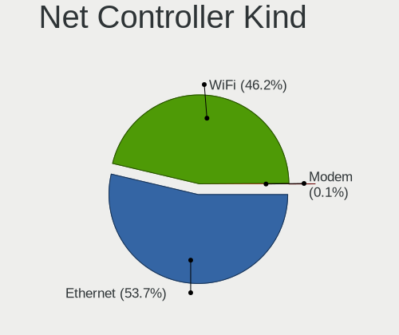
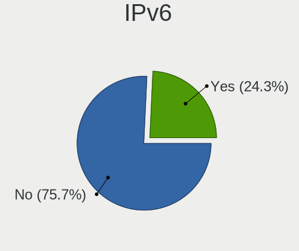
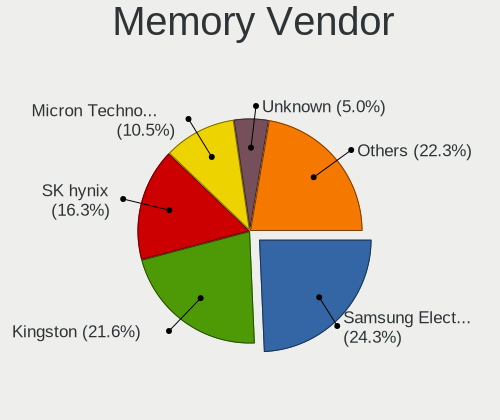

Linux in Peru - Tested Hardware & Statistics
--------------------------------------------

A project to collect tested hardware configurations for Linux in Peru.

Anyone can contribute to this report by the [hw-probe](https://github.com/linuxhw/hw-probe) tool:

    sudo -E hw-probe -all -upload

Please contribute! Especially if your hardware is rare.

This is a report for all computer types. See also reports for [desktops](/Location/Peru/Desktop/README.md) and [notebooks](/Location/Peru/Notebook/README.md).

Contents
--------

* [ Test Cases ](#test-cases)

* [ System ](#system)
  - [ OS                       ](#os)
  - [ OS Family                ](#os-family)
  - [ Kernel                   ](#kernel)
  - [ Kernel Family            ](#kernel-family)
  - [ Kernel Major Ver.        ](#kernel-major-ver)
  - [ Arch                     ](#arch)
  - [ DE                       ](#de)
  - [ Display Server           ](#display-server)
  - [ Display Manager          ](#display-manager)
  - [ OS Lang                  ](#os-lang)
  - [ Boot Mode                ](#boot-mode)
  - [ Filesystem               ](#filesystem)
  - [ Part. scheme             ](#part-scheme)
  - [ Dual Boot with Linux/BSD ](#dual-boot-with-linuxbsd)
  - [ Dual Boot (Win)          ](#dual-boot-win)

* [ Board ](#board)
  - [ Vendor                   ](#vendor)
  - [ Model                    ](#model)
  - [ Model Family             ](#model-family)
  - [ MFG Year                 ](#mfg-year)
  - [ Form Factor              ](#form-factor)
  - [ Secure Boot              ](#secure-boot)
  - [ Coreboot                 ](#coreboot)
  - [ RAM Size                 ](#ram-size)
  - [ RAM Used                 ](#ram-used)
  - [ Total Drives             ](#total-drives)
  - [ Has CD-ROM               ](#has-cd-rom)
  - [ Has Ethernet             ](#has-ethernet)
  - [ Has WiFi                 ](#has-wifi)
  - [ Has Bluetooth            ](#has-bluetooth)

* [ Location ](#location)
  - [ Country                  ](#country)
  - [ City                     ](#city)

* [ Drives ](#drives)
  - [ Drive Vendor             ](#drive-vendor)
  - [ Drive Model              ](#drive-model)
  - [ HDD Vendor               ](#hdd-vendor)
  - [ SSD Vendor               ](#ssd-vendor)
  - [ Drive Kind               ](#drive-kind)
  - [ Drive Connector          ](#drive-connector)
  - [ Drive Size               ](#drive-size)
  - [ Space Total              ](#space-total)
  - [ Space Used               ](#space-used)
  - [ Malfunc. Drives          ](#malfunc-drives)
  - [ Malfunc. Drive Vendor    ](#malfunc-drive-vendor)
  - [ Malfunc. HDD Vendor      ](#malfunc-hdd-vendor)
  - [ Malfunc. Drive Kind      ](#malfunc-drive-kind)
  - [ Failed Drives            ](#failed-drives)
  - [ Failed Drive Vendor      ](#failed-drive-vendor)
  - [ Drive Status             ](#drive-status)

* [ Storage controller ](#storage-controller)
  - [ Storage Vendor           ](#storage-vendor)
  - [ Storage Model            ](#storage-model)
  - [ Storage Kind             ](#storage-kind)

* [ Processor ](#processor)
  - [ CPU Vendor               ](#cpu-vendor)
  - [ CPU Model                ](#cpu-model)
  - [ CPU Model Family         ](#cpu-model-family)
  - [ CPU Cores                ](#cpu-cores)
  - [ CPU Sockets              ](#cpu-sockets)
  - [ CPU Threads              ](#cpu-threads)
  - [ CPU Op-Modes             ](#cpu-op-modes)
  - [ CPU Microcode            ](#cpu-microcode)
  - [ CPU Microarch            ](#cpu-microarch)

* [ Graphics ](#graphics)
  - [ GPU Vendor               ](#gpu-vendor)
  - [ GPU Model                ](#gpu-model)
  - [ GPU Combo                ](#gpu-combo)
  - [ GPU Driver               ](#gpu-driver)
  - [ GPU Memory               ](#gpu-memory)

* [ Monitor ](#monitor)
  - [ Monitor Vendor           ](#monitor-vendor)
  - [ Monitor Model            ](#monitor-model)
  - [ Monitor Resolution       ](#monitor-resolution)
  - [ Monitor Diagonal         ](#monitor-diagonal)
  - [ Monitor Width            ](#monitor-width)
  - [ Aspect Ratio             ](#aspect-ratio)
  - [ Monitor Area             ](#monitor-area)
  - [ Pixel Density            ](#pixel-density)
  - [ Multiple Monitors        ](#multiple-monitors)

* [ Network ](#network)
  - [ Net Controller Vendor    ](#net-controller-vendor)
  - [ Net Controller Model     ](#net-controller-model)
  - [ Wireless Vendor          ](#wireless-vendor)
  - [ Wireless Model           ](#wireless-model)
  - [ Ethernet Vendor          ](#ethernet-vendor)
  - [ Ethernet Model           ](#ethernet-model)
  - [ Net Controller Kind      ](#net-controller-kind)
  - [ Used Controller          ](#used-controller)
  - [ NICs                     ](#nics)
  - [ IPv6                     ](#ipv6)

* [ Bluetooth ](#bluetooth)
  - [ Bluetooth Vendor         ](#bluetooth-vendor)
  - [ Bluetooth Model          ](#bluetooth-model)

* [ Sound ](#sound)
  - [ Sound Vendor             ](#sound-vendor)
  - [ Sound Model              ](#sound-model)

* [ Memory ](#memory)
  - [ Memory Vendor            ](#memory-vendor)
  - [ Memory Model             ](#memory-model)
  - [ Memory Kind              ](#memory-kind)
  - [ Memory Form Factor       ](#memory-form-factor)
  - [ Memory Size              ](#memory-size)
  - [ Memory Speed             ](#memory-speed)

* [ Printers & scanners ](#printers--scanners)
  - [ Printer Vendor           ](#printer-vendor)
  - [ Printer Model            ](#printer-model)
  - [ Scanner Vendor           ](#scanner-vendor)
  - [ Scanner Model            ](#scanner-model)

* [ Camera ](#camera)
  - [ Camera Vendor            ](#camera-vendor)
  - [ Camera Model             ](#camera-model)

* [ Security ](#security)
  - [ Fingerprint Vendor       ](#fingerprint-vendor)
  - [ Fingerprint Model        ](#fingerprint-model)
  - [ Chipcard Vendor          ](#chipcard-vendor)
  - [ Chipcard Model           ](#chipcard-model)

* [ Unsupported ](#unsupported)
  - [ Unsupported Devices      ](#unsupported-devices)
  - [ Unsupported Device Types ](#unsupported-device-types)

Test Cases
----------

Total: 480

| Vendor        | Model                       | Form-Factor | Probe                                                      | Date         |
|---------------|-----------------------------|-------------|------------------------------------------------------------|--------------|
| Lenovo        | ThinkBook 15-IIL 20SM       | Notebook    | [a30f96dea4](https://linux-hardware.org/?probe=a30f96dea4) | Dec 31, 2022 |
| HP            | Laptop 15-dy5xxx            | Notebook    | [d7daff3ed1](https://linux-hardware.org/?probe=d7daff3ed1) | Dec 27, 2022 |
| HP            | Compaq Mini CQ10-100        | Notebook    | [8b34b357bb](https://linux-hardware.org/?probe=8b34b357bb) | Dec 27, 2022 |
| HP            | 255 G8 Notebook PC          | Notebook    | [08800ce691](https://linux-hardware.org/?probe=08800ce691) | Dec 19, 2022 |
| Lenovo        | ThinkBook 15-IIL 20SM       | Notebook    | [36a0b6f8d9](https://linux-hardware.org/?probe=36a0b6f8d9) | Dec 16, 2022 |
| Lenovo        | ThinkBook 15-IIL 20SM       | Notebook    | [61dd034d23](https://linux-hardware.org/?probe=61dd034d23) | Dec 16, 2022 |
| ECS           | H61H2-M2                    | Desktop     | [8525777743](https://linux-hardware.org/?probe=8525777743) | Dec 13, 2022 |
| ASUSTek       | M5A97 R2.0                  | Desktop     | [951b5a453d](https://linux-hardware.org/?probe=951b5a453d) | Dec 11, 2022 |
| Lenovo        | ThinkBook 15-IIL 20SM       | Notebook    | [17cbc91488](https://linux-hardware.org/?probe=17cbc91488) | Dec 10, 2022 |
| Lenovo        | ThinkBook 15-IIL 20SM       | Notebook    | [4b9eb9fcab](https://linux-hardware.org/?probe=4b9eb9fcab) | Dec 10, 2022 |
| Lenovo        | IdeaPad U400 099342G        | Notebook    | [9ecbde32ab](https://linux-hardware.org/?probe=9ecbde32ab) | Dec 06, 2022 |
| HP            | 8767 A                      | Desktop     | [1d4dc77fa3](https://linux-hardware.org/?probe=1d4dc77fa3) | Dec 06, 2022 |
| HUAWEI        | CREM-WXX9                   | Notebook    | [2436f4cf5e](https://linux-hardware.org/?probe=2436f4cf5e) | Nov 30, 2022 |
| HP            | 255 G7 Notebook PC          | Notebook    | [0bd83a29f4](https://linux-hardware.org/?probe=0bd83a29f4) | Nov 29, 2022 |
| ASUSTek       | PRIME Z690-P WIFI           | Desktop     | [763f309094](https://linux-hardware.org/?probe=763f309094) | Nov 18, 2022 |
| HP            | 250 G7 Notebook PC          | Notebook    | [10b5bb5eab](https://linux-hardware.org/?probe=10b5bb5eab) | Nov 17, 2022 |
| HP            | 250 G7 Notebook PC          | Notebook    | [c765249482](https://linux-hardware.org/?probe=c765249482) | Nov 17, 2022 |
| ASUSTek       | PRIME B550M-A               | Desktop     | [8600d864a4](https://linux-hardware.org/?probe=8600d864a4) | Nov 13, 2022 |
| Deltron       | H81H3-M4                    | Desktop     | [49530f2e0b](https://linux-hardware.org/?probe=49530f2e0b) | Nov 13, 2022 |
| Lenovo        | Legion 7 16ITHg6 82K6       | Notebook    | [eebc3537d1](https://linux-hardware.org/?probe=eebc3537d1) | Nov 09, 2022 |
| HP            | Pavilion Laptop 15-cw1xx... | Notebook    | [b4d22497e8](https://linux-hardware.org/?probe=b4d22497e8) | Nov 08, 2022 |
| HP            | Pavilion Laptop 15-cc1xx    | Notebook    | [b97ba1d3f0](https://linux-hardware.org/?probe=b97ba1d3f0) | Nov 07, 2022 |
| Dell          | 096JG8 A01                  | Desktop     | [e8a62297a5](https://linux-hardware.org/?probe=e8a62297a5) | Nov 05, 2022 |
| Lenovo        | Legion 7 16ITHg6 82K6       | Notebook    | [88a69a9a20](https://linux-hardware.org/?probe=88a69a9a20) | Nov 05, 2022 |
| Dell          | Latitude E5470              | Notebook    | [4de6b7bdb8](https://linux-hardware.org/?probe=4de6b7bdb8) | Nov 04, 2022 |
| Dell          | Latitude 5420               | Notebook    | [717e0e6d40](https://linux-hardware.org/?probe=717e0e6d40) | Nov 03, 2022 |
| Lenovo        | ThinkPad E15 Gen 2 20TES... | Notebook    | [209e99f964](https://linux-hardware.org/?probe=209e99f964) | Nov 02, 2022 |
| Lenovo        | ThinkPad E15 Gen 2 20TES... | Notebook    | [f12fc289fa](https://linux-hardware.org/?probe=f12fc289fa) | Nov 02, 2022 |
| HP            | 2B3B                        | All in one  | [a42ac6f6c7](https://linux-hardware.org/?probe=a42ac6f6c7) | Nov 01, 2022 |
| ASUSTek       | ASUS TUF Gaming A15 FA50... | Notebook    | [dca18dced0](https://linux-hardware.org/?probe=dca18dced0) | Oct 30, 2022 |
| Acer          | Aspire 5745                 | Notebook    | [2f79de6974](https://linux-hardware.org/?probe=2f79de6974) | Oct 28, 2022 |
| Unknown       | Unknown                     | Desktop     | [8d93ee0286](https://linux-hardware.org/?probe=8d93ee0286) | Oct 28, 2022 |
| HP            | Pavilion Laptop 15-cc1xx    | Notebook    | [a977f9c3e9](https://linux-hardware.org/?probe=a977f9c3e9) | Oct 26, 2022 |
| ASUSTek       | X205TA                      | Notebook    | [2da58f110d](https://linux-hardware.org/?probe=2da58f110d) | Oct 24, 2022 |
| ADVANCE       | PS5077                      | Notebook    | [998e544711](https://linux-hardware.org/?probe=998e544711) | Oct 22, 2022 |
| ADVANCE       | PS5077                      | Notebook    | [97bfff0fc6](https://linux-hardware.org/?probe=97bfff0fc6) | Oct 22, 2022 |
| Lenovo        | ThinkBook 15-IIL 20SM       | Notebook    | [07acd27a70](https://linux-hardware.org/?probe=07acd27a70) | Oct 21, 2022 |
| Dell          | Latitude E5470              | Notebook    | [11ad7cd084](https://linux-hardware.org/?probe=11ad7cd084) | Oct 20, 2022 |
| Dell          | 096JG8 A01                  | Desktop     | [ee436e327b](https://linux-hardware.org/?probe=ee436e327b) | Oct 16, 2022 |
| Dell          | 096JG8 A01                  | Desktop     | [86e01f1479](https://linux-hardware.org/?probe=86e01f1479) | Oct 16, 2022 |
| Gigabyte      | H81M-H                      | Desktop     | [0dd7c3989e](https://linux-hardware.org/?probe=0dd7c3989e) | Oct 12, 2022 |
| Gigabyte      | 970A-DS3P                   | Desktop     | [744091dcaa](https://linux-hardware.org/?probe=744091dcaa) | Oct 12, 2022 |
| ASUSTek       | VivoBook 15_ASUS Laptop ... | Notebook    | [7dce56f55d](https://linux-hardware.org/?probe=7dce56f55d) | Oct 10, 2022 |
| ASUSTek       | VivoBook_ASUSLaptop M350... | Notebook    | [f15acdf9d4](https://linux-hardware.org/?probe=f15acdf9d4) | Oct 09, 2022 |
| ASUSTek       | PRIME Z690-P WIFI           | Desktop     | [5e33c2b674](https://linux-hardware.org/?probe=5e33c2b674) | Oct 08, 2022 |
| HUAWEI        | BOHB-WAX9                   | Notebook    | [6fec6456bc](https://linux-hardware.org/?probe=6fec6456bc) | Oct 07, 2022 |
| HUAWEI        | BOHB-WAX9                   | Notebook    | [fb954f84b4](https://linux-hardware.org/?probe=fb954f84b4) | Oct 07, 2022 |
| HUAWEI        | BOHB-WAX9                   | Notebook    | [d56cf9868c](https://linux-hardware.org/?probe=d56cf9868c) | Oct 07, 2022 |
| Gigabyte      | A520M H                     | Desktop     | [acf2f9d381](https://linux-hardware.org/?probe=acf2f9d381) | Sep 25, 2022 |
| Gigabyte      | A520M H                     | Desktop     | [21407ce4a8](https://linux-hardware.org/?probe=21407ce4a8) | Sep 21, 2022 |
| Lenovo        | IdeaPad 320-15ISK 80XH      | Notebook    | [44afa82c4a](https://linux-hardware.org/?probe=44afa82c4a) | Sep 19, 2022 |
| ASUSTek       | S550CA                      | Notebook    | [a403b2a79d](https://linux-hardware.org/?probe=a403b2a79d) | Sep 17, 2022 |
| HP            | Laptop 15-ef1xxx            | Notebook    | [dd55f6960d](https://linux-hardware.org/?probe=dd55f6960d) | Sep 15, 2022 |
| Lenovo        | V330-15IKB 81AX             | Notebook    | [0a91582802](https://linux-hardware.org/?probe=0a91582802) | Sep 14, 2022 |
| Intel         | D945GCNL AAD97184-106       | Desktop     | [a2bdc2d18c](https://linux-hardware.org/?probe=a2bdc2d18c) | Sep 11, 2022 |
| AZW           | GK mini                     | Mini pc     | [b2d573f8e2](https://linux-hardware.org/?probe=b2d573f8e2) | Sep 10, 2022 |
| AZW           | GK mini                     | Mini pc     | [58c74cb934](https://linux-hardware.org/?probe=58c74cb934) | Sep 09, 2022 |
| Lenovo        | 3111 SDK0J40697 WIN 3305... | Desktop     | [2be9b66ba1](https://linux-hardware.org/?probe=2be9b66ba1) | Aug 30, 2022 |
| ASUSTek       | VivoBook_ASUSLaptop X515... | Notebook    | [2267f01dee](https://linux-hardware.org/?probe=2267f01dee) | Aug 27, 2022 |
| Lenovo        | G570 4334                   | Notebook    | [7bea18122c](https://linux-hardware.org/?probe=7bea18122c) | Aug 27, 2022 |
| HP            | 255 G7 Notebook PC          | Notebook    | [c001653a5a](https://linux-hardware.org/?probe=c001653a5a) | Aug 20, 2022 |
| MSI           | X370 KRAIT GAMING           | Desktop     | [ea80c11a16](https://linux-hardware.org/?probe=ea80c11a16) | Aug 20, 2022 |
| Lenovo        | Yoga 9 15IMH5 82DE          | Convertible | [e6a9f975ae](https://linux-hardware.org/?probe=e6a9f975ae) | Aug 18, 2022 |
| Dell          | Vostro 3405                 | Notebook    | [2b5840062a](https://linux-hardware.org/?probe=2b5840062a) | Aug 18, 2022 |
| Lenovo        | Yoga 9 15IMH5 82DE          | Convertible | [c1e007def0](https://linux-hardware.org/?probe=c1e007def0) | Aug 15, 2022 |
| Dell          | Latitude E6430              | Notebook    | [91a44f9b39](https://linux-hardware.org/?probe=91a44f9b39) | Aug 13, 2022 |
| Dell          | Latitude E6430              | Notebook    | [864ad41c22](https://linux-hardware.org/?probe=864ad41c22) | Aug 13, 2022 |
| ASUSTek       | PRIME X570-P                | Desktop     | [ca185c2301](https://linux-hardware.org/?probe=ca185c2301) | Aug 10, 2022 |
| ASUSTek       | PRIME X570-P                | Desktop     | [49390f2f0e](https://linux-hardware.org/?probe=49390f2f0e) | Aug 06, 2022 |
| HP            | 1493                        | Desktop     | [2ac16ddc1f](https://linux-hardware.org/?probe=2ac16ddc1f) | Aug 03, 2022 |
| ASUSTek       | M5A97                       | Desktop     | [e5b05f8e39](https://linux-hardware.org/?probe=e5b05f8e39) | Aug 02, 2022 |
| Gigabyte      | AX370M-Gaming 3-CF          | Desktop     | [1c92a49cd4](https://linux-hardware.org/?probe=1c92a49cd4) | Aug 01, 2022 |
| Lenovo        | ThinkPad T60 1953D9U        | Notebook    | [1c31cb6b44](https://linux-hardware.org/?probe=1c31cb6b44) | Jul 21, 2022 |
| Gigabyte      | B365M DS3H                  | Desktop     | [27bf18a32e](https://linux-hardware.org/?probe=27bf18a32e) | Jul 20, 2022 |
| ASUSTek       | H110M-R                     | Desktop     | [8d52662820](https://linux-hardware.org/?probe=8d52662820) | Jul 19, 2022 |
| Acer          | Aspire A515-51G             | Notebook    | [4414dd4c1b](https://linux-hardware.org/?probe=4414dd4c1b) | Jul 19, 2022 |
| ASUSTek       | VivoBook_ASUSLaptop X515... | Notebook    | [b511d2883b](https://linux-hardware.org/?probe=b511d2883b) | Jul 16, 2022 |
| Raspberry ... | Raspberry Pi                | Soc         | [f0952d8c25](https://linux-hardware.org/?probe=f0952d8c25) | Jul 13, 2022 |
| Lenovo        | ThinkPad X140e 20BLA00C0... | Notebook    | [8c160ae192](https://linux-hardware.org/?probe=8c160ae192) | Jul 12, 2022 |
| Intel         | DH61CR AAG14064-204         | Desktop     | [0ebf0eb484](https://linux-hardware.org/?probe=0ebf0eb484) | Jul 08, 2022 |
| Acer          | Aspire ES1-512              | Notebook    | [aa2ad87835](https://linux-hardware.org/?probe=aa2ad87835) | Jul 08, 2022 |
| Acer          | Aspire V3-471               | Notebook    | [75664ddf0f](https://linux-hardware.org/?probe=75664ddf0f) | Jul 07, 2022 |
| ASUSTek       | S550CA                      | Notebook    | [8ed63bbdfd](https://linux-hardware.org/?probe=8ed63bbdfd) | Jul 01, 2022 |
| MSI           | GL65 Leopard 10SEK          | Notebook    | [5043bf1cd4](https://linux-hardware.org/?probe=5043bf1cd4) | Jun 29, 2022 |
| Lenovo        | ThinkPad X140e 20BLA00C0... | Notebook    | [01fbfc98f8](https://linux-hardware.org/?probe=01fbfc98f8) | Jun 27, 2022 |
| Lenovo        | V15-IIL 82C5                | Notebook    | [1023ca742e](https://linux-hardware.org/?probe=1023ca742e) | Jun 27, 2022 |
| HP            | Laptop 15-ef1xxx            | Notebook    | [d0200625ac](https://linux-hardware.org/?probe=d0200625ac) | Jun 27, 2022 |
| Dell          | Inspiron 15-3567            | Notebook    | [e6d22a4d34](https://linux-hardware.org/?probe=e6d22a4d34) | Jun 27, 2022 |
| Dell          | Inspiron 15 7000 Gaming     | Notebook    | [fac01563a9](https://linux-hardware.org/?probe=fac01563a9) | Jun 24, 2022 |
| HP            | Laptop 15-ef1xxx            | Notebook    | [1d18aab349](https://linux-hardware.org/?probe=1d18aab349) | Jun 23, 2022 |
| Dell          | Inspiron 5570               | Notebook    | [4a61f83195](https://linux-hardware.org/?probe=4a61f83195) | Jun 23, 2022 |
| ASUSTek       | S550CA                      | Notebook    | [c7c236e5a1](https://linux-hardware.org/?probe=c7c236e5a1) | Jun 23, 2022 |
| Dell          | Inspiron 15-3567            | Notebook    | [9538654245](https://linux-hardware.org/?probe=9538654245) | Jun 21, 2022 |
| Intel         | D102GGC2 AAD42789-204       | Desktop     | [3ed07edb6a](https://linux-hardware.org/?probe=3ed07edb6a) | Jun 21, 2022 |
| ASUSTek       | PRIME A320M-K               | Desktop     | [67c7179045](https://linux-hardware.org/?probe=67c7179045) | Jun 15, 2022 |
| Lenovo        | V15-IIL 82C5                | Notebook    | [47f52294bb](https://linux-hardware.org/?probe=47f52294bb) | Jun 14, 2022 |
| HUAWEI        | NBLB-WAX9N                  | Notebook    | [e24239a843](https://linux-hardware.org/?probe=e24239a843) | Jun 09, 2022 |
| ASUSTek       | S550CA                      | Notebook    | [9ba4a449c6](https://linux-hardware.org/?probe=9ba4a449c6) | Jun 09, 2022 |
| Dell          | Latitude E7450              | Notebook    | [29219339b2](https://linux-hardware.org/?probe=29219339b2) | Jun 05, 2022 |
| ASUSTek       | ROG Strix G513QY_G513QY     | Notebook    | [49c400d1f7](https://linux-hardware.org/?probe=49c400d1f7) | May 31, 2022 |
| ASUSTek       | TUF Gaming B550M-PLUS       | Desktop     | [c1db97e482](https://linux-hardware.org/?probe=c1db97e482) | May 31, 2022 |
| ASUSTek       | TUF Gaming B550M-PLUS       | Desktop     | [c274a43a82](https://linux-hardware.org/?probe=c274a43a82) | May 30, 2022 |
| HP            | Pavilion Laptop 15-cw1xx... | Notebook    | [be0f84abb3](https://linux-hardware.org/?probe=be0f84abb3) | May 30, 2022 |
| ASUSTek       | X555UQ                      | Notebook    | [c266f3d070](https://linux-hardware.org/?probe=c266f3d070) | May 30, 2022 |
| ASUSTek       | PRIME B450M-A               | Desktop     | [2ce35a0cba](https://linux-hardware.org/?probe=2ce35a0cba) | May 30, 2022 |
| Lenovo        | ThinkPad P52 20MAS3X200     | Notebook    | [da2a67f904](https://linux-hardware.org/?probe=da2a67f904) | May 28, 2022 |
| Intel         | DP67BA AAG10219-300         | Desktop     | [005b9cdb8e](https://linux-hardware.org/?probe=005b9cdb8e) | May 26, 2022 |
| Acer          | TravelMate 5320             | Notebook    | [4d7e13024d](https://linux-hardware.org/?probe=4d7e13024d) | May 19, 2022 |
| Lenovo        | ThinkPad P52 20MAS3X200     | Notebook    | [7f0fc0c72e](https://linux-hardware.org/?probe=7f0fc0c72e) | May 19, 2022 |
| ASUSTek       | ROG Strix G513QY_G513QY     | Notebook    | [2ee4916960](https://linux-hardware.org/?probe=2ee4916960) | May 18, 2022 |
| Dell          | Vostro 3405                 | Notebook    | [fcec5f1cdd](https://linux-hardware.org/?probe=fcec5f1cdd) | May 17, 2022 |
| ASUSTek       | ROG Strix G513QY_G513QY     | Notebook    | [21f3f7368f](https://linux-hardware.org/?probe=21f3f7368f) | May 17, 2022 |
| Gigabyte      | G1.Sniper B5-CF             | Desktop     | [3bf7390ce3](https://linux-hardware.org/?probe=3bf7390ce3) | May 16, 2022 |
| HP            | 8056                        | Desktop     | [e9d15128a7](https://linux-hardware.org/?probe=e9d15128a7) | May 16, 2022 |
| ASUSTek       | PRIME B450M-A               | Desktop     | [03581837bc](https://linux-hardware.org/?probe=03581837bc) | May 14, 2022 |
| ASUSTek       | PRIME B450M-A               | Desktop     | [e436a62479](https://linux-hardware.org/?probe=e436a62479) | May 13, 2022 |
| Dell          | 0773VG A02                  | Desktop     | [0743f4573d](https://linux-hardware.org/?probe=0743f4573d) | May 12, 2022 |
| Dell          | Vostro 3405                 | Notebook    | [3c8e334d43](https://linux-hardware.org/?probe=3c8e334d43) | May 12, 2022 |
| ASUSTek       | PRIME B450M-A               | Desktop     | [358cadc7df](https://linux-hardware.org/?probe=358cadc7df) | May 09, 2022 |
| Lenovo        | IdeaPad C340-14IML 81TK     | Convertible | [9b0f684d99](https://linux-hardware.org/?probe=9b0f684d99) | May 09, 2022 |
| Lenovo        | Legion 5 17ITH6H 82JM       | Notebook    | [451c9ea765](https://linux-hardware.org/?probe=451c9ea765) | May 08, 2022 |
| Lenovo        | ThinkPad T530 24296G9       | Notebook    | [934e13a24c](https://linux-hardware.org/?probe=934e13a24c) | May 08, 2022 |
| HP            | ZBook 15                    | Notebook    | [bd8e2ed626](https://linux-hardware.org/?probe=bd8e2ed626) | May 07, 2022 |
| SZMZ          | X99 DUAL Z8                 | Desktop     | [f68946f3d4](https://linux-hardware.org/?probe=f68946f3d4) | May 06, 2022 |
| Compal        | QAQXX                       | Notebook    | [d3211e6bc6](https://linux-hardware.org/?probe=d3211e6bc6) | May 05, 2022 |
| HP            | Laptop 15-ef1xxx            | Notebook    | [d2eb5ae290](https://linux-hardware.org/?probe=d2eb5ae290) | May 05, 2022 |
| Gigabyte      | G1.Sniper B5-CF             | Desktop     | [7b488333bb](https://linux-hardware.org/?probe=7b488333bb) | May 05, 2022 |
| HP            | ENVY x360 Convertible 13... | Convertible | [cbe76ee3d3](https://linux-hardware.org/?probe=cbe76ee3d3) | May 04, 2022 |
| Lenovo        | V310-15ISK 80SY             | Notebook    | [1a791b0fd5](https://linux-hardware.org/?probe=1a791b0fd5) | May 04, 2022 |
| Lenovo        | V310-15ISK 80SY             | Notebook    | [3846d07c7f](https://linux-hardware.org/?probe=3846d07c7f) | May 04, 2022 |
| HP            | ENVY dv6                    | Notebook    | [23ad3290c2](https://linux-hardware.org/?probe=23ad3290c2) | May 03, 2022 |
| Gigabyte      | A520M H                     | Desktop     | [80f3ccadb9](https://linux-hardware.org/?probe=80f3ccadb9) | May 02, 2022 |
| Lenovo        | ThinkPad L15 Gen 1 20U3S... | Notebook    | [74eec8c684](https://linux-hardware.org/?probe=74eec8c684) | May 01, 2022 |
| Lenovo        | V330-15IKB 81AX             | Notebook    | [60a636868c](https://linux-hardware.org/?probe=60a636868c) | Apr 30, 2022 |
| Lenovo        | IdeaPad S145-15IWL 81MV     | Notebook    | [05db30a69b](https://linux-hardware.org/?probe=05db30a69b) | Apr 30, 2022 |
| Acer          | Aspire E5-571               | Notebook    | [ebdc8b1380](https://linux-hardware.org/?probe=ebdc8b1380) | Apr 30, 2022 |
| Acer          | Aspire A315-23              | Notebook    | [865091bbc1](https://linux-hardware.org/?probe=865091bbc1) | Apr 30, 2022 |
| Acer          | Aspire A315-23              | Notebook    | [5ee29c3982](https://linux-hardware.org/?probe=5ee29c3982) | Apr 30, 2022 |
| ASUSTek       | X556UR                      | Notebook    | [3f920954f7](https://linux-hardware.org/?probe=3f920954f7) | Apr 30, 2022 |
| MSI           | A88XM-E45 V2                | Desktop     | [a50ad068b1](https://linux-hardware.org/?probe=a50ad068b1) | Apr 30, 2022 |
| HP            | Pavilion Sleekbook 15       | Notebook    | [0003f9342e](https://linux-hardware.org/?probe=0003f9342e) | Apr 30, 2022 |
| HP            | Laptop 14-dq1xxx            | Notebook    | [7c9e2f4d8f](https://linux-hardware.org/?probe=7c9e2f4d8f) | Apr 30, 2022 |
| Foxconn       | H61MXE                      | Desktop     | [d8168e72e7](https://linux-hardware.org/?probe=d8168e72e7) | Apr 27, 2022 |
| HP            | Notebook                    | Notebook    | [94f0ce7610](https://linux-hardware.org/?probe=94f0ce7610) | Apr 26, 2022 |
| Dell          | Vostro 3405                 | Notebook    | [2d5bae0eeb](https://linux-hardware.org/?probe=2d5bae0eeb) | Apr 24, 2022 |
| Gigabyte      | G1.Sniper B5-CF             | Desktop     | [e0e448efcb](https://linux-hardware.org/?probe=e0e448efcb) | Apr 24, 2022 |
| Gigabyte      | B365M DS3H                  | Desktop     | [ed62d97841](https://linux-hardware.org/?probe=ed62d97841) | Apr 18, 2022 |
| HP            | Pavilion Laptop 15-cw1xx... | Notebook    | [a33d067e62](https://linux-hardware.org/?probe=a33d067e62) | Apr 18, 2022 |
| HP            | Compaq Mini CQ10-100        | Notebook    | [89c92e2cf7](https://linux-hardware.org/?probe=89c92e2cf7) | Apr 15, 2022 |
| Dell          | Latitude 3410               | Notebook    | [78396d572c](https://linux-hardware.org/?probe=78396d572c) | Apr 15, 2022 |
| HP            | ZBook Firefly 15 G7 Mobi... | Notebook    | [0e9e99acae](https://linux-hardware.org/?probe=0e9e99acae) | Apr 13, 2022 |
| MSI           | H110M PRO-VH PLUS           | Desktop     | [a00c0b503b](https://linux-hardware.org/?probe=a00c0b503b) | Apr 06, 2022 |
| ASUSTek       | A68HM-E                     | Desktop     | [af6b7df94c](https://linux-hardware.org/?probe=af6b7df94c) | Apr 06, 2022 |
| Lenovo        | ThinkPad X140e 20BLA00C0... | Notebook    | [9cad677222](https://linux-hardware.org/?probe=9cad677222) | Mar 24, 2022 |
| HP            | Stream Laptop 14-ax0XX      | Notebook    | [9b99145008](https://linux-hardware.org/?probe=9b99145008) | Mar 21, 2022 |
| Gigabyte      | B75M-D3H                    | Desktop     | [53ca03e8ec](https://linux-hardware.org/?probe=53ca03e8ec) | Mar 17, 2022 |
| Foxconn       | 2A8C                        | Desktop     | [80e5e3a26c](https://linux-hardware.org/?probe=80e5e3a26c) | Mar 15, 2022 |
| Intel         | DX79SR AAG57199-200         | Desktop     | [1ab5b833d9](https://linux-hardware.org/?probe=1ab5b833d9) | Mar 12, 2022 |
| HP            | Laptop 14-ck0xxx            | Notebook    | [92c7141f37](https://linux-hardware.org/?probe=92c7141f37) | Mar 12, 2022 |
| HP            | 340 G2                      | Notebook    | [c4f663b37b](https://linux-hardware.org/?probe=c4f663b37b) | Mar 04, 2022 |
| HP            | Pavilion Laptop 15-cd0xx    | Notebook    | [eeaed94df7](https://linux-hardware.org/?probe=eeaed94df7) | Feb 23, 2022 |
| Acer          | Aspire 4750                 | Notebook    | [b8f02b07fb](https://linux-hardware.org/?probe=b8f02b07fb) | Feb 18, 2022 |
| Acer          | Aspire 4750                 | Notebook    | [3269f565c4](https://linux-hardware.org/?probe=3269f565c4) | Feb 18, 2022 |
| ASUSTek       | TUF Gaming B550M-PLUS       | Desktop     | [91e577540a](https://linux-hardware.org/?probe=91e577540a) | Feb 11, 2022 |
| HP            | 240 G7 Notebook PC          | Notebook    | [03f63a3789](https://linux-hardware.org/?probe=03f63a3789) | Feb 09, 2022 |
| Gigabyte      | G1.Sniper B5-CF             | Desktop     | [15dd0e4767](https://linux-hardware.org/?probe=15dd0e4767) | Feb 08, 2022 |
| efirstview    | v01099                      | Notebook    | [ed22d3c2b6](https://linux-hardware.org/?probe=ed22d3c2b6) | Feb 04, 2022 |
| Toshiba       | Satellite C645              | Notebook    | [d552c9b132](https://linux-hardware.org/?probe=d552c9b132) | Feb 04, 2022 |
| HP            | Pavilion x360 Convertibl... | Convertible | [50fae55964](https://linux-hardware.org/?probe=50fae55964) | Jan 30, 2022 |
| HP            | Pavilion x360 Convertibl... | Convertible | [5f679efaa1](https://linux-hardware.org/?probe=5f679efaa1) | Jan 30, 2022 |
| ASUSTek       | VivoBook_ASUSLaptop X515... | Notebook    | [b7cb93aff2](https://linux-hardware.org/?probe=b7cb93aff2) | Jan 25, 2022 |
| ASUSTek       | ASUS TUF Gaming A15 FA50... | Notebook    | [f36cdb65e7](https://linux-hardware.org/?probe=f36cdb65e7) | Jan 24, 2022 |
| ASUSTek       | TUF Gaming X570-PLUS        | Desktop     | [f6a7e71141](https://linux-hardware.org/?probe=f6a7e71141) | Jan 18, 2022 |
| Lenovo        | IdeaPad S340-15API 81NC     | Notebook    | [1f065ea4dd](https://linux-hardware.org/?probe=1f065ea4dd) | Jan 12, 2022 |
| Sony          | VGN-FW56M                   | Notebook    | [9fb3fa0f32](https://linux-hardware.org/?probe=9fb3fa0f32) | Jan 09, 2022 |
| Lenovo        | IdeaPad S540-14API 81NH     | Notebook    | [eb23bd590c](https://linux-hardware.org/?probe=eb23bd590c) | Jan 07, 2022 |
| Toshiba       | Satellite E205              | Notebook    | [92431da366](https://linux-hardware.org/?probe=92431da366) | Dec 24, 2021 |
| Lenovo        | G400 20235                  | Notebook    | [c2bb5d0010](https://linux-hardware.org/?probe=c2bb5d0010) | Dec 18, 2021 |
| HP            | Pavilion x360 Convertibl... | Convertible | [a3c85ddcb3](https://linux-hardware.org/?probe=a3c85ddcb3) | Dec 14, 2021 |
| ASUSTek       | ASUS TUF Gaming A15 FA50... | Notebook    | [020b7460a1](https://linux-hardware.org/?probe=020b7460a1) | Dec 11, 2021 |
| HP            | Pavilion Gaming Laptop 1... | Notebook    | [fefa594281](https://linux-hardware.org/?probe=fefa594281) | Dec 10, 2021 |
| HP            | 250 G5 Notebook PC          | Notebook    | [3cd230924a](https://linux-hardware.org/?probe=3cd230924a) | Dec 04, 2021 |
| Lenovo        | ThinkPad X1 Carbon Gen 8... | Notebook    | [54f954491a](https://linux-hardware.org/?probe=54f954491a) | Nov 21, 2021 |
| ASRock        | X570 Pro4                   | Desktop     | [9dccdb1f45](https://linux-hardware.org/?probe=9dccdb1f45) | Nov 17, 2021 |
| Gigabyte      | 970A-DS3P                   | Desktop     | [180b98585e](https://linux-hardware.org/?probe=180b98585e) | Nov 11, 2021 |
| ASUSTek       | PRIME B550M-K               | Desktop     | [e995b26637](https://linux-hardware.org/?probe=e995b26637) | Nov 11, 2021 |
| Gigabyte      | H110M-M2-CF                 | Desktop     | [83ce5b471d](https://linux-hardware.org/?probe=83ce5b471d) | Nov 10, 2021 |
| MSI           | B560M PRO-VDH               | Desktop     | [140cf1defc](https://linux-hardware.org/?probe=140cf1defc) | Nov 09, 2021 |
| Lenovo        | IdeaPad 330S-14IKB 81F4     | Notebook    | [e085c7e42a](https://linux-hardware.org/?probe=e085c7e42a) | Nov 09, 2021 |
| ASRock        | B460M-HDV                   | Desktop     | [f343673932](https://linux-hardware.org/?probe=f343673932) | Nov 08, 2021 |
| Lenovo        | IdeaPad S340-15IML 81NA     | Notebook    | [90fbcc38c3](https://linux-hardware.org/?probe=90fbcc38c3) | Nov 08, 2021 |
| Dell          | XPS 13 9360                 | Notebook    | [61db5bc9b5](https://linux-hardware.org/?probe=61db5bc9b5) | Nov 04, 2021 |
| Lenovo        | ThinkPad E15 Gen 2 20TES... | Notebook    | [df2d173d7c](https://linux-hardware.org/?probe=df2d173d7c) | Nov 01, 2021 |
| Lenovo        | V14-ARE 82DQ                | Notebook    | [8948989999](https://linux-hardware.org/?probe=8948989999) | Oct 31, 2021 |
| HP            | Laptop 15-db0xxx            | Notebook    | [f4d2f1104e](https://linux-hardware.org/?probe=f4d2f1104e) | Oct 28, 2021 |
| ASUSTek       | TUF Gaming X570-PLUS        | Desktop     | [e071387ed6](https://linux-hardware.org/?probe=e071387ed6) | Oct 22, 2021 |
| Lenovo        | IdeaPad S340-15IML 81NA     | Notebook    | [849c03d63c](https://linux-hardware.org/?probe=849c03d63c) | Oct 21, 2021 |
| Lenovo        | IdeaPad 3 14ADA05 81W0      | Notebook    | [87d959803d](https://linux-hardware.org/?probe=87d959803d) | Oct 15, 2021 |
| ASUSTek       | Z97-P                       | Desktop     | [9343a7aac0](https://linux-hardware.org/?probe=9343a7aac0) | Oct 13, 2021 |
| MSI           | H170A GAMING PRO            | Desktop     | [2a068afc0c](https://linux-hardware.org/?probe=2a068afc0c) | Oct 11, 2021 |
| Lenovo        | 3098 SDK0E50510 PRO or W... | Desktop     | [57fb928b65](https://linux-hardware.org/?probe=57fb928b65) | Oct 03, 2021 |
| Dell          | XPS 13 9360                 | Notebook    | [8bb0307157](https://linux-hardware.org/?probe=8bb0307157) | Sep 25, 2021 |
| HP            | Notebook                    | Notebook    | [36fd24364d](https://linux-hardware.org/?probe=36fd24364d) | Sep 24, 2021 |
| ASUSTek       | A88XM-A                     | Desktop     | [72114a075d](https://linux-hardware.org/?probe=72114a075d) | Sep 24, 2021 |
| Dell          | 0773VG A02                  | Desktop     | [5b63f0fc0a](https://linux-hardware.org/?probe=5b63f0fc0a) | Sep 16, 2021 |
| Advance       | AN-5431                     | Notebook    | [d48465a943](https://linux-hardware.org/?probe=d48465a943) | Sep 14, 2021 |
| HP            | Notebook                    | Notebook    | [2a564798fd](https://linux-hardware.org/?probe=2a564798fd) | Sep 11, 2021 |
| Intel         | DH55TC AAE70932-302         | Desktop     | [e5f7233230](https://linux-hardware.org/?probe=e5f7233230) | Sep 04, 2021 |
| Intel         | NUC10i3FNB K61362-303       | Mini pc     | [72a24d0b34](https://linux-hardware.org/?probe=72a24d0b34) | Sep 01, 2021 |
| Intel         | NUC10i3FNB K61362-303       | Mini pc     | [92fb750c2f](https://linux-hardware.org/?probe=92fb750c2f) | Sep 01, 2021 |
| Lenovo        | ThinkPad T440 20B7A08500    | Notebook    | [b7e859020c](https://linux-hardware.org/?probe=b7e859020c) | Aug 26, 2021 |
| HP            | 450                         | Notebook    | [9f5d03c478](https://linux-hardware.org/?probe=9f5d03c478) | Aug 19, 2021 |
| Intel         | DG33BU AAD79951-413         | Desktop     | [9824fedcc4](https://linux-hardware.org/?probe=9824fedcc4) | Aug 16, 2021 |
| Chuwi         | GemiBook Pro                | Notebook    | [0ffe99b73b](https://linux-hardware.org/?probe=0ffe99b73b) | Aug 14, 2021 |
| Lenovo        | IdeaPad 3 14ADA05 81W0      | Notebook    | [392df1ef2b](https://linux-hardware.org/?probe=392df1ef2b) | Aug 13, 2021 |
| Gigabyte      | M61PME-S2P                  | Desktop     | [46cd16e708](https://linux-hardware.org/?probe=46cd16e708) | Aug 13, 2021 |
| ASUSTek       | X542UQ                      | Notebook    | [63d2276d55](https://linux-hardware.org/?probe=63d2276d55) | Aug 03, 2021 |
| Gigabyte      | B550M H                     | Desktop     | [b26c567912](https://linux-hardware.org/?probe=b26c567912) | Aug 03, 2021 |
| Advance       | AN-5431                     | Notebook    | [06409d8637](https://linux-hardware.org/?probe=06409d8637) | Aug 01, 2021 |
| Lenovo        | ThinkPad T580 20LAS0XD00    | Notebook    | [36f1b3eb94](https://linux-hardware.org/?probe=36f1b3eb94) | Jul 31, 2021 |
| Gigabyte      | F2A68HM-H                   | Desktop     | [5b80d3040f](https://linux-hardware.org/?probe=5b80d3040f) | Jul 25, 2021 |
| Gigabyte      | F2A68HM-H                   | Desktop     | [771ef872d9](https://linux-hardware.org/?probe=771ef872d9) | Jul 25, 2021 |
| Dell          | Latitude E5540              | Notebook    | [44b8f3a781](https://linux-hardware.org/?probe=44b8f3a781) | Jul 23, 2021 |
| MSI           | B460M-A PRO                 | Desktop     | [da8382cb33](https://linux-hardware.org/?probe=da8382cb33) | Jul 15, 2021 |
| MSI           | B460M-A PRO                 | Desktop     | [146ce74ec9](https://linux-hardware.org/?probe=146ce74ec9) | Jul 15, 2021 |
| Gigabyte      | B360 AORUS GAMING 3 WIFI... | Desktop     | [6001052e23](https://linux-hardware.org/?probe=6001052e23) | Jul 15, 2021 |
| HP            | Pavilion dv6                | Notebook    | [3e69858907](https://linux-hardware.org/?probe=3e69858907) | Jul 09, 2021 |
| Lenovo        | ThinkPad L460 20FVA0G400    | Notebook    | [378021c178](https://linux-hardware.org/?probe=378021c178) | Jul 06, 2021 |
| ASUSTek       | ROG Strix G532LW_G532LWI    | Notebook    | [b36be47753](https://linux-hardware.org/?probe=b36be47753) | Jun 27, 2021 |
| ASUSTek       | Z97-P                       | Desktop     | [95fcf3868f](https://linux-hardware.org/?probe=95fcf3868f) | Jun 26, 2021 |
| HP            | Pavilion Notebook           | Notebook    | [7684808016](https://linux-hardware.org/?probe=7684808016) | Jun 24, 2021 |
| Lenovo        | IdeaPad S540-14API 81NH     | Notebook    | [003f0d1c2a](https://linux-hardware.org/?probe=003f0d1c2a) | Jun 21, 2021 |
| ASUSTek       | ROG Strix G532LW_G532LWI    | Notebook    | [1344b72b26](https://linux-hardware.org/?probe=1344b72b26) | Jun 20, 2021 |
| HP            | Pavilion x360 Convertibl... | Convertible | [cebf94c181](https://linux-hardware.org/?probe=cebf94c181) | Jun 15, 2021 |
| Lenovo        | IdeaPad S340-15IML 81NA     | Notebook    | [6670e1c145](https://linux-hardware.org/?probe=6670e1c145) | Jun 01, 2021 |
| ASUSTek       | VivoBook_ASUSLaptop X509... | Notebook    | [af8045a7b3](https://linux-hardware.org/?probe=af8045a7b3) | May 31, 2021 |
| HP            | 8054                        | Desktop     | [b0662fd84b](https://linux-hardware.org/?probe=b0662fd84b) | May 30, 2021 |
| ASUSTek       | X550LD                      | Notebook    | [89bed4ca0a](https://linux-hardware.org/?probe=89bed4ca0a) | May 28, 2021 |
| HP            | 8054                        | Desktop     | [37f65c4171](https://linux-hardware.org/?probe=37f65c4171) | May 27, 2021 |
| Lenovo        | IdeaPad S340-15IML 81NA     | Notebook    | [ee9233be38](https://linux-hardware.org/?probe=ee9233be38) | May 26, 2021 |
| HP            | ProBook 450 G1              | Notebook    | [6d64546949](https://linux-hardware.org/?probe=6d64546949) | May 23, 2021 |
| HP            | ProBook 450 G1              | Notebook    | [1b52ac3979](https://linux-hardware.org/?probe=1b52ac3979) | May 23, 2021 |
| HP            | 2B2F MVB,A                  | All in one  | [093f49b44c](https://linux-hardware.org/?probe=093f49b44c) | May 20, 2021 |
| Gigabyte      | 970A-DS3P                   | Desktop     | [a1959c22e0](https://linux-hardware.org/?probe=a1959c22e0) | May 20, 2021 |
| HP            | 240 G7                      | Notebook    | [9fff9c48ab](https://linux-hardware.org/?probe=9fff9c48ab) | May 16, 2021 |
| MSI           | A88X-G45 GAMING             | Desktop     | [930993fd14](https://linux-hardware.org/?probe=930993fd14) | May 16, 2021 |
| MSI           | A88X-G45 GAMING             | Desktop     | [f7a3ab5c2f](https://linux-hardware.org/?probe=f7a3ab5c2f) | May 16, 2021 |
| Gigabyte      | B550 AORUS ELITE            | Desktop     | [57b918a36e](https://linux-hardware.org/?probe=57b918a36e) | May 15, 2021 |
| ASUSTek       | X550LC                      | Notebook    | [23a000c11b](https://linux-hardware.org/?probe=23a000c11b) | May 05, 2021 |
| ASUSTek       | X550LC                      | Notebook    | [d50b1f77d7](https://linux-hardware.org/?probe=d50b1f77d7) | May 05, 2021 |
| ASUSTek       | Z97-P                       | Desktop     | [6eb605ae36](https://linux-hardware.org/?probe=6eb605ae36) | Apr 21, 2021 |
| Microsoft     | Surface Pro                 | Tablet      | [642a8e122e](https://linux-hardware.org/?probe=642a8e122e) | Apr 18, 2021 |
| Toshiba       | Satellite L35               | Notebook    | [1abffa2c4c](https://linux-hardware.org/?probe=1abffa2c4c) | Apr 16, 2021 |
| ASUSTek       | Z97-P                       | Desktop     | [4bd5425a6b](https://linux-hardware.org/?probe=4bd5425a6b) | Apr 11, 2021 |
| Gigabyte      | B550 AORUS ELITE            | Desktop     | [59cb82d24c](https://linux-hardware.org/?probe=59cb82d24c) | Apr 09, 2021 |
| HP            | 14                          | Notebook    | [9d65301476](https://linux-hardware.org/?probe=9d65301476) | Apr 09, 2021 |
| Lenovo        | IdeaPad S145-15IWL 81MV     | Notebook    | [14e58f968d](https://linux-hardware.org/?probe=14e58f968d) | Apr 07, 2021 |
| MSI           | B75A-G43                    | Desktop     | [87a3e8d42c](https://linux-hardware.org/?probe=87a3e8d42c) | Apr 07, 2021 |
| Gigabyte      | H110M-H-CF                  | Desktop     | [b02d3fa1c0](https://linux-hardware.org/?probe=b02d3fa1c0) | Apr 04, 2021 |
| Lenovo        | ThinkCentre M91 7516AD1     | Desktop     | [91ae7f221c](https://linux-hardware.org/?probe=91ae7f221c) | Apr 01, 2021 |
| Toshiba       | Satellite C655D             | Notebook    | [1959880e8f](https://linux-hardware.org/?probe=1959880e8f) | Mar 28, 2021 |
| Dell          | Latitude E5470              | Notebook    | [6ade45ee37](https://linux-hardware.org/?probe=6ade45ee37) | Mar 21, 2021 |
| Unknown       | Unknown                     | Desktop     | [860e86fde0](https://linux-hardware.org/?probe=860e86fde0) | Mar 19, 2021 |
| Unknown       | Unknown                     | Desktop     | [4d1099b04c](https://linux-hardware.org/?probe=4d1099b04c) | Mar 18, 2021 |
| Lenovo        | V310-14ISK 80SX             | Notebook    | [529bb59872](https://linux-hardware.org/?probe=529bb59872) | Mar 12, 2021 |
| Toshiba       | Satellite A665              | Notebook    | [23143ad7ae](https://linux-hardware.org/?probe=23143ad7ae) | Mar 07, 2021 |
| Gigabyte      | H81M-H                      | Desktop     | [96dd155871](https://linux-hardware.org/?probe=96dd155871) | Mar 07, 2021 |
| Intel         | H61                         | Desktop     | [77b62ac54a](https://linux-hardware.org/?probe=77b62ac54a) | Mar 05, 2021 |
| Lenovo        | IdeaPad S145-14IWL 81MU     | Notebook    | [b2e0735680](https://linux-hardware.org/?probe=b2e0735680) | Feb 28, 2021 |
| MSI           | Prestige 14 A10SC           | Notebook    | [26f40cdcba](https://linux-hardware.org/?probe=26f40cdcba) | Feb 25, 2021 |
| HP            | Stream x360 Convertible ... | Convertible | [ccb97bb311](https://linux-hardware.org/?probe=ccb97bb311) | Feb 23, 2021 |
| HP            | ProBook 5330m               | Notebook    | [4a66a57a41](https://linux-hardware.org/?probe=4a66a57a41) | Feb 23, 2021 |
| Razer         | Blade                       | Notebook    | [58fcda1ac4](https://linux-hardware.org/?probe=58fcda1ac4) | Feb 18, 2021 |
| PCChips       | P49G                        | Desktop     | [a2f19ae622](https://linux-hardware.org/?probe=a2f19ae622) | Feb 17, 2021 |
| MSI           | A88X-G45 GAMING             | Desktop     | [05d5a888d4](https://linux-hardware.org/?probe=05d5a888d4) | Feb 16, 2021 |
| MSI           | A320M-A PRO MAX             | Desktop     | [c4f6a52387](https://linux-hardware.org/?probe=c4f6a52387) | Feb 13, 2021 |
| Intel         | D945GTP AAC97834-305        | Desktop     | [fa876f7290](https://linux-hardware.org/?probe=fa876f7290) | Feb 10, 2021 |
| ASUSTek       | N56JN                       | Notebook    | [02008fdd48](https://linux-hardware.org/?probe=02008fdd48) | Jan 31, 2021 |
| Acer          | Aspire V5-471               | Notebook    | [3c0bc82dde](https://linux-hardware.org/?probe=3c0bc82dde) | Jan 16, 2021 |
| Lenovo        | V330-15IKB 81AX             | Notebook    | [48d877b127](https://linux-hardware.org/?probe=48d877b127) | Jan 07, 2021 |
| HP            | Pavilion dv7                | Notebook    | [7591424ea2](https://linux-hardware.org/?probe=7591424ea2) | Jan 06, 2021 |
| HP            | Pavilion dv7                | Notebook    | [d660b968a4](https://linux-hardware.org/?probe=d660b968a4) | Jan 06, 2021 |
| Dell          | Inspiron 14-3467            | Notebook    | [fe678ae6f5](https://linux-hardware.org/?probe=fe678ae6f5) | Jan 04, 2021 |
| Intel         | DP965LT AAD41694-209        | Desktop     | [c577103201](https://linux-hardware.org/?probe=c577103201) | Jan 02, 2021 |
| Dell          | G5 5505                     | Notebook    | [156236cc47](https://linux-hardware.org/?probe=156236cc47) | Dec 30, 2020 |
| Dell          | Latitude E5470              | Notebook    | [f6a3bc1097](https://linux-hardware.org/?probe=f6a3bc1097) | Dec 28, 2020 |
| HP            | Pavilion Notebook           | Notebook    | [033a1ff3cd](https://linux-hardware.org/?probe=033a1ff3cd) | Dec 07, 2020 |
| ASUSTek       | A88XM-A                     | Desktop     | [35757b1c8c](https://linux-hardware.org/?probe=35757b1c8c) | Dec 06, 2020 |
| Gigabyte      | H110M-M2-CF                 | Desktop     | [228dc321d9](https://linux-hardware.org/?probe=228dc321d9) | Dec 05, 2020 |
| Foxconn       | 2A8C                        | Desktop     | [f0c3c358a0](https://linux-hardware.org/?probe=f0c3c358a0) | Dec 03, 2020 |
| Gigabyte      | GA-MA790XT-UD4P             | Desktop     | [5837b78f0c](https://linux-hardware.org/?probe=5837b78f0c) | Nov 26, 2020 |
| ASUSTek       | N56JN                       | Notebook    | [776cb81132](https://linux-hardware.org/?probe=776cb81132) | Nov 25, 2020 |
| ASUSTek       | N56JN                       | Notebook    | [e14774acd5](https://linux-hardware.org/?probe=e14774acd5) | Nov 25, 2020 |
| HP            | 14                          | Notebook    | [918fb071c2](https://linux-hardware.org/?probe=918fb071c2) | Nov 22, 2020 |
| Dell          | Latitude 3440               | Notebook    | [17db1f31f6](https://linux-hardware.org/?probe=17db1f31f6) | Nov 13, 2020 |
| HP            | Pavilion x360 Convertibl... | Convertible | [751f746aaf](https://linux-hardware.org/?probe=751f746aaf) | Nov 09, 2020 |
| Lenovo        | Larne CRB SDK0J40679 WIN... | All in one  | [9a0e5bd73b](https://linux-hardware.org/?probe=9a0e5bd73b) | Oct 31, 2020 |
| Lenovo        | Larne CRB SDK0J40679 WIN... | All in one  | [8d1e7af345](https://linux-hardware.org/?probe=8d1e7af345) | Oct 31, 2020 |
| Dell          | 0DR845                      | Desktop     | [80aa8797b0](https://linux-hardware.org/?probe=80aa8797b0) | Oct 29, 2020 |
| MSI           | B360M PRO-VH                | Desktop     | [d8eb2de621](https://linux-hardware.org/?probe=d8eb2de621) | Oct 21, 2020 |
| Gigabyte      | 970A-DS3P                   | Desktop     | [943240cc2a](https://linux-hardware.org/?probe=943240cc2a) | Oct 09, 2020 |
| HP            | ProBook 440 G5              | Notebook    | [07ac3c5495](https://linux-hardware.org/?probe=07ac3c5495) | Oct 07, 2020 |
| HP            | ProBook 440 G5              | Notebook    | [123eb500e2](https://linux-hardware.org/?probe=123eb500e2) | Oct 06, 2020 |
| Lenovo        | IdeaPad S540-14API 81NH     | Notebook    | [735aea26c5](https://linux-hardware.org/?probe=735aea26c5) | Sep 28, 2020 |
| ASRock        | X570 Phantom Gaming 4       | Desktop     | [8987176239](https://linux-hardware.org/?probe=8987176239) | Sep 28, 2020 |
| HP            | 240 G7                      | Notebook    | [2507cc1bc7](https://linux-hardware.org/?probe=2507cc1bc7) | Sep 28, 2020 |
| Intel         | 945GCT-M                    | Desktop     | [c00c60e193](https://linux-hardware.org/?probe=c00c60e193) | Sep 26, 2020 |
| Intel         | 945GCT-M                    | Desktop     | [f714eaf1b2](https://linux-hardware.org/?probe=f714eaf1b2) | Sep 26, 2020 |
| Lenovo        | ThinkPad T470 20HES0JQ00    | Notebook    | [4235f1fc42](https://linux-hardware.org/?probe=4235f1fc42) | Sep 20, 2020 |
| Acer          | Nitro AN515-54              | Notebook    | [60efe004ff](https://linux-hardware.org/?probe=60efe004ff) | Sep 19, 2020 |
| Lenovo        | Legion Y540-15IRH 81SX      | Notebook    | [123ba2dd21](https://linux-hardware.org/?probe=123ba2dd21) | Sep 15, 2020 |
| Lenovo        | Legion Y540-15IRH-PG0 81... | Notebook    | [e193207a8f](https://linux-hardware.org/?probe=e193207a8f) | Sep 14, 2020 |
| MSI           | H81M-E33                    | Desktop     | [313883253c](https://linux-hardware.org/?probe=313883253c) | Sep 07, 2020 |
| Lenovo        | IdeaPad S540-14API 81NH     | Notebook    | [d043bf1b42](https://linux-hardware.org/?probe=d043bf1b42) | Sep 06, 2020 |
| Lenovo        | ThinkPad T430 2349LRS       | Notebook    | [d886cd5c31](https://linux-hardware.org/?probe=d886cd5c31) | Sep 05, 2020 |
| Lenovo        | ThinkPad T430 2349LRS       | Notebook    | [38284d9848](https://linux-hardware.org/?probe=38284d9848) | Sep 05, 2020 |
| Lenovo        | V310-15ISK 80SY             | Notebook    | [fc06b19016](https://linux-hardware.org/?probe=fc06b19016) | Sep 05, 2020 |
| Lenovo        | IdeaPad S540-14API 81NH     | Notebook    | [395b3e9836](https://linux-hardware.org/?probe=395b3e9836) | Sep 05, 2020 |
| Lenovo        | ThinkPad T430s 23539KU      | Notebook    | [2f700d4f41](https://linux-hardware.org/?probe=2f700d4f41) | Sep 03, 2020 |
| ASUSTek       | A88XM-A                     | Desktop     | [47c7bf1c93](https://linux-hardware.org/?probe=47c7bf1c93) | Aug 30, 2020 |
| ASRock        | X470 Master SLI/ac          | Desktop     | [3ac15dbee9](https://linux-hardware.org/?probe=3ac15dbee9) | Aug 28, 2020 |
| Lenovo        | G475 20080                  | Notebook    | [c97ad59308](https://linux-hardware.org/?probe=c97ad59308) | Aug 26, 2020 |
| Acer          | Aspire A515-52G             | Notebook    | [86a890eb18](https://linux-hardware.org/?probe=86a890eb18) | Aug 23, 2020 |
| Acer          | Aspire A515-52G             | Notebook    | [5034bf6bc3](https://linux-hardware.org/?probe=5034bf6bc3) | Aug 23, 2020 |
| Toshiba       | Satellite C845              | Notebook    | [7e218cb089](https://linux-hardware.org/?probe=7e218cb089) | Aug 22, 2020 |
| Gigabyte      | 970A-DS3P                   | Desktop     | [31a8ca3766](https://linux-hardware.org/?probe=31a8ca3766) | Aug 18, 2020 |
| Raspberry ... | Raspberry Pi 4 Model B R... | Soc         | [2098b09526](https://linux-hardware.org/?probe=2098b09526) | Aug 17, 2020 |
| Raspberry ... | Raspberry Pi 4 Model B R... | Soc         | [39ccf30487](https://linux-hardware.org/?probe=39ccf30487) | Aug 17, 2020 |
| ASUSTek       | VivoBook_ASUS Laptop X50... | Notebook    | [26fe839699](https://linux-hardware.org/?probe=26fe839699) | Aug 14, 2020 |
| ASUSTek       | VivoBook_ASUS Laptop X50... | Notebook    | [55d2d92173](https://linux-hardware.org/?probe=55d2d92173) | Aug 14, 2020 |
| ASUSTek       | A88XM-A                     | Desktop     | [2adefb78ad](https://linux-hardware.org/?probe=2adefb78ad) | Aug 13, 2020 |
| Lenovo        | ThinkPad P50 20EQA09900     | Notebook    | [4360f8c6a6](https://linux-hardware.org/?probe=4360f8c6a6) | Aug 12, 2020 |
| Lenovo        | ThinkPad P50 20EQA09900     | Notebook    | [76f4cf6487](https://linux-hardware.org/?probe=76f4cf6487) | Aug 12, 2020 |
| Toshiba       | Satellite L45-B             | Notebook    | [ce51a04f5d](https://linux-hardware.org/?probe=ce51a04f5d) | Aug 01, 2020 |
| Lenovo        | ThinkPad T60 1953D9U        | Notebook    | [45c01e0aca](https://linux-hardware.org/?probe=45c01e0aca) | Jul 30, 2020 |
| Intel         | DG31PR AAD97573-206         | Desktop     | [02c231ca67](https://linux-hardware.org/?probe=02c231ca67) | Jul 27, 2020 |
| HP            | 245 G3                      | Notebook    | [044b206096](https://linux-hardware.org/?probe=044b206096) | Jul 26, 2020 |
| HP            | ENVY x360 Convertible 13... | Convertible | [fda411a3d7](https://linux-hardware.org/?probe=fda411a3d7) | Jul 24, 2020 |
| ASUSTek       | PRIME X570-P                | Desktop     | [4e0fee8549](https://linux-hardware.org/?probe=4e0fee8549) | Jul 20, 2020 |
| Intel         | DG31PR AAD97573-305         | Desktop     | [e3bd0984ee](https://linux-hardware.org/?probe=e3bd0984ee) | Jul 17, 2020 |
| Intel         | H61M-DS2                    | Desktop     | [2e847ac1d0](https://linux-hardware.org/?probe=2e847ac1d0) | Jul 16, 2020 |
| Lenovo        | G480 20149                  | Notebook    | [7fdfad1fc4](https://linux-hardware.org/?probe=7fdfad1fc4) | Jul 11, 2020 |
| ASUSTek       | VivoBook 15_ASUS Laptop ... | Notebook    | [f0ed82358a](https://linux-hardware.org/?probe=f0ed82358a) | Jul 05, 2020 |
| HP            | Pavilion x360 Convertibl... | Convertible | [b0f11672bb](https://linux-hardware.org/?probe=b0f11672bb) | Jul 05, 2020 |
| Gigabyte      | X570 AORUS MASTER           | Desktop     | [4716a84af9](https://linux-hardware.org/?probe=4716a84af9) | Jul 03, 2020 |
| Lenovo        | G480 20149                  | Notebook    | [c9d75e29d3](https://linux-hardware.org/?probe=c9d75e29d3) | Jun 30, 2020 |
| HP            | 09E8h                       | Desktop     | [d9b1f1bf60](https://linux-hardware.org/?probe=d9b1f1bf60) | Jun 28, 2020 |
| Gigabyte      | GA-890FXA-UD5               | Desktop     | [f073723231](https://linux-hardware.org/?probe=f073723231) | Jun 27, 2020 |
| Gigabyte      | GA-890FXA-UD5               | Desktop     | [7f8abda42c](https://linux-hardware.org/?probe=7f8abda42c) | Jun 27, 2020 |
| Intel         | H61M-DS2                    | Desktop     | [aef4861ab1](https://linux-hardware.org/?probe=aef4861ab1) | Jun 25, 2020 |
| HP            | ProBook 645 G4              | Notebook    | [2fb2b6ad63](https://linux-hardware.org/?probe=2fb2b6ad63) | Jun 22, 2020 |
| HP            | Pavilion Laptop 15-cw1xx... | Notebook    | [844f7b115e](https://linux-hardware.org/?probe=844f7b115e) | Jun 21, 2020 |
| HP            | 3397                        | Desktop     | [3421ad000d](https://linux-hardware.org/?probe=3421ad000d) | Jun 21, 2020 |
| HP            | 09E8h                       | Desktop     | [14e6514858](https://linux-hardware.org/?probe=14e6514858) | Jun 20, 2020 |
| HP            | ProBook 645 G4              | Notebook    | [0803c9f10d](https://linux-hardware.org/?probe=0803c9f10d) | Jun 18, 2020 |
| Intel         | DG41WV AAE90316-104         | Desktop     | [3b021c1b62](https://linux-hardware.org/?probe=3b021c1b62) | Jun 17, 2020 |
| Intel         | DG41WV AAE90316-104         | Desktop     | [821a7a7b85](https://linux-hardware.org/?probe=821a7a7b85) | Jun 17, 2020 |
| ASUSTek       | X540LA                      | Notebook    | [333139a886](https://linux-hardware.org/?probe=333139a886) | Jun 17, 2020 |
| HP            | ProBook 645 G4              | Notebook    | [1c258b2abb](https://linux-hardware.org/?probe=1c258b2abb) | Jun 15, 2020 |
| Dell          | 0DR845                      | Desktop     | [cb4b80e381](https://linux-hardware.org/?probe=cb4b80e381) | Jun 14, 2020 |
| Dell          | 0DR845                      | Desktop     | [107ec57e94](https://linux-hardware.org/?probe=107ec57e94) | Jun 13, 2020 |
| Toshiba       | Satellite L855              | Notebook    | [adbdc1e191](https://linux-hardware.org/?probe=adbdc1e191) | Jun 13, 2020 |
| Foxconn       | 45CMX/45GMX/45CMX-K         | Desktop     | [89182244dc](https://linux-hardware.org/?probe=89182244dc) | Jun 12, 2020 |
| ASUSTek       | VivoBook 15_ASUS Laptop ... | Notebook    | [97237c08ac](https://linux-hardware.org/?probe=97237c08ac) | Jun 11, 2020 |
| Intel         | DH61WW AAG23116-302         | Desktop     | [615d9bbafb](https://linux-hardware.org/?probe=615d9bbafb) | Jun 07, 2020 |
| Intel         | DH61WW AAG23116-302         | Desktop     | [db6aa4b6fa](https://linux-hardware.org/?probe=db6aa4b6fa) | Jun 07, 2020 |
| Apple         | MacBookPro9,2               | Notebook    | [371c5ccd5a](https://linux-hardware.org/?probe=371c5ccd5a) | May 31, 2020 |
| Dell          | 0WMJ54 A01                  | Desktop     | [b803424e29](https://linux-hardware.org/?probe=b803424e29) | May 31, 2020 |
| HP            | ENVY 15                     | Notebook    | [9075368552](https://linux-hardware.org/?probe=9075368552) | May 29, 2020 |
| MSI           | A68HM-E33 V2                | Desktop     | [ea48f46d27](https://linux-hardware.org/?probe=ea48f46d27) | May 27, 2020 |
| Foxconn       | H61MXE/-S/-V/-K             | Desktop     | [3d5fc4df20](https://linux-hardware.org/?probe=3d5fc4df20) | May 27, 2020 |
| Lenovo        | G50-70 20351                | Notebook    | [fb33cd7cef](https://linux-hardware.org/?probe=fb33cd7cef) | May 26, 2020 |
| Biostar       | GF7025-M2                   | Desktop     | [66b5de774d](https://linux-hardware.org/?probe=66b5de774d) | May 26, 2020 |
| HP            | EliteBook 840 G6            | Notebook    | [07829f089a](https://linux-hardware.org/?probe=07829f089a) | May 24, 2020 |
| Dell          | 0WMJ54 A01                  | Desktop     | [4c93d3634b](https://linux-hardware.org/?probe=4c93d3634b) | May 24, 2020 |
| HP            | ENVY 15                     | Notebook    | [afcc7af453](https://linux-hardware.org/?probe=afcc7af453) | May 23, 2020 |
| Gigabyte      | G41MT-S2                    | Desktop     | [f8702707c6](https://linux-hardware.org/?probe=f8702707c6) | May 22, 2020 |
| Unknown       | Unknown                     | Notebook    | [aabfc32771](https://linux-hardware.org/?probe=aabfc32771) | May 19, 2020 |
| Unknown       | Unknown                     | Notebook    | [3bcd40acc0](https://linux-hardware.org/?probe=3bcd40acc0) | May 19, 2020 |
| Intel         | D945GCNL AAD97184-102       | Desktop     | [72691e43eb](https://linux-hardware.org/?probe=72691e43eb) | May 14, 2020 |
| Gigabyte      | B450 GAMING X               | Desktop     | [404ef9032e](https://linux-hardware.org/?probe=404ef9032e) | May 12, 2020 |
| Dell          | Precision M4600             | Notebook    | [7060267281](https://linux-hardware.org/?probe=7060267281) | May 08, 2020 |
| HP            | 0A58h                       | Desktop     | [a3a4679ef9](https://linux-hardware.org/?probe=a3a4679ef9) | May 05, 2020 |
| HP            | Pavilion Sleekbook 14 PC    | Notebook    | [c513103ac9](https://linux-hardware.org/?probe=c513103ac9) | May 05, 2020 |
| Intel         | DX58SO AAE29331-703         | Desktop     | [08c0779e95](https://linux-hardware.org/?probe=08c0779e95) | May 02, 2020 |
| Chuwi         | Hi10 pro tablet             | Tablet      | [d5880c1076](https://linux-hardware.org/?probe=d5880c1076) | May 02, 2020 |
| HP            | 450                         | Notebook    | [22b90eb634](https://linux-hardware.org/?probe=22b90eb634) | May 02, 2020 |
| HP            | 450                         | Notebook    | [0da93b6fce](https://linux-hardware.org/?probe=0da93b6fce) | May 02, 2020 |
| Intel         | DH61WW AAG23116-204         | Desktop     | [eb77b46e2f](https://linux-hardware.org/?probe=eb77b46e2f) | Apr 30, 2020 |
| Dell          | System XPS L502X            | Notebook    | [939683d725](https://linux-hardware.org/?probe=939683d725) | Apr 27, 2020 |
| Chuwi         | Hi10 pro tablet             | Tablet      | [e2ab73d9cf](https://linux-hardware.org/?probe=e2ab73d9cf) | Apr 26, 2020 |
| Gigabyte      | GA-970A-D3                  | Desktop     | [32546cbd9d](https://linux-hardware.org/?probe=32546cbd9d) | Apr 26, 2020 |
| Dell          | System XPS L502X            | Notebook    | [c893f3f105](https://linux-hardware.org/?probe=c893f3f105) | Apr 24, 2020 |
| HP            | Pavilion Laptop 15-cs0xx... | Notebook    | [97261529e7](https://linux-hardware.org/?probe=97261529e7) | Apr 21, 2020 |
| HP            | Pavilion Laptop 15-cs0xx... | Notebook    | [babdfebf40](https://linux-hardware.org/?probe=babdfebf40) | Apr 17, 2020 |
| MSI           | A68HM-E33 V2                | Desktop     | [d88e072663](https://linux-hardware.org/?probe=d88e072663) | Apr 15, 2020 |
| ASRock        | X570 Phantom Gaming 4       | Desktop     | [71673b2f86](https://linux-hardware.org/?probe=71673b2f86) | Apr 09, 2020 |
| MSI           | A68HM-E33 V2                | Desktop     | [6277a6ec0b](https://linux-hardware.org/?probe=6277a6ec0b) | Apr 08, 2020 |
| HP            | 0A60h                       | Desktop     | [e929430fd0](https://linux-hardware.org/?probe=e929430fd0) | Apr 08, 2020 |
| Lenovo        | Yoga 2 11 20332             | Notebook    | [bbd3b573e1](https://linux-hardware.org/?probe=bbd3b573e1) | Apr 05, 2020 |
| Lenovo        | Yoga 2 11 20332             | Notebook    | [51c0fd8c5c](https://linux-hardware.org/?probe=51c0fd8c5c) | Apr 05, 2020 |
| Toshiba       | NB505                       | Notebook    | [934ebfe06b](https://linux-hardware.org/?probe=934ebfe06b) | Apr 05, 2020 |
| PCChips       | P49G                        | Desktop     | [57f11f5c76](https://linux-hardware.org/?probe=57f11f5c76) | Apr 04, 2020 |
| Samsung       | 300E5EV/300E4EV/270E5EV/... | Notebook    | [b112c2d6c6](https://linux-hardware.org/?probe=b112c2d6c6) | Mar 30, 2020 |
| Samsung       | 300E5EV/300E4EV/270E5EV/... | Notebook    | [7dee8ed61e](https://linux-hardware.org/?probe=7dee8ed61e) | Mar 26, 2020 |
| Samsung       | 300E5EV/300E4EV/270E5EV/... | Notebook    | [e274c73209](https://linux-hardware.org/?probe=e274c73209) | Mar 23, 2020 |
| Sony          | SVF15A17CLB                 | Notebook    | [6f9e42f276](https://linux-hardware.org/?probe=6f9e42f276) | Mar 22, 2020 |
| HP            | 3397                        | Desktop     | [71764f18dd](https://linux-hardware.org/?probe=71764f18dd) | Mar 21, 2020 |
| HP            | 09E8h                       | Desktop     | [57904c47e1](https://linux-hardware.org/?probe=57904c47e1) | Mar 21, 2020 |
| HP            | 09E8h                       | Desktop     | [4c44586ba9](https://linux-hardware.org/?probe=4c44586ba9) | Mar 21, 2020 |
| PCChips       | P49G                        | Desktop     | [1cedc0a4f7](https://linux-hardware.org/?probe=1cedc0a4f7) | Mar 17, 2020 |
| Lenovo        | V310-15ISK 80SY             | Notebook    | [88cf0450ac](https://linux-hardware.org/?probe=88cf0450ac) | Mar 15, 2020 |
| Gigabyte      | B450 GAMING X               | Desktop     | [145e6998fc](https://linux-hardware.org/?probe=145e6998fc) | Mar 06, 2020 |
| Gigabyte      | G1.Sniper B5-CF             | Desktop     | [baaf155c68](https://linux-hardware.org/?probe=baaf155c68) | Mar 04, 2020 |
| Lenovo        | MAHOBAY                     | Desktop     | [651d7ac7be](https://linux-hardware.org/?probe=651d7ac7be) | Feb 28, 2020 |
| Lenovo        | MAHOBAY                     | Desktop     | [5b33f9565a](https://linux-hardware.org/?probe=5b33f9565a) | Feb 28, 2020 |
| Dell          | Inspiron 5567               | Notebook    | [e598212cee](https://linux-hardware.org/?probe=e598212cee) | Feb 28, 2020 |
| HP            | Pavilion Gaming Laptop 1... | Notebook    | [2eebfcd5e9](https://linux-hardware.org/?probe=2eebfcd5e9) | Feb 27, 2020 |
| HP            | Pavilion Gaming Laptop 1... | Notebook    | [1335c3693b](https://linux-hardware.org/?probe=1335c3693b) | Feb 27, 2020 |
| Lenovo        | IdeaPad 330-15ARR 81D2      | Notebook    | [9344a74aa9](https://linux-hardware.org/?probe=9344a74aa9) | Feb 26, 2020 |
| Gigabyte      | M68MT-S2                    | Desktop     | [6a5c6cf0dc](https://linux-hardware.org/?probe=6a5c6cf0dc) | Feb 23, 2020 |
| Gigabyte      | G1.Sniper B5-CF             | Desktop     | [8a4a2a6066](https://linux-hardware.org/?probe=8a4a2a6066) | Feb 21, 2020 |
| Lenovo        | IdeaPad 330-15ARR 81D2      | Notebook    | [b253180703](https://linux-hardware.org/?probe=b253180703) | Feb 20, 2020 |
| Lenovo        | IdeaPad 330-15ARR 81D2      | Notebook    | [ad43873fae](https://linux-hardware.org/?probe=ad43873fae) | Feb 19, 2020 |
| Intel         | CM8V5CB8N K53774-201        | Desktop     | [4ba8cd9ca2](https://linux-hardware.org/?probe=4ba8cd9ca2) | Feb 16, 2020 |
| Intel         | CM8V5CB8N K53774-201        | Desktop     | [19086b2ac2](https://linux-hardware.org/?probe=19086b2ac2) | Feb 16, 2020 |
| Toshiba       | QOSMIO X775                 | Notebook    | [6abcb623e3](https://linux-hardware.org/?probe=6abcb623e3) | Feb 02, 2020 |
| Toshiba       | QOSMIO X775                 | Notebook    | [a2cf60ec44](https://linux-hardware.org/?probe=a2cf60ec44) | Feb 02, 2020 |
| MSI           | 970 GAMING                  | Desktop     | [7ae91dcf15](https://linux-hardware.org/?probe=7ae91dcf15) | Jan 21, 2020 |
| ASUSTek       | B85M-G R2.0                 | Desktop     | [12b760b696](https://linux-hardware.org/?probe=12b760b696) | Jan 20, 2020 |
| ASUSTek       | M5A97                       | Desktop     | [a381f0be23](https://linux-hardware.org/?probe=a381f0be23) | Jan 17, 2020 |
| Gigabyte      | B75M-D3H                    | Desktop     | [5b67f6ed83](https://linux-hardware.org/?probe=5b67f6ed83) | Dec 26, 2019 |
| Acer          | Aspire ES1-572              | Notebook    | [8bc74bd7fb](https://linux-hardware.org/?probe=8bc74bd7fb) | Dec 06, 2019 |
| Dell          | 0G261D A00                  | Desktop     | [c05b5b48de](https://linux-hardware.org/?probe=c05b5b48de) | Dec 05, 2019 |
| Dell          | 0G261D A00                  | Desktop     | [3862b040a2](https://linux-hardware.org/?probe=3862b040a2) | Dec 04, 2019 |
| Unknown       | Unknown                     | Notebook    | [cd4af41624](https://linux-hardware.org/?probe=cd4af41624) | Nov 30, 2019 |
| Dell          | 0G261D A00                  | Desktop     | [50ef5c54ef](https://linux-hardware.org/?probe=50ef5c54ef) | Nov 29, 2019 |
| HP            | Pavilion g4                 | Notebook    | [cb1f2e06e7](https://linux-hardware.org/?probe=cb1f2e06e7) | Nov 28, 2019 |
| Dell          | Latitude 5580               | Notebook    | [7abf5fbce7](https://linux-hardware.org/?probe=7abf5fbce7) | Nov 21, 2019 |
| Dell          | Latitude 5580               | Notebook    | [521a1d30b6](https://linux-hardware.org/?probe=521a1d30b6) | Nov 21, 2019 |
| Lenovo        | Y70-70 Touch 80DU           | Notebook    | [dfa431bef9](https://linux-hardware.org/?probe=dfa431bef9) | Nov 13, 2019 |
| Toshiba       | Satellite C55-B             | Notebook    | [ef97116a29](https://linux-hardware.org/?probe=ef97116a29) | Nov 12, 2019 |
| Lenovo        | V330-15IKB 81AX             | Notebook    | [d0612d575f](https://linux-hardware.org/?probe=d0612d575f) | Nov 04, 2019 |
| Foxconn       | A76GMV                      | Desktop     | [ddfa1ad143](https://linux-hardware.org/?probe=ddfa1ad143) | Oct 22, 2019 |
| Dell          | Inspiron 3443               | Notebook    | [daa04d519c](https://linux-hardware.org/?probe=daa04d519c) | Oct 15, 2019 |
| Sony          | VPCEC2JFX                   | Notebook    | [ad30a52539](https://linux-hardware.org/?probe=ad30a52539) | Oct 03, 2019 |
| Lenovo        | IdeaPad 330S-14IKB 81F4     | Notebook    | [e486c2c05f](https://linux-hardware.org/?probe=e486c2c05f) | Sep 12, 2019 |
| Lenovo        | IdeaPad 330S-14IKB 81F4     | Notebook    | [b09160e7cf](https://linux-hardware.org/?probe=b09160e7cf) | Sep 10, 2019 |
| Lenovo        | IdeaPad 330S-14IKB 81F4     | Notebook    | [333fbc5a3b](https://linux-hardware.org/?probe=333fbc5a3b) | Aug 16, 2019 |
| Sony          | VPCEC2JFX                   | Notebook    | [f28ba85f16](https://linux-hardware.org/?probe=f28ba85f16) | Aug 04, 2019 |
| Acer          | Aspire ES1-572              | Notebook    | [432212e4c9](https://linux-hardware.org/?probe=432212e4c9) | Jul 31, 2019 |
| Acer          | Aspire ES1-572              | Notebook    | [8783b0d26c](https://linux-hardware.org/?probe=8783b0d26c) | Jul 31, 2019 |
| HP            | ProBook 440 G4              | Notebook    | [b0ae12ca81](https://linux-hardware.org/?probe=b0ae12ca81) | Jun 27, 2019 |
| Gigabyte      | EP35C-DS3R                  | Desktop     | [048c1a4f90](https://linux-hardware.org/?probe=048c1a4f90) | Jun 25, 2019 |
| Gigabyte      | A55M-DS2                    | Desktop     | [9e2c603e49](https://linux-hardware.org/?probe=9e2c603e49) | Jun 23, 2019 |
| Gigabyte      | Z77X-UD5H                   | Desktop     | [07dd5b8424](https://linux-hardware.org/?probe=07dd5b8424) | Jun 14, 2019 |
| Toshiba       | Satellite P755              | Notebook    | [8eaca3c3df](https://linux-hardware.org/?probe=8eaca3c3df) | Jun 13, 2019 |
| HP            | ProBook 645 G4              | Notebook    | [f2f88aaa9d](https://linux-hardware.org/?probe=f2f88aaa9d) | May 24, 2019 |
| HP            | ProBook 645 G4              | Notebook    | [049bd45822](https://linux-hardware.org/?probe=049bd45822) | May 24, 2019 |
| Lenovo        | IdeaPad 330S-14IKB 81F4     | Notebook    | [cdf8203e8f](https://linux-hardware.org/?probe=cdf8203e8f) | Apr 24, 2019 |
| Gigabyte      | Z77X-UD5H                   | Desktop     | [5ca60ce3ac](https://linux-hardware.org/?probe=5ca60ce3ac) | Apr 06, 2019 |
| Gigabyte      | Z77X-UD5H                   | Desktop     | [c7dd2b6e26](https://linux-hardware.org/?probe=c7dd2b6e26) | Mar 26, 2019 |
| Lenovo        | B50-80 80EW                 | Notebook    | [275d0c887d](https://linux-hardware.org/?probe=275d0c887d) | Dec 28, 2018 |
| Lenovo        | B50-80 80EW                 | Notebook    | [603e6d3da4](https://linux-hardware.org/?probe=603e6d3da4) | Dec 28, 2018 |
| AMI           | Cherry Trail CR             | Desktop     | [e248592999](https://linux-hardware.org/?probe=e248592999) | Nov 03, 2018 |
| HP            | 1000                        | Notebook    | [9bf9fc957a](https://linux-hardware.org/?probe=9bf9fc957a) | Sep 04, 2018 |
| MSI           | A68HM-E33 V2                | Desktop     | [765c79328e](https://linux-hardware.org/?probe=765c79328e) | Jun 26, 2018 |
| ECS           | MCP61M-M3                   | Desktop     | [a51a8c96df](https://linux-hardware.org/?probe=a51a8c96df) | Apr 08, 2018 |
| HP            | Stream x360 Convertible ... | Convertible | [be4128010b](https://linux-hardware.org/?probe=be4128010b) | Feb 12, 2018 |
| HP            | 1000                        | Notebook    | [684f6b1db8](https://linux-hardware.org/?probe=684f6b1db8) | Jan 30, 2018 |
| Sony          | VGN-FW170J                  | Notebook    | [2ac505bc7b](https://linux-hardware.org/?probe=2ac505bc7b) | Jan 04, 2018 |
| HP            | 1000                        | Notebook    | [0e00b75fea](https://linux-hardware.org/?probe=0e00b75fea) | Dec 19, 2017 |
| Sony          | VGN-FW170J                  | Notebook    | [d2b4cdb291](https://linux-hardware.org/?probe=d2b4cdb291) | Nov 21, 2017 |
| Acer          | Aspire S3                   | Notebook    | [db53fb01bd](https://linux-hardware.org/?probe=db53fb01bd) | May 26, 2017 |
| Acer          | Aspire S3                   | Notebook    | [a3cfad5de1](https://linux-hardware.org/?probe=a3cfad5de1) | May 26, 2017 |
| HP            | Stream x360 Convertible ... | Convertible | [e721d571fe](https://linux-hardware.org/?probe=e721d571fe) | May 15, 2017 |
| Intel         | DH55PJ AAE93812-303         | Desktop     | [4d498130d3](https://linux-hardware.org/?probe=4d498130d3) | Dec 24, 2016 |
| Intel         | DH55PJ AAE93812-303         | Desktop     | [58bc94c592](https://linux-hardware.org/?probe=58bc94c592) | Dec 24, 2016 |
| Intel         | DH55PJ AAE93812-303         | Desktop     | [7201ee94b8](https://linux-hardware.org/?probe=7201ee94b8) | Nov 07, 2016 |
| Intel         | DH55PJ AAE93812-303         | Desktop     | [4567d9bca4](https://linux-hardware.org/?probe=4567d9bca4) | Nov 02, 2016 |

System
------

OS
--

Installed operating systems

| Name                         | Computers | Percent |
|------------------------------|-----------|---------|
| Ubuntu 20.04                 | 57        | 16.47%  |
| Ubuntu 18.04                 | 21        | 6.07%   |
| OpenMandriva 4.3             | 19        | 5.49%   |
| Ubuntu 22.04                 | 15        | 4.34%   |
| OpenMandriva 4.2             | 12        | 3.47%   |
| Zorin 15                     | 10        | 2.89%   |
| Ubuntu 19.10                 | 9         | 2.6%    |
| Manjaro                      | 8         | 2.31%   |
| Debian 11                    | 8         | 2.31%   |
| KDE neon 20.04               | 6         | 1.73%   |
| Arch Rolling                 | 6         | 1.73%   |
| Arch                         | 6         | 1.73%   |
| Xubuntu 20.04                | 5         | 1.45%   |
| ROSA R9                      | 5         | 1.45%   |
| openSUSE Tumbleweed-XXXXXXXX | 5         | 1.45%   |
| Linux Mint 20.3              | 5         | 1.45%   |
| Kubuntu 20.04                | 5         | 1.45%   |
| Debian 10                    | 5         | 1.45%   |
| Ubuntu 21.10                 | 4         | 1.16%   |
| Ubuntu 21.04                 | 4         | 1.16%   |
| Pop!_OS 21.10                | 4         | 1.16%   |
| Linux Mint 20.1              | 4         | 1.16%   |
| Linux Mint 19.3              | 4         | 1.16%   |
| CentOS 8                     | 4         | 1.16%   |
| Zorin 16                     | 3         | 0.87%   |
| Ubuntu 19.04                 | 3         | 0.87%   |
| ROSA R11.1                   | 3         | 0.87%   |
| ROSA R10                     | 3         | 0.87%   |
| Pop!_OS 20.10                | 3         | 0.87%   |
| OpenMandriva 4.90            | 3         | 0.87%   |
| Manjaro 21.2.6               | 3         | 0.87%   |
| Manjaro 20.1                 | 3         | 0.87%   |
| Fedora 37                    | 3         | 0.87%   |
| Fedora 32                    | 3         | 0.87%   |
| Elementary 5.1.7             | 3         | 0.87%   |
| Ubuntu MATE 18.04            | 2         | 0.58%   |
| ROSA R8                      | 2         | 0.58%   |
| ROSA R11                     | 2         | 0.58%   |
| ROSA 12.2                    | 2         | 0.58%   |
| Pop!_OS 22.04                | 2         | 0.58%   |

OS Family
---------

OS without a version

| Name          | Computers | Percent |
|---------------|-----------|---------|
| Ubuntu        | 108       | 32.24%  |
| OpenMandriva  | 36        | 10.75%  |
| Linux Mint    | 22        | 6.57%   |
| Manjaro       | 16        | 4.78%   |
| Debian        | 16        | 4.78%   |
| ROSA          | 15        | 4.48%   |
| Fedora        | 14        | 4.18%   |
| Zorin         | 13        | 3.88%   |
| Arch          | 13        | 3.88%   |
| Pop!_OS       | 12        | 3.58%   |
| Ubuntu MATE   | 7         | 2.09%   |
| openSUSE      | 7         | 2.09%   |
| KDE neon      | 7         | 2.09%   |
| Xubuntu       | 6         | 1.79%   |
| Kubuntu       | 5         | 1.49%   |
| Endless       | 5         | 1.49%   |
| Lubuntu       | 4         | 1.19%   |
| Elementary    | 4         | 1.19%   |
| CentOS        | 4         | 1.19%   |
| Linux Lite    | 3         | 0.9%    |
| Ubuntu Unity  | 2         | 0.6%    |
| Peppermint    | 2         | 0.6%    |
| ArcoLinux     | 2         | 0.6%    |
| Void Linux    | 1         | 0.3%    |
| Ubuntu Budgie | 1         | 0.3%    |
| SteamOS       | 1         | 0.3%    |
| Solus         | 1         | 0.3%    |
| Parrot        | 1         | 0.3%    |
| MX            | 1         | 0.3%    |
| Manjaro-ARM   | 1         | 0.3%    |
| LMDE          | 1         | 0.3%    |
| Laxer OS      | 1         | 0.3%    |
| Kali          | 1         | 0.3%    |
| Feren OS      | 1         | 0.3%    |
| Artix         | 1         | 0.3%    |

Kernel
------

Version of the Linux kernel

| Version                         | Computers | Percent |
|---------------------------------|-----------|---------|
| 5.16.7-desktop-1omv4003         | 18        | 4.74%   |
| 5.10.14-desktop-1omv4002        | 10        | 2.63%   |
| 5.3.0-40-generic                | 8         | 2.11%   |
| 5.4.0-66-generic                | 5         | 1.32%   |
| 5.4.0-28-generic                | 5         | 1.32%   |
| 5.13.0-40-generic               | 5         | 1.32%   |
| 4.9.20-nrj-desktop-1rosa-x86_64 | 5         | 1.32%   |
| 5.4.0-70-generic                | 4         | 1.05%   |
| 5.4.0-58-generic                | 4         | 1.05%   |
| 5.4.0-52-generic                | 4         | 1.05%   |
| 5.4.0-42-generic                | 4         | 1.05%   |
| 5.4.0-37-generic                | 4         | 1.05%   |
| 5.4.0-31-generic                | 4         | 1.05%   |
| 5.4.0-26-generic                | 4         | 1.05%   |
| 5.15.0-52-generic               | 4         | 1.05%   |
| 5.11.0-40-generic               | 4         | 1.05%   |
| 5.10.0-13-amd64                 | 4         | 1.05%   |
| 5.4.0-73-generic                | 3         | 0.79%   |
| 5.4.0-40-generic                | 3         | 0.79%   |
| 5.4.0-39-generic                | 3         | 0.79%   |
| 5.4.0-33-generic                | 3         | 0.79%   |
| 5.3.0-46-generic                | 3         | 0.79%   |
| 5.3.0-42-generic                | 3         | 0.79%   |
| 5.3.0-26-generic                | 3         | 0.79%   |
| 5.18.12-desktop-3omv4090        | 3         | 0.79%   |
| 5.17.5-arch1-1                  | 3         | 0.79%   |
| 5.15.0-48-generic               | 3         | 0.79%   |
| 5.15.0-25-generic               | 3         | 0.79%   |
| 5.13.0-51-generic               | 3         | 0.79%   |
| 5.13.0-30-generic               | 3         | 0.79%   |
| 5.11.0-27-generic               | 3         | 0.79%   |
| 5.11.0-25-generic               | 3         | 0.79%   |
| 4.9.60-nrj-desktop-1rosa-x86_64 | 3         | 0.79%   |
| 4.18.0-15-generic               | 3         | 0.79%   |
| 6.0.10-300.fc37.x86_64          | 2         | 0.53%   |
| 5.9.11-3-MANJARO                | 2         | 0.53%   |
| 5.8.0-63-generic                | 2         | 0.53%   |
| 5.8.0-48-generic                | 2         | 0.53%   |
| 5.8.0-44-generic                | 2         | 0.53%   |
| 5.4.0-81-generic                | 2         | 0.53%   |

Kernel Family
-------------

Linux kernel without a distro release

| Version | Computers | Percent |
|---------|-----------|---------|
| 5.4.0   | 69        | 19.27%  |
| 5.15.0  | 25        | 6.98%   |
| 5.3.0   | 23        | 6.42%   |
| 5.11.0  | 20        | 5.59%   |
| 5.13.0  | 19        | 5.31%   |
| 5.16.7  | 18        | 5.03%   |
| 4.15.0  | 18        | 5.03%   |
| 5.8.0   | 13        | 3.63%   |
| 4.18.0  | 12        | 3.35%   |
| 5.10.14 | 10        | 2.79%   |
| 5.10.0  | 9         | 2.51%   |
| 5.0.0   | 8         | 2.23%   |
| 4.9.20  | 5         | 1.4%    |
| 5.17.5  | 4         | 1.12%   |
| 4.9.60  | 4         | 1.12%   |
| 5.19.0  | 3         | 0.84%   |
| 5.18.12 | 3         | 0.84%   |
| 5.17.1  | 3         | 0.84%   |
| 6.0.10  | 2         | 0.56%   |
| 6.0.0   | 2         | 0.56%   |
| 5.9.11  | 2         | 0.56%   |
| 5.4.83  | 2         | 0.56%   |
| 5.3.18  | 2         | 0.56%   |
| 5.19.5  | 2         | 0.56%   |
| 5.16.19 | 2         | 0.56%   |
| 5.16.0  | 2         | 0.56%   |
| 5.15.49 | 2         | 0.56%   |
| 5.12.10 | 2         | 0.56%   |
| 5.11.12 | 2         | 0.56%   |
| 5.10.74 | 2         | 0.56%   |
| 4.19.0  | 2         | 0.56%   |
| 6.0.8   | 1         | 0.28%   |
| 6.0.7   | 1         | 0.28%   |
| 6.0.6   | 1         | 0.28%   |
| 6.0.5   | 1         | 0.28%   |
| 6.0.2   | 1         | 0.28%   |
| 6.0.15  | 1         | 0.28%   |
| 6.0.11  | 1         | 0.28%   |
| 5.9.16  | 1         | 0.28%   |
| 5.8.7   | 1         | 0.28%   |

Kernel Major Ver.
-----------------

Linux kernel major version

| Version | Computers | Percent |
|---------|-----------|---------|
| 5.4     | 75        | 21.25%  |
| 5.15    | 37        | 10.48%  |
| 5.10    | 26        | 7.37%   |
| 5.3     | 25        | 7.08%   |
| 5.16    | 24        | 6.8%    |
| 5.11    | 24        | 6.8%    |
| 5.13    | 20        | 5.67%   |
| 4.15    | 18        | 5.1%    |
| 5.8     | 17        | 4.82%   |
| 4.18    | 12        | 3.4%    |
| 6.0     | 10        | 2.83%   |
| 5.17    | 10        | 2.83%   |
| 5.0     | 8         | 2.27%   |
| 4.9     | 8         | 2.27%   |
| 5.19    | 7         | 1.98%   |
| 5.6     | 5         | 1.42%   |
| 5.18    | 5         | 1.42%   |
| 5.7     | 4         | 1.13%   |
| 5.12    | 4         | 1.13%   |
| 5.9     | 3         | 0.85%   |
| 5.14    | 3         | 0.85%   |
| 4.19    | 2         | 0.57%   |
| 4.1     | 2         | 0.57%   |
| 5.1     | 1         | 0.28%   |
| 4.8     | 1         | 0.28%   |
| 4.4     | 1         | 0.28%   |
| 4.16    | 1         | 0.28%   |

Arch
----

OS architecture (x86_64, i586, etc.)

| Name    | Computers | Percent |
|---------|-----------|---------|
| x86_64  | 301       | 94.36%  |
| i686    | 16        | 5.02%   |
| aarch64 | 2         | 0.63%   |

DE
--

Desktop Environment

| Name            | Computers | Percent |
|-----------------|-----------|---------|
| GNOME           | 149       | 44.88%  |
| KDE5            | 59        | 17.77%  |
| XFCE            | 29        | 8.73%   |
| Unknown         | 24        | 7.23%   |
| X-Cinnamon      | 18        | 5.42%   |
| MATE            | 12        | 3.61%   |
| KDE4            | 9         | 2.71%   |
| KDE             | 8         | 2.41%   |
| Pantheon        | 4         | 1.2%    |
| LXQt            | 4         | 1.2%    |
| LXDE            | 4         | 1.2%    |
| i3              | 3         | 0.9%    |
| Budgie          | 3         | 0.9%    |
| Unity           | 2         | 0.6%    |
| GNOME Flashback | 2         | 0.6%    |
| spectrwm        | 1         | 0.3%    |
| awesome         | 1         | 0.3%    |

Display Server
--------------

X11 or Wayland

| Name    | Computers | Percent |
|---------|-----------|---------|
| X11     | 262       | 79.15%  |
| Wayland | 47        | 14.2%   |
| Unknown | 21        | 6.34%   |
| Tty     | 1         | 0.3%    |

Display Manager
---------------

SDDM, LightDM, etc.

| Name    | Computers | Percent |
|---------|-----------|---------|
| Unknown | 160       | 48.05%  |
| SDDM    | 53        | 15.92%  |
| GDM     | 46        | 13.81%  |
| LightDM | 29        | 8.71%   |
| GDM3    | 29        | 8.71%   |
| KDM     | 9         | 2.7%    |
| TDM     | 6         | 1.8%    |
| XDM     | 1         | 0.3%    |

OS Lang
-------

Language

| Lang    | Computers | Percent |
|---------|-----------|---------|
| es_PE   | 165       | 50.3%   |
| en_US   | 81        | 24.7%   |
| es_ES   | 30        | 9.15%   |
| Unknown | 28        | 8.54%   |
| en_GB   | 4         | 1.22%   |
| C       | 4         | 1.22%   |
| es_MX   | 3         | 0.91%   |
| it_IT   | 2         | 0.61%   |
| fr_FR   | 2         | 0.61%   |
| en_CA   | 2         | 0.61%   |
| ca_ES   | 2         | 0.61%   |
| es_US   | 1         | 0.3%    |
| es_CO   | 1         | 0.3%    |
| en_NZ   | 1         | 0.3%    |
| de_DE   | 1         | 0.3%    |
| Default | 1         | 0.3%    |

Boot Mode
---------

EFI or BIOS

| Mode | Computers | Percent |
|------|-----------|---------|
| BIOS | 167       | 51.7%   |
| EFI  | 156       | 48.3%   |

Filesystem
----------

Type of filesystem

| Type    | Computers | Percent |
|---------|-----------|---------|
| Ext4    | 251       | 76.52%  |
| Overlay | 35        | 10.67%  |
| Btrfs   | 16        | 4.88%   |
| Unknown | 15        | 4.57%   |
| Xfs     | 8         | 2.44%   |
| Ext3    | 3         | 0.91%   |

Part. scheme
------------

Scheme of partitioning

| Type    | Computers | Percent |
|---------|-----------|---------|
| Unknown | 190       | 58.1%   |
| GPT     | 101       | 30.89%  |
| MBR     | 36        | 11.01%  |

Dual Boot with Linux/BSD
------------------------

Hosting more than one Linux/BSD

| Dual boot | Computers | Percent |
|-----------|-----------|---------|
| No        | 278       | 84.76%  |
| Yes       | 50        | 15.24%  |

Dual Boot (Win)
---------------

Hosting Linux and Windows

| Dual boot | Computers | Percent |
|-----------|-----------|---------|
| No        | 190       | 58.46%  |
| Yes       | 135       | 41.54%  |

Board
-----

Vendor
------

Motherboard manufacturer

| Name                    | Computers | Percent |
|-------------------------|-----------|---------|
| Hewlett-Packard         | 61        | 19.18%  |
| Lenovo                  | 58        | 18.24%  |
| ASUSTek Computer        | 39        | 12.26%  |
| Gigabyte Technology     | 30        | 9.43%   |
| Dell                    | 26        | 8.18%   |
| Intel                   | 23        | 7.23%   |
| MSI                     | 16        | 5.03%   |
| Acer                    | 13        | 4.09%   |
| Toshiba                 | 12        | 3.77%   |
| Foxconn                 | 6         | 1.89%   |
| Sony                    | 4         | 1.26%   |
| ASRock                  | 4         | 1.26%   |
| HUAWEI                  | 3         | 0.94%   |
| Unknown                 | 3         | 0.94%   |
| Raspberry Pi Foundation | 2         | 0.63%   |
| ECS                     | 2         | 0.63%   |
| Chuwi                   | 2         | 0.63%   |
| Advance                 | 2         | 0.63%   |
| SZMZ                    | 1         | 0.31%   |
| Samsung Electronics     | 1         | 0.31%   |
| Razer                   | 1         | 0.31%   |
| PCChips                 | 1         | 0.31%   |
| Microsoft               | 1         | 0.31%   |
| efirstview              | 1         | 0.31%   |
| Deltron                 | 1         | 0.31%   |
| Compal                  | 1         | 0.31%   |
| Biostar                 | 1         | 0.31%   |
| AZW                     | 1         | 0.31%   |
| Apple                   | 1         | 0.31%   |
| AMI                     | 1         | 0.31%   |

Model
-----

Motherboard model

| Name                                     | Computers | Percent |
|------------------------------------------|-----------|---------|
| Lenovo V330-15IKB 81AX                   | 4         | 1.26%   |
| HP Pavilion Laptop 15-cw1xxx             | 4         | 1.26%   |
| Gigabyte 970A-DS3P                       | 4         | 1.26%   |
| MSI MS-7721                              | 3         | 0.94%   |
| Lenovo V310-15ISK 80SY                   | 3         | 0.94%   |
| Unknown                                  | 3         | 0.94%   |
| Lenovo IdeaPad S540-14API 81NH           | 2         | 0.63%   |
| Lenovo IdeaPad S145-15IWL 81MV           | 2         | 0.63%   |
| Lenovo IdeaPad 330S-14IKB 81F4           | 2         | 0.63%   |
| Lenovo IdeaPad 3 14ADA05 81W0            | 2         | 0.63%   |
| Intel DH55PJ AAE93812-303                | 2         | 0.63%   |
| HP ProBook 645 G4                        | 2         | 0.63%   |
| HP Laptop 15-ef1xxx                      | 2         | 0.63%   |
| HP 450                                   | 2         | 0.63%   |
| HP 14                                    | 2         | 0.63%   |
| Gigabyte Z77X-UD5H                       | 2         | 0.63%   |
| Gigabyte B75M-D3H                        | 2         | 0.63%   |
| Gigabyte A520M H                         | 2         | 0.63%   |
| Foxconn 500B Microtower                  | 2         | 0.63%   |
| Dell XPS 13 9360                         | 2         | 0.63%   |
| Dell OptiPlex 7010                       | 2         | 0.63%   |
| ASUS VivoBook 15_ASUS Laptop X507UBR     | 2         | 0.63%   |
| ASUS TUF Gaming B550M-PLUS               | 2         | 0.63%   |
| ASUS PRIME X570-P                        | 2         | 0.63%   |
| ASUS ASUS TUF Gaming A15 FA506IV_FX506IV | 2         | 0.63%   |
| ASUS All Series                          | 2         | 0.63%   |
| Toshiba Satellite P755                   | 1         | 0.31%   |
| Toshiba Satellite L855                   | 1         | 0.31%   |
| Toshiba Satellite L45-B                  | 1         | 0.31%   |
| Toshiba Satellite L35                    | 1         | 0.31%   |
| Toshiba Satellite E205                   | 1         | 0.31%   |
| Toshiba Satellite C845                   | 1         | 0.31%   |
| Toshiba Satellite C655D                  | 1         | 0.31%   |
| Toshiba Satellite C645                   | 1         | 0.31%   |
| Toshiba Satellite C55-B                  | 1         | 0.31%   |
| Toshiba Satellite A665                   | 1         | 0.31%   |
| Toshiba QOSMIO X775                      | 1         | 0.31%   |
| Toshiba NB505                            | 1         | 0.31%   |
| SZMZ X99 DUAL Z8                         | 1         | 0.31%   |
| Sony VPCEC2JFX                           | 1         | 0.31%   |

Model Family
------------

Motherboard model prefix

| Name               | Computers | Percent |
|--------------------|-----------|---------|
| HP Pavilion        | 17        | 5.35%   |
| Lenovo IdeaPad     | 15        | 4.72%   |
| Lenovo ThinkPad    | 14        | 4.4%    |
| Acer Aspire        | 11        | 3.46%   |
| Toshiba Satellite  | 10        | 3.14%   |
| Dell Latitude      | 8         | 2.52%   |
| ASUS VivoBook      | 8         | 2.52%   |
| ASUS PRIME         | 7         | 2.2%    |
| HP ProBook         | 6         | 1.89%   |
| HP Laptop          | 6         | 1.89%   |
| HP Compaq          | 6         | 1.89%   |
| Dell OptiPlex      | 6         | 1.89%   |
| Dell Inspiron      | 6         | 1.89%   |
| Lenovo V330-15IKB  | 4         | 1.26%   |
| Lenovo ThinkCentre | 4         | 1.26%   |
| Lenovo Legion      | 4         | 1.26%   |
| Gigabyte 970A-DS3P | 4         | 1.26%   |
| MSI MS-7721        | 3         | 0.94%   |
| Lenovo V310-15ISK  | 3         | 0.94%   |
| HP ENVY            | 3         | 0.94%   |
| ASUS TUF           | 3         | 0.94%   |
| ASUS ASUS          | 3         | 0.94%   |
| Unknown            | 3         | 0.94%   |
| RPi Raspberry      | 2         | 0.63%   |
| Lenovo Yoga        | 2         | 0.63%   |
| Intel DH61WW       | 2         | 0.63%   |
| Intel DH55PJ       | 2         | 0.63%   |
| Intel DG31PR       | 2         | 0.63%   |
| Intel D945GCNL     | 2         | 0.63%   |
| HP ZBook           | 2         | 0.63%   |
| HP Stream          | 2         | 0.63%   |
| HP EliteDesk       | 2         | 0.63%   |
| HP 450             | 2         | 0.63%   |
| HP 255             | 2         | 0.63%   |
| HP 250             | 2         | 0.63%   |
| HP 240             | 2         | 0.63%   |
| HP 14              | 2         | 0.63%   |
| Gigabyte Z77X-UD5H | 2         | 0.63%   |
| Gigabyte B75M-D3H  | 2         | 0.63%   |
| Gigabyte A520M     | 2         | 0.63%   |

MFG Year
--------

Motherboard manufacture year

| Year    | Computers | Percent |
|---------|-----------|---------|
| 2020    | 41        | 12.89%  |
| 2019    | 33        | 10.38%  |
| 2012    | 31        | 9.75%   |
| 2018    | 28        | 8.81%   |
| 2016    | 23        | 7.23%   |
| 2011    | 23        | 7.23%   |
| 2017    | 21        | 6.6%    |
| 2013    | 21        | 6.6%    |
| 2014    | 20        | 6.29%   |
| 2010    | 17        | 5.35%   |
| 2021    | 14        | 4.4%    |
| 2015    | 14        | 4.4%    |
| 2008    | 9         | 2.83%   |
| 2007    | 9         | 2.83%   |
| 2009    | 7         | 2.2%    |
| 2006    | 3         | 0.94%   |
| Unknown | 2         | 0.63%   |
| 2022    | 1         | 0.31%   |
| 2004    | 1         | 0.31%   |

Form Factor
-----------

Physical design of the computer

| Name           | Computers | Percent |
|----------------|-----------|---------|
| Notebook       | 184       | 57.86%  |
| Desktop        | 120       | 37.74%  |
| Convertible    | 5         | 1.57%   |
| All in one     | 3         | 0.94%   |
| System on chip | 2         | 0.63%   |
| Tablet         | 2         | 0.63%   |
| Mini pc        | 2         | 0.63%   |

Secure Boot
-----------

Enabled or disabled

| State    | Computers | Percent |
|----------|-----------|---------|
| Disabled | 297       | 93.1%   |
| Enabled  | 22        | 6.9%    |

Coreboot
--------

Have coreboot on board

| Used | Computers | Percent |
|------|-----------|---------|
| No   | 318       | 100%    |

RAM Size
--------

Total RAM memory

| Size in GB  | Computers | Percent |
|-------------|-----------|---------|
| 4.01-8.0    | 81        | 24.7%   |
| 8.01-16.0   | 80        | 24.39%  |
| 3.01-4.0    | 71        | 21.65%  |
| 16.01-24.0  | 53        | 16.16%  |
| 32.01-64.0  | 13        | 3.96%   |
| 1.01-2.0    | 13        | 3.96%   |
| 2.01-3.0    | 6         | 1.83%   |
| 24.01-32.0  | 5         | 1.52%   |
| 64.01-256.0 | 3         | 0.91%   |
| 0.51-1.0    | 3         | 0.91%   |

RAM Used
--------

Used RAM memory

| Used GB    | Computers | Percent |
|------------|-----------|---------|
| 1.01-2.0   | 126       | 35.49%  |
| 2.01-3.0   | 98        | 27.61%  |
| 4.01-8.0   | 46        | 12.96%  |
| 3.01-4.0   | 40        | 11.27%  |
| 0.51-1.0   | 32        | 9.01%   |
| 8.01-16.0  | 11        | 3.1%    |
| 16.01-24.0 | 1         | 0.28%   |
| 0.01-0.5   | 1         | 0.28%   |

Total Drives
------------

Number of drives on board

| Drives | Computers | Percent |
|--------|-----------|---------|
| 1      | 212       | 65.23%  |
| 2      | 86        | 26.46%  |
| 3      | 17        | 5.23%   |
| 4      | 8         | 2.46%   |
| 5      | 1         | 0.31%   |
| 0      | 1         | 0.31%   |

Has CD-ROM
----------

Has CD-ROM on board

| Presented | Computers | Percent |
|-----------|-----------|---------|
| No        | 190       | 59.75%  |
| Yes       | 128       | 40.25%  |

Has Ethernet
------------

Has Ethernet on board

| Presented | Computers | Percent |
|-----------|-----------|---------|
| Yes       | 284       | 88.75%  |
| No        | 36        | 11.25%  |

Has WiFi
--------

Has WiFi module

| Presented | Computers | Percent |
|-----------|-----------|---------|
| Yes       | 232       | 71.83%  |
| No        | 91        | 28.17%  |

Has Bluetooth
-------------

Has Bluetooth module

| Presented | Computers | Percent |
|-----------|-----------|---------|
| Yes       | 188       | 58.57%  |
| No        | 133       | 41.43%  |

Location
--------

Country
-------

Geographic location (country)

| Country | Computers | Percent |
|---------|-----------|---------|
| Peru    | 318       | 100%    |

City
----

Geographic location (city)

| City                  | Computers | Percent |
|-----------------------|-----------|---------|
| Lima                  | 219       | 66.57%  |
| Arequipa              | 25        | 7.6%    |
| Trujillo              | 22        | 6.69%   |
| Tacna                 | 6         | 1.82%   |
| Huancayo              | 6         | 1.82%   |
| Cusco                 | 6         | 1.82%   |
| Piura                 | 5         | 1.52%   |
| Chiclayo              | 5         | 1.52%   |
| Moquegua              | 4         | 1.22%   |
| Ica                   | 3         | 0.91%   |
| Villa                 | 2         | 0.61%   |
| Junin                 | 2         | 0.61%   |
| Distrito de Lima      | 2         | 0.61%   |
| Callao                | 2         | 0.61%   |
| Barranco              | 2         | 0.61%   |
| Abancay               | 2         | 0.61%   |
| Sullana               | 1         | 0.3%    |
| Santiago de Surco     | 1         | 0.3%    |
| San Vicente de Canete | 1         | 0.3%    |
| San Isidro            | 1         | 0.3%    |
| San Borja             | 1         | 0.3%    |
| Punta Colorada        | 1         | 0.3%    |
| Puno                  | 1         | 0.3%    |
| Pucallpa              | 1         | 0.3%    |
| Pisco                 | 1         | 0.3%    |
| Oxapampa              | 1         | 0.3%    |
| La Victoria           | 1         | 0.3%    |
| La Libertad           | 1         | 0.3%    |
| Juliaca               | 1         | 0.3%    |
| Iquitos               | 1         | 0.3%    |
| Cajamarca             | 1         | 0.3%    |
| Ayacucho              | 1         | 0.3%    |

Drives
------

Drive Vendor
------------

Hard drive vendors

| Vendor                         | Computers | Drives | Percent |
|--------------------------------|-----------|--------|---------|
| Seagate                        | 92        | 139    | 21.85%  |
| WDC                            | 77        | 107    | 18.29%  |
| Toshiba                        | 53        | 63     | 12.59%  |
| Kingston                       | 45        | 56     | 10.69%  |
| Samsung Electronics            | 34        | 46     | 8.08%   |
| Sandisk                        | 14        | 18     | 3.33%   |
| Crucial                        | 13        | 18     | 3.09%   |
| Unknown                        | 8         | 12     | 1.9%    |
| Hitachi                        | 7         | 11     | 1.66%   |
| SK hynix                       | 6         | 10     | 1.43%   |
| Intel                          | 6         | 7      | 1.43%   |
| Hewlett-Packard                | 6         | 7      | 1.43%   |
| Micron Technology              | 5         | 5      | 1.19%   |
| LITEON                         | 4         | 4      | 0.95%   |
| KIOXIA                         | 4         | 5      | 0.95%   |
| HGST                           | 4         | 4      | 0.95%   |
| A-DATA Technology              | 4         | 4      | 0.95%   |
| Silicon Motion                 | 3         | 3      | 0.71%   |
| PNY                            | 3         | 3      | 0.71%   |
| Micron/Crucial Technology      | 3         | 3      | 0.71%   |
| TO Exter                       | 2         | 4      | 0.48%   |
| Team                           | 2         | 2      | 0.48%   |
| Gigabyte Technology            | 2         | 2      | 0.48%   |
| China                          | 2         | 2      | 0.48%   |
| Unknown                        | 2         | 2      | 0.48%   |
| WD MediaMax                    | 1         | 1      | 0.24%   |
| Union Memory (Shenzhen)        | 1         | 1      | 0.24%   |
| UMIS                           | 1         | 1      | 0.24%   |
| SSSTC                          | 1         | 1      | 0.24%   |
| Solid State Storage Technology | 1         | 1      | 0.24%   |
| Phison Electronics             | 1         | 1      | 0.24%   |
| Phison                         | 1         | 1      | 0.24%   |
| NGFF                           | 1         | 1      | 0.24%   |
| Netac                          | 1         | 1      | 0.24%   |
| Mushkin                        | 1         | 2      | 0.24%   |
| Maxone                         | 1         | 2      | 0.24%   |
| KingSpec                       | 1         | 1      | 0.24%   |
| KESU                           | 1         | 1      | 0.24%   |
| ITHOO                          | 1         | 1      | 0.24%   |
| GLOWAY                         | 1         | 1      | 0.24%   |

Drive Model
-----------

Hard drive models

| Model                                | Computers | Percent |
|--------------------------------------|-----------|---------|
| Seagate ST1000LM035-1RK172 1TB       | 19        | 4.1%    |
| Seagate ST500DM002-1BD142 500GB      | 14        | 3.02%   |
| Kingston SA400S37240G 240GB SSD      | 13        | 2.81%   |
| Toshiba MQ04ABF100 1TB               | 10        | 2.16%   |
| Toshiba MQ01ABD100 1TB               | 10        | 2.16%   |
| Kingston SA400S37480G 480GB SSD      | 8         | 1.73%   |
| Seagate ST1000DM010-2EP102 1TB       | 7         | 1.51%   |
| WDC WDS240G2G0B-00EPW0 240GB SSD     | 6         | 1.3%    |
| Kingston SA400S37120G 120GB SSD      | 6         | 1.3%    |
| Toshiba MQ01ABF050 500GB             | 5         | 1.08%   |
| Seagate ST3500418AS 500GB            | 5         | 1.08%   |
| HP SSD S700 500GB                    | 5         | 1.08%   |
| WDC WD10SPZX-24Z10 1TB               | 4         | 0.86%   |
| Toshiba DT01ACA100 1TB               | 4         | 0.86%   |
| Seagate ST3500413AS 500GB            | 4         | 0.86%   |
| Seagate ST2000DM001-1ER164 2TB       | 4         | 0.86%   |
| WDC WDS120G2G0A-00JH30 120GB SSD     | 3         | 0.65%   |
| WDC WD10JPCX-24UE4T0 1TB             | 3         | 0.65%   |
| WDC WD10EZEX-08WN4A0 1TB             | 3         | 0.65%   |
| Seagate ST9500325AS 500GB            | 3         | 0.65%   |
| Seagate ST3500312CS 500GB            | 3         | 0.65%   |
| Seagate ST2000DM006-2DM164 2TB       | 3         | 0.65%   |
| Seagate ST2000DL003-9VT166 2TB       | 3         | 0.65%   |
| Seagate ST1000LM049-2GH172 1TB       | 3         | 0.65%   |
| Seagate ST1000LM024 HN-M101MBB 1TB   | 3         | 0.65%   |
| Seagate ST1000DM003-9YN162 1TB       | 3         | 0.65%   |
| Seagate ST1000DM003-1ER162 1TB       | 3         | 0.65%   |
| Seagate ST1000DM003-1CH162 1TB       | 3         | 0.65%   |
| Kingston SNVS250G 250GB              | 3         | 0.65%   |
| Kingston NVMe SSD Drive 500GB        | 3         | 0.65%   |
| Intel SSDPEKNU512GZ 512GB            | 3         | 0.65%   |
| WDC WDS480G2G0A-00JH30 480GB SSD     | 2         | 0.43%   |
| WDC WDS240G2G0A-00JH30 240GB SSD     | 2         | 0.43%   |
| WDC WDS100T2B0C-00PXH0 1TB           | 2         | 0.43%   |
| WDC WD80EFAX-68KNBN0 8TB             | 2         | 0.43%   |
| WDC WD3200BPVT-22ZEST0 320GB         | 2         | 0.43%   |
| WDC WD10JPVX-60JC3T0 1TB             | 2         | 0.43%   |
| WDC WD10EZEX-08M2NA0 1TB             | 2         | 0.43%   |
| WDC WD10EZEX-00WN4A0 1TB             | 2         | 0.43%   |
| WDC PC SN530 SDBPMPZ-256G-1101 256GB | 2         | 0.43%   |

HDD Vendor
----------

Hard disk drive vendors

| Vendor              | Computers | Drives | Percent |
|---------------------|-----------|--------|---------|
| Seagate             | 90        | 132    | 40.72%  |
| WDC                 | 52        | 67     | 23.53%  |
| Toshiba             | 52        | 62     | 23.53%  |
| Samsung Electronics | 12        | 16     | 5.43%   |
| Hitachi             | 7         | 11     | 3.17%   |
| HGST                | 4         | 4      | 1.81%   |
| KESU                | 1         | 1      | 0.45%   |
| Fujitsu             | 1         | 1      | 0.45%   |
| Apple               | 1         | 1      | 0.45%   |
| ACASIS              | 1         | 1      | 0.45%   |

SSD Vendor
----------

Solid state drive vendors

| Vendor              | Computers | Drives | Percent |
|---------------------|-----------|--------|---------|
| Kingston            | 35        | 40     | 30.43%  |
| WDC                 | 23        | 30     | 20%     |
| Crucial             | 10        | 13     | 8.7%    |
| Samsung Electronics | 6         | 6      | 5.22%   |
| Hewlett-Packard     | 6         | 6      | 5.22%   |
| SanDisk             | 5         | 7      | 4.35%   |
| LITEON              | 4         | 4      | 3.48%   |
| A-DATA Technology   | 4         | 4      | 3.48%   |
| Seagate             | 3         | 7      | 2.61%   |
| PNY                 | 3         | 3      | 2.61%   |
| TO Exter            | 2         | 4      | 1.74%   |
| Team                | 2         | 2      | 1.74%   |
| China               | 2         | 2      | 1.74%   |
| SSSTC               | 1         | 1      | 0.87%   |
| SK hynix            | 1         | 4      | 0.87%   |
| NGFF                | 1         | 1      | 0.87%   |
| Netac               | 1         | 1      | 0.87%   |
| Maxone              | 1         | 2      | 0.87%   |
| KingSpec            | 1         | 1      | 0.87%   |
| Intel               | 1         | 1      | 0.87%   |
| GLOWAY              | 1         | 1      | 0.87%   |
| Gigabyte Technology | 1         | 1      | 0.87%   |
| Dogfish             | 1         | 1      | 0.87%   |

Drive Kind
----------

HDD or SSD

| Kind    | Computers | Drives | Percent |
|---------|-----------|--------|---------|
| HDD     | 202       | 296    | 50.88%  |
| SSD     | 104       | 142    | 26.2%   |
| NVMe    | 79        | 106    | 19.9%   |
| MMC     | 9         | 13     | 2.27%   |
| Unknown | 3         | 3      | 0.76%   |

Drive Connector
---------------

SATA, SAS, NVMe, etc.

| Type | Computers | Drives | Percent |
|------|-----------|--------|---------|
| SATA | 260       | 431    | 73.03%  |
| NVMe | 79        | 106    | 22.19%  |
| MMC  | 9         | 13     | 2.53%   |
| SAS  | 8         | 10     | 2.25%   |

Drive Size
----------

Size of hard drive

| Size in TB | Computers | Drives | Percent |
|------------|-----------|--------|---------|
| 0.01-0.5   | 171       | 256    | 54.81%  |
| 0.51-1.0   | 118       | 147    | 37.82%  |
| 1.01-2.0   | 15        | 24     | 4.81%   |
| 3.01-4.0   | 4         | 5      | 1.28%   |
| 4.01-10.0  | 3         | 5      | 0.96%   |
| 2.01-3.0   | 1         | 1      | 0.32%   |

Space Total
-----------

Amount of disk space available on the file system

| Size in GB     | Computers | Percent |
|----------------|-----------|---------|
| 251-500        | 81        | 23.89%  |
| 101-250        | 78        | 23.01%  |
| 501-1000       | 63        | 18.58%  |
| 51-100         | 27        | 7.96%   |
| 21-50          | 22        | 6.49%   |
| 1-20           | 22        | 6.49%   |
| 1001-2000      | 19        | 5.6%    |
| 2001-3000      | 12        | 3.54%   |
| More than 3000 | 9         | 2.65%   |
| Unknown        | 6         | 1.77%   |

Space Used
----------

Amount of used disk space

| Used GB        | Computers | Percent |
|----------------|-----------|---------|
| 1-20           | 134       | 38.84%  |
| 21-50          | 71        | 20.58%  |
| 101-250        | 39        | 11.3%   |
| 51-100         | 32        | 9.28%   |
| 251-500        | 30        | 8.7%    |
| 501-1000       | 17        | 4.93%   |
| 1001-2000      | 10        | 2.9%    |
| Unknown        | 6         | 1.74%   |
| More than 3000 | 4         | 1.16%   |
| 2001-3000      | 2         | 0.58%   |

Malfunc. Drives
---------------

Drive models with a malfunction

| Model                             | Computers | Drives | Percent |
|-----------------------------------|-----------|--------|---------|
| Seagate ST500DM002-1BD142 500GB   | 3         | 3      | 7.5%    |
| Seagate ST1000DM003-9YN162 1TB    | 3         | 3      | 7.5%    |
| Seagate ST3500418AS 500GB         | 2         | 2      | 5%      |
| WDC WDS240G2G0B-00EPW0 240GB SSD  | 1         | 1      | 2.5%    |
| WDC WDS100T2G0A-00JH30 1TB SSD    | 1         | 1      | 2.5%    |
| WDC WD800BD-00MRA1 80GB           | 1         | 1      | 2.5%    |
| WDC WD5000AAKS-00V1A0 500GB       | 1         | 1      | 2.5%    |
| WDC WD3200AAJS-56M0A0 320GB       | 1         | 1      | 2.5%    |
| WDC WD3200AAJS-00L7A0 320GB       | 1         | 1      | 2.5%    |
| WDC WD10JPCX-24UE4T0 1TB          | 1         | 1      | 2.5%    |
| Toshiba MQ04ABF100 1TB            | 1         | 1      | 2.5%    |
| Toshiba MQ01ABF050 500GB          | 1         | 1      | 2.5%    |
| Toshiba MK5065GSXN 500GB          | 1         | 1      | 2.5%    |
| Toshiba MK4058GSX 400GB           | 1         | 1      | 2.5%    |
| Toshiba MK2035GSS 200GB           | 1         | 1      | 2.5%    |
| Toshiba HDWJ110 1TB               | 1         | 1      | 2.5%    |
| SSSTC CVB-8D128-HP 128GB          | 1         | 1      | 2.5%    |
| Seagate ST980811AS 80GB           | 1         | 1      | 2.5%    |
| Seagate ST9500325AS 500GB         | 1         | 1      | 2.5%    |
| Seagate ST500LT012-1DG142 500GB   | 1         | 1      | 2.5%    |
| Seagate ST500DM002-9YN14C 500GB   | 1         | 1      | 2.5%    |
| Seagate ST3250820AS 250GB         | 1         | 1      | 2.5%    |
| Seagate ST1000LM035-1RK172 1TB    | 1         | 1      | 2.5%    |
| Seagate ST1000LM014-1EJ164 1TB    | 1         | 1      | 2.5%    |
| Seagate ST1000DM003-1CH162 1TB    | 1         | 1      | 2.5%    |
| Samsung Electronics SP1644N 160GB | 1         | 1      | 2.5%    |
| Samsung Electronics HD161HJ 160GB | 1         | 2      | 2.5%    |
| Kingston SA400S37480G 480GB SSD   | 1         | 1      | 2.5%    |
| Hitachi HTS725050A7E630 500GB     | 1         | 1      | 2.5%    |
| Hitachi HTS545050B9A300 500GB     | 1         | 1      | 2.5%    |
| Hitachi HTS545050A7E380 500GB     | 1         | 3      | 2.5%    |
| Hitachi HTS545032B9A302 320GB     | 1         | 1      | 2.5%    |
| Hitachi HTS545032B9A300 320GB     | 1         | 1      | 2.5%    |
| HGST HTS721010A9E630 1TB          | 1         | 1      | 2.5%    |
| A-DATA Technology SP550 240GB SSD | 1         | 1      | 2.5%    |

Malfunc. Drive Vendor
---------------------

Vendors of faulty drives

| Vendor              | Computers | Drives | Percent |
|---------------------|-----------|--------|---------|
| Seagate             | 16        | 16     | 41.03%  |
| WDC                 | 7         | 7      | 17.95%  |
| Toshiba             | 5         | 6      | 12.82%  |
| Hitachi             | 5         | 7      | 12.82%  |
| Samsung Electronics | 2         | 3      | 5.13%   |
| SSSTC               | 1         | 1      | 2.56%   |
| Kingston            | 1         | 1      | 2.56%   |
| HGST                | 1         | 1      | 2.56%   |
| A-DATA Technology   | 1         | 1      | 2.56%   |

Malfunc. HDD Vendor
-------------------

Vendors of faulty HDD drives

| Vendor              | Computers | Drives | Percent |
|---------------------|-----------|--------|---------|
| Seagate             | 16        | 16     | 47.06%  |
| WDC                 | 5         | 5      | 14.71%  |
| Toshiba             | 5         | 6      | 14.71%  |
| Hitachi             | 5         | 7      | 14.71%  |
| Samsung Electronics | 2         | 3      | 5.88%   |
| HGST                | 1         | 1      | 2.94%   |

Malfunc. Drive Kind
-------------------

Kinds of faulty drives

| Kind | Computers | Drives | Percent |
|------|-----------|--------|---------|
| HDD  | 31        | 38     | 86.11%  |
| SSD  | 5         | 5      | 13.89%  |

Failed Drives
-------------

Failed drive models

| Model                   | Computers | Drives | Percent |
|-------------------------|-----------|--------|---------|
| Toshiba MK3252GSX 320GB | 1         | 2      | 100%    |

Failed Drive Vendor
-------------------

Failed drive vendors

| Vendor  | Computers | Drives | Percent |
|---------|-----------|--------|---------|
| Toshiba | 1         | 2      | 100%    |

Drive Status
------------

Number of failed and malfunc. drives

| Status   | Computers | Drives | Percent |
|----------|-----------|--------|---------|
| Detected | 195       | 334    | 56.2%   |
| Works    | 116       | 181    | 33.43%  |
| Malfunc  | 35        | 43     | 10.09%  |
| Failed   | 1         | 2      | 0.29%   |

Storage controller
------------------

Storage Vendor
--------------

Storage controller vendors

| Vendor                           | Computers | Percent |
|----------------------------------|-----------|---------|
| Intel                            | 212       | 56.23%  |
| AMD                              | 73        | 19.36%  |
| SanDisk                          | 17        | 4.51%   |
| Samsung Electronics              | 16        | 4.24%   |
| Kingston Technology Company      | 12        | 3.18%   |
| Micron/Crucial Technology        | 6         | 1.59%   |
| Marvell Technology Group         | 6         | 1.59%   |
| SK hynix                         | 5         | 1.33%   |
| Silicon Motion                   | 5         | 1.33%   |
| Micron Technology                | 5         | 1.33%   |
| Nvidia                           | 4         | 1.06%   |
| KIOXIA                           | 4         | 1.06%   |
| JMicron Technology               | 3         | 0.8%    |
| Phison Electronics               | 2         | 0.53%   |
| Union Memory (Shenzhen)          | 1         | 0.27%   |
| Toshiba America Info Systems     | 1         | 0.27%   |
| Solid State Storage Technology   | 1         | 0.27%   |
| Silicon Integrated Systems [SiS] | 1         | 0.27%   |
| LSI Logic / Symbios Logic        | 1         | 0.27%   |
| INNOGRIT                         | 1         | 0.27%   |
| Biwin Storage Technology         | 1         | 0.27%   |

Storage Model
-------------

Storage controller models

| Model                                                                                   | Computers | Percent |
|-----------------------------------------------------------------------------------------|-----------|---------|
| AMD FCH SATA Controller [AHCI mode]                                                     | 50        | 11.57%  |
| Intel Sunrise Point-LP SATA Controller [AHCI mode]                                      | 28        | 6.48%   |
| Intel 82801 Mobile SATA Controller [RAID mode]                                          | 16        | 3.7%    |
| Intel 7 Series Chipset Family 6-port SATA Controller [AHCI mode]                        | 16        | 3.7%    |
| Intel NM10/ICH7 Family SATA Controller [IDE mode]                                       | 12        | 2.78%   |
| Intel 8 Series/C220 Series Chipset Family 6-port SATA Controller 1 [AHCI mode]          | 11        | 2.55%   |
| Intel 82801G (ICH7 Family) IDE Controller                                               | 10        | 2.31%   |
| Intel 8 Series SATA Controller 1 [AHCI mode]                                            | 10        | 2.31%   |
| Intel 6 Series/C200 Series Chipset Family 6 port Mobile SATA AHCI Controller            | 10        | 2.31%   |
| Samsung NVMe SSD Controller SM981/PM981/PM983                                           | 8         | 1.85%   |
| Intel Q170/Q150/B150/H170/H110/Z170/CM236 Chipset SATA Controller [AHCI Mode]           | 8         | 1.85%   |
| Intel 7 Series/C210 Series Chipset Family 6-port SATA Controller [AHCI mode]            | 8         | 1.85%   |
| Intel 6 Series/C200 Series Chipset Family 6 port Desktop SATA AHCI Controller           | 8         | 1.85%   |
| AMD 500 Series Chipset SATA Controller                                                  | 8         | 1.85%   |
| Intel Comet Lake SATA AHCI Controller                                                   | 7         | 1.62%   |
| AMD SB7x0/SB8x0/SB9x0 SATA Controller [AHCI mode]                                       | 7         | 1.62%   |
| AMD SB7x0/SB8x0/SB9x0 IDE Controller                                                    | 7         | 1.62%   |
| Kingston Company Company Non-Volatile memory controller                                 | 6         | 1.39%   |
| Intel 5 Series/3400 Series Chipset 4 port SATA AHCI Controller                          | 6         | 1.39%   |
| AMD SB7x0/SB8x0/SB9x0 SATA Controller [IDE mode]                                        | 6         | 1.39%   |
| SanDisk WD Blue SN550 NVMe SSD                                                          | 5         | 1.16%   |
| SanDisk Non-Volatile memory controller                                                  | 5         | 1.16%   |
| Micron Non-Volatile memory controller                                                   | 5         | 1.16%   |
| Intel Wildcat Point-LP SATA Controller [AHCI Mode]                                      | 5         | 1.16%   |
| Intel Cannon Point-LP SATA Controller [AHCI Mode]                                       | 5         | 1.16%   |
| Intel Cannon Lake Mobile PCH SATA AHCI Controller                                       | 5         | 1.16%   |
| Silicon Motion SM2263EN/SM2263XT SSD Controller                                         | 4         | 0.93%   |
| SanDisk WD Black SN750 / PC SN730 NVMe SSD                                              | 4         | 0.93%   |
| Samsung NVMe SSD Controller 980                                                         | 4         | 0.93%   |
| Micron/Crucial NVMe Controller                                                          | 4         | 0.93%   |
| KIOXIA NVMe SSD Controller BG4                                                          | 4         | 0.93%   |
| Intel Volume Management Device NVMe RAID Controller                                     | 4         | 0.93%   |
| Intel 6 Series/C200 Series Chipset Family Desktop SATA Controller (IDE mode, ports 4-5) | 4         | 0.93%   |
| Intel 6 Series/C200 Series Chipset Family Desktop SATA Controller (IDE mode, ports 0-3) | 4         | 0.93%   |
| Intel 5 Series/3400 Series Chipset 4 port SATA IDE Controller                           | 4         | 0.93%   |
| SK hynix BC511                                                                          | 3         | 0.69%   |
| Nvidia MCP61 SATA Controller                                                            | 3         | 0.69%   |
| Micron/Crucial P2 NVMe PCIe SSD                                                         | 3         | 0.69%   |
| JMicron JMB363 SATA/IDE Controller                                                      | 3         | 0.69%   |
| Intel SATA Controller [RAID mode]                                                       | 3         | 0.69%   |

Storage Kind
------------

Kind of storage controller (IDE, SATA, NVMe, SAS, ...)

| Kind | Computers | Percent |
|------|-----------|---------|
| SATA | 231       | 60.47%  |
| NVMe | 79        | 20.68%  |
| IDE  | 47        | 12.3%   |
| RAID | 24        | 6.28%   |
| SCSI | 1         | 0.26%   |

Processor
---------

CPU Vendor
----------

Processor vendors

| Vendor | Computers | Percent |
|--------|-----------|---------|
| Intel  | 230       | 72.33%  |
| AMD    | 86        | 27.04%  |
| ARM    | 2         | 0.63%   |

CPU Model
---------

Processor models

| Model                                         | Computers | Percent |
|-----------------------------------------------|-----------|---------|
| Intel Core i7-8550U CPU @ 1.80GHz             | 10        | 3.13%   |
| Intel Core i7-7500U CPU @ 2.70GHz             | 6         | 1.88%   |
| Intel Core i7-6500U CPU @ 2.50GHz             | 6         | 1.88%   |
| AMD Ryzen 5 3500U with Radeon Vega Mobile Gfx | 6         | 1.88%   |
| Intel Core i7-3770 CPU @ 3.40GHz              | 5         | 1.57%   |
| Intel Core i5-10210U CPU @ 1.60GHz            | 5         | 1.57%   |
| AMD Ryzen 7 3700X 8-Core Processor            | 5         | 1.57%   |
| Intel Core i7-10510U CPU @ 1.80GHz            | 4         | 1.25%   |
| Intel Core i5-8265U CPU @ 1.60GHz             | 4         | 1.25%   |
| Intel Core i5-8250U CPU @ 1.60GHz             | 4         | 1.25%   |
| Intel Core i3-4005U CPU @ 1.70GHz             | 4         | 1.25%   |
| AMD Ryzen 7 3700U with Radeon Vega Mobile Gfx | 4         | 1.25%   |
| Intel Pentium Dual CPU E2180 @ 2.00GHz        | 3         | 0.94%   |
| Intel Core i7-4790 CPU @ 3.60GHz              | 3         | 0.94%   |
| Intel Core i7-2670QM CPU @ 2.20GHz            | 3         | 0.94%   |
| Intel Core i5-6500 CPU @ 3.20GHz              | 3         | 0.94%   |
| Intel Core i5-3330 CPU @ 3.00GHz              | 3         | 0.94%   |
| Intel Core i5-3210M CPU @ 2.50GHz             | 3         | 0.94%   |
| Intel Core i5-2400 CPU @ 3.10GHz              | 3         | 0.94%   |
| AMD Ryzen 7 4800H with Radeon Graphics        | 3         | 0.94%   |
| Intel Pentium CPU G4560 @ 3.50GHz             | 2         | 0.63%   |
| Intel Core i7-9750H CPU @ 2.60GHz             | 2         | 0.63%   |
| Intel Core i7-5500U CPU @ 2.40GHz             | 2         | 0.63%   |
| Intel Core i7-3630QM CPU @ 2.40GHz            | 2         | 0.63%   |
| Intel Core i7-10750H CPU @ 2.60GHz            | 2         | 0.63%   |
| Intel Core i7-1065G7 CPU @ 1.30GHz            | 2         | 0.63%   |
| Intel Core i5-5200U CPU @ 2.20GHz             | 2         | 0.63%   |
| Intel Core i5-4210U CPU @ 1.70GHz             | 2         | 0.63%   |
| Intel Core i5-4200U CPU @ 1.60GHz             | 2         | 0.63%   |
| Intel Core i5-3470 CPU @ 3.20GHz              | 2         | 0.63%   |
| Intel Core i5-2450M CPU @ 2.50GHz             | 2         | 0.63%   |
| Intel Core i5 CPU M 480 @ 2.67GHz             | 2         | 0.63%   |
| Intel Core i5 CPU 650 @ 3.20GHz               | 2         | 0.63%   |
| Intel Core i3-7020U CPU @ 2.30GHz             | 2         | 0.63%   |
| Intel Core i3-6006U CPU @ 2.00GHz             | 2         | 0.63%   |
| Intel Core i3-3220 CPU @ 3.30GHz              | 2         | 0.63%   |
| Intel Core i3-3120M CPU @ 2.50GHz             | 2         | 0.63%   |
| Intel Core i3-3110M CPU @ 2.40GHz             | 2         | 0.63%   |
| Intel Core i3-2328M CPU @ 2.20GHz             | 2         | 0.63%   |
| Intel Core i3-1005G1 CPU @ 1.20GHz            | 2         | 0.63%   |

CPU Model Family
----------------

Processor model prefix

| Model                   | Computers | Percent |
|-------------------------|-----------|---------|
| Intel Core i7           | 73        | 22.96%  |
| Intel Core i5           | 66        | 20.75%  |
| Intel Core i3           | 33        | 10.38%  |
| AMD Ryzen 5             | 20        | 6.29%   |
| AMD Ryzen 7             | 17        | 5.35%   |
| Other                   | 12        | 3.77%   |
| Intel Celeron           | 10        | 3.14%   |
| Intel Core 2 Duo        | 9         | 2.83%   |
| Intel Pentium           | 7         | 2.2%    |
| Intel Atom              | 6         | 1.89%   |
| AMD Ryzen 3             | 6         | 1.89%   |
| AMD FX                  | 6         | 1.89%   |
| Intel Pentium Dual      | 4         | 1.26%   |
| AMD Ryzen 9             | 4         | 1.26%   |
| AMD A8                  | 4         | 1.26%   |
| Intel Xeon              | 3         | 0.94%   |
| AMD E1                  | 3         | 0.94%   |
| AMD Athlon              | 3         | 0.94%   |
| AMD A6                  | 3         | 0.94%   |
| AMD A10                 | 3         | 0.94%   |
| Intel Pentium Dual-Core | 2         | 0.63%   |
| Intel Pentium 4         | 2         | 0.63%   |
| Intel Core 2 Quad       | 2         | 0.63%   |
| Intel Core 2            | 2         | 0.63%   |
| AMD Sempron             | 2         | 0.63%   |
| AMD Ryzen 7 PRO         | 2         | 0.63%   |
| AMD Phenom II X4        | 2         | 0.63%   |
| Intel Pentium D         | 1         | 0.31%   |
| Intel Genuine           | 1         | 0.31%   |
| Intel Celeron M         | 1         | 0.31%   |
| AMD Phenom II X3        | 1         | 0.31%   |
| AMD E                   | 1         | 0.31%   |
| AMD C-50                | 1         | 0.31%   |
| AMD Athlon X4           | 1         | 0.31%   |
| AMD Athlon II X3        | 1         | 0.31%   |
| AMD Athlon II X2        | 1         | 0.31%   |
| AMD Athlon 64 X2        | 1         | 0.31%   |
| AMD A4                  | 1         | 0.31%   |
| AMD A12                 | 1         | 0.31%   |

CPU Cores
---------

Number of processor cores

| Number  | Computers | Percent |
|---------|-----------|---------|
| 2       | 129       | 40.57%  |
| 4       | 125       | 39.31%  |
| 6       | 21        | 6.6%    |
| 8       | 20        | 6.29%   |
| 1       | 12        | 3.77%   |
| 3       | 4         | 1.26%   |
| 16      | 2         | 0.63%   |
| Unknown | 2         | 0.63%   |
| 20      | 1         | 0.31%   |
| 12      | 1         | 0.31%   |
| 10      | 1         | 0.31%   |

CPU Sockets
-----------

Number of sockets

| Number | Computers | Percent |
|--------|-----------|---------|
| 1      | 318       | 100%    |

CPU Threads
-----------

Threads per core (Hyper-Threading)

| Number  | Computers | Percent |
|---------|-----------|---------|
| 2       | 225       | 70.75%  |
| 1       | 91        | 28.62%  |
| Unknown | 2         | 0.63%   |

CPU Op-Modes
------------

CPU Operation Modes (32-bit, 64-bit)

| Op mode        | Computers | Percent |
|----------------|-----------|---------|
| 32-bit, 64-bit | 307       | 95.34%  |
| 64-bit         | 6         | 1.86%   |
| Unknown        | 6         | 1.86%   |
| 32-bit         | 3         | 0.93%   |

CPU Microcode
-------------

Microcode number

| Number     | Computers | Percent |
|------------|-----------|---------|
| Unknown    | 50        | 15.34%  |
| 0x306a9    | 25        | 7.67%   |
| 0x206a7    | 22        | 6.75%   |
| 0x306c3    | 12        | 3.68%   |
| 0x806ec    | 11        | 3.37%   |
| 0x806ea    | 11        | 3.37%   |
| 0x40651    | 10        | 3.07%   |
| 0x806e9    | 9         | 2.76%   |
| 0x406e3    | 9         | 2.76%   |
| 0x08108109 | 9         | 2.76%   |
| 0x506e3    | 7         | 2.15%   |
| 0x1067a    | 7         | 2.15%   |
| 0x08701021 | 7         | 2.15%   |
| 0x906ea    | 6         | 1.84%   |
| 0x306d4    | 6         | 1.84%   |
| 0x20655    | 6         | 1.84%   |
| 0x08108102 | 6         | 1.84%   |
| 0x6fd      | 5         | 1.53%   |
| 0x0a50000c | 5         | 1.53%   |
| 0x906e9    | 4         | 1.23%   |
| 0x706e5    | 4         | 1.23%   |
| 0x406c4    | 4         | 1.23%   |
| 0x07030105 | 4         | 1.23%   |
| 0x06003106 | 4         | 1.23%   |
| 0x06000852 | 4         | 1.23%   |
| 0x010000c8 | 4         | 1.23%   |
| 0xa0652    | 3         | 0.92%   |
| 0x806eb    | 3         | 0.92%   |
| 0x806c1    | 3         | 0.92%   |
| 0x6fb      | 3         | 0.92%   |
| 0x30678    | 3         | 0.92%   |
| 0x10676    | 3         | 0.92%   |
| 0x0810100b | 3         | 0.92%   |
| 0x06001119 | 3         | 0.92%   |
| 0xf64      | 2         | 0.61%   |
| 0xa0655    | 2         | 0.61%   |
| 0x706a8    | 2         | 0.61%   |
| 0x20652    | 2         | 0.61%   |
| 0x10661    | 2         | 0.61%   |
| 0x08701013 | 2         | 0.61%   |

CPU Microarch
-------------

Microarchitecture

| Name             | Computers | Percent |
|------------------|-----------|---------|
| KabyLake         | 58        | 18.24%  |
| IvyBridge        | 28        | 8.81%   |
| SandyBridge      | 24        | 7.55%   |
| Haswell          | 23        | 7.23%   |
| Zen+             | 19        | 5.97%   |
| Zen 2            | 18        | 5.66%   |
| Skylake          | 17        | 5.35%   |
| Core             | 12        | 3.77%   |
| Penryn           | 11        | 3.46%   |
| Westmere         | 10        | 3.14%   |
| Silvermont       | 8         | 2.52%   |
| Piledriver       | 8         | 2.52%   |
| K10              | 8         | 2.52%   |
| Zen              | 7         | 2.2%    |
| IceLake          | 7         | 2.2%    |
| CometLake        | 7         | 2.2%    |
| Broadwell        | 7         | 2.2%    |
| Zen 3            | 6         | 1.89%   |
| Steamroller      | 5         | 1.57%   |
| Puma             | 5         | 1.57%   |
| Unknown          | 5         | 1.57%   |
| TigerLake        | 3         | 0.94%   |
| NetBurst         | 3         | 0.94%   |
| Goldmont plus    | 3         | 0.94%   |
| Excavator        | 3         | 0.94%   |
| P6               | 2         | 0.63%   |
| Nehalem          | 2         | 0.63%   |
| Bonnell          | 2         | 0.63%   |
| Bobcat           | 2         | 0.63%   |
| K8 Hammer        | 1         | 0.31%   |
| K10 Llano        | 1         | 0.31%   |
| Jaguar           | 1         | 0.31%   |
| Bulldozer        | 1         | 0.31%   |
| Alderlake Hybrid | 1         | 0.31%   |

Graphics
--------

GPU Vendor
----------

Vendors of graphics cards

| Vendor                           | Computers | Percent |
|----------------------------------|-----------|---------|
| Intel                            | 190       | 49.61%  |
| AMD                              | 103       | 26.89%  |
| Nvidia                           | 89        | 23.24%  |
| Silicon Integrated Systems [SiS] | 1         | 0.26%   |

GPU Model
---------

Graphics card models

| Model                                                                                    | Computers | Percent |
|------------------------------------------------------------------------------------------|-----------|---------|
| Intel 2nd Generation Core Processor Family Integrated Graphics Controller                | 21        | 5.32%   |
| AMD Picasso/Raven 2 [Radeon Vega Series / Radeon Vega Mobile Series]                     | 17        | 4.3%    |
| Intel UHD Graphics 620                                                                   | 15        | 3.8%    |
| Intel 3rd Gen Core processor Graphics Controller                                         | 14        | 3.54%   |
| Intel Haswell-ULT Integrated Graphics Controller                                         | 11        | 2.78%   |
| Intel HD Graphics 620                                                                    | 10        | 2.53%   |
| Intel CometLake-U GT2 [UHD Graphics]                                                     | 10        | 2.53%   |
| Intel Skylake GT2 [HD Graphics 520]                                                      | 9         | 2.28%   |
| AMD Topaz XT [Radeon R7 M260/M265 / M340/M360 / M440/M445 / 530/535 / 620/625 Mobile]    | 9         | 2.28%   |
| Intel WhiskeyLake-U GT2 [UHD Graphics 620]                                               | 7         | 1.77%   |
| AMD Renoir                                                                               | 7         | 1.77%   |
| AMD Ellesmere [Radeon RX 470/480/570/570X/580/580X/590]                                  | 7         | 1.77%   |
| Intel HD Graphics 5500                                                                   | 6         | 1.52%   |
| Intel Core Processor Integrated Graphics Controller                                      | 6         | 1.52%   |
| Intel 4 Series Chipset Integrated Graphics Controller                                    | 6         | 1.52%   |
| AMD Sun XT [Radeon HD 8670A/8670M/8690M / R5 M330 / M430 / Radeon 520 Mobile]            | 6         | 1.52%   |
| AMD Raven Ridge [Radeon Vega Series / Radeon Vega Mobile Series]                         | 6         | 1.52%   |
| Intel HD Graphics 530                                                                    | 5         | 1.27%   |
| Intel CoffeeLake-H GT2 [UHD Graphics 630]                                                | 5         | 1.27%   |
| AMD Cezanne [Radeon Vega Series / Radeon Vega Mobile Series]                             | 5         | 1.27%   |
| Nvidia GT218 [GeForce 210]                                                               | 4         | 1.01%   |
| Nvidia GM108M [GeForce 940MX]                                                            | 4         | 1.01%   |
| Nvidia GF117M [GeForce 610M/710M/810M/820M / GT 620M/625M/630M/720M]                     | 4         | 1.01%   |
| Intel CometLake-H GT2 [UHD Graphics]                                                     | 4         | 1.01%   |
| Intel Atom/Celeron/Pentium Processor x5-E8000/J3xxx/N3xxx Integrated Graphics Controller | 4         | 1.01%   |
| Intel Atom Processor Z36xxx/Z37xxx Series Graphics & Display                             | 4         | 1.01%   |
| Nvidia TU117M [GeForce GTX 1650 Ti Mobile]                                               | 3         | 0.76%   |
| Nvidia TU117M [GeForce GTX 1650 Mobile / Max-Q]                                          | 3         | 0.76%   |
| Nvidia TU106M [GeForce RTX 2060 Mobile]                                                  | 3         | 0.76%   |
| Nvidia GP107 [GeForce GTX 1050 Ti]                                                       | 3         | 0.76%   |
| Nvidia GM108M [GeForce MX130]                                                            | 3         | 0.76%   |
| Nvidia GM108M [GeForce MX110]                                                            | 3         | 0.76%   |
| Nvidia GK208B [GeForce GT 730]                                                           | 3         | 0.76%   |
| Nvidia GK208B [GeForce GT 710]                                                           | 3         | 0.76%   |
| Intel Xeon E3-1200 v3/4th Gen Core Processor Integrated Graphics Controller              | 3         | 0.76%   |
| Intel Xeon E3-1200 v2/3rd Gen Core processor Graphics Controller                         | 3         | 0.76%   |
| Intel TigerLake-LP GT2 [Iris Xe Graphics]                                                | 3         | 0.76%   |
| Intel IvyBridge GT2 [HD Graphics 4000]                                                   | 3         | 0.76%   |
| Intel Iris Plus Graphics G1 (Ice Lake)                                                   | 3         | 0.76%   |
| Intel HD Graphics 630                                                                    | 3         | 0.76%   |

GPU Combo
---------

Combinations of graphics cards

| Name           | Computers | Percent |
|----------------|-----------|---------|
| 1 x Intel      | 127       | 39.81%  |
| 1 x AMD        | 72        | 22.57%  |
| 1 x Nvidia     | 45        | 14.11%  |
| Intel + Nvidia | 40        | 12.54%  |
| Intel + AMD    | 19        | 5.96%   |
| 2 x AMD        | 8         | 2.51%   |
| AMD + Nvidia   | 4         | 1.25%   |
| Other          | 2         | 0.63%   |
| 2 x Intel      | 1         | 0.31%   |
| 1 x SiS        | 1         | 0.31%   |

GPU Driver
----------

Free vs proprietary

| Driver      | Computers | Percent |
|-------------|-----------|---------|
| Free        | 271       | 83.9%   |
| Proprietary | 43        | 13.31%  |
| Unknown     | 9         | 2.79%   |

GPU Memory
----------

Total video memory

| Size in GB | Computers | Percent |
|------------|-----------|---------|
| Unknown    | 162       | 49.54%  |
| 1.01-2.0   | 63        | 19.27%  |
| 0.01-0.5   | 38        | 11.62%  |
| 0.51-1.0   | 25        | 7.65%   |
| 3.01-4.0   | 20        | 6.12%   |
| 5.01-6.0   | 9         | 2.75%   |
| 7.01-8.0   | 8         | 2.45%   |
| 8.01-16.0  | 2         | 0.61%   |

Monitor
-------

Monitor Vendor
--------------

Monitor vendors

| Vendor               | Computers | Percent |
|----------------------|-----------|---------|
| Samsung Electronics  | 56        | 16.67%  |
| Chimei Innolux       | 46        | 13.69%  |
| BOE                  | 40        | 11.9%   |
| AU Optronics         | 36        | 10.71%  |
| Goldstar             | 34        | 10.12%  |
| LG Display           | 25        | 7.44%   |
| Hewlett-Packard      | 14        | 4.17%   |
| AOC                  | 14        | 4.17%   |
| Lenovo               | 7         | 2.08%   |
| ViewSonic            | 6         | 1.79%   |
| Dell                 | 6         | 1.79%   |
| Sony                 | 5         | 1.49%   |
| Unknown              | 4         | 1.19%   |
| PANDA                | 4         | 1.19%   |
| Sharp                | 3         | 0.89%   |
| JRY                  | 3         | 0.89%   |
| BenQ                 | 3         | 0.89%   |
| ASUSTek Computer     | 3         | 0.89%   |
| LG Electronics       | 2         | 0.6%    |
| HannStar             | 2         | 0.6%    |
| Unknown              | 2         | 0.6%    |
| Viotek               | 1         | 0.3%    |
| Unknown (XXX)        | 1         | 0.3%    |
| TMX                  | 1         | 0.3%    |
| Panasonic            | 1         | 0.3%    |
| NEW                  | 1         | 0.3%    |
| Mi                   | 1         | 0.3%    |
| LGD                  | 1         | 0.3%    |
| Lenovo Group Limited | 1         | 0.3%    |
| InnoLux Display      | 1         | 0.3%    |
| InfoVision           | 1         | 0.3%    |
| Hyundai ImageQuest   | 1         | 0.3%    |
| Huion                | 1         | 0.3%    |
| Hitachi              | 1         | 0.3%    |
| Gigabyte Technology  | 1         | 0.3%    |
| EXP                  | 1         | 0.3%    |
| Eizo                 | 1         | 0.3%    |
| DZX                  | 1         | 0.3%    |
| DMT                  | 1         | 0.3%    |
| Apple                | 1         | 0.3%    |

Monitor Model
-------------

Monitor models

| Model                                                                  | Computers | Percent |
|------------------------------------------------------------------------|-----------|---------|
| Chimei Innolux LCD Monitor CMN15DB 1366x768 344x193mm 15.5-inch        | 10        | 2.92%   |
| Chimei Innolux LCD Monitor CMN14D6 1366x768 309x173mm 13.9-inch        | 7         | 2.05%   |
| Goldstar FULL HD GSM5B55 1920x1080 480x270mm 21.7-inch                 | 5         | 1.46%   |
| Samsung Electronics SA300/SA350 SAM078D 1600x900 443x249mm 20.0-inch   | 4         | 1.17%   |
| JRY HDMI JRY2380 1920x1080 527x296mm 23.8-inch                         | 3         | 0.88%   |
| Chimei Innolux LCD Monitor CMN15FD 1366x768 344x193mm 15.5-inch        | 3         | 0.88%   |
| Chimei Innolux LCD Monitor CMN1470 1366x768 309x174mm 14.0-inch        | 3         | 0.88%   |
| BOE LCD Monitor BOE06A5 1366x768 344x194mm 15.5-inch                   | 3         | 0.88%   |
| AU Optronics LCD Monitor AUO2E3C 1366x768 309x173mm 13.9-inch          | 3         | 0.88%   |
| ViewSonic VA2246 SERIES VSC6F2E 1920x1080 477x268mm 21.5-inch          | 2         | 0.58%   |
| Sharp LCD Monitor SHP144A 3200x1800 294x165mm 13.3-inch                | 2         | 0.58%   |
| Samsung Electronics LCD Monitor SDC4E51 1366x768 344x194mm 15.5-inch   | 2         | 0.58%   |
| Samsung Electronics LCD Monitor SAM0A7D 1920x1080 1060x626mm 48.5-inch | 2         | 0.58%   |
| Samsung Electronics LCD Monitor SAM0A7A 1920x1080 1060x626mm 48.5-inch | 2         | 0.58%   |
| Samsung Electronics LCD Monitor SAM07D0 1360x768 700x390mm 31.5-inch   | 2         | 0.58%   |
| Samsung Electronics LCD Monitor SAM04FD 1360x768                       | 2         | 0.58%   |
| Samsung Electronics C24F390 SAM0D2C 1920x1080 521x293mm 23.5-inch      | 2         | 0.58%   |
| PANDA LCD Monitor NCP004D 1920x1080 344x194mm 15.5-inch                | 2         | 0.58%   |
| LG Display LCD Monitor LGD062F 1920x1080 344x194mm 15.5-inch           | 2         | 0.58%   |
| LG Display LCD Monitor LGD02DC 1366x768 344x194mm 15.5-inch            | 2         | 0.58%   |
| Hewlett-Packard LCD Monitor HWP285A 1920x1080 470x270mm 21.3-inch      | 2         | 0.58%   |
| Hewlett-Packard LA2306 HWP294B 1920x1080 509x286mm 23.0-inch           | 2         | 0.58%   |
| Goldstar W2243 GSM56FE 1920x1080 480x270mm 21.7-inch                   | 2         | 0.58%   |
| Goldstar W1943 GSM4BAD 1360x768 406x229mm 18.4-inch                    | 2         | 0.58%   |
| Goldstar IPS FULLHD GSM5AB8 1920x1080 480x270mm 21.7-inch              | 2         | 0.58%   |
| Goldstar E1951 GSM4BFD 1366x768 410x230mm 18.5-inch                    | 2         | 0.58%   |
| Goldstar E1941 GSM4BF0 1366x768 410x230mm 18.5-inch                    | 2         | 0.58%   |
| Dell 3008WFP DEL4036 2560x1600 641x400mm 29.7-inch                     | 2         | 0.58%   |
| Chimei Innolux LCD Monitor CMN15F5 1920x1080 344x193mm 15.5-inch       | 2         | 0.58%   |
| Chimei Innolux LCD Monitor CMN15E6 1366x768 344x193mm 15.5-inch        | 2         | 0.58%   |
| Chimei Innolux LCD Monitor CMN14C3 1366x768 309x173mm 13.9-inch        | 2         | 0.58%   |
| BOE LCD Monitor BOE0812 1920x1080 344x194mm 15.5-inch                  | 2         | 0.58%   |
| BOE LCD Monitor BOE07C6 1366x768 309x173mm 13.9-inch                   | 2         | 0.58%   |
| BOE LCD Monitor BOE0757 1366x768 344x194mm 15.5-inch                   | 2         | 0.58%   |
| BOE LCD Monitor BOE0704 1366x768 344x194mm 15.5-inch                   | 2         | 0.58%   |
| BOE LCD Monitor BOE0700 1920x1080 344x194mm 15.5-inch                  | 2         | 0.58%   |
| BOE LCD Monitor BOE06A4 1366x768 344x194mm 15.5-inch                   | 2         | 0.58%   |
| BOE LCD Monitor BOE0697 1366x768 309x173mm 13.9-inch                   | 2         | 0.58%   |
| BOE LCD Monitor BOE066E 1366x768 344x194mm 15.5-inch                   | 2         | 0.58%   |
| AU Optronics LCD Monitor AUO47EC 1366x768 344x193mm 15.5-inch          | 2         | 0.58%   |

Monitor Resolution
------------------

Monitor screen resolution

| Resolution        | Computers | Percent |
|-------------------|-----------|---------|
| 1366x768 (WXGA)   | 121       | 37%     |
| 1920x1080 (FHD)   | 116       | 35.47%  |
| 1600x900 (HD+)    | 21        | 6.42%   |
| 1360x768          | 13        | 3.98%   |
| 3840x2160 (4K)    | 10        | 3.06%   |
| 1440x900 (WXGA+)  | 7         | 2.14%   |
| 2560x1440 (QHD)   | 5         | 1.53%   |
| 1024x768 (XGA)    | 5         | 1.53%   |
| Unknown           | 4         | 1.22%   |
| 3840x1080         | 3         | 0.92%   |
| 1280x800 (WXGA)   | 3         | 0.92%   |
| 1280x1024 (SXGA)  | 3         | 0.92%   |
| 3200x1800 (QHD+)  | 2         | 0.61%   |
| 2560x1600         | 2         | 0.61%   |
| 1920x1200 (WUXGA) | 2         | 0.61%   |
| 1024x600          | 2         | 0.61%   |
| 640x480           | 1         | 0.31%   |
| 3440x1440         | 1         | 0.31%   |
| 3200x2000         | 1         | 0.31%   |
| 2736x1824         | 1         | 0.31%   |
| 2560x1080         | 1         | 0.31%   |
| 2520x1680         | 1         | 0.31%   |
| 2160x1440         | 1         | 0.31%   |
| 1280x720 (HD)     | 1         | 0.31%   |

Monitor Diagonal
----------------

Diagonal size in inches

| Inches  | Computers | Percent |
|---------|-----------|---------|
| 15      | 107       | 31.94%  |
| 13      | 39        | 11.64%  |
| 21      | 32        | 9.55%   |
| 14      | 27        | 8.06%   |
| 23      | 25        | 7.46%   |
| 18      | 15        | 4.48%   |
| 20      | 12        | 3.58%   |
| Unknown | 12        | 3.58%   |
| 27      | 10        | 2.99%   |
| 17      | 9         | 2.69%   |
| 19      | 8         | 2.39%   |
| 24      | 6         | 1.79%   |
| 48      | 4         | 1.19%   |
| 31      | 4         | 1.19%   |
| 11      | 4         | 1.19%   |
| 32      | 3         | 0.9%    |
| 12      | 3         | 0.9%    |
| 84      | 2         | 0.6%    |
| 72      | 2         | 0.6%    |
| 30      | 2         | 0.6%    |
| 10      | 2         | 0.6%    |
| 60      | 1         | 0.3%    |
| 54      | 1         | 0.3%    |
| 46      | 1         | 0.3%    |
| 43      | 1         | 0.3%    |
| 39      | 1         | 0.3%    |
| 34      | 1         | 0.3%    |
| 16      | 1         | 0.3%    |

Monitor Width
-------------

Physical width

| Width in mm | Computers | Percent |
|-------------|-----------|---------|
| 301-350     | 165       | 49.85%  |
| 401-500     | 64        | 19.34%  |
| 501-600     | 40        | 12.08%  |
| 201-300     | 17        | 5.14%   |
| Unknown     | 12        | 3.63%   |
| 351-400     | 10        | 3.02%   |
| 1001-1500   | 7         | 2.11%   |
| 601-700     | 6         | 1.81%   |
| 701-800     | 4         | 1.21%   |
| 1501-2000   | 4         | 1.21%   |
| 801-900     | 1         | 0.3%    |
| 901-1000    | 1         | 0.3%    |

Aspect Ratio
------------

Proportional relationship between the width and the height

| Ratio   | Computers | Percent |
|---------|-----------|---------|
| 16/9    | 256       | 85.05%  |
| 16/10   | 17        | 5.65%   |
| Unknown | 12        | 3.99%   |
| 4/3     | 7         | 2.33%   |
| 5/4     | 5         | 1.66%   |
| 3/2     | 3         | 1%      |
| 21/9    | 1         | 0.33%   |

Monitor Area
------------

Area in inch

| Area in inch | Computers | Percent |
|----------------|-----------|---------|
| 101-110        | 107       | 32.23%  |
| 81-90          | 59        | 17.77%  |
| 201-250        | 49        | 14.76%  |
| 151-200        | 31        | 9.34%   |
| 141-150        | 17        | 5.12%   |
| Unknown        | 12        | 3.61%   |
| More than 1000 | 10        | 3.01%   |
| 351-500        | 10        | 3.01%   |
| 301-350        | 10        | 3.01%   |
| 71-80          | 8         | 2.41%   |
| 51-60          | 4         | 1.2%    |
| 121-130        | 4         | 1.2%    |
| 501-1000       | 3         | 0.9%    |
| 41-50          | 2         | 0.6%    |
| 131-140        | 2         | 0.6%    |
| 61-70          | 1         | 0.3%    |
| 251-300        | 1         | 0.3%    |
| 111-120        | 1         | 0.3%    |
| 91-100         | 1         | 0.3%    |

Pixel Density
-------------

Pixels per inch

| Density       | Computers | Percent |
|---------------|-----------|---------|
| 101-120       | 147       | 45.23%  |
| 51-100        | 85        | 26.15%  |
| 121-160       | 57        | 17.54%  |
| 1-50          | 14        | 4.31%   |
| Unknown       | 12        | 3.69%   |
| 161-240       | 6         | 1.85%   |
| More than 240 | 4         | 1.23%   |

Multiple Monitors
-----------------

Total monitors connected

| Total | Computers | Percent |
|-------|-----------|---------|
| 1     | 273       | 83.74%  |
| 2     | 43        | 13.19%  |
| 0     | 8         | 2.45%   |
| 3     | 2         | 0.61%   |

Network
-------

Net Controller Vendor
---------------------

Controller vendors

| Vendor                           | Computers | Percent |
|----------------------------------|-----------|---------|
| Realtek Semiconductor            | 204       | 43.87%  |
| Intel                            | 113       | 24.3%   |
| Qualcomm Atheros                 | 67        | 14.41%  |
| Broadcom                         | 14        | 3.01%   |
| TP-Link                          | 13        | 2.8%    |
| Ralink Technology                | 6         | 1.29%   |
| Ralink                           | 5         | 1.08%   |
| Qualcomm Atheros Communications  | 4         | 0.86%   |
| Nvidia                           | 4         | 0.86%   |
| Marvell Technology Group         | 4         | 0.86%   |
| ASIX Electronics                 | 4         | 0.86%   |
| Xiaomi                           | 3         | 0.65%   |
| MediaTek                         | 3         | 0.65%   |
| ICS Advent                       | 3         | 0.65%   |
| Broadcom Limited                 | 3         | 0.65%   |
| Motorola PCS                     | 2         | 0.43%   |
| Microsoft                        | 2         | 0.43%   |
| Huawei Technologies              | 2         | 0.43%   |
| D-Link System                    | 2         | 0.43%   |
| ZTE WCDMA Technologies MSM       | 1         | 0.22%   |
| T & A Mobile Phones              | 1         | 0.22%   |
| Silicon Integrated Systems [SiS] | 1         | 0.22%   |
| Samsung Electronics              | 1         | 0.22%   |
| Lenovo                           | 1         | 0.22%   |
| D-Link                           | 1         | 0.22%   |
| Apple                            | 1         | 0.22%   |

Net Controller Model
--------------------

Controller models

| Model                                                             | Computers | Percent |
|-------------------------------------------------------------------|-----------|---------|
| Realtek RTL8111/8168/8411 PCI Express Gigabit Ethernet Controller | 147       | 27.02%  |
| Realtek RTL810xE PCI Express Fast Ethernet controller             | 29        | 5.33%   |
| Realtek RTL8821CE 802.11ac PCIe Wireless Network Adapter          | 23        | 4.23%   |
| Qualcomm Atheros QCA9377 802.11ac Wireless Network Adapter        | 14        | 2.57%   |
| Qualcomm Atheros QCA9565 / AR9565 Wireless Network Adapter        | 12        | 2.21%   |
| Intel 82579LM Gigabit Network Connection (Lewisville)             | 11        | 2.02%   |
| Qualcomm Atheros AR9485 Wireless Network Adapter                  | 9         | 1.65%   |
| Broadcom BCM43142 802.11b/g/n                                     | 8         | 1.47%   |
| Realtek RTL8822CE 802.11ac PCIe Wireless Network Adapter          | 7         | 1.29%   |
| Realtek RTL8723BE PCIe Wireless Network Adapter                   | 7         | 1.29%   |
| Qualcomm Atheros AR9285 Wireless Network Adapter (PCI-Express)    | 7         | 1.29%   |
| Intel Comet Lake PCH-LP CNVi WiFi                                 | 7         | 1.29%   |
| Intel 82579V Gigabit Network Connection                           | 7         | 1.29%   |
| Realtek RTL8125 2.5GbE Controller                                 | 6         | 1.1%    |
| Qualcomm Atheros QCA6174 802.11ac Wireless Network Adapter        | 6         | 1.1%    |
| Intel Wi-Fi 6 AX200                                               | 6         | 1.1%    |
| Intel Dual Band Wireless-AC 3165 Plus Bluetooth                   | 6         | 1.1%    |
| Intel Cannon Lake PCH CNVi WiFi                                   | 6         | 1.1%    |
| Intel Wireless 8265 / 8275                                        | 5         | 0.92%   |
| Intel Wireless 7265                                               | 5         | 0.92%   |
| Intel Wireless 7260                                               | 5         | 0.92%   |
| Intel I211 Gigabit Network Connection                             | 5         | 0.92%   |
| Realtek RTL8723DE Wireless Network Adapter                        | 4         | 0.74%   |
| Realtek RTL8153 Gigabit Ethernet Adapter                          | 4         | 0.74%   |
| Ralink MT7601U Wireless Adapter                                   | 4         | 0.74%   |
| Ralink RT3290 Wireless 802.11n 1T/1R PCIe                         | 4         | 0.74%   |
| Qualcomm Atheros AR9271 802.11n                                   | 4         | 0.74%   |
| Qualcomm Atheros AR8152 v2.0 Fast Ethernet                        | 4         | 0.74%   |
| Intel Wireless 8260                                               | 4         | 0.74%   |
| Intel Ethernet Connection (2) I219-LM                             | 4         | 0.74%   |
| Intel Dual Band Wireless-AC 3168NGW [Stone Peak]                  | 4         | 0.74%   |
| Xiaomi Mi/Redmi series (RNDIS)                                    | 3         | 0.55%   |
| TP-Link Archer T2U PLUS [RTL8821AU]                               | 3         | 0.55%   |
| TP-Link 802.11n NIC                                               | 3         | 0.55%   |
| Realtek RTL8188CE 802.11b/g/n WiFi Adapter                        | 3         | 0.55%   |
| Qualcomm Atheros AR8151 v2.0 Gigabit Ethernet                     | 3         | 0.55%   |
| Nvidia MCP61 Ethernet                                             | 3         | 0.55%   |
| MediaTek MT7921 802.11ax PCI Express Wireless Network Adapter     | 3         | 0.55%   |
| Intel Ethernet Connection (2) I219-V                              | 3         | 0.55%   |
| Intel Ethernet Connection (10) I219-V                             | 3         | 0.55%   |

Wireless Vendor
---------------

Wireless vendors

| Vendor                          | Computers | Percent |
|---------------------------------|-----------|---------|
| Intel                           | 80        | 33.2%   |
| Realtek Semiconductor           | 58        | 24.07%  |
| Qualcomm Atheros                | 57        | 23.65%  |
| Broadcom                        | 12        | 4.98%   |
| TP-Link                         | 11        | 4.56%   |
| Ralink Technology               | 6         | 2.49%   |
| Ralink                          | 5         | 2.07%   |
| Qualcomm Atheros Communications | 4         | 1.66%   |
| MediaTek                        | 3         | 1.24%   |
| Microsoft                       | 1         | 0.41%   |
| Marvell Technology Group        | 1         | 0.41%   |
| D-Link System                   | 1         | 0.41%   |
| D-Link                          | 1         | 0.41%   |
| Broadcom Limited                | 1         | 0.41%   |

Wireless Model
--------------

Wireless models

| Model                                                          | Computers | Percent |
|----------------------------------------------------------------|-----------|---------|
| Realtek RTL8821CE 802.11ac PCIe Wireless Network Adapter       | 23        | 9.54%   |
| Qualcomm Atheros QCA9377 802.11ac Wireless Network Adapter     | 14        | 5.81%   |
| Qualcomm Atheros QCA9565 / AR9565 Wireless Network Adapter     | 12        | 4.98%   |
| Qualcomm Atheros AR9485 Wireless Network Adapter               | 9         | 3.73%   |
| Broadcom BCM43142 802.11b/g/n                                  | 8         | 3.32%   |
| Realtek RTL8822CE 802.11ac PCIe Wireless Network Adapter       | 7         | 2.9%    |
| Realtek RTL8723BE PCIe Wireless Network Adapter                | 7         | 2.9%    |
| Qualcomm Atheros AR9285 Wireless Network Adapter (PCI-Express) | 7         | 2.9%    |
| Intel Comet Lake PCH-LP CNVi WiFi                              | 7         | 2.9%    |
| Qualcomm Atheros QCA6174 802.11ac Wireless Network Adapter     | 6         | 2.49%   |
| Intel Wi-Fi 6 AX200                                            | 6         | 2.49%   |
| Intel Dual Band Wireless-AC 3165 Plus Bluetooth                | 6         | 2.49%   |
| Intel Cannon Lake PCH CNVi WiFi                                | 6         | 2.49%   |
| Intel Wireless 8265 / 8275                                     | 5         | 2.07%   |
| Intel Wireless 7265                                            | 5         | 2.07%   |
| Intel Wireless 7260                                            | 5         | 2.07%   |
| Realtek RTL8723DE Wireless Network Adapter                     | 4         | 1.66%   |
| Ralink MT7601U Wireless Adapter                                | 4         | 1.66%   |
| Ralink RT3290 Wireless 802.11n 1T/1R PCIe                      | 4         | 1.66%   |
| Qualcomm Atheros AR9271 802.11n                                | 4         | 1.66%   |
| Intel Wireless 8260                                            | 4         | 1.66%   |
| Intel Dual Band Wireless-AC 3168NGW [Stone Peak]               | 4         | 1.66%   |
| TP-Link Archer T2U PLUS [RTL8821AU]                            | 3         | 1.24%   |
| TP-Link 802.11n NIC                                            | 3         | 1.24%   |
| Realtek RTL8188CE 802.11b/g/n WiFi Adapter                     | 3         | 1.24%   |
| MediaTek MT7921 802.11ax PCI Express Wireless Network Adapter  | 3         | 1.24%   |
| Intel Comet Lake PCH CNVi WiFi                                 | 3         | 1.24%   |
| Intel Centrino Advanced-N 6205 [Taylor Peak]                   | 3         | 1.24%   |
| TP-Link TL-WN8200ND [Realtek RTL8192CU]                        | 2         | 0.83%   |
| TP-Link TL-WN722N v2/v3 [Realtek RTL8188EUS]                   | 2         | 0.83%   |
| Realtek RTL8723AE PCIe Wireless Network Adapter                | 2         | 0.83%   |
| Realtek RTL8188EE Wireless Network Adapter                     | 2         | 0.83%   |
| Ralink RT2870/RT3070 Wireless Adapter                          | 2         | 0.83%   |
| Qualcomm Atheros AR9462 Wireless Network Adapter               | 2         | 0.83%   |
| Qualcomm Atheros AR9287 Wireless Network Adapter (PCI-Express) | 2         | 0.83%   |
| Intel Wireless 3165                                            | 2         | 0.83%   |
| Intel WiFi Link 5100                                           | 2         | 0.83%   |
| Intel Wi-Fi 6 AX201                                            | 2         | 0.83%   |
| Intel Tiger Lake PCH CNVi WiFi                                 | 2         | 0.83%   |
| Intel Centrino Wireless-N 2230                                 | 2         | 0.83%   |

Ethernet Vendor
---------------

Ethernet vendors

| Vendor                           | Computers | Percent |
|----------------------------------|-----------|---------|
| Realtek Semiconductor            | 187       | 62.54%  |
| Intel                            | 60        | 20.07%  |
| Qualcomm Atheros                 | 16        | 5.35%   |
| Nvidia                           | 4         | 1.34%   |
| ASIX Electronics                 | 4         | 1.34%   |
| Xiaomi                           | 3         | 1%      |
| Marvell Technology Group         | 3         | 1%      |
| ICS Advent                       | 3         | 1%      |
| Broadcom                         | 3         | 1%      |
| TP-Link                          | 2         | 0.67%   |
| Motorola PCS                     | 2         | 0.67%   |
| Huawei Technologies              | 2         | 0.67%   |
| Broadcom Limited                 | 2         | 0.67%   |
| ZTE WCDMA Technologies MSM       | 1         | 0.33%   |
| T & A Mobile Phones              | 1         | 0.33%   |
| Silicon Integrated Systems [SiS] | 1         | 0.33%   |
| Samsung Electronics              | 1         | 0.33%   |
| Microsoft                        | 1         | 0.33%   |
| Lenovo                           | 1         | 0.33%   |
| D-Link System                    | 1         | 0.33%   |
| Apple                            | 1         | 0.33%   |

Ethernet Model
--------------

Ethernet models

| Model                                                                          | Computers | Percent |
|--------------------------------------------------------------------------------|-----------|---------|
| Realtek RTL8111/8168/8411 PCI Express Gigabit Ethernet Controller              | 147       | 48.51%  |
| Realtek RTL810xE PCI Express Fast Ethernet controller                          | 29        | 9.57%   |
| Intel 82579LM Gigabit Network Connection (Lewisville)                          | 11        | 3.63%   |
| Intel 82579V Gigabit Network Connection                                        | 7         | 2.31%   |
| Realtek RTL8125 2.5GbE Controller                                              | 6         | 1.98%   |
| Intel I211 Gigabit Network Connection                                          | 5         | 1.65%   |
| Realtek RTL8153 Gigabit Ethernet Adapter                                       | 4         | 1.32%   |
| Qualcomm Atheros AR8152 v2.0 Fast Ethernet                                     | 4         | 1.32%   |
| Intel Ethernet Connection (2) I219-LM                                          | 4         | 1.32%   |
| Xiaomi Mi/Redmi series (RNDIS)                                                 | 3         | 0.99%   |
| Qualcomm Atheros AR8151 v2.0 Gigabit Ethernet                                  | 3         | 0.99%   |
| Nvidia MCP61 Ethernet                                                          | 3         | 0.99%   |
| Intel Ethernet Connection (2) I219-V                                           | 3         | 0.99%   |
| Intel Ethernet Connection (10) I219-V                                          | 3         | 0.99%   |
| Intel 82578DC Gigabit Network Connection                                       | 3         | 0.99%   |
| ICS Advent DM9601 Fast Ethernet Adapter                                        | 3         | 0.99%   |
| TP-Link USB 10/100 LAN                                                         | 2         | 0.66%   |
| Realtek RTL-8100/8101L/8139 PCI Fast Ethernet Adapter                          | 2         | 0.66%   |
| Qualcomm Atheros Killer E220x Gigabit Ethernet Controller                      | 2         | 0.66%   |
| Qualcomm Atheros AR8152 v1.1 Fast Ethernet                                     | 2         | 0.66%   |
| Motorola PCS moto g(9) play                                                    | 2         | 0.66%   |
| Marvell Group 88E8055 PCI-E Gigabit Ethernet Controller                        | 2         | 0.66%   |
| Intel Ethernet Connection I218-LM                                              | 2         | 0.66%   |
| Intel Ethernet Connection (4) I219-V                                           | 2         | 0.66%   |
| Huawei STK-L21                                                                 | 2         | 0.66%   |
| ASIX AX88179 Gigabit Ethernet                                                  | 2         | 0.66%   |
| ZTE WCDMA MSM Spreadtrum Phone                                                 | 1         | 0.33%   |
| T & A Mobile Phones ALCATEL ONE TOUCH POP C1                                   | 1         | 0.33%   |
| Silicon Integrated Systems [SiS] 191 Gigabit Ethernet Adapter                  | 1         | 0.33%   |
| Samsung GT-I9070 (network tethering, USB debugging enabled)                    | 1         | 0.33%   |
| Qualcomm Atheros QCA8172 Fast Ethernet                                         | 1         | 0.33%   |
| Qualcomm Atheros AR8162 Fast Ethernet                                          | 1         | 0.33%   |
| Qualcomm Atheros AR8161 Gigabit Ethernet                                       | 1         | 0.33%   |
| Qualcomm Atheros AR8151 v1.0 Gigabit Ethernet                                  | 1         | 0.33%   |
| Qualcomm Atheros AR8132 Fast Ethernet                                          | 1         | 0.33%   |
| Nvidia MCP67 Ethernet                                                          | 1         | 0.33%   |
| Microsoft Ethernet Adapter                                                     | 1         | 0.33%   |
| Marvell Group Yukon Optima 88E8059 [PCIe Gigabit Ethernet Controller with AVB] | 1         | 0.33%   |
| Lenovo ThinkPad Lan                                                            | 1         | 0.33%   |
| Intel NM10/ICH7 Family LAN Controller                                          | 1         | 0.33%   |

Net Controller Kind
-------------------

Ethernet, WiFi or modem

| Kind     | Computers | Percent |
|----------|-----------|---------|
| Ethernet | 284       | 55.04%  |
| WiFi     | 232       | 44.96%  |

Used Controller
---------------

Currently used network controller

| Kind     | Computers | Percent |
|----------|-----------|---------|
| WiFi     | 175       | 52.08%  |
| Ethernet | 161       | 47.92%  |

NICs
----

Total network controllers on board

| Total | Computers | Percent |
|-------|-----------|---------|
| 2     | 174       | 54.55%  |
| 1     | 138       | 43.26%  |
| 0     | 5         | 1.57%   |
| 3     | 2         | 0.63%   |

IPv6
----

IPv6 vs IPv4

| Used | Computers | Percent |
|------|-----------|---------|
| No   | 269       | 83.28%  |
| Yes  | 54        | 16.72%  |

Bluetooth
---------

Bluetooth Vendor
----------------

Controller vendors

| Vendor                          | Computers | Percent |
|---------------------------------|-----------|---------|
| Intel                           | 63        | 33.51%  |
| Realtek Semiconductor           | 38        | 20.21%  |
| Qualcomm Atheros Communications | 30        | 15.96%  |
| Cambridge Silicon Radio         | 11        | 5.85%   |
| Lite-On Technology              | 10        | 5.32%   |
| IMC Networks                    | 10        | 5.32%   |
| Broadcom                        | 5         | 2.66%   |
| Toshiba                         | 4         | 2.13%   |
| Ralink                          | 4         | 2.13%   |
| Hewlett-Packard                 | 2         | 1.06%   |
| Foxconn / Hon Hai               | 2         | 1.06%   |
| Dell                            | 2         | 1.06%   |
| TRENDnet                        | 1         | 0.53%   |
| TP-Link                         | 1         | 0.53%   |
| Realtek                         | 1         | 0.53%   |
| Integrated System Solution      | 1         | 0.53%   |
| Foxconn International           | 1         | 0.53%   |
| Apple                           | 1         | 0.53%   |
| Alps Electric                   | 1         | 0.53%   |

Bluetooth Model
---------------

Controller models

| Model                                                 | Computers | Percent |
|-------------------------------------------------------|-----------|---------|
| Intel Bluetooth wireless interface                    | 22        | 11.7%   |
| Realtek  Bluetooth 4.2 Adapter                        | 20        | 10.64%  |
| Qualcomm Atheros  Bluetooth Device                    | 17        | 9.04%   |
| Realtek Bluetooth Radio                               | 15        | 7.98%   |
| Intel Bluetooth 9460/9560 Jefferson Peak (JfP)        | 12        | 6.38%   |
| Intel AX201 Bluetooth                                 | 12        | 6.38%   |
| Cambridge Silicon Radio Bluetooth Dongle (HCI mode)   | 11        | 5.85%   |
| Qualcomm Atheros AR3012 Bluetooth 4.0                 | 6         | 3.19%   |
| Intel AX200 Bluetooth                                 | 6         | 3.19%   |
| Ralink RT3290 Bluetooth                               | 4         | 2.13%   |
| Intel Wireless-AC 3168 Bluetooth                      | 4         | 2.13%   |
| Qualcomm Atheros QCA61x4 Bluetooth 4.0                | 3         | 1.6%    |
| Lite-On Bluetooth Radio                               | 3         | 1.6%    |
| Lite-On Bluetooth Device                              | 3         | 1.6%    |
| Intel Centrino Bluetooth Wireless Transceiver         | 3         | 1.6%    |
| Intel Centrino Advanced-N 6230 Bluetooth adapter      | 3         | 1.6%    |
| IMC Networks Wireless_Device                          | 3         | 1.6%    |
| IMC Networks Bluetooth Radio                          | 3         | 1.6%    |
| IMC Networks Bluetooth Device                         | 3         | 1.6%    |
| Realtek RTL8723B Bluetooth                            | 2         | 1.06%   |
| Qualcomm Atheros AR9462 Bluetooth                     | 2         | 1.06%   |
| Lite-On Qualcomm Atheros QCA9377 Bluetooth            | 2         | 1.06%   |
| HP Broadcom 2070 Bluetooth Combo                      | 2         | 1.06%   |
| Broadcom BCM43142A0 Bluetooth Device                  | 2         | 1.06%   |
| Broadcom BCM43142A0 Bluetooth 4.0                     | 2         | 1.06%   |
| TRENDnet TBW-108UB USB Adapter                        | 1         | 0.53%   |
| TP-Link UB500 Adapter                                 | 1         | 0.53%   |
| Toshiba RT Bluetooth Radio                            | 1         | 0.53%   |
| Toshiba Bluetooth Device                              | 1         | 0.53%   |
| Toshiba BCM43142A0                                    | 1         | 0.53%   |
| Toshiba Askey Bluetooth Module                        | 1         | 0.53%   |
| Realtek RTL8821A Bluetooth                            | 1         | 0.53%   |
| Realtek Bluetooth Radio                               | 1         | 0.53%   |
| Qualcomm Atheros AR3012 Bluetooth                     | 1         | 0.53%   |
| Qualcomm Atheros AR3011 Bluetooth                     | 1         | 0.53%   |
| Lite-On Broadcom BCM43142A0 Bluetooth Device          | 1         | 0.53%   |
| Lite-On Atheros AR3012 Bluetooth                      | 1         | 0.53%   |
| Intel Wireless-AC 9260 Bluetooth Adapter              | 1         | 0.53%   |
| Integrated System Solution KY-BT100 Bluetooth Adapter | 1         | 0.53%   |
| IMC Networks Atheros AR3012 Bluetooth 4.0 Adapter     | 1         | 0.53%   |

Sound
-----

Sound Vendor
------------

Sound card vendors

| Vendor                           | Computers | Percent |
|----------------------------------|-----------|---------|
| Intel                            | 221       | 54.98%  |
| AMD                              | 99        | 24.63%  |
| Nvidia                           | 63        | 15.67%  |
| C-Media Electronics              | 4         | 1%      |
| Texas Instruments                | 2         | 0.5%    |
| Microsoft                        | 2         | 0.5%    |
| Generalplus Technology           | 2         | 0.5%    |
| Silicon Integrated Systems [SiS] | 1         | 0.25%   |
| Samson Technologies              | 1         | 0.25%   |
| Razer USA                        | 1         | 0.25%   |
| Pixart Imaging                   | 1         | 0.25%   |
| Logitech                         | 1         | 0.25%   |
| Kingston Technology              | 1         | 0.25%   |
| Hewlett-Packard                  | 1         | 0.25%   |
| Creative Labs                    | 1         | 0.25%   |
| Chicony Electronics              | 1         | 0.25%   |

Sound Model
-----------

Sound card models

| Model                                                                      | Computers | Percent |
|----------------------------------------------------------------------------|-----------|---------|
| AMD Family 17h/19h HD Audio Controller                                     | 37        | 7.51%   |
| Intel Sunrise Point-LP HD Audio                                            | 36        | 7.3%    |
| Intel 7 Series/C216 Chipset Family High Definition Audio Controller        | 28        | 5.68%   |
| AMD Raven/Raven2/Fenghuang HDMI/DP Audio Controller                        | 23        | 4.67%   |
| Intel 6 Series/C200 Series Chipset Family High Definition Audio Controller | 22        | 4.46%   |
| Intel NM10/ICH7 Family High Definition Audio Controller                    | 15        | 3.04%   |
| AMD FCH Azalia Controller                                                  | 15        | 3.04%   |
| AMD Renoir Radeon High Definition Audio Controller                         | 14        | 2.84%   |
| AMD SBx00 Azalia (Intel HDA)                                               | 13        | 2.64%   |
| Intel 8 Series/C220 Series Chipset High Definition Audio Controller        | 11        | 2.23%   |
| Intel 8 Series HD Audio Controller                                         | 11        | 2.23%   |
| Intel 5 Series/3400 Series Chipset High Definition Audio                   | 11        | 2.23%   |
| AMD Starship/Matisse HD Audio Controller                                   | 11        | 2.23%   |
| Nvidia GF108 High Definition Audio Controller                              | 10        | 2.03%   |
| Intel Haswell-ULT HD Audio Controller                                      | 10        | 2.03%   |
| Intel Comet Lake PCH-LP cAVS                                               | 10        | 2.03%   |
| Intel 100 Series/C230 Series Chipset Family HD Audio Controller            | 9         | 1.83%   |
| Intel Xeon E3-1200 v3/4th Gen Core Processor HD Audio Controller           | 8         | 1.62%   |
| Intel Cannon Point-LP High Definition Audio Controller                     | 8         | 1.62%   |
| Intel Cannon Lake PCH cAVS                                                 | 8         | 1.62%   |
| AMD Kabini HDMI/DP Audio                                                   | 7         | 1.42%   |
| AMD Ellesmere HDMI Audio [Radeon RX 470/480 / 570/580/590]                 | 7         | 1.42%   |
| Nvidia GP107GL High Definition Audio Controller                            | 6         | 1.22%   |
| Nvidia GK208 HDMI/DP Audio Controller                                      | 6         | 1.22%   |
| Intel Wildcat Point-LP High Definition Audio Controller                    | 6         | 1.22%   |
| Intel Broadwell-U Audio Controller                                         | 6         | 1.22%   |
| Nvidia TU116 High Definition Audio Controller                              | 5         | 1.01%   |
| Nvidia TU107 GeForce GTX 1650 High Definition Audio Controller             | 5         | 1.01%   |
| Nvidia TU106 High Definition Audio Controller                              | 5         | 1.01%   |
| Intel Ice Lake-LP Smart Sound Technology Audio Controller                  | 5         | 1.01%   |
| Intel Comet Lake PCH cAVS                                                  | 5         | 1.01%   |
| Intel 82801I (ICH9 Family) HD Audio Controller                             | 5         | 1.01%   |
| Nvidia High Definition Audio Controller                                    | 4         | 0.81%   |
| AMD Oland/Hainan/Cape Verde/Pitcairn HDMI Audio [Radeon HD 7000 Series]    | 4         | 0.81%   |
| AMD Navi 10 HDMI Audio                                                     | 4         | 0.81%   |
| AMD Cedar HDMI Audio [Radeon HD 5400/6300/7300 Series]                     | 4         | 0.81%   |
| Nvidia MCP61 High Definition Audio                                         | 3         | 0.61%   |
| Nvidia GP104 High Definition Audio Controller                              | 3         | 0.61%   |
| Nvidia GM107 High Definition Audio Controller [GeForce 940MX]              | 3         | 0.61%   |
| Intel Tiger Lake-LP Smart Sound Technology Audio Controller                | 3         | 0.61%   |

Memory
------

Memory Vendor
-------------

Memory module vendors

| Vendor                       | Computers | Percent |
|------------------------------|-----------|---------|
| Samsung Electronics          | 54        | 24.77%  |
| Kingston                     | 50        | 22.94%  |
| SK hynix                     | 34        | 15.6%   |
| Micron Technology            | 30        | 13.76%  |
| Unknown                      | 12        | 5.5%    |
| Ramaxel Technology           | 7         | 3.21%   |
| Corsair                      | 6         | 2.75%   |
| Team                         | 5         | 2.29%   |
| Crucial                      | 5         | 2.29%   |
| Hewlett-Packard              | 3         | 1.38%   |
| Unknown (ABCD)               | 2         | 0.92%   |
| Unknown (0x7FA8000000000000) | 1         | 0.46%   |
| Unknown (0x7F7FB5FFFFFFFFFF) | 1         | 0.46%   |
| Qumo                         | 1         | 0.46%   |
| Princeton                    | 1         | 0.46%   |
| Patriot                      | 1         | 0.46%   |
| Nanya Technology             | 1         | 0.46%   |
| Goldkey                      | 1         | 0.46%   |
| GeIL                         | 1         | 0.46%   |
| CSX                          | 1         | 0.46%   |
| A-DATA Technology            | 1         | 0.46%   |

Memory Model
------------

Memory module models

| Model                                                        | Computers | Percent |
|--------------------------------------------------------------|-----------|---------|
| Samsung RAM M471A5244CB0-CTD 4GB SODIMM DDR4 3266MT/s        | 6         | 2.6%    |
| SK hynix RAM HMA851S6AFR6N-UH 2GB SODIMM LPDDR4 2667MT/s     | 5         | 2.16%   |
| Micron RAM 4ATF51264HZ-2G6E1 4GB SODIMM DDR4 2667MT/s        | 5         | 2.16%   |
| Samsung RAM M471B5173EB0-YK0 4GB SODIMM DDR3 1600MT/s        | 4         | 1.73%   |
| SK hynix RAM HMT351S6EFR8A-PB 4GB SODIMM DDR3 1600MT/s       | 3         | 1.3%    |
| SK hynix RAM HMA81GS6AFR8N-UH 8GB SODIMM DDR4 2667MT/s       | 3         | 1.3%    |
| Samsung RAM M471B5273DH0-CH9 4096MB SODIMM DDR3 1334MT/s     | 3         | 1.3%    |
| Samsung RAM M471B5173DB0-YK0 4GB SODIMM DDR3 1600MT/s        | 3         | 1.3%    |
| Samsung RAM M471B1G73QH0-YK0 8192MB SODIMM DDR3 1600MT/s     | 3         | 1.3%    |
| Samsung RAM M471A1K43CB1-CRC 8GB SODIMM DDR4 2667MT/s        | 3         | 1.3%    |
| Samsung RAM M471A1K43BB1-CRC 8192MB SODIMM DDR4 2667MT/s     | 3         | 1.3%    |
| Micron RAM 4ATF51264HZ-3G2J1 4GB SODIMM DDR4 3200MT/s        | 3         | 1.3%    |
| Micron RAM 4ATF1G64HZ-3G2E1 8GB SODIMM DDR4 3200MT/s         | 3         | 1.3%    |
| Kingston RAM KHX2666C16/8G 8GB DIMM DDR4 3466MT/s            | 3         | 1.3%    |
| Unknown RAM Module 2048MB SODIMM DDR2                        | 2         | 0.87%   |
| Team RAM TEAMGROUP-SD4-3200 16GB SODIMM DDR4 3200MT/s        | 2         | 0.87%   |
| SK hynix RAM HMT451S6BFR8A-PB 4GB SODIMM DDR3 1600MT/s       | 2         | 0.87%   |
| SK hynix RAM HMT451S6AFR8A-PB 4GB SODIMM DDR3 1600MT/s       | 2         | 0.87%   |
| SK hynix RAM HMT41GS6AFR8A-PB 8GB SODIMM DDR3 1600MT/s       | 2         | 0.87%   |
| SK hynix RAM HMT351U6CFR8C-PB 4096MB DIMM DDR3 1800MT/s      | 2         | 0.87%   |
| SK hynix RAM HMA851S6JJR6N-VK 4GB SODIMM DDR4 2667MT/s       | 2         | 0.87%   |
| SK hynix RAM HMA81GS6JJR8N-VK 8GB SODIMM DDR4 2667MT/s       | 2         | 0.87%   |
| Samsung RAM M471A5244CB0-CRC 4GB SODIMM DDR4 2667MT/s        | 2         | 0.87%   |
| Samsung RAM M471A2K43DB1-CWE 16GB SODIMM DDR4 3200MT/s       | 2         | 0.87%   |
| Samsung RAM M471A1K43DB1-CWE 8GB SODIMM DDR4 3200MT/s        | 2         | 0.87%   |
| Samsung RAM M471A1K43CB1-CTD 8GB SODIMM DDR4 2667MT/s        | 2         | 0.87%   |
| Ramaxel RAM RMSA3270ME86H9F-2666 4096MB SODIMM DDR4 2667MT/s | 2         | 0.87%   |
| Kingston RAM KHX3200C16D4/8GX 8GB DIMM DDR4 3600MT/s         | 2         | 0.87%   |
| Kingston RAM KHX1866C10D3/8G 8GB DIMM DDR3 2133MT/s          | 2         | 0.87%   |
| Kingston RAM KHX1600C10D3/8GX 8192MB DIMM DDR3 1600MT/s      | 2         | 0.87%   |
| Kingston RAM CL16-18-18 D4-3200 8192MB DIMM DDR4 3200MT/s    | 2         | 0.87%   |
| Kingston RAM 99U5428-046.A00LF 4GB SODIMM DDR3 1600MT/s      | 2         | 0.87%   |
| Kingston RAM 99U5403-436.A00LF 8GB DIMM DDR3 1333MT/s        | 2         | 0.87%   |
| Kingston RAM 9905471-017.A00LF 4GB DIMM DDR3 1333MT/s        | 2         | 0.87%   |
| Unknown RAM Module 8192MB SODIMM DDR4 2667MT/s               | 1         | 0.43%   |
| Unknown RAM Module 8192MB SODIMM DDR3 1600MT/s               | 1         | 0.43%   |
| Unknown RAM Module 512MB SODIMM DDR2                         | 1         | 0.43%   |
| Unknown RAM Module 512MB DIMM DDR2 533MT/s                   | 1         | 0.43%   |
| Unknown RAM Module 4096MB SODIMM DDR3 1333MT/s               | 1         | 0.43%   |
| Unknown RAM Module 2GB SODIMM SDRAM                          | 1         | 0.43%   |

Memory Kind
-----------

Memory module kinds

| Kind    | Computers | Percent |
|---------|-----------|---------|
| DDR4    | 82        | 48.24%  |
| DDR3    | 63        | 37.06%  |
| DDR2    | 8         | 4.71%   |
| LPDDR4  | 7         | 4.12%   |
| LPDDR3  | 5         | 2.94%   |
| SDRAM   | 3         | 1.76%   |
| Unknown | 2         | 1.18%   |

Memory Form Factor
------------------

Physical design of the memory module

| Name         | Computers | Percent |
|--------------|-----------|---------|
| SODIMM       | 105       | 62.13%  |
| DIMM         | 57        | 33.73%  |
| Row Of Chips | 7         | 4.14%   |

Memory Size
-----------

Memory module size

| Size  | Computers | Percent |
|-------|-----------|---------|
| 8192  | 80        | 40.82%  |
| 4096  | 67        | 34.18%  |
| 2048  | 21        | 10.71%  |
| 16384 | 18        | 9.18%   |
| 32768 | 4         | 2.04%   |
| 1024  | 3         | 1.53%   |
| 512   | 3         | 1.53%   |

Memory Speed
------------

Memory module speed

| Speed   | Computers | Percent |
|---------|-----------|---------|
| 2667    | 47        | 23.74%  |
| 1600    | 39        | 19.7%   |
| 3200    | 27        | 13.64%  |
| 1333    | 18        | 9.09%   |
| 2400    | 10        | 5.05%   |
| 2133    | 10        | 5.05%   |
| 3266    | 6         | 3.03%   |
| Unknown | 5         | 2.53%   |
| 1867    | 4         | 2.02%   |
| 1334    | 4         | 2.02%   |
| 3600    | 3         | 1.52%   |
| 3466    | 3         | 1.52%   |
| 1067    | 3         | 1.52%   |
| 1800    | 2         | 1.01%   |
| 800     | 2         | 1.01%   |
| 533     | 2         | 1.01%   |
| 4199    | 1         | 0.51%   |
| 3800    | 1         | 0.51%   |
| 3733    | 1         | 0.51%   |
| 3400    | 1         | 0.51%   |
| 3151    | 1         | 0.51%   |
| 3100    | 1         | 0.51%   |
| 2933    | 1         | 0.51%   |
| 2733    | 1         | 0.51%   |
| 2200    | 1         | 0.51%   |
| 2134    | 1         | 0.51%   |
| 1866    | 1         | 0.51%   |
| 667     | 1         | 0.51%   |
| 400     | 1         | 0.51%   |

Printers & scanners
-------------------

Printer Vendor
--------------

Printer device vendors

| Vendor              | Computers | Percent |
|---------------------|-----------|---------|
| Canon               | 3         | 25%     |
| Brother Industries  | 3         | 25%     |
| Seiko Epson         | 2         | 16.67%  |
| Hewlett-Packard     | 2         | 16.67%  |
| Star Micronics      | 1         | 8.33%   |
| Prolific Technology | 1         | 8.33%   |

Printer Model
-------------

Printer device models

| Model                             | Computers | Percent |
|-----------------------------------|-----------|---------|
| Brother DCP-T310                  | 2         | 16.67%  |
| Star Micronics TUP592 (STR_T-001) | 1         | 8.33%   |
| Seiko Epson L3250 Series          | 1         | 8.33%   |
| Seiko Epson L3150 Series          | 1         | 8.33%   |
| Prolific PL2305 Parallel Port     | 1         | 8.33%   |
| HP PSC 1400                       | 1         | 8.33%   |
| HP LaserJet Professional P 1102w  | 1         | 8.33%   |
| Canon PIXMA MG3600 Series         | 1         | 8.33%   |
| Canon G2010 series                | 1         | 8.33%   |
| Canon E400 series                 | 1         | 8.33%   |
| Brother DCP-T300                  | 1         | 8.33%   |

Scanner Vendor
--------------

Scanner device vendors

| Vendor          | Computers | Percent |
|-----------------|-----------|---------|
| Hewlett-Packard | 1         | 50%     |
| Canon           | 1         | 50%     |

Scanner Model
-------------

Scanner device models

| Model                  | Computers | Percent |
|------------------------|-----------|---------|
| HP ScanJet 2400c       | 1         | 50%     |
| Canon CanoScan LIDE 25 | 1         | 50%     |

Camera
------

Camera Vendor
-------------

Camera device vendors

| Vendor                                 | Computers | Percent |
|----------------------------------------|-----------|---------|
| Chicony Electronics                    | 40        | 18.6%   |
| IMC Networks                           | 21        | 9.77%   |
| Microdia                               | 19        | 8.84%   |
| Acer                                   | 19        | 8.84%   |
| Realtek Semiconductor                  | 16        | 7.44%   |
| Cheng Uei Precision Industry (Foxlink) | 12        | 5.58%   |
| Syntek                                 | 11        | 5.12%   |
| Sunplus Innovation Technology          | 10        | 4.65%   |
| Quanta                                 | 10        | 4.65%   |
| Lite-On Technology                     | 10        | 4.65%   |
| Suyin                                  | 9         | 4.19%   |
| Logitech                               | 6         | 2.79%   |
| Z-Star Microelectronics                | 4         | 1.86%   |
| Microsoft                              | 4         | 1.86%   |
| Importek                               | 4         | 1.86%   |
| Samsung Electronics                    | 3         | 1.4%    |
| Sonix Technology                       | 2         | 0.93%   |
| Ricoh                                  | 2         | 0.93%   |
| Luxvisions Innotech Limited            | 2         | 0.93%   |
| Generalplus Technology                 | 2         | 0.93%   |
| Cubeternet                             | 2         | 0.93%   |
| Apple                                  | 2         | 0.93%   |
| Alcor Micro                            | 2         | 0.93%   |
| Xiongmai                               | 1         | 0.47%   |
| Aveo Technology                        | 1         | 0.47%   |
| ANYKA                                  | 1         | 0.47%   |

Camera Model
------------

Camera device models

| Model                                                                      | Computers | Percent |
|----------------------------------------------------------------------------|-----------|---------|
| Syntek Integrated Camera                                                   | 8         | 3.69%   |
| Acer Integrated Camera                                                     | 8         | 3.69%   |
| IMC Networks USB2.0 VGA UVC WebCam                                         | 7         | 3.23%   |
| Microdia Integrated_Webcam_HD                                              | 6         | 2.76%   |
| Chicony Integrated Camera                                                  | 5         | 2.3%    |
| Lite-On Integrated Camera                                                  | 4         | 1.84%   |
| IMC Networks Integrated Camera                                             | 4         | 1.84%   |
| Chicony HP TrueVision HD Camera                                            | 4         | 1.84%   |
| Chicony EasyCamera                                                         | 4         | 1.84%   |
| Sunplus Integrated_Webcam_HD                                               | 3         | 1.38%   |
| Samsung Galaxy A5 (MTP)                                                    | 3         | 1.38%   |
| Realtek Integrated_Webcam_HD                                               | 3         | 1.38%   |
| Microdia USB 2.0 Camera                                                    | 3         | 1.38%   |
| Lite-On HP HD Camera                                                       | 3         | 1.38%   |
| IMC Networks USB2.0 HD UVC WebCam                                          | 3         | 1.38%   |
| Chicony Lenovo EasyCamera                                                  | 3         | 1.38%   |
| Chicony HP Truevision HD                                                   | 3         | 1.38%   |
| Chicony HD WebCam                                                          | 3         | 1.38%   |
| Cheng Uei Precision Industry (Foxlink) HP Wide Vision HD Integrated Webcam | 3         | 1.38%   |
| Cheng Uei Precision Industry (Foxlink) HP Truevision HD                    | 3         | 1.38%   |
| Sunplus Integrated Webcam                                                  | 2         | 0.92%   |
| Sonix USB2.0 HD UVC WebCam                                                 | 2         | 0.92%   |
| Ricoh Sony Vaio Integrated Webcam                                          | 2         | 0.92%   |
| Realtek USB2.0 VGA UVC WebCam                                              | 2         | 0.92%   |
| Realtek Integrated Webcam                                                  | 2         | 0.92%   |
| Realtek HP Wide Vision HD Camera                                           | 2         | 0.92%   |
| Quanta HP Webcam                                                           | 2         | 0.92%   |
| Quanta HP TrueVision HD Camera                                             | 2         | 0.92%   |
| Microsoft Microsoft LifeCam HD-6000 for Notebooks                        | 2         | 0.92%   |
| Microdia Webcam Vitade AF                                                  | 2         | 0.92%   |
| Microdia Camera                                                            | 2         | 0.92%   |
| Logitech C920 PRO HD Webcam                                                | 2         | 0.92%   |
| Lite-On HP Wide Vision HD Camera                                           | 2         | 0.92%   |
| IMC Networks HP TrueVision HD Camera                                       | 2         | 0.92%   |
| IMC Networks HD Camera                                                     | 2         | 0.92%   |
| Generalplus GENERAL WEBCAM                                                 | 2         | 0.92%   |
| Cubeternet EtronTech CMOS based eSP570 WebCam [Onyx Titanium TC101]        | 2         | 0.92%   |
| Chicony USB2.0 VGA UVC WebCam                                              | 2         | 0.92%   |
| Chicony USB2.0 HD UVC WebCam                                               | 2         | 0.92%   |
| Chicony TOSHIBA Web Camera - HD                                            | 2         | 0.92%   |

Security
--------

Fingerprint Vendor
------------------

Fingerprint sensor vendors

| Vendor                     | Computers | Percent |
|----------------------------|-----------|---------|
| Validity Sensors           | 19        | 45.24%  |
| Synaptics                  | 12        | 28.57%  |
| Shenzhen Goodix Technology | 6         | 14.29%  |
| Elan Microelectronics      | 3         | 7.14%   |
| STMicroelectronics         | 1         | 2.38%   |
| AuthenTec                  | 1         | 2.38%   |

Fingerprint Model
-----------------

Fingerprint sensor models

| Model                                                      | Computers | Percent |
|------------------------------------------------------------|-----------|---------|
| Validity Sensors VFS5011 Fingerprint Reader                | 6         | 14.29%  |
| Validity Sensors VFS495 Fingerprint Reader                 | 6         | 14.29%  |
| Synaptics  WBDI                                            | 4         | 9.52%   |
| Shenzhen Goodix  FingerPrint Device                        | 3         | 7.14%   |
| Shenzhen Goodix Fingerprint Reader                         | 3         | 7.14%   |
| Unknown                                                    | 3         | 7.14%   |
| Validity Sensors Fingerprint scanner                       | 2         | 4.76%   |
| Synaptics Metallica MIS Touch Fingerprint Reader           | 2         | 4.76%   |
| Elan ELAN:Fingerprint                                      | 2         | 4.76%   |
| Validity Sensors VFS7500 Touch Fingerprint Sensor          | 1         | 2.38%   |
| Validity Sensors VFS471 Fingerprint Reader                 | 1         | 2.38%   |
| Validity Sensors VFS301 Fingerprint Reader                 | 1         | 2.38%   |
| Validity Sensors Synaptics WBDI                            | 1         | 2.38%   |
| Validity Sensors Swipe Fingerprint Sensor                  | 1         | 2.38%   |
| Synaptics  VFS7552 Touch Fingerprint Sensor with PurePrint | 1         | 2.38%   |
| Synaptics  FS7604 Touch Fingerprint Sensor with PurePrint  | 1         | 2.38%   |
| Synaptics Prometheus MIS Touch Fingerprint Reader          | 1         | 2.38%   |
| STMicroelectronics Fingerprint Reader                      | 1         | 2.38%   |
| Elan ELAN:ARM-M4                                           | 1         | 2.38%   |
| AuthenTec AES1660 Fingerprint Sensor                       | 1         | 2.38%   |

Chipcard Vendor
---------------

Chipcard module vendors

| Vendor      | Computers | Percent |
|-------------|-----------|---------|
| Upek        | 3         | 30%     |
| Broadcom    | 3         | 30%     |
| Alcor Micro | 2         | 20%     |
| Yubico.com  | 1         | 10%     |
| O2 Micro    | 1         | 10%     |

Chipcard Model
--------------

Chipcard module models

| Model                                                                        | Computers | Percent |
|------------------------------------------------------------------------------|-----------|---------|
| Upek TouchChip Fingerprint Coprocessor (WBF advanced mode)                   | 3         | 30%     |
| Alcor Micro AU9540 Smartcard Reader                                          | 2         | 20%     |
| Yubico.com Yubikey 4/5 U2F+CCID                                              | 1         | 10%     |
| O2 Micro OZ776 CCID Smartcard Reader                                         | 1         | 10%     |
| Broadcom BCM5880 Secure Applications Processor with fingerprint swipe sensor | 1         | 10%     |
| Broadcom BCM5880 Secure Applications Processor                               | 1         | 10%     |
| Broadcom 5880                                                                | 1         | 10%     |

Unsupported
-----------

Unsupported Devices
-------------------

Total unsupported devices on board

| Total | Computers | Percent |
|-------|-----------|---------|
| 0     | 234       | 71.78%  |
| 1     | 74        | 22.7%   |
| 2     | 13        | 3.99%   |
| 3     | 4         | 1.23%   |
| 5     | 1         | 0.31%   |

Unsupported Device Types
------------------------

Types of unsupported devices

| Type                     | Computers | Percent |
|--------------------------|-----------|---------|
| Fingerprint reader       | 42        | 38.89%  |
| Graphics card            | 22        | 20.37%  |
| Net/wireless             | 13        | 12.04%  |
| Chipcard                 | 9         | 8.33%   |
| Bluetooth                | 6         | 5.56%   |
| Camera                   | 3         | 2.78%   |
| Sound                    | 2         | 1.85%   |
| Multimedia controller    | 2         | 1.85%   |
| Communication controller | 2         | 1.85%   |
| Card reader              | 2         | 1.85%   |
| Unassigned class         | 1         | 0.93%   |
| Storage                  | 1         | 0.93%   |
| Network                  | 1         | 0.93%   |
| Net/ethernet             | 1         | 0.93%   |
| Firewire controller      | 1         | 0.93%   |

