Linux in Philippines - Tested Hardware & Statistics
---------------------------------------------------

A project to collect tested hardware configurations for Linux in Philippines.

Anyone can contribute to this report by the [hw-probe](https://github.com/linuxhw/hw-probe) tool:

    sudo -E hw-probe -all -upload

Please contribute! Especially if your hardware is rare.

This is a report for all computer types. See also reports for [desktops](/Location/Philippines/Desktop/README.md) and [notebooks](/Location/Philippines/Notebook/README.md).

Contents
--------

* [ Test Cases ](#test-cases)

* [ System ](#system)
  - [ OS                       ](#os)
  - [ OS Family                ](#os-family)
  - [ Kernel                   ](#kernel)
  - [ Kernel Family            ](#kernel-family)
  - [ Kernel Major Ver.        ](#kernel-major-ver)
  - [ Arch                     ](#arch)
  - [ DE                       ](#de)
  - [ Display Server           ](#display-server)
  - [ Display Manager          ](#display-manager)
  - [ OS Lang                  ](#os-lang)
  - [ Boot Mode                ](#boot-mode)
  - [ Filesystem               ](#filesystem)
  - [ Part. scheme             ](#part-scheme)
  - [ Dual Boot with Linux/BSD ](#dual-boot-with-linuxbsd)
  - [ Dual Boot (Win)          ](#dual-boot-win)

* [ Board ](#board)
  - [ Vendor                   ](#vendor)
  - [ Model                    ](#model)
  - [ Model Family             ](#model-family)
  - [ MFG Year                 ](#mfg-year)
  - [ Form Factor              ](#form-factor)
  - [ Secure Boot              ](#secure-boot)
  - [ Coreboot                 ](#coreboot)
  - [ RAM Size                 ](#ram-size)
  - [ RAM Used                 ](#ram-used)
  - [ Total Drives             ](#total-drives)
  - [ Has CD-ROM               ](#has-cd-rom)
  - [ Has Ethernet             ](#has-ethernet)
  - [ Has WiFi                 ](#has-wifi)
  - [ Has Bluetooth            ](#has-bluetooth)

* [ Location ](#location)
  - [ Country                  ](#country)
  - [ City                     ](#city)

* [ Drives ](#drives)
  - [ Drive Vendor             ](#drive-vendor)
  - [ Drive Model              ](#drive-model)
  - [ HDD Vendor               ](#hdd-vendor)
  - [ SSD Vendor               ](#ssd-vendor)
  - [ Drive Kind               ](#drive-kind)
  - [ Drive Connector          ](#drive-connector)
  - [ Drive Size               ](#drive-size)
  - [ Space Total              ](#space-total)
  - [ Space Used               ](#space-used)
  - [ Malfunc. Drives          ](#malfunc-drives)
  - [ Malfunc. Drive Vendor    ](#malfunc-drive-vendor)
  - [ Malfunc. HDD Vendor      ](#malfunc-hdd-vendor)
  - [ Malfunc. Drive Kind      ](#malfunc-drive-kind)
  - [ Failed Drives            ](#failed-drives)
  - [ Failed Drive Vendor      ](#failed-drive-vendor)
  - [ Drive Status             ](#drive-status)

* [ Storage controller ](#storage-controller)
  - [ Storage Vendor           ](#storage-vendor)
  - [ Storage Model            ](#storage-model)
  - [ Storage Kind             ](#storage-kind)

* [ Processor ](#processor)
  - [ CPU Vendor               ](#cpu-vendor)
  - [ CPU Model                ](#cpu-model)
  - [ CPU Model Family         ](#cpu-model-family)
  - [ CPU Cores                ](#cpu-cores)
  - [ CPU Sockets              ](#cpu-sockets)
  - [ CPU Threads              ](#cpu-threads)
  - [ CPU Op-Modes             ](#cpu-op-modes)
  - [ CPU Microcode            ](#cpu-microcode)
  - [ CPU Microarch            ](#cpu-microarch)

* [ Graphics ](#graphics)
  - [ GPU Vendor               ](#gpu-vendor)
  - [ GPU Model                ](#gpu-model)
  - [ GPU Combo                ](#gpu-combo)
  - [ GPU Driver               ](#gpu-driver)
  - [ GPU Memory               ](#gpu-memory)

* [ Monitor ](#monitor)
  - [ Monitor Vendor           ](#monitor-vendor)
  - [ Monitor Model            ](#monitor-model)
  - [ Monitor Resolution       ](#monitor-resolution)
  - [ Monitor Diagonal         ](#monitor-diagonal)
  - [ Monitor Width            ](#monitor-width)
  - [ Aspect Ratio             ](#aspect-ratio)
  - [ Monitor Area             ](#monitor-area)
  - [ Pixel Density            ](#pixel-density)
  - [ Multiple Monitors        ](#multiple-monitors)

* [ Network ](#network)
  - [ Net Controller Vendor    ](#net-controller-vendor)
  - [ Net Controller Model     ](#net-controller-model)
  - [ Wireless Vendor          ](#wireless-vendor)
  - [ Wireless Model           ](#wireless-model)
  - [ Ethernet Vendor          ](#ethernet-vendor)
  - [ Ethernet Model           ](#ethernet-model)
  - [ Net Controller Kind      ](#net-controller-kind)
  - [ Used Controller          ](#used-controller)
  - [ NICs                     ](#nics)
  - [ IPv6                     ](#ipv6)

* [ Bluetooth ](#bluetooth)
  - [ Bluetooth Vendor         ](#bluetooth-vendor)
  - [ Bluetooth Model          ](#bluetooth-model)

* [ Sound ](#sound)
  - [ Sound Vendor             ](#sound-vendor)
  - [ Sound Model              ](#sound-model)

* [ Memory ](#memory)
  - [ Memory Vendor            ](#memory-vendor)
  - [ Memory Model             ](#memory-model)
  - [ Memory Kind              ](#memory-kind)
  - [ Memory Form Factor       ](#memory-form-factor)
  - [ Memory Size              ](#memory-size)
  - [ Memory Speed             ](#memory-speed)

* [ Printers & scanners ](#printers--scanners)
  - [ Printer Vendor           ](#printer-vendor)
  - [ Printer Model            ](#printer-model)
  - [ Scanner Vendor           ](#scanner-vendor)
  - [ Scanner Model            ](#scanner-model)

* [ Camera ](#camera)
  - [ Camera Vendor            ](#camera-vendor)
  - [ Camera Model             ](#camera-model)

* [ Security ](#security)
  - [ Fingerprint Vendor       ](#fingerprint-vendor)
  - [ Fingerprint Model        ](#fingerprint-model)
  - [ Chipcard Vendor          ](#chipcard-vendor)
  - [ Chipcard Model           ](#chipcard-model)

* [ Unsupported ](#unsupported)
  - [ Unsupported Devices      ](#unsupported-devices)
  - [ Unsupported Device Types ](#unsupported-device-types)

Test Cases
----------

Total: 1612

| Vendor        | Model                       | Form-Factor | Probe                                                      | Date         |
|---------------|-----------------------------|-------------|------------------------------------------------------------|--------------|
| EMAXX TECH... | EMX-A70FM2+iCafe +          | Desktop     | [b4e9d87cfe](https://linux-hardware.org/?probe=b4e9d87cfe) | Jan 02, 2026 |
| Acer          | Aspire AL14-31P             | Notebook    | [6c464ca549](https://linux-hardware.org/?probe=6c464ca549) | Jan 02, 2026 |
| Acer          | Predator PH16-71            | Notebook    | [5de143083e](https://linux-hardware.org/?probe=5de143083e) | Jan 01, 2026 |
| Lenovo        | IdeaPad Slim 3 15IRH8 83... | Notebook    | [38e1a532f5](https://linux-hardware.org/?probe=38e1a532f5) | Dec 31, 2025 |
| MSI           | CX62 7QL                    | Notebook    | [f8d7b911fe](https://linux-hardware.org/?probe=f8d7b911fe) | Dec 31, 2025 |
| Lenovo        | IdeaPad 330S-14IKB 81F4     | Notebook    | [7fa04f1742](https://linux-hardware.org/?probe=7fa04f1742) | Dec 30, 2025 |
| Lenovo        | ThinkPad X270 20HMA1G5JP    | Notebook    | [8d34842fa8](https://linux-hardware.org/?probe=8d34842fa8) | Dec 30, 2025 |
| Apple         | MacBookAir7,2               | Notebook    | [62b3582f58](https://linux-hardware.org/?probe=62b3582f58) | Dec 29, 2025 |
| Acer          | Aspire AL14-31P             | Notebook    | [d0f05660b4](https://linux-hardware.org/?probe=d0f05660b4) | Dec 29, 2025 |
| Toshiba       | Satellite P755              | Notebook    | [2d532f5177](https://linux-hardware.org/?probe=2d532f5177) | Dec 27, 2025 |
| System76      | Gazelle                     | Notebook    | [f3e752bc4d](https://linux-hardware.org/?probe=f3e752bc4d) | Dec 25, 2025 |
| HP            | 3397                        | Desktop     | [dd83358f5b](https://linux-hardware.org/?probe=dd83358f5b) | Dec 25, 2025 |
| Acer          | Predator PH16-71            | Notebook    | [ed0a3a083b](https://linux-hardware.org/?probe=ed0a3a083b) | Dec 22, 2025 |
| HP            | Laptop 15-dy5xxx            | Notebook    | [7d3d4e7afc](https://linux-hardware.org/?probe=7d3d4e7afc) | Dec 14, 2025 |
| HP            | Laptop 15-dy5xxx            | Notebook    | [3d3c6ae3d7](https://linux-hardware.org/?probe=3d3c6ae3d7) | Dec 14, 2025 |
| ONDA          | A68V+ VER                   | Desktop     | [c599e0ac5b](https://linux-hardware.org/?probe=c599e0ac5b) | Dec 14, 2025 |
| ASRock        | 990FX Killer                | Desktop     | [d29cff17da](https://linux-hardware.org/?probe=d29cff17da) | Dec 13, 2025 |
| ASUSTek       | UX303UB                     | Notebook    | [55f3eb6345](https://linux-hardware.org/?probe=55f3eb6345) | Dec 12, 2025 |
| HUAWEI        | KLVL-WXXW                   | Notebook    | [45bd96e422](https://linux-hardware.org/?probe=45bd96e422) | Dec 10, 2025 |
| Unknown       | Unknown                     | Soc         | [3709b0e064](https://linux-hardware.org/?probe=3709b0e064) | Dec 08, 2025 |
| Gigabyte      | B650M AORUS ELITE AX ICE    | Desktop     | [4876d5e051](https://linux-hardware.org/?probe=4876d5e051) | Dec 07, 2025 |
| MSI           | B550M PRO-VDH WIFI          | Desktop     | [bbb842175e](https://linux-hardware.org/?probe=bbb842175e) | Dec 07, 2025 |
| Acer          | Aspire AL14-31P             | Notebook    | [783897c4b3](https://linux-hardware.org/?probe=783897c4b3) | Dec 06, 2025 |
| ASUSTek       | ASUS TUF Gaming A15 FA50... | Notebook    | [946c4e21d3](https://linux-hardware.org/?probe=946c4e21d3) | Dec 05, 2025 |
| ASUSTek       | TUF B365M-PLUS GAMING       | Desktop     | [4a9aaa793a](https://linux-hardware.org/?probe=4a9aaa793a) | Dec 04, 2025 |
| ASUSTek       | Vivobook Go E1504FA_E150... | Notebook    | [94b59a8a64](https://linux-hardware.org/?probe=94b59a8a64) | Dec 04, 2025 |
| MSI           | GF63 Thin 11UC              | Notebook    | [4028228fee](https://linux-hardware.org/?probe=4028228fee) | Dec 04, 2025 |
| Acer          | Aspire AL15-41P             | Notebook    | [96dee9b329](https://linux-hardware.org/?probe=96dee9b329) | Dec 02, 2025 |
| Acer          | Aspire AL15-41P             | Notebook    | [a2bd431e7f](https://linux-hardware.org/?probe=a2bd431e7f) | Dec 02, 2025 |
| ASUSTek       | VivoBook_ASUSLaptop M160... | Notebook    | [d01aedb027](https://linux-hardware.org/?probe=d01aedb027) | Dec 02, 2025 |
| MSI           | MAG B550M MORTAR MAX WIF... | Desktop     | [f4cb245c99](https://linux-hardware.org/?probe=f4cb245c99) | Dec 01, 2025 |
| Acer          | Predator PH16-71            | Notebook    | [2cde72b789](https://linux-hardware.org/?probe=2cde72b789) | Nov 30, 2025 |
| Intel         | X99M-A                      | Desktop     | [a86d30ee87](https://linux-hardware.org/?probe=a86d30ee87) | Nov 28, 2025 |
| Lenovo        | IdeaPad Slim 3 14ABR8 82... | Notebook    | [30c82612eb](https://linux-hardware.org/?probe=30c82612eb) | Nov 26, 2025 |
| Lenovo        | ThinkPad A285 20MXS00P00    | Notebook    | [0a0ca8f451](https://linux-hardware.org/?probe=0a0ca8f451) | Nov 25, 2025 |
| Lenovo        | ThinkPad A285 20MXS00P00    | Notebook    | [1b735d7fd6](https://linux-hardware.org/?probe=1b735d7fd6) | Nov 23, 2025 |
| MSI           | MAG B550M BAZOOKA           | Desktop     | [ec56617fc6](https://linux-hardware.org/?probe=ec56617fc6) | Nov 22, 2025 |
| MSI           | MAG B550M BAZOOKA           | Desktop     | [73d5e88c14](https://linux-hardware.org/?probe=73d5e88c14) | Nov 21, 2025 |
| Lenovo        | IdeaPad 330-14IGM 81D0      | Notebook    | [74be7346d2](https://linux-hardware.org/?probe=74be7346d2) | Nov 20, 2025 |
| Supermicro    | X11DPH-T                    | Server      | [e23ca2cc8b](https://linux-hardware.org/?probe=e23ca2cc8b) | Nov 19, 2025 |
| HP            | Pavilion 17                 | Notebook    | [b5fb4102bd](https://linux-hardware.org/?probe=b5fb4102bd) | Nov 19, 2025 |
| Acer          | Extensa 5230                | Notebook    | [2d0ffe0b6f](https://linux-hardware.org/?probe=2d0ffe0b6f) | Nov 16, 2025 |
| Acer          | Aspire ES1-132              | Notebook    | [5439048149](https://linux-hardware.org/?probe=5439048149) | Nov 16, 2025 |
| ASUSTek       | PRIME B365M-K               | Desktop     | [85539ed5fc](https://linux-hardware.org/?probe=85539ed5fc) | Nov 16, 2025 |
| Gigabyte      | A520M K V2                  | Desktop     | [dc9a85168f](https://linux-hardware.org/?probe=dc9a85168f) | Nov 15, 2025 |
| Lenovo        | 100e 2nd Gen 82GJ           | Notebook    | [1036272071](https://linux-hardware.org/?probe=1036272071) | Nov 14, 2025 |
| ASRock        | B650M Pro RS WiFi           | Desktop     | [9318e486dc](https://linux-hardware.org/?probe=9318e486dc) | Nov 13, 2025 |
| MSI           | Modern 14 B4MW              | Notebook    | [654d435e07](https://linux-hardware.org/?probe=654d435e07) | Nov 09, 2025 |
| ASUSTek       | Vivobook Go E1504FA_E150... | Notebook    | [5b95617465](https://linux-hardware.org/?probe=5b95617465) | Nov 09, 2025 |
| ECS           | GeForce 8000 series         | Desktop     | [b9f4002f5e](https://linux-hardware.org/?probe=b9f4002f5e) | Nov 09, 2025 |
| Acer          | Aspire A514-52KG            | Notebook    | [2e1d444461](https://linux-hardware.org/?probe=2e1d444461) | Nov 06, 2025 |
| Lenovo        | IdeaPad Gaming 3 15ACH6 ... | Notebook    | [b165261e8f](https://linux-hardware.org/?probe=b165261e8f) | Nov 04, 2025 |
| Biostar       | A960D+V2                    | Desktop     | [7247e28804](https://linux-hardware.org/?probe=7247e28804) | Nov 03, 2025 |
| ASRock        | B450M-HDV R4.0              | Desktop     | [be710128b2](https://linux-hardware.org/?probe=be710128b2) | Nov 01, 2025 |
| Acer          | Predator PH16-71            | Notebook    | [dc70103ae0](https://linux-hardware.org/?probe=dc70103ae0) | Nov 01, 2025 |
| NEC Comput... | PC-VK24LXZCE                | Notebook    | [423e99f492](https://linux-hardware.org/?probe=423e99f492) | Oct 30, 2025 |
| Lenovo        | ThinkPad L390 Yoga 20NUS... | Convertible | [13f0946f1e](https://linux-hardware.org/?probe=13f0946f1e) | Oct 29, 2025 |
| MSI           | H510M PRO-E                 | Desktop     | [66a3d3dcab](https://linux-hardware.org/?probe=66a3d3dcab) | Oct 28, 2025 |
| Toshiba       | Satellite P55t-C            | Notebook    | [f1bb703b0d](https://linux-hardware.org/?probe=f1bb703b0d) | Oct 28, 2025 |
| Lenovo        | IdeaPad 500-15ISK 80NT      | Notebook    | [b7a8c6ed4b](https://linux-hardware.org/?probe=b7a8c6ed4b) | Oct 26, 2025 |
| MSI           | H510M PRO-E                 | Desktop     | [327422dd81](https://linux-hardware.org/?probe=327422dd81) | Oct 26, 2025 |
| ASRock        | A520M-HDV                   | Desktop     | [cde4eacc52](https://linux-hardware.org/?probe=cde4eacc52) | Oct 24, 2025 |
| Lenovo        | ThinkPad T14 Gen 3 21CGS... | Notebook    | [830d947374](https://linux-hardware.org/?probe=830d947374) | Oct 23, 2025 |
| ASUSTek       | VivoBook_ASUSLaptop X421... | Notebook    | [be957bdc0c](https://linux-hardware.org/?probe=be957bdc0c) | Oct 18, 2025 |
| MSI           | B550M PRO-VDH WIFI          | Desktop     | [85eea281f0](https://linux-hardware.org/?probe=85eea281f0) | Oct 17, 2025 |
| ASUSTek       | ROG GU501GM                 | Notebook    | [697ad64875](https://linux-hardware.org/?probe=697ad64875) | Oct 16, 2025 |
| Acer          | Predator PH16-71            | Notebook    | [c150a37460](https://linux-hardware.org/?probe=c150a37460) | Oct 16, 2025 |
| HP            | EliteBook x360 1030 G2      | Convertible | [4c7132e4b7](https://linux-hardware.org/?probe=4c7132e4b7) | Oct 15, 2025 |
| Acer          | Aspire A514-52K             | Notebook    | [db51382800](https://linux-hardware.org/?probe=db51382800) | Oct 14, 2025 |
| Valve         | Jupiter                     | Notebook    | [0de695e721](https://linux-hardware.org/?probe=0de695e721) | Oct 12, 2025 |
| MSI           | MAG B550M MORTAR            | Desktop     | [4f1c311c14](https://linux-hardware.org/?probe=4f1c311c14) | Oct 11, 2025 |
| Notebook      | PCX0DX                      | Notebook    | [b520a06c74](https://linux-hardware.org/?probe=b520a06c74) | Oct 04, 2025 |
| Lenovo        | V330-15IKB 81AX             | Notebook    | [e429f3df99](https://linux-hardware.org/?probe=e429f3df99) | Oct 01, 2025 |
| Lenovo        | ThinkPad T400 2768BB1       | Notebook    | [1d0da6a2e1](https://linux-hardware.org/?probe=1d0da6a2e1) | Sep 28, 2025 |
| Acer          | Predator PH16-71            | Notebook    | [267937a990](https://linux-hardware.org/?probe=267937a990) | Sep 28, 2025 |
| ASUSTek       | X555QG                      | Notebook    | [97e3449156](https://linux-hardware.org/?probe=97e3449156) | Sep 27, 2025 |
| Acer          | Aspire E3-111               | Notebook    | [f7d8f1fb57](https://linux-hardware.org/?probe=f7d8f1fb57) | Sep 27, 2025 |
| Acer          | Aspire E3-111               | Notebook    | [4280ac029f](https://linux-hardware.org/?probe=4280ac029f) | Sep 27, 2025 |
| ASUSTek       | X555QG                      | Notebook    | [1c2f1da003](https://linux-hardware.org/?probe=1c2f1da003) | Sep 27, 2025 |
| ASUSTek       | VivoBook_ASUSLaptop X160... | Notebook    | [7bc6acee34](https://linux-hardware.org/?probe=7bc6acee34) | Sep 27, 2025 |
| Dell          | Inspiron 3593               | Notebook    | [6b2c7ecdd8](https://linux-hardware.org/?probe=6b2c7ecdd8) | Sep 26, 2025 |
| AZW           | SER V1.0                    | Mini pc     | [d6d1574167](https://linux-hardware.org/?probe=d6d1574167) | Sep 25, 2025 |
| Lenovo        | ThinkPad T480 20L5S1S000    | Notebook    | [f2e528b52f](https://linux-hardware.org/?probe=f2e528b52f) | Sep 24, 2025 |
| HP            | 8158 A01                    | Mini pc     | [f18aa2dd87](https://linux-hardware.org/?probe=f18aa2dd87) | Sep 23, 2025 |
| Acer          | Aspire A315-41G             | Notebook    | [ff14b8f6f6](https://linux-hardware.org/?probe=ff14b8f6f6) | Sep 23, 2025 |
| Google        | Teemo                       | Mini pc     | [364e1592f8](https://linux-hardware.org/?probe=364e1592f8) | Sep 23, 2025 |
| Google        | Teemo                       | Mini pc     | [4d37d2558f](https://linux-hardware.org/?probe=4d37d2558f) | Sep 22, 2025 |
| Ramsta        | RS-A88MP                    | Desktop     | [e804406081](https://linux-hardware.org/?probe=e804406081) | Sep 20, 2025 |
| HP            | 8AC1                        | Desktop     | [b339c722ab](https://linux-hardware.org/?probe=b339c722ab) | Sep 18, 2025 |
| HP            | 8AC1                        | Desktop     | [cc286d6891](https://linux-hardware.org/?probe=cc286d6891) | Sep 18, 2025 |
| ASUSTek       | H81M-D                      | Desktop     | [698ef4361a](https://linux-hardware.org/?probe=698ef4361a) | Sep 16, 2025 |
| Acer          | Predator PH16-71            | Notebook    | [248a528b3b](https://linux-hardware.org/?probe=248a528b3b) | Sep 16, 2025 |
| Acer          | Aspire AG15-31P             | Notebook    | [7e93a969d2](https://linux-hardware.org/?probe=7e93a969d2) | Sep 15, 2025 |
| HUAWEI        | NBLK-WAX9X                  | Notebook    | [cbd317ff4e](https://linux-hardware.org/?probe=cbd317ff4e) | Sep 15, 2025 |
| Acer          | Swift SF314-42              | Notebook    | [3727f5e293](https://linux-hardware.org/?probe=3727f5e293) | Sep 14, 2025 |
| Acer          | Aspire A315-41              | Notebook    | [d3f228ec0d](https://linux-hardware.org/?probe=d3f228ec0d) | Sep 14, 2025 |
| Acer          | Predator PH16-71            | Notebook    | [1b2c696e37](https://linux-hardware.org/?probe=1b2c696e37) | Sep 09, 2025 |
| ASUSTek       | TUF Gaming B550M-PLUS WI... | Desktop     | [29670cdca3](https://linux-hardware.org/?probe=29670cdca3) | Sep 08, 2025 |
| HP            | ProBook 6470b               | Notebook    | [196281b7f7](https://linux-hardware.org/?probe=196281b7f7) | Sep 08, 2025 |
| Valve         | Jupiter                     | Notebook    | [643f2de8a5](https://linux-hardware.org/?probe=643f2de8a5) | Sep 05, 2025 |
| Dell          | Latitude 5520               | Notebook    | [b5a470cbe7](https://linux-hardware.org/?probe=b5a470cbe7) | Sep 05, 2025 |
| Acer          | Aspire E5-476G              | Notebook    | [39b729e723](https://linux-hardware.org/?probe=39b729e723) | Sep 05, 2025 |
| Acer          | Predator PH16-71            | Notebook    | [50ee39f3bf](https://linux-hardware.org/?probe=50ee39f3bf) | Sep 05, 2025 |
| ASUSTek       | VivoBook_ASUSLaptop X160... | Notebook    | [4266cd296a](https://linux-hardware.org/?probe=4266cd296a) | Sep 03, 2025 |
| ASUSTek       | VivoBook_ASUSLaptop X160... | Notebook    | [901f5d63e6](https://linux-hardware.org/?probe=901f5d63e6) | Sep 03, 2025 |
| ASUSTek       | PRIME H410M-E               | Desktop     | [e6824894ca](https://linux-hardware.org/?probe=e6824894ca) | Sep 01, 2025 |
| Dell          | Vostro 15 3510              | Notebook    | [76c40add66](https://linux-hardware.org/?probe=76c40add66) | Sep 01, 2025 |
| Lenovo        | ThinkPad Helix 370132J      | Notebook    | [54ffbe44d2](https://linux-hardware.org/?probe=54ffbe44d2) | Aug 31, 2025 |
| Acer          | Aspire V5-471P              | Notebook    | [24f90c7de8](https://linux-hardware.org/?probe=24f90c7de8) | Aug 30, 2025 |
| Dell          | 0773VG A02                  | Desktop     | [c708262983](https://linux-hardware.org/?probe=c708262983) | Aug 30, 2025 |
| HP            | ProBook 430 G5              | Notebook    | [817c500f1f](https://linux-hardware.org/?probe=817c500f1f) | Aug 30, 2025 |
| Dell          | 0773VG A02                  | Desktop     | [a8dcc1fa07](https://linux-hardware.org/?probe=a8dcc1fa07) | Aug 30, 2025 |
| ASUSTek       | X555UB                      | Notebook    | [e069d5f3b1](https://linux-hardware.org/?probe=e069d5f3b1) | Aug 29, 2025 |
| Dell          | Vostro 15 3510              | Notebook    | [b3475e3c3f](https://linux-hardware.org/?probe=b3475e3c3f) | Aug 27, 2025 |
| AZW           | EQ                          | Mini pc     | [50e482a021](https://linux-hardware.org/?probe=50e482a021) | Aug 24, 2025 |
| ASRock        | B650M PG Lightning WiFi     | Desktop     | [ad4b125e1b](https://linux-hardware.org/?probe=ad4b125e1b) | Aug 22, 2025 |
| Sony          | VPCEA36FA                   | Notebook    | [ece68eb0b4](https://linux-hardware.org/?probe=ece68eb0b4) | Aug 22, 2025 |
| Gigabyte      | B650M AORUS ELITE AX ICE    | Desktop     | [512861efd2](https://linux-hardware.org/?probe=512861efd2) | Aug 18, 2025 |
| Acer          | Aspire V3-574G              | Notebook    | [cfc91fae04](https://linux-hardware.org/?probe=cfc91fae04) | Aug 17, 2025 |
| Dell          | Latitude 7390               | Notebook    | [d787e4d6ea](https://linux-hardware.org/?probe=d787e4d6ea) | Aug 17, 2025 |
| ASUSTek       | GL503VD                     | Notebook    | [0438522db1](https://linux-hardware.org/?probe=0438522db1) | Aug 16, 2025 |
| ASUSTek       | BM6875_BM6675_BP6375        | Desktop     | [e29c07236f](https://linux-hardware.org/?probe=e29c07236f) | Aug 16, 2025 |
| Framework     | Laptop                      | Notebook    | [d5de228871](https://linux-hardware.org/?probe=d5de228871) | Aug 16, 2025 |
| ASUSTek       | VivoBook_ASUSLaptop X515... | Notebook    | [2b23f01770](https://linux-hardware.org/?probe=2b23f01770) | Aug 15, 2025 |
| Apple         | MacBookPro7,1               | Notebook    | [15fe9095c1](https://linux-hardware.org/?probe=15fe9095c1) | Aug 14, 2025 |
| AMI           | Aptio CRB                   | Mini pc     | [bec7e32cd6](https://linux-hardware.org/?probe=bec7e32cd6) | Aug 13, 2025 |
| Intel         | BTC-D37                     | Desktop     | [4d364fe303](https://linux-hardware.org/?probe=4d364fe303) | Aug 13, 2025 |
| ASUSTek       | VivoBook_ASUSLaptop X515... | Notebook    | [1368a492d5](https://linux-hardware.org/?probe=1368a492d5) | Aug 07, 2025 |
| Acer          | Nitro ANV15-51              | Notebook    | [8e73a1bfbc](https://linux-hardware.org/?probe=8e73a1bfbc) | Aug 06, 2025 |
| AZW           | GTR V01                     | Mini pc     | [aa943f13a3](https://linux-hardware.org/?probe=aa943f13a3) | Aug 05, 2025 |
| AZW           | GTR V01                     | Mini pc     | [e256834514](https://linux-hardware.org/?probe=e256834514) | Aug 05, 2025 |
| Gigabyte      | Z390 AORUS MASTER-CF        | Desktop     | [7ba6274a3e](https://linux-hardware.org/?probe=7ba6274a3e) | Aug 03, 2025 |
| Gigabyte      | Z390 AORUS MASTER-CF        | Desktop     | [c21d3122a0](https://linux-hardware.org/?probe=c21d3122a0) | Aug 03, 2025 |
| Lenovo        | ThinkPad X230 2306CTO       | Notebook    | [c0ee622e3c](https://linux-hardware.org/?probe=c0ee622e3c) | Aug 03, 2025 |
| Intel         | X99M-A                      | Desktop     | [e9a2f6679e](https://linux-hardware.org/?probe=e9a2f6679e) | Aug 02, 2025 |
| Gigabyte      | B450M DS3H V2               | Desktop     | [10bbdc8cfd](https://linux-hardware.org/?probe=10bbdc8cfd) | Jul 31, 2025 |
| ASUSTek       | X550LN                      | Notebook    | [76d43e3556](https://linux-hardware.org/?probe=76d43e3556) | Jul 30, 2025 |
| Toshiba       | Satellite Pro C640          | Notebook    | [e74ec76e8e](https://linux-hardware.org/?probe=e74ec76e8e) | Jul 29, 2025 |
| Lenovo        | ThinkPad X260 20F6A084CD    | Notebook    | [ae67bd48e1](https://linux-hardware.org/?probe=ae67bd48e1) | Jul 28, 2025 |
| Acer          | Predator PH16-71            | Notebook    | [0102f2d0e5](https://linux-hardware.org/?probe=0102f2d0e5) | Jul 27, 2025 |
| Dell          | Inspiron N5030              | Notebook    | [b832394b48](https://linux-hardware.org/?probe=b832394b48) | Jul 24, 2025 |
| Gigabyte      | B850 AORUS ELITE WIFI7      | Desktop     | [ee9d4503d2](https://linux-hardware.org/?probe=ee9d4503d2) | Jul 21, 2025 |
| Dell          | Latitude 3480               | Notebook    | [5a398077a4](https://linux-hardware.org/?probe=5a398077a4) | Jul 21, 2025 |
| Dell          | Latitude 3480               | Notebook    | [7bc6525774](https://linux-hardware.org/?probe=7bc6525774) | Jul 21, 2025 |
| Dell          | Latitude E6430              | Notebook    | [279783d616](https://linux-hardware.org/?probe=279783d616) | Jul 21, 2025 |
| Acer          | Nitro AN515-57              | Notebook    | [bb6096d69d](https://linux-hardware.org/?probe=bb6096d69d) | Jul 21, 2025 |
| ASUSTek       | PRIME B365M-K               | Desktop     | [cec6ba4fe0](https://linux-hardware.org/?probe=cec6ba4fe0) | Jul 20, 2025 |
| ASUSTek       | PRIME A320M-K               | Desktop     | [9dd84be894](https://linux-hardware.org/?probe=9dd84be894) | Jul 17, 2025 |
| MSI           | Thin GF63 12VE              | Notebook    | [ca215e2aea](https://linux-hardware.org/?probe=ca215e2aea) | Jul 16, 2025 |
| ASUSTek       | P7H55-M LX                  | Desktop     | [d0330fa722](https://linux-hardware.org/?probe=d0330fa722) | Jul 14, 2025 |
| GPD           | G1619-05                    | Notebook    | [92e5368898](https://linux-hardware.org/?probe=92e5368898) | Jul 12, 2025 |
| Acer          | Nitro ANV15-51              | Notebook    | [4a0fdb4861](https://linux-hardware.org/?probe=4a0fdb4861) | Jul 12, 2025 |
| Acer          | Nitro ANV15-51              | Notebook    | [912c5d7345](https://linux-hardware.org/?probe=912c5d7345) | Jul 12, 2025 |
| Lenovo        | LOQ 15IRX9 83DV             | Notebook    | [4506dbcf26](https://linux-hardware.org/?probe=4506dbcf26) | Jul 11, 2025 |
| Acer          | Predator PH16-71            | Notebook    | [6f8d62f184](https://linux-hardware.org/?probe=6f8d62f184) | Jul 11, 2025 |
| ASUSTek       | ROG Strix G531GT_G531GT     | Notebook    | [454920735b](https://linux-hardware.org/?probe=454920735b) | Jul 10, 2025 |
| Ramsta        | RS-A320MP Ver:1.00          | Desktop     | [9a20e1a883](https://linux-hardware.org/?probe=9a20e1a883) | Jul 10, 2025 |
| Gigabyte      | B650I AX                    | Desktop     | [3e2181c49e](https://linux-hardware.org/?probe=3e2181c49e) | Jul 10, 2025 |
| Dell          | Inspiron 5567               | Notebook    | [9070c99120](https://linux-hardware.org/?probe=9070c99120) | Jul 09, 2025 |
| Lenovo        | ThinkPad T400 7417A35       | Notebook    | [3ee926afc2](https://linux-hardware.org/?probe=3ee926afc2) | Jul 06, 2025 |
| Lenovo        | ThinkPad T400 7417A35       | Notebook    | [1297ab5d15](https://linux-hardware.org/?probe=1297ab5d15) | Jul 06, 2025 |
| Lenovo        | LOQ 15IRX9 83DV             | Notebook    | [f1f0c0c161](https://linux-hardware.org/?probe=f1f0c0c161) | Jul 06, 2025 |
| Lenovo        | ThinkPad T400 2768BB1       | Notebook    | [378f48b757](https://linux-hardware.org/?probe=378f48b757) | Jul 06, 2025 |
| ASUSTek       | PRIME B365M-K               | Desktop     | [d85fb593ba](https://linux-hardware.org/?probe=d85fb593ba) | Jul 05, 2025 |
| HP            | 15 Notebook PC              | Notebook    | [42013d9640](https://linux-hardware.org/?probe=42013d9640) | Jul 03, 2025 |
| MSI           | X870 GAMING PLUS WIFI       | Desktop     | [581ae02a3b](https://linux-hardware.org/?probe=581ae02a3b) | Jul 02, 2025 |
| Acer          | AOD255E                     | Notebook    | [9e9f6a5e89](https://linux-hardware.org/?probe=9e9f6a5e89) | Jul 01, 2025 |
| ASUSTek       | K43SV                       | Notebook    | [bca06c5a32](https://linux-hardware.org/?probe=bca06c5a32) | Jul 01, 2025 |
| ASUSTek       | PRIME B365M-K               | Desktop     | [cbd58c104a](https://linux-hardware.org/?probe=cbd58c104a) | Jun 29, 2025 |
| ASUSTek       | PRIME B550M-A               | Desktop     | [547c0def92](https://linux-hardware.org/?probe=547c0def92) | Jun 28, 2025 |
| ASUSTek       | H110M-E/M.2                 | Desktop     | [5548d957eb](https://linux-hardware.org/?probe=5548d957eb) | Jun 21, 2025 |
| ASUSTek       | H110M-E/M.2                 | Desktop     | [3e21ab82c7](https://linux-hardware.org/?probe=3e21ab82c7) | Jun 21, 2025 |
| ASUSTek       | ASUS TUF Gaming F15 FX50... | Notebook    | [d30c6e66d3](https://linux-hardware.org/?probe=d30c6e66d3) | Jun 19, 2025 |
| ASUSTek       | VivoBook_ASUSLaptop X530... | Notebook    | [c861bb3361](https://linux-hardware.org/?probe=c861bb3361) | Jun 19, 2025 |
| Dell          | 0MGK50 A02                  | Desktop     | [845f057f8b](https://linux-hardware.org/?probe=845f057f8b) | Jun 15, 2025 |
| ASRock        | A520M-HDV                   | Desktop     | [702609cf0e](https://linux-hardware.org/?probe=702609cf0e) | Jun 15, 2025 |
| Acer          | Predator PH16-71            | Notebook    | [ecfadfc482](https://linux-hardware.org/?probe=ecfadfc482) | Jun 14, 2025 |
| Unknown       | Unknown                     | Soc         | [4897863611](https://linux-hardware.org/?probe=4897863611) | Jun 12, 2025 |
| Valve         | Galileo                     | Notebook    | [4321ea88ef](https://linux-hardware.org/?probe=4321ea88ef) | Jun 11, 2025 |
| Valve         | Galileo                     | Notebook    | [5a5e4f3bd8](https://linux-hardware.org/?probe=5a5e4f3bd8) | Jun 11, 2025 |
| Gigabyte      | B550M DS3H AC               | Desktop     | [90a3c74499](https://linux-hardware.org/?probe=90a3c74499) | Jun 10, 2025 |
| Gigabyte      | B550M DS3H AC               | Desktop     | [2ffe243a85](https://linux-hardware.org/?probe=2ffe243a85) | Jun 10, 2025 |
| RCTECH SOL... | P8H61-M LX R2.0             | Desktop     | [bbca849d6e](https://linux-hardware.org/?probe=bbca849d6e) | Jun 10, 2025 |
| Acer          | Nitro AN515-44              | Notebook    | [73ee384d5e](https://linux-hardware.org/?probe=73ee384d5e) | Jun 07, 2025 |
| Dell          | Latitude 7490               | Notebook    | [dd6881274e](https://linux-hardware.org/?probe=dd6881274e) | Jun 07, 2025 |
| ASUSTek       | PRIME B550M-A               | Desktop     | [8d7b054d4e](https://linux-hardware.org/?probe=8d7b054d4e) | Jun 06, 2025 |
| Intel         | B75 V1.6B                   | Desktop     | [3caefe8ec3](https://linux-hardware.org/?probe=3caefe8ec3) | Jun 05, 2025 |
| ASRock        | B550M Pro4                  | Desktop     | [b73a642128](https://linux-hardware.org/?probe=b73a642128) | Jun 05, 2025 |
| Dell          | Inspiron 15-3567            | Notebook    | [caad9f4767](https://linux-hardware.org/?probe=caad9f4767) | Jun 04, 2025 |
| ECS           | H81H3-M3                    | Desktop     | [42775aa032](https://linux-hardware.org/?probe=42775aa032) | Jun 03, 2025 |
| ECS           | H110M4-C43                  | Desktop     | [52404c50de](https://linux-hardware.org/?probe=52404c50de) | Jun 03, 2025 |
| Apple         | Mac-AA95B1DDAB278B95 iMa... | All in one  | [2db693b6f7](https://linux-hardware.org/?probe=2db693b6f7) | Jun 03, 2025 |
| Dell          | Inspiron 3185               | Notebook    | [e171648de1](https://linux-hardware.org/?probe=e171648de1) | Jun 03, 2025 |
| Lenovo        | IdeaPad 3 14IAU7 82RJ       | Notebook    | [7b089462fe](https://linux-hardware.org/?probe=7b089462fe) | Jun 03, 2025 |
| Lenovo        | 3102 SDK0J40697 WIN 3305... | Desktop     | [80a9eff3d0](https://linux-hardware.org/?probe=80a9eff3d0) | Jun 02, 2025 |
| ECS           | H81H3-M3                    | Desktop     | [5de9ce4586](https://linux-hardware.org/?probe=5de9ce4586) | Jun 02, 2025 |
| Biostar       | A520MH                      | Desktop     | [860144872d](https://linux-hardware.org/?probe=860144872d) | Jun 01, 2025 |
| Gigabyte      | A320M-S2H V2-CF             | Desktop     | [683a947b03](https://linux-hardware.org/?probe=683a947b03) | Jun 01, 2025 |
| NEC Comput... | PC-VK27MXNGGUAN             | Notebook    | [60a726a2bb](https://linux-hardware.org/?probe=60a726a2bb) | Jun 01, 2025 |
| HUAWEI        | BoDE-WXX9                   | Notebook    | [92c93223aa](https://linux-hardware.org/?probe=92c93223aa) | May 27, 2025 |
| ASUSTek       | ROG STRIX B450-F GAMING     | Notebook    | [f9f1a1b547](https://linux-hardware.org/?probe=f9f1a1b547) | May 27, 2025 |
| ASRock        | FM2A68M-DG3+                | Desktop     | [7f7f9e9cb1](https://linux-hardware.org/?probe=7f7f9e9cb1) | May 26, 2025 |
| Acer          | Swift SF314-512             | Notebook    | [10c9335dae](https://linux-hardware.org/?probe=10c9335dae) | May 25, 2025 |
| Acer          | Predator PH16-71            | Notebook    | [b1de52d696](https://linux-hardware.org/?probe=b1de52d696) | May 25, 2025 |
| Acer          | Nitro ANV15-51              | Notebook    | [4c67b82c02](https://linux-hardware.org/?probe=4c67b82c02) | May 25, 2025 |
| Acer          | Swift SF314-43              | Notebook    | [c5d831ceec](https://linux-hardware.org/?probe=c5d831ceec) | May 23, 2025 |
| HUAWEI        | BoDE-WXX9                   | Notebook    | [a6aaee2b51](https://linux-hardware.org/?probe=a6aaee2b51) | May 23, 2025 |
| Acer          | Swift SF314-43              | Notebook    | [832dcc9534](https://linux-hardware.org/?probe=832dcc9534) | May 22, 2025 |
| Gigabyte      | Z590 AORUS ULTRA            | Desktop     | [373bb22943](https://linux-hardware.org/?probe=373bb22943) | May 20, 2025 |
| Dell          | 05XGC8 A00                  | Desktop     | [d2c0d9c711](https://linux-hardware.org/?probe=d2c0d9c711) | May 05, 2025 |
| ECS           | H110M4-C43                  | Desktop     | [9581a8b4ee](https://linux-hardware.org/?probe=9581a8b4ee) | May 03, 2025 |
| Acer          | Predator PH16-71            | Notebook    | [9fb2e4b8e9](https://linux-hardware.org/?probe=9fb2e4b8e9) | May 02, 2025 |
| Lenovo        | 1038 NO DPK                 | Server      | [80398b1fc0](https://linux-hardware.org/?probe=80398b1fc0) | May 02, 2025 |
| ASUSTek       | PRIME B450M-A II            | Desktop     | [c79da34819](https://linux-hardware.org/?probe=c79da34819) | May 01, 2025 |
| ASUSTek       | PRIME Z270-K                | Desktop     | [5bbf50bb7c](https://linux-hardware.org/?probe=5bbf50bb7c) | Apr 29, 2025 |
| Acer          | Nitro AN515-42              | Notebook    | [a7c00a8a0f](https://linux-hardware.org/?probe=a7c00a8a0f) | Apr 28, 2025 |
| Dell          | 0J3C2F A01                  | Desktop     | [20e090dcce](https://linux-hardware.org/?probe=20e090dcce) | Apr 25, 2025 |
| Gigabyte      | A520M DS3H V2               | Desktop     | [3b9afb3b32](https://linux-hardware.org/?probe=3b9afb3b32) | Apr 24, 2025 |
| HUAWEI        | NBLK-WAX9X                  | Notebook    | [972d9dbdfa](https://linux-hardware.org/?probe=972d9dbdfa) | Apr 24, 2025 |
| Lenovo        | Legion Slim 7 16IRH8 82Y... | Notebook    | [f4edbe0893](https://linux-hardware.org/?probe=f4edbe0893) | Apr 22, 2025 |
| Intel         | B75 V1.6B                   | Desktop     | [a10a9ce5b7](https://linux-hardware.org/?probe=a10a9ce5b7) | Apr 20, 2025 |
| Dell          | Latitude E6420              | Notebook    | [afca18f5e0](https://linux-hardware.org/?probe=afca18f5e0) | Apr 19, 2025 |
| HP            | 83E2                        | Desktop     | [990f9c2a9b](https://linux-hardware.org/?probe=990f9c2a9b) | Apr 19, 2025 |
| Gigabyte      | B450 AORUS PRO-CF           | Desktop     | [415de75acc](https://linux-hardware.org/?probe=415de75acc) | Apr 19, 2025 |
| Biostar       | Hi-Fi A70U3P                | Desktop     | [ee27008c25](https://linux-hardware.org/?probe=ee27008c25) | Apr 18, 2025 |
| Acer          | Nitro AN515-58              | Notebook    | [87be859cbc](https://linux-hardware.org/?probe=87be859cbc) | Apr 16, 2025 |
| Acer          | Aspire ES1-411              | Notebook    | [24e9a57b3b](https://linux-hardware.org/?probe=24e9a57b3b) | Apr 16, 2025 |
| MSI           | Modern 14 B4MW              | Notebook    | [a1408f8354](https://linux-hardware.org/?probe=a1408f8354) | Apr 16, 2025 |
| MSI           | Modern 14 B4MW              | Notebook    | [ef9b1a6c77](https://linux-hardware.org/?probe=ef9b1a6c77) | Apr 14, 2025 |
| Acer          | Predator PH16-71            | Notebook    | [c702b15e3e](https://linux-hardware.org/?probe=c702b15e3e) | Apr 11, 2025 |
| HP            | Laptop 14-cm0xxx            | Notebook    | [b33114a143](https://linux-hardware.org/?probe=b33114a143) | Apr 11, 2025 |
| ASUSTek       | Vivobook Go E1504FA_E150... | Notebook    | [618ad87dad](https://linux-hardware.org/?probe=618ad87dad) | Apr 08, 2025 |
| ASUSTek       | ROG Strix G513QY_G513QY     | Notebook    | [e4627786e9](https://linux-hardware.org/?probe=e4627786e9) | Apr 07, 2025 |
| MSI           | 760GM-P23                   | Desktop     | [ca4655298c](https://linux-hardware.org/?probe=ca4655298c) | Apr 06, 2025 |
| Dell          | Inspiron 15-3552            | Notebook    | [d082be5b12](https://linux-hardware.org/?probe=d082be5b12) | Apr 05, 2025 |
| Acer          | Predator PH16-71            | Notebook    | [c81d8cf266](https://linux-hardware.org/?probe=c81d8cf266) | Apr 05, 2025 |
| Acer          | Aspire A315-59              | Notebook    | [0d770b6b0c](https://linux-hardware.org/?probe=0d770b6b0c) | Apr 03, 2025 |
| HP            | ProBook 650 G1              | Notebook    | [7cef8c30b8](https://linux-hardware.org/?probe=7cef8c30b8) | Apr 02, 2025 |
| Dell          | Latitude 3580               | Notebook    | [0fd0fdba4d](https://linux-hardware.org/?probe=0fd0fdba4d) | Mar 31, 2025 |
| EMAXX TECH... | EMX-A320-GAMING +           | Desktop     | [f60309123e](https://linux-hardware.org/?probe=f60309123e) | Mar 31, 2025 |
| Acer          | Aspire A315-59              | Notebook    | [ba9e9ddfef](https://linux-hardware.org/?probe=ba9e9ddfef) | Mar 30, 2025 |
| Acer          | Nitro ANV15-41              | Notebook    | [98157a9842](https://linux-hardware.org/?probe=98157a9842) | Mar 30, 2025 |
| Biostar       | B450MHP                     | Desktop     | [030861030c](https://linux-hardware.org/?probe=030861030c) | Mar 30, 2025 |
| Acer          | Predator PH16-71            | Notebook    | [8d5b47ead4](https://linux-hardware.org/?probe=8d5b47ead4) | Mar 29, 2025 |
| ASUSTek       | EX-H410M-V3                 | Desktop     | [ec565e5e7d](https://linux-hardware.org/?probe=ec565e5e7d) | Mar 29, 2025 |
| Acer          | Aspire A315-24P             | Notebook    | [ba478664e3](https://linux-hardware.org/?probe=ba478664e3) | Mar 27, 2025 |
| Gigabyte      | B550M DS3H                  | Desktop     | [746bd196eb](https://linux-hardware.org/?probe=746bd196eb) | Mar 25, 2025 |
| Biostar       | Hi-Fi A70U3P                | Desktop     | [c855ac2a12](https://linux-hardware.org/?probe=c855ac2a12) | Mar 25, 2025 |
| HP            | Pavilion Sleekbook 14 PC    | Notebook    | [49fa15d74f](https://linux-hardware.org/?probe=49fa15d74f) | Mar 23, 2025 |
| Acer          | Predator PH16-71            | Notebook    | [b69f74e103](https://linux-hardware.org/?probe=b69f74e103) | Mar 21, 2025 |
| ASUSTek       | Vivobook Go E1504FA_E150... | Notebook    | [f9549599be](https://linux-hardware.org/?probe=f9549599be) | Mar 17, 2025 |
| ASUSTek       | ASUS TUF Gaming F15 FX50... | Notebook    | [88e1e79473](https://linux-hardware.org/?probe=88e1e79473) | Mar 16, 2025 |
| Lenovo        | ThinkPad T480 20L5S1S000    | Notebook    | [2b7999a0a1](https://linux-hardware.org/?probe=2b7999a0a1) | Mar 14, 2025 |
| MSI           | B450M MORTAR MAX            | Desktop     | [60989214eb](https://linux-hardware.org/?probe=60989214eb) | Mar 14, 2025 |
| ASRock        | B550M Pro4                  | Desktop     | [0e4dfb6c87](https://linux-hardware.org/?probe=0e4dfb6c87) | Mar 13, 2025 |
| ASUSTek       | X555LB                      | Notebook    | [064f3ba44b](https://linux-hardware.org/?probe=064f3ba44b) | Mar 13, 2025 |
| MAXSUN        | MS-TZZ A88M-PVH             | Desktop     | [560101c390](https://linux-hardware.org/?probe=560101c390) | Mar 12, 2025 |
| Intel         | TU45C                       | Notebook    | [d882b6831c](https://linux-hardware.org/?probe=d882b6831c) | Mar 10, 2025 |
| HP            | Victus by Gaming Laptop ... | Notebook    | [3777a1d236](https://linux-hardware.org/?probe=3777a1d236) | Mar 10, 2025 |
| ASUSTek       | SABERTOOTH Z87              | Desktop     | [ee98e9695c](https://linux-hardware.org/?probe=ee98e9695c) | Mar 09, 2025 |
| Lenovo        | IdeaPad 330-14IGM 81D0      | Notebook    | [d8b8f61592](https://linux-hardware.org/?probe=d8b8f61592) | Mar 07, 2025 |
| Acer          | Nitro AN515-42              | Notebook    | [6553953883](https://linux-hardware.org/?probe=6553953883) | Mar 06, 2025 |
| Intel         | B75 V1.6B                   | Desktop     | [b9545049f8](https://linux-hardware.org/?probe=b9545049f8) | Mar 05, 2025 |
| Dell          | Latitude E6420              | Notebook    | [e360f0c239](https://linux-hardware.org/?probe=e360f0c239) | Mar 05, 2025 |
| HP            | ProBook 645 G3              | Notebook    | [abe48b8bcc](https://linux-hardware.org/?probe=abe48b8bcc) | Mar 04, 2025 |
| Panasonic     | CF-NX1GDHYS                 | Notebook    | [d318bb83dd](https://linux-hardware.org/?probe=d318bb83dd) | Mar 03, 2025 |
| HUAWEI        | NBLK-WAX9X                  | Notebook    | [cd6b3e5446](https://linux-hardware.org/?probe=cd6b3e5446) | Mar 03, 2025 |
| Lenovo        | ThinkPad L540 20AUS3NK00    | Notebook    | [fbd0749fec](https://linux-hardware.org/?probe=fbd0749fec) | Mar 01, 2025 |
| Dell          | Latitude 3580               | Notebook    | [f6a90cfdd3](https://linux-hardware.org/?probe=f6a90cfdd3) | Mar 01, 2025 |
| Dell          | 08NPPY A00                  | Desktop     | [bdd675865b](https://linux-hardware.org/?probe=bdd675865b) | Mar 01, 2025 |
| Acer          | Aspire A514-53              | Notebook    | [db75d43ee8](https://linux-hardware.org/?probe=db75d43ee8) | Feb 28, 2025 |
| ASUSTek       | ROG STRIX X570-E GAMING     | Desktop     | [eee270c261](https://linux-hardware.org/?probe=eee270c261) | Feb 28, 2025 |
| Biostar       | A320MH                      | Desktop     | [b1a89f13fa](https://linux-hardware.org/?probe=b1a89f13fa) | Feb 27, 2025 |
| Acer          | TravelMate P214-52          | Notebook    | [cb427ce420](https://linux-hardware.org/?probe=cb427ce420) | Feb 25, 2025 |
| Dell          | Latitude E6420              | Notebook    | [ce31aea65a](https://linux-hardware.org/?probe=ce31aea65a) | Feb 25, 2025 |
| Lenovo        | IdeaPad Slim 3 15ABR8 82... | Notebook    | [0e43cfcf8f](https://linux-hardware.org/?probe=0e43cfcf8f) | Feb 24, 2025 |
| Lenovo        | ThinkPad X121e 3051CTO      | Notebook    | [2fef60130e](https://linux-hardware.org/?probe=2fef60130e) | Feb 22, 2025 |
| NEC Comput... | PC-VK23TXZGT                | Notebook    | [12a39cec1e](https://linux-hardware.org/?probe=12a39cec1e) | Feb 22, 2025 |
| NEC Comput... | PC-LM750FS6W                | Notebook    | [5005be2465](https://linux-hardware.org/?probe=5005be2465) | Feb 21, 2025 |
| Acer          | Swift SF314-43              | Notebook    | [76ca3b28f0](https://linux-hardware.org/?probe=76ca3b28f0) | Feb 21, 2025 |
| Acer          | Predator PH16-71            | Notebook    | [318ea0d4d5](https://linux-hardware.org/?probe=318ea0d4d5) | Feb 21, 2025 |
| Biostar       | Hi-Fi A68U3P                | Desktop     | [0eac9a8161](https://linux-hardware.org/?probe=0eac9a8161) | Feb 21, 2025 |
| ASUSTek       | UX305LA                     | Notebook    | [30a58bab48](https://linux-hardware.org/?probe=30a58bab48) | Feb 17, 2025 |
| HP            | Stream Notebook             | Notebook    | [6216762e13](https://linux-hardware.org/?probe=6216762e13) | Feb 15, 2025 |
| HP            | Stream Notebook             | Notebook    | [6de6d6f4e6](https://linux-hardware.org/?probe=6de6d6f4e6) | Feb 15, 2025 |
| MSI           | H310M GAMING PLUS           | Desktop     | [1a0c277db5](https://linux-hardware.org/?probe=1a0c277db5) | Feb 12, 2025 |
| GMKtec        | NucBox K8 Plus              | Desktop     | [b35a4eacba](https://linux-hardware.org/?probe=b35a4eacba) | Feb 12, 2025 |
| ASUSTek       | PRIME B650M-A WIFI          | Desktop     | [29821eb380](https://linux-hardware.org/?probe=29821eb380) | Feb 12, 2025 |
| HP            | EliteBook 745 G2            | Notebook    | [31bbd70450](https://linux-hardware.org/?probe=31bbd70450) | Feb 12, 2025 |
| Intel         | B75 V1.6B                   | Desktop     | [f0a5cfef7e](https://linux-hardware.org/?probe=f0a5cfef7e) | Feb 11, 2025 |
| ASUSTek       | ROG STRIX X570-E GAMING     | Desktop     | [8aca0584e1](https://linux-hardware.org/?probe=8aca0584e1) | Feb 11, 2025 |
| Acer          | Aspire AL15-51M             | Notebook    | [d819077059](https://linux-hardware.org/?probe=d819077059) | Feb 11, 2025 |
| EVGA          | Unknown                     | Notebook    | [38d07f6ccb](https://linux-hardware.org/?probe=38d07f6ccb) | Feb 10, 2025 |
| Gigabyte      | B660M DS3H DDR4             | Desktop     | [d7ad369d57](https://linux-hardware.org/?probe=d7ad369d57) | Feb 10, 2025 |
| Lenovo        | ThinkPad L570 20J9S37S00    | Notebook    | [87f3c72998](https://linux-hardware.org/?probe=87f3c72998) | Feb 09, 2025 |
| HUAWEI        | BOHK-WAX9X                  | Notebook    | [01e022d99e](https://linux-hardware.org/?probe=01e022d99e) | Feb 09, 2025 |
| Acer          | Nitro ANV15-41              | Notebook    | [fe629f3a6e](https://linux-hardware.org/?probe=fe629f3a6e) | Feb 09, 2025 |
| Biostar       | Hi-Fi A70U3P                | Desktop     | [defaf394c0](https://linux-hardware.org/?probe=defaf394c0) | Feb 09, 2025 |
| Acer          | Aspire A715-42G             | Notebook    | [d864a42650](https://linux-hardware.org/?probe=d864a42650) | Feb 08, 2025 |
| Gigabyte      | B550I AORUS PRO AX          | Desktop     | [f3dcecc193](https://linux-hardware.org/?probe=f3dcecc193) | Feb 08, 2025 |
| Lenovo        | Yoga Slim 7 14IMH9 83CV     | Notebook    | [9d5185c4f8](https://linux-hardware.org/?probe=9d5185c4f8) | Feb 07, 2025 |
| ASUSTek       | VivoBook_ASUSLaptop X415... | Notebook    | [7bc356bfe5](https://linux-hardware.org/?probe=7bc356bfe5) | Feb 07, 2025 |
| ASUSTek       | TUF Gaming B450M-PRO II     | Desktop     | [5c45906bbe](https://linux-hardware.org/?probe=5c45906bbe) | Feb 06, 2025 |
| Toshiba       | Satellite Pro C640          | Notebook    | [372409f540](https://linux-hardware.org/?probe=372409f540) | Feb 06, 2025 |
| HP            | Compaq 2210b                | Notebook    | [6cacb82836](https://linux-hardware.org/?probe=6cacb82836) | Feb 05, 2025 |
| Lenovo        | ThinkPad L15 Gen 3 21C4S... | Notebook    | [5f6b9bad9a](https://linux-hardware.org/?probe=5f6b9bad9a) | Feb 05, 2025 |
| HP            | ENVY x360 Convertible 15... | Convertible | [528b9b6995](https://linux-hardware.org/?probe=528b9b6995) | Feb 04, 2025 |
| Lenovo        | ThinkPad E16 Gen 1 21JNS... | Notebook    | [6b382fb7cb](https://linux-hardware.org/?probe=6b382fb7cb) | Feb 03, 2025 |
| Acer          | Swift SF314-54              | Notebook    | [9e2d1c7885](https://linux-hardware.org/?probe=9e2d1c7885) | Feb 02, 2025 |
| Lenovo        | IdeaPad L340-15IRH Gamin... | Notebook    | [a58b2b244b](https://linux-hardware.org/?probe=a58b2b244b) | Feb 01, 2025 |
| Acer          | Nitro AN515-42              | Notebook    | [70d7ce0304](https://linux-hardware.org/?probe=70d7ce0304) | Jan 31, 2025 |
| Lenovo        | LOQ 15IAX9I 83FQ            | Notebook    | [e1a47470d9](https://linux-hardware.org/?probe=e1a47470d9) | Jan 30, 2025 |
| Microsoft     | Surface Book 2              | Tablet      | [cc11f7fbd3](https://linux-hardware.org/?probe=cc11f7fbd3) | Jan 30, 2025 |
| Dell          | Latitude E6320              | Notebook    | [a077a7c7ab](https://linux-hardware.org/?probe=a077a7c7ab) | Jan 28, 2025 |
| Intel         | X99H                        | Desktop     | [6e5de40583](https://linux-hardware.org/?probe=6e5de40583) | Jan 28, 2025 |
| ASUSTek       | VivoBook_ASUSLaptop X415... | Notebook    | [ed8c90b85d](https://linux-hardware.org/?probe=ed8c90b85d) | Jan 26, 2025 |
| Acer          | Predator PH16-71            | Notebook    | [46d74a392c](https://linux-hardware.org/?probe=46d74a392c) | Jan 26, 2025 |
| MSI           | A68HM-E33 V2                | Desktop     | [b486e291d1](https://linux-hardware.org/?probe=b486e291d1) | Jan 25, 2025 |
| Dell          | Latitude 5520               | Notebook    | [eb9480a298](https://linux-hardware.org/?probe=eb9480a298) | Jan 25, 2025 |
| ASUSTek       | K55A                        | Notebook    | [651bb6a903](https://linux-hardware.org/?probe=651bb6a903) | Jan 24, 2025 |
| ASUSTek       | ROG CROSSHAIR X670E EXTR... | Desktop     | [073f1a479d](https://linux-hardware.org/?probe=073f1a479d) | Jan 24, 2025 |
| HP            | Victus by Laptop 16-e0xx... | Notebook    | [b994cf0a87](https://linux-hardware.org/?probe=b994cf0a87) | Jan 23, 2025 |
| HP            | Victus by Laptop 16-e0xx... | Notebook    | [2b7d66f139](https://linux-hardware.org/?probe=2b7d66f139) | Jan 23, 2025 |
| HP            | ProBook 645 G1              | Notebook    | [45ee866259](https://linux-hardware.org/?probe=45ee866259) | Jan 23, 2025 |
| Dell          | Inspiron 15 3511            | Notebook    | [cf9246a81e](https://linux-hardware.org/?probe=cf9246a81e) | Jan 23, 2025 |
| Dell          | Inspiron 15 3511            | Notebook    | [5ddc64034d](https://linux-hardware.org/?probe=5ddc64034d) | Jan 23, 2025 |
| Acer          | Predator PHN16-71           | Notebook    | [bbca247206](https://linux-hardware.org/?probe=bbca247206) | Jan 22, 2025 |
| Acer          | Predator PH16-71            | Notebook    | [4be9d57e36](https://linux-hardware.org/?probe=4be9d57e36) | Jan 20, 2025 |
| Dell          | System Vostro 3750          | Notebook    | [19d7e02888](https://linux-hardware.org/?probe=19d7e02888) | Jan 19, 2025 |
| ASUSTek       | TUF B450M-PRO GAMING        | Desktop     | [2ce52cac56](https://linux-hardware.org/?probe=2ce52cac56) | Jan 19, 2025 |
| Dell          | System Vostro 3750          | Notebook    | [83511d7852](https://linux-hardware.org/?probe=83511d7852) | Jan 19, 2025 |
| Acer          | Predator PHN16-71           | Notebook    | [482bac6650](https://linux-hardware.org/?probe=482bac6650) | Jan 15, 2025 |
| Biostar       | H510MHP                     | Desktop     | [2b13c6cb40](https://linux-hardware.org/?probe=2b13c6cb40) | Jan 14, 2025 |
| HP            | 83E1                        | Desktop     | [82d0e5e9c4](https://linux-hardware.org/?probe=82d0e5e9c4) | Jan 14, 2025 |
| HP            | Laptop 14-fq0xxx            | Notebook    | [c8f44e2f48](https://linux-hardware.org/?probe=c8f44e2f48) | Jan 14, 2025 |
| Acer          | Predator PH16-71            | Notebook    | [cfdfc0b270](https://linux-hardware.org/?probe=cfdfc0b270) | Jan 14, 2025 |
| Lenovo        | 330B SDK0T76530 WIN 3556... | Mini pc     | [a4b4ffb63b](https://linux-hardware.org/?probe=a4b4ffb63b) | Jan 12, 2025 |
| Biostar       | Hi-Fi A70U3P                | Desktop     | [b2e5b467e2](https://linux-hardware.org/?probe=b2e5b467e2) | Jan 11, 2025 |
| Lenovo        | ThinkPad E14 Gen 5 21JSS... | Notebook    | [7175bfae03](https://linux-hardware.org/?probe=7175bfae03) | Jan 09, 2025 |
| Lenovo        | ThinkPad T14 Gen 3 21AH0... | Notebook    | [1bc7ea9b10](https://linux-hardware.org/?probe=1bc7ea9b10) | Jan 09, 2025 |
| ASUSTek       | H81M-K                      | Desktop     | [be3c945a76](https://linux-hardware.org/?probe=be3c945a76) | Jan 09, 2025 |
| ASUSTek       | H81M-K                      | Desktop     | [fee31c5a86](https://linux-hardware.org/?probe=fee31c5a86) | Jan 09, 2025 |
| ASUSTek       | A58M-K                      | Desktop     | [8df73d008d](https://linux-hardware.org/?probe=8df73d008d) | Jan 07, 2025 |
| MSI           | A520M-A PRO                 | Desktop     | [c5590e8c9f](https://linux-hardware.org/?probe=c5590e8c9f) | Jan 07, 2025 |
| MSI           | PRO H610M-E DDR4            | Desktop     | [810d101b07](https://linux-hardware.org/?probe=810d101b07) | Jan 07, 2025 |
| Acer          | Aspire A514-53              | Notebook    | [88e5da8b9d](https://linux-hardware.org/?probe=88e5da8b9d) | Jan 05, 2025 |
| Acer          | Aspire A514-53              | Notebook    | [a4dc1a43a2](https://linux-hardware.org/?probe=a4dc1a43a2) | Jan 05, 2025 |
| Acer          | Predator PH16-71            | Notebook    | [51c220bbe4](https://linux-hardware.org/?probe=51c220bbe4) | Jan 04, 2025 |
| Gigabyte      | B450M DS3H WIFI-CF          | Desktop     | [03283c180b](https://linux-hardware.org/?probe=03283c180b) | Jan 04, 2025 |
| Acer          | Aspire A515-56              | Notebook    | [88b474acac](https://linux-hardware.org/?probe=88b474acac) | Dec 30, 2024 |
| HP            | Pavilion dv4                | Notebook    | [1d61f606c1](https://linux-hardware.org/?probe=1d61f606c1) | Dec 28, 2024 |
| HP            | Pavilion dv4                | Notebook    | [a7190abb6b](https://linux-hardware.org/?probe=a7190abb6b) | Dec 28, 2024 |
| MSI           | A320M PRO-VH                | Desktop     | [e16bd64c51](https://linux-hardware.org/?probe=e16bd64c51) | Dec 27, 2024 |
| MSI           | A320M PRO-VH                | Desktop     | [6c30c82884](https://linux-hardware.org/?probe=6c30c82884) | Dec 27, 2024 |
| Valve         | Jupiter                     | Notebook    | [b2a0e79409](https://linux-hardware.org/?probe=b2a0e79409) | Dec 25, 2024 |
| Acer          | Predator PH16-71            | Notebook    | [d721bfca82](https://linux-hardware.org/?probe=d721bfca82) | Dec 23, 2024 |
| Lenovo        | SHARKBAY SDK0J40697 WIN ... | Desktop     | [f9b15fdce1](https://linux-hardware.org/?probe=f9b15fdce1) | Dec 18, 2024 |
| Dell          | 0JP3NX A00                  | Desktop     | [ea6bad1e0a](https://linux-hardware.org/?probe=ea6bad1e0a) | Dec 18, 2024 |
| Apple         | MacBookAir3,1               | Notebook    | [29d91557b3](https://linux-hardware.org/?probe=29d91557b3) | Dec 17, 2024 |
| Apple         | MacBookAir3,1               | Notebook    | [62e2c7fe7b](https://linux-hardware.org/?probe=62e2c7fe7b) | Dec 17, 2024 |
| ASUSTek       | X540UA                      | Notebook    | [6d11bceba5](https://linux-hardware.org/?probe=6d11bceba5) | Dec 17, 2024 |
| Fujitsu       | FMVU14003                   | Notebook    | [2d5271bca3](https://linux-hardware.org/?probe=2d5271bca3) | Dec 15, 2024 |
| Valve         | Jupiter                     | Notebook    | [3b34c56811](https://linux-hardware.org/?probe=3b34c56811) | Dec 15, 2024 |
| Valve         | Jupiter                     | Notebook    | [f0f29070ae](https://linux-hardware.org/?probe=f0f29070ae) | Dec 15, 2024 |
| Lenovo        | LOQ 15IRX9 83DV             | Notebook    | [68a32fe043](https://linux-hardware.org/?probe=68a32fe043) | Dec 15, 2024 |
| EMAXX TECH... | EMX-A70FM2+iCafe            | Desktop     | [a915205b51](https://linux-hardware.org/?probe=a915205b51) | Dec 14, 2024 |
| MSI           | PRO H610M-E DDR4            | Desktop     | [dd71cde0f4](https://linux-hardware.org/?probe=dd71cde0f4) | Dec 14, 2024 |
| ASUSTek       | ROG Flow X13 GV302XI_GV3... | Convertible | [9907f25da7](https://linux-hardware.org/?probe=9907f25da7) | Dec 11, 2024 |
| Acer          | Predator PH16-71            | Notebook    | [663de39a0e](https://linux-hardware.org/?probe=663de39a0e) | Dec 11, 2024 |
| ASRock        | B460M Steel Legend          | Desktop     | [2f90887c93](https://linux-hardware.org/?probe=2f90887c93) | Dec 08, 2024 |
| ASRock        | B460M Steel Legend          | Desktop     | [47e703a42d](https://linux-hardware.org/?probe=47e703a42d) | Dec 08, 2024 |
| Dell          | 042P49 A02                  | Desktop     | [d91852967b](https://linux-hardware.org/?probe=d91852967b) | Dec 07, 2024 |
| Lenovo        | ThinkPad X130e 233827C      | Notebook    | [d7d1d786d7](https://linux-hardware.org/?probe=d7d1d786d7) | Dec 05, 2024 |
| Lenovo        | ThinkPad T14 Gen 5 21MCC... | Notebook    | [c293c35272](https://linux-hardware.org/?probe=c293c35272) | Nov 30, 2024 |
| Dell          | 042P49 A02                  | Desktop     | [112f9270e5](https://linux-hardware.org/?probe=112f9270e5) | Nov 27, 2024 |
| ASUSTek       | VivoBook 14_ASUS Laptop ... | Notebook    | [6b4cedb8e0](https://linux-hardware.org/?probe=6b4cedb8e0) | Nov 24, 2024 |
| Apple         | MacBookAir6,2               | Notebook    | [3fe08ea4ca](https://linux-hardware.org/?probe=3fe08ea4ca) | Nov 21, 2024 |
| ASRock        | H81M-VG4 R2.0               | Desktop     | [21abf92497](https://linux-hardware.org/?probe=21abf92497) | Nov 20, 2024 |
| Acer          | Predator PH16-71            | Notebook    | [cc0c4bfa12](https://linux-hardware.org/?probe=cc0c4bfa12) | Nov 19, 2024 |
| ECS           | H110M4-C43                  | Desktop     | [f68d39f617](https://linux-hardware.org/?probe=f68d39f617) | Nov 17, 2024 |
| Lenovo        | V470 HuronRiver Platform    | Notebook    | [a9d514c0a4](https://linux-hardware.org/?probe=a9d514c0a4) | Nov 15, 2024 |
| Lenovo        | V470 HuronRiver Platform    | Notebook    | [a44206e508](https://linux-hardware.org/?probe=a44206e508) | Nov 15, 2024 |
| ECS           | H110M4-C43                  | Desktop     | [83e2429bf4](https://linux-hardware.org/?probe=83e2429bf4) | Nov 14, 2024 |
| Infinix       | INBOOK X2 PLUS              | Notebook    | [ab3b8d74e5](https://linux-hardware.org/?probe=ab3b8d74e5) | Nov 13, 2024 |
| Lenovo        | IdeaPad 320-14ISK 80XG      | Notebook    | [5e093f4827](https://linux-hardware.org/?probe=5e093f4827) | Nov 12, 2024 |
| Acer          | Aspire 4752                 | Notebook    | [2f02f5ff8b](https://linux-hardware.org/?probe=2f02f5ff8b) | Nov 11, 2024 |
| Lenovo        | ThinkBook 15-IML 20RW       | Notebook    | [c81753d432](https://linux-hardware.org/?probe=c81753d432) | Nov 10, 2024 |
| Toshiba       | Satellite L745              | Notebook    | [143975f623](https://linux-hardware.org/?probe=143975f623) | Nov 09, 2024 |
| Apple         | MacBookAir6,1               | Notebook    | [22a532eef3](https://linux-hardware.org/?probe=22a532eef3) | Nov 04, 2024 |
| Valve         | Jupiter                     | Notebook    | [6c907b73a0](https://linux-hardware.org/?probe=6c907b73a0) | Nov 02, 2024 |
| Valve         | Galileo                     | Notebook    | [1903569037](https://linux-hardware.org/?probe=1903569037) | Nov 01, 2024 |
| MSI           | NF725M-P31                  | Desktop     | [ad6fa8257c](https://linux-hardware.org/?probe=ad6fa8257c) | Nov 01, 2024 |
| HP            | Pavilion dv9700             | Notebook    | [e649cb0d93](https://linux-hardware.org/?probe=e649cb0d93) | Nov 01, 2024 |
| Acer          | Aspire E5-523G              | Notebook    | [6a3b1eb7c5](https://linux-hardware.org/?probe=6a3b1eb7c5) | Oct 30, 2024 |
| Acer          | Aspire E5-523G              | Notebook    | [c467005761](https://linux-hardware.org/?probe=c467005761) | Oct 30, 2024 |
| HUAWEI        | WRT-WX9                     | Notebook    | [3b20277a4b](https://linux-hardware.org/?probe=3b20277a4b) | Oct 30, 2024 |
| ASRock        | B550M-HDV                   | Desktop     | [59e9489711](https://linux-hardware.org/?probe=59e9489711) | Oct 27, 2024 |
| Lenovo        | 0C48431 PRO                 | Desktop     | [5301a1a8fc](https://linux-hardware.org/?probe=5301a1a8fc) | Oct 25, 2024 |
| Gigabyte      | Z790 AORUS ELITE X WIFI7    | Desktop     | [763d385c18](https://linux-hardware.org/?probe=763d385c18) | Oct 25, 2024 |
| MSI           | GT62VR 7RE                  | Notebook    | [0f4f3e53ee](https://linux-hardware.org/?probe=0f4f3e53ee) | Oct 25, 2024 |
| Acer          | Predator PH16-71            | Notebook    | [5c7bd4f06b](https://linux-hardware.org/?probe=5c7bd4f06b) | Oct 25, 2024 |
| HP            | 1495                        | Desktop     | [d24b7e9c3d](https://linux-hardware.org/?probe=d24b7e9c3d) | Oct 23, 2024 |
| HP            | 1495                        | Desktop     | [2ad2f3e4f6](https://linux-hardware.org/?probe=2ad2f3e4f6) | Oct 23, 2024 |
| Lenovo        | G460 20041                  | Notebook    | [6907ee1cc1](https://linux-hardware.org/?probe=6907ee1cc1) | Oct 21, 2024 |
| Lenovo        | ThinkCentre M58 6258RW3     | Desktop     | [72e8b9689d](https://linux-hardware.org/?probe=72e8b9689d) | Oct 21, 2024 |
| Gigabyte      | GA-A75M-DS2                 | Desktop     | [1bf6907ed6](https://linux-hardware.org/?probe=1bf6907ed6) | Oct 20, 2024 |
| HP            | Victus by Gaming Laptop ... | Notebook    | [7bb5bca5d0](https://linux-hardware.org/?probe=7bb5bca5d0) | Oct 19, 2024 |
| HUAWEI        | BOD-WXX9                    | Notebook    | [353cba650d](https://linux-hardware.org/?probe=353cba650d) | Oct 19, 2024 |
| Gigabyte      | X570 AORUS MASTER           | Desktop     | [0be150631e](https://linux-hardware.org/?probe=0be150631e) | Oct 19, 2024 |
| ASUSTek       | VivoBook_ASUSLaptop X415... | Notebook    | [d080b2015c](https://linux-hardware.org/?probe=d080b2015c) | Oct 19, 2024 |
| Acer          | Predator PHN16-71           | Notebook    | [878ae06df8](https://linux-hardware.org/?probe=878ae06df8) | Oct 17, 2024 |
| Dell          | 00V62H A01                  | Desktop     | [3150f794a8](https://linux-hardware.org/?probe=3150f794a8) | Oct 16, 2024 |
| ASUSTek       | VivoBook_ASUSLaptop X409... | Notebook    | [423cf5f3bd](https://linux-hardware.org/?probe=423cf5f3bd) | Oct 16, 2024 |
| Lenovo        | G40-80 80KY                 | Notebook    | [ab7b67922e](https://linux-hardware.org/?probe=ab7b67922e) | Oct 15, 2024 |
| ASUSTek       | H81M-K                      | Desktop     | [f3d09fc037](https://linux-hardware.org/?probe=f3d09fc037) | Oct 14, 2024 |
| Lenovo        | ThinkPad T400 2768BB1       | Notebook    | [ac34bfed5b](https://linux-hardware.org/?probe=ac34bfed5b) | Oct 14, 2024 |
| ASUSTek       | H81M-K                      | Desktop     | [72e02ac5e7](https://linux-hardware.org/?probe=72e02ac5e7) | Oct 13, 2024 |
| Lenovo        | ThinkPad T480 20L6S01Q0G    | Notebook    | [c30839caf4](https://linux-hardware.org/?probe=c30839caf4) | Oct 13, 2024 |
| AMD           | A88                         | Desktop     | [3442c71c38](https://linux-hardware.org/?probe=3442c71c38) | Oct 12, 2024 |
| Acer          | Aspire A315-51              | Notebook    | [f4c8183717](https://linux-hardware.org/?probe=f4c8183717) | Oct 11, 2024 |
| Dell          | 00V62H A01                  | Desktop     | [3e2d7ecdf5](https://linux-hardware.org/?probe=3e2d7ecdf5) | Oct 08, 2024 |
| Wiltronic     | IVIEW-Maximus-4G            | Notebook    | [2a1e298d14](https://linux-hardware.org/?probe=2a1e298d14) | Oct 04, 2024 |
| Acer          | Predator PH16-71            | Notebook    | [b8d275fa09](https://linux-hardware.org/?probe=b8d275fa09) | Oct 04, 2024 |
| ASUSTek       | EX-H110M-V                  | Desktop     | [1c402f09a1](https://linux-hardware.org/?probe=1c402f09a1) | Oct 03, 2024 |
| Dell          | 00V62H A01                  | Desktop     | [b63165ed44](https://linux-hardware.org/?probe=b63165ed44) | Oct 01, 2024 |
| MSI           | B360M BAZOOKA               | Desktop     | [dfb8592ae3](https://linux-hardware.org/?probe=dfb8592ae3) | Sep 23, 2024 |
| Microsoft     | Surface Pro                 | Tablet      | [c6c18bb72c](https://linux-hardware.org/?probe=c6c18bb72c) | Sep 23, 2024 |
| ASUSTek       | ASUS TUF Gaming F15 FX50... | Notebook    | [7ba2e967ea](https://linux-hardware.org/?probe=7ba2e967ea) | Sep 22, 2024 |
| Google        | Relm                        | Notebook    | [3d1c84f382](https://linux-hardware.org/?probe=3d1c84f382) | Sep 21, 2024 |
| Acer          | Predator PH16-71            | Notebook    | [4a96095a65](https://linux-hardware.org/?probe=4a96095a65) | Sep 21, 2024 |
| HP            | ProBook 4420s               | Notebook    | [1534b9f6b5](https://linux-hardware.org/?probe=1534b9f6b5) | Sep 19, 2024 |
| OEM           | X79G                        | Desktop     | [6469747833](https://linux-hardware.org/?probe=6469747833) | Sep 15, 2024 |
| HP            | Compaq Presario CQ50        | Notebook    | [ffbe8c99a3](https://linux-hardware.org/?probe=ffbe8c99a3) | Sep 13, 2024 |
| HP            | Compaq Presario CQ50        | Notebook    | [f2d9b55fae](https://linux-hardware.org/?probe=f2d9b55fae) | Sep 13, 2024 |
| MACHINIST     | X99 PR8                     | Desktop     | [c8a9ddba26](https://linux-hardware.org/?probe=c8a9ddba26) | Sep 11, 2024 |
| Acer          | Aspire A515-56              | Notebook    | [cf5b64d6ff](https://linux-hardware.org/?probe=cf5b64d6ff) | Sep 10, 2024 |
| MSI           | B360M BAZOOKA               | Desktop     | [487fac53df](https://linux-hardware.org/?probe=487fac53df) | Sep 09, 2024 |
| Gigabyte      | B450M DS3H WIFI-CF          | Desktop     | [1ab36c0767](https://linux-hardware.org/?probe=1ab36c0767) | Sep 09, 2024 |
| HUAWEI        | BoDE-WXX9                   | Notebook    | [d8cf61f6a3](https://linux-hardware.org/?probe=d8cf61f6a3) | Sep 03, 2024 |
| HUAWEI        | NBD-WXX9                    | Notebook    | [2adc4e85e3](https://linux-hardware.org/?probe=2adc4e85e3) | Sep 01, 2024 |
| HUAWEI        | BoDE-WXX9                   | Notebook    | [b46a295567](https://linux-hardware.org/?probe=b46a295567) | Aug 31, 2024 |
| Acer          | Aspire E5-475               | Notebook    | [8c11c9123e](https://linux-hardware.org/?probe=8c11c9123e) | Aug 30, 2024 |
| Lenovo        | ThinkPad T14 Gen 1 20UES... | Notebook    | [cb155fdf26](https://linux-hardware.org/?probe=cb155fdf26) | Aug 29, 2024 |
| MSI           | 760GM-P34                   | Desktop     | [6fbec2b823](https://linux-hardware.org/?probe=6fbec2b823) | Aug 27, 2024 |
| MSI           | 760GM-P34                   | Desktop     | [3f52a41b08](https://linux-hardware.org/?probe=3f52a41b08) | Aug 27, 2024 |
| HUAWEI        | KLVL-WXXW                   | Notebook    | [d27ecef002](https://linux-hardware.org/?probe=d27ecef002) | Aug 26, 2024 |
| Unknown       | Unknown                     | Notebook    | [6ef6b36874](https://linux-hardware.org/?probe=6ef6b36874) | Aug 26, 2024 |
| Gigabyte      | H81M-DS2                    | Desktop     | [1b9e8ff148](https://linux-hardware.org/?probe=1b9e8ff148) | Aug 26, 2024 |
| HP            | ENVY x360 2-in-1 Laptop ... | Convertible | [aa74562152](https://linux-hardware.org/?probe=aa74562152) | Aug 23, 2024 |
| Lenovo        | ThinkPad T470p 20J7002GP... | Notebook    | [4f6dfce3d8](https://linux-hardware.org/?probe=4f6dfce3d8) | Aug 23, 2024 |
| Acer          | Predator PHN16-72           | Notebook    | [517c9cc7f0](https://linux-hardware.org/?probe=517c9cc7f0) | Aug 18, 2024 |
| ASUSTek       | TUF Gaming B550-PLUS        | Desktop     | [538bd3b7c8](https://linux-hardware.org/?probe=538bd3b7c8) | Aug 18, 2024 |
| HUAWEI        | BOHB-WAX9                   | Notebook    | [66057b2826](https://linux-hardware.org/?probe=66057b2826) | Aug 17, 2024 |
| Unknown       | Unknown                     | Notebook    | [67b766a938](https://linux-hardware.org/?probe=67b766a938) | Aug 16, 2024 |
| MACHENIKE     | T58-V                       | Notebook    | [3afe8cdd23](https://linux-hardware.org/?probe=3afe8cdd23) | Aug 16, 2024 |
| Acer          | Nitro AN515-58              | Notebook    | [20fecb3301](https://linux-hardware.org/?probe=20fecb3301) | Aug 15, 2024 |
| Acer          | Nitro AN515-58              | Notebook    | [bb5f4e53de](https://linux-hardware.org/?probe=bb5f4e53de) | Aug 14, 2024 |
| MSI           | PRO H610M-B DDR4            | Desktop     | [ba18c5a60e](https://linux-hardware.org/?probe=ba18c5a60e) | Aug 14, 2024 |
| Acer          | Predator PH16-71            | Notebook    | [b86734ae4c](https://linux-hardware.org/?probe=b86734ae4c) | Aug 14, 2024 |
| Dell          | G5 5590                     | Notebook    | [82fd62c39c](https://linux-hardware.org/?probe=82fd62c39c) | Aug 13, 2024 |
| Acer          | Aspire A315-59              | Notebook    | [f8f4c3373d](https://linux-hardware.org/?probe=f8f4c3373d) | Aug 09, 2024 |
| Acer          | Aspire A315-59              | Notebook    | [7ca84c25c8](https://linux-hardware.org/?probe=7ca84c25c8) | Aug 09, 2024 |
| ASRock        | B450M Steel Legend          | Desktop     | [8f925bc665](https://linux-hardware.org/?probe=8f925bc665) | Aug 08, 2024 |
| ASUSTek       | PRIME A320M-K               | Desktop     | [e9a6c51c04](https://linux-hardware.org/?probe=e9a6c51c04) | Aug 06, 2024 |
| HP            | Victus by Gaming Laptop ... | Notebook    | [9e5fa34ce8](https://linux-hardware.org/?probe=9e5fa34ce8) | Aug 05, 2024 |
| HUAWEI        | WRT-WX9                     | Notebook    | [e72e988459](https://linux-hardware.org/?probe=e72e988459) | Aug 05, 2024 |
| Machenike     | ARB19                       | Desktop     | [168ac5340c](https://linux-hardware.org/?probe=168ac5340c) | Aug 04, 2024 |
| Acer          | Predator PH16-71            | Notebook    | [e400829c5d](https://linux-hardware.org/?probe=e400829c5d) | Aug 04, 2024 |
| Intel         | H81                         | Desktop     | [a2abb3ebe6](https://linux-hardware.org/?probe=a2abb3ebe6) | Jul 31, 2024 |
| Lenovo        | IdeaPad 3 15ITL6 82H8       | Notebook    | [3bcd9d6143](https://linux-hardware.org/?probe=3bcd9d6143) | Jul 29, 2024 |
| Lenovo        | ThinkPad X270 20HNCTO1WW    | Notebook    | [9b55055194](https://linux-hardware.org/?probe=9b55055194) | Jul 26, 2024 |
| Lenovo        | ThinkPad X270 20HNCTO1WW    | Notebook    | [5ba08082bb](https://linux-hardware.org/?probe=5ba08082bb) | Jul 26, 2024 |
| MSI           | A320M PRO-VH                | Desktop     | [7aaeb29247](https://linux-hardware.org/?probe=7aaeb29247) | Jul 25, 2024 |
| HP            | EliteBook 745 G2            | Notebook    | [8a0c34a11d](https://linux-hardware.org/?probe=8a0c34a11d) | Jul 24, 2024 |
| HUAWEI        | NBLK-WAX9X                  | Notebook    | [8266881b34](https://linux-hardware.org/?probe=8266881b34) | Jul 24, 2024 |
| ECS           | H110M4-C43                  | Desktop     | [c480519fab](https://linux-hardware.org/?probe=c480519fab) | Jul 23, 2024 |
| Lenovo        | IdeaPad 320-14AST 80XU      | Notebook    | [35617ea341](https://linux-hardware.org/?probe=35617ea341) | Jul 22, 2024 |
| Valve         | Jupiter                     | Notebook    | [aba58db410](https://linux-hardware.org/?probe=aba58db410) | Jul 21, 2024 |
| Unknown       | Unknown                     | Notebook    | [2299dafbd9](https://linux-hardware.org/?probe=2299dafbd9) | Jul 20, 2024 |
| Dell          | Latitude 7212 Rugged Ext... | Notebook    | [fc8b4ab8af](https://linux-hardware.org/?probe=fc8b4ab8af) | Jul 20, 2024 |
| Dell          | Latitude 7212 Rugged Ext... | Notebook    | [d25534303d](https://linux-hardware.org/?probe=d25534303d) | Jul 20, 2024 |
| HUAWEI        | FLMH-XX                     | Notebook    | [a880cd673d](https://linux-hardware.org/?probe=a880cd673d) | Jul 17, 2024 |
| Biostar       | A320MH                      | Desktop     | [89ca8f23b5](https://linux-hardware.org/?probe=89ca8f23b5) | Jul 17, 2024 |
| ASUSTek       | N45SF                       | Notebook    | [cf5c089fc0](https://linux-hardware.org/?probe=cf5c089fc0) | Jul 14, 2024 |
| Valve         | Jupiter                     | Notebook    | [20aeaa8455](https://linux-hardware.org/?probe=20aeaa8455) | Jul 13, 2024 |
| Gigabyte      | X570 AORUS PRO WIFI         | Desktop     | [c5bbc1d2a2](https://linux-hardware.org/?probe=c5bbc1d2a2) | Jul 12, 2024 |
| HP            | EliteBook 745 G2            | Notebook    | [e2059621ba](https://linux-hardware.org/?probe=e2059621ba) | Jul 09, 2024 |
| ECS           | H110M4-C43                  | Desktop     | [15fb98442e](https://linux-hardware.org/?probe=15fb98442e) | Jul 09, 2024 |
| ASUSTek       | PRIME H510M-D               | Desktop     | [e5d843c437](https://linux-hardware.org/?probe=e5d843c437) | Jul 09, 2024 |
| HUAWEI        | BoDE-WXX9                   | Notebook    | [37f8b1d5d4](https://linux-hardware.org/?probe=37f8b1d5d4) | Jul 08, 2024 |
| Gigabyte      | B650M AORUS ELITE AX        | Desktop     | [e4ab1c88be](https://linux-hardware.org/?probe=e4ab1c88be) | Jul 08, 2024 |
| Gigabyte      | B450M DS3H-CF               | Desktop     | [81aec47215](https://linux-hardware.org/?probe=81aec47215) | Jul 07, 2024 |
| Lenovo        | IdeaPad Gaming 3 15ACH6 ... | Notebook    | [2d96a14cd7](https://linux-hardware.org/?probe=2d96a14cd7) | Jul 07, 2024 |
| HUAWEI        | BOHB-WAX9                   | Notebook    | [d400b020cd](https://linux-hardware.org/?probe=d400b020cd) | Jul 06, 2024 |
| HUAWEI        | BOHB-WAX9                   | Notebook    | [d0b2a57747](https://linux-hardware.org/?probe=d0b2a57747) | Jul 06, 2024 |
| Lenovo        | IdeaPad 3 14ITL05 81X7      | Notebook    | [fafb799dd5](https://linux-hardware.org/?probe=fafb799dd5) | Jul 06, 2024 |
| Acer          | Aspire V5-471P              | Notebook    | [f8a09477f0](https://linux-hardware.org/?probe=f8a09477f0) | Jul 05, 2024 |
| Acer          | Predator PH16-71            | Notebook    | [7308761896](https://linux-hardware.org/?probe=7308761896) | Jul 02, 2024 |
| Lenovo        | IdeaPad 3 15ITL6 82H8       | Notebook    | [4aeff2eeba](https://linux-hardware.org/?probe=4aeff2eeba) | Jun 24, 2024 |
| MSI           | K9N6PGM2-V2                 | Desktop     | [4e83672d7a](https://linux-hardware.org/?probe=4e83672d7a) | Jun 18, 2024 |
| MSI           | K9N6PGM2-V2                 | Desktop     | [ad1d32fdc9](https://linux-hardware.org/?probe=ad1d32fdc9) | Jun 18, 2024 |
| ASUSTek       | VivoBook_ASUS Laptop X40... | Notebook    | [c0f51f17db](https://linux-hardware.org/?probe=c0f51f17db) | Jun 14, 2024 |
| Colorful T... | A520M-K PRO V14             | Desktop     | [6b37cd7b00](https://linux-hardware.org/?probe=6b37cd7b00) | Jun 13, 2024 |
| ASUSTek       | X99-E WS                    | Desktop     | [3d3178dd91](https://linux-hardware.org/?probe=3d3178dd91) | Jun 12, 2024 |
| MSI           | GT62VR 7RE                  | Notebook    | [5bd5b52970](https://linux-hardware.org/?probe=5bd5b52970) | Jun 05, 2024 |
| Acer          | Veriton X2660G              | Desktop     | [5513cb5cb4](https://linux-hardware.org/?probe=5513cb5cb4) | Jun 03, 2024 |
| EMAXX TECH... | EMX-MCP61D3-iCafe V2.0      | Desktop     | [b22decf77f](https://linux-hardware.org/?probe=b22decf77f) | Jun 02, 2024 |
| HUAWEI        | NBLB-WAX9N                  | Notebook    | [ca07ae16a1](https://linux-hardware.org/?probe=ca07ae16a1) | Jun 01, 2024 |
| HUAWEI        | NBLB-WAX9N                  | Notebook    | [2ac9661712](https://linux-hardware.org/?probe=2ac9661712) | Jun 01, 2024 |
| Lenovo        | ThinkPad T490 20N3S52J00    | Notebook    | [44032855ef](https://linux-hardware.org/?probe=44032855ef) | May 30, 2024 |
| NEC Comput... | PC-VY25AAZR7                | Notebook    | [4f0ba53785](https://linux-hardware.org/?probe=4f0ba53785) | May 29, 2024 |
| MSI           | CX62 6QD                    | Notebook    | [3c45dadae0](https://linux-hardware.org/?probe=3c45dadae0) | May 28, 2024 |
| OEM           | X79G                        | Desktop     | [121e628b73](https://linux-hardware.org/?probe=121e628b73) | May 27, 2024 |
| OEM           | X79G                        | Desktop     | [e87ff18bc6](https://linux-hardware.org/?probe=e87ff18bc6) | May 27, 2024 |
| Unknown       | Unknown                     | Notebook    | [d4d7cf5d24](https://linux-hardware.org/?probe=d4d7cf5d24) | May 22, 2024 |
| HP            | ProBook 6570b               | Notebook    | [a3d5bc27b2](https://linux-hardware.org/?probe=a3d5bc27b2) | May 21, 2024 |
| HP            | ProBook 6570b               | Notebook    | [0726bbe408](https://linux-hardware.org/?probe=0726bbe408) | May 21, 2024 |
| Lenovo        | ThinkPad L380 20M6S0MY00    | Notebook    | [7a8c7a3028](https://linux-hardware.org/?probe=7a8c7a3028) | May 20, 2024 |
| EMAXX TECH... | EMX-MCP61D3-iCafe V2.0      | Desktop     | [1a17c57d34](https://linux-hardware.org/?probe=1a17c57d34) | May 20, 2024 |
| HUAWEI        | NBLB-WAX9N                  | Notebook    | [da8c21a70f](https://linux-hardware.org/?probe=da8c21a70f) | May 17, 2024 |
| Acer          | Predator PH16-71            | Notebook    | [dba6d8afe4](https://linux-hardware.org/?probe=dba6d8afe4) | May 15, 2024 |
| ASUSTek       | ROG Zephyrus G14 GA402NU... | Notebook    | [6a7d030eac](https://linux-hardware.org/?probe=6a7d030eac) | May 14, 2024 |
| AZW           | MINI S                      | Desktop     | [12557a4240](https://linux-hardware.org/?probe=12557a4240) | May 09, 2024 |
| AZW           | MINI S                      | Desktop     | [7c8e83b2ed](https://linux-hardware.org/?probe=7c8e83b2ed) | May 09, 2024 |
| Gigabyte      | B450 AORUS ELITE            | Desktop     | [5c2ce66225](https://linux-hardware.org/?probe=5c2ce66225) | May 08, 2024 |
| Acer          | Predator PH16-71            | Notebook    | [516e53ae7f](https://linux-hardware.org/?probe=516e53ae7f) | May 08, 2024 |
| HP            | ProBook 645 G1              | Notebook    | [02d7e5f984](https://linux-hardware.org/?probe=02d7e5f984) | May 04, 2024 |
| Lenovo        | ThinkPad L530 24812K6       | Notebook    | [e7d0c76f65](https://linux-hardware.org/?probe=e7d0c76f65) | May 01, 2024 |
| Gigabyte      | Z590 AORUS ULTRA            | Desktop     | [53cec6c7a1](https://linux-hardware.org/?probe=53cec6c7a1) | May 01, 2024 |
| Gigabyte      | Z590 AORUS ULTRA            | Desktop     | [1a48c73aca](https://linux-hardware.org/?probe=1a48c73aca) | Apr 30, 2024 |
| HUAWEI        | KLVL-WXXW                   | Notebook    | [1e4b5f233f](https://linux-hardware.org/?probe=1e4b5f233f) | Apr 30, 2024 |
| ASUSTek       | X450CA                      | Notebook    | [60f305379c](https://linux-hardware.org/?probe=60f305379c) | Apr 24, 2024 |
| HP            | ZHAN 66 Pro A 14 G4 Note... | Notebook    | [700a5789b7](https://linux-hardware.org/?probe=700a5789b7) | Apr 24, 2024 |
| HUAWEI        | KLVDZ-WXX9                  | Notebook    | [27a77a0975](https://linux-hardware.org/?probe=27a77a0975) | Apr 23, 2024 |
| ASRock        | A520M-HDV                   | Desktop     | [7fab320f1b](https://linux-hardware.org/?probe=7fab320f1b) | Apr 19, 2024 |
| ASRock        | A320M-HDV R4.0              | Desktop     | [43c66c672d](https://linux-hardware.org/?probe=43c66c672d) | Apr 17, 2024 |
| ASRock        | A320M-HDV R4.0              | Desktop     | [ddf3999a87](https://linux-hardware.org/?probe=ddf3999a87) | Apr 17, 2024 |
| Gigabyte      | F2A68HM-S1                  | Desktop     | [32237e05f1](https://linux-hardware.org/?probe=32237e05f1) | Apr 15, 2024 |
| Gigabyte      | Z590 AORUS ULTRA            | Desktop     | [c205fddaa6](https://linux-hardware.org/?probe=c205fddaa6) | Apr 14, 2024 |
| System76      | Oryx Pro                    | Notebook    | [ea8426e115](https://linux-hardware.org/?probe=ea8426e115) | Apr 10, 2024 |
| Acer          | Predator PH16-71            | Notebook    | [fc34fae4a8](https://linux-hardware.org/?probe=fc34fae4a8) | Apr 09, 2024 |
| Lenovo        | IdeaPad S145-14IWL 81MU     | Notebook    | [b899a5846f](https://linux-hardware.org/?probe=b899a5846f) | Apr 09, 2024 |
| Unknown       | Unknown                     | All in one  | [b37445b5e1](https://linux-hardware.org/?probe=b37445b5e1) | Apr 08, 2024 |
| Lenovo        | IdeaPad 100-14IBY 80MH      | Notebook    | [113bdef0c9](https://linux-hardware.org/?probe=113bdef0c9) | Apr 08, 2024 |
| ASUSTek       | PRIME B450M-A II            | Desktop     | [7e5d44baee](https://linux-hardware.org/?probe=7e5d44baee) | Apr 08, 2024 |
| Acer          | Aspire E1-471               | Notebook    | [60745df0a0](https://linux-hardware.org/?probe=60745df0a0) | Apr 08, 2024 |
| Dell          | XPS 15 9530                 | Notebook    | [213a87b9d0](https://linux-hardware.org/?probe=213a87b9d0) | Apr 07, 2024 |
| Gigabyte      | Z590 AORUS ULTRA            | Desktop     | [a02e47dcca](https://linux-hardware.org/?probe=a02e47dcca) | Apr 06, 2024 |
| ASUSTek       | PRIME B450M-A II            | Desktop     | [439cec9b7a](https://linux-hardware.org/?probe=439cec9b7a) | Apr 05, 2024 |
| HUAWEI        | YTF-XXX                     | Notebook    | [0ca4e52c33](https://linux-hardware.org/?probe=0ca4e52c33) | Apr 04, 2024 |
| HUAWEI        | YTF-XXX                     | Notebook    | [d1703a058f](https://linux-hardware.org/?probe=d1703a058f) | Apr 04, 2024 |
| ASUSTek       | PRIME B450M-A II            | Desktop     | [c6f0c787bf](https://linux-hardware.org/?probe=c6f0c787bf) | Apr 03, 2024 |
| Acer          | Predator PH16-71            | Notebook    | [9884825f87](https://linux-hardware.org/?probe=9884825f87) | Apr 02, 2024 |
| Dell          | 0J2J3Y A00                  | Desktop     | [34c276b20a](https://linux-hardware.org/?probe=34c276b20a) | Mar 31, 2024 |
| Valve         | Jupiter                     | Notebook    | [1a14e1128b](https://linux-hardware.org/?probe=1a14e1128b) | Mar 29, 2024 |
| Gigabyte      | A620M GAMING X              | Desktop     | [49e76a8df1](https://linux-hardware.org/?probe=49e76a8df1) | Mar 28, 2024 |
| Gigabyte      | A620M GAMING X              | Desktop     | [dc41666398](https://linux-hardware.org/?probe=dc41666398) | Mar 28, 2024 |
| Lenovo        | Legion Y9000P IAH7H 82RF    | Notebook    | [bc908f87b5](https://linux-hardware.org/?probe=bc908f87b5) | Mar 27, 2024 |
| Lenovo        | ThinkPad T480 20L6S4G713    | Notebook    | [00b299696d](https://linux-hardware.org/?probe=00b299696d) | Mar 27, 2024 |
| Lenovo        | ThinkPad T490s 20NYS42N0... | Notebook    | [5c7d81f9a4](https://linux-hardware.org/?probe=5c7d81f9a4) | Mar 27, 2024 |
| ASRock        | B460M Steel Legend          | Desktop     | [81687517db](https://linux-hardware.org/?probe=81687517db) | Mar 26, 2024 |
| ASRock        | B460M Steel Legend          | Desktop     | [fb3bee6574](https://linux-hardware.org/?probe=fb3bee6574) | Mar 26, 2024 |
| ASUSTek       | ROG Strix G513QY_G513QY     | Notebook    | [954efe1d9b](https://linux-hardware.org/?probe=954efe1d9b) | Mar 25, 2024 |
| MSI           | GT62VR 7RE                  | Notebook    | [5a46a7a194](https://linux-hardware.org/?probe=5a46a7a194) | Mar 24, 2024 |
| ASUSTek       | X455LJ                      | Notebook    | [aa4f64e1b7](https://linux-hardware.org/?probe=aa4f64e1b7) | Mar 22, 2024 |
| ASUSTek       | TUF Z370-PLUS GAMING        | Desktop     | [13d3b8e805](https://linux-hardware.org/?probe=13d3b8e805) | Mar 20, 2024 |
| Dell          | XPS 15 7590                 | Notebook    | [7c1ffcae88](https://linux-hardware.org/?probe=7c1ffcae88) | Mar 20, 2024 |
| Dell          | Inspiron 5458               | Notebook    | [0a7979787f](https://linux-hardware.org/?probe=0a7979787f) | Mar 19, 2024 |
| Dell          | Inspiron 5458               | Notebook    | [21e80f0295](https://linux-hardware.org/?probe=21e80f0295) | Mar 19, 2024 |
| HP            | 829E                        | Mini pc     | [37f9ae393e](https://linux-hardware.org/?probe=37f9ae393e) | Mar 18, 2024 |
| ASUSTek       | ROG Zephyrus G14 GA402NU... | Notebook    | [10d62d48f9](https://linux-hardware.org/?probe=10d62d48f9) | Mar 18, 2024 |
| MSI           | Modern 14 B4MW              | Notebook    | [c29ef44f2b](https://linux-hardware.org/?probe=c29ef44f2b) | Mar 18, 2024 |
| ASUSTek       | ROG GU501GM                 | Notebook    | [6a2786c694](https://linux-hardware.org/?probe=6a2786c694) | Mar 17, 2024 |
| Acer          | Predator PH16-71            | Notebook    | [e45e64cb9d](https://linux-hardware.org/?probe=e45e64cb9d) | Mar 16, 2024 |
| HP            | 18E5                        | Desktop     | [4ae7d1e99b](https://linux-hardware.org/?probe=4ae7d1e99b) | Mar 14, 2024 |
| HP            | 18E5                        | Desktop     | [0d777cf53f](https://linux-hardware.org/?probe=0d777cf53f) | Mar 14, 2024 |
| ASUSTek       | X450CA                      | Notebook    | [2c8ef0476a](https://linux-hardware.org/?probe=2c8ef0476a) | Mar 14, 2024 |
| MSI           | Modern 14 B4MW              | Notebook    | [66d5671a75](https://linux-hardware.org/?probe=66d5671a75) | Mar 10, 2024 |
| HP            | 3646h                       | Desktop     | [262b859dc2](https://linux-hardware.org/?probe=262b859dc2) | Mar 09, 2024 |
| HP            | ProBook 650 G1              | Notebook    | [994590f6a8](https://linux-hardware.org/?probe=994590f6a8) | Mar 06, 2024 |
| ASUSTek       | VivoBook 15_ASUS Laptop ... | Notebook    | [9ac6447d8f](https://linux-hardware.org/?probe=9ac6447d8f) | Mar 06, 2024 |
| HP            | 3646h                       | Desktop     | [319c1272f7](https://linux-hardware.org/?probe=319c1272f7) | Mar 04, 2024 |
| HP            | 2AE5 A01                    | Desktop     | [60660db51f](https://linux-hardware.org/?probe=60660db51f) | Mar 03, 2024 |
| HP            | EliteBook 8570p             | Notebook    | [f91440705e](https://linux-hardware.org/?probe=f91440705e) | Mar 03, 2024 |
| HP            | 2AE5 A01                    | Desktop     | [4273399935](https://linux-hardware.org/?probe=4273399935) | Mar 02, 2024 |
| HP            | Pavilion 17                 | Notebook    | [9bc5ed54e4](https://linux-hardware.org/?probe=9bc5ed54e4) | Feb 27, 2024 |
| ASUSTek       | ROG GU501GM                 | Notebook    | [7ce7387f87](https://linux-hardware.org/?probe=7ce7387f87) | Feb 24, 2024 |
| Dell          | 042P49 A01                  | Desktop     | [3e64e4a44e](https://linux-hardware.org/?probe=3e64e4a44e) | Feb 22, 2024 |
| Unknown       | Unknown                     | Desktop     | [b9bba8bd7f](https://linux-hardware.org/?probe=b9bba8bd7f) | Feb 22, 2024 |
| ASUSTek       | X450CA                      | Notebook    | [cfcc5bb8ac](https://linux-hardware.org/?probe=cfcc5bb8ac) | Feb 19, 2024 |
| Apple         | MacBookPro16,3              | Notebook    | [c5da783ff8](https://linux-hardware.org/?probe=c5da783ff8) | Feb 19, 2024 |
| Raspberry ... | Raspberry Pi 3 Model B R... | Soc         | [c795e9fcb9](https://linux-hardware.org/?probe=c795e9fcb9) | Feb 16, 2024 |
| Raspberry ... | Raspberry Pi 3 Model B R... | Soc         | [8127c6afdc](https://linux-hardware.org/?probe=8127c6afdc) | Feb 15, 2024 |
| ASUSTek       | H81M-D                      | Desktop     | [9df4273ea0](https://linux-hardware.org/?probe=9df4273ea0) | Feb 14, 2024 |
| HP            | Compaq CQ45                 | Notebook    | [62b54ac7d5](https://linux-hardware.org/?probe=62b54ac7d5) | Feb 13, 2024 |
| HP            | Compaq CQ45                 | Notebook    | [8c87c5a050](https://linux-hardware.org/?probe=8c87c5a050) | Feb 13, 2024 |
| Dell          | Inspiron N4030              | Notebook    | [81753e03ae](https://linux-hardware.org/?probe=81753e03ae) | Feb 11, 2024 |
| Acer          | Aspire E5-476G              | Notebook    | [dbdd6adbd1](https://linux-hardware.org/?probe=dbdd6adbd1) | Feb 11, 2024 |
| Gigabyte      | X570 AORUS MASTER           | Desktop     | [ece84ea9af](https://linux-hardware.org/?probe=ece84ea9af) | Feb 11, 2024 |
| ASUSTek       | X450CA                      | Notebook    | [9aeef6dd21](https://linux-hardware.org/?probe=9aeef6dd21) | Feb 11, 2024 |
| Acer          | Predator PH16-71            | Notebook    | [78c603a8f0](https://linux-hardware.org/?probe=78c603a8f0) | Feb 10, 2024 |
| HP            | Pavilion Sleekbook 14 PC    | Notebook    | [33127dc72f](https://linux-hardware.org/?probe=33127dc72f) | Feb 07, 2024 |
| ASUSTek       | X450CA                      | Notebook    | [701cfd5c41](https://linux-hardware.org/?probe=701cfd5c41) | Feb 02, 2024 |
| HP            | ProBook 4540s               | Notebook    | [ba6e31a8d3](https://linux-hardware.org/?probe=ba6e31a8d3) | Jan 29, 2024 |
| Valve         | Jupiter                     | Notebook    | [ad91e418c3](https://linux-hardware.org/?probe=ad91e418c3) | Jan 25, 2024 |
| Gigabyte      | H410M H V3                  | Desktop     | [0610c346d8](https://linux-hardware.org/?probe=0610c346d8) | Jan 25, 2024 |
| HP            | EliteBook 840 G8 Noteboo... | Notebook    | [00c6aa68c6](https://linux-hardware.org/?probe=00c6aa68c6) | Jan 22, 2024 |
| HP            | EliteBook x360 1030 G3      | Convertible | [2310e3c41a](https://linux-hardware.org/?probe=2310e3c41a) | Jan 20, 2024 |
| HP            | EliteBook x360 1030 G3      | Convertible | [27fae922ff](https://linux-hardware.org/?probe=27fae922ff) | Jan 20, 2024 |
| Dell          | 0G679R A00                  | Desktop     | [993e7a71b2](https://linux-hardware.org/?probe=993e7a71b2) | Jan 18, 2024 |
| Dell          | 0G679R A00                  | Desktop     | [31f196442f](https://linux-hardware.org/?probe=31f196442f) | Jan 18, 2024 |
| Gigabyte      | B450 AORUS M                | Desktop     | [06cced7a39](https://linux-hardware.org/?probe=06cced7a39) | Jan 18, 2024 |
| HP            | Laptop 15s-fq4xxx           | Notebook    | [4b0eb86898](https://linux-hardware.org/?probe=4b0eb86898) | Jan 15, 2024 |
| Acer          | Predator PH16-71            | Notebook    | [e2d230f52c](https://linux-hardware.org/?probe=e2d230f52c) | Jan 14, 2024 |
| MSI           | GT62VR 7RE                  | Notebook    | [11a6fc29dd](https://linux-hardware.org/?probe=11a6fc29dd) | Jan 14, 2024 |
| ASUSTek       | PRIME A320M-K               | Desktop     | [bddc683db5](https://linux-hardware.org/?probe=bddc683db5) | Jan 12, 2024 |
| Acer          | Swift SF314-54              | Notebook    | [c947abcab4](https://linux-hardware.org/?probe=c947abcab4) | Jan 11, 2024 |
| Acer          | Aspire V3-471G              | Notebook    | [d96fe50b0e](https://linux-hardware.org/?probe=d96fe50b0e) | Jan 07, 2024 |
| Lenovo        | ThinkPad X270 20HMS22H00    | Notebook    | [302c8659c3](https://linux-hardware.org/?probe=302c8659c3) | Jan 06, 2024 |
| Acer          | Aspire A315-51              | Notebook    | [753ed1e625](https://linux-hardware.org/?probe=753ed1e625) | Jan 05, 2024 |
| Apple         | MacBookPro9,2               | Notebook    | [b301f85af7](https://linux-hardware.org/?probe=b301f85af7) | Jan 04, 2024 |
| ASUSTek       | PRIME A320M-K               | Desktop     | [cf07066830](https://linux-hardware.org/?probe=cf07066830) | Jan 03, 2024 |
| ASUSTek       | ROG Strix G533ZM_G533ZM     | Notebook    | [00e99b0067](https://linux-hardware.org/?probe=00e99b0067) | Jan 02, 2024 |
| Acer          | Predator PH16-71            | Notebook    | [deae7730f2](https://linux-hardware.org/?probe=deae7730f2) | Dec 31, 2023 |
| Gigabyte      | F2A68HM-S1                  | Desktop     | [dc498a88a6](https://linux-hardware.org/?probe=dc498a88a6) | Dec 27, 2023 |
| Acer          | Predator PHN16-71           | Notebook    | [f7d4fcd885](https://linux-hardware.org/?probe=f7d4fcd885) | Dec 27, 2023 |
| Acer          | Predator PHN16-71           | Notebook    | [865ecc4a8b](https://linux-hardware.org/?probe=865ecc4a8b) | Dec 27, 2023 |
| Apple         | MacBookAir3,1               | Notebook    | [860a7b9b4c](https://linux-hardware.org/?probe=860a7b9b4c) | Dec 23, 2023 |
| Dell          | Inspiron 3501               | Notebook    | [2fcf77279a](https://linux-hardware.org/?probe=2fcf77279a) | Dec 23, 2023 |
| Gigabyte      | Z590 AORUS ULTRA            | Desktop     | [341417afe4](https://linux-hardware.org/?probe=341417afe4) | Dec 21, 2023 |
| Acer          | Predator PH16-71            | Notebook    | [403fcc076f](https://linux-hardware.org/?probe=403fcc076f) | Dec 21, 2023 |
| Lenovo        | ThinkPad X220 4286AQ7       | Notebook    | [ffea6e3dbe](https://linux-hardware.org/?probe=ffea6e3dbe) | Dec 17, 2023 |
| Lenovo        | ThinkPad X220 4286AQ7       | Notebook    | [a09d44706c](https://linux-hardware.org/?probe=a09d44706c) | Dec 17, 2023 |
| Acer          | Aspire A314-35              | Notebook    | [ece32548bb](https://linux-hardware.org/?probe=ece32548bb) | Dec 12, 2023 |
| HP            | Pavilion Sleekbook 14 PC    | Notebook    | [dfe75293a5](https://linux-hardware.org/?probe=dfe75293a5) | Dec 12, 2023 |
| ASUSTek       | PRIME B250M-A               | Desktop     | [1eaf3dd454](https://linux-hardware.org/?probe=1eaf3dd454) | Dec 10, 2023 |
| Unknown       | Unknown                     | Notebook    | [130b4fa28a](https://linux-hardware.org/?probe=130b4fa28a) | Dec 09, 2023 |
| Acer          | Predator PH16-71            | Notebook    | [234562596d](https://linux-hardware.org/?probe=234562596d) | Dec 09, 2023 |
| MSI           | A520M PRO-VH                | Desktop     | [96475c0e77](https://linux-hardware.org/?probe=96475c0e77) | Dec 08, 2023 |
| Valve         | Jupiter                     | Notebook    | [326f2a7596](https://linux-hardware.org/?probe=326f2a7596) | Dec 08, 2023 |
| Google        | Chell                       | Notebook    | [b19b6452e3](https://linux-hardware.org/?probe=b19b6452e3) | Dec 07, 2023 |
| MSI           | CX62 7QL                    | Notebook    | [33cd9ad75d](https://linux-hardware.org/?probe=33cd9ad75d) | Dec 07, 2023 |
| Gigabyte      | B650 AORUS PRO AX           | Desktop     | [0dade4f111](https://linux-hardware.org/?probe=0dade4f111) | Dec 06, 2023 |
| ASUSTek       | PRIME A320M-K               | Desktop     | [e90c011500](https://linux-hardware.org/?probe=e90c011500) | Dec 05, 2023 |
| Lenovo        | ThinkBook 15-IML 20RW       | Notebook    | [997c250e85](https://linux-hardware.org/?probe=997c250e85) | Dec 05, 2023 |
| MSI           | B550-A PRO                  | Desktop     | [6f41c9ca50](https://linux-hardware.org/?probe=6f41c9ca50) | Dec 02, 2023 |
| Gigabyte      | H470 HD3                    | Desktop     | [0b9cf3a0a5](https://linux-hardware.org/?probe=0b9cf3a0a5) | Dec 02, 2023 |
| Acer          | Aspire E5-473               | Notebook    | [f3b2c01ef7](https://linux-hardware.org/?probe=f3b2c01ef7) | Dec 01, 2023 |
| Gigabyte      | H470 HD3                    | Desktop     | [0ecb969c2c](https://linux-hardware.org/?probe=0ecb969c2c) | Nov 28, 2023 |
| ASUSTek       | GL553VW                     | Notebook    | [dba63ed53c](https://linux-hardware.org/?probe=dba63ed53c) | Nov 26, 2023 |
| ASUSTek       | A55BM-E                     | Desktop     | [28fe1a1fe1](https://linux-hardware.org/?probe=28fe1a1fe1) | Nov 26, 2023 |
| HP            | 2AE5 A01                    | Desktop     | [d23f45244b](https://linux-hardware.org/?probe=d23f45244b) | Nov 25, 2023 |
| Gigabyte      | B550M AORUS ELITE AX        | Notebook    | [6ec8b667b0](https://linux-hardware.org/?probe=6ec8b667b0) | Nov 23, 2023 |
| Lenovo        | SHARKBAY 31900059 STD       | Desktop     | [bc11e1264c](https://linux-hardware.org/?probe=bc11e1264c) | Nov 22, 2023 |
| Gigabyte      | B550M AORUS ELITE AX        | Notebook    | [4e71e8e7b7](https://linux-hardware.org/?probe=4e71e8e7b7) | Nov 20, 2023 |
| HP            | 2AE5 A01                    | Desktop     | [90e640454c](https://linux-hardware.org/?probe=90e640454c) | Nov 18, 2023 |
| Lenovo        | SHARKBAY 31900059 STD       | Desktop     | [5368b237d8](https://linux-hardware.org/?probe=5368b237d8) | Nov 18, 2023 |
| Lenovo        | SHARKBAY 31900059 STD       | Desktop     | [7af93dbd28](https://linux-hardware.org/?probe=7af93dbd28) | Nov 17, 2023 |
| MSI           | B550-A PRO                  | Desktop     | [a7467830d5](https://linux-hardware.org/?probe=a7467830d5) | Nov 17, 2023 |
| Acer          | TMP215-52-32DT              | Notebook    | [582fca0005](https://linux-hardware.org/?probe=582fca0005) | Nov 15, 2023 |
| Acer          | TMP215-52-32DT              | Notebook    | [1aec98605f](https://linux-hardware.org/?probe=1aec98605f) | Nov 15, 2023 |
| HP            | 2AE5 A01                    | Desktop     | [729cec323f](https://linux-hardware.org/?probe=729cec323f) | Nov 14, 2023 |
| HP            | 8054                        | Desktop     | [66fa2fd8c5](https://linux-hardware.org/?probe=66fa2fd8c5) | Nov 11, 2023 |
| HP            | 8054                        | Desktop     | [91d4d659b4](https://linux-hardware.org/?probe=91d4d659b4) | Nov 11, 2023 |
| ASUSTek       | TUF B450M-PLUS GAMING       | Desktop     | [eb9b1302fd](https://linux-hardware.org/?probe=eb9b1302fd) | Nov 08, 2023 |
| Acer          | Predator PH16-71            | Notebook    | [5fcac9e7de](https://linux-hardware.org/?probe=5fcac9e7de) | Nov 08, 2023 |
| ASUSTek       | VivoBook 14_ASUS Laptop ... | Notebook    | [b5e4afb8e9](https://linux-hardware.org/?probe=b5e4afb8e9) | Nov 06, 2023 |
| HP            | ProBook 4330s               | Notebook    | [046f30b044](https://linux-hardware.org/?probe=046f30b044) | Nov 03, 2023 |
| HP            | ProBook 4330s               | Notebook    | [0d3ba579b4](https://linux-hardware.org/?probe=0d3ba579b4) | Nov 02, 2023 |
| Lenovo        | ThinkPad T400 2768BB1       | Notebook    | [56bbf7c0bb](https://linux-hardware.org/?probe=56bbf7c0bb) | Nov 02, 2023 |
| Lenovo        | ThinkPad T400 2768BB1       | Notebook    | [249ea48334](https://linux-hardware.org/?probe=249ea48334) | Oct 30, 2023 |
| Valve         | Jupiter                     | Notebook    | [3e84a41deb](https://linux-hardware.org/?probe=3e84a41deb) | Oct 28, 2023 |
| Lenovo        | Flex 2-14 20404             | Notebook    | [0656d1a0a8](https://linux-hardware.org/?probe=0656d1a0a8) | Oct 28, 2023 |
| Valve         | Jupiter                     | Notebook    | [a524108535](https://linux-hardware.org/?probe=a524108535) | Oct 26, 2023 |
| ASRock        | B650M PG Riptide WiFi       | Desktop     | [387c91f530](https://linux-hardware.org/?probe=387c91f530) | Oct 26, 2023 |
| Valve         | Jupiter                     | Notebook    | [ae2eee1640](https://linux-hardware.org/?probe=ae2eee1640) | Oct 26, 2023 |
| MSI           | A320M-A PRO                 | Desktop     | [851db330be](https://linux-hardware.org/?probe=851db330be) | Oct 24, 2023 |
| ASUSTek       | ROG STRIX X570-E GAMING     | Desktop     | [d3e630e86d](https://linux-hardware.org/?probe=d3e630e86d) | Oct 23, 2023 |
| Unknown       | Unknown                     | Notebook    | [251baa33d7](https://linux-hardware.org/?probe=251baa33d7) | Oct 23, 2023 |
| Unknown       | Unknown                     | Notebook    | [a06cdb13fc](https://linux-hardware.org/?probe=a06cdb13fc) | Oct 23, 2023 |
| HP            | 805E                        | All in one  | [94013a53b7](https://linux-hardware.org/?probe=94013a53b7) | Oct 22, 2023 |
| Lenovo        | XiaoXin Air 15IKBR 81GY     | Notebook    | [755849af68](https://linux-hardware.org/?probe=755849af68) | Oct 20, 2023 |
| Biostar       | A320MH                      | Desktop     | [e2c20a6c0c](https://linux-hardware.org/?probe=e2c20a6c0c) | Oct 19, 2023 |
| Biostar       | A320MH                      | Desktop     | [62a3d049b2](https://linux-hardware.org/?probe=62a3d049b2) | Oct 18, 2023 |
| Acer          | Aspire A514-55              | Notebook    | [f25a7d5b9e](https://linux-hardware.org/?probe=f25a7d5b9e) | Oct 18, 2023 |
| Acer          | Veriton X2660G              | Desktop     | [d122988e18](https://linux-hardware.org/?probe=d122988e18) | Oct 17, 2023 |
| HP            | 805E                        | All in one  | [04d2314394](https://linux-hardware.org/?probe=04d2314394) | Oct 16, 2023 |
| Gigabyte      | B550 AORUS PRO AC           | Desktop     | [04d307e685](https://linux-hardware.org/?probe=04d307e685) | Oct 16, 2023 |
| Unknown       | Unknown                     | Notebook    | [6bb8ddbcda](https://linux-hardware.org/?probe=6bb8ddbcda) | Oct 14, 2023 |
| Unknown       | Unknown                     | Desktop     | [5e866a9155](https://linux-hardware.org/?probe=5e866a9155) | Oct 10, 2023 |
| HP            | EliteBook 8460p             | Notebook    | [80b914414e](https://linux-hardware.org/?probe=80b914414e) | Oct 07, 2023 |
| Lenovo        | 312D SDK0J40697 WIN 3305... | Mini pc     | [d5f3037077](https://linux-hardware.org/?probe=d5f3037077) | Oct 05, 2023 |
| Lenovo        | ThinkPad T450 20BUA007SG    | Notebook    | [85af04a1cc](https://linux-hardware.org/?probe=85af04a1cc) | Oct 03, 2023 |
| Toshiba       | Satellite C55-C             | Notebook    | [e9ce3eada7](https://linux-hardware.org/?probe=e9ce3eada7) | Oct 02, 2023 |
| Acer          | Predator PH16-71            | Notebook    | [a07278dc43](https://linux-hardware.org/?probe=a07278dc43) | Oct 01, 2023 |
| HUAWEI        | BOHB-WAX9                   | Notebook    | [054707cbd2](https://linux-hardware.org/?probe=054707cbd2) | Sep 27, 2023 |
| Gigabyte      | B550 AORUS PRO AC           | Desktop     | [ecef286c2a](https://linux-hardware.org/?probe=ecef286c2a) | Sep 26, 2023 |
| ASUSTek       | ASUS TUF Gaming F15 FX50... | Notebook    | [7c547aa37a](https://linux-hardware.org/?probe=7c547aa37a) | Sep 26, 2023 |
| Lenovo        | IdeaPad 3 14ALC6 82KT       | Notebook    | [eef80142a9](https://linux-hardware.org/?probe=eef80142a9) | Sep 24, 2023 |
| ASUSTek       | X451MA                      | Notebook    | [ed779c5de4](https://linux-hardware.org/?probe=ed779c5de4) | Sep 20, 2023 |
| Gigabyte      | X570 AORUS MASTER           | Desktop     | [bf29b07e79](https://linux-hardware.org/?probe=bf29b07e79) | Sep 19, 2023 |
| Acer          | Aspire A314-35              | Notebook    | [5f584efb57](https://linux-hardware.org/?probe=5f584efb57) | Sep 19, 2023 |
| Gigabyte      | Z590 AORUS ULTRA            | Desktop     | [1259637f6b](https://linux-hardware.org/?probe=1259637f6b) | Sep 18, 2023 |
| Valve         | Jupiter                     | Notebook    | [2c3f76de4d](https://linux-hardware.org/?probe=2c3f76de4d) | Sep 18, 2023 |
| Lenovo        | ThinkPad X230 2325FG0       | Notebook    | [e60aae9a1b](https://linux-hardware.org/?probe=e60aae9a1b) | Sep 17, 2023 |
| Acer          | Aspire E5-473G              | Notebook    | [936a48fb5a](https://linux-hardware.org/?probe=936a48fb5a) | Sep 16, 2023 |
| Dell          | Inspiron 3501               | Notebook    | [c0723e7eae](https://linux-hardware.org/?probe=c0723e7eae) | Sep 16, 2023 |
| Samsung       | 300E4A/300E5A/300E7A/343... | Notebook    | [426914b6e5](https://linux-hardware.org/?probe=426914b6e5) | Sep 14, 2023 |
| Samsung       | 300E4A/300E5A/300E7A/343... | Notebook    | [820a13876a](https://linux-hardware.org/?probe=820a13876a) | Sep 14, 2023 |
| Colorful T... | C.A68HM-K PLUS YV18         | Desktop     | [e4f73d159c](https://linux-hardware.org/?probe=e4f73d159c) | Sep 12, 2023 |
| Colorful T... | C.A68HM-K PLUS YV18         | Desktop     | [c57a3a012d](https://linux-hardware.org/?probe=c57a3a012d) | Sep 11, 2023 |
| Acer          | Predator PH16-71            | Notebook    | [f0b0cc7736](https://linux-hardware.org/?probe=f0b0cc7736) | Sep 09, 2023 |
| Dell          | Precision M6800             | Notebook    | [b50e95f460](https://linux-hardware.org/?probe=b50e95f460) | Sep 07, 2023 |
| HUAWEI        | BoDE-WXX9                   | Notebook    | [06a65572fe](https://linux-hardware.org/?probe=06a65572fe) | Sep 05, 2023 |
| MSI           | PRO B760M-G DDR4            | Desktop     | [a8f42a3c96](https://linux-hardware.org/?probe=a8f42a3c96) | Sep 05, 2023 |
| HP            | 8158 A01                    | Mini pc     | [de8c371188](https://linux-hardware.org/?probe=de8c371188) | Sep 04, 2023 |
| Dell          | 0G679R A00                  | Desktop     | [30755bff92](https://linux-hardware.org/?probe=30755bff92) | Sep 03, 2023 |
| Intel         | H81                         | Desktop     | [75aabbccf5](https://linux-hardware.org/?probe=75aabbccf5) | Sep 03, 2023 |
| AMI           | Intel                       | Convertible | [dd24abacfc](https://linux-hardware.org/?probe=dd24abacfc) | Sep 02, 2023 |
| Dell          | 0G679R A00                  | Desktop     | [cc4b4ad10d](https://linux-hardware.org/?probe=cc4b4ad10d) | Sep 01, 2023 |
| ASUSTek       | VivoBook_ASUSLaptop M160... | Notebook    | [af78cafb1a](https://linux-hardware.org/?probe=af78cafb1a) | Sep 01, 2023 |
| HP            | Laptop 14-bs1xx             | Notebook    | [335b828114](https://linux-hardware.org/?probe=335b828114) | Aug 31, 2023 |
| MSI           | H110M PRO-VD PLUS           | Desktop     | [a75e60a457](https://linux-hardware.org/?probe=a75e60a457) | Aug 30, 2023 |
| ASUSTek       | K55VD                       | Notebook    | [7bdfc94045](https://linux-hardware.org/?probe=7bdfc94045) | Aug 27, 2023 |
| Gigabyte      | A320M-S2H-CF                | Desktop     | [4ea7c3580b](https://linux-hardware.org/?probe=4ea7c3580b) | Aug 26, 2023 |
| Acer          | Predator PH16-71            | Notebook    | [ef267bc627](https://linux-hardware.org/?probe=ef267bc627) | Aug 26, 2023 |
| Lenovo        | Legion Y9000P IAH7H 82RF    | Notebook    | [f429d18938](https://linux-hardware.org/?probe=f429d18938) | Aug 23, 2023 |
| HUAWEI        | BoDE-WXX9                   | Notebook    | [d23fefd908](https://linux-hardware.org/?probe=d23fefd908) | Aug 22, 2023 |
| Valve         | Jupiter                     | Notebook    | [692495c520](https://linux-hardware.org/?probe=692495c520) | Aug 20, 2023 |
| ASUSTek       | X510UQ                      | Notebook    | [169472a4fa](https://linux-hardware.org/?probe=169472a4fa) | Aug 19, 2023 |
| HUAWEI        | BoDE-WXX9                   | Notebook    | [0a747fe196](https://linux-hardware.org/?probe=0a747fe196) | Aug 19, 2023 |
| Acer          | Aspire 7560G                | Notebook    | [a4a5ddf1b0](https://linux-hardware.org/?probe=a4a5ddf1b0) | Aug 13, 2023 |
| MSI           | GT62VR 7RE                  | Notebook    | [105839bee0](https://linux-hardware.org/?probe=105839bee0) | Aug 13, 2023 |
| Valve         | Jupiter                     | Notebook    | [c34cb54bc8](https://linux-hardware.org/?probe=c34cb54bc8) | Aug 12, 2023 |
| ASUSTek       | VivoBook_ASUSLaptop X409... | Notebook    | [22fc28c382](https://linux-hardware.org/?probe=22fc28c382) | Aug 11, 2023 |
| HUAWEI        | KLVL-WXXW                   | Notebook    | [1a3b5297dd](https://linux-hardware.org/?probe=1a3b5297dd) | Aug 08, 2023 |
| HUAWEI        | KLVL-WXXW                   | Notebook    | [18208500ee](https://linux-hardware.org/?probe=18208500ee) | Aug 08, 2023 |
| EMAXX TECH... | EMX-B450M-GAMING            | Desktop     | [3f5c0e83d4](https://linux-hardware.org/?probe=3f5c0e83d4) | Aug 06, 2023 |
| HP            | ProBook 650 G1              | Notebook    | [286cc8b0dd](https://linux-hardware.org/?probe=286cc8b0dd) | Aug 04, 2023 |
| Acer          | Aspire V3-371               | Notebook    | [5d5a4b489b](https://linux-hardware.org/?probe=5d5a4b489b) | Aug 03, 2023 |
| ASUSTek       | K55VD                       | Notebook    | [6478fd4e76](https://linux-hardware.org/?probe=6478fd4e76) | Aug 03, 2023 |
| Dell          | Vostro 5515                 | Notebook    | [0e031a4729](https://linux-hardware.org/?probe=0e031a4729) | Aug 02, 2023 |
| Samsung       | 535U3C                      | Notebook    | [8d0ebb957a](https://linux-hardware.org/?probe=8d0ebb957a) | Jul 31, 2023 |
| Samsung       | 535U3C                      | Notebook    | [030fc15fac](https://linux-hardware.org/?probe=030fc15fac) | Jul 31, 2023 |
| Dell          | Inspiron 3501               | Notebook    | [42ca7b346e](https://linux-hardware.org/?probe=42ca7b346e) | Jul 29, 2023 |
| Dell          | Inspiron 3501               | Notebook    | [fdcac9e445](https://linux-hardware.org/?probe=fdcac9e445) | Jul 29, 2023 |
| MSI           | A320M PRO-VH                | Desktop     | [0728a96775](https://linux-hardware.org/?probe=0728a96775) | Jul 29, 2023 |
| HUAWEI        | MACHC-WAX9                  | Notebook    | [bf3f7b4c2d](https://linux-hardware.org/?probe=bf3f7b4c2d) | Jul 27, 2023 |
| HP            | Laptop 15-fc0xxx            | Notebook    | [ba305b3271](https://linux-hardware.org/?probe=ba305b3271) | Jul 26, 2023 |
| Acer          | Nitro AN515-55              | Notebook    | [00e9bb8973](https://linux-hardware.org/?probe=00e9bb8973) | Jul 26, 2023 |
| Gigabyte      | B360M HD3                   | Desktop     | [900f299e10](https://linux-hardware.org/?probe=900f299e10) | Jul 26, 2023 |
| Samsung       | DeskTop System              | Desktop     | [c1d4c8efb2](https://linux-hardware.org/?probe=c1d4c8efb2) | Jul 24, 2023 |
| Dell          | Latitude E6330              | Notebook    | [32dbf41885](https://linux-hardware.org/?probe=32dbf41885) | Jul 24, 2023 |
| HUAWEI        | MACHC-WAX9                  | Notebook    | [fdbe29a1db](https://linux-hardware.org/?probe=fdbe29a1db) | Jul 22, 2023 |
| Unknown       | Unknown                     | Notebook    | [516853cca9](https://linux-hardware.org/?probe=516853cca9) | Jul 21, 2023 |
| Gigabyte      | X570 AORUS MASTER           | Desktop     | [d1dee26c33](https://linux-hardware.org/?probe=d1dee26c33) | Jul 20, 2023 |
| Samsung       | DeskTop System              | Desktop     | [715ff16efc](https://linux-hardware.org/?probe=715ff16efc) | Jul 17, 2023 |
| MSI           | MAG B550M MORTAR WIFI       | Desktop     | [4d00148664](https://linux-hardware.org/?probe=4d00148664) | Jul 16, 2023 |
| ASUSTek       | P8Z77-V LX2                 | Desktop     | [eedcf805f7](https://linux-hardware.org/?probe=eedcf805f7) | Jul 14, 2023 |
| MSI           | MAG B550M MORTAR WIFI       | Desktop     | [75d40e5a2b](https://linux-hardware.org/?probe=75d40e5a2b) | Jul 14, 2023 |
| ASUSTek       | X756UXK                     | Notebook    | [746e141543](https://linux-hardware.org/?probe=746e141543) | Jul 10, 2023 |
| Lenovo        | IdeaPad 3 15IAU7 82RK       | Notebook    | [59f06e2baf](https://linux-hardware.org/?probe=59f06e2baf) | Jul 09, 2023 |
| Dell          | Latitude E5470              | Notebook    | [ac0f0dd893](https://linux-hardware.org/?probe=ac0f0dd893) | Jul 08, 2023 |
| MSI           | Modern 14 B4MW              | Notebook    | [210a7aea7f](https://linux-hardware.org/?probe=210a7aea7f) | Jul 05, 2023 |
| ASUSTek       | X455LJ                      | Notebook    | [60c1acd1fc](https://linux-hardware.org/?probe=60c1acd1fc) | Jul 04, 2023 |
| GPD           | G1618-03                    | Desktop     | [0cb58087bf](https://linux-hardware.org/?probe=0cb58087bf) | Jul 04, 2023 |
| MSI           | MAG B550M MORTAR WIFI       | Desktop     | [fc70411ea4](https://linux-hardware.org/?probe=fc70411ea4) | Jul 03, 2023 |
| Dell          | XPS 13 9370                 | Notebook    | [ec4bf131f5](https://linux-hardware.org/?probe=ec4bf131f5) | Jun 30, 2023 |
| HUAWEI        | MACHC-WAX9                  | Notebook    | [a5dd94faa7](https://linux-hardware.org/?probe=a5dd94faa7) | Jun 28, 2023 |
| ASUSTek       | X455LJ                      | Notebook    | [c147d5716d](https://linux-hardware.org/?probe=c147d5716d) | Jun 27, 2023 |
| ASUSTek       | H110M-D                     | Desktop     | [f95d5e83f5](https://linux-hardware.org/?probe=f95d5e83f5) | Jun 25, 2023 |
| Gigabyte      | A320M-S2H V2-CF             | Desktop     | [9408842ffc](https://linux-hardware.org/?probe=9408842ffc) | Jun 24, 2023 |
| Dell          | Vostro 5515                 | Notebook    | [350e1d5a7b](https://linux-hardware.org/?probe=350e1d5a7b) | Jun 23, 2023 |
| Lenovo        | IdeaPad 3 15ITL6 82H8       | Notebook    | [d5c387d28e](https://linux-hardware.org/?probe=d5c387d28e) | Jun 18, 2023 |
| Biostar       | B450MH                      | Desktop     | [04c924ce6f](https://linux-hardware.org/?probe=04c924ce6f) | Jun 16, 2023 |
| Lenovo        | 315F SDK0J40697 WIN 3305... | Desktop     | [dac73c9b94](https://linux-hardware.org/?probe=dac73c9b94) | Jun 16, 2023 |
| MSI           | GL62M 7RDX                  | Notebook    | [d1fb646d9a](https://linux-hardware.org/?probe=d1fb646d9a) | Jun 11, 2023 |
| HP            | 1496                        | Desktop     | [7189030996](https://linux-hardware.org/?probe=7189030996) | Jun 11, 2023 |
| HP            | Pavilion Gaming Laptop 1... | Notebook    | [7c9662b5eb](https://linux-hardware.org/?probe=7c9662b5eb) | Jun 10, 2023 |
| HP            | 1496                        | Desktop     | [68db57fde8](https://linux-hardware.org/?probe=68db57fde8) | Jun 10, 2023 |
| Lenovo        | ThinkPad L430 24655Q7       | Notebook    | [7b45c0777e](https://linux-hardware.org/?probe=7b45c0777e) | Jun 08, 2023 |
| Lenovo        | ThinkPad T460 20FMS2292K    | Notebook    | [380ffe6574](https://linux-hardware.org/?probe=380ffe6574) | Jun 06, 2023 |
| AMD           | A88                         | Desktop     | [a7f64b7e4b](https://linux-hardware.org/?probe=a7f64b7e4b) | Jun 05, 2023 |
| Dell          | Inspiron 7472               | Notebook    | [53b9d0dfa6](https://linux-hardware.org/?probe=53b9d0dfa6) | Jun 03, 2023 |
| Gigabyte      | Z590 AORUS ULTRA            | Desktop     | [44571410f0](https://linux-hardware.org/?probe=44571410f0) | Jun 03, 2023 |
| Gigabyte      | Z590 AORUS ULTRA            | Desktop     | [d54d77b051](https://linux-hardware.org/?probe=d54d77b051) | Jun 03, 2023 |
| Lenovo        | ThinkPad X230 2325SLU       | Notebook    | [3a1d630346](https://linux-hardware.org/?probe=3a1d630346) | Jun 03, 2023 |
| Valve         | Jupiter                     | Notebook    | [49135876a9](https://linux-hardware.org/?probe=49135876a9) | Jun 02, 2023 |
| ASUSTek       | VivoBook_ASUSLaptop M160... | Notebook    | [1334997a22](https://linux-hardware.org/?probe=1334997a22) | Jun 01, 2023 |
| HP            | Laptop 17-cn0xxx            | Notebook    | [f688bc50e0](https://linux-hardware.org/?probe=f688bc50e0) | Jun 01, 2023 |
| ASUSTek       | PRIME A320M-K               | Desktop     | [ebd7782079](https://linux-hardware.org/?probe=ebd7782079) | May 31, 2023 |
| ASUSTek       | P8H61-M LX3 PLUS R2.0       | Desktop     | [953ee1ef05](https://linux-hardware.org/?probe=953ee1ef05) | May 31, 2023 |
| Biostar       | B450MH                      | Desktop     | [36947ca7e1](https://linux-hardware.org/?probe=36947ca7e1) | May 30, 2023 |
| Pegatron      | NARRA3                      | Desktop     | [5c016d4faf](https://linux-hardware.org/?probe=5c016d4faf) | May 28, 2023 |
| Unknown       | SKYBAY                      | Desktop     | [7884ad9bf4](https://linux-hardware.org/?probe=7884ad9bf4) | May 25, 2023 |
| Gigabyte      | Z590 AORUS ULTRA            | Desktop     | [b291f783a2](https://linux-hardware.org/?probe=b291f783a2) | May 25, 2023 |
| Gigabyte      | Z590 AORUS ULTRA            | Desktop     | [76bd19169a](https://linux-hardware.org/?probe=76bd19169a) | May 22, 2023 |
| Gigabyte      | Z590 AORUS ULTRA            | Desktop     | [f511a54601](https://linux-hardware.org/?probe=f511a54601) | May 21, 2023 |
| Gigabyte      | Z590 AORUS ULTRA            | Desktop     | [e4b87f1e56](https://linux-hardware.org/?probe=e4b87f1e56) | May 19, 2023 |
| Acer          | Nitro AN515-58              | Notebook    | [c9d2b44907](https://linux-hardware.org/?probe=c9d2b44907) | May 17, 2023 |
| Lenovo        | IdeaPad 110S-11IBR 80WG     | Notebook    | [53a5e2e7d7](https://linux-hardware.org/?probe=53a5e2e7d7) | May 16, 2023 |
| Lenovo        | IdeaPad 330-15IKB 81DE      | Notebook    | [a7c2953571](https://linux-hardware.org/?probe=a7c2953571) | May 15, 2023 |
| HP            | Laptop 14-dq2xxx            | Notebook    | [274fbdb43e](https://linux-hardware.org/?probe=274fbdb43e) | May 14, 2023 |
| HP            | EliteBook 840 G6            | Notebook    | [80158c51fb](https://linux-hardware.org/?probe=80158c51fb) | May 12, 2023 |
| Acer          | Aspire E5-521G              | Notebook    | [9ddcbd7a95](https://linux-hardware.org/?probe=9ddcbd7a95) | May 01, 2023 |
| Valve         | Jupiter                     | Notebook    | [cf4ff7fcb1](https://linux-hardware.org/?probe=cf4ff7fcb1) | Apr 29, 2023 |
| ECS           | G41T-R3                     | Desktop     | [fcbdd2737a](https://linux-hardware.org/?probe=fcbdd2737a) | Apr 26, 2023 |
| Gigabyte      | GA-MA785GM-US2H             | Desktop     | [96f6b41a5c](https://linux-hardware.org/?probe=96f6b41a5c) | Apr 19, 2023 |
| HP            | Pavilion Gaming Laptop 1... | Notebook    | [6ce11cef12](https://linux-hardware.org/?probe=6ce11cef12) | Apr 18, 2023 |
| HP            | Laptop 14-bs1xx             | Notebook    | [1bc4428cb1](https://linux-hardware.org/?probe=1bc4428cb1) | Apr 17, 2023 |
| Lenovo        | IdeaPad 100-15IBY 80MJ      | Notebook    | [c5c1b213f2](https://linux-hardware.org/?probe=c5c1b213f2) | Apr 16, 2023 |
| ECS           | G41T-R3                     | Desktop     | [2c589a38f7](https://linux-hardware.org/?probe=2c589a38f7) | Apr 13, 2023 |
| ASUSTek       | VivoBook_ASUSLaptop X515... | Notebook    | [0120f0db62](https://linux-hardware.org/?probe=0120f0db62) | Apr 12, 2023 |
| HP            | Pavilion (EH737UA#ABA)      | Notebook    | [cc8ff92529](https://linux-hardware.org/?probe=cc8ff92529) | Apr 11, 2023 |
| Dell          | Inspiron 5584               | Notebook    | [5ca9178d00](https://linux-hardware.org/?probe=5ca9178d00) | Apr 09, 2023 |
| Dell          | Inspiron 1720               | Notebook    | [93e9be5f34](https://linux-hardware.org/?probe=93e9be5f34) | Apr 09, 2023 |
| Xunlong       | Orange Pi One               | Soc         | [8d982c6cd9](https://linux-hardware.org/?probe=8d982c6cd9) | Apr 01, 2023 |
| HP            | 3397                        | Desktop     | [5a25984320](https://linux-hardware.org/?probe=5a25984320) | Mar 31, 2023 |
| ASRock        | H61M-HVS                    | Desktop     | [0672578da7](https://linux-hardware.org/?probe=0672578da7) | Mar 30, 2023 |
| Acer          | Aspire A315-59              | Notebook    | [628d2ea05c](https://linux-hardware.org/?probe=628d2ea05c) | Mar 24, 2023 |
| MSI           | Modern 14 B4MW              | Notebook    | [c81d9f3b07](https://linux-hardware.org/?probe=c81d9f3b07) | Mar 24, 2023 |
| ASUSTek       | ROG STRIX B450-F GAMING ... | Desktop     | [4eb8132fd2](https://linux-hardware.org/?probe=4eb8132fd2) | Mar 24, 2023 |
| EMAXX TECH... | EMX-B450M-GAMING            | Desktop     | [f147ee8484](https://linux-hardware.org/?probe=f147ee8484) | Mar 21, 2023 |
| ASRock        | B450M Steel Legend          | Desktop     | [ae258d05b1](https://linux-hardware.org/?probe=ae258d05b1) | Mar 16, 2023 |
| Jumper        | EZbook                      | Notebook    | [a6114c514f](https://linux-hardware.org/?probe=a6114c514f) | Mar 13, 2023 |
| Gigabyte      | Z590 AORUS ULTRA            | Desktop     | [26ecc0b7a2](https://linux-hardware.org/?probe=26ecc0b7a2) | Mar 10, 2023 |
| ASUSTek       | VivoBook_ASUSLaptop X509... | Notebook    | [87eec74772](https://linux-hardware.org/?probe=87eec74772) | Mar 10, 2023 |
| ASUSTek       | VivoBook_ASUSLaptop X509... | Notebook    | [38599c9b97](https://linux-hardware.org/?probe=38599c9b97) | Mar 10, 2023 |
| HP            | Laptop 17-cn0xxx            | Notebook    | [a3d866a82b](https://linux-hardware.org/?probe=a3d866a82b) | Mar 09, 2023 |
| Toshiba       | Satellite L855              | Notebook    | [3832889508](https://linux-hardware.org/?probe=3832889508) | Mar 09, 2023 |
| ASUSTek       | X556UQ                      | Notebook    | [c124d02c5b](https://linux-hardware.org/?probe=c124d02c5b) | Mar 09, 2023 |
| Lenovo        | Yoga 7 14ARB7 82QF          | Convertible | [8c709c4723](https://linux-hardware.org/?probe=8c709c4723) | Mar 07, 2023 |
| HP            | Dev One Notebook PC         | Notebook    | [4a698cb3eb](https://linux-hardware.org/?probe=4a698cb3eb) | Mar 07, 2023 |
| Acer          | Aspire A514-55              | Notebook    | [97e8238d87](https://linux-hardware.org/?probe=97e8238d87) | Mar 05, 2023 |
| Acer          | Aspire A314-35              | Notebook    | [3e4fdfbb73](https://linux-hardware.org/?probe=3e4fdfbb73) | Mar 05, 2023 |
| HP            | ProBook 440 G7              | Notebook    | [ada5bd893b](https://linux-hardware.org/?probe=ada5bd893b) | Mar 04, 2023 |
| Lenovo        | ThinkPad X230 23255SM       | Notebook    | [2f5cd26eae](https://linux-hardware.org/?probe=2f5cd26eae) | Mar 04, 2023 |
| HP            | ProBook 440 G7              | Notebook    | [ce3d086582](https://linux-hardware.org/?probe=ce3d086582) | Mar 04, 2023 |
| HP            | ENVY Sleekbook 4            | Notebook    | [d771874d8b](https://linux-hardware.org/?probe=d771874d8b) | Mar 03, 2023 |
| ASUSTek       | VivoBook_ASUS Laptop X50... | Notebook    | [25d1509478](https://linux-hardware.org/?probe=25d1509478) | Mar 03, 2023 |
| Acer          | Aspire A314-35              | Notebook    | [587096ec48](https://linux-hardware.org/?probe=587096ec48) | Mar 03, 2023 |
| ASUSTek       | ROG STRIX B450-F GAMING ... | Desktop     | [ca7d449be6](https://linux-hardware.org/?probe=ca7d449be6) | Feb 28, 2023 |
| MSI           | A320M PRO-VH                | Desktop     | [e1266ebf79](https://linux-hardware.org/?probe=e1266ebf79) | Feb 27, 2023 |
| ASUSTek       | A68HM-K                     | Desktop     | [d6f5b00609](https://linux-hardware.org/?probe=d6f5b00609) | Feb 26, 2023 |
| ASUSTek       | A68HM-K                     | Desktop     | [89cd5d5c44](https://linux-hardware.org/?probe=89cd5d5c44) | Feb 26, 2023 |
| Acer          | TravelMate P633-V           | Notebook    | [b4841d9589](https://linux-hardware.org/?probe=b4841d9589) | Feb 26, 2023 |
| Acer          | TravelMate P633-V           | Notebook    | [fd426b6c71](https://linux-hardware.org/?probe=fd426b6c71) | Feb 25, 2023 |
| ASUSTek       | TUF Gaming B450M-PRO II     | Desktop     | [99b1ae3224](https://linux-hardware.org/?probe=99b1ae3224) | Feb 25, 2023 |
| MSI           | K9N6PGM2-V2                 | Desktop     | [e88df81d6f](https://linux-hardware.org/?probe=e88df81d6f) | Feb 24, 2023 |
| NEC Comput... | PC-VY25AAZR7                | Notebook    | [bc17a98c15](https://linux-hardware.org/?probe=bc17a98c15) | Feb 24, 2023 |
| Biostar       | A320MH                      | Desktop     | [b6f7ef6e4a](https://linux-hardware.org/?probe=b6f7ef6e4a) | Feb 23, 2023 |
| Biostar       | A320MH                      | Desktop     | [e80f86a0bf](https://linux-hardware.org/?probe=e80f86a0bf) | Feb 23, 2023 |
| HP            | ProBook 440 G7              | Notebook    | [9caa421a49](https://linux-hardware.org/?probe=9caa421a49) | Feb 19, 2023 |
| Dell          | Latitude E4200              | Notebook    | [18868db8a1](https://linux-hardware.org/?probe=18868db8a1) | Feb 17, 2023 |
| Dell          | 0W2F8G A00                  | Desktop     | [aa7bf98168](https://linux-hardware.org/?probe=aa7bf98168) | Feb 16, 2023 |
| Gigabyte      | Z590 AORUS ULTRA            | Desktop     | [eb8434e607](https://linux-hardware.org/?probe=eb8434e607) | Feb 15, 2023 |
| Lenovo        | IdeaPad C340-14API 81N6     | Notebook    | [22b77a1f78](https://linux-hardware.org/?probe=22b77a1f78) | Feb 13, 2023 |
| Acer          | Aspire A314-35              | Notebook    | [0a6d50bc2a](https://linux-hardware.org/?probe=0a6d50bc2a) | Feb 13, 2023 |
| Acer          | Aspire A314-35              | Notebook    | [75980f2f55](https://linux-hardware.org/?probe=75980f2f55) | Feb 13, 2023 |
| Acer          | Aspire ES1-572              | Notebook    | [24c1c37b05](https://linux-hardware.org/?probe=24c1c37b05) | Feb 13, 2023 |
| ASUSTek       | BM6630_BM6330_BP6230        | Desktop     | [abe1e578c0](https://linux-hardware.org/?probe=abe1e578c0) | Feb 12, 2023 |
| Lenovo        | ThinkPad T450 20BV0001US    | Notebook    | [d149fd1ed6](https://linux-hardware.org/?probe=d149fd1ed6) | Feb 12, 2023 |
| Lenovo        | IdeaPad C340-14API 81N6     | Notebook    | [94c0fadd44](https://linux-hardware.org/?probe=94c0fadd44) | Feb 10, 2023 |
| Lenovo        | IdeaPad C340-14API 81N6     | Notebook    | [e3bbec75c5](https://linux-hardware.org/?probe=e3bbec75c5) | Feb 10, 2023 |
| Lenovo        | ThinkPad E490 20N9S2AS00    | Notebook    | [5d2f191a6f](https://linux-hardware.org/?probe=5d2f191a6f) | Feb 09, 2023 |
| Lenovo        | ThinkPad E490 20N9S2AS00    | Notebook    | [668b9a0bfe](https://linux-hardware.org/?probe=668b9a0bfe) | Feb 09, 2023 |
| Valve         | Jupiter                     | Notebook    | [f7f1655bc2](https://linux-hardware.org/?probe=f7f1655bc2) | Feb 08, 2023 |
| Valve         | Jupiter                     | Notebook    | [df167dd152](https://linux-hardware.org/?probe=df167dd152) | Feb 08, 2023 |
| Unknown       | Unknown                     | Notebook    | [83e2eaf929](https://linux-hardware.org/?probe=83e2eaf929) | Feb 07, 2023 |
| Dell          | 0W2F8G A00                  | Desktop     | [b0694cfc5c](https://linux-hardware.org/?probe=b0694cfc5c) | Feb 06, 2023 |
| Acer          | Aspire V3-574G              | Notebook    | [5ce729f67f](https://linux-hardware.org/?probe=5ce729f67f) | Feb 04, 2023 |
| HP            | Laptop 17-cn0xxx            | Notebook    | [4029c64aec](https://linux-hardware.org/?probe=4029c64aec) | Feb 02, 2023 |
| HP            | Laptop 17-cn0xxx            | Notebook    | [71bfc02926](https://linux-hardware.org/?probe=71bfc02926) | Feb 01, 2023 |
| Gigabyte      | H97M-D3H                    | Desktop     | [3ccdc4fa2b](https://linux-hardware.org/?probe=3ccdc4fa2b) | Jan 31, 2023 |
| Dell          | Inspiron 13-5368            | Notebook    | [4e74651840](https://linux-hardware.org/?probe=4e74651840) | Jan 20, 2023 |
| Unknown       | X133                        | Notebook    | [ad31153d58](https://linux-hardware.org/?probe=ad31153d58) | Jan 20, 2023 |
| Lenovo        | ThinkPad T470 W10DG 20JN... | Notebook    | [907784afb2](https://linux-hardware.org/?probe=907784afb2) | Jan 12, 2023 |
| MSI           | Modern 14 B4MW              | Notebook    | [815ee96451](https://linux-hardware.org/?probe=815ee96451) | Jan 11, 2023 |
| Dell          | Inspiron 3583               | Notebook    | [cb037b984e](https://linux-hardware.org/?probe=cb037b984e) | Jan 10, 2023 |
| Acer          | Aspire 4738                 | Notebook    | [62914eb5f1](https://linux-hardware.org/?probe=62914eb5f1) | Jan 09, 2023 |
| MSI           | MAG B560M MORTAR WIFI       | Desktop     | [33f6781ba8](https://linux-hardware.org/?probe=33f6781ba8) | Jan 08, 2023 |
| Dell          | Inspiron 14-3462            | Notebook    | [99d81ca38e](https://linux-hardware.org/?probe=99d81ca38e) | Jan 06, 2023 |
| Dell          | Inspiron 14-3462            | Notebook    | [582d8bfa18](https://linux-hardware.org/?probe=582d8bfa18) | Jan 06, 2023 |
| MSI           | Modern 14 B4MW              | Notebook    | [b7855a84cf](https://linux-hardware.org/?probe=b7855a84cf) | Jan 05, 2023 |
| Acer          | Aspire A515-57T             | Notebook    | [bc905f86da](https://linux-hardware.org/?probe=bc905f86da) | Jan 02, 2023 |
| Dell          | Inspiron 14-3462            | Notebook    | [1a8ed5998a](https://linux-hardware.org/?probe=1a8ed5998a) | Dec 30, 2022 |
| HP            | 431 Notebook                | Notebook    | [6a8d323e0c](https://linux-hardware.org/?probe=6a8d323e0c) | Dec 30, 2022 |
| Lenovo        | IdeaPad 320-14IAP 80XQ      | Notebook    | [e133481ab3](https://linux-hardware.org/?probe=e133481ab3) | Dec 29, 2022 |
| Dell          | Inspiron 5505               | Notebook    | [ba2d75cfa7](https://linux-hardware.org/?probe=ba2d75cfa7) | Dec 28, 2022 |
| Acer          | Aspire 4738                 | Notebook    | [ffbbc9ecb5](https://linux-hardware.org/?probe=ffbbc9ecb5) | Dec 26, 2022 |
| Acer          | Aspire 4738                 | Notebook    | [f5277ba6a0](https://linux-hardware.org/?probe=f5277ba6a0) | Dec 26, 2022 |
| Dell          | Inspiron 14-3462            | Notebook    | [f95fd7ca72](https://linux-hardware.org/?probe=f95fd7ca72) | Dec 25, 2022 |
| Dell          | Inspiron 14-3462            | Notebook    | [7b38daddb5](https://linux-hardware.org/?probe=7b38daddb5) | Dec 25, 2022 |
| MSI           | Modern 14 B4MW              | Notebook    | [e9dbd838ec](https://linux-hardware.org/?probe=e9dbd838ec) | Dec 25, 2022 |
| Dell          | Inspiron 3583               | Notebook    | [64cd4afc6d](https://linux-hardware.org/?probe=64cd4afc6d) | Dec 21, 2022 |
| Gigabyte      | B550 AORUS PRO AC           | Desktop     | [cfeb9545a3](https://linux-hardware.org/?probe=cfeb9545a3) | Dec 21, 2022 |
| MSI           | Modern 14 B4MW              | Notebook    | [2d446beedf](https://linux-hardware.org/?probe=2d446beedf) | Dec 21, 2022 |
| Lenovo        | ThinkBook 15-IML 20RW       | Notebook    | [06d690e9fe](https://linux-hardware.org/?probe=06d690e9fe) | Dec 15, 2022 |
| ALLDOCUBE     | i1405C                      | Notebook    | [10d8101488](https://linux-hardware.org/?probe=10d8101488) | Dec 15, 2022 |
| Unknown       | NVIDIA Jetson Xavier NX ... | Soc         | [b05faac149](https://linux-hardware.org/?probe=b05faac149) | Dec 15, 2022 |
| Lenovo        | ThinkBook 15-IML 20RW       | Notebook    | [fe7f585504](https://linux-hardware.org/?probe=fe7f585504) | Dec 14, 2022 |
| Lenovo        | ThinkBook 15-IML 20RW       | Notebook    | [63cbf5d0e9](https://linux-hardware.org/?probe=63cbf5d0e9) | Dec 13, 2022 |
| MSI           | Modern 14 B4MW              | Notebook    | [8489ca12d8](https://linux-hardware.org/?probe=8489ca12d8) | Dec 13, 2022 |
| Lenovo        | ThinkBook 15-IML 20RW       | Notebook    | [3c5a5379a4](https://linux-hardware.org/?probe=3c5a5379a4) | Dec 13, 2022 |
| Biostar       | A520MH                      | Desktop     | [b6c4fdd80b](https://linux-hardware.org/?probe=b6c4fdd80b) | Dec 11, 2022 |
| Lenovo        | G470 20078                  | Notebook    | [65264ef208](https://linux-hardware.org/?probe=65264ef208) | Dec 11, 2022 |
| ASUSTek       | BM5242                      | Desktop     | [d37b75dc52](https://linux-hardware.org/?probe=d37b75dc52) | Dec 10, 2022 |
| ASUSTek       | BM5242                      | Desktop     | [7c17c8d773](https://linux-hardware.org/?probe=7c17c8d773) | Dec 10, 2022 |
| Lenovo        | G470 20078                  | Notebook    | [ea75ebf831](https://linux-hardware.org/?probe=ea75ebf831) | Dec 09, 2022 |
| MSI           | Modern 14 B4MW              | Notebook    | [03c0b9e50d](https://linux-hardware.org/?probe=03c0b9e50d) | Dec 05, 2022 |
| MSI           | Modern 14 B4MW              | Notebook    | [6890b98eeb](https://linux-hardware.org/?probe=6890b98eeb) | Dec 03, 2022 |
| HP            | Laptop 15-da3xxx            | Notebook    | [335fce26dd](https://linux-hardware.org/?probe=335fce26dd) | Nov 26, 2022 |
| HP            | Pavilion Power Laptop 15... | Notebook    | [913b35d3f0](https://linux-hardware.org/?probe=913b35d3f0) | Nov 25, 2022 |
| ASUSTek       | ASUS TUF Dash F15 FX516P... | Notebook    | [f0bebe7a20](https://linux-hardware.org/?probe=f0bebe7a20) | Nov 24, 2022 |
| Intel         | D946GZAB AAD66610-302       | Desktop     | [5433ee5bc1](https://linux-hardware.org/?probe=5433ee5bc1) | Nov 22, 2022 |
| ASRock        | B450M Steel Legend          | Desktop     | [4792cdbba2](https://linux-hardware.org/?probe=4792cdbba2) | Nov 21, 2022 |
| Lenovo        | IdeaPad 3 14ITL05 81X7      | Notebook    | [09285b9428](https://linux-hardware.org/?probe=09285b9428) | Nov 13, 2022 |
| MSI           | B450M BAZOOKA PLUS          | Desktop     | [f63b2757ea](https://linux-hardware.org/?probe=f63b2757ea) | Nov 12, 2022 |
| Unknown       | X133                        | Notebook    | [f89481552e](https://linux-hardware.org/?probe=f89481552e) | Nov 11, 2022 |
| ASUSTek       | A68HM-K                     | Desktop     | [70daf967f2](https://linux-hardware.org/?probe=70daf967f2) | Nov 10, 2022 |
| Lenovo        | ThinkPad E14 20RA004VPH     | Notebook    | [abbb784ea9](https://linux-hardware.org/?probe=abbb784ea9) | Nov 09, 2022 |
| Apple         | Mac-35C5E08120C7EEAF Mac... | Mini pc     | [5384de4df1](https://linux-hardware.org/?probe=5384de4df1) | Nov 09, 2022 |
| Gigabyte      | B550 VISION D-P             | Desktop     | [c08b835f58](https://linux-hardware.org/?probe=c08b835f58) | Nov 07, 2022 |
| MSI           | MAG B550M MORTAR WIFI       | Desktop     | [7db5fcb7b0](https://linux-hardware.org/?probe=7db5fcb7b0) | Nov 05, 2022 |
| Lenovo        | ThinkPad E14 20RA004VPH     | Notebook    | [fbe5c4578c](https://linux-hardware.org/?probe=fbe5c4578c) | Nov 04, 2022 |
| HP            | EliteBook 745 G2            | Notebook    | [6eca80dabf](https://linux-hardware.org/?probe=6eca80dabf) | Nov 04, 2022 |
| Lenovo        | ThinkPad T470 W10DG 20JN... | Notebook    | [28cc86118e](https://linux-hardware.org/?probe=28cc86118e) | Nov 03, 2022 |
| Gigabyte      | B450 AORUS M                | Desktop     | [e4dfd41fa4](https://linux-hardware.org/?probe=e4dfd41fa4) | Nov 02, 2022 |
| Apple         | Mac-35C5E08120C7EEAF Mac... | Mini pc     | [452ec1a1ee](https://linux-hardware.org/?probe=452ec1a1ee) | Nov 02, 2022 |
| Dell          | Vostro 5515                 | Notebook    | [881cd60670](https://linux-hardware.org/?probe=881cd60670) | Nov 02, 2022 |
| ASUSTek       | VivoBook_ASUS Laptop X50... | Notebook    | [4fdbc3c415](https://linux-hardware.org/?probe=4fdbc3c415) | Oct 30, 2022 |
| HP            | 3048h                       | Desktop     | [6ce1d2bf43](https://linux-hardware.org/?probe=6ce1d2bf43) | Oct 30, 2022 |
| ASRock        | H61M-VS                     | Desktop     | [9a48b2a679](https://linux-hardware.org/?probe=9a48b2a679) | Oct 28, 2022 |
| HUAWEI        | KLVD-WXX9                   | Notebook    | [e9ce57f1c1](https://linux-hardware.org/?probe=e9ce57f1c1) | Oct 25, 2022 |
| MSI           | MAG A520M VECTOR WIFI       | Desktop     | [91a8a52c4a](https://linux-hardware.org/?probe=91a8a52c4a) | Oct 25, 2022 |
| Gigabyte      | Z97N-WIFI                   | Desktop     | [dd5c78f136](https://linux-hardware.org/?probe=dd5c78f136) | Oct 24, 2022 |
| Gigabyte      | Z97N-WIFI                   | Desktop     | [10d8d16b6c](https://linux-hardware.org/?probe=10d8d16b6c) | Oct 24, 2022 |
| ASUSTek       | ROG Strix G533ZM_G533ZM     | Notebook    | [f91daeac73](https://linux-hardware.org/?probe=f91daeac73) | Oct 19, 2022 |
| Gigabyte      | B550M DS3H                  | Desktop     | [d267c64062](https://linux-hardware.org/?probe=d267c64062) | Oct 19, 2022 |
| ASUSTek       | TUF Gaming FX504GD_FX80G... | Notebook    | [e5a34da4a2](https://linux-hardware.org/?probe=e5a34da4a2) | Oct 19, 2022 |
| Gigabyte      | X570 AORUS MASTER           | Desktop     | [fc0a9a6b24](https://linux-hardware.org/?probe=fc0a9a6b24) | Oct 18, 2022 |
| MSI           | H110M PRO-D                 | Desktop     | [d0580b46f2](https://linux-hardware.org/?probe=d0580b46f2) | Oct 18, 2022 |
| HP            | 431 Notebook                | Notebook    | [fd2980af46](https://linux-hardware.org/?probe=fd2980af46) | Oct 16, 2022 |
| Lenovo        | ThinkPad E14 20RA004VPH     | Notebook    | [23adba19e0](https://linux-hardware.org/?probe=23adba19e0) | Oct 15, 2022 |
| Lenovo        | ThinkPad X230 2325CF6       | Notebook    | [622d37f892](https://linux-hardware.org/?probe=622d37f892) | Oct 15, 2022 |
| Lenovo        | IdeaPad 5 15IIL05 81YK      | Notebook    | [fbb018d1ef](https://linux-hardware.org/?probe=fbb018d1ef) | Oct 14, 2022 |
| Acer          | Swift SF314-57              | Notebook    | [a1b02901a1](https://linux-hardware.org/?probe=a1b02901a1) | Oct 13, 2022 |
| Acer          | Swift SF314-57              | Notebook    | [a0f4cd454d](https://linux-hardware.org/?probe=a0f4cd454d) | Oct 13, 2022 |
| Acer          | Swift SF314-57              | Notebook    | [5eafc7c12c](https://linux-hardware.org/?probe=5eafc7c12c) | Oct 13, 2022 |
| HP            | Laptop 14s-dk1xxx           | Notebook    | [1eb06e8e12](https://linux-hardware.org/?probe=1eb06e8e12) | Oct 12, 2022 |
| ASUSTek       | TUF Gaming FX504GD_FX80G... | Notebook    | [0355b3f7b8](https://linux-hardware.org/?probe=0355b3f7b8) | Oct 11, 2022 |
| Gigabyte      | B550 AORUS PRO AC           | Desktop     | [9f52e46640](https://linux-hardware.org/?probe=9f52e46640) | Oct 11, 2022 |
| Gigabyte      | X570 AORUS MASTER           | Desktop     | [aa7d067a6f](https://linux-hardware.org/?probe=aa7d067a6f) | Oct 11, 2022 |
| Toshiba       | TECRA Z50-C                 | Notebook    | [fc6e63a30a](https://linux-hardware.org/?probe=fc6e63a30a) | Oct 11, 2022 |
| HP            | ENVY Sleekbook 4            | Notebook    | [c14c5b1ee3](https://linux-hardware.org/?probe=c14c5b1ee3) | Oct 10, 2022 |
| Gigabyte      | F2A68HM-S1                  | Desktop     | [379f85dfb3](https://linux-hardware.org/?probe=379f85dfb3) | Oct 09, 2022 |
| Gigabyte      | F2A68HM-S1                  | Desktop     | [f02be8db4c](https://linux-hardware.org/?probe=f02be8db4c) | Oct 09, 2022 |
| HP            | Pavilion Gaming Laptop 1... | Notebook    | [2e020fe882](https://linux-hardware.org/?probe=2e020fe882) | Oct 07, 2022 |
| ASUSTek       | ROG Strix G533ZM_G533ZM     | Notebook    | [ddb0e3fb81](https://linux-hardware.org/?probe=ddb0e3fb81) | Oct 05, 2022 |
| Gigabyte      | B550 AORUS PRO AC           | Desktop     | [700c5cc2bc](https://linux-hardware.org/?probe=700c5cc2bc) | Oct 05, 2022 |
| HP            | ENVY Sleekbook 4            | Notebook    | [0b820a1c7e](https://linux-hardware.org/?probe=0b820a1c7e) | Oct 04, 2022 |
| ASUSTek       | ROG Strix G533ZM_G533ZM     | Notebook    | [4ba3e28201](https://linux-hardware.org/?probe=4ba3e28201) | Oct 04, 2022 |
| HP            | Pavilion Gaming Laptop 1... | Notebook    | [3595e90895](https://linux-hardware.org/?probe=3595e90895) | Oct 01, 2022 |
| HP            | Pavilion Gaming Laptop 1... | Notebook    | [29648b493a](https://linux-hardware.org/?probe=29648b493a) | Oct 01, 2022 |
| Dell          | Latitude 5490               | Notebook    | [4c59654ea9](https://linux-hardware.org/?probe=4c59654ea9) | Sep 29, 2022 |
| Acer          | Aspire E3-111               | Notebook    | [6646e09597](https://linux-hardware.org/?probe=6646e09597) | Sep 27, 2022 |
| HP            | Pavilion Gaming Laptop 1... | Notebook    | [27d8d35004](https://linux-hardware.org/?probe=27d8d35004) | Sep 25, 2022 |
| Acer          | AOD257                      | Notebook    | [35ca1c0b33](https://linux-hardware.org/?probe=35ca1c0b33) | Sep 24, 2022 |
| Lenovo        | IdeaPad Gaming 3 15ACH6 ... | Notebook    | [6c34753f58](https://linux-hardware.org/?probe=6c34753f58) | Sep 22, 2022 |
| Gigabyte      | A320M-S2H V2-CF             | Desktop     | [37dbdb48dd](https://linux-hardware.org/?probe=37dbdb48dd) | Sep 20, 2022 |
| HP            | Pavilion Gaming Laptop 1... | Notebook    | [1ad10d3c4b](https://linux-hardware.org/?probe=1ad10d3c4b) | Sep 18, 2022 |
| Gigabyte      | A320M-S2H V2-CF             | Desktop     | [4d460404c8](https://linux-hardware.org/?probe=4d460404c8) | Sep 16, 2022 |
| Google        | Treeya                      | Notebook    | [a2723e9afa](https://linux-hardware.org/?probe=a2723e9afa) | Sep 15, 2022 |
| Google        | Treeya                      | Notebook    | [0553290711](https://linux-hardware.org/?probe=0553290711) | Sep 14, 2022 |
| HP            | ENVY x360 Convertible 13... | Convertible | [4b5a146dc9](https://linux-hardware.org/?probe=4b5a146dc9) | Sep 13, 2022 |
| ASUSTek       | ROG STRIX B660-A GAMING ... | Desktop     | [34c1beb103](https://linux-hardware.org/?probe=34c1beb103) | Sep 13, 2022 |
| Gigabyte      | A320M-S2H V2-CF             | Desktop     | [7ce5d8e865](https://linux-hardware.org/?probe=7ce5d8e865) | Sep 12, 2022 |
| Gigabyte      | A320M-S2H V2-CF             | Desktop     | [ec5f57ab65](https://linux-hardware.org/?probe=ec5f57ab65) | Sep 12, 2022 |
| Biostar       | A780L3B                     | Desktop     | [bc83f32ddf](https://linux-hardware.org/?probe=bc83f32ddf) | Sep 12, 2022 |
| Biostar       | A780L3B                     | Desktop     | [61057dc040](https://linux-hardware.org/?probe=61057dc040) | Sep 12, 2022 |
| HP            | Pavilion Gaming Laptop 1... | Notebook    | [1ecadc5740](https://linux-hardware.org/?probe=1ecadc5740) | Sep 11, 2022 |
| ASUSTek       | X441NA                      | Notebook    | [40f5cb1550](https://linux-hardware.org/?probe=40f5cb1550) | Sep 10, 2022 |
| Google        | Treeya                      | Notebook    | [d7a00caa63](https://linux-hardware.org/?probe=d7a00caa63) | Sep 10, 2022 |
| Biostar       | A780L3B                     | Desktop     | [6463bcc136](https://linux-hardware.org/?probe=6463bcc136) | Sep 10, 2022 |
| Biostar       | A780L3B                     | Desktop     | [f65db263d7](https://linux-hardware.org/?probe=f65db263d7) | Sep 10, 2022 |
| Acer          | Aspire A314-22G             | Notebook    | [b6f9c0a0e7](https://linux-hardware.org/?probe=b6f9c0a0e7) | Sep 10, 2022 |
| Gigabyte      | GA-990FXA-UD5               | Desktop     | [b77aa249c8](https://linux-hardware.org/?probe=b77aa249c8) | Sep 09, 2022 |
| Gigabyte      | GA-990FXA-UD5               | Desktop     | [dc69b9dde6](https://linux-hardware.org/?probe=dc69b9dde6) | Sep 09, 2022 |
| ASUSTek       | TUF B350M-PLUS GAMING       | Desktop     | [051ea3b002](https://linux-hardware.org/?probe=051ea3b002) | Sep 08, 2022 |
| HP            | Pavilion Gaming Laptop 1... | Notebook    | [af2641c077](https://linux-hardware.org/?probe=af2641c077) | Sep 07, 2022 |
| HP            | OMEN by Laptop 15-ce0xx     | Notebook    | [85d4f11486](https://linux-hardware.org/?probe=85d4f11486) | Sep 01, 2022 |
| Dell          | Inspiron MM061              | Notebook    | [7d69c012fb](https://linux-hardware.org/?probe=7d69c012fb) | Aug 28, 2022 |
| Dell          | Inspiron 5577               | Notebook    | [b40621d5f6](https://linux-hardware.org/?probe=b40621d5f6) | Aug 28, 2022 |
| HP            | Pavilion Gaming Laptop 1... | Notebook    | [1c75cbf917](https://linux-hardware.org/?probe=1c75cbf917) | Aug 27, 2022 |
| HP            | 83F3                        | Desktop     | [71d62174e2](https://linux-hardware.org/?probe=71d62174e2) | Aug 27, 2022 |
| HP            | 1850                        | Desktop     | [85b5eedc40](https://linux-hardware.org/?probe=85b5eedc40) | Aug 26, 2022 |
| Dell          | Inspiron 7472               | Notebook    | [d9ff6dc8b4](https://linux-hardware.org/?probe=d9ff6dc8b4) | Aug 25, 2022 |
| Raspberry ... | Raspberry Pi                | Soc         | [65b569c23c](https://linux-hardware.org/?probe=65b569c23c) | Aug 23, 2022 |
| ASUSTek       | PRIME B450M-A               | Desktop     | [bfdd1ab294](https://linux-hardware.org/?probe=bfdd1ab294) | Aug 23, 2022 |
| ASUSTek       | ROG Strix G533ZM_G533ZM     | Notebook    | [390e67b458](https://linux-hardware.org/?probe=390e67b458) | Aug 21, 2022 |
| realme        | RMNBXXXX                    | Notebook    | [d98be8821f](https://linux-hardware.org/?probe=d98be8821f) | Aug 20, 2022 |

...

See full list of test cases in the file [Test_Cases.md](</Location/Philippines/All/Test_Cases.md>).

System
------

OS
--

Installed operating systems

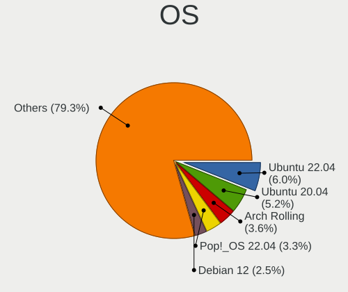

| Name                         | Computers | Percent |
|------------------------------|-----------|---------|
| Ubuntu 22.04                 | 69        | 6.04%   |
| Ubuntu 20.04                 | 59        | 5.17%   |
| Arch Rolling                 | 41        | 3.59%   |
| Pop!_OS 22.04                | 38        | 3.33%   |
| Debian 12                    | 29        | 2.54%   |
| Pop!_OS 20.04                | 26        | 2.28%   |
| Ubuntu 24.04                 | 24        | 2.1%    |
| Fedora 40                    | 24        | 2.1%    |
| Ubuntu 18.04                 | 23        | 2.01%   |
| Fedora 41                    | 19        | 1.66%   |
| KDE neon 20.04               | 18        | 1.58%   |
| OpenMandriva 24.12           | 16        | 1.4%    |
| Manjaro                      | 16        | 1.4%    |
| Fedora 42                    | 16        | 1.4%    |
| Fedora 38                    | 15        | 1.31%   |
| ArcoLinux Rolling            | 15        | 1.31%   |
| OpenMandriva 4.2             | 14        | 1.23%   |
| EndeavourOS Rolling          | 14        | 1.23%   |
| Zorin 17                     | 13        | 1.14%   |
| Zorin 16                     | 12        | 1.05%   |
| Zorin 15                     | 11        | 0.96%   |
| openSUSE Tumbleweed-XXXXXXXX | 11        | 0.96%   |
| OpenMandriva 25.06           | 11        | 0.96%   |
| Linux Mint 22.1              | 11        | 0.96%   |
| KDE neon 22.04               | 11        | 0.96%   |
| Fedora 39                    | 11        | 0.96%   |
| Fedora 36                    | 11        | 0.96%   |
| Pop!_OS 21.04                | 10        | 0.88%   |
| OpenMandriva 5.0             | 10        | 0.88%   |
| OpenMandriva 4.3             | 9         | 0.79%   |
| OpenMandriva 25.90           | 9         | 0.79%   |
| OpenMandriva 25.01           | 9         | 0.79%   |
| Linux Mint 22                | 9         | 0.79%   |
| Debian 11                    | 9         | 0.79%   |
| Bazzite 42                   | 9         | 0.79%   |
| Ubuntu 23.04                 | 8         | 0.7%    |
| OpenMandriva 25.03           | 8         | 0.7%    |
| Linux Mint 21.2              | 8         | 0.7%    |
| Linux Mint 20.2              | 8         | 0.7%    |
| Kubuntu 22.04                | 8         | 0.7%    |

OS Family
---------

OS without a version

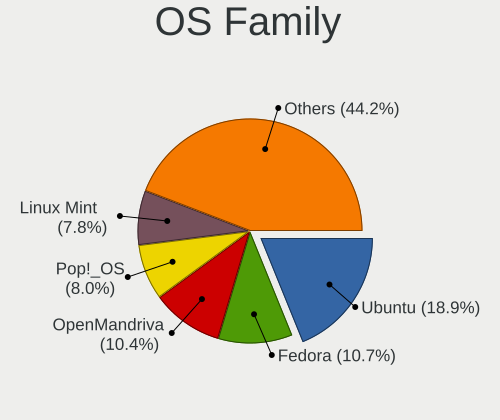

| Name          | Computers | Percent |
|---------------|-----------|---------|
| Ubuntu        | 202       | 18.86%  |
| Fedora        | 115       | 10.74%  |
| OpenMandriva  | 111       | 10.36%  |
| Pop!_OS       | 86        | 8.03%   |
| Linux Mint    | 84        | 7.84%   |
| Debian        | 54        | 5.04%   |
| Arch          | 49        | 4.58%   |
| Zorin         | 42        | 3.92%   |
| Endless       | 34        | 3.17%   |
| KDE neon      | 32        | 2.99%   |
| Manjaro       | 27        | 2.52%   |
| SteamOS       | 20        | 1.87%   |
| Kali          | 20        | 1.87%   |
| Kubuntu       | 17        | 1.59%   |
| ArcoLinux     | 17        | 1.59%   |
| EndeavourOS   | 15        | 1.4%    |
| Bazzite       | 14        | 1.31%   |
| openSUSE      | 13        | 1.21%   |
| Xubuntu       | 12        | 1.12%   |
| BlackPanther  | 10        | 0.93%   |
| Nobara        | 9         | 0.84%   |
| CachyOS       | 9         | 0.84%   |
| Elementary    | 8         | 0.75%   |
| Ubuntu Unity  | 6         | 0.56%   |
| Lubuntu       | 6         | 0.56%   |
| Ubuntu MATE   | 5         | 0.47%   |
| LMDE          | 5         | 0.47%   |
| Xero          | 3         | 0.28%   |
| ROSA          | 3         | 0.28%   |
| Peppermint    | 3         | 0.28%   |
| NixOS         | 3         | 0.28%   |
| MX            | 3         | 0.28%   |
| Garuda Linux  | 3         | 0.28%   |
| Void Linux    | 2         | 0.19%   |
| Ubuntu Budgie | 2         | 0.19%   |
| Pikaos        | 2         | 0.19%   |
| Linux Lite    | 2         | 0.19%   |
| Gentoo        | 2         | 0.19%   |
| Clear Linux   | 2         | 0.19%   |
| BunsenLabs    | 2         | 0.19%   |

Kernel
------

Version of the Linux kernel

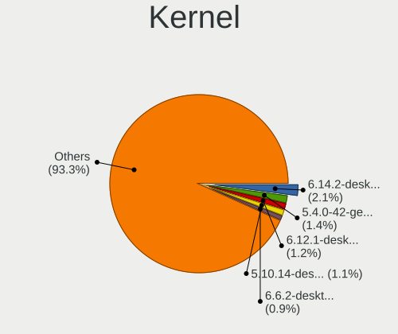

| Version                  | Computers | Percent |
|--------------------------|-----------|---------|
| 6.14.2-desktop-3omv2590  | 26        | 2.08%   |
| 5.4.0-42-generic         | 18        | 1.44%   |
| 6.12.1-desktop-1omv2490  | 15        | 1.2%    |
| 5.10.14-desktop-1omv4002 | 14        | 1.12%   |
| 6.6.2-desktop-1omv2390   | 11        | 0.88%   |
| 5.3.0-28-generic         | 10        | 0.8%    |
| 6.9.3-76060903-generic   | 9         | 0.72%   |
| 6.8.0-51-generic         | 9         | 0.72%   |
| 6.12.9-desktop-1omv2490  | 9         | 0.72%   |
| 5.4.0-7634-generic       | 9         | 0.72%   |
| 5.16.7-desktop-1omv4003  | 9         | 0.72%   |
| 6.8.0-40-generic         | 8         | 0.64%   |
| 5.4.0-48-generic         | 8         | 0.64%   |
| 5.15.0-56-generic        | 8         | 0.64%   |
| 4.18.16-desktop-1bP      | 8         | 0.64%   |
| 5.3.0-23-generic         | 7         | 0.56%   |
| 6.8.0-52-generic         | 6         | 0.48%   |
| 6.2.6-76060206-generic   | 6         | 0.48%   |
| 5.8.0-7630-generic       | 6         | 0.48%   |
| 5.8.0-14-generic         | 6         | 0.48%   |
| 5.4.0-58-generic         | 6         | 0.48%   |
| 5.19.0-32-generic        | 6         | 0.48%   |
| 5.15.0-52-generic        | 6         | 0.48%   |
| 5.15.0-41-generic        | 6         | 0.48%   |
| 5.13.0-valve36-1-neptune | 6         | 0.48%   |
| 6.8.5-301.fc40.x86_64    | 5         | 0.4%    |
| 6.8.0-64-generic         | 5         | 0.4%    |
| 6.8.0-60-generic         | 5         | 0.4%    |
| 6.5.0-27-generic         | 5         | 0.4%    |
| 6.5.0-26-generic         | 5         | 0.4%    |
| 6.4.11-desktop-1omv2390  | 5         | 0.4%    |
| 6.2.9-300.fc38.x86_64    | 5         | 0.4%    |
| 6.2.0-37-generic         | 5         | 0.4%    |
| 6.2.0-26-generic         | 5         | 0.4%    |
| 6.2.0-20-generic         | 5         | 0.4%    |
| 6.10.0-desktop-1omv2490  | 5         | 0.4%    |
| 5.4.0-47-generic         | 5         | 0.4%    |
| 5.15.0-58-generic        | 5         | 0.4%    |
| 5.15.0-50-generic        | 5         | 0.4%    |
| 5.11.0-7620-generic      | 5         | 0.4%    |

Kernel Family
-------------

Linux kernel without a distro release

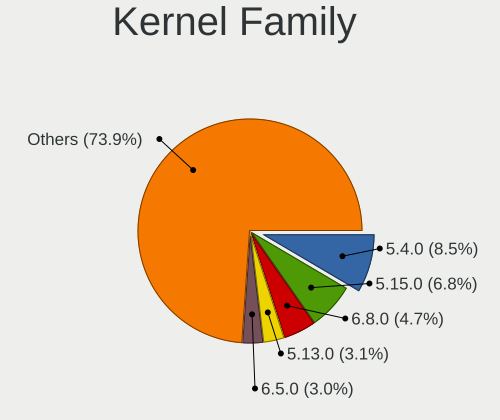

| Version | Computers | Percent |
|---------|-----------|---------|
| 5.4.0   | 102       | 8.48%   |
| 5.15.0  | 82        | 6.82%   |
| 6.8.0   | 57        | 4.74%   |
| 5.13.0  | 37        | 3.08%   |
| 6.5.0   | 36        | 2.99%   |
| 5.3.0   | 32        | 2.66%   |
| 5.8.0   | 31        | 2.58%   |
| 6.2.0   | 30        | 2.49%   |
| 6.1.0   | 29        | 2.41%   |
| 6.14.2  | 28        | 2.33%   |
| 5.11.0  | 26        | 2.16%   |
| 6.14.0  | 24        | 2%      |
| 5.19.0  | 23        | 1.91%   |
| 4.15.0  | 22        | 1.83%   |
| 6.12.1  | 15        | 1.25%   |
| 6.11.0  | 15        | 1.25%   |
| 5.10.14 | 14        | 1.16%   |
| 6.9.3   | 12        | 1%      |
| 6.6.2   | 11        | 0.91%   |
| 6.2.6   | 11        | 0.91%   |
| 6.12.9  | 11        | 0.91%   |
| 5.0.0   | 11        | 0.91%   |
| 4.18.0  | 10        | 0.83%   |
| 5.16.7  | 9         | 0.75%   |
| 5.10.0  | 9         | 0.75%   |
| 4.19.0  | 8         | 0.67%   |
| 4.18.16 | 8         | 0.67%   |
| 6.17.9  | 7         | 0.58%   |
| 6.17.7  | 7         | 0.58%   |
| 6.8.5   | 6         | 0.5%    |
| 6.8.11  | 6         | 0.5%    |
| 6.4.11  | 6         | 0.5%    |
| 6.11.4  | 6         | 0.5%    |
| 5.17.5  | 6         | 0.5%    |
| 4.9.20  | 6         | 0.5%    |
| 6.9.7   | 5         | 0.42%   |
| 6.2.9   | 5         | 0.42%   |
| 6.16.4  | 5         | 0.42%   |
| 6.15.4  | 5         | 0.42%   |
| 6.13.5  | 5         | 0.42%   |

Kernel Major Ver.
-----------------

Linux kernel major version

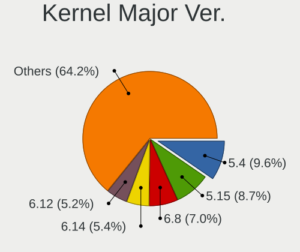

| Version | Computers | Percent |
|---------|-----------|---------|
| 5.4     | 113       | 9.59%   |
| 5.15    | 102       | 8.66%   |
| 6.8     | 82        | 6.96%   |
| 6.14    | 64        | 5.43%   |
| 6.12    | 61        | 5.18%   |
| 6.1     | 57        | 4.84%   |
| 6.5     | 53        | 4.5%    |
| 6.2     | 52        | 4.41%   |
| 5.13    | 40        | 3.4%    |
| 6.11    | 39        | 3.31%   |
| 5.8     | 38        | 3.23%   |
| 5.10    | 36        | 3.06%   |
| 5.3     | 34        | 2.89%   |
| 5.19    | 33        | 2.8%    |
| 5.11    | 31        | 2.63%   |
| 6.6     | 29        | 2.46%   |
| 6.9     | 28        | 2.38%   |
| 6.17    | 23        | 1.95%   |
| 6.13    | 23        | 1.95%   |
| 4.15    | 22        | 1.87%   |
| 6.0     | 20        | 1.7%    |
| 5.16    | 20        | 1.7%    |
| 6.4     | 19        | 1.61%   |
| 4.18    | 18        | 1.53%   |
| 6.16    | 17        | 1.44%   |
| 6.10    | 16        | 1.36%   |
| 6.15    | 15        | 1.27%   |
| 5.18    | 12        | 1.02%   |
| 5.0     | 12        | 1.02%   |
| 6.3     | 9         | 0.76%   |
| 4.19    | 9         | 0.76%   |
| 5.17    | 8         | 0.68%   |
| 4.9     | 8         | 0.68%   |
| 6.7     | 7         | 0.59%   |
| 5.9     | 7         | 0.59%   |
| 5.14    | 4         | 0.34%   |
| 4.4     | 4         | 0.34%   |
| 5.6     | 3         | 0.25%   |
| 5.7     | 2         | 0.17%   |
| 5.12    | 2         | 0.17%   |

Arch
----

OS architecture (x86_64, i586, etc.)

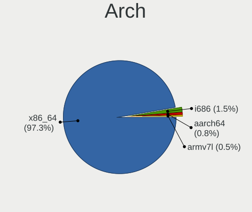

| Name    | Computers | Percent |
|---------|-----------|---------|
| x86_64  | 998       | 97.27%  |
| i686    | 15        | 1.46%   |
| aarch64 | 8         | 0.78%   |
| armv7l  | 5         | 0.49%   |

DE
--

Desktop Environment

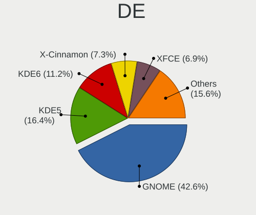

| Name            | Computers | Percent |
|-----------------|-----------|---------|
| GNOME           | 459       | 42.58%  |
| KDE5            | 177       | 16.42%  |
| KDE6            | 121       | 11.22%  |
| X-Cinnamon      | 79        | 7.33%   |
| XFCE            | 74        | 6.86%   |
| Unknown         | 57        | 5.29%   |
| KDE             | 20        | 1.86%   |
| LXQt            | 16        | 1.48%   |
| MATE            | 14        | 1.3%    |
| Hyprland        | 12        | 1.11%   |
| Pantheon        | 7         | 0.65%   |
| Budgie          | 6         | 0.56%   |
| Unity           | 5         | 0.46%   |
| LXDE            | 5         | 0.46%   |
| Cinnamon        | 4         | 0.37%   |
| openbox         | 2         | 0.19%   |
| Endless:GNOME   | 2         | 0.19%   |
| COSMIC          | 2         | 0.19%   |
| bspwm           | 2         | 0.19%   |
| sway:wlroots    | 1         | 0.09%   |
| sway            | 1         | 0.09%   |
| river           | 1         | 0.09%   |
| pika:GNOME      | 1         | 0.09%   |
| labwc:wlroots   | 1         | 0.09%   |
| i3              | 1         | 0.09%   |
| GNOME Flashback | 1         | 0.09%   |
| GNOME Classic   | 1         | 0.09%   |
| dwm             | 1         | 0.09%   |
| default         | 1         | 0.09%   |
| Deepin          | 1         | 0.09%   |
| Cutefish        | 1         | 0.09%   |
| BunsenLabs      | 1         | 0.09%   |
| awesome         | 1         | 0.09%   |

Display Server
--------------

X11 or Wayland

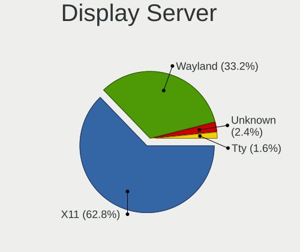

| Name    | Computers | Percent |
|---------|-----------|---------|
| X11     | 665       | 62.8%   |
| Wayland | 352       | 33.24%  |
| Unknown | 25        | 2.36%   |
| Tty     | 17        | 1.61%   |

Display Manager
---------------

SDDM, LightDM, etc.

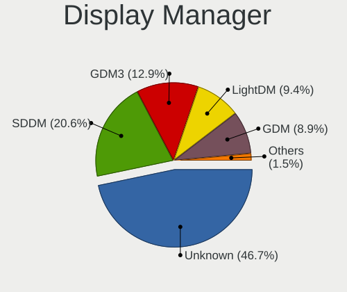

| Name    | Computers | Percent |
|---------|-----------|---------|
| Unknown | 500       | 46.73%  |
| SDDM    | 220       | 20.56%  |
| GDM3    | 138       | 12.9%   |
| LightDM | 101       | 9.44%   |
| GDM     | 95        | 8.88%   |
| TDM     | 10        | 0.93%   |
| LY-DM   | 3         | 0.28%   |
| SLiM    | 1         | 0.09%   |
| MDM     | 1         | 0.09%   |
| LXDM    | 1         | 0.09%   |

OS Lang
-------

Language

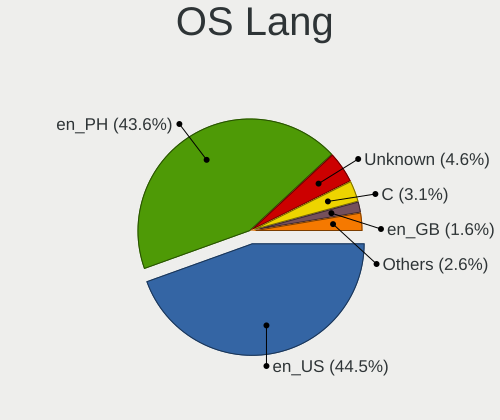

| Lang             | Computers | Percent |
|------------------|-----------|---------|
| en_US            | 474       | 44.51%  |
| en_PH            | 464       | 43.57%  |
| Unknown          | 49        | 4.6%    |
| C                | 33        | 3.1%    |
| en_GB            | 17        | 1.6%    |
| de_DE            | 7         | 0.66%   |
| en_AU            | 5         | 0.47%   |
| en_HK            | 3         | 0.28%   |
| zh_CN            | 2         | 0.19%   |
| zh_HK            | 1         | 0.09%   |
| tl_PH            | 1         | 0.09%   |
| ja_JP            | 1         | 0.09%   |
| fil_PH           | 1         | 0.09%   |
| en_ZA            | 1         | 0.09%   |
| en_US.ISO-8859-1 | 1         | 0.09%   |
| en_NZ            | 1         | 0.09%   |
| en_IN            | 1         | 0.09%   |
| en_DK            | 1         | 0.09%   |
| en_CA            | 1         | 0.09%   |
| da_DK            | 1         | 0.09%   |

Boot Mode
---------

EFI or BIOS

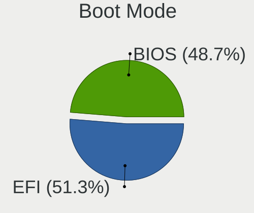

| Mode | Computers | Percent |
|------|-----------|---------|
| EFI  | 538       | 51.29%  |
| BIOS | 511       | 48.71%  |

Filesystem
----------

Type of filesystem

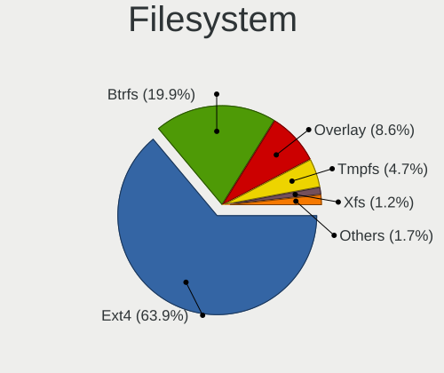

| Type    | Computers | Percent |
|---------|-----------|---------|
| Ext4    | 680       | 63.91%  |
| Btrfs   | 212       | 19.92%  |
| Overlay | 91        | 8.55%   |
| Tmpfs   | 50        | 4.7%    |
| Xfs     | 13        | 1.22%   |
| Unknown | 11        | 1.03%   |
| Zfs     | 4         | 0.38%   |
| Ext2    | 3         | 0.28%   |

Part. scheme
------------

Scheme of partitioning

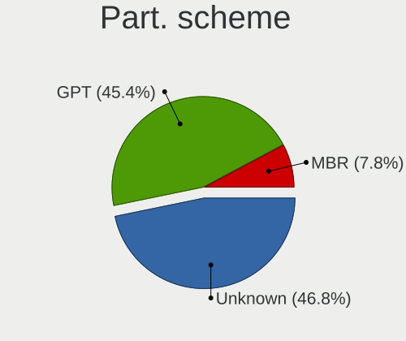

| Type    | Computers | Percent |
|---------|-----------|---------|
| Unknown | 493       | 46.77%  |
| GPT     | 479       | 45.45%  |
| MBR     | 82        | 7.78%   |

Dual Boot with Linux/BSD
------------------------

Hosting more than one Linux/BSD

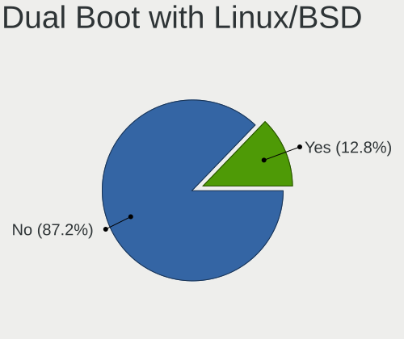

| Dual boot | Computers | Percent |
|-----------|-----------|---------|
| No        | 913       | 87.2%   |
| Yes       | 134       | 12.8%   |

Dual Boot (Win)
---------------

Hosting Linux and Windows

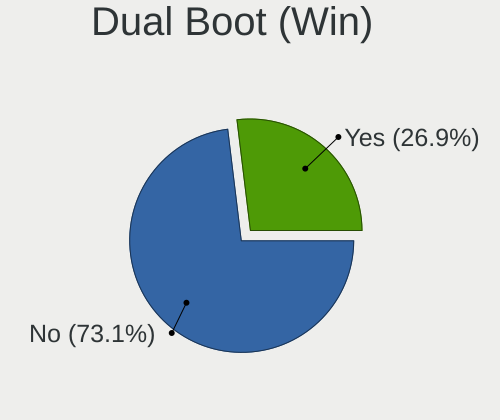

| Dual boot | Computers | Percent |
|-----------|-----------|---------|
| No        | 768       | 73.07%  |
| Yes       | 283       | 26.93%  |

Board
-----

Vendor
------

Motherboard manufacturer

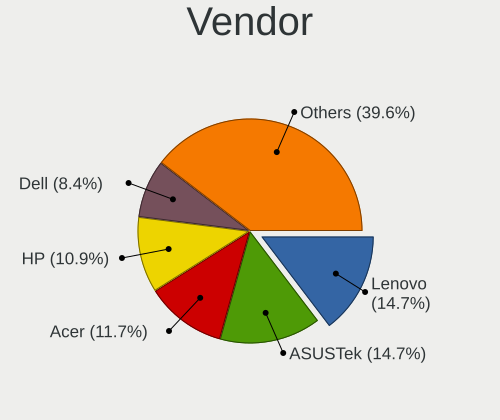

| Name                    | Computers | Percent |
|-------------------------|-----------|---------|
| Lenovo                  | 150       | 14.66%  |
| ASUSTek Computer        | 150       | 14.66%  |
| Acer                    | 120       | 11.73%  |
| Hewlett-Packard         | 112       | 10.95%  |
| Dell                    | 86        | 8.41%   |
| Gigabyte Technology     | 74        | 7.23%   |
| MSI                     | 71        | 6.94%   |
| ASRock                  | 28        | 2.74%   |
| HUAWEI                  | 24        | 2.35%   |
| Toshiba                 | 18        | 1.76%   |
| Apple                   | 18        | 1.76%   |
| Unknown                 | 18        | 1.76%   |
| Valve                   | 17        | 1.66%   |
| Biostar                 | 14        | 1.37%   |
| ECS                     | 10        | 0.98%   |
| Samsung Electronics     | 8         | 0.78%   |
| NEC Computers           | 8         | 0.78%   |
| Intel                   | 8         | 0.78%   |
| EMAXX TECHNOLOGY        | 7         | 0.68%   |
| Raspberry Pi Foundation | 6         | 0.59%   |
| Sony                    | 5         | 0.49%   |
| Google                  | 5         | 0.49%   |
| Foxconn                 | 5         | 0.49%   |
| Clevo                   | 4         | 0.39%   |
| AZW                     | 4         | 0.39%   |
| Pegatron                | 3         | 0.29%   |
| Microsoft               | 3         | 0.29%   |
| eMachines               | 3         | 0.29%   |
| System76                | 2         | 0.2%    |
| Ramsta                  | 2         | 0.2%    |
| Notebook                | 2         | 0.2%    |
| MACHENIKE               | 2         | 0.2%    |
| Jumper                  | 2         | 0.2%    |
| GPD                     | 2         | 0.2%    |
| Fujitsu                 | 2         | 0.2%    |
| Colorful Technology     | 2         | 0.2%    |
| AMI                     | 2         | 0.2%    |
| AMD                     | 2         | 0.2%    |
| YANYU                   | 1         | 0.1%    |
| Xunlong                 | 1         | 0.1%    |

Model
-----

Motherboard model

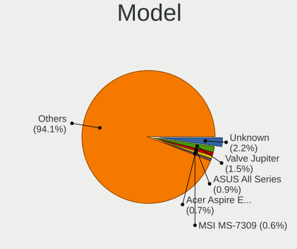

| Name                                | Computers | Percent |
|-------------------------------------|-----------|---------|
| Unknown                             | 23        | 2.25%   |
| Valve Jupiter                       | 15        | 1.47%   |
| ASUS All Series                     | 9         | 0.88%   |
| Acer Aspire ES1-132                 | 7         | 0.68%   |
| MSI MS-7309                         | 6         | 0.59%   |
| Gigabyte F2A68HM-S1                 | 6         | 0.59%   |
| Gigabyte A320M-S2H V2               | 6         | 0.59%   |
| MSI MS-7721                         | 5         | 0.49%   |
| ASRock B450M Steel Legend           | 5         | 0.49%   |
| RPi Raspberry Pi                    | 4         | 0.39%   |
| MSI MS-7C94                         | 4         | 0.39%   |
| MSI MS-7C52                         | 4         | 0.39%   |
| ASUS P8H61-M LX3 PLUS R2.0          | 4         | 0.39%   |
| Acer Aspire A315-51                 | 4         | 0.39%   |
| MSI Modern 14 B4MW                  | 3         | 0.29%   |
| Lenovo IdeaPad Gaming 3 15ACH6 82K2 | 3         | 0.29%   |
| HUAWEI NBLK-WAX9X                   | 3         | 0.29%   |
| HUAWEI KLVL-WXXW                    | 3         | 0.29%   |
| HUAWEI BOHB-WAX9                    | 3         | 0.29%   |
| HUAWEI BoDE-WXX9                    | 3         | 0.29%   |
| HP Notebook                         | 3         | 0.29%   |
| Foxconn G31MX Series                | 3         | 0.29%   |
| ECS G41T-R3                         | 3         | 0.29%   |
| Dell OptiPlex 3050                  | 3         | 0.29%   |
| Dell Inspiron 5567                  | 3         | 0.29%   |
| Clevo M7x0S                         | 3         | 0.29%   |
| Biostar A320MH                      | 3         | 0.29%   |
| ASUS Vivobook Go E1504FA_E1504FA    | 3         | 0.29%   |
| ASUS PRIME A320M-K                  | 3         | 0.29%   |
| ASRock A520M-HDV                    | 3         | 0.29%   |
| Apple MacBookAir3,1                 | 3         | 0.29%   |
| Acer Nitro ANV15-51                 | 3         | 0.29%   |
| Acer Nitro AN515-42                 | 3         | 0.29%   |
| Acer Aspire E3-111                  | 3         | 0.29%   |
| Acer Aspire A315-41G                | 3         | 0.29%   |
| Valve Galileo                       | 2         | 0.2%    |
| Sony VPCEA36FA                      | 2         | 0.2%    |
| Pegatron IPMSB-H61                  | 2         | 0.2%    |
| MSI MS-7D23                         | 2         | 0.2%    |
| MSI MS-7C96                         | 2         | 0.2%    |

Model Family
------------

Motherboard model prefix

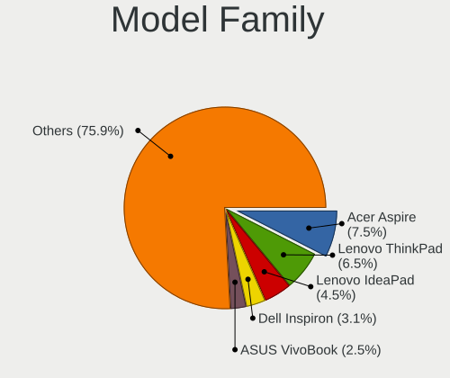

| Name                | Computers | Percent |
|---------------------|-----------|---------|
| Acer Aspire         | 77        | 7.53%   |
| Lenovo ThinkPad     | 66        | 6.45%   |
| Lenovo IdeaPad      | 46        | 4.5%    |
| Dell Inspiron       | 32        | 3.13%   |
| ASUS VivoBook       | 26        | 2.54%   |
| Unknown             | 23        | 2.25%   |
| HP Pavilion         | 21        | 2.05%   |
| Dell OptiPlex       | 19        | 1.86%   |
| Dell Latitude       | 18        | 1.76%   |
| ASUS PRIME          | 17        | 1.66%   |
| Valve Jupiter       | 15        | 1.47%   |
| ASUS ROG            | 15        | 1.47%   |
| Acer Nitro          | 15        | 1.47%   |
| ASUS TUF            | 14        | 1.37%   |
| HP ProBook          | 13        | 1.27%   |
| Toshiba Satellite   | 12        | 1.17%   |
| HP Laptop           | 12        | 1.17%   |
| HP Compaq           | 12        | 1.17%   |
| HP EliteBook        | 9         | 0.88%   |
| ASUS All            | 9         | 0.88%   |
| Acer TravelMate     | 9         | 0.88%   |
| Gigabyte A320M-S2H  | 8         | 0.78%   |
| Lenovo ThinkCentre  | 7         | 0.68%   |
| Acer Swift          | 7         | 0.68%   |
| RPi Raspberry       | 6         | 0.59%   |
| MSI MS-7309         | 6         | 0.59%   |
| Gigabyte F2A68HM-S1 | 6         | 0.59%   |
| ASUS P8H61-M        | 6         | 0.59%   |
| ASUS ASUS           | 6         | 0.59%   |
| MSI MS-7721         | 5         | 0.49%   |
| Lenovo Legion       | 5         | 0.49%   |
| HP ProDesk          | 5         | 0.49%   |
| HP ENVY             | 5         | 0.49%   |
| Gigabyte B450       | 5         | 0.49%   |
| Dell XPS            | 5         | 0.49%   |
| Dell Vostro         | 5         | 0.49%   |
| ASRock B450M        | 5         | 0.49%   |
| Acer Predator       | 5         | 0.49%   |
| MSI MS-7C94         | 4         | 0.39%   |
| MSI MS-7C52         | 4         | 0.39%   |

MFG Year
--------

Motherboard manufacture year

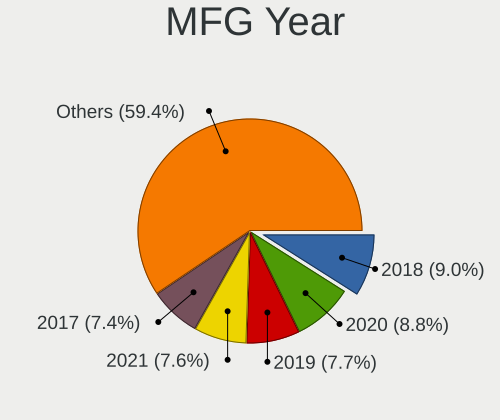

| Year    | Computers | Percent |
|---------|-----------|---------|
| 2018    | 92        | 8.99%   |
| 2020    | 90        | 8.8%    |
| 2019    | 79        | 7.72%   |
| 2021    | 78        | 7.62%   |
| 2017    | 76        | 7.43%   |
| 2012    | 75        | 7.33%   |
| 2022    | 63        | 6.16%   |
| 2014    | 62        | 6.06%   |
| 2015    | 60        | 5.87%   |
| 2016    | 54        | 5.28%   |
| 2011    | 53        | 5.18%   |
| 2023    | 51        | 4.99%   |
| 2013    | 47        | 4.59%   |
| 2010    | 44        | 4.3%    |
| 2009    | 24        | 2.35%   |
| 2008    | 23        | 2.25%   |
| 2024    | 18        | 1.76%   |
| Unknown | 12        | 1.17%   |
| 2007    | 8         | 0.78%   |
| 2006    | 8         | 0.78%   |
| 2025    | 6         | 0.59%   |

Form Factor
-----------

Physical design of the computer

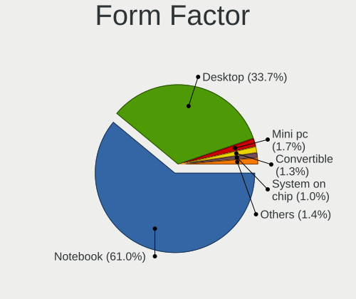

| Name           | Computers | Percent |
|----------------|-----------|---------|
| Notebook       | 624       | 61%     |
| Desktop        | 345       | 33.72%  |
| Mini pc        | 17        | 1.66%   |
| Convertible    | 13        | 1.27%   |
| System on chip | 10        | 0.98%   |
| All in one     | 7         | 0.68%   |
| Tablet         | 5         | 0.49%   |
| Server         | 2         | 0.2%    |

Secure Boot
-----------

Enabled or disabled

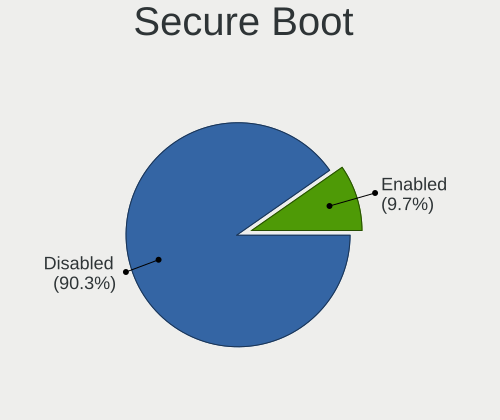

| State    | Computers | Percent |
|----------|-----------|---------|
| Disabled | 931       | 90.3%   |
| Enabled  | 100       | 9.7%    |

Coreboot
--------

Have coreboot on board

| Used | Computers | Percent |
|------|-----------|---------|
| No   | 1017      | 99.41%  |
| Yes  | 6         | 0.59%   |

RAM Size
--------

Total RAM memory

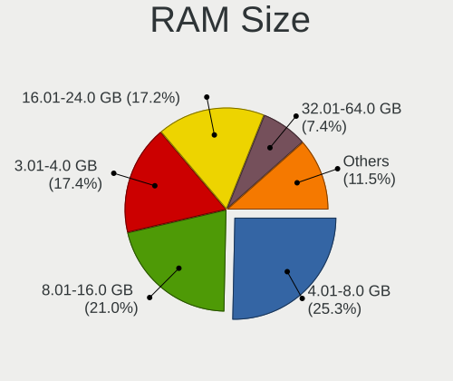

| Size in GB  | Computers | Percent |
|-------------|-----------|---------|
| 4.01-8.0    | 266       | 25.33%  |
| 8.01-16.0   | 221       | 21.05%  |
| 3.01-4.0    | 183       | 17.43%  |
| 16.01-24.0  | 181       | 17.24%  |
| 32.01-64.0  | 78        | 7.43%   |
| 1.01-2.0    | 52        | 4.95%   |
| 24.01-32.0  | 25        | 2.38%   |
| 64.01-256.0 | 24        | 2.29%   |
| 2.01-3.0    | 13        | 1.24%   |
| 0.51-1.0    | 7         | 0.67%   |

RAM Used
--------

Used RAM memory

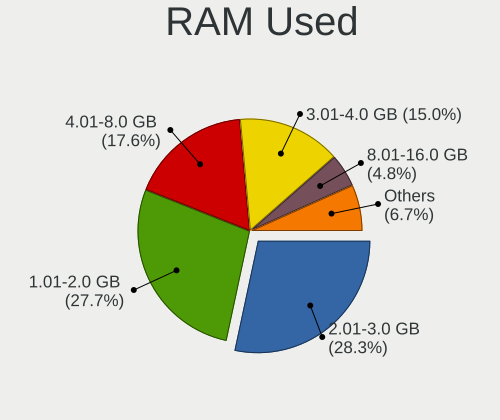

| Used GB     | Computers | Percent |
|-------------|-----------|---------|
| 2.01-3.0    | 326       | 28.35%  |
| 1.01-2.0    | 318       | 27.65%  |
| 4.01-8.0    | 202       | 17.57%  |
| 3.01-4.0    | 172       | 14.96%  |
| 8.01-16.0   | 55        | 4.78%   |
| 0.51-1.0    | 55        | 4.78%   |
| 0.01-0.5    | 13        | 1.13%   |
| 16.01-24.0  | 4         | 0.35%   |
| 24.01-32.0  | 2         | 0.17%   |
| 32.01-64.0  | 1         | 0.09%   |
| 64.01-256.0 | 1         | 0.09%   |
| Unknown     | 1         | 0.09%   |

Total Drives
------------

Number of drives on board

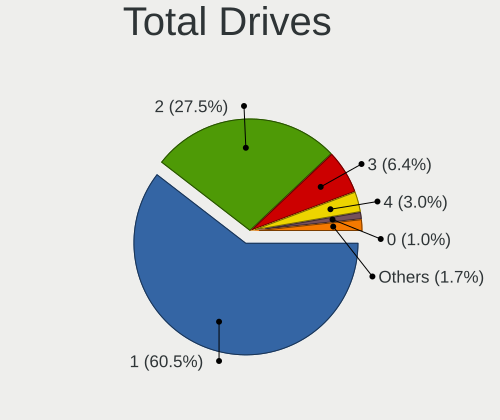

| Drives | Computers | Percent |
|--------|-----------|---------|
| 1      | 647       | 60.47%  |
| 2      | 294       | 27.48%  |
| 3      | 68        | 6.36%   |
| 4      | 32        | 2.99%   |
| 0      | 11        | 1.03%   |
| 5      | 9         | 0.84%   |
| 6      | 5         | 0.47%   |
| 15     | 1         | 0.09%   |
| 14     | 1         | 0.09%   |
| 13     | 1         | 0.09%   |
| 12     | 1         | 0.09%   |

Has CD-ROM
----------

Has CD-ROM on board

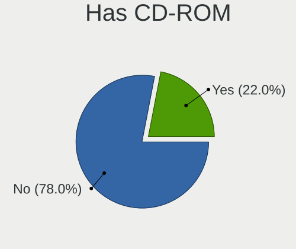

| Presented | Computers | Percent |
|-----------|-----------|---------|
| No        | 810       | 78.03%  |
| Yes       | 228       | 21.97%  |

Has Ethernet
------------

Has Ethernet on board

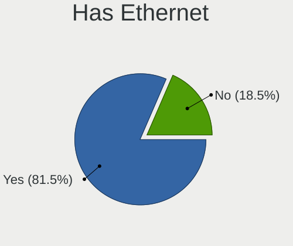

| Presented | Computers | Percent |
|-----------|-----------|---------|
| Yes       | 837       | 81.5%   |
| No        | 190       | 18.5%   |

Has WiFi
--------

Has WiFi module

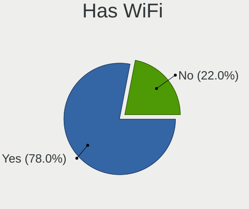

| Presented | Computers | Percent |
|-----------|-----------|---------|
| Yes       | 803       | 78.04%  |
| No        | 226       | 21.96%  |

Has Bluetooth
-------------

Has Bluetooth module

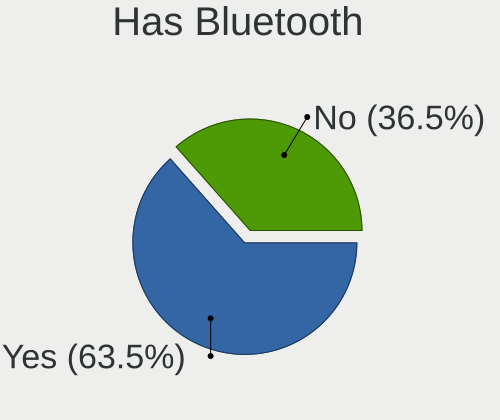

| Presented | Computers | Percent |
|-----------|-----------|---------|
| Yes       | 655       | 63.47%  |
| No        | 377       | 36.53%  |

Location
--------

Country
-------

Geographic location (country)

| Country     | Computers | Percent |
|-------------|-----------|---------|
| Philippines | 1023      | 100%    |

City
----

Geographic location (city)

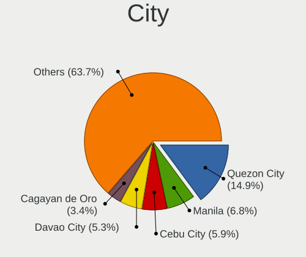

| City               | Computers | Percent |
|--------------------|-----------|---------|
| Quezon City        | 168       | 14.85%  |
| Manila             | 77        | 6.81%   |
| Cebu City          | 67        | 5.92%   |
| Davao City         | 60        | 5.31%   |
| Cagayan de Oro     | 39        | 3.45%   |
| Caloocan City      | 34        | 3.01%   |
| Angeles City       | 33        | 2.92%   |
| Makati City        | 31        | 2.74%   |
| Lahug              | 31        | 2.74%   |
| Bacolod City       | 29        | 2.56%   |
| Paranaque City     | 27        | 2.39%   |
| Mandaluyong City   | 20        | 1.77%   |
| Pasig              | 19        | 1.68%   |
| Imus               | 17        | 1.5%    |
| Bacoor             | 17        | 1.5%    |
| Tarlac City        | 16        | 1.41%   |
| Iloilo City        | 16        | 1.41%   |
| San Juan           | 15        | 1.33%   |
| Las Pinas          | 15        | 1.33%   |
| Santa Rosa         | 14        | 1.24%   |
| Iligan City        | 13        | 1.15%   |
| San Miguel         | 12        | 1.06%   |
| Manajao            | 12        | 1.06%   |
| San Jose del Monte | 11        | 0.97%   |
| Marikina City      | 11        | 0.97%   |
| General Trias      | 11        | 0.97%   |
| Dasmarinas         | 11        | 0.97%   |
| Calamba            | 11        | 0.97%   |
| Cabanatuan City    | 11        | 0.97%   |
| San Fernando City  | 10        | 0.88%   |
| Lipa City          | 10        | 0.88%   |
| Cainta             | 10        | 0.88%   |
| Batangas           | 9         | 0.8%    |
| Urdaneta           | 8         | 0.71%   |
| San Pablo City     | 8         | 0.71%   |
| Nasugbu            | 8         | 0.71%   |
| Baguio City        | 8         | 0.71%   |
| Tagbilaran         | 7         | 0.62%   |
| Lucena City        | 7         | 0.62%   |
| General Santos     | 7         | 0.62%   |

Drives
------

Drive Vendor
------------

Hard drive vendors

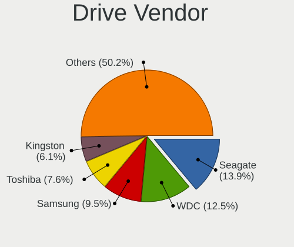

| Vendor                       | Computers | Drives | Percent |
|------------------------------|-----------|--------|---------|
| Seagate                      | 213       | 315    | 13.92%  |
| WDC                          | 192       | 243    | 12.55%  |
| Samsung Electronics          | 146       | 219    | 9.54%   |
| Toshiba                      | 117       | 149    | 7.65%   |
| Kingston                     | 94        | 125    | 6.14%   |
| Sandisk                      | 81        | 113    | 5.29%   |
| Unknown                      | 59        | 71     | 3.86%   |
| Hitachi                      | 40        | 62     | 2.61%   |
| SK hynix                     | 36        | 53     | 2.35%   |
| Intel                        | 33        | 39     | 2.16%   |
| Micron Technology            | 30        | 40     | 1.96%   |
| Ramsta                       | 28        | 37     | 1.83%   |
| Kingston Technology Company  | 27        | 31     | 1.76%   |
| Phison Electronics           | 25        | 36     | 1.63%   |
| HGST                         | 23        | 30     | 1.5%    |
| Crucial                      | 21        | 25     | 1.37%   |
| A-DATA Technology            | 21        | 29     | 1.37%   |
| Team                         | 17        | 23     | 1.11%   |
| Silicon Motion               | 15        | 20     | 0.98%   |
| China                        | 14        | 26     | 0.92%   |
| Unknown                      | 13        | 14     | 0.85%   |
| Transcend                    | 12        | 14     | 0.78%   |
| MAXIO Technology (Hangzhou)  | 12        | 13     | 0.78%   |
| Lexar                        | 12        | 13     | 0.78%   |
| Micron/Crucial Technology    | 11        | 20     | 0.72%   |
| PNY                          | 10        | 14     | 0.65%   |
| KingSpec                     | 10        | 16     | 0.65%   |
| Phison                       | 9         | 9      | 0.59%   |
| Fujitsu                      | 9         | 11     | 0.59%   |
| Gigabyte Technology          | 8         | 13     | 0.52%   |
| Apple                        | 8         | 8      | 0.52%   |
| WALRAM                       | 7         | 8      | 0.46%   |
| JMicron Technology           | 7         | 10     | 0.46%   |
| BR                           | 7         | 13     | 0.46%   |
| SPCC                         | 6         | 8      | 0.39%   |
| Shenzhen Longsys Electronics | 6         | 9      | 0.39%   |
| HS-SSD-E100                  | 6         | 6      | 0.39%   |
| HS-SSD-C100                  | 6         | 7      | 0.39%   |
| Colorful                     | 6         | 7      | 0.39%   |
| TAMMUZ                       | 5         | 9      | 0.33%   |

Drive Model
-----------

Hard drive models

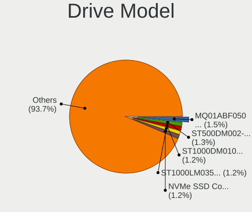

| Model                                                 | Computers | Percent |
|-------------------------------------------------------|-----------|---------|
| Toshiba MQ01ABF050 500GB                              | 25        | 1.52%   |
| Seagate ST500DM002-1BD142 500GB                       | 21        | 1.28%   |
| Seagate ST1000DM010-2EP102 1TB                        | 20        | 1.22%   |
| Seagate ST1000LM035-1RK172 1TB                        | 19        | 1.16%   |
| Samsung NVMe SSD Controller SM981/PM981/PM983 1TB     | 19        | 1.16%   |
| Kingston SA400S37240G 240GB SSD                       | 19        | 1.16%   |
| Phison PS5013 E13 NVMe Controller 500GB               | 17        | 1.04%   |
| Kingston SA400S37120G 120GB SSD                       | 17        | 1.04%   |
| Toshiba MQ04ABF100 1TB                                | 13        | 0.79%   |
| Unknown                                               | 13        | 0.79%   |
| Toshiba MQ01ABD100 1TB                                | 12        | 0.73%   |
| Unknown MMC Card  64GB                                | 11        | 0.67%   |
| Samsung SSD 860 EVO 500GB                             | 11        | 0.67%   |
| MAXIO (Hangzhou) NVMe SSD Controller MAP1202 2TB      | 11        | 0.67%   |
| Unknown MMC Card  32GB                                | 10        | 0.61%   |
| Samsung NVMe SSD Controller PM9A1/PM9A3/980PRO 1TB    | 10        | 0.61%   |
| Kingston SA400S37480G 480GB SSD                       | 10        | 0.61%   |
| Samsung SSD 860 EVO 250GB                             | 9         | 0.55%   |
| WDC WD5000LPCX-21VHAT0 500GB                          | 8         | 0.49%   |
| Seagate ST500LT012-1DG142 500GB                       | 8         | 0.49%   |
| Sandisk WD Blue SN550 NVMe SSD 1024GB                 | 8         | 0.49%   |
| WDC WD10SPZX-21Z10T0 1TB                              | 7         | 0.43%   |
| WDC WD10JPVX-22JC3T0 1TB                              | 7         | 0.43%   |
| Toshiba DT01ACA100 1TB                                | 7         | 0.43%   |
| Toshiba DT01ACA050 500GB                              | 7         | 0.43%   |
| Seagate ST2000LM007-1R8174 2TB                        | 7         | 0.43%   |
| Samsung NVMe SSD Controller SM961/PM961/SM963 1024GB  | 7         | 0.43%   |
| Ramsta SSD S800 120GB                                 | 7         | 0.43%   |
| WDC WDS240G2G0A-00JH30 240GB SSD                      | 6         | 0.37%   |
| Unknown SD/MMC/MS PRO 2GB                             | 6         | 0.37%   |
| Unknown MMC Card  128GB                               | 6         | 0.37%   |
| Silicon Motion SM2263EN/SM2263XT SSD Controller 512GB | 6         | 0.37%   |
| Seagate ST500LT012-9WS142 500GB                       | 6         | 0.37%   |
| Seagate ST2000DM008-2FR102 2TB                        | 6         | 0.37%   |
| Sandisk WD Black SN750 / PC SN730 NVMe SSD 500GB      | 6         | 0.37%   |
| SanDisk SSD PLUS 1000GB                               | 6         | 0.37%   |
| Intel SSDPEKNU512GZ 512GB                             | 6         | 0.37%   |
| Hitachi HTS543232A7A384 320GB                         | 6         | 0.37%   |
| WDC WD5000LPCX-60VHAT0 500GB                          | 5         | 0.3%    |
| WDC WD5000LPCX-24VHAT0 500GB                          | 5         | 0.3%    |

HDD Vendor
----------

Hard disk drive vendors

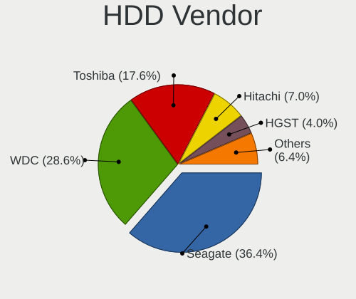

| Vendor              | Computers | Drives | Percent |
|---------------------|-----------|--------|---------|
| Seagate             | 209       | 287    | 36.41%  |
| WDC                 | 164       | 202    | 28.57%  |
| Toshiba             | 101       | 125    | 17.6%   |
| Hitachi             | 40        | 62     | 6.97%   |
| HGST                | 23        | 30     | 4.01%   |
| Fujitsu             | 9         | 11     | 1.57%   |
| Unknown             | 8         | 9      | 1.39%   |
| Samsung Electronics | 7         | 8      | 1.22%   |
| JMicron Technology  | 4         | 4      | 0.7%    |
| USB3.0              | 3         | 3      | 0.52%   |
| XrayDisk            | 1         | 1      | 0.17%   |
| Shenzhen            | 1         | 1      | 0.17%   |
| SAGE                | 1         | 1      | 0.17%   |
| Min Yi U            | 1         | 1      | 0.17%   |
| HGST HTS            | 1         | 1      | 0.17%   |
| ExcelStor           | 1         | 1      | 0.17%   |

SSD Vendor
----------

Solid state drive vendors

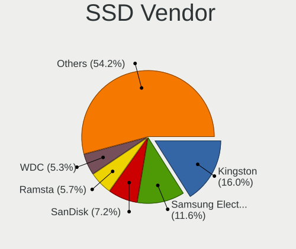

| Vendor              | Computers | Drives | Percent |
|---------------------|-----------|--------|---------|
| Kingston            | 73        | 91     | 16.01%  |
| Samsung Electronics | 53        | 76     | 11.62%  |
| SanDisk             | 33        | 41     | 7.24%   |
| Ramsta              | 26        | 35     | 5.7%    |
| WDC                 | 24        | 30     | 5.26%   |
| A-DATA Technology   | 18        | 24     | 3.95%   |
| Team                | 17        | 23     | 3.73%   |
| Crucial             | 14        | 17     | 3.07%   |
| China               | 14        | 26     | 3.07%   |
| Transcend           | 10        | 11     | 2.19%   |
| Lexar               | 9         | 10     | 1.97%   |
| KingSpec            | 9         | 15     | 1.97%   |
| Intel               | 9         | 10     | 1.97%   |
| Toshiba             | 8         | 11     | 1.75%   |
| SK hynix            | 8         | 20     | 1.75%   |
| PNY                 | 8         | 11     | 1.75%   |
| Micron Technology   | 8         | 8      | 1.75%   |
| Apple               | 7         | 7      | 1.54%   |
| BR                  | 6         | 10     | 1.32%   |
| TAMMUZ              | 5         | 9      | 1.1%    |
| HS-SSD-E100         | 5         | 5      | 1.1%    |
| Gigabyte Technology | 5         | 6      | 1.1%    |
| Colorful            | 5         | 5      | 1.1%    |
| SPCC                | 4         | 4      | 0.88%   |
| Unknown             | 4         | 4      | 0.88%   |
| WALRAM              | 3         | 3      | 0.66%   |
| Teclast             | 3         | 7      | 0.66%   |
| LITEONIT            | 3         | 5      | 0.66%   |
| Fanxiang            | 3         | 3      | 0.66%   |
| Seagate             | 2         | 3      | 0.44%   |
| Patriot             | 2         | 2      | 0.44%   |
| OCZ                 | 2         | 2      | 0.44%   |
| Netac               | 2         | 2      | 0.44%   |
| MCTECH              | 2         | 2      | 0.44%   |
| Kingmax             | 2         | 2      | 0.44%   |
| Kimtigo             | 2         | 5      | 0.44%   |
| Indilinx            | 2         | 2      | 0.44%   |
| HS-SSD-C100         | 2         | 2      | 0.44%   |
| Hikvision           | 2         | 4      | 0.44%   |
| FIKWOT              | 2         | 2      | 0.44%   |

Drive Kind
----------

HDD or SSD

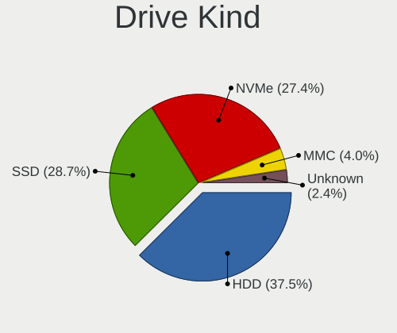

| Kind    | Computers | Drives | Percent |
|---------|-----------|--------|---------|
| HDD     | 509       | 747    | 37.54%  |
| SSD     | 389       | 601    | 28.69%  |
| NVMe    | 371       | 607    | 27.36%  |
| MMC     | 54        | 63     | 3.98%   |
| Unknown | 33        | 44     | 2.43%   |

Drive Connector
---------------

SATA, SAS, NVMe, etc.

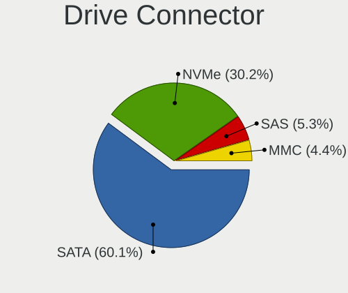

| Type | Computers | Drives | Percent |
|------|-----------|--------|---------|
| SATA | 738       | 1318   | 60.15%  |
| NVMe | 370       | 597    | 30.15%  |
| SAS  | 65        | 84     | 5.3%    |
| MMC  | 54        | 63     | 4.4%    |

Drive Size
----------

Size of hard drive

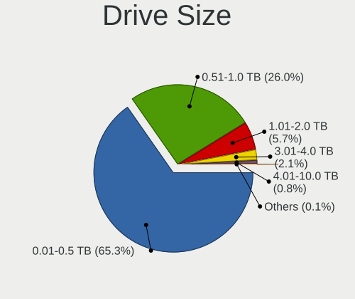

| Size in TB | Computers | Drives | Percent |
|------------|-----------|--------|---------|
| 0.01-0.5   | 581       | 911    | 65.28%  |
| 0.51-1.0   | 231       | 327    | 25.96%  |
| 1.01-2.0   | 51        | 68     | 5.73%   |
| 3.01-4.0   | 19        | 33     | 2.13%   |
| 4.01-10.0  | 7         | 8      | 0.79%   |
| 10.01-20.0 | 1         | 1      | 0.11%   |

Space Total
-----------

Amount of disk space available on the file system

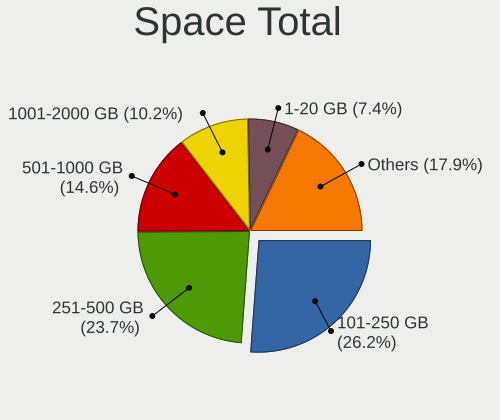

| Size in GB     | Computers | Percent |
|----------------|-----------|---------|
| 101-250        | 288       | 26.18%  |
| 251-500        | 261       | 23.73%  |
| 501-1000       | 161       | 14.64%  |
| 1001-2000      | 112       | 10.18%  |
| 1-20           | 81        | 7.36%   |
| 51-100         | 64        | 5.82%   |
| More than 3000 | 42        | 3.82%   |
| 21-50          | 34        | 3.09%   |
| 2001-3000      | 31        | 2.82%   |
| Unknown        | 26        | 2.36%   |

Space Used
----------

Amount of used disk space

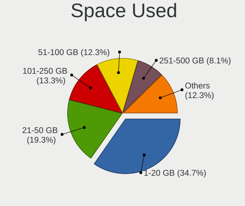

| Used GB        | Computers | Percent |
|----------------|-----------|---------|
| 1-20           | 399       | 34.7%   |
| 21-50          | 222       | 19.3%   |
| 101-250        | 153       | 13.3%   |
| 51-100         | 141       | 12.26%  |
| 251-500        | 93        | 8.09%   |
| 501-1000       | 56        | 4.87%   |
| 1001-2000      | 28        | 2.43%   |
| Unknown        | 26        | 2.26%   |
| 2001-3000      | 15        | 1.3%    |
| More than 3000 | 11        | 0.96%   |
| 0              | 6         | 0.52%   |

Malfunc. Drives
---------------

Drive models with a malfunction

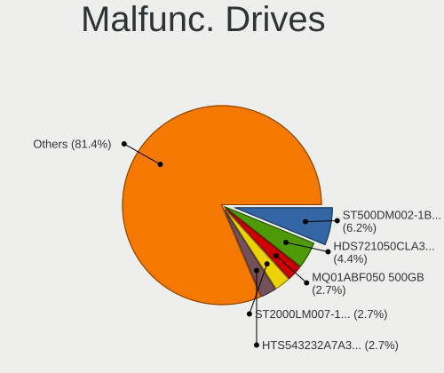

| Model                           | Computers | Drives | Percent |
|---------------------------------|-----------|--------|---------|
| Seagate ST500DM002-1BD142 500GB | 7         | 10     | 6.19%   |
| Hitachi HDS721050CLA362 500GB   | 5         | 10     | 4.42%   |
| Toshiba MQ01ABF050 500GB        | 3         | 3      | 2.65%   |
| Seagate ST2000LM007-1R8174 2TB  | 3         | 4      | 2.65%   |
| Hitachi HTS543232A7A384 320GB   | 3         | 5      | 2.65%   |
| Unknown S050 Hard drive 500GB   | 2         | 2      | 1.77%   |
| Toshiba MQ01ABD100 1TB          | 2         | 2      | 1.77%   |
| Toshiba DT01ACA100 1TB          | 2         | 2      | 1.77%   |
| Seagate ST500LT012-9WS142 500GB | 2         | 2      | 1.77%   |
| Seagate ST1000LM048-2E7172 1TB  | 2         | 2      | 1.77%   |
| Seagate ST1000DM010-2EP102 1TB  | 2         | 3      | 1.77%   |
| Kingston SA400S37240G 240GB SSD | 2         | 2      | 1.77%   |
| HGST HTS541010A9E680 1TB        | 2         | 3      | 1.77%   |
| Fujitsu MJA2250BH G2 250GB      | 2         | 2      | 1.77%   |
| WHALEKOM SSD 512GB              | 1         | 1      | 0.88%   |
| WDC WD5003ABYZ-011FA0 500GB     | 1         | 1      | 0.88%   |
| WDC WD5000LPVT-75G33T0 500GB    | 1         | 1      | 0.88%   |
| WDC WD5000LPVT-22G33T0 500GB    | 1         | 1      | 0.88%   |
| WDC WD5000LPCX-60VHAT0 500GB    | 1         | 2      | 0.88%   |
| WDC WD5000BEVT-24A0RT0 500GB    | 1         | 1      | 0.88%   |
| WDC WD5000AZLX-75K2TA0 500GB    | 1         | 1      | 0.88%   |
| WDC WD5000AAVS-00ZTB0 500GB     | 1         | 1      | 0.88%   |
| WDC WD5000AAKX-603CA0 500GB     | 1         | 1      | 0.88%   |
| WDC WD5000AAKX-00ERMA0 500GB    | 1         | 1      | 0.88%   |
| WDC WD5000AAKX-001CA0 500GB     | 1         | 1      | 0.88%   |
| WDC WD3200BEVT-22A23T0 320GB    | 1         | 1      | 0.88%   |
| WDC WD3200AAJS-08L7A0 320GB     | 1         | 1      | 0.88%   |
| WDC WD3200AAJS-00B4A0 320GB     | 1         | 1      | 0.88%   |
| WDC WD1600BEVT-24A23T0 160GB    | 1         | 1      | 0.88%   |
| WDC WD10SPZX-24Z10 1TB          | 1         | 1      | 0.88%   |
| WDC WD10SPZX-21Z10T0 1TB        | 1         | 1      | 0.88%   |
| WDC WD10JPVX-60JC3T1 1TB        | 1         | 2      | 0.88%   |
| WDC WD10JPVX-22JC3T0 1TB        | 1         | 1      | 0.88%   |
| WDC WD10EZEX-00MFCA0 1TB        | 1         | 1      | 0.88%   |
| WDC WD Green 2.5 480GB          | 1         | 1      | 0.88%   |
| Toshiba MQ04ABF100 1TB          | 1         | 1      | 0.88%   |
| Toshiba MQ01ABF032 320GB        | 1         | 1      | 0.88%   |
| Toshiba MK6475GSX 640GB         | 1         | 1      | 0.88%   |
| Toshiba MK6465GSX 640GB         | 1         | 1      | 0.88%   |
| Toshiba MK3259GSXP 320GB        | 1         | 1      | 0.88%   |

Malfunc. Drive Vendor
---------------------

Vendors of faulty drives

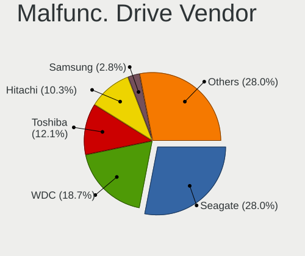

| Vendor              | Computers | Drives | Percent |
|---------------------|-----------|--------|---------|
| Seagate             | 30        | 39     | 28.04%  |
| WDC                 | 20        | 22     | 18.69%  |
| Toshiba             | 13        | 14     | 12.15%  |
| Hitachi             | 11        | 23     | 10.28%  |
| Samsung Electronics | 3         | 4      | 2.8%    |
| Ramsta              | 3         | 3      | 2.8%    |
| Kingston            | 3         | 3      | 2.8%    |
| HGST                | 3         | 4      | 2.8%    |
| Fujitsu             | 3         | 3      | 2.8%    |
| Unknown             | 2         | 2      | 1.87%   |
| SK hynix            | 2         | 2      | 1.87%   |
| SanDisk             | 2         | 2      | 1.87%   |
| KingSpec            | 2         | 2      | 1.87%   |
| Intel               | 2         | 2      | 1.87%   |
| WHALEKOM            | 1         | 1      | 0.93%   |
| OCZ                 | 1         | 1      | 0.93%   |
| Micron Technology   | 1         | 1      | 0.93%   |
| MCTECH              | 1         | 1      | 0.93%   |
| Fordisk             | 1         | 1      | 0.93%   |
| faspeed             | 1         | 1      | 0.93%   |
| Colorful            | 1         | 1      | 0.93%   |
| A-DATA Technology   | 1         | 1      | 0.93%   |

Malfunc. HDD Vendor
-------------------

Vendors of faulty HDD drives

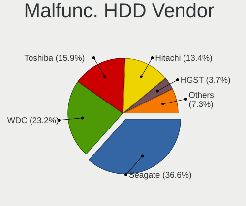

| Vendor              | Computers | Drives | Percent |
|---------------------|-----------|--------|---------|
| Seagate             | 30        | 39     | 36.59%  |
| WDC                 | 19        | 21     | 23.17%  |
| Toshiba             | 13        | 14     | 15.85%  |
| Hitachi             | 11        | 23     | 13.41%  |
| HGST                | 3         | 4      | 3.66%   |
| Fujitsu             | 3         | 3      | 3.66%   |
| Unknown             | 2         | 2      | 2.44%   |
| Samsung Electronics | 1         | 1      | 1.22%   |

Malfunc. Drive Kind
-------------------

Kinds of faulty drives

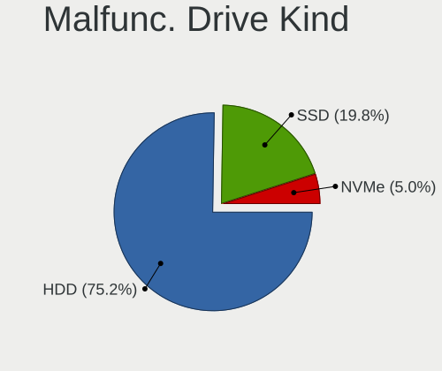

| Kind | Computers | Drives | Percent |
|------|-----------|--------|---------|
| HDD  | 76        | 107    | 75.25%  |
| SSD  | 20        | 20     | 19.8%   |
| NVMe | 5         | 6      | 4.95%   |

Failed Drives
-------------

Failed drive models

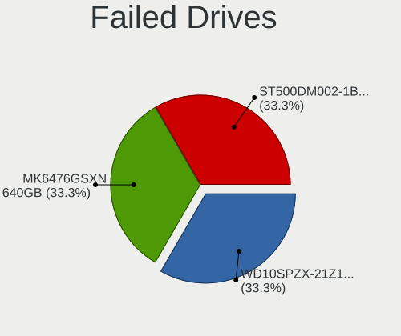

| Model                           | Computers | Drives | Percent |
|---------------------------------|-----------|--------|---------|
| WDC WD10SPZX-21Z10T0 1TB        | 1         | 1      | 33.33%  |
| Toshiba MK6476GSXN 640GB        | 1         | 1      | 33.33%  |
| Seagate ST500DM002-1BD142 500GB | 1         | 1      | 33.33%  |

Failed Drive Vendor
-------------------

Failed drive vendors

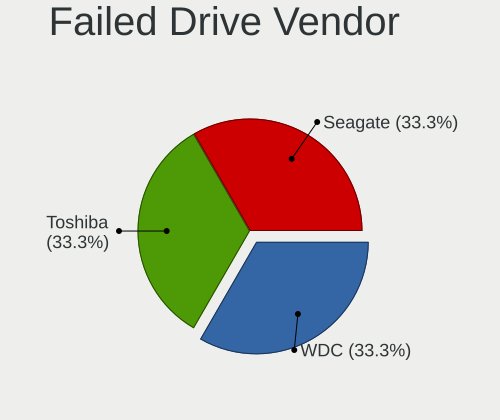

| Vendor  | Computers | Drives | Percent |
|---------|-----------|--------|---------|
| WDC     | 1         | 1      | 33.33%  |
| Toshiba | 1         | 1      | 33.33%  |
| Seagate | 1         | 1      | 33.33%  |

Drive Status
------------

Number of failed and malfunc. drives

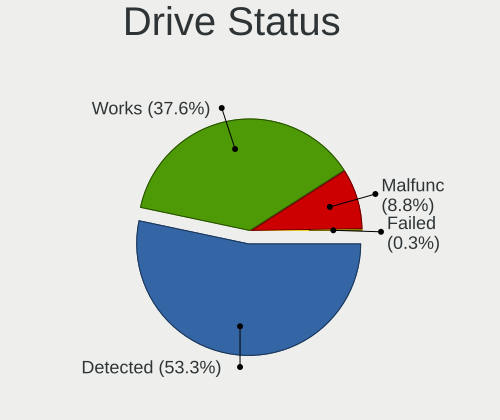

| Status   | Computers | Drives | Percent |
|----------|-----------|--------|---------|
| Detected | 595       | 1161   | 53.32%  |
| Works    | 420       | 765    | 37.63%  |
| Malfunc  | 98        | 133    | 8.78%   |
| Failed   | 3         | 3      | 0.27%   |

Storage controller
------------------

Storage Vendor
--------------

Storage controller vendors

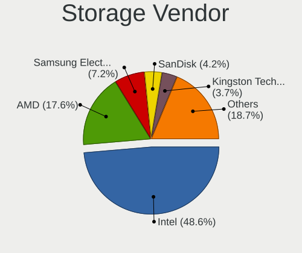

| Vendor                           | Computers | Percent |
|----------------------------------|-----------|---------|
| Intel                            | 626       | 48.64%  |
| AMD                              | 226       | 17.56%  |
| Samsung Electronics              | 93        | 7.23%   |
| SanDisk                          | 54        | 4.2%    |
| Kingston Technology Company      | 47        | 3.65%   |
| Phison Electronics               | 37        | 2.87%   |
| SK hynix                         | 28        | 2.18%   |
| Nvidia                           | 23        | 1.79%   |
| Micron Technology                | 22        | 1.71%   |
| Silicon Motion                   | 19        | 1.48%   |
| Micron/Crucial Technology        | 17        | 1.32%   |
| MAXIO Technology (Hangzhou)      | 15        | 1.17%   |
| Toshiba America Info Systems     | 11        | 0.85%   |
| ADATA Technology                 | 9         | 0.7%    |
| Shenzhen Longsys Electronics     | 8         | 0.62%   |
| ASMedia Technology               | 8         | 0.62%   |
| Realtek Semiconductor            | 6         | 0.47%   |
| Lite-On Technology               | 4         | 0.31%   |
| Yangtze Memory Technologies      | 3         | 0.23%   |
| Union Memory (Shenzhen)          | 3         | 0.23%   |
| Transcend                        | 3         | 0.23%   |
| Solid State Storage Technology   | 3         | 0.23%   |
| Silicon Integrated Systems [SiS] | 3         | 0.23%   |
| Marvell Technology Group         | 3         | 0.23%   |
| KIOXIA                           | 3         | 0.23%   |
| JMicron Technology               | 3         | 0.23%   |
| O2 Micro                         | 2         | 0.16%   |
| ShenZhen TIGO Semiconductor      | 1         | 0.08%   |
| Shenzhen Shichuangyi Electronics | 1         | 0.08%   |
| Seagate Technology               | 1         | 0.08%   |
| Lenovo                           | 1         | 0.08%   |
| Hosin Global Electronics         | 1         | 0.08%   |
| Broadcom / LSI                   | 1         | 0.08%   |
| Biwin Storage Technology         | 1         | 0.08%   |
| Apple                            | 1         | 0.08%   |

Storage Model
-------------

Storage controller models

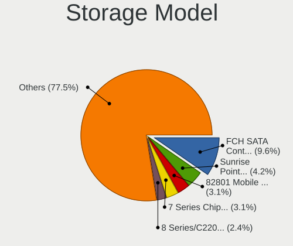

| Model                                                                          | Computers | Percent |
|--------------------------------------------------------------------------------|-----------|---------|
| AMD FCH SATA Controller [AHCI mode]                                            | 143       | 9.62%   |
| Intel Sunrise Point-LP SATA Controller [AHCI mode]                             | 63        | 4.24%   |
| Intel 82801 Mobile SATA Controller [RAID mode]                                 | 46        | 3.1%    |
| Intel 7 Series Chipset Family 6-port SATA Controller [AHCI mode]               | 46        | 3.1%    |
| Intel 8 Series/C220 Series Chipset Family 6-port SATA Controller 1 [AHCI mode] | 36        | 2.42%   |
| Intel 6 Series/C200 Series Chipset Family 6 port Mobile SATA AHCI Controller   | 32        | 2.15%   |
| AMD 500 Series Chipset SATA Controller                                         | 32        | 2.15%   |
| AMD 400 Series Chipset SATA Controller                                         | 32        | 2.15%   |
| Intel Volume Management Device NVMe RAID Controller                            | 31        | 2.09%   |
| Samsung NVMe SSD Controller SM981/PM981/PM983                                  | 29        | 1.95%   |
| Samsung NVMe SSD Controller 980 (DRAM-less)                                    | 28        | 1.88%   |
| Phison PS5013-E13 PCIe3 NVMe Controller (DRAM-less)                            | 20        | 1.35%   |
| Intel Wildcat Point-LP SATA Controller [AHCI Mode]                             | 19        | 1.28%   |
| Intel Tiger Lake-LP SATA Controller                                            | 19        | 1.28%   |
| Intel Q170/Q150/B150/H170/H110/Z170/CM236 Chipset SATA Controller [AHCI Mode]  | 18        | 1.21%   |
| Intel NM10/ICH7 Family SATA Controller [IDE mode]                              | 18        | 1.21%   |
| Intel Celeron N3350/Pentium N4200/Atom E3900 Series SATA AHCI Controller       | 18        | 1.21%   |
| AMD A320 Chipset SATA Controller [AHCI mode]                                   | 18        | 1.21%   |
| Intel Comet Lake SATA AHCI Controller                                          | 17        | 1.14%   |
| Intel 200 Series PCH SATA controller [AHCI mode]                               | 17        | 1.14%   |
| Intel SSD 670p Series [Keystone Harbor]                                        | 16        | 1.08%   |
| Intel 82801G (ICH7 Family) IDE Controller                                      | 16        | 1.08%   |
| Intel Celeron/Pentium Silver Processor SATA Controller                         | 15        | 1.01%   |
| Intel Atom Processor E3800 Series SATA AHCI Controller                         | 14        | 0.94%   |
| Silicon Motion SM2263EN/SM2263XT (DRAM-less) NVMe SSD Controllers              | 13        | 0.87%   |
| Micron/Crucial P2 [Nick P2] / P3 / P3 Plus NVMe PCIe SSD (DRAM-less)           | 13        | 0.87%   |
| MAXIO (Hangzhou) NVMe SSD Controller MAP1202 (DRAM-less)                       | 13        | 0.87%   |
| Intel 8 Series SATA Controller 1 [AHCI mode]                                   | 13        | 0.87%   |
| SanDisk Ultra 3D / WD PC SN530, IX SN530, Blue SN550 NVMe SSD (DRAM-less)      | 12        | 0.81%   |
| Intel HM170/QM170 Chipset SATA Controller [AHCI Mode]                          | 12        | 0.81%   |
| Intel Cannon Lake PCH SATA AHCI Controller                                     | 12        | 0.81%   |
| Intel Cannon Lake Mobile PCH SATA AHCI Controller                              | 12        | 0.81%   |
| Intel 6 Series/C200 Series Chipset Family 6 port Desktop SATA AHCI Controller  | 12        | 0.81%   |
| AMD SB7x0/SB8x0/SB9x0 IDE Controller                                           | 12        | 0.81%   |
| AMD FCH SATA Controller [IDE mode]                                             | 12        | 0.81%   |
| AMD FCH IDE Controller                                                         | 12        | 0.81%   |
| AMD 600 Series Chipset SATA Controller                                         | 12        | 0.81%   |
| SK hynix Gold P31/BC711/PC711 NVMe Solid State Drive                           | 11        | 0.74%   |
| Samsung NVMe SSD Controller PM9A1/PM9A3/980PRO                                 | 11        | 0.74%   |
| Nvidia MCP61 SATA Controller                                                   | 11        | 0.74%   |

Storage Kind
------------

Kind of storage controller (IDE, SATA, NVMe, SAS, ...)

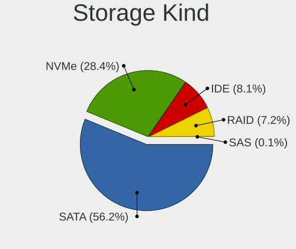

| Kind | Computers | Percent |
|------|-----------|---------|
| SATA | 733       | 56.21%  |
| NVMe | 370       | 28.37%  |
| IDE  | 106       | 8.13%   |
| RAID | 94        | 7.21%   |
| SAS  | 1         | 0.08%   |

Processor
---------

CPU Vendor
----------

Processor vendors

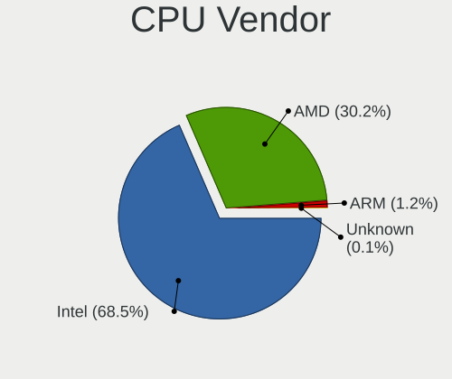

| Vendor  | Computers | Percent |
|---------|-----------|---------|
| Intel   | 701       | 68.52%  |
| AMD     | 309       | 30.21%  |
| ARM     | 12        | 1.17%   |
| Unknown | 1         | 0.1%    |

CPU Model
---------

Processor models

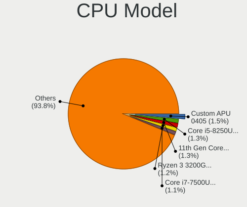

| Model                                         | Computers | Percent |
|-----------------------------------------------|-----------|---------|
| AMD Custom APU 0405                           | 15        | 1.46%   |
| Intel Core i5-8250U CPU @ 1.60GHz             | 13        | 1.27%   |
| Intel 11th Gen Core i5-1135G7 @ 2.40GHz       | 13        | 1.27%   |
| AMD Ryzen 3 3200G with Radeon Vega Graphics   | 12        | 1.17%   |
| Intel Core i7-7500U CPU @ 2.70GHz             | 11        | 1.07%   |
| AMD Ryzen 5 5600H with Radeon Graphics        | 11        | 1.07%   |
| AMD Ryzen 5 5600G with Radeon Graphics        | 11        | 1.07%   |
| AMD Ryzen 5 3600 6-Core Processor             | 11        | 1.07%   |
| Intel Core i7-8550U CPU @ 1.80GHz             | 10        | 0.98%   |
| Intel Core i7-7700HQ CPU @ 2.80GHz            | 9         | 0.88%   |
| Intel Core i5-7200U CPU @ 2.50GHz             | 9         | 0.88%   |
| Intel Core i5-6200U CPU @ 2.30GHz             | 9         | 0.88%   |
| Intel Core i5-3320M CPU @ 2.60GHz             | 9         | 0.88%   |
| Intel Celeron CPU N3350 @ 1.10GHz             | 9         | 0.88%   |
| Intel Core i3-6006U CPU @ 2.00GHz             | 8         | 0.78%   |
| AMD Ryzen 5 2500U with Radeon Vega Mobile Gfx | 8         | 0.78%   |
| Intel Core i5-10300H CPU @ 2.50GHz            | 7         | 0.68%   |
| Intel Core 2 Duo CPU E7500 @ 2.93GHz          | 7         | 0.68%   |
| Intel Celeron CPU N3450 @ 1.10GHz             | 7         | 0.68%   |
| ARM Processor                                 | 7         | 0.68%   |
| Intel Core i7-8565U CPU @ 1.80GHz             | 6         | 0.59%   |
| Intel Core i7-4790 CPU @ 3.60GHz              | 6         | 0.59%   |
| Intel Core i5-9300H CPU @ 2.40GHz             | 6         | 0.59%   |
| Intel Core i5-3210M CPU @ 2.50GHz             | 6         | 0.59%   |
| Intel Core i5-2520M CPU @ 2.50GHz             | 6         | 0.59%   |
| Intel Core i3-3217U CPU @ 1.80GHz             | 6         | 0.59%   |
| Intel 11th Gen Core i3-1115G4 @ 3.00GHz       | 6         | 0.59%   |
| AMD Ryzen 5 4500U with Radeon Graphics        | 6         | 0.59%   |
| AMD Ryzen 5 2600 Six-Core Processor           | 6         | 0.59%   |
| AMD A8-7600 Radeon R7, 10 Compute Cores 4C+6G | 6         | 0.59%   |
| Intel Core i7-10510U CPU @ 1.80GHz            | 5         | 0.49%   |
| Intel Core i5-6500 CPU @ 3.20GHz              | 5         | 0.49%   |
| Intel Core i5-5200U CPU @ 2.20GHz             | 5         | 0.49%   |
| Intel Core i5-3470 CPU @ 3.20GHz              | 5         | 0.49%   |
| Intel Core i5-3337U CPU @ 1.80GHz             | 5         | 0.49%   |
| Intel Core i5-2430M CPU @ 2.40GHz             | 5         | 0.49%   |
| Intel Core i5-2400 CPU @ 3.10GHz              | 5         | 0.49%   |
| Intel Core i5-1035G1 CPU @ 1.00GHz            | 5         | 0.49%   |
| Intel Core i5-10210U CPU @ 1.60GHz            | 5         | 0.49%   |
| Intel Core i3-7020U CPU @ 2.30GHz             | 5         | 0.49%   |

CPU Model Family
----------------

Processor model prefix

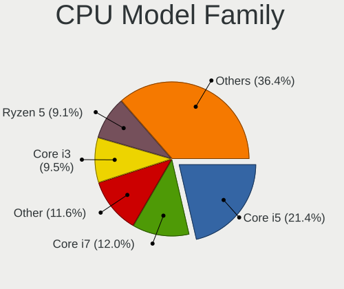

| Model                   | Computers | Percent |
|-------------------------|-----------|---------|
| Intel Core i5           | 219       | 21.39%  |
| Intel Core i7           | 123       | 12.01%  |
| Other                   | 119       | 11.62%  |
| Intel Core i3           | 97        | 9.47%   |
| AMD Ryzen 5             | 93        | 9.08%   |
| Intel Celeron           | 63        | 6.15%   |
| AMD Ryzen 7             | 42        | 4.1%    |
| Intel Core 2 Duo        | 33        | 3.22%   |
| AMD Ryzen 3             | 30        | 2.93%   |
| Intel Pentium           | 19        | 1.86%   |
| AMD A8                  | 18        | 1.76%   |
| AMD A6                  | 17        | 1.66%   |
| Intel Atom              | 13        | 1.27%   |
| AMD A10                 | 11        | 1.07%   |
| Intel Pentium Dual-Core | 10        | 0.98%   |
| AMD Ryzen 9             | 10        | 0.98%   |
| AMD Athlon              | 10        | 0.98%   |
| AMD FX                  | 7         | 0.68%   |
| Intel Xeon              | 6         | 0.59%   |
| Intel Pentium Silver    | 6         | 0.59%   |
| AMD Ryzen 5 PRO         | 6         | 0.59%   |
| Intel Core 2 Quad       | 5         | 0.49%   |
| AMD A4                  | 5         | 0.49%   |
| Intel Pentium Gold      | 4         | 0.39%   |
| AMD Sempron             | 4         | 0.39%   |
| AMD Phenom II X4        | 4         | 0.39%   |
| AMD Athlon II X4        | 4         | 0.39%   |
| Intel Genuine           | 3         | 0.29%   |
| Intel Core i9           | 3         | 0.29%   |
| Intel Core              | 3         | 0.29%   |
| AMD Ryzen 7 PRO         | 3         | 0.29%   |
| AMD Athlon II X2        | 3         | 0.29%   |
| Intel Xeon Gold         | 2         | 0.2%    |
| Intel Core m3           | 2         | 0.2%    |
| Intel Core 2            | 2         | 0.2%    |
| AMD Turion 64 X2 Mobile | 2         | 0.2%    |
| AMD PRO A10             | 2         | 0.2%    |
| AMD Phenom              | 2         | 0.2%    |
| AMD Embedded            | 2         | 0.2%    |
| AMD E                   | 2         | 0.2%    |

CPU Cores
---------

Number of processor cores

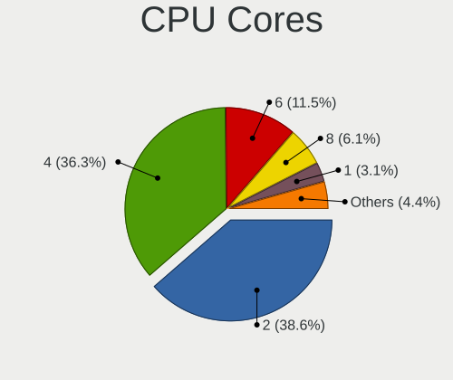

| Number | Computers | Percent |
|--------|-----------|---------|
| 2      | 396       | 38.6%   |
| 4      | 372       | 36.26%  |
| 6      | 118       | 11.5%   |
| 8      | 63        | 6.14%   |
| 1      | 32        | 3.12%   |
| 14     | 11        | 1.07%   |
| 10     | 11        | 1.07%   |
| 12     | 10        | 0.97%   |
| 16     | 6         | 0.58%   |
| 24     | 3         | 0.29%   |
| 3      | 2         | 0.19%   |
| 40     | 1         | 0.1%    |
| 20     | 1         | 0.1%    |

CPU Sockets
-----------

Number of sockets

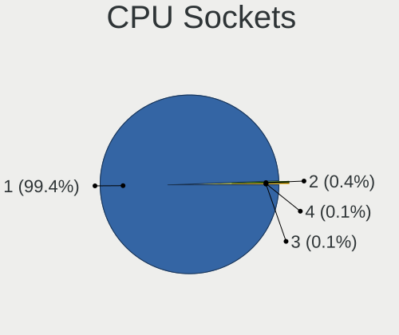

| Number | Computers | Percent |
|--------|-----------|---------|
| 1      | 1017      | 99.41%  |
| 2      | 4         | 0.39%   |
| 4      | 1         | 0.1%    |
| 3      | 1         | 0.1%    |

CPU Threads
-----------

Threads per core (Hyper-Threading)

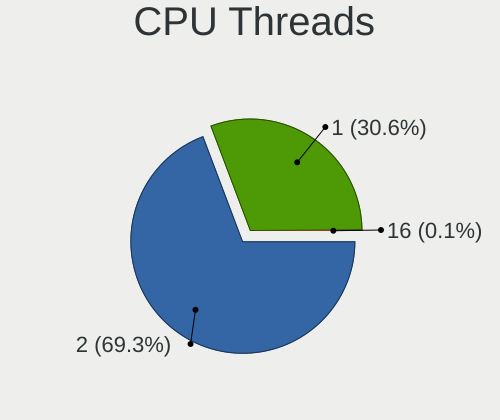

| Number | Computers | Percent |
|--------|-----------|---------|
| 2      | 712       | 69.26%  |
| 1      | 315       | 30.64%  |
| 16     | 1         | 0.1%    |

CPU Op-Modes
------------

CPU Operation Modes (32-bit, 64-bit)

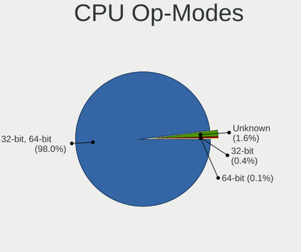

| Op mode        | Computers | Percent |
|----------------|-----------|---------|
| 32-bit, 64-bit | 1005      | 97.95%  |
| Unknown        | 16        | 1.56%   |
| 32-bit         | 4         | 0.39%   |
| 64-bit         | 1         | 0.1%    |

CPU Microcode
-------------

Microcode number

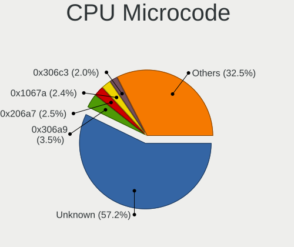

| Number     | Computers | Percent |
|------------|-----------|---------|
| Unknown    | 605       | 57.18%  |
| 0x306a9    | 37        | 3.5%    |
| 0x206a7    | 26        | 2.46%   |
| 0x1067a    | 25        | 2.36%   |
| 0x306c3    | 21        | 1.98%   |
| 0x806ea    | 15        | 1.42%   |
| 0x506c9    | 14        | 1.32%   |
| 0x406e3    | 14        | 1.32%   |
| 0x906ea    | 12        | 1.13%   |
| 0x806ec    | 11        | 1.04%   |
| 0x806e9    | 11        | 1.04%   |
| 0x08108109 | 11        | 1.04%   |
| 0x06001119 | 11        | 1.04%   |
| 0x30678    | 10        | 0.95%   |
| 0x08701021 | 10        | 0.95%   |
| 0x906e9    | 9         | 0.85%   |
| 0x306d4    | 9         | 0.85%   |
| 0x10676    | 9         | 0.85%   |
| 0x06003106 | 9         | 0.85%   |
| 0x40651    | 8         | 0.76%   |
| 0x0a50000c | 8         | 0.76%   |
| 0x806c1    | 7         | 0.66%   |
| 0x506e3    | 7         | 0.66%   |
| 0x0a50000d | 7         | 0.66%   |
| 0x0800820d | 7         | 0.66%   |
| 0x706a1    | 6         | 0.57%   |
| 0x406c4    | 6         | 0.57%   |
| 0x20655    | 6         | 0.57%   |
| 0x08600106 | 6         | 0.57%   |
| 0x706e5    | 5         | 0.47%   |
| 0x106ca    | 5         | 0.47%   |
| 0xa0671    | 4         | 0.38%   |
| 0xa0652    | 4         | 0.38%   |
| 0x806eb    | 4         | 0.38%   |
| 0x08608103 | 4         | 0.38%   |
| 0x08600104 | 4         | 0.38%   |
| 0x0810100b | 4         | 0.38%   |
| 0x0600611a | 4         | 0.38%   |
| 0x906a4    | 3         | 0.28%   |
| 0x706a8    | 3         | 0.28%   |

CPU Microarch
-------------

Microarchitecture

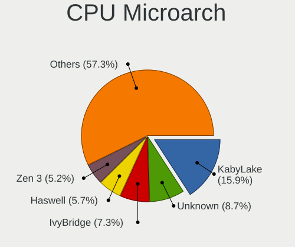

| Name              | Computers | Percent |
|-------------------|-----------|---------|
| KabyLake          | 163       | 15.86%  |
| Unknown           | 89        | 8.66%   |
| IvyBridge         | 75        | 7.3%    |
| Haswell           | 59        | 5.74%   |
| Zen 3             | 53        | 5.16%   |
| SandyBridge       | 52        | 5.06%   |
| Skylake           | 50        | 4.86%   |
| Penryn            | 46        | 4.47%   |
| Zen+              | 43        | 4.18%   |
| Zen 2             | 36        | 3.5%    |
| TigerLake         | 36        | 3.5%    |
| Alderlake Hybrid  | 32        | 3.11%   |
| Silvermont        | 28        | 2.72%   |
| CometLake         | 25        | 2.43%   |
| Zen               | 24        | 2.33%   |
| Broadwell         | 24        | 2.33%   |
| Piledriver        | 23        | 2.24%   |
| Excavator         | 20        | 1.95%   |
| Goldmont          | 18        | 1.75%   |
| IceLake           | 16        | 1.56%   |
| Goldmont plus     | 16        | 1.56%   |
| Westmere          | 15        | 1.46%   |
| Steamroller       | 14        | 1.36%   |
| K10               | 13        | 1.26%   |
| Bonnell           | 10        | 0.97%   |
| K8 Hammer         | 9         | 0.88%   |
| Core              | 8         | 0.78%   |
| Puma              | 6         | 0.58%   |
| Bobcat            | 4         | 0.39%   |
| Tremont           | 3         | 0.29%   |
| P6                | 3         | 0.29%   |
| K10 Llano         | 3         | 0.29%   |
| Jaguar            | 3         | 0.29%   |
| Nehalem           | 2         | 0.19%   |
| Meteorlake Hybrid | 2         | 0.19%   |
| K8 & K10 hybrid   | 2         | 0.19%   |
| Gracemont         | 2         | 0.19%   |
| Bulldozer         | 1         | 0.1%    |

Graphics
--------

GPU Vendor
----------

Vendors of graphics cards

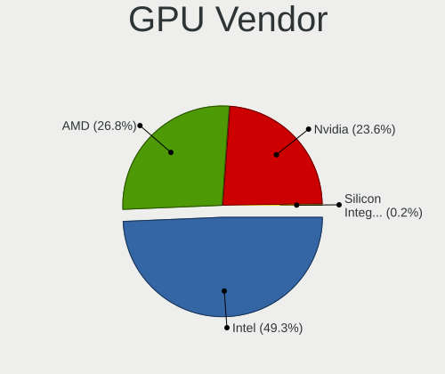

| Vendor                           | Computers | Percent |
|----------------------------------|-----------|---------|
| Intel                            | 602       | 49.34%  |
| AMD                              | 327       | 26.8%   |
| Nvidia                           | 288       | 23.61%  |
| Silicon Integrated Systems [SiS] | 3         | 0.25%   |

GPU Model
---------

Graphics card models

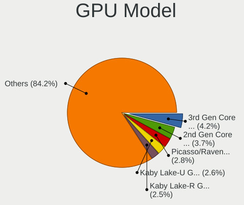

| Model                                                                                    | Computers | Percent |
|------------------------------------------------------------------------------------------|-----------|---------|
| Intel 3rd Gen Core processor Graphics Controller                                         | 53        | 4.22%   |
| Intel 2nd Generation Core Processor Family Integrated Graphics Controller                | 46        | 3.67%   |
| AMD Picasso/Raven 2 [Radeon Vega Series / Radeon Vega Mobile Series]                     | 35        | 2.79%   |
| Intel Kaby Lake-U GT2 [HD Graphics 620]                                                  | 33        | 2.63%   |
| Intel Kaby Lake-R GT2 [UHD Graphics 620]                                                 | 31        | 2.47%   |
| Intel TigerLake-LP GT2 [Iris Xe Graphics]                                                | 28        | 2.23%   |
| AMD Cezanne [Radeon Vega Series / Radeon Vega Mobile Series]                             | 28        | 2.23%   |
| Intel Skylake-U GT2 [HD Graphics 520]                                                    | 24        | 1.91%   |
| Intel Broadwell-U GT2 [HD Graphics 5500]                                                 | 18        | 1.43%   |
| AMD Raven Ridge [Radeon Vega Series / Radeon Vega Mobile Series]                         | 18        | 1.43%   |
| AMD Ellesmere [Radeon RX 470/480/570/570X/580/580X/590]                                  | 18        | 1.43%   |
| Intel Atom Processor Z36xxx/Z37xxx Series Graphics & Display                             | 17        | 1.35%   |
| AMD Renoir [Radeon Vega Series / Radeon Vega Mobile Series]                              | 17        | 1.35%   |
| Intel Apollo Lake GT1 [HD Graphics 500]                                                  | 16        | 1.27%   |
| Intel WhiskeyLake-U GT2 [UHD Graphics 620]                                               | 15        | 1.2%    |
| Intel CometLake-U GT2 [UHD Graphics]                                                     | 15        | 1.2%    |
| AMD VanGogh [AMD Custom GPU 0405]                                                        | 15        | 1.2%    |
| Nvidia GA107M [GeForce RTX 3050 Mobile]                                                  | 14        | 1.12%   |
| Intel Mobile 4 Series Chipset Integrated Graphics Controller                             | 14        | 1.12%   |
| Intel Haswell-ULT Integrated Graphics Controller                                         | 14        | 1.12%   |
| Nvidia TU117M [GeForce GTX 1650 Mobile / Max-Q]                                          | 13        | 1.04%   |
| Intel CoffeeLake-H GT2 [UHD Graphics 630]                                                | 13        | 1.04%   |
| AMD Wani [Radeon R5/R6/R7 Graphics]                                                      | 13        | 1.04%   |
| Intel Xeon E3-1200 v3/4th Gen Core Processor Integrated Graphics Controller              | 12        | 0.96%   |
| Intel 4 Series Chipset Integrated Graphics Controller                                    | 12        | 0.96%   |
| Nvidia GP107 [GeForce GTX 1050 Ti]                                                       | 11        | 0.88%   |
| Intel Kaby Lake-S GT2 [HD Graphics 630]                                                  | 11        | 0.88%   |
| Intel GeminiLake [UHD Graphics 600]                                                      | 11        | 0.88%   |
| Intel Core Processor Integrated Graphics Controller                                      | 11        | 0.88%   |
| Intel Atom/Celeron/Pentium Processor x5-E8000/J3xxx/N3xxx Integrated Graphics Controller | 11        | 0.88%   |
| Intel 4th Gen Core Processor Integrated Graphics Controller                              | 11        | 0.88%   |
| AMD Topaz XT [Radeon R7 M260/M265 / M340/M360 / M440/M445 / 530/535 / 620/625 Mobile]    | 11        | 0.88%   |
| AMD Lucienne                                                                             | 11        | 0.88%   |
| Nvidia GM108M [GeForce 940MX]                                                            | 10        | 0.8%    |
| Intel CometLake-H GT2 [UHD Graphics]                                                     | 10        | 0.8%    |
| AMD Sun XT [Radeon HD 8670A/8670M/8690M / R5 M330 / M430 / Radeon 520 Mobile]            | 10        | 0.8%    |
| Intel Xeon E3-1200 v2/3rd Gen Core processor Graphics Controller                         | 9         | 0.72%   |
| Intel Kaby Lake-H GT2 [HD Graphics 630]                                                  | 9         | 0.72%   |
| Intel Iris Plus Graphics G1 (Ice Lake)                                                   | 9         | 0.72%   |
| Nvidia GP107M [GeForce GTX 1050 Mobile]                                                  | 8         | 0.64%   |

GPU Combo
---------

Combinations of graphics cards

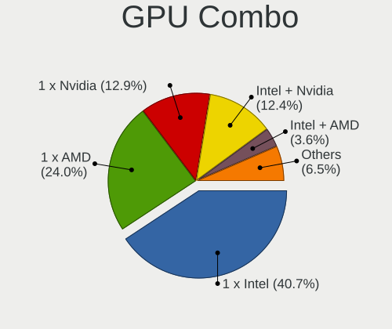

| Name             | Computers | Percent |
|------------------|-----------|---------|
| 1 x Intel        | 421       | 40.72%  |
| 1 x AMD          | 248       | 23.98%  |
| 1 x Nvidia       | 133       | 12.86%  |
| Intel + Nvidia   | 128       | 12.38%  |
| Intel + AMD      | 37        | 3.58%   |
| AMD + Nvidia     | 24        | 2.32%   |
| 2 x AMD          | 18        | 1.74%   |
| Other            | 13        | 1.26%   |
| 2 x Intel        | 5         | 0.48%   |
| 2 x Nvidia       | 3         | 0.29%   |
| 1 x SiS          | 3         | 0.29%   |
| AMD + 2 x Nvidia | 1         | 0.1%    |

GPU Driver
----------

Free vs proprietary

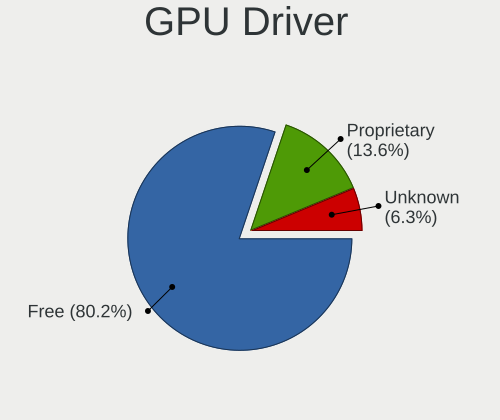

| Driver      | Computers | Percent |
|-------------|-----------|---------|
| Free        | 832       | 80.15%  |
| Proprietary | 141       | 13.58%  |
| Unknown     | 65        | 6.26%   |

GPU Memory
----------

Total video memory

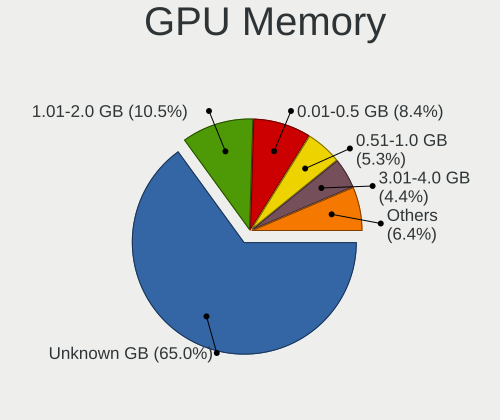

| Size in GB | Computers | Percent |
|------------|-----------|---------|
| Unknown    | 689       | 65%     |
| 1.01-2.0   | 111       | 10.47%  |
| 0.01-0.5   | 89        | 8.4%    |
| 0.51-1.0   | 56        | 5.28%   |
| 3.01-4.0   | 47        | 4.43%   |
| 7.01-8.0   | 30        | 2.83%   |
| 5.01-6.0   | 17        | 1.6%    |
| 8.01-16.0  | 17        | 1.6%    |
| 2.01-3.0   | 4         | 0.38%   |

Monitor
-------

Monitor Vendor
--------------

Monitor vendors

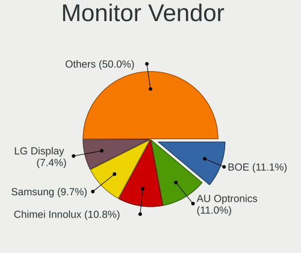

| Vendor                  | Computers | Percent |
|-------------------------|-----------|---------|
| BOE                     | 122       | 11.08%  |
| AU Optronics            | 121       | 10.99%  |
| Chimei Innolux          | 119       | 10.81%  |
| Samsung Electronics     | 107       | 9.72%   |
| LG Display              | 81        | 7.36%   |
| Dell                    | 47        | 4.27%   |
| AOC                     | 35        | 3.18%   |
| Lenovo                  | 34        | 3.09%   |
| Acer                    | 32        | 2.91%   |
| Goldstar                | 29        | 2.63%   |
| Hewlett-Packard         | 21        | 1.91%   |
| Philips                 | 20        | 1.82%   |
| BenQ                    | 20        | 1.82%   |
| Valve                   | 17        | 1.54%   |
| IPS                     | 17        | 1.54%   |
| ASUSTek Computer        | 14        | 1.27%   |
| Apple                   | 14        | 1.27%   |
| Sony                    | 13        | 1.18%   |
| Sharp                   | 13        | 1.18%   |
| InfoVision              | 13        | 1.18%   |
| PANDA                   | 12        | 1.09%   |
| Ancor Communications    | 11        | 1%      |
| ViewSonic               | 9         | 0.82%   |
| HKC                     | 9         | 0.82%   |
| MDA                     | 8         | 0.73%   |
| Unknown                 | 8         | 0.73%   |
| MSI                     | 7         | 0.64%   |
| Unknown                 | 6         | 0.54%   |
| SGT                     | 6         | 0.54%   |
| Gigabyte Technology     | 6         | 0.54%   |
| Chi Mei Optoelectronics | 6         | 0.54%   |
| MStar                   | 5         | 0.45%   |
| Mi                      | 5         | 0.45%   |
| InnoLux Display         | 5         | 0.45%   |
| VIE                     | 3         | 0.27%   |
| Unknown (XXX)           | 3         | 0.27%   |
| TMX                     | 3         | 0.27%   |
| SAC                     | 3         | 0.27%   |
| RTK                     | 3         | 0.27%   |
| RGT                     | 3         | 0.27%   |

Monitor Model
-------------

Monitor models

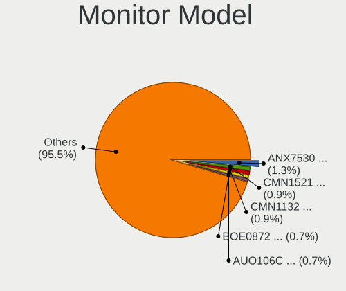

| Model                                                             | Computers | Percent |
|-------------------------------------------------------------------|-----------|---------|
| Valve ANX7530 U VLV3001 800x1280 100x150mm 7.1-inch               | 15        | 1.33%   |
| Chimei Innolux LCD Monitor CMN1521 1920x1080 344x193mm 15.5-inch  | 10        | 0.89%   |
| Chimei Innolux LCD Monitor CMN1132 1366x768 256x144mm 11.6-inch   | 10        | 0.89%   |
| BOE LCD Monitor BOE0872 1920x1080 344x194mm 15.5-inch             | 8         | 0.71%   |
| AU Optronics LCD Monitor AUO106C 1366x768 276x155mm 12.5-inch     | 8         | 0.71%   |
| AOC 1970W AOC1970 1366x768 410x230mm 18.5-inch                    | 8         | 0.71%   |
| Unknown                                                           | 8         | 0.71%   |
| Samsung Electronics S24F350 SAM0D20 1920x1080 521x293mm 23.5-inch | 7         | 0.62%   |
| Chimei Innolux LCD Monitor CMN15D5 1920x1080 344x193mm 15.5-inch  | 7         | 0.62%   |
| BenQ GW2270 BNQ78DB 1920x1080 476x268mm 21.5-inch                 | 7         | 0.62%   |
| Chimei Innolux LCD Monitor CMN14D6 1366x768 309x173mm 13.9-inch   | 6         | 0.53%   |
| Chimei Innolux LCD Monitor CMN14C3 1366x768 309x173mm 13.9-inch   | 6         | 0.53%   |
| Samsung Electronics C24F390 SAM0D2C 1920x1080 521x293mm 23.5-inch | 5         | 0.44%   |
| MStar Demo MST0030 1920x1080 708x398mm 32.0-inch                  | 5         | 0.44%   |
| BOE LCD Monitor BOE0893 2160x1440 296x197mm 14.0-inch             | 5         | 0.44%   |
| BOE LCD Monitor BOE0877 1920x1080 309x173mm 13.9-inch             | 5         | 0.44%   |
| AU Optronics LCD Monitor AUO38ED 1920x1080 344x193mm 15.5-inch    | 5         | 0.44%   |
| Unknown LCD Monitor FFFF 2288x1287 2550x2550mm 142.0-inch         | 4         | 0.36%   |
| Samsung Electronics S22R35x SAM103A 1920x1080 476x268mm 21.5-inch | 4         | 0.36%   |
| Samsung Electronics S20B300 SAM08A8 1600x900 443x249mm 20.0-inch  | 4         | 0.36%   |
| Philips PHL 227E7 PHLC100 1920x1080 476x268mm 21.5-inch           | 4         | 0.36%   |
| PANDA LCD Monitor NCP004D 1920x1080 344x194mm 15.5-inch           | 4         | 0.36%   |
| MDA GOESP27240VA MDA0270 1920x1080 597x336mm 27.0-inch            | 4         | 0.36%   |
| LG Display LCD Monitor LGD046F 1920x1080 344x194mm 15.5-inch      | 4         | 0.36%   |
| LG Display LCD Monitor LGD033F 1366x768 310x174mm 14.0-inch       | 4         | 0.36%   |
| IPS N200HD IPS2000 1600x900 409x230mm 18.5-inch                   | 4         | 0.36%   |
| IPS IPS1850 IPS1850 1366x768 410x230mm 18.5-inch                  | 4         | 0.36%   |
| Goldstar LG IPS FULLHD GSM5AB8 1920x1080 480x270mm 21.7-inch      | 4         | 0.36%   |
| Dell SE177FP DELF001 1280x1024 338x270mm 17.0-inch                | 4         | 0.36%   |
| Chimei Innolux LCD Monitor CMN15F5 1920x1080 344x193mm 15.5-inch  | 4         | 0.36%   |
| Chimei Innolux LCD Monitor CMN15DB 1366x768 344x193mm 15.5-inch   | 4         | 0.36%   |
| Chimei Innolux LCD Monitor CMN14D4 1920x1080 309x173mm 13.9-inch  | 4         | 0.36%   |
| Chimei Innolux LCD Monitor CMN1493 1366x768 309x173mm 13.9-inch   | 4         | 0.36%   |
| Chimei Innolux LCD Monitor CMN1480 1366x768 309x174mm 14.0-inch   | 4         | 0.36%   |
| BOE LCD Monitor BOE0700 1920x1080 344x194mm 15.5-inch             | 4         | 0.36%   |
| BOE LCD Monitor BOE0672 1366x768 344x194mm 15.5-inch              | 4         | 0.36%   |
| AU Optronics LCD Monitor AUO403D 1920x1080 309x174mm 14.0-inch    | 4         | 0.36%   |
| AU Optronics LCD Monitor AUO2992 1920x1080 344x193mm 15.5-inch    | 4         | 0.36%   |
| AU Optronics LCD Monitor AUO183C 1366x768 309x173mm 13.9-inch     | 4         | 0.36%   |
| AOC 24G2W1G3 AOC2402 1920x1080 527x296mm 23.8-inch                | 4         | 0.36%   |

Monitor Resolution
------------------

Monitor screen resolution

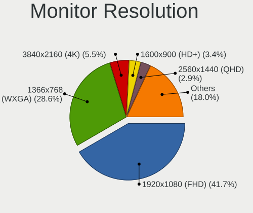

| Resolution         | Computers | Percent |
|--------------------|-----------|---------|
| 1920x1080 (FHD)    | 434       | 41.65%  |
| 1366x768 (WXGA)    | 298       | 28.6%   |
| 3840x2160 (4K)     | 57        | 5.47%   |
| 1600x900 (HD+)     | 35        | 3.36%   |
| 2560x1440 (QHD)    | 30        | 2.88%   |
| 1280x1024 (SXGA)   | 28        | 2.69%   |
| 1920x1200 (WUXGA)  | 24        | 2.3%    |
| 1440x900 (WXGA+)   | 24        | 2.3%    |
| 800x1280           | 17        | 1.63%   |
| 1280x800 (WXGA)    | 11        | 1.06%   |
| 2160x1440          | 10        | 0.96%   |
| 3440x1440          | 9         | 0.86%   |
| 1360x768           | 9         | 0.86%   |
| 2560x1600          | 8         | 0.77%   |
| 1680x1050 (WSXGA+) | 8         | 0.77%   |
| 1024x600           | 8         | 0.77%   |
| 2288x1287          | 4         | 0.38%   |
| Unknown            | 4         | 0.38%   |
| 2880x1800          | 3         | 0.29%   |
| 1920x540           | 3         | 0.29%   |
| 1024x768 (XGA)     | 3         | 0.29%   |
| 2560x1080          | 2         | 0.19%   |
| 5360x1440          | 1         | 0.1%    |
| 3840x2400          | 1         | 0.1%    |
| 3840x1080          | 1         | 0.1%    |
| 3456x2160          | 1         | 0.1%    |
| 3200x2000          | 1         | 0.1%    |
| 3200x1080          | 1         | 0.1%    |
| 3000x2000          | 1         | 0.1%    |
| 2966x900           | 1         | 0.1%    |
| 2880x1920          | 1         | 0.1%    |
| 2400x1600          | 1         | 0.1%    |
| 1600x1200          | 1         | 0.1%    |
| 1280x960           | 1         | 0.1%    |
| 1280x768           | 1         | 0.1%    |

Monitor Diagonal
----------------

Diagonal size in inches

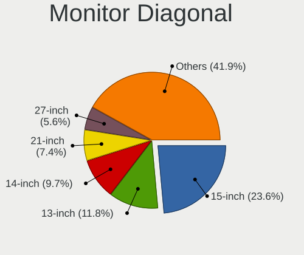

| Inches  | Computers | Percent |
|---------|-----------|---------|
| 15      | 259       | 23.57%  |
| 13      | 130       | 11.83%  |
| 14      | 107       | 9.74%   |
| 21      | 81        | 7.37%   |
| 27      | 61        | 5.55%   |
| 23      | 57        | 5.19%   |
| 18      | 52        | 4.73%   |
| 24      | 42        | 3.82%   |
| 17      | 42        | 3.82%   |
| 11      | 30        | 2.73%   |
| 31      | 26        | 2.37%   |
| 19      | 26        | 2.37%   |
| Unknown | 26        | 2.37%   |
| 20      | 22        | 2%      |
| 12      | 20        | 1.82%   |
| 16      | 17        | 1.55%   |
| 7       | 17        | 1.55%   |
| 34      | 12        | 1.09%   |
| 72      | 11        | 1%      |
| 32      | 8         | 0.73%   |
| 10      | 8         | 0.73%   |
| 52      | 7         | 0.64%   |
| 22      | 7         | 0.64%   |
| 84      | 5         | 0.45%   |
| 142     | 4         | 0.36%   |
| 63      | 3         | 0.27%   |
| 54      | 3         | 0.27%   |
| 40      | 3         | 0.27%   |
| 26      | 3         | 0.27%   |
| 65      | 1         | 0.09%   |
| 58      | 1         | 0.09%   |
| 57      | 1         | 0.09%   |
| 50      | 1         | 0.09%   |
| 49      | 1         | 0.09%   |
| 48      | 1         | 0.09%   |
| 39      | 1         | 0.09%   |
| 28      | 1         | 0.09%   |
| 25      | 1         | 0.09%   |
| 8       | 1         | 0.09%   |

Monitor Width
-------------

Physical width

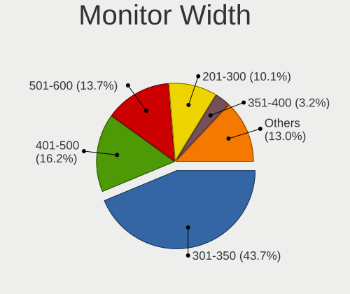

| Width in mm    | Computers | Percent |
|----------------|-----------|---------|
| 301-350        | 472       | 43.74%  |
| 401-500        | 175       | 16.22%  |
| 501-600        | 148       | 13.72%  |
| 201-300        | 109       | 10.1%   |
| 351-400        | 35        | 3.24%   |
| 601-700        | 33        | 3.06%   |
| Unknown        | 26        | 2.41%   |
| 701-800        | 19        | 1.76%   |
| 1001-1500      | 19        | 1.76%   |
| 1-100          | 17        | 1.58%   |
| 1501-2000      | 16        | 1.48%   |
| 801-900        | 5         | 0.46%   |
| More than 2000 | 4         | 0.37%   |
| 101-200        | 1         | 0.09%   |

Aspect Ratio
------------

Proportional relationship between the width and the height

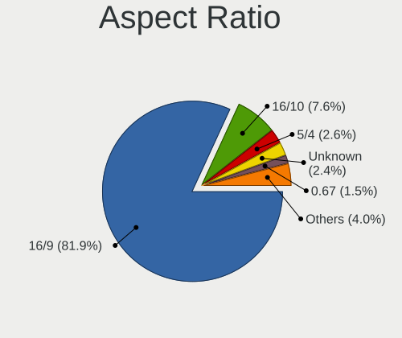

| Ratio   | Computers | Percent |
|---------|-----------|---------|
| 16/9    | 813       | 81.87%  |
| 16/10   | 75        | 7.55%   |
| 5/4     | 26        | 2.62%   |
| Unknown | 24        | 2.42%   |
| 0.67    | 15        | 1.51%   |
| 3/2     | 13        | 1.31%   |
| 21/9    | 12        | 1.21%   |
| 4/3     | 4         | 0.4%    |
| 1.00    | 4         | 0.4%    |
| 0.62    | 3         | 0.3%    |
| 32/9    | 2         | 0.2%    |
| 2.00    | 2         | 0.2%    |

Monitor Area
------------

Area in inch²

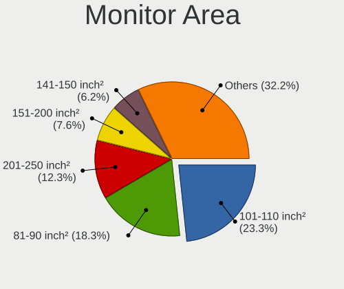

| Area in inch² | Computers | Percent |
|----------------|-----------|---------|
| 101-110        | 254       | 23.32%  |
| 81-90          | 199       | 18.27%  |
| 201-250        | 134       | 12.3%   |
| 151-200        | 83        | 7.62%   |
| 141-150        | 68        | 6.24%   |
| 301-350        | 61        | 5.6%    |
| 351-500        | 47        | 4.32%   |
| 71-80          | 38        | 3.49%   |
| More than 1000 | 37        | 3.4%    |
| 51-60          | 30        | 2.75%   |
| Unknown        | 26        | 2.39%   |
| 61-70          | 20        | 1.84%   |
| 121-130        | 20        | 1.84%   |
| 1-40           | 18        | 1.65%   |
| 111-120        | 18        | 1.65%   |
| 251-300        | 15        | 1.38%   |
| 41-50          | 8         | 0.73%   |
| 501-1000       | 6         | 0.55%   |
| 91-100         | 4         | 0.37%   |
| 131-140        | 3         | 0.28%   |

Pixel Density
-------------

Pixels per inch

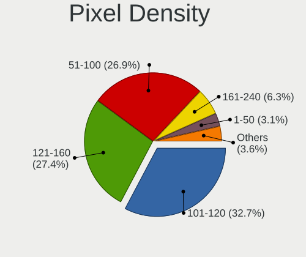

| Density       | Computers | Percent |
|---------------|-----------|---------|
| 101-120       | 348       | 32.74%  |
| 121-160       | 291       | 27.38%  |
| 51-100        | 286       | 26.9%   |
| 161-240       | 67        | 6.3%    |
| 1-50          | 33        | 3.1%    |
| Unknown       | 26        | 2.45%   |
| More than 240 | 12        | 1.13%   |

Multiple Monitors
-----------------

Total monitors connected

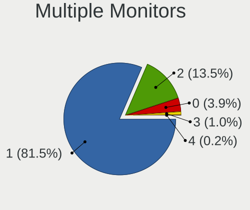

| Total | Computers | Percent |
|-------|-----------|---------|
| 1     | 854       | 81.49%  |
| 2     | 141       | 13.45%  |
| 0     | 41        | 3.91%   |
| 3     | 10        | 0.95%   |
| 4     | 2         | 0.19%   |

Network
-------

Net Controller Vendor
---------------------

Controller vendors

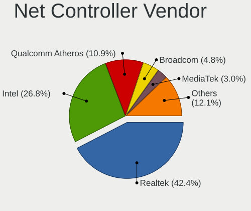

| Vendor                                | Computers | Percent |
|---------------------------------------|-----------|---------|
| Realtek Semiconductor                 | 646       | 42.42%  |
| Intel                                 | 408       | 26.79%  |
| Qualcomm Atheros                      | 166       | 10.9%   |
| Broadcom                              | 73        | 4.79%   |
| MediaTek                              | 45        | 2.95%   |
| Ralink Technology                     | 29        | 1.9%    |
| TP-Link                               | 26        | 1.71%   |
| Nvidia                                | 14        | 0.92%   |
| Samsung Electronics                   | 12        | 0.79%   |
| Broadcom Limited                      | 11        | 0.72%   |
| ASIX Electronics                      | 9         | 0.59%   |
| Qualcomm                              | 8         | 0.53%   |
| Ralink                                | 7         | 0.46%   |
| Marvell Technology Group              | 7         | 0.46%   |
| Xiaomi                                | 6         | 0.39%   |
| JMicron Technology                    | 5         | 0.33%   |
| Qualcomm Atheros Communications       | 4         | 0.26%   |
| OPPO Electronics                      | 4         | 0.26%   |
| Huawei Technologies                   | 4         | 0.26%   |
| Silicon Integrated Systems [SiS]      | 3         | 0.2%    |
| ICS Advent                            | 3         | 0.2%    |
| DisplayLink                           | 3         | 0.2%    |
| Dell                                  | 3         | 0.2%    |
| 802.11g Adapter [Linksys WUSB54GC v3] | 3         | 0.2%    |
| Shenzhen Goodix Technology            | 2         | 0.13%   |
| D-Link                                | 2         | 0.13%   |
| Apple                                 | 2         | 0.13%   |
| ZTopInc                               | 1         | 0.07%   |
| U-Blox                                | 1         | 0.07%   |
| Tenda                                 | 1         | 0.07%   |
| Sundance Technology Inc / IC Plus     | 1         | 0.07%   |
| Sierra Wireless                       | 1         | 0.07%   |
| Realtek                               | 1         | 0.07%   |
| QinHeng Electronics                   | 1         | 0.07%   |
| NetGear                               | 1         | 0.07%   |
| Microchip Technology                  | 1         | 0.07%   |
| LG Electronics                        | 1         | 0.07%   |
| InterBiometrics                       | 1         | 0.07%   |
| Hewlett-Packard                       | 1         | 0.07%   |
| Encore Electronics                    | 1         | 0.07%   |

Net Controller Model
--------------------

Controller models

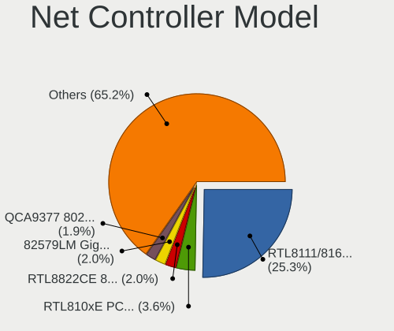

| Model                                                                  | Computers | Percent |
|------------------------------------------------------------------------|-----------|---------|
| Realtek RTL8111/8168/8211/8411 PCI Express Gigabit Ethernet Controller | 448       | 25.28%  |
| Realtek RTL810xE PCI Express Fast Ethernet controller                  | 63        | 3.56%   |
| Realtek RTL8822CE 802.11ac PCIe Wireless Network Adapter               | 36        | 2.03%   |
| Intel 82579LM Gigabit Network Connection (Lewisville)                  | 35        | 1.98%   |
| Qualcomm Atheros QCA9377 802.11ac Wireless Network Adapter             | 34        | 1.92%   |
| Realtek RTL8125 2.5GbE Controller                                      | 31        | 1.75%   |
| Intel Wi-Fi 6 AX200                                                    | 27        | 1.52%   |
| Qualcomm Atheros QCA9565 / AR9565 Wireless Network Adapter             | 26        | 1.47%   |
| Intel Wireless 8265 / 8275                                             | 26        | 1.47%   |
| Intel Wireless 7265                                                    | 26        | 1.47%   |
| Realtek 802.11ac NIC                                                   | 25        | 1.41%   |
| MediaTek MT7921 802.11ax PCIe Wireless Network Adapter [Filogic 330]   | 24        | 1.35%   |
| Qualcomm Atheros QCA6174 802.11ac Wireless Network Adapter             | 23        | 1.3%    |
| Intel Wi-Fi 6 AX201                                                    | 23        | 1.3%    |
| Intel Dual Band Wireless-AC 3168NGW [Stone Peak]                       | 22        | 1.24%   |
| Qualcomm Atheros AR9285 Wireless Network Adapter (PCI-Express)         | 21        | 1.19%   |
| Ralink MT7601U Wireless Adapter                                        | 19        | 1.07%   |
| Intel Wi-Fi 6E(802.11ax) AX210/AX1675* 2x2 [Typhoon Peak]              | 18        | 1.02%   |
| Intel Centrino Advanced-N 6205 [Taylor Peak]                           | 18        | 1.02%   |
| Realtek RTL8821CE 802.11ac PCIe Wireless Network Adapter               | 17        | 0.96%   |
| Intel Wireless 3165                                                    | 16        | 0.9%    |
| Intel Comet Lake PCH-LP CNVi WiFi                                      | 16        | 0.9%    |
| Realtek RTL8723BE PCIe Wireless Network Adapter                        | 15        | 0.85%   |
| Realtek RTL8188EUS 802.11n Wireless Network Adapter                    | 15        | 0.85%   |
| Intel Alder Lake-P PCH CNVi WiFi                                       | 14        | 0.79%   |
| Qualcomm Atheros AR9485 Wireless Network Adapter                       | 13        | 0.73%   |
| Qualcomm Atheros AR9462 Wireless Network Adapter                       | 13        | 0.73%   |
| Intel Cannon Lake PCH CNVi WiFi                                        | 13        | 0.73%   |
| Broadcom BCM43142 802.11b/g/n                                          | 13        | 0.73%   |
| Broadcom BCM4313 802.11bgn Wireless Network Adapter                    | 13        | 0.73%   |
| Intel Wireless 8260                                                    | 12        | 0.68%   |
| Realtek RTL8153 Gigabit Ethernet Adapter                               | 11        | 0.62%   |
| Realtek Killer E2600 GbE Controller                                    | 11        | 0.62%   |
| Intel Wireless 7260                                                    | 11        | 0.62%   |
| Qualcomm Atheros AR8152 v2.0 Fast Ethernet                             | 10        | 0.56%   |
| Intel I211 Gigabit Network Connection                                  | 10        | 0.56%   |
| TP-Link AC600 wireless Realtek RTL8811AU [Archer T2U Nano]             | 9         | 0.51%   |
| Intel Dual Band Wireless-AC 3165 Plus Bluetooth                        | 9         | 0.51%   |
| Intel Comet Lake PCH CNVi WiFi                                         | 9         | 0.51%   |
| Intel Cannon Point-LP CNVi [Wireless-AC]                               | 9         | 0.51%   |

Wireless Vendor
---------------

Wireless vendors

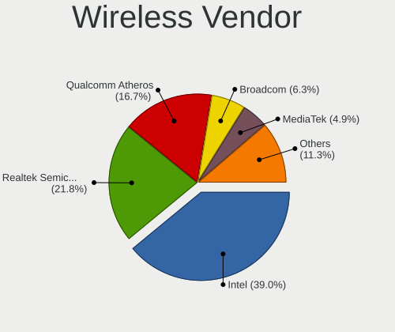

| Vendor                                | Computers | Percent |
|---------------------------------------|-----------|---------|
| Intel                                 | 329       | 39.03%  |
| Realtek Semiconductor                 | 184       | 21.83%  |
| Qualcomm Atheros                      | 141       | 16.73%  |
| Broadcom                              | 53        | 6.29%   |
| MediaTek                              | 41        | 4.86%   |
| Ralink Technology                     | 29        | 3.44%   |
| TP-Link                               | 25        | 2.97%   |
| Ralink                                | 7         | 0.83%   |
| Broadcom Limited                      | 7         | 0.83%   |
| Qualcomm Atheros Communications       | 4         | 0.47%   |
| Qualcomm                              | 4         | 0.47%   |
| Marvell Technology Group              | 3         | 0.36%   |
| 802.11g Adapter [Linksys WUSB54GC v3] | 3         | 0.36%   |
| Dell                                  | 2         | 0.24%   |
| D-Link                                | 2         | 0.24%   |
| ZTopInc                               | 1         | 0.12%   |
| Tenda                                 | 1         | 0.12%   |
| Sierra Wireless                       | 1         | 0.12%   |
| Samsung Electronics                   | 1         | 0.12%   |
| Realtek                               | 1         | 0.12%   |
| NetGear                               | 1         | 0.12%   |
| Encore Electronics                    | 1         | 0.12%   |
| BUFFALO                               | 1         | 0.12%   |
| ASUSTek Computer                      | 1         | 0.12%   |

Wireless Model
--------------

Wireless models

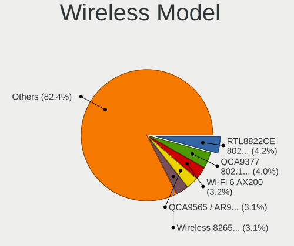

| Model                                                                | Computers | Percent |
|----------------------------------------------------------------------|-----------|---------|
| Realtek RTL8822CE 802.11ac PCIe Wireless Network Adapter             | 36        | 4.24%   |
| Qualcomm Atheros QCA9377 802.11ac Wireless Network Adapter           | 34        | 4%      |
| Intel Wi-Fi 6 AX200                                                  | 27        | 3.18%   |
| Qualcomm Atheros QCA9565 / AR9565 Wireless Network Adapter           | 26        | 3.06%   |
| Intel Wireless 8265 / 8275                                           | 26        | 3.06%   |
| Intel Wireless 7265                                                  | 26        | 3.06%   |
| Realtek 802.11ac NIC                                                 | 25        | 2.94%   |
| MediaTek MT7921 802.11ax PCIe Wireless Network Adapter [Filogic 330] | 24        | 2.83%   |
| Qualcomm Atheros QCA6174 802.11ac Wireless Network Adapter           | 23        | 2.71%   |
| Intel Wi-Fi 6 AX201                                                  | 23        | 2.71%   |
| Intel Dual Band Wireless-AC 3168NGW [Stone Peak]                     | 22        | 2.59%   |
| Qualcomm Atheros AR9285 Wireless Network Adapter (PCI-Express)       | 21        | 2.47%   |
| Ralink MT7601U Wireless Adapter                                      | 19        | 2.24%   |
| Intel Wi-Fi 6E(802.11ax) AX210/AX1675* 2x2 [Typhoon Peak]            | 18        | 2.12%   |
| Intel Centrino Advanced-N 6205 [Taylor Peak]                         | 18        | 2.12%   |
| Realtek RTL8821CE 802.11ac PCIe Wireless Network Adapter             | 17        | 2%      |
| Intel Wireless 3165                                                  | 16        | 1.88%   |
| Intel Comet Lake PCH-LP CNVi WiFi                                    | 16        | 1.88%   |
| Realtek RTL8723BE PCIe Wireless Network Adapter                      | 15        | 1.77%   |
| Realtek RTL8188EUS 802.11n Wireless Network Adapter                  | 15        | 1.77%   |
| Qualcomm Atheros AR9485 Wireless Network Adapter                     | 13        | 1.53%   |
| Qualcomm Atheros AR9462 Wireless Network Adapter                     | 13        | 1.53%   |
| Intel Cannon Lake PCH CNVi WiFi                                      | 13        | 1.53%   |
| Broadcom BCM43142 802.11b/g/n                                        | 13        | 1.53%   |
| Broadcom BCM4313 802.11bgn Wireless Network Adapter                  | 13        | 1.53%   |
| Intel Wireless 8260                                                  | 12        | 1.41%   |
| Intel Wireless 7260                                                  | 11        | 1.3%    |
| TP-Link AC600 wireless Realtek RTL8811AU [Archer T2U Nano]           | 9         | 1.06%   |
| Intel Dual Band Wireless-AC 3165 Plus Bluetooth                      | 9         | 1.06%   |
| Intel Comet Lake PCH CNVi WiFi                                       | 9         | 1.06%   |
| Intel Cannon Point-LP CNVi [Wireless-AC]                             | 9         | 1.06%   |
| Realtek RTL8821AE 802.11ac PCIe Wireless Network Adapter             | 8         | 0.94%   |
| Realtek RTL88x2bu [AC1200 Techkey]                                   | 7         | 0.82%   |
| MediaTek MT7922 802.11ax PCI Express Wireless Network Adapter        | 7         | 0.82%   |
| Realtek RTL8852BE PCIe 802.11ax Wireless Network Controller          | 6         | 0.71%   |
| Realtek RTL8852AE 802.11ax PCIe Wireless Network Adapter             | 6         | 0.71%   |
| Realtek RTL8822BE 802.11a/b/g/n/ac WiFi adapter                      | 6         | 0.71%   |
| Realtek RTL8188FTV 802.11b/g/n 1T1R 2.4G WLAN Adapter                | 6         | 0.71%   |
| Realtek RTL8188EE Wireless Network Adapter                           | 6         | 0.71%   |
| MediaTek MT7902 802.11ax PCIe Wireless Network Adapter [Filogic 310] | 6         | 0.71%   |

Ethernet Vendor
---------------

Ethernet vendors

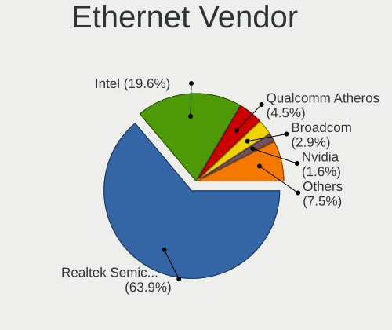

| Vendor                            | Computers | Percent |
|-----------------------------------|-----------|---------|
| Realtek Semiconductor             | 568       | 63.89%  |
| Intel                             | 174       | 19.57%  |
| Qualcomm Atheros                  | 40        | 4.5%    |
| Broadcom                          | 26        | 2.92%   |
| Nvidia                            | 14        | 1.57%   |
| Samsung Electronics               | 9         | 1.01%   |
| ASIX Electronics                  | 9         | 1.01%   |
| Xiaomi                            | 6         | 0.67%   |
| JMicron Technology                | 5         | 0.56%   |
| OPPO Electronics                  | 4         | 0.45%   |
| MediaTek                          | 4         | 0.45%   |
| Marvell Technology Group          | 4         | 0.45%   |
| Broadcom Limited                  | 4         | 0.45%   |
| Silicon Integrated Systems [SiS]  | 3         | 0.34%   |
| ICS Advent                        | 3         | 0.34%   |
| Huawei Technologies               | 3         | 0.34%   |
| DisplayLink                       | 3         | 0.34%   |
| Qualcomm                          | 2         | 0.22%   |
| Apple                             | 2         | 0.22%   |
| TP-Link                           | 1         | 0.11%   |
| Sundance Technology Inc / IC Plus | 1         | 0.11%   |
| Microchip Technology              | 1         | 0.11%   |
| LG Electronics                    | 1         | 0.11%   |
| D-Link System                     | 1         | 0.11%   |
| Aquantia                          | 1         | 0.11%   |

Ethernet Model
--------------

Ethernet models

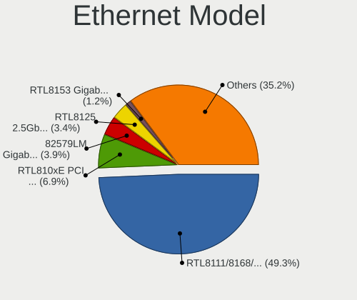

| Model                                                                  | Computers | Percent |
|------------------------------------------------------------------------|-----------|---------|
| Realtek RTL8111/8168/8211/8411 PCI Express Gigabit Ethernet Controller | 448       | 49.34%  |
| Realtek RTL810xE PCI Express Fast Ethernet controller                  | 63        | 6.94%   |
| Intel 82579LM Gigabit Network Connection (Lewisville)                  | 35        | 3.85%   |
| Realtek RTL8125 2.5GbE Controller                                      | 31        | 3.41%   |
| Realtek RTL8153 Gigabit Ethernet Adapter                               | 11        | 1.21%   |
| Realtek Killer E2600 GbE Controller                                    | 11        | 1.21%   |
| Qualcomm Atheros AR8152 v2.0 Fast Ethernet                             | 10        | 1.1%    |
| Intel I211 Gigabit Network Connection                                  | 10        | 1.1%    |
| Samsung Galaxy series, misc. (tethering mode)                          | 8         | 0.88%   |
| Qualcomm Atheros AR8151 v2.0 Gigabit Ethernet                          | 8         | 0.88%   |
| Nvidia MCP61 Ethernet                                                  | 8         | 0.88%   |
| Intel Ethernet Controller I225-V                                       | 8         | 0.88%   |
| Intel Ethernet Connection I217-V                                       | 8         | 0.88%   |
| Intel Ethernet Connection (4) I219-LM                                  | 8         | 0.88%   |
| Intel Alder Lake-P PCH CNVi WiFi                                       | 8         | 0.88%   |
| Intel 82579V Gigabit Network Connection                                | 8         | 0.88%   |
| ASIX AX88179 Gigabit Ethernet                                          | 8         | 0.88%   |
| Intel Ethernet Connection (4) I219-V                                   | 6         | 0.66%   |
| Intel Ethernet Connection (2) I219-V                                   | 6         | 0.66%   |
| Realtek RTL8152 Fast Ethernet Adapter                                  | 5         | 0.55%   |
| Qualcomm Atheros QCA8171 Gigabit Ethernet                              | 5         | 0.55%   |
| Intel Ethernet Connection I219-LM                                      | 5         | 0.55%   |
| Intel Ethernet Connection (6) I219-LM                                  | 5         | 0.55%   |
| Intel Ethernet Connection (2) I219-LM                                  | 5         | 0.55%   |
| Intel 82567LM Gigabit Network Connection                               | 5         | 0.55%   |
| Broadcom NetLink BCM57785 Gigabit Ethernet PCIe                        | 5         | 0.55%   |
| Qualcomm Atheros AR8132 Fast Ethernet                                  | 4         | 0.44%   |
| OPPO Ace 3V                                                            | 4         | 0.44%   |
| JMicron JMC260 PCI Express Fast Ethernet Controller                    | 4         | 0.44%   |
| Intel I210 Gigabit Network Connection                                  | 4         | 0.44%   |
| Intel Ethernet Connection I219-V                                       | 4         | 0.44%   |
| Intel Ethernet Connection I217-LM                                      | 4         | 0.44%   |
| Intel Ethernet Connection (7) I219-V                                   | 4         | 0.44%   |
| Intel 82567LM-3 Gigabit Network Connection                             | 4         | 0.44%   |
| Xiaomi Mi/Redmi series (RNDIS)                                         | 3         | 0.33%   |
| Xiaomi Mi/Redmi series (RNDIS + ADB)                                   | 3         | 0.33%   |
| Silicon Integrated Systems [SiS] 191 Gigabit Ethernet Adapter          | 3         | 0.33%   |
| Qualcomm Atheros Killer E2500 Gigabit Ethernet Controller              | 3         | 0.33%   |
| Qualcomm Atheros Killer E220x Gigabit Ethernet Controller              | 3         | 0.33%   |
| Intel Ethernet Connection (3) I218-LM                                  | 3         | 0.33%   |

Net Controller Kind
-------------------

Ethernet, WiFi or modem

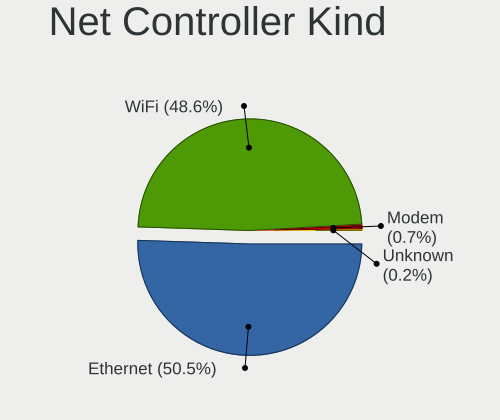

| Kind     | Computers | Percent |
|----------|-----------|---------|
| Ethernet | 834       | 50.51%  |
| WiFi     | 802       | 48.58%  |
| Modem    | 11        | 0.67%   |
| Unknown  | 4         | 0.24%   |

Used Controller
---------------

Currently used network controller

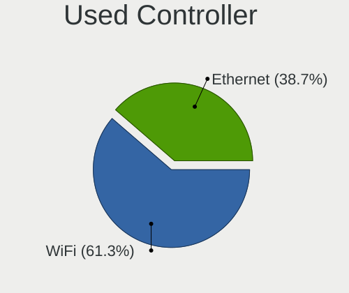

| Kind     | Computers | Percent |
|----------|-----------|---------|
| WiFi     | 641       | 61.34%  |
| Ethernet | 404       | 38.66%  |

NICs
----

Total network controllers on board

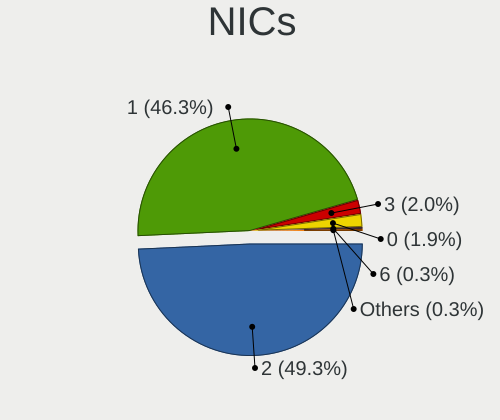

| Total | Computers | Percent |
|-------|-----------|---------|
| 2     | 506       | 49.27%  |
| 1     | 475       | 46.25%  |
| 3     | 21        | 2.04%   |
| 0     | 19        | 1.85%   |
| 6     | 3         | 0.29%   |
| 5     | 2         | 0.19%   |
| 4     | 1         | 0.1%    |

IPv6
----

IPv6 vs IPv4

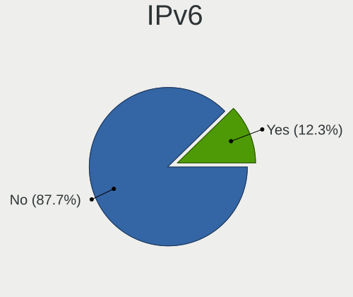

| Used | Computers | Percent |
|------|-----------|---------|
| No   | 915       | 87.73%  |
| Yes  | 128       | 12.27%  |

Bluetooth
---------

Bluetooth Vendor
----------------

Controller vendors

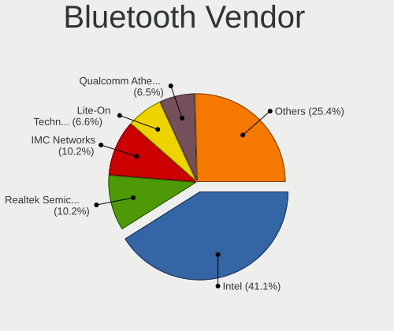

| Vendor                          | Computers | Percent |
|---------------------------------|-----------|---------|
| Intel                           | 273       | 41.05%  |
| Realtek Semiconductor           | 68        | 10.23%  |
| IMC Networks                    | 68        | 10.23%  |
| Lite-On Technology              | 44        | 6.62%   |
| Qualcomm Atheros Communications | 43        | 6.47%   |
| Broadcom                        | 33        | 4.96%   |
| Cambridge Silicon Radio         | 32        | 4.81%   |
| Foxconn / Hon Hai               | 29        | 4.36%   |
| Apple                           | 15        | 2.26%   |
| TP-Link                         | 9         | 1.35%   |
| Realtek                         | 8         | 1.2%    |
| MediaTek                        | 7         | 1.05%   |
| Hewlett-Packard                 | 5         | 0.75%   |
| Dell                            | 5         | 0.75%   |
| Toshiba                         | 4         | 0.6%    |
| Ralink                          | 4         | 0.6%    |
| Chicony Electronics             | 4         | 0.6%    |
| Marvell Semiconductor           | 3         | 0.45%   |
| USI                             | 2         | 0.3%    |
| SINO WEALTH                     | 2         | 0.3%    |
| Actions                         | 2         | 0.3%    |
| Ralink Technology               | 1         | 0.15%   |
| Integrated System Solution      | 1         | 0.15%   |
| Foxconn International           | 1         | 0.15%   |
| Alps Electric                   | 1         | 0.15%   |
| Unknown                         | 1         | 0.15%   |

Bluetooth Model
---------------

Controller models

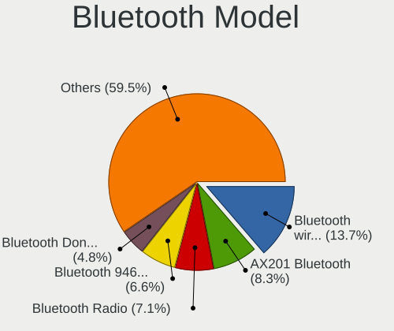

| Model                                               | Computers | Percent |
|-----------------------------------------------------|-----------|---------|
| Intel Bluetooth wireless interface                  | 91        | 13.68%  |
| Intel AX201 Bluetooth                               | 55        | 8.27%   |
| Realtek Bluetooth Radio                             | 47        | 7.07%   |
| Intel Bluetooth 9460/9560 Jefferson Peak (JfP)      | 44        | 6.62%   |
| Cambridge Silicon Radio Bluetooth Dongle (HCI mode) | 32        | 4.81%   |
| IMC Networks Bluetooth Radio                        | 29        | 4.36%   |
| Intel AX200 Bluetooth                               | 26        | 3.91%   |
| Qualcomm Atheros  Bluetooth Device                  | 21        | 3.16%   |
| IMC Networks Wireless_Device                        | 19        | 2.86%   |
| Intel AX210 Bluetooth                               | 17        | 2.56%   |
| IMC Networks Bluetooth Device                       | 17        | 2.56%   |
| Intel Wireless-AC 3168 Bluetooth                    | 16        | 2.41%   |
| Lite-On Qualcomm Atheros QCA9377 Bluetooth          | 15        | 2.26%   |
| Intel Bluetooth Device                              | 12        | 1.8%    |
| Lite-On Bluetooth Device                            | 11        | 1.65%   |
| TP-Link TP-T@- UB500 Adapter                        | 9         | 1.35%   |
| Qualcomm Atheros AR3011 Bluetooth                   | 9         | 1.35%   |
| Foxconn / Hon Hai Bluetooth Device                  | 9         | 1.35%   |
| Broadcom BCM20702 Bluetooth 4.0 [ThinkPad]          | 9         | 1.35%   |
| Realtek Bluetooth Radio                             | 8         | 1.2%    |
| Lite-On Wireless_Device                             | 8         | 1.2%    |
| Apple Bluetooth USB Host Controller                 | 8         | 1.2%    |
| Realtek  Bluetooth 4.2 Adapter                      | 7         | 1.05%   |
| Qualcomm Atheros QCA61x4 Bluetooth 4.0              | 7         | 1.05%   |
| MediaTek Wireless_Device                            | 7         | 1.05%   |
| Intel Centrino Bluetooth Wireless Transceiver       | 7         | 1.05%   |
| Realtek RTL8821A Bluetooth                          | 5         | 0.75%   |
| Broadcom BCM2045B (BDC-2.1)                         | 5         | 0.75%   |
| Realtek RTL8723B Bluetooth                          | 4         | 0.6%    |
| Ralink RT3290 Bluetooth                             | 4         | 0.6%    |
| Qualcomm Atheros AR3012 Bluetooth 4.0               | 4         | 0.6%    |
| Lite-On Atheros AR3012 Bluetooth                    | 4         | 0.6%    |
| Foxconn / Hon Hai Wireless_Device                   | 4         | 0.6%    |
| Foxconn / Hon Hai MediaTek Bluetooth Adapter        | 4         | 0.6%    |
| Chicony Bluetooth (RTL8723BE)                       | 4         | 0.6%    |
| Apple Bluetooth Host Controller                     | 4         | 0.6%    |
| Intel Centrino Advanced-N 6230 Bluetooth adapter    | 3         | 0.45%   |
| Broadcom HP Portable SoftSailing                    | 3         | 0.45%   |
| Broadcom BCM2045B (BDC-2.1) [Bluetooth Controller]  | 3         | 0.45%   |
| Apple Built-in Bluetooth 2.0+EDR HCI                | 3         | 0.45%   |

Sound
-----

Sound Vendor
------------

Sound card vendors

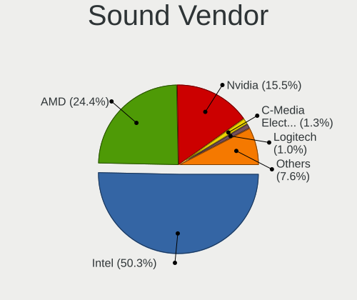

| Vendor                                       | Computers | Percent |
|----------------------------------------------|-----------|---------|
| Intel                                        | 682       | 50.33%  |
| AMD                                          | 330       | 24.35%  |
| Nvidia                                       | 210       | 15.5%   |
| C-Media Electronics                          | 17        | 1.25%   |
| Logitech                                     | 13        | 0.96%   |
| Generalplus Technology                       | 9         | 0.66%   |
| JMTek                                        | 7         | 0.52%   |
| SteelSeries ApS                              | 6         | 0.44%   |
| Realtek Semiconductor                        | 5         | 0.37%   |
| KTMicro                                      | 5         | 0.37%   |
| GN Netcom                                    | 5         | 0.37%   |
| Plantronics                                  | 4         | 0.3%    |
| Kingston Technology                          | 4         | 0.3%    |
| Focusrite-Novation                           | 4         | 0.3%    |
| Silicon Integrated Systems [SiS]             | 3         | 0.22%   |
| Razer USA                                    | 3         | 0.22%   |
| ASUSTek Computer                             | 3         | 0.22%   |
| Walmart                                      | 2         | 0.15%   |
| TTGK Technology                              | 2         | 0.15%   |
| Texas Instruments                            | 2         | 0.15%   |
| OPPO Electronics                             | 2         | 0.15%   |
| Medeli Electronics                           | 2         | 0.15%   |
| Jieli Technology                             | 2         | 0.15%   |
| Giga-Byte Technology                         | 2         | 0.15%   |
| Corsair                                      | 2         | 0.15%   |
| Arturia                                      | 2         | 0.15%   |
| Zoran Co. Personal Media Division (Nogatech) | 1         | 0.07%   |
| ZOOM                                         | 1         | 0.07%   |
| XMOS                                         | 1         | 0.07%   |
| USB MICROPHONE                               | 1         | 0.07%   |
| USB Audio                                    | 1         | 0.07%   |
| Sony                                         | 1         | 0.07%   |
| Samsung Electronics                          | 1         | 0.07%   |
| Samson Technologies                          | 1         | 0.07%   |
| Nordic Semiconductor ASA                     | 1         | 0.07%   |
| Micronas                                     | 1         | 0.07%   |
| Maono                                        | 1         | 0.07%   |
| M-Audio                                      | 1         | 0.07%   |
| liyuany                                      | 1         | 0.07%   |
| KORG                                         | 1         | 0.07%   |

Sound Model
-----------

Sound card models

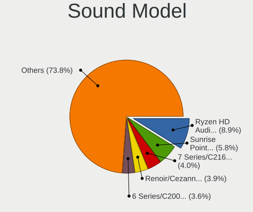

| Model                                                                      | Computers | Percent |
|----------------------------------------------------------------------------|-----------|---------|
| AMD Ryzen HD Audio Controller                                              | 148       | 8.91%   |
| Intel Sunrise Point-LP HD Audio                                            | 97        | 5.84%   |
| Intel 7 Series/C216 Chipset Family High Definition Audio Controller        | 67        | 4.03%   |
| AMD Renoir/Cezanne HDMI/DP Audio Controller                                | 64        | 3.85%   |
| Intel 6 Series/C200 Series Chipset Family High Definition Audio Controller | 59        | 3.55%   |
| AMD Raven/Raven2/Fenghuang HDMI/DP Audio Controller                        | 51        | 3.07%   |
| AMD FCH Azalia Controller                                                  | 51        | 3.07%   |
| AMD Radeon High Definition Audio Controller                                | 41        | 2.47%   |
| Intel 8 Series/C220 Series Chipset High Definition Audio Controller        | 38        | 2.29%   |
| Intel Tiger Lake-LP Smart Sound Technology Audio Controller                | 36        | 2.17%   |
| Intel NM10/ICH7 Family High Definition Audio Controller                    | 31        | 1.87%   |
| AMD Starship/Matisse HD Audio Controller                                   | 30        | 1.81%   |
| Intel Xeon E3-1200 v3/4th Gen Core Processor HD Audio Controller           | 27        | 1.63%   |
| Intel Cannon Lake PCH cAVS                                                 | 26        | 1.57%   |
| AMD Ellesmere HDMI Audio [Radeon RX 470/480 / 570/580/590]                 | 24        | 1.44%   |
| Intel Wildcat Point-LP High Definition Audio Controller                    | 21        | 1.26%   |
| Intel Broadwell-U Audio Controller                                         | 21        | 1.26%   |
| Intel 100 Series/C230 Series Chipset Family HD Audio Controller            | 21        | 1.26%   |
| Intel 200 Series PCH HD Audio                                              | 20        | 1.2%    |
| AMD Kabini HDMI/DP Audio                                                   | 19        | 1.14%   |
| Nvidia GF108 High Definition Audio Controller                              | 18        | 1.08%   |
| Intel Celeron N3350/Pentium N4200/Atom E3900 Series Audio Cluster          | 18        | 1.08%   |
| Intel Alder Lake PCH-P High Definition Audio Controller                    | 18        | 1.08%   |
| Nvidia GP107GL High Definition Audio Controller                            | 17        | 1.02%   |
| Nvidia GK208 HDMI/DP Audio Controller                                      | 17        | 1.02%   |
| Intel Comet Lake PCH-LP cAVS                                               | 17        | 1.02%   |
| Intel Cannon Point-LP High Definition Audio Controller                     | 17        | 1.02%   |
| Intel 5 Series/3400 Series Chipset High Definition Audio                   | 17        | 1.02%   |
| AMD SBx00 Azalia (Intel HDA)                                               | 17        | 1.02%   |
| Nvidia GA107 High Definition Audio Controller                              | 16        | 0.96%   |
| Intel Celeron/Pentium Silver Processor High Definition Audio               | 16        | 0.96%   |
| Intel Atom Processor Z36xxx/Z37xxx Series High Definition Audio Controller | 16        | 0.96%   |
| Intel Haswell-ULT HD Audio Controller                                      | 15        | 0.9%    |
| Intel 82801I (ICH9 Family) HD Audio Controller                             | 15        | 0.9%    |
| Intel 8 Series HD Audio Controller                                         | 15        | 0.9%    |
| Nvidia TU116 High Definition Audio Controller                              | 13        | 0.78%   |
| Nvidia TU107 GeForce GTX 1650 High Definition Audio Controller             | 13        | 0.78%   |
| Nvidia AD107 High Definition Audio Controller                              | 13        | 0.78%   |
| Nvidia TU106 High Definition Audio Controller                              | 12        | 0.72%   |
| Intel Comet Lake PCH cAVS                                                  | 12        | 0.72%   |

Memory
------

Memory Vendor
-------------

Memory module vendors

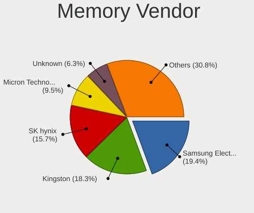

| Vendor              | Computers | Percent |
|---------------------|-----------|---------|
| Samsung Electronics | 126       | 19.38%  |
| Kingston            | 119       | 18.31%  |
| SK hynix            | 102       | 15.69%  |
| Micron Technology   | 62        | 9.54%   |
| Unknown             | 41        | 6.31%   |
| Crucial             | 25        | 3.85%   |
| Team                | 24        | 3.69%   |
| Unknown             | 21        | 3.23%   |
| G.Skill             | 17        | 2.62%   |
| Ramaxel Technology  | 14        | 2.15%   |
| Corsair             | 13        | 2%      |
| A-DATA Technology   | 12        | 1.85%   |
| Transcend           | 8         | 1.23%   |
| Nanya Technology    | 8         | 1.23%   |
| Elpida              | 8         | 1.23%   |
| Unknown (ABCD)      | 5         | 0.77%   |
| ChangXin Memory     | 5         | 0.77%   |
| Apacer              | 5         | 0.77%   |
| PNY                 | 3         | 0.46%   |
| Patriot             | 3         | 0.46%   |
| Unknown (8A5D)      | 2         | 0.31%   |
| Unknown (0B85)      | 2         | 0.31%   |
| Ramsta              | 2         | 0.31%   |
| Lexar Co Limited    | 2         | 0.31%   |
| Lexar               | 2         | 0.31%   |
| Kingmax             | 2         | 0.31%   |
| Uroad               | 1         | 0.15%   |
| Unknown (89BA)      | 1         | 0.15%   |
| Unknown (0x0B79)    | 1         | 0.15%   |
| Unknown (0x0080)    | 1         | 0.15%   |
| Unknown (0B3D)      | 1         | 0.15%   |
| Unifosa             | 1         | 0.15%   |
| TeamGroup           | 1         | 0.15%   |
| Silicon Power       | 1         | 0.15%   |
| Shenzhen SCY        | 1         | 0.15%   |
| RZX                 | 1         | 0.15%   |
| Qimonda             | 1         | 0.15%   |
| PUSKILL             | 1         | 0.15%   |
| Mitsubishi          | 1         | 0.15%   |
| Goldkey             | 1         | 0.15%   |

Memory Model
------------

Memory module models

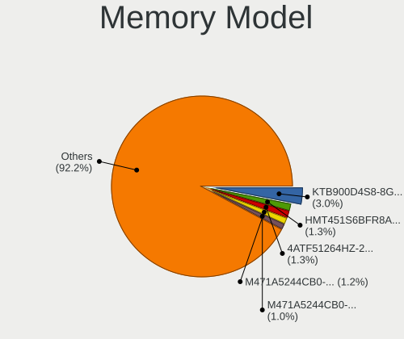

| Model                                                            | Computers | Percent |
|------------------------------------------------------------------|-----------|---------|
| Unknown                                                          | 21        | 3.04%   |
| SK hynix RAM HMT451S6BFR8A-PB 4GB SODIMM DDR3 1600MT/s           | 9         | 1.3%    |
| Micron RAM 4ATF51264HZ-2G6E1 4GB SODIMM DDR4 2667MT/s            | 9         | 1.3%    |
| Samsung RAM M471A5244CB0-CWE 4GB SODIMM DDR4 3200MT/s            | 8         | 1.16%   |
| SK hynix RAM HMA81GS6AFR8N-UH 8GB SODIMM DDR4 2667MT/s           | 7         | 1.01%   |
| Samsung RAM M471A5244CB0-CRC 4GB SODIMM DDR4 2667MT/s            | 7         | 1.01%   |
| Samsung RAM M471A1K43EB1-CWE 8GB SODIMM DDR4 3200MT/s            | 7         | 1.01%   |
| Team RAM TEAMGROUP-UD4-3200 8GB DIMM DDR4 3800MT/s               | 6         | 0.87%   |
| Samsung RAM M471A1G44AB0-CWE 8GiB SODIMM DDR4 3200MT/s           | 6         | 0.87%   |
| Unknown RAM Module 4GB DIMM DDR3 1600MT/s                        | 5         | 0.72%   |
| Unknown (ABCD) RAM 123456789012345678 2GB SODIMM LPDDR4 2400MT/s | 5         | 0.72%   |
| SK hynix RAM HMA851S6CJR6N-VK 4GB SODIMM DDR4 2667MT/s           | 5         | 0.72%   |
| SK hynix RAM HMA81GS6DJR8N-XN 8GB SODIMM DDR4 3200MT/s           | 5         | 0.72%   |
| Ramaxel RAM RMSA3260ME78HAF-2666 8GB SODIMM DDR4 2667MT/s        | 5         | 0.72%   |
| Kingston RAM KF3200C16D4/8GX 8GiB DIMM DDR4 3600MT/s             | 5         | 0.72%   |
| Kingston RAM 99U5428-018.A00LF 8GB SODIMM DDR3 1600MT/s          | 5         | 0.72%   |
| Unknown RAM Module 4GB SODIMM DDR4 2133MT/s                      | 4         | 0.58%   |
| SK hynix RAM HMAA1GS6CJR6N-XN 8GB Row Of Chips DDR4 3200MT/s     | 4         | 0.58%   |
| SK hynix RAM HMA851S6AFR6N-UH 4GB SODIMM DDR4 2667MT/s           | 4         | 0.58%   |
| Samsung RAM M471B5273DH0-CH9 4GB SODIMM DDR3 1600MT/s            | 4         | 0.58%   |
| Samsung RAM M471B5173QH0-YK0 4GB SODIMM DDR3 1600MT/s            | 4         | 0.58%   |
| Samsung RAM M471B1G73EB0-YK0 8192MB SODIMM DDR3 1600MT/s         | 4         | 0.58%   |
| Samsung RAM M471A1K43CB1-CRC 8GB SODIMM DDR4 8400MT/s            | 4         | 0.58%   |
| Micron RAM 4ATF51264HZ-3G2J1 4GB SODIMM DDR4 3200MT/s            | 4         | 0.58%   |
| Kingston RAM KHX1866C10D3/8G 8GB DIMM DDR3 1867MT/s              | 4         | 0.58%   |
| Kingston RAM KF2666C16D4/8G 8GB DIMM DDR4 2667MT/s               | 4         | 0.58%   |
| G.Skill RAM F4-3200C16-8GVKB 8GB DIMM DDR4 4000MT/s              | 4         | 0.58%   |
| Team RAM TEAMGROUP-UD4-3600 16GB DIMM DDR4 3600MT/s              | 3         | 0.43%   |
| Team RAM TEAMGROUP-UD4-3200 8GB DIMM DDR4 3733MT/s               | 3         | 0.43%   |
| Team RAM TEAMGROUP-SD4-3200 16GB SODIMM DDR4 3200MT/s            | 3         | 0.43%   |
| Team RAM TEAMGROUP-SD4-2666 8GB SODIMM DDR4 2667MT/s             | 3         | 0.43%   |
| SK hynix RAM HMT451U7AFR8C-RD 4GB DIMM DDR3                      | 3         | 0.43%   |
| SK hynix RAM HMT451U6BFR8A-PB 4GB DIMM DDR3 1600MT/s             | 3         | 0.43%   |
| SK hynix RAM HMT351S6CFR8C-PB 4GB SODIMM DDR3 1600MT/s           | 3         | 0.43%   |
| SK hynix RAM HMAA1GS6CMR6N-XN 8GB Row Of Chips DDR4 3200MT/s     | 3         | 0.43%   |
| SK hynix RAM HMAA1GS6CJR6N-XN 8GB SODIMM DDR4 3200MT/s           | 3         | 0.43%   |
| SK hynix RAM HMA851S6CJR6N-VK 4GB Row Of Chips DDR4 2667MT/s     | 3         | 0.43%   |
| SK hynix RAM HMA81GS6JJR8N-VK 8GB SODIMM DDR4 2667MT/s           | 3         | 0.43%   |
| Samsung RAM M471B5273CH0-CH9 4GB SODIMM DDR3 1334MT/s            | 3         | 0.43%   |
| Samsung RAM M471B5173EB0-YK0 4GB SODIMM DDR3 1600MT/s            | 3         | 0.43%   |

Memory Kind
-----------

Memory module kinds

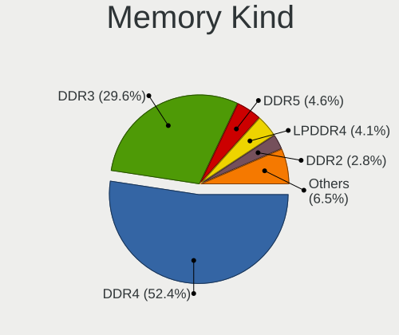

| Kind    | Computers | Percent |
|---------|-----------|---------|
| DDR4    | 283       | 52.41%  |
| DDR3    | 160       | 29.63%  |
| DDR5    | 25        | 4.63%   |
| LPDDR4  | 22        | 4.07%   |
| DDR2    | 15        | 2.78%   |
| LPDDR5  | 12        | 2.22%   |
| LPDDR3  | 7         | 1.3%    |
| Unknown | 7         | 1.3%    |
| SDRAM   | 5         | 0.93%   |
| DRAM    | 2         | 0.37%   |
| DDR     | 2         | 0.37%   |

Memory Form Factor
------------------

Physical design of the memory module

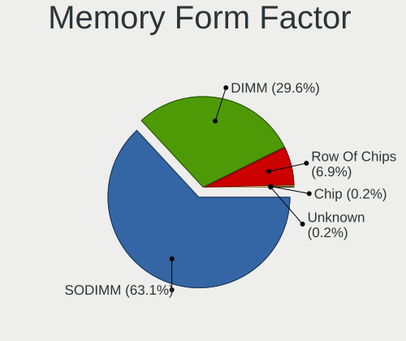

| Name         | Computers | Percent |
|--------------|-----------|---------|
| SODIMM       | 337       | 63.11%  |
| DIMM         | 158       | 29.59%  |
| Row Of Chips | 37        | 6.93%   |
| Chip         | 1         | 0.19%   |
| Unknown      | 1         | 0.19%   |

Memory Size
-----------

Memory module size

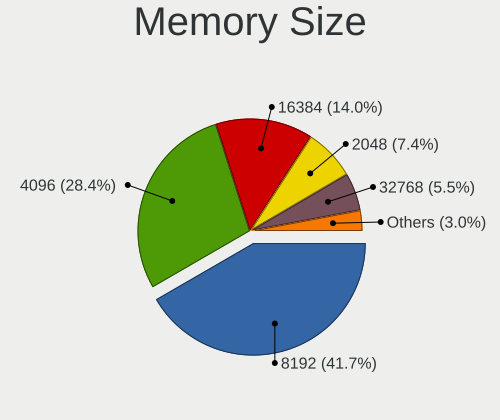

| Size  | Computers | Percent |
|-------|-----------|---------|
| 8192  | 252       | 41.65%  |
| 4096  | 172       | 28.43%  |
| 16384 | 85        | 14.05%  |
| 2048  | 45        | 7.44%   |
| 32768 | 33        | 5.45%   |
| 1024  | 18        | 2.98%   |

Memory Speed
------------

Memory module speed

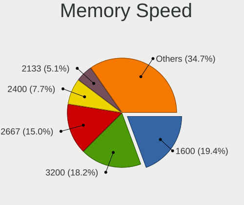

| Speed   | Computers | Percent |
|---------|-----------|---------|
| 1600    | 115       | 19.36%  |
| 3200    | 108       | 18.18%  |
| 2667    | 89        | 14.98%  |
| 2400    | 46        | 7.74%   |
| 2133    | 30        | 5.05%   |
| 1333    | 24        | 4.04%   |
| 3733    | 16        | 2.69%   |
| 667     | 14        | 2.36%   |
| 4800    | 13        | 2.19%   |
| 3600    | 12        | 2.02%   |
| 1334    | 11        | 1.85%   |
| 1866    | 10        | 1.68%   |
| 1067    | 8         | 1.35%   |
| 8400    | 6         | 1.01%   |
| 5600    | 6         | 1.01%   |
| 3800    | 6         | 1.01%   |
| Unknown | 6         | 1.01%   |
| 6400    | 5         | 0.84%   |
| 2666    | 5         | 0.84%   |
| 6000    | 4         | 0.67%   |
| 4267    | 4         | 0.67%   |
| 4000    | 4         | 0.67%   |
| 1867    | 4         | 0.67%   |
| 3466    | 3         | 0.51%   |
| 3266    | 3         | 0.51%   |
| 2933    | 3         | 0.51%   |
| 8000    | 2         | 0.34%   |
| 5500    | 2         | 0.34%   |
| 4266    | 2         | 0.34%   |
| 4199    | 2         | 0.34%   |
| 3866    | 2         | 0.34%   |
| 3500    | 2         | 0.34%   |
| 3000    | 2         | 0.34%   |
| 1648    | 2         | 0.34%   |
| 1066    | 2         | 0.34%   |
| 800     | 2         | 0.34%   |
| 8533    | 1         | 0.17%   |
| 7500    | 1         | 0.17%   |
| 7467    | 1         | 0.17%   |
| 6600    | 1         | 0.17%   |

Printers & scanners
-------------------

Printer Vendor
--------------

Printer device vendors

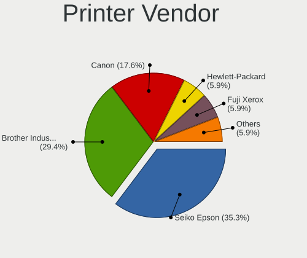

| Vendor             | Computers | Percent |
|--------------------|-----------|---------|
| Seiko Epson        | 6         | 35.29%  |
| Brother Industries | 5         | 29.41%  |
| Canon              | 3         | 17.65%  |
| Hewlett-Packard    | 1         | 5.88%   |
| Fuji Xerox         | 1         | 5.88%   |
| Unknown            | 1         | 5.88%   |

Printer Model
-------------

Printer device models

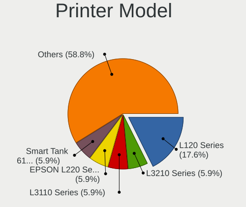

| Model                         | Computers | Percent |
|-------------------------------|-----------|---------|
| Seiko Epson L120 Series       | 3         | 17.65%  |
| Seiko Epson L3210 Series      | 1         | 5.88%   |
| Seiko Epson L3110 Series      | 1         | 5.88%   |
| Seiko Epson EPSON L220 Series | 1         | 5.88%   |
| HP Smart Tank 610 series      | 1         | 5.88%   |
| Fuji Xerox DocuPrint CP105 b  | 1         | 5.88%   |
| Canon PIXMA MG2500 Series     | 1         | 5.88%   |
| Canon GM2000 series           | 1         | 5.88%   |
| Canon G2010 series            | 1         | 5.88%   |
| Brother MFC-J2340DW           | 1         | 5.88%   |
| Brother MFC-J200              | 1         | 5.88%   |
| Brother DCP-T710W             | 1         | 5.88%   |
| Brother DCP-T700W             | 1         | 5.88%   |
| Brother DCP-T310              | 1         | 5.88%   |
| Unknown                       | 1         | 5.88%   |

Scanner Vendor
--------------

Scanner device vendors

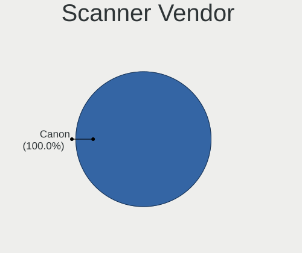

| Vendor | Computers | Percent |
|--------|-----------|---------|
| Canon  | 1         | 100%    |

Scanner Model
-------------

Scanner device models

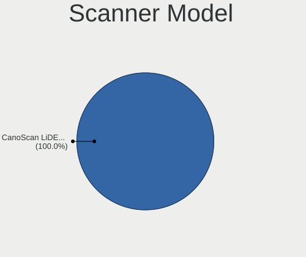

| Model                   | Computers | Percent |
|-------------------------|-----------|---------|
| Canon CanoScan LiDE 110 | 1         | 100%    |

Camera
------

Camera Vendor
-------------

Camera device vendors

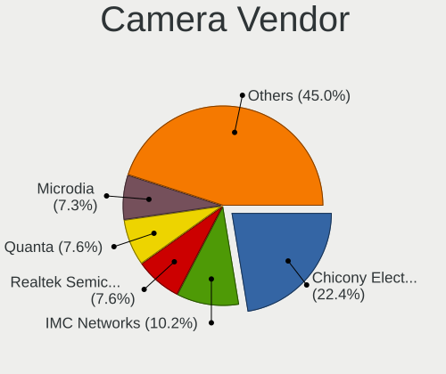

| Vendor                                 | Computers | Percent |
|----------------------------------------|-----------|---------|
| Chicony Electronics                    | 148       | 22.42%  |
| IMC Networks                           | 67        | 10.15%  |
| Realtek Semiconductor                  | 50        | 7.58%   |
| Quanta                                 | 50        | 7.58%   |
| Microdia                               | 48        | 7.27%   |
| Bison Electronics                      | 42        | 6.36%   |
| Sunplus Innovation Technology          | 27        | 4.09%   |
| Logitech                               | 22        | 3.33%   |
| Cheng Uei Precision Industry (Foxlink) | 18        | 2.73%   |
| Apple                                  | 17        | 2.58%   |
| Syntek                                 | 14        | 2.12%   |
| Luxvisions Innotech Limited            | 14        | 2.12%   |
| Suyin                                  | 13        | 1.97%   |
| Lite-On Technology                     | 12        | 1.82%   |
| A4Tech                                 | 12        | 1.82%   |
| Z-Star Microelectronics                | 9         | 1.36%   |
| Silicon Motion                         | 9         | 1.36%   |
| Alcor Micro                            | 9         | 1.36%   |
| Sonix Technology                       | 7         | 1.06%   |
| Jieli Technology                       | 7         | 1.06%   |
| Samsung Electronics                    | 6         | 0.91%   |
| Pixart Imaging                         | 3         | 0.45%   |
| Microsoft                              | 3         | 0.45%   |
| Importek                               | 3         | 0.45%   |
| icSpring                               | 3         | 0.45%   |
| Cubeternet                             | 3         | 0.45%   |
| ALi                                    | 3         | 0.45%   |
| Sunplus Technology                     | 2         | 0.3%    |
| SN0002                                 | 2         | 0.3%    |
| ShineTech                              | 2         | 0.3%    |
| Razer USA                              | 2         | 0.3%    |
| Owon                                   | 2         | 0.3%    |
| OPPO Electronics                       | 2         | 0.3%    |
| OmniVision Technologies                | 2         | 0.3%    |
| KYE Systems (Mouse Systems)            | 2         | 0.3%    |
| Generalplus Technology                 | 2         | 0.3%    |
| GEMBIRD                                | 2         | 0.3%    |
| ARC International                      | 2         | 0.3%    |
| Alpha Imaging Technology               | 2         | 0.3%    |
| Y Media                                | 1         | 0.15%   |

Camera Model
------------

Camera device models

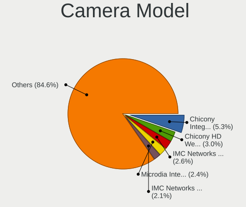

| Model                                               | Computers | Percent |
|-----------------------------------------------------|-----------|---------|
| Chicony Integrated Camera                           | 35        | 5.27%   |
| Chicony HD WebCam                                   | 20        | 3.01%   |
| IMC Networks USB2.0 VGA UVC WebCam                  | 17        | 2.56%   |
| Microdia Integrated_Webcam_HD                       | 16        | 2.41%   |
| IMC Networks USB2.0 HD UVC WebCam                   | 14        | 2.11%   |
| Quanta HD WebCam                                    | 13        | 1.96%   |
| Realtek Integrated_Webcam_HD                        | 10        | 1.51%   |
| Realtek Acer 640 x 480 laptop camera                | 10        | 1.51%   |
| IMC Networks Integrated Camera                      | 10        | 1.51%   |
| Bison Integrated Camera                             | 10        | 1.51%   |
| Quanta HD User Facing                               | 8         | 1.2%    |
| Sunplus Integrated_Webcam_HD                        | 7         | 1.05%   |
| Quanta ACER HD User Facing                          | 7         | 1.05%   |
| IMC Networks HD Camera                              | 7         | 1.05%   |
| Chicony VGA WebCam                                  | 7         | 1.05%   |
| Chicony HP Truevision HD                            | 7         | 1.05%   |
| Chicony HD User Facing                              | 7         | 1.05%   |
| Syntek Integrated Camera                            | 6         | 0.9%    |
| Quanta VGA WebCam                                   | 6         | 0.9%    |
| Logitech Webcam C270                                | 6         | 0.9%    |
| IMC Networks ov9734_azurewave_camera                | 6         | 0.9%    |
| Chicony USB2.0 VGA UVC WebCam                       | 6         | 0.9%    |
| Chicony HP HD Camera                                | 6         | 0.9%    |
| Bison Lenovo EasyCamera                             | 6         | 0.9%    |
| Z-Star Venus USB2.0 Camera                          | 5         | 0.75%   |
| Sonix USB2.0 HD UVC WebCam                          | 5         | 0.75%   |
| Samsung Galaxy series, misc. (MTP mode)             | 5         | 0.75%   |
| Realtek USB2.0 VGA UVC WebCam                       | 5         | 0.75%   |
| Realtek Integrated Webcam                           | 5         | 0.75%   |
| Luxvisions Innotech Limited Integrated Camera       | 5         | 0.75%   |
| Luxvisions Innotech Limited HP TrueVision HD Camera | 5         | 0.75%   |
| Logitech Webcam C310                                | 5         | 0.75%   |
| Jieli USB PHY 2.0                                   | 5         | 0.75%   |
| IMC Networks EasyCamera                             | 5         | 0.75%   |
| Chicony HP Wide Vision HD Camera                    | 5         | 0.75%   |
| Bison SunplusIT Integrated Camera                   | 5         | 0.75%   |
| A4Tech FHD 1080P PC Camera                          | 5         | 0.75%   |
| Syntek Lenovo EasyCamera                            | 4         | 0.6%    |
| Sunplus HD WebCam                                   | 4         | 0.6%    |
| Microdia Webcam Vitade AF                           | 4         | 0.6%    |

Security
--------

Fingerprint Vendor
------------------

Fingerprint sensor vendors

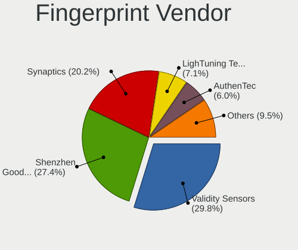

| Vendor                     | Computers | Percent |
|----------------------------|-----------|---------|
| Validity Sensors           | 25        | 29.76%  |
| Shenzhen Goodix Technology | 23        | 27.38%  |
| Synaptics                  | 17        | 20.24%  |
| LighTuning Technology      | 6         | 7.14%   |
| AuthenTec                  | 5         | 5.95%   |
| Elan Microelectronics      | 4         | 4.76%   |
| Upek                       | 3         | 3.57%   |
| GDMicroelectronics         | 1         | 1.19%   |

Fingerprint Model
-----------------

Fingerprint sensor models

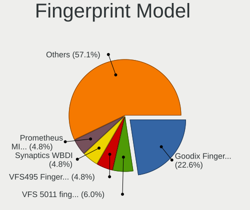

| Model                                                                      | Computers | Percent |
|----------------------------------------------------------------------------|-----------|---------|
| Shenzhen Goodix  Fingerprint Device                                        | 19        | 22.62%  |
| Validity Sensors VFS 5011 fingerprint sensor                               | 5         | 5.95%   |
| Validity Sensors VFS495 Fingerprint Reader                                 | 4         | 4.76%   |
| Validity Sensors Synaptics WBDI                                            | 4         | 4.76%   |
| Synaptics Prometheus MIS Touch Fingerprint Reader                          | 4         | 4.76%   |
| LighTuning EgisTec Touch Fingerprint Sensor                                | 4         | 4.76%   |
| Validity Sensors VFS491                                                    | 3         | 3.57%   |
| Validity Sensors VFS471 Fingerprint Reader                                 | 3         | 3.57%   |
| Upek Biometric Touchchip/Touchstrip Fingerprint Sensor                     | 3         | 3.57%   |
| Synaptics UWP WBDI Device                                                  | 3         | 3.57%   |
| Shenzhen Goodix Fingerprint Reader                                         | 3         | 3.57%   |
| Elan ELAN:Fingerprint                                                      | 3         | 3.57%   |
| Synaptics TouchPad                                                         | 2         | 2.38%   |
| Synaptics  WBDI                                                            | 2         | 2.38%   |
| Synaptics Metallica MIS Touch Fingerprint Reader                           | 2         | 2.38%   |
| Synaptics Fingerprint reader [HP G6]                                       | 2         | 2.38%   |
| AuthenTec AES2810                                                          | 2         | 2.38%   |
| Validity Sensors VFS7500 Touch Fingerprint Sensor                          | 1         | 1.19%   |
| Validity Sensors VFS5011 Fingerprint Reader                                | 1         | 1.19%   |
| Validity Sensors VFS300 Fingerprint Reader                                 | 1         | 1.19%   |
| Validity Sensors VFS101 Fingerprint Reader                                 | 1         | 1.19%   |
| Validity Sensors VFS Fingerprint sensor                                    | 1         | 1.19%   |
| Validity Sensors Synaptics VFS7552 Touch Fingerprint Sensor with PurePrint | 1         | 1.19%   |
| Synaptics  FS7604 Touch Fingerprint Sensor with PurePrint                  | 1         | 1.19%   |
| Synaptics Metallica MOH Touch Fingerprint Reader                           | 1         | 1.19%   |
| Shenzhen Goodix FingerPrint                                                | 1         | 1.19%   |
| LighTuning Fingerprint Sensor                                              | 1         | 1.19%   |
| LighTuning ES603 Swipe Fingerprint Sensor                                  | 1         | 1.19%   |
| GDMicroelectronics Touch Fingerprint Sensor                                | 1         | 1.19%   |
| Elan ELAN:ARM-M4                                                           | 1         | 1.19%   |
| AuthenTec Fingerprint Sensor                                               | 1         | 1.19%   |
| AuthenTec AES2501 Fingerprint Sensor                                       | 1         | 1.19%   |
| AuthenTec AES1600                                                          | 1         | 1.19%   |

Chipcard Vendor
---------------

Chipcard module vendors

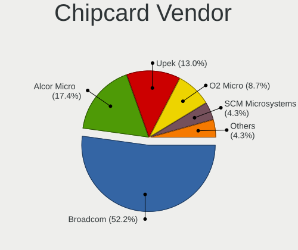

| Vendor           | Computers | Percent |
|------------------|-----------|---------|
| Broadcom         | 12        | 52.17%  |
| Alcor Micro      | 4         | 17.39%  |
| Upek             | 3         | 13.04%  |
| O2 Micro         | 2         | 8.7%    |
| SCM Microsystems | 1         | 4.35%   |
| Lenovo           | 1         | 4.35%   |

Chipcard Model
--------------

Chipcard module models

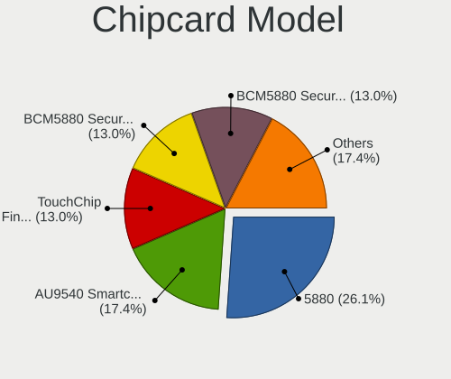

| Model                                                                        | Computers | Percent |
|------------------------------------------------------------------------------|-----------|---------|
| Broadcom 5880                                                                | 6         | 26.09%  |
| Alcor Micro AU9540 Smartcard Reader                                          | 4         | 17.39%  |
| Upek TouchChip Fingerprint Coprocessor (WBF advanced mode)                   | 3         | 13.04%  |
| Broadcom BCM5880 Secure Applications Processor with fingerprint swipe sensor | 3         | 13.04%  |
| Broadcom BCM5880 Secure Applications Processor                               | 3         | 13.04%  |
| SCM Microsystems SCR3340 - ExpressCard54 Smart Card Reader                   | 1         | 4.35%   |
| O2 Micro Oz776 SmartCard Reader                                              | 1         | 4.35%   |
| O2 Micro OZ776 CCID Smartcard Reader                                         | 1         | 4.35%   |
| Lenovo Integrated Smart Card Reader                                          | 1         | 4.35%   |

Unsupported
-----------

Unsupported Devices
-------------------

Total unsupported devices on board

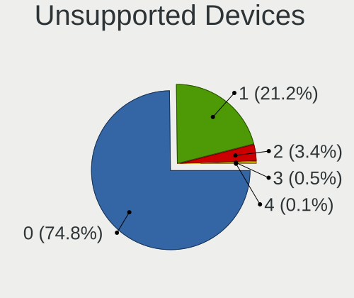

| Total | Computers | Percent |
|-------|-----------|---------|
| 0     | 787       | 74.81%  |
| 1     | 223       | 21.2%   |
| 2     | 36        | 3.42%   |
| 3     | 5         | 0.48%   |
| 4     | 1         | 0.1%    |

Unsupported Device Types
------------------------

Types of unsupported devices

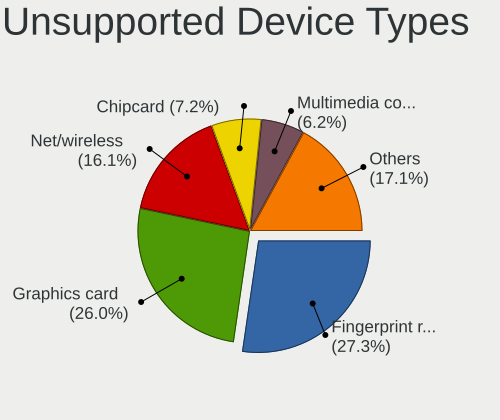

| Type                     | Computers | Percent |
|--------------------------|-----------|---------|
| Fingerprint reader       | 83        | 27.3%   |
| Graphics card            | 79        | 25.99%  |
| Net/wireless             | 49        | 16.12%  |
| Chipcard                 | 22        | 7.24%   |
| Multimedia controller    | 19        | 6.25%   |
| Camera                   | 14        | 4.61%   |
| Net/ethernet             | 6         | 1.97%   |
| Communication controller | 6         | 1.97%   |
| Bluetooth                | 6         | 1.97%   |
| Unassigned class         | 5         | 1.64%   |
| Sound                    | 4         | 1.32%   |
| Storage                  | 3         | 0.99%   |
| Network                  | 3         | 0.99%   |
| Wireless                 | 1         | 0.33%   |
| Storage/raid             | 1         | 0.33%   |
| Storage/nvme             | 1         | 0.33%   |
| Modem                    | 1         | 0.33%   |
| Card reader              | 1         | 0.33%   |

