Linux in Philippines - Tested Hardware & Statistics
---------------------------------------------------

A project to collect tested hardware configurations for Linux in Philippines.

Anyone can contribute to this report by the [hw-probe](https://github.com/linuxhw/hw-probe) tool:

    sudo -E hw-probe -all -upload

Please contribute! Especially if your hardware is rare.

This is a report for all computer types. See also reports for [desktops](/Location/Philippines/Desktop/README.md) and [notebooks](/Location/Philippines/Notebook/README.md).

Contents
--------

* [ Test Cases ](#test-cases)

* [ System ](#system)
  - [ OS                       ](#os)
  - [ OS Family                ](#os-family)
  - [ Kernel                   ](#kernel)
  - [ Kernel Family            ](#kernel-family)
  - [ Kernel Major Ver.        ](#kernel-major-ver)
  - [ Arch                     ](#arch)
  - [ DE                       ](#de)
  - [ Display Server           ](#display-server)
  - [ Display Manager          ](#display-manager)
  - [ OS Lang                  ](#os-lang)
  - [ Boot Mode                ](#boot-mode)
  - [ Filesystem               ](#filesystem)
  - [ Part. scheme             ](#part-scheme)
  - [ Dual Boot with Linux/BSD ](#dual-boot-with-linuxbsd)
  - [ Dual Boot (Win)          ](#dual-boot-win)

* [ Board ](#board)
  - [ Vendor                   ](#vendor)
  - [ Model                    ](#model)
  - [ Model Family             ](#model-family)
  - [ MFG Year                 ](#mfg-year)
  - [ Form Factor              ](#form-factor)
  - [ Secure Boot              ](#secure-boot)
  - [ Coreboot                 ](#coreboot)
  - [ RAM Size                 ](#ram-size)
  - [ RAM Used                 ](#ram-used)
  - [ Total Drives             ](#total-drives)
  - [ Has CD-ROM               ](#has-cd-rom)
  - [ Has Ethernet             ](#has-ethernet)
  - [ Has WiFi                 ](#has-wifi)
  - [ Has Bluetooth            ](#has-bluetooth)

* [ Location ](#location)
  - [ Country                  ](#country)
  - [ City                     ](#city)

* [ Drives ](#drives)
  - [ Drive Vendor             ](#drive-vendor)
  - [ Drive Model              ](#drive-model)
  - [ HDD Vendor               ](#hdd-vendor)
  - [ SSD Vendor               ](#ssd-vendor)
  - [ Drive Kind               ](#drive-kind)
  - [ Drive Connector          ](#drive-connector)
  - [ Drive Size               ](#drive-size)
  - [ Space Total              ](#space-total)
  - [ Space Used               ](#space-used)
  - [ Malfunc. Drives          ](#malfunc-drives)
  - [ Malfunc. Drive Vendor    ](#malfunc-drive-vendor)
  - [ Malfunc. HDD Vendor      ](#malfunc-hdd-vendor)
  - [ Malfunc. Drive Kind      ](#malfunc-drive-kind)
  - [ Failed Drives            ](#failed-drives)
  - [ Failed Drive Vendor      ](#failed-drive-vendor)
  - [ Drive Status             ](#drive-status)

* [ Storage controller ](#storage-controller)
  - [ Storage Vendor           ](#storage-vendor)
  - [ Storage Model            ](#storage-model)
  - [ Storage Kind             ](#storage-kind)

* [ Processor ](#processor)
  - [ CPU Vendor               ](#cpu-vendor)
  - [ CPU Model                ](#cpu-model)
  - [ CPU Model Family         ](#cpu-model-family)
  - [ CPU Cores                ](#cpu-cores)
  - [ CPU Sockets              ](#cpu-sockets)
  - [ CPU Threads              ](#cpu-threads)
  - [ CPU Op-Modes             ](#cpu-op-modes)
  - [ CPU Microcode            ](#cpu-microcode)
  - [ CPU Microarch            ](#cpu-microarch)

* [ Graphics ](#graphics)
  - [ GPU Vendor               ](#gpu-vendor)
  - [ GPU Model                ](#gpu-model)
  - [ GPU Combo                ](#gpu-combo)
  - [ GPU Driver               ](#gpu-driver)
  - [ GPU Memory               ](#gpu-memory)

* [ Monitor ](#monitor)
  - [ Monitor Vendor           ](#monitor-vendor)
  - [ Monitor Model            ](#monitor-model)
  - [ Monitor Resolution       ](#monitor-resolution)
  - [ Monitor Diagonal         ](#monitor-diagonal)
  - [ Monitor Width            ](#monitor-width)
  - [ Aspect Ratio             ](#aspect-ratio)
  - [ Monitor Area             ](#monitor-area)
  - [ Pixel Density            ](#pixel-density)
  - [ Multiple Monitors        ](#multiple-monitors)

* [ Network ](#network)
  - [ Net Controller Vendor    ](#net-controller-vendor)
  - [ Net Controller Model     ](#net-controller-model)
  - [ Wireless Vendor          ](#wireless-vendor)
  - [ Wireless Model           ](#wireless-model)
  - [ Ethernet Vendor          ](#ethernet-vendor)
  - [ Ethernet Model           ](#ethernet-model)
  - [ Net Controller Kind      ](#net-controller-kind)
  - [ Used Controller          ](#used-controller)
  - [ NICs                     ](#nics)
  - [ IPv6                     ](#ipv6)

* [ Bluetooth ](#bluetooth)
  - [ Bluetooth Vendor         ](#bluetooth-vendor)
  - [ Bluetooth Model          ](#bluetooth-model)

* [ Sound ](#sound)
  - [ Sound Vendor             ](#sound-vendor)
  - [ Sound Model              ](#sound-model)

* [ Memory ](#memory)
  - [ Memory Vendor            ](#memory-vendor)
  - [ Memory Model             ](#memory-model)
  - [ Memory Kind              ](#memory-kind)
  - [ Memory Form Factor       ](#memory-form-factor)
  - [ Memory Size              ](#memory-size)
  - [ Memory Speed             ](#memory-speed)

* [ Printers & scanners ](#printers--scanners)
  - [ Printer Vendor           ](#printer-vendor)
  - [ Printer Model            ](#printer-model)
  - [ Scanner Vendor           ](#scanner-vendor)
  - [ Scanner Model            ](#scanner-model)

* [ Camera ](#camera)
  - [ Camera Vendor            ](#camera-vendor)
  - [ Camera Model             ](#camera-model)

* [ Security ](#security)
  - [ Fingerprint Vendor       ](#fingerprint-vendor)
  - [ Fingerprint Model        ](#fingerprint-model)
  - [ Chipcard Vendor          ](#chipcard-vendor)
  - [ Chipcard Model           ](#chipcard-model)

* [ Unsupported ](#unsupported)
  - [ Unsupported Devices      ](#unsupported-devices)
  - [ Unsupported Device Types ](#unsupported-device-types)

Test Cases
----------

Total: 1267

| Vendor        | Model                       | Form-Factor | Probe                                                      | Date         |
|---------------|-----------------------------|-------------|------------------------------------------------------------|--------------|
| Acer          | Aspire A514-53              | Notebook    | [88e5da8b9d](https://linux-hardware.org/?probe=88e5da8b9d) | Jan 05, 2025 |
| Acer          | Aspire A514-53              | Notebook    | [a4dc1a43a2](https://linux-hardware.org/?probe=a4dc1a43a2) | Jan 05, 2025 |
| Acer          | Predator PH16-71            | Notebook    | [51c220bbe4](https://linux-hardware.org/?probe=51c220bbe4) | Jan 04, 2025 |
| Gigabyte      | B450M DS3H WIFI-CF          | Desktop     | [03283c180b](https://linux-hardware.org/?probe=03283c180b) | Jan 04, 2025 |
| Acer          | Aspire A515-56              | Notebook    | [88b474acac](https://linux-hardware.org/?probe=88b474acac) | Dec 30, 2024 |
| HP            | Pavilion dv4                | Notebook    | [1d61f606c1](https://linux-hardware.org/?probe=1d61f606c1) | Dec 28, 2024 |
| HP            | Pavilion dv4                | Notebook    | [a7190abb6b](https://linux-hardware.org/?probe=a7190abb6b) | Dec 28, 2024 |
| MSI           | A320M PRO-VH                | Desktop     | [e16bd64c51](https://linux-hardware.org/?probe=e16bd64c51) | Dec 27, 2024 |
| MSI           | A320M PRO-VH                | Desktop     | [6c30c82884](https://linux-hardware.org/?probe=6c30c82884) | Dec 27, 2024 |
| Valve         | Jupiter                     | Notebook    | [b2a0e79409](https://linux-hardware.org/?probe=b2a0e79409) | Dec 25, 2024 |
| Acer          | Predator PH16-71            | Notebook    | [d721bfca82](https://linux-hardware.org/?probe=d721bfca82) | Dec 23, 2024 |
| Lenovo        | SHARKBAY SDK0J40697 WIN ... | Desktop     | [f9b15fdce1](https://linux-hardware.org/?probe=f9b15fdce1) | Dec 18, 2024 |
| Dell          | 0JP3NX A00                  | Desktop     | [ea6bad1e0a](https://linux-hardware.org/?probe=ea6bad1e0a) | Dec 18, 2024 |
| Apple         | MacBookAir3,1               | Notebook    | [29d91557b3](https://linux-hardware.org/?probe=29d91557b3) | Dec 17, 2024 |
| Apple         | MacBookAir3,1               | Notebook    | [62e2c7fe7b](https://linux-hardware.org/?probe=62e2c7fe7b) | Dec 17, 2024 |
| ASUSTek       | X540UA                      | Notebook    | [6d11bceba5](https://linux-hardware.org/?probe=6d11bceba5) | Dec 17, 2024 |
| Fujitsu       | FMVU14003                   | Notebook    | [2d5271bca3](https://linux-hardware.org/?probe=2d5271bca3) | Dec 15, 2024 |
| Valve         | Jupiter                     | Notebook    | [3b34c56811](https://linux-hardware.org/?probe=3b34c56811) | Dec 15, 2024 |
| Valve         | Jupiter                     | Notebook    | [f0f29070ae](https://linux-hardware.org/?probe=f0f29070ae) | Dec 15, 2024 |
| Lenovo        | LOQ 15IRX9 83DV             | Notebook    | [68a32fe043](https://linux-hardware.org/?probe=68a32fe043) | Dec 15, 2024 |
| EMAXX TECH... | EMX-A70FM2+iCafe            | Desktop     | [a915205b51](https://linux-hardware.org/?probe=a915205b51) | Dec 14, 2024 |
| MSI           | PRO H610M-E DDR4            | Desktop     | [dd71cde0f4](https://linux-hardware.org/?probe=dd71cde0f4) | Dec 14, 2024 |
| ASUSTek       | ROG Flow X13 GV302XI_GV3... | Convertible | [9907f25da7](https://linux-hardware.org/?probe=9907f25da7) | Dec 11, 2024 |
| Acer          | Predator PH16-71            | Notebook    | [663de39a0e](https://linux-hardware.org/?probe=663de39a0e) | Dec 11, 2024 |
| ASRock        | B460M Steel Legend          | Desktop     | [2f90887c93](https://linux-hardware.org/?probe=2f90887c93) | Dec 08, 2024 |
| ASRock        | B460M Steel Legend          | Desktop     | [47e703a42d](https://linux-hardware.org/?probe=47e703a42d) | Dec 08, 2024 |
| Dell          | 042P49 A02                  | Desktop     | [d91852967b](https://linux-hardware.org/?probe=d91852967b) | Dec 07, 2024 |
| Lenovo        | ThinkPad X130e 233827C      | Notebook    | [d7d1d786d7](https://linux-hardware.org/?probe=d7d1d786d7) | Dec 05, 2024 |
| Lenovo        | ThinkPad T14 Gen 5 21MCC... | Notebook    | [c293c35272](https://linux-hardware.org/?probe=c293c35272) | Nov 30, 2024 |
| Dell          | 042P49 A02                  | Desktop     | [112f9270e5](https://linux-hardware.org/?probe=112f9270e5) | Nov 27, 2024 |
| ASUSTek       | VivoBook 14_ASUS Laptop ... | Notebook    | [6b4cedb8e0](https://linux-hardware.org/?probe=6b4cedb8e0) | Nov 24, 2024 |
| Apple         | MacBookAir6,2               | Notebook    | [3fe08ea4ca](https://linux-hardware.org/?probe=3fe08ea4ca) | Nov 21, 2024 |
| ASRock        | H81M-VG4 R2.0               | Desktop     | [21abf92497](https://linux-hardware.org/?probe=21abf92497) | Nov 20, 2024 |
| Acer          | Predator PH16-71            | Notebook    | [cc0c4bfa12](https://linux-hardware.org/?probe=cc0c4bfa12) | Nov 19, 2024 |
| ECS           | H110M4-C43                  | Desktop     | [f68d39f617](https://linux-hardware.org/?probe=f68d39f617) | Nov 17, 2024 |
| Lenovo        | V470 HuronRiver Platform    | Notebook    | [a9d514c0a4](https://linux-hardware.org/?probe=a9d514c0a4) | Nov 15, 2024 |
| Lenovo        | V470 HuronRiver Platform    | Notebook    | [a44206e508](https://linux-hardware.org/?probe=a44206e508) | Nov 15, 2024 |
| ECS           | H110M4-C43                  | Desktop     | [83e2429bf4](https://linux-hardware.org/?probe=83e2429bf4) | Nov 14, 2024 |
| Infinix       | INBOOK X2 PLUS              | Notebook    | [ab3b8d74e5](https://linux-hardware.org/?probe=ab3b8d74e5) | Nov 13, 2024 |
| Lenovo        | IdeaPad 320-14ISK 80XG      | Notebook    | [5e093f4827](https://linux-hardware.org/?probe=5e093f4827) | Nov 12, 2024 |
| Acer          | Aspire 4752                 | Notebook    | [2f02f5ff8b](https://linux-hardware.org/?probe=2f02f5ff8b) | Nov 11, 2024 |
| Lenovo        | ThinkBook 15-IML 20RW       | Notebook    | [c81753d432](https://linux-hardware.org/?probe=c81753d432) | Nov 10, 2024 |
| Toshiba       | Satellite L745              | Notebook    | [143975f623](https://linux-hardware.org/?probe=143975f623) | Nov 09, 2024 |
| Apple         | MacBookAir6,1               | Notebook    | [22a532eef3](https://linux-hardware.org/?probe=22a532eef3) | Nov 04, 2024 |
| Valve         | Jupiter                     | Notebook    | [6c907b73a0](https://linux-hardware.org/?probe=6c907b73a0) | Nov 02, 2024 |
| Valve         | Galileo                     | Notebook    | [1903569037](https://linux-hardware.org/?probe=1903569037) | Nov 01, 2024 |
| MSI           | NF725M-P31                  | Desktop     | [ad6fa8257c](https://linux-hardware.org/?probe=ad6fa8257c) | Nov 01, 2024 |
| HP            | Pavilion dv9700             | Notebook    | [e649cb0d93](https://linux-hardware.org/?probe=e649cb0d93) | Nov 01, 2024 |
| Acer          | Aspire E5-523G              | Notebook    | [6a3b1eb7c5](https://linux-hardware.org/?probe=6a3b1eb7c5) | Oct 30, 2024 |
| Acer          | Aspire E5-523G              | Notebook    | [c467005761](https://linux-hardware.org/?probe=c467005761) | Oct 30, 2024 |
| HUAWEI        | WRT-WX9                     | Notebook    | [3b20277a4b](https://linux-hardware.org/?probe=3b20277a4b) | Oct 30, 2024 |
| ASRock        | B550M-HDV                   | Desktop     | [59e9489711](https://linux-hardware.org/?probe=59e9489711) | Oct 27, 2024 |
| Lenovo        | 0C48431 PRO                 | Desktop     | [5301a1a8fc](https://linux-hardware.org/?probe=5301a1a8fc) | Oct 25, 2024 |
| Gigabyte      | Z790 AORUS ELITE X WIFI7    | Desktop     | [763d385c18](https://linux-hardware.org/?probe=763d385c18) | Oct 25, 2024 |
| MSI           | GT62VR 7RE                  | Notebook    | [0f4f3e53ee](https://linux-hardware.org/?probe=0f4f3e53ee) | Oct 25, 2024 |
| Acer          | Predator PH16-71            | Notebook    | [5c7bd4f06b](https://linux-hardware.org/?probe=5c7bd4f06b) | Oct 25, 2024 |
| HP            | 1495                        | Desktop     | [d24b7e9c3d](https://linux-hardware.org/?probe=d24b7e9c3d) | Oct 23, 2024 |
| HP            | 1495                        | Desktop     | [2ad2f3e4f6](https://linux-hardware.org/?probe=2ad2f3e4f6) | Oct 23, 2024 |
| Lenovo        | G460 20041                  | Notebook    | [6907ee1cc1](https://linux-hardware.org/?probe=6907ee1cc1) | Oct 21, 2024 |
| Lenovo        | ThinkCentre M58 6258RW3     | Desktop     | [72e8b9689d](https://linux-hardware.org/?probe=72e8b9689d) | Oct 21, 2024 |
| Gigabyte      | GA-A75M-DS2                 | Desktop     | [1bf6907ed6](https://linux-hardware.org/?probe=1bf6907ed6) | Oct 20, 2024 |
| HP            | Victus by Gaming Laptop ... | Notebook    | [7bb5bca5d0](https://linux-hardware.org/?probe=7bb5bca5d0) | Oct 19, 2024 |
| HUAWEI        | BOD-WXX9                    | Notebook    | [353cba650d](https://linux-hardware.org/?probe=353cba650d) | Oct 19, 2024 |
| Gigabyte      | X570 AORUS MASTER           | Desktop     | [0be150631e](https://linux-hardware.org/?probe=0be150631e) | Oct 19, 2024 |
| ASUSTek       | VivoBook_ASUSLaptop X415... | Notebook    | [d080b2015c](https://linux-hardware.org/?probe=d080b2015c) | Oct 19, 2024 |
| Acer          | Predator PHN16-71           | Notebook    | [878ae06df8](https://linux-hardware.org/?probe=878ae06df8) | Oct 17, 2024 |
| Dell          | 00V62H A01                  | Desktop     | [3150f794a8](https://linux-hardware.org/?probe=3150f794a8) | Oct 16, 2024 |
| ASUSTek       | VivoBook_ASUSLaptop X409... | Notebook    | [423cf5f3bd](https://linux-hardware.org/?probe=423cf5f3bd) | Oct 16, 2024 |
| Lenovo        | G40-80 80KY                 | Notebook    | [ab7b67922e](https://linux-hardware.org/?probe=ab7b67922e) | Oct 15, 2024 |
| ASUSTek       | H81M-K                      | Desktop     | [f3d09fc037](https://linux-hardware.org/?probe=f3d09fc037) | Oct 14, 2024 |
| Lenovo        | ThinkPad T400 2768BB1       | Notebook    | [ac34bfed5b](https://linux-hardware.org/?probe=ac34bfed5b) | Oct 14, 2024 |
| ASUSTek       | H81M-K                      | Desktop     | [72e02ac5e7](https://linux-hardware.org/?probe=72e02ac5e7) | Oct 13, 2024 |
| Lenovo        | ThinkPad T480 20L6S01Q0G    | Notebook    | [c30839caf4](https://linux-hardware.org/?probe=c30839caf4) | Oct 13, 2024 |
| AMD           | A88                         | Desktop     | [3442c71c38](https://linux-hardware.org/?probe=3442c71c38) | Oct 12, 2024 |
| Acer          | Aspire A315-51              | Notebook    | [f4c8183717](https://linux-hardware.org/?probe=f4c8183717) | Oct 11, 2024 |
| Dell          | 00V62H A01                  | Desktop     | [3e2d7ecdf5](https://linux-hardware.org/?probe=3e2d7ecdf5) | Oct 08, 2024 |
| Wiltronic     | IVIEW-Maximus-4G            | Notebook    | [2a1e298d14](https://linux-hardware.org/?probe=2a1e298d14) | Oct 04, 2024 |
| Acer          | Predator PH16-71            | Notebook    | [b8d275fa09](https://linux-hardware.org/?probe=b8d275fa09) | Oct 04, 2024 |
| ASUSTek       | EX-H110M-V                  | Desktop     | [1c402f09a1](https://linux-hardware.org/?probe=1c402f09a1) | Oct 03, 2024 |
| Dell          | 00V62H A01                  | Desktop     | [b63165ed44](https://linux-hardware.org/?probe=b63165ed44) | Oct 01, 2024 |
| MSI           | B360M BAZOOKA               | Desktop     | [dfb8592ae3](https://linux-hardware.org/?probe=dfb8592ae3) | Sep 23, 2024 |
| Microsoft     | Surface Pro                 | Tablet      | [c6c18bb72c](https://linux-hardware.org/?probe=c6c18bb72c) | Sep 23, 2024 |
| ASUSTek       | ASUS TUF Gaming F15 FX50... | Notebook    | [7ba2e967ea](https://linux-hardware.org/?probe=7ba2e967ea) | Sep 22, 2024 |
| Google        | Relm                        | Notebook    | [3d1c84f382](https://linux-hardware.org/?probe=3d1c84f382) | Sep 21, 2024 |
| Acer          | Predator PH16-71            | Notebook    | [4a96095a65](https://linux-hardware.org/?probe=4a96095a65) | Sep 21, 2024 |
| HP            | ProBook 4420s               | Notebook    | [1534b9f6b5](https://linux-hardware.org/?probe=1534b9f6b5) | Sep 19, 2024 |
| OEM           | X79G                        | Desktop     | [6469747833](https://linux-hardware.org/?probe=6469747833) | Sep 15, 2024 |
| HP            | Compaq Presario CQ50        | Notebook    | [ffbe8c99a3](https://linux-hardware.org/?probe=ffbe8c99a3) | Sep 13, 2024 |
| HP            | Compaq Presario CQ50        | Notebook    | [f2d9b55fae](https://linux-hardware.org/?probe=f2d9b55fae) | Sep 13, 2024 |
| MACHINIST     | X99 PR8                     | Desktop     | [c8a9ddba26](https://linux-hardware.org/?probe=c8a9ddba26) | Sep 11, 2024 |
| Acer          | Aspire A515-56              | Notebook    | [cf5b64d6ff](https://linux-hardware.org/?probe=cf5b64d6ff) | Sep 10, 2024 |
| MSI           | B360M BAZOOKA               | Desktop     | [487fac53df](https://linux-hardware.org/?probe=487fac53df) | Sep 09, 2024 |
| Gigabyte      | B450M DS3H WIFI-CF          | Desktop     | [1ab36c0767](https://linux-hardware.org/?probe=1ab36c0767) | Sep 09, 2024 |
| HUAWEI        | BoDE-WXX9                   | Notebook    | [d8cf61f6a3](https://linux-hardware.org/?probe=d8cf61f6a3) | Sep 03, 2024 |
| HUAWEI        | NBD-WXX9                    | Notebook    | [2adc4e85e3](https://linux-hardware.org/?probe=2adc4e85e3) | Sep 01, 2024 |
| HUAWEI        | BoDE-WXX9                   | Notebook    | [b46a295567](https://linux-hardware.org/?probe=b46a295567) | Aug 31, 2024 |
| Acer          | Aspire E5-475               | Notebook    | [8c11c9123e](https://linux-hardware.org/?probe=8c11c9123e) | Aug 30, 2024 |
| Lenovo        | ThinkPad T14 Gen 1 20UES... | Notebook    | [cb155fdf26](https://linux-hardware.org/?probe=cb155fdf26) | Aug 29, 2024 |
| MSI           | 760GM-P34                   | Desktop     | [6fbec2b823](https://linux-hardware.org/?probe=6fbec2b823) | Aug 27, 2024 |
| MSI           | 760GM-P34                   | Desktop     | [3f52a41b08](https://linux-hardware.org/?probe=3f52a41b08) | Aug 27, 2024 |
| HUAWEI        | KLVL-WXXW                   | Notebook    | [d27ecef002](https://linux-hardware.org/?probe=d27ecef002) | Aug 26, 2024 |
| Unknown       | Unknown                     | Notebook    | [6ef6b36874](https://linux-hardware.org/?probe=6ef6b36874) | Aug 26, 2024 |
| Gigabyte      | H81M-DS2                    | Desktop     | [1b9e8ff148](https://linux-hardware.org/?probe=1b9e8ff148) | Aug 26, 2024 |
| HP            | ENVY x360 2-in-1 Laptop ... | Convertible | [aa74562152](https://linux-hardware.org/?probe=aa74562152) | Aug 23, 2024 |
| Lenovo        | ThinkPad T470p 20J7002GP... | Notebook    | [4f6dfce3d8](https://linux-hardware.org/?probe=4f6dfce3d8) | Aug 23, 2024 |
| Acer          | Predator PHN16-72           | Notebook    | [517c9cc7f0](https://linux-hardware.org/?probe=517c9cc7f0) | Aug 18, 2024 |
| ASUSTek       | TUF Gaming B550-PLUS        | Desktop     | [538bd3b7c8](https://linux-hardware.org/?probe=538bd3b7c8) | Aug 18, 2024 |
| HUAWEI        | BOHB-WAX9                   | Notebook    | [66057b2826](https://linux-hardware.org/?probe=66057b2826) | Aug 17, 2024 |
| Unknown       | Unknown                     | Notebook    | [67b766a938](https://linux-hardware.org/?probe=67b766a938) | Aug 16, 2024 |
| MACHENIKE     | T58-V                       | Notebook    | [3afe8cdd23](https://linux-hardware.org/?probe=3afe8cdd23) | Aug 16, 2024 |
| Acer          | Nitro AN515-58              | Notebook    | [20fecb3301](https://linux-hardware.org/?probe=20fecb3301) | Aug 15, 2024 |
| Acer          | Nitro AN515-58              | Notebook    | [bb5f4e53de](https://linux-hardware.org/?probe=bb5f4e53de) | Aug 14, 2024 |
| MSI           | PRO H610M-B DDR4            | Desktop     | [ba18c5a60e](https://linux-hardware.org/?probe=ba18c5a60e) | Aug 14, 2024 |
| Acer          | Predator PH16-71            | Notebook    | [b86734ae4c](https://linux-hardware.org/?probe=b86734ae4c) | Aug 14, 2024 |
| Dell          | G5 5590                     | Notebook    | [82fd62c39c](https://linux-hardware.org/?probe=82fd62c39c) | Aug 13, 2024 |
| Acer          | Aspire A315-59              | Notebook    | [f8f4c3373d](https://linux-hardware.org/?probe=f8f4c3373d) | Aug 09, 2024 |
| Acer          | Aspire A315-59              | Notebook    | [7ca84c25c8](https://linux-hardware.org/?probe=7ca84c25c8) | Aug 09, 2024 |
| ASRock        | B450M Steel Legend          | Desktop     | [8f925bc665](https://linux-hardware.org/?probe=8f925bc665) | Aug 08, 2024 |
| ASUSTek       | PRIME A320M-K               | Desktop     | [e9a6c51c04](https://linux-hardware.org/?probe=e9a6c51c04) | Aug 06, 2024 |
| HP            | Victus by Gaming Laptop ... | Notebook    | [9e5fa34ce8](https://linux-hardware.org/?probe=9e5fa34ce8) | Aug 05, 2024 |
| HUAWEI        | WRT-WX9                     | Notebook    | [e72e988459](https://linux-hardware.org/?probe=e72e988459) | Aug 05, 2024 |
| Machenike     | ARB19                       | Desktop     | [168ac5340c](https://linux-hardware.org/?probe=168ac5340c) | Aug 04, 2024 |
| Acer          | Predator PH16-71            | Notebook    | [e400829c5d](https://linux-hardware.org/?probe=e400829c5d) | Aug 04, 2024 |
| Intel         | H81                         | Desktop     | [a2abb3ebe6](https://linux-hardware.org/?probe=a2abb3ebe6) | Jul 31, 2024 |
| Lenovo        | IdeaPad 3 15ITL6 82H8       | Notebook    | [3bcd9d6143](https://linux-hardware.org/?probe=3bcd9d6143) | Jul 29, 2024 |
| Lenovo        | ThinkPad X270 20HNCTO1WW    | Notebook    | [9b55055194](https://linux-hardware.org/?probe=9b55055194) | Jul 26, 2024 |
| Lenovo        | ThinkPad X270 20HNCTO1WW    | Notebook    | [5ba08082bb](https://linux-hardware.org/?probe=5ba08082bb) | Jul 26, 2024 |
| MSI           | A320M PRO-VH                | Desktop     | [7aaeb29247](https://linux-hardware.org/?probe=7aaeb29247) | Jul 25, 2024 |
| HP            | EliteBook 745 G2            | Notebook    | [8a0c34a11d](https://linux-hardware.org/?probe=8a0c34a11d) | Jul 24, 2024 |
| HUAWEI        | NBLK-WAX9X                  | Notebook    | [8266881b34](https://linux-hardware.org/?probe=8266881b34) | Jul 24, 2024 |
| ECS           | H110M4-C43                  | Desktop     | [c480519fab](https://linux-hardware.org/?probe=c480519fab) | Jul 23, 2024 |
| Lenovo        | IdeaPad 320-14AST 80XU      | Notebook    | [35617ea341](https://linux-hardware.org/?probe=35617ea341) | Jul 22, 2024 |
| Valve         | Jupiter                     | Notebook    | [aba58db410](https://linux-hardware.org/?probe=aba58db410) | Jul 21, 2024 |
| Unknown       | Unknown                     | Notebook    | [2299dafbd9](https://linux-hardware.org/?probe=2299dafbd9) | Jul 20, 2024 |
| Dell          | Latitude 7212 Rugged Ext... | Notebook    | [fc8b4ab8af](https://linux-hardware.org/?probe=fc8b4ab8af) | Jul 20, 2024 |
| Dell          | Latitude 7212 Rugged Ext... | Notebook    | [d25534303d](https://linux-hardware.org/?probe=d25534303d) | Jul 20, 2024 |
| HUAWEI        | FLMH-XX                     | Notebook    | [a880cd673d](https://linux-hardware.org/?probe=a880cd673d) | Jul 17, 2024 |
| Biostar       | A320MH                      | Desktop     | [89ca8f23b5](https://linux-hardware.org/?probe=89ca8f23b5) | Jul 17, 2024 |
| ASUSTek       | N45SF                       | Notebook    | [cf5c089fc0](https://linux-hardware.org/?probe=cf5c089fc0) | Jul 14, 2024 |
| Valve         | Jupiter                     | Notebook    | [20aeaa8455](https://linux-hardware.org/?probe=20aeaa8455) | Jul 13, 2024 |
| Gigabyte      | X570 AORUS PRO WIFI         | Desktop     | [c5bbc1d2a2](https://linux-hardware.org/?probe=c5bbc1d2a2) | Jul 12, 2024 |
| HP            | EliteBook 745 G2            | Notebook    | [e2059621ba](https://linux-hardware.org/?probe=e2059621ba) | Jul 09, 2024 |
| ECS           | H110M4-C43                  | Desktop     | [15fb98442e](https://linux-hardware.org/?probe=15fb98442e) | Jul 09, 2024 |
| ASUSTek       | PRIME H510M-D               | Desktop     | [e5d843c437](https://linux-hardware.org/?probe=e5d843c437) | Jul 09, 2024 |
| HUAWEI        | BoDE-WXX9                   | Notebook    | [37f8b1d5d4](https://linux-hardware.org/?probe=37f8b1d5d4) | Jul 08, 2024 |
| Gigabyte      | B650M AORUS ELITE AX        | Desktop     | [e4ab1c88be](https://linux-hardware.org/?probe=e4ab1c88be) | Jul 08, 2024 |
| Gigabyte      | B450M DS3H-CF               | Desktop     | [81aec47215](https://linux-hardware.org/?probe=81aec47215) | Jul 07, 2024 |
| Lenovo        | IdeaPad Gaming 3 15ACH6 ... | Notebook    | [2d96a14cd7](https://linux-hardware.org/?probe=2d96a14cd7) | Jul 07, 2024 |
| HUAWEI        | BOHB-WAX9                   | Notebook    | [d400b020cd](https://linux-hardware.org/?probe=d400b020cd) | Jul 06, 2024 |
| HUAWEI        | BOHB-WAX9                   | Notebook    | [d0b2a57747](https://linux-hardware.org/?probe=d0b2a57747) | Jul 06, 2024 |
| Lenovo        | IdeaPad 3 14ITL05 81X7      | Notebook    | [fafb799dd5](https://linux-hardware.org/?probe=fafb799dd5) | Jul 06, 2024 |
| Acer          | Aspire V5-471P              | Notebook    | [f8a09477f0](https://linux-hardware.org/?probe=f8a09477f0) | Jul 05, 2024 |
| Acer          | Predator PH16-71            | Notebook    | [7308761896](https://linux-hardware.org/?probe=7308761896) | Jul 02, 2024 |
| Lenovo        | IdeaPad 3 15ITL6 82H8       | Notebook    | [4aeff2eeba](https://linux-hardware.org/?probe=4aeff2eeba) | Jun 24, 2024 |
| MSI           | K9N6PGM2-V2                 | Desktop     | [4e83672d7a](https://linux-hardware.org/?probe=4e83672d7a) | Jun 18, 2024 |
| MSI           | K9N6PGM2-V2                 | Desktop     | [ad1d32fdc9](https://linux-hardware.org/?probe=ad1d32fdc9) | Jun 18, 2024 |
| ASUSTek       | VivoBook_ASUS Laptop X40... | Notebook    | [c0f51f17db](https://linux-hardware.org/?probe=c0f51f17db) | Jun 14, 2024 |
| Colorful T... | A520M-K PRO V14             | Desktop     | [6b37cd7b00](https://linux-hardware.org/?probe=6b37cd7b00) | Jun 13, 2024 |
| ASUSTek       | X99-E WS                    | Desktop     | [3d3178dd91](https://linux-hardware.org/?probe=3d3178dd91) | Jun 12, 2024 |
| MSI           | GT62VR 7RE                  | Notebook    | [5bd5b52970](https://linux-hardware.org/?probe=5bd5b52970) | Jun 05, 2024 |
| Acer          | Veriton X2660G              | Desktop     | [5513cb5cb4](https://linux-hardware.org/?probe=5513cb5cb4) | Jun 03, 2024 |
| EMAXX TECH... | EMX-MCP61D3-iCafe V2.0      | Desktop     | [b22decf77f](https://linux-hardware.org/?probe=b22decf77f) | Jun 02, 2024 |
| HUAWEI        | NBLB-WAX9N                  | Notebook    | [ca07ae16a1](https://linux-hardware.org/?probe=ca07ae16a1) | Jun 01, 2024 |
| HUAWEI        | NBLB-WAX9N                  | Notebook    | [2ac9661712](https://linux-hardware.org/?probe=2ac9661712) | Jun 01, 2024 |
| Lenovo        | ThinkPad T490 20N3S52J00    | Notebook    | [44032855ef](https://linux-hardware.org/?probe=44032855ef) | May 30, 2024 |
| NEC Comput... | PC-VY25AAZR7                | Notebook    | [4f0ba53785](https://linux-hardware.org/?probe=4f0ba53785) | May 29, 2024 |
| MSI           | CX62 6QD                    | Notebook    | [3c45dadae0](https://linux-hardware.org/?probe=3c45dadae0) | May 28, 2024 |
| OEM           | X79G                        | Desktop     | [121e628b73](https://linux-hardware.org/?probe=121e628b73) | May 27, 2024 |
| OEM           | X79G                        | Desktop     | [e87ff18bc6](https://linux-hardware.org/?probe=e87ff18bc6) | May 27, 2024 |
| Unknown       | Unknown                     | Notebook    | [d4d7cf5d24](https://linux-hardware.org/?probe=d4d7cf5d24) | May 22, 2024 |
| HP            | ProBook 6570b               | Notebook    | [a3d5bc27b2](https://linux-hardware.org/?probe=a3d5bc27b2) | May 21, 2024 |
| HP            | ProBook 6570b               | Notebook    | [0726bbe408](https://linux-hardware.org/?probe=0726bbe408) | May 21, 2024 |
| Lenovo        | ThinkPad L380 20M6S0MY00    | Notebook    | [7a8c7a3028](https://linux-hardware.org/?probe=7a8c7a3028) | May 20, 2024 |
| EMAXX TECH... | EMX-MCP61D3-iCafe V2.0      | Desktop     | [1a17c57d34](https://linux-hardware.org/?probe=1a17c57d34) | May 20, 2024 |
| HUAWEI        | NBLB-WAX9N                  | Notebook    | [da8c21a70f](https://linux-hardware.org/?probe=da8c21a70f) | May 17, 2024 |
| Acer          | Predator PH16-71            | Notebook    | [dba6d8afe4](https://linux-hardware.org/?probe=dba6d8afe4) | May 15, 2024 |
| ASUSTek       | ROG Zephyrus G14 GA402NU... | Notebook    | [6a7d030eac](https://linux-hardware.org/?probe=6a7d030eac) | May 14, 2024 |
| AZW           | MINI S                      | Desktop     | [12557a4240](https://linux-hardware.org/?probe=12557a4240) | May 09, 2024 |
| AZW           | MINI S                      | Desktop     | [7c8e83b2ed](https://linux-hardware.org/?probe=7c8e83b2ed) | May 09, 2024 |
| Gigabyte      | B450 AORUS ELITE            | Desktop     | [5c2ce66225](https://linux-hardware.org/?probe=5c2ce66225) | May 08, 2024 |
| Acer          | Predator PH16-71            | Notebook    | [516e53ae7f](https://linux-hardware.org/?probe=516e53ae7f) | May 08, 2024 |
| HP            | ProBook 645 G1              | Notebook    | [02d7e5f984](https://linux-hardware.org/?probe=02d7e5f984) | May 04, 2024 |
| Lenovo        | ThinkPad L530 24812K6       | Notebook    | [e7d0c76f65](https://linux-hardware.org/?probe=e7d0c76f65) | May 01, 2024 |
| Gigabyte      | Z590 AORUS ULTRA            | Desktop     | [53cec6c7a1](https://linux-hardware.org/?probe=53cec6c7a1) | May 01, 2024 |
| Gigabyte      | Z590 AORUS ULTRA            | Desktop     | [1a48c73aca](https://linux-hardware.org/?probe=1a48c73aca) | Apr 30, 2024 |
| HUAWEI        | KLVL-WXXW                   | Notebook    | [1e4b5f233f](https://linux-hardware.org/?probe=1e4b5f233f) | Apr 30, 2024 |
| ASUSTek       | X450CA                      | Notebook    | [60f305379c](https://linux-hardware.org/?probe=60f305379c) | Apr 24, 2024 |
| HP            | ZHAN 66 Pro A 14 G4 Note... | Notebook    | [700a5789b7](https://linux-hardware.org/?probe=700a5789b7) | Apr 24, 2024 |
| HUAWEI        | KLVDZ-WXX9                  | Notebook    | [27a77a0975](https://linux-hardware.org/?probe=27a77a0975) | Apr 23, 2024 |
| ASRock        | A520M-HDV                   | Desktop     | [7fab320f1b](https://linux-hardware.org/?probe=7fab320f1b) | Apr 19, 2024 |
| ASRock        | A320M-HDV R4.0              | Desktop     | [43c66c672d](https://linux-hardware.org/?probe=43c66c672d) | Apr 17, 2024 |
| ASRock        | A320M-HDV R4.0              | Desktop     | [ddf3999a87](https://linux-hardware.org/?probe=ddf3999a87) | Apr 17, 2024 |
| Gigabyte      | F2A68HM-S1                  | Desktop     | [32237e05f1](https://linux-hardware.org/?probe=32237e05f1) | Apr 15, 2024 |
| Gigabyte      | Z590 AORUS ULTRA            | Desktop     | [c205fddaa6](https://linux-hardware.org/?probe=c205fddaa6) | Apr 14, 2024 |
| System76      | Oryx Pro                    | Notebook    | [ea8426e115](https://linux-hardware.org/?probe=ea8426e115) | Apr 10, 2024 |
| Acer          | Predator PH16-71            | Notebook    | [fc34fae4a8](https://linux-hardware.org/?probe=fc34fae4a8) | Apr 09, 2024 |
| Lenovo        | IdeaPad S145-14IWL 81MU     | Notebook    | [b899a5846f](https://linux-hardware.org/?probe=b899a5846f) | Apr 09, 2024 |
| Unknown       | Unknown                     | All in one  | [b37445b5e1](https://linux-hardware.org/?probe=b37445b5e1) | Apr 08, 2024 |
| Lenovo        | IdeaPad 100-14IBY 80MH      | Notebook    | [113bdef0c9](https://linux-hardware.org/?probe=113bdef0c9) | Apr 08, 2024 |
| ASUSTek       | PRIME B450M-A II            | Desktop     | [7e5d44baee](https://linux-hardware.org/?probe=7e5d44baee) | Apr 08, 2024 |
| Acer          | Aspire E1-471               | Notebook    | [60745df0a0](https://linux-hardware.org/?probe=60745df0a0) | Apr 08, 2024 |
| Dell          | XPS 15 9530                 | Notebook    | [213a87b9d0](https://linux-hardware.org/?probe=213a87b9d0) | Apr 07, 2024 |
| Gigabyte      | Z590 AORUS ULTRA            | Desktop     | [a02e47dcca](https://linux-hardware.org/?probe=a02e47dcca) | Apr 06, 2024 |
| ASUSTek       | PRIME B450M-A II            | Desktop     | [439cec9b7a](https://linux-hardware.org/?probe=439cec9b7a) | Apr 05, 2024 |
| HUAWEI        | YTF-XXX                     | Notebook    | [0ca4e52c33](https://linux-hardware.org/?probe=0ca4e52c33) | Apr 04, 2024 |
| HUAWEI        | YTF-XXX                     | Notebook    | [d1703a058f](https://linux-hardware.org/?probe=d1703a058f) | Apr 04, 2024 |
| ASUSTek       | PRIME B450M-A II            | Desktop     | [c6f0c787bf](https://linux-hardware.org/?probe=c6f0c787bf) | Apr 03, 2024 |
| Acer          | Predator PH16-71            | Notebook    | [9884825f87](https://linux-hardware.org/?probe=9884825f87) | Apr 02, 2024 |
| Dell          | 0J2J3Y A00                  | Desktop     | [34c276b20a](https://linux-hardware.org/?probe=34c276b20a) | Mar 31, 2024 |
| Valve         | Jupiter                     | Notebook    | [1a14e1128b](https://linux-hardware.org/?probe=1a14e1128b) | Mar 29, 2024 |
| Gigabyte      | A620M GAMING X              | Desktop     | [49e76a8df1](https://linux-hardware.org/?probe=49e76a8df1) | Mar 28, 2024 |
| Gigabyte      | A620M GAMING X              | Desktop     | [dc41666398](https://linux-hardware.org/?probe=dc41666398) | Mar 28, 2024 |
| Lenovo        | Legion Y9000P IAH7H 82RF    | Notebook    | [bc908f87b5](https://linux-hardware.org/?probe=bc908f87b5) | Mar 27, 2024 |
| Lenovo        | ThinkPad T480 20L6S4G713    | Notebook    | [00b299696d](https://linux-hardware.org/?probe=00b299696d) | Mar 27, 2024 |
| Lenovo        | ThinkPad T490s 20NYS42N0... | Notebook    | [5c7d81f9a4](https://linux-hardware.org/?probe=5c7d81f9a4) | Mar 27, 2024 |
| ASRock        | B460M Steel Legend          | Desktop     | [81687517db](https://linux-hardware.org/?probe=81687517db) | Mar 26, 2024 |
| ASRock        | B460M Steel Legend          | Desktop     | [fb3bee6574](https://linux-hardware.org/?probe=fb3bee6574) | Mar 26, 2024 |
| ASUSTek       | ROG Strix G513QY_G513QY     | Notebook    | [954efe1d9b](https://linux-hardware.org/?probe=954efe1d9b) | Mar 25, 2024 |
| MSI           | GT62VR 7RE                  | Notebook    | [5a46a7a194](https://linux-hardware.org/?probe=5a46a7a194) | Mar 24, 2024 |
| ASUSTek       | X455LJ                      | Notebook    | [aa4f64e1b7](https://linux-hardware.org/?probe=aa4f64e1b7) | Mar 22, 2024 |
| ASUSTek       | TUF Z370-PLUS GAMING        | Desktop     | [13d3b8e805](https://linux-hardware.org/?probe=13d3b8e805) | Mar 20, 2024 |
| Dell          | XPS 15 7590                 | Notebook    | [7c1ffcae88](https://linux-hardware.org/?probe=7c1ffcae88) | Mar 20, 2024 |
| Dell          | Inspiron 5458               | Notebook    | [0a7979787f](https://linux-hardware.org/?probe=0a7979787f) | Mar 19, 2024 |
| Dell          | Inspiron 5458               | Notebook    | [21e80f0295](https://linux-hardware.org/?probe=21e80f0295) | Mar 19, 2024 |
| HP            | 829E                        | Mini pc     | [37f9ae393e](https://linux-hardware.org/?probe=37f9ae393e) | Mar 18, 2024 |
| ASUSTek       | ROG Zephyrus G14 GA402NU... | Notebook    | [10d62d48f9](https://linux-hardware.org/?probe=10d62d48f9) | Mar 18, 2024 |
| MSI           | Modern 14 B4MW              | Notebook    | [c29ef44f2b](https://linux-hardware.org/?probe=c29ef44f2b) | Mar 18, 2024 |
| ASUSTek       | ROG GU501GM                 | Notebook    | [6a2786c694](https://linux-hardware.org/?probe=6a2786c694) | Mar 17, 2024 |
| Acer          | Predator PH16-71            | Notebook    | [e45e64cb9d](https://linux-hardware.org/?probe=e45e64cb9d) | Mar 16, 2024 |
| HP            | 18E5                        | Desktop     | [4ae7d1e99b](https://linux-hardware.org/?probe=4ae7d1e99b) | Mar 14, 2024 |
| HP            | 18E5                        | Desktop     | [0d777cf53f](https://linux-hardware.org/?probe=0d777cf53f) | Mar 14, 2024 |
| ASUSTek       | X450CA                      | Notebook    | [2c8ef0476a](https://linux-hardware.org/?probe=2c8ef0476a) | Mar 14, 2024 |
| MSI           | Modern 14 B4MW              | Notebook    | [66d5671a75](https://linux-hardware.org/?probe=66d5671a75) | Mar 10, 2024 |
| HP            | 3646h                       | Desktop     | [262b859dc2](https://linux-hardware.org/?probe=262b859dc2) | Mar 09, 2024 |
| HP            | ProBook 650 G1              | Notebook    | [994590f6a8](https://linux-hardware.org/?probe=994590f6a8) | Mar 06, 2024 |
| ASUSTek       | VivoBook 15_ASUS Laptop ... | Notebook    | [9ac6447d8f](https://linux-hardware.org/?probe=9ac6447d8f) | Mar 06, 2024 |
| HP            | 3646h                       | Desktop     | [319c1272f7](https://linux-hardware.org/?probe=319c1272f7) | Mar 04, 2024 |
| HP            | 2AE5 A01                    | Desktop     | [60660db51f](https://linux-hardware.org/?probe=60660db51f) | Mar 03, 2024 |
| HP            | EliteBook 8570p             | Notebook    | [f91440705e](https://linux-hardware.org/?probe=f91440705e) | Mar 03, 2024 |
| HP            | 2AE5 A01                    | Desktop     | [4273399935](https://linux-hardware.org/?probe=4273399935) | Mar 02, 2024 |
| HP            | Pavilion 17                 | Notebook    | [9bc5ed54e4](https://linux-hardware.org/?probe=9bc5ed54e4) | Feb 27, 2024 |
| ASUSTek       | ROG GU501GM                 | Notebook    | [7ce7387f87](https://linux-hardware.org/?probe=7ce7387f87) | Feb 24, 2024 |
| Dell          | 042P49 A01                  | Desktop     | [3e64e4a44e](https://linux-hardware.org/?probe=3e64e4a44e) | Feb 22, 2024 |
| Unknown       | Unknown                     | Desktop     | [b9bba8bd7f](https://linux-hardware.org/?probe=b9bba8bd7f) | Feb 22, 2024 |
| ASUSTek       | X450CA                      | Notebook    | [cfcc5bb8ac](https://linux-hardware.org/?probe=cfcc5bb8ac) | Feb 19, 2024 |
| Apple         | MacBookPro16,3              | Notebook    | [c5da783ff8](https://linux-hardware.org/?probe=c5da783ff8) | Feb 19, 2024 |
| Raspberry ... | Raspberry Pi 3 Model B R... | Soc         | [c795e9fcb9](https://linux-hardware.org/?probe=c795e9fcb9) | Feb 16, 2024 |
| Raspberry ... | Raspberry Pi 3 Model B R... | Soc         | [8127c6afdc](https://linux-hardware.org/?probe=8127c6afdc) | Feb 15, 2024 |
| ASUSTek       | H81M-D                      | Desktop     | [9df4273ea0](https://linux-hardware.org/?probe=9df4273ea0) | Feb 14, 2024 |
| HP            | Compaq CQ45                 | Notebook    | [62b54ac7d5](https://linux-hardware.org/?probe=62b54ac7d5) | Feb 13, 2024 |
| HP            | Compaq CQ45                 | Notebook    | [8c87c5a050](https://linux-hardware.org/?probe=8c87c5a050) | Feb 13, 2024 |
| Dell          | Inspiron N4030              | Notebook    | [81753e03ae](https://linux-hardware.org/?probe=81753e03ae) | Feb 11, 2024 |
| Acer          | Aspire E5-476G              | Notebook    | [dbdd6adbd1](https://linux-hardware.org/?probe=dbdd6adbd1) | Feb 11, 2024 |
| Gigabyte      | X570 AORUS MASTER           | Desktop     | [ece84ea9af](https://linux-hardware.org/?probe=ece84ea9af) | Feb 11, 2024 |
| ASUSTek       | X450CA                      | Notebook    | [9aeef6dd21](https://linux-hardware.org/?probe=9aeef6dd21) | Feb 11, 2024 |
| Acer          | Predator PH16-71            | Notebook    | [78c603a8f0](https://linux-hardware.org/?probe=78c603a8f0) | Feb 10, 2024 |
| HP            | Pavilion Sleekbook 14 PC    | Notebook    | [33127dc72f](https://linux-hardware.org/?probe=33127dc72f) | Feb 07, 2024 |
| ASUSTek       | X450CA                      | Notebook    | [701cfd5c41](https://linux-hardware.org/?probe=701cfd5c41) | Feb 02, 2024 |
| HP            | ProBook 4540s               | Notebook    | [ba6e31a8d3](https://linux-hardware.org/?probe=ba6e31a8d3) | Jan 29, 2024 |
| Valve         | Jupiter                     | Notebook    | [ad91e418c3](https://linux-hardware.org/?probe=ad91e418c3) | Jan 25, 2024 |
| Gigabyte      | H410M H V3                  | Desktop     | [0610c346d8](https://linux-hardware.org/?probe=0610c346d8) | Jan 25, 2024 |
| HP            | EliteBook 840 G8 Noteboo... | Notebook    | [00c6aa68c6](https://linux-hardware.org/?probe=00c6aa68c6) | Jan 22, 2024 |
| HP            | EliteBook x360 1030 G3      | Convertible | [2310e3c41a](https://linux-hardware.org/?probe=2310e3c41a) | Jan 20, 2024 |
| HP            | EliteBook x360 1030 G3      | Convertible | [27fae922ff](https://linux-hardware.org/?probe=27fae922ff) | Jan 20, 2024 |
| Dell          | 0G679R A00                  | Desktop     | [993e7a71b2](https://linux-hardware.org/?probe=993e7a71b2) | Jan 18, 2024 |
| Dell          | 0G679R A00                  | Desktop     | [31f196442f](https://linux-hardware.org/?probe=31f196442f) | Jan 18, 2024 |
| Gigabyte      | B450 AORUS M                | Desktop     | [06cced7a39](https://linux-hardware.org/?probe=06cced7a39) | Jan 18, 2024 |
| HP            | Laptop 15s-fq4xxx           | Notebook    | [4b0eb86898](https://linux-hardware.org/?probe=4b0eb86898) | Jan 15, 2024 |
| Acer          | Predator PH16-71            | Notebook    | [e2d230f52c](https://linux-hardware.org/?probe=e2d230f52c) | Jan 14, 2024 |
| MSI           | GT62VR 7RE                  | Notebook    | [11a6fc29dd](https://linux-hardware.org/?probe=11a6fc29dd) | Jan 14, 2024 |
| ASUSTek       | PRIME A320M-K               | Desktop     | [bddc683db5](https://linux-hardware.org/?probe=bddc683db5) | Jan 12, 2024 |
| Acer          | Swift SF314-54              | Notebook    | [c947abcab4](https://linux-hardware.org/?probe=c947abcab4) | Jan 11, 2024 |
| Acer          | Aspire V3-471G              | Notebook    | [d96fe50b0e](https://linux-hardware.org/?probe=d96fe50b0e) | Jan 07, 2024 |
| Lenovo        | ThinkPad X270 20HMS22H00    | Notebook    | [302c8659c3](https://linux-hardware.org/?probe=302c8659c3) | Jan 06, 2024 |
| Acer          | Aspire A315-51              | Notebook    | [753ed1e625](https://linux-hardware.org/?probe=753ed1e625) | Jan 05, 2024 |
| Apple         | MacBookPro9,2               | Notebook    | [b301f85af7](https://linux-hardware.org/?probe=b301f85af7) | Jan 04, 2024 |
| ASUSTek       | PRIME A320M-K               | Desktop     | [cf07066830](https://linux-hardware.org/?probe=cf07066830) | Jan 03, 2024 |
| ASUSTek       | ROG Strix G533ZM_G533ZM     | Notebook    | [00e99b0067](https://linux-hardware.org/?probe=00e99b0067) | Jan 02, 2024 |
| Acer          | Predator PH16-71            | Notebook    | [deae7730f2](https://linux-hardware.org/?probe=deae7730f2) | Dec 31, 2023 |
| Gigabyte      | F2A68HM-S1                  | Desktop     | [dc498a88a6](https://linux-hardware.org/?probe=dc498a88a6) | Dec 27, 2023 |
| Acer          | Predator PHN16-71           | Notebook    | [f7d4fcd885](https://linux-hardware.org/?probe=f7d4fcd885) | Dec 27, 2023 |
| Acer          | Predator PHN16-71           | Notebook    | [865ecc4a8b](https://linux-hardware.org/?probe=865ecc4a8b) | Dec 27, 2023 |
| Apple         | MacBookAir3,1               | Notebook    | [860a7b9b4c](https://linux-hardware.org/?probe=860a7b9b4c) | Dec 23, 2023 |
| Dell          | Inspiron 3501               | Notebook    | [2fcf77279a](https://linux-hardware.org/?probe=2fcf77279a) | Dec 23, 2023 |
| Gigabyte      | Z590 AORUS ULTRA            | Desktop     | [341417afe4](https://linux-hardware.org/?probe=341417afe4) | Dec 21, 2023 |
| Acer          | Predator PH16-71            | Notebook    | [403fcc076f](https://linux-hardware.org/?probe=403fcc076f) | Dec 21, 2023 |
| Lenovo        | ThinkPad X220 4286AQ7       | Notebook    | [ffea6e3dbe](https://linux-hardware.org/?probe=ffea6e3dbe) | Dec 17, 2023 |
| Lenovo        | ThinkPad X220 4286AQ7       | Notebook    | [a09d44706c](https://linux-hardware.org/?probe=a09d44706c) | Dec 17, 2023 |
| Acer          | Aspire A314-35              | Notebook    | [ece32548bb](https://linux-hardware.org/?probe=ece32548bb) | Dec 12, 2023 |
| HP            | Pavilion Sleekbook 14 PC    | Notebook    | [dfe75293a5](https://linux-hardware.org/?probe=dfe75293a5) | Dec 12, 2023 |
| ASUSTek       | PRIME B250M-A               | Desktop     | [1eaf3dd454](https://linux-hardware.org/?probe=1eaf3dd454) | Dec 10, 2023 |
| Unknown       | Unknown                     | Notebook    | [130b4fa28a](https://linux-hardware.org/?probe=130b4fa28a) | Dec 09, 2023 |
| Acer          | Predator PH16-71            | Notebook    | [234562596d](https://linux-hardware.org/?probe=234562596d) | Dec 09, 2023 |
| MSI           | A520M PRO-VH                | Desktop     | [96475c0e77](https://linux-hardware.org/?probe=96475c0e77) | Dec 08, 2023 |
| Valve         | Jupiter                     | Notebook    | [326f2a7596](https://linux-hardware.org/?probe=326f2a7596) | Dec 08, 2023 |
| Google        | Chell                       | Notebook    | [b19b6452e3](https://linux-hardware.org/?probe=b19b6452e3) | Dec 07, 2023 |
| MSI           | CX62 7QL                    | Notebook    | [33cd9ad75d](https://linux-hardware.org/?probe=33cd9ad75d) | Dec 07, 2023 |
| Gigabyte      | B650 AORUS PRO AX           | Desktop     | [0dade4f111](https://linux-hardware.org/?probe=0dade4f111) | Dec 06, 2023 |
| ASUSTek       | PRIME A320M-K               | Desktop     | [e90c011500](https://linux-hardware.org/?probe=e90c011500) | Dec 05, 2023 |
| Lenovo        | ThinkBook 15-IML 20RW       | Notebook    | [997c250e85](https://linux-hardware.org/?probe=997c250e85) | Dec 05, 2023 |
| MSI           | B550-A PRO                  | Desktop     | [6f41c9ca50](https://linux-hardware.org/?probe=6f41c9ca50) | Dec 02, 2023 |
| Gigabyte      | H470 HD3                    | Desktop     | [0b9cf3a0a5](https://linux-hardware.org/?probe=0b9cf3a0a5) | Dec 02, 2023 |
| Acer          | Aspire E5-473               | Notebook    | [f3b2c01ef7](https://linux-hardware.org/?probe=f3b2c01ef7) | Dec 01, 2023 |
| Gigabyte      | H470 HD3                    | Desktop     | [0ecb969c2c](https://linux-hardware.org/?probe=0ecb969c2c) | Nov 28, 2023 |
| ASUSTek       | GL553VW                     | Notebook    | [dba63ed53c](https://linux-hardware.org/?probe=dba63ed53c) | Nov 26, 2023 |
| ASUSTek       | A55BM-E                     | Desktop     | [28fe1a1fe1](https://linux-hardware.org/?probe=28fe1a1fe1) | Nov 26, 2023 |
| HP            | 2AE5 A01                    | Desktop     | [d23f45244b](https://linux-hardware.org/?probe=d23f45244b) | Nov 25, 2023 |
| Gigabyte      | B550M AORUS ELITE AX        | Notebook    | [6ec8b667b0](https://linux-hardware.org/?probe=6ec8b667b0) | Nov 23, 2023 |
| Lenovo        | SHARKBAY 31900059 STD       | Desktop     | [bc11e1264c](https://linux-hardware.org/?probe=bc11e1264c) | Nov 22, 2023 |
| Gigabyte      | B550M AORUS ELITE AX        | Notebook    | [4e71e8e7b7](https://linux-hardware.org/?probe=4e71e8e7b7) | Nov 20, 2023 |
| HP            | 2AE5 A01                    | Desktop     | [90e640454c](https://linux-hardware.org/?probe=90e640454c) | Nov 18, 2023 |
| Lenovo        | SHARKBAY 31900059 STD       | Desktop     | [5368b237d8](https://linux-hardware.org/?probe=5368b237d8) | Nov 18, 2023 |
| Lenovo        | SHARKBAY 31900059 STD       | Desktop     | [7af93dbd28](https://linux-hardware.org/?probe=7af93dbd28) | Nov 17, 2023 |
| MSI           | B550-A PRO                  | Desktop     | [a7467830d5](https://linux-hardware.org/?probe=a7467830d5) | Nov 17, 2023 |
| Acer          | TMP215-52-32DT              | Notebook    | [582fca0005](https://linux-hardware.org/?probe=582fca0005) | Nov 15, 2023 |
| Acer          | TMP215-52-32DT              | Notebook    | [1aec98605f](https://linux-hardware.org/?probe=1aec98605f) | Nov 15, 2023 |
| HP            | 2AE5 A01                    | Desktop     | [729cec323f](https://linux-hardware.org/?probe=729cec323f) | Nov 14, 2023 |
| HP            | 8054                        | Desktop     | [66fa2fd8c5](https://linux-hardware.org/?probe=66fa2fd8c5) | Nov 11, 2023 |
| HP            | 8054                        | Desktop     | [91d4d659b4](https://linux-hardware.org/?probe=91d4d659b4) | Nov 11, 2023 |
| ASUSTek       | TUF B450M-PLUS GAMING       | Desktop     | [eb9b1302fd](https://linux-hardware.org/?probe=eb9b1302fd) | Nov 08, 2023 |
| Acer          | Predator PH16-71            | Notebook    | [5fcac9e7de](https://linux-hardware.org/?probe=5fcac9e7de) | Nov 08, 2023 |
| ASUSTek       | VivoBook 14_ASUS Laptop ... | Notebook    | [b5e4afb8e9](https://linux-hardware.org/?probe=b5e4afb8e9) | Nov 06, 2023 |
| HP            | ProBook 4330s               | Notebook    | [046f30b044](https://linux-hardware.org/?probe=046f30b044) | Nov 03, 2023 |
| HP            | ProBook 4330s               | Notebook    | [0d3ba579b4](https://linux-hardware.org/?probe=0d3ba579b4) | Nov 02, 2023 |
| Lenovo        | ThinkPad T400 2768BB1       | Notebook    | [56bbf7c0bb](https://linux-hardware.org/?probe=56bbf7c0bb) | Nov 02, 2023 |
| Lenovo        | ThinkPad T400 2768BB1       | Notebook    | [249ea48334](https://linux-hardware.org/?probe=249ea48334) | Oct 30, 2023 |
| Valve         | Jupiter                     | Notebook    | [3e84a41deb](https://linux-hardware.org/?probe=3e84a41deb) | Oct 28, 2023 |
| Lenovo        | Flex 2-14 20404             | Notebook    | [0656d1a0a8](https://linux-hardware.org/?probe=0656d1a0a8) | Oct 28, 2023 |
| Valve         | Jupiter                     | Notebook    | [a524108535](https://linux-hardware.org/?probe=a524108535) | Oct 26, 2023 |
| ASRock        | B650M PG Riptide WiFi       | Desktop     | [387c91f530](https://linux-hardware.org/?probe=387c91f530) | Oct 26, 2023 |
| Valve         | Jupiter                     | Notebook    | [ae2eee1640](https://linux-hardware.org/?probe=ae2eee1640) | Oct 26, 2023 |
| MSI           | A320M-A PRO                 | Desktop     | [851db330be](https://linux-hardware.org/?probe=851db330be) | Oct 24, 2023 |
| ASUSTek       | ROG STRIX X570-E GAMING     | Desktop     | [d3e630e86d](https://linux-hardware.org/?probe=d3e630e86d) | Oct 23, 2023 |
| Unknown       | Unknown                     | Notebook    | [251baa33d7](https://linux-hardware.org/?probe=251baa33d7) | Oct 23, 2023 |
| Unknown       | Unknown                     | Notebook    | [a06cdb13fc](https://linux-hardware.org/?probe=a06cdb13fc) | Oct 23, 2023 |
| HP            | 805E                        | All in one  | [94013a53b7](https://linux-hardware.org/?probe=94013a53b7) | Oct 22, 2023 |
| Lenovo        | XiaoXin Air 15IKBR 81GY     | Notebook    | [755849af68](https://linux-hardware.org/?probe=755849af68) | Oct 20, 2023 |
| Biostar       | A320MH                      | Desktop     | [e2c20a6c0c](https://linux-hardware.org/?probe=e2c20a6c0c) | Oct 19, 2023 |
| Biostar       | A320MH                      | Desktop     | [62a3d049b2](https://linux-hardware.org/?probe=62a3d049b2) | Oct 18, 2023 |
| Acer          | Aspire A514-55              | Notebook    | [f25a7d5b9e](https://linux-hardware.org/?probe=f25a7d5b9e) | Oct 18, 2023 |
| Acer          | Veriton X2660G              | Desktop     | [d122988e18](https://linux-hardware.org/?probe=d122988e18) | Oct 17, 2023 |
| HP            | 805E                        | All in one  | [04d2314394](https://linux-hardware.org/?probe=04d2314394) | Oct 16, 2023 |
| Gigabyte      | B550 AORUS PRO AC           | Desktop     | [04d307e685](https://linux-hardware.org/?probe=04d307e685) | Oct 16, 2023 |
| Unknown       | Unknown                     | Notebook    | [6bb8ddbcda](https://linux-hardware.org/?probe=6bb8ddbcda) | Oct 14, 2023 |
| Unknown       | Unknown                     | Desktop     | [5e866a9155](https://linux-hardware.org/?probe=5e866a9155) | Oct 10, 2023 |
| HP            | EliteBook 8460p             | Notebook    | [80b914414e](https://linux-hardware.org/?probe=80b914414e) | Oct 07, 2023 |
| Lenovo        | 312D SDK0J40697 WIN 3305... | Mini pc     | [d5f3037077](https://linux-hardware.org/?probe=d5f3037077) | Oct 05, 2023 |
| Lenovo        | ThinkPad T450 20BUA007SG    | Notebook    | [85af04a1cc](https://linux-hardware.org/?probe=85af04a1cc) | Oct 03, 2023 |
| Toshiba       | Satellite C55-C             | Notebook    | [e9ce3eada7](https://linux-hardware.org/?probe=e9ce3eada7) | Oct 02, 2023 |
| Acer          | Predator PH16-71            | Notebook    | [a07278dc43](https://linux-hardware.org/?probe=a07278dc43) | Oct 01, 2023 |
| HUAWEI        | BOHB-WAX9                   | Notebook    | [054707cbd2](https://linux-hardware.org/?probe=054707cbd2) | Sep 27, 2023 |
| Gigabyte      | B550 AORUS PRO AC           | Desktop     | [ecef286c2a](https://linux-hardware.org/?probe=ecef286c2a) | Sep 26, 2023 |
| ASUSTek       | ASUS TUF Gaming F15 FX50... | Notebook    | [7c547aa37a](https://linux-hardware.org/?probe=7c547aa37a) | Sep 26, 2023 |
| Lenovo        | IdeaPad 3 14ALC6 82KT       | Notebook    | [eef80142a9](https://linux-hardware.org/?probe=eef80142a9) | Sep 24, 2023 |
| ASUSTek       | X451MA                      | Notebook    | [ed779c5de4](https://linux-hardware.org/?probe=ed779c5de4) | Sep 20, 2023 |
| Gigabyte      | X570 AORUS MASTER           | Desktop     | [bf29b07e79](https://linux-hardware.org/?probe=bf29b07e79) | Sep 19, 2023 |
| Acer          | Aspire A314-35              | Notebook    | [5f584efb57](https://linux-hardware.org/?probe=5f584efb57) | Sep 19, 2023 |
| Gigabyte      | Z590 AORUS ULTRA            | Desktop     | [1259637f6b](https://linux-hardware.org/?probe=1259637f6b) | Sep 18, 2023 |
| Valve         | Jupiter                     | Notebook    | [2c3f76de4d](https://linux-hardware.org/?probe=2c3f76de4d) | Sep 18, 2023 |
| Lenovo        | ThinkPad X230 2325FG0       | Notebook    | [e60aae9a1b](https://linux-hardware.org/?probe=e60aae9a1b) | Sep 17, 2023 |
| Acer          | Aspire E5-473G              | Notebook    | [936a48fb5a](https://linux-hardware.org/?probe=936a48fb5a) | Sep 16, 2023 |
| Dell          | Inspiron 3501               | Notebook    | [c0723e7eae](https://linux-hardware.org/?probe=c0723e7eae) | Sep 16, 2023 |
| Samsung       | 300E4A/300E5A/300E7A/343... | Notebook    | [426914b6e5](https://linux-hardware.org/?probe=426914b6e5) | Sep 14, 2023 |
| Samsung       | 300E4A/300E5A/300E7A/343... | Notebook    | [820a13876a](https://linux-hardware.org/?probe=820a13876a) | Sep 14, 2023 |
| Colorful T... | C.A68HM-K PLUS YV18         | Desktop     | [e4f73d159c](https://linux-hardware.org/?probe=e4f73d159c) | Sep 12, 2023 |
| Colorful T... | C.A68HM-K PLUS YV18         | Desktop     | [c57a3a012d](https://linux-hardware.org/?probe=c57a3a012d) | Sep 11, 2023 |
| Acer          | Predator PH16-71            | Notebook    | [f0b0cc7736](https://linux-hardware.org/?probe=f0b0cc7736) | Sep 09, 2023 |
| Dell          | Precision M6800             | Notebook    | [b50e95f460](https://linux-hardware.org/?probe=b50e95f460) | Sep 07, 2023 |
| HUAWEI        | BoDE-WXX9                   | Notebook    | [06a65572fe](https://linux-hardware.org/?probe=06a65572fe) | Sep 05, 2023 |
| MSI           | PRO B760M-G DDR4            | Desktop     | [a8f42a3c96](https://linux-hardware.org/?probe=a8f42a3c96) | Sep 05, 2023 |
| HP            | 8158 A01                    | Mini pc     | [de8c371188](https://linux-hardware.org/?probe=de8c371188) | Sep 04, 2023 |
| Dell          | 0G679R A00                  | Desktop     | [30755bff92](https://linux-hardware.org/?probe=30755bff92) | Sep 03, 2023 |
| Intel         | H81                         | Desktop     | [75aabbccf5](https://linux-hardware.org/?probe=75aabbccf5) | Sep 03, 2023 |
| AMI           | Intel                       | Convertible | [dd24abacfc](https://linux-hardware.org/?probe=dd24abacfc) | Sep 02, 2023 |
| Dell          | 0G679R A00                  | Desktop     | [cc4b4ad10d](https://linux-hardware.org/?probe=cc4b4ad10d) | Sep 01, 2023 |
| ASUSTek       | VivoBook_ASUSLaptop M160... | Notebook    | [af78cafb1a](https://linux-hardware.org/?probe=af78cafb1a) | Sep 01, 2023 |
| HP            | Laptop 14-bs1xx             | Notebook    | [335b828114](https://linux-hardware.org/?probe=335b828114) | Aug 31, 2023 |
| MSI           | H110M PRO-VD PLUS           | Desktop     | [a75e60a457](https://linux-hardware.org/?probe=a75e60a457) | Aug 30, 2023 |
| ASUSTek       | K55VD                       | Notebook    | [7bdfc94045](https://linux-hardware.org/?probe=7bdfc94045) | Aug 27, 2023 |
| Gigabyte      | A320M-S2H-CF                | Desktop     | [4ea7c3580b](https://linux-hardware.org/?probe=4ea7c3580b) | Aug 26, 2023 |
| Acer          | Predator PH16-71            | Notebook    | [ef267bc627](https://linux-hardware.org/?probe=ef267bc627) | Aug 26, 2023 |
| Lenovo        | Legion Y9000P IAH7H 82RF    | Notebook    | [f429d18938](https://linux-hardware.org/?probe=f429d18938) | Aug 23, 2023 |
| HUAWEI        | BoDE-WXX9                   | Notebook    | [d23fefd908](https://linux-hardware.org/?probe=d23fefd908) | Aug 22, 2023 |
| Valve         | Jupiter                     | Notebook    | [692495c520](https://linux-hardware.org/?probe=692495c520) | Aug 20, 2023 |
| ASUSTek       | X510UQ                      | Notebook    | [169472a4fa](https://linux-hardware.org/?probe=169472a4fa) | Aug 19, 2023 |
| HUAWEI        | BoDE-WXX9                   | Notebook    | [0a747fe196](https://linux-hardware.org/?probe=0a747fe196) | Aug 19, 2023 |
| Acer          | Aspire 7560G                | Notebook    | [a4a5ddf1b0](https://linux-hardware.org/?probe=a4a5ddf1b0) | Aug 13, 2023 |
| MSI           | GT62VR 7RE                  | Notebook    | [105839bee0](https://linux-hardware.org/?probe=105839bee0) | Aug 13, 2023 |
| Valve         | Jupiter                     | Notebook    | [c34cb54bc8](https://linux-hardware.org/?probe=c34cb54bc8) | Aug 12, 2023 |
| ASUSTek       | VivoBook_ASUSLaptop X409... | Notebook    | [22fc28c382](https://linux-hardware.org/?probe=22fc28c382) | Aug 11, 2023 |
| HUAWEI        | KLVL-WXXW                   | Notebook    | [1a3b5297dd](https://linux-hardware.org/?probe=1a3b5297dd) | Aug 08, 2023 |
| HUAWEI        | KLVL-WXXW                   | Notebook    | [18208500ee](https://linux-hardware.org/?probe=18208500ee) | Aug 08, 2023 |
| EMAXX TECH... | EMX-B450M-GAMING            | Desktop     | [3f5c0e83d4](https://linux-hardware.org/?probe=3f5c0e83d4) | Aug 06, 2023 |
| HP            | ProBook 650 G1              | Notebook    | [286cc8b0dd](https://linux-hardware.org/?probe=286cc8b0dd) | Aug 04, 2023 |
| Acer          | Aspire V3-371               | Notebook    | [5d5a4b489b](https://linux-hardware.org/?probe=5d5a4b489b) | Aug 03, 2023 |
| ASUSTek       | K55VD                       | Notebook    | [6478fd4e76](https://linux-hardware.org/?probe=6478fd4e76) | Aug 03, 2023 |
| Dell          | Vostro 5515                 | Notebook    | [0e031a4729](https://linux-hardware.org/?probe=0e031a4729) | Aug 02, 2023 |
| Samsung       | 535U3C                      | Notebook    | [8d0ebb957a](https://linux-hardware.org/?probe=8d0ebb957a) | Jul 31, 2023 |
| Samsung       | 535U3C                      | Notebook    | [030fc15fac](https://linux-hardware.org/?probe=030fc15fac) | Jul 31, 2023 |
| Dell          | Inspiron 3501               | Notebook    | [42ca7b346e](https://linux-hardware.org/?probe=42ca7b346e) | Jul 29, 2023 |
| Dell          | Inspiron 3501               | Notebook    | [fdcac9e445](https://linux-hardware.org/?probe=fdcac9e445) | Jul 29, 2023 |
| MSI           | A320M PRO-VH                | Desktop     | [0728a96775](https://linux-hardware.org/?probe=0728a96775) | Jul 29, 2023 |
| HUAWEI        | MACHC-WAX9                  | Notebook    | [bf3f7b4c2d](https://linux-hardware.org/?probe=bf3f7b4c2d) | Jul 27, 2023 |
| HP            | Laptop 15-fc0xxx            | Notebook    | [ba305b3271](https://linux-hardware.org/?probe=ba305b3271) | Jul 26, 2023 |
| Acer          | Nitro AN515-55              | Notebook    | [00e9bb8973](https://linux-hardware.org/?probe=00e9bb8973) | Jul 26, 2023 |
| Gigabyte      | B360M HD3                   | Desktop     | [900f299e10](https://linux-hardware.org/?probe=900f299e10) | Jul 26, 2023 |
| Samsung       | DeskTop System              | Desktop     | [c1d4c8efb2](https://linux-hardware.org/?probe=c1d4c8efb2) | Jul 24, 2023 |
| Dell          | Latitude E6330              | Notebook    | [32dbf41885](https://linux-hardware.org/?probe=32dbf41885) | Jul 24, 2023 |
| HUAWEI        | MACHC-WAX9                  | Notebook    | [fdbe29a1db](https://linux-hardware.org/?probe=fdbe29a1db) | Jul 22, 2023 |
| Unknown       | Unknown                     | Notebook    | [516853cca9](https://linux-hardware.org/?probe=516853cca9) | Jul 21, 2023 |
| Gigabyte      | X570 AORUS MASTER           | Desktop     | [d1dee26c33](https://linux-hardware.org/?probe=d1dee26c33) | Jul 20, 2023 |
| Samsung       | DeskTop System              | Desktop     | [715ff16efc](https://linux-hardware.org/?probe=715ff16efc) | Jul 17, 2023 |
| MSI           | MAG B550M MORTAR WIFI       | Desktop     | [4d00148664](https://linux-hardware.org/?probe=4d00148664) | Jul 16, 2023 |
| ASUSTek       | P8Z77-V LX2                 | Desktop     | [eedcf805f7](https://linux-hardware.org/?probe=eedcf805f7) | Jul 14, 2023 |
| MSI           | MAG B550M MORTAR WIFI       | Desktop     | [75d40e5a2b](https://linux-hardware.org/?probe=75d40e5a2b) | Jul 14, 2023 |
| ASUSTek       | X756UXK                     | Notebook    | [746e141543](https://linux-hardware.org/?probe=746e141543) | Jul 10, 2023 |
| Lenovo        | IdeaPad 3 15IAU7 82RK       | Notebook    | [59f06e2baf](https://linux-hardware.org/?probe=59f06e2baf) | Jul 09, 2023 |
| Dell          | Latitude E5470              | Notebook    | [ac0f0dd893](https://linux-hardware.org/?probe=ac0f0dd893) | Jul 08, 2023 |
| MSI           | Modern 14 B4MW              | Notebook    | [210a7aea7f](https://linux-hardware.org/?probe=210a7aea7f) | Jul 05, 2023 |
| ASUSTek       | X455LJ                      | Notebook    | [60c1acd1fc](https://linux-hardware.org/?probe=60c1acd1fc) | Jul 04, 2023 |
| GPD           | G1618-03                    | Desktop     | [0cb58087bf](https://linux-hardware.org/?probe=0cb58087bf) | Jul 04, 2023 |
| MSI           | MAG B550M MORTAR WIFI       | Desktop     | [fc70411ea4](https://linux-hardware.org/?probe=fc70411ea4) | Jul 03, 2023 |
| Dell          | XPS 13 9370                 | Notebook    | [ec4bf131f5](https://linux-hardware.org/?probe=ec4bf131f5) | Jun 30, 2023 |
| HUAWEI        | MACHC-WAX9                  | Notebook    | [a5dd94faa7](https://linux-hardware.org/?probe=a5dd94faa7) | Jun 28, 2023 |
| ASUSTek       | X455LJ                      | Notebook    | [c147d5716d](https://linux-hardware.org/?probe=c147d5716d) | Jun 27, 2023 |
| ASUSTek       | H110M-D                     | Desktop     | [f95d5e83f5](https://linux-hardware.org/?probe=f95d5e83f5) | Jun 25, 2023 |
| Gigabyte      | A320M-S2H V2-CF             | Desktop     | [9408842ffc](https://linux-hardware.org/?probe=9408842ffc) | Jun 24, 2023 |
| Dell          | Vostro 5515                 | Notebook    | [350e1d5a7b](https://linux-hardware.org/?probe=350e1d5a7b) | Jun 23, 2023 |
| Lenovo        | IdeaPad 3 15ITL6 82H8       | Notebook    | [d5c387d28e](https://linux-hardware.org/?probe=d5c387d28e) | Jun 18, 2023 |
| Biostar       | B450MH                      | Desktop     | [04c924ce6f](https://linux-hardware.org/?probe=04c924ce6f) | Jun 16, 2023 |
| Lenovo        | 315F SDK0J40697 WIN 3305... | Desktop     | [dac73c9b94](https://linux-hardware.org/?probe=dac73c9b94) | Jun 16, 2023 |
| MSI           | GL62M 7RDX                  | Notebook    | [d1fb646d9a](https://linux-hardware.org/?probe=d1fb646d9a) | Jun 11, 2023 |
| HP            | 1496                        | Desktop     | [7189030996](https://linux-hardware.org/?probe=7189030996) | Jun 11, 2023 |
| HP            | Pavilion Gaming Laptop 1... | Notebook    | [7c9662b5eb](https://linux-hardware.org/?probe=7c9662b5eb) | Jun 10, 2023 |
| HP            | 1496                        | Desktop     | [68db57fde8](https://linux-hardware.org/?probe=68db57fde8) | Jun 10, 2023 |
| Lenovo        | ThinkPad L430 24655Q7       | Notebook    | [7b45c0777e](https://linux-hardware.org/?probe=7b45c0777e) | Jun 08, 2023 |
| Lenovo        | ThinkPad T460 20FMS2292K    | Notebook    | [380ffe6574](https://linux-hardware.org/?probe=380ffe6574) | Jun 06, 2023 |
| AMD           | A88                         | Desktop     | [a7f64b7e4b](https://linux-hardware.org/?probe=a7f64b7e4b) | Jun 05, 2023 |
| Dell          | Inspiron 7472               | Notebook    | [53b9d0dfa6](https://linux-hardware.org/?probe=53b9d0dfa6) | Jun 03, 2023 |
| Gigabyte      | Z590 AORUS ULTRA            | Desktop     | [44571410f0](https://linux-hardware.org/?probe=44571410f0) | Jun 03, 2023 |
| Gigabyte      | Z590 AORUS ULTRA            | Desktop     | [d54d77b051](https://linux-hardware.org/?probe=d54d77b051) | Jun 03, 2023 |
| Lenovo        | ThinkPad X230 2325SLU       | Notebook    | [3a1d630346](https://linux-hardware.org/?probe=3a1d630346) | Jun 03, 2023 |
| Valve         | Jupiter                     | Notebook    | [49135876a9](https://linux-hardware.org/?probe=49135876a9) | Jun 02, 2023 |
| ASUSTek       | VivoBook_ASUSLaptop M160... | Notebook    | [1334997a22](https://linux-hardware.org/?probe=1334997a22) | Jun 01, 2023 |
| HP            | Laptop 17-cn0xxx            | Notebook    | [f688bc50e0](https://linux-hardware.org/?probe=f688bc50e0) | Jun 01, 2023 |
| ASUSTek       | PRIME A320M-K               | Desktop     | [ebd7782079](https://linux-hardware.org/?probe=ebd7782079) | May 31, 2023 |
| ASUSTek       | P8H61-M LX3 PLUS R2.0       | Desktop     | [953ee1ef05](https://linux-hardware.org/?probe=953ee1ef05) | May 31, 2023 |
| Biostar       | B450MH                      | Desktop     | [36947ca7e1](https://linux-hardware.org/?probe=36947ca7e1) | May 30, 2023 |
| Pegatron      | NARRA3                      | Desktop     | [5c016d4faf](https://linux-hardware.org/?probe=5c016d4faf) | May 28, 2023 |
| Unknown       | SKYBAY                      | Desktop     | [7884ad9bf4](https://linux-hardware.org/?probe=7884ad9bf4) | May 25, 2023 |
| Gigabyte      | Z590 AORUS ULTRA            | Desktop     | [b291f783a2](https://linux-hardware.org/?probe=b291f783a2) | May 25, 2023 |
| Gigabyte      | Z590 AORUS ULTRA            | Desktop     | [76bd19169a](https://linux-hardware.org/?probe=76bd19169a) | May 22, 2023 |
| Gigabyte      | Z590 AORUS ULTRA            | Desktop     | [f511a54601](https://linux-hardware.org/?probe=f511a54601) | May 21, 2023 |
| Gigabyte      | Z590 AORUS ULTRA            | Desktop     | [e4b87f1e56](https://linux-hardware.org/?probe=e4b87f1e56) | May 19, 2023 |
| Acer          | Nitro AN515-58              | Notebook    | [c9d2b44907](https://linux-hardware.org/?probe=c9d2b44907) | May 17, 2023 |
| Lenovo        | IdeaPad 110S-11IBR 80WG     | Notebook    | [53a5e2e7d7](https://linux-hardware.org/?probe=53a5e2e7d7) | May 16, 2023 |
| Lenovo        | IdeaPad 330-15IKB 81DE      | Notebook    | [a7c2953571](https://linux-hardware.org/?probe=a7c2953571) | May 15, 2023 |
| HP            | Laptop 14-dq2xxx            | Notebook    | [274fbdb43e](https://linux-hardware.org/?probe=274fbdb43e) | May 14, 2023 |
| HP            | EliteBook 840 G6            | Notebook    | [80158c51fb](https://linux-hardware.org/?probe=80158c51fb) | May 12, 2023 |
| Acer          | Aspire E5-521G              | Notebook    | [9ddcbd7a95](https://linux-hardware.org/?probe=9ddcbd7a95) | May 01, 2023 |
| Valve         | Jupiter                     | Notebook    | [cf4ff7fcb1](https://linux-hardware.org/?probe=cf4ff7fcb1) | Apr 29, 2023 |
| ECS           | G41T-R3                     | Desktop     | [fcbdd2737a](https://linux-hardware.org/?probe=fcbdd2737a) | Apr 26, 2023 |
| Gigabyte      | GA-MA785GM-US2H             | Desktop     | [96f6b41a5c](https://linux-hardware.org/?probe=96f6b41a5c) | Apr 19, 2023 |
| HP            | Pavilion Gaming Laptop 1... | Notebook    | [6ce11cef12](https://linux-hardware.org/?probe=6ce11cef12) | Apr 18, 2023 |
| HP            | Laptop 14-bs1xx             | Notebook    | [1bc4428cb1](https://linux-hardware.org/?probe=1bc4428cb1) | Apr 17, 2023 |
| Lenovo        | IdeaPad 100-15IBY 80MJ      | Notebook    | [c5c1b213f2](https://linux-hardware.org/?probe=c5c1b213f2) | Apr 16, 2023 |
| ECS           | G41T-R3                     | Desktop     | [2c589a38f7](https://linux-hardware.org/?probe=2c589a38f7) | Apr 13, 2023 |
| ASUSTek       | VivoBook_ASUSLaptop X515... | Notebook    | [0120f0db62](https://linux-hardware.org/?probe=0120f0db62) | Apr 12, 2023 |
| HP            | Pavilion (EH737UA#ABA)      | Notebook    | [cc8ff92529](https://linux-hardware.org/?probe=cc8ff92529) | Apr 11, 2023 |
| Dell          | Inspiron 5584               | Notebook    | [5ca9178d00](https://linux-hardware.org/?probe=5ca9178d00) | Apr 09, 2023 |
| Dell          | Inspiron 1720               | Notebook    | [93e9be5f34](https://linux-hardware.org/?probe=93e9be5f34) | Apr 09, 2023 |
| Xunlong       | Orange Pi One               | Soc         | [8d982c6cd9](https://linux-hardware.org/?probe=8d982c6cd9) | Apr 01, 2023 |
| HP            | 3397                        | Desktop     | [5a25984320](https://linux-hardware.org/?probe=5a25984320) | Mar 31, 2023 |
| ASRock        | H61M-HVS                    | Desktop     | [0672578da7](https://linux-hardware.org/?probe=0672578da7) | Mar 30, 2023 |
| Acer          | Aspire A315-59              | Notebook    | [628d2ea05c](https://linux-hardware.org/?probe=628d2ea05c) | Mar 24, 2023 |
| MSI           | Modern 14 B4MW              | Notebook    | [c81d9f3b07](https://linux-hardware.org/?probe=c81d9f3b07) | Mar 24, 2023 |
| ASUSTek       | ROG STRIX B450-F GAMING ... | Desktop     | [4eb8132fd2](https://linux-hardware.org/?probe=4eb8132fd2) | Mar 24, 2023 |
| EMAXX TECH... | EMX-B450M-GAMING            | Desktop     | [f147ee8484](https://linux-hardware.org/?probe=f147ee8484) | Mar 21, 2023 |
| ASRock        | B450M Steel Legend          | Desktop     | [ae258d05b1](https://linux-hardware.org/?probe=ae258d05b1) | Mar 16, 2023 |
| Jumper        | EZbook                      | Notebook    | [a6114c514f](https://linux-hardware.org/?probe=a6114c514f) | Mar 13, 2023 |
| Gigabyte      | Z590 AORUS ULTRA            | Desktop     | [26ecc0b7a2](https://linux-hardware.org/?probe=26ecc0b7a2) | Mar 10, 2023 |
| ASUSTek       | VivoBook_ASUSLaptop X509... | Notebook    | [87eec74772](https://linux-hardware.org/?probe=87eec74772) | Mar 10, 2023 |
| ASUSTek       | VivoBook_ASUSLaptop X509... | Notebook    | [38599c9b97](https://linux-hardware.org/?probe=38599c9b97) | Mar 10, 2023 |
| HP            | Laptop 17-cn0xxx            | Notebook    | [a3d866a82b](https://linux-hardware.org/?probe=a3d866a82b) | Mar 09, 2023 |
| Toshiba       | Satellite L855              | Notebook    | [3832889508](https://linux-hardware.org/?probe=3832889508) | Mar 09, 2023 |
| ASUSTek       | X556UQ                      | Notebook    | [c124d02c5b](https://linux-hardware.org/?probe=c124d02c5b) | Mar 09, 2023 |
| Lenovo        | Yoga 7 14ARB7 82QF          | Convertible | [8c709c4723](https://linux-hardware.org/?probe=8c709c4723) | Mar 07, 2023 |
| HP            | Dev One Notebook PC         | Notebook    | [4a698cb3eb](https://linux-hardware.org/?probe=4a698cb3eb) | Mar 07, 2023 |
| Acer          | Aspire A514-55              | Notebook    | [97e8238d87](https://linux-hardware.org/?probe=97e8238d87) | Mar 05, 2023 |
| Acer          | Aspire A314-35              | Notebook    | [3e4fdfbb73](https://linux-hardware.org/?probe=3e4fdfbb73) | Mar 05, 2023 |
| HP            | ProBook 440 G7              | Notebook    | [ada5bd893b](https://linux-hardware.org/?probe=ada5bd893b) | Mar 04, 2023 |
| Lenovo        | ThinkPad X230 23255SM       | Notebook    | [2f5cd26eae](https://linux-hardware.org/?probe=2f5cd26eae) | Mar 04, 2023 |
| HP            | ProBook 440 G7              | Notebook    | [ce3d086582](https://linux-hardware.org/?probe=ce3d086582) | Mar 04, 2023 |
| HP            | ENVY Sleekbook 4            | Notebook    | [d771874d8b](https://linux-hardware.org/?probe=d771874d8b) | Mar 03, 2023 |
| ASUSTek       | VivoBook_ASUS Laptop X50... | Notebook    | [25d1509478](https://linux-hardware.org/?probe=25d1509478) | Mar 03, 2023 |
| Acer          | Aspire A314-35              | Notebook    | [587096ec48](https://linux-hardware.org/?probe=587096ec48) | Mar 03, 2023 |
| ASUSTek       | ROG STRIX B450-F GAMING ... | Desktop     | [ca7d449be6](https://linux-hardware.org/?probe=ca7d449be6) | Feb 28, 2023 |
| MSI           | A320M PRO-VH                | Desktop     | [e1266ebf79](https://linux-hardware.org/?probe=e1266ebf79) | Feb 27, 2023 |
| ASUSTek       | A68HM-K                     | Desktop     | [d6f5b00609](https://linux-hardware.org/?probe=d6f5b00609) | Feb 26, 2023 |
| ASUSTek       | A68HM-K                     | Desktop     | [89cd5d5c44](https://linux-hardware.org/?probe=89cd5d5c44) | Feb 26, 2023 |
| Acer          | TravelMate P633-V           | Notebook    | [b4841d9589](https://linux-hardware.org/?probe=b4841d9589) | Feb 26, 2023 |
| Acer          | TravelMate P633-V           | Notebook    | [fd426b6c71](https://linux-hardware.org/?probe=fd426b6c71) | Feb 25, 2023 |
| ASUSTek       | TUF Gaming B450M-PRO II     | Desktop     | [99b1ae3224](https://linux-hardware.org/?probe=99b1ae3224) | Feb 25, 2023 |
| MSI           | K9N6PGM2-V2                 | Desktop     | [e88df81d6f](https://linux-hardware.org/?probe=e88df81d6f) | Feb 24, 2023 |
| NEC Comput... | PC-VY25AAZR7                | Notebook    | [bc17a98c15](https://linux-hardware.org/?probe=bc17a98c15) | Feb 24, 2023 |
| Biostar       | A320MH                      | Desktop     | [b6f7ef6e4a](https://linux-hardware.org/?probe=b6f7ef6e4a) | Feb 23, 2023 |
| Biostar       | A320MH                      | Desktop     | [e80f86a0bf](https://linux-hardware.org/?probe=e80f86a0bf) | Feb 23, 2023 |
| HP            | ProBook 440 G7              | Notebook    | [9caa421a49](https://linux-hardware.org/?probe=9caa421a49) | Feb 19, 2023 |
| Dell          | Latitude E4200              | Notebook    | [18868db8a1](https://linux-hardware.org/?probe=18868db8a1) | Feb 17, 2023 |
| Dell          | 0W2F8G A00                  | Desktop     | [aa7bf98168](https://linux-hardware.org/?probe=aa7bf98168) | Feb 16, 2023 |
| Gigabyte      | Z590 AORUS ULTRA            | Desktop     | [eb8434e607](https://linux-hardware.org/?probe=eb8434e607) | Feb 15, 2023 |
| Lenovo        | IdeaPad C340-14API 81N6     | Notebook    | [22b77a1f78](https://linux-hardware.org/?probe=22b77a1f78) | Feb 13, 2023 |
| Acer          | Aspire A314-35              | Notebook    | [0a6d50bc2a](https://linux-hardware.org/?probe=0a6d50bc2a) | Feb 13, 2023 |
| Acer          | Aspire A314-35              | Notebook    | [75980f2f55](https://linux-hardware.org/?probe=75980f2f55) | Feb 13, 2023 |
| Acer          | Aspire ES1-572              | Notebook    | [24c1c37b05](https://linux-hardware.org/?probe=24c1c37b05) | Feb 13, 2023 |
| ASUSTek       | BM6630_BM6330_BP6230        | Desktop     | [abe1e578c0](https://linux-hardware.org/?probe=abe1e578c0) | Feb 12, 2023 |
| Lenovo        | ThinkPad T450 20BV0001US    | Notebook    | [d149fd1ed6](https://linux-hardware.org/?probe=d149fd1ed6) | Feb 12, 2023 |
| Lenovo        | IdeaPad C340-14API 81N6     | Notebook    | [94c0fadd44](https://linux-hardware.org/?probe=94c0fadd44) | Feb 10, 2023 |
| Lenovo        | IdeaPad C340-14API 81N6     | Notebook    | [e3bbec75c5](https://linux-hardware.org/?probe=e3bbec75c5) | Feb 10, 2023 |
| Lenovo        | ThinkPad E490 20N9S2AS00    | Notebook    | [5d2f191a6f](https://linux-hardware.org/?probe=5d2f191a6f) | Feb 09, 2023 |
| Lenovo        | ThinkPad E490 20N9S2AS00    | Notebook    | [668b9a0bfe](https://linux-hardware.org/?probe=668b9a0bfe) | Feb 09, 2023 |
| Valve         | Jupiter                     | Notebook    | [f7f1655bc2](https://linux-hardware.org/?probe=f7f1655bc2) | Feb 08, 2023 |
| Valve         | Jupiter                     | Notebook    | [df167dd152](https://linux-hardware.org/?probe=df167dd152) | Feb 08, 2023 |
| Unknown       | Unknown                     | Notebook    | [83e2eaf929](https://linux-hardware.org/?probe=83e2eaf929) | Feb 07, 2023 |
| Dell          | 0W2F8G A00                  | Desktop     | [b0694cfc5c](https://linux-hardware.org/?probe=b0694cfc5c) | Feb 06, 2023 |
| Acer          | Aspire V3-574G              | Notebook    | [5ce729f67f](https://linux-hardware.org/?probe=5ce729f67f) | Feb 04, 2023 |
| HP            | Laptop 17-cn0xxx            | Notebook    | [4029c64aec](https://linux-hardware.org/?probe=4029c64aec) | Feb 02, 2023 |
| HP            | Laptop 17-cn0xxx            | Notebook    | [71bfc02926](https://linux-hardware.org/?probe=71bfc02926) | Feb 01, 2023 |
| Gigabyte      | H97M-D3H                    | Desktop     | [3ccdc4fa2b](https://linux-hardware.org/?probe=3ccdc4fa2b) | Jan 31, 2023 |
| Dell          | Inspiron 13-5368            | Notebook    | [4e74651840](https://linux-hardware.org/?probe=4e74651840) | Jan 20, 2023 |
| Unknown       | X133                        | Notebook    | [ad31153d58](https://linux-hardware.org/?probe=ad31153d58) | Jan 20, 2023 |
| Lenovo        | ThinkPad T470 W10DG 20JN... | Notebook    | [907784afb2](https://linux-hardware.org/?probe=907784afb2) | Jan 12, 2023 |
| MSI           | Modern 14 B4MW              | Notebook    | [815ee96451](https://linux-hardware.org/?probe=815ee96451) | Jan 11, 2023 |
| Dell          | Inspiron 3583               | Notebook    | [cb037b984e](https://linux-hardware.org/?probe=cb037b984e) | Jan 10, 2023 |
| Acer          | Aspire 4738                 | Notebook    | [62914eb5f1](https://linux-hardware.org/?probe=62914eb5f1) | Jan 09, 2023 |
| MSI           | MAG B560M MORTAR WIFI       | Desktop     | [33f6781ba8](https://linux-hardware.org/?probe=33f6781ba8) | Jan 08, 2023 |
| Dell          | Inspiron 14-3462            | Notebook    | [99d81ca38e](https://linux-hardware.org/?probe=99d81ca38e) | Jan 06, 2023 |
| Dell          | Inspiron 14-3462            | Notebook    | [582d8bfa18](https://linux-hardware.org/?probe=582d8bfa18) | Jan 06, 2023 |
| MSI           | Modern 14 B4MW              | Notebook    | [b7855a84cf](https://linux-hardware.org/?probe=b7855a84cf) | Jan 05, 2023 |
| Acer          | Aspire A515-57T             | Notebook    | [bc905f86da](https://linux-hardware.org/?probe=bc905f86da) | Jan 02, 2023 |
| Dell          | Inspiron 14-3462            | Notebook    | [1a8ed5998a](https://linux-hardware.org/?probe=1a8ed5998a) | Dec 30, 2022 |
| HP            | 431 Notebook                | Notebook    | [6a8d323e0c](https://linux-hardware.org/?probe=6a8d323e0c) | Dec 30, 2022 |
| Lenovo        | IdeaPad 320-14IAP 80XQ      | Notebook    | [e133481ab3](https://linux-hardware.org/?probe=e133481ab3) | Dec 29, 2022 |
| Dell          | Inspiron 5505               | Notebook    | [ba2d75cfa7](https://linux-hardware.org/?probe=ba2d75cfa7) | Dec 28, 2022 |
| Acer          | Aspire 4738                 | Notebook    | [ffbbc9ecb5](https://linux-hardware.org/?probe=ffbbc9ecb5) | Dec 26, 2022 |
| Acer          | Aspire 4738                 | Notebook    | [f5277ba6a0](https://linux-hardware.org/?probe=f5277ba6a0) | Dec 26, 2022 |
| Dell          | Inspiron 14-3462            | Notebook    | [f95fd7ca72](https://linux-hardware.org/?probe=f95fd7ca72) | Dec 25, 2022 |
| Dell          | Inspiron 14-3462            | Notebook    | [7b38daddb5](https://linux-hardware.org/?probe=7b38daddb5) | Dec 25, 2022 |
| MSI           | Modern 14 B4MW              | Notebook    | [e9dbd838ec](https://linux-hardware.org/?probe=e9dbd838ec) | Dec 25, 2022 |
| Dell          | Inspiron 3583               | Notebook    | [64cd4afc6d](https://linux-hardware.org/?probe=64cd4afc6d) | Dec 21, 2022 |
| Gigabyte      | B550 AORUS PRO AC           | Desktop     | [cfeb9545a3](https://linux-hardware.org/?probe=cfeb9545a3) | Dec 21, 2022 |
| MSI           | Modern 14 B4MW              | Notebook    | [2d446beedf](https://linux-hardware.org/?probe=2d446beedf) | Dec 21, 2022 |
| Lenovo        | ThinkBook 15-IML 20RW       | Notebook    | [06d690e9fe](https://linux-hardware.org/?probe=06d690e9fe) | Dec 15, 2022 |
| ALLDOCUBE     | i1405C                      | Notebook    | [10d8101488](https://linux-hardware.org/?probe=10d8101488) | Dec 15, 2022 |
| Unknown       | NVIDIA Jetson Xavier NX ... | Soc         | [b05faac149](https://linux-hardware.org/?probe=b05faac149) | Dec 15, 2022 |
| Lenovo        | ThinkBook 15-IML 20RW       | Notebook    | [fe7f585504](https://linux-hardware.org/?probe=fe7f585504) | Dec 14, 2022 |
| Lenovo        | ThinkBook 15-IML 20RW       | Notebook    | [63cbf5d0e9](https://linux-hardware.org/?probe=63cbf5d0e9) | Dec 13, 2022 |
| MSI           | Modern 14 B4MW              | Notebook    | [8489ca12d8](https://linux-hardware.org/?probe=8489ca12d8) | Dec 13, 2022 |
| Lenovo        | ThinkBook 15-IML 20RW       | Notebook    | [3c5a5379a4](https://linux-hardware.org/?probe=3c5a5379a4) | Dec 13, 2022 |
| Biostar       | A520MH                      | Desktop     | [b6c4fdd80b](https://linux-hardware.org/?probe=b6c4fdd80b) | Dec 11, 2022 |
| Lenovo        | G470 20078                  | Notebook    | [65264ef208](https://linux-hardware.org/?probe=65264ef208) | Dec 11, 2022 |
| ASUSTek       | BM5242                      | Desktop     | [d37b75dc52](https://linux-hardware.org/?probe=d37b75dc52) | Dec 10, 2022 |
| ASUSTek       | BM5242                      | Desktop     | [7c17c8d773](https://linux-hardware.org/?probe=7c17c8d773) | Dec 10, 2022 |
| Lenovo        | G470 20078                  | Notebook    | [ea75ebf831](https://linux-hardware.org/?probe=ea75ebf831) | Dec 09, 2022 |
| MSI           | Modern 14 B4MW              | Notebook    | [03c0b9e50d](https://linux-hardware.org/?probe=03c0b9e50d) | Dec 05, 2022 |
| MSI           | Modern 14 B4MW              | Notebook    | [6890b98eeb](https://linux-hardware.org/?probe=6890b98eeb) | Dec 03, 2022 |
| HP            | Laptop 15-da3xxx            | Notebook    | [335fce26dd](https://linux-hardware.org/?probe=335fce26dd) | Nov 26, 2022 |
| HP            | Pavilion Power Laptop 15... | Notebook    | [913b35d3f0](https://linux-hardware.org/?probe=913b35d3f0) | Nov 25, 2022 |
| ASUSTek       | ASUS TUF Dash F15 FX516P... | Notebook    | [f0bebe7a20](https://linux-hardware.org/?probe=f0bebe7a20) | Nov 24, 2022 |
| Intel         | D946GZAB AAD66610-302       | Desktop     | [5433ee5bc1](https://linux-hardware.org/?probe=5433ee5bc1) | Nov 22, 2022 |
| ASRock        | B450M Steel Legend          | Desktop     | [4792cdbba2](https://linux-hardware.org/?probe=4792cdbba2) | Nov 21, 2022 |
| Lenovo        | IdeaPad 3 14ITL05 81X7      | Notebook    | [09285b9428](https://linux-hardware.org/?probe=09285b9428) | Nov 13, 2022 |
| MSI           | B450M BAZOOKA PLUS          | Desktop     | [f63b2757ea](https://linux-hardware.org/?probe=f63b2757ea) | Nov 12, 2022 |
| Unknown       | X133                        | Notebook    | [f89481552e](https://linux-hardware.org/?probe=f89481552e) | Nov 11, 2022 |
| ASUSTek       | A68HM-K                     | Desktop     | [70daf967f2](https://linux-hardware.org/?probe=70daf967f2) | Nov 10, 2022 |
| Lenovo        | ThinkPad E14 20RA004VPH     | Notebook    | [abbb784ea9](https://linux-hardware.org/?probe=abbb784ea9) | Nov 09, 2022 |
| Apple         | Mac-35C5E08120C7EEAF Mac... | Mini pc     | [5384de4df1](https://linux-hardware.org/?probe=5384de4df1) | Nov 09, 2022 |
| Gigabyte      | B550 VISION D-P             | Desktop     | [c08b835f58](https://linux-hardware.org/?probe=c08b835f58) | Nov 07, 2022 |
| MSI           | MAG B550M MORTAR WIFI       | Desktop     | [7db5fcb7b0](https://linux-hardware.org/?probe=7db5fcb7b0) | Nov 05, 2022 |
| Lenovo        | ThinkPad E14 20RA004VPH     | Notebook    | [fbe5c4578c](https://linux-hardware.org/?probe=fbe5c4578c) | Nov 04, 2022 |
| HP            | EliteBook 745 G2            | Notebook    | [6eca80dabf](https://linux-hardware.org/?probe=6eca80dabf) | Nov 04, 2022 |
| Lenovo        | ThinkPad T470 W10DG 20JN... | Notebook    | [28cc86118e](https://linux-hardware.org/?probe=28cc86118e) | Nov 03, 2022 |
| Gigabyte      | B450 AORUS M                | Desktop     | [e4dfd41fa4](https://linux-hardware.org/?probe=e4dfd41fa4) | Nov 02, 2022 |
| Apple         | Mac-35C5E08120C7EEAF Mac... | Mini pc     | [452ec1a1ee](https://linux-hardware.org/?probe=452ec1a1ee) | Nov 02, 2022 |
| Dell          | Vostro 5515                 | Notebook    | [881cd60670](https://linux-hardware.org/?probe=881cd60670) | Nov 02, 2022 |
| ASUSTek       | VivoBook_ASUS Laptop X50... | Notebook    | [4fdbc3c415](https://linux-hardware.org/?probe=4fdbc3c415) | Oct 30, 2022 |
| HP            | 3048h                       | Desktop     | [6ce1d2bf43](https://linux-hardware.org/?probe=6ce1d2bf43) | Oct 30, 2022 |
| ASRock        | H61M-VS                     | Desktop     | [9a48b2a679](https://linux-hardware.org/?probe=9a48b2a679) | Oct 28, 2022 |
| HUAWEI        | KLVD-WXX9                   | Notebook    | [e9ce57f1c1](https://linux-hardware.org/?probe=e9ce57f1c1) | Oct 25, 2022 |
| MSI           | MAG A520M VECTOR WIFI       | Desktop     | [91a8a52c4a](https://linux-hardware.org/?probe=91a8a52c4a) | Oct 25, 2022 |
| Gigabyte      | Z97N-WIFI                   | Desktop     | [dd5c78f136](https://linux-hardware.org/?probe=dd5c78f136) | Oct 24, 2022 |
| Gigabyte      | Z97N-WIFI                   | Desktop     | [10d8d16b6c](https://linux-hardware.org/?probe=10d8d16b6c) | Oct 24, 2022 |
| ASUSTek       | ROG Strix G533ZM_G533ZM     | Notebook    | [f91daeac73](https://linux-hardware.org/?probe=f91daeac73) | Oct 19, 2022 |
| Gigabyte      | B550M DS3H                  | Desktop     | [d267c64062](https://linux-hardware.org/?probe=d267c64062) | Oct 19, 2022 |
| ASUSTek       | TUF Gaming FX504GD_FX80G... | Notebook    | [e5a34da4a2](https://linux-hardware.org/?probe=e5a34da4a2) | Oct 19, 2022 |
| Gigabyte      | X570 AORUS MASTER           | Desktop     | [fc0a9a6b24](https://linux-hardware.org/?probe=fc0a9a6b24) | Oct 18, 2022 |
| MSI           | H110M PRO-D                 | Desktop     | [d0580b46f2](https://linux-hardware.org/?probe=d0580b46f2) | Oct 18, 2022 |
| HP            | 431 Notebook                | Notebook    | [fd2980af46](https://linux-hardware.org/?probe=fd2980af46) | Oct 16, 2022 |
| Lenovo        | ThinkPad E14 20RA004VPH     | Notebook    | [23adba19e0](https://linux-hardware.org/?probe=23adba19e0) | Oct 15, 2022 |
| Lenovo        | ThinkPad X230 2325CF6       | Notebook    | [622d37f892](https://linux-hardware.org/?probe=622d37f892) | Oct 15, 2022 |
| Lenovo        | IdeaPad 5 15IIL05 81YK      | Notebook    | [fbb018d1ef](https://linux-hardware.org/?probe=fbb018d1ef) | Oct 14, 2022 |
| Acer          | Swift SF314-57              | Notebook    | [a1b02901a1](https://linux-hardware.org/?probe=a1b02901a1) | Oct 13, 2022 |
| Acer          | Swift SF314-57              | Notebook    | [a0f4cd454d](https://linux-hardware.org/?probe=a0f4cd454d) | Oct 13, 2022 |
| Acer          | Swift SF314-57              | Notebook    | [5eafc7c12c](https://linux-hardware.org/?probe=5eafc7c12c) | Oct 13, 2022 |
| HP            | Laptop 14s-dk1xxx           | Notebook    | [1eb06e8e12](https://linux-hardware.org/?probe=1eb06e8e12) | Oct 12, 2022 |
| ASUSTek       | TUF Gaming FX504GD_FX80G... | Notebook    | [0355b3f7b8](https://linux-hardware.org/?probe=0355b3f7b8) | Oct 11, 2022 |
| Gigabyte      | B550 AORUS PRO AC           | Desktop     | [9f52e46640](https://linux-hardware.org/?probe=9f52e46640) | Oct 11, 2022 |
| Gigabyte      | X570 AORUS MASTER           | Desktop     | [aa7d067a6f](https://linux-hardware.org/?probe=aa7d067a6f) | Oct 11, 2022 |
| Toshiba       | TECRA Z50-C                 | Notebook    | [fc6e63a30a](https://linux-hardware.org/?probe=fc6e63a30a) | Oct 11, 2022 |
| HP            | ENVY Sleekbook 4            | Notebook    | [c14c5b1ee3](https://linux-hardware.org/?probe=c14c5b1ee3) | Oct 10, 2022 |
| Gigabyte      | F2A68HM-S1                  | Desktop     | [379f85dfb3](https://linux-hardware.org/?probe=379f85dfb3) | Oct 09, 2022 |
| Gigabyte      | F2A68HM-S1                  | Desktop     | [f02be8db4c](https://linux-hardware.org/?probe=f02be8db4c) | Oct 09, 2022 |
| HP            | Pavilion Gaming Laptop 1... | Notebook    | [2e020fe882](https://linux-hardware.org/?probe=2e020fe882) | Oct 07, 2022 |
| ASUSTek       | ROG Strix G533ZM_G533ZM     | Notebook    | [ddb0e3fb81](https://linux-hardware.org/?probe=ddb0e3fb81) | Oct 05, 2022 |
| Gigabyte      | B550 AORUS PRO AC           | Desktop     | [700c5cc2bc](https://linux-hardware.org/?probe=700c5cc2bc) | Oct 05, 2022 |
| HP            | ENVY Sleekbook 4            | Notebook    | [0b820a1c7e](https://linux-hardware.org/?probe=0b820a1c7e) | Oct 04, 2022 |
| ASUSTek       | ROG Strix G533ZM_G533ZM     | Notebook    | [4ba3e28201](https://linux-hardware.org/?probe=4ba3e28201) | Oct 04, 2022 |
| HP            | Pavilion Gaming Laptop 1... | Notebook    | [3595e90895](https://linux-hardware.org/?probe=3595e90895) | Oct 01, 2022 |
| HP            | Pavilion Gaming Laptop 1... | Notebook    | [29648b493a](https://linux-hardware.org/?probe=29648b493a) | Oct 01, 2022 |
| Dell          | Latitude 5490               | Notebook    | [4c59654ea9](https://linux-hardware.org/?probe=4c59654ea9) | Sep 29, 2022 |
| Acer          | Aspire E3-111               | Notebook    | [6646e09597](https://linux-hardware.org/?probe=6646e09597) | Sep 27, 2022 |
| HP            | Pavilion Gaming Laptop 1... | Notebook    | [27d8d35004](https://linux-hardware.org/?probe=27d8d35004) | Sep 25, 2022 |
| Acer          | AOD257                      | Notebook    | [35ca1c0b33](https://linux-hardware.org/?probe=35ca1c0b33) | Sep 24, 2022 |
| Lenovo        | IdeaPad Gaming 3 15ACH6 ... | Notebook    | [6c34753f58](https://linux-hardware.org/?probe=6c34753f58) | Sep 22, 2022 |
| Gigabyte      | A320M-S2H V2-CF             | Desktop     | [37dbdb48dd](https://linux-hardware.org/?probe=37dbdb48dd) | Sep 20, 2022 |
| HP            | Pavilion Gaming Laptop 1... | Notebook    | [1ad10d3c4b](https://linux-hardware.org/?probe=1ad10d3c4b) | Sep 18, 2022 |
| Gigabyte      | A320M-S2H V2-CF             | Desktop     | [4d460404c8](https://linux-hardware.org/?probe=4d460404c8) | Sep 16, 2022 |
| Google        | Treeya                      | Notebook    | [a2723e9afa](https://linux-hardware.org/?probe=a2723e9afa) | Sep 15, 2022 |
| Google        | Treeya                      | Notebook    | [0553290711](https://linux-hardware.org/?probe=0553290711) | Sep 14, 2022 |
| HP            | ENVY x360 Convertible 13... | Convertible | [4b5a146dc9](https://linux-hardware.org/?probe=4b5a146dc9) | Sep 13, 2022 |
| ASUSTek       | ROG STRIX B660-A GAMING ... | Desktop     | [34c1beb103](https://linux-hardware.org/?probe=34c1beb103) | Sep 13, 2022 |
| Gigabyte      | A320M-S2H V2-CF             | Desktop     | [7ce5d8e865](https://linux-hardware.org/?probe=7ce5d8e865) | Sep 12, 2022 |
| Gigabyte      | A320M-S2H V2-CF             | Desktop     | [ec5f57ab65](https://linux-hardware.org/?probe=ec5f57ab65) | Sep 12, 2022 |
| Biostar       | A780L3B                     | Desktop     | [bc83f32ddf](https://linux-hardware.org/?probe=bc83f32ddf) | Sep 12, 2022 |
| Biostar       | A780L3B                     | Desktop     | [61057dc040](https://linux-hardware.org/?probe=61057dc040) | Sep 12, 2022 |
| HP            | Pavilion Gaming Laptop 1... | Notebook    | [1ecadc5740](https://linux-hardware.org/?probe=1ecadc5740) | Sep 11, 2022 |
| ASUSTek       | X441NA                      | Notebook    | [40f5cb1550](https://linux-hardware.org/?probe=40f5cb1550) | Sep 10, 2022 |
| Google        | Treeya                      | Notebook    | [d7a00caa63](https://linux-hardware.org/?probe=d7a00caa63) | Sep 10, 2022 |
| Biostar       | A780L3B                     | Desktop     | [6463bcc136](https://linux-hardware.org/?probe=6463bcc136) | Sep 10, 2022 |
| Biostar       | A780L3B                     | Desktop     | [f65db263d7](https://linux-hardware.org/?probe=f65db263d7) | Sep 10, 2022 |
| Acer          | Aspire A314-22G             | Notebook    | [b6f9c0a0e7](https://linux-hardware.org/?probe=b6f9c0a0e7) | Sep 10, 2022 |
| Gigabyte      | GA-990FXA-UD5               | Desktop     | [b77aa249c8](https://linux-hardware.org/?probe=b77aa249c8) | Sep 09, 2022 |
| Gigabyte      | GA-990FXA-UD5               | Desktop     | [dc69b9dde6](https://linux-hardware.org/?probe=dc69b9dde6) | Sep 09, 2022 |
| ASUSTek       | TUF B350M-PLUS GAMING       | Desktop     | [051ea3b002](https://linux-hardware.org/?probe=051ea3b002) | Sep 08, 2022 |
| HP            | Pavilion Gaming Laptop 1... | Notebook    | [af2641c077](https://linux-hardware.org/?probe=af2641c077) | Sep 07, 2022 |
| HP            | OMEN by Laptop 15-ce0xx     | Notebook    | [85d4f11486](https://linux-hardware.org/?probe=85d4f11486) | Sep 01, 2022 |
| Dell          | Inspiron MM061              | Notebook    | [7d69c012fb](https://linux-hardware.org/?probe=7d69c012fb) | Aug 28, 2022 |
| Dell          | Inspiron 5577               | Notebook    | [b40621d5f6](https://linux-hardware.org/?probe=b40621d5f6) | Aug 28, 2022 |
| HP            | Pavilion Gaming Laptop 1... | Notebook    | [1c75cbf917](https://linux-hardware.org/?probe=1c75cbf917) | Aug 27, 2022 |
| HP            | 83F3                        | Desktop     | [71d62174e2](https://linux-hardware.org/?probe=71d62174e2) | Aug 27, 2022 |
| HP            | 1850                        | Desktop     | [85b5eedc40](https://linux-hardware.org/?probe=85b5eedc40) | Aug 26, 2022 |
| Dell          | Inspiron 7472               | Notebook    | [d9ff6dc8b4](https://linux-hardware.org/?probe=d9ff6dc8b4) | Aug 25, 2022 |
| Raspberry ... | Raspberry Pi                | Soc         | [65b569c23c](https://linux-hardware.org/?probe=65b569c23c) | Aug 23, 2022 |
| ASUSTek       | PRIME B450M-A               | Desktop     | [bfdd1ab294](https://linux-hardware.org/?probe=bfdd1ab294) | Aug 23, 2022 |
| ASUSTek       | ROG Strix G533ZM_G533ZM     | Notebook    | [390e67b458](https://linux-hardware.org/?probe=390e67b458) | Aug 21, 2022 |
| realme        | RMNBXXXX                    | Notebook    | [d98be8821f](https://linux-hardware.org/?probe=d98be8821f) | Aug 20, 2022 |
| HP            | Laptop 14-bs1xx             | Notebook    | [4b603b6b08](https://linux-hardware.org/?probe=4b603b6b08) | Aug 15, 2022 |
| ASUSTek       | K56CB                       | Notebook    | [0ec4449fe2](https://linux-hardware.org/?probe=0ec4449fe2) | Aug 09, 2022 |
| HP            | Laptop 14s-dk0xxx           | Notebook    | [49ab4e0197](https://linux-hardware.org/?probe=49ab4e0197) | Aug 08, 2022 |
| Gigabyte      | H77N-WIFI                   | Desktop     | [7a37d5e6a5](https://linux-hardware.org/?probe=7a37d5e6a5) | Aug 07, 2022 |
| Gigabyte      | H77N-WIFI                   | Desktop     | [db237c843c](https://linux-hardware.org/?probe=db237c843c) | Aug 06, 2022 |
| Gigabyte      | H77N-WIFI                   | Desktop     | [5251e7868a](https://linux-hardware.org/?probe=5251e7868a) | Aug 06, 2022 |
| Dell          | Precision 3510              | Notebook    | [2d74356174](https://linux-hardware.org/?probe=2d74356174) | Aug 03, 2022 |
| Dell          | Precision 3510              | Notebook    | [d2e79b01bb](https://linux-hardware.org/?probe=d2e79b01bb) | Aug 02, 2022 |
| ASUSTek       | VivoBook 15_ASUS Laptop ... | Notebook    | [93ae3bfcfd](https://linux-hardware.org/?probe=93ae3bfcfd) | Aug 02, 2022 |
| Gigabyte      | H81M-D2V                    | Desktop     | [64da165357](https://linux-hardware.org/?probe=64da165357) | Aug 01, 2022 |
| Lenovo        | ThinkPad E590 20NB0032CD    | Notebook    | [502b0eeb39](https://linux-hardware.org/?probe=502b0eeb39) | Aug 01, 2022 |
| ASUSTek       | ROG Strix G533ZM_G533ZM     | Notebook    | [0f38b878b5](https://linux-hardware.org/?probe=0f38b878b5) | Jul 31, 2022 |
| ASUSTek       | ROG Strix G533ZM_G533ZM     | Notebook    | [8a472804e4](https://linux-hardware.org/?probe=8a472804e4) | Jul 30, 2022 |
| Lenovo        | ThinkPad T450 20BV0001US    | Notebook    | [9c0b784d1d](https://linux-hardware.org/?probe=9c0b784d1d) | Jul 27, 2022 |
| MSI           | PRO B660M-A WIFI DDR4       | Desktop     | [a0e19ce405](https://linux-hardware.org/?probe=a0e19ce405) | Jul 26, 2022 |
| HP            | Pavilion Notebook           | Notebook    | [437ba53b68](https://linux-hardware.org/?probe=437ba53b68) | Jul 25, 2022 |
| ASUSTek       | ROG Strix G533ZM_G533ZM     | Notebook    | [f47a0ecbf5](https://linux-hardware.org/?probe=f47a0ecbf5) | Jul 25, 2022 |
| MSI           | CX62 6QD                    | Notebook    | [d0c23fefca](https://linux-hardware.org/?probe=d0c23fefca) | Jul 24, 2022 |
| Acer          | Aspire E5-575G              | Notebook    | [d404840b57](https://linux-hardware.org/?probe=d404840b57) | Jul 24, 2022 |
| Gigabyte      | H410M H V3                  | Desktop     | [37521f84c8](https://linux-hardware.org/?probe=37521f84c8) | Jul 20, 2022 |
| ASUSTek       | M4A88T-M                    | Desktop     | [57ed9f00c7](https://linux-hardware.org/?probe=57ed9f00c7) | Jul 18, 2022 |
| ASUSTek       | M4A88T-M                    | Desktop     | [f99189e2d0](https://linux-hardware.org/?probe=f99189e2d0) | Jul 18, 2022 |
| Unknown       | Unknown                     | Notebook    | [251f348fe5](https://linux-hardware.org/?probe=251f348fe5) | Jul 17, 2022 |
| Dell          | Vostro 3700                 | Notebook    | [2b7a37d662](https://linux-hardware.org/?probe=2b7a37d662) | Jul 16, 2022 |
| Lenovo        | ThinkPad T570 W10DG 20JX... | Notebook    | [24c803a5fc](https://linux-hardware.org/?probe=24c803a5fc) | Jul 15, 2022 |
| Lenovo        | IdeaPad 3 14IIL05 81WD      | Notebook    | [c1ed74053e](https://linux-hardware.org/?probe=c1ed74053e) | Jul 11, 2022 |
| YANYU         | EPIC-C19                    | Desktop     | [5bda78db57](https://linux-hardware.org/?probe=5bda78db57) | Jul 11, 2022 |
| HP            | Laptop 15-ef1xxx            | Notebook    | [b6a7451086](https://linux-hardware.org/?probe=b6a7451086) | Jul 11, 2022 |
| Lenovo        | ThinkPad T570 W10DG 20JX... | Notebook    | [b9c939b2e2](https://linux-hardware.org/?probe=b9c939b2e2) | Jul 09, 2022 |
| Lenovo        | ThinkPad T570 W10DG 20JX... | Notebook    | [88cc242e02](https://linux-hardware.org/?probe=88cc242e02) | Jul 09, 2022 |
| HP            | Laptop 15-ef1xxx            | Notebook    | [264b084b00](https://linux-hardware.org/?probe=264b084b00) | Jul 08, 2022 |
| Acer          | Aspire E5-473G              | Notebook    | [11b488a036](https://linux-hardware.org/?probe=11b488a036) | Jul 03, 2022 |
| Lenovo        | ThinkPad E15 Gen 2 20TD0... | Notebook    | [c9d2a76068](https://linux-hardware.org/?probe=c9d2a76068) | Jul 03, 2022 |
| HP            | OMEN by Laptop 15-dc1xxx    | Notebook    | [b7fedc25e4](https://linux-hardware.org/?probe=b7fedc25e4) | Jul 01, 2022 |
| Gigabyte      | A520M DS3H                  | Desktop     | [b56fe3beb3](https://linux-hardware.org/?probe=b56fe3beb3) | Jun 28, 2022 |
| Lenovo        | IdeaPad 320-14AST 80XU      | Notebook    | [78eaeff700](https://linux-hardware.org/?probe=78eaeff700) | Jun 27, 2022 |
| Acer          | Predator PH315-53           | Notebook    | [c23e943030](https://linux-hardware.org/?probe=c23e943030) | Jun 21, 2022 |
| MSI           | A320M PRO-VH                | Desktop     | [47f765c61f](https://linux-hardware.org/?probe=47f765c61f) | Jun 14, 2022 |
| MSI           | H81M-E33                    | Desktop     | [49191a1c98](https://linux-hardware.org/?probe=49191a1c98) | Jun 08, 2022 |
| Gigabyte      | F2A68HM-S1                  | Desktop     | [017e41e32c](https://linux-hardware.org/?probe=017e41e32c) | Jun 07, 2022 |
| MSI           | H81M-E33                    | Desktop     | [6a2d6cbe74](https://linux-hardware.org/?probe=6a2d6cbe74) | Jun 04, 2022 |
| Dell          | Inspiron 3531               | Notebook    | [c2d9f4b84b](https://linux-hardware.org/?probe=c2d9f4b84b) | Jun 02, 2022 |
| ASUSTek       | H81M-K                      | Desktop     | [512fb81a9b](https://linux-hardware.org/?probe=512fb81a9b) | May 31, 2022 |
| MSI           | Z97 XPOWER AC               | Desktop     | [dd5c7a981a](https://linux-hardware.org/?probe=dd5c7a981a) | May 29, 2022 |
| MSI           | MS-7717                     | Desktop     | [101b488b80](https://linux-hardware.org/?probe=101b488b80) | May 28, 2022 |
| MSI           | MS-7717                     | Desktop     | [9b0c2d0d8c](https://linux-hardware.org/?probe=9b0c2d0d8c) | May 28, 2022 |
| Raspberry ... | Raspberry Pi                | Soc         | [0656adeb11](https://linux-hardware.org/?probe=0656adeb11) | May 24, 2022 |
| Dell          | Vostro 5515                 | Notebook    | [b884e51280](https://linux-hardware.org/?probe=b884e51280) | May 21, 2022 |
| ASUSTek       | TUF Gaming FX705DU_FX705... | Notebook    | [a3e1bf045d](https://linux-hardware.org/?probe=a3e1bf045d) | May 20, 2022 |
| ASUSTek       | ROG Strix G731GT_G731GT     | Notebook    | [5c20c841d1](https://linux-hardware.org/?probe=5c20c841d1) | May 18, 2022 |
| Lenovo        | IdeaPad L340-15IRH Gamin... | Notebook    | [0571b7cb83](https://linux-hardware.org/?probe=0571b7cb83) | May 18, 2022 |
| Acer          | TravelMate P249-G2-MG       | Notebook    | [e6f35b116a](https://linux-hardware.org/?probe=e6f35b116a) | May 15, 2022 |
| Raspberry ... | Raspberry Pi                | Soc         | [debbc95647](https://linux-hardware.org/?probe=debbc95647) | May 12, 2022 |
| Dell          | Inspiron 15 7000 Gaming     | Notebook    | [915b95cae4](https://linux-hardware.org/?probe=915b95cae4) | May 11, 2022 |
| Unknown       | Unknown                     | Notebook    | [fac14402be](https://linux-hardware.org/?probe=fac14402be) | May 11, 2022 |
| Acer          | Aspire E5-576G              | Notebook    | [27f577ec86](https://linux-hardware.org/?probe=27f577ec86) | May 10, 2022 |
| ECS           | A68M-C4DL                   | Desktop     | [b8c60cf7a0](https://linux-hardware.org/?probe=b8c60cf7a0) | May 09, 2022 |
| Lenovo        | IdeaPad 5 Pro 16ACH6 82L... | Notebook    | [5b877349c1](https://linux-hardware.org/?probe=5b877349c1) | May 09, 2022 |
| HP            | 212A                        | Desktop     | [acd660910f](https://linux-hardware.org/?probe=acd660910f) | May 09, 2022 |
| Lenovo        | IdeaPad 5 Pro 16ACH6 82L... | Notebook    | [07ed7fd709](https://linux-hardware.org/?probe=07ed7fd709) | May 08, 2022 |
| Samsung       | 3570R/370R/470R/450R/510... | Notebook    | [443d537d91](https://linux-hardware.org/?probe=443d537d91) | May 05, 2022 |
| Apple         | MacBookAir5,1               | Notebook    | [45c12c8fc4](https://linux-hardware.org/?probe=45c12c8fc4) | Apr 30, 2022 |
| Acer          | TravelMate P249-G2-MG       | Notebook    | [2e0bd790c6](https://linux-hardware.org/?probe=2e0bd790c6) | Apr 26, 2022 |
| Acer          | Aspire E5-551G              | Notebook    | [8dd5e105d1](https://linux-hardware.org/?probe=8dd5e105d1) | Apr 21, 2022 |
| MSI           | B450M MORTAR                | Desktop     | [74323309f1](https://linux-hardware.org/?probe=74323309f1) | Apr 20, 2022 |
| Toshiba       | TECRA R940                  | Notebook    | [e7dc07a41c](https://linux-hardware.org/?probe=e7dc07a41c) | Apr 20, 2022 |
| Lenovo        | IdeaPad 5 15ITL05 82FG      | Notebook    | [1f3827f38e](https://linux-hardware.org/?probe=1f3827f38e) | Apr 18, 2022 |
| Unknown       | Unknown                     | Notebook    | [cfd3bd53a8](https://linux-hardware.org/?probe=cfd3bd53a8) | Apr 18, 2022 |
| Acer          | Nitro AN515-57              | Notebook    | [b824b88050](https://linux-hardware.org/?probe=b824b88050) | Apr 15, 2022 |
| Toshiba       | Satellite E45t-A            | Notebook    | [3698a21b91](https://linux-hardware.org/?probe=3698a21b91) | Apr 15, 2022 |
| Toshiba       | dynabook B45/A              | Notebook    | [f430a05b2d](https://linux-hardware.org/?probe=f430a05b2d) | Apr 09, 2022 |
| Samsung       | RC420/RC520/RC720           | Notebook    | [5a576e8488](https://linux-hardware.org/?probe=5a576e8488) | Apr 01, 2022 |
| Samsung       | RC420/RC520/RC720           | Notebook    | [83800436e5](https://linux-hardware.org/?probe=83800436e5) | Mar 31, 2022 |
| Shenzhen B... | NBPC1078                    | Tablet      | [33e297566b](https://linux-hardware.org/?probe=33e297566b) | Mar 30, 2022 |
| MSI           | H510M-A PRO                 | Desktop     | [03b7f74d31](https://linux-hardware.org/?probe=03b7f74d31) | Mar 29, 2022 |
| MSI           | H510M-A PRO                 | Desktop     | [42e921877b](https://linux-hardware.org/?probe=42e921877b) | Mar 29, 2022 |
| HP            | 2B38                        | Desktop     | [99fd9bb200](https://linux-hardware.org/?probe=99fd9bb200) | Mar 27, 2022 |
| Lenovo        | G50-45 80E3                 | Notebook    | [8dbd85ced8](https://linux-hardware.org/?probe=8dbd85ced8) | Mar 25, 2022 |
| MSI           | MS-7619                     | Desktop     | [65c73f26b0](https://linux-hardware.org/?probe=65c73f26b0) | Mar 22, 2022 |
| MSI           | H510M PRO-E                 | Desktop     | [111cf21b7f](https://linux-hardware.org/?probe=111cf21b7f) | Mar 21, 2022 |
| ASUSTek       | ROG STRIX Z490-I GAMING     | Desktop     | [95373e24b7](https://linux-hardware.org/?probe=95373e24b7) | Mar 16, 2022 |
| MSI           | B560M PRO-VDH WIFI          | Desktop     | [c15007b668](https://linux-hardware.org/?probe=c15007b668) | Mar 15, 2022 |
| MSI           | H510M PRO-E                 | Desktop     | [ad5840ceb1](https://linux-hardware.org/?probe=ad5840ceb1) | Mar 14, 2022 |
| Lenovo        | IdeaPad 100-15IBY 80MJ      | Notebook    | [1a9459872a](https://linux-hardware.org/?probe=1a9459872a) | Mar 13, 2022 |
| Gigabyte      | B450 I AORUS PRO WIFI-CF    | Desktop     | [bd9b6ec157](https://linux-hardware.org/?probe=bd9b6ec157) | Mar 11, 2022 |
| Lenovo        | ThinkPad E480 20KN002YPH    | Notebook    | [2f136d5bf5](https://linux-hardware.org/?probe=2f136d5bf5) | Mar 11, 2022 |
| Lenovo        | IdeaPadFlex 5 14ARE05 81... | Convertible | [946300c067](https://linux-hardware.org/?probe=946300c067) | Mar 10, 2022 |
| Dell          | 0K9T56 A00                  | All in one  | [503d10d676](https://linux-hardware.org/?probe=503d10d676) | Mar 09, 2022 |
| Unknown       | Unknown                     | Notebook    | [23c7cd9c12](https://linux-hardware.org/?probe=23c7cd9c12) | Mar 09, 2022 |
| Dell          | 0K9T56 A00                  | All in one  | [206a6faf1c](https://linux-hardware.org/?probe=206a6faf1c) | Mar 09, 2022 |
| Unknown       | Unknown                     | Notebook    | [dc2ae12852](https://linux-hardware.org/?probe=dc2ae12852) | Mar 07, 2022 |
| Unknown       | Unknown                     | Notebook    | [1b5e705cf1](https://linux-hardware.org/?probe=1b5e705cf1) | Mar 07, 2022 |
| Lenovo        | ThinkPad Edge 0578BBA       | Notebook    | [cf314fb57a](https://linux-hardware.org/?probe=cf314fb57a) | Mar 07, 2022 |
| Gigabyte      | Z590 AORUS ULTRA            | Desktop     | [a1b757e234](https://linux-hardware.org/?probe=a1b757e234) | Mar 05, 2022 |
| ASUSTek       | H81M-D                      | Desktop     | [4f6714e804](https://linux-hardware.org/?probe=4f6714e804) | Mar 01, 2022 |
| ASUSTek       | VivoBook 15_ASUS Laptop ... | Notebook    | [809dad2888](https://linux-hardware.org/?probe=809dad2888) | Mar 01, 2022 |
| Dell          | 00V62H A01                  | Desktop     | [70f59ecacf](https://linux-hardware.org/?probe=70f59ecacf) | Feb 28, 2022 |
| ASUSTek       | H81M-D                      | Desktop     | [2bc13ee0e2](https://linux-hardware.org/?probe=2bc13ee0e2) | Feb 28, 2022 |
| ASUSTek       | H81M-D                      | Desktop     | [a8334fb3c3](https://linux-hardware.org/?probe=a8334fb3c3) | Feb 28, 2022 |
| Lenovo        | IdeaPad 100-15IBD 80QQ      | Notebook    | [02ea37a7a8](https://linux-hardware.org/?probe=02ea37a7a8) | Feb 28, 2022 |
| Gigabyte      | A320M-S2H V2-CF             | Desktop     | [f269ebd3a2](https://linux-hardware.org/?probe=f269ebd3a2) | Feb 28, 2022 |
| Acer          | AOD270                      | Notebook    | [491fbe6832](https://linux-hardware.org/?probe=491fbe6832) | Feb 21, 2022 |
| Acer          | AOD270                      | Notebook    | [90f9f56240](https://linux-hardware.org/?probe=90f9f56240) | Feb 21, 2022 |
| ASUSTek       | 900                         | Notebook    | [8373f78d4e](https://linux-hardware.org/?probe=8373f78d4e) | Feb 19, 2022 |
| Lenovo        | IdeaPad S145-15IWL 81MV     | Notebook    | [1e700d65ea](https://linux-hardware.org/?probe=1e700d65ea) | Feb 17, 2022 |
| ASUSTek       | A88XM-PLUS                  | Desktop     | [3a6147e5db](https://linux-hardware.org/?probe=3a6147e5db) | Feb 16, 2022 |
| HP            | Unknown                     | Notebook    | [2f4edd8b04](https://linux-hardware.org/?probe=2f4edd8b04) | Feb 13, 2022 |
| HP            | Unknown                     | Notebook    | [1284e8c58f](https://linux-hardware.org/?probe=1284e8c58f) | Feb 13, 2022 |
| Gigabyte      | B450 I AORUS PRO WIFI-CF    | Desktop     | [a25fea3795](https://linux-hardware.org/?probe=a25fea3795) | Feb 12, 2022 |
| Lenovo        | ThinkPad X220 4290MN4       | Notebook    | [c0c3368738](https://linux-hardware.org/?probe=c0c3368738) | Feb 08, 2022 |
| Acer          | Aspire V5-471               | Notebook    | [9bbd70f06c](https://linux-hardware.org/?probe=9bbd70f06c) | Feb 06, 2022 |
| Gigabyte      | Z590 AORUS ULTRA            | Desktop     | [da8ce5d5b5](https://linux-hardware.org/?probe=da8ce5d5b5) | Feb 05, 2022 |
| Lenovo        | ThinkPad E480 20KN002YPH    | Notebook    | [c8f0deedbc](https://linux-hardware.org/?probe=c8f0deedbc) | Feb 03, 2022 |
| Acer          | Nitro AN515-55              | Notebook    | [ca4c953595](https://linux-hardware.org/?probe=ca4c953595) | Jan 27, 2022 |
| Acer          | Aspire A315-42              | Notebook    | [e01afda31f](https://linux-hardware.org/?probe=e01afda31f) | Jan 22, 2022 |
| Gigabyte      | Z590 AORUS ULTRA            | Desktop     | [56bbe3562f](https://linux-hardware.org/?probe=56bbe3562f) | Jan 15, 2022 |
| HP            | Notebook                    | Notebook    | [826345f64e](https://linux-hardware.org/?probe=826345f64e) | Jan 13, 2022 |
| Lenovo        | 312D SDK0J40697 WIN 3305... | Mini pc     | [b04287afb1](https://linux-hardware.org/?probe=b04287afb1) | Jan 11, 2022 |
| Acer          | Aspire A315-41G             | Notebook    | [647b2f2da2](https://linux-hardware.org/?probe=647b2f2da2) | Jan 06, 2022 |
| Gigabyte      | Z590 AORUS ULTRA            | Desktop     | [266128f234](https://linux-hardware.org/?probe=266128f234) | Jan 06, 2022 |
| Gigabyte      | Z590 AORUS ULTRA            | Desktop     | [900b250e00](https://linux-hardware.org/?probe=900b250e00) | Jan 05, 2022 |
| Lenovo        | ThinkPad E14 Gen 3 20Y70... | Notebook    | [d770cc3fe5](https://linux-hardware.org/?probe=d770cc3fe5) | Jan 04, 2022 |
| ASUSTek       | ROG Zephyrus G14 GA401QE... | Notebook    | [0cf6f2102c](https://linux-hardware.org/?probe=0cf6f2102c) | Jan 03, 2022 |
| Dell          | Inspiron 5555               | Notebook    | [5f4e7a5f4b](https://linux-hardware.org/?probe=5f4e7a5f4b) | Dec 28, 2021 |
| HP            | Pavilion tx1000             | Notebook    | [a3639ffcd5](https://linux-hardware.org/?probe=a3639ffcd5) | Dec 21, 2021 |
| Unknown       | Unknown                     | Notebook    | [a1b24f9ab7](https://linux-hardware.org/?probe=a1b24f9ab7) | Dec 21, 2021 |
| Unknown       | Unknown                     | Notebook    | [0fb793d2a7](https://linux-hardware.org/?probe=0fb793d2a7) | Dec 21, 2021 |
| Gigabyte      | G41M-Combo                  | Desktop     | [e0b5bc37a4](https://linux-hardware.org/?probe=e0b5bc37a4) | Dec 18, 2021 |
| Raspberry ... | Raspberry Pi                | Soc         | [60daadb8b0](https://linux-hardware.org/?probe=60daadb8b0) | Dec 18, 2021 |
| Dell          | XPS 15 9570                 | Notebook    | [448cdcb300](https://linux-hardware.org/?probe=448cdcb300) | Dec 17, 2021 |
| HP            | Pavilion tx1000             | Notebook    | [e568b07f70](https://linux-hardware.org/?probe=e568b07f70) | Dec 14, 2021 |
| EMAXX TECH... | EMX-A55GT-iCafe V1.0        | Desktop     | [d6d799c3d8](https://linux-hardware.org/?probe=d6d799c3d8) | Nov 28, 2021 |
| Dell          | MXG061                      | Notebook    | [72d7e58977](https://linux-hardware.org/?probe=72d7e58977) | Nov 28, 2021 |
| ASUSTek       | P8B75-M                     | Desktop     | [31e306a09d](https://linux-hardware.org/?probe=31e306a09d) | Nov 26, 2021 |
| Sony          | SVT13115FGS                 | Notebook    | [a5821de326](https://linux-hardware.org/?probe=a5821de326) | Nov 22, 2021 |
| HP            | ProBook 4730s               | Notebook    | [ffaa64e329](https://linux-hardware.org/?probe=ffaa64e329) | Nov 19, 2021 |
| Acer          | TravelMate P249-G2-M        | Notebook    | [7dbc9e305c](https://linux-hardware.org/?probe=7dbc9e305c) | Nov 11, 2021 |
| Toshiba       | NB255                       | Notebook    | [3c30b0d7ad](https://linux-hardware.org/?probe=3c30b0d7ad) | Nov 09, 2021 |
| Lenovo        | Legion Y540-15IRH 81SX      | Notebook    | [bfd4d51591](https://linux-hardware.org/?probe=bfd4d51591) | Nov 09, 2021 |
| Gigabyte      | B450M DS3H V2               | Desktop     | [2302fee654](https://linux-hardware.org/?probe=2302fee654) | Nov 09, 2021 |
| MSI           | Z97 GAMING 3                | Desktop     | [249f25308e](https://linux-hardware.org/?probe=249f25308e) | Nov 08, 2021 |
| MSI           | B350M PRO-VDH               | Desktop     | [7e77378fb3](https://linux-hardware.org/?probe=7e77378fb3) | Nov 07, 2021 |
| HP            | Unknown                     | Notebook    | [4ce778dffc](https://linux-hardware.org/?probe=4ce778dffc) | Nov 06, 2021 |
| HP            | Unknown                     | Notebook    | [285c5d9c85](https://linux-hardware.org/?probe=285c5d9c85) | Nov 06, 2021 |
| Acer          | Aspire E5-411               | Notebook    | [0155c64e23](https://linux-hardware.org/?probe=0155c64e23) | Nov 04, 2021 |
| PERSONA       | MYBOOK 14                   | Notebook    | [bf2929c7e3](https://linux-hardware.org/?probe=bf2929c7e3) | Nov 03, 2021 |
| Acer          | Aspire E5-411               | Notebook    | [63287ab4e6](https://linux-hardware.org/?probe=63287ab4e6) | Nov 02, 2021 |
| ECS           | G41T-R3                     | Desktop     | [892069341e](https://linux-hardware.org/?probe=892069341e) | Oct 31, 2021 |
| ASUSTek       | F2A85-M LE                  | Desktop     | [0ac8e061f1](https://linux-hardware.org/?probe=0ac8e061f1) | Oct 31, 2021 |
| ASUSTek       | F2A85-M LE                  | Desktop     | [655000678d](https://linux-hardware.org/?probe=655000678d) | Oct 30, 2021 |
| Dell          | Venue 11 Pro 7130 vPro      | Notebook    | [fd3aefd54a](https://linux-hardware.org/?probe=fd3aefd54a) | Oct 27, 2021 |
| Dell          | Vostro 1400                 | Notebook    | [ba2e7123ba](https://linux-hardware.org/?probe=ba2e7123ba) | Oct 24, 2021 |
| Jumper        | EZbook                      | Notebook    | [557738cd7d](https://linux-hardware.org/?probe=557738cd7d) | Oct 23, 2021 |
| HASEE Comp... | HNX4S                       | Notebook    | [aba8e89b9a](https://linux-hardware.org/?probe=aba8e89b9a) | Oct 17, 2021 |
| Lenovo        | ThinkPad T530 2394BK7       | Notebook    | [ec3329e68a](https://linux-hardware.org/?probe=ec3329e68a) | Oct 17, 2021 |
| HP            | Stream Laptop 14-cb1XX      | Notebook    | [b8292ace4e](https://linux-hardware.org/?probe=b8292ace4e) | Oct 14, 2021 |
| EMAXX TECH... | EMX-MCP61D3-iCafe V2.0      | Desktop     | [cb279cfeaf](https://linux-hardware.org/?probe=cb279cfeaf) | Oct 09, 2021 |
| EMAXX TECH... | EMX-MCP61D3-iCafe V2.0      | Desktop     | [2444a742a8](https://linux-hardware.org/?probe=2444a742a8) | Oct 09, 2021 |
| HP            | Unknown                     | Notebook    | [c65be179d9](https://linux-hardware.org/?probe=c65be179d9) | Oct 08, 2021 |
| Raspberry ... | Raspberry Pi 4 Model B R... | Soc         | [e584636758](https://linux-hardware.org/?probe=e584636758) | Oct 04, 2021 |
| HP            | 14                          | Notebook    | [71ed61e3e0](https://linux-hardware.org/?probe=71ed61e3e0) | Oct 02, 2021 |
| HP            | 14                          | Notebook    | [8fc4fceaa1](https://linux-hardware.org/?probe=8fc4fceaa1) | Oct 02, 2021 |
| HP            | EliteBook 745 G2            | Notebook    | [d80eb2d42c](https://linux-hardware.org/?probe=d80eb2d42c) | Sep 30, 2021 |
| Lenovo        | ThinkPad T530 2394BK7       | Notebook    | [6e927dafdd](https://linux-hardware.org/?probe=6e927dafdd) | Sep 28, 2021 |
| Lenovo        | ThinkPad T530 2394BK7       | Notebook    | [ccccaee5bb](https://linux-hardware.org/?probe=ccccaee5bb) | Sep 28, 2021 |
| ASUSTek       | GD30CI                      | Desktop     | [9782c6bff5](https://linux-hardware.org/?probe=9782c6bff5) | Sep 25, 2021 |
| ASUSTek       | EX-H310M-V3 R2.0            | Desktop     | [a9a92c303c](https://linux-hardware.org/?probe=a9a92c303c) | Sep 24, 2021 |
| HP            | G60                         | Notebook    | [36ad0dc4bc](https://linux-hardware.org/?probe=36ad0dc4bc) | Sep 22, 2021 |
| HP            | Unknown                     | Notebook    | [b0b3846ace](https://linux-hardware.org/?probe=b0b3846ace) | Sep 17, 2021 |
| JOOYON        | IPM41-D3G                   | Desktop     | [54cc0ff25b](https://linux-hardware.org/?probe=54cc0ff25b) | Sep 17, 2021 |
| ASUSTek       | X510UQ                      | Notebook    | [ffeab1f23c](https://linux-hardware.org/?probe=ffeab1f23c) | Sep 16, 2021 |
| Toshiba       | Satellite P845              | Notebook    | [27d8557047](https://linux-hardware.org/?probe=27d8557047) | Sep 12, 2021 |
| JOOYON        | IPM41-D3G                   | Desktop     | [4f8d90f8ef](https://linux-hardware.org/?probe=4f8d90f8ef) | Sep 12, 2021 |
| Toshiba       | Satellite C55D-B            | Notebook    | [e9f2b0ceda](https://linux-hardware.org/?probe=e9f2b0ceda) | Sep 11, 2021 |
| Microsoft     | Surface Pro 3               | Tablet      | [9b620ade68](https://linux-hardware.org/?probe=9b620ade68) | Sep 08, 2021 |
| ASUSTek       | P8H61-M LX3 PLUS            | Desktop     | [f6388fb1b0](https://linux-hardware.org/?probe=f6388fb1b0) | Sep 07, 2021 |
| ASUSTek       | P8H61-M LX3 PLUS            | Desktop     | [a19fc44e26](https://linux-hardware.org/?probe=a19fc44e26) | Sep 07, 2021 |
| Dell          | Latitude E7450              | Notebook    | [531e888c8b](https://linux-hardware.org/?probe=531e888c8b) | Sep 04, 2021 |
| Lenovo        | ThinkPad X220 42863MJ       | Notebook    | [68cbfb3edb](https://linux-hardware.org/?probe=68cbfb3edb) | Sep 04, 2021 |
| Cubix         | Morph                       | Notebook    | [ffc9d93c9b](https://linux-hardware.org/?probe=ffc9d93c9b) | Aug 30, 2021 |
| Gigabyte      | F2A58M-DS2                  | Desktop     | [8ea19cfa9d](https://linux-hardware.org/?probe=8ea19cfa9d) | Aug 25, 2021 |
| Gigabyte      | Q2006                       | Notebook    | [754a3fc1b5](https://linux-hardware.org/?probe=754a3fc1b5) | Aug 23, 2021 |
| Gigabyte      | Q2006                       | Notebook    | [a384b10b00](https://linux-hardware.org/?probe=a384b10b00) | Aug 23, 2021 |
| Lenovo        | IdeaPadFlex 14 20308        | Notebook    | [54f7c9deec](https://linux-hardware.org/?probe=54f7c9deec) | Aug 14, 2021 |
| Apple         | Mac-4BC72D62AD45599E Mac... | Mini pc     | [07f3a8a2c9](https://linux-hardware.org/?probe=07f3a8a2c9) | Aug 13, 2021 |
| Acer          | Aspire V3-772G              | Notebook    | [58d92680bb](https://linux-hardware.org/?probe=58d92680bb) | Aug 13, 2021 |
| Unknown       | Ionics Carrier Board Adv... | Desktop     | [62a47a18c2](https://linux-hardware.org/?probe=62a47a18c2) | Aug 12, 2021 |
| Apple         | MacBookAir4,1               | Notebook    | [cc00e74712](https://linux-hardware.org/?probe=cc00e74712) | Aug 09, 2021 |
| ECS           | H81H3-M4                    | Desktop     | [a595ba80d3](https://linux-hardware.org/?probe=a595ba80d3) | Aug 08, 2021 |
| ASUSTek       | P8H61-M LX3 PLUS R2.0       | Desktop     | [90e7e1e008](https://linux-hardware.org/?probe=90e7e1e008) | Aug 05, 2021 |
| ASRock        | N68C-GS4 FX                 | Desktop     | [4bf2729f88](https://linux-hardware.org/?probe=4bf2729f88) | Aug 04, 2021 |
| Gigabyte      | F2A68HM-S1                  | Desktop     | [57f0c24236](https://linux-hardware.org/?probe=57f0c24236) | Aug 03, 2021 |
| Toshiba       | Satellite C650              | Notebook    | [3b5f090e84](https://linux-hardware.org/?probe=3b5f090e84) | Aug 01, 2021 |
| Gigabyte      | MZGLKCP-00                  | Desktop     | [4d9f134679](https://linux-hardware.org/?probe=4d9f134679) | Jul 30, 2021 |
| Biostar       | H110MHV3                    | Desktop     | [28344398db](https://linux-hardware.org/?probe=28344398db) | Jul 27, 2021 |
| Acer          | Aspire E3-111               | Notebook    | [29d6febd6e](https://linux-hardware.org/?probe=29d6febd6e) | Jul 24, 2021 |
| Acer          | Aspire E3-111               | Notebook    | [f9c8b1d3ff](https://linux-hardware.org/?probe=f9c8b1d3ff) | Jul 24, 2021 |
| ASUSTek       | ROG Flow X13 GV301QE_GV3... | Notebook    | [9576a81942](https://linux-hardware.org/?probe=9576a81942) | Jul 23, 2021 |
| ASUSTek       | ROG Flow X13 GV301QE_GV3... | Notebook    | [d86a6d7c9a](https://linux-hardware.org/?probe=d86a6d7c9a) | Jul 23, 2021 |
| Acer          | Aspire E5-551G              | Notebook    | [519515ce84](https://linux-hardware.org/?probe=519515ce84) | Jul 15, 2021 |
| Lenovo        | ThinkPad Edge E540 20C60... | Notebook    | [a5daecad1d](https://linux-hardware.org/?probe=a5daecad1d) | Jul 15, 2021 |
| Dell          | Inspiron 7373               | Convertible | [5514ed070a](https://linux-hardware.org/?probe=5514ed070a) | Jul 14, 2021 |
| Raspberry ... | Raspberry Pi                | Soc         | [2151a0b75d](https://linux-hardware.org/?probe=2151a0b75d) | Jul 13, 2021 |
| ASRock        | B450M Steel Legend          | Desktop     | [8165fc4d95](https://linux-hardware.org/?probe=8165fc4d95) | Jul 06, 2021 |
| Lenovo        | ThinkPad X220 4291LL6       | Notebook    | [3e8ed9be02](https://linux-hardware.org/?probe=3e8ed9be02) | Jul 02, 2021 |
| Dell          | XPS 15 9500                 | Notebook    | [ceedeef480](https://linux-hardware.org/?probe=ceedeef480) | Jul 01, 2021 |
| Raspberry ... | Raspberry Pi                | Soc         | [63055a9c60](https://linux-hardware.org/?probe=63055a9c60) | Jun 29, 2021 |
| HP            | Pavilion Laptop 15-cc1xx    | Notebook    | [5e0e7e2b80](https://linux-hardware.org/?probe=5e0e7e2b80) | Jun 25, 2021 |
| Raspberry ... | Raspberry Pi                | Soc         | [00ef418c43](https://linux-hardware.org/?probe=00ef418c43) | Jun 24, 2021 |
| Lenovo        | IdeaPad 5 15ARE05 81YQ      | Notebook    | [ca6df82553](https://linux-hardware.org/?probe=ca6df82553) | Jun 22, 2021 |
| Biostar       | A320MH                      | Desktop     | [16e2552ccc](https://linux-hardware.org/?probe=16e2552ccc) | Jun 20, 2021 |
| Lenovo        | ThinkPad X220 4291LR8       | Notebook    | [69031eda12](https://linux-hardware.org/?probe=69031eda12) | Jun 18, 2021 |
| Lenovo        | ThinkPad X220 4291LR8       | Notebook    | [d7b3c8fc20](https://linux-hardware.org/?probe=d7b3c8fc20) | Jun 18, 2021 |
| Lenovo        | ThinkPad L530 24811K2       | Notebook    | [3517541065](https://linux-hardware.org/?probe=3517541065) | Jun 11, 2021 |
| Dell          | 040DDP A01                  | Desktop     | [8a9bdad1fd](https://linux-hardware.org/?probe=8a9bdad1fd) | Jun 10, 2021 |
| ASRock        | B450M Steel Legend          | Desktop     | [cc3c9e3798](https://linux-hardware.org/?probe=cc3c9e3798) | Jun 08, 2021 |
| MSI           | A68HM-E33 V2                | Desktop     | [10ccc894a1](https://linux-hardware.org/?probe=10ccc894a1) | Jun 07, 2021 |
| Toshiba       | Satellite L515              | Notebook    | [72858b36e6](https://linux-hardware.org/?probe=72858b36e6) | Jun 02, 2021 |
| HP            | 82A5                        | Mini pc     | [08b98b6a88](https://linux-hardware.org/?probe=08b98b6a88) | May 29, 2021 |
| NEC Comput... | PC-VK25MXZCB                | Notebook    | [0a1b7b959f](https://linux-hardware.org/?probe=0a1b7b959f) | May 24, 2021 |
| Gigabyte      | H61M-DS2                    | Desktop     | [e31519274b](https://linux-hardware.org/?probe=e31519274b) | May 22, 2021 |
| Gigabyte      | H61M-DS2                    | Desktop     | [523ced455c](https://linux-hardware.org/?probe=523ced455c) | May 22, 2021 |
| Acer          | Aspire X1900                | Desktop     | [c4e0203ed9](https://linux-hardware.org/?probe=c4e0203ed9) | May 19, 2021 |
| MSI           | A68HM-E33 V2                | Desktop     | [a14cf2a48e](https://linux-hardware.org/?probe=a14cf2a48e) | May 18, 2021 |
| Dell          | Inspiron 7373               | Convertible | [e4ffc93c6a](https://linux-hardware.org/?probe=e4ffc93c6a) | May 16, 2021 |
| Lenovo        | ThinkPad E15 20RES0GF00     | Notebook    | [8722c3498e](https://linux-hardware.org/?probe=8722c3498e) | May 14, 2021 |
| Acer          | Aspire 4750                 | Notebook    | [5f6a294b7d](https://linux-hardware.org/?probe=5f6a294b7d) | May 12, 2021 |
| ASUSTek       | TUF B450M-PRO GAMING        | Desktop     | [ac4ce770fc](https://linux-hardware.org/?probe=ac4ce770fc) | May 10, 2021 |
| Lenovo        | IdeaPad 330S-15ARR 81FB     | Notebook    | [cbe08b6f59](https://linux-hardware.org/?probe=cbe08b6f59) | May 09, 2021 |
| Lenovo        | IdeaPad 330S-15ARR 81FB     | Notebook    | [b2e6deb92e](https://linux-hardware.org/?probe=b2e6deb92e) | May 09, 2021 |
| ASUSTek       | X450MD                      | Notebook    | [b77e4abcd8](https://linux-hardware.org/?probe=b77e4abcd8) | May 06, 2021 |
| ASRock        | B450M Steel Legend          | Desktop     | [8467906058](https://linux-hardware.org/?probe=8467906058) | May 04, 2021 |
| ASRock        | B450M Steel Legend          | Desktop     | [55bfc7d608](https://linux-hardware.org/?probe=55bfc7d608) | May 03, 2021 |
| Lenovo        | ThinkPad T530 2394BK7       | Notebook    | [bb346e5b0c](https://linux-hardware.org/?probe=bb346e5b0c) | Apr 26, 2021 |
| ASUSTek       | EX-B365M-V5                 | Desktop     | [c169d54571](https://linux-hardware.org/?probe=c169d54571) | Apr 25, 2021 |
| Lenovo        | ThinkPad T530 2394BK7       | Notebook    | [ff01911cb6](https://linux-hardware.org/?probe=ff01911cb6) | Apr 22, 2021 |
| ASRock        | B450M Steel Legend          | Desktop     | [b866ec6925](https://linux-hardware.org/?probe=b866ec6925) | Apr 20, 2021 |
| Acer          | Aspire ES1-132              | Notebook    | [2e91d0c330](https://linux-hardware.org/?probe=2e91d0c330) | Apr 20, 2021 |
| Lenovo        | ThinkPad T530 2394BK7       | Notebook    | [f8a3bc6b1d](https://linux-hardware.org/?probe=f8a3bc6b1d) | Apr 19, 2021 |
| Acer          | Nitro AN715-51              | Notebook    | [1cd3975ffa](https://linux-hardware.org/?probe=1cd3975ffa) | Apr 16, 2021 |
| Raspberry ... | Raspberry Pi                | Soc         | [ef9ba18b59](https://linux-hardware.org/?probe=ef9ba18b59) | Apr 11, 2021 |
| Gigabyte      | H61M-DS2                    | Desktop     | [f66e7cbdfd](https://linux-hardware.org/?probe=f66e7cbdfd) | Apr 11, 2021 |
| HP            | Notebook                    | Notebook    | [023066c915](https://linux-hardware.org/?probe=023066c915) | Apr 08, 2021 |
| Samsung       | 905S3G/906S3G/915S3G/930... | Notebook    | [b11b4274e4](https://linux-hardware.org/?probe=b11b4274e4) | Apr 08, 2021 |
| Dell          | OptiPlex 9010 AIO           | All in one  | [23fdbd4caa](https://linux-hardware.org/?probe=23fdbd4caa) | Apr 08, 2021 |
| Lenovo        | IdeaPad 320-14IKB 80YD      | Notebook    | [2870ee333f](https://linux-hardware.org/?probe=2870ee333f) | Apr 07, 2021 |
| Lenovo        | IdeaPad 320-14IKB 80YD      | Notebook    | [43b581a270](https://linux-hardware.org/?probe=43b581a270) | Apr 07, 2021 |
| Raspberry ... | Raspberry Pi                | Soc         | [d1b688c0a9](https://linux-hardware.org/?probe=d1b688c0a9) | Mar 31, 2021 |
| Dell          | Inspiron 15-3567            | Notebook    | [40b47343b7](https://linux-hardware.org/?probe=40b47343b7) | Mar 28, 2021 |
| Notebook      | NH5x_7xDCx_DDx              | Notebook    | [4f1b6f18bf](https://linux-hardware.org/?probe=4f1b6f18bf) | Mar 26, 2021 |
| Notebook      | NH5x_7xDCx_DDx              | Notebook    | [aec0de9a30](https://linux-hardware.org/?probe=aec0de9a30) | Mar 26, 2021 |
| ASUSTek       | TUF B450M-PRO GAMING        | Desktop     | [4c93424ea5](https://linux-hardware.org/?probe=4c93424ea5) | Mar 26, 2021 |
| Acer          | TravelMate B117-M           | Notebook    | [c205b164c5](https://linux-hardware.org/?probe=c205b164c5) | Mar 26, 2021 |
| Apple         | Mac-942B5BF58194151B        | All in one  | [53f5f073d5](https://linux-hardware.org/?probe=53f5f073d5) | Mar 18, 2021 |
| MSI           | Z270 GAMING M7              | Desktop     | [b72439b299](https://linux-hardware.org/?probe=b72439b299) | Mar 17, 2021 |
| Apple         | Mac-942B5BF58194151B        | All in one  | [d9ec96bf45](https://linux-hardware.org/?probe=d9ec96bf45) | Mar 15, 2021 |
| Gigabyte      | GA-MA78GM-US2H              | Desktop     | [0f6037a19e](https://linux-hardware.org/?probe=0f6037a19e) | Mar 14, 2021 |
| HP            | Pavilion Laptop 15-cc0xx    | Notebook    | [4b98fb1e80](https://linux-hardware.org/?probe=4b98fb1e80) | Mar 13, 2021 |
| ASUSTek       | TUF Gaming FX505DT_FX505... | Notebook    | [42dd14b17d](https://linux-hardware.org/?probe=42dd14b17d) | Mar 09, 2021 |
| MSI           | CX62 7QL                    | Notebook    | [8241c594e5](https://linux-hardware.org/?probe=8241c594e5) | Mar 07, 2021 |
| eMachines     | eM250                       | Notebook    | [e20e648698](https://linux-hardware.org/?probe=e20e648698) | Mar 04, 2021 |
| ASUSTek       | TUF Gaming FX505DT_FX505... | Notebook    | [ec866fbb40](https://linux-hardware.org/?probe=ec866fbb40) | Mar 04, 2021 |
| Lenovo        | ThinkPad T430 2349PS9       | Notebook    | [4f805206d4](https://linux-hardware.org/?probe=4f805206d4) | Mar 03, 2021 |
| Acer          | TravelMate B115-M           | Notebook    | [46b6080608](https://linux-hardware.org/?probe=46b6080608) | Mar 02, 2021 |
| Acer          | TravelMate B115-M           | Notebook    | [4567b99e4e](https://linux-hardware.org/?probe=4567b99e4e) | Mar 02, 2021 |
| HP            | 82A5                        | Mini pc     | [fa16fba963](https://linux-hardware.org/?probe=fa16fba963) | Feb 28, 2021 |
| MSI           | Z97 XPOWER AC               | Desktop     | [c627833398](https://linux-hardware.org/?probe=c627833398) | Feb 23, 2021 |
| Acer          | TravelMate B113             | Notebook    | [5ff9f9bb03](https://linux-hardware.org/?probe=5ff9f9bb03) | Feb 23, 2021 |
| Gigabyte      | B450 AORUS ELITE            | Desktop     | [3582928f83](https://linux-hardware.org/?probe=3582928f83) | Feb 20, 2021 |
| ASUSTek       | P8H61-M LX3 PLUS R2.0       | Desktop     | [d392637e95](https://linux-hardware.org/?probe=d392637e95) | Feb 20, 2021 |
| Lenovo        | G450 20022                  | Notebook    | [a98aa9041e](https://linux-hardware.org/?probe=a98aa9041e) | Feb 17, 2021 |
| Sony          | VPCEA36FA                   | Notebook    | [050c395bd5](https://linux-hardware.org/?probe=050c395bd5) | Feb 16, 2021 |
| Lenovo        | ThinkPad L530 24812K6       | Notebook    | [d78f3099e4](https://linux-hardware.org/?probe=d78f3099e4) | Feb 14, 2021 |
| AMD           | A88                         | Desktop     | [11ecb6d298](https://linux-hardware.org/?probe=11ecb6d298) | Feb 14, 2021 |
| Dell          | 0JP3NX A00                  | Desktop     | [3e5d4f837a](https://linux-hardware.org/?probe=3e5d4f837a) | Feb 10, 2021 |
| Apple         | MacBookPro5,5               | Notebook    | [8b736da7f7](https://linux-hardware.org/?probe=8b736da7f7) | Feb 09, 2021 |
| JOOYON        | IPM41-D3G                   | Desktop     | [6feab903f8](https://linux-hardware.org/?probe=6feab903f8) | Feb 05, 2021 |
| JOOYON        | IPM41-D3G                   | Desktop     | [5fa1dabba9](https://linux-hardware.org/?probe=5fa1dabba9) | Feb 05, 2021 |
| Acer          | TravelMate B113             | Notebook    | [7e439b847d](https://linux-hardware.org/?probe=7e439b847d) | Feb 04, 2021 |
| Dell          | 0JP3NX A00                  | Desktop     | [1f5d53a4a2](https://linux-hardware.org/?probe=1f5d53a4a2) | Feb 03, 2021 |
| QTQD          | Unknown                     | Desktop     | [2912607416](https://linux-hardware.org/?probe=2912607416) | Jan 27, 2021 |
| Lenovo        | IdeaPad 320-14IKB 80YD      | Notebook    | [4c9b44d2d4](https://linux-hardware.org/?probe=4c9b44d2d4) | Jan 26, 2021 |
| Gigabyte      | H97M-D3H                    | Desktop     | [76f0201d14](https://linux-hardware.org/?probe=76f0201d14) | Jan 26, 2021 |
| MSI           | B450 TOMAHAWK               | Desktop     | [795b4f4c7b](https://linux-hardware.org/?probe=795b4f4c7b) | Jan 26, 2021 |
| ASUSTek       | P8H61-M LX3 PLUS R2.0       | Desktop     | [6e4545c96a](https://linux-hardware.org/?probe=6e4545c96a) | Jan 23, 2021 |
| ASRock        | G41M-VS3                    | Desktop     | [603bb5d8e4](https://linux-hardware.org/?probe=603bb5d8e4) | Jan 22, 2021 |
| ASUSTek       | H81M-C                      | Desktop     | [c108942b4e](https://linux-hardware.org/?probe=c108942b4e) | Jan 19, 2021 |
| Raspberry ... | Raspberry Pi                | Soc         | [9d8720f796](https://linux-hardware.org/?probe=9d8720f796) | Jan 19, 2021 |
| Acer          | Aspire X1900                | Desktop     | [d0a0250e62](https://linux-hardware.org/?probe=d0a0250e62) | Jan 15, 2021 |
| Acer          | Aspire ES1-132              | Notebook    | [1e55ffedfe](https://linux-hardware.org/?probe=1e55ffedfe) | Jan 15, 2021 |
| Acer          | Aspire ES1-132              | Notebook    | [6f9868755e](https://linux-hardware.org/?probe=6f9868755e) | Jan 15, 2021 |
| Gigabyte      | A320M-S2H V2-CF             | Desktop     | [15b8546bd4](https://linux-hardware.org/?probe=15b8546bd4) | Jan 11, 2021 |
| Gigabyte      | AM1M-S2P                    | Desktop     | [433295603d](https://linux-hardware.org/?probe=433295603d) | Jan 09, 2021 |
| ASUSTek       | P8H61-M LX3 PLUS R2.0       | Desktop     | [3f75d5f2e1](https://linux-hardware.org/?probe=3f75d5f2e1) | Jan 07, 2021 |
| Gigabyte      | Z370M D3H-CF                | Desktop     | [e6533b7b24](https://linux-hardware.org/?probe=e6533b7b24) | Jan 07, 2021 |
| ASUSTek       | P8H61-M LX3 PLUS R2.0       | Desktop     | [91ccfb9b5a](https://linux-hardware.org/?probe=91ccfb9b5a) | Jan 06, 2021 |
| Raspberry ... | Raspberry Pi                | Soc         | [b5fa895a91](https://linux-hardware.org/?probe=b5fa895a91) | Jan 05, 2021 |
| MSI           | A320M PRO-VD/S V2           | Desktop     | [5d05e8d607](https://linux-hardware.org/?probe=5d05e8d607) | Jan 04, 2021 |
| Toshiba       | dynabook R73/W              | Notebook    | [b84a72cace](https://linux-hardware.org/?probe=b84a72cace) | Jan 02, 2021 |
| Gigabyte      | X570 AORUS PRO WIFI         | Desktop     | [031ad52398](https://linux-hardware.org/?probe=031ad52398) | Jan 01, 2021 |
| ASUSTek       | EX-H310M-V3 R2.0            | Desktop     | [11a5fd5bae](https://linux-hardware.org/?probe=11a5fd5bae) | Dec 30, 2020 |
| MSI           | IONA                        | Desktop     | [bfb84589dd](https://linux-hardware.org/?probe=bfb84589dd) | Dec 28, 2020 |
| MSI           | IONA                        | Desktop     | [0ec5c79eb8](https://linux-hardware.org/?probe=0ec5c79eb8) | Dec 26, 2020 |
| Lenovo        | Legion 5 15IMH05H 81Y6      | Notebook    | [459afa05c1](https://linux-hardware.org/?probe=459afa05c1) | Dec 26, 2020 |
| ECS           | H110M-C3D/C3V               | Desktop     | [aa44a6674f](https://linux-hardware.org/?probe=aa44a6674f) | Dec 23, 2020 |
| ASRock        | N68-S3                      | Desktop     | [bfa6bd97d5](https://linux-hardware.org/?probe=bfa6bd97d5) | Dec 23, 2020 |
| MSI           | MS-7541                     | Desktop     | [a6e134920c](https://linux-hardware.org/?probe=a6e134920c) | Dec 22, 2020 |
| MSI           | MS-7541                     | Desktop     | [a44769cfd2](https://linux-hardware.org/?probe=a44769cfd2) | Dec 22, 2020 |
| HP            | ZBook Create G7 Notebook... | Notebook    | [e40ffb436c](https://linux-hardware.org/?probe=e40ffb436c) | Dec 20, 2020 |
| HP            | ZBook Create G7 Notebook... | Notebook    | [b1a2ee65e0](https://linux-hardware.org/?probe=b1a2ee65e0) | Dec 20, 2020 |
| ASRock        | A320M-DVS R4.0              | Desktop     | [d186067403](https://linux-hardware.org/?probe=d186067403) | Dec 17, 2020 |
| ASRock        | N68-S3                      | Desktop     | [1d3067d8cb](https://linux-hardware.org/?probe=1d3067d8cb) | Dec 17, 2020 |
| Acer          | Aspire ES1-431              | Notebook    | [6a99509d25](https://linux-hardware.org/?probe=6a99509d25) | Dec 16, 2020 |
| Lenovo        | Legion 5 15IMH05H 81Y6      | Notebook    | [e315898f10](https://linux-hardware.org/?probe=e315898f10) | Dec 16, 2020 |
| Toshiba       | dynabook R73/W              | Notebook    | [96710da884](https://linux-hardware.org/?probe=96710da884) | Dec 14, 2020 |
| Intel         | NUC10i3FNB K61362-303       | Mini pc     | [d942ed05b5](https://linux-hardware.org/?probe=d942ed05b5) | Dec 13, 2020 |
| Samsung       | RF511/RF411/RF711           | Notebook    | [db8ffa8342](https://linux-hardware.org/?probe=db8ffa8342) | Dec 06, 2020 |
| HP            | 8061                        | Desktop     | [0f0bc8b49a](https://linux-hardware.org/?probe=0f0bc8b49a) | Dec 04, 2020 |
| HP            | 8061                        | Desktop     | [a63c8237f1](https://linux-hardware.org/?probe=a63c8237f1) | Dec 04, 2020 |
| Gigabyte      | B450 AORUS ELITE            | Desktop     | [2a35d394f9](https://linux-hardware.org/?probe=2a35d394f9) | Dec 04, 2020 |
| NEC Comput... | IS8XM                       | Desktop     | [57afeee773](https://linux-hardware.org/?probe=57afeee773) | Nov 30, 2020 |
| Lenovo        | IdeaPad 320-14ISK 80XG      | Notebook    | [4dd4445d4d](https://linux-hardware.org/?probe=4dd4445d4d) | Nov 29, 2020 |
| Acer          | Aspire A315-53G             | Notebook    | [9498233954](https://linux-hardware.org/?probe=9498233954) | Nov 26, 2020 |
| eMachines     | eM350                       | Notebook    | [2bafdd62aa](https://linux-hardware.org/?probe=2bafdd62aa) | Nov 23, 2020 |
| eMachines     | eM350                       | Notebook    | [03b9a0de29](https://linux-hardware.org/?probe=03b9a0de29) | Nov 23, 2020 |
| Apple         | MacBookPro5,5               | Notebook    | [d63213adad](https://linux-hardware.org/?probe=d63213adad) | Nov 22, 2020 |
| ASUSTek       | K43SD                       | Notebook    | [869c3395e8](https://linux-hardware.org/?probe=869c3395e8) | Nov 20, 2020 |
| ASUSTek       | K43SD                       | Notebook    | [3ce330e163](https://linux-hardware.org/?probe=3ce330e163) | Nov 19, 2020 |
| EMAXX TECH... | EMX-A70FM2+iCafe            | Desktop     | [354202e98e](https://linux-hardware.org/?probe=354202e98e) | Nov 19, 2020 |
| HP            | Unknown                     | Notebook    | [b525a6fdd2](https://linux-hardware.org/?probe=b525a6fdd2) | Nov 15, 2020 |
| ASUSTek       | P8H61-M LX3 PLUS R2.0       | Desktop     | [f86e0d2af5](https://linux-hardware.org/?probe=f86e0d2af5) | Nov 11, 2020 |
| HP            | 3031h                       | Desktop     | [fb54f48959](https://linux-hardware.org/?probe=fb54f48959) | Nov 10, 2020 |
| HP            | 8061                        | Desktop     | [7936b223e9](https://linux-hardware.org/?probe=7936b223e9) | Nov 10, 2020 |
| ASUSTek       | B85M-G                      | Desktop     | [2c9a8f0838](https://linux-hardware.org/?probe=2c9a8f0838) | Nov 08, 2020 |
| Gigabyte      | Z97N-WIFI                   | Desktop     | [c812c2b6f9](https://linux-hardware.org/?probe=c812c2b6f9) | Nov 07, 2020 |
| Gigabyte      | Z97N-WIFI                   | Desktop     | [e21be2124d](https://linux-hardware.org/?probe=e21be2124d) | Nov 04, 2020 |
| ASUSTek       | X540NA                      | Notebook    | [7c1cb4cac0](https://linux-hardware.org/?probe=7c1cb4cac0) | Nov 02, 2020 |
| HP            | 8061                        | Desktop     | [d11b92ef18](https://linux-hardware.org/?probe=d11b92ef18) | Nov 01, 2020 |
| Gigabyte      | H81M-DS2                    | Desktop     | [a3cdedf351](https://linux-hardware.org/?probe=a3cdedf351) | Oct 30, 2020 |
| Lenovo        | ThinkPad X220 4290MN4       | Notebook    | [f305f22059](https://linux-hardware.org/?probe=f305f22059) | Oct 29, 2020 |
| Lenovo        | IdeaPad 100-14IBY 80MH      | Notebook    | [80d72786c1](https://linux-hardware.org/?probe=80d72786c1) | Oct 26, 2020 |
| Gigabyte      | F2A78M-HD2                  | Desktop     | [3919d06624](https://linux-hardware.org/?probe=3919d06624) | Oct 25, 2020 |
| Acer          | Aspire SW3-016              | Notebook    | [e110233803](https://linux-hardware.org/?probe=e110233803) | Oct 24, 2020 |
| Acer          | Aspire ES1-132              | Notebook    | [ecf79444ac](https://linux-hardware.org/?probe=ecf79444ac) | Oct 21, 2020 |
| Pegatron      | IPMSB-H61                   | Desktop     | [c569d86fff](https://linux-hardware.org/?probe=c569d86fff) | Oct 19, 2020 |

...

See full list of test cases in the file [Test_Cases.md](</Location/Philippines/All/Test_Cases.md>).

System
------

OS
--

Installed operating systems

| Name                         | Computers | Percent |
|------------------------------|-----------|---------|
| Ubuntu 22.04                 | 64        | 7.31%   |
| Ubuntu 20.04                 | 58        | 6.63%   |
| Pop!_OS 22.04                | 35        | 4%      |
| Pop!_OS 20.04                | 26        | 2.97%   |
| Fedora 40                    | 24        | 2.74%   |
| Ubuntu 18.04                 | 23        | 2.63%   |
| Arch Rolling                 | 21        | 2.4%    |
| Debian 12                    | 20        | 2.29%   |
| KDE neon 20.04               | 18        | 2.06%   |
| Fedora 38                    | 15        | 1.71%   |
| ArcoLinux Rolling            | 15        | 1.71%   |
| OpenMandriva 4.2             | 14        | 1.6%    |
| Manjaro                      | 14        | 1.6%    |
| Zorin 16                     | 12        | 1.37%   |
| Zorin 15                     | 11        | 1.26%   |
| Ubuntu 24.04                 | 11        | 1.26%   |
| KDE neon 22.04               | 11        | 1.26%   |
| Fedora 39                    | 11        | 1.26%   |
| Fedora 36                    | 11        | 1.26%   |
| Pop!_OS 21.04                | 10        | 1.14%   |
| OpenMandriva 4.3             | 9         | 1.03%   |
| Fedora 41                    | 9         | 1.03%   |
| Ubuntu 23.04                 | 8         | 0.91%   |
| Linux Mint 22                | 8         | 0.91%   |
| Linux Mint 21.2              | 8         | 0.91%   |
| Linux Mint 20.2              | 8         | 0.91%   |
| Kubuntu 22.04                | 8         | 0.91%   |
| EndeavourOS Rolling          | 8         | 0.91%   |
| Debian 11                    | 8         | 0.91%   |
| BlackPanther 18.1            | 8         | 0.91%   |
| Arch                         | 8         | 0.91%   |
| Linux Mint 20.1              | 7         | 0.8%    |
| Zorin 17                     | 6         | 0.69%   |
| Pop!_OS 20.10                | 6         | 0.69%   |
| openSUSE Tumbleweed-XXXXXXXX | 6         | 0.69%   |
| OpenMandriva 24.07           | 6         | 0.69%   |
| Linux Mint 21.3              | 6         | 0.69%   |
| Linux Mint 21.1              | 6         | 0.69%   |
| Linux Mint 20.3              | 6         | 0.69%   |
| Fedora 33                    | 6         | 0.69%   |

OS Family
---------

OS without a version

| Name          | Computers | Percent |
|---------------|-----------|---------|
| Ubuntu        | 179       | 21.83%  |
| Fedora        | 86        | 10.49%  |
| Pop!_OS       | 82        | 10%     |
| Linux Mint    | 67        | 8.17%   |
| OpenMandriva  | 44        | 5.37%   |
| Debian        | 35        | 4.27%   |
| KDE neon      | 32        | 3.9%    |
| Endless       | 32        | 3.9%    |
| Zorin         | 29        | 3.54%   |
| Arch          | 29        | 3.54%   |
| Manjaro       | 24        | 2.93%   |
| SteamOS       | 17        | 2.07%   |
| ArcoLinux     | 17        | 2.07%   |
| Kubuntu       | 15        | 1.83%   |
| Kali          | 15        | 1.83%   |
| Xubuntu       | 12        | 1.46%   |
| BlackPanther  | 10        | 1.22%   |
| EndeavourOS   | 9         | 1.1%    |
| Nobara        | 8         | 0.98%   |
| openSUSE      | 7         | 0.85%   |
| Elementary    | 7         | 0.85%   |
| Ubuntu Unity  | 6         | 0.73%   |
| Lubuntu       | 6         | 0.73%   |
| LMDE          | 5         | 0.61%   |
| Ubuntu MATE   | 4         | 0.49%   |
| Xero          | 3         | 0.37%   |
| ROSA          | 3         | 0.37%   |
| Peppermint    | 3         | 0.37%   |
| MX            | 3         | 0.37%   |
| Pikaos        | 2         | 0.24%   |
| NixOS         | 2         | 0.24%   |
| Linux Lite    | 2         | 0.24%   |
| Gentoo        | 2         | 0.24%   |
| Garuda Linux  | 2         | 0.24%   |
| Clear Linux   | 2         | 0.24%   |
| CachyOS       | 2         | 0.24%   |
| BunsenLabs    | 2         | 0.24%   |
| Ultramarine   | 1         | 0.12%   |
| Ubuntu Studio | 1         | 0.12%   |
| Ubuntu Budgie | 1         | 0.12%   |

Kernel
------

Version of the Linux kernel

| Version                                  | Computers | Percent |
|------------------------------------------|-----------|---------|
| 5.4.0-42-generic                         | 18        | 1.87%   |
| 5.10.14-desktop-1omv4002                 | 14        | 1.46%   |
| 5.3.0-28-generic                         | 10        | 1.04%   |
| 5.4.0-7634-generic                       | 9         | 0.94%   |
| 5.16.7-desktop-1omv4003                  | 9         | 0.94%   |
| 6.8.0-40-generic                         | 8         | 0.83%   |
| 5.4.0-48-generic                         | 8         | 0.83%   |
| 4.18.16-desktop-1bP                      | 8         | 0.83%   |
| 6.9.3-76060903-generic                   | 7         | 0.73%   |
| 5.3.0-23-generic                         | 7         | 0.73%   |
| 5.15.0-56-generic                        | 7         | 0.73%   |
| 6.2.6-76060206-generic                   | 6         | 0.62%   |
| 5.8.0-7630-generic                       | 6         | 0.62%   |
| 5.8.0-14-generic                         | 6         | 0.62%   |
| 5.4.0-58-generic                         | 6         | 0.62%   |
| 5.19.0-32-generic                        | 6         | 0.62%   |
| 5.15.0-52-generic                        | 6         | 0.62%   |
| 5.15.0-41-generic                        | 6         | 0.62%   |
| 5.13.0-valve36-1-neptune                 | 6         | 0.62%   |
| 6.8.5-301.fc40.x86_64                    | 5         | 0.52%   |
| 6.5.0-27-generic                         | 5         | 0.52%   |
| 6.5.0-26-generic                         | 5         | 0.52%   |
| 6.4.11-desktop-1omv2390                  | 5         | 0.52%   |
| 6.2.9-300.fc38.x86_64                    | 5         | 0.52%   |
| 6.2.0-37-generic                         | 5         | 0.52%   |
| 6.2.0-26-generic                         | 5         | 0.52%   |
| 6.2.0-20-generic                         | 5         | 0.52%   |
| 5.4.0-47-generic                         | 5         | 0.52%   |
| 5.15.0-58-generic                        | 5         | 0.52%   |
| 5.15.0-50-generic                        | 5         | 0.52%   |
| 5.11.0-7620-generic                      | 5         | 0.52%   |
| 4.9.20-desktop-pae-1bP                   | 5         | 0.52%   |
| 6.6.2-desktop-1omv2390                   | 4         | 0.42%   |
| 6.5.0-valve22-1-neptune-65-g9a338ed8a75e | 4         | 0.42%   |
| 6.5.0-17-generic                         | 4         | 0.42%   |
| 6.2.6-desktop-1omv2390                   | 4         | 0.42%   |
| 6.2.0-33-generic                         | 4         | 0.42%   |
| 6.2.0-32-generic                         | 4         | 0.42%   |
| 6.10.0-desktop-1omv2490                  | 4         | 0.42%   |
| 6.1.0-26-amd64                           | 4         | 0.42%   |

Kernel Family
-------------

Linux kernel without a distro release

| Version | Computers | Percent |
|---------|-----------|---------|
| 5.4.0   | 101       | 10.94%  |
| 5.15.0  | 80        | 8.67%   |
| 5.13.0  | 37        | 4.01%   |
| 6.5.0   | 35        | 3.79%   |
| 5.3.0   | 32        | 3.47%   |
| 5.8.0   | 31        | 3.36%   |
| 6.2.0   | 30        | 3.25%   |
| 6.8.0   | 28        | 3.03%   |
| 5.11.0  | 26        | 2.82%   |
| 5.19.0  | 23        | 2.49%   |
| 4.15.0  | 22        | 2.38%   |
| 6.1.0   | 20        | 2.17%   |
| 5.10.14 | 14        | 1.52%   |
| 6.2.6   | 11        | 1.19%   |
| 5.0.0   | 11        | 1.19%   |
| 6.9.3   | 10        | 1.08%   |
| 4.18.0  | 10        | 1.08%   |
| 5.16.7  | 9         | 0.98%   |
| 5.10.0  | 8         | 0.87%   |
| 4.19.0  | 8         | 0.87%   |
| 4.18.16 | 8         | 0.87%   |
| 6.8.5   | 6         | 0.65%   |
| 6.4.11  | 6         | 0.65%   |
| 5.17.5  | 6         | 0.65%   |
| 4.9.20  | 6         | 0.65%   |
| 6.9.7   | 5         | 0.54%   |
| 6.8.11  | 5         | 0.54%   |
| 6.2.9   | 5         | 0.54%   |
| 6.11.0  | 5         | 0.54%   |
| 6.1.52  | 5         | 0.54%   |
| 6.0.6   | 5         | 0.54%   |
| 6.8.1   | 4         | 0.43%   |
| 6.6.2   | 4         | 0.43%   |
| 6.5.6   | 4         | 0.43%   |
| 6.5.5   | 4         | 0.43%   |
| 6.3.5   | 4         | 0.43%   |
| 6.11.5  | 4         | 0.43%   |
| 6.10.0  | 4         | 0.43%   |
| 6.0.0   | 4         | 0.43%   |
| 6.9.8   | 3         | 0.33%   |

Kernel Major Ver.
-----------------

Linux kernel major version

| Version | Computers | Percent |
|---------|-----------|---------|
| 5.4     | 112       | 12.38%  |
| 5.15    | 100       | 11.05%  |
| 6.8     | 52        | 5.75%   |
| 6.5     | 52        | 5.75%   |
| 6.2     | 52        | 5.75%   |
| 6.1     | 46        | 5.08%   |
| 5.13    | 40        | 4.42%   |
| 5.8     | 38        | 4.2%    |
| 5.10    | 35        | 3.87%   |
| 5.3     | 34        | 3.76%   |
| 5.19    | 33        | 3.65%   |
| 5.11    | 31        | 3.43%   |
| 6.9     | 26        | 2.87%   |
| 6.11    | 22        | 2.43%   |
| 4.15    | 22        | 2.43%   |
| 6.6     | 21        | 2.32%   |
| 6.0     | 20        | 2.21%   |
| 5.16    | 20        | 2.21%   |
| 6.4     | 18        | 1.99%   |
| 4.18    | 18        | 1.99%   |
| 6.10    | 15        | 1.66%   |
| 5.18    | 12        | 1.33%   |
| 5.0     | 12        | 1.33%   |
| 6.3     | 9         | 0.99%   |
| 5.17    | 8         | 0.88%   |
| 4.9     | 8         | 0.88%   |
| 4.19    | 8         | 0.88%   |
| 6.7     | 7         | 0.77%   |
| 6.12    | 7         | 0.77%   |
| 5.9     | 7         | 0.77%   |
| 5.14    | 4         | 0.44%   |
| 4.4     | 4         | 0.44%   |
| 5.6     | 3         | 0.33%   |
| 5.7     | 2         | 0.22%   |
| 5.12    | 2         | 0.22%   |
| 4.13    | 2         | 0.22%   |
| 5.2     | 1         | 0.11%   |
| 5.1     | 1         | 0.11%   |
| 3.8     | 1         | 0.11%   |

Arch
----

OS architecture (x86_64, i586, etc.)

| Name    | Computers | Percent |
|---------|-----------|---------|
| x86_64  | 762       | 96.7%   |
| i686    | 15        | 1.9%    |
| aarch64 | 6         | 0.76%   |
| armv7l  | 5         | 0.63%   |

DE
--

Desktop Environment

| Name            | Computers | Percent |
|-----------------|-----------|---------|
| GNOME           | 386       | 46.62%  |
| KDE5            | 161       | 19.44%  |
| XFCE            | 62        | 7.49%   |
| X-Cinnamon      | 60        | 7.25%   |
| Unknown         | 53        | 6.4%    |
| KDE             | 18        | 2.17%   |
| KDE6            | 17        | 2.05%   |
| MATE            | 12        | 1.45%   |
| LXQt            | 12        | 1.45%   |
| Hyprland        | 7         | 0.85%   |
| Pantheon        | 6         | 0.72%   |
| Unity           | 5         | 0.6%    |
| LXDE            | 5         | 0.6%    |
| Budgie          | 5         | 0.6%    |
| Cinnamon        | 3         | 0.36%   |
| openbox         | 2         | 0.24%   |
| bspwm           | 2         | 0.24%   |
| sway            | 1         | 0.12%   |
| river           | 1         | 0.12%   |
| pika:GNOME      | 1         | 0.12%   |
| GNOME Flashback | 1         | 0.12%   |
| GNOME Classic   | 1         | 0.12%   |
| dwm             | 1         | 0.12%   |
| default         | 1         | 0.12%   |
| Deepin          | 1         | 0.12%   |
| Cutefish        | 1         | 0.12%   |
| COSMIC          | 1         | 0.12%   |
| BunsenLabs      | 1         | 0.12%   |
| awesome         | 1         | 0.12%   |

Display Server
--------------

X11 or Wayland

| Name    | Computers | Percent |
|---------|-----------|---------|
| X11     | 565       | 69.58%  |
| Wayland | 210       | 25.86%  |
| Unknown | 21        | 2.59%   |
| Tty     | 16        | 1.97%   |

Display Manager
---------------

SDDM, LightDM, etc.

| Name    | Computers | Percent |
|---------|-----------|---------|
| Unknown | 414       | 50.24%  |
| SDDM    | 129       | 15.66%  |
| GDM3    | 114       | 13.83%  |
| LightDM | 80        | 9.71%   |
| GDM     | 74        | 8.98%   |
| TDM     | 10        | 1.21%   |
| SLiM    | 1         | 0.12%   |
| MDM     | 1         | 0.12%   |
| LXDM    | 1         | 0.12%   |

OS Lang
-------

Language

| Lang             | Computers | Percent |
|------------------|-----------|---------|
| en_PH            | 364       | 44.55%  |
| en_US            | 350       | 42.84%  |
| Unknown          | 48        | 5.88%   |
| C                | 20        | 2.45%   |
| en_GB            | 9         | 1.1%    |
| de_DE            | 7         | 0.86%   |
| en_AU            | 4         | 0.49%   |
| zh_CN            | 2         | 0.24%   |
| en_HK            | 2         | 0.24%   |
| zh_HK            | 1         | 0.12%   |
| tl_PH            | 1         | 0.12%   |
| ja_JP            | 1         | 0.12%   |
| fil_PH           | 1         | 0.12%   |
| en_ZA            | 1         | 0.12%   |
| en_US.ISO-8859-1 | 1         | 0.12%   |
| en_NZ            | 1         | 0.12%   |
| en_IN            | 1         | 0.12%   |
| en_DK            | 1         | 0.12%   |
| en_CA            | 1         | 0.12%   |
| da_DK            | 1         | 0.12%   |

Boot Mode
---------

EFI or BIOS

| Mode | Computers | Percent |
|------|-----------|---------|
| BIOS | 404       | 50.06%  |
| EFI  | 403       | 49.94%  |

Filesystem
----------

Type of filesystem

| Type    | Computers | Percent |
|---------|-----------|---------|
| Ext4    | 548       | 66.99%  |
| Btrfs   | 140       | 17.11%  |
| Overlay | 66        | 8.07%   |
| Tmpfs   | 36        | 4.4%    |
| Xfs     | 11        | 1.34%   |
| Unknown | 11        | 1.34%   |
| Zfs     | 3         | 0.37%   |
| Ext2    | 3         | 0.37%   |

Part. scheme
------------

Scheme of partitioning

| Type    | Computers | Percent |
|---------|-----------|---------|
| Unknown | 414       | 50.8%   |
| GPT     | 328       | 40.25%  |
| MBR     | 73        | 8.96%   |

Dual Boot with Linux/BSD
------------------------

Hosting more than one Linux/BSD

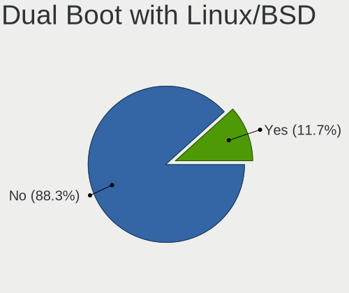

| Dual boot | Computers | Percent |
|-----------|-----------|---------|
| No        | 711       | 88.32%  |
| Yes       | 94        | 11.68%  |

Dual Boot (Win)
---------------

Hosting Linux and Windows

| Dual boot | Computers | Percent |
|-----------|-----------|---------|
| No        | 588       | 72.68%  |
| Yes       | 221       | 27.32%  |

Board
-----

Vendor
------

Motherboard manufacturer

| Name                      | Computers | Percent |
|---------------------------|-----------|---------|
| Lenovo                    | 118       | 15.03%  |
| ASUSTek Computer          | 106       | 13.5%   |
| Hewlett-Packard           | 91        | 11.59%  |
| Acer                      | 89        | 11.34%  |
| Dell                      | 64        | 8.15%   |
| Gigabyte Technology       | 61        | 7.77%   |
| MSI                       | 58        | 7.39%   |
| HUAWEI                    | 20        | 2.55%   |
| ASRock                    | 19        | 2.42%   |
| Unknown                   | 16        | 2.04%   |
| Valve                     | 15        | 1.91%   |
| Toshiba                   | 15        | 1.91%   |
| Apple                     | 15        | 1.91%   |
| Biostar                   | 9         | 1.15%   |
| Samsung Electronics       | 8         | 1.02%   |
| ECS                       | 7         | 0.89%   |
| Raspberry Pi Foundation   | 6         | 0.76%   |
| Foxconn                   | 5         | 0.64%   |
| EMAXX TECHNOLOGY          | 5         | 0.64%   |
| Sony                      | 4         | 0.51%   |
| NEC Computers             | 4         | 0.51%   |
| Google                    | 4         | 0.51%   |
| Clevo                     | 4         | 0.51%   |
| Pegatron                  | 3         | 0.38%   |
| Intel                     | 3         | 0.38%   |
| eMachines                 | 3         | 0.38%   |
| Microsoft                 | 2         | 0.25%   |
| MACHENIKE                 | 2         | 0.25%   |
| Jumper                    | 2         | 0.25%   |
| Fujitsu                   | 2         | 0.25%   |
| Colorful Technology       | 2         | 0.25%   |
| AMD                       | 2         | 0.25%   |
| YANYU                     | 1         | 0.13%   |
| Xunlong                   | 1         | 0.13%   |
| Wiltronic                 | 1         | 0.13%   |
| Wacom                     | 1         | 0.13%   |
| TriGem Computer           | 1         | 0.13%   |
| System76                  | 1         | 0.13%   |
| Shenzhen Bmorn Technology | 1         | 0.13%   |
| realme                    | 1         | 0.13%   |

Model
-----

Motherboard model

| Name                                | Computers | Percent |
|-------------------------------------|-----------|---------|
| Unknown                             | 20        | 2.55%   |
| Valve Jupiter                       | 14        | 1.78%   |
| ASUS All Series                     | 7         | 0.89%   |
| MSI MS-7309                         | 6         | 0.76%   |
| Gigabyte F2A68HM-S1                 | 6         | 0.76%   |
| Acer Aspire ES1-132                 | 6         | 0.76%   |
| Gigabyte A320M-S2H V2               | 5         | 0.64%   |
| ASRock B450M Steel Legend           | 5         | 0.64%   |
| RPi Raspberry Pi                    | 4         | 0.51%   |
| MSI MS-7C52                         | 4         | 0.51%   |
| MSI MS-7721                         | 4         | 0.51%   |
| ASUS P8H61-M LX3 PLUS R2.0          | 4         | 0.51%   |
| Acer Aspire A315-51                 | 4         | 0.51%   |
| MSI Modern 14 B4MW                  | 3         | 0.38%   |
| HUAWEI KLVL-WXXW                    | 3         | 0.38%   |
| HUAWEI BOHB-WAX9                    | 3         | 0.38%   |
| HP Notebook                         | 3         | 0.38%   |
| Foxconn G31MX Series                | 3         | 0.38%   |
| ECS G41T-R3                         | 3         | 0.38%   |
| Clevo M7x0S                         | 3         | 0.38%   |
| Biostar A320MH                      | 3         | 0.38%   |
| Apple MacBookAir3,1                 | 3         | 0.38%   |
| Pegatron IPMSB-H61                  | 2         | 0.25%   |
| MSI MS-7C94                         | 2         | 0.25%   |
| Lenovo Yoga 520-14IKB 81C8          | 2         | 0.25%   |
| Lenovo V110-14IAP 80TF              | 2         | 0.25%   |
| Lenovo ThinkBook 15-IML 20RW        | 2         | 0.25%   |
| Lenovo IdeaPad Gaming 3 15ACH6 82K2 | 2         | 0.25%   |
| Lenovo IdeaPad 330-15IKB 81DE       | 2         | 0.25%   |
| Lenovo IdeaPad 320-14ISK 80XG       | 2         | 0.25%   |
| Lenovo IdeaPad 320-14AST 80XU       | 2         | 0.25%   |
| Lenovo IdeaPad 3 14ITL05 81X7       | 2         | 0.25%   |
| Lenovo IdeaPad 100-15IBY 80MJ       | 2         | 0.25%   |
| Lenovo IdeaPad 100-14IBY 80MH       | 2         | 0.25%   |
| Jumper EZbook                       | 2         | 0.25%   |
| HUAWEI WRT-WX9                      | 2         | 0.25%   |
| HUAWEI NBLB-WAX9N                   | 2         | 0.25%   |
| HUAWEI BoDE-WXX9                    | 2         | 0.25%   |
| HP Pavilion Notebook                | 2         | 0.25%   |
| HP Pavilion Gaming Laptop 15-ec2xxx | 2         | 0.25%   |

Model Family
------------

Motherboard model prefix

| Name                | Computers | Percent |
|---------------------|-----------|---------|
| Acer Aspire         | 61        | 7.77%   |
| Lenovo ThinkPad     | 50        | 6.37%   |
| Lenovo IdeaPad      | 38        | 4.84%   |
| Dell Inspiron       | 25        | 3.18%   |
| Unknown             | 20        | 2.55%   |
| HP Pavilion         | 19        | 2.42%   |
| ASUS VivoBook       | 15        | 1.91%   |
| Valve Jupiter       | 14        | 1.78%   |
| Dell OptiPlex       | 14        | 1.78%   |
| ASUS ROG            | 12        | 1.53%   |
| HP Compaq           | 10        | 1.27%   |
| Dell Latitude       | 10        | 1.27%   |
| ASUS TUF            | 10        | 1.27%   |
| ASUS PRIME          | 10        | 1.27%   |
| Toshiba Satellite   | 9         | 1.15%   |
| HP ProBook          | 9         | 1.15%   |
| HP Laptop           | 9         | 1.15%   |
| HP EliteBook        | 8         | 1.02%   |
| Acer TravelMate     | 8         | 1.02%   |
| Gigabyte A320M-S2H  | 7         | 0.89%   |
| ASUS All            | 7         | 0.89%   |
| RPi Raspberry       | 6         | 0.76%   |
| MSI MS-7309         | 6         | 0.76%   |
| Gigabyte F2A68HM-S1 | 6         | 0.76%   |
| ASUS P8H61-M        | 6         | 0.76%   |
| Acer Nitro          | 6         | 0.76%   |
| Lenovo ThinkCentre  | 5         | 0.64%   |
| HP ProDesk          | 5         | 0.64%   |
| Dell XPS            | 5         | 0.64%   |
| ASRock B450M        | 5         | 0.64%   |
| Acer Predator       | 5         | 0.64%   |
| MSI MS-7C52         | 4         | 0.51%   |
| MSI MS-7721         | 4         | 0.51%   |
| Lenovo Legion       | 4         | 0.51%   |
| HP ENVY             | 4         | 0.51%   |
| Gigabyte B450       | 4         | 0.51%   |
| Dell Vostro         | 4         | 0.51%   |
| Acer Swift          | 4         | 0.51%   |
| MSI Modern          | 3         | 0.38%   |
| Lenovo Yoga         | 3         | 0.38%   |

MFG Year
--------

Motherboard manufacture year

| Year    | Computers | Percent |
|---------|-----------|---------|
| 2018    | 69        | 8.79%   |
| 2012    | 66        | 8.41%   |
| 2019    | 65        | 8.28%   |
| 2020    | 62        | 7.9%    |
| 2017    | 61        | 7.77%   |
| 2021    | 59        | 7.52%   |
| 2014    | 54        | 6.88%   |
| 2016    | 44        | 5.61%   |
| 2015    | 44        | 5.61%   |
| 2011    | 43        | 5.48%   |
| 2022    | 40        | 5.1%    |
| 2010    | 38        | 4.84%   |
| 2013    | 37        | 4.71%   |
| 2023    | 26        | 3.31%   |
| 2009    | 24        | 3.06%   |
| 2008    | 19        | 2.42%   |
| Unknown | 10        | 1.27%   |
| 2024    | 9         | 1.15%   |
| 2007    | 8         | 1.02%   |
| 2006    | 7         | 0.89%   |

Form Factor
-----------

Physical design of the computer

| Name           | Computers | Percent |
|----------------|-----------|---------|
| Notebook       | 484       | 61.66%  |
| Desktop        | 263       | 33.5%   |
| Convertible    | 10        | 1.27%   |
| Mini pc        | 10        | 1.27%   |
| System on chip | 8         | 1.02%   |
| All in one     | 6         | 0.76%   |
| Tablet         | 4         | 0.51%   |

Secure Boot
-----------

Enabled or disabled

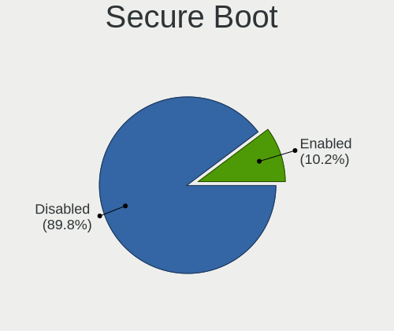

| State    | Computers | Percent |
|----------|-----------|---------|
| Disabled | 710       | 89.76%  |
| Enabled  | 81        | 10.24%  |

Coreboot
--------

Have coreboot on board

| Used | Computers | Percent |
|------|-----------|---------|
| No   | 781       | 99.49%  |
| Yes  | 4         | 0.51%   |

RAM Size
--------

Total RAM memory

| Size in GB  | Computers | Percent |
|-------------|-----------|---------|
| 4.01-8.0    | 202       | 25%     |
| 8.01-16.0   | 170       | 21.04%  |
| 3.01-4.0    | 157       | 19.43%  |
| 16.01-24.0  | 130       | 16.09%  |
| 32.01-64.0  | 55        | 6.81%   |
| 1.01-2.0    | 50        | 6.19%   |
| 2.01-3.0    | 13        | 1.61%   |
| 64.01-256.0 | 13        | 1.61%   |
| 24.01-32.0  | 11        | 1.36%   |
| 0.51-1.0    | 7         | 0.87%   |

RAM Used
--------

Used RAM memory

| Used GB     | Computers | Percent |
|-------------|-----------|---------|
| 2.01-3.0    | 263       | 29.65%  |
| 1.01-2.0    | 257       | 28.97%  |
| 4.01-8.0    | 145       | 16.35%  |
| 3.01-4.0    | 119       | 13.42%  |
| 0.51-1.0    | 51        | 5.75%   |
| 8.01-16.0   | 35        | 3.95%   |
| 0.01-0.5    | 10        | 1.13%   |
| 16.01-24.0  | 4         | 0.45%   |
| 24.01-32.0  | 1         | 0.11%   |
| 64.01-256.0 | 1         | 0.11%   |
| Unknown     | 1         | 0.11%   |

Total Drives
------------

Number of drives on board

| Drives | Computers | Percent |
|--------|-----------|---------|
| 1      | 503       | 61.19%  |
| 2      | 228       | 27.74%  |
| 3      | 45        | 5.47%   |
| 4      | 24        | 2.92%   |
| 5      | 8         | 0.97%   |
| 0      | 8         | 0.97%   |
| 6      | 3         | 0.36%   |
| 14     | 1         | 0.12%   |
| 13     | 1         | 0.12%   |
| 12     | 1         | 0.12%   |

Has CD-ROM
----------

Has CD-ROM on board

| Presented | Computers | Percent |
|-----------|-----------|---------|
| No        | 600       | 75.19%  |
| Yes       | 198       | 24.81%  |

Has Ethernet
------------

Has Ethernet on board

| Presented | Computers | Percent |
|-----------|-----------|---------|
| Yes       | 644       | 81.83%  |
| No        | 143       | 18.17%  |

Has WiFi
--------

Has WiFi module

| Presented | Computers | Percent |
|-----------|-----------|---------|
| Yes       | 617       | 78.1%   |
| No        | 173       | 21.9%   |

Has Bluetooth
-------------

Has Bluetooth module

| Presented | Computers | Percent |
|-----------|-----------|---------|
| Yes       | 496       | 62.55%  |
| No        | 297       | 37.45%  |

Location
--------

Country
-------

Geographic location (country)

| Country     | Computers | Percent |
|-------------|-----------|---------|
| Philippines | 785       | 100%    |

City
----

Geographic location (city)

| City                | Computers | Percent |
|---------------------|-----------|---------|
| Quezon City         | 129       | 14.78%  |
| Manila              | 56        | 6.41%   |
| Cebu City           | 52        | 5.96%   |
| Davao City          | 47        | 5.38%   |
| Angeles City        | 30        | 3.44%   |
| Cagayan de Oro      | 29        | 3.32%   |
| Bacolod City        | 25        | 2.86%   |
| Makati City         | 24        | 2.75%   |
| Caloocan City       | 24        | 2.75%   |
| Paranaque City      | 23        | 2.63%   |
| Lahug               | 21        | 2.41%   |
| Pasig               | 17        | 1.95%   |
| Bacoor              | 17        | 1.95%   |
| Mandaluyong City    | 15        | 1.72%   |
| Imus                | 14        | 1.6%    |
| Tarlac City         | 13        | 1.49%   |
| Iloilo City         | 13        | 1.49%   |
| Iligan City         | 13        | 1.49%   |
| Santa Rosa          | 12        | 1.37%   |
| San Miguel          | 12        | 1.37%   |
| Manajao             | 12        | 1.37%   |
| San Jose del Monte  | 11        | 1.26%   |
| Calamba             | 10        | 1.15%   |
| San Juan            | 9         | 1.03%   |
| San Fernando City   | 9         | 1.03%   |
| Las Pinas           | 9         | 1.03%   |
| Dasmarinas          | 9         | 1.03%   |
| Cabanatuan City     | 9         | 1.03%   |
| San Pablo City      | 8         | 0.92%   |
| Marikina City       | 8         | 0.92%   |
| Lipa City           | 8         | 0.92%   |
| Batangas            | 7         | 0.8%    |
| Zamboanga City      | 6         | 0.69%   |
| Tagbilaran          | 6         | 0.69%   |
| General Santos      | 6         | 0.69%   |
| Butuan              | 6         | 0.69%   |
| San Pedro           | 5         | 0.57%   |
| Nasugbu             | 5         | 0.57%   |
| Malolos             | 5         | 0.57%   |
| City of Muntinglupa | 5         | 0.57%   |

Drives
------

Drive Vendor
------------

Hard drive vendors

| Vendor                      | Computers | Drives | Percent |
|-----------------------------|-----------|--------|---------|
| Seagate                     | 176       | 254    | 15.3%   |
| WDC                         | 158       | 203    | 13.74%  |
| Samsung Electronics         | 105       | 156    | 9.13%   |
| Toshiba                     | 95        | 123    | 8.26%   |
| Kingston                    | 72        | 87     | 6.26%   |
| Sandisk                     | 58        | 84     | 5.04%   |
| Unknown                     | 49        | 60     | 4.26%   |
| Hitachi                     | 35        | 56     | 3.04%   |
| SK hynix                    | 28        | 43     | 2.43%   |
| Intel                       | 22        | 26     | 1.91%   |
| HGST                        | 21        | 27     | 1.83%   |
| Ramsta                      | 19        | 21     | 1.65%   |
| Phison Electronics          | 18        | 26     | 1.57%   |
| Crucial                     | 15        | 19     | 1.3%    |
| Micron Technology           | 13        | 19     | 1.13%   |
| A-DATA Technology           | 13        | 19     | 1.13%   |
| Kingston Technology Company | 12        | 14     | 1.04%   |
| Team                        | 11        | 15     | 0.96%   |
| Silicon Motion              | 11        | 15     | 0.96%   |
| Transcend                   | 9         | 9      | 0.78%   |
| Lexar                       | 9         | 10     | 0.78%   |
| China                       | 9         | 21     | 0.78%   |
| PNY                         | 8         | 9      | 0.7%    |
| Phison                      | 8         | 8      | 0.7%    |
| Fujitsu                     | 8         | 10     | 0.7%    |
| Unknown                     | 8         | 9      | 0.7%    |
| Micron/Crucial Technology   | 7         | 13     | 0.61%   |
| Gigabyte Technology         | 7         | 12     | 0.61%   |
| Apple                       | 7         | 7      | 0.61%   |
| MAXIO Technology (Hangzhou) | 6         | 6      | 0.52%   |
| HS-SSD-E100                 | 6         | 6      | 0.52%   |
| WALRAM                      | 5         | 6      | 0.43%   |
| KingSpec                    | 5         | 8      | 0.43%   |
| JMicron Technology          | 5         | 8      | 0.43%   |
| BR                          | 5         | 8      | 0.43%   |
| TAMMUZ                      | 4         | 8      | 0.35%   |
| Indilinx                    | 4         | 4      | 0.35%   |
| HS-SSD-C100                 | 4         | 5      | 0.35%   |
| Teclast                     | 3         | 7      | 0.26%   |
| SPCC                        | 3         | 4      | 0.26%   |

Drive Model
-----------

Hard drive models

| Model                                                | Computers | Percent |
|------------------------------------------------------|-----------|---------|
| Toshiba MQ01ABF050 500GB                             | 21        | 1.7%    |
| Seagate ST500DM002-1BD142 500GB                      | 18        | 1.46%   |
| Seagate ST1000LM035-1RK172 1TB                       | 16        | 1.29%   |
| Seagate ST1000DM010-2EP102 1TB                       | 15        | 1.21%   |
| Kingston SA400S37120G 120GB SSD                      | 15        | 1.21%   |
| Samsung NVMe SSD Controller SM981/PM981/PM983 512GB  | 14        | 1.13%   |
| Kingston SA400S37240G 240GB SSD                      | 14        | 1.13%   |
| Phison PS5013 E13 NVMe Controller 512GB              | 13        | 1.05%   |
| Unknown MMC Card  64GB                               | 9         | 0.73%   |
| Unknown MMC Card  32GB                               | 9         | 0.73%   |
| Toshiba MQ04ABF100 1TB                               | 9         | 0.73%   |
| Samsung SSD 860 EVO 500GB                            | 9         | 0.73%   |
| Toshiba MQ01ABD100 1TB                               | 8         | 0.65%   |
| Samsung SSD 860 EVO 250GB                            | 8         | 0.65%   |
| Unknown                                              | 8         | 0.65%   |
| WDC WD5000LPCX-21VHAT0 500GB                         | 7         | 0.57%   |
| WDC WD10JPVX-22JC3T0 1TB                             | 7         | 0.57%   |
| Toshiba DT01ACA050 500GB                             | 7         | 0.57%   |
| Seagate ST500LT012-1DG142 500GB                      | 7         | 0.57%   |
| Kingston SA400S37480G 480GB SSD                      | 7         | 0.57%   |
| Unknown MMC Card  128GB                              | 6         | 0.49%   |
| SanDisk SSD PLUS 1000GB                              | 6         | 0.49%   |
| MAXIO (Hangzhou) NVMe SSD Controller MAP1202 512GB   | 6         | 0.49%   |
| WDC WD5000LPCX-24VHAT0 500GB                         | 5         | 0.4%    |
| WDC WD10EZEX-08WN4A0 1TB                             | 5         | 0.4%    |
| Toshiba MK2555GSX 250GB                              | 5         | 0.4%    |
| Toshiba DT01ACA100 1TB                               | 5         | 0.4%    |
| Seagate ST500LT012-9WS142 500GB                      | 5         | 0.4%    |
| Seagate ST500LM030-2E717D 500GB                      | 5         | 0.4%    |
| Seagate ST4000DM004-2CV104 4TB                       | 5         | 0.4%    |
| Seagate ST2000LM007-1R8174 2TB                       | 5         | 0.4%    |
| Seagate ST2000DM008-2FR102 2TB                       | 5         | 0.4%    |
| Seagate ST1000LM049-2GH172 1TB                       | 5         | 0.4%    |
| Sandisk WD Blue SN550 NVMe SSD 256GB                 | 5         | 0.4%    |
| Samsung NVMe SSD Controller PM9A1/PM9A3/980PRO 512GB | 5         | 0.4%    |
| Intel SSDPEKNU512GZ 512GB                            | 5         | 0.4%    |
| HS-SSD-E100 SSD 512G                                 | 5         | 0.4%    |
| Hitachi HTS543232A7A384 320GB                        | 5         | 0.4%    |
| Hitachi HDS721050CLA362 500GB                        | 5         | 0.4%    |
| HGST HTS721010A9E630 1TB                             | 5         | 0.4%    |

HDD Vendor
----------

Hard disk drive vendors

| Vendor              | Computers | Drives | Percent |
|---------------------|-----------|--------|---------|
| Seagate             | 173       | 241    | 36.42%  |
| WDC                 | 138       | 174    | 29.05%  |
| Toshiba             | 82        | 102    | 17.26%  |
| Hitachi             | 35        | 56     | 7.37%   |
| HGST                | 21        | 27     | 4.42%   |
| Fujitsu             | 8         | 10     | 1.68%   |
| Unknown             | 5         | 6      | 1.05%   |
| Samsung Electronics | 5         | 6      | 1.05%   |
| JMicron Technology  | 2         | 2      | 0.42%   |
| XrayDisk            | 1         | 1      | 0.21%   |
| Shenzhen            | 1         | 1      | 0.21%   |
| SAGE                | 1         | 1      | 0.21%   |
| Min Yi U            | 1         | 1      | 0.21%   |
| HGST HTS            | 1         | 1      | 0.21%   |
| ExcelStor           | 1         | 1      | 0.21%   |

SSD Vendor
----------

Solid state drive vendors

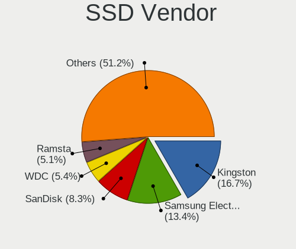

| Vendor              | Computers | Drives | Percent |
|---------------------|-----------|--------|---------|
| Kingston            | 56        | 65     | 16.67%  |
| Samsung Electronics | 45        | 64     | 13.39%  |
| SanDisk             | 28        | 36     | 8.33%   |
| WDC                 | 18        | 22     | 5.36%   |
| Ramsta              | 17        | 19     | 5.06%   |
| Team                | 11        | 15     | 3.27%   |
| Crucial             | 10        | 13     | 2.98%   |
| A-DATA Technology   | 10        | 15     | 2.98%   |
| China               | 9         | 21     | 2.68%   |
| Transcend           | 8         | 8      | 2.38%   |
| Toshiba             | 7         | 10     | 2.08%   |
| SK hynix            | 7         | 19     | 2.08%   |
| PNY                 | 6         | 7      | 1.79%   |
| Lexar               | 6         | 7      | 1.79%   |
| Intel               | 6         | 7      | 1.79%   |
| Apple               | 6         | 6      | 1.79%   |
| Micron Technology   | 5         | 5      | 1.49%   |
| KingSpec            | 5         | 8      | 1.49%   |
| HS-SSD-E100         | 5         | 5      | 1.49%   |
| TAMMUZ              | 4         | 8      | 1.19%   |
| Gigabyte Technology | 4         | 5      | 1.19%   |
| BR                  | 4         | 5      | 1.19%   |
| Teclast             | 3         | 7      | 0.89%   |
| LITEONIT            | 3         | 5      | 0.89%   |
| WALRAM              | 2         | 2      | 0.6%    |
| USB3.0              | 2         | 2      | 0.6%    |
| SPCC                | 2         | 2      | 0.6%    |
| Patriot             | 2         | 2      | 0.6%    |
| Netac               | 2         | 2      | 0.6%    |
| Kingmax             | 2         | 2      | 0.6%    |
| Kimtigo             | 2         | 4      | 0.6%    |
| Indilinx            | 2         | 2      | 0.6%    |
| HS-SSD-C100         | 2         | 2      | 0.6%    |
| Hikvision           | 2         | 4      | 0.6%    |
| ETOPSO              | 2         | 2      | 0.6%    |
| CERVVO              | 2         | 2      | 0.6%    |
| ZOTAC               | 1         | 1      | 0.3%    |
| WHALEKOM            | 1         | 1      | 0.3%    |
| Vaseky              | 1         | 2      | 0.3%    |
| Unknown             | 1         | 2      | 0.3%    |

Drive Kind
----------

HDD or SSD

| Kind    | Computers | Drives | Percent |
|---------|-----------|--------|---------|
| HDD     | 417       | 630    | 40.68%  |
| SSD     | 287       | 446    | 28%     |
| NVMe    | 249       | 388    | 24.29%  |
| MMC     | 46        | 55     | 4.49%   |
| Unknown | 26        | 36     | 2.54%   |

Drive Connector
---------------

SATA, SAS, NVMe, etc.

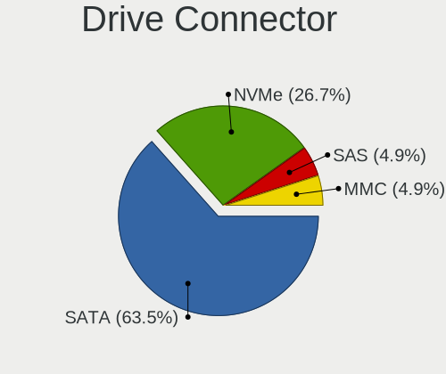

| Type | Computers | Drives | Percent |
|------|-----------|--------|---------|
| SATA | 592       | 1055   | 63.45%  |
| NVMe | 249       | 384    | 26.69%  |
| SAS  | 46        | 61     | 4.93%   |
| MMC  | 46        | 55     | 4.93%   |

Drive Size
----------

Size of hard drive

| Size in TB | Computers | Drives | Percent |
|------------|-----------|--------|---------|
| 0.01-0.5   | 470       | 742    | 67.34%  |
| 0.51-1.0   | 175       | 257    | 25.07%  |
| 1.01-2.0   | 35        | 47     | 5.01%   |
| 3.01-4.0   | 11        | 23     | 1.58%   |
| 10.01-20.0 | 4         | 4      | 0.57%   |
| 4.01-10.0  | 3         | 3      | 0.43%   |

Space Total
-----------

Amount of disk space available on the file system

| Size in GB     | Computers | Percent |
|----------------|-----------|---------|
| 101-250        | 227       | 26.8%   |
| 251-500        | 216       | 25.5%   |
| 501-1000       | 122       | 14.4%   |
| 1001-2000      | 81        | 9.56%   |
| 1-20           | 60        | 7.08%   |
| 51-100         | 55        | 6.49%   |
| 21-50          | 29        | 3.42%   |
| More than 3000 | 22        | 2.6%    |
| 2001-3000      | 19        | 2.24%   |
| Unknown        | 16        | 1.89%   |

Space Used
----------

Amount of used disk space

| Used GB        | Computers | Percent |
|----------------|-----------|---------|
| 1-20           | 321       | 36.11%  |
| 21-50          | 170       | 19.12%  |
| 51-100         | 117       | 13.16%  |
| 101-250        | 115       | 12.94%  |
| 251-500        | 71        | 7.99%   |
| 501-1000       | 40        | 4.5%    |
| 1001-2000      | 18        | 2.02%   |
| Unknown        | 16        | 1.8%    |
| 2001-3000      | 11        | 1.24%   |
| More than 3000 | 8         | 0.9%    |
| 0              | 2         | 0.22%   |

Malfunc. Drives
---------------

Drive models with a malfunction

| Model                                 | Computers | Drives | Percent |
|---------------------------------------|-----------|--------|---------|
| Hitachi HDS721050CLA362 500GB         | 5         | 10     | 6.1%    |
| Seagate ST500DM002-1BD142 500GB       | 4         | 6      | 4.88%   |
| Toshiba MQ01ABF050 500GB              | 3         | 3      | 3.66%   |
| Hitachi HTS543232A7A384 320GB         | 3         | 5      | 3.66%   |
| Unknown S050 Hard drive 500GB         | 2         | 2      | 2.44%   |
| Toshiba MQ01ABD100 1TB                | 2         | 2      | 2.44%   |
| Seagate ST2000LM007-1R8174 2TB        | 2         | 3      | 2.44%   |
| Seagate ST1000LM048-2E7172 1TB        | 2         | 2      | 2.44%   |
| HGST HTS541010A9E680 1TB              | 2         | 3      | 2.44%   |
| WHALEKOM SSD 512GB                    | 1         | 1      | 1.22%   |
| WDC WD5003ABYZ-011FA0 500GB           | 1         | 1      | 1.22%   |
| WDC WD5000LPVT-75G33T0 500GB          | 1         | 1      | 1.22%   |
| WDC WD5000LPVT-22G33T0 500GB          | 1         | 1      | 1.22%   |
| WDC WD5000LPCX-60VHAT0 500GB          | 1         | 2      | 1.22%   |
| WDC WD5000BEVT-24A0RT0 500GB          | 1         | 1      | 1.22%   |
| WDC WD5000AAVS-00ZTB0 500GB           | 1         | 1      | 1.22%   |
| WDC WD5000AAKX-603CA0 500GB           | 1         | 1      | 1.22%   |
| WDC WD5000AAKX-00ERMA0 500GB          | 1         | 1      | 1.22%   |
| WDC WD5000AAKX-001CA0 500GB           | 1         | 1      | 1.22%   |
| WDC WD3200BEVT-22A23T0 320GB          | 1         | 1      | 1.22%   |
| WDC WD3200AAJS-08L7A0 320GB           | 1         | 1      | 1.22%   |
| WDC WD3200AAJS-00B4A0 320GB           | 1         | 1      | 1.22%   |
| WDC WD1600BEVT-24A23T0 160GB          | 1         | 1      | 1.22%   |
| WDC WD10JPVX-60JC3T1 1TB              | 1         | 2      | 1.22%   |
| WDC WD10JPVX-22JC3T0 1TB              | 1         | 1      | 1.22%   |
| WDC WD10EZEX-00MFCA0 1TB              | 1         | 1      | 1.22%   |
| Toshiba MK6475GSX 640GB               | 1         | 1      | 1.22%   |
| Toshiba MK6465GSX 640GB               | 1         | 1      | 1.22%   |
| Toshiba MK3259GSXP 320GB              | 1         | 1      | 1.22%   |
| Toshiba MK2555GSX 250GB               | 1         | 1      | 1.22%   |
| Toshiba DT01ACA100 1TB                | 1         | 1      | 1.22%   |
| Toshiba DT01ACA050 500GB              | 1         | 1      | 1.22%   |
| SK hynix HFS128G3AMNB-2200A 128GB SSD | 1         | 1      | 1.22%   |
| Seagate ST9500420AS 500GB             | 1         | 1      | 1.22%   |
| Seagate ST9250315AS 250GB             | 1         | 1      | 1.22%   |
| Seagate ST9120821AS 120GB             | 1         | 1      | 1.22%   |
| Seagate ST500LT012-9WS142 500GB       | 1         | 1      | 1.22%   |
| Seagate ST500LT012-1DG142 500GB       | 1         | 1      | 1.22%   |
| Seagate ST500LM012 HN-M500MBB 500GB   | 1         | 1      | 1.22%   |
| Seagate ST500DM002 500GB              | 1         | 2      | 1.22%   |

Malfunc. Drive Vendor
---------------------

Vendors of faulty drives

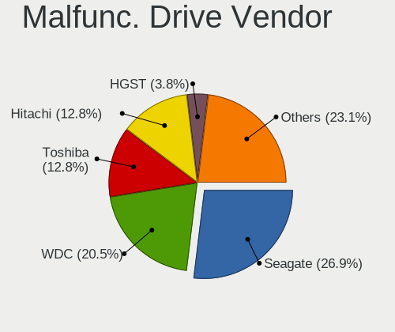

| Vendor              | Computers | Drives | Percent |
|---------------------|-----------|--------|---------|
| Seagate             | 21        | 25     | 26.92%  |
| WDC                 | 16        | 18     | 20.51%  |
| Toshiba             | 10        | 11     | 12.82%  |
| Hitachi             | 10        | 22     | 12.82%  |
| HGST                | 3         | 4      | 3.85%   |
| Unknown             | 2         | 2      | 2.56%   |
| SanDisk             | 2         | 2      | 2.56%   |
| Samsung Electronics | 2         | 3      | 2.56%   |
| Ramsta              | 2         | 2      | 2.56%   |
| Kingston            | 2         | 2      | 2.56%   |
| Fujitsu             | 2         | 2      | 2.56%   |
| WHALEKOM            | 1         | 1      | 1.28%   |
| SK hynix            | 1         | 1      | 1.28%   |
| Micron Technology   | 1         | 1      | 1.28%   |
| Fordisk             | 1         | 1      | 1.28%   |
| Colorful            | 1         | 1      | 1.28%   |
| A-DATA Technology   | 1         | 1      | 1.28%   |

Malfunc. HDD Vendor
-------------------

Vendors of faulty HDD drives

| Vendor  | Computers | Drives | Percent |
|---------|-----------|--------|---------|
| Seagate | 21        | 25     | 32.81%  |
| WDC     | 16        | 18     | 25%     |
| Toshiba | 10        | 11     | 15.63%  |
| Hitachi | 10        | 22     | 15.63%  |
| HGST    | 3         | 4      | 4.69%   |
| Unknown | 2         | 2      | 3.13%   |
| Fujitsu | 2         | 2      | 3.13%   |

Malfunc. Drive Kind
-------------------

Kinds of faulty drives

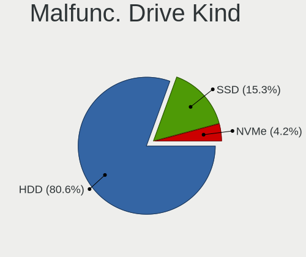

| Kind | Computers | Drives | Percent |
|------|-----------|--------|---------|
| HDD  | 58        | 84     | 80.56%  |
| SSD  | 11        | 11     | 15.28%  |
| NVMe | 3         | 4      | 4.17%   |

Failed Drives
-------------

Failed drive models

| Model                           | Computers | Drives | Percent |
|---------------------------------|-----------|--------|---------|
| WDC WD10SPZX-21Z10T0 1TB        | 1         | 1      | 50%     |
| Seagate ST500DM002-1BD142 500GB | 1         | 1      | 50%     |

Failed Drive Vendor
-------------------

Failed drive vendors

| Vendor  | Computers | Drives | Percent |
|---------|-----------|--------|---------|
| WDC     | 1         | 1      | 50%     |
| Seagate | 1         | 1      | 50%     |

Drive Status
------------

Number of failed and malfunc. drives

| Status   | Computers | Drives | Percent |
|----------|-----------|--------|---------|
| Detected | 489       | 937    | 57.33%  |
| Works    | 292       | 517    | 34.23%  |
| Malfunc  | 70        | 99     | 8.21%   |
| Failed   | 2         | 2      | 0.23%   |

Storage controller
------------------

Storage Vendor
--------------

Storage controller vendors

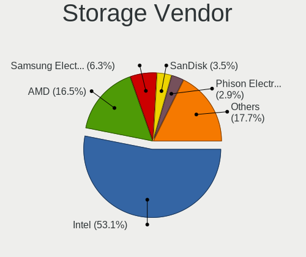

| Vendor                           | Computers | Percent |
|----------------------------------|-----------|---------|
| Intel                            | 505       | 53.1%   |
| AMD                              | 157       | 16.51%  |
| Samsung Electronics              | 60        | 6.31%   |
| SanDisk                          | 33        | 3.47%   |
| Phison Electronics               | 28        | 2.94%   |
| Kingston Technology Company      | 27        | 2.84%   |
| SK hynix                         | 21        | 2.21%   |
| Nvidia                           | 21        | 2.21%   |
| Silicon Motion                   | 14        | 1.47%   |
| Micron/Crucial Technology        | 11        | 1.16%   |
| Toshiba America Info Systems     | 9         | 0.95%   |
| Micron Technology                | 8         | 0.84%   |
| MAXIO Technology (Hangzhou)      | 8         | 0.84%   |
| ADATA Technology                 | 6         | 0.63%   |
| Shenzhen Longsys Electronics     | 4         | 0.42%   |
| Lite-On Technology               | 4         | 0.42%   |
| ASMedia Technology               | 4         | 0.42%   |
| Solid State Storage Technology   | 3         | 0.32%   |
| Silicon Integrated Systems [SiS] | 3         | 0.32%   |
| Realtek Semiconductor            | 3         | 0.32%   |
| Marvell Technology Group         | 3         | 0.32%   |
| KIOXIA                           | 3         | 0.32%   |
| JMicron Technology               | 3         | 0.32%   |
| Yangtze Memory Technologies      | 2         | 0.21%   |
| Union Memory (Shenzhen)          | 2         | 0.21%   |
| O2 Micro                         | 2         | 0.21%   |
| ShenZhen TIGO Semiconductor      | 1         | 0.11%   |
| Seagate Technology               | 1         | 0.11%   |
| Lenovo                           | 1         | 0.11%   |
| Hosin Global Electronics         | 1         | 0.11%   |
| Broadcom / LSI                   | 1         | 0.11%   |
| Biwin Storage Technology         | 1         | 0.11%   |
| Apple                            | 1         | 0.11%   |

Storage Model
-------------

Storage controller models

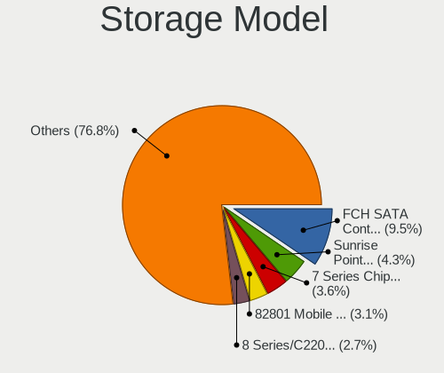

| Model                                                                                   | Computers | Percent |
|-----------------------------------------------------------------------------------------|-----------|---------|
| AMD FCH SATA Controller [AHCI mode]                                                     | 106       | 9.52%   |
| Intel Sunrise Point-LP SATA Controller [AHCI mode]                                      | 48        | 4.31%   |
| Intel 7 Series Chipset Family 6-port SATA Controller [AHCI mode]                        | 40        | 3.59%   |
| Intel 82801 Mobile SATA Controller [RAID mode]                                          | 34        | 3.05%   |
| Intel 8 Series/C220 Series Chipset Family 6-port SATA Controller 1 [AHCI mode]          | 30        | 2.7%    |
| Intel 6 Series/C200 Series Chipset Family 6 port Mobile SATA AHCI Controller            | 25        | 2.25%   |
| Samsung NVMe SSD Controller SM981/PM981/PM983                                           | 23        | 2.07%   |
| Intel Volume Management Device NVMe RAID Controller                                     | 23        | 2.07%   |
| AMD 400 Series Chipset SATA Controller                                                  | 23        | 2.07%   |
| Samsung NVMe SSD Controller 980 (DRAM-less)                                             | 22        | 1.98%   |
| Intel NM10/ICH7 Family SATA Controller [IDE mode]                                       | 18        | 1.62%   |
| Intel Celeron N3350/Pentium N4200/Atom E3900 Series SATA AHCI Controller                | 17        | 1.53%   |
| Phison PS5013-E13 PCIe3 NVMe Controller (DRAM-less)                                     | 16        | 1.44%   |
| Intel Wildcat Point-LP SATA Controller [AHCI Mode]                                      | 16        | 1.44%   |
| Intel Comet Lake SATA AHCI Controller                                                   | 16        | 1.44%   |
| Intel 82801G (ICH7 Family) IDE Controller                                               | 16        | 1.44%   |
| AMD A320 Chipset SATA Controller [AHCI mode]                                            | 15        | 1.35%   |
| AMD 500 Series Chipset SATA Controller                                                  | 15        | 1.35%   |
| Intel Q170/Q150/B150/H170/H110/Z170/CM236 Chipset SATA Controller [AHCI Mode]           | 14        | 1.26%   |
| Intel Celeron/Pentium Silver Processor SATA Controller                                  | 14        | 1.26%   |
| Intel 200 Series PCH SATA controller [AHCI mode]                                        | 14        | 1.26%   |
| Intel Tiger Lake-LP SATA Controller                                                     | 12        | 1.08%   |
| Intel 8 Series SATA Controller 1 [AHCI mode]                                            | 12        | 1.08%   |
| Nvidia MCP61 SATA Controller                                                            | 11        | 0.99%   |
| Nvidia MCP61 IDE                                                                        | 11        | 0.99%   |
| Intel SSD 670p Series [Keystone Harbor]                                                 | 11        | 0.99%   |
| Intel HM170/QM170 Chipset SATA Controller [AHCI Mode]                                   | 11        | 0.99%   |
| Intel Cannon Lake Mobile PCH SATA AHCI Controller                                       | 11        | 0.99%   |
| Intel Atom Processor E3800 Series SATA AHCI Controller                                  | 11        | 0.99%   |
| Intel 6 Series/C200 Series Chipset Family Desktop SATA Controller (IDE mode, ports 4-5) | 11        | 0.99%   |
| Intel 6 Series/C200 Series Chipset Family Desktop SATA Controller (IDE mode, ports 0-3) | 11        | 0.99%   |
| AMD FCH SATA Controller [IDE mode]                                                      | 11        | 0.99%   |
| Silicon Motion SM2263EN/SM2263XT (DRAM-less) NVMe SSD Controllers                       | 10        | 0.9%    |
| Intel 6 Series/C200 Series Chipset Family 6 port Desktop SATA AHCI Controller           | 10        | 0.9%    |
| Micron/Crucial P2 [Nick P2] / P3 / P3 Plus NVMe PCIe SSD (DRAM-less)                    | 9         | 0.81%   |
| Intel 500 Series Chipset Family SATA AHCI Controller                                    | 9         | 0.81%   |
| AMD SB7x0/SB8x0/SB9x0 IDE Controller                                                    | 9         | 0.81%   |
| AMD FCH IDE Controller                                                                  | 9         | 0.81%   |
| SanDisk Ultra 3D / WD PC SN530, IX SN530, Blue SN550 NVMe SSD (DRAM-less)               | 8         | 0.72%   |
| Intel NM10/ICH7 Family SATA Controller [AHCI mode]                                      | 8         | 0.72%   |

Storage Kind
------------

Kind of storage controller (IDE, SATA, NVMe, SAS, ...)

| Kind | Computers | Percent |
|------|-----------|---------|
| SATA | 569       | 58%     |
| NVMe | 249       | 25.38%  |
| IDE  | 94        | 9.58%   |
| RAID | 68        | 6.93%   |
| SAS  | 1         | 0.1%    |

Processor
---------

CPU Vendor
----------

Processor vendors

| Vendor  | Computers | Percent |
|---------|-----------|---------|
| Intel   | 559       | 71.21%  |
| AMD     | 215       | 27.39%  |
| ARM     | 10        | 1.27%   |
| Unknown | 1         | 0.13%   |

CPU Model
---------

Processor models

| Model                                         | Computers | Percent |
|-----------------------------------------------|-----------|---------|
| AMD Custom APU 0405                           | 14        | 1.78%   |
| Intel Core i5-8250U CPU @ 1.60GHz             | 11        | 1.4%    |
| AMD Ryzen 5 3600 6-Core Processor             | 10        | 1.27%   |
| Intel Core i7-8550U CPU @ 1.80GHz             | 9         | 1.15%   |
| Intel Core i7-7500U CPU @ 2.70GHz             | 9         | 1.15%   |
| Intel Celeron CPU N3350 @ 1.10GHz             | 9         | 1.15%   |
| Intel 11th Gen Core i5-1135G7 @ 2.40GHz       | 9         | 1.15%   |
| AMD Ryzen 5 5600H with Radeon Graphics        | 9         | 1.15%   |
| Intel Core i7-7700HQ CPU @ 2.80GHz            | 8         | 1.02%   |
| Intel Core i5-7200U CPU @ 2.50GHz             | 8         | 1.02%   |
| Intel Core i5-3320M CPU @ 2.60GHz             | 8         | 1.02%   |
| AMD Ryzen 3 3200G with Radeon Vega Graphics   | 8         | 1.02%   |
| Intel Core i5-10300H CPU @ 2.50GHz            | 7         | 0.89%   |
| Intel Core i3-6006U CPU @ 2.00GHz             | 7         | 0.89%   |
| Intel Core 2 Duo CPU E7500 @ 2.93GHz          | 7         | 0.89%   |
| AMD Ryzen 5 5600G with Radeon Graphics        | 7         | 0.89%   |
| Intel Celeron CPU N3450 @ 1.10GHz             | 6         | 0.76%   |
| AMD Ryzen 5 2600 Six-Core Processor           | 6         | 0.76%   |
| Intel Core i7-8565U CPU @ 1.80GHz             | 5         | 0.64%   |
| Intel Core i7-4790 CPU @ 3.60GHz              | 5         | 0.64%   |
| Intel Core i7-10510U CPU @ 1.80GHz            | 5         | 0.64%   |
| Intel Core i5-9300H CPU @ 2.40GHz             | 5         | 0.64%   |
| Intel Core i5-6200U CPU @ 2.30GHz             | 5         | 0.64%   |
| Intel Core i5-3337U CPU @ 1.80GHz             | 5         | 0.64%   |
| Intel Core i5-3210M CPU @ 2.50GHz             | 5         | 0.64%   |
| Intel Core i5-2520M CPU @ 2.50GHz             | 5         | 0.64%   |
| Intel Core i5-10210U CPU @ 1.60GHz            | 5         | 0.64%   |
| Intel Core i3-3217U CPU @ 1.80GHz             | 5         | 0.64%   |
| ARM Processor                                 | 5         | 0.64%   |
| AMD A8-7600 Radeon R7, 10 Compute Cores 4C+6G | 5         | 0.64%   |
| AMD A6-6400K APU with Radeon HD Graphics      | 5         | 0.64%   |
| Intel Core i7-9750H CPU @ 2.60GHz             | 4         | 0.51%   |
| Intel Core i7-3770 CPU @ 3.40GHz              | 4         | 0.51%   |
| Intel Core i5-8350U CPU @ 1.70GHz             | 4         | 0.51%   |
| Intel Core i5-5200U CPU @ 2.20GHz             | 4         | 0.51%   |
| Intel Core i5-3470 CPU @ 3.20GHz              | 4         | 0.51%   |
| Intel Core i5-3317U CPU @ 1.70GHz             | 4         | 0.51%   |
| Intel Core i5-2430M CPU @ 2.40GHz             | 4         | 0.51%   |
| Intel Core i5-2400 CPU @ 3.10GHz              | 4         | 0.51%   |
| Intel Core i5-1035G1 CPU @ 1.00GHz            | 4         | 0.51%   |

CPU Model Family
----------------

Processor model prefix

| Model                   | Computers | Percent |
|-------------------------|-----------|---------|
| Intel Core i5           | 179       | 22.8%   |
| Intel Core i7           | 98        | 12.48%  |
| Other                   | 78        | 9.94%   |
| Intel Core i3           | 77        | 9.81%   |
| AMD Ryzen 5             | 61        | 7.77%   |
| Intel Celeron           | 54        | 6.88%   |
| Intel Core 2 Duo        | 30        | 3.82%   |
| AMD Ryzen 7             | 23        | 2.93%   |
| AMD Ryzen 3             | 23        | 2.93%   |
| Intel Pentium           | 18        | 2.29%   |
| AMD A6                  | 17        | 2.17%   |
| Intel Atom              | 12        | 1.53%   |
| AMD A8                  | 10        | 1.27%   |
| Intel Pentium Dual-Core | 9         | 1.15%   |
| AMD Athlon              | 7         | 0.89%   |
| AMD A10                 | 7         | 0.89%   |
| Intel Pentium Silver    | 6         | 0.76%   |
| AMD FX                  | 6         | 0.76%   |
| Intel Core 2 Quad       | 5         | 0.64%   |
| AMD Ryzen 9             | 5         | 0.64%   |
| AMD A4                  | 5         | 0.64%   |
| Intel Xeon              | 4         | 0.51%   |
| AMD Sempron             | 4         | 0.51%   |
| Intel Pentium Gold      | 3         | 0.38%   |
| AMD Ryzen 7 PRO         | 3         | 0.38%   |
| AMD Phenom II X4        | 3         | 0.38%   |
| AMD Athlon II X4        | 3         | 0.38%   |
| AMD Athlon II X2        | 3         | 0.38%   |
| Intel Genuine           | 2         | 0.25%   |
| Intel Core m3           | 2         | 0.25%   |
| Intel Core i9           | 2         | 0.25%   |
| Intel Core 2            | 2         | 0.25%   |
| AMD Turion 64 X2 Mobile | 2         | 0.25%   |
| AMD Ryzen 5 PRO         | 2         | 0.25%   |
| Intel Pentium Dual      | 1         | 0.13%   |
| Intel Core m5           | 1         | 0.13%   |
| Intel Core              | 1         | 0.13%   |
| Intel Celeron M         | 1         | 0.13%   |
| ARM BCM                 | 1         | 0.13%   |
| ARM Allwinner           | 1         | 0.13%   |

CPU Cores
---------

Number of processor cores

| Number | Computers | Percent |
|--------|-----------|---------|
| 2      | 324       | 41.17%  |
| 4      | 292       | 37.1%   |
| 6      | 83        | 10.55%  |
| 8      | 33        | 4.19%   |
| 1      | 31        | 3.94%   |
| 14     | 8         | 1.02%   |
| 10     | 7         | 0.89%   |
| 12     | 4         | 0.51%   |
| 24     | 2         | 0.25%   |
| 16     | 2         | 0.25%   |
| 3      | 1         | 0.13%   |

CPU Sockets
-----------

Number of sockets

| Number | Computers | Percent |
|--------|-----------|---------|
| 1      | 783       | 99.75%  |
| 3      | 1         | 0.13%   |
| 2      | 1         | 0.13%   |

CPU Threads
-----------

Threads per core (Hyper-Threading)

| Number | Computers | Percent |
|--------|-----------|---------|
| 2      | 533       | 67.55%  |
| 1      | 255       | 32.32%  |
| 16     | 1         | 0.13%   |

CPU Op-Modes
------------

CPU Operation Modes (32-bit, 64-bit)

| Op mode        | Computers | Percent |
|----------------|-----------|---------|
| 32-bit, 64-bit | 767       | 97.34%  |
| Unknown        | 16        | 2.03%   |
| 32-bit         | 4         | 0.51%   |
| 64-bit         | 1         | 0.13%   |

CPU Microcode
-------------

Microcode number

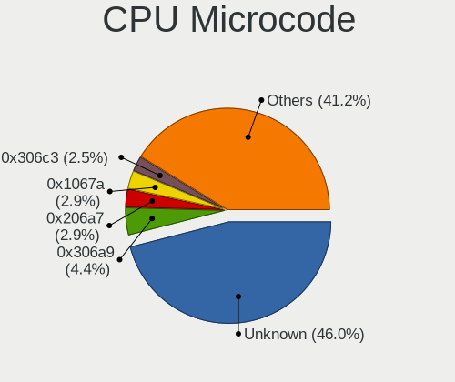

| Number     | Computers | Percent |
|------------|-----------|---------|
| Unknown    | 375       | 46.01%  |
| 0x306a9    | 36        | 4.42%   |
| 0x206a7    | 24        | 2.94%   |
| 0x1067a    | 24        | 2.94%   |
| 0x306c3    | 20        | 2.45%   |
| 0x806ea    | 14        | 1.72%   |
| 0x506c9    | 14        | 1.72%   |
| 0x406e3    | 14        | 1.72%   |
| 0x906ea    | 12        | 1.47%   |
| 0x806ec    | 11        | 1.35%   |
| 0x806e9    | 10        | 1.23%   |
| 0x30678    | 10        | 1.23%   |
| 0x08701021 | 10        | 1.23%   |
| 0x06001119 | 10        | 1.23%   |
| 0x906e9    | 9         | 1.1%    |
| 0x306d4    | 9         | 1.1%    |
| 0x10676    | 9         | 1.1%    |
| 0x08108109 | 9         | 1.1%    |
| 0x06003106 | 9         | 1.1%    |
| 0x40651    | 8         | 0.98%   |
| 0x0a50000c | 8         | 0.98%   |
| 0x806c1    | 7         | 0.86%   |
| 0x506e3    | 7         | 0.86%   |
| 0x0a50000d | 7         | 0.86%   |
| 0x0800820d | 7         | 0.86%   |
| 0x706a1    | 6         | 0.74%   |
| 0x20655    | 6         | 0.74%   |
| 0x08600106 | 6         | 0.74%   |
| 0x706e5    | 5         | 0.61%   |
| 0x406c4    | 5         | 0.61%   |
| 0x106ca    | 5         | 0.61%   |
| 0xa0671    | 4         | 0.49%   |
| 0xa0652    | 4         | 0.49%   |
| 0x806eb    | 4         | 0.49%   |
| 0x08608103 | 4         | 0.49%   |
| 0x08600104 | 4         | 0.49%   |
| 0x0810100b | 4         | 0.49%   |
| 0x0600611a | 4         | 0.49%   |
| 0x906a4    | 3         | 0.37%   |
| 0x706a8    | 3         | 0.37%   |

CPU Microarch
-------------

Microarchitecture

| Name              | Computers | Percent |
|-------------------|-----------|---------|
| KabyLake          | 131       | 16.6%   |
| IvyBridge         | 63        | 7.98%   |
| Unknown           | 55        | 6.97%   |
| Haswell           | 51        | 6.46%   |
| Penryn            | 42        | 5.32%   |
| SandyBridge       | 41        | 5.2%    |
| Skylake           | 36        | 4.56%   |
| Zen+              | 30        | 3.8%    |
| Zen 3             | 30        | 3.8%    |
| Zen 2             | 29        | 3.68%   |
| TigerLake         | 25        | 3.17%   |
| Silvermont        | 23        | 2.92%   |
| Piledriver        | 22        | 2.79%   |
| CometLake         | 20        | 2.53%   |
| Broadwell         | 19        | 2.41%   |
| Alderlake Hybrid  | 19        | 2.41%   |
| Goldmont          | 17        | 2.15%   |
| Goldmont plus     | 15        | 1.9%    |
| Zen               | 14        | 1.77%   |
| Westmere          | 13        | 1.65%   |
| Steamroller       | 11        | 1.39%   |
| IceLake           | 11        | 1.39%   |
| K10               | 10        | 1.27%   |
| Excavator         | 10        | 1.27%   |
| K8 Hammer         | 9         | 1.14%   |
| Bonnell           | 9         | 1.14%   |
| Core              | 7         | 0.89%   |
| Puma              | 5         | 0.63%   |
| Tremont           | 3         | 0.38%   |
| P6                | 3         | 0.38%   |
| K10 Llano         | 3         | 0.38%   |
| Jaguar            | 3         | 0.38%   |
| Bobcat            | 3         | 0.38%   |
| Nehalem           | 2         | 0.25%   |
| K8 & K10 hybrid   | 2         | 0.25%   |
| Meteorlake Hybrid | 1         | 0.13%   |
| Gracemont         | 1         | 0.13%   |
| Bulldozer         | 1         | 0.13%   |

Graphics
--------

GPU Vendor
----------

Vendors of graphics cards

| Vendor                           | Computers | Percent |
|----------------------------------|-----------|---------|
| Intel                            | 483       | 51.55%  |
| AMD                              | 228       | 24.33%  |
| Nvidia                           | 223       | 23.8%   |
| Silicon Integrated Systems [SiS] | 3         | 0.32%   |

GPU Model
---------

Graphics card models

| Model                                                                                    | Computers | Percent |
|------------------------------------------------------------------------------------------|-----------|---------|
| Intel 3rd Gen Core processor Graphics Controller                                         | 45        | 4.68%   |
| Intel 2nd Generation Core Processor Family Integrated Graphics Controller                | 37        | 3.85%   |
| Intel UHD Graphics 620                                                                   | 26        | 2.7%    |
| Intel HD Graphics 620                                                                    | 25        | 2.6%    |
| AMD Picasso/Raven 2 [Radeon Vega Series / Radeon Vega Mobile Series]                     | 21        | 2.18%   |
| Intel TigerLake-LP GT2 [Iris Xe Graphics]                                                | 20        | 2.08%   |
| AMD Cezanne [Radeon Vega Series / Radeon Vega Mobile Series]                             | 20        | 2.08%   |
| Intel HD Graphics 630                                                                    | 17        | 1.77%   |
| Intel Skylake GT2 [HD Graphics 520]                                                      | 16        | 1.66%   |
| Intel HD Graphics 5500                                                                   | 15        | 1.56%   |
| Intel HD Graphics 500                                                                    | 15        | 1.56%   |
| Intel CometLake-U GT2 [UHD Graphics]                                                     | 14        | 1.46%   |
| AMD VanGogh [AMD Custom GPU 0405]                                                        | 14        | 1.46%   |
| Intel WhiskeyLake-U GT2 [UHD Graphics 620]                                               | 13        | 1.35%   |
| Intel Haswell-ULT Integrated Graphics Controller                                         | 13        | 1.35%   |
| Intel Atom Processor Z36xxx/Z37xxx Series Graphics & Display                             | 13        | 1.35%   |
| AMD Renoir [Radeon Vega Series / Radeon Vega Mobile Series]                              | 13        | 1.35%   |
| AMD Ellesmere [Radeon RX 470/480/570/570X/580/580X/590]                                  | 13        | 1.35%   |
| Intel CoffeeLake-H GT2 [UHD Graphics 630]                                                | 12        | 1.25%   |
| Intel 4 Series Chipset Integrated Graphics Controller                                    | 12        | 1.25%   |
| Nvidia TU117M [GeForce GTX 1650 Mobile / Max-Q]                                          | 11        | 1.14%   |
| Intel Xeon E3-1200 v3/4th Gen Core Processor Integrated Graphics Controller              | 11        | 1.14%   |
| Intel Mobile 4 Series Chipset Integrated Graphics Controller                             | 11        | 1.14%   |
| Intel Core Processor Integrated Graphics Controller                                      | 11        | 1.14%   |
| AMD Raven Ridge [Radeon Vega Series / Radeon Vega Mobile Series]                         | 11        | 1.14%   |
| Nvidia GP107 [GeForce GTX 1050 Ti]                                                       | 10        | 1.04%   |
| Nvidia GM108M [GeForce 940MX]                                                            | 10        | 1.04%   |
| Intel HD Graphics 530                                                                    | 10        | 1.04%   |
| Intel GeminiLake [UHD Graphics 600]                                                      | 10        | 1.04%   |
| Intel Atom/Celeron/Pentium Processor x5-E8000/J3xxx/N3xxx Integrated Graphics Controller | 10        | 1.04%   |
| Nvidia GA107M [GeForce RTX 3050 Mobile]                                                  | 9         | 0.94%   |
| Intel CometLake-H GT2 [UHD Graphics]                                                     | 9         | 0.94%   |
| Intel 4th Gen Core Processor Integrated Graphics Controller                              | 8         | 0.83%   |
| Nvidia GP107M [GeForce GTX 1050 Mobile]                                                  | 7         | 0.73%   |
| Intel Xeon E3-1200 v2/3rd Gen Core processor Graphics Controller                         | 7         | 0.73%   |
| Intel Iris Plus Graphics G1 (Ice Lake)                                                   | 7         | 0.73%   |
| AMD Topaz XT [Radeon R7 M260/M265 / M340/M360 / M440/M445 / 530/535 / 620/625 Mobile]    | 7         | 0.73%   |
| AMD Sun XT [Radeon HD 8670A/8670M/8690M / R5 M330 / M430 / Radeon 520 Mobile]            | 7         | 0.73%   |
| AMD Lucienne                                                                             | 7         | 0.73%   |
| Nvidia GP108 [GeForce GT 1030]                                                           | 6         | 0.62%   |

GPU Combo
---------

Combinations of graphics cards

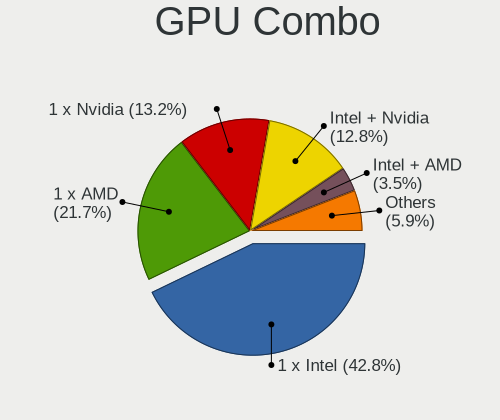

| Name           | Computers | Percent |
|----------------|-----------|---------|
| 1 x Intel      | 341       | 42.84%  |
| 1 x AMD        | 173       | 21.73%  |
| 1 x Nvidia     | 105       | 13.19%  |
| Intel + Nvidia | 102       | 12.81%  |
| Intel + AMD    | 28        | 3.52%   |
| AMD + Nvidia   | 15        | 1.88%   |
| 2 x AMD        | 13        | 1.63%   |
| Other          | 11        | 1.38%   |
| 2 x Intel      | 3         | 0.38%   |
| 1 x SiS        | 3         | 0.38%   |
| 2 x Nvidia     | 2         | 0.25%   |

GPU Driver
----------

Free vs proprietary

| Driver      | Computers | Percent |
|-------------|-----------|---------|
| Free        | 631       | 79.47%  |
| Proprietary | 122       | 15.37%  |
| Unknown     | 41        | 5.16%   |

GPU Memory
----------

Total video memory

| Size in GB | Computers | Percent |
|------------|-----------|---------|
| Unknown    | 521       | 64.24%  |
| 1.01-2.0   | 93        | 11.47%  |
| 0.01-0.5   | 67        | 8.26%   |
| 0.51-1.0   | 43        | 5.3%    |
| 3.01-4.0   | 37        | 4.56%   |
| 7.01-8.0   | 25        | 3.08%   |
| 5.01-6.0   | 12        | 1.48%   |
| 8.01-16.0  | 10        | 1.23%   |
| 2.01-3.0   | 3         | 0.37%   |

Monitor
-------

Monitor Vendor
--------------

Monitor vendors

| Vendor                  | Computers | Percent |
|-------------------------|-----------|---------|
| BOE                     | 97        | 11.62%  |
| Samsung Electronics     | 92        | 11.02%  |
| Chimei Innolux          | 92        | 11.02%  |
| AU Optronics            | 90        | 10.78%  |
| LG Display              | 64        | 7.66%   |
| Dell                    | 39        | 4.67%   |
| AOC                     | 28        | 3.35%   |
| Acer                    | 26        | 3.11%   |
| Lenovo                  | 25        | 2.99%   |
| Goldstar                | 19        | 2.28%   |
| Hewlett-Packard         | 18        | 2.16%   |
| Valve                   | 15        | 1.8%    |
| Philips                 | 15        | 1.8%    |
| Sharp                   | 13        | 1.56%   |
| BenQ                    | 13        | 1.56%   |
| InfoVision              | 12        | 1.44%   |
| ASUSTek Computer        | 12        | 1.44%   |
| Sony                    | 11        | 1.32%   |
| IPS                     | 11        | 1.32%   |
| Apple                   | 11        | 1.32%   |
| Ancor Communications    | 10        | 1.2%    |
| PANDA                   | 8         | 0.96%   |
| ViewSonic               | 7         | 0.84%   |
| Unknown                 | 7         | 0.84%   |
| Unknown                 | 5         | 0.6%    |
| Mi                      | 5         | 0.6%    |
| Chi Mei Optoelectronics | 5         | 0.6%    |
| MStar                   | 4         | 0.48%   |
| MSI                     | 4         | 0.48%   |
| TMX                     | 3         | 0.36%   |
| RTK                     | 3         | 0.36%   |
| MDA                     | 3         | 0.36%   |
| InnoLux Display         | 3         | 0.36%   |
| VIE                     | 2         | 0.24%   |
| Unknown (XXX)           | 2         | 0.24%   |
| SGT                     | 2         | 0.24%   |
| Pixio                   | 2         | 0.24%   |
| NVISION                 | 2         | 0.24%   |
| MIG                     | 2         | 0.24%   |
| LG Philips              | 2         | 0.24%   |

Monitor Model
-------------

Monitor models

| Model                                                             | Computers | Percent |
|-------------------------------------------------------------------|-----------|---------|
| Valve ANX7530 U VLV3001 800x1280 100x150mm 7.1-inch               | 14        | 1.64%   |
| Chimei Innolux LCD Monitor CMN1132 1366x768 256x144mm 11.6-inch   | 7         | 0.82%   |
| AOC 1970W AOC1970 1366x768 410x230mm 18.5-inch                    | 7         | 0.82%   |
| Unknown                                                           | 7         | 0.82%   |
| Samsung Electronics S24F350 SAM0D20 1920x1080 521x293mm 23.5-inch | 6         | 0.7%    |
| Chimei Innolux LCD Monitor CMN14C3 1366x768 309x173mm 13.9-inch   | 6         | 0.7%    |
| BOE LCD Monitor BOE0872 1920x1080 344x194mm 15.5-inch             | 6         | 0.7%    |
| AU Optronics LCD Monitor AUO106C 1366x768 277x156mm 12.5-inch     | 6         | 0.7%    |
| Samsung Electronics C24F390 SAM0D2C 1920x1080 521x293mm 23.5-inch | 5         | 0.59%   |
| Chimei Innolux LCD Monitor CMN15D5 1920x1080 344x193mm 15.5-inch  | 5         | 0.59%   |
| Chimei Innolux LCD Monitor CMN1521 1920x1080 344x193mm 15.5-inch  | 5         | 0.59%   |
| Chimei Innolux LCD Monitor CMN14D6 1366x768 309x173mm 13.9-inch   | 5         | 0.59%   |
| BOE LCD Monitor BOE0893 2160x1440 296x197mm 14.0-inch             | 5         | 0.59%   |
| Samsung Electronics S20B300 SAM08A8 1600x900 443x249mm 20.0-inch  | 4         | 0.47%   |
| MStar Demo MST0030 1920x1080 708x398mm 32.0-inch                  | 4         | 0.47%   |
| Dell SE177FP DELF001 1280x1024 338x270mm 17.0-inch                | 4         | 0.47%   |
| Chimei Innolux LCD Monitor CMN1493 1366x768 309x173mm 13.9-inch   | 4         | 0.47%   |
| Chimei Innolux LCD Monitor CMN1480 1366x768 309x174mm 14.0-inch   | 4         | 0.47%   |
| BOE LCD Monitor BOE0877 1920x1080 309x173mm 13.9-inch             | 4         | 0.47%   |
| BOE LCD Monitor BOE0700 1920x1080 344x194mm 15.5-inch             | 4         | 0.47%   |
| AU Optronics LCD Monitor AUO183C 1366x768 309x173mm 13.9-inch     | 4         | 0.47%   |
| AOC 2060W3 AOC2060 1920x1080 435x239mm 19.5-inch                  | 4         | 0.47%   |
| Unknown LCD Monitor FFFF 2288x1287 2550x2550mm 142.0-inch         | 3         | 0.35%   |
| Samsung Electronics S24R35x SAM100E 1920x1080 521x293mm 23.5-inch | 3         | 0.35%   |
| Samsung Electronics S22R35x SAM103A 1920x1080 476x268mm 21.5-inch | 3         | 0.35%   |
| Samsung Electronics S19D300 SAM0B34 1366x768 410x230mm 18.5-inch  | 3         | 0.35%   |
| Philips PHL 227E7 PHLC100 1920x1080 476x268mm 21.5-inch           | 3         | 0.35%   |
| LG Display LCD Monitor LGD046F 1920x1080 344x194mm 15.5-inch      | 3         | 0.35%   |
| LG Display LCD Monitor LGD033F 1366x768 310x174mm 14.0-inch       | 3         | 0.35%   |
| Lenovo LT1952p Wide LEN0990 1440x900 408x255mm 18.9-inch          | 3         | 0.35%   |
| Lenovo LCD Monitor LEN40B1 1600x900 344x193mm 15.5-inch           | 3         | 0.35%   |
| Lenovo LCD Monitor LEN40A0 1366x768 309x174mm 14.0-inch           | 3         | 0.35%   |
| Dell P170S DEL4058 1280x1024 338x270mm 17.0-inch                  | 3         | 0.35%   |
| Chimei Innolux LCD Monitor CMN15F5 1920x1080 344x193mm 15.5-inch  | 3         | 0.35%   |
| Chimei Innolux LCD Monitor CMN15E6 1366x768 344x193mm 15.5-inch   | 3         | 0.35%   |
| Chimei Innolux LCD Monitor CMN15DB 1366x768 344x193mm 15.5-inch   | 3         | 0.35%   |
| Chimei Innolux LCD Monitor CMN14D4 1920x1080 309x173mm 13.9-inch  | 3         | 0.35%   |
| BOE LCD Monitor BOE08F2 1920x1080 310x174mm 14.0-inch             | 3         | 0.35%   |
| BOE LCD Monitor BOE08D7 1920x1080 309x174mm 14.0-inch             | 3         | 0.35%   |
| BOE LCD Monitor BOE06BD 1366x768 309x173mm 13.9-inch              | 3         | 0.35%   |

Monitor Resolution
------------------

Monitor screen resolution

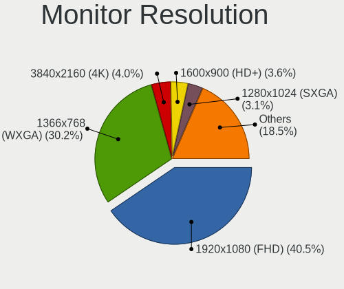

| Resolution         | Computers | Percent |
|--------------------|-----------|---------|
| 1920x1080 (FHD)    | 322       | 40.5%   |
| 1366x768 (WXGA)    | 240       | 30.19%  |
| 3840x2160 (4K)     | 32        | 4.03%   |
| 1600x900 (HD+)     | 29        | 3.65%   |
| 1280x1024 (SXGA)   | 25        | 3.14%   |
| 2560x1440 (QHD)    | 22        | 2.77%   |
| 1440x900 (WXGA+)   | 17        | 2.14%   |
| 800x1280           | 15        | 1.89%   |
| 1920x1200 (WUXGA)  | 15        | 1.89%   |
| 2160x1440          | 9         | 1.13%   |
| 1280x800 (WXGA)    | 9         | 1.13%   |
| 1360x768           | 8         | 1.01%   |
| 2560x1600          | 7         | 0.88%   |
| 1024x600           | 7         | 0.88%   |
| 1680x1050 (WSXGA+) | 6         | 0.75%   |
| 3440x1440          | 5         | 0.63%   |
| Unknown            | 4         | 0.5%    |
| 2288x1287          | 3         | 0.38%   |
| 1920x540           | 3         | 0.38%   |
| 1024x768 (XGA)     | 3         | 0.38%   |
| 2880x1800          | 2         | 0.25%   |
| 2560x1080          | 2         | 0.25%   |
| 5360x1440          | 1         | 0.13%   |
| 3840x2400          | 1         | 0.13%   |
| 3456x2160          | 1         | 0.13%   |
| 3200x1080          | 1         | 0.13%   |
| 3000x2000          | 1         | 0.13%   |
| 2966x900           | 1         | 0.13%   |
| 2880x1920          | 1         | 0.13%   |
| 2400x1600          | 1         | 0.13%   |
| 1600x1200          | 1         | 0.13%   |
| 1280x768           | 1         | 0.13%   |

Monitor Diagonal
----------------

Diagonal size in inches

| Inches  | Computers | Percent |
|---------|-----------|---------|
| 15      | 186       | 22.2%   |
| 13      | 108       | 12.89%  |
| 14      | 89        | 10.62%  |
| 21      | 55        | 6.56%   |
| 23      | 45        | 5.37%   |
| 18      | 45        | 5.37%   |
| 27      | 39        | 4.65%   |
| 17      | 36        | 4.3%    |
| 24      | 32        | 3.82%   |
| 11      | 25        | 2.98%   |
| Unknown | 23        | 2.74%   |
| 19      | 21        | 2.51%   |
| 31      | 19        | 2.27%   |
| 20      | 18        | 2.15%   |
| 12      | 16        | 1.91%   |
| 7       | 15        | 1.79%   |
| 72      | 10        | 1.19%   |
| 16      | 8         | 0.95%   |
| 34      | 7         | 0.84%   |
| 32      | 7         | 0.84%   |
| 10      | 7         | 0.84%   |
| 52      | 6         | 0.72%   |
| 22      | 5         | 0.6%    |
| 54      | 4         | 0.48%   |
| 142     | 3         | 0.36%   |
| 84      | 3         | 0.36%   |
| 40      | 2         | 0.24%   |
| 58      | 1         | 0.12%   |
| 50      | 1         | 0.12%   |
| 39      | 1         | 0.12%   |
| 8       | 1         | 0.12%   |

Monitor Width
-------------

Physical width

| Width in mm    | Computers | Percent |
|----------------|-----------|---------|
| 301-350        | 362       | 43.99%  |
| 401-500        | 133       | 16.16%  |
| 501-600        | 104       | 12.64%  |
| 201-300        | 89        | 10.81%  |
| 351-400        | 27        | 3.28%   |
| 601-700        | 24        | 2.92%   |
| Unknown        | 23        | 2.79%   |
| 1-100          | 15        | 1.82%   |
| 701-800        | 14        | 1.7%    |
| 1501-2000      | 13        | 1.58%   |
| 1001-1500      | 12        | 1.46%   |
| More than 2000 | 3         | 0.36%   |
| 801-900        | 3         | 0.36%   |
| 101-200        | 1         | 0.12%   |

Aspect Ratio
------------

Proportional relationship between the width and the height

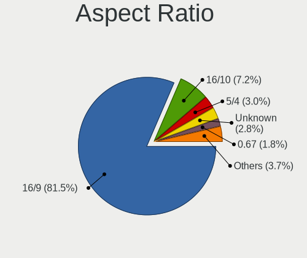

| Ratio   | Computers | Percent |
|---------|-----------|---------|
| 16/9    | 620       | 81.47%  |
| 16/10   | 55        | 7.23%   |
| 5/4     | 23        | 3.02%   |
| Unknown | 21        | 2.76%   |
| 0.67    | 14        | 1.84%   |
| 3/2     | 12        | 1.58%   |
| 21/9    | 7         | 0.92%   |
| 4/3     | 4         | 0.53%   |
| 1.00    | 3         | 0.39%   |
| 0.62    | 2         | 0.26%   |

Monitor Area
------------

Area in inch

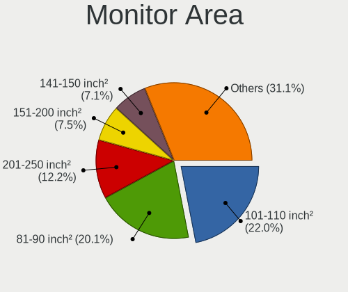

| Area in inch | Computers | Percent |
|----------------|-----------|---------|
| 101-110        | 182       | 21.95%  |
| 81-90          | 167       | 20.14%  |
| 201-250        | 101       | 12.18%  |
| 151-200        | 62        | 7.48%   |
| 141-150        | 59        | 7.12%   |
| 301-350        | 39        | 4.7%    |
| 351-500        | 33        | 3.98%   |
| 71-80          | 30        | 3.62%   |
| More than 1000 | 28        | 3.38%   |
| 51-60          | 25        | 3.02%   |
| Unknown        | 23        | 2.77%   |
| 121-130        | 17        | 2.05%   |
| 61-70          | 16        | 1.93%   |
| 1-40           | 16        | 1.93%   |
| 111-120        | 9         | 1.09%   |
| 41-50          | 7         | 0.84%   |
| 251-300        | 7         | 0.84%   |
| 501-1000       | 3         | 0.36%   |
| 91-100         | 3         | 0.36%   |
| 131-140        | 2         | 0.24%   |

Pixel Density
-------------

Pixels per inch

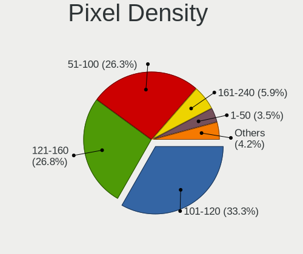

| Density       | Computers | Percent |
|---------------|-----------|---------|
| 101-120       | 269       | 33.25%  |
| 121-160       | 217       | 26.82%  |
| 51-100        | 213       | 26.33%  |
| 161-240       | 48        | 5.93%   |
| 1-50          | 28        | 3.46%   |
| Unknown       | 23        | 2.84%   |
| More than 240 | 11        | 1.36%   |

Multiple Monitors
-----------------

Total monitors connected

| Total | Computers | Percent |
|-------|-----------|---------|
| 1     | 658       | 81.54%  |
| 2     | 110       | 13.63%  |
| 0     | 32        | 3.97%   |
| 3     | 7         | 0.87%   |

Network
-------

Net Controller Vendor
---------------------

Controller vendors

| Vendor                                | Computers | Percent |
|---------------------------------------|-----------|---------|
| Realtek Semiconductor                 | 491       | 41.75%  |
| Intel                                 | 304       | 25.85%  |
| Qualcomm Atheros                      | 138       | 11.73%  |
| Broadcom                              | 64        | 5.44%   |
| Ralink Technology                     | 28        | 2.38%   |
| MediaTek                              | 24        | 2.04%   |
| TP-Link                               | 17        | 1.45%   |
| Nvidia                                | 14        | 1.19%   |
| Samsung Electronics                   | 10        | 0.85%   |
| Broadcom Limited                      | 10        | 0.85%   |
| Ralink                                | 7         | 0.6%    |
| Xiaomi                                | 6         | 0.51%   |
| ASIX Electronics                      | 6         | 0.51%   |
| Qualcomm                              | 5         | 0.43%   |
| Marvell Technology Group              | 5         | 0.43%   |
| JMicron Technology                    | 5         | 0.43%   |
| Qualcomm Atheros Communications       | 4         | 0.34%   |
| OPPO Electronics                      | 4         | 0.34%   |
| Huawei Technologies                   | 4         | 0.34%   |
| Silicon Integrated Systems [SiS]      | 3         | 0.26%   |
| DisplayLink                           | 3         | 0.26%   |
| 802.11g Adapter [Linksys WUSB54GC v3] | 3         | 0.26%   |
| ICS Advent                            | 2         | 0.17%   |
| Dell                                  | 2         | 0.17%   |
| D-Link                                | 2         | 0.17%   |
| Apple                                 | 2         | 0.17%   |
| ZTopInc                               | 1         | 0.09%   |
| U-Blox                                | 1         | 0.09%   |
| Tenda                                 | 1         | 0.09%   |
| Sundance Technology Inc / IC Plus     | 1         | 0.09%   |
| NetGear                               | 1         | 0.09%   |
| Microchip Technology                  | 1         | 0.09%   |
| InterBiometrics                       | 1         | 0.09%   |
| Hewlett-Packard                       | 1         | 0.09%   |
| Encore Electronics                    | 1         | 0.09%   |
| D-Link System                         | 1         | 0.09%   |
| BUFFALO                               | 1         | 0.09%   |
| ASUSTek Computer                      | 1         | 0.09%   |
| AMD                                   | 1         | 0.09%   |

Net Controller Model
--------------------

Controller models

| Model                                                                  | Computers | Percent |
|------------------------------------------------------------------------|-----------|---------|
| Realtek RTL8111/8168/8211/8411 PCI Express Gigabit Ethernet Controller | 342       | 25.2%   |
| Realtek RTL810xE PCI Express Fast Ethernet controller                  | 55        | 4.05%   |
| Realtek RTL8822CE 802.11ac PCIe Wireless Network Adapter               | 31        | 2.28%   |
| Qualcomm Atheros QCA9377 802.11ac Wireless Network Adapter             | 29        | 2.14%   |
| Intel 82579LM Gigabit Network Connection (Lewisville)                  | 26        | 1.92%   |
| Qualcomm Atheros QCA9565 / AR9565 Wireless Network Adapter             | 21        | 1.55%   |
| Intel Wireless 7265                                                    | 21        | 1.55%   |
| Intel Wi-Fi 6 AX200                                                    | 20        | 1.47%   |
| Realtek RTL8125 2.5GbE Controller                                      | 18        | 1.33%   |
| Ralink MT7601U Wireless Adapter                                        | 18        | 1.33%   |
| Intel Dual Band Wireless-AC 3168NGW [Stone Peak]                       | 18        | 1.33%   |
| Qualcomm Atheros AR9285 Wireless Network Adapter (PCI-Express)         | 17        | 1.25%   |
| Intel Wi-Fi 6 AX201                                                    | 17        | 1.25%   |
| Intel Wireless 8265 / 8275                                             | 16        | 1.18%   |
| Intel Centrino Advanced-N 6205 [Taylor Peak]                           | 16        | 1.18%   |
| Qualcomm Atheros QCA6174 802.11ac Wireless Network Adapter             | 15        | 1.11%   |
| Intel Comet Lake PCH-LP CNVi WiFi                                      | 15        | 1.11%   |
| Realtek RTL8723BE PCIe Wireless Network Adapter                        | 14        | 1.03%   |
| Realtek 802.11ac NIC                                                   | 14        | 1.03%   |
| MediaTek MT7921 802.11ax PCI Express Wireless Network Adapter          | 14        | 1.03%   |
| Intel Wireless 3165                                                    | 14        | 1.03%   |
| Realtek RTL8821CE 802.11ac PCIe Wireless Network Adapter               | 13        | 0.96%   |
| Qualcomm Atheros AR9462 Wireless Network Adapter                       | 13        | 0.96%   |
| Broadcom BCM4313 802.11bgn Wireless Network Adapter                    | 12        | 0.88%   |
| Qualcomm Atheros AR9485 Wireless Network Adapter                       | 11        | 0.81%   |
| Intel Cannon Lake PCH CNVi WiFi                                        | 11        | 0.81%   |
| Realtek RTL8188EUS 802.11n Wireless Network Adapter                    | 10        | 0.74%   |
| Intel Wi-Fi 6E(802.11ax) AX210/AX1675* 2x2 [Typhoon Peak]              | 10        | 0.74%   |
| Broadcom BCM43142 802.11b/g/n                                          | 10        | 0.74%   |
| Realtek Killer E2600 GbE Controller                                    | 9         | 0.66%   |
| Realtek RTL8153 Gigabit Ethernet Adapter                               | 8         | 0.59%   |
| Qualcomm Atheros AR8152 v2.0 Fast Ethernet                             | 8         | 0.59%   |
| Nvidia MCP61 Ethernet                                                  | 8         | 0.59%   |
| Intel Wireless 8260                                                    | 8         | 0.59%   |
| Intel I211 Gigabit Network Connection                                  | 8         | 0.59%   |
| Intel Comet Lake PCH CNVi WiFi                                         | 8         | 0.59%   |
| Intel Cannon Point-LP CNVi [Wireless-AC]                               | 8         | 0.59%   |
| Intel Alder Lake-P PCH CNVi WiFi                                       | 8         | 0.59%   |
| Realtek RTL8821AE 802.11ac PCIe Wireless Network Adapter               | 7         | 0.52%   |
| Qualcomm Atheros AR8151 v2.0 Gigabit Ethernet                          | 7         | 0.52%   |

Wireless Vendor
---------------

Wireless vendors

| Vendor                                | Computers | Percent |
|---------------------------------------|-----------|---------|
| Intel                                 | 252       | 38.89%  |
| Realtek Semiconductor                 | 134       | 20.68%  |
| Qualcomm Atheros                      | 115       | 17.75%  |
| Broadcom                              | 47        | 7.25%   |
| Ralink Technology                     | 28        | 4.32%   |
| MediaTek                              | 20        | 3.09%   |
| TP-Link                               | 17        | 2.62%   |
| Ralink                                | 7         | 1.08%   |
| Broadcom Limited                      | 6         | 0.93%   |
| Qualcomm Atheros Communications       | 4         | 0.62%   |
| 802.11g Adapter [Linksys WUSB54GC v3] | 3         | 0.46%   |
| Qualcomm                              | 2         | 0.31%   |
| Marvell Technology Group              | 2         | 0.31%   |
| Dell                                  | 2         | 0.31%   |
| D-Link                                | 2         | 0.31%   |
| ZTopInc                               | 1         | 0.15%   |
| Tenda                                 | 1         | 0.15%   |
| Samsung Electronics                   | 1         | 0.15%   |
| NetGear                               | 1         | 0.15%   |
| Encore Electronics                    | 1         | 0.15%   |
| BUFFALO                               | 1         | 0.15%   |
| ASUSTek Computer                      | 1         | 0.15%   |

Wireless Model
--------------

Wireless models

| Model                                                          | Computers | Percent |
|----------------------------------------------------------------|-----------|---------|
| Realtek RTL8822CE 802.11ac PCIe Wireless Network Adapter       | 31        | 4.75%   |
| Qualcomm Atheros QCA9377 802.11ac Wireless Network Adapter     | 29        | 4.45%   |
| Qualcomm Atheros QCA9565 / AR9565 Wireless Network Adapter     | 21        | 3.22%   |
| Intel Wireless 7265                                            | 21        | 3.22%   |
| Intel Wi-Fi 6 AX200                                            | 20        | 3.07%   |
| Ralink MT7601U Wireless Adapter                                | 18        | 2.76%   |
| Intel Dual Band Wireless-AC 3168NGW [Stone Peak]               | 18        | 2.76%   |
| Qualcomm Atheros AR9285 Wireless Network Adapter (PCI-Express) | 17        | 2.61%   |
| Intel Wi-Fi 6 AX201                                            | 17        | 2.61%   |
| Intel Wireless 8265 / 8275                                     | 16        | 2.45%   |
| Intel Centrino Advanced-N 6205 [Taylor Peak]                   | 16        | 2.45%   |
| Qualcomm Atheros QCA6174 802.11ac Wireless Network Adapter     | 15        | 2.3%    |
| Intel Comet Lake PCH-LP CNVi WiFi                              | 15        | 2.3%    |
| Realtek RTL8723BE PCIe Wireless Network Adapter                | 14        | 2.15%   |
| Realtek 802.11ac NIC                                           | 14        | 2.15%   |
| MediaTek MT7921 802.11ax PCI Express Wireless Network Adapter  | 14        | 2.15%   |
| Intel Wireless 3165                                            | 14        | 2.15%   |
| Realtek RTL8821CE 802.11ac PCIe Wireless Network Adapter       | 13        | 1.99%   |
| Qualcomm Atheros AR9462 Wireless Network Adapter               | 13        | 1.99%   |
| Broadcom BCM4313 802.11bgn Wireless Network Adapter            | 12        | 1.84%   |
| Qualcomm Atheros AR9485 Wireless Network Adapter               | 11        | 1.69%   |
| Intel Cannon Lake PCH CNVi WiFi                                | 11        | 1.69%   |
| Realtek RTL8188EUS 802.11n Wireless Network Adapter            | 10        | 1.53%   |
| Intel Wi-Fi 6E(802.11ax) AX210/AX1675* 2x2 [Typhoon Peak]      | 10        | 1.53%   |
| Broadcom BCM43142 802.11b/g/n                                  | 10        | 1.53%   |
| Intel Wireless 8260                                            | 8         | 1.23%   |
| Intel Comet Lake PCH CNVi WiFi                                 | 8         | 1.23%   |
| Intel Cannon Point-LP CNVi [Wireless-AC]                       | 8         | 1.23%   |
| Intel Alder Lake-P PCH CNVi WiFi                               | 8         | 1.23%   |
| Realtek RTL8821AE 802.11ac PCIe Wireless Network Adapter       | 7         | 1.07%   |
| Intel Wireless 7260                                            | 7         | 1.07%   |
| Intel Centrino Advanced-N 6235                                 | 6         | 0.92%   |
| Broadcom BCM43228 802.11a/b/g/n                                | 6         | 0.92%   |
| TP-Link AC600 wireless Realtek RTL8811AU [Archer T2U Nano]     | 5         | 0.77%   |
| Realtek RTL88x2bu [AC1200 Techkey]                             | 5         | 0.77%   |
| Realtek RTL8822BE 802.11a/b/g/n/ac WiFi adapter                | 5         | 0.77%   |
| Realtek RTL8188FTV 802.11b/g/n 1T1R 2.4G WLAN Adapter          | 5         | 0.77%   |
| Intel Raptor Lake-S PCH CNVi WiFi                              | 5         | 0.77%   |
| Intel Dual Band Wireless-AC 3165 Plus Bluetooth                | 5         | 0.77%   |
| Broadcom BCM43224 802.11a/b/g/n                                | 5         | 0.77%   |

Ethernet Vendor
---------------

Ethernet vendors

| Vendor                            | Computers | Percent |
|-----------------------------------|-----------|---------|
| Realtek Semiconductor             | 436       | 63.84%  |
| Intel                             | 122       | 17.86%  |
| Qualcomm Atheros                  | 35        | 5.12%   |
| Broadcom                          | 21        | 3.07%   |
| Nvidia                            | 14        | 2.05%   |
| Xiaomi                            | 6         | 0.88%   |
| Samsung Electronics               | 6         | 0.88%   |
| ASIX Electronics                  | 6         | 0.88%   |
| JMicron Technology                | 5         | 0.73%   |
| OPPO Electronics                  | 4         | 0.59%   |
| MediaTek                          | 4         | 0.59%   |
| Broadcom Limited                  | 4         | 0.59%   |
| Silicon Integrated Systems [SiS]  | 3         | 0.44%   |
| Marvell Technology Group          | 3         | 0.44%   |
| Huawei Technologies               | 3         | 0.44%   |
| DisplayLink                       | 3         | 0.44%   |
| ICS Advent                        | 2         | 0.29%   |
| Apple                             | 2         | 0.29%   |
| Sundance Technology Inc / IC Plus | 1         | 0.15%   |
| Qualcomm                          | 1         | 0.15%   |
| Microchip Technology              | 1         | 0.15%   |
| D-Link System                     | 1         | 0.15%   |

Ethernet Model
--------------

Ethernet models

| Model                                                                  | Computers | Percent |
|------------------------------------------------------------------------|-----------|---------|
| Realtek RTL8111/8168/8211/8411 PCI Express Gigabit Ethernet Controller | 342       | 49.35%  |
| Realtek RTL810xE PCI Express Fast Ethernet controller                  | 55        | 7.94%   |
| Intel 82579LM Gigabit Network Connection (Lewisville)                  | 26        | 3.75%   |
| Realtek RTL8125 2.5GbE Controller                                      | 18        | 2.6%    |
| Realtek Killer E2600 GbE Controller                                    | 9         | 1.3%    |
| Realtek RTL8153 Gigabit Ethernet Adapter                               | 8         | 1.15%   |
| Qualcomm Atheros AR8152 v2.0 Fast Ethernet                             | 8         | 1.15%   |
| Nvidia MCP61 Ethernet                                                  | 8         | 1.15%   |
| Intel I211 Gigabit Network Connection                                  | 8         | 1.15%   |
| Qualcomm Atheros AR8151 v2.0 Gigabit Ethernet                          | 7         | 1.01%   |
| Intel Ethernet Controller I225-V                                       | 7         | 1.01%   |
| Samsung Galaxy series, misc. (tethering mode)                          | 6         | 0.87%   |
| Realtek RTL8152 Fast Ethernet Adapter                                  | 5         | 0.72%   |
| Qualcomm Atheros QCA8171 Gigabit Ethernet                              | 5         | 0.72%   |
| Intel Ethernet Connection I219-LM                                      | 5         | 0.72%   |
| Intel Ethernet Connection (6) I219-LM                                  | 5         | 0.72%   |
| Intel Ethernet Connection (4) I219-LM                                  | 5         | 0.72%   |
| Intel Ethernet Connection (2) I219-LM                                  | 5         | 0.72%   |
| Intel 82579V Gigabit Network Connection                                | 5         | 0.72%   |
| Broadcom NetLink BCM57785 Gigabit Ethernet PCIe                        | 5         | 0.72%   |
| ASIX AX88179 Gigabit Ethernet                                          | 5         | 0.72%   |
| Qualcomm Atheros AR8132 Fast Ethernet                                  | 4         | 0.58%   |
| OPPO OnePlus Nord 4                                                    | 4         | 0.58%   |
| JMicron JMC260 PCI Express Fast Ethernet Controller                    | 4         | 0.58%   |
| Intel Ethernet Connection I217-V                                       | 4         | 0.58%   |
| Intel Ethernet Connection I217-LM                                      | 4         | 0.58%   |
| Intel Ethernet Connection (4) I219-V                                   | 4         | 0.58%   |
| Intel 82567LM-3 Gigabit Network Connection                             | 4         | 0.58%   |
| Intel 82567LM Gigabit Network Connection                               | 4         | 0.58%   |
| Xiaomi Mi/Redmi series (RNDIS)                                         | 3         | 0.43%   |
| Xiaomi Mi/Redmi series (RNDIS + ADB)                                   | 3         | 0.43%   |
| Silicon Integrated Systems [SiS] 191 Gigabit Ethernet Adapter          | 3         | 0.43%   |
| Qualcomm Atheros Killer E2500 Gigabit Ethernet Controller              | 3         | 0.43%   |
| Intel I210 Gigabit Network Connection                                  | 3         | 0.43%   |
| Intel Ethernet Connection (3) I218-LM                                  | 3         | 0.43%   |
| Intel Ethernet Connection (2) I219-V                                   | 3         | 0.43%   |
| Intel Ethernet Connection (10) I219-V                                  | 3         | 0.43%   |
| Huawei FOA-LX9                                                         | 3         | 0.43%   |
| Broadcom NetXtreme BCM57765 Gigabit Ethernet PCIe                      | 3         | 0.43%   |
| Broadcom NetLink BCM57780 Gigabit Ethernet PCIe                        | 3         | 0.43%   |

Net Controller Kind
-------------------

Ethernet, WiFi or modem

| Kind     | Computers | Percent |
|----------|-----------|---------|
| Ethernet | 641       | 50.51%  |
| WiFi     | 616       | 48.54%  |
| Modem    | 8         | 0.63%   |
| Unknown  | 4         | 0.32%   |

Used Controller
---------------

Currently used network controller

| Kind     | Computers | Percent |
|----------|-----------|---------|
| WiFi     | 496       | 61.61%  |
| Ethernet | 309       | 38.39%  |

NICs
----

Total network controllers on board

| Total | Computers | Percent |
|-------|-----------|---------|
| 2     | 392       | 49.68%  |
| 1     | 361       | 45.75%  |
| 0     | 17        | 2.15%   |
| 3     | 14        | 1.77%   |
| 6     | 3         | 0.38%   |
| 5     | 1         | 0.13%   |
| 4     | 1         | 0.13%   |

IPv6
----

IPv6 vs IPv4

| Used | Computers | Percent |
|------|-----------|---------|
| No   | 710       | 88.64%  |
| Yes  | 91        | 11.36%  |

Bluetooth
---------

Bluetooth Vendor
----------------

Controller vendors

| Vendor                          | Computers | Percent |
|---------------------------------|-----------|---------|
| Intel                           | 203       | 40.36%  |
| IMC Networks                    | 51        | 10.14%  |
| Realtek Semiconductor           | 50        | 9.94%   |
| Qualcomm Atheros Communications | 34        | 6.76%   |
| Lite-On Technology              | 34        | 6.76%   |
| Broadcom                        | 29        | 5.77%   |
| Cambridge Silicon Radio         | 25        | 4.97%   |
| Foxconn / Hon Hai               | 24        | 4.77%   |
| Apple                           | 13        | 2.58%   |
| Hewlett-Packard                 | 5         | 0.99%   |
| TP-Link                         | 4         | 0.8%    |
| Toshiba                         | 4         | 0.8%    |
| Realtek                         | 4         | 0.8%    |
| Ralink                          | 4         | 0.8%    |
| Chicony Electronics             | 4         | 0.8%    |
| Dell                            | 3         | 0.6%    |
| MediaTek                        | 2         | 0.4%    |
| Marvell Semiconductor           | 2         | 0.4%    |
| Actions                         | 2         | 0.4%    |
| USI                             | 1         | 0.2%    |
| SINO WEALTH                     | 1         | 0.2%    |
| Ralink Technology               | 1         | 0.2%    |
| Integrated System Solution      | 1         | 0.2%    |
| Foxconn International           | 1         | 0.2%    |
| Unknown                         | 1         | 0.2%    |

Bluetooth Model
---------------

Controller models

| Model                                               | Computers | Percent |
|-----------------------------------------------------|-----------|---------|
| Intel Bluetooth wireless interface                  | 66        | 13.12%  |
| Intel AX201 Bluetooth                               | 41        | 8.15%   |
| Intel Bluetooth 9460/9560 Jefferson Peak (JfP)      | 37        | 7.36%   |
| Realtek Bluetooth Radio                             | 31        | 6.16%   |
| IMC Networks Bluetooth Radio                        | 25        | 4.97%   |
| Cambridge Silicon Radio Bluetooth Dongle (HCI mode) | 25        | 4.97%   |
| Intel AX200 Bluetooth                               | 19        | 3.78%   |
| IMC Networks Bluetooth Device                       | 15        | 2.98%   |
| Qualcomm Atheros  Bluetooth Device                  | 14        | 2.78%   |
| Lite-On Qualcomm Atheros QCA9377 Bluetooth          | 13        | 2.58%   |
| Intel Wireless-AC 3168 Bluetooth                    | 13        | 2.58%   |
| Intel AX210 Bluetooth                               | 10        | 1.99%   |
| IMC Networks Wireless_Device                        | 9         | 1.79%   |
| Qualcomm Atheros AR3011 Bluetooth                   | 8         | 1.59%   |
| Lite-On Bluetooth Device                            | 8         | 1.59%   |
| Intel Centrino Bluetooth Wireless Transceiver       | 7         | 1.39%   |
| Foxconn / Hon Hai Bluetooth Device                  | 7         | 1.39%   |
| Broadcom BCM20702 Bluetooth 4.0 [ThinkPad]          | 7         | 1.39%   |
| Apple Bluetooth USB Host Controller                 | 7         | 1.39%   |
| Realtek  Bluetooth 4.2 Adapter                      | 6         | 1.19%   |
| Qualcomm Atheros QCA61x4 Bluetooth 4.0              | 6         | 1.19%   |
| Intel AX211 Bluetooth                               | 6         | 1.19%   |
| Realtek RTL8821A Bluetooth                          | 5         | 0.99%   |
| Broadcom BCM2045B (BDC-2.1)                         | 5         | 0.99%   |
| TP-Link TP-Link Bluetooth USB Adapter               | 4         | 0.8%    |
| Realtek RTL8723B Bluetooth                          | 4         | 0.8%    |
| Realtek Bluetooth Radio                             | 4         | 0.8%    |
| Ralink RT3290 Bluetooth                             | 4         | 0.8%    |
| Qualcomm Atheros AR3012 Bluetooth 4.0               | 4         | 0.8%    |
| Lite-On Wireless_Device                             | 4         | 0.8%    |
| Lite-On Atheros AR3012 Bluetooth                    | 4         | 0.8%    |
| Foxconn / Hon Hai Wireless_Device                   | 4         | 0.8%    |
| Chicony Bluetooth (RTL8723BE)                       | 4         | 0.8%    |
| Apple Built-in Bluetooth 2.0+EDR HCI                | 3         | 0.6%    |
| Apple Bluetooth Host Controller                     | 3         | 0.6%    |
| Realtek 802.11ac WLAN Adapter                       | 2         | 0.4%    |
| Qualcomm Atheros AR9462 Bluetooth                   | 2         | 0.4%    |
| MediaTek Wireless_Device                            | 2         | 0.4%    |
| Lite-On BCM43142A0                                  | 2         | 0.4%    |
| Intel Wireless-AC 9260 Bluetooth Adapter            | 2         | 0.4%    |

Sound
-----

Sound Vendor
------------

Sound card vendors

| Vendor                                       | Computers | Percent |
|----------------------------------------------|-----------|---------|
| Intel                                        | 542       | 53.24%  |
| AMD                                          | 224       | 22%     |
| Nvidia                                       | 162       | 15.91%  |
| C-Media Electronics                          | 13        | 1.28%   |
| Logitech                                     | 10        | 0.98%   |
| Generalplus Technology                       | 8         | 0.79%   |
| JMTek                                        | 5         | 0.49%   |
| Plantronics                                  | 4         | 0.39%   |
| KTMicro                                      | 4         | 0.39%   |
| SteelSeries ApS                              | 3         | 0.29%   |
| Silicon Integrated Systems [SiS]             | 3         | 0.29%   |
| Kingston Technology                          | 3         | 0.29%   |
| Realtek Semiconductor                        | 2         | 0.2%    |
| Razer USA                                    | 2         | 0.2%    |
| GN Netcom                                    | 2         | 0.2%    |
| Giga-Byte Technology                         | 2         | 0.2%    |
| Focusrite-Novation                           | 2         | 0.2%    |
| Zoran Co. Personal Media Division (Nogatech) | 1         | 0.1%    |
| ZOOM                                         | 1         | 0.1%    |
| XMOS                                         | 1         | 0.1%    |
| Walmart                                      | 1         | 0.1%    |
| TTGK Technology                              | 1         | 0.1%    |
| Sony                                         | 1         | 0.1%    |
| Samson Technologies                          | 1         | 0.1%    |
| OPPO Electronics                             | 1         | 0.1%    |
| Micronas                                     | 1         | 0.1%    |
| M-Audio                                      | 1         | 0.1%    |
| Jieli Technology                             | 1         | 0.1%    |
| Huawei Technologies                          | 1         | 0.1%    |
| Hewlett-Packard                              | 1         | 0.1%    |
| Fry's Electronics                            | 1         | 0.1%    |
| FiiO Electronics Technology                  | 1         | 0.1%    |
| FIFINE 683 Microphone                        | 1         | 0.1%    |
| Elgato Systems                               | 1         | 0.1%    |
| DEXP BK-20                                   | 1         | 0.1%    |
| Creative Technology                          | 1         | 0.1%    |
| Corsair                                      | 1         | 0.1%    |
| Cooler Master                                | 1         | 0.1%    |
| Audeze                                       | 1         | 0.1%    |
| ASUSTek Computer                             | 1         | 0.1%    |

Sound Model
-----------

Sound card models

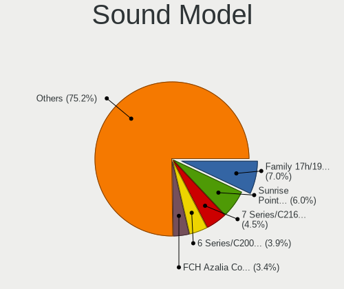

| Model                                                                      | Computers | Percent |
|----------------------------------------------------------------------------|-----------|---------|
| AMD Family 17h/19h/1ah HD Audio Controller                                 | 86        | 7.01%   |
| Intel Sunrise Point-LP HD Audio                                            | 73        | 5.95%   |
| Intel 7 Series/C216 Chipset Family High Definition Audio Controller        | 55        | 4.49%   |
| Intel 6 Series/C200 Series Chipset Family High Definition Audio Controller | 48        | 3.92%   |
| AMD FCH Azalia Controller                                                  | 42        | 3.43%   |
| AMD Renoir Radeon High Definition Audio Controller                         | 40        | 3.26%   |
| Intel 8 Series/C220 Series Chipset High Definition Audio Controller        | 32        | 2.61%   |
| Intel NM10/ICH7 Family High Definition Audio Controller                    | 30        | 2.45%   |
| AMD Raven/Raven2/Fenghuang HDMI/DP Audio Controller                        | 30        | 2.45%   |
| Intel Tiger Lake-LP Smart Sound Technology Audio Controller                | 25        | 2.04%   |
| AMD Rembrandt Radeon High Definition Audio Controller                      | 25        | 2.04%   |
| Intel Xeon E3-1200 v3/4th Gen Core Processor HD Audio Controller           | 23        | 1.88%   |
| AMD Starship/Matisse HD Audio Controller                                   | 21        | 1.71%   |
| Intel Cannon Lake PCH cAVS                                                 | 20        | 1.63%   |
| Intel Wildcat Point-LP High Definition Audio Controller                    | 17        | 1.39%   |
| Intel Celeron N3350/Pentium N4200/Atom E3900 Series Audio Cluster          | 17        | 1.39%   |
| Intel Broadwell-U Audio Controller                                         | 17        | 1.39%   |
| Intel 100 Series/C230 Series Chipset Family HD Audio Controller            | 17        | 1.39%   |
| Nvidia GP107GL High Definition Audio Controller                            | 16        | 1.31%   |
| Intel Comet Lake PCH-LP cAVS                                               | 16        | 1.31%   |
| Intel 200 Series PCH HD Audio                                              | 16        | 1.31%   |
| Nvidia GF108 High Definition Audio Controller                              | 15        | 1.22%   |
| Intel Celeron/Pentium Silver Processor High Definition Audio               | 15        | 1.22%   |
| Intel Cannon Point-LP High Definition Audio Controller                     | 15        | 1.22%   |
| Intel 5 Series/3400 Series Chipset High Definition Audio                   | 15        | 1.22%   |
| AMD Ellesmere HDMI Audio [Radeon RX 470/480 / 570/580/590]                 | 15        | 1.22%   |
| Intel Haswell-ULT HD Audio Controller                                      | 14        | 1.14%   |
| Intel 8 Series HD Audio Controller                                         | 14        | 1.14%   |
| Nvidia GK208 HDMI/DP Audio Controller                                      | 13        | 1.06%   |
| AMD SBx00 Azalia (Intel HDA)                                               | 13        | 1.06%   |
| Intel Atom Processor Z36xxx/Z37xxx Series High Definition Audio Controller | 12        | 0.98%   |
| Intel 82801I (ICH9 Family) HD Audio Controller                             | 12        | 0.98%   |
| Nvidia TU107 GeForce GTX 1650 High Definition Audio Controller             | 11        | 0.9%    |
| Nvidia MCP61 High Definition Audio                                         | 11        | 0.9%    |
| Intel Comet Lake PCH cAVS                                                  | 11        | 0.9%    |
| Nvidia TU116 High Definition Audio Controller                              | 10        | 0.82%   |
| Intel Alder Lake PCH-P High Definition Audio Controller                    | 10        | 0.82%   |
| AMD Trinity HDMI Audio Controller                                          | 10        | 0.82%   |
| AMD Oland/Hainan/Cape Verde/Pitcairn HDMI Audio [Radeon HD 7000 Series]    | 10        | 0.82%   |
| AMD Kabini HDMI/DP Audio                                                   | 10        | 0.82%   |

Memory
------

Memory Vendor
-------------

Memory module vendors

| Vendor              | Computers | Percent |
|---------------------|-----------|---------|
| Kingston            | 94        | 19.79%  |
| SK hynix            | 82        | 17.26%  |
| Samsung Electronics | 82        | 17.26%  |
| Micron Technology   | 41        | 8.63%   |
| Unknown             | 33        | 6.95%   |
| Crucial             | 22        | 4.63%   |
| Team                | 16        | 3.37%   |
| Ramaxel Technology  | 13        | 2.74%   |
| G.Skill             | 13        | 2.74%   |
| Unknown             | 12        | 2.53%   |
| Corsair             | 8         | 1.68%   |
| A-DATA Technology   | 7         | 1.47%   |
| Transcend           | 6         | 1.26%   |
| Nanya Technology    | 6         | 1.26%   |
| Elpida              | 6         | 1.26%   |
| Unknown (ABCD)      | 5         | 1.05%   |
| ChangXin Memory     | 4         | 0.84%   |
| Apacer              | 4         | 0.84%   |
| Patriot             | 3         | 0.63%   |
| Unknown (8A5D)      | 2         | 0.42%   |
| PNY                 | 2         | 0.42%   |
| Kingmax             | 2         | 0.42%   |
| Uroad               | 1         | 0.21%   |
| Unknown (89BA)      | 1         | 0.21%   |
| Unknown (0x0B79)    | 1         | 0.21%   |
| Unifosa             | 1         | 0.21%   |
| Silicon Power       | 1         | 0.21%   |
| Ramsta              | 1         | 0.21%   |
| Qimonda             | 1         | 0.21%   |
| PUSKILL             | 1         | 0.21%   |
| Mitsubishi          | 1         | 0.21%   |
| Carry               | 1         | 0.21%   |
| Avant               | 1         | 0.21%   |
| ASint Technology    | 1         | 0.21%   |

Memory Model
------------

Memory module models

| Model                                                            | Computers | Percent |
|------------------------------------------------------------------|-----------|---------|
| Unknown                                                          | 12        | 2.39%   |
| Micron RAM 4ATF51264HZ-2G6E1 4GB SODIMM DDR4 2667MT/s            | 8         | 1.59%   |
| SK hynix RAM HMA81GS6AFR8N-UH 8GB SODIMM DDR4 2667MT/s           | 6         | 1.2%    |
| Samsung RAM M471A5244CB0-CRC 4GB SODIMM DDR4 2667MT/s            | 6         | 1.2%    |
| Unknown (ABCD) RAM 123456789012345678 2GB SODIMM LPDDR3 2400MT/s | 5         | 1%      |
| SK hynix RAM HMA851S6CJR6N-VK 4GB SODIMM DDR4 2667MT/s           | 5         | 1%      |
| SK hynix RAM HMA81GS6DJR8N-XN 8GB SODIMM DDR4 3200MT/s           | 5         | 1%      |
| Samsung RAM M471A5244CB0-CWE 4096MB SODIMM DDR4 3200MT/s         | 5         | 1%      |
| Samsung RAM M471A1G44AB0-CWE 8GB SODIMM DDR4 3200MT/s            | 5         | 1%      |
| Ramaxel RAM RMSA3260ME78HAF-2666 8GB SODIMM DDR4 2667MT/s        | 5         | 1%      |
| Unknown RAM Module 4GB SODIMM DDR4 2133MT/s                      | 4         | 0.8%    |
| Team RAM TEAMGROUP-UD4-3200 8GB DIMM DDR4 3800MT/s               | 4         | 0.8%    |
| SK hynix RAM HMT451S6BFR8A-PB 4096MB SODIMM DDR3 1600MT/s        | 4         | 0.8%    |
| SK hynix RAM HMAA1GS6CJR6N-XN 8GB Row Of Chips DDR4 3200MT/s     | 4         | 0.8%    |
| Samsung RAM M471B5273DH0-CH9 4GB SODIMM DDR3 1334MT/s            | 4         | 0.8%    |
| Samsung RAM M471B5173QH0-YK0 4GB SODIMM DDR3 1600MT/s            | 4         | 0.8%    |
| Kingston RAM KHX1866C10D3/8G 8GB DIMM DDR3 2133MT/s              | 4         | 0.8%    |
| Kingston RAM 99U5428-018.A00LF 8GB SODIMM DDR3 1600MT/s          | 4         | 0.8%    |
| SK hynix RAM HMT351S6CFR8C-PB 4GB SODIMM DDR3 1600MT/s           | 3         | 0.6%    |
| SK hynix RAM HMAA1GS6CMR6N-XN 8GB Row Of Chips DDR4 3200MT/s     | 3         | 0.6%    |
| SK hynix RAM HMA851S6AFR6N-UH 4GB SODIMM DDR4 2667MT/s           | 3         | 0.6%    |
| Samsung RAM M471A1K43CB1-CRC 8GB SODIMM DDR4 2667MT/s            | 3         | 0.6%    |
| Kingston RAM KF3200C16D4/8GX 8GB DIMM DDR4 3600MT/s              | 3         | 0.6%    |
| Kingston RAM KF2666C16D4/8G 8GB DIMM DDR4 2667MT/s               | 3         | 0.6%    |
| Kingston RAM HX313C9F/8 8GB DIMM 1333MT/s                        | 3         | 0.6%    |
| Kingston RAM ACR16D3LFS1KBG/2G 2GB SODIMM DDR3 1600MT/s          | 3         | 0.6%    |
| G.Skill RAM F4-3200C16-8GVKB 8GB DIMM DDR4 4000MT/s              | 3         | 0.6%    |
| ChangXin Memory RAM DB4ABAM-MK 1GB Row Of Chips LPDDR4 3733MT/s  | 3         | 0.6%    |
| Unknown RAM Module 4GB SODIMM DDR3 1333MT/s                      | 2         | 0.4%    |
| Unknown RAM Module 4GB DIMM DDR3 1600MT/s                        | 2         | 0.4%    |
| Unknown RAM Module 2GB DIMM DDR2 1067MT/s                        | 2         | 0.4%    |
| Team RAM TEAMGROUP-UD4-3600 16GB DIMM DDR4 3600MT/s              | 2         | 0.4%    |
| Team RAM TEAMGROUP-UD4-3200 8GB DIMM DDR4 3733MT/s               | 2         | 0.4%    |
| Team RAM TEAMGROUP-UD4-2400 8GB DIMM DDR4 2400MT/s               | 2         | 0.4%    |
| Team RAM TEAMGROUP-SD4-2400 16GB SODIMM DDR4 8400MT/s            | 2         | 0.4%    |
| SK hynix RAM HMT451U7AFR8C-RD 4GB DIMM DDR3 1866MT/s             | 2         | 0.4%    |
| SK hynix RAM HMT451U6BFR8A-PB 4GB DIMM DDR3 1600MT/s             | 2         | 0.4%    |
| SK hynix RAM HMT451S6BFR8A-PB 4GB SODIMM DDR3 1600MT/s           | 2         | 0.4%    |
| SK hynix RAM HMT41GS6AFR8A-PB 8GB SODIMM DDR3 1600MT/s           | 2         | 0.4%    |
| SK hynix RAM HMT351S6EFR8A-PB 4GB SODIMM DDR3 1600MT/s           | 2         | 0.4%    |

Memory Kind
-----------

Memory module kinds

| Kind    | Computers | Percent |
|---------|-----------|---------|
| DDR4    | 199       | 51.03%  |
| DDR3    | 124       | 31.79%  |
| LPDDR4  | 18        | 4.62%   |
| DDR5    | 14        | 3.59%   |
| DDR2    | 14        | 3.59%   |
| LPDDR3  | 6         | 1.54%   |
| Unknown | 6         | 1.54%   |
| LPDDR5  | 4         | 1.03%   |
| SDRAM   | 3         | 0.77%   |
| DRAM    | 1         | 0.26%   |
| DDR     | 1         | 0.26%   |

Memory Form Factor
------------------

Physical design of the memory module

| Name         | Computers | Percent |
|--------------|-----------|---------|
| SODIMM       | 246       | 63.4%   |
| DIMM         | 111       | 28.61%  |
| Row Of Chips | 30        | 7.73%   |
| Unknown      | 1         | 0.26%   |

Memory Size
-----------

Memory module size

| Size  | Computers | Percent |
|-------|-----------|---------|
| 8192  | 175       | 40.14%  |
| 4096  | 129       | 29.59%  |
| 16384 | 53        | 12.16%  |
| 2048  | 41        | 9.4%    |
| 32768 | 20        | 4.59%   |
| 1024  | 18        | 4.13%   |

Memory Speed
------------

Memory module speed

| Speed   | Computers | Percent |
|---------|-----------|---------|
| 1600    | 83        | 19.26%  |
| 3200    | 75        | 17.4%   |
| 2667    | 72        | 16.71%  |
| 2400    | 33        | 7.66%   |
| 2133    | 24        | 5.57%   |
| 1333    | 21        | 4.87%   |
| 1334    | 13        | 3.02%   |
| 667     | 12        | 2.78%   |
| 3733    | 11        | 2.55%   |
| 4800    | 8         | 1.86%   |
| 3600    | 7         | 1.62%   |
| 1067    | 6         | 1.39%   |
| 1866    | 5         | 1.16%   |
| Unknown | 5         | 1.16%   |
| 5600    | 4         | 0.93%   |
| 3800    | 4         | 0.93%   |
| 2666    | 4         | 0.93%   |
| 1867    | 4         | 0.93%   |
| 4267    | 3         | 0.7%    |
| 4000    | 3         | 0.7%    |
| 8400    | 2         | 0.46%   |
| 6400    | 2         | 0.46%   |
| 6000    | 2         | 0.46%   |
| 3866    | 2         | 0.46%   |
| 3466    | 2         | 0.46%   |
| 3266    | 2         | 0.46%   |
| 2933    | 2         | 0.46%   |
| 1800    | 2         | 0.46%   |
| 1648    | 2         | 0.46%   |
| 1066    | 2         | 0.46%   |
| 800     | 2         | 0.46%   |
| 7467    | 1         | 0.23%   |
| 5808    | 1         | 0.23%   |
| 5500    | 1         | 0.23%   |
| 4333    | 1         | 0.23%   |
| 4266    | 1         | 0.23%   |
| 3666    | 1         | 0.23%   |
| 3500    | 1         | 0.23%   |
| 3151    | 1         | 0.23%   |
| 2448    | 1         | 0.23%   |

Printers & scanners
-------------------

Printer Vendor
--------------

Printer device vendors

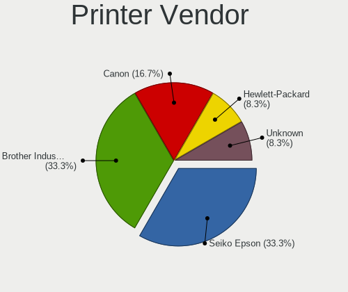

| Vendor             | Computers | Percent |
|--------------------|-----------|---------|
| Seiko Epson        | 4         | 33.33%  |
| Brother Industries | 4         | 33.33%  |
| Canon              | 2         | 16.67%  |
| Hewlett-Packard    | 1         | 8.33%   |
| Unknown            | 1         | 8.33%   |

Printer Model
-------------

Printer device models

| Model                     | Computers | Percent |
|---------------------------|-----------|---------|
| Seiko Epson L120 Series   | 2         | 16.67%  |
| Seiko Epson L360 Series   | 1         | 8.33%   |
| Seiko Epson L3110 Series  | 1         | 8.33%   |
| HP Smart Tank 610 series  | 1         | 8.33%   |
| Canon PIXMA MG2500 Series | 1         | 8.33%   |
| Canon G2010 series        | 1         | 8.33%   |
| Brother MFC-J200          | 1         | 8.33%   |
| Brother DCP-T710W         | 1         | 8.33%   |
| Brother DCP-T700W         | 1         | 8.33%   |
| Brother DCP-T310          | 1         | 8.33%   |
| Unknown                   | 1         | 8.33%   |

Scanner Vendor
--------------

Scanner device vendors

| Vendor | Computers | Percent |
|--------|-----------|---------|
| Canon  | 1         | 100%    |

Scanner Model
-------------

Scanner device models

| Model                   | Computers | Percent |
|-------------------------|-----------|---------|
| Canon CanoScan LiDE 110 | 1         | 100%    |

Camera
------

Camera Vendor
-------------

Camera device vendors

| Vendor                                 | Computers | Percent |
|----------------------------------------|-----------|---------|
| Chicony Electronics                    | 118       | 23.18%  |
| IMC Networks                           | 52        | 10.22%  |
| Realtek Semiconductor                  | 38        | 7.47%   |
| Microdia                               | 37        | 7.27%   |
| Quanta                                 | 34        | 6.68%   |
| Bison Electronics                      | 22        | 4.32%   |
| Sunplus Innovation Technology          | 19        | 3.73%   |
| Cheng Uei Precision Industry (Foxlink) | 17        | 3.34%   |
| Logitech                               | 16        | 3.14%   |
| Apple                                  | 14        | 2.75%   |
| Syntek                                 | 12        | 2.36%   |
| Lite-On Technology                     | 11        | 2.16%   |
| Suyin                                  | 10        | 1.96%   |
| Luxvisions Innotech Limited            | 10        | 1.96%   |
| Silicon Motion                         | 9         | 1.77%   |
| Z-Star Microelectronics                | 8         | 1.57%   |
| Acer                                   | 8         | 1.57%   |
| A4Tech                                 | 8         | 1.57%   |
| Alcor Micro                            | 7         | 1.38%   |
| Jieli Technology                       | 6         | 1.18%   |
| Samsung Electronics                    | 5         | 0.98%   |
| Sonix Technology                       | 3         | 0.59%   |
| Pixart Imaging                         | 3         | 0.59%   |
| icSpring                               | 3         | 0.59%   |
| Cubeternet                             | 3         | 0.59%   |
| ALi                                    | 3         | 0.59%   |
| Sunplus Technology                     | 2         | 0.39%   |
| Razer USA                              | 2         | 0.39%   |
| OPPO Electronics                       | 2         | 0.39%   |
| OmniVision Technologies                | 2         | 0.39%   |
| Microsoft                              | 2         | 0.39%   |
| Importek                               | 2         | 0.39%   |
| Generalplus Technology                 | 2         | 0.39%   |
| GEMBIRD                                | 2         | 0.39%   |
| Alpha Imaging Technology               | 2         | 0.39%   |
| Y Media                                | 1         | 0.2%    |
| WaveRider Communications               | 1         | 0.2%    |
| vivo                                   | 1         | 0.2%    |
| SunplusIT                              | 1         | 0.2%    |
| SN0002                                 | 1         | 0.2%    |

Camera Model
------------

Camera device models

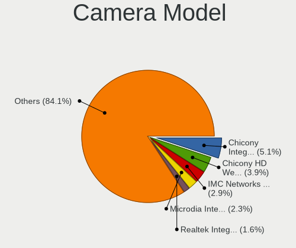

| Model                                                           | Computers | Percent |
|-----------------------------------------------------------------|-----------|---------|
| Chicony Integrated Camera                                       | 26        | 5.09%   |
| Chicony HD WebCam                                               | 20        | 3.91%   |
| IMC Networks USB2.0 VGA UVC WebCam                              | 15        | 2.94%   |
| Microdia Integrated_Webcam_HD                                   | 12        | 2.35%   |
| Realtek Integrated_Webcam_HD                                    | 8         | 1.57%   |
| IMC Networks USB2.0 HD UVC WebCam                               | 8         | 1.57%   |
| IMC Networks Integrated Camera                                  | 8         | 1.57%   |
| Realtek Acer 640 x 480 laptop camera                            | 7         | 1.37%   |
| Quanta ACER HD User Facing                                      | 7         | 1.37%   |
| IMC Networks HD Camera                                          | 7         | 1.37%   |
| Chicony VGA WebCam                                              | 7         | 1.37%   |
| Quanta HD WebCam                                                | 6         | 1.17%   |
| Z-Star Venus USB2.0 Camera                                      | 5         | 0.98%   |
| Quanta VGA WebCam                                               | 5         | 0.98%   |
| Logitech Webcam C270                                            | 5         | 0.98%   |
| Jieli USB PHY 2.0                                               | 5         | 0.98%   |
| Chicony USB2.0 VGA UVC WebCam                                   | 5         | 0.98%   |
| Chicony HD User Facing                                          | 5         | 0.98%   |
| Bison Lenovo EasyCamera                                         | 5         | 0.98%   |
| Bison Integrated Camera                                         | 5         | 0.98%   |
| Syntek Lenovo EasyCamera                                        | 4         | 0.78%   |
| Syntek Integrated Camera                                        | 4         | 0.78%   |
| Sunplus Integrated_Webcam_HD                                    | 4         | 0.78%   |
| Samsung Galaxy series, misc. (MTP mode)                         | 4         | 0.78%   |
| Realtek USB2.0 VGA UVC WebCam                                   | 4         | 0.78%   |
| Realtek Integrated Webcam                                       | 4         | 0.78%   |
| Microdia Laptop_Integrated_Webcam_HD                            | 4         | 0.78%   |
| Logitech Webcam C310                                            | 4         | 0.78%   |
| Lite-On Integrated Camera                                       | 4         | 0.78%   |
| IMC Networks EasyCamera                                         | 4         | 0.78%   |
| Chicony Integrated Camera [ThinkPad]                            | 4         | 0.78%   |
| Chicony HP Wide Vision HD Camera                                | 4         | 0.78%   |
| Chicony HP Truevision HD                                        | 4         | 0.78%   |
| Cheng Uei Precision Industry (Foxlink) HP Wide Vision HD Camera | 4         | 0.78%   |
| Apple FaceTime Camera                                           | 4         | 0.78%   |
| A4Tech A4tech FHD 1080P PC Camera                               | 4         | 0.78%   |
| Syntek EasyCamera                                               | 3         | 0.59%   |
| Sunplus HD WebCam                                               | 3         | 0.59%   |
| Quanta HD User Facing                                           | 3         | 0.59%   |
| Quanta HD Camera                                                | 3         | 0.59%   |

Security
--------

Fingerprint Vendor
------------------

Fingerprint sensor vendors

| Vendor                     | Computers | Percent |
|----------------------------|-----------|---------|
| Validity Sensors           | 20        | 28.99%  |
| Shenzhen Goodix Technology | 19        | 27.54%  |
| Synaptics                  | 14        | 20.29%  |
| LighTuning Technology      | 5         | 7.25%   |
| Elan Microelectronics      | 4         | 5.8%    |
| Upek                       | 3         | 4.35%   |
| AuthenTec                  | 3         | 4.35%   |
| GDMicroelectronics         | 1         | 1.45%   |

Fingerprint Model
-----------------

Fingerprint sensor models

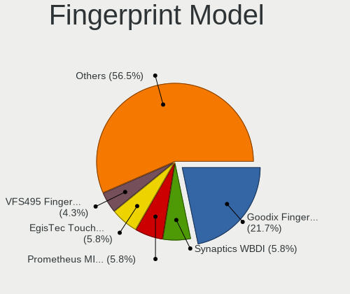

| Model                                                                      | Computers | Percent |
|----------------------------------------------------------------------------|-----------|---------|
| Shenzhen Goodix  FingerPrint Device                                        | 15        | 21.74%  |
| Validity Sensors Synaptics WBDI                                            | 4         | 5.8%    |
| Synaptics Prometheus MIS Touch Fingerprint Reader                          | 4         | 5.8%    |
| LighTuning EgisTec Touch Fingerprint Sensor                                | 4         | 5.8%    |
| Validity Sensors VFS495 Fingerprint Reader                                 | 3         | 4.35%   |
| Validity Sensors VFS471 Fingerprint Reader                                 | 3         | 4.35%   |
| Validity Sensors VFS 5011 fingerprint sensor                               | 3         | 4.35%   |
| Upek Biometric Touchchip/Touchstrip Fingerprint Sensor                     | 3         | 4.35%   |
| Shenzhen Goodix Fingerprint Reader                                         | 3         | 4.35%   |
| Elan ELAN:Fingerprint                                                      | 3         | 4.35%   |
| Validity Sensors VFS491                                                    | 2         | 2.9%    |
| Synaptics  WBDI                                                            | 2         | 2.9%    |
| Synaptics Metallica MIS Touch Fingerprint Reader                           | 2         | 2.9%    |
| Synaptics Fingerprint reader [HP G6]                                       | 2         | 2.9%    |
| Validity Sensors VFS7500 Touch Fingerprint Sensor                          | 1         | 1.45%   |
| Validity Sensors VFS300 Fingerprint Reader                                 | 1         | 1.45%   |
| Validity Sensors VFS101 Fingerprint Reader                                 | 1         | 1.45%   |
| Validity Sensors VFS Fingerprint sensor                                    | 1         | 1.45%   |
| Validity Sensors Synaptics VFS7552 Touch Fingerprint Sensor with PurePrint | 1         | 1.45%   |
| Synaptics UWP WBDI Device                                                  | 1         | 1.45%   |
| Synaptics TouchPad                                                         | 1         | 1.45%   |
| Synaptics  FS7604 Touch Fingerprint Sensor with PurePrint                  | 1         | 1.45%   |
| Synaptics Metallica MOH Touch Fingerprint Reader                           | 1         | 1.45%   |
| Shenzhen Goodix FingerPrint                                                | 1         | 1.45%   |
| LighTuning ES603 Swipe Fingerprint Sensor                                  | 1         | 1.45%   |
| GDMicroelectronics Touch Fingerprint Sensor                                | 1         | 1.45%   |
| Elan ELAN:ARM-M4                                                           | 1         | 1.45%   |
| AuthenTec Fingerprint Sensor                                               | 1         | 1.45%   |
| AuthenTec AES2810                                                          | 1         | 1.45%   |
| AuthenTec AES1600                                                          | 1         | 1.45%   |

Chipcard Vendor
---------------

Chipcard module vendors

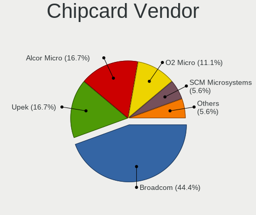

| Vendor           | Computers | Percent |
|------------------|-----------|---------|
| Broadcom         | 8         | 44.44%  |
| Upek             | 3         | 16.67%  |
| Alcor Micro      | 3         | 16.67%  |
| O2 Micro         | 2         | 11.11%  |
| SCM Microsystems | 1         | 5.56%   |
| Lenovo           | 1         | 5.56%   |

Chipcard Model
--------------

Chipcard module models

| Model                                                                        | Computers | Percent |
|------------------------------------------------------------------------------|-----------|---------|
| Broadcom 5880                                                                | 4         | 22.22%  |
| Upek TouchChip Fingerprint Coprocessor (WBF advanced mode)                   | 3         | 16.67%  |
| Broadcom BCM5880 Secure Applications Processor with fingerprint swipe sensor | 3         | 16.67%  |
| Alcor Micro AU9540 Smartcard Reader                                          | 3         | 16.67%  |
| SCM Microsystems SCR3340 - ExpressCard54 Smart Card Reader                   | 1         | 5.56%   |
| O2 Micro Oz776 SmartCard Reader                                              | 1         | 5.56%   |
| O2 Micro OZ776 CCID Smartcard Reader                                         | 1         | 5.56%   |
| Lenovo Integrated Smart Card Reader                                          | 1         | 5.56%   |
| Broadcom BCM5880 Secure Applications Processor                               | 1         | 5.56%   |

Unsupported
-----------

Unsupported Devices
-------------------

Total unsupported devices on board

| Total | Computers | Percent |
|-------|-----------|---------|
| 0     | 598       | 73.65%  |
| 1     | 182       | 22.41%  |
| 2     | 28        | 3.45%   |
| 3     | 4         | 0.49%   |

Unsupported Device Types
------------------------

Types of unsupported devices

| Type                     | Computers | Percent |
|--------------------------|-----------|---------|
| Fingerprint reader       | 68        | 27.87%  |
| Graphics card            | 62        | 25.41%  |
| Net/wireless             | 38        | 15.57%  |
| Chipcard                 | 18        | 7.38%   |
| Camera                   | 14        | 5.74%   |
| Multimedia controller    | 13        | 5.33%   |
| Net/ethernet             | 6         | 2.46%   |
| Bluetooth                | 6         | 2.46%   |
| Sound                    | 4         | 1.64%   |
| Communication controller | 4         | 1.64%   |
| Network                  | 3         | 1.23%   |
| Unassigned class         | 2         | 0.82%   |
| Wireless                 | 1         | 0.41%   |
| Storage/raid             | 1         | 0.41%   |
| Storage/nvme             | 1         | 0.41%   |
| Storage                  | 1         | 0.41%   |
| Modem                    | 1         | 0.41%   |
| Card reader              | 1         | 0.41%   |

