Linux in Philippines - Tested Hardware & Statistics
---------------------------------------------------

A project to collect tested hardware configurations for Linux in Philippines.

Anyone can contribute to this report by the [hw-probe](https://github.com/linuxhw/hw-probe) tool:

    sudo -E hw-probe -all -upload

Please contribute! Especially if your hardware is rare.

This is a report for all computer types. See also reports for [desktops](/Location/Philippines/Desktop/README.md) and [notebooks](/Location/Philippines/Notebook/README.md).

Contents
--------

* [ Test Cases ](#test-cases)

* [ System ](#system)
  - [ OS                       ](#os)
  - [ OS Family                ](#os-family)
  - [ Kernel                   ](#kernel)
  - [ Kernel Family            ](#kernel-family)
  - [ Kernel Major Ver.        ](#kernel-major-ver)
  - [ Arch                     ](#arch)
  - [ DE                       ](#de)
  - [ Display Server           ](#display-server)
  - [ Display Manager          ](#display-manager)
  - [ OS Lang                  ](#os-lang)
  - [ Boot Mode                ](#boot-mode)
  - [ Filesystem               ](#filesystem)
  - [ Part. scheme             ](#part-scheme)
  - [ Dual Boot with Linux/BSD ](#dual-boot-with-linuxbsd)
  - [ Dual Boot (Win)          ](#dual-boot-win)

* [ Board ](#board)
  - [ Vendor                   ](#vendor)
  - [ Model                    ](#model)
  - [ Model Family             ](#model-family)
  - [ MFG Year                 ](#mfg-year)
  - [ Form Factor              ](#form-factor)
  - [ Secure Boot              ](#secure-boot)
  - [ Coreboot                 ](#coreboot)
  - [ RAM Size                 ](#ram-size)
  - [ RAM Used                 ](#ram-used)
  - [ Total Drives             ](#total-drives)
  - [ Has CD-ROM               ](#has-cd-rom)
  - [ Has Ethernet             ](#has-ethernet)
  - [ Has WiFi                 ](#has-wifi)
  - [ Has Bluetooth            ](#has-bluetooth)

* [ Location ](#location)
  - [ Country                  ](#country)
  - [ City                     ](#city)

* [ Drives ](#drives)
  - [ Drive Vendor             ](#drive-vendor)
  - [ Drive Model              ](#drive-model)
  - [ HDD Vendor               ](#hdd-vendor)
  - [ SSD Vendor               ](#ssd-vendor)
  - [ Drive Kind               ](#drive-kind)
  - [ Drive Connector          ](#drive-connector)
  - [ Drive Size               ](#drive-size)
  - [ Space Total              ](#space-total)
  - [ Space Used               ](#space-used)
  - [ Malfunc. Drives          ](#malfunc-drives)
  - [ Malfunc. Drive Vendor    ](#malfunc-drive-vendor)
  - [ Malfunc. HDD Vendor      ](#malfunc-hdd-vendor)
  - [ Malfunc. Drive Kind      ](#malfunc-drive-kind)
  - [ Failed Drives            ](#failed-drives)
  - [ Failed Drive Vendor      ](#failed-drive-vendor)
  - [ Drive Status             ](#drive-status)

* [ Storage controller ](#storage-controller)
  - [ Storage Vendor           ](#storage-vendor)
  - [ Storage Model            ](#storage-model)
  - [ Storage Kind             ](#storage-kind)

* [ Processor ](#processor)
  - [ CPU Vendor               ](#cpu-vendor)
  - [ CPU Model                ](#cpu-model)
  - [ CPU Model Family         ](#cpu-model-family)
  - [ CPU Cores                ](#cpu-cores)
  - [ CPU Sockets              ](#cpu-sockets)
  - [ CPU Threads              ](#cpu-threads)
  - [ CPU Op-Modes             ](#cpu-op-modes)
  - [ CPU Microcode            ](#cpu-microcode)
  - [ CPU Microarch            ](#cpu-microarch)

* [ Graphics ](#graphics)
  - [ GPU Vendor               ](#gpu-vendor)
  - [ GPU Model                ](#gpu-model)
  - [ GPU Combo                ](#gpu-combo)
  - [ GPU Driver               ](#gpu-driver)
  - [ GPU Memory               ](#gpu-memory)

* [ Monitor ](#monitor)
  - [ Monitor Vendor           ](#monitor-vendor)
  - [ Monitor Model            ](#monitor-model)
  - [ Monitor Resolution       ](#monitor-resolution)
  - [ Monitor Diagonal         ](#monitor-diagonal)
  - [ Monitor Width            ](#monitor-width)
  - [ Aspect Ratio             ](#aspect-ratio)
  - [ Monitor Area             ](#monitor-area)
  - [ Pixel Density            ](#pixel-density)
  - [ Multiple Monitors        ](#multiple-monitors)

* [ Network ](#network)
  - [ Net Controller Vendor    ](#net-controller-vendor)
  - [ Net Controller Model     ](#net-controller-model)
  - [ Wireless Vendor          ](#wireless-vendor)
  - [ Wireless Model           ](#wireless-model)
  - [ Ethernet Vendor          ](#ethernet-vendor)
  - [ Ethernet Model           ](#ethernet-model)
  - [ Net Controller Kind      ](#net-controller-kind)
  - [ Used Controller          ](#used-controller)
  - [ NICs                     ](#nics)
  - [ IPv6                     ](#ipv6)

* [ Bluetooth ](#bluetooth)
  - [ Bluetooth Vendor         ](#bluetooth-vendor)
  - [ Bluetooth Model          ](#bluetooth-model)

* [ Sound ](#sound)
  - [ Sound Vendor             ](#sound-vendor)
  - [ Sound Model              ](#sound-model)

* [ Memory ](#memory)
  - [ Memory Vendor            ](#memory-vendor)
  - [ Memory Model             ](#memory-model)
  - [ Memory Kind              ](#memory-kind)
  - [ Memory Form Factor       ](#memory-form-factor)
  - [ Memory Size              ](#memory-size)
  - [ Memory Speed             ](#memory-speed)

* [ Printers & scanners ](#printers--scanners)
  - [ Printer Vendor           ](#printer-vendor)
  - [ Printer Model            ](#printer-model)
  - [ Scanner Vendor           ](#scanner-vendor)
  - [ Scanner Model            ](#scanner-model)

* [ Camera ](#camera)
  - [ Camera Vendor            ](#camera-vendor)
  - [ Camera Model             ](#camera-model)

* [ Security ](#security)
  - [ Fingerprint Vendor       ](#fingerprint-vendor)
  - [ Fingerprint Model        ](#fingerprint-model)
  - [ Chipcard Vendor          ](#chipcard-vendor)
  - [ Chipcard Model           ](#chipcard-model)

* [ Unsupported ](#unsupported)
  - [ Unsupported Devices      ](#unsupported-devices)
  - [ Unsupported Device Types ](#unsupported-device-types)

Test Cases
----------

Total: 569

| Vendor        | Model                       | Form-Factor | Probe                                                      | Date         |
|---------------|-----------------------------|-------------|------------------------------------------------------------|--------------|
| ASUSTek       | H81M-K                      | Desktop     | [512fb81a9b](https://linux-hardware.org/?probe=512fb81a9b) | May 31, 2022 |
| MSI           | Z97 XPOWER AC               | Desktop     | [dd5c7a981a](https://linux-hardware.org/?probe=dd5c7a981a) | May 29, 2022 |
| MSI           | MS-7717                     | Desktop     | [101b488b80](https://linux-hardware.org/?probe=101b488b80) | May 28, 2022 |
| MSI           | MS-7717                     | Desktop     | [9b0c2d0d8c](https://linux-hardware.org/?probe=9b0c2d0d8c) | May 28, 2022 |
| Raspberry ... | Raspberry Pi                | Soc         | [0656adeb11](https://linux-hardware.org/?probe=0656adeb11) | May 24, 2022 |
| Dell          | Vostro 5515                 | Notebook    | [b884e51280](https://linux-hardware.org/?probe=b884e51280) | May 21, 2022 |
| ASUSTek       | TUF Gaming FX705DU_FX705... | Notebook    | [a3e1bf045d](https://linux-hardware.org/?probe=a3e1bf045d) | May 20, 2022 |
| ASUSTek       | ROG Strix G731GT_G731GT     | Notebook    | [5c20c841d1](https://linux-hardware.org/?probe=5c20c841d1) | May 18, 2022 |
| Lenovo        | IdeaPad L340-15IRH Gamin... | Notebook    | [0571b7cb83](https://linux-hardware.org/?probe=0571b7cb83) | May 18, 2022 |
| Acer          | TravelMate P249-G2-MG       | Notebook    | [e6f35b116a](https://linux-hardware.org/?probe=e6f35b116a) | May 15, 2022 |
| Raspberry ... | Raspberry Pi                | Soc         | [debbc95647](https://linux-hardware.org/?probe=debbc95647) | May 12, 2022 |
| Dell          | Inspiron 15 7000 Gaming     | Notebook    | [915b95cae4](https://linux-hardware.org/?probe=915b95cae4) | May 11, 2022 |
| Unknown       | Unknown                     | Notebook    | [fac14402be](https://linux-hardware.org/?probe=fac14402be) | May 11, 2022 |
| Acer          | Aspire E5-576G              | Notebook    | [27f577ec86](https://linux-hardware.org/?probe=27f577ec86) | May 10, 2022 |
| ECS           | A68M-C4DL                   | Desktop     | [b8c60cf7a0](https://linux-hardware.org/?probe=b8c60cf7a0) | May 09, 2022 |
| Lenovo        | IdeaPad 5 Pro 16ACH6 82L... | Notebook    | [5b877349c1](https://linux-hardware.org/?probe=5b877349c1) | May 09, 2022 |
| HP            | 212A                        | Desktop     | [acd660910f](https://linux-hardware.org/?probe=acd660910f) | May 09, 2022 |
| Lenovo        | IdeaPad 5 Pro 16ACH6 82L... | Notebook    | [07ed7fd709](https://linux-hardware.org/?probe=07ed7fd709) | May 08, 2022 |
| Samsung       | 3570R/370R/470R/450R/510... | Notebook    | [443d537d91](https://linux-hardware.org/?probe=443d537d91) | May 05, 2022 |
| Apple         | MacBookAir5,1               | Notebook    | [45c12c8fc4](https://linux-hardware.org/?probe=45c12c8fc4) | Apr 30, 2022 |
| Acer          | TravelMate P249-G2-MG       | Notebook    | [2e0bd790c6](https://linux-hardware.org/?probe=2e0bd790c6) | Apr 26, 2022 |
| Acer          | Aspire E5-551G              | Notebook    | [8dd5e105d1](https://linux-hardware.org/?probe=8dd5e105d1) | Apr 21, 2022 |
| MSI           | B450M MORTAR                | Desktop     | [74323309f1](https://linux-hardware.org/?probe=74323309f1) | Apr 20, 2022 |
| Toshiba       | TECRA R940                  | Notebook    | [e7dc07a41c](https://linux-hardware.org/?probe=e7dc07a41c) | Apr 20, 2022 |
| Lenovo        | IdeaPad 5 15ITL05 82FG      | Notebook    | [1f3827f38e](https://linux-hardware.org/?probe=1f3827f38e) | Apr 18, 2022 |
| Unknown       | Unknown                     | Notebook    | [cfd3bd53a8](https://linux-hardware.org/?probe=cfd3bd53a8) | Apr 18, 2022 |
| Acer          | Nitro AN515-57              | Notebook    | [b824b88050](https://linux-hardware.org/?probe=b824b88050) | Apr 15, 2022 |
| Toshiba       | Satellite E45t-A            | Notebook    | [3698a21b91](https://linux-hardware.org/?probe=3698a21b91) | Apr 15, 2022 |
| Toshiba       | dynabook B45/A              | Notebook    | [f430a05b2d](https://linux-hardware.org/?probe=f430a05b2d) | Apr 09, 2022 |
| Samsung       | RC420/RC520/RC720           | Notebook    | [5a576e8488](https://linux-hardware.org/?probe=5a576e8488) | Apr 01, 2022 |
| Samsung       | RC420/RC520/RC720           | Notebook    | [83800436e5](https://linux-hardware.org/?probe=83800436e5) | Mar 31, 2022 |
| Shenzhen B... | NBPC1078                    | Tablet      | [33e297566b](https://linux-hardware.org/?probe=33e297566b) | Mar 30, 2022 |
| MSI           | H510M-A PRO                 | Desktop     | [03b7f74d31](https://linux-hardware.org/?probe=03b7f74d31) | Mar 29, 2022 |
| MSI           | H510M-A PRO                 | Desktop     | [42e921877b](https://linux-hardware.org/?probe=42e921877b) | Mar 29, 2022 |
| HP            | 2B38                        | Desktop     | [99fd9bb200](https://linux-hardware.org/?probe=99fd9bb200) | Mar 27, 2022 |
| Lenovo        | G50-45 80E3                 | Notebook    | [8dbd85ced8](https://linux-hardware.org/?probe=8dbd85ced8) | Mar 25, 2022 |
| MSI           | MS-7619                     | Desktop     | [65c73f26b0](https://linux-hardware.org/?probe=65c73f26b0) | Mar 22, 2022 |
| MSI           | H510M PRO-E                 | Desktop     | [111cf21b7f](https://linux-hardware.org/?probe=111cf21b7f) | Mar 21, 2022 |
| ASUSTek       | ROG STRIX Z490-I GAMING     | Desktop     | [95373e24b7](https://linux-hardware.org/?probe=95373e24b7) | Mar 16, 2022 |
| MSI           | B560M PRO-VDH WIFI          | Desktop     | [c15007b668](https://linux-hardware.org/?probe=c15007b668) | Mar 15, 2022 |
| MSI           | H510M PRO-E                 | Desktop     | [ad5840ceb1](https://linux-hardware.org/?probe=ad5840ceb1) | Mar 14, 2022 |
| Lenovo        | IdeaPad 100-15IBY 80MJ      | Notebook    | [1a9459872a](https://linux-hardware.org/?probe=1a9459872a) | Mar 13, 2022 |
| Gigabyte      | B450 I AORUS PRO WIFI-CF    | Desktop     | [bd9b6ec157](https://linux-hardware.org/?probe=bd9b6ec157) | Mar 11, 2022 |
| Lenovo        | ThinkPad E480 20KN002YPH    | Notebook    | [2f136d5bf5](https://linux-hardware.org/?probe=2f136d5bf5) | Mar 11, 2022 |
| Lenovo        | IdeaPadFlex 5 14ARE05 81... | Convertible | [946300c067](https://linux-hardware.org/?probe=946300c067) | Mar 10, 2022 |
| Dell          | 0K9T56 A00                  | All in one  | [503d10d676](https://linux-hardware.org/?probe=503d10d676) | Mar 09, 2022 |
| Unknown       | Unknown                     | Notebook    | [23c7cd9c12](https://linux-hardware.org/?probe=23c7cd9c12) | Mar 09, 2022 |
| Dell          | 0K9T56 A00                  | All in one  | [206a6faf1c](https://linux-hardware.org/?probe=206a6faf1c) | Mar 09, 2022 |
| Unknown       | Unknown                     | Notebook    | [dc2ae12852](https://linux-hardware.org/?probe=dc2ae12852) | Mar 07, 2022 |
| Unknown       | Unknown                     | Notebook    | [1b5e705cf1](https://linux-hardware.org/?probe=1b5e705cf1) | Mar 07, 2022 |
| Lenovo        | ThinkPad Edge 0578BBA       | Notebook    | [cf314fb57a](https://linux-hardware.org/?probe=cf314fb57a) | Mar 07, 2022 |
| Gigabyte      | Z590 AORUS ULTRA            | Desktop     | [a1b757e234](https://linux-hardware.org/?probe=a1b757e234) | Mar 05, 2022 |
| ASUSTek       | H81M-D                      | Desktop     | [4f6714e804](https://linux-hardware.org/?probe=4f6714e804) | Mar 01, 2022 |
| ASUSTek       | VivoBook 15_ASUS Laptop ... | Notebook    | [809dad2888](https://linux-hardware.org/?probe=809dad2888) | Mar 01, 2022 |
| Dell          | 00V62H A01                  | Desktop     | [70f59ecacf](https://linux-hardware.org/?probe=70f59ecacf) | Feb 28, 2022 |
| ASUSTek       | H81M-D                      | Desktop     | [2bc13ee0e2](https://linux-hardware.org/?probe=2bc13ee0e2) | Feb 28, 2022 |
| ASUSTek       | H81M-D                      | Desktop     | [a8334fb3c3](https://linux-hardware.org/?probe=a8334fb3c3) | Feb 28, 2022 |
| Lenovo        | IdeaPad 100-15IBD 80QQ      | Notebook    | [02ea37a7a8](https://linux-hardware.org/?probe=02ea37a7a8) | Feb 28, 2022 |
| Gigabyte      | A320M-S2H V2-CF             | Desktop     | [f269ebd3a2](https://linux-hardware.org/?probe=f269ebd3a2) | Feb 28, 2022 |
| Acer          | AOD270                      | Notebook    | [491fbe6832](https://linux-hardware.org/?probe=491fbe6832) | Feb 21, 2022 |
| Acer          | AOD270                      | Notebook    | [90f9f56240](https://linux-hardware.org/?probe=90f9f56240) | Feb 21, 2022 |
| ASUSTek       | 900                         | Notebook    | [8373f78d4e](https://linux-hardware.org/?probe=8373f78d4e) | Feb 19, 2022 |
| Lenovo        | IdeaPad S145-15IWL 81MV     | Notebook    | [1e700d65ea](https://linux-hardware.org/?probe=1e700d65ea) | Feb 17, 2022 |
| ASUSTek       | A88XM-PLUS                  | Desktop     | [3a6147e5db](https://linux-hardware.org/?probe=3a6147e5db) | Feb 16, 2022 |
| HP            | Unknown                     | Notebook    | [2f4edd8b04](https://linux-hardware.org/?probe=2f4edd8b04) | Feb 13, 2022 |
| HP            | Unknown                     | Notebook    | [1284e8c58f](https://linux-hardware.org/?probe=1284e8c58f) | Feb 13, 2022 |
| Gigabyte      | B450 I AORUS PRO WIFI-CF    | Desktop     | [a25fea3795](https://linux-hardware.org/?probe=a25fea3795) | Feb 12, 2022 |
| Lenovo        | ThinkPad X220 4290MN4       | Notebook    | [c0c3368738](https://linux-hardware.org/?probe=c0c3368738) | Feb 08, 2022 |
| Acer          | Aspire V5-471               | Notebook    | [9bbd70f06c](https://linux-hardware.org/?probe=9bbd70f06c) | Feb 06, 2022 |
| Gigabyte      | Z590 AORUS ULTRA            | Desktop     | [da8ce5d5b5](https://linux-hardware.org/?probe=da8ce5d5b5) | Feb 05, 2022 |
| Lenovo        | ThinkPad E480 20KN002YPH    | Notebook    | [c8f0deedbc](https://linux-hardware.org/?probe=c8f0deedbc) | Feb 03, 2022 |
| Acer          | Nitro AN515-55              | Notebook    | [ca4c953595](https://linux-hardware.org/?probe=ca4c953595) | Jan 27, 2022 |
| Acer          | Aspire A315-42              | Notebook    | [e01afda31f](https://linux-hardware.org/?probe=e01afda31f) | Jan 22, 2022 |
| Gigabyte      | Z590 AORUS ULTRA            | Desktop     | [56bbe3562f](https://linux-hardware.org/?probe=56bbe3562f) | Jan 15, 2022 |
| HP            | Notebook                    | Notebook    | [826345f64e](https://linux-hardware.org/?probe=826345f64e) | Jan 13, 2022 |
| Lenovo        | 312D SDK0J40697 WIN 3305... | Mini pc     | [b04287afb1](https://linux-hardware.org/?probe=b04287afb1) | Jan 11, 2022 |
| Acer          | Aspire A315-41G             | Notebook    | [647b2f2da2](https://linux-hardware.org/?probe=647b2f2da2) | Jan 06, 2022 |
| Gigabyte      | Z590 AORUS ULTRA            | Desktop     | [266128f234](https://linux-hardware.org/?probe=266128f234) | Jan 06, 2022 |
| Gigabyte      | Z590 AORUS ULTRA            | Desktop     | [900b250e00](https://linux-hardware.org/?probe=900b250e00) | Jan 05, 2022 |
| Lenovo        | ThinkPad E14 Gen 3 20Y70... | Notebook    | [d770cc3fe5](https://linux-hardware.org/?probe=d770cc3fe5) | Jan 04, 2022 |
| ASUSTek       | ROG Zephyrus G14 GA401QE... | Notebook    | [0cf6f2102c](https://linux-hardware.org/?probe=0cf6f2102c) | Jan 03, 2022 |
| Dell          | Inspiron 5555               | Notebook    | [5f4e7a5f4b](https://linux-hardware.org/?probe=5f4e7a5f4b) | Dec 28, 2021 |
| HP            | Pavilion tx1000             | Notebook    | [a3639ffcd5](https://linux-hardware.org/?probe=a3639ffcd5) | Dec 21, 2021 |
| Unknown       | Unknown                     | Notebook    | [a1b24f9ab7](https://linux-hardware.org/?probe=a1b24f9ab7) | Dec 21, 2021 |
| Unknown       | Unknown                     | Notebook    | [0fb793d2a7](https://linux-hardware.org/?probe=0fb793d2a7) | Dec 21, 2021 |
| Gigabyte      | G41M-Combo                  | Desktop     | [e0b5bc37a4](https://linux-hardware.org/?probe=e0b5bc37a4) | Dec 18, 2021 |
| Raspberry ... | Raspberry Pi                | Soc         | [60daadb8b0](https://linux-hardware.org/?probe=60daadb8b0) | Dec 18, 2021 |
| Dell          | XPS 15 9570                 | Notebook    | [448cdcb300](https://linux-hardware.org/?probe=448cdcb300) | Dec 17, 2021 |
| HP            | Pavilion tx1000             | Notebook    | [e568b07f70](https://linux-hardware.org/?probe=e568b07f70) | Dec 14, 2021 |
| EMAXX TECH... | EMX-A55GT-iCafe V1.0        | Desktop     | [d6d799c3d8](https://linux-hardware.org/?probe=d6d799c3d8) | Nov 28, 2021 |
| Dell          | MXG061                      | Notebook    | [72d7e58977](https://linux-hardware.org/?probe=72d7e58977) | Nov 28, 2021 |
| ASUSTek       | P8B75-M                     | Desktop     | [31e306a09d](https://linux-hardware.org/?probe=31e306a09d) | Nov 26, 2021 |
| Sony          | SVT13115FGS                 | Notebook    | [a5821de326](https://linux-hardware.org/?probe=a5821de326) | Nov 22, 2021 |
| HP            | ProBook 4730s               | Notebook    | [ffaa64e329](https://linux-hardware.org/?probe=ffaa64e329) | Nov 19, 2021 |
| Acer          | TravelMate P249-G2-M        | Notebook    | [7dbc9e305c](https://linux-hardware.org/?probe=7dbc9e305c) | Nov 11, 2021 |
| Toshiba       | NB255                       | Notebook    | [3c30b0d7ad](https://linux-hardware.org/?probe=3c30b0d7ad) | Nov 09, 2021 |
| Lenovo        | Legion Y540-15IRH 81SX      | Notebook    | [bfd4d51591](https://linux-hardware.org/?probe=bfd4d51591) | Nov 09, 2021 |
| Gigabyte      | B450M DS3H V2               | Desktop     | [2302fee654](https://linux-hardware.org/?probe=2302fee654) | Nov 09, 2021 |
| MSI           | Z97 GAMING 3                | Desktop     | [249f25308e](https://linux-hardware.org/?probe=249f25308e) | Nov 08, 2021 |
| MSI           | B350M PRO-VDH               | Desktop     | [7e77378fb3](https://linux-hardware.org/?probe=7e77378fb3) | Nov 07, 2021 |
| HP            | Unknown                     | Notebook    | [4ce778dffc](https://linux-hardware.org/?probe=4ce778dffc) | Nov 06, 2021 |
| HP            | Unknown                     | Notebook    | [285c5d9c85](https://linux-hardware.org/?probe=285c5d9c85) | Nov 06, 2021 |
| Acer          | Aspire E5-411               | Notebook    | [0155c64e23](https://linux-hardware.org/?probe=0155c64e23) | Nov 04, 2021 |
| PERSONA       | MYBOOK 14                   | Notebook    | [bf2929c7e3](https://linux-hardware.org/?probe=bf2929c7e3) | Nov 03, 2021 |
| Acer          | Aspire E5-411               | Notebook    | [63287ab4e6](https://linux-hardware.org/?probe=63287ab4e6) | Nov 02, 2021 |
| ECS           | G41T-R3                     | Desktop     | [892069341e](https://linux-hardware.org/?probe=892069341e) | Oct 31, 2021 |
| ASUSTek       | F2A85-M LE                  | Desktop     | [0ac8e061f1](https://linux-hardware.org/?probe=0ac8e061f1) | Oct 31, 2021 |
| ASUSTek       | F2A85-M LE                  | Desktop     | [655000678d](https://linux-hardware.org/?probe=655000678d) | Oct 30, 2021 |
| Dell          | Venue 11 Pro 7130 vPro      | Notebook    | [fd3aefd54a](https://linux-hardware.org/?probe=fd3aefd54a) | Oct 27, 2021 |
| Dell          | Vostro 1400                 | Notebook    | [ba2e7123ba](https://linux-hardware.org/?probe=ba2e7123ba) | Oct 24, 2021 |
| Jumper        | EZbook                      | Notebook    | [557738cd7d](https://linux-hardware.org/?probe=557738cd7d) | Oct 23, 2021 |
| HASEE Comp... | HNX4S                       | Notebook    | [aba8e89b9a](https://linux-hardware.org/?probe=aba8e89b9a) | Oct 17, 2021 |
| Lenovo        | ThinkPad T530 2394BK7       | Notebook    | [ec3329e68a](https://linux-hardware.org/?probe=ec3329e68a) | Oct 17, 2021 |
| HP            | Stream Laptop 14-cb1XX      | Notebook    | [b8292ace4e](https://linux-hardware.org/?probe=b8292ace4e) | Oct 14, 2021 |
| EMAXX TECH... | EMX-MCP61D3-iCafe V2.0      | Desktop     | [cb279cfeaf](https://linux-hardware.org/?probe=cb279cfeaf) | Oct 09, 2021 |
| EMAXX TECH... | EMX-MCP61D3-iCafe V2.0      | Desktop     | [2444a742a8](https://linux-hardware.org/?probe=2444a742a8) | Oct 09, 2021 |
| HP            | Unknown                     | Notebook    | [c65be179d9](https://linux-hardware.org/?probe=c65be179d9) | Oct 08, 2021 |
| Raspberry ... | Raspberry Pi 4 Model B R... | Soc         | [e584636758](https://linux-hardware.org/?probe=e584636758) | Oct 04, 2021 |
| HP            | 14                          | Notebook    | [71ed61e3e0](https://linux-hardware.org/?probe=71ed61e3e0) | Oct 02, 2021 |
| HP            | 14                          | Notebook    | [8fc4fceaa1](https://linux-hardware.org/?probe=8fc4fceaa1) | Oct 02, 2021 |
| HP            | EliteBook 745 G2            | Notebook    | [d80eb2d42c](https://linux-hardware.org/?probe=d80eb2d42c) | Sep 30, 2021 |
| Lenovo        | ThinkPad T530 2394BK7       | Notebook    | [6e927dafdd](https://linux-hardware.org/?probe=6e927dafdd) | Sep 28, 2021 |
| Lenovo        | ThinkPad T530 2394BK7       | Notebook    | [ccccaee5bb](https://linux-hardware.org/?probe=ccccaee5bb) | Sep 28, 2021 |
| ASUSTek       | GD30CI                      | Desktop     | [9782c6bff5](https://linux-hardware.org/?probe=9782c6bff5) | Sep 25, 2021 |
| ASUSTek       | EX-H310M-V3 R2.0            | Desktop     | [a9a92c303c](https://linux-hardware.org/?probe=a9a92c303c) | Sep 24, 2021 |
| HP            | G60                         | Notebook    | [36ad0dc4bc](https://linux-hardware.org/?probe=36ad0dc4bc) | Sep 22, 2021 |
| HP            | Unknown                     | Notebook    | [b0b3846ace](https://linux-hardware.org/?probe=b0b3846ace) | Sep 17, 2021 |
| JOOYON        | IPM41-D3G                   | Desktop     | [54cc0ff25b](https://linux-hardware.org/?probe=54cc0ff25b) | Sep 17, 2021 |
| ASUSTek       | X510UQ                      | Notebook    | [ffeab1f23c](https://linux-hardware.org/?probe=ffeab1f23c) | Sep 16, 2021 |
| Toshiba       | Satellite P845              | Notebook    | [27d8557047](https://linux-hardware.org/?probe=27d8557047) | Sep 12, 2021 |
| JOOYON        | IPM41-D3G                   | Desktop     | [4f8d90f8ef](https://linux-hardware.org/?probe=4f8d90f8ef) | Sep 12, 2021 |
| Toshiba       | Satellite C55D-B            | Notebook    | [e9f2b0ceda](https://linux-hardware.org/?probe=e9f2b0ceda) | Sep 11, 2021 |
| Microsoft     | Surface Pro 3               | Tablet      | [9b620ade68](https://linux-hardware.org/?probe=9b620ade68) | Sep 08, 2021 |
| ASUSTek       | P8H61-M LX3 PLUS            | Desktop     | [f6388fb1b0](https://linux-hardware.org/?probe=f6388fb1b0) | Sep 07, 2021 |
| ASUSTek       | P8H61-M LX3 PLUS            | Desktop     | [a19fc44e26](https://linux-hardware.org/?probe=a19fc44e26) | Sep 07, 2021 |
| Dell          | Latitude E7450              | Notebook    | [531e888c8b](https://linux-hardware.org/?probe=531e888c8b) | Sep 04, 2021 |
| Lenovo        | ThinkPad X220 42863MJ       | Notebook    | [68cbfb3edb](https://linux-hardware.org/?probe=68cbfb3edb) | Sep 04, 2021 |
| Cubix         | Morph                       | Notebook    | [ffc9d93c9b](https://linux-hardware.org/?probe=ffc9d93c9b) | Aug 30, 2021 |
| Gigabyte      | F2A58M-DS2                  | Desktop     | [8ea19cfa9d](https://linux-hardware.org/?probe=8ea19cfa9d) | Aug 25, 2021 |
| Gigabyte      | Q2006                       | Notebook    | [754a3fc1b5](https://linux-hardware.org/?probe=754a3fc1b5) | Aug 23, 2021 |
| Gigabyte      | Q2006                       | Notebook    | [a384b10b00](https://linux-hardware.org/?probe=a384b10b00) | Aug 23, 2021 |
| Lenovo        | IdeaPadFlex 14 20308        | Notebook    | [54f7c9deec](https://linux-hardware.org/?probe=54f7c9deec) | Aug 14, 2021 |
| Apple         | Mac-4BC72D62AD45599E Mac... | Mini pc     | [07f3a8a2c9](https://linux-hardware.org/?probe=07f3a8a2c9) | Aug 13, 2021 |
| Acer          | Aspire V3-772G              | Notebook    | [58d92680bb](https://linux-hardware.org/?probe=58d92680bb) | Aug 13, 2021 |
| Unknown       | Ionics Carrier Board Adv... | Desktop     | [62a47a18c2](https://linux-hardware.org/?probe=62a47a18c2) | Aug 12, 2021 |
| Apple         | MacBookAir4,1               | Notebook    | [cc00e74712](https://linux-hardware.org/?probe=cc00e74712) | Aug 09, 2021 |
| ECS           | H81H3-M4                    | Desktop     | [a595ba80d3](https://linux-hardware.org/?probe=a595ba80d3) | Aug 08, 2021 |
| ASUSTek       | P8H61-M LX3 PLUS R2.0       | Desktop     | [90e7e1e008](https://linux-hardware.org/?probe=90e7e1e008) | Aug 05, 2021 |
| ASRock        | N68C-GS4 FX                 | Desktop     | [4bf2729f88](https://linux-hardware.org/?probe=4bf2729f88) | Aug 04, 2021 |
| Gigabyte      | F2A68HM-S1                  | Desktop     | [57f0c24236](https://linux-hardware.org/?probe=57f0c24236) | Aug 03, 2021 |
| Toshiba       | Satellite C650              | Notebook    | [3b5f090e84](https://linux-hardware.org/?probe=3b5f090e84) | Aug 01, 2021 |
| Gigabyte      | MZGLKCP-00                  | Desktop     | [4d9f134679](https://linux-hardware.org/?probe=4d9f134679) | Jul 30, 2021 |
| Biostar       | H110MHV3                    | Desktop     | [28344398db](https://linux-hardware.org/?probe=28344398db) | Jul 27, 2021 |
| Acer          | Aspire E3-111               | Notebook    | [29d6febd6e](https://linux-hardware.org/?probe=29d6febd6e) | Jul 24, 2021 |
| Acer          | Aspire E3-111               | Notebook    | [f9c8b1d3ff](https://linux-hardware.org/?probe=f9c8b1d3ff) | Jul 24, 2021 |
| ASUSTek       | ROG Flow X13 GV301QE_GV3... | Notebook    | [9576a81942](https://linux-hardware.org/?probe=9576a81942) | Jul 23, 2021 |
| ASUSTek       | ROG Flow X13 GV301QE_GV3... | Notebook    | [d86a6d7c9a](https://linux-hardware.org/?probe=d86a6d7c9a) | Jul 23, 2021 |
| Acer          | Aspire E5-551G              | Notebook    | [519515ce84](https://linux-hardware.org/?probe=519515ce84) | Jul 15, 2021 |
| Lenovo        | ThinkPad Edge E540 20C60... | Notebook    | [a5daecad1d](https://linux-hardware.org/?probe=a5daecad1d) | Jul 15, 2021 |
| Dell          | Inspiron 7373               | Convertible | [5514ed070a](https://linux-hardware.org/?probe=5514ed070a) | Jul 14, 2021 |
| Raspberry ... | Raspberry Pi                | Soc         | [2151a0b75d](https://linux-hardware.org/?probe=2151a0b75d) | Jul 13, 2021 |
| ASRock        | B450M Steel Legend          | Desktop     | [8165fc4d95](https://linux-hardware.org/?probe=8165fc4d95) | Jul 06, 2021 |
| Lenovo        | ThinkPad X220 4291LL6       | Notebook    | [3e8ed9be02](https://linux-hardware.org/?probe=3e8ed9be02) | Jul 02, 2021 |
| Dell          | XPS 15 9500                 | Notebook    | [ceedeef480](https://linux-hardware.org/?probe=ceedeef480) | Jul 01, 2021 |
| Raspberry ... | Raspberry Pi                | Soc         | [63055a9c60](https://linux-hardware.org/?probe=63055a9c60) | Jun 29, 2021 |
| HP            | Pavilion Laptop 15-cc1xx    | Notebook    | [5e0e7e2b80](https://linux-hardware.org/?probe=5e0e7e2b80) | Jun 25, 2021 |
| Raspberry ... | Raspberry Pi                | Soc         | [00ef418c43](https://linux-hardware.org/?probe=00ef418c43) | Jun 24, 2021 |
| Lenovo        | IdeaPad 5 15ARE05 81YQ      | Notebook    | [ca6df82553](https://linux-hardware.org/?probe=ca6df82553) | Jun 22, 2021 |
| Biostar       | A320MH                      | Desktop     | [16e2552ccc](https://linux-hardware.org/?probe=16e2552ccc) | Jun 20, 2021 |
| Lenovo        | ThinkPad X220 4291LR8       | Notebook    | [69031eda12](https://linux-hardware.org/?probe=69031eda12) | Jun 18, 2021 |
| Lenovo        | ThinkPad X220 4291LR8       | Notebook    | [d7b3c8fc20](https://linux-hardware.org/?probe=d7b3c8fc20) | Jun 18, 2021 |
| Lenovo        | ThinkPad L530 24811K2       | Notebook    | [3517541065](https://linux-hardware.org/?probe=3517541065) | Jun 11, 2021 |
| Dell          | 040DDP A01                  | Desktop     | [8a9bdad1fd](https://linux-hardware.org/?probe=8a9bdad1fd) | Jun 10, 2021 |
| ASRock        | B450M Steel Legend          | Desktop     | [cc3c9e3798](https://linux-hardware.org/?probe=cc3c9e3798) | Jun 08, 2021 |
| MSI           | A68HM-E33 V2                | Desktop     | [10ccc894a1](https://linux-hardware.org/?probe=10ccc894a1) | Jun 07, 2021 |
| Toshiba       | Satellite L515              | Notebook    | [72858b36e6](https://linux-hardware.org/?probe=72858b36e6) | Jun 02, 2021 |
| HP            | 82A5                        | Mini pc     | [08b98b6a88](https://linux-hardware.org/?probe=08b98b6a88) | May 29, 2021 |
| NEC Comput... | PC-VK25MXZCB                | Notebook    | [0a1b7b959f](https://linux-hardware.org/?probe=0a1b7b959f) | May 24, 2021 |
| Gigabyte      | H61M-DS2                    | Desktop     | [e31519274b](https://linux-hardware.org/?probe=e31519274b) | May 22, 2021 |
| Gigabyte      | H61M-DS2                    | Desktop     | [523ced455c](https://linux-hardware.org/?probe=523ced455c) | May 22, 2021 |
| Acer          | Aspire X1900                | Desktop     | [c4e0203ed9](https://linux-hardware.org/?probe=c4e0203ed9) | May 19, 2021 |
| MSI           | A68HM-E33 V2                | Desktop     | [a14cf2a48e](https://linux-hardware.org/?probe=a14cf2a48e) | May 18, 2021 |
| Dell          | Inspiron 7373               | Convertible | [e4ffc93c6a](https://linux-hardware.org/?probe=e4ffc93c6a) | May 16, 2021 |
| Lenovo        | ThinkPad E15 20RES0GF00     | Notebook    | [8722c3498e](https://linux-hardware.org/?probe=8722c3498e) | May 14, 2021 |
| Acer          | Aspire 4750                 | Notebook    | [5f6a294b7d](https://linux-hardware.org/?probe=5f6a294b7d) | May 12, 2021 |
| ASUSTek       | TUF B450M-PRO GAMING        | Desktop     | [ac4ce770fc](https://linux-hardware.org/?probe=ac4ce770fc) | May 10, 2021 |
| Lenovo        | IdeaPad 330S-15ARR 81FB     | Notebook    | [cbe08b6f59](https://linux-hardware.org/?probe=cbe08b6f59) | May 09, 2021 |
| Lenovo        | IdeaPad 330S-15ARR 81FB     | Notebook    | [b2e6deb92e](https://linux-hardware.org/?probe=b2e6deb92e) | May 09, 2021 |
| ASUSTek       | X450MD                      | Notebook    | [b77e4abcd8](https://linux-hardware.org/?probe=b77e4abcd8) | May 06, 2021 |
| ASRock        | B450M Steel Legend          | Desktop     | [8467906058](https://linux-hardware.org/?probe=8467906058) | May 04, 2021 |
| ASRock        | B450M Steel Legend          | Desktop     | [55bfc7d608](https://linux-hardware.org/?probe=55bfc7d608) | May 03, 2021 |
| Lenovo        | ThinkPad T530 2394BK7       | Notebook    | [bb346e5b0c](https://linux-hardware.org/?probe=bb346e5b0c) | Apr 26, 2021 |
| ASUSTek       | EX-B365M-V5                 | Desktop     | [c169d54571](https://linux-hardware.org/?probe=c169d54571) | Apr 25, 2021 |
| Lenovo        | ThinkPad T530 2394BK7       | Notebook    | [ff01911cb6](https://linux-hardware.org/?probe=ff01911cb6) | Apr 22, 2021 |
| ASRock        | B450M Steel Legend          | Desktop     | [b866ec6925](https://linux-hardware.org/?probe=b866ec6925) | Apr 20, 2021 |
| Acer          | Aspire ES1-132              | Notebook    | [2e91d0c330](https://linux-hardware.org/?probe=2e91d0c330) | Apr 20, 2021 |
| Lenovo        | ThinkPad T530 2394BK7       | Notebook    | [f8a3bc6b1d](https://linux-hardware.org/?probe=f8a3bc6b1d) | Apr 19, 2021 |
| Acer          | Nitro AN715-51              | Notebook    | [1cd3975ffa](https://linux-hardware.org/?probe=1cd3975ffa) | Apr 16, 2021 |
| Raspberry ... | Raspberry Pi                | Soc         | [ef9ba18b59](https://linux-hardware.org/?probe=ef9ba18b59) | Apr 11, 2021 |
| Gigabyte      | H61M-DS2                    | Desktop     | [f66e7cbdfd](https://linux-hardware.org/?probe=f66e7cbdfd) | Apr 11, 2021 |
| HP            | Notebook                    | Notebook    | [023066c915](https://linux-hardware.org/?probe=023066c915) | Apr 08, 2021 |
| Samsung       | 905S3G/906S3G/915S3G/930... | Notebook    | [b11b4274e4](https://linux-hardware.org/?probe=b11b4274e4) | Apr 08, 2021 |
| Dell          | OptiPlex 9010 AIO           | All in one  | [23fdbd4caa](https://linux-hardware.org/?probe=23fdbd4caa) | Apr 08, 2021 |
| Lenovo        | IdeaPad 320-14IKB 80YD      | Notebook    | [2870ee333f](https://linux-hardware.org/?probe=2870ee333f) | Apr 07, 2021 |
| Lenovo        | IdeaPad 320-14IKB 80YD      | Notebook    | [43b581a270](https://linux-hardware.org/?probe=43b581a270) | Apr 07, 2021 |
| Raspberry ... | Raspberry Pi                | Soc         | [d1b688c0a9](https://linux-hardware.org/?probe=d1b688c0a9) | Mar 31, 2021 |
| Dell          | Inspiron 15-3567            | Notebook    | [40b47343b7](https://linux-hardware.org/?probe=40b47343b7) | Mar 28, 2021 |
| Notebook      | NH5x_7xDCx_DDx              | Notebook    | [4f1b6f18bf](https://linux-hardware.org/?probe=4f1b6f18bf) | Mar 26, 2021 |
| Notebook      | NH5x_7xDCx_DDx              | Notebook    | [aec0de9a30](https://linux-hardware.org/?probe=aec0de9a30) | Mar 26, 2021 |
| ASUSTek       | TUF B450M-PRO GAMING        | Desktop     | [4c93424ea5](https://linux-hardware.org/?probe=4c93424ea5) | Mar 26, 2021 |
| Acer          | TravelMate B117-M           | Notebook    | [c205b164c5](https://linux-hardware.org/?probe=c205b164c5) | Mar 26, 2021 |
| Apple         | Mac-942B5BF58194151B        | All in one  | [53f5f073d5](https://linux-hardware.org/?probe=53f5f073d5) | Mar 18, 2021 |
| MSI           | Z270 GAMING M7              | Desktop     | [b72439b299](https://linux-hardware.org/?probe=b72439b299) | Mar 17, 2021 |
| Apple         | Mac-942B5BF58194151B        | All in one  | [d9ec96bf45](https://linux-hardware.org/?probe=d9ec96bf45) | Mar 15, 2021 |
| Gigabyte      | GA-MA78GM-US2H              | Desktop     | [0f6037a19e](https://linux-hardware.org/?probe=0f6037a19e) | Mar 14, 2021 |
| HP            | Pavilion Laptop 15-cc0xx    | Notebook    | [4b98fb1e80](https://linux-hardware.org/?probe=4b98fb1e80) | Mar 13, 2021 |
| ASUSTek       | TUF Gaming FX505DT_FX505... | Notebook    | [42dd14b17d](https://linux-hardware.org/?probe=42dd14b17d) | Mar 09, 2021 |
| MSI           | CX62 7QL                    | Notebook    | [8241c594e5](https://linux-hardware.org/?probe=8241c594e5) | Mar 07, 2021 |
| eMachines     | eM250                       | Notebook    | [e20e648698](https://linux-hardware.org/?probe=e20e648698) | Mar 04, 2021 |
| ASUSTek       | TUF Gaming FX505DT_FX505... | Notebook    | [ec866fbb40](https://linux-hardware.org/?probe=ec866fbb40) | Mar 04, 2021 |
| Lenovo        | ThinkPad T430 2349PS9       | Notebook    | [4f805206d4](https://linux-hardware.org/?probe=4f805206d4) | Mar 03, 2021 |
| Acer          | TravelMate B115-M           | Notebook    | [46b6080608](https://linux-hardware.org/?probe=46b6080608) | Mar 02, 2021 |
| Acer          | TravelMate B115-M           | Notebook    | [4567b99e4e](https://linux-hardware.org/?probe=4567b99e4e) | Mar 02, 2021 |
| HP            | 82A5                        | Mini pc     | [fa16fba963](https://linux-hardware.org/?probe=fa16fba963) | Feb 28, 2021 |
| MSI           | Z97 XPOWER AC               | Desktop     | [c627833398](https://linux-hardware.org/?probe=c627833398) | Feb 23, 2021 |
| Acer          | TravelMate B113             | Notebook    | [5ff9f9bb03](https://linux-hardware.org/?probe=5ff9f9bb03) | Feb 23, 2021 |
| Gigabyte      | B450 AORUS ELITE            | Desktop     | [3582928f83](https://linux-hardware.org/?probe=3582928f83) | Feb 20, 2021 |
| ASUSTek       | P8H61-M LX3 PLUS R2.0       | Desktop     | [d392637e95](https://linux-hardware.org/?probe=d392637e95) | Feb 20, 2021 |
| Lenovo        | G450 20022                  | Notebook    | [a98aa9041e](https://linux-hardware.org/?probe=a98aa9041e) | Feb 17, 2021 |
| Sony          | VPCEA36FA                   | Notebook    | [050c395bd5](https://linux-hardware.org/?probe=050c395bd5) | Feb 16, 2021 |
| Lenovo        | ThinkPad L530 24812K6       | Notebook    | [d78f3099e4](https://linux-hardware.org/?probe=d78f3099e4) | Feb 14, 2021 |
| AMD           | A88                         | Desktop     | [11ecb6d298](https://linux-hardware.org/?probe=11ecb6d298) | Feb 14, 2021 |
| Dell          | 0JP3NX A00                  | Desktop     | [3e5d4f837a](https://linux-hardware.org/?probe=3e5d4f837a) | Feb 10, 2021 |
| Apple         | MacBookPro5,5               | Notebook    | [8b736da7f7](https://linux-hardware.org/?probe=8b736da7f7) | Feb 09, 2021 |
| JOOYON        | IPM41-D3G                   | Desktop     | [6feab903f8](https://linux-hardware.org/?probe=6feab903f8) | Feb 05, 2021 |
| JOOYON        | IPM41-D3G                   | Desktop     | [5fa1dabba9](https://linux-hardware.org/?probe=5fa1dabba9) | Feb 05, 2021 |
| Acer          | TravelMate B113             | Notebook    | [7e439b847d](https://linux-hardware.org/?probe=7e439b847d) | Feb 04, 2021 |
| Dell          | 0JP3NX A00                  | Desktop     | [1f5d53a4a2](https://linux-hardware.org/?probe=1f5d53a4a2) | Feb 03, 2021 |
| QTQD          | Unknown                     | Desktop     | [2912607416](https://linux-hardware.org/?probe=2912607416) | Jan 27, 2021 |
| Lenovo        | IdeaPad 320-14IKB 80YD      | Notebook    | [4c9b44d2d4](https://linux-hardware.org/?probe=4c9b44d2d4) | Jan 26, 2021 |
| Gigabyte      | H97M-D3H                    | Desktop     | [76f0201d14](https://linux-hardware.org/?probe=76f0201d14) | Jan 26, 2021 |
| MSI           | B450 TOMAHAWK               | Desktop     | [795b4f4c7b](https://linux-hardware.org/?probe=795b4f4c7b) | Jan 26, 2021 |
| ASUSTek       | P8H61-M LX3 PLUS R2.0       | Desktop     | [6e4545c96a](https://linux-hardware.org/?probe=6e4545c96a) | Jan 23, 2021 |
| ASRock        | G41M-VS3                    | Desktop     | [603bb5d8e4](https://linux-hardware.org/?probe=603bb5d8e4) | Jan 22, 2021 |
| ASUSTek       | H81M-C                      | Desktop     | [c108942b4e](https://linux-hardware.org/?probe=c108942b4e) | Jan 19, 2021 |
| Raspberry ... | Raspberry Pi                | Soc         | [9d8720f796](https://linux-hardware.org/?probe=9d8720f796) | Jan 19, 2021 |
| Acer          | Aspire X1900                | Desktop     | [d0a0250e62](https://linux-hardware.org/?probe=d0a0250e62) | Jan 15, 2021 |
| Acer          | Aspire ES1-132              | Notebook    | [1e55ffedfe](https://linux-hardware.org/?probe=1e55ffedfe) | Jan 15, 2021 |
| Acer          | Aspire ES1-132              | Notebook    | [6f9868755e](https://linux-hardware.org/?probe=6f9868755e) | Jan 15, 2021 |
| Gigabyte      | A320M-S2H V2-CF             | Desktop     | [15b8546bd4](https://linux-hardware.org/?probe=15b8546bd4) | Jan 11, 2021 |
| Gigabyte      | AM1M-S2P                    | Desktop     | [433295603d](https://linux-hardware.org/?probe=433295603d) | Jan 09, 2021 |
| ASUSTek       | P8H61-M LX3 PLUS R2.0       | Desktop     | [3f75d5f2e1](https://linux-hardware.org/?probe=3f75d5f2e1) | Jan 07, 2021 |
| Gigabyte      | Z370M D3H-CF                | Desktop     | [e6533b7b24](https://linux-hardware.org/?probe=e6533b7b24) | Jan 07, 2021 |
| ASUSTek       | P8H61-M LX3 PLUS R2.0       | Desktop     | [91ccfb9b5a](https://linux-hardware.org/?probe=91ccfb9b5a) | Jan 06, 2021 |
| Raspberry ... | Raspberry Pi                | Soc         | [b5fa895a91](https://linux-hardware.org/?probe=b5fa895a91) | Jan 05, 2021 |
| MSI           | A320M PRO-VD/S V2           | Desktop     | [5d05e8d607](https://linux-hardware.org/?probe=5d05e8d607) | Jan 04, 2021 |
| Toshiba       | dynabook R73/W              | Notebook    | [b84a72cace](https://linux-hardware.org/?probe=b84a72cace) | Jan 02, 2021 |
| Gigabyte      | X570 AORUS PRO WIFI         | Desktop     | [031ad52398](https://linux-hardware.org/?probe=031ad52398) | Jan 01, 2021 |
| ASUSTek       | EX-H310M-V3 R2.0            | Desktop     | [11a5fd5bae](https://linux-hardware.org/?probe=11a5fd5bae) | Dec 30, 2020 |
| MSI           | IONA                        | Desktop     | [bfb84589dd](https://linux-hardware.org/?probe=bfb84589dd) | Dec 28, 2020 |
| MSI           | IONA                        | Desktop     | [0ec5c79eb8](https://linux-hardware.org/?probe=0ec5c79eb8) | Dec 26, 2020 |
| Lenovo        | Legion 5 15IMH05H 81Y6      | Notebook    | [459afa05c1](https://linux-hardware.org/?probe=459afa05c1) | Dec 26, 2020 |
| ECS           | H110M-C3D/C3V               | Desktop     | [aa44a6674f](https://linux-hardware.org/?probe=aa44a6674f) | Dec 23, 2020 |
| ASRock        | N68-S3                      | Desktop     | [bfa6bd97d5](https://linux-hardware.org/?probe=bfa6bd97d5) | Dec 23, 2020 |
| MSI           | MS-7541                     | Desktop     | [a6e134920c](https://linux-hardware.org/?probe=a6e134920c) | Dec 22, 2020 |
| MSI           | MS-7541                     | Desktop     | [a44769cfd2](https://linux-hardware.org/?probe=a44769cfd2) | Dec 22, 2020 |
| HP            | ZBook Create G7 Notebook... | Notebook    | [e40ffb436c](https://linux-hardware.org/?probe=e40ffb436c) | Dec 20, 2020 |
| HP            | ZBook Create G7 Notebook... | Notebook    | [b1a2ee65e0](https://linux-hardware.org/?probe=b1a2ee65e0) | Dec 20, 2020 |
| ASRock        | A320M-DVS R4.0              | Desktop     | [d186067403](https://linux-hardware.org/?probe=d186067403) | Dec 17, 2020 |
| ASRock        | N68-S3                      | Desktop     | [1d3067d8cb](https://linux-hardware.org/?probe=1d3067d8cb) | Dec 17, 2020 |
| Acer          | Aspire ES1-431              | Notebook    | [6a99509d25](https://linux-hardware.org/?probe=6a99509d25) | Dec 16, 2020 |
| Lenovo        | Legion 5 15IMH05H 81Y6      | Notebook    | [e315898f10](https://linux-hardware.org/?probe=e315898f10) | Dec 16, 2020 |
| Toshiba       | dynabook R73/W              | Notebook    | [96710da884](https://linux-hardware.org/?probe=96710da884) | Dec 14, 2020 |
| Intel         | NUC10i3FNB K61362-303       | Mini pc     | [d942ed05b5](https://linux-hardware.org/?probe=d942ed05b5) | Dec 13, 2020 |
| Samsung       | RF511/RF411/RF711           | Notebook    | [db8ffa8342](https://linux-hardware.org/?probe=db8ffa8342) | Dec 06, 2020 |
| HP            | 8061                        | Desktop     | [0f0bc8b49a](https://linux-hardware.org/?probe=0f0bc8b49a) | Dec 04, 2020 |
| HP            | 8061                        | Desktop     | [a63c8237f1](https://linux-hardware.org/?probe=a63c8237f1) | Dec 04, 2020 |
| Gigabyte      | B450 AORUS ELITE            | Desktop     | [2a35d394f9](https://linux-hardware.org/?probe=2a35d394f9) | Dec 04, 2020 |
| NEC Comput... | IS8XM                       | Desktop     | [57afeee773](https://linux-hardware.org/?probe=57afeee773) | Nov 30, 2020 |
| Lenovo        | IdeaPad 320-14ISK 80XG      | Notebook    | [4dd4445d4d](https://linux-hardware.org/?probe=4dd4445d4d) | Nov 29, 2020 |
| Acer          | Aspire A315-53G             | Notebook    | [9498233954](https://linux-hardware.org/?probe=9498233954) | Nov 26, 2020 |
| eMachines     | eM350                       | Notebook    | [2bafdd62aa](https://linux-hardware.org/?probe=2bafdd62aa) | Nov 23, 2020 |
| eMachines     | eM350                       | Notebook    | [03b9a0de29](https://linux-hardware.org/?probe=03b9a0de29) | Nov 23, 2020 |
| Apple         | MacBookPro5,5               | Notebook    | [d63213adad](https://linux-hardware.org/?probe=d63213adad) | Nov 22, 2020 |
| ASUSTek       | K43SD                       | Notebook    | [869c3395e8](https://linux-hardware.org/?probe=869c3395e8) | Nov 20, 2020 |
| ASUSTek       | K43SD                       | Notebook    | [3ce330e163](https://linux-hardware.org/?probe=3ce330e163) | Nov 19, 2020 |
| EMAXX TECH... | EMX-A70FM2+iCafe            | Desktop     | [354202e98e](https://linux-hardware.org/?probe=354202e98e) | Nov 19, 2020 |
| HP            | Unknown                     | Notebook    | [b525a6fdd2](https://linux-hardware.org/?probe=b525a6fdd2) | Nov 15, 2020 |
| ASUSTek       | P8H61-M LX3 PLUS R2.0       | Desktop     | [f86e0d2af5](https://linux-hardware.org/?probe=f86e0d2af5) | Nov 11, 2020 |
| HP            | 3031h                       | Desktop     | [fb54f48959](https://linux-hardware.org/?probe=fb54f48959) | Nov 10, 2020 |
| HP            | 8061                        | Desktop     | [7936b223e9](https://linux-hardware.org/?probe=7936b223e9) | Nov 10, 2020 |
| ASUSTek       | B85M-G                      | Desktop     | [2c9a8f0838](https://linux-hardware.org/?probe=2c9a8f0838) | Nov 08, 2020 |
| Gigabyte      | Z97N-WIFI                   | Desktop     | [c812c2b6f9](https://linux-hardware.org/?probe=c812c2b6f9) | Nov 07, 2020 |
| Gigabyte      | Z97N-WIFI                   | Desktop     | [e21be2124d](https://linux-hardware.org/?probe=e21be2124d) | Nov 04, 2020 |
| ASUSTek       | X540NA                      | Notebook    | [7c1cb4cac0](https://linux-hardware.org/?probe=7c1cb4cac0) | Nov 02, 2020 |
| HP            | 8061                        | Desktop     | [d11b92ef18](https://linux-hardware.org/?probe=d11b92ef18) | Nov 01, 2020 |
| Gigabyte      | H81M-DS2                    | Desktop     | [a3cdedf351](https://linux-hardware.org/?probe=a3cdedf351) | Oct 30, 2020 |
| Lenovo        | ThinkPad X220 4290MN4       | Notebook    | [f305f22059](https://linux-hardware.org/?probe=f305f22059) | Oct 29, 2020 |
| Lenovo        | IdeaPad 100-14IBY 80MH      | Notebook    | [80d72786c1](https://linux-hardware.org/?probe=80d72786c1) | Oct 26, 2020 |
| Gigabyte      | F2A78M-HD2                  | Desktop     | [3919d06624](https://linux-hardware.org/?probe=3919d06624) | Oct 25, 2020 |
| Acer          | Aspire SW3-016              | Notebook    | [e110233803](https://linux-hardware.org/?probe=e110233803) | Oct 24, 2020 |
| Acer          | Aspire ES1-132              | Notebook    | [ecf79444ac](https://linux-hardware.org/?probe=ecf79444ac) | Oct 21, 2020 |
| Pegatron      | IPMSB-H61                   | Desktop     | [c569d86fff](https://linux-hardware.org/?probe=c569d86fff) | Oct 19, 2020 |
| HP            | EliteBook 840 G6            | Notebook    | [bfe2deec18](https://linux-hardware.org/?probe=bfe2deec18) | Oct 17, 2020 |
| Acer          | Aspire SW3-016              | Notebook    | [2f0952fbb5](https://linux-hardware.org/?probe=2f0952fbb5) | Oct 15, 2020 |
| HP            | 8061                        | Desktop     | [b2cf684801](https://linux-hardware.org/?probe=b2cf684801) | Oct 13, 2020 |
| Lenovo        | ThinkPad X260 20F5S04206    | Notebook    | [147c40fe70](https://linux-hardware.org/?probe=147c40fe70) | Oct 12, 2020 |
| HP            | Notebook                    | Notebook    | [8cbf9133f7](https://linux-hardware.org/?probe=8cbf9133f7) | Oct 11, 2020 |
| MSI           | MAG B550M MORTAR            | Desktop     | [653a4a9f6e](https://linux-hardware.org/?probe=653a4a9f6e) | Oct 11, 2020 |
| Lenovo        | IdeaPad 100S-11IBY 80R2     | Notebook    | [9c83568b79](https://linux-hardware.org/?probe=9c83568b79) | Oct 07, 2020 |
| Lenovo        | ThinkPad T530 2394BK7       | Notebook    | [0053b1ef76](https://linux-hardware.org/?probe=0053b1ef76) | Oct 07, 2020 |
| HP            | 15                          | Notebook    | [c44a5eaea1](https://linux-hardware.org/?probe=c44a5eaea1) | Oct 07, 2020 |
| ASUSTek       | PRIME B350-PLUS             | Desktop     | [11b8e32835](https://linux-hardware.org/?probe=11b8e32835) | Oct 06, 2020 |
| Lenovo        | ThinkPad X230 2325CTO       | Notebook    | [c1812f8ee0](https://linux-hardware.org/?probe=c1812f8ee0) | Oct 05, 2020 |
| Lenovo        | ThinkPad X230 2325CTO       | Notebook    | [4e98739f72](https://linux-hardware.org/?probe=4e98739f72) | Oct 05, 2020 |
| Lenovo        | IdeaPad 330-15IKB 81DE      | Notebook    | [73fd7565f6](https://linux-hardware.org/?probe=73fd7565f6) | Oct 05, 2020 |
| Unknown       | Generic RK322x TV Box       | Mini pc     | [2d6256e8c5](https://linux-hardware.org/?probe=2d6256e8c5) | Oct 05, 2020 |
| ASUSTek       | X540NA                      | Notebook    | [a2cee62097](https://linux-hardware.org/?probe=a2cee62097) | Oct 02, 2020 |
| Acer          | Aspire A314-32              | Notebook    | [a51d2f268d](https://linux-hardware.org/?probe=a51d2f268d) | Oct 02, 2020 |
| HP            | Pavilion Laptop 15-cc0xx    | Notebook    | [a8678813c5](https://linux-hardware.org/?probe=a8678813c5) | Oct 01, 2020 |
| ASUSTek       | K75DE                       | Notebook    | [b4cb493794](https://linux-hardware.org/?probe=b4cb493794) | Sep 28, 2020 |
| Dell          | OptiPlex 9010 AIO           | All in one  | [074fb7cc02](https://linux-hardware.org/?probe=074fb7cc02) | Sep 28, 2020 |
| MSI           | A88XM-E35                   | Desktop     | [32556e96bf](https://linux-hardware.org/?probe=32556e96bf) | Sep 27, 2020 |
| MSI           | A88XM-E35                   | Desktop     | [7176092b12](https://linux-hardware.org/?probe=7176092b12) | Sep 27, 2020 |
| HP            | 8061                        | Desktop     | [1d3e0a6b3d](https://linux-hardware.org/?probe=1d3e0a6b3d) | Sep 25, 2020 |
| Dell          | OptiPlex 9010 AIO           | All in one  | [bf1e06fe4f](https://linux-hardware.org/?probe=bf1e06fe4f) | Sep 23, 2020 |
| Dell          | OptiPlex 9010 AIO           | All in one  | [337ba51577](https://linux-hardware.org/?probe=337ba51577) | Sep 23, 2020 |
| ASUSTek       | TUF Gaming FA506IV_FA506... | Notebook    | [72f627fd0e](https://linux-hardware.org/?probe=72f627fd0e) | Sep 21, 2020 |
| Apple         | MacBookAir3,1               | Notebook    | [73e9128968](https://linux-hardware.org/?probe=73e9128968) | Sep 21, 2020 |
| Fujitsu       | FMVA05008                   | Notebook    | [36816f2b18](https://linux-hardware.org/?probe=36816f2b18) | Sep 18, 2020 |
| ASUSTek       | PRIME B250M-K               | Desktop     | [546b3fec83](https://linux-hardware.org/?probe=546b3fec83) | Sep 16, 2020 |
| Lenovo        | V110-14IAP 80TF             | Notebook    | [f0ac65615d](https://linux-hardware.org/?probe=f0ac65615d) | Sep 14, 2020 |
| Lenovo        | V110-14IAP 80TF             | Notebook    | [5acf002102](https://linux-hardware.org/?probe=5acf002102) | Sep 14, 2020 |
| ASUSTek       | VivoBook 15_ASUS Laptop ... | Notebook    | [1cf35a6180](https://linux-hardware.org/?probe=1cf35a6180) | Sep 13, 2020 |
| Lenovo        | V110-14IAP 80TF             | Notebook    | [d2fde2a21e](https://linux-hardware.org/?probe=d2fde2a21e) | Sep 13, 2020 |
| MSI           | CX61 0NC/CX61 0ND/CX61 0... | Notebook    | [5a3c4a23bb](https://linux-hardware.org/?probe=5a3c4a23bb) | Sep 12, 2020 |
| ASUSTek       | X441URK                     | Notebook    | [f883ed5e4b](https://linux-hardware.org/?probe=f883ed5e4b) | Sep 12, 2020 |
| Dell          | OptiPlex 9010 AIO           | All in one  | [a2e7991749](https://linux-hardware.org/?probe=a2e7991749) | Sep 11, 2020 |
| Dell          | Latitude E4300              | Notebook    | [8b163ddf1e](https://linux-hardware.org/?probe=8b163ddf1e) | Sep 09, 2020 |
| ASRock        | A320M-DVS R4.0              | Desktop     | [eaff730455](https://linux-hardware.org/?probe=eaff730455) | Sep 09, 2020 |
| Apple         | MacBookAir2,1               | Notebook    | [c4b26d8019](https://linux-hardware.org/?probe=c4b26d8019) | Sep 08, 2020 |
| HP            | EliteBook 840 G6            | Notebook    | [809af585ab](https://linux-hardware.org/?probe=809af585ab) | Sep 08, 2020 |
| Lenovo        | ThinkPad E580 20KSA00UAU    | Notebook    | [becbbe530b](https://linux-hardware.org/?probe=becbbe530b) | Sep 07, 2020 |
| Acer          | Aspire 4752                 | Notebook    | [9c779dc588](https://linux-hardware.org/?probe=9c779dc588) | Sep 04, 2020 |
| Acer          | Aspire 4752                 | Notebook    | [efeb5dd920](https://linux-hardware.org/?probe=efeb5dd920) | Sep 04, 2020 |
| ASUSTek       | PRIME B350-PLUS             | Desktop     | [9557e9d02c](https://linux-hardware.org/?probe=9557e9d02c) | Sep 04, 2020 |
| Acer          | Aspire A315-41G             | Notebook    | [ec1a232ba9](https://linux-hardware.org/?probe=ec1a232ba9) | Sep 03, 2020 |
| Acer          | Aspire A315-41G             | Notebook    | [3cff1527be](https://linux-hardware.org/?probe=3cff1527be) | Sep 03, 2020 |
| Lenovo        | Legion 5 15ARH05 82B5       | Notebook    | [0fda90e55c](https://linux-hardware.org/?probe=0fda90e55c) | Sep 03, 2020 |
| Lenovo        | IdeaPad 100-14IBD 80RK      | Notebook    | [4a5f93ed76](https://linux-hardware.org/?probe=4a5f93ed76) | Sep 03, 2020 |
| Lenovo        | IdeaPad 100-14IBD 80RK      | Notebook    | [e11793b02c](https://linux-hardware.org/?probe=e11793b02c) | Sep 02, 2020 |
| ASUSTek       | X441URK                     | Notebook    | [35b06d497e](https://linux-hardware.org/?probe=35b06d497e) | Sep 02, 2020 |
| Clevo         | M7x0S                       | Notebook    | [100fc7862e](https://linux-hardware.org/?probe=100fc7862e) | Sep 02, 2020 |
| Clevo         | M7x0S                       | Notebook    | [6d9f5403eb](https://linux-hardware.org/?probe=6d9f5403eb) | Sep 02, 2020 |
| ASRock        | A320M-DVS R4.0              | Desktop     | [288f4f772c](https://linux-hardware.org/?probe=288f4f772c) | Sep 01, 2020 |
| Lenovo        | IdeaPad Z460 20059          | Notebook    | [9568d009c0](https://linux-hardware.org/?probe=9568d009c0) | Sep 01, 2020 |
| Lenovo        | ThinkPad X240 20AMS0SA0J    | Notebook    | [5e85d0fa0e](https://linux-hardware.org/?probe=5e85d0fa0e) | Aug 31, 2020 |
| Clevo         | M7x0S                       | Notebook    | [7efc902d33](https://linux-hardware.org/?probe=7efc902d33) | Aug 31, 2020 |
| Clevo         | M7x0S                       | Notebook    | [58b7846f61](https://linux-hardware.org/?probe=58b7846f61) | Aug 30, 2020 |
| Dell          | Latitude E7450              | Notebook    | [7b6b25e684](https://linux-hardware.org/?probe=7b6b25e684) | Aug 27, 2020 |
| Acer          | Swift SF314-41              | Notebook    | [290159761f](https://linux-hardware.org/?probe=290159761f) | Aug 27, 2020 |
| HP            | Pavilion g4                 | Notebook    | [55dec82070](https://linux-hardware.org/?probe=55dec82070) | Aug 26, 2020 |
| Lenovo        | ThinkPad T530 2394BK7       | Notebook    | [de3f00fc50](https://linux-hardware.org/?probe=de3f00fc50) | Aug 26, 2020 |
| ASUSTek       | X540NA                      | Notebook    | [8747f9eb75](https://linux-hardware.org/?probe=8747f9eb75) | Aug 22, 2020 |
| ASUSTek       | X540NA                      | Notebook    | [b1d91b9932](https://linux-hardware.org/?probe=b1d91b9932) | Aug 21, 2020 |
| Biostar       | H81MHV3                     | Desktop     | [ecd87de5e0](https://linux-hardware.org/?probe=ecd87de5e0) | Aug 21, 2020 |
| Sony          | SVF14216SGP                 | Notebook    | [31495e375f](https://linux-hardware.org/?probe=31495e375f) | Aug 19, 2020 |
| Dell          | 0VRWRC A00                  | Desktop     | [b5e17b6229](https://linux-hardware.org/?probe=b5e17b6229) | Aug 16, 2020 |
| HP            | Pavilion dv6000 (RU700UA... | Notebook    | [56702de7d4](https://linux-hardware.org/?probe=56702de7d4) | Aug 15, 2020 |
| HP            | Pavilion dv6000 (RU700UA... | Notebook    | [d868e4a7f9](https://linux-hardware.org/?probe=d868e4a7f9) | Aug 15, 2020 |
| Lenovo        | ThinkPad T530 2394BK7       | Notebook    | [eed0bce682](https://linux-hardware.org/?probe=eed0bce682) | Aug 14, 2020 |
| Lenovo        | ThinkPad T530 2394BK7       | Notebook    | [532d54162a](https://linux-hardware.org/?probe=532d54162a) | Aug 14, 2020 |
| Lenovo        | ThinkPad T400 2768CC1       | Notebook    | [a5e0d02669](https://linux-hardware.org/?probe=a5e0d02669) | Aug 12, 2020 |
| ASUSTek       | PRIME B250M-K               | Desktop     | [6b5b2287e0](https://linux-hardware.org/?probe=6b5b2287e0) | Aug 07, 2020 |
| Lenovo        | ThinkPad T400 2768CC1       | Notebook    | [aa6089eda7](https://linux-hardware.org/?probe=aa6089eda7) | Aug 06, 2020 |
| Lenovo        | ThinkPad T400 2768CC1       | Notebook    | [86ee9f7736](https://linux-hardware.org/?probe=86ee9f7736) | Aug 06, 2020 |
| MSI           | GV62 8RD                    | Notebook    | [0b6cd63268](https://linux-hardware.org/?probe=0b6cd63268) | Aug 04, 2020 |
| HP            | Pavilion g4                 | Notebook    | [4fc16d6e09](https://linux-hardware.org/?probe=4fc16d6e09) | Aug 02, 2020 |
| HP            | Pavilion g4                 | Notebook    | [0b9fc56cd1](https://linux-hardware.org/?probe=0b9fc56cd1) | Aug 02, 2020 |
| HP            | 805D                        | Desktop     | [b0f200fe77](https://linux-hardware.org/?probe=b0f200fe77) | Jul 29, 2020 |
| Lenovo        | ThinkPad T530 2394BK7       | Notebook    | [3fd417f684](https://linux-hardware.org/?probe=3fd417f684) | Jul 29, 2020 |
| Acer          | Aspire ES1-521              | Notebook    | [64a762e6b8](https://linux-hardware.org/?probe=64a762e6b8) | Jul 26, 2020 |
| HP            | Notebook                    | Notebook    | [7dd7f12bb9](https://linux-hardware.org/?probe=7dd7f12bb9) | Jul 25, 2020 |
| HP            | Notebook                    | Notebook    | [55ab6c06c5](https://linux-hardware.org/?probe=55ab6c06c5) | Jul 25, 2020 |
| Acer          | Aspire ES1-521              | Notebook    | [23d8c2d2cf](https://linux-hardware.org/?probe=23d8c2d2cf) | Jul 25, 2020 |
| Samsung       | RF511/RF411/RF711           | Notebook    | [ca9dc81053](https://linux-hardware.org/?probe=ca9dc81053) | Jul 25, 2020 |
| Lenovo        | IdeaPad 320-14IKB 80YD      | Notebook    | [d486d4bc03](https://linux-hardware.org/?probe=d486d4bc03) | Jul 24, 2020 |
| Lenovo        | IdeaPad 320-14IKB 80YD      | Notebook    | [f12d8d16e5](https://linux-hardware.org/?probe=f12d8d16e5) | Jul 16, 2020 |
| Acer          | Aspire ES1-132              | Notebook    | [d1bc3c3a8a](https://linux-hardware.org/?probe=d1bc3c3a8a) | Jul 10, 2020 |
| Acer          | Aspire ES1-132              | Notebook    | [cb26f9925f](https://linux-hardware.org/?probe=cb26f9925f) | Jul 09, 2020 |
| ASUSTek       | X540NA                      | Notebook    | [2e3aac14fe](https://linux-hardware.org/?probe=2e3aac14fe) | Jul 02, 2020 |
| Acer          | Aspire V5-431               | Notebook    | [0287b85983](https://linux-hardware.org/?probe=0287b85983) | Jun 30, 2020 |
| Lenovo        | ThinkPad T530 2429HC3       | Notebook    | [fb0a45d925](https://linux-hardware.org/?probe=fb0a45d925) | Jun 27, 2020 |
| Lenovo        | ThinkPad T530 2429HC3       | Notebook    | [99e750162d](https://linux-hardware.org/?probe=99e750162d) | Jun 27, 2020 |
| eMachines     | eM350                       | Notebook    | [b699bf9fb6](https://linux-hardware.org/?probe=b699bf9fb6) | Jun 25, 2020 |
| HP            | Pavilion Notebook           | Notebook    | [1107791eab](https://linux-hardware.org/?probe=1107791eab) | Jun 22, 2020 |
| MSI           | Z170A GAMING M3             | Desktop     | [22963b821f](https://linux-hardware.org/?probe=22963b821f) | Jun 20, 2020 |
| MSI           | Z170A GAMING M3             | Desktop     | [c5779593cc](https://linux-hardware.org/?probe=c5779593cc) | Jun 20, 2020 |
| Acer          | Aspire ES1-132              | Notebook    | [7c1783588a](https://linux-hardware.org/?probe=7c1783588a) | Jun 12, 2020 |
| Acer          | Aspire ES1-132              | Notebook    | [cbbefff0a6](https://linux-hardware.org/?probe=cbbefff0a6) | Jun 12, 2020 |
| Biostar       | Hi-Fi A68U3P                | Desktop     | [ec653ae1fc](https://linux-hardware.org/?probe=ec653ae1fc) | Jun 11, 2020 |
| HP            | 15                          | Notebook    | [a4b90e7ad1](https://linux-hardware.org/?probe=a4b90e7ad1) | Jun 05, 2020 |
| ASUSTek       | X540UP                      | Notebook    | [2ec9f9c770](https://linux-hardware.org/?probe=2ec9f9c770) | Jun 05, 2020 |
| Dell          | Latitude 7490               | Notebook    | [b7b69c9cbf](https://linux-hardware.org/?probe=b7b69c9cbf) | Jun 05, 2020 |
| MSI           | MS-N014                     | Notebook    | [e9fd398a70](https://linux-hardware.org/?probe=e9fd398a70) | Jun 04, 2020 |
| Gigabyte      | X299 UD4 Pro-CF             | Desktop     | [5cde7141d6](https://linux-hardware.org/?probe=5cde7141d6) | Jun 02, 2020 |
| Google        | Caroline                    | Notebook    | [4e305a0551](https://linux-hardware.org/?probe=4e305a0551) | May 31, 2020 |
| Samsung       | N150P/N210P/N220P           | Notebook    | [2a2f1b6680](https://linux-hardware.org/?probe=2a2f1b6680) | May 27, 2020 |
| Gigabyte      | F2A78M-HD2                  | Desktop     | [6bdc484d30](https://linux-hardware.org/?probe=6bdc484d30) | May 25, 2020 |
| ASUSTek       | N45SF                       | Notebook    | [a73c8a7057](https://linux-hardware.org/?probe=a73c8a7057) | May 24, 2020 |
| Acer          | Aspire A315-51              | Notebook    | [8d5860b41f](https://linux-hardware.org/?probe=8d5860b41f) | May 23, 2020 |
| Acer          | Aspire A315-51              | Notebook    | [931084ae9c](https://linux-hardware.org/?probe=931084ae9c) | May 23, 2020 |
| ASUSTek       | N45SF                       | Notebook    | [e35a078b83](https://linux-hardware.org/?probe=e35a078b83) | May 23, 2020 |
| HP            | 17E2                        | Mini pc     | [b62ca0352c](https://linux-hardware.org/?probe=b62ca0352c) | May 22, 2020 |
| HP            | EliteBook 745 G3            | Notebook    | [ebd5778f8c](https://linux-hardware.org/?probe=ebd5778f8c) | May 22, 2020 |
| Lenovo        | Yoga 520-14IKB 81C8         | Convertible | [a36437dc35](https://linux-hardware.org/?probe=a36437dc35) | May 22, 2020 |
| Lenovo        | ThinkPad X280 20KES69A00    | Notebook    | [c1fc46e405](https://linux-hardware.org/?probe=c1fc46e405) | May 21, 2020 |
| Acer          | Aspire ES1-431              | Notebook    | [58ad8d0b01](https://linux-hardware.org/?probe=58ad8d0b01) | May 18, 2020 |
| Samsung       | RF511/RF411/RF711           | Notebook    | [9e80b645d9](https://linux-hardware.org/?probe=9e80b645d9) | May 17, 2020 |
| Toshiba       | Satellite Pro U400          | Notebook    | [7114a6459c](https://linux-hardware.org/?probe=7114a6459c) | May 17, 2020 |
| Acer          | Aspire ES1-431              | Notebook    | [32fb20af11](https://linux-hardware.org/?probe=32fb20af11) | May 16, 2020 |
| Lenovo        | IdeaPad S540-15IML 81NG     | Notebook    | [89e361466e](https://linux-hardware.org/?probe=89e361466e) | May 14, 2020 |
| HP            | Notebook                    | Notebook    | [142457c9ea](https://linux-hardware.org/?probe=142457c9ea) | May 12, 2020 |
| Dell          | 0D28YY A03                  | Desktop     | [7ae56aa829](https://linux-hardware.org/?probe=7ae56aa829) | May 11, 2020 |
| Acer          | Aspire M5-481PT             | Notebook    | [772cc038ae](https://linux-hardware.org/?probe=772cc038ae) | May 09, 2020 |
| Acer          | Aspire M5-481PT             | Notebook    | [332e871ec3](https://linux-hardware.org/?probe=332e871ec3) | May 09, 2020 |
| Acer          | Aspire ES1-431              | Notebook    | [429d4a7720](https://linux-hardware.org/?probe=429d4a7720) | May 03, 2020 |
| Samsung       | RF511/RF411/RF711           | Notebook    | [028f510367](https://linux-hardware.org/?probe=028f510367) | May 03, 2020 |
| ASUSTek       | P5KPL-AM EPU                | Desktop     | [d4cbef0ab2](https://linux-hardware.org/?probe=d4cbef0ab2) | May 02, 2020 |
| HP            | EliteBook 745 G2            | Notebook    | [60ee09d8aa](https://linux-hardware.org/?probe=60ee09d8aa) | May 02, 2020 |
| Dell          | 0D28YY A03                  | Desktop     | [285c59f702](https://linux-hardware.org/?probe=285c59f702) | Apr 29, 2020 |
| EMAXX TECH... | EMX-A70FM2+iCafe            | Desktop     | [36bb48017f](https://linux-hardware.org/?probe=36bb48017f) | Apr 29, 2020 |
| EMAXX TECH... | EMX-A70FM2+iCafe            | Desktop     | [1f91672dce](https://linux-hardware.org/?probe=1f91672dce) | Apr 28, 2020 |
| ASRock        | 960GC-GS FX                 | Desktop     | [6b07754d1d](https://linux-hardware.org/?probe=6b07754d1d) | Apr 27, 2020 |
| MSI           | K9N6PGM2-V2                 | Desktop     | [e487e06d2c](https://linux-hardware.org/?probe=e487e06d2c) | Apr 26, 2020 |
| ASRock        | 960GC-GS FX                 | Desktop     | [390a1cbbb3](https://linux-hardware.org/?probe=390a1cbbb3) | Apr 25, 2020 |
| Biostar       | H81MHV3                     | Desktop     | [252b646f8b](https://linux-hardware.org/?probe=252b646f8b) | Apr 25, 2020 |
| Biostar       | H81MHV3                     | Desktop     | [0fe6d54c09](https://linux-hardware.org/?probe=0fe6d54c09) | Apr 25, 2020 |
| EMAXX TECH... | EMX-A70FM2+iCafe            | Desktop     | [eec2e1e90f](https://linux-hardware.org/?probe=eec2e1e90f) | Apr 24, 2020 |
| Dell          | 0D28YY A03                  | Desktop     | [cb0a381ca1](https://linux-hardware.org/?probe=cb0a381ca1) | Apr 22, 2020 |
| Lenovo        | ThinkPad T460s 20F9004FU... | Notebook    | [8eacfd828e](https://linux-hardware.org/?probe=8eacfd828e) | Apr 21, 2020 |
| EMAXX TECH... | EMX-A70FM2+iCafe            | Desktop     | [dbe36dfd4f](https://linux-hardware.org/?probe=dbe36dfd4f) | Apr 21, 2020 |
| Gigabyte      | F2A68HM-S1                  | Desktop     | [06c5a92500](https://linux-hardware.org/?probe=06c5a92500) | Apr 18, 2020 |
| Gigabyte      | F2A68HM-S1                  | Desktop     | [b87b3feefd](https://linux-hardware.org/?probe=b87b3feefd) | Apr 18, 2020 |
| EMAXX TECH... | EMX-A70FM2+iCafe            | Desktop     | [d092c3db85](https://linux-hardware.org/?probe=d092c3db85) | Apr 16, 2020 |
| Clevo         | M7x0S                       | Notebook    | [7ba28306d0](https://linux-hardware.org/?probe=7ba28306d0) | Apr 16, 2020 |
| Clevo         | M7x0S                       | Notebook    | [23aa6b7beb](https://linux-hardware.org/?probe=23aa6b7beb) | Apr 16, 2020 |
| MSI           | K9N6PGM2-V2                 | Desktop     | [8eca04a69b](https://linux-hardware.org/?probe=8eca04a69b) | Apr 14, 2020 |
| Dell          | Inspiron 3442               | Notebook    | [4d48cc531a](https://linux-hardware.org/?probe=4d48cc531a) | Apr 13, 2020 |
| Dell          | Inspiron 3442               | Notebook    | [07a7a6e630](https://linux-hardware.org/?probe=07a7a6e630) | Apr 13, 2020 |
| MSI           | K9N6PGM2-V2                 | Desktop     | [576c3b1853](https://linux-hardware.org/?probe=576c3b1853) | Apr 13, 2020 |
| TriGem Com... | DreamSys                    | Desktop     | [e5a22f4123](https://linux-hardware.org/?probe=e5a22f4123) | Apr 09, 2020 |
| Clevo         | E412X                       | Notebook    | [0cca012f20](https://linux-hardware.org/?probe=0cca012f20) | Apr 09, 2020 |
| Acer          | Aspire ES1-431              | Notebook    | [3bf24f9dd6](https://linux-hardware.org/?probe=3bf24f9dd6) | Apr 07, 2020 |
| Gigabyte      | H61M-DS2                    | Desktop     | [c00e4e1a0e](https://linux-hardware.org/?probe=c00e4e1a0e) | Apr 07, 2020 |
| Gigabyte      | H61M-DS2                    | Desktop     | [087a36a4bd](https://linux-hardware.org/?probe=087a36a4bd) | Apr 04, 2020 |
| Biostar       | Hi-Fi A68U3P                | Desktop     | [35b973ebbb](https://linux-hardware.org/?probe=35b973ebbb) | Apr 03, 2020 |
| HP            | EliteBook 745 G2            | Notebook    | [68ecbaa367](https://linux-hardware.org/?probe=68ecbaa367) | Apr 03, 2020 |
| Acer          | Aspire V3-772G              | Notebook    | [9e4c202def](https://linux-hardware.org/?probe=9e4c202def) | Apr 03, 2020 |
| Acer          | Aspire ES1-431              | Notebook    | [3959954db3](https://linux-hardware.org/?probe=3959954db3) | Apr 02, 2020 |
| NEC Comput... | PC-VY24GXZ7A                | Notebook    | [bc0996781f](https://linux-hardware.org/?probe=bc0996781f) | Apr 02, 2020 |
| Gigabyte      | H61M-DS2                    | Desktop     | [9355c0ff9e](https://linux-hardware.org/?probe=9355c0ff9e) | Apr 01, 2020 |
| HP            | 0A5Ch                       | Desktop     | [5f4bf573ad](https://linux-hardware.org/?probe=5f4bf573ad) | Mar 28, 2020 |
| HP            | 0A5Ch                       | Desktop     | [7411b1a819](https://linux-hardware.org/?probe=7411b1a819) | Mar 28, 2020 |
| Gigabyte      | H61M-DS2                    | Desktop     | [8c6dbdb971](https://linux-hardware.org/?probe=8c6dbdb971) | Mar 25, 2020 |
| Gigabyte      | H61M-DS2                    | Desktop     | [70b408e2f0](https://linux-hardware.org/?probe=70b408e2f0) | Mar 25, 2020 |
| Gigabyte      | H61M-DS2                    | Desktop     | [be10de1b16](https://linux-hardware.org/?probe=be10de1b16) | Mar 24, 2020 |
| Dell          | Latitude E6430              | Notebook    | [e38eb04918](https://linux-hardware.org/?probe=e38eb04918) | Mar 23, 2020 |
| ASUSTek       | N45SF                       | Notebook    | [17ec9504f1](https://linux-hardware.org/?probe=17ec9504f1) | Mar 22, 2020 |
| Gigabyte      | Z77X-UD5H                   | Desktop     | [92e778ba2a](https://linux-hardware.org/?probe=92e778ba2a) | Mar 21, 2020 |
| Gigabyte      | H61M-DS2                    | Desktop     | [f7cbec79e8](https://linux-hardware.org/?probe=f7cbec79e8) | Mar 15, 2020 |
| Gigabyte      | H310M DS2                   | Desktop     | [529f84f7d1](https://linux-hardware.org/?probe=529f84f7d1) | Mar 12, 2020 |
| ASUSTek       | P8H61-M LX3 PLUS R2.0       | Desktop     | [636f6029b4](https://linux-hardware.org/?probe=636f6029b4) | Mar 11, 2020 |
| Gigabyte      | H61M-DS2                    | Desktop     | [861919e59d](https://linux-hardware.org/?probe=861919e59d) | Mar 08, 2020 |
| MSI           | MS-7309                     | Desktop     | [dff3f373f6](https://linux-hardware.org/?probe=dff3f373f6) | Mar 08, 2020 |
| Gigabyte      | H61M-DS2                    | Desktop     | [2b1b62332c](https://linux-hardware.org/?probe=2b1b62332c) | Mar 08, 2020 |
| MSI           | MS-7309                     | Desktop     | [e52b770dff](https://linux-hardware.org/?probe=e52b770dff) | Mar 08, 2020 |
| MSI           | MS-7309                     | Desktop     | [a06909608c](https://linux-hardware.org/?probe=a06909608c) | Mar 08, 2020 |
| MSI           | MS-7309                     | Desktop     | [b3e1633a13](https://linux-hardware.org/?probe=b3e1633a13) | Mar 08, 2020 |
| Sony          | SVP13215CDB                 | Notebook    | [0aac039fdc](https://linux-hardware.org/?probe=0aac039fdc) | Mar 06, 2020 |
| Dell          | Precision 3540              | Notebook    | [b30c51350c](https://linux-hardware.org/?probe=b30c51350c) | Mar 05, 2020 |
| ASUSTek       | X441SA                      | Notebook    | [e06798387f](https://linux-hardware.org/?probe=e06798387f) | Mar 05, 2020 |
| ASUSTek       | PRIME B250M-A               | Desktop     | [a1d3a510e8](https://linux-hardware.org/?probe=a1d3a510e8) | Mar 04, 2020 |
| ASUSTek       | PRIME B250M-A               | Desktop     | [6e803cdc23](https://linux-hardware.org/?probe=6e803cdc23) | Mar 02, 2020 |
| ASUSTek       | PRIME B250M-A               | Desktop     | [fb41a1d23f](https://linux-hardware.org/?probe=fb41a1d23f) | Mar 02, 2020 |
| Acer          | Aspire V3-772G              | Notebook    | [162a9b6da7](https://linux-hardware.org/?probe=162a9b6da7) | Feb 22, 2020 |
| Acer          | Aspire V5-471G              | Notebook    | [85eca92a3b](https://linux-hardware.org/?probe=85eca92a3b) | Feb 22, 2020 |
| Apple         | Mac-4BC72D62AD45599E Mac... | Mini pc     | [f5bb829dbb](https://linux-hardware.org/?probe=f5bb829dbb) | Feb 22, 2020 |
| Foxconn       | G31MX Series                | Desktop     | [e3c94b5684](https://linux-hardware.org/?probe=e3c94b5684) | Feb 22, 2020 |
| Foxconn       | G31MX Series                | Desktop     | [c549e93013](https://linux-hardware.org/?probe=c549e93013) | Feb 21, 2020 |
| Acer          | Aspire ES1-132              | Notebook    | [7994c923a0](https://linux-hardware.org/?probe=7994c923a0) | Feb 21, 2020 |
| Apple         | Mac-4BC72D62AD45599E Mac... | Mini pc     | [3dc258b050](https://linux-hardware.org/?probe=3dc258b050) | Feb 20, 2020 |
| Acer          | Aspire V3-772G              | Notebook    | [5cce680c2e](https://linux-hardware.org/?probe=5cce680c2e) | Feb 20, 2020 |
| EMAXX TECH... | EMX-A70FM2+iCafe            | Desktop     | [75b9cc12a9](https://linux-hardware.org/?probe=75b9cc12a9) | Feb 20, 2020 |
| Lenovo        | IdeaPad 330-14IGM 81D0      | Notebook    | [de6eba23f1](https://linux-hardware.org/?probe=de6eba23f1) | Feb 09, 2020 |
| ASUSTek       | P8H61-M LE                  | Desktop     | [78d658fc64](https://linux-hardware.org/?probe=78d658fc64) | Feb 09, 2020 |
| EMAXX TECH... | EMX-A70FM2+iCafe            | Desktop     | [4f64209449](https://linux-hardware.org/?probe=4f64209449) | Feb 07, 2020 |
| Lenovo        | IdeaPad Y460                | Notebook    | [ece975c659](https://linux-hardware.org/?probe=ece975c659) | Feb 01, 2020 |
| Foxconn       | G31MX Series                | Desktop     | [cb21aa111e](https://linux-hardware.org/?probe=cb21aa111e) | Jan 31, 2020 |
| Lenovo        | IdeaPad Y460                | Notebook    | [1a614a42a8](https://linux-hardware.org/?probe=1a614a42a8) | Jan 30, 2020 |
| Foxconn       | 2A8C                        | Desktop     | [973270aee7](https://linux-hardware.org/?probe=973270aee7) | Jan 26, 2020 |
| Foxconn       | G31MX Series                | Desktop     | [459627eda2](https://linux-hardware.org/?probe=459627eda2) | Jan 26, 2020 |
| Foxconn       | G31MX Series                | Desktop     | [61dfac2df2](https://linux-hardware.org/?probe=61dfac2df2) | Jan 26, 2020 |
| Foxconn       | G31MX Series                | Desktop     | [880daf6c76](https://linux-hardware.org/?probe=880daf6c76) | Jan 26, 2020 |
| Foxconn       | 2A8C                        | Desktop     | [0d020faa5c](https://linux-hardware.org/?probe=0d020faa5c) | Jan 24, 2020 |
| Foxconn       | 2A8C                        | Desktop     | [e3389e7b39](https://linux-hardware.org/?probe=e3389e7b39) | Jan 23, 2020 |
| Lenovo        | ThinkPad T400 2768CC1       | Notebook    | [298e5dbad9](https://linux-hardware.org/?probe=298e5dbad9) | Jan 20, 2020 |
| Dell          | Inspiron N4030              | Notebook    | [f3d828d4b1](https://linux-hardware.org/?probe=f3d828d4b1) | Jan 11, 2020 |
| Dell          | Inspiron 3521               | Notebook    | [600afa3fd4](https://linux-hardware.org/?probe=600afa3fd4) | Jan 11, 2020 |
| Dell          | Inspiron 3521               | Notebook    | [57c3c5d09b](https://linux-hardware.org/?probe=57c3c5d09b) | Jan 11, 2020 |
| ASUSTek       | X540SAA                     | Notebook    | [1e5c712f0b](https://linux-hardware.org/?probe=1e5c712f0b) | Jan 05, 2020 |
| ASUSTek       | P8H61-M LX3 PLUS R2.0       | Desktop     | [d5df64e644](https://linux-hardware.org/?probe=d5df64e644) | Dec 29, 2019 |
| Acer          | Aspire A311-31              | Notebook    | [1db743caaf](https://linux-hardware.org/?probe=1db743caaf) | Dec 24, 2019 |
| Dell          | Inspiron 5567               | Notebook    | [eecdfa47b7](https://linux-hardware.org/?probe=eecdfa47b7) | Dec 15, 2019 |
| Acer          | Aspire A315-51              | Notebook    | [44ecc526a8](https://linux-hardware.org/?probe=44ecc526a8) | Dec 12, 2019 |
| Lenovo        | ThinkPad X1 Carbon 7th 2... | Notebook    | [afe3135216](https://linux-hardware.org/?probe=afe3135216) | Dec 10, 2019 |
| ASUSTek       | PRIME B250M-A               | Desktop     | [e4fecb44bc](https://linux-hardware.org/?probe=e4fecb44bc) | Dec 05, 2019 |
| HP            | ProBook 440 G6              | Notebook    | [20bcca591f](https://linux-hardware.org/?probe=20bcca591f) | Dec 03, 2019 |
| HP            | Stream Laptop 14-ax0XX      | Notebook    | [777d549872](https://linux-hardware.org/?probe=777d549872) | Nov 22, 2019 |
| Acer          | Aspire A315-51              | Notebook    | [c5d4684f24](https://linux-hardware.org/?probe=c5d4684f24) | Nov 11, 2019 |
| Acer          | AO722                       | Notebook    | [a54b8c9315](https://linux-hardware.org/?probe=a54b8c9315) | Nov 08, 2019 |
| Pegatron      | IPMSB-H61                   | Desktop     | [857c9bddda](https://linux-hardware.org/?probe=857c9bddda) | Nov 07, 2019 |
| Pegatron      | IPMSB-H61                   | Desktop     | [55e7a33a87](https://linux-hardware.org/?probe=55e7a33a87) | Nov 07, 2019 |
| Acer          | Aspire A315-51              | Notebook    | [ac217a032c](https://linux-hardware.org/?probe=ac217a032c) | Nov 03, 2019 |
| Toshiba       | PORTEGE R30-A               | Notebook    | [619b0ce294](https://linux-hardware.org/?probe=619b0ce294) | Oct 09, 2019 |
| Acer          | Aspire A315-51              | Notebook    | [0f199af685](https://linux-hardware.org/?probe=0f199af685) | Sep 22, 2019 |
| Toshiba       | PORTEGE R30-A               | Notebook    | [8d497813d1](https://linux-hardware.org/?probe=8d497813d1) | Sep 19, 2019 |
| Acer          | TravelMate P249-G2-M        | Notebook    | [7c06f63670](https://linux-hardware.org/?probe=7c06f63670) | Sep 18, 2019 |
| ASUSTek       | X540NA                      | Notebook    | [36b5c905d1](https://linux-hardware.org/?probe=36b5c905d1) | Sep 16, 2019 |
| Gigabyte      | GA-78LMT-S2 R2 sex          | Desktop     | [e5d5c98452](https://linux-hardware.org/?probe=e5d5c98452) | Sep 11, 2019 |
| Wacom         | Citiq Companion             | Tablet      | [5a97b2a1a7](https://linux-hardware.org/?probe=5a97b2a1a7) | Sep 10, 2019 |
| Lenovo        | ThinkPad Edge E320 12982... | Notebook    | [35b92b56a8](https://linux-hardware.org/?probe=35b92b56a8) | Sep 03, 2019 |
| Acer          | Aspire A315-51              | Notebook    | [eaadda80df](https://linux-hardware.org/?probe=eaadda80df) | Aug 25, 2019 |
| Lenovo        | Yoga 520-14IKB 81C8         | Convertible | [6674277b6a](https://linux-hardware.org/?probe=6674277b6a) | Aug 23, 2019 |
| ASRock        | A780GM-LE                   | Desktop     | [80fb7e01aa](https://linux-hardware.org/?probe=80fb7e01aa) | Aug 22, 2019 |
| Lenovo        | ThinkPad Edge E320 12982... | Notebook    | [e57d7bb95a](https://linux-hardware.org/?probe=e57d7bb95a) | Aug 14, 2019 |
| Wacom         | Citiq Companion             | Tablet      | [ac4803b894](https://linux-hardware.org/?probe=ac4803b894) | Aug 11, 2019 |
| HP            | Pavilion dm4                | Notebook    | [42df53b120](https://linux-hardware.org/?probe=42df53b120) | Jul 28, 2019 |
| Lenovo        | IdeaPad 110-14IBR 80T6      | Notebook    | [7957c03703](https://linux-hardware.org/?probe=7957c03703) | Jul 28, 2019 |
| Gigabyte      | GA-78LMT-S2 R2 sex          | Desktop     | [1f7f86ed9e](https://linux-hardware.org/?probe=1f7f86ed9e) | Jul 13, 2019 |
| ASUSTek       | X540NA                      | Notebook    | [ac8f1708fb](https://linux-hardware.org/?probe=ac8f1708fb) | Jun 30, 2019 |
| Acer          | Aspire 3935                 | Notebook    | [2288125313](https://linux-hardware.org/?probe=2288125313) | Jun 27, 2019 |
| Acer          | Aspire 3935                 | Notebook    | [fbb934cec8](https://linux-hardware.org/?probe=fbb934cec8) | Jun 27, 2019 |
| Gigabyte      | A320M-S2H-CF                | Desktop     | [704346ee85](https://linux-hardware.org/?probe=704346ee85) | Jun 24, 2019 |
| Gigabyte      | A320M-S2H-CF                | Desktop     | [3fb0bfffca](https://linux-hardware.org/?probe=3fb0bfffca) | Jun 24, 2019 |
| Dell          | 01TKCC A01                  | Desktop     | [c133935d4f](https://linux-hardware.org/?probe=c133935d4f) | Jun 19, 2019 |
| Acer          | Aspire 5516                 | Notebook    | [92691e9024](https://linux-hardware.org/?probe=92691e9024) | Jun 13, 2019 |
| ASRock        | 960GC-GS FX                 | Desktop     | [db39b4023e](https://linux-hardware.org/?probe=db39b4023e) | Jun 03, 2019 |
| ASRock        | 960GC-GS FX                 | Desktop     | [833afc1cd1](https://linux-hardware.org/?probe=833afc1cd1) | May 12, 2019 |
| ASRock        | 960GC-GS FX                 | Desktop     | [04903c40d9](https://linux-hardware.org/?probe=04903c40d9) | May 10, 2019 |
| ASRock        | 960GC-GS FX                 | Desktop     | [1d29713c8b](https://linux-hardware.org/?probe=1d29713c8b) | May 02, 2019 |
| ASUSTek       | N550JK                      | Notebook    | [d3769c3f4d](https://linux-hardware.org/?probe=d3769c3f4d) | Apr 16, 2019 |
| ASUSTek       | N550JK                      | Notebook    | [31f0b418f9](https://linux-hardware.org/?probe=31f0b418f9) | Apr 16, 2019 |
| Dell          | 01TKCC A01                  | Desktop     | [3cfa230457](https://linux-hardware.org/?probe=3cfa230457) | Apr 12, 2019 |
| Dell          | 01TKCC A01                  | Desktop     | [94e2e60839](https://linux-hardware.org/?probe=94e2e60839) | Apr 11, 2019 |
| HP            | ENVY 4                      | Notebook    | [97135eda99](https://linux-hardware.org/?probe=97135eda99) | Mar 31, 2019 |
| Gigabyte      | A320M-S2H-CF                | Desktop     | [ac265b9b6d](https://linux-hardware.org/?probe=ac265b9b6d) | Mar 27, 2019 |
| Dell          | Inspiron 5567               | Notebook    | [18266bd48a](https://linux-hardware.org/?probe=18266bd48a) | Jan 06, 2019 |
| ASUSTek       | X540NA                      | Notebook    | [d3d3b75d21](https://linux-hardware.org/?probe=d3d3b75d21) | Jan 04, 2019 |
| ASUSTek       | X540NA                      | Notebook    | [6f63118ade](https://linux-hardware.org/?probe=6f63118ade) | Jan 04, 2019 |
| Acer          | TravelMate B113             | Notebook    | [fea3b127ea](https://linux-hardware.org/?probe=fea3b127ea) | Dec 25, 2018 |
| ASUSTek       | GL553VD                     | Notebook    | [d43361263c](https://linux-hardware.org/?probe=d43361263c) | Dec 24, 2018 |
| ASUSTek       | X540NA                      | Notebook    | [03eadbe056](https://linux-hardware.org/?probe=03eadbe056) | Nov 20, 2018 |
| ASUSTek       | X540NA                      | Notebook    | [f06d9e94e9](https://linux-hardware.org/?probe=f06d9e94e9) | Nov 20, 2018 |
| Lenovo        | No DPK                      | Desktop     | [02bdd4779e](https://linux-hardware.org/?probe=02bdd4779e) | Oct 21, 2018 |
| Lenovo        | No DPK                      | Desktop     | [d98528c04e](https://linux-hardware.org/?probe=d98528c04e) | Oct 21, 2018 |
| MSI           | A68HM-E33 V2                | Desktop     | [aee859c42b](https://linux-hardware.org/?probe=aee859c42b) | Jan 05, 2018 |
| MSI           | GT70 2PC                    | Notebook    | [020492bfa1](https://linux-hardware.org/?probe=020492bfa1) | Jul 04, 2017 |
| MSI           | GT70 2PC                    | Notebook    | [a5dafd1181](https://linux-hardware.org/?probe=a5dafd1181) | Jul 04, 2017 |

System
------

OS
--

Installed operating systems

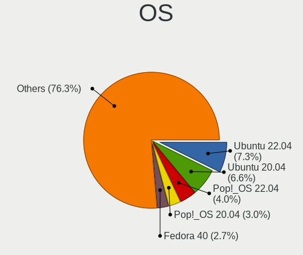

| Name                         | Computers | Percent |
|------------------------------|-----------|---------|
| Ubuntu 20.04                 | 48        | 12.4%   |
| Ubuntu 18.04                 | 25        | 6.46%   |
| Pop!_OS 20.04                | 25        | 6.46%   |
| KDE neon 20.04               | 14        | 3.62%   |
| OpenMandriva 4.2             | 13        | 3.36%   |
| Zorin 15                     | 11        | 2.84%   |
| Pop!_OS 21.04                | 10        | 2.58%   |
| BlackPanther 18.1            | 8         | 2.07%   |
| Pop!_OS 20.10                | 6         | 1.55%   |
| Linux Mint 20.2              | 6         | 1.55%   |
| Linux Mint 20.1              | 6         | 1.55%   |
| Fedora 33                    | 6         | 1.55%   |
| Endless 3.7.7                | 6         | 1.55%   |
| Arch                         | 6         | 1.55%   |
| Ubuntu 20.10                 | 5         | 1.29%   |
| OpenMandriva 4.3             | 5         | 1.29%   |
| Manjaro                      | 5         | 1.29%   |
| Linux Mint 19.3              | 5         | 1.29%   |
| Fedora 35                    | 5         | 1.29%   |
| Fedora 32                    | 5         | 1.29%   |
| Endless 3.7.6                | 5         | 1.29%   |
| BlackPanther 16.2            | 5         | 1.29%   |
| Zorin 16                     | 4         | 1.03%   |
| Xubuntu 20.04                | 4         | 1.03%   |
| Pop!_OS 21.10                | 4         | 1.03%   |
| LMDE 4                       | 4         | 1.03%   |
| Linux Mint 20.3              | 4         | 1.03%   |
| Fedora 34                    | 4         | 1.03%   |
| Debian 11                    | 4         | 1.03%   |
| Ubuntu 21.10                 | 3         | 0.78%   |
| Ubuntu 19.10                 | 3         | 0.78%   |
| Pop!_OS 22.04                | 3         | 0.78%   |
| Linux Mint 20                | 3         | 0.78%   |
| KDE neon 18.04               | 3         | 0.78%   |
| Fedora 31                    | 3         | 0.78%   |
| Endless 3.9.1                | 3         | 0.78%   |
| EndeavourOS Rolling          | 3         | 0.78%   |
| Debian 10                    | 3         | 0.78%   |
| Xubuntu 19.10                | 2         | 0.52%   |
| Xubuntu 18.04                | 2         | 0.52%   |
| Ubuntu MATE 20.04            | 2         | 0.52%   |
| Ubuntu MATE 18.04            | 2         | 0.52%   |
| Ubuntu 22.04                 | 2         | 0.52%   |
| Ubuntu 18.10                 | 2         | 0.52%   |
| Ubuntu 16.04                 | 2         | 0.52%   |
| Peppermint 10                | 2         | 0.52%   |
| openSUSE Tumbleweed-XXXXXXXX | 2         | 0.52%   |
| Manjaro 21.2.3               | 2         | 0.52%   |
| Manjaro 20.1                 | 2         | 0.52%   |
| Linux Mint 19.2              | 2         | 0.52%   |
| Linux Mint 19.1              | 2         | 0.52%   |
| Kali 2021.4                  | 2         | 0.52%   |
| Endless 3.9.4                | 2         | 0.52%   |
| Endless 3.8.7                | 2         | 0.52%   |
| Endless 3.8.1                | 2         | 0.52%   |
| Endless 3.7.5                | 2         | 0.52%   |
| Endless 3.3.20               | 2         | 0.52%   |
| EndeavourOS                  | 2         | 0.52%   |
| Elementary 5.1.7             | 2         | 0.52%   |
| Debian 9                     | 2         | 0.52%   |

OS Family
---------

OS without a version

| Name          | Computers | Percent |
|---------------|-----------|---------|
| Ubuntu        | 88        | 24.24%  |
| Pop!_OS       | 48        | 13.22%  |
| Linux Mint    | 29        | 7.99%   |
| Endless       | 29        | 7.99%   |
| Fedora        | 21        | 5.79%   |
| OpenMandriva  | 18        | 4.96%   |
| KDE neon      | 17        | 4.68%   |
| Zorin         | 15        | 4.13%   |
| Manjaro       | 12        | 3.31%   |
| BlackPanther  | 10        | 2.75%   |
| Debian        | 9         | 2.48%   |
| Xubuntu       | 8         | 2.2%    |
| Arch          | 8         | 2.2%    |
| Kali          | 5         | 1.38%   |
| Elementary    | 5         | 1.38%   |
| Ubuntu MATE   | 4         | 1.1%    |
| LMDE          | 4         | 1.1%    |
| EndeavourOS   | 4         | 1.1%    |
| ROSA          | 3         | 0.83%   |
| openSUSE      | 3         | 0.83%   |
| Kubuntu       | 3         | 0.83%   |
| Peppermint    | 2         | 0.55%   |
| MX            | 2         | 0.55%   |
| Gentoo        | 2         | 0.55%   |
| Ubuntu Budgie | 1         | 0.28%   |
| Sparky        | 1         | 0.28%   |
| Solus         | 1         | 0.28%   |
| Slackware     | 1         | 0.28%   |
| Reborn OS     | 1         | 0.28%   |
| Raspbian      | 1         | 0.28%   |
| Lubuntu       | 1         | 0.28%   |
| Linux Lite    | 1         | 0.28%   |
| Hash Linux    | 1         | 0.28%   |
| Garuda Linux  | 1         | 0.28%   |
| Clear Linux   | 1         | 0.28%   |
| BunsenLabs    | 1         | 0.28%   |
| ArcoLinux     | 1         | 0.28%   |
| Archcraft     | 1         | 0.28%   |

Kernel
------

Version of the Linux kernel

| Version                  | Computers | Percent |
|--------------------------|-----------|---------|
| 5.4.0-42-generic         | 18        | 4.3%    |
| 5.10.14-desktop-1omv4002 | 13        | 3.1%    |
| 5.3.0-28-generic         | 10        | 2.39%   |
| 5.4.0-7634-generic       | 8         | 1.91%   |
| 5.4.0-48-generic         | 8         | 1.91%   |
| 4.18.16-desktop-1bP      | 8         | 1.91%   |
| 5.3.0-23-generic         | 7         | 1.67%   |
| 5.8.0-7630-generic       | 6         | 1.43%   |
| 5.8.0-14-generic         | 6         | 1.43%   |
| 5.4.0-58-generic         | 5         | 1.19%   |
| 5.4.0-47-generic         | 5         | 1.19%   |
| 5.16.7-desktop-1omv4003  | 5         | 1.19%   |
| 5.11.0-7620-generic      | 5         | 1.19%   |
| 4.9.20-desktop-pae-1bP   | 5         | 1.19%   |
| 5.4.0-7642-generic       | 4         | 0.95%   |
| 5.4.0-73-generic         | 4         | 0.95%   |
| 5.4.0-19-generic         | 4         | 0.95%   |
| 5.13.0-7614-generic      | 4         | 0.95%   |
| 5.13.0-30-generic        | 4         | 0.95%   |
| 4.18.0-25-generic        | 4         | 0.95%   |
| 5.8.0-7642-generic       | 3         | 0.72%   |
| 5.4.0-80-generic         | 3         | 0.72%   |
| 5.4.0-52-generic         | 3         | 0.72%   |
| 5.4.0-45-generic         | 3         | 0.72%   |
| 5.4.0-31-generic         | 3         | 0.72%   |
| 5.3.0-46-generic         | 3         | 0.72%   |
| 5.17.5-76051705-generic  | 3         | 0.72%   |
| 5.13.0-40-generic        | 3         | 0.72%   |
| 5.13.0-35-generic        | 3         | 0.72%   |
| 5.13.0-28-generic        | 3         | 0.72%   |
| 5.11.0-7614-generic      | 3         | 0.72%   |
| 5.11.0-27-generic        | 3         | 0.72%   |
| 5.0.0-37-generic         | 3         | 0.72%   |
| 5.9.16-1-MANJARO         | 2         | 0.48%   |
| 5.8.0-59-generic         | 2         | 0.48%   |
| 5.8.0-36-generic         | 2         | 0.48%   |
| 5.8.0-1019-raspi         | 2         | 0.48%   |
| 5.4.20-200.fc31.x86_64   | 2         | 0.48%   |
| 5.4.0-90-generic         | 2         | 0.48%   |
| 5.4.0-81-generic         | 2         | 0.48%   |
| 5.4.0-7625-generic       | 2         | 0.48%   |
| 5.4.0-74-generic         | 2         | 0.48%   |
| 5.4.0-65-generic         | 2         | 0.48%   |
| 5.4.0-54-generic         | 2         | 0.48%   |
| 5.4.0-39-generic         | 2         | 0.48%   |
| 5.3.0-53-generic         | 2         | 0.48%   |
| 5.3.0-51-generic         | 2         | 0.48%   |
| 5.3.0-42-generic         | 2         | 0.48%   |
| 5.3.0-40-generic         | 2         | 0.48%   |
| 5.15.21-1-MANJARO        | 2         | 0.48%   |
| 5.13.8-200.fc34.x86_64   | 2         | 0.48%   |
| 5.13.0-7620-generic      | 2         | 0.48%   |
| 5.13.0-41-generic        | 2         | 0.48%   |
| 5.11.16-arch1-1          | 2         | 0.48%   |
| 5.11.0-43-generic        | 2         | 0.48%   |
| 5.11.0-38-generic        | 2         | 0.48%   |
| 5.11.0-34-generic        | 2         | 0.48%   |
| 5.0.0-32-generic         | 2         | 0.48%   |
| 5.0.0-27-generic         | 2         | 0.48%   |
| 4.19.0-17-amd64          | 2         | 0.48%   |

Kernel Family
-------------

Linux kernel without a distro release

| Version | Computers | Percent |
|---------|-----------|---------|
| 5.4.0   | 94        | 23.62%  |
| 5.3.0   | 32        | 8.04%   |
| 5.8.0   | 30        | 7.54%   |
| 5.13.0  | 27        | 6.78%   |
| 5.11.0  | 23        | 5.78%   |
| 4.15.0  | 20        | 5.03%   |
| 5.10.14 | 13        | 3.27%   |
| 5.0.0   | 11        | 2.76%   |
| 4.18.0  | 10        | 2.51%   |
| 4.19.0  | 8         | 2.01%   |
| 4.18.16 | 8         | 2.01%   |
| 5.10.0  | 6         | 1.51%   |
| 4.9.20  | 6         | 1.51%   |
| 5.17.5  | 5         | 1.26%   |
| 5.16.7  | 5         | 1.26%   |
| 5.15.0  | 4         | 1.01%   |
| 5.9.16  | 3         | 0.75%   |
| 5.11.16 | 3         | 0.75%   |
| 4.4.0   | 3         | 0.75%   |
| 5.9.11  | 2         | 0.5%    |
| 5.8.14  | 2         | 0.5%    |
| 5.4.20  | 2         | 0.5%    |
| 5.16.0  | 2         | 0.5%    |
| 5.15.21 | 2         | 0.5%    |
| 5.15.10 | 2         | 0.5%    |
| 5.14.0  | 2         | 0.5%    |
| 5.13.8  | 2         | 0.5%    |
| 5.11.12 | 2         | 0.5%    |
| 4.13.0  | 2         | 0.5%    |
| 5.9.14  | 1         | 0.25%   |
| 5.9.13  | 1         | 0.25%   |
| 5.9.10  | 1         | 0.25%   |
| 5.8.8   | 1         | 0.25%   |
| 5.8.6   | 1         | 0.25%   |
| 5.8.4   | 1         | 0.25%   |
| 5.8.3   | 1         | 0.25%   |
| 5.8.18  | 1         | 0.25%   |
| 5.7.11  | 1         | 0.25%   |
| 5.7.1   | 1         | 0.25%   |
| 5.6.16  | 1         | 0.25%   |
| 5.6.10  | 1         | 0.25%   |
| 5.6.0   | 1         | 0.25%   |
| 5.4.96  | 1         | 0.25%   |
| 5.4.73  | 1         | 0.25%   |
| 5.4.70  | 1         | 0.25%   |
| 5.4.61  | 1         | 0.25%   |
| 5.4.60  | 1         | 0.25%   |
| 5.4.24  | 1         | 0.25%   |
| 5.4.23  | 1         | 0.25%   |
| 5.4.2   | 1         | 0.25%   |
| 5.4.105 | 1         | 0.25%   |
| 5.3.18  | 1         | 0.25%   |
| 5.3.12  | 1         | 0.25%   |
| 5.2.14  | 1         | 0.25%   |
| 5.16.9  | 1         | 0.25%   |
| 5.16.2  | 1         | 0.25%   |
| 5.16.19 | 1         | 0.25%   |
| 5.16.18 | 1         | 0.25%   |
| 5.16.16 | 1         | 0.25%   |
| 5.16.15 | 1         | 0.25%   |

Kernel Major Ver.
-----------------

Linux kernel major version

| Version | Computers | Percent |
|---------|-----------|---------|
| 5.4     | 105       | 26.58%  |
| 5.8     | 37        | 9.37%   |
| 5.3     | 34        | 8.61%   |
| 5.10    | 31        | 7.85%   |
| 5.13    | 30        | 7.59%   |
| 5.11    | 28        | 7.09%   |
| 4.15    | 20        | 5.06%   |
| 4.18    | 18        | 4.56%   |
| 5.15    | 17        | 4.3%    |
| 5.16    | 15        | 3.8%    |
| 5.0     | 12        | 3.04%   |
| 4.9     | 8         | 2.03%   |
| 4.19    | 8         | 2.03%   |
| 5.9     | 7         | 1.77%   |
| 5.17    | 5         | 1.27%   |
| 5.14    | 4         | 1.01%   |
| 4.4     | 4         | 1.01%   |
| 5.6     | 3         | 0.76%   |
| 5.7     | 2         | 0.51%   |
| 5.12    | 2         | 0.51%   |
| 4.13    | 2         | 0.51%   |
| 5.2     | 1         | 0.25%   |
| 5.1     | 1         | 0.25%   |
| 3.8     | 1         | 0.25%   |

Arch
----

OS architecture (x86_64, i586, etc.)

| Name    | Computers | Percent |
|---------|-----------|---------|
| x86_64  | 334       | 94.08%  |
| i686    | 14        | 3.94%   |
| armv7l  | 4         | 1.13%   |
| aarch64 | 3         | 0.85%   |

DE
--

Desktop Environment

| Name            | Computers | Percent |
|-----------------|-----------|---------|
| GNOME           | 171       | 46.59%  |
| KDE5            | 56        | 15.26%  |
| Unknown         | 35        | 9.54%   |
| XFCE            | 29        | 7.9%    |
| X-Cinnamon      | 25        | 6.81%   |
| KDE             | 17        | 4.63%   |
| MATE            | 7         | 1.91%   |
| Unity           | 5         | 1.36%   |
| Pantheon        | 4         | 1.09%   |
| LXQt            | 3         | 0.82%   |
| LXDE            | 3         | 0.82%   |
| Openbox         | 2         | 0.54%   |
| Cinnamon        | 2         | 0.54%   |
| Budgie          | 2         | 0.54%   |
| sway            | 1         | 0.27%   |
| river           | 1         | 0.27%   |
| GNOME Flashback | 1         | 0.27%   |
| default         | 1         | 0.27%   |
| Deepin          | 1         | 0.27%   |
| awesome         | 1         | 0.27%   |

Display Server
--------------

X11 or Wayland

| Name    | Computers | Percent |
|---------|-----------|---------|
| X11     | 314       | 87.22%  |
| Wayland | 23        | 6.39%   |
| Unknown | 17        | 4.72%   |
| Tty     | 6         | 1.67%   |

Display Manager
---------------

SDDM, LightDM, etc.

| Name    | Computers | Percent |
|---------|-----------|---------|
| Unknown | 231       | 63.11%  |
| SDDM    | 49        | 13.39%  |
| GDM     | 38        | 10.38%  |
| LightDM | 23        | 6.28%   |
| GDM3    | 12        | 3.28%   |
| TDM     | 10        | 2.73%   |
| SLiM    | 1         | 0.27%   |
| MDM     | 1         | 0.27%   |
| LXDM    | 1         | 0.27%   |

OS Lang
-------

Language

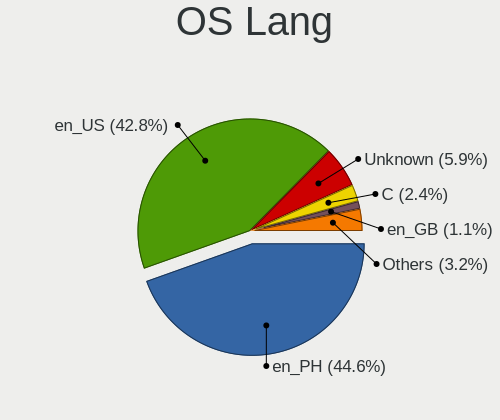

| Lang    | Computers | Percent |
|---------|-----------|---------|
| en_PH   | 163       | 45.03%  |
| en_US   | 134       | 37.02%  |
| Unknown | 43        | 11.88%  |
| C       | 8         | 2.21%   |
| en_GB   | 5         | 1.38%   |
| de_DE   | 4         | 1.1%    |
| zh_HK   | 1         | 0.28%   |
| zh_CN   | 1         | 0.28%   |
| fil_PH  | 1         | 0.28%   |
| en_NZ   | 1         | 0.28%   |
| da_DK   | 1         | 0.28%   |

Boot Mode
---------

EFI or BIOS

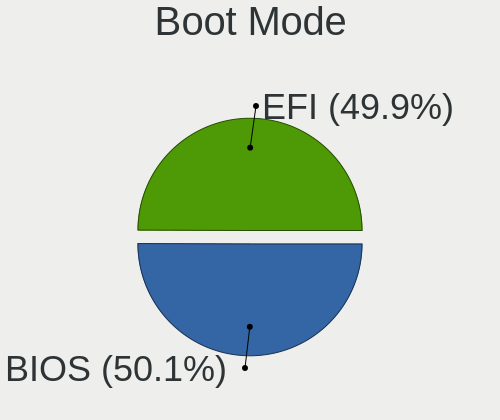

| Mode | Computers | Percent |
|------|-----------|---------|
| BIOS | 193       | 53.46%  |
| EFI  | 168       | 46.54%  |

Filesystem
----------

Type of filesystem

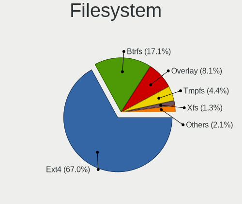

| Type    | Computers | Percent |
|---------|-----------|---------|
| Ext4    | 288       | 78.9%   |
| Overlay | 31        | 8.49%   |
| Btrfs   | 27        | 7.4%    |
| Unknown | 11        | 3.01%   |
| Xfs     | 4         | 1.1%    |
| Ext2    | 3         | 0.82%   |
| Zfs     | 1         | 0.27%   |

Part. scheme
------------

Scheme of partitioning

| Type    | Computers | Percent |
|---------|-----------|---------|
| Unknown | 235       | 64.38%  |
| GPT     | 88        | 24.11%  |
| MBR     | 42        | 11.51%  |

Dual Boot with Linux/BSD
------------------------

Hosting more than one Linux/BSD

| Dual boot | Computers | Percent |
|-----------|-----------|---------|
| No        | 317       | 87.09%  |
| Yes       | 47        | 12.91%  |

Dual Boot (Win)
---------------

Hosting Linux and Windows

| Dual boot | Computers | Percent |
|-----------|-----------|---------|
| No        | 272       | 74.52%  |
| Yes       | 93        | 25.48%  |

Board
-----

Vendor
------

Motherboard manufacturer

| Name                      | Computers | Percent |
|---------------------------|-----------|---------|
| Lenovo                    | 55        | 15.63%  |
| ASUSTek Computer          | 45        | 12.78%  |
| Acer                      | 45        | 12.78%  |
| Hewlett-Packard           | 33        | 9.38%   |
| Dell                      | 30        | 8.52%   |
| MSI                       | 29        | 8.24%   |
| Gigabyte Technology       | 27        | 7.67%   |
| Toshiba                   | 11        | 3.13%   |
| ASRock                    | 9         | 2.56%   |
| Apple                     | 8         | 2.27%   |
| Samsung Electronics       | 5         | 1.42%   |
| Foxconn                   | 5         | 1.42%   |
| Sony                      | 4         | 1.14%   |
| Raspberry Pi Foundation   | 4         | 1.14%   |
| ECS                       | 4         | 1.14%   |
| Clevo                     | 4         | 1.14%   |
| Biostar                   | 4         | 1.14%   |
| Unknown                   | 4         | 1.14%   |
| NEC Computers             | 3         | 0.85%   |
| EMAXX TECHNOLOGY          | 3         | 0.85%   |
| eMachines                 | 3         | 0.85%   |
| Pegatron                  | 2         | 0.57%   |
| Wacom                     | 1         | 0.28%   |
| TriGem Computer           | 1         | 0.28%   |
| Shenzhen Bmorn Technology | 1         | 0.28%   |
| QTQD                      | 1         | 0.28%   |
| PERSONA                   | 1         | 0.28%   |
| Notebook                  | 1         | 0.28%   |
| Microsoft                 | 1         | 0.28%   |
| Jumper                    | 1         | 0.28%   |
| JOOYON                    | 1         | 0.28%   |
| Intel                     | 1         | 0.28%   |
| HASEE Computer            | 1         | 0.28%   |
| Google                    | 1         | 0.28%   |
| Fujitsu                   | 1         | 0.28%   |
| Cubix                     | 1         | 0.28%   |
| AMD                       | 1         | 0.28%   |

Model
-----

Motherboard model

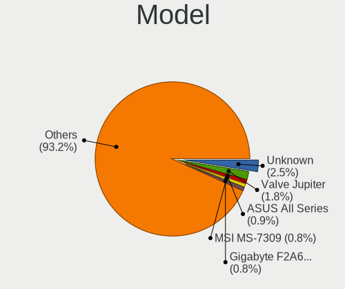

| Name                                     | Computers | Percent |
|------------------------------------------|-----------|---------|
| Unknown                                  | 8         | 2.27%   |
| Acer Aspire ES1-132                      | 6         | 1.7%    |
| MSI MS-7721                              | 4         | 1.14%   |
| MSI MS-7309                              | 4         | 1.14%   |
| ASUS All Series                          | 4         | 1.14%   |
| RPi Raspberry Pi                         | 3         | 0.85%   |
| HP Notebook                              | 3         | 0.85%   |
| Foxconn G31MX Series                     | 3         | 0.85%   |
| Clevo M7x0S                              | 3         | 0.85%   |
| ASUS P8H61-M LX3 PLUS R2.0               | 3         | 0.85%   |
| ASRock B450M Steel Legend                | 3         | 0.85%   |
| Pegatron IPMSB-H61                       | 2         | 0.57%   |
| Lenovo Yoga 520-14IKB 81C8               | 2         | 0.57%   |
| Lenovo V110-14IAP 80TF                   | 2         | 0.57%   |
| Gigabyte Z590 AORUS ULTRA                | 2         | 0.57%   |
| Gigabyte F2A68HM-S1                      | 2         | 0.57%   |
| Gigabyte A320M-S2H V2                    | 2         | 0.57%   |
| Foxconn 500B Microtower                  | 2         | 0.57%   |
| eMachines eM350                          | 2         | 0.57%   |
| Dell OptiPlex 9010 AIO                   | 2         | 0.57%   |
| Dell Latitude E7450                      | 2         | 0.57%   |
| Dell Inspiron 5567                       | 2         | 0.57%   |
| ASUS X540NA                              | 2         | 0.57%   |
| ASUS PRIME B250M-K                       | 2         | 0.57%   |
| ASUS EX-H310M-V3 R2.0                    | 2         | 0.57%   |
| Apple MacBookPro5,5                      | 2         | 0.57%   |
| Acer TravelMate P249-G2-M                | 2         | 0.57%   |
| Acer TravelMate B113                     | 2         | 0.57%   |
| Acer Aspire E5-551G                      | 2         | 0.57%   |
| Acer Aspire A315-51                      | 2         | 0.57%   |
| Acer Aspire A315-41G                     | 2         | 0.57%   |
| Wacom Citiq Companion                    | 1         | 0.28%   |
| TriGem DreamSys                          | 1         | 0.28%   |
| Toshiba TECRA R940                       | 1         | 0.28%   |
| Toshiba Satellite Pro U400               | 1         | 0.28%   |
| Toshiba Satellite P845                   | 1         | 0.28%   |
| Toshiba Satellite L515                   | 1         | 0.28%   |
| Toshiba Satellite E45t-A                 | 1         | 0.28%   |
| Toshiba Satellite C650                   | 1         | 0.28%   |
| Toshiba Satellite C55D-B                 | 1         | 0.28%   |
| Toshiba PORTEGE R30-A                    | 1         | 0.28%   |
| Toshiba NB255                            | 1         | 0.28%   |
| Toshiba dynabook R73/W                   | 1         | 0.28%   |
| Toshiba dynabook B45/A                   | 1         | 0.28%   |
| Sony VPCEA36FA                           | 1         | 0.28%   |
| Sony SVT13115FGS                         | 1         | 0.28%   |
| Sony SVP13215CDB                         | 1         | 0.28%   |
| Sony SVF14216SGP                         | 1         | 0.28%   |
| Shenzhen Bmorn NBPC1078                  | 1         | 0.28%   |
| Samsung RF511/RF411/RF711                | 1         | 0.28%   |
| Samsung RC420/RC520/RC720                | 1         | 0.28%   |
| Samsung N150P/N210P/N220P                | 1         | 0.28%   |
| Samsung 905S3G/906S3G/915S3G/9305SG      | 1         | 0.28%   |
| Samsung 3570R/370R/470R/450R/510R/4450RV | 1         | 0.28%   |
| RPi Raspberry Pi 4 Model B Rev 1.4       | 1         | 0.28%   |
| PERSONA MYBOOK 14                        | 1         | 0.28%   |
| Notebook NH5x_7xDCx_DDx                  | 1         | 0.28%   |
| NEC Computers PC-VY24GXZ7A               | 1         | 0.28%   |
| NEC Computers PC-VK25MXZCB               | 1         | 0.28%   |
| NEC Computers PC-MK36LBZCHEAM            | 1         | 0.28%   |

Model Family
------------

Motherboard model prefix

| Name                    | Computers | Percent |
|-------------------------|-----------|---------|
| Acer Aspire             | 32        | 9.09%   |
| Lenovo ThinkPad         | 23        | 6.53%   |
| Lenovo IdeaPad          | 19        | 5.4%    |
| Dell Inspiron           | 10        | 2.84%   |
| Dell OptiPlex           | 8         | 2.27%   |
| Unknown                 | 8         | 2.27%   |
| HP Pavilion             | 7         | 1.99%   |
| Acer TravelMate         | 7         | 1.99%   |
| Toshiba Satellite       | 6         | 1.7%    |
| Dell Latitude           | 5         | 1.42%   |
| ASUS P8H61-M            | 5         | 1.42%   |
| RPi Raspberry           | 4         | 1.14%   |
| MSI MS-7721             | 4         | 1.14%   |
| MSI MS-7309             | 4         | 1.14%   |
| ASUS TUF                | 4         | 1.14%   |
| ASUS ROG                | 4         | 1.14%   |
| ASUS PRIME              | 4         | 1.14%   |
| ASUS All                | 4         | 1.14%   |
| Lenovo Legion           | 3         | 0.85%   |
| HP ProDesk              | 3         | 0.85%   |
| HP Notebook             | 3         | 0.85%   |
| HP EliteBook            | 3         | 0.85%   |
| Gigabyte A320M-S2H      | 3         | 0.85%   |
| Foxconn G31MX           | 3         | 0.85%   |
| Clevo M7x0S             | 3         | 0.85%   |
| ASRock B450M            | 3         | 0.85%   |
| Acer Nitro              | 3         | 0.85%   |
| Toshiba dynabook        | 2         | 0.57%   |
| Pegatron IPMSB-H61      | 2         | 0.57%   |
| Lenovo Yoga             | 2         | 0.57%   |
| Lenovo V110-14IAP       | 2         | 0.57%   |
| Lenovo IdeaPadFlex      | 2         | 0.57%   |
| HP Stream               | 2         | 0.57%   |
| HP ProBook              | 2         | 0.57%   |
| HP Compaq               | 2         | 0.57%   |
| Gigabyte Z590           | 2         | 0.57%   |
| Gigabyte F2A68HM-S1     | 2         | 0.57%   |
| Gigabyte B450           | 2         | 0.57%   |
| Foxconn 500B            | 2         | 0.57%   |
| eMachines eM350         | 2         | 0.57%   |
| Dell XPS                | 2         | 0.57%   |
| Dell Vostro             | 2         | 0.57%   |
| ASUS X540NA             | 2         | 0.57%   |
| ASUS VivoBook           | 2         | 0.57%   |
| ASUS EX-H310M-V3        | 2         | 0.57%   |
| Apple MacBookPro5       | 2         | 0.57%   |
| Wacom Citiq             | 1         | 0.28%   |
| TriGem DreamSys         | 1         | 0.28%   |
| Toshiba TECRA           | 1         | 0.28%   |
| Toshiba PORTEGE         | 1         | 0.28%   |
| Toshiba NB255           | 1         | 0.28%   |
| Sony VPCEA36FA          | 1         | 0.28%   |
| Sony SVT13115FGS        | 1         | 0.28%   |
| Sony SVP13215CDB        | 1         | 0.28%   |
| Sony SVF14216SGP        | 1         | 0.28%   |
| Shenzhen Bmorn NBPC1078 | 1         | 0.28%   |
| Samsung RF511           | 1         | 0.28%   |
| Samsung RC420           | 1         | 0.28%   |
| Samsung N150P           | 1         | 0.28%   |
| Samsung 905S3G          | 1         | 0.28%   |

MFG Year
--------

Motherboard manufacture year

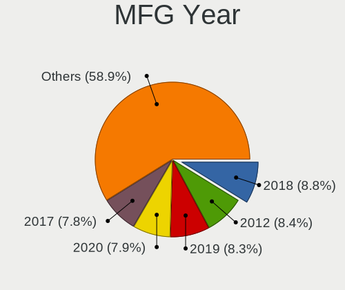

| Year    | Computers | Percent |
|---------|-----------|---------|
| 2012    | 35        | 9.94%   |
| 2014    | 34        | 9.66%   |
| 2017    | 32        | 9.09%   |
| 2018    | 30        | 8.52%   |
| 2016    | 28        | 7.95%   |
| 2010    | 28        | 7.95%   |
| 2019    | 27        | 7.67%   |
| 2015    | 23        | 6.53%   |
| 2011    | 21        | 5.97%   |
| 2013    | 19        | 5.4%    |
| 2020    | 18        | 5.11%   |
| 2009    | 17        | 4.83%   |
| 2021    | 14        | 3.98%   |
| 2007    | 9         | 2.56%   |
| 2008    | 8         | 2.27%   |
| Unknown | 7         | 1.99%   |
| 2022    | 1         | 0.28%   |
| 2006    | 1         | 0.28%   |

Form Factor
-----------

Physical design of the computer

| Name           | Computers | Percent |
|----------------|-----------|---------|
| Notebook       | 211       | 59.94%  |
| Desktop        | 120       | 34.09%  |
| Mini pc        | 6         | 1.7%    |
| System on chip | 4         | 1.14%   |
| Convertible    | 4         | 1.14%   |
| All in one     | 4         | 1.14%   |
| Tablet         | 3         | 0.85%   |

Secure Boot
-----------

Enabled or disabled

| State    | Computers | Percent |
|----------|-----------|---------|
| Disabled | 317       | 90.06%  |
| Enabled  | 35        | 9.94%   |

Coreboot
--------

Have coreboot on board

| Used | Computers | Percent |
|------|-----------|---------|
| No   | 351       | 99.72%  |
| Yes  | 1         | 0.28%   |

RAM Size
--------

Total RAM memory

| Size in GB  | Computers | Percent |
|-------------|-----------|---------|
| 3.01-4.0    | 96        | 26.45%  |
| 4.01-8.0    | 75        | 20.66%  |
| 8.01-16.0   | 74        | 20.39%  |
| 1.01-2.0    | 41        | 11.29%  |
| 16.01-24.0  | 39        | 10.74%  |
| 32.01-64.0  | 13        | 3.58%   |
| 2.01-3.0    | 11        | 3.03%   |
| 64.01-256.0 | 5         | 1.38%   |
| 0.51-1.0    | 5         | 1.38%   |
| 24.01-32.0  | 4         | 1.1%    |

RAM Used
--------

Used RAM memory

| Used GB   | Computers | Percent |
|-----------|-----------|---------|
| 1.01-2.0  | 152       | 38.38%  |
| 2.01-3.0  | 109       | 27.53%  |
| 4.01-8.0  | 42        | 10.61%  |
| 0.51-1.0  | 41        | 10.35%  |
| 3.01-4.0  | 36        | 9.09%   |
| 0.01-0.5  | 8         | 2.02%   |
| 8.01-16.0 | 7         | 1.77%   |
| Unknown   | 1         | 0.25%   |

Total Drives
------------

Number of drives on board

| Drives | Computers | Percent |
|--------|-----------|---------|
| 1      | 241       | 65.31%  |
| 2      | 91        | 24.66%  |
| 3      | 17        | 4.61%   |
| 4      | 10        | 2.71%   |
| 5      | 6         | 1.63%   |
| 0      | 3         | 0.81%   |
| 13     | 1         | 0.27%   |

Has CD-ROM
----------

Has CD-ROM on board

| Presented | Computers | Percent |
|-----------|-----------|---------|
| No        | 242       | 67.04%  |
| Yes       | 119       | 32.96%  |

Has Ethernet
------------

Has Ethernet on board

| Presented | Computers | Percent |
|-----------|-----------|---------|
| Yes       | 304       | 86.36%  |
| No        | 48        | 13.64%  |

Has WiFi
--------

Has WiFi module

| Presented | Computers | Percent |
|-----------|-----------|---------|
| Yes       | 267       | 75.21%  |
| No        | 88        | 24.79%  |

Has Bluetooth
-------------

Has Bluetooth module

| Presented | Computers | Percent |
|-----------|-----------|---------|
| Yes       | 196       | 55.06%  |
| No        | 160       | 44.94%  |

Location
--------

Country
-------

Geographic location (country)

| Country     | Computers | Percent |
|-------------|-----------|---------|
| Philippines | 352       | 100%    |

City
----

Geographic location (city)

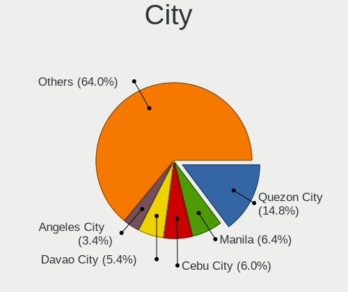

| City                | Computers | Percent |
|---------------------|-----------|---------|
| Quezon City         | 67        | 17.05%  |
| Cebu City           | 25        | 6.36%   |
| Davao City          | 21        | 5.34%   |
| Angeles City        | 20        | 5.09%   |
| Cagayan de Oro      | 16        | 4.07%   |
| Pasig               | 13        | 3.31%   |
| Manila              | 13        | 3.31%   |
| Paranaque City      | 11        | 2.8%    |
| San Jose del Monte  | 10        | 2.54%   |
| Bacolod City        | 10        | 2.54%   |
| San Miguel          | 9         | 2.29%   |
| Manajao             | 9         | 2.29%   |
| Bacoor              | 9         | 2.29%   |
| Makati City         | 8         | 2.04%   |
| Iligan City         | 8         | 2.04%   |
| Santa Rosa          | 7         | 1.78%   |
| Imus                | 7         | 1.78%   |
| Caloocan City       | 7         | 1.78%   |
| San Fernando City   | 6         | 1.53%   |
| Mandaluyong City    | 6         | 1.53%   |
| Las Pinas           | 6         | 1.53%   |
| Lahug               | 5         | 1.27%   |
| Zamboanga City      | 4         | 1.02%   |
| Tarlac City         | 4         | 1.02%   |
| Malolos             | 4         | 1.02%   |
| Lucena City         | 4         | 1.02%   |
| General Santos      | 4         | 1.02%   |
| Lipa City           | 3         | 0.76%   |
| Iloilo City         | 3         | 0.76%   |
| Dasmarinas          | 3         | 0.76%   |
| City of Muntinglupa | 3         | 0.76%   |
| Baguio City         | 3         | 0.76%   |
| Antipolo City       | 3         | 0.76%   |
| Tuguegarao City     | 2         | 0.51%   |
| Taguig              | 2         | 0.51%   |
| San Pedro           | 2         | 0.51%   |
| Oroquieta           | 2         | 0.51%   |
| Naga                | 2         | 0.51%   |
| Marikina City       | 2         | 0.51%   |
| Mandaue City        | 2         | 0.51%   |
| Magugpo Poblacion   | 2         | 0.51%   |
| Lapu-Lapu City      | 2         | 0.51%   |
| Cabanatuan City     | 2         | 0.51%   |
| Agoo                | 2         | 0.51%   |
| Abaga               | 2         | 0.51%   |
| Taytay              | 1         | 0.25%   |
| Talisay City        | 1         | 0.25%   |
| Sibulan             | 1         | 0.25%   |
| San Pablo City      | 1         | 0.25%   |
| San Juan            | 1         | 0.25%   |
| San Carlos          | 1         | 0.25%   |
| Roxas City          | 1         | 0.25%   |
| Rosario             | 1         | 0.25%   |
| Rizal               | 1         | 0.25%   |
| Pinagbuhatan        | 1         | 0.25%   |
| Pili                | 1         | 0.25%   |
| Pasay               | 1         | 0.25%   |
| Ormoc City          | 1         | 0.25%   |
| Naic                | 1         | 0.25%   |
| Nagkaisang Nayon    | 1         | 0.25%   |

Drives
------

Drive Vendor
------------

Hard drive vendors

| Vendor                    | Computers | Drives | Percent |
|---------------------------|-----------|--------|---------|
| Seagate                   | 96        | 145    | 19.75%  |
| WDC                       | 89        | 110    | 18.31%  |
| Toshiba                   | 58        | 77     | 11.93%  |
| Samsung Electronics       | 34        | 43     | 7%      |
| Hitachi                   | 29        | 48     | 5.97%   |
| Unknown                   | 24        | 31     | 4.94%   |
| Kingston                  | 22        | 28     | 4.53%   |
| Sandisk                   | 17        | 18     | 3.5%    |
| SK Hynix                  | 11        | 24     | 2.26%   |
| HGST                      | 11        | 12     | 2.26%   |
| Intel                     | 7         | 8      | 1.44%   |
| A-DATA Technology         | 7         | 10     | 1.44%   |
| Gigabyte Technology       | 6         | 7      | 1.23%   |
| Fujitsu                   | 6         | 7      | 1.23%   |
| Team                      | 5         | 8      | 1.03%   |
| Micron Technology         | 5         | 5      | 1.03%   |
| Transcend                 | 4         | 4      | 0.82%   |
| Lexar                     | 4         | 5      | 0.82%   |
| Crucial                   | 4         | 6      | 0.82%   |
| Ramsta                    | 3         | 4      | 0.62%   |
| Apple                     | 3         | 3      | 0.62%   |
| XPG                       | 2         | 2      | 0.41%   |
| Silicon Motion            | 2         | 2      | 0.41%   |
| LITEONIT                  | 2         | 3      | 0.41%   |
| Kingmax                   | 2         | 2      | 0.41%   |
| HS-SSD-E100               | 2         | 2      | 0.41%   |
| China                     | 2         | 2      | 0.41%   |
| ZOTAC                     | 1         | 1      | 0.21%   |
| XrayDisk                  | 1         | 1      | 0.21%   |
| walram                    | 1         | 1      | 0.21%   |
| Voyager                   | 1         | 1      | 0.21%   |
| UMIS                      | 1         | 1      | 0.21%   |
| Teclast                   | 1         | 3      | 0.21%   |
| TAMMUZ                    | 1         | 1      | 0.21%   |
| SPCC                      | 1         | 2      | 0.21%   |
| Solid State Storage       | 1         | 1      | 0.21%   |
| sage                      | 1         | 1      | 0.21%   |
| Realtek Semiconductor     | 1         | 1      | 0.21%   |
| QGeeM                     | 1         | 1      | 0.21%   |
| PNY                       | 1         | 1      | 0.21%   |
| Phison                    | 1         | 1      | 0.21%   |
| OCZ                       | 1         | 1      | 0.21%   |
| Micron/Crucial Technology | 1         | 1      | 0.21%   |
| Lite-On                   | 1         | 3      | 0.21%   |
| Lenovo                    | 1         | 1      | 0.21%   |
| KIOXIA                    | 1         | 1      | 0.21%   |
| KingSpec                  | 1         | 1      | 0.21%   |
| kimtigo                   | 1         | 2      | 0.21%   |
| JMicron                   | 1         | 4      | 0.21%   |
| JetDrive                  | 1         | 1      | 0.21%   |
| Indilinx                  | 1         | 1      | 0.21%   |
| Hikvision                 | 1         | 2      | 0.21%   |
| Colorful                  | 1         | 1      | 0.21%   |
| ASUS-PHISON               | 1         | 2      | 0.21%   |
| Argon                     | 1         | 2      | 0.21%   |
| 16GB SAT                  | 1         | 1      | 0.21%   |

Drive Model
-----------

Hard drive models

| Model                               | Computers | Percent |
|-------------------------------------|-----------|---------|
| Toshiba MQ01ABF050 500GB            | 13        | 2.47%   |
| Seagate ST500DM002-1BD142 500GB     | 11        | 2.09%   |
| Seagate ST1000DM010-2EP102 1TB      | 9         | 1.71%   |
| Toshiba MQ01ABD100 1TB              | 8         | 1.52%   |
| Seagate ST1000LM035-1RK172 1TB      | 8         | 1.52%   |
| WDC WD5000LPCX-21VHAT0 500GB        | 7         | 1.33%   |
| Toshiba DT01ACA050 500GB            | 6         | 1.14%   |
| Samsung SSD 860 EVO 500GB           | 6         | 1.14%   |
| Kingston SA400S37120G 120GB SSD     | 6         | 1.14%   |
| Unknown MMC Card  32GB              | 5         | 0.95%   |
| Toshiba MQ04ABF100 1TB              | 5         | 0.95%   |
| Seagate ST4000DM004-2CV104 4TB      | 5         | 0.95%   |
| Samsung SSD 860 EVO 250GB           | 5         | 0.95%   |
| Kingston SA400S37240G 240GB SSD     | 5         | 0.95%   |
| Hitachi HTS543232A7A384 320GB       | 5         | 0.95%   |
| Hitachi HDS721050CLA362 500GB       | 5         | 0.95%   |
| WDC WD10EZEX-08WN4A0 1TB            | 4         | 0.76%   |
| Unknown MMC Card  64GB              | 4         | 0.76%   |
| Seagate ST500LT012-9WS142 500GB     | 4         | 0.76%   |
| Seagate ST500LT012-1DG142 500GB     | 4         | 0.76%   |
| Seagate BUP Slim 2TB                | 4         | 0.76%   |
| Hitachi HDS721616PLA380 164GB       | 4         | 0.76%   |
| HGST HTS725050A7E630 500GB          | 4         | 0.76%   |
| WDC WD5000LPVX-22V0TT0 500GB        | 3         | 0.57%   |
| WDC WD5000LPCX-60VHAT0 500GB        | 3         | 0.57%   |
| WDC WD5000AZLX-60K2TA0 500GB        | 3         | 0.57%   |
| WDC WD10JPVX-22JC3T0 1TB            | 3         | 0.57%   |
| Toshiba DT01ACA100 1TB              | 3         | 0.57%   |
| Seagate ST500LM030-2E717D 500GB     | 3         | 0.57%   |
| Seagate ST3160812AS 160GB           | 3         | 0.57%   |
| Seagate ST2000LM007-1R8174 2TB      | 3         | 0.57%   |
| Seagate ST1000LM048-2E7172 1TB      | 3         | 0.57%   |
| SanDisk SDSSDA240G 240GB            | 3         | 0.57%   |
| Lexar 128GB SSD                     | 3         | 0.57%   |
| Kingston SV300S37A120G 120GB SSD    | 3         | 0.57%   |
| HGST HTS541010A9E680 1TB            | 3         | 0.57%   |
| A-DATA SU800 256GB SSD              | 3         | 0.57%   |
| WDC WDS500G2B0A-00SM50 500GB SSD    | 2         | 0.38%   |
| WDC WD5003ABYZ-011FA0 500GB         | 2         | 0.38%   |
| WDC WD5000LPCX-24VHAT0 500GB        | 2         | 0.38%   |
| WDC WD5000LPCX-24C6HT0 500GB        | 2         | 0.38%   |
| WDC WD3200BEVT-22ZCT0 320GB         | 2         | 0.38%   |
| WDC WD20EARX-00ZUDB0 2TB            | 2         | 0.38%   |
| WDC WD1600BEVT-24A23T0 160GB        | 2         | 0.38%   |
| WDC WD10SPZX-24Z10T0 1TB            | 2         | 0.38%   |
| WDC WD10SPZX-24Z10 1TB              | 2         | 0.38%   |
| WDC WD10EZEX-22MFCA0 1TB            | 2         | 0.38%   |
| WDC WD10EZEX-08M2NA0 1TB            | 2         | 0.38%   |
| WDC WD10EZEX-00BN5A0 1TB            | 2         | 0.38%   |
| Unknown SD/MMC/MS PRO 999GB         | 2         | 0.38%   |
| Unknown MMC Card  7GB               | 2         | 0.38%   |
| Unknown MMC Card  128GB             | 2         | 0.38%   |
| Transcend TS128GSSD370S 128GB       | 2         | 0.38%   |
| Toshiba THNSNJ128G8NU 128GB SSD     | 2         | 0.38%   |
| Toshiba MK3265GSX 320GB             | 2         | 0.38%   |
| Toshiba MK2555GSX 250GB             | 2         | 0.38%   |
| SK Hynix NVMe SSD Drive 512GB       | 2         | 0.38%   |
| SK Hynix NVMe SSD Drive 256GB       | 2         | 0.38%   |
| Silicon Motion NVMe SSD Drive 128GB | 2         | 0.38%   |
| Seagate ST9500325AS 500GB           | 2         | 0.38%   |

HDD Vendor
----------

Hard disk drive vendors

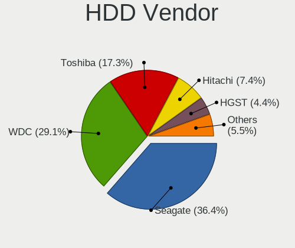

| Vendor              | Computers | Drives | Percent |
|---------------------|-----------|--------|---------|
| Seagate             | 96        | 144    | 34.29%  |
| WDC                 | 81        | 97     | 28.93%  |
| Toshiba             | 52        | 66     | 18.57%  |
| Hitachi             | 29        | 48     | 10.36%  |
| HGST                | 11        | 12     | 3.93%   |
| Fujitsu             | 6         | 7      | 2.14%   |
| Unknown             | 3         | 4      | 1.07%   |
| Samsung Electronics | 1         | 1      | 0.36%   |
| sage                | 1         | 1      | 0.36%   |

SSD Vendor
----------

Solid state drive vendors

| Vendor              | Computers | Drives | Percent |
|---------------------|-----------|--------|---------|
| Samsung Electronics | 25        | 33     | 19.08%  |
| Kingston            | 19        | 24     | 14.5%   |
| SanDisk             | 13        | 14     | 9.92%   |
| WDC                 | 7         | 9      | 5.34%   |
| Toshiba             | 6         | 9      | 4.58%   |
| A-DATA Technology   | 6         | 9      | 4.58%   |
| Team                | 5         | 8      | 3.82%   |
| Transcend           | 4         | 4      | 3.05%   |
| SK Hynix            | 4         | 16     | 3.05%   |
| Intel               | 4         | 5      | 3.05%   |
| Ramsta              | 3         | 4      | 2.29%   |
| Micron Technology   | 3         | 3      | 2.29%   |
| Lexar               | 3         | 4      | 2.29%   |
| Gigabyte Technology | 3         | 3      | 2.29%   |
| Apple               | 3         | 3      | 2.29%   |
| LITEONIT            | 2         | 3      | 1.53%   |
| Kingmax             | 2         | 2      | 1.53%   |
| HS-SSD-E100         | 2         | 2      | 1.53%   |
| Crucial             | 2         | 3      | 1.53%   |
| China               | 2         | 2      | 1.53%   |
| ZOTAC               | 1         | 1      | 0.76%   |
| Unknown             | 1         | 2      | 0.76%   |
| Teclast             | 1         | 3      | 0.76%   |
| TAMMUZ              | 1         | 1      | 0.76%   |
| PNY                 | 1         | 1      | 0.76%   |
| Phison              | 1         | 1      | 0.76%   |
| OCZ                 | 1         | 1      | 0.76%   |
| KingSpec            | 1         | 1      | 0.76%   |
| kimtigo             | 1         | 2      | 0.76%   |
| Hikvision           | 1         | 2      | 0.76%   |
| Colorful            | 1         | 1      | 0.76%   |
| ASUS-PHISON         | 1         | 2      | 0.76%   |
| Argon               | 1         | 2      | 0.76%   |

Drive Kind
----------

HDD or SSD

| Kind    | Computers | Drives | Percent |
|---------|-----------|--------|---------|
| HDD     | 245       | 380    | 55.43%  |
| SSD     | 117       | 180    | 26.47%  |
| NVMe    | 50        | 59     | 11.31%  |
| MMC     | 21        | 26     | 4.75%   |
| Unknown | 9         | 12     | 2.04%   |

Drive Connector
---------------

SATA, SAS, NVMe, etc.

| Type | Computers | Drives | Percent |
|------|-----------|--------|---------|
| SATA | 313       | 538    | 77.28%  |
| NVMe | 50        | 59     | 12.35%  |
| SAS  | 21        | 34     | 5.19%   |
| MMC  | 21        | 26     | 5.19%   |

Drive Size
----------

Size of hard drive

| Size in TB | Computers | Drives | Percent |
|------------|-----------|--------|---------|
| 0.01-0.5   | 249       | 385    | 67.66%  |
| 0.51-1.0   | 88        | 134    | 23.91%  |
| 1.01-2.0   | 20        | 28     | 5.43%   |
| 3.01-4.0   | 9         | 11     | 2.45%   |
| 4.01-10.0  | 2         | 2      | 0.54%   |

Space Total
-----------

Amount of disk space available on the file system

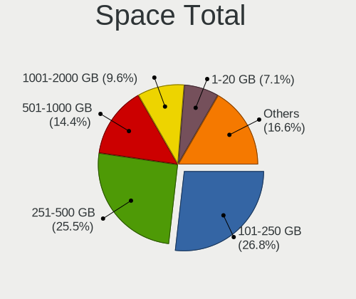

| Size in GB     | Computers | Percent |
|----------------|-----------|---------|
| 251-500        | 104       | 27.51%  |
| 101-250        | 101       | 26.72%  |
| 501-1000       | 48        | 12.7%   |
| 51-100         | 29        | 7.67%   |
| 1-20           | 26        | 6.88%   |
| 1001-2000      | 23        | 6.08%   |
| 21-50          | 16        | 4.23%   |
| Unknown        | 12        | 3.17%   |
| More than 3000 | 11        | 2.91%   |
| 2001-3000      | 8         | 2.12%   |

Space Used
----------

Amount of used disk space

| Used GB        | Computers | Percent |
|----------------|-----------|---------|
| 1-20           | 159       | 40.46%  |
| 21-50          | 71        | 18.07%  |
| 51-100         | 55        | 13.99%  |
| 101-250        | 50        | 12.72%  |
| 251-500        | 21        | 5.34%   |
| 501-1000       | 15        | 3.82%   |
| Unknown        | 12        | 3.05%   |
| 2001-3000      | 4         | 1.02%   |
| 1001-2000      | 4         | 1.02%   |
| More than 3000 | 2         | 0.51%   |

Malfunc. Drives
---------------

Drive models with a malfunction

| Model                                          | Computers | Drives | Percent |
|------------------------------------------------|-----------|--------|---------|
| Hitachi HDS721050CLA362 500GB                  | 5         | 10     | 11.36%  |
| Hitachi HTS543232A7A384 320GB                  | 3         | 5      | 6.82%   |
| Toshiba MQ01ABD100 1TB                         | 2         | 2      | 4.55%   |
| Seagate ST1000LM048-2E7172 1TB                 | 2         | 2      | 4.55%   |
| WDC WD5003ABYZ-011FA0 500GB                    | 1         | 1      | 2.27%   |
| WDC WD5000LPVT-75G33T0 500GB                   | 1         | 1      | 2.27%   |
| WDC WD5000LPVT-22G33T0 500GB                   | 1         | 1      | 2.27%   |
| WDC WD5000AAKX-603CA0 500GB                    | 1         | 1      | 2.27%   |
| WDC WD3200BEVT-22A23T0 320GB                   | 1         | 1      | 2.27%   |
| WDC WD3200AAJS-08L7A0 320GB                    | 1         | 1      | 2.27%   |
| WDC WD1600BEVT-24A23T0 160GB                   | 1         | 1      | 2.27%   |
| Unknown S050 Hard drive 500GB                  | 1         | 1      | 2.27%   |
| Toshiba MQ01ABF050 500GB                       | 1         | 1      | 2.27%   |
| Toshiba MK6465GSX 640GB                        | 1         | 1      | 2.27%   |
| Toshiba MK3259GSXP 320GB                       | 1         | 1      | 2.27%   |
| Toshiba DT01ACA100 1TB                         | 1         | 1      | 2.27%   |
| Toshiba DT01ACA050 500GB                       | 1         | 1      | 2.27%   |
| SK Hynix HFS128G3AMNB-2200A 128GB SSD          | 1         | 1      | 2.27%   |
| Seagate ST9250315AS 250GB                      | 1         | 1      | 2.27%   |
| Seagate ST9120821AS 120GB                      | 1         | 1      | 2.27%   |
| Seagate ST500DM002-1BD142 500GB                | 1         | 2      | 2.27%   |
| Seagate ST380815AS 80GB                        | 1         | 1      | 2.27%   |
| Seagate ST3500514NS 500GB                      | 1         | 1      | 2.27%   |
| Seagate ST3500418AS 500GB                      | 1         | 1      | 2.27%   |
| Seagate ST2000LM007-1R8174 2TB                 | 1         | 2      | 2.27%   |
| Micron Technology 1100_MTFDDAV256TBN 256GB SSD | 1         | 1      | 2.27%   |
| Kingston SV300S37A120G 120GB SSD               | 1         | 1      | 2.27%   |
| Hitachi HTS723232A7A364 320GB                  | 1         | 2      | 2.27%   |
| Hitachi HTS545050B9SA00 500GB                  | 1         | 1      | 2.27%   |
| Hitachi HTS542525K9SA00 250GB                  | 1         | 1      | 2.27%   |
| Hitachi HDS721050CLA660 500GB                  | 1         | 1      | 2.27%   |
| HGST HTS721010A9E630 1TB                       | 1         | 1      | 2.27%   |
| HGST HTS541010A9E680 1TB                       | 1         | 1      | 2.27%   |
| Fujitsu MHY2120BH 120GB                        | 1         | 1      | 2.27%   |
| Colorful SL300 128GB SSD                       | 1         | 1      | 2.27%   |
| A-DATA Technology SX6000PNP 512GB              | 1         | 1      | 2.27%   |

Malfunc. Drive Vendor
---------------------

Vendors of faulty drives

| Vendor            | Computers | Drives | Percent |
|-------------------|-----------|--------|---------|
| Seagate           | 9         | 11     | 22.5%   |
| Hitachi           | 9         | 20     | 22.5%   |
| WDC               | 7         | 7      | 17.5%   |
| Toshiba           | 6         | 7      | 15%     |
| HGST              | 2         | 2      | 5%      |
| Unknown           | 1         | 1      | 2.5%    |
| SK Hynix          | 1         | 1      | 2.5%    |
| Micron Technology | 1         | 1      | 2.5%    |
| Kingston          | 1         | 1      | 2.5%    |
| Fujitsu           | 1         | 1      | 2.5%    |
| Colorful          | 1         | 1      | 2.5%    |
| A-DATA Technology | 1         | 1      | 2.5%    |

Malfunc. HDD Vendor
-------------------

Vendors of faulty HDD drives

| Vendor  | Computers | Drives | Percent |
|---------|-----------|--------|---------|
| Seagate | 9         | 11     | 25.71%  |
| Hitachi | 9         | 20     | 25.71%  |
| WDC     | 7         | 7      | 20%     |
| Toshiba | 6         | 7      | 17.14%  |
| HGST    | 2         | 2      | 5.71%   |
| Unknown | 1         | 1      | 2.86%   |
| Fujitsu | 1         | 1      | 2.86%   |

Malfunc. Drive Kind
-------------------

Kinds of faulty drives

| Kind | Computers | Drives | Percent |
|------|-----------|--------|---------|
| HDD  | 31        | 49     | 86.11%  |
| SSD  | 4         | 4      | 11.11%  |
| NVMe | 1         | 1      | 2.78%   |

Failed Drives
-------------

Failed drive models

| Model                    | Computers | Drives | Percent |
|--------------------------|-----------|--------|---------|
| WDC WD10SPZX-21Z10T0 1TB | 1         | 1      | 100%    |

Failed Drive Vendor
-------------------

Failed drive vendors

| Vendor | Computers | Drives | Percent |
|--------|-----------|--------|---------|
| WDC    | 1         | 1      | 100%    |

Drive Status
------------

Number of failed and malfunc. drives

| Status   | Computers | Drives | Percent |
|----------|-----------|--------|---------|
| Detected | 243       | 447    | 64.46%  |
| Works    | 98        | 155    | 25.99%  |
| Malfunc  | 35        | 54     | 9.28%   |
| Failed   | 1         | 1      | 0.27%   |

Storage controller
------------------

Storage Vendor
--------------

Storage controller vendors

| Vendor                           | Computers | Percent |
|----------------------------------|-----------|---------|
| Intel                            | 249       | 65.18%  |
| AMD                              | 65        | 17.02%  |
| Nvidia                           | 14        | 3.66%   |
| Samsung Electronics              | 9         | 2.36%   |
| SK Hynix                         | 7         | 1.83%   |
| Sandisk                          | 4         | 1.05%   |
| Phison Electronics               | 4         | 1.05%   |
| Silicon Motion                   | 3         | 0.79%   |
| Silicon Integrated Systems [SiS] | 3         | 0.79%   |
| Micron/Crucial Technology        | 3         | 0.79%   |
| Kingston Technology Company      | 3         | 0.79%   |
| Toshiba America Info Systems     | 2         | 0.52%   |
| Solid State Storage Technology   | 2         | 0.52%   |
| Realtek Semiconductor            | 2         | 0.52%   |
| Micron Technology                | 2         | 0.52%   |
| Marvell Technology Group         | 2         | 0.52%   |
| ADATA Technology                 | 2         | 0.52%   |
| Union Memory (Shenzhen)          | 1         | 0.26%   |
| Lite-On Technology               | 1         | 0.26%   |
| Lenovo                           | 1         | 0.26%   |
| KIOXIA                           | 1         | 0.26%   |
| Broadcom / LSI                   | 1         | 0.26%   |
| ASMedia Technology               | 1         | 0.26%   |

Storage Model
-------------

Storage controller models

| Model                                                                                   | Computers | Percent |
|-----------------------------------------------------------------------------------------|-----------|---------|
| AMD FCH SATA Controller [AHCI mode]                                                     | 46        | 10.09%  |
| Intel Sunrise Point-LP SATA Controller [AHCI mode]                                      | 27        | 5.92%   |
| Intel 7 Series Chipset Family 6-port SATA Controller [AHCI mode]                        | 23        | 5.04%   |
| Intel 8 Series/C220 Series Chipset Family 6-port SATA Controller 1 [AHCI mode]          | 17        | 3.73%   |
| Intel 6 Series/C200 Series Chipset Family 6 port Mobile SATA AHCI Controller            | 16        | 3.51%   |
| Intel 82801 Mobile SATA Controller [RAID mode]                                          | 14        | 3.07%   |
| Intel NM10/ICH7 Family SATA Controller [IDE mode]                                       | 13        | 2.85%   |
| Intel Celeron N3350/Pentium N4200/Atom E3900 Series SATA AHCI Controller                | 13        | 2.85%   |
| Intel 82801G (ICH7 Family) IDE Controller                                               | 13        | 2.85%   |
| Intel 200 Series PCH SATA controller [AHCI mode]                                        | 10        | 2.19%   |
| AMD 400 Series Chipset SATA Controller                                                  | 9         | 1.97%   |
| Intel 8 Series SATA Controller 1 [AHCI mode]                                            | 8         | 1.75%   |
| Nvidia MCP61 SATA Controller                                                            | 7         | 1.54%   |
| Nvidia MCP61 IDE                                                                        | 7         | 1.54%   |
| Intel NM10/ICH7 Family SATA Controller [AHCI mode]                                      | 7         | 1.54%   |
| Intel 6 Series/C200 Series Chipset Family Desktop SATA Controller (IDE mode, ports 4-5) | 7         | 1.54%   |
| Intel 6 Series/C200 Series Chipset Family Desktop SATA Controller (IDE mode, ports 0-3) | 7         | 1.54%   |
| AMD FCH SATA Controller [IDE mode]                                                      | 7         | 1.54%   |
| Intel Wildcat Point-LP SATA Controller [AHCI Mode]                                      | 6         | 1.32%   |
| Intel Cannon Lake Mobile PCH SATA AHCI Controller                                       | 6         | 1.32%   |
| Intel Atom Processor E3800 Series SATA AHCI Controller                                  | 6         | 1.32%   |
| Intel 500 Series Chipset Family SATA AHCI Controller                                    | 6         | 1.32%   |
| Intel 5 Series/3400 Series Chipset 4 port SATA AHCI Controller                          | 6         | 1.32%   |
| AMD FCH IDE Controller                                                                  | 6         | 1.32%   |
| Samsung NVMe SSD Controller SM981/PM981/PM983                                           | 5         | 1.1%    |
| Intel Q170/Q150/B150/H170/H110/Z170/CM236 Chipset SATA Controller [AHCI Mode]           | 5         | 1.1%    |
| Intel Comet Lake SATA AHCI Controller                                                   | 5         | 1.1%    |
| Intel Celeron/Pentium Silver Processor SATA Controller                                  | 5         | 1.1%    |
| Intel Atom/Celeron/Pentium Processor x5-E8000/J3xxx/N3xxx Series SATA Controller        | 5         | 1.1%    |
| Intel 82801IBM/IEM (ICH9M/ICH9M-E) 4 port SATA Controller [AHCI mode]                   | 5         | 1.1%    |
| Intel 9 Series Chipset Family SATA Controller [AHCI Mode]                               | 4         | 0.88%   |
| Intel 6 Series/C200 Series Chipset Family 6 port Desktop SATA AHCI Controller           | 4         | 0.88%   |
| AMD SB7x0/SB8x0/SB9x0 SATA Controller [IDE mode]                                        | 4         | 0.88%   |
| AMD SB7x0/SB8x0/SB9x0 IDE Controller                                                    | 4         | 0.88%   |
| AMD FCH SATA Controller D                                                               | 4         | 0.88%   |
| SK Hynix Gold P31 SSD                                                                   | 3         | 0.66%   |
| SK Hynix BC501 NVMe Solid State Drive                                                   | 3         | 0.66%   |
| Silicon Motion SM2263EN/SM2263XT SSD Controller                                         | 3         | 0.66%   |
| Silicon Integrated Systems [SiS] 5513 IDE Controller                                    | 3         | 0.66%   |
| Samsung NVMe SSD Controller 980                                                         | 3         | 0.66%   |
| Phison E16 PCIe4 NVMe Controller                                                        | 3         | 0.66%   |
| Nvidia MCP79 AHCI Controller                                                            | 3         | 0.66%   |
| Micron/Crucial P2 NVMe PCIe SSD                                                         | 3         | 0.66%   |
| Intel HM170/QM170 Chipset SATA Controller [AHCI Mode]                                   | 3         | 0.66%   |
| Intel 7 Series/C210 Series Chipset Family 6-port SATA Controller [AHCI mode]            | 3         | 0.66%   |
| AMD 300 Series Chipset SATA Controller                                                  | 3         | 0.66%   |
| Solid State Storage Non-Volatile memory controller                                      | 2         | 0.44%   |
| Silicon Integrated Systems [SiS] AHCI IDE Controller (0106)                             | 2         | 0.44%   |
| Realtek Realtek Non-Volatile memory controller                                          | 2         | 0.44%   |
| Micron Non-Volatile memory controller                                                   | 2         | 0.44%   |
| Intel Volume Management Device NVMe RAID Controller                                     | 2         | 0.44%   |
| Intel Tiger Lake-LP SATA Controller [AHCI mode]                                         | 2         | 0.44%   |
| Intel SATA Controller [RAID mode]                                                       | 2         | 0.44%   |
| Intel Cannon Point-LP SATA Controller [AHCI Mode]                                       | 2         | 0.44%   |
| Intel Cannon Lake PCH SATA AHCI Controller                                              | 2         | 0.44%   |
| Intel 82801IBM/IEM (ICH9M/ICH9M-E) 2 port SATA Controller [IDE mode]                    | 2         | 0.44%   |
| Intel 82801GBM/GHM (ICH7-M Family) SATA Controller [AHCI mode]                          | 2         | 0.44%   |
| Intel 5 Series/3400 Series Chipset 6 port SATA AHCI Controller                          | 2         | 0.44%   |
| Intel 5 Series/3400 Series Chipset 4 port SATA IDE Controller                           | 2         | 0.44%   |
| Intel 5 Series/3400 Series Chipset 2 port SATA IDE Controller                           | 2         | 0.44%   |

Storage Kind
------------

Kind of storage controller (IDE, SATA, NVMe, SAS, ...)

| Kind | Computers | Percent |
|------|-----------|---------|
| SATA | 274       | 68.33%  |
| IDE  | 57        | 14.21%  |
| NVMe | 50        | 12.47%  |
| RAID | 19        | 4.74%   |
| SAS  | 1         | 0.25%   |

Processor
---------

CPU Vendor
----------

Processor vendors

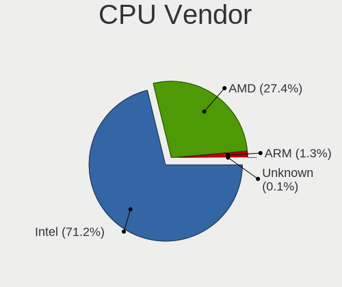

| Vendor | Computers | Percent |
|--------|-----------|---------|
| Intel  | 266       | 75.57%  |
| AMD    | 79        | 22.44%  |
| ARM    | 7         | 1.99%   |

CPU Model
---------

Processor models

| Model                                         | Computers | Percent |
|-----------------------------------------------|-----------|---------|
| Intel Core i5-8250U CPU @ 1.60GHz             | 7         | 1.99%   |
| Intel Celeron CPU N3350 @ 1.10GHz             | 7         | 1.99%   |
| Intel Core i7-7500U CPU @ 2.70GHz             | 6         | 1.7%    |
| Intel Celeron CPU N3450 @ 1.10GHz             | 6         | 1.7%    |
| Intel Core i5-7200U CPU @ 2.50GHz             | 5         | 1.42%   |
| Intel Core 2 Duo CPU E7500 @ 2.93GHz          | 5         | 1.42%   |
| Intel Core i7-8550U CPU @ 1.80GHz             | 4         | 1.14%   |
| Intel Core i7-4790 CPU @ 3.60GHz              | 4         | 1.14%   |
| Intel Core i5-3337U CPU @ 1.80GHz             | 4         | 1.14%   |
| Intel Core i5-3317U CPU @ 1.70GHz             | 4         | 1.14%   |
| Intel Core i5-2520M CPU @ 2.50GHz             | 4         | 1.14%   |
| Intel Core i3-6006U CPU @ 2.00GHz             | 4         | 1.14%   |
| AMD Ryzen 5 2600 Six-Core Processor           | 4         | 1.14%   |
| Intel Core i5-6200U CPU @ 2.30GHz             | 3         | 0.85%   |
| Intel Core i5-10300H CPU @ 2.50GHz            | 3         | 0.85%   |
| Intel Celeron N4000 CPU @ 1.10GHz             | 3         | 0.85%   |
| Intel Celeron CPU N3160 @ 1.60GHz             | 3         | 0.85%   |
| Intel Atom CPU N450 @ 1.66GHz                 | 3         | 0.85%   |
| ARM Processor                                 | 3         | 0.85%   |
| AMD Sempron Processor LE-1100                 | 3         | 0.85%   |
| AMD Ryzen 5 3600 6-Core Processor             | 3         | 0.85%   |
| AMD Ryzen 5 2500U with Radeon Vega Mobile Gfx | 3         | 0.85%   |
| AMD Ryzen 5 2400G with Radeon Vega Graphics   | 3         | 0.85%   |
| AMD A8-7600 Radeon R7, 10 Compute Cores 4C+6G | 3         | 0.85%   |
| AMD A6-6400K APU with Radeon HD Graphics      | 3         | 0.85%   |
| Intel Pentium Dual-Core CPU T4300 @ 2.10GHz   | 2         | 0.57%   |
| Intel Pentium Dual-Core CPU E5700 @ 3.00GHz   | 2         | 0.57%   |
| Intel Core i7-9750H CPU @ 2.60GHz             | 2         | 0.57%   |
| Intel Core i7-7700K CPU @ 4.20GHz             | 2         | 0.57%   |
| Intel Core i7-7700HQ CPU @ 2.80GHz            | 2         | 0.57%   |
| Intel Core i7-7700 CPU @ 3.60GHz              | 2         | 0.57%   |
| Intel Core i7-4710MQ CPU @ 2.50GHz            | 2         | 0.57%   |
| Intel Core i7-3770S CPU @ 3.10GHz             | 2         | 0.57%   |
| Intel Core i7-3770 CPU @ 3.40GHz              | 2         | 0.57%   |
| Intel Core i5-9300H CPU @ 2.40GHz             | 2         | 0.57%   |
| Intel Core i5-8365U CPU @ 1.60GHz             | 2         | 0.57%   |
| Intel Core i5-8265U CPU @ 1.60GHz             | 2         | 0.57%   |
| Intel Core i5-6500 CPU @ 3.20GHz              | 2         | 0.57%   |
| Intel Core i5-5300U CPU @ 2.30GHz             | 2         | 0.57%   |
| Intel Core i5-4590 CPU @ 3.30GHz              | 2         | 0.57%   |
| Intel Core i5-4460 CPU @ 3.20GHz              | 2         | 0.57%   |
| Intel Core i5-4200U CPU @ 1.60GHz             | 2         | 0.57%   |
| Intel Core i5-3470 CPU @ 3.20GHz              | 2         | 0.57%   |
| Intel Core i5-3320M CPU @ 2.60GHz             | 2         | 0.57%   |
| Intel Core i5-3230M CPU @ 2.60GHz             | 2         | 0.57%   |
| Intel Core i5-3210M CPU @ 2.50GHz             | 2         | 0.57%   |
| Intel Core i5-2400 CPU @ 3.10GHz              | 2         | 0.57%   |
| Intel Core i3-5005U CPU @ 2.00GHz             | 2         | 0.57%   |
| Intel Core i3-4170 CPU @ 3.70GHz              | 2         | 0.57%   |
| Intel Core i3-3227U CPU @ 1.90GHz             | 2         | 0.57%   |
| Intel Core i3-3217U CPU @ 1.80GHz             | 2         | 0.57%   |
| Intel Core i3-2350M CPU @ 2.30GHz             | 2         | 0.57%   |
| Intel Core i3-2310M CPU @ 2.10GHz             | 2         | 0.57%   |
| Intel Core i3-2120 CPU @ 3.30GHz              | 2         | 0.57%   |
| Intel Core i3 CPU M 370 @ 2.40GHz             | 2         | 0.57%   |
| Intel Core i3 CPU M 350 @ 2.27GHz             | 2         | 0.57%   |
| Intel Core 2 Quad CPU Q9400 @ 2.66GHz         | 2         | 0.57%   |
| Intel Core 2 Duo CPU P7550 @ 2.26GHz          | 2         | 0.57%   |
| Intel Core 2 Duo CPU E8400 @ 3.00GHz          | 2         | 0.57%   |
| Intel Celeron CPU N3060 @ 1.60GHz             | 2         | 0.57%   |

CPU Model Family
----------------

Processor model prefix

| Model                   | Computers | Percent |
|-------------------------|-----------|---------|
| Intel Core i5           | 83        | 23.58%  |
| Intel Core i7           | 50        | 14.2%   |
| Intel Core i3           | 35        | 9.94%   |
| Intel Celeron           | 35        | 9.94%   |
| AMD Ryzen 5             | 20        | 5.68%   |
| Intel Core 2 Duo        | 17        | 4.83%   |
| Other                   | 12        | 3.41%   |
| Intel Atom              | 11        | 3.13%   |
| AMD Ryzen 7             | 10        | 2.84%   |
| Intel Pentium Dual-Core | 8         | 2.27%   |
| Intel Pentium           | 8         | 2.27%   |
| AMD A8                  | 8         | 2.27%   |
| AMD A6                  | 6         | 1.7%    |
| AMD A10                 | 5         | 1.42%   |
| AMD Ryzen 3             | 4         | 1.14%   |
| AMD FX                  | 4         | 1.14%   |
| Intel Core 2 Quad       | 3         | 0.85%   |
| AMD Sempron             | 3         | 0.85%   |
| AMD Athlon              | 3         | 0.85%   |
| Intel Pentium Gold      | 2         | 0.57%   |
| AMD Turion 64 X2 Mobile | 2         | 0.57%   |
| AMD Athlon II X2        | 2         | 0.57%   |
| AMD A4                  | 2         | 0.57%   |
| Intel Xeon              | 1         | 0.28%   |
| Intel Pentium Silver    | 1         | 0.28%   |
| Intel Pentium Dual      | 1         | 0.28%   |
| Intel Genuine           | 1         | 0.28%   |
| Intel Core m3           | 1         | 0.28%   |
| Intel Core i9           | 1         | 0.28%   |
| Intel Core 2            | 1         | 0.28%   |
| Intel Celeron M         | 1         | 0.28%   |
| ARM BCM                 | 1         | 0.28%   |
| AMD Ryzen 9             | 1         | 0.28%   |
| AMD Quad-Core           | 1         | 0.28%   |
| AMD PRO A10             | 1         | 0.28%   |
| AMD Phenom II X4        | 1         | 0.28%   |
| AMD Phenom II X2        | 1         | 0.28%   |
| AMD G                   | 1         | 0.28%   |
| AMD E2                  | 1         | 0.28%   |
| AMD E1                  | 1         | 0.28%   |
| AMD C-60                | 1         | 0.28%   |
| AMD Athlon 64 X2        | 1         | 0.28%   |

CPU Cores
---------

Number of processor cores

| Number | Computers | Percent |
|--------|-----------|---------|
| 2      | 173       | 49.15%  |
| 4      | 120       | 34.09%  |
| 6      | 24        | 6.82%   |
| 1      | 19        | 5.4%    |
| 8      | 13        | 3.69%   |
| 16     | 1         | 0.28%   |
| 10     | 1         | 0.28%   |
| 3      | 1         | 0.28%   |

CPU Sockets
-----------

Number of sockets

| Number | Computers | Percent |
|--------|-----------|---------|
| 1      | 351       | 99.72%  |
| 2      | 1         | 0.28%   |

CPU Threads
-----------

Threads per core (Hyper-Threading)

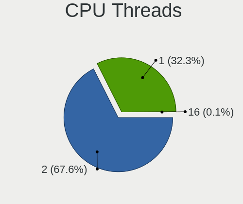

| Number | Computers | Percent |
|--------|-----------|---------|
| 2      | 215       | 61.08%  |
| 1      | 137       | 38.92%  |

CPU Op-Modes
------------

CPU Operation Modes (32-bit, 64-bit)

| Op mode        | Computers | Percent |
|----------------|-----------|---------|
| 32-bit, 64-bit | 337       | 94.93%  |
| Unknown        | 14        | 3.94%   |
| 32-bit         | 3         | 0.85%   |
| 64-bit         | 1         | 0.28%   |

CPU Microcode
-------------

Microcode number

| Number     | Computers | Percent |
|------------|-----------|---------|
| Unknown    | 82        | 22.78%  |
| 0x306a9    | 27        | 7.5%    |
| 0x206a7    | 22        | 6.11%   |
| 0x1067a    | 20        | 5.56%   |
| 0x306c3    | 16        | 4.44%   |
| 0x806ea    | 11        | 3.06%   |
| 0x506c9    | 11        | 3.06%   |
| 0x906ea    | 9         | 2.5%    |
| 0x406e3    | 9         | 2.5%    |
| 0x806ec    | 7         | 1.94%   |
| 0x806e9    | 7         | 1.94%   |
| 0x40651    | 7         | 1.94%   |
| 0x306d4    | 7         | 1.94%   |
| 0x30678    | 7         | 1.94%   |
| 0x06003106 | 7         | 1.94%   |
| 0x06001119 | 7         | 1.94%   |
| 0x906e9    | 6         | 1.67%   |
| 0x10676    | 6         | 1.67%   |
| 0x706a1    | 5         | 1.39%   |
| 0x506e3    | 5         | 1.39%   |
| 0x406c4    | 5         | 1.39%   |
| 0x08701021 | 5         | 1.39%   |
| 0x0800820d | 5         | 1.39%   |
| 0x20655    | 4         | 1.11%   |
| 0x106ca    | 4         | 1.11%   |
| 0xa0671    | 3         | 0.83%   |
| 0xa0652    | 3         | 0.83%   |
| 0x406c3    | 3         | 0.83%   |
| 0x20652    | 3         | 0.83%   |
| 0x0a50000c | 3         | 0.83%   |
| 0x0810100b | 3         | 0.83%   |
| 0x07030105 | 3         | 0.83%   |
| 0x0700010f | 3         | 0.83%   |
| 0x806c1    | 2         | 0.56%   |
| 0x6fb      | 2         | 0.56%   |
| 0x30661    | 2         | 0.56%   |
| 0x08608103 | 2         | 0.56%   |
| 0x08600106 | 2         | 0.56%   |
| 0xa0660    | 1         | 0.28%   |
| 0xa0655    | 1         | 0.28%   |
| 0x706a8    | 1         | 0.28%   |
| 0x6fd      | 1         | 0.28%   |
| 0x6f6      | 1         | 0.28%   |
| 0x6ec      | 1         | 0.28%   |
| 0x6d8      | 1         | 0.28%   |
| 0x50654    | 1         | 0.28%   |
| 0x406f1    | 1         | 0.28%   |
| 0x106e5    | 1         | 0.28%   |
| 0x106c2    | 1         | 0.28%   |
| 0x08600104 | 1         | 0.28%   |
| 0x08600103 | 1         | 0.28%   |
| 0x08108109 | 1         | 0.28%   |
| 0x08108102 | 1         | 0.28%   |
| 0x08101016 | 1         | 0.28%   |
| 0x08101007 | 1         | 0.28%   |
| 0x0600611a | 1         | 0.28%   |
| 0x06000852 | 1         | 0.28%   |
| 0x05000119 | 1         | 0.28%   |
| 0x03000027 | 1         | 0.28%   |
| 0x02000057 | 1         | 0.28%   |

CPU Microarch
-------------

Microarchitecture

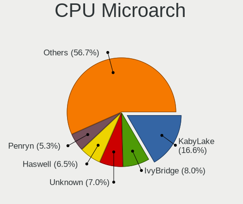

| Name            | Computers | Percent |
|-----------------|-----------|---------|
| KabyLake        | 53        | 15.06%  |
| IvyBridge       | 34        | 9.66%   |
| Haswell         | 29        | 8.24%   |
| Penryn          | 28        | 7.95%   |
| SandyBridge     | 24        | 6.82%   |
| Skylake         | 17        | 4.83%   |
| Silvermont      | 15        | 4.26%   |
| Zen+            | 13        | 3.69%   |
| Goldmont        | 13        | 3.69%   |
| Piledriver      | 12        | 3.41%   |
| Unknown         | 11        | 3.13%   |
| Zen 2           | 9         | 2.56%   |
| CometLake       | 9         | 2.56%   |
| Zen             | 8         | 2.27%   |
| Westmere        | 8         | 2.27%   |
| Steamroller     | 8         | 2.27%   |
| Broadwell       | 8         | 2.27%   |
| Bonnell         | 8         | 2.27%   |
| K8 Hammer       | 7         | 1.99%   |
| Goldmont plus   | 6         | 1.7%    |
| Puma            | 4         | 1.14%   |
| K10             | 4         | 1.14%   |
| Core            | 4         | 1.14%   |
| Zen 3           | 3         | 0.85%   |
| Jaguar          | 3         | 0.85%   |
| TigerLake       | 2         | 0.57%   |
| P6              | 2         | 0.57%   |
| Nehalem         | 2         | 0.57%   |
| Icelake         | 2         | 0.57%   |
| Excavator       | 2         | 0.57%   |
| Bobcat          | 2         | 0.57%   |
| K8 & K10 hybrid | 1         | 0.28%   |
| K10 Llano       | 1         | 0.28%   |

Graphics
--------

GPU Vendor
----------

Vendors of graphics cards

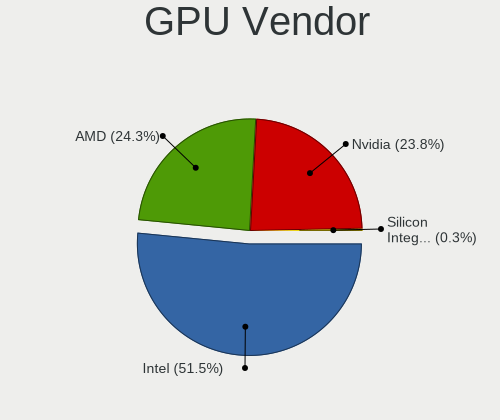

| Vendor                           | Computers | Percent |
|----------------------------------|-----------|---------|
| Intel                            | 223       | 53.22%  |
| Nvidia                           | 105       | 25.06%  |
| AMD                              | 88        | 21%     |
| Silicon Integrated Systems [SiS] | 3         | 0.72%   |

GPU Model
---------

Graphics card models

| Model                                                                                    | Computers | Percent |
|------------------------------------------------------------------------------------------|-----------|---------|
| Intel 3rd Gen Core processor Graphics Controller                                         | 25        | 5.77%   |
| Intel 2nd Generation Core Processor Family Integrated Graphics Controller                | 22        | 5.08%   |
| Intel UHD Graphics 620                                                                   | 13        | 3%      |
| Intel HD Graphics 500                                                                    | 13        | 3%      |
| Intel HD Graphics 620                                                                    | 11        | 2.54%   |
| Intel Atom/Celeron/Pentium Processor x5-E8000/J3xxx/N3xxx Integrated Graphics Controller | 8         | 1.85%   |
| Intel Skylake GT2 [HD Graphics 520]                                                      | 7         | 1.62%   |
| Intel Mobile 4 Series Chipset Integrated Graphics Controller                             | 7         | 1.62%   |
| Intel HD Graphics 630                                                                    | 7         | 1.62%   |
| Intel Haswell-ULT Integrated Graphics Controller                                         | 7         | 1.62%   |
| Intel Core Processor Integrated Graphics Controller                                      | 7         | 1.62%   |
| Intel Atom Processor Z36xxx/Z37xxx Series Graphics & Display                             | 7         | 1.62%   |
| Intel 4 Series Chipset Integrated Graphics Controller                                    | 7         | 1.62%   |
| Nvidia GP107 [GeForce GTX 1050 Ti]                                                       | 6         | 1.39%   |
| Nvidia GM108M [GeForce 940MX]                                                            | 6         | 1.39%   |
| Nvidia G72 [GeForce 7200 GS / 7300 SE]                                                   | 6         | 1.39%   |
| Intel HD Graphics 5500                                                                   | 6         | 1.39%   |
| Intel 4th Gen Core Processor Integrated Graphics Controller                              | 6         | 1.39%   |
| AMD Raven Ridge [Radeon Vega Series / Radeon Vega Mobile Series]                         | 6         | 1.39%   |
| AMD Picasso/Raven 2 [Radeon Vega Series / Radeon Vega Mobile Series]                     | 6         | 1.39%   |
| AMD Ellesmere [Radeon RX 470/480/570/570X/580/580X/590]                                  | 6         | 1.39%   |
| Nvidia GF108 [GeForce GT 730]                                                            | 5         | 1.15%   |
| Intel Xeon E3-1200 v3/4th Gen Core Processor Integrated Graphics Controller              | 5         | 1.15%   |
| Intel GeminiLake [UHD Graphics 600]                                                      | 5         | 1.15%   |
| Intel CometLake-H GT2 [UHD Graphics]                                                     | 5         | 1.15%   |
| Intel CoffeeLake-H GT2 [UHD Graphics 630]                                                | 5         | 1.15%   |
| Intel Atom Processor D4xx/D5xx/N4xx/N5xx Integrated Graphics Controller                  | 5         | 1.15%   |
| Nvidia GP104 [GeForce GTX 1070]                                                          | 4         | 0.92%   |
| Intel WhiskeyLake-U GT2 [UHD Graphics 620]                                               | 4         | 0.92%   |
| Intel 4th Generation Core Processor Family Integrated Graphics Controller                | 4         | 0.92%   |
| AMD Topaz XT [Radeon R7 M260/M265 / M340/M360 / M440/M445 / 530/535 / 620/625 Mobile]    | 4         | 0.92%   |
| AMD Renoir                                                                               | 4         | 0.92%   |
| AMD Kaveri [Radeon R7 Graphics]                                                          | 4         | 0.92%   |
| AMD Baffin [Radeon RX 460/560D / Pro 450/455/460/555/555X/560/560X]                      | 4         | 0.92%   |
| Silicon Integrated Systems [SiS] 771/671 PCIE VGA Display Adapter                        | 3         | 0.69%   |
| Nvidia TU117M [GeForce GTX 1650 Mobile / Max-Q]                                          | 3         | 0.69%   |
| Nvidia TU116M [GeForce GTX 1660 Ti Mobile]                                               | 3         | 0.69%   |
| Nvidia TU106M [GeForce RTX 2060 Mobile]                                                  | 3         | 0.69%   |
| Nvidia GT218 [GeForce 210]                                                               | 3         | 0.69%   |
| Nvidia GP107M [GeForce GTX 1050 Ti Mobile]                                               | 3         | 0.69%   |
| Nvidia GP107M [GeForce GTX 1050 Mobile]                                                  | 3         | 0.69%   |
| Nvidia GM108M [GeForce MX130]                                                            | 3         | 0.69%   |
| Nvidia GM107 [GeForce GTX 750 Ti]                                                        | 3         | 0.69%   |
| Nvidia GK208B [GeForce GT 710]                                                           | 3         | 0.69%   |
| Nvidia GA102 [GeForce RTX 3080]                                                          | 3         | 0.69%   |
| Nvidia C79 [GeForce 9400M]                                                               | 3         | 0.69%   |
| Intel Xeon E3-1200 v2/3rd Gen Core processor Graphics Controller                         | 3         | 0.69%   |
| Intel IvyBridge GT2 [HD Graphics 4000]                                                   | 3         | 0.69%   |
| Intel HD Graphics 530                                                                    | 3         | 0.69%   |
| Intel CometLake-U GT2 [UHD Graphics]                                                     | 3         | 0.69%   |
| Intel 82G33/G31 Express Integrated Graphics Controller                                   | 3         | 0.69%   |
| AMD Sun XT [Radeon HD 8670A/8670M/8690M / R5 M330 / M430 / Radeon 520 Mobile]            | 3         | 0.69%   |
| AMD Seymour [Radeon HD 6400M/7400M Series]                                               | 3         | 0.69%   |
| AMD Mullins [Radeon R4/R5 Graphics]                                                      | 3         | 0.69%   |
| AMD Cezanne                                                                              | 3         | 0.69%   |
| AMD Caicos [Radeon HD 6450/7450/8450 / R5 230 OEM]                                       | 3         | 0.69%   |
| Nvidia GP106 [GeForce GTX 1060 3GB]                                                      | 2         | 0.46%   |
| Nvidia GK208B [GeForce GT 730]                                                           | 2         | 0.46%   |
| Nvidia GF108M [GeForce GT 620M/630M/635M/640M LE]                                        | 2         | 0.46%   |
| Nvidia GF108 [GeForce GT 630]                                                            | 2         | 0.46%   |

GPU Combo
---------

Combinations of graphics cards

| Name           | Computers | Percent |
|----------------|-----------|---------|
| 1 x Intel      | 162       | 45.25%  |
| 1 x AMD        | 62        | 17.32%  |
| 1 x Nvidia     | 53        | 14.8%   |
| Intel + Nvidia | 43        | 12.01%  |
| Intel + AMD    | 13        | 3.63%   |
| Other          | 7         | 1.96%   |
| 2 x AMD        | 7         | 1.96%   |
| AMD + Nvidia   | 6         | 1.68%   |
| 1 x SiS        | 3         | 0.84%   |
| 2 x Nvidia     | 2         | 0.56%   |

GPU Driver
----------

Free vs proprietary

| Driver      | Computers | Percent |
|-------------|-----------|---------|
| Free        | 278       | 77.87%  |
| Proprietary | 58        | 16.25%  |
| Unknown     | 21        | 5.88%   |

GPU Memory
----------

Total video memory

| Size in GB | Computers | Percent |
|------------|-----------|---------|
| Unknown    | 220       | 60.27%  |
| 1.01-2.0   | 41        | 11.23%  |
| 0.01-0.5   | 34        | 9.32%   |
| 0.51-1.0   | 30        | 8.22%   |
| 3.01-4.0   | 23        | 6.3%    |
| 5.01-6.0   | 7         | 1.92%   |
| 7.01-8.0   | 6         | 1.64%   |
| 2.01-3.0   | 2         | 0.55%   |
| 8.01-16.0  | 2         | 0.55%   |

Monitor
-------

Monitor Vendor
--------------

Monitor vendors

| Vendor                  | Computers | Percent |
|-------------------------|-----------|---------|
| Samsung Electronics     | 48        | 13.26%  |
| Chimei Innolux          | 42        | 11.6%   |
| AU Optronics            | 40        | 11.05%  |
| BOE                     | 33        | 9.12%   |
| LG Display              | 26        | 7.18%   |
| Dell                    | 23        | 6.35%   |
| Acer                    | 16        | 4.42%   |
| AOC                     | 13        | 3.59%   |
| Lenovo                  | 12        | 3.31%   |
| Hewlett-Packard         | 9         | 2.49%   |
| Goldstar                | 9         | 2.49%   |
| Ancor Communications    | 8         | 2.21%   |
| ASUSTek Computer        | 7         | 1.93%   |
| InfoVision              | 6         | 1.66%   |
| Apple                   | 6         | 1.66%   |
| Sony                    | 5         | 1.38%   |
| Sharp                   | 5         | 1.38%   |
| Philips                 | 5         | 1.38%   |
| BenQ                    | 5         | 1.38%   |
| ViewSonic               | 4         | 1.1%    |
| IPS                     | 3         | 0.83%   |
| PANDA                   | 2         | 0.55%   |
| MStar                   | 2         | 0.55%   |
| Mi                      | 2         | 0.55%   |
| LG Philips              | 2         | 0.55%   |
| InnoLux Display         | 2         | 0.55%   |
| eMachines               | 2         | 0.55%   |
| Eizo                    | 2         | 0.55%   |
| CTV                     | 2         | 0.55%   |
| ___                     | 1         | 0.28%   |
| VIE                     | 1         | 0.28%   |
| Unknown                 | 1         | 0.28%   |
| Toshiba                 | 1         | 0.28%   |
| SMC                     | 1         | 0.28%   |
| SGT                     | 1         | 0.28%   |
| RTK                     | 1         | 0.28%   |
| Panasonic               | 1         | 0.28%   |
| NVISION                 | 1         | 0.28%   |
| NVI                     | 1         | 0.28%   |
| MSI                     | 1         | 0.28%   |
| KTC                     | 1         | 0.28%   |
| HON                     | 1         | 0.28%   |
| HannStar                | 1         | 0.28%   |
| GDH                     | 1         | 0.28%   |
| ELSA International      | 1         | 0.28%   |
| CSO                     | 1         | 0.28%   |
| COS                     | 1         | 0.28%   |
| Chi Mei Optoelectronics | 1         | 0.28%   |
| AUS                     | 1         | 0.28%   |
| Unknown                 | 1         | 0.28%   |

Monitor Model
-------------

Monitor models

| Model                                                                 | Computers | Percent |
|-----------------------------------------------------------------------|-----------|---------|
| Chimei Innolux LCD Monitor CMN1132 1366x768 256x144mm 11.6-inch       | 7         | 1.89%   |
| Chimei Innolux LCD Monitor CMN15D5 1920x1080 344x193mm 15.5-inch      | 5         | 1.35%   |
| AU Optronics LCD Monitor AUO106C 1366x768 276x155mm 12.5-inch         | 5         | 1.35%   |
| Samsung Electronics S20B300 SAM08A8 1600x900 443x249mm 20.0-inch      | 4         | 1.08%   |
| Dell SE177FP DELF001 1280x1024 338x270mm 17.0-inch                    | 4         | 1.08%   |
| AOC 2060W3 AOC2060 1920x1080 435x239mm 19.5-inch                      | 4         | 1.08%   |
| AOC 1970W AOC1970 1366x768 410x230mm 18.5-inch                        | 4         | 1.08%   |
| Ancor Communications ASUS VC239 ACI23C4 1920x1080 509x286mm 23.0-inch | 4         | 1.08%   |
| Samsung Electronics S24F350 SAM0D20 1920x1080 521x293mm 23.5-inch     | 3         | 0.81%   |
| Lenovo LT1952p Wide LEN0990 1440x900 408x255mm 18.9-inch              | 3         | 0.81%   |
| Lenovo LCD Monitor LEN40B1 1600x900 344x194mm 15.5-inch               | 3         | 0.81%   |
| Dell P170S DEL4058 1280x1024 338x270mm 17.0-inch                      | 3         | 0.81%   |
| BOE LCD Monitor BOE06BD 1366x768 309x173mm 13.9-inch                  | 3         | 0.81%   |
| BOE LCD Monitor BOE06A4 1366x768 344x194mm 15.5-inch                  | 3         | 0.81%   |
| AU Optronics LCD Monitor AUO183C 1366x768 309x173mm 13.9-inch         | 3         | 0.81%   |
| Sony TV SNYAB03 1920x1080                                             | 2         | 0.54%   |
| Samsung Electronics LCD Monitor SEC544B 1600x900 310x174mm 14.0-inch  | 2         | 0.54%   |
| Samsung Electronics LCD Monitor SEC3549 1366x768 309x174mm 14.0-inch  | 2         | 0.54%   |
| Samsung Electronics LCD Monitor SDC4C48 1920x1080 344x194mm 15.5-inch | 2         | 0.54%   |
| Samsung Electronics C24F390 SAM0D2C 1920x1080 521x293mm 23.5-inch     | 2         | 0.54%   |
| MStar Demo MST0030 1920x1080 708x398mm 32.0-inch                      | 2         | 0.54%   |
| Mi Monitor XMI23C3 1920x1080 527x293mm 23.7-inch                      | 2         | 0.54%   |
| LG Display LP101WSA-TLN1 LGD0295 1024x600 224x126mm 10.1-inch         | 2         | 0.54%   |
| LG Display LCD Monitor LGD0525 1366x768 344x194mm 15.5-inch           | 2         | 0.54%   |
| LG Display LCD Monitor LGD033F 1366x768 309x174mm 14.0-inch           | 2         | 0.54%   |
| Lenovo LCD Monitor LEN40A0 1366x768 309x174mm 14.0-inch               | 2         | 0.54%   |
| Goldstar HD GSM5ACB 1366x768 410x230mm 18.5-inch                      | 2         | 0.54%   |
| Dell P2214H DELA097 1920x1080 477x268mm 21.5-inch                     | 2         | 0.54%   |
| Dell OptiPlex 9010 DEL1111 1920x1080 510x286mm 23.0-inch              | 2         | 0.54%   |
| Dell E207WFP DELD010 1680x1050 430x270mm 20.0-inch                    | 2         | 0.54%   |
| Dell E198FP DELA028 1280x1024 376x301mm 19.0-inch                     | 2         | 0.54%   |
| Chimei Innolux LCD Monitor CMN15F5 1920x1080 344x193mm 15.5-inch      | 2         | 0.54%   |
| Chimei Innolux LCD Monitor CMN15DB 1366x768 344x193mm 15.5-inch       | 2         | 0.54%   |
| Chimei Innolux LCD Monitor CMN1521 1920x1080 344x193mm 15.5-inch      | 2         | 0.54%   |
| Chimei Innolux LCD Monitor CMN14C3 1366x768 309x173mm 13.9-inch       | 2         | 0.54%   |
| Chimei Innolux LCD Monitor CMN1493 1366x768 309x173mm 13.9-inch       | 2         | 0.54%   |
| BOE LCD Monitor BOE0700 1920x1080 344x194mm 15.5-inch                 | 2         | 0.54%   |
| BOE LCD Monitor BOE0696 1366x768 309x173mm 13.9-inch                  | 2         | 0.54%   |
| AU Optronics LCD Monitor AUO405C 1366x768 256x144mm 11.6-inch         | 2         | 0.54%   |
| AU Optronics LCD Monitor AUO30D2 1024x600 223x125mm 10.1-inch         | 2         | 0.54%   |
| AU Optronics LCD Monitor AUO235C 1366x768 256x144mm 11.6-inch         | 2         | 0.54%   |
| AU Optronics LCD Monitor AUO21ED 1920x1080 344x194mm 15.5-inch        | 2         | 0.54%   |
| ASUSTek Computer VG27AQL1A AUS2705 2560x1440 600x340mm 27.2-inch      | 2         | 0.54%   |
| Apple Color LCD APP9CF2 1366x768 256x144mm 11.6-inch                  | 2         | 0.54%   |
| Acer R230H ACR046E 1920x1080 509x286mm 23.0-inch                      | 2         | 0.54%   |
| Acer EB192Q ACR0517 1366x768 410x230mm 18.5-inch                      | 2         | 0.54%   |
| ___ LCDTV16 ___9000 1360x768                                          | 1         | 0.27%   |
| ViewSonic XG2705 VSC0E39 1920x1080 598x336mm 27.0-inch                | 1         | 0.27%   |
| ViewSonic VX2450 SERIES VSCE226 1920x1080 525x297mm 23.7-inch         | 1         | 0.27%   |
| ViewSonic VA1917 SERIES VSCAD30 1366x768 410x230mm 18.5-inch          | 1         | 0.27%   |
| ViewSonic VA1601W-LED VSC1A25 1366x768 344x193mm 15.5-inch            | 1         | 0.27%   |
| VIE 191S17 VIE1850 1366x768 414x257mm 19.2-inch                       | 1         | 0.27%   |
| Unknown LCDTV16 9000 1360x768 1600x900mm 72.3-inch                    | 1         | 0.27%   |
| Toshiba LCD Monitor LCD2207 1280x800 287x180mm 13.3-inch              | 1         | 0.27%   |
| Sony TV SNYA301 1920x1080 1600x900mm 72.3-inch                        | 1         | 0.27%   |
| Sony TV SNY2A01 1360x768                                              | 1         | 0.27%   |
| Sony LCD Monitor SNY05FA 1366x768 310x170mm 13.9-inch                 | 1         | 0.27%   |
| SMC LCD Monitor SMC0001 1920x540 720x420mm 32.8-inch                  | 1         | 0.27%   |
| Sharp LQ140M1JW49 SHP1523 1920x1080 309x174mm 14.0-inch               | 1         | 0.27%   |
| Sharp LQ134N1JW52 SHP151E 1920x1200 288x180mm 13.4-inch               | 1         | 0.27%   |

Monitor Resolution
------------------

Monitor screen resolution

| Resolution         | Computers | Percent |
|--------------------|-----------|---------|
| 1366x768 (WXGA)    | 131       | 37.97%  |
| 1920x1080 (FHD)    | 123       | 35.65%  |
| 1600x900 (HD+)     | 21        | 6.09%   |
| 1280x1024 (SXGA)   | 17        | 4.93%   |
| 3840x2160 (4K)     | 11        | 3.19%   |
| 1440x900 (WXGA+)   | 8         | 2.32%   |
| 1280x800 (WXGA)    | 6         | 1.74%   |
| 1024x600           | 6         | 1.74%   |
| 1920x1200 (WUXGA)  | 5         | 1.45%   |
| 2560x1440 (QHD)    | 4         | 1.16%   |
| 1360x768           | 4         | 1.16%   |
| 3440x1440          | 2         | 0.58%   |
| 1680x1050 (WSXGA+) | 2         | 0.58%   |
| 2560x1600          | 1         | 0.29%   |
| 2400x1600          | 1         | 0.29%   |
| 2160x1440          | 1         | 0.29%   |
| 1920x540           | 1         | 0.29%   |
| 1600x1200          | 1         | 0.29%   |

Monitor Diagonal
----------------

Diagonal size in inches

| Inches  | Computers | Percent |
|---------|-----------|---------|
| 15      | 78        | 21.37%  |
| 13      | 45        | 12.33%  |
| 14      | 29        | 7.95%   |
| 23      | 28        | 7.67%   |
| 18      | 28        | 7.67%   |
| 17      | 26        | 7.12%   |
| 11      | 17        | 4.66%   |
| 21      | 16        | 4.38%   |
| 20      | 14        | 3.84%   |
| 27      | 13        | 3.56%   |
| 24      | 12        | 3.29%   |
| Unknown | 11        | 3.01%   |
| 19      | 10        | 2.74%   |
| 12      | 9         | 2.47%   |
| 72      | 6         | 1.64%   |
| 10      | 6         | 1.64%   |
| 31      | 5         | 1.37%   |
| 52      | 3         | 0.82%   |
| 32      | 3         | 0.82%   |
| 40      | 2         | 0.55%   |
| 47      | 1         | 0.27%   |
| 34      | 1         | 0.27%   |
| 22      | 1         | 0.27%   |
| 16      | 1         | 0.27%   |

Monitor Width
-------------

Physical width

| Width in mm | Computers | Percent |
|-------------|-----------|---------|
| 301-350     | 150       | 41.9%   |
| 401-500     | 63        | 17.6%   |
| 501-600     | 50        | 13.97%  |
| 201-300     | 46        | 12.85%  |
| 351-400     | 16        | 4.47%   |
| Unknown     | 11        | 3.07%   |
| 601-700     | 6         | 1.68%   |
| 1501-2000   | 6         | 1.68%   |
| 701-800     | 4         | 1.12%   |
| 1001-1500   | 4         | 1.12%   |
| 801-900     | 2         | 0.56%   |

Aspect Ratio
------------

Proportional relationship between the width and the height

| Ratio   | Computers | Percent |
|---------|-----------|---------|
| 16/9    | 279       | 84.04%  |
| 16/10   | 24        | 7.23%   |
| 5/4     | 16        | 4.82%   |
| Unknown | 10        | 3.01%   |
| 6/5     | 1         | 0.3%    |
| 3/2     | 1         | 0.3%    |
| 21/9    | 1         | 0.3%    |

Monitor Area
------------

Area in inch

| Area in inch | Computers | Percent |
|----------------|-----------|---------|
| 101-110        | 75        | 20.95%  |
| 81-90          | 61        | 17.04%  |
| 201-250        | 45        | 12.57%  |
| 141-150        | 40        | 11.17%  |
| 151-200        | 28        | 7.82%   |
| 51-60          | 17        | 4.75%   |
| 71-80          | 13        | 3.63%   |
| 301-350        | 13        | 3.63%   |
| 121-130        | 11        | 3.07%   |
| Unknown        | 11        | 3.07%   |
| More than 1000 | 9         | 2.51%   |
| 61-70          | 9         | 2.51%   |
| 351-500        | 9         | 2.51%   |
| 41-50          | 6         | 1.68%   |
| 251-300        | 3         | 0.84%   |
| 501-1000       | 3         | 0.84%   |
| 91-100         | 3         | 0.84%   |
| 131-140        | 1         | 0.28%   |
| 111-120        | 1         | 0.28%   |

Pixel Density
-------------

Pixels per inch

| Density       | Computers | Percent |
|---------------|-----------|---------|
| 101-120       | 126       | 35.9%   |
| 51-100        | 111       | 31.62%  |
| 121-160       | 81        | 23.08%  |
| 1-50          | 11        | 3.13%   |
| Unknown       | 11        | 3.13%   |
| 161-240       | 8         | 2.28%   |
| More than 240 | 3         | 0.85%   |

Multiple Monitors
-----------------

Total monitors connected

| Total | Computers | Percent |
|-------|-----------|---------|
| 1     | 298       | 82.55%  |
| 2     | 40        | 11.08%  |
| 0     | 21        | 5.82%   |
| 3     | 2         | 0.55%   |

Network
-------

Net Controller Vendor
---------------------

Controller vendors

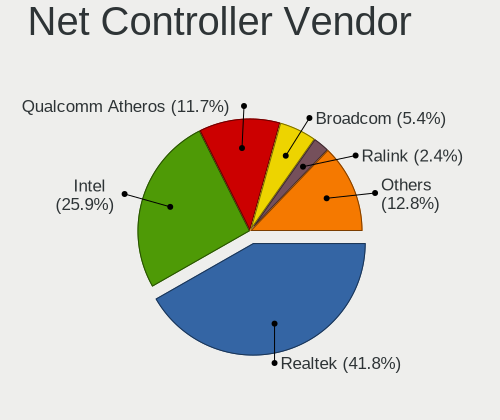

| Vendor                                | Computers | Percent |
|---------------------------------------|-----------|---------|
| Realtek Semiconductor                 | 207       | 39.81%  |
| Intel                                 | 123       | 23.65%  |
| Qualcomm Atheros                      | 77        | 14.81%  |
| Broadcom                              | 38        | 7.31%   |
| Ralink Technology                     | 17        | 3.27%   |
| Nvidia                                | 10        | 1.92%   |
| TP-Link                               | 6         | 1.15%   |
| Broadcom Limited                      | 5         | 0.96%   |
| Marvell Technology Group              | 4         | 0.77%   |
| Silicon Integrated Systems [SiS]      | 3         | 0.58%   |
| Samsung Electronics                   | 3         | 0.58%   |
| JMicron Technology                    | 3         | 0.58%   |
| 802.11g Adapter [Linksys WUSB54GC v3] | 3         | 0.58%   |
| Xiaomi                                | 2         | 0.38%   |
| Qualcomm Atheros Communications       | 2         | 0.38%   |
| OPPO Electronics                      | 2         | 0.38%   |
| Huawei Technologies                   | 2         | 0.38%   |
| D-Link                                | 2         | 0.38%   |
| Sundance Technology Inc / IC Plus     | 1         | 0.19%   |
| Qualcomm                              | 1         | 0.19%   |
| NetGear                               | 1         | 0.19%   |
| MEDIATEK                              | 1         | 0.19%   |
| ICS Advent                            | 1         | 0.19%   |
| Hewlett-Packard                       | 1         | 0.19%   |
| Encore Electronics                    | 1         | 0.19%   |
| Dell                                  | 1         | 0.19%   |
| D-Link System                         | 1         | 0.19%   |
| BUFFALO                               | 1         | 0.19%   |
| ASIX Electronics                      | 1         | 0.19%   |

Net Controller Model
--------------------

Controller models

| Model                                                                                                  | Computers | Percent |
|--------------------------------------------------------------------------------------------------------|-----------|---------|
| Realtek RTL8111/8168/8411 PCI Express Gigabit Ethernet Controller                                      | 156       | 25.83%  |
| Realtek RTL810xE PCI Express Fast Ethernet controller                                                  | 33        | 5.46%   |
| Intel Wireless 7265                                                                                    | 14        | 2.32%   |
| Qualcomm Atheros QCA9377 802.11ac Wireless Network Adapter                                             | 13        | 2.15%   |
| Qualcomm Atheros QCA9565 / AR9565 Wireless Network Adapter                                             | 12        | 1.99%   |
| Intel 82579LM Gigabit Network Connection (Lewisville)                                                  | 12        | 1.99%   |
| Realtek RTL8723BE PCIe Wireless Network Adapter                                                        | 11        | 1.82%   |
| Ralink MT7601U Wireless Adapter                                                                        | 11        | 1.82%   |
| Intel Dual Band Wireless-AC 3168NGW [Stone Peak]                                                       | 11        | 1.82%   |
| Qualcomm Atheros AR9285 Wireless Network Adapter (PCI-Express)                                         | 10        | 1.66%   |
| Broadcom BCM4313 802.11bgn Wireless Network Adapter                                                    | 9         | 1.49%   |
| Qualcomm Atheros AR9462 Wireless Network Adapter                                                       | 8         | 1.32%   |
| Intel Wireless 3165                                                                                    | 8         | 1.32%   |
| Intel Wi-Fi 6 AX200                                                                                    | 8         | 1.32%   |
| Intel Centrino Advanced-N 6205 [Taylor Peak]                                                           | 8         | 1.32%   |
| Qualcomm Atheros AR9485 Wireless Network Adapter                                                       | 6         | 0.99%   |
| Intel Wireless 7260                                                                                    | 6         | 0.99%   |
| Broadcom BCM43142 802.11b/g/n                                                                          | 6         | 0.99%   |
| Qualcomm Atheros QCA6174 802.11ac Wireless Network Adapter                                             | 5         | 0.83%   |
| Qualcomm Atheros AR8151 v2.0 Gigabit Ethernet                                                          | 5         | 0.83%   |
| Nvidia MCP61 Ethernet                                                                                  | 5         | 0.83%   |
| Intel Comet Lake PCH CNVi WiFi                                                                         | 5         | 0.83%   |
| Intel Cannon Lake PCH CNVi WiFi                                                                        | 5         | 0.83%   |
| Realtek RTL8822CE 802.11ac PCIe Wireless Network Adapter                                               | 4         | 0.66%   |
| Realtek RTL8821AE 802.11ac PCIe Wireless Network Adapter                                               | 4         | 0.66%   |
| Realtek 802.11ac NIC                                                                                   | 4         | 0.66%   |
| Qualcomm Atheros AR8152 v2.0 Fast Ethernet                                                             | 4         | 0.66%   |
| Qualcomm Atheros AR8132 Fast Ethernet                                                                  | 4         | 0.66%   |
| Intel Wireless 8265 / 8275                                                                             | 4         | 0.66%   |
| Intel Comet Lake PCH-LP CNVi WiFi                                                                      | 4         | 0.66%   |
| Intel Centrino Advanced-N 6235                                                                         | 4         | 0.66%   |
| Broadcom NetLink BCM57785 Gigabit Ethernet PCIe                                                        | 4         | 0.66%   |
| Silicon Integrated Systems [SiS] 191 Gigabit Ethernet Adapter                                          | 3         | 0.5%    |
| Realtek RTL8188EUS 802.11n Wireless Network Adapter                                                    | 3         | 0.5%    |
| Realtek RTL8187B Wireless 802.11g 54Mbps Network Adapter                                               | 3         | 0.5%    |
| Qualcomm Atheros QCA8171 Gigabit Ethernet                                                              | 3         | 0.5%    |
| Qualcomm Atheros AR242x / AR542x Wireless Network Adapter (PCI-Express)                                | 3         | 0.5%    |
| Intel Ethernet Controller I225-V                                                                       | 3         | 0.5%    |
| Intel Ethernet Connection I217-V                                                                       | 3         | 0.5%    |
| Intel Ethernet Connection (10) I219-V                                                                  | 3         | 0.5%    |
| Intel Dual Band Wireless-AC 3165 Plus Bluetooth                                                        | 3         | 0.5%    |
| Intel Centrino Wireless-N 2200                                                                         | 3         | 0.5%    |
| Intel Cannon Point-LP CNVi [Wireless-AC]                                                               | 3         | 0.5%    |
| Intel 82579V Gigabit Network Connection                                                                | 3         | 0.5%    |
| Broadcom BCM43224 802.11a/b/g/n                                                                        | 3         | 0.5%    |
| 802.11g Adapter [Linksys WUSB54GC v3] WUSB600N v1 Dual-Band Wireless-N Network Adapter [Ralink RT2870] | 3         | 0.5%    |
| TP-Link TL-WN823N v2/v3 [Realtek RTL8192EU]                                                            | 2         | 0.33%   |
| Samsung E2530 Phone (Samsung Kies mode)                                                                | 2         | 0.33%   |
| Realtek RTL88x2bu [AC1200 Techkey]                                                                     | 2         | 0.33%   |
| Realtek RTL8822BE 802.11a/b/g/n/ac WiFi adapter                                                        | 2         | 0.33%   |
| Realtek RTL8821CE 802.11ac PCIe Wireless Network Adapter                                               | 2         | 0.33%   |
| Realtek RTL8188EE Wireless Network Adapter                                                             | 2         | 0.33%   |
| Realtek RTL8152 Fast Ethernet Adapter                                                                  | 2         | 0.33%   |
| Realtek RTL8125 2.5GbE Controller                                                                      | 2         | 0.33%   |
| Realtek Killer E2600 Gigabit Ethernet Controller                                                       | 2         | 0.33%   |
| Ralink RT5370 Wireless Adapter                                                                         | 2         | 0.33%   |
| Ralink RT2870/RT3070 Wireless Adapter                                                                  | 2         | 0.33%   |
| Ralink MT7610U ("Archer T2U" 2.4G+5G WLAN Adapter                                                      | 2         | 0.33%   |
| Qualcomm Atheros Killer E2500 Gigabit Ethernet Controller                                              | 2         | 0.33%   |
| Qualcomm Atheros Killer E220x Gigabit Ethernet Controller                                              | 2         | 0.33%   |

Wireless Vendor
---------------

Wireless vendors

| Vendor                                | Computers | Percent |
|---------------------------------------|-----------|---------|
| Intel                                 | 105       | 37.77%  |
| Qualcomm Atheros                      | 60        | 21.58%  |
| Realtek Semiconductor                 | 47        | 16.91%  |
| Broadcom                              | 26        | 9.35%   |
| Ralink Technology                     | 17        | 6.12%   |
| TP-Link                               | 6         | 2.16%   |
| Broadcom Limited                      | 3         | 1.08%   |
| 802.11g Adapter [Linksys WUSB54GC v3] | 3         | 1.08%   |
| Qualcomm Atheros Communications       | 2         | 0.72%   |
| D-Link                                | 2         | 0.72%   |
| Samsung Electronics                   | 1         | 0.36%   |
| NetGear                               | 1         | 0.36%   |
| MEDIATEK                              | 1         | 0.36%   |
| Marvell Technology Group              | 1         | 0.36%   |
| Encore Electronics                    | 1         | 0.36%   |
| Dell                                  | 1         | 0.36%   |
| BUFFALO                               | 1         | 0.36%   |

Wireless Model
--------------

Wireless models

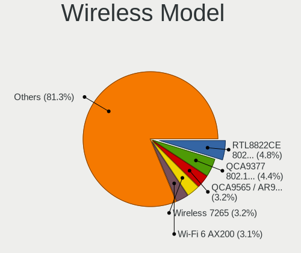

| Model                                                                                                  | Computers | Percent |
|--------------------------------------------------------------------------------------------------------|-----------|---------|
| Intel Wireless 7265                                                                                    | 14        | 5%      |
| Qualcomm Atheros QCA9377 802.11ac Wireless Network Adapter                                             | 13        | 4.64%   |
| Qualcomm Atheros QCA9565 / AR9565 Wireless Network Adapter                                             | 12        | 4.29%   |
| Realtek RTL8723BE PCIe Wireless Network Adapter                                                        | 11        | 3.93%   |
| Ralink MT7601U Wireless Adapter                                                                        | 11        | 3.93%   |
| Intel Dual Band Wireless-AC 3168NGW [Stone Peak]                                                       | 11        | 3.93%   |
| Qualcomm Atheros AR9285 Wireless Network Adapter (PCI-Express)                                         | 10        | 3.57%   |
| Broadcom BCM4313 802.11bgn Wireless Network Adapter                                                    | 9         | 3.21%   |
| Qualcomm Atheros AR9462 Wireless Network Adapter                                                       | 8         | 2.86%   |
| Intel Wireless 3165                                                                                    | 8         | 2.86%   |
| Intel Wi-Fi 6 AX200                                                                                    | 8         | 2.86%   |
| Intel Centrino Advanced-N 6205 [Taylor Peak]                                                           | 8         | 2.86%   |
| Qualcomm Atheros AR9485 Wireless Network Adapter                                                       | 6         | 2.14%   |
| Intel Wireless 7260                                                                                    | 6         | 2.14%   |
| Broadcom BCM43142 802.11b/g/n                                                                          | 6         | 2.14%   |
| Qualcomm Atheros QCA6174 802.11ac Wireless Network Adapter                                             | 5         | 1.79%   |
| Intel Comet Lake PCH CNVi WiFi                                                                         | 5         | 1.79%   |
| Intel Cannon Lake PCH CNVi WiFi                                                                        | 5         | 1.79%   |
| Realtek RTL8822CE 802.11ac PCIe Wireless Network Adapter                                               | 4         | 1.43%   |
| Realtek RTL8821AE 802.11ac PCIe Wireless Network Adapter                                               | 4         | 1.43%   |
| Realtek 802.11ac NIC                                                                                   | 4         | 1.43%   |
| Intel Wireless 8265 / 8275                                                                             | 4         | 1.43%   |
| Intel Comet Lake PCH-LP CNVi WiFi                                                                      | 4         | 1.43%   |
| Intel Centrino Advanced-N 6235                                                                         | 4         | 1.43%   |
| Realtek RTL8188EUS 802.11n Wireless Network Adapter                                                    | 3         | 1.07%   |
| Realtek RTL8187B Wireless 802.11g 54Mbps Network Adapter                                               | 3         | 1.07%   |
| Qualcomm Atheros AR242x / AR542x Wireless Network Adapter (PCI-Express)                                | 3         | 1.07%   |
| Intel Dual Band Wireless-AC 3165 Plus Bluetooth                                                        | 3         | 1.07%   |
| Intel Centrino Wireless-N 2200                                                                         | 3         | 1.07%   |
| Intel Cannon Point-LP CNVi [Wireless-AC]                                                               | 3         | 1.07%   |
| Broadcom BCM43224 802.11a/b/g/n                                                                        | 3         | 1.07%   |
| 802.11g Adapter [Linksys WUSB54GC v3] WUSB600N v1 Dual-Band Wireless-N Network Adapter [Ralink RT2870] | 3         | 1.07%   |
| TP-Link TL-WN823N v2/v3 [Realtek RTL8192EU]                                                            | 2         | 0.71%   |
| Realtek RTL88x2bu [AC1200 Techkey]                                                                     | 2         | 0.71%   |
| Realtek RTL8822BE 802.11a/b/g/n/ac WiFi adapter                                                        | 2         | 0.71%   |
| Realtek RTL8821CE 802.11ac PCIe Wireless Network Adapter                                               | 2         | 0.71%   |
| Realtek RTL8188EE Wireless Network Adapter                                                             | 2         | 0.71%   |
| Ralink RT5370 Wireless Adapter                                                                         | 2         | 0.71%   |
| Ralink RT2870/RT3070 Wireless Adapter                                                                  | 2         | 0.71%   |
| Ralink MT7610U ("Archer T2U" 2.4G+5G WLAN Adapter                                                      | 2         | 0.71%   |
| Qualcomm Atheros AR9271 802.11n                                                                        | 2         | 0.71%   |
| Qualcomm Atheros AR9287 Wireless Network Adapter (PCI-Express)                                         | 2         | 0.71%   |
| Intel Wireless 8260                                                                                    | 2         | 0.71%   |
| Intel Wi-Fi 6 AX201                                                                                    | 2         | 0.71%   |
| Intel Tiger Lake PCH CNVi WiFi                                                                         | 2         | 0.71%   |
| Intel Centrino Wireless-N 1000 [Condor Peak]                                                           | 2         | 0.71%   |
| Broadcom BCM43228 802.11a/b/g/n                                                                        | 2         | 0.71%   |
| Broadcom BCM4322 802.11a/b/g/n Wireless LAN Controller                                                 | 2         | 0.71%   |
| TP-Link TL-WN722N v2/v3 [Realtek RTL8188EUS]                                                           | 1         | 0.36%   |
| TP-Link Archer T4U ver.3                                                                               | 1         | 0.36%   |
| TP-Link Archer T2U PLUS [RTL8821AU]                                                                    | 1         | 0.36%   |
| TP-Link 802.11ac WLAN Adapter                                                                          | 1         | 0.36%   |
| Samsung WIS09ABGN LinkStick Wireless LAN Adapter                                                       | 1         | 0.36%   |
| Realtek RTL8852AE 802.11ax PCIe Wireless Network Adapter                                               | 1         | 0.36%   |
| Realtek RTL8723BU 802.11b/g/n WLAN Adapter                                                             | 1         | 0.36%   |
| Realtek RTL8723AE PCIe Wireless Network Adapter                                                        | 1         | 0.36%   |
| Realtek RTL8192E/RTL8192SE Wireless LAN Controller                                                     | 1         | 0.36%   |
| Realtek RTL8192CU 802.11n WLAN Adapter                                                                 | 1         | 0.36%   |
| Realtek RTL8191SEvB Wireless LAN Controller                                                            | 1         | 0.36%   |
| Realtek RTL8188GU 802.11n WLAN Adapter (After Modeswitch)                                              | 1         | 0.36%   |

Ethernet Vendor
---------------

Ethernet vendors

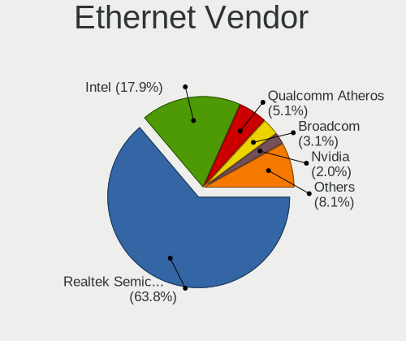

| Vendor                            | Computers | Percent |
|-----------------------------------|-----------|---------|
| Realtek Semiconductor             | 196       | 61.64%  |
| Intel                             | 51        | 16.04%  |
| Qualcomm Atheros                  | 25        | 7.86%   |
| Broadcom                          | 14        | 4.4%    |
| Nvidia                            | 10        | 3.14%   |
| Silicon Integrated Systems [SiS]  | 3         | 0.94%   |
| Marvell Technology Group          | 3         | 0.94%   |
| JMicron Technology                | 3         | 0.94%   |
| Xiaomi                            | 2         | 0.63%   |
| OPPO Electronics                  | 2         | 0.63%   |
| Huawei Technologies               | 2         | 0.63%   |
| Broadcom Limited                  | 2         | 0.63%   |
| Sundance Technology Inc / IC Plus | 1         | 0.31%   |
| Qualcomm                          | 1         | 0.31%   |
| ICS Advent                        | 1         | 0.31%   |
| D-Link System                     | 1         | 0.31%   |
| ASIX Electronics                  | 1         | 0.31%   |

Ethernet Model
--------------

Ethernet models

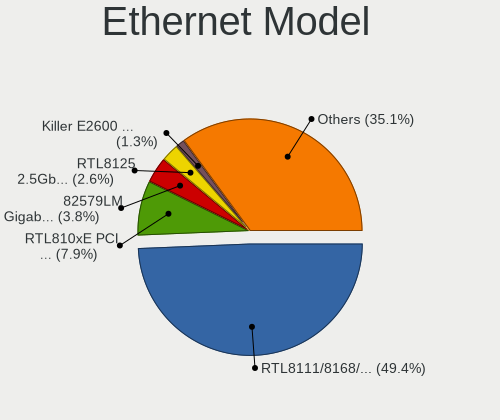

| Model                                                                          | Computers | Percent |
|--------------------------------------------------------------------------------|-----------|---------|
| Realtek RTL8111/8168/8411 PCI Express Gigabit Ethernet Controller              | 156       | 48.6%   |
| Realtek RTL810xE PCI Express Fast Ethernet controller                          | 33        | 10.28%  |
| Intel 82579LM Gigabit Network Connection (Lewisville)                          | 12        | 3.74%   |
| Qualcomm Atheros AR8151 v2.0 Gigabit Ethernet                                  | 5         | 1.56%   |
| Nvidia MCP61 Ethernet                                                          | 5         | 1.56%   |
| Qualcomm Atheros AR8152 v2.0 Fast Ethernet                                     | 4         | 1.25%   |
| Qualcomm Atheros AR8132 Fast Ethernet                                          | 4         | 1.25%   |
| Broadcom NetLink BCM57785 Gigabit Ethernet PCIe                                | 4         | 1.25%   |
| Silicon Integrated Systems [SiS] 191 Gigabit Ethernet Adapter                  | 3         | 0.93%   |
| Qualcomm Atheros QCA8171 Gigabit Ethernet                                      | 3         | 0.93%   |
| Intel Ethernet Controller I225-V                                               | 3         | 0.93%   |
| Intel Ethernet Connection I217-V                                               | 3         | 0.93%   |
| Intel Ethernet Connection (10) I219-V                                          | 3         | 0.93%   |
| Intel 82579V Gigabit Network Connection                                        | 3         | 0.93%   |
| Realtek RTL8152 Fast Ethernet Adapter                                          | 2         | 0.62%   |
| Realtek RTL8125 2.5GbE Controller                                              | 2         | 0.62%   |
| Realtek Killer E2600 Gigabit Ethernet Controller                               | 2         | 0.62%   |
| Qualcomm Atheros Killer E2500 Gigabit Ethernet Controller                      | 2         | 0.62%   |
| Qualcomm Atheros Killer E220x Gigabit Ethernet Controller                      | 2         | 0.62%   |
| OPPO realme X50 5G                                                             | 2         | 0.62%   |
| Nvidia MCP79 Ethernet                                                          | 2         | 0.62%   |
| JMicron JMC260 PCI Express Fast Ethernet Controller                            | 2         | 0.62%   |
| Intel I211 Gigabit Network Connection                                          | 2         | 0.62%   |
| Intel Ethernet Connection I219-V                                               | 2         | 0.62%   |
| Intel Ethernet Connection (6) I219-LM                                          | 2         | 0.62%   |
| Intel Ethernet Connection (3) I218-LM                                          | 2         | 0.62%   |
| Intel Ethernet Connection (2) I219-V                                           | 2         | 0.62%   |
| Intel 82577LC Gigabit Network Connection                                       | 2         | 0.62%   |
| Intel 82567LM Gigabit Network Connection                                       | 2         | 0.62%   |
| Huawei MAR-LX1A                                                                | 2         | 0.62%   |
| Broadcom NetXtreme BCM57765 Gigabit Ethernet PCIe                              | 2         | 0.62%   |
| Broadcom NetLink BCM5906M Fast Ethernet PCI Express                            | 2         | 0.62%   |
| Broadcom NetLink BCM57780 Gigabit Ethernet PCIe                                | 2         | 0.62%   |
| Broadcom Limited NetLink BCM57780 Gigabit Ethernet PCIe                        | 2         | 0.62%   |
| Xiaomi Mi/Redmi series (RNDIS)                                                 | 1         | 0.31%   |
| Xiaomi Mi/Redmi series (RNDIS + ADB)                                           | 1         | 0.31%   |
| Sundance Inc / IC Plus IC Plus IP100A Integrated 10/100 Ethernet MAC + PHY     | 1         | 0.31%   |
| Realtek RTL8153 Gigabit Ethernet Adapter                                       | 1         | 0.31%   |
| Realtek RTL-8100/8101L/8139 PCI Fast Ethernet Adapter                          | 1         | 0.31%   |
| Qualcomm Redmi Note 9S                                                         | 1         | 0.31%   |
| Qualcomm Atheros Killer E2400 Gigabit Ethernet Controller                      | 1         | 0.31%   |
| Qualcomm Atheros Attansic L2 Fast Ethernet                                     | 1         | 0.31%   |
| Qualcomm Atheros AR8161 Gigabit Ethernet                                       | 1         | 0.31%   |
| Qualcomm Atheros AR8152 v1.1 Fast Ethernet                                     | 1         | 0.31%   |
| Qualcomm Atheros AR8121/AR8113/AR8114 Gigabit or Fast Ethernet                 | 1         | 0.31%   |
| Nvidia MCP77 Ethernet                                                          | 1         | 0.31%   |
| Nvidia MCP67 Ethernet                                                          | 1         | 0.31%   |
| Nvidia MCP51 Ethernet Controller                                               | 1         | 0.31%   |
| Marvell Group Yukon Optima 88E8059 [PCIe Gigabit Ethernet Controller with AVB] | 1         | 0.31%   |
| Marvell Group 88E8072 PCI-E Gigabit Ethernet Controller                        | 1         | 0.31%   |
| Marvell Group 88E8040 PCI-E Fast Ethernet Controller                           | 1         | 0.31%   |
| JMicron JMC250 PCI Express Gigabit Ethernet Controller                         | 1         | 0.31%   |
| Intel PRO/100 VE Network Connection                                            | 1         | 0.31%   |
| Intel I210 Gigabit Network Connection                                          | 1         | 0.31%   |
| Intel Ethernet Connection I219-LM                                              | 1         | 0.31%   |
| Intel Ethernet Connection I218-LM                                              | 1         | 0.31%   |
| Intel Ethernet Connection I217-LM                                              | 1         | 0.31%   |
| Intel Ethernet Connection (7) I219-V                                           | 1         | 0.31%   |
| Intel Ethernet Connection (4) I219-V                                           | 1         | 0.31%   |
| Intel Ethernet Connection (4) I219-LM                                          | 1         | 0.31%   |

Net Controller Kind
-------------------

Ethernet, WiFi or modem

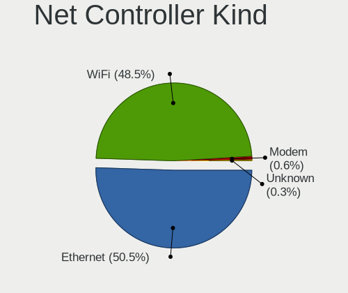

| Kind     | Computers | Percent |
|----------|-----------|---------|
| Ethernet | 304       | 52.96%  |
| WiFi     | 267       | 46.52%  |
| Modem    | 3         | 0.52%   |

Used Controller
---------------

Currently used network controller

| Kind     | Computers | Percent |
|----------|-----------|---------|
| WiFi     | 217       | 60.28%  |
| Ethernet | 143       | 39.72%  |

NICs
----

Total network controllers on board

| Total | Computers | Percent |
|-------|-----------|---------|
| 2     | 185       | 52.41%  |
| 1     | 151       | 42.78%  |
| 0     | 11        | 3.12%   |
| 3     | 6         | 1.7%    |

IPv6
----

IPv6 vs IPv4

| Used | Computers | Percent |
|------|-----------|---------|
| No   | 332       | 93.26%  |
| Yes  | 24        | 6.74%   |

Bluetooth
---------

Bluetooth Vendor
----------------

Controller vendors

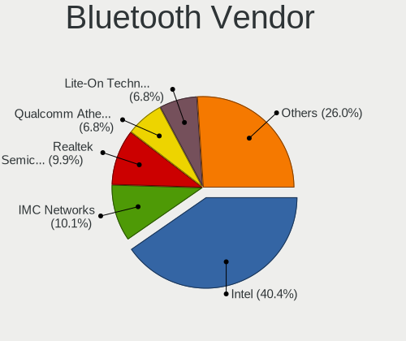

| Vendor                          | Computers | Percent |
|---------------------------------|-----------|---------|
| Intel                           | 76        | 38.58%  |
| Realtek Semiconductor           | 18        | 9.14%   |
| Broadcom                        | 18        | 9.14%   |
| Qualcomm Atheros Communications | 16        | 8.12%   |
| Lite-On Technology              | 16        | 8.12%   |
| IMC Networks                    | 12        | 6.09%   |
| Foxconn / Hon Hai               | 12        | 6.09%   |
| Cambridge Silicon Radio         | 10        | 5.08%   |
| Apple                           | 8         | 4.06%   |
| Toshiba                         | 3         | 1.52%   |
| Hewlett-Packard                 | 3         | 1.52%   |
| Chicony Electronics             | 2         | 1.02%   |
| Marvell Semiconductor           | 1         | 0.51%   |
| Integrated System Solution      | 1         | 0.51%   |
| Dell                            | 1         | 0.51%   |

Bluetooth Model
---------------

Controller models

| Model                                                                               | Computers | Percent |
|-------------------------------------------------------------------------------------|-----------|---------|
| Intel Bluetooth wireless interface                                                  | 34        | 17.26%  |
| Realtek Bluetooth Radio                                                             | 13        | 6.6%    |
| Intel AX201 Bluetooth                                                               | 11        | 5.58%   |
| Intel Bluetooth 9460/9560 Jefferson Peak (JfP)                                      | 10        | 5.08%   |
| Cambridge Silicon Radio Bluetooth Dongle (HCI mode)                                 | 10        | 5.08%   |
| Lite-On Qualcomm Atheros QCA9377 Bluetooth                                          | 8         | 4.06%   |
| Intel Wireless-AC 3168 Bluetooth                                                    | 7         | 3.55%   |
| Intel AX200 Bluetooth                                                               | 7         | 3.55%   |
| IMC Networks Bluetooth Device                                                       | 7         | 3.55%   |
| Qualcomm Atheros  Bluetooth Device                                                  | 6         | 3.05%   |
| Qualcomm Atheros AR3011 Bluetooth                                                   | 4         | 2.03%   |
| Intel Centrino Bluetooth Wireless Transceiver                                       | 4         | 2.03%   |
| IMC Networks Bluetooth Radio                                                        | 4         | 2.03%   |
| Broadcom BCM2045B (BDC-2.1)                                                         | 4         | 2.03%   |
| Realtek RTL8723B Bluetooth                                                          | 3         | 1.52%   |
| Qualcomm Atheros QCA61x4 Bluetooth 4.0                                              | 3         | 1.52%   |
| Qualcomm Atheros AR3012 Bluetooth 4.0                                               | 3         | 1.52%   |
| Lite-On Bluetooth Device                                                            | 3         | 1.52%   |
| Foxconn / Hon Hai Bluetooth Device                                                  | 3         | 1.52%   |
| Apple Built-in Bluetooth 2.0+EDR HCI                                                | 3         | 1.52%   |
| Apple Bluetooth Host Controller                                                     | 3         | 1.52%   |
| Realtek  Bluetooth 4.2 Adapter                                                      | 2         | 1.02%   |
| Lite-On BCM43142A0                                                                  | 2         | 1.02%   |
| Lite-On Atheros AR3012 Bluetooth                                                    | 2         | 1.02%   |
| HP Bluetooth 2.0 Interface [Broadcom BCM2045]                                       | 2         | 1.02%   |
| Foxconn / Hon Hai Bluetooth USB Host Controller                                     | 2         | 1.02%   |
| Foxconn / Hon Hai BCM20702A0                                                        | 2         | 1.02%   |
| Foxconn / Hon Hai Acer Bluetooth module                                             | 2         | 1.02%   |
| Chicony Bluetooth Radio                                                             | 2         | 1.02%   |
| Broadcom HP Portable Valentine                                                      | 2         | 1.02%   |
| Broadcom BCM43142A0 Bluetooth 4.0                                                   | 2         | 1.02%   |
| Broadcom BCM20702 Bluetooth 4.0 [ThinkPad]                                          | 2         | 1.02%   |
| Broadcom BCM2070 Bluetooth Device                                                   | 2         | 1.02%   |
| Broadcom BCM2035 Bluetooth                                                          | 2         | 1.02%   |
| Apple Bluetooth USB Host Controller                                                 | 2         | 1.02%   |
| Toshiba RT Bluetooth Radio                                                          | 1         | 0.51%   |
| Toshiba Integrated Bluetooth (Taiyo Yuden)                                          | 1         | 0.51%   |
| Toshiba Bluetooth USB Host Controller                                               | 1         | 0.51%   |
| Marvell Bluetooth and Wireless LAN Composite Device                                 | 1         | 0.51%   |
| Lite-On Qualcomm Atheros Bluetooth                                                  | 1         | 0.51%   |
| Intel Wireless-AC 9260 Bluetooth Adapter                                            | 1         | 0.51%   |
| Intel Centrino Advanced-N 6230 Bluetooth adapter                                    | 1         | 0.51%   |
| Intel AX210 Bluetooth                                                               | 1         | 0.51%   |
| Integrated System Solution KY-BT100 Bluetooth Adapter                               | 1         | 0.51%   |
| IMC Networks Bluetooth USB Host Controller                                          | 1         | 0.51%   |
| HP Broadcom 2070 Bluetooth Combo                                                    | 1         | 0.51%   |
| Foxconn / Hon Hai Wireless_Device                                                   | 1         | 0.51%   |
| Foxconn / Hon Hai Foxconn T77H114 BCM2070 [Single-Chip Bluetooth 2.1 + EDR Adapter] | 1         | 0.51%   |
| Foxconn / Hon Hai BCM43142A0                                                        | 1         | 0.51%   |
| Dell Wireless 355 Bluetooth                                                         | 1         | 0.51%   |
| Broadcom BCM20702A0 Bluetooth 4.0                                                   | 1         | 0.51%   |
| Broadcom BCM20702A0                                                                 | 1         | 0.51%   |
| Broadcom BCM2070 Bluetooth 2.1 + EDR                                                | 1         | 0.51%   |
| Broadcom BCM2045B (BDC-2.1) [Bluetooth Controller]                                  | 1         | 0.51%   |

Sound
-----

Sound Vendor
------------

Sound card vendors

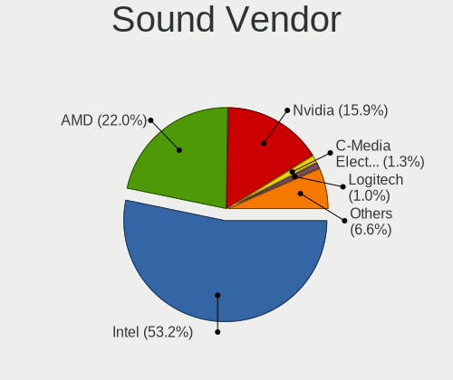

| Vendor                           | Computers | Percent |
|----------------------------------|-----------|---------|
| Intel                            | 254       | 56.95%  |
| AMD                              | 84        | 18.83%  |
| Nvidia                           | 72        | 16.14%  |
| Logitech                         | 4         | 0.9%    |
| Generalplus Technology           | 4         | 0.9%    |
| SteelSeries ApS                  | 3         | 0.67%   |
| Silicon Integrated Systems [SiS] | 3         | 0.67%   |
| C-Media Electronics              | 3         | 0.67%   |
| Plantronics                      | 2         | 0.45%   |
| JMTek                            | 2         | 0.45%   |
| GN Netcom                        | 2         | 0.45%   |
| XMOS                             | 1         | 0.22%   |
| Realtek Semiconductor            | 1         | 0.22%   |
| OPPO Electronics                 | 1         | 0.22%   |
| Kingston Technology              | 1         | 0.22%   |
| Giga-Byte Technology             | 1         | 0.22%   |
| Focusrite-Novation               | 1         | 0.22%   |
| FiiO Electronics Technology      | 1         | 0.22%   |
| Elgato Systems                   | 1         | 0.22%   |
| DEXP BK-20                       | 1         | 0.22%   |
| DCMT Technology                  | 1         | 0.22%   |
| Creative Technology              | 1         | 0.22%   |
| Corsair                          | 1         | 0.22%   |
| Cooler Master                    | 1         | 0.22%   |

Sound Model
-----------

Sound card models

| Model                                                                                             | Computers | Percent |
|---------------------------------------------------------------------------------------------------|-----------|---------|
| Intel Sunrise Point-LP HD Audio                                                                   | 34        | 6.37%   |
| Intel 7 Series/C216 Chipset Family High Definition Audio Controller                               | 30        | 5.62%   |
| Intel 6 Series/C200 Series Chipset Family High Definition Audio Controller                        | 28        | 5.24%   |
| AMD FCH Azalia Controller                                                                         | 26        | 4.87%   |
| Intel NM10/ICH7 Family High Definition Audio Controller                                           | 23        | 4.31%   |
| AMD Family 17h/19h HD Audio Controller                                                            | 23        | 4.31%   |
| Intel 8 Series/C220 Series Chipset High Definition Audio Controller                               | 17        | 3.18%   |
| Intel Xeon E3-1200 v3/4th Gen Core Processor HD Audio Controller                                  | 14        | 2.62%   |
| Intel Celeron N3350/Pentium N4200/Atom E3900 Series Audio Cluster                                 | 13        | 2.43%   |
| Intel 200 Series PCH HD Audio                                                                     | 11        | 2.06%   |
| Nvidia GF108 High Definition Audio Controller                                                     | 10        | 1.87%   |
| Intel 5 Series/3400 Series Chipset High Definition Audio                                          | 10        | 1.87%   |
| AMD Raven/Raven2/Fenghuang HDMI/DP Audio Controller                                               | 10        | 1.87%   |
| Nvidia GP107GL High Definition Audio Controller                                                   | 8         | 1.5%    |
| Intel Haswell-ULT HD Audio Controller                                                             | 8         | 1.5%    |
| Intel Cannon Lake PCH cAVS                                                                        | 8         | 1.5%    |
| Intel 8 Series HD Audio Controller                                                                | 8         | 1.5%    |
| AMD Renoir Radeon High Definition Audio Controller                                                | 8         | 1.5%    |
| AMD Kaveri HDMI/DP Audio Controller                                                               | 8         | 1.5%    |
| Nvidia MCP61 High Definition Audio                                                                | 7         | 1.31%   |
| Intel Wildcat Point-LP High Definition Audio Controller                                           | 7         | 1.31%   |
| Intel Broadwell-U Audio Controller                                                                | 7         | 1.31%   |
| Intel 82801I (ICH9 Family) HD Audio Controller                                                    | 7         | 1.31%   |
| AMD SBx00 Azalia (Intel HDA)                                                                      | 7         | 1.31%   |
| AMD Kabini HDMI/DP Audio                                                                          | 7         | 1.31%   |
| AMD Family 17h (Models 00h-0fh) HD Audio Controller                                               | 7         | 1.31%   |
| Nvidia TU116 High Definition Audio Controller                                                     | 6         | 1.12%   |
| Nvidia GK208 HDMI/DP Audio Controller                                                             | 6         | 1.12%   |
| Intel Comet Lake PCH cAVS                                                                         | 6         | 1.12%   |
| Intel Celeron/Pentium Silver Processor High Definition Audio                                      | 6         | 1.12%   |
| Intel Atom/Celeron/Pentium Processor x5-E8000/J3xxx/N3xxx Series High Definition Audio Controller | 6         | 1.12%   |
| Intel Atom Processor Z36xxx/Z37xxx Series High Definition Audio Controller                        | 6         | 1.12%   |
| AMD Ellesmere HDMI Audio [Radeon RX 470/480 / 570/580/590]                                        | 6         | 1.12%   |
| Intel Comet Lake PCH-LP cAVS                                                                      | 5         | 0.94%   |
| Intel 100 Series/C230 Series Chipset Family HD Audio Controller                                   | 5         | 0.94%   |
| AMD Trinity HDMI Audio Controller                                                                 | 5         | 0.94%   |
| AMD Starship/Matisse HD Audio Controller                                                          | 5         | 0.94%   |
| AMD Oland/Hainan/Cape Verde/Pitcairn HDMI Audio [Radeon HD 7000 Series]                           | 5         | 0.94%   |
| AMD Baffin HDMI/DP Audio [Radeon RX 550 640SP / RX 560/560X]                                      | 5         | 0.94%   |
| Nvidia TU107 GeForce GTX 1650 High Definition Audio Controller                                    | 4         | 0.75%   |
| Nvidia TU106 High Definition Audio Controller                                                     | 4         | 0.75%   |
| Nvidia GP104 High Definition Audio Controller                                                     | 4         | 0.75%   |
| Intel Cannon Point-LP High Definition Audio Controller                                            | 4         | 0.75%   |
| Intel 9 Series Chipset Family HD Audio Controller                                                 | 4         | 0.75%   |
| Generalplus Technology Usb Audio Device                                                           | 4         | 0.75%   |
| Silicon Integrated Systems [SiS] Azalia Audio Controller                                          | 3         | 0.56%   |
| Nvidia MCP79 High Definition Audio                                                                | 3         | 0.56%   |
| Nvidia GP106 High Definition Audio Controller                                                     | 3         | 0.56%   |
| Nvidia GA102 High Definition Audio Controller                                                     | 3         | 0.56%   |
| Nvidia Audio device                                                                               | 3         | 0.56%   |
| Intel Tiger Lake-H HD Audio Controller                                                            | 3         | 0.56%   |
| Intel CM238 HD Audio Controller                                                                   | 3         | 0.56%   |
| AMD Caicos HDMI Audio [Radeon HD 6450 / 7450/8450/8490 OEM / R5 230/235/235X OEM]                 | 3         | 0.56%   |
| SteelSeries ApS SteelSeries Arctis 5                                                              | 2         | 0.37%   |
| Nvidia GM107 High Definition Audio Controller [GeForce 940MX]                                     | 2         | 0.37%   |
| Intel Tiger Lake-LP Smart Sound Technology Audio Controller                                       | 2         | 0.37%   |
| Intel Audio device                                                                                | 2         | 0.37%   |
| Intel 82801H (ICH8 Family) HD Audio Controller                                                    | 2         | 0.37%   |
| AMD Wrestler HDMI Audio                                                                           | 2         | 0.37%   |
| AMD Turks HDMI Audio [Radeon HD 6500/6600 / 6700M Series]                                         | 2         | 0.37%   |

Memory
------

Memory Vendor
-------------

Memory module vendors

| Vendor              | Computers | Percent |
|---------------------|-----------|---------|
| Kingston            | 37        | 20.33%  |
| Samsung Electronics | 34        | 18.68%  |
| SK Hynix            | 32        | 17.58%  |
| Unknown             | 18        | 9.89%   |
| Micron Technology   | 12        | 6.59%   |
| Team                | 9         | 4.95%   |
| Ramaxel Technology  | 7         | 3.85%   |
| G.Skill             | 6         | 3.3%    |
| Crucial             | 5         | 2.75%   |
| Unknown (ABCD)      | 2         | 1.1%    |
| Transcend           | 2         | 1.1%    |
| Patriot             | 2         | 1.1%    |
| Nanya Technology    | 2         | 1.1%    |
| Kingmax             | 2         | 1.1%    |
| Elpida              | 2         | 1.1%    |
| Corsair             | 2         | 1.1%    |
| Uroad               | 1         | 0.55%   |
| Silicon Power       | 1         | 0.55%   |
| PNY                 | 1         | 0.55%   |
| Mitsubishi          | 1         | 0.55%   |
| Carry               | 1         | 0.55%   |
| ASint Technology    | 1         | 0.55%   |
| A-DATA Technology   | 1         | 0.55%   |
| Unknown             | 1         | 0.55%   |

Memory Model
------------

Memory module models

| Model                                                          | Computers | Percent |
|----------------------------------------------------------------|-----------|---------|
| Samsung RAM M471A5244CB0-CRC 4GB SODIMM DDR4 2667MT/s          | 5         | 2.6%    |
| SK Hynix RAM HMA81GS6AFR8N-UH 8GB SODIMM DDR4 2667MT/s         | 4         | 2.08%   |
| SK Hynix RAM HMAA1GS6CMR6N-XN 8GB Row Of Chips DDR4 3200MT/s   | 3         | 1.56%   |
| SK Hynix RAM HMA851S6CJR6N-VK 4GB SODIMM DDR4 2667MT/s         | 3         | 1.56%   |
| Samsung RAM M471B5273DH0-CH9 4GB SODIMM DDR3 1334MT/s          | 3         | 1.56%   |
| Kingston RAM KHX1866C10D3/8G 8GB DIMM DDR3 1867MT/s            | 3         | 1.56%   |
| Kingston RAM 99U5428-018.A00LF 8GB SODIMM DDR3 1600MT/s        | 3         | 1.56%   |
| Unknown RAM Module 4GB SODIMM DDR3 1333MT/s                    | 2         | 1.04%   |
| Unknown (ABCD) RAM 123456789012345678 2GB SODIMM DDR4 2400MT/s | 2         | 1.04%   |
| Team RAM TEAMGROUP-SD4-2400 16GB SODIMM DDR4 8400MT/s          | 2         | 1.04%   |
| SK Hynix RAM HMT41GS6AFR8A-PB 8GB SODIMM DDR3 1600MT/s         | 2         | 1.04%   |
| SK Hynix RAM HMT351S6EFR8A-PB 4096MB SODIMM DDR3 1600MT/s      | 2         | 1.04%   |
| SK Hynix RAM HMT351S6CFR8C-PB 4GB SODIMM DDR3 1600MT/s         | 2         | 1.04%   |
| Samsung RAM Module 8192MB SODIMM DDR4 2667MT/s                 | 2         | 1.04%   |
| Samsung RAM M471B5273DH0-CK0 4096MB SODIMM DDR3 1600MT/s       | 2         | 1.04%   |
| Samsung RAM M471B5173QH0-YK0 4GB SODIMM DDR3 1600MT/s          | 2         | 1.04%   |
| Samsung RAM M471A1K43CB1-CRC 8GB SODIMM DDR4 2667MT/s          | 2         | 1.04%   |
| Samsung RAM M471A1G44AB0-CWE 8GB SODIMM DDR4 3200MT/s          | 2         | 1.04%   |
| Ramaxel RAM RMSA3260ME78HAF-2666 8GB SODIMM DDR4 2667MT/s      | 2         | 1.04%   |
| Patriot RAM PSD34G160081 4GB DIMM DDR3 1600MT/s                | 2         | 1.04%   |
| Micron RAM 8ATF1G64HZ-3G2J1 8GB SODIMM DDR4 3200MT/s           | 2         | 1.04%   |
| Micron RAM 4ATF51264HZ-2G6E1 4GB SODIMM DDR4 2667MT/s          | 2         | 1.04%   |
| Kingston RAM KHX3200C16D4/8GX 8192MB DIMM DDR4 3533MT/s        | 2         | 1.04%   |
| Kingston RAM ACR16D3LS1KFG/4G 4GB SODIMM DDR3 1600MT/s         | 2         | 1.04%   |
| Kingston RAM 99U5428-101.A00LF 8GB SODIMM DDR3 1600MT/s        | 2         | 1.04%   |
| Kingston RAM 9905700-025.A00G 8GB SODIMM DDR4 2667MT/s         | 2         | 1.04%   |
| G.Skill RAM F4-3200C16-8GVKB 8GB DIMM DDR4 3200MT/s            | 2         | 1.04%   |
| Corsair RAM CMT128GX4M4C3200C16 32GB DIMM DDR4 3200MT/s        | 2         | 1.04%   |
| Uroad RAM WJD8G4M16P12800 8192MB DIMM DDR3 1600MT/s            | 1         | 0.52%   |
| Unknown RAM Module 8192MB DIMM                                 | 1         | 0.52%   |
| Unknown RAM Module 4GB DIMM DDR4 2133MT/s                      | 1         | 0.52%   |
| Unknown RAM Module 4GB DIMM DDR3 1333MT/s                      | 1         | 0.52%   |
| Unknown RAM Module 4096MB DIMM DDR2                            | 1         | 0.52%   |
| Unknown RAM Module 2GB SODIMM DDR3                             | 1         | 0.52%   |
| Unknown RAM Module 2GB SODIMM DDR2 667MT/s                     | 1         | 0.52%   |
| Unknown RAM Module 2048MB SODIMM DRAM 667MT/s                  | 1         | 0.52%   |
| Unknown RAM Module 2048MB SODIMM DDR3 1600MT/s                 | 1         | 0.52%   |
| Unknown RAM Module 2048MB SODIMM DDR3 1333MT/s                 | 1         | 0.52%   |
| Unknown RAM Module 2048MB SODIMM DDR2 667MT/s                  | 1         | 0.52%   |
| Unknown RAM Module 2048MB SODIMM 667MT/s                       | 1         | 0.52%   |
| Unknown RAM Module 1GB DIMM DDR2                               | 1         | 0.52%   |
| Unknown RAM Module 16384MB DIMM DDR4 2666MT/s                  | 1         | 0.52%   |
| Unknown RAM Module 1024MB SODIMM DDR2 667MT/s                  | 1         | 0.52%   |
| Unknown RAM Module 1024MB SODIMM DDR2 400MT/s                  | 1         | 0.52%   |
| Unknown RAM Module 1024MB SODIMM 667MT/s                       | 1         | 0.52%   |
| Unknown RAM Module 1024MB DIMM DDR2 667MT/s                    | 1         | 0.52%   |
| Unknown RAM Module 1024MB DIMM DDR2                            | 1         | 0.52%   |
| Unknown RAM KZ24UE5116HAR8 8192MB DIMM DDR4 2400MT/s           | 1         | 0.52%   |
| Transcend RAM TS2GLH64V4B 16384MB DIMM DDR4 2400MT/s           | 1         | 0.52%   |
| Transcend RAM JM1333KSN-4G 4096MB SODIMM DDR3 1334MT/s         | 1         | 0.52%   |
| Team RAM TEAMGROUP-UD4-3600 16GB DIMM DDR4 3600MT/s            | 1         | 0.52%   |
| Team RAM TEAMGROUP-UD4-3200 8GB DIMM DDR4 3200MT/s             | 1         | 0.52%   |
| Team RAM TEAMGROUP-UD4-3200 16GB DIMM DDR4 3733MT/s            | 1         | 0.52%   |
| Team RAM TEAMGROUP-UD4-2400 16GB DIMM DDR4 2400MT/s            | 1         | 0.52%   |
| Team RAM TEAMGROUP-UD3-1600 8GB DIMM DDR3 1600MT/s             | 1         | 0.52%   |
| Team RAM TEAMGROUP-SD4-2666 16384MB SODIMM DDR4 2667MT/s       | 1         | 0.52%   |
| Team RAM Elite-1600 8GB SODIMM DDR3 1600MT/s                   | 1         | 0.52%   |
| Team RAM Elite-1333 8GB SODIMM DDR3 1334MT/s                   | 1         | 0.52%   |
| SK Hynix RAM Module 8192MB Row Of Chips LPDDR3 2133MT/s        | 1         | 0.52%   |
| SK Hynix RAM Module 8192MB DIMM DDR4 2133MT/s                  | 1         | 0.52%   |

Memory Kind
-----------

Memory module kinds

| Kind    | Computers | Percent |
|---------|-----------|---------|
| DDR4    | 67        | 45.27%  |
| DDR3    | 60        | 40.54%  |
| DDR2    | 10        | 6.76%   |
| LPDDR4  | 4         | 2.7%    |
| Unknown | 3         | 2.03%   |
| SDRAM   | 2         | 1.35%   |
| LPDDR3  | 1         | 0.68%   |
| DRAM    | 1         | 0.68%   |

Memory Form Factor
------------------

Physical design of the memory module

| Name         | Computers | Percent |
|--------------|-----------|---------|
| SODIMM       | 97        | 65.99%  |
| DIMM         | 46        | 31.29%  |
| Row Of Chips | 4         | 2.72%   |

Memory Size
-----------

Memory module size

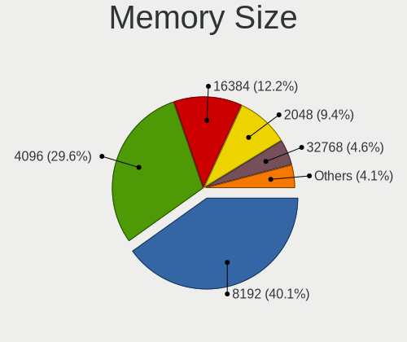

| Size  | Computers | Percent |
|-------|-----------|---------|
| 8192  | 61        | 36.53%  |
| 4096  | 54        | 32.34%  |
| 2048  | 21        | 12.57%  |
| 16384 | 15        | 8.98%   |
| 1024  | 10        | 5.99%   |
| 32768 | 6         | 3.59%   |

Memory Speed
------------

Memory module speed

| Speed   | Computers | Percent |
|---------|-----------|---------|
| 1600    | 43        | 26.22%  |
| 2667    | 28        | 17.07%  |
| 3200    | 17        | 10.37%  |
| 2400    | 17        | 10.37%  |
| 1333    | 9         | 5.49%   |
| 667     | 9         | 5.49%   |
| 2133    | 8         | 4.88%   |
| 1334    | 7         | 4.27%   |
| Unknown | 4         | 2.44%   |
| 3600    | 3         | 1.83%   |
| 8400    | 2         | 1.22%   |
| 3533    | 2         | 1.22%   |
| 3466    | 2         | 1.22%   |
| 1800    | 2         | 1.22%   |
| 800     | 2         | 1.22%   |
| 4266    | 1         | 0.61%   |
| 3733    | 1         | 0.61%   |
| 3266    | 1         | 0.61%   |
| 2666    | 1         | 0.61%   |
| 2048    | 1         | 0.61%   |
| 1067    | 1         | 0.61%   |
| 1066    | 1         | 0.61%   |
| 533     | 1         | 0.61%   |
| 400     | 1         | 0.61%   |

Printers & scanners
-------------------

Printer Vendor
--------------

Printer device vendors

| Vendor             | Computers | Percent |
|--------------------|-----------|---------|
| Brother Industries | 3         | 42.86%  |
| Seiko Epson        | 2         | 28.57%  |
| Canon              | 2         | 28.57%  |

Printer Model
-------------

Printer device models

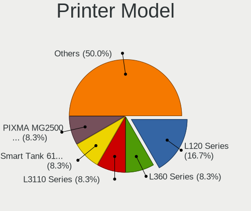

| Model                     | Computers | Percent |
|---------------------------|-----------|---------|
| Seiko Epson L222 Series   | 1         | 14.29%  |
| Seiko Epson L120 Series   | 1         | 14.29%  |
| Canon PIXMA MG2500 Series | 1         | 14.29%  |
| Canon G2010 series        | 1         | 14.29%  |
| Brother DCP-T710W         | 1         | 14.29%  |
| Brother DCP-T700W         | 1         | 14.29%  |
| Brother DCP-T310          | 1         | 14.29%  |

Scanner Vendor
--------------

Scanner device vendors

| Vendor | Computers | Percent |
|--------|-----------|---------|
| Canon  | 1         | 100%    |

Scanner Model
-------------

Scanner device models

| Model                   | Computers | Percent |
|-------------------------|-----------|---------|
| Canon CanoScan LiDE 110 | 1         | 100%    |

Camera
------

Camera Vendor
-------------

Camera device vendors

| Vendor                                 | Computers | Percent |
|----------------------------------------|-----------|---------|
| Chicony Electronics                    | 54        | 24.43%  |
| Realtek Semiconductor                  | 22        | 9.95%   |
| Microdia                               | 17        | 7.69%   |
| IMC Networks                           | 14        | 6.33%   |
| Acer                                   | 14        | 6.33%   |
| Quanta                                 | 12        | 5.43%   |
| Sunplus Innovation Technology          | 10        | 4.52%   |
| Apple                                  | 8         | 3.62%   |
| Lite-On Technology                     | 7         | 3.17%   |
| Suyin                                  | 6         | 2.71%   |
| Silicon Motion                         | 5         | 2.26%   |
| Cheng Uei Precision Industry (Foxlink) | 5         | 2.26%   |
| Alcor Micro                            | 5         | 2.26%   |
| Z-Star Microelectronics                | 4         | 1.81%   |
| Syntek                                 | 4         | 1.81%   |
| Samsung Electronics                    | 4         | 1.81%   |
| Logitech                               | 4         | 1.81%   |
| Jieli Technology                       | 4         | 1.81%   |
| Pixart Imaging                         | 3         | 1.36%   |
| Cubeternet                             | 2         | 0.9%    |
| Alpha Imaging Technology               | 2         | 0.9%    |
| ALi                                    | 2         | 0.9%    |
| A4Tech                                 | 2         | 0.9%    |
| Ricoh                                  | 1         | 0.45%   |
| Razer USA                              | 1         | 0.45%   |
| OmniVision Technologies                | 1         | 0.45%   |
| Microsoft                              | 1         | 0.45%   |
| Lenovo                                 | 1         | 0.45%   |
| KYE Systems (Mouse Systems)            | 1         | 0.45%   |
| Importek                               | 1         | 0.45%   |
| Goertek Electronics                    | 1         | 0.45%   |
| Generalplus Technology                 | 1         | 0.45%   |
| GEMBIRD                                | 1         | 0.45%   |
| DigiTech                               | 1         | 0.45%   |

Camera Model
------------

Camera device models

| Model                                                           | Computers | Percent |
|-----------------------------------------------------------------|-----------|---------|
| Chicony Integrated Camera                                       | 12        | 5.41%   |
| Chicony HD WebCam                                               | 9         | 4.05%   |
| Realtek Acer 640 x 480 laptop camera                            | 6         | 2.7%    |
| Quanta HD WebCam                                                | 5         | 2.25%   |
| Realtek Integrated_Webcam_HD                                    | 4         | 1.8%    |
| Quanta VGA WebCam                                               | 4         | 1.8%    |
| Microdia Integrated_Webcam_HD                                   | 4         | 1.8%    |
| Jieli USB PHY 2.0                                               | 4         | 1.8%    |
| IMC Networks USB2.0 VGA UVC WebCam                              | 4         | 1.8%    |
| IMC Networks USB2.0 HD UVC WebCam                               | 4         | 1.8%    |
| Samsung Galaxy A5 (MTP)                                         | 3         | 1.35%   |
| Pixart Imaging GE 1.3 MP MiniCam Pro                            | 3         | 1.35%   |
| Microdia Laptop_Integrated_Webcam_HD                            | 3         | 1.35%   |
| Lite-On Integrated Camera                                       | 3         | 1.35%   |
| Chicony VGA WebCam                                              | 3         | 1.35%   |
| Chicony Lenovo EasyCamera                                       | 3         | 1.35%   |
| Chicony HP Truevision HD                                        | 3         | 1.35%   |
| Chicony EasyCamera                                              | 3         | 1.35%   |
| Apple Built-in iSight                                           | 3         | 1.35%   |
| Acer Lenovo EasyCamera                                          | 3         | 1.35%   |
| Acer EasyCamera                                                 | 3         | 1.35%   |
| Z-Star Venus USB2.0 Camera                                      | 2         | 0.9%    |
| Syntek Lenovo EasyCamera                                        | 2         | 0.9%    |
| Syntek Integrated Camera                                        | 2         | 0.9%    |
| Suyin HP Webcam                                                 | 2         | 0.9%    |
| Sunplus Laptop Integrated WebCam HD                             | 2         | 0.9%    |
| Sunplus Integrated Webcam                                       | 2         | 0.9%    |
| Sunplus HD WebCam                                               | 2         | 0.9%    |
| Realtek USB2.0 VGA UVC WebCam                                   | 2         | 0.9%    |
| Quanta HD User Facing                                           | 2         | 0.9%    |
| Microdia Sonix USB 2.0 Camera                                   | 2         | 0.9%    |
| Microdia Integrated Camera                                      | 2         | 0.9%    |
| Logitech HD Webcam C910                                         | 2         | 0.9%    |
| Lite-On TOSHIBA Web Camera - HD                                 | 2         | 0.9%    |
| Lite-On HP HD Camera                                            | 2         | 0.9%    |
| IMC Networks Integrated Camera                                  | 2         | 0.9%    |
| IMC Networks EasyCamera                                         | 2         | 0.9%    |
| Chicony USB 2.0 Camera                                          | 2         | 0.9%    |
| Chicony TOSHIBA Web Camera - HD                                 | 2         | 0.9%    |
| Chicony Lenovo Integrated Camera (0.3MP)                        | 2         | 0.9%    |
| Chicony Integrated Camera (1280x720@30)                         | 2         | 0.9%    |
| Chicony HP HD Camera                                            | 2         | 0.9%    |
| Cheng Uei Precision Industry (Foxlink) HP Wide Vision HD Camera | 2         | 0.9%    |
| Apple FaceTime HD Camera (Built-in)                             | 2         | 0.9%    |
| Apple FaceTime Camera                                           | 2         | 0.9%    |
| ALi WebCam                                                      | 2         | 0.9%    |
| Alcor Micro SHUNCCM2MP                                          | 2         | 0.9%    |
| Alcor Micro HD WebCam                                           | 2         | 0.9%    |
| Acer Integrated Camera                                          | 2         | 0.9%    |
| A4Tech FHD 1080P PC Camera                                      | 2         | 0.9%    |
| Z-Star Webcam                                                   | 1         | 0.45%   |
| Z-Star A4 TECH USB2.0 PC Camera J                               | 1         | 0.45%   |
| Suyin UVC HD Webcam                                             | 1         | 0.45%   |
| Suyin USB 2.0 Camera                                            | 1         | 0.45%   |
| Suyin HP Truevision HD                                          | 1         | 0.45%   |
| Suyin Acer/Lenovo Webcam [CN0316]                               | 1         | 0.45%   |
| Sunplus Integrated_Webcam_HD                                    | 1         | 0.45%   |
| Sunplus HP Truevision HD                                        | 1         | 0.45%   |
| Sunplus HP HD Webcam [Fixed]                                    | 1         | 0.45%   |
| Sunplus Asus Webcam                                             | 1         | 0.45%   |

Security
--------

Fingerprint Vendor
------------------

Fingerprint sensor vendors

| Vendor                     | Computers | Percent |
|----------------------------|-----------|---------|
| Validity Sensors           | 7         | 29.17%  |
| Synaptics                  | 7         | 29.17%  |
| Shenzhen Goodix Technology | 4         | 16.67%  |
| Upek                       | 3         | 12.5%   |
| AuthenTec                  | 2         | 8.33%   |
| LighTuning Technology      | 1         | 4.17%   |

Fingerprint Model
-----------------

Fingerprint sensor models

| Model                                                      | Computers | Percent |
|------------------------------------------------------------|-----------|---------|
| Upek Biometric Touchchip/Touchstrip Fingerprint Sensor     | 3         | 12.5%   |
| Validity Sensors VFS495 Fingerprint Reader                 | 2         | 8.33%   |
| Validity Sensors VFS471 Fingerprint Reader                 | 2         | 8.33%   |
| Synaptics  WBDI                                            | 2         | 8.33%   |
| Shenzhen Goodix Fingerprint Reader                         | 2         | 8.33%   |
| Validity Sensors VFS7500 Touch Fingerprint Sensor          | 1         | 4.17%   |
| Validity Sensors VFS101 Fingerprint Reader                 | 1         | 4.17%   |
| Validity Sensors VFS 5011 fingerprint sensor               | 1         | 4.17%   |
| Synaptics  VFS7552 Touch Fingerprint Sensor with PurePrint | 1         | 4.17%   |
| Synaptics  FS7604 Touch Fingerprint Sensor with PurePrint  | 1         | 4.17%   |
| Synaptics Prometheus MIS Touch Fingerprint Reader          | 1         | 4.17%   |
| Synaptics Metallica MOH Touch Fingerprint Reader           | 1         | 4.17%   |
| Synaptics Metallica MIS Touch Fingerprint Reader           | 1         | 4.17%   |
| Shenzhen Goodix  FingerPrint Device                        | 1         | 4.17%   |
| Shenzhen Goodix FingerPrint                                | 1         | 4.17%   |
| LighTuning EgisTec Touch Fingerprint Sensor                | 1         | 4.17%   |
| AuthenTec Fingerprint Sensor                               | 1         | 4.17%   |
| AuthenTec AES1600                                          | 1         | 4.17%   |

Chipcard Vendor
---------------

Chipcard module vendors

| Vendor           | Computers | Percent |
|------------------|-----------|---------|
| Broadcom         | 3         | 37.5%   |
| Upek             | 2         | 25%     |
| SCM Microsystems | 1         | 12.5%   |
| O2 Micro         | 1         | 12.5%   |
| Alcor Micro      | 1         | 12.5%   |

Chipcard Model
--------------

Chipcard module models

| Model                                                                        | Computers | Percent |
|------------------------------------------------------------------------------|-----------|---------|
| Upek TouchChip Fingerprint Coprocessor (WBF advanced mode)                   | 2         | 25%     |
| Broadcom BCM5880 Secure Applications Processor with fingerprint swipe sensor | 2         | 25%     |
| SCM Microsystems SCR3340 - ExpressCard54 Smart Card Reader                   | 1         | 12.5%   |
| O2 Micro Oz776 SmartCard Reader                                              | 1         | 12.5%   |
| Broadcom 5880                                                                | 1         | 12.5%   |
| Alcor Micro AU9540 Smartcard Reader                                          | 1         | 12.5%   |

Unsupported
-----------

Unsupported Devices
-------------------

Total unsupported devices on board

| Total | Computers | Percent |
|-------|-----------|---------|
| 0     | 282       | 78.55%  |
| 1     | 68        | 18.94%  |
| 2     | 8         | 2.23%   |
| 3     | 1         | 0.28%   |

Unsupported Device Types
------------------------

Types of unsupported devices

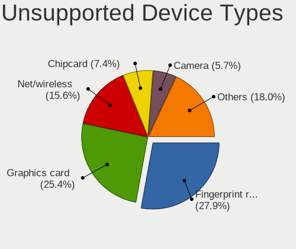

| Type                     | Computers | Percent |
|--------------------------|-----------|---------|
| Fingerprint reader       | 24        | 28.24%  |
| Graphics card            | 22        | 25.88%  |
| Net/wireless             | 15        | 17.65%  |
| Chipcard                 | 8         | 9.41%   |
| Net/ethernet             | 4         | 4.71%   |
| Camera                   | 3         | 3.53%   |
| Multimedia controller    | 2         | 2.35%   |
| Unassigned class         | 1         | 1.18%   |
| Storage/raid             | 1         | 1.18%   |
| Storage                  | 1         | 1.18%   |
| Sound                    | 1         | 1.18%   |
| Network                  | 1         | 1.18%   |
| Modem                    | 1         | 1.18%   |
| Communication controller | 1         | 1.18%   |

