Linux in Philippines - Tested Hardware & Statistics (Desktops)
--------------------------------------------------------------

A project to collect tested hardware configurations for Linux in Philippines.

Anyone can contribute to this report by the [hw-probe](https://github.com/linuxhw/hw-probe) tool:

    sudo -E hw-probe -all -upload

Please contribute! Especially if your hardware is rare.

Contents
--------

* [ Test Cases ](#test-cases)

* [ System ](#system)
  - [ OS                       ](#os)
  - [ OS Family                ](#os-family)
  - [ Kernel                   ](#kernel)
  - [ Kernel Family            ](#kernel-family)
  - [ Kernel Major Ver.        ](#kernel-major-ver)
  - [ Arch                     ](#arch)
  - [ DE                       ](#de)
  - [ Display Server           ](#display-server)
  - [ Display Manager          ](#display-manager)
  - [ OS Lang                  ](#os-lang)
  - [ Boot Mode                ](#boot-mode)
  - [ Filesystem               ](#filesystem)
  - [ Part. scheme             ](#part-scheme)
  - [ Dual Boot with Linux/BSD ](#dual-boot-with-linuxbsd)
  - [ Dual Boot (Win)          ](#dual-boot-win)

* [ Board ](#board)
  - [ Vendor                   ](#vendor)
  - [ Model                    ](#model)
  - [ Model Family             ](#model-family)
  - [ MFG Year                 ](#mfg-year)
  - [ Form Factor              ](#form-factor)
  - [ Secure Boot              ](#secure-boot)
  - [ Coreboot                 ](#coreboot)
  - [ RAM Size                 ](#ram-size)
  - [ RAM Used                 ](#ram-used)
  - [ Total Drives             ](#total-drives)
  - [ Has CD-ROM               ](#has-cd-rom)
  - [ Has Ethernet             ](#has-ethernet)
  - [ Has WiFi                 ](#has-wifi)
  - [ Has Bluetooth            ](#has-bluetooth)

* [ Location ](#location)
  - [ Country                  ](#country)
  - [ City                     ](#city)

* [ Drives ](#drives)
  - [ Drive Vendor             ](#drive-vendor)
  - [ Drive Model              ](#drive-model)
  - [ HDD Vendor               ](#hdd-vendor)
  - [ SSD Vendor               ](#ssd-vendor)
  - [ Drive Kind               ](#drive-kind)
  - [ Drive Connector          ](#drive-connector)
  - [ Drive Size               ](#drive-size)
  - [ Space Total              ](#space-total)
  - [ Space Used               ](#space-used)
  - [ Malfunc. Drives          ](#malfunc-drives)
  - [ Malfunc. Drive Vendor    ](#malfunc-drive-vendor)
  - [ Malfunc. HDD Vendor      ](#malfunc-hdd-vendor)
  - [ Malfunc. Drive Kind      ](#malfunc-drive-kind)
  - [ Failed Drives            ](#failed-drives)
  - [ Failed Drive Vendor      ](#failed-drive-vendor)
  - [ Drive Status             ](#drive-status)

* [ Storage controller ](#storage-controller)
  - [ Storage Vendor           ](#storage-vendor)
  - [ Storage Model            ](#storage-model)
  - [ Storage Kind             ](#storage-kind)

* [ Processor ](#processor)
  - [ CPU Vendor               ](#cpu-vendor)
  - [ CPU Model                ](#cpu-model)
  - [ CPU Model Family         ](#cpu-model-family)
  - [ CPU Cores                ](#cpu-cores)
  - [ CPU Sockets              ](#cpu-sockets)
  - [ CPU Threads              ](#cpu-threads)
  - [ CPU Op-Modes             ](#cpu-op-modes)
  - [ CPU Microcode            ](#cpu-microcode)
  - [ CPU Microarch            ](#cpu-microarch)

* [ Graphics ](#graphics)
  - [ GPU Vendor               ](#gpu-vendor)
  - [ GPU Model                ](#gpu-model)
  - [ GPU Combo                ](#gpu-combo)
  - [ GPU Driver               ](#gpu-driver)
  - [ GPU Memory               ](#gpu-memory)

* [ Monitor ](#monitor)
  - [ Monitor Vendor           ](#monitor-vendor)
  - [ Monitor Model            ](#monitor-model)
  - [ Monitor Resolution       ](#monitor-resolution)
  - [ Monitor Diagonal         ](#monitor-diagonal)
  - [ Monitor Width            ](#monitor-width)
  - [ Aspect Ratio             ](#aspect-ratio)
  - [ Monitor Area             ](#monitor-area)
  - [ Pixel Density            ](#pixel-density)
  - [ Multiple Monitors        ](#multiple-monitors)

* [ Network ](#network)
  - [ Net Controller Vendor    ](#net-controller-vendor)
  - [ Net Controller Model     ](#net-controller-model)
  - [ Wireless Vendor          ](#wireless-vendor)
  - [ Wireless Model           ](#wireless-model)
  - [ Ethernet Vendor          ](#ethernet-vendor)
  - [ Ethernet Model           ](#ethernet-model)
  - [ Net Controller Kind      ](#net-controller-kind)
  - [ Used Controller          ](#used-controller)
  - [ NICs                     ](#nics)
  - [ IPv6                     ](#ipv6)

* [ Bluetooth ](#bluetooth)
  - [ Bluetooth Vendor         ](#bluetooth-vendor)
  - [ Bluetooth Model          ](#bluetooth-model)

* [ Sound ](#sound)
  - [ Sound Vendor             ](#sound-vendor)
  - [ Sound Model              ](#sound-model)

* [ Memory ](#memory)
  - [ Memory Vendor            ](#memory-vendor)
  - [ Memory Model             ](#memory-model)
  - [ Memory Kind              ](#memory-kind)
  - [ Memory Form Factor       ](#memory-form-factor)
  - [ Memory Size              ](#memory-size)
  - [ Memory Speed             ](#memory-speed)

* [ Printers & scanners ](#printers--scanners)
  - [ Printer Vendor           ](#printer-vendor)
  - [ Printer Model            ](#printer-model)
  - [ Scanner Vendor           ](#scanner-vendor)
  - [ Scanner Model            ](#scanner-model)

* [ Camera ](#camera)
  - [ Camera Vendor            ](#camera-vendor)
  - [ Camera Model             ](#camera-model)

* [ Security ](#security)
  - [ Fingerprint Vendor       ](#fingerprint-vendor)
  - [ Fingerprint Model        ](#fingerprint-model)
  - [ Chipcard Vendor          ](#chipcard-vendor)
  - [ Chipcard Model           ](#chipcard-model)

* [ Unsupported ](#unsupported)
  - [ Unsupported Devices      ](#unsupported-devices)
  - [ Unsupported Device Types ](#unsupported-device-types)

Test Cases
----------

Total: 450

| Vendor        | Model                       | Probe                                                      | Date         |
|---------------|-----------------------------|------------------------------------------------------------|--------------|
| Gigabyte      | B450M DS3H WIFI-CF          | [03283c180b](https://linux-hardware.org/?probe=03283c180b) | Jan 04, 2025 |
| MSI           | A320M PRO-VH                | [e16bd64c51](https://linux-hardware.org/?probe=e16bd64c51) | Dec 27, 2024 |
| MSI           | A320M PRO-VH                | [6c30c82884](https://linux-hardware.org/?probe=6c30c82884) | Dec 27, 2024 |
| Lenovo        | SHARKBAY SDK0J40697 WIN ... | [f9b15fdce1](https://linux-hardware.org/?probe=f9b15fdce1) | Dec 18, 2024 |
| Dell          | 0JP3NX A00                  | [ea6bad1e0a](https://linux-hardware.org/?probe=ea6bad1e0a) | Dec 18, 2024 |
| EMAXX TECH... | EMX-A70FM2+iCafe            | [a915205b51](https://linux-hardware.org/?probe=a915205b51) | Dec 14, 2024 |
| MSI           | PRO H610M-E DDR4            | [dd71cde0f4](https://linux-hardware.org/?probe=dd71cde0f4) | Dec 14, 2024 |
| ASRock        | B460M Steel Legend          | [2f90887c93](https://linux-hardware.org/?probe=2f90887c93) | Dec 08, 2024 |
| ASRock        | B460M Steel Legend          | [47e703a42d](https://linux-hardware.org/?probe=47e703a42d) | Dec 08, 2024 |
| Dell          | 042P49 A02                  | [d91852967b](https://linux-hardware.org/?probe=d91852967b) | Dec 07, 2024 |
| Dell          | 042P49 A02                  | [112f9270e5](https://linux-hardware.org/?probe=112f9270e5) | Nov 27, 2024 |
| ASRock        | H81M-VG4 R2.0               | [21abf92497](https://linux-hardware.org/?probe=21abf92497) | Nov 20, 2024 |
| ECS           | H110M4-C43                  | [f68d39f617](https://linux-hardware.org/?probe=f68d39f617) | Nov 17, 2024 |
| ECS           | H110M4-C43                  | [83e2429bf4](https://linux-hardware.org/?probe=83e2429bf4) | Nov 14, 2024 |
| MSI           | NF725M-P31                  | [ad6fa8257c](https://linux-hardware.org/?probe=ad6fa8257c) | Nov 01, 2024 |
| ASRock        | B550M-HDV                   | [59e9489711](https://linux-hardware.org/?probe=59e9489711) | Oct 27, 2024 |
| Lenovo        | 0C48431 PRO                 | [5301a1a8fc](https://linux-hardware.org/?probe=5301a1a8fc) | Oct 25, 2024 |
| Gigabyte      | Z790 AORUS ELITE X WIFI7    | [763d385c18](https://linux-hardware.org/?probe=763d385c18) | Oct 25, 2024 |
| HP            | 1495                        | [d24b7e9c3d](https://linux-hardware.org/?probe=d24b7e9c3d) | Oct 23, 2024 |
| HP            | 1495                        | [2ad2f3e4f6](https://linux-hardware.org/?probe=2ad2f3e4f6) | Oct 23, 2024 |
| Lenovo        | ThinkCentre M58 6258RW3     | [72e8b9689d](https://linux-hardware.org/?probe=72e8b9689d) | Oct 21, 2024 |
| Gigabyte      | GA-A75M-DS2                 | [1bf6907ed6](https://linux-hardware.org/?probe=1bf6907ed6) | Oct 20, 2024 |
| Gigabyte      | X570 AORUS MASTER           | [0be150631e](https://linux-hardware.org/?probe=0be150631e) | Oct 19, 2024 |
| Dell          | 00V62H A01                  | [3150f794a8](https://linux-hardware.org/?probe=3150f794a8) | Oct 16, 2024 |
| ASUSTek       | H81M-K                      | [f3d09fc037](https://linux-hardware.org/?probe=f3d09fc037) | Oct 14, 2024 |
| ASUSTek       | H81M-K                      | [72e02ac5e7](https://linux-hardware.org/?probe=72e02ac5e7) | Oct 13, 2024 |
| AMD           | A88                         | [3442c71c38](https://linux-hardware.org/?probe=3442c71c38) | Oct 12, 2024 |
| Dell          | 00V62H A01                  | [3e2d7ecdf5](https://linux-hardware.org/?probe=3e2d7ecdf5) | Oct 08, 2024 |
| ASUSTek       | EX-H110M-V                  | [1c402f09a1](https://linux-hardware.org/?probe=1c402f09a1) | Oct 03, 2024 |
| Dell          | 00V62H A01                  | [b63165ed44](https://linux-hardware.org/?probe=b63165ed44) | Oct 01, 2024 |
| MSI           | B360M BAZOOKA               | [dfb8592ae3](https://linux-hardware.org/?probe=dfb8592ae3) | Sep 23, 2024 |
| OEM           | X79G                        | [6469747833](https://linux-hardware.org/?probe=6469747833) | Sep 15, 2024 |
| MACHINIST     | X99 PR8                     | [c8a9ddba26](https://linux-hardware.org/?probe=c8a9ddba26) | Sep 11, 2024 |
| MSI           | B360M BAZOOKA               | [487fac53df](https://linux-hardware.org/?probe=487fac53df) | Sep 09, 2024 |
| Gigabyte      | B450M DS3H WIFI-CF          | [1ab36c0767](https://linux-hardware.org/?probe=1ab36c0767) | Sep 09, 2024 |
| MSI           | 760GM-P34                   | [6fbec2b823](https://linux-hardware.org/?probe=6fbec2b823) | Aug 27, 2024 |
| MSI           | 760GM-P34                   | [3f52a41b08](https://linux-hardware.org/?probe=3f52a41b08) | Aug 27, 2024 |
| Gigabyte      | H81M-DS2                    | [1b9e8ff148](https://linux-hardware.org/?probe=1b9e8ff148) | Aug 26, 2024 |
| ASUSTek       | TUF Gaming B550-PLUS        | [538bd3b7c8](https://linux-hardware.org/?probe=538bd3b7c8) | Aug 18, 2024 |
| MSI           | PRO H610M-B DDR4            | [ba18c5a60e](https://linux-hardware.org/?probe=ba18c5a60e) | Aug 14, 2024 |
| ASRock        | B450M Steel Legend          | [8f925bc665](https://linux-hardware.org/?probe=8f925bc665) | Aug 08, 2024 |
| ASUSTek       | PRIME A320M-K               | [e9a6c51c04](https://linux-hardware.org/?probe=e9a6c51c04) | Aug 06, 2024 |
| Machenike     | ARB19                       | [168ac5340c](https://linux-hardware.org/?probe=168ac5340c) | Aug 04, 2024 |
| Intel         | H81                         | [a2abb3ebe6](https://linux-hardware.org/?probe=a2abb3ebe6) | Jul 31, 2024 |
| MSI           | A320M PRO-VH                | [7aaeb29247](https://linux-hardware.org/?probe=7aaeb29247) | Jul 25, 2024 |
| ECS           | H110M4-C43                  | [c480519fab](https://linux-hardware.org/?probe=c480519fab) | Jul 23, 2024 |
| Biostar       | A320MH                      | [89ca8f23b5](https://linux-hardware.org/?probe=89ca8f23b5) | Jul 17, 2024 |
| Gigabyte      | X570 AORUS PRO WIFI         | [c5bbc1d2a2](https://linux-hardware.org/?probe=c5bbc1d2a2) | Jul 12, 2024 |
| ECS           | H110M4-C43                  | [15fb98442e](https://linux-hardware.org/?probe=15fb98442e) | Jul 09, 2024 |
| ASUSTek       | PRIME H510M-D               | [e5d843c437](https://linux-hardware.org/?probe=e5d843c437) | Jul 09, 2024 |
| Gigabyte      | B650M AORUS ELITE AX        | [e4ab1c88be](https://linux-hardware.org/?probe=e4ab1c88be) | Jul 08, 2024 |
| Gigabyte      | B450M DS3H-CF               | [81aec47215](https://linux-hardware.org/?probe=81aec47215) | Jul 07, 2024 |
| MSI           | K9N6PGM2-V2                 | [4e83672d7a](https://linux-hardware.org/?probe=4e83672d7a) | Jun 18, 2024 |
| MSI           | K9N6PGM2-V2                 | [ad1d32fdc9](https://linux-hardware.org/?probe=ad1d32fdc9) | Jun 18, 2024 |
| Colorful T... | A520M-K PRO V14             | [6b37cd7b00](https://linux-hardware.org/?probe=6b37cd7b00) | Jun 13, 2024 |
| ASUSTek       | X99-E WS                    | [3d3178dd91](https://linux-hardware.org/?probe=3d3178dd91) | Jun 12, 2024 |
| Acer          | Veriton X2660G              | [5513cb5cb4](https://linux-hardware.org/?probe=5513cb5cb4) | Jun 03, 2024 |
| EMAXX TECH... | EMX-MCP61D3-iCafe V2.0      | [b22decf77f](https://linux-hardware.org/?probe=b22decf77f) | Jun 02, 2024 |
| OEM           | X79G                        | [121e628b73](https://linux-hardware.org/?probe=121e628b73) | May 27, 2024 |
| OEM           | X79G                        | [e87ff18bc6](https://linux-hardware.org/?probe=e87ff18bc6) | May 27, 2024 |
| EMAXX TECH... | EMX-MCP61D3-iCafe V2.0      | [1a17c57d34](https://linux-hardware.org/?probe=1a17c57d34) | May 20, 2024 |
| AZW           | MINI S                      | [12557a4240](https://linux-hardware.org/?probe=12557a4240) | May 09, 2024 |
| AZW           | MINI S                      | [7c8e83b2ed](https://linux-hardware.org/?probe=7c8e83b2ed) | May 09, 2024 |
| Gigabyte      | B450 AORUS ELITE            | [5c2ce66225](https://linux-hardware.org/?probe=5c2ce66225) | May 08, 2024 |
| Gigabyte      | Z590 AORUS ULTRA            | [53cec6c7a1](https://linux-hardware.org/?probe=53cec6c7a1) | May 01, 2024 |
| Gigabyte      | Z590 AORUS ULTRA            | [1a48c73aca](https://linux-hardware.org/?probe=1a48c73aca) | Apr 30, 2024 |
| ASRock        | A520M-HDV                   | [7fab320f1b](https://linux-hardware.org/?probe=7fab320f1b) | Apr 19, 2024 |
| ASRock        | A320M-HDV R4.0              | [43c66c672d](https://linux-hardware.org/?probe=43c66c672d) | Apr 17, 2024 |
| ASRock        | A320M-HDV R4.0              | [ddf3999a87](https://linux-hardware.org/?probe=ddf3999a87) | Apr 17, 2024 |
| Gigabyte      | F2A68HM-S1                  | [32237e05f1](https://linux-hardware.org/?probe=32237e05f1) | Apr 15, 2024 |
| Gigabyte      | Z590 AORUS ULTRA            | [c205fddaa6](https://linux-hardware.org/?probe=c205fddaa6) | Apr 14, 2024 |
| ASUSTek       | PRIME B450M-A II            | [7e5d44baee](https://linux-hardware.org/?probe=7e5d44baee) | Apr 08, 2024 |
| Gigabyte      | Z590 AORUS ULTRA            | [a02e47dcca](https://linux-hardware.org/?probe=a02e47dcca) | Apr 06, 2024 |
| ASUSTek       | PRIME B450M-A II            | [439cec9b7a](https://linux-hardware.org/?probe=439cec9b7a) | Apr 05, 2024 |
| ASUSTek       | PRIME B450M-A II            | [c6f0c787bf](https://linux-hardware.org/?probe=c6f0c787bf) | Apr 03, 2024 |
| Dell          | 0J2J3Y A00                  | [34c276b20a](https://linux-hardware.org/?probe=34c276b20a) | Mar 31, 2024 |
| Gigabyte      | A620M GAMING X              | [49e76a8df1](https://linux-hardware.org/?probe=49e76a8df1) | Mar 28, 2024 |
| Gigabyte      | A620M GAMING X              | [dc41666398](https://linux-hardware.org/?probe=dc41666398) | Mar 28, 2024 |
| ASRock        | B460M Steel Legend          | [81687517db](https://linux-hardware.org/?probe=81687517db) | Mar 26, 2024 |
| ASRock        | B460M Steel Legend          | [fb3bee6574](https://linux-hardware.org/?probe=fb3bee6574) | Mar 26, 2024 |
| ASUSTek       | TUF Z370-PLUS GAMING        | [13d3b8e805](https://linux-hardware.org/?probe=13d3b8e805) | Mar 20, 2024 |
| HP            | 18E5                        | [4ae7d1e99b](https://linux-hardware.org/?probe=4ae7d1e99b) | Mar 14, 2024 |
| HP            | 18E5                        | [0d777cf53f](https://linux-hardware.org/?probe=0d777cf53f) | Mar 14, 2024 |
| HP            | 3646h                       | [262b859dc2](https://linux-hardware.org/?probe=262b859dc2) | Mar 09, 2024 |
| HP            | 3646h                       | [319c1272f7](https://linux-hardware.org/?probe=319c1272f7) | Mar 04, 2024 |
| HP            | 2AE5 A01                    | [60660db51f](https://linux-hardware.org/?probe=60660db51f) | Mar 03, 2024 |
| HP            | 2AE5 A01                    | [4273399935](https://linux-hardware.org/?probe=4273399935) | Mar 02, 2024 |
| Dell          | 042P49 A01                  | [3e64e4a44e](https://linux-hardware.org/?probe=3e64e4a44e) | Feb 22, 2024 |
| Unknown       | Unknown                     | [b9bba8bd7f](https://linux-hardware.org/?probe=b9bba8bd7f) | Feb 22, 2024 |
| ASUSTek       | H81M-D                      | [9df4273ea0](https://linux-hardware.org/?probe=9df4273ea0) | Feb 14, 2024 |
| Gigabyte      | X570 AORUS MASTER           | [ece84ea9af](https://linux-hardware.org/?probe=ece84ea9af) | Feb 11, 2024 |
| Gigabyte      | H410M H V3                  | [0610c346d8](https://linux-hardware.org/?probe=0610c346d8) | Jan 25, 2024 |
| Dell          | 0G679R A00                  | [993e7a71b2](https://linux-hardware.org/?probe=993e7a71b2) | Jan 18, 2024 |
| Dell          | 0G679R A00                  | [31f196442f](https://linux-hardware.org/?probe=31f196442f) | Jan 18, 2024 |
| Gigabyte      | B450 AORUS M                | [06cced7a39](https://linux-hardware.org/?probe=06cced7a39) | Jan 18, 2024 |
| ASUSTek       | PRIME A320M-K               | [bddc683db5](https://linux-hardware.org/?probe=bddc683db5) | Jan 12, 2024 |
| ASUSTek       | PRIME A320M-K               | [cf07066830](https://linux-hardware.org/?probe=cf07066830) | Jan 03, 2024 |
| Gigabyte      | F2A68HM-S1                  | [dc498a88a6](https://linux-hardware.org/?probe=dc498a88a6) | Dec 27, 2023 |
| Gigabyte      | Z590 AORUS ULTRA            | [341417afe4](https://linux-hardware.org/?probe=341417afe4) | Dec 21, 2023 |
| ASUSTek       | PRIME B250M-A               | [1eaf3dd454](https://linux-hardware.org/?probe=1eaf3dd454) | Dec 10, 2023 |
| MSI           | A520M PRO-VH                | [96475c0e77](https://linux-hardware.org/?probe=96475c0e77) | Dec 08, 2023 |
| Gigabyte      | B650 AORUS PRO AX           | [0dade4f111](https://linux-hardware.org/?probe=0dade4f111) | Dec 06, 2023 |
| ASUSTek       | PRIME A320M-K               | [e90c011500](https://linux-hardware.org/?probe=e90c011500) | Dec 05, 2023 |
| MSI           | B550-A PRO                  | [6f41c9ca50](https://linux-hardware.org/?probe=6f41c9ca50) | Dec 02, 2023 |
| Gigabyte      | H470 HD3                    | [0b9cf3a0a5](https://linux-hardware.org/?probe=0b9cf3a0a5) | Dec 02, 2023 |
| Gigabyte      | H470 HD3                    | [0ecb969c2c](https://linux-hardware.org/?probe=0ecb969c2c) | Nov 28, 2023 |
| ASUSTek       | A55BM-E                     | [28fe1a1fe1](https://linux-hardware.org/?probe=28fe1a1fe1) | Nov 26, 2023 |
| HP            | 2AE5 A01                    | [d23f45244b](https://linux-hardware.org/?probe=d23f45244b) | Nov 25, 2023 |
| Lenovo        | SHARKBAY 31900059 STD       | [bc11e1264c](https://linux-hardware.org/?probe=bc11e1264c) | Nov 22, 2023 |
| HP            | 2AE5 A01                    | [90e640454c](https://linux-hardware.org/?probe=90e640454c) | Nov 18, 2023 |
| Lenovo        | SHARKBAY 31900059 STD       | [5368b237d8](https://linux-hardware.org/?probe=5368b237d8) | Nov 18, 2023 |
| Lenovo        | SHARKBAY 31900059 STD       | [7af93dbd28](https://linux-hardware.org/?probe=7af93dbd28) | Nov 17, 2023 |
| MSI           | B550-A PRO                  | [a7467830d5](https://linux-hardware.org/?probe=a7467830d5) | Nov 17, 2023 |
| HP            | 2AE5 A01                    | [729cec323f](https://linux-hardware.org/?probe=729cec323f) | Nov 14, 2023 |
| HP            | 8054                        | [66fa2fd8c5](https://linux-hardware.org/?probe=66fa2fd8c5) | Nov 11, 2023 |
| HP            | 8054                        | [91d4d659b4](https://linux-hardware.org/?probe=91d4d659b4) | Nov 11, 2023 |
| ASUSTek       | TUF B450M-PLUS GAMING       | [eb9b1302fd](https://linux-hardware.org/?probe=eb9b1302fd) | Nov 08, 2023 |
| ASRock        | B650M PG Riptide WiFi       | [387c91f530](https://linux-hardware.org/?probe=387c91f530) | Oct 26, 2023 |
| MSI           | A320M-A PRO                 | [851db330be](https://linux-hardware.org/?probe=851db330be) | Oct 24, 2023 |
| ASUSTek       | ROG STRIX X570-E GAMING     | [d3e630e86d](https://linux-hardware.org/?probe=d3e630e86d) | Oct 23, 2023 |
| Biostar       | A320MH                      | [e2c20a6c0c](https://linux-hardware.org/?probe=e2c20a6c0c) | Oct 19, 2023 |
| Biostar       | A320MH                      | [62a3d049b2](https://linux-hardware.org/?probe=62a3d049b2) | Oct 18, 2023 |
| Acer          | Veriton X2660G              | [d122988e18](https://linux-hardware.org/?probe=d122988e18) | Oct 17, 2023 |
| Gigabyte      | B550 AORUS PRO AC           | [04d307e685](https://linux-hardware.org/?probe=04d307e685) | Oct 16, 2023 |
| Unknown       | Unknown                     | [5e866a9155](https://linux-hardware.org/?probe=5e866a9155) | Oct 10, 2023 |
| Gigabyte      | B550 AORUS PRO AC           | [ecef286c2a](https://linux-hardware.org/?probe=ecef286c2a) | Sep 26, 2023 |
| Gigabyte      | X570 AORUS MASTER           | [bf29b07e79](https://linux-hardware.org/?probe=bf29b07e79) | Sep 19, 2023 |
| Gigabyte      | Z590 AORUS ULTRA            | [1259637f6b](https://linux-hardware.org/?probe=1259637f6b) | Sep 18, 2023 |
| Colorful T... | C.A68HM-K PLUS YV18         | [e4f73d159c](https://linux-hardware.org/?probe=e4f73d159c) | Sep 12, 2023 |
| Colorful T... | C.A68HM-K PLUS YV18         | [c57a3a012d](https://linux-hardware.org/?probe=c57a3a012d) | Sep 11, 2023 |
| MSI           | PRO B760M-G DDR4            | [a8f42a3c96](https://linux-hardware.org/?probe=a8f42a3c96) | Sep 05, 2023 |
| Dell          | 0G679R A00                  | [30755bff92](https://linux-hardware.org/?probe=30755bff92) | Sep 03, 2023 |
| Intel         | H81                         | [75aabbccf5](https://linux-hardware.org/?probe=75aabbccf5) | Sep 03, 2023 |
| Dell          | 0G679R A00                  | [cc4b4ad10d](https://linux-hardware.org/?probe=cc4b4ad10d) | Sep 01, 2023 |
| MSI           | H110M PRO-VD PLUS           | [a75e60a457](https://linux-hardware.org/?probe=a75e60a457) | Aug 30, 2023 |
| Gigabyte      | A320M-S2H-CF                | [4ea7c3580b](https://linux-hardware.org/?probe=4ea7c3580b) | Aug 26, 2023 |
| EMAXX TECH... | EMX-B450M-GAMING            | [3f5c0e83d4](https://linux-hardware.org/?probe=3f5c0e83d4) | Aug 06, 2023 |
| MSI           | A320M PRO-VH                | [0728a96775](https://linux-hardware.org/?probe=0728a96775) | Jul 29, 2023 |
| Gigabyte      | B360M HD3                   | [900f299e10](https://linux-hardware.org/?probe=900f299e10) | Jul 26, 2023 |
| Samsung       | DeskTop System              | [c1d4c8efb2](https://linux-hardware.org/?probe=c1d4c8efb2) | Jul 24, 2023 |
| Gigabyte      | X570 AORUS MASTER           | [d1dee26c33](https://linux-hardware.org/?probe=d1dee26c33) | Jul 20, 2023 |
| Samsung       | DeskTop System              | [715ff16efc](https://linux-hardware.org/?probe=715ff16efc) | Jul 17, 2023 |
| MSI           | MAG B550M MORTAR WIFI       | [4d00148664](https://linux-hardware.org/?probe=4d00148664) | Jul 16, 2023 |
| ASUSTek       | P8Z77-V LX2                 | [eedcf805f7](https://linux-hardware.org/?probe=eedcf805f7) | Jul 14, 2023 |
| MSI           | MAG B550M MORTAR WIFI       | [75d40e5a2b](https://linux-hardware.org/?probe=75d40e5a2b) | Jul 14, 2023 |
| GPD           | G1618-03                    | [0cb58087bf](https://linux-hardware.org/?probe=0cb58087bf) | Jul 04, 2023 |
| MSI           | MAG B550M MORTAR WIFI       | [fc70411ea4](https://linux-hardware.org/?probe=fc70411ea4) | Jul 03, 2023 |
| ASUSTek       | H110M-D                     | [f95d5e83f5](https://linux-hardware.org/?probe=f95d5e83f5) | Jun 25, 2023 |
| Gigabyte      | A320M-S2H V2-CF             | [9408842ffc](https://linux-hardware.org/?probe=9408842ffc) | Jun 24, 2023 |
| Biostar       | B450MH                      | [04c924ce6f](https://linux-hardware.org/?probe=04c924ce6f) | Jun 16, 2023 |
| Lenovo        | 315F SDK0J40697 WIN 3305... | [dac73c9b94](https://linux-hardware.org/?probe=dac73c9b94) | Jun 16, 2023 |
| HP            | 1496                        | [7189030996](https://linux-hardware.org/?probe=7189030996) | Jun 11, 2023 |
| HP            | 1496                        | [68db57fde8](https://linux-hardware.org/?probe=68db57fde8) | Jun 10, 2023 |
| AMD           | A88                         | [a7f64b7e4b](https://linux-hardware.org/?probe=a7f64b7e4b) | Jun 05, 2023 |
| Gigabyte      | Z590 AORUS ULTRA            | [44571410f0](https://linux-hardware.org/?probe=44571410f0) | Jun 03, 2023 |
| Gigabyte      | Z590 AORUS ULTRA            | [d54d77b051](https://linux-hardware.org/?probe=d54d77b051) | Jun 03, 2023 |
| ASUSTek       | PRIME A320M-K               | [ebd7782079](https://linux-hardware.org/?probe=ebd7782079) | May 31, 2023 |
| ASUSTek       | P8H61-M LX3 PLUS R2.0       | [953ee1ef05](https://linux-hardware.org/?probe=953ee1ef05) | May 31, 2023 |
| Biostar       | B450MH                      | [36947ca7e1](https://linux-hardware.org/?probe=36947ca7e1) | May 30, 2023 |
| Pegatron      | NARRA3                      | [5c016d4faf](https://linux-hardware.org/?probe=5c016d4faf) | May 28, 2023 |
| Unknown       | SKYBAY                      | [7884ad9bf4](https://linux-hardware.org/?probe=7884ad9bf4) | May 25, 2023 |
| Gigabyte      | Z590 AORUS ULTRA            | [b291f783a2](https://linux-hardware.org/?probe=b291f783a2) | May 25, 2023 |
| Gigabyte      | Z590 AORUS ULTRA            | [76bd19169a](https://linux-hardware.org/?probe=76bd19169a) | May 22, 2023 |
| Gigabyte      | Z590 AORUS ULTRA            | [f511a54601](https://linux-hardware.org/?probe=f511a54601) | May 21, 2023 |
| Gigabyte      | Z590 AORUS ULTRA            | [e4b87f1e56](https://linux-hardware.org/?probe=e4b87f1e56) | May 19, 2023 |
| ECS           | G41T-R3                     | [fcbdd2737a](https://linux-hardware.org/?probe=fcbdd2737a) | Apr 26, 2023 |
| Gigabyte      | GA-MA785GM-US2H             | [96f6b41a5c](https://linux-hardware.org/?probe=96f6b41a5c) | Apr 19, 2023 |
| ECS           | G41T-R3                     | [2c589a38f7](https://linux-hardware.org/?probe=2c589a38f7) | Apr 13, 2023 |
| HP            | 3397                        | [5a25984320](https://linux-hardware.org/?probe=5a25984320) | Mar 31, 2023 |
| ASRock        | H61M-HVS                    | [0672578da7](https://linux-hardware.org/?probe=0672578da7) | Mar 30, 2023 |
| ASUSTek       | ROG STRIX B450-F GAMING ... | [4eb8132fd2](https://linux-hardware.org/?probe=4eb8132fd2) | Mar 24, 2023 |
| EMAXX TECH... | EMX-B450M-GAMING            | [f147ee8484](https://linux-hardware.org/?probe=f147ee8484) | Mar 21, 2023 |
| ASRock        | B450M Steel Legend          | [ae258d05b1](https://linux-hardware.org/?probe=ae258d05b1) | Mar 16, 2023 |
| Gigabyte      | Z590 AORUS ULTRA            | [26ecc0b7a2](https://linux-hardware.org/?probe=26ecc0b7a2) | Mar 10, 2023 |
| ASUSTek       | ROG STRIX B450-F GAMING ... | [ca7d449be6](https://linux-hardware.org/?probe=ca7d449be6) | Feb 28, 2023 |
| MSI           | A320M PRO-VH                | [e1266ebf79](https://linux-hardware.org/?probe=e1266ebf79) | Feb 27, 2023 |
| ASUSTek       | A68HM-K                     | [d6f5b00609](https://linux-hardware.org/?probe=d6f5b00609) | Feb 26, 2023 |
| ASUSTek       | A68HM-K                     | [89cd5d5c44](https://linux-hardware.org/?probe=89cd5d5c44) | Feb 26, 2023 |
| ASUSTek       | TUF Gaming B450M-PRO II     | [99b1ae3224](https://linux-hardware.org/?probe=99b1ae3224) | Feb 25, 2023 |
| MSI           | K9N6PGM2-V2                 | [e88df81d6f](https://linux-hardware.org/?probe=e88df81d6f) | Feb 24, 2023 |
| Biostar       | A320MH                      | [b6f7ef6e4a](https://linux-hardware.org/?probe=b6f7ef6e4a) | Feb 23, 2023 |
| Biostar       | A320MH                      | [e80f86a0bf](https://linux-hardware.org/?probe=e80f86a0bf) | Feb 23, 2023 |
| Dell          | 0W2F8G A00                  | [aa7bf98168](https://linux-hardware.org/?probe=aa7bf98168) | Feb 16, 2023 |
| Gigabyte      | Z590 AORUS ULTRA            | [eb8434e607](https://linux-hardware.org/?probe=eb8434e607) | Feb 15, 2023 |
| ASUSTek       | BM6630_BM6330_BP6230        | [abe1e578c0](https://linux-hardware.org/?probe=abe1e578c0) | Feb 12, 2023 |
| Dell          | 0W2F8G A00                  | [b0694cfc5c](https://linux-hardware.org/?probe=b0694cfc5c) | Feb 06, 2023 |
| Gigabyte      | H97M-D3H                    | [3ccdc4fa2b](https://linux-hardware.org/?probe=3ccdc4fa2b) | Jan 31, 2023 |
| MSI           | MAG B560M MORTAR WIFI       | [33f6781ba8](https://linux-hardware.org/?probe=33f6781ba8) | Jan 08, 2023 |
| Gigabyte      | B550 AORUS PRO AC           | [cfeb9545a3](https://linux-hardware.org/?probe=cfeb9545a3) | Dec 21, 2022 |
| Biostar       | A520MH                      | [b6c4fdd80b](https://linux-hardware.org/?probe=b6c4fdd80b) | Dec 11, 2022 |
| ASUSTek       | BM5242                      | [d37b75dc52](https://linux-hardware.org/?probe=d37b75dc52) | Dec 10, 2022 |
| ASUSTek       | BM5242                      | [7c17c8d773](https://linux-hardware.org/?probe=7c17c8d773) | Dec 10, 2022 |
| Intel         | D946GZAB AAD66610-302       | [5433ee5bc1](https://linux-hardware.org/?probe=5433ee5bc1) | Nov 22, 2022 |
| ASRock        | B450M Steel Legend          | [4792cdbba2](https://linux-hardware.org/?probe=4792cdbba2) | Nov 21, 2022 |
| MSI           | B450M BAZOOKA PLUS          | [f63b2757ea](https://linux-hardware.org/?probe=f63b2757ea) | Nov 12, 2022 |
| ASUSTek       | A68HM-K                     | [70daf967f2](https://linux-hardware.org/?probe=70daf967f2) | Nov 10, 2022 |
| Gigabyte      | B550 VISION D-P             | [c08b835f58](https://linux-hardware.org/?probe=c08b835f58) | Nov 07, 2022 |
| MSI           | MAG B550M MORTAR WIFI       | [7db5fcb7b0](https://linux-hardware.org/?probe=7db5fcb7b0) | Nov 05, 2022 |
| Gigabyte      | B450 AORUS M                | [e4dfd41fa4](https://linux-hardware.org/?probe=e4dfd41fa4) | Nov 02, 2022 |
| HP            | 3048h                       | [6ce1d2bf43](https://linux-hardware.org/?probe=6ce1d2bf43) | Oct 30, 2022 |
| ASRock        | H61M-VS                     | [9a48b2a679](https://linux-hardware.org/?probe=9a48b2a679) | Oct 28, 2022 |
| MSI           | MAG A520M VECTOR WIFI       | [91a8a52c4a](https://linux-hardware.org/?probe=91a8a52c4a) | Oct 25, 2022 |
| Gigabyte      | Z97N-WIFI                   | [dd5c78f136](https://linux-hardware.org/?probe=dd5c78f136) | Oct 24, 2022 |
| Gigabyte      | Z97N-WIFI                   | [10d8d16b6c](https://linux-hardware.org/?probe=10d8d16b6c) | Oct 24, 2022 |
| Gigabyte      | B550M DS3H                  | [d267c64062](https://linux-hardware.org/?probe=d267c64062) | Oct 19, 2022 |
| Gigabyte      | X570 AORUS MASTER           | [fc0a9a6b24](https://linux-hardware.org/?probe=fc0a9a6b24) | Oct 18, 2022 |
| MSI           | H110M PRO-D                 | [d0580b46f2](https://linux-hardware.org/?probe=d0580b46f2) | Oct 18, 2022 |
| Gigabyte      | B550 AORUS PRO AC           | [9f52e46640](https://linux-hardware.org/?probe=9f52e46640) | Oct 11, 2022 |
| Gigabyte      | X570 AORUS MASTER           | [aa7d067a6f](https://linux-hardware.org/?probe=aa7d067a6f) | Oct 11, 2022 |
| Gigabyte      | F2A68HM-S1                  | [379f85dfb3](https://linux-hardware.org/?probe=379f85dfb3) | Oct 09, 2022 |
| Gigabyte      | F2A68HM-S1                  | [f02be8db4c](https://linux-hardware.org/?probe=f02be8db4c) | Oct 09, 2022 |
| Gigabyte      | B550 AORUS PRO AC           | [700c5cc2bc](https://linux-hardware.org/?probe=700c5cc2bc) | Oct 05, 2022 |
| Gigabyte      | A320M-S2H V2-CF             | [37dbdb48dd](https://linux-hardware.org/?probe=37dbdb48dd) | Sep 20, 2022 |
| Gigabyte      | A320M-S2H V2-CF             | [4d460404c8](https://linux-hardware.org/?probe=4d460404c8) | Sep 16, 2022 |
| ASUSTek       | ROG STRIX B660-A GAMING ... | [34c1beb103](https://linux-hardware.org/?probe=34c1beb103) | Sep 13, 2022 |
| Gigabyte      | A320M-S2H V2-CF             | [7ce5d8e865](https://linux-hardware.org/?probe=7ce5d8e865) | Sep 12, 2022 |
| Gigabyte      | A320M-S2H V2-CF             | [ec5f57ab65](https://linux-hardware.org/?probe=ec5f57ab65) | Sep 12, 2022 |
| Biostar       | A780L3B                     | [bc83f32ddf](https://linux-hardware.org/?probe=bc83f32ddf) | Sep 12, 2022 |
| Biostar       | A780L3B                     | [61057dc040](https://linux-hardware.org/?probe=61057dc040) | Sep 12, 2022 |
| Biostar       | A780L3B                     | [6463bcc136](https://linux-hardware.org/?probe=6463bcc136) | Sep 10, 2022 |
| Biostar       | A780L3B                     | [f65db263d7](https://linux-hardware.org/?probe=f65db263d7) | Sep 10, 2022 |
| Gigabyte      | GA-990FXA-UD5               | [b77aa249c8](https://linux-hardware.org/?probe=b77aa249c8) | Sep 09, 2022 |
| Gigabyte      | GA-990FXA-UD5               | [dc69b9dde6](https://linux-hardware.org/?probe=dc69b9dde6) | Sep 09, 2022 |
| ASUSTek       | TUF B350M-PLUS GAMING       | [051ea3b002](https://linux-hardware.org/?probe=051ea3b002) | Sep 08, 2022 |
| HP            | 83F3                        | [71d62174e2](https://linux-hardware.org/?probe=71d62174e2) | Aug 27, 2022 |
| HP            | 1850                        | [85b5eedc40](https://linux-hardware.org/?probe=85b5eedc40) | Aug 26, 2022 |
| ASUSTek       | PRIME B450M-A               | [bfdd1ab294](https://linux-hardware.org/?probe=bfdd1ab294) | Aug 23, 2022 |
| Gigabyte      | H77N-WIFI                   | [7a37d5e6a5](https://linux-hardware.org/?probe=7a37d5e6a5) | Aug 07, 2022 |
| Gigabyte      | H77N-WIFI                   | [db237c843c](https://linux-hardware.org/?probe=db237c843c) | Aug 06, 2022 |
| Gigabyte      | H77N-WIFI                   | [5251e7868a](https://linux-hardware.org/?probe=5251e7868a) | Aug 06, 2022 |
| Gigabyte      | H81M-D2V                    | [64da165357](https://linux-hardware.org/?probe=64da165357) | Aug 01, 2022 |
| MSI           | PRO B660M-A WIFI DDR4       | [a0e19ce405](https://linux-hardware.org/?probe=a0e19ce405) | Jul 26, 2022 |
| Gigabyte      | H410M H V3                  | [37521f84c8](https://linux-hardware.org/?probe=37521f84c8) | Jul 20, 2022 |
| ASUSTek       | M4A88T-M                    | [57ed9f00c7](https://linux-hardware.org/?probe=57ed9f00c7) | Jul 18, 2022 |
| ASUSTek       | M4A88T-M                    | [f99189e2d0](https://linux-hardware.org/?probe=f99189e2d0) | Jul 18, 2022 |
| YANYU         | EPIC-C19                    | [5bda78db57](https://linux-hardware.org/?probe=5bda78db57) | Jul 11, 2022 |
| Gigabyte      | A520M DS3H                  | [b56fe3beb3](https://linux-hardware.org/?probe=b56fe3beb3) | Jun 28, 2022 |
| MSI           | A320M PRO-VH                | [47f765c61f](https://linux-hardware.org/?probe=47f765c61f) | Jun 14, 2022 |
| MSI           | H81M-E33                    | [49191a1c98](https://linux-hardware.org/?probe=49191a1c98) | Jun 08, 2022 |
| Gigabyte      | F2A68HM-S1                  | [017e41e32c](https://linux-hardware.org/?probe=017e41e32c) | Jun 07, 2022 |
| MSI           | H81M-E33                    | [6a2d6cbe74](https://linux-hardware.org/?probe=6a2d6cbe74) | Jun 04, 2022 |
| ASUSTek       | H81M-K                      | [512fb81a9b](https://linux-hardware.org/?probe=512fb81a9b) | May 31, 2022 |
| MSI           | Z97 XPOWER AC               | [dd5c7a981a](https://linux-hardware.org/?probe=dd5c7a981a) | May 29, 2022 |
| MSI           | MS-7717                     | [101b488b80](https://linux-hardware.org/?probe=101b488b80) | May 28, 2022 |
| MSI           | MS-7717                     | [9b0c2d0d8c](https://linux-hardware.org/?probe=9b0c2d0d8c) | May 28, 2022 |
| ECS           | A68M-C4DL                   | [b8c60cf7a0](https://linux-hardware.org/?probe=b8c60cf7a0) | May 09, 2022 |
| HP            | 212A                        | [acd660910f](https://linux-hardware.org/?probe=acd660910f) | May 09, 2022 |
| MSI           | B450M MORTAR                | [74323309f1](https://linux-hardware.org/?probe=74323309f1) | Apr 20, 2022 |
| MSI           | H510M-A PRO                 | [03b7f74d31](https://linux-hardware.org/?probe=03b7f74d31) | Mar 29, 2022 |
| MSI           | H510M-A PRO                 | [42e921877b](https://linux-hardware.org/?probe=42e921877b) | Mar 29, 2022 |
| HP            | 2B38                        | [99fd9bb200](https://linux-hardware.org/?probe=99fd9bb200) | Mar 27, 2022 |
| MSI           | MS-7619                     | [65c73f26b0](https://linux-hardware.org/?probe=65c73f26b0) | Mar 22, 2022 |
| MSI           | H510M PRO-E                 | [111cf21b7f](https://linux-hardware.org/?probe=111cf21b7f) | Mar 21, 2022 |
| ASUSTek       | ROG STRIX Z490-I GAMING     | [95373e24b7](https://linux-hardware.org/?probe=95373e24b7) | Mar 16, 2022 |
| MSI           | B560M PRO-VDH WIFI          | [c15007b668](https://linux-hardware.org/?probe=c15007b668) | Mar 15, 2022 |
| MSI           | H510M PRO-E                 | [ad5840ceb1](https://linux-hardware.org/?probe=ad5840ceb1) | Mar 14, 2022 |
| Gigabyte      | B450 I AORUS PRO WIFI-CF    | [bd9b6ec157](https://linux-hardware.org/?probe=bd9b6ec157) | Mar 11, 2022 |
| Gigabyte      | Z590 AORUS ULTRA            | [a1b757e234](https://linux-hardware.org/?probe=a1b757e234) | Mar 05, 2022 |
| ASUSTek       | H81M-D                      | [4f6714e804](https://linux-hardware.org/?probe=4f6714e804) | Mar 01, 2022 |
| Dell          | 00V62H A01                  | [70f59ecacf](https://linux-hardware.org/?probe=70f59ecacf) | Feb 28, 2022 |
| ASUSTek       | H81M-D                      | [2bc13ee0e2](https://linux-hardware.org/?probe=2bc13ee0e2) | Feb 28, 2022 |
| ASUSTek       | H81M-D                      | [a8334fb3c3](https://linux-hardware.org/?probe=a8334fb3c3) | Feb 28, 2022 |
| Gigabyte      | A320M-S2H V2-CF             | [f269ebd3a2](https://linux-hardware.org/?probe=f269ebd3a2) | Feb 28, 2022 |
| ASUSTek       | A88XM-PLUS                  | [3a6147e5db](https://linux-hardware.org/?probe=3a6147e5db) | Feb 16, 2022 |
| Gigabyte      | B450 I AORUS PRO WIFI-CF    | [a25fea3795](https://linux-hardware.org/?probe=a25fea3795) | Feb 12, 2022 |
| Gigabyte      | Z590 AORUS ULTRA            | [da8ce5d5b5](https://linux-hardware.org/?probe=da8ce5d5b5) | Feb 05, 2022 |
| Gigabyte      | Z590 AORUS ULTRA            | [56bbe3562f](https://linux-hardware.org/?probe=56bbe3562f) | Jan 15, 2022 |
| Gigabyte      | Z590 AORUS ULTRA            | [266128f234](https://linux-hardware.org/?probe=266128f234) | Jan 06, 2022 |
| Gigabyte      | Z590 AORUS ULTRA            | [900b250e00](https://linux-hardware.org/?probe=900b250e00) | Jan 05, 2022 |
| Gigabyte      | G41M-Combo                  | [e0b5bc37a4](https://linux-hardware.org/?probe=e0b5bc37a4) | Dec 18, 2021 |
| EMAXX TECH... | EMX-A55GT-iCafe V1.0        | [d6d799c3d8](https://linux-hardware.org/?probe=d6d799c3d8) | Nov 28, 2021 |
| ASUSTek       | P8B75-M                     | [31e306a09d](https://linux-hardware.org/?probe=31e306a09d) | Nov 26, 2021 |
| Gigabyte      | B450M DS3H V2               | [2302fee654](https://linux-hardware.org/?probe=2302fee654) | Nov 09, 2021 |
| MSI           | Z97 GAMING 3                | [249f25308e](https://linux-hardware.org/?probe=249f25308e) | Nov 08, 2021 |
| MSI           | B350M PRO-VDH               | [7e77378fb3](https://linux-hardware.org/?probe=7e77378fb3) | Nov 07, 2021 |
| ECS           | G41T-R3                     | [892069341e](https://linux-hardware.org/?probe=892069341e) | Oct 31, 2021 |
| ASUSTek       | F2A85-M LE                  | [0ac8e061f1](https://linux-hardware.org/?probe=0ac8e061f1) | Oct 31, 2021 |
| ASUSTek       | F2A85-M LE                  | [655000678d](https://linux-hardware.org/?probe=655000678d) | Oct 30, 2021 |
| EMAXX TECH... | EMX-MCP61D3-iCafe V2.0      | [cb279cfeaf](https://linux-hardware.org/?probe=cb279cfeaf) | Oct 09, 2021 |
| EMAXX TECH... | EMX-MCP61D3-iCafe V2.0      | [2444a742a8](https://linux-hardware.org/?probe=2444a742a8) | Oct 09, 2021 |
| ASUSTek       | GD30CI                      | [9782c6bff5](https://linux-hardware.org/?probe=9782c6bff5) | Sep 25, 2021 |
| ASUSTek       | EX-H310M-V3 R2.0            | [a9a92c303c](https://linux-hardware.org/?probe=a9a92c303c) | Sep 24, 2021 |
| JOOYON        | IPM41-D3G                   | [54cc0ff25b](https://linux-hardware.org/?probe=54cc0ff25b) | Sep 17, 2021 |
| JOOYON        | IPM41-D3G                   | [4f8d90f8ef](https://linux-hardware.org/?probe=4f8d90f8ef) | Sep 12, 2021 |
| ASUSTek       | P8H61-M LX3 PLUS            | [f6388fb1b0](https://linux-hardware.org/?probe=f6388fb1b0) | Sep 07, 2021 |
| ASUSTek       | P8H61-M LX3 PLUS            | [a19fc44e26](https://linux-hardware.org/?probe=a19fc44e26) | Sep 07, 2021 |
| Gigabyte      | F2A58M-DS2                  | [8ea19cfa9d](https://linux-hardware.org/?probe=8ea19cfa9d) | Aug 25, 2021 |
| Unknown       | Ionics Carrier Board Adv... | [62a47a18c2](https://linux-hardware.org/?probe=62a47a18c2) | Aug 12, 2021 |
| ECS           | H81H3-M4                    | [a595ba80d3](https://linux-hardware.org/?probe=a595ba80d3) | Aug 08, 2021 |
| ASUSTek       | P8H61-M LX3 PLUS R2.0       | [90e7e1e008](https://linux-hardware.org/?probe=90e7e1e008) | Aug 05, 2021 |
| ASRock        | N68C-GS4 FX                 | [4bf2729f88](https://linux-hardware.org/?probe=4bf2729f88) | Aug 04, 2021 |
| Gigabyte      | F2A68HM-S1                  | [57f0c24236](https://linux-hardware.org/?probe=57f0c24236) | Aug 03, 2021 |
| Gigabyte      | MZGLKCP-00                  | [4d9f134679](https://linux-hardware.org/?probe=4d9f134679) | Jul 30, 2021 |
| Biostar       | H110MHV3                    | [28344398db](https://linux-hardware.org/?probe=28344398db) | Jul 27, 2021 |
| ASRock        | B450M Steel Legend          | [8165fc4d95](https://linux-hardware.org/?probe=8165fc4d95) | Jul 06, 2021 |
| Biostar       | A320MH                      | [16e2552ccc](https://linux-hardware.org/?probe=16e2552ccc) | Jun 20, 2021 |
| Dell          | 040DDP A01                  | [8a9bdad1fd](https://linux-hardware.org/?probe=8a9bdad1fd) | Jun 10, 2021 |
| ASRock        | B450M Steel Legend          | [cc3c9e3798](https://linux-hardware.org/?probe=cc3c9e3798) | Jun 08, 2021 |
| MSI           | A68HM-E33 V2                | [10ccc894a1](https://linux-hardware.org/?probe=10ccc894a1) | Jun 07, 2021 |
| Gigabyte      | H61M-DS2                    | [e31519274b](https://linux-hardware.org/?probe=e31519274b) | May 22, 2021 |
| Gigabyte      | H61M-DS2                    | [523ced455c](https://linux-hardware.org/?probe=523ced455c) | May 22, 2021 |
| Acer          | Aspire X1900                | [c4e0203ed9](https://linux-hardware.org/?probe=c4e0203ed9) | May 19, 2021 |
| MSI           | A68HM-E33 V2                | [a14cf2a48e](https://linux-hardware.org/?probe=a14cf2a48e) | May 18, 2021 |
| ASUSTek       | TUF B450M-PRO GAMING        | [ac4ce770fc](https://linux-hardware.org/?probe=ac4ce770fc) | May 10, 2021 |
| ASRock        | B450M Steel Legend          | [8467906058](https://linux-hardware.org/?probe=8467906058) | May 04, 2021 |
| ASRock        | B450M Steel Legend          | [55bfc7d608](https://linux-hardware.org/?probe=55bfc7d608) | May 03, 2021 |
| ASUSTek       | EX-B365M-V5                 | [c169d54571](https://linux-hardware.org/?probe=c169d54571) | Apr 25, 2021 |
| ASRock        | B450M Steel Legend          | [b866ec6925](https://linux-hardware.org/?probe=b866ec6925) | Apr 20, 2021 |
| Gigabyte      | H61M-DS2                    | [f66e7cbdfd](https://linux-hardware.org/?probe=f66e7cbdfd) | Apr 11, 2021 |
| ASUSTek       | TUF B450M-PRO GAMING        | [4c93424ea5](https://linux-hardware.org/?probe=4c93424ea5) | Mar 26, 2021 |
| MSI           | Z270 GAMING M7              | [b72439b299](https://linux-hardware.org/?probe=b72439b299) | Mar 17, 2021 |
| Gigabyte      | GA-MA78GM-US2H              | [0f6037a19e](https://linux-hardware.org/?probe=0f6037a19e) | Mar 14, 2021 |
| MSI           | Z97 XPOWER AC               | [c627833398](https://linux-hardware.org/?probe=c627833398) | Feb 23, 2021 |
| Gigabyte      | B450 AORUS ELITE            | [3582928f83](https://linux-hardware.org/?probe=3582928f83) | Feb 20, 2021 |
| ASUSTek       | P8H61-M LX3 PLUS R2.0       | [d392637e95](https://linux-hardware.org/?probe=d392637e95) | Feb 20, 2021 |
| AMD           | A88                         | [11ecb6d298](https://linux-hardware.org/?probe=11ecb6d298) | Feb 14, 2021 |
| Dell          | 0JP3NX A00                  | [3e5d4f837a](https://linux-hardware.org/?probe=3e5d4f837a) | Feb 10, 2021 |
| JOOYON        | IPM41-D3G                   | [6feab903f8](https://linux-hardware.org/?probe=6feab903f8) | Feb 05, 2021 |
| JOOYON        | IPM41-D3G                   | [5fa1dabba9](https://linux-hardware.org/?probe=5fa1dabba9) | Feb 05, 2021 |
| Dell          | 0JP3NX A00                  | [1f5d53a4a2](https://linux-hardware.org/?probe=1f5d53a4a2) | Feb 03, 2021 |
| QTQD          | Unknown                     | [2912607416](https://linux-hardware.org/?probe=2912607416) | Jan 27, 2021 |
| Gigabyte      | H97M-D3H                    | [76f0201d14](https://linux-hardware.org/?probe=76f0201d14) | Jan 26, 2021 |
| MSI           | B450 TOMAHAWK               | [795b4f4c7b](https://linux-hardware.org/?probe=795b4f4c7b) | Jan 26, 2021 |
| ASUSTek       | P8H61-M LX3 PLUS R2.0       | [6e4545c96a](https://linux-hardware.org/?probe=6e4545c96a) | Jan 23, 2021 |
| ASRock        | G41M-VS3                    | [603bb5d8e4](https://linux-hardware.org/?probe=603bb5d8e4) | Jan 22, 2021 |
| ASUSTek       | H81M-C                      | [c108942b4e](https://linux-hardware.org/?probe=c108942b4e) | Jan 19, 2021 |
| Acer          | Aspire X1900                | [d0a0250e62](https://linux-hardware.org/?probe=d0a0250e62) | Jan 15, 2021 |
| Gigabyte      | A320M-S2H V2-CF             | [15b8546bd4](https://linux-hardware.org/?probe=15b8546bd4) | Jan 11, 2021 |
| Gigabyte      | AM1M-S2P                    | [433295603d](https://linux-hardware.org/?probe=433295603d) | Jan 09, 2021 |
| ASUSTek       | P8H61-M LX3 PLUS R2.0       | [3f75d5f2e1](https://linux-hardware.org/?probe=3f75d5f2e1) | Jan 07, 2021 |
| Gigabyte      | Z370M D3H-CF                | [e6533b7b24](https://linux-hardware.org/?probe=e6533b7b24) | Jan 07, 2021 |
| ASUSTek       | P8H61-M LX3 PLUS R2.0       | [91ccfb9b5a](https://linux-hardware.org/?probe=91ccfb9b5a) | Jan 06, 2021 |
| MSI           | A320M PRO-VD/S V2           | [5d05e8d607](https://linux-hardware.org/?probe=5d05e8d607) | Jan 04, 2021 |
| Gigabyte      | X570 AORUS PRO WIFI         | [031ad52398](https://linux-hardware.org/?probe=031ad52398) | Jan 01, 2021 |
| ASUSTek       | EX-H310M-V3 R2.0            | [11a5fd5bae](https://linux-hardware.org/?probe=11a5fd5bae) | Dec 30, 2020 |
| MSI           | IONA                        | [bfb84589dd](https://linux-hardware.org/?probe=bfb84589dd) | Dec 28, 2020 |
| MSI           | IONA                        | [0ec5c79eb8](https://linux-hardware.org/?probe=0ec5c79eb8) | Dec 26, 2020 |
| ECS           | H110M-C3D/C3V               | [aa44a6674f](https://linux-hardware.org/?probe=aa44a6674f) | Dec 23, 2020 |
| ASRock        | N68-S3                      | [bfa6bd97d5](https://linux-hardware.org/?probe=bfa6bd97d5) | Dec 23, 2020 |
| MSI           | MS-7541                     | [a6e134920c](https://linux-hardware.org/?probe=a6e134920c) | Dec 22, 2020 |
| MSI           | MS-7541                     | [a44769cfd2](https://linux-hardware.org/?probe=a44769cfd2) | Dec 22, 2020 |
| ASRock        | A320M-DVS R4.0              | [d186067403](https://linux-hardware.org/?probe=d186067403) | Dec 17, 2020 |
| ASRock        | N68-S3                      | [1d3067d8cb](https://linux-hardware.org/?probe=1d3067d8cb) | Dec 17, 2020 |
| HP            | 8061                        | [0f0bc8b49a](https://linux-hardware.org/?probe=0f0bc8b49a) | Dec 04, 2020 |
| HP            | 8061                        | [a63c8237f1](https://linux-hardware.org/?probe=a63c8237f1) | Dec 04, 2020 |
| Gigabyte      | B450 AORUS ELITE            | [2a35d394f9](https://linux-hardware.org/?probe=2a35d394f9) | Dec 04, 2020 |
| NEC Comput... | IS8XM                       | [57afeee773](https://linux-hardware.org/?probe=57afeee773) | Nov 30, 2020 |
| EMAXX TECH... | EMX-A70FM2+iCafe            | [354202e98e](https://linux-hardware.org/?probe=354202e98e) | Nov 19, 2020 |
| ASUSTek       | P8H61-M LX3 PLUS R2.0       | [f86e0d2af5](https://linux-hardware.org/?probe=f86e0d2af5) | Nov 11, 2020 |
| HP            | 3031h                       | [fb54f48959](https://linux-hardware.org/?probe=fb54f48959) | Nov 10, 2020 |
| HP            | 8061                        | [7936b223e9](https://linux-hardware.org/?probe=7936b223e9) | Nov 10, 2020 |
| ASUSTek       | B85M-G                      | [2c9a8f0838](https://linux-hardware.org/?probe=2c9a8f0838) | Nov 08, 2020 |
| Gigabyte      | Z97N-WIFI                   | [c812c2b6f9](https://linux-hardware.org/?probe=c812c2b6f9) | Nov 07, 2020 |
| Gigabyte      | Z97N-WIFI                   | [e21be2124d](https://linux-hardware.org/?probe=e21be2124d) | Nov 04, 2020 |
| HP            | 8061                        | [d11b92ef18](https://linux-hardware.org/?probe=d11b92ef18) | Nov 01, 2020 |
| Gigabyte      | H81M-DS2                    | [a3cdedf351](https://linux-hardware.org/?probe=a3cdedf351) | Oct 30, 2020 |
| Gigabyte      | F2A78M-HD2                  | [3919d06624](https://linux-hardware.org/?probe=3919d06624) | Oct 25, 2020 |
| Pegatron      | IPMSB-H61                   | [c569d86fff](https://linux-hardware.org/?probe=c569d86fff) | Oct 19, 2020 |
| HP            | 8061                        | [b2cf684801](https://linux-hardware.org/?probe=b2cf684801) | Oct 13, 2020 |
| MSI           | MAG B550M MORTAR            | [653a4a9f6e](https://linux-hardware.org/?probe=653a4a9f6e) | Oct 11, 2020 |
| ASUSTek       | PRIME B350-PLUS             | [11b8e32835](https://linux-hardware.org/?probe=11b8e32835) | Oct 06, 2020 |
| MSI           | A88XM-E35                   | [32556e96bf](https://linux-hardware.org/?probe=32556e96bf) | Sep 27, 2020 |
| MSI           | A88XM-E35                   | [7176092b12](https://linux-hardware.org/?probe=7176092b12) | Sep 27, 2020 |
| HP            | 8061                        | [1d3e0a6b3d](https://linux-hardware.org/?probe=1d3e0a6b3d) | Sep 25, 2020 |
| ASUSTek       | PRIME B250M-K               | [546b3fec83](https://linux-hardware.org/?probe=546b3fec83) | Sep 16, 2020 |
| ASRock        | A320M-DVS R4.0              | [eaff730455](https://linux-hardware.org/?probe=eaff730455) | Sep 09, 2020 |
| ASUSTek       | PRIME B350-PLUS             | [9557e9d02c](https://linux-hardware.org/?probe=9557e9d02c) | Sep 04, 2020 |
| ASRock        | A320M-DVS R4.0              | [288f4f772c](https://linux-hardware.org/?probe=288f4f772c) | Sep 01, 2020 |
| Biostar       | H81MHV3                     | [ecd87de5e0](https://linux-hardware.org/?probe=ecd87de5e0) | Aug 21, 2020 |
| Dell          | 0VRWRC A00                  | [b5e17b6229](https://linux-hardware.org/?probe=b5e17b6229) | Aug 16, 2020 |
| ASUSTek       | PRIME B250M-K               | [6b5b2287e0](https://linux-hardware.org/?probe=6b5b2287e0) | Aug 07, 2020 |
| HP            | 805D                        | [b0f200fe77](https://linux-hardware.org/?probe=b0f200fe77) | Jul 29, 2020 |
| MSI           | Z170A GAMING M3             | [22963b821f](https://linux-hardware.org/?probe=22963b821f) | Jun 20, 2020 |
| MSI           | Z170A GAMING M3             | [c5779593cc](https://linux-hardware.org/?probe=c5779593cc) | Jun 20, 2020 |
| Biostar       | Hi-Fi A68U3P                | [ec653ae1fc](https://linux-hardware.org/?probe=ec653ae1fc) | Jun 11, 2020 |
| Gigabyte      | X299 UD4 Pro-CF             | [5cde7141d6](https://linux-hardware.org/?probe=5cde7141d6) | Jun 02, 2020 |
| Gigabyte      | F2A78M-HD2                  | [6bdc484d30](https://linux-hardware.org/?probe=6bdc484d30) | May 25, 2020 |
| Dell          | 0D28YY A03                  | [7ae56aa829](https://linux-hardware.org/?probe=7ae56aa829) | May 11, 2020 |
| ASUSTek       | P5KPL-AM EPU                | [d4cbef0ab2](https://linux-hardware.org/?probe=d4cbef0ab2) | May 02, 2020 |
| Dell          | 0D28YY A03                  | [285c59f702](https://linux-hardware.org/?probe=285c59f702) | Apr 29, 2020 |
| EMAXX TECH... | EMX-A70FM2+iCafe            | [36bb48017f](https://linux-hardware.org/?probe=36bb48017f) | Apr 29, 2020 |
| EMAXX TECH... | EMX-A70FM2+iCafe            | [1f91672dce](https://linux-hardware.org/?probe=1f91672dce) | Apr 28, 2020 |
| ASRock        | 960GC-GS FX                 | [6b07754d1d](https://linux-hardware.org/?probe=6b07754d1d) | Apr 27, 2020 |
| MSI           | K9N6PGM2-V2                 | [e487e06d2c](https://linux-hardware.org/?probe=e487e06d2c) | Apr 26, 2020 |
| ASRock        | 960GC-GS FX                 | [390a1cbbb3](https://linux-hardware.org/?probe=390a1cbbb3) | Apr 25, 2020 |
| Biostar       | H81MHV3                     | [252b646f8b](https://linux-hardware.org/?probe=252b646f8b) | Apr 25, 2020 |
| Biostar       | H81MHV3                     | [0fe6d54c09](https://linux-hardware.org/?probe=0fe6d54c09) | Apr 25, 2020 |
| EMAXX TECH... | EMX-A70FM2+iCafe            | [eec2e1e90f](https://linux-hardware.org/?probe=eec2e1e90f) | Apr 24, 2020 |
| Dell          | 0D28YY A03                  | [cb0a381ca1](https://linux-hardware.org/?probe=cb0a381ca1) | Apr 22, 2020 |
| EMAXX TECH... | EMX-A70FM2+iCafe            | [dbe36dfd4f](https://linux-hardware.org/?probe=dbe36dfd4f) | Apr 21, 2020 |
| Gigabyte      | F2A68HM-S1                  | [06c5a92500](https://linux-hardware.org/?probe=06c5a92500) | Apr 18, 2020 |
| Gigabyte      | F2A68HM-S1                  | [b87b3feefd](https://linux-hardware.org/?probe=b87b3feefd) | Apr 18, 2020 |
| EMAXX TECH... | EMX-A70FM2+iCafe            | [d092c3db85](https://linux-hardware.org/?probe=d092c3db85) | Apr 16, 2020 |
| MSI           | K9N6PGM2-V2                 | [8eca04a69b](https://linux-hardware.org/?probe=8eca04a69b) | Apr 14, 2020 |
| MSI           | K9N6PGM2-V2                 | [576c3b1853](https://linux-hardware.org/?probe=576c3b1853) | Apr 13, 2020 |
| TriGem Com... | DreamSys                    | [e5a22f4123](https://linux-hardware.org/?probe=e5a22f4123) | Apr 09, 2020 |
| Gigabyte      | H61M-DS2                    | [c00e4e1a0e](https://linux-hardware.org/?probe=c00e4e1a0e) | Apr 07, 2020 |
| Gigabyte      | H61M-DS2                    | [087a36a4bd](https://linux-hardware.org/?probe=087a36a4bd) | Apr 04, 2020 |
| Biostar       | Hi-Fi A68U3P                | [35b973ebbb](https://linux-hardware.org/?probe=35b973ebbb) | Apr 03, 2020 |
| Gigabyte      | H61M-DS2                    | [9355c0ff9e](https://linux-hardware.org/?probe=9355c0ff9e) | Apr 01, 2020 |
| HP            | 0A5Ch                       | [5f4bf573ad](https://linux-hardware.org/?probe=5f4bf573ad) | Mar 28, 2020 |
| HP            | 0A5Ch                       | [7411b1a819](https://linux-hardware.org/?probe=7411b1a819) | Mar 28, 2020 |
| Gigabyte      | H61M-DS2                    | [8c6dbdb971](https://linux-hardware.org/?probe=8c6dbdb971) | Mar 25, 2020 |
| Gigabyte      | H61M-DS2                    | [70b408e2f0](https://linux-hardware.org/?probe=70b408e2f0) | Mar 25, 2020 |
| Gigabyte      | H61M-DS2                    | [be10de1b16](https://linux-hardware.org/?probe=be10de1b16) | Mar 24, 2020 |
| Gigabyte      | Z77X-UD5H                   | [92e778ba2a](https://linux-hardware.org/?probe=92e778ba2a) | Mar 21, 2020 |
| Gigabyte      | H61M-DS2                    | [f7cbec79e8](https://linux-hardware.org/?probe=f7cbec79e8) | Mar 15, 2020 |
| Gigabyte      | H310M DS2                   | [529f84f7d1](https://linux-hardware.org/?probe=529f84f7d1) | Mar 12, 2020 |
| ASUSTek       | P8H61-M LX3 PLUS R2.0       | [636f6029b4](https://linux-hardware.org/?probe=636f6029b4) | Mar 11, 2020 |
| Gigabyte      | H61M-DS2                    | [861919e59d](https://linux-hardware.org/?probe=861919e59d) | Mar 08, 2020 |
| MSI           | MS-7309                     | [dff3f373f6](https://linux-hardware.org/?probe=dff3f373f6) | Mar 08, 2020 |
| Gigabyte      | H61M-DS2                    | [2b1b62332c](https://linux-hardware.org/?probe=2b1b62332c) | Mar 08, 2020 |
| MSI           | MS-7309                     | [e52b770dff](https://linux-hardware.org/?probe=e52b770dff) | Mar 08, 2020 |
| MSI           | MS-7309                     | [a06909608c](https://linux-hardware.org/?probe=a06909608c) | Mar 08, 2020 |
| MSI           | MS-7309                     | [b3e1633a13](https://linux-hardware.org/?probe=b3e1633a13) | Mar 08, 2020 |
| ASUSTek       | PRIME B250M-A               | [a1d3a510e8](https://linux-hardware.org/?probe=a1d3a510e8) | Mar 04, 2020 |
| ASUSTek       | PRIME B250M-A               | [6e803cdc23](https://linux-hardware.org/?probe=6e803cdc23) | Mar 02, 2020 |
| ASUSTek       | PRIME B250M-A               | [fb41a1d23f](https://linux-hardware.org/?probe=fb41a1d23f) | Mar 02, 2020 |
| Foxconn       | G31MX Series                | [e3c94b5684](https://linux-hardware.org/?probe=e3c94b5684) | Feb 22, 2020 |
| Foxconn       | G31MX Series                | [c549e93013](https://linux-hardware.org/?probe=c549e93013) | Feb 21, 2020 |
| EMAXX TECH... | EMX-A70FM2+iCafe            | [75b9cc12a9](https://linux-hardware.org/?probe=75b9cc12a9) | Feb 20, 2020 |
| ASUSTek       | P8H61-M LE                  | [78d658fc64](https://linux-hardware.org/?probe=78d658fc64) | Feb 09, 2020 |
| EMAXX TECH... | EMX-A70FM2+iCafe            | [4f64209449](https://linux-hardware.org/?probe=4f64209449) | Feb 07, 2020 |
| Foxconn       | G31MX Series                | [cb21aa111e](https://linux-hardware.org/?probe=cb21aa111e) | Jan 31, 2020 |
| Foxconn       | 2A8C                        | [973270aee7](https://linux-hardware.org/?probe=973270aee7) | Jan 26, 2020 |
| Foxconn       | G31MX Series                | [459627eda2](https://linux-hardware.org/?probe=459627eda2) | Jan 26, 2020 |
| Foxconn       | G31MX Series                | [61dfac2df2](https://linux-hardware.org/?probe=61dfac2df2) | Jan 26, 2020 |
| Foxconn       | G31MX Series                | [880daf6c76](https://linux-hardware.org/?probe=880daf6c76) | Jan 26, 2020 |
| Foxconn       | 2A8C                        | [0d020faa5c](https://linux-hardware.org/?probe=0d020faa5c) | Jan 24, 2020 |
| Foxconn       | 2A8C                        | [e3389e7b39](https://linux-hardware.org/?probe=e3389e7b39) | Jan 23, 2020 |
| ASUSTek       | P8H61-M LX3 PLUS R2.0       | [d5df64e644](https://linux-hardware.org/?probe=d5df64e644) | Dec 29, 2019 |
| ASUSTek       | PRIME B250M-A               | [e4fecb44bc](https://linux-hardware.org/?probe=e4fecb44bc) | Dec 05, 2019 |
| Pegatron      | IPMSB-H61                   | [857c9bddda](https://linux-hardware.org/?probe=857c9bddda) | Nov 07, 2019 |
| Pegatron      | IPMSB-H61                   | [55e7a33a87](https://linux-hardware.org/?probe=55e7a33a87) | Nov 07, 2019 |
| Gigabyte      | GA-78LMT-S2 R2 sex          | [e5d5c98452](https://linux-hardware.org/?probe=e5d5c98452) | Sep 11, 2019 |
| ASRock        | A780GM-LE                   | [80fb7e01aa](https://linux-hardware.org/?probe=80fb7e01aa) | Aug 22, 2019 |
| Gigabyte      | GA-78LMT-S2 R2 sex          | [1f7f86ed9e](https://linux-hardware.org/?probe=1f7f86ed9e) | Jul 13, 2019 |
| Gigabyte      | A320M-S2H-CF                | [704346ee85](https://linux-hardware.org/?probe=704346ee85) | Jun 24, 2019 |
| Gigabyte      | A320M-S2H-CF                | [3fb0bfffca](https://linux-hardware.org/?probe=3fb0bfffca) | Jun 24, 2019 |
| Dell          | 01TKCC A01                  | [c133935d4f](https://linux-hardware.org/?probe=c133935d4f) | Jun 19, 2019 |
| ASRock        | 960GC-GS FX                 | [db39b4023e](https://linux-hardware.org/?probe=db39b4023e) | Jun 03, 2019 |
| ASRock        | 960GC-GS FX                 | [833afc1cd1](https://linux-hardware.org/?probe=833afc1cd1) | May 12, 2019 |
| ASRock        | 960GC-GS FX                 | [04903c40d9](https://linux-hardware.org/?probe=04903c40d9) | May 10, 2019 |
| ASRock        | 960GC-GS FX                 | [1d29713c8b](https://linux-hardware.org/?probe=1d29713c8b) | May 02, 2019 |
| Dell          | 01TKCC A01                  | [3cfa230457](https://linux-hardware.org/?probe=3cfa230457) | Apr 12, 2019 |
| Dell          | 01TKCC A01                  | [94e2e60839](https://linux-hardware.org/?probe=94e2e60839) | Apr 11, 2019 |
| Gigabyte      | A320M-S2H-CF                | [ac265b9b6d](https://linux-hardware.org/?probe=ac265b9b6d) | Mar 27, 2019 |
| Lenovo        | No DPK                      | [02bdd4779e](https://linux-hardware.org/?probe=02bdd4779e) | Oct 21, 2018 |
| Lenovo        | No DPK                      | [d98528c04e](https://linux-hardware.org/?probe=d98528c04e) | Oct 21, 2018 |
| MSI           | A68HM-E33 V2                | [aee859c42b](https://linux-hardware.org/?probe=aee859c42b) | Jan 05, 2018 |

System
------

OS
--

Installed operating systems

| Name                         | Desktops | Percent |
|------------------------------|----------|---------|
| Ubuntu 22.04                 | 17       | 5.72%   |
| Ubuntu 20.04                 | 15       | 5.05%   |
| Fedora 40                    | 10       | 3.37%   |
| Pop!_OS 20.04                | 9        | 3.03%   |
| Manjaro                      | 9        | 3.03%   |
| Ubuntu 18.04                 | 8        | 2.69%   |
| Debian 12                    | 8        | 2.69%   |
| Arch Rolling                 | 8        | 2.69%   |
| BlackPanther 18.1            | 7        | 2.36%   |
| Pop!_OS 22.04                | 6        | 2.02%   |
| ArcoLinux Rolling            | 6        | 2.02%   |
| Zorin 15                     | 5        | 1.68%   |
| OpenMandriva 4.3             | 5        | 1.68%   |
| Linux Mint 21.2              | 5        | 1.68%   |
| KDE neon 20.04               | 5        | 1.68%   |
| Fedora 36                    | 5        | 1.68%   |
| Endless 3.7.7                | 5        | 1.68%   |
| Zorin 16                     | 4        | 1.35%   |
| Ubuntu 23.04                 | 4        | 1.35%   |
| Pop!_OS 21.04                | 4        | 1.35%   |
| Pop!_OS 20.10                | 4        | 1.35%   |
| OpenMandriva 24.07           | 4        | 1.35%   |
| Linux Mint 21                | 4        | 1.35%   |
| Linux Mint 20.2              | 4        | 1.35%   |
| Endless 3.7.6                | 4        | 1.35%   |
| Ubuntu Unity 18.04           | 3        | 1.01%   |
| Ubuntu 24.04                 | 3        | 1.01%   |
| openSUSE Tumbleweed-XXXXXXXX | 3        | 1.01%   |
| OpenMandriva 4.2             | 3        | 1.01%   |
| OpenMandriva 23.08           | 3        | 1.01%   |
| Linux Mint 21.3              | 3        | 1.01%   |
| Linux Mint 20.1              | 3        | 1.01%   |
| Kubuntu 22.04                | 3        | 1.01%   |
| KDE neon 22.04               | 3        | 1.01%   |
| Fedora 41                    | 3        | 1.01%   |
| Fedora 38                    | 3        | 1.01%   |
| Fedora 32                    | 3        | 1.01%   |
| BlackPanther 16.2            | 3        | 1.01%   |
| Ubuntu 21.10                 | 2        | 0.67%   |
| SteamOS 3.4                  | 2        | 0.67%   |

OS Family
---------

OS without a version

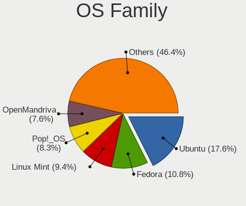

| Name          | Desktops | Percent |
|---------------|----------|---------|
| Ubuntu        | 49       | 17.63%  |
| Fedora        | 30       | 10.79%  |
| Linux Mint    | 26       | 9.35%   |
| Pop!_OS       | 23       | 8.27%   |
| OpenMandriva  | 21       | 7.55%   |
| Endless       | 16       | 5.76%   |
| Manjaro       | 13       | 4.68%   |
| Debian        | 12       | 4.32%   |
| Zorin         | 9        | 3.24%   |
| Arch          | 9        | 3.24%   |
| KDE neon      | 8        | 2.88%   |
| BlackPanther  | 8        | 2.88%   |
| Kubuntu       | 6        | 2.16%   |
| ArcoLinux     | 6        | 2.16%   |
| Kali          | 5        | 1.8%    |
| Nobara        | 4        | 1.44%   |
| Ubuntu Unity  | 3        | 1.08%   |
| openSUSE      | 3        | 1.08%   |
| Elementary    | 3        | 1.08%   |
| Xubuntu       | 2        | 0.72%   |
| SteamOS       | 2        | 0.72%   |
| ROSA          | 2        | 0.72%   |
| Garuda Linux  | 2        | 0.72%   |
| Xero          | 1        | 0.36%   |
| Ubuntu Studio | 1        | 0.36%   |
| Ubuntu MATE   | 1        | 0.36%   |
| Solus         | 1        | 0.36%   |
| Reborn OS     | 1        | 0.36%   |
| Peppermint    | 1        | 0.36%   |
| Parrot        | 1        | 0.36%   |
| NixOS         | 1        | 0.36%   |
| MX            | 1        | 0.36%   |
| Lubuntu       | 1        | 0.36%   |
| LMDE          | 1        | 0.36%   |
| Hash Linux    | 1        | 0.36%   |
| Gentoo        | 1        | 0.36%   |
| CachyOS       | 1        | 0.36%   |
| BunsenLabs    | 1        | 0.36%   |
| BuildRoot     | 1        | 0.36%   |

Kernel
------

Version of the Linux kernel

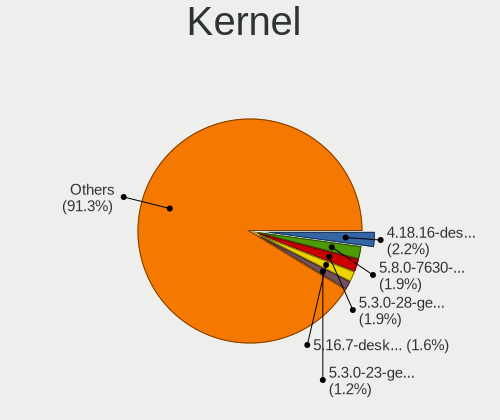

| Version                  | Desktops | Percent |
|--------------------------|----------|---------|
| 4.18.16-desktop-1bP      | 7        | 2.17%   |
| 5.8.0-7630-generic       | 6        | 1.86%   |
| 5.3.0-28-generic         | 6        | 1.86%   |
| 5.16.7-desktop-1omv4003  | 5        | 1.55%   |
| 5.3.0-23-generic         | 4        | 1.24%   |
| 6.8.5-301.fc40.x86_64    | 3        | 0.93%   |
| 6.6.2-desktop-1omv2390   | 3        | 0.93%   |
| 6.5.0-27-generic         | 3        | 0.93%   |
| 6.4.11-desktop-1omv2390  | 3        | 0.93%   |
| 6.10.0-desktop-1omv2490  | 3        | 0.93%   |
| 5.4.0-7634-generic       | 3        | 0.93%   |
| 5.4.0-58-generic         | 3        | 0.93%   |
| 5.10.14-desktop-1omv4002 | 3        | 0.93%   |
| 4.9.20-desktop-pae-1bP   | 3        | 0.93%   |
| 6.9.3-76060903-generic   | 2        | 0.62%   |
| 6.8.11-amd64             | 2        | 0.62%   |
| 6.8.0-47-generic         | 2        | 0.62%   |
| 6.5.0-26-generic         | 2        | 0.62%   |
| 6.3.5-desktop-3omv2390   | 2        | 0.62%   |
| 6.2.6-desktop-1omv2390   | 2        | 0.62%   |
| 6.2.0-37-generic         | 2        | 0.62%   |
| 6.2.0-20-generic         | 2        | 0.62%   |
| 6.12.1-desktop-1omv2490  | 2        | 0.62%   |
| 6.1.0-26-amd64           | 2        | 0.62%   |
| 6.1.0-13-amd64           | 2        | 0.62%   |
| 5.8.0-36-generic         | 2        | 0.62%   |
| 5.8.0-14-generic         | 2        | 0.62%   |
| 5.4.0-80-generic         | 2        | 0.62%   |
| 5.4.0-74-generic         | 2        | 0.62%   |
| 5.4.0-73-generic         | 2        | 0.62%   |
| 5.4.0-65-generic         | 2        | 0.62%   |
| 5.3.0-46-generic         | 2        | 0.62%   |
| 5.19.0-43-generic        | 2        | 0.62%   |
| 5.19.0-32-generic        | 2        | 0.62%   |
| 5.19.0-23-generic        | 2        | 0.62%   |
| 5.15.0-kali2-amd64       | 2        | 0.62%   |
| 5.15.0-56-generic        | 2        | 0.62%   |
| 5.15.0-48-generic        | 2        | 0.62%   |
| 5.15.0-41-generic        | 2        | 0.62%   |
| 5.15.0-27-generic        | 2        | 0.62%   |

Kernel Family
-------------

Linux kernel without a distro release

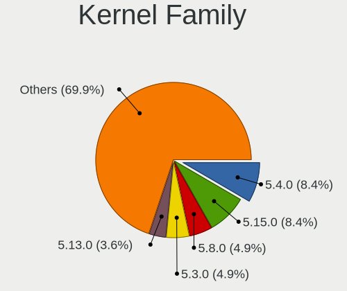

| Version | Desktops | Percent |
|---------|----------|---------|
| 5.4.0   | 26       | 8.41%   |
| 5.15.0  | 26       | 8.41%   |
| 5.8.0   | 15       | 4.85%   |
| 5.3.0   | 15       | 4.85%   |
| 5.13.0  | 11       | 3.56%   |
| 5.19.0  | 10       | 3.24%   |
| 6.5.0   | 9        | 2.91%   |
| 6.2.0   | 9        | 2.91%   |
| 4.15.0  | 8        | 2.59%   |
| 6.8.0   | 7        | 2.27%   |
| 6.1.0   | 7        | 2.27%   |
| 5.11.0  | 7        | 2.27%   |
| 4.18.16 | 7        | 2.27%   |
| 5.16.7  | 5        | 1.62%   |
| 6.9.3   | 3        | 0.97%   |
| 6.8.5   | 3        | 0.97%   |
| 6.8.11  | 3        | 0.97%   |
| 6.6.2   | 3        | 0.97%   |
| 6.4.11  | 3        | 0.97%   |
| 6.2.6   | 3        | 0.97%   |
| 6.10.0  | 3        | 0.97%   |
| 5.17.5  | 3        | 0.97%   |
| 5.10.14 | 3        | 0.97%   |
| 5.0.0   | 3        | 0.97%   |
| 4.9.20  | 3        | 0.97%   |
| 4.19.0  | 3        | 0.97%   |
| 4.18.0  | 3        | 0.97%   |
| 6.9.8   | 2        | 0.65%   |
| 6.9.7   | 2        | 0.65%   |
| 6.8.2   | 2        | 0.65%   |
| 6.5.9   | 2        | 0.65%   |
| 6.3.5   | 2        | 0.65%   |
| 6.12.1  | 2        | 0.65%   |
| 6.11.4  | 2        | 0.65%   |
| 6.0.7   | 2        | 0.65%   |
| 6.0.0   | 2        | 0.65%   |
| 5.16.0  | 2        | 0.65%   |
| 5.10.0  | 2        | 0.65%   |
| 4.13.0  | 2        | 0.65%   |
| 6.9.9   | 1        | 0.32%   |

Kernel Major Ver.
-----------------

Linux kernel major version

| Version | Desktops | Percent |
|---------|----------|---------|
| 5.15    | 31       | 10.16%  |
| 5.4     | 27       | 8.85%   |
| 6.8     | 20       | 6.56%   |
| 5.8     | 18       | 5.9%    |
| 6.2     | 16       | 5.25%   |
| 6.1     | 16       | 5.25%   |
| 5.19    | 16       | 5.25%   |
| 6.5     | 15       | 4.92%   |
| 5.3     | 15       | 4.92%   |
| 5.13    | 12       | 3.93%   |
| 5.10    | 12       | 3.93%   |
| 4.18    | 10       | 3.28%   |
| 6.9     | 8        | 2.62%   |
| 5.11    | 8        | 2.62%   |
| 4.15    | 8        | 2.62%   |
| 6.4     | 7        | 2.3%    |
| 6.11    | 7        | 2.3%    |
| 6.10    | 7        | 2.3%    |
| 5.16    | 7        | 2.3%    |
| 6.6     | 6        | 1.97%   |
| 6.0     | 6        | 1.97%   |
| 4.9     | 5        | 1.64%   |
| 6.12    | 4        | 1.31%   |
| 6.3     | 3        | 0.98%   |
| 5.18    | 3        | 0.98%   |
| 5.17    | 3        | 0.98%   |
| 5.0     | 3        | 0.98%   |
| 4.19    | 3        | 0.98%   |
| 6.7     | 2        | 0.66%   |
| 5.9     | 2        | 0.66%   |
| 4.13    | 2        | 0.66%   |
| 5.7     | 1        | 0.33%   |
| 5.14    | 1        | 0.33%   |
| 5.1     | 1        | 0.33%   |

Arch
----

OS architecture (x86_64, i586, etc.)

| Name   | Desktops | Percent |
|--------|----------|---------|
| x86_64 | 259      | 97.74%  |
| i686   | 5        | 1.89%   |
| armv7l | 1        | 0.38%   |

DE
--

Desktop Environment

| Name            | Desktops | Percent |
|-----------------|----------|---------|
| GNOME           | 119      | 42.05%  |
| KDE5            | 69       | 24.38%  |
| X-Cinnamon      | 22       | 7.77%   |
| Unknown         | 20       | 7.07%   |
| XFCE            | 19       | 6.71%   |
| KDE6            | 10       | 3.53%   |
| LXQt            | 5        | 1.77%   |
| MATE            | 4        | 1.41%   |
| KDE             | 3        | 1.06%   |
| Unity           | 2        | 0.71%   |
| Pantheon        | 2        | 0.71%   |
| LXDE            | 2        | 0.71%   |
| openbox         | 1        | 0.35%   |
| Hyprland        | 1        | 0.35%   |
| GNOME Flashback | 1        | 0.35%   |
| Budgie          | 1        | 0.35%   |
| bspwm           | 1        | 0.35%   |
| awesome         | 1        | 0.35%   |

Display Server
--------------

X11 or Wayland

| Name    | Desktops | Percent |
|---------|----------|---------|
| X11     | 197      | 72.96%  |
| Wayland | 58       | 21.48%  |
| Tty     | 8        | 2.96%   |
| Unknown | 7        | 2.59%   |

Display Manager
---------------

SDDM, LightDM, etc.

| Name    | Desktops | Percent |
|---------|----------|---------|
| Unknown | 147      | 53.07%  |
| SDDM    | 58       | 20.94%  |
| GDM3    | 31       | 11.19%  |
| LightDM | 23       | 8.3%    |
| GDM     | 16       | 5.78%   |
| TDM     | 2        | 0.72%   |

OS Lang
-------

Language

| Lang             | Desktops | Percent |
|------------------|----------|---------|
| en_PH            | 129      | 46.07%  |
| en_US            | 114      | 40.71%  |
| Unknown          | 21       | 7.5%    |
| C                | 9        | 3.21%   |
| en_GB            | 3        | 1.07%   |
| ja_JP            | 1        | 0.36%   |
| en_US.ISO-8859-1 | 1        | 0.36%   |
| en_HK            | 1        | 0.36%   |
| de_DE            | 1        | 0.36%   |

Boot Mode
---------

EFI or BIOS

| Mode | Desktops | Percent |
|------|----------|---------|
| BIOS | 155      | 57.62%  |
| EFI  | 114      | 42.38%  |

Filesystem
----------

Type of filesystem

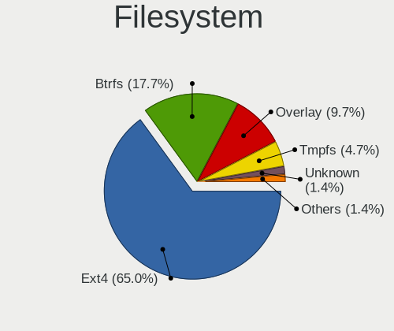

| Type    | Desktops | Percent |
|---------|----------|---------|
| Ext4    | 180      | 64.98%  |
| Btrfs   | 49       | 17.69%  |
| Overlay | 27       | 9.75%   |
| Tmpfs   | 13       | 4.69%   |
| Unknown | 4        | 1.44%   |
| Xfs     | 3        | 1.08%   |
| Zfs     | 1        | 0.36%   |

Part. scheme
------------

Scheme of partitioning

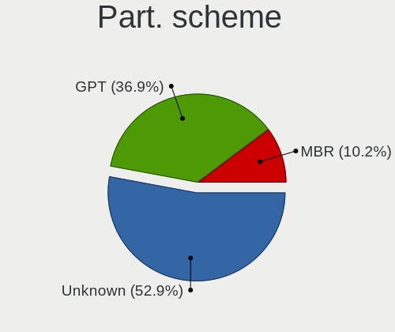

| Type    | Desktops | Percent |
|---------|----------|---------|
| Unknown | 145      | 52.92%  |
| GPT     | 101      | 36.86%  |
| MBR     | 28       | 10.22%  |

Dual Boot with Linux/BSD
------------------------

Hosting more than one Linux/BSD

| Dual boot | Desktops | Percent |
|-----------|----------|---------|
| No        | 226      | 81.59%  |
| Yes       | 51       | 18.41%  |

Dual Boot (Win)
---------------

Hosting Linux and Windows

| Dual boot | Desktops | Percent |
|-----------|----------|---------|
| No        | 201      | 72.56%  |
| Yes       | 76       | 27.44%  |

Board
-----

Vendor
------

Motherboard manufacturer

| Name                | Desktops | Percent |
|---------------------|----------|---------|
| Gigabyte Technology | 59       | 22.43%  |
| ASUSTek Computer    | 50       | 19.01%  |
| MSI                 | 47       | 17.87%  |
| ASRock              | 19       | 7.22%   |
| Hewlett-Packard     | 17       | 6.46%   |
| Dell                | 13       | 4.94%   |
| Biostar             | 9        | 3.42%   |
| ECS                 | 7        | 2.66%   |
| Lenovo              | 6        | 2.28%   |
| Foxconn             | 5        | 1.9%    |
| EMAXX TECHNOLOGY    | 5        | 1.9%    |
| Unknown             | 4        | 1.52%   |
| Pegatron            | 3        | 1.14%   |
| Intel               | 2        | 0.76%   |
| Colorful Technology | 2        | 0.76%   |
| AMD                 | 2        | 0.76%   |
| Acer                | 2        | 0.76%   |
| YANYU               | 1        | 0.38%   |
| TriGem Computer     | 1        | 0.38%   |
| Samsung Electronics | 1        | 0.38%   |
| QTQD                | 1        | 0.38%   |
| OEM                 | 1        | 0.38%   |
| NEC Computers       | 1        | 0.38%   |
| MACHINIST           | 1        | 0.38%   |
| Machenike           | 1        | 0.38%   |
| JOOYON              | 1        | 0.38%   |
| GPD                 | 1        | 0.38%   |
| AZW                 | 1        | 0.38%   |

Model
-----

Motherboard model

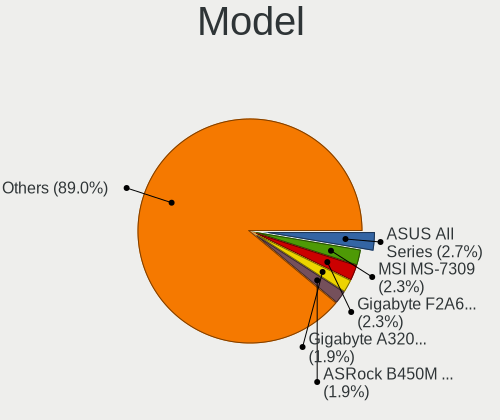

| Name                              | Desktops | Percent |
|-----------------------------------|----------|---------|
| ASUS All Series                   | 7        | 2.66%   |
| MSI MS-7309                       | 6        | 2.28%   |
| Gigabyte F2A68HM-S1               | 6        | 2.28%   |
| Gigabyte A320M-S2H V2             | 5        | 1.9%    |
| ASRock B450M Steel Legend         | 5        | 1.9%    |
| Unknown                           | 5        | 1.9%    |
| MSI MS-7C52                       | 4        | 1.52%   |
| MSI MS-7721                       | 4        | 1.52%   |
| ASUS P8H61-M LX3 PLUS R2.0        | 4        | 1.52%   |
| Foxconn G31MX Series              | 3        | 1.14%   |
| ECS G41T-R3                       | 3        | 1.14%   |
| Biostar A320MH                    | 3        | 1.14%   |
| Pegatron IPMSB-H61                | 2        | 0.76%   |
| MSI MS-7C94                       | 2        | 0.76%   |
| Gigabyte Z590 AORUS ULTRA         | 2        | 0.76%   |
| Gigabyte X570 AORUS PRO WIFI      | 2        | 0.76%   |
| Gigabyte H97M-D3H                 | 2        | 0.76%   |
| Gigabyte H81M-DS2                 | 2        | 0.76%   |
| Gigabyte H410M H V3               | 2        | 0.76%   |
| Gigabyte B450 AORUS M             | 2        | 0.76%   |
| Gigabyte A320M-S2H                | 2        | 0.76%   |
| Foxconn 500B Microtower           | 2        | 0.76%   |
| EMAXX TECHNOLOGY EMX-A70FM2+iCafe | 2        | 0.76%   |
| Dell OptiPlex 9020                | 2        | 0.76%   |
| Dell OptiPlex 3050                | 2        | 0.76%   |
| Dell OptiPlex 3010                | 2        | 0.76%   |
| ASUS PRIME B250M-K                | 2        | 0.76%   |
| ASUS PRIME B250M-A                | 2        | 0.76%   |
| ASUS PRIME A320M-K                | 2        | 0.76%   |
| ASUS EX-H310M-V3 R2.0             | 2        | 0.76%   |
| ASUS A68HM-K                      | 2        | 0.76%   |
| AMD A88                           | 2        | 0.76%   |
| YANYU EPIC-C19                    | 1        | 0.38%   |
| TriGem DreamSys                   | 1        | 0.38%   |
| Samsung DeskTop System            | 1        | 0.38%   |
| Pegatron FR440AA-ABU a6652uk      | 1        | 0.38%   |
| OEM X79G                          | 1        | 0.38%   |
| NEC Computers PC-MK36LBZCHEAM     | 1        | 0.38%   |
| MSI MS-7D90                       | 1        | 0.38%   |
| MSI MS-7D48                       | 1        | 0.38%   |

Model Family
------------

Motherboard model prefix

| Name                              | Desktops | Percent |
|-----------------------------------|----------|---------|
| Dell OptiPlex                     | 12       | 4.56%   |
| ASUS PRIME                        | 10       | 3.8%    |
| HP Compaq                         | 8        | 3.04%   |
| Gigabyte A320M-S2H                | 7        | 2.66%   |
| ASUS All                          | 7        | 2.66%   |
| MSI MS-7309                       | 6        | 2.28%   |
| Gigabyte F2A68HM-S1               | 6        | 2.28%   |
| ASUS TUF                          | 6        | 2.28%   |
| ASUS P8H61-M                      | 6        | 2.28%   |
| ASRock B450M                      | 5        | 1.9%    |
| Unknown                           | 5        | 1.9%    |
| MSI MS-7C52                       | 4        | 1.52%   |
| MSI MS-7721                       | 4        | 1.52%   |
| Gigabyte B450                     | 4        | 1.52%   |
| ASUS ROG                          | 4        | 1.52%   |
| Lenovo ThinkCentre                | 3        | 1.14%   |
| HP ProDesk                        | 3        | 1.14%   |
| Gigabyte X570                     | 3        | 1.14%   |
| Gigabyte B450M                    | 3        | 1.14%   |
| Foxconn G31MX                     | 3        | 1.14%   |
| ECS G41T-R3                       | 3        | 1.14%   |
| Biostar A320MH                    | 3        | 1.14%   |
| Pegatron IPMSB-H61                | 2        | 0.76%   |
| MSI MS-7C94                       | 2        | 0.76%   |
| HP EliteDesk                      | 2        | 0.76%   |
| Gigabyte Z590                     | 2        | 0.76%   |
| Gigabyte H97M-D3H                 | 2        | 0.76%   |
| Gigabyte H81M-DS2                 | 2        | 0.76%   |
| Gigabyte H410M                    | 2        | 0.76%   |
| Gigabyte B550                     | 2        | 0.76%   |
| Foxconn 500B                      | 2        | 0.76%   |
| EMAXX TECHNOLOGY EMX-A70FM2+iCafe | 2        | 0.76%   |
| ASUS EX-H310M-V3                  | 2        | 0.76%   |
| ASUS A68HM-K                      | 2        | 0.76%   |
| AMD A88                           | 2        | 0.76%   |
| YANYU EPIC-C19                    | 1        | 0.38%   |
| TriGem DreamSys                   | 1        | 0.38%   |
| Samsung DeskTop                   | 1        | 0.38%   |
| Pegatron FR440AA-ABU              | 1        | 0.38%   |
| OEM X79G                          | 1        | 0.38%   |

MFG Year
--------

Motherboard manufacture year

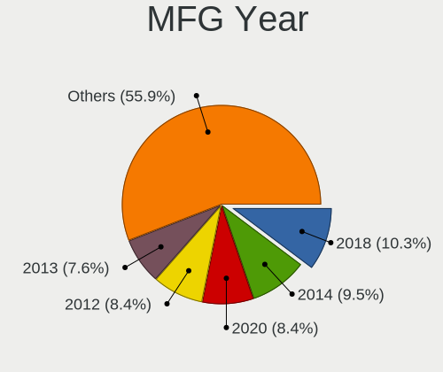

| Year    | Desktops | Percent |
|---------|----------|---------|
| 2018    | 27       | 10.27%  |
| 2014    | 25       | 9.51%   |
| 2020    | 22       | 8.37%   |
| 2012    | 22       | 8.37%   |
| 2013    | 20       | 7.6%    |
| 2015    | 19       | 7.22%   |
| 2017    | 18       | 6.84%   |
| 2021    | 17       | 6.46%   |
| 2019    | 17       | 6.46%   |
| 2010    | 15       | 5.7%    |
| 2011    | 12       | 4.56%   |
| 2009    | 12       | 4.56%   |
| 2023    | 8        | 3.04%   |
| 2022    | 8        | 3.04%   |
| 2016    | 7        | 2.66%   |
| 2008    | 5        | 1.9%    |
| 2007    | 4        | 1.52%   |
| 2006    | 4        | 1.52%   |
| Unknown | 1        | 0.38%   |

Form Factor
-----------

Physical design of the computer

| Name    | Desktops | Percent |
|---------|----------|---------|
| Desktop | 263      | 100%    |

Secure Boot
-----------

Enabled or disabled

| State    | Desktops | Percent |
|----------|----------|---------|
| Disabled | 252      | 95.09%  |
| Enabled  | 13       | 4.91%   |

Coreboot
--------

Have coreboot on board

| Used | Desktops | Percent |
|------|----------|---------|
| No   | 263      | 100%    |

RAM Size
--------

Total RAM memory

| Size in GB  | Desktops | Percent |
|-------------|----------|---------|
| 8.01-16.0   | 64       | 23.27%  |
| 16.01-24.0  | 57       | 20.73%  |
| 4.01-8.0    | 49       | 17.82%  |
| 3.01-4.0    | 46       | 16.73%  |
| 32.01-64.0  | 32       | 11.64%  |
| 64.01-256.0 | 11       | 4%      |
| 1.01-2.0    | 8        | 2.91%   |
| 2.01-3.0    | 5        | 1.82%   |
| 24.01-32.0  | 3        | 1.09%   |

RAM Used
--------

Used RAM memory

| Used GB     | Desktops | Percent |
|-------------|----------|---------|
| 1.01-2.0    | 91       | 30.64%  |
| 2.01-3.0    | 72       | 24.24%  |
| 4.01-8.0    | 51       | 17.17%  |
| 3.01-4.0    | 38       | 12.79%  |
| 0.51-1.0    | 18       | 6.06%   |
| 8.01-16.0   | 15       | 5.05%   |
| 0.01-0.5    | 7        | 2.36%   |
| 16.01-24.0  | 3        | 1.01%   |
| 24.01-32.0  | 1        | 0.34%   |
| 64.01-256.0 | 1        | 0.34%   |

Total Drives
------------

Number of drives on board

| Drives | Desktops | Percent |
|--------|----------|---------|
| 1      | 124      | 43.82%  |
| 2      | 94       | 33.22%  |
| 3      | 27       | 9.54%   |
| 4      | 23       | 8.13%   |
| 5      | 7        | 2.47%   |
| 6      | 3        | 1.06%   |
| 0      | 2        | 0.71%   |
| 14     | 1        | 0.35%   |
| 13     | 1        | 0.35%   |
| 12     | 1        | 0.35%   |

Has CD-ROM
----------

Has CD-ROM on board

| Presented | Desktops | Percent |
|-----------|----------|---------|
| No        | 217      | 80.07%  |
| Yes       | 54       | 19.93%  |

Has Ethernet
------------

Has Ethernet on board

| Presented | Desktops | Percent |
|-----------|----------|---------|
| Yes       | 260      | 98.48%  |
| No        | 4        | 1.52%   |

Has WiFi
--------

Has WiFi module

| Presented | Desktops | Percent |
|-----------|----------|---------|
| No        | 153      | 57.09%  |
| Yes       | 115      | 42.91%  |

Has Bluetooth
-------------

Has Bluetooth module

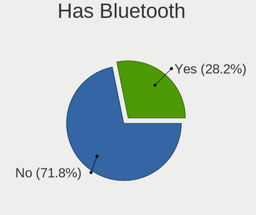

| Presented | Desktops | Percent |
|-----------|----------|---------|
| No        | 191      | 71.8%   |
| Yes       | 75       | 28.2%   |

Location
--------

Country
-------

Geographic location (country)

| Country     | Desktops | Percent |
|-------------|----------|---------|
| Philippines | 263      | 100%    |

City
----

Geographic location (city)

| City              | Desktops | Percent |
|-------------------|----------|---------|
| Quezon City       | 50       | 16.95%  |
| Davao City        | 18       | 6.1%    |
| Cagayan de Oro    | 16       | 5.42%   |
| Manila            | 15       | 5.08%   |
| Cebu City         | 12       | 4.07%   |
| Caloocan City     | 11       | 3.73%   |
| Angeles City      | 11       | 3.73%   |
| Makati City       | 9        | 3.05%   |
| Bacolod City      | 9        | 3.05%   |
| Iligan City       | 8        | 2.71%   |
| San Miguel        | 6        | 2.03%   |
| Paranaque City    | 6        | 2.03%   |
| Mandaluyong City  | 6        | 2.03%   |
| Bacoor            | 6        | 2.03%   |
| Tarlac City       | 5        | 1.69%   |
| Santa Rosa        | 5        | 1.69%   |
| Lipa City         | 5        | 1.69%   |
| Lahug             | 5        | 1.69%   |
| Zamboanga City    | 4        | 1.36%   |
| San Juan          | 4        | 1.36%   |
| Marikina City     | 4        | 1.36%   |
| Iloilo City       | 4        | 1.36%   |
| Calamba           | 4        | 1.36%   |
| Butuan            | 4        | 1.36%   |
| Batangas          | 4        | 1.36%   |
| Pasig             | 3        | 1.02%   |
| Manajao           | 3        | 1.02%   |
| Imus              | 3        | 1.02%   |
| Antipolo City     | 3        | 1.02%   |
| Santa Maria       | 2        | 0.68%   |
| San Fernando City | 2        | 0.68%   |
| Mandaue City      | 2        | 0.68%   |
| Magugpo Poblacion | 2        | 0.68%   |
| General Trias     | 2        | 0.68%   |
| General Santos    | 2        | 0.68%   |
| Dumaguete         | 2        | 0.68%   |
| Abaga             | 2        | 0.68%   |
| Valencia          | 1        | 0.34%   |
| Urdaneta          | 1        | 0.34%   |
| Tuguegarao City   | 1        | 0.34%   |

Drives
------

Drive Vendor
------------

Hard drive vendors

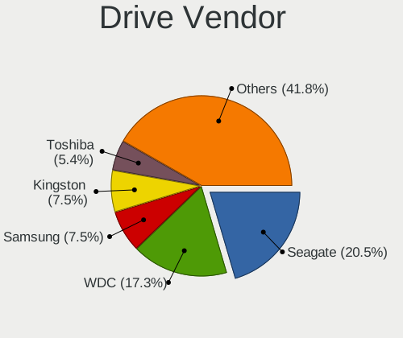

| Vendor                      | Desktops | Drives | Percent |
|-----------------------------|----------|--------|---------|
| Seagate                     | 98       | 141    | 20.46%  |
| WDC                         | 83       | 119    | 17.33%  |
| Samsung Electronics         | 36       | 56     | 7.52%   |
| Kingston                    | 36       | 49     | 7.52%   |
| Toshiba                     | 26       | 33     | 5.43%   |
| Hitachi                     | 20       | 35     | 4.18%   |
| Sandisk                     | 19       | 33     | 3.97%   |
| Ramsta                      | 9        | 10     | 1.88%   |
| Phison Electronics          | 9        | 16     | 1.88%   |
| Crucial                     | 9        | 13     | 1.88%   |
| Transcend                   | 8        | 8      | 1.67%   |
| Team                        | 7        | 9      | 1.46%   |
| PNY                         | 7        | 8      | 1.46%   |
| Lexar                       | 7        | 8      | 1.46%   |
| A-DATA Technology           | 7        | 9      | 1.46%   |
| Gigabyte Technology         | 6        | 11     | 1.25%   |
| Unknown                     | 5        | 6      | 1.04%   |
| Intel                       | 5        | 6      | 1.04%   |
| Micron/Crucial Technology   | 4        | 9      | 0.84%   |
| Kingston Technology Company | 4        | 4      | 0.84%   |
| HGST                        | 4        | 5      | 0.84%   |
| BR                          | 4        | 7      | 0.84%   |
| Unknown                     | 4        | 5      | 0.84%   |
| WALRAM                      | 3        | 4      | 0.63%   |
| SK hynix                    | 3        | 9      | 0.63%   |
| KingSpec                    | 3        | 4      | 0.63%   |
| Fujitsu                     | 3        | 3      | 0.63%   |
| XPG                         | 2        | 2      | 0.42%   |
| SPCC                        | 2        | 2      | 0.42%   |
| Silicon Motion              | 2        | 2      | 0.42%   |
| Phison                      | 2        | 2      | 0.42%   |
| Patriot                     | 2        | 2      | 0.42%   |
| Kimtigo                     | 2        | 4      | 0.42%   |
| JMicron Technology          | 2        | 2      | 0.42%   |
| Indilinx                    | 2        | 2      | 0.42%   |
| HS-SSD-E100                 | 2        | 2      | 0.42%   |
| HS-SSD-C100                 | 2        | 2      | 0.42%   |
| Colorful                    | 2        | 3      | 0.42%   |
| China                       | 2        | 11     | 0.42%   |
| ZOTAC                       | 1        | 1      | 0.21%   |

Drive Model
-----------

Hard drive models

| Model                                               | Desktops | Percent |
|-----------------------------------------------------|----------|---------|
| Seagate ST500DM002-1BD142 500GB                     | 16       | 2.97%   |
| Seagate ST1000DM010-2EP102 1TB                      | 15       | 2.79%   |
| Kingston SA400S37120G 120GB SSD                     | 9        | 1.67%   |
| Toshiba DT01ACA050 500GB                            | 7        | 1.3%    |
| Kingston SA400S37240G 240GB SSD                     | 7        | 1.3%    |
| Samsung SSD 860 EVO 500GB                           | 6        | 1.12%   |
| Samsung SSD 860 EVO 250GB                           | 6        | 1.12%   |
| Samsung NVMe SSD Controller SM981/PM981/PM983 512GB | 6        | 1.12%   |
| Phison PS5013 E13 NVMe Controller 512GB             | 6        | 1.12%   |
| WDC WD10EZEX-08WN4A0 1TB                            | 5        | 0.93%   |
| Toshiba DT01ACA100 1TB                              | 5        | 0.93%   |
| Seagate ST4000DM004-2CV104 4TB                      | 5        | 0.93%   |
| Seagate ST2000DM008-2FR102 2TB                      | 5        | 0.93%   |
| Hitachi HDS721050CLA362 500GB                       | 5        | 0.93%   |
| WDC WD5000AAKX-60U6AA0 500GB                        | 4        | 0.74%   |
| Transcend TS128GSSD370S 128GB                       | 4        | 0.74%   |
| Seagate ST3500418AS 500GB                           | 4        | 0.74%   |
| Seagate ST1000DM003-1ER162 1TB                      | 4        | 0.74%   |
| SanDisk SSD PLUS 1000GB                             | 4        | 0.74%   |
| Kingston SA400S37480G 480GB SSD                     | 4        | 0.74%   |
| Hitachi HDS721616PLA380 160GB                       | 4        | 0.74%   |
| Unknown                                             | 4        | 0.74%   |
| WDC WD5000AZLX-60K2TA0 500GB                        | 3        | 0.56%   |
| WDC WD10EZEX-22MFCA0 1TB                            | 3        | 0.56%   |
| Toshiba MQ01ABD100 1TB                              | 3        | 0.56%   |
| Seagate ST500DM002-1ER14C 500GB                     | 3        | 0.56%   |
| Seagate ST3160812AS 160GB                           | 3        | 0.56%   |
| Seagate ST1000DM003-1CH162 1TB                      | 3        | 0.56%   |
| SanDisk SSD PLUS 240GB                              | 3        | 0.56%   |
| SanDisk SDSSDA240G 240GB                            | 3        | 0.56%   |
| Samsung SSD 980 1TB                                 | 3        | 0.56%   |
| PNY CS900 240GB SSD                                 | 3        | 0.56%   |
| Micron/Crucial P2 NVMe PCIe SSD 500GB               | 3        | 0.56%   |
| Lexar 128GB SSD                                     | 3        | 0.56%   |
| Intel SSDSC2BF180A4H 180GB                          | 3        | 0.56%   |
| Hitachi HTS543232A7A384 320GB                       | 3        | 0.56%   |
| Hitachi HDS721050CLA660 500GB                       | 3        | 0.56%   |
| Crucial CT500P2SSD8 500GB                           | 3        | 0.56%   |
| WDC WDS240G2G0A-00JH30 240GB SSD                    | 2        | 0.37%   |
| WDC WD5003ABYZ-011FA0 500GB                         | 2        | 0.37%   |

HDD Vendor
----------

Hard disk drive vendors

| Vendor              | Desktops | Drives | Percent |
|---------------------|----------|--------|---------|
| Seagate             | 96       | 137    | 41.2%   |
| WDC                 | 78       | 106    | 33.48%  |
| Toshiba             | 25       | 30     | 10.73%  |
| Hitachi             | 20       | 35     | 8.58%   |
| HGST                | 4        | 5      | 1.72%   |
| Samsung Electronics | 3        | 4      | 1.29%   |
| Fujitsu             | 3        | 3      | 1.29%   |
| Unknown             | 2        | 2      | 0.86%   |
| XrayDisk            | 1        | 1      | 0.43%   |
| ExcelStor           | 1        | 1      | 0.43%   |

SSD Vendor
----------

Solid state drive vendors

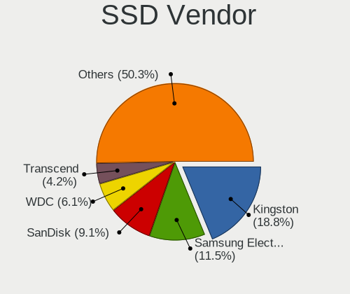

| Vendor              | Desktops | Drives | Percent |
|---------------------|----------|--------|---------|
| Kingston            | 31       | 40     | 18.79%  |
| Samsung Electronics | 19       | 32     | 11.52%  |
| SanDisk             | 15       | 17     | 9.09%   |
| WDC                 | 10       | 13     | 6.06%   |
| Transcend           | 7        | 7      | 4.24%   |
| Team                | 7        | 9      | 4.24%   |
| Ramsta              | 7        | 8      | 4.24%   |
| Lexar               | 6        | 7      | 3.64%   |
| A-DATA Technology   | 6        | 8      | 3.64%   |
| PNY                 | 5        | 6      | 3.03%   |
| Crucial             | 5        | 8      | 3.03%   |
| Intel               | 4        | 5      | 2.42%   |
| KingSpec            | 3        | 4      | 1.82%   |
| Gigabyte Technology | 3        | 4      | 1.82%   |
| BR                  | 3        | 4      | 1.82%   |
| Toshiba             | 2        | 2      | 1.21%   |
| SPCC                | 2        | 2      | 1.21%   |
| SK hynix            | 2        | 8      | 1.21%   |
| Patriot             | 2        | 2      | 1.21%   |
| Kimtigo             | 2        | 4      | 1.21%   |
| HS-SSD-E100         | 2        | 2      | 1.21%   |
| China               | 2        | 11     | 1.21%   |
| ZOTAC               | 1        | 1      | 0.61%   |
| WALRAM              | 1        | 1      | 0.61%   |
| Unknown             | 1        | 2      | 0.61%   |
| TAMMUZ              | 1        | 1      | 0.61%   |
| SKIHOTAR            | 1        | 1      | 0.61%   |
| Seagate             | 1        | 2      | 0.61%   |
| MCTECH              | 1        | 1      | 0.61%   |
| Kingmax             | 1        | 1      | 0.61%   |
| Indilinx            | 1        | 1      | 0.61%   |
| HS-SSD-C100         | 1        | 1      | 0.61%   |
| Hikvision           | 1        | 2      | 0.61%   |
| GLOWAY              | 1        | 2      | 0.61%   |
| FORESEE             | 1        | 1      | 0.61%   |
| Fordisk             | 1        | 1      | 0.61%   |
| ETOPSO              | 1        | 1      | 0.61%   |
| Dahua               | 1        | 1      | 0.61%   |
| Corsair             | 1        | 1      | 0.61%   |
| CERVVO              | 1        | 1      | 0.61%   |

Drive Kind
----------

HDD or SSD

| Kind    | Desktops | Drives | Percent |
|---------|----------|--------|---------|
| HDD     | 189      | 324    | 47.73%  |
| SSD     | 128      | 227    | 32.32%  |
| NVMe    | 63       | 111    | 15.91%  |
| Unknown | 15       | 21     | 3.79%   |
| MMC     | 1        | 1      | 0.25%   |

Drive Connector
---------------

SATA, SAS, NVMe, etc.

| Type | Desktops | Drives | Percent |
|------|----------|--------|---------|
| SATA | 239      | 556    | 75.63%  |
| NVMe | 63       | 111    | 19.94%  |
| SAS  | 13       | 16     | 4.11%   |
| MMC  | 1        | 1      | 0.32%   |

Drive Size
----------

Size of hard drive

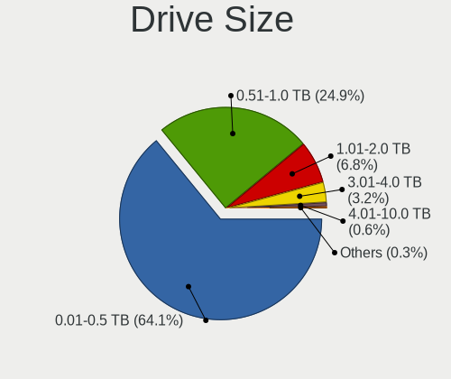

| Size in TB | Desktops | Drives | Percent |
|------------|----------|--------|---------|
| 0.01-0.5   | 198      | 371    | 64.08%  |
| 0.51-1.0   | 77       | 127    | 24.92%  |
| 1.01-2.0   | 21       | 28     | 6.8%    |
| 3.01-4.0   | 10       | 22     | 3.24%   |
| 4.01-10.0  | 2        | 2      | 0.65%   |
| 10.01-20.0 | 1        | 1      | 0.32%   |

Space Total
-----------

Amount of disk space available on the file system

| Size in GB     | Desktops | Percent |
|----------------|----------|---------|
| 101-250        | 80       | 27.12%  |
| 251-500        | 66       | 22.37%  |
| 1001-2000      | 36       | 12.2%   |
| 501-1000       | 36       | 12.2%   |
| 1-20           | 19       | 6.44%   |
| 51-100         | 18       | 6.1%    |
| More than 3000 | 15       | 5.08%   |
| 2001-3000      | 10       | 3.39%   |
| Unknown        | 9        | 3.05%   |
| 21-50          | 6        | 2.03%   |

Space Used
----------

Amount of used disk space

| Used GB        | Desktops | Percent |
|----------------|----------|---------|
| 1-20           | 96       | 31.68%  |
| 21-50          | 57       | 18.81%  |
| 51-100         | 38       | 12.54%  |
| 101-250        | 37       | 12.21%  |
| 251-500        | 23       | 7.59%   |
| 501-1000       | 16       | 5.28%   |
| 1001-2000      | 10       | 3.3%    |
| 2001-3000      | 9        | 2.97%   |
| Unknown        | 9        | 2.97%   |
| More than 3000 | 7        | 2.31%   |
| 0              | 1        | 0.33%   |

Malfunc. Drives
---------------

Drive models with a malfunction

| Model                                                           | Desktops | Drives | Percent |
|-----------------------------------------------------------------|----------|--------|---------|
| Hitachi HDS721050CLA362 500GB                                   | 5        | 10     | 11.63%  |
| Seagate ST500DM002-1BD142 500GB                                 | 4        | 6      | 9.3%    |
| Hitachi HTS543232A7A384 320GB                                   | 3        | 5      | 6.98%   |
| Unknown S050 Hard drive 500GB                                   | 2        | 2      | 4.65%   |
| HGST HTS541010A9E680 1TB                                        | 2        | 3      | 4.65%   |
| WDC WD5003ABYZ-011FA0 500GB                                     | 1        | 1      | 2.33%   |
| WDC WD5000LPCX-60VHAT0 500GB                                    | 1        | 2      | 2.33%   |
| WDC WD5000AAVS-00ZTB0 500GB                                     | 1        | 1      | 2.33%   |
| WDC WD5000AAKX-603CA0 500GB                                     | 1        | 1      | 2.33%   |
| WDC WD5000AAKX-00ERMA0 500GB                                    | 1        | 1      | 2.33%   |
| WDC WD5000AAKX-001CA0 500GB                                     | 1        | 1      | 2.33%   |
| WDC WD3200AAJS-08L7A0 320GB                                     | 1        | 1      | 2.33%   |
| WDC WD3200AAJS-00B4A0 320GB                                     | 1        | 1      | 2.33%   |
| WDC WD10EZEX-00MFCA0 1TB                                        | 1        | 1      | 2.33%   |
| Toshiba MQ01ABD100 1TB                                          | 1        | 1      | 2.33%   |
| Toshiba DT01ACA100 1TB                                          | 1        | 1      | 2.33%   |
| Toshiba DT01ACA050 500GB                                        | 1        | 1      | 2.33%   |
| Seagate ST500LT012-1DG142 500GB                                 | 1        | 1      | 2.33%   |
| Seagate ST500DM002 500GB                                        | 1        | 2      | 2.33%   |
| Seagate ST380815AS 80GB                                         | 1        | 1      | 2.33%   |
| Seagate ST3500514NS 500GB                                       | 1        | 1      | 2.33%   |
| Seagate ST3500418AS 500GB                                       | 1        | 1      | 2.33%   |
| Seagate ST2000DM008-2FR102 2TB                                  | 1        | 1      | 2.33%   |
| Seagate ST1000DM010-2EP102 1TB                                  | 1        | 1      | 2.33%   |
| SanDisk SSD PLUS 1000GB                                         | 1        | 1      | 2.33%   |
| SanDisk SDSSDA240G 240GB                                        | 1        | 1      | 2.33%   |
| Samsung Electronics NVMe SSD Controller SM981/PM981/PM983 512GB | 1        | 2      | 2.33%   |
| Ramsta SSD S800 1TB                                             | 1        | 1      | 2.33%   |
| Kingston SA400S37240G 240GB SSD                                 | 1        | 1      | 2.33%   |
| Hitachi HUA721010KLA330 1TB                                     | 1        | 2      | 2.33%   |
| Hitachi HDS721050CLA660 500GB                                   | 1        | 1      | 2.33%   |
| Fordisk SSD2M360-032GM 32GB                                     | 1        | 1      | 2.33%   |

Malfunc. Drive Vendor
---------------------

Vendors of faulty drives

| Vendor              | Desktops | Drives | Percent |
|---------------------|----------|--------|---------|
| Seagate             | 11       | 14     | 28.21%  |
| WDC                 | 9        | 10     | 23.08%  |
| Hitachi             | 7        | 18     | 17.95%  |
| Unknown             | 2        | 2      | 5.13%   |
| Toshiba             | 2        | 3      | 5.13%   |
| SanDisk             | 2        | 2      | 5.13%   |
| HGST                | 2        | 3      | 5.13%   |
| Samsung Electronics | 1        | 2      | 2.56%   |
| Ramsta              | 1        | 1      | 2.56%   |
| Kingston            | 1        | 1      | 2.56%   |
| Fordisk             | 1        | 1      | 2.56%   |

Malfunc. HDD Vendor
-------------------

Vendors of faulty HDD drives

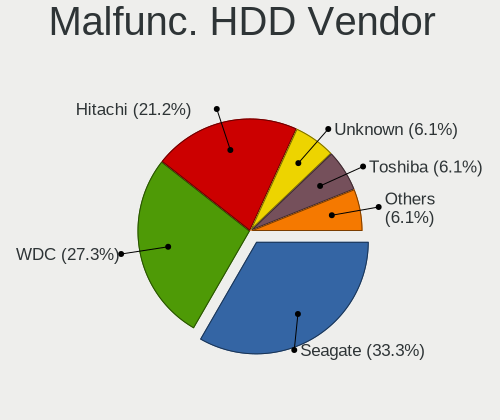

| Vendor  | Desktops | Drives | Percent |
|---------|----------|--------|---------|
| Seagate | 11       | 14     | 33.33%  |
| WDC     | 9        | 10     | 27.27%  |
| Hitachi | 7        | 18     | 21.21%  |
| Unknown | 2        | 2      | 6.06%   |
| Toshiba | 2        | 3      | 6.06%   |
| HGST    | 2        | 3      | 6.06%   |

Malfunc. Drive Kind
-------------------

Kinds of faulty drives

| Kind | Desktops | Drives | Percent |
|------|----------|--------|---------|
| HDD  | 28       | 50     | 82.35%  |
| SSD  | 5        | 5      | 14.71%  |
| NVMe | 1        | 2      | 2.94%   |

Failed Drives
-------------

Failed drive models

| Model                           | Desktops | Drives | Percent |
|---------------------------------|----------|--------|---------|
| Seagate ST500DM002-1BD142 500GB | 1        | 1      | 100%    |

Failed Drive Vendor
-------------------

Failed drive vendors

| Vendor  | Desktops | Drives | Percent |
|---------|----------|--------|---------|
| Seagate | 1        | 1      | 100%    |

Drive Status
------------

Number of failed and malfunc. drives

| Status   | Desktops | Drives | Percent |
|----------|----------|--------|---------|
| Detected | 161      | 408    | 55.14%  |
| Works    | 97       | 218    | 33.22%  |
| Malfunc  | 33       | 57     | 11.3%   |
| Failed   | 1        | 1      | 0.34%   |

Storage controller
------------------

Storage Vendor
--------------

Storage controller vendors

| Vendor                         | Desktops | Percent |
|--------------------------------|----------|---------|
| Intel                          | 143      | 42.31%  |
| AMD                            | 105      | 31.07%  |
| Samsung Electronics            | 16       | 4.73%   |
| Phison Electronics             | 13       | 3.85%   |
| Nvidia                         | 11       | 3.25%   |
| Kingston Technology Company    | 9        | 2.66%   |
| Micron/Crucial Technology      | 7        | 2.07%   |
| Silicon Motion                 | 5        | 1.48%   |
| SanDisk                        | 4        | 1.18%   |
| ASMedia Technology             | 4        | 1.18%   |
| MAXIO Technology (Hangzhou)    | 3        | 0.89%   |
| Marvell Technology Group       | 3        | 0.89%   |
| JMicron Technology             | 3        | 0.89%   |
| ADATA Technology               | 3        | 0.89%   |
| Toshiba America Info Systems   | 1        | 0.3%    |
| Solid State Storage Technology | 1        | 0.3%    |
| SK hynix                       | 1        | 0.3%    |
| ShenZhen TIGO Semiconductor    | 1        | 0.3%    |
| Realtek Semiconductor          | 1        | 0.3%    |
| Lite-On Technology             | 1        | 0.3%    |
| Hosin Global Electronics       | 1        | 0.3%    |
| Broadcom / LSI                 | 1        | 0.3%    |
| Biwin Storage Technology       | 1        | 0.3%    |

Storage Model
-------------

Storage controller models

| Model                                                                                   | Desktops | Percent |
|-----------------------------------------------------------------------------------------|----------|---------|
| AMD FCH SATA Controller [AHCI mode]                                                     | 60       | 13.3%   |
| Intel 8 Series/C220 Series Chipset Family 6-port SATA Controller 1 [AHCI mode]          | 23       | 5.1%    |
| AMD 400 Series Chipset SATA Controller                                                  | 23       | 5.1%    |
| Intel NM10/ICH7 Family SATA Controller [IDE mode]                                       | 18       | 3.99%   |
| Intel 82801G (ICH7 Family) IDE Controller                                               | 15       | 3.33%   |
| AMD A320 Chipset SATA Controller [AHCI mode]                                            | 15       | 3.33%   |
| AMD 500 Series Chipset SATA Controller                                                  | 14       | 3.1%    |
| Intel Q170/Q150/B150/H170/H110/Z170/CM236 Chipset SATA Controller [AHCI Mode]           | 12       | 2.66%   |
| Nvidia MCP61 SATA Controller                                                            | 11       | 2.44%   |
| Nvidia MCP61 IDE                                                                        | 11       | 2.44%   |
| Intel 6 Series/C200 Series Chipset Family Desktop SATA Controller (IDE mode, ports 4-5) | 11       | 2.44%   |
| Intel 6 Series/C200 Series Chipset Family Desktop SATA Controller (IDE mode, ports 0-3) | 11       | 2.44%   |
| Intel 200 Series PCH SATA controller [AHCI mode]                                        | 11       | 2.44%   |
| AMD FCH SATA Controller [IDE mode]                                                      | 11       | 2.44%   |
| Samsung NVMe SSD Controller SM981/PM981/PM983                                           | 9        | 2%      |
| Intel 6 Series/C200 Series Chipset Family 6 port Desktop SATA AHCI Controller           | 9        | 2%      |
| Intel 500 Series Chipset Family SATA AHCI Controller                                    | 9        | 2%      |
| AMD SB7x0/SB8x0/SB9x0 IDE Controller                                                    | 9        | 2%      |
| AMD FCH IDE Controller                                                                  | 8        | 1.77%   |
| Phison PS5013-E13 PCIe3 NVMe Controller (DRAM-less)                                     | 7        | 1.55%   |
| AMD SB7x0/SB8x0/SB9x0 SATA Controller [IDE mode]                                        | 7        | 1.55%   |
| AMD 300 Series Chipset SATA Controller                                                  | 7        | 1.55%   |
| Micron/Crucial P2 [Nick P2] / P3 / P3 Plus NVMe PCIe SSD (DRAM-less)                    | 6        | 1.33%   |
| Intel SATA Controller [RAID mode]                                                       | 6        | 1.33%   |
| Silicon Motion SM2263EN/SM2263XT (DRAM-less) NVMe SSD Controllers                       | 5        | 1.11%   |
| Samsung NVMe SSD Controller 980 (DRAM-less)                                             | 5        | 1.11%   |
| Phison E16 PCIe4 NVMe Controller                                                        | 5        | 1.11%   |
| Intel Cannon Lake PCH SATA AHCI Controller                                              | 5        | 1.11%   |
| Intel 9 Series Chipset Family SATA Controller [AHCI Mode]                               | 5        | 1.11%   |
| Kingston Company A2000 NVMe SSD [SM2263EN]                                              | 4        | 0.89%   |
| Intel Alder Lake-S PCH SATA Controller [AHCI Mode]                                      | 4        | 0.89%   |
| Intel 7 Series/C210 Series Chipset Family 6-port SATA Controller [AHCI mode]            | 4        | 0.89%   |
| ASMedia ASM1061/ASM1062 Serial ATA Controller                                           | 4        | 0.89%   |
| AMD 600 Series Chipset SATA Controller                                                  | 4        | 0.89%   |
| Kingston Company NV1 NVMe SSD [SM2263XT] (DRAM-less)                                    | 3        | 0.67%   |
| Intel Comet Lake SATA AHCI Controller                                                   | 3        | 0.67%   |
| Intel 82801JD/DO (ICH10 Family) SATA AHCI Controller                                    | 3        | 0.67%   |
| Intel 4 Series Chipset PT IDER Controller                                               | 3        | 0.67%   |
| ADATA XPG SX8200 Pro PCIe Gen3x4 M.2 2280 Solid State Drive                             | 3        | 0.67%   |
| SanDisk WD PC SN810 / Black SN850 NVMe SSD                                              | 2        | 0.44%   |

Storage Kind
------------

Kind of storage controller (IDE, SATA, NVMe, SAS, ...)

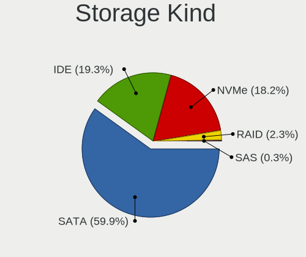

| Kind | Desktops | Percent |
|------|----------|---------|
| SATA | 208      | 59.94%  |
| IDE  | 67       | 19.31%  |
| NVMe | 63       | 18.16%  |
| RAID | 8        | 2.31%   |
| SAS  | 1        | 0.29%   |

Processor
---------

CPU Vendor
----------

Processor vendors

| Vendor | Desktops | Percent |
|--------|----------|---------|
| Intel  | 145      | 55.13%  |
| AMD    | 117      | 44.49%  |
| ARM    | 1        | 0.38%   |

CPU Model
---------

Processor models

| Model                                         | Desktops | Percent |
|-----------------------------------------------|----------|---------|
| AMD Ryzen 5 3600 6-Core Processor             | 10       | 3.8%    |
| AMD Ryzen 3 3200G with Radeon Vega Graphics   | 8        | 3.04%   |
| Intel Core 2 Duo CPU E7500 @ 2.93GHz          | 7        | 2.66%   |
| AMD Ryzen 5 5600G with Radeon Graphics        | 7        | 2.66%   |
| AMD Ryzen 5 2600 Six-Core Processor           | 6        | 2.28%   |
| Intel Core i7-4790 CPU @ 3.60GHz              | 5        | 1.9%    |
| AMD A8-7600 Radeon R7, 10 Compute Cores 4C+6G | 5        | 1.9%    |
| AMD A6-6400K APU with Radeon HD Graphics      | 5        | 1.9%    |
| Intel Core i7-3770 CPU @ 3.40GHz              | 4        | 1.52%   |
| Intel Core i5-3470 CPU @ 3.20GHz              | 4        | 1.52%   |
| Intel Core i5-2400 CPU @ 3.10GHz              | 4        | 1.52%   |
| Intel Core i3-4170 CPU @ 3.70GHz              | 4        | 1.52%   |
| AMD Sempron Processor LE-1100                 | 4        | 1.52%   |
| AMD Ryzen 5 5600X 6-Core Processor            | 4        | 1.52%   |
| Intel Core i5-8400 CPU @ 2.80GHz              | 3        | 1.14%   |
| Intel Core i5-7400 CPU @ 3.00GHz              | 3        | 1.14%   |
| Intel Core i5-6500 CPU @ 3.20GHz              | 3        | 1.14%   |
| Intel Core i5-4460 CPU @ 3.20GHz              | 3        | 1.14%   |
| Intel Core i5-10400 CPU @ 2.90GHz             | 3        | 1.14%   |
| Intel Core i3-2120 CPU @ 3.30GHz              | 3        | 1.14%   |
| Intel 12th Gen Core i5-12400                  | 3        | 1.14%   |
| AMD Ryzen 7 3700X 8-Core Processor            | 3        | 1.14%   |
| AMD Ryzen 5 2400G with Radeon Vega Graphics   | 3        | 1.14%   |
| AMD Ryzen 3 2200G with Radeon Vega Graphics   | 3        | 1.14%   |
| Intel Pentium Dual-Core CPU E5700 @ 3.00GHz   | 2        | 0.76%   |
| Intel Pentium CPU G2020 @ 2.90GHz             | 2        | 0.76%   |
| Intel Core i7-7700K CPU @ 4.20GHz             | 2        | 0.76%   |
| Intel Core i7-7700 CPU @ 3.60GHz              | 2        | 0.76%   |
| Intel Core i7-10700 CPU @ 2.90GHz             | 2        | 0.76%   |
| Intel Core i5-6500T CPU @ 2.50GHz             | 2        | 0.76%   |
| Intel Core i5-4690K CPU @ 3.50GHz             | 2        | 0.76%   |
| Intel Core i5-4590 CPU @ 3.30GHz              | 2        | 0.76%   |
| Intel Core i3-4160 CPU @ 3.60GHz              | 2        | 0.76%   |
| Intel Core i3-3240 CPU @ 3.40GHz              | 2        | 0.76%   |
| Intel Core i3-3217U CPU @ 1.80GHz             | 2        | 0.76%   |
| Intel Core 2 Quad CPU Q9400 @ 2.66GHz         | 2        | 0.76%   |
| Intel Core 2 Quad CPU Q8300 @ 2.50GHz         | 2        | 0.76%   |
| Intel Core 2 Duo CPU E8400 @ 3.00GHz          | 2        | 0.76%   |
| Intel Core 2 Duo CPU E8300 @ 2.83GHz          | 2        | 0.76%   |
| Intel 11th Gen Core i9-11900K @ 3.50GHz       | 2        | 0.76%   |

CPU Model Family
----------------

Processor model prefix

| Model                   | Desktops | Percent |
|-------------------------|----------|---------|
| Intel Core i5           | 46       | 17.49%  |
| AMD Ryzen 5             | 39       | 14.83%  |
| Intel Core i3           | 23       | 8.75%   |
| Intel Core i7           | 20       | 7.6%    |
| Intel Core 2 Duo        | 14       | 5.32%   |
| AMD Ryzen 3             | 13       | 4.94%   |
| Other                   | 12       | 4.56%   |
| AMD A6                  | 11       | 4.18%   |
| AMD Ryzen 7             | 9        | 3.42%   |
| Intel Celeron           | 7        | 2.66%   |
| AMD A8                  | 6        | 2.28%   |
| Intel Pentium Dual-Core | 5        | 1.9%    |
| Intel Pentium           | 5        | 1.9%    |
| Intel Core 2 Quad       | 5        | 1.9%    |
| AMD FX                  | 5        | 1.9%    |
| Intel Xeon              | 4        | 1.52%   |
| AMD Sempron             | 4        | 1.52%   |
| AMD Athlon              | 4        | 1.52%   |
| AMD A4                  | 4        | 1.52%   |
| AMD A10                 | 4        | 1.52%   |
| Intel Pentium Gold      | 3        | 1.14%   |
| AMD Phenom II X4        | 3        | 1.14%   |
| AMD Athlon II X4        | 3        | 1.14%   |
| AMD Athlon II X2        | 3        | 1.14%   |
| Intel Core i9           | 2        | 0.76%   |
| AMD Ryzen 9             | 2        | 0.76%   |
| Intel Core 2            | 1        | 0.38%   |
| AMD Ryzen 7 PRO         | 1        | 0.38%   |
| AMD Ryzen 5 PRO         | 1        | 0.38%   |
| AMD Phenom II X2        | 1        | 0.38%   |
| AMD Phenom              | 1        | 0.38%   |
| AMD Athlon X4           | 1        | 0.38%   |
| AMD Athlon 64 X2        | 1        | 0.38%   |

CPU Cores
---------

Number of processor cores

| Number | Desktops | Percent |
|--------|----------|---------|
| 4      | 96       | 36.23%  |
| 2      | 75       | 28.3%   |
| 6      | 51       | 19.25%  |
| 1      | 19       | 7.17%   |
| 8      | 16       | 6.04%   |
| 16     | 2        | 0.75%   |
| 12     | 2        | 0.75%   |
| 24     | 1        | 0.38%   |
| 14     | 1        | 0.38%   |
| 10     | 1        | 0.38%   |
| 3      | 1        | 0.38%   |

CPU Sockets
-----------

Number of sockets

| Number | Desktops | Percent |
|--------|----------|---------|
| 1      | 262      | 99.62%  |
| 2      | 1        | 0.38%   |

CPU Threads
-----------

Threads per core (Hyper-Threading)

| Number | Desktops | Percent |
|--------|----------|---------|
| 2      | 151      | 56.77%  |
| 1      | 114      | 42.86%  |
| 16     | 1        | 0.38%   |

CPU Op-Modes
------------

CPU Operation Modes (32-bit, 64-bit)

| Op mode        | Desktops | Percent |
|----------------|----------|---------|
| 32-bit, 64-bit | 261      | 98.86%  |
| Unknown        | 3        | 1.14%   |

CPU Microcode
-------------

Microcode number

| Number     | Desktops | Percent |
|------------|----------|---------|
| Unknown    | 122      | 44.69%  |
| 0x306c3    | 15       | 5.49%   |
| 0x1067a    | 13       | 4.76%   |
| 0x08701021 | 10       | 3.66%   |
| 0x06001119 | 9        | 3.3%    |
| 0x306a9    | 8        | 2.93%   |
| 0x0800820d | 7        | 2.56%   |
| 0x906e9    | 6        | 2.2%    |
| 0x06003106 | 6        | 2.2%    |
| 0x906ea    | 5        | 1.83%   |
| 0x506e3    | 5        | 1.83%   |
| 0x10676    | 5        | 1.83%   |
| 0x08108109 | 5        | 1.83%   |
| 0xa0671    | 4        | 1.47%   |
| 0x206a7    | 4        | 1.47%   |
| 0x0a50000d | 4        | 1.47%   |
| 0x08600106 | 3        | 1.1%    |
| 0xa0655    | 2        | 0.73%   |
| 0xa0653    | 2        | 0.73%   |
| 0x90675    | 2        | 0.73%   |
| 0x6fb      | 2        | 0.73%   |
| 0x08101016 | 2        | 0.73%   |
| 0x0810100b | 2        | 0.73%   |
| 0x0600611a | 2        | 0.73%   |
| 0x010000c8 | 2        | 0.73%   |
| 0x010000c7 | 2        | 0.73%   |
| 0x90672    | 1        | 0.37%   |
| 0x706a1    | 1        | 0.37%   |
| 0x6f6      | 1        | 0.37%   |
| 0x50654    | 1        | 0.37%   |
| 0x406f1    | 1        | 0.37%   |
| 0x40651    | 1        | 0.37%   |
| 0x30679    | 1        | 0.37%   |
| 0x106e5    | 1        | 0.37%   |
| 0x0a705203 | 1        | 0.37%   |
| 0x0a601206 | 1        | 0.37%   |
| 0x0a601203 | 1        | 0.37%   |
| 0x0a50000c | 1        | 0.37%   |
| 0x0a404102 | 1        | 0.37%   |
| 0x0a20102b | 1        | 0.37%   |

CPU Microarch
-------------

Microarchitecture

| Name             | Desktops | Percent |
|------------------|----------|---------|
| Haswell          | 30       | 11.32%  |
| Penryn           | 22       | 8.3%    |
| KabyLake         | 22       | 8.3%    |
| Zen 2            | 20       | 7.55%   |
| Zen+             | 18       | 6.79%   |
| Piledriver       | 18       | 6.79%   |
| IvyBridge        | 18       | 6.79%   |
| Zen 3            | 15       | 5.66%   |
| SandyBridge      | 11       | 4.15%   |
| Zen              | 10       | 3.77%   |
| K10              | 10       | 3.77%   |
| CometLake        | 10       | 3.77%   |
| Unknown          | 10       | 3.77%   |
| Skylake          | 9        | 3.4%    |
| Steamroller      | 8        | 3.02%   |
| K8 Hammer        | 5        | 1.89%   |
| Alderlake Hybrid | 5        | 1.89%   |
| Excavator        | 4        | 1.51%   |
| Icelake          | 3        | 1.13%   |
| Core             | 3        | 1.13%   |
| Nehalem          | 2        | 0.75%   |
| K10 Llano        | 2        | 0.75%   |
| Goldmont plus    | 2        | 0.75%   |
| Broadwell        | 2        | 0.75%   |
| Tremont          | 1        | 0.38%   |
| TigerLake        | 1        | 0.38%   |
| Silvermont       | 1        | 0.38%   |
| Jaguar           | 1        | 0.38%   |
| Gracemont        | 1        | 0.38%   |
| Bulldozer        | 1        | 0.38%   |

Graphics
--------

GPU Vendor
----------

Vendors of graphics cards

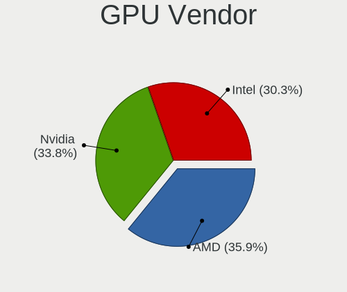

| Vendor | Desktops | Percent |
|--------|----------|---------|
| AMD    | 103      | 35.89%  |
| Nvidia | 97       | 33.8%   |
| Intel  | 87       | 30.31%  |

GPU Model
---------

Graphics card models

| Model                                                                       | Desktops | Percent |
|-----------------------------------------------------------------------------|----------|---------|
| AMD Ellesmere [Radeon RX 470/480/570/570X/580/580X/590]                     | 13       | 4.41%   |
| Intel 4 Series Chipset Integrated Graphics Controller                       | 12       | 4.07%   |
| Intel Xeon E3-1200 v3/4th Gen Core Processor Integrated Graphics Controller | 11       | 3.73%   |
| Nvidia GP107 [GeForce GTX 1050 Ti]                                          | 10       | 3.39%   |
| AMD Picasso/Raven 2 [Radeon Vega Series / Radeon Vega Mobile Series]        | 9        | 3.05%   |
| Intel Xeon E3-1200 v2/3rd Gen Core processor Graphics Controller            | 7        | 2.37%   |
| Intel HD Graphics 630                                                       | 7        | 2.37%   |
| Intel 2nd Generation Core Processor Family Integrated Graphics Controller   | 7        | 2.37%   |
| AMD Raven Ridge [Radeon Vega Series / Radeon Vega Mobile Series]            | 7        | 2.37%   |
| Nvidia GP108 [GeForce GT 1030]                                              | 6        | 2.03%   |
| Nvidia GM107 [GeForce GTX 750 Ti]                                           | 6        | 2.03%   |
| Nvidia GK208B [GeForce GT 710]                                              | 6        | 2.03%   |
| Nvidia GF108 [GeForce GT 730]                                               | 6        | 2.03%   |
| Nvidia G72 [GeForce 7200 GS / 7300 SE]                                      | 6        | 2.03%   |
| Intel CometLake-S GT2 [UHD Graphics 630]                                    | 6        | 2.03%   |
| AMD Cezanne [Radeon Vega Series / Radeon Vega Mobile Series]                | 6        | 2.03%   |
| AMD Baffin [Radeon RX 460/560D / Pro 450/455/460/555/555X/560/560X]         | 6        | 2.03%   |
| Nvidia GT218 [GeForce 210]                                                  | 5        | 1.69%   |
| Nvidia GP104 [GeForce GTX 1070]                                             | 5        | 1.69%   |
| Nvidia GF108 [GeForce GT 630]                                               | 5        | 1.69%   |
| Intel HD Graphics 530                                                       | 5        | 1.69%   |
| Intel 4th Generation Core Processor Family Integrated Graphics Controller   | 5        | 1.69%   |
| AMD Oland [Radeon HD 8570 / R5 430 OEM / R7 240/340 / Radeon 520 OEM]       | 5        | 1.69%   |
| Nvidia TU116 [GeForce GTX 1660 SUPER]                                       | 4        | 1.36%   |
| Nvidia GA102 [GeForce RTX 3080]                                             | 4        | 1.36%   |
| Intel Alder Lake-S GT1 [UHD Graphics 730]                                   | 4        | 1.36%   |
| Intel 82G33/G31 Express Integrated Graphics Controller                      | 4        | 1.36%   |
| AMD Richland [Radeon HD 8470D]                                              | 4        | 1.36%   |
| AMD Renoir [Radeon Vega Series / Radeon Vega Mobile Series]                 | 4        | 1.36%   |
| AMD Lexa PRO [Radeon 540/540X/550/550X / RX 540X/550/550X]                  | 4        | 1.36%   |
| AMD Kaveri [Radeon R7 Graphics]                                             | 4        | 1.36%   |
| AMD Caicos [Radeon HD 6450/7450/8450 / R5 230 OEM]                          | 4        | 1.36%   |
| Nvidia GM204 [GeForce GTX 970]                                              | 3        | 1.02%   |
| Nvidia C61 [GeForce 6150SE nForce 430]                                      | 3        | 1.02%   |
| Intel CoffeeLake-S GT2 [UHD Graphics 630]                                   | 3        | 1.02%   |
| AMD Wani [Radeon R5/R6/R7 Graphics]                                         | 3        | 1.02%   |
| AMD Navi 10 [Radeon RX 5600 OEM/5600 XT / 5700/5700 XT]                     | 3        | 1.02%   |
| Nvidia TU116 [GeForce GTX 1660 Ti]                                          | 2        | 0.68%   |
| Nvidia TU106 [GeForce RTX 2060 SUPER]                                       | 2        | 0.68%   |
| Nvidia GP107 [GeForce GTX 1050]                                             | 2        | 0.68%   |

GPU Combo
---------

Combinations of graphics cards

| Name           | Desktops | Percent |
|----------------|----------|---------|
| 1 x AMD        | 99       | 36.4%   |
| 1 x Nvidia     | 88       | 32.35%  |
| 1 x Intel      | 71       | 26.1%   |
| Intel + Nvidia | 6        | 2.21%   |
| 2 x Nvidia     | 2        | 0.74%   |
| Intel + AMD    | 2        | 0.74%   |
| Other          | 1        | 0.37%   |
| 2 x Intel      | 1        | 0.37%   |
| 2 x AMD        | 1        | 0.37%   |
| AMD + Nvidia   | 1        | 0.37%   |

GPU Driver
----------

Free vs proprietary

| Driver      | Desktops | Percent |
|-------------|----------|---------|
| Free        | 205      | 77.07%  |
| Proprietary | 51       | 19.17%  |
| Unknown     | 10       | 3.76%   |

GPU Memory
----------

Total video memory

| Size in GB | Desktops | Percent |
|------------|----------|---------|
| Unknown    | 130      | 47.1%   |
| 1.01-2.0   | 47       | 17.03%  |
| 0.51-1.0   | 22       | 7.97%   |
| 0.01-0.5   | 20       | 7.25%   |
| 7.01-8.0   | 19       | 6.88%   |
| 3.01-4.0   | 18       | 6.52%   |
| 5.01-6.0   | 9        | 3.26%   |
| 8.01-16.0  | 8        | 2.9%    |
| 2.01-3.0   | 3        | 1.09%   |

Monitor
-------

Monitor Vendor
--------------

Monitor vendors

| Vendor               | Desktops | Percent |
|----------------------|----------|---------|
| Samsung Electronics  | 42       | 15.67%  |
| Dell                 | 31       | 11.57%  |
| AOC                  | 22       | 8.21%   |
| Acer                 | 21       | 7.84%   |
| Hewlett-Packard      | 16       | 5.97%   |
| Goldstar             | 11       | 4.1%    |
| IPS                  | 10       | 3.73%   |
| BenQ                 | 9        | 3.36%   |
| ASUSTek Computer     | 9        | 3.36%   |
| Lenovo               | 8        | 2.99%   |
| Ancor Communications | 8        | 2.99%   |
| Sony                 | 6        | 2.24%   |
| Unknown              | 6        | 2.24%   |
| ViewSonic            | 5        | 1.87%   |
| Philips              | 5        | 1.87%   |
| Mi                   | 5        | 1.87%   |
| Unknown              | 4        | 1.49%   |
| MSI                  | 4        | 1.49%   |
| MStar                | 3        | 1.12%   |
| VIE                  | 2        | 0.75%   |
| Unknown (XXX)        | 2        | 0.75%   |
| Sharp                | 2        | 0.75%   |
| SGT                  | 2        | 0.75%   |
| NVISION              | 2        | 0.75%   |
| MIG                  | 2        | 0.75%   |
| eMachines            | 2        | 0.75%   |
| Eizo                 | 2        | 0.75%   |
| SMC                  | 1        | 0.37%   |
| SANYO                | 1        | 0.37%   |
| SAC                  | 1        | 0.37%   |
| RGT                  | 1        | 0.37%   |
| Pixio                | 1        | 0.37%   |
| NVS                  | 1        | 0.37%   |
| NVI                  | 1        | 0.37%   |
| NEX                  | 1        | 0.37%   |
| MDA                  | 1        | 0.37%   |
| LLL                  | 1        | 0.37%   |
| IOD                  | 1        | 0.37%   |
| Huion                | 1        | 0.37%   |
| HSI                  | 1        | 0.37%   |

Monitor Model
-------------

Monitor models

| Model                                                                 | Desktops | Percent |
|-----------------------------------------------------------------------|----------|---------|
| Unknown                                                               | 6        | 2.12%   |
| Samsung Electronics C24F390 SAM0D2C 1920x1080 521x293mm 23.5-inch     | 5        | 1.77%   |
| AOC 1970W AOC1970 1366x768 410x230mm 18.5-inch                        | 5        | 1.77%   |
| Samsung Electronics S20B300 SAM08A8 1600x900 443x249mm 20.0-inch      | 4        | 1.41%   |
| Dell SE177FP DELF001 1280x1024 338x270mm 17.0-inch                    | 4        | 1.41%   |
| Unknown LCD Monitor FFFF 2288x1287 2550x2550mm 142.0-inch             | 3        | 1.06%   |
| Samsung Electronics S24F350 SAM0D20 1920x1080 521x293mm 23.5-inch     | 3        | 1.06%   |
| Samsung Electronics S19D300 SAM0B34 1366x768 410x230mm 18.5-inch      | 3        | 1.06%   |
| MStar Demo MST0030 1920x1080 708x398mm 32.0-inch                      | 3        | 1.06%   |
| Lenovo LT1952p Wide LEN0990 1440x900 408x255mm 18.9-inch              | 3        | 1.06%   |
| Dell P170S DEL4058 1280x1024 338x270mm 17.0-inch                      | 3        | 1.06%   |
| AOC 2060W3 AOC2060 1920x1080 435x239mm 19.5-inch                      | 3        | 1.06%   |
| Ancor Communications ASUS VC239 ACI23C4 1920x1080 509x286mm 23.0-inch | 3        | 1.06%   |
| VIE A/G1956 VIE1850 1366x768 414x257mm 19.2-inch                      | 2        | 0.71%   |
| Samsung Electronics S24R35x SAM100E 1920x1080 521x293mm 23.5-inch     | 2        | 0.71%   |
| Samsung Electronics S22R35x SAM103A 1920x1080 476x268mm 21.5-inch     | 2        | 0.71%   |
| Philips PHL 227E7 PHLC100 1920x1080 476x268mm 21.5-inch               | 2        | 0.71%   |
| NVISION IP24V1 NVI2400 1920x1080 531x298mm 24.0-inch                  | 2        | 0.71%   |
| MIG E2019 MIG1900 1440x900 421x237mm 19.0-inch                        | 2        | 0.71%   |
| Mi Monitor XMI23C3 1920x1080 527x293mm 23.7-inch                      | 2        | 0.71%   |
| Lenovo G27q-20 LEN66C3 2560x1440 597x336mm 27.0-inch                  | 2        | 0.71%   |
| IPS ZP2200 IPS2200 1920x1080 477x268mm 21.5-inch                      | 2        | 0.71%   |
| IPS R220 IPS2150 1920x1080 477x268mm 21.5-inch                        | 2        | 0.71%   |
| IPS N185HD IPS1850 1366x768 410x230mm 18.5-inch                       | 2        | 0.71%   |
| Hewlett-Packard 24f HPN3545 1920x1080 527x296mm 23.8-inch             | 2        | 0.71%   |
| Goldstar IPS FULLHD GSM5AB8 1920x1080 480x270mm 21.7-inch             | 2        | 0.71%   |
| Goldstar HD GSM5ACB 1366x768 410x230mm 18.5-inch                      | 2        | 0.71%   |
| Dell P170S DEL4059 1280x1024 338x270mm 17.0-inch                      | 2        | 0.71%   |
| Dell E228WFP DELD015 1680x1050 473x296mm 22.0-inch                    | 2        | 0.71%   |
| Dell E198FP DELA028 1280x1024 380x305mm 19.2-inch                     | 2        | 0.71%   |
| BenQ GW2283 BNQ78E9 1920x1080 476x268mm 21.5-inch                     | 2        | 0.71%   |
| BenQ GW2270 BNQ78DB 1920x1080 476x268mm 21.5-inch                     | 2        | 0.71%   |
| ASUSTek Computer VG27AQL1A AUS2705 2560x1440 597x336mm 27.0-inch      | 2        | 0.71%   |
| AOC 24G2W1G5 AOC2402 1920x1080 527x296mm 23.8-inch                    | 2        | 0.71%   |
| AOC 22B2WG5 AOC2202 1920x1080 477x268mm 21.5-inch                     | 2        | 0.71%   |
| AOC 1670W AOC1670 1366x768 344x194mm 15.5-inch                        | 2        | 0.71%   |
| Ancor Communications VX239 ACI23E1 1920x1080 510x290mm 23.1-inch      | 2        | 0.71%   |
| Acer S200HQL  ACR0359 1600x900 430x240mm 19.4-inch                    | 2        | 0.71%   |
| Acer R230H ACR046E 1920x1080 509x286mm 23.0-inch                      | 2        | 0.71%   |
| Acer KA220HQ ACR0497 1920x1080 477x268mm 21.5-inch                    | 2        | 0.71%   |

Monitor Resolution
------------------

Monitor screen resolution

| Resolution         | Desktops | Percent |
|--------------------|----------|---------|
| 1920x1080 (FHD)    | 119      | 45.77%  |
| 1366x768 (WXGA)    | 36       | 13.85%  |
| 1280x1024 (SXGA)   | 20       | 7.69%   |
| 3840x2160 (4K)     | 18       | 6.92%   |
| 1600x900 (HD+)     | 14       | 5.38%   |
| 2560x1440 (QHD)    | 13       | 5%      |
| 1440x900 (WXGA+)   | 12       | 4.62%   |
| 3440x1440          | 5        | 1.92%   |
| 1360x768           | 4        | 1.54%   |
| 2288x1287          | 3        | 1.15%   |
| 1920x1200 (WUXGA)  | 3        | 1.15%   |
| 1680x1050 (WSXGA+) | 3        | 1.15%   |
| Unknown            | 3        | 1.15%   |
| 1024x768 (XGA)     | 2        | 0.77%   |
| 5360x1440          | 1        | 0.38%   |
| 3200x1080          | 1        | 0.38%   |
| 2966x900           | 1        | 0.38%   |
| 1920x540           | 1        | 0.38%   |
| 1600x1200          | 1        | 0.38%   |

Monitor Diagonal
----------------

Diagonal size in inches

| Inches  | Desktops | Percent |
|---------|----------|---------|
| 21      | 39       | 14.29%  |
| 18      | 33       | 12.09%  |
| 23      | 28       | 10.26%  |
| 24      | 25       | 9.16%   |
| 27      | 24       | 8.79%   |
| Unknown | 20       | 7.33%   |
| 19      | 19       | 6.96%   |
| 20      | 15       | 5.49%   |
| 17      | 15       | 5.49%   |
| 31      | 11       | 4.03%   |
| 15      | 7        | 2.56%   |
| 72      | 5        | 1.83%   |
| 34      | 5        | 1.83%   |
| 32      | 5        | 1.83%   |
| 22      | 5        | 1.83%   |
| 52      | 4        | 1.47%   |
| 142     | 3        | 1.1%    |
| 54      | 3        | 1.1%    |
| 84      | 2        | 0.73%   |
| 40      | 2        | 0.73%   |
| 58      | 1        | 0.37%   |
| 50      | 1        | 0.37%   |
| 39      | 1        | 0.37%   |

Monitor Width
-------------

Physical width

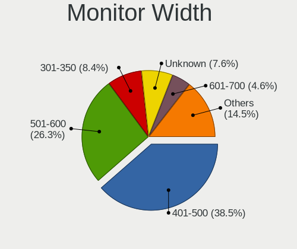

| Width in mm    | Desktops | Percent |
|----------------|----------|---------|
| 401-500        | 101      | 38.55%  |
| 501-600        | 69       | 26.34%  |
| 301-350        | 22       | 8.4%    |
| Unknown        | 20       | 7.63%   |
| 601-700        | 12       | 4.58%   |
| 701-800        | 10       | 3.82%   |
| 1001-1500      | 9        | 3.44%   |
| 1501-2000      | 7        | 2.67%   |
| 351-400        | 6        | 2.29%   |
| More than 2000 | 3        | 1.15%   |
| 801-900        | 3        | 1.15%   |

Aspect Ratio
------------

Proportional relationship between the width and the height

| Ratio   | Desktops | Percent |
|---------|----------|---------|
| 16/9    | 179      | 72.18%  |
| 5/4     | 19       | 7.66%   |
| 16/10   | 19       | 7.66%   |
| Unknown | 19       | 7.66%   |
| 21/9    | 5        | 2.02%   |
| 4/3     | 3        | 1.21%   |
| 1.00    | 3        | 1.21%   |
| 3/2     | 1        | 0.4%    |

Monitor Area
------------

Area in inch

| Area in inch | Desktops | Percent |
|----------------|----------|---------|
| 201-250        | 67       | 25.28%  |
| 151-200        | 52       | 19.62%  |
| 141-150        | 44       | 16.6%   |
| 301-350        | 24       | 9.06%   |
| 351-500        | 21       | 7.92%   |
| Unknown        | 20       | 7.55%   |
| More than 1000 | 19       | 7.17%   |
| 251-300        | 7        | 2.64%   |
| 101-110        | 6        | 2.26%   |
| 501-1000       | 3        | 1.13%   |
| 131-140        | 1        | 0.38%   |
| 91-100         | 1        | 0.38%   |

Pixel Density
-------------

Pixels per inch

| Density | Desktops | Percent |
|---------|----------|---------|
| 51-100  | 150      | 59.06%  |
| 101-120 | 61       | 24.02%  |
| Unknown | 20       | 7.87%   |
| 1-50    | 19       | 7.48%   |
| 161-240 | 2        | 0.79%   |
| 121-160 | 2        | 0.79%   |

Multiple Monitors
-----------------

Total monitors connected

| Total | Desktops | Percent |
|-------|----------|---------|
| 1     | 211      | 78.15%  |
| 2     | 44       | 16.3%   |
| 0     | 15       | 5.56%   |

Network
-------

Net Controller Vendor
---------------------

Controller vendors

| Vendor                                | Desktops | Percent |
|---------------------------------------|----------|---------|
| Realtek Semiconductor                 | 199      | 53.07%  |
| Intel                                 | 70       | 18.67%  |
| Ralink Technology                     | 20       | 5.33%   |
| Qualcomm Atheros                      | 14       | 3.73%   |
| TP-Link                               | 13       | 3.47%   |
| Nvidia                                | 8        | 2.13%   |
| MediaTek                              | 8        | 2.13%   |
| Samsung Electronics                   | 7        | 1.87%   |
| Xiaomi                                | 4        | 1.07%   |
| Huawei Technologies                   | 4        | 1.07%   |
| Broadcom                              | 4        | 1.07%   |
| JMicron Technology                    | 3        | 0.8%    |
| ASIX Electronics                      | 3        | 0.8%    |
| 802.11g Adapter [Linksys WUSB54GC v3] | 3        | 0.8%    |
| Ralink                                | 2        | 0.53%   |
| OPPO Electronics                      | 2        | 0.53%   |
| D-Link                                | 2        | 0.53%   |
| ZTopInc                               | 1        | 0.27%   |
| Tenda                                 | 1        | 0.27%   |
| Sundance Technology Inc / IC Plus     | 1        | 0.27%   |
| Qualcomm Atheros Communications       | 1        | 0.27%   |
| Qualcomm                              | 1        | 0.27%   |
| InterBiometrics                       | 1        | 0.27%   |
| ICS Advent                            | 1        | 0.27%   |
| D-Link System                         | 1        | 0.27%   |
| Broadcom Limited                      | 1        | 0.27%   |

Net Controller Model
--------------------

Controller models

| Model                                                                                                  | Desktops | Percent |
|--------------------------------------------------------------------------------------------------------|----------|---------|
| Realtek RTL8111/8168/8211/8411 PCI Express Gigabit Ethernet Controller                                 | 171      | 39.68%  |
| Realtek RTL8125 2.5GbE Controller                                                                      | 16       | 3.71%   |
| Realtek 802.11ac NIC                                                                                   | 13       | 3.02%   |
| Ralink MT7601U Wireless Adapter                                                                        | 11       | 2.55%   |
| Intel Wi-Fi 6 AX200                                                                                    | 11       | 2.55%   |
| Nvidia MCP61 Ethernet                                                                                  | 8        | 1.86%   |
| Intel I211 Gigabit Network Connection                                                                  | 8        | 1.86%   |
| Realtek RTL8188EUS 802.11n Wireless Network Adapter                                                    | 7        | 1.62%   |
| Intel Ethernet Controller I225-V                                                                       | 7        | 1.62%   |
| Realtek RTL810xE PCI Express Fast Ethernet controller                                                  | 6        | 1.39%   |
| Intel 82579LM Gigabit Network Connection (Lewisville)                                                  | 6        | 1.39%   |
| Intel Wi-Fi 6E(802.11ax) AX210/AX1675* 2x2 [Typhoon Peak]                                              | 5        | 1.16%   |
| TP-Link TL-WN823N v2/v3 [Realtek RTL8192EU]                                                            | 4        | 0.93%   |
| Realtek RTL8188FTV 802.11b/g/n 1T1R 2.4G WLAN Adapter                                                  | 4        | 0.93%   |
| Ralink RT5370 Wireless Adapter                                                                         | 4        | 0.93%   |
| Intel 82567LM-3 Gigabit Network Connection                                                             | 4        | 0.93%   |
| TP-Link AC600 wireless Realtek RTL8811AU [Archer T2U Nano]                                             | 3        | 0.7%    |
| Samsung Galaxy series, misc. (tethering mode)                                                          | 3        | 0.7%    |
| Realtek RTL88x2bu [AC1200 Techkey]                                                                     | 3        | 0.7%    |
| Ralink RT2870/RT3070 Wireless Adapter                                                                  | 3        | 0.7%    |
| MediaTek MT7921 802.11ax PCI Express Wireless Network Adapter                                          | 3        | 0.7%    |
| JMicron JMC260 PCI Express Fast Ethernet Controller                                                    | 3        | 0.7%    |
| Intel Ethernet Connection I217-LM                                                                      | 3        | 0.7%    |
| Intel Ethernet Connection (2) I219-V                                                                   | 3        | 0.7%    |
| Intel Dual Band Wireless-AC 3168NGW [Stone Peak]                                                       | 3        | 0.7%    |
| Intel 82579V Gigabit Network Connection                                                                | 3        | 0.7%    |
| Huawei FOA-LX9                                                                                         | 3        | 0.7%    |
| ASIX AX88179 Gigabit Ethernet                                                                          | 3        | 0.7%    |
| 802.11g Adapter [Linksys WUSB54GC v3] WUSB600N v1 Dual-Band Wireless-N Network Adapter [Ralink RT2870] | 3        | 0.7%    |
| Xiaomi Mi/Redmi series (RNDIS)                                                                         | 2        | 0.46%   |
| Xiaomi Mi/Redmi series (RNDIS + ADB)                                                                   | 2        | 0.46%   |
| TP-Link 802.11ac WLAN Adapter                                                                          | 2        | 0.46%   |
| Samsung E2530 Phone (Samsung Kies mode)                                                                | 2        | 0.46%   |
| Realtek RTL8192EE PCIe Wireless Network Adapter                                                        | 2        | 0.46%   |
| Realtek RTL8152 Fast Ethernet Adapter                                                                  | 2        | 0.46%   |
| Realtek 802.11n WLAN Adapter                                                                           | 2        | 0.46%   |
| Ralink MT7610U ("Archer T2U" 2.4G+5G WLAN Adapter                                                      | 2        | 0.46%   |
| Qualcomm Atheros AR9462 Wireless Network Adapter                                                       | 2        | 0.46%   |
| Qualcomm Atheros AR9285 Wireless Network Adapter (PCI-Express)                                         | 2        | 0.46%   |
| Qualcomm Atheros AR8151 v2.0 Gigabit Ethernet                                                          | 2        | 0.46%   |

Wireless Vendor
---------------

Wireless vendors

| Vendor                                | Desktops | Percent |
|---------------------------------------|----------|---------|
| Realtek Semiconductor                 | 37       | 29.84%  |
| Intel                                 | 29       | 23.39%  |
| Ralink Technology                     | 20       | 16.13%  |
| TP-Link                               | 13       | 10.48%  |
| Qualcomm Atheros                      | 6        | 4.84%   |
| MediaTek                              | 5        | 4.03%   |
| Broadcom                              | 3        | 2.42%   |
| 802.11g Adapter [Linksys WUSB54GC v3] | 3        | 2.42%   |
| Ralink                                | 2        | 1.61%   |
| D-Link                                | 2        | 1.61%   |
| ZTopInc                               | 1        | 0.81%   |
| Tenda                                 | 1        | 0.81%   |
| Samsung Electronics                   | 1        | 0.81%   |
| Qualcomm Atheros Communications       | 1        | 0.81%   |

Wireless Model
--------------

Wireless models

| Model                                                                                                  | Desktops | Percent |
|--------------------------------------------------------------------------------------------------------|----------|---------|
| Realtek 802.11ac NIC                                                                                   | 13       | 10.24%  |
| Ralink MT7601U Wireless Adapter                                                                        | 11       | 8.66%   |
| Intel Wi-Fi 6 AX200                                                                                    | 11       | 8.66%   |
| Realtek RTL8188EUS 802.11n Wireless Network Adapter                                                    | 7        | 5.51%   |
| Intel Wi-Fi 6E(802.11ax) AX210/AX1675* 2x2 [Typhoon Peak]                                              | 5        | 3.94%   |
| TP-Link TL-WN823N v2/v3 [Realtek RTL8192EU]                                                            | 4        | 3.15%   |
| Realtek RTL8188FTV 802.11b/g/n 1T1R 2.4G WLAN Adapter                                                  | 4        | 3.15%   |
| Ralink RT5370 Wireless Adapter                                                                         | 4        | 3.15%   |
| TP-Link AC600 wireless Realtek RTL8811AU [Archer T2U Nano]                                             | 3        | 2.36%   |
| Realtek RTL88x2bu [AC1200 Techkey]                                                                     | 3        | 2.36%   |
| Ralink RT2870/RT3070 Wireless Adapter                                                                  | 3        | 2.36%   |
| MediaTek MT7921 802.11ax PCI Express Wireless Network Adapter                                          | 3        | 2.36%   |
| Intel Dual Band Wireless-AC 3168NGW [Stone Peak]                                                       | 3        | 2.36%   |
| 802.11g Adapter [Linksys WUSB54GC v3] WUSB600N v1 Dual-Band Wireless-N Network Adapter [Ralink RT2870] | 3        | 2.36%   |
| TP-Link 802.11ac WLAN Adapter                                                                          | 2        | 1.57%   |
| Realtek RTL8192EE PCIe Wireless Network Adapter                                                        | 2        | 1.57%   |
| Realtek 802.11n WLAN Adapter                                                                           | 2        | 1.57%   |
| Ralink MT7610U ("Archer T2U" 2.4G+5G WLAN Adapter                                                      | 2        | 1.57%   |
| Qualcomm Atheros AR9462 Wireless Network Adapter                                                       | 2        | 1.57%   |
| Qualcomm Atheros AR9285 Wireless Network Adapter (PCI-Express)                                         | 2        | 1.57%   |
| Intel Wireless 7260                                                                                    | 2        | 1.57%   |
| Intel Alder Lake-S PCH CNVi WiFi                                                                       | 2        | 1.57%   |
| Broadcom BCM4360 802.11ac Dual Band Wireless Network Adapter                                           | 2        | 1.57%   |
| ZTopInc 802.11n NIC                                                                                    | 1        | 0.79%   |
| TP-Link TL-WN722N v2/v3 [Realtek RTL8188EUS]                                                           | 1        | 0.79%   |
| TP-Link Archer T4U ver.3                                                                               | 1        | 0.79%   |
| TP-Link Archer T3U [Realtek RTL8812BU]                                                                 | 1        | 0.79%   |
| TP-Link Archer T2U PLUS [RTL8821AU]                                                                    | 1        | 0.79%   |
| Tenda U12                                                                                              | 1        | 0.79%   |
| Samsung WIS09ABGN LinkStick Wireless LAN Adapter                                                       | 1        | 0.79%   |
| Realtek RTL8821CE 802.11ac PCIe Wireless Network Adapter                                               | 1        | 0.79%   |
| Realtek RTL8821AE 802.11ac PCIe Wireless Network Adapter                                               | 1        | 0.79%   |
| Realtek RTL8723BU 802.11b/g/n WLAN Adapter                                                             | 1        | 0.79%   |
| Realtek RTL8723BE PCIe Wireless Network Adapter                                                        | 1        | 0.79%   |
| Realtek RTL8192EU 802.11b/g/n WLAN Adapter                                                             | 1        | 0.79%   |
| Realtek RTL8192CU 802.11n WLAN Adapter                                                                 | 1        | 0.79%   |
| Realtek RTL8188EE Wireless Network Adapter                                                             | 1        | 0.79%   |
| Realtek RTL8188CUS 802.11n WLAN Adapter                                                                | 1        | 0.79%   |
| Ralink RT3072 Wireless Adapter                                                                         | 1        | 0.79%   |
| Ralink RT3290 Wireless 802.11n 1T/1R PCIe                                                              | 1        | 0.79%   |

Ethernet Vendor
---------------

Ethernet vendors

| Vendor                            | Desktops | Percent |
|-----------------------------------|----------|---------|
| Realtek Semiconductor             | 195      | 67.01%  |
| Intel                             | 53       | 18.21%  |
| Qualcomm Atheros                  | 9        | 3.09%   |
| Nvidia                            | 8        | 2.75%   |
| Xiaomi                            | 4        | 1.37%   |
| Samsung Electronics               | 3        | 1.03%   |
| JMicron Technology                | 3        | 1.03%   |
| Huawei Technologies               | 3        | 1.03%   |
| ASIX Electronics                  | 3        | 1.03%   |
| OPPO Electronics                  | 2        | 0.69%   |
| MediaTek                          | 2        | 0.69%   |
| Sundance Technology Inc / IC Plus | 1        | 0.34%   |
| Qualcomm                          | 1        | 0.34%   |
| ICS Advent                        | 1        | 0.34%   |
| D-Link System                     | 1        | 0.34%   |
| Broadcom Limited                  | 1        | 0.34%   |
| Broadcom                          | 1        | 0.34%   |

Ethernet Model
--------------

Ethernet models

| Model                                                                      | Desktops | Percent |
|----------------------------------------------------------------------------|----------|---------|
| Realtek RTL8111/8168/8211/8411 PCI Express Gigabit Ethernet Controller     | 171      | 57.38%  |
| Realtek RTL8125 2.5GbE Controller                                          | 16       | 5.37%   |
| Nvidia MCP61 Ethernet                                                      | 8        | 2.68%   |
| Intel I211 Gigabit Network Connection                                      | 8        | 2.68%   |
| Intel Ethernet Controller I225-V                                           | 7        | 2.35%   |
| Realtek RTL810xE PCI Express Fast Ethernet controller                      | 6        | 2.01%   |
| Intel 82579LM Gigabit Network Connection (Lewisville)                      | 6        | 2.01%   |
| Intel 82567LM-3 Gigabit Network Connection                                 | 4        | 1.34%   |
| Samsung Galaxy series, misc. (tethering mode)                              | 3        | 1.01%   |
| JMicron JMC260 PCI Express Fast Ethernet Controller                        | 3        | 1.01%   |
| Intel Ethernet Connection I217-LM                                          | 3        | 1.01%   |
| Intel Ethernet Connection (2) I219-V                                       | 3        | 1.01%   |
| Intel 82579V Gigabit Network Connection                                    | 3        | 1.01%   |
| Huawei FOA-LX9                                                             | 3        | 1.01%   |
| ASIX AX88179 Gigabit Ethernet                                              | 3        | 1.01%   |
| Xiaomi Mi/Redmi series (RNDIS)                                             | 2        | 0.67%   |
| Xiaomi Mi/Redmi series (RNDIS + ADB)                                       | 2        | 0.67%   |
| Realtek RTL8152 Fast Ethernet Adapter                                      | 2        | 0.67%   |
| Qualcomm Atheros AR8151 v2.0 Gigabit Ethernet                              | 2        | 0.67%   |
| OPPO OnePlus Nord 4                                                        | 2        | 0.67%   |
| Intel I350 Gigabit Network Connection                                      | 2        | 0.67%   |
| Intel I210 Gigabit Network Connection                                      | 2        | 0.67%   |
| Intel Ethernet Connection I217-V                                           | 2        | 0.67%   |
| Intel Ethernet Connection (2) I219-LM                                      | 2        | 0.67%   |
| Intel Ethernet Connection (2) I218-LM                                      | 2        | 0.67%   |
| Intel Ethernet Connection (14) I219-V                                      | 2        | 0.67%   |
| Sundance Inc / IC Plus IC Plus IP100A Integrated 10/100 Ethernet MAC + PHY | 1        | 0.34%   |
| Realtek RTL8153 Gigabit Ethernet Adapter                                   | 1        | 0.34%   |
| Realtek RTL8111/8168/8411 PCI Express Gigabit Ethernet Controller          | 1        | 0.34%   |
| Realtek RTL-8100/8101L/8139 PCI Fast Ethernet Adapter                      | 1        | 0.34%   |
| Qualcomm Atheros QCA8171 Gigabit Ethernet                                  | 1        | 0.34%   |
| Qualcomm Atheros Killer E2500 Gigabit Ethernet Controller                  | 1        | 0.34%   |
| Qualcomm Atheros Killer E2400 Gigabit Ethernet Controller                  | 1        | 0.34%   |
| Qualcomm Atheros Killer E220x Gigabit Ethernet Controller                  | 1        | 0.34%   |
| Qualcomm Atheros AR8161 Gigabit Ethernet                                   | 1        | 0.34%   |
| Qualcomm Atheros AR8152 v2.0 Fast Ethernet                                 | 1        | 0.34%   |
| Qualcomm Atheros AR8121/AR8113/AR8114 Gigabit or Fast Ethernet             | 1        | 0.34%   |
| Qualcomm Airtel 4G                                                         | 1        | 0.34%   |
| MediaTek TANK2                                                             | 1        | 0.34%   |
| MediaTek Infinix SMART 5                                                   | 1        | 0.34%   |

Net Controller Kind
-------------------

Ethernet, WiFi or modem

| Kind     | Desktops | Percent |
|----------|----------|---------|
| Ethernet | 260      | 68.42%  |
| WiFi     | 114      | 30%     |
| Modem    | 5        | 1.32%   |
| Unknown  | 1        | 0.26%   |

Used Controller
---------------

Currently used network controller

| Kind     | Desktops | Percent |
|----------|----------|---------|
| Ethernet | 210      | 76.36%  |
| WiFi     | 65       | 23.64%  |

NICs
----

Total network controllers on board

| Total | Desktops | Percent |
|-------|----------|---------|
| 1     | 201      | 75.28%  |
| 2     | 49       | 18.35%  |
| 3     | 10       | 3.75%   |
| 6     | 3        | 1.12%   |
| 0     | 2        | 0.75%   |
| 5     | 1        | 0.37%   |
| 4     | 1        | 0.37%   |

IPv6
----

IPv6 vs IPv4

| Used | Desktops | Percent |
|------|----------|---------|
| No   | 244      | 90.37%  |
| Yes  | 26       | 9.63%   |

Bluetooth
---------

Bluetooth Vendor
----------------

Controller vendors

| Vendor                          | Desktops | Percent |
|---------------------------------|----------|---------|
| Intel                           | 29       | 38.16%  |
| Cambridge Silicon Radio         | 20       | 26.32%  |
| Realtek Semiconductor           | 6        | 7.89%   |
| IMC Networks                    | 4        | 5.26%   |
| Broadcom                        | 4        | 5.26%   |
| TP-Link                         | 3        | 3.95%   |
| MediaTek                        | 2        | 2.63%   |
| Actions                         | 2        | 2.63%   |
| Ralink                          | 1        | 1.32%   |
| Qualcomm Atheros Communications | 1        | 1.32%   |
| Lite-On Technology              | 1        | 1.32%   |
| Integrated System Solution      | 1        | 1.32%   |
| Foxconn / Hon Hai               | 1        | 1.32%   |
| Unknown                         | 1        | 1.32%   |

Bluetooth Model
---------------

Controller models

| Model                                                 | Desktops | Percent |
|-------------------------------------------------------|----------|---------|
| Cambridge Silicon Radio Bluetooth Dongle (HCI mode)   | 20       | 26.32%  |
| Intel AX200 Bluetooth                                 | 10       | 13.16%  |
| Realtek Bluetooth Radio                               | 5        | 6.58%   |
| Intel AX210 Bluetooth                                 | 5        | 6.58%   |
| Intel AX201 Bluetooth                                 | 5        | 6.58%   |
| Intel Bluetooth wireless interface                    | 4        | 5.26%   |
| TP-Link TP-Link Bluetooth USB Adapter                 | 3        | 3.95%   |
| Intel Wireless-AC 3168 Bluetooth                      | 3        | 3.95%   |
| MediaTek Wireless_Device                              | 2        | 2.63%   |
| IMC Networks Wireless_Device                          | 2        | 2.63%   |
| Broadcom BCM2035 Bluetooth                            | 2        | 2.63%   |
| Actions general adapter                               | 2        | 2.63%   |
| Realtek RTL8723B Bluetooth                            | 1        | 1.32%   |
| Ralink RT3290 Bluetooth                               | 1        | 1.32%   |
| Qualcomm Atheros  Bluetooth Device                    | 1        | 1.32%   |
| Lite-On Bluetooth Device                              | 1        | 1.32%   |
| Intel Wireless-AC 9260 Bluetooth Adapter              | 1        | 1.32%   |
| Intel Centrino Bluetooth Wireless Transceiver         | 1        | 1.32%   |
| Integrated System Solution KY-BT100 Bluetooth Adapter | 1        | 1.32%   |
| IMC Networks Bluetooth Radio                          | 1        | 1.32%   |
| IMC Networks Bluetooth Device                         | 1        | 1.32%   |
| Foxconn / Hon Hai Wireless_Device                     | 1        | 1.32%   |
| Broadcom BCM43142A0 Bluetooth 4.0                     | 1        | 1.32%   |
| Broadcom BCM20702A0 Bluetooth 4.0                     | 1        | 1.32%   |
| Unknown                                               | 1        | 1.32%   |

Sound
-----

Sound Vendor
------------

Sound card vendors

| Vendor                                       | Desktops | Percent |
|----------------------------------------------|----------|---------|
| Intel                                        | 141      | 34.06%  |
| AMD                                          | 127      | 30.68%  |
| Nvidia                                       | 96       | 23.19%  |
| C-Media Electronics                          | 10       | 2.42%   |
| Logitech                                     | 4        | 0.97%   |
| KTMicro                                      | 4        | 0.97%   |
| Generalplus Technology                       | 4        | 0.97%   |
| Kingston Technology                          | 3        | 0.72%   |
| SteelSeries ApS                              | 2        | 0.48%   |
| Razer USA                                    | 2        | 0.48%   |
| JMTek                                        | 2        | 0.48%   |
| GN Netcom                                    | 2        | 0.48%   |
| Giga-Byte Technology                         | 2        | 0.48%   |
| Zoran Co. Personal Media Division (Nogatech) | 1        | 0.24%   |
| ZOOM                                         | 1        | 0.24%   |
| XMOS                                         | 1        | 0.24%   |
| Samson Technologies                          | 1        | 0.24%   |
| M-Audio                                      | 1        | 0.24%   |
| Fry's Electronics                            | 1        | 0.24%   |
| Focusrite-Novation                           | 1        | 0.24%   |
| FiiO Electronics Technology                  | 1        | 0.24%   |
| FIFINE 683 Microphone                        | 1        | 0.24%   |
| Elgato Systems                               | 1        | 0.24%   |
| Corsair                                      | 1        | 0.24%   |
| Cooler Master                                | 1        | 0.24%   |
| ASUSTek Computer                             | 1        | 0.24%   |
| Arturia                                      | 1        | 0.24%   |
| AKAI Professional M.I.                       | 1        | 0.24%   |

Sound Model
-----------

Sound card models

| Model                                                                             | Desktops | Percent |
|-----------------------------------------------------------------------------------|----------|---------|
| AMD Family 17h/19h/1ah HD Audio Controller                                        | 37       | 7.16%   |
| AMD FCH Azalia Controller                                                         | 27       | 5.22%   |
| Intel 8 Series/C220 Series Chipset High Definition Audio Controller               | 24       | 4.64%   |
| Intel 6 Series/C200 Series Chipset Family High Definition Audio Controller        | 20       | 3.87%   |
| AMD Starship/Matisse HD Audio Controller                                          | 20       | 3.87%   |
| Intel NM10/ICH7 Family High Definition Audio Controller                           | 18       | 3.48%   |
| Intel Xeon E3-1200 v3/4th Gen Core Processor HD Audio Controller                  | 16       | 3.09%   |
| AMD Raven/Raven2/Fenghuang HDMI/DP Audio Controller                               | 16       | 3.09%   |
| AMD Ellesmere HDMI Audio [Radeon RX 470/480 / 570/580/590]                        | 15       | 2.9%    |
| AMD Renoir Radeon High Definition Audio Controller                                | 14       | 2.71%   |
| Intel 200 Series PCH HD Audio                                                     | 13       | 2.51%   |
| Nvidia GP107GL High Definition Audio Controller                                   | 12       | 2.32%   |
| Nvidia GF108 High Definition Audio Controller                                     | 12       | 2.32%   |
| Intel 100 Series/C230 Series Chipset Family HD Audio Controller                   | 12       | 2.32%   |
| Nvidia MCP61 High Definition Audio                                                | 11       | 2.13%   |
| AMD Oland/Hainan/Cape Verde/Pitcairn HDMI Audio [Radeon HD 7000 Series]           | 10       | 1.93%   |
| AMD Family 17h (Models 00h-0fh) HD Audio Controller                               | 10       | 1.93%   |
| AMD Baffin HDMI/DP Audio [Radeon RX 550 640SP / RX 560/560X]                      | 10       | 1.93%   |
| Nvidia GK208 HDMI/DP Audio Controller                                             | 9        | 1.74%   |
| AMD SBx00 Azalia (Intel HDA)                                                      | 9        | 1.74%   |
| Intel 7 Series/C216 Chipset Family High Definition Audio Controller               | 8        | 1.55%   |
| Nvidia TU116 High Definition Audio Controller                                     | 7        | 1.35%   |
| Nvidia GP108 High Definition Audio Controller                                     | 6        | 1.16%   |
| AMD Trinity HDMI Audio Controller                                                 | 6        | 1.16%   |
| Nvidia GP104 High Definition Audio Controller                                     | 5        | 0.97%   |
| Nvidia GM107 High Definition Audio Controller [GeForce 940MX]                     | 5        | 0.97%   |
| Nvidia GA102 High Definition Audio Controller                                     | 5        | 0.97%   |
| Intel Smart Sound Technology (SST) Audio Controller                               | 5        | 0.97%   |
| Intel Cannon Lake PCH cAVS                                                        | 5        | 0.97%   |
| Intel 9 Series Chipset Family HD Audio Controller                                 | 5        | 0.97%   |
| AMD Kaveri HDMI/DP Audio Controller                                               | 5        | 0.97%   |
| Nvidia TU106 High Definition Audio Controller                                     | 4        | 0.77%   |
| KTMicro KT_USB_AUDIO                                                              | 4        | 0.77%   |
| Intel Tiger Lake-H HD Audio Controller                                            | 4        | 0.77%   |
| Intel 82801JD/DO (ICH10 Family) HD Audio Controller                               | 4        | 0.77%   |
| Generalplus Technology USB Audio Device                                           | 4        | 0.77%   |
| AMD Rembrandt Radeon High Definition Audio Controller                             | 4        | 0.77%   |
| AMD Navi 21/23 HDMI/DP Audio Controller                                           | 4        | 0.77%   |
| AMD Navi 10 HDMI Audio                                                            | 4        | 0.77%   |
| AMD Caicos HDMI Audio [Radeon HD 6450 / 7450/8450/8490 OEM / R5 230/235/235X OEM] | 4        | 0.77%   |

Memory
------

Memory Vendor
-------------

Memory module vendors

| Vendor              | Desktops | Percent |
|---------------------|----------|---------|
| Kingston            | 41       | 29.29%  |
| Unknown             | 14       | 10%     |
| Team                | 11       | 7.86%   |
| G.Skill             | 11       | 7.86%   |
| SK hynix            | 10       | 7.14%   |
| Samsung Electronics | 10       | 7.14%   |
| Corsair             | 8        | 5.71%   |
| Unknown             | 8        | 5.71%   |
| Crucial             | 5        | 3.57%   |
| PNY                 | 2        | 1.43%   |
| Patriot             | 2        | 1.43%   |
| Kingmax             | 2        | 1.43%   |
| Apacer              | 2        | 1.43%   |
| A-DATA Technology   | 2        | 1.43%   |
| Uroad               | 1        | 0.71%   |
| Unknown (89BA)      | 1        | 0.71%   |
| Unknown (0x0B79)    | 1        | 0.71%   |
| Unifosa             | 1        | 0.71%   |
| Transcend           | 1        | 0.71%   |
| Silicon Power       | 1        | 0.71%   |
| Ramsta              | 1        | 0.71%   |
| Ramaxel Technology  | 1        | 0.71%   |
| Nanya Technology    | 1        | 0.71%   |
| Mitsubishi          | 1        | 0.71%   |
| Micron Technology   | 1        | 0.71%   |
| Carry               | 1        | 0.71%   |

Memory Model
------------

Memory module models

| Model                                                       | Desktops | Percent |
|-------------------------------------------------------------|----------|---------|
| Unknown                                                     | 8        | 5.33%   |
| Team RAM TEAMGROUP-UD4-3200 8GB DIMM DDR4 3800MT/s          | 4        | 2.67%   |
| Kingston RAM KHX1866C10D3/8G 8GB DIMM DDR3 2133MT/s         | 4        | 2.67%   |
| Kingston RAM KF3200C16D4/8GX 8GB DIMM DDR4 3600MT/s         | 3        | 2%      |
| Kingston RAM KF2666C16D4/8G 8GB DIMM DDR4 2667MT/s          | 3        | 2%      |
| Kingston RAM HX313C9F/8 8GB DIMM 1333MT/s                   | 3        | 2%      |
| G.Skill RAM F4-3200C16-8GVKB 8GB DIMM DDR4 4000MT/s         | 3        | 2%      |
| Unknown RAM Module 4GB DIMM DDR3 1600MT/s                   | 2        | 1.33%   |
| Unknown RAM Module 2GB DIMM DDR2 1067MT/s                   | 2        | 1.33%   |
| Team RAM TEAMGROUP-UD4-3600 16GB DIMM DDR4 3600MT/s         | 2        | 1.33%   |
| Team RAM TEAMGROUP-UD4-3200 8GB DIMM DDR4 3733MT/s          | 2        | 1.33%   |
| Team RAM TEAMGROUP-UD4-2400 8GB DIMM DDR4 2400MT/s          | 2        | 1.33%   |
| SK hynix RAM HMT451U7AFR8C-RD 4GB DIMM DDR3 1866MT/s        | 2        | 1.33%   |
| SK hynix RAM HMT451U6BFR8A-PB 4GB DIMM DDR3 1600MT/s        | 2        | 1.33%   |
| Patriot RAM PSD34G160081 4GB DIMM DDR3 1600MT/s             | 2        | 1.33%   |
| Kingston RAM Module 4GB DIMM DDR3 1600MT/s                  | 2        | 1.33%   |
| Kingston RAM KHX3200C16D4/8GX 8GB DIMM DDR4 3733MT/s        | 2        | 1.33%   |
| Kingston RAM KHX2666C16/8G 8GB DIMM DDR4 3466MT/s           | 2        | 1.33%   |
| Kingston RAM KF3200C16D4/16GX 16GB DIMM DDR4 3200MT/s       | 2        | 1.33%   |
| Kingston RAM 99U5471-012.A00LF 4GB DIMM DDR3 1333MT/s       | 2        | 1.33%   |
| G.Skill RAM F4-3600C16-16GTZNC 16GB DIMM DDR4 3866MT/s      | 2        | 1.33%   |
| Corsair RAM CMW16GX4M2C3200C16 8GB DIMM DDR4 3733MT/s       | 2        | 1.33%   |
| Corsair RAM CMT128GX4M4C3200C16 32GB DIMM DDR4 3200MT/s     | 2        | 1.33%   |
| Corsair RAM CML8GX3M2A1600C9 4GB DIMM DDR3 1867MT/s         | 2        | 1.33%   |
| Apacer RAM 78.B1GE3.AU10C 4GB DIMM DDR3 1600MT/s            | 2        | 1.33%   |
| Uroad RAM WJD8G4M16P12800 8192MB DIMM DDR3 1600MT/s         | 1        | 0.67%   |
| Unknown RAM Module 8192MB DIMM                              | 1        | 0.67%   |
| Unknown RAM Module 4GB SODIMM DDR3 1333MT/s                 | 1        | 0.67%   |
| Unknown RAM Module 4GB DIMM DDR4 2133MT/s                   | 1        | 0.67%   |
| Unknown RAM Module 4GB DIMM DDR3 1333MT/s                   | 1        | 0.67%   |
| Unknown RAM Module 4GB DIMM 1600MT/s                        | 1        | 0.67%   |
| Unknown RAM Module 4096MB DIMM DDR2                         | 1        | 0.67%   |
| Unknown RAM Module 2GB DIMM DDR3 1333MT/s                   | 1        | 0.67%   |
| Unknown RAM Module 1GB DIMM DDR2                            | 1        | 0.67%   |
| Unknown RAM Module 16384MB DIMM DDR4 2666MT/s               | 1        | 0.67%   |
| Unknown RAM Module 1024MB DIMM DDR2 667MT/s                 | 1        | 0.67%   |
| Unknown RAM Module 1024MB DIMM DDR2                         | 1        | 0.67%   |
| Unknown RAM KZ24UE5116HAR8 8192MB DIMM DDR4 2400MT/s        | 1        | 0.67%   |
| Unknown (89BA) RAM MMV16GD426C19S 16GB SODIMM DDR4 2667MT/s | 1        | 0.67%   |
| Unknown (0x0B79) RAM Module 8GB DIMM DDR4 3200MT/s          | 1        | 0.67%   |

Memory Kind
-----------

Memory module kinds

| Kind    | Desktops | Percent |
|---------|----------|---------|
| DDR4    | 67       | 55.83%  |
| DDR3    | 37       | 30.83%  |
| DDR2    | 5        | 4.17%   |
| DDR5    | 4        | 3.33%   |
| Unknown | 4        | 3.33%   |
| SDRAM   | 2        | 1.67%   |
| LPDDR4  | 1        | 0.83%   |

Memory Form Factor
------------------

Physical design of the memory module

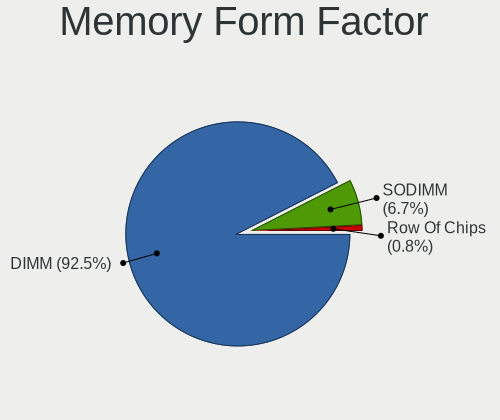

| Name         | Desktops | Percent |
|--------------|----------|---------|
| DIMM         | 111      | 92.5%   |
| SODIMM       | 8        | 6.67%   |
| Row Of Chips | 1        | 0.83%   |

Memory Size
-----------

Memory module size

| Size  | Desktops | Percent |
|-------|----------|---------|
| 8192  | 55       | 42.31%  |
| 4096  | 32       | 24.62%  |
| 16384 | 20       | 15.38%  |
| 32768 | 14       | 10.77%  |
| 2048  | 6        | 4.62%   |
| 1024  | 3        | 2.31%   |

Memory Speed
------------

Memory module speed

| Speed   | Desktops | Percent |
|---------|----------|---------|
| 1600    | 23       | 17.04%  |
| 3200    | 17       | 12.59%  |
| 2667    | 12       | 8.89%   |
| 2133    | 9        | 6.67%   |
| 1333    | 9        | 6.67%   |
| 2400    | 8        | 5.93%   |
| 3600    | 7        | 5.19%   |
| 3733    | 6        | 4.44%   |
| 3800    | 4        | 2.96%   |
| 2666    | 4        | 2.96%   |
| 1866    | 4        | 2.96%   |
| 4000    | 3        | 2.22%   |
| Unknown | 3        | 2.22%   |
| 6000    | 2        | 1.48%   |
| 3866    | 2        | 1.48%   |
| 3466    | 2        | 1.48%   |
| 2933    | 2        | 1.48%   |
| 1867    | 2        | 1.48%   |
| 1800    | 2        | 1.48%   |
| 1648    | 2        | 1.48%   |
| 1067    | 2        | 1.48%   |
| 5808    | 1        | 0.74%   |
| 4800    | 1        | 0.74%   |
| 4333    | 1        | 0.74%   |
| 4267    | 1        | 0.74%   |
| 3666    | 1        | 0.74%   |
| 3500    | 1        | 0.74%   |
| 3151    | 1        | 0.74%   |
| 2448    | 1        | 0.74%   |
| 800     | 1        | 0.74%   |
| 667     | 1        | 0.74%   |

Printers & scanners
-------------------

Printer Vendor
--------------

Printer device vendors

| Vendor             | Desktops | Percent |
|--------------------|----------|---------|
| Seiko Epson        | 3        | 42.86%  |
| Canon              | 2        | 28.57%  |
| Hewlett-Packard    | 1        | 14.29%  |
| Brother Industries | 1        | 14.29%  |

Printer Model
-------------

Printer device models

| Model                     | Desktops | Percent |
|---------------------------|----------|---------|
| Seiko Epson L120 Series   | 2        | 28.57%  |
| Seiko Epson L3110 Series  | 1        | 14.29%  |
| HP Smart Tank 610 series  | 1        | 14.29%  |
| Canon PIXMA MG2500 Series | 1        | 14.29%  |
| Canon G2010 series        | 1        | 14.29%  |
| Brother DCP-T700W         | 1        | 14.29%  |

Scanner Vendor
--------------

Scanner device vendors

Zero info for selected period =(

Scanner Model
-------------

Scanner device models

Zero info for selected period =(

Camera
------

Camera Vendor
-------------

Camera device vendors

| Vendor                        | Desktops | Percent |
|-------------------------------|----------|---------|
| Logitech                      | 13       | 19.12%  |
| Microdia                      | 8        | 11.76%  |
| A4Tech                        | 7        | 10.29%  |
| Jieli Technology              | 6        | 8.82%   |
| Z-Star Microelectronics       | 5        | 7.35%   |
| Realtek Semiconductor         | 4        | 5.88%   |
| Pixart Imaging                | 3        | 4.41%   |
| Cubeternet                    | 3        | 4.41%   |
| Samsung Electronics           | 2        | 2.94%   |
| Razer USA                     | 2        | 2.94%   |
| Generalplus Technology        | 2        | 2.94%   |
| Apple                         | 2        | 2.94%   |
| WaveRider Communications      | 1        | 1.47%   |
| Sunplus Innovation Technology | 1        | 1.47%   |
| SN0002                        | 1        | 1.47%   |
| Silicon Motion                | 1        | 1.47%   |
| OPPO Electronics              | 1        | 1.47%   |
| Microsoft                     | 1        | 1.47%   |
| KYE Systems (Mouse Systems)   | 1        | 1.47%   |
| GEMBIRD                       | 1        | 1.47%   |
| Aveo Technology               | 1        | 1.47%   |
| ARC International             | 1        | 1.47%   |
| Alcor Micro                   | 1        | 1.47%   |

Camera Model
------------

Camera device models

| Model                                                               | Desktops | Percent |
|---------------------------------------------------------------------|----------|---------|
| Jieli USB PHY 2.0                                                   | 5        | 7.35%   |
| Z-Star Venus USB2.0 Camera                                          | 4        | 5.88%   |
| Logitech Webcam C270                                                | 4        | 5.88%   |
| Pixart Imaging GE 1.3 MP MiniCam Pro                                | 3        | 4.41%   |
| Microdia Integrated Camera                                          | 3        | 4.41%   |
| A4Tech A4tech FHD 1080P PC Camera                                   | 3        | 4.41%   |
| Razer USA Gaming Webcam [Kiyo]                                      | 2        | 2.94%   |
| Microdia USB 2.0 Camera                                             | 2        | 2.94%   |
| Microdia Sonix USB 2.0 Camera                                       | 2        | 2.94%   |
| Logitech Webcam C310                                                | 2        | 2.94%   |
| Logitech HD Webcam C910                                             | 2        | 2.94%   |
| Logitech C922 Pro Stream Webcam                                     | 2        | 2.94%   |
| Apple iPhone 5/5C/5S/6/SE/7/8/X/XR                                  | 2        | 2.94%   |
| A4Tech PK-635G                                                      | 2        | 2.94%   |
| Z-Star A4 TECH USB2.0 PC Camera J                                   | 1        | 1.47%   |
| WaveRider USB 2.0 Camera                                            | 1        | 1.47%   |
| Sunplus FULL HD webcam                                              | 1        | 1.47%   |
| SN0002 1080P Web Camera                                             | 1        | 1.47%   |
| Silicon Motion 300k Pixel Camera                                    | 1        | 1.47%   |
| Samsung USB2.0 UVC HQ WebCam                                        | 1        | 1.47%   |
| Samsung Galaxy series, misc. (MTP mode)                             | 1        | 1.47%   |
| Realtek HP 1.0MP High Definition Webcam                             | 1        | 1.47%   |
| Realtek HD Camera                                                   | 1        | 1.47%   |
| Realtek Front Camera                                                | 1        | 1.47%   |
| Realtek BRI-S90AF                                                   | 1        | 1.47%   |
| OPPO realme Phone                                                   | 1        | 1.47%   |
| Microsoft Xbox NUI Camera                                           | 1        | 1.47%   |
| Microdia rapoo camera                                               | 1        | 1.47%   |
| Logitech StreamCam                                                  | 1        | 1.47%   |
| Logitech HD Webcam B910                                             | 1        | 1.47%   |
| Logitech HD Pro Webcam C920                                         | 1        | 1.47%   |
| KYE Systems (Mouse Systems) PC-LM1E Camera                          | 1        | 1.47%   |
| Jieli USB Composite Device                                          | 1        | 1.47%   |
| Generalplus GENERAL WEBCAM                                          | 1        | 1.47%   |
| Generalplus 808 Camera #9 (web-cam mode)                            | 1        | 1.47%   |
| GEMBIRD Generic UVC 1.00 camera [AppoTech AX2311]                   | 1        | 1.47%   |
| Cubeternet USB2.0 Camera                                            | 1        | 1.47%   |
| Cubeternet GL-UPC822 UVC WebCam                                     | 1        | 1.47%   |
| Cubeternet EtronTech CMOS based eSP570 WebCam [Onyx Titanium TC101] | 1        | 1.47%   |
| Aveo UVC camera (Bresser microscope)                                | 1        | 1.47%   |

Security
--------

Fingerprint Vendor
------------------

Fingerprint sensor vendors

Zero info for selected period =(

Fingerprint Model
-----------------

Fingerprint sensor models

Zero info for selected period =(

Chipcard Vendor
---------------

Chipcard module vendors

| Vendor      | Desktops | Percent |
|-------------|----------|---------|
| Alcor Micro | 1        | 100%    |

Chipcard Model
--------------

Chipcard module models

| Model                               | Desktops | Percent |
|-------------------------------------|----------|---------|
| Alcor Micro AU9540 Smartcard Reader | 1        | 100%    |

Unsupported
-----------

Unsupported Devices
-------------------

Total unsupported devices on board

| Total | Desktops | Percent |
|-------|----------|---------|
| 0     | 229      | 84.19%  |
| 1     | 38       | 13.97%  |
| 2     | 4        | 1.47%   |
| 3     | 1        | 0.37%   |

Unsupported Device Types
------------------------

Types of unsupported devices

| Type                     | Desktops | Percent |
|--------------------------|----------|---------|
| Net/wireless             | 19       | 40.43%  |
| Graphics card            | 16       | 34.04%  |
| Unassigned class         | 2        | 4.26%   |
| Network                  | 2        | 4.26%   |
| Communication controller | 2        | 4.26%   |
| Storage/raid             | 1        | 2.13%   |
| Sound                    | 1        | 2.13%   |
| Net/ethernet             | 1        | 2.13%   |
| Chipcard                 | 1        | 2.13%   |
| Camera                   | 1        | 2.13%   |
| Bluetooth                | 1        | 2.13%   |

