Linux in Philippines - Tested Hardware & Statistics (Desktops)
--------------------------------------------------------------

A project to collect tested hardware configurations for Linux in Philippines.

Anyone can contribute to this report by the [hw-probe](https://github.com/linuxhw/hw-probe) tool:

    sudo -E hw-probe -all -upload

Please contribute! Especially if your hardware is rare.

Contents
--------

* [ Test Cases ](#test-cases)

* [ System ](#system)
  - [ OS                       ](#os)
  - [ OS Family                ](#os-family)
  - [ Kernel                   ](#kernel)
  - [ Kernel Family            ](#kernel-family)
  - [ Kernel Major Ver.        ](#kernel-major-ver)
  - [ Arch                     ](#arch)
  - [ DE                       ](#de)
  - [ Display Server           ](#display-server)
  - [ Display Manager          ](#display-manager)
  - [ OS Lang                  ](#os-lang)
  - [ Boot Mode                ](#boot-mode)
  - [ Filesystem               ](#filesystem)
  - [ Part. scheme             ](#part-scheme)
  - [ Dual Boot with Linux/BSD ](#dual-boot-with-linuxbsd)
  - [ Dual Boot (Win)          ](#dual-boot-win)

* [ Board ](#board)
  - [ Vendor                   ](#vendor)
  - [ Model                    ](#model)
  - [ Model Family             ](#model-family)
  - [ MFG Year                 ](#mfg-year)
  - [ Form Factor              ](#form-factor)
  - [ Secure Boot              ](#secure-boot)
  - [ Coreboot                 ](#coreboot)
  - [ RAM Size                 ](#ram-size)
  - [ RAM Used                 ](#ram-used)
  - [ Total Drives             ](#total-drives)
  - [ Has CD-ROM               ](#has-cd-rom)
  - [ Has Ethernet             ](#has-ethernet)
  - [ Has WiFi                 ](#has-wifi)
  - [ Has Bluetooth            ](#has-bluetooth)

* [ Location ](#location)
  - [ Country                  ](#country)
  - [ City                     ](#city)

* [ Drives ](#drives)
  - [ Drive Vendor             ](#drive-vendor)
  - [ Drive Model              ](#drive-model)
  - [ HDD Vendor               ](#hdd-vendor)
  - [ SSD Vendor               ](#ssd-vendor)
  - [ Drive Kind               ](#drive-kind)
  - [ Drive Connector          ](#drive-connector)
  - [ Drive Size               ](#drive-size)
  - [ Space Total              ](#space-total)
  - [ Space Used               ](#space-used)
  - [ Malfunc. Drives          ](#malfunc-drives)
  - [ Malfunc. Drive Vendor    ](#malfunc-drive-vendor)
  - [ Malfunc. HDD Vendor      ](#malfunc-hdd-vendor)
  - [ Malfunc. Drive Kind      ](#malfunc-drive-kind)
  - [ Failed Drives            ](#failed-drives)
  - [ Failed Drive Vendor      ](#failed-drive-vendor)
  - [ Drive Status             ](#drive-status)

* [ Storage controller ](#storage-controller)
  - [ Storage Vendor           ](#storage-vendor)
  - [ Storage Model            ](#storage-model)
  - [ Storage Kind             ](#storage-kind)

* [ Processor ](#processor)
  - [ CPU Vendor               ](#cpu-vendor)
  - [ CPU Model                ](#cpu-model)
  - [ CPU Model Family         ](#cpu-model-family)
  - [ CPU Cores                ](#cpu-cores)
  - [ CPU Sockets              ](#cpu-sockets)
  - [ CPU Threads              ](#cpu-threads)
  - [ CPU Op-Modes             ](#cpu-op-modes)
  - [ CPU Microcode            ](#cpu-microcode)
  - [ CPU Microarch            ](#cpu-microarch)

* [ Graphics ](#graphics)
  - [ GPU Vendor               ](#gpu-vendor)
  - [ GPU Model                ](#gpu-model)
  - [ GPU Combo                ](#gpu-combo)
  - [ GPU Driver               ](#gpu-driver)
  - [ GPU Memory               ](#gpu-memory)

* [ Monitor ](#monitor)
  - [ Monitor Vendor           ](#monitor-vendor)
  - [ Monitor Model            ](#monitor-model)
  - [ Monitor Resolution       ](#monitor-resolution)
  - [ Monitor Diagonal         ](#monitor-diagonal)
  - [ Monitor Width            ](#monitor-width)
  - [ Aspect Ratio             ](#aspect-ratio)
  - [ Monitor Area             ](#monitor-area)
  - [ Pixel Density            ](#pixel-density)
  - [ Multiple Monitors        ](#multiple-monitors)

* [ Network ](#network)
  - [ Net Controller Vendor    ](#net-controller-vendor)
  - [ Net Controller Model     ](#net-controller-model)
  - [ Wireless Vendor          ](#wireless-vendor)
  - [ Wireless Model           ](#wireless-model)
  - [ Ethernet Vendor          ](#ethernet-vendor)
  - [ Ethernet Model           ](#ethernet-model)
  - [ Net Controller Kind      ](#net-controller-kind)
  - [ Used Controller          ](#used-controller)
  - [ NICs                     ](#nics)
  - [ IPv6                     ](#ipv6)

* [ Bluetooth ](#bluetooth)
  - [ Bluetooth Vendor         ](#bluetooth-vendor)
  - [ Bluetooth Model          ](#bluetooth-model)

* [ Sound ](#sound)
  - [ Sound Vendor             ](#sound-vendor)
  - [ Sound Model              ](#sound-model)

* [ Memory ](#memory)
  - [ Memory Vendor            ](#memory-vendor)
  - [ Memory Model             ](#memory-model)
  - [ Memory Kind              ](#memory-kind)
  - [ Memory Form Factor       ](#memory-form-factor)
  - [ Memory Size              ](#memory-size)
  - [ Memory Speed             ](#memory-speed)

* [ Printers & scanners ](#printers--scanners)
  - [ Printer Vendor           ](#printer-vendor)
  - [ Printer Model            ](#printer-model)
  - [ Scanner Vendor           ](#scanner-vendor)
  - [ Scanner Model            ](#scanner-model)

* [ Camera ](#camera)
  - [ Camera Vendor            ](#camera-vendor)
  - [ Camera Model             ](#camera-model)

* [ Security ](#security)
  - [ Fingerprint Vendor       ](#fingerprint-vendor)
  - [ Fingerprint Model        ](#fingerprint-model)
  - [ Chipcard Vendor          ](#chipcard-vendor)
  - [ Chipcard Model           ](#chipcard-model)

* [ Unsupported ](#unsupported)
  - [ Unsupported Devices      ](#unsupported-devices)
  - [ Unsupported Device Types ](#unsupported-device-types)

Test Cases
----------

Total: 320

| Vendor        | Model                       | Probe                                                      | Date         |
|---------------|-----------------------------|------------------------------------------------------------|--------------|
| MSI           | PRO B760M-G DDR4            | [a8f42a3c96](https://linux-hardware.org/?probe=a8f42a3c96) | Sep 05, 2023 |
| Dell          | 0G679R A00                  | [30755bff92](https://linux-hardware.org/?probe=30755bff92) | Sep 03, 2023 |
| Intel         | H81                         | [75aabbccf5](https://linux-hardware.org/?probe=75aabbccf5) | Sep 03, 2023 |
| Dell          | 0G679R A00                  | [cc4b4ad10d](https://linux-hardware.org/?probe=cc4b4ad10d) | Sep 01, 2023 |
| MSI           | H110M PRO-VD PLUS           | [a75e60a457](https://linux-hardware.org/?probe=a75e60a457) | Aug 30, 2023 |
| Gigabyte      | A320M-S2H-CF                | [4ea7c3580b](https://linux-hardware.org/?probe=4ea7c3580b) | Aug 26, 2023 |
| EMAXX TECH... | EMX-B450M-GAMING            | [3f5c0e83d4](https://linux-hardware.org/?probe=3f5c0e83d4) | Aug 06, 2023 |
| MSI           | A320M PRO-VH                | [0728a96775](https://linux-hardware.org/?probe=0728a96775) | Jul 29, 2023 |
| Gigabyte      | B360M HD3                   | [900f299e10](https://linux-hardware.org/?probe=900f299e10) | Jul 26, 2023 |
| Samsung       | DeskTop System              | [c1d4c8efb2](https://linux-hardware.org/?probe=c1d4c8efb2) | Jul 24, 2023 |
| Gigabyte      | X570 AORUS MASTER           | [d1dee26c33](https://linux-hardware.org/?probe=d1dee26c33) | Jul 20, 2023 |
| Samsung       | DeskTop System              | [715ff16efc](https://linux-hardware.org/?probe=715ff16efc) | Jul 17, 2023 |
| MSI           | MAG B550M MORTAR WIFI       | [4d00148664](https://linux-hardware.org/?probe=4d00148664) | Jul 16, 2023 |
| ASUSTek       | P8Z77-V LX2                 | [eedcf805f7](https://linux-hardware.org/?probe=eedcf805f7) | Jul 14, 2023 |
| MSI           | MAG B550M MORTAR WIFI       | [75d40e5a2b](https://linux-hardware.org/?probe=75d40e5a2b) | Jul 14, 2023 |
| GPD           | G1618-03                    | [0cb58087bf](https://linux-hardware.org/?probe=0cb58087bf) | Jul 04, 2023 |
| MSI           | MAG B550M MORTAR WIFI       | [fc70411ea4](https://linux-hardware.org/?probe=fc70411ea4) | Jul 03, 2023 |
| ASUSTek       | H110M-D                     | [f95d5e83f5](https://linux-hardware.org/?probe=f95d5e83f5) | Jun 25, 2023 |
| Gigabyte      | A320M-S2H V2-CF             | [9408842ffc](https://linux-hardware.org/?probe=9408842ffc) | Jun 24, 2023 |
| Biostar       | B450MH                      | [04c924ce6f](https://linux-hardware.org/?probe=04c924ce6f) | Jun 16, 2023 |
| Lenovo        | 315F SDK0J40697 WIN 3305... | [dac73c9b94](https://linux-hardware.org/?probe=dac73c9b94) | Jun 16, 2023 |
| HP            | 1496                        | [7189030996](https://linux-hardware.org/?probe=7189030996) | Jun 11, 2023 |
| HP            | 1496                        | [68db57fde8](https://linux-hardware.org/?probe=68db57fde8) | Jun 10, 2023 |
| AMD           | A88                         | [a7f64b7e4b](https://linux-hardware.org/?probe=a7f64b7e4b) | Jun 05, 2023 |
| Gigabyte      | Z590 AORUS ULTRA            | [44571410f0](https://linux-hardware.org/?probe=44571410f0) | Jun 03, 2023 |
| Gigabyte      | Z590 AORUS ULTRA            | [d54d77b051](https://linux-hardware.org/?probe=d54d77b051) | Jun 03, 2023 |
| ASUSTek       | PRIME A320M-K               | [ebd7782079](https://linux-hardware.org/?probe=ebd7782079) | May 31, 2023 |
| ASUSTek       | P8H61-M LX3 PLUS R2.0       | [953ee1ef05](https://linux-hardware.org/?probe=953ee1ef05) | May 31, 2023 |
| Biostar       | B450MH                      | [36947ca7e1](https://linux-hardware.org/?probe=36947ca7e1) | May 30, 2023 |
| Pegatron      | NARRA3                      | [5c016d4faf](https://linux-hardware.org/?probe=5c016d4faf) | May 28, 2023 |
| Unknown       | SKYBAY                      | [7884ad9bf4](https://linux-hardware.org/?probe=7884ad9bf4) | May 25, 2023 |
| Gigabyte      | Z590 AORUS ULTRA            | [b291f783a2](https://linux-hardware.org/?probe=b291f783a2) | May 25, 2023 |
| Gigabyte      | Z590 AORUS ULTRA            | [76bd19169a](https://linux-hardware.org/?probe=76bd19169a) | May 22, 2023 |
| Gigabyte      | Z590 AORUS ULTRA            | [f511a54601](https://linux-hardware.org/?probe=f511a54601) | May 21, 2023 |
| Gigabyte      | Z590 AORUS ULTRA            | [e4b87f1e56](https://linux-hardware.org/?probe=e4b87f1e56) | May 19, 2023 |
| ECS           | G41T-R3                     | [fcbdd2737a](https://linux-hardware.org/?probe=fcbdd2737a) | Apr 26, 2023 |
| Gigabyte      | GA-MA785GM-US2H             | [96f6b41a5c](https://linux-hardware.org/?probe=96f6b41a5c) | Apr 19, 2023 |
| ECS           | G41T-R3                     | [2c589a38f7](https://linux-hardware.org/?probe=2c589a38f7) | Apr 13, 2023 |
| HP            | 3397                        | [5a25984320](https://linux-hardware.org/?probe=5a25984320) | Mar 31, 2023 |
| ASRock        | H61M-HVS                    | [0672578da7](https://linux-hardware.org/?probe=0672578da7) | Mar 30, 2023 |
| ASUSTek       | ROG STRIX B450-F GAMING ... | [4eb8132fd2](https://linux-hardware.org/?probe=4eb8132fd2) | Mar 24, 2023 |
| EMAXX TECH... | EMX-B450M-GAMING            | [f147ee8484](https://linux-hardware.org/?probe=f147ee8484) | Mar 21, 2023 |
| ASRock        | B450M Steel Legend          | [ae258d05b1](https://linux-hardware.org/?probe=ae258d05b1) | Mar 16, 2023 |
| Gigabyte      | Z590 AORUS ULTRA            | [26ecc0b7a2](https://linux-hardware.org/?probe=26ecc0b7a2) | Mar 10, 2023 |
| ASUSTek       | ROG STRIX B450-F GAMING ... | [ca7d449be6](https://linux-hardware.org/?probe=ca7d449be6) | Feb 28, 2023 |
| MSI           | A320M PRO-VH                | [e1266ebf79](https://linux-hardware.org/?probe=e1266ebf79) | Feb 27, 2023 |
| ASUSTek       | A68HM-K                     | [d6f5b00609](https://linux-hardware.org/?probe=d6f5b00609) | Feb 26, 2023 |
| ASUSTek       | A68HM-K                     | [89cd5d5c44](https://linux-hardware.org/?probe=89cd5d5c44) | Feb 26, 2023 |
| ASUSTek       | TUF Gaming B450M-PRO II     | [99b1ae3224](https://linux-hardware.org/?probe=99b1ae3224) | Feb 25, 2023 |
| MSI           | K9N6PGM2-V2                 | [e88df81d6f](https://linux-hardware.org/?probe=e88df81d6f) | Feb 24, 2023 |
| Biostar       | A320MH                      | [b6f7ef6e4a](https://linux-hardware.org/?probe=b6f7ef6e4a) | Feb 23, 2023 |
| Biostar       | A320MH                      | [e80f86a0bf](https://linux-hardware.org/?probe=e80f86a0bf) | Feb 23, 2023 |
| Dell          | 0W2F8G A00                  | [aa7bf98168](https://linux-hardware.org/?probe=aa7bf98168) | Feb 16, 2023 |
| Gigabyte      | Z590 AORUS ULTRA            | [eb8434e607](https://linux-hardware.org/?probe=eb8434e607) | Feb 15, 2023 |
| ASUSTek       | BM6630_BM6330_BP6230        | [abe1e578c0](https://linux-hardware.org/?probe=abe1e578c0) | Feb 12, 2023 |
| Dell          | 0W2F8G A00                  | [b0694cfc5c](https://linux-hardware.org/?probe=b0694cfc5c) | Feb 06, 2023 |
| Gigabyte      | H97M-D3H                    | [3ccdc4fa2b](https://linux-hardware.org/?probe=3ccdc4fa2b) | Jan 31, 2023 |
| MSI           | MAG B560M MORTAR WIFI       | [33f6781ba8](https://linux-hardware.org/?probe=33f6781ba8) | Jan 08, 2023 |
| Gigabyte      | B550 AORUS PRO AC           | [cfeb9545a3](https://linux-hardware.org/?probe=cfeb9545a3) | Dec 21, 2022 |
| Biostar       | A520MH                      | [b6c4fdd80b](https://linux-hardware.org/?probe=b6c4fdd80b) | Dec 11, 2022 |
| ASUSTek       | BM5242                      | [d37b75dc52](https://linux-hardware.org/?probe=d37b75dc52) | Dec 10, 2022 |
| ASUSTek       | BM5242                      | [7c17c8d773](https://linux-hardware.org/?probe=7c17c8d773) | Dec 10, 2022 |
| Intel         | D946GZAB AAD66610-302       | [5433ee5bc1](https://linux-hardware.org/?probe=5433ee5bc1) | Nov 22, 2022 |
| ASRock        | B450M Steel Legend          | [4792cdbba2](https://linux-hardware.org/?probe=4792cdbba2) | Nov 21, 2022 |
| MSI           | B450M BAZOOKA PLUS          | [f63b2757ea](https://linux-hardware.org/?probe=f63b2757ea) | Nov 12, 2022 |
| ASUSTek       | A68HM-K                     | [70daf967f2](https://linux-hardware.org/?probe=70daf967f2) | Nov 10, 2022 |
| Gigabyte      | B550 VISION D-P             | [c08b835f58](https://linux-hardware.org/?probe=c08b835f58) | Nov 07, 2022 |
| MSI           | MAG B550M MORTAR WIFI       | [7db5fcb7b0](https://linux-hardware.org/?probe=7db5fcb7b0) | Nov 05, 2022 |
| Gigabyte      | B450 AORUS M                | [e4dfd41fa4](https://linux-hardware.org/?probe=e4dfd41fa4) | Nov 02, 2022 |
| HP            | 3048h                       | [6ce1d2bf43](https://linux-hardware.org/?probe=6ce1d2bf43) | Oct 30, 2022 |
| ASRock        | H61M-VS                     | [9a48b2a679](https://linux-hardware.org/?probe=9a48b2a679) | Oct 28, 2022 |
| MSI           | MAG A520M VECTOR WIFI       | [91a8a52c4a](https://linux-hardware.org/?probe=91a8a52c4a) | Oct 25, 2022 |
| Gigabyte      | Z97N-WIFI                   | [dd5c78f136](https://linux-hardware.org/?probe=dd5c78f136) | Oct 24, 2022 |
| Gigabyte      | Z97N-WIFI                   | [10d8d16b6c](https://linux-hardware.org/?probe=10d8d16b6c) | Oct 24, 2022 |
| Gigabyte      | B550M DS3H                  | [d267c64062](https://linux-hardware.org/?probe=d267c64062) | Oct 19, 2022 |
| Gigabyte      | X570 AORUS MASTER           | [fc0a9a6b24](https://linux-hardware.org/?probe=fc0a9a6b24) | Oct 18, 2022 |
| MSI           | H110M PRO-D                 | [d0580b46f2](https://linux-hardware.org/?probe=d0580b46f2) | Oct 18, 2022 |
| Gigabyte      | B550 AORUS PRO AC           | [9f52e46640](https://linux-hardware.org/?probe=9f52e46640) | Oct 11, 2022 |
| Gigabyte      | X570 AORUS MASTER           | [aa7d067a6f](https://linux-hardware.org/?probe=aa7d067a6f) | Oct 11, 2022 |
| Gigabyte      | F2A68HM-S1                  | [379f85dfb3](https://linux-hardware.org/?probe=379f85dfb3) | Oct 09, 2022 |
| Gigabyte      | F2A68HM-S1                  | [f02be8db4c](https://linux-hardware.org/?probe=f02be8db4c) | Oct 09, 2022 |
| Gigabyte      | B550 AORUS PRO AC           | [700c5cc2bc](https://linux-hardware.org/?probe=700c5cc2bc) | Oct 05, 2022 |
| Gigabyte      | A320M-S2H V2-CF             | [37dbdb48dd](https://linux-hardware.org/?probe=37dbdb48dd) | Sep 20, 2022 |
| Gigabyte      | A320M-S2H V2-CF             | [4d460404c8](https://linux-hardware.org/?probe=4d460404c8) | Sep 16, 2022 |
| ASUSTek       | ROG STRIX B660-A GAMING ... | [34c1beb103](https://linux-hardware.org/?probe=34c1beb103) | Sep 13, 2022 |
| Gigabyte      | A320M-S2H V2-CF             | [7ce5d8e865](https://linux-hardware.org/?probe=7ce5d8e865) | Sep 12, 2022 |
| Gigabyte      | A320M-S2H V2-CF             | [ec5f57ab65](https://linux-hardware.org/?probe=ec5f57ab65) | Sep 12, 2022 |
| Biostar       | A780L3B                     | [bc83f32ddf](https://linux-hardware.org/?probe=bc83f32ddf) | Sep 12, 2022 |
| Biostar       | A780L3B                     | [61057dc040](https://linux-hardware.org/?probe=61057dc040) | Sep 12, 2022 |
| Biostar       | A780L3B                     | [6463bcc136](https://linux-hardware.org/?probe=6463bcc136) | Sep 10, 2022 |
| Biostar       | A780L3B                     | [f65db263d7](https://linux-hardware.org/?probe=f65db263d7) | Sep 10, 2022 |
| Gigabyte      | GA-990FXA-UD5               | [b77aa249c8](https://linux-hardware.org/?probe=b77aa249c8) | Sep 09, 2022 |
| Gigabyte      | GA-990FXA-UD5               | [dc69b9dde6](https://linux-hardware.org/?probe=dc69b9dde6) | Sep 09, 2022 |
| ASUSTek       | TUF B350M-PLUS GAMING       | [051ea3b002](https://linux-hardware.org/?probe=051ea3b002) | Sep 08, 2022 |
| HP            | 83F3                        | [71d62174e2](https://linux-hardware.org/?probe=71d62174e2) | Aug 27, 2022 |
| HP            | 1850                        | [85b5eedc40](https://linux-hardware.org/?probe=85b5eedc40) | Aug 26, 2022 |
| ASUSTek       | PRIME B450M-A               | [bfdd1ab294](https://linux-hardware.org/?probe=bfdd1ab294) | Aug 23, 2022 |
| Gigabyte      | H77N-WIFI                   | [7a37d5e6a5](https://linux-hardware.org/?probe=7a37d5e6a5) | Aug 07, 2022 |
| Gigabyte      | H77N-WIFI                   | [db237c843c](https://linux-hardware.org/?probe=db237c843c) | Aug 06, 2022 |
| Gigabyte      | H77N-WIFI                   | [5251e7868a](https://linux-hardware.org/?probe=5251e7868a) | Aug 06, 2022 |
| Gigabyte      | H81M-D2V                    | [64da165357](https://linux-hardware.org/?probe=64da165357) | Aug 01, 2022 |
| MSI           | PRO B660M-A WIFI DDR4       | [a0e19ce405](https://linux-hardware.org/?probe=a0e19ce405) | Jul 26, 2022 |
| Gigabyte      | H410M H V3                  | [37521f84c8](https://linux-hardware.org/?probe=37521f84c8) | Jul 20, 2022 |
| ASUSTek       | M4A88T-M                    | [57ed9f00c7](https://linux-hardware.org/?probe=57ed9f00c7) | Jul 18, 2022 |
| ASUSTek       | M4A88T-M                    | [f99189e2d0](https://linux-hardware.org/?probe=f99189e2d0) | Jul 18, 2022 |
| YANYU         | EPIC-C19                    | [5bda78db57](https://linux-hardware.org/?probe=5bda78db57) | Jul 11, 2022 |
| Gigabyte      | A520M DS3H                  | [b56fe3beb3](https://linux-hardware.org/?probe=b56fe3beb3) | Jun 28, 2022 |
| MSI           | A320M PRO-VH                | [47f765c61f](https://linux-hardware.org/?probe=47f765c61f) | Jun 14, 2022 |
| MSI           | H81M-E33                    | [49191a1c98](https://linux-hardware.org/?probe=49191a1c98) | Jun 08, 2022 |
| Gigabyte      | F2A68HM-S1                  | [017e41e32c](https://linux-hardware.org/?probe=017e41e32c) | Jun 07, 2022 |
| MSI           | H81M-E33                    | [6a2d6cbe74](https://linux-hardware.org/?probe=6a2d6cbe74) | Jun 04, 2022 |
| ASUSTek       | H81M-K                      | [512fb81a9b](https://linux-hardware.org/?probe=512fb81a9b) | May 31, 2022 |
| MSI           | Z97 XPOWER AC               | [dd5c7a981a](https://linux-hardware.org/?probe=dd5c7a981a) | May 29, 2022 |
| MSI           | MS-7717                     | [101b488b80](https://linux-hardware.org/?probe=101b488b80) | May 28, 2022 |
| MSI           | MS-7717                     | [9b0c2d0d8c](https://linux-hardware.org/?probe=9b0c2d0d8c) | May 28, 2022 |
| ECS           | A68M-C4DL                   | [b8c60cf7a0](https://linux-hardware.org/?probe=b8c60cf7a0) | May 09, 2022 |
| HP            | 212A                        | [acd660910f](https://linux-hardware.org/?probe=acd660910f) | May 09, 2022 |
| MSI           | B450M MORTAR                | [74323309f1](https://linux-hardware.org/?probe=74323309f1) | Apr 20, 2022 |
| MSI           | H510M-A PRO                 | [03b7f74d31](https://linux-hardware.org/?probe=03b7f74d31) | Mar 29, 2022 |
| MSI           | H510M-A PRO                 | [42e921877b](https://linux-hardware.org/?probe=42e921877b) | Mar 29, 2022 |
| HP            | 2B38                        | [99fd9bb200](https://linux-hardware.org/?probe=99fd9bb200) | Mar 27, 2022 |
| MSI           | MS-7619                     | [65c73f26b0](https://linux-hardware.org/?probe=65c73f26b0) | Mar 22, 2022 |
| MSI           | H510M PRO-E                 | [111cf21b7f](https://linux-hardware.org/?probe=111cf21b7f) | Mar 21, 2022 |
| ASUSTek       | ROG STRIX Z490-I GAMING     | [95373e24b7](https://linux-hardware.org/?probe=95373e24b7) | Mar 16, 2022 |
| MSI           | B560M PRO-VDH WIFI          | [c15007b668](https://linux-hardware.org/?probe=c15007b668) | Mar 15, 2022 |
| MSI           | H510M PRO-E                 | [ad5840ceb1](https://linux-hardware.org/?probe=ad5840ceb1) | Mar 14, 2022 |
| Gigabyte      | B450 I AORUS PRO WIFI-CF    | [bd9b6ec157](https://linux-hardware.org/?probe=bd9b6ec157) | Mar 11, 2022 |
| Gigabyte      | Z590 AORUS ULTRA            | [a1b757e234](https://linux-hardware.org/?probe=a1b757e234) | Mar 05, 2022 |
| ASUSTek       | H81M-D                      | [4f6714e804](https://linux-hardware.org/?probe=4f6714e804) | Mar 01, 2022 |
| Dell          | 00V62H A01                  | [70f59ecacf](https://linux-hardware.org/?probe=70f59ecacf) | Feb 28, 2022 |
| ASUSTek       | H81M-D                      | [2bc13ee0e2](https://linux-hardware.org/?probe=2bc13ee0e2) | Feb 28, 2022 |
| ASUSTek       | H81M-D                      | [a8334fb3c3](https://linux-hardware.org/?probe=a8334fb3c3) | Feb 28, 2022 |
| Gigabyte      | A320M-S2H V2-CF             | [f269ebd3a2](https://linux-hardware.org/?probe=f269ebd3a2) | Feb 28, 2022 |
| ASUSTek       | A88XM-PLUS                  | [3a6147e5db](https://linux-hardware.org/?probe=3a6147e5db) | Feb 16, 2022 |
| Gigabyte      | B450 I AORUS PRO WIFI-CF    | [a25fea3795](https://linux-hardware.org/?probe=a25fea3795) | Feb 12, 2022 |
| Gigabyte      | Z590 AORUS ULTRA            | [da8ce5d5b5](https://linux-hardware.org/?probe=da8ce5d5b5) | Feb 05, 2022 |
| Gigabyte      | Z590 AORUS ULTRA            | [56bbe3562f](https://linux-hardware.org/?probe=56bbe3562f) | Jan 15, 2022 |
| Gigabyte      | Z590 AORUS ULTRA            | [266128f234](https://linux-hardware.org/?probe=266128f234) | Jan 06, 2022 |
| Gigabyte      | Z590 AORUS ULTRA            | [900b250e00](https://linux-hardware.org/?probe=900b250e00) | Jan 05, 2022 |
| Gigabyte      | G41M-Combo                  | [e0b5bc37a4](https://linux-hardware.org/?probe=e0b5bc37a4) | Dec 18, 2021 |
| EMAXX TECH... | EMX-A55GT-iCafe V1.0        | [d6d799c3d8](https://linux-hardware.org/?probe=d6d799c3d8) | Nov 28, 2021 |
| ASUSTek       | P8B75-M                     | [31e306a09d](https://linux-hardware.org/?probe=31e306a09d) | Nov 26, 2021 |
| Gigabyte      | B450M DS3H V2               | [2302fee654](https://linux-hardware.org/?probe=2302fee654) | Nov 09, 2021 |
| MSI           | Z97 GAMING 3                | [249f25308e](https://linux-hardware.org/?probe=249f25308e) | Nov 08, 2021 |
| MSI           | B350M PRO-VDH               | [7e77378fb3](https://linux-hardware.org/?probe=7e77378fb3) | Nov 07, 2021 |
| ECS           | G41T-R3                     | [892069341e](https://linux-hardware.org/?probe=892069341e) | Oct 31, 2021 |
| ASUSTek       | F2A85-M LE                  | [0ac8e061f1](https://linux-hardware.org/?probe=0ac8e061f1) | Oct 31, 2021 |
| ASUSTek       | F2A85-M LE                  | [655000678d](https://linux-hardware.org/?probe=655000678d) | Oct 30, 2021 |
| EMAXX TECH... | EMX-MCP61D3-iCafe V2.0      | [cb279cfeaf](https://linux-hardware.org/?probe=cb279cfeaf) | Oct 09, 2021 |
| EMAXX TECH... | EMX-MCP61D3-iCafe V2.0      | [2444a742a8](https://linux-hardware.org/?probe=2444a742a8) | Oct 09, 2021 |
| ASUSTek       | GD30CI                      | [9782c6bff5](https://linux-hardware.org/?probe=9782c6bff5) | Sep 25, 2021 |
| ASUSTek       | EX-H310M-V3 R2.0            | [a9a92c303c](https://linux-hardware.org/?probe=a9a92c303c) | Sep 24, 2021 |
| JOOYON        | IPM41-D3G                   | [54cc0ff25b](https://linux-hardware.org/?probe=54cc0ff25b) | Sep 17, 2021 |
| JOOYON        | IPM41-D3G                   | [4f8d90f8ef](https://linux-hardware.org/?probe=4f8d90f8ef) | Sep 12, 2021 |
| ASUSTek       | P8H61-M LX3 PLUS            | [f6388fb1b0](https://linux-hardware.org/?probe=f6388fb1b0) | Sep 07, 2021 |
| ASUSTek       | P8H61-M LX3 PLUS            | [a19fc44e26](https://linux-hardware.org/?probe=a19fc44e26) | Sep 07, 2021 |
| Gigabyte      | F2A58M-DS2                  | [8ea19cfa9d](https://linux-hardware.org/?probe=8ea19cfa9d) | Aug 25, 2021 |
| Unknown       | Ionics Carrier Board Adv... | [62a47a18c2](https://linux-hardware.org/?probe=62a47a18c2) | Aug 12, 2021 |
| ECS           | H81H3-M4                    | [a595ba80d3](https://linux-hardware.org/?probe=a595ba80d3) | Aug 08, 2021 |
| ASUSTek       | P8H61-M LX3 PLUS R2.0       | [90e7e1e008](https://linux-hardware.org/?probe=90e7e1e008) | Aug 05, 2021 |
| ASRock        | N68C-GS4 FX                 | [4bf2729f88](https://linux-hardware.org/?probe=4bf2729f88) | Aug 04, 2021 |
| Gigabyte      | F2A68HM-S1                  | [57f0c24236](https://linux-hardware.org/?probe=57f0c24236) | Aug 03, 2021 |
| Gigabyte      | MZGLKCP-00                  | [4d9f134679](https://linux-hardware.org/?probe=4d9f134679) | Jul 30, 2021 |
| Biostar       | H110MHV3                    | [28344398db](https://linux-hardware.org/?probe=28344398db) | Jul 27, 2021 |
| ASRock        | B450M Steel Legend          | [8165fc4d95](https://linux-hardware.org/?probe=8165fc4d95) | Jul 06, 2021 |
| Biostar       | A320MH                      | [16e2552ccc](https://linux-hardware.org/?probe=16e2552ccc) | Jun 20, 2021 |
| Dell          | 040DDP A01                  | [8a9bdad1fd](https://linux-hardware.org/?probe=8a9bdad1fd) | Jun 10, 2021 |
| ASRock        | B450M Steel Legend          | [cc3c9e3798](https://linux-hardware.org/?probe=cc3c9e3798) | Jun 08, 2021 |
| MSI           | A68HM-E33 V2                | [10ccc894a1](https://linux-hardware.org/?probe=10ccc894a1) | Jun 07, 2021 |
| Gigabyte      | H61M-DS2                    | [e31519274b](https://linux-hardware.org/?probe=e31519274b) | May 22, 2021 |
| Gigabyte      | H61M-DS2                    | [523ced455c](https://linux-hardware.org/?probe=523ced455c) | May 22, 2021 |
| Acer          | Aspire X1900                | [c4e0203ed9](https://linux-hardware.org/?probe=c4e0203ed9) | May 19, 2021 |
| MSI           | A68HM-E33 V2                | [a14cf2a48e](https://linux-hardware.org/?probe=a14cf2a48e) | May 18, 2021 |
| ASUSTek       | TUF B450M-PRO GAMING        | [ac4ce770fc](https://linux-hardware.org/?probe=ac4ce770fc) | May 10, 2021 |
| ASRock        | B450M Steel Legend          | [8467906058](https://linux-hardware.org/?probe=8467906058) | May 04, 2021 |
| ASRock        | B450M Steel Legend          | [55bfc7d608](https://linux-hardware.org/?probe=55bfc7d608) | May 03, 2021 |
| ASUSTek       | EX-B365M-V5                 | [c169d54571](https://linux-hardware.org/?probe=c169d54571) | Apr 25, 2021 |
| ASRock        | B450M Steel Legend          | [b866ec6925](https://linux-hardware.org/?probe=b866ec6925) | Apr 20, 2021 |
| Gigabyte      | H61M-DS2                    | [f66e7cbdfd](https://linux-hardware.org/?probe=f66e7cbdfd) | Apr 11, 2021 |
| ASUSTek       | TUF B450M-PRO GAMING        | [4c93424ea5](https://linux-hardware.org/?probe=4c93424ea5) | Mar 26, 2021 |
| MSI           | Z270 GAMING M7              | [b72439b299](https://linux-hardware.org/?probe=b72439b299) | Mar 17, 2021 |
| Gigabyte      | GA-MA78GM-US2H              | [0f6037a19e](https://linux-hardware.org/?probe=0f6037a19e) | Mar 14, 2021 |
| MSI           | Z97 XPOWER AC               | [c627833398](https://linux-hardware.org/?probe=c627833398) | Feb 23, 2021 |
| Gigabyte      | B450 AORUS ELITE            | [3582928f83](https://linux-hardware.org/?probe=3582928f83) | Feb 20, 2021 |
| ASUSTek       | P8H61-M LX3 PLUS R2.0       | [d392637e95](https://linux-hardware.org/?probe=d392637e95) | Feb 20, 2021 |
| AMD           | A88                         | [11ecb6d298](https://linux-hardware.org/?probe=11ecb6d298) | Feb 14, 2021 |
| Dell          | 0JP3NX A00                  | [3e5d4f837a](https://linux-hardware.org/?probe=3e5d4f837a) | Feb 10, 2021 |
| JOOYON        | IPM41-D3G                   | [6feab903f8](https://linux-hardware.org/?probe=6feab903f8) | Feb 05, 2021 |
| JOOYON        | IPM41-D3G                   | [5fa1dabba9](https://linux-hardware.org/?probe=5fa1dabba9) | Feb 05, 2021 |
| Dell          | 0JP3NX A00                  | [1f5d53a4a2](https://linux-hardware.org/?probe=1f5d53a4a2) | Feb 03, 2021 |
| QTQD          | Unknown                     | [2912607416](https://linux-hardware.org/?probe=2912607416) | Jan 27, 2021 |
| Gigabyte      | H97M-D3H                    | [76f0201d14](https://linux-hardware.org/?probe=76f0201d14) | Jan 26, 2021 |
| MSI           | B450 TOMAHAWK               | [795b4f4c7b](https://linux-hardware.org/?probe=795b4f4c7b) | Jan 26, 2021 |
| ASUSTek       | P8H61-M LX3 PLUS R2.0       | [6e4545c96a](https://linux-hardware.org/?probe=6e4545c96a) | Jan 23, 2021 |
| ASRock        | G41M-VS3                    | [603bb5d8e4](https://linux-hardware.org/?probe=603bb5d8e4) | Jan 22, 2021 |
| ASUSTek       | H81M-C                      | [c108942b4e](https://linux-hardware.org/?probe=c108942b4e) | Jan 19, 2021 |
| Acer          | Aspire X1900                | [d0a0250e62](https://linux-hardware.org/?probe=d0a0250e62) | Jan 15, 2021 |
| Gigabyte      | A320M-S2H V2-CF             | [15b8546bd4](https://linux-hardware.org/?probe=15b8546bd4) | Jan 11, 2021 |
| Gigabyte      | AM1M-S2P                    | [433295603d](https://linux-hardware.org/?probe=433295603d) | Jan 09, 2021 |
| ASUSTek       | P8H61-M LX3 PLUS R2.0       | [3f75d5f2e1](https://linux-hardware.org/?probe=3f75d5f2e1) | Jan 07, 2021 |
| Gigabyte      | Z370M D3H-CF                | [e6533b7b24](https://linux-hardware.org/?probe=e6533b7b24) | Jan 07, 2021 |
| ASUSTek       | P8H61-M LX3 PLUS R2.0       | [91ccfb9b5a](https://linux-hardware.org/?probe=91ccfb9b5a) | Jan 06, 2021 |
| MSI           | A320M PRO-VD/S V2           | [5d05e8d607](https://linux-hardware.org/?probe=5d05e8d607) | Jan 04, 2021 |
| Gigabyte      | X570 AORUS PRO WIFI         | [031ad52398](https://linux-hardware.org/?probe=031ad52398) | Jan 01, 2021 |
| ASUSTek       | EX-H310M-V3 R2.0            | [11a5fd5bae](https://linux-hardware.org/?probe=11a5fd5bae) | Dec 30, 2020 |
| MSI           | IONA                        | [bfb84589dd](https://linux-hardware.org/?probe=bfb84589dd) | Dec 28, 2020 |
| MSI           | IONA                        | [0ec5c79eb8](https://linux-hardware.org/?probe=0ec5c79eb8) | Dec 26, 2020 |
| ECS           | H110M-C3D/C3V               | [aa44a6674f](https://linux-hardware.org/?probe=aa44a6674f) | Dec 23, 2020 |
| ASRock        | N68-S3                      | [bfa6bd97d5](https://linux-hardware.org/?probe=bfa6bd97d5) | Dec 23, 2020 |
| MSI           | MS-7541                     | [a6e134920c](https://linux-hardware.org/?probe=a6e134920c) | Dec 22, 2020 |
| MSI           | MS-7541                     | [a44769cfd2](https://linux-hardware.org/?probe=a44769cfd2) | Dec 22, 2020 |
| ASRock        | A320M-DVS R4.0              | [d186067403](https://linux-hardware.org/?probe=d186067403) | Dec 17, 2020 |
| ASRock        | N68-S3                      | [1d3067d8cb](https://linux-hardware.org/?probe=1d3067d8cb) | Dec 17, 2020 |
| HP            | 8061                        | [0f0bc8b49a](https://linux-hardware.org/?probe=0f0bc8b49a) | Dec 04, 2020 |
| HP            | 8061                        | [a63c8237f1](https://linux-hardware.org/?probe=a63c8237f1) | Dec 04, 2020 |
| Gigabyte      | B450 AORUS ELITE            | [2a35d394f9](https://linux-hardware.org/?probe=2a35d394f9) | Dec 04, 2020 |
| NEC Comput... | IS8XM                       | [57afeee773](https://linux-hardware.org/?probe=57afeee773) | Nov 30, 2020 |
| EMAXX TECH... | EMX-A70FM2+iCafe            | [354202e98e](https://linux-hardware.org/?probe=354202e98e) | Nov 19, 2020 |
| ASUSTek       | P8H61-M LX3 PLUS R2.0       | [f86e0d2af5](https://linux-hardware.org/?probe=f86e0d2af5) | Nov 11, 2020 |
| HP            | 3031h                       | [fb54f48959](https://linux-hardware.org/?probe=fb54f48959) | Nov 10, 2020 |
| HP            | 8061                        | [7936b223e9](https://linux-hardware.org/?probe=7936b223e9) | Nov 10, 2020 |
| ASUSTek       | B85M-G                      | [2c9a8f0838](https://linux-hardware.org/?probe=2c9a8f0838) | Nov 08, 2020 |
| Gigabyte      | Z97N-WIFI                   | [c812c2b6f9](https://linux-hardware.org/?probe=c812c2b6f9) | Nov 07, 2020 |
| Gigabyte      | Z97N-WIFI                   | [e21be2124d](https://linux-hardware.org/?probe=e21be2124d) | Nov 04, 2020 |
| HP            | 8061                        | [d11b92ef18](https://linux-hardware.org/?probe=d11b92ef18) | Nov 01, 2020 |
| Gigabyte      | H81M-DS2                    | [a3cdedf351](https://linux-hardware.org/?probe=a3cdedf351) | Oct 30, 2020 |
| Gigabyte      | F2A78M-HD2                  | [3919d06624](https://linux-hardware.org/?probe=3919d06624) | Oct 25, 2020 |
| Pegatron      | IPMSB-H61                   | [c569d86fff](https://linux-hardware.org/?probe=c569d86fff) | Oct 19, 2020 |
| HP            | 8061                        | [b2cf684801](https://linux-hardware.org/?probe=b2cf684801) | Oct 13, 2020 |
| MSI           | MAG B550M MORTAR            | [653a4a9f6e](https://linux-hardware.org/?probe=653a4a9f6e) | Oct 11, 2020 |
| ASUSTek       | PRIME B350-PLUS             | [11b8e32835](https://linux-hardware.org/?probe=11b8e32835) | Oct 06, 2020 |
| MSI           | A88XM-E35                   | [32556e96bf](https://linux-hardware.org/?probe=32556e96bf) | Sep 27, 2020 |
| MSI           | A88XM-E35                   | [7176092b12](https://linux-hardware.org/?probe=7176092b12) | Sep 27, 2020 |
| HP            | 8061                        | [1d3e0a6b3d](https://linux-hardware.org/?probe=1d3e0a6b3d) | Sep 25, 2020 |
| ASUSTek       | PRIME B250M-K               | [546b3fec83](https://linux-hardware.org/?probe=546b3fec83) | Sep 16, 2020 |
| ASRock        | A320M-DVS R4.0              | [eaff730455](https://linux-hardware.org/?probe=eaff730455) | Sep 09, 2020 |
| ASUSTek       | PRIME B350-PLUS             | [9557e9d02c](https://linux-hardware.org/?probe=9557e9d02c) | Sep 04, 2020 |
| ASRock        | A320M-DVS R4.0              | [288f4f772c](https://linux-hardware.org/?probe=288f4f772c) | Sep 01, 2020 |
| Biostar       | H81MHV3                     | [ecd87de5e0](https://linux-hardware.org/?probe=ecd87de5e0) | Aug 21, 2020 |
| Dell          | 0VRWRC A00                  | [b5e17b6229](https://linux-hardware.org/?probe=b5e17b6229) | Aug 16, 2020 |
| ASUSTek       | PRIME B250M-K               | [6b5b2287e0](https://linux-hardware.org/?probe=6b5b2287e0) | Aug 07, 2020 |
| HP            | 805D                        | [b0f200fe77](https://linux-hardware.org/?probe=b0f200fe77) | Jul 29, 2020 |
| MSI           | Z170A GAMING M3             | [22963b821f](https://linux-hardware.org/?probe=22963b821f) | Jun 20, 2020 |
| MSI           | Z170A GAMING M3             | [c5779593cc](https://linux-hardware.org/?probe=c5779593cc) | Jun 20, 2020 |
| Biostar       | Hi-Fi A68U3P                | [ec653ae1fc](https://linux-hardware.org/?probe=ec653ae1fc) | Jun 11, 2020 |
| Gigabyte      | X299 UD4 Pro-CF             | [5cde7141d6](https://linux-hardware.org/?probe=5cde7141d6) | Jun 02, 2020 |
| Gigabyte      | F2A78M-HD2                  | [6bdc484d30](https://linux-hardware.org/?probe=6bdc484d30) | May 25, 2020 |
| Dell          | 0D28YY A03                  | [7ae56aa829](https://linux-hardware.org/?probe=7ae56aa829) | May 11, 2020 |
| ASUSTek       | P5KPL-AM EPU                | [d4cbef0ab2](https://linux-hardware.org/?probe=d4cbef0ab2) | May 02, 2020 |
| Dell          | 0D28YY A03                  | [285c59f702](https://linux-hardware.org/?probe=285c59f702) | Apr 29, 2020 |
| EMAXX TECH... | EMX-A70FM2+iCafe            | [36bb48017f](https://linux-hardware.org/?probe=36bb48017f) | Apr 29, 2020 |
| EMAXX TECH... | EMX-A70FM2+iCafe            | [1f91672dce](https://linux-hardware.org/?probe=1f91672dce) | Apr 28, 2020 |
| ASRock        | 960GC-GS FX                 | [6b07754d1d](https://linux-hardware.org/?probe=6b07754d1d) | Apr 27, 2020 |
| MSI           | K9N6PGM2-V2                 | [e487e06d2c](https://linux-hardware.org/?probe=e487e06d2c) | Apr 26, 2020 |
| ASRock        | 960GC-GS FX                 | [390a1cbbb3](https://linux-hardware.org/?probe=390a1cbbb3) | Apr 25, 2020 |
| Biostar       | H81MHV3                     | [252b646f8b](https://linux-hardware.org/?probe=252b646f8b) | Apr 25, 2020 |
| Biostar       | H81MHV3                     | [0fe6d54c09](https://linux-hardware.org/?probe=0fe6d54c09) | Apr 25, 2020 |
| EMAXX TECH... | EMX-A70FM2+iCafe            | [eec2e1e90f](https://linux-hardware.org/?probe=eec2e1e90f) | Apr 24, 2020 |
| Dell          | 0D28YY A03                  | [cb0a381ca1](https://linux-hardware.org/?probe=cb0a381ca1) | Apr 22, 2020 |
| EMAXX TECH... | EMX-A70FM2+iCafe            | [dbe36dfd4f](https://linux-hardware.org/?probe=dbe36dfd4f) | Apr 21, 2020 |
| Gigabyte      | F2A68HM-S1                  | [06c5a92500](https://linux-hardware.org/?probe=06c5a92500) | Apr 18, 2020 |
| Gigabyte      | F2A68HM-S1                  | [b87b3feefd](https://linux-hardware.org/?probe=b87b3feefd) | Apr 18, 2020 |
| EMAXX TECH... | EMX-A70FM2+iCafe            | [d092c3db85](https://linux-hardware.org/?probe=d092c3db85) | Apr 16, 2020 |
| MSI           | K9N6PGM2-V2                 | [8eca04a69b](https://linux-hardware.org/?probe=8eca04a69b) | Apr 14, 2020 |
| MSI           | K9N6PGM2-V2                 | [576c3b1853](https://linux-hardware.org/?probe=576c3b1853) | Apr 13, 2020 |
| TriGem Com... | DreamSys                    | [e5a22f4123](https://linux-hardware.org/?probe=e5a22f4123) | Apr 09, 2020 |
| Gigabyte      | H61M-DS2                    | [c00e4e1a0e](https://linux-hardware.org/?probe=c00e4e1a0e) | Apr 07, 2020 |
| Gigabyte      | H61M-DS2                    | [087a36a4bd](https://linux-hardware.org/?probe=087a36a4bd) | Apr 04, 2020 |
| Biostar       | Hi-Fi A68U3P                | [35b973ebbb](https://linux-hardware.org/?probe=35b973ebbb) | Apr 03, 2020 |
| Gigabyte      | H61M-DS2                    | [9355c0ff9e](https://linux-hardware.org/?probe=9355c0ff9e) | Apr 01, 2020 |
| HP            | 0A5Ch                       | [5f4bf573ad](https://linux-hardware.org/?probe=5f4bf573ad) | Mar 28, 2020 |
| HP            | 0A5Ch                       | [7411b1a819](https://linux-hardware.org/?probe=7411b1a819) | Mar 28, 2020 |
| Gigabyte      | H61M-DS2                    | [8c6dbdb971](https://linux-hardware.org/?probe=8c6dbdb971) | Mar 25, 2020 |
| Gigabyte      | H61M-DS2                    | [70b408e2f0](https://linux-hardware.org/?probe=70b408e2f0) | Mar 25, 2020 |
| Gigabyte      | H61M-DS2                    | [be10de1b16](https://linux-hardware.org/?probe=be10de1b16) | Mar 24, 2020 |
| Gigabyte      | Z77X-UD5H                   | [92e778ba2a](https://linux-hardware.org/?probe=92e778ba2a) | Mar 21, 2020 |
| Gigabyte      | H61M-DS2                    | [f7cbec79e8](https://linux-hardware.org/?probe=f7cbec79e8) | Mar 15, 2020 |
| Gigabyte      | H310M DS2                   | [529f84f7d1](https://linux-hardware.org/?probe=529f84f7d1) | Mar 12, 2020 |
| ASUSTek       | P8H61-M LX3 PLUS R2.0       | [636f6029b4](https://linux-hardware.org/?probe=636f6029b4) | Mar 11, 2020 |
| Gigabyte      | H61M-DS2                    | [861919e59d](https://linux-hardware.org/?probe=861919e59d) | Mar 08, 2020 |
| MSI           | MS-7309                     | [dff3f373f6](https://linux-hardware.org/?probe=dff3f373f6) | Mar 08, 2020 |
| Gigabyte      | H61M-DS2                    | [2b1b62332c](https://linux-hardware.org/?probe=2b1b62332c) | Mar 08, 2020 |
| MSI           | MS-7309                     | [e52b770dff](https://linux-hardware.org/?probe=e52b770dff) | Mar 08, 2020 |
| MSI           | MS-7309                     | [a06909608c](https://linux-hardware.org/?probe=a06909608c) | Mar 08, 2020 |
| MSI           | MS-7309                     | [b3e1633a13](https://linux-hardware.org/?probe=b3e1633a13) | Mar 08, 2020 |
| ASUSTek       | PRIME B250M-A               | [a1d3a510e8](https://linux-hardware.org/?probe=a1d3a510e8) | Mar 04, 2020 |
| ASUSTek       | PRIME B250M-A               | [6e803cdc23](https://linux-hardware.org/?probe=6e803cdc23) | Mar 02, 2020 |
| ASUSTek       | PRIME B250M-A               | [fb41a1d23f](https://linux-hardware.org/?probe=fb41a1d23f) | Mar 02, 2020 |
| Foxconn       | G31MX Series                | [e3c94b5684](https://linux-hardware.org/?probe=e3c94b5684) | Feb 22, 2020 |
| Foxconn       | G31MX Series                | [c549e93013](https://linux-hardware.org/?probe=c549e93013) | Feb 21, 2020 |
| EMAXX TECH... | EMX-A70FM2+iCafe            | [75b9cc12a9](https://linux-hardware.org/?probe=75b9cc12a9) | Feb 20, 2020 |
| ASUSTek       | P8H61-M LE                  | [78d658fc64](https://linux-hardware.org/?probe=78d658fc64) | Feb 09, 2020 |
| EMAXX TECH... | EMX-A70FM2+iCafe            | [4f64209449](https://linux-hardware.org/?probe=4f64209449) | Feb 07, 2020 |
| Foxconn       | G31MX Series                | [cb21aa111e](https://linux-hardware.org/?probe=cb21aa111e) | Jan 31, 2020 |
| Foxconn       | 2A8C                        | [973270aee7](https://linux-hardware.org/?probe=973270aee7) | Jan 26, 2020 |
| Foxconn       | G31MX Series                | [459627eda2](https://linux-hardware.org/?probe=459627eda2) | Jan 26, 2020 |
| Foxconn       | G31MX Series                | [61dfac2df2](https://linux-hardware.org/?probe=61dfac2df2) | Jan 26, 2020 |
| Foxconn       | G31MX Series                | [880daf6c76](https://linux-hardware.org/?probe=880daf6c76) | Jan 26, 2020 |
| Foxconn       | 2A8C                        | [0d020faa5c](https://linux-hardware.org/?probe=0d020faa5c) | Jan 24, 2020 |
| Foxconn       | 2A8C                        | [e3389e7b39](https://linux-hardware.org/?probe=e3389e7b39) | Jan 23, 2020 |
| ASUSTek       | P8H61-M LX3 PLUS R2.0       | [d5df64e644](https://linux-hardware.org/?probe=d5df64e644) | Dec 29, 2019 |
| ASUSTek       | PRIME B250M-A               | [e4fecb44bc](https://linux-hardware.org/?probe=e4fecb44bc) | Dec 05, 2019 |
| Pegatron      | IPMSB-H61                   | [857c9bddda](https://linux-hardware.org/?probe=857c9bddda) | Nov 07, 2019 |
| Pegatron      | IPMSB-H61                   | [55e7a33a87](https://linux-hardware.org/?probe=55e7a33a87) | Nov 07, 2019 |
| Gigabyte      | GA-78LMT-S2 R2 sex          | [e5d5c98452](https://linux-hardware.org/?probe=e5d5c98452) | Sep 11, 2019 |
| ASRock        | A780GM-LE                   | [80fb7e01aa](https://linux-hardware.org/?probe=80fb7e01aa) | Aug 22, 2019 |
| Gigabyte      | GA-78LMT-S2 R2 sex          | [1f7f86ed9e](https://linux-hardware.org/?probe=1f7f86ed9e) | Jul 13, 2019 |
| Gigabyte      | A320M-S2H-CF                | [704346ee85](https://linux-hardware.org/?probe=704346ee85) | Jun 24, 2019 |
| Gigabyte      | A320M-S2H-CF                | [3fb0bfffca](https://linux-hardware.org/?probe=3fb0bfffca) | Jun 24, 2019 |
| Dell          | 01TKCC A01                  | [c133935d4f](https://linux-hardware.org/?probe=c133935d4f) | Jun 19, 2019 |
| ASRock        | 960GC-GS FX                 | [db39b4023e](https://linux-hardware.org/?probe=db39b4023e) | Jun 03, 2019 |
| ASRock        | 960GC-GS FX                 | [833afc1cd1](https://linux-hardware.org/?probe=833afc1cd1) | May 12, 2019 |
| ASRock        | 960GC-GS FX                 | [04903c40d9](https://linux-hardware.org/?probe=04903c40d9) | May 10, 2019 |
| ASRock        | 960GC-GS FX                 | [1d29713c8b](https://linux-hardware.org/?probe=1d29713c8b) | May 02, 2019 |
| Dell          | 01TKCC A01                  | [3cfa230457](https://linux-hardware.org/?probe=3cfa230457) | Apr 12, 2019 |
| Dell          | 01TKCC A01                  | [94e2e60839](https://linux-hardware.org/?probe=94e2e60839) | Apr 11, 2019 |
| Gigabyte      | A320M-S2H-CF                | [ac265b9b6d](https://linux-hardware.org/?probe=ac265b9b6d) | Mar 27, 2019 |
| Lenovo        | No DPK                      | [02bdd4779e](https://linux-hardware.org/?probe=02bdd4779e) | Oct 21, 2018 |
| Lenovo        | No DPK                      | [d98528c04e](https://linux-hardware.org/?probe=d98528c04e) | Oct 21, 2018 |
| MSI           | A68HM-E33 V2                | [aee859c42b](https://linux-hardware.org/?probe=aee859c42b) | Jan 05, 2018 |

System
------

OS
--

Installed operating systems

| Name               | Desktops | Percent |
|--------------------|----------|---------|
| Ubuntu 20.04       | 15       | 7.11%   |
| Ubuntu 22.04       | 9        | 4.27%   |
| Pop!_OS 20.04      | 9        | 4.27%   |
| Ubuntu 18.04       | 7        | 3.32%   |
| BlackPanther 18.1  | 7        | 3.32%   |
| Manjaro            | 6        | 2.84%   |
| Zorin 15           | 5        | 2.37%   |
| OpenMandriva 4.3   | 5        | 2.37%   |
| KDE neon 20.04     | 5        | 2.37%   |
| Fedora 36          | 5        | 2.37%   |
| Endless 3.7.7      | 5        | 2.37%   |
| Ubuntu 23.04       | 4        | 1.9%    |
| Pop!_OS 21.04      | 4        | 1.9%    |
| Pop!_OS 20.10      | 4        | 1.9%    |
| Linux Mint 20.2    | 4        | 1.9%    |
| Endless 3.7.6      | 4        | 1.9%    |
| Zorin 16           | 3        | 1.42%   |
| Ubuntu Unity 18.04 | 3        | 1.42%   |
| Pop!_OS 22.04      | 3        | 1.42%   |
| OpenMandriva 4.2   | 3        | 1.42%   |
| Linux Mint 21      | 3        | 1.42%   |
| Linux Mint 20.1    | 3        | 1.42%   |
| Kubuntu 22.04      | 3        | 1.42%   |
| KDE neon 22.04     | 3        | 1.42%   |
| Fedora 38          | 3        | 1.42%   |
| Fedora 32          | 3        | 1.42%   |
| BlackPanther 16.2  | 3        | 1.42%   |
| Arch Rolling       | 3        | 1.42%   |
| Ubuntu 21.10       | 2        | 0.95%   |
| SteamOS 3.4        | 2        | 0.95%   |
| OpenMandriva 23.03 | 2        | 0.95%   |
| Linux Mint 21.2    | 2        | 0.95%   |
| Linux Mint 20.3    | 2        | 0.95%   |
| Linux Mint 19.3    | 2        | 0.95%   |
| Kubuntu 22.10      | 2        | 0.95%   |
| Kali 2021.4        | 2        | 0.95%   |
| Fedora 33          | 2        | 0.95%   |
| Endless 3.9.4      | 2        | 0.95%   |
| Endless 3.3.20     | 2        | 0.95%   |
| Debian 10          | 2        | 0.95%   |

OS Family
---------

OS without a version

| Name         | Desktops | Percent |
|--------------|----------|---------|
| Ubuntu       | 38       | 18.91%  |
| Pop!_OS      | 20       | 9.95%   |
| Linux Mint   | 18       | 8.96%   |
| Fedora       | 16       | 7.96%   |
| Endless      | 16       | 7.96%   |
| OpenMandriva | 12       | 5.97%   |
| Manjaro      | 10       | 4.98%   |
| Zorin        | 8        | 3.98%   |
| KDE neon     | 8        | 3.98%   |
| BlackPanther | 8        | 3.98%   |
| Kubuntu      | 6        | 2.99%   |
| Debian       | 4        | 1.99%   |
| Arch         | 4        | 1.99%   |
| Ubuntu Unity | 3        | 1.49%   |
| Nobara       | 3        | 1.49%   |
| Kali         | 3        | 1.49%   |
| Xubuntu      | 2        | 1%      |
| SteamOS      | 2        | 1%      |
| ROSA         | 2        | 1%      |
| Elementary   | 2        | 1%      |
| ArcoLinux    | 2        | 1%      |
| Xero         | 1        | 0.5%    |
| Ubuntu MATE  | 1        | 0.5%    |
| Solus        | 1        | 0.5%    |
| Reborn OS    | 1        | 0.5%    |
| Peppermint   | 1        | 0.5%    |
| Parrot       | 1        | 0.5%    |
| openSUSE     | 1        | 0.5%    |
| MX           | 1        | 0.5%    |
| LMDE         | 1        | 0.5%    |
| Hash Linux   | 1        | 0.5%    |
| Gentoo       | 1        | 0.5%    |
| Garuda Linux | 1        | 0.5%    |
| BunsenLabs   | 1        | 0.5%    |
| BuildRoot    | 1        | 0.5%    |

Kernel
------

Version of the Linux kernel

| Version                      | Desktops | Percent |
|------------------------------|----------|---------|
| 4.18.16-desktop-1bP          | 7        | 3.11%   |
| 5.8.0-7630-generic           | 6        | 2.67%   |
| 5.3.0-28-generic             | 6        | 2.67%   |
| 5.16.7-desktop-1omv4003      | 5        | 2.22%   |
| 5.3.0-23-generic             | 4        | 1.78%   |
| 5.4.0-7634-generic           | 3        | 1.33%   |
| 5.4.0-58-generic             | 3        | 1.33%   |
| 5.10.14-desktop-1omv4002     | 3        | 1.33%   |
| 4.9.20-desktop-pae-1bP       | 3        | 1.33%   |
| 6.2.6-desktop-1omv2390       | 2        | 0.89%   |
| 6.2.0-20-generic             | 2        | 0.89%   |
| 5.8.0-36-generic             | 2        | 0.89%   |
| 5.8.0-14-generic             | 2        | 0.89%   |
| 5.4.0-80-generic             | 2        | 0.89%   |
| 5.4.0-74-generic             | 2        | 0.89%   |
| 5.4.0-73-generic             | 2        | 0.89%   |
| 5.4.0-65-generic             | 2        | 0.89%   |
| 5.3.0-46-generic             | 2        | 0.89%   |
| 5.19.0-43-generic            | 2        | 0.89%   |
| 5.19.0-32-generic            | 2        | 0.89%   |
| 5.19.0-23-generic            | 2        | 0.89%   |
| 5.15.0-56-generic            | 2        | 0.89%   |
| 5.15.0-48-generic            | 2        | 0.89%   |
| 5.15.0-41-generic            | 2        | 0.89%   |
| 5.15.0-27-generic            | 2        | 0.89%   |
| 5.13.0-7620-generic          | 2        | 0.89%   |
| 5.13.0-35-generic            | 2        | 0.89%   |
| 5.13.0-30-generic            | 2        | 0.89%   |
| 5.11.0-35-generic            | 2        | 0.89%   |
| 4.18.0-18-generic            | 2        | 0.89%   |
| 4.13.0-32-generic            | 2        | 0.89%   |
| 6.4.4-200.fc38.x86_64        | 1        | 0.44%   |
| 6.4.3-arch1-2                | 1        | 0.44%   |
| 6.4.1-arch1-1                | 1        | 0.44%   |
| 6.3.5-desktop-3omv2390       | 1        | 0.44%   |
| 6.3.10-200.fsync.fc38.x86_64 | 1        | 0.44%   |
| 6.2.9-300.fc38.x86_64        | 1        | 0.44%   |
| 6.2.7-arch1-1                | 1        | 0.44%   |
| 6.2.6-arch1-1                | 1        | 0.44%   |
| 6.2.11-300.fc38.x86_64       | 1        | 0.44%   |

Kernel Family
-------------

Linux kernel without a distro release

| Version | Desktops | Percent |
|---------|----------|---------|
| 5.4.0   | 26       | 12.09%  |
| 5.15.0  | 19       | 8.84%   |
| 5.8.0   | 15       | 6.98%   |
| 5.3.0   | 15       | 6.98%   |
| 5.13.0  | 11       | 5.12%   |
| 5.19.0  | 10       | 4.65%   |
| 4.15.0  | 8        | 3.72%   |
| 5.11.0  | 7        | 3.26%   |
| 4.18.16 | 7        | 3.26%   |
| 6.2.0   | 5        | 2.33%   |
| 5.16.7  | 5        | 2.33%   |
| 6.2.6   | 3        | 1.4%    |
| 5.17.5  | 3        | 1.4%    |
| 5.10.14 | 3        | 1.4%    |
| 5.0.0   | 3        | 1.4%    |
| 4.9.20  | 3        | 1.4%    |
| 4.19.0  | 3        | 1.4%    |
| 4.18.0  | 3        | 1.4%    |
| 6.0.7   | 2        | 0.93%   |
| 6.0.0   | 2        | 0.93%   |
| 5.16.0  | 2        | 0.93%   |
| 5.10.0  | 2        | 0.93%   |
| 4.13.0  | 2        | 0.93%   |
| 6.4.4   | 1        | 0.47%   |
| 6.4.3   | 1        | 0.47%   |
| 6.4.1   | 1        | 0.47%   |
| 6.3.5   | 1        | 0.47%   |
| 6.3.10  | 1        | 0.47%   |
| 6.2.9   | 1        | 0.47%   |
| 6.2.7   | 1        | 0.47%   |
| 6.2.11  | 1        | 0.47%   |
| 6.1.9   | 1        | 0.47%   |
| 6.1.8   | 1        | 0.47%   |
| 6.1.6   | 1        | 0.47%   |
| 6.1.38  | 1        | 0.47%   |
| 6.1.21  | 1        | 0.47%   |
| 6.1.19  | 1        | 0.47%   |
| 6.1.12  | 1        | 0.47%   |
| 6.1.1   | 1        | 0.47%   |
| 6.1.0   | 1        | 0.47%   |

Kernel Major Ver.
-----------------

Linux kernel major version

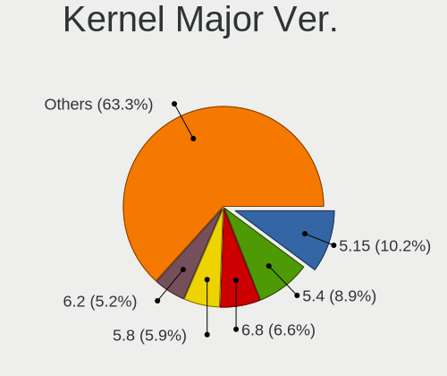

| Version | Desktops | Percent |
|---------|----------|---------|
| 5.4     | 27       | 12.68%  |
| 5.15    | 25       | 11.74%  |
| 5.8     | 18       | 8.45%   |
| 5.19    | 16       | 7.51%   |
| 5.3     | 15       | 7.04%   |
| 5.13    | 12       | 5.63%   |
| 5.10    | 12       | 5.63%   |
| 6.2     | 11       | 5.16%   |
| 4.18    | 10       | 4.69%   |
| 6.1     | 9        | 4.23%   |
| 5.11    | 8        | 3.76%   |
| 4.15    | 8        | 3.76%   |
| 5.16    | 7        | 3.29%   |
| 6.0     | 6        | 2.82%   |
| 4.9     | 5        | 2.35%   |
| 6.4     | 3        | 1.41%   |
| 5.18    | 3        | 1.41%   |
| 5.17    | 3        | 1.41%   |
| 5.0     | 3        | 1.41%   |
| 4.19    | 3        | 1.41%   |
| 6.3     | 2        | 0.94%   |
| 5.9     | 2        | 0.94%   |
| 4.13    | 2        | 0.94%   |
| 5.7     | 1        | 0.47%   |
| 5.14    | 1        | 0.47%   |
| 5.1     | 1        | 0.47%   |

Arch
----

OS architecture (x86_64, i586, etc.)

| Name   | Desktops | Percent |
|--------|----------|---------|
| x86_64 | 189      | 96.92%  |
| i686   | 5        | 2.56%   |
| armv7l | 1        | 0.51%   |

DE
--

Desktop Environment

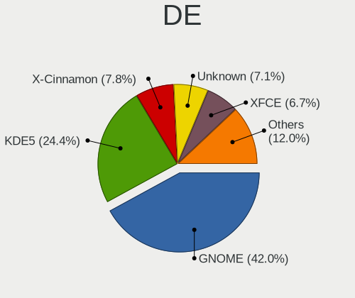

| Name            | Desktops | Percent |
|-----------------|----------|---------|
| GNOME           | 90       | 44.33%  |
| KDE5            | 55       | 27.09%  |
| XFCE            | 14       | 6.9%    |
| X-Cinnamon      | 14       | 6.9%    |
| Unknown         | 13       | 6.4%    |
| MATE            | 4        | 1.97%   |
| KDE             | 3        | 1.48%   |
| Unity           | 2        | 0.99%   |
| LXQt            | 2        | 0.99%   |
| Pantheon        | 1        | 0.49%   |
| openbox         | 1        | 0.49%   |
| LXDE            | 1        | 0.49%   |
| GNOME Flashback | 1        | 0.49%   |
| Budgie          | 1        | 0.49%   |
| awesome         | 1        | 0.49%   |

Display Server
--------------

X11 or Wayland

| Name    | Desktops | Percent |
|---------|----------|---------|
| X11     | 161      | 82.14%  |
| Wayland | 23       | 11.73%  |
| Tty     | 6        | 3.06%   |
| Unknown | 6        | 3.06%   |

Display Manager
---------------

SDDM, LightDM, etc.

| Name    | Desktops | Percent |
|---------|----------|---------|
| Unknown | 114      | 56.72%  |
| SDDM    | 38       | 18.91%  |
| GDM3    | 20       | 9.95%   |
| LightDM | 15       | 7.46%   |
| GDM     | 12       | 5.97%   |
| TDM     | 2        | 1%      |

OS Lang
-------

Language

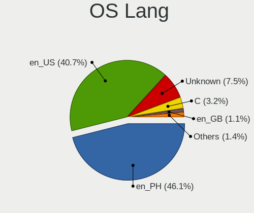

| Lang             | Desktops | Percent |
|------------------|----------|---------|
| en_PH            | 100      | 50%     |
| en_US            | 72       | 36%     |
| Unknown          | 19       | 9.5%    |
| C                | 5        | 2.5%    |
| en_US.ISO-8859-1 | 1        | 0.5%    |
| en_HK            | 1        | 0.5%    |
| en_GB            | 1        | 0.5%    |
| de_DE            | 1        | 0.5%    |

Boot Mode
---------

EFI or BIOS

| Mode | Desktops | Percent |
|------|----------|---------|
| BIOS | 120      | 60.91%  |
| EFI  | 77       | 39.09%  |

Filesystem
----------

Type of filesystem

| Type    | Desktops | Percent |
|---------|----------|---------|
| Ext4    | 144      | 71.64%  |
| Btrfs   | 26       | 12.94%  |
| Overlay | 18       | 8.96%   |
| Tmpfs   | 7        | 3.48%   |
| Unknown | 4        | 1.99%   |
| Xfs     | 2        | 1%      |

Part. scheme
------------

Scheme of partitioning

| Type    | Desktops | Percent |
|---------|----------|---------|
| Unknown | 117      | 58.79%  |
| GPT     | 59       | 29.65%  |
| MBR     | 23       | 11.56%  |

Dual Boot with Linux/BSD
------------------------

Hosting more than one Linux/BSD

| Dual boot | Desktops | Percent |
|-----------|----------|---------|
| No        | 165      | 81.28%  |
| Yes       | 38       | 18.72%  |

Dual Boot (Win)
---------------

Hosting Linux and Windows

| Dual boot | Desktops | Percent |
|-----------|----------|---------|
| No        | 148      | 73.63%  |
| Yes       | 53       | 26.37%  |

Board
-----

Vendor
------

Motherboard manufacturer

| Name                | Desktops | Percent |
|---------------------|----------|---------|
| Gigabyte Technology | 45       | 23.32%  |
| ASUSTek Computer    | 37       | 19.17%  |
| MSI                 | 36       | 18.65%  |
| ASRock              | 13       | 6.74%   |
| Hewlett-Packard     | 12       | 6.22%   |
| Dell                | 8        | 4.15%   |
| Biostar             | 8        | 4.15%   |
| ECS                 | 6        | 3.11%   |
| Foxconn             | 5        | 2.59%   |
| EMAXX TECHNOLOGY    | 4        | 2.07%   |
| Pegatron            | 3        | 1.55%   |
| Lenovo              | 2        | 1.04%   |
| Intel               | 2        | 1.04%   |
| AMD                 | 2        | 1.04%   |
| Unknown             | 2        | 1.04%   |
| YANYU               | 1        | 0.52%   |
| TriGem Computer     | 1        | 0.52%   |
| Samsung Electronics | 1        | 0.52%   |
| QTQD                | 1        | 0.52%   |
| NEC Computers       | 1        | 0.52%   |
| JOOYON              | 1        | 0.52%   |
| GPD                 | 1        | 0.52%   |
| Acer                | 1        | 0.52%   |

Model
-----

Motherboard model

| Name                          | Desktops | Percent |
|-------------------------------|----------|---------|
| MSI MS-7309                   | 5        | 2.59%   |
| Gigabyte A320M-S2H V2         | 5        | 2.59%   |
| ASRock B450M Steel Legend     | 5        | 2.59%   |
| MSI MS-7721                   | 4        | 2.07%   |
| Gigabyte F2A68HM-S1           | 4        | 2.07%   |
| ASUS P8H61-M LX3 PLUS R2.0    | 4        | 2.07%   |
| ASUS All Series               | 4        | 2.07%   |
| Foxconn G31MX Series          | 3        | 1.55%   |
| ECS G41T-R3                   | 3        | 1.55%   |
| Unknown                       | 3        | 1.55%   |
| Pegatron IPMSB-H61            | 2        | 1.04%   |
| MSI MS-7C94                   | 2        | 1.04%   |
| MSI MS-7C52                   | 2        | 1.04%   |
| Gigabyte Z590 AORUS ULTRA     | 2        | 1.04%   |
| Gigabyte H97M-D3H             | 2        | 1.04%   |
| Gigabyte A320M-S2H            | 2        | 1.04%   |
| Foxconn 500B Microtower       | 2        | 1.04%   |
| Biostar A320MH                | 2        | 1.04%   |
| ASUS PRIME B250M-K            | 2        | 1.04%   |
| ASUS EX-H310M-V3 R2.0         | 2        | 1.04%   |
| ASUS A68HM-K                  | 2        | 1.04%   |
| AMD A88                       | 2        | 1.04%   |
| YANYU EPIC-C19                | 1        | 0.52%   |
| TriGem DreamSys               | 1        | 0.52%   |
| Samsung DeskTop System        | 1        | 0.52%   |
| Pegatron FR440AA-ABU a6652uk  | 1        | 0.52%   |
| NEC Computers PC-MK36LBZCHEAM | 1        | 0.52%   |
| MSI MS-7D90                   | 1        | 0.52%   |
| MSI MS-7D43                   | 1        | 0.52%   |
| MSI MS-7D23                   | 1        | 0.52%   |
| MSI MS-7D22                   | 1        | 0.52%   |
| MSI MS-7D18                   | 1        | 0.52%   |
| MSI MS-7D17                   | 1        | 0.52%   |
| MSI MS-7D14                   | 1        | 0.52%   |
| MSI MS-7C02                   | 1        | 0.52%   |
| MSI MS-7B90                   | 1        | 0.52%   |
| MSI MS-7B89                   | 1        | 0.52%   |
| MSI MS-7A57                   | 1        | 0.52%   |
| MSI MS-7A38                   | 1        | 0.52%   |
| MSI MS-7A36                   | 1        | 0.52%   |

Model Family
------------

Motherboard model prefix

| Name                          | Desktops | Percent |
|-------------------------------|----------|---------|
| Gigabyte A320M-S2H            | 7        | 3.63%   |
| Dell OptiPlex                 | 7        | 3.63%   |
| HP Compaq                     | 6        | 3.11%   |
| ASUS PRIME                    | 6        | 3.11%   |
| ASUS P8H61-M                  | 6        | 3.11%   |
| MSI MS-7309                   | 5        | 2.59%   |
| ASRock B450M                  | 5        | 2.59%   |
| MSI MS-7721                   | 4        | 2.07%   |
| Gigabyte F2A68HM-S1           | 4        | 2.07%   |
| ASUS All                      | 4        | 2.07%   |
| HP ProDesk                    | 3        | 1.55%   |
| Gigabyte B450                 | 3        | 1.55%   |
| Foxconn G31MX                 | 3        | 1.55%   |
| ECS G41T-R3                   | 3        | 1.55%   |
| ASUS TUF                      | 3        | 1.55%   |
| ASUS ROG                      | 3        | 1.55%   |
| Unknown                       | 3        | 1.55%   |
| Pegatron IPMSB-H61            | 2        | 1.04%   |
| MSI MS-7C94                   | 2        | 1.04%   |
| MSI MS-7C52                   | 2        | 1.04%   |
| Gigabyte Z590                 | 2        | 1.04%   |
| Gigabyte X570                 | 2        | 1.04%   |
| Gigabyte H97M-D3H             | 2        | 1.04%   |
| Gigabyte B550                 | 2        | 1.04%   |
| Foxconn 500B                  | 2        | 1.04%   |
| Biostar A320MH                | 2        | 1.04%   |
| ASUS EX-H310M-V3              | 2        | 1.04%   |
| ASUS A68HM-K                  | 2        | 1.04%   |
| AMD A88                       | 2        | 1.04%   |
| YANYU EPIC-C19                | 1        | 0.52%   |
| TriGem DreamSys               | 1        | 0.52%   |
| Samsung DeskTop               | 1        | 0.52%   |
| Pegatron FR440AA-ABU          | 1        | 0.52%   |
| NEC Computers PC-MK36LBZCHEAM | 1        | 0.52%   |
| MSI MS-7D90                   | 1        | 0.52%   |
| MSI MS-7D43                   | 1        | 0.52%   |
| MSI MS-7D23                   | 1        | 0.52%   |
| MSI MS-7D22                   | 1        | 0.52%   |
| MSI MS-7D18                   | 1        | 0.52%   |
| MSI MS-7D17                   | 1        | 0.52%   |

MFG Year
--------

Motherboard manufacture year

| Year    | Desktops | Percent |
|---------|----------|---------|
| 2018    | 20       | 10.36%  |
| 2014    | 20       | 10.36%  |
| 2012    | 18       | 9.33%   |
| 2017    | 15       | 7.77%   |
| 2010    | 15       | 7.77%   |
| 2021    | 13       | 6.74%   |
| 2020    | 13       | 6.74%   |
| 2015    | 13       | 6.74%   |
| 2019    | 12       | 6.22%   |
| 2013    | 12       | 6.22%   |
| 2009    | 11       | 5.7%    |
| 2011    | 10       | 5.18%   |
| 2016    | 7        | 3.63%   |
| 2007    | 4        | 2.07%   |
| 2006    | 4        | 2.07%   |
| 2008    | 3        | 1.55%   |
| 2023    | 1        | 0.52%   |
| 2022    | 1        | 0.52%   |
| Unknown | 1        | 0.52%   |

Form Factor
-----------

Physical design of the computer

| Name    | Desktops | Percent |
|---------|----------|---------|
| Desktop | 193      | 100%    |

Secure Boot
-----------

Enabled or disabled

| State    | Desktops | Percent |
|----------|----------|---------|
| Disabled | 188      | 96.91%  |
| Enabled  | 6        | 3.09%   |

Coreboot
--------

Have coreboot on board

| Used | Desktops | Percent |
|------|----------|---------|
| No   | 193      | 100%    |

RAM Size
--------

Total RAM memory

| Size in GB  | Desktops | Percent |
|-------------|----------|---------|
| 8.01-16.0   | 50       | 24.88%  |
| 3.01-4.0    | 39       | 19.4%   |
| 4.01-8.0    | 37       | 18.41%  |
| 16.01-24.0  | 36       | 17.91%  |
| 32.01-64.0  | 18       | 8.96%   |
| 1.01-2.0    | 8        | 3.98%   |
| 64.01-256.0 | 6        | 2.99%   |
| 2.01-3.0    | 5        | 2.49%   |
| 24.01-32.0  | 2        | 1%      |

RAM Used
--------

Used RAM memory

| Used GB    | Desktops | Percent |
|------------|----------|---------|
| 1.01-2.0   | 69       | 32.24%  |
| 2.01-3.0   | 52       | 24.3%   |
| 4.01-8.0   | 33       | 15.42%  |
| 3.01-4.0   | 23       | 10.75%  |
| 0.51-1.0   | 17       | 7.94%   |
| 8.01-16.0  | 10       | 4.67%   |
| 0.01-0.5   | 7        | 3.27%   |
| 16.01-24.0 | 2        | 0.93%   |
| 24.01-32.0 | 1        | 0.47%   |

Total Drives
------------

Number of drives on board

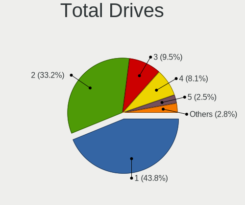

| Drives | Desktops | Percent |
|--------|----------|---------|
| 1      | 91       | 44.39%  |
| 2      | 66       | 32.2%   |
| 3      | 18       | 8.78%   |
| 4      | 17       | 8.29%   |
| 5      | 7        | 3.41%   |
| 0      | 2        | 0.98%   |
| 14     | 1        | 0.49%   |
| 13     | 1        | 0.49%   |
| 12     | 1        | 0.49%   |
| 6      | 1        | 0.49%   |

Has CD-ROM
----------

Has CD-ROM on board

| Presented | Desktops | Percent |
|-----------|----------|---------|
| No        | 156      | 78%     |
| Yes       | 44       | 22%     |

Has Ethernet
------------

Has Ethernet on board

| Presented | Desktops | Percent |
|-----------|----------|---------|
| Yes       | 191      | 98.45%  |
| No        | 3        | 1.55%   |

Has WiFi
--------

Has WiFi module

| Presented | Desktops | Percent |
|-----------|----------|---------|
| No        | 115      | 58.67%  |
| Yes       | 81       | 41.33%  |

Has Bluetooth
-------------

Has Bluetooth module

| Presented | Desktops | Percent |
|-----------|----------|---------|
| No        | 143      | 73.71%  |
| Yes       | 51       | 26.29%  |

Location
--------

Country
-------

Geographic location (country)

| Country     | Desktops | Percent |
|-------------|----------|---------|
| Philippines | 193      | 100%    |

City
----

Geographic location (city)

| City              | Desktops | Percent |
|-------------------|----------|---------|
| Quezon City       | 42       | 19.44%  |
| Davao City        | 16       | 7.41%   |
| Cagayan de Oro    | 12       | 5.56%   |
| Angeles City      | 10       | 4.63%   |
| Caloocan City     | 8        | 3.7%    |
| Iligan City       | 7        | 3.24%   |
| Bacolod City      | 7        | 3.24%   |
| San Miguel        | 6        | 2.78%   |
| Manila            | 6        | 2.78%   |
| Makati City       | 6        | 2.78%   |
| Cebu City         | 6        | 2.78%   |
| Tarlac City       | 5        | 2.31%   |
| Paranaque City    | 5        | 2.31%   |
| Mandaluyong City  | 5        | 2.31%   |
| Bacoor            | 5        | 2.31%   |
| Zamboanga City    | 4        | 1.85%   |
| Santa Rosa        | 4        | 1.85%   |
| Pasig             | 3        | 1.39%   |
| Manajao           | 3        | 1.39%   |
| Lipa City         | 3        | 1.39%   |
| Imus              | 3        | 1.39%   |
| Calamba           | 3        | 1.39%   |
| Antipolo City     | 3        | 1.39%   |
| San Fernando City | 2        | 0.93%   |
| Mandaue City      | 2        | 0.93%   |
| Magugpo Poblacion | 2        | 0.93%   |
| Iloilo City       | 2        | 0.93%   |
| General Santos    | 2        | 0.93%   |
| Dumaguete         | 2        | 0.93%   |
| Abaga             | 2        | 0.93%   |
| Tuguegarao City   | 1        | 0.46%   |
| Taytay            | 1        | 0.46%   |
| Tanza             | 1        | 0.46%   |
| Taguig            | 1        | 0.46%   |
| Tagbilaran        | 1        | 0.46%   |
| Tabaco            | 1        | 0.46%   |
| Sibulan           | 1        | 0.46%   |
| Santa Maria       | 1        | 0.46%   |
| San Leonardo      | 1        | 0.46%   |
| San Jose          | 1        | 0.46%   |

Drives
------

Drive Vendor
------------

Hard drive vendors

| Vendor                    | Desktops | Drives | Percent |
|---------------------------|----------|--------|---------|
| Seagate                   | 75       | 107    | 21.37%  |
| WDC                       | 63       | 85     | 17.95%  |
| Kingston                  | 26       | 34     | 7.41%   |
| Samsung Electronics       | 23       | 36     | 6.55%   |
| Toshiba                   | 22       | 28     | 6.27%   |
| Hitachi                   | 18       | 32     | 5.13%   |
| Sandisk                   | 13       | 18     | 3.7%    |
| Transcend                 | 7        | 7      | 1.99%   |
| Lexar                     | 7        | 8      | 1.99%   |
| Crucial                   | 7        | 9      | 1.99%   |
| Team                      | 6        | 8      | 1.71%   |
| Gigabyte Technology       | 6        | 11     | 1.71%   |
| Ramsta                    | 5        | 5      | 1.42%   |
| A-DATA Technology         | 5        | 5      | 1.42%   |
| PNY                       | 4        | 5      | 1.14%   |
| Phison Electronics        | 4        | 6      | 1.14%   |
| HGST                      | 4        | 5      | 1.14%   |
| WALRAM                    | 3        | 4      | 0.85%   |
| Unknown                   | 3        | 4      | 0.85%   |
| SK hynix                  | 3        | 9      | 0.85%   |
| Intel                     | 3        | 4      | 0.85%   |
| Fujitsu                   | 3        | 3      | 0.85%   |
| Unknown                   | 3        | 4      | 0.85%   |
| XPG                       | 2        | 2      | 0.57%   |
| Phison                    | 2        | 2      | 0.57%   |
| Patriot                   | 2        | 2      | 0.57%   |
| KingSpec                  | 2        | 3      | 0.57%   |
| JMicron Technology        | 2        | 2      | 0.57%   |
| Indilinx                  | 2        | 2      | 0.57%   |
| HS-SSD-C100               | 2        | 2      | 0.57%   |
| ZOTAC                     | 1        | 1      | 0.28%   |
| XrayDisk                  | 1        | 1      | 0.28%   |
| Voyager                   | 1        | 1      | 0.28%   |
| USB                       | 1        | 1      | 0.28%   |
| TAMMUZ                    | 1        | 1      | 0.28%   |
| T-FORCE                   | 1        | 1      | 0.28%   |
| SKIHOTAR                  | 1        | 1      | 0.28%   |
| Realtek Semiconductor     | 1        | 1      | 0.28%   |
| Micron/Crucial Technology | 1        | 1      | 0.28%   |
| MCTECH                    | 1        | 1      | 0.28%   |

Drive Model
-----------

Hard drive models

| Model                                               | Desktops | Percent |
|-----------------------------------------------------|----------|---------|
| Seagate ST500DM002-1BD142 500GB                     | 12       | 3.05%   |
| Seagate ST1000DM010-2EP102 1TB                      | 12       | 3.05%   |
| Toshiba DT01ACA050 500GB                            | 7        | 1.78%   |
| WDC WD10EZEX-08WN4A0 1TB                            | 5        | 1.27%   |
| Toshiba DT01ACA100 1TB                              | 5        | 1.27%   |
| Seagate ST4000DM004-2CV104 4TB                      | 5        | 1.27%   |
| Kingston SA400S37120G 120GB SSD                     | 5        | 1.27%   |
| Hitachi HDS721050CLA362 500GB                       | 5        | 1.27%   |
| Seagate ST2000DM008-2FR102 2TB                      | 4        | 1.02%   |
| Samsung SSD 860 EVO 500GB                           | 4        | 1.02%   |
| Samsung SSD 860 EVO 250GB                           | 4        | 1.02%   |
| Hitachi HDS721616PLA380 160GB                       | 4        | 1.02%   |
| WDC WD5000AZLX-60K2TA0 500GB                        | 3        | 0.76%   |
| WDC WD10EZEX-22MFCA0 1TB                            | 3        | 0.76%   |
| Transcend TS128GSSD370S 128GB                       | 3        | 0.76%   |
| Toshiba MQ01ABD100 1TB                              | 3        | 0.76%   |
| Seagate ST500DM002-1ER14C 500GB                     | 3        | 0.76%   |
| Seagate ST3160812AS 160GB                           | 3        | 0.76%   |
| SanDisk SDSSDA240G 240GB                            | 3        | 0.76%   |
| Samsung NVMe SSD Controller SM981/PM981/PM983 500GB | 3        | 0.76%   |
| PNY CS900 240GB SSD                                 | 3        | 0.76%   |
| Phison PS5013 E13 NVMe Controller 512GB             | 3        | 0.76%   |
| Lexar 128GB SSD                                     | 3        | 0.76%   |
| Kingston SA400S37240G 240GB SSD                     | 3        | 0.76%   |
| Hitachi HTS543232A7A384 320GB                       | 3        | 0.76%   |
| Hitachi HDS721050CLA660 500GB                       | 3        | 0.76%   |
| Crucial CT500P2SSD8 500GB                           | 3        | 0.76%   |
| Unknown                                             | 3        | 0.76%   |
| WDC WD5003ABYZ-011FA0 500GB                         | 2        | 0.51%   |
| WDC WD5000AAVS-00ZTB0 500GB                         | 2        | 0.51%   |
| WDC WD20EARX-00ZUDB0 2TB                            | 2        | 0.51%   |
| WDC WD10EZEX-08M2NA0 1TB                            | 2        | 0.51%   |
| WDC WD10EZEX-00WN4A0 1TB                            | 2        | 0.51%   |
| WDC WD10EZEX-00BN5A0 1TB                            | 2        | 0.51%   |
| WDC WD1003FZEX-00K3CA0 1TB                          | 2        | 0.51%   |
| Transcend TS240GSSD220S 240GB                       | 2        | 0.51%   |
| Toshiba THNSNJ128G8NU 128GB SSD                     | 2        | 0.51%   |
| Team T253X2256G 256GB SSD                           | 2        | 0.51%   |
| Seagate ST3500418AS 500GB                           | 2        | 0.51%   |
| Seagate ST3500413AS 500GB                           | 2        | 0.51%   |

HDD Vendor
----------

Hard disk drive vendors

| Vendor              | Desktops | Drives | Percent |
|---------------------|----------|--------|---------|
| Seagate             | 74       | 105    | 39.78%  |
| WDC                 | 61       | 78     | 32.8%   |
| Toshiba             | 21       | 25     | 11.29%  |
| Hitachi             | 18       | 32     | 9.68%   |
| HGST                | 4        | 5      | 2.15%   |
| Samsung Electronics | 3        | 4      | 1.61%   |
| Fujitsu             | 3        | 3      | 1.61%   |
| Unknown             | 1        | 1      | 0.54%   |
| ExcelStor           | 1        | 1      | 0.54%   |

SSD Vendor
----------

Solid state drive vendors

| Vendor              | Desktops | Drives | Percent |
|---------------------|----------|--------|---------|
| Kingston            | 22       | 28     | 18.97%  |
| Samsung Electronics | 12       | 20     | 10.34%  |
| SanDisk             | 11       | 13     | 9.48%   |
| Transcend           | 6        | 6      | 5.17%   |
| Team                | 6        | 8      | 5.17%   |
| Lexar               | 6        | 7      | 5.17%   |
| WDC                 | 5        | 7      | 4.31%   |
| A-DATA Technology   | 5        | 5      | 4.31%   |
| PNY                 | 4        | 5      | 3.45%   |
| Ramsta              | 3        | 3      | 2.59%   |
| Intel               | 3        | 4      | 2.59%   |
| Gigabyte Technology | 3        | 4      | 2.59%   |
| Crucial             | 3        | 4      | 2.59%   |
| Toshiba             | 2        | 2      | 1.72%   |
| SK hynix            | 2        | 8      | 1.72%   |
| Patriot             | 2        | 2      | 1.72%   |
| KingSpec            | 2        | 3      | 1.72%   |
| ZOTAC               | 1        | 1      | 0.86%   |
| WALRAM              | 1        | 1      | 0.86%   |
| Unknown             | 1        | 2      | 0.86%   |
| TAMMUZ              | 1        | 1      | 0.86%   |
| SKIHOTAR            | 1        | 1      | 0.86%   |
| MCTECH              | 1        | 1      | 0.86%   |
| Kingmax             | 1        | 1      | 0.86%   |
| Kimtigo             | 1        | 2      | 0.86%   |
| Indilinx            | 1        | 1      | 0.86%   |
| HS-SSD-E100         | 1        | 1      | 0.86%   |
| HS-SSD-C100         | 1        | 1      | 0.86%   |
| Hikvision           | 1        | 2      | 0.86%   |
| GLOWAY              | 1        | 2      | 0.86%   |
| FORESEE             | 1        | 1      | 0.86%   |
| Dahua               | 1        | 1      | 0.86%   |
| Corsair             | 1        | 1      | 0.86%   |
| China               | 1        | 10     | 0.86%   |
| CERVVO              | 1        | 1      | 0.86%   |
| Unknown             | 1        | 1      | 0.86%   |

Drive Kind
----------

HDD or SSD

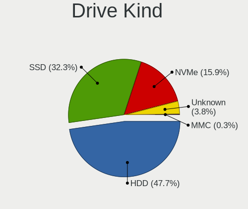

| Kind    | Desktops | Drives | Percent |
|---------|----------|--------|---------|
| HDD     | 149      | 254    | 51.56%  |
| SSD     | 89       | 161    | 30.8%   |
| NVMe    | 37       | 55     | 12.8%   |
| Unknown | 13       | 17     | 4.5%    |
| MMC     | 1        | 1      | 0.35%   |

Drive Connector
---------------

SATA, SAS, NVMe, etc.

| Type | Desktops | Drives | Percent |
|------|----------|--------|---------|
| SATA | 180      | 418    | 78.6%   |
| NVMe | 37       | 55     | 16.16%  |
| SAS  | 11       | 14     | 4.8%    |
| MMC  | 1        | 1      | 0.44%   |

Drive Size
----------

Size of hard drive

| Size in TB | Desktops | Drives | Percent |
|------------|----------|--------|---------|
| 0.01-0.5   | 151      | 284    | 64.53%  |
| 0.51-1.0   | 58       | 98     | 24.79%  |
| 1.01-2.0   | 15       | 17     | 6.41%   |
| 3.01-4.0   | 9        | 15     | 3.85%   |
| 4.01-10.0  | 1        | 1      | 0.43%   |

Space Total
-----------

Amount of disk space available on the file system

| Size in GB     | Desktops | Percent |
|----------------|----------|---------|
| 101-250        | 65       | 30.95%  |
| 251-500        | 47       | 22.38%  |
| 501-1000       | 22       | 10.48%  |
| 1001-2000      | 20       | 9.52%   |
| 51-100         | 13       | 6.19%   |
| 1-20           | 12       | 5.71%   |
| More than 3000 | 11       | 5.24%   |
| 2001-3000      | 9        | 4.29%   |
| Unknown        | 6        | 2.86%   |
| 21-50          | 5        | 2.38%   |

Space Used
----------

Amount of used disk space

| Used GB        | Desktops | Percent |
|----------------|----------|---------|
| 1-20           | 72       | 33.8%   |
| 21-50          | 39       | 18.31%  |
| 51-100         | 28       | 13.15%  |
| 101-250        | 25       | 11.74%  |
| 251-500        | 15       | 7.04%   |
| 501-1000       | 13       | 6.1%    |
| 2001-3000      | 6        | 2.82%   |
| 1001-2000      | 6        | 2.82%   |
| Unknown        | 6        | 2.82%   |
| More than 3000 | 3        | 1.41%   |

Malfunc. Drives
---------------

Drive models with a malfunction

| Model                           | Desktops | Drives | Percent |
|---------------------------------|----------|--------|---------|
| Hitachi HDS721050CLA362 500GB   | 5        | 10     | 18.52%  |
| Hitachi HTS543232A7A384 320GB   | 3        | 5      | 11.11%  |
| HGST HTS541010A9E680 1TB        | 2        | 3      | 7.41%   |
| WDC WD5003ABYZ-011FA0 500GB     | 1        | 1      | 3.7%    |
| WDC WD5000LPCX-60VHAT0 500GB    | 1        | 2      | 3.7%    |
| WDC WD5000AAVS-00ZTB0 500GB     | 1        | 1      | 3.7%    |
| WDC WD5000AAKX-603CA0 500GB     | 1        | 1      | 3.7%    |
| WDC WD3200AAJS-08L7A0 320GB     | 1        | 1      | 3.7%    |
| WDC WD10EZEX-00MFCA0 1TB        | 1        | 1      | 3.7%    |
| Unknown S050 Hard drive 500GB   | 1        | 1      | 3.7%    |
| Toshiba MQ01ABD100 1TB          | 1        | 1      | 3.7%    |
| Toshiba DT01ACA100 1TB          | 1        | 1      | 3.7%    |
| Toshiba DT01ACA050 500GB        | 1        | 1      | 3.7%    |
| Seagate ST500DM002-1BD142 500GB | 1        | 2      | 3.7%    |
| Seagate ST380815AS 80GB         | 1        | 1      | 3.7%    |
| Seagate ST3500514NS 500GB       | 1        | 1      | 3.7%    |
| Seagate ST3500418AS 500GB       | 1        | 1      | 3.7%    |
| Seagate ST2000DM008-2FR102 2TB  | 1        | 1      | 3.7%    |
| SanDisk SDSSDA240G 240GB        | 1        | 1      | 3.7%    |
| Hitachi HDS721050CLA660 500GB   | 1        | 1      | 3.7%    |

Malfunc. Drive Vendor
---------------------

Vendors of faulty drives

| Vendor  | Desktops | Drives | Percent |
|---------|----------|--------|---------|
| WDC     | 6        | 7      | 26.09%  |
| Hitachi | 6        | 16     | 26.09%  |
| Seagate | 5        | 6      | 21.74%  |
| Toshiba | 2        | 3      | 8.7%    |
| HGST    | 2        | 3      | 8.7%    |
| Unknown | 1        | 1      | 4.35%   |
| SanDisk | 1        | 1      | 4.35%   |

Malfunc. HDD Vendor
-------------------

Vendors of faulty HDD drives

| Vendor  | Desktops | Drives | Percent |
|---------|----------|--------|---------|
| WDC     | 6        | 7      | 27.27%  |
| Hitachi | 6        | 16     | 27.27%  |
| Seagate | 5        | 6      | 22.73%  |
| Toshiba | 2        | 3      | 9.09%   |
| HGST    | 2        | 3      | 9.09%   |
| Unknown | 1        | 1      | 4.55%   |

Malfunc. Drive Kind
-------------------

Kinds of faulty drives

| Kind | Desktops | Drives | Percent |
|------|----------|--------|---------|
| HDD  | 18       | 36     | 94.74%  |
| SSD  | 1        | 1      | 5.26%   |

Failed Drives
-------------

Failed drive models

Zero info for selected period =(

Failed Drive Vendor
-------------------

Failed drive vendors

Zero info for selected period =(

Drive Status
------------

Number of failed and malfunc. drives

| Status   | Desktops | Drives | Percent |
|----------|----------|--------|---------|
| Detected | 129      | 311    | 61.72%  |
| Works    | 61       | 140    | 29.19%  |
| Malfunc  | 19       | 37     | 9.09%   |

Storage controller
------------------

Storage Vendor
--------------

Storage controller vendors

| Vendor                       | Desktops | Percent |
|------------------------------|----------|---------|
| Intel                        | 106      | 44.92%  |
| AMD                          | 75       | 31.78%  |
| Samsung Electronics          | 9        | 3.81%   |
| Phison Electronics           | 9        | 3.81%   |
| Nvidia                       | 9        | 3.81%   |
| Micron/Crucial Technology    | 4        | 1.69%   |
| Kingston Technology Company  | 4        | 1.69%   |
| Silicon Motion               | 3        | 1.27%   |
| Marvell Technology Group     | 3        | 1.27%   |
| ASMedia Technology           | 3        | 1.27%   |
| SanDisk                      | 2        | 0.85%   |
| ADATA Technology             | 2        | 0.85%   |
| Toshiba America Info Systems | 1        | 0.42%   |
| SK hynix                     | 1        | 0.42%   |
| Realtek Semiconductor        | 1        | 0.42%   |
| MAXIO Technology (Hangzhou)  | 1        | 0.42%   |
| JMicron Technology           | 1        | 0.42%   |
| Broadcom / LSI               | 1        | 0.42%   |
| Biwin Storage Technology     | 1        | 0.42%   |

Storage Model
-------------

Storage controller models

| Model                                                                                   | Desktops | Percent |
|-----------------------------------------------------------------------------------------|----------|---------|
| AMD FCH SATA Controller [AHCI mode]                                                     | 44       | 13.54%  |
| Intel NM10/ICH7 Family SATA Controller [IDE mode]                                       | 18       | 5.54%   |
| AMD 400 Series Chipset SATA Controller                                                  | 18       | 5.54%   |
| Intel 82801G (ICH7 Family) IDE Controller                                               | 15       | 4.62%   |
| Intel 8 Series/C220 Series Chipset Family 6-port SATA Controller 1 [AHCI mode]          | 14       | 4.31%   |
| Intel 6 Series/C200 Series Chipset Family Desktop SATA Controller (IDE mode, ports 4-5) | 10       | 3.08%   |
| Intel 6 Series/C200 Series Chipset Family Desktop SATA Controller (IDE mode, ports 0-3) | 10       | 3.08%   |
| Nvidia MCP61 SATA Controller                                                            | 9        | 2.77%   |
| Nvidia MCP61 IDE                                                                        | 9        | 2.77%   |
| Intel Q170/Q150/B150/H170/H110/Z170/CM236 Chipset SATA Controller [AHCI Mode]           | 9        | 2.77%   |
| Intel 200 Series PCH SATA controller [AHCI mode]                                        | 9        | 2.77%   |
| AMD FCH SATA Controller [IDE mode]                                                      | 9        | 2.77%   |
| AMD FCH SATA Controller D                                                               | 9        | 2.77%   |
| AMD SB7x0/SB8x0/SB9x0 IDE Controller                                                    | 8        | 2.46%   |
| AMD 500 Series Chipset SATA Controller                                                  | 8        | 2.46%   |
| Intel 500 Series Chipset Family SATA AHCI Controller                                    | 7        | 2.15%   |
| AMD 300 Series Chipset SATA Controller                                                  | 7        | 2.15%   |
| Samsung NVMe SSD Controller SM981/PM981/PM983                                           | 6        | 1.85%   |
| Intel 6 Series/C200 Series Chipset Family 6 port Desktop SATA AHCI Controller           | 6        | 1.85%   |
| AMD SB7x0/SB8x0/SB9x0 SATA Controller [IDE mode]                                        | 6        | 1.85%   |
| AMD FCH IDE Controller                                                                  | 6        | 1.85%   |
| Intel 9 Series Chipset Family SATA Controller [AHCI Mode]                               | 5        | 1.54%   |
| Phison PS5013 E13 NVMe Controller                                                       | 4        | 1.23%   |
| Phison E16 PCIe4 NVMe Controller                                                        | 4        | 1.23%   |
| Micron/Crucial P2 [Nick P2] / P3 / P3 Plus NVMe PCIe SSD (DRAM-less)                    | 4        | 1.23%   |
| Intel 7 Series/C210 Series Chipset Family 6-port SATA Controller [AHCI mode]            | 4        | 1.23%   |
| Silicon Motion SM2263EN/SM2263XT (DRAM-less) NVMe SSD Controllers                       | 3        | 0.92%   |
| Samsung NVMe SSD Controller 980                                                         | 3        | 0.92%   |
| Intel SATA Controller [RAID mode]                                                       | 3        | 0.92%   |
| Intel Cannon Lake PCH SATA AHCI Controller                                              | 3        | 0.92%   |
| ASMedia ASM1062 Serial ATA Controller                                                   | 3        | 0.92%   |
| Kingston Company NVMe Controller                                                        | 2        | 0.62%   |
| Kingston Company A2000 NVMe SSD                                                         | 2        | 0.62%   |
| Intel Comet Lake SATA AHCI Controller                                                   | 2        | 0.62%   |
| Intel Alder Lake-S PCH SATA Controller [AHCI Mode]                                      | 2        | 0.62%   |
| Intel 82801JD/DO (ICH10 Family) SATA AHCI Controller                                    | 2        | 0.62%   |
| Intel 7 Series Chipset Family 6-port SATA Controller [AHCI mode]                        | 2        | 0.62%   |
| Intel 4 Series Chipset PT IDER Controller                                               | 2        | 0.62%   |
| AMD SB7x0/SB8x0/SB9x0 SATA Controller [AHCI mode]                                       | 2        | 0.62%   |
| ADATA XPG SX8200 Pro PCIe Gen3x4 M.2 2280 Solid State Drive                             | 2        | 0.62%   |

Storage Kind
------------

Kind of storage controller (IDE, SATA, NVMe, SAS, ...)

| Kind | Desktops | Percent |
|------|----------|---------|
| SATA | 145      | 58.7%   |
| IDE  | 58       | 23.48%  |
| NVMe | 37       | 14.98%  |
| RAID | 6        | 2.43%   |
| SAS  | 1        | 0.4%    |

Processor
---------

CPU Vendor
----------

Processor vendors

| Vendor | Desktops | Percent |
|--------|----------|---------|
| Intel  | 108      | 55.96%  |
| AMD    | 84       | 43.52%  |
| ARM    | 1        | 0.52%   |

CPU Model
---------

Processor models

| Model                                         | Desktops | Percent |
|-----------------------------------------------|----------|---------|
| AMD Ryzen 5 3600 6-Core Processor             | 7        | 3.63%   |
| Intel Core 2 Duo CPU E7500 @ 2.93GHz          | 6        | 3.11%   |
| AMD Ryzen 5 2600 Six-Core Processor           | 6        | 3.11%   |
| AMD Ryzen 3 3200G with Radeon Vega Graphics   | 6        | 3.11%   |
| Intel Core i7-4790 CPU @ 3.60GHz              | 4        | 2.07%   |
| Intel Core i7-3770 CPU @ 3.40GHz              | 4        | 2.07%   |
| AMD Sempron Processor LE-1100                 | 4        | 2.07%   |
| Intel Core i5-3470 CPU @ 3.20GHz              | 3        | 1.55%   |
| Intel Core i5-2400 CPU @ 3.10GHz              | 3        | 1.55%   |
| Intel Core i3-2120 CPU @ 3.30GHz              | 3        | 1.55%   |
| Intel 12th Gen Core i5-12400                  | 3        | 1.55%   |
| AMD Ryzen 5 5600G with Radeon Graphics        | 3        | 1.55%   |
| AMD Ryzen 5 2400G with Radeon Vega Graphics   | 3        | 1.55%   |
| AMD A8-7600 Radeon R7, 10 Compute Cores 4C+6G | 3        | 1.55%   |
| AMD A6-6400K APU with Radeon HD Graphics      | 3        | 1.55%   |
| Intel Pentium Dual-Core CPU E5700 @ 3.00GHz   | 2        | 1.04%   |
| Intel Pentium CPU G2020 @ 2.90GHz             | 2        | 1.04%   |
| Intel Core i7-7700K CPU @ 4.20GHz             | 2        | 1.04%   |
| Intel Core i7-7700 CPU @ 3.60GHz              | 2        | 1.04%   |
| Intel Core i5-8400 CPU @ 2.80GHz              | 2        | 1.04%   |
| Intel Core i5-6500 CPU @ 3.20GHz              | 2        | 1.04%   |
| Intel Core i5-4690K CPU @ 3.50GHz             | 2        | 1.04%   |
| Intel Core i5-4590 CPU @ 3.30GHz              | 2        | 1.04%   |
| Intel Core i5-4460 CPU @ 3.20GHz              | 2        | 1.04%   |
| Intel Core i3-4170 CPU @ 3.70GHz              | 2        | 1.04%   |
| Intel Core i3-3217U CPU @ 1.80GHz             | 2        | 1.04%   |
| Intel Core 2 Quad CPU Q9400 @ 2.66GHz         | 2        | 1.04%   |
| Intel Core 2 Quad CPU Q8300 @ 2.50GHz         | 2        | 1.04%   |
| Intel Core 2 Duo CPU E8400 @ 3.00GHz          | 2        | 1.04%   |
| Intel Core 2 Duo CPU E8300 @ 2.83GHz          | 2        | 1.04%   |
| Intel 11th Gen Core i9-11900K @ 3.50GHz       | 2        | 1.04%   |
| Intel 11th Gen Core i5-11400 @ 2.60GHz        | 2        | 1.04%   |
| AMD Ryzen 7 3700X 8-Core Processor            | 2        | 1.04%   |
| AMD Ryzen 7 2700 Eight-Core Processor         | 2        | 1.04%   |
| AMD Ryzen 5 5600X 6-Core Processor            | 2        | 1.04%   |
| AMD Ryzen 3 2200G with Radeon Vega Graphics   | 2        | 1.04%   |
| AMD A6-7480 Radeon R5, 8 Compute Cores 2C+6G  | 2        | 1.04%   |
| AMD A6-7400K Radeon R5, 6 Compute Cores 2C+4G | 2        | 1.04%   |
| AMD A10-5800K APU with Radeon HD Graphics     | 2        | 1.04%   |
| Intel Xeon CPU E5-2620 v4 @ 2.10GHz           | 1        | 0.52%   |

CPU Model Family
----------------

Processor model prefix

| Model                   | Desktops | Percent |
|-------------------------|----------|---------|
| Intel Core i5           | 32       | 16.58%  |
| AMD Ryzen 5             | 25       | 12.95%  |
| Intel Core i7           | 17       | 8.81%   |
| Intel Core i3           | 16       | 8.29%   |
| Intel Core 2 Duo        | 12       | 6.22%   |
| Other                   | 10       | 5.18%   |
| AMD Ryzen 3             | 9        | 4.66%   |
| AMD A6                  | 9        | 4.66%   |
| Intel Pentium Dual-Core | 5        | 2.59%   |
| Intel Core 2 Quad       | 5        | 2.59%   |
| Intel Pentium           | 4        | 2.07%   |
| Intel Celeron           | 4        | 2.07%   |
| AMD Sempron             | 4        | 2.07%   |
| AMD Ryzen 7             | 4        | 2.07%   |
| AMD FX                  | 4        | 2.07%   |
| AMD A8                  | 4        | 2.07%   |
| AMD A4                  | 4        | 2.07%   |
| AMD Phenom II X4        | 3        | 1.55%   |
| AMD Athlon II X2        | 3        | 1.55%   |
| AMD Athlon              | 3        | 1.55%   |
| AMD A10                 | 3        | 1.55%   |
| Intel Pentium Gold      | 2        | 1.04%   |
| AMD Ryzen 9             | 2        | 1.04%   |
| Intel Xeon              | 1        | 0.52%   |
| Intel Core i9           | 1        | 0.52%   |
| Intel Core 2            | 1        | 0.52%   |
| AMD Ryzen 7 PRO         | 1        | 0.52%   |
| AMD Ryzen 5 PRO         | 1        | 0.52%   |
| AMD Phenom II X2        | 1        | 0.52%   |
| AMD Phenom              | 1        | 0.52%   |
| AMD Athlon X4           | 1        | 0.52%   |
| AMD Athlon 64 X2        | 1        | 0.52%   |

CPU Cores
---------

Number of processor cores

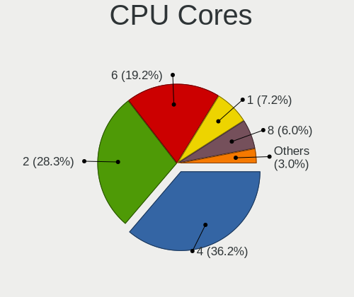

| Number | Desktops | Percent |
|--------|----------|---------|
| 4      | 71       | 36.79%  |
| 2      | 60       | 31.09%  |
| 6      | 33       | 17.1%   |
| 1      | 16       | 8.29%   |
| 8      | 8        | 4.15%   |
| 16     | 2        | 1.04%   |
| 12     | 1        | 0.52%   |
| 10     | 1        | 0.52%   |
| 3      | 1        | 0.52%   |

CPU Sockets
-----------

Number of sockets

| Number | Desktops | Percent |
|--------|----------|---------|
| 1      | 192      | 99.48%  |
| 2      | 1        | 0.52%   |

CPU Threads
-----------

Threads per core (Hyper-Threading)

| Number | Desktops | Percent |
|--------|----------|---------|
| 2      | 107      | 55.15%  |
| 1      | 87       | 44.85%  |

CPU Op-Modes
------------

CPU Operation Modes (32-bit, 64-bit)

| Op mode        | Desktops | Percent |
|----------------|----------|---------|
| 32-bit, 64-bit | 191      | 98.45%  |
| Unknown        | 3        | 1.55%   |

CPU Microcode
-------------

Microcode number

| Number     | Desktops | Percent |
|------------|----------|---------|
| Unknown    | 65       | 32.99%  |
| 0x306c3    | 14       | 7.11%   |
| 0x1067a    | 12       | 6.09%   |
| 0x306a9    | 7        | 3.55%   |
| 0x08701021 | 7        | 3.55%   |
| 0x0800820d | 7        | 3.55%   |
| 0x06001119 | 7        | 3.55%   |
| 0x906e9    | 6        | 3.05%   |
| 0x906ea    | 5        | 2.54%   |
| 0x506e3    | 5        | 2.54%   |
| 0x10676    | 5        | 2.54%   |
| 0x06003106 | 5        | 2.54%   |
| 0xa0671    | 4        | 2.03%   |
| 0x206a7    | 4        | 2.03%   |
| 0x08108109 | 4        | 2.03%   |
| 0x08600106 | 3        | 1.52%   |
| 0xa0655    | 2        | 1.02%   |
| 0x6fb      | 2        | 1.02%   |
| 0x0a50000d | 2        | 1.02%   |
| 0x08101016 | 2        | 1.02%   |
| 0x0810100b | 2        | 1.02%   |
| 0x0600611a | 2        | 1.02%   |
| 0x010000c8 | 2        | 1.02%   |
| 0x010000c7 | 2        | 1.02%   |
| 0xa0653    | 1        | 0.51%   |
| 0x90675    | 1        | 0.51%   |
| 0x90672    | 1        | 0.51%   |
| 0x706a1    | 1        | 0.51%   |
| 0x6f6      | 1        | 0.51%   |
| 0x50654    | 1        | 0.51%   |
| 0x406f1    | 1        | 0.51%   |
| 0x40651    | 1        | 0.51%   |
| 0x30679    | 1        | 0.51%   |
| 0x106e5    | 1        | 0.51%   |
| 0x0a50000c | 1        | 0.51%   |
| 0x0a201016 | 1        | 0.51%   |
| 0x08701030 | 1        | 0.51%   |
| 0x08101102 | 1        | 0.51%   |
| 0x08101007 | 1        | 0.51%   |
| 0x0700010f | 1        | 0.51%   |

CPU Microarch
-------------

Microarchitecture

| Name             | Desktops | Percent |
|------------------|----------|---------|
| Penryn           | 20       | 10.31%  |
| Haswell          | 20       | 10.31%  |
| KabyLake         | 16       | 8.25%   |
| Zen+             | 15       | 7.73%   |
| IvyBridge        | 15       | 7.73%   |
| Piledriver       | 14       | 7.22%   |
| Zen 2            | 13       | 6.7%    |
| Zen              | 9        | 4.64%   |
| SandyBridge      | 9        | 4.64%   |
| K10              | 8        | 4.12%   |
| Zen 3            | 7        | 3.61%   |
| Skylake          | 7        | 3.61%   |
| Steamroller      | 6        | 3.09%   |
| K8 Hammer        | 5        | 2.58%   |
| CometLake        | 5        | 2.58%   |
| Excavator        | 4        | 2.06%   |
| Icelake          | 3        | 1.55%   |
| Core             | 3        | 1.55%   |
| Alderlake Hybrid | 3        | 1.55%   |
| Unknown          | 3        | 1.55%   |
| Nehalem          | 2        | 1.03%   |
| TigerLake        | 1        | 0.52%   |
| Silvermont       | 1        | 0.52%   |
| K10 Llano        | 1        | 0.52%   |
| Jaguar           | 1        | 0.52%   |
| Goldmont plus    | 1        | 0.52%   |
| Bulldozer        | 1        | 0.52%   |
| Broadwell        | 1        | 0.52%   |

Graphics
--------

GPU Vendor
----------

Vendors of graphics cards

| Vendor | Desktops | Percent |
|--------|----------|---------|
| AMD    | 75       | 35.05%  |
| Nvidia | 74       | 34.58%  |
| Intel  | 65       | 30.37%  |

GPU Model
---------

Graphics card models

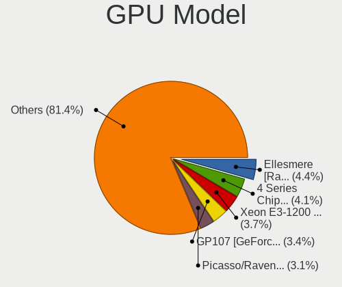

| Model                                                                       | Desktops | Percent |
|-----------------------------------------------------------------------------|----------|---------|
| AMD Ellesmere [Radeon RX 470/480/570/570X/580/580X/590]                     | 11       | 5%      |
| Intel 4 Series Chipset Integrated Graphics Controller                       | 10       | 4.55%   |
| Intel Xeon E3-1200 v3/4th Gen Core Processor Integrated Graphics Controller | 8        | 3.64%   |
| Intel 2nd Generation Core Processor Family Integrated Graphics Controller   | 7        | 3.18%   |
| Nvidia GP107 [GeForce GTX 1050 Ti]                                          | 6        | 2.73%   |
| Nvidia GF108 [GeForce GT 730]                                               | 6        | 2.73%   |
| Nvidia G72 [GeForce 7200 GS / 7300 SE]                                      | 6        | 2.73%   |
| Intel Xeon E3-1200 v2/3rd Gen Core processor Graphics Controller            | 6        | 2.73%   |
| Intel HD Graphics 630                                                       | 6        | 2.73%   |
| AMD Raven Ridge [Radeon Vega Series / Radeon Vega Mobile Series]            | 6        | 2.73%   |
| AMD Picasso/Raven 2 [Radeon Vega Series / Radeon Vega Mobile Series]        | 6        | 2.73%   |
| Nvidia GT218 [GeForce 210]                                                  | 5        | 2.27%   |
| Nvidia GF108 [GeForce GT 630]                                               | 5        | 2.27%   |
| AMD Baffin [Radeon RX 460/560D / Pro 450/455/460/555/555X/560/560X]         | 5        | 2.27%   |
| Nvidia GP108 [GeForce GT 1030]                                              | 4        | 1.82%   |
| Nvidia GP104 [GeForce GTX 1070]                                             | 4        | 1.82%   |
| Nvidia GM107 [GeForce GTX 750 Ti]                                           | 4        | 1.82%   |
| Nvidia GK208B [GeForce GT 710]                                              | 4        | 1.82%   |
| Nvidia GA102 [GeForce RTX 3080]                                             | 4        | 1.82%   |
| Intel 82G33/G31 Express Integrated Graphics Controller                      | 4        | 1.82%   |
| Intel 4th Generation Core Processor Family Integrated Graphics Controller   | 4        | 1.82%   |
| AMD Kaveri [Radeon R7 Graphics]                                             | 4        | 1.82%   |
| Nvidia TU116 [GeForce GTX 1660 SUPER]                                       | 3        | 1.36%   |
| Nvidia GM204 [GeForce GTX 970]                                              | 3        | 1.36%   |
| Nvidia C61 [GeForce 6150SE nForce 430]                                      | 3        | 1.36%   |
| Intel HD Graphics 530                                                       | 3        | 1.36%   |
| Intel Alder Lake-S GT1 [UHD Graphics 730]                                   | 3        | 1.36%   |
| AMD Wani [Radeon R5/R6/R7 Graphics]                                         | 3        | 1.36%   |
| AMD Richland [Radeon HD 8470D]                                              | 3        | 1.36%   |
| AMD Renoir                                                                  | 3        | 1.36%   |
| AMD Lexa PRO [Radeon 540/540X/550/550X / RX 540X/550/550X]                  | 3        | 1.36%   |
| AMD Cezanne [Radeon Vega Series / Radeon Vega Mobile Series]                | 3        | 1.36%   |
| AMD Caicos [Radeon HD 6450/7450/8450 / R5 230 OEM]                          | 3        | 1.36%   |
| Nvidia GP106 [GeForce GTX 1060 3GB]                                         | 2        | 0.91%   |
| Nvidia GK208B [GeForce GT 730]                                              | 2        | 0.91%   |
| Intel CometLake-S GT2 [UHD Graphics 630]                                    | 2        | 0.91%   |
| Intel CoffeeLake-S GT2 [UHD Graphics 630]                                   | 2        | 0.91%   |
| Intel 3rd Gen Core processor Graphics Controller                            | 2        | 0.91%   |
| AMD Polaris 20 XL [Radeon RX 580 2048SP]                                    | 2        | 0.91%   |
| AMD Oland [Radeon HD 8570 / R5 430 OEM / R7 240/340 / Radeon 520 OEM]       | 2        | 0.91%   |

GPU Combo
---------

Combinations of graphics cards

| Name           | Desktops | Percent |
|----------------|----------|---------|
| 1 x AMD        | 72       | 35.82%  |
| 1 x Nvidia     | 65       | 32.34%  |
| 1 x Intel      | 52       | 25.87%  |
| Intel + Nvidia | 6        | 2.99%   |
| 2 x Nvidia     | 2        | 1%      |
| Other          | 1        | 0.5%    |
| 2 x AMD        | 1        | 0.5%    |
| Intel + AMD    | 1        | 0.5%    |
| AMD + Nvidia   | 1        | 0.5%    |

GPU Driver
----------

Free vs proprietary

| Driver      | Desktops | Percent |
|-------------|----------|---------|
| Free        | 146      | 74.87%  |
| Proprietary | 40       | 20.51%  |
| Unknown     | 9        | 4.62%   |

GPU Memory
----------

Total video memory

| Size in GB | Desktops | Percent |
|------------|----------|---------|
| Unknown    | 92       | 45.77%  |
| 1.01-2.0   | 33       | 16.42%  |
| 0.51-1.0   | 18       | 8.96%   |
| 0.01-0.5   | 17       | 8.46%   |
| 3.01-4.0   | 15       | 7.46%   |
| 7.01-8.0   | 11       | 5.47%   |
| 5.01-6.0   | 8        | 3.98%   |
| 8.01-16.0  | 5        | 2.49%   |
| 2.01-3.0   | 2        | 1%      |

Monitor
-------

Monitor Vendor
--------------

Monitor vendors

| Vendor               | Desktops | Percent |
|----------------------|----------|---------|
| Samsung Electronics  | 28       | 14.36%  |
| Dell                 | 27       | 13.85%  |
| AOC                  | 18       | 9.23%   |
| Acer                 | 16       | 8.21%   |
| Hewlett-Packard      | 11       | 5.64%   |
| Goldstar             | 8        | 4.1%    |
| BenQ                 | 7        | 3.59%   |
| ASUSTek Computer     | 7        | 3.59%   |
| IPS                  | 6        | 3.08%   |
| Sony                 | 5        | 2.56%   |
| Lenovo               | 5        | 2.56%   |
| Ancor Communications | 5        | 2.56%   |
| ViewSonic            | 4        | 2.05%   |
| Unknown              | 3        | 1.54%   |
| Philips              | 3        | 1.54%   |
| Mi                   | 3        | 1.54%   |
| Unknown              | 3        | 1.54%   |
| VIE                  | 2        | 1.03%   |
| Unknown (XXX)        | 2        | 1.03%   |
| MStar                | 2        | 1.03%   |
| MSI                  | 2        | 1.03%   |
| eMachines            | 2        | 1.03%   |
| Eizo                 | 2        | 1.03%   |
| SMC                  | 1        | 0.51%   |
| Sharp                | 1        | 0.51%   |
| SGT                  | 1        | 0.51%   |
| SANYO                | 1        | 0.51%   |
| SAC                  | 1        | 0.51%   |
| RGT                  | 1        | 0.51%   |
| Pixio                | 1        | 0.51%   |
| NVISION              | 1        | 0.51%   |
| NVI                  | 1        | 0.51%   |
| NEX                  | 1        | 0.51%   |
| LLL                  | 1        | 0.51%   |
| HON                  | 1        | 0.51%   |
| HKC                  | 1        | 0.51%   |
| Hitachi              | 1        | 0.51%   |
| HGC                  | 1        | 0.51%   |
| GDH                  | 1        | 0.51%   |
| EXP                  | 1        | 0.51%   |

Monitor Model
-------------

Monitor models

| Model                                                             | Desktops | Percent |
|-------------------------------------------------------------------|----------|---------|
| Samsung Electronics S20B300 SAM08A8 1600x900 443x249mm 20.0-inch  | 4        | 1.94%   |
| Samsung Electronics C24F390 SAM0D2C 1920x1080 521x293mm 23.5-inch | 4        | 1.94%   |
| Dell SE177FP DELF001 1280x1024 338x270mm 17.0-inch                | 4        | 1.94%   |
| AOC 1970W AOC1970 1366x768 410x230mm 18.5-inch                    | 4        | 1.94%   |
| Lenovo L1951p Wide LEN0990 1440x900 408x255mm 18.9-inch           | 3        | 1.46%   |
| Dell P170S DEL4058 1280x1024 338x270mm 17.0-inch                  | 3        | 1.46%   |
| AOC 2060W3 AOC2060 1920x1080 435x239mm 19.5-inch                  | 3        | 1.46%   |
| Unknown                                                           | 3        | 1.46%   |
| VIE A/G1956 VIE1850 1366x768 414x257mm 19.2-inch                  | 2        | 0.97%   |
| Unknown LCD Monitor FFFF 2288x1287 2550x2550mm 142.0-inch         | 2        | 0.97%   |
| Samsung Electronics S24F350 SAM0D20 1920x1080 521x293mm 23.5-inch | 2        | 0.97%   |
| MStar Demo MST0030 2288x1430 708x398mm 32.0-inch                  | 2        | 0.97%   |
| Mi Redmi Monitor XMI23C3 1920x1080 527x293mm 23.7-inch            | 2        | 0.97%   |
| IPS ZP2200 IPS2200 1920x1080 477x268mm 21.5-inch                  | 2        | 0.97%   |
| IPS R220 IPS2150 1920x1080 480x260mm 21.5-inch                    | 2        | 0.97%   |
| Goldstar IPS FULLHD GSM5AB8 1920x1080 480x270mm 21.7-inch         | 2        | 0.97%   |
| Goldstar HD GSM5ACB 1366x768 410x230mm 18.5-inch                  | 2        | 0.97%   |
| Dell P170S DEL4059 1280x1024 338x270mm 17.0-inch                  | 2        | 0.97%   |
| Dell E228WFP DELD015 1680x1050 473x296mm 22.0-inch                | 2        | 0.97%   |
| Dell E198FP DELA028 1280x1024 380x300mm 19.1-inch                 | 2        | 0.97%   |
| BenQ GW2270 BNQ78DB 1920x1080 476x268mm 21.5-inch                 | 2        | 0.97%   |
| ASUSTek Computer VG27AQL1A AUS2705 2560x1440 597x336mm 27.0-inch  | 2        | 0.97%   |
| AOC 22B2WG5 AOC2202 1920x1080 477x268mm 21.5-inch                 | 2        | 0.97%   |
| Acer S200HQL ACR0359 1366x768 434x236mm 19.4-inch                 | 2        | 0.97%   |
| Acer R230H ACR046E 1920x1080 509x286mm 23.0-inch                  | 2        | 0.97%   |
| Acer EB192Q ACR0517 1366x768 410x230mm 18.5-inch                  | 2        | 0.97%   |
| ViewSonic XG2705 VSC0E39 1920x1080 598x336mm 27.0-inch            | 1        | 0.49%   |
| ViewSonic VX2450 SERIES VSCE226 1920x1080 525x297mm 23.7-inch     | 1        | 0.49%   |
| ViewSonic VA1917 SERIES VSCAD30 1366x768 410x230mm 18.5-inch      | 1        | 0.49%   |
| ViewSonic VA1601W-LED VSC1A25 1366x768 344x193mm 15.5-inch        | 1        | 0.49%   |
| Unknown LCD Monitor SAMSUNG 3840x2160                             | 1        | 0.49%   |
| Unknown (XXX) Union TV XXX2841 1920x1080 1209x680mm 54.6-inch     | 1        | 0.49%   |
| Unknown (XXX) Beyond TV XXX2851 1920x1080 1209x680mm 54.6-inch    | 1        | 0.49%   |
| Sony TV SNYAB03 1920x1080                                         | 1        | 0.49%   |
| Sony TV SNYA301 1920x1080                                         | 1        | 0.49%   |
| Sony TV SNY4B03 1920x1080 710x400mm 32.1-inch                     | 1        | 0.49%   |
| Sony TV SNY2A01 1360x768                                          | 1        | 0.49%   |
| Sony TV SNY1A02 1920x1080                                         | 1        | 0.49%   |
| SMC LCD Monitor SMC0001 1920x540 720x420mm 32.8-inch              | 1        | 0.49%   |
| Sharp LL-153A-B SHP2163 1024x768 304x228mm 15.0-inch              | 1        | 0.49%   |

Monitor Resolution
------------------

Monitor screen resolution

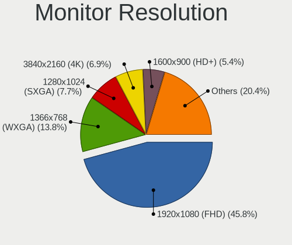

| Resolution         | Desktops | Percent |
|--------------------|----------|---------|
| 1920x1080 (FHD)    | 84       | 45.16%  |
| 1366x768 (WXGA)    | 28       | 15.05%  |
| 1280x1024 (SXGA)   | 19       | 10.22%  |
| 1600x900 (HD+)     | 13       | 6.99%   |
| 3840x2160 (4K)     | 11       | 5.91%   |
| 1440x900 (WXGA+)   | 7        | 3.76%   |
| 2560x1440 (QHD)    | 6        | 3.23%   |
| 3440x1440          | 4        | 2.15%   |
| 1680x1050 (WSXGA+) | 3        | 1.61%   |
| 2288x1287          | 2        | 1.08%   |
| 1920x1200 (WUXGA)  | 2        | 1.08%   |
| 1360x768           | 2        | 1.08%   |
| 1024x768 (XGA)     | 2        | 1.08%   |
| 3200x1080          | 1        | 0.54%   |
| 1920x540           | 1        | 0.54%   |
| Unknown            | 1        | 0.54%   |

Monitor Diagonal
----------------

Diagonal size in inches

| Inches  | Desktops | Percent |
|---------|----------|---------|
| 21      | 29       | 14.65%  |
| 18      | 23       | 11.62%  |
| 23      | 19       | 9.6%    |
| 24      | 16       | 8.08%   |
| 19      | 15       | 7.58%   |
| Unknown | 15       | 7.58%   |
| 20      | 14       | 7.07%   |
| 17      | 14       | 7.07%   |
| 27      | 13       | 6.57%   |
| 15      | 6        | 3.03%   |
| 32      | 5        | 2.53%   |
| 22      | 5        | 2.53%   |
| 72      | 4        | 2.02%   |
| 31      | 4        | 2.02%   |
| 52      | 3        | 1.52%   |
| 34      | 3        | 1.52%   |
| 142     | 2        | 1.01%   |
| 54      | 2        | 1.01%   |
| 40      | 2        | 1.01%   |
| 84      | 1        | 0.51%   |
| 58      | 1        | 0.51%   |
| 50      | 1        | 0.51%   |
| 39      | 1        | 0.51%   |

Monitor Width
-------------

Physical width

| Width in mm    | Desktops | Percent |
|----------------|----------|---------|
| 401-500        | 77       | 40.53%  |
| 501-600        | 44       | 23.16%  |
| 301-350        | 20       | 10.53%  |
| Unknown        | 15       | 7.89%   |
| 701-800        | 8        | 4.21%   |
| 1001-1500      | 7        | 3.68%   |
| 351-400        | 5        | 2.63%   |
| 1501-2000      | 5        | 2.63%   |
| 601-700        | 4        | 2.11%   |
| 801-900        | 3        | 1.58%   |
| More than 2000 | 2        | 1.05%   |

Aspect Ratio
------------

Proportional relationship between the width and the height

| Ratio   | Desktops | Percent |
|---------|----------|---------|
| 16/9    | 126      | 69.23%  |
| 5/4     | 18       | 9.89%   |
| 16/10   | 16       | 8.79%   |
| Unknown | 15       | 8.24%   |
| 21/9    | 3        | 1.65%   |
| 4/3     | 2        | 1.1%    |
| 1.00    | 2        | 1.1%    |

Monitor Area
------------

Area in inch

| Area in inch | Desktops | Percent |
|----------------|----------|---------|
| 201-250        | 48       | 25.13%  |
| 151-200        | 42       | 21.99%  |
| 141-150        | 35       | 18.32%  |
| Unknown        | 15       | 7.85%   |
| More than 1000 | 14       | 7.33%   |
| 301-350        | 13       | 6.81%   |
| 351-500        | 12       | 6.28%   |
| 101-110        | 5        | 2.62%   |
| 251-300        | 3        | 1.57%   |
| 501-1000       | 3        | 1.57%   |
| 91-100         | 1        | 0.52%   |

Pixel Density
-------------

Pixels per inch

| Density | Desktops | Percent |
|---------|----------|---------|
| 51-100  | 109      | 59.56%  |
| 101-120 | 44       | 24.04%  |
| Unknown | 15       | 8.2%    |
| 1-50    | 14       | 7.65%   |
| 161-240 | 1        | 0.55%   |

Multiple Monitors
-----------------

Total monitors connected

| Total | Desktops | Percent |
|-------|----------|---------|
| 1     | 152      | 77.16%  |
| 2     | 31       | 15.74%  |
| 0     | 14       | 7.11%   |

Network
-------

Net Controller Vendor
---------------------

Controller vendors

| Vendor                                | Desktops | Percent |
|---------------------------------------|----------|---------|
| Realtek Semiconductor                 | 144      | 54.14%  |
| Intel                                 | 46       | 17.29%  |
| Ralink Technology                     | 18       | 6.77%   |
| Qualcomm Atheros                      | 13       | 4.89%   |
| TP-Link                               | 9        | 3.38%   |
| Nvidia                                | 7        | 2.63%   |
| Samsung Electronics                   | 4        | 1.5%    |
| JMicron Technology                    | 3        | 1.13%   |
| Huawei Technologies                   | 3        | 1.13%   |
| 802.11g Adapter [Linksys WUSB54GC v3] | 3        | 1.13%   |
| Xiaomi                                | 2        | 0.75%   |
| OPPO Electronics                      | 2        | 0.75%   |
| D-Link                                | 2        | 0.75%   |
| Broadcom                              | 2        | 0.75%   |
| Tenda                                 | 1        | 0.38%   |
| Sundance Technology Inc / IC Plus     | 1        | 0.38%   |
| Ralink                                | 1        | 0.38%   |
| Qualcomm Atheros Communications       | 1        | 0.38%   |
| Qualcomm                              | 1        | 0.38%   |
| ICS Advent                            | 1        | 0.38%   |
| D-Link System                         | 1        | 0.38%   |
| Broadcom Limited                      | 1        | 0.38%   |

Net Controller Model
--------------------

Controller models

| Model                                                                                                  | Desktops | Percent |
|--------------------------------------------------------------------------------------------------------|----------|---------|
| Realtek RTL8111/8168/8411 PCI Express Gigabit Ethernet Controller                                      | 126      | 41.72%  |
| Realtek RTL8125 2.5GbE Controller                                                                      | 9        | 2.98%   |
| Realtek 802.11ac NIC                                                                                   | 9        | 2.98%   |
| Ralink MT7601U Wireless Adapter                                                                        | 9        | 2.98%   |
| Intel Wi-Fi 6 AX200                                                                                    | 8        | 2.65%   |
| Nvidia MCP61 Ethernet                                                                                  | 7        | 2.32%   |
| Intel I211 Gigabit Network Connection                                                                  | 6        | 1.99%   |
| Realtek RTL810xE PCI Express Fast Ethernet controller                                                  | 5        | 1.66%   |
| Intel Ethernet Controller I225-V                                                                       | 5        | 1.66%   |
| Intel 82579LM Gigabit Network Connection (Lewisville)                                                  | 5        | 1.66%   |
| Realtek RTL8188FTV 802.11b/g/n 1T1R 2.4G WLAN Adapter                                                  | 4        | 1.32%   |
| Ralink RT5370 Wireless Adapter                                                                         | 4        | 1.32%   |
| TP-Link TL-WN823N v2/v3 [Realtek RTL8192EU]                                                            | 3        | 0.99%   |
| Realtek RTL88x2bu [AC1200 Techkey]                                                                     | 3        | 0.99%   |
| Ralink RT2870/RT3070 Wireless Adapter                                                                  | 3        | 0.99%   |
| JMicron JMC260 PCI Express Fast Ethernet Controller                                                    | 3        | 0.99%   |
| Intel Wi-Fi 6 AX210/AX211/AX411 160MHz                                                                 | 3        | 0.99%   |
| Intel Dual Band Wireless-AC 3168NGW [Stone Peak]                                                       | 3        | 0.99%   |
| Intel 82579V Gigabit Network Connection                                                                | 3        | 0.99%   |
| 802.11g Adapter [Linksys WUSB54GC v3] WUSB600N v1 Dual-Band Wireless-N Network Adapter [Ralink RT2870] | 3        | 0.99%   |
| Samsung E2530 Phone (Samsung Kies mode)                                                                | 2        | 0.66%   |
| Realtek RTL8188EUS 802.11n Wireless Network Adapter                                                    | 2        | 0.66%   |
| Ralink MT7610U ("Archer T2U" 2.4G+5G WLAN Adapter                                                      | 2        | 0.66%   |
| Qualcomm Atheros AR9462 Wireless Network Adapter                                                       | 2        | 0.66%   |
| Qualcomm Atheros AR9285 Wireless Network Adapter (PCI-Express)                                         | 2        | 0.66%   |
| Qualcomm Atheros AR8151 v2.0 Gigabit Ethernet                                                          | 2        | 0.66%   |
| OPPO OnePlus Nord                                                                                      | 2        | 0.66%   |
| Intel Ethernet Connection I217-V                                                                       | 2        | 0.66%   |
| Intel Ethernet Connection (2) I219-V                                                                   | 2        | 0.66%   |
| Intel Alder Lake-S PCH CNVi WiFi                                                                       | 2        | 0.66%   |
| Intel 82567LM-3 Gigabit Network Connection                                                             | 2        | 0.66%   |
| Huawei MLA-L11                                                                                         | 2        | 0.66%   |
| Xiaomi Mi/Redmi series (RNDIS)                                                                         | 1        | 0.33%   |
| Xiaomi Mi/Redmi series (RNDIS + ADB)                                                                   | 1        | 0.33%   |
| TP-Link TL-WN722N v2/v3 [Realtek RTL8188EUS]                                                           | 1        | 0.33%   |
| TP-Link Archer T4U ver.3                                                                               | 1        | 0.33%   |
| TP-Link Archer T3U [Realtek RTL8812BU]                                                                 | 1        | 0.33%   |
| TP-Link Archer T2U PLUS [RTL8821AU]                                                                    | 1        | 0.33%   |
| TP-Link AC600 wireless Realtek RTL8811AU [Archer T2U Nano]                                             | 1        | 0.33%   |
| TP-Link 802.11ac WLAN Adapter                                                                          | 1        | 0.33%   |

Wireless Vendor
---------------

Wireless vendors

| Vendor                                | Desktops | Percent |
|---------------------------------------|----------|---------|
| Realtek Semiconductor                 | 24       | 27.27%  |
| Intel                                 | 22       | 25%     |
| Ralink Technology                     | 18       | 20.45%  |
| TP-Link                               | 9        | 10.23%  |
| Qualcomm Atheros                      | 5        | 5.68%   |
| 802.11g Adapter [Linksys WUSB54GC v3] | 3        | 3.41%   |
| D-Link                                | 2        | 2.27%   |
| Tenda                                 | 1        | 1.14%   |
| Samsung Electronics                   | 1        | 1.14%   |
| Ralink                                | 1        | 1.14%   |
| Qualcomm Atheros Communications       | 1        | 1.14%   |
| Broadcom                              | 1        | 1.14%   |

Wireless Model
--------------

Wireless models

| Model                                                                                                  | Desktops | Percent |
|--------------------------------------------------------------------------------------------------------|----------|---------|
| Realtek 802.11ac NIC                                                                                   | 9        | 10.11%  |
| Ralink MT7601U Wireless Adapter                                                                        | 9        | 10.11%  |
| Intel Wi-Fi 6 AX200                                                                                    | 8        | 8.99%   |
| Realtek RTL8188FTV 802.11b/g/n 1T1R 2.4G WLAN Adapter                                                  | 4        | 4.49%   |
| Ralink RT5370 Wireless Adapter                                                                         | 4        | 4.49%   |
| TP-Link TL-WN823N v2/v3 [Realtek RTL8192EU]                                                            | 3        | 3.37%   |
| Realtek RTL88x2bu [AC1200 Techkey]                                                                     | 3        | 3.37%   |
| Ralink RT2870/RT3070 Wireless Adapter                                                                  | 3        | 3.37%   |
| Intel Wi-Fi 6 AX210/AX211/AX411 160MHz                                                                 | 3        | 3.37%   |
| Intel Dual Band Wireless-AC 3168NGW [Stone Peak]                                                       | 3        | 3.37%   |
| 802.11g Adapter [Linksys WUSB54GC v3] WUSB600N v1 Dual-Band Wireless-N Network Adapter [Ralink RT2870] | 3        | 3.37%   |
| Realtek RTL8188EUS 802.11n Wireless Network Adapter                                                    | 2        | 2.25%   |
| Ralink MT7610U ("Archer T2U" 2.4G+5G WLAN Adapter                                                      | 2        | 2.25%   |
| Qualcomm Atheros AR9462 Wireless Network Adapter                                                       | 2        | 2.25%   |
| Qualcomm Atheros AR9285 Wireless Network Adapter (PCI-Express)                                         | 2        | 2.25%   |
| Intel Alder Lake-S PCH CNVi WiFi                                                                       | 2        | 2.25%   |
| TP-Link TL-WN722N v2/v3 [Realtek RTL8188EUS]                                                           | 1        | 1.12%   |
| TP-Link Archer T4U ver.3                                                                               | 1        | 1.12%   |
| TP-Link Archer T3U [Realtek RTL8812BU]                                                                 | 1        | 1.12%   |
| TP-Link Archer T2U PLUS [RTL8821AU]                                                                    | 1        | 1.12%   |
| TP-Link AC600 wireless Realtek RTL8811AU [Archer T2U Nano]                                             | 1        | 1.12%   |
| TP-Link 802.11ac WLAN Adapter                                                                          | 1        | 1.12%   |
| Tenda U12                                                                                              | 1        | 1.12%   |
| Samsung WIS09ABGN LinkStick Wireless LAN Adapter                                                       | 1        | 1.12%   |
| Realtek RTL8821AE 802.11ac PCIe Wireless Network Adapter                                               | 1        | 1.12%   |
| Realtek RTL8192EU 802.11b/g/n WLAN Adapter                                                             | 1        | 1.12%   |
| Realtek RTL8192CU 802.11n WLAN Adapter                                                                 | 1        | 1.12%   |
| Realtek RTL8188EE Wireless Network Adapter                                                             | 1        | 1.12%   |
| Realtek RTL8188CUS 802.11n WLAN Adapter                                                                | 1        | 1.12%   |
| Realtek 802.11n WLAN Adapter                                                                           | 1        | 1.12%   |
| Ralink RT3072 Wireless Adapter                                                                         | 1        | 1.12%   |
| Ralink RT3062 Wireless 802.11n 2T/2R                                                                   | 1        | 1.12%   |
| Qualcomm Atheros QCA9377 802.11ac Wireless Network Adapter                                             | 1        | 1.12%   |
| Qualcomm Atheros AR9271 802.11n                                                                        | 1        | 1.12%   |
| Intel Wireless-AC 9260                                                                                 | 1        | 1.12%   |
| Intel Wireless 7260                                                                                    | 1        | 1.12%   |
| Intel Wireless 3165                                                                                    | 1        | 1.12%   |
| Intel Tiger Lake PCH CNVi WiFi                                                                         | 1        | 1.12%   |
| Intel Comet Lake PCH CNVi WiFi                                                                         | 1        | 1.12%   |
| Intel Centrino Wireless-N 2230                                                                         | 1        | 1.12%   |

Ethernet Vendor
---------------

Ethernet vendors

| Vendor                            | Desktops | Percent |
|-----------------------------------|----------|---------|
| Realtek Semiconductor             | 142      | 68.27%  |
| Intel                             | 34       | 16.35%  |
| Qualcomm Atheros                  | 9        | 4.33%   |
| Nvidia                            | 7        | 3.37%   |
| JMicron Technology                | 3        | 1.44%   |
| Xiaomi                            | 2        | 0.96%   |
| OPPO Electronics                  | 2        | 0.96%   |
| Huawei Technologies               | 2        | 0.96%   |
| Sundance Technology Inc / IC Plus | 1        | 0.48%   |
| Samsung Electronics               | 1        | 0.48%   |
| Qualcomm                          | 1        | 0.48%   |
| ICS Advent                        | 1        | 0.48%   |
| D-Link System                     | 1        | 0.48%   |
| Broadcom Limited                  | 1        | 0.48%   |
| Broadcom                          | 1        | 0.48%   |

Ethernet Model
--------------

Ethernet models

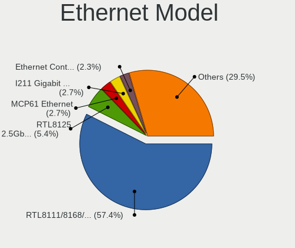

| Model                                                                      | Desktops | Percent |
|----------------------------------------------------------------------------|----------|---------|
| Realtek RTL8111/8168/8411 PCI Express Gigabit Ethernet Controller          | 126      | 60%     |
| Realtek RTL8125 2.5GbE Controller                                          | 9        | 4.29%   |
| Nvidia MCP61 Ethernet                                                      | 7        | 3.33%   |
| Intel I211 Gigabit Network Connection                                      | 6        | 2.86%   |
| Realtek RTL810xE PCI Express Fast Ethernet controller                      | 5        | 2.38%   |
| Intel Ethernet Controller I225-V                                           | 5        | 2.38%   |
| Intel 82579LM Gigabit Network Connection (Lewisville)                      | 5        | 2.38%   |
| JMicron JMC260 PCI Express Fast Ethernet Controller                        | 3        | 1.43%   |
| Intel 82579V Gigabit Network Connection                                    | 3        | 1.43%   |
| Qualcomm Atheros AR8151 v2.0 Gigabit Ethernet                              | 2        | 0.95%   |
| OPPO OnePlus Nord                                                          | 2        | 0.95%   |
| Intel Ethernet Connection I217-V                                           | 2        | 0.95%   |
| Intel Ethernet Connection (2) I219-V                                       | 2        | 0.95%   |
| Intel 82567LM-3 Gigabit Network Connection                                 | 2        | 0.95%   |
| Huawei MLA-L11                                                             | 2        | 0.95%   |
| Xiaomi Mi/Redmi series (RNDIS)                                             | 1        | 0.48%   |
| Xiaomi Mi/Redmi series (RNDIS + ADB)                                       | 1        | 0.48%   |
| Sundance Inc / IC Plus IC Plus IP100A Integrated 10/100 Ethernet MAC + PHY | 1        | 0.48%   |
| Samsung Galaxy series, misc. (tethering mode)                              | 1        | 0.48%   |
| Realtek RTL8152 Fast Ethernet Adapter                                      | 1        | 0.48%   |
| Realtek RTL-8100/8101L/8139 PCI Fast Ethernet Adapter                      | 1        | 0.48%   |
| Qualcomm Redmi Note 8                                                      | 1        | 0.48%   |
| Qualcomm Atheros QCA8171 Gigabit Ethernet                                  | 1        | 0.48%   |
| Qualcomm Atheros Killer E2500 Gigabit Ethernet Controller                  | 1        | 0.48%   |
| Qualcomm Atheros Killer E2400 Gigabit Ethernet Controller                  | 1        | 0.48%   |
| Qualcomm Atheros Killer E220x Gigabit Ethernet Controller                  | 1        | 0.48%   |
| Qualcomm Atheros AR8161 Gigabit Ethernet                                   | 1        | 0.48%   |
| Qualcomm Atheros AR8152 v2.0 Fast Ethernet                                 | 1        | 0.48%   |
| Qualcomm Atheros AR8121/AR8113/AR8114 Gigabit or Fast Ethernet             | 1        | 0.48%   |
| Intel PRO/100 VM Network Connection                                        | 1        | 0.48%   |
| Intel I210 Gigabit Network Connection                                      | 1        | 0.48%   |
| Intel Ethernet Connection I217-LM                                          | 1        | 0.48%   |
| Intel Ethernet Connection (2) I219-LM                                      | 1        | 0.48%   |
| Intel Ethernet Connection (2) I218-V                                       | 1        | 0.48%   |
| Intel Ethernet Connection (2) I218-LM                                      | 1        | 0.48%   |
| Intel Ethernet Connection (11) I219-LM                                     | 1        | 0.48%   |
| Intel Ethernet Connection (10) I219-V                                      | 1        | 0.48%   |
| Intel 82574L Gigabit Network Connection                                    | 1        | 0.48%   |
| Intel 82566DM Gigabit Network Connection                                   | 1        | 0.48%   |
| Intel 82562V-2 10/100 Network Connection                                   | 1        | 0.48%   |

Net Controller Kind
-------------------

Ethernet, WiFi or modem

| Kind     | Desktops | Percent |
|----------|----------|---------|
| Ethernet | 191      | 69.45%  |
| WiFi     | 81       | 29.45%  |
| Modem    | 3        | 1.09%   |

Used Controller
---------------

Currently used network controller

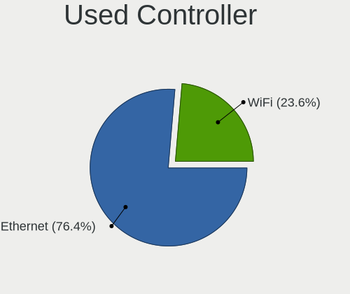

| Kind     | Desktops | Percent |
|----------|----------|---------|
| Ethernet | 156      | 76.1%   |
| WiFi     | 49       | 23.9%   |

NICs
----

Total network controllers on board

| Total | Desktops | Percent |
|-------|----------|---------|
| 1     | 156      | 80%     |
| 2     | 29       | 14.87%  |
| 3     | 8        | 4.1%    |
| 6     | 1        | 0.51%   |
| 0     | 1        | 0.51%   |

IPv6
----

IPv6 vs IPv4

| Used | Desktops | Percent |
|------|----------|---------|
| No   | 182      | 92.39%  |
| Yes  | 15       | 7.61%   |

Bluetooth
---------

Bluetooth Vendor
----------------

Controller vendors

| Vendor                     | Desktops | Percent |
|----------------------------|----------|---------|
| Intel                      | 21       | 41.18%  |
| Cambridge Silicon Radio    | 17       | 33.33%  |
| Realtek Semiconductor      | 5        | 9.8%    |
| Broadcom                   | 4        | 7.84%   |
| Lite-On Technology         | 1        | 1.96%   |
| Integrated System Solution | 1        | 1.96%   |
| IMC Networks               | 1        | 1.96%   |
| Unknown                    | 1        | 1.96%   |

Bluetooth Model
---------------

Controller models

| Model                                                 | Desktops | Percent |
|-------------------------------------------------------|----------|---------|
| Cambridge Silicon Radio Bluetooth Dongle (HCI mode)   | 17       | 33.33%  |
| Intel AX200 Bluetooth                                 | 7        | 13.73%  |
| Realtek Bluetooth Radio                               | 5        | 9.8%    |
| Intel AX201 Bluetooth                                 | 4        | 7.84%   |
| Intel Bluetooth Device                                | 3        | 5.88%   |
| Intel AX210 Bluetooth                                 | 3        | 5.88%   |
| Intel Bluetooth wireless interface                    | 2        | 3.92%   |
| Broadcom BCM2035 Bluetooth                            | 2        | 3.92%   |
| Lite-On Bluetooth Device                              | 1        | 1.96%   |
| Intel Wireless-AC 9260 Bluetooth Adapter              | 1        | 1.96%   |
| Intel Centrino Bluetooth Wireless Transceiver         | 1        | 1.96%   |
| Integrated System Solution KY-BT100 Bluetooth Adapter | 1        | 1.96%   |
| IMC Networks Bluetooth Device                         | 1        | 1.96%   |
| Broadcom BCM43142A0 Bluetooth 4.0                     | 1        | 1.96%   |
| Broadcom BCM20702A0 Bluetooth 4.0                     | 1        | 1.96%   |
| Unknown                                               | 1        | 1.96%   |

Sound
-----

Sound Vendor
------------

Sound card vendors

| Vendor                      | Desktops | Percent |
|-----------------------------|----------|---------|
| Intel                       | 107      | 34.52%  |
| AMD                         | 91       | 29.35%  |
| Nvidia                      | 72       | 23.23%  |
| C-Media Electronics         | 9        | 2.9%    |
| Generalplus Technology      | 4        | 1.29%   |
| Kingston Technology         | 3        | 0.97%   |
| DCMT Technology             | 3        | 0.97%   |
| SteelSeries ApS             | 2        | 0.65%   |
| Razer USA                   | 2        | 0.65%   |
| Logitech                    | 2        | 0.65%   |
| GN Netcom                   | 2        | 0.65%   |
| Giga-Byte Technology        | 2        | 0.65%   |
| ZOOM                        | 1        | 0.32%   |
| XMOS                        | 1        | 0.32%   |
| Fry's Electronics           | 1        | 0.32%   |
| FiiO Electronics Technology | 1        | 0.32%   |
| FIFINE 683 Microphone       | 1        | 0.32%   |
| Elgato Systems              | 1        | 0.32%   |
| Corsair                     | 1        | 0.32%   |
| Cooler Master               | 1        | 0.32%   |
| ASUSTek Computer            | 1        | 0.32%   |
| Arturia                     | 1        | 0.32%   |
| AKAI Professional M.I.      | 1        | 0.32%   |

Sound Model
-----------

Sound card models

| Model                                                                             | Desktops | Percent |
|-----------------------------------------------------------------------------------|----------|---------|
| AMD FCH Azalia Controller                                                         | 22       | 5.74%   |
| AMD Family 17h/19h HD Audio Controller                                            | 21       | 5.48%   |
| Intel NM10/ICH7 Family High Definition Audio Controller                           | 18       | 4.7%    |
| Intel 6 Series/C200 Series Chipset Family High Definition Audio Controller        | 16       | 4.18%   |
| Intel 8 Series/C220 Series Chipset High Definition Audio Controller               | 14       | 3.66%   |
| AMD Starship/Matisse HD Audio Controller                                          | 13       | 3.39%   |
| AMD Ellesmere HDMI Audio [Radeon RX 470/480 / 570/580/590]                        | 13       | 3.39%   |
| Intel Xeon E3-1200 v3/4th Gen Core Processor HD Audio Controller                  | 12       | 3.13%   |
| AMD Raven/Raven2/Fenghuang HDMI/DP Audio Controller                               | 12       | 3.13%   |
| Nvidia GF108 High Definition Audio Controller                                     | 11       | 2.87%   |
| Intel 200 Series PCH HD Audio                                                     | 10       | 2.61%   |
| AMD Family 17h (Models 00h-0fh) HD Audio Controller                               | 10       | 2.61%   |
| Nvidia MCP61 High Definition Audio                                                | 9        | 2.35%   |
| Intel 100 Series/C230 Series Chipset Family HD Audio Controller                   | 9        | 2.35%   |
| Intel 7 Series/C216 Chipset Family High Definition Audio Controller               | 8        | 2.09%   |
| AMD SBx00 Azalia (Intel HDA)                                                      | 8        | 2.09%   |
| AMD Baffin HDMI/DP Audio [Radeon RX 550 640SP / RX 560/560X]                      | 8        | 2.09%   |
| Nvidia GP107GL High Definition Audio Controller                                   | 7        | 1.83%   |
| Nvidia GK208 HDMI/DP Audio Controller                                             | 7        | 1.83%   |
| AMD Renoir Radeon High Definition Audio Controller                                | 7        | 1.83%   |
| AMD Oland/Hainan/Cape Verde/Pitcairn HDMI Audio [Radeon HD 7000 Series]           | 7        | 1.83%   |
| AMD Trinity HDMI Audio Controller                                                 | 6        | 1.57%   |
| Nvidia TU116 High Definition Audio Controller                                     | 5        | 1.31%   |
| Nvidia GA102 High Definition Audio Controller                                     | 5        | 1.31%   |
| Intel 9 Series Chipset Family HD Audio Controller                                 | 5        | 1.31%   |
| AMD Kaveri HDMI/DP Audio Controller                                               | 5        | 1.31%   |
| Nvidia GP108 High Definition Audio Controller                                     | 4        | 1.04%   |
| Nvidia GP104 High Definition Audio Controller                                     | 4        | 1.04%   |
| Intel Tiger Lake-H HD Audio Controller                                            | 4        | 1.04%   |
| Generalplus Technology USB Audio Device                                           | 4        | 1.04%   |
| Nvidia TU106 High Definition Audio Controller                                     | 3        | 0.78%   |
| Nvidia High Definition Audio Controller                                           | 3        | 0.78%   |
| Nvidia GP106 High Definition Audio Controller                                     | 3        | 0.78%   |
| Nvidia GM204 High Definition Audio Controller                                     | 3        | 0.78%   |
| Nvidia GM107 High Definition Audio Controller [GeForce 940MX]                     | 3        | 0.78%   |
| Intel Smart Sound Technology (SST) Audio Controller                               | 3        | 0.78%   |
| Intel Cannon Lake PCH cAVS                                                        | 3        | 0.78%   |
| DCMT Technology USB Condenser Microphone                                          | 3        | 0.78%   |
| C-Media Electronics KLIM Mantis Audio 7.1                                         | 3        | 0.78%   |
| AMD Caicos HDMI Audio [Radeon HD 6450 / 7450/8450/8490 OEM / R5 230/235/235X OEM] | 3        | 0.78%   |

Memory
------

Memory Vendor
-------------

Memory module vendors

| Vendor              | Desktops | Percent |
|---------------------|----------|---------|
| Kingston            | 23       | 26.44%  |
| Unknown             | 10       | 11.49%  |
| Team                | 9        | 10.34%  |
| G.Skill             | 7        | 8.05%   |
| Samsung Electronics | 6        | 6.9%    |
| Corsair             | 6        | 6.9%    |
| SK hynix            | 4        | 4.6%    |
| Crucial             | 3        | 3.45%   |
| Unknown             | 3        | 3.45%   |
| PNY                 | 2        | 2.3%    |
| Patriot             | 2        | 2.3%    |
| Kingmax             | 2        | 2.3%    |
| Uroad               | 1        | 1.15%   |
| Unknown (89BA)      | 1        | 1.15%   |
| Unknown (0x0B79)    | 1        | 1.15%   |
| Unifosa             | 1        | 1.15%   |
| Transcend           | 1        | 1.15%   |
| Silicon Power       | 1        | 1.15%   |
| Nanya Technology    | 1        | 1.15%   |
| Mitsubishi          | 1        | 1.15%   |
| Carry               | 1        | 1.15%   |
| A-DATA Technology   | 1        | 1.15%   |

Memory Model
------------

Memory module models

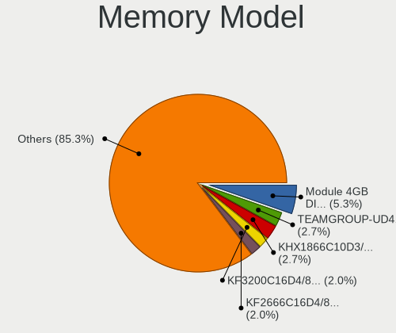

| Model                                                        | Desktops | Percent |
|--------------------------------------------------------------|----------|---------|
| Kingston RAM KHX1866C10D3/8G 8GB DIMM DDR3 2133MT/s          | 4        | 4.4%    |
| Team RAM TEAMGROUP-UD4-3200 8GB DIMM DDR4 3800MT/s           | 3        | 3.3%    |
| G.Skill RAM F4-3200C16-8GVKB 8192MB DIMM DDR4 3866MT/s       | 3        | 3.3%    |
| Unknown                                                      | 3        | 3.3%    |
| Team RAM TEAMGROUP-UD4-3200 8GB DIMM DDR4 3733MT/s           | 2        | 2.2%    |
| Team RAM TEAMGROUP-UD4-2400 4GB DIMM DDR4 2400MT/s           | 2        | 2.2%    |
| Patriot RAM PSD34G160081 4GB DIMM DDR3 1600MT/s              | 2        | 2.2%    |
| Kingston RAM KHX3200C16D4/8GX 8192MB DIMM DDR4 3600MT/s      | 2        | 2.2%    |
| Kingston RAM KF2666C16D4/8G 8GB DIMM DDR4 2667MT/s           | 2        | 2.2%    |
| Kingston RAM HX313C9F/8 8GB DIMM DDR3 1333MT/s               | 2        | 2.2%    |
| Corsair RAM CMT128GX4M4C3200C16 32GB DIMM DDR4 3200MT/s      | 2        | 2.2%    |
| Corsair RAM CML8GX3M2A1600C9 4GB DIMM DDR3 1867MT/s          | 2        | 2.2%    |
| Uroad RAM WJD8G4M16P12800 8192MB DIMM DDR3 1600MT/s          | 1        | 1.1%    |
| Unknown RAM Module 8192MB DIMM                               | 1        | 1.1%    |
| Unknown RAM Module 4GB SODIMM DDR3 1333MT/s                  | 1        | 1.1%    |
| Unknown RAM Module 4GB DIMM DDR4 2133MT/s                    | 1        | 1.1%    |
| Unknown RAM Module 4GB DIMM DDR3 1333MT/s                    | 1        | 1.1%    |
| Unknown RAM Module 4GB DIMM 1600MT/s                         | 1        | 1.1%    |
| Unknown RAM Module 4096MB DIMM DDR2                          | 1        | 1.1%    |
| Unknown RAM Module 2GB DIMM DDR2 1067MT/s                    | 1        | 1.1%    |
| Unknown RAM Module 1GB DIMM DDR2                             | 1        | 1.1%    |
| Unknown RAM Module 16384MB DIMM DDR4 2666MT/s                | 1        | 1.1%    |
| Unknown RAM Module 1024MB DIMM DDR2 667MT/s                  | 1        | 1.1%    |
| Unknown RAM Module 1024MB DIMM DDR2                          | 1        | 1.1%    |
| Unknown RAM KZ24UE5116HAR8 8192MB DIMM DDR4 2400MT/s         | 1        | 1.1%    |
| Unknown (89BA) RAM MMV16GD426C19S 16GB SODIMM DDR4 2667MT/s  | 1        | 1.1%    |
| Unknown (0x0B79) RAM Module 8GB DIMM DDR4 3200MT/s           | 1        | 1.1%    |
| Unifosa RAM GU512303EP0202 2048MB DIMM DDR3 1333MT/s         | 1        | 1.1%    |
| Transcend RAM TS2GLH64V4B 16384MB DIMM DDR4 2400MT/s         | 1        | 1.1%    |
| Team RAM TEAMGROUP-UD4-3600 8GB DIMM DDR4 3600MT/s           | 1        | 1.1%    |
| Team RAM TEAMGROUP-UD3-1600 8192MB DIMM DDR3 1600MT/s        | 1        | 1.1%    |
| SK hynix RAM Module 8192MB DIMM DDR4 2133MT/s                | 1        | 1.1%    |
| SK hynix RAM HMT451U6BFR8A-PB 4GB DIMM DDR3 1648MT/s         | 1        | 1.1%    |
| SK hynix RAM HMT351U6EFR8C-PB 4GB DIMM DDR3 1800MT/s         | 1        | 1.1%    |
| SK hynix RAM HMA81GR7MFR8N-UH 8GB DIMM DDR4 2400MT/s         | 1        | 1.1%    |
| SK hynix RAM HMA81GR7AFR8N-UH 8GB DIMM DDR4 2400MT/s         | 1        | 1.1%    |
| Silicon Power RAM SP008GBLFU266B02 8192MB DIMM DDR4 2400MT/s | 1        | 1.1%    |
| Samsung RAM Module 4096MB DIMM DDR4 2133MT/s                 | 1        | 1.1%    |
| Samsung RAM Module 2GB Row Of Chips LPDDR4 4267MT/s          | 1        | 1.1%    |
| Samsung RAM M378B5173DB0-CK0 4GB DIMM DDR3 1600MT/s          | 1        | 1.1%    |

Memory Kind
-----------

Memory module kinds

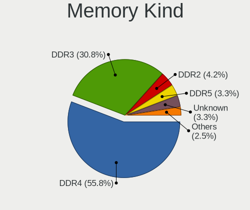

| Kind    | Desktops | Percent |
|---------|----------|---------|
| DDR4    | 44       | 57.14%  |
| DDR3    | 25       | 32.47%  |
| DDR2    | 4        | 5.19%   |
| Unknown | 2        | 2.6%    |
| SDRAM   | 1        | 1.3%    |
| LPDDR4  | 1        | 1.3%    |

Memory Form Factor
------------------

Physical design of the memory module

| Name         | Desktops | Percent |
|--------------|----------|---------|
| DIMM         | 75       | 96.15%  |
| SODIMM       | 2        | 2.56%   |
| Row Of Chips | 1        | 1.28%   |

Memory Size
-----------

Memory module size

| Size  | Desktops | Percent |
|-------|----------|---------|
| 8192  | 38       | 45.24%  |
| 4096  | 19       | 22.62%  |
| 16384 | 12       | 14.29%  |
| 32768 | 8        | 9.52%   |
| 2048  | 4        | 4.76%   |
| 1024  | 3        | 3.57%   |

Memory Speed
------------

Memory module speed

| Speed   | Desktops | Percent |
|---------|----------|---------|
| 1600    | 13       | 16.05%  |
| 3200    | 9        | 11.11%  |
| 2133    | 8        | 9.88%   |
| 3600    | 7        | 8.64%   |
| 2400    | 7        | 8.64%   |
| 2667    | 5        | 6.17%   |
| 1333    | 5        | 6.17%   |
| 3866    | 3        | 3.7%    |
| 3800    | 3        | 3.7%    |
| 3733    | 3        | 3.7%    |
| Unknown | 3        | 3.7%    |
| 2666    | 2        | 2.47%   |
| 1867    | 2        | 2.47%   |
| 1800    | 2        | 2.47%   |
| 4267    | 1        | 1.23%   |
| 3500    | 1        | 1.23%   |
| 3466    | 1        | 1.23%   |
| 2933    | 1        | 1.23%   |
| 2448    | 1        | 1.23%   |
| 1648    | 1        | 1.23%   |
| 1067    | 1        | 1.23%   |
| 800     | 1        | 1.23%   |
| 667     | 1        | 1.23%   |

Printers & scanners
-------------------

Printer Vendor
--------------

Printer device vendors

| Vendor             | Desktops | Percent |
|--------------------|----------|---------|
| Seiko Epson        | 3        | 42.86%  |
| Canon              | 2        | 28.57%  |
| Hewlett-Packard    | 1        | 14.29%  |
| Brother Industries | 1        | 14.29%  |

Printer Model
-------------

Printer device models

| Model                     | Desktops | Percent |
|---------------------------|----------|---------|
| Seiko Epson L120 Series   | 2        | 28.57%  |
| Seiko Epson L3110 Series  | 1        | 14.29%  |
| HP Smart Tank 610 series  | 1        | 14.29%  |
| Canon PIXMA MG2500 Series | 1        | 14.29%  |
| Canon G2010 series        | 1        | 14.29%  |
| Brother DCP-T700W         | 1        | 14.29%  |

Scanner Vendor
--------------

Scanner device vendors

Zero info for selected period =(

Scanner Model
-------------

Scanner device models

Zero info for selected period =(

Camera
------

Camera Vendor
-------------

Camera device vendors

| Vendor                      | Desktops | Percent |
|-----------------------------|----------|---------|
| Microdia                    | 7        | 14.29%  |
| Logitech                    | 6        | 12.24%  |
| A4Tech                      | 6        | 12.24%  |
| Z-Star Microelectronics     | 4        | 8.16%   |
| Jieli Technology            | 4        | 8.16%   |
| Realtek Semiconductor       | 3        | 6.12%   |
| Pixart Imaging              | 3        | 6.12%   |
| Cubeternet                  | 3        | 6.12%   |
| Samsung Electronics         | 2        | 4.08%   |
| Razer USA                   | 2        | 4.08%   |
| Generalplus Technology      | 2        | 4.08%   |
| Apple                       | 2        | 4.08%   |
| Silicon Motion              | 1        | 2.04%   |
| OPPO Electronics            | 1        | 2.04%   |
| KYE Systems (Mouse Systems) | 1        | 2.04%   |
| Aveo Technology             | 1        | 2.04%   |
| Alcor Micro                 | 1        | 2.04%   |

Camera Model
------------

Camera device models

| Model                                                               | Desktops | Percent |
|---------------------------------------------------------------------|----------|---------|
| Jieli USB PHY 2.0                                                   | 4        | 8.16%   |
| A4Tech FHD 1080P PC Camera                                          | 4        | 8.16%   |
| Z-Star Venus USB2.0 Camera                                          | 3        | 6.12%   |
| Pixart Imaging GE 1.3 MP MiniCam Pro                                | 3        | 6.12%   |
| Microdia Integrated Camera                                          | 3        | 6.12%   |
| Logitech Webcam C270                                                | 3        | 6.12%   |
| Razer USA Gaming Webcam [Kiyo]                                      | 2        | 4.08%   |
| Microdia Sonix USB 2.0 Camera                                       | 2        | 4.08%   |
| Logitech HD Webcam C910                                             | 2        | 4.08%   |
| Apple iPhone 5/5C/5S/6/SE/7/8/X                                     | 2        | 4.08%   |
| Z-Star Vega USB 2.0 Camera.                                         | 1        | 2.04%   |
| Silicon Motion 300k Pixel Camera                                    | 1        | 2.04%   |
| Samsung USB2.0 UVC HQ WebCam                                        | 1        | 2.04%   |
| Samsung Galaxy series, misc. (MTP mode)                             | 1        | 2.04%   |
| Realtek HD Camera                                                   | 1        | 2.04%   |
| Realtek Front Camera                                                | 1        | 2.04%   |
| Realtek BRI-S90AF                                                   | 1        | 2.04%   |
| OPPO SM6375-QRD _SN:20E26CB1                                        | 1        | 2.04%   |
| Microdia rapoo camera                                               | 1        | 2.04%   |
| Microdia GC02M2                                                     | 1        | 2.04%   |
| Logitech HD Webcam B910                                             | 1        | 2.04%   |
| KYE Systems (Mouse Systems) Genius Webcam                           | 1        | 2.04%   |
| Generalplus WEB CAM                                                 | 1        | 2.04%   |
| Generalplus 808 Camera                                              | 1        | 2.04%   |
| Cubeternet USB2.0 Camera                                            | 1        | 2.04%   |
| Cubeternet GL-UPC822 UVC WebCam                                     | 1        | 2.04%   |
| Cubeternet EtronTech CMOS based eSP570 WebCam [Onyx Titanium TC101] | 1        | 2.04%   |
| Aveo UVC camera (Bresser microscope)                                | 1        | 2.04%   |
| Alcor Micro USB 2.0 PC cam                                          | 1        | 2.04%   |
| A4Tech REDRAGON Live Camera                                         | 1        | 2.04%   |
| A4Tech PC Camera                                                    | 1        | 2.04%   |

Security
--------

Fingerprint Vendor
------------------

Fingerprint sensor vendors

Zero info for selected period =(

Fingerprint Model
-----------------

Fingerprint sensor models

Zero info for selected period =(

Chipcard Vendor
---------------

Chipcard module vendors

| Vendor      | Desktops | Percent |
|-------------|----------|---------|
| Alcor Micro | 1        | 100%    |

Chipcard Model
--------------

Chipcard module models

| Model                               | Desktops | Percent |
|-------------------------------------|----------|---------|
| Alcor Micro AU9540 Smartcard Reader | 1        | 100%    |

Unsupported
-----------

Unsupported Devices
-------------------

Total unsupported devices on board

| Total | Desktops | Percent |
|-------|----------|---------|
| 0     | 168      | 84.85%  |
| 1     | 26       | 13.13%  |
| 2     | 4        | 2.02%   |

Unsupported Device Types
------------------------

Types of unsupported devices

| Type                     | Desktops | Percent |
|--------------------------|----------|---------|
| Net/wireless             | 13       | 39.39%  |
| Graphics card            | 12       | 36.36%  |
| Unassigned class         | 1        | 3.03%   |
| Storage/raid             | 1        | 3.03%   |
| Sound                    | 1        | 3.03%   |
| Network                  | 1        | 3.03%   |
| Net/ethernet             | 1        | 3.03%   |
| Communication controller | 1        | 3.03%   |
| Chipcard                 | 1        | 3.03%   |
| Camera                   | 1        | 3.03%   |

