Linux in Philippines - Tested Hardware & Statistics (Notebooks)
---------------------------------------------------------------

A project to collect tested hardware configurations for Linux in Philippines.

Anyone can contribute to this report by the [hw-probe](https://github.com/linuxhw/hw-probe) tool:

    sudo -E hw-probe -all -upload

Please contribute! Especially if your hardware is rare.

Contents
--------

* [ Test Cases ](#test-cases)

* [ System ](#system)
  - [ OS                       ](#os)
  - [ OS Family                ](#os-family)
  - [ Kernel                   ](#kernel)
  - [ Kernel Family            ](#kernel-family)
  - [ Kernel Major Ver.        ](#kernel-major-ver)
  - [ Arch                     ](#arch)
  - [ DE                       ](#de)
  - [ Display Server           ](#display-server)
  - [ Display Manager          ](#display-manager)
  - [ OS Lang                  ](#os-lang)
  - [ Boot Mode                ](#boot-mode)
  - [ Filesystem               ](#filesystem)
  - [ Part. scheme             ](#part-scheme)
  - [ Dual Boot with Linux/BSD ](#dual-boot-with-linuxbsd)
  - [ Dual Boot (Win)          ](#dual-boot-win)

* [ Board ](#board)
  - [ Vendor                   ](#vendor)
  - [ Model                    ](#model)
  - [ Model Family             ](#model-family)
  - [ MFG Year                 ](#mfg-year)
  - [ Form Factor              ](#form-factor)
  - [ Secure Boot              ](#secure-boot)
  - [ Coreboot                 ](#coreboot)
  - [ RAM Size                 ](#ram-size)
  - [ RAM Used                 ](#ram-used)
  - [ Total Drives             ](#total-drives)
  - [ Has CD-ROM               ](#has-cd-rom)
  - [ Has Ethernet             ](#has-ethernet)
  - [ Has WiFi                 ](#has-wifi)
  - [ Has Bluetooth            ](#has-bluetooth)

* [ Location ](#location)
  - [ Country                  ](#country)
  - [ City                     ](#city)

* [ Drives ](#drives)
  - [ Drive Vendor             ](#drive-vendor)
  - [ Drive Model              ](#drive-model)
  - [ HDD Vendor               ](#hdd-vendor)
  - [ SSD Vendor               ](#ssd-vendor)
  - [ Drive Kind               ](#drive-kind)
  - [ Drive Connector          ](#drive-connector)
  - [ Drive Size               ](#drive-size)
  - [ Space Total              ](#space-total)
  - [ Space Used               ](#space-used)
  - [ Malfunc. Drives          ](#malfunc-drives)
  - [ Malfunc. Drive Vendor    ](#malfunc-drive-vendor)
  - [ Malfunc. HDD Vendor      ](#malfunc-hdd-vendor)
  - [ Malfunc. Drive Kind      ](#malfunc-drive-kind)
  - [ Failed Drives            ](#failed-drives)
  - [ Failed Drive Vendor      ](#failed-drive-vendor)
  - [ Drive Status             ](#drive-status)

* [ Storage controller ](#storage-controller)
  - [ Storage Vendor           ](#storage-vendor)
  - [ Storage Model            ](#storage-model)
  - [ Storage Kind             ](#storage-kind)

* [ Processor ](#processor)
  - [ CPU Vendor               ](#cpu-vendor)
  - [ CPU Model                ](#cpu-model)
  - [ CPU Model Family         ](#cpu-model-family)
  - [ CPU Cores                ](#cpu-cores)
  - [ CPU Sockets              ](#cpu-sockets)
  - [ CPU Threads              ](#cpu-threads)
  - [ CPU Op-Modes             ](#cpu-op-modes)
  - [ CPU Microcode            ](#cpu-microcode)
  - [ CPU Microarch            ](#cpu-microarch)

* [ Graphics ](#graphics)
  - [ GPU Vendor               ](#gpu-vendor)
  - [ GPU Model                ](#gpu-model)
  - [ GPU Combo                ](#gpu-combo)
  - [ GPU Driver               ](#gpu-driver)
  - [ GPU Memory               ](#gpu-memory)

* [ Monitor ](#monitor)
  - [ Monitor Vendor           ](#monitor-vendor)
  - [ Monitor Model            ](#monitor-model)
  - [ Monitor Resolution       ](#monitor-resolution)
  - [ Monitor Diagonal         ](#monitor-diagonal)
  - [ Monitor Width            ](#monitor-width)
  - [ Aspect Ratio             ](#aspect-ratio)
  - [ Monitor Area             ](#monitor-area)
  - [ Pixel Density            ](#pixel-density)
  - [ Multiple Monitors        ](#multiple-monitors)

* [ Network ](#network)
  - [ Net Controller Vendor    ](#net-controller-vendor)
  - [ Net Controller Model     ](#net-controller-model)
  - [ Wireless Vendor          ](#wireless-vendor)
  - [ Wireless Model           ](#wireless-model)
  - [ Ethernet Vendor          ](#ethernet-vendor)
  - [ Ethernet Model           ](#ethernet-model)
  - [ Net Controller Kind      ](#net-controller-kind)
  - [ Used Controller          ](#used-controller)
  - [ NICs                     ](#nics)
  - [ IPv6                     ](#ipv6)

* [ Bluetooth ](#bluetooth)
  - [ Bluetooth Vendor         ](#bluetooth-vendor)
  - [ Bluetooth Model          ](#bluetooth-model)

* [ Sound ](#sound)
  - [ Sound Vendor             ](#sound-vendor)
  - [ Sound Model              ](#sound-model)

* [ Memory ](#memory)
  - [ Memory Vendor            ](#memory-vendor)
  - [ Memory Model             ](#memory-model)
  - [ Memory Kind              ](#memory-kind)
  - [ Memory Form Factor       ](#memory-form-factor)
  - [ Memory Size              ](#memory-size)
  - [ Memory Speed             ](#memory-speed)

* [ Printers & scanners ](#printers--scanners)
  - [ Printer Vendor           ](#printer-vendor)
  - [ Printer Model            ](#printer-model)
  - [ Scanner Vendor           ](#scanner-vendor)
  - [ Scanner Model            ](#scanner-model)

* [ Camera ](#camera)
  - [ Camera Vendor            ](#camera-vendor)
  - [ Camera Model             ](#camera-model)

* [ Security ](#security)
  - [ Fingerprint Vendor       ](#fingerprint-vendor)
  - [ Fingerprint Model        ](#fingerprint-model)
  - [ Chipcard Vendor          ](#chipcard-vendor)
  - [ Chipcard Model           ](#chipcard-model)

* [ Unsupported ](#unsupported)
  - [ Unsupported Devices      ](#unsupported-devices)
  - [ Unsupported Device Types ](#unsupported-device-types)

Test Cases
----------

Total: 973

| Vendor        | Model                       | Probe                                                      | Date         |
|---------------|-----------------------------|------------------------------------------------------------|--------------|
| Acer          | Aspire AL14-31P             | [6c464ca549](https://linux-hardware.org/?probe=6c464ca549) | Jan 02, 2026 |
| Acer          | Predator PH16-71            | [5de143083e](https://linux-hardware.org/?probe=5de143083e) | Jan 01, 2026 |
| Lenovo        | IdeaPad Slim 3 15IRH8 83... | [38e1a532f5](https://linux-hardware.org/?probe=38e1a532f5) | Dec 31, 2025 |
| MSI           | CX62 7QL                    | [f8d7b911fe](https://linux-hardware.org/?probe=f8d7b911fe) | Dec 31, 2025 |
| Lenovo        | IdeaPad 330S-14IKB 81F4     | [7fa04f1742](https://linux-hardware.org/?probe=7fa04f1742) | Dec 30, 2025 |
| Lenovo        | ThinkPad X270 20HMA1G5JP    | [8d34842fa8](https://linux-hardware.org/?probe=8d34842fa8) | Dec 30, 2025 |
| Apple         | MacBookAir7,2               | [62b3582f58](https://linux-hardware.org/?probe=62b3582f58) | Dec 29, 2025 |
| Acer          | Aspire AL14-31P             | [d0f05660b4](https://linux-hardware.org/?probe=d0f05660b4) | Dec 29, 2025 |
| Toshiba       | Satellite P755              | [2d532f5177](https://linux-hardware.org/?probe=2d532f5177) | Dec 27, 2025 |
| System76      | Gazelle                     | [f3e752bc4d](https://linux-hardware.org/?probe=f3e752bc4d) | Dec 25, 2025 |
| Acer          | Predator PH16-71            | [ed0a3a083b](https://linux-hardware.org/?probe=ed0a3a083b) | Dec 22, 2025 |
| HP            | Laptop 15-dy5xxx            | [7d3d4e7afc](https://linux-hardware.org/?probe=7d3d4e7afc) | Dec 14, 2025 |
| HP            | Laptop 15-dy5xxx            | [3d3c6ae3d7](https://linux-hardware.org/?probe=3d3c6ae3d7) | Dec 14, 2025 |
| ASUSTek       | UX303UB                     | [55f3eb6345](https://linux-hardware.org/?probe=55f3eb6345) | Dec 12, 2025 |
| HUAWEI        | KLVL-WXXW                   | [45bd96e422](https://linux-hardware.org/?probe=45bd96e422) | Dec 10, 2025 |
| Acer          | Aspire AL14-31P             | [783897c4b3](https://linux-hardware.org/?probe=783897c4b3) | Dec 06, 2025 |
| ASUSTek       | ASUS TUF Gaming A15 FA50... | [946c4e21d3](https://linux-hardware.org/?probe=946c4e21d3) | Dec 05, 2025 |
| ASUSTek       | Vivobook Go E1504FA_E150... | [94b59a8a64](https://linux-hardware.org/?probe=94b59a8a64) | Dec 04, 2025 |
| MSI           | GF63 Thin 11UC              | [4028228fee](https://linux-hardware.org/?probe=4028228fee) | Dec 04, 2025 |
| Acer          | Aspire AL15-41P             | [96dee9b329](https://linux-hardware.org/?probe=96dee9b329) | Dec 02, 2025 |
| Acer          | Aspire AL15-41P             | [a2bd431e7f](https://linux-hardware.org/?probe=a2bd431e7f) | Dec 02, 2025 |
| ASUSTek       | VivoBook_ASUSLaptop M160... | [d01aedb027](https://linux-hardware.org/?probe=d01aedb027) | Dec 02, 2025 |
| Acer          | Predator PH16-71            | [2cde72b789](https://linux-hardware.org/?probe=2cde72b789) | Nov 30, 2025 |
| Lenovo        | IdeaPad Slim 3 14ABR8 82... | [30c82612eb](https://linux-hardware.org/?probe=30c82612eb) | Nov 26, 2025 |
| Lenovo        | ThinkPad A285 20MXS00P00    | [0a0ca8f451](https://linux-hardware.org/?probe=0a0ca8f451) | Nov 25, 2025 |
| Lenovo        | ThinkPad A285 20MXS00P00    | [1b735d7fd6](https://linux-hardware.org/?probe=1b735d7fd6) | Nov 23, 2025 |
| Lenovo        | IdeaPad 330-14IGM 81D0      | [74be7346d2](https://linux-hardware.org/?probe=74be7346d2) | Nov 20, 2025 |
| HP            | Pavilion 17                 | [b5fb4102bd](https://linux-hardware.org/?probe=b5fb4102bd) | Nov 19, 2025 |
| Acer          | Extensa 5230                | [2d0ffe0b6f](https://linux-hardware.org/?probe=2d0ffe0b6f) | Nov 16, 2025 |
| Acer          | Aspire ES1-132              | [5439048149](https://linux-hardware.org/?probe=5439048149) | Nov 16, 2025 |
| Lenovo        | 100e 2nd Gen 82GJ           | [1036272071](https://linux-hardware.org/?probe=1036272071) | Nov 14, 2025 |
| MSI           | Modern 14 B4MW              | [654d435e07](https://linux-hardware.org/?probe=654d435e07) | Nov 09, 2025 |
| ASUSTek       | Vivobook Go E1504FA_E150... | [5b95617465](https://linux-hardware.org/?probe=5b95617465) | Nov 09, 2025 |
| Acer          | Aspire A514-52KG            | [2e1d444461](https://linux-hardware.org/?probe=2e1d444461) | Nov 06, 2025 |
| Lenovo        | IdeaPad Gaming 3 15ACH6 ... | [b165261e8f](https://linux-hardware.org/?probe=b165261e8f) | Nov 04, 2025 |
| Acer          | Predator PH16-71            | [dc70103ae0](https://linux-hardware.org/?probe=dc70103ae0) | Nov 01, 2025 |
| NEC Comput... | PC-VK24LXZCE                | [423e99f492](https://linux-hardware.org/?probe=423e99f492) | Oct 30, 2025 |
| Toshiba       | Satellite P55t-C            | [f1bb703b0d](https://linux-hardware.org/?probe=f1bb703b0d) | Oct 28, 2025 |
| Lenovo        | IdeaPad 500-15ISK 80NT      | [b7a8c6ed4b](https://linux-hardware.org/?probe=b7a8c6ed4b) | Oct 26, 2025 |
| Lenovo        | ThinkPad T14 Gen 3 21CGS... | [830d947374](https://linux-hardware.org/?probe=830d947374) | Oct 23, 2025 |
| ASUSTek       | VivoBook_ASUSLaptop X421... | [be957bdc0c](https://linux-hardware.org/?probe=be957bdc0c) | Oct 18, 2025 |
| ASUSTek       | ROG GU501GM                 | [697ad64875](https://linux-hardware.org/?probe=697ad64875) | Oct 16, 2025 |
| Acer          | Predator PH16-71            | [c150a37460](https://linux-hardware.org/?probe=c150a37460) | Oct 16, 2025 |
| Acer          | Aspire A514-52K             | [db51382800](https://linux-hardware.org/?probe=db51382800) | Oct 14, 2025 |
| Valve         | Jupiter                     | [0de695e721](https://linux-hardware.org/?probe=0de695e721) | Oct 12, 2025 |
| Notebook      | PCX0DX                      | [b520a06c74](https://linux-hardware.org/?probe=b520a06c74) | Oct 04, 2025 |
| Lenovo        | V330-15IKB 81AX             | [e429f3df99](https://linux-hardware.org/?probe=e429f3df99) | Oct 01, 2025 |
| Lenovo        | ThinkPad T400 2768BB1       | [1d0da6a2e1](https://linux-hardware.org/?probe=1d0da6a2e1) | Sep 28, 2025 |
| Acer          | Predator PH16-71            | [267937a990](https://linux-hardware.org/?probe=267937a990) | Sep 28, 2025 |
| ASUSTek       | X555QG                      | [97e3449156](https://linux-hardware.org/?probe=97e3449156) | Sep 27, 2025 |
| Acer          | Aspire E3-111               | [f7d8f1fb57](https://linux-hardware.org/?probe=f7d8f1fb57) | Sep 27, 2025 |
| Acer          | Aspire E3-111               | [4280ac029f](https://linux-hardware.org/?probe=4280ac029f) | Sep 27, 2025 |
| ASUSTek       | X555QG                      | [1c2f1da003](https://linux-hardware.org/?probe=1c2f1da003) | Sep 27, 2025 |
| ASUSTek       | VivoBook_ASUSLaptop X160... | [7bc6acee34](https://linux-hardware.org/?probe=7bc6acee34) | Sep 27, 2025 |
| Dell          | Inspiron 3593               | [6b2c7ecdd8](https://linux-hardware.org/?probe=6b2c7ecdd8) | Sep 26, 2025 |
| Lenovo        | ThinkPad T480 20L5S1S000    | [f2e528b52f](https://linux-hardware.org/?probe=f2e528b52f) | Sep 24, 2025 |
| Acer          | Aspire A315-41G             | [ff14b8f6f6](https://linux-hardware.org/?probe=ff14b8f6f6) | Sep 23, 2025 |
| Acer          | Predator PH16-71            | [248a528b3b](https://linux-hardware.org/?probe=248a528b3b) | Sep 16, 2025 |
| Acer          | Aspire AG15-31P             | [7e93a969d2](https://linux-hardware.org/?probe=7e93a969d2) | Sep 15, 2025 |
| HUAWEI        | NBLK-WAX9X                  | [cbd317ff4e](https://linux-hardware.org/?probe=cbd317ff4e) | Sep 15, 2025 |
| Acer          | Swift SF314-42              | [3727f5e293](https://linux-hardware.org/?probe=3727f5e293) | Sep 14, 2025 |
| Acer          | Aspire A315-41              | [d3f228ec0d](https://linux-hardware.org/?probe=d3f228ec0d) | Sep 14, 2025 |
| Acer          | Predator PH16-71            | [1b2c696e37](https://linux-hardware.org/?probe=1b2c696e37) | Sep 09, 2025 |
| HP            | ProBook 6470b               | [196281b7f7](https://linux-hardware.org/?probe=196281b7f7) | Sep 08, 2025 |
| Valve         | Jupiter                     | [643f2de8a5](https://linux-hardware.org/?probe=643f2de8a5) | Sep 05, 2025 |
| Dell          | Latitude 5520               | [b5a470cbe7](https://linux-hardware.org/?probe=b5a470cbe7) | Sep 05, 2025 |
| Acer          | Aspire E5-476G              | [39b729e723](https://linux-hardware.org/?probe=39b729e723) | Sep 05, 2025 |
| Acer          | Predator PH16-71            | [50ee39f3bf](https://linux-hardware.org/?probe=50ee39f3bf) | Sep 05, 2025 |
| ASUSTek       | VivoBook_ASUSLaptop X160... | [4266cd296a](https://linux-hardware.org/?probe=4266cd296a) | Sep 03, 2025 |
| ASUSTek       | VivoBook_ASUSLaptop X160... | [901f5d63e6](https://linux-hardware.org/?probe=901f5d63e6) | Sep 03, 2025 |
| Dell          | Vostro 15 3510              | [76c40add66](https://linux-hardware.org/?probe=76c40add66) | Sep 01, 2025 |
| Lenovo        | ThinkPad Helix 370132J      | [54ffbe44d2](https://linux-hardware.org/?probe=54ffbe44d2) | Aug 31, 2025 |
| Acer          | Aspire V5-471P              | [24f90c7de8](https://linux-hardware.org/?probe=24f90c7de8) | Aug 30, 2025 |
| HP            | ProBook 430 G5              | [817c500f1f](https://linux-hardware.org/?probe=817c500f1f) | Aug 30, 2025 |
| ASUSTek       | X555UB                      | [e069d5f3b1](https://linux-hardware.org/?probe=e069d5f3b1) | Aug 29, 2025 |
| Dell          | Vostro 15 3510              | [b3475e3c3f](https://linux-hardware.org/?probe=b3475e3c3f) | Aug 27, 2025 |
| Sony          | VPCEA36FA                   | [ece68eb0b4](https://linux-hardware.org/?probe=ece68eb0b4) | Aug 22, 2025 |
| Acer          | Aspire V3-574G              | [cfc91fae04](https://linux-hardware.org/?probe=cfc91fae04) | Aug 17, 2025 |
| Dell          | Latitude 7390               | [d787e4d6ea](https://linux-hardware.org/?probe=d787e4d6ea) | Aug 17, 2025 |
| ASUSTek       | GL503VD                     | [0438522db1](https://linux-hardware.org/?probe=0438522db1) | Aug 16, 2025 |
| Framework     | Laptop                      | [d5de228871](https://linux-hardware.org/?probe=d5de228871) | Aug 16, 2025 |
| ASUSTek       | VivoBook_ASUSLaptop X515... | [2b23f01770](https://linux-hardware.org/?probe=2b23f01770) | Aug 15, 2025 |
| Apple         | MacBookPro7,1               | [15fe9095c1](https://linux-hardware.org/?probe=15fe9095c1) | Aug 14, 2025 |
| ASUSTek       | VivoBook_ASUSLaptop X515... | [1368a492d5](https://linux-hardware.org/?probe=1368a492d5) | Aug 07, 2025 |
| Acer          | Nitro ANV15-51              | [8e73a1bfbc](https://linux-hardware.org/?probe=8e73a1bfbc) | Aug 06, 2025 |
| Lenovo        | ThinkPad X230 2306CTO       | [c0ee622e3c](https://linux-hardware.org/?probe=c0ee622e3c) | Aug 03, 2025 |
| ASUSTek       | X550LN                      | [76d43e3556](https://linux-hardware.org/?probe=76d43e3556) | Jul 30, 2025 |
| Toshiba       | Satellite Pro C640          | [e74ec76e8e](https://linux-hardware.org/?probe=e74ec76e8e) | Jul 29, 2025 |
| Lenovo        | ThinkPad X260 20F6A084CD    | [ae67bd48e1](https://linux-hardware.org/?probe=ae67bd48e1) | Jul 28, 2025 |
| Acer          | Predator PH16-71            | [0102f2d0e5](https://linux-hardware.org/?probe=0102f2d0e5) | Jul 27, 2025 |
| Dell          | Inspiron N5030              | [b832394b48](https://linux-hardware.org/?probe=b832394b48) | Jul 24, 2025 |
| Dell          | Latitude 3480               | [5a398077a4](https://linux-hardware.org/?probe=5a398077a4) | Jul 21, 2025 |
| Dell          | Latitude 3480               | [7bc6525774](https://linux-hardware.org/?probe=7bc6525774) | Jul 21, 2025 |
| Dell          | Latitude E6430              | [279783d616](https://linux-hardware.org/?probe=279783d616) | Jul 21, 2025 |
| Acer          | Nitro AN515-57              | [bb6096d69d](https://linux-hardware.org/?probe=bb6096d69d) | Jul 21, 2025 |
| MSI           | Thin GF63 12VE              | [ca215e2aea](https://linux-hardware.org/?probe=ca215e2aea) | Jul 16, 2025 |
| GPD           | G1619-05                    | [92e5368898](https://linux-hardware.org/?probe=92e5368898) | Jul 12, 2025 |
| Acer          | Nitro ANV15-51              | [4a0fdb4861](https://linux-hardware.org/?probe=4a0fdb4861) | Jul 12, 2025 |
| Acer          | Nitro ANV15-51              | [912c5d7345](https://linux-hardware.org/?probe=912c5d7345) | Jul 12, 2025 |
| Lenovo        | LOQ 15IRX9 83DV             | [4506dbcf26](https://linux-hardware.org/?probe=4506dbcf26) | Jul 11, 2025 |
| Acer          | Predator PH16-71            | [6f8d62f184](https://linux-hardware.org/?probe=6f8d62f184) | Jul 11, 2025 |
| ASUSTek       | ROG Strix G531GT_G531GT     | [454920735b](https://linux-hardware.org/?probe=454920735b) | Jul 10, 2025 |
| Dell          | Inspiron 5567               | [9070c99120](https://linux-hardware.org/?probe=9070c99120) | Jul 09, 2025 |
| Lenovo        | ThinkPad T400 7417A35       | [3ee926afc2](https://linux-hardware.org/?probe=3ee926afc2) | Jul 06, 2025 |
| Lenovo        | ThinkPad T400 7417A35       | [1297ab5d15](https://linux-hardware.org/?probe=1297ab5d15) | Jul 06, 2025 |
| Lenovo        | LOQ 15IRX9 83DV             | [f1f0c0c161](https://linux-hardware.org/?probe=f1f0c0c161) | Jul 06, 2025 |
| Lenovo        | ThinkPad T400 2768BB1       | [378f48b757](https://linux-hardware.org/?probe=378f48b757) | Jul 06, 2025 |
| HP            | 15 Notebook PC              | [42013d9640](https://linux-hardware.org/?probe=42013d9640) | Jul 03, 2025 |
| Acer          | AOD255E                     | [9e9f6a5e89](https://linux-hardware.org/?probe=9e9f6a5e89) | Jul 01, 2025 |
| ASUSTek       | K43SV                       | [bca06c5a32](https://linux-hardware.org/?probe=bca06c5a32) | Jul 01, 2025 |
| ASUSTek       | ASUS TUF Gaming F15 FX50... | [d30c6e66d3](https://linux-hardware.org/?probe=d30c6e66d3) | Jun 19, 2025 |
| ASUSTek       | VivoBook_ASUSLaptop X530... | [c861bb3361](https://linux-hardware.org/?probe=c861bb3361) | Jun 19, 2025 |
| Acer          | Predator PH16-71            | [ecfadfc482](https://linux-hardware.org/?probe=ecfadfc482) | Jun 14, 2025 |
| Valve         | Galileo                     | [4321ea88ef](https://linux-hardware.org/?probe=4321ea88ef) | Jun 11, 2025 |
| Valve         | Galileo                     | [5a5e4f3bd8](https://linux-hardware.org/?probe=5a5e4f3bd8) | Jun 11, 2025 |
| Acer          | Nitro AN515-44              | [73ee384d5e](https://linux-hardware.org/?probe=73ee384d5e) | Jun 07, 2025 |
| Dell          | Latitude 7490               | [dd6881274e](https://linux-hardware.org/?probe=dd6881274e) | Jun 07, 2025 |
| Dell          | Inspiron 15-3567            | [caad9f4767](https://linux-hardware.org/?probe=caad9f4767) | Jun 04, 2025 |
| Dell          | Inspiron 3185               | [e171648de1](https://linux-hardware.org/?probe=e171648de1) | Jun 03, 2025 |
| Lenovo        | IdeaPad 3 14IAU7 82RJ       | [7b089462fe](https://linux-hardware.org/?probe=7b089462fe) | Jun 03, 2025 |
| NEC Comput... | PC-VK27MXNGGUAN             | [60a726a2bb](https://linux-hardware.org/?probe=60a726a2bb) | Jun 01, 2025 |
| HUAWEI        | BoDE-WXX9                   | [92c93223aa](https://linux-hardware.org/?probe=92c93223aa) | May 27, 2025 |
| ASUSTek       | ROG STRIX B450-F GAMING     | [f9f1a1b547](https://linux-hardware.org/?probe=f9f1a1b547) | May 27, 2025 |
| Acer          | Swift SF314-512             | [10c9335dae](https://linux-hardware.org/?probe=10c9335dae) | May 25, 2025 |
| Acer          | Predator PH16-71            | [b1de52d696](https://linux-hardware.org/?probe=b1de52d696) | May 25, 2025 |
| Acer          | Nitro ANV15-51              | [4c67b82c02](https://linux-hardware.org/?probe=4c67b82c02) | May 25, 2025 |
| Acer          | Swift SF314-43              | [c5d831ceec](https://linux-hardware.org/?probe=c5d831ceec) | May 23, 2025 |
| HUAWEI        | BoDE-WXX9                   | [a6aaee2b51](https://linux-hardware.org/?probe=a6aaee2b51) | May 23, 2025 |
| Acer          | Swift SF314-43              | [832dcc9534](https://linux-hardware.org/?probe=832dcc9534) | May 22, 2025 |
| Acer          | Predator PH16-71            | [9fb2e4b8e9](https://linux-hardware.org/?probe=9fb2e4b8e9) | May 02, 2025 |
| Acer          | Nitro AN515-42              | [a7c00a8a0f](https://linux-hardware.org/?probe=a7c00a8a0f) | Apr 28, 2025 |
| HUAWEI        | NBLK-WAX9X                  | [972d9dbdfa](https://linux-hardware.org/?probe=972d9dbdfa) | Apr 24, 2025 |
| Lenovo        | Legion Slim 7 16IRH8 82Y... | [f4edbe0893](https://linux-hardware.org/?probe=f4edbe0893) | Apr 22, 2025 |
| Dell          | Latitude E6420              | [afca18f5e0](https://linux-hardware.org/?probe=afca18f5e0) | Apr 19, 2025 |
| Acer          | Nitro AN515-58              | [87be859cbc](https://linux-hardware.org/?probe=87be859cbc) | Apr 16, 2025 |
| Acer          | Aspire ES1-411              | [24e9a57b3b](https://linux-hardware.org/?probe=24e9a57b3b) | Apr 16, 2025 |
| MSI           | Modern 14 B4MW              | [a1408f8354](https://linux-hardware.org/?probe=a1408f8354) | Apr 16, 2025 |
| MSI           | Modern 14 B4MW              | [ef9b1a6c77](https://linux-hardware.org/?probe=ef9b1a6c77) | Apr 14, 2025 |
| Acer          | Predator PH16-71            | [c702b15e3e](https://linux-hardware.org/?probe=c702b15e3e) | Apr 11, 2025 |
| HP            | Laptop 14-cm0xxx            | [b33114a143](https://linux-hardware.org/?probe=b33114a143) | Apr 11, 2025 |
| ASUSTek       | Vivobook Go E1504FA_E150... | [618ad87dad](https://linux-hardware.org/?probe=618ad87dad) | Apr 08, 2025 |
| ASUSTek       | ROG Strix G513QY_G513QY     | [e4627786e9](https://linux-hardware.org/?probe=e4627786e9) | Apr 07, 2025 |
| Dell          | Inspiron 15-3552            | [d082be5b12](https://linux-hardware.org/?probe=d082be5b12) | Apr 05, 2025 |
| Acer          | Predator PH16-71            | [c81d8cf266](https://linux-hardware.org/?probe=c81d8cf266) | Apr 05, 2025 |
| Acer          | Aspire A315-59              | [0d770b6b0c](https://linux-hardware.org/?probe=0d770b6b0c) | Apr 03, 2025 |
| HP            | ProBook 650 G1              | [7cef8c30b8](https://linux-hardware.org/?probe=7cef8c30b8) | Apr 02, 2025 |
| Dell          | Latitude 3580               | [0fd0fdba4d](https://linux-hardware.org/?probe=0fd0fdba4d) | Mar 31, 2025 |
| Acer          | Aspire A315-59              | [ba9e9ddfef](https://linux-hardware.org/?probe=ba9e9ddfef) | Mar 30, 2025 |
| Acer          | Nitro ANV15-41              | [98157a9842](https://linux-hardware.org/?probe=98157a9842) | Mar 30, 2025 |
| Acer          | Predator PH16-71            | [8d5b47ead4](https://linux-hardware.org/?probe=8d5b47ead4) | Mar 29, 2025 |
| Acer          | Aspire A315-24P             | [ba478664e3](https://linux-hardware.org/?probe=ba478664e3) | Mar 27, 2025 |
| HP            | Pavilion Sleekbook 14 PC    | [49fa15d74f](https://linux-hardware.org/?probe=49fa15d74f) | Mar 23, 2025 |
| Acer          | Predator PH16-71            | [b69f74e103](https://linux-hardware.org/?probe=b69f74e103) | Mar 21, 2025 |
| ASUSTek       | Vivobook Go E1504FA_E150... | [f9549599be](https://linux-hardware.org/?probe=f9549599be) | Mar 17, 2025 |
| ASUSTek       | ASUS TUF Gaming F15 FX50... | [88e1e79473](https://linux-hardware.org/?probe=88e1e79473) | Mar 16, 2025 |
| Lenovo        | ThinkPad T480 20L5S1S000    | [2b7999a0a1](https://linux-hardware.org/?probe=2b7999a0a1) | Mar 14, 2025 |
| ASUSTek       | X555LB                      | [064f3ba44b](https://linux-hardware.org/?probe=064f3ba44b) | Mar 13, 2025 |
| Intel         | TU45C                       | [d882b6831c](https://linux-hardware.org/?probe=d882b6831c) | Mar 10, 2025 |
| HP            | Victus by Gaming Laptop ... | [3777a1d236](https://linux-hardware.org/?probe=3777a1d236) | Mar 10, 2025 |
| Lenovo        | IdeaPad 330-14IGM 81D0      | [d8b8f61592](https://linux-hardware.org/?probe=d8b8f61592) | Mar 07, 2025 |
| Acer          | Nitro AN515-42              | [6553953883](https://linux-hardware.org/?probe=6553953883) | Mar 06, 2025 |
| Dell          | Latitude E6420              | [e360f0c239](https://linux-hardware.org/?probe=e360f0c239) | Mar 05, 2025 |
| HP            | ProBook 645 G3              | [abe48b8bcc](https://linux-hardware.org/?probe=abe48b8bcc) | Mar 04, 2025 |
| Panasonic     | CF-NX1GDHYS                 | [d318bb83dd](https://linux-hardware.org/?probe=d318bb83dd) | Mar 03, 2025 |
| HUAWEI        | NBLK-WAX9X                  | [cd6b3e5446](https://linux-hardware.org/?probe=cd6b3e5446) | Mar 03, 2025 |
| Lenovo        | ThinkPad L540 20AUS3NK00    | [fbd0749fec](https://linux-hardware.org/?probe=fbd0749fec) | Mar 01, 2025 |
| Dell          | Latitude 3580               | [f6a90cfdd3](https://linux-hardware.org/?probe=f6a90cfdd3) | Mar 01, 2025 |
| Acer          | Aspire A514-53              | [db75d43ee8](https://linux-hardware.org/?probe=db75d43ee8) | Feb 28, 2025 |
| Acer          | TravelMate P214-52          | [cb427ce420](https://linux-hardware.org/?probe=cb427ce420) | Feb 25, 2025 |
| Dell          | Latitude E6420              | [ce31aea65a](https://linux-hardware.org/?probe=ce31aea65a) | Feb 25, 2025 |
| Lenovo        | IdeaPad Slim 3 15ABR8 82... | [0e43cfcf8f](https://linux-hardware.org/?probe=0e43cfcf8f) | Feb 24, 2025 |
| Lenovo        | ThinkPad X121e 3051CTO      | [2fef60130e](https://linux-hardware.org/?probe=2fef60130e) | Feb 22, 2025 |
| NEC Comput... | PC-VK23TXZGT                | [12a39cec1e](https://linux-hardware.org/?probe=12a39cec1e) | Feb 22, 2025 |
| NEC Comput... | PC-LM750FS6W                | [5005be2465](https://linux-hardware.org/?probe=5005be2465) | Feb 21, 2025 |
| Acer          | Swift SF314-43              | [76ca3b28f0](https://linux-hardware.org/?probe=76ca3b28f0) | Feb 21, 2025 |
| Acer          | Predator PH16-71            | [318ea0d4d5](https://linux-hardware.org/?probe=318ea0d4d5) | Feb 21, 2025 |
| ASUSTek       | UX305LA                     | [30a58bab48](https://linux-hardware.org/?probe=30a58bab48) | Feb 17, 2025 |
| HP            | Stream Notebook             | [6216762e13](https://linux-hardware.org/?probe=6216762e13) | Feb 15, 2025 |
| HP            | Stream Notebook             | [6de6d6f4e6](https://linux-hardware.org/?probe=6de6d6f4e6) | Feb 15, 2025 |
| HP            | EliteBook 745 G2            | [31bbd70450](https://linux-hardware.org/?probe=31bbd70450) | Feb 12, 2025 |
| Acer          | Aspire AL15-51M             | [d819077059](https://linux-hardware.org/?probe=d819077059) | Feb 11, 2025 |
| EVGA          | Unknown                     | [38d07f6ccb](https://linux-hardware.org/?probe=38d07f6ccb) | Feb 10, 2025 |
| Lenovo        | ThinkPad L570 20J9S37S00    | [87f3c72998](https://linux-hardware.org/?probe=87f3c72998) | Feb 09, 2025 |
| HUAWEI        | BOHK-WAX9X                  | [01e022d99e](https://linux-hardware.org/?probe=01e022d99e) | Feb 09, 2025 |
| Acer          | Nitro ANV15-41              | [fe629f3a6e](https://linux-hardware.org/?probe=fe629f3a6e) | Feb 09, 2025 |
| Acer          | Aspire A715-42G             | [d864a42650](https://linux-hardware.org/?probe=d864a42650) | Feb 08, 2025 |
| Lenovo        | Yoga Slim 7 14IMH9 83CV     | [9d5185c4f8](https://linux-hardware.org/?probe=9d5185c4f8) | Feb 07, 2025 |
| ASUSTek       | VivoBook_ASUSLaptop X415... | [7bc356bfe5](https://linux-hardware.org/?probe=7bc356bfe5) | Feb 07, 2025 |
| Toshiba       | Satellite Pro C640          | [372409f540](https://linux-hardware.org/?probe=372409f540) | Feb 06, 2025 |
| HP            | Compaq 2210b                | [6cacb82836](https://linux-hardware.org/?probe=6cacb82836) | Feb 05, 2025 |
| Lenovo        | ThinkPad L15 Gen 3 21C4S... | [5f6b9bad9a](https://linux-hardware.org/?probe=5f6b9bad9a) | Feb 05, 2025 |
| Lenovo        | ThinkPad E16 Gen 1 21JNS... | [6b382fb7cb](https://linux-hardware.org/?probe=6b382fb7cb) | Feb 03, 2025 |
| Acer          | Swift SF314-54              | [9e2d1c7885](https://linux-hardware.org/?probe=9e2d1c7885) | Feb 02, 2025 |
| Lenovo        | IdeaPad L340-15IRH Gamin... | [a58b2b244b](https://linux-hardware.org/?probe=a58b2b244b) | Feb 01, 2025 |
| Acer          | Nitro AN515-42              | [70d7ce0304](https://linux-hardware.org/?probe=70d7ce0304) | Jan 31, 2025 |
| Lenovo        | LOQ 15IAX9I 83FQ            | [e1a47470d9](https://linux-hardware.org/?probe=e1a47470d9) | Jan 30, 2025 |
| Dell          | Latitude E6320              | [a077a7c7ab](https://linux-hardware.org/?probe=a077a7c7ab) | Jan 28, 2025 |
| ASUSTek       | VivoBook_ASUSLaptop X415... | [ed8c90b85d](https://linux-hardware.org/?probe=ed8c90b85d) | Jan 26, 2025 |
| Acer          | Predator PH16-71            | [46d74a392c](https://linux-hardware.org/?probe=46d74a392c) | Jan 26, 2025 |
| Dell          | Latitude 5520               | [eb9480a298](https://linux-hardware.org/?probe=eb9480a298) | Jan 25, 2025 |
| ASUSTek       | K55A                        | [651bb6a903](https://linux-hardware.org/?probe=651bb6a903) | Jan 24, 2025 |
| HP            | Victus by Laptop 16-e0xx... | [b994cf0a87](https://linux-hardware.org/?probe=b994cf0a87) | Jan 23, 2025 |
| HP            | Victus by Laptop 16-e0xx... | [2b7d66f139](https://linux-hardware.org/?probe=2b7d66f139) | Jan 23, 2025 |
| HP            | ProBook 645 G1              | [45ee866259](https://linux-hardware.org/?probe=45ee866259) | Jan 23, 2025 |
| Dell          | Inspiron 15 3511            | [cf9246a81e](https://linux-hardware.org/?probe=cf9246a81e) | Jan 23, 2025 |
| Dell          | Inspiron 15 3511            | [5ddc64034d](https://linux-hardware.org/?probe=5ddc64034d) | Jan 23, 2025 |
| Acer          | Predator PHN16-71           | [bbca247206](https://linux-hardware.org/?probe=bbca247206) | Jan 22, 2025 |
| Acer          | Predator PH16-71            | [4be9d57e36](https://linux-hardware.org/?probe=4be9d57e36) | Jan 20, 2025 |
| Dell          | System Vostro 3750          | [19d7e02888](https://linux-hardware.org/?probe=19d7e02888) | Jan 19, 2025 |
| Dell          | System Vostro 3750          | [83511d7852](https://linux-hardware.org/?probe=83511d7852) | Jan 19, 2025 |
| Acer          | Predator PHN16-71           | [482bac6650](https://linux-hardware.org/?probe=482bac6650) | Jan 15, 2025 |
| HP            | Laptop 14-fq0xxx            | [c8f44e2f48](https://linux-hardware.org/?probe=c8f44e2f48) | Jan 14, 2025 |
| Acer          | Predator PH16-71            | [cfdfc0b270](https://linux-hardware.org/?probe=cfdfc0b270) | Jan 14, 2025 |
| Lenovo        | ThinkPad E14 Gen 5 21JSS... | [7175bfae03](https://linux-hardware.org/?probe=7175bfae03) | Jan 09, 2025 |
| Lenovo        | ThinkPad T14 Gen 3 21AH0... | [1bc7ea9b10](https://linux-hardware.org/?probe=1bc7ea9b10) | Jan 09, 2025 |
| Acer          | Aspire A514-53              | [88e5da8b9d](https://linux-hardware.org/?probe=88e5da8b9d) | Jan 05, 2025 |
| Acer          | Aspire A514-53              | [a4dc1a43a2](https://linux-hardware.org/?probe=a4dc1a43a2) | Jan 05, 2025 |
| Acer          | Predator PH16-71            | [51c220bbe4](https://linux-hardware.org/?probe=51c220bbe4) | Jan 04, 2025 |
| Acer          | Aspire A515-56              | [88b474acac](https://linux-hardware.org/?probe=88b474acac) | Dec 30, 2024 |
| HP            | Pavilion dv4                | [1d61f606c1](https://linux-hardware.org/?probe=1d61f606c1) | Dec 28, 2024 |
| HP            | Pavilion dv4                | [a7190abb6b](https://linux-hardware.org/?probe=a7190abb6b) | Dec 28, 2024 |
| Valve         | Jupiter                     | [b2a0e79409](https://linux-hardware.org/?probe=b2a0e79409) | Dec 25, 2024 |
| Acer          | Predator PH16-71            | [d721bfca82](https://linux-hardware.org/?probe=d721bfca82) | Dec 23, 2024 |
| Apple         | MacBookAir3,1               | [29d91557b3](https://linux-hardware.org/?probe=29d91557b3) | Dec 17, 2024 |
| Apple         | MacBookAir3,1               | [62e2c7fe7b](https://linux-hardware.org/?probe=62e2c7fe7b) | Dec 17, 2024 |
| ASUSTek       | X540UA                      | [6d11bceba5](https://linux-hardware.org/?probe=6d11bceba5) | Dec 17, 2024 |
| Fujitsu       | FMVU14003                   | [2d5271bca3](https://linux-hardware.org/?probe=2d5271bca3) | Dec 15, 2024 |
| Valve         | Jupiter                     | [3b34c56811](https://linux-hardware.org/?probe=3b34c56811) | Dec 15, 2024 |
| Valve         | Jupiter                     | [f0f29070ae](https://linux-hardware.org/?probe=f0f29070ae) | Dec 15, 2024 |
| Lenovo        | LOQ 15IRX9 83DV             | [68a32fe043](https://linux-hardware.org/?probe=68a32fe043) | Dec 15, 2024 |
| Acer          | Predator PH16-71            | [663de39a0e](https://linux-hardware.org/?probe=663de39a0e) | Dec 11, 2024 |
| Lenovo        | ThinkPad X130e 233827C      | [d7d1d786d7](https://linux-hardware.org/?probe=d7d1d786d7) | Dec 05, 2024 |
| Lenovo        | ThinkPad T14 Gen 5 21MCC... | [c293c35272](https://linux-hardware.org/?probe=c293c35272) | Nov 30, 2024 |
| ASUSTek       | VivoBook 14_ASUS Laptop ... | [6b4cedb8e0](https://linux-hardware.org/?probe=6b4cedb8e0) | Nov 24, 2024 |
| Apple         | MacBookAir6,2               | [3fe08ea4ca](https://linux-hardware.org/?probe=3fe08ea4ca) | Nov 21, 2024 |
| Acer          | Predator PH16-71            | [cc0c4bfa12](https://linux-hardware.org/?probe=cc0c4bfa12) | Nov 19, 2024 |
| Lenovo        | V470 HuronRiver Platform    | [a9d514c0a4](https://linux-hardware.org/?probe=a9d514c0a4) | Nov 15, 2024 |
| Lenovo        | V470 HuronRiver Platform    | [a44206e508](https://linux-hardware.org/?probe=a44206e508) | Nov 15, 2024 |
| Infinix       | INBOOK X2 PLUS              | [ab3b8d74e5](https://linux-hardware.org/?probe=ab3b8d74e5) | Nov 13, 2024 |
| Lenovo        | IdeaPad 320-14ISK 80XG      | [5e093f4827](https://linux-hardware.org/?probe=5e093f4827) | Nov 12, 2024 |
| Acer          | Aspire 4752                 | [2f02f5ff8b](https://linux-hardware.org/?probe=2f02f5ff8b) | Nov 11, 2024 |
| Lenovo        | ThinkBook 15-IML 20RW       | [c81753d432](https://linux-hardware.org/?probe=c81753d432) | Nov 10, 2024 |
| Toshiba       | Satellite L745              | [143975f623](https://linux-hardware.org/?probe=143975f623) | Nov 09, 2024 |
| Apple         | MacBookAir6,1               | [22a532eef3](https://linux-hardware.org/?probe=22a532eef3) | Nov 04, 2024 |
| Valve         | Jupiter                     | [6c907b73a0](https://linux-hardware.org/?probe=6c907b73a0) | Nov 02, 2024 |
| Valve         | Galileo                     | [1903569037](https://linux-hardware.org/?probe=1903569037) | Nov 01, 2024 |
| HP            | Pavilion dv9700             | [e649cb0d93](https://linux-hardware.org/?probe=e649cb0d93) | Nov 01, 2024 |
| Acer          | Aspire E5-523G              | [6a3b1eb7c5](https://linux-hardware.org/?probe=6a3b1eb7c5) | Oct 30, 2024 |
| Acer          | Aspire E5-523G              | [c467005761](https://linux-hardware.org/?probe=c467005761) | Oct 30, 2024 |
| HUAWEI        | WRT-WX9                     | [3b20277a4b](https://linux-hardware.org/?probe=3b20277a4b) | Oct 30, 2024 |
| MSI           | GT62VR 7RE                  | [0f4f3e53ee](https://linux-hardware.org/?probe=0f4f3e53ee) | Oct 25, 2024 |
| Acer          | Predator PH16-71            | [5c7bd4f06b](https://linux-hardware.org/?probe=5c7bd4f06b) | Oct 25, 2024 |
| Lenovo        | G460 20041                  | [6907ee1cc1](https://linux-hardware.org/?probe=6907ee1cc1) | Oct 21, 2024 |
| HP            | Victus by Gaming Laptop ... | [7bb5bca5d0](https://linux-hardware.org/?probe=7bb5bca5d0) | Oct 19, 2024 |
| HUAWEI        | BOD-WXX9                    | [353cba650d](https://linux-hardware.org/?probe=353cba650d) | Oct 19, 2024 |
| ASUSTek       | VivoBook_ASUSLaptop X415... | [d080b2015c](https://linux-hardware.org/?probe=d080b2015c) | Oct 19, 2024 |
| Acer          | Predator PHN16-71           | [878ae06df8](https://linux-hardware.org/?probe=878ae06df8) | Oct 17, 2024 |
| ASUSTek       | VivoBook_ASUSLaptop X409... | [423cf5f3bd](https://linux-hardware.org/?probe=423cf5f3bd) | Oct 16, 2024 |
| Lenovo        | G40-80 80KY                 | [ab7b67922e](https://linux-hardware.org/?probe=ab7b67922e) | Oct 15, 2024 |
| Lenovo        | ThinkPad T400 2768BB1       | [ac34bfed5b](https://linux-hardware.org/?probe=ac34bfed5b) | Oct 14, 2024 |
| Lenovo        | ThinkPad T480 20L6S01Q0G    | [c30839caf4](https://linux-hardware.org/?probe=c30839caf4) | Oct 13, 2024 |
| Acer          | Aspire A315-51              | [f4c8183717](https://linux-hardware.org/?probe=f4c8183717) | Oct 11, 2024 |
| Wiltronic     | IVIEW-Maximus-4G            | [2a1e298d14](https://linux-hardware.org/?probe=2a1e298d14) | Oct 04, 2024 |
| Acer          | Predator PH16-71            | [b8d275fa09](https://linux-hardware.org/?probe=b8d275fa09) | Oct 04, 2024 |
| ASUSTek       | ASUS TUF Gaming F15 FX50... | [7ba2e967ea](https://linux-hardware.org/?probe=7ba2e967ea) | Sep 22, 2024 |
| Google        | Relm                        | [3d1c84f382](https://linux-hardware.org/?probe=3d1c84f382) | Sep 21, 2024 |
| Acer          | Predator PH16-71            | [4a96095a65](https://linux-hardware.org/?probe=4a96095a65) | Sep 21, 2024 |
| HP            | ProBook 4420s               | [1534b9f6b5](https://linux-hardware.org/?probe=1534b9f6b5) | Sep 19, 2024 |
| HP            | Compaq Presario CQ50        | [ffbe8c99a3](https://linux-hardware.org/?probe=ffbe8c99a3) | Sep 13, 2024 |
| HP            | Compaq Presario CQ50        | [f2d9b55fae](https://linux-hardware.org/?probe=f2d9b55fae) | Sep 13, 2024 |
| Acer          | Aspire A515-56              | [cf5b64d6ff](https://linux-hardware.org/?probe=cf5b64d6ff) | Sep 10, 2024 |
| HUAWEI        | BoDE-WXX9                   | [d8cf61f6a3](https://linux-hardware.org/?probe=d8cf61f6a3) | Sep 03, 2024 |
| HUAWEI        | NBD-WXX9                    | [2adc4e85e3](https://linux-hardware.org/?probe=2adc4e85e3) | Sep 01, 2024 |
| HUAWEI        | BoDE-WXX9                   | [b46a295567](https://linux-hardware.org/?probe=b46a295567) | Aug 31, 2024 |
| Acer          | Aspire E5-475               | [8c11c9123e](https://linux-hardware.org/?probe=8c11c9123e) | Aug 30, 2024 |
| Lenovo        | ThinkPad T14 Gen 1 20UES... | [cb155fdf26](https://linux-hardware.org/?probe=cb155fdf26) | Aug 29, 2024 |
| HUAWEI        | KLVL-WXXW                   | [d27ecef002](https://linux-hardware.org/?probe=d27ecef002) | Aug 26, 2024 |
| Unknown       | Unknown                     | [6ef6b36874](https://linux-hardware.org/?probe=6ef6b36874) | Aug 26, 2024 |
| Lenovo        | ThinkPad T470p 20J7002GP... | [4f6dfce3d8](https://linux-hardware.org/?probe=4f6dfce3d8) | Aug 23, 2024 |
| Acer          | Predator PHN16-72           | [517c9cc7f0](https://linux-hardware.org/?probe=517c9cc7f0) | Aug 18, 2024 |
| HUAWEI        | BOHB-WAX9                   | [66057b2826](https://linux-hardware.org/?probe=66057b2826) | Aug 17, 2024 |
| Unknown       | Unknown                     | [67b766a938](https://linux-hardware.org/?probe=67b766a938) | Aug 16, 2024 |
| MACHENIKE     | T58-V                       | [3afe8cdd23](https://linux-hardware.org/?probe=3afe8cdd23) | Aug 16, 2024 |
| Acer          | Nitro AN515-58              | [20fecb3301](https://linux-hardware.org/?probe=20fecb3301) | Aug 15, 2024 |
| Acer          | Nitro AN515-58              | [bb5f4e53de](https://linux-hardware.org/?probe=bb5f4e53de) | Aug 14, 2024 |
| Acer          | Predator PH16-71            | [b86734ae4c](https://linux-hardware.org/?probe=b86734ae4c) | Aug 14, 2024 |
| Dell          | G5 5590                     | [82fd62c39c](https://linux-hardware.org/?probe=82fd62c39c) | Aug 13, 2024 |
| Acer          | Aspire A315-59              | [f8f4c3373d](https://linux-hardware.org/?probe=f8f4c3373d) | Aug 09, 2024 |
| Acer          | Aspire A315-59              | [7ca84c25c8](https://linux-hardware.org/?probe=7ca84c25c8) | Aug 09, 2024 |
| HP            | Victus by Gaming Laptop ... | [9e5fa34ce8](https://linux-hardware.org/?probe=9e5fa34ce8) | Aug 05, 2024 |
| HUAWEI        | WRT-WX9                     | [e72e988459](https://linux-hardware.org/?probe=e72e988459) | Aug 05, 2024 |
| Acer          | Predator PH16-71            | [e400829c5d](https://linux-hardware.org/?probe=e400829c5d) | Aug 04, 2024 |
| Lenovo        | IdeaPad 3 15ITL6 82H8       | [3bcd9d6143](https://linux-hardware.org/?probe=3bcd9d6143) | Jul 29, 2024 |
| Lenovo        | ThinkPad X270 20HNCTO1WW    | [9b55055194](https://linux-hardware.org/?probe=9b55055194) | Jul 26, 2024 |
| Lenovo        | ThinkPad X270 20HNCTO1WW    | [5ba08082bb](https://linux-hardware.org/?probe=5ba08082bb) | Jul 26, 2024 |
| HP            | EliteBook 745 G2            | [8a0c34a11d](https://linux-hardware.org/?probe=8a0c34a11d) | Jul 24, 2024 |
| HUAWEI        | NBLK-WAX9X                  | [8266881b34](https://linux-hardware.org/?probe=8266881b34) | Jul 24, 2024 |
| Lenovo        | IdeaPad 320-14AST 80XU      | [35617ea341](https://linux-hardware.org/?probe=35617ea341) | Jul 22, 2024 |
| Valve         | Jupiter                     | [aba58db410](https://linux-hardware.org/?probe=aba58db410) | Jul 21, 2024 |
| Unknown       | Unknown                     | [2299dafbd9](https://linux-hardware.org/?probe=2299dafbd9) | Jul 20, 2024 |
| Dell          | Latitude 7212 Rugged Ext... | [fc8b4ab8af](https://linux-hardware.org/?probe=fc8b4ab8af) | Jul 20, 2024 |
| Dell          | Latitude 7212 Rugged Ext... | [d25534303d](https://linux-hardware.org/?probe=d25534303d) | Jul 20, 2024 |
| HUAWEI        | FLMH-XX                     | [a880cd673d](https://linux-hardware.org/?probe=a880cd673d) | Jul 17, 2024 |
| ASUSTek       | N45SF                       | [cf5c089fc0](https://linux-hardware.org/?probe=cf5c089fc0) | Jul 14, 2024 |
| Valve         | Jupiter                     | [20aeaa8455](https://linux-hardware.org/?probe=20aeaa8455) | Jul 13, 2024 |
| HP            | EliteBook 745 G2            | [e2059621ba](https://linux-hardware.org/?probe=e2059621ba) | Jul 09, 2024 |
| HUAWEI        | BoDE-WXX9                   | [37f8b1d5d4](https://linux-hardware.org/?probe=37f8b1d5d4) | Jul 08, 2024 |
| Lenovo        | IdeaPad Gaming 3 15ACH6 ... | [2d96a14cd7](https://linux-hardware.org/?probe=2d96a14cd7) | Jul 07, 2024 |
| HUAWEI        | BOHB-WAX9                   | [d400b020cd](https://linux-hardware.org/?probe=d400b020cd) | Jul 06, 2024 |
| HUAWEI        | BOHB-WAX9                   | [d0b2a57747](https://linux-hardware.org/?probe=d0b2a57747) | Jul 06, 2024 |
| Lenovo        | IdeaPad 3 14ITL05 81X7      | [fafb799dd5](https://linux-hardware.org/?probe=fafb799dd5) | Jul 06, 2024 |
| Acer          | Aspire V5-471P              | [f8a09477f0](https://linux-hardware.org/?probe=f8a09477f0) | Jul 05, 2024 |
| Acer          | Predator PH16-71            | [7308761896](https://linux-hardware.org/?probe=7308761896) | Jul 02, 2024 |
| Lenovo        | IdeaPad 3 15ITL6 82H8       | [4aeff2eeba](https://linux-hardware.org/?probe=4aeff2eeba) | Jun 24, 2024 |
| ASUSTek       | VivoBook_ASUS Laptop X40... | [c0f51f17db](https://linux-hardware.org/?probe=c0f51f17db) | Jun 14, 2024 |
| MSI           | GT62VR 7RE                  | [5bd5b52970](https://linux-hardware.org/?probe=5bd5b52970) | Jun 05, 2024 |
| HUAWEI        | NBLB-WAX9N                  | [ca07ae16a1](https://linux-hardware.org/?probe=ca07ae16a1) | Jun 01, 2024 |
| HUAWEI        | NBLB-WAX9N                  | [2ac9661712](https://linux-hardware.org/?probe=2ac9661712) | Jun 01, 2024 |
| Lenovo        | ThinkPad T490 20N3S52J00    | [44032855ef](https://linux-hardware.org/?probe=44032855ef) | May 30, 2024 |
| NEC Comput... | PC-VY25AAZR7                | [4f0ba53785](https://linux-hardware.org/?probe=4f0ba53785) | May 29, 2024 |
| MSI           | CX62 6QD                    | [3c45dadae0](https://linux-hardware.org/?probe=3c45dadae0) | May 28, 2024 |
| Unknown       | Unknown                     | [d4d7cf5d24](https://linux-hardware.org/?probe=d4d7cf5d24) | May 22, 2024 |
| HP            | ProBook 6570b               | [a3d5bc27b2](https://linux-hardware.org/?probe=a3d5bc27b2) | May 21, 2024 |
| HP            | ProBook 6570b               | [0726bbe408](https://linux-hardware.org/?probe=0726bbe408) | May 21, 2024 |
| Lenovo        | ThinkPad L380 20M6S0MY00    | [7a8c7a3028](https://linux-hardware.org/?probe=7a8c7a3028) | May 20, 2024 |
| HUAWEI        | NBLB-WAX9N                  | [da8c21a70f](https://linux-hardware.org/?probe=da8c21a70f) | May 17, 2024 |
| Acer          | Predator PH16-71            | [dba6d8afe4](https://linux-hardware.org/?probe=dba6d8afe4) | May 15, 2024 |
| ASUSTek       | ROG Zephyrus G14 GA402NU... | [6a7d030eac](https://linux-hardware.org/?probe=6a7d030eac) | May 14, 2024 |
| Acer          | Predator PH16-71            | [516e53ae7f](https://linux-hardware.org/?probe=516e53ae7f) | May 08, 2024 |
| HP            | ProBook 645 G1              | [02d7e5f984](https://linux-hardware.org/?probe=02d7e5f984) | May 04, 2024 |
| Lenovo        | ThinkPad L530 24812K6       | [e7d0c76f65](https://linux-hardware.org/?probe=e7d0c76f65) | May 01, 2024 |
| HUAWEI        | KLVL-WXXW                   | [1e4b5f233f](https://linux-hardware.org/?probe=1e4b5f233f) | Apr 30, 2024 |
| ASUSTek       | X450CA                      | [60f305379c](https://linux-hardware.org/?probe=60f305379c) | Apr 24, 2024 |
| HP            | ZHAN 66 Pro A 14 G4 Note... | [700a5789b7](https://linux-hardware.org/?probe=700a5789b7) | Apr 24, 2024 |
| HUAWEI        | KLVDZ-WXX9                  | [27a77a0975](https://linux-hardware.org/?probe=27a77a0975) | Apr 23, 2024 |
| System76      | Oryx Pro                    | [ea8426e115](https://linux-hardware.org/?probe=ea8426e115) | Apr 10, 2024 |
| Acer          | Predator PH16-71            | [fc34fae4a8](https://linux-hardware.org/?probe=fc34fae4a8) | Apr 09, 2024 |
| Lenovo        | IdeaPad S145-14IWL 81MU     | [b899a5846f](https://linux-hardware.org/?probe=b899a5846f) | Apr 09, 2024 |
| Lenovo        | IdeaPad 100-14IBY 80MH      | [113bdef0c9](https://linux-hardware.org/?probe=113bdef0c9) | Apr 08, 2024 |
| Acer          | Aspire E1-471               | [60745df0a0](https://linux-hardware.org/?probe=60745df0a0) | Apr 08, 2024 |
| Dell          | XPS 15 9530                 | [213a87b9d0](https://linux-hardware.org/?probe=213a87b9d0) | Apr 07, 2024 |
| HUAWEI        | YTF-XXX                     | [0ca4e52c33](https://linux-hardware.org/?probe=0ca4e52c33) | Apr 04, 2024 |
| HUAWEI        | YTF-XXX                     | [d1703a058f](https://linux-hardware.org/?probe=d1703a058f) | Apr 04, 2024 |
| Acer          | Predator PH16-71            | [9884825f87](https://linux-hardware.org/?probe=9884825f87) | Apr 02, 2024 |
| Valve         | Jupiter                     | [1a14e1128b](https://linux-hardware.org/?probe=1a14e1128b) | Mar 29, 2024 |
| Lenovo        | Legion Y9000P IAH7H 82RF    | [bc908f87b5](https://linux-hardware.org/?probe=bc908f87b5) | Mar 27, 2024 |
| Lenovo        | ThinkPad T480 20L6S4G713    | [00b299696d](https://linux-hardware.org/?probe=00b299696d) | Mar 27, 2024 |
| Lenovo        | ThinkPad T490s 20NYS42N0... | [5c7d81f9a4](https://linux-hardware.org/?probe=5c7d81f9a4) | Mar 27, 2024 |
| ASUSTek       | ROG Strix G513QY_G513QY     | [954efe1d9b](https://linux-hardware.org/?probe=954efe1d9b) | Mar 25, 2024 |
| MSI           | GT62VR 7RE                  | [5a46a7a194](https://linux-hardware.org/?probe=5a46a7a194) | Mar 24, 2024 |
| ASUSTek       | X455LJ                      | [aa4f64e1b7](https://linux-hardware.org/?probe=aa4f64e1b7) | Mar 22, 2024 |
| Dell          | XPS 15 7590                 | [7c1ffcae88](https://linux-hardware.org/?probe=7c1ffcae88) | Mar 20, 2024 |
| Dell          | Inspiron 5458               | [0a7979787f](https://linux-hardware.org/?probe=0a7979787f) | Mar 19, 2024 |
| Dell          | Inspiron 5458               | [21e80f0295](https://linux-hardware.org/?probe=21e80f0295) | Mar 19, 2024 |
| ASUSTek       | ROG Zephyrus G14 GA402NU... | [10d62d48f9](https://linux-hardware.org/?probe=10d62d48f9) | Mar 18, 2024 |
| MSI           | Modern 14 B4MW              | [c29ef44f2b](https://linux-hardware.org/?probe=c29ef44f2b) | Mar 18, 2024 |
| ASUSTek       | ROG GU501GM                 | [6a2786c694](https://linux-hardware.org/?probe=6a2786c694) | Mar 17, 2024 |
| Acer          | Predator PH16-71            | [e45e64cb9d](https://linux-hardware.org/?probe=e45e64cb9d) | Mar 16, 2024 |
| ASUSTek       | X450CA                      | [2c8ef0476a](https://linux-hardware.org/?probe=2c8ef0476a) | Mar 14, 2024 |
| MSI           | Modern 14 B4MW              | [66d5671a75](https://linux-hardware.org/?probe=66d5671a75) | Mar 10, 2024 |
| HP            | ProBook 650 G1              | [994590f6a8](https://linux-hardware.org/?probe=994590f6a8) | Mar 06, 2024 |
| ASUSTek       | VivoBook 15_ASUS Laptop ... | [9ac6447d8f](https://linux-hardware.org/?probe=9ac6447d8f) | Mar 06, 2024 |
| HP            | EliteBook 8570p             | [f91440705e](https://linux-hardware.org/?probe=f91440705e) | Mar 03, 2024 |
| HP            | Pavilion 17                 | [9bc5ed54e4](https://linux-hardware.org/?probe=9bc5ed54e4) | Feb 27, 2024 |
| ASUSTek       | ROG GU501GM                 | [7ce7387f87](https://linux-hardware.org/?probe=7ce7387f87) | Feb 24, 2024 |
| ASUSTek       | X450CA                      | [cfcc5bb8ac](https://linux-hardware.org/?probe=cfcc5bb8ac) | Feb 19, 2024 |
| Apple         | MacBookPro16,3              | [c5da783ff8](https://linux-hardware.org/?probe=c5da783ff8) | Feb 19, 2024 |
| HP            | Compaq CQ45                 | [62b54ac7d5](https://linux-hardware.org/?probe=62b54ac7d5) | Feb 13, 2024 |
| HP            | Compaq CQ45                 | [8c87c5a050](https://linux-hardware.org/?probe=8c87c5a050) | Feb 13, 2024 |
| Dell          | Inspiron N4030              | [81753e03ae](https://linux-hardware.org/?probe=81753e03ae) | Feb 11, 2024 |
| Acer          | Aspire E5-476G              | [dbdd6adbd1](https://linux-hardware.org/?probe=dbdd6adbd1) | Feb 11, 2024 |
| ASUSTek       | X450CA                      | [9aeef6dd21](https://linux-hardware.org/?probe=9aeef6dd21) | Feb 11, 2024 |
| Acer          | Predator PH16-71            | [78c603a8f0](https://linux-hardware.org/?probe=78c603a8f0) | Feb 10, 2024 |
| HP            | Pavilion Sleekbook 14 PC    | [33127dc72f](https://linux-hardware.org/?probe=33127dc72f) | Feb 07, 2024 |
| ASUSTek       | X450CA                      | [701cfd5c41](https://linux-hardware.org/?probe=701cfd5c41) | Feb 02, 2024 |
| HP            | ProBook 4540s               | [ba6e31a8d3](https://linux-hardware.org/?probe=ba6e31a8d3) | Jan 29, 2024 |
| Valve         | Jupiter                     | [ad91e418c3](https://linux-hardware.org/?probe=ad91e418c3) | Jan 25, 2024 |
| HP            | EliteBook 840 G8 Noteboo... | [00c6aa68c6](https://linux-hardware.org/?probe=00c6aa68c6) | Jan 22, 2024 |
| HP            | Laptop 15s-fq4xxx           | [4b0eb86898](https://linux-hardware.org/?probe=4b0eb86898) | Jan 15, 2024 |
| Acer          | Predator PH16-71            | [e2d230f52c](https://linux-hardware.org/?probe=e2d230f52c) | Jan 14, 2024 |
| MSI           | GT62VR 7RE                  | [11a6fc29dd](https://linux-hardware.org/?probe=11a6fc29dd) | Jan 14, 2024 |
| Acer          | Swift SF314-54              | [c947abcab4](https://linux-hardware.org/?probe=c947abcab4) | Jan 11, 2024 |
| Acer          | Aspire V3-471G              | [d96fe50b0e](https://linux-hardware.org/?probe=d96fe50b0e) | Jan 07, 2024 |
| Lenovo        | ThinkPad X270 20HMS22H00    | [302c8659c3](https://linux-hardware.org/?probe=302c8659c3) | Jan 06, 2024 |
| Acer          | Aspire A315-51              | [753ed1e625](https://linux-hardware.org/?probe=753ed1e625) | Jan 05, 2024 |
| Apple         | MacBookPro9,2               | [b301f85af7](https://linux-hardware.org/?probe=b301f85af7) | Jan 04, 2024 |
| ASUSTek       | ROG Strix G533ZM_G533ZM     | [00e99b0067](https://linux-hardware.org/?probe=00e99b0067) | Jan 02, 2024 |
| Acer          | Predator PH16-71            | [deae7730f2](https://linux-hardware.org/?probe=deae7730f2) | Dec 31, 2023 |
| Acer          | Predator PHN16-71           | [f7d4fcd885](https://linux-hardware.org/?probe=f7d4fcd885) | Dec 27, 2023 |
| Acer          | Predator PHN16-71           | [865ecc4a8b](https://linux-hardware.org/?probe=865ecc4a8b) | Dec 27, 2023 |
| Apple         | MacBookAir3,1               | [860a7b9b4c](https://linux-hardware.org/?probe=860a7b9b4c) | Dec 23, 2023 |
| Dell          | Inspiron 3501               | [2fcf77279a](https://linux-hardware.org/?probe=2fcf77279a) | Dec 23, 2023 |
| Acer          | Predator PH16-71            | [403fcc076f](https://linux-hardware.org/?probe=403fcc076f) | Dec 21, 2023 |
| Lenovo        | ThinkPad X220 4286AQ7       | [ffea6e3dbe](https://linux-hardware.org/?probe=ffea6e3dbe) | Dec 17, 2023 |
| Lenovo        | ThinkPad X220 4286AQ7       | [a09d44706c](https://linux-hardware.org/?probe=a09d44706c) | Dec 17, 2023 |
| Acer          | Aspire A314-35              | [ece32548bb](https://linux-hardware.org/?probe=ece32548bb) | Dec 12, 2023 |
| HP            | Pavilion Sleekbook 14 PC    | [dfe75293a5](https://linux-hardware.org/?probe=dfe75293a5) | Dec 12, 2023 |
| Unknown       | Unknown                     | [130b4fa28a](https://linux-hardware.org/?probe=130b4fa28a) | Dec 09, 2023 |
| Acer          | Predator PH16-71            | [234562596d](https://linux-hardware.org/?probe=234562596d) | Dec 09, 2023 |
| Valve         | Jupiter                     | [326f2a7596](https://linux-hardware.org/?probe=326f2a7596) | Dec 08, 2023 |
| Google        | Chell                       | [b19b6452e3](https://linux-hardware.org/?probe=b19b6452e3) | Dec 07, 2023 |
| MSI           | CX62 7QL                    | [33cd9ad75d](https://linux-hardware.org/?probe=33cd9ad75d) | Dec 07, 2023 |
| Lenovo        | ThinkBook 15-IML 20RW       | [997c250e85](https://linux-hardware.org/?probe=997c250e85) | Dec 05, 2023 |
| Acer          | Aspire E5-473               | [f3b2c01ef7](https://linux-hardware.org/?probe=f3b2c01ef7) | Dec 01, 2023 |
| ASUSTek       | GL553VW                     | [dba63ed53c](https://linux-hardware.org/?probe=dba63ed53c) | Nov 26, 2023 |
| Gigabyte      | B550M AORUS ELITE AX        | [6ec8b667b0](https://linux-hardware.org/?probe=6ec8b667b0) | Nov 23, 2023 |
| Gigabyte      | B550M AORUS ELITE AX        | [4e71e8e7b7](https://linux-hardware.org/?probe=4e71e8e7b7) | Nov 20, 2023 |
| Acer          | TMP215-52-32DT              | [582fca0005](https://linux-hardware.org/?probe=582fca0005) | Nov 15, 2023 |
| Acer          | TMP215-52-32DT              | [1aec98605f](https://linux-hardware.org/?probe=1aec98605f) | Nov 15, 2023 |
| Acer          | Predator PH16-71            | [5fcac9e7de](https://linux-hardware.org/?probe=5fcac9e7de) | Nov 08, 2023 |
| ASUSTek       | VivoBook 14_ASUS Laptop ... | [b5e4afb8e9](https://linux-hardware.org/?probe=b5e4afb8e9) | Nov 06, 2023 |
| HP            | ProBook 4330s               | [046f30b044](https://linux-hardware.org/?probe=046f30b044) | Nov 03, 2023 |
| HP            | ProBook 4330s               | [0d3ba579b4](https://linux-hardware.org/?probe=0d3ba579b4) | Nov 02, 2023 |
| Lenovo        | ThinkPad T400 2768BB1       | [56bbf7c0bb](https://linux-hardware.org/?probe=56bbf7c0bb) | Nov 02, 2023 |
| Lenovo        | ThinkPad T400 2768BB1       | [249ea48334](https://linux-hardware.org/?probe=249ea48334) | Oct 30, 2023 |
| Valve         | Jupiter                     | [3e84a41deb](https://linux-hardware.org/?probe=3e84a41deb) | Oct 28, 2023 |
| Lenovo        | Flex 2-14 20404             | [0656d1a0a8](https://linux-hardware.org/?probe=0656d1a0a8) | Oct 28, 2023 |
| Valve         | Jupiter                     | [a524108535](https://linux-hardware.org/?probe=a524108535) | Oct 26, 2023 |
| Valve         | Jupiter                     | [ae2eee1640](https://linux-hardware.org/?probe=ae2eee1640) | Oct 26, 2023 |
| Unknown       | Unknown                     | [251baa33d7](https://linux-hardware.org/?probe=251baa33d7) | Oct 23, 2023 |
| Unknown       | Unknown                     | [a06cdb13fc](https://linux-hardware.org/?probe=a06cdb13fc) | Oct 23, 2023 |
| Lenovo        | XiaoXin Air 15IKBR 81GY     | [755849af68](https://linux-hardware.org/?probe=755849af68) | Oct 20, 2023 |
| Acer          | Aspire A514-55              | [f25a7d5b9e](https://linux-hardware.org/?probe=f25a7d5b9e) | Oct 18, 2023 |
| Unknown       | Unknown                     | [6bb8ddbcda](https://linux-hardware.org/?probe=6bb8ddbcda) | Oct 14, 2023 |
| HP            | EliteBook 8460p             | [80b914414e](https://linux-hardware.org/?probe=80b914414e) | Oct 07, 2023 |
| Lenovo        | ThinkPad T450 20BUA007SG    | [85af04a1cc](https://linux-hardware.org/?probe=85af04a1cc) | Oct 03, 2023 |
| Toshiba       | Satellite C55-C             | [e9ce3eada7](https://linux-hardware.org/?probe=e9ce3eada7) | Oct 02, 2023 |
| Acer          | Predator PH16-71            | [a07278dc43](https://linux-hardware.org/?probe=a07278dc43) | Oct 01, 2023 |
| HUAWEI        | BOHB-WAX9                   | [054707cbd2](https://linux-hardware.org/?probe=054707cbd2) | Sep 27, 2023 |
| ASUSTek       | ASUS TUF Gaming F15 FX50... | [7c547aa37a](https://linux-hardware.org/?probe=7c547aa37a) | Sep 26, 2023 |
| Lenovo        | IdeaPad 3 14ALC6 82KT       | [eef80142a9](https://linux-hardware.org/?probe=eef80142a9) | Sep 24, 2023 |
| ASUSTek       | X451MA                      | [ed779c5de4](https://linux-hardware.org/?probe=ed779c5de4) | Sep 20, 2023 |
| Acer          | Aspire A314-35              | [5f584efb57](https://linux-hardware.org/?probe=5f584efb57) | Sep 19, 2023 |
| Valve         | Jupiter                     | [2c3f76de4d](https://linux-hardware.org/?probe=2c3f76de4d) | Sep 18, 2023 |
| Lenovo        | ThinkPad X230 2325FG0       | [e60aae9a1b](https://linux-hardware.org/?probe=e60aae9a1b) | Sep 17, 2023 |
| Acer          | Aspire E5-473G              | [936a48fb5a](https://linux-hardware.org/?probe=936a48fb5a) | Sep 16, 2023 |
| Dell          | Inspiron 3501               | [c0723e7eae](https://linux-hardware.org/?probe=c0723e7eae) | Sep 16, 2023 |
| Samsung       | 300E4A/300E5A/300E7A/343... | [426914b6e5](https://linux-hardware.org/?probe=426914b6e5) | Sep 14, 2023 |
| Samsung       | 300E4A/300E5A/300E7A/343... | [820a13876a](https://linux-hardware.org/?probe=820a13876a) | Sep 14, 2023 |
| Acer          | Predator PH16-71            | [f0b0cc7736](https://linux-hardware.org/?probe=f0b0cc7736) | Sep 09, 2023 |
| Dell          | Precision M6800             | [b50e95f460](https://linux-hardware.org/?probe=b50e95f460) | Sep 07, 2023 |
| HUAWEI        | BoDE-WXX9                   | [06a65572fe](https://linux-hardware.org/?probe=06a65572fe) | Sep 05, 2023 |
| ASUSTek       | VivoBook_ASUSLaptop M160... | [af78cafb1a](https://linux-hardware.org/?probe=af78cafb1a) | Sep 01, 2023 |
| HP            | Laptop 14-bs1xx             | [335b828114](https://linux-hardware.org/?probe=335b828114) | Aug 31, 2023 |
| ASUSTek       | K55VD                       | [7bdfc94045](https://linux-hardware.org/?probe=7bdfc94045) | Aug 27, 2023 |
| Acer          | Predator PH16-71            | [ef267bc627](https://linux-hardware.org/?probe=ef267bc627) | Aug 26, 2023 |
| Lenovo        | Legion Y9000P IAH7H 82RF    | [f429d18938](https://linux-hardware.org/?probe=f429d18938) | Aug 23, 2023 |
| HUAWEI        | BoDE-WXX9                   | [d23fefd908](https://linux-hardware.org/?probe=d23fefd908) | Aug 22, 2023 |
| Valve         | Jupiter                     | [692495c520](https://linux-hardware.org/?probe=692495c520) | Aug 20, 2023 |
| ASUSTek       | X510UQ                      | [169472a4fa](https://linux-hardware.org/?probe=169472a4fa) | Aug 19, 2023 |
| HUAWEI        | BoDE-WXX9                   | [0a747fe196](https://linux-hardware.org/?probe=0a747fe196) | Aug 19, 2023 |
| Acer          | Aspire 7560G                | [a4a5ddf1b0](https://linux-hardware.org/?probe=a4a5ddf1b0) | Aug 13, 2023 |
| MSI           | GT62VR 7RE                  | [105839bee0](https://linux-hardware.org/?probe=105839bee0) | Aug 13, 2023 |
| Valve         | Jupiter                     | [c34cb54bc8](https://linux-hardware.org/?probe=c34cb54bc8) | Aug 12, 2023 |
| ASUSTek       | VivoBook_ASUSLaptop X409... | [22fc28c382](https://linux-hardware.org/?probe=22fc28c382) | Aug 11, 2023 |
| HUAWEI        | KLVL-WXXW                   | [1a3b5297dd](https://linux-hardware.org/?probe=1a3b5297dd) | Aug 08, 2023 |
| HUAWEI        | KLVL-WXXW                   | [18208500ee](https://linux-hardware.org/?probe=18208500ee) | Aug 08, 2023 |
| HP            | ProBook 650 G1              | [286cc8b0dd](https://linux-hardware.org/?probe=286cc8b0dd) | Aug 04, 2023 |
| Acer          | Aspire V3-371               | [5d5a4b489b](https://linux-hardware.org/?probe=5d5a4b489b) | Aug 03, 2023 |
| ASUSTek       | K55VD                       | [6478fd4e76](https://linux-hardware.org/?probe=6478fd4e76) | Aug 03, 2023 |
| Dell          | Vostro 5515                 | [0e031a4729](https://linux-hardware.org/?probe=0e031a4729) | Aug 02, 2023 |
| Samsung       | 535U3C                      | [8d0ebb957a](https://linux-hardware.org/?probe=8d0ebb957a) | Jul 31, 2023 |
| Samsung       | 535U3C                      | [030fc15fac](https://linux-hardware.org/?probe=030fc15fac) | Jul 31, 2023 |
| Dell          | Inspiron 3501               | [42ca7b346e](https://linux-hardware.org/?probe=42ca7b346e) | Jul 29, 2023 |
| Dell          | Inspiron 3501               | [fdcac9e445](https://linux-hardware.org/?probe=fdcac9e445) | Jul 29, 2023 |
| HUAWEI        | MACHC-WAX9                  | [bf3f7b4c2d](https://linux-hardware.org/?probe=bf3f7b4c2d) | Jul 27, 2023 |
| HP            | Laptop 15-fc0xxx            | [ba305b3271](https://linux-hardware.org/?probe=ba305b3271) | Jul 26, 2023 |
| Acer          | Nitro AN515-55              | [00e9bb8973](https://linux-hardware.org/?probe=00e9bb8973) | Jul 26, 2023 |
| Dell          | Latitude E6330              | [32dbf41885](https://linux-hardware.org/?probe=32dbf41885) | Jul 24, 2023 |
| HUAWEI        | MACHC-WAX9                  | [fdbe29a1db](https://linux-hardware.org/?probe=fdbe29a1db) | Jul 22, 2023 |
| Unknown       | Unknown                     | [516853cca9](https://linux-hardware.org/?probe=516853cca9) | Jul 21, 2023 |
| ASUSTek       | X756UXK                     | [746e141543](https://linux-hardware.org/?probe=746e141543) | Jul 10, 2023 |
| Lenovo        | IdeaPad 3 15IAU7 82RK       | [59f06e2baf](https://linux-hardware.org/?probe=59f06e2baf) | Jul 09, 2023 |
| Dell          | Latitude E5470              | [ac0f0dd893](https://linux-hardware.org/?probe=ac0f0dd893) | Jul 08, 2023 |
| MSI           | Modern 14 B4MW              | [210a7aea7f](https://linux-hardware.org/?probe=210a7aea7f) | Jul 05, 2023 |
| ASUSTek       | X455LJ                      | [60c1acd1fc](https://linux-hardware.org/?probe=60c1acd1fc) | Jul 04, 2023 |
| Dell          | XPS 13 9370                 | [ec4bf131f5](https://linux-hardware.org/?probe=ec4bf131f5) | Jun 30, 2023 |
| HUAWEI        | MACHC-WAX9                  | [a5dd94faa7](https://linux-hardware.org/?probe=a5dd94faa7) | Jun 28, 2023 |
| ASUSTek       | X455LJ                      | [c147d5716d](https://linux-hardware.org/?probe=c147d5716d) | Jun 27, 2023 |
| Dell          | Vostro 5515                 | [350e1d5a7b](https://linux-hardware.org/?probe=350e1d5a7b) | Jun 23, 2023 |
| Lenovo        | IdeaPad 3 15ITL6 82H8       | [d5c387d28e](https://linux-hardware.org/?probe=d5c387d28e) | Jun 18, 2023 |
| MSI           | GL62M 7RDX                  | [d1fb646d9a](https://linux-hardware.org/?probe=d1fb646d9a) | Jun 11, 2023 |
| HP            | Pavilion Gaming Laptop 1... | [7c9662b5eb](https://linux-hardware.org/?probe=7c9662b5eb) | Jun 10, 2023 |
| Lenovo        | ThinkPad L430 24655Q7       | [7b45c0777e](https://linux-hardware.org/?probe=7b45c0777e) | Jun 08, 2023 |
| Lenovo        | ThinkPad T460 20FMS2292K    | [380ffe6574](https://linux-hardware.org/?probe=380ffe6574) | Jun 06, 2023 |
| Dell          | Inspiron 7472               | [53b9d0dfa6](https://linux-hardware.org/?probe=53b9d0dfa6) | Jun 03, 2023 |
| Lenovo        | ThinkPad X230 2325SLU       | [3a1d630346](https://linux-hardware.org/?probe=3a1d630346) | Jun 03, 2023 |
| Valve         | Jupiter                     | [49135876a9](https://linux-hardware.org/?probe=49135876a9) | Jun 02, 2023 |
| ASUSTek       | VivoBook_ASUSLaptop M160... | [1334997a22](https://linux-hardware.org/?probe=1334997a22) | Jun 01, 2023 |
| HP            | Laptop 17-cn0xxx            | [f688bc50e0](https://linux-hardware.org/?probe=f688bc50e0) | Jun 01, 2023 |
| Acer          | Nitro AN515-58              | [c9d2b44907](https://linux-hardware.org/?probe=c9d2b44907) | May 17, 2023 |
| Lenovo        | IdeaPad 110S-11IBR 80WG     | [53a5e2e7d7](https://linux-hardware.org/?probe=53a5e2e7d7) | May 16, 2023 |
| Lenovo        | IdeaPad 330-15IKB 81DE      | [a7c2953571](https://linux-hardware.org/?probe=a7c2953571) | May 15, 2023 |
| HP            | Laptop 14-dq2xxx            | [274fbdb43e](https://linux-hardware.org/?probe=274fbdb43e) | May 14, 2023 |
| HP            | EliteBook 840 G6            | [80158c51fb](https://linux-hardware.org/?probe=80158c51fb) | May 12, 2023 |
| Acer          | Aspire E5-521G              | [9ddcbd7a95](https://linux-hardware.org/?probe=9ddcbd7a95) | May 01, 2023 |
| Valve         | Jupiter                     | [cf4ff7fcb1](https://linux-hardware.org/?probe=cf4ff7fcb1) | Apr 29, 2023 |
| HP            | Pavilion Gaming Laptop 1... | [6ce11cef12](https://linux-hardware.org/?probe=6ce11cef12) | Apr 18, 2023 |
| HP            | Laptop 14-bs1xx             | [1bc4428cb1](https://linux-hardware.org/?probe=1bc4428cb1) | Apr 17, 2023 |
| Lenovo        | IdeaPad 100-15IBY 80MJ      | [c5c1b213f2](https://linux-hardware.org/?probe=c5c1b213f2) | Apr 16, 2023 |
| ASUSTek       | VivoBook_ASUSLaptop X515... | [0120f0db62](https://linux-hardware.org/?probe=0120f0db62) | Apr 12, 2023 |
| HP            | Pavilion (EH737UA#ABA)      | [cc8ff92529](https://linux-hardware.org/?probe=cc8ff92529) | Apr 11, 2023 |
| Dell          | Inspiron 5584               | [5ca9178d00](https://linux-hardware.org/?probe=5ca9178d00) | Apr 09, 2023 |
| Dell          | Inspiron 1720               | [93e9be5f34](https://linux-hardware.org/?probe=93e9be5f34) | Apr 09, 2023 |
| Acer          | Aspire A315-59              | [628d2ea05c](https://linux-hardware.org/?probe=628d2ea05c) | Mar 24, 2023 |
| MSI           | Modern 14 B4MW              | [c81d9f3b07](https://linux-hardware.org/?probe=c81d9f3b07) | Mar 24, 2023 |
| Jumper        | EZbook                      | [a6114c514f](https://linux-hardware.org/?probe=a6114c514f) | Mar 13, 2023 |
| ASUSTek       | VivoBook_ASUSLaptop X509... | [87eec74772](https://linux-hardware.org/?probe=87eec74772) | Mar 10, 2023 |
| ASUSTek       | VivoBook_ASUSLaptop X509... | [38599c9b97](https://linux-hardware.org/?probe=38599c9b97) | Mar 10, 2023 |
| HP            | Laptop 17-cn0xxx            | [a3d866a82b](https://linux-hardware.org/?probe=a3d866a82b) | Mar 09, 2023 |
| Toshiba       | Satellite L855              | [3832889508](https://linux-hardware.org/?probe=3832889508) | Mar 09, 2023 |
| ASUSTek       | X556UQ                      | [c124d02c5b](https://linux-hardware.org/?probe=c124d02c5b) | Mar 09, 2023 |
| HP            | Dev One Notebook PC         | [4a698cb3eb](https://linux-hardware.org/?probe=4a698cb3eb) | Mar 07, 2023 |
| Acer          | Aspire A514-55              | [97e8238d87](https://linux-hardware.org/?probe=97e8238d87) | Mar 05, 2023 |
| Acer          | Aspire A314-35              | [3e4fdfbb73](https://linux-hardware.org/?probe=3e4fdfbb73) | Mar 05, 2023 |
| HP            | ProBook 440 G7              | [ada5bd893b](https://linux-hardware.org/?probe=ada5bd893b) | Mar 04, 2023 |
| Lenovo        | ThinkPad X230 23255SM       | [2f5cd26eae](https://linux-hardware.org/?probe=2f5cd26eae) | Mar 04, 2023 |
| HP            | ProBook 440 G7              | [ce3d086582](https://linux-hardware.org/?probe=ce3d086582) | Mar 04, 2023 |
| HP            | ENVY Sleekbook 4            | [d771874d8b](https://linux-hardware.org/?probe=d771874d8b) | Mar 03, 2023 |
| ASUSTek       | VivoBook_ASUS Laptop X50... | [25d1509478](https://linux-hardware.org/?probe=25d1509478) | Mar 03, 2023 |
| Acer          | Aspire A314-35              | [587096ec48](https://linux-hardware.org/?probe=587096ec48) | Mar 03, 2023 |
| Acer          | TravelMate P633-V           | [b4841d9589](https://linux-hardware.org/?probe=b4841d9589) | Feb 26, 2023 |
| Acer          | TravelMate P633-V           | [fd426b6c71](https://linux-hardware.org/?probe=fd426b6c71) | Feb 25, 2023 |
| NEC Comput... | PC-VY25AAZR7                | [bc17a98c15](https://linux-hardware.org/?probe=bc17a98c15) | Feb 24, 2023 |
| HP            | ProBook 440 G7              | [9caa421a49](https://linux-hardware.org/?probe=9caa421a49) | Feb 19, 2023 |
| Dell          | Latitude E4200              | [18868db8a1](https://linux-hardware.org/?probe=18868db8a1) | Feb 17, 2023 |
| Lenovo        | IdeaPad C340-14API 81N6     | [22b77a1f78](https://linux-hardware.org/?probe=22b77a1f78) | Feb 13, 2023 |
| Acer          | Aspire A314-35              | [0a6d50bc2a](https://linux-hardware.org/?probe=0a6d50bc2a) | Feb 13, 2023 |
| Acer          | Aspire A314-35              | [75980f2f55](https://linux-hardware.org/?probe=75980f2f55) | Feb 13, 2023 |
| Acer          | Aspire ES1-572              | [24c1c37b05](https://linux-hardware.org/?probe=24c1c37b05) | Feb 13, 2023 |
| Lenovo        | ThinkPad T450 20BV0001US    | [d149fd1ed6](https://linux-hardware.org/?probe=d149fd1ed6) | Feb 12, 2023 |
| Lenovo        | IdeaPad C340-14API 81N6     | [94c0fadd44](https://linux-hardware.org/?probe=94c0fadd44) | Feb 10, 2023 |
| Lenovo        | IdeaPad C340-14API 81N6     | [e3bbec75c5](https://linux-hardware.org/?probe=e3bbec75c5) | Feb 10, 2023 |
| Lenovo        | ThinkPad E490 20N9S2AS00    | [5d2f191a6f](https://linux-hardware.org/?probe=5d2f191a6f) | Feb 09, 2023 |
| Lenovo        | ThinkPad E490 20N9S2AS00    | [668b9a0bfe](https://linux-hardware.org/?probe=668b9a0bfe) | Feb 09, 2023 |
| Valve         | Jupiter                     | [f7f1655bc2](https://linux-hardware.org/?probe=f7f1655bc2) | Feb 08, 2023 |
| Valve         | Jupiter                     | [df167dd152](https://linux-hardware.org/?probe=df167dd152) | Feb 08, 2023 |
| Unknown       | Unknown                     | [83e2eaf929](https://linux-hardware.org/?probe=83e2eaf929) | Feb 07, 2023 |
| Acer          | Aspire V3-574G              | [5ce729f67f](https://linux-hardware.org/?probe=5ce729f67f) | Feb 04, 2023 |
| HP            | Laptop 17-cn0xxx            | [4029c64aec](https://linux-hardware.org/?probe=4029c64aec) | Feb 02, 2023 |
| HP            | Laptop 17-cn0xxx            | [71bfc02926](https://linux-hardware.org/?probe=71bfc02926) | Feb 01, 2023 |
| Dell          | Inspiron 13-5368            | [4e74651840](https://linux-hardware.org/?probe=4e74651840) | Jan 20, 2023 |
| Unknown       | X133                        | [ad31153d58](https://linux-hardware.org/?probe=ad31153d58) | Jan 20, 2023 |
| Lenovo        | ThinkPad T470 W10DG 20JN... | [907784afb2](https://linux-hardware.org/?probe=907784afb2) | Jan 12, 2023 |
| MSI           | Modern 14 B4MW              | [815ee96451](https://linux-hardware.org/?probe=815ee96451) | Jan 11, 2023 |
| Dell          | Inspiron 3583               | [cb037b984e](https://linux-hardware.org/?probe=cb037b984e) | Jan 10, 2023 |
| Acer          | Aspire 4738                 | [62914eb5f1](https://linux-hardware.org/?probe=62914eb5f1) | Jan 09, 2023 |
| Dell          | Inspiron 14-3462            | [99d81ca38e](https://linux-hardware.org/?probe=99d81ca38e) | Jan 06, 2023 |
| Dell          | Inspiron 14-3462            | [582d8bfa18](https://linux-hardware.org/?probe=582d8bfa18) | Jan 06, 2023 |
| MSI           | Modern 14 B4MW              | [b7855a84cf](https://linux-hardware.org/?probe=b7855a84cf) | Jan 05, 2023 |
| Acer          | Aspire A515-57T             | [bc905f86da](https://linux-hardware.org/?probe=bc905f86da) | Jan 02, 2023 |
| Dell          | Inspiron 14-3462            | [1a8ed5998a](https://linux-hardware.org/?probe=1a8ed5998a) | Dec 30, 2022 |
| HP            | 431 Notebook                | [6a8d323e0c](https://linux-hardware.org/?probe=6a8d323e0c) | Dec 30, 2022 |
| Lenovo        | IdeaPad 320-14IAP 80XQ      | [e133481ab3](https://linux-hardware.org/?probe=e133481ab3) | Dec 29, 2022 |
| Dell          | Inspiron 5505               | [ba2d75cfa7](https://linux-hardware.org/?probe=ba2d75cfa7) | Dec 28, 2022 |
| Acer          | Aspire 4738                 | [ffbbc9ecb5](https://linux-hardware.org/?probe=ffbbc9ecb5) | Dec 26, 2022 |
| Acer          | Aspire 4738                 | [f5277ba6a0](https://linux-hardware.org/?probe=f5277ba6a0) | Dec 26, 2022 |
| Dell          | Inspiron 14-3462            | [f95fd7ca72](https://linux-hardware.org/?probe=f95fd7ca72) | Dec 25, 2022 |
| Dell          | Inspiron 14-3462            | [7b38daddb5](https://linux-hardware.org/?probe=7b38daddb5) | Dec 25, 2022 |
| MSI           | Modern 14 B4MW              | [e9dbd838ec](https://linux-hardware.org/?probe=e9dbd838ec) | Dec 25, 2022 |
| Dell          | Inspiron 3583               | [64cd4afc6d](https://linux-hardware.org/?probe=64cd4afc6d) | Dec 21, 2022 |
| MSI           | Modern 14 B4MW              | [2d446beedf](https://linux-hardware.org/?probe=2d446beedf) | Dec 21, 2022 |
| Lenovo        | ThinkBook 15-IML 20RW       | [06d690e9fe](https://linux-hardware.org/?probe=06d690e9fe) | Dec 15, 2022 |
| ALLDOCUBE     | i1405C                      | [10d8101488](https://linux-hardware.org/?probe=10d8101488) | Dec 15, 2022 |
| Lenovo        | ThinkBook 15-IML 20RW       | [fe7f585504](https://linux-hardware.org/?probe=fe7f585504) | Dec 14, 2022 |
| Lenovo        | ThinkBook 15-IML 20RW       | [63cbf5d0e9](https://linux-hardware.org/?probe=63cbf5d0e9) | Dec 13, 2022 |
| MSI           | Modern 14 B4MW              | [8489ca12d8](https://linux-hardware.org/?probe=8489ca12d8) | Dec 13, 2022 |
| Lenovo        | ThinkBook 15-IML 20RW       | [3c5a5379a4](https://linux-hardware.org/?probe=3c5a5379a4) | Dec 13, 2022 |
| Lenovo        | G470 20078                  | [65264ef208](https://linux-hardware.org/?probe=65264ef208) | Dec 11, 2022 |
| Lenovo        | G470 20078                  | [ea75ebf831](https://linux-hardware.org/?probe=ea75ebf831) | Dec 09, 2022 |
| MSI           | Modern 14 B4MW              | [03c0b9e50d](https://linux-hardware.org/?probe=03c0b9e50d) | Dec 05, 2022 |
| MSI           | Modern 14 B4MW              | [6890b98eeb](https://linux-hardware.org/?probe=6890b98eeb) | Dec 03, 2022 |
| HP            | Laptop 15-da3xxx            | [335fce26dd](https://linux-hardware.org/?probe=335fce26dd) | Nov 26, 2022 |
| HP            | Pavilion Power Laptop 15... | [913b35d3f0](https://linux-hardware.org/?probe=913b35d3f0) | Nov 25, 2022 |
| ASUSTek       | ASUS TUF Dash F15 FX516P... | [f0bebe7a20](https://linux-hardware.org/?probe=f0bebe7a20) | Nov 24, 2022 |
| Lenovo        | IdeaPad 3 14ITL05 81X7      | [09285b9428](https://linux-hardware.org/?probe=09285b9428) | Nov 13, 2022 |
| Unknown       | X133                        | [f89481552e](https://linux-hardware.org/?probe=f89481552e) | Nov 11, 2022 |
| Lenovo        | ThinkPad E14 20RA004VPH     | [abbb784ea9](https://linux-hardware.org/?probe=abbb784ea9) | Nov 09, 2022 |
| Lenovo        | ThinkPad E14 20RA004VPH     | [fbe5c4578c](https://linux-hardware.org/?probe=fbe5c4578c) | Nov 04, 2022 |
| HP            | EliteBook 745 G2            | [6eca80dabf](https://linux-hardware.org/?probe=6eca80dabf) | Nov 04, 2022 |
| Lenovo        | ThinkPad T470 W10DG 20JN... | [28cc86118e](https://linux-hardware.org/?probe=28cc86118e) | Nov 03, 2022 |
| Dell          | Vostro 5515                 | [881cd60670](https://linux-hardware.org/?probe=881cd60670) | Nov 02, 2022 |
| ASUSTek       | VivoBook_ASUS Laptop X50... | [4fdbc3c415](https://linux-hardware.org/?probe=4fdbc3c415) | Oct 30, 2022 |
| HUAWEI        | KLVD-WXX9                   | [e9ce57f1c1](https://linux-hardware.org/?probe=e9ce57f1c1) | Oct 25, 2022 |
| ASUSTek       | ROG Strix G533ZM_G533ZM     | [f91daeac73](https://linux-hardware.org/?probe=f91daeac73) | Oct 19, 2022 |
| ASUSTek       | TUF Gaming FX504GD_FX80G... | [e5a34da4a2](https://linux-hardware.org/?probe=e5a34da4a2) | Oct 19, 2022 |
| HP            | 431 Notebook                | [fd2980af46](https://linux-hardware.org/?probe=fd2980af46) | Oct 16, 2022 |
| Lenovo        | ThinkPad E14 20RA004VPH     | [23adba19e0](https://linux-hardware.org/?probe=23adba19e0) | Oct 15, 2022 |
| Lenovo        | ThinkPad X230 2325CF6       | [622d37f892](https://linux-hardware.org/?probe=622d37f892) | Oct 15, 2022 |
| Lenovo        | IdeaPad 5 15IIL05 81YK      | [fbb018d1ef](https://linux-hardware.org/?probe=fbb018d1ef) | Oct 14, 2022 |
| Acer          | Swift SF314-57              | [a1b02901a1](https://linux-hardware.org/?probe=a1b02901a1) | Oct 13, 2022 |
| Acer          | Swift SF314-57              | [a0f4cd454d](https://linux-hardware.org/?probe=a0f4cd454d) | Oct 13, 2022 |
| Acer          | Swift SF314-57              | [5eafc7c12c](https://linux-hardware.org/?probe=5eafc7c12c) | Oct 13, 2022 |
| HP            | Laptop 14s-dk1xxx           | [1eb06e8e12](https://linux-hardware.org/?probe=1eb06e8e12) | Oct 12, 2022 |
| ASUSTek       | TUF Gaming FX504GD_FX80G... | [0355b3f7b8](https://linux-hardware.org/?probe=0355b3f7b8) | Oct 11, 2022 |
| Toshiba       | TECRA Z50-C                 | [fc6e63a30a](https://linux-hardware.org/?probe=fc6e63a30a) | Oct 11, 2022 |
| HP            | ENVY Sleekbook 4            | [c14c5b1ee3](https://linux-hardware.org/?probe=c14c5b1ee3) | Oct 10, 2022 |
| HP            | Pavilion Gaming Laptop 1... | [2e020fe882](https://linux-hardware.org/?probe=2e020fe882) | Oct 07, 2022 |
| ASUSTek       | ROG Strix G533ZM_G533ZM     | [ddb0e3fb81](https://linux-hardware.org/?probe=ddb0e3fb81) | Oct 05, 2022 |
| HP            | ENVY Sleekbook 4            | [0b820a1c7e](https://linux-hardware.org/?probe=0b820a1c7e) | Oct 04, 2022 |
| ASUSTek       | ROG Strix G533ZM_G533ZM     | [4ba3e28201](https://linux-hardware.org/?probe=4ba3e28201) | Oct 04, 2022 |
| HP            | Pavilion Gaming Laptop 1... | [3595e90895](https://linux-hardware.org/?probe=3595e90895) | Oct 01, 2022 |
| HP            | Pavilion Gaming Laptop 1... | [29648b493a](https://linux-hardware.org/?probe=29648b493a) | Oct 01, 2022 |
| Dell          | Latitude 5490               | [4c59654ea9](https://linux-hardware.org/?probe=4c59654ea9) | Sep 29, 2022 |
| Acer          | Aspire E3-111               | [6646e09597](https://linux-hardware.org/?probe=6646e09597) | Sep 27, 2022 |
| HP            | Pavilion Gaming Laptop 1... | [27d8d35004](https://linux-hardware.org/?probe=27d8d35004) | Sep 25, 2022 |
| Acer          | AOD257                      | [35ca1c0b33](https://linux-hardware.org/?probe=35ca1c0b33) | Sep 24, 2022 |
| Lenovo        | IdeaPad Gaming 3 15ACH6 ... | [6c34753f58](https://linux-hardware.org/?probe=6c34753f58) | Sep 22, 2022 |
| HP            | Pavilion Gaming Laptop 1... | [1ad10d3c4b](https://linux-hardware.org/?probe=1ad10d3c4b) | Sep 18, 2022 |
| Google        | Treeya                      | [a2723e9afa](https://linux-hardware.org/?probe=a2723e9afa) | Sep 15, 2022 |
| Google        | Treeya                      | [0553290711](https://linux-hardware.org/?probe=0553290711) | Sep 14, 2022 |
| HP            | Pavilion Gaming Laptop 1... | [1ecadc5740](https://linux-hardware.org/?probe=1ecadc5740) | Sep 11, 2022 |
| ASUSTek       | X441NA                      | [40f5cb1550](https://linux-hardware.org/?probe=40f5cb1550) | Sep 10, 2022 |
| Google        | Treeya                      | [d7a00caa63](https://linux-hardware.org/?probe=d7a00caa63) | Sep 10, 2022 |
| Acer          | Aspire A314-22G             | [b6f9c0a0e7](https://linux-hardware.org/?probe=b6f9c0a0e7) | Sep 10, 2022 |
| HP            | Pavilion Gaming Laptop 1... | [af2641c077](https://linux-hardware.org/?probe=af2641c077) | Sep 07, 2022 |
| HP            | OMEN by Laptop 15-ce0xx     | [85d4f11486](https://linux-hardware.org/?probe=85d4f11486) | Sep 01, 2022 |
| Dell          | Inspiron MM061              | [7d69c012fb](https://linux-hardware.org/?probe=7d69c012fb) | Aug 28, 2022 |
| Dell          | Inspiron 5577               | [b40621d5f6](https://linux-hardware.org/?probe=b40621d5f6) | Aug 28, 2022 |
| HP            | Pavilion Gaming Laptop 1... | [1c75cbf917](https://linux-hardware.org/?probe=1c75cbf917) | Aug 27, 2022 |
| Dell          | Inspiron 7472               | [d9ff6dc8b4](https://linux-hardware.org/?probe=d9ff6dc8b4) | Aug 25, 2022 |
| ASUSTek       | ROG Strix G533ZM_G533ZM     | [390e67b458](https://linux-hardware.org/?probe=390e67b458) | Aug 21, 2022 |
| realme        | RMNBXXXX                    | [d98be8821f](https://linux-hardware.org/?probe=d98be8821f) | Aug 20, 2022 |
| HP            | Laptop 14-bs1xx             | [4b603b6b08](https://linux-hardware.org/?probe=4b603b6b08) | Aug 15, 2022 |
| ASUSTek       | K56CB                       | [0ec4449fe2](https://linux-hardware.org/?probe=0ec4449fe2) | Aug 09, 2022 |
| HP            | Laptop 14s-dk0xxx           | [49ab4e0197](https://linux-hardware.org/?probe=49ab4e0197) | Aug 08, 2022 |
| Dell          | Precision 3510              | [2d74356174](https://linux-hardware.org/?probe=2d74356174) | Aug 03, 2022 |
| Dell          | Precision 3510              | [d2e79b01bb](https://linux-hardware.org/?probe=d2e79b01bb) | Aug 02, 2022 |
| ASUSTek       | VivoBook 15_ASUS Laptop ... | [93ae3bfcfd](https://linux-hardware.org/?probe=93ae3bfcfd) | Aug 02, 2022 |
| Lenovo        | ThinkPad E590 20NB0032CD    | [502b0eeb39](https://linux-hardware.org/?probe=502b0eeb39) | Aug 01, 2022 |
| ASUSTek       | ROG Strix G533ZM_G533ZM     | [0f38b878b5](https://linux-hardware.org/?probe=0f38b878b5) | Jul 31, 2022 |
| ASUSTek       | ROG Strix G533ZM_G533ZM     | [8a472804e4](https://linux-hardware.org/?probe=8a472804e4) | Jul 30, 2022 |
| Lenovo        | ThinkPad T450 20BV0001US    | [9c0b784d1d](https://linux-hardware.org/?probe=9c0b784d1d) | Jul 27, 2022 |
| HP            | Pavilion Notebook           | [437ba53b68](https://linux-hardware.org/?probe=437ba53b68) | Jul 25, 2022 |
| ASUSTek       | ROG Strix G533ZM_G533ZM     | [f47a0ecbf5](https://linux-hardware.org/?probe=f47a0ecbf5) | Jul 25, 2022 |
| MSI           | CX62 6QD                    | [d0c23fefca](https://linux-hardware.org/?probe=d0c23fefca) | Jul 24, 2022 |
| Acer          | Aspire E5-575G              | [d404840b57](https://linux-hardware.org/?probe=d404840b57) | Jul 24, 2022 |
| Unknown       | Unknown                     | [251f348fe5](https://linux-hardware.org/?probe=251f348fe5) | Jul 17, 2022 |
| Dell          | Vostro 3700                 | [2b7a37d662](https://linux-hardware.org/?probe=2b7a37d662) | Jul 16, 2022 |
| Lenovo        | ThinkPad T570 W10DG 20JX... | [24c803a5fc](https://linux-hardware.org/?probe=24c803a5fc) | Jul 15, 2022 |
| Lenovo        | IdeaPad 3 14IIL05 81WD      | [c1ed74053e](https://linux-hardware.org/?probe=c1ed74053e) | Jul 11, 2022 |
| HP            | Laptop 15-ef1xxx            | [b6a7451086](https://linux-hardware.org/?probe=b6a7451086) | Jul 11, 2022 |
| Lenovo        | ThinkPad T570 W10DG 20JX... | [b9c939b2e2](https://linux-hardware.org/?probe=b9c939b2e2) | Jul 09, 2022 |
| Lenovo        | ThinkPad T570 W10DG 20JX... | [88cc242e02](https://linux-hardware.org/?probe=88cc242e02) | Jul 09, 2022 |
| HP            | Laptop 15-ef1xxx            | [264b084b00](https://linux-hardware.org/?probe=264b084b00) | Jul 08, 2022 |
| Acer          | Aspire E5-473G              | [11b488a036](https://linux-hardware.org/?probe=11b488a036) | Jul 03, 2022 |
| Lenovo        | ThinkPad E15 Gen 2 20TD0... | [c9d2a76068](https://linux-hardware.org/?probe=c9d2a76068) | Jul 03, 2022 |
| HP            | OMEN by Laptop 15-dc1xxx    | [b7fedc25e4](https://linux-hardware.org/?probe=b7fedc25e4) | Jul 01, 2022 |
| Lenovo        | IdeaPad 320-14AST 80XU      | [78eaeff700](https://linux-hardware.org/?probe=78eaeff700) | Jun 27, 2022 |
| Acer          | Predator PH315-53           | [c23e943030](https://linux-hardware.org/?probe=c23e943030) | Jun 21, 2022 |
| Dell          | Inspiron 3531               | [c2d9f4b84b](https://linux-hardware.org/?probe=c2d9f4b84b) | Jun 02, 2022 |
| Dell          | Vostro 5515                 | [b884e51280](https://linux-hardware.org/?probe=b884e51280) | May 21, 2022 |
| ASUSTek       | TUF Gaming FX705DU_FX705... | [a3e1bf045d](https://linux-hardware.org/?probe=a3e1bf045d) | May 20, 2022 |
| ASUSTek       | ROG Strix G731GT_G731GT     | [5c20c841d1](https://linux-hardware.org/?probe=5c20c841d1) | May 18, 2022 |
| Lenovo        | IdeaPad L340-15IRH Gamin... | [0571b7cb83](https://linux-hardware.org/?probe=0571b7cb83) | May 18, 2022 |
| Acer          | TravelMate P249-G2-MG       | [e6f35b116a](https://linux-hardware.org/?probe=e6f35b116a) | May 15, 2022 |
| Dell          | Inspiron 15 7000 Gaming     | [915b95cae4](https://linux-hardware.org/?probe=915b95cae4) | May 11, 2022 |
| Unknown       | Unknown                     | [fac14402be](https://linux-hardware.org/?probe=fac14402be) | May 11, 2022 |
| Acer          | Aspire E5-576G              | [27f577ec86](https://linux-hardware.org/?probe=27f577ec86) | May 10, 2022 |
| Lenovo        | IdeaPad 5 Pro 16ACH6 82L... | [5b877349c1](https://linux-hardware.org/?probe=5b877349c1) | May 09, 2022 |
| Lenovo        | IdeaPad 5 Pro 16ACH6 82L... | [07ed7fd709](https://linux-hardware.org/?probe=07ed7fd709) | May 08, 2022 |
| Samsung       | 3570R/370R/470R/450R/510... | [443d537d91](https://linux-hardware.org/?probe=443d537d91) | May 05, 2022 |
| Apple         | MacBookAir5,1               | [45c12c8fc4](https://linux-hardware.org/?probe=45c12c8fc4) | Apr 30, 2022 |
| Acer          | TravelMate P249-G2-MG       | [2e0bd790c6](https://linux-hardware.org/?probe=2e0bd790c6) | Apr 26, 2022 |
| Acer          | Aspire E5-551G              | [8dd5e105d1](https://linux-hardware.org/?probe=8dd5e105d1) | Apr 21, 2022 |
| Toshiba       | TECRA R940                  | [e7dc07a41c](https://linux-hardware.org/?probe=e7dc07a41c) | Apr 20, 2022 |
| Lenovo        | IdeaPad 5 15ITL05 82FG      | [1f3827f38e](https://linux-hardware.org/?probe=1f3827f38e) | Apr 18, 2022 |
| Unknown       | Unknown                     | [cfd3bd53a8](https://linux-hardware.org/?probe=cfd3bd53a8) | Apr 18, 2022 |
| Acer          | Nitro AN515-57              | [b824b88050](https://linux-hardware.org/?probe=b824b88050) | Apr 15, 2022 |
| Toshiba       | Satellite E45t-A            | [3698a21b91](https://linux-hardware.org/?probe=3698a21b91) | Apr 15, 2022 |
| Toshiba       | dynabook B45/A              | [f430a05b2d](https://linux-hardware.org/?probe=f430a05b2d) | Apr 09, 2022 |
| Samsung       | RC420/RC520/RC720           | [5a576e8488](https://linux-hardware.org/?probe=5a576e8488) | Apr 01, 2022 |
| Samsung       | RC420/RC520/RC720           | [83800436e5](https://linux-hardware.org/?probe=83800436e5) | Mar 31, 2022 |
| Lenovo        | G50-45 80E3                 | [8dbd85ced8](https://linux-hardware.org/?probe=8dbd85ced8) | Mar 25, 2022 |
| Lenovo        | IdeaPad 100-15IBY 80MJ      | [1a9459872a](https://linux-hardware.org/?probe=1a9459872a) | Mar 13, 2022 |
| Lenovo        | ThinkPad E480 20KN002YPH    | [2f136d5bf5](https://linux-hardware.org/?probe=2f136d5bf5) | Mar 11, 2022 |
| Unknown       | Unknown                     | [23c7cd9c12](https://linux-hardware.org/?probe=23c7cd9c12) | Mar 09, 2022 |
| Unknown       | Unknown                     | [dc2ae12852](https://linux-hardware.org/?probe=dc2ae12852) | Mar 07, 2022 |
| Unknown       | Unknown                     | [1b5e705cf1](https://linux-hardware.org/?probe=1b5e705cf1) | Mar 07, 2022 |
| Lenovo        | ThinkPad Edge 0578BBA       | [cf314fb57a](https://linux-hardware.org/?probe=cf314fb57a) | Mar 07, 2022 |
| ASUSTek       | VivoBook 15_ASUS Laptop ... | [809dad2888](https://linux-hardware.org/?probe=809dad2888) | Mar 01, 2022 |
| Lenovo        | IdeaPad 100-15IBD 80QQ      | [02ea37a7a8](https://linux-hardware.org/?probe=02ea37a7a8) | Feb 28, 2022 |
| Acer          | AOD270                      | [491fbe6832](https://linux-hardware.org/?probe=491fbe6832) | Feb 21, 2022 |
| Acer          | AOD270                      | [90f9f56240](https://linux-hardware.org/?probe=90f9f56240) | Feb 21, 2022 |
| ASUSTek       | 900                         | [8373f78d4e](https://linux-hardware.org/?probe=8373f78d4e) | Feb 19, 2022 |
| Lenovo        | IdeaPad S145-15IWL 81MV     | [1e700d65ea](https://linux-hardware.org/?probe=1e700d65ea) | Feb 17, 2022 |
| HP            | Unknown                     | [2f4edd8b04](https://linux-hardware.org/?probe=2f4edd8b04) | Feb 13, 2022 |
| HP            | Unknown                     | [1284e8c58f](https://linux-hardware.org/?probe=1284e8c58f) | Feb 13, 2022 |
| Lenovo        | ThinkPad X220 4290MN4       | [c0c3368738](https://linux-hardware.org/?probe=c0c3368738) | Feb 08, 2022 |
| Acer          | Aspire V5-471               | [9bbd70f06c](https://linux-hardware.org/?probe=9bbd70f06c) | Feb 06, 2022 |
| Lenovo        | ThinkPad E480 20KN002YPH    | [c8f0deedbc](https://linux-hardware.org/?probe=c8f0deedbc) | Feb 03, 2022 |
| Acer          | Nitro AN515-55              | [ca4c953595](https://linux-hardware.org/?probe=ca4c953595) | Jan 27, 2022 |
| Acer          | Aspire A315-42              | [e01afda31f](https://linux-hardware.org/?probe=e01afda31f) | Jan 22, 2022 |
| HP            | Notebook                    | [826345f64e](https://linux-hardware.org/?probe=826345f64e) | Jan 13, 2022 |
| Acer          | Aspire A315-41G             | [647b2f2da2](https://linux-hardware.org/?probe=647b2f2da2) | Jan 06, 2022 |
| Lenovo        | ThinkPad E14 Gen 3 20Y70... | [d770cc3fe5](https://linux-hardware.org/?probe=d770cc3fe5) | Jan 04, 2022 |
| ASUSTek       | ROG Zephyrus G14 GA401QE... | [0cf6f2102c](https://linux-hardware.org/?probe=0cf6f2102c) | Jan 03, 2022 |
| Dell          | Inspiron 5555               | [5f4e7a5f4b](https://linux-hardware.org/?probe=5f4e7a5f4b) | Dec 28, 2021 |
| HP            | Pavilion tx1000             | [a3639ffcd5](https://linux-hardware.org/?probe=a3639ffcd5) | Dec 21, 2021 |
| Unknown       | Unknown                     | [a1b24f9ab7](https://linux-hardware.org/?probe=a1b24f9ab7) | Dec 21, 2021 |
| Unknown       | Unknown                     | [0fb793d2a7](https://linux-hardware.org/?probe=0fb793d2a7) | Dec 21, 2021 |
| Dell          | XPS 15 9570                 | [448cdcb300](https://linux-hardware.org/?probe=448cdcb300) | Dec 17, 2021 |
| HP            | Pavilion tx1000             | [e568b07f70](https://linux-hardware.org/?probe=e568b07f70) | Dec 14, 2021 |
| Dell          | MXG061                      | [72d7e58977](https://linux-hardware.org/?probe=72d7e58977) | Nov 28, 2021 |
| Sony          | SVT13115FGS                 | [a5821de326](https://linux-hardware.org/?probe=a5821de326) | Nov 22, 2021 |
| HP            | ProBook 4730s               | [ffaa64e329](https://linux-hardware.org/?probe=ffaa64e329) | Nov 19, 2021 |
| Acer          | TravelMate P249-G2-M        | [7dbc9e305c](https://linux-hardware.org/?probe=7dbc9e305c) | Nov 11, 2021 |
| Toshiba       | NB255                       | [3c30b0d7ad](https://linux-hardware.org/?probe=3c30b0d7ad) | Nov 09, 2021 |
| Lenovo        | Legion Y540-15IRH 81SX      | [bfd4d51591](https://linux-hardware.org/?probe=bfd4d51591) | Nov 09, 2021 |
| HP            | Unknown                     | [4ce778dffc](https://linux-hardware.org/?probe=4ce778dffc) | Nov 06, 2021 |
| HP            | Unknown                     | [285c5d9c85](https://linux-hardware.org/?probe=285c5d9c85) | Nov 06, 2021 |
| Acer          | Aspire E5-411               | [0155c64e23](https://linux-hardware.org/?probe=0155c64e23) | Nov 04, 2021 |
| PERSONA       | MYBOOK 14                   | [bf2929c7e3](https://linux-hardware.org/?probe=bf2929c7e3) | Nov 03, 2021 |
| Acer          | Aspire E5-411               | [63287ab4e6](https://linux-hardware.org/?probe=63287ab4e6) | Nov 02, 2021 |
| Dell          | Venue 11 Pro 7130 vPro      | [fd3aefd54a](https://linux-hardware.org/?probe=fd3aefd54a) | Oct 27, 2021 |
| Dell          | Vostro 1400                 | [ba2e7123ba](https://linux-hardware.org/?probe=ba2e7123ba) | Oct 24, 2021 |
| Jumper        | EZbook                      | [557738cd7d](https://linux-hardware.org/?probe=557738cd7d) | Oct 23, 2021 |
| HASEE Comp... | HNX4S                       | [aba8e89b9a](https://linux-hardware.org/?probe=aba8e89b9a) | Oct 17, 2021 |
| Lenovo        | ThinkPad T530 2394BK7       | [ec3329e68a](https://linux-hardware.org/?probe=ec3329e68a) | Oct 17, 2021 |
| HP            | Stream Laptop 14-cb1XX      | [b8292ace4e](https://linux-hardware.org/?probe=b8292ace4e) | Oct 14, 2021 |
| HP            | Unknown                     | [c65be179d9](https://linux-hardware.org/?probe=c65be179d9) | Oct 08, 2021 |
| HP            | 14                          | [71ed61e3e0](https://linux-hardware.org/?probe=71ed61e3e0) | Oct 02, 2021 |
| HP            | 14                          | [8fc4fceaa1](https://linux-hardware.org/?probe=8fc4fceaa1) | Oct 02, 2021 |
| HP            | EliteBook 745 G2            | [d80eb2d42c](https://linux-hardware.org/?probe=d80eb2d42c) | Sep 30, 2021 |
| Lenovo        | ThinkPad T530 2394BK7       | [6e927dafdd](https://linux-hardware.org/?probe=6e927dafdd) | Sep 28, 2021 |
| Lenovo        | ThinkPad T530 2394BK7       | [ccccaee5bb](https://linux-hardware.org/?probe=ccccaee5bb) | Sep 28, 2021 |
| HP            | G60                         | [36ad0dc4bc](https://linux-hardware.org/?probe=36ad0dc4bc) | Sep 22, 2021 |
| HP            | Unknown                     | [b0b3846ace](https://linux-hardware.org/?probe=b0b3846ace) | Sep 17, 2021 |
| ASUSTek       | X510UQ                      | [ffeab1f23c](https://linux-hardware.org/?probe=ffeab1f23c) | Sep 16, 2021 |
| Toshiba       | Satellite P845              | [27d8557047](https://linux-hardware.org/?probe=27d8557047) | Sep 12, 2021 |
| Toshiba       | Satellite C55D-B            | [e9f2b0ceda](https://linux-hardware.org/?probe=e9f2b0ceda) | Sep 11, 2021 |
| Dell          | Latitude E7450              | [531e888c8b](https://linux-hardware.org/?probe=531e888c8b) | Sep 04, 2021 |
| Lenovo        | ThinkPad X220 42863MJ       | [68cbfb3edb](https://linux-hardware.org/?probe=68cbfb3edb) | Sep 04, 2021 |
| Cubix         | Morph                       | [ffc9d93c9b](https://linux-hardware.org/?probe=ffc9d93c9b) | Aug 30, 2021 |
| Gigabyte      | Q2006                       | [754a3fc1b5](https://linux-hardware.org/?probe=754a3fc1b5) | Aug 23, 2021 |
| Gigabyte      | Q2006                       | [a384b10b00](https://linux-hardware.org/?probe=a384b10b00) | Aug 23, 2021 |
| Lenovo        | IdeaPadFlex 14 20308        | [54f7c9deec](https://linux-hardware.org/?probe=54f7c9deec) | Aug 14, 2021 |
| Acer          | Aspire V3-772G              | [58d92680bb](https://linux-hardware.org/?probe=58d92680bb) | Aug 13, 2021 |
| Apple         | MacBookAir4,1               | [cc00e74712](https://linux-hardware.org/?probe=cc00e74712) | Aug 09, 2021 |
| Toshiba       | Satellite C650              | [3b5f090e84](https://linux-hardware.org/?probe=3b5f090e84) | Aug 01, 2021 |
| Acer          | Aspire E3-111               | [29d6febd6e](https://linux-hardware.org/?probe=29d6febd6e) | Jul 24, 2021 |
| Acer          | Aspire E3-111               | [f9c8b1d3ff](https://linux-hardware.org/?probe=f9c8b1d3ff) | Jul 24, 2021 |
| ASUSTek       | ROG Flow X13 GV301QE_GV3... | [9576a81942](https://linux-hardware.org/?probe=9576a81942) | Jul 23, 2021 |
| ASUSTek       | ROG Flow X13 GV301QE_GV3... | [d86a6d7c9a](https://linux-hardware.org/?probe=d86a6d7c9a) | Jul 23, 2021 |
| Acer          | Aspire E5-551G              | [519515ce84](https://linux-hardware.org/?probe=519515ce84) | Jul 15, 2021 |
| Lenovo        | ThinkPad Edge E540 20C60... | [a5daecad1d](https://linux-hardware.org/?probe=a5daecad1d) | Jul 15, 2021 |
| Lenovo        | ThinkPad X220 4291LL6       | [3e8ed9be02](https://linux-hardware.org/?probe=3e8ed9be02) | Jul 02, 2021 |
| Dell          | XPS 15 9500                 | [ceedeef480](https://linux-hardware.org/?probe=ceedeef480) | Jul 01, 2021 |
| HP            | Pavilion Laptop 15-cc1xx    | [5e0e7e2b80](https://linux-hardware.org/?probe=5e0e7e2b80) | Jun 25, 2021 |
| Lenovo        | IdeaPad 5 15ARE05 81YQ      | [ca6df82553](https://linux-hardware.org/?probe=ca6df82553) | Jun 22, 2021 |
| Lenovo        | ThinkPad X220 4291LR8       | [69031eda12](https://linux-hardware.org/?probe=69031eda12) | Jun 18, 2021 |
| Lenovo        | ThinkPad X220 4291LR8       | [d7b3c8fc20](https://linux-hardware.org/?probe=d7b3c8fc20) | Jun 18, 2021 |
| Lenovo        | ThinkPad L530 24811K2       | [3517541065](https://linux-hardware.org/?probe=3517541065) | Jun 11, 2021 |
| Toshiba       | Satellite L515              | [72858b36e6](https://linux-hardware.org/?probe=72858b36e6) | Jun 02, 2021 |
| NEC Comput... | PC-VK25MXZCB                | [0a1b7b959f](https://linux-hardware.org/?probe=0a1b7b959f) | May 24, 2021 |
| Lenovo        | ThinkPad E15 20RES0GF00     | [8722c3498e](https://linux-hardware.org/?probe=8722c3498e) | May 14, 2021 |
| Acer          | Aspire 4750                 | [5f6a294b7d](https://linux-hardware.org/?probe=5f6a294b7d) | May 12, 2021 |
| Lenovo        | IdeaPad 330S-15ARR 81FB     | [cbe08b6f59](https://linux-hardware.org/?probe=cbe08b6f59) | May 09, 2021 |
| Lenovo        | IdeaPad 330S-15ARR 81FB     | [b2e6deb92e](https://linux-hardware.org/?probe=b2e6deb92e) | May 09, 2021 |
| ASUSTek       | X450MD                      | [b77e4abcd8](https://linux-hardware.org/?probe=b77e4abcd8) | May 06, 2021 |
| Lenovo        | ThinkPad T530 2394BK7       | [bb346e5b0c](https://linux-hardware.org/?probe=bb346e5b0c) | Apr 26, 2021 |
| Lenovo        | ThinkPad T530 2394BK7       | [ff01911cb6](https://linux-hardware.org/?probe=ff01911cb6) | Apr 22, 2021 |
| Acer          | Aspire ES1-132              | [2e91d0c330](https://linux-hardware.org/?probe=2e91d0c330) | Apr 20, 2021 |
| Lenovo        | ThinkPad T530 2394BK7       | [f8a3bc6b1d](https://linux-hardware.org/?probe=f8a3bc6b1d) | Apr 19, 2021 |
| Acer          | Nitro AN715-51              | [1cd3975ffa](https://linux-hardware.org/?probe=1cd3975ffa) | Apr 16, 2021 |
| HP            | Notebook                    | [023066c915](https://linux-hardware.org/?probe=023066c915) | Apr 08, 2021 |
| Samsung       | 905S3G/906S3G/915S3G/930... | [b11b4274e4](https://linux-hardware.org/?probe=b11b4274e4) | Apr 08, 2021 |
| Lenovo        | IdeaPad 320-14IKB 80YD      | [2870ee333f](https://linux-hardware.org/?probe=2870ee333f) | Apr 07, 2021 |
| Lenovo        | IdeaPad 320-14IKB 80YD      | [43b581a270](https://linux-hardware.org/?probe=43b581a270) | Apr 07, 2021 |
| Dell          | Inspiron 15-3567            | [40b47343b7](https://linux-hardware.org/?probe=40b47343b7) | Mar 28, 2021 |
| Notebook      | NH5x_7xDCx_DDx              | [4f1b6f18bf](https://linux-hardware.org/?probe=4f1b6f18bf) | Mar 26, 2021 |
| Notebook      | NH5x_7xDCx_DDx              | [aec0de9a30](https://linux-hardware.org/?probe=aec0de9a30) | Mar 26, 2021 |
| Acer          | TravelMate B117-M           | [c205b164c5](https://linux-hardware.org/?probe=c205b164c5) | Mar 26, 2021 |
| HP            | Pavilion Laptop 15-cc0xx    | [4b98fb1e80](https://linux-hardware.org/?probe=4b98fb1e80) | Mar 13, 2021 |
| ASUSTek       | TUF Gaming FX505DT_FX505... | [42dd14b17d](https://linux-hardware.org/?probe=42dd14b17d) | Mar 09, 2021 |
| MSI           | CX62 7QL                    | [8241c594e5](https://linux-hardware.org/?probe=8241c594e5) | Mar 07, 2021 |
| eMachines     | eM250                       | [e20e648698](https://linux-hardware.org/?probe=e20e648698) | Mar 04, 2021 |
| ASUSTek       | TUF Gaming FX505DT_FX505... | [ec866fbb40](https://linux-hardware.org/?probe=ec866fbb40) | Mar 04, 2021 |
| Lenovo        | ThinkPad T430 2349PS9       | [4f805206d4](https://linux-hardware.org/?probe=4f805206d4) | Mar 03, 2021 |
| Acer          | TravelMate B115-M           | [46b6080608](https://linux-hardware.org/?probe=46b6080608) | Mar 02, 2021 |
| Acer          | TravelMate B115-M           | [4567b99e4e](https://linux-hardware.org/?probe=4567b99e4e) | Mar 02, 2021 |
| Acer          | TravelMate B113             | [5ff9f9bb03](https://linux-hardware.org/?probe=5ff9f9bb03) | Feb 23, 2021 |
| Lenovo        | G450 20022                  | [a98aa9041e](https://linux-hardware.org/?probe=a98aa9041e) | Feb 17, 2021 |
| Sony          | VPCEA36FA                   | [050c395bd5](https://linux-hardware.org/?probe=050c395bd5) | Feb 16, 2021 |
| Lenovo        | ThinkPad L530 24812K6       | [d78f3099e4](https://linux-hardware.org/?probe=d78f3099e4) | Feb 14, 2021 |
| Apple         | MacBookPro5,5               | [8b736da7f7](https://linux-hardware.org/?probe=8b736da7f7) | Feb 09, 2021 |
| Acer          | TravelMate B113             | [7e439b847d](https://linux-hardware.org/?probe=7e439b847d) | Feb 04, 2021 |
| Lenovo        | IdeaPad 320-14IKB 80YD      | [4c9b44d2d4](https://linux-hardware.org/?probe=4c9b44d2d4) | Jan 26, 2021 |
| Acer          | Aspire ES1-132              | [1e55ffedfe](https://linux-hardware.org/?probe=1e55ffedfe) | Jan 15, 2021 |
| Acer          | Aspire ES1-132              | [6f9868755e](https://linux-hardware.org/?probe=6f9868755e) | Jan 15, 2021 |
| Toshiba       | dynabook R73/W              | [b84a72cace](https://linux-hardware.org/?probe=b84a72cace) | Jan 02, 2021 |
| Lenovo        | Legion 5 15IMH05H 81Y6      | [459afa05c1](https://linux-hardware.org/?probe=459afa05c1) | Dec 26, 2020 |
| HP            | ZBook Create G7 Notebook... | [e40ffb436c](https://linux-hardware.org/?probe=e40ffb436c) | Dec 20, 2020 |
| HP            | ZBook Create G7 Notebook... | [b1a2ee65e0](https://linux-hardware.org/?probe=b1a2ee65e0) | Dec 20, 2020 |
| Acer          | Aspire ES1-431              | [6a99509d25](https://linux-hardware.org/?probe=6a99509d25) | Dec 16, 2020 |
| Lenovo        | Legion 5 15IMH05H 81Y6      | [e315898f10](https://linux-hardware.org/?probe=e315898f10) | Dec 16, 2020 |
| Toshiba       | dynabook R73/W              | [96710da884](https://linux-hardware.org/?probe=96710da884) | Dec 14, 2020 |
| Samsung       | RF511/RF411/RF711           | [db8ffa8342](https://linux-hardware.org/?probe=db8ffa8342) | Dec 06, 2020 |
| Lenovo        | IdeaPad 320-14ISK 80XG      | [4dd4445d4d](https://linux-hardware.org/?probe=4dd4445d4d) | Nov 29, 2020 |
| Acer          | Aspire A315-53G             | [9498233954](https://linux-hardware.org/?probe=9498233954) | Nov 26, 2020 |
| eMachines     | eM350                       | [2bafdd62aa](https://linux-hardware.org/?probe=2bafdd62aa) | Nov 23, 2020 |
| eMachines     | eM350                       | [03b9a0de29](https://linux-hardware.org/?probe=03b9a0de29) | Nov 23, 2020 |
| Apple         | MacBookPro5,5               | [d63213adad](https://linux-hardware.org/?probe=d63213adad) | Nov 22, 2020 |
| ASUSTek       | K43SD                       | [869c3395e8](https://linux-hardware.org/?probe=869c3395e8) | Nov 20, 2020 |
| ASUSTek       | K43SD                       | [3ce330e163](https://linux-hardware.org/?probe=3ce330e163) | Nov 19, 2020 |
| HP            | Unknown                     | [b525a6fdd2](https://linux-hardware.org/?probe=b525a6fdd2) | Nov 15, 2020 |
| ASUSTek       | X540NA                      | [7c1cb4cac0](https://linux-hardware.org/?probe=7c1cb4cac0) | Nov 02, 2020 |
| Lenovo        | ThinkPad X220 4290MN4       | [f305f22059](https://linux-hardware.org/?probe=f305f22059) | Oct 29, 2020 |
| Lenovo        | IdeaPad 100-14IBY 80MH      | [80d72786c1](https://linux-hardware.org/?probe=80d72786c1) | Oct 26, 2020 |
| Acer          | Aspire SW3-016              | [e110233803](https://linux-hardware.org/?probe=e110233803) | Oct 24, 2020 |
| Acer          | Aspire ES1-132              | [ecf79444ac](https://linux-hardware.org/?probe=ecf79444ac) | Oct 21, 2020 |
| HP            | EliteBook 840 G6            | [bfe2deec18](https://linux-hardware.org/?probe=bfe2deec18) | Oct 17, 2020 |
| Acer          | Aspire SW3-016              | [2f0952fbb5](https://linux-hardware.org/?probe=2f0952fbb5) | Oct 15, 2020 |
| Lenovo        | ThinkPad X260 20F5S04206    | [147c40fe70](https://linux-hardware.org/?probe=147c40fe70) | Oct 12, 2020 |
| HP            | Notebook                    | [8cbf9133f7](https://linux-hardware.org/?probe=8cbf9133f7) | Oct 11, 2020 |
| Lenovo        | IdeaPad 100S-11IBY 80R2     | [9c83568b79](https://linux-hardware.org/?probe=9c83568b79) | Oct 07, 2020 |
| Lenovo        | ThinkPad T530 2394BK7       | [0053b1ef76](https://linux-hardware.org/?probe=0053b1ef76) | Oct 07, 2020 |
| HP            | 15                          | [c44a5eaea1](https://linux-hardware.org/?probe=c44a5eaea1) | Oct 07, 2020 |
| Lenovo        | ThinkPad X230 2325CTO       | [c1812f8ee0](https://linux-hardware.org/?probe=c1812f8ee0) | Oct 05, 2020 |
| Lenovo        | ThinkPad X230 2325CTO       | [4e98739f72](https://linux-hardware.org/?probe=4e98739f72) | Oct 05, 2020 |
| Lenovo        | IdeaPad 330-15IKB 81DE      | [73fd7565f6](https://linux-hardware.org/?probe=73fd7565f6) | Oct 05, 2020 |
| ASUSTek       | X540NA                      | [a2cee62097](https://linux-hardware.org/?probe=a2cee62097) | Oct 02, 2020 |
| Acer          | Aspire A314-32              | [a51d2f268d](https://linux-hardware.org/?probe=a51d2f268d) | Oct 02, 2020 |
| HP            | Pavilion Laptop 15-cc0xx    | [a8678813c5](https://linux-hardware.org/?probe=a8678813c5) | Oct 01, 2020 |
| ASUSTek       | K75DE                       | [b4cb493794](https://linux-hardware.org/?probe=b4cb493794) | Sep 28, 2020 |
| ASUSTek       | TUF Gaming FA506IV_FA506... | [72f627fd0e](https://linux-hardware.org/?probe=72f627fd0e) | Sep 21, 2020 |
| Apple         | MacBookAir3,1               | [73e9128968](https://linux-hardware.org/?probe=73e9128968) | Sep 21, 2020 |
| Fujitsu       | FMVA05008                   | [36816f2b18](https://linux-hardware.org/?probe=36816f2b18) | Sep 18, 2020 |
| Lenovo        | V110-14IAP 80TF             | [f0ac65615d](https://linux-hardware.org/?probe=f0ac65615d) | Sep 14, 2020 |
| Lenovo        | V110-14IAP 80TF             | [5acf002102](https://linux-hardware.org/?probe=5acf002102) | Sep 14, 2020 |
| ASUSTek       | VivoBook 15_ASUS Laptop ... | [1cf35a6180](https://linux-hardware.org/?probe=1cf35a6180) | Sep 13, 2020 |
| Lenovo        | V110-14IAP 80TF             | [d2fde2a21e](https://linux-hardware.org/?probe=d2fde2a21e) | Sep 13, 2020 |
| MSI           | CX61 0NC/CX61 0ND/CX61 0... | [5a3c4a23bb](https://linux-hardware.org/?probe=5a3c4a23bb) | Sep 12, 2020 |
| ASUSTek       | X441URK                     | [f883ed5e4b](https://linux-hardware.org/?probe=f883ed5e4b) | Sep 12, 2020 |
| Dell          | Latitude E4300              | [8b163ddf1e](https://linux-hardware.org/?probe=8b163ddf1e) | Sep 09, 2020 |
| Apple         | MacBookAir2,1               | [c4b26d8019](https://linux-hardware.org/?probe=c4b26d8019) | Sep 08, 2020 |
| HP            | EliteBook 840 G6            | [809af585ab](https://linux-hardware.org/?probe=809af585ab) | Sep 08, 2020 |
| Lenovo        | ThinkPad E580 20KSA00UAU    | [becbbe530b](https://linux-hardware.org/?probe=becbbe530b) | Sep 07, 2020 |
| Acer          | Aspire 4752                 | [9c779dc588](https://linux-hardware.org/?probe=9c779dc588) | Sep 04, 2020 |
| Acer          | Aspire 4752                 | [efeb5dd920](https://linux-hardware.org/?probe=efeb5dd920) | Sep 04, 2020 |
| Acer          | Aspire A315-41G             | [ec1a232ba9](https://linux-hardware.org/?probe=ec1a232ba9) | Sep 03, 2020 |
| Acer          | Aspire A315-41G             | [3cff1527be](https://linux-hardware.org/?probe=3cff1527be) | Sep 03, 2020 |
| Lenovo        | Legion 5 15ARH05 82B5       | [0fda90e55c](https://linux-hardware.org/?probe=0fda90e55c) | Sep 03, 2020 |
| Lenovo        | IdeaPad 100-14IBD 80RK      | [4a5f93ed76](https://linux-hardware.org/?probe=4a5f93ed76) | Sep 03, 2020 |
| Lenovo        | IdeaPad 100-14IBD 80RK      | [e11793b02c](https://linux-hardware.org/?probe=e11793b02c) | Sep 02, 2020 |
| ASUSTek       | X441URK                     | [35b06d497e](https://linux-hardware.org/?probe=35b06d497e) | Sep 02, 2020 |
| Clevo         | M7x0S                       | [100fc7862e](https://linux-hardware.org/?probe=100fc7862e) | Sep 02, 2020 |
| Clevo         | M7x0S                       | [6d9f5403eb](https://linux-hardware.org/?probe=6d9f5403eb) | Sep 02, 2020 |
| Lenovo        | IdeaPad Z460 20059          | [9568d009c0](https://linux-hardware.org/?probe=9568d009c0) | Sep 01, 2020 |
| Lenovo        | ThinkPad X240 20AMS0SA0J    | [5e85d0fa0e](https://linux-hardware.org/?probe=5e85d0fa0e) | Aug 31, 2020 |
| Clevo         | M7x0S                       | [7efc902d33](https://linux-hardware.org/?probe=7efc902d33) | Aug 31, 2020 |
| Clevo         | M7x0S                       | [58b7846f61](https://linux-hardware.org/?probe=58b7846f61) | Aug 30, 2020 |
| Dell          | Latitude E7450              | [7b6b25e684](https://linux-hardware.org/?probe=7b6b25e684) | Aug 27, 2020 |
| Acer          | Swift SF314-41              | [290159761f](https://linux-hardware.org/?probe=290159761f) | Aug 27, 2020 |
| HP            | Pavilion g4                 | [55dec82070](https://linux-hardware.org/?probe=55dec82070) | Aug 26, 2020 |
| Lenovo        | ThinkPad T530 2394BK7       | [de3f00fc50](https://linux-hardware.org/?probe=de3f00fc50) | Aug 26, 2020 |
| ASUSTek       | X540NA                      | [8747f9eb75](https://linux-hardware.org/?probe=8747f9eb75) | Aug 22, 2020 |
| ASUSTek       | X540NA                      | [b1d91b9932](https://linux-hardware.org/?probe=b1d91b9932) | Aug 21, 2020 |
| Sony          | SVF14216SGP                 | [31495e375f](https://linux-hardware.org/?probe=31495e375f) | Aug 19, 2020 |
| HP            | Pavilion dv6000 (RU700UA... | [56702de7d4](https://linux-hardware.org/?probe=56702de7d4) | Aug 15, 2020 |
| HP            | Pavilion dv6000 (RU700UA... | [d868e4a7f9](https://linux-hardware.org/?probe=d868e4a7f9) | Aug 15, 2020 |
| Lenovo        | ThinkPad T530 2394BK7       | [eed0bce682](https://linux-hardware.org/?probe=eed0bce682) | Aug 14, 2020 |
| Lenovo        | ThinkPad T530 2394BK7       | [532d54162a](https://linux-hardware.org/?probe=532d54162a) | Aug 14, 2020 |
| Lenovo        | ThinkPad T400 2768CC1       | [a5e0d02669](https://linux-hardware.org/?probe=a5e0d02669) | Aug 12, 2020 |
| Lenovo        | ThinkPad T400 2768CC1       | [aa6089eda7](https://linux-hardware.org/?probe=aa6089eda7) | Aug 06, 2020 |
| Lenovo        | ThinkPad T400 2768CC1       | [86ee9f7736](https://linux-hardware.org/?probe=86ee9f7736) | Aug 06, 2020 |
| MSI           | GV62 8RD                    | [0b6cd63268](https://linux-hardware.org/?probe=0b6cd63268) | Aug 04, 2020 |
| HP            | Pavilion g4                 | [4fc16d6e09](https://linux-hardware.org/?probe=4fc16d6e09) | Aug 02, 2020 |
| HP            | Pavilion g4                 | [0b9fc56cd1](https://linux-hardware.org/?probe=0b9fc56cd1) | Aug 02, 2020 |
| Lenovo        | ThinkPad T530 2394BK7       | [3fd417f684](https://linux-hardware.org/?probe=3fd417f684) | Jul 29, 2020 |
| Acer          | Aspire ES1-521              | [64a762e6b8](https://linux-hardware.org/?probe=64a762e6b8) | Jul 26, 2020 |
| HP            | Notebook                    | [7dd7f12bb9](https://linux-hardware.org/?probe=7dd7f12bb9) | Jul 25, 2020 |
| HP            | Notebook                    | [55ab6c06c5](https://linux-hardware.org/?probe=55ab6c06c5) | Jul 25, 2020 |
| Acer          | Aspire ES1-521              | [23d8c2d2cf](https://linux-hardware.org/?probe=23d8c2d2cf) | Jul 25, 2020 |
| Samsung       | RF511/RF411/RF711           | [ca9dc81053](https://linux-hardware.org/?probe=ca9dc81053) | Jul 25, 2020 |
| Lenovo        | IdeaPad 320-14IKB 80YD      | [d486d4bc03](https://linux-hardware.org/?probe=d486d4bc03) | Jul 24, 2020 |
| Lenovo        | IdeaPad 320-14IKB 80YD      | [f12d8d16e5](https://linux-hardware.org/?probe=f12d8d16e5) | Jul 16, 2020 |
| Acer          | Aspire ES1-132              | [d1bc3c3a8a](https://linux-hardware.org/?probe=d1bc3c3a8a) | Jul 10, 2020 |
| Acer          | Aspire ES1-132              | [cb26f9925f](https://linux-hardware.org/?probe=cb26f9925f) | Jul 09, 2020 |
| ASUSTek       | X540NA                      | [2e3aac14fe](https://linux-hardware.org/?probe=2e3aac14fe) | Jul 02, 2020 |
| Acer          | Aspire V5-431               | [0287b85983](https://linux-hardware.org/?probe=0287b85983) | Jun 30, 2020 |
| Lenovo        | ThinkPad T530 2429HC3       | [fb0a45d925](https://linux-hardware.org/?probe=fb0a45d925) | Jun 27, 2020 |
| Lenovo        | ThinkPad T530 2429HC3       | [99e750162d](https://linux-hardware.org/?probe=99e750162d) | Jun 27, 2020 |
| eMachines     | eM350                       | [b699bf9fb6](https://linux-hardware.org/?probe=b699bf9fb6) | Jun 25, 2020 |
| HP            | Pavilion Notebook           | [1107791eab](https://linux-hardware.org/?probe=1107791eab) | Jun 22, 2020 |
| Acer          | Aspire ES1-132              | [7c1783588a](https://linux-hardware.org/?probe=7c1783588a) | Jun 12, 2020 |
| Acer          | Aspire ES1-132              | [cbbefff0a6](https://linux-hardware.org/?probe=cbbefff0a6) | Jun 12, 2020 |
| HP            | 15                          | [a4b90e7ad1](https://linux-hardware.org/?probe=a4b90e7ad1) | Jun 05, 2020 |
| ASUSTek       | X540UP                      | [2ec9f9c770](https://linux-hardware.org/?probe=2ec9f9c770) | Jun 05, 2020 |
| Dell          | Latitude 7490               | [b7b69c9cbf](https://linux-hardware.org/?probe=b7b69c9cbf) | Jun 05, 2020 |
| MSI           | MS-N014                     | [e9fd398a70](https://linux-hardware.org/?probe=e9fd398a70) | Jun 04, 2020 |
| Google        | Caroline                    | [4e305a0551](https://linux-hardware.org/?probe=4e305a0551) | May 31, 2020 |
| Samsung       | N150P/N210P/N220P           | [2a2f1b6680](https://linux-hardware.org/?probe=2a2f1b6680) | May 27, 2020 |
| ASUSTek       | N45SF                       | [a73c8a7057](https://linux-hardware.org/?probe=a73c8a7057) | May 24, 2020 |
| Acer          | Aspire A315-51              | [8d5860b41f](https://linux-hardware.org/?probe=8d5860b41f) | May 23, 2020 |
| Acer          | Aspire A315-51              | [931084ae9c](https://linux-hardware.org/?probe=931084ae9c) | May 23, 2020 |
| ASUSTek       | N45SF                       | [e35a078b83](https://linux-hardware.org/?probe=e35a078b83) | May 23, 2020 |
| HP            | EliteBook 745 G3            | [ebd5778f8c](https://linux-hardware.org/?probe=ebd5778f8c) | May 22, 2020 |
| Lenovo        | ThinkPad X280 20KES69A00    | [c1fc46e405](https://linux-hardware.org/?probe=c1fc46e405) | May 21, 2020 |
| Acer          | Aspire ES1-431              | [58ad8d0b01](https://linux-hardware.org/?probe=58ad8d0b01) | May 18, 2020 |
| Samsung       | RF511/RF411/RF711           | [9e80b645d9](https://linux-hardware.org/?probe=9e80b645d9) | May 17, 2020 |
| Toshiba       | Satellite Pro U400          | [7114a6459c](https://linux-hardware.org/?probe=7114a6459c) | May 17, 2020 |
| Acer          | Aspire ES1-431              | [32fb20af11](https://linux-hardware.org/?probe=32fb20af11) | May 16, 2020 |
| Lenovo        | IdeaPad S540-15IML 81NG     | [89e361466e](https://linux-hardware.org/?probe=89e361466e) | May 14, 2020 |
| HP            | Notebook                    | [142457c9ea](https://linux-hardware.org/?probe=142457c9ea) | May 12, 2020 |
| Acer          | Aspire M5-481PT             | [772cc038ae](https://linux-hardware.org/?probe=772cc038ae) | May 09, 2020 |
| Acer          | Aspire M5-481PT             | [332e871ec3](https://linux-hardware.org/?probe=332e871ec3) | May 09, 2020 |
| Acer          | Aspire ES1-431              | [429d4a7720](https://linux-hardware.org/?probe=429d4a7720) | May 03, 2020 |
| Samsung       | RF511/RF411/RF711           | [028f510367](https://linux-hardware.org/?probe=028f510367) | May 03, 2020 |
| HP            | EliteBook 745 G2            | [60ee09d8aa](https://linux-hardware.org/?probe=60ee09d8aa) | May 02, 2020 |
| Lenovo        | ThinkPad T460s 20F9004FU... | [8eacfd828e](https://linux-hardware.org/?probe=8eacfd828e) | Apr 21, 2020 |
| Clevo         | M7x0S                       | [7ba28306d0](https://linux-hardware.org/?probe=7ba28306d0) | Apr 16, 2020 |
| Clevo         | M7x0S                       | [23aa6b7beb](https://linux-hardware.org/?probe=23aa6b7beb) | Apr 16, 2020 |
| Dell          | Inspiron 3442               | [4d48cc531a](https://linux-hardware.org/?probe=4d48cc531a) | Apr 13, 2020 |
| Dell          | Inspiron 3442               | [07a7a6e630](https://linux-hardware.org/?probe=07a7a6e630) | Apr 13, 2020 |
| Clevo         | E412X                       | [0cca012f20](https://linux-hardware.org/?probe=0cca012f20) | Apr 09, 2020 |
| Acer          | Aspire ES1-431              | [3bf24f9dd6](https://linux-hardware.org/?probe=3bf24f9dd6) | Apr 07, 2020 |
| HP            | EliteBook 745 G2            | [68ecbaa367](https://linux-hardware.org/?probe=68ecbaa367) | Apr 03, 2020 |
| Acer          | Aspire V3-772G              | [9e4c202def](https://linux-hardware.org/?probe=9e4c202def) | Apr 03, 2020 |
| Acer          | Aspire ES1-431              | [3959954db3](https://linux-hardware.org/?probe=3959954db3) | Apr 02, 2020 |
| NEC Comput... | PC-VY24GXZ7A                | [bc0996781f](https://linux-hardware.org/?probe=bc0996781f) | Apr 02, 2020 |
| Dell          | Latitude E6430              | [e38eb04918](https://linux-hardware.org/?probe=e38eb04918) | Mar 23, 2020 |
| ASUSTek       | N45SF                       | [17ec9504f1](https://linux-hardware.org/?probe=17ec9504f1) | Mar 22, 2020 |
| Sony          | SVP13215CDB                 | [0aac039fdc](https://linux-hardware.org/?probe=0aac039fdc) | Mar 06, 2020 |
| Dell          | Precision 3540              | [b30c51350c](https://linux-hardware.org/?probe=b30c51350c) | Mar 05, 2020 |
| ASUSTek       | X441SA                      | [e06798387f](https://linux-hardware.org/?probe=e06798387f) | Mar 05, 2020 |
| Acer          | Aspire V3-772G              | [162a9b6da7](https://linux-hardware.org/?probe=162a9b6da7) | Feb 22, 2020 |
| Acer          | Aspire V5-471G              | [85eca92a3b](https://linux-hardware.org/?probe=85eca92a3b) | Feb 22, 2020 |
| Acer          | Aspire ES1-132              | [7994c923a0](https://linux-hardware.org/?probe=7994c923a0) | Feb 21, 2020 |
| Acer          | Aspire V3-772G              | [5cce680c2e](https://linux-hardware.org/?probe=5cce680c2e) | Feb 20, 2020 |
| Lenovo        | IdeaPad 330-14IGM 81D0      | [de6eba23f1](https://linux-hardware.org/?probe=de6eba23f1) | Feb 09, 2020 |
| Lenovo        | IdeaPad Y460                | [ece975c659](https://linux-hardware.org/?probe=ece975c659) | Feb 01, 2020 |
| Lenovo        | IdeaPad Y460                | [1a614a42a8](https://linux-hardware.org/?probe=1a614a42a8) | Jan 30, 2020 |
| Lenovo        | ThinkPad T400 2768CC1       | [298e5dbad9](https://linux-hardware.org/?probe=298e5dbad9) | Jan 20, 2020 |
| Dell          | Inspiron N4030              | [f3d828d4b1](https://linux-hardware.org/?probe=f3d828d4b1) | Jan 11, 2020 |
| Dell          | Inspiron 3521               | [600afa3fd4](https://linux-hardware.org/?probe=600afa3fd4) | Jan 11, 2020 |
| Dell          | Inspiron 3521               | [57c3c5d09b](https://linux-hardware.org/?probe=57c3c5d09b) | Jan 11, 2020 |
| ASUSTek       | X540SAA                     | [1e5c712f0b](https://linux-hardware.org/?probe=1e5c712f0b) | Jan 05, 2020 |
| Acer          | Aspire A311-31              | [1db743caaf](https://linux-hardware.org/?probe=1db743caaf) | Dec 24, 2019 |
| Dell          | Inspiron 5567               | [eecdfa47b7](https://linux-hardware.org/?probe=eecdfa47b7) | Dec 15, 2019 |
| Acer          | Aspire A315-51              | [44ecc526a8](https://linux-hardware.org/?probe=44ecc526a8) | Dec 12, 2019 |
| Lenovo        | ThinkPad X1 Carbon 7th 2... | [afe3135216](https://linux-hardware.org/?probe=afe3135216) | Dec 10, 2019 |
| HP            | ProBook 440 G6              | [20bcca591f](https://linux-hardware.org/?probe=20bcca591f) | Dec 03, 2019 |
| HP            | Stream Laptop 14-ax0XX      | [777d549872](https://linux-hardware.org/?probe=777d549872) | Nov 22, 2019 |
| Acer          | Aspire A315-51              | [c5d4684f24](https://linux-hardware.org/?probe=c5d4684f24) | Nov 11, 2019 |
| Acer          | AO722                       | [a54b8c9315](https://linux-hardware.org/?probe=a54b8c9315) | Nov 08, 2019 |
| Acer          | Aspire A315-51              | [ac217a032c](https://linux-hardware.org/?probe=ac217a032c) | Nov 03, 2019 |
| Toshiba       | PORTEGE R30-A               | [619b0ce294](https://linux-hardware.org/?probe=619b0ce294) | Oct 09, 2019 |
| Acer          | Aspire A315-51              | [0f199af685](https://linux-hardware.org/?probe=0f199af685) | Sep 22, 2019 |
| Toshiba       | PORTEGE R30-A               | [8d497813d1](https://linux-hardware.org/?probe=8d497813d1) | Sep 19, 2019 |
| Acer          | TravelMate P249-G2-M        | [7c06f63670](https://linux-hardware.org/?probe=7c06f63670) | Sep 18, 2019 |
| ASUSTek       | X540NA                      | [36b5c905d1](https://linux-hardware.org/?probe=36b5c905d1) | Sep 16, 2019 |
| Lenovo        | ThinkPad Edge E320 12982... | [35b92b56a8](https://linux-hardware.org/?probe=35b92b56a8) | Sep 03, 2019 |
| Acer          | Aspire A315-51              | [eaadda80df](https://linux-hardware.org/?probe=eaadda80df) | Aug 25, 2019 |
| Lenovo        | ThinkPad Edge E320 12982... | [e57d7bb95a](https://linux-hardware.org/?probe=e57d7bb95a) | Aug 14, 2019 |
| HP            | Pavilion dm4                | [42df53b120](https://linux-hardware.org/?probe=42df53b120) | Jul 28, 2019 |
| Lenovo        | IdeaPad 110-14IBR 80T6      | [7957c03703](https://linux-hardware.org/?probe=7957c03703) | Jul 28, 2019 |
| ASUSTek       | X540NA                      | [ac8f1708fb](https://linux-hardware.org/?probe=ac8f1708fb) | Jun 30, 2019 |
| Acer          | Aspire 3935                 | [2288125313](https://linux-hardware.org/?probe=2288125313) | Jun 27, 2019 |
| Acer          | Aspire 3935                 | [fbb934cec8](https://linux-hardware.org/?probe=fbb934cec8) | Jun 27, 2019 |
| Acer          | Aspire 5516                 | [92691e9024](https://linux-hardware.org/?probe=92691e9024) | Jun 13, 2019 |
| ASUSTek       | N550JK                      | [d3769c3f4d](https://linux-hardware.org/?probe=d3769c3f4d) | Apr 16, 2019 |
| ASUSTek       | N550JK                      | [31f0b418f9](https://linux-hardware.org/?probe=31f0b418f9) | Apr 16, 2019 |
| HP            | ENVY 4                      | [97135eda99](https://linux-hardware.org/?probe=97135eda99) | Mar 31, 2019 |
| Dell          | Inspiron 5567               | [18266bd48a](https://linux-hardware.org/?probe=18266bd48a) | Jan 06, 2019 |
| ASUSTek       | X540NA                      | [d3d3b75d21](https://linux-hardware.org/?probe=d3d3b75d21) | Jan 04, 2019 |
| ASUSTek       | X540NA                      | [6f63118ade](https://linux-hardware.org/?probe=6f63118ade) | Jan 04, 2019 |
| Acer          | TravelMate B113             | [fea3b127ea](https://linux-hardware.org/?probe=fea3b127ea) | Dec 25, 2018 |
| ASUSTek       | GL553VD                     | [d43361263c](https://linux-hardware.org/?probe=d43361263c) | Dec 24, 2018 |
| ASUSTek       | X540NA                      | [03eadbe056](https://linux-hardware.org/?probe=03eadbe056) | Nov 20, 2018 |
| ASUSTek       | X540NA                      | [f06d9e94e9](https://linux-hardware.org/?probe=f06d9e94e9) | Nov 20, 2018 |
| MSI           | GT70 2PC                    | [020492bfa1](https://linux-hardware.org/?probe=020492bfa1) | Jul 04, 2017 |
| MSI           | GT70 2PC                    | [a5dafd1181](https://linux-hardware.org/?probe=a5dafd1181) | Jul 04, 2017 |

...

See full list of test cases in the file [Test_Cases.md](</Location/Philippines/Notebook/Test_Cases.md>).

System
------

OS
--

Installed operating systems

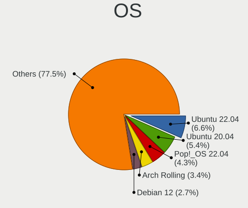

| Name                         | Notebooks | Percent |
|------------------------------|-----------|---------|
| Ubuntu 22.04                 | 46        | 6.59%   |
| Ubuntu 20.04                 | 38        | 5.44%   |
| Pop!_OS 22.04                | 30        | 4.3%    |
| Arch Rolling                 | 24        | 3.44%   |
| Debian 12                    | 19        | 2.72%   |
| Ubuntu 24.04                 | 16        | 2.29%   |
| Pop!_OS 20.04                | 16        | 2.29%   |
| Ubuntu 18.04                 | 15        | 2.15%   |
| Fedora 41                    | 14        | 2.01%   |
| Fedora 40                    | 14        | 2.01%   |
| Fedora 38                    | 12        | 1.72%   |
| OpenMandriva 4.2             | 11        | 1.58%   |
| KDE neon 20.04               | 11        | 1.58%   |
| EndeavourOS Rolling          | 11        | 1.58%   |
| Zorin 17                     | 10        | 1.43%   |
| Fedora 39                    | 10        | 1.43%   |
| ArcoLinux Rolling            | 9         | 1.29%   |
| OpenMandriva 25.01           | 8         | 1.15%   |
| KDE neon 22.04               | 8         | 1.15%   |
| Fedora 42                    | 8         | 1.15%   |
| openSUSE Tumbleweed-XXXXXXXX | 7         | 1%      |
| Linux Mint 22.1              | 7         | 1%      |
| Debian 11                    | 7         | 1%      |
| Arch                         | 7         | 1%      |
| Zorin 16                     | 6         | 0.86%   |
| Zorin 15                     | 6         | 0.86%   |
| Pop!_OS 21.04                | 6         | 0.86%   |
| OpenMandriva 25.90           | 6         | 0.86%   |
| OpenMandriva 25.06           | 6         | 0.86%   |
| OpenMandriva 24.12           | 6         | 0.86%   |
| Linux Mint 22                | 6         | 0.86%   |
| Fedora 36                    | 6         | 0.86%   |
| Debian 13                    | 6         | 0.86%   |
| Manjaro                      | 5         | 0.72%   |
| Linux Mint 21.1              | 5         | 0.72%   |
| Kubuntu 22.04                | 5         | 0.72%   |
| Fedora 43                    | 5         | 0.72%   |
| CachyOS Rolling              | 5         | 0.72%   |
| Ubuntu 23.04                 | 4         | 0.57%   |
| OpenMandriva 5.0             | 4         | 0.57%   |

OS Family
---------

OS without a version

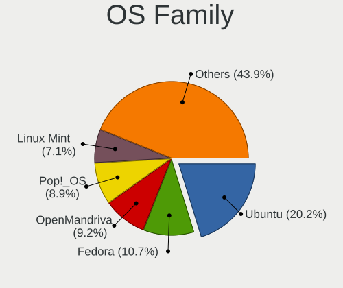

| Name          | Notebooks | Percent |
|---------------|-----------|---------|
| Ubuntu        | 132       | 20.25%  |
| Fedora        | 70        | 10.74%  |
| OpenMandriva  | 60        | 9.2%    |
| Pop!_OS       | 58        | 8.9%    |
| Linux Mint    | 46        | 7.06%   |
| Debian        | 37        | 5.67%   |
| Arch          | 31        | 4.75%   |
| Zorin         | 25        | 3.83%   |
| KDE neon      | 22        | 3.37%   |
| SteamOS       | 17        | 2.61%   |
| Endless       | 17        | 2.61%   |
| EndeavourOS   | 12        | 1.84%   |
| Manjaro       | 11        | 1.69%   |
| Kubuntu       | 11        | 1.69%   |
| Kali          | 11        | 1.69%   |
| ArcoLinux     | 11        | 1.69%   |
| Xubuntu       | 9         | 1.38%   |
| openSUSE      | 8         | 1.23%   |
| CachyOS       | 6         | 0.92%   |
| Nobara        | 5         | 0.77%   |
| Lubuntu       | 5         | 0.77%   |
| Elementary    | 5         | 0.77%   |
| Ubuntu MATE   | 4         | 0.61%   |
| LMDE          | 4         | 0.61%   |
| Bazzite       | 4         | 0.61%   |
| Xero          | 2         | 0.31%   |
| Void Linux    | 2         | 0.31%   |
| Ubuntu Unity  | 2         | 0.31%   |
| Pikaos        | 2         | 0.31%   |
| Peppermint    | 2         | 0.31%   |
| NixOS         | 2         | 0.31%   |
| MX            | 2         | 0.31%   |
| Linux Lite    | 2         | 0.31%   |
| Clear Linux   | 2         | 0.31%   |
| BlackPanther  | 2         | 0.31%   |
| Ubuntu Budgie | 1         | 0.15%   |
| Sparky        | 1         | 0.15%   |
| Slackware     | 1         | 0.15%   |
| ROSA          | 1         | 0.15%   |
| Gentoo        | 1         | 0.15%   |

Kernel
------

Version of the Linux kernel

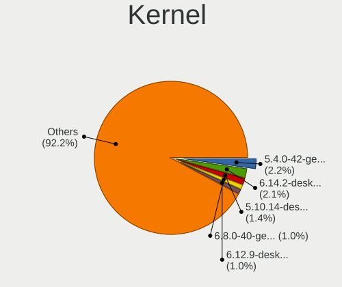

| Version                                  | Notebooks | Percent |
|------------------------------------------|-----------|---------|
| 5.4.0-42-generic                         | 17        | 2.21%   |
| 6.14.2-desktop-3omv2590                  | 16        | 2.08%   |
| 5.10.14-desktop-1omv4002                 | 11        | 1.43%   |
| 6.8.0-40-generic                         | 8         | 1.04%   |
| 6.12.9-desktop-1omv2490                  | 8         | 1.04%   |
| 6.9.3-76060903-generic                   | 7         | 0.91%   |
| 6.2.6-76060206-generic                   | 6         | 0.78%   |
| 5.4.0-7634-generic                       | 6         | 0.78%   |
| 5.13.0-valve36-1-neptune                 | 6         | 0.78%   |
| 6.8.0-52-generic                         | 5         | 0.65%   |
| 6.8.0-51-generic                         | 5         | 0.65%   |
| 6.2.0-26-generic                         | 5         | 0.65%   |
| 6.12.1-desktop-1omv2490                  | 5         | 0.65%   |
| 5.4.0-48-generic                         | 5         | 0.65%   |
| 5.4.0-47-generic                         | 5         | 0.65%   |
| 5.15.0-58-generic                        | 5         | 0.65%   |
| 5.15.0-56-generic                        | 5         | 0.65%   |
| 6.8.0-64-generic                         | 4         | 0.52%   |
| 6.8.0-60-generic                         | 4         | 0.52%   |
| 6.6.2-desktop-1omv2390                   | 4         | 0.52%   |
| 6.5.0-valve22-1-neptune-65-g9a338ed8a75e | 4         | 0.52%   |
| 6.2.9-300.fc38.x86_64                    | 4         | 0.52%   |
| 6.2.0-33-generic                         | 4         | 0.52%   |
| 5.4.0-19-generic                         | 4         | 0.52%   |
| 5.3.0-28-generic                         | 4         | 0.52%   |
| 5.19.0-32-generic                        | 4         | 0.52%   |
| 5.16.7-desktop-1omv4003                  | 4         | 0.52%   |
| 5.15.0-52-generic                        | 4         | 0.52%   |
| 5.15.0-50-generic                        | 4         | 0.52%   |
| 5.15.0-41-generic                        | 4         | 0.52%   |
| 5.13.0-28-generic                        | 4         | 0.52%   |
| 5.11.0-7620-generic                      | 4         | 0.52%   |
| 6.8.0-57-generic                         | 3         | 0.39%   |
| 6.8.0-41-generic                         | 3         | 0.39%   |
| 6.5.0-41-generic                         | 3         | 0.39%   |
| 6.5.0-26-generic                         | 3         | 0.39%   |
| 6.5.0-17-generic                         | 3         | 0.39%   |
| 6.2.0-37-generic                         | 3         | 0.39%   |
| 6.2.0-32-generic                         | 3         | 0.39%   |
| 6.2.0-20-generic                         | 3         | 0.39%   |

Kernel Family
-------------

Linux kernel without a distro release

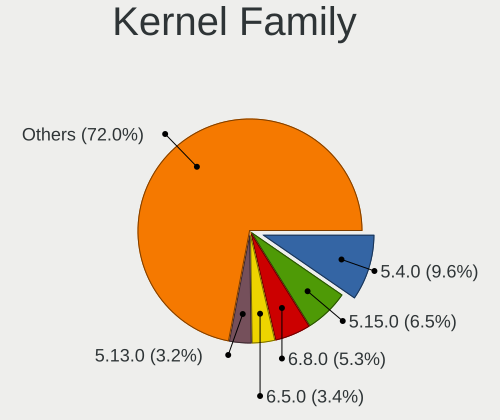

| Version | Notebooks | Percent |
|---------|-----------|---------|
| 5.4.0   | 71        | 9.61%   |
| 5.15.0  | 48        | 6.5%    |
| 6.8.0   | 39        | 5.28%   |
| 6.5.0   | 25        | 3.38%   |
| 5.13.0  | 24        | 3.25%   |
| 6.2.0   | 20        | 2.71%   |
| 6.1.0   | 20        | 2.71%   |
| 6.14.2  | 17        | 2.3%    |
| 5.3.0   | 17        | 2.3%    |
| 6.14.0  | 16        | 2.17%   |
| 5.11.0  | 15        | 2.03%   |
| 5.19.0  | 13        | 1.76%   |
| 6.11.0  | 11        | 1.49%   |
| 5.8.0   | 11        | 1.49%   |
| 5.10.14 | 11        | 1.49%   |
| 4.15.0  | 11        | 1.49%   |
| 6.9.3   | 9         | 1.22%   |
| 6.12.9  | 9         | 1.22%   |
| 6.2.6   | 8         | 1.08%   |
| 5.10.0  | 7         | 0.95%   |
| 5.0.0   | 7         | 0.95%   |
| 4.18.0  | 6         | 0.81%   |
| 6.12.1  | 5         | 0.68%   |
| 6.1.52  | 5         | 0.68%   |
| 6.0.6   | 5         | 0.68%   |
| 4.19.0  | 5         | 0.68%   |
| 6.6.2   | 4         | 0.54%   |
| 6.2.9   | 4         | 0.54%   |
| 6.17.9  | 4         | 0.54%   |
| 6.17.7  | 4         | 0.54%   |
| 6.13.5  | 4         | 0.54%   |
| 5.16.7  | 4         | 0.54%   |
| 6.9.7   | 3         | 0.41%   |
| 6.9.12  | 3         | 0.41%   |
| 6.8.5   | 3         | 0.41%   |
| 6.8.1   | 3         | 0.41%   |
| 6.7.0   | 3         | 0.41%   |
| 6.5.6   | 3         | 0.41%   |
| 6.5.5   | 3         | 0.41%   |
| 6.4.11  | 3         | 0.41%   |

Kernel Major Ver.
-----------------

Linux kernel major version

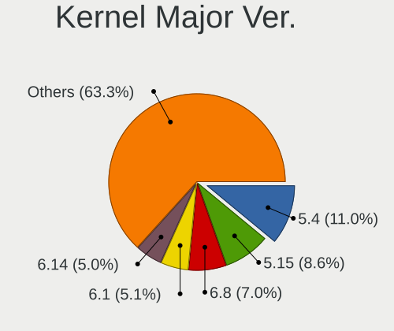

| Version | Notebooks | Percent |
|---------|-----------|---------|
| 5.4     | 79        | 10.99%  |
| 5.15    | 62        | 8.62%   |
| 6.8     | 50        | 6.95%   |
| 6.1     | 37        | 5.15%   |
| 6.14    | 36        | 5.01%   |
| 6.5     | 35        | 4.87%   |
| 6.2     | 35        | 4.87%   |
| 6.12    | 32        | 4.45%   |
| 6.11    | 27        | 3.76%   |
| 5.13    | 25        | 3.48%   |
| 5.10    | 21        | 2.92%   |
| 6.9     | 20        | 2.78%   |
| 5.3     | 19        | 2.64%   |
| 6.6     | 18        | 2.5%    |
| 5.11    | 18        | 2.5%    |
| 5.19    | 17        | 2.36%   |
| 6.13    | 15        | 2.09%   |
| 5.8     | 15        | 2.09%   |
| 6.0     | 14        | 1.95%   |
| 6.17    | 13        | 1.81%   |
| 5.16    | 13        | 1.81%   |
| 6.4     | 11        | 1.53%   |
| 6.16    | 11        | 1.53%   |
| 6.15    | 11        | 1.53%   |
| 4.15    | 11        | 1.53%   |
| 5.18    | 8         | 1.11%   |
| 5.0     | 8         | 1.11%   |
| 6.10    | 7         | 0.97%   |
| 4.18    | 7         | 0.97%   |
| 6.3     | 6         | 0.83%   |
| 6.7     | 5         | 0.7%    |
| 5.9     | 5         | 0.7%    |
| 5.17    | 5         | 0.7%    |
| 4.19    | 5         | 0.7%    |
| 5.6     | 3         | 0.42%   |
| 5.14    | 3         | 0.42%   |
| 4.9     | 3         | 0.42%   |
| 4.4     | 3         | 0.42%   |
| 5.12    | 2         | 0.28%   |
| 6.18    | 1         | 0.14%   |

Arch
----

OS architecture (x86_64, i586, etc.)

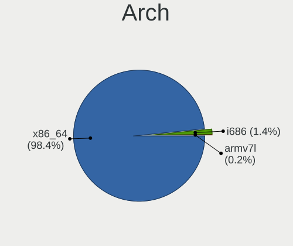

| Name   | Notebooks | Percent |
|--------|-----------|---------|
| x86_64 | 615       | 98.4%   |
| i686   | 9         | 1.44%   |
| armv7l | 1         | 0.16%   |

DE
--

Desktop Environment

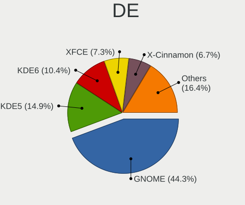

| Name          | Notebooks | Percent |
|---------------|-----------|---------|
| GNOME         | 291       | 44.29%  |
| KDE5          | 98        | 14.92%  |
| KDE6          | 68        | 10.35%  |
| XFCE          | 48        | 7.31%   |
| X-Cinnamon    | 44        | 6.7%    |
| Unknown       | 32        | 4.87%   |
| KDE           | 15        | 2.28%   |
| MATE          | 10        | 1.52%   |
| LXQt          | 9         | 1.37%   |
| Hyprland      | 9         | 1.37%   |
| Pantheon      | 5         | 0.76%   |
| Budgie        | 4         | 0.61%   |
| Cinnamon      | 3         | 0.46%   |
| Unity         | 2         | 0.3%    |
| LXDE          | 2         | 0.3%    |
| Endless:GNOME | 2         | 0.3%    |
| COSMIC        | 2         | 0.3%    |
| sway:wlroots  | 1         | 0.15%   |
| sway          | 1         | 0.15%   |
| river         | 1         | 0.15%   |
| pika:GNOME    | 1         | 0.15%   |
| Openbox       | 1         | 0.15%   |
| labwc:wlroots | 1         | 0.15%   |
| GNOME Classic | 1         | 0.15%   |
| dwm           | 1         | 0.15%   |
| default       | 1         | 0.15%   |
| Deepin        | 1         | 0.15%   |
| Cutefish      | 1         | 0.15%   |
| BunsenLabs    | 1         | 0.15%   |
| bspwm         | 1         | 0.15%   |

Display Server
--------------

X11 or Wayland

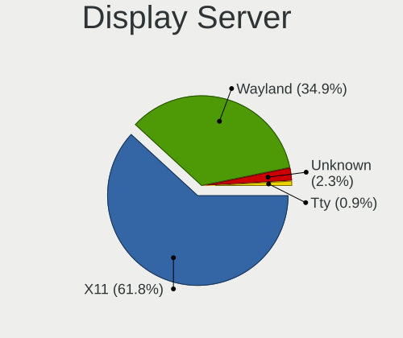

| Name    | Notebooks | Percent |
|---------|-----------|---------|
| X11     | 402       | 61.85%  |
| Wayland | 227       | 34.92%  |
| Unknown | 15        | 2.31%   |
| Tty     | 6         | 0.92%   |

Display Manager
---------------

SDDM, LightDM, etc.

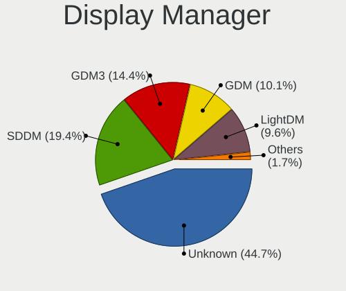

| Name    | Notebooks | Percent |
|---------|-----------|---------|
| Unknown | 292       | 44.72%  |
| SDDM    | 127       | 19.45%  |
| GDM3    | 94        | 14.4%   |
| GDM     | 66        | 10.11%  |
| LightDM | 63        | 9.65%   |
| TDM     | 6         | 0.92%   |
| LY-DM   | 2         | 0.31%   |
| SLiM    | 1         | 0.15%   |
| MDM     | 1         | 0.15%   |
| LXDM    | 1         | 0.15%   |

OS Lang
-------

Language

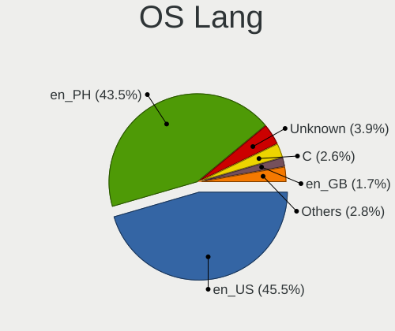

| Lang    | Notebooks | Percent |
|---------|-----------|---------|
| en_US   | 293       | 45.5%   |
| en_PH   | 280       | 43.48%  |
| Unknown | 25        | 3.88%   |
| C       | 17        | 2.64%   |
| en_GB   | 11        | 1.71%   |
| de_DE   | 6         | 0.93%   |
| en_AU   | 4         | 0.62%   |
| zh_HK   | 1         | 0.16%   |
| zh_CN   | 1         | 0.16%   |
| tl_PH   | 1         | 0.16%   |
| en_ZA   | 1         | 0.16%   |
| en_NZ   | 1         | 0.16%   |
| en_IN   | 1         | 0.16%   |
| en_DK   | 1         | 0.16%   |
| en_CA   | 1         | 0.16%   |

Boot Mode
---------

EFI or BIOS

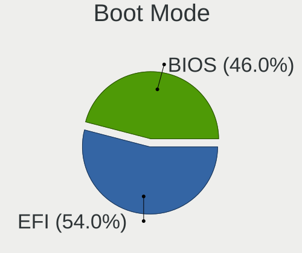

| Mode | Notebooks | Percent |
|------|-----------|---------|
| EFI  | 347       | 54.05%  |
| BIOS | 295       | 45.95%  |

Filesystem
----------

Type of filesystem

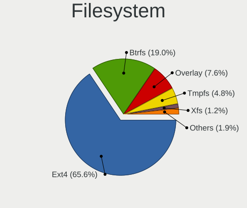

| Type    | Notebooks | Percent |
|---------|-----------|---------|
| Ext4    | 425       | 65.59%  |
| Btrfs   | 123       | 18.98%  |
| Overlay | 49        | 7.56%   |
| Tmpfs   | 31        | 4.78%   |
| Xfs     | 8         | 1.23%   |
| Unknown | 7         | 1.08%   |
| Ext2    | 3         | 0.46%   |
| Zfs     | 2         | 0.31%   |

Part. scheme
------------

Scheme of partitioning

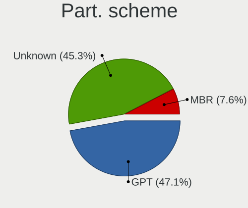

| Type    | Notebooks | Percent |
|---------|-----------|---------|
| GPT     | 303       | 47.12%  |
| Unknown | 291       | 45.26%  |
| MBR     | 49        | 7.62%   |

Dual Boot with Linux/BSD
------------------------

Hosting more than one Linux/BSD

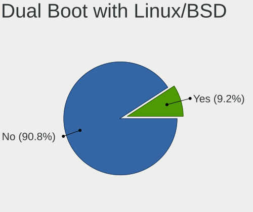

| Dual boot | Notebooks | Percent |
|-----------|-----------|---------|
| No        | 574       | 90.82%  |
| Yes       | 58        | 9.18%   |

Dual Boot (Win)
---------------

Hosting Linux and Windows

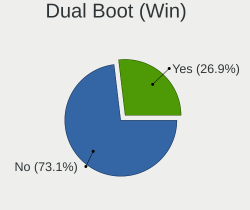

| Dual boot | Notebooks | Percent |
|-----------|-----------|---------|
| No        | 465       | 73.11%  |
| Yes       | 171       | 26.89%  |

Board
-----

Vendor
------

Motherboard manufacturer

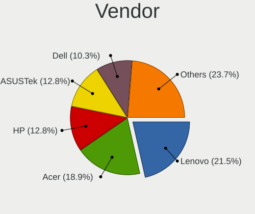

| Name                | Notebooks | Percent |
|---------------------|-----------|---------|
| Lenovo              | 134       | 21.47%  |
| Acer                | 118       | 18.91%  |
| Hewlett-Packard     | 80        | 12.82%  |
| ASUSTek Computer    | 80        | 12.82%  |
| Dell                | 64        | 10.26%  |
| HUAWEI              | 24        | 3.85%   |
| Toshiba             | 18        | 2.88%   |
| Valve               | 17        | 2.72%   |
| Apple               | 14        | 2.24%   |
| MSI                 | 13        | 2.08%   |
| Unknown             | 9         | 1.44%   |
| Samsung Electronics | 7         | 1.12%   |
| NEC Computers       | 7         | 1.12%   |
| Sony                | 5         | 0.8%    |
| Google              | 4         | 0.64%   |
| Clevo               | 4         | 0.64%   |
| eMachines           | 3         | 0.48%   |
| System76            | 2         | 0.32%   |
| Notebook            | 2         | 0.32%   |
| Jumper              | 2         | 0.32%   |
| Gigabyte Technology | 2         | 0.32%   |
| Fujitsu             | 2         | 0.32%   |
| Wiltronic           | 1         | 0.16%   |
| realme              | 1         | 0.16%   |
| PERSONA             | 1         | 0.16%   |
| Panasonic           | 1         | 0.16%   |
| MACHENIKE           | 1         | 0.16%   |
| Intel               | 1         | 0.16%   |
| Infinix             | 1         | 0.16%   |
| HASEE Computer      | 1         | 0.16%   |
| GPD                 | 1         | 0.16%   |
| Framework           | 1         | 0.16%   |
| EVGA                | 1         | 0.16%   |
| Cubix               | 1         | 0.16%   |
| ALLDOCUBE           | 1         | 0.16%   |

Model
-----

Motherboard model

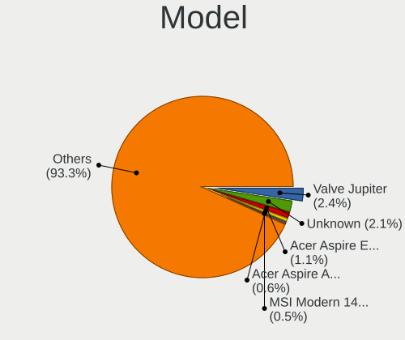

| Name                                | Notebooks | Percent |
|-------------------------------------|-----------|---------|
| Valve Jupiter                       | 15        | 2.4%    |
| Unknown                             | 13        | 2.08%   |
| Acer Aspire ES1-132                 | 7         | 1.12%   |
| Acer Aspire A315-51                 | 4         | 0.64%   |
| MSI Modern 14 B4MW                  | 3         | 0.48%   |
| Lenovo IdeaPad Gaming 3 15ACH6 82K2 | 3         | 0.48%   |
| HUAWEI NBLK-WAX9X                   | 3         | 0.48%   |
| HUAWEI KLVL-WXXW                    | 3         | 0.48%   |
| HUAWEI BOHB-WAX9                    | 3         | 0.48%   |
| HUAWEI BoDE-WXX9                    | 3         | 0.48%   |
| HP Notebook                         | 3         | 0.48%   |
| Dell Inspiron 5567                  | 3         | 0.48%   |
| Clevo M7x0S                         | 3         | 0.48%   |
| ASUS Vivobook Go E1504FA_E1504FA    | 3         | 0.48%   |
| Apple MacBookAir3,1                 | 3         | 0.48%   |
| Acer Nitro ANV15-51                 | 3         | 0.48%   |
| Acer Nitro AN515-42                 | 3         | 0.48%   |
| Acer Aspire E3-111                  | 3         | 0.48%   |
| Acer Aspire A315-41G                | 3         | 0.48%   |
| Valve Galileo                       | 2         | 0.32%   |
| Sony VPCEA36FA                      | 2         | 0.32%   |
| Lenovo V110-14IAP 80TF              | 2         | 0.32%   |
| Lenovo ThinkBook 15-IML 20RW        | 2         | 0.32%   |
| Lenovo IdeaPad 330-15IKB 81DE       | 2         | 0.32%   |
| Lenovo IdeaPad 330-14IGM 81D0       | 2         | 0.32%   |
| Lenovo IdeaPad 320-14ISK 80XG       | 2         | 0.32%   |
| Lenovo IdeaPad 320-14AST 80XU       | 2         | 0.32%   |
| Lenovo IdeaPad 3 14ITL05 81X7       | 2         | 0.32%   |
| Lenovo IdeaPad 100-15IBY 80MJ       | 2         | 0.32%   |
| Lenovo IdeaPad 100-14IBY 80MH       | 2         | 0.32%   |
| Jumper EZbook                       | 2         | 0.32%   |
| HUAWEI WRT-WX9                      | 2         | 0.32%   |
| HUAWEI NBLB-WAX9N                   | 2         | 0.32%   |
| HP ProBook 650 G1                   | 2         | 0.32%   |
| HP Pavilion Sleekbook 14 PC         | 2         | 0.32%   |
| HP Pavilion Notebook                | 2         | 0.32%   |
| HP Pavilion Gaming Laptop 15-ec2xxx | 2         | 0.32%   |
| HP Pavilion Gaming Laptop 15-dk2xxx | 2         | 0.32%   |
| HP Pavilion 17                      | 2         | 0.32%   |
| HP EliteBook 840 G6                 | 2         | 0.32%   |

Model Family
------------

Motherboard model prefix

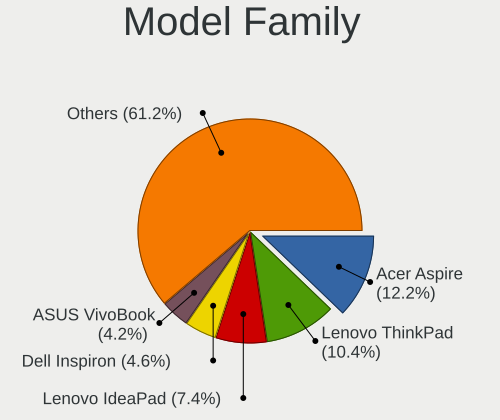

| Name              | Notebooks | Percent |
|-------------------|-----------|---------|
| Acer Aspire       | 76        | 12.18%  |
| Lenovo ThinkPad   | 65        | 10.42%  |
| Lenovo IdeaPad    | 46        | 7.37%   |
| Dell Inspiron     | 29        | 4.65%   |
| ASUS VivoBook     | 26        | 4.17%   |
| HP Pavilion       | 21        | 3.37%   |
| Dell Latitude     | 18        | 2.88%   |
| Valve Jupiter     | 15        | 2.4%    |
| Acer Nitro        | 15        | 2.4%    |
| HP ProBook        | 13        | 2.08%   |
| Unknown           | 13        | 2.08%   |
| Toshiba Satellite | 12        | 1.92%   |
| HP Laptop         | 12        | 1.92%   |
| ASUS ROG          | 9         | 1.44%   |
| Acer TravelMate   | 9         | 1.44%   |
| HP EliteBook      | 7         | 1.12%   |
| Acer Swift        | 7         | 1.12%   |
| ASUS ASUS         | 6         | 0.96%   |
| Lenovo Legion     | 5         | 0.8%    |
| Dell XPS          | 5         | 0.8%    |
| Dell Vostro       | 5         | 0.8%    |
| Acer Predator     | 5         | 0.8%    |
| ASUS TUF          | 4         | 0.64%   |
| MSI Modern        | 3         | 0.48%   |
| HUAWEI NBLK-WAX9X | 3         | 0.48%   |
| HUAWEI KLVL-WXXW  | 3         | 0.48%   |
| HUAWEI BOHB-WAX9  | 3         | 0.48%   |
| HUAWEI BoDE-WXX9  | 3         | 0.48%   |
| HP Victus         | 3         | 0.48%   |
| HP Stream         | 3         | 0.48%   |
| HP Notebook       | 3         | 0.48%   |
| HP Compaq         | 3         | 0.48%   |
| Dell Precision    | 3         | 0.48%   |
| Clevo M7x0S       | 3         | 0.48%   |
| Apple MacBookAir3 | 3         | 0.48%   |
| Valve Galileo     | 2         | 0.32%   |
| Toshiba TECRA     | 2         | 0.32%   |
| Toshiba dynabook  | 2         | 0.32%   |
| Sony VPCEA36FA    | 2         | 0.32%   |
| MSI CX62          | 2         | 0.32%   |

MFG Year
--------

Motherboard manufacture year

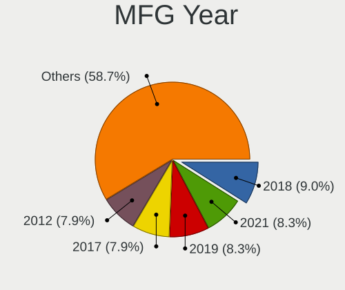

| Year    | Notebooks | Percent |
|---------|-----------|---------|
| 2018    | 56        | 8.97%   |
| 2021    | 52        | 8.33%   |
| 2019    | 52        | 8.33%   |
| 2017    | 49        | 7.85%   |
| 2012    | 49        | 7.85%   |
| 2020    | 47        | 7.53%   |
| 2022    | 42        | 6.73%   |
| 2016    | 40        | 6.41%   |
| 2011    | 37        | 5.93%   |
| 2015    | 34        | 5.45%   |
| 2023    | 32        | 5.13%   |
| 2014    | 31        | 4.97%   |
| 2010    | 28        | 4.49%   |
| 2013    | 21        | 3.37%   |
| 2008    | 17        | 2.72%   |
| 2024    | 12        | 1.92%   |
| 2009    | 12        | 1.92%   |
| 2007    | 4         | 0.64%   |
| 2006    | 4         | 0.64%   |
| 2025    | 3         | 0.48%   |
| Unknown | 2         | 0.32%   |

Form Factor
-----------

Physical design of the computer

| Name     | Notebooks | Percent |
|----------|-----------|---------|
| Notebook | 624       | 100%    |

Secure Boot
-----------

Enabled or disabled

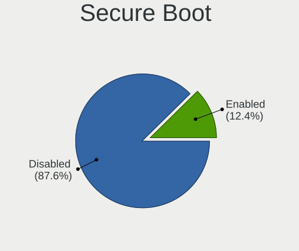

| State    | Notebooks | Percent |
|----------|-----------|---------|
| Disabled | 552       | 87.62%  |
| Enabled  | 78        | 12.38%  |

Coreboot
--------

Have coreboot on board

| Used | Notebooks | Percent |
|------|-----------|---------|
| No   | 619       | 99.2%   |
| Yes  | 5         | 0.8%    |

RAM Size
--------

Total RAM memory

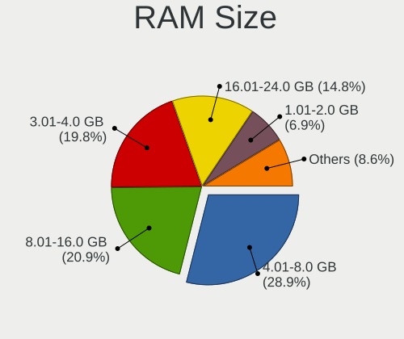

| Size in GB  | Notebooks | Percent |
|-------------|-----------|---------|
| 4.01-8.0    | 184       | 28.93%  |
| 8.01-16.0   | 133       | 20.91%  |
| 3.01-4.0    | 126       | 19.81%  |
| 16.01-24.0  | 94        | 14.78%  |
| 1.01-2.0    | 44        | 6.92%   |
| 32.01-64.0  | 27        | 4.25%   |
| 24.01-32.0  | 13        | 2.04%   |
| 2.01-3.0    | 8         | 1.26%   |
| 0.51-1.0    | 4         | 0.63%   |
| 64.01-256.0 | 3         | 0.47%   |

RAM Used
--------

Used RAM memory

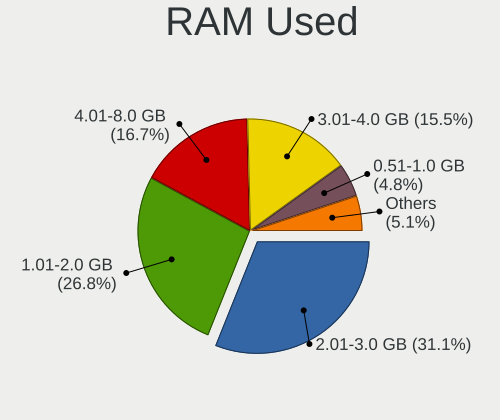

| Used GB    | Notebooks | Percent |
|------------|-----------|---------|
| 2.01-3.0   | 219       | 31.06%  |
| 1.01-2.0   | 189       | 26.81%  |
| 4.01-8.0   | 118       | 16.74%  |
| 3.01-4.0   | 109       | 15.46%  |
| 0.51-1.0   | 34        | 4.82%   |
| 8.01-16.0  | 32        | 4.54%   |
| 0.01-0.5   | 2         | 0.28%   |
| 16.01-24.0 | 1         | 0.14%   |
| Unknown    | 1         | 0.14%   |

Total Drives
------------

Number of drives on board

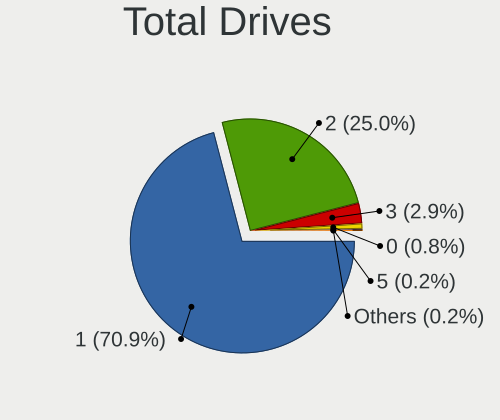

| Drives | Notebooks | Percent |
|--------|-----------|---------|
| 1      | 459       | 70.94%  |
| 2      | 162       | 25.04%  |
| 3      | 19        | 2.94%   |
| 0      | 5         | 0.77%   |
| 5      | 1         | 0.15%   |
| 4      | 1         | 0.15%   |

Has CD-ROM
----------

Has CD-ROM on board

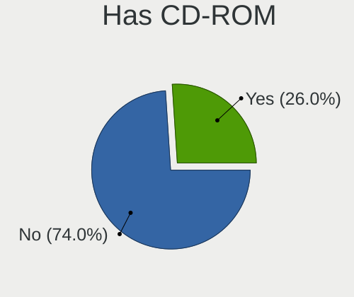

| Presented | Notebooks | Percent |
|-----------|-----------|---------|
| No        | 466       | 73.97%  |
| Yes       | 164       | 26.03%  |

Has Ethernet
------------

Has Ethernet on board

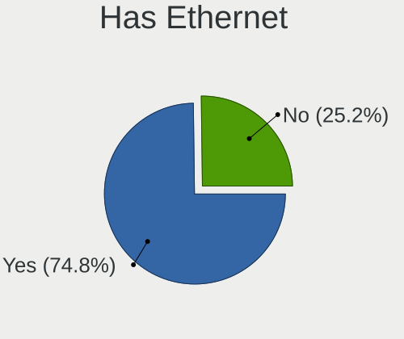

| Presented | Notebooks | Percent |
|-----------|-----------|---------|
| Yes       | 469       | 74.8%   |
| No        | 158       | 25.2%   |

Has WiFi
--------

Has WiFi module

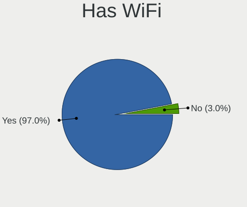

| Presented | Notebooks | Percent |
|-----------|-----------|---------|
| Yes       | 605       | 96.96%  |
| No        | 19        | 3.04%   |

Has Bluetooth
-------------

Has Bluetooth module

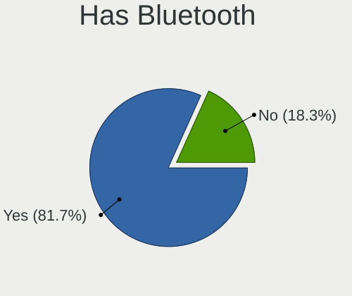

| Presented | Notebooks | Percent |
|-----------|-----------|---------|
| Yes       | 515       | 81.75%  |
| No        | 115       | 18.25%  |

Location
--------

Country
-------

Geographic location (country)

| Country     | Notebooks | Percent |
|-------------|-----------|---------|
| Philippines | 624       | 100%    |

City
----

Geographic location (city)

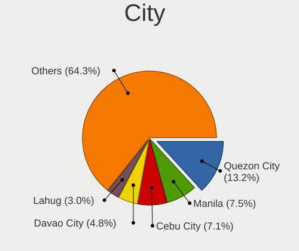

| City                | Notebooks | Percent |
|---------------------|-----------|---------|
| Quezon City         | 91        | 13.21%  |
| Manila              | 52        | 7.55%   |
| Cebu City           | 49        | 7.11%   |
| Davao City          | 33        | 4.79%   |
| Lahug               | 21        | 3.05%   |
| Angeles City        | 20        | 2.9%    |
| Paranaque City      | 18        | 2.61%   |
| Makati City         | 18        | 2.61%   |
| Bacolod City        | 18        | 2.61%   |
| Cagayan de Oro      | 17        | 2.47%   |
| Pasig               | 16        | 2.32%   |
| Caloocan City       | 16        | 2.32%   |
| Imus                | 13        | 1.89%   |
| Mandaluyong City    | 11        | 1.6%    |
| Las Pinas           | 11        | 1.6%    |
| Iloilo City         | 11        | 1.6%    |
| Bacoor              | 11        | 1.6%    |
| San Juan            | 10        | 1.45%   |
| Santa Rosa          | 9         | 1.31%   |
| Dasmarinas          | 9         | 1.31%   |
| San Jose del Monte  | 8         | 1.16%   |
| San Fernando City   | 8         | 1.16%   |
| Cabanatuan City     | 8         | 1.16%   |
| Tarlac City         | 7         | 1.02%   |
| San Pablo City      | 7         | 1.02%   |
| San Miguel          | 6         | 0.87%   |
| Nasugbu             | 6         | 0.87%   |
| Lucena City         | 6         | 0.87%   |
| Calamba             | 6         | 0.87%   |
| Tagbilaran          | 5         | 0.73%   |
| San Pedro           | 5         | 0.73%   |
| Marikina City       | 5         | 0.73%   |
| Manajao             | 5         | 0.73%   |
| Lipa City           | 5         | 0.73%   |
| Legazpi             | 5         | 0.73%   |
| Iligan City         | 5         | 0.73%   |
| City of Muntinglupa | 5         | 0.73%   |
| Cainta              | 5         | 0.73%   |
| Urdaneta            | 4         | 0.58%   |
| Malolos             | 4         | 0.58%   |

Drives
------

Drive Vendor
------------

Hard drive vendors

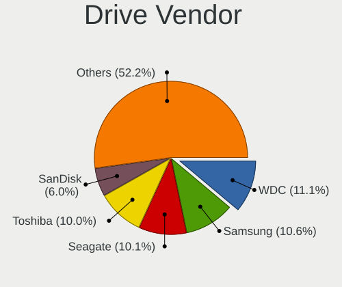

| Vendor                       | Notebooks | Drives | Percent |
|------------------------------|-----------|--------|---------|
| WDC                          | 89        | 98     | 11.11%  |
| Samsung Electronics          | 85        | 133    | 10.61%  |
| Seagate                      | 81        | 128    | 10.11%  |
| Toshiba                      | 80        | 102    | 9.99%   |
| SanDisk                      | 48        | 65     | 5.99%   |
| Unknown                      | 43        | 50     | 5.37%   |
| Kingston                     | 43        | 51     | 5.37%   |
| SK hynix                     | 30        | 40     | 3.75%   |
| Micron Technology            | 26        | 35     | 3.25%   |
| Intel                        | 25        | 29     | 3.12%   |
| Hitachi                      | 20        | 27     | 2.5%    |
| HGST                         | 17        | 22     | 2.12%   |
| Kingston Technology Company  | 13        | 16     | 1.62%   |
| Ramsta                       | 11        | 13     | 1.37%   |
| Phison Electronics           | 11        | 14     | 1.37%   |
| China                        | 11        | 14     | 1.37%   |
| Silicon Motion               | 10        | 15     | 1.25%   |
| A-DATA Technology            | 10        | 14     | 1.25%   |
| Crucial                      | 8         | 8      | 1%      |
| Phison                       | 7         | 7      | 0.87%   |
| Apple                        | 7         | 7      | 0.87%   |
| Team                         | 5         | 9      | 0.62%   |
| MAXIO Technology (Hangzhou)  | 5         | 5      | 0.62%   |
| JMicron Technology           | 5         | 8      | 0.62%   |
| Unknown                      | 5         | 5      | 0.62%   |
| KingSpec                     | 4         | 8      | 0.5%    |
| HS-SSD-E100                  | 4         | 4      | 0.5%    |
| Fujitsu                      | 4         | 6      | 0.5%    |
| WALRAM                       | 3         | 3      | 0.37%   |
| USB3.0                       | 3         | 3      | 0.37%   |
| Teclast                      | 3         | 7      | 0.37%   |
| TAMMUZ                       | 3         | 7      | 0.37%   |
| Shenzhen Longsys Electronics | 3         | 5      | 0.37%   |
| Netac                        | 3         | 3      | 0.37%   |
| Micron/Crucial Technology    | 3         | 4      | 0.37%   |
| LITEONIT                     | 3         | 5      | 0.37%   |
| Lexar                        | 3         | 3      | 0.37%   |
| HS-SSD-C100                  | 3         | 4      | 0.37%   |
| Colorful                     | 3         | 3      | 0.37%   |
| Yangtze Memory Technologies  | 2         | 2      | 0.25%   |

Drive Model
-----------

Hard drive models

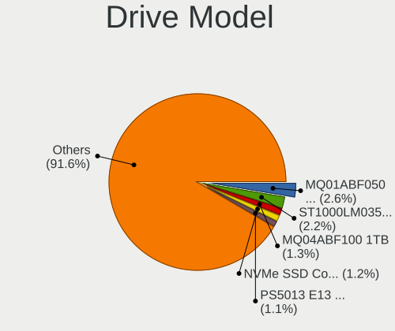

| Model                                                 | Notebooks | Percent |
|-------------------------------------------------------|-----------|---------|
| Toshiba MQ01ABF050 500GB                              | 22        | 2.64%   |
| Seagate ST1000LM035-1RK172 1TB                        | 18        | 2.16%   |
| Toshiba MQ04ABF100 1TB                                | 11        | 1.32%   |
| Samsung NVMe SSD Controller SM981/PM981/PM983 1TB     | 10        | 1.2%    |
| Phison PS5013 E13 NVMe Controller 500GB               | 9         | 1.08%   |
| WDC WD5000LPCX-21VHAT0 500GB                          | 8         | 0.96%   |
| Unknown MMC Card  64GB                                | 8         | 0.96%   |
| Unknown MMC Card  32GB                                | 8         | 0.96%   |
| Toshiba MQ01ABD100 1TB                                | 8         | 0.96%   |
| Kingston SA400S37240G 240GB SSD                       | 8         | 0.96%   |
| Samsung NVMe SSD Controller PM9A1/PM9A3/980PRO 1TB    | 7         | 0.84%   |
| WDC WD10JPVX-22JC3T0 1TB                              | 6         | 0.72%   |
| Seagate ST500LT012-1DG142 500GB                       | 6         | 0.72%   |
| Kingston SA400S37120G 120GB SSD                       | 6         | 0.72%   |
| WDC WD5000LPCX-24VHAT0 500GB                          | 5         | 0.6%    |
| WDC WD10SPZX-21Z10T0 1TB                              | 5         | 0.6%    |
| Unknown SD/MMC/MS PRO 2GB                             | 5         | 0.6%    |
| Unknown MMC Card  128GB                               | 5         | 0.6%    |
| Seagate ST500LT012-9WS142 500GB                       | 5         | 0.6%    |
| Seagate ST2000LM007-1R8174 2TB                        | 5         | 0.6%    |
| Sandisk WD Black SN750 / PC SN730 NVMe SSD 500GB      | 5         | 0.6%    |
| Samsung NVMe SSD Controller SM961/PM961/SM963 1024GB  | 5         | 0.6%    |
| Micron 2450_MTFDKBA512TFK 512GB                       | 5         | 0.6%    |
| MAXIO (Hangzhou) NVMe SSD Controller MAP1202 2TB      | 5         | 0.6%    |
| Intel SSDPEKNU512GZ 512GB                             | 5         | 0.6%    |
| HGST HTS721010A9E630 1TB                              | 5         | 0.6%    |
| Unknown                                               | 5         | 0.6%    |
| WDC WD5000LPCX-60VHAT0 500GB                          | 4         | 0.48%   |
| Toshiba MK2555GSX 250GB                               | 4         | 0.48%   |
| Silicon Motion SM2263EN/SM2263XT SSD Controller 512GB | 4         | 0.48%   |
| Seagate ST1000LM049-2GH172 1TB                        | 4         | 0.48%   |
| Seagate Expansion HDD 4TB                             | 4         | 0.48%   |
| Sandisk WD Blue SN550 NVMe SSD 1024GB                 | 4         | 0.48%   |
| Ramsta SSD S800 120GB                                 | 4         | 0.48%   |
| Kingston Company OM3PDP3 NVMe SSD 256GB               | 4         | 0.48%   |
| JMicron Generic 320GB                                 | 4         | 0.48%   |
| HGST HTS545050A7E680 500GB                            | 4         | 0.48%   |
| WDC WDS500G2B0A-00SM50 500GB                          | 3         | 0.36%   |
| WDC WD5000LPVX-22V0TT0 500GB                          | 3         | 0.36%   |
| WDC WD5000LPCX-24C6HT0 500GB                          | 3         | 0.36%   |

HDD Vendor
----------

Hard disk drive vendors

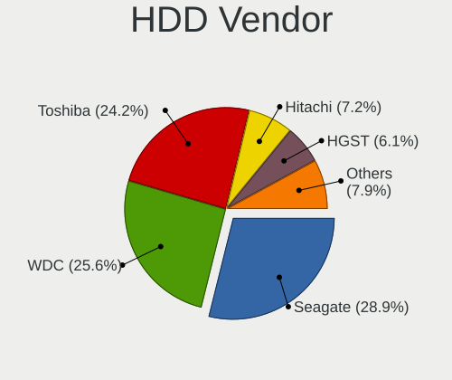

| Vendor              | Notebooks | Drives | Percent |
|---------------------|-----------|--------|---------|
| Seagate             | 80        | 105    | 28.88%  |
| WDC                 | 71        | 79     | 25.63%  |
| Toshiba             | 67        | 85     | 24.19%  |
| Hitachi             | 20        | 27     | 7.22%   |
| HGST                | 17        | 22     | 6.14%   |
| Unknown             | 5         | 5      | 1.81%   |
| JMicron Technology  | 4         | 4      | 1.44%   |
| Fujitsu             | 4         | 6      | 1.44%   |
| USB3.0              | 3         | 3      | 1.08%   |
| Samsung Electronics | 2         | 2      | 0.72%   |
| Shenzhen            | 1         | 1      | 0.36%   |
| SAGE                | 1         | 1      | 0.36%   |
| Min Yi U            | 1         | 1      | 0.36%   |
| HGST HTS            | 1         | 1      | 0.36%   |

SSD Vendor
----------

Solid state drive vendors

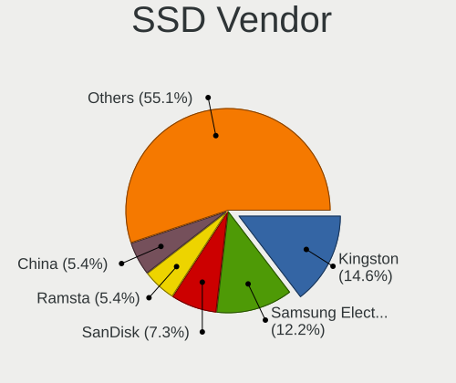

| Vendor              | Notebooks | Drives | Percent |
|---------------------|-----------|--------|---------|
| Kingston            | 30        | 32     | 14.63%  |
| Samsung Electronics | 25        | 33     | 12.2%   |
| SanDisk             | 15        | 21     | 7.32%   |
| Ramsta              | 11        | 13     | 5.37%   |
| China               | 11        | 14     | 5.37%   |
| WDC                 | 9         | 10     | 4.39%   |
| A-DATA Technology   | 8         | 11     | 3.9%    |
| Micron Technology   | 7         | 7      | 3.41%   |
| Crucial             | 7         | 7      | 3.41%   |
| Apple               | 6         | 6      | 2.93%   |
| Toshiba             | 5         | 7      | 2.44%   |
| Team                | 5         | 9      | 2.44%   |
| SK hynix            | 5         | 10     | 2.44%   |
| KingSpec            | 4         | 8      | 1.95%   |
| Intel               | 4         | 4      | 1.95%   |
| Teclast             | 3         | 7      | 1.46%   |
| TAMMUZ              | 3         | 7      | 1.46%   |
| LITEONIT            | 3         | 5      | 1.46%   |
| HS-SSD-E100         | 3         | 3      | 1.46%   |
| Colorful            | 3         | 3      | 1.46%   |
| WALRAM              | 2         | 2      | 0.98%   |
| PNY                 | 2         | 2      | 0.98%   |
| Netac               | 2         | 2      | 0.98%   |
| Lexar               | 2         | 2      | 0.98%   |
| WHALEKOM            | 1         | 1      | 0.49%   |
| Vaseky              | 1         | 2      | 0.49%   |
| Transcend           | 1         | 1      | 0.49%   |
| T-FORCE             | 1         | 1      | 0.49%   |
| ShiJi               | 1         | 1      | 0.49%   |
| SADAYU              | 1         | 1      | 0.49%   |
| Plextor             | 1         | 2      | 0.49%   |
| Phison              | 1         | 1      | 0.49%   |
| OCZ                 | 1         | 1      | 0.49%   |
| NT-512              | 1         | 1      | 0.49%   |
| NATZ                | 1         | 1      | 0.49%   |
| LITEON              | 1         | 1      | 0.49%   |
| Kingmax             | 1         | 1      | 0.49%   |
| KimMiDi             | 1         | 1      | 0.49%   |
| Indilinx            | 1         | 1      | 0.49%   |
| HS-SSD-C100         | 1         | 1      | 0.49%   |

Drive Kind
----------

HDD or SSD

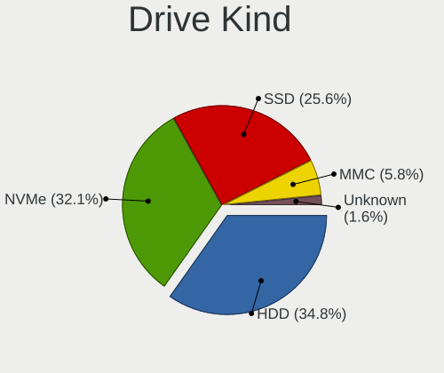

| Kind    | Notebooks | Drives | Percent |
|---------|-----------|--------|---------|
| HDD     | 262       | 342    | 34.79%  |
| NVMe    | 242       | 387    | 32.14%  |
| SSD     | 193       | 259    | 25.63%  |
| MMC     | 44        | 51     | 5.84%   |
| Unknown | 12        | 16     | 1.59%   |

Drive Connector
---------------

SATA, SAS, NVMe, etc.

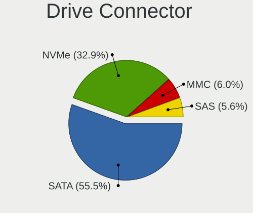

| Type | Notebooks | Drives | Percent |
|------|-----------|--------|---------|
| SATA | 406       | 575    | 55.46%  |
| NVMe | 241       | 379    | 32.92%  |
| MMC  | 44        | 51     | 6.01%   |
| SAS  | 41        | 50     | 5.6%    |

Drive Size
----------

Size of hard drive

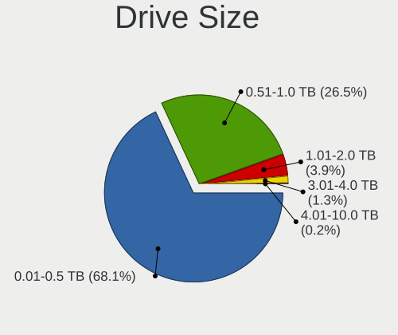

| Size in TB | Notebooks | Drives | Percent |
|------------|-----------|--------|---------|
| 0.01-0.5   | 311       | 417    | 68.05%  |
| 0.51-1.0   | 121       | 153    | 26.48%  |
| 1.01-2.0   | 18        | 24     | 3.94%   |
| 3.01-4.0   | 6         | 6      | 1.31%   |
| 4.01-10.0  | 1         | 1      | 0.22%   |

Space Total
-----------

Amount of disk space available on the file system

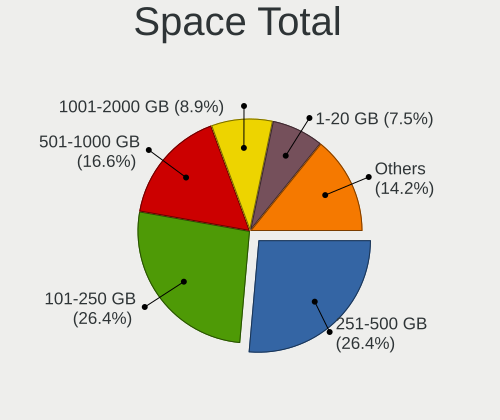

| Size in GB     | Notebooks | Percent |
|----------------|-----------|---------|
| 251-500        | 175       | 26.4%   |
| 101-250        | 175       | 26.4%   |
| 501-1000       | 110       | 16.59%  |
| 1001-2000      | 59        | 8.9%    |
| 1-20           | 50        | 7.54%   |
| 51-100         | 34        | 5.13%   |
| 21-50          | 22        | 3.32%   |
| More than 3000 | 16        | 2.41%   |
| 2001-3000      | 13        | 1.96%   |
| Unknown        | 9         | 1.36%   |

Space Used
----------

Amount of used disk space

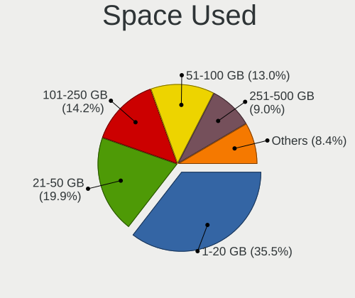

| Used GB        | Notebooks | Percent |
|----------------|-----------|---------|
| 1-20           | 248       | 35.48%  |
| 21-50          | 139       | 19.89%  |
| 101-250        | 99        | 14.16%  |
| 51-100         | 91        | 13.02%  |
| 251-500        | 63        | 9.01%   |
| 501-1000       | 32        | 4.58%   |
| 1001-2000      | 9         | 1.29%   |
| Unknown        | 9         | 1.29%   |
| 2001-3000      | 4         | 0.57%   |
| 0              | 4         | 0.57%   |
| More than 3000 | 1         | 0.14%   |

Malfunc. Drives
---------------

Drive models with a malfunction

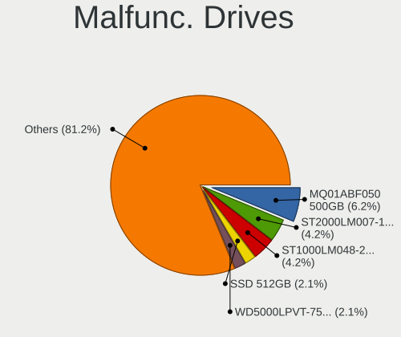

| Model                                          | Notebooks | Drives | Percent |
|------------------------------------------------|-----------|--------|---------|
| Toshiba MQ01ABF050 500GB                       | 3         | 3      | 6.25%   |
| Seagate ST2000LM007-1R8174 2TB                 | 2         | 3      | 4.17%   |
| Seagate ST1000LM048-2E7172 1TB                 | 2         | 2      | 4.17%   |
| WHALEKOM SSD 512GB                             | 1         | 1      | 2.08%   |
| WDC WD5000LPVT-75G33T0 500GB                   | 1         | 1      | 2.08%   |
| WDC WD5000LPVT-22G33T0 500GB                   | 1         | 1      | 2.08%   |
| WDC WD5000BEVT-24A0RT0 500GB                   | 1         | 1      | 2.08%   |
| WDC WD3200BEVT-22A23T0 320GB                   | 1         | 1      | 2.08%   |
| WDC WD1600BEVT-24A23T0 160GB                   | 1         | 1      | 2.08%   |
| WDC WD10SPZX-24Z10 1TB                         | 1         | 1      | 2.08%   |
| WDC WD10SPZX-21Z10T0 1TB                       | 1         | 1      | 2.08%   |
| WDC WD10JPVX-60JC3T1 1TB                       | 1         | 2      | 2.08%   |
| WDC WD10JPVX-22JC3T0 1TB                       | 1         | 1      | 2.08%   |
| Toshiba MQ04ABF100 1TB                         | 1         | 1      | 2.08%   |
| Toshiba MQ01ABF032 320GB                       | 1         | 1      | 2.08%   |
| Toshiba MQ01ABD100 1TB                         | 1         | 1      | 2.08%   |
| Toshiba MK6475GSX 640GB                        | 1         | 1      | 2.08%   |
| Toshiba MK6465GSX 640GB                        | 1         | 1      | 2.08%   |
| Toshiba MK3259GSXP 320GB                       | 1         | 1      | 2.08%   |
| SK hynix HFS128G3AMNB-2200A 128GB SSD          | 1         | 1      | 2.08%   |
| SK hynix HFS128G39TND-N210A 128GB SSD          | 1         | 1      | 2.08%   |
| Seagate ST9500420AS 500GB                      | 1         | 1      | 2.08%   |
| Seagate ST9250315AS 250GB                      | 1         | 1      | 2.08%   |
| Seagate ST9120821AS 120GB                      | 1         | 1      | 2.08%   |
| Seagate ST500LT012-9WS142 500GB                | 1         | 1      | 2.08%   |
| Seagate ST500LM012 HN-M500MBB 500GB            | 1         | 1      | 2.08%   |
| Seagate ST1000LM035-1RK172 1TB                 | 1         | 1      | 2.08%   |
| Ramsta SSD S800 240GB                          | 1         | 1      | 2.08%   |
| Ramsta SSD S800 120GB                          | 1         | 1      | 2.08%   |
| Micron Technology 1100_MTFDDAV256TBN 256GB SSD | 1         | 1      | 2.08%   |
| Kingston SV300S37A120G 120GB SSD               | 1         | 1      | 2.08%   |
| Kingston SA400S37240G 240GB SSD                | 1         | 1      | 2.08%   |
| KingSpec P4-240 240GB                          | 1         | 1      | 2.08%   |
| Intel SSDSA2UP020G3H 20GB                      | 1         | 1      | 2.08%   |
| Intel SSD 600P Series 1024GB                   | 1         | 1      | 2.08%   |
| Hitachi HTS727550A9E364 500GB                  | 1         | 1      | 2.08%   |
| Hitachi HTS723232A7A364 320GB                  | 1         | 2      | 2.08%   |
| Hitachi HTS545050B9SA00 500GB                  | 1         | 1      | 2.08%   |
| Hitachi HTS542525K9SA00 250GB                  | 1         | 1      | 2.08%   |
| HGST HTS721010A9E630 1TB                       | 1         | 1      | 2.08%   |

Malfunc. Drive Vendor
---------------------

Vendors of faulty drives

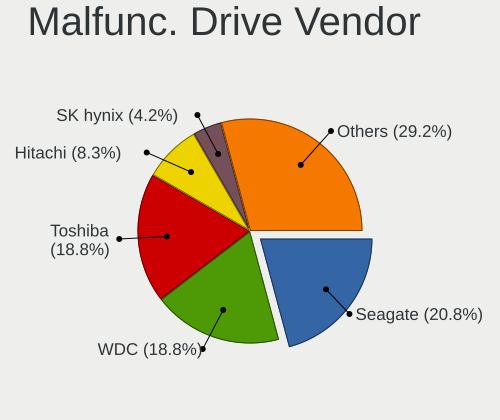

| Vendor            | Notebooks | Drives | Percent |
|-------------------|-----------|--------|---------|
| Seagate           | 10        | 11     | 20.83%  |
| WDC               | 9         | 10     | 18.75%  |
| Toshiba           | 9         | 9      | 18.75%  |
| Hitachi           | 4         | 5      | 8.33%   |
| SK hynix          | 2         | 2      | 4.17%   |
| Ramsta            | 2         | 2      | 4.17%   |
| Kingston          | 2         | 2      | 4.17%   |
| Intel             | 2         | 2      | 4.17%   |
| Fujitsu           | 2         | 2      | 4.17%   |
| WHALEKOM          | 1         | 1      | 2.08%   |
| Micron Technology | 1         | 1      | 2.08%   |
| KingSpec          | 1         | 1      | 2.08%   |
| HGST              | 1         | 1      | 2.08%   |
| Colorful          | 1         | 1      | 2.08%   |
| A-DATA Technology | 1         | 1      | 2.08%   |

Malfunc. HDD Vendor
-------------------

Vendors of faulty HDD drives

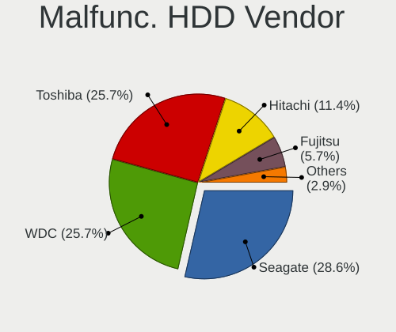

| Vendor  | Notebooks | Drives | Percent |
|---------|-----------|--------|---------|
| Seagate | 10        | 11     | 28.57%  |
| WDC     | 9         | 10     | 25.71%  |
| Toshiba | 9         | 9      | 25.71%  |
| Hitachi | 4         | 5      | 11.43%  |
| Fujitsu | 2         | 2      | 5.71%   |
| HGST    | 1         | 1      | 2.86%   |

Malfunc. Drive Kind
-------------------

Kinds of faulty drives

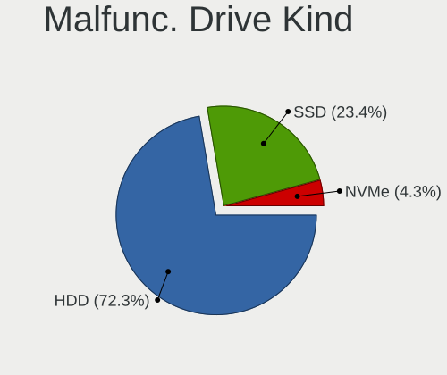

| Kind | Notebooks | Drives | Percent |
|------|-----------|--------|---------|
| HDD  | 34        | 38     | 72.34%  |
| SSD  | 11        | 11     | 23.4%   |
| NVMe | 2         | 2      | 4.26%   |

Failed Drives
-------------

Failed drive models

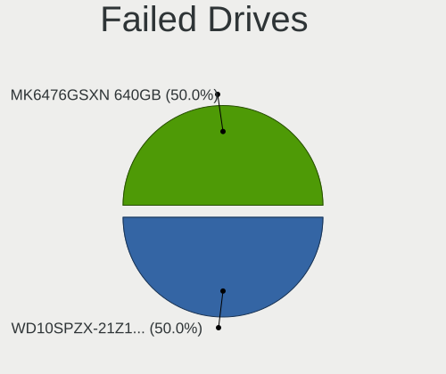

| Model                    | Notebooks | Drives | Percent |
|--------------------------|-----------|--------|---------|
| WDC WD10SPZX-21Z10T0 1TB | 1         | 1      | 50%     |
| Toshiba MK6476GSXN 640GB | 1         | 1      | 50%     |

Failed Drive Vendor
-------------------

Failed drive vendors

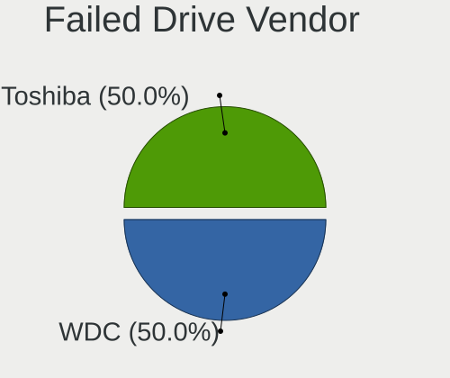

| Vendor  | Notebooks | Drives | Percent |
|---------|-----------|--------|---------|
| WDC     | 1         | 1      | 50%     |
| Toshiba | 1         | 1      | 50%     |

Drive Status
------------

Number of failed and malfunc. drives

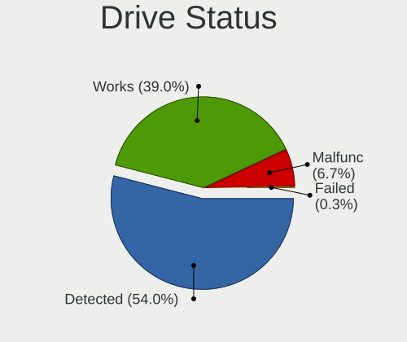

| Status   | Notebooks | Drives | Percent |
|----------|-----------|--------|---------|
| Detected | 363       | 587    | 54.02%  |
| Works    | 262       | 415    | 38.99%  |
| Malfunc  | 45        | 51     | 6.7%    |
| Failed   | 2         | 2      | 0.3%    |

Storage controller
------------------

Storage Vendor
--------------

Storage controller vendors

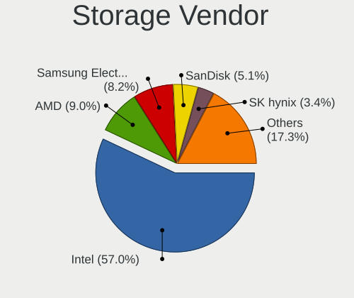

| Vendor                           | Notebooks | Percent |
|----------------------------------|-----------|---------|
| Intel                            | 424       | 56.99%  |
| AMD                              | 67        | 9.01%   |
| Samsung Electronics              | 61        | 8.2%    |
| SanDisk                          | 38        | 5.11%   |
| SK hynix                         | 25        | 3.36%   |
| Kingston Technology Company      | 24        | 3.23%   |
| Micron Technology                | 19        | 2.55%   |
| Phison Electronics               | 18        | 2.42%   |
| Nvidia                           | 11        | 1.48%   |
| Silicon Motion                   | 10        | 1.34%   |
| Toshiba America Info Systems     | 9         | 1.21%   |
| MAXIO Technology (Hangzhou)      | 5         | 0.67%   |
| Shenzhen Longsys Electronics     | 4         | 0.54%   |
| Micron/Crucial Technology        | 4         | 0.54%   |
| Silicon Integrated Systems [SiS] | 3         | 0.4%    |
| ADATA Technology                 | 3         | 0.4%    |
| Yangtze Memory Technologies      | 2         | 0.27%   |
| Union Memory (Shenzhen)          | 2         | 0.27%   |
| Solid State Storage Technology   | 2         | 0.27%   |
| Realtek Semiconductor            | 2         | 0.27%   |
| O2 Micro                         | 2         | 0.27%   |
| Lite-On Technology               | 2         | 0.27%   |
| KIOXIA                           | 2         | 0.27%   |
| Transcend                        | 1         | 0.13%   |
| Shenzhen Shichuangyi Electronics | 1         | 0.13%   |
| Seagate Technology               | 1         | 0.13%   |
| Lenovo                           | 1         | 0.13%   |
| Apple                            | 1         | 0.13%   |

Storage Model
-------------

Storage controller models

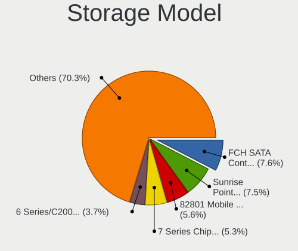

| Model                                                                            | Notebooks | Percent |
|----------------------------------------------------------------------------------|-----------|---------|
| AMD FCH SATA Controller [AHCI mode]                                              | 61        | 7.58%   |
| Intel Sunrise Point-LP SATA Controller [AHCI mode]                               | 60        | 7.45%   |
| Intel 82801 Mobile SATA Controller [RAID mode]                                   | 45        | 5.59%   |
| Intel 7 Series Chipset Family 6-port SATA Controller [AHCI mode]                 | 43        | 5.34%   |
| Intel 6 Series/C200 Series Chipset Family 6 port Mobile SATA AHCI Controller     | 30        | 3.73%   |
| Intel Volume Management Device NVMe RAID Controller                              | 29        | 3.6%    |
| Samsung NVMe SSD Controller 980 (DRAM-less)                                      | 22        | 2.73%   |
| Intel Wildcat Point-LP SATA Controller [AHCI Mode]                               | 19        | 2.36%   |
| Intel Tiger Lake-LP SATA Controller                                              | 18        | 2.24%   |
| Intel Celeron N3350/Pentium N4200/Atom E3900 Series SATA AHCI Controller         | 17        | 2.11%   |
| Samsung NVMe SSD Controller SM981/PM981/PM983                                    | 16        | 1.99%   |
| Intel SSD 670p Series [Keystone Harbor]                                          | 14        | 1.74%   |
| Intel Comet Lake SATA AHCI Controller                                            | 13        | 1.61%   |
| Intel HM170/QM170 Chipset SATA Controller [AHCI Mode]                            | 12        | 1.49%   |
| Intel Celeron/Pentium Silver Processor SATA Controller                           | 12        | 1.49%   |
| Intel Cannon Lake Mobile PCH SATA AHCI Controller                                | 12        | 1.49%   |
| Intel Atom Processor E3800 Series SATA AHCI Controller                           | 12        | 1.49%   |
| Phison PS5013-E13 PCIe3 NVMe Controller (DRAM-less)                              | 11        | 1.37%   |
| Intel 82801IBM/IEM (ICH9M/ICH9M-E) 4 port SATA Controller [AHCI mode]            | 10        | 1.24%   |
| Intel 8 Series/C220 Series Chipset Family 6-port SATA Controller 1 [AHCI mode]   | 10        | 1.24%   |
| Intel 8 Series SATA Controller 1 [AHCI mode]                                     | 10        | 1.24%   |
| SK hynix Gold P31/BC711/PC711 NVMe Solid State Drive                             | 9         | 1.12%   |
| Intel NM10/ICH7 Family SATA Controller [AHCI mode]                               | 9         | 1.12%   |
| Intel Alder Lake-P SATA AHCI Controller                                          | 9         | 1.12%   |
| Intel 5 Series/3400 Series Chipset 4 port SATA AHCI Controller                   | 9         | 1.12%   |
| SanDisk Ultra 3D / WD PC SN530, IX SN530, Blue SN550 NVMe SSD (DRAM-less)        | 8         | 0.99%   |
| Samsung NVMe SSD Controller PM9A1/PM9A3/980PRO                                   | 8         | 0.99%   |
| SanDisk WD SN560/SN740/SN770/SN5000 NVMe SSD                                     | 7         | 0.87%   |
| SanDisk Extreme Pro / WD Black SN750 / PC SN730 / Red SN700 NVMe SSD             | 7         | 0.87%   |
| Samsung NVMe SSD Controller SM961/PM961/SM963                                    | 7         | 0.87%   |
| Micron 2450 NVMe SSD [HendrixV] (DRAM-less)                                      | 7         | 0.87%   |
| Intel RST Volume Management Device Controller                                    | 7         | 0.87%   |
| Intel Atom/Celeron/Pentium Processor x5-E8000/J3xxx/N3xxx Series SATA Controller | 7         | 0.87%   |
| Silicon Motion SM2263EN/SM2263XT (DRAM-less) NVMe SSD Controllers                | 5         | 0.62%   |
| Silicon Motion Non-Volatile memory controller                                    | 5         | 0.62%   |
| Samsung NVMe SSD Controller PM9B1 (DRAM-less)                                    | 5         | 0.62%   |
| Micron 2400 NVMe SSD (DRAM-less)                                                 | 5         | 0.62%   |
| MAXIO (Hangzhou) NVMe SSD Controller MAP1202 (DRAM-less)                         | 5         | 0.62%   |
| Kingston Company OM3PDP3 NVMe SSD                                                | 5         | 0.62%   |
| Intel Cannon Point-LP SATA Controller [AHCI Mode]                                | 5         | 0.62%   |

Storage Kind
------------

Kind of storage controller (IDE, SATA, NVMe, SAS, ...)

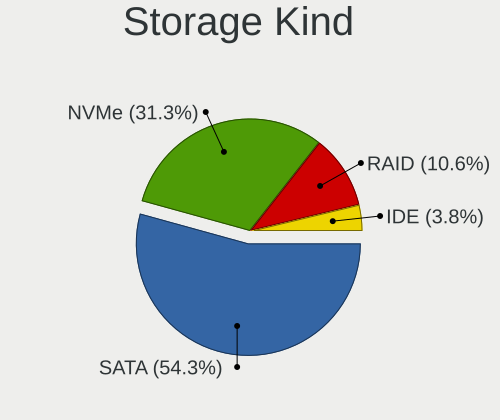

| Kind | Notebooks | Percent |
|------|-----------|---------|
| SATA | 418       | 54.29%  |
| NVMe | 241       | 31.3%   |
| RAID | 82        | 10.65%  |
| IDE  | 29        | 3.77%   |

Processor
---------

CPU Vendor
----------

Processor vendors

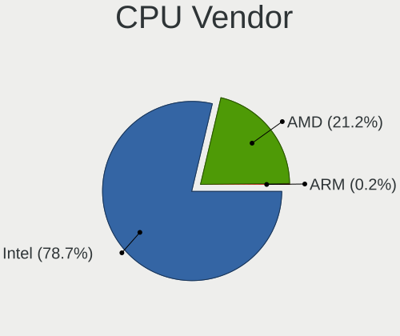

| Vendor | Notebooks | Percent |
|--------|-----------|---------|
| Intel  | 491       | 78.69%  |
| AMD    | 132       | 21.15%  |
| ARM    | 1         | 0.16%   |

CPU Model
---------

Processor models

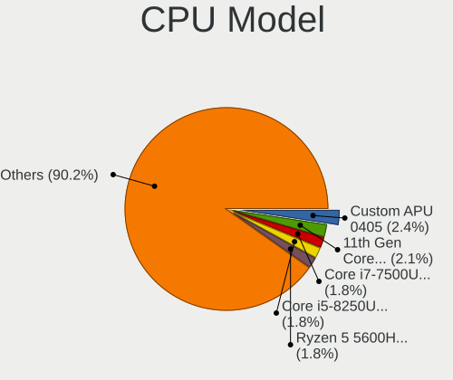

| Model                                         | Notebooks | Percent |
|-----------------------------------------------|-----------|---------|
| AMD Custom APU 0405                           | 15        | 2.4%    |
| Intel 11th Gen Core i5-1135G7 @ 2.40GHz       | 13        | 2.08%   |
| Intel Core i7-7500U CPU @ 2.70GHz             | 11        | 1.76%   |
| Intel Core i5-8250U CPU @ 1.60GHz             | 11        | 1.76%   |
| AMD Ryzen 5 5600H with Radeon Graphics        | 11        | 1.76%   |
| Intel Core i7-7700HQ CPU @ 2.80GHz            | 9         | 1.44%   |
| Intel Core i5-7200U CPU @ 2.50GHz             | 9         | 1.44%   |
| Intel Core i5-6200U CPU @ 2.30GHz             | 9         | 1.44%   |
| Intel Core i5-3320M CPU @ 2.60GHz             | 9         | 1.44%   |
| Intel Core i7-8550U CPU @ 1.80GHz             | 8         | 1.28%   |
| Intel Core i3-6006U CPU @ 2.00GHz             | 8         | 1.28%   |
| Intel Celeron CPU N3350 @ 1.10GHz             | 8         | 1.28%   |
| Intel Core i5-10300H CPU @ 2.50GHz            | 7         | 1.12%   |
| Intel Celeron CPU N3450 @ 1.10GHz             | 7         | 1.12%   |
| AMD Ryzen 5 2500U with Radeon Vega Mobile Gfx | 7         | 1.12%   |
| Intel Core i7-8565U CPU @ 1.80GHz             | 6         | 0.96%   |
| Intel Core i5-9300H CPU @ 2.40GHz             | 6         | 0.96%   |
| Intel Core i5-3210M CPU @ 2.50GHz             | 6         | 0.96%   |
| Intel 11th Gen Core i3-1115G4 @ 3.00GHz       | 6         | 0.96%   |
| Intel Core i7-10510U CPU @ 1.80GHz            | 5         | 0.8%    |
| Intel Core i5-5200U CPU @ 2.20GHz             | 5         | 0.8%    |
| Intel Core i5-3337U CPU @ 1.80GHz             | 5         | 0.8%    |
| Intel Core i5-2520M CPU @ 2.50GHz             | 5         | 0.8%    |
| Intel Core i5-2430M CPU @ 2.40GHz             | 5         | 0.8%    |
| Intel Core i5-1035G1 CPU @ 1.00GHz            | 5         | 0.8%    |
| Intel Core i5-10210U CPU @ 1.60GHz            | 5         | 0.8%    |
| Intel Core i3-7020U CPU @ 2.30GHz             | 5         | 0.8%    |
| Intel Celeron CPU N3060 @ 1.60GHz             | 5         | 0.8%    |
| Intel Celeron CPU N2830 @ 2.16GHz             | 5         | 0.8%    |
| AMD Ryzen 5 4500U with Radeon Graphics        | 5         | 0.8%    |
| Intel Core i7-9750H CPU @ 2.60GHz             | 4         | 0.64%   |
| Intel Core i5-3317U CPU @ 1.70GHz             | 4         | 0.64%   |
| Intel Core i5-2450M CPU @ 2.50GHz             | 4         | 0.64%   |
| Intel Core i3-5005U CPU @ 2.00GHz             | 4         | 0.64%   |
| Intel Core i3-3217U CPU @ 1.80GHz             | 4         | 0.64%   |
| Intel Core i3-2350M CPU @ 2.30GHz             | 4         | 0.64%   |
| Intel Core i3-10110U CPU @ 2.10GHz            | 4         | 0.64%   |
| Intel Core i3-1005G1 CPU @ 1.20GHz            | 4         | 0.64%   |
| Intel Celeron CPU N2940 @ 1.83GHz             | 4         | 0.64%   |
| Intel 13th Gen Core i5-13420H                 | 4         | 0.64%   |

CPU Model Family
----------------

Processor model prefix

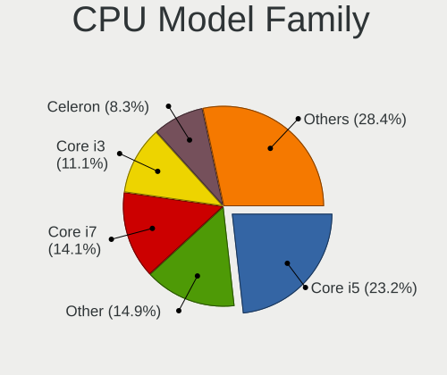

| Model                   | Notebooks | Percent |
|-------------------------|-----------|---------|
| Intel Core i5           | 145       | 23.24%  |
| Other                   | 93        | 14.9%   |
| Intel Core i7           | 88        | 14.1%   |
| Intel Core i3           | 69        | 11.06%  |
| Intel Celeron           | 52        | 8.33%   |
| AMD Ryzen 5             | 39        | 6.25%   |
| AMD Ryzen 7             | 20        | 3.21%   |
| Intel Core 2 Duo        | 19        | 3.04%   |
| Intel Atom              | 13        | 2.08%   |
| Intel Pentium           | 12        | 1.92%   |
| AMD Ryzen 3             | 12        | 1.92%   |
| Intel Pentium Silver    | 6         | 0.96%   |
| AMD A6                  | 6         | 0.96%   |
| Intel Pentium Dual-Core | 5         | 0.8%    |
| AMD A8                  | 5         | 0.8%    |
| AMD A10                 | 4         | 0.64%   |
| Intel Genuine           | 3         | 0.48%   |
| Intel Core              | 3         | 0.48%   |
| AMD Ryzen 5 PRO         | 3         | 0.48%   |
| AMD Athlon              | 3         | 0.48%   |
| Intel Core m3           | 2         | 0.32%   |
| AMD Turion 64 X2 Mobile | 2         | 0.32%   |
| AMD Ryzen 9             | 2         | 0.32%   |
| AMD Ryzen 7 PRO         | 2         | 0.32%   |
| AMD PRO A10             | 2         | 0.32%   |
| AMD E                   | 2         | 0.32%   |
| Intel Pentium Dual      | 1         | 0.16%   |
| Intel Core m5           | 1         | 0.16%   |
| Intel Core 2            | 1         | 0.16%   |
| Intel Celeron M         | 1         | 0.16%   |
| AMD Turion Dual-Core    | 1         | 0.16%   |
| AMD Turion 64 Mobile    | 1         | 0.16%   |
| AMD Quad-Core           | 1         | 0.16%   |
| AMD FX                  | 1         | 0.16%   |
| AMD E2                  | 1         | 0.16%   |
| AMD E1                  | 1         | 0.16%   |
| AMD C-60                | 1         | 0.16%   |
| AMD A4                  | 1         | 0.16%   |

CPU Cores
---------

Number of processor cores

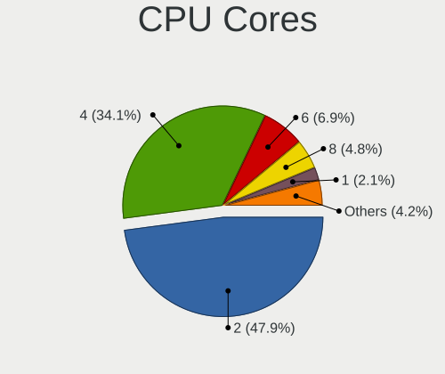

| Number | Notebooks | Percent |
|--------|-----------|---------|
| 2      | 299       | 47.92%  |
| 4      | 213       | 34.13%  |
| 6      | 43        | 6.89%   |
| 8      | 30        | 4.81%   |
| 1      | 13        | 2.08%   |
| 14     | 10        | 1.6%    |
| 10     | 8         | 1.28%   |
| 12     | 6         | 0.96%   |
| 24     | 1         | 0.16%   |
| 16     | 1         | 0.16%   |

CPU Sockets
-----------

Number of sockets

| Number | Notebooks | Percent |
|--------|-----------|---------|
| 1      | 624       | 100%    |

CPU Threads
-----------

Threads per core (Hyper-Threading)

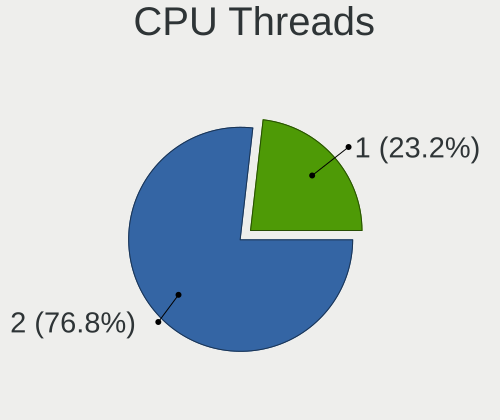

| Number | Notebooks | Percent |
|--------|-----------|---------|
| 2      | 480       | 76.8%   |
| 1      | 145       | 23.2%   |

CPU Op-Modes
------------

CPU Operation Modes (32-bit, 64-bit)

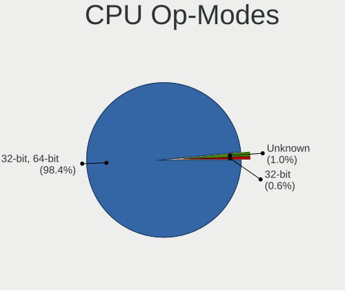

| Op mode        | Notebooks | Percent |
|----------------|-----------|---------|
| 32-bit, 64-bit | 615       | 98.4%   |
| Unknown        | 6         | 0.96%   |
| 32-bit         | 4         | 0.64%   |

CPU Microcode
-------------

Microcode number

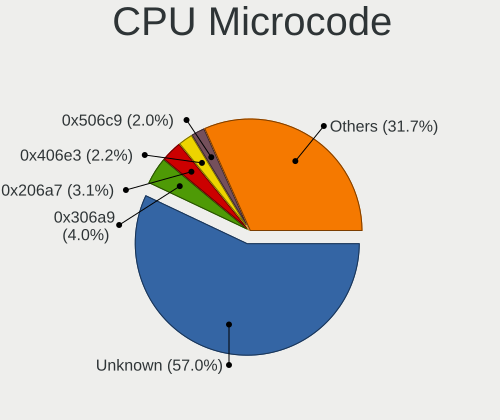

| Number     | Notebooks | Percent |
|------------|-----------|---------|
| Unknown    | 369       | 57.03%  |
| 0x306a9    | 26        | 4.02%   |
| 0x206a7    | 20        | 3.09%   |
| 0x406e3    | 14        | 2.16%   |
| 0x506c9    | 13        | 2.01%   |
| 0x806ea    | 12        | 1.85%   |
| 0x1067a    | 12        | 1.85%   |
| 0x806ec    | 10        | 1.55%   |
| 0x806e9    | 10        | 1.55%   |
| 0x30678    | 10        | 1.55%   |
| 0x306d4    | 9         | 1.39%   |
| 0x0a50000c | 7         | 1.08%   |
| 0x806c1    | 6         | 0.93%   |
| 0x406c4    | 6         | 0.93%   |
| 0x306c3    | 6         | 0.93%   |
| 0x20655    | 6         | 0.93%   |
| 0x906ea    | 5         | 0.77%   |
| 0x706e5    | 5         | 0.77%   |
| 0x706a1    | 5         | 0.77%   |
| 0x40651    | 5         | 0.77%   |
| 0x106ca    | 5         | 0.77%   |
| 0xa0652    | 4         | 0.62%   |
| 0x806eb    | 4         | 0.62%   |
| 0x10676    | 4         | 0.62%   |
| 0x08608103 | 4         | 0.62%   |
| 0x08600104 | 4         | 0.62%   |
| 0x08108109 | 4         | 0.62%   |
| 0x906e9    | 3         | 0.46%   |
| 0x906a4    | 3         | 0.46%   |
| 0x406c3    | 3         | 0.46%   |
| 0x20652    | 3         | 0.46%   |
| 0x0a50000d | 3         | 0.46%   |
| 0x07030105 | 3         | 0.46%   |
| 0x06003106 | 3         | 0.46%   |
| 0x906c0    | 2         | 0.31%   |
| 0x906a3    | 2         | 0.31%   |
| 0x706a8    | 2         | 0.31%   |
| 0x6ec      | 2         | 0.31%   |
| 0x506e3    | 2         | 0.31%   |
| 0x30661    | 2         | 0.31%   |

CPU Microarch
-------------

Microarchitecture

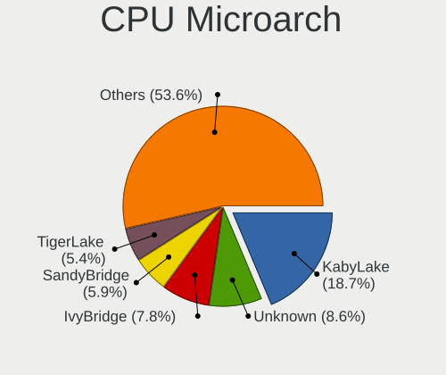

| Name              | Notebooks | Percent |
|-------------------|-----------|---------|
| KabyLake          | 117       | 18.66%  |
| Unknown           | 54        | 8.61%   |
| IvyBridge         | 49        | 7.81%   |
| SandyBridge       | 37        | 5.9%    |
| TigerLake         | 34        | 5.42%   |
| Skylake           | 33        | 5.26%   |
| Silvermont        | 26        | 4.15%   |
| Penryn            | 24        | 3.83%   |
| Alderlake Hybrid  | 24        | 3.83%   |
| Haswell           | 23        | 3.67%   |
| Zen 3             | 21        | 3.35%   |
| Broadwell         | 21        | 3.35%   |
| Goldmont          | 17        | 2.71%   |
| Zen+              | 15        | 2.39%   |
| Westmere          | 14        | 2.23%   |
| Zen               | 13        | 2.07%   |
| Icelake           | 13        | 2.07%   |
| Goldmont plus     | 13        | 2.07%   |
| Zen 2             | 12        | 1.91%   |
| CometLake         | 11        | 1.75%   |
| Bonnell           | 10        | 1.59%   |
| Excavator         | 8         | 1.28%   |
| Puma              | 6         | 0.96%   |
| Core              | 5         | 0.8%    |
| Piledriver        | 4         | 0.64%   |
| K8 Hammer         | 4         | 0.64%   |
| Steamroller       | 3         | 0.48%   |
| P6                | 3         | 0.48%   |
| Bobcat            | 3         | 0.48%   |
| Tremont           | 2         | 0.32%   |
| Meteorlake Hybrid | 2         | 0.32%   |
| K8 & K10 hybrid   | 2         | 0.32%   |
| Jaguar            | 2         | 0.32%   |
| K10 Llano         | 1         | 0.16%   |
| Gracemont         | 1         | 0.16%   |

Graphics
--------

GPU Vendor
----------

Vendors of graphics cards

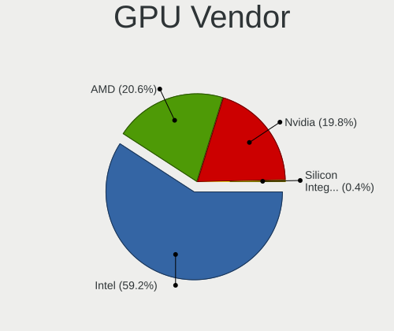

| Vendor                           | Notebooks | Percent |
|----------------------------------|-----------|---------|
| Intel                            | 468       | 59.17%  |
| AMD                              | 163       | 20.61%  |
| Nvidia                           | 157       | 19.85%  |
| Silicon Integrated Systems [SiS] | 3         | 0.38%   |

GPU Model
---------

Graphics card models

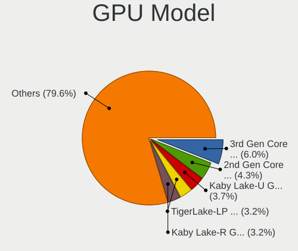

| Model                                                                                    | Notebooks | Percent |
|------------------------------------------------------------------------------------------|-----------|---------|
| Intel 3rd Gen Core processor Graphics Controller                                         | 49        | 6.02%   |
| Intel 2nd Generation Core Processor Family Integrated Graphics Controller                | 35        | 4.3%    |
| Intel Kaby Lake-U GT2 [HD Graphics 620]                                                  | 30        | 3.69%   |
| Intel TigerLake-LP GT2 [Iris Xe Graphics]                                                | 26        | 3.19%   |
| Intel Kaby Lake-R GT2 [UHD Graphics 620]                                                 | 26        | 3.19%   |
| Intel Skylake-U GT2 [HD Graphics 520]                                                    | 24        | 2.95%   |
| Intel Broadwell-U GT2 [HD Graphics 5500]                                                 | 18        | 2.21%   |
| AMD Picasso/Raven 2 [Radeon Vega Series / Radeon Vega Mobile Series]                     | 17        | 2.09%   |
| AMD Cezanne [Radeon Vega Series / Radeon Vega Mobile Series]                             | 16        | 1.97%   |
| Intel Atom Processor Z36xxx/Z37xxx Series Graphics & Display                             | 15        | 1.84%   |
| Intel Apollo Lake GT1 [HD Graphics 500]                                                  | 15        | 1.84%   |
| AMD VanGogh [AMD Custom GPU 0405]                                                        | 15        | 1.84%   |
| Nvidia GA107M [GeForce RTX 3050 Mobile]                                                  | 14        | 1.72%   |
| Intel WhiskeyLake-U GT2 [UHD Graphics 620]                                               | 14        | 1.72%   |
| Intel Mobile 4 Series Chipset Integrated Graphics Controller                             | 14        | 1.72%   |
| Intel CometLake-U GT2 [UHD Graphics]                                                     | 14        | 1.72%   |
| Nvidia TU117M [GeForce GTX 1650 Mobile / Max-Q]                                          | 13        | 1.6%    |
| Intel CoffeeLake-H GT2 [UHD Graphics 630]                                                | 13        | 1.6%    |
| AMD Renoir [Radeon Vega Series / Radeon Vega Mobile Series]                              | 12        | 1.47%   |
| Intel Haswell-ULT Integrated Graphics Controller                                         | 11        | 1.35%   |
| Intel Core Processor Integrated Graphics Controller                                      | 11        | 1.35%   |
| Intel Atom/Celeron/Pentium Processor x5-E8000/J3xxx/N3xxx Integrated Graphics Controller | 11        | 1.35%   |
| Intel 4th Gen Core Processor Integrated Graphics Controller                              | 11        | 1.35%   |
| AMD Topaz XT [Radeon R7 M260/M265 / M340/M360 / M440/M445 / 530/535 / 620/625 Mobile]    | 11        | 1.35%   |
| Intel CometLake-H GT2 [UHD Graphics]                                                     | 10        | 1.23%   |
| AMD Sun XT [Radeon HD 8670A/8670M/8690M / R5 M330 / M430 / Radeon 520 Mobile]            | 10        | 1.23%   |
| AMD Raven Ridge [Radeon Vega Series / Radeon Vega Mobile Series]                         | 10        | 1.23%   |
| AMD Lucienne                                                                             | 10        | 1.23%   |
| Nvidia GM108M [GeForce 940MX]                                                            | 9         | 1.11%   |
| Intel Kaby Lake-H GT2 [HD Graphics 630]                                                  | 9         | 1.11%   |
| Intel Iris Plus Graphics G1 (Ice Lake)                                                   | 9         | 1.11%   |
| Nvidia GP107M [GeForce GTX 1050 Mobile]                                                  | 8         | 0.98%   |
| Intel Tiger Lake-LP GT2 [UHD Graphics G4]                                                | 8         | 0.98%   |
| Intel GeminiLake [UHD Graphics 600]                                                      | 8         | 0.98%   |
| Nvidia GM108M [GeForce MX130]                                                            | 7         | 0.86%   |
| Nvidia GM108M [GeForce 940M]                                                             | 7         | 0.86%   |
| Intel Atom Processor D4xx/D5xx/N4xx/N5xx Integrated Graphics Controller                  | 7         | 0.86%   |
| Nvidia GP108M [GeForce MX150]                                                            | 6         | 0.74%   |
| Nvidia AD107M [GeForce RTX 4050 Max-Q / Mobile]                                          | 6         | 0.74%   |
| Intel Alder Lake-P GT2 [Iris Xe Graphics]                                                | 6         | 0.74%   |

GPU Combo
---------

Combinations of graphics cards

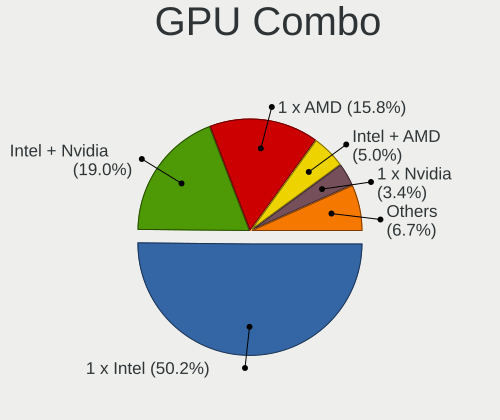

| Name           | Notebooks | Percent |
|----------------|-----------|---------|
| 1 x Intel      | 314       | 50.16%  |
| Intel + Nvidia | 119       | 19.01%  |
| 1 x AMD        | 99        | 15.81%  |
| Intel + AMD    | 31        | 4.95%   |
| 1 x Nvidia     | 21        | 3.35%   |
| AMD + Nvidia   | 18        | 2.88%   |
| 2 x AMD        | 16        | 2.56%   |
| 2 x Intel      | 4         | 0.64%   |
| 1 x SiS        | 3         | 0.48%   |
| Other          | 1         | 0.16%   |

GPU Driver
----------

Free vs proprietary

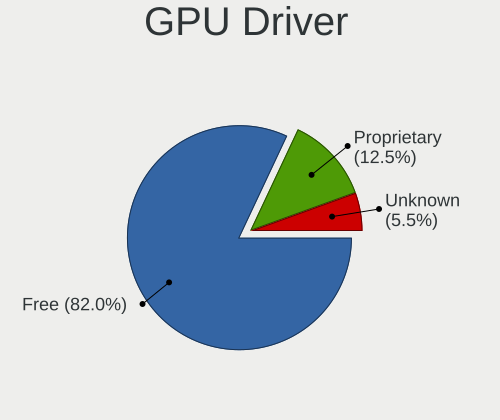

| Driver      | Notebooks | Percent |
|-------------|-----------|---------|
| Free        | 519       | 81.99%  |
| Proprietary | 79        | 12.48%  |
| Unknown     | 35        | 5.53%   |

GPU Memory
----------

Total video memory

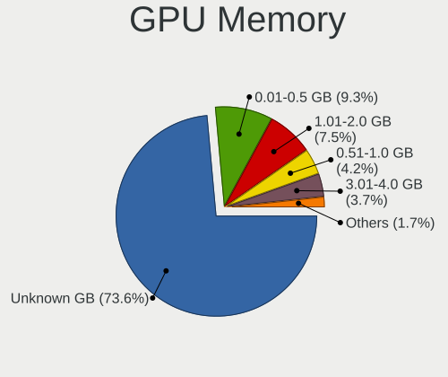

| Size in GB | Notebooks | Percent |
|------------|-----------|---------|
| Unknown    | 473       | 73.56%  |
| 0.01-0.5   | 60        | 9.33%   |
| 1.01-2.0   | 48        | 7.47%   |
| 0.51-1.0   | 27        | 4.2%    |
| 3.01-4.0   | 24        | 3.73%   |
| 7.01-8.0   | 6         | 0.93%   |
| 5.01-6.0   | 4         | 0.62%   |
| 8.01-16.0  | 1         | 0.16%   |

Monitor
-------

Monitor Vendor
--------------

Monitor vendors

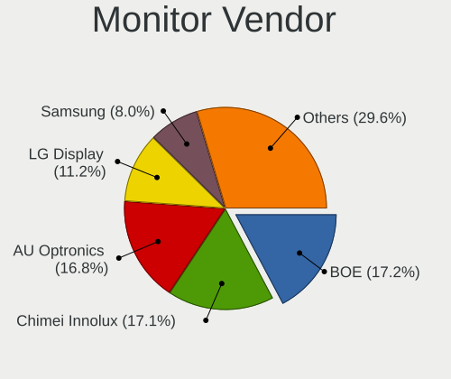

| Vendor                  | Notebooks | Percent |
|-------------------------|-----------|---------|
| BOE                     | 120       | 17.24%  |
| Chimei Innolux          | 119       | 17.1%   |
| AU Optronics            | 117       | 16.81%  |
| LG Display              | 78        | 11.21%  |
| Samsung Electronics     | 56        | 8.05%   |
| Lenovo                  | 23        | 3.3%    |
| Valve                   | 17        | 2.44%   |
| PANDA                   | 12        | 1.72%   |
| Apple                   | 12        | 1.72%   |
| InfoVision              | 11        | 1.58%   |
| Goldstar                | 11        | 1.58%   |
| Sharp                   | 10        | 1.44%   |
| Philips                 | 9         | 1.29%   |
| Sony                    | 7         | 1.01%   |
| AOC                     | 7         | 1.01%   |
| Chi Mei Optoelectronics | 6         | 0.86%   |
| InnoLux Display         | 5         | 0.72%   |
| Dell                    | 5         | 0.72%   |
| Acer                    | 5         | 0.72%   |
| HKC                     | 4         | 0.57%   |
| BenQ                    | 4         | 0.57%   |
| ASUSTek Computer        | 4         | 0.57%   |
| ViewSonic               | 3         | 0.43%   |
| RTK                     | 3         | 0.43%   |
| CSOT                    | 3         | 0.43%   |
| TMX                     | 2         | 0.29%   |
| SGT                     | 2         | 0.29%   |
| MDA                     | 2         | 0.29%   |
| LG Philips              | 2         | 0.29%   |
| KDB                     | 2         | 0.29%   |
| JDI                     | 2         | 0.29%   |
| Hewlett-Packard         | 2         | 0.29%   |
| GreenWood               | 2         | 0.29%   |
| Gigabyte Technology     | 2         | 0.29%   |
| CSO                     | 2         | 0.29%   |
| Ancor Communications    | 2         | 0.29%   |
| ___                     | 1         | 0.14%   |
| VIZTA                   | 1         | 0.14%   |
| Unknown                 | 1         | 0.14%   |
| Toshiba                 | 1         | 0.14%   |

Monitor Model
-------------

Monitor models

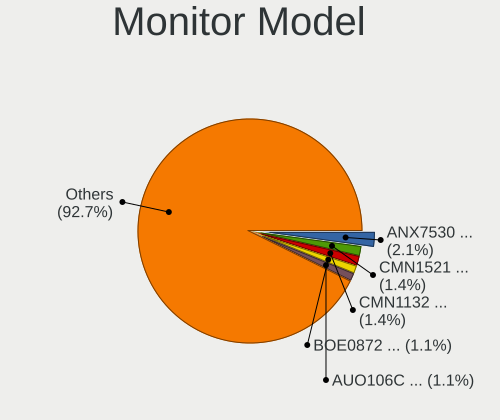

| Model                                                                | Notebooks | Percent |
|----------------------------------------------------------------------|-----------|---------|
| Valve ANX7530 U VLV3001 800x1280 100x150mm 7.1-inch                  | 15        | 2.15%   |
| Chimei Innolux LCD Monitor CMN1521 1920x1080 344x193mm 15.5-inch     | 10        | 1.43%   |
| Chimei Innolux LCD Monitor CMN1132 1366x768 256x144mm 11.6-inch      | 10        | 1.43%   |
| BOE LCD Monitor BOE0872 1920x1080 344x194mm 15.5-inch                | 8         | 1.15%   |
| AU Optronics LCD Monitor AUO106C 1366x768 276x155mm 12.5-inch        | 8         | 1.15%   |
| Chimei Innolux LCD Monitor CMN15D5 1920x1080 344x193mm 15.5-inch     | 7         | 1%      |
| Chimei Innolux LCD Monitor CMN14D6 1366x768 309x173mm 13.9-inch      | 6         | 0.86%   |
| Chimei Innolux LCD Monitor CMN14C3 1366x768 309x173mm 13.9-inch      | 6         | 0.86%   |
| BOE LCD Monitor BOE0893 2160x1440 296x197mm 14.0-inch                | 5         | 0.72%   |
| BOE LCD Monitor BOE0877 1920x1080 309x173mm 13.9-inch                | 5         | 0.72%   |
| AU Optronics LCD Monitor AUO38ED 1920x1080 344x193mm 15.5-inch       | 5         | 0.72%   |
| PANDA LCD Monitor NCP004D 1920x1080 344x194mm 15.5-inch              | 4         | 0.57%   |
| LG Display LCD Monitor LGD046F 1920x1080 344x194mm 15.5-inch         | 4         | 0.57%   |
| LG Display LCD Monitor LGD033F 1366x768 310x174mm 14.0-inch          | 4         | 0.57%   |
| Chimei Innolux LCD Monitor CMN15F5 1920x1080 344x193mm 15.5-inch     | 4         | 0.57%   |
| Chimei Innolux LCD Monitor CMN15DB 1366x768 344x193mm 15.5-inch      | 4         | 0.57%   |
| Chimei Innolux LCD Monitor CMN14D4 1920x1080 309x173mm 13.9-inch     | 4         | 0.57%   |
| Chimei Innolux LCD Monitor CMN1493 1366x768 309x173mm 13.9-inch      | 4         | 0.57%   |
| Chimei Innolux LCD Monitor CMN1480 1366x768 309x174mm 14.0-inch      | 4         | 0.57%   |
| BOE LCD Monitor BOE0700 1920x1080 344x194mm 15.5-inch                | 4         | 0.57%   |
| BOE LCD Monitor BOE0672 1366x768 344x194mm 15.5-inch                 | 4         | 0.57%   |
| AU Optronics LCD Monitor AUO403D 1920x1080 309x174mm 14.0-inch       | 4         | 0.57%   |
| AU Optronics LCD Monitor AUO2992 1920x1080 344x193mm 15.5-inch       | 4         | 0.57%   |
| AU Optronics LCD Monitor AUO183C 1366x768 309x173mm 13.9-inch        | 4         | 0.57%   |
| Samsung Electronics LCD Monitor SEC544B 1600x900 382x214mm 17.2-inch | 3         | 0.43%   |
| Samsung Electronics LCD Monitor SEC5441 1280x800 331x207mm 15.4-inch | 3         | 0.43%   |
| LG Display LCD Monitor LGD02F8 1366x768 309x174mm 14.0-inch          | 3         | 0.43%   |
| Lenovo LCD Monitor LEN40B1 1600x900 345x194mm 15.6-inch              | 3         | 0.43%   |
| Lenovo LCD Monitor LEN40A0 1366x768 309x173mm 13.9-inch              | 3         | 0.43%   |
| Chimei Innolux LCD Monitor CMN15E7 1920x1080 344x193mm 15.5-inch     | 3         | 0.43%   |
| Chimei Innolux LCD Monitor CMN15E6 1366x768 344x193mm 15.5-inch      | 3         | 0.43%   |
| BOE LCD Monitor BOE08F2 1920x1080 310x174mm 14.0-inch                | 3         | 0.43%   |
| BOE LCD Monitor BOE08D7 1920x1080 309x174mm 14.0-inch                | 3         | 0.43%   |
| BOE LCD Monitor BOE06BD 1366x768 309x173mm 13.9-inch                 | 3         | 0.43%   |
| BOE LCD Monitor BOE06A4 1366x768 344x194mm 15.5-inch                 | 3         | 0.43%   |
| BOE LCD Monitor BOE0698 1366x768 309x173mm 13.9-inch                 | 3         | 0.43%   |
| BOE LCD Monitor BOE0671 1366x768 344x194mm 15.5-inch                 | 3         | 0.43%   |
| AU Optronics LCD Monitor AUO459D 1920x1200 344x215mm 16.0-inch       | 3         | 0.43%   |
| AU Optronics LCD Monitor AUO2D3C 1366x768 309x173mm 13.9-inch        | 3         | 0.43%   |
| AU Optronics LCD Monitor AUO235C 1366x768 256x144mm 11.6-inch        | 3         | 0.43%   |

Monitor Resolution
------------------

Monitor screen resolution

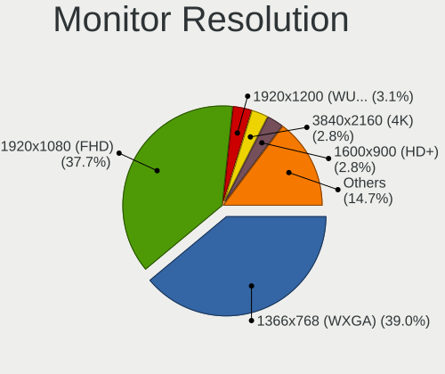

| Resolution         | Notebooks | Percent |
|--------------------|-----------|---------|
| 1366x768 (WXGA)    | 254       | 38.96%  |
| 1920x1080 (FHD)    | 246       | 37.73%  |
| 1920x1200 (WUXGA)  | 20        | 3.07%   |
| 3840x2160 (4K)     | 18        | 2.76%   |
| 1600x900 (HD+)     | 18        | 2.76%   |
| 800x1280           | 17        | 2.61%   |
| 2560x1440 (QHD)    | 11        | 1.69%   |
| 1280x800 (WXGA)    | 11        | 1.69%   |
| 2160x1440          | 9         | 1.38%   |
| 1440x900 (WXGA+)   | 8         | 1.23%   |
| 1024x600           | 8         | 1.23%   |
| 2560x1600          | 7         | 1.07%   |
| 1280x1024 (SXGA)   | 6         | 0.92%   |
| 1360x768           | 5         | 0.77%   |
| 2880x1800          | 2         | 0.31%   |
| 2560x1080          | 2         | 0.31%   |
| 3840x2400          | 1         | 0.15%   |
| 3456x2160          | 1         | 0.15%   |
| 3200x2000          | 1         | 0.15%   |
| 3000x2000          | 1         | 0.15%   |
| 2400x1600          | 1         | 0.15%   |
| 1680x1050 (WSXGA+) | 1         | 0.15%   |
| 1280x960           | 1         | 0.15%   |
| 1280x768           | 1         | 0.15%   |
| 1024x768 (XGA)     | 1         | 0.15%   |
| Unknown            | 1         | 0.15%   |

Monitor Diagonal
----------------

Diagonal size in inches

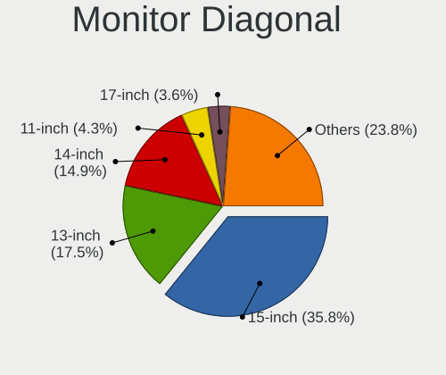

| Inches  | Notebooks | Percent |
|---------|-----------|---------|
| 15      | 248       | 35.84%  |
| 13      | 121       | 17.49%  |
| 14      | 103       | 14.88%  |
| 11      | 30        | 4.34%   |
| 17      | 25        | 3.61%   |
| 21      | 20        | 2.89%   |
| 12      | 20        | 2.89%   |
| 7       | 17        | 2.46%   |
| 27      | 16        | 2.31%   |
| 16      | 16        | 2.31%   |
| 23      | 15        | 2.17%   |
| 18      | 13        | 1.88%   |
| 31      | 10        | 1.45%   |
| 10      | 8         | 1.16%   |
| 72      | 6         | 0.87%   |
| 24      | 6         | 0.87%   |
| Unknown | 4         | 0.58%   |
| 84      | 2         | 0.29%   |
| 34      | 2         | 0.29%   |
| 26      | 2         | 0.29%   |
| 19      | 2         | 0.29%   |
| 63      | 1         | 0.14%   |
| 54      | 1         | 0.14%   |
| 40      | 1         | 0.14%   |
| 28      | 1         | 0.14%   |
| 20      | 1         | 0.14%   |
| 8       | 1         | 0.14%   |

Monitor Width
-------------

Physical width

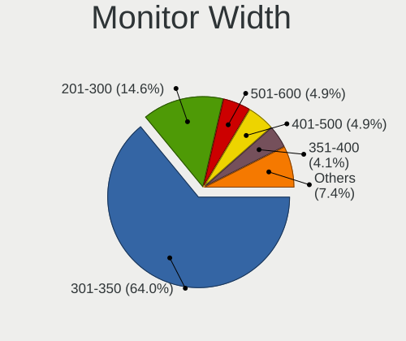

| Width in mm | Notebooks | Percent |
|-------------|-----------|---------|
| 301-350     | 440       | 64.05%  |
| 201-300     | 100       | 14.56%  |
| 501-600     | 34        | 4.95%   |
| 401-500     | 34        | 4.95%   |
| 351-400     | 28        | 4.08%   |
| 1-100       | 17        | 2.47%   |
| 601-700     | 16        | 2.33%   |
| 1501-2000   | 8         | 1.16%   |
| Unknown     | 4         | 0.58%   |
| 701-800     | 2         | 0.29%   |
| 1001-1500   | 2         | 0.29%   |
| 801-900     | 1         | 0.15%   |
| 101-200     | 1         | 0.15%   |

Aspect Ratio
------------

Proportional relationship between the width and the height

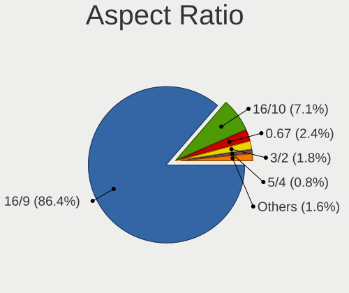

| Ratio   | Notebooks | Percent |
|---------|-----------|---------|
| 16/9    | 538       | 86.36%  |
| 16/10   | 44        | 7.06%   |
| 0.67    | 15        | 2.41%   |
| 3/2     | 11        | 1.77%   |
| 5/4     | 5         | 0.8%    |
| 0.62    | 3         | 0.48%   |
| Unknown | 3         | 0.48%   |
| 21/9    | 2         | 0.32%   |
| 4/3     | 1         | 0.16%   |
| 2.00    | 1         | 0.16%   |

Monitor Area
------------

Area in inch²

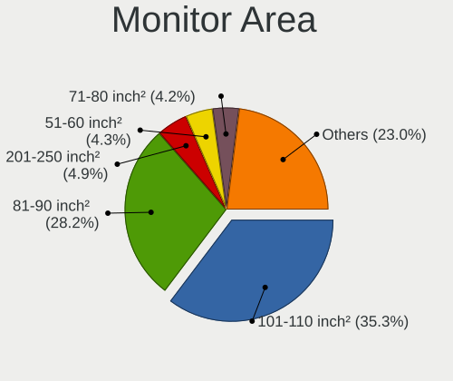

| Area in inch² | Notebooks | Percent |
|----------------|-----------|---------|
| 101-110        | 244       | 35.31%  |
| 81-90          | 195       | 28.22%  |
| 201-250        | 34        | 4.92%   |
| 51-60          | 30        | 4.34%   |
| 71-80          | 29        | 4.2%    |
| 61-70          | 20        | 2.89%   |
| 121-130        | 20        | 2.89%   |
| 1-40           | 18        | 2.6%    |
| 141-150        | 17        | 2.46%   |
| 111-120        | 17        | 2.46%   |
| 301-350        | 16        | 2.32%   |
| 351-500        | 13        | 1.88%   |
| More than 1000 | 10        | 1.45%   |
| 151-200        | 10        | 1.45%   |
| 41-50          | 8         | 1.16%   |
| Unknown        | 4         | 0.58%   |
| 91-100         | 3         | 0.43%   |
| 251-300        | 1         | 0.14%   |
| 131-140        | 1         | 0.14%   |
| 501-1000       | 1         | 0.14%   |

Pixel Density
-------------

Pixels per inch

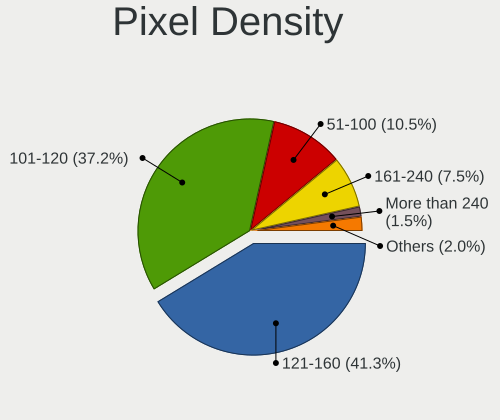

| Density       | Notebooks | Percent |
|---------------|-----------|---------|
| 121-160       | 282       | 41.29%  |
| 101-120       | 254       | 37.19%  |
| 51-100        | 72        | 10.54%  |
| 161-240       | 51        | 7.47%   |
| More than 240 | 10        | 1.46%   |
| 1-50          | 10        | 1.46%   |
| Unknown       | 4         | 0.59%   |

Multiple Monitors
-----------------

Total monitors connected

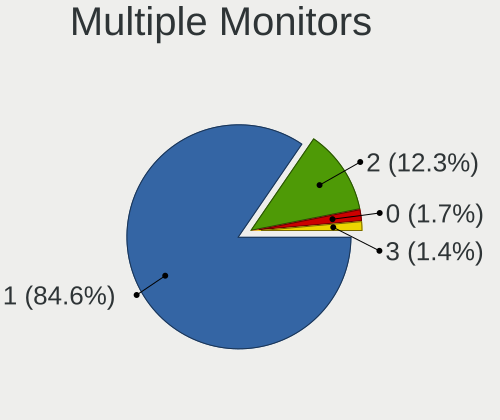

| Total | Notebooks | Percent |
|-------|-----------|---------|
| 1     | 542       | 84.56%  |
| 2     | 79        | 12.32%  |
| 0     | 11        | 1.72%   |
| 3     | 9         | 1.4%    |

Network
-------

Net Controller Vendor
---------------------

Controller vendors

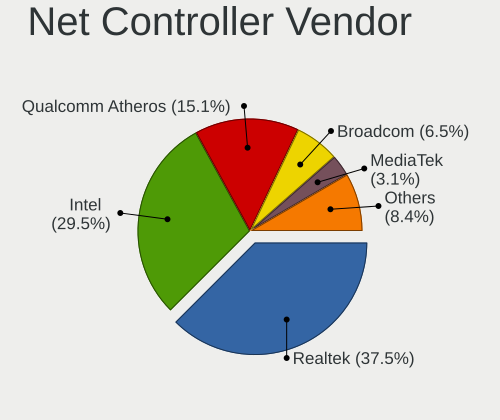

| Vendor                           | Notebooks | Percent |
|----------------------------------|-----------|---------|
| Realtek Semiconductor            | 366       | 37.5%   |
| Intel                            | 288       | 29.51%  |
| Qualcomm Atheros                 | 147       | 15.06%  |
| Broadcom                         | 63        | 6.45%   |
| MediaTek                         | 30        | 3.07%   |
| Broadcom Limited                 | 8         | 0.82%   |
| Ralink Technology                | 7         | 0.72%   |
| TP-Link                          | 6         | 0.61%   |
| Nvidia                           | 6         | 0.61%   |
| ASIX Electronics                 | 6         | 0.61%   |
| Ralink                           | 5         | 0.51%   |
| Qualcomm                         | 5         | 0.51%   |
| Marvell Technology Group         | 4         | 0.41%   |
| Silicon Integrated Systems [SiS] | 3         | 0.31%   |
| Samsung Electronics              | 3         | 0.31%   |
| Qualcomm Atheros Communications  | 3         | 0.31%   |
| DisplayLink                      | 3         | 0.31%   |
| Dell                             | 3         | 0.31%   |
| Xiaomi                           | 2         | 0.2%    |
| Shenzhen Goodix Technology       | 2         | 0.2%    |
| OPPO Electronics                 | 2         | 0.2%    |
| JMicron Technology               | 2         | 0.2%    |
| ICS Advent                       | 2         | 0.2%    |
| Apple                            | 2         | 0.2%    |
| U-Blox                           | 1         | 0.1%    |
| Sierra Wireless                  | 1         | 0.1%    |
| NetGear                          | 1         | 0.1%    |
| Hewlett-Packard                  | 1         | 0.1%    |
| Encore Electronics               | 1         | 0.1%    |
| BUFFALO                          | 1         | 0.1%    |
| ASUSTek Computer                 | 1         | 0.1%    |
| AMD                              | 1         | 0.1%    |

Net Controller Model
--------------------

Controller models

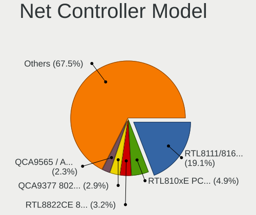

| Model                                                                  | Notebooks | Percent |
|------------------------------------------------------------------------|-----------|---------|
| Realtek RTL8111/8168/8211/8411 PCI Express Gigabit Ethernet Controller | 217       | 19.14%  |
| Realtek RTL810xE PCI Express Fast Ethernet controller                  | 56        | 4.94%   |
| Realtek RTL8822CE 802.11ac PCIe Wireless Network Adapter               | 36        | 3.17%   |
| Qualcomm Atheros QCA9377 802.11ac Wireless Network Adapter             | 33        | 2.91%   |
| Qualcomm Atheros QCA9565 / AR9565 Wireless Network Adapter             | 26        | 2.29%   |
| Intel 82579LM Gigabit Network Connection (Lewisville)                  | 24        | 2.12%   |
| Intel Wireless 7265                                                    | 23        | 2.03%   |
| Intel Wireless 8265 / 8275                                             | 22        | 1.94%   |
| Intel Wi-Fi 6 AX201                                                    | 22        | 1.94%   |
| MediaTek MT7921 802.11ax PCIe Wireless Network Adapter [Filogic 330]   | 21        | 1.85%   |
| Qualcomm Atheros QCA6174 802.11ac Wireless Network Adapter             | 20        | 1.76%   |
| Qualcomm Atheros AR9285 Wireless Network Adapter (PCI-Express)         | 19        | 1.68%   |
| Intel Centrino Advanced-N 6205 [Taylor Peak]                           | 18        | 1.59%   |
| Intel Dual Band Wireless-AC 3168NGW [Stone Peak]                       | 17        | 1.5%    |
| Realtek RTL8821CE 802.11ac PCIe Wireless Network Adapter               | 16        | 1.41%   |
| Intel Comet Lake PCH-LP CNVi WiFi                                      | 15        | 1.32%   |
| Realtek RTL8723BE PCIe Wireless Network Adapter                        | 14        | 1.23%   |
| Intel Wireless 3165                                                    | 14        | 1.23%   |
| Qualcomm Atheros AR9485 Wireless Network Adapter                       | 13        | 1.15%   |
| Intel Alder Lake-P PCH CNVi WiFi                                       | 13        | 1.15%   |
| Broadcom BCM4313 802.11bgn Wireless Network Adapter                    | 13        | 1.15%   |
| Intel Cannon Lake PCH CNVi WiFi                                        | 12        | 1.06%   |
| Broadcom BCM43142 802.11b/g/n                                          | 12        | 1.06%   |
| Realtek Killer E2600 GbE Controller                                    | 11        | 0.97%   |
| Qualcomm Atheros AR9462 Wireless Network Adapter                       | 11        | 0.97%   |
| Intel Wireless 8260                                                    | 11        | 0.97%   |
| Intel Wi-Fi 6 AX200                                                    | 11        | 0.97%   |
| Realtek RTL8153 Gigabit Ethernet Adapter                               | 9         | 0.79%   |
| Qualcomm Atheros AR8152 v2.0 Fast Ethernet                             | 9         | 0.79%   |
| Intel Dual Band Wireless-AC 3165 Plus Bluetooth                        | 9         | 0.79%   |
| Intel Wireless 7260                                                    | 8         | 0.71%   |
| Intel Ethernet Connection (4) I219-LM                                  | 8         | 0.71%   |
| Intel Comet Lake PCH CNVi WiFi                                         | 8         | 0.71%   |
| Intel Cannon Point-LP CNVi [Wireless-AC]                               | 8         | 0.71%   |
| Realtek RTL8821AE 802.11ac PCIe Wireless Network Adapter               | 7         | 0.62%   |
| Ralink MT7601U Wireless Adapter                                        | 7         | 0.62%   |
| Qualcomm Atheros AR8151 v2.0 Gigabit Ethernet                          | 6         | 0.53%   |
| MediaTek MT7902 802.11ax PCIe Wireless Network Adapter [Filogic 310]   | 6         | 0.53%   |
| Intel Wi-Fi 6E(802.11ax) AX210/AX1675* 2x2 [Typhoon Peak]              | 6         | 0.53%   |
| Intel Ethernet Connection (4) I219-V                                   | 6         | 0.53%   |

Wireless Vendor
---------------

Wireless vendors

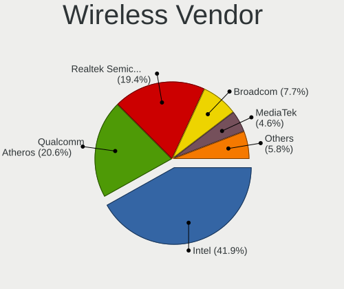

| Vendor                          | Notebooks | Percent |
|---------------------------------|-----------|---------|
| Intel                           | 266       | 41.89%  |
| Qualcomm Atheros                | 131       | 20.63%  |
| Realtek Semiconductor           | 123       | 19.37%  |
| Broadcom                        | 49        | 7.72%   |
| MediaTek                        | 29        | 4.57%   |
| Ralink Technology               | 7         | 1.1%    |
| TP-Link                         | 6         | 0.94%   |
| Ralink                          | 5         | 0.79%   |
| Broadcom Limited                | 5         | 0.79%   |
| Qualcomm                        | 4         | 0.63%   |
| Qualcomm Atheros Communications | 3         | 0.47%   |
| Dell                            | 2         | 0.31%   |
| Sierra Wireless                 | 1         | 0.16%   |
| NetGear                         | 1         | 0.16%   |
| Encore Electronics              | 1         | 0.16%   |
| BUFFALO                         | 1         | 0.16%   |
| ASUSTek Computer                | 1         | 0.16%   |

Wireless Model
--------------

Wireless models

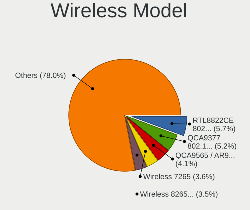

| Model                                                                | Notebooks | Percent |
|----------------------------------------------------------------------|-----------|---------|
| Realtek RTL8822CE 802.11ac PCIe Wireless Network Adapter             | 36        | 5.65%   |
| Qualcomm Atheros QCA9377 802.11ac Wireless Network Adapter           | 33        | 5.18%   |
| Qualcomm Atheros QCA9565 / AR9565 Wireless Network Adapter           | 26        | 4.08%   |
| Intel Wireless 7265                                                  | 23        | 3.61%   |
| Intel Wireless 8265 / 8275                                           | 22        | 3.45%   |
| Intel Wi-Fi 6 AX201                                                  | 22        | 3.45%   |
| MediaTek MT7921 802.11ax PCIe Wireless Network Adapter [Filogic 330] | 21        | 3.3%    |
| Qualcomm Atheros QCA6174 802.11ac Wireless Network Adapter           | 20        | 3.14%   |
| Qualcomm Atheros AR9285 Wireless Network Adapter (PCI-Express)       | 19        | 2.98%   |
| Intel Centrino Advanced-N 6205 [Taylor Peak]                         | 18        | 2.83%   |
| Intel Dual Band Wireless-AC 3168NGW [Stone Peak]                     | 17        | 2.67%   |
| Realtek RTL8821CE 802.11ac PCIe Wireless Network Adapter             | 16        | 2.51%   |
| Intel Comet Lake PCH-LP CNVi WiFi                                    | 15        | 2.35%   |
| Realtek RTL8723BE PCIe Wireless Network Adapter                      | 14        | 2.2%    |
| Intel Wireless 3165                                                  | 14        | 2.2%    |
| Qualcomm Atheros AR9485 Wireless Network Adapter                     | 13        | 2.04%   |
| Broadcom BCM4313 802.11bgn Wireless Network Adapter                  | 13        | 2.04%   |
| Intel Cannon Lake PCH CNVi WiFi                                      | 12        | 1.88%   |
| Broadcom BCM43142 802.11b/g/n                                        | 12        | 1.88%   |
| Qualcomm Atheros AR9462 Wireless Network Adapter                     | 11        | 1.73%   |
| Intel Wireless 8260                                                  | 11        | 1.73%   |
| Intel Wi-Fi 6 AX200                                                  | 11        | 1.73%   |
| Intel Dual Band Wireless-AC 3165 Plus Bluetooth                      | 9         | 1.41%   |
| Intel Wireless 7260                                                  | 8         | 1.26%   |
| Intel Comet Lake PCH CNVi WiFi                                       | 8         | 1.26%   |
| Intel Cannon Point-LP CNVi [Wireless-AC]                             | 8         | 1.26%   |
| Realtek RTL8821AE 802.11ac PCIe Wireless Network Adapter             | 7         | 1.1%    |
| Ralink MT7601U Wireless Adapter                                      | 7         | 1.1%    |
| MediaTek MT7902 802.11ax PCIe Wireless Network Adapter [Filogic 310] | 6         | 0.94%   |
| Intel Wi-Fi 6E(802.11ax) AX210/AX1675* 2x2 [Typhoon Peak]            | 6         | 0.94%   |
| Broadcom BCM43228 802.11a/b/g/n                                      | 6         | 0.94%   |
| Realtek RTL8852AE 802.11ax PCIe Wireless Network Adapter             | 5         | 0.78%   |
| Realtek RTL8822BE 802.11a/b/g/n/ac WiFi adapter                      | 5         | 0.78%   |
| Realtek RTL8188EUS 802.11n Wireless Network Adapter                  | 5         | 0.78%   |
| Realtek RTL8188CE 802.11b/g/n WiFi Adapter                           | 5         | 0.78%   |
| Intel Ice Lake-LP PCH CNVi WiFi                                      | 5         | 0.78%   |
| Intel Alder Lake-P PCH CNVi WiFi                                     | 5         | 0.78%   |
| Intel 700 Series Chipset CNVi WiFi                                   | 5         | 0.78%   |
| Broadcom BCM43224 802.11a/b/g/n                                      | 5         | 0.78%   |
| Realtek RTL8852BE PCIe 802.11ax Wireless Network Controller          | 4         | 0.63%   |

Ethernet Vendor
---------------

Ethernet vendors

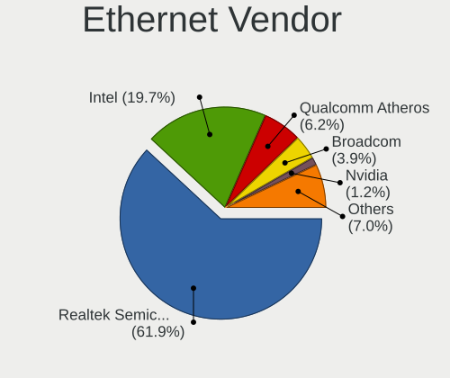

| Vendor                           | Notebooks | Percent |
|----------------------------------|-----------|---------|
| Realtek Semiconductor            | 299       | 61.9%   |
| Intel                            | 95        | 19.67%  |
| Qualcomm Atheros                 | 30        | 6.21%   |
| Broadcom                         | 19        | 3.93%   |
| Nvidia                           | 6         | 1.24%   |
| ASIX Electronics                 | 6         | 1.24%   |
| Marvell Technology Group         | 4         | 0.83%   |
| Silicon Integrated Systems [SiS] | 3         | 0.62%   |
| Samsung Electronics              | 3         | 0.62%   |
| DisplayLink                      | 3         | 0.62%   |
| Broadcom Limited                 | 3         | 0.62%   |
| Xiaomi                           | 2         | 0.41%   |
| OPPO Electronics                 | 2         | 0.41%   |
| MediaTek                         | 2         | 0.41%   |
| JMicron Technology               | 2         | 0.41%   |
| ICS Advent                       | 2         | 0.41%   |
| Apple                            | 2         | 0.41%   |

Ethernet Model
--------------

Ethernet models

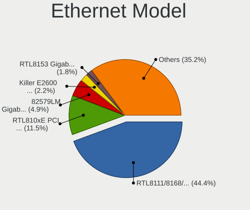

| Model                                                                          | Notebooks | Percent |
|--------------------------------------------------------------------------------|-----------|---------|
| Realtek RTL8111/8168/8211/8411 PCI Express Gigabit Ethernet Controller         | 217       | 44.38%  |
| Realtek RTL810xE PCI Express Fast Ethernet controller                          | 56        | 11.45%  |
| Intel 82579LM Gigabit Network Connection (Lewisville)                          | 24        | 4.91%   |
| Realtek Killer E2600 GbE Controller                                            | 11        | 2.25%   |
| Realtek RTL8153 Gigabit Ethernet Adapter                                       | 9         | 1.84%   |
| Qualcomm Atheros AR8152 v2.0 Fast Ethernet                                     | 9         | 1.84%   |
| Intel Ethernet Connection (4) I219-LM                                          | 8         | 1.64%   |
| Intel Alder Lake-P PCH CNVi WiFi                                               | 8         | 1.64%   |
| Qualcomm Atheros AR8151 v2.0 Gigabit Ethernet                                  | 6         | 1.23%   |
| Intel Ethernet Connection (4) I219-V                                           | 6         | 1.23%   |
| Intel Ethernet Connection I219-LM                                              | 5         | 1.02%   |
| Intel Ethernet Connection I217-V                                               | 5         | 1.02%   |
| Intel Ethernet Connection (6) I219-LM                                          | 5         | 1.02%   |
| Intel 82579V Gigabit Network Connection                                        | 5         | 1.02%   |
| Intel 82567LM Gigabit Network Connection                                       | 5         | 1.02%   |
| Broadcom NetLink BCM57785 Gigabit Ethernet PCIe                                | 5         | 1.02%   |
| ASIX AX88179 Gigabit Ethernet                                                  | 5         | 1.02%   |
| Qualcomm Atheros QCA8171 Gigabit Ethernet                                      | 4         | 0.82%   |
| Qualcomm Atheros AR8132 Fast Ethernet                                          | 4         | 0.82%   |
| Intel Ethernet Connection I219-V                                               | 4         | 0.82%   |
| Silicon Integrated Systems [SiS] 191 Gigabit Ethernet Adapter                  | 3         | 0.61%   |
| Samsung Galaxy series, misc. (tethering mode)                                  | 3         | 0.61%   |
| Realtek RTL8152 Fast Ethernet Adapter                                          | 3         | 0.61%   |
| Intel Ethernet Connection (3) I218-LM                                          | 3         | 0.61%   |
| Realtek RTL8125 2.5GbE Controller                                              | 2         | 0.41%   |
| Realtek PCIe GbE Family Controller                                             | 2         | 0.41%   |
| Qualcomm Atheros Killer E2500 Gigabit Ethernet Controller                      | 2         | 0.41%   |
| Qualcomm Atheros AR8152 v1.1 Fast Ethernet                                     | 2         | 0.41%   |
| OPPO Ace 3V                                                                    | 2         | 0.41%   |
| Nvidia MCP79 Ethernet                                                          | 2         | 0.41%   |
| Nvidia MCP77 Ethernet                                                          | 2         | 0.41%   |
| Marvell Group Yukon Optima 88E8059 [PCIe Gigabit Ethernet Controller with AVB] | 2         | 0.41%   |
| Intel Ethernet Connection (3) I218-V                                           | 2         | 0.41%   |
| Intel Ethernet Connection (2) I219-LM                                          | 2         | 0.41%   |
| Intel 82577LC Gigabit Network Connection                                       | 2         | 0.41%   |
| ICS Advent 10/100M LAN                                                         | 2         | 0.41%   |
| DisplayLink Dell Universal Dock D6000                                          | 2         | 0.41%   |
| Broadcom NetXtreme BCM5764M Gigabit Ethernet PCIe                              | 2         | 0.41%   |
| Broadcom NetLink BCM5906M Fast Ethernet PCI Express                            | 2         | 0.41%   |
| Broadcom NetLink BCM5784M Gigabit Ethernet PCIe                                | 2         | 0.41%   |

Net Controller Kind
-------------------

Ethernet, WiFi or modem

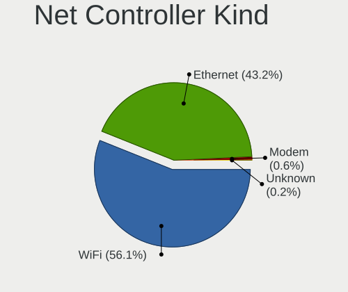

| Kind     | Notebooks | Percent |
|----------|-----------|---------|
| WiFi     | 605       | 56.07%  |
| Ethernet | 466       | 43.19%  |
| Modem    | 6         | 0.56%   |
| Unknown  | 2         | 0.19%   |

Used Controller
---------------

Currently used network controller

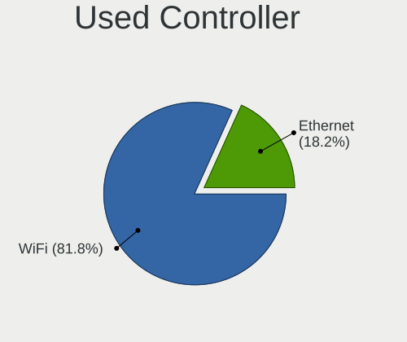

| Kind     | Notebooks | Percent |
|----------|-----------|---------|
| WiFi     | 529       | 81.76%  |
| Ethernet | 118       | 18.24%  |

NICs
----

Total network controllers on board

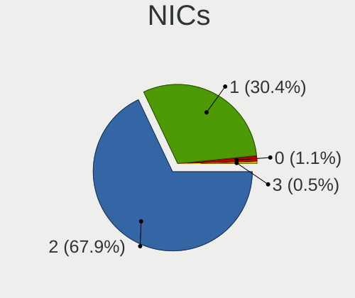

| Total | Notebooks | Percent |
|-------|-----------|---------|
| 2     | 424       | 67.95%  |
| 1     | 190       | 30.45%  |
| 0     | 7         | 1.12%   |
| 3     | 3         | 0.48%   |

IPv6
----

IPv6 vs IPv4

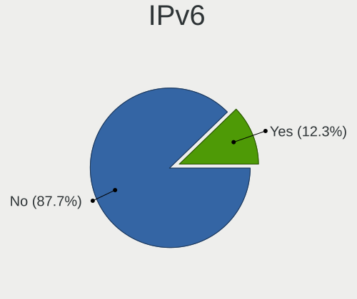

| Used | Notebooks | Percent |
|------|-----------|---------|
| No   | 558       | 87.74%  |
| Yes  | 78        | 12.26%  |

Bluetooth
---------

Bluetooth Vendor
----------------

Controller vendors

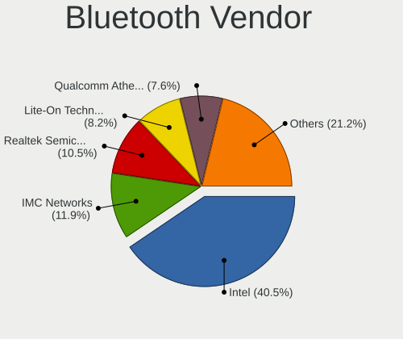

| Vendor                          | Notebooks | Percent |
|---------------------------------|-----------|---------|
| Intel                           | 212       | 40.54%  |
| IMC Networks                    | 62        | 11.85%  |
| Realtek Semiconductor           | 55        | 10.52%  |
| Lite-On Technology              | 43        | 8.22%   |
| Qualcomm Atheros Communications | 40        | 7.65%   |
| Broadcom                        | 29        | 5.54%   |
| Foxconn / Hon Hai               | 25        | 4.78%   |
| Apple                           | 13        | 2.49%   |
| Realtek                         | 8         | 1.53%   |
| Cambridge Silicon Radio         | 6         | 1.15%   |
| Hewlett-Packard                 | 5         | 0.96%   |
| Dell                            | 5         | 0.96%   |
| Toshiba                         | 4         | 0.76%   |
| Chicony Electronics             | 4         | 0.76%   |
| Ralink                          | 3         | 0.57%   |
| USI                             | 2         | 0.38%   |
| TP-Link                         | 2         | 0.38%   |
| SINO WEALTH                     | 2         | 0.38%   |
| Ralink Technology               | 1         | 0.19%   |
| Foxconn International           | 1         | 0.19%   |
| Alps Electric                   | 1         | 0.19%   |

Bluetooth Model
---------------

Controller models

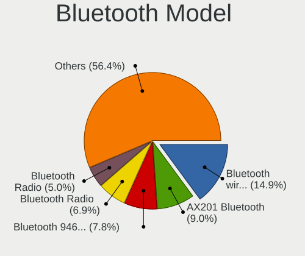

| Model                                               | Notebooks | Percent |
|-----------------------------------------------------|-----------|---------|
| Intel Bluetooth wireless interface                  | 78        | 14.91%  |
| Intel AX201 Bluetooth                               | 47        | 8.99%   |
| Intel Bluetooth 9460/9560 Jefferson Peak (JfP)      | 41        | 7.84%   |
| Realtek Bluetooth Radio                             | 36        | 6.88%   |
| IMC Networks Bluetooth Radio                        | 26        | 4.97%   |
| Qualcomm Atheros  Bluetooth Device                  | 20        | 3.82%   |
| IMC Networks Wireless_Device                        | 17        | 3.25%   |
| IMC Networks Bluetooth Device                       | 16        | 3.06%   |
| Lite-On Qualcomm Atheros QCA9377 Bluetooth          | 15        | 2.87%   |
| Intel Wireless-AC 3168 Bluetooth                    | 11        | 2.1%    |
| Intel AX200 Bluetooth                               | 11        | 2.1%    |
| Lite-On Bluetooth Device                            | 10        | 1.91%   |
| Intel Bluetooth Device                              | 10        | 1.91%   |
| Qualcomm Atheros AR3011 Bluetooth                   | 9         | 1.72%   |
| Broadcom BCM20702 Bluetooth 4.0 [ThinkPad]          | 9         | 1.72%   |
| Realtek Bluetooth Radio                             | 8         | 1.53%   |
| Lite-On Wireless_Device                             | 8         | 1.53%   |
| Foxconn / Hon Hai Bluetooth Device                  | 8         | 1.53%   |
| Apple Bluetooth USB Host Controller                 | 8         | 1.53%   |
| Realtek  Bluetooth 4.2 Adapter                      | 6         | 1.15%   |
| Intel AX210 Bluetooth                               | 6         | 1.15%   |
| Cambridge Silicon Radio Bluetooth Dongle (HCI mode) | 6         | 1.15%   |
| Realtek RTL8821A Bluetooth                          | 5         | 0.96%   |
| Qualcomm Atheros QCA61x4 Bluetooth 4.0              | 5         | 0.96%   |
| Broadcom BCM2045B (BDC-2.1)                         | 5         | 0.96%   |
| Qualcomm Atheros AR3012 Bluetooth 4.0               | 4         | 0.76%   |
| Lite-On Atheros AR3012 Bluetooth                    | 4         | 0.76%   |
| Intel Centrino Bluetooth Wireless Transceiver       | 4         | 0.76%   |
| Foxconn / Hon Hai MediaTek Bluetooth Adapter        | 4         | 0.76%   |
| Chicony Bluetooth (RTL8723BE)                       | 4         | 0.76%   |
| Realtek RTL8723B Bluetooth                          | 3         | 0.57%   |
| Ralink RT3290 Bluetooth                             | 3         | 0.57%   |
| Intel Centrino Advanced-N 6230 Bluetooth adapter    | 3         | 0.57%   |
| Broadcom HP Portable SoftSailing                    | 3         | 0.57%   |
| Broadcom BCM2045B (BDC-2.1) [Bluetooth Controller]  | 3         | 0.57%   |
| Apple Bluetooth Host Controller                     | 3         | 0.57%   |
| USI Bluetooth Device                                | 2         | 0.38%   |
| TP-Link TP-T@- UB500 Adapter                        | 2         | 0.38%   |
| Realtek RTL8822BE Bluetooth 4.2 Adapter             | 2         | 0.38%   |
| Qualcomm Atheros AR9462 Bluetooth                   | 2         | 0.38%   |

Sound
-----

Sound Vendor
------------

Sound card vendors

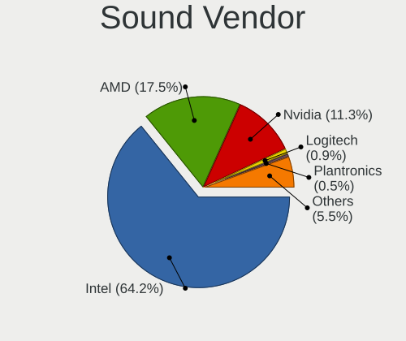

| Vendor                           | Notebooks | Percent |
|----------------------------------|-----------|---------|
| Intel                            | 477       | 64.2%   |
| AMD                              | 130       | 17.5%   |
| Nvidia                           | 84        | 11.31%  |
| Logitech                         | 7         | 0.94%   |
| Plantronics                      | 4         | 0.54%   |
| JMTek                            | 4         | 0.54%   |
| C-Media Electronics              | 4         | 0.54%   |
| Silicon Integrated Systems [SiS] | 3         | 0.4%    |
| Realtek Semiconductor            | 3         | 0.4%    |
| OPPO Electronics                 | 2         | 0.27%   |
| Generalplus Technology           | 2         | 0.27%   |
| Focusrite-Novation               | 2         | 0.27%   |
| Walmart                          | 1         | 0.13%   |
| USB MICROPHONE                   | 1         | 0.13%   |
| TTGK Technology                  | 1         | 0.13%   |
| Texas Instruments                | 1         | 0.13%   |
| SteelSeries ApS                  | 1         | 0.13%   |
| Sony                             | 1         | 0.13%   |
| Samsung Electronics              | 1         | 0.13%   |
| Razer USA                        | 1         | 0.13%   |
| Nordic Semiconductor ASA         | 1         | 0.13%   |
| Micronas                         | 1         | 0.13%   |
| liyuany                          | 1         | 0.13%   |
| Kingston Technology              | 1         | 0.13%   |
| Jieli Technology                 | 1         | 0.13%   |
| Huawei Technologies              | 1         | 0.13%   |
| Hewlett-Packard                  | 1         | 0.13%   |
| GN Netcom                        | 1         | 0.13%   |
| Creative Technology              | 1         | 0.13%   |
| Audeze                           | 1         | 0.13%   |
| ASUSTek Computer                 | 1         | 0.13%   |
| Apple                            | 1         | 0.13%   |
| Unknown                          | 1         | 0.13%   |

Sound Model
-----------

Sound card models

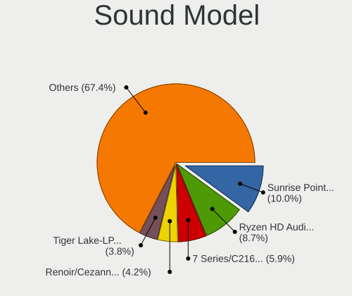

| Model                                                                                             | Notebooks | Percent |
|---------------------------------------------------------------------------------------------------|-----------|---------|
| Intel Sunrise Point-LP HD Audio                                                                   | 89        | 10.05%  |
| AMD Ryzen HD Audio Controller                                                                     | 77        | 8.69%   |
| Intel 7 Series/C216 Chipset Family High Definition Audio Controller                               | 52        | 5.87%   |
| AMD Renoir/Cezanne HDMI/DP Audio Controller                                                       | 37        | 4.18%   |
| Intel Tiger Lake-LP Smart Sound Technology Audio Controller                                       | 34        | 3.84%   |
| Intel 6 Series/C200 Series Chipset Family High Definition Audio Controller                        | 34        | 3.84%   |
| AMD Radeon High Definition Audio Controller                                                       | 28        | 3.16%   |
| AMD Raven/Raven2/Fenghuang HDMI/DP Audio Controller                                               | 25        | 2.82%   |
| Intel Wildcat Point-LP High Definition Audio Controller                                           | 21        | 2.37%   |
| Intel Broadwell-U Audio Controller                                                                | 21        | 2.37%   |
| Intel Alder Lake PCH-P High Definition Audio Controller                                           | 18        | 2.03%   |
| Intel Celeron N3350/Pentium N4200/Atom E3900 Series Audio Cluster                                 | 17        | 1.92%   |
| Intel Comet Lake PCH-LP cAVS                                                                      | 16        | 1.81%   |
| Intel Cannon Point-LP High Definition Audio Controller                                            | 16        | 1.81%   |
| AMD FCH Azalia Controller                                                                         | 16        | 1.81%   |
| Nvidia GA107 High Definition Audio Controller                                                     | 14        | 1.58%   |
| Intel Cannon Lake PCH cAVS                                                                        | 14        | 1.58%   |
| Intel Atom Processor Z36xxx/Z37xxx Series High Definition Audio Controller                        | 14        | 1.58%   |
| Intel 82801I (ICH9 Family) HD Audio Controller                                                    | 14        | 1.58%   |
| Intel 5 Series/3400 Series Chipset High Definition Audio                                          | 14        | 1.58%   |
| Intel NM10/ICH7 Family High Definition Audio Controller                                           | 13        | 1.47%   |
| Intel Celeron/Pentium Silver Processor High Definition Audio                                      | 13        | 1.47%   |
| Intel Haswell-ULT HD Audio Controller                                                             | 12        | 1.35%   |
| Intel 8 Series HD Audio Controller                                                                | 12        | 1.35%   |
| Nvidia TU107 GeForce GTX 1650 High Definition Audio Controller                                    | 11        | 1.24%   |
| Intel CM238 HD Audio Controller                                                                   | 11        | 1.24%   |
| Intel 8 Series/C220 Series Chipset High Definition Audio Controller                               | 11        | 1.24%   |
| AMD Kabini HDMI/DP Audio                                                                          | 11        | 1.24%   |
| Intel Xeon E3-1200 v3/4th Gen Core Processor HD Audio Controller                                  | 10        | 1.13%   |
| Intel Comet Lake PCH cAVS                                                                         | 10        | 1.13%   |
| Intel Raptor Lake-P/U/H cAVS                                                                      | 9         | 1.02%   |
| Intel Ice Lake-LP Smart Sound Technology Audio Controller                                         | 9         | 1.02%   |
| Intel Atom/Celeron/Pentium Processor x5-E8000/J3xxx/N3xxx Series High Definition Audio Controller | 9         | 1.02%   |
| Nvidia AD107 High Definition Audio Controller                                                     | 8         | 0.9%    |
| AMD Family 15h (Models 60h-6fh) Audio Controller                                                  | 7         | 0.79%   |
| Nvidia TU106 High Definition Audio Controller                                                     | 6         | 0.68%   |
| Nvidia GF108 High Definition Audio Controller                                                     | 5         | 0.56%   |
| Intel Tiger Lake-H HD Audio Controller                                                            | 5         | 0.56%   |
| Intel Raptor Lake High Definition Audio Controller                                                | 5         | 0.56%   |
| AMD High Definition Audio Controller                                                              | 5         | 0.56%   |

Memory
------

Memory Vendor
-------------

Memory module vendors

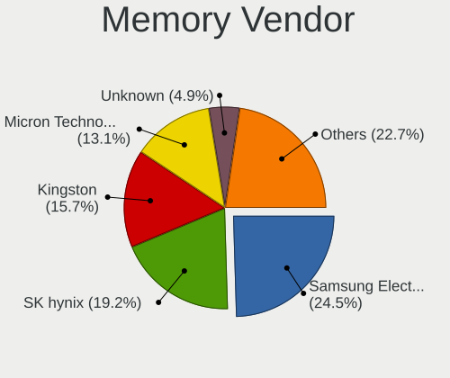

| Vendor              | Notebooks | Percent |
|---------------------|-----------|---------|
| Samsung Electronics | 105       | 24.53%  |
| SK hynix            | 82        | 19.16%  |
| Kingston            | 67        | 15.65%  |
| Micron Technology   | 56        | 13.08%  |
| Unknown             | 21        | 4.91%   |
| Crucial             | 18        | 4.21%   |
| Ramaxel Technology  | 10        | 2.34%   |
| Team                | 8         | 1.87%   |
| A-DATA Technology   | 8         | 1.87%   |
| Transcend           | 7         | 1.64%   |
| Nanya Technology    | 7         | 1.64%   |
| Elpida              | 7         | 1.64%   |
| Unknown (ABCD)      | 5         | 1.17%   |
| ChangXin Memory     | 5         | 1.17%   |
| Unknown             | 4         | 0.93%   |
| G.Skill             | 3         | 0.7%    |
| Unknown (8A5D)      | 2         | 0.47%   |
| Apacer              | 2         | 0.47%   |
| Unknown (0x0080)    | 1         | 0.23%   |
| Unknown (0B85)      | 1         | 0.23%   |
| Shenzhen SCY        | 1         | 0.23%   |
| Qimonda             | 1         | 0.23%   |
| PUSKILL             | 1         | 0.23%   |
| PNY                 | 1         | 0.23%   |
| Patriot             | 1         | 0.23%   |
| Lexar Co Limited    | 1         | 0.23%   |
| Goldkey             | 1         | 0.23%   |
| Avant               | 1         | 0.23%   |
| ASint Technology    | 1         | 0.23%   |

Memory Model
------------

Memory module models

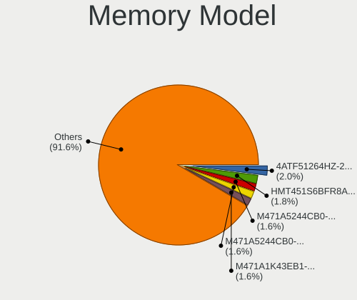

| Model                                                              | Notebooks | Percent |
|--------------------------------------------------------------------|-----------|---------|
| Micron RAM 4ATF51264HZ-2G6E1 4GB SODIMM DDR4 2667MT/s              | 9         | 2%      |
| SK hynix RAM HMT451S6BFR8A-PB 4GB SODIMM DDR3 1600MT/s             | 8         | 1.77%   |
| SK hynix RAM HMA81GS6AFR8N-UH 8GB SODIMM DDR4 2667MT/s             | 7         | 1.55%   |
| Samsung RAM M471A5244CB0-CWE 4GB SODIMM DDR4 3200MT/s              | 7         | 1.55%   |
| Samsung RAM M471A5244CB0-CRC 4GB SODIMM DDR4 2667MT/s              | 7         | 1.55%   |
| Samsung RAM M471A1K43EB1-CWE 8GB SODIMM DDR4 3200MT/s              | 7         | 1.55%   |
| Samsung RAM M471A1G44AB0-CWE 8GiB SODIMM DDR4 3200MT/s             | 6         | 1.33%   |
| Unknown (ABCD) RAM 123456789012345678 2GB SODIMM LPDDR4 2400MT/s   | 5         | 1.11%   |
| SK hynix RAM HMA851S6CJR6N-VK 4GB SODIMM DDR4 2667MT/s             | 5         | 1.11%   |
| SK hynix RAM HMA81GS6DJR8N-XN 8GB SODIMM DDR4 3200MT/s             | 5         | 1.11%   |
| Kingston RAM 99U5428-018.A00LF 8GB SODIMM DDR3 1600MT/s            | 5         | 1.11%   |
| Unknown RAM Module 4GB SODIMM DDR4 2133MT/s                        | 4         | 0.89%   |
| SK hynix RAM HMAA1GS6CJR6N-XN 8GB Row Of Chips DDR4 3200MT/s       | 4         | 0.89%   |
| SK hynix RAM HMA851S6AFR6N-UH 4GB SODIMM DDR4 2667MT/s             | 4         | 0.89%   |
| Samsung RAM M471B5273DH0-CH9 4GB SODIMM DDR3 1600MT/s              | 4         | 0.89%   |
| Samsung RAM M471B5173QH0-YK0 4GB SODIMM DDR3 1600MT/s              | 4         | 0.89%   |
| Samsung RAM M471B1G73EB0-YK0 8192MB SODIMM DDR3 1600MT/s           | 4         | 0.89%   |
| Samsung RAM M471A1K43CB1-CRC 8GB SODIMM DDR4 8400MT/s              | 4         | 0.89%   |
| Ramaxel RAM RMSA3260ME78HAF-2666 8GB SODIMM DDR4 2667MT/s          | 4         | 0.89%   |
| Micron RAM 4ATF51264HZ-3G2J1 4GB SODIMM DDR4 3200MT/s              | 4         | 0.89%   |
| Unknown                                                            | 4         | 0.89%   |
| Team RAM TEAMGROUP-SD4-3200 16GB SODIMM DDR4 3200MT/s              | 3         | 0.67%   |
| SK hynix RAM HMT351S6CFR8C-PB 4GB SODIMM DDR3 1600MT/s             | 3         | 0.67%   |
| SK hynix RAM HMAA1GS6CJR6N-XN 8GB SODIMM DDR4 3200MT/s             | 3         | 0.67%   |
| SK hynix RAM HMA851S6CJR6N-VK 4GB Row Of Chips DDR4 2667MT/s       | 3         | 0.67%   |
| SK hynix RAM HMA81GS6JJR8N-VK 8GB SODIMM DDR4 2667MT/s             | 3         | 0.67%   |
| Samsung RAM M471B5273CH0-CH9 4GB SODIMM DDR3 1334MT/s              | 3         | 0.67%   |
| Samsung RAM M471B5173EB0-YK0 4GB SODIMM DDR3 1600MT/s              | 3         | 0.67%   |
| Samsung RAM M471A1G44BB0-CWE 8GB SODIMM DDR4 3200MT/s              | 3         | 0.67%   |
| Samsung RAM M425R1GB4BB0-CQKOL 8GB SODIMM DDR5 4800MT/s            | 3         | 0.67%   |
| Micron RAM 8ATF1G64HZ-3G2J1 8GB SODIMM DDR4 3200MT/s               | 3         | 0.67%   |
| Kingston RAM KNWMX1-ETB 4GB SODIMM DDR3 1600MT/s                   | 3         | 0.67%   |
| Kingston RAM ACR16D3LFS1KBG/2G 2GB SODIMM DDR3 1600MT/s            | 3         | 0.67%   |
| ChangXin Memory RAM DB4ABAM-MK 1024MB Row Of Chips LPDDR4 3733MT/s | 3         | 0.67%   |
| A-DATA RAM AM1P24HC4U1-B9RS 4GB SODIMM DDR4 2400MT/s               | 3         | 0.67%   |
| Transcend RAM JM2666HSH-4G 4GB SODIMM DDR4 2667MT/s                | 2         | 0.44%   |
| Team RAM TEAMGROUP-SD4-2666 8GB SODIMM DDR4 2667MT/s               | 2         | 0.44%   |
| Team RAM TEAMGROUP-SD4-2400 16GB SODIMM DDR4 8400MT/s              | 2         | 0.44%   |
| SK hynix RAM HMT41GS6BFR8A-PB 8GB SODIMM DDR3 2667MT/s             | 2         | 0.44%   |
| SK hynix RAM HMT41GS6AFR8A-PB 8GB SODIMM DDR3 1600MT/s             | 2         | 0.44%   |

Memory Kind
-----------

Memory module kinds

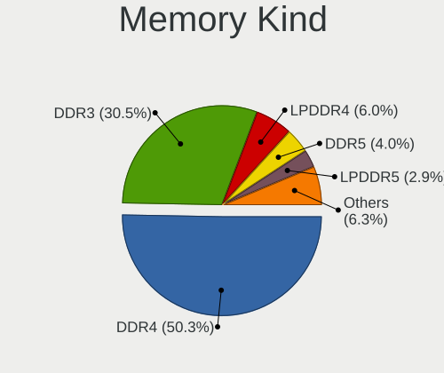

| Kind    | Notebooks | Percent |
|---------|-----------|---------|
| DDR4    | 175       | 50.29%  |
| DDR3    | 106       | 30.46%  |
| LPDDR4  | 21        | 6.03%   |
| DDR5    | 14        | 4.02%   |
| LPDDR5  | 10        | 2.87%   |
| DDR2    | 10        | 2.87%   |
| LPDDR3  | 5         | 1.44%   |
| SDRAM   | 3         | 0.86%   |
| Unknown | 2         | 0.57%   |
| DRAM    | 1         | 0.29%   |
| DDR     | 1         | 0.29%   |

Memory Form Factor
------------------

Physical design of the memory module

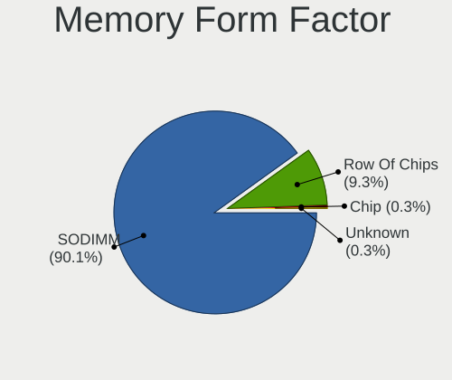

| Name         | Notebooks | Percent |
|--------------|-----------|---------|
| SODIMM       | 309       | 90.09%  |
| Row Of Chips | 32        | 9.33%   |
| Chip         | 1         | 0.29%   |
| Unknown      | 1         | 0.29%   |

Memory Size
-----------

Memory module size

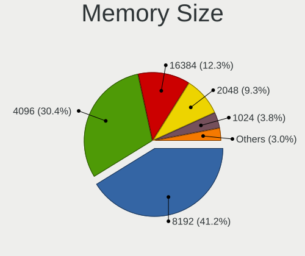

| Size  | Notebooks | Percent |
|-------|-----------|---------|
| 8192  | 164       | 41.21%  |
| 4096  | 121       | 30.4%   |
| 16384 | 49        | 12.31%  |
| 2048  | 37        | 9.3%    |
| 1024  | 15        | 3.77%   |
| 32768 | 12        | 3.02%   |

Memory Speed
------------

Memory module speed

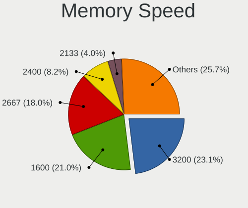

| Speed   | Notebooks | Percent |
|---------|-----------|---------|
| 3200    | 87        | 23.08%  |
| 1600    | 79        | 20.95%  |
| 2667    | 68        | 18.04%  |
| 2400    | 31        | 8.22%   |
| 2133    | 15        | 3.98%   |
| 1333    | 12        | 3.18%   |
| 667     | 12        | 3.18%   |
| 1334    | 11        | 2.92%   |
| 4800    | 10        | 2.65%   |
| 8400    | 6         | 1.59%   |
| 3733    | 6         | 1.59%   |
| 1067    | 6         | 1.59%   |
| 5600    | 5         | 1.33%   |
| 6400    | 3         | 0.8%    |
| 4267    | 3         | 0.8%    |
| 8000    | 2         | 0.53%   |
| 5500    | 2         | 0.53%   |
| 4266    | 2         | 0.53%   |
| 4199    | 2         | 0.53%   |
| 3266    | 2         | 0.53%   |
| 1066    | 2         | 0.53%   |
| Unknown | 2         | 0.53%   |
| 8533    | 1         | 0.27%   |
| 7500    | 1         | 0.27%   |
| 7467    | 1         | 0.27%   |
| 2048    | 1         | 0.27%   |
| 1867    | 1         | 0.27%   |
| 1866    | 1         | 0.27%   |
| 800     | 1         | 0.27%   |
| 533     | 1         | 0.27%   |
| 400     | 1         | 0.27%   |

Printers & scanners
-------------------

Printer Vendor
--------------

Printer device vendors

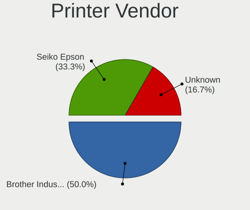

| Vendor             | Notebooks | Percent |
|--------------------|-----------|---------|
| Brother Industries | 3         | 50%     |
| Seiko Epson        | 2         | 33.33%  |
| Unknown            | 1         | 16.67%  |

Printer Model
-------------

Printer device models

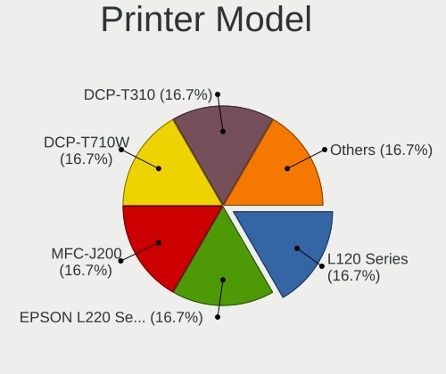

| Model                         | Notebooks | Percent |
|-------------------------------|-----------|---------|
| Seiko Epson L120 Series       | 1         | 16.67%  |
| Seiko Epson EPSON L220 Series | 1         | 16.67%  |
| Brother MFC-J200              | 1         | 16.67%  |
| Brother DCP-T710W             | 1         | 16.67%  |
| Brother DCP-T310              | 1         | 16.67%  |
| Unknown                       | 1         | 16.67%  |

Scanner Vendor
--------------

Scanner device vendors

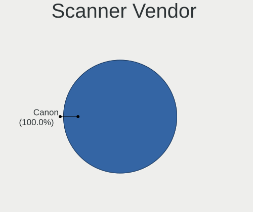

| Vendor | Notebooks | Percent |
|--------|-----------|---------|
| Canon  | 1         | 100%    |

Scanner Model
-------------

Scanner device models

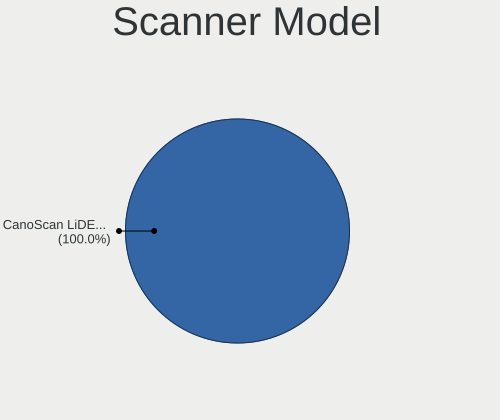

| Model                   | Notebooks | Percent |
|-------------------------|-----------|---------|
| Canon CanoScan LiDE 110 | 1         | 100%    |

Camera
------

Camera Vendor
-------------

Camera device vendors

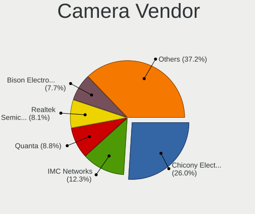

| Vendor                                 | Notebooks | Percent |
|----------------------------------------|-----------|---------|
| Chicony Electronics                    | 142       | 26.01%  |
| IMC Networks                           | 67        | 12.27%  |
| Quanta                                 | 48        | 8.79%   |
| Realtek Semiconductor                  | 44        | 8.06%   |
| Bison Electronics                      | 42        | 7.69%   |
| Microdia                               | 33        | 6.04%   |
| Sunplus Innovation Technology          | 26        | 4.76%   |
| Cheng Uei Precision Industry (Foxlink) | 18        | 3.3%    |
| Syntek                                 | 13        | 2.38%   |
| Suyin                                  | 13        | 2.38%   |
| Luxvisions Innotech Limited            | 13        | 2.38%   |
| Apple                                  | 13        | 2.38%   |
| Lite-On Technology                     | 12        | 2.2%    |
| Silicon Motion                         | 8         | 1.47%   |
| Alcor Micro                            | 8         | 1.47%   |
| Sonix Technology                       | 6         | 1.1%    |
| Z-Star Microelectronics                | 3         | 0.55%   |
| Samsung Electronics                    | 3         | 0.55%   |
| Importek                               | 3         | 0.55%   |
| icSpring                               | 3         | 0.55%   |
| ALi                                    | 3         | 0.55%   |
| Sunplus Technology                     | 2         | 0.37%   |
| ShineTech                              | 2         | 0.37%   |
| OmniVision Technologies                | 2         | 0.37%   |
| Logitech                               | 2         | 0.37%   |
| Y Media                                | 1         | 0.18%   |
| vivo                                   | 1         | 0.18%   |
| Tripath Technology                     | 1         | 0.18%   |
| SunplusIT                              | 1         | 0.18%   |
| SenseTek                               | 1         | 0.18%   |
| Ricoh                                  | 1         | 0.18%   |
| Owon                                   | 1         | 0.18%   |
| OPPO Electronics                       | 1         | 0.18%   |
| Microsoft                              | 1         | 0.18%   |
| Lenovo                                 | 1         | 0.18%   |
| kingcome                               | 1         | 0.18%   |
| Goertek Electronics                    | 1         | 0.18%   |
| GEMBIRD                                | 1         | 0.18%   |
| DigiTech                               | 1         | 0.18%   |
| BillionPixels                          | 1         | 0.18%   |

Camera Model
------------

Camera device models

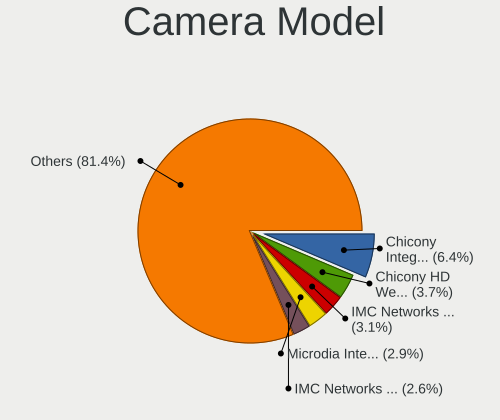

| Model                                                           | Notebooks | Percent |
|-----------------------------------------------------------------|-----------|---------|
| Chicony Integrated Camera                                       | 35        | 6.4%    |
| Chicony HD WebCam                                               | 20        | 3.66%   |
| IMC Networks USB2.0 VGA UVC WebCam                              | 17        | 3.11%   |
| Microdia Integrated_Webcam_HD                                   | 16        | 2.93%   |
| IMC Networks USB2.0 HD UVC WebCam                               | 14        | 2.56%   |
| Quanta HD WebCam                                                | 13        | 2.38%   |
| Realtek Acer 640 x 480 laptop camera                            | 10        | 1.83%   |
| IMC Networks Integrated Camera                                  | 10        | 1.83%   |
| Bison Integrated Camera                                         | 10        | 1.83%   |
| Realtek Integrated_Webcam_HD                                    | 9         | 1.65%   |
| Quanta HD User Facing                                           | 8         | 1.46%   |
| Sunplus Integrated_Webcam_HD                                    | 7         | 1.28%   |
| Quanta ACER HD User Facing                                      | 7         | 1.28%   |
| IMC Networks HD Camera                                          | 7         | 1.28%   |
| Chicony VGA WebCam                                              | 7         | 1.28%   |
| Chicony HP Truevision HD                                        | 7         | 1.28%   |
| Chicony HD User Facing                                          | 7         | 1.28%   |
| Quanta VGA WebCam                                               | 6         | 1.1%    |
| IMC Networks ov9734_azurewave_camera                            | 6         | 1.1%    |
| Chicony USB2.0 VGA UVC WebCam                                   | 6         | 1.1%    |
| Bison Lenovo EasyCamera                                         | 6         | 1.1%    |
| Syntek Integrated Camera                                        | 5         | 0.91%   |
| Sonix USB2.0 HD UVC WebCam                                      | 5         | 0.91%   |
| Realtek USB2.0 VGA UVC WebCam                                   | 5         | 0.91%   |
| Realtek Integrated Webcam                                       | 5         | 0.91%   |
| Luxvisions Innotech Limited Integrated Camera                   | 5         | 0.91%   |
| Luxvisions Innotech Limited HP TrueVision HD Camera             | 5         | 0.91%   |
| IMC Networks EasyCamera                                         | 5         | 0.91%   |
| Chicony HP HD Camera                                            | 5         | 0.91%   |
| Bison SunplusIT Integrated Camera                               | 5         | 0.91%   |
| Syntek Lenovo EasyCamera                                        | 4         | 0.73%   |
| Sunplus HD WebCam                                               | 4         | 0.73%   |
| Lite-On Integrated Camera                                       | 4         | 0.73%   |
| Chicony Integrated Camera [ThinkPad]                            | 4         | 0.73%   |
| Chicony HP Wide Vision HD Camera                                | 4         | 0.73%   |
| Chicony ACER HD User Facing                                     | 4         | 0.73%   |
| Cheng Uei Precision Industry (Foxlink) HP Wide Vision HD Camera | 4         | 0.73%   |
| Bison HD Webcam                                                 | 4         | 0.73%   |
| Bison BisonCam,NB Pro                                           | 4         | 0.73%   |
| Apple FaceTime Camera                                           | 4         | 0.73%   |

Security
--------

Fingerprint Vendor
------------------

Fingerprint sensor vendors

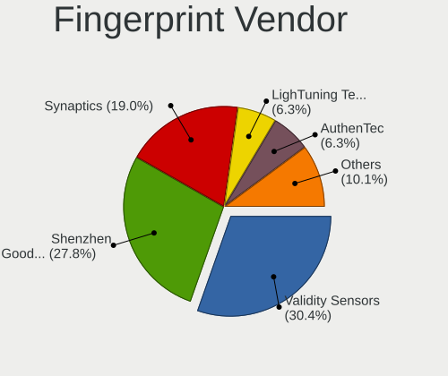

| Vendor                     | Notebooks | Percent |
|----------------------------|-----------|---------|
| Validity Sensors           | 24        | 30.38%  |
| Shenzhen Goodix Technology | 22        | 27.85%  |
| Synaptics                  | 15        | 18.99%  |
| LighTuning Technology      | 5         | 6.33%   |
| AuthenTec                  | 5         | 6.33%   |
| Elan Microelectronics      | 4         | 5.06%   |
| Upek                       | 3         | 3.8%    |
| GDMicroelectronics         | 1         | 1.27%   |

Fingerprint Model
-----------------

Fingerprint sensor models

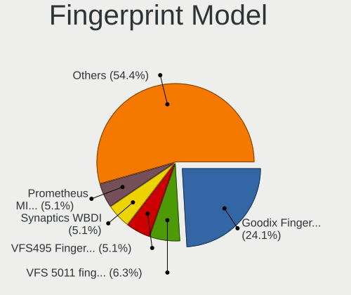

| Model                                                     | Notebooks | Percent |
|-----------------------------------------------------------|-----------|---------|
| Shenzhen Goodix  Fingerprint Device                       | 19        | 24.05%  |
| Validity Sensors VFS 5011 fingerprint sensor              | 5         | 6.33%   |
| Validity Sensors VFS495 Fingerprint Reader                | 4         | 5.06%   |
| Validity Sensors Synaptics WBDI                           | 4         | 5.06%   |
| Synaptics Prometheus MIS Touch Fingerprint Reader         | 4         | 5.06%   |
| LighTuning EgisTec Touch Fingerprint Sensor               | 4         | 5.06%   |
| Validity Sensors VFS491                                   | 3         | 3.8%    |
| Validity Sensors VFS471 Fingerprint Reader                | 3         | 3.8%    |
| Upek Biometric Touchchip/Touchstrip Fingerprint Sensor    | 3         | 3.8%    |
| Synaptics UWP WBDI Device                                 | 3         | 3.8%    |
| Elan ELAN:Fingerprint                                     | 3         | 3.8%    |
| Synaptics TouchPad                                        | 2         | 2.53%   |
| Synaptics Metallica MIS Touch Fingerprint Reader          | 2         | 2.53%   |
| Synaptics Fingerprint reader [HP G6]                      | 2         | 2.53%   |
| Shenzhen Goodix Fingerprint Reader                        | 2         | 2.53%   |
| AuthenTec AES2810                                         | 2         | 2.53%   |
| Validity Sensors VFS7500 Touch Fingerprint Sensor         | 1         | 1.27%   |
| Validity Sensors VFS5011 Fingerprint Reader               | 1         | 1.27%   |
| Validity Sensors VFS300 Fingerprint Reader                | 1         | 1.27%   |
| Validity Sensors VFS101 Fingerprint Reader                | 1         | 1.27%   |
| Validity Sensors VFS Fingerprint sensor                   | 1         | 1.27%   |
| Synaptics  FS7604 Touch Fingerprint Sensor with PurePrint | 1         | 1.27%   |
| Synaptics Metallica MOH Touch Fingerprint Reader          | 1         | 1.27%   |
| Shenzhen Goodix FingerPrint                               | 1         | 1.27%   |
| LighTuning ES603 Swipe Fingerprint Sensor                 | 1         | 1.27%   |
| GDMicroelectronics Touch Fingerprint Sensor               | 1         | 1.27%   |
| Elan ELAN:ARM-M4                                          | 1         | 1.27%   |
| AuthenTec Fingerprint Sensor                              | 1         | 1.27%   |
| AuthenTec AES2501 Fingerprint Sensor                      | 1         | 1.27%   |
| AuthenTec AES1600                                         | 1         | 1.27%   |

Chipcard Vendor
---------------

Chipcard module vendors

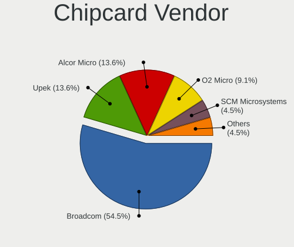

| Vendor           | Notebooks | Percent |
|------------------|-----------|---------|
| Broadcom         | 12        | 54.55%  |
| Upek             | 3         | 13.64%  |
| Alcor Micro      | 3         | 13.64%  |
| O2 Micro         | 2         | 9.09%   |
| SCM Microsystems | 1         | 4.55%   |
| Lenovo           | 1         | 4.55%   |

Chipcard Model
--------------

Chipcard module models

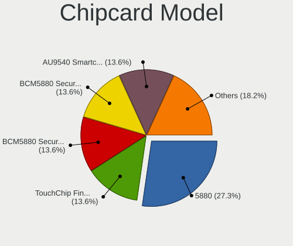

| Model                                                                        | Notebooks | Percent |
|------------------------------------------------------------------------------|-----------|---------|
| Broadcom 5880                                                                | 6         | 27.27%  |
| Upek TouchChip Fingerprint Coprocessor (WBF advanced mode)                   | 3         | 13.64%  |
| Broadcom BCM5880 Secure Applications Processor with fingerprint swipe sensor | 3         | 13.64%  |
| Broadcom BCM5880 Secure Applications Processor                               | 3         | 13.64%  |
| Alcor Micro AU9540 Smartcard Reader                                          | 3         | 13.64%  |
| SCM Microsystems SCR3340 - ExpressCard54 Smart Card Reader                   | 1         | 4.55%   |
| O2 Micro Oz776 SmartCard Reader                                              | 1         | 4.55%   |
| O2 Micro OZ776 CCID Smartcard Reader                                         | 1         | 4.55%   |
| Lenovo Integrated Smart Card Reader                                          | 1         | 4.55%   |

Unsupported
-----------

Unsupported Devices
-------------------

Total unsupported devices on board

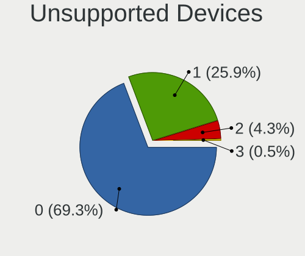

| Total | Notebooks | Percent |
|-------|-----------|---------|
| 0     | 446       | 69.25%  |
| 1     | 167       | 25.93%  |
| 2     | 28        | 4.35%   |
| 3     | 3         | 0.47%   |

Unsupported Device Types
------------------------

Types of unsupported devices

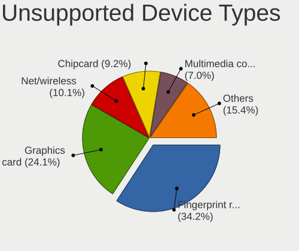

| Type                     | Notebooks | Percent |
|--------------------------|-----------|---------|
| Fingerprint reader       | 78        | 34.21%  |
| Graphics card            | 55        | 24.12%  |
| Net/wireless             | 23        | 10.09%  |
| Chipcard                 | 21        | 9.21%   |
| Multimedia controller    | 16        | 7.02%   |
| Camera                   | 13        | 5.7%    |
| Net/ethernet             | 5         | 2.19%   |
| Bluetooth                | 5         | 2.19%   |
| Storage                  | 3         | 1.32%   |
| Sound                    | 3         | 1.32%   |
| Communication controller | 2         | 0.88%   |
| Storage/nvme             | 1         | 0.44%   |
| Network                  | 1         | 0.44%   |
| Modem                    | 1         | 0.44%   |
| Card reader              | 1         | 0.44%   |

