Linux in Philippines - Tested Hardware & Statistics (Notebooks)
---------------------------------------------------------------

A project to collect tested hardware configurations for Linux in Philippines.

Anyone can contribute to this report by the [hw-probe](https://github.com/linuxhw/hw-probe) tool:

    sudo -E hw-probe -all -upload

Please contribute! Especially if your hardware is rare.

Contents
--------

* [ Test Cases ](#test-cases)

* [ System ](#system)
  - [ OS                       ](#os)
  - [ OS Family                ](#os-family)
  - [ Kernel                   ](#kernel)
  - [ Kernel Family            ](#kernel-family)
  - [ Kernel Major Ver.        ](#kernel-major-ver)
  - [ Arch                     ](#arch)
  - [ DE                       ](#de)
  - [ Display Server           ](#display-server)
  - [ Display Manager          ](#display-manager)
  - [ OS Lang                  ](#os-lang)
  - [ Boot Mode                ](#boot-mode)
  - [ Filesystem               ](#filesystem)
  - [ Part. scheme             ](#part-scheme)
  - [ Dual Boot with Linux/BSD ](#dual-boot-with-linuxbsd)
  - [ Dual Boot (Win)          ](#dual-boot-win)

* [ Board ](#board)
  - [ Vendor                   ](#vendor)
  - [ Model                    ](#model)
  - [ Model Family             ](#model-family)
  - [ MFG Year                 ](#mfg-year)
  - [ Form Factor              ](#form-factor)
  - [ Secure Boot              ](#secure-boot)
  - [ Coreboot                 ](#coreboot)
  - [ RAM Size                 ](#ram-size)
  - [ RAM Used                 ](#ram-used)
  - [ Total Drives             ](#total-drives)
  - [ Has CD-ROM               ](#has-cd-rom)
  - [ Has Ethernet             ](#has-ethernet)
  - [ Has WiFi                 ](#has-wifi)
  - [ Has Bluetooth            ](#has-bluetooth)

* [ Location ](#location)
  - [ Country                  ](#country)
  - [ City                     ](#city)

* [ Drives ](#drives)
  - [ Drive Vendor             ](#drive-vendor)
  - [ Drive Model              ](#drive-model)
  - [ HDD Vendor               ](#hdd-vendor)
  - [ SSD Vendor               ](#ssd-vendor)
  - [ Drive Kind               ](#drive-kind)
  - [ Drive Connector          ](#drive-connector)
  - [ Drive Size               ](#drive-size)
  - [ Space Total              ](#space-total)
  - [ Space Used               ](#space-used)
  - [ Malfunc. Drives          ](#malfunc-drives)
  - [ Malfunc. Drive Vendor    ](#malfunc-drive-vendor)
  - [ Malfunc. HDD Vendor      ](#malfunc-hdd-vendor)
  - [ Malfunc. Drive Kind      ](#malfunc-drive-kind)
  - [ Failed Drives            ](#failed-drives)
  - [ Failed Drive Vendor      ](#failed-drive-vendor)
  - [ Drive Status             ](#drive-status)

* [ Storage controller ](#storage-controller)
  - [ Storage Vendor           ](#storage-vendor)
  - [ Storage Model            ](#storage-model)
  - [ Storage Kind             ](#storage-kind)

* [ Processor ](#processor)
  - [ CPU Vendor               ](#cpu-vendor)
  - [ CPU Model                ](#cpu-model)
  - [ CPU Model Family         ](#cpu-model-family)
  - [ CPU Cores                ](#cpu-cores)
  - [ CPU Sockets              ](#cpu-sockets)
  - [ CPU Threads              ](#cpu-threads)
  - [ CPU Op-Modes             ](#cpu-op-modes)
  - [ CPU Microcode            ](#cpu-microcode)
  - [ CPU Microarch            ](#cpu-microarch)

* [ Graphics ](#graphics)
  - [ GPU Vendor               ](#gpu-vendor)
  - [ GPU Model                ](#gpu-model)
  - [ GPU Combo                ](#gpu-combo)
  - [ GPU Driver               ](#gpu-driver)
  - [ GPU Memory               ](#gpu-memory)

* [ Monitor ](#monitor)
  - [ Monitor Vendor           ](#monitor-vendor)
  - [ Monitor Model            ](#monitor-model)
  - [ Monitor Resolution       ](#monitor-resolution)
  - [ Monitor Diagonal         ](#monitor-diagonal)
  - [ Monitor Width            ](#monitor-width)
  - [ Aspect Ratio             ](#aspect-ratio)
  - [ Monitor Area             ](#monitor-area)
  - [ Pixel Density            ](#pixel-density)
  - [ Multiple Monitors        ](#multiple-monitors)

* [ Network ](#network)
  - [ Net Controller Vendor    ](#net-controller-vendor)
  - [ Net Controller Model     ](#net-controller-model)
  - [ Wireless Vendor          ](#wireless-vendor)
  - [ Wireless Model           ](#wireless-model)
  - [ Ethernet Vendor          ](#ethernet-vendor)
  - [ Ethernet Model           ](#ethernet-model)
  - [ Net Controller Kind      ](#net-controller-kind)
  - [ Used Controller          ](#used-controller)
  - [ NICs                     ](#nics)
  - [ IPv6                     ](#ipv6)

* [ Bluetooth ](#bluetooth)
  - [ Bluetooth Vendor         ](#bluetooth-vendor)
  - [ Bluetooth Model          ](#bluetooth-model)

* [ Sound ](#sound)
  - [ Sound Vendor             ](#sound-vendor)
  - [ Sound Model              ](#sound-model)

* [ Memory ](#memory)
  - [ Memory Vendor            ](#memory-vendor)
  - [ Memory Model             ](#memory-model)
  - [ Memory Kind              ](#memory-kind)
  - [ Memory Form Factor       ](#memory-form-factor)
  - [ Memory Size              ](#memory-size)
  - [ Memory Speed             ](#memory-speed)

* [ Printers & scanners ](#printers--scanners)
  - [ Printer Vendor           ](#printer-vendor)
  - [ Printer Model            ](#printer-model)
  - [ Scanner Vendor           ](#scanner-vendor)
  - [ Scanner Model            ](#scanner-model)

* [ Camera ](#camera)
  - [ Camera Vendor            ](#camera-vendor)
  - [ Camera Model             ](#camera-model)

* [ Security ](#security)
  - [ Fingerprint Vendor       ](#fingerprint-vendor)
  - [ Fingerprint Model        ](#fingerprint-model)
  - [ Chipcard Vendor          ](#chipcard-vendor)
  - [ Chipcard Model           ](#chipcard-model)

* [ Unsupported ](#unsupported)
  - [ Unsupported Devices      ](#unsupported-devices)
  - [ Unsupported Device Types ](#unsupported-device-types)

Test Cases
----------

Total: 491

| Vendor        | Model                       | Probe                                                      | Date         |
|---------------|-----------------------------|------------------------------------------------------------|--------------|
| HP            | Pavilion Gaming Laptop 1... | [7c9662b5eb](https://linux-hardware.org/?probe=7c9662b5eb) | Jun 10, 2023 |
| Lenovo        | ThinkPad L430 24655Q7       | [7b45c0777e](https://linux-hardware.org/?probe=7b45c0777e) | Jun 08, 2023 |
| Lenovo        | ThinkPad T460 20FMS2292K    | [380ffe6574](https://linux-hardware.org/?probe=380ffe6574) | Jun 06, 2023 |
| Dell          | Inspiron 7472               | [53b9d0dfa6](https://linux-hardware.org/?probe=53b9d0dfa6) | Jun 03, 2023 |
| Lenovo        | ThinkPad X230 2325SLU       | [3a1d630346](https://linux-hardware.org/?probe=3a1d630346) | Jun 03, 2023 |
| Valve         | Jupiter                     | [49135876a9](https://linux-hardware.org/?probe=49135876a9) | Jun 02, 2023 |
| ASUSTek       | VivoBook_ASUSLaptop M160... | [1334997a22](https://linux-hardware.org/?probe=1334997a22) | Jun 01, 2023 |
| HP            | Laptop 17-cn0xxx            | [f688bc50e0](https://linux-hardware.org/?probe=f688bc50e0) | Jun 01, 2023 |
| Acer          | Nitro AN515-58              | [c9d2b44907](https://linux-hardware.org/?probe=c9d2b44907) | May 17, 2023 |
| Lenovo        | IdeaPad 110S-11IBR 80WG     | [53a5e2e7d7](https://linux-hardware.org/?probe=53a5e2e7d7) | May 16, 2023 |
| Lenovo        | IdeaPad 330-15IKB 81DE      | [a7c2953571](https://linux-hardware.org/?probe=a7c2953571) | May 15, 2023 |
| HP            | Laptop 14-dq2xxx            | [274fbdb43e](https://linux-hardware.org/?probe=274fbdb43e) | May 14, 2023 |
| HP            | EliteBook 840 G6            | [80158c51fb](https://linux-hardware.org/?probe=80158c51fb) | May 12, 2023 |
| Acer          | Aspire E5-521G              | [9ddcbd7a95](https://linux-hardware.org/?probe=9ddcbd7a95) | May 01, 2023 |
| Valve         | Jupiter                     | [cf4ff7fcb1](https://linux-hardware.org/?probe=cf4ff7fcb1) | Apr 29, 2023 |
| HP            | Pavilion Gaming Laptop 1... | [6ce11cef12](https://linux-hardware.org/?probe=6ce11cef12) | Apr 18, 2023 |
| HP            | Laptop 14-bs1xx             | [1bc4428cb1](https://linux-hardware.org/?probe=1bc4428cb1) | Apr 17, 2023 |
| Lenovo        | IdeaPad 100-15IBY 80MJ      | [c5c1b213f2](https://linux-hardware.org/?probe=c5c1b213f2) | Apr 16, 2023 |
| ASUSTek       | VivoBook_ASUSLaptop X515... | [0120f0db62](https://linux-hardware.org/?probe=0120f0db62) | Apr 12, 2023 |
| HP            | Pavilion (EH737UA#ABA)      | [cc8ff92529](https://linux-hardware.org/?probe=cc8ff92529) | Apr 11, 2023 |
| Dell          | Inspiron 5584               | [5ca9178d00](https://linux-hardware.org/?probe=5ca9178d00) | Apr 09, 2023 |
| Dell          | Inspiron 1720               | [93e9be5f34](https://linux-hardware.org/?probe=93e9be5f34) | Apr 09, 2023 |
| Acer          | Aspire A315-59              | [628d2ea05c](https://linux-hardware.org/?probe=628d2ea05c) | Mar 24, 2023 |
| MSI           | Modern 14 B4MW              | [c81d9f3b07](https://linux-hardware.org/?probe=c81d9f3b07) | Mar 24, 2023 |
| Jumper        | EZbook                      | [a6114c514f](https://linux-hardware.org/?probe=a6114c514f) | Mar 13, 2023 |
| ASUSTek       | VivoBook_ASUSLaptop X509... | [87eec74772](https://linux-hardware.org/?probe=87eec74772) | Mar 10, 2023 |
| ASUSTek       | VivoBook_ASUSLaptop X509... | [38599c9b97](https://linux-hardware.org/?probe=38599c9b97) | Mar 10, 2023 |
| HP            | Laptop 17-cn0xxx            | [a3d866a82b](https://linux-hardware.org/?probe=a3d866a82b) | Mar 09, 2023 |
| Toshiba       | Satellite L855              | [3832889508](https://linux-hardware.org/?probe=3832889508) | Mar 09, 2023 |
| ASUSTek       | X556UQ                      | [c124d02c5b](https://linux-hardware.org/?probe=c124d02c5b) | Mar 09, 2023 |
| HP            | Dev One Notebook PC         | [4a698cb3eb](https://linux-hardware.org/?probe=4a698cb3eb) | Mar 07, 2023 |
| Acer          | Aspire A514-55              | [97e8238d87](https://linux-hardware.org/?probe=97e8238d87) | Mar 05, 2023 |
| Acer          | Aspire A314-35              | [3e4fdfbb73](https://linux-hardware.org/?probe=3e4fdfbb73) | Mar 05, 2023 |
| HP            | ProBook 440 G7              | [ada5bd893b](https://linux-hardware.org/?probe=ada5bd893b) | Mar 04, 2023 |
| Lenovo        | ThinkPad X230 23255SM       | [2f5cd26eae](https://linux-hardware.org/?probe=2f5cd26eae) | Mar 04, 2023 |
| HP            | ProBook 440 G7              | [ce3d086582](https://linux-hardware.org/?probe=ce3d086582) | Mar 04, 2023 |
| HP            | ENVY Sleekbook 4            | [d771874d8b](https://linux-hardware.org/?probe=d771874d8b) | Mar 03, 2023 |
| ASUSTek       | VivoBook_ASUS Laptop X50... | [25d1509478](https://linux-hardware.org/?probe=25d1509478) | Mar 03, 2023 |
| Acer          | Aspire A314-35              | [587096ec48](https://linux-hardware.org/?probe=587096ec48) | Mar 03, 2023 |
| Acer          | TravelMate P633-V           | [b4841d9589](https://linux-hardware.org/?probe=b4841d9589) | Feb 26, 2023 |
| Acer          | TravelMate P633-V           | [fd426b6c71](https://linux-hardware.org/?probe=fd426b6c71) | Feb 25, 2023 |
| NEC Comput... | PC-VY25AAZR7                | [bc17a98c15](https://linux-hardware.org/?probe=bc17a98c15) | Feb 24, 2023 |
| HP            | ProBook 440 G7              | [9caa421a49](https://linux-hardware.org/?probe=9caa421a49) | Feb 19, 2023 |
| Dell          | Latitude E4200              | [18868db8a1](https://linux-hardware.org/?probe=18868db8a1) | Feb 17, 2023 |
| Lenovo        | IdeaPad C340-14API 81N6     | [22b77a1f78](https://linux-hardware.org/?probe=22b77a1f78) | Feb 13, 2023 |
| Acer          | Aspire A314-35              | [0a6d50bc2a](https://linux-hardware.org/?probe=0a6d50bc2a) | Feb 13, 2023 |
| Acer          | Aspire A314-35              | [75980f2f55](https://linux-hardware.org/?probe=75980f2f55) | Feb 13, 2023 |
| Acer          | Aspire ES1-572              | [24c1c37b05](https://linux-hardware.org/?probe=24c1c37b05) | Feb 13, 2023 |
| Lenovo        | ThinkPad T450 20BV0001US    | [d149fd1ed6](https://linux-hardware.org/?probe=d149fd1ed6) | Feb 12, 2023 |
| Lenovo        | IdeaPad C340-14API 81N6     | [94c0fadd44](https://linux-hardware.org/?probe=94c0fadd44) | Feb 10, 2023 |
| Lenovo        | IdeaPad C340-14API 81N6     | [e3bbec75c5](https://linux-hardware.org/?probe=e3bbec75c5) | Feb 10, 2023 |
| Lenovo        | ThinkPad E490 20N9S2AS00    | [5d2f191a6f](https://linux-hardware.org/?probe=5d2f191a6f) | Feb 09, 2023 |
| Lenovo        | ThinkPad E490 20N9S2AS00    | [668b9a0bfe](https://linux-hardware.org/?probe=668b9a0bfe) | Feb 09, 2023 |
| Valve         | Jupiter                     | [f7f1655bc2](https://linux-hardware.org/?probe=f7f1655bc2) | Feb 08, 2023 |
| Valve         | Jupiter                     | [df167dd152](https://linux-hardware.org/?probe=df167dd152) | Feb 08, 2023 |
| Unknown       | Unknown                     | [83e2eaf929](https://linux-hardware.org/?probe=83e2eaf929) | Feb 07, 2023 |
| Acer          | Aspire V3-574G              | [5ce729f67f](https://linux-hardware.org/?probe=5ce729f67f) | Feb 04, 2023 |
| HP            | Laptop 17-cn0xxx            | [4029c64aec](https://linux-hardware.org/?probe=4029c64aec) | Feb 02, 2023 |
| HP            | Laptop 17-cn0xxx            | [71bfc02926](https://linux-hardware.org/?probe=71bfc02926) | Feb 01, 2023 |
| Dell          | Inspiron 13-5368            | [4e74651840](https://linux-hardware.org/?probe=4e74651840) | Jan 20, 2023 |
| Unknown       | X133                        | [ad31153d58](https://linux-hardware.org/?probe=ad31153d58) | Jan 20, 2023 |
| Lenovo        | ThinkPad T470 W10DG 20JN... | [907784afb2](https://linux-hardware.org/?probe=907784afb2) | Jan 12, 2023 |
| MSI           | Modern 14 B4MW              | [815ee96451](https://linux-hardware.org/?probe=815ee96451) | Jan 11, 2023 |
| Dell          | Inspiron 3583               | [cb037b984e](https://linux-hardware.org/?probe=cb037b984e) | Jan 10, 2023 |
| Acer          | Aspire 4738                 | [62914eb5f1](https://linux-hardware.org/?probe=62914eb5f1) | Jan 09, 2023 |
| Dell          | Inspiron 14-3462            | [99d81ca38e](https://linux-hardware.org/?probe=99d81ca38e) | Jan 06, 2023 |
| Dell          | Inspiron 14-3462            | [582d8bfa18](https://linux-hardware.org/?probe=582d8bfa18) | Jan 06, 2023 |
| MSI           | Modern 14 B4MW              | [b7855a84cf](https://linux-hardware.org/?probe=b7855a84cf) | Jan 05, 2023 |
| Acer          | Aspire A515-57T             | [bc905f86da](https://linux-hardware.org/?probe=bc905f86da) | Jan 02, 2023 |
| Dell          | Inspiron 14-3462            | [1a8ed5998a](https://linux-hardware.org/?probe=1a8ed5998a) | Dec 30, 2022 |
| HP            | 431 Notebook                | [6a8d323e0c](https://linux-hardware.org/?probe=6a8d323e0c) | Dec 30, 2022 |
| Lenovo        | IdeaPad 320-14IAP 80XQ      | [e133481ab3](https://linux-hardware.org/?probe=e133481ab3) | Dec 29, 2022 |
| Dell          | Inspiron 5505               | [ba2d75cfa7](https://linux-hardware.org/?probe=ba2d75cfa7) | Dec 28, 2022 |
| Acer          | Aspire 4738                 | [ffbbc9ecb5](https://linux-hardware.org/?probe=ffbbc9ecb5) | Dec 26, 2022 |
| Acer          | Aspire 4738                 | [f5277ba6a0](https://linux-hardware.org/?probe=f5277ba6a0) | Dec 26, 2022 |
| Dell          | Inspiron 14-3462            | [f95fd7ca72](https://linux-hardware.org/?probe=f95fd7ca72) | Dec 25, 2022 |
| Dell          | Inspiron 14-3462            | [7b38daddb5](https://linux-hardware.org/?probe=7b38daddb5) | Dec 25, 2022 |
| MSI           | Modern 14 B4MW              | [e9dbd838ec](https://linux-hardware.org/?probe=e9dbd838ec) | Dec 25, 2022 |
| Dell          | Inspiron 3583               | [64cd4afc6d](https://linux-hardware.org/?probe=64cd4afc6d) | Dec 21, 2022 |
| MSI           | Modern 14 B4MW              | [2d446beedf](https://linux-hardware.org/?probe=2d446beedf) | Dec 21, 2022 |
| Lenovo        | ThinkBook 15-IML 20RW       | [06d690e9fe](https://linux-hardware.org/?probe=06d690e9fe) | Dec 15, 2022 |
| ALLDOCUBE     | i1405C                      | [10d8101488](https://linux-hardware.org/?probe=10d8101488) | Dec 15, 2022 |
| Lenovo        | ThinkBook 15-IML 20RW       | [fe7f585504](https://linux-hardware.org/?probe=fe7f585504) | Dec 14, 2022 |
| Lenovo        | ThinkBook 15-IML 20RW       | [63cbf5d0e9](https://linux-hardware.org/?probe=63cbf5d0e9) | Dec 13, 2022 |
| MSI           | Modern 14 B4MW              | [8489ca12d8](https://linux-hardware.org/?probe=8489ca12d8) | Dec 13, 2022 |
| Lenovo        | ThinkBook 15-IML 20RW       | [3c5a5379a4](https://linux-hardware.org/?probe=3c5a5379a4) | Dec 13, 2022 |
| Lenovo        | G470 20078                  | [65264ef208](https://linux-hardware.org/?probe=65264ef208) | Dec 11, 2022 |
| Lenovo        | G470 20078                  | [ea75ebf831](https://linux-hardware.org/?probe=ea75ebf831) | Dec 09, 2022 |
| MSI           | Modern 14 B4MW              | [03c0b9e50d](https://linux-hardware.org/?probe=03c0b9e50d) | Dec 05, 2022 |
| MSI           | Modern 14 B4MW              | [6890b98eeb](https://linux-hardware.org/?probe=6890b98eeb) | Dec 03, 2022 |
| HP            | Laptop 15-da3xxx            | [335fce26dd](https://linux-hardware.org/?probe=335fce26dd) | Nov 26, 2022 |
| HP            | Pavilion Power Laptop 15... | [913b35d3f0](https://linux-hardware.org/?probe=913b35d3f0) | Nov 25, 2022 |
| ASUSTek       | ASUS TUF Dash F15 FX516P... | [f0bebe7a20](https://linux-hardware.org/?probe=f0bebe7a20) | Nov 24, 2022 |
| Lenovo        | IdeaPad 3 14ITL05 81X7      | [09285b9428](https://linux-hardware.org/?probe=09285b9428) | Nov 13, 2022 |
| Unknown       | X133                        | [f89481552e](https://linux-hardware.org/?probe=f89481552e) | Nov 11, 2022 |
| Lenovo        | ThinkPad E14 20RA004VPH     | [abbb784ea9](https://linux-hardware.org/?probe=abbb784ea9) | Nov 09, 2022 |
| Lenovo        | ThinkPad E14 20RA004VPH     | [fbe5c4578c](https://linux-hardware.org/?probe=fbe5c4578c) | Nov 04, 2022 |
| HP            | EliteBook 745 G2            | [6eca80dabf](https://linux-hardware.org/?probe=6eca80dabf) | Nov 04, 2022 |
| Lenovo        | ThinkPad T470 W10DG 20JN... | [28cc86118e](https://linux-hardware.org/?probe=28cc86118e) | Nov 03, 2022 |
| Dell          | Vostro 5515                 | [881cd60670](https://linux-hardware.org/?probe=881cd60670) | Nov 02, 2022 |
| ASUSTek       | VivoBook_ASUS Laptop X50... | [4fdbc3c415](https://linux-hardware.org/?probe=4fdbc3c415) | Oct 30, 2022 |
| HUAWEI        | KLVD-WXX9                   | [e9ce57f1c1](https://linux-hardware.org/?probe=e9ce57f1c1) | Oct 25, 2022 |
| ASUSTek       | ROG Strix G533ZM_G533ZM     | [f91daeac73](https://linux-hardware.org/?probe=f91daeac73) | Oct 19, 2022 |
| ASUSTek       | TUF Gaming FX504GD_FX80G... | [e5a34da4a2](https://linux-hardware.org/?probe=e5a34da4a2) | Oct 19, 2022 |
| HP            | 431 Notebook                | [fd2980af46](https://linux-hardware.org/?probe=fd2980af46) | Oct 16, 2022 |
| Lenovo        | ThinkPad E14 20RA004VPH     | [23adba19e0](https://linux-hardware.org/?probe=23adba19e0) | Oct 15, 2022 |
| Lenovo        | ThinkPad X230 2325CF6       | [622d37f892](https://linux-hardware.org/?probe=622d37f892) | Oct 15, 2022 |
| Lenovo        | IdeaPad 5 15IIL05 81YK      | [fbb018d1ef](https://linux-hardware.org/?probe=fbb018d1ef) | Oct 14, 2022 |
| Acer          | Swift SF314-57              | [a1b02901a1](https://linux-hardware.org/?probe=a1b02901a1) | Oct 13, 2022 |
| Acer          | Swift SF314-57              | [a0f4cd454d](https://linux-hardware.org/?probe=a0f4cd454d) | Oct 13, 2022 |
| Acer          | Swift SF314-57              | [5eafc7c12c](https://linux-hardware.org/?probe=5eafc7c12c) | Oct 13, 2022 |
| HP            | Laptop 14s-dk1xxx           | [1eb06e8e12](https://linux-hardware.org/?probe=1eb06e8e12) | Oct 12, 2022 |
| ASUSTek       | TUF Gaming FX504GD_FX80G... | [0355b3f7b8](https://linux-hardware.org/?probe=0355b3f7b8) | Oct 11, 2022 |
| Toshiba       | TECRA Z50-C                 | [fc6e63a30a](https://linux-hardware.org/?probe=fc6e63a30a) | Oct 11, 2022 |
| HP            | ENVY Sleekbook 4            | [c14c5b1ee3](https://linux-hardware.org/?probe=c14c5b1ee3) | Oct 10, 2022 |
| HP            | Pavilion Gaming Laptop 1... | [2e020fe882](https://linux-hardware.org/?probe=2e020fe882) | Oct 07, 2022 |
| ASUSTek       | ROG Strix G533ZM_G533ZM     | [ddb0e3fb81](https://linux-hardware.org/?probe=ddb0e3fb81) | Oct 05, 2022 |
| HP            | ENVY Sleekbook 4            | [0b820a1c7e](https://linux-hardware.org/?probe=0b820a1c7e) | Oct 04, 2022 |
| ASUSTek       | ROG Strix G533ZM_G533ZM     | [4ba3e28201](https://linux-hardware.org/?probe=4ba3e28201) | Oct 04, 2022 |
| HP            | Pavilion Gaming Laptop 1... | [3595e90895](https://linux-hardware.org/?probe=3595e90895) | Oct 01, 2022 |
| HP            | Pavilion Gaming Laptop 1... | [29648b493a](https://linux-hardware.org/?probe=29648b493a) | Oct 01, 2022 |
| Dell          | Latitude 5490               | [4c59654ea9](https://linux-hardware.org/?probe=4c59654ea9) | Sep 29, 2022 |
| Acer          | Aspire E3-111               | [6646e09597](https://linux-hardware.org/?probe=6646e09597) | Sep 27, 2022 |
| HP            | Pavilion Gaming Laptop 1... | [27d8d35004](https://linux-hardware.org/?probe=27d8d35004) | Sep 25, 2022 |
| Acer          | AOD257                      | [35ca1c0b33](https://linux-hardware.org/?probe=35ca1c0b33) | Sep 24, 2022 |
| Lenovo        | IdeaPad Gaming 3 15ACH6 ... | [6c34753f58](https://linux-hardware.org/?probe=6c34753f58) | Sep 22, 2022 |
| HP            | Pavilion Gaming Laptop 1... | [1ad10d3c4b](https://linux-hardware.org/?probe=1ad10d3c4b) | Sep 18, 2022 |
| Google        | Treeya                      | [a2723e9afa](https://linux-hardware.org/?probe=a2723e9afa) | Sep 15, 2022 |
| Google        | Treeya                      | [0553290711](https://linux-hardware.org/?probe=0553290711) | Sep 14, 2022 |
| HP            | Pavilion Gaming Laptop 1... | [1ecadc5740](https://linux-hardware.org/?probe=1ecadc5740) | Sep 11, 2022 |
| ASUSTek       | X441NA                      | [40f5cb1550](https://linux-hardware.org/?probe=40f5cb1550) | Sep 10, 2022 |
| Google        | Treeya                      | [d7a00caa63](https://linux-hardware.org/?probe=d7a00caa63) | Sep 10, 2022 |
| Acer          | Aspire A314-22G             | [b6f9c0a0e7](https://linux-hardware.org/?probe=b6f9c0a0e7) | Sep 10, 2022 |
| HP            | Pavilion Gaming Laptop 1... | [af2641c077](https://linux-hardware.org/?probe=af2641c077) | Sep 07, 2022 |
| HP            | OMEN by Laptop 15-ce0xx     | [85d4f11486](https://linux-hardware.org/?probe=85d4f11486) | Sep 01, 2022 |
| Dell          | Inspiron MM061              | [7d69c012fb](https://linux-hardware.org/?probe=7d69c012fb) | Aug 28, 2022 |
| Dell          | Inspiron 5577               | [b40621d5f6](https://linux-hardware.org/?probe=b40621d5f6) | Aug 28, 2022 |
| HP            | Pavilion Gaming Laptop 1... | [1c75cbf917](https://linux-hardware.org/?probe=1c75cbf917) | Aug 27, 2022 |
| Dell          | Inspiron 7472               | [d9ff6dc8b4](https://linux-hardware.org/?probe=d9ff6dc8b4) | Aug 25, 2022 |
| ASUSTek       | ROG Strix G533ZM_G533ZM     | [390e67b458](https://linux-hardware.org/?probe=390e67b458) | Aug 21, 2022 |
| realme        | RMNBXXXX                    | [d98be8821f](https://linux-hardware.org/?probe=d98be8821f) | Aug 20, 2022 |
| HP            | Laptop 14-bs1xx             | [4b603b6b08](https://linux-hardware.org/?probe=4b603b6b08) | Aug 15, 2022 |
| ASUSTek       | K56CB                       | [0ec4449fe2](https://linux-hardware.org/?probe=0ec4449fe2) | Aug 09, 2022 |
| HP            | Laptop 14s-dk0xxx           | [49ab4e0197](https://linux-hardware.org/?probe=49ab4e0197) | Aug 08, 2022 |
| Dell          | Precision 3510              | [2d74356174](https://linux-hardware.org/?probe=2d74356174) | Aug 03, 2022 |
| Dell          | Precision 3510              | [d2e79b01bb](https://linux-hardware.org/?probe=d2e79b01bb) | Aug 02, 2022 |
| ASUSTek       | VivoBook 15_ASUS Laptop ... | [93ae3bfcfd](https://linux-hardware.org/?probe=93ae3bfcfd) | Aug 02, 2022 |
| Lenovo        | ThinkPad E590 20NB0032CD    | [502b0eeb39](https://linux-hardware.org/?probe=502b0eeb39) | Aug 01, 2022 |
| ASUSTek       | ROG Strix G533ZM_G533ZM     | [0f38b878b5](https://linux-hardware.org/?probe=0f38b878b5) | Jul 31, 2022 |
| ASUSTek       | ROG Strix G533ZM_G533ZM     | [8a472804e4](https://linux-hardware.org/?probe=8a472804e4) | Jul 30, 2022 |
| Lenovo        | ThinkPad T450 20BV0001US    | [9c0b784d1d](https://linux-hardware.org/?probe=9c0b784d1d) | Jul 27, 2022 |
| HP            | Pavilion Notebook           | [437ba53b68](https://linux-hardware.org/?probe=437ba53b68) | Jul 25, 2022 |
| ASUSTek       | ROG Strix G533ZM_G533ZM     | [f47a0ecbf5](https://linux-hardware.org/?probe=f47a0ecbf5) | Jul 25, 2022 |
| MSI           | CX62 6QD                    | [d0c23fefca](https://linux-hardware.org/?probe=d0c23fefca) | Jul 24, 2022 |
| Acer          | Aspire E5-575G              | [d404840b57](https://linux-hardware.org/?probe=d404840b57) | Jul 24, 2022 |
| Unknown       | Unknown                     | [251f348fe5](https://linux-hardware.org/?probe=251f348fe5) | Jul 17, 2022 |
| Dell          | Vostro 3700                 | [2b7a37d662](https://linux-hardware.org/?probe=2b7a37d662) | Jul 16, 2022 |
| Lenovo        | ThinkPad T570 W10DG 20JX... | [24c803a5fc](https://linux-hardware.org/?probe=24c803a5fc) | Jul 15, 2022 |
| Lenovo        | IdeaPad 3 14IIL05 81WD      | [c1ed74053e](https://linux-hardware.org/?probe=c1ed74053e) | Jul 11, 2022 |
| HP            | Laptop 15-ef1xxx            | [b6a7451086](https://linux-hardware.org/?probe=b6a7451086) | Jul 11, 2022 |
| Lenovo        | ThinkPad T570 W10DG 20JX... | [b9c939b2e2](https://linux-hardware.org/?probe=b9c939b2e2) | Jul 09, 2022 |
| Lenovo        | ThinkPad T570 W10DG 20JX... | [88cc242e02](https://linux-hardware.org/?probe=88cc242e02) | Jul 09, 2022 |
| HP            | Laptop 15-ef1xxx            | [264b084b00](https://linux-hardware.org/?probe=264b084b00) | Jul 08, 2022 |
| Acer          | Aspire E5-473G              | [11b488a036](https://linux-hardware.org/?probe=11b488a036) | Jul 03, 2022 |
| Lenovo        | ThinkPad E15 Gen 2 20TD0... | [c9d2a76068](https://linux-hardware.org/?probe=c9d2a76068) | Jul 03, 2022 |
| HP            | OMEN by Laptop 15-dc1xxx    | [b7fedc25e4](https://linux-hardware.org/?probe=b7fedc25e4) | Jul 01, 2022 |
| Lenovo        | IdeaPad 320-14AST 80XU      | [78eaeff700](https://linux-hardware.org/?probe=78eaeff700) | Jun 27, 2022 |
| Acer          | Predator PH315-53           | [c23e943030](https://linux-hardware.org/?probe=c23e943030) | Jun 21, 2022 |
| Dell          | Inspiron 3531               | [c2d9f4b84b](https://linux-hardware.org/?probe=c2d9f4b84b) | Jun 02, 2022 |
| Dell          | Vostro 5515                 | [b884e51280](https://linux-hardware.org/?probe=b884e51280) | May 21, 2022 |
| ASUSTek       | TUF Gaming FX705DU_FX705... | [a3e1bf045d](https://linux-hardware.org/?probe=a3e1bf045d) | May 20, 2022 |
| ASUSTek       | ROG Strix G731GT_G731GT     | [5c20c841d1](https://linux-hardware.org/?probe=5c20c841d1) | May 18, 2022 |
| Lenovo        | IdeaPad L340-15IRH Gamin... | [0571b7cb83](https://linux-hardware.org/?probe=0571b7cb83) | May 18, 2022 |
| Acer          | TravelMate P249-G2-MG       | [e6f35b116a](https://linux-hardware.org/?probe=e6f35b116a) | May 15, 2022 |
| Dell          | Inspiron 15 7000 Gaming     | [915b95cae4](https://linux-hardware.org/?probe=915b95cae4) | May 11, 2022 |
| Unknown       | Unknown                     | [fac14402be](https://linux-hardware.org/?probe=fac14402be) | May 11, 2022 |
| Acer          | Aspire E5-576G              | [27f577ec86](https://linux-hardware.org/?probe=27f577ec86) | May 10, 2022 |
| Lenovo        | IdeaPad 5 Pro 16ACH6 82L... | [5b877349c1](https://linux-hardware.org/?probe=5b877349c1) | May 09, 2022 |
| Lenovo        | IdeaPad 5 Pro 16ACH6 82L... | [07ed7fd709](https://linux-hardware.org/?probe=07ed7fd709) | May 08, 2022 |
| Samsung       | 3570R/370R/470R/450R/510... | [443d537d91](https://linux-hardware.org/?probe=443d537d91) | May 05, 2022 |
| Apple         | MacBookAir5,1               | [45c12c8fc4](https://linux-hardware.org/?probe=45c12c8fc4) | Apr 30, 2022 |
| Acer          | TravelMate P249-G2-MG       | [2e0bd790c6](https://linux-hardware.org/?probe=2e0bd790c6) | Apr 26, 2022 |
| Acer          | Aspire E5-551G              | [8dd5e105d1](https://linux-hardware.org/?probe=8dd5e105d1) | Apr 21, 2022 |
| Toshiba       | TECRA R940                  | [e7dc07a41c](https://linux-hardware.org/?probe=e7dc07a41c) | Apr 20, 2022 |
| Lenovo        | IdeaPad 5 15ITL05 82FG      | [1f3827f38e](https://linux-hardware.org/?probe=1f3827f38e) | Apr 18, 2022 |
| Unknown       | Unknown                     | [cfd3bd53a8](https://linux-hardware.org/?probe=cfd3bd53a8) | Apr 18, 2022 |
| Acer          | Nitro AN515-57              | [b824b88050](https://linux-hardware.org/?probe=b824b88050) | Apr 15, 2022 |
| Toshiba       | Satellite E45t-A            | [3698a21b91](https://linux-hardware.org/?probe=3698a21b91) | Apr 15, 2022 |
| Toshiba       | dynabook B45/A              | [f430a05b2d](https://linux-hardware.org/?probe=f430a05b2d) | Apr 09, 2022 |
| Samsung       | RC420/RC520/RC720           | [5a576e8488](https://linux-hardware.org/?probe=5a576e8488) | Apr 01, 2022 |
| Samsung       | RC420/RC520/RC720           | [83800436e5](https://linux-hardware.org/?probe=83800436e5) | Mar 31, 2022 |
| Lenovo        | G50-45 80E3                 | [8dbd85ced8](https://linux-hardware.org/?probe=8dbd85ced8) | Mar 25, 2022 |
| Lenovo        | IdeaPad 100-15IBY 80MJ      | [1a9459872a](https://linux-hardware.org/?probe=1a9459872a) | Mar 13, 2022 |
| Lenovo        | ThinkPad E480 20KN002YPH    | [2f136d5bf5](https://linux-hardware.org/?probe=2f136d5bf5) | Mar 11, 2022 |
| Unknown       | Unknown                     | [23c7cd9c12](https://linux-hardware.org/?probe=23c7cd9c12) | Mar 09, 2022 |
| Unknown       | Unknown                     | [dc2ae12852](https://linux-hardware.org/?probe=dc2ae12852) | Mar 07, 2022 |
| Unknown       | Unknown                     | [1b5e705cf1](https://linux-hardware.org/?probe=1b5e705cf1) | Mar 07, 2022 |
| Lenovo        | ThinkPad Edge 0578BBA       | [cf314fb57a](https://linux-hardware.org/?probe=cf314fb57a) | Mar 07, 2022 |
| ASUSTek       | VivoBook 15_ASUS Laptop ... | [809dad2888](https://linux-hardware.org/?probe=809dad2888) | Mar 01, 2022 |
| Lenovo        | IdeaPad 100-15IBD 80QQ      | [02ea37a7a8](https://linux-hardware.org/?probe=02ea37a7a8) | Feb 28, 2022 |
| Acer          | AOD270                      | [491fbe6832](https://linux-hardware.org/?probe=491fbe6832) | Feb 21, 2022 |
| Acer          | AOD270                      | [90f9f56240](https://linux-hardware.org/?probe=90f9f56240) | Feb 21, 2022 |
| ASUSTek       | 900                         | [8373f78d4e](https://linux-hardware.org/?probe=8373f78d4e) | Feb 19, 2022 |
| Lenovo        | IdeaPad S145-15IWL 81MV     | [1e700d65ea](https://linux-hardware.org/?probe=1e700d65ea) | Feb 17, 2022 |
| HP            | Unknown                     | [2f4edd8b04](https://linux-hardware.org/?probe=2f4edd8b04) | Feb 13, 2022 |
| HP            | Unknown                     | [1284e8c58f](https://linux-hardware.org/?probe=1284e8c58f) | Feb 13, 2022 |
| Lenovo        | ThinkPad X220 4290MN4       | [c0c3368738](https://linux-hardware.org/?probe=c0c3368738) | Feb 08, 2022 |
| Acer          | Aspire V5-471               | [9bbd70f06c](https://linux-hardware.org/?probe=9bbd70f06c) | Feb 06, 2022 |
| Lenovo        | ThinkPad E480 20KN002YPH    | [c8f0deedbc](https://linux-hardware.org/?probe=c8f0deedbc) | Feb 03, 2022 |
| Acer          | Nitro AN515-55              | [ca4c953595](https://linux-hardware.org/?probe=ca4c953595) | Jan 27, 2022 |
| Acer          | Aspire A315-42              | [e01afda31f](https://linux-hardware.org/?probe=e01afda31f) | Jan 22, 2022 |
| HP            | Notebook                    | [826345f64e](https://linux-hardware.org/?probe=826345f64e) | Jan 13, 2022 |
| Acer          | Aspire A315-41G             | [647b2f2da2](https://linux-hardware.org/?probe=647b2f2da2) | Jan 06, 2022 |
| Lenovo        | ThinkPad E14 Gen 3 20Y70... | [d770cc3fe5](https://linux-hardware.org/?probe=d770cc3fe5) | Jan 04, 2022 |
| ASUSTek       | ROG Zephyrus G14 GA401QE... | [0cf6f2102c](https://linux-hardware.org/?probe=0cf6f2102c) | Jan 03, 2022 |
| Dell          | Inspiron 5555               | [5f4e7a5f4b](https://linux-hardware.org/?probe=5f4e7a5f4b) | Dec 28, 2021 |
| HP            | Pavilion tx1000             | [a3639ffcd5](https://linux-hardware.org/?probe=a3639ffcd5) | Dec 21, 2021 |
| Unknown       | Unknown                     | [a1b24f9ab7](https://linux-hardware.org/?probe=a1b24f9ab7) | Dec 21, 2021 |
| Unknown       | Unknown                     | [0fb793d2a7](https://linux-hardware.org/?probe=0fb793d2a7) | Dec 21, 2021 |
| Dell          | XPS 15 9570                 | [448cdcb300](https://linux-hardware.org/?probe=448cdcb300) | Dec 17, 2021 |
| HP            | Pavilion tx1000             | [e568b07f70](https://linux-hardware.org/?probe=e568b07f70) | Dec 14, 2021 |
| Dell          | MXG061                      | [72d7e58977](https://linux-hardware.org/?probe=72d7e58977) | Nov 28, 2021 |
| Sony          | SVT13115FGS                 | [a5821de326](https://linux-hardware.org/?probe=a5821de326) | Nov 22, 2021 |
| HP            | ProBook 4730s               | [ffaa64e329](https://linux-hardware.org/?probe=ffaa64e329) | Nov 19, 2021 |
| Acer          | TravelMate P249-G2-M        | [7dbc9e305c](https://linux-hardware.org/?probe=7dbc9e305c) | Nov 11, 2021 |
| Toshiba       | NB255                       | [3c30b0d7ad](https://linux-hardware.org/?probe=3c30b0d7ad) | Nov 09, 2021 |
| Lenovo        | Legion Y540-15IRH 81SX      | [bfd4d51591](https://linux-hardware.org/?probe=bfd4d51591) | Nov 09, 2021 |
| HP            | Unknown                     | [4ce778dffc](https://linux-hardware.org/?probe=4ce778dffc) | Nov 06, 2021 |
| HP            | Unknown                     | [285c5d9c85](https://linux-hardware.org/?probe=285c5d9c85) | Nov 06, 2021 |
| Acer          | Aspire E5-411               | [0155c64e23](https://linux-hardware.org/?probe=0155c64e23) | Nov 04, 2021 |
| PERSONA       | MYBOOK 14                   | [bf2929c7e3](https://linux-hardware.org/?probe=bf2929c7e3) | Nov 03, 2021 |
| Acer          | Aspire E5-411               | [63287ab4e6](https://linux-hardware.org/?probe=63287ab4e6) | Nov 02, 2021 |
| Dell          | Venue 11 Pro 7130 vPro      | [fd3aefd54a](https://linux-hardware.org/?probe=fd3aefd54a) | Oct 27, 2021 |
| Dell          | Vostro 1400                 | [ba2e7123ba](https://linux-hardware.org/?probe=ba2e7123ba) | Oct 24, 2021 |
| Jumper        | EZbook                      | [557738cd7d](https://linux-hardware.org/?probe=557738cd7d) | Oct 23, 2021 |
| HASEE Comp... | HNX4S                       | [aba8e89b9a](https://linux-hardware.org/?probe=aba8e89b9a) | Oct 17, 2021 |
| Lenovo        | ThinkPad T530 2394BK7       | [ec3329e68a](https://linux-hardware.org/?probe=ec3329e68a) | Oct 17, 2021 |
| HP            | Stream Laptop 14-cb1XX      | [b8292ace4e](https://linux-hardware.org/?probe=b8292ace4e) | Oct 14, 2021 |
| HP            | Unknown                     | [c65be179d9](https://linux-hardware.org/?probe=c65be179d9) | Oct 08, 2021 |
| HP            | 14                          | [71ed61e3e0](https://linux-hardware.org/?probe=71ed61e3e0) | Oct 02, 2021 |
| HP            | 14                          | [8fc4fceaa1](https://linux-hardware.org/?probe=8fc4fceaa1) | Oct 02, 2021 |
| HP            | EliteBook 745 G2            | [d80eb2d42c](https://linux-hardware.org/?probe=d80eb2d42c) | Sep 30, 2021 |
| Lenovo        | ThinkPad T530 2394BK7       | [6e927dafdd](https://linux-hardware.org/?probe=6e927dafdd) | Sep 28, 2021 |
| Lenovo        | ThinkPad T530 2394BK7       | [ccccaee5bb](https://linux-hardware.org/?probe=ccccaee5bb) | Sep 28, 2021 |
| HP            | G60                         | [36ad0dc4bc](https://linux-hardware.org/?probe=36ad0dc4bc) | Sep 22, 2021 |
| HP            | Unknown                     | [b0b3846ace](https://linux-hardware.org/?probe=b0b3846ace) | Sep 17, 2021 |
| ASUSTek       | X510UQ                      | [ffeab1f23c](https://linux-hardware.org/?probe=ffeab1f23c) | Sep 16, 2021 |
| Toshiba       | Satellite P845              | [27d8557047](https://linux-hardware.org/?probe=27d8557047) | Sep 12, 2021 |
| Toshiba       | Satellite C55D-B            | [e9f2b0ceda](https://linux-hardware.org/?probe=e9f2b0ceda) | Sep 11, 2021 |
| Dell          | Latitude E7450              | [531e888c8b](https://linux-hardware.org/?probe=531e888c8b) | Sep 04, 2021 |
| Lenovo        | ThinkPad X220 42863MJ       | [68cbfb3edb](https://linux-hardware.org/?probe=68cbfb3edb) | Sep 04, 2021 |
| Cubix         | Morph                       | [ffc9d93c9b](https://linux-hardware.org/?probe=ffc9d93c9b) | Aug 30, 2021 |
| Gigabyte      | Q2006                       | [754a3fc1b5](https://linux-hardware.org/?probe=754a3fc1b5) | Aug 23, 2021 |
| Gigabyte      | Q2006                       | [a384b10b00](https://linux-hardware.org/?probe=a384b10b00) | Aug 23, 2021 |
| Lenovo        | IdeaPadFlex 14 20308        | [54f7c9deec](https://linux-hardware.org/?probe=54f7c9deec) | Aug 14, 2021 |
| Acer          | Aspire V3-772G              | [58d92680bb](https://linux-hardware.org/?probe=58d92680bb) | Aug 13, 2021 |
| Apple         | MacBookAir4,1               | [cc00e74712](https://linux-hardware.org/?probe=cc00e74712) | Aug 09, 2021 |
| Toshiba       | Satellite C650              | [3b5f090e84](https://linux-hardware.org/?probe=3b5f090e84) | Aug 01, 2021 |
| Acer          | Aspire E3-111               | [29d6febd6e](https://linux-hardware.org/?probe=29d6febd6e) | Jul 24, 2021 |
| Acer          | Aspire E3-111               | [f9c8b1d3ff](https://linux-hardware.org/?probe=f9c8b1d3ff) | Jul 24, 2021 |
| ASUSTek       | ROG Flow X13 GV301QE_GV3... | [9576a81942](https://linux-hardware.org/?probe=9576a81942) | Jul 23, 2021 |
| ASUSTek       | ROG Flow X13 GV301QE_GV3... | [d86a6d7c9a](https://linux-hardware.org/?probe=d86a6d7c9a) | Jul 23, 2021 |
| Acer          | Aspire E5-551G              | [519515ce84](https://linux-hardware.org/?probe=519515ce84) | Jul 15, 2021 |
| Lenovo        | ThinkPad Edge E540 20C60... | [a5daecad1d](https://linux-hardware.org/?probe=a5daecad1d) | Jul 15, 2021 |
| Lenovo        | ThinkPad X220 4291LL6       | [3e8ed9be02](https://linux-hardware.org/?probe=3e8ed9be02) | Jul 02, 2021 |
| Dell          | XPS 15 9500                 | [ceedeef480](https://linux-hardware.org/?probe=ceedeef480) | Jul 01, 2021 |
| HP            | Pavilion Laptop 15-cc1xx    | [5e0e7e2b80](https://linux-hardware.org/?probe=5e0e7e2b80) | Jun 25, 2021 |
| Lenovo        | IdeaPad 5 15ARE05 81YQ      | [ca6df82553](https://linux-hardware.org/?probe=ca6df82553) | Jun 22, 2021 |
| Lenovo        | ThinkPad X220 4291LR8       | [69031eda12](https://linux-hardware.org/?probe=69031eda12) | Jun 18, 2021 |
| Lenovo        | ThinkPad X220 4291LR8       | [d7b3c8fc20](https://linux-hardware.org/?probe=d7b3c8fc20) | Jun 18, 2021 |
| Lenovo        | ThinkPad L530 24811K2       | [3517541065](https://linux-hardware.org/?probe=3517541065) | Jun 11, 2021 |
| Toshiba       | Satellite L515              | [72858b36e6](https://linux-hardware.org/?probe=72858b36e6) | Jun 02, 2021 |
| NEC Comput... | PC-VK25MXZCB                | [0a1b7b959f](https://linux-hardware.org/?probe=0a1b7b959f) | May 24, 2021 |
| Lenovo        | ThinkPad E15 20RES0GF00     | [8722c3498e](https://linux-hardware.org/?probe=8722c3498e) | May 14, 2021 |
| Acer          | Aspire 4750                 | [5f6a294b7d](https://linux-hardware.org/?probe=5f6a294b7d) | May 12, 2021 |
| Lenovo        | IdeaPad 330S-15ARR 81FB     | [cbe08b6f59](https://linux-hardware.org/?probe=cbe08b6f59) | May 09, 2021 |
| Lenovo        | IdeaPad 330S-15ARR 81FB     | [b2e6deb92e](https://linux-hardware.org/?probe=b2e6deb92e) | May 09, 2021 |
| ASUSTek       | X450MD                      | [b77e4abcd8](https://linux-hardware.org/?probe=b77e4abcd8) | May 06, 2021 |
| Lenovo        | ThinkPad T530 2394BK7       | [bb346e5b0c](https://linux-hardware.org/?probe=bb346e5b0c) | Apr 26, 2021 |
| Lenovo        | ThinkPad T530 2394BK7       | [ff01911cb6](https://linux-hardware.org/?probe=ff01911cb6) | Apr 22, 2021 |
| Acer          | Aspire ES1-132              | [2e91d0c330](https://linux-hardware.org/?probe=2e91d0c330) | Apr 20, 2021 |
| Lenovo        | ThinkPad T530 2394BK7       | [f8a3bc6b1d](https://linux-hardware.org/?probe=f8a3bc6b1d) | Apr 19, 2021 |
| Acer          | Nitro AN715-51              | [1cd3975ffa](https://linux-hardware.org/?probe=1cd3975ffa) | Apr 16, 2021 |
| HP            | Notebook                    | [023066c915](https://linux-hardware.org/?probe=023066c915) | Apr 08, 2021 |
| Samsung       | 905S3G/906S3G/915S3G/930... | [b11b4274e4](https://linux-hardware.org/?probe=b11b4274e4) | Apr 08, 2021 |
| Lenovo        | IdeaPad 320-14IKB 80YD      | [2870ee333f](https://linux-hardware.org/?probe=2870ee333f) | Apr 07, 2021 |
| Lenovo        | IdeaPad 320-14IKB 80YD      | [43b581a270](https://linux-hardware.org/?probe=43b581a270) | Apr 07, 2021 |
| Dell          | Inspiron 15-3567            | [40b47343b7](https://linux-hardware.org/?probe=40b47343b7) | Mar 28, 2021 |
| Notebook      | NH5x_7xDCx_DDx              | [4f1b6f18bf](https://linux-hardware.org/?probe=4f1b6f18bf) | Mar 26, 2021 |
| Notebook      | NH5x_7xDCx_DDx              | [aec0de9a30](https://linux-hardware.org/?probe=aec0de9a30) | Mar 26, 2021 |
| Acer          | TravelMate B117-M           | [c205b164c5](https://linux-hardware.org/?probe=c205b164c5) | Mar 26, 2021 |
| HP            | Pavilion Laptop 15-cc0xx    | [4b98fb1e80](https://linux-hardware.org/?probe=4b98fb1e80) | Mar 13, 2021 |
| ASUSTek       | TUF Gaming FX505DT_FX505... | [42dd14b17d](https://linux-hardware.org/?probe=42dd14b17d) | Mar 09, 2021 |
| MSI           | CX62 7QL                    | [8241c594e5](https://linux-hardware.org/?probe=8241c594e5) | Mar 07, 2021 |
| eMachines     | eM250                       | [e20e648698](https://linux-hardware.org/?probe=e20e648698) | Mar 04, 2021 |
| ASUSTek       | TUF Gaming FX505DT_FX505... | [ec866fbb40](https://linux-hardware.org/?probe=ec866fbb40) | Mar 04, 2021 |
| Lenovo        | ThinkPad T430 2349PS9       | [4f805206d4](https://linux-hardware.org/?probe=4f805206d4) | Mar 03, 2021 |
| Acer          | TravelMate B115-M           | [46b6080608](https://linux-hardware.org/?probe=46b6080608) | Mar 02, 2021 |
| Acer          | TravelMate B115-M           | [4567b99e4e](https://linux-hardware.org/?probe=4567b99e4e) | Mar 02, 2021 |
| Acer          | TravelMate B113             | [5ff9f9bb03](https://linux-hardware.org/?probe=5ff9f9bb03) | Feb 23, 2021 |
| Lenovo        | G450 20022                  | [a98aa9041e](https://linux-hardware.org/?probe=a98aa9041e) | Feb 17, 2021 |
| Sony          | VPCEA36FA                   | [050c395bd5](https://linux-hardware.org/?probe=050c395bd5) | Feb 16, 2021 |
| Lenovo        | ThinkPad L530 24812K6       | [d78f3099e4](https://linux-hardware.org/?probe=d78f3099e4) | Feb 14, 2021 |
| Apple         | MacBookPro5,5               | [8b736da7f7](https://linux-hardware.org/?probe=8b736da7f7) | Feb 09, 2021 |
| Acer          | TravelMate B113             | [7e439b847d](https://linux-hardware.org/?probe=7e439b847d) | Feb 04, 2021 |
| Lenovo        | IdeaPad 320-14IKB 80YD      | [4c9b44d2d4](https://linux-hardware.org/?probe=4c9b44d2d4) | Jan 26, 2021 |
| Acer          | Aspire ES1-132              | [1e55ffedfe](https://linux-hardware.org/?probe=1e55ffedfe) | Jan 15, 2021 |
| Acer          | Aspire ES1-132              | [6f9868755e](https://linux-hardware.org/?probe=6f9868755e) | Jan 15, 2021 |
| Toshiba       | dynabook R73/W              | [b84a72cace](https://linux-hardware.org/?probe=b84a72cace) | Jan 02, 2021 |
| Lenovo        | Legion 5 15IMH05H 81Y6      | [459afa05c1](https://linux-hardware.org/?probe=459afa05c1) | Dec 26, 2020 |
| HP            | ZBook Create G7 Notebook... | [e40ffb436c](https://linux-hardware.org/?probe=e40ffb436c) | Dec 20, 2020 |
| HP            | ZBook Create G7 Notebook... | [b1a2ee65e0](https://linux-hardware.org/?probe=b1a2ee65e0) | Dec 20, 2020 |
| Acer          | Aspire ES1-431              | [6a99509d25](https://linux-hardware.org/?probe=6a99509d25) | Dec 16, 2020 |
| Lenovo        | Legion 5 15IMH05H 81Y6      | [e315898f10](https://linux-hardware.org/?probe=e315898f10) | Dec 16, 2020 |
| Toshiba       | dynabook R73/W              | [96710da884](https://linux-hardware.org/?probe=96710da884) | Dec 14, 2020 |
| Samsung       | RF511/RF411/RF711           | [db8ffa8342](https://linux-hardware.org/?probe=db8ffa8342) | Dec 06, 2020 |
| Lenovo        | IdeaPad 320-14ISK 80XG      | [4dd4445d4d](https://linux-hardware.org/?probe=4dd4445d4d) | Nov 29, 2020 |
| Acer          | Aspire A315-53G             | [9498233954](https://linux-hardware.org/?probe=9498233954) | Nov 26, 2020 |
| eMachines     | eM350                       | [2bafdd62aa](https://linux-hardware.org/?probe=2bafdd62aa) | Nov 23, 2020 |
| eMachines     | eM350                       | [03b9a0de29](https://linux-hardware.org/?probe=03b9a0de29) | Nov 23, 2020 |
| Apple         | MacBookPro5,5               | [d63213adad](https://linux-hardware.org/?probe=d63213adad) | Nov 22, 2020 |
| ASUSTek       | K43SD                       | [869c3395e8](https://linux-hardware.org/?probe=869c3395e8) | Nov 20, 2020 |
| ASUSTek       | K43SD                       | [3ce330e163](https://linux-hardware.org/?probe=3ce330e163) | Nov 19, 2020 |
| HP            | Unknown                     | [b525a6fdd2](https://linux-hardware.org/?probe=b525a6fdd2) | Nov 15, 2020 |
| ASUSTek       | X540NA                      | [7c1cb4cac0](https://linux-hardware.org/?probe=7c1cb4cac0) | Nov 02, 2020 |
| Lenovo        | ThinkPad X220 4290MN4       | [f305f22059](https://linux-hardware.org/?probe=f305f22059) | Oct 29, 2020 |
| Lenovo        | IdeaPad 100-14IBY 80MH      | [80d72786c1](https://linux-hardware.org/?probe=80d72786c1) | Oct 26, 2020 |
| Acer          | Aspire SW3-016              | [e110233803](https://linux-hardware.org/?probe=e110233803) | Oct 24, 2020 |
| Acer          | Aspire ES1-132              | [ecf79444ac](https://linux-hardware.org/?probe=ecf79444ac) | Oct 21, 2020 |
| HP            | EliteBook 840 G6            | [bfe2deec18](https://linux-hardware.org/?probe=bfe2deec18) | Oct 17, 2020 |
| Acer          | Aspire SW3-016              | [2f0952fbb5](https://linux-hardware.org/?probe=2f0952fbb5) | Oct 15, 2020 |
| Lenovo        | ThinkPad X260 20F5S04206    | [147c40fe70](https://linux-hardware.org/?probe=147c40fe70) | Oct 12, 2020 |
| HP            | Notebook                    | [8cbf9133f7](https://linux-hardware.org/?probe=8cbf9133f7) | Oct 11, 2020 |
| Lenovo        | IdeaPad 100S-11IBY 80R2     | [9c83568b79](https://linux-hardware.org/?probe=9c83568b79) | Oct 07, 2020 |
| Lenovo        | ThinkPad T530 2394BK7       | [0053b1ef76](https://linux-hardware.org/?probe=0053b1ef76) | Oct 07, 2020 |
| HP            | 15                          | [c44a5eaea1](https://linux-hardware.org/?probe=c44a5eaea1) | Oct 07, 2020 |
| Lenovo        | ThinkPad X230 2325CTO       | [c1812f8ee0](https://linux-hardware.org/?probe=c1812f8ee0) | Oct 05, 2020 |
| Lenovo        | ThinkPad X230 2325CTO       | [4e98739f72](https://linux-hardware.org/?probe=4e98739f72) | Oct 05, 2020 |
| Lenovo        | IdeaPad 330-15IKB 81DE      | [73fd7565f6](https://linux-hardware.org/?probe=73fd7565f6) | Oct 05, 2020 |
| ASUSTek       | X540NA                      | [a2cee62097](https://linux-hardware.org/?probe=a2cee62097) | Oct 02, 2020 |
| Acer          | Aspire A314-32              | [a51d2f268d](https://linux-hardware.org/?probe=a51d2f268d) | Oct 02, 2020 |
| HP            | Pavilion Laptop 15-cc0xx    | [a8678813c5](https://linux-hardware.org/?probe=a8678813c5) | Oct 01, 2020 |
| ASUSTek       | K75DE                       | [b4cb493794](https://linux-hardware.org/?probe=b4cb493794) | Sep 28, 2020 |
| ASUSTek       | TUF Gaming FA506IV_FA506... | [72f627fd0e](https://linux-hardware.org/?probe=72f627fd0e) | Sep 21, 2020 |
| Apple         | MacBookAir3,1               | [73e9128968](https://linux-hardware.org/?probe=73e9128968) | Sep 21, 2020 |
| Fujitsu       | FMVA05008                   | [36816f2b18](https://linux-hardware.org/?probe=36816f2b18) | Sep 18, 2020 |
| Lenovo        | V110-14IAP 80TF             | [f0ac65615d](https://linux-hardware.org/?probe=f0ac65615d) | Sep 14, 2020 |
| Lenovo        | V110-14IAP 80TF             | [5acf002102](https://linux-hardware.org/?probe=5acf002102) | Sep 14, 2020 |
| ASUSTek       | VivoBook 15_ASUS Laptop ... | [1cf35a6180](https://linux-hardware.org/?probe=1cf35a6180) | Sep 13, 2020 |
| Lenovo        | V110-14IAP 80TF             | [d2fde2a21e](https://linux-hardware.org/?probe=d2fde2a21e) | Sep 13, 2020 |
| MSI           | CX61 0NC/CX61 0ND/CX61 0... | [5a3c4a23bb](https://linux-hardware.org/?probe=5a3c4a23bb) | Sep 12, 2020 |
| ASUSTek       | X441URK                     | [f883ed5e4b](https://linux-hardware.org/?probe=f883ed5e4b) | Sep 12, 2020 |
| Dell          | Latitude E4300              | [8b163ddf1e](https://linux-hardware.org/?probe=8b163ddf1e) | Sep 09, 2020 |
| Apple         | MacBookAir2,1               | [c4b26d8019](https://linux-hardware.org/?probe=c4b26d8019) | Sep 08, 2020 |
| HP            | EliteBook 840 G6            | [809af585ab](https://linux-hardware.org/?probe=809af585ab) | Sep 08, 2020 |
| Lenovo        | ThinkPad E580 20KSA00UAU    | [becbbe530b](https://linux-hardware.org/?probe=becbbe530b) | Sep 07, 2020 |
| Acer          | Aspire 4752                 | [9c779dc588](https://linux-hardware.org/?probe=9c779dc588) | Sep 04, 2020 |
| Acer          | Aspire 4752                 | [efeb5dd920](https://linux-hardware.org/?probe=efeb5dd920) | Sep 04, 2020 |
| Acer          | Aspire A315-41G             | [ec1a232ba9](https://linux-hardware.org/?probe=ec1a232ba9) | Sep 03, 2020 |
| Acer          | Aspire A315-41G             | [3cff1527be](https://linux-hardware.org/?probe=3cff1527be) | Sep 03, 2020 |
| Lenovo        | Legion 5 15ARH05 82B5       | [0fda90e55c](https://linux-hardware.org/?probe=0fda90e55c) | Sep 03, 2020 |
| Lenovo        | IdeaPad 100-14IBD 80RK      | [4a5f93ed76](https://linux-hardware.org/?probe=4a5f93ed76) | Sep 03, 2020 |
| Lenovo        | IdeaPad 100-14IBD 80RK      | [e11793b02c](https://linux-hardware.org/?probe=e11793b02c) | Sep 02, 2020 |
| ASUSTek       | X441URK                     | [35b06d497e](https://linux-hardware.org/?probe=35b06d497e) | Sep 02, 2020 |
| Clevo         | M7x0S                       | [100fc7862e](https://linux-hardware.org/?probe=100fc7862e) | Sep 02, 2020 |
| Clevo         | M7x0S                       | [6d9f5403eb](https://linux-hardware.org/?probe=6d9f5403eb) | Sep 02, 2020 |
| Lenovo        | IdeaPad Z460 20059          | [9568d009c0](https://linux-hardware.org/?probe=9568d009c0) | Sep 01, 2020 |
| Lenovo        | ThinkPad X240 20AMS0SA0J    | [5e85d0fa0e](https://linux-hardware.org/?probe=5e85d0fa0e) | Aug 31, 2020 |
| Clevo         | M7x0S                       | [7efc902d33](https://linux-hardware.org/?probe=7efc902d33) | Aug 31, 2020 |
| Clevo         | M7x0S                       | [58b7846f61](https://linux-hardware.org/?probe=58b7846f61) | Aug 30, 2020 |
| Dell          | Latitude E7450              | [7b6b25e684](https://linux-hardware.org/?probe=7b6b25e684) | Aug 27, 2020 |
| Acer          | Swift SF314-41              | [290159761f](https://linux-hardware.org/?probe=290159761f) | Aug 27, 2020 |
| HP            | Pavilion g4                 | [55dec82070](https://linux-hardware.org/?probe=55dec82070) | Aug 26, 2020 |
| Lenovo        | ThinkPad T530 2394BK7       | [de3f00fc50](https://linux-hardware.org/?probe=de3f00fc50) | Aug 26, 2020 |
| ASUSTek       | X540NA                      | [8747f9eb75](https://linux-hardware.org/?probe=8747f9eb75) | Aug 22, 2020 |
| ASUSTek       | X540NA                      | [b1d91b9932](https://linux-hardware.org/?probe=b1d91b9932) | Aug 21, 2020 |
| Sony          | SVF14216SGP                 | [31495e375f](https://linux-hardware.org/?probe=31495e375f) | Aug 19, 2020 |
| HP            | Pavilion dv6000 (RU700UA... | [56702de7d4](https://linux-hardware.org/?probe=56702de7d4) | Aug 15, 2020 |
| HP            | Pavilion dv6000 (RU700UA... | [d868e4a7f9](https://linux-hardware.org/?probe=d868e4a7f9) | Aug 15, 2020 |
| Lenovo        | ThinkPad T530 2394BK7       | [eed0bce682](https://linux-hardware.org/?probe=eed0bce682) | Aug 14, 2020 |
| Lenovo        | ThinkPad T530 2394BK7       | [532d54162a](https://linux-hardware.org/?probe=532d54162a) | Aug 14, 2020 |
| Lenovo        | ThinkPad T400 2768CC1       | [a5e0d02669](https://linux-hardware.org/?probe=a5e0d02669) | Aug 12, 2020 |
| Lenovo        | ThinkPad T400 2768CC1       | [aa6089eda7](https://linux-hardware.org/?probe=aa6089eda7) | Aug 06, 2020 |
| Lenovo        | ThinkPad T400 2768CC1       | [86ee9f7736](https://linux-hardware.org/?probe=86ee9f7736) | Aug 06, 2020 |
| MSI           | GV62 8RD                    | [0b6cd63268](https://linux-hardware.org/?probe=0b6cd63268) | Aug 04, 2020 |
| HP            | Pavilion g4                 | [4fc16d6e09](https://linux-hardware.org/?probe=4fc16d6e09) | Aug 02, 2020 |
| HP            | Pavilion g4                 | [0b9fc56cd1](https://linux-hardware.org/?probe=0b9fc56cd1) | Aug 02, 2020 |
| Lenovo        | ThinkPad T530 2394BK7       | [3fd417f684](https://linux-hardware.org/?probe=3fd417f684) | Jul 29, 2020 |
| Acer          | Aspire ES1-521              | [64a762e6b8](https://linux-hardware.org/?probe=64a762e6b8) | Jul 26, 2020 |
| HP            | Notebook                    | [7dd7f12bb9](https://linux-hardware.org/?probe=7dd7f12bb9) | Jul 25, 2020 |
| HP            | Notebook                    | [55ab6c06c5](https://linux-hardware.org/?probe=55ab6c06c5) | Jul 25, 2020 |
| Acer          | Aspire ES1-521              | [23d8c2d2cf](https://linux-hardware.org/?probe=23d8c2d2cf) | Jul 25, 2020 |
| Samsung       | RF511/RF411/RF711           | [ca9dc81053](https://linux-hardware.org/?probe=ca9dc81053) | Jul 25, 2020 |
| Lenovo        | IdeaPad 320-14IKB 80YD      | [d486d4bc03](https://linux-hardware.org/?probe=d486d4bc03) | Jul 24, 2020 |
| Lenovo        | IdeaPad 320-14IKB 80YD      | [f12d8d16e5](https://linux-hardware.org/?probe=f12d8d16e5) | Jul 16, 2020 |
| Acer          | Aspire ES1-132              | [d1bc3c3a8a](https://linux-hardware.org/?probe=d1bc3c3a8a) | Jul 10, 2020 |
| Acer          | Aspire ES1-132              | [cb26f9925f](https://linux-hardware.org/?probe=cb26f9925f) | Jul 09, 2020 |
| ASUSTek       | X540NA                      | [2e3aac14fe](https://linux-hardware.org/?probe=2e3aac14fe) | Jul 02, 2020 |
| Acer          | Aspire V5-431               | [0287b85983](https://linux-hardware.org/?probe=0287b85983) | Jun 30, 2020 |
| Lenovo        | ThinkPad T530 2429HC3       | [fb0a45d925](https://linux-hardware.org/?probe=fb0a45d925) | Jun 27, 2020 |
| Lenovo        | ThinkPad T530 2429HC3       | [99e750162d](https://linux-hardware.org/?probe=99e750162d) | Jun 27, 2020 |
| eMachines     | eM350                       | [b699bf9fb6](https://linux-hardware.org/?probe=b699bf9fb6) | Jun 25, 2020 |
| HP            | Pavilion Notebook           | [1107791eab](https://linux-hardware.org/?probe=1107791eab) | Jun 22, 2020 |
| Acer          | Aspire ES1-132              | [7c1783588a](https://linux-hardware.org/?probe=7c1783588a) | Jun 12, 2020 |
| Acer          | Aspire ES1-132              | [cbbefff0a6](https://linux-hardware.org/?probe=cbbefff0a6) | Jun 12, 2020 |
| HP            | 15                          | [a4b90e7ad1](https://linux-hardware.org/?probe=a4b90e7ad1) | Jun 05, 2020 |
| ASUSTek       | X540UP                      | [2ec9f9c770](https://linux-hardware.org/?probe=2ec9f9c770) | Jun 05, 2020 |
| Dell          | Latitude 7490               | [b7b69c9cbf](https://linux-hardware.org/?probe=b7b69c9cbf) | Jun 05, 2020 |
| MSI           | MS-N014                     | [e9fd398a70](https://linux-hardware.org/?probe=e9fd398a70) | Jun 04, 2020 |
| Google        | Caroline                    | [4e305a0551](https://linux-hardware.org/?probe=4e305a0551) | May 31, 2020 |
| Samsung       | N150P/N210P/N220P           | [2a2f1b6680](https://linux-hardware.org/?probe=2a2f1b6680) | May 27, 2020 |
| ASUSTek       | N45SF                       | [a73c8a7057](https://linux-hardware.org/?probe=a73c8a7057) | May 24, 2020 |
| Acer          | Aspire A315-51              | [8d5860b41f](https://linux-hardware.org/?probe=8d5860b41f) | May 23, 2020 |
| Acer          | Aspire A315-51              | [931084ae9c](https://linux-hardware.org/?probe=931084ae9c) | May 23, 2020 |
| ASUSTek       | N45SF                       | [e35a078b83](https://linux-hardware.org/?probe=e35a078b83) | May 23, 2020 |
| HP            | EliteBook 745 G3            | [ebd5778f8c](https://linux-hardware.org/?probe=ebd5778f8c) | May 22, 2020 |
| Lenovo        | ThinkPad X280 20KES69A00    | [c1fc46e405](https://linux-hardware.org/?probe=c1fc46e405) | May 21, 2020 |
| Acer          | Aspire ES1-431              | [58ad8d0b01](https://linux-hardware.org/?probe=58ad8d0b01) | May 18, 2020 |
| Samsung       | RF511/RF411/RF711           | [9e80b645d9](https://linux-hardware.org/?probe=9e80b645d9) | May 17, 2020 |
| Toshiba       | Satellite Pro U400          | [7114a6459c](https://linux-hardware.org/?probe=7114a6459c) | May 17, 2020 |
| Acer          | Aspire ES1-431              | [32fb20af11](https://linux-hardware.org/?probe=32fb20af11) | May 16, 2020 |
| Lenovo        | IdeaPad S540-15IML 81NG     | [89e361466e](https://linux-hardware.org/?probe=89e361466e) | May 14, 2020 |
| HP            | Notebook                    | [142457c9ea](https://linux-hardware.org/?probe=142457c9ea) | May 12, 2020 |
| Acer          | Aspire M5-481PT             | [772cc038ae](https://linux-hardware.org/?probe=772cc038ae) | May 09, 2020 |
| Acer          | Aspire M5-481PT             | [332e871ec3](https://linux-hardware.org/?probe=332e871ec3) | May 09, 2020 |
| Acer          | Aspire ES1-431              | [429d4a7720](https://linux-hardware.org/?probe=429d4a7720) | May 03, 2020 |
| Samsung       | RF511/RF411/RF711           | [028f510367](https://linux-hardware.org/?probe=028f510367) | May 03, 2020 |
| HP            | EliteBook 745 G2            | [60ee09d8aa](https://linux-hardware.org/?probe=60ee09d8aa) | May 02, 2020 |
| Lenovo        | ThinkPad T460s 20F9004FU... | [8eacfd828e](https://linux-hardware.org/?probe=8eacfd828e) | Apr 21, 2020 |
| Clevo         | M7x0S                       | [7ba28306d0](https://linux-hardware.org/?probe=7ba28306d0) | Apr 16, 2020 |
| Clevo         | M7x0S                       | [23aa6b7beb](https://linux-hardware.org/?probe=23aa6b7beb) | Apr 16, 2020 |
| Dell          | Inspiron 3442               | [4d48cc531a](https://linux-hardware.org/?probe=4d48cc531a) | Apr 13, 2020 |
| Dell          | Inspiron 3442               | [07a7a6e630](https://linux-hardware.org/?probe=07a7a6e630) | Apr 13, 2020 |
| Clevo         | E412X                       | [0cca012f20](https://linux-hardware.org/?probe=0cca012f20) | Apr 09, 2020 |
| Acer          | Aspire ES1-431              | [3bf24f9dd6](https://linux-hardware.org/?probe=3bf24f9dd6) | Apr 07, 2020 |
| HP            | EliteBook 745 G2            | [68ecbaa367](https://linux-hardware.org/?probe=68ecbaa367) | Apr 03, 2020 |
| Acer          | Aspire V3-772G              | [9e4c202def](https://linux-hardware.org/?probe=9e4c202def) | Apr 03, 2020 |
| Acer          | Aspire ES1-431              | [3959954db3](https://linux-hardware.org/?probe=3959954db3) | Apr 02, 2020 |
| NEC Comput... | PC-VY24GXZ7A                | [bc0996781f](https://linux-hardware.org/?probe=bc0996781f) | Apr 02, 2020 |
| Dell          | Latitude E6430              | [e38eb04918](https://linux-hardware.org/?probe=e38eb04918) | Mar 23, 2020 |
| ASUSTek       | N45SF                       | [17ec9504f1](https://linux-hardware.org/?probe=17ec9504f1) | Mar 22, 2020 |
| Sony          | SVP13215CDB                 | [0aac039fdc](https://linux-hardware.org/?probe=0aac039fdc) | Mar 06, 2020 |
| Dell          | Precision 3540              | [b30c51350c](https://linux-hardware.org/?probe=b30c51350c) | Mar 05, 2020 |
| ASUSTek       | X441SA                      | [e06798387f](https://linux-hardware.org/?probe=e06798387f) | Mar 05, 2020 |
| Acer          | Aspire V3-772G              | [162a9b6da7](https://linux-hardware.org/?probe=162a9b6da7) | Feb 22, 2020 |
| Acer          | Aspire V5-471G              | [85eca92a3b](https://linux-hardware.org/?probe=85eca92a3b) | Feb 22, 2020 |
| Acer          | Aspire ES1-132              | [7994c923a0](https://linux-hardware.org/?probe=7994c923a0) | Feb 21, 2020 |
| Acer          | Aspire V3-772G              | [5cce680c2e](https://linux-hardware.org/?probe=5cce680c2e) | Feb 20, 2020 |
| Lenovo        | IdeaPad 330-14IGM 81D0      | [de6eba23f1](https://linux-hardware.org/?probe=de6eba23f1) | Feb 09, 2020 |
| Lenovo        | IdeaPad Y460                | [ece975c659](https://linux-hardware.org/?probe=ece975c659) | Feb 01, 2020 |
| Lenovo        | IdeaPad Y460                | [1a614a42a8](https://linux-hardware.org/?probe=1a614a42a8) | Jan 30, 2020 |
| Lenovo        | ThinkPad T400 2768CC1       | [298e5dbad9](https://linux-hardware.org/?probe=298e5dbad9) | Jan 20, 2020 |
| Dell          | Inspiron N4030              | [f3d828d4b1](https://linux-hardware.org/?probe=f3d828d4b1) | Jan 11, 2020 |
| Dell          | Inspiron 3521               | [600afa3fd4](https://linux-hardware.org/?probe=600afa3fd4) | Jan 11, 2020 |
| Dell          | Inspiron 3521               | [57c3c5d09b](https://linux-hardware.org/?probe=57c3c5d09b) | Jan 11, 2020 |
| ASUSTek       | X540SAA                     | [1e5c712f0b](https://linux-hardware.org/?probe=1e5c712f0b) | Jan 05, 2020 |
| Acer          | Aspire A311-31              | [1db743caaf](https://linux-hardware.org/?probe=1db743caaf) | Dec 24, 2019 |
| Dell          | Inspiron 5567               | [eecdfa47b7](https://linux-hardware.org/?probe=eecdfa47b7) | Dec 15, 2019 |
| Acer          | Aspire A315-51              | [44ecc526a8](https://linux-hardware.org/?probe=44ecc526a8) | Dec 12, 2019 |
| Lenovo        | ThinkPad X1 Carbon 7th 2... | [afe3135216](https://linux-hardware.org/?probe=afe3135216) | Dec 10, 2019 |
| HP            | ProBook 440 G6              | [20bcca591f](https://linux-hardware.org/?probe=20bcca591f) | Dec 03, 2019 |
| HP            | Stream Laptop 14-ax0XX      | [777d549872](https://linux-hardware.org/?probe=777d549872) | Nov 22, 2019 |
| Acer          | Aspire A315-51              | [c5d4684f24](https://linux-hardware.org/?probe=c5d4684f24) | Nov 11, 2019 |
| Acer          | AO722                       | [a54b8c9315](https://linux-hardware.org/?probe=a54b8c9315) | Nov 08, 2019 |
| Acer          | Aspire A315-51              | [ac217a032c](https://linux-hardware.org/?probe=ac217a032c) | Nov 03, 2019 |
| Toshiba       | PORTEGE R30-A               | [619b0ce294](https://linux-hardware.org/?probe=619b0ce294) | Oct 09, 2019 |
| Acer          | Aspire A315-51              | [0f199af685](https://linux-hardware.org/?probe=0f199af685) | Sep 22, 2019 |
| Toshiba       | PORTEGE R30-A               | [8d497813d1](https://linux-hardware.org/?probe=8d497813d1) | Sep 19, 2019 |
| Acer          | TravelMate P249-G2-M        | [7c06f63670](https://linux-hardware.org/?probe=7c06f63670) | Sep 18, 2019 |
| ASUSTek       | X540NA                      | [36b5c905d1](https://linux-hardware.org/?probe=36b5c905d1) | Sep 16, 2019 |
| Lenovo        | ThinkPad Edge E320 12982... | [35b92b56a8](https://linux-hardware.org/?probe=35b92b56a8) | Sep 03, 2019 |
| Acer          | Aspire A315-51              | [eaadda80df](https://linux-hardware.org/?probe=eaadda80df) | Aug 25, 2019 |
| Lenovo        | ThinkPad Edge E320 12982... | [e57d7bb95a](https://linux-hardware.org/?probe=e57d7bb95a) | Aug 14, 2019 |
| HP            | Pavilion dm4                | [42df53b120](https://linux-hardware.org/?probe=42df53b120) | Jul 28, 2019 |
| Lenovo        | IdeaPad 110-14IBR 80T6      | [7957c03703](https://linux-hardware.org/?probe=7957c03703) | Jul 28, 2019 |
| ASUSTek       | X540NA                      | [ac8f1708fb](https://linux-hardware.org/?probe=ac8f1708fb) | Jun 30, 2019 |
| Acer          | Aspire 3935                 | [2288125313](https://linux-hardware.org/?probe=2288125313) | Jun 27, 2019 |
| Acer          | Aspire 3935                 | [fbb934cec8](https://linux-hardware.org/?probe=fbb934cec8) | Jun 27, 2019 |
| Acer          | Aspire 5516                 | [92691e9024](https://linux-hardware.org/?probe=92691e9024) | Jun 13, 2019 |
| ASUSTek       | N550JK                      | [d3769c3f4d](https://linux-hardware.org/?probe=d3769c3f4d) | Apr 16, 2019 |
| ASUSTek       | N550JK                      | [31f0b418f9](https://linux-hardware.org/?probe=31f0b418f9) | Apr 16, 2019 |
| HP            | ENVY 4                      | [97135eda99](https://linux-hardware.org/?probe=97135eda99) | Mar 31, 2019 |
| Dell          | Inspiron 5567               | [18266bd48a](https://linux-hardware.org/?probe=18266bd48a) | Jan 06, 2019 |
| ASUSTek       | X540NA                      | [d3d3b75d21](https://linux-hardware.org/?probe=d3d3b75d21) | Jan 04, 2019 |
| ASUSTek       | X540NA                      | [6f63118ade](https://linux-hardware.org/?probe=6f63118ade) | Jan 04, 2019 |
| Acer          | TravelMate B113             | [fea3b127ea](https://linux-hardware.org/?probe=fea3b127ea) | Dec 25, 2018 |
| ASUSTek       | GL553VD                     | [d43361263c](https://linux-hardware.org/?probe=d43361263c) | Dec 24, 2018 |
| ASUSTek       | X540NA                      | [03eadbe056](https://linux-hardware.org/?probe=03eadbe056) | Nov 20, 2018 |
| ASUSTek       | X540NA                      | [f06d9e94e9](https://linux-hardware.org/?probe=f06d9e94e9) | Nov 20, 2018 |
| MSI           | GT70 2PC                    | [020492bfa1](https://linux-hardware.org/?probe=020492bfa1) | Jul 04, 2017 |
| MSI           | GT70 2PC                    | [a5dafd1181](https://linux-hardware.org/?probe=a5dafd1181) | Jul 04, 2017 |

System
------

OS
--

Installed operating systems

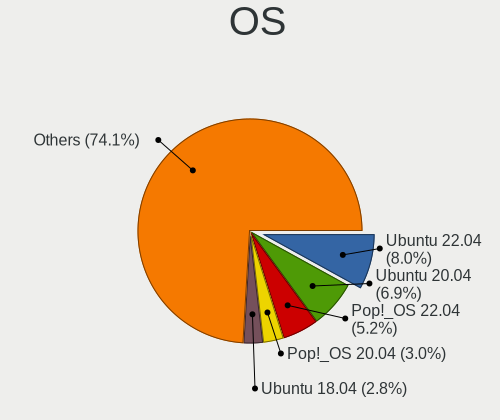

| Name                         | Notebooks | Percent |
|------------------------------|-----------|---------|
| Ubuntu 20.04                 | 37        | 10.72%  |
| Ubuntu 22.04                 | 21        | 6.09%   |
| Ubuntu 18.04                 | 15        | 4.35%   |
| Pop!_OS 22.04                | 15        | 4.35%   |
| Pop!_OS 20.04                | 15        | 4.35%   |
| OpenMandriva 4.2             | 11        | 3.19%   |
| KDE neon 20.04               | 11        | 3.19%   |
| Arch                         | 7         | 2.03%   |
| Zorin 15                     | 6         | 1.74%   |
| Pop!_OS 21.04                | 6         | 1.74%   |
| Fedora 36                    | 6         | 1.74%   |
| Debian 11                    | 6         | 1.74%   |
| Arch Rolling                 | 6         | 1.74%   |
| Zorin 16                     | 5         | 1.45%   |
| Manjaro                      | 5         | 1.45%   |
| KDE neon 22.04               | 5         | 1.45%   |
| Linux Mint 21.1              | 4         | 1.16%   |
| Linux Mint 20.2              | 4         | 1.16%   |
| Kubuntu 22.04                | 4         | 1.16%   |
| Fedora 37                    | 4         | 1.16%   |
| Fedora 35                    | 4         | 1.16%   |
| Ubuntu 20.10                 | 3         | 0.87%   |
| Pop!_OS 21.10                | 3         | 0.87%   |
| openSUSE Tumbleweed-XXXXXXXX | 3         | 0.87%   |
| OpenMandriva 4.3             | 3         | 0.87%   |
| LMDE 4                       | 3         | 0.87%   |
| Linux Mint 20.1              | 3         | 0.87%   |
| Linux Mint 19.3              | 3         | 0.87%   |
| KDE neon 18.04               | 3         | 0.87%   |
| Fedora 33                    | 3         | 0.87%   |
| EndeavourOS Rolling          | 3         | 0.87%   |
| ArcoLinux Rolling            | 3         | 0.87%   |
| Xubuntu 20.04                | 2         | 0.58%   |
| Xubuntu 18.04                | 2         | 0.58%   |
| Ubuntu MATE 20.04            | 2         | 0.58%   |
| Ubuntu 23.04                 | 2         | 0.58%   |
| Ubuntu 22.10                 | 2         | 0.58%   |
| Ubuntu 21.10                 | 2         | 0.58%   |
| Ubuntu 19.10                 | 2         | 0.58%   |
| OpenMandriva 23.01           | 2         | 0.58%   |

OS Family
---------

OS without a version

| Name          | Notebooks | Percent |
|---------------|-----------|---------|
| Ubuntu        | 85        | 25.91%  |
| Pop!_OS       | 40        | 12.2%   |
| Linux Mint    | 23        | 7.01%   |
| Fedora        | 22        | 6.71%   |
| OpenMandriva  | 18        | 5.49%   |
| KDE neon      | 18        | 5.49%   |
| Endless       | 15        | 4.57%   |
| Arch          | 13        | 3.96%   |
| Zorin         | 11        | 3.35%   |
| Manjaro       | 10        | 3.05%   |
| Debian        | 8         | 2.44%   |
| Kali          | 6         | 1.83%   |
| Xubuntu       | 5         | 1.52%   |
| Kubuntu       | 5         | 1.52%   |
| ArcoLinux     | 5         | 1.52%   |
| openSUSE      | 4         | 1.22%   |
| EndeavourOS   | 4         | 1.22%   |
| Elementary    | 4         | 1.22%   |
| Ubuntu MATE   | 3         | 0.91%   |
| SteamOS       | 3         | 0.91%   |
| Nobara        | 3         | 0.91%   |
| Lubuntu       | 3         | 0.91%   |
| LMDE          | 3         | 0.91%   |
| Linux Lite    | 2         | 0.61%   |
| Clear Linux   | 2         | 0.61%   |
| BlackPanther  | 2         | 0.61%   |
| Ubuntu Unity  | 1         | 0.3%    |
| Ubuntu Budgie | 1         | 0.3%    |
| Sparky        | 1         | 0.3%    |
| Slackware     | 1         | 0.3%    |
| ROSA          | 1         | 0.3%    |
| Pikaos        | 1         | 0.3%    |
| Peppermint    | 1         | 0.3%    |
| MX            | 1         | 0.3%    |
| Gentoo        | 1         | 0.3%    |
| BunsenLabs    | 1         | 0.3%    |
| Archcraft     | 1         | 0.3%    |

Kernel
------

Version of the Linux kernel

| Version                  | Notebooks | Percent |
|--------------------------|-----------|---------|
| 5.4.0-42-generic         | 17        | 4.56%   |
| 5.10.14-desktop-1omv4002 | 11        | 2.95%   |
| 5.4.0-7634-generic       | 5         | 1.34%   |
| 5.4.0-48-generic         | 5         | 1.34%   |
| 5.4.0-47-generic         | 5         | 1.34%   |
| 5.15.0-58-generic        | 5         | 1.34%   |
| 5.15.0-56-generic        | 5         | 1.34%   |
| 5.4.0-19-generic         | 4         | 1.07%   |
| 5.3.0-28-generic         | 4         | 1.07%   |
| 5.19.0-32-generic        | 4         | 1.07%   |
| 5.15.0-52-generic        | 4         | 1.07%   |
| 5.15.0-50-generic        | 4         | 1.07%   |
| 5.15.0-41-generic        | 4         | 1.07%   |
| 5.13.0-28-generic        | 4         | 1.07%   |
| 5.11.0-7620-generic      | 4         | 1.07%   |
| 6.2.6-76060206-generic   | 3         | 0.8%    |
| 6.0.6-76060006-generic   | 3         | 0.8%    |
| 5.8.0-14-generic         | 3         | 0.8%    |
| 5.4.0-7642-generic       | 3         | 0.8%    |
| 5.4.0-45-generic         | 3         | 0.8%    |
| 5.3.0-23-generic         | 3         | 0.8%    |
| 5.16.7-desktop-1omv4003  | 3         | 0.8%    |
| 5.15.0-60-generic        | 3         | 0.8%    |
| 5.15.0-43-generic        | 3         | 0.8%    |
| 5.13.0-valve36-1-neptune | 3         | 0.8%    |
| 5.13.0-7614-generic      | 3         | 0.8%    |
| 5.13.0-40-generic        | 3         | 0.8%    |
| 5.0.0-37-generic         | 3         | 0.8%    |
| 4.18.0-25-generic        | 3         | 0.8%    |
| 6.2.0-20-generic         | 2         | 0.54%   |
| 6.1.1-desktop-1omv2290   | 2         | 0.54%   |
| 6.0.12-76060006-generic  | 2         | 0.54%   |
| 6.0.0-kali6-amd64        | 2         | 0.54%   |
| 5.9.16-1-MANJARO         | 2         | 0.54%   |
| 5.8.0-43-generic         | 2         | 0.54%   |
| 5.4.0-90-generic         | 2         | 0.54%   |
| 5.4.0-7625-generic       | 2         | 0.54%   |
| 5.4.0-58-generic         | 2         | 0.54%   |
| 5.4.0-54-generic         | 2         | 0.54%   |
| 5.4.0-52-generic         | 2         | 0.54%   |

Kernel Family
-------------

Linux kernel without a distro release

| Version | Notebooks | Percent |
|---------|-----------|---------|
| 5.4.0   | 68        | 19.1%   |
| 5.15.0  | 39        | 10.96%  |
| 5.13.0  | 21        | 5.9%    |
| 5.3.0   | 17        | 4.78%   |
| 5.11.0  | 15        | 4.21%   |
| 5.8.0   | 11        | 3.09%   |
| 5.19.0  | 11        | 3.09%   |
| 5.10.14 | 11        | 3.09%   |
| 4.15.0  | 10        | 2.81%   |
| 5.0.0   | 7         | 1.97%   |
| 5.10.0  | 6         | 1.69%   |
| 4.18.0  | 6         | 1.69%   |
| 6.0.6   | 5         | 1.4%    |
| 4.19.0  | 5         | 1.4%    |
| 6.2.6   | 4         | 1.12%   |
| 6.2.0   | 4         | 1.12%   |
| 5.9.16  | 3         | 0.84%   |
| 5.17.5  | 3         | 0.84%   |
| 5.16.7  | 3         | 0.84%   |
| 4.9.20  | 3         | 0.84%   |
| 4.4.0   | 3         | 0.84%   |
| 6.3.5   | 2         | 0.56%   |
| 6.1.1   | 2         | 0.56%   |
| 6.0.12  | 2         | 0.56%   |
| 6.0.0   | 2         | 0.56%   |
| 5.8.14  | 2         | 0.56%   |
| 5.19.12 | 2         | 0.56%   |
| 5.18.13 | 2         | 0.56%   |
| 5.18.10 | 2         | 0.56%   |
| 5.18.0  | 2         | 0.56%   |
| 5.15.10 | 2         | 0.56%   |
| 5.14.0  | 2         | 0.56%   |
| 5.11.16 | 2         | 0.56%   |
| 6.3.0   | 1         | 0.28%   |
| 6.2.7   | 1         | 0.28%   |
| 6.2.2   | 1         | 0.28%   |
| 6.2.11  | 1         | 0.28%   |
| 6.1.4   | 1         | 0.28%   |
| 6.1.14  | 1         | 0.28%   |
| 6.1.12  | 1         | 0.28%   |

Kernel Major Ver.
-----------------

Linux kernel major version

| Version | Notebooks | Percent |
|---------|-----------|---------|
| 5.4     | 76        | 21.71%  |
| 5.15    | 53        | 15.14%  |
| 5.13    | 22        | 6.29%   |
| 5.10    | 20        | 5.71%   |
| 5.3     | 19        | 5.43%   |
| 5.11    | 18        | 5.14%   |
| 5.8     | 15        | 4.29%   |
| 5.19    | 15        | 4.29%   |
| 6.0     | 14        | 4%      |
| 5.16    | 12        | 3.43%   |
| 6.2     | 11        | 3.14%   |
| 4.15    | 10        | 2.86%   |
| 5.18    | 8         | 2.29%   |
| 5.0     | 8         | 2.29%   |
| 6.1     | 7         | 2%      |
| 4.18    | 7         | 2%      |
| 5.9     | 5         | 1.43%   |
| 5.17    | 5         | 1.43%   |
| 4.19    | 5         | 1.43%   |
| 6.3     | 3         | 0.86%   |
| 5.6     | 3         | 0.86%   |
| 5.14    | 3         | 0.86%   |
| 4.9     | 3         | 0.86%   |
| 4.4     | 3         | 0.86%   |
| 5.12    | 2         | 0.57%   |
| 5.7     | 1         | 0.29%   |
| 5.2     | 1         | 0.29%   |
| 3.8     | 1         | 0.29%   |

Arch
----

OS architecture (x86_64, i586, etc.)

| Name   | Notebooks | Percent |
|--------|-----------|---------|
| x86_64 | 308       | 96.86%  |
| i686   | 9         | 2.83%   |
| armv7l | 1         | 0.31%   |

DE
--

Desktop Environment

| Name       | Notebooks | Percent |
|------------|-----------|---------|
| GNOME      | 164       | 49.25%  |
| KDE5       | 56        | 16.82%  |
| XFCE       | 26        | 7.81%   |
| Unknown    | 23        | 6.91%   |
| X-Cinnamon | 22        | 6.61%   |
| KDE        | 12        | 3.6%    |
| MATE       | 7         | 2.1%    |
| Pantheon   | 4         | 1.2%    |
| LXQt       | 3         | 0.9%    |
| Cinnamon   | 2         | 0.6%    |
| Budgie     | 2         | 0.6%    |
| Unity      | 1         | 0.3%    |
| sway       | 1         | 0.3%    |
| river      | 1         | 0.3%    |
| Openbox    | 1         | 0.3%    |
| LXDE       | 1         | 0.3%    |
| Hyprland   | 1         | 0.3%    |
| dwm        | 1         | 0.3%    |
| default    | 1         | 0.3%    |
| Deepin     | 1         | 0.3%    |
| Cutefish   | 1         | 0.3%    |
| BunsenLabs | 1         | 0.3%    |
| bspwm      | 1         | 0.3%    |

Display Server
--------------

X11 or Wayland

| Name    | Notebooks | Percent |
|---------|-----------|---------|
| X11     | 253       | 77.85%  |
| Wayland | 58        | 17.85%  |
| Unknown | 12        | 3.69%   |
| Tty     | 2         | 0.62%   |

Display Manager
---------------

SDDM, LightDM, etc.

| Name    | Notebooks | Percent |
|---------|-----------|---------|
| Unknown | 178       | 54.1%   |
| SDDM    | 42        | 12.77%  |
| GDM     | 39        | 11.85%  |
| GDM3    | 34        | 10.33%  |
| LightDM | 27        | 8.21%   |
| TDM     | 6         | 1.82%   |
| SLiM    | 1         | 0.3%    |
| MDM     | 1         | 0.3%    |
| LXDM    | 1         | 0.3%    |

OS Lang
-------

Language

| Lang    | Notebooks | Percent |
|---------|-----------|---------|
| en_PH   | 144       | 44.31%  |
| en_US   | 133       | 40.92%  |
| Unknown | 23        | 7.08%   |
| C       | 7         | 2.15%   |
| de_DE   | 6         | 1.85%   |
| en_GB   | 5         | 1.54%   |
| zh_HK   | 1         | 0.31%   |
| zh_CN   | 1         | 0.31%   |
| tl_PH   | 1         | 0.31%   |
| en_NZ   | 1         | 0.31%   |
| en_IN   | 1         | 0.31%   |
| en_CA   | 1         | 0.31%   |
| en_AU   | 1         | 0.31%   |

Boot Mode
---------

EFI or BIOS

| Mode | Notebooks | Percent |
|------|-----------|---------|
| EFI  | 169       | 51.68%  |
| BIOS | 158       | 48.32%  |

Filesystem
----------

Type of filesystem

| Type    | Notebooks | Percent |
|---------|-----------|---------|
| Ext4    | 241       | 73.7%   |
| Btrfs   | 41        | 12.54%  |
| Overlay | 29        | 8.87%   |
| Unknown | 7         | 2.14%   |
| Ext2    | 3         | 0.92%   |
| Zfs     | 2         | 0.61%   |
| Xfs     | 2         | 0.61%   |
| Tmpfs   | 2         | 0.61%   |

Part. scheme
------------

Scheme of partitioning

| Type    | Notebooks | Percent |
|---------|-----------|---------|
| Unknown | 185       | 56.4%   |
| GPT     | 113       | 34.45%  |
| MBR     | 30        | 9.15%   |

Dual Boot with Linux/BSD
------------------------

Hosting more than one Linux/BSD

| Dual boot | Notebooks | Percent |
|-----------|-----------|---------|
| No        | 295       | 91.9%   |
| Yes       | 26        | 8.1%    |

Dual Boot (Win)
---------------

Hosting Linux and Windows

| Dual boot | Notebooks | Percent |
|-----------|-----------|---------|
| No        | 240       | 74.53%  |
| Yes       | 82        | 25.47%  |

Board
-----

Vendor
------

Motherboard manufacturer

| Name                | Notebooks | Percent |
|---------------------|-----------|---------|
| Lenovo              | 74        | 23.34%  |
| Acer                | 62        | 19.56%  |
| Hewlett-Packard     | 47        | 14.83%  |
| Dell                | 35        | 11.04%  |
| ASUSTek Computer    | 33        | 10.41%  |
| Toshiba             | 13        | 4.1%    |
| MSI                 | 7         | 2.21%   |
| Apple               | 6         | 1.89%   |
| Samsung Electronics | 5         | 1.58%   |
| Unknown             | 5         | 1.58%   |
| Sony                | 4         | 1.26%   |
| Clevo               | 4         | 1.26%   |
| Valve               | 3         | 0.95%   |
| NEC Computers       | 3         | 0.95%   |
| eMachines           | 3         | 0.95%   |
| Jumper              | 2         | 0.63%   |
| Google              | 2         | 0.63%   |
| realme              | 1         | 0.32%   |
| PERSONA             | 1         | 0.32%   |
| Notebook            | 1         | 0.32%   |
| HUAWEI              | 1         | 0.32%   |
| HASEE Computer      | 1         | 0.32%   |
| Gigabyte Technology | 1         | 0.32%   |
| Fujitsu             | 1         | 0.32%   |
| Cubix               | 1         | 0.32%   |
| ALLDOCUBE           | 1         | 0.32%   |

Model
-----

Motherboard model

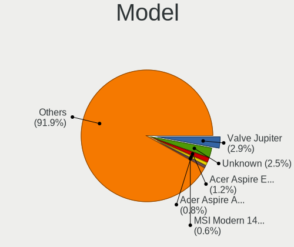

| Name                                | Notebooks | Percent |
|-------------------------------------|-----------|---------|
| Unknown                             | 8         | 2.52%   |
| Acer Aspire ES1-132                 | 6         | 1.89%   |
| Valve Jupiter                       | 3         | 0.95%   |
| HP Notebook                         | 3         | 0.95%   |
| Clevo M7x0S                         | 3         | 0.95%   |
| Lenovo V110-14IAP 80TF              | 2         | 0.63%   |
| Lenovo IdeaPad 330-15IKB 81DE       | 2         | 0.63%   |
| Lenovo IdeaPad 100-15IBY 80MJ       | 2         | 0.63%   |
| Jumper EZbook                       | 2         | 0.63%   |
| HP Pavilion Notebook                | 2         | 0.63%   |
| HP Pavilion Gaming Laptop 15-ec2xxx | 2         | 0.63%   |
| HP Pavilion Gaming Laptop 15-dk2xxx | 2         | 0.63%   |
| HP EliteBook 840 G6                 | 2         | 0.63%   |
| eMachines eM350                     | 2         | 0.63%   |
| Dell Latitude E7450                 | 2         | 0.63%   |
| Dell Inspiron 7472                  | 2         | 0.63%   |
| Dell Inspiron 5567                  | 2         | 0.63%   |
| ASUS X540NA                         | 2         | 0.63%   |
| Apple MacBookPro5,5                 | 2         | 0.63%   |
| Acer TravelMate P249-G2-M           | 2         | 0.63%   |
| Acer TravelMate B113                | 2         | 0.63%   |
| Acer Swift SF314-57                 | 2         | 0.63%   |
| Acer Aspire E5-551G                 | 2         | 0.63%   |
| Acer Aspire E3-111                  | 2         | 0.63%   |
| Acer Aspire A315-51                 | 2         | 0.63%   |
| Acer Aspire A315-41G                | 2         | 0.63%   |
| Toshiba TECRA Z50-C                 | 1         | 0.32%   |
| Toshiba TECRA R940                  | 1         | 0.32%   |
| Toshiba Satellite Pro U400          | 1         | 0.32%   |
| Toshiba Satellite P845              | 1         | 0.32%   |
| Toshiba Satellite L855              | 1         | 0.32%   |
| Toshiba Satellite L515              | 1         | 0.32%   |
| Toshiba Satellite E45t-A            | 1         | 0.32%   |
| Toshiba Satellite C650              | 1         | 0.32%   |
| Toshiba Satellite C55D-B            | 1         | 0.32%   |
| Toshiba PORTEGE R30-A               | 1         | 0.32%   |
| Toshiba NB255                       | 1         | 0.32%   |
| Toshiba dynabook R73/W              | 1         | 0.32%   |
| Toshiba dynabook B45/A              | 1         | 0.32%   |
| Sony VPCEA36FA                      | 1         | 0.32%   |

Model Family
------------

Motherboard model prefix

| Name              | Notebooks | Percent |
|-------------------|-----------|---------|
| Acer Aspire       | 43        | 13.56%  |
| Lenovo ThinkPad   | 35        | 11.04%  |
| Lenovo IdeaPad    | 29        | 9.15%   |
| Dell Inspiron     | 19        | 5.99%   |
| HP Pavilion       | 15        | 4.73%   |
| Acer TravelMate   | 8         | 2.52%   |
| Unknown           | 8         | 2.52%   |
| Toshiba Satellite | 7         | 2.21%   |
| HP Laptop         | 7         | 2.21%   |
| Dell Latitude     | 7         | 2.21%   |
| ASUS VivoBook     | 7         | 2.21%   |
| HP EliteBook      | 4         | 1.26%   |
| ASUS TUF          | 4         | 1.26%   |
| ASUS ROG          | 4         | 1.26%   |
| Acer Nitro        | 4         | 1.26%   |
| Valve Jupiter     | 3         | 0.95%   |
| Lenovo Legion     | 3         | 0.95%   |
| HP ProBook        | 3         | 0.95%   |
| HP Notebook       | 3         | 0.95%   |
| Dell Vostro       | 3         | 0.95%   |
| Clevo M7x0S       | 3         | 0.95%   |
| Acer Swift        | 3         | 0.95%   |
| Toshiba TECRA     | 2         | 0.63%   |
| Toshiba dynabook  | 2         | 0.63%   |
| MSI CX62          | 2         | 0.63%   |
| Lenovo V110-14IAP | 2         | 0.63%   |
| Jumper EZbook     | 2         | 0.63%   |
| HP Stream         | 2         | 0.63%   |
| HP OMEN           | 2         | 0.63%   |
| HP ENVY           | 2         | 0.63%   |
| eMachines eM350   | 2         | 0.63%   |
| Dell XPS          | 2         | 0.63%   |
| Dell Precision    | 2         | 0.63%   |
| ASUS X540NA       | 2         | 0.63%   |
| Apple MacBookPro5 | 2         | 0.63%   |
| Toshiba PORTEGE   | 1         | 0.32%   |
| Toshiba NB255     | 1         | 0.32%   |
| Sony VPCEA36FA    | 1         | 0.32%   |
| Sony SVT13115FGS  | 1         | 0.32%   |
| Sony SVP13215CDB  | 1         | 0.32%   |

MFG Year
--------

Motherboard manufacture year

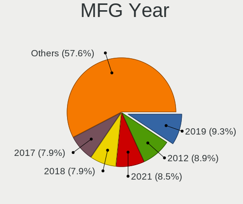

| Year    | Notebooks | Percent |
|---------|-----------|---------|
| 2019    | 34        | 10.73%  |
| 2016    | 32        | 10.09%  |
| 2012    | 30        | 9.46%   |
| 2018    | 26        | 8.2%    |
| 2017    | 26        | 8.2%    |
| 2021    | 24        | 7.57%   |
| 2020    | 20        | 6.31%   |
| 2014    | 20        | 6.31%   |
| 2011    | 20        | 6.31%   |
| 2010    | 19        | 5.99%   |
| 2015    | 15        | 4.73%   |
| 2022    | 14        | 4.42%   |
| 2009    | 12        | 3.79%   |
| 2013    | 11        | 3.47%   |
| 2008    | 6         | 1.89%   |
| 2007    | 3         | 0.95%   |
| 2006    | 3         | 0.95%   |
| 2023    | 1         | 0.32%   |
| Unknown | 1         | 0.32%   |

Form Factor
-----------

Physical design of the computer

| Name     | Notebooks | Percent |
|----------|-----------|---------|
| Notebook | 317       | 100%    |

Secure Boot
-----------

Enabled or disabled

| State    | Notebooks | Percent |
|----------|-----------|---------|
| Disabled | 275       | 85.94%  |
| Enabled  | 45        | 14.06%  |

Coreboot
--------

Have coreboot on board

| Used | Notebooks | Percent |
|------|-----------|---------|
| No   | 315       | 99.37%  |
| Yes  | 2         | 0.63%   |

RAM Size
--------

Total RAM memory

| Size in GB  | Notebooks | Percent |
|-------------|-----------|---------|
| 4.01-8.0    | 88        | 27.33%  |
| 3.01-4.0    | 73        | 22.67%  |
| 8.01-16.0   | 58        | 18.01%  |
| 16.01-24.0  | 41        | 12.73%  |
| 1.01-2.0    | 39        | 12.11%  |
| 32.01-64.0  | 8         | 2.48%   |
| 2.01-3.0    | 8         | 2.48%   |
| 0.51-1.0    | 4         | 1.24%   |
| 24.01-32.0  | 2         | 0.62%   |
| 64.01-256.0 | 1         | 0.31%   |

RAM Used
--------

Used RAM memory

| Used GB   | Notebooks | Percent |
|-----------|-----------|---------|
| 1.01-2.0  | 123       | 34.36%  |
| 2.01-3.0  | 116       | 32.4%   |
| 3.01-4.0  | 42        | 11.73%  |
| 4.01-8.0  | 41        | 11.45%  |
| 0.51-1.0  | 24        | 6.7%    |
| 8.01-16.0 | 10        | 2.79%   |
| 0.01-0.5  | 1         | 0.28%   |
| Unknown   | 1         | 0.28%   |

Total Drives
------------

Number of drives on board

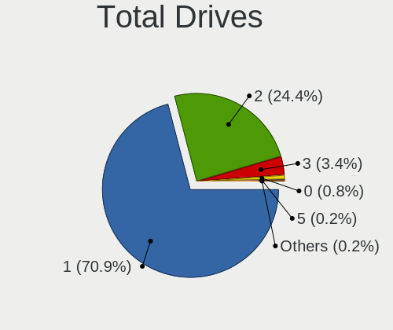

| Drives | Notebooks | Percent |
|--------|-----------|---------|
| 1      | 236       | 72.17%  |
| 2      | 73        | 22.32%  |
| 3      | 14        | 4.28%   |
| 0      | 2         | 0.61%   |
| 5      | 1         | 0.31%   |
| 4      | 1         | 0.31%   |

Has CD-ROM
----------

Has CD-ROM on board

| Presented | Notebooks | Percent |
|-----------|-----------|---------|
| No        | 213       | 66.77%  |
| Yes       | 106       | 33.23%  |

Has Ethernet
------------

Has Ethernet on board

| Presented | Notebooks | Percent |
|-----------|-----------|---------|
| Yes       | 255       | 80.44%  |
| No        | 62        | 19.56%  |

Has WiFi
--------

Has WiFi module

| Presented | Notebooks | Percent |
|-----------|-----------|---------|
| Yes       | 309       | 97.48%  |
| No        | 8         | 2.52%   |

Has Bluetooth
-------------

Has Bluetooth module

| Presented | Notebooks | Percent |
|-----------|-----------|---------|
| Yes       | 252       | 78.26%  |
| No        | 70        | 21.74%  |

Location
--------

Country
-------

Geographic location (country)

| Country     | Notebooks | Percent |
|-------------|-----------|---------|
| Philippines | 317       | 100%    |

City
----

Geographic location (city)

| City                | Notebooks | Percent |
|---------------------|-----------|---------|
| Quezon City         | 47        | 13.51%  |
| Cebu City           | 29        | 8.33%   |
| Davao City          | 16        | 4.6%    |
| Angeles City        | 15        | 4.31%   |
| Pasig               | 14        | 4.02%   |
| Manila              | 13        | 3.74%   |
| Caloocan City       | 13        | 3.74%   |
| Paranaque City      | 11        | 3.16%   |
| San Jose del Monte  | 8         | 2.3%    |
| Makati City         | 8         | 2.3%    |
| Lahug               | 8         | 2.3%    |
| Bacoor              | 8         | 2.3%    |
| Bacolod City        | 8         | 2.3%    |
| Mandaluyong City    | 7         | 2.01%   |
| Iloilo City         | 7         | 2.01%   |
| San Miguel          | 6         | 1.72%   |
| Imus                | 6         | 1.72%   |
| Cagayan de Oro      | 6         | 1.72%   |
| Tarlac City         | 5         | 1.44%   |
| Santa Rosa          | 5         | 1.44%   |
| San Fernando City   | 5         | 1.44%   |
| Manajao             | 5         | 1.44%   |
| Las Pinas           | 5         | 1.44%   |
| City of Muntinglupa | 5         | 1.44%   |
| San Pablo City      | 4         | 1.15%   |
| Malolos             | 4         | 1.15%   |
| Dasmarinas          | 4         | 1.15%   |
| Baguio City         | 4         | 1.15%   |
| San Pedro           | 3         | 0.86%   |
| Lucena City         | 3         | 0.86%   |
| Legazpi             | 3         | 0.86%   |
| Iligan City         | 3         | 0.86%   |
| Zamboanga City      | 2         | 0.57%   |
| Taytay              | 2         | 0.57%   |
| Talisay City        | 2         | 0.57%   |
| San Juan            | 2         | 0.57%   |
| Pasay               | 2         | 0.57%   |
| Oroquieta           | 2         | 0.57%   |
| Ormoc City          | 2         | 0.57%   |
| La Trinidad         | 2         | 0.57%   |

Drives
------

Drive Vendor
------------

Hard drive vendors

| Vendor                    | Notebooks | Drives | Percent |
|---------------------------|-----------|--------|---------|
| Seagate                   | 60        | 83     | 14.67%  |
| WDC                       | 58        | 64     | 14.18%  |
| Toshiba                   | 50        | 67     | 12.22%  |
| Samsung Electronics       | 35        | 41     | 8.56%   |
| Unknown                   | 23        | 28     | 5.62%   |
| SanDisk                   | 23        | 27     | 5.62%   |
| Kingston                  | 19        | 21     | 4.65%   |
| SK hynix                  | 17        | 24     | 4.16%   |
| Hitachi                   | 15        | 21     | 3.67%   |
| Micron Technology         | 11        | 15     | 2.69%   |
| HGST                      | 9         | 9      | 2.2%    |
| Ramsta                    | 7         | 8      | 1.71%   |
| Intel                     | 7         | 7      | 1.71%   |
| Crucial                   | 5         | 5      | 1.22%   |
| A-DATA Technology         | 5         | 8      | 1.22%   |
| Team                      | 3         | 5      | 0.73%   |
| Phison                    | 3         | 3      | 0.73%   |
| LITEONIT                  | 3         | 5      | 0.73%   |
| JMicron Technology        | 3         | 6      | 0.73%   |
| Fujitsu                   | 3         | 4      | 0.73%   |
| China                     | 3         | 4      | 0.73%   |
| Apple                     | 3         | 3      | 0.73%   |
| ShiJi                     | 2         | 2      | 0.49%   |
| O2 Micro                  | 2         | 2      | 0.49%   |
| Netac                     | 2         | 2      | 0.49%   |
| Micron/Crucial Technology | 2         | 2      | 0.49%   |
| Lite-On                   | 2         | 4      | 0.49%   |
| HS-SSD-E100               | 2         | 2      | 0.49%   |
| HS-SSD-C100               | 2         | 3      | 0.49%   |
| WALRAM                    | 1         | 1      | 0.24%   |
| Vaseky                    | 1         | 2      | 0.24%   |
| USB3.0                    | 1         | 1      | 0.24%   |
| UMIS                      | 1         | 1      | 0.24%   |
| Transcend                 | 1         | 1      | 0.24%   |
| Teclast                   | 1         | 4      | 0.24%   |
| TAMMUZ                    | 1         | 1      | 0.24%   |
| SPCC                      | 1         | 2      | 0.24%   |
| Solid State Storage       | 1         | 1      | 0.24%   |
| Silicon Motion            | 1         | 1      | 0.24%   |
| SAGE                      | 1         | 1      | 0.24%   |

Drive Model
-----------

Hard drive models

| Model                                            | Notebooks | Percent |
|--------------------------------------------------|-----------|---------|
| Toshiba MQ01ABF050 500GB                         | 15        | 3.54%   |
| Seagate ST1000LM035-1RK172 1TB                   | 13        | 3.07%   |
| WDC WD5000LPCX-21VHAT0 500GB                     | 7         | 1.65%   |
| Toshiba MQ04ABF100 1TB                           | 6         | 1.42%   |
| WDC WD10JPVX-22JC3T0 1TB                         | 5         | 1.18%   |
| Unknown MMC Card  32GB                           | 5         | 1.18%   |
| Toshiba MQ01ABD100 1TB                           | 5         | 1.18%   |
| Seagate ST500LT012-9WS142 500GB                  | 5         | 1.18%   |
| Seagate ST500LT012-1DG142 500GB                  | 5         | 1.18%   |
| Kingston SA400S37240G 240GB SSD                  | 5         | 1.18%   |
| Seagate ST2000LM007-1R8174 2TB                   | 4         | 0.94%   |
| Seagate ST1000LM049-2GH172 1TB                   | 4         | 0.94%   |
| WDC WD5000LPVX-22V0TT0 500GB                     | 3         | 0.71%   |
| WDC WD5000LPCX-60VHAT0 500GB                     | 3         | 0.71%   |
| WDC WD5000LPCX-24VHAT0 500GB                     | 3         | 0.71%   |
| WDC WD10SPZX-21Z10T0 1TB                         | 3         | 0.71%   |
| Unknown MMC Card  64GB                           | 3         | 0.71%   |
| SK hynix NVMe SSD Drive 512GB                    | 3         | 0.71%   |
| Seagate ST9500325AS 500GB                        | 3         | 0.71%   |
| Seagate ST500LM030-1RK17D 500GB                  | 3         | 0.71%   |
| Seagate ST1000LM048-2E7172 1TB                   | 3         | 0.71%   |
| Sandisk WD Black SN750 / PC SN730 NVMe SSD 256GB | 3         | 0.71%   |
| Samsung NVMe SSD Drive 512GB                     | 3         | 0.71%   |
| Micron NVMe SSD Drive 512GB                      | 3         | 0.71%   |
| Kingston SA400S37120G 120GB SSD                  | 3         | 0.71%   |
| HGST HTS721010A9E630 1TB                         | 3         | 0.71%   |
| WDC WDS500G2B0A-00SM50 500GB SSD                 | 2         | 0.47%   |
| WDC WD5000LPCX-24C6HT0 500GB                     | 2         | 0.47%   |
| WDC WD10SPZX-24Z10 1TB                           | 2         | 0.47%   |
| Unknown SD/MMC/MS PRO 64GB                       | 2         | 0.47%   |
| Unknown MMC Card  7GB                            | 2         | 0.47%   |
| Unknown MMC Card  256GB                          | 2         | 0.47%   |
| Unknown MMC Card  128GB                          | 2         | 0.47%   |
| Unknown DA4032  32GB                             | 2         | 0.47%   |
| Toshiba MK2555GSX 250GB                          | 2         | 0.47%   |
| SK hynix SC311 SATA 128GB SSD                    | 2         | 0.47%   |
| SK hynix NVMe SSD Drive 256GB                    | 2         | 0.47%   |
| SK hynix BC511 256GB                             | 2         | 0.47%   |
| Seagate ST500LM030-2E717D 500GB                  | 2         | 0.47%   |
| Seagate Expansion 1TB                            | 2         | 0.47%   |

HDD Vendor
----------

Hard disk drive vendors

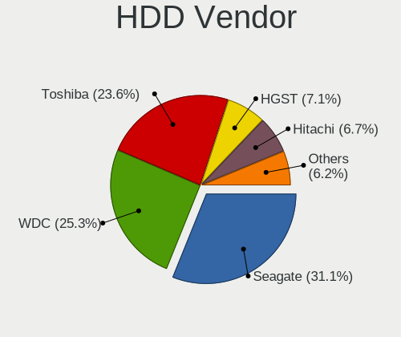

| Vendor              | Notebooks | Drives | Percent |
|---------------------|-----------|--------|---------|
| Seagate             | 60        | 83     | 32.61%  |
| WDC                 | 48        | 53     | 26.09%  |
| Toshiba             | 43        | 57     | 23.37%  |
| Hitachi             | 15        | 21     | 8.15%   |
| HGST                | 9         | 9      | 4.89%   |
| Fujitsu             | 3         | 4      | 1.63%   |
| Unknown             | 2         | 2      | 1.09%   |
| USB3.0              | 1         | 1      | 0.54%   |
| Samsung Electronics | 1         | 1      | 0.54%   |
| SAGE                | 1         | 1      | 0.54%   |
| HGST HTS            | 1         | 1      | 0.54%   |

SSD Vendor
----------

Solid state drive vendors

| Vendor              | Notebooks | Drives | Percent |
|---------------------|-----------|--------|---------|
| Samsung Electronics | 16        | 19     | 14.95%  |
| Kingston            | 13        | 13     | 12.15%  |
| SanDisk             | 9         | 11     | 8.41%   |
| Ramsta              | 7         | 8      | 6.54%   |
| WDC                 | 5         | 6      | 4.67%   |
| Micron Technology   | 5         | 5      | 4.67%   |
| SK hynix            | 4         | 9      | 3.74%   |
| Crucial             | 4         | 4      | 3.74%   |
| A-DATA Technology   | 4         | 7      | 3.74%   |
| Toshiba             | 3         | 5      | 2.8%    |
| Team                | 3         | 5      | 2.8%    |
| LITEONIT            | 3         | 5      | 2.8%    |
| China               | 3         | 4      | 2.8%    |
| Apple               | 3         | 3      | 2.8%    |
| Netac               | 2         | 2      | 1.87%   |
| JMicron Technology  | 2         | 2      | 1.87%   |
| Intel               | 2         | 2      | 1.87%   |
| HS-SSD-E100         | 2         | 2      | 1.87%   |
| Vaseky              | 1         | 2      | 0.93%   |
| Transcend           | 1         | 1      | 0.93%   |
| Teclast             | 1         | 4      | 0.93%   |
| TAMMUZ              | 1         | 1      | 0.93%   |
| ShiJi               | 1         | 1      | 0.93%   |
| Plextor             | 1         | 1      | 0.93%   |
| Phison              | 1         | 1      | 0.93%   |
| OCZ                 | 1         | 1      | 0.93%   |
| KingSpec            | 1         | 1      | 0.93%   |
| Kingmax             | 1         | 1      | 0.93%   |
| HS-SSD-C100         | 1         | 1      | 0.93%   |
| Hikvision           | 1         | 1      | 0.93%   |
| Gigabyte Technology | 1         | 1      | 0.93%   |
| GALAX               | 1         | 1      | 0.93%   |
| DTGC-C              | 1         | 1      | 0.93%   |
| Colorful            | 1         | 1      | 0.93%   |
| ASUS-PHISON         | 1         | 2      | 0.93%   |

Drive Kind
----------

HDD or SSD

| Kind    | Notebooks | Drives | Percent |
|---------|-----------|--------|---------|
| HDD     | 175       | 233    | 45.34%  |
| SSD     | 100       | 134    | 25.91%  |
| NVMe    | 81        | 105    | 20.98%  |
| MMC     | 23        | 28     | 5.96%   |
| Unknown | 7         | 11     | 1.81%   |

Drive Connector
---------------

SATA, SAS, NVMe, etc.

| Type | Notebooks | Drives | Percent |
|------|-----------|--------|---------|
| SATA | 250       | 355    | 66.84%  |
| NVMe | 81        | 105    | 21.66%  |
| MMC  | 23        | 28     | 6.15%   |
| SAS  | 20        | 23     | 5.35%   |

Drive Size
----------

Size of hard drive

| Size in TB | Notebooks | Drives | Percent |
|------------|-----------|--------|---------|
| 0.01-0.5   | 192       | 256    | 69.31%  |
| 0.51-1.0   | 74        | 96     | 26.71%  |
| 1.01-2.0   | 9         | 13     | 3.25%   |
| 4.01-10.0  | 2         | 2      | 0.72%   |

Space Total
-----------

Amount of disk space available on the file system

| Size in GB     | Notebooks | Percent |
|----------------|-----------|---------|
| 101-250        | 94        | 28.31%  |
| 251-500        | 88        | 26.51%  |
| 501-1000       | 52        | 15.66%  |
| 1-20           | 30        | 9.04%   |
| 1001-2000      | 26        | 7.83%   |
| 51-100         | 17        | 5.12%   |
| 21-50          | 14        | 4.22%   |
| More than 3000 | 4         | 1.2%    |
| Unknown        | 4         | 1.2%    |
| 2001-3000      | 3         | 0.9%    |

Space Used
----------

Amount of used disk space

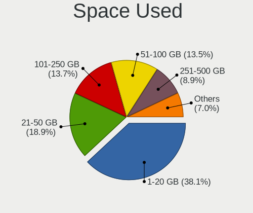

| Used GB   | Notebooks | Percent |
|-----------|-----------|---------|
| 1-20      | 147       | 41.41%  |
| 21-50     | 70        | 19.72%  |
| 51-100    | 54        | 15.21%  |
| 101-250   | 44        | 12.39%  |
| 251-500   | 21        | 5.92%   |
| 501-1000  | 11        | 3.1%    |
| Unknown   | 4         | 1.13%   |
| 1001-2000 | 3         | 0.85%   |
| 2001-3000 | 1         | 0.28%   |

Malfunc. Drives
---------------

Drive models with a malfunction

| Model                                          | Notebooks | Drives | Percent |
|------------------------------------------------|-----------|--------|---------|
| Seagate ST2000LM007-1R8174 2TB                 | 2         | 3      | 7.14%   |
| Seagate ST1000LM048-2E7172 1TB                 | 2         | 2      | 7.14%   |
| WDC WD5000LPVT-75G33T0 500GB                   | 1         | 1      | 3.57%   |
| WDC WD5000LPVT-22G33T0 500GB                   | 1         | 1      | 3.57%   |
| WDC WD3200BEVT-22A23T0 320GB                   | 1         | 1      | 3.57%   |
| WDC WD1600BEVT-24A23T0 160GB                   | 1         | 1      | 3.57%   |
| WDC WD10JPVX-60JC3T1 1TB                       | 1         | 1      | 3.57%   |
| Toshiba MQ01ABF050 500GB                       | 1         | 1      | 3.57%   |
| Toshiba MQ01ABD100 1TB                         | 1         | 1      | 3.57%   |
| Toshiba MK6465GSX 640GB                        | 1         | 1      | 3.57%   |
| Toshiba MK3259GSXP 320GB                       | 1         | 1      | 3.57%   |
| SK hynix HFS128G3AMNB-2200A 128GB SSD          | 1         | 1      | 3.57%   |
| Seagate ST9250315AS 250GB                      | 1         | 1      | 3.57%   |
| Seagate ST9120821AS 120GB                      | 1         | 1      | 3.57%   |
| Seagate ST500LT012-9WS142 500GB                | 1         | 1      | 3.57%   |
| Seagate ST1000LM035-1RK172 1TB                 | 1         | 1      | 3.57%   |
| Ramsta SSD S800 240GB                          | 1         | 1      | 3.57%   |
| Micron Technology 1100_MTFDDAV256TBN 256GB SSD | 1         | 1      | 3.57%   |
| Kingston SV300S37A120G 120GB SSD               | 1         | 1      | 3.57%   |
| Hitachi HTS723232A7A364 320GB                  | 1         | 2      | 3.57%   |
| Hitachi HTS545050B9SA00 500GB                  | 1         | 1      | 3.57%   |
| Hitachi HTS542525K9SA00 250GB                  | 1         | 1      | 3.57%   |
| HGST HTS721010A9E630 1TB                       | 1         | 1      | 3.57%   |
| Fujitsu MHY2120BH 120GB                        | 1         | 1      | 3.57%   |
| Colorful SL300 128GB SSD                       | 1         | 1      | 3.57%   |
| A-DATA Technology SX6000PNP 512GB              | 1         | 1      | 3.57%   |

Malfunc. Drive Vendor
---------------------

Vendors of faulty drives

| Vendor            | Notebooks | Drives | Percent |
|-------------------|-----------|--------|---------|
| Seagate           | 8         | 9      | 28.57%  |
| WDC               | 5         | 5      | 17.86%  |
| Toshiba           | 4         | 4      | 14.29%  |
| Hitachi           | 3         | 4      | 10.71%  |
| SK hynix          | 1         | 1      | 3.57%   |
| Ramsta            | 1         | 1      | 3.57%   |
| Micron Technology | 1         | 1      | 3.57%   |
| Kingston          | 1         | 1      | 3.57%   |
| HGST              | 1         | 1      | 3.57%   |
| Fujitsu           | 1         | 1      | 3.57%   |
| Colorful          | 1         | 1      | 3.57%   |
| A-DATA Technology | 1         | 1      | 3.57%   |

Malfunc. HDD Vendor
-------------------

Vendors of faulty HDD drives

| Vendor  | Notebooks | Drives | Percent |
|---------|-----------|--------|---------|
| Seagate | 8         | 9      | 36.36%  |
| WDC     | 5         | 5      | 22.73%  |
| Toshiba | 4         | 4      | 18.18%  |
| Hitachi | 3         | 4      | 13.64%  |
| HGST    | 1         | 1      | 4.55%   |
| Fujitsu | 1         | 1      | 4.55%   |

Malfunc. Drive Kind
-------------------

Kinds of faulty drives

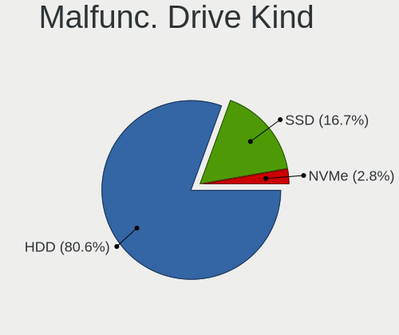

| Kind | Notebooks | Drives | Percent |
|------|-----------|--------|---------|
| HDD  | 21        | 24     | 77.78%  |
| SSD  | 5         | 5      | 18.52%  |
| NVMe | 1         | 1      | 3.7%    |

Failed Drives
-------------

Failed drive models

| Model                    | Notebooks | Drives | Percent |
|--------------------------|-----------|--------|---------|
| WDC WD10SPZX-21Z10T0 1TB | 1         | 1      | 100%    |

Failed Drive Vendor
-------------------

Failed drive vendors

| Vendor | Notebooks | Drives | Percent |
|--------|-----------|--------|---------|
| WDC    | 1         | 1      | 100%    |

Drive Status
------------

Number of failed and malfunc. drives

| Status   | Notebooks | Drives | Percent |
|----------|-----------|--------|---------|
| Detected | 210       | 341    | 60.87%  |
| Works    | 108       | 139    | 31.3%   |
| Malfunc  | 26        | 30     | 7.54%   |
| Failed   | 1         | 1      | 0.29%   |

Storage controller
------------------

Storage Vendor
--------------

Storage controller vendors

| Vendor                           | Notebooks | Percent |
|----------------------------------|-----------|---------|
| Intel                            | 239       | 65.48%  |
| AMD                              | 36        | 9.86%   |
| Samsung Electronics              | 18        | 4.93%   |
| SanDisk                          | 15        | 4.11%   |
| SK hynix                         | 13        | 3.56%   |
| Nvidia                           | 7         | 1.92%   |
| Micron Technology                | 6         | 1.64%   |
| Kingston Technology Company      | 6         | 1.64%   |
| Toshiba America Info Systems     | 4         | 1.1%    |
| Phison Electronics               | 4         | 1.1%    |
| Silicon Integrated Systems [SiS] | 3         | 0.82%   |
| Micron/Crucial Technology        | 3         | 0.82%   |
| Solid State Storage Technology   | 2         | 0.55%   |
| O2 Micro                         | 2         | 0.55%   |
| Lite-On Technology               | 2         | 0.55%   |
| Union Memory (Shenzhen)          | 1         | 0.27%   |
| Silicon Motion                   | 1         | 0.27%   |
| Realtek Semiconductor            | 1         | 0.27%   |
| Lenovo                           | 1         | 0.27%   |
| KIOXIA                           | 1         | 0.27%   |

Storage Model
-------------

Storage controller models

| Model                                                                            | Notebooks | Percent |
|----------------------------------------------------------------------------------|-----------|---------|
| Intel Sunrise Point-LP SATA Controller [AHCI mode]                               | 36        | 9.11%   |
| AMD FCH SATA Controller [AHCI mode]                                              | 32        | 8.1%    |
| Intel 7 Series Chipset Family 6-port SATA Controller [AHCI mode]                 | 27        | 6.84%   |
| Intel 82801 Mobile SATA Controller [RAID mode]                                   | 21        | 5.32%   |
| Intel Celeron N3350/Pentium N4200/Atom E3900 Series SATA AHCI Controller         | 16        | 4.05%   |
| Intel 6 Series/C200 Series Chipset Family 6 port Mobile SATA AHCI Controller     | 16        | 4.05%   |
| Intel Volume Management Device NVMe RAID Controller                              | 12        | 3.04%   |
| Samsung NVMe SSD Controller 980                                                  | 9         | 2.28%   |
| Intel Wildcat Point-LP SATA Controller [AHCI Mode]                               | 9         | 2.28%   |
| Intel Atom Processor E3800 Series SATA AHCI Controller                           | 9         | 2.28%   |
| Intel NM10/ICH7 Family SATA Controller [AHCI mode]                               | 8         | 2.03%   |
| Intel HM170/QM170 Chipset SATA Controller [AHCI Mode]                            | 7         | 1.77%   |
| Intel Cannon Lake Mobile PCH SATA AHCI Controller                                | 7         | 1.77%   |
| Intel 5 Series/3400 Series Chipset 4 port SATA AHCI Controller                   | 7         | 1.77%   |
| SK hynix Gold P31/PC711 NVMe Solid State Drive                                   | 6         | 1.52%   |
| Micron NVMe Storage Controller                                                   | 6         | 1.52%   |
| Intel Comet Lake SATA AHCI Controller                                            | 6         | 1.52%   |
| Intel Celeron/Pentium Silver Processor SATA Controller                           | 6         | 1.52%   |
| Intel Atom/Celeron/Pentium Processor x5-E8000/J3xxx/N3xxx Series SATA Controller | 6         | 1.52%   |
| Intel 82801IBM/IEM (ICH9M/ICH9M-E) 4 port SATA Controller [AHCI mode]            | 6         | 1.52%   |
| Intel 8 Series/C220 Series Chipset Family 6-port SATA Controller 1 [AHCI mode]   | 6         | 1.52%   |
| Intel 8 Series SATA Controller 1 [AHCI mode]                                     | 6         | 1.52%   |
| Samsung NVMe SSD Controller SM981/PM981/PM983                                    | 5         | 1.27%   |
| Intel Tiger Lake-LP SATA Controller                                              | 5         | 1.27%   |
| SanDisk WD Blue SN550 NVMe SSD                                                   | 4         | 1.01%   |
| SanDisk WD Black SN750 / PC SN730 NVMe SSD                                       | 4         | 1.01%   |
| Intel Cannon Point-LP SATA Controller [AHCI Mode]                                | 4         | 1.01%   |
| Intel Alder Lake-P SATA AHCI Controller                                          | 4         | 1.01%   |
| SK hynix BC501 NVMe Solid State Drive                                            | 3         | 0.76%   |
| Silicon Integrated Systems [SiS] 5513 IDE Controller                             | 3         | 0.76%   |
| Nvidia MCP79 AHCI Controller                                                     | 3         | 0.76%   |
| Micron/Crucial P2 NVMe PCIe SSD                                                  | 3         | 0.76%   |
| Intel Jasper Lake SATA AHCI Controller                                           | 3         | 0.76%   |
| Toshiba America Info Systems BG3 NVMe SSD Controller                             | 2         | 0.51%   |
| Solid State Storage Non-Volatile memory controller                               | 2         | 0.51%   |
| SK hynix Non-Volatile memory controller                                          | 2         | 0.51%   |
| SK hynix BC511                                                                   | 2         | 0.51%   |
| Silicon Integrated Systems [SiS] AHCI IDE Controller (0106)                      | 2         | 0.51%   |
| SanDisk WD Blue SN500 / PC SN520 NVMe SSD                                        | 2         | 0.51%   |
| SanDisk PC SN520 NVMe SSD                                                        | 2         | 0.51%   |

Storage Kind
------------

Kind of storage controller (IDE, SATA, NVMe, SAS, ...)

| Kind | Notebooks | Percent |
|------|-----------|---------|
| SATA | 245       | 64.14%  |
| NVMe | 81        | 21.2%   |
| RAID | 34        | 8.9%    |
| IDE  | 22        | 5.76%   |

Processor
---------

CPU Vendor
----------

Processor vendors

| Vendor | Notebooks | Percent |
|--------|-----------|---------|
| Intel  | 263       | 82.97%  |
| AMD    | 53        | 16.72%  |
| ARM    | 1         | 0.32%   |

CPU Model
---------

Processor models

| Model                                         | Notebooks | Percent |
|-----------------------------------------------|-----------|---------|
| Intel Celeron CPU N3350 @ 1.10GHz             | 8         | 2.52%   |
| Intel Core i7-7500U CPU @ 2.70GHz             | 7         | 2.21%   |
| Intel Core i5-8250U CPU @ 1.60GHz             | 7         | 2.21%   |
| Intel Core i7-8550U CPU @ 1.80GHz             | 6         | 1.89%   |
| Intel Core i5-3320M CPU @ 2.60GHz             | 6         | 1.89%   |
| Intel Celeron CPU N3450 @ 1.10GHz             | 6         | 1.89%   |
| AMD Ryzen 5 5600H with Radeon Graphics        | 6         | 1.89%   |
| Intel Core i7-7700HQ CPU @ 2.80GHz            | 5         | 1.58%   |
| Intel Core i5-7200U CPU @ 2.50GHz             | 5         | 1.58%   |
| Intel Core i5-6200U CPU @ 2.30GHz             | 5         | 1.58%   |
| Intel Core i5-3337U CPU @ 1.80GHz             | 5         | 1.58%   |
| Intel Core i3-6006U CPU @ 2.00GHz             | 5         | 1.58%   |
| Intel Core i5-3317U CPU @ 1.70GHz             | 4         | 1.26%   |
| Intel Core i5-1035G1 CPU @ 1.00GHz            | 4         | 1.26%   |
| Intel Core i5-10300H CPU @ 2.50GHz            | 4         | 1.26%   |
| Intel Core i7-8565U CPU @ 1.80GHz             | 3         | 0.95%   |
| Intel Core i7-10510U CPU @ 1.80GHz            | 3         | 0.95%   |
| Intel Core i5-9300H CPU @ 2.40GHz             | 3         | 0.95%   |
| Intel Core i5-8365U CPU @ 1.60GHz             | 3         | 0.95%   |
| Intel Core i5-8265U CPU @ 1.60GHz             | 3         | 0.95%   |
| Intel Core i5-6300U CPU @ 2.40GHz             | 3         | 0.95%   |
| Intel Core i5-5300U CPU @ 2.30GHz             | 3         | 0.95%   |
| Intel Core i5-3210M CPU @ 2.50GHz             | 3         | 0.95%   |
| Intel Core i5-2520M CPU @ 2.50GHz             | 3         | 0.95%   |
| Intel Celeron CPU N3160 @ 1.60GHz             | 3         | 0.95%   |
| Intel Celeron CPU N3060 @ 1.60GHz             | 3         | 0.95%   |
| Intel Celeron CPU N2830 @ 2.16GHz             | 3         | 0.95%   |
| Intel Atom CPU N450 @ 1.66GHz                 | 3         | 0.95%   |
| Intel 11th Gen Core i5-1135G7 @ 2.40GHz       | 3         | 0.95%   |
| Intel 11th Gen Core i5-11300H @ 3.10GHz       | 3         | 0.95%   |
| AMD Ryzen 5 2500U with Radeon Vega Mobile Gfx | 3         | 0.95%   |
| AMD Ryzen 3 3200U with Radeon Vega Mobile Gfx | 3         | 0.95%   |
| AMD Custom APU 0405                           | 3         | 0.95%   |
| Intel Pentium Dual-Core CPU T4300 @ 2.10GHz   | 2         | 0.63%   |
| Intel Pentium CPU N4200 @ 1.10GHz             | 2         | 0.63%   |
| Intel Pentium CPU N3540 @ 2.16GHz             | 2         | 0.63%   |
| Intel Genuine CPU T2060 @ 1.60GHz             | 2         | 0.63%   |
| Intel Core i7-9750H CPU @ 2.60GHz             | 2         | 0.63%   |
| Intel Core i7-6600U CPU @ 2.60GHz             | 2         | 0.63%   |
| Intel Core i7-4710MQ CPU @ 2.50GHz            | 2         | 0.63%   |

CPU Model Family
----------------

Processor model prefix

| Model                   | Notebooks | Percent |
|-------------------------|-----------|---------|
| Intel Core i5           | 85        | 26.81%  |
| Intel Core i7           | 50        | 15.77%  |
| Intel Celeron           | 39        | 12.3%   |
| Intel Core i3           | 28        | 8.83%   |
| Other                   | 20        | 6.31%   |
| AMD Ryzen 5             | 13        | 4.1%    |
| Intel Atom              | 12        | 3.79%   |
| Intel Core 2 Duo        | 11        | 3.47%   |
| Intel Pentium           | 9         | 2.84%   |
| AMD Ryzen 7             | 8         | 2.52%   |
| AMD Ryzen 3             | 5         | 1.58%   |
| Intel Pentium Dual-Core | 4         | 1.26%   |
| AMD A8                  | 4         | 1.26%   |
| Intel Pentium Silver    | 3         | 0.95%   |
| AMD Athlon              | 3         | 0.95%   |
| Intel Genuine           | 2         | 0.63%   |
| AMD Turion 64 X2 Mobile | 2         | 0.63%   |
| AMD A6                  | 2         | 0.63%   |
| AMD A10                 | 2         | 0.63%   |
| Intel Pentium Dual      | 1         | 0.32%   |
| Intel Core m3           | 1         | 0.32%   |
| Intel Core 2            | 1         | 0.32%   |
| Intel Celeron M         | 1         | 0.32%   |
| AMD Turion 64 Mobile    | 1         | 0.32%   |
| AMD Ryzen 9             | 1         | 0.32%   |
| AMD Ryzen 7 PRO         | 1         | 0.32%   |
| AMD Quad-Core           | 1         | 0.32%   |
| AMD PRO A10             | 1         | 0.32%   |
| AMD FX                  | 1         | 0.32%   |
| AMD E2                  | 1         | 0.32%   |
| AMD E1                  | 1         | 0.32%   |
| AMD E                   | 1         | 0.32%   |
| AMD C-60                | 1         | 0.32%   |
| AMD A4                  | 1         | 0.32%   |

CPU Cores
---------

Number of processor cores

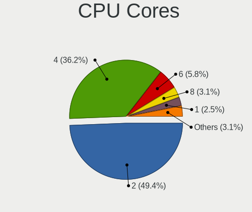

| Number | Notebooks | Percent |
|--------|-----------|---------|
| 2      | 168       | 53%     |
| 4      | 111       | 35.02%  |
| 6      | 15        | 4.73%   |
| 1      | 10        | 3.15%   |
| 8      | 9         | 2.84%   |
| 10     | 2         | 0.63%   |
| 14     | 1         | 0.32%   |
| 12     | 1         | 0.32%   |

CPU Sockets
-----------

Number of sockets

| Number | Notebooks | Percent |
|--------|-----------|---------|
| 1      | 317       | 100%    |

CPU Threads
-----------

Threads per core (Hyper-Threading)

| Number | Notebooks | Percent |
|--------|-----------|---------|
| 2      | 221       | 69.72%  |
| 1      | 96        | 30.28%  |

CPU Op-Modes
------------

CPU Operation Modes (32-bit, 64-bit)

| Op mode        | Notebooks | Percent |
|----------------|-----------|---------|
| 32-bit, 64-bit | 308       | 96.86%  |
| Unknown        | 6         | 1.89%   |
| 32-bit         | 4         | 1.26%   |

CPU Microcode
-------------

Microcode number

| Number     | Notebooks | Percent |
|------------|-----------|---------|
| Unknown    | 88        | 26.67%  |
| 0x306a9    | 23        | 6.97%   |
| 0x206a7    | 17        | 5.15%   |
| 0x506c9    | 13        | 3.94%   |
| 0x406e3    | 13        | 3.94%   |
| 0x806ea    | 11        | 3.33%   |
| 0x30678    | 10        | 3.03%   |
| 0x1067a    | 10        | 3.03%   |
| 0x806ec    | 9         | 2.73%   |
| 0x806e9    | 9         | 2.73%   |
| 0x306d4    | 8         | 2.42%   |
| 0x0a50000c | 6         | 1.82%   |
| 0x906ea    | 5         | 1.52%   |
| 0x806c1    | 5         | 1.52%   |
| 0x706e5    | 5         | 1.52%   |
| 0x406c4    | 5         | 1.52%   |
| 0x40651    | 5         | 1.52%   |
| 0x306c3    | 5         | 1.52%   |
| 0x20655    | 5         | 1.52%   |
| 0x106ca    | 5         | 1.52%   |
| 0xa0652    | 4         | 1.21%   |
| 0x706a1    | 4         | 1.21%   |
| 0x10676    | 4         | 1.21%   |
| 0x08108109 | 4         | 1.21%   |
| 0x806eb    | 3         | 0.91%   |
| 0x406c3    | 3         | 0.91%   |
| 0x20652    | 3         | 0.91%   |
| 0x07030105 | 3         | 0.91%   |
| 0x06003106 | 3         | 0.91%   |
| 0x906e9    | 2         | 0.61%   |
| 0x906c0    | 2         | 0.61%   |
| 0x906a4    | 2         | 0.61%   |
| 0x906a3    | 2         | 0.61%   |
| 0x706a8    | 2         | 0.61%   |
| 0x6ec      | 2         | 0.61%   |
| 0x506e3    | 2         | 0.61%   |
| 0x30661    | 2         | 0.61%   |
| 0x08608103 | 2         | 0.61%   |
| 0x08600106 | 2         | 0.61%   |
| 0x08600104 | 2         | 0.61%   |

CPU Microarch
-------------

Microarchitecture

| Name             | Notebooks | Percent |
|------------------|-----------|---------|
| KabyLake         | 58        | 18.3%   |
| IvyBridge        | 30        | 9.46%   |
| Skylake          | 20        | 6.31%   |
| Silvermont       | 19        | 5.99%   |
| SandyBridge      | 19        | 5.99%   |
| Penryn           | 16        | 5.05%   |
| Goldmont         | 16        | 5.05%   |
| Haswell          | 12        | 3.79%   |
| Zen+             | 10        | 3.15%   |
| Westmere         | 10        | 3.15%   |
| TigerLake        | 10        | 3.15%   |
| Broadwell        | 10        | 3.15%   |
| Zen 3            | 9         | 2.84%   |
| Bonnell          | 9         | 2.84%   |
| Unknown          | 8         | 2.52%   |
| Goldmont plus    | 7         | 2.21%   |
| CometLake        | 7         | 2.21%   |
| Zen 2            | 5         | 1.58%   |
| Puma             | 5         | 1.58%   |
| IceLake          | 5         | 1.58%   |
| Alderlake Hybrid | 5         | 1.58%   |
| K8 Hammer        | 4         | 1.26%   |
| Zen              | 3         | 0.95%   |
| Steamroller      | 3         | 0.95%   |
| P6               | 3         | 0.95%   |
| Excavator        | 3         | 0.95%   |
| Core             | 3         | 0.95%   |
| Tremont          | 2         | 0.63%   |
| Jaguar           | 2         | 0.63%   |
| Bobcat           | 2         | 0.63%   |
| Piledriver       | 1         | 0.32%   |
| K8 & K10 hybrid  | 1         | 0.32%   |

Graphics
--------

GPU Vendor
----------

Vendors of graphics cards

| Vendor                           | Notebooks | Percent |
|----------------------------------|-----------|---------|
| Intel                            | 252       | 61.31%  |
| Nvidia                           | 80        | 19.46%  |
| AMD                              | 76        | 18.49%  |
| Silicon Integrated Systems [SiS] | 3         | 0.73%   |

GPU Model
---------

Graphics card models

| Model                                                                                    | Notebooks | Percent |
|------------------------------------------------------------------------------------------|-----------|---------|
| Intel 3rd Gen Core processor Graphics Controller                                         | 30        | 7.09%   |
| Intel 2nd Generation Core Processor Family Integrated Graphics Controller                | 19        | 4.49%   |
| Intel UHD Graphics 620                                                                   | 16        | 3.78%   |
| Intel Skylake GT2 [HD Graphics 520]                                                      | 15        | 3.55%   |
| Intel HD Graphics 500                                                                    | 14        | 3.31%   |
| Intel HD Graphics 620                                                                    | 13        | 3.07%   |
| Intel Atom Processor Z36xxx/Z37xxx Series Graphics & Display                             | 10        | 2.36%   |
| AMD Picasso/Raven 2 [Radeon Vega Series / Radeon Vega Mobile Series]                     | 10        | 2.36%   |
| Intel WhiskeyLake-U GT2 [UHD Graphics 620]                                               | 9         | 2.13%   |
| Intel Mobile 4 Series Chipset Integrated Graphics Controller                             | 9         | 2.13%   |
| Intel HD Graphics 5500                                                                   | 9         | 2.13%   |
| Intel Core Processor Integrated Graphics Controller                                      | 9         | 2.13%   |
| Intel Atom/Celeron/Pentium Processor x5-E8000/J3xxx/N3xxx Integrated Graphics Controller | 9         | 2.13%   |
| AMD Cezanne [Radeon Vega Series / Radeon Vega Mobile Series]                             | 9         | 2.13%   |
| Nvidia GM108M [GeForce 940MX]                                                            | 7         | 1.65%   |
| Intel TigerLake-LP GT2 [Iris Xe Graphics]                                                | 7         | 1.65%   |
| Intel CoffeeLake-H GT2 [UHD Graphics 630]                                                | 7         | 1.65%   |
| AMD Topaz XT [Radeon R7 M260/M265 / M340/M360 / M440/M445 / 530/535 / 620/625 Mobile]    | 7         | 1.65%   |
| Nvidia GP107M [GeForce GTX 1050 Mobile]                                                  | 6         | 1.42%   |
| Nvidia GA107M [GeForce RTX 3050 Mobile]                                                  | 6         | 1.42%   |
| Intel HD Graphics 630                                                                    | 6         | 1.42%   |
| Intel CometLake-H GT2 [UHD Graphics]                                                     | 6         | 1.42%   |
| Intel Atom Processor D4xx/D5xx/N4xx/N5xx Integrated Graphics Controller                  | 6         | 1.42%   |
| Intel 4th Gen Core Processor Integrated Graphics Controller                              | 6         | 1.42%   |
| Nvidia TU117M [GeForce GTX 1650 Mobile / Max-Q]                                          | 5         | 1.18%   |
| Intel Iris Plus Graphics G1 (Ice Lake)                                                   | 5         | 1.18%   |
| Intel Haswell-ULT Integrated Graphics Controller                                         | 5         | 1.18%   |
| Intel GeminiLake [UHD Graphics 600]                                                      | 5         | 1.18%   |
| Intel CometLake-U GT2 [UHD Graphics]                                                     | 5         | 1.18%   |
| AMD Renoir                                                                               | 5         | 1.18%   |
| Nvidia GP107M [GeForce GTX 1050 Ti Mobile]                                               | 4         | 0.95%   |
| Nvidia GM108M [GeForce MX130]                                                            | 4         | 0.95%   |
| AMD Sun XT [Radeon HD 8670A/8670M/8690M / R5 M330 / M430 / Radeon 520 Mobile]            | 4         | 0.95%   |
| AMD Seymour [Radeon HD 6400M/7400M Series]                                               | 4         | 0.95%   |
| AMD Mullins [Radeon R4/R5 Graphics]                                                      | 4         | 0.95%   |
| Silicon Integrated Systems [SiS] 771/671 PCIE VGA Display Adapter                        | 3         | 0.71%   |
| Nvidia TU116M [GeForce GTX 1660 Ti Mobile]                                               | 3         | 0.71%   |
| Nvidia TU106M [GeForce RTX 2060 Mobile]                                                  | 3         | 0.71%   |
| Nvidia GP108M [GeForce MX150]                                                            | 3         | 0.71%   |
| Nvidia GM108M [GeForce 940M]                                                             | 3         | 0.71%   |

GPU Combo
---------

Combinations of graphics cards

| Name           | Notebooks | Percent |
|----------------|-----------|---------|
| 1 x Intel      | 165       | 52.05%  |
| Intel + Nvidia | 60        | 18.93%  |
| 1 x AMD        | 34        | 10.73%  |
| Intel + AMD    | 24        | 7.57%   |
| 1 x Nvidia     | 10        | 3.15%   |
| AMD + Nvidia   | 10        | 3.15%   |
| 2 x AMD        | 8         | 2.52%   |
| 1 x SiS        | 3         | 0.95%   |
| 2 x Intel      | 2         | 0.63%   |
| Other          | 1         | 0.32%   |

GPU Driver
----------

Free vs proprietary

| Driver      | Notebooks | Percent |
|-------------|-----------|---------|
| Free        | 267       | 83.44%  |
| Proprietary | 46        | 14.38%  |
| Unknown     | 7         | 2.19%   |

GPU Memory
----------

Total video memory

| Size in GB | Notebooks | Percent |
|------------|-----------|---------|
| Unknown    | 232       | 70.52%  |
| 1.01-2.0   | 33        | 10.03%  |
| 0.01-0.5   | 28        | 8.51%   |
| 3.01-4.0   | 16        | 4.86%   |
| 0.51-1.0   | 16        | 4.86%   |
| 5.01-6.0   | 3         | 0.91%   |
| 7.01-8.0   | 1         | 0.3%    |

Monitor
-------

Monitor Vendor
--------------

Monitor vendors

| Vendor                  | Notebooks | Percent |
|-------------------------|-----------|---------|
| Chimei Innolux          | 62        | 17.97%  |
| AU Optronics            | 61        | 17.68%  |
| BOE                     | 57        | 16.52%  |
| LG Display              | 39        | 11.3%   |
| Samsung Electronics     | 30        | 8.7%    |
| Lenovo                  | 12        | 3.48%   |
| InfoVision              | 8         | 2.32%   |
| Sharp                   | 6         | 1.74%   |
| PANDA                   | 6         | 1.74%   |
| Apple                   | 5         | 1.45%   |
| Acer                    | 5         | 1.45%   |
| Sony                    | 4         | 1.16%   |
| Philips                 | 4         | 1.16%   |
| Chi Mei Optoelectronics | 4         | 1.16%   |
| AOC                     | 4         | 1.16%   |
| Valve                   | 3         | 0.87%   |
| Goldstar                | 3         | 0.87%   |
| RTK                     | 2         | 0.58%   |
| LG Philips              | 2         | 0.58%   |
| InnoLux Display         | 2         | 0.58%   |
| Hewlett-Packard         | 2         | 0.58%   |
| Dell                    | 2         | 0.58%   |
| BenQ                    | 2         | 0.58%   |
| ASUSTek Computer        | 2         | 0.58%   |
| Ancor Communications    | 2         | 0.58%   |
| ___                     | 1         | 0.29%   |
| Unknown                 | 1         | 0.29%   |
| Toshiba                 | 1         | 0.29%   |
| TMX                     | 1         | 0.29%   |
| Quanta Display          | 1         | 0.29%   |
| Pixio                   | 1         | 0.29%   |
| Panasonic               | 1         | 0.29%   |
| MYS                     | 1         | 0.29%   |
| IPS                     | 1         | 0.29%   |
| HKC                     | 1         | 0.29%   |
| HannStar                | 1         | 0.29%   |
| GreenWood               | 1         | 0.29%   |
| GDH                     | 1         | 0.29%   |
| CSO                     | 1         | 0.29%   |
| COS                     | 1         | 0.29%   |

Monitor Model
-------------

Monitor models

| Model                                                                 | Notebooks | Percent |
|-----------------------------------------------------------------------|-----------|---------|
| Chimei Innolux LCD Monitor CMN1132 1366x768 256x144mm 11.6-inch       | 7         | 2.03%   |
| AU Optronics LCD Monitor AUO106C 1366x768 276x155mm 12.5-inch         | 6         | 1.74%   |
| Chimei Innolux LCD Monitor CMN15D5 1920x1080 344x193mm 15.5-inch      | 5         | 1.45%   |
| Chimei Innolux LCD Monitor CMN14C3 1366x768 309x173mm 13.9-inch       | 4         | 1.16%   |
| Valve ANX7530 U VLV3001 800x1280 100x150mm 7.1-inch                   | 3         | 0.87%   |
| Lenovo LCD Monitor LEN40B1 1600x900 345x194mm 15.6-inch               | 3         | 0.87%   |
| Lenovo LCD Monitor LEN40A0 1366x768 309x174mm 14.0-inch               | 3         | 0.87%   |
| Chimei Innolux LCD Monitor CMN15F5 1920x1080 344x193mm 15.5-inch      | 3         | 0.87%   |
| Chimei Innolux LCD Monitor CMN1493 1366x768 309x173mm 13.9-inch       | 3         | 0.87%   |
| BOE LCD Monitor BOE06BD 1366x768 309x173mm 13.9-inch                  | 3         | 0.87%   |
| BOE LCD Monitor BOE06A4 1366x768 344x194mm 15.5-inch                  | 3         | 0.87%   |
| AU Optronics LCD Monitor AUO403D 1920x1080 309x173mm 13.9-inch        | 3         | 0.87%   |
| AU Optronics LCD Monitor AUO2992 1920x1080 344x193mm 15.5-inch        | 3         | 0.87%   |
| AU Optronics LCD Monitor AUO183C 1366x768 309x173mm 13.9-inch         | 3         | 0.87%   |
| Samsung Electronics S24F350 SAM0D20 1920x1080 521x293mm 23.5-inch     | 2         | 0.58%   |
| Samsung Electronics LCD Monitor SEC544B 1600x900 310x174mm 14.0-inch  | 2         | 0.58%   |
| Samsung Electronics LCD Monitor SEC5441 1280x800 331x207mm 15.4-inch  | 2         | 0.58%   |
| Samsung Electronics LCD Monitor SEC3549 1366x768 309x174mm 14.0-inch  | 2         | 0.58%   |
| Samsung Electronics LCD Monitor SDC5441 1366x768 344x193mm 15.5-inch  | 2         | 0.58%   |
| Samsung Electronics LCD Monitor SDC4E51 1366x768 344x194mm 15.5-inch  | 2         | 0.58%   |
| Samsung Electronics LCD Monitor SDC4C48 1920x1080 239x134mm 10.8-inch | 2         | 0.58%   |
| RTK 32V3H-H6A RTK4C54 1280x1024 697x392mm 31.5-inch                   | 2         | 0.58%   |
| Philips PHL 193V5 PHLC0CD 1366x768 410x230mm 18.5-inch                | 2         | 0.58%   |
| PANDA LCD Monitor NCP004D 1920x1080 344x194mm 15.5-inch               | 2         | 0.58%   |
| LG Display LP101WSA-TLN1 LGD0295 1024x600 224x126mm 10.1-inch         | 2         | 0.58%   |
| LG Display LCD Monitor LGD0525 1366x768 344x194mm 15.5-inch           | 2         | 0.58%   |
| LG Display LCD Monitor LGD033F 1366x768 310x174mm 14.0-inch           | 2         | 0.58%   |
| InfoVision LCD Monitor IVO03F4 1024x600 223x125mm 10.1-inch           | 2         | 0.58%   |
| Chimei Innolux LCD Monitor CMN15E6 1366x768 344x193mm 15.5-inch       | 2         | 0.58%   |
| Chimei Innolux LCD Monitor CMN15DB 1366x768 344x193mm 15.5-inch       | 2         | 0.58%   |
| Chimei Innolux LCD Monitor CMN15BF 1366x768 344x194mm 15.5-inch       | 2         | 0.58%   |
| Chimei Innolux LCD Monitor CMN1521 1920x1080 344x193mm 15.5-inch      | 2         | 0.58%   |
| Chimei Innolux LCD Monitor CMN14D4 1920x1080 309x173mm 13.9-inch      | 2         | 0.58%   |
| BOE LCD Monitor BOE08F2 1920x1080 310x174mm 14.0-inch                 | 2         | 0.58%   |
| BOE LCD Monitor BOE08B3 1920x1080 344x193mm 15.5-inch                 | 2         | 0.58%   |
| BOE LCD Monitor BOE0700 1920x1080 344x194mm 15.5-inch                 | 2         | 0.58%   |
| BOE LCD Monitor BOE0696 1366x768 309x173mm 13.9-inch                  | 2         | 0.58%   |
| BenQ GW2780 BNQ78E6 1920x1080 600x340mm 27.2-inch                     | 2         | 0.58%   |
| AU Optronics LCD Monitor AUO733C 1366x768 309x173mm 13.9-inch         | 2         | 0.58%   |
| AU Optronics LCD Monitor AUO405C 1366x768 256x144mm 11.6-inch         | 2         | 0.58%   |

Monitor Resolution
------------------

Monitor screen resolution

| Resolution        | Notebooks | Percent |
|-------------------|-----------|---------|
| 1366x768 (WXGA)   | 149       | 46.13%  |
| 1920x1080 (FHD)   | 118       | 36.53%  |
| 1600x900 (HD+)    | 12        | 3.72%   |
| 1024x600          | 7         | 2.17%   |
| 1280x800 (WXGA)   | 6         | 1.86%   |
| 1920x1200 (WUXGA) | 5         | 1.55%   |
| 1280x1024 (SXGA)  | 5         | 1.55%   |
| 3840x2160 (4K)    | 4         | 1.24%   |
| 1360x768          | 4         | 1.24%   |
| 800x1280          | 3         | 0.93%   |
| 1440x900 (WXGA+)  | 3         | 0.93%   |
| 2560x1440 (QHD)   | 2         | 0.62%   |
| 2160x1440         | 2         | 0.62%   |
| 2560x1600         | 1         | 0.31%   |
| 2400x1600         | 1         | 0.31%   |
| 1280x768          | 1         | 0.31%   |

Monitor Diagonal
----------------

Diagonal size in inches

| Inches  | Notebooks | Percent |
|---------|-----------|---------|
| 15      | 127       | 37.03%  |
| 13      | 61        | 17.78%  |
| 14      | 49        | 14.29%  |
| 11      | 20        | 5.83%   |
| 17      | 17        | 4.96%   |
| 12      | 12        | 3.5%    |
| 18      | 11        | 3.21%   |
| 23      | 8         | 2.33%   |
| 21      | 7         | 2.04%   |
| 10      | 7         | 2.04%   |
| 72      | 5         | 1.46%   |
| 27      | 5         | 1.46%   |
| 31      | 4         | 1.17%   |
| 7       | 3         | 0.87%   |
| 16      | 2         | 0.58%   |
| Unknown | 2         | 0.58%   |
| 47      | 1         | 0.29%   |
| 24      | 1         | 0.29%   |
| 20      | 1         | 0.29%   |

Monitor Width
-------------

Physical width

| Width in mm | Notebooks | Percent |
|-------------|-----------|---------|
| 301-350     | 219       | 64.6%   |
| 201-300     | 56        | 16.52%  |
| 401-500     | 19        | 5.6%    |
| 351-400     | 16        | 4.72%   |
| 501-600     | 12        | 3.54%   |
| 601-700     | 6         | 1.77%   |
| 1501-2000   | 5         | 1.47%   |
| 1-100       | 3         | 0.88%   |
| Unknown     | 2         | 0.59%   |
| 1001-1500   | 1         | 0.29%   |

Aspect Ratio
------------

Proportional relationship between the width and the height

| Ratio   | Notebooks | Percent |
|---------|-----------|---------|
| 16/9    | 285       | 92.83%  |
| 16/10   | 12        | 3.91%   |
| 5/4     | 3         | 0.98%   |
| 3/2     | 3         | 0.98%   |
| 0.67    | 3         | 0.98%   |
| Unknown | 1         | 0.33%   |

Monitor Area
------------

Area in inch

| Area in inch | Notebooks | Percent |
|----------------|-----------|---------|
| 101-110        | 124       | 36.26%  |
| 81-90          | 96        | 28.07%  |
| 51-60          | 20        | 5.85%   |
| 71-80          | 14        | 4.09%   |
| 141-150        | 14        | 4.09%   |
| 201-250        | 13        | 3.8%    |
| 121-130        | 13        | 3.8%    |
| 61-70          | 12        | 3.51%   |
| 41-50          | 7         | 2.05%   |
| More than 1000 | 5         | 1.46%   |
| 301-350        | 5         | 1.46%   |
| 351-500        | 4         | 1.17%   |
| 1-40           | 3         | 0.88%   |
| 151-200        | 3         | 0.88%   |
| 111-120        | 3         | 0.88%   |
| 91-100         | 2         | 0.58%   |
| Unknown        | 2         | 0.58%   |
| 131-140        | 1         | 0.29%   |
| 501-1000       | 1         | 0.29%   |

Pixel Density
-------------

Pixels per inch

| Density       | Notebooks | Percent |
|---------------|-----------|---------|
| 101-120       | 143       | 42.06%  |
| 121-160       | 138       | 40.59%  |
| 51-100        | 33        | 9.71%   |
| 161-240       | 13        | 3.82%   |
| 1-50          | 8         | 2.35%   |
| More than 240 | 3         | 0.88%   |
| Unknown       | 2         | 0.59%   |

Multiple Monitors
-----------------

Total monitors connected

| Total | Notebooks | Percent |
|-------|-----------|---------|
| 1     | 276       | 84.92%  |
| 2     | 38        | 11.69%  |
| 0     | 8         | 2.46%   |
| 3     | 3         | 0.92%   |

Network
-------

Net Controller Vendor
---------------------

Controller vendors

| Vendor                           | Notebooks | Percent |
|----------------------------------|-----------|---------|
| Realtek Semiconductor            | 190       | 38.23%  |
| Intel                            | 135       | 27.16%  |
| Qualcomm Atheros                 | 88        | 17.71%  |
| Broadcom                         | 40        | 8.05%   |
| Ralink Technology                | 7         | 1.41%   |
| Nvidia                           | 5         | 1.01%   |
| Broadcom Limited                 | 5         | 1.01%   |
| MediaTek                         | 4         | 0.8%    |
| TP-Link                          | 3         | 0.6%    |
| Silicon Integrated Systems [SiS] | 3         | 0.6%    |
| Marvell Technology Group         | 3         | 0.6%    |
| Qualcomm Atheros Communications  | 2         | 0.4%    |
| JMicron Technology               | 2         | 0.4%    |
| ASIX Electronics                 | 2         | 0.4%    |
| Ralink                           | 1         | 0.2%    |
| NetGear                          | 1         | 0.2%    |
| Hewlett-Packard                  | 1         | 0.2%    |
| Encore Electronics               | 1         | 0.2%    |
| Dell                             | 1         | 0.2%    |
| BUFFALO                          | 1         | 0.2%    |
| ASUSTek Computer                 | 1         | 0.2%    |
| AMD                              | 1         | 0.2%    |

Net Controller Model
--------------------

Controller models

| Model                                                             | Notebooks | Percent |
|-------------------------------------------------------------------|-----------|---------|
| Realtek RTL8111/8168/8411 PCI Express Gigabit Ethernet Controller | 115       | 19.62%  |
| Realtek RTL810xE PCI Express Fast Ethernet controller             | 39        | 6.66%   |
| Qualcomm Atheros QCA9377 802.11ac Wireless Network Adapter        | 20        | 3.41%   |
| Qualcomm Atheros QCA9565 / AR9565 Wireless Network Adapter        | 16        | 2.73%   |
| Intel Wireless 7265                                               | 14        | 2.39%   |
| Intel 82579LM Gigabit Network Connection (Lewisville)             | 14        | 2.39%   |
| Realtek RTL8822CE 802.11ac PCIe Wireless Network Adapter          | 13        | 2.22%   |
| Qualcomm Atheros AR9285 Wireless Network Adapter (PCI-Express)    | 13        | 2.22%   |
| Realtek RTL8723BE PCIe Wireless Network Adapter                   | 12        | 2.05%   |
| Intel Dual Band Wireless-AC 3168NGW [Stone Peak]                  | 12        | 2.05%   |
| Intel Centrino Advanced-N 6205 [Taylor Peak]                      | 12        | 2.05%   |
| Intel Wireless 3165                                               | 11        | 1.88%   |
| Realtek RTL8821CE 802.11ac PCIe Wireless Network Adapter          | 9         | 1.54%   |
| Qualcomm Atheros AR9485 Wireless Network Adapter                  | 9         | 1.54%   |
| Broadcom BCM4313 802.11bgn Wireless Network Adapter               | 9         | 1.54%   |
| Ralink MT7601U Wireless Adapter                                   | 7         | 1.19%   |
| Qualcomm Atheros QCA6174 802.11ac Wireless Network Adapter        | 7         | 1.19%   |
| Intel Wireless 8260                                               | 7         | 1.19%   |
| Intel Cannon Lake PCH CNVi WiFi                                   | 7         | 1.19%   |
| Qualcomm Atheros AR9462 Wireless Network Adapter                  | 6         | 1.02%   |
| Intel Wi-Fi 6 AX201                                               | 6         | 1.02%   |
| Intel Comet Lake PCH-LP CNVi WiFi                                 | 6         | 1.02%   |
| Broadcom BCM43142 802.11b/g/n                                     | 6         | 1.02%   |
| Realtek RTL8821AE 802.11ac PCIe Wireless Network Adapter          | 5         | 0.85%   |
| Qualcomm Atheros AR8152 v2.0 Fast Ethernet                        | 5         | 0.85%   |
| Intel Wireless 8265 / 8275                                        | 5         | 0.85%   |
| Intel Wireless 7260                                               | 5         | 0.85%   |
| Intel Wi-Fi 6 AX200                                               | 5         | 0.85%   |
| Intel Ethernet Connection I219-LM                                 | 5         | 0.85%   |
| Intel Comet Lake PCH CNVi WiFi                                    | 5         | 0.85%   |
| Realtek RTL8852AE 802.11ax PCIe Wireless Network Adapter          | 4         | 0.68%   |
| Realtek RTL8822BE 802.11a/b/g/n/ac WiFi adapter                   | 4         | 0.68%   |
| Realtek Killer E2600 Gigabit Ethernet Controller                  | 4         | 0.68%   |
| Qualcomm Atheros AR8132 Fast Ethernet                             | 4         | 0.68%   |
| Intel Dual Band Wireless-AC 3165 Plus Bluetooth                   | 4         | 0.68%   |
| Broadcom NetLink BCM57785 Gigabit Ethernet PCIe                   | 4         | 0.68%   |
| Silicon Integrated Systems [SiS] 191 Gigabit Ethernet Adapter     | 3         | 0.51%   |
| Realtek RTL8188EUS 802.11n Wireless Network Adapter               | 3         | 0.51%   |
| Realtek RTL8187B Wireless 802.11g 54Mbps Network Adapter          | 3         | 0.51%   |
| Realtek RTL8152 Fast Ethernet Adapter                             | 3         | 0.51%   |

Wireless Vendor
---------------

Wireless vendors

| Vendor                          | Notebooks | Percent |
|---------------------------------|-----------|---------|
| Intel                           | 130       | 40.12%  |
| Qualcomm Atheros                | 76        | 23.46%  |
| Realtek Semiconductor           | 65        | 20.06%  |
| Broadcom                        | 30        | 9.26%   |
| Ralink Technology               | 7         | 2.16%   |
| MediaTek                        | 4         | 1.23%   |
| TP-Link                         | 2         | 0.62%   |
| Qualcomm Atheros Communications | 2         | 0.62%   |
| Broadcom Limited                | 2         | 0.62%   |
| Ralink                          | 1         | 0.31%   |
| NetGear                         | 1         | 0.31%   |
| Encore Electronics              | 1         | 0.31%   |
| Dell                            | 1         | 0.31%   |
| BUFFALO                         | 1         | 0.31%   |
| ASUSTek Computer                | 1         | 0.31%   |

Wireless Model
--------------

Wireless models

| Model                                                                   | Notebooks | Percent |
|-------------------------------------------------------------------------|-----------|---------|
| Qualcomm Atheros QCA9377 802.11ac Wireless Network Adapter              | 20        | 6.15%   |
| Qualcomm Atheros QCA9565 / AR9565 Wireless Network Adapter              | 16        | 4.92%   |
| Intel Wireless 7265                                                     | 14        | 4.31%   |
| Realtek RTL8822CE 802.11ac PCIe Wireless Network Adapter                | 13        | 4%      |
| Qualcomm Atheros AR9285 Wireless Network Adapter (PCI-Express)          | 13        | 4%      |
| Realtek RTL8723BE PCIe Wireless Network Adapter                         | 12        | 3.69%   |
| Intel Dual Band Wireless-AC 3168NGW [Stone Peak]                        | 12        | 3.69%   |
| Intel Centrino Advanced-N 6205 [Taylor Peak]                            | 12        | 3.69%   |
| Intel Wireless 3165                                                     | 11        | 3.38%   |
| Realtek RTL8821CE 802.11ac PCIe Wireless Network Adapter                | 9         | 2.77%   |
| Qualcomm Atheros AR9485 Wireless Network Adapter                        | 9         | 2.77%   |
| Broadcom BCM4313 802.11bgn Wireless Network Adapter                     | 9         | 2.77%   |
| Ralink MT7601U Wireless Adapter                                         | 7         | 2.15%   |
| Qualcomm Atheros QCA6174 802.11ac Wireless Network Adapter              | 7         | 2.15%   |
| Intel Wireless 8260                                                     | 7         | 2.15%   |
| Intel Cannon Lake PCH CNVi WiFi                                         | 7         | 2.15%   |
| Qualcomm Atheros AR9462 Wireless Network Adapter                        | 6         | 1.85%   |
| Intel Wi-Fi 6 AX201                                                     | 6         | 1.85%   |
| Intel Comet Lake PCH-LP CNVi WiFi                                       | 6         | 1.85%   |
| Broadcom BCM43142 802.11b/g/n                                           | 6         | 1.85%   |
| Realtek RTL8821AE 802.11ac PCIe Wireless Network Adapter                | 5         | 1.54%   |
| Intel Wireless 8265 / 8275                                              | 5         | 1.54%   |
| Intel Wireless 7260                                                     | 5         | 1.54%   |
| Intel Wi-Fi 6 AX200                                                     | 5         | 1.54%   |
| Intel Comet Lake PCH CNVi WiFi                                          | 5         | 1.54%   |
| Realtek RTL8852AE 802.11ax PCIe Wireless Network Adapter                | 4         | 1.23%   |
| Realtek RTL8822BE 802.11a/b/g/n/ac WiFi adapter                         | 4         | 1.23%   |
| Intel Dual Band Wireless-AC 3165 Plus Bluetooth                         | 4         | 1.23%   |
| Realtek RTL8188EUS 802.11n Wireless Network Adapter                     | 3         | 0.92%   |
| Realtek RTL8187B Wireless 802.11g 54Mbps Network Adapter                | 3         | 0.92%   |
| Qualcomm Atheros AR242x / AR542x Wireless Network Adapter (PCI-Express) | 3         | 0.92%   |
| MediaTek MT7921 802.11ax PCI Express Wireless Network Adapter           | 3         | 0.92%   |
| Intel Ice Lake-LP PCH CNVi WiFi                                         | 3         | 0.92%   |
| Intel Centrino Wireless-N 2200                                          | 3         | 0.92%   |
| Intel Centrino Advanced-N 6235                                          | 3         | 0.92%   |
| Intel Cannon Point-LP CNVi [Wireless-AC]                                | 3         | 0.92%   |
| Intel Alder Lake-P PCH CNVi WiFi                                        | 3         | 0.92%   |
| Broadcom BCM43228 802.11a/b/g/n                                         | 3         | 0.92%   |
| Broadcom BCM43224 802.11a/b/g/n                                         | 3         | 0.92%   |
| Broadcom BCM4311 802.11b/g WLAN                                         | 3         | 0.92%   |

Ethernet Vendor
---------------

Ethernet vendors

| Vendor                           | Notebooks | Percent |
|----------------------------------|-----------|---------|
| Realtek Semiconductor            | 163       | 63.42%  |
| Intel                            | 42        | 16.34%  |
| Qualcomm Atheros                 | 20        | 7.78%   |
| Broadcom                         | 13        | 5.06%   |
| Nvidia                           | 5         | 1.95%   |
| Silicon Integrated Systems [SiS] | 3         | 1.17%   |
| Marvell Technology Group         | 3         | 1.17%   |
| Broadcom Limited                 | 3         | 1.17%   |
| JMicron Technology               | 2         | 0.78%   |
| ASIX Electronics                 | 2         | 0.78%   |
| TP-Link                          | 1         | 0.39%   |

Ethernet Model
--------------

Ethernet models

| Model                                                                          | Notebooks | Percent |
|--------------------------------------------------------------------------------|-----------|---------|
| Realtek RTL8111/8168/8411 PCI Express Gigabit Ethernet Controller              | 115       | 44.4%   |
| Realtek RTL810xE PCI Express Fast Ethernet controller                          | 39        | 15.06%  |
| Intel 82579LM Gigabit Network Connection (Lewisville)                          | 14        | 5.41%   |
| Qualcomm Atheros AR8152 v2.0 Fast Ethernet                                     | 5         | 1.93%   |
| Intel Ethernet Connection I219-LM                                              | 5         | 1.93%   |
| Realtek Killer E2600 Gigabit Ethernet Controller                               | 4         | 1.54%   |
| Qualcomm Atheros AR8132 Fast Ethernet                                          | 4         | 1.54%   |
| Broadcom NetLink BCM57785 Gigabit Ethernet PCIe                                | 4         | 1.54%   |
| Silicon Integrated Systems [SiS] 191 Gigabit Ethernet Adapter                  | 3         | 1.16%   |
| Realtek RTL8152 Fast Ethernet Adapter                                          | 3         | 1.16%   |
| Qualcomm Atheros QCA8171 Gigabit Ethernet                                      | 3         | 1.16%   |
| Qualcomm Atheros AR8151 v2.0 Gigabit Ethernet                                  | 3         | 1.16%   |
| Intel Ethernet Connection (6) I219-LM                                          | 3         | 1.16%   |
| Intel Ethernet Connection (3) I218-LM                                          | 3         | 1.16%   |
| Intel 82567LM Gigabit Network Connection                                       | 3         | 1.16%   |
| Realtek RTL8153 Gigabit Ethernet Adapter                                       | 2         | 0.77%   |
| Nvidia MCP79 Ethernet                                                          | 2         | 0.77%   |
| Intel Ethernet Connection I219-V                                               | 2         | 0.77%   |
| Intel Ethernet Connection (4) I219-LM                                          | 2         | 0.77%   |
| Intel 82577LC Gigabit Network Connection                                       | 2         | 0.77%   |
| Broadcom NetLink BCM5906M Fast Ethernet PCI Express                            | 2         | 0.77%   |
| Broadcom NetLink BCM5784M Gigabit Ethernet PCIe                                | 2         | 0.77%   |
| Broadcom NetLink BCM57780 Gigabit Ethernet PCIe                                | 2         | 0.77%   |
| Broadcom Limited NetLink BCM57780 Gigabit Ethernet PCIe                        | 2         | 0.77%   |
| TP-Link Archer T2U PLUS [RTL8821AU]                                            | 1         | 0.39%   |
| Realtek RTL8125 2.5GbE Controller                                              | 1         | 0.39%   |
| Realtek RTL-8100/8101L/8139 PCI Fast Ethernet Adapter                          | 1         | 0.39%   |
| Qualcomm Atheros Killer E2500 Gigabit Ethernet Controller                      | 1         | 0.39%   |
| Qualcomm Atheros Killer E220x Gigabit Ethernet Controller                      | 1         | 0.39%   |
| Qualcomm Atheros Attansic L2 Fast Ethernet                                     | 1         | 0.39%   |
| Qualcomm Atheros AR8162 Fast Ethernet                                          | 1         | 0.39%   |
| Qualcomm Atheros AR8152 v1.1 Fast Ethernet                                     | 1         | 0.39%   |
| Nvidia MCP77 Ethernet                                                          | 1         | 0.39%   |
| Nvidia MCP67 Ethernet                                                          | 1         | 0.39%   |
| Nvidia MCP51 Ethernet Controller                                               | 1         | 0.39%   |
| Marvell Group Yukon Optima 88E8059 [PCIe Gigabit Ethernet Controller with AVB] | 1         | 0.39%   |
| Marvell Group 88E8072 PCI-E Gigabit Ethernet Controller                        | 1         | 0.39%   |
| Marvell Group 88E8040 PCI-E Fast Ethernet Controller                           | 1         | 0.39%   |
| JMicron JMC260 PCI Express Fast Ethernet Controller                            | 1         | 0.39%   |
| JMicron JMC250 PCI Express Gigabit Ethernet Controller                         | 1         | 0.39%   |

Net Controller Kind
-------------------

Ethernet, WiFi or modem

| Kind     | Notebooks | Percent |
|----------|-----------|---------|
| WiFi     | 309       | 54.59%  |
| Ethernet | 255       | 45.05%  |
| Modem    | 2         | 0.35%   |

Used Controller
---------------

Currently used network controller

| Kind     | Notebooks | Percent |
|----------|-----------|---------|
| WiFi     | 267       | 82.66%  |
| Ethernet | 56        | 17.34%  |

NICs
----

Total network controllers on board

| Total | Notebooks | Percent |
|-------|-----------|---------|
| 2     | 237       | 74.76%  |
| 1     | 73        | 23.03%  |
| 0     | 6         | 1.89%   |
| 3     | 1         | 0.32%   |

IPv6
----

IPv6 vs IPv4

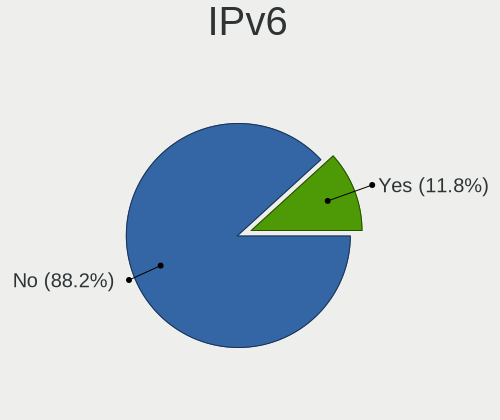

| Used | Notebooks | Percent |
|------|-----------|---------|
| No   | 295       | 92.19%  |
| Yes  | 25        | 7.81%   |

Bluetooth
---------

Bluetooth Vendor
----------------

Controller vendors

| Vendor                          | Notebooks | Percent |
|---------------------------------|-----------|---------|
| Intel                           | 95        | 37.55%  |
| Realtek Semiconductor           | 36        | 14.23%  |
| Qualcomm Atheros Communications | 24        | 9.49%   |
| Lite-On Technology              | 23        | 9.09%   |
| IMC Networks                    | 20        | 7.91%   |
| Broadcom                        | 18        | 7.11%   |
| Foxconn / Hon Hai               | 15        | 5.93%   |
| Apple                           | 6         | 2.37%   |
| Hewlett-Packard                 | 4         | 1.58%   |
| Toshiba                         | 3         | 1.19%   |
| Chicony Electronics             | 3         | 1.19%   |
| Cambridge Silicon Radio         | 3         | 1.19%   |
| Dell                            | 2         | 0.79%   |
| Ralink                          | 1         | 0.4%    |

Bluetooth Model
---------------

Controller models

| Model                                               | Notebooks | Percent |
|-----------------------------------------------------|-----------|---------|
| Intel Bluetooth wireless interface                  | 41        | 16.21%  |
| Realtek Bluetooth Radio                             | 22        | 8.7%    |
| Intel Bluetooth 9460/9560 Jefferson Peak (JfP)      | 18        | 7.11%   |
| Intel AX201 Bluetooth                               | 16        | 6.32%   |
| Qualcomm Atheros  Bluetooth Device                  | 10        | 3.95%   |
| Lite-On Qualcomm Atheros QCA9377 Bluetooth          | 10        | 3.95%   |
| IMC Networks Bluetooth Radio                        | 10        | 3.95%   |
| Intel Wireless-AC 3168 Bluetooth                    | 8         | 3.16%   |
| Qualcomm Atheros AR3011 Bluetooth                   | 7         | 2.77%   |
| IMC Networks Bluetooth Device                       | 7         | 2.77%   |
| Broadcom BCM20702 Bluetooth 4.0 [ThinkPad]          | 6         | 2.37%   |
| Realtek  Bluetooth 4.2 Adapter                      | 5         | 1.98%   |
| Lite-On Bluetooth Device                            | 5         | 1.98%   |
| Intel AX200 Bluetooth                               | 5         | 1.98%   |
| Realtek RTL8821A Bluetooth                          | 4         | 1.58%   |
| Foxconn / Hon Hai Bluetooth Device                  | 4         | 1.58%   |
| Broadcom BCM2045B (BDC-2.1)                         | 4         | 1.58%   |
| Realtek RTL8723B Bluetooth                          | 3         | 1.19%   |
| Qualcomm Atheros AR3012 Bluetooth 4.0               | 3         | 1.19%   |
| Lite-On Atheros AR3012 Bluetooth                    | 3         | 1.19%   |
| Intel Centrino Bluetooth Wireless Transceiver       | 3         | 1.19%   |
| Chicony Bluetooth (RTL8723BE)                       | 3         | 1.19%   |
| Cambridge Silicon Radio Bluetooth Dongle (HCI mode) | 3         | 1.19%   |
| Qualcomm Atheros QCA61x4 Bluetooth 4.0              | 2         | 0.79%   |
| Qualcomm Atheros AR9462 Bluetooth                   | 2         | 0.79%   |
| Lite-On Wireless_Device                             | 2         | 0.79%   |
| Lite-On BCM43142A0                                  | 2         | 0.79%   |
| Intel Bluetooth Device                              | 2         | 0.79%   |
| HP Bluetooth 2.0 Interface [Broadcom BCM2045]       | 2         | 0.79%   |
| Foxconn / Hon Hai Bluetooth USB Host Controller     | 2         | 0.79%   |
| Foxconn / Hon Hai BCM20702A0                        | 2         | 0.79%   |
| Foxconn / Hon Hai Acer Bluetooth module             | 2         | 0.79%   |
| Broadcom HP Portable Valentine                      | 2         | 0.79%   |
| Broadcom BCM2070 Bluetooth Device                   | 2         | 0.79%   |
| Apple Built-in Bluetooth 2.0+EDR HCI                | 2         | 0.79%   |
| Apple Bluetooth USB Host Controller                 | 2         | 0.79%   |
| Apple Bluetooth Host Controller                     | 2         | 0.79%   |
| Toshiba RT Bluetooth Radio                          | 1         | 0.4%    |
| Toshiba Integrated Bluetooth (Taiyo Yuden)          | 1         | 0.4%    |
| Toshiba Bluetooth USB Host Controller               | 1         | 0.4%    |

Sound
-----

Sound Vendor
------------

Sound card vendors

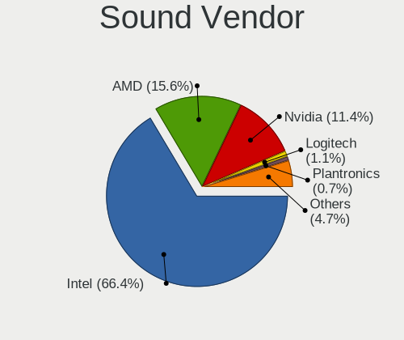

| Vendor                           | Notebooks | Percent |
|----------------------------------|-----------|---------|
| Intel                            | 252       | 69.42%  |
| AMD                              | 51        | 14.05%  |
| Nvidia                           | 39        | 10.74%  |
| Silicon Integrated Systems [SiS] | 3         | 0.83%   |
| Plantronics                      | 3         | 0.83%   |
| Logitech                         | 3         | 0.83%   |
| Realtek Semiconductor            | 2         | 0.55%   |
| JMTek                            | 2         | 0.55%   |
| USB MICROPHONE                   | 1         | 0.28%   |
| SteelSeries ApS                  | 1         | 0.28%   |
| OPPO Electronics                 | 1         | 0.28%   |
| Micronas                         | 1         | 0.28%   |
| Hewlett-Packard                  | 1         | 0.28%   |
| Generalplus Technology           | 1         | 0.28%   |
| Creative Technology              | 1         | 0.28%   |
| C-Media Electronics              | 1         | 0.28%   |

Sound Model
-----------

Sound card models

| Model                                                                                             | Notebooks | Percent |
|---------------------------------------------------------------------------------------------------|-----------|---------|
| Intel Sunrise Point-LP HD Audio                                                                   | 46        | 10.9%   |
| Intel 7 Series/C216 Chipset Family High Definition Audio Controller                               | 31        | 7.35%   |
| AMD Family 17h/19h HD Audio Controller                                                            | 29        | 6.87%   |
| Intel 6 Series/C200 Series Chipset Family High Definition Audio Controller                        | 18        | 4.27%   |
| Intel Celeron N3350/Pentium N4200/Atom E3900 Series Audio Cluster                                 | 16        | 3.79%   |
| Intel NM10/ICH7 Family High Definition Audio Controller                                           | 12        | 2.84%   |
| AMD Renoir Radeon High Definition Audio Controller                                                | 12        | 2.84%   |
| AMD Raven/Raven2/Fenghuang HDMI/DP Audio Controller                                               | 11        | 2.61%   |
| AMD FCH Azalia Controller                                                                         | 11        | 2.61%   |
| Intel Wildcat Point-LP High Definition Audio Controller                                           | 10        | 2.37%   |
| Intel Tiger Lake-LP Smart Sound Technology Audio Controller                                       | 10        | 2.37%   |
| Intel Broadwell-U Audio Controller                                                                | 10        | 2.37%   |
| Intel 5 Series/3400 Series Chipset High Definition Audio                                          | 10        | 2.37%   |
| Intel Cannon Point-LP High Definition Audio Controller                                            | 9         | 2.13%   |
| Intel Atom Processor Z36xxx/Z37xxx Series High Definition Audio Controller                        | 9         | 2.13%   |
| Intel 82801I (ICH9 Family) HD Audio Controller                                                    | 9         | 2.13%   |
| Intel Cannon Lake PCH cAVS                                                                        | 8         | 1.9%    |
| AMD Kabini HDMI/DP Audio                                                                          | 8         | 1.9%    |
| Intel Comet Lake PCH-LP cAVS                                                                      | 7         | 1.66%   |
| Intel Celeron/Pentium Silver Processor High Definition Audio                                      | 7         | 1.66%   |
| Intel Atom/Celeron/Pentium Processor x5-E8000/J3xxx/N3xxx Series High Definition Audio Controller | 7         | 1.66%   |
| Intel Haswell-ULT HD Audio Controller                                                             | 6         | 1.42%   |
| Intel Comet Lake PCH cAVS                                                                         | 6         | 1.42%   |
| Intel CM238 HD Audio Controller                                                                   | 6         | 1.42%   |
| Intel 8 Series/C220 Series Chipset High Definition Audio Controller                               | 6         | 1.42%   |
| Intel 8 Series HD Audio Controller                                                                | 6         | 1.42%   |
| Nvidia TU107 GeForce GTX 1650 High Definition Audio Controller                                    | 5         | 1.18%   |
| Nvidia TU106 High Definition Audio Controller                                                     | 5         | 1.18%   |
| Nvidia Audio device                                                                               | 5         | 1.18%   |
| Intel Xeon E3-1200 v3/4th Gen Core Processor HD Audio Controller                                  | 5         | 1.18%   |
| Intel Ice Lake-LP Smart Sound Technology Audio Controller                                         | 5         | 1.18%   |
| Intel Alder Lake PCH-P High Definition Audio Controller                                           | 5         | 1.18%   |
| Nvidia GP107GL High Definition Audio Controller                                                   | 4         | 0.95%   |
| Silicon Integrated Systems [SiS] Azalia Audio Controller                                          | 3         | 0.71%   |
| Nvidia TU116 High Definition Audio Controller                                                     | 3         | 0.71%   |
| Nvidia MCP79 High Definition Audio                                                                | 3         | 0.71%   |
| Nvidia GF108 High Definition Audio Controller                                                     | 3         | 0.71%   |
| Nvidia GA106 High Definition Audio Controller                                                     | 3         | 0.71%   |
| Intel Jasper Lake HD Audio                                                                        | 3         | 0.71%   |
| AMD SBx00 Azalia (Intel HDA)                                                                      | 3         | 0.71%   |

Memory
------

Memory Vendor
-------------

Memory module vendors

| Vendor              | Notebooks | Percent |
|---------------------|-----------|---------|
| Samsung Electronics | 49        | 24.62%  |
| SK hynix            | 42        | 21.11%  |
| Kingston            | 33        | 16.58%  |
| Micron Technology   | 21        | 10.55%  |
| Unknown             | 12        | 6.03%   |
| Ramaxel Technology  | 8         | 4.02%   |
| Crucial             | 8         | 4.02%   |
| Team                | 5         | 2.51%   |
| Unknown (ABCD)      | 4         | 2.01%   |
| Nanya Technology    | 4         | 2.01%   |
| Elpida              | 3         | 1.51%   |
| Transcend           | 2         | 1.01%   |
| Unknown (8A5D)      | 1         | 0.5%    |
| Qimonda             | 1         | 0.5%    |
| G.Skill             | 1         | 0.5%    |
| Avant               | 1         | 0.5%    |
| ASint Technology    | 1         | 0.5%    |
| Apacer              | 1         | 0.5%    |
| A-DATA Technology   | 1         | 0.5%    |
| Unknown             | 1         | 0.5%    |

Memory Model
------------

Memory module models

| Model                                                            | Notebooks | Percent |
|------------------------------------------------------------------|-----------|---------|
| SK hynix RAM HMA81GS6AFR8N-UH 8GB SODIMM DDR4 2667MT/s           | 6         | 2.84%   |
| SK hynix RAM HMA851S6CJR6N-VK 4GB SODIMM DDR4 2667MT/s           | 5         | 2.37%   |
| SK hynix RAM HMA81GS6DJR8N-XN 8GB SODIMM DDR4 3200MT/s           | 5         | 2.37%   |
| Samsung RAM M471A5244CB0-CRC 4GB SODIMM DDR4 2667MT/s            | 5         | 2.37%   |
| Unknown (ABCD) RAM 123456789012345678 2GB SODIMM LPDDR4 2400MT/s | 4         | 1.9%    |
| Ramaxel RAM RMSA3260ME78HAF-2666 8GB SODIMM DDR4 2667MT/s        | 4         | 1.9%    |
| Micron RAM 4ATF51264HZ-2G6E1 4GB SODIMM DDR4 2667MT/s            | 4         | 1.9%    |
| Kingston RAM 99U5428-018.A00LF 8GB SODIMM DDR3 1600MT/s          | 4         | 1.9%    |
| SK hynix RAM HMT41GS6AFR8A-PB 8GB SODIMM DDR3 1600MT/s           | 3         | 1.42%   |
| Samsung RAM M471B5273DH0-CH9 4GB SODIMM DDR3 1334MT/s            | 3         | 1.42%   |
| Samsung RAM M471A5244CB0-CWE 4GB SODIMM DDR4 3200MT/s            | 3         | 1.42%   |
| Samsung RAM M471A1G44AB0-CWE 8GB SODIMM DDR4 3200MT/s            | 3         | 1.42%   |
| Team RAM TEAMGROUP-SD4-2400 16GB SODIMM DDR4 8400MT/s            | 2         | 0.95%   |
| SK hynix RAM HMT451S6BFR8A-PB 4GB SODIMM DDR3 1600MT/s           | 2         | 0.95%   |
| SK hynix RAM HMT351S6CFR8C-PB 4GB SODIMM DDR3 1600MT/s           | 2         | 0.95%   |
| SK hynix RAM HMAA1GS6CMR6N-XN 8GB Row Of Chips DDR4 3200MT/s     | 2         | 0.95%   |
| SK hynix RAM HMA851S6AFR6N-UH 4GB SODIMM DDR4 2667MT/s           | 2         | 0.95%   |
| Samsung RAM Module 8192MB SODIMM DDR4 2667MT/s                   | 2         | 0.95%   |
| Samsung RAM M471B5674QH0-YK0 2GB SODIMM DDR3 1600MT/s            | 2         | 0.95%   |
| Samsung RAM M471B5273DH0-CK0 4GB SODIMM DDR3 1600MT/s            | 2         | 0.95%   |
| Samsung RAM M471B5173QH0-YK0 4GB SODIMM DDR3 1600MT/s            | 2         | 0.95%   |
| Samsung RAM M471B5173EB0-YK0 4GB SODIMM DDR3 1600MT/s            | 2         | 0.95%   |
| Samsung RAM M471B1G73QH0-YK0 8GB SODIMM DDR3 1867MT/s            | 2         | 0.95%   |
| Samsung RAM M471B1G73EB0-YK0 8GB SODIMM DDR3 1600MT/s            | 2         | 0.95%   |
| Samsung RAM M471A1K43EB1-CWE 8GB SODIMM DDR4 3200MT/s            | 2         | 0.95%   |
| Samsung RAM M471A1K43CB1-CRC 8GB SODIMM DDR4 2667MT/s            | 2         | 0.95%   |
| Micron RAM Module 4GB Row Of Chips LPDDR4 4267MT/s               | 2         | 0.95%   |
| Micron RAM 8ATF1G64HZ-3G2J1 8GB SODIMM DDR4 3200MT/s             | 2         | 0.95%   |
| Kingston RAM ACR16D3LS1KFG/4G 4GB SODIMM DDR3 1600MT/s           | 2         | 0.95%   |
| Kingston RAM 99U5428-101.A00LF 8GB SODIMM DDR3 1600MT/s          | 2         | 0.95%   |
| Kingston RAM 9905700-025.A00G 8GB SODIMM DDR4 2667MT/s           | 2         | 0.95%   |
| Elpida RAM EBJ40UG8BBU0-GN-F 4GB SODIMM DDR3 1600MT/s            | 2         | 0.95%   |
| Unknown RAM Module 4GB SODIMM DDR4 2133MT/s                      | 1         | 0.47%   |
| Unknown RAM Module 4GB SODIMM DDR3 1866MT/s                      | 1         | 0.47%   |
| Unknown RAM Module 4GB SODIMM DDR3 1333MT/s                      | 1         | 0.47%   |
| Unknown RAM Module 2GB SODIMM DDR3                               | 1         | 0.47%   |
| Unknown RAM Module 2GB SODIMM DDR2 667MT/s                       | 1         | 0.47%   |
| Unknown RAM Module 2048MB SODIMM DRAM 667MT/s                    | 1         | 0.47%   |
| Unknown RAM Module 2048MB SODIMM DDR3 1600MT/s                   | 1         | 0.47%   |
| Unknown RAM Module 2048MB SODIMM DDR3 1333MT/s                   | 1         | 0.47%   |

Memory Kind
-----------

Memory module kinds

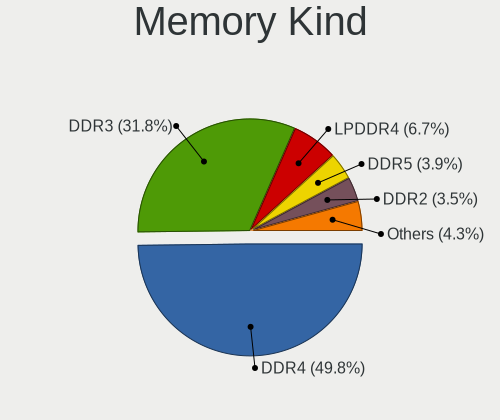

| Kind    | Notebooks | Percent |
|---------|-----------|---------|
| DDR4    | 78        | 49.06%  |
| DDR3    | 54        | 33.96%  |
| LPDDR4  | 10        | 6.29%   |
| DDR2    | 9         | 5.66%   |
| DDR5    | 2         | 1.26%   |
| Unknown | 2         | 1.26%   |
| SDRAM   | 1         | 0.63%   |
| LPDDR3  | 1         | 0.63%   |
| DRAM    | 1         | 0.63%   |
| DDR     | 1         | 0.63%   |

Memory Form Factor
------------------

Physical design of the memory module

| Name         | Notebooks | Percent |
|--------------|-----------|---------|
| SODIMM       | 147       | 94.23%  |
| Row Of Chips | 9         | 5.77%   |

Memory Size
-----------

Memory module size

| Size  | Notebooks | Percent |
|-------|-----------|---------|
| 8192  | 75        | 40.98%  |
| 4096  | 55        | 30.05%  |
| 2048  | 24        | 13.11%  |
| 16384 | 15        | 8.2%    |
| 1024  | 10        | 5.46%   |
| 32768 | 4         | 2.19%   |

Memory Speed
------------

Memory module speed

| Speed   | Notebooks | Percent |
|---------|-----------|---------|
| 1600    | 41        | 22.91%  |
| 2667    | 40        | 22.35%  |
| 3200    | 32        | 17.88%  |
| 2400    | 16        | 8.94%   |
| 667     | 10        | 5.59%   |
| 1334    | 9         | 5.03%   |
| 2133    | 6         | 3.35%   |
| 1333    | 5         | 2.79%   |
| 8400    | 2         | 1.12%   |
| 4800    | 2         | 1.12%   |
| 4267    | 2         | 1.12%   |
| 1067    | 2         | 1.12%   |
| 1066    | 2         | 1.12%   |
| 4266    | 1         | 0.56%   |
| 3733    | 1         | 0.56%   |
| 3266    | 1         | 0.56%   |
| 2048    | 1         | 0.56%   |
| 1866    | 1         | 0.56%   |
| 1777    | 1         | 0.56%   |
| 800     | 1         | 0.56%   |
| 533     | 1         | 0.56%   |
| 400     | 1         | 0.56%   |
| Unknown | 1         | 0.56%   |

Printers & scanners
-------------------

Printer Vendor
--------------

Printer device vendors

| Vendor             | Notebooks | Percent |
|--------------------|-----------|---------|
| Brother Industries | 2         | 50%     |
| Seiko Epson        | 1         | 25%     |
| Unknown            | 1         | 25%     |

Printer Model
-------------

Printer device models

| Model                   | Notebooks | Percent |
|-------------------------|-----------|---------|
| Seiko Epson L220 Series | 1         | 25%     |
| Brother DCP-T710W       | 1         | 25%     |
| Brother DCP-T310        | 1         | 25%     |
| Unknown                 | 1         | 25%     |

Scanner Vendor
--------------

Scanner device vendors

| Vendor | Notebooks | Percent |
|--------|-----------|---------|
| Canon  | 1         | 100%    |

Scanner Model
-------------

Scanner device models

| Model                   | Notebooks | Percent |
|-------------------------|-----------|---------|
| Canon CanoScan LiDE 110 | 1         | 100%    |

Camera
------

Camera Vendor
-------------

Camera device vendors

| Vendor                                 | Notebooks | Percent |
|----------------------------------------|-----------|---------|
| Chicony Electronics                    | 73        | 26.35%  |
| Realtek Semiconductor                  | 27        | 9.75%   |
| IMC Networks                           | 25        | 9.03%   |
| Quanta                                 | 23        | 8.3%    |
| Microdia                               | 16        | 5.78%   |
| Bison Electronics                      | 14        | 5.05%   |
| Sunplus Innovation Technology          | 12        | 4.33%   |
| Cheng Uei Precision Industry (Foxlink) | 12        | 4.33%   |
| Lite-On Technology                     | 11        | 3.97%   |
| Syntek                                 | 7         | 2.53%   |
| Suyin                                  | 7         | 2.53%   |
| Apple                                  | 7         | 2.53%   |
| Luxvisions Innotech Limited            | 6         | 2.17%   |
| Silicon Motion                         | 5         | 1.81%   |
| Acer                                   | 5         | 1.81%   |
| Alcor Micro                            | 4         | 1.44%   |
| ALi                                    | 3         | 1.08%   |
| Samsung Electronics                    | 2         | 0.72%   |
| OmniVision Technologies                | 2         | 0.72%   |
| Importek                               | 2         | 0.72%   |
| icSpring                               | 2         | 0.72%   |
| Z-Star Microelectronics                | 1         | 0.36%   |
| Y Media                                | 1         | 0.36%   |
| vivo                                   | 1         | 0.36%   |
| SunplusIT                              | 1         | 0.36%   |
| Ricoh                                  | 1         | 0.36%   |
| OPPO Electronics                       | 1         | 0.36%   |
| Logitech                               | 1         | 0.36%   |
| Lenovo                                 | 1         | 0.36%   |
| Goertek Electronics                    | 1         | 0.36%   |
| GEMBIRD                                | 1         | 0.36%   |
| DigiTech                               | 1         | 0.36%   |
| Alpha Imaging Technology               | 1         | 0.36%   |

Camera Model
------------

Camera device models

| Model                                                           | Notebooks | Percent |
|-----------------------------------------------------------------|-----------|---------|
| Chicony Integrated Camera                                       | 18        | 6.5%    |
| Chicony HD WebCam                                               | 16        | 5.78%   |
| Quanta VGA WebCam                                               | 9         | 3.25%   |
| IMC Networks USB2.0 VGA UVC WebCam                              | 9         | 3.25%   |
| Realtek Acer 640 x 480 laptop camera                            | 7         | 2.53%   |
| Microdia Integrated_Webcam_HD                                   | 7         | 2.53%   |
| Realtek Integrated_Webcam_HD                                    | 6         | 2.17%   |
| IMC Networks USB2.0 HD UVC WebCam                               | 6         | 2.17%   |
| Chicony VGA Webcam                                              | 5         | 1.81%   |
| Realtek Integrated Webcam                                       | 4         | 1.44%   |
| Quanta ACER HD User Facing                                      | 4         | 1.44%   |
| Lite-On Integrated Camera                                       | 4         | 1.44%   |
| Cheng Uei Precision Industry (Foxlink) HP Wide Vision HD Camera | 4         | 1.44%   |
| Syntek Lenovo EasyCamera                                        | 3         | 1.08%   |
| Realtek USB2.0 VGA UVC WebCam                                   | 3         | 1.08%   |
| Quanta HD User Facing                                           | 3         | 1.08%   |
| Luxvisions Innotech Limited HP TrueVision HD Camera             | 3         | 1.08%   |
| IMC Networks Integrated Camera                                  | 3         | 1.08%   |
| IMC Networks EasyCamera                                         | 3         | 1.08%   |
| Chicony Lenovo EasyCamera                                       | 3         | 1.08%   |
| Chicony Integrated Camera [ThinkPad]                            | 3         | 1.08%   |
| Chicony HP Truevision HD                                        | 3         | 1.08%   |
| Bison ThinkPad Integrated Camera                                | 3         | 1.08%   |
| Bison EasyCamera                                                | 3         | 1.08%   |
| Apple Built-in iSight                                           | 3         | 1.08%   |
| ALi WebCam                                                      | 3         | 1.08%   |
| Acer Integrated Camera                                          | 3         | 1.08%   |
| Syntek Integrated Camera                                        | 2         | 0.72%   |
| Syntek EasyCamera                                               | 2         | 0.72%   |
| Suyin HP Webcam                                                 | 2         | 0.72%   |
| Sunplus Laptop Integrated WebCam HD                             | 2         | 0.72%   |
| Sunplus Integrated_Webcam_HD                                    | 2         | 0.72%   |
| Sunplus Integrated Webcam                                       | 2         | 0.72%   |
| Sunplus HP Truevision HD                                        | 2         | 0.72%   |
| Sunplus HD WebCam                                               | 2         | 0.72%   |
| Samsung Galaxy series, misc. (MTP mode)                         | 2         | 0.72%   |
| Quanta HP TrueVision HD Camera                                  | 2         | 0.72%   |
| Quanta HP HD Camera                                             | 2         | 0.72%   |
| OmniVision OV2640 Webcam                                        | 2         | 0.72%   |
| Luxvisions Innotech Limited Integrated Camera                   | 2         | 0.72%   |

Security
--------

Fingerprint Vendor
------------------

Fingerprint sensor vendors

| Vendor                     | Notebooks | Percent |
|----------------------------|-----------|---------|
| Validity Sensors           | 11        | 29.73%  |
| Shenzhen Goodix Technology | 8         | 21.62%  |
| Synaptics                  | 6         | 16.22%  |
| LighTuning Technology      | 4         | 10.81%  |
| Upek                       | 3         | 8.11%   |
| Elan Microelectronics      | 3         | 8.11%   |
| AuthenTec                  | 2         | 5.41%   |

Fingerprint Model
-----------------

Fingerprint sensor models

| Model                                                      | Notebooks | Percent |
|------------------------------------------------------------|-----------|---------|
| Shenzhen Goodix  FingerPrint Device                        | 6         | 16.22%  |
| Upek Biometric Touchchip/Touchstrip Fingerprint Sensor     | 3         | 8.11%   |
| LighTuning EgisTec Touch Fingerprint Sensor                | 3         | 8.11%   |
| Validity Sensors VFS495 Fingerprint Reader                 | 2         | 5.41%   |
| Validity Sensors VFS471 Fingerprint Reader                 | 2         | 5.41%   |
| Validity Sensors VFS 5011 fingerprint sensor               | 2         | 5.41%   |
| Synaptics  VFS7552 Touch Fingerprint Sensor with PurePrint | 2         | 5.41%   |
| Elan ELAN:Fingerprint                                      | 2         | 5.41%   |
| Validity Sensors VFS7500 Touch Fingerprint Sensor          | 1         | 2.7%    |
| Validity Sensors VFS300 Fingerprint Reader                 | 1         | 2.7%    |
| Validity Sensors VFS101 Fingerprint Reader                 | 1         | 2.7%    |
| Validity Sensors VFS Fingerprint sensor                    | 1         | 2.7%    |
| Validity Sensors Synaptics WBDI                            | 1         | 2.7%    |
| Synaptics  FS7604 Touch Fingerprint Sensor with PurePrint  | 1         | 2.7%    |
| Synaptics Prometheus MIS Touch Fingerprint Reader          | 1         | 2.7%    |
| Synaptics Metallica MOH Touch Fingerprint Reader           | 1         | 2.7%    |
| Synaptics Metallica MIS Touch Fingerprint Reader           | 1         | 2.7%    |
| Shenzhen Goodix Fingerprint Reader                         | 1         | 2.7%    |
| Shenzhen Goodix FingerPrint                                | 1         | 2.7%    |
| LighTuning ES603 Swipe Fingerprint Sensor                  | 1         | 2.7%    |
| Elan ELAN:ARM-M4                                           | 1         | 2.7%    |
| AuthenTec Fingerprint Sensor                               | 1         | 2.7%    |
| AuthenTec AES1600                                          | 1         | 2.7%    |

Chipcard Vendor
---------------

Chipcard module vendors

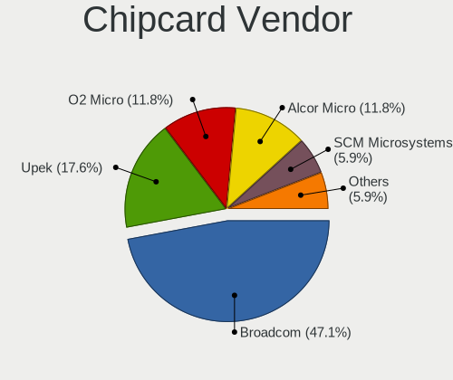

| Vendor           | Notebooks | Percent |
|------------------|-----------|---------|
| Broadcom         | 5         | 41.67%  |
| Upek             | 3         | 25%     |
| O2 Micro         | 2         | 16.67%  |
| SCM Microsystems | 1         | 8.33%   |
| Alcor Micro      | 1         | 8.33%   |

Chipcard Model
--------------

Chipcard module models

| Model                                                                        | Notebooks | Percent |
|------------------------------------------------------------------------------|-----------|---------|
| Upek TouchChip Fingerprint Coprocessor (WBF advanced mode)                   | 3         | 25%     |
| Broadcom BCM5880 Secure Applications Processor with fingerprint swipe sensor | 3         | 25%     |
| Broadcom 5880                                                                | 2         | 16.67%  |
| SCM Microsystems SCR3340 - ExpressCard54 Smart Card Reader                   | 1         | 8.33%   |
| O2 Micro Oz776 SmartCard Reader                                              | 1         | 8.33%   |
| O2 Micro OZ776 CCID Smartcard Reader                                         | 1         | 8.33%   |
| Alcor Micro AU9540 Smartcard Reader                                          | 1         | 8.33%   |

Unsupported
-----------

Unsupported Devices
-------------------

Total unsupported devices on board

| Total | Notebooks | Percent |
|-------|-----------|---------|
| 0     | 234       | 71.56%  |
| 1     | 78        | 23.85%  |
| 2     | 14        | 4.28%   |
| 3     | 1         | 0.31%   |

Unsupported Device Types
------------------------

Types of unsupported devices

| Type                     | Notebooks | Percent |
|--------------------------|-----------|---------|
| Fingerprint reader       | 36        | 33.96%  |
| Graphics card            | 25        | 23.58%  |
| Chipcard                 | 12        | 11.32%  |
| Net/wireless             | 11        | 10.38%  |
| Camera                   | 8         | 7.55%   |
| Multimedia controller    | 6         | 5.66%   |
| Net/ethernet             | 3         | 2.83%   |
| Storage                  | 1         | 0.94%   |
| Sound                    | 1         | 0.94%   |
| Modem                    | 1         | 0.94%   |
| Communication controller | 1         | 0.94%   |
| Bluetooth                | 1         | 0.94%   |

