Linux in Poland - Tested Hardware & Statistics
----------------------------------------------

A project to collect tested hardware configurations for Linux in Poland.

Anyone can contribute to this report by the [hw-probe](https://github.com/linuxhw/hw-probe) tool:

    sudo -E hw-probe -all -upload

Please contribute! Especially if your hardware is rare.

This is a report for all computer types. See also reports for [desktops](/Location/Poland/Desktop/README.md) and [notebooks](/Location/Poland/Notebook/README.md).

Contents
--------

* [ Test Cases ](#test-cases)

* [ System ](#system)
  - [ OS                       ](#os)
  - [ OS Family                ](#os-family)
  - [ Kernel                   ](#kernel)
  - [ Kernel Family            ](#kernel-family)
  - [ Kernel Major Ver.        ](#kernel-major-ver)
  - [ Arch                     ](#arch)
  - [ DE                       ](#de)
  - [ Display Server           ](#display-server)
  - [ Display Manager          ](#display-manager)
  - [ OS Lang                  ](#os-lang)
  - [ Boot Mode                ](#boot-mode)
  - [ Filesystem               ](#filesystem)
  - [ Part. scheme             ](#part-scheme)
  - [ Dual Boot with Linux/BSD ](#dual-boot-with-linuxbsd)
  - [ Dual Boot (Win)          ](#dual-boot-win)

* [ Board ](#board)
  - [ Vendor                   ](#vendor)
  - [ Model                    ](#model)
  - [ Model Family             ](#model-family)
  - [ MFG Year                 ](#mfg-year)
  - [ Form Factor              ](#form-factor)
  - [ Secure Boot              ](#secure-boot)
  - [ Coreboot                 ](#coreboot)
  - [ RAM Size                 ](#ram-size)
  - [ RAM Used                 ](#ram-used)
  - [ Total Drives             ](#total-drives)
  - [ Has CD-ROM               ](#has-cd-rom)
  - [ Has Ethernet             ](#has-ethernet)
  - [ Has WiFi                 ](#has-wifi)
  - [ Has Bluetooth            ](#has-bluetooth)

* [ Location ](#location)
  - [ Country                  ](#country)
  - [ City                     ](#city)

* [ Drives ](#drives)
  - [ Drive Vendor             ](#drive-vendor)
  - [ Drive Model              ](#drive-model)
  - [ HDD Vendor               ](#hdd-vendor)
  - [ SSD Vendor               ](#ssd-vendor)
  - [ Drive Kind               ](#drive-kind)
  - [ Drive Connector          ](#drive-connector)
  - [ Drive Size               ](#drive-size)
  - [ Space Total              ](#space-total)
  - [ Space Used               ](#space-used)
  - [ Malfunc. Drives          ](#malfunc-drives)
  - [ Malfunc. Drive Vendor    ](#malfunc-drive-vendor)
  - [ Malfunc. HDD Vendor      ](#malfunc-hdd-vendor)
  - [ Malfunc. Drive Kind      ](#malfunc-drive-kind)
  - [ Failed Drives            ](#failed-drives)
  - [ Failed Drive Vendor      ](#failed-drive-vendor)
  - [ Drive Status             ](#drive-status)

* [ Storage controller ](#storage-controller)
  - [ Storage Vendor           ](#storage-vendor)
  - [ Storage Model            ](#storage-model)
  - [ Storage Kind             ](#storage-kind)

* [ Processor ](#processor)
  - [ CPU Vendor               ](#cpu-vendor)
  - [ CPU Model                ](#cpu-model)
  - [ CPU Model Family         ](#cpu-model-family)
  - [ CPU Cores                ](#cpu-cores)
  - [ CPU Sockets              ](#cpu-sockets)
  - [ CPU Threads              ](#cpu-threads)
  - [ CPU Op-Modes             ](#cpu-op-modes)
  - [ CPU Microcode            ](#cpu-microcode)
  - [ CPU Microarch            ](#cpu-microarch)

* [ Graphics ](#graphics)
  - [ GPU Vendor               ](#gpu-vendor)
  - [ GPU Model                ](#gpu-model)
  - [ GPU Combo                ](#gpu-combo)
  - [ GPU Driver               ](#gpu-driver)
  - [ GPU Memory               ](#gpu-memory)

* [ Monitor ](#monitor)
  - [ Monitor Vendor           ](#monitor-vendor)
  - [ Monitor Model            ](#monitor-model)
  - [ Monitor Resolution       ](#monitor-resolution)
  - [ Monitor Diagonal         ](#monitor-diagonal)
  - [ Monitor Width            ](#monitor-width)
  - [ Aspect Ratio             ](#aspect-ratio)
  - [ Monitor Area             ](#monitor-area)
  - [ Pixel Density            ](#pixel-density)
  - [ Multiple Monitors        ](#multiple-monitors)

* [ Network ](#network)
  - [ Net Controller Vendor    ](#net-controller-vendor)
  - [ Net Controller Model     ](#net-controller-model)
  - [ Wireless Vendor          ](#wireless-vendor)
  - [ Wireless Model           ](#wireless-model)
  - [ Ethernet Vendor          ](#ethernet-vendor)
  - [ Ethernet Model           ](#ethernet-model)
  - [ Net Controller Kind      ](#net-controller-kind)
  - [ Used Controller          ](#used-controller)
  - [ NICs                     ](#nics)
  - [ IPv6                     ](#ipv6)

* [ Bluetooth ](#bluetooth)
  - [ Bluetooth Vendor         ](#bluetooth-vendor)
  - [ Bluetooth Model          ](#bluetooth-model)

* [ Sound ](#sound)
  - [ Sound Vendor             ](#sound-vendor)
  - [ Sound Model              ](#sound-model)

* [ Memory ](#memory)
  - [ Memory Vendor            ](#memory-vendor)
  - [ Memory Model             ](#memory-model)
  - [ Memory Kind              ](#memory-kind)
  - [ Memory Form Factor       ](#memory-form-factor)
  - [ Memory Size              ](#memory-size)
  - [ Memory Speed             ](#memory-speed)

* [ Printers & scanners ](#printers--scanners)
  - [ Printer Vendor           ](#printer-vendor)
  - [ Printer Model            ](#printer-model)
  - [ Scanner Vendor           ](#scanner-vendor)
  - [ Scanner Model            ](#scanner-model)

* [ Camera ](#camera)
  - [ Camera Vendor            ](#camera-vendor)
  - [ Camera Model             ](#camera-model)

* [ Security ](#security)
  - [ Fingerprint Vendor       ](#fingerprint-vendor)
  - [ Fingerprint Model        ](#fingerprint-model)
  - [ Chipcard Vendor          ](#chipcard-vendor)
  - [ Chipcard Model           ](#chipcard-model)

* [ Unsupported ](#unsupported)
  - [ Unsupported Devices      ](#unsupported-devices)
  - [ Unsupported Device Types ](#unsupported-device-types)

Test Cases
----------

Total: 13383

| Vendor        | Model                       | Form-Factor | Probe                                                      | Date         |
|---------------|-----------------------------|-------------|------------------------------------------------------------|--------------|
| ASUSTek       | P8H61-M LX2 R2.0            | Desktop     | [35c31243ba](https://linux-hardware.org/?probe=35c31243ba) | Jan 03, 2026 |
| HP            | ProBook 6560b               | Notebook    | [182da91655](https://linux-hardware.org/?probe=182da91655) | Jan 03, 2026 |
| Dell          | Latitude 7290               | Notebook    | [93064c141c](https://linux-hardware.org/?probe=93064c141c) | Jan 03, 2026 |
| Lenovo        | IdeaPad 330-15ICH 81FK      | Notebook    | [fc5a9da8b8](https://linux-hardware.org/?probe=fc5a9da8b8) | Jan 03, 2026 |
| ASUSTek       | PRIME A520M-K               | Desktop     | [deb4335db0](https://linux-hardware.org/?probe=deb4335db0) | Jan 03, 2026 |
| HP            | EliteBook 840 G1            | Notebook    | [1173175078](https://linux-hardware.org/?probe=1173175078) | Jan 02, 2026 |
| Lenovo        | ThinkPad T470s W10DG 20J... | Notebook    | [e49b6b210a](https://linux-hardware.org/?probe=e49b6b210a) | Jan 02, 2026 |
| Dell          | Latitude E5270              | Notebook    | [4532601d57](https://linux-hardware.org/?probe=4532601d57) | Jan 02, 2026 |
| ASUSTek       | PRIME B450-PLUS             | Desktop     | [9e5aaa25a9](https://linux-hardware.org/?probe=9e5aaa25a9) | Jan 02, 2026 |
| Lenovo        | ThinkPad X390 20Q0003PAD    | Notebook    | [62ff220533](https://linux-hardware.org/?probe=62ff220533) | Jan 02, 2026 |
| Lenovo        | ThinkPad P14s Gen 5 21G2... | Notebook    | [8102117176](https://linux-hardware.org/?probe=8102117176) | Jan 01, 2026 |
| Lenovo        | ThinkPad X240 20AL007SMD    | Notebook    | [030248ee6c](https://linux-hardware.org/?probe=030248ee6c) | Jan 01, 2026 |
| Acer          | Swift SF514-55T             | Notebook    | [718dd3b34e](https://linux-hardware.org/?probe=718dd3b34e) | Jan 01, 2026 |
| ASUSTek       | TUF Gaming B550-PLUS        | Desktop     | [9928cdd762](https://linux-hardware.org/?probe=9928cdd762) | Jan 01, 2026 |
| HP            | ZBook Fury 15.6 inch G8 ... | Notebook    | [f9759f5163](https://linux-hardware.org/?probe=f9759f5163) | Jan 01, 2026 |
| ASRock        | A520M-ITX/ac                | Desktop     | [b7161dd32f](https://linux-hardware.org/?probe=b7161dd32f) | Jan 01, 2026 |
| Dell          | Precision 5510              | Notebook    | [37d95f4cf9](https://linux-hardware.org/?probe=37d95f4cf9) | Dec 31, 2025 |
| MSI           | B85I GAMING                 | Desktop     | [e3bd83c88d](https://linux-hardware.org/?probe=e3bd83c88d) | Dec 31, 2025 |
| HP            | ZBook 14u G6                | Notebook    | [323b0f55d3](https://linux-hardware.org/?probe=323b0f55d3) | Dec 31, 2025 |
| Lenovo        | ThinkCentre M71e 3167C67    | Desktop     | [d86edd036e](https://linux-hardware.org/?probe=d86edd036e) | Dec 31, 2025 |
| ASUSTek       | X540LA                      | Notebook    | [6576bc364e](https://linux-hardware.org/?probe=6576bc364e) | Dec 31, 2025 |
| ASRock        | B550M Steel Legend          | Desktop     | [2167f91228](https://linux-hardware.org/?probe=2167f91228) | Dec 31, 2025 |
| Medion        | Akoya E7226T                | Notebook    | [830f6de180](https://linux-hardware.org/?probe=830f6de180) | Dec 31, 2025 |
| HUAWEI        | HVY-WXX9                    | Notebook    | [d74dabcc34](https://linux-hardware.org/?probe=d74dabcc34) | Dec 31, 2025 |
| Dell          | Precision 5510              | Notebook    | [f68de6114e](https://linux-hardware.org/?probe=f68de6114e) | Dec 31, 2025 |
| Samsung       | 300E5EV/300E4EV/270E5EV/... | Notebook    | [cf1a1daf4f](https://linux-hardware.org/?probe=cf1a1daf4f) | Dec 30, 2025 |
| Google        | Rull                        | Notebook    | [ca6535686c](https://linux-hardware.org/?probe=ca6535686c) | Dec 30, 2025 |
| Lenovo        | ThinkBook 13s-IWL 20R9      | Notebook    | [39a33c6ef3](https://linux-hardware.org/?probe=39a33c6ef3) | Dec 30, 2025 |
| HP            | EliteBook 745 G6            | Notebook    | [40ba7ff505](https://linux-hardware.org/?probe=40ba7ff505) | Dec 30, 2025 |
| Dell          | Vostro 5490                 | Notebook    | [bfd9866176](https://linux-hardware.org/?probe=bfd9866176) | Dec 30, 2025 |
| ASUSTek       | PRIME B450-PLUS             | Desktop     | [bcb86df684](https://linux-hardware.org/?probe=bcb86df684) | Dec 30, 2025 |
| ASUSTek       | M3A78-CM                    | Desktop     | [75925c45c0](https://linux-hardware.org/?probe=75925c45c0) | Dec 30, 2025 |
| Dell          | Latitude 7300               | Notebook    | [8eb0ef61c9](https://linux-hardware.org/?probe=8eb0ef61c9) | Dec 30, 2025 |
| Gigabyte      | B650 GAMING X AX V2         | Desktop     | [a6eb7857ce](https://linux-hardware.org/?probe=a6eb7857ce) | Dec 30, 2025 |
| ASRock        | B650M Pro RS WiFi           | Desktop     | [2fed8b928f](https://linux-hardware.org/?probe=2fed8b928f) | Dec 30, 2025 |
| MSI           | PRO X870-P WIFI             | Desktop     | [48d8b71bd2](https://linux-hardware.org/?probe=48d8b71bd2) | Dec 30, 2025 |
| ASUSTek       | ProArt Z690-CREATOR WIFI    | Desktop     | [b5f7dc8a80](https://linux-hardware.org/?probe=b5f7dc8a80) | Dec 29, 2025 |
| ASUSTek       | P6X58D-E                    | Desktop     | [4c38693371](https://linux-hardware.org/?probe=4c38693371) | Dec 29, 2025 |
| LG Electro... | 16Z90R-G.AAM7U1             | Notebook    | [2c08f951e0](https://linux-hardware.org/?probe=2c08f951e0) | Dec 29, 2025 |
| HP            | ProBook 6470b               | Notebook    | [4839d051af](https://linux-hardware.org/?probe=4839d051af) | Dec 29, 2025 |
| Gigabyte      | A520 AORUS ELITE            | Desktop     | [6379bcbea1](https://linux-hardware.org/?probe=6379bcbea1) | Dec 29, 2025 |
| Gigabyte      | F2A88XM-DS2                 | Desktop     | [e7fc8b3f1b](https://linux-hardware.org/?probe=e7fc8b3f1b) | Dec 28, 2025 |
| Dell          | Latitude 3180               | Notebook    | [986eb540c8](https://linux-hardware.org/?probe=986eb540c8) | Dec 28, 2025 |
| Dell          | XPS 12-9Q33                 | Notebook    | [4447a96c3b](https://linux-hardware.org/?probe=4447a96c3b) | Dec 28, 2025 |
| Valve         | Jupiter                     | Notebook    | [2097cefe26](https://linux-hardware.org/?probe=2097cefe26) | Dec 28, 2025 |
| MSI           | B550-A PRO                  | Desktop     | [1c4fb988c8](https://linux-hardware.org/?probe=1c4fb988c8) | Dec 28, 2025 |
| Acer          | Aspire V5-571P              | Notebook    | [c4da0e7f4d](https://linux-hardware.org/?probe=c4da0e7f4d) | Dec 28, 2025 |
| Google        | Candy                       | Notebook    | [5b672f4153](https://linux-hardware.org/?probe=5b672f4153) | Dec 28, 2025 |
| HP            | OmniBook Ultra Laptop 14... | Notebook    | [3386fa1804](https://linux-hardware.org/?probe=3386fa1804) | Dec 28, 2025 |
| Lenovo        | 3000 N200 0769BAG           | Notebook    | [d23f436c41](https://linux-hardware.org/?probe=d23f436c41) | Dec 28, 2025 |
| Gigabyte      | AB350-Gaming-CF             | Desktop     | [9bd6063c3f](https://linux-hardware.org/?probe=9bd6063c3f) | Dec 28, 2025 |
| Gigabyte      | X870E AORUS PRO X3D ICE     | Desktop     | [8f08028a70](https://linux-hardware.org/?probe=8f08028a70) | Dec 28, 2025 |
| Lenovo        | 3000 N200 0769BAG           | Notebook    | [4edd8a9b0e](https://linux-hardware.org/?probe=4edd8a9b0e) | Dec 27, 2025 |
| Gigabyte      | Z68AP-D3                    | Desktop     | [ae23d81823](https://linux-hardware.org/?probe=ae23d81823) | Dec 27, 2025 |
| Lenovo        | Legion Pro 5 16ADR10 83L... | Notebook    | [c91ec0ec93](https://linux-hardware.org/?probe=c91ec0ec93) | Dec 27, 2025 |
| Lenovo        | Legion Pro 5 16ADR10 83L... | Notebook    | [ca712e345f](https://linux-hardware.org/?probe=ca712e345f) | Dec 27, 2025 |
| ASUSTek       | VivoBook_ASUSLaptop M150... | Notebook    | [f34b648d6d](https://linux-hardware.org/?probe=f34b648d6d) | Dec 27, 2025 |
| HP            | EliteBook 8770w             | Notebook    | [094feb9314](https://linux-hardware.org/?probe=094feb9314) | Dec 27, 2025 |
| Shenzhen M... | F8BSC                       | Mini pc     | [33c8c7ade8](https://linux-hardware.org/?probe=33c8c7ade8) | Dec 27, 2025 |
| Lenovo        | ThinkPad A285 20MXS0JR14    | Notebook    | [c8054a1200](https://linux-hardware.org/?probe=c8054a1200) | Dec 27, 2025 |
| Gigabyte      | B650 EAGLE AX               | Desktop     | [654c5abfd3](https://linux-hardware.org/?probe=654c5abfd3) | Dec 27, 2025 |
| HP            | 3047h                       | Desktop     | [3e9b77ce9c](https://linux-hardware.org/?probe=3e9b77ce9c) | Dec 27, 2025 |
| Lenovo        | Legion Pro 7 16ARX8H 82W... | Notebook    | [478cbffa75](https://linux-hardware.org/?probe=478cbffa75) | Dec 26, 2025 |
| Lenovo        | IdeaPad Y530                | Notebook    | [8e0fc9bb28](https://linux-hardware.org/?probe=8e0fc9bb28) | Dec 26, 2025 |
| Lenovo        | IdeaPad Y530                | Notebook    | [3ae5811f0b](https://linux-hardware.org/?probe=3ae5811f0b) | Dec 26, 2025 |
| Dell          | 0X8DXD A00                  | Desktop     | [1b22977f5f](https://linux-hardware.org/?probe=1b22977f5f) | Dec 26, 2025 |
| Dell          | Latitude 5330               | Notebook    | [31ec455c5d](https://linux-hardware.org/?probe=31ec455c5d) | Dec 26, 2025 |
| ASUSTek       | ASUS Zenbook 14 UX3405MA... | Notebook    | [769fab7934](https://linux-hardware.org/?probe=769fab7934) | Dec 25, 2025 |
| HP            | ProBook x360 440 G1         | Convertible | [8600428374](https://linux-hardware.org/?probe=8600428374) | Dec 25, 2025 |
| Fujitsu       | LIFEBOOK P772               | Notebook    | [142d548293](https://linux-hardware.org/?probe=142d548293) | Dec 25, 2025 |
| MSI           | PRO B650M-P                 | Desktop     | [2d99fb1ade](https://linux-hardware.org/?probe=2d99fb1ade) | Dec 25, 2025 |
| Dell          | Latitude 5330               | Notebook    | [2474bba60a](https://linux-hardware.org/?probe=2474bba60a) | Dec 24, 2025 |
| Lenovo        | G50-70 20351                | Notebook    | [315527b2ed](https://linux-hardware.org/?probe=315527b2ed) | Dec 24, 2025 |
| Medion        | Akoya E7226T                | Notebook    | [4067cc65a0](https://linux-hardware.org/?probe=4067cc65a0) | Dec 24, 2025 |
| Samsung       | 350V5C/351V5C/3540VC/344... | Notebook    | [193b308eb5](https://linux-hardware.org/?probe=193b308eb5) | Dec 24, 2025 |
| HP            | ProBook 460 16 inch G11 ... | Notebook    | [2e6e830e0a](https://linux-hardware.org/?probe=2e6e830e0a) | Dec 24, 2025 |
| Lenovo        | ThinkPad T490 20N3S88305    | Notebook    | [5f0863aba0](https://linux-hardware.org/?probe=5f0863aba0) | Dec 23, 2025 |
| Chuwi         | FreeBook                    | Notebook    | [96adaeddb8](https://linux-hardware.org/?probe=96adaeddb8) | Dec 23, 2025 |
| HUAWEI        | VGHH-XX                     | Notebook    | [15dba5dcc3](https://linux-hardware.org/?probe=15dba5dcc3) | Dec 23, 2025 |
| Lenovo        | LOQ 15IAX9 83GS             | Notebook    | [1530fef382](https://linux-hardware.org/?probe=1530fef382) | Dec 23, 2025 |
| HP            | 339A                        | Desktop     | [85b52b2255](https://linux-hardware.org/?probe=85b52b2255) | Dec 23, 2025 |
| Apple         | Mac-77EB7D7DAF985301 iMa... | All in one  | [ccc3e59b14](https://linux-hardware.org/?probe=ccc3e59b14) | Dec 22, 2025 |
| HP            | 871A                        | Mini pc     | [d7c3f02ed4](https://linux-hardware.org/?probe=d7c3f02ed4) | Dec 22, 2025 |
| Gigabyte      | GA-M56S-S3                  | Desktop     | [60669aabfa](https://linux-hardware.org/?probe=60669aabfa) | Dec 22, 2025 |
| ASUSTek       | VivoBook_ASUSLaptop X515... | Notebook    | [bfe61e1f6a](https://linux-hardware.org/?probe=bfe61e1f6a) | Dec 21, 2025 |
| Dell          | 0HHV7N A00                  | Desktop     | [e23b323c3c](https://linux-hardware.org/?probe=e23b323c3c) | Dec 21, 2025 |
| Lenovo        | G500 20236                  | Notebook    | [246fb0f209](https://linux-hardware.org/?probe=246fb0f209) | Dec 21, 2025 |
| MSI           | MEG Z490 UNIFY              | Desktop     | [231bcc1089](https://linux-hardware.org/?probe=231bcc1089) | Dec 21, 2025 |
| HUAWEI        | FLMH-XX                     | Notebook    | [685d24bad3](https://linux-hardware.org/?probe=685d24bad3) | Dec 21, 2025 |
| ASUSTek       | PRIME Z370-A                | Desktop     | [7d2c644589](https://linux-hardware.org/?probe=7d2c644589) | Dec 21, 2025 |
| Unknown       | Unknown                     | Desktop     | [55009de48b](https://linux-hardware.org/?probe=55009de48b) | Dec 21, 2025 |
| Fujitsu Si... | D2598-A1 S26361-D2598-A1    | Desktop     | [7154f5e1d1](https://linux-hardware.org/?probe=7154f5e1d1) | Dec 21, 2025 |
| Lenovo        | Yoga 9 2-in-1 14ILL10 83... | Convertible | [f6cbb765d2](https://linux-hardware.org/?probe=f6cbb765d2) | Dec 21, 2025 |
| MSI           | MEG Z490 UNIFY              | Desktop     | [eed2877cda](https://linux-hardware.org/?probe=eed2877cda) | Dec 21, 2025 |
| Apple         | Mac-F2238AC8                | All in one  | [a03315ce5d](https://linux-hardware.org/?probe=a03315ce5d) | Dec 20, 2025 |
| MSI           | B450M MORTAR TITANIUM       | Desktop     | [516ace5fac](https://linux-hardware.org/?probe=516ace5fac) | Dec 20, 2025 |
| Dell          | Latitude E6430              | Notebook    | [580692a487](https://linux-hardware.org/?probe=580692a487) | Dec 20, 2025 |
| Dell          | Inspiron 5593               | Notebook    | [ef28d0c0ca](https://linux-hardware.org/?probe=ef28d0c0ca) | Dec 19, 2025 |
| Getac         | K120                        | Tablet      | [9f159d3c3b](https://linux-hardware.org/?probe=9f159d3c3b) | Dec 19, 2025 |
| TUXEDO        | InfinityBook S Gen8         | Notebook    | [ad59133cd2](https://linux-hardware.org/?probe=ad59133cd2) | Dec 19, 2025 |
| Acer          | Aspire 5741G                | Notebook    | [4e3133d099](https://linux-hardware.org/?probe=4e3133d099) | Dec 18, 2025 |
| Lenovo        | Legion 5 15IRX10 83LY       | Notebook    | [694c7a85e3](https://linux-hardware.org/?probe=694c7a85e3) | Dec 18, 2025 |
| HUAWEI        | WRT-WX9                     | Notebook    | [ae4887ce10](https://linux-hardware.org/?probe=ae4887ce10) | Dec 18, 2025 |
| ASUSTek       | VivoBook_ASUSLaptop X515... | Notebook    | [493087946a](https://linux-hardware.org/?probe=493087946a) | Dec 18, 2025 |
| Sony          | VPCEB3M1E                   | Notebook    | [b816b94828](https://linux-hardware.org/?probe=b816b94828) | Dec 18, 2025 |
| Lenovo        | LOQ 15IAX9E 83LK            | Notebook    | [90f22ce56c](https://linux-hardware.org/?probe=90f22ce56c) | Dec 18, 2025 |
| ASUSTek       | N55SF                       | Notebook    | [1fe3905134](https://linux-hardware.org/?probe=1fe3905134) | Dec 18, 2025 |
| Lenovo        | ThinkPad P16 Gen 3 21RQS... | Notebook    | [e21a78c284](https://linux-hardware.org/?probe=e21a78c284) | Dec 18, 2025 |
| ASUSTek       | K55VM                       | Notebook    | [2cb7533a97](https://linux-hardware.org/?probe=2cb7533a97) | Dec 18, 2025 |
| Lenovo        | Legion 5 15AHP10 83M0       | Notebook    | [01aaf3bd02](https://linux-hardware.org/?probe=01aaf3bd02) | Dec 17, 2025 |
| Lenovo        | Legion 5 15AHP10 83M0       | Notebook    | [b0a363db44](https://linux-hardware.org/?probe=b0a363db44) | Dec 17, 2025 |
| HP            | 82A5                        | Mini pc     | [e10120c7a8](https://linux-hardware.org/?probe=e10120c7a8) | Dec 16, 2025 |
| Dell          | Inspiron N5050              | Notebook    | [d7a590d28a](https://linux-hardware.org/?probe=d7a590d28a) | Dec 16, 2025 |
| Gigabyte      | H310MD2P-CF                 | Desktop     | [00d3282907](https://linux-hardware.org/?probe=00d3282907) | Dec 16, 2025 |
| ASUSTek       | K55VM                       | Notebook    | [0d819a7aef](https://linux-hardware.org/?probe=0d819a7aef) | Dec 16, 2025 |
| Samsung       | 355V4C/356V4C/3445VC/354... | Notebook    | [2aad9f2389](https://linux-hardware.org/?probe=2aad9f2389) | Dec 16, 2025 |
| Dell          | 06FW8P A02                  | Desktop     | [cc762f21db](https://linux-hardware.org/?probe=cc762f21db) | Dec 16, 2025 |
| Lenovo        | Yoga 7 2-in-1 14AKP10 83... | Convertible | [9703bca168](https://linux-hardware.org/?probe=9703bca168) | Dec 16, 2025 |
| Lenovo        | Yoga 7 2-in-1 14AKP10 83... | Convertible | [4a365b2409](https://linux-hardware.org/?probe=4a365b2409) | Dec 16, 2025 |
| ASUSTek       | M3A78-CM                    | Desktop     | [eba4003383](https://linux-hardware.org/?probe=eba4003383) | Dec 15, 2025 |
| Acer          | Aspire 5733                 | Notebook    | [bf8500de1c](https://linux-hardware.org/?probe=bf8500de1c) | Dec 15, 2025 |
| Gigabyte      | X570 AORUS ULTRA            | Desktop     | [783f1a4e6a](https://linux-hardware.org/?probe=783f1a4e6a) | Dec 15, 2025 |
| ASUSTek       | Z170-A                      | Desktop     | [85fb7e98ba](https://linux-hardware.org/?probe=85fb7e98ba) | Dec 15, 2025 |
| GMKtec        | NucBox K8 Plus              | Desktop     | [0d6f43f587](https://linux-hardware.org/?probe=0d6f43f587) | Dec 15, 2025 |
| GMKtec        | NucBox K8 Plus              | Desktop     | [baff7be179](https://linux-hardware.org/?probe=baff7be179) | Dec 15, 2025 |
| MSI           | GF63 Thin 10UD              | Notebook    | [4fa6069a20](https://linux-hardware.org/?probe=4fa6069a20) | Dec 14, 2025 |
| ASUSTek       | Maximus IX HERO             | Desktop     | [70bf099fa7](https://linux-hardware.org/?probe=70bf099fa7) | Dec 14, 2025 |
| Toshiba       | PORTEGE Z30-E               | Notebook    | [9905e3adfd](https://linux-hardware.org/?probe=9905e3adfd) | Dec 14, 2025 |
| Lenovo        | IdeaPad 310-15ISK 80SM      | Notebook    | [7f360e6594](https://linux-hardware.org/?probe=7f360e6594) | Dec 14, 2025 |
| Lenovo        | G770 20089                  | Notebook    | [d917b60756](https://linux-hardware.org/?probe=d917b60756) | Dec 13, 2025 |
| MSI           | Thin 15 B12VE               | Notebook    | [e92adcbcc8](https://linux-hardware.org/?probe=e92adcbcc8) | Dec 13, 2025 |
| ASRock        | B850M Pro RS WiFi           | Desktop     | [3cf8fa99a3](https://linux-hardware.org/?probe=3cf8fa99a3) | Dec 13, 2025 |
| ASRock        | B450M Pro4                  | Desktop     | [6a414670ad](https://linux-hardware.org/?probe=6a414670ad) | Dec 13, 2025 |
| Lenovo        | Legion Pro 5 16IRX9 83DF    | Notebook    | [ffa2cddaaf](https://linux-hardware.org/?probe=ffa2cddaaf) | Dec 12, 2025 |
| Lenovo        | ThinkPad X1 Carbon 7th 2... | Notebook    | [470add69c0](https://linux-hardware.org/?probe=470add69c0) | Dec 12, 2025 |
| Gigabyte      | B550 GAMING X V2            | Desktop     | [0fcebc2db8](https://linux-hardware.org/?probe=0fcebc2db8) | Dec 12, 2025 |
| HP            | EliteBook 8760w             | Notebook    | [ea20e5afb6](https://linux-hardware.org/?probe=ea20e5afb6) | Dec 12, 2025 |
| Lenovo        | V15 G3 IAP CTO 83C4         | Notebook    | [bdb938d9b6](https://linux-hardware.org/?probe=bdb938d9b6) | Dec 12, 2025 |
| ASRock        | B450M-HDV R4.0              | Desktop     | [0bbea6ad55](https://linux-hardware.org/?probe=0bbea6ad55) | Dec 12, 2025 |
| Lenovo        | G770 20089                  | Notebook    | [b98314d6c1](https://linux-hardware.org/?probe=b98314d6c1) | Dec 12, 2025 |
| ASUSTek       | TUF Gaming B550-PLUS WIF... | Desktop     | [9963f80f70](https://linux-hardware.org/?probe=9963f80f70) | Dec 12, 2025 |
| Lenovo        | ThinkBook 16 G7+ IAH 21T... | Notebook    | [87c0bc5ca8](https://linux-hardware.org/?probe=87c0bc5ca8) | Dec 11, 2025 |
| Lenovo        | V15 G3 IAP CTO 83C4         | Notebook    | [acba59e950](https://linux-hardware.org/?probe=acba59e950) | Dec 11, 2025 |
| HP            | Dragonfly Pro ONE           | Notebook    | [956a176e71](https://linux-hardware.org/?probe=956a176e71) | Dec 11, 2025 |
| Dell          | Latitude E6410              | Notebook    | [31391bef9e](https://linux-hardware.org/?probe=31391bef9e) | Dec 11, 2025 |
| Apple         | MacBookPro14,3              | Notebook    | [2b59034635](https://linux-hardware.org/?probe=2b59034635) | Dec 11, 2025 |
| Lenovo        | ThinkPad T500 2241VCM       | Notebook    | [df749e4a6b](https://linux-hardware.org/?probe=df749e4a6b) | Dec 10, 2025 |
| Lenovo        | ThinkPad X9-15 Gen 1 21Q... | Notebook    | [0c4f620eb3](https://linux-hardware.org/?probe=0c4f620eb3) | Dec 10, 2025 |
| ASUSTek       | ProArt X870E-CREATOR WIF... | Desktop     | [1c69fee600](https://linux-hardware.org/?probe=1c69fee600) | Dec 10, 2025 |
| HP            | Victus by Gaming Laptop ... | Notebook    | [f7b83bc950](https://linux-hardware.org/?probe=f7b83bc950) | Dec 10, 2025 |
| Acer          | Aspire E1-531G              | Notebook    | [ac8b39c5ba](https://linux-hardware.org/?probe=ac8b39c5ba) | Dec 09, 2025 |
| ASUSTek       | X751MA                      | Notebook    | [79d6719577](https://linux-hardware.org/?probe=79d6719577) | Dec 09, 2025 |
| ASUSTek       | X550LB                      | Notebook    | [1694165a61](https://linux-hardware.org/?probe=1694165a61) | Dec 09, 2025 |
| ASUSTek       | PRIME X670-P                | Desktop     | [5ff7a38d88](https://linux-hardware.org/?probe=5ff7a38d88) | Dec 09, 2025 |
| MSI           | MEG Z390 GODLIKE            | Desktop     | [ce537878c6](https://linux-hardware.org/?probe=ce537878c6) | Dec 09, 2025 |
| Intel         | DH67CL AAG10212-210         | Desktop     | [45fc7fed5e](https://linux-hardware.org/?probe=45fc7fed5e) | Dec 09, 2025 |
| MSI           | MEG X570 UNIFY              | Desktop     | [c33da3b6eb](https://linux-hardware.org/?probe=c33da3b6eb) | Dec 09, 2025 |
| Lenovo        | G700 20251                  | Notebook    | [e5c3ca2cde](https://linux-hardware.org/?probe=e5c3ca2cde) | Dec 09, 2025 |
| Lenovo        | G700 20251                  | Notebook    | [e77b413a0b](https://linux-hardware.org/?probe=e77b413a0b) | Dec 09, 2025 |
| Gigabyte      | Z490 AORUS ELITE AC 2020... | Desktop     | [865d12dc93](https://linux-hardware.org/?probe=865d12dc93) | Dec 09, 2025 |
| ASUSTek       | TUF Gaming B450-PLUS II     | Notebook    | [1b89a78700](https://linux-hardware.org/?probe=1b89a78700) | Dec 09, 2025 |
| ASRock        | X570 Phantom Gaming-ITX/... | Desktop     | [122966ef35](https://linux-hardware.org/?probe=122966ef35) | Dec 08, 2025 |
| Dell          | 03NVJ6 A01                  | Desktop     | [9224f08b37](https://linux-hardware.org/?probe=9224f08b37) | Dec 08, 2025 |
| Dell          | Precision M6500             | Notebook    | [87025e302f](https://linux-hardware.org/?probe=87025e302f) | Dec 08, 2025 |
| ASUSTek       | ProArt X870E-CREATOR WIF... | Desktop     | [df39a3dd43](https://linux-hardware.org/?probe=df39a3dd43) | Dec 08, 2025 |
| Dell          | 0200DY A03                  | Desktop     | [0ceb09afd8](https://linux-hardware.org/?probe=0ceb09afd8) | Dec 08, 2025 |
| Dell          | Precision M6600             | Notebook    | [80c84a5bf3](https://linux-hardware.org/?probe=80c84a5bf3) | Dec 08, 2025 |
| Gigabyte      | H61M-S2-B3                  | Desktop     | [c07d84707f](https://linux-hardware.org/?probe=c07d84707f) | Dec 08, 2025 |
| ASUSTek       | ROG STRIX X870E-E GAMING... | Desktop     | [19a2d51c53](https://linux-hardware.org/?probe=19a2d51c53) | Dec 08, 2025 |
| Raspberry ... | Raspberry Pi Zero W Rev ... | Soc         | [8a9d306c8e](https://linux-hardware.org/?probe=8a9d306c8e) | Dec 08, 2025 |
| ASRock        | B550M Pro4                  | Desktop     | [4f1308e66d](https://linux-hardware.org/?probe=4f1308e66d) | Dec 08, 2025 |
| Acer          | Aspire 5733                 | Notebook    | [76f391ede9](https://linux-hardware.org/?probe=76f391ede9) | Dec 08, 2025 |
| Gigabyte      | X570 AORUS ULTRA            | Desktop     | [0949b0a854](https://linux-hardware.org/?probe=0949b0a854) | Dec 07, 2025 |
| Google        | Cret                        | Notebook    | [3db79bc854](https://linux-hardware.org/?probe=3db79bc854) | Dec 07, 2025 |
| Lenovo        | IdeaPad 5 14IIL05 81YH      | Notebook    | [5f3225f9b8](https://linux-hardware.org/?probe=5f3225f9b8) | Dec 07, 2025 |
| HP            | 1494                        | Desktop     | [9aa75036e5](https://linux-hardware.org/?probe=9aa75036e5) | Dec 07, 2025 |
| ASUSTek       | ASUS TUF Gaming A16 FA61... | Notebook    | [d465acd1bc](https://linux-hardware.org/?probe=d465acd1bc) | Dec 07, 2025 |
| ASUSTek       | M4A785TD-V EVO              | Desktop     | [06e29441ab](https://linux-hardware.org/?probe=06e29441ab) | Dec 07, 2025 |
| MSI           | MAG B550 TOMAHAWK           | Desktop     | [b04dd76570](https://linux-hardware.org/?probe=b04dd76570) | Dec 07, 2025 |
| Chuwi         | LarkBox X                   | Mini pc     | [4742a70d1e](https://linux-hardware.org/?probe=4742a70d1e) | Dec 07, 2025 |
| Shenzhen M... | F8BAC                       | Mini pc     | [2d4ab814f8](https://linux-hardware.org/?probe=2d4ab814f8) | Dec 07, 2025 |
| ASUSTek       | ASUS TUF Gaming A16 FA60... | Notebook    | [ef98c445cc](https://linux-hardware.org/?probe=ef98c445cc) | Dec 07, 2025 |
| ASUSTek       | ASUS TUF Gaming A16 FA60... | Notebook    | [f21c12483b](https://linux-hardware.org/?probe=f21c12483b) | Dec 07, 2025 |
| HUAWEI        | HVY-WXX9                    | Notebook    | [82c933cd15](https://linux-hardware.org/?probe=82c933cd15) | Dec 07, 2025 |
| Lenovo        | IdeaPad 1 11IGL05 81VT      | Notebook    | [f6afea25f0](https://linux-hardware.org/?probe=f6afea25f0) | Dec 07, 2025 |
| HP            | Victus by Gaming Laptop ... | Notebook    | [08d2d1b860](https://linux-hardware.org/?probe=08d2d1b860) | Dec 07, 2025 |
| Gigabyte      | B550 GAMING X V2            | Desktop     | [4cf3110509](https://linux-hardware.org/?probe=4cf3110509) | Dec 07, 2025 |
| MSI           | MPG B650 EDGE WIFI          | Desktop     | [7390b3b652](https://linux-hardware.org/?probe=7390b3b652) | Dec 07, 2025 |
| Acer          | Aspire E5-571G              | Notebook    | [c64572b878](https://linux-hardware.org/?probe=c64572b878) | Dec 07, 2025 |
| Lenovo        | ThinkPad E16 Gen 2 21MA0... | Notebook    | [e6d7709069](https://linux-hardware.org/?probe=e6d7709069) | Dec 07, 2025 |
| MSI           | MAG B850M MORTAR WIFI       | Desktop     | [29a36cbedd](https://linux-hardware.org/?probe=29a36cbedd) | Dec 06, 2025 |
| MSI           | B550-A PRO                  | Desktop     | [2d05101954](https://linux-hardware.org/?probe=2d05101954) | Dec 06, 2025 |
| Gigabyte      | B650 EAGLE AX               | Desktop     | [6b6932238b](https://linux-hardware.org/?probe=6b6932238b) | Dec 06, 2025 |
| ASUSTek       | H110M-D                     | Desktop     | [7aca5e8d74](https://linux-hardware.org/?probe=7aca5e8d74) | Dec 06, 2025 |
| ASUSTek       | TUF Gaming B550-PLUS        | Desktop     | [922a5ed845](https://linux-hardware.org/?probe=922a5ed845) | Dec 06, 2025 |
| MSI           | MPG X570S CARBON MAX WIF... | Desktop     | [547f3ee0ed](https://linux-hardware.org/?probe=547f3ee0ed) | Dec 06, 2025 |
| Framework     | Laptop 13 (AMD Ryzen 704... | Notebook    | [3ddb77ec99](https://linux-hardware.org/?probe=3ddb77ec99) | Dec 06, 2025 |
| ASRock        | B650M PG Riptide            | Desktop     | [cdbdc77a51](https://linux-hardware.org/?probe=cdbdc77a51) | Dec 06, 2025 |
| ASRock        | B650M PG Riptide            | Desktop     | [e8d0499950](https://linux-hardware.org/?probe=e8d0499950) | Dec 06, 2025 |
| Lenovo        | ThinkPad T480s 20L8S0SA0... | Notebook    | [7631bddab7](https://linux-hardware.org/?probe=7631bddab7) | Dec 06, 2025 |
| Gigabyte      | B450 AORUS ELITE V2         | Desktop     | [dc41618731](https://linux-hardware.org/?probe=dc41618731) | Dec 06, 2025 |
| Lenovo        | IdeaPad Gaming 3 15ARH05... | Notebook    | [708ed628aa](https://linux-hardware.org/?probe=708ed628aa) | Dec 06, 2025 |
| Gigabyte      | B550M DS3H                  | Desktop     | [cf3ebad5fd](https://linux-hardware.org/?probe=cf3ebad5fd) | Dec 06, 2025 |
| Acer          | Nitro AN515-58              | Notebook    | [f62b96d75b](https://linux-hardware.org/?probe=f62b96d75b) | Dec 06, 2025 |
| HUAWEI        | MateBook X                  | Notebook    | [c525311ca8](https://linux-hardware.org/?probe=c525311ca8) | Dec 06, 2025 |
| Gigabyte      | H81M-S2H                    | Desktop     | [d98912506c](https://linux-hardware.org/?probe=d98912506c) | Dec 05, 2025 |
| Acer          | RB102-14H V1.0              | Mini pc     | [5eaa2d5324](https://linux-hardware.org/?probe=5eaa2d5324) | Dec 05, 2025 |
| MSI           | B550-A PRO                  | Desktop     | [b157cda012](https://linux-hardware.org/?probe=b157cda012) | Dec 05, 2025 |
| Gigabyte      | GAMING A16 3VH              | Notebook    | [874c6ccedb](https://linux-hardware.org/?probe=874c6ccedb) | Dec 05, 2025 |
| Gigabyte      | GAMING A16 3VH              | Notebook    | [32e9dab245](https://linux-hardware.org/?probe=32e9dab245) | Dec 05, 2025 |
| Lenovo        | Yoga 7 2-in-1 16AKP10 83... | Convertible | [1be66d1041](https://linux-hardware.org/?probe=1be66d1041) | Dec 05, 2025 |
| ASRock        | Z87 Extreme4                | Desktop     | [1ae6317304](https://linux-hardware.org/?probe=1ae6317304) | Dec 05, 2025 |
| Lenovo        | LOQ 15IAX9E 83LK            | Notebook    | [5e658812b5](https://linux-hardware.org/?probe=5e658812b5) | Dec 05, 2025 |
| Samsung       | 350V5C/351V5C/3540VC/344... | Notebook    | [930c673a03](https://linux-hardware.org/?probe=930c673a03) | Dec 05, 2025 |
| HP            | 89D8 SMVB                   | Desktop     | [db055291ef](https://linux-hardware.org/?probe=db055291ef) | Dec 04, 2025 |
| Lenovo        | G580 2689K9G                | Notebook    | [5029e6facd](https://linux-hardware.org/?probe=5029e6facd) | Dec 04, 2025 |
| Lenovo        | ThinkPad X200 7459ZMU       | Notebook    | [9750fe792b](https://linux-hardware.org/?probe=9750fe792b) | Dec 04, 2025 |
| ASUSTek       | ROG Zephyrus G14 GA401IV... | Notebook    | [e5de438230](https://linux-hardware.org/?probe=e5de438230) | Dec 04, 2025 |
| Lenovo        | ThinkPad L15 Gen 2 20X4S... | Notebook    | [2fe11f2584](https://linux-hardware.org/?probe=2fe11f2584) | Dec 04, 2025 |
| Lenovo        | Legion Go 8APU1 83E1        | Tablet      | [822a8afc7f](https://linux-hardware.org/?probe=822a8afc7f) | Dec 04, 2025 |
| HP            | Spectre x360 Convertible... | Convertible | [bb91cc751a](https://linux-hardware.org/?probe=bb91cc751a) | Dec 03, 2025 |
| HP            | Victus by Laptop 16-d1xx... | Notebook    | [36392fe6b5](https://linux-hardware.org/?probe=36392fe6b5) | Dec 03, 2025 |
| Dream Mach... | Gaming Laptop               | Notebook    | [d6f6a11af2](https://linux-hardware.org/?probe=d6f6a11af2) | Dec 03, 2025 |
| ASRock        | Z77E-ITX                    | Desktop     | [52d96ecf14](https://linux-hardware.org/?probe=52d96ecf14) | Dec 03, 2025 |
| Lenovo        | ThinkPad T520 4242A85       | Notebook    | [1e892f3944](https://linux-hardware.org/?probe=1e892f3944) | Dec 03, 2025 |
| Dream Mach... | Gaming Laptop               | Notebook    | [c3ed42df10](https://linux-hardware.org/?probe=c3ed42df10) | Dec 03, 2025 |
| Lenovo        | ThinkPad T480 20L6SE5A00    | Notebook    | [5a6395dfbd](https://linux-hardware.org/?probe=5a6395dfbd) | Dec 02, 2025 |
| ASRock        | Z77E-ITX                    | Desktop     | [47bf591c90](https://linux-hardware.org/?probe=47bf591c90) | Dec 02, 2025 |
| Gigabyte      | F2A88XM-DS2                 | Desktop     | [03949ade2f](https://linux-hardware.org/?probe=03949ade2f) | Dec 02, 2025 |
| Dell          | Latitude 7290               | Notebook    | [d2937ae023](https://linux-hardware.org/?probe=d2937ae023) | Dec 02, 2025 |
| ASUSTek       | PRIME H370-PLUS             | Desktop     | [e28d041d53](https://linux-hardware.org/?probe=e28d041d53) | Dec 01, 2025 |
| Acer          | Swift SF514-55T             | Notebook    | [8fcd9ebe20](https://linux-hardware.org/?probe=8fcd9ebe20) | Dec 01, 2025 |
| Lenovo        | G580 2689K9G                | Notebook    | [3ba5380f36](https://linux-hardware.org/?probe=3ba5380f36) | Dec 01, 2025 |
| ASRock        | B850M Pro-A WiFi            | Desktop     | [26ec7b08f8](https://linux-hardware.org/?probe=26ec7b08f8) | Dec 01, 2025 |
| Fujitsu Si... | D2348-A3 S26361-D2348-A3    | Desktop     | [9060ebd537](https://linux-hardware.org/?probe=9060ebd537) | Dec 01, 2025 |
| Fujitsu Si... | D2348-A3 S26361-D2348-A3    | Desktop     | [55b73695a7](https://linux-hardware.org/?probe=55b73695a7) | Dec 01, 2025 |
| Samsung       | RV411/RV511/E3511/S3511/... | Notebook    | [865bff5948](https://linux-hardware.org/?probe=865bff5948) | Dec 01, 2025 |
| Lenovo        | Legion Go 83E1              | Tablet      | [363172987e](https://linux-hardware.org/?probe=363172987e) | Dec 01, 2025 |
| MSI           | MEG Z390 GODLIKE            | Desktop     | [f546ed6fd8](https://linux-hardware.org/?probe=f546ed6fd8) | Dec 01, 2025 |
| ASUSTek       | ASUS EXPERTBOOK B5604CMA... | Notebook    | [60045ac1d0](https://linux-hardware.org/?probe=60045ac1d0) | Dec 01, 2025 |
| Lenovo        | ThinkPad T14 Gen 4 21HES... | Notebook    | [bdc237c35a](https://linux-hardware.org/?probe=bdc237c35a) | Dec 01, 2025 |
| Gigabyte      | A520 AORUS ELITE            | Desktop     | [acb1ade629](https://linux-hardware.org/?probe=acb1ade629) | Dec 01, 2025 |
| Unknown       | Unknown                     | Desktop     | [d79ae09518](https://linux-hardware.org/?probe=d79ae09518) | Nov 30, 2025 |
| MSI           | Z77A-G43                    | Desktop     | [ab5baf48bb](https://linux-hardware.org/?probe=ab5baf48bb) | Nov 30, 2025 |
| Dell          | Inspiron 3543               | Notebook    | [3a2686b894](https://linux-hardware.org/?probe=3a2686b894) | Nov 30, 2025 |
| HP            | Pavilion g7                 | Notebook    | [847b1047c9](https://linux-hardware.org/?probe=847b1047c9) | Nov 30, 2025 |
| Gigabyte      | AB350-Gaming-CF             | Desktop     | [51f6fbfb90](https://linux-hardware.org/?probe=51f6fbfb90) | Nov 30, 2025 |
| Acer          | RB102-14H V1.0              | Mini pc     | [d87a2aa876](https://linux-hardware.org/?probe=d87a2aa876) | Nov 30, 2025 |
| ASUSTek       | ROG STRIX X870E-E GAMING... | Desktop     | [9af0b4ba34](https://linux-hardware.org/?probe=9af0b4ba34) | Nov 30, 2025 |
| ASUSTek       | UX303LB                     | Notebook    | [4926819f4f](https://linux-hardware.org/?probe=4926819f4f) | Nov 30, 2025 |
| ASUSTek       | UX303LB                     | Notebook    | [8bc2e68390](https://linux-hardware.org/?probe=8bc2e68390) | Nov 30, 2025 |
| Fujitsu       | LIFEBOOK P772               | Notebook    | [a90b04be98](https://linux-hardware.org/?probe=a90b04be98) | Nov 30, 2025 |
| Intel         | NUC7i5DNB J57626-507        | Mini pc     | [6019ba8de8](https://linux-hardware.org/?probe=6019ba8de8) | Nov 29, 2025 |
| Fujitsu       | D3204-A1 S26361-D3204-A1    | Desktop     | [f3b15e4536](https://linux-hardware.org/?probe=f3b15e4536) | Nov 29, 2025 |
| Acer          | Aspire 7715Z                | Notebook    | [3ee36053d6](https://linux-hardware.org/?probe=3ee36053d6) | Nov 29, 2025 |
| ASUSTek       | ASUS Vivobook S 16 M5606... | Notebook    | [4202ca8b79](https://linux-hardware.org/?probe=4202ca8b79) | Nov 29, 2025 |
| Dell          | 09M8Y8 A01                  | Desktop     | [03cf5676be](https://linux-hardware.org/?probe=03cf5676be) | Nov 29, 2025 |
| Gigabyte      | Z170-Gaming K3-CF           | Desktop     | [684d55183e](https://linux-hardware.org/?probe=684d55183e) | Nov 29, 2025 |
| HP            | Pavilion Gaming Laptop 1... | Notebook    | [5073873870](https://linux-hardware.org/?probe=5073873870) | Nov 29, 2025 |
| Dell          | Latitude E6330              | Notebook    | [445aa942f4](https://linux-hardware.org/?probe=445aa942f4) | Nov 29, 2025 |
| Lenovo        | 3000 N200 0769BAG           | Notebook    | [f56bb80d7d](https://linux-hardware.org/?probe=f56bb80d7d) | Nov 29, 2025 |
| Lenovo        | ThinkPad T420 4178BAG       | Notebook    | [fbf9fb09fb](https://linux-hardware.org/?probe=fbf9fb09fb) | Nov 28, 2025 |
| Lenovo        | ThinkPad P16v Gen 1 21FC... | Notebook    | [ce61626e70](https://linux-hardware.org/?probe=ce61626e70) | Nov 28, 2025 |
| Gigabyte      | B450 AORUS ELITE            | Desktop     | [faf126a0c9](https://linux-hardware.org/?probe=faf126a0c9) | Nov 28, 2025 |
| ASRock        | B850 Riptide WiFi           | Desktop     | [ddae8beaea](https://linux-hardware.org/?probe=ddae8beaea) | Nov 28, 2025 |
| Lenovo        | ThinkPad T480 20L6S42300    | Notebook    | [90a2ec7f39](https://linux-hardware.org/?probe=90a2ec7f39) | Nov 28, 2025 |
| ASRock        | B650 PG Lightning           | Desktop     | [a5619c2820](https://linux-hardware.org/?probe=a5619c2820) | Nov 28, 2025 |
| Dell          | Inspiron 3543               | Notebook    | [5aa5e51c11](https://linux-hardware.org/?probe=5aa5e51c11) | Nov 27, 2025 |
| Toshiba       | dynabook R731/D             | Notebook    | [9ba06df630](https://linux-hardware.org/?probe=9ba06df630) | Nov 27, 2025 |
| Samsung       | 300V3A/300V4A/300V5A/200... | Notebook    | [48031071bd](https://linux-hardware.org/?probe=48031071bd) | Nov 27, 2025 |
| HP            | Compaq CQ58                 | Notebook    | [1858859a26](https://linux-hardware.org/?probe=1858859a26) | Nov 27, 2025 |
| ASUSTek       | H81M-C                      | Desktop     | [1add95ac6d](https://linux-hardware.org/?probe=1add95ac6d) | Nov 27, 2025 |
| Dell          | Vostro 5402                 | Notebook    | [a512e13f7c](https://linux-hardware.org/?probe=a512e13f7c) | Nov 27, 2025 |
| ASUSTek       | TUF Gaming B650M-PLUS WI... | Desktop     | [767f564467](https://linux-hardware.org/?probe=767f564467) | Nov 27, 2025 |
| ASUSTek       | TUF Gaming FX505DY_FX505... | Notebook    | [3692de1f2e](https://linux-hardware.org/?probe=3692de1f2e) | Nov 27, 2025 |
| Samsung       | 350V5C/351V5C/3540VC/344... | Notebook    | [6415f6d4e9](https://linux-hardware.org/?probe=6415f6d4e9) | Nov 27, 2025 |
| ASUSTek       | ROG STRIX B550-F GAMING ... | Desktop     | [ef6e9c736a](https://linux-hardware.org/?probe=ef6e9c736a) | Nov 27, 2025 |
| ASUSTek       | VivoBook_ASUSLaptop M150... | Notebook    | [8e6b5d4068](https://linux-hardware.org/?probe=8e6b5d4068) | Nov 27, 2025 |
| ASUSTek       | TUF Gaming B450M-PLUS II    | Desktop     | [2f784ef10e](https://linux-hardware.org/?probe=2f784ef10e) | Nov 27, 2025 |
| ASUSTek       | PRIME B450M-A II            | Desktop     | [3bf72c1fdb](https://linux-hardware.org/?probe=3bf72c1fdb) | Nov 26, 2025 |
| Lenovo        | ThinkPad T14s Gen 5 21LT... | Notebook    | [d77d517eea](https://linux-hardware.org/?probe=d77d517eea) | Nov 26, 2025 |
| ASUSTek       | VivoBook_ASUSLaptop M740... | Notebook    | [f3dfdebe8e](https://linux-hardware.org/?probe=f3dfdebe8e) | Nov 26, 2025 |
| ASRock        | H81 Pro BTC R2.0            | Desktop     | [608affe123](https://linux-hardware.org/?probe=608affe123) | Nov 26, 2025 |
| Lenovo        | ThinkPad T14 Gen 5 21MDS... | Notebook    | [3af914e4cf](https://linux-hardware.org/?probe=3af914e4cf) | Nov 26, 2025 |
| HP            | ENVY x360 Convertible       | Convertible | [8f03eafcb4](https://linux-hardware.org/?probe=8f03eafcb4) | Nov 26, 2025 |
| Lenovo        | ThinkPad P14s Gen 2a 21A... | Notebook    | [f9b4dc92c4](https://linux-hardware.org/?probe=f9b4dc92c4) | Nov 26, 2025 |
| ASUSTek       | ASUS Vivobook S 15 S5506... | Notebook    | [84887435a0](https://linux-hardware.org/?probe=84887435a0) | Nov 26, 2025 |
| Lenovo        | ThinkPad T420 4180L98       | Notebook    | [6e5050858c](https://linux-hardware.org/?probe=6e5050858c) | Nov 26, 2025 |
| Gigabyte      | X470 AORUS ULTRA GAMING-... | Desktop     | [79a5ac0734](https://linux-hardware.org/?probe=79a5ac0734) | Nov 25, 2025 |
| ASUSTek       | ROG STRIX Z370-I GAMING     | Desktop     | [7548954aad](https://linux-hardware.org/?probe=7548954aad) | Nov 25, 2025 |
| Fujitsu       | D2778-C1 S26361-D2778-C1    | Desktop     | [f5e44c8da0](https://linux-hardware.org/?probe=f5e44c8da0) | Nov 25, 2025 |
| Fujitsu       | D2778-C1 S26361-D2778-C1    | Desktop     | [1de7589416](https://linux-hardware.org/?probe=1de7589416) | Nov 25, 2025 |
| Dell          | Inspiron 1501               | Notebook    | [e4b0bc8197](https://linux-hardware.org/?probe=e4b0bc8197) | Nov 25, 2025 |
| Dell          | Inspiron M5040              | Notebook    | [ce1822e320](https://linux-hardware.org/?probe=ce1822e320) | Nov 25, 2025 |
| Acer          | SFG14-63                    | Notebook    | [202203155a](https://linux-hardware.org/?probe=202203155a) | Nov 25, 2025 |
| ASUSTek       | M3A78-CM                    | Desktop     | [5f6aff4b57](https://linux-hardware.org/?probe=5f6aff4b57) | Nov 25, 2025 |
| HP            | ProBook 440 14 inch G9 N... | Notebook    | [1862495151](https://linux-hardware.org/?probe=1862495151) | Nov 25, 2025 |
| Fujitsu Si... | ESPRIMO Mobile X9515        | Notebook    | [4289a97156](https://linux-hardware.org/?probe=4289a97156) | Nov 25, 2025 |
| HP            | ProLiant DL380p Gen8        | Server      | [eb36b4958b](https://linux-hardware.org/?probe=eb36b4958b) | Nov 24, 2025 |
| Intel         | X99-P4 V8.2                 | Desktop     | [fb65be4b0e](https://linux-hardware.org/?probe=fb65be4b0e) | Nov 24, 2025 |
| HP            | Pavilion Notebook           | Notebook    | [31e6209be5](https://linux-hardware.org/?probe=31e6209be5) | Nov 24, 2025 |
| Lenovo        | Legion Slim 5 16APH8 82Y... | Notebook    | [0d40933d57](https://linux-hardware.org/?probe=0d40933d57) | Nov 24, 2025 |
| Gigabyte      | A520 AORUS ELITE            | Desktop     | [89a97bd132](https://linux-hardware.org/?probe=89a97bd132) | Nov 24, 2025 |
| Lenovo        | Legion 5 15IAH7H 82RB       | Notebook    | [0fb9f5057e](https://linux-hardware.org/?probe=0fb9f5057e) | Nov 24, 2025 |
| MSI           | H310M PRO-VDH PLUS          | Desktop     | [90e2b7fb98](https://linux-hardware.org/?probe=90e2b7fb98) | Nov 24, 2025 |
| Lenovo        | ThinkPad E16 Gen 2 21MAA... | Notebook    | [a18f0a25ea](https://linux-hardware.org/?probe=a18f0a25ea) | Nov 24, 2025 |
| Intel         | X99-P4 V8.2                 | Desktop     | [70cfcafc9d](https://linux-hardware.org/?probe=70cfcafc9d) | Nov 24, 2025 |
| Radxa         | ROCK 5 ITX                  | Soc         | [7b8cbe76b7](https://linux-hardware.org/?probe=7b8cbe76b7) | Nov 23, 2025 |
| Dell          | Vostro 3550                 | Notebook    | [22680685f9](https://linux-hardware.org/?probe=22680685f9) | Nov 23, 2025 |
| Dell          | 040DDP A01                  | Desktop     | [3b8ea134cf](https://linux-hardware.org/?probe=3b8ea134cf) | Nov 23, 2025 |
| Apple         | MacBookPro12,1              | Notebook    | [2f08220ea3](https://linux-hardware.org/?probe=2f08220ea3) | Nov 23, 2025 |
| Dell          | Latitude 5400               | Notebook    | [7408945ebd](https://linux-hardware.org/?probe=7408945ebd) | Nov 23, 2025 |
| Gigabyte      | AB350-Gaming-CF             | Desktop     | [f6a98f49c9](https://linux-hardware.org/?probe=f6a98f49c9) | Nov 23, 2025 |
| Dell          | Latitude E6540              | Notebook    | [03680fcf60](https://linux-hardware.org/?probe=03680fcf60) | Nov 22, 2025 |
| Apple         | MacBookPro14,3              | Notebook    | [7c0d877acf](https://linux-hardware.org/?probe=7c0d877acf) | Nov 22, 2025 |
| Apple         | MacBookPro11,4              | Notebook    | [2f3c0a72a7](https://linux-hardware.org/?probe=2f3c0a72a7) | Nov 21, 2025 |
| Apple         | MacBookPro11,4              | Notebook    | [959f7e1234](https://linux-hardware.org/?probe=959f7e1234) | Nov 21, 2025 |
| Apple         | MacBookPro11,4              | Notebook    | [a5aa6d514c](https://linux-hardware.org/?probe=a5aa6d514c) | Nov 21, 2025 |
| ASRock        | B450M-HDV R4.0              | Desktop     | [5f76474cb6](https://linux-hardware.org/?probe=5f76474cb6) | Nov 21, 2025 |
| Lenovo        | Y520-15IKBN 80WK            | Notebook    | [9e3aee3428](https://linux-hardware.org/?probe=9e3aee3428) | Nov 21, 2025 |
| ASUSTek       | K55VM                       | Notebook    | [f97e627195](https://linux-hardware.org/?probe=f97e627195) | Nov 21, 2025 |
| Apple         | MacBookAir7,2               | Notebook    | [21479e5252](https://linux-hardware.org/?probe=21479e5252) | Nov 21, 2025 |
| Lenovo        | 3141 SDK0J40697 WIN 3305... | Desktop     | [171c1116cb](https://linux-hardware.org/?probe=171c1116cb) | Nov 20, 2025 |
| Unknown       | AD18                        | Desktop     | [c2a45e690a](https://linux-hardware.org/?probe=c2a45e690a) | Nov 20, 2025 |
| Lenovo        | ThinkPad T510 4349PD4       | Notebook    | [2060211580](https://linux-hardware.org/?probe=2060211580) | Nov 19, 2025 |
| Hardkernel    | ODROID-H4                   | Desktop     | [1fa55391c3](https://linux-hardware.org/?probe=1fa55391c3) | Nov 19, 2025 |
| Gigabyte      | B550 GAMING X V2            | Desktop     | [85d0938951](https://linux-hardware.org/?probe=85d0938951) | Nov 19, 2025 |
| Valve         | Galileo                     | Notebook    | [1085cdc0eb](https://linux-hardware.org/?probe=1085cdc0eb) | Nov 19, 2025 |
| Gigabyte      | GA-MA770T-UD3P              | Desktop     | [c377ecbd20](https://linux-hardware.org/?probe=c377ecbd20) | Nov 18, 2025 |
| Fujitsu Si... | ESPRIMO Mobile V6545        | Notebook    | [a98e68cdb8](https://linux-hardware.org/?probe=a98e68cdb8) | Nov 18, 2025 |
| HP            | Dragonfly Pro ONE           | Notebook    | [af1f3bd1f5](https://linux-hardware.org/?probe=af1f3bd1f5) | Nov 18, 2025 |
| Lenovo        | ThinkPad T400 27672MG       | Notebook    | [612f519ef3](https://linux-hardware.org/?probe=612f519ef3) | Nov 17, 2025 |
| Lenovo        | ThinkPad X200s 7470BG4      | Notebook    | [3b208d9552](https://linux-hardware.org/?probe=3b208d9552) | Nov 17, 2025 |
| Raspberry ... | Raspberry Pi 3 Model B R... | Soc         | [faf17bb907](https://linux-hardware.org/?probe=faf17bb907) | Nov 17, 2025 |
| Lenovo        | IdeaPad 320-15ISK 80XH      | Notebook    | [3ca7bf1a68](https://linux-hardware.org/?probe=3ca7bf1a68) | Nov 16, 2025 |
| Lenovo        | IdeaPad 320-15ISK 80XH      | Notebook    | [1bdbfd82d8](https://linux-hardware.org/?probe=1bdbfd82d8) | Nov 16, 2025 |
| ASRock        | B450 Gaming-ITX/ac          | Desktop     | [a7cb558b81](https://linux-hardware.org/?probe=a7cb558b81) | Nov 16, 2025 |
| Apple         | MacBookPro12,1              | Notebook    | [e392722261](https://linux-hardware.org/?probe=e392722261) | Nov 16, 2025 |
| Lenovo        | ThinkPad P52 20MAS0MR00     | Notebook    | [9caaf7f908](https://linux-hardware.org/?probe=9caaf7f908) | Nov 16, 2025 |
| ASUSTek       | ROG STRIX B550-F GAMING ... | Desktop     | [fcebb7a2f2](https://linux-hardware.org/?probe=fcebb7a2f2) | Nov 16, 2025 |
| Raspberry ... | Raspberry Pi 5 Model B R... | Soc         | [b53ddea09f](https://linux-hardware.org/?probe=b53ddea09f) | Nov 16, 2025 |
| ASUSTek       | P8H77-V LE                  | Desktop     | [9dbeddee6a](https://linux-hardware.org/?probe=9dbeddee6a) | Nov 15, 2025 |
| Apple         | MacBookPro12,1              | Notebook    | [ff83cdc73f](https://linux-hardware.org/?probe=ff83cdc73f) | Nov 15, 2025 |
| Toshiba       | dynabook R731/D             | Notebook    | [e0ed0ddb6e](https://linux-hardware.org/?probe=e0ed0ddb6e) | Nov 15, 2025 |
| Apple         | Mac-F2268CC8                | All in one  | [00a9425fb5](https://linux-hardware.org/?probe=00a9425fb5) | Nov 15, 2025 |
| ASUSTek       | ASUS TUF Gaming F15 FX50... | Notebook    | [c7a527a178](https://linux-hardware.org/?probe=c7a527a178) | Nov 15, 2025 |
| Dell          | Latitude E7450              | Notebook    | [9314c3f92f](https://linux-hardware.org/?probe=9314c3f92f) | Nov 14, 2025 |
| Dell          | Latitude E7450              | Notebook    | [afefba152e](https://linux-hardware.org/?probe=afefba152e) | Nov 14, 2025 |
| Dell          | Latitude 7490               | Notebook    | [ec1dfcaefd](https://linux-hardware.org/?probe=ec1dfcaefd) | Nov 14, 2025 |
| Dell          | Latitude 7490               | Notebook    | [52aae77b23](https://linux-hardware.org/?probe=52aae77b23) | Nov 14, 2025 |
| ASUSTek       | ROG STRIX B650E-I GAMING... | Desktop     | [23e57f5eff](https://linux-hardware.org/?probe=23e57f5eff) | Nov 14, 2025 |
| Fujitsu       | LIFEBOOK U749               | Notebook    | [3d22d81677](https://linux-hardware.org/?probe=3d22d81677) | Nov 14, 2025 |
| MSI           | MAG B850M MORTAR WIFI       | Desktop     | [8fdb4b250d](https://linux-hardware.org/?probe=8fdb4b250d) | Nov 14, 2025 |
| MSI           | MAG B850M MORTAR WIFI       | Desktop     | [4bf46887db](https://linux-hardware.org/?probe=4bf46887db) | Nov 14, 2025 |
| Lenovo        | LOQ 15IRX10 83JE            | Notebook    | [3d5623efea](https://linux-hardware.org/?probe=3d5623efea) | Nov 14, 2025 |
| ASUSTek       | VivoBook_ASUSLaptop M150... | Notebook    | [2224e54b74](https://linux-hardware.org/?probe=2224e54b74) | Nov 13, 2025 |
| HP            | ProBook 640 G1              | Notebook    | [7207430d56](https://linux-hardware.org/?probe=7207430d56) | Nov 13, 2025 |
| Medion        | Akoya E7226T                | Notebook    | [f6470e6d90](https://linux-hardware.org/?probe=f6470e6d90) | Nov 13, 2025 |
| Lenovo        | ThinkPad E16 Gen 1 21JT0... | Notebook    | [87885aeab5](https://linux-hardware.org/?probe=87885aeab5) | Nov 12, 2025 |
| ASRock        | B450 Pro4                   | Desktop     | [a4b8dd422b](https://linux-hardware.org/?probe=a4b8dd422b) | Nov 12, 2025 |
| MSI           | MAG B850M MORTAR WIFI       | Desktop     | [4624e2e163](https://linux-hardware.org/?probe=4624e2e163) | Nov 12, 2025 |
| Gigabyte      | B650 EAGLE                  | Desktop     | [a91266d37c](https://linux-hardware.org/?probe=a91266d37c) | Nov 12, 2025 |
| ASUSTek       | M3A78-CM                    | Desktop     | [3887785966](https://linux-hardware.org/?probe=3887785966) | Nov 11, 2025 |
| MSI           | B450-A PRO MAX              | Desktop     | [206a197971](https://linux-hardware.org/?probe=206a197971) | Nov 11, 2025 |
| ASRock        | A320M-HDV                   | Desktop     | [96d9d242e4](https://linux-hardware.org/?probe=96d9d242e4) | Nov 10, 2025 |
| ASUSTek       | ASUS TUF Gaming A15 FA50... | Notebook    | [93563372da](https://linux-hardware.org/?probe=93563372da) | Nov 10, 2025 |
| MSI           | GP72 7RD                    | Notebook    | [02c52dcd96](https://linux-hardware.org/?probe=02c52dcd96) | Nov 10, 2025 |
| ASUSTek       | PRIME Z590-P                | Desktop     | [4b36d2cbb0](https://linux-hardware.org/?probe=4b36d2cbb0) | Nov 10, 2025 |
| ASUSTek       | ProArt X870E-CREATOR WIF... | Desktop     | [da18b2013c](https://linux-hardware.org/?probe=da18b2013c) | Nov 10, 2025 |
| MSI           | PRO B760-P DDR4 II          | Desktop     | [a7faba915d](https://linux-hardware.org/?probe=a7faba915d) | Nov 10, 2025 |
| Lenovo        | IdeaPad 100-15IBD 80QQ      | Notebook    | [41886a8943](https://linux-hardware.org/?probe=41886a8943) | Nov 10, 2025 |
| Lenovo        | ThinkPad T14 Gen 2i 20W0... | Notebook    | [26f4e7fa03](https://linux-hardware.org/?probe=26f4e7fa03) | Nov 10, 2025 |
| Lenovo        | ThinkPad T14 Gen 2i 20W0... | Notebook    | [fbc7e7c93c](https://linux-hardware.org/?probe=fbc7e7c93c) | Nov 10, 2025 |
| Gigabyte      | A520 AORUS ELITE            | Desktop     | [c25bd14824](https://linux-hardware.org/?probe=c25bd14824) | Nov 10, 2025 |
| AYANEO        | 2S                          | Tablet      | [a9a31a915d](https://linux-hardware.org/?probe=a9a31a915d) | Nov 10, 2025 |
| MSI           | B550-A PRO                  | Desktop     | [7413bb4e80](https://linux-hardware.org/?probe=7413bb4e80) | Nov 09, 2025 |
| MSI           | B450M-A PRO MAX             | Desktop     | [f4455e2712](https://linux-hardware.org/?probe=f4455e2712) | Nov 09, 2025 |
| Unknown       | AD18                        | Desktop     | [00c310f7c4](https://linux-hardware.org/?probe=00c310f7c4) | Nov 09, 2025 |
| Dell          | Latitude E6230              | Notebook    | [0389fc6b9b](https://linux-hardware.org/?probe=0389fc6b9b) | Nov 09, 2025 |
| Lenovo        | ThinkPad T14 Gen 1 20UES... | Notebook    | [1d157a4fdb](https://linux-hardware.org/?probe=1d157a4fdb) | Nov 09, 2025 |
| Dell          | Inspiron 5515               | Notebook    | [183eda914a](https://linux-hardware.org/?probe=183eda914a) | Nov 09, 2025 |
| Samsung       | 350V5C/351V5C/3540VC/344... | Notebook    | [1058d97b3c](https://linux-hardware.org/?probe=1058d97b3c) | Nov 09, 2025 |
| Gigabyte      | AB350-Gaming-CF             | Desktop     | [540c7ebf65](https://linux-hardware.org/?probe=540c7ebf65) | Nov 09, 2025 |
| Lenovo        | ThinkPad T460 20FMS46200    | Notebook    | [43aa35db07](https://linux-hardware.org/?probe=43aa35db07) | Nov 08, 2025 |
| ASUSTek       | TUF Gaming X570-PLUS        | Desktop     | [558096c755](https://linux-hardware.org/?probe=558096c755) | Nov 08, 2025 |
| Lenovo        | G500 20236                  | Notebook    | [d533cfca42](https://linux-hardware.org/?probe=d533cfca42) | Nov 08, 2025 |
| Lenovo        | IdeaPadFlex 5 14ALC05 82... | Convertible | [9dfc5a28e2](https://linux-hardware.org/?probe=9dfc5a28e2) | Nov 08, 2025 |
| HP            | ProBook 445 G8 Notebook ... | Notebook    | [698eb76dd8](https://linux-hardware.org/?probe=698eb76dd8) | Nov 08, 2025 |
| Acer          | Aspire 7741                 | Notebook    | [04e282f414](https://linux-hardware.org/?probe=04e282f414) | Nov 08, 2025 |
| Raspberry ... | Raspberry Pi Zero W Rev ... | Soc         | [aa87b5966f](https://linux-hardware.org/?probe=aa87b5966f) | Nov 08, 2025 |
| Lenovo        | 36C5 SDK0J40700 WIN 3258... | Desktop     | [df291b66be](https://linux-hardware.org/?probe=df291b66be) | Nov 08, 2025 |
| HUAWEI        | KLVL-WXX9                   | Notebook    | [e26bf4b15c](https://linux-hardware.org/?probe=e26bf4b15c) | Nov 08, 2025 |
| Lenovo        | V15 G3 IAP CTO 83C4         | Notebook    | [d5fe7df09a](https://linux-hardware.org/?probe=d5fe7df09a) | Nov 08, 2025 |
| MSI           | Z270 TOMAHAWK               | Desktop     | [088cb29167](https://linux-hardware.org/?probe=088cb29167) | Nov 07, 2025 |
| HP            | Pavilion Gaming Laptop 1... | Notebook    | [117bd869d1](https://linux-hardware.org/?probe=117bd869d1) | Nov 07, 2025 |
| Gigabyte      | Z97M-D3H                    | Desktop     | [b4baaadf5b](https://linux-hardware.org/?probe=b4baaadf5b) | Nov 07, 2025 |
| ASUSTek       | X200MA                      | Notebook    | [39f6577b1c](https://linux-hardware.org/?probe=39f6577b1c) | Nov 07, 2025 |
| ASUSTek       | X200MA                      | Notebook    | [754a187e3e](https://linux-hardware.org/?probe=754a187e3e) | Nov 07, 2025 |
| Toshiba       | Satellite L650              | Notebook    | [bd019c452c](https://linux-hardware.org/?probe=bd019c452c) | Nov 07, 2025 |
| Valve         | Jupiter                     | Notebook    | [ef7e15a304](https://linux-hardware.org/?probe=ef7e15a304) | Nov 07, 2025 |
| ASRock        | X570 Pro4                   | Desktop     | [a6ca554685](https://linux-hardware.org/?probe=a6ca554685) | Nov 06, 2025 |
| Dell          | 030VXY A01                  | Desktop     | [27d4ae825e](https://linux-hardware.org/?probe=27d4ae825e) | Nov 06, 2025 |
| Acer          | Aspire 5735                 | Notebook    | [6f42a7128d](https://linux-hardware.org/?probe=6f42a7128d) | Nov 06, 2025 |
| Acer          | Aspire 5735                 | Notebook    | [083253fd45](https://linux-hardware.org/?probe=083253fd45) | Nov 06, 2025 |
| Intel         | NUC7i5BNB J31144-312        | Mini pc     | [1465faaf12](https://linux-hardware.org/?probe=1465faaf12) | Nov 05, 2025 |
| Lenovo        | SKYBAY No DPK               | All in one  | [d64cbcd4ae](https://linux-hardware.org/?probe=d64cbcd4ae) | Nov 05, 2025 |
| Fujitsu       | LIFEBOOK U727               | Notebook    | [7056172729](https://linux-hardware.org/?probe=7056172729) | Nov 04, 2025 |
| HP            | Laptop 15s-eq2xxx           | Notebook    | [9d2e3edbb2](https://linux-hardware.org/?probe=9d2e3edbb2) | Nov 04, 2025 |
| HP            | Laptop 15s-eq2xxx           | Notebook    | [c1983e38f5](https://linux-hardware.org/?probe=c1983e38f5) | Nov 04, 2025 |
| ASUSTek       | K93SV                       | Notebook    | [40d3ee8c62](https://linux-hardware.org/?probe=40d3ee8c62) | Nov 04, 2025 |
| MSI           | Z490-A PRO                  | Desktop     | [79ba785f8c](https://linux-hardware.org/?probe=79ba785f8c) | Nov 04, 2025 |
| Unknown       | X79                         | Desktop     | [83171af274](https://linux-hardware.org/?probe=83171af274) | Nov 04, 2025 |
| Gigabyte      | B650 EAGLE AX               | Desktop     | [f2ac0a0458](https://linux-hardware.org/?probe=f2ac0a0458) | Nov 04, 2025 |
| ASUSTek       | K52Jc                       | Notebook    | [eedf98fa75](https://linux-hardware.org/?probe=eedf98fa75) | Nov 03, 2025 |
| ASUSTek       | ProArt X870E-CREATOR WIF... | Desktop     | [10966115d3](https://linux-hardware.org/?probe=10966115d3) | Nov 03, 2025 |
| ASUSTek       | ProArt X870E-CREATOR WIF... | Desktop     | [385b0f5224](https://linux-hardware.org/?probe=385b0f5224) | Nov 03, 2025 |
| Medion        | Akoya E7226T                | Notebook    | [05e990fdd4](https://linux-hardware.org/?probe=05e990fdd4) | Nov 03, 2025 |
| Medion        | Akoya E7226T                | Notebook    | [b770ab5586](https://linux-hardware.org/?probe=b770ab5586) | Nov 03, 2025 |
| Gigabyte      | GB-BRR7H-4800               | Desktop     | [633758ac6e](https://linux-hardware.org/?probe=633758ac6e) | Nov 03, 2025 |
| Gigabyte      | A520 AORUS ELITE            | Desktop     | [3887b113b4](https://linux-hardware.org/?probe=3887b113b4) | Nov 03, 2025 |
| MSI           | GL72 7RD                    | Notebook    | [a75e794ab0](https://linux-hardware.org/?probe=a75e794ab0) | Nov 03, 2025 |
| Lenovo        | ThinkStation C30 1095A51    | Desktop     | [26d5476479](https://linux-hardware.org/?probe=26d5476479) | Nov 02, 2025 |
| MSI           | B450M-A PRO MAX             | Desktop     | [0df6c21184](https://linux-hardware.org/?probe=0df6c21184) | Nov 02, 2025 |
| ASUSTek       | K75VM                       | Notebook    | [5782b20846](https://linux-hardware.org/?probe=5782b20846) | Nov 02, 2025 |
| ASUSTek       | TUF Gaming B450M-PLUS II    | Desktop     | [b565be7945](https://linux-hardware.org/?probe=b565be7945) | Nov 02, 2025 |
| MSI           | B450M-A PRO MAX             | Desktop     | [0114448036](https://linux-hardware.org/?probe=0114448036) | Nov 02, 2025 |
| MSI           | H310M PRO-VD PLUS           | Desktop     | [70b1f58753](https://linux-hardware.org/?probe=70b1f58753) | Nov 02, 2025 |
| MSI           | Z87-G43                     | Desktop     | [9b8ee0c0d1](https://linux-hardware.org/?probe=9b8ee0c0d1) | Nov 02, 2025 |
| MSI           | B450-A PRO MAX              | Desktop     | [8e57f87b7a](https://linux-hardware.org/?probe=8e57f87b7a) | Nov 02, 2025 |
| Lenovo        | ThinkCentre M71e 3167C67    | Desktop     | [813a975e7f](https://linux-hardware.org/?probe=813a975e7f) | Nov 02, 2025 |
| Dell          | Inspiron 15-5578            | Notebook    | [21c026d89d](https://linux-hardware.org/?probe=21c026d89d) | Nov 02, 2025 |
| ASUSTek       | VivoBook 14_ASUS Laptop ... | Notebook    | [558813f76e](https://linux-hardware.org/?probe=558813f76e) | Nov 02, 2025 |
| ASUSTek       | ASUS Vivobook S 14 M5406... | Notebook    | [073e7ace5f](https://linux-hardware.org/?probe=073e7ace5f) | Nov 02, 2025 |
| Gigabyte      | AB350-Gaming-CF             | Desktop     | [353e4f3c25](https://linux-hardware.org/?probe=353e4f3c25) | Nov 02, 2025 |
| Samsung       | 350V5C/351V5C/3540VC/344... | Notebook    | [28d8b06758](https://linux-hardware.org/?probe=28d8b06758) | Nov 02, 2025 |
| HP            | ZBook 15u G3                | Notebook    | [e65e5e74a0](https://linux-hardware.org/?probe=e65e5e74a0) | Nov 01, 2025 |
| ASUSTek       | X550MD                      | Notebook    | [cb3c5fa8cf](https://linux-hardware.org/?probe=cb3c5fa8cf) | Nov 01, 2025 |
| ASUSTek       | X550MD                      | Notebook    | [6b8b1c42a6](https://linux-hardware.org/?probe=6b8b1c42a6) | Nov 01, 2025 |
| Lenovo        | ThinkPad X220 4290NQ3       | Notebook    | [15720d2772](https://linux-hardware.org/?probe=15720d2772) | Nov 01, 2025 |
| Dell          | 0JP3NX A01                  | Desktop     | [92bad33c48](https://linux-hardware.org/?probe=92bad33c48) | Nov 01, 2025 |
| Acer          | Aspire A515-51G             | Notebook    | [6f59868179](https://linux-hardware.org/?probe=6f59868179) | Nov 01, 2025 |
| Acer          | Aspire A515-51G             | Notebook    | [a7fb5f1f57](https://linux-hardware.org/?probe=a7fb5f1f57) | Nov 01, 2025 |
| Acer          | Swift SF514-55T             | Notebook    | [1626f3d31f](https://linux-hardware.org/?probe=1626f3d31f) | Nov 01, 2025 |
| Lenovo        | ThinkPad X280 20KE002XMX    | Notebook    | [2a02059c31](https://linux-hardware.org/?probe=2a02059c31) | Nov 01, 2025 |
| Lenovo        | LOQ 15IRH8 82XV             | Notebook    | [5717cdf729](https://linux-hardware.org/?probe=5717cdf729) | Nov 01, 2025 |
| Dell          | Inspiron 5748               | Notebook    | [cfd6eacc7b](https://linux-hardware.org/?probe=cfd6eacc7b) | Oct 31, 2025 |
| Dell          | 0JP3NX A01                  | Desktop     | [08e73e3180](https://linux-hardware.org/?probe=08e73e3180) | Oct 31, 2025 |
| ASRock        | B650 LiveMixer              | Desktop     | [4c9c02fe5f](https://linux-hardware.org/?probe=4c9c02fe5f) | Oct 31, 2025 |
| ASUSTek       | TUF Gaming X570-PLUS        | Desktop     | [158a8e0ef3](https://linux-hardware.org/?probe=158a8e0ef3) | Oct 31, 2025 |
| ASUSTek       | M3A78-CM                    | Desktop     | [da0eb09a9c](https://linux-hardware.org/?probe=da0eb09a9c) | Oct 30, 2025 |
| Dell          | Inspiron 3543               | Notebook    | [49210ac0db](https://linux-hardware.org/?probe=49210ac0db) | Oct 30, 2025 |
| Lenovo        | ThinkPad P50 20EQS3B30R     | Notebook    | [9eb8122f08](https://linux-hardware.org/?probe=9eb8122f08) | Oct 30, 2025 |
| Gigabyte      | B85M-D3H                    | Desktop     | [456c4eee6d](https://linux-hardware.org/?probe=456c4eee6d) | Oct 29, 2025 |
| Gigabyte      | B85M-D3H                    | Desktop     | [2560173175](https://linux-hardware.org/?probe=2560173175) | Oct 29, 2025 |
| Dell          | 0782GW A02                  | Desktop     | [2df7c587c8](https://linux-hardware.org/?probe=2df7c587c8) | Oct 29, 2025 |
| ASRock        | 970 Extreme3 R2.0           | Desktop     | [52c5208a1e](https://linux-hardware.org/?probe=52c5208a1e) | Oct 28, 2025 |
| MSI           | B85-G43 GAMING              | Desktop     | [8f2da5994b](https://linux-hardware.org/?probe=8f2da5994b) | Oct 28, 2025 |
| ASUSTek       | PRIME B450M-A               | Desktop     | [c215155828](https://linux-hardware.org/?probe=c215155828) | Oct 28, 2025 |
| Apple         | Mac-F2218FC8                | All in one  | [1160a15057](https://linux-hardware.org/?probe=1160a15057) | Oct 28, 2025 |
| MSI           | PRO Z790-P WIFI             | Desktop     | [78a380ce96](https://linux-hardware.org/?probe=78a380ce96) | Oct 28, 2025 |
| ASUSTek       | ZenBook UX325EA_UX325EA     | Notebook    | [2c6f318a95](https://linux-hardware.org/?probe=2c6f318a95) | Oct 28, 2025 |
| ASUSTek       | Z170-P                      | Desktop     | [276f455181](https://linux-hardware.org/?probe=276f455181) | Oct 28, 2025 |
| HP            | 2B52                        | Desktop     | [12c8aa71c7](https://linux-hardware.org/?probe=12c8aa71c7) | Oct 28, 2025 |
| Gigabyte      | Z97X-Gaming 5               | Desktop     | [f2d709266b](https://linux-hardware.org/?probe=f2d709266b) | Oct 27, 2025 |
| Fujitsu Si... | ESPRIMO Mobile V5505        | Notebook    | [1c5ef6c390](https://linux-hardware.org/?probe=1c5ef6c390) | Oct 27, 2025 |
| HP            | 0B54h D                     | Desktop     | [8a9f22139e](https://linux-hardware.org/?probe=8a9f22139e) | Oct 27, 2025 |
| HP            | Laptop 15-dw1xxx            | Notebook    | [76a94fd716](https://linux-hardware.org/?probe=76a94fd716) | Oct 26, 2025 |
| Toshiba       | Satellite C50-A             | Notebook    | [310d7521b9](https://linux-hardware.org/?probe=310d7521b9) | Oct 26, 2025 |
| Toshiba       | Satellite L500              | Notebook    | [c6d0a34967](https://linux-hardware.org/?probe=c6d0a34967) | Oct 26, 2025 |
| Dell          | Precision M6600             | Notebook    | [fd8cee1e8a](https://linux-hardware.org/?probe=fd8cee1e8a) | Oct 26, 2025 |
| Lenovo        | IdeaPad 320-15IAP 80XR      | Notebook    | [f7c739673d](https://linux-hardware.org/?probe=f7c739673d) | Oct 25, 2025 |
| Lenovo        | ThinkPad L14 Gen 1 20U6S... | Notebook    | [d92148f1f8](https://linux-hardware.org/?probe=d92148f1f8) | Oct 25, 2025 |
| Gigabyte      | Z490 UD                     | Desktop     | [8647967d25](https://linux-hardware.org/?probe=8647967d25) | Oct 25, 2025 |
| Lenovo        | LOQ 15APH8 82XT             | Notebook    | [1aa8c5fa77](https://linux-hardware.org/?probe=1aa8c5fa77) | Oct 25, 2025 |
| MSI           | PRO Z790-A MAX WIFI         | Desktop     | [75f22ffe84](https://linux-hardware.org/?probe=75f22ffe84) | Oct 25, 2025 |
| ASRock        | B450 Gaming K4              | Desktop     | [1e3a17612f](https://linux-hardware.org/?probe=1e3a17612f) | Oct 25, 2025 |
| Apple         | Mac-42FD25EABCABB274 iMa... | All in one  | [d15698a06f](https://linux-hardware.org/?probe=d15698a06f) | Oct 25, 2025 |
| ASUSTek       | B85M-G                      | Desktop     | [a7ae6b5a8d](https://linux-hardware.org/?probe=a7ae6b5a8d) | Oct 24, 2025 |
| Lenovo        | 3151 SDK0J40697 WIN 3305... | Mini pc     | [1c4bf3c994](https://linux-hardware.org/?probe=1c4bf3c994) | Oct 24, 2025 |
| Lenovo        | ThinkPad T16 Gen 3 21MN0... | Notebook    | [40da173f17](https://linux-hardware.org/?probe=40da173f17) | Oct 23, 2025 |
| ASRock        | B450 Gaming K4              | Desktop     | [5714008caf](https://linux-hardware.org/?probe=5714008caf) | Oct 22, 2025 |
| Dell          | XPS M1330                   | Notebook    | [6766681f44](https://linux-hardware.org/?probe=6766681f44) | Oct 22, 2025 |
| Dell          | Latitude E6410              | Notebook    | [03a62e7a19](https://linux-hardware.org/?probe=03a62e7a19) | Oct 22, 2025 |
| HP            | 82B5                        | All in one  | [7dc8589dc2](https://linux-hardware.org/?probe=7dc8589dc2) | Oct 22, 2025 |
| MSI           | Z390-A PRO                  | Desktop     | [aa7e28e57c](https://linux-hardware.org/?probe=aa7e28e57c) | Oct 22, 2025 |
| Fujitsu       | D3204-A1 S26361-D3204-A1    | Desktop     | [12bdd89658](https://linux-hardware.org/?probe=12bdd89658) | Oct 22, 2025 |
| ASUSTek       | ASUS Vivobook 16 X1607CA... | Notebook    | [87c3aba047](https://linux-hardware.org/?probe=87c3aba047) | Oct 22, 2025 |
| HP            | OMEN by Laptop 15-dc0xxx    | Notebook    | [af01c1b2cb](https://linux-hardware.org/?probe=af01c1b2cb) | Oct 22, 2025 |
| TUXEDO        | Book XC1711                 | Notebook    | [ccda74fa8c](https://linux-hardware.org/?probe=ccda74fa8c) | Oct 21, 2025 |
| Lenovo        | G50-30 80G0                 | Notebook    | [b1c3d988a2](https://linux-hardware.org/?probe=b1c3d988a2) | Oct 21, 2025 |
| TUXEDO        | Book XC1711                 | Notebook    | [7e6168a7ce](https://linux-hardware.org/?probe=7e6168a7ce) | Oct 21, 2025 |
| Lenovo        | G50-30 80G0                 | Notebook    | [1baff10cf5](https://linux-hardware.org/?probe=1baff10cf5) | Oct 21, 2025 |
| Lenovo        | IdeaPad 5 14ALC05 82LM      | Notebook    | [1162e01f43](https://linux-hardware.org/?probe=1162e01f43) | Oct 21, 2025 |
| ASUSTek       | P8H61-M LX2                 | Desktop     | [92964ae537](https://linux-hardware.org/?probe=92964ae537) | Oct 21, 2025 |
| ASUSTek       | P8H61-M LX2                 | Desktop     | [a4048df014](https://linux-hardware.org/?probe=a4048df014) | Oct 21, 2025 |
| Lenovo        | G510 20238                  | Notebook    | [d69a296434](https://linux-hardware.org/?probe=d69a296434) | Oct 21, 2025 |
| ASUSTek       | VivoBook_ASUSLaptop K360... | Notebook    | [96aa033cce](https://linux-hardware.org/?probe=96aa033cce) | Oct 20, 2025 |
| Lenovo        | ThinkPad E470 20H1007MPB    | Notebook    | [bcc4c3b044](https://linux-hardware.org/?probe=bcc4c3b044) | Oct 20, 2025 |
| MSI           | Z97 PC Mate                 | Desktop     | [fce6efb4fa](https://linux-hardware.org/?probe=fce6efb4fa) | Oct 20, 2025 |
| Dell          | 0NW6H5 A00                  | Desktop     | [771c4d5b6f](https://linux-hardware.org/?probe=771c4d5b6f) | Oct 20, 2025 |
| ASUSTek       | ASUS EXPERTBOOK P3540FA_... | Notebook    | [999dbf3d54](https://linux-hardware.org/?probe=999dbf3d54) | Oct 20, 2025 |
| Lenovo        | Legion Go S 8APU1 83N6      | Tablet      | [d8af4b57db](https://linux-hardware.org/?probe=d8af4b57db) | Oct 20, 2025 |
| NTT SYSTEM    | Komputer All-in-One NTT ... | Desktop     | [acfa9d530d](https://linux-hardware.org/?probe=acfa9d530d) | Oct 20, 2025 |
| Lenovo        | Flex 3-1130 80LY            | Notebook    | [f18e21b21e](https://linux-hardware.org/?probe=f18e21b21e) | Oct 20, 2025 |
| Shenzhen M... | F7BSI                       | Mini pc     | [6463965649](https://linux-hardware.org/?probe=6463965649) | Oct 20, 2025 |
| MSI           | H410M PRO-VH                | Desktop     | [b4d1434e07](https://linux-hardware.org/?probe=b4d1434e07) | Oct 19, 2025 |
| HP            | OMEN by Laptop 15-dc0xxx    | Notebook    | [a5cd91d2f3](https://linux-hardware.org/?probe=a5cd91d2f3) | Oct 19, 2025 |
| Acer          | VN1502G-13U V1.0            | Mini pc     | [f381409cb2](https://linux-hardware.org/?probe=f381409cb2) | Oct 19, 2025 |
| Gigabyte      | AB350-Gaming-CF             | Desktop     | [a1b9bd25c6](https://linux-hardware.org/?probe=a1b9bd25c6) | Oct 19, 2025 |
| ASRock        | B650M Pro RS WiFi           | Desktop     | [3e222d7723](https://linux-hardware.org/?probe=3e222d7723) | Oct 19, 2025 |
| HP            | EliteBook 840 G4            | Notebook    | [1b91027d9e](https://linux-hardware.org/?probe=1b91027d9e) | Oct 18, 2025 |
| Lenovo        | ThinkPad Yoga 11e 3rd Ge... | Notebook    | [6ec3d409c6](https://linux-hardware.org/?probe=6ec3d409c6) | Oct 18, 2025 |
| Dell          | 08HPGT A01                  | Desktop     | [49d1d87605](https://linux-hardware.org/?probe=49d1d87605) | Oct 18, 2025 |
| ASRock        | Z97M Anniversary            | Desktop     | [8847e10373](https://linux-hardware.org/?probe=8847e10373) | Oct 18, 2025 |
| ASRock        | Z97M Anniversary            | Desktop     | [5754caec3f](https://linux-hardware.org/?probe=5754caec3f) | Oct 18, 2025 |
| Raspberry ... | Raspberry Pi 3 Model B R... | Soc         | [e0599f0e63](https://linux-hardware.org/?probe=e0599f0e63) | Oct 18, 2025 |
| ASRock        | B850M Steel Legend WiFi     | Desktop     | [d27cbb145e](https://linux-hardware.org/?probe=d27cbb145e) | Oct 16, 2025 |
| Lenovo        | ThinkPad T14 Gen 3 21AH0... | Notebook    | [d4e8deab4d](https://linux-hardware.org/?probe=d4e8deab4d) | Oct 16, 2025 |
| Dell          | Vostro 5502                 | Notebook    | [09e5b4ffb0](https://linux-hardware.org/?probe=09e5b4ffb0) | Oct 16, 2025 |
| Lenovo        | V310-15IKB 80T3             | Notebook    | [753bc212a4](https://linux-hardware.org/?probe=753bc212a4) | Oct 16, 2025 |
| Lenovo        | V15 G3 IAP CTO 83C4         | Notebook    | [cc3658c7d6](https://linux-hardware.org/?probe=cc3658c7d6) | Oct 16, 2025 |
| ASRock        | B550 Phantom Gaming 4       | Desktop     | [fc21ed6f5b](https://linux-hardware.org/?probe=fc21ed6f5b) | Oct 15, 2025 |
| Gigabyte      | F2A88XM-DS2                 | Desktop     | [cf732e3869](https://linux-hardware.org/?probe=cf732e3869) | Oct 15, 2025 |
| Valve         | Galileo                     | Notebook    | [be24c66f05](https://linux-hardware.org/?probe=be24c66f05) | Oct 15, 2025 |
| ASUSTek       | M3A78-CM                    | Desktop     | [2673dfcbda](https://linux-hardware.org/?probe=2673dfcbda) | Oct 15, 2025 |
| Apple         | MacBookPro11,4              | Notebook    | [be9ba7ee72](https://linux-hardware.org/?probe=be9ba7ee72) | Oct 15, 2025 |
| HP            | ZBook 15 G6                 | Notebook    | [a1baba9813](https://linux-hardware.org/?probe=a1baba9813) | Oct 15, 2025 |
| ASRock        | B850I Lightning WiFi        | Desktop     | [05ba465541](https://linux-hardware.org/?probe=05ba465541) | Oct 15, 2025 |
| Lenovo        | ThinkPad T480 20L50007PB    | Notebook    | [7bbd5d8234](https://linux-hardware.org/?probe=7bbd5d8234) | Oct 14, 2025 |
| Lenovo        | ThinkPad T490 20N3S6UE00    | Notebook    | [b87b3f819f](https://linux-hardware.org/?probe=b87b3f819f) | Oct 14, 2025 |
| Unknown       | Unknown                     | Notebook    | [9ac985ec78](https://linux-hardware.org/?probe=9ac985ec78) | Oct 14, 2025 |
| Apple         | MacBookPro12,1              | Notebook    | [848cf34478](https://linux-hardware.org/?probe=848cf34478) | Oct 14, 2025 |
| Lenovo        | IdeaPad Pro 5 14AHP9 83D... | Notebook    | [34f04da0e9](https://linux-hardware.org/?probe=34f04da0e9) | Oct 14, 2025 |
| MSI           | Z77A-G43                    | Desktop     | [078dafbee0](https://linux-hardware.org/?probe=078dafbee0) | Oct 14, 2025 |
| MSI           | B550-A PRO                  | Desktop     | [32bd4ef9ba](https://linux-hardware.org/?probe=32bd4ef9ba) | Oct 13, 2025 |
| ASUSTek       | ASUS TUF Gaming A16 FA61... | Notebook    | [104007584d](https://linux-hardware.org/?probe=104007584d) | Oct 13, 2025 |
| Dell          | Inspiron 13-5368            | Notebook    | [92eed3089b](https://linux-hardware.org/?probe=92eed3089b) | Oct 13, 2025 |
| Lenovo        | ThinkPad X380 Yoga 20LJS... | Convertible | [e63b39da7c](https://linux-hardware.org/?probe=e63b39da7c) | Oct 13, 2025 |
| Lenovo        | SHARKBAY SDK0J40700 WIN     | Desktop     | [fd7b613c19](https://linux-hardware.org/?probe=fd7b613c19) | Oct 13, 2025 |
| Gigabyte      | AORUS 17 BSF                | Notebook    | [2789ca8a9d](https://linux-hardware.org/?probe=2789ca8a9d) | Oct 13, 2025 |
| Gigabyte      | AORUS 17 BSF                | Notebook    | [2c2f1eb691](https://linux-hardware.org/?probe=2c2f1eb691) | Oct 13, 2025 |
| MSI           | MAG X870 TOMAHAWK WIFI      | Desktop     | [69754ff5df](https://linux-hardware.org/?probe=69754ff5df) | Oct 13, 2025 |
| Gigabyte      | A520 AORUS ELITE            | Desktop     | [99299a534d](https://linux-hardware.org/?probe=99299a534d) | Oct 13, 2025 |
| Samsung       | 350V5C/351V5C/3540VC/344... | Notebook    | [c7c206339e](https://linux-hardware.org/?probe=c7c206339e) | Oct 13, 2025 |
| HP            | Pavilion g7                 | Notebook    | [e30beed6a3](https://linux-hardware.org/?probe=e30beed6a3) | Oct 12, 2025 |
| HP            | EliteDesk 800 G1 SFF        | Notebook    | [ec2f9af794](https://linux-hardware.org/?probe=ec2f9af794) | Oct 12, 2025 |
| Lenovo        | IdeaPad Y580                | Notebook    | [838bb5f203](https://linux-hardware.org/?probe=838bb5f203) | Oct 12, 2025 |
| Gigabyte      | AB350-Gaming-CF             | Desktop     | [7936497368](https://linux-hardware.org/?probe=7936497368) | Oct 12, 2025 |
| Toshiba       | Satellite L770D-109         | Notebook    | [a53acf21f2](https://linux-hardware.org/?probe=a53acf21f2) | Oct 12, 2025 |
| ASUSTek       | ASUS TUF Gaming A15 FA50... | Notebook    | [e4da5cdc8a](https://linux-hardware.org/?probe=e4da5cdc8a) | Oct 11, 2025 |
| Lenovo        | ThinkPad X13 Gen 1 20UGS... | Notebook    | [4795aa8754](https://linux-hardware.org/?probe=4795aa8754) | Oct 11, 2025 |
| Acer          | Spin SP314-55N              | Convertible | [431a1c164b](https://linux-hardware.org/?probe=431a1c164b) | Oct 11, 2025 |
| Lenovo        | ThinkPad T14 Gen 5 21MDS... | Notebook    | [38bb26c876](https://linux-hardware.org/?probe=38bb26c876) | Oct 11, 2025 |
| HP            | ProBook 470 G2              | Notebook    | [a8dfda4fd4](https://linux-hardware.org/?probe=a8dfda4fd4) | Oct 11, 2025 |
| Dell          | Latitude 7400               | Notebook    | [6413a49981](https://linux-hardware.org/?probe=6413a49981) | Oct 11, 2025 |
| MSI           | H87-G43                     | Desktop     | [c46363fc7c](https://linux-hardware.org/?probe=c46363fc7c) | Oct 11, 2025 |
| ASRock        | Z97 Pro4                    | Desktop     | [0b392dcca1](https://linux-hardware.org/?probe=0b392dcca1) | Oct 11, 2025 |
| Apple         | Mac-942B5BF58194151B        | All in one  | [e2167f6975](https://linux-hardware.org/?probe=e2167f6975) | Oct 11, 2025 |
| HUAWEI        | BOHK-WAX9X                  | Notebook    | [608308b0c0](https://linux-hardware.org/?probe=608308b0c0) | Oct 11, 2025 |
| Lenovo        | SHARKBAY SDK0J40700 WIN     | Desktop     | [0e95e74f81](https://linux-hardware.org/?probe=0e95e74f81) | Oct 11, 2025 |
| Lenovo        | ThinkPad X250 20CM003WMS    | Notebook    | [9b2725922a](https://linux-hardware.org/?probe=9b2725922a) | Oct 11, 2025 |
| ASUSTek       | ROG Ally X RC72LA_RC72LA    | Tablet      | [b5f467d74b](https://linux-hardware.org/?probe=b5f467d74b) | Oct 11, 2025 |
| MSI           | B550M PRO-VDH WIFI          | Desktop     | [33b1f10b2c](https://linux-hardware.org/?probe=33b1f10b2c) | Oct 10, 2025 |
| Lenovo        | G70-80 80FF                 | Notebook    | [4d8402fe2d](https://linux-hardware.org/?probe=4d8402fe2d) | Oct 10, 2025 |
| ASRock        | Z97M Anniversary            | Desktop     | [f42e08c18a](https://linux-hardware.org/?probe=f42e08c18a) | Oct 10, 2025 |
| HP            | 8054                        | Desktop     | [edb4d7f082](https://linux-hardware.org/?probe=edb4d7f082) | Oct 10, 2025 |
| Lenovo        | SHARKBAY SDK0J40700 WIN     | Desktop     | [0f4e8af233](https://linux-hardware.org/?probe=0f4e8af233) | Oct 10, 2025 |
| Lenovo        | G50-80 80E5                 | Notebook    | [dea75a86f0](https://linux-hardware.org/?probe=dea75a86f0) | Oct 09, 2025 |
| MSI           | B450M MORTAR TITANIUM       | Desktop     | [a90e7ce061](https://linux-hardware.org/?probe=a90e7ce061) | Oct 09, 2025 |
| HP            | Victus by Gaming Laptop ... | Notebook    | [37bc07e694](https://linux-hardware.org/?probe=37bc07e694) | Oct 09, 2025 |
| Raspberry ... | Raspberry Pi Zero W Rev ... | Soc         | [a6d8b96ed2](https://linux-hardware.org/?probe=a6d8b96ed2) | Oct 09, 2025 |
| ASRock        | H410M-HDV                   | Desktop     | [8e0ae5c29f](https://linux-hardware.org/?probe=8e0ae5c29f) | Oct 08, 2025 |
| ASUSTek       | P8H61-MX R2.0               | Desktop     | [bb2d5810fb](https://linux-hardware.org/?probe=bb2d5810fb) | Oct 08, 2025 |
| Lenovo        | Legion Pro 5 16ARX8 82WM    | Notebook    | [4895e82c03](https://linux-hardware.org/?probe=4895e82c03) | Oct 08, 2025 |
| MSI           | B550M PRO-VDH               | Desktop     | [d3b6dae029](https://linux-hardware.org/?probe=d3b6dae029) | Oct 08, 2025 |
| HP            | Compaq 6910p                | Notebook    | [dd4ecb955f](https://linux-hardware.org/?probe=dd4ecb955f) | Oct 08, 2025 |
| HP            | Pavilion g7                 | Notebook    | [a4e9bd85a5](https://linux-hardware.org/?probe=a4e9bd85a5) | Oct 07, 2025 |
| Dell          | Inspiron 1545               | Notebook    | [eae1c114e6](https://linux-hardware.org/?probe=eae1c114e6) | Oct 07, 2025 |
| HP            | Pavilion g7                 | Notebook    | [2f2e9b991c](https://linux-hardware.org/?probe=2f2e9b991c) | Oct 07, 2025 |
| ASUSTek       | X555LJ                      | Notebook    | [570a115842](https://linux-hardware.org/?probe=570a115842) | Oct 07, 2025 |
| Dynabook      | PORTEGE X30L-J              | Notebook    | [06211d7821](https://linux-hardware.org/?probe=06211d7821) | Oct 06, 2025 |
| MSI           | H110M PRO-D                 | Desktop     | [682327b710](https://linux-hardware.org/?probe=682327b710) | Oct 06, 2025 |
| MSI           | H110M PRO-D                 | Desktop     | [e5937917b3](https://linux-hardware.org/?probe=e5937917b3) | Oct 06, 2025 |
| MSI           | MPG B650I EDGE WIFI         | Desktop     | [3bb6836d2f](https://linux-hardware.org/?probe=3bb6836d2f) | Oct 06, 2025 |
| Samsung       | R580/R590                   | Notebook    | [9b5035c3e9](https://linux-hardware.org/?probe=9b5035c3e9) | Oct 06, 2025 |
| Lenovo        | 3000 N200 0769BKG           | Notebook    | [72b4901417](https://linux-hardware.org/?probe=72b4901417) | Oct 06, 2025 |
| MSI           | GP65 Leopard 10SFK          | Notebook    | [86cb53b0e9](https://linux-hardware.org/?probe=86cb53b0e9) | Oct 06, 2025 |
| ASUSTek       | M3A78-CM                    | Desktop     | [f02cb81bec](https://linux-hardware.org/?probe=f02cb81bec) | Oct 06, 2025 |
| Gigabyte      | A520 AORUS ELITE            | Desktop     | [91bdb12ebe](https://linux-hardware.org/?probe=91bdb12ebe) | Oct 06, 2025 |
| ASUSTek       | H97M-E                      | Desktop     | [b0ae825b56](https://linux-hardware.org/?probe=b0ae825b56) | Oct 05, 2025 |
| Insyde        | CherryTrail                 | Notebook    | [df45721bf6](https://linux-hardware.org/?probe=df45721bf6) | Oct 05, 2025 |
| ASUSTek       | PRIME X670E-PRO WIFI        | Desktop     | [b103fa399b](https://linux-hardware.org/?probe=b103fa399b) | Oct 05, 2025 |
| Acer          | Aspire E5-575G              | Notebook    | [4104ee85f3](https://linux-hardware.org/?probe=4104ee85f3) | Oct 05, 2025 |
| Lenovo        | IdeaPad Slim 3 15IAH8 83... | Notebook    | [b501395bc8](https://linux-hardware.org/?probe=b501395bc8) | Oct 04, 2025 |
| ASUSTek       | ASUS TUF Gaming F15 FX50... | Notebook    | [fd22f70bd0](https://linux-hardware.org/?probe=fd22f70bd0) | Oct 04, 2025 |
| Gigabyte      | B550 AORUS ELITE V2         | Desktop     | [edb3ac7915](https://linux-hardware.org/?probe=edb3ac7915) | Oct 04, 2025 |
| MSI           | B360M PRO-VD 2019-01-24     | Desktop     | [f0862ae847](https://linux-hardware.org/?probe=f0862ae847) | Oct 04, 2025 |
| HP            | ProBook 6570b               | Notebook    | [84e08f3c3f](https://linux-hardware.org/?probe=84e08f3c3f) | Oct 04, 2025 |
| HP            | Pavilion g7                 | Notebook    | [3d460b970c](https://linux-hardware.org/?probe=3d460b970c) | Oct 04, 2025 |
| ASUSTek       | ZenBook Pro 15 UX550GD_U... | Notebook    | [be49f701f6](https://linux-hardware.org/?probe=be49f701f6) | Oct 03, 2025 |
| HP            | 0B54h D                     | Desktop     | [1a70bf127b](https://linux-hardware.org/?probe=1a70bf127b) | Oct 03, 2025 |
| Protectli     | VP46XX                      | Desktop     | [049f3c4b0d](https://linux-hardware.org/?probe=049f3c4b0d) | Oct 03, 2025 |
| ASUSTek       | Rampage IV GENE             | Desktop     | [1b9ce96b3d](https://linux-hardware.org/?probe=1b9ce96b3d) | Oct 02, 2025 |
| Fujitsu Si... | D2598-A1 S26361-D2598-A1    | Desktop     | [66f8885375](https://linux-hardware.org/?probe=66f8885375) | Oct 02, 2025 |
| HP            | 250 G3                      | Notebook    | [9f6d1c7ade](https://linux-hardware.org/?probe=9f6d1c7ade) | Oct 02, 2025 |
| Samsung       | 350V5C/351V5C/3540VC/344... | Notebook    | [c25c7b0fe2](https://linux-hardware.org/?probe=c25c7b0fe2) | Oct 02, 2025 |
| Fujitsu       | D3501-A1 S26361-D3501-A1    | Desktop     | [80d10af42d](https://linux-hardware.org/?probe=80d10af42d) | Oct 01, 2025 |
| HP            | 16-c0114nw                  | Notebook    | [3dad073234](https://linux-hardware.org/?probe=3dad073234) | Oct 01, 2025 |
| Acer          | Swift SF514-55T             | Notebook    | [32b674d164](https://linux-hardware.org/?probe=32b674d164) | Oct 01, 2025 |
| Lenovo        | G510 20238                  | Notebook    | [6a4e325949](https://linux-hardware.org/?probe=6a4e325949) | Oct 01, 2025 |
| MSI           | A520M-A PRO                 | Desktop     | [74f396efe9](https://linux-hardware.org/?probe=74f396efe9) | Oct 01, 2025 |
| Lenovo        | ThinkCentre M55e 9380CTO    | Desktop     | [80deb4a42b](https://linux-hardware.org/?probe=80deb4a42b) | Oct 01, 2025 |
| Gigabyte      | B650M DS3H                  | Desktop     | [418aee2f91](https://linux-hardware.org/?probe=418aee2f91) | Sep 30, 2025 |
| Fujitsu       | LIFEBOOK U727               | Notebook    | [d1f2f9e1ba](https://linux-hardware.org/?probe=d1f2f9e1ba) | Sep 30, 2025 |
| Unknown       | Unknown                     | Desktop     | [a250c2c7fb](https://linux-hardware.org/?probe=a250c2c7fb) | Sep 30, 2025 |
| ASUSTek       | GL552VW                     | Notebook    | [39627c370c](https://linux-hardware.org/?probe=39627c370c) | Sep 30, 2025 |
| HP            | Pavilion Gaming Laptop 1... | Notebook    | [f6ddf99b4c](https://linux-hardware.org/?probe=f6ddf99b4c) | Sep 30, 2025 |
| MSI           | B550M PRO-VDH               | Desktop     | [e9f5c60f15](https://linux-hardware.org/?probe=e9f5c60f15) | Sep 30, 2025 |
| Fujitsu       | LIFEBOOK U727               | Notebook    | [8a18bb68fe](https://linux-hardware.org/?probe=8a18bb68fe) | Sep 30, 2025 |
| MSI           | Z97 GAMING 3                | Desktop     | [a2642c05a9](https://linux-hardware.org/?probe=a2642c05a9) | Sep 30, 2025 |
| MSI           | Z97 GAMING 3                | Desktop     | [617e6324ef](https://linux-hardware.org/?probe=617e6324ef) | Sep 30, 2025 |
| HP            | 0B54h D                     | Desktop     | [c024a854f9](https://linux-hardware.org/?probe=c024a854f9) | Sep 30, 2025 |
| ASUSTek       | M3A78-CM                    | Desktop     | [7ddc835923](https://linux-hardware.org/?probe=7ddc835923) | Sep 29, 2025 |
| Dell          | Precision 7520              | Notebook    | [9244a6c791](https://linux-hardware.org/?probe=9244a6c791) | Sep 29, 2025 |
| Gigabyte      | A520 AORUS ELITE            | Desktop     | [47ac65f741](https://linux-hardware.org/?probe=47ac65f741) | Sep 29, 2025 |
| ASUSTek       | VivoBook_ASUSLaptop X160... | Notebook    | [3f85e4e05e](https://linux-hardware.org/?probe=3f85e4e05e) | Sep 28, 2025 |
| Gigabyte      | AB350-Gaming-CF             | Desktop     | [ccbe5fb075](https://linux-hardware.org/?probe=ccbe5fb075) | Sep 28, 2025 |
| MSI           | B365M PRO-VH                | Desktop     | [ab5cb51c3b](https://linux-hardware.org/?probe=ab5cb51c3b) | Sep 28, 2025 |
| Fujitsu       | D3223-C1 S26361-D3223-C1    | Desktop     | [ee3139371b](https://linux-hardware.org/?probe=ee3139371b) | Sep 27, 2025 |
| Fujitsu       | D3223-C1 S26361-D3223-C1    | Desktop     | [5b180979f1](https://linux-hardware.org/?probe=5b180979f1) | Sep 27, 2025 |
| Dell          | Vostro 3550                 | Notebook    | [328f24c24e](https://linux-hardware.org/?probe=328f24c24e) | Sep 27, 2025 |
| ASRock        | 970M Pro3                   | Desktop     | [b0b37a9fd1](https://linux-hardware.org/?probe=b0b37a9fd1) | Sep 27, 2025 |
| Chuwi         | CoreBook X                  | Notebook    | [002a3805e2](https://linux-hardware.org/?probe=002a3805e2) | Sep 27, 2025 |
| Gigabyte      | B450 AORUS ELITE            | Desktop     | [2779c88721](https://linux-hardware.org/?probe=2779c88721) | Sep 26, 2025 |
| Lenovo        | G510 20238                  | Notebook    | [651ab2e1d2](https://linux-hardware.org/?probe=651ab2e1d2) | Sep 26, 2025 |
| Lenovo        | IdeaPad 320-15AST 80XV      | Notebook    | [7e6f032f77](https://linux-hardware.org/?probe=7e6f032f77) | Sep 26, 2025 |
| Gigabyte      | B760M GAMING X DDR4         | Desktop     | [9e504281ba](https://linux-hardware.org/?probe=9e504281ba) | Sep 26, 2025 |
| Gigabyte      | X58A-UD5                    | Desktop     | [fba0a4fc34](https://linux-hardware.org/?probe=fba0a4fc34) | Sep 26, 2025 |
| Samsung       | 350V5C/351V5C/3540VC/344... | Notebook    | [e338f6d746](https://linux-hardware.org/?probe=e338f6d746) | Sep 25, 2025 |
| Lenovo        | ThinkPad T430 2349B74       | Notebook    | [478c3085b1](https://linux-hardware.org/?probe=478c3085b1) | Sep 25, 2025 |
| HP            | ZBook 15 G6                 | Notebook    | [95890a661b](https://linux-hardware.org/?probe=95890a661b) | Sep 25, 2025 |
| MSI           | MAG Z790 TOMAHAWK WIFI D... | Desktop     | [b48a8d8aed](https://linux-hardware.org/?probe=b48a8d8aed) | Sep 25, 2025 |
| ASUSTek       | ASUS TUF Gaming A15 FA50... | Notebook    | [e92c4a1d22](https://linux-hardware.org/?probe=e92c4a1d22) | Sep 25, 2025 |
| MSI           | MEG B550 UNIFY-X            | Desktop     | [52c5333f69](https://linux-hardware.org/?probe=52c5333f69) | Sep 25, 2025 |
| Dell          | Latitude 7290               | Notebook    | [1dc97af1f3](https://linux-hardware.org/?probe=1dc97af1f3) | Sep 24, 2025 |
| ASUSTek       | Berkeley                    | Desktop     | [751e4e53ab](https://linux-hardware.org/?probe=751e4e53ab) | Sep 24, 2025 |
| Dell          | Latitude E6440              | Notebook    | [47cf93999b](https://linux-hardware.org/?probe=47cf93999b) | Sep 24, 2025 |
| Lenovo        | 30C7                        | Desktop     | [845b16722e](https://linux-hardware.org/?probe=845b16722e) | Sep 24, 2025 |
| Apple         | Mac-F2238AC8                | All in one  | [89ba74d104](https://linux-hardware.org/?probe=89ba74d104) | Sep 24, 2025 |
| Dell          | Inspiron 7737               | Notebook    | [94773e42e1](https://linux-hardware.org/?probe=94773e42e1) | Sep 24, 2025 |
| Lenovo        | G500 20236                  | Notebook    | [95875ec54c](https://linux-hardware.org/?probe=95875ec54c) | Sep 24, 2025 |
| MSI           | B550-A PRO                  | Desktop     | [8946ce2b4f](https://linux-hardware.org/?probe=8946ce2b4f) | Sep 23, 2025 |
| Gigabyte      | B460M DS3H                  | Desktop     | [c2d31ac849](https://linux-hardware.org/?probe=c2d31ac849) | Sep 23, 2025 |
| HP            | 158A                        | Desktop     | [1a6b7e28be](https://linux-hardware.org/?probe=1a6b7e28be) | Sep 23, 2025 |
| Dell          | Inspiron 5758               | Notebook    | [ca4fc516c1](https://linux-hardware.org/?probe=ca4fc516c1) | Sep 23, 2025 |
| Gigabyte      | X870 AORUS ELITE WIFI7      | Desktop     | [16ca283fbf](https://linux-hardware.org/?probe=16ca283fbf) | Sep 23, 2025 |
| ASRock        | B450 Pro4 R2.0              | Desktop     | [bc14778910](https://linux-hardware.org/?probe=bc14778910) | Sep 23, 2025 |
| HP            | ZBook 15 G6                 | Notebook    | [608c8515d2](https://linux-hardware.org/?probe=608c8515d2) | Sep 23, 2025 |
| HP            | EliteBook 8470p             | Notebook    | [3698df68e4](https://linux-hardware.org/?probe=3698df68e4) | Sep 23, 2025 |
| Acer          | Aspire A315-51              | Notebook    | [fc66c257c8](https://linux-hardware.org/?probe=fc66c257c8) | Sep 22, 2025 |
| Gigabyte      | A520 AORUS ELITE            | Desktop     | [4e79e4f6c2](https://linux-hardware.org/?probe=4e79e4f6c2) | Sep 22, 2025 |
| MSI           | H81M-P33                    | Desktop     | [21c9a1c032](https://linux-hardware.org/?probe=21c9a1c032) | Sep 22, 2025 |
| ASUSTek       | ROG Strix G731GV_G731GV     | Notebook    | [8b9dce6f50](https://linux-hardware.org/?probe=8b9dce6f50) | Sep 22, 2025 |
| Lenovo        | 3151 SDK0J40697 WIN 3305... | Mini pc     | [ed25bb4c8e](https://linux-hardware.org/?probe=ed25bb4c8e) | Sep 22, 2025 |
| Hardkernel    | ODROID-H4                   | Desktop     | [4fc4562a05](https://linux-hardware.org/?probe=4fc4562a05) | Sep 22, 2025 |
| Lenovo        | 14w 81MQ000JUS              | Notebook    | [5bd641f330](https://linux-hardware.org/?probe=5bd641f330) | Sep 21, 2025 |
| Lenovo        | ThinkPad T440 20B7S0GW00    | Notebook    | [e69d1b444a](https://linux-hardware.org/?probe=e69d1b444a) | Sep 21, 2025 |
| Lenovo        | MIIX 320-10ICR 80XF         | Tablet      | [9673805ddc](https://linux-hardware.org/?probe=9673805ddc) | Sep 21, 2025 |
| Gigabyte      | B550M DS3H                  | Desktop     | [3fab698fa5](https://linux-hardware.org/?probe=3fab698fa5) | Sep 21, 2025 |
| Gigabyte      | B550M DS3H                  | Desktop     | [d17ddf5a41](https://linux-hardware.org/?probe=d17ddf5a41) | Sep 21, 2025 |
| Gigabyte      | B550M DS3H                  | Desktop     | [fe775d015e](https://linux-hardware.org/?probe=fe775d015e) | Sep 21, 2025 |
| Lenovo        | LOQ 15IAX9 83GS             | Notebook    | [338a3abb22](https://linux-hardware.org/?probe=338a3abb22) | Sep 21, 2025 |
| Dell          | 0D6H9T A03                  | Desktop     | [c2be99376a](https://linux-hardware.org/?probe=c2be99376a) | Sep 21, 2025 |
| ASUSTek       | K52JT                       | Notebook    | [384fe7b976](https://linux-hardware.org/?probe=384fe7b976) | Sep 21, 2025 |
| Lenovo        | 3151 SDK0J40697 WIN 3305... | Mini pc     | [a9f14bfbe6](https://linux-hardware.org/?probe=a9f14bfbe6) | Sep 21, 2025 |
| Gigabyte      | AB350-Gaming-CF             | Desktop     | [2d0db00a38](https://linux-hardware.org/?probe=2d0db00a38) | Sep 21, 2025 |
| Gigabyte      | B550 AORUS ELITE V2         | Desktop     | [42f1108c72](https://linux-hardware.org/?probe=42f1108c72) | Sep 21, 2025 |
| Acer          | Aspire V3-772G              | Notebook    | [6860390e47](https://linux-hardware.org/?probe=6860390e47) | Sep 21, 2025 |
| Lenovo        | SKYBAY No DPK               | All in one  | [67b2f5cfd4](https://linux-hardware.org/?probe=67b2f5cfd4) | Sep 20, 2025 |
| ASUSTek       | ROG Strix G531GV_G531GV     | Notebook    | [eb6e349b90](https://linux-hardware.org/?probe=eb6e349b90) | Sep 20, 2025 |
| Gigabyte      | 970A-UD3P                   | Desktop     | [20e8e27043](https://linux-hardware.org/?probe=20e8e27043) | Sep 20, 2025 |
| ASUSTek       | N53Jq                       | Notebook    | [84c7fc7428](https://linux-hardware.org/?probe=84c7fc7428) | Sep 19, 2025 |
| Gigabyte      | B560M D3H                   | Desktop     | [164fda985c](https://linux-hardware.org/?probe=164fda985c) | Sep 19, 2025 |
| Fujitsu       | LIFEBOOK U727               | Notebook    | [ef9fccada3](https://linux-hardware.org/?probe=ef9fccada3) | Sep 19, 2025 |
| Raspberry ... | Raspberry Pi 3 Model B R... | Soc         | [55b71c6805](https://linux-hardware.org/?probe=55b71c6805) | Sep 18, 2025 |
| ASUSTek       | ASUS TUF Gaming A15 FA50... | Notebook    | [739e1d9d8f](https://linux-hardware.org/?probe=739e1d9d8f) | Sep 17, 2025 |
| ASUSTek       | ZenBook Pro 15 UX550GD_U... | Notebook    | [2234c28f91](https://linux-hardware.org/?probe=2234c28f91) | Sep 17, 2025 |
| Sony          | SVF13N2Y2ES                 | Notebook    | [412329d59a](https://linux-hardware.org/?probe=412329d59a) | Sep 17, 2025 |
| HP            | Pavilion Gaming Laptop 1... | Notebook    | [2cfd90dbe9](https://linux-hardware.org/?probe=2cfd90dbe9) | Sep 16, 2025 |
| ASUSTek       | ROG Strix G531GV_G531GV     | Notebook    | [d09ad6a8dd](https://linux-hardware.org/?probe=d09ad6a8dd) | Sep 16, 2025 |
| Gigabyte      | Z97M-D3H                    | Desktop     | [3f6581a398](https://linux-hardware.org/?probe=3f6581a398) | Sep 16, 2025 |
| Lenovo        | ThinkPad X220 4290NQ3       | Notebook    | [941308f867](https://linux-hardware.org/?probe=941308f867) | Sep 16, 2025 |
| Gigabyte      | B450M K-CF                  | Desktop     | [f666050cc2](https://linux-hardware.org/?probe=f666050cc2) | Sep 16, 2025 |
| ASUSTek       | TUF Gaming B550-PLUS        | Desktop     | [9a0a4ea652](https://linux-hardware.org/?probe=9a0a4ea652) | Sep 16, 2025 |
| ASRock        | Z97M Anniversary            | Desktop     | [5e99b2bb0c](https://linux-hardware.org/?probe=5e99b2bb0c) | Sep 16, 2025 |
| HP            | 304Ah                       | Desktop     | [97aa0048c3](https://linux-hardware.org/?probe=97aa0048c3) | Sep 16, 2025 |
| Apple         | MacBookPro12,1              | Notebook    | [5dfdc7e8f5](https://linux-hardware.org/?probe=5dfdc7e8f5) | Sep 15, 2025 |
| Lenovo        | ThinkPad T480 20L50007PB    | Notebook    | [1f28df7f0e](https://linux-hardware.org/?probe=1f28df7f0e) | Sep 15, 2025 |
| Lenovo        | ThinkPad T460p 20FXS1110... | Notebook    | [2b61708b7c](https://linux-hardware.org/?probe=2b61708b7c) | Sep 15, 2025 |
| Apple         | MacBookPro12,1              | Notebook    | [050955e8d5](https://linux-hardware.org/?probe=050955e8d5) | Sep 15, 2025 |
| Acer          | Aspire A715-71G             | Notebook    | [2eccb8fa3d](https://linux-hardware.org/?probe=2eccb8fa3d) | Sep 15, 2025 |
| Acer          | Swift SF514-55T             | Notebook    | [b033bc3f09](https://linux-hardware.org/?probe=b033bc3f09) | Sep 15, 2025 |
| Gigabyte      | A520 AORUS ELITE            | Desktop     | [8020428a0b](https://linux-hardware.org/?probe=8020428a0b) | Sep 15, 2025 |
| HP            | 250 G5 Notebook PC          | Notebook    | [9f8b1dfe4c](https://linux-hardware.org/?probe=9f8b1dfe4c) | Sep 15, 2025 |
| MSI           | Katana A15 AI B8VF          | Notebook    | [f40e91af47](https://linux-hardware.org/?probe=f40e91af47) | Sep 15, 2025 |
| ASRock        | SPC741D8-2L2T/BCM           | Server      | [949fb91763](https://linux-hardware.org/?probe=949fb91763) | Sep 15, 2025 |
| Lenovo        | ThinkPad T470s 20HF0000P... | Notebook    | [afd9b37348](https://linux-hardware.org/?probe=afd9b37348) | Sep 15, 2025 |
| ASUSTek       | TUF Gaming B550-PLUS        | Desktop     | [6e969f98cd](https://linux-hardware.org/?probe=6e969f98cd) | Sep 15, 2025 |
| Lenovo        | ThinkPad T440p 20AWS19A0... | Notebook    | [6fc12d5a2e](https://linux-hardware.org/?probe=6fc12d5a2e) | Sep 15, 2025 |
| HP            | 21B4 A01                    | Desktop     | [9ccf5e21d9](https://linux-hardware.org/?probe=9ccf5e21d9) | Sep 15, 2025 |
| ASUSTek       | PRIME B450M-A II            | Desktop     | [27adacc55a](https://linux-hardware.org/?probe=27adacc55a) | Sep 14, 2025 |
| Gigabyte      | G5 KD                       | Notebook    | [6dc323bf24](https://linux-hardware.org/?probe=6dc323bf24) | Sep 14, 2025 |
| Dell          | Latitude E6540              | Notebook    | [4c1e33f584](https://linux-hardware.org/?probe=4c1e33f584) | Sep 14, 2025 |
| ASRock        | B850I Lightning WiFi        | Desktop     | [9659b6ba04](https://linux-hardware.org/?probe=9659b6ba04) | Sep 14, 2025 |
| ASRock        | X670E Pro RS                | Desktop     | [f244c18f66](https://linux-hardware.org/?probe=f244c18f66) | Sep 14, 2025 |
| Samsung       | 300E5EV/300E4EV/270E5EV/... | Notebook    | [14e260c669](https://linux-hardware.org/?probe=14e260c669) | Sep 14, 2025 |
| Gigabyte      | B650 EAGLE AX               | Desktop     | [189b5babe5](https://linux-hardware.org/?probe=189b5babe5) | Sep 13, 2025 |
| Dell          | Vostro 14 3440              | Notebook    | [a11ff4ce04](https://linux-hardware.org/?probe=a11ff4ce04) | Sep 13, 2025 |
| Sony          | SVF13N2Y2ES                 | Notebook    | [669fb478f4](https://linux-hardware.org/?probe=669fb478f4) | Sep 13, 2025 |
| Sony          | SVF13N2Y2ES                 | Notebook    | [571bac7fce](https://linux-hardware.org/?probe=571bac7fce) | Sep 13, 2025 |
| ASRock        | B850I Lightning WiFi        | Desktop     | [121c06252a](https://linux-hardware.org/?probe=121c06252a) | Sep 13, 2025 |
| ASUSTek       | ProArt PX13 HN7306WV_HN7... | Convertible | [cd1dcbea16](https://linux-hardware.org/?probe=cd1dcbea16) | Sep 12, 2025 |
| ASRock        | Z97M Anniversary            | Desktop     | [6db873e17d](https://linux-hardware.org/?probe=6db873e17d) | Sep 12, 2025 |
| ASUSTek       | K73SV                       | Notebook    | [9e6145f8df](https://linux-hardware.org/?probe=9e6145f8df) | Sep 11, 2025 |
| Lenovo        | 14w 81MQ000JUS              | Notebook    | [2f53b4f5ae](https://linux-hardware.org/?probe=2f53b4f5ae) | Sep 11, 2025 |
| AZW           | SER V2.0                    | Mini pc     | [3e627a8405](https://linux-hardware.org/?probe=3e627a8405) | Sep 11, 2025 |
| Lenovo        | ThinkPad X13 Gen 1 20T3S... | Notebook    | [d080073069](https://linux-hardware.org/?probe=d080073069) | Sep 11, 2025 |
| Dell          | Precision 3571              | Notebook    | [775d877896](https://linux-hardware.org/?probe=775d877896) | Sep 11, 2025 |
| Samsung       | 350V5C/351V5C/3540VC/344... | Notebook    | [be88f524c6](https://linux-hardware.org/?probe=be88f524c6) | Sep 10, 2025 |
| Fujitsu       | D3011-A1 S26361-D3011-A1    | Desktop     | [afb908d68a](https://linux-hardware.org/?probe=afb908d68a) | Sep 10, 2025 |
| Apple         | Mac-F65AE981FFA204ED Mac... | Mini pc     | [92e7b06f11](https://linux-hardware.org/?probe=92e7b06f11) | Sep 10, 2025 |
| Lenovo        | MAHOBAY Win8 STD MM DPK ... | Desktop     | [a3f65d5c2c](https://linux-hardware.org/?probe=a3f65d5c2c) | Sep 10, 2025 |
| ASUSTek       | M3A78-CM                    | Desktop     | [9f1a396c47](https://linux-hardware.org/?probe=9f1a396c47) | Sep 10, 2025 |
| MSI           | B450 TOMAHAWK MAX II        | Desktop     | [1ec49ab765](https://linux-hardware.org/?probe=1ec49ab765) | Sep 10, 2025 |
| HP            | 8596                        | Desktop     | [a2dd78e55c](https://linux-hardware.org/?probe=a2dd78e55c) | Sep 09, 2025 |
| HP            | 8265                        | Desktop     | [906e3f9b3e](https://linux-hardware.org/?probe=906e3f9b3e) | Sep 09, 2025 |
| HP            | EliteBook 840 G3            | Notebook    | [49ae64a76b](https://linux-hardware.org/?probe=49ae64a76b) | Sep 09, 2025 |
| Lenovo        | G710 20252                  | Notebook    | [4d96941694](https://linux-hardware.org/?probe=4d96941694) | Sep 09, 2025 |
| MSI           | Z170-A PRO                  | Desktop     | [9713c07f22](https://linux-hardware.org/?probe=9713c07f22) | Sep 09, 2025 |
| HP            | 8591                        | Desktop     | [f568aa0e06](https://linux-hardware.org/?probe=f568aa0e06) | Sep 09, 2025 |
| HP            | Pavilion dm1                | Notebook    | [25a58d4fb0](https://linux-hardware.org/?probe=25a58d4fb0) | Sep 09, 2025 |
| Dell          | Precision M6800             | Notebook    | [6c62031724](https://linux-hardware.org/?probe=6c62031724) | Sep 09, 2025 |
| Raspberry ... | Raspberry Pi Zero W Rev ... | Soc         | [c90063d19c](https://linux-hardware.org/?probe=c90063d19c) | Sep 09, 2025 |
| HP            | EliteBook 840 G3            | Notebook    | [3fd3143674](https://linux-hardware.org/?probe=3fd3143674) | Sep 09, 2025 |
| Dell          | Latitude 5420               | Notebook    | [fcec3d0084](https://linux-hardware.org/?probe=fcec3d0084) | Sep 08, 2025 |
| Dell          | Inspiron 15-5578            | Notebook    | [eb4e1f3d50](https://linux-hardware.org/?probe=eb4e1f3d50) | Sep 07, 2025 |
| Toshiba       | Satellite Pro C70-B         | Notebook    | [b42d4d6ba6](https://linux-hardware.org/?probe=b42d4d6ba6) | Sep 07, 2025 |
| Valve         | Jupiter                     | Notebook    | [b005925bf7](https://linux-hardware.org/?probe=b005925bf7) | Sep 07, 2025 |
| Dell          | 0XFN1D A01                  | All in one  | [6bb2f62e8a](https://linux-hardware.org/?probe=6bb2f62e8a) | Sep 07, 2025 |
| Toshiba       | Satellite Pro C70-B         | Notebook    | [6c6008125b](https://linux-hardware.org/?probe=6c6008125b) | Sep 07, 2025 |
| Dell          | Latitude 5430               | Notebook    | [7834895e41](https://linux-hardware.org/?probe=7834895e41) | Sep 07, 2025 |
| Timi          | TM1701                      | Notebook    | [ce44b56270](https://linux-hardware.org/?probe=ce44b56270) | Sep 07, 2025 |
| Gigabyte      | AB350-Gaming-CF             | Desktop     | [57470693f1](https://linux-hardware.org/?probe=57470693f1) | Sep 07, 2025 |
| MSI           | B550M PRO-VDH               | Desktop     | [c1c5968c93](https://linux-hardware.org/?probe=c1c5968c93) | Sep 06, 2025 |
| Lenovo        | MAHOBAY 31900003 STD        | All in one  | [e55759ac97](https://linux-hardware.org/?probe=e55759ac97) | Sep 06, 2025 |
| Lenovo        | MAHOBAY 31900003 STD        | All in one  | [ced9d44ea9](https://linux-hardware.org/?probe=ced9d44ea9) | Sep 06, 2025 |
| Apple         | MacBookPro12,1              | Notebook    | [ccc3263464](https://linux-hardware.org/?probe=ccc3263464) | Sep 06, 2025 |
| Lenovo        | IdeaPad Slim 5 16IAH8 83... | Notebook    | [6fd48d2bc1](https://linux-hardware.org/?probe=6fd48d2bc1) | Sep 06, 2025 |
| Fujitsu Si... | LIFEBOOK S6410              | Notebook    | [38526903da](https://linux-hardware.org/?probe=38526903da) | Sep 06, 2025 |
| MSI           | B450 TOMAHAWK               | Desktop     | [333822f3ed](https://linux-hardware.org/?probe=333822f3ed) | Sep 06, 2025 |
| ASRock        | B450M-HDV R4.0              | Desktop     | [525eb67d1e](https://linux-hardware.org/?probe=525eb67d1e) | Sep 06, 2025 |
| HP            | Pavilion 17                 | Notebook    | [07b624e0e6](https://linux-hardware.org/?probe=07b624e0e6) | Sep 06, 2025 |
| HUAWEI        | HKD-WXX                     | Notebook    | [3aed874983](https://linux-hardware.org/?probe=3aed874983) | Sep 06, 2025 |
| Dell          | Precision 7720              | Notebook    | [58d7245fe9](https://linux-hardware.org/?probe=58d7245fe9) | Sep 05, 2025 |
| Dell          | Latitude E6410              | Notebook    | [639851b1d2](https://linux-hardware.org/?probe=639851b1d2) | Sep 05, 2025 |
| Medion        | S4216                       | Notebook    | [2eaf9637c6](https://linux-hardware.org/?probe=2eaf9637c6) | Sep 05, 2025 |
| ASUSTek       | VivoBook_ASUSLaptop X150... | Notebook    | [cc51ca2e14](https://linux-hardware.org/?probe=cc51ca2e14) | Sep 04, 2025 |
| ASUSTek       | TUF Gaming X670E-PLUS       | Desktop     | [9688b0d3ae](https://linux-hardware.org/?probe=9688b0d3ae) | Sep 04, 2025 |
| Dell          | 03TJ75 A03                  | Desktop     | [e116244803](https://linux-hardware.org/?probe=e116244803) | Sep 04, 2025 |
| Intel         | NUC8v7PNB K59971-403        | Mini pc     | [c46fdaaa53](https://linux-hardware.org/?probe=c46fdaaa53) | Sep 04, 2025 |
| Dell          | 0VV74D A00                  | Desktop     | [ed9422639a](https://linux-hardware.org/?probe=ed9422639a) | Sep 04, 2025 |
| MSI           | H81M-E33                    | Desktop     | [de7bd2446c](https://linux-hardware.org/?probe=de7bd2446c) | Sep 04, 2025 |
| HP            | ProBook 450 G0              | Notebook    | [4b9f1de975](https://linux-hardware.org/?probe=4b9f1de975) | Sep 04, 2025 |
| AMI           | Cherry Trail CR             | Notebook    | [e590451690](https://linux-hardware.org/?probe=e590451690) | Sep 03, 2025 |
| Dell          | Latitude 3580               | Notebook    | [6c2185922c](https://linux-hardware.org/?probe=6c2185922c) | Sep 03, 2025 |
| HP            | 82B5                        | All in one  | [32d0805b83](https://linux-hardware.org/?probe=32d0805b83) | Sep 03, 2025 |
| MSI           | H61M-P20                    | Desktop     | [77d9d997ab](https://linux-hardware.org/?probe=77d9d997ab) | Sep 03, 2025 |
| Lenovo        | Legion Slim 5 16IRH8 82Y... | Notebook    | [9c546fac22](https://linux-hardware.org/?probe=9c546fac22) | Sep 03, 2025 |
| HP            | G62                         | Notebook    | [6bb10f73b6](https://linux-hardware.org/?probe=6bb10f73b6) | Sep 03, 2025 |
| HP            | ZBook 15                    | Notebook    | [8bd8e78e42](https://linux-hardware.org/?probe=8bd8e78e42) | Sep 02, 2025 |
| HP            | EliteBook 2570p             | Notebook    | [123bcf34f3](https://linux-hardware.org/?probe=123bcf34f3) | Sep 02, 2025 |
| Dell          | Latitude E6430              | Notebook    | [ff5908c593](https://linux-hardware.org/?probe=ff5908c593) | Sep 02, 2025 |
| Sony          | VPCEB1S1E                   | Notebook    | [907b611abf](https://linux-hardware.org/?probe=907b611abf) | Sep 02, 2025 |
| Lenovo        | MAHOBAY NO DPK              | Desktop     | [81ab6aea2a](https://linux-hardware.org/?probe=81ab6aea2a) | Sep 02, 2025 |
| ASUSTek       | PRIME B450M-A II            | Desktop     | [c12f74409b](https://linux-hardware.org/?probe=c12f74409b) | Sep 01, 2025 |
| HP            | Laptop                      | Notebook    | [e3bceb3b35](https://linux-hardware.org/?probe=e3bceb3b35) | Sep 01, 2025 |
| Lenovo        | ThinkPad X270 20HMS26200    | Notebook    | [b6b315247b](https://linux-hardware.org/?probe=b6b315247b) | Sep 01, 2025 |
| 51nb          | X210                        | Notebook    | [c55a4a8952](https://linux-hardware.org/?probe=c55a4a8952) | Sep 01, 2025 |
| Lenovo        | Legion 5 15ARH05 82B5       | Notebook    | [19e731023d](https://linux-hardware.org/?probe=19e731023d) | Sep 01, 2025 |
| Acer          | Swift SF514-55T             | Notebook    | [4452c68073](https://linux-hardware.org/?probe=4452c68073) | Sep 01, 2025 |
| Lenovo        | SKYBAY No DPK               | All in one  | [624ea19862](https://linux-hardware.org/?probe=624ea19862) | Sep 01, 2025 |
| Gigabyte      | A520 AORUS ELITE            | Desktop     | [db74ca3c74](https://linux-hardware.org/?probe=db74ca3c74) | Sep 01, 2025 |
| Gigabyte      | X870 AORUS ELITE WIFI7 I... | Desktop     | [07aa39ab0d](https://linux-hardware.org/?probe=07aa39ab0d) | Sep 01, 2025 |
| Lenovo        | Legion Pro 5 16IAX10 83F... | Notebook    | [ada07bc0b6](https://linux-hardware.org/?probe=ada07bc0b6) | Aug 31, 2025 |
| MSI           | X370 GAMING PRO             | Desktop     | [dc90301152](https://linux-hardware.org/?probe=dc90301152) | Aug 31, 2025 |
| Lenovo        | ThinkPad X250 20CLS02Y00    | Notebook    | [039a968395](https://linux-hardware.org/?probe=039a968395) | Aug 31, 2025 |
| ASUSTek       | TUF Gaming B550-PLUS WIF... | Desktop     | [0452b246b4](https://linux-hardware.org/?probe=0452b246b4) | Aug 31, 2025 |
| ASUSTek       | M5A97 R2.0                  | Desktop     | [9136299ae6](https://linux-hardware.org/?probe=9136299ae6) | Aug 30, 2025 |
| Acer          | Aspire V5-573PG             | Notebook    | [bfe2474e23](https://linux-hardware.org/?probe=bfe2474e23) | Aug 30, 2025 |
| Samsung       | R540/R580/R780/SA41/E452... | Notebook    | [e6b3e42995](https://linux-hardware.org/?probe=e6b3e42995) | Aug 29, 2025 |
| MSI           | B360M PRO-VD 2019-01-24     | Desktop     | [1ac27e5e6c](https://linux-hardware.org/?probe=1ac27e5e6c) | Aug 29, 2025 |
| ASRock        | FM2A58M-DG3+                | Desktop     | [6dd9161243](https://linux-hardware.org/?probe=6dd9161243) | Aug 29, 2025 |
| Dell          | Latitude 5591               | Notebook    | [490604cb46](https://linux-hardware.org/?probe=490604cb46) | Aug 29, 2025 |
| ASUSTek       | M3A78-CM                    | Desktop     | [1bc4e25626](https://linux-hardware.org/?probe=1bc4e25626) | Aug 29, 2025 |
| Lenovo        | IdeaPad 3 17ALC6 82KV       | Notebook    | [96f3f262c1](https://linux-hardware.org/?probe=96f3f262c1) | Aug 29, 2025 |
| Lenovo        | ThinkPad X1 Carbon 5th 2... | Notebook    | [15b2a1dfb0](https://linux-hardware.org/?probe=15b2a1dfb0) | Aug 29, 2025 |
| ASUSTek       | TUF Gaming B550-PLUS WIF... | Desktop     | [c231af44af](https://linux-hardware.org/?probe=c231af44af) | Aug 29, 2025 |
| Lenovo        | IdeaPad 3 15ADA05 81W1      | Notebook    | [89e9c20261](https://linux-hardware.org/?probe=89e9c20261) | Aug 28, 2025 |
| ASUSTek       | CROSSBLADE RANGER           | Desktop     | [3f19e2c37c](https://linux-hardware.org/?probe=3f19e2c37c) | Aug 28, 2025 |
| Sony          | VGN-FW21E                   | Notebook    | [6cc98c966e](https://linux-hardware.org/?probe=6cc98c966e) | Aug 28, 2025 |
| Acer          | Aspire F5-573G              | Notebook    | [3e35e711c3](https://linux-hardware.org/?probe=3e35e711c3) | Aug 28, 2025 |
| Gigabyte      | Z370N WIFI-CF               | Desktop     | [f54a0eed7c](https://linux-hardware.org/?probe=f54a0eed7c) | Aug 28, 2025 |
| HP            | ProBook 645 G1              | Notebook    | [df47d66ba8](https://linux-hardware.org/?probe=df47d66ba8) | Aug 27, 2025 |
| HP            | EliteBook 840 G2            | Notebook    | [20b85161e4](https://linux-hardware.org/?probe=20b85161e4) | Aug 27, 2025 |
| Dell          | Latitude 5400               | Notebook    | [cf68b66d8c](https://linux-hardware.org/?probe=cf68b66d8c) | Aug 27, 2025 |
| Dell          | Latitude 5400               | Notebook    | [45cab8a7dd](https://linux-hardware.org/?probe=45cab8a7dd) | Aug 27, 2025 |
| ASRock        | N68-GE3 UCC                 | Desktop     | [72edce34fc](https://linux-hardware.org/?probe=72edce34fc) | Aug 27, 2025 |
| Acer          | Aspire A515-51G             | Notebook    | [9bd7b72843](https://linux-hardware.org/?probe=9bd7b72843) | Aug 27, 2025 |
| HP            | 8158 A01                    | Mini pc     | [538cb28528](https://linux-hardware.org/?probe=538cb28528) | Aug 27, 2025 |
| HP            | 18EA                        | Desktop     | [22f53419f7](https://linux-hardware.org/?probe=22f53419f7) | Aug 27, 2025 |
| HP            | 18EA                        | Desktop     | [9d8ca7d5b1](https://linux-hardware.org/?probe=9d8ca7d5b1) | Aug 27, 2025 |
| ASUSTek       | Berkeley                    | Desktop     | [468ce6de4e](https://linux-hardware.org/?probe=468ce6de4e) | Aug 26, 2025 |
| Fujitsu       | D3061-A1 S26361-D3061-A1    | Desktop     | [9145f591c0](https://linux-hardware.org/?probe=9145f591c0) | Aug 26, 2025 |
| ASRock        | B450 Pro4 R2.0              | Desktop     | [379da7ffaf](https://linux-hardware.org/?probe=379da7ffaf) | Aug 26, 2025 |
| Lenovo        | IdeaPad 110-15ISK 80UD      | Notebook    | [b2c8e35c1d](https://linux-hardware.org/?probe=b2c8e35c1d) | Aug 26, 2025 |
| Lenovo        | ThinkPad T440p 20AWS4YE0... | Notebook    | [90ea52ad3d](https://linux-hardware.org/?probe=90ea52ad3d) | Aug 26, 2025 |
| Toshiba       | Satellite L750D             | Notebook    | [8c96f07d3f](https://linux-hardware.org/?probe=8c96f07d3f) | Aug 26, 2025 |
| MSI           | MPG X570 GAMING PLUS        | Desktop     | [3acf296c2b](https://linux-hardware.org/?probe=3acf296c2b) | Aug 26, 2025 |
| Fujitsu       | LIFEBOOK E744               | Notebook    | [9539255445](https://linux-hardware.org/?probe=9539255445) | Aug 25, 2025 |
| ASUSTek       | ROG Strix G513IC_G513IC     | Notebook    | [d643a8dee7](https://linux-hardware.org/?probe=d643a8dee7) | Aug 25, 2025 |
| Lenovo        | ThinkPad T440p 20AWS19A0... | Notebook    | [7bec40b6a8](https://linux-hardware.org/?probe=7bec40b6a8) | Aug 25, 2025 |
| ASUSTek       | PRIME B760M-A WIFI D4       | Desktop     | [1ddf7fb888](https://linux-hardware.org/?probe=1ddf7fb888) | Aug 25, 2025 |
| MSI           | B450 TOMAHAWK MAX           | Desktop     | [5485f46bfb](https://linux-hardware.org/?probe=5485f46bfb) | Aug 25, 2025 |
| Gigabyte      | B450 GAMING X               | Desktop     | [07390bb4ac](https://linux-hardware.org/?probe=07390bb4ac) | Aug 25, 2025 |
| Dynabook      | PORTEGE X30-F               | Notebook    | [b1c70761e0](https://linux-hardware.org/?probe=b1c70761e0) | Aug 25, 2025 |
| Dynabook      | PORTEGE X30-F               | Notebook    | [b7c9f8aadc](https://linux-hardware.org/?probe=b7c9f8aadc) | Aug 25, 2025 |
| ASRock        | B85M-DGS                    | Desktop     | [32a659440d](https://linux-hardware.org/?probe=32a659440d) | Aug 24, 2025 |
| MSI           | B450 GAMING PLUS MAX        | Desktop     | [03203f6863](https://linux-hardware.org/?probe=03203f6863) | Aug 24, 2025 |
| Dell          | Inspiron 3543               | Notebook    | [2da57c10a8](https://linux-hardware.org/?probe=2da57c10a8) | Aug 24, 2025 |
| Dell          | Inspiron N5110              | Notebook    | [3cc23e2fcd](https://linux-hardware.org/?probe=3cc23e2fcd) | Aug 24, 2025 |
| ASUSTek       | ROG STRIX Z370-F GAMING     | Desktop     | [a08c512bb2](https://linux-hardware.org/?probe=a08c512bb2) | Aug 24, 2025 |
| Gigabyte      | AB350-Gaming-CF             | Desktop     | [50cbfadf1e](https://linux-hardware.org/?probe=50cbfadf1e) | Aug 24, 2025 |
| ASUSTek       | ASUS Zenbook 14 UX3405CA... | Notebook    | [cd41bf6a32](https://linux-hardware.org/?probe=cd41bf6a32) | Aug 23, 2025 |
| Lenovo        | ThinkPad L14 Gen 2 20X10... | Notebook    | [e8154e2441](https://linux-hardware.org/?probe=e8154e2441) | Aug 23, 2025 |
| Shenzhen D... | MP100                       | Desktop     | [ad5623c3d4](https://linux-hardware.org/?probe=ad5623c3d4) | Aug 23, 2025 |
| Gigabyte      | B550 AORUS ELITE AX V2      | Desktop     | [60446fb814](https://linux-hardware.org/?probe=60446fb814) | Aug 22, 2025 |
| Dell          | 0KRC95 A02                  | Desktop     | [e5028800ec](https://linux-hardware.org/?probe=e5028800ec) | Aug 21, 2025 |
| Dell          | Latitude 7370               | Notebook    | [46a489359f](https://linux-hardware.org/?probe=46a489359f) | Aug 21, 2025 |
| Lenovo        | SHARKBAY NOK                | Desktop     | [f8e5a13e8e](https://linux-hardware.org/?probe=f8e5a13e8e) | Aug 21, 2025 |
| Dell          | Latitude E5440              | Notebook    | [074c939f95](https://linux-hardware.org/?probe=074c939f95) | Aug 21, 2025 |
| Gigabyte      | B760M DS3H DDR4             | Desktop     | [5d2101207f](https://linux-hardware.org/?probe=5d2101207f) | Aug 20, 2025 |
| Gigabyte      | B760M DS3H DDR4             | Desktop     | [c9e225415a](https://linux-hardware.org/?probe=c9e225415a) | Aug 20, 2025 |
| Samsung       | 300V3A/300V4A/300V5A/200... | Notebook    | [739b65a4b1](https://linux-hardware.org/?probe=739b65a4b1) | Aug 20, 2025 |
| ASRock        | FM2A88X Pro+                | Desktop     | [d5f33ba437](https://linux-hardware.org/?probe=d5f33ba437) | Aug 20, 2025 |
| HP            | 15 Notebook PC              | Notebook    | [481eab62dc](https://linux-hardware.org/?probe=481eab62dc) | Aug 20, 2025 |
| Lenovo        | ThinkPad P1 Gen 5 21DC00... | Notebook    | [570fa1b646](https://linux-hardware.org/?probe=570fa1b646) | Aug 20, 2025 |
| Lenovo        | ThinkPad L13 Gen 2 20VJS... | Notebook    | [68448db305](https://linux-hardware.org/?probe=68448db305) | Aug 20, 2025 |
| ASRock        | AB350M Pro4                 | Desktop     | [7d4f44215d](https://linux-hardware.org/?probe=7d4f44215d) | Aug 20, 2025 |
| Dell          | Latitude 3180               | Notebook    | [d615b3bfd6](https://linux-hardware.org/?probe=d615b3bfd6) | Aug 19, 2025 |
| ASUSTek       | ROG STRIX X570-E GAMING     | Desktop     | [00345a560b](https://linux-hardware.org/?probe=00345a560b) | Aug 19, 2025 |
| ASUSTek       | ASUS TUF Gaming F15 FX50... | Notebook    | [7e6401e856](https://linux-hardware.org/?probe=7e6401e856) | Aug 19, 2025 |
| Lenovo        | IdeaPad 5 15ARE05 81YQ      | Notebook    | [74c1072b80](https://linux-hardware.org/?probe=74c1072b80) | Aug 19, 2025 |
| ASUSTek       | T101HA                      | Tablet      | [d8c0d27c1f](https://linux-hardware.org/?probe=d8c0d27c1f) | Aug 19, 2025 |
| Raspberry ... | Raspberry Pi 3 Model B R... | Soc         | [0d9351c344](https://linux-hardware.org/?probe=0d9351c344) | Aug 19, 2025 |
| ASUSTek       | T101HA                      | Tablet      | [4a08a075d6](https://linux-hardware.org/?probe=4a08a075d6) | Aug 18, 2025 |
| MSI           | MPG X570 GAMING PLUS        | Desktop     | [9ab42597a3](https://linux-hardware.org/?probe=9ab42597a3) | Aug 18, 2025 |
| MSI           | B550M PRO                   | Desktop     | [97e1bf71b3](https://linux-hardware.org/?probe=97e1bf71b3) | Aug 18, 2025 |
| Lenovo        | ThinkPad X201 3680U82       | Notebook    | [c2a9b6886d](https://linux-hardware.org/?probe=c2a9b6886d) | Aug 18, 2025 |
| Lenovo        | 31900058 STD                | Desktop     | [5493445241](https://linux-hardware.org/?probe=5493445241) | Aug 18, 2025 |
| ASRock        | B850M Riptide WiFi          | Desktop     | [dc3c040664](https://linux-hardware.org/?probe=dc3c040664) | Aug 18, 2025 |
| HP            | EliteBook 735 G6            | Notebook    | [0a43b7dd38](https://linux-hardware.org/?probe=0a43b7dd38) | Aug 18, 2025 |
| Lenovo        | ThinkPad T490 20N3S7BJ00    | Notebook    | [67525008f5](https://linux-hardware.org/?probe=67525008f5) | Aug 17, 2025 |
| Dell          | 05GRXT A00                  | Notebook    | [c234a17f23](https://linux-hardware.org/?probe=c234a17f23) | Aug 17, 2025 |
| Lenovo        | 300e 2nd Gen 81M9           | Convertible | [9816e9b441](https://linux-hardware.org/?probe=9816e9b441) | Aug 17, 2025 |
| ASRock        | Q270 Pro BTC+               | Desktop     | [0f644303b3](https://linux-hardware.org/?probe=0f644303b3) | Aug 17, 2025 |
| MSI           | B550-A PRO                  | Desktop     | [c403b73863](https://linux-hardware.org/?probe=c403b73863) | Aug 17, 2025 |
| Lenovo        | ThinkPad 10 2nd 20E4S0JA... | Tablet      | [11224e4546](https://linux-hardware.org/?probe=11224e4546) | Aug 17, 2025 |
| Gigabyte      | RC14UD                      | Notebook    | [88f468f96a](https://linux-hardware.org/?probe=88f468f96a) | Aug 17, 2025 |
| Lenovo        | G50-70 20351                | Notebook    | [3265c2a5cc](https://linux-hardware.org/?probe=3265c2a5cc) | Aug 16, 2025 |
| Lenovo        | ThinkPad L15 Gen 2 20X4S... | Notebook    | [640a8d1336](https://linux-hardware.org/?probe=640a8d1336) | Aug 16, 2025 |
| PRZP-Syste... | EccoPc Notebook 15          | Notebook    | [1b547c4b16](https://linux-hardware.org/?probe=1b547c4b16) | Aug 16, 2025 |
| Notebook      | W650EH                      | Notebook    | [e156154c01](https://linux-hardware.org/?probe=e156154c01) | Aug 15, 2025 |
| Dell          | Latitude E5410              | Notebook    | [10bf259af4](https://linux-hardware.org/?probe=10bf259af4) | Aug 15, 2025 |
| Lenovo        | ThinkPad T14 Gen 5 21ML0... | Notebook    | [a0e4379c0a](https://linux-hardware.org/?probe=a0e4379c0a) | Aug 15, 2025 |
| Gigabyte      | G41M-Combo                  | Desktop     | [3119a5d50b](https://linux-hardware.org/?probe=3119a5d50b) | Aug 15, 2025 |
| MSI           | B650 GAMING PLUS WIFI       | Desktop     | [bee7322ddf](https://linux-hardware.org/?probe=bee7322ddf) | Aug 14, 2025 |
| MSI           | B650 GAMING PLUS WIFI       | Desktop     | [17f458f35e](https://linux-hardware.org/?probe=17f458f35e) | Aug 14, 2025 |
| ASUSTek       | X550LN                      | Notebook    | [600cbcf7c9](https://linux-hardware.org/?probe=600cbcf7c9) | Aug 14, 2025 |
| Lenovo        | IdeaPad 330-15ARR 81D2      | Notebook    | [a1d74dbf03](https://linux-hardware.org/?probe=a1d74dbf03) | Aug 14, 2025 |
| Valve         | Jupiter                     | Notebook    | [57564f584f](https://linux-hardware.org/?probe=57564f584f) | Aug 13, 2025 |
| Dell          | Precision 3561              | Notebook    | [4ca561343c](https://linux-hardware.org/?probe=4ca561343c) | Aug 13, 2025 |
| MSI           | MPG B550 GAMING PLUS        | Desktop     | [7bc0ed403f](https://linux-hardware.org/?probe=7bc0ed403f) | Aug 13, 2025 |
| Dell          | Latitude E6420              | Notebook    | [e1307b91c9](https://linux-hardware.org/?probe=e1307b91c9) | Aug 13, 2025 |
| Apple         | MacBookAir6,1               | Notebook    | [312f201da4](https://linux-hardware.org/?probe=312f201da4) | Aug 13, 2025 |
| Acer          | Swift SF314-59              | Notebook    | [148ece6e23](https://linux-hardware.org/?probe=148ece6e23) | Aug 13, 2025 |
| ASUSTek       | TUF Gaming FX505DT_FX505... | Notebook    | [1bf970d00e](https://linux-hardware.org/?probe=1bf970d00e) | Aug 13, 2025 |
| Gigabyte      | AB350M-DS3H V2-CF           | Desktop     | [e07a0c5fdb](https://linux-hardware.org/?probe=e07a0c5fdb) | Aug 13, 2025 |
| Gigabyte      | G41M-Combo                  | Desktop     | [c04cfb1248](https://linux-hardware.org/?probe=c04cfb1248) | Aug 13, 2025 |
| Acer          | Predator PH317-53           | Notebook    | [4711e25bca](https://linux-hardware.org/?probe=4711e25bca) | Aug 12, 2025 |
| ASUSTek       | VivoBook_ASUSLaptop M150... | Notebook    | [26d9aa4fdf](https://linux-hardware.org/?probe=26d9aa4fdf) | Aug 12, 2025 |
| ASUSTek       | VivoBook_ASUSLaptop X160... | Notebook    | [d89894df00](https://linux-hardware.org/?probe=d89894df00) | Aug 12, 2025 |
| Lenovo        | ThinkPad X220 4291WSH       | Notebook    | [1c409f1ee9](https://linux-hardware.org/?probe=1c409f1ee9) | Aug 12, 2025 |
| MSI           | B450 GAMING PLUS MAX        | Desktop     | [e8329966de](https://linux-hardware.org/?probe=e8329966de) | Aug 12, 2025 |
| MSI           | MAG B365M MORTAR            | Desktop     | [79107aefbb](https://linux-hardware.org/?probe=79107aefbb) | Aug 11, 2025 |
| ASUSTek       | ProArt X870E-CREATOR WIF... | Desktop     | [319323ac18](https://linux-hardware.org/?probe=319323ac18) | Aug 11, 2025 |
| ASUSTek       | ProArt X870E-CREATOR WIF... | Desktop     | [a82728869f](https://linux-hardware.org/?probe=a82728869f) | Aug 11, 2025 |
| Lenovo        | 3136 SDK0J40697 WIN 3305... | Mini pc     | [e8e2a4193a](https://linux-hardware.org/?probe=e8e2a4193a) | Aug 11, 2025 |
| ASUSTek       | ASUS TUF Gaming A16 FA61... | Notebook    | [2b88d4d06b](https://linux-hardware.org/?probe=2b88d4d06b) | Aug 11, 2025 |
| ASRock        | B450M-HDV R4.0              | Desktop     | [c3dfa82e92](https://linux-hardware.org/?probe=c3dfa82e92) | Aug 10, 2025 |
| ASRock        | B450M-HDV R4.0              | Desktop     | [17cd192edc](https://linux-hardware.org/?probe=17cd192edc) | Aug 10, 2025 |
| Dell          | 0V8F20 A01                  | Desktop     | [0bb4d83b96](https://linux-hardware.org/?probe=0bb4d83b96) | Aug 10, 2025 |
| Raspberry ... | Raspberry Pi Zero W Rev ... | Soc         | [71927cff2b](https://linux-hardware.org/?probe=71927cff2b) | Aug 10, 2025 |
| ASUSTek       | M4A88TD-V EVO/USB3          | Desktop     | [ebc6312c94](https://linux-hardware.org/?probe=ebc6312c94) | Aug 10, 2025 |
| HP            | Pavilion x360 Convertibl... | Convertible | [b434f00fa3](https://linux-hardware.org/?probe=b434f00fa3) | Aug 09, 2025 |
| HP            | EliteBook 840 G3            | Notebook    | [301abe595a](https://linux-hardware.org/?probe=301abe595a) | Aug 09, 2025 |
| HP            | EliteBook 840 G3            | Notebook    | [fd79005e88](https://linux-hardware.org/?probe=fd79005e88) | Aug 09, 2025 |
| HP            | ZBook 15 G6                 | Notebook    | [0b786050db](https://linux-hardware.org/?probe=0b786050db) | Aug 09, 2025 |
| HP            | ZBook 15 G6                 | Notebook    | [f311fe8cea](https://linux-hardware.org/?probe=f311fe8cea) | Aug 09, 2025 |
| Gigabyte      | B650 EAGLE                  | Desktop     | [5496266709](https://linux-hardware.org/?probe=5496266709) | Aug 08, 2025 |
| Gigabyte      | X570 UD                     | Desktop     | [472e731518](https://linux-hardware.org/?probe=472e731518) | Aug 08, 2025 |
| ASUSTek       | ROG STRIX B460-I GAMING     | Desktop     | [645f115acb](https://linux-hardware.org/?probe=645f115acb) | Aug 08, 2025 |
| ASUSTek       | ROG STRIX B460-I GAMING     | Desktop     | [93acf5f143](https://linux-hardware.org/?probe=93acf5f143) | Aug 08, 2025 |
| Acer          | Nitro ANV15-51              | Notebook    | [b7addae110](https://linux-hardware.org/?probe=b7addae110) | Aug 08, 2025 |
| ASRock        | B150M Pro4V                 | Desktop     | [5bb955f64d](https://linux-hardware.org/?probe=5bb955f64d) | Aug 08, 2025 |
| MSI           | A520M-A PRO                 | Desktop     | [df3fd0717b](https://linux-hardware.org/?probe=df3fd0717b) | Aug 08, 2025 |
| Lenovo        | IdeaPad 3 15ALC6 82KU       | Notebook    | [9d223b49b8](https://linux-hardware.org/?probe=9d223b49b8) | Aug 07, 2025 |
| ASUSTek       | ASUS Vivobook S 16 M5606... | Notebook    | [c89e5e0ca9](https://linux-hardware.org/?probe=c89e5e0ca9) | Aug 07, 2025 |
| Gigabyte      | P67A-D3-B3                  | Desktop     | [4ec70e7657](https://linux-hardware.org/?probe=4ec70e7657) | Aug 07, 2025 |
| Lenovo        | ThinkPad T570 20HAS2PB00    | Notebook    | [eed53eb62f](https://linux-hardware.org/?probe=eed53eb62f) | Aug 07, 2025 |
| ASRock        | B850M Pro-A WiFi            | Desktop     | [0f89326ace](https://linux-hardware.org/?probe=0f89326ace) | Aug 06, 2025 |
| ASRock        | B850M Pro-A WiFi            | Desktop     | [2950a2250d](https://linux-hardware.org/?probe=2950a2250d) | Aug 06, 2025 |
| Lenovo        | IdeaPad 3 17ITL6 82H9       | Notebook    | [30ba7e16e9](https://linux-hardware.org/?probe=30ba7e16e9) | Aug 06, 2025 |
| Gigabyte      | B450 AORUS ELITE V2         | Desktop     | [65850cae4b](https://linux-hardware.org/?probe=65850cae4b) | Aug 06, 2025 |
| Dell          | Precision 3490              | Notebook    | [346fe7ee04](https://linux-hardware.org/?probe=346fe7ee04) | Aug 06, 2025 |
| ASUSTek       | PRIME Z790-P WIFI           | Desktop     | [f6578c2565](https://linux-hardware.org/?probe=f6578c2565) | Aug 05, 2025 |
| HP            | 83E8                        | Desktop     | [d14c58c55a](https://linux-hardware.org/?probe=d14c58c55a) | Aug 05, 2025 |
| ASUSTek       | H110M-K                     | Desktop     | [7a5aaf7344](https://linux-hardware.org/?probe=7a5aaf7344) | Aug 05, 2025 |
| HP            | Pavilion Gaming Laptop 1... | Notebook    | [af99dc8b91](https://linux-hardware.org/?probe=af99dc8b91) | Aug 05, 2025 |
| Dell          | Studio 1537                 | Notebook    | [00730c43b2](https://linux-hardware.org/?probe=00730c43b2) | Aug 05, 2025 |
| Dell          | Inspiron 15-5578            | Notebook    | [b5357709bd](https://linux-hardware.org/?probe=b5357709bd) | Aug 05, 2025 |
| Dell          | Inspiron 15 3535            | Notebook    | [bccd0596b6](https://linux-hardware.org/?probe=bccd0596b6) | Aug 05, 2025 |
| GMKtec        | NucBox M7                   | Desktop     | [b4714e72a2](https://linux-hardware.org/?probe=b4714e72a2) | Aug 05, 2025 |
| HP            | Laptop 15s-eq2xxx           | Notebook    | [471cd7a8a4](https://linux-hardware.org/?probe=471cd7a8a4) | Aug 05, 2025 |
| Acer          | EG43M                       | Desktop     | [79f396e4c3](https://linux-hardware.org/?probe=79f396e4c3) | Aug 05, 2025 |
| ASUSTek       | X411UA                      | Notebook    | [f080eed3d3](https://linux-hardware.org/?probe=f080eed3d3) | Aug 05, 2025 |
| Intel         | X99-P3 V8.22                | Desktop     | [c4348599a5](https://linux-hardware.org/?probe=c4348599a5) | Aug 04, 2025 |
| Dell          | Latitude 5511               | Notebook    | [baf94382cc](https://linux-hardware.org/?probe=baf94382cc) | Aug 04, 2025 |
| Dell          | 0WN7Y6 A01                  | Desktop     | [29dd57a9fb](https://linux-hardware.org/?probe=29dd57a9fb) | Aug 04, 2025 |
| ASUSTek       | M5A78L-M LX3                | Desktop     | [05218baafd](https://linux-hardware.org/?probe=05218baafd) | Aug 04, 2025 |
| ASUSTek       | T100TA                      | Notebook    | [4c709a65b0](https://linux-hardware.org/?probe=4c709a65b0) | Aug 04, 2025 |
| Lenovo        | IdeaPad Slim 5 14ABR8 82... | Notebook    | [95350b357c](https://linux-hardware.org/?probe=95350b357c) | Aug 03, 2025 |
| Kruger&Mat... | KM1089                      | Tablet      | [25a9f9113b](https://linux-hardware.org/?probe=25a9f9113b) | Aug 03, 2025 |
| Lenovo        | ThinkPad L15 Gen 1 20U8S... | Notebook    | [a8ff4d7308](https://linux-hardware.org/?probe=a8ff4d7308) | Aug 03, 2025 |
| LCO           | B450M DS3H-CF               | Desktop     | [a316fd9bb6](https://linux-hardware.org/?probe=a316fd9bb6) | Aug 02, 2025 |
| Lenovo        | Yoga 520-14IKB 81C8         | Convertible | [5de6f936b0](https://linux-hardware.org/?probe=5de6f936b0) | Aug 02, 2025 |
| Gigabyte      | Z590 GAMING X               | Desktop     | [2c93c664d6](https://linux-hardware.org/?probe=2c93c664d6) | Aug 02, 2025 |
| MSI           | Z270 GAMING M3              | Desktop     | [c0e58b104e](https://linux-hardware.org/?probe=c0e58b104e) | Aug 02, 2025 |
| Lenovo        | ThinkPad E14 Gen 4 21ECS... | Notebook    | [80a59d573e](https://linux-hardware.org/?probe=80a59d573e) | Aug 02, 2025 |
| Dell          | 02N3WF A02                  | Desktop     | [a109486f79](https://linux-hardware.org/?probe=a109486f79) | Aug 02, 2025 |
| Samsung       | RC420/RC520/RC720           | Notebook    | [e02092e2d4](https://linux-hardware.org/?probe=e02092e2d4) | Aug 01, 2025 |
| ASUSTek       | K53U                        | Notebook    | [35f5790836](https://linux-hardware.org/?probe=35f5790836) | Aug 01, 2025 |
| ASUSTek       | X555LA                      | Notebook    | [b8c69dff24](https://linux-hardware.org/?probe=b8c69dff24) | Aug 01, 2025 |
| Gigabyte      | A320M-H-CF                  | Desktop     | [82c21b43da](https://linux-hardware.org/?probe=82c21b43da) | Aug 01, 2025 |
| Gigabyte      | Z270P-D3-CF                 | Desktop     | [27a1918472](https://linux-hardware.org/?probe=27a1918472) | Jul 31, 2025 |
| ASUSTek       | X555LA                      | Notebook    | [a1fd6c0480](https://linux-hardware.org/?probe=a1fd6c0480) | Jul 31, 2025 |
| Lenovo        | ThinkPad L14 Gen 1 20U50... | Notebook    | [fcfe5b61a1](https://linux-hardware.org/?probe=fcfe5b61a1) | Jul 31, 2025 |
| Supermicro    | X11DPG-QTA                  | Server      | [cbb432b907](https://linux-hardware.org/?probe=cbb432b907) | Jul 31, 2025 |
| Lenovo        | ThinkBook 16 G7+ IAH 21T... | Notebook    | [753fccaf0d](https://linux-hardware.org/?probe=753fccaf0d) | Jul 31, 2025 |
| Apple         | MacBookPro8,1               | Notebook    | [eb324b5933](https://linux-hardware.org/?probe=eb324b5933) | Jul 30, 2025 |
| ASRock        | X570 Pro4                   | Desktop     | [8408f79278](https://linux-hardware.org/?probe=8408f79278) | Jul 30, 2025 |
| Toshiba       | Satellite C50-A             | Notebook    | [637820f69b](https://linux-hardware.org/?probe=637820f69b) | Jul 30, 2025 |
| Lenovo        | IdeaPad S145-15API 81UT     | Notebook    | [c5cd436891](https://linux-hardware.org/?probe=c5cd436891) | Jul 30, 2025 |
| Fujitsu Si... | ESPRIMO Mobile V5535        | Notebook    | [0775eca339](https://linux-hardware.org/?probe=0775eca339) | Jul 30, 2025 |
| Lenovo        | ThinkCentre M81 5049E5G     | Desktop     | [a942b78601](https://linux-hardware.org/?probe=a942b78601) | Jul 29, 2025 |
| Gigabyte      | H61M-S2PV                   | Desktop     | [1fc24683d4](https://linux-hardware.org/?probe=1fc24683d4) | Jul 29, 2025 |
| Lenovo        | ThinkPad T440p 20AWS1KU0... | Notebook    | [adb6cd634f](https://linux-hardware.org/?probe=adb6cd634f) | Jul 29, 2025 |
| Gigabyte      | B450M DS3H-CF               | Desktop     | [28eb6bfc42](https://linux-hardware.org/?probe=28eb6bfc42) | Jul 29, 2025 |
| Dell          | Precision 7560              | Notebook    | [a35b061f22](https://linux-hardware.org/?probe=a35b061f22) | Jul 29, 2025 |
| HP            | 82B5                        | All in one  | [475d94a724](https://linux-hardware.org/?probe=475d94a724) | Jul 29, 2025 |
| Lenovo        | IdeaPad 3 15ALC6 82KU       | Notebook    | [649a71885c](https://linux-hardware.org/?probe=649a71885c) | Jul 29, 2025 |
| Dell          | Inspiron 13-5368            | Notebook    | [aff20e6643](https://linux-hardware.org/?probe=aff20e6643) | Jul 29, 2025 |
| Gigabyte      | Z270P-D3-CF                 | Desktop     | [c502fbcdd5](https://linux-hardware.org/?probe=c502fbcdd5) | Jul 28, 2025 |
| Valve         | Jupiter                     | Notebook    | [95133717b1](https://linux-hardware.org/?probe=95133717b1) | Jul 28, 2025 |
| Sony          | VPCEL2S1E                   | Notebook    | [6f6ffc193e](https://linux-hardware.org/?probe=6f6ffc193e) | Jul 28, 2025 |
| XIAOMI        | Redmi Book Pro 15 2023      | Notebook    | [7d1bea188d](https://linux-hardware.org/?probe=7d1bea188d) | Jul 27, 2025 |
| Sony          | VGN-AR88E                   | Notebook    | [c83b92cb44](https://linux-hardware.org/?probe=c83b92cb44) | Jul 24, 2025 |
| ASUSTek       | ASUS TUF Gaming A16 FA60... | Notebook    | [c66e85b780](https://linux-hardware.org/?probe=c66e85b780) | Jul 24, 2025 |
| Gigabyte      | B550M AORUS ELITE           | Desktop     | [d947f08467](https://linux-hardware.org/?probe=d947f08467) | Jul 23, 2025 |
| Lenovo        | G570 20079                  | Notebook    | [fe4c231e5f](https://linux-hardware.org/?probe=fe4c231e5f) | Jul 23, 2025 |
| Toshiba       | Satellite P75-A             | Notebook    | [f413d57ec0](https://linux-hardware.org/?probe=f413d57ec0) | Jul 23, 2025 |
| NTT SYSTEM    | KOMPUTER NTT BUSINESS WA... | Desktop     | [6970f0d82f](https://linux-hardware.org/?probe=6970f0d82f) | Jul 23, 2025 |
| ASUSTek       | PRIME H610M-K D4            | Desktop     | [515cdc0c4e](https://linux-hardware.org/?probe=515cdc0c4e) | Jul 23, 2025 |
| Sony          | VGN-AR88E                   | Notebook    | [5264eb80fc](https://linux-hardware.org/?probe=5264eb80fc) | Jul 23, 2025 |
| ASUSTek       | P52F                        | Notebook    | [65e41bcf0c](https://linux-hardware.org/?probe=65e41bcf0c) | Jul 22, 2025 |
| Dell          | Precision 5490              | Notebook    | [5819e91c0b](https://linux-hardware.org/?probe=5819e91c0b) | Jul 22, 2025 |
| Lenovo        | XiaoXinPro 14 ARH5R 82UU    | Notebook    | [4b596f4f71](https://linux-hardware.org/?probe=4b596f4f71) | Jul 22, 2025 |
| Fujitsu       | LIFEBOOK S752               | Notebook    | [c325a45588](https://linux-hardware.org/?probe=c325a45588) | Jul 22, 2025 |
| ASUSTek       | ASUS TUF Gaming F15 FX50... | Notebook    | [d4723271ba](https://linux-hardware.org/?probe=d4723271ba) | Jul 22, 2025 |
| GMKtec        | NucBox G2                   | Other       | [ccea28ed7b](https://linux-hardware.org/?probe=ccea28ed7b) | Jul 21, 2025 |
| Lenovo        | Yoga Slim 7 14AKP10 83JY    | Notebook    | [b45c559c30](https://linux-hardware.org/?probe=b45c559c30) | Jul 21, 2025 |
| Lenovo        | ThinkPad T440p 20AWS19A0... | Notebook    | [6ff9e409e8](https://linux-hardware.org/?probe=6ff9e409e8) | Jul 21, 2025 |

...

See full list of test cases in the file [Test_Cases.md](</Location/Poland/All/Test_Cases.md>).

System
------

OS
--

Installed operating systems

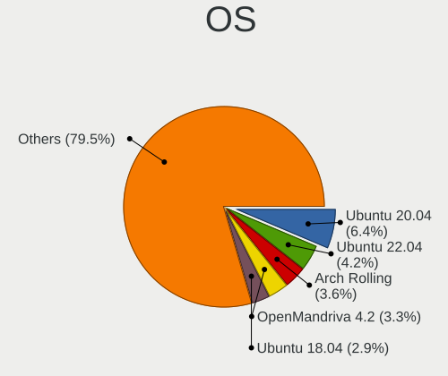

| Name                         | Computers | Percent |
|------------------------------|-----------|---------|
| Ubuntu 20.04                 | 616       | 6.39%   |
| Ubuntu 22.04                 | 408       | 4.23%   |
| Arch Rolling                 | 348       | 3.61%   |
| OpenMandriva 4.2             | 321       | 3.33%   |
| Ubuntu 18.04                 | 284       | 2.94%   |
| OpenMandriva 4.3             | 239       | 2.48%   |
| OpenMandriva 25.90           | 234       | 2.43%   |
| Ubuntu 24.04                 | 209       | 2.17%   |
| Debian 12                    | 199       | 2.06%   |
| OpenMandriva 5.0             | 187       | 1.94%   |
| Debian 11                    | 181       | 1.88%   |
| OpenMandriva 24.12           | 169       | 1.75%   |
| Pop!_OS 22.04                | 140       | 1.45%   |
| OpenMandriva 23.08           | 124       | 1.29%   |
| OpenMandriva 23.03           | 123       | 1.28%   |
| Manjaro                      | 107       | 1.11%   |
| OpenMandriva 6.0             | 102       | 1.06%   |
| OpenMandriva 24.07           | 100       | 1.04%   |
| Fedora 42                    | 99        | 1.03%   |
| Fedora 39                    | 99        | 1.03%   |
| Zorin 16                     | 98        | 1.02%   |
| ROSA R10                     | 98        | 1.02%   |
| OpenMandriva 23.01           | 96        | 1%      |
| Linux Mint 22.1              | 94        | 0.97%   |
| Fedora 40                    | 87        | 0.9%    |
| Zorin 17                     | 86        | 0.89%   |
| Linux Mint 21.1              | 85        | 0.88%   |
| openSUSE Tumbleweed-XXXXXXXX | 82        | 0.85%   |
| Fedora 38                    | 79        | 0.82%   |
| Fedora 41                    | 78        | 0.81%   |
| Linux Mint 20.3              | 74        | 0.77%   |
| ROSA R9                      | 70        | 0.73%   |
| ROSA R11.1                   | 69        | 0.72%   |
| ROSA R11                     | 69        | 0.72%   |
| EndeavourOS Rolling          | 69        | 0.72%   |
| Arch                         | 68        | 0.7%    |
| Fedora 37                    | 67        | 0.69%   |
| Linux Mint 20.1              | 66        | 0.68%   |
| KDE neon 20.04               | 64        | 0.66%   |
| Fedora 36                    | 60        | 0.62%   |

OS Family
---------

OS without a version

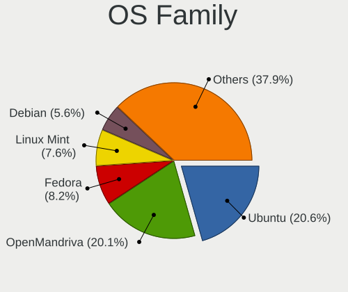

| Name             | Computers | Percent |
|------------------|-----------|---------|
| Ubuntu           | 1823      | 20.61%  |
| OpenMandriva     | 1779      | 20.11%  |
| Fedora           | 723       | 8.17%   |
| Linux Mint       | 671       | 7.59%   |
| Debian           | 495       | 5.6%    |
| Arch             | 407       | 4.6%    |
| ROSA             | 357       | 4.04%   |
| Manjaro          | 273       | 3.09%   |
| Pop!_OS          | 246       | 2.78%   |
| Zorin            | 245       | 2.77%   |
| Kubuntu          | 179       | 2.02%   |
| KDE neon         | 117       | 1.32%   |
| Xubuntu          | 115       | 1.3%    |
| openSUSE         | 108       | 1.22%   |
| Kali             | 83        | 0.94%   |
| Gentoo           | 77        | 0.87%   |
| SteamOS          | 72        | 0.81%   |
| EndeavourOS      | 72        | 0.81%   |
| Elementary       | 72        | 0.81%   |
| ArcoLinux        | 64        | 0.72%   |
| Nobara           | 54        | 0.61%   |
| Lubuntu          | 53        | 0.6%    |
| LMDE             | 51        | 0.58%   |
| Bazzite          | 46        | 0.52%   |
| Endless          | 38        | 0.43%   |
| MX               | 37        | 0.42%   |
| Ubuntu MATE      | 33        | 0.37%   |
| NixOS            | 32        | 0.36%   |
| Garuda Linux     | 32        | 0.36%   |
| CachyOS          | 32        | 0.36%   |
| Dts-distro       | 29        | 0.33%   |
| Ubuntu Unity     | 27        | 0.31%   |
| Clear Linux      | 24        | 0.27%   |
| Xero             | 20        | 0.23%   |
| Ubuntu Budgie    | 20        | 0.23%   |
| BlackPanther     | 19        | 0.21%   |
| CentOS           | 16        | 0.18%   |
| BigLinux         | 15        | 0.17%   |
| Peppermint       | 13        | 0.15%   |
| org.kde.Platform | 12        | 0.14%   |

Kernel
------

Version of the Linux kernel

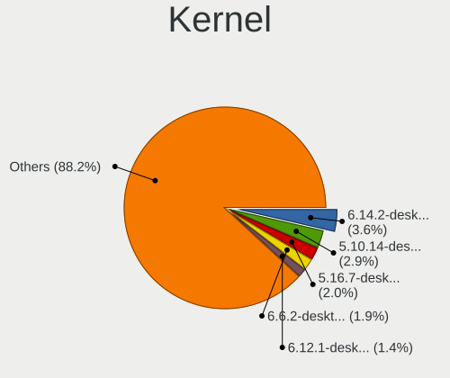

| Version                         | Computers | Percent |
|---------------------------------|-----------|---------|
| 6.14.2-desktop-3omv2590         | 383       | 3.6%    |
| 5.10.14-desktop-1omv4002        | 307       | 2.89%   |
| 5.16.7-desktop-1omv4003         | 217       | 2.04%   |
| 6.6.2-desktop-1omv2390          | 205       | 1.93%   |
| 6.12.1-desktop-1omv2490         | 148       | 1.39%   |
| 6.2.6-desktop-1omv2390          | 118       | 1.11%   |
| 6.4.11-desktop-1omv2390         | 107       | 1.01%   |
| 6.1.1-desktop-1omv2290          | 86        | 0.81%   |
| 6.10.0-desktop-1omv2490         | 80        | 0.75%   |
| 5.4.0-42-generic                | 78        | 0.73%   |
| 6.8.0-51-generic                | 62        | 0.58%   |
| 5.15.0-56-generic               | 62        | 0.58%   |
| 4.9.60-nrj-desktop-1rosa-x86_64 | 54        | 0.51%   |
| 4.9.20-nrj-desktop-1rosa-x86_64 | 54        | 0.51%   |
| 5.15.0-43-generic               | 42        | 0.39%   |
| 5.4.0-26-generic                | 40        | 0.38%   |
| 6.12.9-desktop-1omv2490         | 39        | 0.37%   |
| 5.15.0-58-generic               | 39        | 0.37%   |
| 4.15.0-desktop-45.1rosa-x86_64  | 39        | 0.37%   |
| 5.4.0-52-generic                | 38        | 0.36%   |
| 5.15.0-52-generic               | 37        | 0.35%   |
| 5.4.0-48-generic                | 36        | 0.34%   |
| 5.19.0-35-generic               | 35        | 0.33%   |
| 6.8.0-52-generic                | 33        | 0.31%   |
| 6.9.3-76060903-generic          | 32        | 0.3%    |
| 6.8.0-41-generic                | 32        | 0.3%    |
| 5.4.0-58-generic                | 32        | 0.3%    |
| 6.8.0-45-generic                | 31        | 0.29%   |
| 5.4.0-29-generic                | 30        | 0.28%   |
| 5.3.0-46-generic                | 30        | 0.28%   |
| 5.19.0-32-generic               | 30        | 0.28%   |
| 5.4.0-54-generic                | 29        | 0.27%   |
| 5.16.13-desktop-1omv4003        | 28        | 0.26%   |
| 6.8.0-60-generic                | 27        | 0.25%   |
| 6.8.0-49-generic                | 27        | 0.25%   |
| 5.8.0-43-generic                | 27        | 0.25%   |
| 5.13.0-39-generic               | 27        | 0.25%   |
| 5.11.0-37-generic               | 27        | 0.25%   |
| 5.4.0-40-generic                | 26        | 0.24%   |
| 6.1.0-18-amd64                  | 25        | 0.24%   |

Kernel Family
-------------

Linux kernel without a distro release

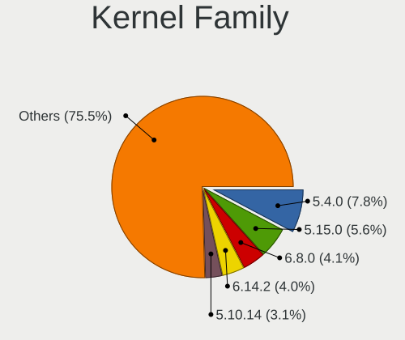

| Version | Computers | Percent |
|---------|-----------|---------|
| 5.4.0   | 784       | 7.75%   |
| 5.15.0  | 565       | 5.59%   |
| 6.8.0   | 415       | 4.1%    |
| 6.14.2  | 408       | 4.03%   |
| 5.10.14 | 309       | 3.06%   |
| 4.15.0  | 291       | 2.88%   |
| 6.1.0   | 235       | 2.32%   |
| 5.11.0  | 224       | 2.22%   |
| 5.8.0   | 223       | 2.21%   |
| 5.16.7  | 220       | 2.18%   |
| 6.6.2   | 212       | 2.1%    |
| 5.13.0  | 204       | 2.02%   |
| 6.5.0   | 196       | 1.94%   |
| 5.10.0  | 188       | 1.86%   |
| 6.14.0  | 176       | 1.74%   |
| 5.19.0  | 172       | 1.7%    |
| 5.3.0   | 166       | 1.64%   |
| 6.12.1  | 154       | 1.52%   |
| 6.2.0   | 149       | 1.47%   |
| 6.2.6   | 140       | 1.38%   |
| 6.11.0  | 123       | 1.22%   |
| 6.4.11  | 111       | 1.1%    |
| 5.0.0   | 102       | 1.01%   |
| 4.18.0  | 92        | 0.91%   |
| 6.1.1   | 88        | 0.87%   |
| 6.10.0  | 81        | 0.8%    |
| 4.9.60  | 66        | 0.65%   |
| 4.9.20  | 63        | 0.62%   |
| 4.19.0  | 55        | 0.54%   |
| 6.9.3   | 51        | 0.5%    |
| 5.14.0  | 46        | 0.45%   |
| 6.12.9  | 44        | 0.44%   |
| 6.17.7  | 34        | 0.34%   |
| 6.13.5  | 32        | 0.32%   |
| 4.1.34  | 32        | 0.32%   |
| 5.16.13 | 30        | 0.3%    |
| 6.12.10 | 29        | 0.29%   |
| 4.1.38  | 29        | 0.29%   |
| 6.6.21  | 28        | 0.28%   |
| 6.12.6  | 28        | 0.28%   |

Kernel Major Ver.
-----------------

Linux kernel major version

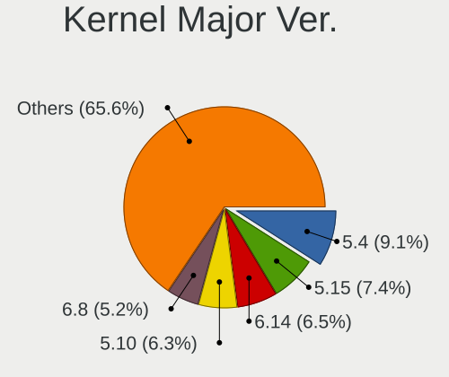

| Version | Computers | Percent |
|---------|-----------|---------|
| 5.4     | 888       | 9.05%   |
| 5.15    | 723       | 7.37%   |
| 6.14    | 640       | 6.53%   |
| 5.10    | 614       | 6.26%   |
| 6.8     | 510       | 5.2%    |
| 6.1     | 489       | 4.99%   |
| 6.12    | 431       | 4.39%   |
| 6.6     | 405       | 4.13%   |
| 6.2     | 376       | 3.83%   |
| 5.16    | 319       | 3.25%   |
| 6.5     | 301       | 3.07%   |
| 5.11    | 291       | 2.97%   |
| 4.15    | 291       | 2.97%   |
| 5.8     | 281       | 2.87%   |
| 5.13    | 235       | 2.4%    |
| 5.19    | 233       | 2.38%   |
| 6.11    | 224       | 2.28%   |
| 6.4     | 197       | 2.01%   |
| 5.3     | 186       | 1.9%    |
| 4.9     | 185       | 1.89%   |
| 6.10    | 179       | 1.83%   |
| 6.9     | 139       | 1.42%   |
| 6.0     | 132       | 1.35%   |
| 6.17    | 126       | 1.28%   |
| 5.14    | 114       | 1.16%   |
| 5.0     | 112       | 1.14%   |
| 4.18    | 104       | 1.06%   |
| 6.15    | 101       | 1.03%   |
| 6.13    | 98        | 1%      |
| 5.17    | 82        | 0.84%   |
| 6.7     | 79        | 0.81%   |
| 6.3     | 78        | 0.8%    |
| 5.9     | 74        | 0.75%   |
| 5.18    | 72        | 0.73%   |
| 5.6     | 71        | 0.72%   |
| 4.19    | 71        | 0.72%   |
| 6.16    | 65        | 0.66%   |
| 4.1     | 64        | 0.65%   |
| 5.12    | 61        | 0.62%   |
| 5.5     | 39        | 0.4%    |

Arch
----

OS architecture (x86_64, i586, etc.)

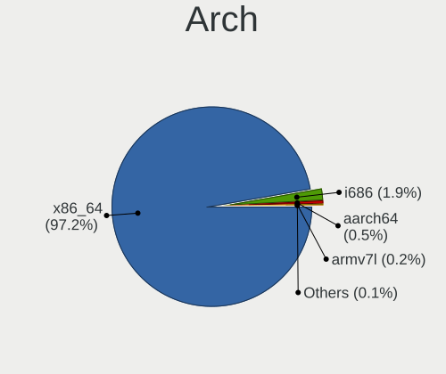

| Name    | Computers | Percent |
|---------|-----------|---------|
| x86_64  | 8217      | 97.22%  |
| i686    | 162       | 1.92%   |
| aarch64 | 46        | 0.54%   |
| armv7l  | 19        | 0.22%   |
| armv8l  | 3         | 0.04%   |
| armv6l  | 2         | 0.02%   |
| riscv64 | 1         | 0.01%   |
| ppc64   | 1         | 0.01%   |
| ppc     | 1         | 0.01%   |

DE
--

Desktop Environment

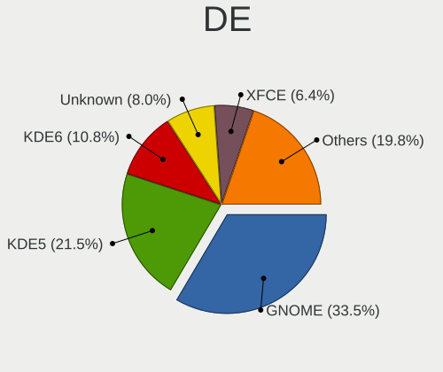

| Name             | Computers | Percent |
|------------------|-----------|---------|
| GNOME            | 3024      | 33.5%   |
| KDE5             | 1944      | 21.54%  |
| KDE6             | 979       | 10.85%  |
| Unknown          | 720       | 7.98%   |
| XFCE             | 577       | 6.39%   |
| X-Cinnamon       | 537       | 5.95%   |
| KDE4             | 191       | 2.12%   |
| LXQt             | 189       | 2.09%   |
| MATE             | 180       | 1.99%   |
| KDE              | 169       | 1.87%   |
| Cinnamon         | 79        | 0.88%   |
| Pantheon         | 73        | 0.81%   |
| LXDE             | 60        | 0.66%   |
| i3               | 53        | 0.59%   |
| Hyprland         | 40        | 0.44%   |
| Budgie           | 39        | 0.43%   |
| Unity            | 29        | 0.32%   |
| Deepin           | 18        | 0.2%    |
| GNOME Flashback  | 14        | 0.16%   |
| GNOME Classic    | 14        | 0.16%   |
| COSMIC           | 13        | 0.14%   |
| Openbox          | 11        | 0.12%   |
| sway             | 10        | 0.11%   |
| Trinity          | 6         | 0.07%   |
| ICEWM            | 6         | 0.07%   |
| awesome          | 6         | 0.07%   |
| qtile            | 5         | 0.06%   |
| niri             | 5         | 0.06%   |
| lightdm-xsession | 5         | 0.06%   |
| DWM              | 5         | 0.06%   |
| fluxbox          | 3         | 0.03%   |
| ratflow          | 2         | 0.02%   |
| GNUstep          | 2         | 0.02%   |
| Endless:GNOME    | 2         | 0.02%   |
| BunsenLabs       | 2         | 0.02%   |
| xmonad           | 1         | 0.01%   |
| TDE              | 1         | 0.01%   |
| stumpwm          | 1         | 0.01%   |
| qt5ct            | 1         | 0.01%   |
| Phosh:GNOME      | 1         | 0.01%   |

Display Server
--------------

X11 or Wayland

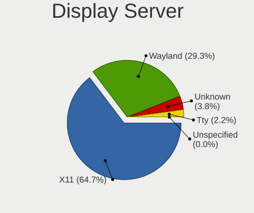

| Name        | Computers | Percent |
|-------------|-----------|---------|
| X11         | 5726      | 64.69%  |
| Wayland     | 2594      | 29.31%  |
| Unknown     | 338       | 3.82%   |
| Tty         | 192       | 2.17%   |
| Unspecified | 1         | 0.01%   |

Display Manager
---------------

SDDM, LightDM, etc.

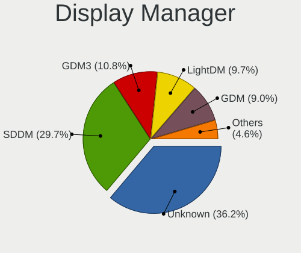

| Name                  | Computers | Percent |
|-----------------------|-----------|---------|
| Unknown               | 3207      | 36.16%  |
| SDDM                  | 2634      | 29.7%   |
| GDM3                  | 959       | 10.81%  |
| LightDM               | 860       | 9.7%    |
| GDM                   | 801       | 9.03%   |
| KDM                   | 188       | 2.12%   |
| TDM                   | 154       | 1.74%   |
| XDM                   | 12        | 0.14%   |
| SLiM                  | 12        | 0.14%   |
| GREETD                | 12        | 0.14%   |
| LXDM                  | 9         | 0.1%    |
| Ly                    | 5         | 0.06%   |
| SLIMSKI               | 4         | 0.05%   |
| LY-DM                 | 3         | 0.03%   |
| NODM                  | 2         | 0.02%   |
| MDM                   | 2         | 0.02%   |
| DISPLAY-MANAGER-START | 2         | 0.02%   |
| SU                    | 1         | 0.01%   |
| EMPTTY                | 1         | 0.01%   |
| COSMIC-GREETER        | 1         | 0.01%   |

OS Lang
-------

Language

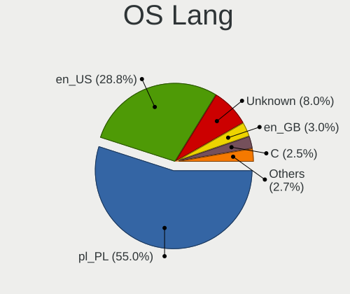

| Lang        | Computers | Percent |
|-------------|-----------|---------|
| pl_PL       | 4810      | 54.97%  |
| en_US       | 2521      | 28.81%  |
| Unknown     | 698       | 7.98%   |
| en_GB       | 261       | 2.98%   |
| C           | 223       | 2.55%   |
| ru_RU       | 54        | 0.62%   |
| uk_UA       | 28        | 0.32%   |
| ru_UA       | 18        | 0.21%   |
| de_DE       | 17        | 0.19%   |
| szl_PL      | 12        | 0.14%   |
| en_IE       | 12        | 0.14%   |
| en_CA       | 9         | 0.1%    |
| POSIX       | 8         | 0.09%   |
| fr_FR       | 8         | 0.09%   |
| C.UTF8      | 8         | 0.09%   |
| en_DK       | 7         | 0.08%   |
| it_IT       | 6         | 0.07%   |
| en_AG       | 5         | 0.06%   |
| UTF-8       | 3         | 0.03%   |
| es_ES       | 3         | 0.03%   |
| en_AU       | 3         | 0.03%   |
| cs_CZ       | 3         | 0.03%   |
| be_BY       | 3         | 0.03%   |
| pl_PL.UTF8  | 2         | 0.02%   |
| nl_NL       | 2         | 0.02%   |
| hu_HU       | 2         | 0.02%   |
| en_US.UTF8  | 2         | 0.02%   |
| en_US.utf-8 | 2         | 0.02%   |
| en_IN       | 2         | 0.02%   |
| en_BW       | 2         | 0.02%   |
| el_GR       | 2         | 0.02%   |
| sv_SE       | 1         | 0.01%   |
| sk_SK       | 1         | 0.01%   |
| pt_BR       | 1         | 0.01%   |
| pl.PL       | 1         | 0.01%   |
| es_MX       | 1         | 0.01%   |
| es_CL       | 1         | 0.01%   |
| es_BO       | 1         | 0.01%   |
| es_AR       | 1         | 0.01%   |
| en_US.UTF.8 | 1         | 0.01%   |

Boot Mode
---------

EFI or BIOS

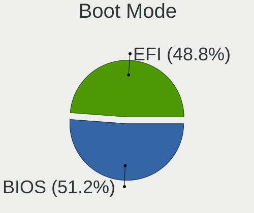

| Mode | Computers | Percent |
|------|-----------|---------|
| BIOS | 4449      | 51.19%  |
| EFI  | 4242      | 48.81%  |

Filesystem
----------

Type of filesystem

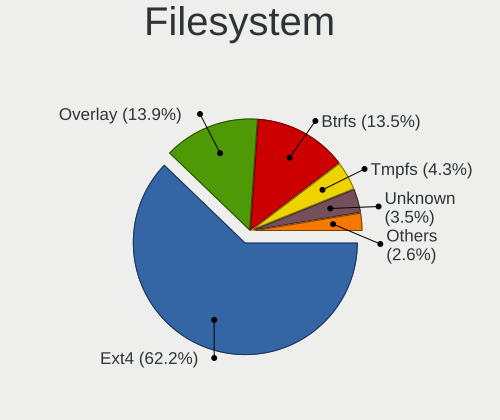

| Type     | Computers | Percent |
|----------|-----------|---------|
| Ext4     | 5502      | 62.19%  |
| Overlay  | 1233      | 13.94%  |
| Btrfs    | 1197      | 13.53%  |
| Tmpfs    | 376       | 4.25%   |
| Unknown  | 307       | 3.47%   |
| Xfs      | 115       | 1.3%    |
| Zfs      | 50        | 0.57%   |
| F2fs     | 26        | 0.29%   |
| Rootfs   | 10        | 0.11%   |
| Ext3     | 10        | 0.11%   |
| Ext2     | 9         | 0.1%    |
| Jfs      | 3         | 0.03%   |
| Bcachefs | 3         | 0.03%   |
| XXXXX    | 2         | 0.02%   |
| XXXXXXX  | 1         | 0.01%   |
| XXX      | 1         | 0.01%   |
| SquXshfs | 1         | 0.01%   |
| Aufs     | 1         | 0.01%   |

Part. scheme
------------

Scheme of partitioning

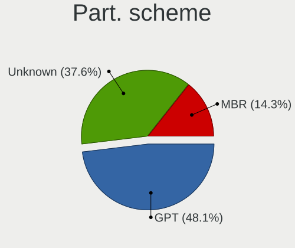

| Type    | Computers | Percent |
|---------|-----------|---------|
| GPT     | 4218      | 48.1%   |
| Unknown | 3295      | 37.57%  |
| MBR     | 1257      | 14.33%  |

Dual Boot with Linux/BSD
------------------------

Hosting more than one Linux/BSD

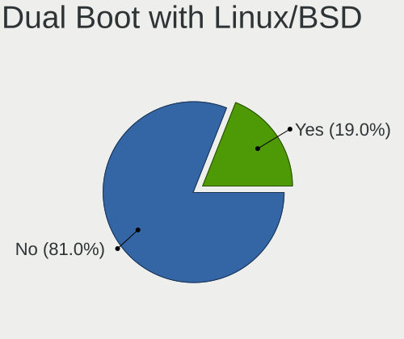

| Dual boot | Computers | Percent |
|-----------|-----------|---------|
| No        | 7042      | 81%     |
| Yes       | 1652      | 19%     |

Dual Boot (Win)
---------------

Hosting Linux and Windows

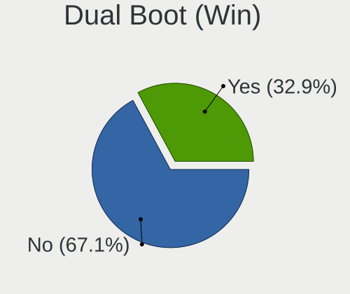

| Dual boot | Computers | Percent |
|-----------|-----------|---------|
| No        | 5805      | 67.11%  |
| Yes       | 2845      | 32.89%  |

Board
-----

Vendor
------

Motherboard manufacturer

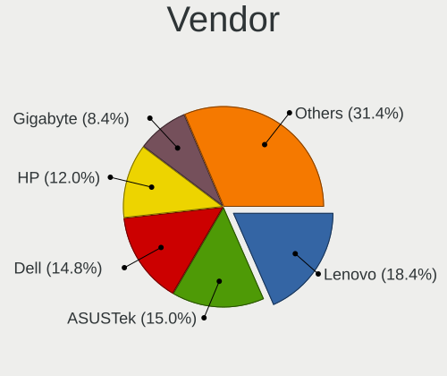

| Name                                 | Computers | Percent |
|--------------------------------------|-----------|---------|
| Lenovo                               | 1553      | 18.4%   |
| ASUSTek Computer                     | 1267      | 15.01%  |
| Dell                                 | 1250      | 14.81%  |
| Hewlett-Packard                      | 1015      | 12.03%  |
| Gigabyte Technology                  | 706       | 8.37%   |
| MSI                                  | 679       | 8.05%   |
| Acer                                 | 340       | 4.03%   |
| ASRock                               | 319       | 3.78%   |
| Toshiba                              | 121       | 1.43%   |
| Samsung Electronics                  | 120       | 1.42%   |
| Fujitsu                              | 101       | 1.2%    |
| Apple                                | 100       | 1.18%   |
| Intel                                | 68        | 0.81%   |
| HUAWEI                               | 66        | 0.78%   |
| Valve                                | 57        | 0.68%   |
| Sony                                 | 53        | 0.63%   |
| Unknown                              | 51        | 0.6%    |
| Fujitsu Siemens                      | 44        | 0.52%   |
| Google                               | 43        | 0.51%   |
| Raspberry Pi Foundation              | 33        | 0.39%   |
| Notebook                             | 31        | 0.37%   |
| Medion                               | 30        | 0.36%   |
| Packard Bell                         | 22        | 0.26%   |
| Foxconn                              | 16        | 0.19%   |
| Kiano                                | 14        | 0.17%   |
| eMachines                            | 12        | 0.14%   |
| Chuwi                                | 12        | 0.14%   |
| AMI                                  | 12        | 0.14%   |
| Timi                                 | 11        | 0.13%   |
| Inventec                             | 11        | 0.13%   |
| Microsoft                            | 10        | 0.12%   |
| TUXEDO                               | 9         | 0.11%   |
| mPTech                               | 9         | 0.11%   |
| ZOTAC                                | 8         | 0.09%   |
| Supermicro                           | 7         | 0.08%   |
| Shenzhen Meigao Electronic Equipment | 7         | 0.08%   |
| Huanan                               | 7         | 0.08%   |
| Panasonic                            | 6         | 0.07%   |
| Hardkernel                           | 6         | 0.07%   |
| GMKtec                               | 6         | 0.07%   |

Model
-----

Motherboard model

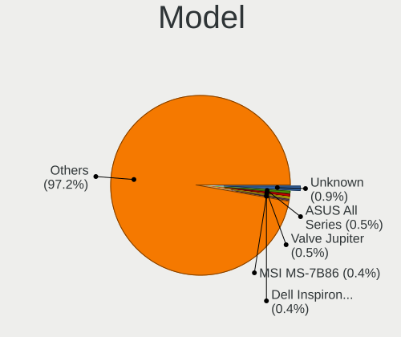

| Name                         | Computers | Percent |
|------------------------------|-----------|---------|
| Unknown                      | 80        | 0.95%   |
| ASUS All Series              | 45        | 0.53%   |
| Valve Jupiter                | 44        | 0.52%   |
| MSI MS-7B86                  | 35        | 0.41%   |
| Dell Inspiron 3451           | 31        | 0.37%   |
| MSI MS-7C02                  | 25        | 0.3%    |
| Gigabyte B450M DS3H          | 24        | 0.28%   |
| Dell Inspiron 13-5368        | 22        | 0.26%   |
| MSI MS-7C56                  | 21        | 0.25%   |
| MSI MS-7817                  | 21        | 0.25%   |
| Dell Latitude E6400          | 20        | 0.24%   |
| MSI MS-7816                  | 19        | 0.23%   |
| Lenovo G50-30 80G0           | 19        | 0.23%   |
| Gigabyte B550 AORUS ELITE V2 | 19        | 0.23%   |
| MSI MS-7C37                  | 18        | 0.21%   |
| Dell OptiPlex 780            | 18        | 0.21%   |
| Dell OptiPlex 7010           | 18        | 0.21%   |
| Dell Latitude E6540          | 18        | 0.21%   |
| Dell Latitude E6430          | 18        | 0.21%   |
| ASUS SABERTOOTH Z77          | 18        | 0.21%   |
| HP Pavilion dv7              | 17        | 0.2%    |
| HP Notebook                  | 17        | 0.2%    |
| Gigabyte B450 AORUS ELITE    | 17        | 0.2%    |
| ASUS X555LJ                  | 17        | 0.2%    |
| Lenovo G510 20238            | 16        | 0.19%   |
| ASUS TUF Gaming B550-PLUS    | 16        | 0.19%   |
| MSI MS-7C91                  | 15        | 0.18%   |
| Dell Latitude E7440          | 15        | 0.18%   |
| MSI MS-7A38                  | 14        | 0.17%   |
| Lenovo G580 20150            | 14        | 0.17%   |
| Dell Latitude 5490           | 14        | 0.17%   |
| Dell Latitude 5480           | 14        | 0.17%   |
| Valve Galileo                | 13        | 0.15%   |
| MSI MS-7B79                  | 13        | 0.15%   |
| HP t630 Thin Client          | 13        | 0.15%   |
| Dell Latitude 5400           | 13        | 0.15%   |
| MSI MS-7B89                  | 12        | 0.14%   |
| MSI MS-7721                  | 12        | 0.14%   |
| Dell OptiPlex 755            | 12        | 0.14%   |
| Dell Latitude E6440          | 12        | 0.14%   |

Model Family
------------

Motherboard model prefix

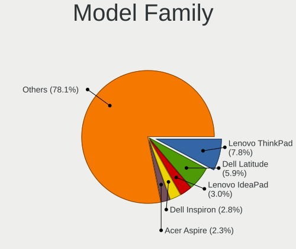

| Name               | Computers | Percent |
|--------------------|-----------|---------|
| Lenovo ThinkPad    | 661       | 7.83%   |
| Dell Latitude      | 501       | 5.94%   |
| Lenovo IdeaPad     | 255       | 3.02%   |
| Dell Inspiron      | 235       | 2.78%   |
| Acer Aspire        | 192       | 2.28%   |
| Dell OptiPlex      | 176       | 2.09%   |
| HP EliteBook       | 169       | 2%      |
| HP Pavilion        | 162       | 1.92%   |
| ASUS PRIME         | 127       | 1.5%    |
| Dell Precision     | 123       | 1.46%   |
| Lenovo Legion      | 117       | 1.39%   |
| HP ProBook         | 116       | 1.37%   |
| HP Compaq          | 101       | 1.2%    |
| Toshiba Satellite  | 100       | 1.18%   |
| ASUS ROG           | 99        | 1.17%   |
| ASUS TUF           | 98        | 1.16%   |
| ASUS VivoBook      | 94        | 1.11%   |
| ASUS ASUS          | 88        | 1.04%   |
| Unknown            | 80        | 0.95%   |
| Lenovo ThinkCentre | 77        | 0.91%   |
| Dell Vostro        | 76        | 0.9%    |
| HP Laptop          | 63        | 0.75%   |
| Dell XPS           | 46        | 0.55%   |
| ASUS All           | 45        | 0.53%   |
| Valve Jupiter      | 44        | 0.52%   |
| HP EliteDesk       | 43        | 0.51%   |
| Gigabyte B550      | 43        | 0.51%   |
| Lenovo Yoga        | 42        | 0.5%    |
| Gigabyte B450M     | 40        | 0.47%   |
| Lenovo ThinkBook   | 39        | 0.46%   |
| Fujitsu ESPRIMO    | 39        | 0.46%   |
| MSI MS-7B86        | 35        | 0.41%   |
| Acer Nitro         | 34        | 0.4%    |
| RPi Raspberry      | 33        | 0.39%   |
| HP 250             | 32        | 0.38%   |
| Fujitsu LIFEBOOK   | 32        | 0.38%   |
| HP ZBook           | 30        | 0.36%   |
| Gigabyte B450      | 29        | 0.34%   |
| ASUS Zenbook       | 29        | 0.34%   |
| Gigabyte X570      | 26        | 0.31%   |

MFG Year
--------

Motherboard manufacture year

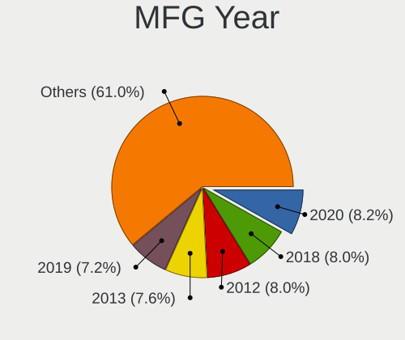

| Year    | Computers | Percent |
|---------|-----------|---------|
| 2020    | 689       | 8.16%   |
| 2018    | 678       | 8.03%   |
| 2012    | 671       | 7.95%   |
| 2013    | 639       | 7.57%   |
| 2019    | 611       | 7.24%   |
| 2011    | 529       | 6.27%   |
| 2014    | 513       | 6.08%   |
| 2021    | 475       | 5.63%   |
| 2017    | 472       | 5.59%   |
| 2015    | 431       | 5.11%   |
| 2010    | 370       | 4.38%   |
| 2008    | 369       | 4.37%   |
| 2016    | 367       | 4.35%   |
| 2022    | 335       | 3.97%   |
| 2023    | 308       | 3.65%   |
| 2009    | 296       | 3.51%   |
| 2007    | 239       | 2.83%   |
| 2024    | 218       | 2.58%   |
| 2006    | 98        | 1.16%   |
| Unknown | 61        | 0.72%   |
| 2025    | 47        | 0.56%   |
| 2005    | 11        | 0.13%   |
| 2004    | 10        | 0.12%   |
| 2001    | 1         | 0.01%   |
| 2000    | 1         | 0.01%   |

Form Factor
-----------

Physical design of the computer

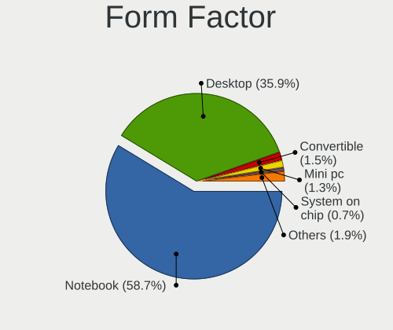

| Name           | Computers | Percent |
|----------------|-----------|---------|
| Notebook       | 4953      | 58.69%  |
| Desktop        | 3030      | 35.9%   |
| Convertible    | 127       | 1.5%    |
| Mini pc        | 112       | 1.33%   |
| System on chip | 58        | 0.69%   |
| Tablet         | 53        | 0.63%   |
| All in one     | 52        | 0.62%   |
| Server         | 43        | 0.51%   |
| Phone          | 8         | 0.09%   |
| Other          | 2         | 0.02%   |
| Stick pc       | 1         | 0.01%   |

Secure Boot
-----------

Enabled or disabled

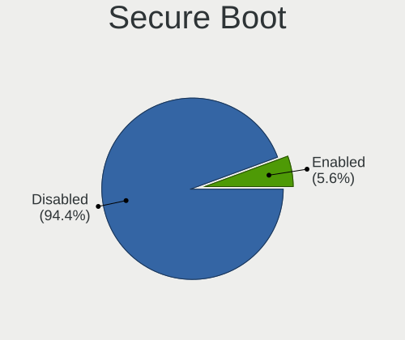

| State    | Computers | Percent |
|----------|-----------|---------|
| Disabled | 8022      | 94.4%   |
| Enabled  | 476       | 5.6%    |

Coreboot
--------

Have coreboot on board

| Used | Computers | Percent |
|------|-----------|---------|
| No   | 8383      | 99.34%  |
| Yes  | 56        | 0.66%   |

RAM Size
--------

Total RAM memory

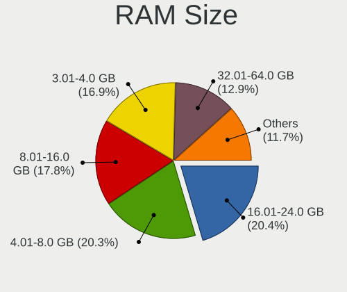

| Size in GB      | Computers | Percent |
|-----------------|-----------|---------|
| 16.01-24.0      | 1764      | 20.4%   |
| 4.01-8.0        | 1753      | 20.28%  |
| 8.01-16.0       | 1540      | 17.81%  |
| 3.01-4.0        | 1463      | 16.92%  |
| 32.01-64.0      | 1117      | 12.92%  |
| 64.01-256.0     | 292       | 3.38%   |
| 24.01-32.0      | 255       | 2.95%   |
| 1.01-2.0        | 250       | 2.89%   |
| 2.01-3.0        | 154       | 1.78%   |
| 0.51-1.0        | 46        | 0.53%   |
| More than 256.0 | 7         | 0.08%   |
| 0.01-0.5        | 4         | 0.05%   |

RAM Used
--------

Used RAM memory

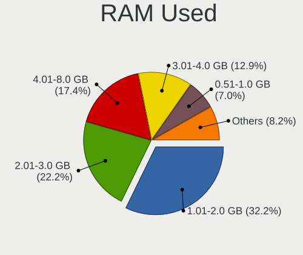

| Used GB         | Computers | Percent |
|-----------------|-----------|---------|
| 1.01-2.0        | 3093      | 32.25%  |
| 2.01-3.0        | 2127      | 22.18%  |
| 4.01-8.0        | 1670      | 17.41%  |
| 3.01-4.0        | 1241      | 12.94%  |
| 0.51-1.0        | 673       | 7.02%   |
| 8.01-16.0       | 488       | 5.09%   |
| 0.01-0.5        | 143       | 1.49%   |
| 16.01-24.0      | 95        | 0.99%   |
| 24.01-32.0      | 31        | 0.32%   |
| 32.01-64.0      | 17        | 0.18%   |
| 64.01-256.0     | 7         | 0.07%   |
| Unknown         | 5         | 0.05%   |
| More than 256.0 | 1         | 0.01%   |

Total Drives
------------

Number of drives on board

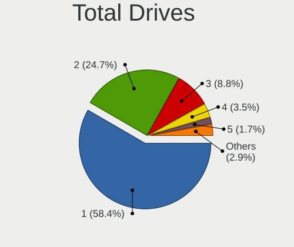

| Drives  | Computers | Percent |
|---------|-----------|---------|
| 1       | 5144      | 58.36%  |
| 2       | 2178      | 24.71%  |
| 3       | 779       | 8.84%   |
| 4       | 311       | 3.53%   |
| 5       | 148       | 1.68%   |
| 0       | 124       | 1.41%   |
| 6       | 60        | 0.68%   |
| 7       | 28        | 0.32%   |
| 8       | 21        | 0.24%   |
| 9       | 6         | 0.07%   |
| 11      | 5         | 0.06%   |
| 10      | 5         | 0.06%   |
| 12      | 2         | 0.02%   |
| 16      | 1         | 0.01%   |
| 13      | 1         | 0.01%   |
| Unknown | 1         | 0.01%   |

Has CD-ROM
----------

Has CD-ROM on board

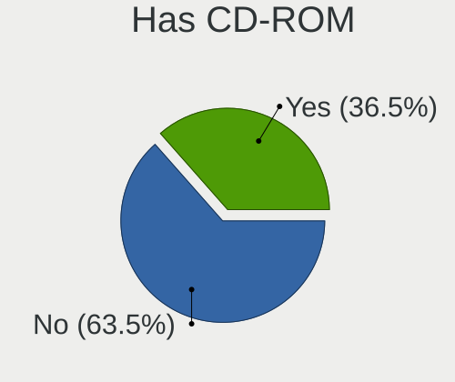

| Presented | Computers | Percent |
|-----------|-----------|---------|
| No        | 5425      | 63.49%  |
| Yes       | 3119      | 36.51%  |

Has Ethernet
------------

Has Ethernet on board

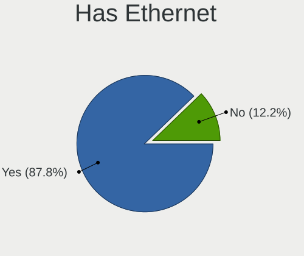

| Presented | Computers | Percent |
|-----------|-----------|---------|
| Yes       | 7434      | 87.82%  |
| No        | 1031      | 12.18%  |

Has WiFi
--------

Has WiFi module

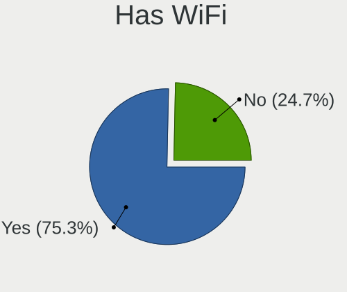

| Presented | Computers | Percent |
|-----------|-----------|---------|
| Yes       | 6416      | 75.32%  |
| No        | 2102      | 24.68%  |

Has Bluetooth
-------------

Has Bluetooth module

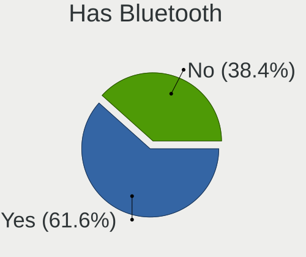

| Presented | Computers | Percent |
|-----------|-----------|---------|
| Yes       | 5290      | 61.62%  |
| No        | 3295      | 38.38%  |

Location
--------

Country
-------

Geographic location (country)

| Country | Computers | Percent |
|---------|-----------|---------|
| Poland  | 8439      | 100%    |

City
----

Geographic location (city)

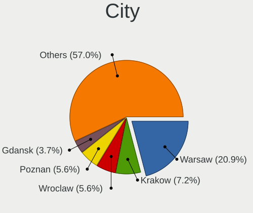

| City            | Computers | Percent |
|-----------------|-----------|---------|
| Warsaw          | 1940      | 20.91%  |
| Krakow          | 668       | 7.2%    |
| Wroclaw         | 524       | 5.65%   |
| Poznan          | 518       | 5.58%   |
| Gdansk          | 343       | 3.7%    |
| Lodz            | 283       | 3.05%   |
| Katowice        | 251       | 2.71%   |
| Szczecin        | 145       | 1.56%   |
| Lublin          | 135       | 1.46%   |
| Gdynia          | 127       | 1.37%   |
| Bialystok       | 106       | 1.14%   |
| Bydgoszcz       | 95        | 1.02%   |
| Rzeszów        | 76        | 0.82%   |
| Gliwice         | 73        | 0.79%   |
| Torun           | 67        | 0.72%   |
| Bytom           | 60        | 0.65%   |
| Częstochowa    | 59        | 0.64%   |
| Ruda Śląska   | 55        | 0.59%   |
| Sosnowiec       | 54        | 0.58%   |
| Kielce          | 53        | 0.57%   |
| Zabrze          | 46        | 0.5%    |
| Rybnik          | 41        | 0.44%   |
| Olsztyn         | 40        | 0.43%   |
| Bielsko-Biala   | 40        | 0.43%   |
| Zielona Góra   | 38        | 0.41%   |
| Płock          | 38        | 0.41%   |
| Opole           | 33        | 0.36%   |
| Elblag          | 32        | 0.34%   |
| Tychy           | 31        | 0.33%   |
| Chorzów        | 30        | 0.32%   |
| Słupsk         | 29        | 0.31%   |
| Radom           | 27        | 0.29%   |
| Koszalin        | 25        | 0.27%   |
| Piaseczno       | 24        | 0.26%   |
| Tarnów         | 23        | 0.25%   |
| Kalisz          | 23        | 0.25%   |
| Cieszyn         | 23        | 0.25%   |
| Tarnowskie Gory | 22        | 0.24%   |
| Strzyzow        | 22        | 0.24%   |
| Debica          | 21        | 0.23%   |

Drives
------

Drive Vendor
------------

Hard drive vendors

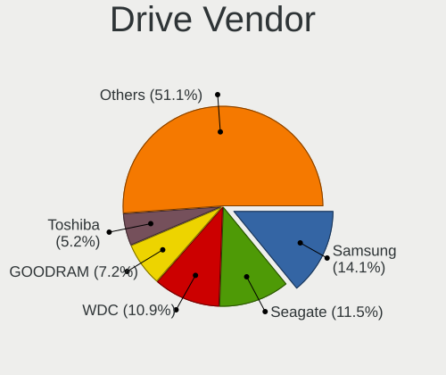

| Vendor                       | Computers | Drives | Percent |
|------------------------------|-----------|--------|---------|
| Samsung Electronics          | 1808      | 2743   | 14.08%  |
| Seagate                      | 1479      | 2365   | 11.52%  |
| WDC                          | 1395      | 2172   | 10.87%  |
| GOODRAM                      | 919       | 1430   | 7.16%   |
| Toshiba                      | 672       | 1000   | 5.23%   |
| Sandisk                      | 614       | 851    | 4.78%   |
| Kingston                     | 512       | 720    | 3.99%   |
| Crucial                      | 483       | 808    | 3.76%   |
| Unknown                      | 472       | 719    | 3.68%   |
| A-DATA Technology            | 464       | 617    | 3.61%   |
| Hitachi                      | 330       | 541    | 2.57%   |
| SK hynix                     | 325       | 401    | 2.53%   |
| Intel                        | 308       | 421    | 2.4%    |
| Micron Technology            | 285       | 368    | 2.22%   |
| HGST                         | 174       | 226    | 1.36%   |
| Patriot                      | 161       | 210    | 1.25%   |
| SPCC                         | 159       | 226    | 1.24%   |
| Phison Electronics           | 157       | 215    | 1.22%   |
| KIOXIA                       | 123       | 140    | 0.96%   |
| ADATA Technology             | 108       | 147    | 0.84%   |
| Shenzhen Longsys Electronics | 98        | 137    | 0.76%   |
| PNY                          | 91        | 102    | 0.71%   |
| MAXIO Technology (Hangzhou)  | 88        | 98     | 0.69%   |
| Kingston Technology Company  | 84        | 93     | 0.65%   |
| Plextor                      | 78        | 102    | 0.61%   |
| China                        | 70        | 104    | 0.55%   |
| Lexar                        | 67        | 80     | 0.52%   |
| Apacer                       | 65        | 94     | 0.51%   |
| Silicon Motion               | 59        | 72     | 0.46%   |
| Micron/Crucial Technology    | 58        | 68     | 0.45%   |
| Unknown                      | 56        | 67     | 0.44%   |
| Phison                       | 51        | 67     | 0.4%    |
| KIOXIA-EXCERIA               | 49        | 66     | 0.38%   |
| Fujitsu                      | 49        | 60     | 0.38%   |
| XPG                          | 48        | 68     | 0.37%   |
| Apple                        | 48        | 64     | 0.37%   |
| LITEON                       | 47        | 62     | 0.37%   |
| Realtek Semiconductor        | 46        | 62     | 0.36%   |
| Transcend                    | 44        | 51     | 0.34%   |
| OCZ                          | 35        | 40     | 0.27%   |

Drive Model
-----------

Hard drive models

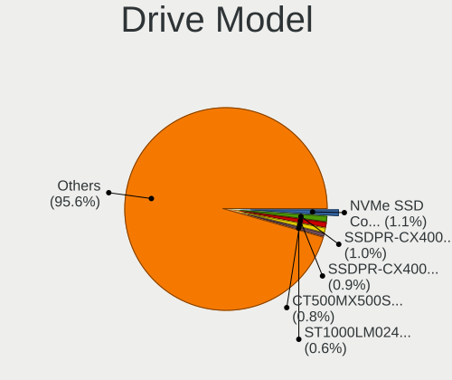

| Model                                                              | Computers | Percent |
|--------------------------------------------------------------------|-----------|---------|
| Samsung NVMe SSD Controller SM981/PM981/PM983 1TB                  | 151       | 1.08%   |
| GOODRAM SSDPR-CX400-512-G2 512GB                                   | 138       | 0.98%   |
| GOODRAM SSDPR-CX400-256-G2 256GB                                   | 127       | 0.91%   |
| Crucial CT500MX500SSD1 500GB                                       | 117       | 0.83%   |
| Seagate ST1000LM024 HN-M101MBB 1TB                                 | 88        | 0.63%   |
| Samsung NVMe SSD Controller PM9A1/PM9A3/980PRO 1TB                 | 88        | 0.63%   |
| Toshiba HDWD110 1TB                                                | 82        | 0.59%   |
| Crucial CT1000MX500SSD1 1TB                                        | 81        | 0.58%   |
| Seagate ST1000LM035-1RK172 1TB                                     | 78        | 0.56%   |
| Samsung SSD 850 EVO 250GB                                          | 77        | 0.55%   |
| Seagate ST500LT012-1DG142 500GB                                    | 76        | 0.54%   |
| Unknown MMC Card  32GB                                             | 71        | 0.51%   |
| Kingston SA400S37240G 240GB SSD                                    | 69        | 0.49%   |
| Unknown MMC Card  64GB                                             | 68        | 0.49%   |
| Crucial CT240BX500SSD1 240GB                                       | 68        | 0.49%   |
| Samsung SSD 980 1TB                                                | 67        | 0.48%   |
| Samsung SSD 860 EVO 500GB                                          | 67        | 0.48%   |
| GOODRAM SSD 240GB                                                  | 66        | 0.47%   |
| GOODRAM SSD 120GB                                                  | 65        | 0.46%   |
| MAXIO (Hangzhou) NVMe SSD Controller MAP1202 2TB                   | 61        | 0.44%   |
| Seagate ST500DM002-1BD142 500GB                                    | 60        | 0.43%   |
| Samsung SSD 980 500GB                                              | 60        | 0.43%   |
| Seagate ST1000DM010-2EP102 1TB                                     | 58        | 0.41%   |
| GOODRAM SSDPR-CX400-01T-G2 1TB                                     | 57        | 0.41%   |
| Phison E12 NVMe Controller 1TB                                     | 56        | 0.4%    |
| Unknown                                                            | 56        | 0.4%    |
| ADATA XPG SX8200 Pro PCIe Gen3x4 M.2 2280 Solid State Drive 1024GB | 55        | 0.39%   |
| Kingston SV300S37A120G 120GB SSD                                   | 52        | 0.37%   |
| GOODRAM SSDPR-CX400-512 512GB                                      | 52        | 0.37%   |
| A-DATA SU800 256GB SSD                                             | 52        | 0.37%   |
| Kingston SA400S37480G 480GB SSD                                    | 47        | 0.34%   |
| Seagate ST9500325AS 500GB                                          | 46        | 0.33%   |
| Seagate ST1000DM003-1ER162 1TB                                     | 45        | 0.32%   |
| Patriot Burst 120GB SSD                                            | 45        | 0.32%   |
| Toshiba MQ01ABD100 1TB                                             | 44        | 0.31%   |
| GOODRAM SSDPR-CX400-128-G2 128GB                                   | 44        | 0.31%   |
| Samsung SSD 860 EVO 250GB                                          | 43        | 0.31%   |
| Seagate ST3500418AS 500GB                                          | 42        | 0.3%    |
| Samsung NVMe SSD Controller SM961/PM961/SM963 1024GB               | 42        | 0.3%    |
| Kingston SKC3000S1024G 1TB                                         | 42        | 0.3%    |

HDD Vendor
----------

Hard disk drive vendors

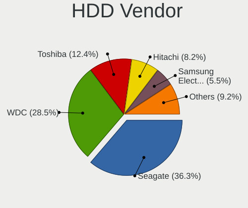

| Vendor              | Computers | Drives | Percent |
|---------------------|-----------|--------|---------|
| Seagate             | 1468      | 2345   | 36.26%  |
| WDC                 | 1154      | 1826   | 28.5%   |
| Toshiba             | 504       | 788    | 12.45%  |
| Hitachi             | 330       | 541    | 8.15%   |
| Samsung Electronics | 221       | 311    | 5.46%   |
| HGST                | 174       | 226    | 4.3%    |
| Fujitsu             | 49        | 60     | 1.21%   |
| Maxtor              | 25        | 28     | 0.62%   |
| Unknown             | 20        | 22     | 0.49%   |
| JMicron Technology  | 18        | 24     | 0.44%   |
| Apple               | 14        | 14     | 0.35%   |
| Hewlett-Packard     | 11        | 40     | 0.27%   |
| USB3.0              | 7         | 8      | 0.17%   |
| ASMT                | 7         | 8      | 0.17%   |
| ASMedia             | 7         | 9      | 0.17%   |
| Unknown             | 6         | 7      | 0.15%   |
| WD MediaMax         | 4         | 8      | 0.1%    |
| SAGE                | 3         | 3      | 0.07%   |
| Synology            | 2         | 2      | 0.05%   |
| SATAFIRM            | 2         | 2      | 0.05%   |
| LaCie               | 2         | 3      | 0.05%   |
| Intenso             | 2         | 2      | 0.05%   |
| IBM/Hitachi         | 2         | 2      | 0.05%   |
| IB-AC703            | 2         | 2      | 0.05%   |
| USB 3.1             | 1         | 1      | 0.02%   |
| USB                 | 1         | 1      | 0.02%   |
| StoreJet            | 1         | 1      | 0.02%   |
| MARVELL             | 1         | 1      | 0.02%   |
| Lenovo              | 1         | 2      | 0.02%   |
| JetFlash            | 1         | 1      | 0.02%   |
| Initio              | 1         | 1      | 0.02%   |
| IB-377U3            | 1         | 6      | 0.02%   |
| HPE                 | 1         | 1      | 0.02%   |
| HGST HTS            | 1         | 1      | 0.02%   |
| ExcelStor           | 1         | 1      | 0.02%   |
| Esmart              | 1         | 1      | 0.02%   |
| eSATA-2             | 1         | 1      | 0.02%   |
| ASUSTOR             | 1         | 1      | 0.02%   |
| ASMT109x            | 1         | 1      | 0.02%   |

SSD Vendor
----------

Solid state drive vendors

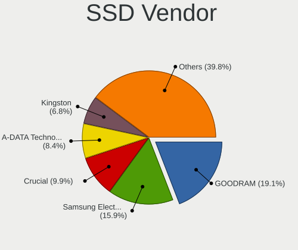

| Vendor              | Computers | Drives | Percent |
|---------------------|-----------|--------|---------|
| GOODRAM             | 887       | 1368   | 19.12%  |
| Samsung Electronics | 737       | 1037   | 15.89%  |
| Crucial             | 461       | 784    | 9.94%   |
| A-DATA Technology   | 391       | 518    | 8.43%   |
| Kingston            | 317       | 427    | 6.83%   |
| SanDisk             | 283       | 385    | 6.1%    |
| SPCC                | 147       | 212    | 3.17%   |
| Patriot             | 147       | 196    | 3.17%   |
| WDC                 | 138       | 171    | 2.98%   |
| Micron Technology   | 94        | 127    | 2.03%   |
| Intel               | 93        | 113    | 2.01%   |
| PNY                 | 76        | 86     | 1.64%   |
| SK hynix            | 72        | 91     | 1.55%   |
| Toshiba             | 71        | 84     | 1.53%   |
| China               | 69        | 103    | 1.49%   |
| Plextor             | 67        | 90     | 1.44%   |
| Apacer              | 59        | 85     | 1.27%   |
| LITEON              | 46        | 61     | 0.99%   |
| Transcend           | 43        | 50     | 0.93%   |
| KIOXIA-EXCERIA      | 42        | 57     | 0.91%   |
| OCZ                 | 35        | 40     | 0.75%   |
| Apple               | 29        | 34     | 0.63%   |
| LITEONIT            | 24        | 27     | 0.52%   |
| Lexar               | 20        | 31     | 0.43%   |
| Unknown             | 19        | 23     | 0.41%   |
| Corsair             | 17        | 18     | 0.37%   |
| Team                | 15        | 17     | 0.32%   |
| ASMT                | 14        | 14     | 0.3%    |
| KingSpec            | 12        | 13     | 0.26%   |
| Gigabyte Technology | 12        | 14     | 0.26%   |
| Intenso             | 10        | 18     | 0.22%   |
| POLION              | 8         | 8      | 0.17%   |
| BIWIN               | 7         | 7      | 0.15%   |
| Biostar             | 7         | 7      | 0.15%   |
| XSTAR               | 6         | 6      | 0.13%   |
| HS-SSD-E100         | 6         | 6      | 0.13%   |
| Hewlett-Packard     | 6         | 7      | 0.13%   |
| Verbatim            | 5         | 7      | 0.11%   |
| Netac               | 5         | 6      | 0.11%   |
| 2-Power             | 5         | 5      | 0.11%   |

Drive Kind
----------

HDD or SSD

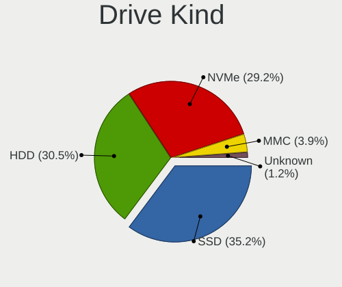

| Kind    | Computers | Drives | Percent |
|---------|-----------|--------|---------|
| SSD     | 3947      | 6517   | 35.23%  |
| HDD     | 3423      | 6302   | 30.55%  |
| NVMe    | 3268      | 5055   | 29.17%  |
| MMC     | 433       | 630    | 3.86%   |
| Unknown | 134       | 217    | 1.2%    |

Drive Connector
---------------

SATA, SAS, NVMe, etc.

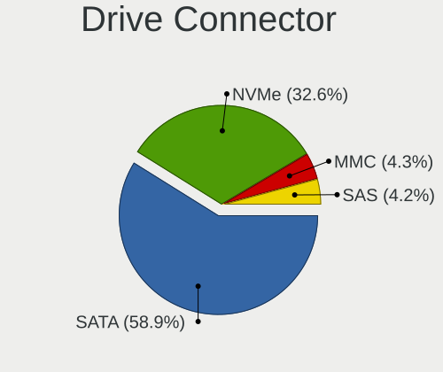

| Type | Computers | Drives | Percent |
|------|-----------|--------|---------|
| SATA | 5895      | 12442  | 58.88%  |
| NVMe | 3264      | 5022   | 32.6%   |
| MMC  | 433       | 630    | 4.32%   |
| SAS  | 420       | 627    | 4.19%   |

Drive Size
----------

Size of hard drive

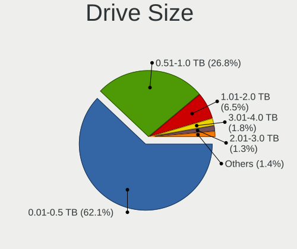

| Size in TB | Computers | Drives | Percent |
|------------|-----------|--------|---------|
| 0.01-0.5   | 4698      | 7846   | 62.07%  |
| 0.51-1.0   | 2030      | 3297   | 26.82%  |
| 1.01-2.0   | 495       | 796    | 6.54%   |
| 3.01-4.0   | 137       | 295    | 1.81%   |
| 2.01-3.0   | 101       | 301    | 1.33%   |
| 4.01-10.0  | 78        | 189    | 1.03%   |
| 10.01-20.0 | 28        | 93     | 0.37%   |
| 20.01-50.0 | 2         | 2      | 0.03%   |

Space Total
-----------

Amount of disk space available on the file system

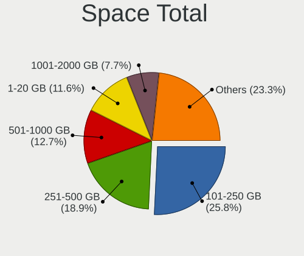

| Size in GB     | Computers | Percent |
|----------------|-----------|---------|
| 101-250        | 2371      | 25.76%  |
| 251-500        | 1741      | 18.91%  |
| 501-1000       | 1170      | 12.71%  |
| 1-20           | 1066      | 11.58%  |
| 1001-2000      | 708       | 7.69%   |
| 51-100         | 653       | 7.09%   |
| Unknown        | 500       | 5.43%   |
| More than 3000 | 387       | 4.2%    |
| 21-50          | 370       | 4.02%   |
| 2001-3000      | 239       | 2.6%    |

Space Used
----------

Amount of used disk space

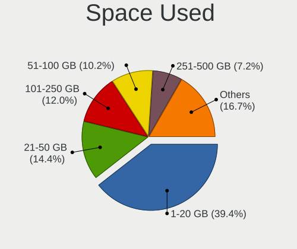

| Used GB        | Computers | Percent |
|----------------|-----------|---------|
| 1-20           | 3746      | 39.44%  |
| 21-50          | 1365      | 14.37%  |
| 101-250        | 1143      | 12.03%  |
| 51-100         | 970       | 10.21%  |
| 251-500        | 687       | 7.23%   |
| 501-1000       | 530       | 5.58%   |
| Unknown        | 500       | 5.26%   |
| 1001-2000      | 303       | 3.19%   |
| More than 3000 | 123       | 1.29%   |
| 2001-3000      | 103       | 1.08%   |
| 0              | 29        | 0.31%   |

Malfunc. Drives
---------------

Drive models with a malfunction

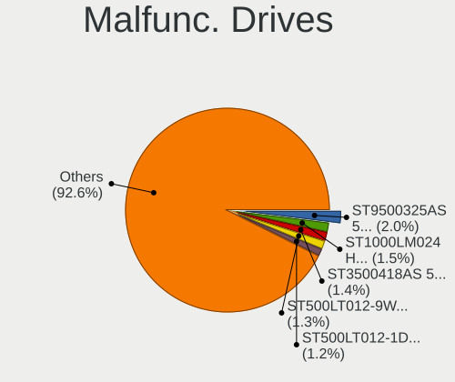

| Model                                                         | Computers | Drives | Percent |
|---------------------------------------------------------------|-----------|--------|---------|
| Seagate ST9500325AS 500GB                                     | 22        | 28     | 1.95%   |
| Seagate ST1000LM024 HN-M101MBB 1TB                            | 17        | 19     | 1.51%   |
| Seagate ST3500418AS 500GB                                     | 16        | 21     | 1.42%   |
| Seagate ST500LT012-9WS142 500GB                               | 15        | 43     | 1.33%   |
| Seagate ST500LT012-1DG142 500GB                               | 13        | 16     | 1.15%   |
| Seagate ST500DM002-1BD142 500GB                               | 12        | 13     | 1.07%   |
| Seagate ST1000LM014-SSHD-8GB                                  | 9         | 9      | 0.8%    |
| HGST HTS545050A7E680 500GB                                    | 9         | 9      | 0.8%    |
| Toshiba MQ01ABD100 1TB                                        | 8         | 11     | 0.71%   |
| SK hynix PC711 HFS512GDE9X073N 512GB                          | 7         | 8      | 0.62%   |
| Seagate ST9320325AS 320GB                                     | 7         | 8      | 0.62%   |
| Seagate ST1000DM003-9YN162 1TB                                | 7         | 8      | 0.62%   |
| WDC WD10JPVX-22JC3T0 1TB                                      | 6         | 7      | 0.53%   |
| Seagate ST500LM012 HN-M500MBB 500GB                           | 6         | 7      | 0.53%   |
| Seagate ST3250410AS 250GB                                     | 6         | 7      | 0.53%   |
| Seagate ST1000LM035-1RK172 1TB                                | 6         | 6      | 0.53%   |
| Samsung Electronics NVMe SSD Controller SM981/PM981/PM983 1TB | 6         | 8      | 0.53%   |
| Kingston SV300S37A120G 120GB SSD                              | 6         | 6      | 0.53%   |
| Hitachi HTS541612J9SA00 120GB                                 | 6         | 7      | 0.53%   |
| WDC WDS240G2G0A-00JH30 240GB SSD                              | 5         | 6      | 0.44%   |
| Seagate ST1000LM014-1EJ164 1TB                                | 5         | 6      | 0.44%   |
| Seagate ST1000DX001-1CM162 1TB                                | 5         | 8      | 0.44%   |
| Seagate ST1000DM003-1ER162 1TB                                | 5         | 6      | 0.44%   |
| Samsung Electronics HD321KJ 320GB                             | 5         | 5      | 0.44%   |
| Hitachi HTS543225L9SA00 250GB                                 | 5         | 5      | 0.44%   |
| GOODRAM SSD 120GB                                             | 5         | 5      | 0.44%   |
| ASMT 2135 4TB                                                 | 5         | 5      | 0.44%   |
| A-DATA Technology SU800 512GB SSD                             | 5         | 6      | 0.44%   |
| WDC WD5000BEVT-22ZAT0 500GB                                   | 4         | 4      | 0.36%   |
| WDC WD3200BPVT-80ZEST0 320GB                                  | 4         | 4      | 0.36%   |
| WDC WD10JFCX-68N6GN0 1TB                                      | 4         | 5      | 0.36%   |
| WDC WD10EARS-00Y5B1 1TB                                       | 4         | 4      | 0.36%   |
| Toshiba MQ01ABF050 500GB                                      | 4         | 5      | 0.36%   |
| Toshiba MQ01ABD050 500GB                                      | 4         | 4      | 0.36%   |
| Toshiba HDWD110 1TB                                           | 4         | 4      | 0.36%   |
| SK hynix BC711 HFM512GD3JX013N 512GB                          | 4         | 4      | 0.36%   |
| Seagate ST980811AS 80GB                                       | 4         | 4      | 0.36%   |
| Seagate ST9500420AS 500GB                                     | 4         | 4      | 0.36%   |
| Seagate ST9320423AS 320GB                                     | 4         | 4      | 0.36%   |
| Seagate ST9250827AS 250GB                                     | 4         | 5      | 0.36%   |

Malfunc. Drive Vendor
---------------------

Vendors of faulty drives

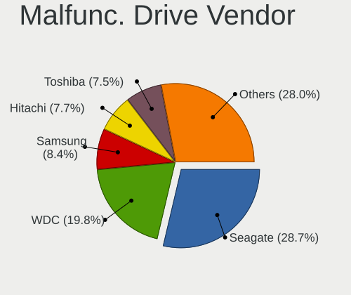

| Vendor                         | Computers | Drives | Percent |
|--------------------------------|-----------|--------|---------|
| Seagate                        | 311       | 413    | 28.69%  |
| WDC                            | 215       | 294    | 19.83%  |
| Samsung Electronics            | 91        | 110    | 8.39%   |
| Hitachi                        | 83        | 103    | 7.66%   |
| Toshiba                        | 81        | 99     | 7.47%   |
| A-DATA Technology              | 44        | 49     | 4.06%   |
| HGST                           | 27        | 28     | 2.49%   |
| SK hynix                       | 24        | 26     | 2.21%   |
| SanDisk                        | 24        | 27     | 2.21%   |
| Kingston                       | 20        | 22     | 1.85%   |
| Intel                          | 15        | 17     | 1.38%   |
| Crucial                        | 15        | 32     | 1.38%   |
| Fujitsu                        | 14        | 17     | 1.29%   |
| Micron Technology              | 11        | 11     | 1.01%   |
| GOODRAM                        | 11        | 11     | 1.01%   |
| Patriot                        | 7         | 9      | 0.65%   |
| Maxtor                         | 7         | 10     | 0.65%   |
| SPCC                           | 6         | 6      | 0.55%   |
| LITEON                         | 6         | 6      | 0.55%   |
| China                          | 6         | 10     | 0.55%   |
| ASMT                           | 6         | 7      | 0.55%   |
| OCZ                            | 5         | 5      | 0.46%   |
| Realtek Semiconductor          | 4         | 4      | 0.37%   |
| LITEONIT                       | 4         | 4      | 0.37%   |
| Hewlett-Packard                | 4         | 7      | 0.37%   |
| Apple                          | 4         | 4      | 0.37%   |
| Apacer                         | 4         | 7      | 0.37%   |
| WD MediaMax                    | 3         | 5      | 0.28%   |
| ASMedia                        | 3         | 3      | 0.28%   |
| SSSTC                          | 2         | 2      | 0.18%   |
| Silicon Motion                 | 2         | 2      | 0.18%   |
| POLION                         | 2         | 2      | 0.18%   |
| PNY                            | 2         | 2      | 0.18%   |
| Unknown                        | 2         | 2      | 0.18%   |
| XPG                            | 1         | 1      | 0.09%   |
| WDC WDS2                       | 1         | 1      | 0.09%   |
| Supermicro                     | 1         | 2      | 0.09%   |
| Solid State Storage Technology | 1         | 1      | 0.09%   |
| SAGE                           | 1         | 1      | 0.09%   |
| RENICE                         | 1         | 1      | 0.09%   |

Malfunc. HDD Vendor
-------------------

Vendors of faulty HDD drives

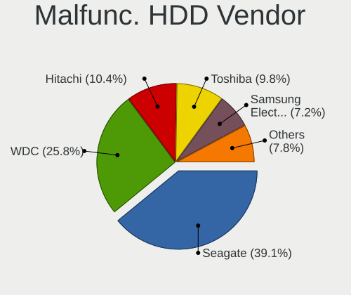

| Vendor              | Computers | Drives | Percent |
|---------------------|-----------|--------|---------|
| Seagate             | 311       | 413    | 39.07%  |
| WDC                 | 205       | 282    | 25.75%  |
| Hitachi             | 83        | 103    | 10.43%  |
| Toshiba             | 78        | 96     | 9.8%    |
| Samsung Electronics | 57        | 68     | 7.16%   |
| HGST                | 27        | 28     | 3.39%   |
| Fujitsu             | 14        | 17     | 1.76%   |
| Maxtor              | 7         | 10     | 0.88%   |
| WD MediaMax         | 3         | 5      | 0.38%   |
| ASMedia             | 3         | 3      | 0.38%   |
| Hewlett-Packard     | 2         | 5      | 0.25%   |
| Apple               | 2         | 2      | 0.25%   |
| SAGE                | 1         | 1      | 0.13%   |
| JMicron Technology  | 1         | 2      | 0.13%   |
| ASMT                | 1         | 2      | 0.13%   |
| Unknown             | 1         | 1      | 0.13%   |

Malfunc. Drive Kind
-------------------

Kinds of faulty drives

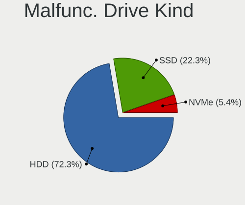

| Kind | Computers | Drives | Percent |
|------|-----------|--------|---------|
| HDD  | 740       | 1038   | 72.34%  |
| SSD  | 228       | 276    | 22.29%  |
| NVMe | 55        | 66     | 5.38%   |

Failed Drives
-------------

Failed drive models

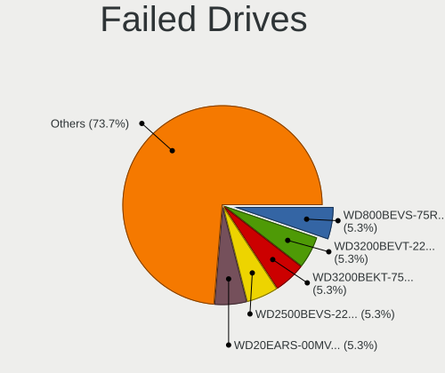

| Model                             | Computers | Drives | Percent |
|-----------------------------------|-----------|--------|---------|
| WDC WD800BEVS-75RST0 80GB         | 1         | 1      | 5.26%   |
| WDC WD3200BEVT-22ZCT0 320GB       | 1         | 1      | 5.26%   |
| WDC WD3200BEKT-75PVMT1 320GB      | 1         | 1      | 5.26%   |
| WDC WD2500BEVS-22UST0 250GB       | 1         | 1      | 5.26%   |
| WDC WD20EARS-00MVWB0 2TB          | 1         | 1      | 5.26%   |
| WDC WD1600AAJS-75M0A0 160GB       | 1         | 1      | 5.26%   |
| Toshiba MK3265GSXN 320GB          | 1         | 1      | 5.26%   |
| Toshiba DT01ACA100 1TB            | 1         | 2      | 5.26%   |
| Seagate ST500DM002-1BC142 500GB   | 1         | 1      | 5.26%   |
| Seagate ST320LT020-9YG142 320GB   | 1         | 1      | 5.26%   |
| Seagate ST31000528AS 1TB          | 1         | 1      | 5.26%   |
| Seagate ST2000DL003-9VT166 2TB    | 1         | 1      | 5.26%   |
| Samsung Electronics SSD 980 500GB | 1         | 1      | 5.26%   |
| Samsung Electronics HM250HI 250GB | 1         | 1      | 5.26%   |
| Samsung Electronics HD250HJ 250GB | 1         | 1      | 5.26%   |
| OCZ-AGIL ITY3 64GB SSD            | 1         | 1      | 5.26%   |
| Hitachi HDS721050CLA662 500GB     | 1         | 1      | 5.26%   |
| HGST HTS725032A7E630 320GB        | 1         | 1      | 5.26%   |
| HGST HTS725025A7 250GB            | 1         | 1      | 5.26%   |

Failed Drive Vendor
-------------------

Failed drive vendors

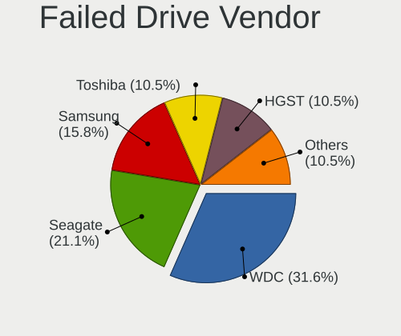

| Vendor              | Computers | Drives | Percent |
|---------------------|-----------|--------|---------|
| WDC                 | 6         | 6      | 31.58%  |
| Seagate             | 4         | 4      | 21.05%  |
| Samsung Electronics | 3         | 3      | 15.79%  |
| Toshiba             | 2         | 3      | 10.53%  |
| HGST                | 2         | 2      | 10.53%  |
| OCZ-AGIL            | 1         | 1      | 5.26%   |
| Hitachi             | 1         | 1      | 5.26%   |

Drive Status
------------

Number of failed and malfunc. drives

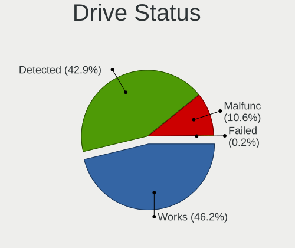

| Status   | Computers | Drives | Percent |
|----------|-----------|--------|---------|
| Works    | 4319      | 8737   | 46.23%  |
| Detected | 4012      | 8584   | 42.95%  |
| Malfunc  | 992       | 1380   | 10.62%  |
| Failed   | 19        | 20     | 0.2%    |

Storage controller
------------------

Storage Vendor
--------------

Storage controller vendors

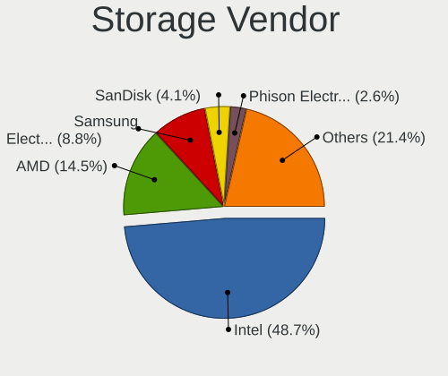

| Vendor                                  | Computers | Percent |
|-----------------------------------------|-----------|---------|
| Intel                                   | 5428      | 48.66%  |
| AMD                                     | 1618      | 14.5%   |
| Samsung Electronics                     | 978       | 8.77%   |
| SanDisk                                 | 454       | 4.07%   |
| Phison Electronics                      | 288       | 2.58%   |
| Kingston Technology Company             | 273       | 2.45%   |
| SK hynix                                | 248       | 2.22%   |
| ADATA Technology                        | 213       | 1.91%   |
| Micron Technology                       | 192       | 1.72%   |
| ASMedia Technology                      | 175       | 1.57%   |
| Shenzhen Longsys Electronics            | 133       | 1.19%   |
| JMicron Technology                      | 129       | 1.16%   |
| KIOXIA                                  | 126       | 1.13%   |
| Nvidia                                  | 107       | 0.96%   |
| Toshiba America Info Systems            | 106       | 0.95%   |
| MAXIO Technology (Hangzhou)             | 106       | 0.95%   |
| Silicon Motion                          | 89        | 0.8%    |
| Micron/Crucial Technology               | 78        | 0.7%    |
| Marvell Technology Group                | 75        | 0.67%   |
| Realtek Semiconductor                   | 62        | 0.56%   |
| Lite-On Technology                      | 33        | 0.3%    |
| VIA Technologies                        | 29        | 0.26%   |
| LSI Logic / Symbios Logic               | 29        | 0.26%   |
| Union Memory (Shenzhen)                 | 24        | 0.22%   |
| Solid State Storage Technology          | 23        | 0.21%   |
| Silicon Integrated Systems [SiS]        | 16        | 0.14%   |
| Lenovo                                  | 15        | 0.13%   |
| Broadcom / LSI                          | 13        | 0.12%   |
| Hewlett-Packard                         | 12        | 0.11%   |
| Solidigm                                | 9         | 0.08%   |
| Silicon Image                           | 9         | 0.08%   |
| O2 Micro                                | 7         | 0.06%   |
| INNOGRIT                                | 7         | 0.06%   |
| Hosin Global Electronics                | 7         | 0.06%   |
| Apple                                   | 7         | 0.06%   |
| Shenzhen Wodposit Electronics           | 4         | 0.04%   |
| Integrated Technology Express           | 4         | 0.04%   |
| Yangtze Memory Technologies             | 3         | 0.03%   |
| Shenzhen Unionmemory Information System | 3         | 0.03%   |
| Seagate Technology                      | 3         | 0.03%   |

Storage Model
-------------

Storage controller models

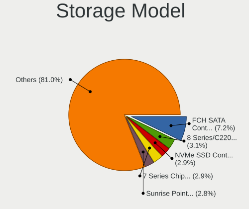

| Model                                                                          | Computers | Percent |
|--------------------------------------------------------------------------------|-----------|---------|
| AMD FCH SATA Controller [AHCI mode]                                            | 920       | 7.19%   |
| Intel 8 Series/C220 Series Chipset Family 6-port SATA Controller 1 [AHCI mode] | 396       | 3.1%    |
| Samsung NVMe SSD Controller SM981/PM981/PM983                                  | 377       | 2.95%   |
| Intel 7 Series Chipset Family 6-port SATA Controller [AHCI mode]               | 377       | 2.95%   |
| Intel Sunrise Point-LP SATA Controller [AHCI mode]                             | 357       | 2.79%   |
| AMD 400 Series Chipset SATA Controller                                         | 300       | 2.35%   |
| Intel 6 Series/C200 Series Chipset Family 6 port Mobile SATA AHCI Controller   | 275       | 2.15%   |
| Samsung NVMe SSD Controller 980 (DRAM-less)                                    | 273       | 2.13%   |
| Intel 82801 Mobile SATA Controller [RAID mode]                                 | 271       | 2.12%   |
| Intel Volume Management Device NVMe RAID Controller                            | 207       | 1.62%   |
| Intel Q170/Q150/B150/H170/H110/Z170/CM236 Chipset SATA Controller [AHCI Mode]  | 194       | 1.52%   |
| Intel 8 Series SATA Controller 1 [AHCI mode]                                   | 192       | 1.5%    |
| Intel 82801IBM/IEM (ICH9M/ICH9M-E) 4 port SATA Controller [AHCI mode]          | 190       | 1.49%   |
| AMD 500 Series Chipset SATA Controller                                         | 186       | 1.45%   |
| Intel Wildcat Point-LP SATA Controller [AHCI Mode]                             | 163       | 1.27%   |
| ASMedia ASM1061/ASM1062 Serial ATA Controller                                  | 159       | 1.24%   |
| Intel Cannon Lake Mobile PCH SATA AHCI Controller                              | 154       | 1.2%    |
| AMD SB7x0/SB8x0/SB9x0 IDE Controller                                           | 150       | 1.17%   |
| AMD SB7x0/SB8x0/SB9x0 SATA Controller [AHCI mode]                              | 149       | 1.17%   |
| Samsung NVMe SSD Controller PM9A1/PM9A3/980PRO                                 | 144       | 1.13%   |
| ADATA XPG SX8200 Pro PCIe Gen3x4 M.2 2280 Solid State Drive                    | 139       | 1.09%   |
| Intel 82801HM/HEM (ICH8M/ICH8M-E) IDE Controller                               | 138       | 1.08%   |
| Intel 200 Series PCH SATA controller [AHCI mode]                               | 135       | 1.06%   |
| Intel 7 Series/C210 Series Chipset Family 6-port SATA Controller [AHCI mode]   | 130       | 1.02%   |
| AMD 600 Series Chipset SATA Controller                                         | 127       | 0.99%   |
| Intel 6 Series/C200 Series Chipset Family 6 port Desktop SATA AHCI Controller  | 125       | 0.98%   |
| Intel NM10/ICH7 Family SATA Controller [IDE mode]                              | 120       | 0.94%   |
| Intel SATA Controller [RAID mode]                                              | 117       | 0.91%   |
| Intel 5 Series/3400 Series Chipset 4 port SATA AHCI Controller                 | 116       | 0.91%   |
| Intel Atom Processor E3800 Series SATA AHCI Controller                         | 113       | 0.88%   |
| Phison E12 NVMe Controller                                                     | 109       | 0.85%   |
| Intel 82801HM/HEM (ICH8M/ICH8M-E) SATA Controller [AHCI mode]                  | 109       | 0.85%   |
| Intel HM170/QM170 Chipset SATA Controller [AHCI Mode]                          | 108       | 0.84%   |
| AMD SB7x0/SB8x0/SB9x0 SATA Controller [IDE mode]                               | 107       | 0.84%   |
| Intel 5 Series/3400 Series Chipset 6 port SATA AHCI Controller                 | 106       | 0.83%   |
| Intel SSD 660P Series                                                          | 105       | 0.82%   |
| Intel 82801G (ICH7 Family) IDE Controller                                      | 103       | 0.81%   |
| Kingston Company KC3000/FURY Renegade NVMe SSD [E18]                           | 98        | 0.77%   |
| Intel Cannon Lake PCH SATA AHCI Controller                                     | 92        | 0.72%   |
| SK hynix Gold P31/BC711/PC711 NVMe Solid State Drive                           | 87        | 0.68%   |

Storage Kind
------------

Kind of storage controller (IDE, SATA, NVMe, SAS, ...)

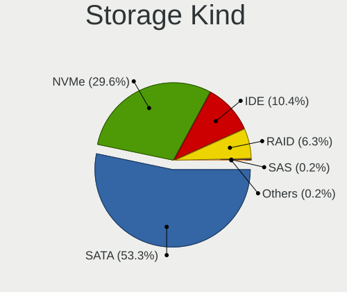

| Kind | Computers | Percent |
|------|-----------|---------|
| SATA | 5902      | 53.27%  |
| NVMe | 3280      | 29.61%  |
| IDE  | 1154      | 10.42%  |
| RAID | 700       | 6.32%   |
| SAS  | 26        | 0.23%   |
| SCSI | 17        | 0.15%   |

Processor
---------

CPU Vendor
----------

Processor vendors

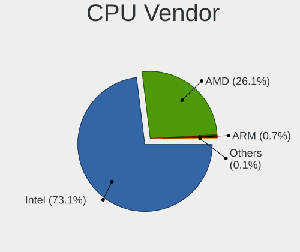

| Vendor        | Computers | Percent |
|---------------|-----------|---------|
| Intel         | 6165      | 73.05%  |
| AMD           | 2199      | 26.06%  |
| ARM           | 62        | 0.73%   |
| QUALCOMM      | 5         | 0.06%   |
| CentaurHauls  | 3         | 0.04%   |
| sifive,u74-mc | 1         | 0.01%   |
| PowerMac11,2  | 1         | 0.01%   |
| PowerBook6,7  | 1         | 0.01%   |
| AppliedMicro  | 1         | 0.01%   |
| Unknown       | 1         | 0.01%   |

CPU Model
---------

Processor models

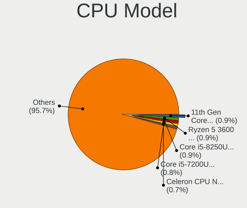

| Model                                         | Computers | Percent |
|-----------------------------------------------|-----------|---------|
| Intel 11th Gen Core i5-1135G7 @ 2.40GHz       | 78        | 0.92%   |
| AMD Ryzen 5 3600 6-Core Processor             | 76        | 0.9%    |
| Intel Core i5-8250U CPU @ 1.60GHz             | 74        | 0.87%   |
| Intel Core i5-7200U CPU @ 2.50GHz             | 71        | 0.84%   |
| Intel Celeron CPU N2840 @ 2.16GHz             | 63        | 0.74%   |
| Intel Core i5-8265U CPU @ 1.60GHz             | 60        | 0.71%   |
| Intel Core i5-2520M CPU @ 2.50GHz             | 60        | 0.71%   |
| Intel Core i5-5200U CPU @ 2.20GHz             | 55        | 0.65%   |
| Intel Core i5-3320M CPU @ 2.60GHz             | 54        | 0.64%   |
| AMD Ryzen 5 3500U with Radeon Vega Mobile Gfx | 49        | 0.58%   |
| AMD Custom APU 0405                           | 49        | 0.58%   |
| Intel Core i7-8550U CPU @ 1.80GHz             | 48        | 0.57%   |
| Intel 11th Gen Core i7-1165G7 @ 2.80GHz       | 47        | 0.55%   |
| Intel Core i7-8750H CPU @ 2.20GHz             | 45        | 0.53%   |
| Intel Core i5-6200U CPU @ 2.30GHz             | 45        | 0.53%   |
| Intel Core i5-6300U CPU @ 2.40GHz             | 43        | 0.51%   |
| Intel Core i5-3470 CPU @ 3.20GHz              | 43        | 0.51%   |
| AMD Ryzen 5 4600H with Radeon Graphics        | 43        | 0.51%   |
| AMD Ryzen 5 2600 Six-Core Processor           | 43        | 0.51%   |
| Intel Core i7-9750H CPU @ 2.60GHz             | 41        | 0.48%   |
| Intel Core i7-6500U CPU @ 2.50GHz             | 41        | 0.48%   |
| Intel Core i5-3210M CPU @ 2.50GHz             | 41        | 0.48%   |
| Intel Core i5-10210U CPU @ 1.60GHz            | 41        | 0.48%   |
| Intel Core 2 Duo CPU E8400 @ 3.00GHz          | 41        | 0.48%   |
| AMD Ryzen 5 5600X 6-Core Processor            | 41        | 0.48%   |
| Intel Core i5-8300H CPU @ 2.30GHz             | 40        | 0.47%   |
| Intel Core i5-5300U CPU @ 2.30GHz             | 40        | 0.47%   |
| Intel Core i7-7700HQ CPU @ 2.80GHz            | 39        | 0.46%   |
| Intel Core i5-8350U CPU @ 1.70GHz             | 39        | 0.46%   |
| Intel Core i5-1035G1 CPU @ 1.00GHz            | 39        | 0.46%   |
| ARM Processor                                 | 37        | 0.44%   |
| Intel Core i7-4790 CPU @ 3.60GHz              | 36        | 0.42%   |
| Intel Core i5-2400 CPU @ 3.10GHz              | 36        | 0.42%   |
| AMD Ryzen 7 5800X 8-Core Processor            | 36        | 0.42%   |
| Intel 12th Gen Core i5-1235U                  | 35        | 0.41%   |
| AMD Ryzen 7 3700X 8-Core Processor            | 35        | 0.41%   |
| AMD Ryzen 5 5600H with Radeon Graphics        | 35        | 0.41%   |
| AMD Ryzen 5 1600 Six-Core Processor           | 35        | 0.41%   |
| Intel Core i7-6700HQ CPU @ 2.60GHz            | 34        | 0.4%    |
| AMD Ryzen 7 4800H with Radeon Graphics        | 34        | 0.4%    |

CPU Model Family
----------------

Processor model prefix

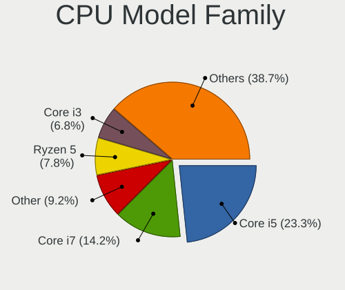

| Model                   | Computers | Percent |
|-------------------------|-----------|---------|
| Intel Core i5           | 1977      | 23.34%  |
| Intel Core i7           | 1199      | 14.16%  |
| Other                   | 783       | 9.25%   |
| AMD Ryzen 5             | 663       | 7.83%   |
| Intel Core i3           | 573       | 6.77%   |
| AMD Ryzen 7             | 502       | 5.93%   |
| Intel Core 2 Duo        | 406       | 4.79%   |
| Intel Celeron           | 322       | 3.8%    |
| Intel Pentium           | 211       | 2.49%   |
| Intel Xeon              | 208       | 2.46%   |
| AMD Ryzen 9             | 129       | 1.52%   |
| Intel Atom              | 117       | 1.38%   |
| Intel Pentium Dual-Core | 98        | 1.16%   |
| Intel Core 2 Quad       | 88        | 1.04%   |
| AMD FX                  | 69        | 0.81%   |
| AMD Ryzen 3             | 66        | 0.78%   |
| Intel Core              | 65        | 0.77%   |
| AMD A6                  | 56        | 0.66%   |
| AMD A8                  | 55        | 0.65%   |
| Intel Core 2            | 52        | 0.61%   |
| Intel Pentium Dual      | 50        | 0.59%   |
| AMD Phenom II X4        | 48        | 0.57%   |
| AMD Ryzen 5 PRO         | 43        | 0.51%   |
| AMD A10                 | 42        | 0.5%    |
| AMD Ryzen 7 PRO         | 39        | 0.46%   |
| AMD Athlon 64 X2        | 37        | 0.44%   |
| Intel Core i9           | 32        | 0.38%   |
| AMD Athlon II X2        | 32        | 0.38%   |
| AMD A4                  | 29        | 0.34%   |
| AMD GX                  | 28        | 0.33%   |
| AMD Athlon II X4        | 25        | 0.3%    |
| Intel Pentium Silver    | 21        | 0.25%   |
| AMD E1                  | 21        | 0.25%   |
| AMD E                   | 21        | 0.25%   |
| Intel Genuine           | 20        | 0.24%   |
| ARM BCM                 | 15        | 0.18%   |
| AMD Embedded            | 15        | 0.18%   |
| Intel Pentium Gold      | 14        | 0.17%   |
| AMD Ryzen Threadripper  | 13        | 0.15%   |
| AMD Athlon X2           | 13        | 0.15%   |

CPU Cores
---------

Number of processor cores

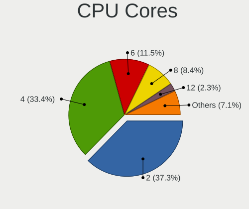

| Number  | Computers | Percent |
|---------|-----------|---------|
| 2       | 3168      | 37.34%  |
| 4       | 2833      | 33.39%  |
| 6       | 973       | 11.47%  |
| 8       | 709       | 8.36%   |
| 12      | 197       | 2.32%   |
| 10      | 124       | 1.46%   |
| 1       | 124       | 1.46%   |
| 16      | 110       | 1.3%    |
| Unknown | 82        | 0.97%   |
| 14      | 75        | 0.88%   |
| 3       | 28        | 0.33%   |
| 20      | 23        | 0.27%   |
| 24      | 21        | 0.25%   |
| 5       | 7         | 0.08%   |
| 32      | 4         | 0.05%   |
| 192     | 1         | 0.01%   |
| 64      | 1         | 0.01%   |
| 48      | 1         | 0.01%   |
| 44      | 1         | 0.01%   |
| 40      | 1         | 0.01%   |
| 28      | 1         | 0.01%   |
| 18      | 1         | 0.01%   |

CPU Sockets
-----------

Number of sockets

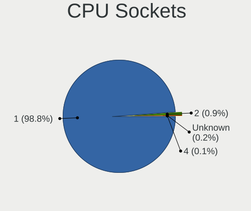

| Number  | Computers | Percent |
|---------|-----------|---------|
| 1       | 8345      | 98.84%  |
| 2       | 73        | 0.86%   |
| Unknown | 18        | 0.21%   |
| 4       | 7         | 0.08%   |

CPU Threads
-----------

Threads per core (Hyper-Threading)

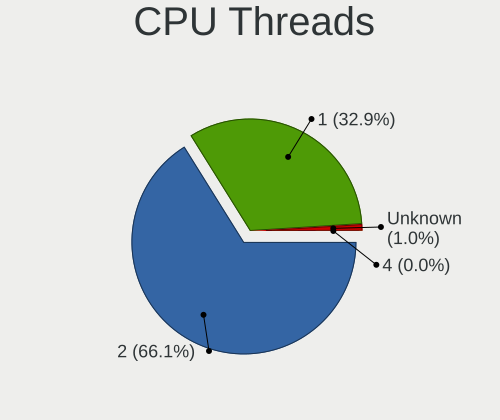

| Number  | Computers | Percent |
|---------|-----------|---------|
| 2       | 5613      | 66.12%  |
| 1       | 2792      | 32.89%  |
| Unknown | 82        | 0.97%   |
| 8       | 1         | 0.01%   |
| 4       | 1         | 0.01%   |

CPU Op-Modes
------------

CPU Operation Modes (32-bit, 64-bit)

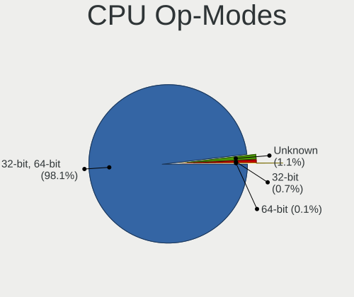

| Op mode        | Computers | Percent |
|----------------|-----------|---------|
| 32-bit, 64-bit | 8293      | 98.12%  |
| Unknown        | 93        | 1.1%    |
| 32-bit         | 57        | 0.67%   |
| 64-bit         | 9         | 0.11%   |

CPU Microcode
-------------

Microcode number

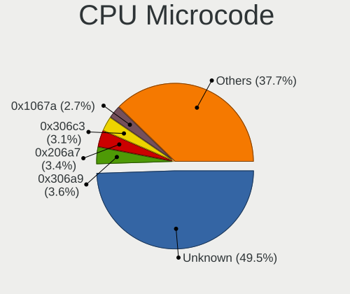

| Number     | Computers | Percent |
|------------|-----------|---------|
| Unknown    | 4385      | 49.49%  |
| 0x306a9    | 316       | 3.57%   |
| 0x206a7    | 305       | 3.44%   |
| 0x306c3    | 272       | 3.07%   |
| 0x1067a    | 240       | 2.71%   |
| 0x906ea    | 144       | 1.63%   |
| 0x506e3    | 130       | 1.47%   |
| 0x40651    | 115       | 1.3%    |
| 0x906e9    | 101       | 1.14%   |
| 0x20655    | 101       | 1.14%   |
| 0x806ec    | 100       | 1.13%   |
| 0x806c1    | 97        | 1.09%   |
| 0x6fd      | 97        | 1.09%   |
| 0x30678    | 95        | 1.07%   |
| 0x306d4    | 92        | 1.04%   |
| 0x806ea    | 85        | 0.96%   |
| 0x406e3    | 85        | 0.96%   |
| 0x10676    | 82        | 0.93%   |
| 0x08701021 | 76        | 0.86%   |
| 0x806e9    | 73        | 0.82%   |
| 0x0800820d | 73        | 0.82%   |
| 0x010000c8 | 70        | 0.79%   |
| 0x0a50000c | 68        | 0.77%   |
| 0x08108109 | 50        | 0.56%   |
| 0x6fb      | 49        | 0.55%   |
| 0x06001119 | 49        | 0.55%   |
| 0x08600106 | 47        | 0.53%   |
| 0xa0652    | 35        | 0.4%    |
| 0x20652    | 35        | 0.4%    |
| 0x6f6      | 34        | 0.38%   |
| 0x406c4    | 31        | 0.35%   |
| 0x806eb    | 30        | 0.34%   |
| 0x08108102 | 30        | 0.34%   |
| 0x0a50000d | 29        | 0.33%   |
| 0x08701013 | 29        | 0.33%   |
| 0xa0653    | 28        | 0.32%   |
| 0x906ed    | 28        | 0.32%   |
| 0x706e5    | 28        | 0.32%   |
| 0x06000852 | 27        | 0.3%    |
| 0x106e5    | 25        | 0.28%   |

CPU Microarch
-------------

Microarchitecture

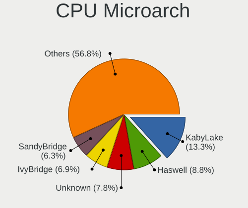

| Name              | Computers | Percent |
|-------------------|-----------|---------|
| KabyLake          | 1129      | 13.33%  |
| Haswell           | 748       | 8.83%   |
| Unknown           | 662       | 7.81%   |
| IvyBridge         | 582       | 6.87%   |
| SandyBridge       | 536       | 6.33%   |
| Penryn            | 464       | 5.48%   |
| Skylake           | 449       | 5.3%    |
| Zen 3             | 404       | 4.77%   |
| Zen 2             | 367       | 4.33%   |
| Core              | 296       | 3.49%   |
| Zen+              | 269       | 3.18%   |
| Westmere          | 264       | 3.12%   |
| Alderlake Hybrid  | 253       | 2.99%   |
| Silvermont        | 252       | 2.97%   |
| Broadwell         | 206       | 2.43%   |
| TigerLake         | 203       | 2.4%    |
| K10               | 159       | 1.88%   |
| CometLake         | 149       | 1.76%   |
| Zen               | 131       | 1.55%   |
| Piledriver        | 124       | 1.46%   |
| Icelake           | 113       | 1.33%   |
| K8 Hammer         | 71        | 0.84%   |
| Goldmont plus     | 70        | 0.83%   |
| Nehalem           | 69        | 0.81%   |
| Bobcat            | 62        | 0.73%   |
| Excavator         | 58        | 0.68%   |
| Goldmont          | 46        | 0.54%   |
| Bonnell           | 43        | 0.51%   |
| Puma              | 40        | 0.47%   |
| Jaguar            | 39        | 0.46%   |
| P6                | 35        | 0.41%   |
| Steamroller       | 33        | 0.39%   |
| Meteorlake Hybrid | 30        | 0.35%   |
| K10 Llano         | 24        | 0.28%   |
| NetBurst          | 21        | 0.25%   |
| K8 & K10 hybrid   | 21        | 0.25%   |
| Bulldozer         | 18        | 0.21%   |
| Gracemont         | 14        | 0.17%   |
| Tremont           | 10        | 0.12%   |
| Lunarlake Hybrid  | 5         | 0.06%   |

Graphics
--------

GPU Vendor
----------

Vendors of graphics cards

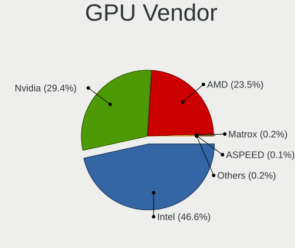

| Vendor                           | Computers | Percent |
|----------------------------------|-----------|---------|
| Intel                            | 4702      | 46.56%  |
| Nvidia                           | 2972      | 29.43%  |
| AMD                              | 2370      | 23.47%  |
| Matrox Electronics Systems       | 23        | 0.23%   |
| ASPEED Technology                | 14        | 0.14%   |
| VIA Technologies                 | 8         | 0.08%   |
| Silicon Integrated Systems [SiS] | 8         | 0.08%   |
| S3 Graphics                      | 1         | 0.01%   |
| Red Hat                          | 1         | 0.01%   |

GPU Model
---------

Graphics card models

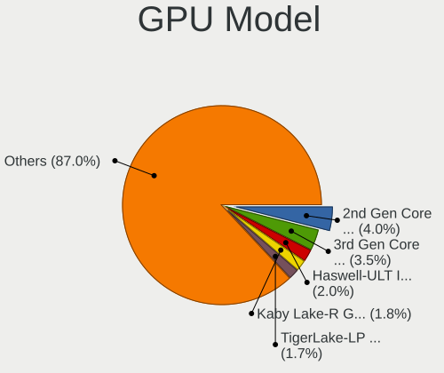

| Model                                                                                    | Computers | Percent |
|------------------------------------------------------------------------------------------|-----------|---------|
| Intel 2nd Generation Core Processor Family Integrated Graphics Controller                | 414       | 3.96%   |
| Intel 3rd Gen Core processor Graphics Controller                                         | 365       | 3.49%   |
| Intel Haswell-ULT Integrated Graphics Controller                                         | 211       | 2.02%   |
| Intel Kaby Lake-R GT2 [UHD Graphics 620]                                                 | 193       | 1.85%   |
| Intel TigerLake-LP GT2 [Iris Xe Graphics]                                                | 181       | 1.73%   |
| Intel Skylake-U GT2 [HD Graphics 520]                                                    | 171       | 1.64%   |
| Intel 4th Gen Core Processor Integrated Graphics Controller                              | 164       | 1.57%   |
| Intel CoffeeLake-H GT2 [UHD Graphics 630]                                                | 162       | 1.55%   |
| Intel Broadwell-U GT2 [HD Graphics 5500]                                                 | 159       | 1.52%   |
| AMD Renoir [Radeon Vega Series / Radeon Vega Mobile Series]                              | 159       | 1.52%   |
| AMD Ellesmere [Radeon RX 470/480/570/570X/580/580X/590]                                  | 159       | 1.52%   |
| Intel Xeon E3-1200 v3/4th Gen Core Processor Integrated Graphics Controller              | 157       | 1.5%    |
| Intel Mobile 4 Series Chipset Integrated Graphics Controller                             | 155       | 1.48%   |
| Intel Atom Processor Z36xxx/Z37xxx Series Graphics & Display                             | 154       | 1.47%   |
| Intel Kaby Lake-U GT2 [HD Graphics 620]                                                  | 147       | 1.41%   |
| AMD Picasso/Raven 2 [Radeon Vega Series / Radeon Vega Mobile Series]                     | 145       | 1.39%   |
| Intel Core Processor Integrated Graphics Controller                                      | 144       | 1.38%   |
| Intel WhiskeyLake-U GT2 [UHD Graphics 620]                                               | 133       | 1.27%   |
| AMD Cezanne [Radeon Vega Series / Radeon Vega Mobile Series]                             | 127       | 1.21%   |
| Intel Atom/Celeron/Pentium Processor x5-E8000/J3xxx/N3xxx Integrated Graphics Controller | 97        | 0.93%   |
| Intel Mobile GM965/GL960 Integrated Graphics Controller (secondary)                      | 93        | 0.89%   |
| Intel Mobile GM965/GL960 Integrated Graphics Controller (primary)                        | 93        | 0.89%   |
| Intel CometLake-U GT2 [UHD Graphics]                                                     | 87        | 0.83%   |
| Nvidia TU117M [GeForce GTX 1650 Mobile / Max-Q]                                          | 83        | 0.79%   |
| Nvidia GP107 [GeForce GTX 1050 Ti]                                                       | 83        | 0.79%   |
| Nvidia GF117M [GeForce 610M/710M/810M/820M / GT 620M/625M/630M/720M]                     | 81        | 0.77%   |
| Intel Skylake-H GT2 [HD Graphics 530]                                                    | 80        | 0.76%   |
| Nvidia GP107M [GeForce GTX 1050 Mobile]                                                  | 77        | 0.74%   |
| Intel Skylake-S GT2 [HD Graphics 530]                                                    | 77        | 0.74%   |
| Intel Kaby Lake-H GT2 [HD Graphics 630]                                                  | 76        | 0.73%   |
| AMD Raphael                                                                              | 71        | 0.68%   |
| Intel Alder Lake-P GT2 [Iris Xe Graphics]                                                | 69        | 0.66%   |
| Intel Xeon E3-1200 v2/3rd Gen Core processor Graphics Controller                         | 67        | 0.64%   |
| AMD Raven Ridge [Radeon Vega Series / Radeon Vega Mobile Series]                         | 66        | 0.63%   |
| Nvidia GP106 [GeForce GTX 1060 6GB]                                                      | 65        | 0.62%   |
| AMD Navi 23 [Radeon RX 6600/6600 XT/6600M]                                               | 61        | 0.58%   |
| Intel CometLake-H GT2 [UHD Graphics]                                                     | 60        | 0.57%   |
| Intel 4 Series Chipset Integrated Graphics Controller                                    | 58        | 0.55%   |
| AMD Rembrandt [Radeon 680M]                                                              | 58        | 0.55%   |
| Intel CoffeeLake-S GT2 [UHD Graphics 630]                                                | 57        | 0.55%   |

GPU Combo
---------

Combinations of graphics cards

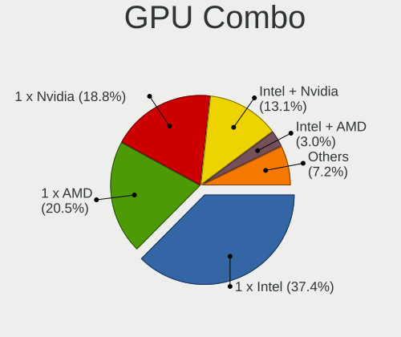

| Name                     | Computers | Percent |
|--------------------------|-----------|---------|
| 1 x Intel                | 3200      | 37.44%  |
| 1 x AMD                  | 1753      | 20.51%  |
| 1 x Nvidia               | 1605      | 18.78%  |
| Intel + Nvidia           | 1119      | 13.09%  |
| Intel + AMD              | 257       | 3.01%   |
| AMD + Nvidia             | 232       | 2.71%   |
| 2 x AMD                  | 141       | 1.65%   |
| 2 x Intel                | 84        | 0.98%   |
| Other                    | 83        | 0.97%   |
| 1 x Matrox               | 22        | 0.26%   |
| 2 x Nvidia               | 13        | 0.15%   |
| 1 x ASPEED               | 10        | 0.12%   |
| 1 x VIA                  | 8         | 0.09%   |
| 1 x SiS                  | 8         | 0.09%   |
| 3 x AMD                  | 3         | 0.04%   |
| Nvidia + ASPEED          | 3         | 0.04%   |
| 2 x Intel + 1 x Nvidia   | 2         | 0.02%   |
| 2 x Nvidia + 1 x ASPEED  | 1         | 0.01%   |
| 1 x S3 Graphics          | 1         | 0.01%   |
| 1 x Red Hat              | 1         | 0.01%   |
| Nvidia + Matrox          | 1         | 0.01%   |
| Intel + AMD + 1 x Nvidia | 1         | 0.01%   |

GPU Driver
----------

Free vs proprietary

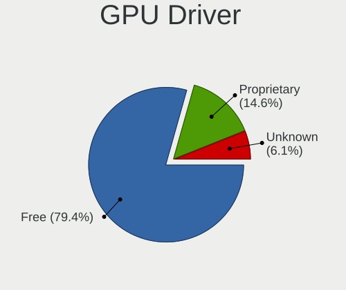

| Driver      | Computers | Percent |
|-------------|-----------|---------|
| Free        | 6840      | 79.36%  |
| Proprietary | 1257      | 14.58%  |
| Unknown     | 522       | 6.06%   |

GPU Memory
----------

Total video memory

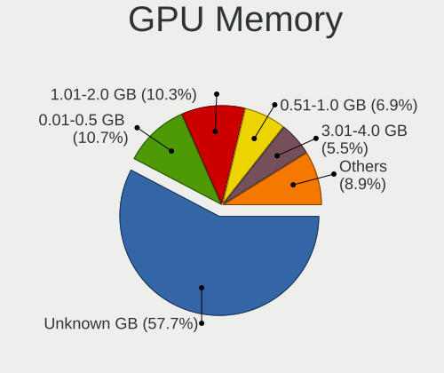

| Size in GB | Computers | Percent |
|------------|-----------|---------|
| Unknown    | 5065      | 57.69%  |
| 0.01-0.5   | 940       | 10.71%  |
| 1.01-2.0   | 907       | 10.33%  |
| 0.51-1.0   | 605       | 6.89%   |
| 3.01-4.0   | 485       | 5.52%   |
| 7.01-8.0   | 360       | 4.1%    |
| 5.01-6.0   | 184       | 2.1%    |
| 8.01-16.0  | 173       | 1.97%   |
| 2.01-3.0   | 32        | 0.36%   |
| 16.01-24.0 | 27        | 0.31%   |
| 4.01-5.0   | 2         | 0.02%   |

Monitor
-------

Monitor Vendor
--------------

Monitor vendors

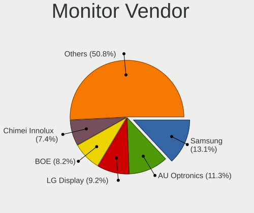

| Vendor                  | Computers | Percent |
|-------------------------|-----------|---------|
| Samsung Electronics     | 1229      | 13.07%  |
| AU Optronics            | 1067      | 11.35%  |
| LG Display              | 862       | 9.17%   |
| BOE                     | 775       | 8.24%   |
| Chimei Innolux          | 694       | 7.38%   |
| Dell                    | 562       | 5.98%   |
| Goldstar                | 505       | 5.37%   |
| Iiyama                  | 361       | 3.84%   |
| Philips                 | 293       | 3.12%   |
| Lenovo                  | 251       | 2.67%   |
| Hewlett-Packard         | 242       | 2.57%   |
| Acer                    | 225       | 2.39%   |
| BenQ                    | 206       | 2.19%   |
| AOC                     | 203       | 2.16%   |
| Chi Mei Optoelectronics | 169       | 1.8%    |
| Eizo                    | 119       | 1.27%   |
| NEC Computers           | 115       | 1.22%   |
| Ancor Communications    | 112       | 1.19%   |
| PANDA                   | 98        | 1.04%   |
| Sharp                   | 91        | 0.97%   |
| Apple                   | 86        | 0.91%   |
| ASUSTek Computer        | 79        | 0.84%   |
| InfoVision              | 66        | 0.7%    |
| Sony                    | 63        | 0.67%   |
| LG Philips              | 59        | 0.63%   |
| MSI                     | 58        | 0.62%   |
| Fujitsu Siemens         | 55        | 0.58%   |
| Valve                   | 52        | 0.55%   |
| Gigabyte Technology     | 46        | 0.49%   |
| LG Electronics          | 38        | 0.4%    |
| Unknown                 | 34        | 0.36%   |
| Toshiba                 | 25        | 0.27%   |
| HannStar                | 25        | 0.27%   |
| CSO                     | 25        | 0.27%   |
| Panasonic               | 24        | 0.26%   |
| CPT                     | 24        | 0.26%   |
| Mi                      | 23        | 0.24%   |
| Idek Iiyama             | 20        | 0.21%   |
| Vestel Elektronik       | 18        | 0.19%   |
| TMX                     | 17        | 0.18%   |

Monitor Model
-------------

Monitor models

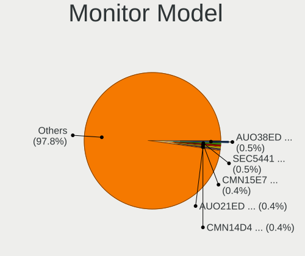

| Model                                                                    | Computers | Percent |
|--------------------------------------------------------------------------|-----------|---------|
| AU Optronics LCD Monitor AUO38ED 1920x1080 344x193mm 15.5-inch           | 47        | 0.48%   |
| Samsung Electronics LCD Monitor SEC5441 1280x800 331x207mm 15.4-inch     | 45        | 0.46%   |
| Chimei Innolux LCD Monitor CMN15E7 1920x1080 344x193mm 15.5-inch         | 43        | 0.44%   |
| AU Optronics LCD Monitor AUO21ED 1920x1080 344x193mm 15.5-inch           | 42        | 0.43%   |
| Chimei Innolux LCD Monitor CMN14D4 1920x1080 309x173mm 13.9-inch         | 39        | 0.4%    |
| LG Display LCD Monitor LGD02DC 1366x768 344x194mm 15.5-inch              | 38        | 0.39%   |
| Valve ANX7530 U VLV3001 800x1280 100x150mm 7.1-inch                      | 36        | 0.37%   |
| Chi Mei Optoelectronics LCD Monitor CMO15A7 1366x768 344x193mm 15.5-inch | 35        | 0.36%   |
| LG Display LCD Monitor LGD033A 1366x768 344x194mm 15.5-inch              | 34        | 0.35%   |
| BOE LCD Monitor BOE0629 1366x768 309x173mm 13.9-inch                     | 31        | 0.32%   |
| Dell U2412M DELA07A 1920x1200 518x324mm 24.1-inch                        | 30        | 0.31%   |
| AU Optronics LCD Monitor AUO403D 1920x1080 309x174mm 14.0-inch           | 30        | 0.31%   |
| PANDA LCD Monitor NCP004D 1920x1080 344x194mm 15.5-inch                  | 28        | 0.29%   |
| Chimei Innolux LCD Monitor CMN1521 1920x1080 344x193mm 15.5-inch         | 26        | 0.27%   |
| Philips PHL 223V5 PHLC0CF 1920x1080 477x268mm 21.5-inch                  | 25        | 0.26%   |
| AOC 24G2W1G3 AOC2402 1920x1080 527x296mm 23.8-inch                       | 24        | 0.25%   |
| Samsung Electronics LCD Monitor SEC544B 1600x900 382x214mm 17.2-inch     | 23        | 0.24%   |
| Goldstar LG ULTRAWIDE GSM59F1 2560x1080 670x280mm 28.6-inch              | 23        | 0.24%   |
| AU Optronics LCD Monitor AUO26EC 1366x768 344x193mm 15.5-inch            | 23        | 0.24%   |
| Samsung Electronics C24F390 SAM0D2C 1920x1080 521x293mm 23.5-inch        | 21        | 0.22%   |
| BOE LCD Monitor BOE06A7 1920x1080 294x165mm 13.3-inch                    | 21        | 0.22%   |
| BOE LCD Monitor BOE0687 1920x1080 344x193mm 15.5-inch                    | 21        | 0.22%   |
| AOC 27G2G4 AOC2702 1920x1080 598x336mm 27.0-inch                         | 21        | 0.22%   |
| Lenovo LCD Monitor LEN40B1 1600x900 345x194mm 15.6-inch                  | 20        | 0.21%   |
| Goldstar LG IPS FULLHD GSM5AB8 1920x1080 480x270mm 21.7-inch             | 20        | 0.21%   |
| Chimei Innolux LCD Monitor CMN15C4 1920x1080 344x193mm 15.5-inch         | 20        | 0.21%   |
| BOE LCD Monitor BOE06FB 1920x1080 344x194mm 15.5-inch                    | 20        | 0.21%   |
| Philips PHL 243V7 PHLC155 1920x1080 527x296mm 23.8-inch                  | 19        | 0.19%   |
| Iiyama PL2530H IVM6132 1920x1080 544x303mm 24.5-inch                     | 19        | 0.19%   |
| AU Optronics LCD Monitor AUO106C 1366x768 276x155mm 12.5-inch            | 19        | 0.19%   |
| Vestel Elektronik 40UHD_LCD_TV VES3700 3840x2160 880x500mm 39.8-inch     | 18        | 0.18%   |
| LG Display LCD Monitor LGD0469 1920x1080 382x215mm 17.3-inch             | 18        | 0.18%   |
| AU Optronics LCD Monitor AUO22EC 1366x768 344x193mm 15.5-inch            | 18        | 0.18%   |
| Samsung Electronics LCD Monitor SDC4852 1366x768 344x194mm 15.5-inch     | 17        | 0.17%   |
| Chimei Innolux LCD Monitor CMN15F5 1920x1080 344x193mm 15.5-inch         | 17        | 0.17%   |
| Chimei Innolux LCD Monitor CMN15D5 1920x1080 344x193mm 15.5-inch         | 17        | 0.17%   |
| Chimei Innolux LCD Monitor CMN14C9 1920x1080 309x173mm 13.9-inch         | 17        | 0.17%   |
| Unknown LCD Monitor FFFF 2288x1287 2550x2550mm 142.0-inch                | 16        | 0.16%   |
| Samsung Electronics LCD Monitor SEC324A 1366x768 344x194mm 15.5-inch     | 16        | 0.16%   |
| Chimei Innolux LCD Monitor CMN1728 1600x900 382x215mm 17.3-inch          | 16        | 0.16%   |

Monitor Resolution
------------------

Monitor screen resolution

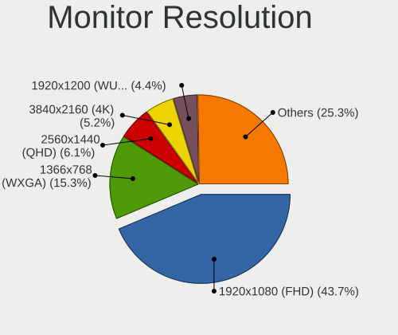

| Resolution         | Computers | Percent |
|--------------------|-----------|---------|
| 1920x1080 (FHD)    | 3900      | 43.67%  |
| 1366x768 (WXGA)    | 1369      | 15.33%  |
| 2560x1440 (QHD)    | 541       | 6.06%   |
| 3840x2160 (4K)     | 468       | 5.24%   |
| 1920x1200 (WUXGA)  | 396       | 4.43%   |
| 1600x900 (HD+)     | 349       | 3.91%   |
| 1280x1024 (SXGA)   | 303       | 3.39%   |
| 1680x1050 (WSXGA+) | 265       | 2.97%   |
| 1280x800 (WXGA)    | 258       | 2.89%   |
| 1440x900 (WXGA+)   | 209       | 2.34%   |
| 3440x1440          | 119       | 1.33%   |
| 2560x1600          | 94        | 1.05%   |
| Unknown            | 79        | 0.88%   |
| 2560x1080          | 63        | 0.71%   |
| 2880x1800          | 54        | 0.6%    |
| 800x1280           | 52        | 0.58%   |
| 1360x768           | 33        | 0.37%   |
| 1024x600           | 31        | 0.35%   |
| 3840x1080          | 29        | 0.32%   |
| 1600x1200          | 27        | 0.3%    |
| 1024x768 (XGA)     | 25        | 0.28%   |
| 2160x1440          | 23        | 0.26%   |
| 1920x540           | 23        | 0.26%   |
| 3840x2400          | 20        | 0.22%   |
| 2288x1287          | 18        | 0.2%    |
| 3200x1800 (QHD+)   | 13        | 0.15%   |
| 3200x2000          | 11        | 0.12%   |
| 3840x1600          | 10        | 0.11%   |
| 2880x1920          | 10        | 0.11%   |
| 1280x720 (HD)      | 9         | 0.1%    |
| 3840x1200          | 7         | 0.08%   |
| 1400x1050          | 7         | 0.08%   |
| 2256x1504          | 6         | 0.07%   |
| 2240x1400          | 6         | 0.07%   |
| 1280x768           | 6         | 0.07%   |
| 2880x1620          | 5         | 0.06%   |
| 2520x1680          | 5         | 0.06%   |
| 2048x1152          | 5         | 0.06%   |
| 1920x1280          | 5         | 0.06%   |
| 5120x1440          | 4         | 0.04%   |

Monitor Diagonal
----------------

Diagonal size in inches

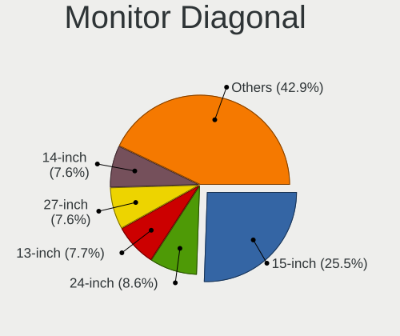

| Inches  | Computers | Percent |
|---------|-----------|---------|
| 15      | 2394      | 25.55%  |
| 24      | 809       | 8.63%   |
| 13      | 726       | 7.75%   |
| 27      | 712       | 7.6%    |
| 14      | 711       | 7.59%   |
| 23      | 559       | 5.97%   |
| 17      | 530       | 5.66%   |
| 21      | 519       | 5.54%   |
| Unknown | 333       | 3.55%   |
| 19      | 276       | 2.95%   |
| 31      | 194       | 2.07%   |
| 12      | 183       | 1.95%   |
| 22      | 165       | 1.76%   |
| 34      | 164       | 1.75%   |
| 16      | 163       | 1.74%   |
| 18      | 120       | 1.28%   |
| 11      | 97        | 1.04%   |
| 20      | 76        | 0.81%   |
| 84      | 61        | 0.65%   |
| 32      | 51        | 0.54%   |
| 25      | 51        | 0.54%   |
| 7       | 51        | 0.54%   |
| 72      | 43        | 0.46%   |
| 54      | 39        | 0.42%   |
| 40      | 39        | 0.42%   |
| 10      | 39        | 0.42%   |
| 26      | 27        | 0.29%   |
| 48      | 22        | 0.23%   |
| 43      | 22        | 0.23%   |
| 65      | 21        | 0.22%   |
| 33      | 19        | 0.2%    |
| 28      | 18        | 0.19%   |
| 142     | 16        | 0.17%   |
| 63      | 14        | 0.15%   |
| 46      | 12        | 0.13%   |
| 42      | 11        | 0.12%   |
| 37      | 10        | 0.11%   |
| 39      | 9         | 0.1%    |
| 29      | 9         | 0.1%    |
| 49      | 8         | 0.09%   |

Monitor Width
-------------

Physical width

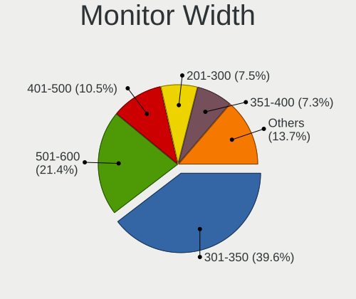

| Width in mm    | Computers | Percent |
|----------------|-----------|---------|
| 301-350        | 3639      | 39.6%   |
| 501-600        | 1963      | 21.36%  |
| 401-500        | 968       | 10.53%  |
| 201-300        | 686       | 7.47%   |
| 351-400        | 673       | 7.32%   |
| Unknown        | 333       | 3.62%   |
| 601-700        | 272       | 2.96%   |
| 701-800        | 233       | 2.54%   |
| 1001-1500      | 144       | 1.57%   |
| 1501-2000      | 109       | 1.19%   |
| 801-900        | 60        | 0.65%   |
| 1-100          | 53        | 0.58%   |
| 901-1000       | 32        | 0.35%   |
| More than 2000 | 16        | 0.17%   |
| 101-200        | 8         | 0.09%   |

Aspect Ratio
------------

Proportional relationship between the width and the height

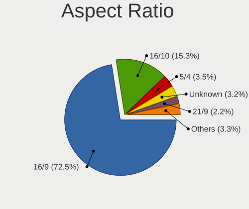

| Ratio   | Computers | Percent |
|---------|-----------|---------|
| 16/9    | 6144      | 72.52%  |
| 16/10   | 1296      | 15.3%   |
| 5/4     | 298       | 3.52%   |
| Unknown | 271       | 3.2%    |
| 21/9    | 183       | 2.16%   |
| 3/2     | 101       | 1.19%   |
| 4/3     | 64        | 0.76%   |
| 0.67    | 36        | 0.42%   |
| 32/9    | 23        | 0.27%   |
| 1.00    | 16        | 0.19%   |
| 0.62    | 15        | 0.18%   |
| 6/5     | 9         | 0.11%   |
| 0.56    | 5         | 0.06%   |
| 3.20    | 4         | 0.05%   |
| 0.63    | 4         | 0.05%   |
| 3.40    | 1         | 0.01%   |
| 0.71    | 1         | 0.01%   |
| 0.45    | 1         | 0.01%   |

Monitor Area
------------

Area in inch²

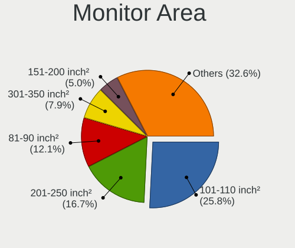

| Area in inch² | Computers | Percent |
|----------------|-----------|---------|
| 101-110        | 2396      | 25.78%  |
| 201-250        | 1553      | 16.71%  |
| 81-90          | 1123      | 12.08%  |
| 301-350        | 732       | 7.88%   |
| 151-200        | 463       | 4.98%   |
| 351-500        | 443       | 4.77%   |
| 251-300        | 420       | 4.52%   |
| 121-130        | 335       | 3.6%    |
| Unknown        | 333       | 3.58%   |
| 71-80          | 299       | 3.22%   |
| More than 1000 | 238       | 2.56%   |
| 141-150        | 214       | 2.3%    |
| 61-70          | 176       | 1.89%   |
| 111-120        | 145       | 1.56%   |
| 501-1000       | 122       | 1.31%   |
| 51-60          | 98        | 1.05%   |
| 131-140        | 71        | 0.76%   |
| 1-40           | 61        | 0.66%   |
| 41-50          | 39        | 0.42%   |
| 91-100         | 34        | 0.37%   |

Pixel Density
-------------

Pixels per inch

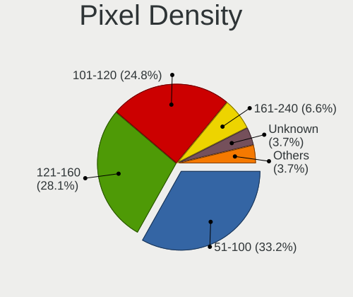

| Density       | Computers | Percent |
|---------------|-----------|---------|
| 51-100        | 2994      | 33.16%  |
| 121-160       | 2534      | 28.06%  |
| 101-120       | 2239      | 24.8%   |
| 161-240       | 593       | 6.57%   |
| Unknown       | 333       | 3.69%   |
| 1-50          | 192       | 2.13%   |
| More than 240 | 145       | 1.61%   |

Multiple Monitors
-----------------

Total monitors connected

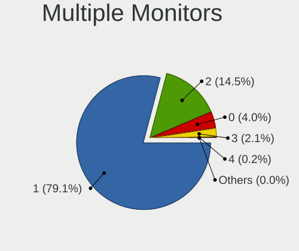

| Total | Computers | Percent |
|-------|-----------|---------|
| 1     | 6872      | 79.08%  |
| 2     | 1261      | 14.51%  |
| 0     | 348       | 4%      |
| 3     | 185       | 2.13%   |
| 4     | 21        | 0.24%   |
| 6     | 2         | 0.02%   |
| 5     | 1         | 0.01%   |

Network
-------

Net Controller Vendor
---------------------

Controller vendors

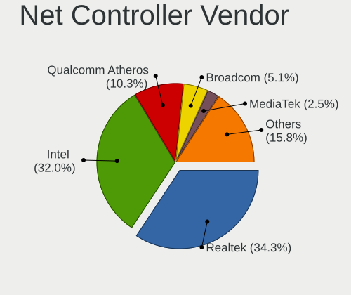

| Vendor                            | Computers | Percent |
|-----------------------------------|-----------|---------|
| Realtek Semiconductor             | 4463      | 34.33%  |
| Intel                             | 4166      | 32.05%  |
| Qualcomm Atheros                  | 1335      | 10.27%  |
| Broadcom                          | 665       | 5.12%   |
| MediaTek                          | 321       | 2.47%   |
| TP-Link                           | 200       | 1.54%   |
| Broadcom Limited                  | 178       | 1.37%   |
| Marvell Technology Group          | 135       | 1.04%   |
| Dell                              | 112       | 0.86%   |
| Ralink Technology                 | 108       | 0.83%   |
| Huawei Technologies               | 99        | 0.76%   |
| Ralink                            | 96        | 0.74%   |
| Qualcomm Atheros Communications   | 85        | 0.65%   |
| Nvidia                            | 74        | 0.57%   |
| Samsung Electronics               | 72        | 0.55%   |
| Microsoft                         | 70        | 0.54%   |
| Xiaomi                            | 57        | 0.44%   |
| ASIX Electronics                  | 51        | 0.39%   |
| Ericsson Business Mobile Networks | 50        | 0.38%   |
| Sierra Wireless                   | 47        | 0.36%   |
| Shenzhen Goodix Technology        | 41        | 0.32%   |
| ASUSTek Computer                  | 39        | 0.3%    |
| Qualcomm                          | 38        | 0.29%   |
| Hewlett-Packard                   | 38        | 0.29%   |
| Motorola PCS                      | 29        | 0.22%   |
| Aquantia                          | 26        | 0.2%    |
| Lenovo                            | 23        | 0.18%   |
| JMicron Technology                | 23        | 0.18%   |
| DisplayLink                       | 22        | 0.17%   |
| Fibocom                           | 20        | 0.15%   |
| Edimax Technology                 | 18        | 0.14%   |
| NetGear                           | 16        | 0.12%   |
| Qualcomm Technologies             | 15        | 0.12%   |
| OPPO Electronics                  | 14        | 0.11%   |
| D-Link                            | 14        | 0.11%   |
| Silicon Integrated Systems [SiS]  | 13        | 0.1%    |
| ICS Advent                        | 13        | 0.1%    |
| VIA Technologies                  | 12        | 0.09%   |
| ZTE WCDMA Technologies MSM        | 11        | 0.08%   |
| QinHeng Electronics               | 10        | 0.08%   |

Net Controller Model
--------------------

Controller models

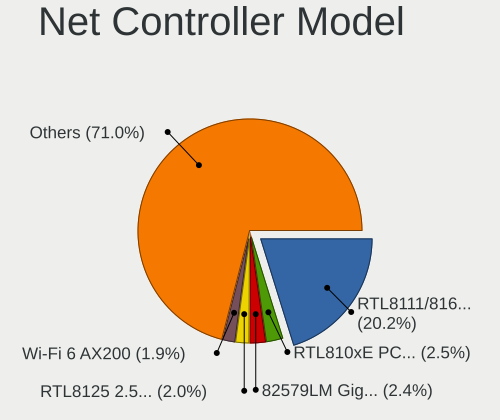

| Model                                                                  | Computers | Percent |
|------------------------------------------------------------------------|-----------|---------|
| Realtek RTL8111/8168/8211/8411 PCI Express Gigabit Ethernet Controller | 3097      | 20.2%   |
| Realtek RTL810xE PCI Express Fast Ethernet controller                  | 385       | 2.51%   |
| Intel 82579LM Gigabit Network Connection (Lewisville)                  | 364       | 2.37%   |
| Realtek RTL8125 2.5GbE Controller                                      | 311       | 2.03%   |
| Intel Wi-Fi 6 AX200                                                    | 288       | 1.88%   |
| Intel Wireless 8265 / 8275                                             | 255       | 1.66%   |
| Qualcomm Atheros AR9285 Wireless Network Adapter (PCI-Express)         | 205       | 1.34%   |
| Intel Wireless 7260                                                    | 200       | 1.3%    |
| Realtek RTL8822CE 802.11ac PCIe Wireless Network Adapter               | 195       | 1.27%   |
| Realtek RTL8153 Gigabit Ethernet Adapter                               | 191       | 1.25%   |
| Intel Centrino Advanced-N 6205 [Taylor Peak]                           | 170       | 1.11%   |
| Qualcomm Atheros QCA9565 / AR9565 Wireless Network Adapter             | 169       | 1.1%    |
| Intel Wireless 8260                                                    | 168       | 1.1%    |
| Intel Wi-Fi 6 AX201                                                    | 159       | 1.04%   |
| Qualcomm Atheros AR9485 Wireless Network Adapter                       | 152       | 0.99%   |
| Intel Wireless 7265                                                    | 149       | 0.97%   |
| Qualcomm Atheros QCA9377 802.11ac Wireless Network Adapter             | 144       | 0.94%   |
| Intel Ethernet Connection I217-LM                                      | 138       | 0.9%    |
| Intel Cannon Lake PCH CNVi WiFi                                        | 131       | 0.85%   |
| Intel I211 Gigabit Network Connection                                  | 124       | 0.81%   |
| Intel Alder Lake-P PCH CNVi WiFi                                       | 124       | 0.81%   |
| Broadcom BCM4313 802.11bgn Wireless Network Adapter                    | 115       | 0.75%   |
| Intel Wireless 3165                                                    | 114       | 0.74%   |
| MediaTek MT7922 802.11ax PCI Express Wireless Network Adapter          | 113       | 0.74%   |
| MediaTek MT7921 802.11ax PCIe Wireless Network Adapter [Filogic 330]   | 108       | 0.7%    |
| Intel Ethernet Connection (2) I219-V                                   | 106       | 0.69%   |
| Intel Ethernet Connection (4) I219-LM                                  | 101       | 0.66%   |
| Realtek RTL8821CE 802.11ac PCIe Wireless Network Adapter               | 100       | 0.65%   |
| Intel Cannon Point-LP CNVi [Wireless-AC]                               | 100       | 0.65%   |
| Qualcomm Atheros QCA6174 802.11ac Wireless Network Adapter             | 95        | 0.62%   |
| Intel Wi-Fi 6E(802.11ax) AX210/AX1675* 2x2 [Typhoon Peak]              | 91        | 0.59%   |
| Intel Wireless 3160                                                    | 90        | 0.59%   |
| Intel PRO/Wireless 3945ABG [Golan] Network Connection                  | 88        | 0.57%   |
| Broadcom BCM43142 802.11b/g/n                                          | 86        | 0.56%   |
| Intel Dual Band Wireless-AC 3168NGW [Stone Peak]                       | 77        | 0.5%    |
| Intel Centrino Ultimate-N 6300                                         | 77        | 0.5%    |
| Intel Comet Lake PCH-LP CNVi WiFi                                      | 76        | 0.5%    |
| Intel Ethernet Controller I225-V                                       | 75        | 0.49%   |
| Realtek RTL8723BE PCIe Wireless Network Adapter                        | 74        | 0.48%   |
| Intel 82567LM Gigabit Network Connection                               | 74        | 0.48%   |

Wireless Vendor
---------------

Wireless vendors

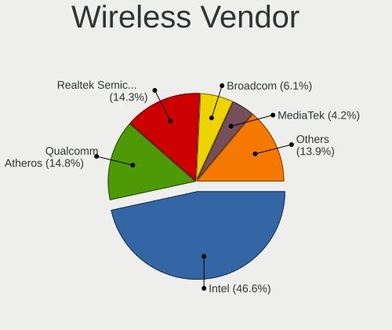

| Vendor                            | Computers | Percent |
|-----------------------------------|-----------|---------|
| Intel                             | 3197      | 46.61%  |
| Qualcomm Atheros                  | 1017      | 14.83%  |
| Realtek Semiconductor             | 983       | 14.33%  |
| Broadcom                          | 421       | 6.14%   |
| MediaTek                          | 289       | 4.21%   |
| TP-Link                           | 188       | 2.74%   |
| Ralink Technology                 | 108       | 1.57%   |
| Ralink                            | 96        | 1.4%    |
| Broadcom Limited                  | 89        | 1.3%    |
| Qualcomm Atheros Communications   | 85        | 1.24%   |
| Dell                              | 68        | 0.99%   |
| Microsoft                         | 67        | 0.98%   |
| Sierra Wireless                   | 47        | 0.69%   |
| ASUSTek Computer                  | 38        | 0.55%   |
| Qualcomm                          | 25        | 0.36%   |
| Fibocom                           | 20        | 0.29%   |
| Edimax Technology                 | 18        | 0.26%   |
| D-Link                            | 14        | 0.2%    |
| NetGear                           | 12        | 0.17%   |
| Hewlett-Packard                   | 12        | 0.17%   |
| Qualcomm Technologies             | 10        | 0.15%   |
| Marvell Technology Group          | 7         | 0.1%    |
| Sagem                             | 6         | 0.09%   |
| ZyXEL Communications              | 4         | 0.06%   |
| D-Link System                     | 4         | 0.06%   |
| Unknown                           | 4         | 0.06%   |
| ZyDAS                             | 3         | 0.04%   |
| Linksys                           | 3         | 0.04%   |
| Belkin Components                 | 3         | 0.04%   |
| Quectel Wireless Solutions        | 2         | 0.03%   |
| Mercucys                          | 2         | 0.03%   |
| Gemtek                            | 2         | 0.03%   |
| Ericsson Business Mobile Networks | 2         | 0.03%   |
| AVM                               | 2         | 0.03%   |
| Z-Com                             | 1         | 0.01%   |
| Wacom                             | 1         | 0.01%   |
| Texas Instruments                 | 1         | 0.01%   |
| Tenda                             | 1         | 0.01%   |
| Sweex                             | 1         | 0.01%   |
| Samsung Electronics               | 1         | 0.01%   |

Wireless Model
--------------

Wireless models

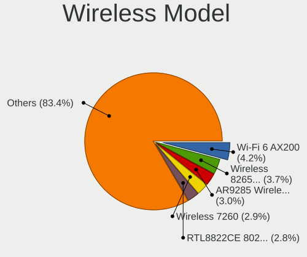

| Model                                                                | Computers | Percent |
|----------------------------------------------------------------------|-----------|---------|
| Intel Wi-Fi 6 AX200                                                  | 288       | 4.18%   |
| Intel Wireless 8265 / 8275                                           | 255       | 3.7%    |
| Qualcomm Atheros AR9285 Wireless Network Adapter (PCI-Express)       | 205       | 2.98%   |
| Intel Wireless 7260                                                  | 200       | 2.9%    |
| Realtek RTL8822CE 802.11ac PCIe Wireless Network Adapter             | 195       | 2.83%   |
| Intel Centrino Advanced-N 6205 [Taylor Peak]                         | 170       | 2.47%   |
| Qualcomm Atheros QCA9565 / AR9565 Wireless Network Adapter           | 169       | 2.45%   |
| Intel Wireless 8260                                                  | 168       | 2.44%   |
| Intel Wi-Fi 6 AX201                                                  | 159       | 2.31%   |
| Qualcomm Atheros AR9485 Wireless Network Adapter                     | 152       | 2.21%   |
| Intel Wireless 7265                                                  | 149       | 2.16%   |
| Qualcomm Atheros QCA9377 802.11ac Wireless Network Adapter           | 144       | 2.09%   |
| Intel Cannon Lake PCH CNVi WiFi                                      | 131       | 1.9%    |
| Broadcom BCM4313 802.11bgn Wireless Network Adapter                  | 115       | 1.67%   |
| Intel Wireless 3165                                                  | 114       | 1.65%   |
| MediaTek MT7921 802.11ax PCIe Wireless Network Adapter [Filogic 330] | 108       | 1.57%   |
| Realtek RTL8821CE 802.11ac PCIe Wireless Network Adapter             | 100       | 1.45%   |
| Intel Cannon Point-LP CNVi [Wireless-AC]                             | 100       | 1.45%   |
| Qualcomm Atheros QCA6174 802.11ac Wireless Network Adapter           | 95        | 1.38%   |
| MediaTek MT7922 802.11ax PCI Express Wireless Network Adapter        | 95        | 1.38%   |
| Intel Wi-Fi 6E(802.11ax) AX210/AX1675* 2x2 [Typhoon Peak]            | 91        | 1.32%   |
| Intel Wireless 3160                                                  | 90        | 1.31%   |
| Intel PRO/Wireless 3945ABG [Golan] Network Connection                | 88        | 1.28%   |
| Broadcom BCM43142 802.11b/g/n                                        | 86        | 1.25%   |
| Intel Alder Lake-P PCH CNVi WiFi                                     | 84        | 1.22%   |
| Intel Dual Band Wireless-AC 3168NGW [Stone Peak]                     | 77        | 1.12%   |
| Intel Centrino Ultimate-N 6300                                       | 77        | 1.12%   |
| Intel Comet Lake PCH-LP CNVi WiFi                                    | 76        | 1.1%    |
| Realtek RTL8723BE PCIe Wireless Network Adapter                      | 74        | 1.07%   |
| Realtek RTL8188EUS 802.11n Wireless Network Adapter                  | 72        | 1.04%   |
| Intel Wi-Fi 5(802.11ac) Wireless-AC 9x6x [Thunder Peak]              | 69        | 1%      |
| Intel Dual Band Wireless-AC 3165 Plus Bluetooth                      | 69        | 1%      |
| Intel Comet Lake PCH CNVi WiFi                                       | 68        | 0.99%   |
| Realtek RTL8852BE PCIe 802.11ax Wireless Network Controller          | 65        | 0.94%   |
| Qualcomm Atheros AR9271 802.11n                                      | 65        | 0.94%   |
| Intel WiFi Link 5100                                                 | 62        | 0.9%    |
| TP-Link TL-WN722N v2/v3 [Realtek RTL8188EUS]                         | 53        | 0.77%   |
| Intel Centrino Advanced-N 6200                                       | 53        | 0.77%   |
| Intel Raptor Lake PCH CNVi WiFi                                      | 52        | 0.75%   |
| Intel Centrino Advanced-N 6235                                       | 51        | 0.74%   |

Ethernet Vendor
---------------

Ethernet vendors

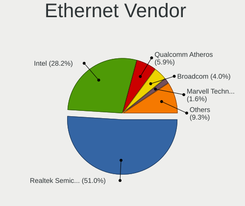

| Vendor                                 | Computers | Percent |
|----------------------------------------|-----------|---------|
| Realtek Semiconductor                  | 4062      | 50.99%  |
| Intel                                  | 2249      | 28.23%  |
| Qualcomm Atheros                       | 473       | 5.94%   |
| Broadcom                               | 315       | 3.95%   |
| Marvell Technology Group               | 129       | 1.62%   |
| Broadcom Limited                       | 90        | 1.13%   |
| Nvidia                                 | 74        | 0.93%   |
| Huawei Technologies                    | 65        | 0.82%   |
| Samsung Electronics                    | 64        | 0.8%    |
| Xiaomi                                 | 56        | 0.7%    |
| ASIX Electronics                       | 51        | 0.64%   |
| Motorola PCS                           | 29        | 0.36%   |
| Aquantia                               | 26        | 0.33%   |
| MediaTek                               | 25        | 0.31%   |
| Lenovo                                 | 23        | 0.29%   |
| JMicron Technology                     | 23        | 0.29%   |
| DisplayLink                            | 22        | 0.28%   |
| OPPO Electronics                       | 14        | 0.18%   |
| TP-Link                                | 13        | 0.16%   |
| Silicon Integrated Systems [SiS]       | 13        | 0.16%   |
| Qualcomm                               | 13        | 0.16%   |
| ICS Advent                             | 13        | 0.16%   |
| VIA Technologies                       | 12        | 0.15%   |
| Google                                 | 8         | 0.1%    |
| Microchip Technology                   | 7         | 0.09%   |
| Hewlett-Packard                        | 7         | 0.09%   |
| Attansic Technology                    | 7         | 0.09%   |
| Mellanox Technologies                  | 6         | 0.08%   |
| HTC (High Tech Computer)               | 6         | 0.08%   |
| Suzhou Motorcomm Electronic Technology | 5         | 0.06%   |
| Sony Ericsson Mobile Communications AB | 5         | 0.06%   |
| Raspberry Pi                           | 5         | 0.06%   |
| Qualcomm Technologies                  | 5         | 0.06%   |
| LG Electronics                         | 5         | 0.06%   |
| Apple                                  | 5         | 0.06%   |
| QinHeng Electronics                    | 4         | 0.05%   |
| OnePlus Technology (Shenzhen)          | 4         | 0.05%   |
| NetXen Incorporated                    | 4         | 0.05%   |
| NetGear                                | 4         | 0.05%   |
| HMD Global                             | 3         | 0.04%   |

Ethernet Model
--------------

Ethernet models

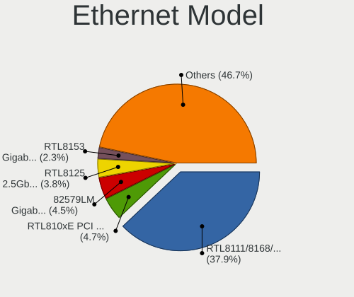

| Model                                                                  | Computers | Percent |
|------------------------------------------------------------------------|-----------|---------|
| Realtek RTL8111/8168/8211/8411 PCI Express Gigabit Ethernet Controller | 3097      | 37.95%  |
| Realtek RTL810xE PCI Express Fast Ethernet controller                  | 385       | 4.72%   |
| Intel 82579LM Gigabit Network Connection (Lewisville)                  | 364       | 4.46%   |
| Realtek RTL8125 2.5GbE Controller                                      | 311       | 3.81%   |
| Realtek RTL8153 Gigabit Ethernet Adapter                               | 191       | 2.34%   |
| Intel Ethernet Connection I217-LM                                      | 138       | 1.69%   |
| Intel I211 Gigabit Network Connection                                  | 124       | 1.52%   |
| Intel Ethernet Connection (2) I219-V                                   | 106       | 1.3%    |
| Intel Ethernet Connection (4) I219-LM                                  | 101       | 1.24%   |
| Intel Ethernet Controller I225-V                                       | 75        | 0.92%   |
| Intel 82567LM Gigabit Network Connection                               | 74        | 0.91%   |
| Intel 82579V Gigabit Network Connection                                | 71        | 0.87%   |
| Intel 82577LM Gigabit Network Connection                               | 65        | 0.8%    |
| Intel Ethernet Connection I219-LM                                      | 64        | 0.78%   |
| Intel Ethernet Connection I218-LM                                      | 63        | 0.77%   |
| Realtek RTL-8100/8101L/8139 PCI Fast Ethernet Adapter                  | 61        | 0.75%   |
| Intel Ethernet Connection (2) I219-LM                                  | 60        | 0.74%   |
| Qualcomm Atheros AR8151 v2.0 Gigabit Ethernet                          | 59        | 0.72%   |
| Intel Ethernet Connection (7) I219-V                                   | 57        | 0.7%    |
| Intel Ethernet Connection (7) I219-LM                                  | 54        | 0.66%   |
| Intel Ethernet Connection (3) I218-LM                                  | 53        | 0.65%   |
| Huawei E353/E3131                                                      | 51        | 0.62%   |
| Intel Ethernet Connection (4) I219-V                                   | 49        | 0.6%    |
| Intel 82567LM-3 Gigabit Network Connection                             | 49        | 0.6%    |
| Samsung Galaxy series, misc. (tethering mode)                          | 48        | 0.59%   |
| Qualcomm Atheros QCA8172 Fast Ethernet                                 | 48        | 0.59%   |
| Qualcomm Atheros QCA8171 Gigabit Ethernet                              | 48        | 0.59%   |
| Qualcomm Atheros Killer E220x Gigabit Ethernet Controller              | 45        | 0.55%   |
| ASIX AX88179 Gigabit Ethernet                                          | 45        | 0.55%   |
| Intel Ethernet Connection (6) I219-V                                   | 44        | 0.54%   |
| Intel Ethernet Connection I217-V                                       | 40        | 0.49%   |
| Intel Alder Lake-P PCH CNVi WiFi                                       | 40        | 0.49%   |
| Xiaomi Mi/Redmi series (RNDIS)                                         | 39        | 0.48%   |
| Qualcomm Atheros AR8161 Gigabit Ethernet                               | 37        | 0.45%   |
| Qualcomm Atheros AR8131 Gigabit Ethernet                               | 37        | 0.45%   |
| Qualcomm Atheros Killer E2400 Gigabit Ethernet Controller              | 35        | 0.43%   |
| Broadcom NetXtreme BCM5761 Gigabit Ethernet PCIe                       | 33        | 0.4%    |
| Qualcomm Atheros AR8162 Fast Ethernet                                  | 32        | 0.39%   |
| Nvidia MCP61 Ethernet                                                  | 32        | 0.39%   |
| Intel Ethernet Connection (6) I219-LM                                  | 31        | 0.38%   |

Net Controller Kind
-------------------

Ethernet, WiFi or modem

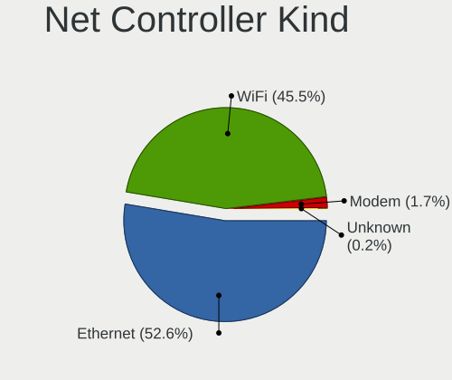

| Kind     | Computers | Percent |
|----------|-----------|---------|
| Ethernet | 7422      | 52.63%  |
| WiFi     | 6412      | 45.47%  |
| Modem    | 246       | 1.74%   |
| Unknown  | 22        | 0.16%   |

Used Controller
---------------

Currently used network controller

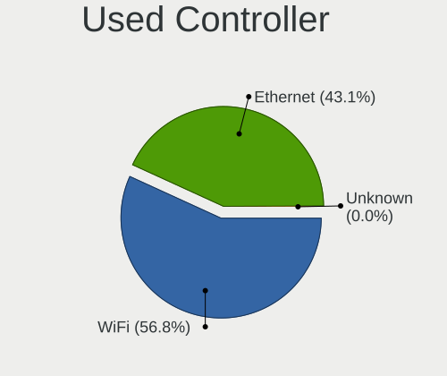

| Kind     | Computers | Percent |
|----------|-----------|---------|
| WiFi     | 4872      | 56.82%  |
| Ethernet | 3697      | 43.11%  |
| Modem    | 5         | 0.06%   |
| Unknown  | 1         | 0.01%   |

NICs
----

Total network controllers on board

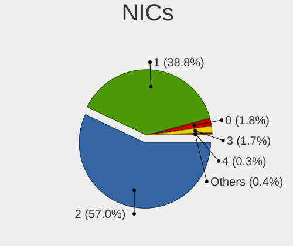

| Total | Computers | Percent |
|-------|-----------|---------|
| 2     | 4839      | 57.03%  |
| 1     | 3293      | 38.81%  |
| 0     | 155       | 1.83%   |
| 3     | 142       | 1.67%   |
| 4     | 25        | 0.29%   |
| 5     | 15        | 0.18%   |
| 6     | 7         | 0.08%   |
| 7     | 3         | 0.04%   |
| 10    | 2         | 0.02%   |
| 8     | 2         | 0.02%   |
| 17    | 1         | 0.01%   |
| 9     | 1         | 0.01%   |

IPv6
----

IPv6 vs IPv4

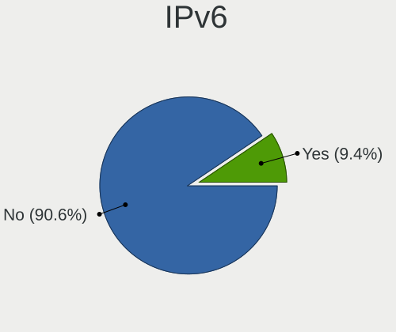

| Used | Computers | Percent |
|------|-----------|---------|
| No   | 7720      | 90.57%  |
| Yes  | 804       | 9.43%   |

Bluetooth
---------

Bluetooth Vendor
----------------

Controller vendors

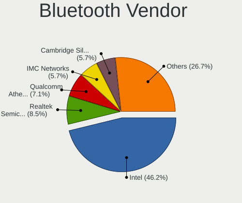

| Vendor                          | Computers | Percent |
|---------------------------------|-----------|---------|
| Intel                           | 2483      | 46.19%  |
| Realtek Semiconductor           | 459       | 8.54%   |
| Qualcomm Atheros Communications | 384       | 7.14%   |
| IMC Networks                    | 307       | 5.71%   |
| Cambridge Silicon Radio         | 307       | 5.71%   |
| Broadcom                        | 275       | 5.12%   |
| Foxconn / Hon Hai               | 226       | 4.2%    |
| ASUSTek Computer                | 162       | 3.01%   |
| Lite-On Technology              | 124       | 2.31%   |
| Dell                            | 121       | 2.25%   |
| Apple                           | 91        | 1.69%   |
| Hewlett-Packard                 | 87        | 1.62%   |
| MediaTek                        | 66        | 1.23%   |
| TP-Link                         | 46        | 0.86%   |
| Toshiba                         | 37        | 0.69%   |
| Foxconn International           | 32        | 0.6%    |
| Realtek                         | 29        | 0.54%   |
| Ralink                          | 28        | 0.52%   |
| USI                             | 12        | 0.22%   |
| Integrated System Solution      | 12        | 0.22%   |
| Edimax Technology               | 12        | 0.22%   |
| Alps Electric                   | 10        | 0.19%   |
| Conwise Technology              | 8         | 0.15%   |
| Chicony Electronics             | 8         | 0.15%   |
| Unknown                         | 7         | 0.13%   |
| Taiyo Yuden                     | 5         | 0.09%   |
| Marvell Semiconductor           | 5         | 0.09%   |
| Micro Star International        | 4         | 0.07%   |
| Actions                         | 4         | 0.07%   |
| SINO WEALTH                     | 3         | 0.06%   |
| Ralink Technology               | 3         | 0.06%   |
| Quectel Wireless Solutions      | 2         | 0.04%   |
| Opticis                         | 2         | 0.04%   |
| Mercucys                        | 2         | 0.04%   |
| Logitech                        | 2         | 0.04%   |
| Fujitsu                         | 2         | 0.04%   |
| Belkin Components               | 2         | 0.04%   |
| Askey Computer                  | 2         | 0.04%   |
| National Semiconductor          | 1         | 0.02%   |
| HTC (High Tech Computer)        | 1         | 0.02%   |

Bluetooth Model
---------------

Controller models

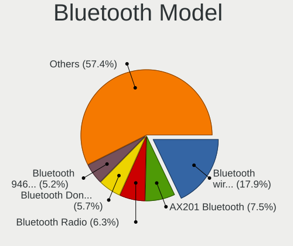

| Model                                               | Computers | Percent |
|-----------------------------------------------------|-----------|---------|
| Intel Bluetooth wireless interface                  | 964       | 17.91%  |
| Intel AX201 Bluetooth                               | 401       | 7.45%   |
| Realtek Bluetooth Radio                             | 340       | 6.32%   |
| Cambridge Silicon Radio Bluetooth Dongle (HCI mode) | 307       | 5.71%   |
| Intel Bluetooth 9460/9560 Jefferson Peak (JfP)      | 279       | 5.18%   |
| Intel AX200 Bluetooth                               | 277       | 5.15%   |
| Intel Bluetooth Device                              | 199       | 3.7%    |
| Qualcomm Atheros  Bluetooth Device                  | 166       | 3.08%   |
| IMC Networks Bluetooth Radio                        | 125       | 2.32%   |
| IMC Networks Wireless_Device                        | 103       | 1.91%   |
| Intel AX210 Bluetooth                               | 92        | 1.71%   |
| Intel Centrino Bluetooth Wireless Transceiver       | 87        | 1.62%   |
| Qualcomm Atheros AR3012 Bluetooth 4.0               | 81        | 1.51%   |
| ASUS Broadcom BCM20702A0 Bluetooth                  | 77        | 1.43%   |
| Intel Wireless-AC 3168 Bluetooth                    | 76        | 1.41%   |
| Qualcomm Atheros AR3011 Bluetooth                   | 75        | 1.39%   |
| Foxconn / Hon Hai Wireless_Device                   | 74        | 1.38%   |
| MediaTek Wireless_Device                            | 65        | 1.21%   |
| Intel Wireless-AC 9260 Bluetooth Adapter            | 64        | 1.19%   |
| Realtek  Bluetooth 4.2 Adapter                      | 58        | 1.08%   |
| Broadcom BCM2045B (BDC-2.1)                         | 57        | 1.06%   |
| TP-Link TP-T@- UB500 Adapter                        | 46        | 0.85%   |
| Intel Centrino Advanced-N 6230 Bluetooth adapter    | 46        | 0.85%   |
| HP Bluetooth 2.0 Interface [Broadcom BCM2045]       | 44        | 0.82%   |
| HP Broadcom 2070 Bluetooth Combo                    | 42        | 0.78%   |
| Foxconn / Hon Hai MediaTek Bluetooth Adapter        | 41        | 0.76%   |
| Dell BCM20702A0 Bluetooth Module                    | 41        | 0.76%   |
| Dell DW375 Bluetooth Module                         | 39        | 0.72%   |
| Foxconn / Hon Hai Bluetooth Device                  | 37        | 0.69%   |
| Apple Bluetooth Host Controller                     | 37        | 0.69%   |
| IMC Networks Bluetooth Device                       | 36        | 0.67%   |
| ASUS ASUS USB-BT500                                 | 36        | 0.67%   |
| Qualcomm Atheros QCA61x4 Bluetooth 4.0              | 33        | 0.61%   |
| Lite-On Bluetooth Device                            | 32        | 0.59%   |
| Foxconn International BCM43142A0 Bluetooth module   | 32        | 0.59%   |
| Broadcom BCM20702 Bluetooth 4.0 [ThinkPad]          | 30        | 0.56%   |
| Realtek RTL8723B Bluetooth                          | 29        | 0.54%   |
| Realtek Bluetooth Radio                             | 29        | 0.54%   |
| Ralink RT3290 Bluetooth                             | 28        | 0.52%   |
| Lite-On Qualcomm Atheros QCA9377 Bluetooth          | 28        | 0.52%   |

Sound
-----

Sound Vendor
------------

Sound card vendors

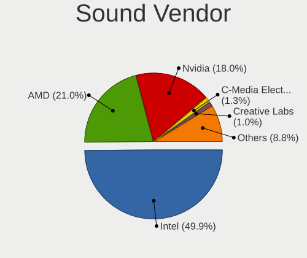

| Vendor                                       | Computers | Percent |
|----------------------------------------------|-----------|---------|
| Intel                                        | 5958      | 49.88%  |
| AMD                                          | 2512      | 21.03%  |
| Nvidia                                       | 2144      | 17.95%  |
| C-Media Electronics                          | 158       | 1.32%   |
| Creative Labs                                | 124       | 1.04%   |
| Creative Technology                          | 81        | 0.68%   |
| Logitech                                     | 61        | 0.51%   |
| SteelSeries ApS                              | 53        | 0.44%   |
| JMTek                                        | 49        | 0.41%   |
| Realtek Semiconductor                        | 43        | 0.36%   |
| Texas Instruments                            | 36        | 0.3%    |
| Lenovo                                       | 36        | 0.3%    |
| Kingston Technology                          | 33        | 0.28%   |
| GN Netcom                                    | 32        | 0.27%   |
| ASUSTek Computer                             | 31        | 0.26%   |
| VIA Technologies                             | 30        | 0.25%   |
| Plantronics                                  | 29        | 0.24%   |
| Generalplus Technology                       | 27        | 0.23%   |
| Razer USA                                    | 26        | 0.22%   |
| Hewlett-Packard                              | 25        | 0.21%   |
| Focusrite-Novation                           | 25        | 0.21%   |
| GYROCOM C&C                                  | 19        | 0.16%   |
| Micro Star International                     | 18        | 0.15%   |
| Dell                                         | 17        | 0.14%   |
| Silicon Integrated Systems [SiS]             | 16        | 0.13%   |
| SAVITECH                                     | 15        | 0.13%   |
| Sony                                         | 14        | 0.12%   |
| Trust                                        | 13        | 0.11%   |
| KTMicro                                      | 11        | 0.09%   |
| DSEA A/S                                     | 11        | 0.09%   |
| AOKEO                                        | 11        | 0.09%   |
| BEHRINGER International                      | 10        | 0.08%   |
| Unknown                                      | 10        | 0.08%   |
| USB MICROPHONE                               | 9         | 0.08%   |
| M-Audio                                      | 9         | 0.08%   |
| Zoran Co. Personal Media Division (Nogatech) | 8         | 0.07%   |
| Samson Technologies                          | 8         | 0.07%   |
| Thesycon Systemsoftware & Consulting         | 7         | 0.06%   |
| SM900 Microphon                              | 7         | 0.06%   |
| RODE Microphones                             | 7         | 0.06%   |

Sound Model
-----------

Sound card models

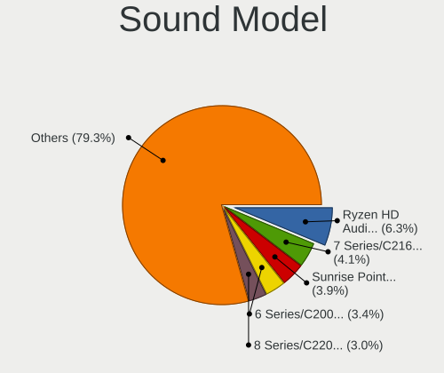

| Model                                                                      | Computers | Percent |
|----------------------------------------------------------------------------|-----------|---------|
| AMD Ryzen HD Audio Controller                                              | 897       | 6.28%   |
| Intel 7 Series/C216 Chipset Family High Definition Audio Controller        | 587       | 4.11%   |
| Intel Sunrise Point-LP HD Audio                                            | 556       | 3.89%   |
| Intel 6 Series/C200 Series Chipset Family High Definition Audio Controller | 483       | 3.38%   |
| Intel 8 Series/C220 Series Chipset High Definition Audio Controller        | 430       | 3.01%   |
| AMD Renoir/Cezanne HDMI/DP Audio Controller                                | 366       | 2.56%   |
| AMD Starship/Matisse HD Audio Controller                                   | 358       | 2.5%    |
| Intel Xeon E3-1200 v3/4th Gen Core Processor HD Audio Controller           | 337       | 2.36%   |
| Intel 82801I (ICH9 Family) HD Audio Controller                             | 300       | 2.1%    |
| Intel Cannon Lake PCH cAVS                                                 | 292       | 2.04%   |
| AMD Radeon High Definition Audio Controller                                | 281       | 1.97%   |
| Intel 5 Series/3400 Series Chipset High Definition Audio                   | 278       | 1.95%   |
| AMD SBx00 Azalia (Intel HDA)                                               | 257       | 1.8%    |
| Intel 100 Series/C230 Series Chipset Family HD Audio Controller            | 253       | 1.77%   |
| AMD FCH Azalia Controller                                                  | 226       | 1.58%   |
| Intel 8 Series HD Audio Controller                                         | 218       | 1.53%   |
| Intel Haswell-ULT HD Audio Controller                                      | 216       | 1.51%   |
| Nvidia GP107GL High Definition Audio Controller                            | 203       | 1.42%   |
| Intel Tiger Lake-LP Smart Sound Technology Audio Controller                | 203       | 1.42%   |
| Intel NM10/ICH7 Family High Definition Audio Controller                    | 201       | 1.41%   |
| Intel Broadwell-U Audio Controller                                         | 191       | 1.34%   |
| AMD Raven/Raven2/Fenghuang HDMI/DP Audio Controller                        | 187       | 1.31%   |
| Intel Wildcat Point-LP High Definition Audio Controller                    | 186       | 1.3%    |
| Intel 82801H (ICH8 Family) HD Audio Controller                             | 179       | 1.25%   |
| Intel Alder Lake PCH-P High Definition Audio Controller                    | 175       | 1.22%   |
| AMD Family 17h (Models 00h-0fh) HD Audio Controller                        | 172       | 1.2%    |
| AMD Ellesmere HDMI Audio [Radeon RX 470/480 / 570/580/590]                 | 167       | 1.17%   |
| Nvidia GF108 High Definition Audio Controller                              | 153       | 1.07%   |
| AMD Navi 21/23 HDMI/DP Audio Controller                                    | 150       | 1.05%   |
| Intel 200 Series PCH HD Audio                                              | 145       | 1.01%   |
| Intel Cannon Point-LP High Definition Audio Controller                     | 135       | 0.94%   |
| Intel Atom Processor Z36xxx/Z37xxx Series High Definition Audio Controller | 130       | 0.91%   |
| Nvidia TU107 GeForce GTX 1650 High Definition Audio Controller             | 120       | 0.84%   |
| Nvidia GP106 High Definition Audio Controller                              | 117       | 0.82%   |
| Nvidia TU116 High Definition Audio Controller                              | 115       | 0.8%    |
| AMD Kabini HDMI/DP Audio                                                   | 107       | 0.75%   |
| Nvidia GA104 High Definition Audio Controller                              | 103       | 0.72%   |
| AMD Oland/Hainan/Cape Verde/Pitcairn HDMI Audio [Radeon HD 7000 Series]    | 99        | 0.69%   |
| Nvidia GK208 HDMI/DP Audio Controller                                      | 98        | 0.69%   |
| Intel Comet Lake PCH cAVS                                                  | 95        | 0.66%   |

Memory
------

Memory Vendor
-------------

Memory module vendors

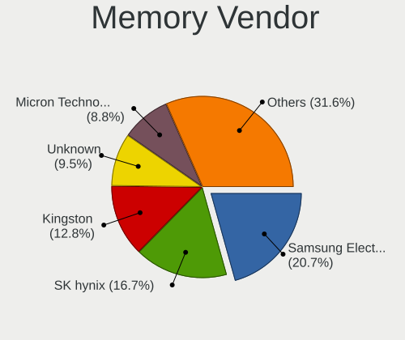

| Vendor                       | Computers | Percent |
|------------------------------|-----------|---------|
| Samsung Electronics          | 1353      | 20.68%  |
| SK hynix                     | 1091      | 16.68%  |
| Kingston                     | 840       | 12.84%  |
| Unknown                      | 620       | 9.48%   |
| Micron Technology            | 573       | 8.76%   |
| GOODRAM                      | 382       | 5.84%   |
| Crucial                      | 284       | 4.34%   |
| G.Skill                      | 213       | 3.26%   |
| Corsair                      | 169       | 2.58%   |
| Unknown                      | 136       | 2.08%   |
| Ramaxel Technology           | 127       | 1.94%   |
| A-DATA Technology            | 119       | 1.82%   |
| Nanya Technology             | 99        | 1.51%   |
| Elpida                       | 95        | 1.45%   |
| Patriot                      | 86        | 1.31%   |
| Wilk                         | 47        | 0.72%   |
| Wilk Elektronik              | 29        | 0.44%   |
| Unknown (ABCD)               | 29        | 0.44%   |
| Lexar                        | 19        | 0.29%   |
| Qimonda                      | 16        | 0.24%   |
| ASint Technology             | 16        | 0.24%   |
| Apacer                       | 16        | 0.24%   |
| Patriot Memory (PDP Systems) | 13        | 0.2%    |
| Transcend                    | 12        | 0.18%   |
| GeIL                         | 11        | 0.17%   |
| Team                         | 9         | 0.14%   |
| PNY                          | 9         | 0.14%   |
| Lexar Co Limited             | 9         | 0.14%   |
| Toshiba                      | 8         | 0.12%   |
| Silicon Power                | 8         | 0.12%   |
| PUSKILL                      | 6         | 0.09%   |
| ff                           | 6         | 0.09%   |
| 4ea5                         | 6         | 0.09%   |
| 48spaces                     | 6         | 0.09%   |
| Unknown (0x0E9D)             | 5         | 0.08%   |
| fef5                         | 5         | 0.08%   |
| Unifosa                      | 4         | 0.06%   |
| Unknown (768A)               | 3         | 0.05%   |
| SHARETRONIC                  | 3         | 0.05%   |
| Patriot Memory               | 3         | 0.05%   |

Memory Model
------------

Memory module models

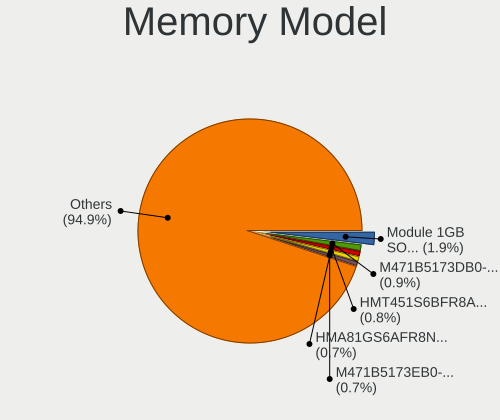

| Model                                                            | Computers | Percent |
|------------------------------------------------------------------|-----------|---------|
| Unknown                                                          | 136       | 1.91%   |
| Samsung RAM M471B5173DB0-YK0 4GB SODIMM DDR3 1600MT/s            | 67        | 0.94%   |
| SK hynix RAM HMT451S6BFR8A-PB 4GB SODIMM DDR3 1600MT/s           | 56        | 0.79%   |
| SK hynix RAM HMA81GS6AFR8N-UH 8GB SODIMM DDR4 2667MT/s           | 53        | 0.75%   |
| Samsung RAM M471B5173EB0-YK0 4GB SODIMM DDR3 1600MT/s            | 48        | 0.68%   |
| Samsung RAM M471B5273DH0-CH9 4GB SODIMM DDR3 1600MT/s            | 45        | 0.63%   |
| Samsung RAM M471B5173QH0-YK0 4GB SODIMM DDR3 1600MT/s            | 45        | 0.63%   |
| Samsung RAM M471A1G44AB0-CWE 8GiB SODIMM DDR4 3200MT/s           | 45        | 0.63%   |
| Samsung RAM M471B5273CH0-CH9 4GB SODIMM DDR3 1334MT/s            | 41        | 0.58%   |
| SK hynix RAM HMT451S6AFR8A-PB 4GB SODIMM DDR3 1600MT/s           | 40        | 0.56%   |
| SK hynix RAM HMT41GS6BFR8A-PB 8GB SODIMM DDR3 2667MT/s           | 39        | 0.55%   |
| Unknown RAM Module 2GB SODIMM DDR2 667MT/s                       | 38        | 0.53%   |
| Samsung RAM M471B5173BH0-YK0 4GB SODIMM DDR3 1600MT/s            | 38        | 0.53%   |
| GOODRAM RAM GR3200S464L22/16G 16GiB SODIMM DDR4 3200MT/s         | 38        | 0.53%   |
| SK hynix RAM HMT351S6CFR8C-PB 4GB SODIMM DDR3 1600MT/s           | 34        | 0.48%   |
| Samsung RAM M471A5244CB0-CTD 4GB SODIMM DDR4 3266MT/s            | 33        | 0.46%   |
| GOODRAM RAM GR2666S464L19/16G 16GB SODIMM DDR4 2667MT/s          | 33        | 0.46%   |
| Samsung RAM M471A1K43CB1-CRC 8GB SODIMM DDR4 8400MT/s            | 29        | 0.41%   |
| SK hynix RAM HMAA1GS6CJR6N-XN 8GB SODIMM DDR4 3200MT/s           | 28        | 0.39%   |
| Samsung RAM M471B5773DH0-CH9 2GB SODIMM DDR3 1600MT/s            | 27        | 0.38%   |
| Patriot RAM 3200 C16 Series 8GB DIMM DDR4 3600MT/s               | 26        | 0.37%   |
| SK hynix RAM HMA81GS6JJR8N-VK 8GB SODIMM DDR4 2667MT/s           | 25        | 0.35%   |
| Samsung RAM M471B5773CHS-CH9 2GB SODIMM DDR3 4199MT/s            | 25        | 0.35%   |
| Samsung RAM M471A2K43DB1-CWE 16GB SODIMM DDR4 3200MT/s           | 25        | 0.35%   |
| Samsung RAM M471A1K43EB1-CWE 8GB SODIMM DDR4 3200MT/s            | 25        | 0.35%   |
| Unknown RAM Module 2GB DIMM 800MT/s                              | 24        | 0.34%   |
| Samsung RAM M471B1G73QH0-YK0 8GB SODIMM DDR3 1600MT/s            | 24        | 0.34%   |
| SK hynix RAM HMA82GS6AFR8N-UH 16GB SODIMM DDR4 2667MT/s          | 23        | 0.32%   |
| SK hynix RAM HMA41GS6AFR8N-TF 8GB SODIMM DDR4 2667MT/s           | 23        | 0.32%   |
| Samsung RAM M471A1G44BB0-CWE 8GB SODIMM DDR4 3200MT/s            | 23        | 0.32%   |
| SK hynix RAM HYMP125S64CP8-S6 2GB SODIMM DDR2 975MT/s            | 22        | 0.31%   |
| SK hynix RAM HMA851S6AFR6N-UH 4GB SODIMM DDR4 2667MT/s           | 22        | 0.31%   |
| Samsung RAM M471A1K43CB1-CTD 8GB SODIMM DDR4 3200MT/s            | 22        | 0.31%   |
| Kingston RAM KHX1600C9D3/4GX 4GB DIMM DDR3 1867MT/s              | 22        | 0.31%   |
| Kingston RAM KHX1600C10D3/8G 8GB DIMM DDR3 2133MT/s              | 22        | 0.31%   |
| G.Skill RAM F4-3000C16-8GISB 8GB DIMM DDR4 3200MT/s              | 22        | 0.31%   |
| Unknown (ABCD) RAM 123456789012345678 2GB SODIMM LPDDR4 2400MT/s | 21        | 0.3%    |
| Micron RAM 4ATF51264HZ-2G6E1 4GB SODIMM DDR4 2667MT/s            | 21        | 0.3%    |
| Micron RAM 4ATF1G64HZ-3G2E1 8GB SODIMM DDR4 3200MT/s             | 21        | 0.3%    |
| Crucial RAM CT8G4SFD8213.C16FBD1 8GB SODIMM DDR4 2133MT/s        | 21        | 0.3%    |

Memory Kind
-----------

Memory module kinds

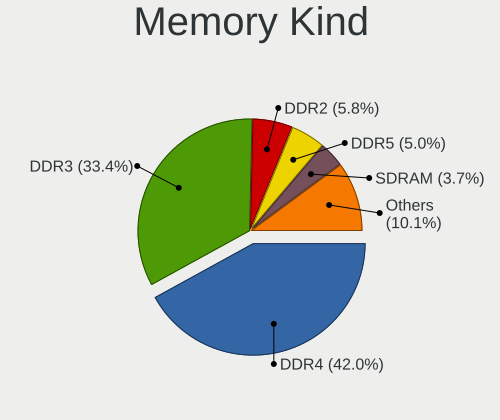

| Kind    | Computers | Percent |
|---------|-----------|---------|
| DDR4    | 2335      | 42%     |
| DDR3    | 1854      | 33.35%  |
| DDR2    | 323       | 5.81%   |
| DDR5    | 280       | 5.04%   |
| SDRAM   | 205       | 3.69%   |
| Unknown | 203       | 3.65%   |
| LPDDR4  | 137       | 2.46%   |
| LPDDR5  | 97        | 1.74%   |
| LPDDR3  | 69        | 1.24%   |
| DDR     | 39        | 0.7%    |
| DRAM    | 15        | 0.27%   |
| RAM     | 1         | 0.02%   |
| EEPROM  | 1         | 0.02%   |

Memory Form Factor
------------------

Physical design of the memory module

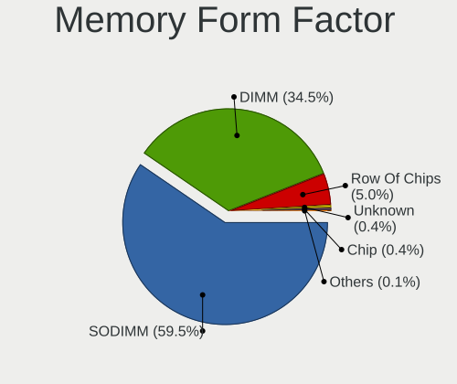

| Name            | Computers | Percent |
|-----------------|-----------|---------|
| SODIMM          | 3252      | 59.55%  |
| DIMM            | 1882      | 34.46%  |
| Row Of Chips    | 272       | 4.98%   |
| Unknown         | 24        | 0.44%   |
| Chip            | 23        | 0.42%   |
| RIMM            | 3         | 0.05%   |
| Proprietary Car | 3         | 0.05%   |
| FB-DIMM         | 2         | 0.04%   |

Memory Size
-----------

Memory module size

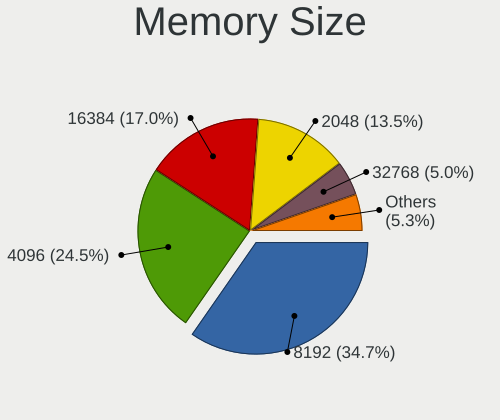

| Size    | Computers | Percent |
|---------|-----------|---------|
| 8192    | 2127      | 34.67%  |
| 4096    | 1503      | 24.5%   |
| 16384   | 1044      | 17.02%  |
| 2048    | 830       | 13.53%  |
| 32768   | 305       | 4.97%   |
| 1024    | 263       | 4.29%   |
| 512     | 31        | 0.51%   |
| 49152   | 9         | 0.15%   |
| 65536   | 4         | 0.07%   |
| Unknown | 4         | 0.07%   |
| 256     | 3         | 0.05%   |
| 131072  | 2         | 0.03%   |
| 12288   | 2         | 0.03%   |
| 3072    | 2         | 0.03%   |
| 1536    | 2         | 0.03%   |
| 24576   | 1         | 0.02%   |
| 9096    | 1         | 0.02%   |
| 64      | 1         | 0.02%   |
| 1       | 1         | 0.02%   |

Memory Speed
------------

Memory module speed

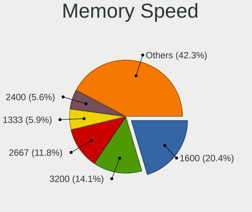

| Speed   | Computers | Percent |
|---------|-----------|---------|
| 1600    | 1252      | 20.41%  |
| 3200    | 863       | 14.07%  |
| 2667    | 722       | 11.77%  |
| 1333    | 363       | 5.92%   |
| 2400    | 341       | 5.56%   |
| 2133    | 248       | 4.04%   |
| 3600    | 217       | 3.54%   |
| 1334    | 191       | 3.11%   |
| 667     | 179       | 2.92%   |
| 800     | 167       | 2.72%   |
| 5600    | 110       | 1.79%   |
| Unknown | 109       | 1.78%   |
| 4800    | 93        | 1.52%   |
| 1067    | 90        | 1.47%   |
| 1867    | 68        | 1.11%   |
| 6400    | 63        | 1.03%   |
| 4199    | 63        | 1.03%   |
| 3000    | 53        | 0.86%   |
| 3733    | 52        | 0.85%   |
| 6000    | 51        | 0.83%   |
| 4267    | 50        | 0.82%   |
| 1866    | 47        | 0.77%   |
| 2048    | 46        | 0.75%   |
| 1066    | 45        | 0.73%   |
| 8400    | 41        | 0.67%   |
| 3800    | 39        | 0.64%   |
| 533     | 39        | 0.64%   |
| 3266    | 37        | 0.6%    |
| 975     | 36        | 0.59%   |
| 3400    | 35        | 0.57%   |
| 2666    | 34        | 0.55%   |
| 4000    | 33        | 0.54%   |
| 1800    | 32        | 0.52%   |
| 3333    | 26        | 0.42%   |
| 7500    | 25        | 0.41%   |
| 400     | 25        | 0.41%   |
| 2933    | 24        | 0.39%   |
| 1639    | 13        | 0.21%   |
| 3933    | 12        | 0.2%    |
| 333     | 12        | 0.2%    |

Printers & scanners
-------------------

Printer Vendor
--------------

Printer device vendors

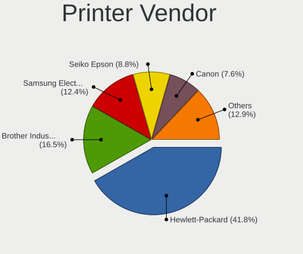

| Vendor                | Computers | Percent |
|-----------------------|-----------|---------|
| Hewlett-Packard       | 71        | 41.76%  |
| Brother Industries    | 28        | 16.47%  |
| Samsung Electronics   | 21        | 12.35%  |
| Seiko Epson           | 15        | 8.82%   |
| Canon                 | 13        | 7.65%   |
| Prolific Technology   | 5         | 2.94%   |
| Lexmark International | 4         | 2.35%   |
| Zebra                 | 2         | 1.18%   |
| Xerox                 | 2         | 1.18%   |
| Ricoh                 | 2         | 1.18%   |
| QinHeng Electronics   | 2         | 1.18%   |
| Zebra Technologies    | 1         | 0.59%   |
| Minolta               | 1         | 0.59%   |
| MIIIW                 | 1         | 0.59%   |
| Dymo-CoStar           | 1         | 0.59%   |
| Datamax-O'Neil        | 1         | 0.59%   |

Printer Model
-------------

Printer device models

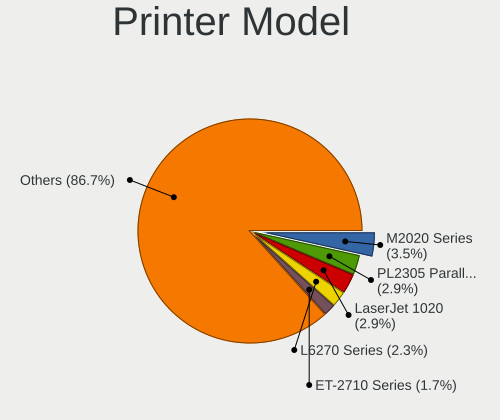

| Model                                | Computers | Percent |
|--------------------------------------|-----------|---------|
| Samsung M2020 Series                 | 6         | 3.47%   |
| Prolific PL2305 Parallel Port        | 5         | 2.89%   |
| HP LaserJet 1020                     | 5         | 2.89%   |
| Seiko Epson L6270 Series             | 4         | 2.31%   |
| Seiko Epson ET-2710 Series           | 3         | 1.73%   |
| HP Smart Tank 710-720 series         | 3         | 1.73%   |
| HP LaserJet P2015 series             | 3         | 1.73%   |
| HP LaserJet P1102                    | 3         | 1.73%   |
| HP LaserJet M14-M17                  | 3         | 1.73%   |
| HP LaserJet 1018                     | 3         | 1.73%   |
| HP DeskJet 4530 series               | 3         | 1.73%   |
| Canon iP7200 series                  | 3         | 1.73%   |
| Brother DCP-1610W                    | 3         | 1.73%   |
| Seiko Epson AL-M310DN                | 2         | 1.16%   |
| Samsung SCX-3400 Series              | 2         | 1.16%   |
| Samsung ML-216x Series Laser Printer | 2         | 1.16%   |
| Samsung ML-2010P Mono Laser Printer  | 2         | 1.16%   |
| Ricoh SP 150                         | 2         | 1.16%   |
| QinHeng CH340S                       | 2         | 1.16%   |
| HP Smart Tank 510 series             | 2         | 1.16%   |
| HP LaserJet P2055 series             | 2         | 1.16%   |
| HP LaserJet P1005                    | 2         | 1.16%   |
| HP LaserJet 1010                     | 2         | 1.16%   |
| HP Deskjet Ink Advant K209a-z        | 2         | 1.16%   |
| HP Deskjet F4500 series              | 2         | 1.16%   |
| HP DeskJet F4100 Printer series      | 2         | 1.16%   |
| HP Deskjet F2280 series              | 2         | 1.16%   |
| HP DeskJet 845c                      | 2         | 1.16%   |
| HP DeskJet 840c                      | 2         | 1.16%   |
| HP DeskJet 3700 series               | 2         | 1.16%   |
| HP DeskJet 2600 series               | 2         | 1.16%   |
| HP Deskjet 2540 series               | 2         | 1.16%   |
| HP DeskJet 2130 series               | 2         | 1.16%   |
| HP Deskjet 1050 J410                 | 2         | 1.16%   |
| Canon PIXMA MG5600 Series            | 2         | 1.16%   |
| Canon LiDE 400                       | 2         | 1.16%   |
| Brother HL-L2350DW series            | 2         | 1.16%   |
| Brother HL-1210W series              | 2         | 1.16%   |
| Brother DCP-T520W                    | 2         | 1.16%   |
| Brother DCP-J105                     | 2         | 1.16%   |

Scanner Vendor
--------------

Scanner device vendors

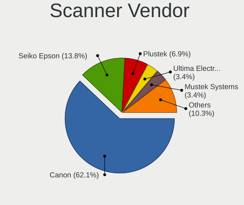

| Vendor                      | Computers | Percent |
|-----------------------------|-----------|---------|
| Canon                       | 18        | 62.07%  |
| Seiko Epson                 | 4         | 13.79%  |
| Plustek                     | 2         | 6.9%    |
| Ultima Electronics          | 1         | 3.45%   |
| Mustek Systems              | 1         | 3.45%   |
| Microtek International      | 1         | 3.45%   |
| Hewlett-Packard             | 1         | 3.45%   |
| Acer Peripherals (now BenQ) | 1         | 3.45%   |

Scanner Model
-------------

Scanner device models

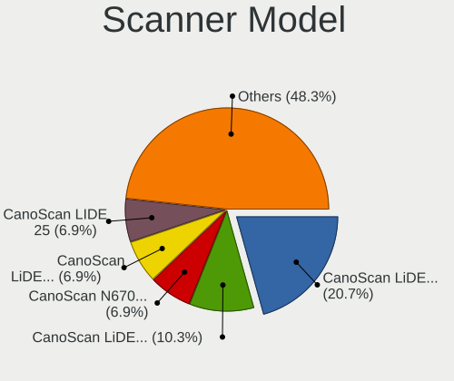

| Model                                                    | Computers | Percent |
|----------------------------------------------------------|-----------|---------|
| Canon CanoScan LiDE 210                                  | 6         | 20.69%  |
| Canon CanoScan LiDE 110                                  | 3         | 10.34%  |
| Canon CanoScan N670U/N676U/LiDE 20                       | 2         | 6.9%    |
| Canon CanoScan LIDE 25                                   | 2         | 6.9%    |
| Canon CanoScan LiDE 120                                  | 2         | 6.9%    |
| Ultima Artec E+ 48U                                      | 1         | 3.45%   |
| Seiko Epson Perfection V37/V370                          | 1         | 3.45%   |
| Seiko Epson GT-F520/GT-F570 [Perfection 3590 PHOTO]      | 1         | 3.45%   |
| Seiko Epson GT-F500/GT-F550 [Perfection 2480/2580 PHOTO] | 1         | 3.45%   |
| Seiko Epson GT-7300U [Perfection 1260/1260 PHOTO]        | 1         | 3.45%   |
| Plustek OpticSlim 1200 Scanner                           | 1         | 3.45%   |
| Plustek OpticPro 1248U Scanner #2                        | 1         | 3.45%   |
| Mustek Systems BearPaw 2448 TA Pro                       | 1         | 3.45%   |
| Microtek International USB1200 Scanner                   | 1         | 3.45%   |
| HP Scanjet 3000                                          | 1         | 3.45%   |
| Canon CanoScan N1240U/LiDE 30                            | 1         | 3.45%   |
| Canon CanoScan LiDE 100                                  | 1         | 3.45%   |
| Canon CanoScan 4400F                                     | 1         | 3.45%   |
| Acer Peripherals (now BenQ) S2W 3300U/4300U              | 1         | 3.45%   |

Camera
------

Camera Vendor
-------------

Camera device vendors

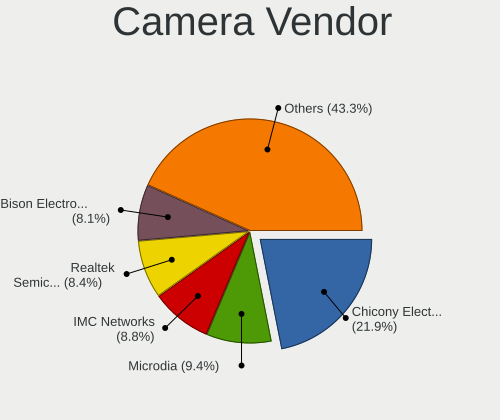

| Vendor                                 | Computers | Percent |
|----------------------------------------|-----------|---------|
| Chicony Electronics                    | 1084      | 21.9%   |
| Microdia                               | 467       | 9.44%   |
| IMC Networks                           | 437       | 8.83%   |
| Realtek Semiconductor                  | 418       | 8.45%   |
| Bison Electronics                      | 401       | 8.1%    |
| Sunplus Innovation Technology          | 245       | 4.95%   |
| Quanta                                 | 234       | 4.73%   |
| Logitech                               | 171       | 3.46%   |
| Suyin                                  | 144       | 2.91%   |
| Syntek                                 | 143       | 2.89%   |
| Cheng Uei Precision Industry (Foxlink) | 140       | 2.83%   |
| Luxvisions Innotech Limited            | 124       | 2.51%   |
| Lite-On Technology                     | 109       | 2.2%    |
| Apple                                  | 87        | 1.76%   |
| Silicon Motion                         | 81        | 1.64%   |
| Ricoh                                  | 56        | 1.13%   |
| Creative Technology                    | 55        | 1.11%   |
| Alcor Micro                            | 50        | 1.01%   |
| Sonix Technology                       | 44        | 0.89%   |
| Lenovo                                 | 43        | 0.87%   |
| Microsoft                              | 37        | 0.75%   |
| Samsung Electronics                    | 36        | 0.73%   |
| Z-Star Microelectronics                | 29        | 0.59%   |
| ShineTech                              | 29        | 0.59%   |
| Generalplus Technology                 | 18        | 0.36%   |
| DigiTech                               | 18        | 0.36%   |
| Acer                                   | 16        | 0.32%   |
| Primax Electronics                     | 13        | 0.26%   |
| Intel                                  | 13        | 0.26%   |
| ALi                                    | 13        | 0.26%   |
| Importek                               | 10        | 0.2%    |
| Cubeternet                             | 10        | 0.2%    |
| SunplusIT                              | 9         | 0.18%   |
| MacroSilicon                           | 9         | 0.18%   |
| kingcome                               | 9         | 0.18%   |
| Jieli Technology                       | 9         | 0.18%   |
| Shine-optics                           | 8         | 0.16%   |
| Hewlett-Packard                        | 8         | 0.16%   |
| GEMBIRD                                | 8         | 0.16%   |
| Xiongmai                               | 6         | 0.12%   |

Camera Model
------------

Camera device models

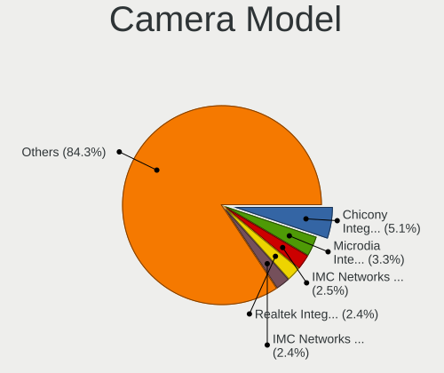

| Model                                               | Computers | Percent |
|-----------------------------------------------------|-----------|---------|
| Chicony Integrated Camera                           | 256       | 5.15%   |
| Microdia Integrated_Webcam_HD                       | 165       | 3.32%   |
| IMC Networks USB2.0 HD UVC WebCam                   | 124       | 2.49%   |
| Realtek Integrated_Webcam_HD                        | 119       | 2.39%   |
| IMC Networks Integrated Camera                      | 117       | 2.35%   |
| Bison Integrated Camera                             | 93        | 1.87%   |
| Sunplus Integrated_Webcam_HD                        | 77        | 1.55%   |
| Syntek Integrated Camera                            | 74        | 1.49%   |
| Bison Lenovo EasyCamera                             | 72        | 1.45%   |
| Chicony HD WebCam                                   | 62        | 1.25%   |
| Microdia Integrated Webcam                          | 60        | 1.21%   |
| Chicony Lenovo EasyCamera                           | 59        | 1.19%   |
| Realtek Integrated Webcam HD                        | 50        | 1.01%   |
| Realtek USB Camera                                  | 47        | 0.94%   |
| Lite-On Integrated Camera                           | 47        | 0.94%   |
| Chicony HP HD Camera                                | 46        | 0.92%   |
| Bison SunplusIT Integrated Camera                   | 42        | 0.84%   |
| Syntek Lenovo EasyCamera                            | 41        | 0.82%   |
| Logitech Webcam C270                                | 41        | 0.82%   |
| Realtek Lenovo EasyCamera                           | 39        | 0.78%   |
| Quanta HP TrueVision HD Camera                      | 39        | 0.78%   |
| Suyin Integrated_Webcam_HD                          | 38        | 0.76%   |
| Chicony USB2.0 HD UVC WebCam                        | 38        | 0.76%   |
| Sonix USB2.0 HD UVC WebCam                          | 36        | 0.72%   |
| Chicony Integrated Camera (1280x720@30)             | 35        | 0.7%    |
| Bison Lenovo Integrated Webcam                      | 35        | 0.7%    |
| Samsung Galaxy series, misc. (MTP mode)             | 34        | 0.68%   |
| Luxvisions Innotech Limited Integrated Camera       | 34        | 0.68%   |
| Apple iPhone 5/5C/5S/6/SE/7/8/X                     | 34        | 0.68%   |
| Quanta HD User Facing                               | 33        | 0.66%   |
| IMC Networks USB2.0 VGA UVC WebCam                  | 33        | 0.66%   |
| Realtek Integrated Webcam                           | 28        | 0.56%   |
| Luxvisions Innotech Limited HP TrueVision HD Camera | 28        | 0.56%   |
| Microdia Laptop_Integrated_Webcam_HD                | 27        | 0.54%   |
| Suyin Acer/HP Integrated Webcam [CN0314]            | 25        | 0.5%    |
| Quanta HP Wide Vision HD Camera                     | 25        | 0.5%    |
| Quanta HP HD Camera                                 | 25        | 0.5%    |
| Microdia CyberTrack H7                              | 25        | 0.5%    |
| Lite-On HP HD Camera                                | 25        | 0.5%    |
| Chicony EasyCamera                                  | 24        | 0.48%   |

Security
--------

Fingerprint Vendor
------------------

Fingerprint sensor vendors

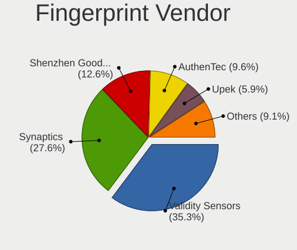

| Vendor                             | Computers | Percent |
|------------------------------------|-----------|---------|
| Validity Sensors                   | 317       | 35.26%  |
| Synaptics                          | 248       | 27.59%  |
| Shenzhen Goodix Technology         | 113       | 12.57%  |
| AuthenTec                          | 86        | 9.57%   |
| Upek                               | 53        | 5.9%    |
| Elan Microelectronics              | 36        | 4%      |
| LighTuning Technology              | 20        | 2.22%   |
| STMicroelectronics                 | 18        | 2%      |
| Realtek USB2.0 Finger Print Bridge | 6         | 0.67%   |
| Microsoft                          | 1         | 0.11%   |
| Dell                               | 1         | 0.11%   |

Fingerprint Model
-----------------

Fingerprint sensor models

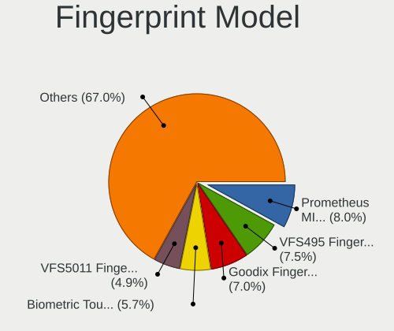

| Model                                                                      | Computers | Percent |
|----------------------------------------------------------------------------|-----------|---------|
| Synaptics Prometheus MIS Touch Fingerprint Reader                          | 72        | 8.01%   |
| Validity Sensors VFS495 Fingerprint Reader                                 | 67        | 7.45%   |
| Shenzhen Goodix  Fingerprint Device                                        | 63        | 7.01%   |
| Upek Biometric Touchchip/Touchstrip Fingerprint Sensor                     | 51        | 5.67%   |
| Validity Sensors VFS5011 Fingerprint Reader                                | 44        | 4.89%   |
| Synaptics Metallica MIS Touch Fingerprint Reader                           | 44        | 4.89%   |
| Shenzhen Goodix Fingerprint Reader                                         | 41        | 4.56%   |
| Validity Sensors VFS 5011 fingerprint sensor                               | 38        | 4.23%   |
| AuthenTec AES2810                                                          | 36        | 4%      |
| Validity Sensors Synaptics WBDI                                            | 30        | 3.34%   |
| AuthenTec AES2501 Fingerprint Sensor                                       | 24        | 2.67%   |
| Synaptics Fingerprint reader [HP G6]                                       | 23        | 2.56%   |
| Synaptics FS7604 Touch Fingerprint Sensor with PurePrint                   | 21        | 2.34%   |
| Elan ELAN:Fingerprint                                                      | 21        | 2.34%   |
| Validity Sensors VFS471 Fingerprint Reader                                 | 19        | 2.11%   |
| Validity Sensors Synaptics VFS7552 Touch Fingerprint Sensor with PurePrint | 19        | 2.11%   |
| Validity Sensors VFS7500 Touch Fingerprint Sensor                          | 18        | 2%      |
| Validity Sensors VFS491                                                    | 18        | 2%      |
| STMicroelectronics Fingerprint Reader                                      | 18        | 2%      |
| Synaptics UWP WBDI Device                                                  | 16        | 1.78%   |
| Validity Sensors VFS451 Fingerprint Reader                                 | 15        | 1.67%   |
| Synaptics  WBDI                                                            | 14        | 1.56%   |
| Elan ELAN:ARM-M4                                                           | 14        | 1.56%   |
| Validity Sensors Fingerprint scanner                                       | 13        | 1.45%   |
| Synaptics  FS7604 Touch Fingerprint Sensor with PurePrint                  | 13        | 1.45%   |
| Validity Sensors VFS101 Fingerprint Reader                                 | 12        | 1.33%   |
| AuthenTec Fingerprint Sensor                                               | 10        | 1.11%   |
| AuthenTec AES1600                                                          | 10        | 1.11%   |
| Shenzhen Goodix FingerPrint                                                | 9         | 1%      |
| Validity Sensors VFS301 Fingerprint Reader                                 | 8         | 0.89%   |
| Synaptics WBDI                                                             | 8         | 0.89%   |
| Synaptics Metallica MOH Touch Fingerprint Reader                           | 8         | 0.89%   |
| LighTuning ES603 Swipe Fingerprint Sensor                                  | 8         | 0.89%   |
| Validity Sensors VFS Fingerprint sensor                                    | 7         | 0.78%   |
| LighTuning EgisTec Touch Fingerprint Sensor                                | 7         | 0.78%   |
| Synaptics UWP WBDI                                                         | 6         | 0.67%   |
| Synaptics Prometheus Fingerprint Reader                                    | 6         | 0.67%   |
| Realtek USB2.0 Finger Print Bridge FocalTech Fingerprint Device            | 6         | 0.67%   |
| Validity Sensors Swipe Fingerprint Sensor                                  | 5         | 0.56%   |
| LighTuning Fingerprint Reader                                              | 5         | 0.56%   |

Chipcard Vendor
---------------

Chipcard module vendors

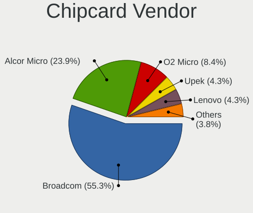

| Vendor                    | Computers | Percent |
|---------------------------|-----------|---------|
| Broadcom                  | 361       | 55.28%  |
| Alcor Micro               | 156       | 23.89%  |
| O2 Micro                  | 55        | 8.42%   |
| Upek                      | 28        | 4.29%   |
| Lenovo                    | 28        | 4.29%   |
| Gemalto (was Gemplus)     | 5         | 0.77%   |
| SCM Microsystems          | 4         | 0.61%   |
| OmniKey                   | 4         | 0.61%   |
| Advanced Card Systems     | 3         | 0.46%   |
| Clay Logic                | 2         | 0.31%   |
| Cherry                    | 2         | 0.31%   |
| Reiner SCT Kartensysteme  | 1         | 0.15%   |
| NXP Semiconductors        | 1         | 0.15%   |
| Fujitsu Siemens Computers | 1         | 0.15%   |
| Feitian Technologies      | 1         | 0.15%   |
| Aladdin Knowledge Systems | 1         | 0.15%   |

Chipcard Model
--------------

Chipcard module models

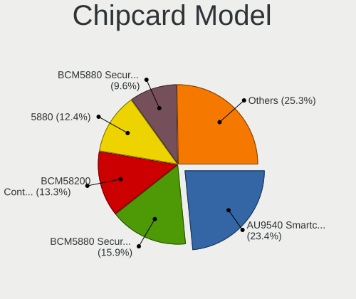

| Model                                                                        | Computers | Percent |
|------------------------------------------------------------------------------|-----------|---------|
| Alcor Micro AU9540 Smartcard Reader                                          | 153       | 23.43%  |
| Broadcom BCM5880 Secure Applications Processor                               | 104       | 15.93%  |
| Broadcom BCM58200 ControlVault 3 (FingerPrint sensor + Contacted SmartCard)  | 87        | 13.32%  |
| Broadcom 5880                                                                | 81        | 12.4%   |
| Broadcom BCM5880 Secure Applications Processor with fingerprint swipe sensor | 63        | 9.65%   |
| O2 Micro OZ776 CCID Smartcard Reader                                         | 48        | 7.35%   |
| Upek TouchChip Fingerprint Coprocessor (WBF advanced mode)                   | 28        | 4.29%   |
| Lenovo Integrated Smart Card Reader                                          | 28        | 4.29%   |
| Broadcom 58200                                                               | 24        | 3.68%   |
| O2 Micro Oz776 SmartCard Reader                                              | 7         | 1.07%   |
| Gemalto (was Gemplus) Compact Smart Card Reader Writer                       | 3         | 0.46%   |
| SCM Microsystems SCR3340 - ExpressCard54 Smart Card Reader                   | 2         | 0.31%   |
| OmniKey CardMan 3021 / 3121                                                  | 2         | 0.31%   |
| Gemalto (was Gemplus) GemPC Key SmartCard Reader                             | 2         | 0.31%   |
| Clay Logic Nitrokey Pro                                                      | 2         | 0.31%   |
| Broadcom BCM5880 Secure Applications Processor with fingerprint touch sensor | 2         | 0.31%   |
| Alcor Micro Watchdata W 1981                                                 | 2         | 0.31%   |
| Advanced Card Systems ACR39U                                                 | 2         | 0.31%   |
| SCM Microsystems SCT3522CC token                                             | 1         | 0.15%   |
| SCM Microsystems SCR333 SmartCard Reader                                     | 1         | 0.15%   |
| Reiner SCT Kartensysteme cyberJack RFID basis contactless smartcard reader   | 1         | 0.15%   |
| OmniKey CardMan 3121 (HID Technologies)                                      | 1         | 0.15%   |
| OmniKey 3x21 Smart Card Reader                                               | 1         | 0.15%   |
| NXP Semiconductors PR533                                                     | 1         | 0.15%   |
| Fujitsu Siemens Computers SmartCard Reader 2A                                | 1         | 0.15%   |
| Feitian Technologies ePass2003                                               | 1         | 0.15%   |
| Cherry SmartCard Reader Keyboard KC 1000 SC                                  | 1         | 0.15%   |
| Cherry Smart Terminal XX44                                                   | 1         | 0.15%   |
| Alcor Micro EMV Smartcard Reader                                             | 1         | 0.15%   |
| Aladdin Knowledge Systems Token JC                                           | 1         | 0.15%   |
| Advanced Card Systems ACR1281 1S Dual Reader                                 | 1         | 0.15%   |

Unsupported
-----------

Unsupported Devices
-------------------

Total unsupported devices on board

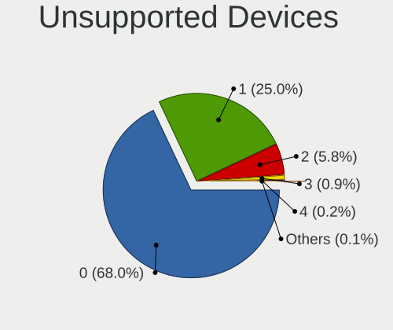

| Total | Computers | Percent |
|-------|-----------|---------|
| 0     | 5916      | 67.98%  |
| 1     | 2177      | 25.01%  |
| 2     | 505       | 5.8%    |
| 3     | 77        | 0.88%   |
| 4     | 18        | 0.21%   |
| 5     | 4         | 0.05%   |
| 7     | 3         | 0.03%   |
| 6     | 3         | 0.03%   |

Unsupported Device Types
------------------------

Types of unsupported devices

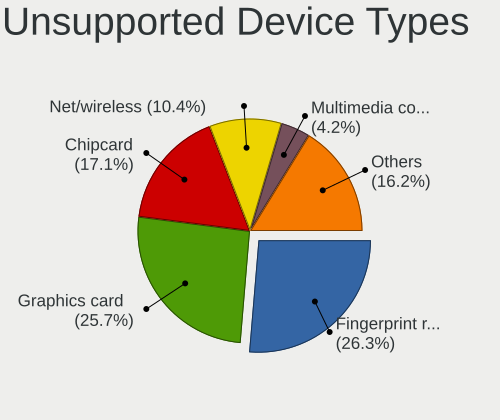

| Type                     | Computers | Percent |
|--------------------------|-----------|---------|
| Fingerprint reader       | 886       | 26.33%  |
| Graphics card            | 865       | 25.71%  |
| Chipcard                 | 575       | 17.09%  |
| Net/wireless             | 351       | 10.43%  |
| Multimedia controller    | 142       | 4.22%   |
| Communication controller | 97        | 2.88%   |
| Bluetooth                | 94        | 2.79%   |
| Camera                   | 71        | 2.11%   |
| Storage                  | 62        | 1.84%   |
| Unassigned class         | 51        | 1.52%   |
| Sound                    | 38        | 1.13%   |
| Card reader              | 33        | 0.98%   |
| Net/ethernet             | 20        | 0.59%   |
| Network                  | 16        | 0.48%   |
| Modem                    | 15        | 0.45%   |
| Firewire controller      | 12        | 0.36%   |
| Storage/raid             | 10        | 0.3%    |
| Storage/ide              | 8         | 0.24%   |
| Dvb card                 | 7         | 0.21%   |
| Flash memory             | 6         | 0.18%   |
| Storage/nvme             | 2         | 0.06%   |
| Wireless                 | 1         | 0.03%   |
| Video                    | 1         | 0.03%   |
| Unclassified device      | 1         | 0.03%   |
| Tv card                  | 1         | 0.03%   |

