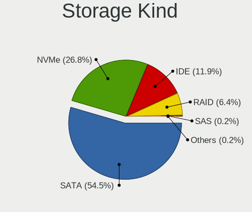
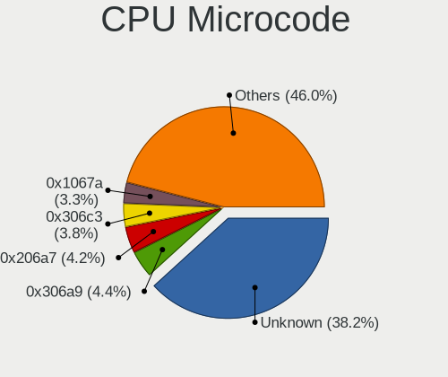
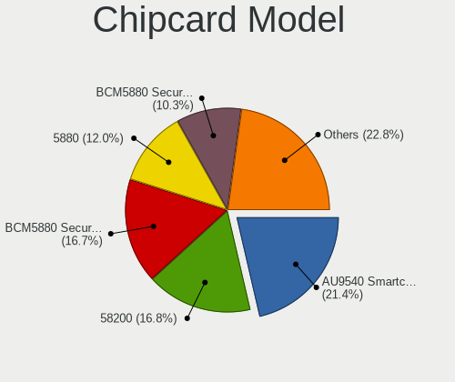

Linux in Poland - Tested Hardware & Statistics
----------------------------------------------

A project to collect tested hardware configurations for Linux in Poland.

Anyone can contribute to this report by the [hw-probe](https://github.com/linuxhw/hw-probe) tool:

    sudo -E hw-probe -all -upload

Please contribute! Especially if your hardware is rare.

This is a report for all computer types. See also reports for [desktops](/Location/Poland/Desktop/README.md) and [notebooks](/Location/Poland/Notebook/README.md).

Contents
--------

* [ Test Cases ](#test-cases)

* [ System ](#system)
  - [ OS                       ](#os)
  - [ OS Family                ](#os-family)
  - [ Kernel                   ](#kernel)
  - [ Kernel Family            ](#kernel-family)
  - [ Kernel Major Ver.        ](#kernel-major-ver)
  - [ Arch                     ](#arch)
  - [ DE                       ](#de)
  - [ Display Server           ](#display-server)
  - [ Display Manager          ](#display-manager)
  - [ OS Lang                  ](#os-lang)
  - [ Boot Mode                ](#boot-mode)
  - [ Filesystem               ](#filesystem)
  - [ Part. scheme             ](#part-scheme)
  - [ Dual Boot with Linux/BSD ](#dual-boot-with-linuxbsd)
  - [ Dual Boot (Win)          ](#dual-boot-win)

* [ Board ](#board)
  - [ Vendor                   ](#vendor)
  - [ Model                    ](#model)
  - [ Model Family             ](#model-family)
  - [ MFG Year                 ](#mfg-year)
  - [ Form Factor              ](#form-factor)
  - [ Secure Boot              ](#secure-boot)
  - [ Coreboot                 ](#coreboot)
  - [ RAM Size                 ](#ram-size)
  - [ RAM Used                 ](#ram-used)
  - [ Total Drives             ](#total-drives)
  - [ Has CD-ROM               ](#has-cd-rom)
  - [ Has Ethernet             ](#has-ethernet)
  - [ Has WiFi                 ](#has-wifi)
  - [ Has Bluetooth            ](#has-bluetooth)

* [ Location ](#location)
  - [ Country                  ](#country)
  - [ City                     ](#city)

* [ Drives ](#drives)
  - [ Drive Vendor             ](#drive-vendor)
  - [ Drive Model              ](#drive-model)
  - [ HDD Vendor               ](#hdd-vendor)
  - [ SSD Vendor               ](#ssd-vendor)
  - [ Drive Kind               ](#drive-kind)
  - [ Drive Connector          ](#drive-connector)
  - [ Drive Size               ](#drive-size)
  - [ Space Total              ](#space-total)
  - [ Space Used               ](#space-used)
  - [ Malfunc. Drives          ](#malfunc-drives)
  - [ Malfunc. Drive Vendor    ](#malfunc-drive-vendor)
  - [ Malfunc. HDD Vendor      ](#malfunc-hdd-vendor)
  - [ Malfunc. Drive Kind      ](#malfunc-drive-kind)
  - [ Failed Drives            ](#failed-drives)
  - [ Failed Drive Vendor      ](#failed-drive-vendor)
  - [ Drive Status             ](#drive-status)

* [ Storage controller ](#storage-controller)
  - [ Storage Vendor           ](#storage-vendor)
  - [ Storage Model            ](#storage-model)
  - [ Storage Kind             ](#storage-kind)

* [ Processor ](#processor)
  - [ CPU Vendor               ](#cpu-vendor)
  - [ CPU Model                ](#cpu-model)
  - [ CPU Model Family         ](#cpu-model-family)
  - [ CPU Cores                ](#cpu-cores)
  - [ CPU Sockets              ](#cpu-sockets)
  - [ CPU Threads              ](#cpu-threads)
  - [ CPU Op-Modes             ](#cpu-op-modes)
  - [ CPU Microcode            ](#cpu-microcode)
  - [ CPU Microarch            ](#cpu-microarch)

* [ Graphics ](#graphics)
  - [ GPU Vendor               ](#gpu-vendor)
  - [ GPU Model                ](#gpu-model)
  - [ GPU Combo                ](#gpu-combo)
  - [ GPU Driver               ](#gpu-driver)
  - [ GPU Memory               ](#gpu-memory)

* [ Monitor ](#monitor)
  - [ Monitor Vendor           ](#monitor-vendor)
  - [ Monitor Model            ](#monitor-model)
  - [ Monitor Resolution       ](#monitor-resolution)
  - [ Monitor Diagonal         ](#monitor-diagonal)
  - [ Monitor Width            ](#monitor-width)
  - [ Aspect Ratio             ](#aspect-ratio)
  - [ Monitor Area             ](#monitor-area)
  - [ Pixel Density            ](#pixel-density)
  - [ Multiple Monitors        ](#multiple-monitors)

* [ Network ](#network)
  - [ Net Controller Vendor    ](#net-controller-vendor)
  - [ Net Controller Model     ](#net-controller-model)
  - [ Wireless Vendor          ](#wireless-vendor)
  - [ Wireless Model           ](#wireless-model)
  - [ Ethernet Vendor          ](#ethernet-vendor)
  - [ Ethernet Model           ](#ethernet-model)
  - [ Net Controller Kind      ](#net-controller-kind)
  - [ Used Controller          ](#used-controller)
  - [ NICs                     ](#nics)
  - [ IPv6                     ](#ipv6)

* [ Bluetooth ](#bluetooth)
  - [ Bluetooth Vendor         ](#bluetooth-vendor)
  - [ Bluetooth Model          ](#bluetooth-model)

* [ Sound ](#sound)
  - [ Sound Vendor             ](#sound-vendor)
  - [ Sound Model              ](#sound-model)

* [ Memory ](#memory)
  - [ Memory Vendor            ](#memory-vendor)
  - [ Memory Model             ](#memory-model)
  - [ Memory Kind              ](#memory-kind)
  - [ Memory Form Factor       ](#memory-form-factor)
  - [ Memory Size              ](#memory-size)
  - [ Memory Speed             ](#memory-speed)

* [ Printers & scanners ](#printers--scanners)
  - [ Printer Vendor           ](#printer-vendor)
  - [ Printer Model            ](#printer-model)
  - [ Scanner Vendor           ](#scanner-vendor)
  - [ Scanner Model            ](#scanner-model)

* [ Camera ](#camera)
  - [ Camera Vendor            ](#camera-vendor)
  - [ Camera Model             ](#camera-model)

* [ Security ](#security)
  - [ Fingerprint Vendor       ](#fingerprint-vendor)
  - [ Fingerprint Model        ](#fingerprint-model)
  - [ Chipcard Vendor          ](#chipcard-vendor)
  - [ Chipcard Model           ](#chipcard-model)

* [ Unsupported ](#unsupported)
  - [ Unsupported Devices      ](#unsupported-devices)
  - [ Unsupported Device Types ](#unsupported-device-types)

Test Cases
----------

Total: 8727

| Vendor        | Model                       | Form-Factor | Probe                                                      | Date         |
|---------------|-----------------------------|-------------|------------------------------------------------------------|--------------|
| ASRock        | Z790 PG Lightning           | Desktop     | [0b5268372a](https://linux-hardware.org/?probe=0b5268372a) | Dec 24, 2023 |
| Raspberry ... | Raspberry Pi Zero W Rev ... | Soc         | [c9bcc97e5b](https://linux-hardware.org/?probe=c9bcc97e5b) | Dec 24, 2023 |
| Gigabyte      | X670 GAMING X AX            | Desktop     | [4452cd4a25](https://linux-hardware.org/?probe=4452cd4a25) | Dec 24, 2023 |
| ASUSTek       | P7P55D-E PRO                | Desktop     | [ef61ad2663](https://linux-hardware.org/?probe=ef61ad2663) | Dec 24, 2023 |
| Lenovo        | ThinkPad T460s 20FAS0600... | Notebook    | [07efd36bbe](https://linux-hardware.org/?probe=07efd36bbe) | Dec 24, 2023 |
| Dell          | 09KPNV A00                  | Desktop     | [a90623afe1](https://linux-hardware.org/?probe=a90623afe1) | Dec 23, 2023 |
| HP            | EliteBook 2530p             | Notebook    | [996611fcab](https://linux-hardware.org/?probe=996611fcab) | Dec 23, 2023 |
| Dell          | Latitude E6530              | Notebook    | [2a62f5f318](https://linux-hardware.org/?probe=2a62f5f318) | Dec 23, 2023 |
| Dell          | Latitude E6530              | Notebook    | [2d9ff2bdb9](https://linux-hardware.org/?probe=2d9ff2bdb9) | Dec 23, 2023 |
| Lenovo        | G50-30 80G0                 | Notebook    | [45b0f5ae9a](https://linux-hardware.org/?probe=45b0f5ae9a) | Dec 23, 2023 |
| ASUSTek       | P7P55D-E                    | Desktop     | [dc2914021f](https://linux-hardware.org/?probe=dc2914021f) | Dec 23, 2023 |
| Lenovo        | SHARKBAY SDK0J40705 WIN ... | Desktop     | [739d4b0840](https://linux-hardware.org/?probe=739d4b0840) | Dec 23, 2023 |
| Gigabyte      | Z97M-DS3H                   | Desktop     | [da051b693c](https://linux-hardware.org/?probe=da051b693c) | Dec 23, 2023 |
| HP            | EliteBook 745 G6            | Notebook    | [9bf64ae4b7](https://linux-hardware.org/?probe=9bf64ae4b7) | Dec 23, 2023 |
| ASUSTek       | X555LJ                      | Notebook    | [8f1a82681b](https://linux-hardware.org/?probe=8f1a82681b) | Dec 22, 2023 |
| ASUSTek       | X555LJ                      | Notebook    | [44b0b8bd05](https://linux-hardware.org/?probe=44b0b8bd05) | Dec 22, 2023 |
| Microsoft     | Surface Go                  | Tablet      | [33d1b64e50](https://linux-hardware.org/?probe=33d1b64e50) | Dec 22, 2023 |
| ASUSTek       | B85-PLUS                    | Desktop     | [58a2ef76f9](https://linux-hardware.org/?probe=58a2ef76f9) | Dec 22, 2023 |
| Microsoft     | Surface Go                  | Tablet      | [8191965e71](https://linux-hardware.org/?probe=8191965e71) | Dec 22, 2023 |
| Dell          | Latitude 5440               | Notebook    | [d7462b97ac](https://linux-hardware.org/?probe=d7462b97ac) | Dec 22, 2023 |
| Lenovo        | ThinkBook 16 G6 IRL 21KH    | Notebook    | [c6cefd749d](https://linux-hardware.org/?probe=c6cefd749d) | Dec 22, 2023 |
| Dell          | Latitude E6400              | Notebook    | [6e6d4fec11](https://linux-hardware.org/?probe=6e6d4fec11) | Dec 21, 2023 |
| Dell          | Precision M6600             | Notebook    | [5e387ee3ac](https://linux-hardware.org/?probe=5e387ee3ac) | Dec 21, 2023 |
| ASUSTek       | VivoBook_ASUSLaptop X421... | Notebook    | [ec0a846182](https://linux-hardware.org/?probe=ec0a846182) | Dec 21, 2023 |
| Lenovo        | ThinkPad SL 2746E9G         | Notebook    | [594a56a070](https://linux-hardware.org/?probe=594a56a070) | Dec 21, 2023 |
| ASUSTek       | VivoBook_ASUSLaptop X421... | Notebook    | [5632b47c38](https://linux-hardware.org/?probe=5632b47c38) | Dec 21, 2023 |
| Dell          | Latitude E6320              | Notebook    | [a1e4b48d85](https://linux-hardware.org/?probe=a1e4b48d85) | Dec 20, 2023 |
| Hampoo        | Cherry Trail CR             | Desktop     | [2c180fa555](https://linux-hardware.org/?probe=2c180fa555) | Dec 20, 2023 |
| Fujitsu       | LIFEBOOK U745               | Notebook    | [a2f7b09b87](https://linux-hardware.org/?probe=a2f7b09b87) | Dec 20, 2023 |
| MSI           | B450-A PRO MAX              | Desktop     | [f46e034f2c](https://linux-hardware.org/?probe=f46e034f2c) | Dec 20, 2023 |
| STONE COMP... | NOTCHA-286                  | Notebook    | [c931f0f65a](https://linux-hardware.org/?probe=c931f0f65a) | Dec 20, 2023 |
| Samsung       | 350V5C/351V5C/3540VC/344... | Notebook    | [5615091c1d](https://linux-hardware.org/?probe=5615091c1d) | Dec 20, 2023 |
| Unknown       | Unknown                     | Notebook    | [6f1ca9e563](https://linux-hardware.org/?probe=6f1ca9e563) | Dec 19, 2023 |
| Unknown       | Unknown                     | Notebook    | [13072c9ecc](https://linux-hardware.org/?probe=13072c9ecc) | Dec 19, 2023 |
| Dell          | Latitude 3190               | Notebook    | [a7e488632e](https://linux-hardware.org/?probe=a7e488632e) | Dec 19, 2023 |
| Google        | Phaser360                   | Notebook    | [c739678794](https://linux-hardware.org/?probe=c739678794) | Dec 18, 2023 |
| Dell          | Latitude E6440              | Notebook    | [8d1b130773](https://linux-hardware.org/?probe=8d1b130773) | Dec 18, 2023 |
| Dell          | 0T10XW A00                  | Desktop     | [ffff088d9c](https://linux-hardware.org/?probe=ffff088d9c) | Dec 18, 2023 |
| ASUSTek       | M3A78-CM                    | Desktop     | [89fd7ee431](https://linux-hardware.org/?probe=89fd7ee431) | Dec 18, 2023 |
| Lenovo        | ThinkPad T14 Gen 3 21AH0... | Notebook    | [1a1a04845b](https://linux-hardware.org/?probe=1a1a04845b) | Dec 18, 2023 |
| Gigabyte      | A520 AORUS ELITE            | Desktop     | [3504b628f1](https://linux-hardware.org/?probe=3504b628f1) | Dec 18, 2023 |
| Lenovo        | ThinkPad T14 Gen 3 21AH0... | Notebook    | [fcc1139818](https://linux-hardware.org/?probe=fcc1139818) | Dec 18, 2023 |
| Gigabyte      | AB350-Gaming-CF             | Desktop     | [e0b7c61c9f](https://linux-hardware.org/?probe=e0b7c61c9f) | Dec 18, 2023 |
| ASRock        | AB350M-HDV                  | Desktop     | [2860ba102d](https://linux-hardware.org/?probe=2860ba102d) | Dec 18, 2023 |
| Fujitsu Si... | LIFEBOOK S6410              | Notebook    | [24edc4b12c](https://linux-hardware.org/?probe=24edc4b12c) | Dec 17, 2023 |
| ASRock        | AB350M-HDV                  | Desktop     | [8d45a13b61](https://linux-hardware.org/?probe=8d45a13b61) | Dec 17, 2023 |
| ASUSTek       | 1215N                       | Notebook    | [9d204d6a41](https://linux-hardware.org/?probe=9d204d6a41) | Dec 17, 2023 |
| ASUSTek       | K84L                        | Notebook    | [3e0ea1ca0a](https://linux-hardware.org/?probe=3e0ea1ca0a) | Dec 17, 2023 |
| MSI           | MS-7255                     | Desktop     | [efdf3ede47](https://linux-hardware.org/?probe=efdf3ede47) | Dec 17, 2023 |
| Gigabyte      | GA-MA69G-S3H                | Desktop     | [d0b623f72b](https://linux-hardware.org/?probe=d0b623f72b) | Dec 17, 2023 |
| Raspberry ... | Raspberry Pi Zero W Rev ... | Soc         | [7ebbee0896](https://linux-hardware.org/?probe=7ebbee0896) | Dec 17, 2023 |
| Inventec      | DQ Class A02                | Desktop     | [73df6dfb3b](https://linux-hardware.org/?probe=73df6dfb3b) | Dec 16, 2023 |
| Google        | Phaser360                   | Notebook    | [784ed40440](https://linux-hardware.org/?probe=784ed40440) | Dec 16, 2023 |
| HP            | Pavilion Laptop 14-dv0xx... | Notebook    | [f7ffef008a](https://linux-hardware.org/?probe=f7ffef008a) | Dec 16, 2023 |
| HP            | Pavilion Laptop 14-dv0xx... | Notebook    | [fc9b36317a](https://linux-hardware.org/?probe=fc9b36317a) | Dec 16, 2023 |
| Dell          | Inspiron 15-3567            | Notebook    | [3907c9bfa3](https://linux-hardware.org/?probe=3907c9bfa3) | Dec 16, 2023 |
| Lenovo        | B590 20206                  | Notebook    | [b6afc3e929](https://linux-hardware.org/?probe=b6afc3e929) | Dec 16, 2023 |
| Lenovo        | G570 20079                  | Notebook    | [7928703207](https://linux-hardware.org/?probe=7928703207) | Dec 16, 2023 |
| HP            | 8265                        | Desktop     | [58cc9fa090](https://linux-hardware.org/?probe=58cc9fa090) | Dec 16, 2023 |
| Microsoft     | Surface Laptop Go           | Tablet      | [091abf1a59](https://linux-hardware.org/?probe=091abf1a59) | Dec 16, 2023 |
| Lenovo        | Legion Go 8APU1 83E1        | Tablet      | [125cbeedba](https://linux-hardware.org/?probe=125cbeedba) | Dec 15, 2023 |
| Dell          | Latitude E5410              | Notebook    | [ee4251c01c](https://linux-hardware.org/?probe=ee4251c01c) | Dec 15, 2023 |
| Dell          | 03NVJ6 A02                  | Desktop     | [7f5a3db82c](https://linux-hardware.org/?probe=7f5a3db82c) | Dec 15, 2023 |
| Lenovo        | Yoga Slim 6 14IAP8 82WU     | Notebook    | [c2186c6471](https://linux-hardware.org/?probe=c2186c6471) | Dec 14, 2023 |
| MSI           | GT70 2OC/2OD                | Notebook    | [22910f80b0](https://linux-hardware.org/?probe=22910f80b0) | Dec 14, 2023 |
| Shenzhen M... | F7BSC                       | Mini pc     | [326d6a97b8](https://linux-hardware.org/?probe=326d6a97b8) | Dec 14, 2023 |
| HP            | 1495                        | Desktop     | [bd97989dd8](https://linux-hardware.org/?probe=bd97989dd8) | Dec 14, 2023 |
| Gigabyte      | B450M DS3H-CF               | Desktop     | [c8d2a05aea](https://linux-hardware.org/?probe=c8d2a05aea) | Dec 14, 2023 |
| ASUSTek       | M5A78L-M LX3                | Desktop     | [a51734cec9](https://linux-hardware.org/?probe=a51734cec9) | Dec 13, 2023 |
| ASUSTek       | P8H61                       | Desktop     | [6f5272ea27](https://linux-hardware.org/?probe=6f5272ea27) | Dec 13, 2023 |
| Dell          | Latitude E6440              | Notebook    | [cf0bb02399](https://linux-hardware.org/?probe=cf0bb02399) | Dec 13, 2023 |
| Fujitsu       | D3600-A1 S26361-D3600-A1    | Desktop     | [0e87f04695](https://linux-hardware.org/?probe=0e87f04695) | Dec 12, 2023 |
| Gigabyte      | 970A-UD3P                   | Desktop     | [82f5fec0c4](https://linux-hardware.org/?probe=82f5fec0c4) | Dec 12, 2023 |
| ASRock        | X470 Master SLI             | Desktop     | [2f96568c78](https://linux-hardware.org/?probe=2f96568c78) | Dec 12, 2023 |
| ASRock        | X470 Master SLI             | Desktop     | [68fe94d3be](https://linux-hardware.org/?probe=68fe94d3be) | Dec 12, 2023 |
| ASRock        | B650M PG Riptide            | Desktop     | [9b92833e92](https://linux-hardware.org/?probe=9b92833e92) | Dec 12, 2023 |
| HP            | Laptop 15s-eq0xxx           | Notebook    | [56e614b2fe](https://linux-hardware.org/?probe=56e614b2fe) | Dec 12, 2023 |
| Dell          | Latitude 3190               | Notebook    | [faf8105e3c](https://linux-hardware.org/?probe=faf8105e3c) | Dec 12, 2023 |
| Raspberry ... | Raspberry Pi                | Soc         | [1c38d5c24a](https://linux-hardware.org/?probe=1c38d5c24a) | Dec 12, 2023 |
| MSI           | H61M-E33                    | Desktop     | [6123a79100](https://linux-hardware.org/?probe=6123a79100) | Dec 12, 2023 |
| HP            | Laptop                      | Notebook    | [8bdb6d048e](https://linux-hardware.org/?probe=8bdb6d048e) | Dec 11, 2023 |
| Gigabyte      | B150M-D3H-CF                | Desktop     | [a46aa4d97c](https://linux-hardware.org/?probe=a46aa4d97c) | Dec 11, 2023 |
| Dell          | Precision 7520              | Notebook    | [d0f203dcb1](https://linux-hardware.org/?probe=d0f203dcb1) | Dec 11, 2023 |
| Dell          | Precision 7520              | Notebook    | [2e02455101](https://linux-hardware.org/?probe=2e02455101) | Dec 11, 2023 |
| HP            | Pavilion Sleekbook 15       | Notebook    | [baec95bb2f](https://linux-hardware.org/?probe=baec95bb2f) | Dec 11, 2023 |
| ASUSTek       | P8Z77-V LX                  | Desktop     | [9e23503add](https://linux-hardware.org/?probe=9e23503add) | Dec 11, 2023 |
| Gigabyte      | A520 AORUS ELITE            | Desktop     | [e07d68d658](https://linux-hardware.org/?probe=e07d68d658) | Dec 11, 2023 |
| ASUSTek       | M3A78-CM                    | Desktop     | [8bf4107eed](https://linux-hardware.org/?probe=8bf4107eed) | Dec 11, 2023 |
| Apple         | MacBookPro15,1              | Notebook    | [9d882fc801](https://linux-hardware.org/?probe=9d882fc801) | Dec 11, 2023 |
| HP            | Laptop                      | Notebook    | [b5d2cf7074](https://linux-hardware.org/?probe=b5d2cf7074) | Dec 10, 2023 |
| Gigabyte      | 970A-DS3P                   | Desktop     | [71de71e3f4](https://linux-hardware.org/?probe=71de71e3f4) | Dec 10, 2023 |
| Gigabyte      | P67A-UD3P-B3                | Desktop     | [e96b9306cb](https://linux-hardware.org/?probe=e96b9306cb) | Dec 10, 2023 |
| Lenovo        | ThinkPad T410 2522V3S       | Notebook    | [7a6c259421](https://linux-hardware.org/?probe=7a6c259421) | Dec 10, 2023 |
| Gigabyte      | 970A-DS3P                   | Desktop     | [64b0038221](https://linux-hardware.org/?probe=64b0038221) | Dec 10, 2023 |
| ASUSTek       | B150M-A/M.2                 | Desktop     | [dd4ad4373b](https://linux-hardware.org/?probe=dd4ad4373b) | Dec 10, 2023 |
| Acer          | Nitro AN515-54              | Notebook    | [a29797fb65](https://linux-hardware.org/?probe=a29797fb65) | Dec 10, 2023 |
| Gigabyte      | Z87X-UD4H-CF                | Desktop     | [a960a2a5b7](https://linux-hardware.org/?probe=a960a2a5b7) | Dec 10, 2023 |
| Toshiba       | Satellite A660              | Notebook    | [441f997be2](https://linux-hardware.org/?probe=441f997be2) | Dec 10, 2023 |
| Dell          | 0HY9JP A02                  | Desktop     | [25d8aaca3c](https://linux-hardware.org/?probe=25d8aaca3c) | Dec 10, 2023 |
| ASUSTek       | VivoBook_ASUSLaptop X515... | Notebook    | [63b05d421b](https://linux-hardware.org/?probe=63b05d421b) | Dec 10, 2023 |
| ASRock        | B450 Gaming K4              | Desktop     | [581807905e](https://linux-hardware.org/?probe=581807905e) | Dec 10, 2023 |
| ASUSTek       | VivoBook_ASUSLaptop X515... | Notebook    | [1ecb7258d5](https://linux-hardware.org/?probe=1ecb7258d5) | Dec 10, 2023 |
| Dell          | Latitude 7440               | Notebook    | [2aef8e5157](https://linux-hardware.org/?probe=2aef8e5157) | Dec 09, 2023 |
| ASUSTek       | Zenbook 15 UM3504DA_UM35... | Notebook    | [87be870a89](https://linux-hardware.org/?probe=87be870a89) | Dec 09, 2023 |
| Lenovo        | V14-IIL 82C4                | Notebook    | [459870519f](https://linux-hardware.org/?probe=459870519f) | Dec 09, 2023 |
| ASRock        | AB350 Pro4                  | Desktop     | [514239398e](https://linux-hardware.org/?probe=514239398e) | Dec 09, 2023 |
| Gigabyte      | AORUS 15 9KF                | Notebook    | [d6386ee775](https://linux-hardware.org/?probe=d6386ee775) | Dec 09, 2023 |
| Dell          | 0NDYHG A01                  | Desktop     | [f7f70db230](https://linux-hardware.org/?probe=f7f70db230) | Dec 08, 2023 |
| Dell          | Latitude 7490               | Notebook    | [13759c617a](https://linux-hardware.org/?probe=13759c617a) | Dec 08, 2023 |
| ASUSTek       | TUF Gaming B550-PLUS        | Desktop     | [cc6cd166f2](https://linux-hardware.org/?probe=cc6cd166f2) | Dec 08, 2023 |
| Dell          | Latitude E5550              | Notebook    | [740c338fbe](https://linux-hardware.org/?probe=740c338fbe) | Dec 08, 2023 |
| Dell          | Latitude 5511               | Notebook    | [9f006edcd8](https://linux-hardware.org/?probe=9f006edcd8) | Dec 08, 2023 |
| MSI           | Modern 15 B12M              | Notebook    | [da95a095fa](https://linux-hardware.org/?probe=da95a095fa) | Dec 08, 2023 |
| Dell          | Latitude E6430              | Notebook    | [dee39185ec](https://linux-hardware.org/?probe=dee39185ec) | Dec 08, 2023 |
| MSI           | G31TM-P35                   | Desktop     | [e241cfaeca](https://linux-hardware.org/?probe=e241cfaeca) | Dec 08, 2023 |
| Microsoft     | Surface Pro                 | Tablet      | [2ab879045f](https://linux-hardware.org/?probe=2ab879045f) | Dec 08, 2023 |
| Dell          | Latitude E5550              | Notebook    | [52866a9d1a](https://linux-hardware.org/?probe=52866a9d1a) | Dec 08, 2023 |
| Lenovo        | ThinkPad X250 20CLS8C000    | Notebook    | [bff5eac6db](https://linux-hardware.org/?probe=bff5eac6db) | Dec 08, 2023 |
| Dell          | 0KP561                      | Desktop     | [bd0971e9cc](https://linux-hardware.org/?probe=bd0971e9cc) | Dec 08, 2023 |
| HP            | EliteBook 840 14 inch G1... | Notebook    | [b2fcb75892](https://linux-hardware.org/?probe=b2fcb75892) | Dec 07, 2023 |
| HP            | 1495                        | Desktop     | [361c8f4360](https://linux-hardware.org/?probe=361c8f4360) | Dec 07, 2023 |
| ASUSTek       | ASUS TUF Gaming F15 FX50... | Notebook    | [87aa35c45c](https://linux-hardware.org/?probe=87aa35c45c) | Dec 07, 2023 |
| Gigabyte      | B650 AORUS ELITE AX         | Desktop     | [3c37d1bb9f](https://linux-hardware.org/?probe=3c37d1bb9f) | Dec 07, 2023 |
| Lenovo        | IdeaPad 110-15ISK 80UD      | Notebook    | [256fbd42a6](https://linux-hardware.org/?probe=256fbd42a6) | Dec 06, 2023 |
| Foxconn       | 2A8C                        | Desktop     | [2a4412d268](https://linux-hardware.org/?probe=2a4412d268) | Dec 06, 2023 |
| Lenovo        | ThinkPad X1 Carbon 6th 2... | Notebook    | [3fce748548](https://linux-hardware.org/?probe=3fce748548) | Dec 06, 2023 |
| Packard Be... | EasyNote TSX66HR            | Notebook    | [8ca6149044](https://linux-hardware.org/?probe=8ca6149044) | Dec 06, 2023 |
| ASUSTek       | M5A97 R2.0                  | Desktop     | [9b6cdd96f4](https://linux-hardware.org/?probe=9b6cdd96f4) | Dec 06, 2023 |
| Acer          | Aspire A315-23              | Notebook    | [7d11b1aed9](https://linux-hardware.org/?probe=7d11b1aed9) | Dec 06, 2023 |
| ASUSTek       | ASUS TUF Gaming A16 FA61... | Notebook    | [fae6162d7b](https://linux-hardware.org/?probe=fae6162d7b) | Dec 06, 2023 |
| Lenovo        | IdeaPad Y700-15ISK 80NV     | Notebook    | [e6657bb173](https://linux-hardware.org/?probe=e6657bb173) | Dec 06, 2023 |
| Valve         | Galileo                     | Notebook    | [4704035dff](https://linux-hardware.org/?probe=4704035dff) | Dec 06, 2023 |
| HUAWEI        | RLEF-XX                     | Notebook    | [519c5e78fc](https://linux-hardware.org/?probe=519c5e78fc) | Dec 06, 2023 |
| ASUSTek       | N76VZ                       | Notebook    | [3d8844bc98](https://linux-hardware.org/?probe=3d8844bc98) | Dec 05, 2023 |
| Dell          | 0T1D10 A01                  | Desktop     | [5fa41b15bb](https://linux-hardware.org/?probe=5fa41b15bb) | Dec 05, 2023 |
| Lenovo        | ThinkPad E15 20RD003KMH     | Notebook    | [d54efc5833](https://linux-hardware.org/?probe=d54efc5833) | Dec 05, 2023 |
| ASUSTek       | K53U                        | Notebook    | [b76cef4836](https://linux-hardware.org/?probe=b76cef4836) | Dec 05, 2023 |
| MSI           | 2A9C                        | Desktop     | [2ae992c0d5](https://linux-hardware.org/?probe=2ae992c0d5) | Dec 05, 2023 |
| Gigabyte      | Z87X-UD4H-CF                | Desktop     | [15d4dc2fe9](https://linux-hardware.org/?probe=15d4dc2fe9) | Dec 05, 2023 |
| Dell          | 0T1D10 A01                  | Desktop     | [65d5ddf61f](https://linux-hardware.org/?probe=65d5ddf61f) | Dec 05, 2023 |
| Gigabyte      | Z97M-DS3H                   | Desktop     | [6d790b9d8c](https://linux-hardware.org/?probe=6d790b9d8c) | Dec 05, 2023 |
| Toshiba       | Satellite L750              | Notebook    | [667c6d4e98](https://linux-hardware.org/?probe=667c6d4e98) | Dec 05, 2023 |
| Valve         | Jupiter                     | Notebook    | [63e8b02453](https://linux-hardware.org/?probe=63e8b02453) | Dec 05, 2023 |
| ASUSTek       | X555LJ                      | Notebook    | [bd98f1df4c](https://linux-hardware.org/?probe=bd98f1df4c) | Dec 04, 2023 |
| HP            | ProBook 650 G1              | Notebook    | [b4b71ada44](https://linux-hardware.org/?probe=b4b71ada44) | Dec 04, 2023 |
| Dell          | 0FG011                      | Desktop     | [4a5701f000](https://linux-hardware.org/?probe=4a5701f000) | Dec 04, 2023 |
| Acer          | Extensa 215-55              | Notebook    | [87616f0d71](https://linux-hardware.org/?probe=87616f0d71) | Dec 04, 2023 |
| Acer          | Veriton S6620G v1.0         | Desktop     | [34095bbfed](https://linux-hardware.org/?probe=34095bbfed) | Dec 04, 2023 |
| Dell          | Inspiron MM061              | Notebook    | [0f629c5ee8](https://linux-hardware.org/?probe=0f629c5ee8) | Dec 04, 2023 |
| Lenovo        | 3151 SDK0J40697 WIN 3305... | Mini pc     | [7b1c8f906b](https://linux-hardware.org/?probe=7b1c8f906b) | Dec 04, 2023 |
| Gigabyte      | AB350-Gaming-CF             | Desktop     | [1fe1dc7462](https://linux-hardware.org/?probe=1fe1dc7462) | Dec 04, 2023 |
| Gigabyte      | Z97M-DS3H                   | Desktop     | [4fd5ba2289](https://linux-hardware.org/?probe=4fd5ba2289) | Dec 04, 2023 |
| HUAWEI        | BOD-WXX9                    | Notebook    | [961b00cfbe](https://linux-hardware.org/?probe=961b00cfbe) | Dec 04, 2023 |
| Samsung       | R530/R730/R540              | Notebook    | [7c16c8b9ac](https://linux-hardware.org/?probe=7c16c8b9ac) | Dec 03, 2023 |
| ASUSTek       | 1215N                       | Notebook    | [49eeb946c5](https://linux-hardware.org/?probe=49eeb946c5) | Dec 03, 2023 |
| ASUSTek       | K53SJ                       | Notebook    | [50979ecbd2](https://linux-hardware.org/?probe=50979ecbd2) | Dec 03, 2023 |
| Lenovo        | V14-IIL 82C4                | Notebook    | [848e0dbd37](https://linux-hardware.org/?probe=848e0dbd37) | Dec 03, 2023 |
| Dell          | Latitude E6410              | Notebook    | [bae67b7a50](https://linux-hardware.org/?probe=bae67b7a50) | Dec 03, 2023 |
| Dell          | System Inspiron N7110       | Notebook    | [f0df20f63f](https://linux-hardware.org/?probe=f0df20f63f) | Dec 03, 2023 |
| Gigabyte      | H77-DS3H                    | Desktop     | [4c97431f16](https://linux-hardware.org/?probe=4c97431f16) | Dec 03, 2023 |
| Samsung       | 350V5C/351V5C/3540VC/344... | Notebook    | [9abcd3c636](https://linux-hardware.org/?probe=9abcd3c636) | Dec 03, 2023 |
| Medion        | E6214                       | Notebook    | [f5e38ac376](https://linux-hardware.org/?probe=f5e38ac376) | Dec 03, 2023 |
| Raspberry ... | Raspberry Pi Zero W Rev ... | Soc         | [45cf863e9b](https://linux-hardware.org/?probe=45cf863e9b) | Dec 03, 2023 |
| HP            | Laptop 15s-eq0xxx           | Notebook    | [bc4c5638a3](https://linux-hardware.org/?probe=bc4c5638a3) | Dec 03, 2023 |
| Lenovo        | Legion 5 15ACH6H 82JU       | Notebook    | [a18c178195](https://linux-hardware.org/?probe=a18c178195) | Dec 02, 2023 |
| ASUSTek       | F3E                         | Notebook    | [26a960dd12](https://linux-hardware.org/?probe=26a960dd12) | Dec 02, 2023 |
| Dell          | Precision 5520              | Notebook    | [aa1a1feefc](https://linux-hardware.org/?probe=aa1a1feefc) | Dec 02, 2023 |
| Lenovo        | Legion Y540-15IRH-PG0 81... | Notebook    | [983698f613](https://linux-hardware.org/?probe=983698f613) | Dec 02, 2023 |
| MSI           | B85M-E43 DASH               | Desktop     | [b9caa2d56f](https://linux-hardware.org/?probe=b9caa2d56f) | Dec 02, 2023 |
| Acer          | Aspire E5-575G              | Notebook    | [561cad738d](https://linux-hardware.org/?probe=561cad738d) | Dec 02, 2023 |
| HP            | EliteBook 8560p             | Notebook    | [186eb0ce63](https://linux-hardware.org/?probe=186eb0ce63) | Dec 02, 2023 |
| HP            | EliteBook 8560p             | Notebook    | [6f6f496558](https://linux-hardware.org/?probe=6f6f496558) | Dec 01, 2023 |
| Lenovo        | G585                        | Notebook    | [a62a35b461](https://linux-hardware.org/?probe=a62a35b461) | Dec 01, 2023 |
| Dell          | Latitude 7440               | Notebook    | [b4179d70c3](https://linux-hardware.org/?probe=b4179d70c3) | Dec 01, 2023 |
| Google        | Fleex                       | Notebook    | [4baac33893](https://linux-hardware.org/?probe=4baac33893) | Dec 01, 2023 |
| Fujitsu       | D3221-A1 S26361-D3221-A1    | Desktop     | [436f0406e4](https://linux-hardware.org/?probe=436f0406e4) | Dec 01, 2023 |
| Acer          | Aspire A715-74G             | Notebook    | [52a7a60343](https://linux-hardware.org/?probe=52a7a60343) | Dec 01, 2023 |
| Dell          | Inspiron 13-5368            | Notebook    | [ab8935b499](https://linux-hardware.org/?probe=ab8935b499) | Dec 01, 2023 |
| Acer          | Aspire 5750G                | Notebook    | [327582fb65](https://linux-hardware.org/?probe=327582fb65) | Dec 01, 2023 |
| Gigabyte      | X570S AORUS MASTER          | Desktop     | [f3f624e1cf](https://linux-hardware.org/?probe=f3f624e1cf) | Nov 30, 2023 |
| Apple         | MacBook3,1                  | Notebook    | [d536392d03](https://linux-hardware.org/?probe=d536392d03) | Nov 30, 2023 |
| Apple         | MacBook3,1                  | Notebook    | [bfe263dfe0](https://linux-hardware.org/?probe=bfe263dfe0) | Nov 30, 2023 |
| MSI           | A78M-E45                    | Desktop     | [fd9a5e65e4](https://linux-hardware.org/?probe=fd9a5e65e4) | Nov 30, 2023 |
| Lenovo        | IdeaPad 305-15IBD 80NJ      | Notebook    | [c7a78a1510](https://linux-hardware.org/?probe=c7a78a1510) | Nov 30, 2023 |
| Gigabyte      | H61M-S1                     | Desktop     | [cc54ea37ef](https://linux-hardware.org/?probe=cc54ea37ef) | Nov 30, 2023 |
| Toshiba       | Satellite C660              | Notebook    | [03de11e5b3](https://linux-hardware.org/?probe=03de11e5b3) | Nov 30, 2023 |
| Dell          | G15 5515                    | Notebook    | [25c732d6aa](https://linux-hardware.org/?probe=25c732d6aa) | Nov 30, 2023 |
| ASUSTek       | M5A97 R2.0                  | Desktop     | [e39e2b268d](https://linux-hardware.org/?probe=e39e2b268d) | Nov 30, 2023 |
| ASRock        | 970 Extreme4                | Desktop     | [5dd27edbe4](https://linux-hardware.org/?probe=5dd27edbe4) | Nov 29, 2023 |
| Gigabyte      | B75M-D3H                    | Desktop     | [6a3776da6b](https://linux-hardware.org/?probe=6a3776da6b) | Nov 29, 2023 |
| Lenovo        | IdeaPad 300-15ISK 80Q7      | Notebook    | [d416d62cf1](https://linux-hardware.org/?probe=d416d62cf1) | Nov 29, 2023 |
| Lenovo        | ThinkBook 16 G4+ IAP 21C... | Notebook    | [d0eb22aa03](https://linux-hardware.org/?probe=d0eb22aa03) | Nov 29, 2023 |
| ASRock        | J3355M                      | Desktop     | [a767ff37ed](https://linux-hardware.org/?probe=a767ff37ed) | Nov 29, 2023 |
| HP            | Pavilion Gaming Laptop 1... | Notebook    | [2d1452d207](https://linux-hardware.org/?probe=2d1452d207) | Nov 29, 2023 |
| ASUSTek       | PRIME B350-PLUS             | Desktop     | [655dc71f64](https://linux-hardware.org/?probe=655dc71f64) | Nov 29, 2023 |
| Fujitsu       | LIFEBOOK E5512              | Notebook    | [9df65d1a3d](https://linux-hardware.org/?probe=9df65d1a3d) | Nov 29, 2023 |
| ASUSTek       | PRIME B660M-A WIFI D4       | Desktop     | [c6673a5a66](https://linux-hardware.org/?probe=c6673a5a66) | Nov 29, 2023 |
| Acer          | Aspire E5-575G              | Notebook    | [c5dd65037d](https://linux-hardware.org/?probe=c5dd65037d) | Nov 29, 2023 |
| Dell          | Venue 11 Pro 7130 vPro      | Notebook    | [2a9b640b54](https://linux-hardware.org/?probe=2a9b640b54) | Nov 28, 2023 |
| Dell          | Latitude E5430 non-vPro     | Notebook    | [34f3153910](https://linux-hardware.org/?probe=34f3153910) | Nov 28, 2023 |
| HP            | Laptop 15-db1xxx            | Notebook    | [52a0c464fe](https://linux-hardware.org/?probe=52a0c464fe) | Nov 28, 2023 |
| Dell          | Venue 11 Pro 7130 vPro      | Notebook    | [b8337b50d8](https://linux-hardware.org/?probe=b8337b50d8) | Nov 28, 2023 |
| ASUSTek       | ROG STRIX B550-A GAMING     | Desktop     | [2df2a6f5d8](https://linux-hardware.org/?probe=2df2a6f5d8) | Nov 28, 2023 |
| Lenovo        | IdeaPad Y700-15ISK 80NV     | Notebook    | [0a4f97781c](https://linux-hardware.org/?probe=0a4f97781c) | Nov 27, 2023 |
| Lenovo        | ThinkPad T520 4243PH3       | Notebook    | [63ba3b10d4](https://linux-hardware.org/?probe=63ba3b10d4) | Nov 27, 2023 |
| Dell          | 0NW6H5 A00                  | Desktop     | [1a855ee74d](https://linux-hardware.org/?probe=1a855ee74d) | Nov 27, 2023 |
| Clevo         | M720R                       | Notebook    | [cf202bc2be](https://linux-hardware.org/?probe=cf202bc2be) | Nov 27, 2023 |
| Lenovo        | Yoga Slim 7 Pro 14IAH7 8... | Notebook    | [d36366cac6](https://linux-hardware.org/?probe=d36366cac6) | Nov 27, 2023 |
| ASUSTek       | F2A85-M                     | Desktop     | [0c272521ab](https://linux-hardware.org/?probe=0c272521ab) | Nov 27, 2023 |
| Acer          | Nitro AN515-54              | Notebook    | [e4cbe05d6d](https://linux-hardware.org/?probe=e4cbe05d6d) | Nov 27, 2023 |
| Gigabyte      | B75M-D3V                    | Desktop     | [142a3240d4](https://linux-hardware.org/?probe=142a3240d4) | Nov 27, 2023 |
| Gigabyte      | A520 AORUS ELITE            | Desktop     | [1d71979dbb](https://linux-hardware.org/?probe=1d71979dbb) | Nov 27, 2023 |
| Dell          | G15 5515                    | Notebook    | [b33a8c3a2e](https://linux-hardware.org/?probe=b33a8c3a2e) | Nov 27, 2023 |
| Dell          | 0DR845                      | Desktop     | [e09cfb8e7a](https://linux-hardware.org/?probe=e09cfb8e7a) | Nov 27, 2023 |
| Gigabyte      | AB350-Gaming-CF             | Desktop     | [2a04ec7adc](https://linux-hardware.org/?probe=2a04ec7adc) | Nov 27, 2023 |
| HP            | ZBook 17 G2                 | Notebook    | [da3ac19523](https://linux-hardware.org/?probe=da3ac19523) | Nov 26, 2023 |
| Dell          | Latitude D630               | Notebook    | [51af6a8f00](https://linux-hardware.org/?probe=51af6a8f00) | Nov 26, 2023 |
| Gigabyte      | B560M D3H                   | Desktop     | [8a894da286](https://linux-hardware.org/?probe=8a894da286) | Nov 26, 2023 |
| Valve         | Jupiter                     | Notebook    | [95bd4c2832](https://linux-hardware.org/?probe=95bd4c2832) | Nov 26, 2023 |
| Fujitsu       | LIFEBOOK E4511              | Notebook    | [a849237ab7](https://linux-hardware.org/?probe=a849237ab7) | Nov 26, 2023 |
| Chuwi         | GemiBook Plus               | Notebook    | [6316398e5b](https://linux-hardware.org/?probe=6316398e5b) | Nov 26, 2023 |
| HP            | ProBook 5330m               | Notebook    | [74e3bacd14](https://linux-hardware.org/?probe=74e3bacd14) | Nov 25, 2023 |
| MSI           | X570-A PRO                  | Desktop     | [17cd5f34c3](https://linux-hardware.org/?probe=17cd5f34c3) | Nov 25, 2023 |
| MSI           | PRO B760M-P DDR4            | Desktop     | [462b5c65a7](https://linux-hardware.org/?probe=462b5c65a7) | Nov 25, 2023 |
| Samsung       | RF510/RF410/RF710           | Notebook    | [a642075264](https://linux-hardware.org/?probe=a642075264) | Nov 25, 2023 |
| HP            | EliteBook 735 G6            | Notebook    | [a0480513dd](https://linux-hardware.org/?probe=a0480513dd) | Nov 25, 2023 |
| HP            | EliteBook 2570p             | Notebook    | [e01ac99a92](https://linux-hardware.org/?probe=e01ac99a92) | Nov 25, 2023 |
| ASRock        | H110M-HDS                   | Desktop     | [8e326dd485](https://linux-hardware.org/?probe=8e326dd485) | Nov 25, 2023 |
| Lenovo        | V14-IIL 82C4                | Notebook    | [eb4379efae](https://linux-hardware.org/?probe=eb4379efae) | Nov 24, 2023 |
| Dell          | Inspiron N5040              | Notebook    | [3b51468cdf](https://linux-hardware.org/?probe=3b51468cdf) | Nov 24, 2023 |
| HP            | EliteBook 850 G8 Noteboo... | Notebook    | [2b2ac91a50](https://linux-hardware.org/?probe=2b2ac91a50) | Nov 24, 2023 |
| Gigabyte      | Z97M-DS3H                   | Desktop     | [fb9766adc5](https://linux-hardware.org/?probe=fb9766adc5) | Nov 24, 2023 |
| Packard Be... | EasyNote LJ65               | Notebook    | [50a53cf2b0](https://linux-hardware.org/?probe=50a53cf2b0) | Nov 24, 2023 |
| Lenovo        | ThinkPad X1 Extreme 20MF... | Notebook    | [2852a62f61](https://linux-hardware.org/?probe=2852a62f61) | Nov 24, 2023 |
| HP            | EliteBook 845 G7 Noteboo... | Notebook    | [4b725b7022](https://linux-hardware.org/?probe=4b725b7022) | Nov 24, 2023 |
| Lenovo        | IdeaPad Gaming 3 15IAH7 ... | Notebook    | [2c505c0b1e](https://linux-hardware.org/?probe=2c505c0b1e) | Nov 24, 2023 |
| ASUSTek       | ROG STRIX X670E-E GAMING... | Desktop     | [48112cbfe0](https://linux-hardware.org/?probe=48112cbfe0) | Nov 24, 2023 |
| Dell          | 084J0R A00                  | Desktop     | [387b322a8e](https://linux-hardware.org/?probe=387b322a8e) | Nov 24, 2023 |
| Gigabyte      | X570 AORUS ELITE            | Desktop     | [5417165a43](https://linux-hardware.org/?probe=5417165a43) | Nov 24, 2023 |
| MSI           | Stealth GS66 12UGS          | Notebook    | [080042a410](https://linux-hardware.org/?probe=080042a410) | Nov 23, 2023 |
| MSI           | Stealth GS66 12UGS          | Notebook    | [f82ecf4011](https://linux-hardware.org/?probe=f82ecf4011) | Nov 23, 2023 |
| ASRock        | B450 Gaming K4              | Desktop     | [ee82d7417c](https://linux-hardware.org/?probe=ee82d7417c) | Nov 23, 2023 |
| Lenovo        | B50-10 80QR                 | Notebook    | [ac0bed612a](https://linux-hardware.org/?probe=ac0bed612a) | Nov 22, 2023 |
| Lenovo        | MAHOBAY NO DPK              | Desktop     | [e0781004e0](https://linux-hardware.org/?probe=e0781004e0) | Nov 22, 2023 |
| Gigabyte      | F2A75M-HD2                  | Desktop     | [1370f43083](https://linux-hardware.org/?probe=1370f43083) | Nov 22, 2023 |
| ASUSTek       | M3A78-CM                    | Desktop     | [4eae08c59f](https://linux-hardware.org/?probe=4eae08c59f) | Nov 22, 2023 |
| ASUSTek       | ROG STRIX X670E-E GAMING... | Desktop     | [195e3a2ce6](https://linux-hardware.org/?probe=195e3a2ce6) | Nov 22, 2023 |
| HP            | 8158 A01                    | Mini pc     | [5132b64a8a](https://linux-hardware.org/?probe=5132b64a8a) | Nov 22, 2023 |
| Valve         | Jupiter                     | Notebook    | [b73a5b800d](https://linux-hardware.org/?probe=b73a5b800d) | Nov 22, 2023 |
| mPTech        | ARC 11.6 128GB HD           | Notebook    | [56319a6e9d](https://linux-hardware.org/?probe=56319a6e9d) | Nov 21, 2023 |
| Samsung       | 300V3A/300V4A/300V5A        | Notebook    | [5a2df7d067](https://linux-hardware.org/?probe=5a2df7d067) | Nov 21, 2023 |
| Dell          | Latitude 3190               | Notebook    | [3c5b8541c7](https://linux-hardware.org/?probe=3c5b8541c7) | Nov 21, 2023 |
| Dell          | Latitude E6430              | Notebook    | [442654cab6](https://linux-hardware.org/?probe=442654cab6) | Nov 21, 2023 |
| Samsung       | 350V5C/351V5C/3540VC/344... | Notebook    | [aeb55b832b](https://linux-hardware.org/?probe=aeb55b832b) | Nov 21, 2023 |
| MSI           | PRO H610M-B DDR4            | Desktop     | [f9da55efe2](https://linux-hardware.org/?probe=f9da55efe2) | Nov 20, 2023 |
| Gigabyte      | B450M DS3H-CF               | Desktop     | [56c19073cb](https://linux-hardware.org/?probe=56c19073cb) | Nov 20, 2023 |
| Acer          | Aspire A315-56              | Notebook    | [b2b85808ca](https://linux-hardware.org/?probe=b2b85808ca) | Nov 20, 2023 |
| HP            | Pavilion dv7                | Notebook    | [b11ea54568](https://linux-hardware.org/?probe=b11ea54568) | Nov 20, 2023 |
| Gigabyte      | F2A88X-D3H                  | Desktop     | [4ceda102e6](https://linux-hardware.org/?probe=4ceda102e6) | Nov 20, 2023 |
| Raspberry ... | Raspberry Pi 3 Model B R... | Soc         | [9d71a8e453](https://linux-hardware.org/?probe=9d71a8e453) | Nov 20, 2023 |
| Gigabyte      | A520 AORUS ELITE            | Desktop     | [8d33a8020d](https://linux-hardware.org/?probe=8d33a8020d) | Nov 20, 2023 |
| Gigabyte      | AB350-Gaming-CF             | Desktop     | [ac6d14ae8d](https://linux-hardware.org/?probe=ac6d14ae8d) | Nov 20, 2023 |
| Lenovo        | IdeaPad Y700-15ISK 80NV     | Notebook    | [a090e73dbf](https://linux-hardware.org/?probe=a090e73dbf) | Nov 20, 2023 |
| Gigabyte      | GA-MA69G-S3H                | Desktop     | [7a812fcce7](https://linux-hardware.org/?probe=7a812fcce7) | Nov 20, 2023 |
| HP            | 8054                        | Desktop     | [2ccc2c67f2](https://linux-hardware.org/?probe=2ccc2c67f2) | Nov 20, 2023 |
| Valve         | Jupiter                     | Notebook    | [08b0fccf59](https://linux-hardware.org/?probe=08b0fccf59) | Nov 20, 2023 |
| HUAWEI        | NBLB-WAX9N                  | Notebook    | [e89473830f](https://linux-hardware.org/?probe=e89473830f) | Nov 19, 2023 |
| Dell          | Latitude E6330              | Notebook    | [3c6e547f2a](https://linux-hardware.org/?probe=3c6e547f2a) | Nov 19, 2023 |
| Lenovo        | ThinkPad X60 1707Y91        | Notebook    | [ac0e28ee75](https://linux-hardware.org/?probe=ac0e28ee75) | Nov 19, 2023 |
| Raspberry ... | Raspberry Pi Zero W Rev ... | Soc         | [e8ca29066e](https://linux-hardware.org/?probe=e8ca29066e) | Nov 19, 2023 |
| Dell          | Latitude E6330              | Notebook    | [078f4227bd](https://linux-hardware.org/?probe=078f4227bd) | Nov 19, 2023 |
| eMachines     | ET1850                      | Desktop     | [0bcca3431b](https://linux-hardware.org/?probe=0bcca3431b) | Nov 18, 2023 |
| Lenovo        | MAHOBAY Win8 STD MM DPK ... | All in one  | [7d8d716f9d](https://linux-hardware.org/?probe=7d8d716f9d) | Nov 18, 2023 |
| Toshiba       | Satellite L300D             | Notebook    | [87222a31f3](https://linux-hardware.org/?probe=87222a31f3) | Nov 18, 2023 |
| Lenovo        | IdeaPad Y700-15ISK 80NV     | Notebook    | [088efe59ae](https://linux-hardware.org/?probe=088efe59ae) | Nov 18, 2023 |
| Dell          | Latitude D630               | Notebook    | [54e404f085](https://linux-hardware.org/?probe=54e404f085) | Nov 18, 2023 |
| Dell          | Latitude E6400              | Notebook    | [737ee5a8d3](https://linux-hardware.org/?probe=737ee5a8d3) | Nov 18, 2023 |
| Dell          | Latitude 5490               | Notebook    | [b3da1a92d0](https://linux-hardware.org/?probe=b3da1a92d0) | Nov 17, 2023 |
| ASRock        | B450M Pro4 R2.0             | Desktop     | [5383dca9b2](https://linux-hardware.org/?probe=5383dca9b2) | Nov 17, 2023 |
| ASRock        | B450M Pro4 R2.0             | Desktop     | [66c6f85ec1](https://linux-hardware.org/?probe=66c6f85ec1) | Nov 17, 2023 |
| HP            | EliteBook 850 G6            | Notebook    | [fa0b8c4a6a](https://linux-hardware.org/?probe=fa0b8c4a6a) | Nov 17, 2023 |
| HP            | ProBook 450 G8 Notebook ... | Notebook    | [da6ffb4c35](https://linux-hardware.org/?probe=da6ffb4c35) | Nov 17, 2023 |
| ASUSTek       | Zenbook 15 UM3504DA_UM35... | Notebook    | [6518d0d83e](https://linux-hardware.org/?probe=6518d0d83e) | Nov 17, 2023 |
| Dell          | Inspiron 7566               | Notebook    | [5709fca952](https://linux-hardware.org/?probe=5709fca952) | Nov 17, 2023 |
| Acer          | Nitro N50-610               | Desktop     | [648f624587](https://linux-hardware.org/?probe=648f624587) | Nov 16, 2023 |
| Intel         | NUC7i5DNB J57626-507        | Mini pc     | [110973f4a4](https://linux-hardware.org/?probe=110973f4a4) | Nov 16, 2023 |
| Gigabyte      | H61M-S1                     | Desktop     | [5c4603de9d](https://linux-hardware.org/?probe=5c4603de9d) | Nov 16, 2023 |
| MSI           | H61M-P20                    | Desktop     | [237c033c24](https://linux-hardware.org/?probe=237c033c24) | Nov 15, 2023 |
| Medion        | DN2820FYB-IS BTNUCW08.11... | Desktop     | [def1bf43ff](https://linux-hardware.org/?probe=def1bf43ff) | Nov 15, 2023 |
| MSI           | MEG X570 UNIFY              | Desktop     | [d2cafb1814](https://linux-hardware.org/?probe=d2cafb1814) | Nov 15, 2023 |
| Dell          | Latitude E5430 non-vPro     | Notebook    | [6ea69f0699](https://linux-hardware.org/?probe=6ea69f0699) | Nov 15, 2023 |
| ASUSTek       | P10S-I Series               | Desktop     | [f27cfbe5ca](https://linux-hardware.org/?probe=f27cfbe5ca) | Nov 15, 2023 |
| ASUSTek       | VivoBook_ASUSLaptop X421... | Notebook    | [df8a98ef2c](https://linux-hardware.org/?probe=df8a98ef2c) | Nov 14, 2023 |
| Dell          | System Vostro 3750          | Notebook    | [513485cc8f](https://linux-hardware.org/?probe=513485cc8f) | Nov 14, 2023 |
| MSI           | Z97-G43                     | Desktop     | [ea16582cb2](https://linux-hardware.org/?probe=ea16582cb2) | Nov 14, 2023 |
| MSI           | Modern 14 B11MO             | Notebook    | [2095892205](https://linux-hardware.org/?probe=2095892205) | Nov 14, 2023 |
| Dell          | 0PGKWF A02                  | Desktop     | [3025cd2250](https://linux-hardware.org/?probe=3025cd2250) | Nov 14, 2023 |
| ASUSTek       | X550JK                      | Notebook    | [200a783f1a](https://linux-hardware.org/?probe=200a783f1a) | Nov 14, 2023 |
| Dell          | System Vostro 3750          | Notebook    | [3c336ad6e1](https://linux-hardware.org/?probe=3c336ad6e1) | Nov 14, 2023 |
| Gigabyte      | B660M DS3H DDR4             | Desktop     | [2ed7720fa6](https://linux-hardware.org/?probe=2ed7720fa6) | Nov 13, 2023 |
| HP            | ZBook 17 G6                 | Notebook    | [b7d9898316](https://linux-hardware.org/?probe=b7d9898316) | Nov 13, 2023 |
| HUAWEI        | BOD-WXX9                    | Notebook    | [113193bb57](https://linux-hardware.org/?probe=113193bb57) | Nov 13, 2023 |
| ASRock        | X570 Phantom Gaming 4       | Desktop     | [6f0d8ee5da](https://linux-hardware.org/?probe=6f0d8ee5da) | Nov 13, 2023 |
| HP            | Laptop 14-ck0xxx            | Notebook    | [73a53ca5a4](https://linux-hardware.org/?probe=73a53ca5a4) | Nov 13, 2023 |
| ASUSTek       | M3A78-CM                    | Desktop     | [8080101e6f](https://linux-hardware.org/?probe=8080101e6f) | Nov 13, 2023 |
| Samsung       | 350V5C/351V5C/3540VC/344... | Notebook    | [72639a4231](https://linux-hardware.org/?probe=72639a4231) | Nov 13, 2023 |
| Raspberry ... | Raspberry Pi 3 Model B R... | Soc         | [8b8d073259](https://linux-hardware.org/?probe=8b8d073259) | Nov 13, 2023 |
| Gigabyte      | A520 AORUS ELITE            | Desktop     | [de369665dc](https://linux-hardware.org/?probe=de369665dc) | Nov 13, 2023 |
| Toshiba       | Satellite L40               | Notebook    | [0d2accfed1](https://linux-hardware.org/?probe=0d2accfed1) | Nov 13, 2023 |
| Gigabyte      | AB350-Gaming-CF             | Desktop     | [9d2aeb3f90](https://linux-hardware.org/?probe=9d2aeb3f90) | Nov 13, 2023 |
| Timi          | A35S                        | Notebook    | [f225083df7](https://linux-hardware.org/?probe=f225083df7) | Nov 12, 2023 |
| Dell          | Latitude E7440              | Notebook    | [407afcc9d2](https://linux-hardware.org/?probe=407afcc9d2) | Nov 12, 2023 |
| Raspberry ... | Raspberry Pi Zero W Rev ... | Soc         | [a49a531710](https://linux-hardware.org/?probe=a49a531710) | Nov 12, 2023 |
| Gigabyte      | B660M DS3H DDR4             | Desktop     | [edf208cfd3](https://linux-hardware.org/?probe=edf208cfd3) | Nov 12, 2023 |
| MSI           | PRO X670-P WIFI             | Desktop     | [572825e302](https://linux-hardware.org/?probe=572825e302) | Nov 11, 2023 |
| ASRock        | X570 Phantom Gaming 4       | Desktop     | [bedc6fd7f0](https://linux-hardware.org/?probe=bedc6fd7f0) | Nov 11, 2023 |
| HP            | ProBook 450 G3              | Notebook    | [a749127ad5](https://linux-hardware.org/?probe=a749127ad5) | Nov 11, 2023 |
| HP            | ProBook 450 G3              | Notebook    | [ed70ccc9b1](https://linux-hardware.org/?probe=ed70ccc9b1) | Nov 11, 2023 |
| HP            | 1850                        | Desktop     | [117ab7ea0d](https://linux-hardware.org/?probe=117ab7ea0d) | Nov 11, 2023 |
| MSI           | MS-B0A21                    | Desktop     | [c9d19c0810](https://linux-hardware.org/?probe=c9d19c0810) | Nov 11, 2023 |
| MSI           | P55-GD65                    | Desktop     | [5a95aca3cc](https://linux-hardware.org/?probe=5a95aca3cc) | Nov 11, 2023 |
| ASUSTek       | ASUS TUF Gaming F15 FX50... | Notebook    | [5fcb6b8815](https://linux-hardware.org/?probe=5fcb6b8815) | Nov 11, 2023 |
| ASUSTek       | X541NA                      | Notebook    | [951f01b614](https://linux-hardware.org/?probe=951f01b614) | Nov 11, 2023 |
| MSI           | Alpha 17 C7VG               | Notebook    | [99fa1e8cbd](https://linux-hardware.org/?probe=99fa1e8cbd) | Nov 11, 2023 |
| HP            | ZBook 17 G6                 | Notebook    | [c9f63fc134](https://linux-hardware.org/?probe=c9f63fc134) | Nov 11, 2023 |
| HP            | 8158 A01                    | Mini pc     | [3dcdff02d7](https://linux-hardware.org/?probe=3dcdff02d7) | Nov 10, 2023 |
| HP            | 8158 A01                    | Mini pc     | [8a512faa94](https://linux-hardware.org/?probe=8a512faa94) | Nov 10, 2023 |
| HUAWEI        | BOD-WXX9                    | Notebook    | [4e81c16b62](https://linux-hardware.org/?probe=4e81c16b62) | Nov 10, 2023 |
| HP            | 1850                        | Desktop     | [10595f0ac3](https://linux-hardware.org/?probe=10595f0ac3) | Nov 10, 2023 |
| Dell          | Latitude D630               | Notebook    | [8af88f25f0](https://linux-hardware.org/?probe=8af88f25f0) | Nov 10, 2023 |
| Lenovo        | Legion 5 Pro 16ACH6H 82J... | Notebook    | [b299fd1fe9](https://linux-hardware.org/?probe=b299fd1fe9) | Nov 09, 2023 |
| Gigabyte      | Z390 AORUS PRO WIFI-CF      | Desktop     | [6f20a56938](https://linux-hardware.org/?probe=6f20a56938) | Nov 09, 2023 |
| Medion        | Akoya E1318T                | Notebook    | [4e3e62ee88](https://linux-hardware.org/?probe=4e3e62ee88) | Nov 09, 2023 |
| Acer          | Aspire E1-571               | Notebook    | [665ed1538e](https://linux-hardware.org/?probe=665ed1538e) | Nov 09, 2023 |
| HUAWEI        | KPL-W0X                     | Notebook    | [2e06b9e7ff](https://linux-hardware.org/?probe=2e06b9e7ff) | Nov 09, 2023 |
| Lenovo        | ThinkPad L14 Gen 3 21C10... | Notebook    | [58c681b475](https://linux-hardware.org/?probe=58c681b475) | Nov 09, 2023 |
| Gigabyte      | H61M-S1                     | Desktop     | [bb13a5b1c7](https://linux-hardware.org/?probe=bb13a5b1c7) | Nov 09, 2023 |
| Lenovo        | ThinkPad E14 Gen 2 20TA0... | Notebook    | [80431017dc](https://linux-hardware.org/?probe=80431017dc) | Nov 09, 2023 |
| Intel         | NUC7i5DNB J57626-507        | Mini pc     | [42845cfd6f](https://linux-hardware.org/?probe=42845cfd6f) | Nov 09, 2023 |
| MSI           | B450 TOMAHAWK MAX           | Desktop     | [656bd0c4c2](https://linux-hardware.org/?probe=656bd0c4c2) | Nov 09, 2023 |
| ASUSTek       | VivoBook_ASUSLaptop X421... | Notebook    | [9ae1f9c05f](https://linux-hardware.org/?probe=9ae1f9c05f) | Nov 08, 2023 |
| ASRock        | B760M Steel Legend WiFi     | Desktop     | [02154de863](https://linux-hardware.org/?probe=02154de863) | Nov 08, 2023 |
| Lenovo        | Legion 5 15ACH6A 82NW       | Notebook    | [16cf6c0ede](https://linux-hardware.org/?probe=16cf6c0ede) | Nov 08, 2023 |
| Gigabyte      | X570 AORUS MASTER           | Desktop     | [c4f7fd2835](https://linux-hardware.org/?probe=c4f7fd2835) | Nov 08, 2023 |
| HP            | 339A                        | Desktop     | [cdcbe8d47d](https://linux-hardware.org/?probe=cdcbe8d47d) | Nov 07, 2023 |
| ASRock        | B550M Pro4                  | Desktop     | [665120f441](https://linux-hardware.org/?probe=665120f441) | Nov 07, 2023 |
| Dell          | 0JCTF8 A00                  | Desktop     | [1f3f493cb1](https://linux-hardware.org/?probe=1f3f493cb1) | Nov 07, 2023 |
| MSI           | Alpha 17 C7VG               | Notebook    | [6ac34aa88a](https://linux-hardware.org/?probe=6ac34aa88a) | Nov 06, 2023 |
| Samsung       | 350V5C/351V5C/3540VC/344... | Notebook    | [436bd1729a](https://linux-hardware.org/?probe=436bd1729a) | Nov 06, 2023 |
| MSI           | B85M-E45                    | Desktop     | [a2b6c4ab44](https://linux-hardware.org/?probe=a2b6c4ab44) | Nov 06, 2023 |
| Raspberry ... | Raspberry Pi 3 Model B R... | Soc         | [5b992d974a](https://linux-hardware.org/?probe=5b992d974a) | Nov 06, 2023 |
| Gigabyte      | A520 AORUS ELITE            | Desktop     | [4d3a7373ae](https://linux-hardware.org/?probe=4d3a7373ae) | Nov 06, 2023 |
| Lenovo        | Legion Y540-15IRH 81SX      | Notebook    | [1da691596b](https://linux-hardware.org/?probe=1da691596b) | Nov 06, 2023 |
| Lenovo        | Legion Y540-15IRH 81SX      | Notebook    | [d385d4714c](https://linux-hardware.org/?probe=d385d4714c) | Nov 06, 2023 |
| MSI           | B560M PRO-E                 | Desktop     | [89a24ae9fa](https://linux-hardware.org/?probe=89a24ae9fa) | Nov 06, 2023 |
| Gigabyte      | AB350-Gaming-CF             | Desktop     | [ff44a3299b](https://linux-hardware.org/?probe=ff44a3299b) | Nov 06, 2023 |
| Lenovo        | IdeaPad S340-15IWL 81N8     | Notebook    | [d40cc6e0a4](https://linux-hardware.org/?probe=d40cc6e0a4) | Nov 05, 2023 |
| Lenovo        | IdeaPad 330-17ICH 81FL      | Notebook    | [e25bb48957](https://linux-hardware.org/?probe=e25bb48957) | Nov 05, 2023 |
| Dell          | XPS 17 9720                 | Notebook    | [39e8a692ae](https://linux-hardware.org/?probe=39e8a692ae) | Nov 05, 2023 |
| Dell          | 0JCTF8 A00                  | Desktop     | [b3669f73a8](https://linux-hardware.org/?probe=b3669f73a8) | Nov 05, 2023 |
| ASUSTek       | X541NA                      | Notebook    | [f0399efc08](https://linux-hardware.org/?probe=f0399efc08) | Nov 05, 2023 |
| MSI           | Alpha 17 C7VG               | Notebook    | [fd9594de89](https://linux-hardware.org/?probe=fd9594de89) | Nov 05, 2023 |
| Raspberry ... | Raspberry Pi Zero W Rev ... | Soc         | [b5b47ea33a](https://linux-hardware.org/?probe=b5b47ea33a) | Nov 05, 2023 |
| MSI           | Alpha 17 C7VG               | Notebook    | [a5a8cf5c09](https://linux-hardware.org/?probe=a5a8cf5c09) | Nov 05, 2023 |
| MSI           | Alpha 17 C7VG               | Notebook    | [74099b3a6e](https://linux-hardware.org/?probe=74099b3a6e) | Nov 05, 2023 |
| Gigabyte      | Z97M-DS3H                   | Desktop     | [2cbd472a6e](https://linux-hardware.org/?probe=2cbd472a6e) | Nov 05, 2023 |
| MSI           | Alpha 17 C7VG               | Notebook    | [bdad71bf99](https://linux-hardware.org/?probe=bdad71bf99) | Nov 05, 2023 |
| MSI           | B560M PRO-E                 | Desktop     | [1488a8a70f](https://linux-hardware.org/?probe=1488a8a70f) | Nov 05, 2023 |
| HP            | 255 G7 Notebook PC          | Notebook    | [bdd24f60d2](https://linux-hardware.org/?probe=bdd24f60d2) | Nov 05, 2023 |
| Lenovo        | SKYBAY NOK                  | Desktop     | [534fcded19](https://linux-hardware.org/?probe=534fcded19) | Nov 05, 2023 |
| Gigabyte      | H510M S2H V2                | Desktop     | [29fc753f1e](https://linux-hardware.org/?probe=29fc753f1e) | Nov 04, 2023 |
| Lenovo        | ThinkPad T460 20FMS3YT01    | Notebook    | [89b8df73c1](https://linux-hardware.org/?probe=89b8df73c1) | Nov 04, 2023 |
| HP            | 21D0                        | Desktop     | [160964fbab](https://linux-hardware.org/?probe=160964fbab) | Nov 04, 2023 |
| HP            | 89B5 A                      | Desktop     | [e31ecc3904](https://linux-hardware.org/?probe=e31ecc3904) | Nov 04, 2023 |
| Dell          | Inspiron 16 5620            | Notebook    | [04d425d450](https://linux-hardware.org/?probe=04d425d450) | Nov 04, 2023 |
| Lenovo        | 80SY                        | Notebook    | [7c7a6ba82f](https://linux-hardware.org/?probe=7c7a6ba82f) | Nov 04, 2023 |
| Unknown       | Unknown                     | Notebook    | [9999b9fa3d](https://linux-hardware.org/?probe=9999b9fa3d) | Nov 04, 2023 |
| MSI           | GV62 7RE                    | Notebook    | [a6ce21c9de](https://linux-hardware.org/?probe=a6ce21c9de) | Nov 04, 2023 |
| Gigabyte      | H510M S2H V2                | Desktop     | [2d4845b6b9](https://linux-hardware.org/?probe=2d4845b6b9) | Nov 03, 2023 |
| Lenovo        | Legion 5 Pro 16ACH6H 82J... | Notebook    | [db71fb65bf](https://linux-hardware.org/?probe=db71fb65bf) | Nov 03, 2023 |
| Dell          | Latitude E6420              | Notebook    | [43ccf36bf0](https://linux-hardware.org/?probe=43ccf36bf0) | Nov 03, 2023 |
| Lenovo        | IdeaPad 5 14ARE05 81YM      | Notebook    | [4ccd2ef567](https://linux-hardware.org/?probe=4ccd2ef567) | Nov 03, 2023 |
| ASUSTek       | M3A78-CM                    | Desktop     | [0e493c7b85](https://linux-hardware.org/?probe=0e493c7b85) | Nov 03, 2023 |
| Acer          | Aspire V3-771               | Notebook    | [3a0023b4ba](https://linux-hardware.org/?probe=3a0023b4ba) | Nov 03, 2023 |
| Acer          | Nitro AN515-54              | Notebook    | [3ddccb994b](https://linux-hardware.org/?probe=3ddccb994b) | Nov 03, 2023 |
| MSI           | B450M-A PRO MAX             | Desktop     | [d48f7514df](https://linux-hardware.org/?probe=d48f7514df) | Nov 02, 2023 |
| ASUSTek       | ZenBook UX325EA_UX325EA     | Notebook    | [027a0a96da](https://linux-hardware.org/?probe=027a0a96da) | Nov 02, 2023 |
| Dell          | Latitude E6420              | Notebook    | [cdef3b5f1c](https://linux-hardware.org/?probe=cdef3b5f1c) | Nov 02, 2023 |
| Dell          | 0CNCJW A08                  | Server      | [c166457131](https://linux-hardware.org/?probe=c166457131) | Nov 02, 2023 |
| ASUSTek       | VivoBook_ASUSLaptop M650... | Notebook    | [0c8b2cd660](https://linux-hardware.org/?probe=0c8b2cd660) | Nov 01, 2023 |
| HP            | OMEN Laptop 15-en0xxx       | Notebook    | [45d3b00840](https://linux-hardware.org/?probe=45d3b00840) | Nov 01, 2023 |
| Dell          | 0J3C2F A00                  | Desktop     | [a9ed160c1c](https://linux-hardware.org/?probe=a9ed160c1c) | Nov 01, 2023 |
| ASUSTek       | Z97-AR                      | Desktop     | [39741158bc](https://linux-hardware.org/?probe=39741158bc) | Nov 01, 2023 |
| Lenovo        | ThinkPad X1 Carbon Gen 1... | Notebook    | [7dd972fb0d](https://linux-hardware.org/?probe=7dd972fb0d) | Nov 01, 2023 |
| HP            | Pavilion g7                 | Notebook    | [157c592b3a](https://linux-hardware.org/?probe=157c592b3a) | Nov 01, 2023 |
| Dell          | Inspiron 13-5368            | Notebook    | [6d00cda16c](https://linux-hardware.org/?probe=6d00cda16c) | Nov 01, 2023 |
| ZOTAC         | ZBOX-MI623/MI643 Rev.00     | Mini pc     | [4b769dbcca](https://linux-hardware.org/?probe=4b769dbcca) | Oct 31, 2023 |
| Dell          | Latitude 3190               | Notebook    | [dc68dc55c9](https://linux-hardware.org/?probe=dc68dc55c9) | Oct 31, 2023 |
| HP            | Laptop 15s-eq0xxx           | Notebook    | [1323e3ad04](https://linux-hardware.org/?probe=1323e3ad04) | Oct 31, 2023 |
| Acer          | Aspire V3-771               | Notebook    | [00ffbda72d](https://linux-hardware.org/?probe=00ffbda72d) | Oct 31, 2023 |
| Raspberry ... | Raspberry Pi                | Soc         | [ff0dfe1642](https://linux-hardware.org/?probe=ff0dfe1642) | Oct 30, 2023 |
| MSI           | B550-A PRO                  | Desktop     | [fca3ef2e73](https://linux-hardware.org/?probe=fca3ef2e73) | Oct 30, 2023 |
| Apple         | MacBookPro14,1              | Notebook    | [12e8c83970](https://linux-hardware.org/?probe=12e8c83970) | Oct 30, 2023 |
| HP            | Pavilion Gaming Laptop 1... | Notebook    | [fe7dbb2385](https://linux-hardware.org/?probe=fe7dbb2385) | Oct 29, 2023 |
| Lenovo        | ThinkPad Yoga 260 20FES1... | Convertible | [eeddd1e3e1](https://linux-hardware.org/?probe=eeddd1e3e1) | Oct 29, 2023 |
| Dell          | Precision M6600             | Notebook    | [30e8d1522d](https://linux-hardware.org/?probe=30e8d1522d) | Oct 29, 2023 |
| Dell          | 03NVJ6 A01                  | Desktop     | [09d76f025a](https://linux-hardware.org/?probe=09d76f025a) | Oct 29, 2023 |
| OrangePi      | Zero3                       | Soc         | [6d3ecf003f](https://linux-hardware.org/?probe=6d3ecf003f) | Oct 29, 2023 |
| HUAWEI        | HKD-WXX                     | Notebook    | [101c8c676c](https://linux-hardware.org/?probe=101c8c676c) | Oct 29, 2023 |
| Shenzhen M... | TH80                        | Desktop     | [22dea9593a](https://linux-hardware.org/?probe=22dea9593a) | Oct 28, 2023 |
| Lenovo        | Legion 5 15IAH7 82RC        | Notebook    | [f78fcbc612](https://linux-hardware.org/?probe=f78fcbc612) | Oct 28, 2023 |
| ASUSTek       | ASUS TUF Gaming F15 FX50... | Notebook    | [bbba3e21c7](https://linux-hardware.org/?probe=bbba3e21c7) | Oct 27, 2023 |
| Dell          | 0JCTF8 A00                  | Desktop     | [3cc39678ff](https://linux-hardware.org/?probe=3cc39678ff) | Oct 27, 2023 |
| MSI           | Z170A PC MATE               | Desktop     | [e76ead66bc](https://linux-hardware.org/?probe=e76ead66bc) | Oct 27, 2023 |
| ASRock        | B450 Gaming K4              | Desktop     | [15488b723a](https://linux-hardware.org/?probe=15488b723a) | Oct 27, 2023 |
| ASUSTek       | M3A78-CM                    | Desktop     | [54aa16ef1e](https://linux-hardware.org/?probe=54aa16ef1e) | Oct 27, 2023 |
| Dell          | Inspiron 1525               | Notebook    | [0a0a08dd5f](https://linux-hardware.org/?probe=0a0a08dd5f) | Oct 26, 2023 |
| MSI           | MS-1688                     | Notebook    | [c3689c0452](https://linux-hardware.org/?probe=c3689c0452) | Oct 26, 2023 |
| Samsung       | 3570R/370R/470R/450R/510... | Notebook    | [7f10f1b379](https://linux-hardware.org/?probe=7f10f1b379) | Oct 26, 2023 |
| ASUSTek       | TUF Gaming B450M-PLUS II    | Desktop     | [700ceddf43](https://linux-hardware.org/?probe=700ceddf43) | Oct 26, 2023 |
| ASUSTek       | ROG STRIX B650E-E GAMING... | Desktop     | [f43adee740](https://linux-hardware.org/?probe=f43adee740) | Oct 26, 2023 |
| ASUSTek       | ROG Zephyrus G14 GA401QC... | Notebook    | [e3c1de1472](https://linux-hardware.org/?probe=e3c1de1472) | Oct 26, 2023 |
| MSI           | MEG X570 UNIFY              | Desktop     | [f1bcad7519](https://linux-hardware.org/?probe=f1bcad7519) | Oct 26, 2023 |
| Valve         | Jupiter                     | Notebook    | [38a8824fe8](https://linux-hardware.org/?probe=38a8824fe8) | Oct 25, 2023 |
| HP            | Compaq 610                  | Notebook    | [f449560c8a](https://linux-hardware.org/?probe=f449560c8a) | Oct 25, 2023 |
| HP            | EliteBook x360 1040 G5      | Convertible | [dab53e45c9](https://linux-hardware.org/?probe=dab53e45c9) | Oct 25, 2023 |
| Samsung       | 3570R/370R/470R/450R/510... | Notebook    | [6c88fcef70](https://linux-hardware.org/?probe=6c88fcef70) | Oct 25, 2023 |
| ASRock        | Z370 Killer SLI             | Desktop     | [b01d80e583](https://linux-hardware.org/?probe=b01d80e583) | Oct 24, 2023 |
| Gigabyte      | 965P-DS3                    | Desktop     | [b33d6b8a3c](https://linux-hardware.org/?probe=b33d6b8a3c) | Oct 24, 2023 |
| ASUSTek       | TUF Gaming FX505DT_FX505... | Notebook    | [3eee01cd16](https://linux-hardware.org/?probe=3eee01cd16) | Oct 24, 2023 |
| Notebook      | P7xxDM(-G)                  | Notebook    | [bb211b2fb4](https://linux-hardware.org/?probe=bb211b2fb4) | Oct 24, 2023 |
| ASUSTek       | PRIME Z790M-PLUS D4         | Desktop     | [67564f88a0](https://linux-hardware.org/?probe=67564f88a0) | Oct 24, 2023 |
| Dell          | Inspiron 5737               | Notebook    | [06247cab2e](https://linux-hardware.org/?probe=06247cab2e) | Oct 24, 2023 |
| Dell          | Inspiron 11 - 3147          | Notebook    | [7be979fc66](https://linux-hardware.org/?probe=7be979fc66) | Oct 23, 2023 |
| ASUSTek       | P5G41T-M LX                 | Desktop     | [6f72e3839d](https://linux-hardware.org/?probe=6f72e3839d) | Oct 23, 2023 |
| Gigabyte      | A520 AORUS ELITE            | Desktop     | [def0406ec0](https://linux-hardware.org/?probe=def0406ec0) | Oct 23, 2023 |
| Lenovo        | ThinkPad X1 Carbon Gen 1... | Notebook    | [8da5e9e836](https://linux-hardware.org/?probe=8da5e9e836) | Oct 23, 2023 |
| Raspberry ... | Raspberry Pi 3 Model B R... | Soc         | [047f359430](https://linux-hardware.org/?probe=047f359430) | Oct 23, 2023 |
| Gigabyte      | AB350-Gaming-CF             | Desktop     | [6ef12aa776](https://linux-hardware.org/?probe=6ef12aa776) | Oct 23, 2023 |
| Lenovo        | ThinkPad A485 20MVS0X62X    | Notebook    | [52661c1969](https://linux-hardware.org/?probe=52661c1969) | Oct 22, 2023 |
| HP            | 250 G8 Notebook PC          | Notebook    | [9538ff99bf](https://linux-hardware.org/?probe=9538ff99bf) | Oct 22, 2023 |
| Raspberry ... | Raspberry Pi Zero W Rev ... | Soc         | [9fcaeda183](https://linux-hardware.org/?probe=9fcaeda183) | Oct 22, 2023 |
| ASUSTek       | K53SV                       | Notebook    | [66d1164d86](https://linux-hardware.org/?probe=66d1164d86) | Oct 21, 2023 |
| Dell          | Precision 5520              | Notebook    | [79b5c73851](https://linux-hardware.org/?probe=79b5c73851) | Oct 21, 2023 |
| HP            | Pavilion Gaming Laptop 1... | Notebook    | [dca6ad28b3](https://linux-hardware.org/?probe=dca6ad28b3) | Oct 21, 2023 |
| Lenovo        | G510 20238                  | Notebook    | [d6bd0eda6d](https://linux-hardware.org/?probe=d6bd0eda6d) | Oct 21, 2023 |
| Dell          | Inspiron 5559               | Notebook    | [83811b2a84](https://linux-hardware.org/?probe=83811b2a84) | Oct 21, 2023 |
| Lenovo        | ThinkPad T470s W10DG 20J... | Notebook    | [1ff62f5fd7](https://linux-hardware.org/?probe=1ff62f5fd7) | Oct 21, 2023 |
| ASUSTek       | M3A78-CM                    | Desktop     | [e8d5f9186c](https://linux-hardware.org/?probe=e8d5f9186c) | Oct 20, 2023 |
| Gigabyte      | Z97M-DS3H                   | Desktop     | [2ca3451a04](https://linux-hardware.org/?probe=2ca3451a04) | Oct 20, 2023 |
| Dell          | XPS 15 9520                 | Notebook    | [7deca235e3](https://linux-hardware.org/?probe=7deca235e3) | Oct 20, 2023 |
| ASRock        | B450 Gaming K4              | Desktop     | [65f3d76afa](https://linux-hardware.org/?probe=65f3d76afa) | Oct 19, 2023 |
| Dell          | Latitude 5440               | Notebook    | [e3760f51a8](https://linux-hardware.org/?probe=e3760f51a8) | Oct 19, 2023 |
| ASRock        | A88M-G                      | Desktop     | [05d17c88b7](https://linux-hardware.org/?probe=05d17c88b7) | Oct 18, 2023 |
| Dell          | Latitude 5440               | Notebook    | [257850f5d8](https://linux-hardware.org/?probe=257850f5d8) | Oct 18, 2023 |
| Dell          | Latitude 5440               | Notebook    | [2097e4ed5e](https://linux-hardware.org/?probe=2097e4ed5e) | Oct 18, 2023 |
| Unknown       | Unknown                     | Notebook    | [e1751f1726](https://linux-hardware.org/?probe=e1751f1726) | Oct 17, 2023 |
| Dell          | Latitude E6420              | Notebook    | [f703c6bd74](https://linux-hardware.org/?probe=f703c6bd74) | Oct 17, 2023 |
| MSI           | B350 PC MATE                | Desktop     | [a4661384e1](https://linux-hardware.org/?probe=a4661384e1) | Oct 17, 2023 |
| Acer          | Aspire A315-56              | Notebook    | [9eb823dcdd](https://linux-hardware.org/?probe=9eb823dcdd) | Oct 17, 2023 |
| HP            | Laptop 15s-eq2xxx           | Notebook    | [7b5cf8abfc](https://linux-hardware.org/?probe=7b5cf8abfc) | Oct 17, 2023 |
| Dell          | Latitude 3190               | Notebook    | [6524dff50f](https://linux-hardware.org/?probe=6524dff50f) | Oct 17, 2023 |
| Gigabyte      | A520 AORUS ELITE            | Desktop     | [cc5a77d2c3](https://linux-hardware.org/?probe=cc5a77d2c3) | Oct 16, 2023 |
| Raspberry ... | Raspberry Pi 3 Model B R... | Soc         | [e8dd286f6d](https://linux-hardware.org/?probe=e8dd286f6d) | Oct 16, 2023 |
| HP            | ProBook 6560b               | Notebook    | [3567f55849](https://linux-hardware.org/?probe=3567f55849) | Oct 15, 2023 |
| ASUSTek       | TUF Gaming B450-PLUS II     | Desktop     | [04afaee575](https://linux-hardware.org/?probe=04afaee575) | Oct 15, 2023 |
| HP            | 1589                        | Desktop     | [88e5bbcc5a](https://linux-hardware.org/?probe=88e5bbcc5a) | Oct 15, 2023 |
| Raspberry ... | Raspberry Pi 3 Model B R... | Soc         | [7d2501217c](https://linux-hardware.org/?probe=7d2501217c) | Oct 15, 2023 |
| Lenovo        | IdeaPad Y580 20132          | Notebook    | [77c1531b00](https://linux-hardware.org/?probe=77c1531b00) | Oct 15, 2023 |
| Lenovo        | IdeaPad Y580 20132          | Notebook    | [2960de2715](https://linux-hardware.org/?probe=2960de2715) | Oct 15, 2023 |
| ASUSTek       | H61M-K                      | Desktop     | [dfee331121](https://linux-hardware.org/?probe=dfee331121) | Oct 15, 2023 |
| Apple         | Mac-FFE5EF870D7BA81A iMa... | All in one  | [b09d2e33fd](https://linux-hardware.org/?probe=b09d2e33fd) | Oct 15, 2023 |
| ASUSTek       | PRIME Z790-A WIFI           | Desktop     | [af4857609e](https://linux-hardware.org/?probe=af4857609e) | Oct 15, 2023 |
| ASUSTek       | B85M-E                      | Desktop     | [38155dfb23](https://linux-hardware.org/?probe=38155dfb23) | Oct 15, 2023 |
| Raspberry ... | Raspberry Pi Zero W Rev ... | Soc         | [475107b82f](https://linux-hardware.org/?probe=475107b82f) | Oct 15, 2023 |
| ACTION        | M5A78L-M lX V2              | Desktop     | [fe141a8a31](https://linux-hardware.org/?probe=fe141a8a31) | Oct 15, 2023 |
| Lenovo        | IdeaPad Y700-15ISK 80NV     | Notebook    | [fd52faa27e](https://linux-hardware.org/?probe=fd52faa27e) | Oct 15, 2023 |
| Lenovo        | IdeaPad Y700-15ISK 80NV     | Notebook    | [39d3b3133e](https://linux-hardware.org/?probe=39d3b3133e) | Oct 14, 2023 |
| HP            | ProBook 6560b               | Notebook    | [49ffe8b6c5](https://linux-hardware.org/?probe=49ffe8b6c5) | Oct 14, 2023 |
| Lenovo        | IdeaPad 320-15IKB 81BG      | Notebook    | [d68359ee50](https://linux-hardware.org/?probe=d68359ee50) | Oct 14, 2023 |
| HP            | EliteBook 830 13 inch G1... | Notebook    | [e9ced529e2](https://linux-hardware.org/?probe=e9ced529e2) | Oct 14, 2023 |
| Lenovo        | ThinkPad T430u 3352A83      | Notebook    | [c5a829d842](https://linux-hardware.org/?probe=c5a829d842) | Oct 14, 2023 |
| Lenovo        | ThinkPad T400 64757D7       | Notebook    | [b374e214af](https://linux-hardware.org/?probe=b374e214af) | Oct 13, 2023 |
| HPE           | ProLiant MicroServer Gen... | Server      | [62f56cc610](https://linux-hardware.org/?probe=62f56cc610) | Oct 13, 2023 |
| MSI           | GE72 6QF                    | Notebook    | [94f1c85d10](https://linux-hardware.org/?probe=94f1c85d10) | Oct 13, 2023 |
| HP            | Grunt                       | Notebook    | [af80cd9bd6](https://linux-hardware.org/?probe=af80cd9bd6) | Oct 13, 2023 |
| Lenovo        | 36D9 SDK0J40700 WIN 3258... | Desktop     | [0400bae582](https://linux-hardware.org/?probe=0400bae582) | Oct 12, 2023 |
| Gigabyte      | H81M-HD3                    | Desktop     | [32ffcc827b](https://linux-hardware.org/?probe=32ffcc827b) | Oct 12, 2023 |
| Gigabyte      | H81M-HD3                    | Desktop     | [c3992a85f0](https://linux-hardware.org/?probe=c3992a85f0) | Oct 12, 2023 |
| ASUSTek       | X510UQ                      | Notebook    | [0494369566](https://linux-hardware.org/?probe=0494369566) | Oct 12, 2023 |
| Lenovo        | IdeaPad P500 20210          | Notebook    | [ba316cb723](https://linux-hardware.org/?probe=ba316cb723) | Oct 12, 2023 |
| Dell          | 0NDYHG A01                  | Desktop     | [02414ff1af](https://linux-hardware.org/?probe=02414ff1af) | Oct 11, 2023 |
| Lenovo        | Legion 5 15ARH7 82RE        | Notebook    | [c83831e304](https://linux-hardware.org/?probe=c83831e304) | Oct 11, 2023 |
| MSI           | GL75 9SE                    | Notebook    | [bffc7bdfe6](https://linux-hardware.org/?probe=bffc7bdfe6) | Oct 11, 2023 |
| Dell          | Latitude 5511               | Notebook    | [164cc57420](https://linux-hardware.org/?probe=164cc57420) | Oct 10, 2023 |
| Dell          | Latitude 5511               | Notebook    | [9827df8ea8](https://linux-hardware.org/?probe=9827df8ea8) | Oct 10, 2023 |
| Dell          | XPS 15 9520                 | Notebook    | [04fbcfc11b](https://linux-hardware.org/?probe=04fbcfc11b) | Oct 10, 2023 |
| Gigabyte      | AB350-Gaming-CF             | Desktop     | [078d4619a6](https://linux-hardware.org/?probe=078d4619a6) | Oct 09, 2023 |
| Dell          | Latitude E5530 non-vPro     | Notebook    | [df4f5f4e21](https://linux-hardware.org/?probe=df4f5f4e21) | Oct 09, 2023 |
| Acer          | Aspire 5755G                | Notebook    | [d4efaf21cb](https://linux-hardware.org/?probe=d4efaf21cb) | Oct 08, 2023 |
| Google        | Sasuke                      | Notebook    | [ea2d350776](https://linux-hardware.org/?probe=ea2d350776) | Oct 08, 2023 |
| HP            | EliteBook 745 G4            | Notebook    | [8a9290f8a1](https://linux-hardware.org/?probe=8a9290f8a1) | Oct 08, 2023 |
| Acer          | Aspire 5755G                | Notebook    | [889b36122b](https://linux-hardware.org/?probe=889b36122b) | Oct 08, 2023 |
| Google        | Lindar                      | Notebook    | [75852e1ad7](https://linux-hardware.org/?probe=75852e1ad7) | Oct 08, 2023 |
| ASUSTek       | VivoBook 15_ASUS Laptop ... | Notebook    | [3cfe6c7d0c](https://linux-hardware.org/?probe=3cfe6c7d0c) | Oct 08, 2023 |
| Lenovo        | ThinkPad P1 Gen 6 21FV00... | Notebook    | [c0a093d7d2](https://linux-hardware.org/?probe=c0a093d7d2) | Oct 08, 2023 |
| Samsung       | 550P5C/550P7C               | Notebook    | [a95183052c](https://linux-hardware.org/?probe=a95183052c) | Oct 08, 2023 |
| Raspberry ... | Raspberry Pi Zero W Rev ... | Soc         | [3854022982](https://linux-hardware.org/?probe=3854022982) | Oct 08, 2023 |
| HP            | 83E8                        | Desktop     | [c1028de72b](https://linux-hardware.org/?probe=c1028de72b) | Oct 07, 2023 |
| Lenovo        | MAHOBAY Win8 STD MM DPK ... | All in one  | [9d6684c4a9](https://linux-hardware.org/?probe=9d6684c4a9) | Oct 07, 2023 |
| Lenovo        | MAHOBAY Win8 STD MM DPK ... | All in one  | [372a2d0189](https://linux-hardware.org/?probe=372a2d0189) | Oct 07, 2023 |
| Gigabyte      | B550 AORUS ELITE V2         | Desktop     | [0bf2deeb16](https://linux-hardware.org/?probe=0bf2deeb16) | Oct 07, 2023 |
| ASUSTek       | PRIME X470-PRO              | Desktop     | [61fef3256c](https://linux-hardware.org/?probe=61fef3256c) | Oct 07, 2023 |
| MSI           | MS-7235                     | Desktop     | [afb00bf553](https://linux-hardware.org/?probe=afb00bf553) | Oct 07, 2023 |
| Dell          | 0NW6H5 A00                  | Desktop     | [665a7ff2eb](https://linux-hardware.org/?probe=665a7ff2eb) | Oct 06, 2023 |
| HP            | EliteBook 840 G5            | Notebook    | [3ce37336af](https://linux-hardware.org/?probe=3ce37336af) | Oct 06, 2023 |
| ASUSTek       | P8H77-M PRO                 | Desktop     | [355bc3fdfc](https://linux-hardware.org/?probe=355bc3fdfc) | Oct 06, 2023 |
| Dell          | Latitude 5310 2-in-1        | Convertible | [a88c9fdbb6](https://linux-hardware.org/?probe=a88c9fdbb6) | Oct 06, 2023 |
| Lenovo        | ThinkPad X270 W10DG 20K6... | Notebook    | [c07c01c9e6](https://linux-hardware.org/?probe=c07c01c9e6) | Oct 06, 2023 |
| MSI           | X570-A PRO                  | Desktop     | [fbd07d95c2](https://linux-hardware.org/?probe=fbd07d95c2) | Oct 06, 2023 |
| ASUSTek       | P5G41T-M LX                 | Desktop     | [21ec0f4129](https://linux-hardware.org/?probe=21ec0f4129) | Oct 06, 2023 |
| Intel         | X99                         | Desktop     | [9bc14ff597](https://linux-hardware.org/?probe=9bc14ff597) | Oct 06, 2023 |
| Apple         | MacBookAir5,2               | Notebook    | [6c5a7d30f3](https://linux-hardware.org/?probe=6c5a7d30f3) | Oct 06, 2023 |
| Gigabyte      | Z97M-DS3H                   | Desktop     | [f496e4dfff](https://linux-hardware.org/?probe=f496e4dfff) | Oct 05, 2023 |
| HUAWEI        | KLVL-WXX9                   | Notebook    | [3b01422b2a](https://linux-hardware.org/?probe=3b01422b2a) | Oct 05, 2023 |
| MSI           | B450-A PRO MAX              | Desktop     | [6e8b2e49f0](https://linux-hardware.org/?probe=6e8b2e49f0) | Oct 05, 2023 |
| Apple         | MacBookAir5,2               | Notebook    | [7ad16296eb](https://linux-hardware.org/?probe=7ad16296eb) | Oct 05, 2023 |
| ASUSTek       | PRIME Z790-P                | Desktop     | [5529ffcf1b](https://linux-hardware.org/?probe=5529ffcf1b) | Oct 05, 2023 |
| HP            | EliteBook 735 G6            | Notebook    | [94ac6e4439](https://linux-hardware.org/?probe=94ac6e4439) | Oct 04, 2023 |
| ASRock        | P4i945GC                    | Desktop     | [9e7c1b2d58](https://linux-hardware.org/?probe=9e7c1b2d58) | Oct 04, 2023 |
| ASUSTek       | PRIME Z790-P                | Desktop     | [18675da607](https://linux-hardware.org/?probe=18675da607) | Oct 04, 2023 |
| HP            | 1589                        | Desktop     | [75f8ba109d](https://linux-hardware.org/?probe=75f8ba109d) | Oct 04, 2023 |
| GPU Compan... | GWTN156-11                  | Notebook    | [8a684c7512](https://linux-hardware.org/?probe=8a684c7512) | Oct 04, 2023 |
| Dell          | 0HY9JP A02                  | Desktop     | [e7b2bada83](https://linux-hardware.org/?probe=e7b2bada83) | Oct 04, 2023 |
| Dell          | 0HY9JP A02                  | Desktop     | [57b66fc6eb](https://linux-hardware.org/?probe=57b66fc6eb) | Oct 04, 2023 |
| Apple         | MacBookPro4,1               | Notebook    | [e31f443ff9](https://linux-hardware.org/?probe=e31f443ff9) | Oct 04, 2023 |
| HP            | EliteBook 840 G2            | Notebook    | [4161bb4b7f](https://linux-hardware.org/?probe=4161bb4b7f) | Oct 04, 2023 |
| ASUSTek       | M3A78-CM                    | Desktop     | [27d781a357](https://linux-hardware.org/?probe=27d781a357) | Oct 04, 2023 |
| HP            | Pavilion Aero Laptop 13-... | Notebook    | [c40f80d33a](https://linux-hardware.org/?probe=c40f80d33a) | Oct 03, 2023 |
| Dell          | Latitude 3190               | Notebook    | [21aac15234](https://linux-hardware.org/?probe=21aac15234) | Oct 03, 2023 |
| Lenovo        | IdeaPad Gaming 3 15ACH6 ... | Notebook    | [001368f3a9](https://linux-hardware.org/?probe=001368f3a9) | Oct 03, 2023 |
| Dell          | 0NGT4D A01                  | Mini pc     | [457dfea13d](https://linux-hardware.org/?probe=457dfea13d) | Oct 03, 2023 |
| HP            | EliteBook 840 G5            | Notebook    | [880b4780ee](https://linux-hardware.org/?probe=880b4780ee) | Oct 03, 2023 |
| Lenovo        | ThinkPad X390 20Q1S5K400    | Notebook    | [4d9d1bf62a](https://linux-hardware.org/?probe=4d9d1bf62a) | Oct 02, 2023 |
| XIAOMI        | Redmi Book Pro 15 2023      | Notebook    | [09b97f9681](https://linux-hardware.org/?probe=09b97f9681) | Oct 02, 2023 |
| Gigabyte      | A520 AORUS ELITE            | Desktop     | [ea10bf8eab](https://linux-hardware.org/?probe=ea10bf8eab) | Oct 02, 2023 |
| MSI           | B360M PRO-VD 2019-01-24     | Desktop     | [43062f3c9a](https://linux-hardware.org/?probe=43062f3c9a) | Oct 02, 2023 |
| ASUSTek       | TUF Gaming B550-PLUS        | Desktop     | [b8068a8e68](https://linux-hardware.org/?probe=b8068a8e68) | Oct 02, 2023 |
| MSI           | 970 GAMING                  | Desktop     | [c095e62997](https://linux-hardware.org/?probe=c095e62997) | Oct 02, 2023 |
| Dell          | Inspiron 13-5368            | Notebook    | [b7463e19f8](https://linux-hardware.org/?probe=b7463e19f8) | Oct 02, 2023 |
| Gigabyte      | AB350-Gaming-CF             | Desktop     | [cbd8df2f8a](https://linux-hardware.org/?probe=cbd8df2f8a) | Oct 02, 2023 |
| Intel         | NUC10i5FNB K61361-306       | Mini pc     | [f612ea4b42](https://linux-hardware.org/?probe=f612ea4b42) | Oct 02, 2023 |
| HP            | ProBook 6560b               | Notebook    | [ea59e8557f](https://linux-hardware.org/?probe=ea59e8557f) | Oct 01, 2023 |
| Lenovo        | IdeaPad 3 15ALC6 82KU       | Notebook    | [f52bb9587d](https://linux-hardware.org/?probe=f52bb9587d) | Oct 01, 2023 |
| Sapphire      | PI-AM3RS760G2               | Desktop     | [06371cc0f7](https://linux-hardware.org/?probe=06371cc0f7) | Oct 01, 2023 |
| ASUSTek       | ASUS TUF Gaming F15 FX50... | Notebook    | [34b8e1853b](https://linux-hardware.org/?probe=34b8e1853b) | Oct 01, 2023 |
| ASUSTek       | TUF Gaming FX505DV_FX505... | Notebook    | [6c314cd812](https://linux-hardware.org/?probe=6c314cd812) | Oct 01, 2023 |
| Raspberry ... | Raspberry Pi Zero W Rev ... | Soc         | [f9be6afb3a](https://linux-hardware.org/?probe=f9be6afb3a) | Oct 01, 2023 |
| ASRock        | FM2A55M-VG3+                | Desktop     | [6faa4fd636](https://linux-hardware.org/?probe=6faa4fd636) | Oct 01, 2023 |
| Lenovo        | Legion 5 Pro 16ITH6H 82J... | Notebook    | [61a08e5e89](https://linux-hardware.org/?probe=61a08e5e89) | Oct 01, 2023 |
| ASUSTek       | ZenBook UX325EA_UX325EA     | Notebook    | [0a11dba9ac](https://linux-hardware.org/?probe=0a11dba9ac) | Sep 30, 2023 |
| Lenovo        | Legion 5 15ACH6H 82JU       | Notebook    | [48ff113276](https://linux-hardware.org/?probe=48ff113276) | Sep 30, 2023 |
| Lenovo        | IdeaPad Y700-15ISK 80NV     | Notebook    | [d180995f93](https://linux-hardware.org/?probe=d180995f93) | Sep 30, 2023 |
| ASUSTek       | P8H77-M PRO                 | Desktop     | [63c99972d1](https://linux-hardware.org/?probe=63c99972d1) | Sep 30, 2023 |
| Acer          | Aspire E5-571G              | Notebook    | [b223d9b4f5](https://linux-hardware.org/?probe=b223d9b4f5) | Sep 30, 2023 |
| Dell          | Latitude 5430               | Notebook    | [eee2a34ff5](https://linux-hardware.org/?probe=eee2a34ff5) | Sep 30, 2023 |
| HP            | ProBook 6560b               | Notebook    | [904f0eb2cb](https://linux-hardware.org/?probe=904f0eb2cb) | Sep 30, 2023 |
| ASUSTek       | VivoBook 15_ASUS Laptop ... | Notebook    | [a0e4942d9f](https://linux-hardware.org/?probe=a0e4942d9f) | Sep 30, 2023 |
| Lenovo        | ThinkPad 13 2nd Gen 20J2... | Notebook    | [702d68e226](https://linux-hardware.org/?probe=702d68e226) | Sep 30, 2023 |
| ASUSTek       | TUF Gaming B550-PLUS        | Desktop     | [3bec9011bd](https://linux-hardware.org/?probe=3bec9011bd) | Sep 30, 2023 |
| HP            | Notebook                    | Notebook    | [193ec8deb3](https://linux-hardware.org/?probe=193ec8deb3) | Sep 30, 2023 |
| ASRock        | B450M Pro4 R2.0             | Desktop     | [8e039e23f3](https://linux-hardware.org/?probe=8e039e23f3) | Sep 29, 2023 |
| Lenovo        | Legion 5 Pro 16ITH6H 82J... | Notebook    | [6e7e482b2d](https://linux-hardware.org/?probe=6e7e482b2d) | Sep 29, 2023 |
| Intel         | NUC13ANBi5 M89647-202       | Mini pc     | [e1f22fdce4](https://linux-hardware.org/?probe=e1f22fdce4) | Sep 29, 2023 |
| Lenovo        | IdeaPad 3 15ALC6 82KU       | Notebook    | [cd9628c344](https://linux-hardware.org/?probe=cd9628c344) | Sep 29, 2023 |
| HP            | EliteBook 745 G5            | Notebook    | [b734ec49e2](https://linux-hardware.org/?probe=b734ec49e2) | Sep 29, 2023 |
| ASUSTek       | K55VJ                       | Notebook    | [4befa6db63](https://linux-hardware.org/?probe=4befa6db63) | Sep 29, 2023 |
| ASUSTek       | PRIME B450M-A II            | Desktop     | [0e4e90fac1](https://linux-hardware.org/?probe=0e4e90fac1) | Sep 29, 2023 |
| Lenovo        | IdeaPad Y530                | Notebook    | [83a6d1b19b](https://linux-hardware.org/?probe=83a6d1b19b) | Sep 28, 2023 |
| HP            | 886C                        | Desktop     | [1d2bd102c6](https://linux-hardware.org/?probe=1d2bd102c6) | Sep 28, 2023 |
| HP            | 620                         | Notebook    | [1bdfd56638](https://linux-hardware.org/?probe=1bdfd56638) | Sep 27, 2023 |
| ASUSTek       | M3A78-CM                    | Desktop     | [4ef9eaaaba](https://linux-hardware.org/?probe=4ef9eaaaba) | Sep 27, 2023 |
| HUAWEI        | KLVL-WXX9                   | Notebook    | [5646b6da22](https://linux-hardware.org/?probe=5646b6da22) | Sep 27, 2023 |
| HP            | 1589                        | Desktop     | [1063a6e665](https://linux-hardware.org/?probe=1063a6e665) | Sep 27, 2023 |
| ASUSTek       | PRIME B450M-A II            | Desktop     | [8e70938939](https://linux-hardware.org/?probe=8e70938939) | Sep 27, 2023 |
| HUAWEI        | KLVL-WXXW                   | Notebook    | [4f1f07158b](https://linux-hardware.org/?probe=4f1f07158b) | Sep 26, 2023 |
| Google        | Blorb                       | Notebook    | [efa4ad9e2c](https://linux-hardware.org/?probe=efa4ad9e2c) | Sep 26, 2023 |
| Fujitsu       | D3233-A1 S26361-D3233-A1    | Desktop     | [09a71cddc4](https://linux-hardware.org/?probe=09a71cddc4) | Sep 26, 2023 |
| Lenovo        | ThinkPad T590 20N5S31U02    | Notebook    | [d4137582b5](https://linux-hardware.org/?probe=d4137582b5) | Sep 26, 2023 |
| Google        | Phaser360                   | Notebook    | [95686db08c](https://linux-hardware.org/?probe=95686db08c) | Sep 26, 2023 |
| Lenovo        | ThinkPad T590 20N5S31U02    | Notebook    | [aa988ac4df](https://linux-hardware.org/?probe=aa988ac4df) | Sep 26, 2023 |
| Lenovo        | ThinkPad T480s 20L8S77U1... | Notebook    | [4a3185fd78](https://linux-hardware.org/?probe=4a3185fd78) | Sep 26, 2023 |
| HP            | EliteBook 840 G3            | Notebook    | [5ab77e3f48](https://linux-hardware.org/?probe=5ab77e3f48) | Sep 26, 2023 |
| Dell          | Latitude 3190               | Notebook    | [8ebd8669f2](https://linux-hardware.org/?probe=8ebd8669f2) | Sep 26, 2023 |
| Dell          | Inspiron 3581               | Notebook    | [11796876dd](https://linux-hardware.org/?probe=11796876dd) | Sep 25, 2023 |
| Gigabyte      | A520 AORUS ELITE            | Desktop     | [32a39c6a01](https://linux-hardware.org/?probe=32a39c6a01) | Sep 25, 2023 |
| Gigabyte      | Z97M-DS3H                   | Desktop     | [2881d9e4ec](https://linux-hardware.org/?probe=2881d9e4ec) | Sep 25, 2023 |
| Gigabyte      | AB350-Gaming-CF             | Desktop     | [4c68092d28](https://linux-hardware.org/?probe=4c68092d28) | Sep 25, 2023 |
| ASUSTek       | P8H77-M PRO                 | Desktop     | [3afc2a0804](https://linux-hardware.org/?probe=3afc2a0804) | Sep 24, 2023 |
| Huanan        | X99-TF V1.1                 | Desktop     | [694b4ab1f2](https://linux-hardware.org/?probe=694b4ab1f2) | Sep 24, 2023 |
| Lenovo        | ThinkPad P15v Gen 3 21D8... | Notebook    | [408377c3fd](https://linux-hardware.org/?probe=408377c3fd) | Sep 24, 2023 |
| HP            | 3397                        | Desktop     | [cc6f1cc8ba](https://linux-hardware.org/?probe=cc6f1cc8ba) | Sep 24, 2023 |
| Dell          | System Vostro 3750          | Notebook    | [3b050c2582](https://linux-hardware.org/?probe=3b050c2582) | Sep 24, 2023 |
| Lenovo        | IdeaPad 320-15ISK 80XH      | Notebook    | [ff891ca545](https://linux-hardware.org/?probe=ff891ca545) | Sep 24, 2023 |
| ASUSTek       | PRIME X370-PRO              | Desktop     | [da4274c691](https://linux-hardware.org/?probe=da4274c691) | Sep 24, 2023 |
| Raspberry ... | Raspberry Pi Zero W Rev ... | Soc         | [b3a0648c6e](https://linux-hardware.org/?probe=b3a0648c6e) | Sep 24, 2023 |
| HP            | 250 G8 Notebook PC          | Notebook    | [6b3c3ce703](https://linux-hardware.org/?probe=6b3c3ce703) | Sep 23, 2023 |
| ASUSTek       | P5G41T-M LX3                | Desktop     | [5735f79e4f](https://linux-hardware.org/?probe=5735f79e4f) | Sep 23, 2023 |
| ASUSTek       | PRIME B450-PLUS             | Desktop     | [46a99bb50a](https://linux-hardware.org/?probe=46a99bb50a) | Sep 23, 2023 |
| HP            | 250 G8 Notebook PC          | Notebook    | [e2dd7767f0](https://linux-hardware.org/?probe=e2dd7767f0) | Sep 23, 2023 |
| Dell          | Precision M6600             | Notebook    | [1cef385aec](https://linux-hardware.org/?probe=1cef385aec) | Sep 23, 2023 |
| ASUSTek       | P5K                         | Desktop     | [4d67ad50cf](https://linux-hardware.org/?probe=4d67ad50cf) | Sep 22, 2023 |
| HP            | Pavilion Aero Laptop 13-... | Notebook    | [4bf358cd4f](https://linux-hardware.org/?probe=4bf358cd4f) | Sep 22, 2023 |
| Lenovo        | IdeaPad 5 Pro 14ACN6 82L... | Notebook    | [1d9ae81bf1](https://linux-hardware.org/?probe=1d9ae81bf1) | Sep 22, 2023 |
| Dell          | Latitude 5421               | Notebook    | [fd5892945d](https://linux-hardware.org/?probe=fd5892945d) | Sep 21, 2023 |
| Dell          | Latitude 5421               | Notebook    | [50a3d79521](https://linux-hardware.org/?probe=50a3d79521) | Sep 21, 2023 |
| ASUSTek       | X99-A/USB                   | Desktop     | [37990955f8](https://linux-hardware.org/?probe=37990955f8) | Sep 21, 2023 |
| MSI           | PRO B650M-A WIFI            | Desktop     | [8e60d0df9c](https://linux-hardware.org/?probe=8e60d0df9c) | Sep 21, 2023 |
| Apple         | Mac-27AD2F918AE68F61 Mac... | Desktop     | [ff9bab7040](https://linux-hardware.org/?probe=ff9bab7040) | Sep 21, 2023 |
| ASUSTek       | PRIME B450M-A II            | Desktop     | [459e666cd3](https://linux-hardware.org/?probe=459e666cd3) | Sep 21, 2023 |
| ASUSTek       | PRIME B450M-A II            | Desktop     | [dfb78764ea](https://linux-hardware.org/?probe=dfb78764ea) | Sep 20, 2023 |
| Lenovo        | ThinkPad X270 20HMS0DF00    | Notebook    | [276048d4f4](https://linux-hardware.org/?probe=276048d4f4) | Sep 20, 2023 |
| HP            | ProBook 6560b               | Notebook    | [a7eae64ec7](https://linux-hardware.org/?probe=a7eae64ec7) | Sep 20, 2023 |
| Lenovo        | ThinkPad E580 20KS001RUK    | Notebook    | [9882734ee2](https://linux-hardware.org/?probe=9882734ee2) | Sep 20, 2023 |
| Gigabyte      | B365M DS3H                  | Desktop     | [b66d6be0cf](https://linux-hardware.org/?probe=b66d6be0cf) | Sep 19, 2023 |
| HP            | 3047h                       | Desktop     | [f684816e88](https://linux-hardware.org/?probe=f684816e88) | Sep 19, 2023 |
| ASUSTek       | Maximus IX FORMULA          | Desktop     | [e76f3de142](https://linux-hardware.org/?probe=e76f3de142) | Sep 19, 2023 |
| HP            | EliteBook 735 G6            | Notebook    | [0ad032f320](https://linux-hardware.org/?probe=0ad032f320) | Sep 19, 2023 |
| ASUSTek       | M3A78-CM                    | Desktop     | [0748266b0a](https://linux-hardware.org/?probe=0748266b0a) | Sep 19, 2023 |
| Medion        | MS-7848                     | Desktop     | [acbe0e1821](https://linux-hardware.org/?probe=acbe0e1821) | Sep 19, 2023 |
| Lenovo        | 312D SDK0J40697 WIN 3305... | Mini pc     | [8d1653a141](https://linux-hardware.org/?probe=8d1653a141) | Sep 19, 2023 |
| ASUSTek       | PRIME B460-PLUS             | Desktop     | [1ac41cc2e4](https://linux-hardware.org/?probe=1ac41cc2e4) | Sep 19, 2023 |
| Dell          | Latitude 3190               | Notebook    | [0a698044d8](https://linux-hardware.org/?probe=0a698044d8) | Sep 19, 2023 |
| Gigabyte      | A520 AORUS ELITE            | Desktop     | [5680b32e39](https://linux-hardware.org/?probe=5680b32e39) | Sep 18, 2023 |
| Dell          | 0DY2X0 A01                  | Server      | [2384b2e12c](https://linux-hardware.org/?probe=2384b2e12c) | Sep 18, 2023 |
| Gigabyte      | B85M-D3H                    | Desktop     | [7b51f6f455](https://linux-hardware.org/?probe=7b51f6f455) | Sep 18, 2023 |
| HP            | Notebook                    | Notebook    | [c41430992d](https://linux-hardware.org/?probe=c41430992d) | Sep 18, 2023 |
| Dell          | Latitude 5490               | Notebook    | [94eb709dfc](https://linux-hardware.org/?probe=94eb709dfc) | Sep 18, 2023 |
| Lenovo        | ThinkPad T460 20FN003LMS    | Notebook    | [13de66f73a](https://linux-hardware.org/?probe=13de66f73a) | Sep 17, 2023 |
| Dell          | Latitude E5420              | Notebook    | [56c6b73d62](https://linux-hardware.org/?probe=56c6b73d62) | Sep 17, 2023 |
| Dell          | Latitude E5420              | Notebook    | [5931b51b00](https://linux-hardware.org/?probe=5931b51b00) | Sep 17, 2023 |
| HP            | G72                         | Notebook    | [b77f2ba361](https://linux-hardware.org/?probe=b77f2ba361) | Sep 17, 2023 |
| XIAOMI        | Redmi Book Pro 15 2023      | Notebook    | [832c9cf416](https://linux-hardware.org/?probe=832c9cf416) | Sep 17, 2023 |
| Lenovo        | Z51-70 80K6                 | Notebook    | [8368825071](https://linux-hardware.org/?probe=8368825071) | Sep 17, 2023 |
| Dell          | Latitude 5421               | Notebook    | [a42c87b953](https://linux-hardware.org/?probe=a42c87b953) | Sep 17, 2023 |
| Lenovo        | ThinkPad T430 2349HNU       | Notebook    | [ef3516c115](https://linux-hardware.org/?probe=ef3516c115) | Sep 17, 2023 |
| IGEL Techn... | M330C                       | Notebook    | [ba678c25e1](https://linux-hardware.org/?probe=ba678c25e1) | Sep 17, 2023 |
| IGEL Techn... | M330C                       | Notebook    | [b056244ce9](https://linux-hardware.org/?probe=b056244ce9) | Sep 17, 2023 |
| Gigabyte      | X570 GAMING X               | Desktop     | [8af23c2e56](https://linux-hardware.org/?probe=8af23c2e56) | Sep 17, 2023 |
| MSI           | X470 GAMING PLUS            | Desktop     | [35d0dc4629](https://linux-hardware.org/?probe=35d0dc4629) | Sep 17, 2023 |
| Gigabyte      | X570 GAMING X               | Desktop     | [50bfb485e5](https://linux-hardware.org/?probe=50bfb485e5) | Sep 17, 2023 |
| Gigabyte      | X570 GAMING X               | Desktop     | [d795a474b2](https://linux-hardware.org/?probe=d795a474b2) | Sep 16, 2023 |
| ASUSTek       | PRIME H770-PLUS             | Desktop     | [c58fea9225](https://linux-hardware.org/?probe=c58fea9225) | Sep 16, 2023 |
| ASUSTek       | VivoBook 15_ASUS Laptop ... | Notebook    | [9915642af4](https://linux-hardware.org/?probe=9915642af4) | Sep 16, 2023 |
| Acer          | Predator G3-710             | Desktop     | [aa2ac7f07c](https://linux-hardware.org/?probe=aa2ac7f07c) | Sep 16, 2023 |
| Dell          | Latitude 9420               | Notebook    | [35feb16995](https://linux-hardware.org/?probe=35feb16995) | Sep 15, 2023 |
| HP            | 339A                        | Desktop     | [5808e19d94](https://linux-hardware.org/?probe=5808e19d94) | Sep 15, 2023 |
| Dell          | Latitude 9420               | Notebook    | [da407d0553](https://linux-hardware.org/?probe=da407d0553) | Sep 15, 2023 |
| Gigabyte      | P35-DS3                     | Desktop     | [7cf209e4c1](https://linux-hardware.org/?probe=7cf209e4c1) | Sep 15, 2023 |
| ASUSTek       | A88XM-E                     | Desktop     | [a3d82edc9c](https://linux-hardware.org/?probe=a3d82edc9c) | Sep 15, 2023 |
| ASRock        | B450 Pro4                   | Desktop     | [8f1762e098](https://linux-hardware.org/?probe=8f1762e098) | Sep 15, 2023 |
| Lenovo        | ThinkPad T470 W10DG 20JN... | Notebook    | [d321e5cfc8](https://linux-hardware.org/?probe=d321e5cfc8) | Sep 14, 2023 |
| Acer          | Nitro AN515-42              | Notebook    | [96f4c972a0](https://linux-hardware.org/?probe=96f4c972a0) | Sep 14, 2023 |
| ASUSTek       | P8P67 PRO                   | Desktop     | [c3d0531198](https://linux-hardware.org/?probe=c3d0531198) | Sep 14, 2023 |
| Huanan        | X99-TF V1.1                 | Desktop     | [a5acc6026f](https://linux-hardware.org/?probe=a5acc6026f) | Sep 14, 2023 |
| Toshiba       | Intel H81/Q87 PCH 32        | All in one  | [43275b430f](https://linux-hardware.org/?probe=43275b430f) | Sep 14, 2023 |
| ASUSTek       | P553UJ                      | Notebook    | [3463413300](https://linux-hardware.org/?probe=3463413300) | Sep 14, 2023 |
| Acer          | Veriton N4640G              | Desktop     | [df814b2a84](https://linux-hardware.org/?probe=df814b2a84) | Sep 13, 2023 |
| Lenovo        | 312D SDK0J40697 WIN 3305... | Mini pc     | [a09109e90c](https://linux-hardware.org/?probe=a09109e90c) | Sep 13, 2023 |
| Dell          | 07T4MC A06                  | Desktop     | [393a33da8c](https://linux-hardware.org/?probe=393a33da8c) | Sep 12, 2023 |
| HP            | Pavilion Aero Laptop 13-... | Notebook    | [d4e392a0ad](https://linux-hardware.org/?probe=d4e392a0ad) | Sep 12, 2023 |
| MSI           | Z170A GAMING M9 ACK         | Desktop     | [49cc8ea6d2](https://linux-hardware.org/?probe=49cc8ea6d2) | Sep 12, 2023 |
| Dell          | Latitude E4200              | Notebook    | [ab13ebe930](https://linux-hardware.org/?probe=ab13ebe930) | Sep 12, 2023 |
| Dell          | Latitude 3190               | Notebook    | [a03ec42023](https://linux-hardware.org/?probe=a03ec42023) | Sep 12, 2023 |
| Lenovo        | G565 20071                  | Notebook    | [34149789e7](https://linux-hardware.org/?probe=34149789e7) | Sep 12, 2023 |
| HP            | 620                         | Notebook    | [59577ac122](https://linux-hardware.org/?probe=59577ac122) | Sep 12, 2023 |
| ASUSTek       | VivoBook 15_ASUS Laptop ... | Notebook    | [27b430aa3f](https://linux-hardware.org/?probe=27b430aa3f) | Sep 11, 2023 |
| Unknown       | Unknown                     | Desktop     | [7c32a84014](https://linux-hardware.org/?probe=7c32a84014) | Sep 11, 2023 |
| Dell          | 0HJK12 A03                  | Server      | [b4ec3650ef](https://linux-hardware.org/?probe=b4ec3650ef) | Sep 11, 2023 |
| Lenovo        | SHARKBAY 0B98401 WIN        | Desktop     | [3716cce5f9](https://linux-hardware.org/?probe=3716cce5f9) | Sep 11, 2023 |
| ASUSTek       | M3A78-CM                    | Desktop     | [77105eb7da](https://linux-hardware.org/?probe=77105eb7da) | Sep 11, 2023 |
| ASUSTek       | H110M-D                     | Desktop     | [de229ab61f](https://linux-hardware.org/?probe=de229ab61f) | Sep 11, 2023 |
| Gigabyte      | AB350-Gaming-CF             | Desktop     | [a25f4b1c5c](https://linux-hardware.org/?probe=a25f4b1c5c) | Sep 11, 2023 |
| Dell          | Precision 5530              | Notebook    | [7e0e7dca27](https://linux-hardware.org/?probe=7e0e7dca27) | Sep 10, 2023 |
| Dell          | 07T4MC A06                  | Desktop     | [ec26895704](https://linux-hardware.org/?probe=ec26895704) | Sep 10, 2023 |
| Raspberry ... | Raspberry Pi Zero W Rev ... | Soc         | [9b4b4d897f](https://linux-hardware.org/?probe=9b4b4d897f) | Sep 10, 2023 |
| LG Electro... | 15Z990-U.AAS5U1             | Notebook    | [61eed61cd5](https://linux-hardware.org/?probe=61eed61cd5) | Sep 10, 2023 |
| Lenovo        | Legion Y540-17IRH 81Q4      | Notebook    | [f01636c129](https://linux-hardware.org/?probe=f01636c129) | Sep 09, 2023 |
| Lenovo        | ThinkPad L390 20NSS04400    | Notebook    | [e35abd1445](https://linux-hardware.org/?probe=e35abd1445) | Sep 09, 2023 |
| Gigabyte      | A520 AORUS ELITE            | Desktop     | [dffd28975a](https://linux-hardware.org/?probe=dffd28975a) | Sep 09, 2023 |
| HP            | ProBook 6470b               | Notebook    | [1c8817d025](https://linux-hardware.org/?probe=1c8817d025) | Sep 09, 2023 |
| Gigabyte      | B450M DS3H V2               | Desktop     | [23e3266b07](https://linux-hardware.org/?probe=23e3266b07) | Sep 08, 2023 |
| Acer          | Nitro AN515-44              | Notebook    | [032db27cfa](https://linux-hardware.org/?probe=032db27cfa) | Sep 08, 2023 |
| Lenovo        | G565 20071                  | Notebook    | [786aafb0e9](https://linux-hardware.org/?probe=786aafb0e9) | Sep 07, 2023 |
| HP            | 1589                        | Desktop     | [550b95765c](https://linux-hardware.org/?probe=550b95765c) | Sep 06, 2023 |
| ASUSTek       | ASUS TUF Gaming F15 FX50... | Notebook    | [d3e36fc6ea](https://linux-hardware.org/?probe=d3e36fc6ea) | Sep 05, 2023 |
| Dell          | 0T10XW A00                  | Desktop     | [89f4028960](https://linux-hardware.org/?probe=89f4028960) | Sep 05, 2023 |
| ASRock        | 970 Pro3 R2.0               | Desktop     | [01ede034b7](https://linux-hardware.org/?probe=01ede034b7) | Sep 05, 2023 |
| Dell          | 0J3C2F A00                  | Desktop     | [1aa546be8c](https://linux-hardware.org/?probe=1aa546be8c) | Sep 05, 2023 |
| MSI           | P55-GD65                    | Desktop     | [2b514a72b1](https://linux-hardware.org/?probe=2b514a72b1) | Sep 05, 2023 |
| Dell          | Precision M4800             | Notebook    | [2e40a27b2e](https://linux-hardware.org/?probe=2e40a27b2e) | Sep 04, 2023 |
| Prestigio     | Smartbook PSB116A           | Notebook    | [d70df77a35](https://linux-hardware.org/?probe=d70df77a35) | Sep 04, 2023 |
| ASUSTek       | VivoBook 15_ASUS Laptop ... | Notebook    | [1d6a4b4279](https://linux-hardware.org/?probe=1d6a4b4279) | Sep 04, 2023 |
| Gigabyte      | AB350-Gaming-CF             | Desktop     | [f51b98f4cd](https://linux-hardware.org/?probe=f51b98f4cd) | Sep 04, 2023 |
| HP            | OMEN by Laptop 15-ce0xx     | Notebook    | [2973871c04](https://linux-hardware.org/?probe=2973871c04) | Sep 03, 2023 |
| ASUSTek       | VivoBook_ASUS Laptop X50... | Notebook    | [2a24e7410f](https://linux-hardware.org/?probe=2a24e7410f) | Sep 03, 2023 |
| Gigabyte      | G41M-Combo                  | Desktop     | [26c9b8cc2c](https://linux-hardware.org/?probe=26c9b8cc2c) | Sep 03, 2023 |
| Unknown       | Unknown                     | Notebook    | [8585671bfb](https://linux-hardware.org/?probe=8585671bfb) | Sep 03, 2023 |
| Lenovo        | ThinkPad E15 Gen 2 20T80... | Notebook    | [efd96ce796](https://linux-hardware.org/?probe=efd96ce796) | Sep 03, 2023 |
| Gigabyte      | PH67A-D3-B3                 | Desktop     | [a9fdf4f92b](https://linux-hardware.org/?probe=a9fdf4f92b) | Sep 03, 2023 |
| Raspberry ... | Raspberry Pi Zero W Rev ... | Soc         | [dcb8595c51](https://linux-hardware.org/?probe=dcb8595c51) | Sep 03, 2023 |
| Lenovo        | IdeaPad 300-15ISK 80Q7      | Notebook    | [5f73c55303](https://linux-hardware.org/?probe=5f73c55303) | Sep 03, 2023 |
| Lenovo        | ThinkPad X280 20KESAA400    | Notebook    | [461a3a9bc9](https://linux-hardware.org/?probe=461a3a9bc9) | Sep 02, 2023 |
| Fujitsu       | D3313-B1 S26361-D3313-B1    | Desktop     | [8533d021f8](https://linux-hardware.org/?probe=8533d021f8) | Sep 02, 2023 |
| MSI           | MEG Z390 GODLIKE            | Desktop     | [53b682d960](https://linux-hardware.org/?probe=53b682d960) | Sep 02, 2023 |
| Gigabyte      | A520 AORUS ELITE            | Desktop     | [9f3df2894e](https://linux-hardware.org/?probe=9f3df2894e) | Sep 02, 2023 |
| ASUSTek       | PRIME Z370-P                | Desktop     | [f6a5d73879](https://linux-hardware.org/?probe=f6a5d73879) | Sep 01, 2023 |
| Valve         | Jupiter                     | Notebook    | [fd0297e4e0](https://linux-hardware.org/?probe=fd0297e4e0) | Sep 01, 2023 |
| Lenovo        | ThinkPad E15 Gen 2 20T80... | Notebook    | [678bbd1366](https://linux-hardware.org/?probe=678bbd1366) | Sep 01, 2023 |
| Gigabyte      | GA-MA770T-UD3               | Desktop     | [d5d9154715](https://linux-hardware.org/?probe=d5d9154715) | Sep 01, 2023 |
| Lenovo        | ThinkPad X301 2774LEG       | Notebook    | [50f297712d](https://linux-hardware.org/?probe=50f297712d) | Sep 01, 2023 |
| HP            | 1589                        | Desktop     | [447cae1b4c](https://linux-hardware.org/?probe=447cae1b4c) | Sep 01, 2023 |
| ASRock        | H97M Pro4                   | Desktop     | [ff1be33f8e](https://linux-hardware.org/?probe=ff1be33f8e) | Sep 01, 2023 |
| Dell          | Inspiron 13-5368            | Notebook    | [e811db37c5](https://linux-hardware.org/?probe=e811db37c5) | Sep 01, 2023 |
| Lenovo        | ThinkPad S5-S540 20B3006... | Notebook    | [e33b222d6c](https://linux-hardware.org/?probe=e33b222d6c) | Sep 01, 2023 |
| MSI           | B450M PRO-VDH MAX           | Desktop     | [0ac2938640](https://linux-hardware.org/?probe=0ac2938640) | Aug 31, 2023 |
| ASUSTek       | Crosshair V Formula         | Desktop     | [85cb771ac1](https://linux-hardware.org/?probe=85cb771ac1) | Aug 31, 2023 |
| MSI           | B450M PRO-VDH MAX           | Desktop     | [ca52538b46](https://linux-hardware.org/?probe=ca52538b46) | Aug 31, 2023 |
| Lenovo        | IdeaPad 300-15ISK 80Q7      | Notebook    | [b900fd0bc7](https://linux-hardware.org/?probe=b900fd0bc7) | Aug 31, 2023 |
| HP            | ProBook 4530s               | Notebook    | [09fddaab4d](https://linux-hardware.org/?probe=09fddaab4d) | Aug 31, 2023 |
| Dell          | Latitude 7390               | Notebook    | [a9c1ad1756](https://linux-hardware.org/?probe=a9c1ad1756) | Aug 31, 2023 |
| HP            | ProBook 645 G1              | Notebook    | [ca7a99ecd9](https://linux-hardware.org/?probe=ca7a99ecd9) | Aug 31, 2023 |
| Lenovo        | IdeaPad Z570 HuronRiver ... | Notebook    | [76f095d7c2](https://linux-hardware.org/?probe=76f095d7c2) | Aug 31, 2023 |
| HP            | 8158 A01                    | Mini pc     | [9be38fb21f](https://linux-hardware.org/?probe=9be38fb21f) | Aug 30, 2023 |
| Dell          | Inspiron 7520               | Notebook    | [f3e3f12f08](https://linux-hardware.org/?probe=f3e3f12f08) | Aug 30, 2023 |
| Lenovo        | G50-80 80E5                 | Notebook    | [3977e85dce](https://linux-hardware.org/?probe=3977e85dce) | Aug 30, 2023 |
| HP            | 3047h                       | Desktop     | [5a35a1ebd1](https://linux-hardware.org/?probe=5a35a1ebd1) | Aug 30, 2023 |
| ASUSTek       | TUF Gaming B450-PLUS II     | Desktop     | [a2f37c4111](https://linux-hardware.org/?probe=a2f37c4111) | Aug 30, 2023 |
| Dell          | Latitude 5430               | Notebook    | [477898be1f](https://linux-hardware.org/?probe=477898be1f) | Aug 30, 2023 |
| Lenovo        | ThinkPad T470p 20J60014P... | Notebook    | [7690eb9089](https://linux-hardware.org/?probe=7690eb9089) | Aug 30, 2023 |
| Lenovo        | G50-80 80E5                 | Notebook    | [5ba6fd6ca3](https://linux-hardware.org/?probe=5ba6fd6ca3) | Aug 30, 2023 |
| Dell          | Latitude E6520              | Notebook    | [4918e66ad8](https://linux-hardware.org/?probe=4918e66ad8) | Aug 29, 2023 |
| Fujitsu       | D3222-A1 S26361-D3222-A1    | Desktop     | [567a59e1bc](https://linux-hardware.org/?probe=567a59e1bc) | Aug 29, 2023 |
| Dell          | Latitude 3190               | Notebook    | [6e16da127a](https://linux-hardware.org/?probe=6e16da127a) | Aug 29, 2023 |
| Dell          | Latitude D630               | Notebook    | [d23ff7e118](https://linux-hardware.org/?probe=d23ff7e118) | Aug 29, 2023 |
| Lenovo        | G570 20079                  | Notebook    | [8741a9bb96](https://linux-hardware.org/?probe=8741a9bb96) | Aug 29, 2023 |
| Lenovo        | G570 20079                  | Notebook    | [7efcdba9ef](https://linux-hardware.org/?probe=7efcdba9ef) | Aug 29, 2023 |
| Lenovo        | Yoga Slim 7 Pro 14IAH7 8... | Notebook    | [7e48b59643](https://linux-hardware.org/?probe=7e48b59643) | Aug 29, 2023 |
| Acer          | Acadia V1.45                | Notebook    | [4bc36b4d27](https://linux-hardware.org/?probe=4bc36b4d27) | Aug 29, 2023 |
| Lenovo        | IdeaPad Z570 HuronRiver ... | Notebook    | [9071631c6d](https://linux-hardware.org/?probe=9071631c6d) | Aug 28, 2023 |
| ASUSTek       | ZenBook UX362FA_UX362FA     | Convertible | [e09a09d01e](https://linux-hardware.org/?probe=e09a09d01e) | Aug 26, 2023 |
| ASUSTek       | M3A78-CM                    | Desktop     | [e6e9efdb61](https://linux-hardware.org/?probe=e6e9efdb61) | Aug 26, 2023 |
| Dell          | 0JCTF8 A00                  | Desktop     | [af55d05855](https://linux-hardware.org/?probe=af55d05855) | Aug 26, 2023 |
| mPTech        | ARC 11.6 128GB HD           | Notebook    | [4167149587](https://linux-hardware.org/?probe=4167149587) | Aug 26, 2023 |
| Essentiel ... | MS-7848                     | Desktop     | [228bdfda30](https://linux-hardware.org/?probe=228bdfda30) | Aug 26, 2023 |
| Essentiel ... | MS-7848                     | Desktop     | [9ce89a0c87](https://linux-hardware.org/?probe=9ce89a0c87) | Aug 26, 2023 |
| Lenovo        | Legion 5 15ARH05 82B5       | Notebook    | [3ee57cbdbe](https://linux-hardware.org/?probe=3ee57cbdbe) | Aug 26, 2023 |
| Lenovo        | ThinkPad E520 1143CWG       | Notebook    | [66d9a31686](https://linux-hardware.org/?probe=66d9a31686) | Aug 25, 2023 |
| Lenovo        | ThinkPad E560 20EV000UUK    | Notebook    | [01ae0852df](https://linux-hardware.org/?probe=01ae0852df) | Aug 25, 2023 |
| Dell          | Latitude E6400              | Notebook    | [4526151015](https://linux-hardware.org/?probe=4526151015) | Aug 25, 2023 |
| Lenovo        | SKYBAY NOK                  | Desktop     | [38448389ce](https://linux-hardware.org/?probe=38448389ce) | Aug 25, 2023 |
| Lenovo        | ThinkPad L15 Gen 1 20U8S... | Notebook    | [bb854d7896](https://linux-hardware.org/?probe=bb854d7896) | Aug 25, 2023 |
| ASUSTek       | M3A78-CM                    | Desktop     | [1f69210d69](https://linux-hardware.org/?probe=1f69210d69) | Aug 25, 2023 |
| Gigabyte      | GA-MA770T-UD3P              | Desktop     | [d1e0d41982](https://linux-hardware.org/?probe=d1e0d41982) | Aug 24, 2023 |
| Dell          | XPS 9320                    | Notebook    | [1ba8e13634](https://linux-hardware.org/?probe=1ba8e13634) | Aug 24, 2023 |
| Dell          | XPS 13 9310                 | Notebook    | [e6c72eb614](https://linux-hardware.org/?probe=e6c72eb614) | Aug 24, 2023 |
| ASUSTek       | ASUS TUF Gaming F15 FX50... | Notebook    | [12ac0bf5ed](https://linux-hardware.org/?probe=12ac0bf5ed) | Aug 24, 2023 |
| Lenovo        | Legion 5 Pro 16ACH6 82JS    | Notebook    | [097bbaf86a](https://linux-hardware.org/?probe=097bbaf86a) | Aug 24, 2023 |
| Dell          | Latitude 3520               | Notebook    | [92ef936c86](https://linux-hardware.org/?probe=92ef936c86) | Aug 24, 2023 |
| Kiano         | Elegance 14.2               | Notebook    | [71ba491330](https://linux-hardware.org/?probe=71ba491330) | Aug 24, 2023 |
| Gigabyte      | P67A-UD7-B3                 | Desktop     | [912d956729](https://linux-hardware.org/?probe=912d956729) | Aug 24, 2023 |
| ASUSTek       | EX-A320M-GAMING             | Desktop     | [a28ee4ea6b](https://linux-hardware.org/?probe=a28ee4ea6b) | Aug 23, 2023 |
| Dell          | XPS 15 9520                 | Notebook    | [26d59e1060](https://linux-hardware.org/?probe=26d59e1060) | Aug 23, 2023 |
| Dell          | XPS 15 9520                 | Notebook    | [d10b0c4ca0](https://linux-hardware.org/?probe=d10b0c4ca0) | Aug 23, 2023 |
| HP            | Compaq nc8430 (EM741AV)     | Notebook    | [02d656a746](https://linux-hardware.org/?probe=02d656a746) | Aug 22, 2023 |
| ASUSTek       | ASUS TUF Gaming A17 FA70... | Notebook    | [25d163ad9e](https://linux-hardware.org/?probe=25d163ad9e) | Aug 22, 2023 |
| Dell          | Latitude 3190               | Notebook    | [61ddf042df](https://linux-hardware.org/?probe=61ddf042df) | Aug 22, 2023 |
| ASRock        | A320M-DVS R4.0              | Desktop     | [5a9badb376](https://linux-hardware.org/?probe=5a9badb376) | Aug 22, 2023 |
| HP            | Pavilion Gaming Laptop 1... | Notebook    | [c080c15699](https://linux-hardware.org/?probe=c080c15699) | Aug 22, 2023 |
| Lenovo        | ThinkPad L13 Yoga Gen 2 ... | Convertible | [a03d5e6451](https://linux-hardware.org/?probe=a03d5e6451) | Aug 21, 2023 |
| Raspberry ... | Raspberry Pi 3 Model B R... | Soc         | [fd5614f8d1](https://linux-hardware.org/?probe=fd5614f8d1) | Aug 21, 2023 |
| Lenovo        | Legion 5 15IAH7 82RC        | Notebook    | [5fa4b8ae13](https://linux-hardware.org/?probe=5fa4b8ae13) | Aug 20, 2023 |
| Gigabyte      | B365M D3H-CF                | Desktop     | [3911bdd51d](https://linux-hardware.org/?probe=3911bdd51d) | Aug 20, 2023 |
| Gigabyte      | B365M D3H-CF                | Desktop     | [1979db3345](https://linux-hardware.org/?probe=1979db3345) | Aug 20, 2023 |
| ASUSTek       | M3A78-CM                    | Desktop     | [d1af143bed](https://linux-hardware.org/?probe=d1af143bed) | Aug 19, 2023 |
| ASRock        | B450M-HDV R4.0              | Desktop     | [637bd422c5](https://linux-hardware.org/?probe=637bd422c5) | Aug 19, 2023 |
| Lenovo        | Legion Y530-15ICH 81FV      | Notebook    | [f5751cb101](https://linux-hardware.org/?probe=f5751cb101) | Aug 19, 2023 |
| Lenovo        | Legion Y530-15ICH 81FV      | Notebook    | [800ad97443](https://linux-hardware.org/?probe=800ad97443) | Aug 19, 2023 |
| Lenovo        | Yoga 530-14ARR 81H9         | Convertible | [054a5a44ad](https://linux-hardware.org/?probe=054a5a44ad) | Aug 18, 2023 |
| ASUSTek       | M3A78-CM                    | Desktop     | [2173b6b2b0](https://linux-hardware.org/?probe=2173b6b2b0) | Aug 18, 2023 |
| Gigabyte      | G31M-ES2L                   | Desktop     | [d84596d3c1](https://linux-hardware.org/?probe=d84596d3c1) | Aug 18, 2023 |
| ASUSTek       | P8Z68-V PRO GEN3            | Desktop     | [d05585906d](https://linux-hardware.org/?probe=d05585906d) | Aug 18, 2023 |
| Lenovo        | ThinkPad L480 20LTS6S904    | Notebook    | [32ded049ec](https://linux-hardware.org/?probe=32ded049ec) | Aug 17, 2023 |
| Valve         | Jupiter                     | Notebook    | [b2c7c5cb9f](https://linux-hardware.org/?probe=b2c7c5cb9f) | Aug 17, 2023 |
| HP            | Laptop 14-df0xxx            | Notebook    | [7d3c3dc329](https://linux-hardware.org/?probe=7d3c3dc329) | Aug 17, 2023 |
| Lenovo        | Legion 5 15IAH7 82RC        | Notebook    | [75556aed08](https://linux-hardware.org/?probe=75556aed08) | Aug 16, 2023 |
| Samsung       | RF511/RF411/RF711           | Notebook    | [b9134a5ee3](https://linux-hardware.org/?probe=b9134a5ee3) | Aug 16, 2023 |
| Unknown       | Unknown                     | Convertible | [24b989fc80](https://linux-hardware.org/?probe=24b989fc80) | Aug 16, 2023 |
| HP            | EliteBook 845 G8 Noteboo... | Notebook    | [f3c603341d](https://linux-hardware.org/?probe=f3c603341d) | Aug 16, 2023 |
| Lenovo        | G505s 20255                 | Notebook    | [2486dc323f](https://linux-hardware.org/?probe=2486dc323f) | Aug 16, 2023 |
| MSI           | PRO H610M-G DDR4            | Desktop     | [bd75f21361](https://linux-hardware.org/?probe=bd75f21361) | Aug 16, 2023 |
| Raspberry ... | Raspberry Pi 3 Model B R... | Soc         | [4906f87d9e](https://linux-hardware.org/?probe=4906f87d9e) | Aug 16, 2023 |
| HP            | 0B4Ch D                     | Desktop     | [abb0a09230](https://linux-hardware.org/?probe=abb0a09230) | Aug 16, 2023 |
| Lenovo        | Legion 5 15ARH05H 82B1      | Notebook    | [ef53482168](https://linux-hardware.org/?probe=ef53482168) | Aug 16, 2023 |
| Lenovo        | ThinkPad T470 20HES07J00    | Notebook    | [32ec341753](https://linux-hardware.org/?probe=32ec341753) | Aug 16, 2023 |
| Gigabyte      | RC14UD                      | Notebook    | [51b04bf027](https://linux-hardware.org/?probe=51b04bf027) | Aug 16, 2023 |
| Samsung       | 530U4E/540U4E               | Notebook    | [7189151ffc](https://linux-hardware.org/?probe=7189151ffc) | Aug 15, 2023 |
| MSI           | H310M PRO-VDH               | Desktop     | [fe173bc6ed](https://linux-hardware.org/?probe=fe173bc6ed) | Aug 15, 2023 |
| Dell          | XPS 15 9570                 | Notebook    | [ce22773504](https://linux-hardware.org/?probe=ce22773504) | Aug 15, 2023 |
| Lenovo        | G580                        | Notebook    | [ceeee3c405](https://linux-hardware.org/?probe=ceeee3c405) | Aug 15, 2023 |
| Gigabyte      | Z97M-DS3H                   | Desktop     | [69deac32bd](https://linux-hardware.org/?probe=69deac32bd) | Aug 14, 2023 |
| Lenovo        | Legion 5 15IAH7H 82RB       | Notebook    | [076c807d2d](https://linux-hardware.org/?probe=076c807d2d) | Aug 14, 2023 |
| Samsung       | 530U4E/540U4E               | Notebook    | [6a886e53b9](https://linux-hardware.org/?probe=6a886e53b9) | Aug 14, 2023 |
| Gigabyte      | AB350-Gaming-CF             | Desktop     | [7ff2052c0f](https://linux-hardware.org/?probe=7ff2052c0f) | Aug 14, 2023 |
| Lenovo        | ThinkPad 10 2nd 20E4S0SQ... | Tablet      | [833489f8a8](https://linux-hardware.org/?probe=833489f8a8) | Aug 13, 2023 |
| HP            | Pavilion dv7                | Notebook    | [8af14f1aaa](https://linux-hardware.org/?probe=8af14f1aaa) | Aug 13, 2023 |
| ASUSTek       | GL552VW                     | Notebook    | [1d77ac2450](https://linux-hardware.org/?probe=1d77ac2450) | Aug 13, 2023 |
| Acer          | Predator G5-793             | Notebook    | [bb25759563](https://linux-hardware.org/?probe=bb25759563) | Aug 13, 2023 |
| Raspberry ... | Raspberry Pi Zero W Rev ... | Soc         | [84b4b40450](https://linux-hardware.org/?probe=84b4b40450) | Aug 13, 2023 |
| ASUSTek       | Z97-PRO GAMER               | Desktop     | [25a3921b74](https://linux-hardware.org/?probe=25a3921b74) | Aug 13, 2023 |
| HP            | EliteBook 845 G9            | Notebook    | [cf6dfa50ef](https://linux-hardware.org/?probe=cf6dfa50ef) | Aug 12, 2023 |
| Valve         | Jupiter                     | Notebook    | [b770999baf](https://linux-hardware.org/?probe=b770999baf) | Aug 12, 2023 |
| Lenovo        | G580 20150                  | Notebook    | [b296a33ab3](https://linux-hardware.org/?probe=b296a33ab3) | Aug 12, 2023 |
| ECS           | H61H2-M6                    | Desktop     | [b9b9ef9f84](https://linux-hardware.org/?probe=b9b9ef9f84) | Aug 12, 2023 |
| Apple         | MacBookPro13,3              | Notebook    | [b43e2738d9](https://linux-hardware.org/?probe=b43e2738d9) | Aug 12, 2023 |
| ASUSTek       | GL552VW                     | Notebook    | [6986ca63da](https://linux-hardware.org/?probe=6986ca63da) | Aug 12, 2023 |
| Fujitsu       | FMVA0800C                   | Notebook    | [1dae7b170b](https://linux-hardware.org/?probe=1dae7b170b) | Aug 12, 2023 |
| HP            | Pavilion dv7                | Notebook    | [7e4a63e58c](https://linux-hardware.org/?probe=7e4a63e58c) | Aug 12, 2023 |
| HP            | Pavilion dv7                | Notebook    | [fc48a936d7](https://linux-hardware.org/?probe=fc48a936d7) | Aug 12, 2023 |
| Gigabyte      | Z170N-WIFI-CF               | Desktop     | [2ee88f0ec0](https://linux-hardware.org/?probe=2ee88f0ec0) | Aug 11, 2023 |
| HP            | 83E8                        | Desktop     | [a782638343](https://linux-hardware.org/?probe=a782638343) | Aug 11, 2023 |
| Lenovo        | ThinkPad T430s 2356LPG      | Notebook    | [97dfe9511b](https://linux-hardware.org/?probe=97dfe9511b) | Aug 10, 2023 |
| Google        | Kip                         | Notebook    | [553df8dcdc](https://linux-hardware.org/?probe=553df8dcdc) | Aug 10, 2023 |
| ASUSTek       | ROG STRIX B550-F GAMING     | Desktop     | [d38ef662d4](https://linux-hardware.org/?probe=d38ef662d4) | Aug 10, 2023 |
| Unknown       | Unknown                     | Desktop     | [78f477986b](https://linux-hardware.org/?probe=78f477986b) | Aug 10, 2023 |
| Dell          | Latitude E6540              | Notebook    | [758d587fbb](https://linux-hardware.org/?probe=758d587fbb) | Aug 10, 2023 |
| ASUSTek       | PRIME Z270-A                | Desktop     | [a6eabbbfef](https://linux-hardware.org/?probe=a6eabbbfef) | Aug 09, 2023 |
| HP            | ProBook 450 G6              | Notebook    | [c205f19d5e](https://linux-hardware.org/?probe=c205f19d5e) | Aug 09, 2023 |
| HP            | EliteBook 845 G9            | Notebook    | [1ff8d81e4e](https://linux-hardware.org/?probe=1ff8d81e4e) | Aug 09, 2023 |
| ASUSTek       | M3A78-CM                    | Desktop     | [a5e0e043cb](https://linux-hardware.org/?probe=a5e0e043cb) | Aug 09, 2023 |
| ASUSTek       | ASUS TUF Gaming A15 FA50... | Notebook    | [81411c1db8](https://linux-hardware.org/?probe=81411c1db8) | Aug 08, 2023 |
| Acer          | Aspire 5732Z                | Notebook    | [5a0ee0b4c0](https://linux-hardware.org/?probe=5a0ee0b4c0) | Aug 08, 2023 |
| MSI           | 970A-G43 PLUS               | Desktop     | [133d4b58c9](https://linux-hardware.org/?probe=133d4b58c9) | Aug 08, 2023 |
| Lenovo        | IdeaPad 330-15IKB 81DC      | Notebook    | [f6b63d9967](https://linux-hardware.org/?probe=f6b63d9967) | Aug 08, 2023 |
| Gigabyte      | Z97M-DS3H                   | Desktop     | [f2547c0339](https://linux-hardware.org/?probe=f2547c0339) | Aug 08, 2023 |
| ASUSTek       | M3A78-CM                    | Desktop     | [93e4fee7df](https://linux-hardware.org/?probe=93e4fee7df) | Aug 08, 2023 |
| Dell          | Venue 11 Pro 7130 vPro      | Notebook    | [9094c29548](https://linux-hardware.org/?probe=9094c29548) | Aug 07, 2023 |
| MSI           | MAG X670E TOMAHAWK WIFI     | Desktop     | [25bb416eb3](https://linux-hardware.org/?probe=25bb416eb3) | Aug 07, 2023 |
| HP            | ZBook 15 G3                 | Notebook    | [068b8c5a6f](https://linux-hardware.org/?probe=068b8c5a6f) | Aug 07, 2023 |
| Dell          | Vostro 5471                 | Notebook    | [f4beee823e](https://linux-hardware.org/?probe=f4beee823e) | Aug 07, 2023 |
| Gigabyte      | Z97M-DS3H                   | Desktop     | [beecacb434](https://linux-hardware.org/?probe=beecacb434) | Aug 07, 2023 |
| HP            | EliteBook 850 G8 Noteboo... | Notebook    | [08b395f8d6](https://linux-hardware.org/?probe=08b395f8d6) | Aug 07, 2023 |
| Gigabyte      | AB350-Gaming-CF             | Desktop     | [fb8e926bd4](https://linux-hardware.org/?probe=fb8e926bd4) | Aug 07, 2023 |
| ASRock        | B460 Phantom Gaming 4       | Desktop     | [5a254fe1d6](https://linux-hardware.org/?probe=5a254fe1d6) | Aug 06, 2023 |
| ASUSTek       | ROG STRIX B550-A GAMING     | Desktop     | [164e109040](https://linux-hardware.org/?probe=164e109040) | Aug 06, 2023 |
| Lenovo        | B570e HuronRiver Platfor... | Notebook    | [270c9a3ea0](https://linux-hardware.org/?probe=270c9a3ea0) | Aug 06, 2023 |
| Lenovo        | Yoga Slim 7 Pro 14IAH7 8... | Notebook    | [f77c465da0](https://linux-hardware.org/?probe=f77c465da0) | Aug 06, 2023 |
| Lenovo        | B570e HuronRiver Platfor... | Notebook    | [db5a797fc0](https://linux-hardware.org/?probe=db5a797fc0) | Aug 06, 2023 |
| Raspberry ... | Raspberry Pi Zero W Rev ... | Soc         | [23ecc4a8e5](https://linux-hardware.org/?probe=23ecc4a8e5) | Aug 06, 2023 |
| Gigabyte      | 970A-UD3P                   | Desktop     | [dcd061dff8](https://linux-hardware.org/?probe=dcd061dff8) | Aug 05, 2023 |
| Dell          | 0K6VXP A00                  | Mini pc     | [4f0b615c8e](https://linux-hardware.org/?probe=4f0b615c8e) | Aug 05, 2023 |
| ASUSTek       | ROG Strix G731GU_GL731GU    | Notebook    | [b3c77ee42f](https://linux-hardware.org/?probe=b3c77ee42f) | Aug 05, 2023 |
| Dell          | Latitude 5421               | Notebook    | [d01013b679](https://linux-hardware.org/?probe=d01013b679) | Aug 05, 2023 |
| Dell          | Latitude 5421               | Notebook    | [5dfde4e6ac](https://linux-hardware.org/?probe=5dfde4e6ac) | Aug 05, 2023 |
| MSI           | B450 GAMING PRO CARBON A... | Desktop     | [420353bf79](https://linux-hardware.org/?probe=420353bf79) | Aug 04, 2023 |
| Gigabyte      | RC14UD                      | Notebook    | [6ad0758102](https://linux-hardware.org/?probe=6ad0758102) | Aug 04, 2023 |
| Lenovo        | G50-45 80E3                 | Notebook    | [34edcb7dae](https://linux-hardware.org/?probe=34edcb7dae) | Aug 04, 2023 |
| Dell          | Vostro 15 3510              | Notebook    | [bd994e4cc6](https://linux-hardware.org/?probe=bd994e4cc6) | Aug 04, 2023 |
| Dell          | Vostro 15 3510              | Notebook    | [ab2f3b8c7b](https://linux-hardware.org/?probe=ab2f3b8c7b) | Aug 04, 2023 |
| Lenovo        | Gardenia CRB SDK0J40700 ... | All in one  | [9f27152a86](https://linux-hardware.org/?probe=9f27152a86) | Aug 04, 2023 |
| ASUSTek       | TUF Gaming FX505DV_FX505... | Notebook    | [8036065591](https://linux-hardware.org/?probe=8036065591) | Aug 03, 2023 |
| Lenovo        | 3140 SDK0J40697 WIN 3305... | Desktop     | [a61b8168b7](https://linux-hardware.org/?probe=a61b8168b7) | Aug 02, 2023 |
| ECS           | H61H2-M6                    | Desktop     | [12990c5c80](https://linux-hardware.org/?probe=12990c5c80) | Aug 02, 2023 |
| ASUSTek       | M3A78-CM                    | Desktop     | [9be3b9bb83](https://linux-hardware.org/?probe=9be3b9bb83) | Aug 02, 2023 |
| MSI           | X570-A PRO                  | Desktop     | [1acfa69d70](https://linux-hardware.org/?probe=1acfa69d70) | Aug 02, 2023 |
| HP            | 8054                        | Desktop     | [f53df18325](https://linux-hardware.org/?probe=f53df18325) | Aug 02, 2023 |
| Gigabyte      | Z97M-DS3H                   | Desktop     | [8bc1531bf6](https://linux-hardware.org/?probe=8bc1531bf6) | Aug 02, 2023 |
| Raspberry ... | Raspberry Pi 4 Model B R... | Soc         | [ca00849760](https://linux-hardware.org/?probe=ca00849760) | Aug 02, 2023 |
| Dell          | Inspiron 13-5368            | Notebook    | [695e2dec6b](https://linux-hardware.org/?probe=695e2dec6b) | Aug 02, 2023 |
| ASUSTek       | M3A78-CM                    | Desktop     | [5d63b469f8](https://linux-hardware.org/?probe=5d63b469f8) | Aug 01, 2023 |
| Lenovo        | IdeaPad Gaming 3 15ACH6 ... | Notebook    | [c2c27c3268](https://linux-hardware.org/?probe=c2c27c3268) | Aug 01, 2023 |
| ECS           | H61H2-M6                    | Desktop     | [836267e5f7](https://linux-hardware.org/?probe=836267e5f7) | Aug 01, 2023 |
| HP            | 82B5                        | All in one  | [e63af4a7b9](https://linux-hardware.org/?probe=e63af4a7b9) | Aug 01, 2023 |
| Fujitsu       | D3543-A1 S26361-D3543-A1... | Desktop     | [30389578ca](https://linux-hardware.org/?probe=30389578ca) | Aug 01, 2023 |
| Lenovo        | ThinkPad Yoga 370 20JJS1... | Convertible | [af6a2cb993](https://linux-hardware.org/?probe=af6a2cb993) | Jul 31, 2023 |
| Gigabyte      | B75M-D3H                    | Desktop     | [3aeae112c3](https://linux-hardware.org/?probe=3aeae112c3) | Jul 31, 2023 |
| ASRock        | FM2A55M-VG3+                | Desktop     | [ce76d8b410](https://linux-hardware.org/?probe=ce76d8b410) | Jul 31, 2023 |
| Lenovo        | ThinkPad E15 Gen 3 20YG0... | Notebook    | [762d07665a](https://linux-hardware.org/?probe=762d07665a) | Jul 31, 2023 |
| Raspberry ... | Raspberry Pi 3 Model B R... | Soc         | [cd8671be26](https://linux-hardware.org/?probe=cd8671be26) | Jul 31, 2023 |
| ASUSTek       | PRIME Z270-A                | Desktop     | [eb13fb97fb](https://linux-hardware.org/?probe=eb13fb97fb) | Jul 30, 2023 |
| ASUSTek       | E200HA                      | Notebook    | [6ab93e7940](https://linux-hardware.org/?probe=6ab93e7940) | Jul 30, 2023 |
| Lenovo        | IdeaPad 5 14ARE05 81YM      | Notebook    | [60cfcb00e9](https://linux-hardware.org/?probe=60cfcb00e9) | Jul 30, 2023 |
| Intel         | NUC13ANBi5 M89647-202       | Mini pc     | [8e59554b8d](https://linux-hardware.org/?probe=8e59554b8d) | Jul 30, 2023 |
| Google        | Relm                        | Notebook    | [1c8bd1f9dd](https://linux-hardware.org/?probe=1c8bd1f9dd) | Jul 30, 2023 |
| Raspberry ... | Raspberry Pi Zero W Rev ... | Soc         | [39bd06bd9b](https://linux-hardware.org/?probe=39bd06bd9b) | Jul 30, 2023 |
| Lenovo        | ThinkPad A285 20MXS0AE00    | Notebook    | [a6ada51a02](https://linux-hardware.org/?probe=a6ada51a02) | Jul 29, 2023 |
| Dell          | Latitude E7240              | Notebook    | [b794bcdde6](https://linux-hardware.org/?probe=b794bcdde6) | Jul 29, 2023 |
| Dell          | Inspiron 7559               | Notebook    | [fad00d6412](https://linux-hardware.org/?probe=fad00d6412) | Jul 29, 2023 |
| ASRock        | AM1H-ITX                    | Desktop     | [24b2f4274d](https://linux-hardware.org/?probe=24b2f4274d) | Jul 29, 2023 |
| ASUSTek       | X555LJ                      | Notebook    | [690e49362b](https://linux-hardware.org/?probe=690e49362b) | Jul 28, 2023 |
| HP            | Pavilion Gaming Laptop      | Notebook    | [b277fcda26](https://linux-hardware.org/?probe=b277fcda26) | Jul 28, 2023 |
| Gigabyte      | EP45T-UD3LR                 | Desktop     | [c2928283bd](https://linux-hardware.org/?probe=c2928283bd) | Jul 28, 2023 |
| Gigabyte      | B450M DS3H V2               | Desktop     | [ca9b6e0320](https://linux-hardware.org/?probe=ca9b6e0320) | Jul 28, 2023 |
| Toshiba       | Satellite C50D-A-11G        | Notebook    | [b67508b754](https://linux-hardware.org/?probe=b67508b754) | Jul 27, 2023 |
| Gigabyte      | Z97M-DS3H                   | Desktop     | [f0bd5c3409](https://linux-hardware.org/?probe=f0bd5c3409) | Jul 27, 2023 |
| Lenovo        | IdeaPad Y700-15ISK 80NV     | Notebook    | [e882db39b8](https://linux-hardware.org/?probe=e882db39b8) | Jul 27, 2023 |
| Dell          | Inspiron 3583               | Notebook    | [e235fb3a23](https://linux-hardware.org/?probe=e235fb3a23) | Jul 26, 2023 |
| Dell          | Latitude 9420               | Notebook    | [03c3ca79c4](https://linux-hardware.org/?probe=03c3ca79c4) | Jul 26, 2023 |
| ASUSTek       | P5G41T-M                    | Desktop     | [355fadbc12](https://linux-hardware.org/?probe=355fadbc12) | Jul 26, 2023 |
| Lenovo        | ThinkPad X380 Yoga 20LJS... | Convertible | [863a5cb9da](https://linux-hardware.org/?probe=863a5cb9da) | Jul 26, 2023 |
| MSI           | MPG X570 GAMING PLUS        | Desktop     | [e79fd50f34](https://linux-hardware.org/?probe=e79fd50f34) | Jul 26, 2023 |
| Lenovo        | ThinkCentre M58 3231W2Y     | Desktop     | [72f09cd320](https://linux-hardware.org/?probe=72f09cd320) | Jul 26, 2023 |
| Dell          | XPS 15 9520                 | Notebook    | [24f65961ef](https://linux-hardware.org/?probe=24f65961ef) | Jul 26, 2023 |
| ASUSTek       | M5A78L-M LE                 | Desktop     | [3cb7454711](https://linux-hardware.org/?probe=3cb7454711) | Jul 25, 2023 |
| Apple         | MacBookPro9,2               | Notebook    | [af0355313e](https://linux-hardware.org/?probe=af0355313e) | Jul 25, 2023 |
| ASUSTek       | M3A78-CM                    | Desktop     | [290a0dd297](https://linux-hardware.org/?probe=290a0dd297) | Jul 25, 2023 |
| Lenovo        | ThinkPad L470 20J5S01S00    | Notebook    | [346055ca33](https://linux-hardware.org/?probe=346055ca33) | Jul 25, 2023 |
| ZOTAC         | ZBOX-BI322                  | Mini pc     | [f595927b7b](https://linux-hardware.org/?probe=f595927b7b) | Jul 25, 2023 |
| HP            | 212B                        | Desktop     | [8e6a290d51](https://linux-hardware.org/?probe=8e6a290d51) | Jul 25, 2023 |
| ASUSTek       | PRIME B450-PLUS             | Desktop     | [5ec24ea9ad](https://linux-hardware.org/?probe=5ec24ea9ad) | Jul 25, 2023 |
| Dell          | Latitude 3190               | Notebook    | [b1730d834d](https://linux-hardware.org/?probe=b1730d834d) | Jul 25, 2023 |
| ASUSTek       | P8H61-M LX                  | Desktop     | [9ffd99b082](https://linux-hardware.org/?probe=9ffd99b082) | Jul 25, 2023 |
| HP            | Pavilion Gaming Laptop 1... | Notebook    | [412bc51f72](https://linux-hardware.org/?probe=412bc51f72) | Jul 24, 2023 |
| HP            | 198E                        | Desktop     | [c2f7b19d13](https://linux-hardware.org/?probe=c2f7b19d13) | Jul 24, 2023 |
| Gigabyte      | Z97M-DS3H                   | Desktop     | [816a8d70bb](https://linux-hardware.org/?probe=816a8d70bb) | Jul 24, 2023 |
| Timi          | TM1701                      | Notebook    | [eb1246586e](https://linux-hardware.org/?probe=eb1246586e) | Jul 24, 2023 |
| ASUSTek       | F7E                         | Notebook    | [2aef1cc2c4](https://linux-hardware.org/?probe=2aef1cc2c4) | Jul 24, 2023 |
| Timi          | TM1701                      | Notebook    | [17fefbecba](https://linux-hardware.org/?probe=17fefbecba) | Jul 24, 2023 |
| Lenovo        | G500s 20245                 | Notebook    | [fbfa8af465](https://linux-hardware.org/?probe=fbfa8af465) | Jul 24, 2023 |
| Acer          | Aspire A715-74G             | Notebook    | [b27862dc34](https://linux-hardware.org/?probe=b27862dc34) | Jul 24, 2023 |
| Raspberry ... | Raspberry Pi 3 Model B R... | Soc         | [9243bb6a08](https://linux-hardware.org/?probe=9243bb6a08) | Jul 24, 2023 |
| ASUSTek       | M3A78-CM                    | Desktop     | [a2fcdf6c36](https://linux-hardware.org/?probe=a2fcdf6c36) | Jul 24, 2023 |
| ASUSTek       | X555LD                      | Notebook    | [732fe69d59](https://linux-hardware.org/?probe=732fe69d59) | Jul 23, 2023 |
| HUAWEI        | HVY-WXX9                    | Notebook    | [44958ef86b](https://linux-hardware.org/?probe=44958ef86b) | Jul 23, 2023 |
| Samsung       | 350V5C/351V5C/3540VC/344... | Notebook    | [10e8c0d4ad](https://linux-hardware.org/?probe=10e8c0d4ad) | Jul 23, 2023 |
| Raspberry ... | Raspberry Pi Zero W Rev ... | Soc         | [b21b29c46e](https://linux-hardware.org/?probe=b21b29c46e) | Jul 23, 2023 |
| Google        | Snappy                      | Notebook    | [a3e6774e43](https://linux-hardware.org/?probe=a3e6774e43) | Jul 23, 2023 |
| Dell          | 0VD92X A00                  | Desktop     | [675e646d05](https://linux-hardware.org/?probe=675e646d05) | Jul 23, 2023 |
| Lenovo        | IdeaPad L340-15IRH Gamin... | Notebook    | [467cc30f89](https://linux-hardware.org/?probe=467cc30f89) | Jul 22, 2023 |
| ASRock        | B85M                        | Desktop     | [c4f0b0b1fa](https://linux-hardware.org/?probe=c4f0b0b1fa) | Jul 22, 2023 |
| MSI           | PR601/VR603                 | Notebook    | [b982476d84](https://linux-hardware.org/?probe=b982476d84) | Jul 21, 2023 |
| HP            | 3032h                       | Desktop     | [f6a4202b21](https://linux-hardware.org/?probe=f6a4202b21) | Jul 21, 2023 |
| Gigabyte      | H270-HD3-CF                 | Desktop     | [73a56d2df7](https://linux-hardware.org/?probe=73a56d2df7) | Jul 21, 2023 |
| Razer         | Blade 15 Base Model (Mid... | Notebook    | [d2d53e7406](https://linux-hardware.org/?probe=d2d53e7406) | Jul 21, 2023 |
| Lenovo        | ThinkPad E15 Gen 3 20YG0... | Notebook    | [fcdb1fdeed](https://linux-hardware.org/?probe=fcdb1fdeed) | Jul 20, 2023 |
| Lenovo        | ThinkPad E15 Gen 3 20YG0... | Notebook    | [0bd52b9adf](https://linux-hardware.org/?probe=0bd52b9adf) | Jul 20, 2023 |
| Dell          | 0HD5W2 A01                  | Desktop     | [26c19ee81f](https://linux-hardware.org/?probe=26c19ee81f) | Jul 19, 2023 |
| Dell          | Latitude 9420               | Notebook    | [750f80b869](https://linux-hardware.org/?probe=750f80b869) | Jul 19, 2023 |
| Dell          | Latitude 9420               | Notebook    | [a4ba4bfde1](https://linux-hardware.org/?probe=a4ba4bfde1) | Jul 19, 2023 |
| Dell          | Latitude E6400              | Notebook    | [7e9ef12f0d](https://linux-hardware.org/?probe=7e9ef12f0d) | Jul 19, 2023 |
| Lenovo        | IdeaPad 320-17ABR 80YN      | Notebook    | [17c6866da9](https://linux-hardware.org/?probe=17c6866da9) | Jul 18, 2023 |
| ASUSTek       | PRIME X370-PRO              | Desktop     | [8ff38f3782](https://linux-hardware.org/?probe=8ff38f3782) | Jul 18, 2023 |
| Lenovo        | ThinkPad E15 Gen 2 20T80... | Notebook    | [35d510901b](https://linux-hardware.org/?probe=35d510901b) | Jul 18, 2023 |
| Teclast       | F6 Pro                      | Notebook    | [d9f3a038e0](https://linux-hardware.org/?probe=d9f3a038e0) | Jul 17, 2023 |
| Lenovo        | ThinkPad P15 Gen 1 20STS... | Notebook    | [18f41b2be6](https://linux-hardware.org/?probe=18f41b2be6) | Jul 17, 2023 |
| Fujitsu       | D3401-A1 S26361-D3401-A1    | Desktop     | [c527cf56ad](https://linux-hardware.org/?probe=c527cf56ad) | Jul 17, 2023 |
| Lenovo        | ThinkPad X240 20AMS07T00    | Notebook    | [0c460a8007](https://linux-hardware.org/?probe=0c460a8007) | Jul 17, 2023 |
| Gigabyte      | AB350-Gaming-CF             | Desktop     | [f4936b2064](https://linux-hardware.org/?probe=f4936b2064) | Jul 17, 2023 |
| Lenovo        | Yoga 3 Pro-1370 80HE        | Notebook    | [111c0b962d](https://linux-hardware.org/?probe=111c0b962d) | Jul 16, 2023 |
| Dell          | Latitude E6440              | Notebook    | [4e40dc49f3](https://linux-hardware.org/?probe=4e40dc49f3) | Jul 16, 2023 |
| HP            | Pavilion HDX9200            | Notebook    | [d893c8a2d1](https://linux-hardware.org/?probe=d893c8a2d1) | Jul 16, 2023 |
| Dell          | Latitude E6330              | Notebook    | [6adb67344f](https://linux-hardware.org/?probe=6adb67344f) | Jul 15, 2023 |
| Lenovo        | ThinkPad T495 20NKS0T101    | Notebook    | [6154504eac](https://linux-hardware.org/?probe=6154504eac) | Jul 15, 2023 |
| ASUSTek       | 1011PX                      | Notebook    | [d91fe40195](https://linux-hardware.org/?probe=d91fe40195) | Jul 15, 2023 |
| MSI           | GE70 2QD                    | Notebook    | [f8ddf3a3a3](https://linux-hardware.org/?probe=f8ddf3a3a3) | Jul 15, 2023 |
| Lenovo        | ThinkPad X240 20AMS07T00    | Notebook    | [8ce6db48b9](https://linux-hardware.org/?probe=8ce6db48b9) | Jul 15, 2023 |
| Gigabyte      | Z97M-DS3H                   | Desktop     | [9e829a5538](https://linux-hardware.org/?probe=9e829a5538) | Jul 14, 2023 |
| Lenovo        | ThinkPad T470 20HES0FA03    | Notebook    | [f416cb06c2](https://linux-hardware.org/?probe=f416cb06c2) | Jul 14, 2023 |
| Lenovo        | Yoga 530-14ARR 81H9         | Convertible | [f0736c39fe](https://linux-hardware.org/?probe=f0736c39fe) | Jul 13, 2023 |
| Acer          | Aspire E5-576G              | Notebook    | [0856b48ae7](https://linux-hardware.org/?probe=0856b48ae7) | Jul 13, 2023 |
| Dell          | Latitude E6330              | Notebook    | [58ec0684cd](https://linux-hardware.org/?probe=58ec0684cd) | Jul 13, 2023 |
| Toshiba       | Satellite S75-B             | Notebook    | [ee71e28c8f](https://linux-hardware.org/?probe=ee71e28c8f) | Jul 12, 2023 |
| Seeed Stud... | ODYSSEY-X86J4105 SD-BS-C... | Desktop     | [b5374c8055](https://linux-hardware.org/?probe=b5374c8055) | Jul 12, 2023 |
| Lenovo        | 3102 SDK0J40697 WIN 3305... | Desktop     | [67ef58f2b3](https://linux-hardware.org/?probe=67ef58f2b3) | Jul 12, 2023 |
| Lenovo        | ThinkPad T470s 20HGS01A0... | Notebook    | [54e51170a1](https://linux-hardware.org/?probe=54e51170a1) | Jul 11, 2023 |
| ASUSTek       | ZenBook UX433FN_UX433FN     | Notebook    | [a78428eb21](https://linux-hardware.org/?probe=a78428eb21) | Jul 11, 2023 |
| Dell          | Inspiron 5748               | Notebook    | [ec95cc29fd](https://linux-hardware.org/?probe=ec95cc29fd) | Jul 11, 2023 |
| Lenovo        | ThinkPad L470 20J5S01S00    | Notebook    | [ef1f607a84](https://linux-hardware.org/?probe=ef1f607a84) | Jul 11, 2023 |
| ASUSTek       | ROG Strix G531GT_G531GT     | Notebook    | [97f39991c3](https://linux-hardware.org/?probe=97f39991c3) | Jul 11, 2023 |
| Dell          | 0T7D40 A01                  | Desktop     | [1ed238ea9b](https://linux-hardware.org/?probe=1ed238ea9b) | Jul 11, 2023 |
| ASRock        | H81M                        | Desktop     | [042e2e3b56](https://linux-hardware.org/?probe=042e2e3b56) | Jul 11, 2023 |
| ASRock        | H81M                        | Desktop     | [c4b398d08c](https://linux-hardware.org/?probe=c4b398d08c) | Jul 11, 2023 |
| HP            | 82B5                        | All in one  | [3f1fecd5c3](https://linux-hardware.org/?probe=3f1fecd5c3) | Jul 11, 2023 |
| ASUSTek       | M3A78-CM                    | Desktop     | [ab32a0e447](https://linux-hardware.org/?probe=ab32a0e447) | Jul 11, 2023 |
| Dell          | Latitude 3190               | Notebook    | [f067ca0dbf](https://linux-hardware.org/?probe=f067ca0dbf) | Jul 11, 2023 |
| TUXEDO        | InfinityBook Pro Gen7 (M... | Notebook    | [8b9677cc2a](https://linux-hardware.org/?probe=8b9677cc2a) | Jul 10, 2023 |
| TUXEDO        | InfinityBook Pro Gen7 (M... | Notebook    | [acdd4ea952](https://linux-hardware.org/?probe=acdd4ea952) | Jul 10, 2023 |
| Lenovo        | ThinkPad Edge 0578P6G       | Notebook    | [e79fbdad2d](https://linux-hardware.org/?probe=e79fbdad2d) | Jul 10, 2023 |
| Google        | Guado                       | Desktop     | [d14465ad06](https://linux-hardware.org/?probe=d14465ad06) | Jul 10, 2023 |
| Dell          | 09WH54 A00                  | Desktop     | [b118891f3d](https://linux-hardware.org/?probe=b118891f3d) | Jul 10, 2023 |
| ASUSTek       | M3A78-CM                    | Desktop     | [38420a6afe](https://linux-hardware.org/?probe=38420a6afe) | Jul 10, 2023 |
| MSI           | X99A GAMING 9 ACK           | Desktop     | [4a36d070b4](https://linux-hardware.org/?probe=4a36d070b4) | Jul 10, 2023 |
| Lenovo        | SHARKBAY SDK0E50510 WIN     | Desktop     | [73b13fd5eb](https://linux-hardware.org/?probe=73b13fd5eb) | Jul 10, 2023 |
| HP            | 1998                        | Desktop     | [03da98871c](https://linux-hardware.org/?probe=03da98871c) | Jul 10, 2023 |
| HP            | 1998                        | Desktop     | [15e8251d36](https://linux-hardware.org/?probe=15e8251d36) | Jul 10, 2023 |
| HP            | Pavilion Laptop 15-eh2xx... | Notebook    | [d4ca6c4f81](https://linux-hardware.org/?probe=d4ca6c4f81) | Jul 10, 2023 |
| ASUSTek       | PRIME Z690-P D4             | Desktop     | [b91bb21dfc](https://linux-hardware.org/?probe=b91bb21dfc) | Jul 10, 2023 |
| Raspberry ... | Raspberry Pi 3 Model B R... | Soc         | [1e6fc6f253](https://linux-hardware.org/?probe=1e6fc6f253) | Jul 10, 2023 |
| Gigabyte      | AB350-Gaming-CF             | Desktop     | [14c6f3f286](https://linux-hardware.org/?probe=14c6f3f286) | Jul 10, 2023 |
| Gigabyte      | GA-78LMT-S2PT               | Desktop     | [6a55de667a](https://linux-hardware.org/?probe=6a55de667a) | Jul 09, 2023 |
| Samsung       | 350V5C/351V5C/3540VC/344... | Notebook    | [215d2135b3](https://linux-hardware.org/?probe=215d2135b3) | Jul 09, 2023 |

...

See full list of test cases in the file [Test_Cases.md](</Location/Poland/All/Test_Cases.md>).

System
------

OS
--

Installed operating systems

| Name                         | Computers | Percent |
|------------------------------|-----------|---------|
| Ubuntu 20.04                 | 598       | 9.85%   |
| OpenMandriva 4.2             | 317       | 5.22%   |
| Ubuntu 22.04                 | 302       | 4.97%   |
| Ubuntu 18.04                 | 281       | 4.63%   |
| OpenMandriva 4.3             | 236       | 3.89%   |
| Debian 11                    | 163       | 2.68%   |
| Arch Rolling                 | 163       | 2.68%   |
| OpenMandriva 23.03           | 105       | 1.73%   |
| ROSA R10                     | 98        | 1.61%   |
| OpenMandriva 23.01           | 93        | 1.53%   |
| Zorin 16                     | 90        | 1.48%   |
| Linux Mint 21.1              | 79        | 1.3%    |
| Fedora 38                    | 77        | 1.27%   |
| Manjaro                      | 76        | 1.25%   |
| Linux Mint 20.3              | 72        | 1.19%   |
| ROSA R9                      | 70        | 1.15%   |
| ROSA R11                     | 69        | 1.14%   |
| Arch                         | 68        | 1.12%   |
| ROSA R11.1                   | 67        | 1.1%    |
| OpenMandriva 23.08           | 67        | 1.1%    |
| Fedora 37                    | 67        | 1.1%    |
| Linux Mint 20.1              | 66        | 1.09%   |
| KDE neon 20.04               | 64        | 1.05%   |
| Pop!_OS 22.04                | 63        | 1.04%   |
| Fedora 36                    | 60        | 0.99%   |
| Debian 12                    | 59        | 0.97%   |
| Ubuntu 20.10                 | 57        | 0.94%   |
| Linux Mint 20.2              | 55        | 0.91%   |
| Ubuntu 21.04                 | 50        | 0.82%   |
| Linux Mint 20                | 49        | 0.81%   |
| Linux Mint 19.3              | 49        | 0.81%   |
| Ubuntu 19.10                 | 48        | 0.79%   |
| Ubuntu 22.10                 | 46        | 0.76%   |
| Ubuntu 21.10                 | 44        | 0.72%   |
| Linux Mint 21.2              | 44        | 0.72%   |
| Fedora 35                    | 43        | 0.71%   |
| ROSA R8                      | 42        | 0.69%   |
| openSUSE Tumbleweed-XXXXXXXX | 41        | 0.68%   |
| Linux Mint 21                | 41        | 0.68%   |
| Fedora 34                    | 41        | 0.68%   |

OS Family
---------

OS without a version

| Name          | Computers | Percent |
|---------------|-----------|---------|
| Ubuntu        | 1447      | 25.87%  |
| OpenMandriva  | 857       | 15.32%  |
| Linux Mint    | 456       | 8.15%   |
| Fedora        | 393       | 7.03%   |
| ROSA          | 338       | 6.04%   |
| Debian        | 289       | 5.17%   |
| Arch          | 223       | 3.99%   |
| Manjaro       | 209       | 3.74%   |
| Pop!_OS       | 160       | 2.86%   |
| Zorin         | 130       | 2.32%   |
| Kubuntu       | 112       | 2%      |
| KDE neon      | 97        | 1.73%   |
| Xubuntu       | 85        | 1.52%   |
| openSUSE      | 56        | 1%      |
| Kali          | 53        | 0.95%   |
| Gentoo        | 52        | 0.93%   |
| ArcoLinux     | 44        | 0.79%   |
| Lubuntu       | 39        | 0.7%    |
| Elementary    | 38        | 0.68%   |
| Endless       | 37        | 0.66%   |
| SteamOS       | 36        | 0.64%   |
| LMDE          | 36        | 0.64%   |
| EndeavourOS   | 35        | 0.63%   |
| Ubuntu Unity  | 22        | 0.39%   |
| Ubuntu MATE   | 22        | 0.39%   |
| MX            | 22        | 0.39%   |
| Clear Linux   | 21        | 0.38%   |
| Nobara        | 20        | 0.36%   |
| Xero          | 18        | 0.32%   |
| BlackPanther  | 18        | 0.32%   |
| Garuda Linux  | 16        | 0.29%   |
| CentOS        | 15        | 0.27%   |
| Ubuntu Budgie | 14        | 0.25%   |
| Peppermint    | 11        | 0.2%    |
| Raspbian      | 10        | 0.18%   |
| LinuxFX       | 10        | 0.18%   |
| NixOS         | 9         | 0.16%   |
| Linux Lite    | 8         | 0.14%   |
| EuroLinux     | 8         | 0.14%   |
| Parrot        | 7         | 0.13%   |

Kernel
------

Version of the Linux kernel

| Version                         | Computers | Percent |
|---------------------------------|-----------|---------|
| 5.10.14-desktop-1omv4002        | 303       | 4.47%   |
| 5.16.7-desktop-1omv4003         | 215       | 3.17%   |
| 6.2.6-desktop-1omv2390          | 100       | 1.48%   |
| 6.1.1-desktop-1omv2290          | 83        | 1.23%   |
| 5.4.0-42-generic                | 78        | 1.15%   |
| 5.15.0-56-generic               | 60        | 0.89%   |
| 6.4.11-desktop-1omv2390         | 58        | 0.86%   |
| 4.9.60-nrj-desktop-1rosa-x86_64 | 54        | 0.8%    |
| 4.9.20-nrj-desktop-1rosa-x86_64 | 53        | 0.78%   |
| 5.15.0-43-generic               | 42        | 0.62%   |
| 5.4.0-26-generic                | 40        | 0.59%   |
| 6.6.2-desktop-1omv2390          | 39        | 0.58%   |
| 5.15.0-58-generic               | 39        | 0.58%   |
| 4.15.0-desktop-45.1rosa-x86_64  | 39        | 0.58%   |
| 5.4.0-52-generic                | 38        | 0.56%   |
| 5.4.0-48-generic                | 36        | 0.53%   |
| 5.15.0-52-generic               | 36        | 0.53%   |
| 5.19.0-35-generic               | 35        | 0.52%   |
| 5.4.0-58-generic                | 33        | 0.49%   |
| 5.4.0-29-generic                | 30        | 0.44%   |
| 5.3.0-46-generic                | 30        | 0.44%   |
| 5.4.0-54-generic                | 29        | 0.43%   |
| 5.19.0-32-generic               | 29        | 0.43%   |
| 5.8.0-43-generic                | 27        | 0.4%    |
| 5.13.0-39-generic               | 27        | 0.4%    |
| 5.11.0-37-generic               | 27        | 0.4%    |
| 5.4.0-40-generic                | 26        | 0.38%   |
| 5.4.0-37-generic                | 25        | 0.37%   |
| 5.16.13-desktop-1omv4003        | 25        | 0.37%   |
| 5.15.0-48-generic               | 25        | 0.37%   |
| 4.1.34-nrj-desktop-2rosa-x86_64 | 24        | 0.35%   |
| 5.4.0-66-generic                | 23        | 0.34%   |
| 5.4.0-33-generic                | 23        | 0.34%   |
| 5.13.0-27-generic               | 23        | 0.34%   |
| 5.3.0-42-generic                | 22        | 0.32%   |
| 5.15.0-60-generic               | 22        | 0.32%   |
| 5.11.0-27-generic               | 22        | 0.32%   |
| 5.0.0-37-generic                | 22        | 0.32%   |
| 5.10.0-21-amd64                 | 21        | 0.31%   |
| 6.2.0-33-generic                | 20        | 0.3%    |

Kernel Family
-------------

Linux kernel without a distro release

| Version | Computers | Percent |
|---------|-----------|---------|
| 5.4.0   | 772       | 12.09%  |
| 5.15.0  | 480       | 7.52%   |
| 5.10.14 | 305       | 4.78%   |
| 4.15.0  | 289       | 4.52%   |
| 5.11.0  | 224       | 3.51%   |
| 5.8.0   | 222       | 3.48%   |
| 5.16.7  | 218       | 3.41%   |
| 5.13.0  | 204       | 3.19%   |
| 5.10.0  | 173       | 2.71%   |
| 5.19.0  | 169       | 2.65%   |
| 5.3.0   | 166       | 2.6%    |
| 6.2.0   | 124       | 1.94%   |
| 6.2.6   | 122       | 1.91%   |
| 5.0.0   | 101       | 1.58%   |
| 4.18.0  | 91        | 1.42%   |
| 6.1.1   | 85        | 1.33%   |
| 6.1.0   | 83        | 1.3%    |
| 4.9.60  | 66        | 1.03%   |
| 6.4.11  | 62        | 0.97%   |
| 4.9.20  | 62        | 0.97%   |
| 4.19.0  | 55        | 0.86%   |
| 6.6.2   | 46        | 0.72%   |
| 5.14.0  | 38        | 0.59%   |
| 4.1.34  | 32        | 0.5%    |
| 4.1.38  | 28        | 0.44%   |
| 5.16.13 | 27        | 0.42%   |
| 6.0.0   | 26        | 0.41%   |
| 6.5.0   | 25        | 0.39%   |
| 5.17.5  | 20        | 0.31%   |
| 5.4.32  | 19        | 0.3%    |
| 5.11.12 | 19        | 0.3%    |
| 5.9.0   | 18        | 0.28%   |
| 6.5.5   | 17        | 0.27%   |
| 6.0.12  | 17        | 0.27%   |
| 4.9.76  | 16        | 0.25%   |
| 4.9.155 | 16        | 0.25%   |
| 4.9.124 | 16        | 0.25%   |
| 6.0.7   | 15        | 0.23%   |
| 5.17.0  | 15        | 0.23%   |
| 6.3.5   | 14        | 0.22%   |

Kernel Major Ver.
-----------------

Linux kernel major version

| Version | Computers | Percent |
|---------|-----------|---------|
| 5.4     | 875       | 14.14%  |
| 5.15    | 625       | 10.1%   |
| 5.10    | 594       | 9.6%    |
| 6.2     | 334       | 5.4%    |
| 5.16    | 314       | 5.07%   |
| 6.1     | 301       | 4.86%   |
| 5.11    | 290       | 4.69%   |
| 4.15    | 289       | 4.67%   |
| 5.8     | 280       | 4.52%   |
| 5.13    | 235       | 3.8%    |
| 5.19    | 227       | 3.67%   |
| 5.3     | 186       | 3.01%   |
| 4.9     | 184       | 2.97%   |
| 6.0     | 131       | 2.12%   |
| 6.4     | 130       | 2.1%    |
| 5.0     | 111       | 1.79%   |
| 6.5     | 103       | 1.66%   |
| 4.18    | 103       | 1.66%   |
| 5.14    | 99        | 1.6%    |
| 5.17    | 81        | 1.31%   |
| 6.6     | 80        | 1.29%   |
| 5.9     | 74        | 1.2%    |
| 6.3     | 71        | 1.15%   |
| 5.6     | 70        | 1.13%   |
| 5.18    | 70        | 1.13%   |
| 4.19    | 68        | 1.1%    |
| 4.1     | 63        | 1.02%   |
| 5.12    | 60        | 0.97%   |
| 5.5     | 39        | 0.63%   |
| 5.7     | 35        | 0.57%   |
| 4.4     | 17        | 0.27%   |
| 5.1     | 8         | 0.13%   |
| 3.10    | 7         | 0.11%   |
| 5.2     | 5         | 0.08%   |
| 4.20    | 4         | 0.06%   |
| 4.16    | 3         | 0.05%   |
| 4.13    | 3         | 0.05%   |
| 4.8     | 2         | 0.03%   |
| 4.7     | 2         | 0.03%   |
| 4.14    | 2         | 0.03%   |

Arch
----

OS architecture (x86_64, i586, etc.)

| Name    | Computers | Percent |
|---------|-----------|---------|
| x86_64  | 5160      | 96.11%  |
| i686    | 155       | 2.89%   |
| aarch64 | 28        | 0.52%   |
| armv7l  | 19        | 0.35%   |
| armv8l  | 3         | 0.06%   |
| armv6l  | 2         | 0.04%   |
| ppc64   | 1         | 0.02%   |
| ppc     | 1         | 0.02%   |

DE
--

Desktop Environment

| Name            | Computers | Percent |
|-----------------|-----------|---------|
| GNOME           | 2027      | 35.8%   |
| KDE5            | 1544      | 27.27%  |
| Unknown         | 511       | 9.03%   |
| XFCE            | 391       | 6.91%   |
| X-Cinnamon      | 326       | 5.76%   |
| KDE4            | 178       | 3.14%   |
| MATE            | 142       | 2.51%   |
| KDE             | 126       | 2.23%   |
| LXQt            | 83        | 1.47%   |
| Cinnamon        | 70        | 1.24%   |
| LXDE            | 50        | 0.88%   |
| Pantheon        | 37        | 0.65%   |
| i3              | 37        | 0.65%   |
| Unity           | 25        | 0.44%   |
| Budgie          | 24        | 0.42%   |
| Deepin          | 16        | 0.28%   |
| GNOME Flashback | 13        | 0.23%   |
| Hyprland        | 9         | 0.16%   |
| GNOME Classic   | 7         | 0.12%   |
| sway            | 6         | 0.11%   |
| awesome         | 6         | 0.11%   |
| qtile           | 5         | 0.09%   |
| Openbox         | 5         | 0.09%   |
| icewm           | 4         | 0.07%   |
| DWM             | 4         | 0.07%   |
| Fluxbox         | 3         | 0.05%   |
| trinity         | 2         | 0.04%   |
| GNUstep         | 2         | 0.04%   |
| xmonad          | 1         | 0.02%   |
| stumpwm         | 1         | 0.02%   |
| ratflow         | 1         | 0.02%   |
| qt5ct           | 1         | 0.02%   |
| MakuluGameR     | 1         | 0.02%   |
| jwm             | 1         | 0.02%   |
| gnome-xorg      | 1         | 0.02%   |
| Endless:GNOME   | 1         | 0.02%   |
| BunsenLabs      | 1         | 0.02%   |

Display Server
--------------

X11 or Wayland

| Name        | Computers | Percent |
|-------------|-----------|---------|
| X11         | 4226      | 75.93%  |
| Wayland     | 976       | 17.54%  |
| Unknown     | 249       | 4.47%   |
| Tty         | 114       | 2.05%   |
| Unspecified | 1         | 0.02%   |

Display Manager
---------------

SDDM, LightDM, etc.

| Name    | Computers | Percent |
|---------|-----------|---------|
| Unknown | 2201      | 39.08%  |
| SDDM    | 1425      | 25.3%   |
| GDM     | 582       | 10.33%  |
| GDM3    | 540       | 9.59%   |
| LightDM | 511       | 9.07%   |
| KDM     | 188       | 3.34%   |
| TDM     | 152       | 2.7%    |
| XDM     | 12        | 0.21%   |
| Ly      | 4         | 0.07%   |
| LXDM    | 4         | 0.07%   |
| SLIMSKI | 3         | 0.05%   |
| SLiM    | 3         | 0.05%   |
| NODM    | 2         | 0.04%   |
| MDM     | 2         | 0.04%   |
| LY-DM   | 2         | 0.04%   |
| SU      | 1         | 0.02%   |

OS Lang
-------

Language

| Lang        | Computers | Percent |
|-------------|-----------|---------|
| pl_PL       | 3026      | 54.27%  |
| en_US       | 1487      | 26.67%  |
| Unknown     | 654       | 11.73%  |
| en_GB       | 156       | 2.8%    |
| C           | 110       | 1.97%   |
| ru_RU       | 37        | 0.66%   |
| szl_PL      | 12        | 0.22%   |
| de_DE       | 11        | 0.2%    |
| uk_UA       | 10        | 0.18%   |
| ru_UA       | 9         | 0.16%   |
| en_CA       | 8         | 0.14%   |
| en_IE       | 6         | 0.11%   |
| POSIX       | 5         | 0.09%   |
| fr_FR       | 5         | 0.09%   |
| en_DK       | 5         | 0.09%   |
| en_AG       | 4         | 0.07%   |
| C.UTF8      | 4         | 0.07%   |
| it_IT       | 3         | 0.05%   |
| nl_NL       | 2         | 0.04%   |
| hu_HU       | 2         | 0.04%   |
| en_US.utf-8 | 2         | 0.04%   |
| en_IN       | 2         | 0.04%   |
| sv_SE       | 1         | 0.02%   |
| sk_SK       | 1         | 0.02%   |
| pl_PL.UTF8  | 1         | 0.02%   |
| es_ES       | 1         | 0.02%   |
| es_BO       | 1         | 0.02%   |
| es_AR       | 1         | 0.02%   |
| en_US.UTF8  | 1         | 0.02%   |
| en_SE       | 1         | 0.02%   |
| en_AU       | 1         | 0.02%   |
| el_GR       | 1         | 0.02%   |
| de_CH       | 1         | 0.02%   |
| Default     | 1         | 0.02%   |
| cs_CZ       | 1         | 0.02%   |
| be_BY       | 1         | 0.02%   |
| af_ZA       | 1         | 0.02%   |
| aa_DJ       | 1         | 0.02%   |

Boot Mode
---------

EFI or BIOS

| Mode | Computers | Percent |
|------|-----------|---------|
| BIOS | 2936      | 53.39%  |
| EFI  | 2563      | 46.61%  |

Filesystem
----------

Type of filesystem

| Type     | Computers | Percent |
|----------|-----------|---------|
| Ext4     | 3715      | 66.34%  |
| Overlay  | 778       | 13.89%  |
| Btrfs    | 544       | 9.71%   |
| Unknown  | 299       | 5.34%   |
| Tmpfs    | 104       | 1.86%   |
| Xfs      | 80        | 1.43%   |
| Zfs      | 35        | 0.63%   |
| F2fs     | 20        | 0.36%   |
| Ext2     | 7         | 0.13%   |
| Ext3     | 6         | 0.11%   |
| Rootfs   | 3         | 0.05%   |
| Jfs      | 3         | 0.05%   |
| Bcachefs | 2         | 0.04%   |
| XXXXXXX  | 1         | 0.02%   |
| XXXXX    | 1         | 0.02%   |
| SquXshfs | 1         | 0.02%   |
| Aufs     | 1         | 0.02%   |

Part. scheme
------------

Scheme of partitioning

| Type    | Computers | Percent |
|---------|-----------|---------|
| Unknown | 2400      | 43.14%  |
| GPT     | 2211      | 39.74%  |
| MBR     | 952       | 17.11%  |

Dual Boot with Linux/BSD
------------------------

Hosting more than one Linux/BSD

| Dual boot | Computers | Percent |
|-----------|-----------|---------|
| No        | 4486      | 81.31%  |
| Yes       | 1031      | 18.69%  |

Dual Boot (Win)
---------------

Hosting Linux and Windows

| Dual boot | Computers | Percent |
|-----------|-----------|---------|
| No        | 3606      | 65.72%  |
| Yes       | 1881      | 34.28%  |

Board
-----

Vendor
------

Motherboard manufacturer

| Name                    | Computers | Percent |
|-------------------------|-----------|---------|
| Lenovo                  | 946       | 17.65%  |
| Dell                    | 856       | 15.97%  |
| ASUSTek Computer        | 803       | 14.98%  |
| Hewlett-Packard         | 661       | 12.33%  |
| Gigabyte Technology     | 459       | 8.57%   |
| MSI                     | 400       | 7.46%   |
| Acer                    | 223       | 4.16%   |
| ASRock                  | 186       | 3.47%   |
| Samsung Electronics     | 87        | 1.62%   |
| Toshiba                 | 86        | 1.6%    |
| Fujitsu                 | 62        | 1.16%   |
| Apple                   | 50        | 0.93%   |
| HUAWEI                  | 40        | 0.75%   |
| Sony                    | 37        | 0.69%   |
| Intel                   | 36        | 0.67%   |
| Fujitsu Siemens         | 34        | 0.63%   |
| Valve                   | 28        | 0.52%   |
| Google                  | 27        | 0.5%    |
| Unknown                 | 27        | 0.5%    |
| Raspberry Pi Foundation | 26        | 0.49%   |
| Medion                  | 19        | 0.35%   |
| Packard Bell            | 16        | 0.3%    |
| Notebook                | 16        | 0.3%    |
| Foxconn                 | 15        | 0.28%   |
| Kiano                   | 12        | 0.22%   |
| eMachines               | 12        | 0.22%   |
| Timi                    | 10        | 0.19%   |
| Inventec                | 10        | 0.19%   |
| AMI                     | 7         | 0.13%   |
| mPTech                  | 6         | 0.11%   |
| Huanan                  | 6         | 0.11%   |
| ZOTAC                   | 5         | 0.09%   |
| Supermicro              | 5         | 0.09%   |
| Microsoft               | 5         | 0.09%   |
| Kruger&Matz             | 4         | 0.07%   |
| GPU Company             | 4         | 0.07%   |
| Gateway                 | 4         | 0.07%   |
| ECS                     | 4         | 0.07%   |
| Clevo                   | 4         | 0.07%   |
| Chuwi                   | 4         | 0.07%   |

Model
-----

Motherboard model

| Name                                | Computers | Percent |
|-------------------------------------|-----------|---------|
| Unknown                             | 52        | 0.97%   |
| ASUS All Series                     | 35        | 0.65%   |
| Dell Inspiron 3451                  | 31        | 0.58%   |
| Valve Jupiter                       | 27        | 0.5%    |
| MSI MS-7B86                         | 19        | 0.35%   |
| Gigabyte B450M DS3H                 | 19        | 0.35%   |
| Dell Latitude E6400                 | 19        | 0.35%   |
| ASUS SABERTOOTH Z77                 | 18        | 0.34%   |
| MSI MS-7817                         | 17        | 0.32%   |
| Dell OptiPlex 780                   | 15        | 0.28%   |
| Dell Latitude E6540                 | 15        | 0.28%   |
| MSI MS-7C37                         | 14        | 0.26%   |
| MSI MS-7C02                         | 14        | 0.26%   |
| Lenovo G50-30 80G0                  | 14        | 0.26%   |
| HP Pavilion dv7                     | 13        | 0.24%   |
| Dell Latitude E6430                 | 13        | 0.24%   |
| ASUS X555LJ                         | 13        | 0.24%   |
| Dell Latitude D630                  | 12        | 0.22%   |
| Dell Latitude 5490                  | 12        | 0.22%   |
| Dell Latitude 5480                  | 12        | 0.22%   |
| Dell OptiPlex 7010                  | 11        | 0.21%   |
| MSI MS-7B79                         | 10        | 0.19%   |
| MSI MS-7721                         | 10        | 0.19%   |
| Lenovo Legion Y530-15ICH 81FV       | 10        | 0.19%   |
| Lenovo G580 20150                   | 10        | 0.19%   |
| Gigabyte B450 AORUS ELITE           | 10        | 0.19%   |
| Dell OptiPlex 755                   | 10        | 0.19%   |
| Dell Latitude E7440                 | 10        | 0.19%   |
| Dell Latitude E6420                 | 10        | 0.19%   |
| Dell Latitude E6330                 | 10        | 0.19%   |
| Lenovo G510 20238                   | 9         | 0.17%   |
| HP Pavilion Gaming Laptop 15-ec1xxx | 9         | 0.17%   |
| HP Notebook                         | 9         | 0.17%   |
| HP 15                               | 9         | 0.17%   |
| Gigabyte B85M-D3H                   | 9         | 0.17%   |
| Gigabyte B550 AORUS ELITE V2        | 9         | 0.17%   |
| Dell Latitude E6440                 | 9         | 0.17%   |
| Dell Latitude E5430 non-vPro        | 9         | 0.17%   |
| Dell Latitude 5420                  | 9         | 0.17%   |
| ASUS TUF Gaming X570-PLUS           | 9         | 0.17%   |

Model Family
------------

Motherboard model prefix

| Name                  | Computers | Percent |
|-----------------------|-----------|---------|
| Lenovo ThinkPad       | 392       | 7.31%   |
| Dell Latitude         | 353       | 6.59%   |
| Dell Inspiron         | 172       | 3.21%   |
| Lenovo IdeaPad        | 169       | 3.15%   |
| Acer Aspire           | 132       | 2.46%   |
| HP EliteBook          | 119       | 2.22%   |
| Dell OptiPlex         | 116       | 2.16%   |
| HP Pavilion           | 110       | 2.05%   |
| ASUS PRIME            | 80        | 1.49%   |
| HP Compaq             | 78        | 1.46%   |
| Dell Precision        | 75        | 1.4%    |
| HP ProBook            | 74        | 1.38%   |
| Toshiba Satellite     | 69        | 1.29%   |
| Lenovo Legion         | 67        | 1.25%   |
| ASUS TUF              | 62        | 1.16%   |
| ASUS ROG              | 53        | 0.99%   |
| Unknown               | 52        | 0.97%   |
| Dell Vostro           | 47        | 0.88%   |
| Lenovo ThinkCentre    | 45        | 0.84%   |
| ASUS VivoBook         | 43        | 0.8%    |
| HP Laptop             | 41        | 0.77%   |
| Dell XPS              | 35        | 0.65%   |
| ASUS All              | 35        | 0.65%   |
| ASUS ASUS             | 30        | 0.56%   |
| Gigabyte B450M        | 28        | 0.52%   |
| Valve Jupiter         | 27        | 0.5%    |
| RPi Raspberry         | 26        | 0.49%   |
| HP EliteDesk          | 24        | 0.45%   |
| Fujitsu LIFEBOOK      | 24        | 0.45%   |
| Fujitsu ESPRIMO       | 22        | 0.41%   |
| Lenovo Yoga           | 21        | 0.39%   |
| HP 250                | 21        | 0.39%   |
| ASUS SABERTOOTH       | 20        | 0.37%   |
| MSI MS-7B86           | 19        | 0.35%   |
| HP ZBook              | 18        | 0.34%   |
| Acer Nitro            | 18        | 0.34%   |
| MSI MS-7817           | 17        | 0.32%   |
| Lenovo ThinkBook      | 17        | 0.32%   |
| Gigabyte X570         | 17        | 0.32%   |
| Packard Bell EasyNote | 16        | 0.3%    |

MFG Year
--------

Motherboard manufacture year

| Year    | Computers | Percent |
|---------|-----------|---------|
| 2012    | 477       | 8.9%    |
| 2018    | 456       | 8.51%   |
| 2013    | 428       | 7.99%   |
| 2019    | 423       | 7.89%   |
| 2020    | 400       | 7.46%   |
| 2011    | 382       | 7.13%   |
| 2014    | 341       | 6.36%   |
| 2017    | 310       | 5.78%   |
| 2015    | 291       | 5.43%   |
| 2021    | 279       | 5.21%   |
| 2008    | 278       | 5.19%   |
| 2010    | 270       | 5.04%   |
| 2016    | 235       | 4.39%   |
| 2009    | 228       | 4.25%   |
| 2007    | 204       | 3.81%   |
| 2022    | 159       | 2.97%   |
| 2006    | 81        | 1.51%   |
| 2023    | 54        | 1.01%   |
| Unknown | 44        | 0.82%   |
| 2005    | 11        | 0.21%   |
| 2004    | 7         | 0.13%   |
| 2001    | 1         | 0.02%   |

Form Factor
-----------

Physical design of the computer

| Name           | Computers | Percent |
|----------------|-----------|---------|
| Notebook       | 3190      | 59.53%  |
| Desktop        | 1930      | 36.01%  |
| Convertible    | 64        | 1.19%   |
| Mini pc        | 49        | 0.91%   |
| System on chip | 43        | 0.8%    |
| Server         | 30        | 0.56%   |
| Tablet         | 23        | 0.43%   |
| All in one     | 23        | 0.43%   |
| Phone          | 7         | 0.13%   |

Secure Boot
-----------

Enabled or disabled

| State    | Computers | Percent |
|----------|-----------|---------|
| Disabled | 5075      | 94.02%  |
| Enabled  | 323       | 5.98%   |

Coreboot
--------

Have coreboot on board

| Used | Computers | Percent |
|------|-----------|---------|
| No   | 5328      | 99.42%  |
| Yes  | 31        | 0.58%   |

RAM Size
--------

Total RAM memory

| Size in GB      | Computers | Percent |
|-----------------|-----------|---------|
| 4.01-8.0        | 1143      | 20.85%  |
| 3.01-4.0        | 1115      | 20.34%  |
| 16.01-24.0      | 1012      | 18.46%  |
| 8.01-16.0       | 1003      | 18.3%   |
| 32.01-64.0      | 589       | 10.74%  |
| 1.01-2.0        | 210       | 3.83%   |
| 2.01-3.0        | 130       | 2.37%   |
| 64.01-256.0     | 129       | 2.35%   |
| 24.01-32.0      | 100       | 1.82%   |
| 0.51-1.0        | 43        | 0.78%   |
| More than 256.0 | 4         | 0.07%   |
| 0.01-0.5        | 4         | 0.07%   |

RAM Used
--------

Used RAM memory

| Used GB         | Computers | Percent |
|-----------------|-----------|---------|
| 1.01-2.0        | 2166      | 35.47%  |
| 2.01-3.0        | 1343      | 21.99%  |
| 4.01-8.0        | 891       | 14.59%  |
| 3.01-4.0        | 727       | 11.9%   |
| 0.51-1.0        | 521       | 8.53%   |
| 8.01-16.0       | 277       | 4.54%   |
| 0.01-0.5        | 100       | 1.64%   |
| 16.01-24.0      | 54        | 0.88%   |
| 24.01-32.0      | 15        | 0.25%   |
| Unknown         | 5         | 0.08%   |
| 32.01-64.0      | 4         | 0.07%   |
| 64.01-256.0     | 3         | 0.05%   |
| More than 256.0 | 1         | 0.02%   |

Total Drives
------------

Number of drives on board

| Drives  | Computers | Percent |
|---------|-----------|---------|
| 1       | 3278      | 58.69%  |
| 2       | 1407      | 25.19%  |
| 3       | 476       | 8.52%   |
| 4       | 187       | 3.35%   |
| 5       | 84        | 1.5%    |
| 0       | 82        | 1.47%   |
| 6       | 34        | 0.61%   |
| 7       | 18        | 0.32%   |
| 8       | 7         | 0.13%   |
| 11      | 3         | 0.05%   |
| 9       | 3         | 0.05%   |
| 10      | 2         | 0.04%   |
| Unknown | 2         | 0.04%   |
| 13      | 1         | 0.02%   |
| 12      | 1         | 0.02%   |

Has CD-ROM
----------

Has CD-ROM on board

| Presented | Computers | Percent |
|-----------|-----------|---------|
| No        | 3119      | 57.3%   |
| Yes       | 2324      | 42.7%   |

Has Ethernet
------------

Has Ethernet on board

| Presented | Computers | Percent |
|-----------|-----------|---------|
| Yes       | 4790      | 89.12%  |
| No        | 585       | 10.88%  |

Has WiFi
--------

Has WiFi module

| Presented | Computers | Percent |
|-----------|-----------|---------|
| Yes       | 4069      | 75.21%  |
| No        | 1341      | 24.79%  |

Has Bluetooth
-------------

Has Bluetooth module

| Presented | Computers | Percent |
|-----------|-----------|---------|
| Yes       | 3114      | 57.12%  |
| No        | 2338      | 42.88%  |

Location
--------

Country
-------

Geographic location (country)

| Country | Computers | Percent |
|---------|-----------|---------|
| Poland  | 5359      | 100%    |

City
----

Geographic location (city)

| City                   | Computers | Percent |
|------------------------|-----------|---------|
| Warsaw                 | 1226      | 20.85%  |
| Krakow                 | 435       | 7.4%    |
| Wroclaw                | 349       | 5.94%   |
| Poznan                 | 299       | 5.09%   |
| Gdansk                 | 195       | 3.32%   |
| Lodz                   | 182       | 3.1%    |
| Katowice               | 151       | 2.57%   |
| Lublin                 | 85        | 1.45%   |
| Gdynia                 | 76        | 1.29%   |
| Szczecin               | 70        | 1.19%   |
| Bialystok              | 56        | 0.95%   |
| Gliwice                | 48        | 0.82%   |
| Bydgoszcz              | 45        | 0.77%   |
| Czstochowa           | 44        | 0.75%   |
| Rzeszw               | 41        | 0.7%    |
| Torun                  | 39        | 0.66%   |
| Bytom                  | 39        | 0.66%   |
| Ruda lska          | 37        | 0.63%   |
| Pock                 | 30        | 0.51%   |
| Kielce                 | 30        | 0.51%   |
| Zabrze                 | 28        | 0.48%   |
| Sosnowiec              | 28        | 0.48%   |
| Elblag                 | 28        | 0.48%   |
| Bielsko-Biala          | 27        | 0.46%   |
| Rybnik                 | 25        | 0.43%   |
| Olsztyn                | 25        | 0.43%   |
| Radom                  | 22        | 0.37%   |
| Opole                  | 22        | 0.37%   |
| Chorzw               | 22        | 0.37%   |
| Strzyzow               | 21        | 0.36%   |
| Tarnw                | 20        | 0.34%   |
| Siemianowice lskie | 19        | 0.32%   |
| Tychy                  | 18        | 0.31%   |
| Supsk                | 18        | 0.31%   |
| Cieszyn                | 17        | 0.29%   |
| Zielona Gra          | 16        | 0.27%   |
| Debica                 | 16        | 0.27%   |
| Piaseczno              | 15        | 0.26%   |
| Tarnowskie Gory        | 14        | 0.24%   |
| Legnica                | 14        | 0.24%   |

Drives
------

Drive Vendor
------------

Hard drive vendors

| Vendor                      | Computers | Drives | Percent |
|-----------------------------|-----------|--------|---------|
| Samsung Electronics         | 1112      | 1695   | 13.9%   |
| Seagate                     | 1085      | 1694   | 13.56%  |
| WDC                         | 1041      | 1612   | 13.01%  |
| GOODRAM                     | 548       | 837    | 6.85%   |
| Toshiba                     | 479       | 714    | 5.99%   |
| Kingston                    | 307       | 435    | 3.84%   |
| Crucial                     | 304       | 504    | 3.8%    |
| A-DATA Technology           | 299       | 404    | 3.74%   |
| Unknown                     | 298       | 442    | 3.73%   |
| SanDisk                     | 298       | 408    | 3.73%   |
| Hitachi                     | 261       | 389    | 3.26%   |
| Intel                       | 196       | 268    | 2.45%   |
| SK hynix                    | 180       | 231    | 2.25%   |
| Micron Technology           | 128       | 165    | 1.6%    |
| HGST                        | 113       | 146    | 1.41%   |
| Patriot                     | 105       | 137    | 1.31%   |
| SPCC                        | 87        | 143    | 1.09%   |
| KIOXIA                      | 63        | 69     | 0.79%   |
| Plextor                     | 62        | 82     | 0.78%   |
| PNY                         | 60        | 66     | 0.75%   |
| Phison                      | 46        | 61     | 0.58%   |
| Phison Electronics          | 45        | 59     | 0.56%   |
| XPG                         | 44        | 63     | 0.55%   |
| Fujitsu                     | 41        | 48     | 0.51%   |
| China                       | 41        | 61     | 0.51%   |
| Apacer                      | 41        | 68     | 0.51%   |
| Silicon Motion              | 30        | 38     | 0.38%   |
| OCZ                         | 30        | 33     | 0.38%   |
| LITEON                      | 29        | 38     | 0.36%   |
| ADATA Technology            | 29        | 35     | 0.36%   |
| Transcend                   | 27        | 31     | 0.34%   |
| Corsair                     | 27        | 37     | 0.34%   |
| Realtek Semiconductor       | 23        | 35     | 0.29%   |
| Maxtor                      | 23        | 24     | 0.29%   |
| Unknown                     | 23        | 27     | 0.29%   |
| KIOXIA-EXCERIA              | 22        | 31     | 0.28%   |
| Apple                       | 22        | 27     | 0.28%   |
| Micron/Crucial Technology   | 21        | 21     | 0.26%   |
| Lexar                       | 20        | 20     | 0.25%   |
| Kingston Technology Company | 20        | 21     | 0.25%   |

Drive Model
-----------

Hard drive models

| Model                                               | Computers | Percent |
|-----------------------------------------------------|-----------|---------|
| Crucial CT500MX500SSD1 500GB                        | 71        | 0.81%   |
| Seagate ST500LT012-1DG142 500GB                     | 67        | 0.77%   |
| Seagate ST1000LM024 HN-M101MBB 1TB                  | 64        | 0.73%   |
| Samsung NVMe SSD Controller SM981/PM981/PM983 250GB | 61        | 0.7%    |
| GOODRAM SSDPR-CX400-256-G2 256GB                    | 61        | 0.7%    |
| Seagate ST1000LM035-1RK172 1TB                      | 60        | 0.69%   |
| Samsung SSD 850 EVO 250GB                           | 59        | 0.67%   |
| Toshiba HDWD110 1TB                                 | 57        | 0.65%   |
| GOODRAM SSD 120GB                                   | 51        | 0.58%   |
| Crucial CT1000MX500SSD1 1TB                         | 49        | 0.56%   |
| GOODRAM SSDPR-CX400-512-G2 512GB                    | 47        | 0.54%   |
| Unknown MMC Card  32GB                              | 45        | 0.51%   |
| Seagate ST500DM002-1BD142 500GB                     | 43        | 0.49%   |
| Samsung SSD 860 EVO 500GB                           | 43        | 0.49%   |
| GOODRAM SSD 240GB                                   | 43        | 0.49%   |
| Kingston SA400S37240G 240GB SSD                     | 41        | 0.47%   |
| Crucial CT240BX500SSD1 240GB                        | 39        | 0.45%   |
| Unknown MMC Card  64GB                              | 38        | 0.43%   |
| GOODRAM SSDPR-CX400-512 512GB                       | 38        | 0.43%   |
| Samsung SSD 980 1TB                                 | 36        | 0.41%   |
| Toshiba MQ01ABD100 1TB                              | 35        | 0.4%    |
| Seagate ST1000DM010-2EP102 1TB                      | 35        | 0.4%    |
| Seagate ST9500325AS 500GB                           | 34        | 0.39%   |
| Kingston SV300S37A120G 120GB SSD                    | 34        | 0.39%   |
| A-DATA SU800 256GB SSD                              | 34        | 0.39%   |
| Seagate ST1000DM003-1ER162 1TB                      | 33        | 0.38%   |
| Samsung SSD 860 EVO 250GB                           | 33        | 0.38%   |
| Seagate ST3500418AS 500GB                           | 32        | 0.37%   |
| Samsung NVMe SSD Drive 500GB                        | 32        | 0.37%   |
| Patriot Burst 120GB SSD                             | 32        | 0.37%   |
| Samsung SSD 980 500GB                               | 30        | 0.34%   |
| Seagate Expansion 1TB                               | 29        | 0.33%   |
| HGST HTS721010A9E630 1TB                            | 29        | 0.33%   |
| GOODRAM SSDPR-CX400-256 256GB                       | 29        | 0.33%   |
| Samsung NVMe SSD Drive 512GB                        | 28        | 0.32%   |
| Samsung PM963 2.5" NVMe PCIe SSD 256GB              | 27        | 0.31%   |
| Kingston SA400S37480G 480GB SSD                     | 27        | 0.31%   |
| GOODRAM SSDPR-CL100-120-G2 120GB                    | 27        | 0.31%   |
| Toshiba MQ01ABF050 500GB                            | 26        | 0.3%    |
| Toshiba DT01ACA100 1TB                              | 26        | 0.3%    |

HDD Vendor
----------

Hard disk drive vendors

| Vendor              | Computers | Drives | Percent |
|---------------------|-----------|--------|---------|
| Seagate             | 1078      | 1681   | 36.22%  |
| WDC                 | 864       | 1362   | 29.03%  |
| Toshiba             | 362       | 570    | 12.16%  |
| Hitachi             | 261       | 389    | 8.77%   |
| Samsung Electronics | 183       | 255    | 6.15%   |
| HGST                | 113       | 146    | 3.8%    |
| Fujitsu             | 41        | 48     | 1.38%   |
| Maxtor              | 21        | 22     | 0.71%   |
| Unknown             | 10        | 11     | 0.34%   |
| Apple               | 7         | 7      | 0.24%   |
| ASMT                | 6         | 7      | 0.2%    |
| USB3.0              | 4         | 4      | 0.13%   |
| WD MediaMax         | 3         | 5      | 0.1%    |
| SAGE                | 3         | 3      | 0.1%    |
| StoreJet            | 2         | 2      | 0.07%   |
| IBM/Hitachi         | 2         | 2      | 0.07%   |
| ASMedia             | 2         | 2      | 0.07%   |
| Unknown             | 2         | 2      | 0.07%   |
| USB                 | 1         | 1      | 0.03%   |
| Synology            | 1         | 1      | 0.03%   |
| MARVELL             | 1         | 1      | 0.03%   |
| LaCie               | 1         | 2      | 0.03%   |
| JMicron Technology  | 1         | 4      | 0.03%   |
| IB-377U3            | 1         | 6      | 0.03%   |
| HPE                 | 1         | 1      | 0.03%   |
| HGST HTS            | 1         | 1      | 0.03%   |
| Hewlett-Packard     | 1         | 1      | 0.03%   |
| ExcelStor           | 1         | 1      | 0.03%   |
| ASUSTOR             | 1         | 1      | 0.03%   |
| ASMT109x            | 1         | 1      | 0.03%   |

SSD Vendor
----------

Solid state drive vendors

| Vendor              | Computers | Drives | Percent |
|---------------------|-----------|--------|---------|
| GOODRAM             | 530       | 803    | 18.08%  |
| Samsung Electronics | 474       | 670    | 16.17%  |
| Crucial             | 294       | 492    | 10.03%  |
| A-DATA Technology   | 250       | 336    | 8.53%   |
| Kingston            | 208       | 289    | 7.1%    |
| SanDisk             | 189       | 263    | 6.45%   |
| WDC                 | 97        | 117    | 3.31%   |
| Patriot             | 95        | 127    | 3.24%   |
| SPCC                | 79        | 133    | 2.7%    |
| Intel               | 62        | 76     | 2.12%   |
| Micron Technology   | 60        | 75     | 2.05%   |
| Plextor             | 53        | 73     | 1.81%   |
| Toshiba             | 51        | 56     | 1.74%   |
| SK hynix            | 48        | 57     | 1.64%   |
| PNY                 | 47        | 52     | 1.6%    |
| China               | 40        | 60     | 1.36%   |
| Apacer              | 37        | 62     | 1.26%   |
| OCZ                 | 30        | 33     | 1.02%   |
| LITEON              | 29        | 38     | 0.99%   |
| Transcend           | 26        | 30     | 0.89%   |
| KIOXIA-EXCERIA      | 18        | 25     | 0.61%   |
| LITEONIT            | 16        | 18     | 0.55%   |
| ASMT                | 14        | 14     | 0.48%   |
| JMicron Technology  | 13        | 13     | 0.44%   |
| Apple               | 12        | 12     | 0.41%   |
| Corsair             | 11        | 12     | 0.38%   |
| Team                | 10        | 11     | 0.34%   |
| KingSpec            | 10        | 11     | 0.34%   |
| Intenso             | 8         | 13     | 0.27%   |
| Gigabyte Technology | 7         | 8      | 0.24%   |
| Lexar               | 6         | 6      | 0.2%    |
| POLION              | 5         | 5      | 0.17%   |
| BIWIN               | 5         | 5      | 0.17%   |
| Unknown             | 5         | 5      | 0.17%   |
| Hewlett-Packard     | 4         | 4      | 0.14%   |
| Argon               | 4         | 6      | 0.14%   |
| WDC WDS2            | 3         | 3      | 0.1%    |
| Phison              | 3         | 3      | 0.1%    |
| PHD 3.0             | 3         | 3      | 0.1%    |
| Kingchuxing         | 3         | 5      | 0.1%    |

Drive Kind
----------

HDD or SSD

| Kind    | Computers | Drives | Percent |
|---------|-----------|--------|---------|
| SSD     | 2538      | 4108   | 35.84%  |
| HDD     | 2525      | 4539   | 35.66%  |
| NVMe    | 1646      | 2492   | 23.25%  |
| MMC     | 279       | 402    | 3.94%   |
| Unknown | 93        | 138    | 1.31%   |

Drive Connector
---------------

SATA, SAS, NVMe, etc.

| Type | Computers | Drives | Percent |
|------|-----------|--------|---------|
| SATA | 4072      | 8413   | 64.93%  |
| NVMe | 1645      | 2480   | 26.23%  |
| MMC  | 279       | 402    | 4.45%   |
| SAS  | 275       | 384    | 4.39%   |

Drive Size
----------

Size of hard drive

| Size in TB | Computers | Drives | Percent |
|------------|-----------|--------|---------|
| 0.01-0.5   | 3306      | 5474   | 64.31%  |
| 0.51-1.0   | 1365      | 2223   | 26.55%  |
| 1.01-2.0   | 269       | 451    | 5.23%   |
| 3.01-4.0   | 74        | 162    | 1.44%   |
| 2.01-3.0   | 69        | 194    | 1.34%   |
| 4.01-10.0  | 48        | 109    | 0.93%   |
| 10.01-20.0 | 10        | 34     | 0.19%   |

Space Total
-----------

Amount of disk space available on the file system

| Size in GB     | Computers | Percent |
|----------------|-----------|---------|
| 101-250        | 1576      | 26.98%  |
| 251-500        | 1119      | 19.15%  |
| 1-20           | 720       | 12.32%  |
| 501-1000       | 687       | 11.76%  |
| 51-100         | 475       | 8.13%   |
| 1001-2000      | 405       | 6.93%   |
| 21-50          | 288       | 4.93%   |
| Unknown        | 253       | 4.33%   |
| More than 3000 | 182       | 3.12%   |
| 2001-3000      | 137       | 2.35%   |

Space Used
----------

Amount of used disk space

| Used GB        | Computers | Percent |
|----------------|-----------|---------|
| 1-20           | 2480      | 41.26%  |
| 21-50          | 877       | 14.59%  |
| 101-250        | 740       | 12.31%  |
| 51-100         | 656       | 10.92%  |
| 251-500        | 388       | 6.46%   |
| 501-1000       | 318       | 5.29%   |
| Unknown        | 253       | 4.21%   |
| 1001-2000      | 173       | 2.88%   |
| 2001-3000      | 62        | 1.03%   |
| More than 3000 | 60        | 1%      |
| 0              | 3         | 0.05%   |

Malfunc. Drives
---------------

Drive models with a malfunction

| Model                                | Computers | Drives | Percent |
|--------------------------------------|-----------|--------|---------|
| Seagate ST9500325AS 500GB            | 15        | 18     | 1.94%   |
| Seagate ST1000LM024 HN-M101MBB 1TB   | 11        | 13     | 1.42%   |
| Seagate ST500LT012-9WS142 500GB      | 10        | 30     | 1.29%   |
| Seagate ST3500418AS 500GB            | 10        | 13     | 1.29%   |
| Seagate ST500LT012-1DG142 500GB      | 9         | 12     | 1.16%   |
| Seagate ST500DM002-1BD142 500GB      | 8         | 8      | 1.03%   |
| Seagate ST1000DM003-9YN162 1TB       | 7         | 8      | 0.9%    |
| SK hynix PC711 HFS512GDE9X073N 512GB | 6         | 7      | 0.77%   |
| HGST HTS545050A7E680 500GB           | 6         | 6      | 0.77%   |
| Toshiba MQ01ABD100 1TB               | 5         | 6      | 0.65%   |
| Kingston SV300S37A120G 120GB SSD     | 5         | 5      | 0.65%   |
| GOODRAM SSD 120GB                    | 5         | 5      | 0.65%   |
| ASMT 2135 240GB                      | 5         | 5      | 0.65%   |
| WDC WD5000BEVT-22ZAT0 500GB          | 4         | 4      | 0.52%   |
| WDC WD10JPVX-22JC3T0 1TB             | 4         | 4      | 0.52%   |
| Seagate ST980811AS 80GB              | 4         | 4      | 0.52%   |
| Seagate ST9500420AS 500GB            | 4         | 4      | 0.52%   |
| Seagate ST9320325AS 320GB            | 4         | 4      | 0.52%   |
| Seagate ST92505610AS 250GB           | 4         | 4      | 0.52%   |
| Seagate ST500LM012 HN-M500MBB 500GB  | 4         | 5      | 0.52%   |
| Seagate ST3320613AS 320GB            | 4         | 4      | 0.52%   |
| Seagate ST1000LM014-SSHD-8GB         | 4         | 4      | 0.52%   |
| Seagate ST1000LM014-1EJ164 1TB       | 4         | 5      | 0.52%   |
| Seagate ST1000DX001-1CM162 1TB       | 4         | 7      | 0.52%   |
| Kingston SA400S37480G 480GB SSD      | 4         | 4      | 0.52%   |
| Hitachi HTS543225L9SA00 250GB        | 4         | 4      | 0.52%   |
| Hitachi HTS541612J9SA00 120GB        | 4         | 5      | 0.52%   |
| A-DATA Technology SU800 512GB SSD    | 4         | 4      | 0.52%   |
| A-DATA Technology SU650 240GB SSD    | 4         | 4      | 0.52%   |
| WDC WDS240G2G0A-00JH30 240GB SSD     | 3         | 4      | 0.39%   |
| WDC WD3200BPVT-80ZEST0 320GB         | 3         | 3      | 0.39%   |
| WDC WD1600BEVT-75A23T0 160GB         | 3         | 3      | 0.39%   |
| WDC WD15EARS-00Z5B1 1TB              | 3         | 3      | 0.39%   |
| WDC WD10JFCX-68N6GN0 1TB             | 3         | 4      | 0.39%   |
| Toshiba MK3265GSX 320GB              | 3         | 3      | 0.39%   |
| Toshiba MK1637GSX 160GB              | 3         | 3      | 0.39%   |
| Toshiba MK1246GSX 120GB              | 3         | 3      | 0.39%   |
| Seagate ST9250827AS 250GB            | 3         | 4      | 0.39%   |
| Seagate ST9250410AS 250GB            | 3         | 3      | 0.39%   |
| Seagate ST9250315AS 250GB            | 3         | 3      | 0.39%   |

Malfunc. Drive Vendor
---------------------

Vendors of faulty drives

| Vendor                | Computers | Drives | Percent |
|-----------------------|-----------|--------|---------|
| Seagate               | 219       | 294    | 29.4%   |
| WDC                   | 137       | 197    | 18.39%  |
| Hitachi               | 68        | 84     | 9.13%   |
| Samsung Electronics   | 57        | 66     | 7.65%   |
| Toshiba               | 50        | 61     | 6.71%   |
| A-DATA Technology     | 33        | 36     | 4.43%   |
| SanDisk               | 18        | 21     | 2.42%   |
| HGST                  | 18        | 19     | 2.42%   |
| SK hynix              | 16        | 17     | 2.15%   |
| Kingston              | 16        | 16     | 2.15%   |
| Fujitsu               | 10        | 13     | 1.34%   |
| Intel                 | 9         | 9      | 1.21%   |
| Micron Technology     | 8         | 8      | 1.07%   |
| GOODRAM               | 8         | 8      | 1.07%   |
| Crucial               | 7         | 17     | 0.94%   |
| Maxtor                | 6         | 7      | 0.81%   |
| LITEON                | 6         | 6      | 0.81%   |
| ASMT                  | 6         | 7      | 0.81%   |
| China                 | 5         | 6      | 0.67%   |
| SPCC                  | 4         | 4      | 0.54%   |
| LITEONIT              | 4         | 4      | 0.54%   |
| Apacer                | 4         | 7      | 0.54%   |
| WD MediaMax           | 3         | 4      | 0.4%    |
| Patriot               | 3         | 5      | 0.4%    |
| OCZ                   | 3         | 3      | 0.4%    |
| Hewlett-Packard       | 3         | 3      | 0.4%    |
| ASMedia               | 3         | 3      | 0.4%    |
| SSSTC                 | 2         | 2      | 0.27%   |
| Apple                 | 2         | 2      | 0.27%   |
| XPG                   | 1         | 1      | 0.13%   |
| WDC WDS2              | 1         | 1      | 0.13%   |
| SAGE                  | 1         | 1      | 0.13%   |
| RENICE                | 1         | 1      | 0.13%   |
| Realtek Semiconductor | 1         | 1      | 0.13%   |
| POLION                | 1         | 1      | 0.13%   |
| Plextor               | 1         | 1      | 0.13%   |
| Platinet              | 1         | 1      | 0.13%   |
| OWC                   | 1         | 1      | 0.13%   |
| Lexar                 | 1         | 1      | 0.13%   |
| Lenovo                | 1         | 1      | 0.13%   |

Malfunc. HDD Vendor
-------------------

Vendors of faulty HDD drives

| Vendor              | Computers | Drives | Percent |
|---------------------|-----------|--------|---------|
| Seagate             | 219       | 294    | 39.53%  |
| WDC                 | 133       | 192    | 24.01%  |
| Hitachi             | 68        | 84     | 12.27%  |
| Toshiba             | 47        | 58     | 8.48%   |
| Samsung Electronics | 43        | 49     | 7.76%   |
| HGST                | 18        | 19     | 3.25%   |
| Fujitsu             | 10        | 13     | 1.81%   |
| Maxtor              | 6         | 7      | 1.08%   |
| WD MediaMax         | 3         | 4      | 0.54%   |
| SAGE                | 1         | 1      | 0.18%   |
| JMicron Technology  | 1         | 2      | 0.18%   |
| Hewlett-Packard     | 1         | 1      | 0.18%   |
| ASMT                | 1         | 2      | 0.18%   |
| ASMedia             | 1         | 1      | 0.18%   |
| Apple               | 1         | 1      | 0.18%   |
| Unknown             | 1         | 1      | 0.18%   |

Malfunc. Drive Kind
-------------------

Kinds of faulty drives

| Kind | Computers | Drives | Percent |
|------|-----------|--------|---------|
| HDD  | 513       | 729    | 73.39%  |
| SSD  | 159       | 189    | 22.75%  |
| NVMe | 27        | 30     | 3.86%   |

Failed Drives
-------------

Failed drive models

| Model                             | Computers | Drives | Percent |
|-----------------------------------|-----------|--------|---------|
| WDC WD800BEVS-75RST0 80GB         | 1         | 1      | 7.69%   |
| WDC WD3200BEVT-22ZCT0 320GB       | 1         | 1      | 7.69%   |
| WDC WD3200BEKT-75PVMT1 320GB      | 1         | 1      | 7.69%   |
| WDC WD2500BEVS-22UST0 250GB       | 1         | 1      | 7.69%   |
| WDC WD1600AAJS-75M0A0 160GB       | 1         | 1      | 7.69%   |
| Toshiba MK3265GSXN 320GB          | 1         | 1      | 7.69%   |
| Toshiba DT01ACA100 1TB            | 1         | 2      | 7.69%   |
| Seagate ST500DM002-1BC142 500GB   | 1         | 1      | 7.69%   |
| Seagate ST320LT020-9YG142 320GB   | 1         | 1      | 7.69%   |
| Seagate ST31000528AS 1TB          | 1         | 1      | 7.69%   |
| Samsung Electronics HD250HJ 250GB | 1         | 1      | 7.69%   |
| OCZ-AGIL ITY3 64GB SSD            | 1         | 1      | 7.69%   |
| HGST HTS725025A7 250GB            | 1         | 1      | 7.69%   |

Failed Drive Vendor
-------------------

Failed drive vendors

| Vendor              | Computers | Drives | Percent |
|---------------------|-----------|--------|---------|
| WDC                 | 5         | 5      | 38.46%  |
| Seagate             | 3         | 3      | 23.08%  |
| Toshiba             | 2         | 3      | 15.38%  |
| Samsung Electronics | 1         | 1      | 7.69%   |
| OCZ-AGIL            | 1         | 1      | 7.69%   |
| HGST                | 1         | 1      | 7.69%   |

Drive Status
------------

Number of failed and malfunc. drives

| Status   | Computers | Drives | Percent |
|----------|-----------|--------|---------|
| Detected | 2689      | 5704   | 45.41%  |
| Works    | 2535      | 5013   | 42.81%  |
| Malfunc  | 684       | 948    | 11.55%  |
| Failed   | 13        | 14     | 0.22%   |

Storage controller
------------------

Storage Vendor
--------------

Storage controller vendors

| Vendor                           | Computers | Percent |
|----------------------------------|-----------|---------|
| Intel                            | 3652      | 53.71%  |
| AMD                              | 993       | 14.6%   |
| Samsung Electronics              | 542       | 7.97%   |
| SanDisk                          | 195       | 2.87%   |
| Phison Electronics               | 145       | 2.13%   |
| SK hynix                         | 128       | 1.88%   |
| Kingston Technology Company      | 121       | 1.78%   |
| ADATA Technology                 | 114       | 1.68%   |
| ASMedia Technology               | 112       | 1.65%   |
| JMicron Technology               | 109       | 1.6%    |
| Nvidia                           | 93        | 1.37%   |
| Toshiba America Info Systems     | 71        | 1.04%   |
| Micron Technology                | 69        | 1.01%   |
| KIOXIA                           | 68        | 1%      |
| Silicon Motion                   | 56        | 0.82%   |
| Marvell Technology Group         | 55        | 0.81%   |
| Realtek Semiconductor            | 37        | 0.54%   |
| Micron/Crucial Technology        | 30        | 0.44%   |
| Lite-On Technology               | 29        | 0.43%   |
| VIA Technologies                 | 24        | 0.35%   |
| Shenzhen Longsys Electronics     | 24        | 0.35%   |
| LSI Logic / Symbios Logic        | 21        | 0.31%   |
| Union Memory (Shenzhen)          | 18        | 0.26%   |
| Silicon Integrated Systems [SiS] | 11        | 0.16%   |
| Solid State Storage Technology   | 10        | 0.15%   |
| Lenovo                           | 9         | 0.13%   |
| Hewlett-Packard                  | 9         | 0.13%   |
| Silicon Image                    | 8         | 0.12%   |
| MAXIO Technology (Hangzhou)      | 8         | 0.12%   |
| Broadcom / LSI                   | 8         | 0.12%   |
| Apple                            | 5         | 0.07%   |
| INNOGRIT                         | 4         | 0.06%   |
| O2 Micro                         | 3         | 0.04%   |
| Integrated Technology Express    | 3         | 0.04%   |
| Yangtze Memory Technologies      | 2         | 0.03%   |
| ULi Electronics                  | 2         | 0.03%   |
| Seagate Technology               | 2         | 0.03%   |
| Lite-On IT Corp. / Plextor       | 2         | 0.03%   |
| Adaptec                          | 2         | 0.03%   |
| Tekram Technology                | 1         | 0.01%   |

Storage Model
-------------

Storage controller models

| Model                                                                          | Computers | Percent |
|--------------------------------------------------------------------------------|-----------|---------|
| AMD FCH SATA Controller [AHCI mode]                                            | 658       | 8.24%   |
| Intel 7 Series Chipset Family 6-port SATA Controller [AHCI mode]               | 264       | 3.31%   |
| Samsung NVMe SSD Controller SM981/PM981/PM983                                  | 260       | 3.26%   |
| Intel 8 Series/C220 Series Chipset Family 6-port SATA Controller 1 [AHCI mode] | 258       | 3.23%   |
| Intel Sunrise Point-LP SATA Controller [AHCI mode]                             | 230       | 2.88%   |
| Intel 6 Series/C200 Series Chipset Family 6 port Mobile SATA AHCI Controller   | 192       | 2.41%   |
| Intel 82801 Mobile SATA Controller [RAID mode]                                 | 189       | 2.37%   |
| AMD 400 Series Chipset SATA Controller                                         | 181       | 2.27%   |
| Samsung NVMe SSD Controller 980 (DRAM-less)                                    | 158       | 1.98%   |
| Intel 82801IBM/IEM (ICH9M/ICH9M-E) 4 port SATA Controller [AHCI mode]          | 143       | 1.79%   |
| Intel Q170/Q150/B150/H170/H110/Z170/CM236 Chipset SATA Controller [AHCI Mode]  | 134       | 1.68%   |
| Intel 8 Series SATA Controller 1 [AHCI mode]                                   | 129       | 1.62%   |
| AMD SB7x0/SB8x0/SB9x0 IDE Controller                                           | 119       | 1.49%   |
| AMD SB7x0/SB8x0/SB9x0 SATA Controller [AHCI mode]                              | 118       | 1.48%   |
| Intel Wildcat Point-LP SATA Controller [AHCI Mode]                             | 114       | 1.43%   |
| Intel Cannon Lake Mobile PCH SATA AHCI Controller                              | 113       | 1.42%   |
| Intel 82801HM/HEM (ICH8M/ICH8M-E) IDE Controller                               | 111       | 1.39%   |
| ASMedia ASM1062 Serial ATA Controller                                          | 107       | 1.34%   |
| Intel Volume Management Device NVMe RAID Controller                            | 105       | 1.32%   |
| Intel NM10/ICH7 Family SATA Controller [IDE mode]                              | 105       | 1.32%   |
| ADATA XPG SX8200 Pro PCIe Gen3x4 M.2 2280 Solid State Drive                    | 99        | 1.24%   |
| Intel 7 Series/C210 Series Chipset Family 6-port SATA Controller [AHCI mode]   | 98        | 1.23%   |
| Intel 82801G (ICH7 Family) IDE Controller                                      | 92        | 1.15%   |
| Intel 6 Series/C200 Series Chipset Family 6 port Desktop SATA AHCI Controller  | 92        | 1.15%   |
| Intel Atom Processor E3800 Series SATA AHCI Controller                         | 86        | 1.08%   |
| AMD SB7x0/SB8x0/SB9x0 SATA Controller [IDE mode]                               | 86        | 1.08%   |
| Intel 82801HM/HEM (ICH8M/ICH8M-E) SATA Controller [AHCI mode]                  | 83        | 1.04%   |
| Intel HM170/QM170 Chipset SATA Controller [AHCI Mode]                          | 80        | 1%      |
| Intel SSD 660P Series                                                          | 79        | 0.99%   |
| Intel 5 Series/3400 Series Chipset 4 port SATA AHCI Controller                 | 77        | 0.96%   |
| Intel 5 Series/3400 Series Chipset 6 port SATA AHCI Controller                 | 76        | 0.95%   |
| JMicron JMB363 SATA/IDE Controller                                             | 74        | 0.93%   |
| Intel 200 Series PCH SATA controller [AHCI mode]                               | 69        | 0.86%   |
| Phison E12 NVMe Controller                                                     | 67        | 0.84%   |
| Intel SATA Controller [RAID mode]                                              | 64        | 0.8%    |
| Intel Cannon Lake PCH SATA AHCI Controller                                     | 64        | 0.8%    |
| AMD 500 Series Chipset SATA Controller                                         | 64        | 0.8%    |
| Samsung NVMe SSD Controller PM9A1/PM9A3/980PRO                                 | 62        | 0.78%   |
| SK hynix Gold P31/BC711/PC711 NVMe Solid State Drive                           | 55        | 0.69%   |
| Samsung NVMe SSD Controller SM961/PM961/SM963                                  | 50        | 0.63%   |

Storage Kind
------------

Kind of storage controller (IDE, SATA, NVMe, SAS, ...)

| Kind | Computers | Percent |
|------|-----------|---------|
| SATA | 3849      | 55.97%  |
| NVMe | 1663      | 24.18%  |
| IDE  | 913       | 13.28%  |
| RAID | 421       | 6.12%   |
| SAS  | 17        | 0.25%   |
| SCSI | 14        | 0.2%    |

Processor
---------

CPU Vendor
----------

Processor vendors

| Vendor       | Computers | Percent |
|--------------|-----------|---------|
| Intel        | 4015      | 74.92%  |
| AMD          | 1288      | 24.03%  |
| ARM          | 48        | 0.9%    |
| Qualcomm     | 3         | 0.06%   |
| CentaurHauls | 2         | 0.04%   |
| PowerMac11,2 | 1         | 0.02%   |
| PowerBook6,7 | 1         | 0.02%   |
| AppliedMicro | 1         | 0.02%   |

CPU Model
---------

Processor models

| Model                                         | Computers | Percent |
|-----------------------------------------------|-----------|---------|
| Intel Celeron CPU N2840 @ 2.16GHz             | 52        | 0.97%   |
| Intel 11th Gen Core i5-1135G7 @ 2.40GHz       | 50        | 0.93%   |
| AMD Ryzen 5 3600 6-Core Processor             | 48        | 0.89%   |
| Intel Core i5-8250U CPU @ 1.60GHz             | 47        | 0.87%   |
| Intel Core i5-2520M CPU @ 2.50GHz             | 47        | 0.87%   |
| Intel Core i5-7200U CPU @ 2.50GHz             | 46        | 0.85%   |
| Intel Core i5-8265U CPU @ 1.60GHz             | 43        | 0.8%    |
| Intel Core i5-5200U CPU @ 2.20GHz             | 42        | 0.78%   |
| Intel Core i5-3320M CPU @ 2.60GHz             | 41        | 0.76%   |
| AMD Ryzen 5 3500U with Radeon Vega Mobile Gfx | 39        | 0.72%   |
| Intel Core i7-8550U CPU @ 1.80GHz             | 36        | 0.67%   |
| Intel Core 2 Duo CPU E8400 @ 3.00GHz          | 36        | 0.67%   |
| Intel Core i5-6200U CPU @ 2.30GHz             | 34        | 0.63%   |
| AMD Ryzen 5 4600H with Radeon Graphics        | 34        | 0.63%   |
| Intel Core i7-9750H CPU @ 2.60GHz             | 33        | 0.61%   |
| Intel Core i7-8750H CPU @ 2.20GHz             | 32        | 0.59%   |
| Intel Core i5-3470 CPU @ 3.20GHz              | 30        | 0.56%   |
| Intel Core i5-3210M CPU @ 2.50GHz             | 30        | 0.56%   |
| AMD Ryzen 5 2600 Six-Core Processor           | 30        | 0.56%   |
| Intel Core i7-7700HQ CPU @ 2.80GHz            | 29        | 0.54%   |
| Intel Core i7-6700HQ CPU @ 2.60GHz            | 29        | 0.54%   |
| Intel Core i5-8300H CPU @ 2.30GHz             | 29        | 0.54%   |
| Intel Core i7-8565U CPU @ 1.80GHz             | 28        | 0.52%   |
| Intel Core i7-4790 CPU @ 3.60GHz              | 28        | 0.52%   |
| Intel Core i5-10210U CPU @ 1.60GHz            | 28        | 0.52%   |
| AMD Custom APU 0405                           | 28        | 0.52%   |
| Intel Core i5-6300U CPU @ 2.40GHz             | 26        | 0.48%   |
| Intel 11th Gen Core i7-1165G7 @ 2.80GHz       | 26        | 0.48%   |
| Intel Core i5-5300U CPU @ 2.30GHz             | 25        | 0.46%   |
| AMD Ryzen 7 3700X 8-Core Processor            | 25        | 0.46%   |
| Intel Core i5-2400 CPU @ 3.10GHz              | 24        | 0.45%   |
| AMD Ryzen 7 5800H with Radeon Graphics        | 24        | 0.45%   |
| AMD Ryzen 7 4800H with Radeon Graphics        | 24        | 0.45%   |
| AMD Ryzen 5 1600 Six-Core Processor           | 24        | 0.45%   |
| Intel Core i5-3570K CPU @ 3.40GHz             | 23        | 0.43%   |
| Intel Core i5-2410M CPU @ 2.30GHz             | 23        | 0.43%   |
| ARM Processor                                 | 23        | 0.43%   |
| AMD Ryzen 7 2700X Eight-Core Processor        | 23        | 0.43%   |
| Intel Core i7-6500U CPU @ 2.50GHz             | 22        | 0.41%   |
| Intel Core i5 CPU M 520 @ 2.40GHz             | 22        | 0.41%   |

CPU Model Family
----------------

Processor model prefix

| Model                   | Computers | Percent |
|-------------------------|-----------|---------|
| Intel Core i5           | 1298      | 24.14%  |
| Intel Core i7           | 804       | 14.95%  |
| Intel Core i3           | 377       | 7.01%   |
| AMD Ryzen 5             | 363       | 6.75%   |
| Intel Core 2 Duo        | 328       | 6.1%    |
| Other                   | 327       | 6.08%   |
| Intel Celeron           | 233       | 4.33%   |
| AMD Ryzen 7             | 229       | 4.26%   |
| Intel Pentium           | 151       | 2.81%   |
| Intel Xeon              | 135       | 2.51%   |
| Intel Atom              | 86        | 1.6%    |
| Intel Pentium Dual-Core | 75        | 1.39%   |
| Intel Core 2 Quad       | 73        | 1.36%   |
| AMD Ryzen 9             | 71        | 1.32%   |
| AMD FX                  | 55        | 1.02%   |
| Intel Core 2            | 44        | 0.82%   |
| AMD A8                  | 41        | 0.76%   |
| AMD A6                  | 41        | 0.76%   |
| AMD Phenom II X4        | 40        | 0.74%   |
| AMD Ryzen 3             | 39        | 0.73%   |
| Intel Pentium Dual      | 37        | 0.69%   |
| AMD Athlon 64 X2        | 35        | 0.65%   |
| AMD A10                 | 34        | 0.63%   |
| AMD Athlon II X2        | 29        | 0.54%   |
| AMD A4                  | 23        | 0.43%   |
| AMD Ryzen 7 PRO         | 21        | 0.39%   |
| AMD Athlon II X4        | 20        | 0.37%   |
| Intel Genuine           | 18        | 0.33%   |
| Intel Core i9           | 18        | 0.33%   |
| AMD E                   | 17        | 0.32%   |
| AMD Ryzen 5 PRO         | 16        | 0.3%    |
| AMD GX                  | 15        | 0.28%   |
| ARM BCM                 | 14        | 0.26%   |
| AMD E1                  | 14        | 0.26%   |
| Intel Celeron M         | 11        | 0.2%    |
| AMD Ryzen Threadripper  | 11        | 0.2%    |
| AMD Athlon              | 11        | 0.2%    |
| Intel Pentium Silver    | 10        | 0.19%   |
| AMD Athlon X2           | 9         | 0.17%   |
| Intel Pentium M         | 8         | 0.15%   |

CPU Cores
---------

Number of processor cores

| Number  | Computers | Percent |
|---------|-----------|---------|
| 2       | 2272      | 42.15%  |
| 4       | 1838      | 34.1%   |
| 6       | 530       | 9.83%   |
| 8       | 334       | 6.2%    |
| 1       | 116       | 2.15%   |
| 12      | 95        | 1.76%   |
| Unknown | 72        | 1.34%   |
| 10      | 35        | 0.65%   |
| 16      | 32        | 0.59%   |
| 14      | 24        | 0.45%   |
| 3       | 24        | 0.45%   |
| 20      | 4         | 0.07%   |
| 32      | 3         | 0.06%   |
| 24      | 3         | 0.06%   |
| 192     | 1         | 0.02%   |
| 64      | 1         | 0.02%   |
| 48      | 1         | 0.02%   |
| 44      | 1         | 0.02%   |
| 40      | 1         | 0.02%   |
| 28      | 1         | 0.02%   |
| 18      | 1         | 0.02%   |
| 5       | 1         | 0.02%   |

CPU Sockets
-----------

Number of sockets

| Number  | Computers | Percent |
|---------|-----------|---------|
| 1       | 5303      | 98.9%   |
| 2       | 50        | 0.93%   |
| Unknown | 8         | 0.15%   |
| 4       | 1         | 0.02%   |

CPU Threads
-----------

Threads per core (Hyper-Threading)

| Number  | Computers | Percent |
|---------|-----------|---------|
| 2       | 3347      | 62.07%  |
| 1       | 1971      | 36.55%  |
| Unknown | 72        | 1.34%   |
| 8       | 1         | 0.02%   |
| 4       | 1         | 0.02%   |

CPU Op-Modes
------------

CPU Operation Modes (32-bit, 64-bit)

| Op mode        | Computers | Percent |
|----------------|-----------|---------|
| 32-bit, 64-bit | 5225      | 97.32%  |
| Unknown        | 87        | 1.62%   |
| 32-bit         | 55        | 1.02%   |
| 64-bit         | 2         | 0.04%   |

CPU Microcode
-------------

Microcode number

| Number     | Computers | Percent |
|------------|-----------|---------|
| Unknown    | 1504      | 26.75%  |
| 0x306a9    | 303       | 5.39%   |
| 0x206a7    | 292       | 5.19%   |
| 0x306c3    | 257       | 4.57%   |
| 0x1067a    | 229       | 4.07%   |
| 0x906ea    | 137       | 2.44%   |
| 0x506e3    | 122       | 2.17%   |
| 0x40651    | 109       | 1.94%   |
| 0x20655    | 95        | 1.69%   |
| 0x806ec    | 93        | 1.65%   |
| 0x6fd      | 92        | 1.64%   |
| 0x906e9    | 91        | 1.62%   |
| 0x30678    | 91        | 1.62%   |
| 0x306d4    | 90        | 1.6%    |
| 0x806c1    | 86        | 1.53%   |
| 0x806ea    | 82        | 1.46%   |
| 0x406e3    | 82        | 1.46%   |
| 0x10676    | 78        | 1.39%   |
| 0x806e9    | 71        | 1.26%   |
| 0x0800820d | 71        | 1.26%   |
| 0x08701021 | 66        | 1.17%   |
| 0x0a50000c | 64        | 1.14%   |
| 0x010000c8 | 64        | 1.14%   |
| 0x6fb      | 48        | 0.85%   |
| 0x06001119 | 47        | 0.84%   |
| 0x08600106 | 44        | 0.78%   |
| 0x08108109 | 44        | 0.78%   |
| 0x20652    | 34        | 0.6%    |
| 0xa0652    | 33        | 0.59%   |
| 0x6f6      | 33        | 0.59%   |
| 0x08108102 | 30        | 0.53%   |
| 0x806eb    | 29        | 0.52%   |
| 0x406c4    | 28        | 0.5%    |
| 0x08701013 | 28        | 0.5%    |
| 0xa0653    | 27        | 0.48%   |
| 0x906ed    | 27        | 0.48%   |
| 0x06000852 | 26        | 0.46%   |
| 0x706e5    | 24        | 0.43%   |
| 0x08001138 | 23        | 0.41%   |
| 0x106e5    | 22        | 0.39%   |

CPU Microarch
-------------

Microarchitecture

| Name             | Computers | Percent |
|------------------|-----------|---------|
| KabyLake         | 735       | 13.67%  |
| Haswell          | 493       | 9.17%   |
| IvyBridge        | 403       | 7.5%    |
| SandyBridge      | 386       | 7.18%   |
| Penryn           | 370       | 6.88%   |
| Skylake          | 293       | 5.45%   |
| Zen 2            | 248       | 4.61%   |
| Core             | 244       | 4.54%   |
| Unknown          | 201       | 3.74%   |
| Zen+             | 192       | 3.57%   |
| Westmere         | 182       | 3.39%   |
| Silvermont       | 179       | 3.33%   |
| Zen 3            | 153       | 2.85%   |
| Broadwell        | 135       | 2.51%   |
| K10              | 130       | 2.42%   |
| TigerLake        | 119       | 2.21%   |
| Piledriver       | 100       | 1.86%   |
| Zen              | 97        | 1.8%    |
| CometLake        | 92        | 1.71%   |
| Alderlake Hybrid | 85        | 1.58%   |
| K8 Hammer        | 67        | 1.25%   |
| IceLake          | 60        | 1.12%   |
| Bobcat           | 47        | 0.87%   |
| Nehalem          | 45        | 0.84%   |
| Goldmont plus    | 42        | 0.78%   |
| Bonnell          | 37        | 0.69%   |
| Excavator        | 34        | 0.63%   |
| P6               | 33        | 0.61%   |
| Jaguar           | 30        | 0.56%   |
| Goldmont         | 26        | 0.48%   |
| Steamroller      | 24        | 0.45%   |
| Puma             | 21        | 0.39%   |
| NetBurst         | 20        | 0.37%   |
| K10 Llano        | 19        | 0.35%   |
| K8 & K10 hybrid  | 16        | 0.3%    |
| Bulldozer        | 13        | 0.24%   |
| Tremont          | 3         | 0.06%   |
| Gracemont        | 2         | 0.04%   |

Graphics
--------

GPU Vendor
----------

Vendors of graphics cards

| Vendor                           | Computers | Percent |
|----------------------------------|-----------|---------|
| Intel                            | 3024      | 47.21%  |
| Nvidia                           | 1897      | 29.62%  |
| AMD                              | 1444      | 22.54%  |
| Matrox Electronics Systems       | 18        | 0.28%   |
| ASPEED Technology                | 8         | 0.12%   |
| VIA Technologies                 | 7         | 0.11%   |
| Silicon Integrated Systems [SiS] | 6         | 0.09%   |
| S3 Graphics                      | 1         | 0.02%   |

GPU Model
---------

Graphics card models

| Model                                                                                    | Computers | Percent |
|------------------------------------------------------------------------------------------|-----------|---------|
| Intel 2nd Generation Core Processor Family Integrated Graphics Controller                | 307       | 4.61%   |
| Intel 3rd Gen Core processor Graphics Controller                                         | 252       | 3.78%   |
| Intel Haswell-ULT Integrated Graphics Controller                                         | 139       | 2.09%   |
| Intel UHD Graphics 620                                                                   | 120       | 1.8%    |
| Intel Mobile 4 Series Chipset Integrated Graphics Controller                             | 117       | 1.76%   |
| Intel CoffeeLake-H GT2 [UHD Graphics 630]                                                | 116       | 1.74%   |
| Intel HD Graphics 530                                                                    | 112       | 1.68%   |
| Intel Atom Processor Z36xxx/Z37xxx Series Graphics & Display                             | 112       | 1.68%   |
| AMD Ellesmere [Radeon RX 470/480/570/570X/580/580X/590]                                  | 111       | 1.67%   |
| Intel HD Graphics 5500                                                                   | 110       | 1.65%   |
| Intel 4th Gen Core Processor Integrated Graphics Controller                              | 110       | 1.65%   |
| AMD Renoir [Radeon RX Vega 6 (Ryzen 4000/5000 Mobile Series)]                            | 110       | 1.65%   |
| Intel Xeon E3-1200 v3/4th Gen Core Processor Integrated Graphics Controller              | 108       | 1.62%   |
| Intel TigerLake-LP GT2 [Iris Xe Graphics]                                                | 108       | 1.62%   |
| Intel Skylake GT2 [HD Graphics 520]                                                      | 107       | 1.61%   |
| Intel Core Processor Integrated Graphics Controller                                      | 103       | 1.55%   |
| AMD Picasso/Raven 2 [Radeon Vega Series / Radeon Vega Mobile Series]                     | 97        | 1.46%   |
| Intel HD Graphics 620                                                                    | 93        | 1.4%    |
| Intel WhiskeyLake-U GT2 [UHD Graphics 620]                                               | 89        | 1.34%   |
| Intel HD Graphics 630                                                                    | 79        | 1.19%   |
| Intel Mobile GM965/GL960 Integrated Graphics Controller (secondary)                      | 78        | 1.17%   |
| Intel Mobile GM965/GL960 Integrated Graphics Controller (primary)                        | 78        | 1.17%   |
| AMD Cezanne [Radeon Vega Series / Radeon Vega Mobile Series]                             | 78        | 1.17%   |
| Intel Atom/Celeron/Pentium Processor x5-E8000/J3xxx/N3xxx Integrated Graphics Controller | 66        | 0.99%   |
| Nvidia TU117M [GeForce GTX 1650 Mobile / Max-Q]                                          | 61        | 0.92%   |
| Intel CometLake-U GT2 [UHD Graphics]                                                     | 58        | 0.87%   |
| Nvidia GP107M [GeForce GTX 1050 Mobile]                                                  | 56        | 0.84%   |
| Nvidia GP107 [GeForce GTX 1050 Ti]                                                       | 50        | 0.75%   |
| Nvidia GF117M [GeForce 610M/710M/810M/820M / GT 620M/625M/630M/720M]                     | 50        | 0.75%   |
| Intel Xeon E3-1200 v2/3rd Gen Core processor Graphics Controller                         | 48        | 0.72%   |
| AMD Raven Ridge [Radeon Vega Series / Radeon Vega Mobile Series]                         | 47        | 0.71%   |
| Intel 4 Series Chipset Integrated Graphics Controller                                    | 45        | 0.68%   |
| AMD Sun XT [Radeon HD 8670A/8670M/8690M / R5 M330 / M430 / Radeon 520 Mobile]            | 45        | 0.68%   |
| Nvidia GP106 [GeForce GTX 1060 6GB]                                                      | 44        | 0.66%   |
| Intel Mobile 945GM/GMS/GME, 943/940GML Express Integrated Graphics Controller            | 40        | 0.6%    |
| Intel CometLake-H GT2 [UHD Graphics]                                                     | 39        | 0.59%   |
| Nvidia GM107M [GeForce GTX 960M]                                                         | 36        | 0.54%   |
| Nvidia GP108 [GeForce GT 1030]                                                           | 33        | 0.5%    |
| Intel GeminiLake [UHD Graphics 600]                                                      | 33        | 0.5%    |
| Nvidia GT218 [GeForce 210]                                                               | 32        | 0.48%   |

GPU Combo
---------

Combinations of graphics cards

| Name                     | Computers | Percent |
|--------------------------|-----------|---------|
| 1 x Intel                | 2066      | 38.1%   |
| 1 x Nvidia               | 1063      | 19.6%   |
| 1 x AMD                  | 1053      | 19.42%  |
| Intel + Nvidia           | 701       | 12.93%  |
| Intel + AMD              | 193       | 3.56%   |
| AMD + Nvidia             | 119       | 2.19%   |
| 2 x AMD                  | 82        | 1.51%   |
| Other                    | 60        | 1.11%   |
| 2 x Intel                | 33        | 0.61%   |
| 1 x Matrox               | 18        | 0.33%   |
| 2 x Nvidia               | 8         | 0.15%   |
| 1 x VIA                  | 7         | 0.13%   |
| 1 x SiS                  | 6         | 0.11%   |
| 1 x ASPEED               | 5         | 0.09%   |
| Nvidia + ASPEED          | 3         | 0.06%   |
| 3 x AMD                  | 2         | 0.04%   |
| 2 x Intel + 1 x Nvidia   | 2         | 0.04%   |
| 1 x S3 Graphics          | 1         | 0.02%   |
| Intel + AMD + 1 x Nvidia | 1         | 0.02%   |

GPU Driver
----------

Free vs proprietary

| Driver      | Computers | Percent |
|-------------|-----------|---------|
| Free        | 4302      | 78.59%  |
| Proprietary | 940       | 17.17%  |
| Unknown     | 232       | 4.24%   |

GPU Memory
----------

Total video memory

| Size in GB | Computers | Percent |
|------------|-----------|---------|
| Unknown    | 2896      | 52.02%  |
| 1.01-2.0   | 713       | 12.81%  |
| 0.01-0.5   | 686       | 12.32%  |
| 0.51-1.0   | 468       | 8.41%   |
| 3.01-4.0   | 370       | 6.65%   |
| 7.01-8.0   | 206       | 3.7%    |
| 5.01-6.0   | 136       | 2.44%   |
| 8.01-16.0  | 57        | 1.02%   |
| 2.01-3.0   | 25        | 0.45%   |
| 16.01-24.0 | 9         | 0.16%   |
| 4.01-5.0   | 1         | 0.02%   |

Monitor
-------

Monitor Vendor
--------------

Monitor vendors

| Vendor                  | Computers | Percent |
|-------------------------|-----------|---------|
| Samsung Electronics     | 823       | 13.81%  |
| AU Optronics            | 681       | 11.42%  |
| LG Display              | 566       | 9.5%    |
| BOE                     | 463       | 7.77%   |
| Chimei Innolux          | 412       | 6.91%   |
| Dell                    | 362       | 6.07%   |
| Goldstar                | 336       | 5.64%   |
| Iiyama                  | 201       | 3.37%   |
| Philips                 | 191       | 3.2%    |
| Lenovo                  | 150       | 2.52%   |
| BenQ                    | 147       | 2.47%   |
| Hewlett-Packard         | 145       | 2.43%   |
| Acer                    | 144       | 2.42%   |
| AOC                     | 122       | 2.05%   |
| Chi Mei Optoelectronics | 119       | 2%      |
| Eizo                    | 90        | 1.51%   |
| NEC Computers           | 89        | 1.49%   |
| Ancor Communications    | 71        | 1.19%   |
| Sharp                   | 67        | 1.12%   |
| PANDA                   | 51        | 0.86%   |
| LG Philips              | 47        | 0.79%   |
| Sony                    | 44        | 0.74%   |
| InfoVision              | 41        | 0.69%   |
| Fujitsu Siemens         | 41        | 0.69%   |
| Apple                   | 38        | 0.64%   |
| LG Electronics          | 35        | 0.59%   |
| ASUSTek Computer        | 32        | 0.54%   |
| Unknown                 | 25        | 0.42%   |
| Valve                   | 23        | 0.39%   |
| HannStar                | 20        | 0.34%   |
| Toshiba                 | 18        | 0.3%    |
| MSI                     | 18        | 0.3%    |
| Idek Iiyama             | 18        | 0.3%    |
| CSO                     | 17        | 0.29%   |
| CPT                     | 16        | 0.27%   |
| ViewSonic               | 14        | 0.23%   |
| Panasonic               | 14        | 0.23%   |
| Gateway                 | 14        | 0.23%   |
| Belinea                 | 13        | 0.22%   |
| Gigabyte Technology     | 12        | 0.2%    |

Monitor Model
-------------

Monitor models

| Model                                                                    | Computers | Percent |
|--------------------------------------------------------------------------|-----------|---------|
| Samsung Electronics LCD Monitor SEC5441 1366x768 309x174mm 14.0-inch     | 34        | 0.55%   |
| AU Optronics LCD Monitor AUO38ED 1920x1080 344x193mm 15.5-inch           | 32        | 0.52%   |
| BOE LCD Monitor BOE0629 1366x768 309x173mm 13.9-inch                     | 31        | 0.5%    |
| LG Display LCD Monitor LGD02DC 1366x768 344x194mm 15.5-inch              | 29        | 0.47%   |
| Chimei Innolux LCD Monitor CMN14D4 1920x1080 309x173mm 13.9-inch         | 29        | 0.47%   |
| AU Optronics LCD Monitor AUO21ED 1920x1080 344x194mm 15.5-inch           | 29        | 0.47%   |
| LG Display LCD Monitor LGD033A 1366x768 344x194mm 15.5-inch              | 26        | 0.42%   |
| Dell U2412M DELA07A 1920x1200 518x324mm 24.1-inch                        | 22        | 0.35%   |
| AU Optronics LCD Monitor AUO403D 1920x1080 309x174mm 14.0-inch           | 21        | 0.34%   |
| Valve ANX7530 U VLV3001 800x1280 100x150mm 7.1-inch                      | 20        | 0.32%   |
| Samsung Electronics LCD Monitor SEC544B 1600x900 382x215mm 17.3-inch     | 20        | 0.32%   |
| Chi Mei Optoelectronics LCD Monitor CMO15A7 1366x768 344x193mm 15.5-inch | 20        | 0.32%   |
| Goldstar ULTRAWIDE GSM59F1 2560x1080 798x334mm 34.1-inch                 | 19        | 0.31%   |
| Philips PHL 223V5 PHLC0CF 1920x1080 477x268mm 21.5-inch                  | 18        | 0.29%   |
| Goldstar LG IPS FULLHD GSM5AB8 1920x1080 480x270mm 21.7-inch             | 18        | 0.29%   |
| Chimei Innolux LCD Monitor CMN15E7 1920x1080 344x193mm 15.5-inch         | 18        | 0.29%   |
| Lenovo LCD Monitor LEN40B1 1600x900 345x194mm 15.6-inch                  | 17        | 0.27%   |
| Chimei Innolux LCD Monitor CMN15C4 1920x1080 344x193mm 15.5-inch         | 17        | 0.27%   |
| BOE LCD Monitor BOE06FB 1920x1080 344x194mm 15.5-inch                    | 17        | 0.27%   |
| AU Optronics LCD Monitor AUO26EC 1366x768 344x193mm 15.5-inch            | 17        | 0.27%   |
| BOE LCD Monitor BOE0687 1920x1080 344x193mm 15.5-inch                    | 16        | 0.26%   |
| AOC 24G2W1G4 AOC2402 1920x1080 527x296mm 23.8-inch                       | 16        | 0.26%   |
| Samsung Electronics C24F390 SAM0D2C 1920x1080 521x293mm 23.5-inch        | 15        | 0.24%   |
| Philips PHL 243V7 PHLC155 1920x1080 527x296mm 23.8-inch                  | 14        | 0.23%   |
| Philips 273PQPY PHLC096 1920x1080 597x336mm 27.0-inch                    | 14        | 0.23%   |
| LG Display LCD Monitor LGD0469 1920x1080 382x215mm 17.3-inch             | 14        | 0.23%   |
| Chimei Innolux LCD Monitor CMN15D5 1920x1080 344x193mm 15.5-inch         | 14        | 0.23%   |
| AU Optronics LCD Monitor AUO46EC 1366x768 344x193mm 15.5-inch            | 14        | 0.23%   |
| AU Optronics LCD Monitor AUO106C 1366x768 276x155mm 12.5-inch            | 14        | 0.23%   |
| PANDA LCD Monitor NCP004D 1920x1080 344x194mm 15.5-inch                  | 13        | 0.21%   |
| Iiyama PL2530H IVM6132 1920x1080 544x303mm 24.5-inch                     | 13        | 0.21%   |
| Chimei Innolux LCD Monitor CMN1521 1920x1080 344x193mm 15.5-inch         | 13        | 0.21%   |
| Chimei Innolux LCD Monitor CMN14C9 1920x1080 309x173mm 13.9-inch         | 13        | 0.21%   |
| AU Optronics LCD Monitor AUO22EC 1366x768 344x193mm 15.5-inch            | 13        | 0.21%   |
| Samsung Electronics LCD Monitor SEC3945 1280x800 330x210mm 15.4-inch     | 12        | 0.19%   |
| Samsung Electronics C27F390 SAM0D32 1920x1080 598x336mm 27.0-inch        | 12        | 0.19%   |
| AU Optronics LCD Monitor AUO23EC 1366x768 344x193mm 15.5-inch            | 12        | 0.19%   |
| AU Optronics LCD Monitor AUO213E 1600x900 309x174mm 14.0-inch            | 12        | 0.19%   |
| AU Optronics LCD Monitor AUO203D 1920x1080 309x174mm 14.0-inch           | 12        | 0.19%   |
| AU Optronics LCD Monitor AUO123D 1920x1080 309x173mm 13.9-inch           | 12        | 0.19%   |

Monitor Resolution
------------------

Monitor screen resolution

| Resolution         | Computers | Percent |
|--------------------|-----------|---------|
| 1920x1080 (FHD)    | 2414      | 42.81%  |
| 1366x768 (WXGA)    | 951       | 16.86%  |
| 2560x1440 (QHD)    | 274       | 4.86%   |
| 3840x2160 (4K)     | 260       | 4.61%   |
| 1280x1024 (SXGA)   | 243       | 4.31%   |
| 1600x900 (HD+)     | 237       | 4.2%    |
| 1280x800 (WXGA)    | 204       | 3.62%   |
| 1920x1200 (WUXGA)  | 200       | 3.55%   |
| 1680x1050 (WSXGA+) | 200       | 3.55%   |
| 1440x900 (WXGA+)   | 155       | 2.75%   |
| 3440x1440          | 57        | 1.01%   |
| Unknown            | 57        | 1.01%   |
| 2560x1080          | 43        | 0.76%   |
| 2560x1600          | 35        | 0.62%   |
| 1024x600           | 27        | 0.48%   |
| 800x1280           | 24        | 0.43%   |
| 1360x768           | 24        | 0.43%   |
| 1600x1200          | 23        | 0.41%   |
| 1024x768 (XGA)     | 23        | 0.41%   |
| 3840x1080          | 19        | 0.34%   |
| 2880x1800          | 14        | 0.25%   |
| 2160x1440          | 13        | 0.23%   |
| 1920x540           | 13        | 0.23%   |
| 3840x2400          | 11        | 0.2%    |
| 2288x1287          | 11        | 0.2%    |
| 3200x1800 (QHD+)   | 7         | 0.12%   |
| 1280x720 (HD)      | 7         | 0.12%   |
| 2048x1152          | 5         | 0.09%   |
| 1400x1050          | 5         | 0.09%   |
| 1280x768           | 5         | 0.09%   |
| 5120x1440          | 4         | 0.07%   |
| 3840x1600          | 4         | 0.07%   |
| 3200x2000          | 4         | 0.07%   |
| 2736x1824          | 4         | 0.07%   |
| 1680x945           | 4         | 0.07%   |
| 1280x960           | 4         | 0.07%   |
| 4480x1440          | 3         | 0.05%   |
| 3840x1200          | 3         | 0.05%   |
| 3456x2160          | 3         | 0.05%   |
| 3286x1080          | 3         | 0.05%   |

Monitor Diagonal
----------------

Diagonal size in inches

| Inches  | Computers | Percent |
|---------|-----------|---------|
| 15      | 1593      | 26.8%   |
| 24      | 480       | 8.08%   |
| 13      | 463       | 7.79%   |
| 14      | 431       | 7.25%   |
| 23      | 385       | 6.48%   |
| 27      | 371       | 6.24%   |
| 17      | 369       | 6.21%   |
| 21      | 350       | 5.89%   |
| Unknown | 276       | 4.64%   |
| 19      | 211       | 3.55%   |
| 12      | 125       | 2.1%    |
| 22      | 121       | 2.04%   |
| 34      | 94        | 1.58%   |
| 18      | 83        | 1.4%    |
| 31      | 77        | 1.3%    |
| 11      | 57        | 0.96%   |
| 20      | 54        | 0.91%   |
| 16      | 41        | 0.69%   |
| 25      | 35        | 0.59%   |
| 10      | 33        | 0.56%   |
| 84      | 30        | 0.5%    |
| 72      | 30        | 0.5%    |
| 32      | 26        | 0.44%   |
| 40      | 25        | 0.42%   |
| 7       | 21        | 0.35%   |
| 54      | 19        | 0.32%   |
| 48      | 15        | 0.25%   |
| 65      | 14        | 0.24%   |
| 46      | 11        | 0.19%   |
| 28      | 11        | 0.19%   |
| 142     | 10        | 0.17%   |
| 33      | 10        | 0.17%   |
| 43      | 9         | 0.15%   |
| 42      | 9         | 0.15%   |
| 26      | 9         | 0.15%   |
| 37      | 7         | 0.12%   |
| 29      | 5         | 0.08%   |
| 3       | 5         | 0.08%   |
| 49      | 4         | 0.07%   |
| 39      | 4         | 0.07%   |

Monitor Width
-------------

Physical width

| Width in mm    | Computers | Percent |
|----------------|-----------|---------|
| 301-350        | 2338      | 40.04%  |
| 501-600        | 1176      | 20.14%  |
| 401-500        | 672       | 11.51%  |
| 351-400        | 469       | 8.03%   |
| 201-300        | 424       | 7.26%   |
| Unknown        | 276       | 4.73%   |
| 701-800        | 131       | 2.24%   |
| 601-700        | 122       | 2.09%   |
| 1001-1500      | 76        | 1.3%    |
| 1501-2000      | 61        | 1.04%   |
| 801-900        | 41        | 0.7%    |
| 1-100          | 25        | 0.43%   |
| 901-1000       | 17        | 0.29%   |
| More than 2000 | 10        | 0.17%   |
| 101-200        | 1         | 0.02%   |

Aspect Ratio
------------

Proportional relationship between the width and the height

| Ratio   | Computers | Percent |
|---------|-----------|---------|
| 16/9    | 3808      | 71.2%   |
| 16/10   | 790       | 14.77%  |
| Unknown | 241       | 4.51%   |
| 5/4     | 232       | 4.34%   |
| 21/9    | 102       | 1.91%   |
| 3/2     | 64        | 1.2%    |
| 4/3     | 58        | 1.08%   |
| 0.67    | 20        | 0.37%   |
| 32/9    | 10        | 0.19%   |
| 1.00    | 10        | 0.19%   |
| 6/5     | 9         | 0.17%   |
| 0.62    | 2         | 0.04%   |
| 0.56    | 2         | 0.04%   |

Monitor Area
------------

Area in inch

| Area in inch | Computers | Percent |
|----------------|-----------|---------|
| 101-110        | 1586      | 26.91%  |
| 201-250        | 1034      | 17.55%  |
| 81-90          | 713       | 12.1%   |
| 301-350        | 378       | 6.41%   |
| 151-200        | 345       | 5.85%   |
| Unknown        | 276       | 4.68%   |
| 251-300        | 238       | 4.04%   |
| 351-500        | 219       | 3.72%   |
| 121-130        | 219       | 3.72%   |
| 71-80          | 177       | 3%      |
| 141-150        | 165       | 2.8%    |
| More than 1000 | 129       | 2.19%   |
| 61-70          | 116       | 1.97%   |
| 501-1000       | 74        | 1.26%   |
| 51-60          | 57        | 0.97%   |
| 131-140        | 50        | 0.85%   |
| 111-120        | 35        | 0.59%   |
| 41-50          | 33        | 0.56%   |
| 1-40           | 26        | 0.44%   |
| 91-100         | 23        | 0.39%   |

Pixel Density
-------------

Pixels per inch

| Density       | Computers | Percent |
|---------------|-----------|---------|
| 51-100        | 1960      | 34.22%  |
| 121-160       | 1576      | 27.51%  |
| 101-120       | 1441      | 25.16%  |
| Unknown       | 276       | 4.82%   |
| 161-240       | 273       | 4.77%   |
| 1-50          | 118       | 2.06%   |
| More than 240 | 84        | 1.47%   |

Multiple Monitors
-----------------

Total monitors connected

| Total | Computers | Percent |
|-------|-----------|---------|
| 1     | 4335      | 78.49%  |
| 2     | 824       | 14.92%  |
| 0     | 222       | 4.02%   |
| 3     | 124       | 2.25%   |
| 4     | 16        | 0.29%   |
| 6     | 1         | 0.02%   |
| 5     | 1         | 0.02%   |

Network
-------

Net Controller Vendor
---------------------

Controller vendors

| Vendor                                 | Computers | Percent |
|----------------------------------------|-----------|---------|
| Realtek Semiconductor                  | 2751      | 33.28%  |
| Intel                                  | 2632      | 31.84%  |
| Qualcomm Atheros                       | 962       | 11.64%  |
| Broadcom                               | 472       | 5.71%   |
| Broadcom Limited                       | 133       | 1.61%   |
| TP-Link                                | 125       | 1.51%   |
| MediaTek                               | 102       | 1.23%   |
| Marvell Technology Group               | 101       | 1.22%   |
| Huawei Technologies                    | 90        | 1.09%   |
| Dell                                   | 87        | 1.05%   |
| Ralink                                 | 76        | 0.92%   |
| Ralink Technology                      | 74        | 0.9%    |
| Nvidia                                 | 65        | 0.79%   |
| Qualcomm Atheros Communications        | 59        | 0.71%   |
| Samsung Electronics                    | 43        | 0.52%   |
| Xiaomi                                 | 42        | 0.51%   |
| Microsoft                              | 39        | 0.47%   |
| Ericsson Business Mobile Networks      | 31        | 0.38%   |
| ASUSTek Computer                       | 30        | 0.36%   |
| Hewlett-Packard                        | 27        | 0.33%   |
| ASIX Electronics                       | 25        | 0.3%    |
| Sierra Wireless                        | 21        | 0.25%   |
| Lenovo                                 | 18        | 0.22%   |
| JMicron Technology                     | 17        | 0.21%   |
| DisplayLink                            | 14        | 0.17%   |
| Edimax Technology                      | 13        | 0.16%   |
| VIA Technologies                       | 12        | 0.15%   |
| NetGear                                | 12        | 0.15%   |
| Motorola PCS                           | 12        | 0.15%   |
| Aquantia                               | 12        | 0.15%   |
| Fibocom                                | 11        | 0.13%   |
| Qualcomm                               | 10        | 0.12%   |
| ZTE WCDMA Technologies MSM             | 9         | 0.11%   |
| Silicon Integrated Systems [SiS]       | 9         | 0.11%   |
| D-Link                                 | 9         | 0.11%   |
| OPPO Electronics                       | 7         | 0.08%   |
| Microchip Technology                   | 7         | 0.08%   |
| HTC (High Tech Computer)               | 6         | 0.07%   |
| Texas Instruments                      | 5         | 0.06%   |
| Sony Ericsson Mobile Communications AB | 5         | 0.06%   |

Net Controller Model
--------------------

Controller models

| Model                                                             | Computers | Percent |
|-------------------------------------------------------------------|-----------|---------|
| Realtek RTL8111/8168/8411 PCI Express Gigabit Ethernet Controller | 1969      | 20.3%   |
| Realtek RTL810xE PCI Express Fast Ethernet controller             | 282       | 2.91%   |
| Intel 82579LM Gigabit Network Connection (Lewisville)             | 263       | 2.71%   |
| Intel Wi-Fi 6 AX200                                               | 186       | 1.92%   |
| Intel Wireless 8265 / 8275                                        | 159       | 1.64%   |
| Qualcomm Atheros AR9285 Wireless Network Adapter (PCI-Express)    | 144       | 1.48%   |
| Intel Centrino Advanced-N 6205 [Taylor Peak]                      | 129       | 1.33%   |
| Qualcomm Atheros QCA9565 / AR9565 Wireless Network Adapter        | 122       | 1.26%   |
| Intel Wireless 7260                                               | 122       | 1.26%   |
| Realtek RTL8822CE 802.11ac PCIe Wireless Network Adapter          | 115       | 1.19%   |
| Intel Wireless 8260                                               | 112       | 1.15%   |
| Realtek RTL8153 Gigabit Ethernet Adapter                          | 106       | 1.09%   |
| Qualcomm Atheros AR9485 Wireless Network Adapter                  | 104       | 1.07%   |
| Realtek RTL8125 2.5GbE Controller                                 | 102       | 1.05%   |
| Intel Cannon Lake PCH CNVi WiFi                                   | 97        | 1%      |
| Qualcomm Atheros QCA9377 802.11ac Wireless Network Adapter        | 96        | 0.99%   |
| Intel Wi-Fi 6 AX201                                               | 94        | 0.97%   |
| Intel Ethernet Connection I217-LM                                 | 91        | 0.94%   |
| Broadcom BCM4313 802.11bgn Wireless Network Adapter               | 91        | 0.94%   |
| Intel Wireless 7265                                               | 89        | 0.92%   |
| Intel I211 Gigabit Network Connection                             | 88        | 0.91%   |
| Intel PRO/Wireless 3945ABG [Golan] Network Connection             | 76        | 0.78%   |
| Intel Wireless 3165                                               | 71        | 0.73%   |
| Intel Wireless 3160                                               | 71        | 0.73%   |
| Qualcomm Atheros QCA6174 802.11ac Wireless Network Adapter        | 69        | 0.71%   |
| Intel Ethernet Connection (2) I219-V                              | 67        | 0.69%   |
| Realtek RTL8821CE 802.11ac PCIe Wireless Network Adapter          | 63        | 0.65%   |
| Intel Cannon Point-LP CNVi [Wireless-AC]                          | 61        | 0.63%   |
| Intel 82567LM Gigabit Network Connection                          | 59        | 0.61%   |
| Intel 82579V Gigabit Network Connection                           | 58        | 0.6%    |
| Realtek RTL8723BE PCIe Wireless Network Adapter                   | 57        | 0.59%   |
| Intel Ethernet Connection (4) I219-LM                             | 57        | 0.59%   |
| Intel Dual Band Wireless-AC 3168NGW [Stone Peak]                  | 55        | 0.57%   |
| Broadcom BCM43142 802.11b/g/n                                     | 55        | 0.57%   |
| Intel Dual Band Wireless-AC 3165 Plus Bluetooth                   | 53        | 0.55%   |
| Intel Centrino Ultimate-N 6300                                    | 53        | 0.55%   |
| Realtek RTL8188EUS 802.11n Wireless Network Adapter               | 52        | 0.54%   |
| Intel Alder Lake-P PCH CNVi WiFi                                  | 52        | 0.54%   |
| Intel Comet Lake PCH-LP CNVi WiFi                                 | 50        | 0.52%   |
| Realtek RTL-8100/8101L/8139 PCI Fast Ethernet Adapter             | 49        | 0.51%   |

Wireless Vendor
---------------

Wireless vendors

| Vendor                            | Computers | Percent |
|-----------------------------------|-----------|---------|
| Intel                             | 2032      | 46.62%  |
| Qualcomm Atheros                  | 731       | 16.77%  |
| Realtek Semiconductor             | 574       | 13.17%  |
| Broadcom                          | 285       | 6.54%   |
| TP-Link                           | 120       | 2.75%   |
| MediaTek                          | 95        | 2.18%   |
| Ralink                            | 76        | 1.74%   |
| Ralink Technology                 | 74        | 1.7%    |
| Dell                              | 67        | 1.54%   |
| Broadcom Limited                  | 64        | 1.47%   |
| Qualcomm Atheros Communications   | 59        | 1.35%   |
| Microsoft                         | 37        | 0.85%   |
| ASUSTek Computer                  | 30        | 0.69%   |
| Sierra Wireless                   | 21        | 0.48%   |
| Edimax Technology                 | 13        | 0.3%    |
| Fibocom                           | 11        | 0.25%   |
| Ericsson Business Mobile Networks | 9         | 0.21%   |
| D-Link                            | 9         | 0.21%   |
| NetGear                           | 8         | 0.18%   |
| Qualcomm                          | 7         | 0.16%   |
| Hewlett-Packard                   | 7         | 0.16%   |
| Sagem                             | 4         | 0.09%   |
| ZyXEL Communications              | 3         | 0.07%   |
| Marvell Technology Group          | 3         | 0.07%   |
| D-Link System                     | 3         | 0.07%   |
| Belkin Components                 | 3         | 0.07%   |
| ZyDAS                             | 2         | 0.05%   |
| Linksys                           | 2         | 0.05%   |
| Unknown                           | 2         | 0.05%   |
| Z-Com                             | 1         | 0.02%   |
| Wacom                             | 1         | 0.02%   |
| Tenda                             | 1         | 0.02%   |
| Sweex                             | 1         | 0.02%   |
| Ovislink                          | 1         | 0.02%   |
| IMC Networks                      | 1         | 0.02%   |
| AVM                               | 1         | 0.02%   |
| Accton Technology                 | 1         | 0.02%   |

Wireless Model
--------------

Wireless models

| Model                                                                   | Computers | Percent |
|-------------------------------------------------------------------------|-----------|---------|
| Intel Wi-Fi 6 AX200                                                     | 186       | 4.25%   |
| Intel Wireless 8265 / 8275                                              | 159       | 3.64%   |
| Qualcomm Atheros AR9285 Wireless Network Adapter (PCI-Express)          | 144       | 3.29%   |
| Intel Centrino Advanced-N 6205 [Taylor Peak]                            | 129       | 2.95%   |
| Qualcomm Atheros QCA9565 / AR9565 Wireless Network Adapter              | 122       | 2.79%   |
| Intel Wireless 7260                                                     | 122       | 2.79%   |
| Realtek RTL8822CE 802.11ac PCIe Wireless Network Adapter                | 115       | 2.63%   |
| Intel Wireless 8260                                                     | 112       | 2.56%   |
| Qualcomm Atheros AR9485 Wireless Network Adapter                        | 104       | 2.38%   |
| Intel Cannon Lake PCH CNVi WiFi                                         | 97        | 2.22%   |
| Qualcomm Atheros QCA9377 802.11ac Wireless Network Adapter              | 96        | 2.2%    |
| Intel Wi-Fi 6 AX201                                                     | 94        | 2.15%   |
| Broadcom BCM4313 802.11bgn Wireless Network Adapter                     | 91        | 2.08%   |
| Intel Wireless 7265                                                     | 89        | 2.04%   |
| Intel PRO/Wireless 3945ABG [Golan] Network Connection                   | 76        | 1.74%   |
| Intel Wireless 3165                                                     | 71        | 1.62%   |
| Intel Wireless 3160                                                     | 71        | 1.62%   |
| Qualcomm Atheros QCA6174 802.11ac Wireless Network Adapter              | 69        | 1.58%   |
| Realtek RTL8821CE 802.11ac PCIe Wireless Network Adapter                | 63        | 1.44%   |
| Intel Cannon Point-LP CNVi [Wireless-AC]                                | 61        | 1.39%   |
| Realtek RTL8723BE PCIe Wireless Network Adapter                         | 57        | 1.3%    |
| Intel Dual Band Wireless-AC 3168NGW [Stone Peak]                        | 55        | 1.26%   |
| Broadcom BCM43142 802.11b/g/n                                           | 55        | 1.26%   |
| Intel Dual Band Wireless-AC 3165 Plus Bluetooth                         | 53        | 1.21%   |
| Intel Centrino Ultimate-N 6300                                          | 53        | 1.21%   |
| Realtek RTL8188EUS 802.11n Wireless Network Adapter                     | 52        | 1.19%   |
| Intel Alder Lake-P PCH CNVi WiFi                                        | 52        | 1.19%   |
| Intel Comet Lake PCH-LP CNVi WiFi                                       | 50        | 1.14%   |
| MediaTek MT7921 802.11ax PCI Express Wireless Network Adapter           | 49        | 1.12%   |
| Intel WiFi Link 5100                                                    | 47        | 1.07%   |
| Qualcomm Atheros AR9271 802.11n                                         | 45        | 1.03%   |
| Intel Wireless-AC 9260                                                  | 45        | 1.03%   |
| Intel Comet Lake PCH CNVi WiFi                                          | 45        | 1.03%   |
| Qualcomm Atheros AR242x / AR542x Wireless Network Adapter (PCI-Express) | 41        | 0.94%   |
| Intel Centrino Advanced-N 6235                                          | 40        | 0.91%   |
| TP-Link TL-WN722N v2/v3 [Realtek RTL8188EUS]                            | 38        | 0.87%   |
| Intel PRO/Wireless 5100 AGN [Shiloh] Network Connection                 | 38        | 0.87%   |
| Intel PRO/Wireless 4965 AG or AGN [Kedron] Network Connection           | 35        | 0.8%    |
| Intel Centrino Advanced-N 6200                                          | 35        | 0.8%    |
| Ralink MT7601U Wireless Adapter                                         | 34        | 0.78%   |

Ethernet Vendor
---------------

Ethernet vendors

| Vendor                                 | Computers | Percent |
|----------------------------------------|-----------|---------|
| Realtek Semiconductor                  | 2514      | 49.38%  |
| Intel                                  | 1433      | 28.15%  |
| Qualcomm Atheros                       | 338       | 6.64%   |
| Broadcom                               | 234       | 4.6%    |
| Marvell Technology Group               | 99        | 1.94%   |
| Broadcom Limited                       | 70        | 1.37%   |
| Nvidia                                 | 65        | 1.28%   |
| Huawei Technologies                    | 60        | 1.18%   |
| Xiaomi                                 | 41        | 0.81%   |
| Samsung Electronics                    | 30        | 0.59%   |
| ASIX Electronics                       | 25        | 0.49%   |
| Lenovo                                 | 18        | 0.35%   |
| JMicron Technology                     | 17        | 0.33%   |
| DisplayLink                            | 14        | 0.27%   |
| VIA Technologies                       | 12        | 0.24%   |
| Aquantia                               | 12        | 0.24%   |
| Motorola PCS                           | 11        | 0.22%   |
| Silicon Integrated Systems [SiS]       | 9         | 0.18%   |
| ZTE WCDMA Technologies MSM             | 8         | 0.16%   |
| OPPO Electronics                       | 7         | 0.14%   |
| Microchip Technology                   | 7         | 0.14%   |
| TP-Link                                | 6         | 0.12%   |
| HTC (High Tech Computer)               | 6         | 0.12%   |
| MediaTek                               | 5         | 0.1%    |
| Attansic Technology                    | 5         | 0.1%    |
| Sony Ericsson Mobile Communications AB | 4         | 0.08%   |
| NetGear                                | 4         | 0.08%   |
| ICS Advent                             | 4         | 0.08%   |
| Hewlett-Packard                        | 4         | 0.08%   |
| Qualcomm                               | 3         | 0.06%   |
| OnePlus Technology (Shenzhen)          | 3         | 0.06%   |
| Apple                                  | 3         | 0.06%   |
| Research In Motion                     | 2         | 0.04%   |
| QLogic                                 | 2         | 0.04%   |
| NetXen Incorporated                    | 2         | 0.04%   |
| Google                                 | 2         | 0.04%   |
| 3Com                                   | 2         | 0.04%   |
| QinHeng Electronics                    | 1         | 0.02%   |
| Mellanox Technologies                  | 1         | 0.02%   |
| LG Electronics                         | 1         | 0.02%   |

Ethernet Model
--------------

Ethernet models

| Model                                                             | Computers | Percent |
|-------------------------------------------------------------------|-----------|---------|
| Realtek RTL8111/8168/8411 PCI Express Gigabit Ethernet Controller | 1969      | 38.07%  |
| Realtek RTL810xE PCI Express Fast Ethernet controller             | 282       | 5.45%   |
| Intel 82579LM Gigabit Network Connection (Lewisville)             | 263       | 5.09%   |
| Realtek RTL8153 Gigabit Ethernet Adapter                          | 106       | 2.05%   |
| Realtek RTL8125 2.5GbE Controller                                 | 102       | 1.97%   |
| Intel Ethernet Connection I217-LM                                 | 91        | 1.76%   |
| Intel I211 Gigabit Network Connection                             | 88        | 1.7%    |
| Intel Ethernet Connection (2) I219-V                              | 67        | 1.3%    |
| Intel 82567LM Gigabit Network Connection                          | 59        | 1.14%   |
| Intel 82579V Gigabit Network Connection                           | 58        | 1.12%   |
| Intel Ethernet Connection (4) I219-LM                             | 57        | 1.1%    |
| Realtek RTL-8100/8101L/8139 PCI Fast Ethernet Adapter             | 49        | 0.95%   |
| Huawei E353/E3131                                                 | 48        | 0.93%   |
| Intel Ethernet Connection I218-LM                                 | 47        | 0.91%   |
| Intel 82577LM Gigabit Network Connection                          | 44        | 0.85%   |
| Intel Ethernet Connection (7) I219-V                              | 42        | 0.81%   |
| Qualcomm Atheros AR8151 v2.0 Gigabit Ethernet                     | 40        | 0.77%   |
| Intel 82567LM-3 Gigabit Network Connection                        | 40        | 0.77%   |
| Qualcomm Atheros QCA8171 Gigabit Ethernet                         | 39        | 0.75%   |
| Intel Ethernet Connection (2) I219-LM                             | 39        | 0.75%   |
| Qualcomm Atheros QCA8172 Fast Ethernet                            | 37        | 0.72%   |
| Intel Ethernet Connection I219-LM                                 | 37        | 0.72%   |
| Intel Ethernet Connection (7) I219-LM                             | 34        | 0.66%   |
| Intel Ethernet Connection (6) I219-V                              | 34        | 0.66%   |
| Intel Ethernet Connection (3) I218-LM                             | 34        | 0.66%   |
| Intel Ethernet Controller I225-V                                  | 33        | 0.64%   |
| Xiaomi Mi/Redmi series (RNDIS)                                    | 30        | 0.58%   |
| Qualcomm Atheros AR8131 Gigabit Ethernet                          | 30        | 0.58%   |
| Nvidia MCP61 Ethernet                                             | 30        | 0.58%   |
| Qualcomm Atheros Killer E220x Gigabit Ethernet Controller         | 29        | 0.56%   |
| Broadcom NetXtreme BCM5761 Gigabit Ethernet PCIe                  | 29        | 0.56%   |
| Samsung Galaxy series, misc. (tethering mode)                     | 26        | 0.5%    |
| Qualcomm Atheros AR8121/AR8113/AR8114 Gigabit or Fast Ethernet    | 26        | 0.5%    |
| Intel Ethernet Connection (4) I219-V                              | 26        | 0.5%    |
| Qualcomm Atheros Killer E2400 Gigabit Ethernet Controller         | 24        | 0.46%   |
| Intel Ethernet Connection (2) I218-V                              | 23        | 0.44%   |
| Qualcomm Atheros AR8161 Gigabit Ethernet                          | 22        | 0.43%   |
| Intel Ethernet Connection I217-V                                  | 22        | 0.43%   |
| Broadcom NetLink BCM5787M Gigabit Ethernet PCI Express            | 22        | 0.43%   |
| Qualcomm Atheros AR8162 Fast Ethernet                             | 21        | 0.41%   |

Net Controller Kind
-------------------

Ethernet, WiFi or modem

| Kind     | Computers | Percent |
|----------|-----------|---------|
| Ethernet | 4780      | 53.14%  |
| WiFi     | 4068      | 45.23%  |
| Modem    | 130       | 1.45%   |
| Unknown  | 17        | 0.19%   |

Used Controller
---------------

Currently used network controller

| Kind     | Computers | Percent |
|----------|-----------|---------|
| WiFi     | 3123      | 57.17%  |
| Ethernet | 2337      | 42.78%  |
| Modem    | 2         | 0.04%   |
| Unknown  | 1         | 0.02%   |

NICs
----

Total network controllers on board

| Total | Computers | Percent |
|-------|-----------|---------|
| 2     | 3120      | 57.94%  |
| 1     | 2051      | 38.09%  |
| 0     | 112       | 2.08%   |
| 3     | 70        | 1.3%    |
| 4     | 16        | 0.3%    |
| 5     | 6         | 0.11%   |
| 6     | 5         | 0.09%   |
| 17    | 1         | 0.02%   |
| 10    | 1         | 0.02%   |
| 9     | 1         | 0.02%   |
| 8     | 1         | 0.02%   |
| 7     | 1         | 0.02%   |

IPv6
----

IPv6 vs IPv4

| Used | Computers | Percent |
|------|-----------|---------|
| No   | 4993      | 92.26%  |
| Yes  | 419       | 7.74%   |

Bluetooth
---------

Bluetooth Vendor
----------------

Controller vendors

| Vendor                          | Computers | Percent |
|---------------------------------|-----------|---------|
| Intel                           | 1454      | 46.1%   |
| Qualcomm Atheros Communications | 275       | 8.72%   |
| Realtek Semiconductor           | 222       | 7.04%   |
| Cambridge Silicon Radio         | 198       | 6.28%   |
| Broadcom                        | 194       | 6.15%   |
| IMC Networks                    | 147       | 4.66%   |
| ASUSTek Computer                | 102       | 3.23%   |
| Foxconn / Hon Hai               | 97        | 3.08%   |
| Dell                            | 96        | 3.04%   |
| Lite-On Technology              | 79        | 2.5%    |
| Hewlett-Packard                 | 65        | 2.06%   |
| Apple                           | 45        | 1.43%   |
| Toshiba                         | 31        | 0.98%   |
| Ralink                          | 21        | 0.67%   |
| Realtek                         | 19        | 0.6%    |
| Foxconn International           | 18        | 0.57%   |
| MediaTek                        | 16        | 0.51%   |
| TP-Link                         | 14        | 0.44%   |
| Alps Electric                   | 8         | 0.25%   |
| Integrated System Solution      | 7         | 0.22%   |
| Edimax Technology               | 7         | 0.22%   |
| Chicony Electronics             | 7         | 0.22%   |
| Taiyo Yuden                     | 5         | 0.16%   |
| Ralink Technology               | 3         | 0.1%    |
| Conwise Technology              | 3         | 0.1%    |
| Unknown                         | 3         | 0.1%    |
| USI                             | 2         | 0.06%   |
| Opticis                         | 2         | 0.06%   |
| Micro Star International        | 2         | 0.06%   |
| Marvell Semiconductor           | 2         | 0.06%   |
| Logitech                        | 2         | 0.06%   |
| Belkin Components               | 2         | 0.06%   |
| Askey Computer                  | 2         | 0.06%   |
| SINO WEALTH                     | 1         | 0.03%   |
| Fujitsu                         | 1         | 0.03%   |
| Creative Technology             | 1         | 0.03%   |
| AboCom Systems                  | 1         | 0.03%   |

Bluetooth Model
---------------

Controller models

| Model                                               | Computers | Percent |
|-----------------------------------------------------|-----------|---------|
| Intel Bluetooth wireless interface                  | 614       | 19.45%  |
| Intel AX201 Bluetooth                               | 212       | 6.72%   |
| Cambridge Silicon Radio Bluetooth Dongle (HCI mode) | 198       | 6.27%   |
| Intel Bluetooth 9460/9560 Jefferson Peak (JfP)      | 180       | 5.7%    |
| Intel AX200 Bluetooth                               | 179       | 5.67%   |
| Qualcomm Atheros  Bluetooth Device                  | 118       | 3.74%   |
| Realtek Bluetooth Radio                             | 111       | 3.52%   |
| Intel Centrino Bluetooth Wireless Transceiver       | 66        | 2.09%   |
| IMC Networks Bluetooth Radio                        | 64        | 2.03%   |
| Qualcomm Atheros AR3012 Bluetooth 4.0               | 59        | 1.87%   |
| ASUS Broadcom BCM20702A0 Bluetooth                  | 55        | 1.74%   |
| Intel Wireless-AC 3168 Bluetooth                    | 53        | 1.68%   |
| Qualcomm Atheros AR3011 Bluetooth                   | 51        | 1.62%   |
| Intel Bluetooth Device                              | 49        | 1.55%   |
| Realtek  Bluetooth 4.2 Adapter                      | 43        | 1.36%   |
| Realtek 802.11ac WLAN Adapter                       | 41        | 1.3%    |
| Intel Wireless-AC 9260 Bluetooth Adapter            | 40        | 1.27%   |
| Broadcom BCM2045B (BDC-2.1)                         | 40        | 1.27%   |
| HP Bluetooth 2.0 Interface [Broadcom BCM2045]       | 36        | 1.14%   |
| Dell BCM20702A0 Bluetooth Module                    | 33        | 1.05%   |
| Intel AX210 Bluetooth                               | 32        | 1.01%   |
| IMC Networks Wireless_Device                        | 31        | 0.98%   |
| Intel Centrino Advanced-N 6230 Bluetooth adapter    | 30        | 0.95%   |
| HP Broadcom 2070 Bluetooth Combo                    | 28        | 0.89%   |
| Dell DW375 Bluetooth Module                         | 27        | 0.86%   |
| Broadcom BCM20702 Bluetooth 4.0 [ThinkPad]          | 25        | 0.79%   |
| Qualcomm Atheros QCA61x4 Bluetooth 4.0              | 24        | 0.76%   |
| Lite-On Bluetooth Device                            | 24        | 0.76%   |
| IMC Networks Bluetooth Device                       | 24        | 0.76%   |
| Ralink RT3290 Bluetooth                             | 21        | 0.67%   |
| Realtek RTL8723B Bluetooth                          | 20        | 0.63%   |
| Foxconn / Hon Hai MediaTek Bluetooth Adapter        | 19        | 0.6%    |
| Broadcom BCM2070 Bluetooth Device                   | 19        | 0.6%    |
| Apple Bluetooth Host Controller                     | 19        | 0.6%    |
| Foxconn International BCM43142A0 Bluetooth module   | 18        | 0.57%   |
| Lite-On Atheros AR3012 Bluetooth                    | 17        | 0.54%   |
| Foxconn / Hon Hai Broadcom Bluetooth 2.1 Device     | 17        | 0.54%   |
| Lite-On Qualcomm Atheros QCA9377 Bluetooth          | 16        | 0.51%   |
| Realtek 802.11ac WLAN Adapter                       | 15        | 0.48%   |
| MediaTek Wireless_Device                            | 15        | 0.48%   |

Sound
-----

Sound Vendor
------------

Sound card vendors

| Vendor                               | Computers | Percent |
|--------------------------------------|-----------|---------|
| Intel                                | 3858      | 51.98%  |
| AMD                                  | 1492      | 20.1%   |
| Nvidia                               | 1321      | 17.8%   |
| C-Media Electronics                  | 110       | 1.48%   |
| Creative Labs                        | 93        | 1.25%   |
| Creative Technology                  | 51        | 0.69%   |
| Logitech                             | 36        | 0.49%   |
| Realtek Semiconductor                | 27        | 0.36%   |
| JMTek                                | 25        | 0.34%   |
| VIA Technologies                     | 24        | 0.32%   |
| Texas Instruments                    | 22        | 0.3%    |
| Lenovo                               | 21        | 0.28%   |
| SteelSeries ApS                      | 20        | 0.27%   |
| GN Netcom                            | 20        | 0.27%   |
| Plantronics                          | 18        | 0.24%   |
| Kingston Technology                  | 17        | 0.23%   |
| Generalplus Technology               | 14        | 0.19%   |
| Dell                                 | 13        | 0.18%   |
| GYROCOM C&C                          | 12        | 0.16%   |
| ASUSTek Computer                     | 12        | 0.16%   |
| Silicon Integrated Systems [SiS]     | 11        | 0.15%   |
| Hewlett-Packard                      | 11        | 0.15%   |
| SAVITECH                             | 10        | 0.13%   |
| BEHRINGER International              | 8         | 0.11%   |
| Razer USA                            | 7         | 0.09%   |
| Focusrite-Novation                   | 7         | 0.09%   |
| Sony                                 | 6         | 0.08%   |
| Samson Technologies                  | 6         | 0.08%   |
| M-Audio                              | 6         | 0.08%   |
| AOKEO                                | 6         | 0.08%   |
| RODE Microphones                     | 5         | 0.07%   |
| Micro Star International             | 5         | 0.07%   |
| DSEA A/S                             | 5         | 0.07%   |
| AudioQuest                           | 5         | 0.07%   |
| Valve Software                       | 4         | 0.05%   |
| Trust                                | 4         | 0.05%   |
| Thesycon Systemsoftware & Consulting | 4         | 0.05%   |
| Stadium USB microphone               | 4         | 0.05%   |
| DCMT Technology                      | 4         | 0.05%   |
| Corsair                              | 4         | 0.05%   |

Sound Model
-----------

Sound card models

| Model                                                                      | Computers | Percent |
|----------------------------------------------------------------------------|-----------|---------|
| Intel 7 Series/C216 Chipset Family High Definition Audio Controller        | 421       | 4.8%    |
| AMD Family 17h/19h HD Audio Controller                                     | 417       | 4.75%   |
| Intel Sunrise Point-LP HD Audio                                            | 342       | 3.9%    |
| Intel 6 Series/C200 Series Chipset Family High Definition Audio Controller | 339       | 3.87%   |
| Intel 8 Series/C220 Series Chipset High Definition Audio Controller        | 278       | 3.17%   |
| Intel 82801I (ICH9 Family) HD Audio Controller                             | 233       | 2.66%   |
| Intel Xeon E3-1200 v3/4th Gen Core Processor HD Audio Controller           | 227       | 2.59%   |
| Intel Cannon Lake PCH cAVS                                                 | 207       | 2.36%   |
| AMD SBx00 Azalia (Intel HDA)                                               | 207       | 2.36%   |
| Intel 5 Series/3400 Series Chipset High Definition Audio                   | 186       | 2.12%   |
| Intel NM10/ICH7 Family High Definition Audio Controller                    | 180       | 2.05%   |
| AMD Starship/Matisse HD Audio Controller                                   | 180       | 2.05%   |
| AMD Renoir Radeon High Definition Audio Controller                         | 178       | 2.03%   |
| Intel 100 Series/C230 Series Chipset Family HD Audio Controller            | 176       | 2.01%   |
| AMD FCH Azalia Controller                                                  | 167       | 1.9%    |
| Intel 82801H (ICH8 Family) HD Audio Controller                             | 145       | 1.65%   |
| Intel 8 Series HD Audio Controller                                         | 145       | 1.65%   |
| Intel Haswell-ULT HD Audio Controller                                      | 143       | 1.63%   |
| AMD Family 17h (Models 00h-0fh) HD Audio Controller                        | 132       | 1.51%   |
| Nvidia GP107GL High Definition Audio Controller                            | 127       | 1.45%   |
| AMD Raven/Raven2/Fenghuang HDMI/DP Audio Controller                        | 127       | 1.45%   |
| Intel Broadwell-U Audio Controller                                         | 126       | 1.44%   |
| Intel Wildcat Point-LP High Definition Audio Controller                    | 123       | 1.4%    |
| Intel Tiger Lake-LP Smart Sound Technology Audio Controller                | 119       | 1.36%   |
| AMD Ellesmere HDMI Audio [Radeon RX 470/480 / 570/580/590]                 | 112       | 1.28%   |
| Nvidia GF108 High Definition Audio Controller                              | 106       | 1.21%   |
| Intel Atom Processor Z36xxx/Z37xxx Series High Definition Audio Controller | 96        | 1.09%   |
| Intel Cannon Point-LP High Definition Audio Controller                     | 90        | 1.03%   |
| Nvidia TU107 GeForce GTX 1650 High Definition Audio Controller             | 84        | 0.96%   |
| Nvidia GP106 High Definition Audio Controller                              | 80        | 0.91%   |
| AMD Oland/Hainan/Cape Verde/Pitcairn HDMI Audio [Radeon HD 7000 Series]    | 76        | 0.87%   |
| Nvidia GK208 HDMI/DP Audio Controller                                      | 74        | 0.84%   |
| Intel 200 Series PCH HD Audio                                              | 74        | 0.84%   |
| Nvidia TU116 High Definition Audio Controller                              | 70        | 0.8%    |
| AMD Rembrandt Radeon High Definition Audio Controller                      | 69        | 0.79%   |
| Intel CM238 HD Audio Controller                                            | 67        | 0.76%   |
| AMD Kabini HDMI/DP Audio                                                   | 64        | 0.73%   |
| Nvidia GM107 High Definition Audio Controller [GeForce 940MX]              | 63        | 0.72%   |
| Nvidia High Definition Audio Controller                                    | 61        | 0.7%    |
| Nvidia GP104 High Definition Audio Controller                              | 60        | 0.68%   |

Memory
------

Memory Vendor
-------------

Memory module vendors

| Vendor                       | Computers | Percent |
|------------------------------|-----------|---------|
| Samsung Electronics          | 863       | 21.32%  |
| SK hynix                     | 672       | 16.6%   |
| Kingston                     | 530       | 13.09%  |
| Unknown                      | 445       | 10.99%  |
| Micron Technology            | 349       | 8.62%   |
| GOODRAM                      | 249       | 6.15%   |
| Crucial                      | 174       | 4.3%    |
| G.Skill                      | 117       | 2.89%   |
| Corsair                      | 96        | 2.37%   |
| A-DATA Technology            | 85        | 2.1%    |
| Ramaxel Technology           | 73        | 1.8%    |
| Nanya Technology             | 67        | 1.66%   |
| Patriot                      | 60        | 1.48%   |
| Elpida                       | 57        | 1.41%   |
| Unknown                      | 33        | 0.82%   |
| Unknown (ABCD)               | 21        | 0.52%   |
| Wilk                         | 17        | 0.42%   |
| Qimonda                      | 13        | 0.32%   |
| Apacer                       | 13        | 0.32%   |
| Wilk Elektronik              | 10        | 0.25%   |
| GeIL                         | 10        | 0.25%   |
| ASint Technology             | 9         | 0.22%   |
| Silicon Power                | 6         | 0.15%   |
| Patriot Memory (PDP Systems) | 6         | 0.15%   |
| 48spaces                     | 5         | 0.12%   |
| Unifosa                      | 4         | 0.1%    |
| Transcend                    | 4         | 0.1%    |
| Team                         | 4         | 0.1%    |
| fef5                         | 4         | 0.1%    |
| Toshiba                      | 3         | 0.07%   |
| OCZ                          | 3         | 0.07%   |
| ff                           | 3         | 0.07%   |
| 4ea5                         | 3         | 0.07%   |
| Unknown (0x0E9D)             | 2         | 0.05%   |
| SHARETRONIC                  | 2         | 0.05%   |
| PUSKILL                      | 2         | 0.05%   |
| PNY                          | 2         | 0.05%   |
| Lexar                        | 2         | 0.05%   |
| KingFast                     | 2         | 0.05%   |
| ChangXin Memory              | 2         | 0.05%   |

Memory Model
------------

Memory module models

| Model                                                            | Computers | Percent |
|------------------------------------------------------------------|-----------|---------|
| Samsung RAM M471B5173DB0-YK0 4GB SODIMM DDR3 1600MT/s            | 44        | 0.99%   |
| Samsung RAM M471B5173BH0-YK0 4GB SODIMM DDR3 1600MT/s            | 37        | 0.84%   |
| SK hynix RAM HMT451S6BFR8A-PB 4GB SODIMM DDR3 1600MT/s           | 35        | 0.79%   |
| SK hynix RAM HMT41GS6BFR8A-PB 8GB SODIMM DDR3 1600MT/s           | 33        | 0.75%   |
| SK hynix RAM HMA81GS6AFR8N-UH 8GB SODIMM DDR4 2667MT/s           | 33        | 0.75%   |
| Samsung RAM M471B5173QH0-YK0 4GB SODIMM DDR3 1600MT/s            | 33        | 0.75%   |
| Unknown                                                          | 33        | 0.75%   |
| Unknown RAM Module 2GB SODIMM DDR2 667MT/s                       | 30        | 0.68%   |
| SK hynix RAM HMT351S6CFR8C-PB 4GB SODIMM DDR3 1600MT/s           | 30        | 0.68%   |
| SK hynix RAM HMT451S6AFR8A-PB 4GB SODIMM DDR3 1600MT/s           | 29        | 0.66%   |
| Samsung RAM M471B5173EB0-YK0 4GB SODIMM DDR3 1600MT/s            | 29        | 0.66%   |
| Samsung RAM M471B5273DH0-CH9 4GB SODIMM DDR3 1334MT/s            | 28        | 0.63%   |
| Samsung RAM M471B5273CH0-CH9 4GB SODIMM DDR3 1334MT/s            | 28        | 0.63%   |
| GOODRAM RAM GR2666S464L19/16G 16GB SODIMM DDR4 2667MT/s          | 26        | 0.59%   |
| Samsung RAM M471A1G44AB0-CWE 8GB SODIMM DDR4 3200MT/s            | 25        | 0.57%   |
| GOODRAM RAM GR3200S464L22/16G 16GB SODIMM DDR4 3200MT/s          | 23        | 0.52%   |
| Samsung RAM M471B5773DH0-CH9 2GB SODIMM DDR3 1600MT/s            | 21        | 0.47%   |
| Kingston RAM 9905403-559.A00LF 8GB DIMM DDR3 1600MT/s            | 19        | 0.43%   |
| Unknown RAM Module 2048MB DIMM 800MT/s                           | 18        | 0.41%   |
| Samsung RAM M471B5773CHS-CH9 2GB SODIMM DDR3 4199MT/s            | 18        | 0.41%   |
| Samsung RAM M471A5244CB0-CTD 4GB SODIMM DDR4 3266MT/s            | 18        | 0.41%   |
| Samsung RAM M471A2K43DB1-CWE 16GB SODIMM DDR4 3200MT/s           | 18        | 0.41%   |
| SK hynix RAM HYMP125S64CP8-S6 2GB SODIMM DDR2 975MT/s            | 17        | 0.38%   |
| Samsung RAM M471B1G73DB0-YK0 8GB SODIMM DDR3 1600MT/s            | 17        | 0.38%   |
| Samsung RAM M471A1K43CB1-CRC 8GB SODIMM DDR4 2667MT/s            | 17        | 0.38%   |
| Patriot RAM 3200 C16 Series 16GB DIMM DDR4 3600MT/s              | 17        | 0.38%   |
| Samsung RAM M471B5673FH0-CF8 2GB SODIMM DDR3 1067MT/s            | 16        | 0.36%   |
| Samsung RAM M471B1G73QH0-YK0 8GB SODIMM DDR3 1867MT/s            | 16        | 0.36%   |
| Micron RAM 4ATF51264HZ-2G6E1 4GB SODIMM DDR4 2667MT/s            | 16        | 0.36%   |
| Kingston RAM KHX1600C9S3L/8G 8GB SODIMM DDR3 1600MT/s            | 16        | 0.36%   |
| Unknown RAM Module 2GB DIMM 800MT/s                              | 15        | 0.34%   |
| SK hynix RAM HMA851S6AFR6N-UH 4GB SODIMM DDR4 2667MT/s           | 15        | 0.34%   |
| Samsung RAM M471A1K43DB1-CTD 8GB SODIMM DDR4 2667MT/s            | 15        | 0.34%   |
| Samsung RAM M471A1K43CB1-CTD 8GB SODIMM DDR4 2667MT/s            | 15        | 0.34%   |
| Micron RAM 4ATF1G64HZ-3G2E1 8GB SODIMM DDR4 3200MT/s             | 15        | 0.34%   |
| Unknown RAM Module 4096MB DIMM 1333MT/s                          | 14        | 0.32%   |
| Unknown RAM Module 2GB DIMM 1333MT/s                             | 14        | 0.32%   |
| Unknown (ABCD) RAM 123456789012345678 2GB SODIMM LPDDR4 2400MT/s | 14        | 0.32%   |
| SK hynix RAM HMAA1GS6CJR6N-XN 8GB SODIMM DDR4 3200MT/s           | 14        | 0.32%   |
| SK hynix RAM HMA81GS6JJR8N-VK 8GB SODIMM DDR4 2667MT/s           | 14        | 0.32%   |

Memory Kind
-----------

Memory module kinds

| Kind    | Computers | Percent |
|---------|-----------|---------|
| DDR4    | 1377      | 40.13%  |
| DDR3    | 1249      | 36.4%   |
| DDR2    | 252       | 7.34%   |
| Unknown | 158       | 4.61%   |
| SDRAM   | 152       | 4.43%   |
| LPDDR4  | 85        | 2.48%   |
| LPDDR3  | 47        | 1.37%   |
| DDR5    | 46        | 1.34%   |
| DDR     | 34        | 0.99%   |
| LPDDR5  | 23        | 0.67%   |
| DRAM    | 8         | 0.23%   |

Memory Form Factor
------------------

Physical design of the memory module

| Name            | Computers | Percent |
|-----------------|-----------|---------|
| SODIMM          | 2025      | 60.11%  |
| DIMM            | 1183      | 35.11%  |
| Row Of Chips    | 130       | 3.86%   |
| Unknown         | 14        | 0.42%   |
| Chip            | 13        | 0.39%   |
| RIMM            | 2         | 0.06%   |
| Proprietary Car | 1         | 0.03%   |
| FB-DIMM         | 1         | 0.03%   |

Memory Size
-----------

Memory module size

| Size    | Computers | Percent |
|---------|-----------|---------|
| 8192    | 1215      | 32.1%   |
| 4096    | 1025      | 27.08%  |
| 2048    | 626       | 16.54%  |
| 16384   | 539       | 14.24%  |
| 1024    | 217       | 5.73%   |
| 32768   | 122       | 3.22%   |
| 512     | 29        | 0.77%   |
| Unknown | 4         | 0.11%   |
| 256     | 3         | 0.08%   |
| 131072  | 2         | 0.05%   |
| 1536    | 2         | 0.05%   |
| 64      | 1         | 0.03%   |

Memory Speed
------------

Memory module speed

| Speed   | Computers | Percent |
|---------|-----------|---------|
| 1600    | 850       | 22.61%  |
| 3200    | 470       | 12.5%   |
| 2667    | 455       | 12.1%   |
| 1333    | 240       | 6.38%   |
| 2400    | 222       | 5.9%    |
| 1334    | 156       | 4.15%   |
| 2133    | 152       | 4.04%   |
| 667     | 142       | 3.78%   |
| 800     | 134       | 3.56%   |
| 3600    | 97        | 2.58%   |
| Unknown | 82        | 2.18%   |
| 1067    | 60        | 1.6%    |
| 1867    | 52        | 1.38%   |
| 4199    | 49        | 1.3%    |
| 533     | 33        | 0.88%   |
| 3000    | 32        | 0.85%   |
| 2048    | 31        | 0.82%   |
| 4800    | 30        | 0.8%    |
| 975     | 29        | 0.77%   |
| 3733    | 28        | 0.74%   |
| 1066    | 28        | 0.74%   |
| 6400    | 25        | 0.66%   |
| 4267    | 25        | 0.66%   |
| 3400    | 23        | 0.61%   |
| 3266    | 22        | 0.59%   |
| 1800    | 22        | 0.59%   |
| 400     | 22        | 0.59%   |
| 2933    | 21        | 0.56%   |
| 1866    | 21        | 0.56%   |
| 2666    | 20        | 0.53%   |
| 3866    | 18        | 0.48%   |
| 3800    | 15        | 0.4%    |
| 8400    | 11        | 0.29%   |
| 3533    | 11        | 0.29%   |
| 333     | 11        | 0.29%   |
| 3333    | 10        | 0.27%   |
| 2866    | 8         | 0.21%   |
| 4266    | 7         | 0.19%   |
| 3933    | 7         | 0.19%   |
| 6000    | 6         | 0.16%   |

Printers & scanners
-------------------

Printer Vendor
--------------

Printer device vendors

| Vendor                | Computers | Percent |
|-----------------------|-----------|---------|
| Hewlett-Packard       | 54        | 45%     |
| Samsung Electronics   | 15        | 12.5%   |
| Brother Industries    | 14        | 11.67%  |
| Canon                 | 11        | 9.17%   |
| Seiko Epson           | 9         | 7.5%    |
| Prolific Technology   | 5         | 4.17%   |
| Lexmark International | 4         | 3.33%   |
| Zebra                 | 3         | 2.5%    |
| Xerox                 | 2         | 1.67%   |
| Minolta               | 1         | 0.83%   |
| MIIIW                 | 1         | 0.83%   |
| Datamax-O'Neil        | 1         | 0.83%   |

Printer Model
-------------

Printer device models

| Model                                   | Computers | Percent |
|-----------------------------------------|-----------|---------|
| Prolific PL2305 Parallel Port           | 5         | 4.1%    |
| HP LaserJet 1020                        | 5         | 4.1%    |
| Samsung M2020 Series                    | 3         | 2.46%   |
| HP LaserJet P2015 series                | 3         | 2.46%   |
| HP LaserJet M14-M17                     | 3         | 2.46%   |
| Canon iP7200 series                     | 3         | 2.46%   |
| Seiko Epson L6270 Series                | 2         | 1.64%   |
| Seiko Epson AL-M310DN                   | 2         | 1.64%   |
| Samsung SCX-3400 Series                 | 2         | 1.64%   |
| Samsung ML-216x Series Laser Printer    | 2         | 1.64%   |
| Samsung ML-2010P Mono Laser Printer     | 2         | 1.64%   |
| HP LaserJet P1102                       | 2         | 1.64%   |
| HP LaserJet 1018                        | 2         | 1.64%   |
| HP Deskjet F4500 series                 | 2         | 1.64%   |
| HP DeskJet F4100 Printer series         | 2         | 1.64%   |
| HP Deskjet F2280 series                 | 2         | 1.64%   |
| HP DeskJet 845c                         | 2         | 1.64%   |
| HP DeskJet 840c                         | 2         | 1.64%   |
| HP DeskJet 4530 series                  | 2         | 1.64%   |
| HP DeskJet 3700 series                  | 2         | 1.64%   |
| HP DeskJet 2620 All-in-One Printer      | 2         | 1.64%   |
| HP Deskjet 2540 series                  | 2         | 1.64%   |
| HP Deskjet 1050 J410                    | 2         | 1.64%   |
| Canon PIXMA MG5600 Series               | 2         | 1.64%   |
| Canon LiDE 400                          | 2         | 1.64%   |
| Brother DCP-J105                        | 2         | 1.64%   |
| Brother DCP-1610W                       | 2         | 1.64%   |
| Zebra ZTC GX420t                        | 1         | 0.82%   |
| Zebra LP2844 Printer                    | 1         | 0.82%   |
| Zebra LP2824                            | 1         | 0.82%   |
| Xerox WorkCentre PE16                   | 1         | 0.82%   |
| Xerox Phaser 6000B                      | 1         | 0.82%   |
| Seiko Epson Stylus NX230/SX235W Series  | 1         | 0.82%   |
| Seiko Epson L405 Series                 | 1         | 0.82%   |
| Seiko Epson L3150 Series                | 1         | 0.82%   |
| Seiko Epson L1110 Series                | 1         | 0.82%   |
| Seiko Epson ET-2600 Series              | 1         | 0.82%   |
| Samsung Xerox Phaser 3117 Laser Printer | 1         | 0.82%   |
| Samsung SCX-6545 Series                 | 1         | 0.82%   |
| Samsung SCX-4300 Series                 | 1         | 0.82%   |

Scanner Vendor
--------------

Scanner device vendors

| Vendor                      | Computers | Percent |
|-----------------------------|-----------|---------|
| Canon                       | 13        | 61.9%   |
| Seiko Epson                 | 2         | 9.52%   |
| Plustek                     | 2         | 9.52%   |
| Ultima Electronics          | 1         | 4.76%   |
| Mustek Systems              | 1         | 4.76%   |
| Microtek International      | 1         | 4.76%   |
| Acer Peripherals (now BenQ) | 1         | 4.76%   |

Scanner Model
-------------

Scanner device models

| Model                                                    | Computers | Percent |
|----------------------------------------------------------|-----------|---------|
| Canon CanoScan LiDE 210                                  | 5         | 23.81%  |
| Canon CanoScan N670U/N676U/LiDE 20                       | 2         | 9.52%   |
| Canon CanoScan LiDE 120                                  | 2         | 9.52%   |
| Canon CanoScan LiDE 110                                  | 2         | 9.52%   |
| Ultima Artec E+ 48U                                      | 1         | 4.76%   |
| Seiko Epson GT-F520/GT-F570 [Perfection 3590 PHOTO]      | 1         | 4.76%   |
| Seiko Epson GT-F500/GT-F550 [Perfection 2480/2580 PHOTO] | 1         | 4.76%   |
| Plustek OpticSlim 1200 Scanner                           | 1         | 4.76%   |
| Plustek OpticPro 1248U Scanner #2                        | 1         | 4.76%   |
| Mustek Systems BearPaw 2448 TA Pro                       | 1         | 4.76%   |
| Microtek International USB1200 Scanner                   | 1         | 4.76%   |
| Canon CanoScan N1240U/LiDE 30                            | 1         | 4.76%   |
| Canon CanoScan LIDE 25                                   | 1         | 4.76%   |
| Acer Peripherals (now BenQ) S2W 3300U/4300U              | 1         | 4.76%   |

Camera
------

Camera Vendor
-------------

Camera device vendors

| Vendor                                 | Computers | Percent |
|----------------------------------------|-----------|---------|
| Chicony Electronics                    | 691       | 22.12%  |
| Microdia                               | 311       | 9.96%   |
| IMC Networks                           | 291       | 9.31%   |
| Realtek Semiconductor                  | 264       | 8.45%   |
| Bison Electronics                      | 195       | 6.24%   |
| Sunplus Innovation Technology          | 162       | 5.19%   |
| Quanta                                 | 140       | 4.48%   |
| Logitech                               | 120       | 3.84%   |
| Suyin                                  | 118       | 3.78%   |
| Cheng Uei Precision Industry (Foxlink) | 100       | 3.2%    |
| Syntek                                 | 90        | 2.88%   |
| Lite-On Technology                     | 73        | 2.34%   |
| Silicon Motion                         | 62        | 1.98%   |
| Acer                                   | 48        | 1.54%   |
| Apple                                  | 46        | 1.47%   |
| Creative Technology                    | 38        | 1.22%   |
| Luxvisions Innotech Limited            | 37        | 1.18%   |
| Ricoh                                  | 33        | 1.06%   |
| Alcor Micro                            | 32        | 1.02%   |
| Lenovo                                 | 29        | 0.93%   |
| Samsung Electronics                    | 27        | 0.86%   |
| Z-Star Microelectronics                | 24        | 0.77%   |
| Microsoft                              | 22        | 0.7%    |
| Sonix Technology                       | 15        | 0.48%   |
| DigiTech                               | 12        | 0.38%   |
| Intel                                  | 11        | 0.35%   |
| Primax Electronics                     | 10        | 0.32%   |
| Generalplus Technology                 | 10        | 0.32%   |
| ALi                                    | 10        | 0.32%   |
| Cubeternet                             | 9         | 0.29%   |
| Jieli Technology                       | 8         | 0.26%   |
| Hewlett-Packard                        | 7         | 0.22%   |
| Trust                                  | 5         | 0.16%   |
| SunplusIT                              | 5         | 0.16%   |
| Importek                               | 5         | 0.16%   |
| Sunplus Technology                     | 4         | 0.13%   |
| Razer USA                              | 4         | 0.13%   |
| MacroSilicon                           | 4         | 0.13%   |
| LG Electronics                         | 4         | 0.13%   |
| GEMBIRD                                | 4         | 0.13%   |

Camera Model
------------

Camera device models

| Model                                    | Computers | Percent |
|------------------------------------------|-----------|---------|
| Chicony Integrated Camera                | 139       | 4.43%   |
| Microdia Integrated_Webcam_HD            | 98        | 3.12%   |
| IMC Networks Integrated Camera           | 79        | 2.52%   |
| Realtek Integrated_Webcam_HD             | 77        | 2.45%   |
| IMC Networks USB2.0 HD UVC WebCam        | 71        | 2.26%   |
| Sunplus Integrated_Webcam_HD             | 57        | 1.82%   |
| Chicony Lenovo EasyCamera                | 49        | 1.56%   |
| Microdia Integrated Webcam               | 48        | 1.53%   |
| Bison Integrated Camera                  | 46        | 1.47%   |
| Chicony HD WebCam                        | 41        | 1.31%   |
| Syntek Integrated Camera                 | 37        | 1.18%   |
| Bison Lenovo EasyCamera                  | 37        | 1.18%   |
| Suyin Integrated_Webcam_HD               | 36        | 1.15%   |
| Syntek Lenovo EasyCamera                 | 33        | 1.05%   |
| Realtek USB Camera                       | 33        | 1.05%   |
| Lite-On Integrated Camera                | 33        | 1.05%   |
| Chicony HP HD Camera                     | 31        | 0.99%   |
| Realtek Lenovo EasyCamera                | 29        | 0.92%   |
| Quanta HP TrueVision HD Camera           | 29        | 0.92%   |
| Logitech Webcam C270                     | 28        | 0.89%   |
| Bison Lenovo Integrated Webcam           | 26        | 0.83%   |
| Samsung Galaxy series, misc. (MTP mode)  | 25        | 0.8%    |
| IMC Networks USB2.0 VGA UVC WebCam       | 23        | 0.73%   |
| Chicony USB2.0 HD UVC WebCam             | 23        | 0.73%   |
| Bison SunplusIT Integrated Camera        | 21        | 0.67%   |
| Suyin Acer/HP Integrated Webcam [CN0314] | 20        | 0.64%   |
| Realtek Integrated Webcam                | 20        | 0.64%   |
| Quanta HD User Facing                    | 20        | 0.64%   |
| Microdia USB 2.0 Camera                  | 19        | 0.61%   |
| Microdia Laptop_Integrated_Webcam_HD     | 19        | 0.61%   |
| Chicony Integrated Camera (1280x720@30)  | 19        | 0.61%   |
| Apple iPhone 5/5C/5S/6/SE/7/8/X/XR       | 19        | 0.61%   |
| Lite-On HP HD Camera                     | 18        | 0.57%   |
| Creative Live! Cam Sync HD [VF0770]      | 18        | 0.57%   |
| Chicony USB2.0 VGA UVC WebCam            | 18        | 0.57%   |
| IMC Networks Integrated Webcam           | 17        | 0.54%   |
| Chicony Lenovo Integrated Camera (0.3MP) | 16        | 0.51%   |
| Microdia Sonix USB 2.0 Camera            | 15        | 0.48%   |
| Logitech HD Pro Webcam C920              | 15        | 0.48%   |
| IMC Networks UVC VGA Webcam              | 15        | 0.48%   |

Security
--------

Fingerprint Vendor
------------------

Fingerprint sensor vendors

| Vendor                             | Computers | Percent |
|------------------------------------|-----------|---------|
| Validity Sensors                   | 220       | 36.18%  |
| Synaptics                          | 153       | 25.16%  |
| Shenzhen Goodix Technology         | 75        | 12.34%  |
| AuthenTec                          | 64        | 10.53%  |
| Upek                               | 38        | 6.25%   |
| Elan Microelectronics              | 25        | 4.11%   |
| LighTuning Technology              | 17        | 2.8%    |
| STMicroelectronics                 | 14        | 2.3%    |
| Realtek USB2.0 Finger Print Bridge | 2         | 0.33%   |

Fingerprint Model
-----------------

Fingerprint sensor models

| Model                                                                      | Computers | Percent |
|----------------------------------------------------------------------------|-----------|---------|
| Synaptics Prometheus MIS Touch Fingerprint Reader                          | 46        | 7.57%   |
| Validity Sensors VFS495 Fingerprint Reader                                 | 44        | 7.24%   |
| Shenzhen Goodix  FingerPrint Device                                        | 43        | 7.07%   |
| Upek Biometric Touchchip/Touchstrip Fingerprint Sensor                     | 36        | 5.92%   |
| Validity Sensors VFS5011 Fingerprint Reader                                | 31        | 5.1%    |
| Synaptics Metallica MIS Touch Fingerprint Reader                           | 27        | 4.44%   |
| AuthenTec AES2810                                                          | 26        | 4.28%   |
| Shenzhen Goodix Fingerprint Reader                                         | 25        | 4.11%   |
| Validity Sensors VFS 5011 fingerprint sensor                               | 24        | 3.95%   |
| AuthenTec AES2501 Fingerprint Sensor                                       | 18        | 2.96%   |
| Synaptics Fingerprint reader [HP G6]                                       | 17        | 2.8%    |
| Validity Sensors Synaptics WBDI                                            | 16        | 2.63%   |
| Elan ELAN:Fingerprint                                                      | 16        | 2.63%   |
| Validity Sensors Synaptics VFS7552 Touch Fingerprint Sensor with PurePrint | 15        | 2.47%   |
| Validity Sensors VFS7500 Touch Fingerprint Sensor                          | 14        | 2.3%    |
| Validity Sensors VFS491                                                    | 14        | 2.3%    |
| Validity Sensors VFS451 Fingerprint Reader                                 | 14        | 2.3%    |
| STMicroelectronics Fingerprint Reader                                      | 14        | 2.3%    |
| Synaptics FS7604 Touch Fingerprint Sensor with PurePrint                   | 13        | 2.14%   |
| Validity Sensors VFS471 Fingerprint Reader                                 | 11        | 1.81%   |
| Validity Sensors Fingerprint scanner                                       | 10        | 1.64%   |
| Validity Sensors VFS101 Fingerprint Reader                                 | 9         | 1.48%   |
| Synaptics  WBDI                                                            | 9         | 1.48%   |
| Synaptics  FS7604 Touch Fingerprint Sensor with PurePrint                  | 9         | 1.48%   |
| LighTuning ES603 Swipe Fingerprint Sensor                                  | 8         | 1.32%   |
| Elan ELAN:ARM-M4                                                           | 8         | 1.32%   |
| AuthenTec AES1600                                                          | 8         | 1.32%   |
| Shenzhen Goodix FingerPrint                                                | 7         | 1.15%   |
| AuthenTec Fingerprint Sensor                                               | 7         | 1.15%   |
| Synaptics Metallica MOH Touch Fingerprint Reader                           | 6         | 0.99%   |
| Validity Sensors VFS301 Fingerprint Reader                                 | 5         | 0.82%   |
| Validity Sensors VFS Fingerprint sensor                                    | 5         | 0.82%   |
| Synaptics WBDI                                                             | 5         | 0.82%   |
| LighTuning EgisTec Touch Fingerprint Sensor                                | 5         | 0.82%   |
| Validity Sensors Swipe Fingerprint Sensor                                  | 4         | 0.66%   |
| Synaptics UWP WBDI Device                                                  | 4         | 0.66%   |
| Synaptics UWP WBDI                                                         | 4         | 0.66%   |
| LighTuning Fingerprint Reader                                              | 4         | 0.66%   |
| AuthenTec AES2550 Fingerprint Sensor                                       | 4         | 0.66%   |
| Synaptics WBDI Fingerprint Reader USB 086                                  | 3         | 0.49%   |

Chipcard Vendor
---------------

Chipcard module vendors

| Vendor                    | Computers | Percent |
|---------------------------|-----------|---------|
| Broadcom                  | 249       | 55.33%  |
| Alcor Micro               | 94        | 20.89%  |
| O2 Micro                  | 46        | 10.22%  |
| Upek                      | 22        | 4.89%   |
| Lenovo                    | 20        | 4.44%   |
| Gemalto (was Gemplus)     | 5         | 1.11%   |
| OmniKey                   | 3         | 0.67%   |
| Advanced Card Systems     | 3         | 0.67%   |
| SCM Microsystems          | 2         | 0.44%   |
| Clay Logic                | 2         | 0.44%   |
| Cherry                    | 2         | 0.44%   |
| Reiner SCT Kartensysteme  | 1         | 0.22%   |
| Aladdin Knowledge Systems | 1         | 0.22%   |

Chipcard Model
--------------

Chipcard module models

| Model                                                                        | Computers | Percent |
|------------------------------------------------------------------------------|-----------|---------|
| Alcor Micro AU9540 Smartcard Reader                                          | 91        | 20.22%  |
| Broadcom BCM5880 Secure Applications Processor                               | 78        | 17.33%  |
| Broadcom 58200                                                               | 66        | 14.67%  |
| Broadcom 5880                                                                | 59        | 13.11%  |
| Broadcom BCM5880 Secure Applications Processor with fingerprint swipe sensor | 45        | 10%     |
| O2 Micro OZ776 CCID Smartcard Reader                                         | 39        | 8.67%   |
| Upek TouchChip Fingerprint Coprocessor (WBF advanced mode)                   | 22        | 4.89%   |
| Lenovo Integrated Smart Card Reader                                          | 20        | 4.44%   |
| O2 Micro Oz776 SmartCard Reader                                              | 7         | 1.56%   |
| Gemalto (was Gemplus) Compact Smart Card Reader Writer                       | 3         | 0.67%   |
| OmniKey CardMan 3021 / 3121                                                  | 2         | 0.44%   |
| Gemalto (was Gemplus) GemPC Key SmartCard Reader                             | 2         | 0.44%   |
| Clay Logic Nitrokey Pro                                                      | 2         | 0.44%   |
| Alcor Micro Watchdata W 1981                                                 | 2         | 0.44%   |
| Advanced Card Systems ACR39U                                                 | 2         | 0.44%   |
| SCM Microsystems SCR3340 - ExpressCard54 Smart Card Reader                   | 1         | 0.22%   |
| SCM Microsystems SCR333 SmartCard Reader                                     | 1         | 0.22%   |
| Reiner SCT Kartensysteme cyberJack RFID basis contactless smartcard reader   | 1         | 0.22%   |
| OmniKey CardMan 3121 (HID Technologies)                                      | 1         | 0.22%   |
| Cherry SmartCard Reader Keyboard KC 1000 SC                                  | 1         | 0.22%   |
| Cherry Smart Terminal XX44                                                   | 1         | 0.22%   |
| Broadcom BCM5880 Secure Applications Processor with fingerprint touch sensor | 1         | 0.22%   |
| Alcor Micro EMV Smartcard Reader                                             | 1         | 0.22%   |
| Aladdin Knowledge Systems Token JC                                           | 1         | 0.22%   |
| Advanced Card Systems ACR1281 1S Dual Reader                                 | 1         | 0.22%   |

Unsupported
-----------

Unsupported Devices
-------------------

Total unsupported devices on board

| Total | Computers | Percent |
|-------|-----------|---------|
| 0     | 3711      | 67.31%  |
| 1     | 1409      | 25.56%  |
| 2     | 325       | 5.9%    |
| 3     | 52        | 0.94%   |
| 4     | 7         | 0.13%   |
| 7     | 3         | 0.05%   |
| 6     | 3         | 0.05%   |
| 5     | 3         | 0.05%   |

Unsupported Device Types
------------------------

Types of unsupported devices

| Type                     | Computers | Percent |
|--------------------------|-----------|---------|
| Fingerprint reader       | 601       | 27.57%  |
| Graphics card            | 543       | 24.91%  |
| Chipcard                 | 400       | 18.35%  |
| Net/wireless             | 192       | 8.81%   |
| Multimedia controller    | 77        | 3.53%   |
| Bluetooth                | 59        | 2.71%   |
| Communication controller | 58        | 2.66%   |
| Storage                  | 54        | 2.48%   |
| Camera                   | 46        | 2.11%   |
| Unassigned class         | 37        | 1.7%    |
| Sound                    | 28        | 1.28%   |
| Card reader              | 19        | 0.87%   |
| Net/ethernet             | 12        | 0.55%   |
| Modem                    | 11        | 0.5%    |
| Network                  | 9         | 0.41%   |
| Firewire controller      | 9         | 0.41%   |
| Storage/ide              | 6         | 0.28%   |
| Dvb card                 | 6         | 0.28%   |
| Flash memory             | 5         | 0.23%   |
| Storage/raid             | 4         | 0.18%   |
| Wireless                 | 1         | 0.05%   |
| Unclassified device      | 1         | 0.05%   |
| Tv card                  | 1         | 0.05%   |
| Storage/nvme             | 1         | 0.05%   |

