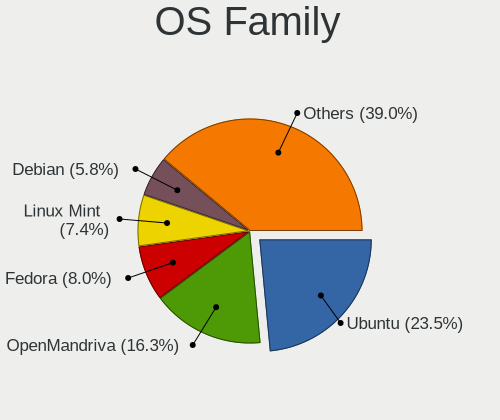
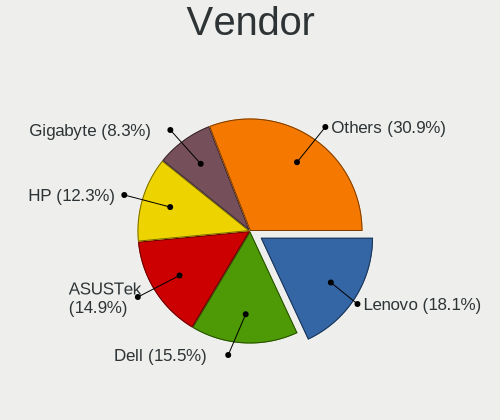
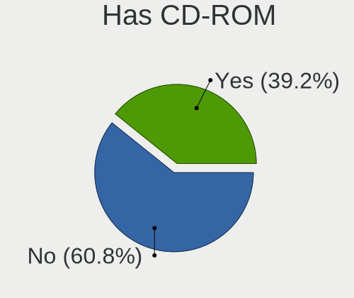
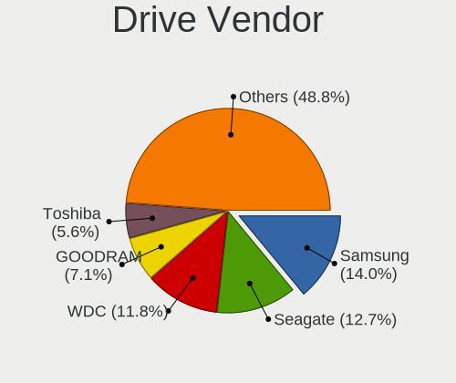
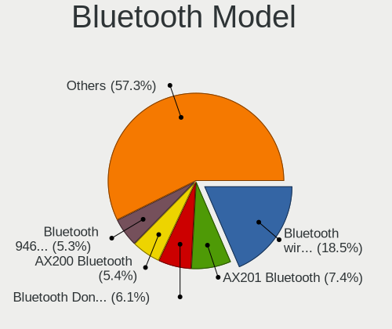
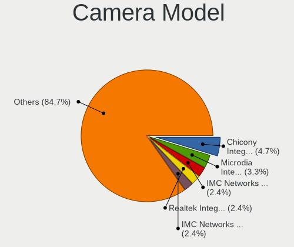

Linux in Poland - Tested Hardware & Statistics
----------------------------------------------

A project to collect tested hardware configurations for Linux in Poland.

Anyone can contribute to this report by the [hw-probe](https://github.com/linuxhw/hw-probe) tool:

    sudo -E hw-probe -all -upload

Please contribute! Especially if your hardware is rare.

This is a report for all computer types. See also reports for [desktops](/Location/Poland/Desktop/README.md) and [notebooks](/Location/Poland/Notebook/README.md).

Contents
--------

* [ Test Cases ](#test-cases)

* [ System ](#system)
  - [ OS                       ](#os)
  - [ OS Family                ](#os-family)
  - [ Kernel                   ](#kernel)
  - [ Kernel Family            ](#kernel-family)
  - [ Kernel Major Ver.        ](#kernel-major-ver)
  - [ Arch                     ](#arch)
  - [ DE                       ](#de)
  - [ Display Server           ](#display-server)
  - [ Display Manager          ](#display-manager)
  - [ OS Lang                  ](#os-lang)
  - [ Boot Mode                ](#boot-mode)
  - [ Filesystem               ](#filesystem)
  - [ Part. scheme             ](#part-scheme)
  - [ Dual Boot with Linux/BSD ](#dual-boot-with-linuxbsd)
  - [ Dual Boot (Win)          ](#dual-boot-win)

* [ Board ](#board)
  - [ Vendor                   ](#vendor)
  - [ Model                    ](#model)
  - [ Model Family             ](#model-family)
  - [ MFG Year                 ](#mfg-year)
  - [ Form Factor              ](#form-factor)
  - [ Secure Boot              ](#secure-boot)
  - [ Coreboot                 ](#coreboot)
  - [ RAM Size                 ](#ram-size)
  - [ RAM Used                 ](#ram-used)
  - [ Total Drives             ](#total-drives)
  - [ Has CD-ROM               ](#has-cd-rom)
  - [ Has Ethernet             ](#has-ethernet)
  - [ Has WiFi                 ](#has-wifi)
  - [ Has Bluetooth            ](#has-bluetooth)

* [ Location ](#location)
  - [ Country                  ](#country)
  - [ City                     ](#city)

* [ Drives ](#drives)
  - [ Drive Vendor             ](#drive-vendor)
  - [ Drive Model              ](#drive-model)
  - [ HDD Vendor               ](#hdd-vendor)
  - [ SSD Vendor               ](#ssd-vendor)
  - [ Drive Kind               ](#drive-kind)
  - [ Drive Connector          ](#drive-connector)
  - [ Drive Size               ](#drive-size)
  - [ Space Total              ](#space-total)
  - [ Space Used               ](#space-used)
  - [ Malfunc. Drives          ](#malfunc-drives)
  - [ Malfunc. Drive Vendor    ](#malfunc-drive-vendor)
  - [ Malfunc. HDD Vendor      ](#malfunc-hdd-vendor)
  - [ Malfunc. Drive Kind      ](#malfunc-drive-kind)
  - [ Failed Drives            ](#failed-drives)
  - [ Failed Drive Vendor      ](#failed-drive-vendor)
  - [ Drive Status             ](#drive-status)

* [ Storage controller ](#storage-controller)
  - [ Storage Vendor           ](#storage-vendor)
  - [ Storage Model            ](#storage-model)
  - [ Storage Kind             ](#storage-kind)

* [ Processor ](#processor)
  - [ CPU Vendor               ](#cpu-vendor)
  - [ CPU Model                ](#cpu-model)
  - [ CPU Model Family         ](#cpu-model-family)
  - [ CPU Cores                ](#cpu-cores)
  - [ CPU Sockets              ](#cpu-sockets)
  - [ CPU Threads              ](#cpu-threads)
  - [ CPU Op-Modes             ](#cpu-op-modes)
  - [ CPU Microcode            ](#cpu-microcode)
  - [ CPU Microarch            ](#cpu-microarch)

* [ Graphics ](#graphics)
  - [ GPU Vendor               ](#gpu-vendor)
  - [ GPU Model                ](#gpu-model)
  - [ GPU Combo                ](#gpu-combo)
  - [ GPU Driver               ](#gpu-driver)
  - [ GPU Memory               ](#gpu-memory)

* [ Monitor ](#monitor)
  - [ Monitor Vendor           ](#monitor-vendor)
  - [ Monitor Model            ](#monitor-model)
  - [ Monitor Resolution       ](#monitor-resolution)
  - [ Monitor Diagonal         ](#monitor-diagonal)
  - [ Monitor Width            ](#monitor-width)
  - [ Aspect Ratio             ](#aspect-ratio)
  - [ Monitor Area             ](#monitor-area)
  - [ Pixel Density            ](#pixel-density)
  - [ Multiple Monitors        ](#multiple-monitors)

* [ Network ](#network)
  - [ Net Controller Vendor    ](#net-controller-vendor)
  - [ Net Controller Model     ](#net-controller-model)
  - [ Wireless Vendor          ](#wireless-vendor)
  - [ Wireless Model           ](#wireless-model)
  - [ Ethernet Vendor          ](#ethernet-vendor)
  - [ Ethernet Model           ](#ethernet-model)
  - [ Net Controller Kind      ](#net-controller-kind)
  - [ Used Controller          ](#used-controller)
  - [ NICs                     ](#nics)
  - [ IPv6                     ](#ipv6)

* [ Bluetooth ](#bluetooth)
  - [ Bluetooth Vendor         ](#bluetooth-vendor)
  - [ Bluetooth Model          ](#bluetooth-model)

* [ Sound ](#sound)
  - [ Sound Vendor             ](#sound-vendor)
  - [ Sound Model              ](#sound-model)

* [ Memory ](#memory)
  - [ Memory Vendor            ](#memory-vendor)
  - [ Memory Model             ](#memory-model)
  - [ Memory Kind              ](#memory-kind)
  - [ Memory Form Factor       ](#memory-form-factor)
  - [ Memory Size              ](#memory-size)
  - [ Memory Speed             ](#memory-speed)

* [ Printers & scanners ](#printers--scanners)
  - [ Printer Vendor           ](#printer-vendor)
  - [ Printer Model            ](#printer-model)
  - [ Scanner Vendor           ](#scanner-vendor)
  - [ Scanner Model            ](#scanner-model)

* [ Camera ](#camera)
  - [ Camera Vendor            ](#camera-vendor)
  - [ Camera Model             ](#camera-model)

* [ Security ](#security)
  - [ Fingerprint Vendor       ](#fingerprint-vendor)
  - [ Fingerprint Model        ](#fingerprint-model)
  - [ Chipcard Vendor          ](#chipcard-vendor)
  - [ Chipcard Model           ](#chipcard-model)

* [ Unsupported ](#unsupported)
  - [ Unsupported Devices      ](#unsupported-devices)
  - [ Unsupported Device Types ](#unsupported-device-types)

Test Cases
----------

Total: 10894

| Vendor        | Model                       | Form-Factor | Probe                                                      | Date         |
|---------------|-----------------------------|-------------|------------------------------------------------------------|--------------|
| Gigabyte      | AB350-Gaming-CF             | Desktop     | [a23fc83edd](https://linux-hardware.org/?probe=a23fc83edd) | Jan 06, 2025 |
| Gigabyte      | A520 AORUS ELITE            | Desktop     | [69ff87b949](https://linux-hardware.org/?probe=69ff87b949) | Jan 06, 2025 |
| Raspberry ... | Raspberry Pi 3 Model B R... | Soc         | [0e3c0b424a](https://linux-hardware.org/?probe=0e3c0b424a) | Jan 06, 2025 |
| Raspberry ... | Raspberry Pi 5 Model B R... | Soc         | [350133d7c8](https://linux-hardware.org/?probe=350133d7c8) | Jan 06, 2025 |
| Gigabyte      | GA-MA770T-UD3               | Desktop     | [617c102331](https://linux-hardware.org/?probe=617c102331) | Jan 06, 2025 |
| Acer          | Aspire E5-572G              | Notebook    | [dca3176d13](https://linux-hardware.org/?probe=dca3176d13) | Jan 06, 2025 |
| Gigabyte      | GA-78LMT-S2                 | Desktop     | [5321bb65b1](https://linux-hardware.org/?probe=5321bb65b1) | Jan 06, 2025 |
| HP            | EliteBook 8570w             | Notebook    | [0b6fedb6c2](https://linux-hardware.org/?probe=0b6fedb6c2) | Jan 05, 2025 |
| HP            | ProBook 640 G2              | Notebook    | [888e0534d0](https://linux-hardware.org/?probe=888e0534d0) | Jan 05, 2025 |
| Dell          | Inspiron 14 5435            | Notebook    | [d5776f90e8](https://linux-hardware.org/?probe=d5776f90e8) | Jan 05, 2025 |
| Gigabyte      | AB350-Gaming-CF             | Desktop     | [a30979996f](https://linux-hardware.org/?probe=a30979996f) | Jan 05, 2025 |
| Lenovo        | V15 G4 IRU 83A1             | Notebook    | [c4a6747552](https://linux-hardware.org/?probe=c4a6747552) | Jan 04, 2025 |
| Dell          | Latitude E4310              | Notebook    | [68eec2c60e](https://linux-hardware.org/?probe=68eec2c60e) | Jan 04, 2025 |
| Dell          | 040DDP A01                  | Desktop     | [63dc37783d](https://linux-hardware.org/?probe=63dc37783d) | Jan 04, 2025 |
| Dell          | Latitude 7400 2-in-1        | Convertible | [743a95532d](https://linux-hardware.org/?probe=743a95532d) | Jan 04, 2025 |
| Dell          | 0FPP7F A00                  | Desktop     | [d88ce54d82](https://linux-hardware.org/?probe=d88ce54d82) | Jan 04, 2025 |
| Gigabyte      | A520 AORUS ELITE            | Desktop     | [1657c963c8](https://linux-hardware.org/?probe=1657c963c8) | Jan 03, 2025 |
| Lenovo        | IdeaPad Slim 3 15ABR8 82... | Notebook    | [f453563b1e](https://linux-hardware.org/?probe=f453563b1e) | Jan 02, 2025 |
| Lenovo        | ThinkPad T14s Gen 1 20T0... | Notebook    | [6e552e94aa](https://linux-hardware.org/?probe=6e552e94aa) | Jan 02, 2025 |
| HP            | Laptop 15s-fq2xxx           | Notebook    | [b4f0d1def7](https://linux-hardware.org/?probe=b4f0d1def7) | Jan 02, 2025 |
| HP            | 83E9                        | Desktop     | [ee42824c61](https://linux-hardware.org/?probe=ee42824c61) | Jan 02, 2025 |
| Gigabyte      | GA-970A-UD3                 | Desktop     | [92b3ee2679](https://linux-hardware.org/?probe=92b3ee2679) | Jan 01, 2025 |
| Unknown       | V0.9x                       | Desktop     | [94f488fa63](https://linux-hardware.org/?probe=94f488fa63) | Jan 01, 2025 |
| Gigabyte      | A520 AORUS ELITE            | Desktop     | [21e9277556](https://linux-hardware.org/?probe=21e9277556) | Jan 01, 2025 |
| Dell          | Inspiron 13-5368            | Notebook    | [bc5f8753e8](https://linux-hardware.org/?probe=bc5f8753e8) | Jan 01, 2025 |
| Purism        | Librem 14                   | Notebook    | [5f54d4d304](https://linux-hardware.org/?probe=5f54d4d304) | Jan 01, 2025 |
| ASUSTek       | P8Z68-V PRO                 | Desktop     | [43c30aba51](https://linux-hardware.org/?probe=43c30aba51) | Jan 01, 2025 |
| ASUSTek       | ASUS TUF Gaming A15 FA50... | Notebook    | [b80f1b130f](https://linux-hardware.org/?probe=b80f1b130f) | Jan 01, 2025 |
| HP            | 0A5Ch                       | Desktop     | [46198b0dea](https://linux-hardware.org/?probe=46198b0dea) | Jan 01, 2025 |
| Dell          | Latitude 7390 2-in-1        | Notebook    | [0837722dea](https://linux-hardware.org/?probe=0837722dea) | Jan 01, 2025 |
| Dell          | Latitude E6400              | Notebook    | [d5dcfbc839](https://linux-hardware.org/?probe=d5dcfbc839) | Dec 31, 2024 |
| Lenovo        | ThinkPad X270 20K5S1A524    | Notebook    | [e45e264430](https://linux-hardware.org/?probe=e45e264430) | Dec 31, 2024 |
| TUXEDO        | Stellaris Slim 15 Intel ... | Notebook    | [b1e2aaf88e](https://linux-hardware.org/?probe=b1e2aaf88e) | Dec 31, 2024 |
| Lenovo        | G510 20238                  | Notebook    | [d970da31bf](https://linux-hardware.org/?probe=d970da31bf) | Dec 31, 2024 |
| Lenovo        | MAHOBAY                     | Desktop     | [3e28e8ad9e](https://linux-hardware.org/?probe=3e28e8ad9e) | Dec 31, 2024 |
| MSI           | MPG B550 GAMING PLUS        | Desktop     | [85fd0765c6](https://linux-hardware.org/?probe=85fd0765c6) | Dec 31, 2024 |
| Samsung       | 350V5C/351V5C/3540VC/344... | Notebook    | [299e38a1c7](https://linux-hardware.org/?probe=299e38a1c7) | Dec 31, 2024 |
| ASUSTek       | ROG Zephyrus M16 GU603HM... | Notebook    | [783dddde17](https://linux-hardware.org/?probe=783dddde17) | Dec 31, 2024 |
| Lenovo        | Yoga 300-11IBY 80M0         | Notebook    | [63d6d04a10](https://linux-hardware.org/?probe=63d6d04a10) | Dec 30, 2024 |
| Dell          | 0HR330                      | Desktop     | [b0a5f47c54](https://linux-hardware.org/?probe=b0a5f47c54) | Dec 30, 2024 |
| ASUSTek       | PRIME B650-PLUS             | Desktop     | [5bae41298f](https://linux-hardware.org/?probe=5bae41298f) | Dec 30, 2024 |
| ASUSTek       | M3A78-CM                    | Desktop     | [b6e983be67](https://linux-hardware.org/?probe=b6e983be67) | Dec 30, 2024 |
| Lenovo        | IdeaPad Gaming 3 15ACH6 ... | Notebook    | [406ac061f4](https://linux-hardware.org/?probe=406ac061f4) | Dec 30, 2024 |
| Gigabyte      | A520M DS3H                  | Desktop     | [a8987243ad](https://linux-hardware.org/?probe=a8987243ad) | Dec 29, 2024 |
| Apple         | MacBookPro9,2               | Notebook    | [3cda74dca1](https://linux-hardware.org/?probe=3cda74dca1) | Dec 29, 2024 |
| Dell          | Latitude 7420               | Notebook    | [981db9e71b](https://linux-hardware.org/?probe=981db9e71b) | Dec 29, 2024 |
| Dell          | Studio 1558                 | Notebook    | [2abf8c0c94](https://linux-hardware.org/?probe=2abf8c0c94) | Dec 29, 2024 |
| MSI           | Z270 TOMAHAWK               | Desktop     | [1ac462bc8e](https://linux-hardware.org/?probe=1ac462bc8e) | Dec 29, 2024 |
| Apple         | MacBookAir6,1               | Notebook    | [3421670edf](https://linux-hardware.org/?probe=3421670edf) | Dec 29, 2024 |
| Gigabyte      | AB350-Gaming-CF             | Desktop     | [be4f4fabfe](https://linux-hardware.org/?probe=be4f4fabfe) | Dec 29, 2024 |
| HP            | 18E8                        | Desktop     | [43e6ef4f34](https://linux-hardware.org/?probe=43e6ef4f34) | Dec 29, 2024 |
| Lenovo        | IdeaPad Y700-15ISK 80NV     | Notebook    | [4122ae81a0](https://linux-hardware.org/?probe=4122ae81a0) | Dec 29, 2024 |
| Lenovo        | ThinkPad R61 8918DFG        | Notebook    | [a7030c8afc](https://linux-hardware.org/?probe=a7030c8afc) | Dec 29, 2024 |
| Lenovo        | B590 20206                  | Notebook    | [f46c163012](https://linux-hardware.org/?probe=f46c163012) | Dec 28, 2024 |
| HUAWEI        | KLVL-WXX9                   | Notebook    | [eb1589c7c0](https://linux-hardware.org/?probe=eb1589c7c0) | Dec 28, 2024 |
| ASUSTek       | P8H61-M LX3 PLUS R2.0       | Desktop     | [39e50a00e4](https://linux-hardware.org/?probe=39e50a00e4) | Dec 28, 2024 |
| HP            | 250 G8 Notebook PC          | Notebook    | [aa39cd633b](https://linux-hardware.org/?probe=aa39cd633b) | Dec 28, 2024 |
| Gigabyte      | Z97X-Gaming 3               | Desktop     | [daf6ad0471](https://linux-hardware.org/?probe=daf6ad0471) | Dec 28, 2024 |
| ASUSTek       | ZenBook UX425EA_UX425EA     | Notebook    | [2ee9b0919f](https://linux-hardware.org/?probe=2ee9b0919f) | Dec 28, 2024 |
| HP            | 250 G8 Notebook PC          | Notebook    | [cc56ca3558](https://linux-hardware.org/?probe=cc56ca3558) | Dec 28, 2024 |
| Dell          | Latitude 7420               | Notebook    | [58cca2986e](https://linux-hardware.org/?probe=58cca2986e) | Dec 28, 2024 |
| Gigabyte      | Z97X-Gaming 3               | Desktop     | [089e2c01de](https://linux-hardware.org/?probe=089e2c01de) | Dec 28, 2024 |
| Dell          | Latitude E7440              | Notebook    | [53d89b9e96](https://linux-hardware.org/?probe=53d89b9e96) | Dec 28, 2024 |
| ASUSTek       | U36SG                       | Notebook    | [cce3aeb970](https://linux-hardware.org/?probe=cce3aeb970) | Dec 28, 2024 |
| ASUSTek       | P8H61-M LX3 PLUS R2.0       | Desktop     | [345c9bffd4](https://linux-hardware.org/?probe=345c9bffd4) | Dec 28, 2024 |
| Dell          | 0FG011                      | Desktop     | [2056b909f7](https://linux-hardware.org/?probe=2056b909f7) | Dec 28, 2024 |
| Gigabyte      | A520 AORUS ELITE            | Desktop     | [6a5261adb3](https://linux-hardware.org/?probe=6a5261adb3) | Dec 27, 2024 |
| ASRock        | AB350M Pro4                 | Desktop     | [bdb7ebff36](https://linux-hardware.org/?probe=bdb7ebff36) | Dec 27, 2024 |
| Gigabyte      | P55-UD3L                    | Desktop     | [1d3d66f3ac](https://linux-hardware.org/?probe=1d3d66f3ac) | Dec 27, 2024 |
| MSI           | P67A-C45                    | Desktop     | [dcd52e5201](https://linux-hardware.org/?probe=dcd52e5201) | Dec 27, 2024 |
| Dell          | Inspiron 15-3552            | Notebook    | [1d01677080](https://linux-hardware.org/?probe=1d01677080) | Dec 27, 2024 |
| Dell          | Inspiron 5558               | Notebook    | [370f0c48c3](https://linux-hardware.org/?probe=370f0c48c3) | Dec 27, 2024 |
| Lenovo        | IdeaPad 330-17AST 81D7      | Notebook    | [145b300a77](https://linux-hardware.org/?probe=145b300a77) | Dec 26, 2024 |
| MSI           | GF63 Thin 10SCSR            | Notebook    | [9d5e0b2b95](https://linux-hardware.org/?probe=9d5e0b2b95) | Dec 26, 2024 |
| MSI           | MPG B550 GAMING PLUS        | Desktop     | [8c9e4bdd75](https://linux-hardware.org/?probe=8c9e4bdd75) | Dec 26, 2024 |
| Dell          | XPS 13 9370                 | Notebook    | [9d85ecae19](https://linux-hardware.org/?probe=9d85ecae19) | Dec 26, 2024 |
| MSI           | 785GT-E63                   | Desktop     | [7bef4fbf53](https://linux-hardware.org/?probe=7bef4fbf53) | Dec 26, 2024 |
| Dell          | 0NDYHG A01                  | Desktop     | [110afa5611](https://linux-hardware.org/?probe=110afa5611) | Dec 26, 2024 |
| ASUSTek       | T100TAF                     | Notebook    | [1611168448](https://linux-hardware.org/?probe=1611168448) | Dec 25, 2024 |
| HP            | 630                         | Notebook    | [eb7ed9bf39](https://linux-hardware.org/?probe=eb7ed9bf39) | Dec 25, 2024 |
| MSI           | B450M PRO-VDH MAX           | Desktop     | [eb51fedfee](https://linux-hardware.org/?probe=eb51fedfee) | Dec 25, 2024 |
| HP            | 8267 A01                    | Mini pc     | [3962382133](https://linux-hardware.org/?probe=3962382133) | Dec 25, 2024 |
| Gigabyte      | P55M-UD2                    | Desktop     | [112d1ed038](https://linux-hardware.org/?probe=112d1ed038) | Dec 25, 2024 |
| Dell          | Inspiron 5577               | Notebook    | [dabaffa853](https://linux-hardware.org/?probe=dabaffa853) | Dec 25, 2024 |
| Chuwi         | FreeBook                    | Notebook    | [91ad67a5f0](https://linux-hardware.org/?probe=91ad67a5f0) | Dec 25, 2024 |
| MSI           | Z97M-G43                    | Desktop     | [15aec5b879](https://linux-hardware.org/?probe=15aec5b879) | Dec 25, 2024 |
| HP            | Pavilion Gaming Laptop 1... | Notebook    | [ab27b3ad09](https://linux-hardware.org/?probe=ab27b3ad09) | Dec 24, 2024 |
| GEEKOM        | A5                          | Desktop     | [b309e8ba45](https://linux-hardware.org/?probe=b309e8ba45) | Dec 24, 2024 |
| Raspberry ... | Raspberry Pi 5 Model B R... | Soc         | [099d0b6f62](https://linux-hardware.org/?probe=099d0b6f62) | Dec 24, 2024 |
| ASUSTek       | M51Sn                       | Notebook    | [3292249251](https://linux-hardware.org/?probe=3292249251) | Dec 24, 2024 |
| MSI           | B75MA-E33                   | Desktop     | [717b51fc12](https://linux-hardware.org/?probe=717b51fc12) | Dec 24, 2024 |
| Unknown       | Unknown                     | Soc         | [eab08f0447](https://linux-hardware.org/?probe=eab08f0447) | Dec 24, 2024 |
| Gigabyte      | A320M-H-CF                  | Desktop     | [6e7907b787](https://linux-hardware.org/?probe=6e7907b787) | Dec 23, 2024 |
| HUAWEI        | NBLB-WAX9N                  | Notebook    | [6524a2db9e](https://linux-hardware.org/?probe=6524a2db9e) | Dec 23, 2024 |
| Lenovo        | ThinkPad T14s Gen 1 20UH... | Notebook    | [482027069e](https://linux-hardware.org/?probe=482027069e) | Dec 23, 2024 |
| ASUSTek       | N55SF                       | Notebook    | [6858c89a4c](https://linux-hardware.org/?probe=6858c89a4c) | Dec 23, 2024 |
| HP            | 82B5                        | All in one  | [5eae5397cf](https://linux-hardware.org/?probe=5eae5397cf) | Dec 23, 2024 |
| ASRock        | G31M-S                      | Desktop     | [983b928868](https://linux-hardware.org/?probe=983b928868) | Dec 23, 2024 |
| Dell          | Latitude E6440              | Notebook    | [8ef2131731](https://linux-hardware.org/?probe=8ef2131731) | Dec 23, 2024 |
| Dell          | Latitude E6440              | Notebook    | [d5e7ca3b8f](https://linux-hardware.org/?probe=d5e7ca3b8f) | Dec 23, 2024 |
| ASUSTek       | H81M-PLUS                   | Desktop     | [237817752c](https://linux-hardware.org/?probe=237817752c) | Dec 23, 2024 |
| UGREEN        | DXP8800 Plus                | Desktop     | [b774f3c225](https://linux-hardware.org/?probe=b774f3c225) | Dec 22, 2024 |
| ASUSTek       | B150M-A/M.2                 | Desktop     | [bdb9de439f](https://linux-hardware.org/?probe=bdb9de439f) | Dec 22, 2024 |
| ASUSTek       | H81M-K                      | Desktop     | [f02c49baa6](https://linux-hardware.org/?probe=f02c49baa6) | Dec 22, 2024 |
| Gigabyte      | GA-MA790XT-UD4P             | Desktop     | [3916b9871f](https://linux-hardware.org/?probe=3916b9871f) | Dec 22, 2024 |
| Lenovo        | ThinkPad A285 20MXS0AE00    | Notebook    | [ab309a9eb4](https://linux-hardware.org/?probe=ab309a9eb4) | Dec 22, 2024 |
| Panasonic     | CFLX6-2                     | Notebook    | [62025e0467](https://linux-hardware.org/?probe=62025e0467) | Dec 22, 2024 |
| ASRock        | X870 Steel Legend WiFi      | Desktop     | [559e3e1bee](https://linux-hardware.org/?probe=559e3e1bee) | Dec 22, 2024 |
| Microsoft     | Surface Laptop SE           | Tablet      | [1827ad6649](https://linux-hardware.org/?probe=1827ad6649) | Dec 22, 2024 |
| ASUSTek       | ASUS TUF Gaming A16 FA61... | Notebook    | [537e296cf8](https://linux-hardware.org/?probe=537e296cf8) | Dec 21, 2024 |
| Lenovo        | ThinkPad T430 2349TUM       | Notebook    | [e919757254](https://linux-hardware.org/?probe=e919757254) | Dec 21, 2024 |
| Lenovo        | ThinkPad T430 2349TUM       | Notebook    | [dcc5c171a9](https://linux-hardware.org/?probe=dcc5c171a9) | Dec 21, 2024 |
| Intel         | X99-P4 V8.2                 | Desktop     | [a590e5197c](https://linux-hardware.org/?probe=a590e5197c) | Dec 21, 2024 |
| Lenovo        | Yoga Pro 7 14ASP9 83HN      | Notebook    | [847bdd9f95](https://linux-hardware.org/?probe=847bdd9f95) | Dec 21, 2024 |
| Lenovo        | Yoga Pro 7 14ASP9 83HN      | Notebook    | [bae5bf44e3](https://linux-hardware.org/?probe=bae5bf44e3) | Dec 21, 2024 |
| HP            | EliteBook 2530p             | Notebook    | [883099a4db](https://linux-hardware.org/?probe=883099a4db) | Dec 21, 2024 |
| HP            | ENVY Laptop 13-ba1xxx       | Notebook    | [d286a3fd4a](https://linux-hardware.org/?probe=d286a3fd4a) | Dec 21, 2024 |
| ASUSTek       | B150M-A/M.2                 | Desktop     | [58579615c1](https://linux-hardware.org/?probe=58579615c1) | Dec 20, 2024 |
| Acer          | Aspire V3-371               | Notebook    | [ed218c23ae](https://linux-hardware.org/?probe=ed218c23ae) | Dec 20, 2024 |
| ASUSTek       | ASUS TUF Gaming F15 FX50... | Notebook    | [e2aca4405b](https://linux-hardware.org/?probe=e2aca4405b) | Dec 20, 2024 |
| MSI           | Z77A-G43                    | Desktop     | [9d4a34b339](https://linux-hardware.org/?probe=9d4a34b339) | Dec 20, 2024 |
| ASRockRack    | ROMED8-2T/OVHA              | Server      | [08fe32beb9](https://linux-hardware.org/?probe=08fe32beb9) | Dec 20, 2024 |
| Acer          | Aspire ES1-711              | Notebook    | [00924d508c](https://linux-hardware.org/?probe=00924d508c) | Dec 20, 2024 |
| HP            | Notebook                    | Notebook    | [ea14f20a1f](https://linux-hardware.org/?probe=ea14f20a1f) | Dec 19, 2024 |
| Lenovo        | V15 G3 IAP CTO 83C4         | Notebook    | [7be6eacddb](https://linux-hardware.org/?probe=7be6eacddb) | Dec 19, 2024 |
| Fujitsu       | LIFEBOOK A512               | Notebook    | [258065d3b9](https://linux-hardware.org/?probe=258065d3b9) | Dec 19, 2024 |
| ASRock        | B450 Gaming K4              | Desktop     | [0247ba4dfc](https://linux-hardware.org/?probe=0247ba4dfc) | Dec 19, 2024 |
| Dell          | 0WMJ54 A01                  | Desktop     | [d47727f897](https://linux-hardware.org/?probe=d47727f897) | Dec 19, 2024 |
| MSI           | Z77A-G43                    | Desktop     | [dfc91607d7](https://linux-hardware.org/?probe=dfc91607d7) | Dec 18, 2024 |
| Lenovo        | ThinkPad T530 2429MY2       | Notebook    | [a6494642a3](https://linux-hardware.org/?probe=a6494642a3) | Dec 18, 2024 |
| Lenovo        | V15 G3 IAP CTO 83C4         | Notebook    | [3948c22f86](https://linux-hardware.org/?probe=3948c22f86) | Dec 17, 2024 |
| ASUSTek       | ASUS TUF Gaming A15 FA50... | Notebook    | [c80c3adbe0](https://linux-hardware.org/?probe=c80c3adbe0) | Dec 17, 2024 |
| Lenovo        | IdeaPad Y580                | Notebook    | [9cbbd96a18](https://linux-hardware.org/?probe=9cbbd96a18) | Dec 17, 2024 |
| Dell          | Inspiron 13-5368            | Notebook    | [40b16d21b4](https://linux-hardware.org/?probe=40b16d21b4) | Dec 16, 2024 |
| Dell          | 00V62H A01                  | Desktop     | [4aa8f12311](https://linux-hardware.org/?probe=4aa8f12311) | Dec 16, 2024 |
| ASUSTek       | ASUS TUF Gaming A16 FA61... | Notebook    | [a05e5e0978](https://linux-hardware.org/?probe=a05e5e0978) | Dec 16, 2024 |
| Chuwi         | GemiBook Plus               | Notebook    | [4c1ab45f7f](https://linux-hardware.org/?probe=4c1ab45f7f) | Dec 16, 2024 |
| Dell          | G15 Special Edition 5521    | Notebook    | [d929f4b785](https://linux-hardware.org/?probe=d929f4b785) | Dec 16, 2024 |
| Acer          | Predator G3-572             | Notebook    | [2648bd49c2](https://linux-hardware.org/?probe=2648bd49c2) | Dec 15, 2024 |
| Lenovo        | ThinkPad L520 5016NY9       | Notebook    | [1bc4600530](https://linux-hardware.org/?probe=1bc4600530) | Dec 15, 2024 |
| HP            | Laptop 15s-eq2xxx           | Notebook    | [29ff45ca2d](https://linux-hardware.org/?probe=29ff45ca2d) | Dec 15, 2024 |
| Qilive        | QW20141BPL                  | Notebook    | [87f8d03c80](https://linux-hardware.org/?probe=87f8d03c80) | Dec 15, 2024 |
| HP            | ProBook 470 G1              | Notebook    | [c170cd8911](https://linux-hardware.org/?probe=c170cd8911) | Dec 15, 2024 |
| HP            | 8158 A01                    | Mini pc     | [1773e9afb0](https://linux-hardware.org/?probe=1773e9afb0) | Dec 15, 2024 |
| Apple         | MacBookPro12,1              | Notebook    | [612e52e652](https://linux-hardware.org/?probe=612e52e652) | Dec 14, 2024 |
| Acer          | Aspire A515-51G             | Notebook    | [c9925e1319](https://linux-hardware.org/?probe=c9925e1319) | Dec 14, 2024 |
| MSI           | B450M MORTAR MAX            | Desktop     | [9ec24ce9ab](https://linux-hardware.org/?probe=9ec24ce9ab) | Dec 14, 2024 |
| ASRock        | N68-GE3 UCC                 | Desktop     | [f8bf90b3fb](https://linux-hardware.org/?probe=f8bf90b3fb) | Dec 13, 2024 |
| MSI           | MPG X870E CARBON WIFI       | Desktop     | [852de9c4f7](https://linux-hardware.org/?probe=852de9c4f7) | Dec 13, 2024 |
| Lenovo        | ThinkPad E15 Gen 2 20T80... | Notebook    | [5f3e27d2af](https://linux-hardware.org/?probe=5f3e27d2af) | Dec 13, 2024 |
| MSI           | Z590 PRO WIFI               | Desktop     | [44541e695d](https://linux-hardware.org/?probe=44541e695d) | Dec 13, 2024 |
| ASUSTek       | G60JX                       | Notebook    | [b1cc4820a3](https://linux-hardware.org/?probe=b1cc4820a3) | Dec 13, 2024 |
| Lenovo        | ThinkPad E15 Gen 2 20T80... | Notebook    | [934762c6f1](https://linux-hardware.org/?probe=934762c6f1) | Dec 13, 2024 |
| Dell          | 0PU052                      | Desktop     | [af8780c5be](https://linux-hardware.org/?probe=af8780c5be) | Dec 13, 2024 |
| Dell          | G15 Special Edition 5521    | Notebook    | [34f4dd2388](https://linux-hardware.org/?probe=34f4dd2388) | Dec 12, 2024 |
| Gigabyte      | B650 EAGLE                  | Desktop     | [b7d5b664b5](https://linux-hardware.org/?probe=b7d5b664b5) | Dec 12, 2024 |
| Dell          | Latitude E6430              | Notebook    | [9c1b2861a3](https://linux-hardware.org/?probe=9c1b2861a3) | Dec 12, 2024 |
| MSI           | B250I GAMING PRO AC         | Desktop     | [b6c3e35ea6](https://linux-hardware.org/?probe=b6c3e35ea6) | Dec 12, 2024 |
| Sony          | VPCEJ2E1E                   | Notebook    | [11625e4a3c](https://linux-hardware.org/?probe=11625e4a3c) | Dec 12, 2024 |
| Gigabyte      | Z890 EAGLE WIFI7            | Desktop     | [f7233e7156](https://linux-hardware.org/?probe=f7233e7156) | Dec 12, 2024 |
| Gigabyte      | H610M H V3 DDR4             | Desktop     | [a7657767a7](https://linux-hardware.org/?probe=a7657767a7) | Dec 12, 2024 |
| Dell          | Latitude E6410              | Notebook    | [4fcefa5df1](https://linux-hardware.org/?probe=4fcefa5df1) | Dec 12, 2024 |
| ASUSTek       | X550CC                      | Notebook    | [4e9ac84a4f](https://linux-hardware.org/?probe=4e9ac84a4f) | Dec 12, 2024 |
| Lenovo        | ThinkPad P50 20EQS3B30R     | Notebook    | [5885521edc](https://linux-hardware.org/?probe=5885521edc) | Dec 12, 2024 |
| Dell          | Latitude E6510              | Notebook    | [532afb1e7d](https://linux-hardware.org/?probe=532afb1e7d) | Dec 12, 2024 |
| Lenovo        | IdeaPadFlex 5 14ABR8 82X... | Convertible | [90574a305f](https://linux-hardware.org/?probe=90574a305f) | Dec 11, 2024 |
| Dell          | 0272WF A00                  | Server      | [2d3d5673e7](https://linux-hardware.org/?probe=2d3d5673e7) | Dec 11, 2024 |
| HP            | ProBook 640 G1              | Notebook    | [6bd3571c30](https://linux-hardware.org/?probe=6bd3571c30) | Dec 11, 2024 |
| ASUSTek       | ROG Strix G513RW_G513RW     | Notebook    | [719c8de776](https://linux-hardware.org/?probe=719c8de776) | Dec 11, 2024 |
| Dell          | Latitude E6440              | Notebook    | [8a2677fae6](https://linux-hardware.org/?probe=8a2677fae6) | Dec 10, 2024 |
| Lenovo        | IdeaPad Gaming 3 15ARH05... | Notebook    | [986d807d00](https://linux-hardware.org/?probe=986d807d00) | Dec 10, 2024 |
| MSI           | X470 GAMING PLUS            | Desktop     | [4825e168b0](https://linux-hardware.org/?probe=4825e168b0) | Dec 10, 2024 |
| ASUSTek       | ASUS TUF Gaming A16 FA60... | Notebook    | [b5059cca85](https://linux-hardware.org/?probe=b5059cca85) | Dec 10, 2024 |
| ASUSTek       | ASUS TUF Gaming A16 FA60... | Notebook    | [c43e0a8e7d](https://linux-hardware.org/?probe=c43e0a8e7d) | Dec 10, 2024 |
| HP            | Pavilion dv7                | Notebook    | [8d620075ce](https://linux-hardware.org/?probe=8d620075ce) | Dec 10, 2024 |
| Dell          | XPS 15 9570                 | Notebook    | [46509ed6aa](https://linux-hardware.org/?probe=46509ed6aa) | Dec 09, 2024 |
| Lenovo        | IdeaPad 510-15ISK 80SR      | Notebook    | [8d3e4cf289](https://linux-hardware.org/?probe=8d3e4cf289) | Dec 09, 2024 |
| ASUSTek       | F5V                         | Notebook    | [fc57564f87](https://linux-hardware.org/?probe=fc57564f87) | Dec 09, 2024 |
| ASRock        | Z270 Pro4                   | Desktop     | [cfd1ab354a](https://linux-hardware.org/?probe=cfd1ab354a) | Dec 09, 2024 |
| Panasonic     | CFLX6-2                     | Notebook    | [192859505f](https://linux-hardware.org/?probe=192859505f) | Dec 09, 2024 |
| ASUSTek       | ASUS TUF Gaming F15 FX50... | Notebook    | [1fcb1559d5](https://linux-hardware.org/?probe=1fcb1559d5) | Dec 08, 2024 |
| ASUSTek       | ProArt Z690-CREATOR WIFI    | Desktop     | [c496dda335](https://linux-hardware.org/?probe=c496dda335) | Dec 08, 2024 |
| Lenovo        | ThinkPad X280 20KES2VQ00    | Notebook    | [0ad8b339cd](https://linux-hardware.org/?probe=0ad8b339cd) | Dec 08, 2024 |
| Google        | Magolor                     | Notebook    | [5e0a4f57a2](https://linux-hardware.org/?probe=5e0a4f57a2) | Dec 07, 2024 |
| Google        | Magolor                     | Notebook    | [4ee0cb05ee](https://linux-hardware.org/?probe=4ee0cb05ee) | Dec 07, 2024 |
| MSI           | Z370-A PRO                  | Desktop     | [a6e087e259](https://linux-hardware.org/?probe=a6e087e259) | Dec 07, 2024 |
| Dell          | Latitude E6430              | Notebook    | [f00b55b52a](https://linux-hardware.org/?probe=f00b55b52a) | Dec 07, 2024 |
| ASRock        | AB350 Pro4                  | Desktop     | [68e28088be](https://linux-hardware.org/?probe=68e28088be) | Dec 07, 2024 |
| HP            | Laptop 14s-fq0xxx           | Notebook    | [eb8c396630](https://linux-hardware.org/?probe=eb8c396630) | Dec 07, 2024 |
| Lenovo        | IdeaPad Y550P 20035         | Notebook    | [3f3310437b](https://linux-hardware.org/?probe=3f3310437b) | Dec 06, 2024 |
| Lenovo        | MAHOBAY Win8 MM DPK IPG     | Desktop     | [e885620f20](https://linux-hardware.org/?probe=e885620f20) | Dec 06, 2024 |
| Dell          | Latitude 3520               | Notebook    | [cffdf7964b](https://linux-hardware.org/?probe=cffdf7964b) | Dec 06, 2024 |
| Lenovo        | G580 2689K9G                | Notebook    | [e20fe2c6e5](https://linux-hardware.org/?probe=e20fe2c6e5) | Dec 06, 2024 |
| ASUSTek       | PRIME B450-PLUS             | Desktop     | [cdb9d074c0](https://linux-hardware.org/?probe=cdb9d074c0) | Dec 06, 2024 |
| Acer          | Extensa 215-32              | Notebook    | [e939582cd7](https://linux-hardware.org/?probe=e939582cd7) | Dec 05, 2024 |
| MSI           | B450M PRO-VDH MAX           | Desktop     | [b866222ea1](https://linux-hardware.org/?probe=b866222ea1) | Dec 05, 2024 |
| Dell          | 0MN1TX A02                  | Desktop     | [bcf2f132b0](https://linux-hardware.org/?probe=bcf2f132b0) | Dec 04, 2024 |
| Lenovo        | G580 2689K9G                | Notebook    | [7ebd98750f](https://linux-hardware.org/?probe=7ebd98750f) | Dec 04, 2024 |
| ASRock        | 970 Extreme4                | Desktop     | [6fa9e68723](https://linux-hardware.org/?probe=6fa9e68723) | Dec 03, 2024 |
| Fujitsu       | CELSIUS H920                | Notebook    | [8b524abe47](https://linux-hardware.org/?probe=8b524abe47) | Dec 03, 2024 |
| Gigabyte      | Z790 GAMING X               | Desktop     | [0fe982b162](https://linux-hardware.org/?probe=0fe982b162) | Dec 03, 2024 |
| MSI           | B450M PRO-VDH MAX           | Desktop     | [de3399c33d](https://linux-hardware.org/?probe=de3399c33d) | Dec 03, 2024 |
| ASRock        | B450 Gaming K4              | Desktop     | [13516885f4](https://linux-hardware.org/?probe=13516885f4) | Dec 03, 2024 |
| ASRock        | 970 Extreme4                | Desktop     | [21adbb0a83](https://linux-hardware.org/?probe=21adbb0a83) | Dec 03, 2024 |
| ASUSTek       | TUF Gaming B650-PLUS WIF... | Desktop     | [b2b3a3aa1f](https://linux-hardware.org/?probe=b2b3a3aa1f) | Dec 02, 2024 |
| Lenovo        | Legion 5 Pro 16ITH6H 82J... | Notebook    | [215d0f836c](https://linux-hardware.org/?probe=215d0f836c) | Dec 02, 2024 |
| MSI           | X299 SLI PLUS               | Desktop     | [e487fc8054](https://linux-hardware.org/?probe=e487fc8054) | Dec 01, 2024 |
| Lenovo        | ThinkPad E15 20RD001FPB     | Notebook    | [fa2477acc2](https://linux-hardware.org/?probe=fa2477acc2) | Dec 01, 2024 |
| Gigabyte      | B550 AORUS ELITE V2         | Desktop     | [882e0e49e0](https://linux-hardware.org/?probe=882e0e49e0) | Dec 01, 2024 |
| Dell          | Inspiron 13-5368            | Notebook    | [5bdedb520c](https://linux-hardware.org/?probe=5bdedb520c) | Dec 01, 2024 |
| ASUSTek       | P8H77-M PRO                 | Desktop     | [9655fa6aa4](https://linux-hardware.org/?probe=9655fa6aa4) | Dec 01, 2024 |
| Acer          | Aspire V5-573PG             | Notebook    | [29a555e909](https://linux-hardware.org/?probe=29a555e909) | Dec 01, 2024 |
| Gigabyte      | 965P-S3                     | Desktop     | [c52c2fddbc](https://linux-hardware.org/?probe=c52c2fddbc) | Dec 01, 2024 |
| HP            | Victus by Gaming Laptop ... | Notebook    | [b18d4ba53a](https://linux-hardware.org/?probe=b18d4ba53a) | Nov 30, 2024 |
| ASUSTek       | M3A78-CM                    | Desktop     | [85e53c34b3](https://linux-hardware.org/?probe=85e53c34b3) | Nov 30, 2024 |
| HP            | 1496                        | Desktop     | [151086aaf3](https://linux-hardware.org/?probe=151086aaf3) | Nov 30, 2024 |
| Chuwi         | Hi10 Max                    | Tablet      | [da0abf246e](https://linux-hardware.org/?probe=da0abf246e) | Nov 30, 2024 |
| Fujitsu       | D3224-A1 S26361-D3224-A1    | Desktop     | [b6dbb73b31](https://linux-hardware.org/?probe=b6dbb73b31) | Nov 30, 2024 |
| Chuwi         | Hi10 Max                    | Tablet      | [a031d56603](https://linux-hardware.org/?probe=a031d56603) | Nov 30, 2024 |
| Samsung       | 350V5C/351V5C/3540VC/344... | Notebook    | [e73426df00](https://linux-hardware.org/?probe=e73426df00) | Nov 30, 2024 |
| Lenovo        | ThinkPad L520 5016NY9       | Notebook    | [18ee47c1da](https://linux-hardware.org/?probe=18ee47c1da) | Nov 30, 2024 |
| Chuwi         | Hi10 Max                    | Tablet      | [08f03e38cb](https://linux-hardware.org/?probe=08f03e38cb) | Nov 30, 2024 |
| Dell          | Inspiron 3583               | Notebook    | [ae86d50011](https://linux-hardware.org/?probe=ae86d50011) | Nov 30, 2024 |
| Gigabyte      | B450M K-CF                  | Desktop     | [67a866f6bb](https://linux-hardware.org/?probe=67a866f6bb) | Nov 30, 2024 |
| Dell          | Inspiron 15-3552            | Notebook    | [3f198d1bea](https://linux-hardware.org/?probe=3f198d1bea) | Nov 30, 2024 |
| Fujitsu       | CELSIUS H920                | Notebook    | [bae9e145b7](https://linux-hardware.org/?probe=bae9e145b7) | Nov 30, 2024 |
| Lenovo        | ThinkPad X1 Yoga 4th 20Q... | Convertible | [025c1eb95c](https://linux-hardware.org/?probe=025c1eb95c) | Nov 30, 2024 |
| Dell          | Inspiron N5010              | Notebook    | [f7578fb476](https://linux-hardware.org/?probe=f7578fb476) | Nov 29, 2024 |
| Microsoft     | Surface Book 2              | Tablet      | [e9ec9e62a2](https://linux-hardware.org/?probe=e9ec9e62a2) | Nov 29, 2024 |
| Valve         | Galileo                     | Notebook    | [13c5cb5602](https://linux-hardware.org/?probe=13c5cb5602) | Nov 28, 2024 |
| Gigabyte      | A520 AORUS ELITE            | Desktop     | [e56783540e](https://linux-hardware.org/?probe=e56783540e) | Nov 28, 2024 |
| Lenovo        | ThinkPad X1 Yoga 4th 20Q... | Convertible | [471b772411](https://linux-hardware.org/?probe=471b772411) | Nov 28, 2024 |
| Apple         | MacBookAir4,2               | Notebook    | [6cf2484cd4](https://linux-hardware.org/?probe=6cf2484cd4) | Nov 28, 2024 |
| HP            | 3647h                       | Desktop     | [de1eb15f76](https://linux-hardware.org/?probe=de1eb15f76) | Nov 28, 2024 |
| Lenovo        | ThinkPad T14s Gen 1 20T1... | Notebook    | [fd5c871a74](https://linux-hardware.org/?probe=fd5c871a74) | Nov 27, 2024 |
| Lenovo        | IdeaPad Y530                | Notebook    | [7581417b3e](https://linux-hardware.org/?probe=7581417b3e) | Nov 27, 2024 |
| HP            | ProBook 4330s               | Notebook    | [a2218163e8](https://linux-hardware.org/?probe=a2218163e8) | Nov 27, 2024 |
| Gigabyte      | P55A-UD5                    | Desktop     | [c9f164431d](https://linux-hardware.org/?probe=c9f164431d) | Nov 27, 2024 |
| Lenovo        | 36C7 SDK0J40697 WIN 3305... | Desktop     | [d113defbe8](https://linux-hardware.org/?probe=d113defbe8) | Nov 27, 2024 |
| ASUSTek       | P5Q-WS                      | Desktop     | [9c1be46138](https://linux-hardware.org/?probe=9c1be46138) | Nov 27, 2024 |
| Lenovo        | Yoga Slim 6 14IRH8 83E0     | Notebook    | [818cb12ef6](https://linux-hardware.org/?probe=818cb12ef6) | Nov 27, 2024 |
| Lenovo        | Legion 5 Pro 16ITH6H 82J... | Notebook    | [bfd54b7d97](https://linux-hardware.org/?probe=bfd54b7d97) | Nov 26, 2024 |
| Lenovo        | ThinkPad W500 4061B77       | Notebook    | [d1f2cd5f87](https://linux-hardware.org/?probe=d1f2cd5f87) | Nov 26, 2024 |
| Acer          | Spin SP314-55N              | Convertible | [1fea74510d](https://linux-hardware.org/?probe=1fea74510d) | Nov 26, 2024 |
| Acer          | Spin SP314-55N              | Convertible | [6d6e71d345](https://linux-hardware.org/?probe=6d6e71d345) | Nov 26, 2024 |
| ASRockRack    | X470D4U2-2T                 | Desktop     | [877914f909](https://linux-hardware.org/?probe=877914f909) | Nov 26, 2024 |
| HP            | 82B5                        | All in one  | [76216a94fa](https://linux-hardware.org/?probe=76216a94fa) | Nov 26, 2024 |
| Dell          | Latitude E6510              | Notebook    | [68f65df3f5](https://linux-hardware.org/?probe=68f65df3f5) | Nov 25, 2024 |
| Lenovo        | IdeaPad Slim 5 16ABR8 82... | Notebook    | [7204b37e87](https://linux-hardware.org/?probe=7204b37e87) | Nov 24, 2024 |
| Lenovo        | G50-45 80E3                 | Notebook    | [1755731ed3](https://linux-hardware.org/?probe=1755731ed3) | Nov 24, 2024 |
| Gigabyte      | B450M K-CF                  | Desktop     | [f77b8f3fc9](https://linux-hardware.org/?probe=f77b8f3fc9) | Nov 24, 2024 |
| Lenovo        | 31900058 STD                | Desktop     | [dfea5f8644](https://linux-hardware.org/?probe=dfea5f8644) | Nov 24, 2024 |
| Gigabyte      | AB350-Gaming-CF             | Desktop     | [9e3eafcb80](https://linux-hardware.org/?probe=9e3eafcb80) | Nov 24, 2024 |
| Valve         | Galileo                     | Notebook    | [df851043c9](https://linux-hardware.org/?probe=df851043c9) | Nov 24, 2024 |
| Gigabyte      | Z890 EAGLE WIFI7            | Desktop     | [38990b4a95](https://linux-hardware.org/?probe=38990b4a95) | Nov 23, 2024 |
| Toshiba       | TECRA M10                   | Notebook    | [f2db588ac1](https://linux-hardware.org/?probe=f2db588ac1) | Nov 23, 2024 |
| Toshiba       | Satellite L300D             | Notebook    | [a37d362084](https://linux-hardware.org/?probe=a37d362084) | Nov 23, 2024 |
| ASUSTek       | X555LD                      | Notebook    | [ae073052ae](https://linux-hardware.org/?probe=ae073052ae) | Nov 23, 2024 |
| ASUSTek       | TUF Gaming FX505DT_FX505... | Notebook    | [5d4ce9594c](https://linux-hardware.org/?probe=5d4ce9594c) | Nov 23, 2024 |
| ASUSTek       | ProArt Z690-CREATOR WIFI    | Desktop     | [fae27389de](https://linux-hardware.org/?probe=fae27389de) | Nov 22, 2024 |
| ASUSTek       | TUF Gaming FX505DT_FX505... | Notebook    | [aaed88422c](https://linux-hardware.org/?probe=aaed88422c) | Nov 22, 2024 |
| MSI           | B360M PRO-VD 2019-01-24     | Desktop     | [2b2fa38f7b](https://linux-hardware.org/?probe=2b2fa38f7b) | Nov 22, 2024 |
| Valve         | Galileo                     | Notebook    | [675c70d8dd](https://linux-hardware.org/?probe=675c70d8dd) | Nov 22, 2024 |
| ASUSTek       | N56JN                       | Notebook    | [e8cb7952c8](https://linux-hardware.org/?probe=e8cb7952c8) | Nov 22, 2024 |
| MSI           | MPG X870E CARBON WIFI       | Desktop     | [555300adbd](https://linux-hardware.org/?probe=555300adbd) | Nov 21, 2024 |
| MSI           | MAG B550 TOMAHAWK           | Desktop     | [4647245b41](https://linux-hardware.org/?probe=4647245b41) | Nov 21, 2024 |
| Valve         | Galileo                     | Notebook    | [918ab68150](https://linux-hardware.org/?probe=918ab68150) | Nov 21, 2024 |
| Gigabyte      | A520 AORUS ELITE            | Desktop     | [4cf05e32d9](https://linux-hardware.org/?probe=4cf05e32d9) | Nov 21, 2024 |
| Gigabyte      | PH67A-D3-B3                 | Desktop     | [85eecb7378](https://linux-hardware.org/?probe=85eecb7378) | Nov 21, 2024 |
| Lenovo        | ThinkPad L15 Gen 1 20U8S... | Notebook    | [437866e6de](https://linux-hardware.org/?probe=437866e6de) | Nov 21, 2024 |
| Lenovo        | V15-IIL 82C5                | Notebook    | [f149ed620f](https://linux-hardware.org/?probe=f149ed620f) | Nov 21, 2024 |
| ASUSTek       | X751MD                      | Notebook    | [10f66dd3e4](https://linux-hardware.org/?probe=10f66dd3e4) | Nov 20, 2024 |
| HP            | ENVY x360 2-in-1 Laptop ... | Convertible | [96e3d3f74c](https://linux-hardware.org/?probe=96e3d3f74c) | Nov 20, 2024 |
| Lenovo        | ThinkPad T400 2768W2X       | Notebook    | [3614ea7cf1](https://linux-hardware.org/?probe=3614ea7cf1) | Nov 20, 2024 |
| ASUSTek       | ROG STRIX B650E-E GAMING... | Desktop     | [0816566a8c](https://linux-hardware.org/?probe=0816566a8c) | Nov 20, 2024 |
| ASUSTek       | M3A78-CM                    | Desktop     | [59ecdcf045](https://linux-hardware.org/?probe=59ecdcf045) | Nov 20, 2024 |
| Lenovo        | ThinkPad T480s 20L8S6N70... | Notebook    | [534e5f57bf](https://linux-hardware.org/?probe=534e5f57bf) | Nov 19, 2024 |
| MSI           | H61M-P31                    | Desktop     | [0209ef23d5](https://linux-hardware.org/?probe=0209ef23d5) | Nov 19, 2024 |
| Dell          | Precision 7680              | Notebook    | [d1e6e2abb4](https://linux-hardware.org/?probe=d1e6e2abb4) | Nov 19, 2024 |
| Lenovo        | Legion 5 15ARH05H 82B1      | Notebook    | [8801ad76a4](https://linux-hardware.org/?probe=8801ad76a4) | Nov 19, 2024 |
| HP            | 82B5                        | All in one  | [9bf8a316df](https://linux-hardware.org/?probe=9bf8a316df) | Nov 19, 2024 |
| MSI           | GP76 Leopard 11UG           | Notebook    | [cbcaeb0284](https://linux-hardware.org/?probe=cbcaeb0284) | Nov 19, 2024 |
| Lenovo        | IdeaPad 320S-15IKB 80X5     | Notebook    | [a75fff547e](https://linux-hardware.org/?probe=a75fff547e) | Nov 18, 2024 |
| Dell          | Inspiron 7566               | Notebook    | [bcbe3b23dc](https://linux-hardware.org/?probe=bcbe3b23dc) | Nov 18, 2024 |
| MSI           | H61M-P31                    | Desktop     | [6ff594d173](https://linux-hardware.org/?probe=6ff594d173) | Nov 18, 2024 |
| Toshiba       | Satellite C660              | Notebook    | [f7e1b632b9](https://linux-hardware.org/?probe=f7e1b632b9) | Nov 18, 2024 |
| Gigabyte      | M720-US3                    | Desktop     | [09009152d8](https://linux-hardware.org/?probe=09009152d8) | Nov 18, 2024 |
| ASRock        | X870 Steel Legend WiFi      | Desktop     | [3cf57595f8](https://linux-hardware.org/?probe=3cf57595f8) | Nov 17, 2024 |
| ASRock        | Z87 Killer                  | Desktop     | [d9801f6f57](https://linux-hardware.org/?probe=d9801f6f57) | Nov 17, 2024 |
| HP            | Laptop 15s-eq2xxx           | Notebook    | [216996b5a7](https://linux-hardware.org/?probe=216996b5a7) | Nov 17, 2024 |
| Lenovo        | IdeaPad Slim 5 16ABR8 82... | Notebook    | [da573e5f3a](https://linux-hardware.org/?probe=da573e5f3a) | Nov 17, 2024 |
| Samsung       | 350V5C/351V5C/3540VC/344... | Notebook    | [4dc44df22b](https://linux-hardware.org/?probe=4dc44df22b) | Nov 17, 2024 |
| MSI           | AM1I                        | Desktop     | [dcbfb56865](https://linux-hardware.org/?probe=dcbfb56865) | Nov 17, 2024 |
| Gigabyte      | AB350-Gaming-CF             | Desktop     | [dbd0ddb0d5](https://linux-hardware.org/?probe=dbd0ddb0d5) | Nov 17, 2024 |
| Lenovo        | ThinkBook 16 G4+ IAP 21C... | Notebook    | [62679a2c28](https://linux-hardware.org/?probe=62679a2c28) | Nov 16, 2024 |
| ASUSTek       | ASUS TUF Gaming A16 FA61... | Notebook    | [7437debd95](https://linux-hardware.org/?probe=7437debd95) | Nov 16, 2024 |
| Acer          | Aspire A317-54              | Notebook    | [bf63a85231](https://linux-hardware.org/?probe=bf63a85231) | Nov 16, 2024 |
| MSI           | B75IA-E33                   | Desktop     | [8f135723bc](https://linux-hardware.org/?probe=8f135723bc) | Nov 16, 2024 |
| ASUSTek       | X541NA                      | Notebook    | [7da3668ced](https://linux-hardware.org/?probe=7da3668ced) | Nov 16, 2024 |
| Lenovo        | G50-80 80L0                 | Notebook    | [d31664cad1](https://linux-hardware.org/?probe=d31664cad1) | Nov 15, 2024 |
| ASRock        | X870 Steel Legend WiFi      | Desktop     | [2aeb096089](https://linux-hardware.org/?probe=2aeb096089) | Nov 15, 2024 |
| Lenovo        | Legion 5 15ARH05H 82B1      | Notebook    | [96e212c973](https://linux-hardware.org/?probe=96e212c973) | Nov 15, 2024 |
| Lenovo        | ThinkPad T480 20L5CTO1WW    | Notebook    | [cdda7d4c72](https://linux-hardware.org/?probe=cdda7d4c72) | Nov 15, 2024 |
| Gigabyte      | X570S AERO G                | Desktop     | [44110fbd15](https://linux-hardware.org/?probe=44110fbd15) | Nov 14, 2024 |
| ASUSTek       | Zenbook UX3402ZA_UX3402Z... | Convertible | [351d0b0d1a](https://linux-hardware.org/?probe=351d0b0d1a) | Nov 14, 2024 |
| Dell          | Precision 7510              | Notebook    | [9955fa5923](https://linux-hardware.org/?probe=9955fa5923) | Nov 14, 2024 |
| HP            | Laptop 14s-fq0xxx           | Notebook    | [8b2918b84c](https://linux-hardware.org/?probe=8b2918b84c) | Nov 14, 2024 |
| Lenovo        | IdeaPad 320S-13IKB 81AK     | Notebook    | [87f330a574](https://linux-hardware.org/?probe=87f330a574) | Nov 14, 2024 |
| Gigabyte      | B550M AORUS ELITE           | Desktop     | [1ed0db88d9](https://linux-hardware.org/?probe=1ed0db88d9) | Nov 14, 2024 |
| Dell          | Latitude 5590               | Notebook    | [b9acbda728](https://linux-hardware.org/?probe=b9acbda728) | Nov 14, 2024 |
| Dell          | Precision M4600             | Notebook    | [578f84fe29](https://linux-hardware.org/?probe=578f84fe29) | Nov 13, 2024 |
| HP            | 630                         | Notebook    | [0103a33e55](https://linux-hardware.org/?probe=0103a33e55) | Nov 13, 2024 |
| Gigabyte      | B460 HD3                    | Desktop     | [27bfc5f820](https://linux-hardware.org/?probe=27bfc5f820) | Nov 13, 2024 |
| Dell          | Precision M6700             | Notebook    | [81ed3cc9db](https://linux-hardware.org/?probe=81ed3cc9db) | Nov 13, 2024 |
| Lenovo        | IdeaPad 100-15IBY 80MJ      | Notebook    | [dc304a3d45](https://linux-hardware.org/?probe=dc304a3d45) | Nov 13, 2024 |
| Advent        | Quantum Q200                | Notebook    | [bfc86b2a40](https://linux-hardware.org/?probe=bfc86b2a40) | Nov 13, 2024 |
| Advent        | Quantum Q200                | Notebook    | [7f8191560c](https://linux-hardware.org/?probe=7f8191560c) | Nov 13, 2024 |
| Advent        | Quantum Q200                | Notebook    | [234c47715e](https://linux-hardware.org/?probe=234c47715e) | Nov 13, 2024 |
| Advent        | Quantum Q200                | Notebook    | [8e96516066](https://linux-hardware.org/?probe=8e96516066) | Nov 13, 2024 |
| Advent        | Quantum Q200                | Notebook    | [fe6f2cf181](https://linux-hardware.org/?probe=fe6f2cf181) | Nov 13, 2024 |
| Advent        | Quantum Q200                | Notebook    | [0e59f90633](https://linux-hardware.org/?probe=0e59f90633) | Nov 13, 2024 |
| ASUSTek       | PRIME B660M-A WIFI D4       | Desktop     | [7b0e24371e](https://linux-hardware.org/?probe=7b0e24371e) | Nov 13, 2024 |
| ASUSTek       | TUF Z370-PLUS GAMING        | Desktop     | [23c9b0f6d9](https://linux-hardware.org/?probe=23c9b0f6d9) | Nov 12, 2024 |
| Gigabyte      | B550 AORUS ELITE AX V2      | Desktop     | [8b51722faa](https://linux-hardware.org/?probe=8b51722faa) | Nov 12, 2024 |
| Gigabyte      | B660M DS3H DDR4             | Desktop     | [07bf1053a6](https://linux-hardware.org/?probe=07bf1053a6) | Nov 12, 2024 |
| MSI           | PRO B660M-A WIFI DDR4       | Desktop     | [6911103f09](https://linux-hardware.org/?probe=6911103f09) | Nov 12, 2024 |
| Gigabyte      | B85M-D3H                    | Desktop     | [9e941ab661](https://linux-hardware.org/?probe=9e941ab661) | Nov 12, 2024 |
| Acer          | SFG14-63                    | Notebook    | [48da3de8b8](https://linux-hardware.org/?probe=48da3de8b8) | Nov 11, 2024 |
| Gigabyte      | B450M DS3H-CF               | Desktop     | [7929e41f6e](https://linux-hardware.org/?probe=7929e41f6e) | Nov 11, 2024 |
| ASRock        | X570 Phantom Gaming 4       | Desktop     | [7a4b404121](https://linux-hardware.org/?probe=7a4b404121) | Nov 11, 2024 |
| ASUSTek       | PRIME X470-PRO              | Desktop     | [a260f905a1](https://linux-hardware.org/?probe=a260f905a1) | Nov 11, 2024 |
| Dell          | 04MFRM A01                  | Desktop     | [864f8b54d1](https://linux-hardware.org/?probe=864f8b54d1) | Nov 11, 2024 |
| ASRock        | X570 Phantom Gaming 4       | Desktop     | [cacee83d18](https://linux-hardware.org/?probe=cacee83d18) | Nov 11, 2024 |
| Dell          | Latitude E7270              | Notebook    | [453afb8bff](https://linux-hardware.org/?probe=453afb8bff) | Nov 11, 2024 |
| HP            | Pavilion Laptop 15-eh2xx... | Notebook    | [db44b5c0bc](https://linux-hardware.org/?probe=db44b5c0bc) | Nov 11, 2024 |
| Lenovo        | Legion Slim 5 16APH8 82Y... | Notebook    | [5238f646e9](https://linux-hardware.org/?probe=5238f646e9) | Nov 10, 2024 |
| HP            | 620                         | Notebook    | [3dc033a422](https://linux-hardware.org/?probe=3dc033a422) | Nov 10, 2024 |
| Dell          | Precision 3570              | Notebook    | [1219d494cd](https://linux-hardware.org/?probe=1219d494cd) | Nov 10, 2024 |
| ASUSTek       | PRIME H310M-K R2.0          | Desktop     | [6901505be7](https://linux-hardware.org/?probe=6901505be7) | Nov 10, 2024 |
| Medion        | Akoya E7226T                | Notebook    | [d6b2a726f1](https://linux-hardware.org/?probe=d6b2a726f1) | Nov 09, 2024 |
| Dell          | Latitude 5410               | Notebook    | [e13ea06859](https://linux-hardware.org/?probe=e13ea06859) | Nov 09, 2024 |
| HP            | ProBook 645 G4              | Notebook    | [fd6948a4e9](https://linux-hardware.org/?probe=fd6948a4e9) | Nov 09, 2024 |
| Lenovo        | Legion 5 Pro 16ITH6H 82J... | Notebook    | [f6e6f8fc08](https://linux-hardware.org/?probe=f6e6f8fc08) | Nov 08, 2024 |
| HP            | EliteBook 840 G8 Noteboo... | Notebook    | [5f8ea71a3d](https://linux-hardware.org/?probe=5f8ea71a3d) | Nov 08, 2024 |
| Apple         | MacBookPro14,3              | Notebook    | [5c7bc18987](https://linux-hardware.org/?probe=5c7bc18987) | Nov 08, 2024 |
| Dell          | Latitude 9440 2-in-1        | Convertible | [1c1e269de1](https://linux-hardware.org/?probe=1c1e269de1) | Nov 08, 2024 |
| Dell          | Latitude 5480               | Notebook    | [8add0ee6f1](https://linux-hardware.org/?probe=8add0ee6f1) | Nov 08, 2024 |
| ASUSTek       | Z170 PRO GAMING             | Desktop     | [dbee9dfcc4](https://linux-hardware.org/?probe=dbee9dfcc4) | Nov 08, 2024 |
| Notebook      | V5xTNC_TND_TNE              | Notebook    | [b55f8ed34d](https://linux-hardware.org/?probe=b55f8ed34d) | Nov 07, 2024 |
| MSI           | B360M PRO-VD 2019-01-24     | Desktop     | [edd073d81a](https://linux-hardware.org/?probe=edd073d81a) | Nov 07, 2024 |
| ASUSTek       | PRIME B350-PLUS             | Desktop     | [6e7d08406b](https://linux-hardware.org/?probe=6e7d08406b) | Nov 07, 2024 |
| MSI           | PRO Z690-A WIFI DDR4        | Desktop     | [cc4883c2e4](https://linux-hardware.org/?probe=cc4883c2e4) | Nov 07, 2024 |
| ASUSTek       | PRIME H310M-K R2.0          | Desktop     | [f0d29928a8](https://linux-hardware.org/?probe=f0d29928a8) | Nov 07, 2024 |
| Acer          | Aspire E5-575G              | Notebook    | [98fe0f8e24](https://linux-hardware.org/?probe=98fe0f8e24) | Nov 06, 2024 |
| Gigabyte      | X570 AORUS MASTER           | Desktop     | [28f18e44cd](https://linux-hardware.org/?probe=28f18e44cd) | Nov 06, 2024 |
| Unknown       | Unknown                     | Phone       | [68fc4635e9](https://linux-hardware.org/?probe=68fc4635e9) | Nov 06, 2024 |
| ASRock        | B450M Pro4                  | Desktop     | [41cbe4313e](https://linux-hardware.org/?probe=41cbe4313e) | Nov 06, 2024 |
| Lenovo        | G580 20150                  | Notebook    | [71249fccac](https://linux-hardware.org/?probe=71249fccac) | Nov 06, 2024 |
| Lenovo        | G580 20150                  | Notebook    | [ebcff700e9](https://linux-hardware.org/?probe=ebcff700e9) | Nov 06, 2024 |
| ASUSTek       | VivoBook_ASUSLaptop M740... | Notebook    | [92d4a2f482](https://linux-hardware.org/?probe=92d4a2f482) | Nov 05, 2024 |
| Lenovo        | ThinkPad X201 Tablet 298... | Notebook    | [be6cb34c0c](https://linux-hardware.org/?probe=be6cb34c0c) | Nov 05, 2024 |
| Dell          | OptiPlex 9010               | Desktop     | [38d3ed7924](https://linux-hardware.org/?probe=38d3ed7924) | Nov 05, 2024 |
| Acer          | Aspire 5750G                | Notebook    | [554b0591cd](https://linux-hardware.org/?probe=554b0591cd) | Nov 05, 2024 |
| ASRock        | 880GXH/USB3                 | Desktop     | [c6c5db82c8](https://linux-hardware.org/?probe=c6c5db82c8) | Nov 05, 2024 |
| Lenovo        | ThinkPad L440 20ASA1HCPB    | Notebook    | [f5b2a0d378](https://linux-hardware.org/?probe=f5b2a0d378) | Nov 05, 2024 |
| HP            | EliteBook 640 14 inch G1... | Notebook    | [60c3fb08a0](https://linux-hardware.org/?probe=60c3fb08a0) | Nov 05, 2024 |
| ASUSTek       | PRIME B450M-A II            | Desktop     | [6e3f8fd593](https://linux-hardware.org/?probe=6e3f8fd593) | Nov 04, 2024 |
| ASUSTek       | VivoBook_ASUSLaptop X421... | Notebook    | [349d185cd9](https://linux-hardware.org/?probe=349d185cd9) | Nov 04, 2024 |
| Gigabyte      | B550 AORUS ELITE AX V2      | Desktop     | [8f9967b8c8](https://linux-hardware.org/?probe=8f9967b8c8) | Nov 04, 2024 |
| Apple         | MacBookAir6,1               | Notebook    | [cd233d88fd](https://linux-hardware.org/?probe=cd233d88fd) | Nov 04, 2024 |
| HP            | OMEN by Laptop 15-dh0xxx    | Notebook    | [a073c7cb1e](https://linux-hardware.org/?probe=a073c7cb1e) | Nov 03, 2024 |
| ASUSTek       | ASUS TUF Gaming A16 FA61... | Notebook    | [1a7bcae2bb](https://linux-hardware.org/?probe=1a7bcae2bb) | Nov 02, 2024 |
| Toshiba       | Satellite L50-A-16Q         | Notebook    | [36a33b21ce](https://linux-hardware.org/?probe=36a33b21ce) | Nov 02, 2024 |
| Lenovo        | ThinkPad E15 Gen 2 20T80... | Notebook    | [09d355ac60](https://linux-hardware.org/?probe=09d355ac60) | Nov 02, 2024 |
| MSI           | B75MA-E33                   | Desktop     | [4cd5b108ea](https://linux-hardware.org/?probe=4cd5b108ea) | Nov 02, 2024 |
| MSI           | B760M GAMING PLUS WIFI      | Desktop     | [04ed55c706](https://linux-hardware.org/?probe=04ed55c706) | Nov 02, 2024 |
| Lenovo        | G700 20251                  | Notebook    | [3af4ad6599](https://linux-hardware.org/?probe=3af4ad6599) | Nov 01, 2024 |
| Dell          | Inspiron 13-5368            | Notebook    | [b10e518561](https://linux-hardware.org/?probe=b10e518561) | Nov 01, 2024 |
| Lenovo        | ThinkPad T440s 20ARA1BSP... | Notebook    | [cb3caddfea](https://linux-hardware.org/?probe=cb3caddfea) | Nov 01, 2024 |
| Dell          | 0T1D10 A01                  | Desktop     | [76c26e0b20](https://linux-hardware.org/?probe=76c26e0b20) | Nov 01, 2024 |
| Notebook      | V54x_6x_TU                  | Notebook    | [d8b514591b](https://linux-hardware.org/?probe=d8b514591b) | Oct 31, 2024 |
| ASUSTek       | VivoBook_ASUSLaptop X515... | Notebook    | [a8f6d80fe9](https://linux-hardware.org/?probe=a8f6d80fe9) | Oct 31, 2024 |
| ASUSTek       | ASUS TUF Gaming F15 FX50... | Notebook    | [289f41056a](https://linux-hardware.org/?probe=289f41056a) | Oct 30, 2024 |
| HP            | 250 G3                      | Notebook    | [fc5662e85b](https://linux-hardware.org/?probe=fc5662e85b) | Oct 30, 2024 |
| Intel         | NUC7i7BNB J31145-310        | Mini pc     | [55c95aecf4](https://linux-hardware.org/?probe=55c95aecf4) | Oct 30, 2024 |
| Intel         | NUC7i7BNB J31145-310        | Mini pc     | [2a73d73aa5](https://linux-hardware.org/?probe=2a73d73aa5) | Oct 30, 2024 |
| Valve         | Jupiter                     | Notebook    | [60613a7f13](https://linux-hardware.org/?probe=60613a7f13) | Oct 30, 2024 |
| ASUSTek       | P5KPL-CM                    | Desktop     | [bb056b43b3](https://linux-hardware.org/?probe=bb056b43b3) | Oct 30, 2024 |
| Lenovo        | G770 20089                  | Notebook    | [3547cb6c29](https://linux-hardware.org/?probe=3547cb6c29) | Oct 30, 2024 |
| Lenovo        | ThinkPad T510 4349BD8       | Notebook    | [2e8c236061](https://linux-hardware.org/?probe=2e8c236061) | Oct 30, 2024 |
| MSI           | MPG X570S CARBON MAX WIF... | Desktop     | [67af4a9e08](https://linux-hardware.org/?probe=67af4a9e08) | Oct 29, 2024 |
| HP            | 82B5                        | All in one  | [b7a13a62c4](https://linux-hardware.org/?probe=b7a13a62c4) | Oct 29, 2024 |
| Lenovo        | ThinkPad L590 20Q7001LPB    | Notebook    | [2f3855ed8d](https://linux-hardware.org/?probe=2f3855ed8d) | Oct 29, 2024 |
| Lenovo        | 3000 G410                   | Notebook    | [cf7fd7d924](https://linux-hardware.org/?probe=cf7fd7d924) | Oct 28, 2024 |
| ASUSTek       | P8H61-MX R2.0               | Desktop     | [c61011186f](https://linux-hardware.org/?probe=c61011186f) | Oct 28, 2024 |
| Lenovo        | 3000 G410                   | Notebook    | [294011f6db](https://linux-hardware.org/?probe=294011f6db) | Oct 28, 2024 |
| ASUSTek       | P8H61-MX R2.0               | Desktop     | [99911b0889](https://linux-hardware.org/?probe=99911b0889) | Oct 28, 2024 |
| Samsung       | RV420/RV520/RV720/E3530/... | Notebook    | [862c7cc007](https://linux-hardware.org/?probe=862c7cc007) | Oct 27, 2024 |
| MSI           | GP73 Leopard 8RE            | Notebook    | [65450952dd](https://linux-hardware.org/?probe=65450952dd) | Oct 27, 2024 |
| Gigabyte      | B450 AORUS ELITE            | Desktop     | [eb34cbfa3a](https://linux-hardware.org/?probe=eb34cbfa3a) | Oct 27, 2024 |
| Gigabyte      | B450 AORUS ELITE            | Desktop     | [ccc9dc22cc](https://linux-hardware.org/?probe=ccc9dc22cc) | Oct 27, 2024 |
| MSI           | GL62 6QD                    | Notebook    | [3c9b967190](https://linux-hardware.org/?probe=3c9b967190) | Oct 27, 2024 |
| Lenovo        | ThinkPad 20U8S20200         | Notebook    | [d61740e01b](https://linux-hardware.org/?probe=d61740e01b) | Oct 27, 2024 |
| Lenovo        | ThinkPad T480 20L6S03X00    | Notebook    | [51f7a46777](https://linux-hardware.org/?probe=51f7a46777) | Oct 26, 2024 |
| Acer          | TravelMate Spin B118-G2-... | Convertible | [961e873e35](https://linux-hardware.org/?probe=961e873e35) | Oct 26, 2024 |
| Lenovo        | IdeaPadFlex 5 15IIL05 81... | Convertible | [5bdc4d3abd](https://linux-hardware.org/?probe=5bdc4d3abd) | Oct 26, 2024 |
| ASRock        | AM1H-ITX                    | Desktop     | [539c9b8d9d](https://linux-hardware.org/?probe=539c9b8d9d) | Oct 26, 2024 |
| Gigabyte      | EP31-DS3L                   | Desktop     | [28ab5fd5e9](https://linux-hardware.org/?probe=28ab5fd5e9) | Oct 26, 2024 |
| Apple         | MacBookPro3,1               | Notebook    | [6dadd636e6](https://linux-hardware.org/?probe=6dadd636e6) | Oct 26, 2024 |
| Gigabyte      | H55M-S2H                    | Desktop     | [08aa1a4721](https://linux-hardware.org/?probe=08aa1a4721) | Oct 25, 2024 |
| MSI           | Z97 GAMING 5                | Desktop     | [62aa62c973](https://linux-hardware.org/?probe=62aa62c973) | Oct 25, 2024 |
| Lenovo        | 3130 SDK0J40697 WIN 3305... | Mini pc     | [3f2770b9fe](https://linux-hardware.org/?probe=3f2770b9fe) | Oct 25, 2024 |
| ASUSTek       | VivoBook_ASUSLaptop K360... | Notebook    | [a847cd49b4](https://linux-hardware.org/?probe=a847cd49b4) | Oct 24, 2024 |
| TUXEDO        | InfinityBook Pro AMD Gen... | Notebook    | [6bf81ae3aa](https://linux-hardware.org/?probe=6bf81ae3aa) | Oct 24, 2024 |
| Lenovo        | ThinkPad X380 Yoga 20LJS... | Convertible | [7c20ba304d](https://linux-hardware.org/?probe=7c20ba304d) | Oct 24, 2024 |
| Apple         | MacBookPro3,1               | Notebook    | [3866b77fbe](https://linux-hardware.org/?probe=3866b77fbe) | Oct 24, 2024 |
| Dell          | Latitude 5411               | Notebook    | [54e539128d](https://linux-hardware.org/?probe=54e539128d) | Oct 24, 2024 |
| MSI           | H110M PRO-VH                | Desktop     | [00541df563](https://linux-hardware.org/?probe=00541df563) | Oct 24, 2024 |
| Acer          | Aspire 7736                 | Notebook    | [213995eb9a](https://linux-hardware.org/?probe=213995eb9a) | Oct 24, 2024 |
| Lenovo        | ThinkPad T480 20L6S03X00    | Notebook    | [e0e5c654b9](https://linux-hardware.org/?probe=e0e5c654b9) | Oct 23, 2024 |
| Lenovo        | ThinkPad E14 Gen 6 21M70... | Notebook    | [14f06670e6](https://linux-hardware.org/?probe=14f06670e6) | Oct 23, 2024 |
| HUAWEI        | KLVL-WXX9                   | Notebook    | [1aba2900e3](https://linux-hardware.org/?probe=1aba2900e3) | Oct 23, 2024 |
| Valve         | Galileo                     | Notebook    | [3c5b93427d](https://linux-hardware.org/?probe=3c5b93427d) | Oct 22, 2024 |
| Dell          | 0D28YY A00                  | Desktop     | [d99284464c](https://linux-hardware.org/?probe=d99284464c) | Oct 22, 2024 |
| Lenovo        | ThinkPad P52s 20LB0026US    | Notebook    | [23151fe731](https://linux-hardware.org/?probe=23151fe731) | Oct 22, 2024 |
| Lenovo        | ThinkPad P16s Gen 3 21KS... | Notebook    | [269d64c6cc](https://linux-hardware.org/?probe=269d64c6cc) | Oct 22, 2024 |
| ASRock        | B550AM Gaming               | Desktop     | [adcb3f0df9](https://linux-hardware.org/?probe=adcb3f0df9) | Oct 22, 2024 |
| ASUSTek       | VivoBook_ASUSLaptop M360... | Notebook    | [5fde0c28f7](https://linux-hardware.org/?probe=5fde0c28f7) | Oct 22, 2024 |
| ASUSTek       | ROG CROSSHAIR VIII DARK ... | Desktop     | [3b5bf29a2b](https://linux-hardware.org/?probe=3b5bf29a2b) | Oct 21, 2024 |
| Lenovo        | IdeaPad 3 14ALC6 82KT       | Notebook    | [88089aea01](https://linux-hardware.org/?probe=88089aea01) | Oct 21, 2024 |
| HP            | Victus by Laptop 16-e0xx... | Notebook    | [053292a4a6](https://linux-hardware.org/?probe=053292a4a6) | Oct 21, 2024 |
| Lenovo        | IdeaPad Y530                | Notebook    | [2db5209b65](https://linux-hardware.org/?probe=2db5209b65) | Oct 21, 2024 |
| Notebook      | V5xTNC_TND_TNE              | Notebook    | [a5dfae6d7a](https://linux-hardware.org/?probe=a5dfae6d7a) | Oct 21, 2024 |
| TUXEDO        | InfinityBook Pro AMD Gen... | Notebook    | [065d923ad7](https://linux-hardware.org/?probe=065d923ad7) | Oct 21, 2024 |
| MSI           | Z97 PC Mate                 | Desktop     | [13b135faa6](https://linux-hardware.org/?probe=13b135faa6) | Oct 21, 2024 |
| MSI           | Z97 PC Mate                 | Desktop     | [7b84428731](https://linux-hardware.org/?probe=7b84428731) | Oct 21, 2024 |
| ASUSTek       | ROG STRIX B550-F GAMING     | Desktop     | [6767d35492](https://linux-hardware.org/?probe=6767d35492) | Oct 20, 2024 |
| MSI           | Z270 SLI PLUS               | Desktop     | [c31a2b3374](https://linux-hardware.org/?probe=c31a2b3374) | Oct 19, 2024 |
| Gigabyte      | B450 AORUS ELITE            | Desktop     | [bec654d9fe](https://linux-hardware.org/?probe=bec654d9fe) | Oct 19, 2024 |
| Lenovo        | ThinkPad E15 Gen 2 20T80... | Notebook    | [c36ba63903](https://linux-hardware.org/?probe=c36ba63903) | Oct 19, 2024 |
| ASUSTek       | ASUS Vivobook S 14 M5406... | Notebook    | [209877ae34](https://linux-hardware.org/?probe=209877ae34) | Oct 19, 2024 |
| Lenovo        | ThinkPad L14 Gen 1 20U6S... | Notebook    | [c494c18d97](https://linux-hardware.org/?probe=c494c18d97) | Oct 18, 2024 |
| Lenovo        | ThinkPad T490s 20NX006PP... | Notebook    | [76d91a459e](https://linux-hardware.org/?probe=76d91a459e) | Oct 18, 2024 |
| Dell          | Latitude 7480               | Notebook    | [83e587119c](https://linux-hardware.org/?probe=83e587119c) | Oct 18, 2024 |
| MSI           | MPG X570 GAMING PLUS        | Desktop     | [23b3c6dbf9](https://linux-hardware.org/?probe=23b3c6dbf9) | Oct 18, 2024 |
| ASUSTek       | 1015BXO                     | Notebook    | [1d51d39382](https://linux-hardware.org/?probe=1d51d39382) | Oct 18, 2024 |
| MSI           | GL72 7RD                    | Notebook    | [d5a522aca0](https://linux-hardware.org/?probe=d5a522aca0) | Oct 18, 2024 |
| Gigabyte      | GA-A55M-S2HP                | Desktop     | [0ad7db9d7c](https://linux-hardware.org/?probe=0ad7db9d7c) | Oct 18, 2024 |
| Lenovo        | ThinkPad E14 20RA0016PB     | Notebook    | [99c42f786e](https://linux-hardware.org/?probe=99c42f786e) | Oct 18, 2024 |
| ASRock        | X670E Steel Legend          | Desktop     | [53b5c5c83b](https://linux-hardware.org/?probe=53b5c5c83b) | Oct 18, 2024 |
| Lenovo        | V310-15IKB 80T3             | Notebook    | [4012f7ec75](https://linux-hardware.org/?probe=4012f7ec75) | Oct 17, 2024 |
| Lenovo        | ThinkPad X230 2325T5Y       | Notebook    | [2a28f693f8](https://linux-hardware.org/?probe=2a28f693f8) | Oct 17, 2024 |
| ASUSTek       | ASUS EXPERTBOOK L1500CDA... | Notebook    | [16a3b4a2e0](https://linux-hardware.org/?probe=16a3b4a2e0) | Oct 17, 2024 |
| MSI           | B450-A PRO                  | Desktop     | [7ac02fcd59](https://linux-hardware.org/?probe=7ac02fcd59) | Oct 17, 2024 |
| ASUSTek       | VivoBook_ASUSLaptop X515... | Notebook    | [5db9f3ef63](https://linux-hardware.org/?probe=5db9f3ef63) | Oct 17, 2024 |
| ASRock        | AM1H-ITX                    | Desktop     | [10a64a5356](https://linux-hardware.org/?probe=10a64a5356) | Oct 17, 2024 |
| Dell          | Vostro 5568                 | Notebook    | [ee0b0344d6](https://linux-hardware.org/?probe=ee0b0344d6) | Oct 17, 2024 |
| Lenovo        | ThinkPad X230 2325T5Y       | Notebook    | [3f8ac2c3d2](https://linux-hardware.org/?probe=3f8ac2c3d2) | Oct 16, 2024 |
| ASRock        | 880G Extreme3               | Desktop     | [a11c4a176b](https://linux-hardware.org/?probe=a11c4a176b) | Oct 16, 2024 |
| HP            | 1588h                       | Desktop     | [786517e71e](https://linux-hardware.org/?probe=786517e71e) | Oct 16, 2024 |
| MSI           | GP72MVR 7RFX                | Notebook    | [aa62c4b0dd](https://linux-hardware.org/?probe=aa62c4b0dd) | Oct 16, 2024 |
| MSI           | GP72MVR 7RFX                | Notebook    | [0ce7ce2745](https://linux-hardware.org/?probe=0ce7ce2745) | Oct 16, 2024 |
| HP            | EliteBook 840 G2            | Notebook    | [7bac64408f](https://linux-hardware.org/?probe=7bac64408f) | Oct 16, 2024 |
| Gigabyte      | A520 AORUS ELITE            | Desktop     | [81109786c2](https://linux-hardware.org/?probe=81109786c2) | Oct 16, 2024 |
| Apple         | MacBookAir6,1               | Notebook    | [afbb43d9ac](https://linux-hardware.org/?probe=afbb43d9ac) | Oct 15, 2024 |
| Dell          | Latitude 3540               | Notebook    | [5ab18fa675](https://linux-hardware.org/?probe=5ab18fa675) | Oct 15, 2024 |
| Lenovo        | 30D2 SDK0J40705 WIN 3425... | Desktop     | [bcc348eca7](https://linux-hardware.org/?probe=bcc348eca7) | Oct 15, 2024 |
| Lenovo        | LOQ 15IAX9 83GS             | Notebook    | [5ddf969934](https://linux-hardware.org/?probe=5ddf969934) | Oct 15, 2024 |
| Lenovo        | ThinkPad T440 20B7S07J00    | Notebook    | [1030956871](https://linux-hardware.org/?probe=1030956871) | Oct 15, 2024 |
| HP            | 255 G7 Notebook PC          | Notebook    | [897729987c](https://linux-hardware.org/?probe=897729987c) | Oct 15, 2024 |
| AMI           | Aptio CRB                   | Mini pc     | [292dcee628](https://linux-hardware.org/?probe=292dcee628) | Oct 15, 2024 |
| ASUSTek       | M3A78-CM                    | Desktop     | [e907b8b549](https://linux-hardware.org/?probe=e907b8b549) | Oct 15, 2024 |
| MSI           | Z490-A PRO                  | Desktop     | [4a31262892](https://linux-hardware.org/?probe=4a31262892) | Oct 15, 2024 |
| ASUSTek       | X556UQK                     | Notebook    | [58a249714c](https://linux-hardware.org/?probe=58a249714c) | Oct 15, 2024 |
| ASUSTek       | Vivobook Go E1504FA_E150... | Notebook    | [bf092f4411](https://linux-hardware.org/?probe=bf092f4411) | Oct 15, 2024 |
| HP            | EliteBook 850 G6            | Notebook    | [8218398648](https://linux-hardware.org/?probe=8218398648) | Oct 15, 2024 |
| HP            | ProBook 450 G8 Notebook ... | Notebook    | [742cdb4657](https://linux-hardware.org/?probe=742cdb4657) | Oct 15, 2024 |
| Dell          | Precision M6500             | Notebook    | [102728b70f](https://linux-hardware.org/?probe=102728b70f) | Oct 15, 2024 |
| Lenovo        | ThinkPad R61 8927W2Q        | Notebook    | [f91e72d713](https://linux-hardware.org/?probe=f91e72d713) | Oct 15, 2024 |
| Fujitsu       | D3162-A1 S26361-D3162-A1    | Desktop     | [1ca706b171](https://linux-hardware.org/?probe=1ca706b171) | Oct 15, 2024 |
| Dell          | Precision M6500             | Notebook    | [5f6091daf1](https://linux-hardware.org/?probe=5f6091daf1) | Oct 15, 2024 |
| Notebook      | NL5xNU                      | Notebook    | [f6958e0f47](https://linux-hardware.org/?probe=f6958e0f47) | Oct 14, 2024 |
| Lenovo        | LOQ 15IAX9 83GS             | Notebook    | [083d1aadd9](https://linux-hardware.org/?probe=083d1aadd9) | Oct 14, 2024 |
| Lenovo        | LOQ 15IAX9 83GS             | Notebook    | [6a71048e50](https://linux-hardware.org/?probe=6a71048e50) | Oct 14, 2024 |
| TongFang      | GX4HRXL                     | Notebook    | [599c1edc57](https://linux-hardware.org/?probe=599c1edc57) | Oct 14, 2024 |
| HP            | ENVY 14                     | Notebook    | [d5f1ec9d65](https://linux-hardware.org/?probe=d5f1ec9d65) | Oct 14, 2024 |
| Dell          | Latitude 3540               | Notebook    | [08840c6bb5](https://linux-hardware.org/?probe=08840c6bb5) | Oct 13, 2024 |
| ASUSTek       | ROG STRIX Z690-A GAMING ... | Desktop     | [5372e4c323](https://linux-hardware.org/?probe=5372e4c323) | Oct 13, 2024 |
| Gigabyte      | B650M GAMING X AX           | Desktop     | [651b892ec0](https://linux-hardware.org/?probe=651b892ec0) | Oct 13, 2024 |
| Gigabyte      | B450 AORUS ELITE            | Desktop     | [54b85a5ed0](https://linux-hardware.org/?probe=54b85a5ed0) | Oct 13, 2024 |
| Gigabyte      | AB350-Gaming-CF             | Desktop     | [82eace1ca4](https://linux-hardware.org/?probe=82eace1ca4) | Oct 13, 2024 |
| Lenovo        | ThinkPad T490 20N3S7PL00    | Notebook    | [599154f22e](https://linux-hardware.org/?probe=599154f22e) | Oct 12, 2024 |
| Fujitsu       | CELSIUS H760                | Notebook    | [8ea6d75c59](https://linux-hardware.org/?probe=8ea6d75c59) | Oct 12, 2024 |
| ASUSTek       | K93SV                       | Notebook    | [4b16fe7309](https://linux-hardware.org/?probe=4b16fe7309) | Oct 12, 2024 |
| Lenovo        | ThinkBook 16 G6 IRL 21KH    | Notebook    | [b978305bcb](https://linux-hardware.org/?probe=b978305bcb) | Oct 11, 2024 |
| Valve         | Galileo                     | Notebook    | [772619a68f](https://linux-hardware.org/?probe=772619a68f) | Oct 11, 2024 |
| HP            | 255 G7 Notebook PC          | Notebook    | [0ac52f67b8](https://linux-hardware.org/?probe=0ac52f67b8) | Oct 11, 2024 |
| ASUSTek       | ROG Flow X16 GV601RW_GV6... | Convertible | [8c97f27832](https://linux-hardware.org/?probe=8c97f27832) | Oct 11, 2024 |
| Dell          | Latitude E5550              | Notebook    | [9ecfbdf292](https://linux-hardware.org/?probe=9ecfbdf292) | Oct 10, 2024 |
| Dell          | 096JG8 A00                  | Desktop     | [eeaa3bb7a6](https://linux-hardware.org/?probe=eeaa3bb7a6) | Oct 10, 2024 |
| Gigabyte      | A520 AORUS ELITE            | Desktop     | [b56aeb805e](https://linux-hardware.org/?probe=b56aeb805e) | Oct 09, 2024 |
| Dell          | 096JG8 A00                  | Desktop     | [19449a27f3](https://linux-hardware.org/?probe=19449a27f3) | Oct 09, 2024 |
| MSI           | MAG X570S TOMAHAWK MAX W... | Desktop     | [a41400db8d](https://linux-hardware.org/?probe=a41400db8d) | Oct 09, 2024 |
| HP            | Victus by Gaming Laptop ... | Notebook    | [ea25986093](https://linux-hardware.org/?probe=ea25986093) | Oct 09, 2024 |
| Lenovo        | ThinkPad P52s 20LB0026US    | Notebook    | [239bd61272](https://linux-hardware.org/?probe=239bd61272) | Oct 09, 2024 |
| Lenovo        | ThinkPad P52s 20LB0026US    | Notebook    | [672ac83ca4](https://linux-hardware.org/?probe=672ac83ca4) | Oct 09, 2024 |
| ASUSTek       | ASUS TUF Gaming F15 FX50... | Notebook    | [7cb8ece683](https://linux-hardware.org/?probe=7cb8ece683) | Oct 08, 2024 |
| Fujitsu       | CELSIUS H760                | Notebook    | [9a9b415ad2](https://linux-hardware.org/?probe=9a9b415ad2) | Oct 08, 2024 |
| MSI           | PRO Z690-A DDR4             | Desktop     | [323ebbba62](https://linux-hardware.org/?probe=323ebbba62) | Oct 08, 2024 |
| HP            | EliteBook 830 G6            | Notebook    | [6d1c874dc7](https://linux-hardware.org/?probe=6d1c874dc7) | Oct 08, 2024 |
| Lenovo        | G580                        | Notebook    | [c0795dde28](https://linux-hardware.org/?probe=c0795dde28) | Oct 07, 2024 |
| ASUSTek       | P7P55 LX                    | Desktop     | [bf4370907f](https://linux-hardware.org/?probe=bf4370907f) | Oct 07, 2024 |
| ASUSTek       | M3A78-CM                    | Desktop     | [2161de6ffe](https://linux-hardware.org/?probe=2161de6ffe) | Oct 07, 2024 |
| Lenovo        | ThinkPad T490 20N3S4N906    | Notebook    | [66340ed1d6](https://linux-hardware.org/?probe=66340ed1d6) | Oct 07, 2024 |
| Gigabyte      | X570 AORUS PRO              | Desktop     | [62adc07fb9](https://linux-hardware.org/?probe=62adc07fb9) | Oct 07, 2024 |
| ASRock        | AM1H-ITX                    | Desktop     | [def75bd40a](https://linux-hardware.org/?probe=def75bd40a) | Oct 06, 2024 |
| ASUSTek       | Vivobook Go E1504FA_E150... | Notebook    | [ffe1a4f173](https://linux-hardware.org/?probe=ffe1a4f173) | Oct 06, 2024 |
| Gigabyte      | AB350-Gaming-CF             | Desktop     | [ffd0b1b3b6](https://linux-hardware.org/?probe=ffd0b1b3b6) | Oct 06, 2024 |
| ASRock        | B450M-HDV R4.0              | Desktop     | [abd4c5fdbd](https://linux-hardware.org/?probe=abd4c5fdbd) | Oct 05, 2024 |
| Acer          | Aspire A315-56              | Notebook    | [a8c3687b93](https://linux-hardware.org/?probe=a8c3687b93) | Oct 05, 2024 |
| HP            | EliteBook Folio 1020 G1     | Notebook    | [0be7c4d20a](https://linux-hardware.org/?probe=0be7c4d20a) | Oct 05, 2024 |
| Lenovo        | ThinkPad R61 8927W2Q        | Notebook    | [2306ca1f57](https://linux-hardware.org/?probe=2306ca1f57) | Oct 05, 2024 |
| ASUSTek       | TUF Gaming B550-PLUS        | Desktop     | [69bec3102e](https://linux-hardware.org/?probe=69bec3102e) | Oct 05, 2024 |
| HP            | Pavilion Notebook           | Notebook    | [ffec3065c0](https://linux-hardware.org/?probe=ffec3065c0) | Oct 04, 2024 |
| ASUSTek       | VivoBook_ASUSLaptop M160... | Notebook    | [c0753ecbb0](https://linux-hardware.org/?probe=c0753ecbb0) | Oct 04, 2024 |
| Lenovo        | SKYBAY SDK0J40700 WIN 32... | All in one  | [ebc24b54ab](https://linux-hardware.org/?probe=ebc24b54ab) | Oct 04, 2024 |
| ASUSTek       | Z8NA-D6                     | Desktop     | [93fbaead82](https://linux-hardware.org/?probe=93fbaead82) | Oct 03, 2024 |
| MSI           | Z97M-G43                    | Desktop     | [ae53772186](https://linux-hardware.org/?probe=ae53772186) | Oct 03, 2024 |
| MSI           | Z97M-G43                    | Desktop     | [4f32e59ad9](https://linux-hardware.org/?probe=4f32e59ad9) | Oct 03, 2024 |
| ASUSTek       | K53E                        | Notebook    | [62915aba3a](https://linux-hardware.org/?probe=62915aba3a) | Oct 03, 2024 |
| HP            | Spectre x360 Convertible... | Convertible | [7a690b0c0f](https://linux-hardware.org/?probe=7a690b0c0f) | Oct 03, 2024 |
| ASRock        | AM1H-ITX                    | Desktop     | [71d49b6fb4](https://linux-hardware.org/?probe=71d49b6fb4) | Oct 03, 2024 |
| MSI           | B560M-A PRO                 | Desktop     | [7b9f73dd13](https://linux-hardware.org/?probe=7b9f73dd13) | Oct 03, 2024 |
| DS            | ADL-P                       | Desktop     | [8edc27d5e9](https://linux-hardware.org/?probe=8edc27d5e9) | Oct 03, 2024 |
| ASUSTek       | ProArt PX13 HN7306WV_HN7... | Convertible | [b20f187d50](https://linux-hardware.org/?probe=b20f187d50) | Oct 03, 2024 |
| Apple         | Mac-B809C3757DA9BB8D iMa... | All in one  | [65f3216d32](https://linux-hardware.org/?probe=65f3216d32) | Oct 03, 2024 |
| ASUSTek       | X550CC                      | Notebook    | [8aa7d83ae5](https://linux-hardware.org/?probe=8aa7d83ae5) | Oct 02, 2024 |
| ASUSTek       | X550CC                      | Notebook    | [5e4a8d8e8b](https://linux-hardware.org/?probe=5e4a8d8e8b) | Oct 02, 2024 |
| Notebook      | V5xTNC_TND_TNE              | Notebook    | [4796bede06](https://linux-hardware.org/?probe=4796bede06) | Oct 02, 2024 |
| TongFang      | GM6BG5Q                     | Notebook    | [dc8700d443](https://linux-hardware.org/?probe=dc8700d443) | Oct 02, 2024 |
| ASUSTek       | Zenbook UX5401EA_UX5401E... | Notebook    | [eec6ab8986](https://linux-hardware.org/?probe=eec6ab8986) | Oct 02, 2024 |
| Gigabyte      | H81M-S2PV                   | Desktop     | [8b11d57024](https://linux-hardware.org/?probe=8b11d57024) | Oct 02, 2024 |
| Gigabyte      | H81M-S2PV                   | Desktop     | [984fd05d9c](https://linux-hardware.org/?probe=984fd05d9c) | Oct 02, 2024 |
| Fujitsu       | D3543-A1 S26361-D3543-A1... | Desktop     | [2980e898be](https://linux-hardware.org/?probe=2980e898be) | Oct 01, 2024 |
| Gigabyte      | X570 AORUS MASTER           | Desktop     | [2a5b806692](https://linux-hardware.org/?probe=2a5b806692) | Oct 01, 2024 |
| Gigabyte      | X570 AORUS MASTER           | Desktop     | [35d2f6e976](https://linux-hardware.org/?probe=35d2f6e976) | Oct 01, 2024 |
| Lenovo        | ThinkPad L520 5016NY9       | Notebook    | [74c455b2e5](https://linux-hardware.org/?probe=74c455b2e5) | Oct 01, 2024 |
| Dell          | Inspiron 13-5368            | Notebook    | [ca16c176d7](https://linux-hardware.org/?probe=ca16c176d7) | Oct 01, 2024 |
| Lenovo        | ThinkPad T440s 20ARA1BSP... | Notebook    | [0c4962e22d](https://linux-hardware.org/?probe=0c4962e22d) | Oct 01, 2024 |
| MSI           | B250M PRO-VD                | Desktop     | [2a92f059c6](https://linux-hardware.org/?probe=2a92f059c6) | Sep 30, 2024 |
| HP            | 255 15.6 inch G9 Noteboo... | Notebook    | [6526213a5a](https://linux-hardware.org/?probe=6526213a5a) | Sep 30, 2024 |
| HP            | ZBook Firefly 14 G7 Mobi... | Notebook    | [3ae4c69593](https://linux-hardware.org/?probe=3ae4c69593) | Sep 30, 2024 |
| Lenovo        | ThinkBook 14-IIL 20SL       | Notebook    | [20f24b2b95](https://linux-hardware.org/?probe=20f24b2b95) | Sep 30, 2024 |
| Lenovo        | ThinkBook 14-IML 20RV       | Notebook    | [b71712ef82](https://linux-hardware.org/?probe=b71712ef82) | Sep 30, 2024 |
| Gigabyte      | Z590 AORUS ULTRA            | Desktop     | [0b2231a9e6](https://linux-hardware.org/?probe=0b2231a9e6) | Sep 29, 2024 |
| ASUSTek       | K52Jc                       | Notebook    | [364a24826b](https://linux-hardware.org/?probe=364a24826b) | Sep 29, 2024 |
| Valve         | Jupiter                     | Notebook    | [3b4228b0a8](https://linux-hardware.org/?probe=3b4228b0a8) | Sep 29, 2024 |
| Dell          | Latitude 7390               | Notebook    | [b56180de0c](https://linux-hardware.org/?probe=b56180de0c) | Sep 29, 2024 |
| Lenovo        | ThinkPad T440p 20AWS1KU0... | Notebook    | [d0b1697878](https://linux-hardware.org/?probe=d0b1697878) | Sep 29, 2024 |
| Lenovo        | ThinkPad T440p 20AWS1KU0... | Notebook    | [4c259e45af](https://linux-hardware.org/?probe=4c259e45af) | Sep 29, 2024 |
| Dell          | 03NVJ6 A02                  | Desktop     | [42eb12cacb](https://linux-hardware.org/?probe=42eb12cacb) | Sep 29, 2024 |
| MSI           | Z97 MPOWER                  | Desktop     | [f21872219a](https://linux-hardware.org/?probe=f21872219a) | Sep 28, 2024 |
| MSI           | Z97 MPOWER                  | Desktop     | [7a05a56f63](https://linux-hardware.org/?probe=7a05a56f63) | Sep 28, 2024 |
| ASUSTek       | VivoBook_ASUSLaptop M370... | Notebook    | [b94dbc9df1](https://linux-hardware.org/?probe=b94dbc9df1) | Sep 28, 2024 |
| HP            | Laptop 15s-fq5xxx           | Notebook    | [8f2374a56a](https://linux-hardware.org/?probe=8f2374a56a) | Sep 28, 2024 |
| Dell          | Latitude 5400               | Notebook    | [46fef173c7](https://linux-hardware.org/?probe=46fef173c7) | Sep 28, 2024 |
| ASRock        | B450 Steel Legend           | Desktop     | [6d436f3e5b](https://linux-hardware.org/?probe=6d436f3e5b) | Sep 28, 2024 |
| HP            | EliteBook 830 G6            | Notebook    | [2aadc44c1e](https://linux-hardware.org/?probe=2aadc44c1e) | Sep 28, 2024 |
| ASUSTek       | Vivobook Go E1504FA_E150... | Notebook    | [acd994dd04](https://linux-hardware.org/?probe=acd994dd04) | Sep 27, 2024 |
| HP            | Spectre x360 Convertible    | Convertible | [571e547c1b](https://linux-hardware.org/?probe=571e547c1b) | Sep 27, 2024 |
| Samsung       | 350V5C/351V5C/3540VC/344... | Notebook    | [fdeaf938be](https://linux-hardware.org/?probe=fdeaf938be) | Sep 27, 2024 |
| Dell          | 0XCR8D A03                  | Desktop     | [a45cc360c1](https://linux-hardware.org/?probe=a45cc360c1) | Sep 27, 2024 |
| Fujitsu       | D3313-G1 S26361-D3313-G1    | Desktop     | [b058e46a12](https://linux-hardware.org/?probe=b058e46a12) | Sep 26, 2024 |
| Lenovo        | ThinkPad X1 Carbon Gen 9... | Notebook    | [1574fed9a6](https://linux-hardware.org/?probe=1574fed9a6) | Sep 26, 2024 |
| ASUSTek       | VivoBook_ASUSLaptop M360... | Notebook    | [9807a87520](https://linux-hardware.org/?probe=9807a87520) | Sep 26, 2024 |
| Lenovo        | ThinkPad E14 Gen 6 21M70... | Notebook    | [d328b51ed5](https://linux-hardware.org/?probe=d328b51ed5) | Sep 26, 2024 |
| HP            | EliteBook 1040 14 inch G... | Notebook    | [7aadd9066a](https://linux-hardware.org/?probe=7aadd9066a) | Sep 25, 2024 |
| Lenovo        | IdeaPad L340-17IRH Gamin... | Notebook    | [ecea216c09](https://linux-hardware.org/?probe=ecea216c09) | Sep 25, 2024 |
| Dell          | Precision 5750              | Notebook    | [9fe4ca4c16](https://linux-hardware.org/?probe=9fe4ca4c16) | Sep 23, 2024 |
| MSI           | B350 TOMAHAWK               | Desktop     | [532f17f668](https://linux-hardware.org/?probe=532f17f668) | Sep 23, 2024 |
| HP            | Victus by Laptop 16-d0xx... | Notebook    | [0ce1882d68](https://linux-hardware.org/?probe=0ce1882d68) | Sep 23, 2024 |
| Lenovo        | Legion Pro 7 16IRX9H 83D... | Notebook    | [9e42f09067](https://linux-hardware.org/?probe=9e42f09067) | Sep 23, 2024 |
| Dell          | Precision 5750              | Notebook    | [34ccb39f7e](https://linux-hardware.org/?probe=34ccb39f7e) | Sep 23, 2024 |
| ASUSTek       | M2N-SLI                     | Desktop     | [a4cdc68a71](https://linux-hardware.org/?probe=a4cdc68a71) | Sep 23, 2024 |
| ASUSTek       | ROG STRIX B650E-E GAMING... | Desktop     | [e10574d19b](https://linux-hardware.org/?probe=e10574d19b) | Sep 22, 2024 |
| Dell          | Latitude E6430              | Notebook    | [c2fd9ae955](https://linux-hardware.org/?probe=c2fd9ae955) | Sep 22, 2024 |
| ASRock        | B550 Extreme4               | Desktop     | [67f4dc6df2](https://linux-hardware.org/?probe=67f4dc6df2) | Sep 22, 2024 |
| MSI           | B350 TOMAHAWK               | Desktop     | [078f9d07a7](https://linux-hardware.org/?probe=078f9d07a7) | Sep 22, 2024 |
| HP            | Victus by Laptop 16-d0xx... | Notebook    | [9da183dfe9](https://linux-hardware.org/?probe=9da183dfe9) | Sep 22, 2024 |
| Intel         | CM11EBV716W M15481-305      | Mini pc     | [399536751e](https://linux-hardware.org/?probe=399536751e) | Sep 22, 2024 |
| HP            | Pavilion 17                 | Notebook    | [fa382cf68a](https://linux-hardware.org/?probe=fa382cf68a) | Sep 22, 2024 |
| HP            | Pavilion 17                 | Notebook    | [107d30d461](https://linux-hardware.org/?probe=107d30d461) | Sep 22, 2024 |
| Acer          | Nitro AN515-58              | Notebook    | [0a8d3ccdb8](https://linux-hardware.org/?probe=0a8d3ccdb8) | Sep 21, 2024 |
| Lenovo        | ThinkBook 16 G6 IRL 21KH    | Notebook    | [f79e932a7a](https://linux-hardware.org/?probe=f79e932a7a) | Sep 21, 2024 |
| Acer          | Extensa 215-55              | Notebook    | [6d55582351](https://linux-hardware.org/?probe=6d55582351) | Sep 20, 2024 |
| Lenovo        | ThinkPad P50 20EQS0LQ00     | Notebook    | [7bee2a725d](https://linux-hardware.org/?probe=7bee2a725d) | Sep 20, 2024 |
| HP            | 1588h                       | Desktop     | [8ffd21442a](https://linux-hardware.org/?probe=8ffd21442a) | Sep 20, 2024 |
| ASUSTek       | F2A85-M                     | Desktop     | [5c2abee42d](https://linux-hardware.org/?probe=5c2abee42d) | Sep 20, 2024 |
| Lenovo        | IdeaPad Gaming 3 15ACH6 ... | Notebook    | [d0cdc2bf1e](https://linux-hardware.org/?probe=d0cdc2bf1e) | Sep 20, 2024 |
| Lenovo        | IdeaPad Gaming 3 15ACH6 ... | Notebook    | [0c5f6243f2](https://linux-hardware.org/?probe=0c5f6243f2) | Sep 20, 2024 |
| Intel         | DQ45CB AAE30148-206         | Desktop     | [85d296ee6a](https://linux-hardware.org/?probe=85d296ee6a) | Sep 20, 2024 |
| Lenovo        | Legion 5 15ARH05 82B5       | Notebook    | [254c659a63](https://linux-hardware.org/?probe=254c659a63) | Sep 20, 2024 |
| Samsung       | 900X3J                      | Notebook    | [84b81dc973](https://linux-hardware.org/?probe=84b81dc973) | Sep 19, 2024 |
| ASUSTek       | ROG Zephyrus G15 GA503RM... | Notebook    | [bb253bd4c8](https://linux-hardware.org/?probe=bb253bd4c8) | Sep 19, 2024 |
| ASUSTek       | ASUS TUF Gaming A15 FA50... | Notebook    | [1f55c8205c](https://linux-hardware.org/?probe=1f55c8205c) | Sep 19, 2024 |
| Lenovo        | IdeaPad Pro 5 16ARP8 83A... | Notebook    | [f70500ed8e](https://linux-hardware.org/?probe=f70500ed8e) | Sep 18, 2024 |
| HUAWEI        | FLMH-XX                     | Notebook    | [c451e8d47c](https://linux-hardware.org/?probe=c451e8d47c) | Sep 18, 2024 |
| Dell          | Inspiron 5559               | Notebook    | [6b59f7d31a](https://linux-hardware.org/?probe=6b59f7d31a) | Sep 18, 2024 |
| Gigabyte      | B450M DS3H-CF               | Desktop     | [1b28e6c7e6](https://linux-hardware.org/?probe=1b28e6c7e6) | Sep 18, 2024 |
| Lenovo        | ThinkPad T14 Gen 3 21AH0... | Notebook    | [d58ba7225f](https://linux-hardware.org/?probe=d58ba7225f) | Sep 18, 2024 |
| HP            | ENVY x360 Convertible 15... | Convertible | [f302e99b1c](https://linux-hardware.org/?probe=f302e99b1c) | Sep 18, 2024 |
| Firebat_Co... | ZY-AK2PLUS                  | Desktop     | [65773994a2](https://linux-hardware.org/?probe=65773994a2) | Sep 18, 2024 |
| HP            | ENVY x360 Convertible 15... | Convertible | [cc777a107d](https://linux-hardware.org/?probe=cc777a107d) | Sep 18, 2024 |
| Lenovo        | ThinkBook 15 G4 IAP 21DJ    | Notebook    | [037d14da08](https://linux-hardware.org/?probe=037d14da08) | Sep 18, 2024 |
| Lenovo        | SHARKBAY SDK0J40697 WIN     | Desktop     | [6d2a1ac8e1](https://linux-hardware.org/?probe=6d2a1ac8e1) | Sep 18, 2024 |
| ASUSTek       | ASUS EXPERTBOOK B3402FEA... | Convertible | [910ba58d42](https://linux-hardware.org/?probe=910ba58d42) | Sep 18, 2024 |
| Gigabyte      | A520 AORUS ELITE            | Desktop     | [0a745449f5](https://linux-hardware.org/?probe=0a745449f5) | Sep 18, 2024 |
| ASUSTek       | TUF Gaming X570-PLUS        | Desktop     | [ed91e9b1e1](https://linux-hardware.org/?probe=ed91e9b1e1) | Sep 17, 2024 |
| Gigabyte      | B450 AORUS ELITE            | Desktop     | [ccb43a1d7f](https://linux-hardware.org/?probe=ccb43a1d7f) | Sep 17, 2024 |
| ASUSTek       | VivoBook_ASUSLaptop X160... | Notebook    | [c998f0875e](https://linux-hardware.org/?probe=c998f0875e) | Sep 17, 2024 |
| ASUSTek       | K54C                        | Notebook    | [45499be17a](https://linux-hardware.org/?probe=45499be17a) | Sep 17, 2024 |
| Dell          | 0HD5W2 A01                  | Desktop     | [6c5b3a8a30](https://linux-hardware.org/?probe=6c5b3a8a30) | Sep 17, 2024 |
| Lenovo        | ThinkBook 14-IML 20RV       | Notebook    | [546a79a8e1](https://linux-hardware.org/?probe=546a79a8e1) | Sep 17, 2024 |
| ASUSTek       | P5KPL-CM                    | Desktop     | [14709b0fb4](https://linux-hardware.org/?probe=14709b0fb4) | Sep 17, 2024 |
| GMKtec        | M5 Pro                      | Mini pc     | [e998f6447d](https://linux-hardware.org/?probe=e998f6447d) | Sep 17, 2024 |
| Lenovo        | V15 G2 ITL 82KB             | Notebook    | [f67ca87ce0](https://linux-hardware.org/?probe=f67ca87ce0) | Sep 16, 2024 |
| Gigabyte      | B650 EAGLE                  | Desktop     | [9ad5808619](https://linux-hardware.org/?probe=9ad5808619) | Sep 16, 2024 |
| Dell          | 0HJ054                      | Desktop     | [e9b2657b03](https://linux-hardware.org/?probe=e9b2657b03) | Sep 16, 2024 |
| Lenovo        | ThinkPad T495 20NKS0JH00    | Notebook    | [9c1b1955e0](https://linux-hardware.org/?probe=9c1b1955e0) | Sep 16, 2024 |
| Notebook      | V5xTNC_TND_TNE              | Notebook    | [a0ea7532bc](https://linux-hardware.org/?probe=a0ea7532bc) | Sep 16, 2024 |
| ASUSTek       | ROG STRIX X470-I GAMING     | Desktop     | [d481f8beb6](https://linux-hardware.org/?probe=d481f8beb6) | Sep 16, 2024 |
| Dell          | Latitude 5310               | Notebook    | [f0c48c0f9b](https://linux-hardware.org/?probe=f0c48c0f9b) | Sep 15, 2024 |
| Lenovo        | IdeaPad Z570 HuronRiver ... | Notebook    | [35ab57d53c](https://linux-hardware.org/?probe=35ab57d53c) | Sep 15, 2024 |
| Unknown       | Unknown                     | Notebook    | [d625dec0ca](https://linux-hardware.org/?probe=d625dec0ca) | Sep 15, 2024 |
| Dell          | Inspiron 5559               | Notebook    | [51884c16f5](https://linux-hardware.org/?probe=51884c16f5) | Sep 15, 2024 |
| HP            | 1589                        | Desktop     | [cd86420d3e](https://linux-hardware.org/?probe=cd86420d3e) | Sep 15, 2024 |
| ASUSTek       | M3A78-CM                    | Desktop     | [9d6023b0d5](https://linux-hardware.org/?probe=9d6023b0d5) | Sep 15, 2024 |
| HUAWEI        | BoDE-WXX9                   | Notebook    | [361393e9a8](https://linux-hardware.org/?probe=361393e9a8) | Sep 15, 2024 |
| Lenovo        | ThinkPad T460 20FMS0WN00    | Notebook    | [7fb43e75aa](https://linux-hardware.org/?probe=7fb43e75aa) | Sep 15, 2024 |
| Dell          | Latitude 5310               | Notebook    | [7f39ee7afe](https://linux-hardware.org/?probe=7f39ee7afe) | Sep 14, 2024 |
| Lenovo        | 3769 SDK0T76463 WIN 3422... | Desktop     | [0c7b7888c6](https://linux-hardware.org/?probe=0c7b7888c6) | Sep 14, 2024 |
| Lenovo        | SKYBAY NOK                  | Desktop     | [8f7dbb486d](https://linux-hardware.org/?probe=8f7dbb486d) | Sep 14, 2024 |
| Valve         | Galileo                     | Notebook    | [22dbd35551](https://linux-hardware.org/?probe=22dbd35551) | Sep 14, 2024 |
| HP            | EliteBook 855 G8 Noteboo... | Notebook    | [a350f83b22](https://linux-hardware.org/?probe=a350f83b22) | Sep 14, 2024 |
| Fujitsu       | D3513-A1 S26361-D3513-A1    | Desktop     | [a4c4092a6f](https://linux-hardware.org/?probe=a4c4092a6f) | Sep 13, 2024 |
| Dell          | 0JCTF8 A00                  | Desktop     | [19c58076de](https://linux-hardware.org/?probe=19c58076de) | Sep 13, 2024 |
| Lenovo        | Legion Y540-15IRH-PG0 81... | Notebook    | [bc735f4ffd](https://linux-hardware.org/?probe=bc735f4ffd) | Sep 13, 2024 |
| Apple         | MacBook4,1                  | Notebook    | [492b40fefb](https://linux-hardware.org/?probe=492b40fefb) | Sep 13, 2024 |
| Lenovo        | ThinkPad E14 Gen 6 21M70... | Notebook    | [a85edece16](https://linux-hardware.org/?probe=a85edece16) | Sep 12, 2024 |
| MSI           | B560M-A PRO                 | Desktop     | [4d37b4e366](https://linux-hardware.org/?probe=4d37b4e366) | Sep 12, 2024 |
| Lenovo        | ThinkBook 15 G2 ITL 20VE    | Notebook    | [f7f43b9e05](https://linux-hardware.org/?probe=f7f43b9e05) | Sep 12, 2024 |
| Lenovo        | ThinkPad 10 2nd 20E4S0SQ... | Tablet      | [8e0b9df2ee](https://linux-hardware.org/?probe=8e0b9df2ee) | Sep 12, 2024 |
| MSI           | PRO Z790-P WIFI             | Desktop     | [34c3f4dfa9](https://linux-hardware.org/?probe=34c3f4dfa9) | Sep 11, 2024 |
| Toshiba       | Satellite L50-B             | Notebook    | [bb130f4634](https://linux-hardware.org/?probe=bb130f4634) | Sep 11, 2024 |
| HP            | 8298                        | Desktop     | [4c6705e4c4](https://linux-hardware.org/?probe=4c6705e4c4) | Sep 11, 2024 |
| Gigabyte      | B360M DS3H                  | Desktop     | [6318508130](https://linux-hardware.org/?probe=6318508130) | Sep 11, 2024 |
| Gigabyte      | B450M DS3H-CF               | Desktop     | [73cedad00d](https://linux-hardware.org/?probe=73cedad00d) | Sep 11, 2024 |
| ASRock        | AB350M Pro4-F               | Desktop     | [c10f634fdd](https://linux-hardware.org/?probe=c10f634fdd) | Sep 11, 2024 |
| Lenovo        | SHARKBAY SDK0E50510 WIN     | Desktop     | [d0c5441818](https://linux-hardware.org/?probe=d0c5441818) | Sep 10, 2024 |
| HP            | 212B                        | Desktop     | [5b78f4e74c](https://linux-hardware.org/?probe=5b78f4e74c) | Sep 10, 2024 |
| Lenovo        | IdeaPad Y580                | Notebook    | [885fa56235](https://linux-hardware.org/?probe=885fa56235) | Sep 10, 2024 |
| Dell          | XPS 13 9310                 | Notebook    | [c60525536d](https://linux-hardware.org/?probe=c60525536d) | Sep 10, 2024 |
| ASUSTek       | N551JW                      | Notebook    | [350a0f8841](https://linux-hardware.org/?probe=350a0f8841) | Sep 10, 2024 |
| Notebook      | NJx0PU                      | Notebook    | [a3df6e5e48](https://linux-hardware.org/?probe=a3df6e5e48) | Sep 09, 2024 |
| Samsung       | 350V5C/351V5C/3540VC/344... | Notebook    | [a0efcb0659](https://linux-hardware.org/?probe=a0efcb0659) | Sep 09, 2024 |
| MSI           | PRO Z790-P WIFI             | Desktop     | [7ac81c0173](https://linux-hardware.org/?probe=7ac81c0173) | Sep 09, 2024 |
| Lenovo        | Legion Slim 5 16AHP9 83D... | Notebook    | [3a9cf94cd4](https://linux-hardware.org/?probe=3a9cf94cd4) | Sep 09, 2024 |
| Lenovo        | Legion Slim 5 16AHP9 83D... | Notebook    | [0a1fa1b0ca](https://linux-hardware.org/?probe=0a1fa1b0ca) | Sep 09, 2024 |
| Dell          | 02N9VV A01                  | All in one  | [0394d381bd](https://linux-hardware.org/?probe=0394d381bd) | Sep 09, 2024 |
| Dell          | Latitude E6440              | Notebook    | [087a7aaed7](https://linux-hardware.org/?probe=087a7aaed7) | Sep 09, 2024 |
| Acidanther... | Mac-F60DEB81FF30ACF6 Mac... | Desktop     | [1de994c577](https://linux-hardware.org/?probe=1de994c577) | Sep 09, 2024 |
| HP            | EliteBook 8760w             | Notebook    | [78169bfe9b](https://linux-hardware.org/?probe=78169bfe9b) | Sep 08, 2024 |
| Gigabyte      | AORUS 16X 9KG               | Notebook    | [098daa2563](https://linux-hardware.org/?probe=098daa2563) | Sep 08, 2024 |
| ASUSTek       | PRIME B550-PLUS             | Desktop     | [68aa788771](https://linux-hardware.org/?probe=68aa788771) | Sep 08, 2024 |
| ASRock        | B760 Pro RS                 | Desktop     | [928d30f2b0](https://linux-hardware.org/?probe=928d30f2b0) | Sep 08, 2024 |
| Razer         | Blade Stealth 13 (Early ... | Notebook    | [55cb30169f](https://linux-hardware.org/?probe=55cb30169f) | Sep 08, 2024 |
| Gigabyte      | AB350-Gaming-CF             | Desktop     | [4ff0f01eb1](https://linux-hardware.org/?probe=4ff0f01eb1) | Sep 08, 2024 |
| HP            | EliteBook 6930p             | Notebook    | [7559a6af2d](https://linux-hardware.org/?probe=7559a6af2d) | Sep 08, 2024 |
| Gigabyte      | A520 AORUS ELITE            | Desktop     | [4fd5cdbf41](https://linux-hardware.org/?probe=4fd5cdbf41) | Sep 07, 2024 |
| Apple         | MacBookPro9,2               | Notebook    | [37dc470c1b](https://linux-hardware.org/?probe=37dc470c1b) | Sep 07, 2024 |
| Valve         | Jupiter                     | Notebook    | [749c1a9107](https://linux-hardware.org/?probe=749c1a9107) | Sep 07, 2024 |
| HP            | EliteBook 850 G8 Noteboo... | Notebook    | [7b5c83b193](https://linux-hardware.org/?probe=7b5c83b193) | Sep 07, 2024 |
| Dell          | Inspiron 5593               | Notebook    | [21df0db147](https://linux-hardware.org/?probe=21df0db147) | Sep 07, 2024 |
| Dell          | Latitude XT3                | Notebook    | [656dbe59fa](https://linux-hardware.org/?probe=656dbe59fa) | Sep 06, 2024 |
| HP            | ProBook 6555b               | Notebook    | [9c54971659](https://linux-hardware.org/?probe=9c54971659) | Sep 06, 2024 |
| Dell          | G15 5511                    | Notebook    | [14ab99a609](https://linux-hardware.org/?probe=14ab99a609) | Sep 06, 2024 |
| ASUSTek       | Pro Q670M-C                 | Desktop     | [cd94f76261](https://linux-hardware.org/?probe=cd94f76261) | Sep 06, 2024 |
| ASUSTek       | Pro Q670M-C                 | Desktop     | [f85d0fe279](https://linux-hardware.org/?probe=f85d0fe279) | Sep 06, 2024 |
| ASUSTek       | ET2311I                     | Desktop     | [e18b94958c](https://linux-hardware.org/?probe=e18b94958c) | Sep 06, 2024 |
| Lenovo        | Yoga Slim 7 14APU8 83AA     | Notebook    | [9669441dff](https://linux-hardware.org/?probe=9669441dff) | Sep 06, 2024 |
| Intel         | Minnow Max                  | Desktop     | [b02ad54b70](https://linux-hardware.org/?probe=b02ad54b70) | Sep 06, 2024 |
| Acer          | Nitro AN515-46              | Notebook    | [07328d62b9](https://linux-hardware.org/?probe=07328d62b9) | Sep 06, 2024 |
| MSI           | MAG X670E TOMAHAWK WIFI     | Desktop     | [e4c592de11](https://linux-hardware.org/?probe=e4c592de11) | Sep 05, 2024 |
| Lenovo        | ThinkPad X270 W10DG 20K5... | Notebook    | [15809205b4](https://linux-hardware.org/?probe=15809205b4) | Sep 05, 2024 |
| MSI           | MAG X670E TOMAHAWK WIFI     | Desktop     | [95f89f6d9b](https://linux-hardware.org/?probe=95f89f6d9b) | Sep 05, 2024 |
| Gigabyte      | B550 AORUS ELITE V2         | Desktop     | [f2cb6b90b0](https://linux-hardware.org/?probe=f2cb6b90b0) | Sep 05, 2024 |
| HP            | ProBook 440 14 inch G9 N... | Notebook    | [734a4c8056](https://linux-hardware.org/?probe=734a4c8056) | Sep 04, 2024 |
| MSI           | B85-G43                     | Desktop     | [1e054befbc](https://linux-hardware.org/?probe=1e054befbc) | Sep 04, 2024 |
| HP            | Pavilion Laptop 15-eh2xx... | Notebook    | [fb0b124a1a](https://linux-hardware.org/?probe=fb0b124a1a) | Sep 04, 2024 |
| Gigabyte      | B450 AORUS ELITE            | Desktop     | [b129e9b2fc](https://linux-hardware.org/?probe=b129e9b2fc) | Sep 04, 2024 |
| Lenovo        | IdeaPad Y580 20132          | Notebook    | [a8eb08ad01](https://linux-hardware.org/?probe=a8eb08ad01) | Sep 04, 2024 |
| ASUSTek       | M2N-SLI                     | Desktop     | [3bdf35909d](https://linux-hardware.org/?probe=3bdf35909d) | Sep 04, 2024 |
| Gigabyte      | X670 GAMING X AX V2         | Desktop     | [fc804d96ad](https://linux-hardware.org/?probe=fc804d96ad) | Sep 04, 2024 |
| Medion        | MS-7616                     | Desktop     | [9dff00ef17](https://linux-hardware.org/?probe=9dff00ef17) | Sep 04, 2024 |
| Lenovo        | Legion 5 15ACH6H 82JU       | Notebook    | [e1c4b05999](https://linux-hardware.org/?probe=e1c4b05999) | Sep 03, 2024 |
| HP            | ENVY x360 Convertible 15... | Convertible | [f61c6d0262](https://linux-hardware.org/?probe=f61c6d0262) | Sep 03, 2024 |
| Gigabyte      | B450 AORUS ELITE            | Desktop     | [fd045954b3](https://linux-hardware.org/?probe=fd045954b3) | Sep 03, 2024 |
| Gigabyte      | Z97X-Gaming 5               | Desktop     | [25d3f3fc3d](https://linux-hardware.org/?probe=25d3f3fc3d) | Sep 03, 2024 |
| Gigabyte      | B550 AORUS ELITE V2         | Desktop     | [e1a86b1774](https://linux-hardware.org/?probe=e1a86b1774) | Sep 02, 2024 |
| Gigabyte      | A520I AC                    | Desktop     | [5506d008bd](https://linux-hardware.org/?probe=5506d008bd) | Sep 02, 2024 |
| Unknown       | Unknown                     | Notebook    | [c423e92df6](https://linux-hardware.org/?probe=c423e92df6) | Sep 02, 2024 |
| Supermicro    | X11DDW-NT                   | Server      | [a9b00d3d78](https://linux-hardware.org/?probe=a9b00d3d78) | Sep 02, 2024 |
| ASUSTek       | N550LF                      | Notebook    | [62e647ec99](https://linux-hardware.org/?probe=62e647ec99) | Sep 02, 2024 |
| Dell          | Inspiron 13-5368            | Notebook    | [83c8a7748d](https://linux-hardware.org/?probe=83c8a7748d) | Sep 02, 2024 |
| ASUSTek       | PRIME H310M-K R2.0          | Desktop     | [117ee11531](https://linux-hardware.org/?probe=117ee11531) | Sep 02, 2024 |
| IGEL Techn... | M340C                       | Notebook    | [ee497a27e1](https://linux-hardware.org/?probe=ee497a27e1) | Sep 02, 2024 |
| Samsung       | 300E5EV/300E4EV/270E5EV/... | Notebook    | [1496206429](https://linux-hardware.org/?probe=1496206429) | Sep 02, 2024 |
| ASUSTek       | PRIME B550-PLUS             | Desktop     | [42c8ab64a2](https://linux-hardware.org/?probe=42c8ab64a2) | Sep 02, 2024 |
| HP            | Laptop 14s-fq0xxx           | Notebook    | [4cb4e36130](https://linux-hardware.org/?probe=4cb4e36130) | Sep 01, 2024 |
| ASUSTek       | X541SA                      | Notebook    | [07f002f74d](https://linux-hardware.org/?probe=07f002f74d) | Sep 01, 2024 |
| ASUSTek       | ProArt Z690-CREATOR WIFI    | Desktop     | [1454ff99a3](https://linux-hardware.org/?probe=1454ff99a3) | Sep 01, 2024 |
| HP            | 1497                        | Desktop     | [f54853d48f](https://linux-hardware.org/?probe=f54853d48f) | Sep 01, 2024 |
| ASRock        | B75 Pro3-M                  | Desktop     | [4427f3ecbe](https://linux-hardware.org/?probe=4427f3ecbe) | Sep 01, 2024 |
| Gigabyte      | AB350-Gaming-CF             | Desktop     | [3ab0eeaab8](https://linux-hardware.org/?probe=3ab0eeaab8) | Sep 01, 2024 |
| Dell          | 09430Y A00                  | Desktop     | [e9b36c162a](https://linux-hardware.org/?probe=e9b36c162a) | Sep 01, 2024 |
| Packard Be... | EasyNote TE69BM             | Notebook    | [adeeefb303](https://linux-hardware.org/?probe=adeeefb303) | Aug 31, 2024 |
| Gigabyte      | M61PME-S2P                  | Desktop     | [4439caab2a](https://linux-hardware.org/?probe=4439caab2a) | Aug 31, 2024 |
| Dell          | Precision 7520              | Notebook    | [8702794f81](https://linux-hardware.org/?probe=8702794f81) | Aug 31, 2024 |
| Dell          | Precision 7520              | Notebook    | [3ad3935f1f](https://linux-hardware.org/?probe=3ad3935f1f) | Aug 31, 2024 |
| Dell          | Latitude E5470              | Notebook    | [42433b40f6](https://linux-hardware.org/?probe=42433b40f6) | Aug 31, 2024 |
| Gigabyte      | B550 AORUS ELITE V2         | Desktop     | [c05b9ae108](https://linux-hardware.org/?probe=c05b9ae108) | Aug 31, 2024 |
| Valve         | Jupiter                     | Notebook    | [909ac8e9f1](https://linux-hardware.org/?probe=909ac8e9f1) | Aug 31, 2024 |
| Lenovo        | 3769 SDK0T76463 WIN 3422... | Desktop     | [280ac629fa](https://linux-hardware.org/?probe=280ac629fa) | Aug 30, 2024 |
| ASUSTek       | PRIME B550-PLUS             | Desktop     | [a816da0c6b](https://linux-hardware.org/?probe=a816da0c6b) | Aug 30, 2024 |
| Lenovo        | ThinkPad X270 W10DG 20K5... | Notebook    | [8c44e8abf5](https://linux-hardware.org/?probe=8c44e8abf5) | Aug 30, 2024 |
| Gigabyte      | B450M DS3H-CF               | Desktop     | [d160d270b2](https://linux-hardware.org/?probe=d160d270b2) | Aug 30, 2024 |
| Gigabyte      | Z790 EAGLE AX               | Desktop     | [00f16f88f8](https://linux-hardware.org/?probe=00f16f88f8) | Aug 30, 2024 |
| ASUSTek       | M3A78-CM                    | Desktop     | [ce39d1f006](https://linux-hardware.org/?probe=ce39d1f006) | Aug 30, 2024 |
| ASRock        | B760 Pro RS                 | Desktop     | [dba0c73b8e](https://linux-hardware.org/?probe=dba0c73b8e) | Aug 30, 2024 |
| Lenovo        | Yoga 520-14IKB 80X8         | Convertible | [47fc0ef678](https://linux-hardware.org/?probe=47fc0ef678) | Aug 30, 2024 |
| Lenovo        | Yoga 520-14IKB 80X8         | Convertible | [8ba724ee97](https://linux-hardware.org/?probe=8ba724ee97) | Aug 30, 2024 |
| Lenovo        | G510 20238                  | Notebook    | [787df671fb](https://linux-hardware.org/?probe=787df671fb) | Aug 30, 2024 |
| Lenovo        | G510 20238                  | Notebook    | [ae0bdd4e4a](https://linux-hardware.org/?probe=ae0bdd4e4a) | Aug 30, 2024 |
| Lenovo        | MAHOBAY Win8 STD MM DPK ... | Desktop     | [ae296b6663](https://linux-hardware.org/?probe=ae296b6663) | Aug 30, 2024 |
| Lenovo        | ThinkPad L14 Gen 5 21L2S... | Notebook    | [2c0e8d6521](https://linux-hardware.org/?probe=2c0e8d6521) | Aug 29, 2024 |
| Lenovo        | ThinkPad L14 Gen 5 21L2S... | Notebook    | [c3d33859e4](https://linux-hardware.org/?probe=c3d33859e4) | Aug 29, 2024 |
| Gigabyte      | B360M DS3H                  | Desktop     | [f313e6dada](https://linux-hardware.org/?probe=f313e6dada) | Aug 29, 2024 |
| Lenovo        | Yoga 520-14IKB 80X8         | Convertible | [0b348cd67c](https://linux-hardware.org/?probe=0b348cd67c) | Aug 29, 2024 |
| Medion        | E6214                       | Notebook    | [255b7c37ae](https://linux-hardware.org/?probe=255b7c37ae) | Aug 28, 2024 |
| HP            | 1589                        | Desktop     | [352493ca6b](https://linux-hardware.org/?probe=352493ca6b) | Aug 28, 2024 |
| Packard Be... | EasyNote LS11HR             | Notebook    | [06c70b0344](https://linux-hardware.org/?probe=06c70b0344) | Aug 28, 2024 |
| Lenovo        | IdeaPad 5 15IIL05 81YK      | Notebook    | [a9f9e36533](https://linux-hardware.org/?probe=a9f9e36533) | Aug 28, 2024 |
| Fujitsu Si... | ESPRIMO Mobile V5505        | Notebook    | [fc08bf5897](https://linux-hardware.org/?probe=fc08bf5897) | Aug 28, 2024 |
| ASUSTek       | VivoBook_ASUSLaptop X421... | Notebook    | [f4acc2572c](https://linux-hardware.org/?probe=f4acc2572c) | Aug 27, 2024 |
| MSI           | B450 GAMING PLUS MAX        | Desktop     | [ca0c8acc0d](https://linux-hardware.org/?probe=ca0c8acc0d) | Aug 27, 2024 |
| ASRock        | A320M Pro4                  | Desktop     | [537d144744](https://linux-hardware.org/?probe=537d144744) | Aug 27, 2024 |
| Fujitsu       | D3233-A1 S26361-D3233-A1    | Desktop     | [efcae1b0fb](https://linux-hardware.org/?probe=efcae1b0fb) | Aug 27, 2024 |
| Gigabyte      | H61M-D2-B3                  | Desktop     | [a59e598a06](https://linux-hardware.org/?probe=a59e598a06) | Aug 26, 2024 |
| Gigabyte      | H61M-D2-B3                  | Desktop     | [9c6f6f0afb](https://linux-hardware.org/?probe=9c6f6f0afb) | Aug 26, 2024 |
| Dell          | Inspiron 1720               | Notebook    | [575740d2e1](https://linux-hardware.org/?probe=575740d2e1) | Aug 26, 2024 |
| ASUSTek       | PRIME B560-PLUS             | Desktop     | [6115995cbf](https://linux-hardware.org/?probe=6115995cbf) | Aug 26, 2024 |
| Dell          | Precision M4800             | Notebook    | [96502a628e](https://linux-hardware.org/?probe=96502a628e) | Aug 26, 2024 |
| HP            | EliteBook 8540w             | Notebook    | [d1147e71c6](https://linux-hardware.org/?probe=d1147e71c6) | Aug 26, 2024 |
| Notebook      | V5xTNC_TND_TNE              | Notebook    | [25554a90db](https://linux-hardware.org/?probe=25554a90db) | Aug 26, 2024 |
| Dell          | 09430Y A00                  | Desktop     | [e3bb505e13](https://linux-hardware.org/?probe=e3bb505e13) | Aug 26, 2024 |
| Gigabyte      | B550 AORUS ELITE AX V2      | Desktop     | [ae21e03920](https://linux-hardware.org/?probe=ae21e03920) | Aug 25, 2024 |
| Apple         | MacBookPro11,1              | Notebook    | [00ebe6174c](https://linux-hardware.org/?probe=00ebe6174c) | Aug 25, 2024 |
| ASUSTek       | ROG Zephyrus G14 GA401II... | Notebook    | [d81b3ada45](https://linux-hardware.org/?probe=d81b3ada45) | Aug 25, 2024 |
| Gigabyte      | B550 AORUS ELITE AX V2      | Desktop     | [6f4d8258cf](https://linux-hardware.org/?probe=6f4d8258cf) | Aug 24, 2024 |
| Dynabook      | TECRA A40-G                 | Notebook    | [3ac4ac4f7a](https://linux-hardware.org/?probe=3ac4ac4f7a) | Aug 24, 2024 |
| ASUSTek       | K55VM                       | Notebook    | [f4f3827413](https://linux-hardware.org/?probe=f4f3827413) | Aug 24, 2024 |
| ASUSTek       | PRIME H310M-K R2.0          | Desktop     | [aecaee9214](https://linux-hardware.org/?probe=aecaee9214) | Aug 24, 2024 |
| HUAWEI        | HN-WX9X                     | Notebook    | [8ba3a0d44a](https://linux-hardware.org/?probe=8ba3a0d44a) | Aug 24, 2024 |
| Unknown       | Unknown                     | Notebook    | [730397855a](https://linux-hardware.org/?probe=730397855a) | Aug 24, 2024 |
| Lenovo        | ThinkPad T480 20L6S2LK2K    | Notebook    | [60fdc5f12b](https://linux-hardware.org/?probe=60fdc5f12b) | Aug 24, 2024 |
| Sony          | SVF1521H1EB                 | Notebook    | [f7a0c27cba](https://linux-hardware.org/?probe=f7a0c27cba) | Aug 24, 2024 |
| Fujitsu       | D3313-B1 S26361-D3313-B1    | Desktop     | [fd69fed81f](https://linux-hardware.org/?probe=fd69fed81f) | Aug 24, 2024 |
| Lenovo        | G510 20238                  | Notebook    | [cc4ef84b83](https://linux-hardware.org/?probe=cc4ef84b83) | Aug 24, 2024 |
| Lenovo        | G510 20238                  | Notebook    | [dd429b2d62](https://linux-hardware.org/?probe=dd429b2d62) | Aug 23, 2024 |
| Samsung       | 350V5C/351V5C/3540VC/344... | Notebook    | [1a72ac87bc](https://linux-hardware.org/?probe=1a72ac87bc) | Aug 23, 2024 |
| MSI           | Modern 14 B11MO             | Notebook    | [544d70d8aa](https://linux-hardware.org/?probe=544d70d8aa) | Aug 23, 2024 |
| ASUSTek       | F5GL                        | Notebook    | [5d61ceae77](https://linux-hardware.org/?probe=5d61ceae77) | Aug 23, 2024 |
| ASUSTek       | ASUS EXPERTBOOK B7402FBA... | Convertible | [b85b2cca4b](https://linux-hardware.org/?probe=b85b2cca4b) | Aug 22, 2024 |
| Gigabyte      | H110M-S2H-CF                | Desktop     | [dae2ece111](https://linux-hardware.org/?probe=dae2ece111) | Aug 22, 2024 |
| Lenovo        | Legion Pro 7 16IRX9H 83D... | Notebook    | [bf173cf5c4](https://linux-hardware.org/?probe=bf173cf5c4) | Aug 22, 2024 |
| ASUSTek       | F5GL                        | Notebook    | [bd4d3fe3f4](https://linux-hardware.org/?probe=bd4d3fe3f4) | Aug 21, 2024 |
| Lenovo        | ThinkStation C20 4263BA7    | Desktop     | [4f5744560c](https://linux-hardware.org/?probe=4f5744560c) | Aug 21, 2024 |
| ASUSTek       | K55VM                       | Notebook    | [8eb09fc7a2](https://linux-hardware.org/?probe=8eb09fc7a2) | Aug 21, 2024 |
| ASUSTek       | ProArt PX13 HN7306WV_HN7... | Convertible | [c0107457aa](https://linux-hardware.org/?probe=c0107457aa) | Aug 20, 2024 |
| Acer          | Nitro AN515-55              | Notebook    | [8efd1866d7](https://linux-hardware.org/?probe=8efd1866d7) | Aug 20, 2024 |
| Dell          | 09KPNV A00                  | Desktop     | [abcb3b7dfd](https://linux-hardware.org/?probe=abcb3b7dfd) | Aug 20, 2024 |
| ASUSTek       | ROG STRIX B650E-E GAMING... | Desktop     | [24bb07bee7](https://linux-hardware.org/?probe=24bb07bee7) | Aug 19, 2024 |
| Gigabyte      | X670 AORUS ELITE AX         | Desktop     | [69a7b8cff5](https://linux-hardware.org/?probe=69a7b8cff5) | Aug 19, 2024 |
| Dell          | 0F1HC1 A02                  | Desktop     | [480813bb87](https://linux-hardware.org/?probe=480813bb87) | Aug 19, 2024 |
| ASUSTek       | M3A78-CM                    | Desktop     | [66b2492618](https://linux-hardware.org/?probe=66b2492618) | Aug 19, 2024 |
| Gigabyte      | P55M-UD2                    | Desktop     | [d0502d4b48](https://linux-hardware.org/?probe=d0502d4b48) | Aug 19, 2024 |
| Gigabyte      | A520 AORUS ELITE            | Desktop     | [9055a30f37](https://linux-hardware.org/?probe=9055a30f37) | Aug 19, 2024 |
| ASUSTek       | ROG STRIX B550-XE GAMING... | Desktop     | [357cd48136](https://linux-hardware.org/?probe=357cd48136) | Aug 18, 2024 |
| WeiBu         | ADL-N Prod                  | Desktop     | [d7311936ef](https://linux-hardware.org/?probe=d7311936ef) | Aug 18, 2024 |
| HP            | 2B34                        | Desktop     | [e440f003bd](https://linux-hardware.org/?probe=e440f003bd) | Aug 18, 2024 |
| Gigabyte      | AB350-Gaming-CF             | Desktop     | [3657572932](https://linux-hardware.org/?probe=3657572932) | Aug 18, 2024 |
| Lenovo        | ThinkPad 10 2nd 20E4S0SQ... | Tablet      | [9d6987245d](https://linux-hardware.org/?probe=9d6987245d) | Aug 18, 2024 |
| ASUSTek       | PN50                        | Mini pc     | [4c31eda489](https://linux-hardware.org/?probe=4c31eda489) | Aug 18, 2024 |
| Acer          | Aspire A315-23              | Notebook    | [363c7c5396](https://linux-hardware.org/?probe=363c7c5396) | Aug 18, 2024 |
| HP            | Laptop 15s-fq5xxx           | Notebook    | [e98e4930d3](https://linux-hardware.org/?probe=e98e4930d3) | Aug 17, 2024 |
| ASUSTek       | TUF Gaming B550M-PLUS WI... | Desktop     | [af5c5434a1](https://linux-hardware.org/?probe=af5c5434a1) | Aug 17, 2024 |
| Intel         | H55                         | Desktop     | [31b6348c05](https://linux-hardware.org/?probe=31b6348c05) | Aug 17, 2024 |
| HP            | EliteBook 860 16 inch G1... | Notebook    | [8467c7a6b8](https://linux-hardware.org/?probe=8467c7a6b8) | Aug 17, 2024 |
| HP            | EliteBook 860 16 inch G1... | Notebook    | [a62b415635](https://linux-hardware.org/?probe=a62b415635) | Aug 17, 2024 |
| Lenovo        | G40-30 80FY                 | Notebook    | [c8438ab694](https://linux-hardware.org/?probe=c8438ab694) | Aug 17, 2024 |
| Lenovo        | V15 G2 ALC 82KD             | Notebook    | [91f9c8f6a1](https://linux-hardware.org/?probe=91f9c8f6a1) | Aug 15, 2024 |
| HP            | Laptop 15s-eq3xxx           | Notebook    | [76a515f444](https://linux-hardware.org/?probe=76a515f444) | Aug 15, 2024 |
| Gigabyte      | B450M S2H                   | Desktop     | [4be8e39ee2](https://linux-hardware.org/?probe=4be8e39ee2) | Aug 15, 2024 |
| MSI           | B450M MORTAR MAX            | Desktop     | [48573811e1](https://linux-hardware.org/?probe=48573811e1) | Aug 15, 2024 |
| Gigabyte      | H110M-S2H-CF                | Desktop     | [f79f8756d2](https://linux-hardware.org/?probe=f79f8756d2) | Aug 15, 2024 |
| Acer          | Extensa 5220                | Notebook    | [26093b3071](https://linux-hardware.org/?probe=26093b3071) | Aug 15, 2024 |
| Unknown       | Unknown                     | Desktop     | [2dacf7c33b](https://linux-hardware.org/?probe=2dacf7c33b) | Aug 15, 2024 |
| MSI           | Z490-A PRO                  | Desktop     | [a76c2b706e](https://linux-hardware.org/?probe=a76c2b706e) | Aug 15, 2024 |
| ASUSTek       | PRIME H310M-K R2.0          | Desktop     | [fd38acda09](https://linux-hardware.org/?probe=fd38acda09) | Aug 15, 2024 |
| ASUSTek       | X555LJ                      | Notebook    | [48e1266f78](https://linux-hardware.org/?probe=48e1266f78) | Aug 14, 2024 |
| MSI           | MAG X670E TOMAHAWK WIFI     | Desktop     | [a0c3a5c70e](https://linux-hardware.org/?probe=a0c3a5c70e) | Aug 14, 2024 |
| Unknown       | Unknown                     | Notebook    | [9983539ea5](https://linux-hardware.org/?probe=9983539ea5) | Aug 14, 2024 |
| ASUSTek       | ProArt PX13 HN7306WI_HN7... | Convertible | [b673658191](https://linux-hardware.org/?probe=b673658191) | Aug 14, 2024 |
| Lenovo        | Legion 5 15ACH6H 82JU       | Notebook    | [a1ee6b62d2](https://linux-hardware.org/?probe=a1ee6b62d2) | Aug 14, 2024 |
| Lenovo        | Legion 5 15ACH6H 82JU       | Notebook    | [4e13c8d375](https://linux-hardware.org/?probe=4e13c8d375) | Aug 14, 2024 |
| Lenovo        | MAHOBAY Win8 STD MM DPK ... | Desktop     | [a544057012](https://linux-hardware.org/?probe=a544057012) | Aug 14, 2024 |
| ASUSTek       | PRIME H310M-K R2.0          | Desktop     | [83367b5081](https://linux-hardware.org/?probe=83367b5081) | Aug 14, 2024 |
| MSI           | MAG B650 TOMAHAWK WIFI      | Desktop     | [799e7ead52](https://linux-hardware.org/?probe=799e7ead52) | Aug 14, 2024 |
| Acer          | Extensa 5620                | Notebook    | [d596ba355a](https://linux-hardware.org/?probe=d596ba355a) | Aug 14, 2024 |
| ASUSTek       | N73JQ                       | Notebook    | [f8ff89cfe2](https://linux-hardware.org/?probe=f8ff89cfe2) | Aug 14, 2024 |
| Unknown       | Unknown                     | Notebook    | [41e878817e](https://linux-hardware.org/?probe=41e878817e) | Aug 13, 2024 |
| HP            | Laptop 15s-fq5xxx           | Notebook    | [a1b22392bd](https://linux-hardware.org/?probe=a1b22392bd) | Aug 13, 2024 |
| Dell          | Precision 7740              | Notebook    | [eb89b3c012](https://linux-hardware.org/?probe=eb89b3c012) | Aug 13, 2024 |
| Dell          | Inspiron 3593               | Notebook    | [2ac25d0139](https://linux-hardware.org/?probe=2ac25d0139) | Aug 13, 2024 |
| MSI           | MAG X570 TOMAHAWK WIFI      | Desktop     | [94ac123c1d](https://linux-hardware.org/?probe=94ac123c1d) | Aug 12, 2024 |
| Gigabyte      | EP35C-DS3R                  | Desktop     | [9854603e00](https://linux-hardware.org/?probe=9854603e00) | Aug 12, 2024 |
| Valve         | Jupiter                     | Notebook    | [9de056a428](https://linux-hardware.org/?probe=9de056a428) | Aug 12, 2024 |
| Lenovo        | ThinkPad A485 20MVS0X62X    | Notebook    | [4e79a5dba0](https://linux-hardware.org/?probe=4e79a5dba0) | Aug 12, 2024 |
| Lenovo        | Legion 5 15ACH6H 82JU       | Notebook    | [147b7c62e6](https://linux-hardware.org/?probe=147b7c62e6) | Aug 12, 2024 |
| Gigabyte      | A520 AORUS ELITE            | Desktop     | [4eaf371a57](https://linux-hardware.org/?probe=4eaf371a57) | Aug 12, 2024 |
| Samsung       | RC530/RC730                 | Notebook    | [04e7201341](https://linux-hardware.org/?probe=04e7201341) | Aug 11, 2024 |
| HP            | ProBook 645 G1              | Notebook    | [c403b6b4e3](https://linux-hardware.org/?probe=c403b6b4e3) | Aug 11, 2024 |
| Gigabyte      | B660M DS3H DDR4             | Desktop     | [d089d7d1d3](https://linux-hardware.org/?probe=d089d7d1d3) | Aug 11, 2024 |
| Lenovo        | ThinkPad T480s 20L7S0YA0... | Notebook    | [d02b1db350](https://linux-hardware.org/?probe=d02b1db350) | Aug 11, 2024 |
| Packard Be... | EasyNote TK11BZ             | Notebook    | [105ff99feb](https://linux-hardware.org/?probe=105ff99feb) | Aug 11, 2024 |
| Gigabyte      | B450 AORUS ELITE            | Desktop     | [4fb9d317dd](https://linux-hardware.org/?probe=4fb9d317dd) | Aug 11, 2024 |
| ASRock        | Z370 Pro4                   | Desktop     | [6b7d85b5a8](https://linux-hardware.org/?probe=6b7d85b5a8) | Aug 11, 2024 |
| Gigabyte      | AB350-Gaming-CF             | Desktop     | [21829d21d1](https://linux-hardware.org/?probe=21829d21d1) | Aug 11, 2024 |
| ASUSTek       | TUF Z370-PLUS GAMING        | Desktop     | [4d7fe9dbe8](https://linux-hardware.org/?probe=4d7fe9dbe8) | Aug 10, 2024 |
| HP            | Unknown                     | Notebook    | [13b4b0bc1c](https://linux-hardware.org/?probe=13b4b0bc1c) | Aug 10, 2024 |
| Dell          | G15 5530                    | Notebook    | [40b6303e93](https://linux-hardware.org/?probe=40b6303e93) | Aug 10, 2024 |
| Dell          | G15 Special Edition 5521    | Notebook    | [f63c3accfa](https://linux-hardware.org/?probe=f63c3accfa) | Aug 10, 2024 |
| Lenovo        | ThinkPad T14 Gen 1 20UES... | Notebook    | [1f82e3ac63](https://linux-hardware.org/?probe=1f82e3ac63) | Aug 09, 2024 |
| Lenovo        | ThinkPad T590 20N5S33K00    | Notebook    | [0aa4deab3e](https://linux-hardware.org/?probe=0aa4deab3e) | Aug 09, 2024 |
| Acer          | Aspire 7738                 | Notebook    | [3798ca53b4](https://linux-hardware.org/?probe=3798ca53b4) | Aug 09, 2024 |
| Intel         | DCP847SKE G79416-106        | Desktop     | [9533769267](https://linux-hardware.org/?probe=9533769267) | Aug 09, 2024 |
| MSI           | MAG B460M MORTAR            | Desktop     | [ae8fdae6ed](https://linux-hardware.org/?probe=ae8fdae6ed) | Aug 08, 2024 |
| Lenovo        | ThinkPad T480s 20L8S8MU0... | Notebook    | [39cd01c474](https://linux-hardware.org/?probe=39cd01c474) | Aug 08, 2024 |
| MSI           | B450 GAMING PLUS MAX        | Desktop     | [9315a2a16c](https://linux-hardware.org/?probe=9315a2a16c) | Aug 08, 2024 |
| ASRock        | H110 Pro BTC+               | Desktop     | [4cfb4d626f](https://linux-hardware.org/?probe=4cfb4d626f) | Aug 08, 2024 |
| Foxconn       | 2A8C                        | Desktop     | [1dce202e4a](https://linux-hardware.org/?probe=1dce202e4a) | Aug 08, 2024 |
| ASUSTek       | N56VM                       | Notebook    | [c30ce9231a](https://linux-hardware.org/?probe=c30ce9231a) | Aug 08, 2024 |
| Fujitsu       | LIFEBOOK SH531/GFX          | Other       | [c8d15f3581](https://linux-hardware.org/?probe=c8d15f3581) | Aug 08, 2024 |
| Packard Be... | EasyNote LJ71               | Notebook    | [4b758953f5](https://linux-hardware.org/?probe=4b758953f5) | Aug 07, 2024 |
| Lenovo        | ThinkPad T450 20BUA13XPB    | Notebook    | [5df0222220](https://linux-hardware.org/?probe=5df0222220) | Aug 07, 2024 |
| MSI           | B550-A PRO                  | Desktop     | [185ca2680a](https://linux-hardware.org/?probe=185ca2680a) | Aug 07, 2024 |
| Dell          | Latitude 3540               | Notebook    | [c211e993f2](https://linux-hardware.org/?probe=c211e993f2) | Aug 07, 2024 |
| Dell          | G5 5500                     | Notebook    | [529bf5c539](https://linux-hardware.org/?probe=529bf5c539) | Aug 07, 2024 |
| Dell          | G5 5500                     | Notebook    | [6b57608b15](https://linux-hardware.org/?probe=6b57608b15) | Aug 07, 2024 |
| Lenovo        | G50-30 80G0                 | Notebook    | [655bb3c7f9](https://linux-hardware.org/?probe=655bb3c7f9) | Aug 07, 2024 |
| Dell          | Latitude 3540               | Notebook    | [5694031221](https://linux-hardware.org/?probe=5694031221) | Aug 07, 2024 |
| Lenovo        | G70-80 80FF                 | Notebook    | [98e7b18535](https://linux-hardware.org/?probe=98e7b18535) | Aug 07, 2024 |
| Lenovo        | ThinkPad T430s 2356JZ9      | Notebook    | [cc82e0e768](https://linux-hardware.org/?probe=cc82e0e768) | Aug 07, 2024 |
| MSI           | B450 GAMING PLUS MAX        | Desktop     | [949d7c1982](https://linux-hardware.org/?probe=949d7c1982) | Aug 07, 2024 |
| Dell          | Latitude 7410               | Notebook    | [9f5ed57230](https://linux-hardware.org/?probe=9f5ed57230) | Aug 06, 2024 |
| Lenovo        | ThinkPad X301 4057WSQ       | Notebook    | [49d51f4fe2](https://linux-hardware.org/?probe=49d51f4fe2) | Aug 06, 2024 |
| Gigabyte      | EP45-UD3R                   | Desktop     | [0f9529c85f](https://linux-hardware.org/?probe=0f9529c85f) | Aug 06, 2024 |
| MSI           | 760GM-P23                   | Desktop     | [0933c9d67f](https://linux-hardware.org/?probe=0933c9d67f) | Aug 06, 2024 |
| MSI           | B450M-A PRO MAX II          | Desktop     | [47de6beb5b](https://linux-hardware.org/?probe=47de6beb5b) | Aug 06, 2024 |
| ASUSTek       | VivoBook_ASUSLaptop M360... | Notebook    | [e799b7c804](https://linux-hardware.org/?probe=e799b7c804) | Aug 06, 2024 |
| MSI           | B450M-A PRO MAX II          | Desktop     | [6ad73ccb78](https://linux-hardware.org/?probe=6ad73ccb78) | Aug 06, 2024 |
| Lenovo        | Legion 5 15ACH6H 82JU       | Notebook    | [adef0c8eb2](https://linux-hardware.org/?probe=adef0c8eb2) | Aug 06, 2024 |
| Dell          | 09KPNV A01                  | Desktop     | [4ed1e921e2](https://linux-hardware.org/?probe=4ed1e921e2) | Aug 06, 2024 |
| MSI           | X470 GAMING PLUS            | Desktop     | [25e07e9c51](https://linux-hardware.org/?probe=25e07e9c51) | Aug 05, 2024 |
| Lenovo        | ThinkPad T440p 20AWS0FP0... | Notebook    | [d0a091005f](https://linux-hardware.org/?probe=d0a091005f) | Aug 05, 2024 |
| MSI           | MS-7235                     | Desktop     | [72c632bab9](https://linux-hardware.org/?probe=72c632bab9) | Aug 05, 2024 |
| ASUSTek       | X751LX                      | Notebook    | [dd1d27f697](https://linux-hardware.org/?probe=dd1d27f697) | Aug 05, 2024 |
| ASUSTek       | ZenBook UX534FT_UX534FT     | Notebook    | [921d206719](https://linux-hardware.org/?probe=921d206719) | Aug 05, 2024 |
| Lenovo        | G710 20252                  | Notebook    | [47543598c1](https://linux-hardware.org/?probe=47543598c1) | Aug 05, 2024 |
| HP            | 3031h                       | Desktop     | [aedf79b471](https://linux-hardware.org/?probe=aedf79b471) | Aug 05, 2024 |
| Samsung       | 300E4A/300E5A/300E7A        | Notebook    | [0e789558e1](https://linux-hardware.org/?probe=0e789558e1) | Aug 05, 2024 |
| ASUSTek       | ASUS Vivobook S 16 M5606... | Notebook    | [632c36d368](https://linux-hardware.org/?probe=632c36d368) | Aug 05, 2024 |
| HP            | 620                         | Notebook    | [b5047e656c](https://linux-hardware.org/?probe=b5047e656c) | Aug 05, 2024 |
| HP            | 15                          | Notebook    | [a8346ebc6c](https://linux-hardware.org/?probe=a8346ebc6c) | Aug 04, 2024 |
| HP            | EliteBook 745 G6            | Notebook    | [042df2892c](https://linux-hardware.org/?probe=042df2892c) | Aug 04, 2024 |
| Gigabyte      | B85M-D3H                    | Desktop     | [db311c05ec](https://linux-hardware.org/?probe=db311c05ec) | Aug 04, 2024 |
| MSI           | B450M-A PRO MAX II          | Desktop     | [8007445b7e](https://linux-hardware.org/?probe=8007445b7e) | Aug 04, 2024 |
| ASRock        | H81M-HDS                    | Desktop     | [eb80d08b53](https://linux-hardware.org/?probe=eb80d08b53) | Aug 04, 2024 |
| Lenovo        | Y520-15IKBN 80WK            | Notebook    | [f1cba8afd6](https://linux-hardware.org/?probe=f1cba8afd6) | Aug 04, 2024 |
| Fujitsu       | D2778-C1 S26361-D2778-C1    | Desktop     | [13bf9126f5](https://linux-hardware.org/?probe=13bf9126f5) | Aug 04, 2024 |
| HP            | 8596                        | Desktop     | [4e4c7cad0f](https://linux-hardware.org/?probe=4e4c7cad0f) | Aug 04, 2024 |
| Gigabyte      | Z97-HD3                     | Desktop     | [26f6cd5e45](https://linux-hardware.org/?probe=26f6cd5e45) | Aug 04, 2024 |
| HP            | G62                         | Notebook    | [cfd261d7d1](https://linux-hardware.org/?probe=cfd261d7d1) | Aug 04, 2024 |
| HP            | Sona                        | Notebook    | [e88aa4fb3a](https://linux-hardware.org/?probe=e88aa4fb3a) | Aug 04, 2024 |
| Gigabyte      | B450 AORUS PRO-CF           | Desktop     | [046d33d953](https://linux-hardware.org/?probe=046d33d953) | Aug 04, 2024 |
| Lenovo        | IdeaPad 3 15ITL6 82H8       | Notebook    | [e89575b9ca](https://linux-hardware.org/?probe=e89575b9ca) | Aug 04, 2024 |
| Lenovo        | ThinkPad 11e Yoga Gen 6 ... | Convertible | [382a44fba9](https://linux-hardware.org/?probe=382a44fba9) | Aug 04, 2024 |
| HP            | ProBook 4720s               | Notebook    | [2a1381a929](https://linux-hardware.org/?probe=2a1381a929) | Aug 04, 2024 |
| Packard Be... | EasyNote TS44HR             | Notebook    | [8365b8e869](https://linux-hardware.org/?probe=8365b8e869) | Aug 03, 2024 |
| ASUSTek       | P5G41C-M LX                 | Desktop     | [d4c3ba8890](https://linux-hardware.org/?probe=d4c3ba8890) | Aug 03, 2024 |
| Lenovo        | Yoga 530-14ARR 81H9         | Convertible | [87d6ed8c38](https://linux-hardware.org/?probe=87d6ed8c38) | Aug 03, 2024 |
| HP            | 18E8                        | Desktop     | [0d6ec36c00](https://linux-hardware.org/?probe=0d6ec36c00) | Aug 03, 2024 |
| HP            | 8158 A01                    | Mini pc     | [5d4fdf1891](https://linux-hardware.org/?probe=5d4fdf1891) | Aug 03, 2024 |
| Lenovo        | ThinkPad X250 20CLS4PA00    | Notebook    | [56c7ccb272](https://linux-hardware.org/?probe=56c7ccb272) | Aug 03, 2024 |
| ASUSTek       | X540LJ                      | Notebook    | [8034e44b49](https://linux-hardware.org/?probe=8034e44b49) | Aug 03, 2024 |
| ASUSTek       | PRIME B350-PLUS             | Desktop     | [e293897fe5](https://linux-hardware.org/?probe=e293897fe5) | Aug 03, 2024 |
| MSI           | B450M GAMING PLUS           | Desktop     | [57031b4ab1](https://linux-hardware.org/?probe=57031b4ab1) | Aug 03, 2024 |
| Dell          | 0YXT71 A01                  | Desktop     | [afd697799b](https://linux-hardware.org/?probe=afd697799b) | Aug 03, 2024 |
| Toshiba       | Satellite L40               | Notebook    | [130c897815](https://linux-hardware.org/?probe=130c897815) | Aug 03, 2024 |
| HP            | Pavilion 13 Aero            | Notebook    | [1f0f61c36b](https://linux-hardware.org/?probe=1f0f61c36b) | Aug 03, 2024 |
| Lenovo        | ThinkCentre M90 3246B8G     | Desktop     | [876613311e](https://linux-hardware.org/?probe=876613311e) | Aug 02, 2024 |
| Dell          | Latitude 5400               | Notebook    | [c126120b10](https://linux-hardware.org/?probe=c126120b10) | Aug 02, 2024 |
| Gigabyte      | B450M DS3H-CF               | Desktop     | [9cd3c443d5](https://linux-hardware.org/?probe=9cd3c443d5) | Aug 02, 2024 |
| Gigabyte      | B450M DS3H-CF               | Desktop     | [25a6958d0f](https://linux-hardware.org/?probe=25a6958d0f) | Aug 02, 2024 |
| ASUSTek       | P7H57D-V EVO                | Desktop     | [c5453b746b](https://linux-hardware.org/?probe=c5453b746b) | Aug 01, 2024 |
| ASUSTek       | VivoBook_ASUSLaptop X515... | Notebook    | [57fa1f74eb](https://linux-hardware.org/?probe=57fa1f74eb) | Aug 01, 2024 |
| Gigabyte      | MZAPLBP-00                  | Desktop     | [f1eff3cdc0](https://linux-hardware.org/?probe=f1eff3cdc0) | Aug 01, 2024 |
| ASUSTek       | TUF Z370-PLUS GAMING        | Desktop     | [c59904f021](https://linux-hardware.org/?probe=c59904f021) | Aug 01, 2024 |
| HP            | 255 G5 Notebook PC          | Notebook    | [2a13961522](https://linux-hardware.org/?probe=2a13961522) | Aug 01, 2024 |
| MSI           | Z490-A PRO                  | Desktop     | [9afdc10256](https://linux-hardware.org/?probe=9afdc10256) | Jul 31, 2024 |
| ASUSTek       | VivoBook_ASUSLaptop X515... | Notebook    | [d78eda12a3](https://linux-hardware.org/?probe=d78eda12a3) | Jul 31, 2024 |
| ASUSTek       | ROG CROSSHAIR VIII DARK ... | Desktop     | [833a24d01b](https://linux-hardware.org/?probe=833a24d01b) | Jul 31, 2024 |
| HP            | 8523 A01                    | Mini pc     | [f295d1259e](https://linux-hardware.org/?probe=f295d1259e) | Jul 31, 2024 |
| Dell          | Precision M4500             | Notebook    | [0204ade296](https://linux-hardware.org/?probe=0204ade296) | Jul 31, 2024 |
| Google        | Morphius                    | Notebook    | [01bc3b4c8a](https://linux-hardware.org/?probe=01bc3b4c8a) | Jul 31, 2024 |
| Apple         | MacBookPro12,1              | Notebook    | [79c6d52e0b](https://linux-hardware.org/?probe=79c6d52e0b) | Jul 31, 2024 |
| Lenovo        | ThinkPad E14 Gen 6 21M70... | Notebook    | [4da86e47fb](https://linux-hardware.org/?probe=4da86e47fb) | Jul 30, 2024 |
| Dell          | Cherry Trail CR A00         | Mini pc     | [c7ddd015c2](https://linux-hardware.org/?probe=c7ddd015c2) | Jul 30, 2024 |
| HP            | EliteBook 2560p             | Notebook    | [fc39b26e41](https://linux-hardware.org/?probe=fc39b26e41) | Jul 30, 2024 |
| HP            | Compaq CQ58                 | Notebook    | [3c25ad374a](https://linux-hardware.org/?probe=3c25ad374a) | Jul 30, 2024 |
| Lenovo        | ThinkPad T14 Gen 3 21AH0... | Notebook    | [f8bdefd56a](https://linux-hardware.org/?probe=f8bdefd56a) | Jul 30, 2024 |
| Samsung       | 350V5C/351V5C/3540VC/344... | Notebook    | [29f45f37d2](https://linux-hardware.org/?probe=29f45f37d2) | Jul 30, 2024 |
| Lenovo        | ThinkPad R500 2716W2K       | Notebook    | [3056e9ba61](https://linux-hardware.org/?probe=3056e9ba61) | Jul 30, 2024 |
| ASUSTek       | ROG STRIX X670E-E GAMING... | Desktop     | [de1bd8e3cb](https://linux-hardware.org/?probe=de1bd8e3cb) | Jul 30, 2024 |
| ASUSTek       | ROG STRIX X670E-E GAMING... | Desktop     | [1333a1a8dd](https://linux-hardware.org/?probe=1333a1a8dd) | Jul 30, 2024 |
| Valve         | Galileo                     | Notebook    | [f19dfd6066](https://linux-hardware.org/?probe=f19dfd6066) | Jul 29, 2024 |
| Notebook      | V54x_6x_TU                  | Notebook    | [3118d3303f](https://linux-hardware.org/?probe=3118d3303f) | Jul 29, 2024 |
| ASUSTek       | ZenBook UX431DA_UM431DA     | Notebook    | [99f2f580e0](https://linux-hardware.org/?probe=99f2f580e0) | Jul 29, 2024 |
| Dell          | XPS 15 9530                 | Notebook    | [33f7d2da39](https://linux-hardware.org/?probe=33f7d2da39) | Jul 29, 2024 |
| ASUSTek       | M3A78-CM                    | Desktop     | [ec2dd1e8b9](https://linux-hardware.org/?probe=ec2dd1e8b9) | Jul 29, 2024 |
| HP            | EliteBook 860 16 inch G1... | Notebook    | [9e998f24b3](https://linux-hardware.org/?probe=9e998f24b3) | Jul 28, 2024 |
| ASUSTek       | H110M-D                     | Desktop     | [71029ad9d3](https://linux-hardware.org/?probe=71029ad9d3) | Jul 28, 2024 |
| Acer          | Aspire A315-56              | Notebook    | [141be13cc8](https://linux-hardware.org/?probe=141be13cc8) | Jul 28, 2024 |
| Lenovo        | ThinkPad X270 W10DG 20K5... | Notebook    | [4086e32584](https://linux-hardware.org/?probe=4086e32584) | Jul 28, 2024 |
| Lenovo        | B590 20206                  | Notebook    | [9c18477079](https://linux-hardware.org/?probe=9c18477079) | Jul 28, 2024 |
| Lenovo        | B590 20206                  | Notebook    | [52540f6cac](https://linux-hardware.org/?probe=52540f6cac) | Jul 28, 2024 |
| Lenovo        | G510 20238                  | Notebook    | [400a375f95](https://linux-hardware.org/?probe=400a375f95) | Jul 28, 2024 |
| ASRock        | AB350M-HDV R3.0             | Desktop     | [eeb99aca23](https://linux-hardware.org/?probe=eeb99aca23) | Jul 28, 2024 |
| Dell          | Precision M6500             | Notebook    | [0d09509942](https://linux-hardware.org/?probe=0d09509942) | Jul 28, 2024 |
| Acer          | Aspire A515-58M             | Notebook    | [eacf7d3932](https://linux-hardware.org/?probe=eacf7d3932) | Jul 28, 2024 |
| Lenovo        | 30D0 SDK0J40697 WIN 3305... | Desktop     | [98dfe380f2](https://linux-hardware.org/?probe=98dfe380f2) | Jul 28, 2024 |
| Lenovo        | 30D0 SDK0J40697 WIN 3305... | Desktop     | [fcf665c644](https://linux-hardware.org/?probe=fcf665c644) | Jul 28, 2024 |
| HP            | Notebook                    | Notebook    | [ce0a4e6872](https://linux-hardware.org/?probe=ce0a4e6872) | Jul 27, 2024 |
| MSI           | PRO B550M-P GEN3            | Desktop     | [702b6aefe2](https://linux-hardware.org/?probe=702b6aefe2) | Jul 27, 2024 |
| Lenovo        | ThinkPad L520 5017B13       | Notebook    | [a5f95384cf](https://linux-hardware.org/?probe=a5f95384cf) | Jul 27, 2024 |
| Gigabyte      | B550 GAMING X V2            | Desktop     | [e0f75fffaf](https://linux-hardware.org/?probe=e0f75fffaf) | Jul 27, 2024 |
| Gigabyte      | GA-770TA-UD3                | Desktop     | [6382946555](https://linux-hardware.org/?probe=6382946555) | Jul 27, 2024 |
| Dell          | Latitude 7280               | Notebook    | [a9387349cd](https://linux-hardware.org/?probe=a9387349cd) | Jul 27, 2024 |
| MSI           | B450 TOMAHAWK               | Desktop     | [e8db251f9e](https://linux-hardware.org/?probe=e8db251f9e) | Jul 27, 2024 |
| Lenovo        | IdeaPad S340-15IWL 81N8     | Notebook    | [34d7c3cb6c](https://linux-hardware.org/?probe=34d7c3cb6c) | Jul 26, 2024 |
| Dell          | 04MFRM A01                  | Desktop     | [76ee6bade7](https://linux-hardware.org/?probe=76ee6bade7) | Jul 26, 2024 |
| Acer          | Aspire A315-24P             | Notebook    | [9ac1a90655](https://linux-hardware.org/?probe=9ac1a90655) | Jul 26, 2024 |
| ZOTAC         | ZBOX-MI531/MI551/MI571 R... | Mini pc     | [ddf9a67aca](https://linux-hardware.org/?probe=ddf9a67aca) | Jul 26, 2024 |
| HP            | EliteBook 860 16 inch G1... | Notebook    | [13782c63bb](https://linux-hardware.org/?probe=13782c63bb) | Jul 26, 2024 |
| Dell          | Precision M6500             | Notebook    | [b195b218a2](https://linux-hardware.org/?probe=b195b218a2) | Jul 26, 2024 |
| Dell          | Latitude 3330               | Notebook    | [84b860e662](https://linux-hardware.org/?probe=84b860e662) | Jul 26, 2024 |
| Lenovo        | G580 20150                  | Notebook    | [9e97fc13bd](https://linux-hardware.org/?probe=9e97fc13bd) | Jul 26, 2024 |
| Lenovo        | ThinkPad T440p 20AWS2MB0... | Notebook    | [01173c9a5e](https://linux-hardware.org/?probe=01173c9a5e) | Jul 26, 2024 |
| Lenovo        | Z50-70 20354                | Notebook    | [ba90eed6e2](https://linux-hardware.org/?probe=ba90eed6e2) | Jul 25, 2024 |
| Dell          | Latitude E5550              | Notebook    | [5a773c0eae](https://linux-hardware.org/?probe=5a773c0eae) | Jul 25, 2024 |
| HP            | Laptop 15-db1xxx            | Notebook    | [d831c1d59b](https://linux-hardware.org/?probe=d831c1d59b) | Jul 25, 2024 |
| ASUSTek       | ASUS TUF Gaming F15 FX50... | Notebook    | [d852b18f61](https://linux-hardware.org/?probe=d852b18f61) | Jul 25, 2024 |
| Gigabyte      | G41M-Combo                  | Desktop     | [10adb31c02](https://linux-hardware.org/?probe=10adb31c02) | Jul 25, 2024 |
| ASUSTek       | N53Jg                       | Notebook    | [0d2baab72b](https://linux-hardware.org/?probe=0d2baab72b) | Jul 25, 2024 |
| ASRock        | B450 Pro4                   | Desktop     | [48e164aa4e](https://linux-hardware.org/?probe=48e164aa4e) | Jul 25, 2024 |
| Acer          | Aspire 7535                 | Notebook    | [a5f61a888d](https://linux-hardware.org/?probe=a5f61a888d) | Jul 24, 2024 |
| Lenovo        | ThinkPad 10 2nd 20E4S0JA... | Tablet      | [b001b8b3e9](https://linux-hardware.org/?probe=b001b8b3e9) | Jul 24, 2024 |
| Gigabyte      | Z97M-D3H                    | Desktop     | [d14ff2b99b](https://linux-hardware.org/?probe=d14ff2b99b) | Jul 24, 2024 |
| MSI           | PRO Z790-P WIFI             | Desktop     | [e040db2946](https://linux-hardware.org/?probe=e040db2946) | Jul 24, 2024 |
| Dell          | Latitude E5520              | Notebook    | [94532288fa](https://linux-hardware.org/?probe=94532288fa) | Jul 24, 2024 |
| Dell          | Latitude 7440               | Notebook    | [8417752a08](https://linux-hardware.org/?probe=8417752a08) | Jul 24, 2024 |
| ASUSTek       | P5K SE                      | Desktop     | [b860e6df76](https://linux-hardware.org/?probe=b860e6df76) | Jul 24, 2024 |
| ASUSTek       | P5K SE                      | Desktop     | [6f0ebdcb04](https://linux-hardware.org/?probe=6f0ebdcb04) | Jul 24, 2024 |
| Unknown       | Orange Pi 5 Plus            | Soc         | [a0f7d9a605](https://linux-hardware.org/?probe=a0f7d9a605) | Jul 23, 2024 |
| ASRock        | 970 Extreme3                | Desktop     | [f509a3c5a9](https://linux-hardware.org/?probe=f509a3c5a9) | Jul 23, 2024 |
| HUAWEI        | NBLK-WAX9X                  | Notebook    | [faa9d8f60f](https://linux-hardware.org/?probe=faa9d8f60f) | Jul 23, 2024 |
| Gigabyte      | B150M-D3H-CF                | Desktop     | [b07abe2d37](https://linux-hardware.org/?probe=b07abe2d37) | Jul 23, 2024 |
| MSI           | PRO Z790-P WIFI             | Desktop     | [b92b8baf3b](https://linux-hardware.org/?probe=b92b8baf3b) | Jul 23, 2024 |
| MSI           | B85M-G43                    | Desktop     | [667048af27](https://linux-hardware.org/?probe=667048af27) | Jul 23, 2024 |
| HP            | G72                         | Notebook    | [d1b4f722ff](https://linux-hardware.org/?probe=d1b4f722ff) | Jul 23, 2024 |
| HP            | OMEN by Laptop 15-ce0xx     | Notebook    | [4b9535c4f9](https://linux-hardware.org/?probe=4b9535c4f9) | Jul 22, 2024 |

...

See full list of test cases in the file [Test_Cases.md](</Location/Poland/All/Test_Cases.md>).

System
------

OS
--

Installed operating systems

| Name                         | Computers | Percent |
|------------------------------|-----------|---------|
| Ubuntu 20.04                 | 610       | 7.94%   |
| Ubuntu 22.04                 | 388       | 5.05%   |
| OpenMandriva 4.2             | 318       | 4.14%   |
| Ubuntu 18.04                 | 283       | 3.68%   |
| Arch Rolling                 | 255       | 3.32%   |
| OpenMandriva 4.3             | 238       | 3.1%    |
| Debian 11                    | 176       | 2.29%   |
| Debian 12                    | 150       | 1.95%   |
| OpenMandriva 5.0             | 134       | 1.74%   |
| OpenMandriva 23.08           | 121       | 1.57%   |
| OpenMandriva 23.03           | 116       | 1.51%   |
| Pop!_OS 22.04                | 106       | 1.38%   |
| Fedora 39                    | 99        | 1.29%   |
| Zorin 16                     | 98        | 1.28%   |
| ROSA R10                     | 98        | 1.28%   |
| Ubuntu 24.04                 | 97        | 1.26%   |
| OpenMandriva 24.07           | 95        | 1.24%   |
| Manjaro                      | 95        | 1.24%   |
| OpenMandriva 23.01           | 94        | 1.22%   |
| Fedora 40                    | 87        | 1.13%   |
| Linux Mint 21.1              | 84        | 1.09%   |
| Fedora 38                    | 78        | 1.01%   |
| Linux Mint 20.3              | 73        | 0.95%   |
| ROSA R9                      | 70        | 0.91%   |
| ROSA R11.1                   | 69        | 0.9%    |
| ROSA R11                     | 69        | 0.9%    |
| Arch                         | 68        | 0.88%   |
| Fedora 37                    | 67        | 0.87%   |
| Linux Mint 20.1              | 66        | 0.86%   |
| KDE neon 20.04               | 64        | 0.83%   |
| openSUSE Tumbleweed-XXXXXXXX | 62        | 0.81%   |
| Fedora 36                    | 60        | 0.78%   |
| Ubuntu 20.10                 | 57        | 0.74%   |
| Linux Mint 20.2              | 56        | 0.73%   |
| Linux Mint 21.2              | 52        | 0.68%   |
| EndeavourOS Rolling          | 52        | 0.68%   |
| ArcoLinux Rolling            | 52        | 0.68%   |
| Ubuntu 21.04                 | 50        | 0.65%   |
| Linux Mint 20                | 50        | 0.65%   |
| Linux Mint 19.3              | 49        | 0.64%   |

OS Family
---------

OS without a version

| Name          | Computers | Percent |
|---------------|-----------|---------|
| Ubuntu        | 1657      | 23.5%   |
| OpenMandriva  | 1150      | 16.31%  |
| Fedora        | 564       | 8%      |
| Linux Mint    | 524       | 7.43%   |
| Debian        | 409       | 5.8%    |
| ROSA          | 350       | 4.96%   |
| Arch          | 314       | 4.45%   |
| Manjaro       | 243       | 3.45%   |
| Pop!_OS       | 207       | 2.94%   |
| Zorin         | 181       | 2.57%   |
| Kubuntu       | 144       | 2.04%   |
| KDE neon      | 107       | 1.52%   |
| Xubuntu       | 97        | 1.38%   |
| openSUSE      | 85        | 1.21%   |
| Kali          | 71        | 1.01%   |
| Gentoo        | 65        | 0.92%   |
| ArcoLinux     | 58        | 0.82%   |
| EndeavourOS   | 55        | 0.78%   |
| SteamOS       | 54        | 0.77%   |
| Elementary    | 54        | 0.77%   |
| Lubuntu       | 48        | 0.68%   |
| LMDE          | 43        | 0.61%   |
| Nobara        | 38        | 0.54%   |
| Endless       | 37        | 0.52%   |
| MX            | 31        | 0.44%   |
| Ubuntu MATE   | 28        | 0.4%    |
| Ubuntu Unity  | 25        | 0.35%   |
| Garuda Linux  | 24        | 0.34%   |
| Clear Linux   | 24        | 0.34%   |
| Xero          | 20        | 0.28%   |
| BlackPanther  | 19        | 0.27%   |
| Ubuntu Budgie | 18        | 0.26%   |
| Dts-distro    | 18        | 0.26%   |
| NixOS         | 16        | 0.23%   |
| CentOS        | 15        | 0.21%   |
| Peppermint    | 13        | 0.18%   |
| Void Linux    | 10        | 0.14%   |
| Raspbian      | 10        | 0.14%   |
| LinuxFX       | 10        | 0.14%   |
| EuroLinux     | 10        | 0.14%   |

Kernel
------

Version of the Linux kernel

| Version                         | Computers | Percent |
|---------------------------------|-----------|---------|
| 5.10.14-desktop-1omv4002        | 304       | 3.56%   |
| 5.16.7-desktop-1omv4003         | 216       | 2.53%   |
| 6.6.2-desktop-1omv2390          | 153       | 1.79%   |
| 6.2.6-desktop-1omv2390          | 111       | 1.3%    |
| 6.4.11-desktop-1omv2390         | 104       | 1.22%   |
| 6.1.1-desktop-1omv2290          | 84        | 0.98%   |
| 5.4.0-42-generic                | 78        | 0.91%   |
| 6.10.0-desktop-1omv2490         | 75        | 0.88%   |
| 5.15.0-56-generic               | 62        | 0.73%   |
| 4.9.60-nrj-desktop-1rosa-x86_64 | 54        | 0.63%   |
| 4.9.20-nrj-desktop-1rosa-x86_64 | 54        | 0.63%   |
| 5.15.0-43-generic               | 41        | 0.48%   |
| 5.4.0-26-generic                | 40        | 0.47%   |
| 5.15.0-58-generic               | 39        | 0.46%   |
| 4.15.0-desktop-45.1rosa-x86_64  | 39        | 0.46%   |
| 5.4.0-52-generic                | 38        | 0.44%   |
| 5.15.0-52-generic               | 37        | 0.43%   |
| 6.12.1-desktop-1omv2490         | 36        | 0.42%   |
| 5.4.0-48-generic                | 36        | 0.42%   |
| 5.19.0-35-generic               | 35        | 0.41%   |
| 5.4.0-58-generic                | 32        | 0.37%   |
| 5.4.0-29-generic                | 30        | 0.35%   |
| 5.3.0-46-generic                | 30        | 0.35%   |
| 6.8.0-45-generic                | 29        | 0.34%   |
| 5.4.0-54-generic                | 29        | 0.34%   |
| 5.19.0-32-generic               | 29        | 0.34%   |
| 6.8.0-41-generic                | 28        | 0.33%   |
| 5.8.0-43-generic                | 27        | 0.32%   |
| 5.16.13-desktop-1omv4003        | 27        | 0.32%   |
| 5.13.0-39-generic               | 27        | 0.32%   |
| 5.11.0-37-generic               | 27        | 0.32%   |
| 6.9.3-76060903-generic          | 26        | 0.3%    |
| 5.4.0-40-generic                | 26        | 0.3%    |
| 6.1.0-18-amd64                  | 25        | 0.29%   |
| 5.4.0-37-generic                | 25        | 0.29%   |
| 5.15.0-48-generic               | 25        | 0.29%   |
| 6.2.0-26-generic                | 24        | 0.28%   |
| 4.1.34-nrj-desktop-2rosa-x86_64 | 24        | 0.28%   |
| 6.8.0-49-generic                | 23        | 0.27%   |
| 6.4.8-desktop-2omv2390          | 23        | 0.27%   |

Kernel Family
-------------

Linux kernel without a distro release

| Version | Computers | Percent |
|---------|-----------|---------|
| 5.4.0   | 778       | 9.62%   |
| 5.15.0  | 544       | 6.72%   |
| 5.10.14 | 306       | 3.78%   |
| 4.15.0  | 291       | 3.6%    |
| 5.11.0  | 224       | 2.77%   |
| 5.8.0   | 222       | 2.74%   |
| 5.16.7  | 219       | 2.71%   |
| 6.8.0   | 206       | 2.55%   |
| 5.13.0  | 204       | 2.52%   |
| 6.5.0   | 188       | 2.32%   |
| 6.1.0   | 187       | 2.31%   |
| 5.10.0  | 185       | 2.29%   |
| 5.19.0  | 170       | 2.1%    |
| 5.3.0   | 166       | 2.05%   |
| 6.6.2   | 160       | 1.98%   |
| 6.2.0   | 146       | 1.8%    |
| 6.2.6   | 133       | 1.64%   |
| 6.4.11  | 108       | 1.33%   |
| 5.0.0   | 102       | 1.26%   |
| 4.18.0  | 91        | 1.12%   |
| 6.1.1   | 86        | 1.06%   |
| 6.10.0  | 76        | 0.94%   |
| 4.9.60  | 66        | 0.82%   |
| 4.9.20  | 63        | 0.78%   |
| 4.19.0  | 55        | 0.68%   |
| 6.9.3   | 45        | 0.56%   |
| 5.14.0  | 43        | 0.53%   |
| 6.12.1  | 42        | 0.52%   |
| 4.1.34  | 32        | 0.4%    |
| 6.11.0  | 30        | 0.37%   |
| 5.16.13 | 29        | 0.36%   |
| 4.1.38  | 29        | 0.36%   |
| 6.0.0   | 26        | 0.32%   |
| 6.5.6   | 25        | 0.31%   |
| 6.4.8   | 24        | 0.3%    |
| 6.1.52  | 24        | 0.3%    |
| 6.9.7   | 22        | 0.27%   |
| 6.10.1  | 20        | 0.25%   |
| 5.17.5  | 20        | 0.25%   |
| 5.11.12 | 20        | 0.25%   |

Kernel Major Ver.
-----------------

Linux kernel major version

| Version | Computers | Percent |
|---------|-----------|---------|
| 5.4     | 882       | 11.26%  |
| 5.15    | 700       | 8.94%   |
| 5.10    | 608       | 7.76%   |
| 6.1     | 432       | 5.52%   |
| 6.2     | 366       | 4.67%   |
| 6.6     | 328       | 4.19%   |
| 5.16    | 318       | 4.06%   |
| 6.8     | 296       | 3.78%   |
| 6.5     | 293       | 3.74%   |
| 4.15    | 291       | 3.72%   |
| 5.11    | 290       | 3.7%    |
| 5.8     | 280       | 3.58%   |
| 5.13    | 235       | 3%      |
| 5.19    | 231       | 2.95%   |
| 6.4     | 189       | 2.41%   |
| 5.3     | 186       | 2.37%   |
| 4.9     | 185       | 2.36%   |
| 6.10    | 172       | 2.2%    |
| 6.0     | 132       | 1.69%   |
| 6.9     | 130       | 1.66%   |
| 5.0     | 112       | 1.43%   |
| 5.14    | 111       | 1.42%   |
| 6.11    | 108       | 1.38%   |
| 4.18    | 103       | 1.32%   |
| 5.17    | 82        | 1.05%   |
| 6.7     | 77        | 0.98%   |
| 6.3     | 77        | 0.98%   |
| 5.9     | 74        | 0.94%   |
| 5.6     | 71        | 0.91%   |
| 5.18    | 71        | 0.91%   |
| 4.19    | 71        | 0.91%   |
| 6.12    | 67        | 0.86%   |
| 4.1     | 64        | 0.82%   |
| 5.12    | 61        | 0.78%   |
| 5.5     | 39        | 0.5%    |
| 5.7     | 35        | 0.45%   |
| 4.4     | 17        | 0.22%   |
| 5.1     | 8         | 0.1%    |
| 3.10    | 7         | 0.09%   |
| 5.2     | 5         | 0.06%   |

Arch
----

OS architecture (x86_64, i586, etc.)

| Name    | Computers | Percent |
|---------|-----------|---------|
| x86_64  | 6527      | 96.67%  |
| i686    | 161       | 2.38%   |
| aarch64 | 38        | 0.56%   |
| armv7l  | 19        | 0.28%   |
| armv8l  | 3         | 0.04%   |
| armv6l  | 2         | 0.03%   |
| ppc64   | 1         | 0.01%   |
| ppc     | 1         | 0.01%   |

DE
--

Desktop Environment

| Name             | Computers | Percent |
|------------------|-----------|---------|
| GNOME            | 2561      | 35.76%  |
| KDE5             | 1819      | 25.4%   |
| Unknown          | 702       | 9.8%    |
| XFCE             | 482       | 6.73%   |
| X-Cinnamon       | 404       | 5.64%   |
| KDE4             | 182       | 2.54%   |
| MATE             | 158       | 2.21%   |
| LXQt             | 145       | 2.02%   |
| KDE              | 140       | 1.96%   |
| KDE6             | 135       | 1.89%   |
| Cinnamon         | 78        | 1.09%   |
| LXDE             | 56        | 0.78%   |
| Pantheon         | 53        | 0.74%   |
| i3               | 47        | 0.66%   |
| Budgie           | 34        | 0.47%   |
| Unity            | 27        | 0.38%   |
| Hyprland         | 22        | 0.31%   |
| Deepin           | 16        | 0.22%   |
| GNOME Flashback  | 13        | 0.18%   |
| GNOME Classic    | 11        | 0.15%   |
| Openbox          | 10        | 0.14%   |
| sway             | 8         | 0.11%   |
| Trinity          | 6         | 0.08%   |
| icewm            | 6         | 0.08%   |
| COSMIC           | 6         | 0.08%   |
| awesome          | 6         | 0.08%   |
| qtile            | 5         | 0.07%   |
| DWM              | 5         | 0.07%   |
| lightdm-xsession | 4         | 0.06%   |
| Fluxbox          | 3         | 0.04%   |
| ratflow          | 2         | 0.03%   |
| GNUstep          | 2         | 0.03%   |
| BunsenLabs       | 2         | 0.03%   |
| xmonad           | 1         | 0.01%   |
| stumpwm          | 1         | 0.01%   |
| qt5ct            | 1         | 0.01%   |
| Phosh:GNOME      | 1         | 0.01%   |
| MakuluGameR      | 1         | 0.01%   |
| labwc:wlroots    | 1         | 0.01%   |
| jwm              | 1         | 0.01%   |

Display Server
--------------

X11 or Wayland

| Name        | Computers | Percent |
|-------------|-----------|---------|
| X11         | 4842      | 68.73%  |
| Wayland     | 1737      | 24.66%  |
| Unknown     | 309       | 4.39%   |
| Tty         | 156       | 2.21%   |
| Unspecified | 1         | 0.01%   |

Display Manager
---------------

SDDM, LightDM, etc.

| Name    | Computers | Percent |
|---------|-----------|---------|
| Unknown | 2691      | 38.02%  |
| SDDM    | 1853      | 26.18%  |
| GDM3    | 779       | 11.01%  |
| LightDM | 682       | 9.64%   |
| GDM     | 682       | 9.64%   |
| KDM     | 188       | 2.66%   |
| TDM     | 154       | 2.18%   |
| XDM     | 12        | 0.17%   |
| SLiM    | 8         | 0.11%   |
| LXDM    | 7         | 0.1%    |
| GREETD  | 6         | 0.08%   |
| SLIMSKI | 4         | 0.06%   |
| Ly      | 4         | 0.06%   |
| NODM    | 2         | 0.03%   |
| MDM     | 2         | 0.03%   |
| LY-DM   | 2         | 0.03%   |
| SU      | 1         | 0.01%   |
| EMPTTY  | 1         | 0.01%   |

OS Lang
-------

Language

| Lang        | Computers | Percent |
|-------------|-----------|---------|
| pl_PL       | 3800      | 54.35%  |
| en_US       | 1954      | 27.95%  |
| Unknown     | 680       | 9.73%   |
| en_GB       | 199       | 2.85%   |
| C           | 161       | 2.3%    |
| ru_RU       | 46        | 0.66%   |
| uk_UA       | 22        | 0.31%   |
| ru_UA       | 15        | 0.21%   |
| de_DE       | 14        | 0.2%    |
| szl_PL      | 12        | 0.17%   |
| en_IE       | 9         | 0.13%   |
| fr_FR       | 8         | 0.11%   |
| en_CA       | 8         | 0.11%   |
| POSIX       | 6         | 0.09%   |
| en_DK       | 6         | 0.09%   |
| it_IT       | 5         | 0.07%   |
| C.UTF8      | 5         | 0.07%   |
| en_AG       | 4         | 0.06%   |
| en_AU       | 3         | 0.04%   |
| cs_CZ       | 3         | 0.04%   |
| be_BY       | 3         | 0.04%   |
| nl_NL       | 2         | 0.03%   |
| hu_HU       | 2         | 0.03%   |
| es_ES       | 2         | 0.03%   |
| en_US.utf-8 | 2         | 0.03%   |
| en_IN       | 2         | 0.03%   |
| en_BW       | 2         | 0.03%   |
| UTF-8       | 1         | 0.01%   |
| sv_SE       | 1         | 0.01%   |
| sk_SK       | 1         | 0.01%   |
| pl_PL.UTF8  | 1         | 0.01%   |
| es_MX       | 1         | 0.01%   |
| es_CL       | 1         | 0.01%   |
| es_BO       | 1         | 0.01%   |
| es_AR       | 1         | 0.01%   |
| en_US.UTF8  | 1         | 0.01%   |
| en_US.UTF.8 | 1         | 0.01%   |
| en_SE       | 1         | 0.01%   |
| en_GB.UTF8  | 1         | 0.01%   |
| el_GR       | 1         | 0.01%   |

Boot Mode
---------

EFI or BIOS

| Mode | Computers | Percent |
|------|-----------|---------|
| BIOS | 3675      | 53.02%  |
| EFI  | 3257      | 46.98%  |

Filesystem
----------

Type of filesystem

| Type     | Computers | Percent |
|----------|-----------|---------|
| Ext4     | 4515      | 64.01%  |
| Overlay  | 952       | 13.5%   |
| Btrfs    | 839       | 11.89%  |
| Unknown  | 306       | 4.34%   |
| Tmpfs    | 255       | 3.61%   |
| Xfs      | 91        | 1.29%   |
| Zfs      | 41        | 0.58%   |
| F2fs     | 22        | 0.31%   |
| Ext3     | 8         | 0.11%   |
| Ext2     | 8         | 0.11%   |
| Rootfs   | 7         | 0.1%    |
| Jfs      | 3         | 0.04%   |
| Bcachefs | 2         | 0.03%   |
| XXXXXXX  | 1         | 0.01%   |
| XXXXX    | 1         | 0.01%   |
| XXX      | 1         | 0.01%   |
| SquXshfs | 1         | 0.01%   |
| Aufs     | 1         | 0.01%   |

Part. scheme
------------

Scheme of partitioning

| Type    | Computers | Percent |
|---------|-----------|---------|
| GPT     | 3067      | 43.77%  |
| Unknown | 2824      | 40.3%   |
| MBR     | 1116      | 15.93%  |

Dual Boot with Linux/BSD
------------------------

Hosting more than one Linux/BSD

| Dual boot | Computers | Percent |
|-----------|-----------|---------|
| No        | 5651      | 81.45%  |
| Yes       | 1287      | 18.55%  |

Dual Boot (Win)
---------------

Hosting Linux and Windows

| Dual boot | Computers | Percent |
|-----------|-----------|---------|
| No        | 4581      | 66.33%  |
| Yes       | 2325      | 33.67%  |

Board
-----

Vendor
------

Motherboard manufacturer

| Name                    | Computers | Percent |
|-------------------------|-----------|---------|
| Lenovo                  | 1217      | 18.06%  |
| Dell                    | 1046      | 15.52%  |
| ASUSTek Computer        | 1005      | 14.91%  |
| Hewlett-Packard         | 828       | 12.29%  |
| Gigabyte Technology     | 559       | 8.29%   |
| MSI                     | 525       | 7.79%   |
| Acer                    | 282       | 4.18%   |
| ASRock                  | 233       | 3.46%   |
| Samsung Electronics     | 103       | 1.53%   |
| Toshiba                 | 99        | 1.47%   |
| Fujitsu                 | 81        | 1.2%    |
| Apple                   | 67        | 0.99%   |
| HUAWEI                  | 52        | 0.77%   |
| Intel                   | 50        | 0.74%   |
| Valve                   | 46        | 0.68%   |
| Sony                    | 41        | 0.61%   |
| Fujitsu Siemens         | 37        | 0.55%   |
| Unknown                 | 37        | 0.55%   |
| Google                  | 35        | 0.52%   |
| Raspberry Pi Foundation | 28        | 0.42%   |
| Notebook                | 28        | 0.42%   |
| Medion                  | 23        | 0.34%   |
| Packard Bell            | 21        | 0.31%   |
| Foxconn                 | 16        | 0.24%   |
| Kiano                   | 13        | 0.19%   |
| eMachines               | 12        | 0.18%   |
| Inventec                | 11        | 0.16%   |
| AMI                     | 11        | 0.16%   |
| Timi                    | 10        | 0.15%   |
| Microsoft               | 10        | 0.15%   |
| Chuwi                   | 9         | 0.13%   |
| mPTech                  | 8         | 0.12%   |
| Huanan                  | 7         | 0.1%    |
| ZOTAC                   | 6         | 0.09%   |
| TUXEDO                  | 6         | 0.09%   |
| Supermicro              | 6         | 0.09%   |
| Alienware               | 5         | 0.07%   |
| XIAOMI                  | 4         | 0.06%   |
| Panasonic               | 4         | 0.06%   |
| Kruger&Matz             | 4         | 0.06%   |

Model
-----

Motherboard model

| Name                           | Computers | Percent |
|--------------------------------|-----------|---------|
| Unknown                        | 66        | 0.98%   |
| ASUS All Series                | 40        | 0.59%   |
| Valve Jupiter                  | 38        | 0.56%   |
| Dell Inspiron 3451             | 31        | 0.46%   |
| MSI MS-7B86                    | 23        | 0.34%   |
| Gigabyte B450M DS3H            | 22        | 0.33%   |
| Dell Latitude E6400            | 20        | 0.3%    |
| MSI MS-7817                    | 18        | 0.27%   |
| ASUS SABERTOOTH Z77            | 18        | 0.27%   |
| MSI MS-7C37                    | 16        | 0.24%   |
| MSI MS-7C02                    | 16        | 0.24%   |
| Lenovo G50-30 80G0             | 16        | 0.24%   |
| HP Pavilion dv7                | 16        | 0.24%   |
| Dell OptiPlex 780              | 16        | 0.24%   |
| Dell Latitude E6540            | 16        | 0.24%   |
| Dell Latitude E6430            | 16        | 0.24%   |
| HP Notebook                    | 15        | 0.22%   |
| Gigabyte B550 AORUS ELITE V2   | 15        | 0.22%   |
| Gigabyte B450 AORUS ELITE      | 15        | 0.22%   |
| Dell OptiPlex 7010             | 15        | 0.22%   |
| Dell Latitude E7440            | 15        | 0.22%   |
| Dell Inspiron 13-5368          | 15        | 0.22%   |
| Lenovo G580 20150              | 14        | 0.21%   |
| Lenovo G510 20238              | 14        | 0.21%   |
| Dell Latitude 5480             | 14        | 0.21%   |
| MSI MS-7B79                    | 13        | 0.19%   |
| MSI MS-7816                    | 13        | 0.19%   |
| Dell Latitude 5490             | 13        | 0.19%   |
| ASUS X555LJ                    | 13        | 0.19%   |
| MSI MS-7721                    | 12        | 0.18%   |
| Dell OptiPlex 755              | 12        | 0.18%   |
| Dell Latitude D630             | 12        | 0.18%   |
| MSI MS-7A38                    | 11        | 0.16%   |
| Dell Latitude E6440            | 11        | 0.16%   |
| MSI MS-7C91                    | 10        | 0.15%   |
| Lenovo Legion Y540-15IRH 81SX  | 10        | 0.15%   |
| Lenovo Legion Y530-15ICH 81FV  | 10        | 0.15%   |
| Lenovo IdeaPad Y700-15ISK 80NV | 10        | 0.15%   |
| HP Pavilion dv6                | 10        | 0.15%   |
| Gigabyte B85M-D3H              | 10        | 0.15%   |

Model Family
------------

Motherboard model prefix

| Name                  | Computers | Percent |
|-----------------------|-----------|---------|
| Lenovo ThinkPad       | 500       | 7.42%   |
| Dell Latitude         | 427       | 6.34%   |
| Lenovo IdeaPad        | 216       | 3.21%   |
| Dell Inspiron         | 202       | 3%      |
| Acer Aspire           | 164       | 2.43%   |
| Dell OptiPlex         | 150       | 2.23%   |
| HP EliteBook          | 143       | 2.12%   |
| HP Pavilion           | 132       | 1.96%   |
| ASUS PRIME            | 102       | 1.51%   |
| Dell Precision        | 95        | 1.41%   |
| HP Compaq             | 93        | 1.38%   |
| HP ProBook            | 89        | 1.32%   |
| Lenovo Legion         | 87        | 1.29%   |
| Toshiba Satellite     | 81        | 1.2%    |
| ASUS ROG              | 73        | 1.08%   |
| ASUS TUF              | 72        | 1.07%   |
| ASUS VivoBook         | 67        | 0.99%   |
| Unknown               | 66        | 0.98%   |
| Lenovo ThinkCentre    | 57        | 0.85%   |
| Dell Vostro           | 54        | 0.8%    |
| HP Laptop             | 53        | 0.79%   |
| ASUS ASUS             | 51        | 0.76%   |
| Dell XPS              | 41        | 0.61%   |
| ASUS All              | 40        | 0.59%   |
| Valve Jupiter         | 38        | 0.56%   |
| Gigabyte B450M        | 35        | 0.52%   |
| Lenovo ThinkBook      | 32        | 0.47%   |
| HP EliteDesk          | 32        | 0.47%   |
| Fujitsu ESPRIMO       | 29        | 0.43%   |
| RPi Raspberry         | 28        | 0.42%   |
| Lenovo Yoga           | 28        | 0.42%   |
| HP 250                | 28        | 0.42%   |
| Gigabyte B550         | 28        | 0.42%   |
| Acer Nitro            | 28        | 0.42%   |
| Fujitsu LIFEBOOK      | 27        | 0.4%    |
| ASUS ZenBook          | 24        | 0.36%   |
| MSI MS-7B86           | 23        | 0.34%   |
| Gigabyte B450         | 23        | 0.34%   |
| Packard Bell EasyNote | 21        | 0.31%   |
| HP ZBook              | 21        | 0.31%   |

MFG Year
--------

Motherboard manufacture year

| Year    | Computers | Percent |
|---------|-----------|---------|
| 2012    | 577       | 8.56%   |
| 2018    | 552       | 8.19%   |
| 2020    | 533       | 7.91%   |
| 2013    | 530       | 7.86%   |
| 2019    | 492       | 7.3%    |
| 2011    | 445       | 6.6%    |
| 2014    | 424       | 6.29%   |
| 2021    | 382       | 5.67%   |
| 2017    | 378       | 5.61%   |
| 2015    | 338       | 5.02%   |
| 2008    | 325       | 4.82%   |
| 2010    | 316       | 4.69%   |
| 2016    | 300       | 4.45%   |
| 2009    | 264       | 3.92%   |
| 2022    | 248       | 3.68%   |
| 2007    | 228       | 3.38%   |
| 2023    | 175       | 2.6%    |
| 2006    | 91        | 1.35%   |
| 2024    | 68        | 1.01%   |
| Unknown | 53        | 0.79%   |
| 2005    | 11        | 0.16%   |
| 2004    | 7         | 0.1%    |
| 2001    | 1         | 0.01%   |
| 2000    | 1         | 0.01%   |

Form Factor
-----------

Physical design of the computer

| Name           | Computers | Percent |
|----------------|-----------|---------|
| Notebook       | 4003      | 59.4%   |
| Desktop        | 2405      | 35.69%  |
| Convertible    | 95        | 1.41%   |
| Mini pc        | 71        | 1.05%   |
| System on chip | 51        | 0.76%   |
| Server         | 37        | 0.55%   |
| Tablet         | 35        | 0.52%   |
| All in one     | 33        | 0.49%   |
| Phone          | 8         | 0.12%   |
| Other          | 1         | 0.01%   |

Secure Boot
-----------

Enabled or disabled

| State    | Computers | Percent |
|----------|-----------|---------|
| Disabled | 6387      | 94.06%  |
| Enabled  | 403       | 5.94%   |

Coreboot
--------

Have coreboot on board

| Used | Computers | Percent |
|------|-----------|---------|
| No   | 6694      | 99.33%  |
| Yes  | 45        | 0.67%   |

RAM Size
--------

Total RAM memory

| Size in GB      | Computers | Percent |
|-----------------|-----------|---------|
| 4.01-8.0        | 1432      | 20.76%  |
| 16.01-24.0      | 1341      | 19.44%  |
| 3.01-4.0        | 1289      | 18.69%  |
| 8.01-16.0       | 1244      | 18.04%  |
| 32.01-64.0      | 804       | 11.66%  |
| 1.01-2.0        | 237       | 3.44%   |
| 64.01-256.0     | 193       | 2.8%    |
| 24.01-32.0      | 160       | 2.32%   |
| 2.01-3.0        | 143       | 2.07%   |
| 0.51-1.0        | 45        | 0.65%   |
| More than 256.0 | 5         | 0.07%   |
| 0.01-0.5        | 4         | 0.06%   |

RAM Used
--------

Used RAM memory

| Used GB         | Computers | Percent |
|-----------------|-----------|---------|
| 1.01-2.0        | 2580      | 33.62%  |
| 2.01-3.0        | 1682      | 21.92%  |
| 4.01-8.0        | 1239      | 16.15%  |
| 3.01-4.0        | 970       | 12.64%  |
| 0.51-1.0        | 602       | 7.85%   |
| 8.01-16.0       | 371       | 4.84%   |
| 0.01-0.5        | 124       | 1.62%   |
| 16.01-24.0      | 68        | 0.89%   |
| 24.01-32.0      | 19        | 0.25%   |
| 32.01-64.0      | 8         | 0.1%    |
| Unknown         | 5         | 0.07%   |
| 64.01-256.0     | 4         | 0.05%   |
| More than 256.0 | 1         | 0.01%   |

Total Drives
------------

Number of drives on board

| Drives  | Computers | Percent |
|---------|-----------|---------|
| 1       | 4104      | 58.22%  |
| 2       | 1775      | 25.18%  |
| 3       | 611       | 8.67%   |
| 4       | 245       | 3.48%   |
| 5       | 115       | 1.63%   |
| 0       | 102       | 1.45%   |
| 6       | 42        | 0.6%    |
| 7       | 26        | 0.37%   |
| 8       | 13        | 0.18%   |
| 9       | 6         | 0.09%   |
| 11      | 4         | 0.06%   |
| 10      | 2         | 0.03%   |
| 16      | 1         | 0.01%   |
| 13      | 1         | 0.01%   |
| 12      | 1         | 0.01%   |
| Unknown | 1         | 0.01%   |

Has CD-ROM
----------

Has CD-ROM on board

| Presented | Computers | Percent |
|-----------|-----------|---------|
| No        | 4147      | 60.75%  |
| Yes       | 2679      | 39.25%  |

Has Ethernet
------------

Has Ethernet on board

| Presented | Computers | Percent |
|-----------|-----------|---------|
| Yes       | 5975      | 88.39%  |
| No        | 785       | 11.61%  |

Has WiFi
--------

Has WiFi module

| Presented | Computers | Percent |
|-----------|-----------|---------|
| Yes       | 5116      | 75.16%  |
| No        | 1691      | 24.84%  |

Has Bluetooth
-------------

Has Bluetooth module

| Presented | Computers | Percent |
|-----------|-----------|---------|
| Yes       | 4071      | 59.35%  |
| No        | 2788      | 40.65%  |

Location
--------

Country
-------

Geographic location (country)

| Country | Computers | Percent |
|---------|-----------|---------|
| Poland  | 6739      | 100%    |

City
----

Geographic location (city)

| City                   | Computers | Percent |
|------------------------|-----------|---------|
| Warsaw                 | 1527      | 20.63%  |
| Krakow                 | 541       | 7.31%   |
| Wroclaw                | 424       | 5.73%   |
| Poznan                 | 408       | 5.51%   |
| Gdansk                 | 259       | 3.5%    |
| Lodz                   | 228       | 3.08%   |
| Katowice               | 197       | 2.66%   |
| Lublin                 | 105       | 1.42%   |
| Gdynia                 | 104       | 1.41%   |
| Szczecin               | 103       | 1.39%   |
| Bialystok              | 73        | 0.99%   |
| Bydgoszcz              | 66        | 0.89%   |
| Gliwice                | 63        | 0.85%   |
| Torun                  | 53        | 0.72%   |
| Rzeszw               | 51        | 0.69%   |
| Czstochowa           | 49        | 0.66%   |
| Kielce                 | 46        | 0.62%   |
| Bytom                  | 44        | 0.59%   |
| Ruda lska          | 43        | 0.58%   |
| Sosnowiec              | 41        | 0.55%   |
| Zabrze                 | 38        | 0.51%   |
| Pock                 | 36        | 0.49%   |
| Bielsko-Biala          | 33        | 0.45%   |
| Rybnik                 | 32        | 0.43%   |
| Olsztyn                | 32        | 0.43%   |
| Elblag                 | 32        | 0.43%   |
| Tychy                  | 27        | 0.36%   |
| Opole                  | 27        | 0.36%   |
| Radom                  | 25        | 0.34%   |
| Piaseczno              | 23        | 0.31%   |
| Zielona Gra          | 22        | 0.3%    |
| Strzyzow               | 22        | 0.3%    |
| Chorzw               | 22        | 0.3%    |
| Tarnw                | 21        | 0.28%   |
| Debica                 | 20        | 0.27%   |
| Supsk                | 19        | 0.26%   |
| Siemianowice lskie | 19        | 0.26%   |
| Koszalin               | 19        | 0.26%   |
| Jaworzno               | 19        | 0.26%   |
| Cieszyn                | 19        | 0.26%   |

Drives
------

Drive Vendor
------------

Hard drive vendors

| Vendor                       | Computers | Drives | Percent |
|------------------------------|-----------|--------|---------|
| Samsung Electronics          | 1425      | 2172   | 14.01%  |
| Seagate                      | 1296      | 2050   | 12.74%  |
| WDC                          | 1201      | 1869   | 11.81%  |
| GOODRAM                      | 720       | 1121   | 7.08%   |
| Toshiba                      | 565       | 840    | 5.56%   |
| Sandisk                      | 433       | 609    | 4.26%   |
| Kingston                     | 398       | 571    | 3.91%   |
| Unknown                      | 383       | 580    | 3.77%   |
| Crucial                      | 376       | 640    | 3.7%    |
| A-DATA Technology            | 375       | 503    | 3.69%   |
| Hitachi                      | 295       | 463    | 2.9%    |
| Intel                        | 254       | 348    | 2.5%    |
| SK hynix                     | 245       | 314    | 2.41%   |
| Micron Technology            | 191       | 248    | 1.88%   |
| HGST                         | 140       | 182    | 1.38%   |
| Patriot                      | 129       | 166    | 1.27%   |
| SPCC                         | 115       | 176    | 1.13%   |
| Phison Electronics           | 84        | 116    | 0.83%   |
| KIOXIA                       | 83        | 94     | 0.82%   |
| PNY                          | 76        | 85     | 0.75%   |
| Plextor                      | 72        | 95     | 0.71%   |
| China                        | 58        | 89     | 0.57%   |
| ADATA Technology             | 58        | 79     | 0.57%   |
| Apacer                       | 53        | 80     | 0.52%   |
| Phison                       | 48        | 64     | 0.47%   |
| XPG                          | 46        | 65     | 0.45%   |
| Kingston Technology Company  | 46        | 50     | 0.45%   |
| Fujitsu                      | 46        | 57     | 0.45%   |
| Lexar                        | 43        | 50     | 0.42%   |
| Silicon Motion               | 42        | 51     | 0.41%   |
| Unknown                      | 41        | 48     | 0.4%    |
| Shenzhen Longsys Electronics | 38        | 60     | 0.37%   |
| Transcend                    | 35        | 41     | 0.34%   |
| LITEON                       | 35        | 47     | 0.34%   |
| OCZ                          | 34        | 38     | 0.33%   |
| Apple                        | 32        | 40     | 0.31%   |
| Realtek Semiconductor        | 31        | 44     | 0.3%    |
| KIOXIA-EXCERIA               | 31        | 42     | 0.3%    |
| JMicron Technology           | 31        | 37     | 0.3%    |
| Corsair                      | 31        | 42     | 0.3%    |

Drive Model
-----------

Hard drive models

| Model                                                             | Computers | Percent |
|-------------------------------------------------------------------|-----------|---------|
| Samsung NVMe SSD Controller SM981/PM981/PM983 512GB               | 105       | 0.95%   |
| GOODRAM SSDPR-CX400-512-G2 512GB                                  | 93        | 0.84%   |
| GOODRAM SSDPR-CX400-256-G2 256GB                                  | 91        | 0.82%   |
| Crucial CT500MX500SSD1 500GB                                      | 88        | 0.79%   |
| Seagate ST1000LM024 HN-M101MBB 1TB                                | 77        | 0.69%   |
| Seagate ST500LT012-1DG142 500GB                                   | 73        | 0.66%   |
| Toshiba HDWD110 1TB                                               | 68        | 0.61%   |
| Seagate ST1000LM035-1RK172 1TB                                    | 68        | 0.61%   |
| Samsung NVMe SSD Controller PM9A1/PM9A3/980PRO 512GB              | 66        | 0.59%   |
| Samsung SSD 850 EVO 250GB                                         | 64        | 0.58%   |
| Crucial CT1000MX500SSD1 1TB                                       | 62        | 0.56%   |
| Unknown MMC Card  32GB                                            | 59        | 0.53%   |
| GOODRAM SSD 120GB                                                 | 59        | 0.53%   |
| Kingston SA400S37240G 240GB SSD                                   | 55        | 0.5%    |
| Samsung SSD 980 1TB                                               | 53        | 0.48%   |
| Unknown MMC Card  64GB                                            | 52        | 0.47%   |
| Samsung SSD 860 EVO 500GB                                         | 51        | 0.46%   |
| Crucial CT240BX500SSD1 240GB                                      | 51        | 0.46%   |
| Seagate ST500DM002-1BD142 500GB                                   | 49        | 0.44%   |
| GOODRAM SSD 240GB                                                 | 49        | 0.44%   |
| Samsung SSD 980 500GB                                             | 48        | 0.43%   |
| Seagate ST1000DM010-2EP102 1TB                                    | 46        | 0.41%   |
| Seagate ST1000DM003-1ER162 1TB                                    | 43        | 0.39%   |
| Seagate ST9500325AS 500GB                                         | 42        | 0.38%   |
| Kingston SV300S37A120G 120GB SSD                                  | 42        | 0.38%   |
| GOODRAM SSDPR-CX400-512 512GB                                     | 41        | 0.37%   |
| A-DATA SU800 256GB SSD                                            | 41        | 0.37%   |
| Unknown                                                           | 41        | 0.37%   |
| Samsung SSD 860 EVO 250GB                                         | 38        | 0.34%   |
| Toshiba MQ01ABD100 1TB                                            | 37        | 0.33%   |
| Seagate ST3500418AS 500GB                                         | 37        | 0.33%   |
| Patriot Burst 120GB SSD                                           | 37        | 0.33%   |
| ADATA XPG SX8200 Pro PCIe Gen3x4 M.2 2280 Solid State Drive 256GB | 37        | 0.33%   |
| HGST HTS721010A9E630 1TB                                          | 36        | 0.32%   |
| GOODRAM SSDPR-CX400-256 256GB                                     | 36        | 0.32%   |
| Seagate Expansion 1TB                                             | 35        | 0.32%   |
| GOODRAM SSDPR-CX400-01T-G2 1TB                                    | 35        | 0.32%   |
| Toshiba MQ01ABF050 500GB                                          | 34        | 0.31%   |
| Kingston SA400S37480G 480GB SSD                                   | 34        | 0.31%   |
| GOODRAM SSDPR-CX400-128 128GB                                     | 34        | 0.31%   |

HDD Vendor
----------

Hard disk drive vendors

| Vendor              | Computers | Drives | Percent |
|---------------------|-----------|--------|---------|
| Seagate             | 1287      | 2033   | 36.66%  |
| WDC                 | 996       | 1575   | 28.37%  |
| Toshiba             | 429       | 672    | 12.22%  |
| Hitachi             | 295       | 463    | 8.4%    |
| Samsung Electronics | 198       | 277    | 5.64%   |
| HGST                | 140       | 182    | 3.99%   |
| Fujitsu             | 46        | 57     | 1.31%   |
| Maxtor              | 24        | 26     | 0.68%   |
| JMicron Technology  | 19        | 23     | 0.54%   |
| Unknown             | 14        | 15     | 0.4%    |
| ASMT                | 11        | 12     | 0.31%   |
| Hewlett-Packard     | 10        | 26     | 0.28%   |
| Apple               | 9         | 9      | 0.26%   |
| ASMedia             | 7         | 9      | 0.2%    |
| WD MediaMax         | 3         | 6      | 0.09%   |
| SAGE                | 3         | 3      | 0.09%   |
| Unknown             | 3         | 3      | 0.09%   |
| IBM/Hitachi         | 2         | 2      | 0.06%   |
| USB 3.1             | 1         | 1      | 0.03%   |
| USB                 | 1         | 1      | 0.03%   |
| Synology            | 1         | 1      | 0.03%   |
| StoreJet            | 1         | 1      | 0.03%   |
| MARVELL             | 1         | 1      | 0.03%   |
| Lenovo              | 1         | 2      | 0.03%   |
| LaCie               | 1         | 2      | 0.03%   |
| Initio              | 1         | 1      | 0.03%   |
| IB-377U3            | 1         | 6      | 0.03%   |
| HPE                 | 1         | 1      | 0.03%   |
| HGST HTS            | 1         | 1      | 0.03%   |
| ExcelStor           | 1         | 1      | 0.03%   |
| eSATA-2             | 1         | 1      | 0.03%   |
| ASUSTOR             | 1         | 1      | 0.03%   |
| ASMT109x            | 1         | 1      | 0.03%   |

SSD Vendor
----------

Solid state drive vendors

| Vendor              | Computers | Drives | Percent |
|---------------------|-----------|--------|---------|
| GOODRAM             | 696       | 1072   | 18.82%  |
| Samsung Electronics | 587       | 824    | 15.87%  |
| Crucial             | 363       | 625    | 9.82%   |
| A-DATA Technology   | 314       | 420    | 8.49%   |
| Kingston            | 258       | 352    | 6.98%   |
| SanDisk             | 231       | 321    | 6.25%   |
| Patriot             | 118       | 155    | 3.19%   |
| WDC                 | 113       | 139    | 3.06%   |
| SPCC                | 107       | 166    | 2.89%   |
| Intel               | 76        | 93     | 2.06%   |
| Micron Technology   | 72        | 92     | 1.95%   |
| PNY                 | 61        | 69     | 1.65%   |
| Plextor             | 61        | 84     | 1.65%   |
| Toshiba             | 59        | 67     | 1.6%    |
| SK hynix            | 59        | 75     | 1.6%    |
| China               | 57        | 88     | 1.54%   |
| Apacer              | 48        | 73     | 1.3%    |
| LITEON              | 35        | 47     | 0.95%   |
| Transcend           | 34        | 40     | 0.92%   |
| OCZ                 | 34        | 38     | 0.92%   |
| KIOXIA-EXCERIA      | 25        | 34     | 0.68%   |
| LITEONIT            | 23        | 25     | 0.62%   |
| Apple               | 20        | 23     | 0.54%   |
| Corsair             | 15        | 16     | 0.41%   |
| Unknown             | 15        | 17     | 0.41%   |
| Team                | 13        | 14     | 0.35%   |
| KingSpec            | 11        | 12     | 0.3%    |
| Lexar               | 10        | 15     | 0.27%   |
| Intenso             | 10        | 16     | 0.27%   |
| ASMT                | 10        | 10     | 0.27%   |
| Gigabyte Technology | 8         | 10     | 0.22%   |
| POLION              | 7         | 7      | 0.19%   |
| BIWIN               | 6         | 6      | 0.16%   |
| USB3.0              | 5         | 6      | 0.14%   |
| HS-SSD-E100         | 5         | 5      | 0.14%   |
| Hewlett-Packard     | 5         | 5      | 0.14%   |
| Biostar             | 5         | 5      | 0.14%   |
| 2-Power             | 5         | 5      | 0.14%   |
| XSTAR               | 4         | 4      | 0.11%   |
| Netac               | 4         | 5      | 0.11%   |

Drive Kind
----------

HDD or SSD

| Kind    | Computers | Drives | Percent |
|---------|-----------|--------|---------|
| SSD     | 3190      | 5211   | 35.6%   |
| HDD     | 2971      | 5415   | 33.15%  |
| NVMe    | 2329      | 3605   | 25.99%  |
| MMC     | 358       | 513    | 4%      |
| Unknown | 113       | 190    | 1.26%   |

Drive Connector
---------------

SATA, SAS, NVMe, etc.

| Type | Computers | Drives | Percent |
|------|-----------|--------|---------|
| SATA | 4921      | 10318  | 61.79%  |
| NVMe | 2327      | 3578   | 29.22%  |
| SAS  | 358       | 525    | 4.5%    |
| MMC  | 358       | 513    | 4.5%    |

Drive Size
----------

Size of hard drive

| Size in TB | Computers | Drives | Percent |
|------------|-----------|--------|---------|
| 0.01-0.5   | 3970      | 6618   | 63.34%  |
| 0.51-1.0   | 1662      | 2707   | 26.52%  |
| 1.01-2.0   | 358       | 603    | 5.71%   |
| 3.01-4.0   | 105       | 229    | 1.68%   |
| 2.01-3.0   | 88        | 256    | 1.4%    |
| 4.01-10.0  | 63        | 149    | 1.01%   |
| 10.01-20.0 | 22        | 64     | 0.35%   |

Space Total
-----------

Amount of disk space available on the file system

| Size in GB     | Computers | Percent |
|----------------|-----------|---------|
| 101-250        | 1949      | 26.49%  |
| 251-500        | 1404      | 19.08%  |
| 501-1000       | 913       | 12.41%  |
| 1-20           | 877       | 11.92%  |
| 51-100         | 562       | 7.64%   |
| 1001-2000      | 539       | 7.33%   |
| 21-50          | 332       | 4.51%   |
| Unknown        | 329       | 4.47%   |
| More than 3000 | 271       | 3.68%   |
| 2001-3000      | 181       | 2.46%   |

Space Used
----------

Amount of used disk space

| Used GB        | Computers | Percent |
|----------------|-----------|---------|
| 1-20           | 3058      | 40.34%  |
| 21-50          | 1097      | 14.47%  |
| 101-250        | 941       | 12.41%  |
| 51-100         | 805       | 10.62%  |
| 251-500        | 531       | 7.01%   |
| 501-1000       | 410       | 5.41%   |
| Unknown        | 329       | 4.34%   |
| 1001-2000      | 222       | 2.93%   |
| More than 3000 | 92        | 1.21%   |
| 2001-3000      | 83        | 1.09%   |
| 0              | 12        | 0.16%   |

Malfunc. Drives
---------------

Drive models with a malfunction

| Model                                | Computers | Drives | Percent |
|--------------------------------------|-----------|--------|---------|
| Seagate ST9500325AS 500GB            | 17        | 22     | 1.85%   |
| Seagate ST3500418AS 500GB            | 13        | 17     | 1.41%   |
| Seagate ST500LT012-9WS142 500GB      | 12        | 37     | 1.3%    |
| Seagate ST500LT012-1DG142 500GB      | 12        | 15     | 1.3%    |
| Seagate ST1000LM024 HN-M101MBB 1TB   | 12        | 14     | 1.3%    |
| Seagate ST500DM002-1BD142 500GB      | 9         | 10     | 0.98%   |
| SK hynix PC711 HFS512GDE9X073N 512GB | 7         | 8      | 0.76%   |
| Seagate ST1000DM003-9YN162 1TB       | 7         | 8      | 0.76%   |
| HGST HTS545050A7E680 500GB           | 7         | 7      | 0.76%   |
| Hitachi HTS541612J9SA00 120GB        | 6         | 7      | 0.65%   |
| WDC WDS240G2G0A-00JH30 240GB SSD     | 5         | 6      | 0.54%   |
| WDC WD10JPVX-22JC3T0 1TB             | 5         | 5      | 0.54%   |
| Toshiba MQ01ABD100 1TB               | 5         | 6      | 0.54%   |
| Seagate ST9320325AS 320GB            | 5         | 6      | 0.54%   |
| Seagate ST500LM012 HN-M500MBB 500GB  | 5         | 6      | 0.54%   |
| Seagate ST1000LM014-SSHD-8GB         | 5         | 5      | 0.54%   |
| Seagate ST1000LM014-1EJ164 1TB       | 5         | 6      | 0.54%   |
| Kingston SV300S37A120G 120GB SSD     | 5         | 5      | 0.54%   |
| GOODRAM SSD 120GB                    | 5         | 5      | 0.54%   |
| ASMT 2135 256GB                      | 5         | 5      | 0.54%   |
| A-DATA Technology SU800 512GB SSD    | 5         | 6      | 0.54%   |
| WDC WD5000BEVT-22ZAT0 500GB          | 4         | 4      | 0.43%   |
| Seagate ST980811AS 80GB              | 4         | 4      | 0.43%   |
| Seagate ST9500420AS 500GB            | 4         | 4      | 0.43%   |
| Seagate ST92505610AS 250GB           | 4         | 4      | 0.43%   |
| Seagate ST3320613AS 320GB            | 4         | 4      | 0.43%   |
| Seagate ST1000LM035-1RK172 1TB       | 4         | 4      | 0.43%   |
| Seagate ST1000DX001-1CM162 1TB       | 4         | 7      | 0.43%   |
| Seagate ST1000DM010-2EP102 1TB       | 4         | 4      | 0.43%   |
| Seagate ST1000DM003-1ER162 1TB       | 4         | 4      | 0.43%   |
| Kingston SA400S37480G 480GB SSD      | 4         | 4      | 0.43%   |
| Hitachi HTS543225L9SA00 250GB        | 4         | 4      | 0.43%   |
| Hitachi HTS542516K9SA00 160GB        | 4         | 7      | 0.43%   |
| A-DATA Technology SU650 240GB SSD    | 4         | 4      | 0.43%   |
| WDC WD5000AVDS-63U7B1 500GB          | 3         | 4      | 0.33%   |
| WDC WD3200BPVT-80ZEST0 320GB         | 3         | 3      | 0.33%   |
| WDC WD1600BEVT-75A23T0 160GB         | 3         | 4      | 0.33%   |
| WDC WD15EARS-00Z5B1 1TB              | 3         | 3      | 0.33%   |
| WDC WD10JFCX-68N6GN0 1TB             | 3         | 4      | 0.33%   |
| WDC WD10EARS-00Y5B1 1TB              | 3         | 3      | 0.33%   |

Malfunc. Drive Vendor
---------------------

Vendors of faulty drives

| Vendor                         | Computers | Drives | Percent |
|--------------------------------|-----------|--------|---------|
| Seagate                        | 257       | 351    | 29.04%  |
| WDC                            | 171       | 238    | 19.32%  |
| Hitachi                        | 77        | 94     | 8.7%    |
| Samsung Electronics            | 69        | 81     | 7.8%    |
| Toshiba                        | 59        | 73     | 6.67%   |
| A-DATA Technology              | 39        | 43     | 4.41%   |
| HGST                           | 22        | 23     | 2.49%   |
| SanDisk                        | 20        | 23     | 2.26%   |
| SK hynix                       | 18        | 19     | 2.03%   |
| Kingston                       | 17        | 19     | 1.92%   |
| Intel                          | 12        | 13     | 1.36%   |
| Fujitsu                        | 11        | 14     | 1.24%   |
| Crucial                        | 11        | 26     | 1.24%   |
| GOODRAM                        | 9         | 9      | 1.02%   |
| Micron Technology              | 8         | 8      | 0.9%    |
| Maxtor                         | 7         | 9      | 0.79%   |
| LITEON                         | 6         | 6      | 0.68%   |
| China                          | 6         | 10     | 0.68%   |
| ASMT                           | 6         | 7      | 0.68%   |
| Patriot                        | 5         | 7      | 0.56%   |
| OCZ                            | 5         | 5      | 0.56%   |
| SPCC                           | 4         | 4      | 0.45%   |
| LITEONIT                       | 4         | 4      | 0.45%   |
| Hewlett-Packard                | 4         | 5      | 0.45%   |
| Apacer                         | 4         | 7      | 0.45%   |
| WD MediaMax                    | 3         | 5      | 0.34%   |
| Realtek Semiconductor          | 3         | 3      | 0.34%   |
| ASMedia                        | 3         | 3      | 0.34%   |
| SSSTC                          | 2         | 2      | 0.23%   |
| POLION                         | 2         | 2      | 0.23%   |
| Apple                          | 2         | 2      | 0.23%   |
| Unknown                        | 2         | 2      | 0.23%   |
| XPG                            | 1         | 1      | 0.11%   |
| WDC WDS2                       | 1         | 1      | 0.11%   |
| Supermicro                     | 1         | 2      | 0.11%   |
| Solid State Storage Technology | 1         | 1      | 0.11%   |
| Silicon Motion                 | 1         | 1      | 0.11%   |
| SAGE                           | 1         | 1      | 0.11%   |
| RENICE                         | 1         | 1      | 0.11%   |
| Plextor                        | 1         | 1      | 0.11%   |

Malfunc. HDD Vendor
-------------------

Vendors of faulty HDD drives

| Vendor              | Computers | Drives | Percent |
|---------------------|-----------|--------|---------|
| Seagate             | 257       | 351    | 39.3%   |
| WDC                 | 164       | 229    | 25.08%  |
| Hitachi             | 77        | 94     | 11.77%  |
| Toshiba             | 56        | 70     | 8.56%   |
| Samsung Electronics | 47        | 56     | 7.19%   |
| HGST                | 22        | 23     | 3.36%   |
| Fujitsu             | 11        | 14     | 1.68%   |
| Maxtor              | 7         | 9      | 1.07%   |
| WD MediaMax         | 3         | 5      | 0.46%   |
| ASMedia             | 3         | 3      | 0.46%   |
| Hewlett-Packard     | 2         | 3      | 0.31%   |
| SAGE                | 1         | 1      | 0.15%   |
| JMicron Technology  | 1         | 2      | 0.15%   |
| ASMT                | 1         | 2      | 0.15%   |
| Apple               | 1         | 1      | 0.15%   |
| Unknown             | 1         | 1      | 0.15%   |

Malfunc. Drive Kind
-------------------

Kinds of faulty drives

| Kind | Computers | Drives | Percent |
|------|-----------|--------|---------|
| HDD  | 609       | 864    | 72.85%  |
| SSD  | 190       | 233    | 22.73%  |
| NVMe | 37        | 40     | 4.43%   |

Failed Drives
-------------

Failed drive models

| Model                             | Computers | Drives | Percent |
|-----------------------------------|-----------|--------|---------|
| WDC WD800BEVS-75RST0 80GB         | 1         | 1      | 6.67%   |
| WDC WD3200BEVT-22ZCT0 320GB       | 1         | 1      | 6.67%   |
| WDC WD3200BEKT-75PVMT1 320GB      | 1         | 1      | 6.67%   |
| WDC WD2500BEVS-22UST0 250GB       | 1         | 1      | 6.67%   |
| WDC WD20EARS-00MVWB0 2TB          | 1         | 1      | 6.67%   |
| WDC WD1600AAJS-75M0A0 160GB       | 1         | 1      | 6.67%   |
| Toshiba MK3265GSXN 320GB          | 1         | 1      | 6.67%   |
| Toshiba DT01ACA100 1TB            | 1         | 2      | 6.67%   |
| Seagate ST500DM002-1BC142 500GB   | 1         | 1      | 6.67%   |
| Seagate ST320LT020-9YG142 320GB   | 1         | 1      | 6.67%   |
| Seagate ST31000528AS 1TB          | 1         | 1      | 6.67%   |
| Samsung Electronics HD250HJ 250GB | 1         | 1      | 6.67%   |
| OCZ-AGIL ITY3 64GB SSD            | 1         | 1      | 6.67%   |
| HGST HTS725032A7E630 320GB        | 1         | 1      | 6.67%   |
| HGST HTS725025A7 250GB            | 1         | 1      | 6.67%   |

Failed Drive Vendor
-------------------

Failed drive vendors

| Vendor              | Computers | Drives | Percent |
|---------------------|-----------|--------|---------|
| WDC                 | 6         | 6      | 40%     |
| Seagate             | 3         | 3      | 20%     |
| Toshiba             | 2         | 3      | 13.33%  |
| HGST                | 2         | 2      | 13.33%  |
| Samsung Electronics | 1         | 1      | 6.67%   |
| OCZ-AGIL            | 1         | 1      | 6.67%   |

Drive Status
------------

Number of failed and malfunc. drives

| Status   | Computers | Drives | Percent |
|----------|-----------|--------|---------|
| Detected | 3337      | 7141   | 44.75%  |
| Works    | 3291      | 6640   | 44.13%  |
| Malfunc  | 814       | 1137   | 10.92%  |
| Failed   | 15        | 16     | 0.2%    |

Storage controller
------------------

Storage Vendor
--------------

Storage controller vendors

| Vendor                           | Computers | Percent |
|----------------------------------|-----------|---------|
| Intel                            | 4485      | 51.55%  |
| AMD                              | 1255      | 14.42%  |
| Samsung Electronics              | 746       | 8.57%   |
| SanDisk                          | 306       | 3.52%   |
| Phison Electronics               | 199       | 2.29%   |
| Kingston Technology Company      | 187       | 2.15%   |
| SK hynix                         | 182       | 2.09%   |
| ADATA Technology                 | 152       | 1.75%   |
| ASMedia Technology               | 138       | 1.59%   |
| Micron Technology                | 120       | 1.38%   |
| JMicron Technology               | 118       | 1.36%   |
| Nvidia                           | 100       | 1.15%   |
| KIOXIA                           | 87        | 1%      |
| Toshiba America Info Systems     | 84        | 0.97%   |
| Silicon Motion                   | 69        | 0.79%   |
| Shenzhen Longsys Electronics     | 64        | 0.74%   |
| Marvell Technology Group         | 64        | 0.74%   |
| Realtek Semiconductor            | 47        | 0.54%   |
| MAXIO Technology (Hangzhou)      | 43        | 0.49%   |
| Micron/Crucial Technology        | 40        | 0.46%   |
| Lite-On Technology               | 31        | 0.36%   |
| VIA Technologies                 | 25        | 0.29%   |
| LSI Logic / Symbios Logic        | 23        | 0.26%   |
| Union Memory (Shenzhen)          | 19        | 0.22%   |
| Solid State Storage Technology   | 18        | 0.21%   |
| Silicon Integrated Systems [SiS] | 14        | 0.16%   |
| Lenovo                           | 13        | 0.15%   |
| Broadcom / LSI                   | 12        | 0.14%   |
| Hewlett-Packard                  | 11        | 0.13%   |
| Silicon Image                    | 9         | 0.1%    |
| O2 Micro                         | 5         | 0.06%   |
| Apple                            | 5         | 0.06%   |
| Integrated Technology Express    | 4         | 0.05%   |
| INNOGRIT                         | 4         | 0.05%   |
| Seagate Technology               | 3         | 0.03%   |
| Unknown                          | 3         | 0.03%   |
| Yangtze Memory Technologies      | 2         | 0.02%   |
| ULi Electronics                  | 2         | 0.02%   |
| Solidigm                         | 2         | 0.02%   |
| Lite-On IT Corp. / Plextor       | 2         | 0.02%   |

Storage Model
-------------

Storage controller models

| Model                                                                          | Computers | Percent |
|--------------------------------------------------------------------------------|-----------|---------|
| AMD FCH SATA Controller [AHCI mode]                                            | 767       | 7.59%   |
| Intel 8 Series/C220 Series Chipset Family 6-port SATA Controller 1 [AHCI mode] | 327       | 3.24%   |
| Samsung NVMe SSD Controller SM981/PM981/PM983                                  | 317       | 3.14%   |
| Intel 7 Series Chipset Family 6-port SATA Controller [AHCI mode]               | 314       | 3.11%   |
| Intel Sunrise Point-LP SATA Controller [AHCI mode]                             | 284       | 2.81%   |
| AMD 400 Series Chipset SATA Controller                                         | 235       | 2.33%   |
| Intel 82801 Mobile SATA Controller [RAID mode]                                 | 232       | 2.3%    |
| Intel 6 Series/C200 Series Chipset Family 6 port Mobile SATA AHCI Controller   | 232       | 2.3%    |
| Samsung NVMe SSD Controller 980 (DRAM-less)                                    | 218       | 2.16%   |
| Intel Q170/Q150/B150/H170/H110/Z170/CM236 Chipset SATA Controller [AHCI Mode]  | 163       | 1.61%   |
| Intel 82801IBM/IEM (ICH9M/ICH9M-E) 4 port SATA Controller [AHCI mode]          | 163       | 1.61%   |
| Intel 8 Series SATA Controller 1 [AHCI mode]                                   | 157       | 1.55%   |
| Intel Volume Management Device NVMe RAID Controller                            | 156       | 1.54%   |
| AMD SB7x0/SB8x0/SB9x0 SATA Controller [AHCI mode]                              | 138       | 1.37%   |
| AMD SB7x0/SB8x0/SB9x0 IDE Controller                                           | 137       | 1.36%   |
| Intel Cannon Lake Mobile PCH SATA AHCI Controller                              | 130       | 1.29%   |
| ASMedia ASM1061/ASM1062 Serial ATA Controller                                  | 130       | 1.29%   |
| Intel Wildcat Point-LP SATA Controller [AHCI Mode]                             | 128       | 1.27%   |
| Intel 82801HM/HEM (ICH8M/ICH8M-E) IDE Controller                               | 124       | 1.23%   |
| Samsung NVMe SSD Controller PM9A1/PM9A3/980PRO                                 | 117       | 1.16%   |
| ADATA XPG SX8200 Pro PCIe Gen3x4 M.2 2280 Solid State Drive                    | 117       | 1.16%   |
| Intel 7 Series/C210 Series Chipset Family 6-port SATA Controller [AHCI mode]   | 114       | 1.13%   |
| Intel NM10/ICH7 Family SATA Controller [IDE mode]                              | 113       | 1.12%   |
| AMD 500 Series Chipset SATA Controller                                         | 106       | 1.05%   |
| Intel 6 Series/C200 Series Chipset Family 6 port Desktop SATA AHCI Controller  | 105       | 1.04%   |
| Intel Atom Processor E3800 Series SATA AHCI Controller                         | 99        | 0.98%   |
| Intel 82801G (ICH7 Family) IDE Controller                                      | 99        | 0.98%   |
| Intel HM170/QM170 Chipset SATA Controller [AHCI Mode]                          | 96        | 0.95%   |
| Intel 82801HM/HEM (ICH8M/ICH8M-E) SATA Controller [AHCI mode]                  | 96        | 0.95%   |
| Intel 200 Series PCH SATA controller [AHCI mode]                               | 96        | 0.95%   |
| AMD SB7x0/SB8x0/SB9x0 SATA Controller [IDE mode]                               | 96        | 0.95%   |
| Intel 5 Series/3400 Series Chipset 4 port SATA AHCI Controller                 | 95        | 0.94%   |
| Intel SSD 660P Series                                                          | 93        | 0.92%   |
| Intel SATA Controller [RAID mode]                                              | 93        | 0.92%   |
| Intel 5 Series/3400 Series Chipset 6 port SATA AHCI Controller                 | 92        | 0.91%   |
| Phison E12 NVMe Controller                                                     | 82        | 0.81%   |
| JMicron JMB363 SATA/IDE Controller                                             | 82        | 0.81%   |
| Intel Cannon Lake PCH SATA AHCI Controller                                     | 76        | 0.75%   |
| SK hynix Gold P31/BC711/PC711 NVMe Solid State Drive                           | 70        | 0.69%   |
| Samsung NVMe SSD Controller SM961/PM961/SM963                                  | 65        | 0.64%   |

Storage Kind
------------

Kind of storage controller (IDE, SATA, NVMe, SAS, ...)

| Kind | Computers | Percent |
|------|-----------|---------|
| SATA | 4775      | 54.51%  |
| NVMe | 2345      | 26.77%  |
| IDE  | 1042      | 11.89%  |
| RAID | 564       | 6.44%   |
| SAS  | 20        | 0.23%   |
| SCSI | 14        | 0.16%   |

Processor
---------

CPU Vendor
----------

Processor vendors

| Vendor       | Computers | Percent |
|--------------|-----------|---------|
| Intel        | 5003      | 74.24%  |
| AMD          | 1670      | 24.78%  |
| ARM          | 55        | 0.82%   |
| QUALCOMM     | 5         | 0.07%   |
| CentaurHauls | 3         | 0.04%   |
| PowerMac11,2 | 1         | 0.01%   |
| PowerBook6,7 | 1         | 0.01%   |
| AppliedMicro | 1         | 0.01%   |

CPU Model
---------

Processor models

| Model                                         | Computers | Percent |
|-----------------------------------------------|-----------|---------|
| AMD Ryzen 5 3600 6-Core Processor             | 65        | 0.96%   |
| Intel 11th Gen Core i5-1135G7 @ 2.40GHz       | 62        | 0.91%   |
| Intel Core i5-8250U CPU @ 1.60GHz             | 59        | 0.87%   |
| Intel Core i5-7200U CPU @ 2.50GHz             | 58        | 0.86%   |
| Intel Celeron CPU N2840 @ 2.16GHz             | 58        | 0.86%   |
| Intel Core i5-8265U CPU @ 1.60GHz             | 51        | 0.75%   |
| Intel Core i5-2520M CPU @ 2.50GHz             | 51        | 0.75%   |
| Intel Core i5-3320M CPU @ 2.60GHz             | 46        | 0.68%   |
| AMD Ryzen 5 3500U with Radeon Vega Mobile Gfx | 46        | 0.68%   |
| Intel Core i5-5200U CPU @ 2.20GHz             | 45        | 0.66%   |
| AMD Custom APU 0405                           | 43        | 0.63%   |
| Intel Core i7-8550U CPU @ 1.80GHz             | 42        | 0.62%   |
| Intel Core i5-6200U CPU @ 2.30GHz             | 40        | 0.59%   |
| Intel Core 2 Duo CPU E8400 @ 3.00GHz          | 39        | 0.58%   |
| AMD Ryzen 5 4600H with Radeon Graphics        | 39        | 0.58%   |
| Intel Core i7-9750H CPU @ 2.60GHz             | 38        | 0.56%   |
| Intel Core i7-8750H CPU @ 2.20GHz             | 38        | 0.56%   |
| Intel Core i5-10210U CPU @ 1.60GHz            | 37        | 0.55%   |
| Intel Core i7-7700HQ CPU @ 2.80GHz            | 36        | 0.53%   |
| Intel Core i5-3210M CPU @ 2.50GHz             | 36        | 0.53%   |
| Intel Core i5-8300H CPU @ 2.30GHz             | 34        | 0.5%    |
| Intel Core i5-3470 CPU @ 3.20GHz              | 34        | 0.5%    |
| Intel 11th Gen Core i7-1165G7 @ 2.80GHz       | 34        | 0.5%    |
| AMD Ryzen 5 2600 Six-Core Processor           | 34        | 0.5%    |
| Intel Core i7-4790 CPU @ 3.60GHz              | 33        | 0.49%   |
| Intel Core i5-6300U CPU @ 2.40GHz             | 33        | 0.49%   |
| Intel Core i5-1035G1 CPU @ 1.00GHz            | 33        | 0.49%   |
| Intel Core i7-6500U CPU @ 2.50GHz             | 32        | 0.47%   |
| Intel Core i7-6700HQ CPU @ 2.60GHz            | 31        | 0.46%   |
| ARM Processor                                 | 31        | 0.46%   |
| AMD Ryzen 7 4800H with Radeon Graphics        | 31        | 0.46%   |
| Intel Core i7-8565U CPU @ 1.80GHz             | 30        | 0.44%   |
| Intel Core i5-5300U CPU @ 2.30GHz             | 30        | 0.44%   |
| Intel Core i5-2400 CPU @ 3.10GHz              | 30        | 0.44%   |
| AMD Ryzen 7 3700X 8-Core Processor            | 30        | 0.44%   |
| AMD Ryzen 5 1600 Six-Core Processor           | 30        | 0.44%   |
| AMD Ryzen 5 5600H with Radeon Graphics        | 29        | 0.43%   |
| Intel Core i5-7400 CPU @ 3.00GHz              | 28        | 0.41%   |
| Intel Core i5-4300U CPU @ 1.90GHz             | 28        | 0.41%   |
| Intel Core i5 CPU M 520 @ 2.40GHz             | 28        | 0.41%   |

CPU Model Family
----------------

Processor model prefix

| Model                   | Computers | Percent |
|-------------------------|-----------|---------|
| Intel Core i5           | 1610      | 23.81%  |
| Intel Core i7           | 986       | 14.58%  |
| Other                   | 542       | 8.02%   |
| AMD Ryzen 5             | 479       | 7.08%   |
| Intel Core i3           | 459       | 6.79%   |
| Intel Core 2 Duo        | 369       | 5.46%   |
| AMD Ryzen 7             | 341       | 5.04%   |
| Intel Celeron           | 279       | 4.13%   |
| Intel Pentium           | 183       | 2.71%   |
| Intel Xeon              | 170       | 2.51%   |
| Intel Atom              | 101       | 1.49%   |
| AMD Ryzen 9             | 86        | 1.27%   |
| Intel Pentium Dual-Core | 84        | 1.24%   |
| Intel Core 2 Quad       | 79        | 1.17%   |
| AMD FX                  | 60        | 0.89%   |
| AMD Ryzen 3             | 54        | 0.8%    |
| AMD A6                  | 51        | 0.75%   |
| Intel Core 2            | 49        | 0.72%   |
| AMD A8                  | 47        | 0.7%    |
| AMD Phenom II X4        | 45        | 0.67%   |
| Intel Pentium Dual      | 43        | 0.64%   |
| AMD Athlon 64 X2        | 37        | 0.55%   |
| AMD A10                 | 35        | 0.52%   |
| AMD Athlon II X2        | 32        | 0.47%   |
| Intel Core i9           | 29        | 0.43%   |
| AMD Ryzen 7 PRO         | 28        | 0.41%   |
| AMD Ryzen 5 PRO         | 26        | 0.38%   |
| AMD A4                  | 25        | 0.37%   |
| AMD GX                  | 23        | 0.34%   |
| AMD Athlon II X4        | 23        | 0.34%   |
| Intel Genuine           | 19        | 0.28%   |
| AMD E                   | 18        | 0.27%   |
| Intel Core              | 17        | 0.25%   |
| AMD E1                  | 17        | 0.25%   |
| Intel Pentium Silver    | 15        | 0.22%   |
| ARM BCM                 | 14        | 0.21%   |
| AMD Athlon              | 13        | 0.19%   |
| Intel Celeron M         | 12        | 0.18%   |
| AMD Ryzen Threadripper  | 11        | 0.16%   |
| AMD Embedded            | 11        | 0.16%   |

CPU Cores
---------

Number of processor cores

| Number  | Computers | Percent |
|---------|-----------|---------|
| 2       | 2685      | 39.63%  |
| 4       | 2329      | 34.37%  |
| 6       | 701       | 10.35%  |
| 8       | 476       | 7.02%   |
| 12      | 143       | 2.11%   |
| 1       | 121       | 1.79%   |
| Unknown | 78        | 1.15%   |
| 10      | 73        | 1.08%   |
| 16      | 53        | 0.78%   |
| 14      | 49        | 0.72%   |
| 3       | 25        | 0.37%   |
| 24      | 17        | 0.25%   |
| 20      | 13        | 0.19%   |
| 32      | 3         | 0.04%   |
| 5       | 3         | 0.04%   |
| 192     | 1         | 0.01%   |
| 64      | 1         | 0.01%   |
| 48      | 1         | 0.01%   |
| 44      | 1         | 0.01%   |
| 40      | 1         | 0.01%   |
| 28      | 1         | 0.01%   |
| 18      | 1         | 0.01%   |

CPU Sockets
-----------

Number of sockets

| Number  | Computers | Percent |
|---------|-----------|---------|
| 1       | 6666      | 98.86%  |
| 2       | 60        | 0.89%   |
| Unknown | 14        | 0.21%   |
| 4       | 3         | 0.04%   |

CPU Threads
-----------

Threads per core (Hyper-Threading)

| Number  | Computers | Percent |
|---------|-----------|---------|
| 2       | 4323      | 63.77%  |
| 1       | 2376      | 35.05%  |
| Unknown | 78        | 1.15%   |
| 8       | 1         | 0.01%   |
| 4       | 1         | 0.01%   |

CPU Op-Modes
------------

CPU Operation Modes (32-bit, 64-bit)

| Op mode        | Computers | Percent |
|----------------|-----------|---------|
| 32-bit, 64-bit | 6598      | 97.72%  |
| Unknown        | 90        | 1.33%   |
| 32-bit         | 57        | 0.84%   |
| 64-bit         | 7         | 0.1%    |

CPU Microcode
-------------

Microcode number

| Number     | Computers | Percent |
|------------|-----------|---------|
| Unknown    | 2713      | 38.25%  |
| 0x306a9    | 310       | 4.37%   |
| 0x206a7    | 301       | 4.24%   |
| 0x306c3    | 269       | 3.79%   |
| 0x1067a    | 237       | 3.34%   |
| 0x906ea    | 142       | 2%      |
| 0x506e3    | 129       | 1.82%   |
| 0x40651    | 113       | 1.59%   |
| 0x906e9    | 100       | 1.41%   |
| 0x20655    | 98        | 1.38%   |
| 0x806ec    | 97        | 1.37%   |
| 0x806c1    | 96        | 1.35%   |
| 0x6fd      | 96        | 1.35%   |
| 0x30678    | 95        | 1.34%   |
| 0x306d4    | 92        | 1.3%    |
| 0x806ea    | 85        | 1.2%    |
| 0x406e3    | 83        | 1.17%   |
| 0x10676    | 80        | 1.13%   |
| 0x08701021 | 74        | 1.04%   |
| 0x806e9    | 72        | 1.02%   |
| 0x0800820d | 72        | 1.02%   |
| 0x010000c8 | 69        | 0.97%   |
| 0x0a50000c | 67        | 0.94%   |
| 0x08108109 | 49        | 0.69%   |
| 0x06001119 | 49        | 0.69%   |
| 0x6fb      | 48        | 0.68%   |
| 0x08600106 | 47        | 0.66%   |
| 0xa0652    | 34        | 0.48%   |
| 0x6f6      | 34        | 0.48%   |
| 0x20652    | 34        | 0.48%   |
| 0x406c4    | 31        | 0.44%   |
| 0x08108102 | 30        | 0.42%   |
| 0x806eb    | 29        | 0.41%   |
| 0x0a50000d | 29        | 0.41%   |
| 0x08701013 | 29        | 0.41%   |
| 0xa0653    | 28        | 0.39%   |
| 0x906ed    | 27        | 0.38%   |
| 0x706e5    | 27        | 0.38%   |
| 0x06000852 | 27        | 0.38%   |
| 0x106e5    | 25        | 0.35%   |

CPU Microarch
-------------

Microarchitecture

| Name              | Computers | Percent |
|-------------------|-----------|---------|
| KabyLake          | 918       | 13.57%  |
| Haswell           | 618       | 9.14%   |
| IvyBridge         | 474       | 7.01%   |
| SandyBridge       | 460       | 6.8%    |
| Penryn            | 418       | 6.18%   |
| Unknown           | 384       | 5.68%   |
| Skylake           | 359       | 5.31%   |
| Zen 2             | 307       | 4.54%   |
| Core              | 267       | 3.95%   |
| Zen 3             | 247       | 3.65%   |
| Zen+              | 226       | 3.34%   |
| Westmere          | 221       | 3.27%   |
| Silvermont        | 219       | 3.24%   |
| Alderlake Hybrid  | 163       | 2.41%   |
| TigerLake         | 159       | 2.35%   |
| Broadwell         | 157       | 2.32%   |
| K10               | 150       | 2.22%   |
| CometLake         | 119       | 1.76%   |
| Zen               | 117       | 1.73%   |
| Piledriver        | 109       | 1.61%   |
| Icelake           | 85        | 1.26%   |
| K8 Hammer         | 69        | 1.02%   |
| Nehalem           | 58        | 0.86%   |
| Goldmont plus     | 56        | 0.83%   |
| Bobcat            | 53        | 0.78%   |
| Excavator         | 47        | 0.69%   |
| Bonnell           | 39        | 0.58%   |
| Jaguar            | 36        | 0.53%   |
| Goldmont          | 36        | 0.53%   |
| P6                | 35        | 0.52%   |
| Puma              | 34        | 0.5%    |
| Steamroller       | 27        | 0.4%    |
| NetBurst          | 21        | 0.31%   |
| K10 Llano         | 20        | 0.3%    |
| K8 & K10 hybrid   | 19        | 0.28%   |
| Bulldozer         | 14        | 0.21%   |
| Meteorlake Hybrid | 10        | 0.15%   |
| Gracemont         | 7         | 0.1%    |
| Tremont           | 6         | 0.09%   |

Graphics
--------

GPU Vendor
----------

Vendors of graphics cards

| Vendor                           | Computers | Percent |
|----------------------------------|-----------|---------|
| Intel                            | 3796      | 47.09%  |
| Nvidia                           | 2392      | 29.67%  |
| AMD                              | 1825      | 22.64%  |
| Matrox Electronics Systems       | 21        | 0.26%   |
| ASPEED Technology                | 11        | 0.14%   |
| VIA Technologies                 | 8         | 0.1%    |
| Silicon Integrated Systems [SiS] | 7         | 0.09%   |
| S3 Graphics                      | 1         | 0.01%   |

GPU Model
---------

Graphics card models

| Model                                                                                    | Computers | Percent |
|------------------------------------------------------------------------------------------|-----------|---------|
| Intel 2nd Generation Core Processor Family Integrated Graphics Controller                | 360       | 4.31%   |
| Intel 3rd Gen Core processor Graphics Controller                                         | 300       | 3.59%   |
| Intel Haswell-ULT Integrated Graphics Controller                                         | 174       | 2.08%   |
| Intel UHD Graphics 620                                                                   | 154       | 1.84%   |
| Intel 4th Gen Core Processor Integrated Graphics Controller                              | 142       | 1.7%    |
| Intel TigerLake-LP GT2 [Iris Xe Graphics]                                                | 141       | 1.69%   |
| Intel Skylake GT2 [HD Graphics 520]                                                      | 136       | 1.63%   |
| Intel CoffeeLake-H GT2 [UHD Graphics 630]                                                | 135       | 1.62%   |
| Intel Atom Processor Z36xxx/Z37xxx Series Graphics & Display                             | 135       | 1.62%   |
| Intel Xeon E3-1200 v3/4th Gen Core Processor Integrated Graphics Controller              | 134       | 1.6%    |
| AMD Renoir [Radeon Vega Series / Radeon Vega Mobile Series]                              | 134       | 1.6%    |
| Intel HD Graphics 530                                                                    | 133       | 1.59%   |
| Intel Mobile 4 Series Chipset Integrated Graphics Controller                             | 131       | 1.57%   |
| AMD Ellesmere [Radeon RX 470/480/570/570X/580/580X/590]                                  | 127       | 1.52%   |
| Intel HD Graphics 5500                                                                   | 125       | 1.5%    |
| Intel Core Processor Integrated Graphics Controller                                      | 121       | 1.45%   |
| AMD Picasso/Raven 2 [Radeon Vega Series / Radeon Vega Mobile Series]                     | 121       | 1.45%   |
| Intel HD Graphics 620                                                                    | 117       | 1.4%    |
| Intel WhiskeyLake-U GT2 [UHD Graphics 620]                                               | 108       | 1.29%   |
| Intel HD Graphics 630                                                                    | 98        | 1.17%   |
| AMD Cezanne [Radeon Vega Series / Radeon Vega Mobile Series]                             | 98        | 1.17%   |
| Intel Mobile GM965/GL960 Integrated Graphics Controller (secondary)                      | 85        | 1.02%   |
| Intel Mobile GM965/GL960 Integrated Graphics Controller (primary)                        | 85        | 1.02%   |
| Intel Atom/Celeron/Pentium Processor x5-E8000/J3xxx/N3xxx Integrated Graphics Controller | 83        | 0.99%   |
| Intel CometLake-U GT2 [UHD Graphics]                                                     | 76        | 0.91%   |
| Nvidia TU117M [GeForce GTX 1650 Mobile / Max-Q]                                          | 74        | 0.89%   |
| Nvidia GP107M [GeForce GTX 1050 Mobile]                                                  | 67        | 0.8%    |
| Nvidia GF117M [GeForce 610M/710M/810M/820M / GT 620M/625M/630M/720M]                     | 64        | 0.77%   |
| Nvidia GP107 [GeForce GTX 1050 Ti]                                                       | 61        | 0.73%   |
| AMD Raven Ridge [Radeon Vega Series / Radeon Vega Mobile Series]                         | 57        | 0.68%   |
| Intel Xeon E3-1200 v2/3rd Gen Core processor Graphics Controller                         | 55        | 0.66%   |
| Intel Alder Lake-P GT2 [Iris Xe Graphics]                                                | 55        | 0.66%   |
| Intel 4 Series Chipset Integrated Graphics Controller                                    | 52        | 0.62%   |
| AMD Sun XT [Radeon HD 8670A/8670M/8690M / R5 M330 / M430 / Radeon 520 Mobile]            | 52        | 0.62%   |
| Nvidia GP106 [GeForce GTX 1060 6GB]                                                      | 51        | 0.61%   |
| Intel CometLake-H GT2 [UHD Graphics]                                                     | 48        | 0.57%   |
| Intel CoffeeLake-S GT2 [UHD Graphics 630]                                                | 46        | 0.55%   |
| Intel Mobile 945GM/GMS/GME, 943/940GML Express Integrated Graphics Controller            | 43        | 0.51%   |
| Intel GeminiLake [UHD Graphics 600]                                                      | 43        | 0.51%   |
| Nvidia GM107M [GeForce GTX 960M]                                                         | 42        | 0.5%    |

GPU Combo
---------

Combinations of graphics cards

| Name                     | Computers | Percent |
|--------------------------|-----------|---------|
| 1 x Intel                | 2585      | 37.89%  |
| 1 x AMD                  | 1338      | 19.61%  |
| 1 x Nvidia               | 1319      | 19.33%  |
| Intel + Nvidia           | 895       | 13.12%  |
| Intel + AMD              | 225       | 3.3%    |
| AMD + Nvidia             | 166       | 2.43%   |
| 2 x AMD                  | 102       | 1.49%   |
| Other                    | 73        | 1.07%   |
| 2 x Intel                | 57        | 0.84%   |
| 1 x Matrox               | 21        | 0.31%   |
| 2 x Nvidia               | 9         | 0.13%   |
| 1 x VIA                  | 8         | 0.12%   |
| 1 x ASPEED               | 8         | 0.12%   |
| 1 x SiS                  | 7         | 0.1%    |
| 3 x AMD                  | 3         | 0.04%   |
| Nvidia + ASPEED          | 3         | 0.04%   |
| 2 x Intel + 1 x Nvidia   | 2         | 0.03%   |
| 1 x S3 Graphics          | 1         | 0.01%   |
| Intel + AMD + 1 x Nvidia | 1         | 0.01%   |

GPU Driver
----------

Free vs proprietary

| Driver      | Computers | Percent |
|-------------|-----------|---------|
| Free        | 5373      | 77.95%  |
| Proprietary | 1165      | 16.9%   |
| Unknown     | 355       | 5.15%   |

GPU Memory
----------

Total video memory

| Size in GB | Computers | Percent |
|------------|-----------|---------|
| Unknown    | 3821      | 54.5%   |
| 1.01-2.0   | 813       | 11.6%   |
| 0.01-0.5   | 806       | 11.5%   |
| 0.51-1.0   | 551       | 7.86%   |
| 3.01-4.0   | 431       | 6.15%   |
| 7.01-8.0   | 274       | 3.91%   |
| 5.01-6.0   | 164       | 2.34%   |
| 8.01-16.0  | 105       | 1.5%    |
| 2.01-3.0   | 30        | 0.43%   |
| 16.01-24.0 | 14        | 0.2%    |
| 4.01-5.0   | 2         | 0.03%   |

Monitor
-------

Monitor Vendor
--------------

Monitor vendors

| Vendor                  | Computers | Percent |
|-------------------------|-----------|---------|
| Samsung Electronics     | 1014      | 13.52%  |
| AU Optronics            | 855       | 11.4%   |
| LG Display              | 703       | 9.38%   |
| BOE                     | 610       | 8.14%   |
| Chimei Innolux          | 537       | 7.16%   |
| Dell                    | 458       | 6.11%   |
| Goldstar                | 403       | 5.37%   |
| Iiyama                  | 271       | 3.61%   |
| Philips                 | 236       | 3.15%   |
| Hewlett-Packard         | 187       | 2.49%   |
| Acer                    | 184       | 2.45%   |
| Lenovo                  | 182       | 2.43%   |
| BenQ                    | 171       | 2.28%   |
| AOC                     | 153       | 2.04%   |
| Chi Mei Optoelectronics | 150       | 2%      |
| Eizo                    | 102       | 1.36%   |
| NEC Computers           | 100       | 1.33%   |
| Ancor Communications    | 93        | 1.24%   |
| Sharp                   | 79        | 1.05%   |
| PANDA                   | 74        | 0.99%   |
| LG Philips              | 56        | 0.75%   |
| Apple                   | 55        | 0.73%   |
| InfoVision              | 54        | 0.72%   |
| Sony                    | 53        | 0.71%   |
| Fujitsu Siemens         | 48        | 0.64%   |
| ASUSTek Computer        | 46        | 0.61%   |
| Valve                   | 40        | 0.53%   |
| LG Electronics          | 38        | 0.51%   |
| Unknown                 | 29        | 0.39%   |
| MSI                     | 27        | 0.36%   |
| CSO                     | 25        | 0.33%   |
| Gigabyte Technology     | 24        | 0.32%   |
| Toshiba                 | 23        | 0.31%   |
| HannStar                | 22        | 0.29%   |
| Idek Iiyama             | 19        | 0.25%   |
| Panasonic               | 18        | 0.24%   |
| CPT                     | 18        | 0.24%   |
| Mi                      | 17        | 0.23%   |
| ViewSonic               | 15        | 0.2%    |
| Gateway                 | 15        | 0.2%    |

Monitor Model
-------------

Monitor models

| Model                                                                    | Computers | Percent |
|--------------------------------------------------------------------------|-----------|---------|
| Samsung Electronics LCD Monitor SEC5441 1280x800 286x179mm 13.3-inch     | 37        | 0.47%   |
| AU Optronics LCD Monitor AUO38ED 1920x1080 344x193mm 15.5-inch           | 37        | 0.47%   |
| Chimei Innolux LCD Monitor CMN14D4 1920x1080 309x173mm 13.9-inch         | 36        | 0.46%   |
| LG Display LCD Monitor LGD02DC 1366x768 344x194mm 15.5-inch              | 33        | 0.42%   |
| AU Optronics LCD Monitor AUO21ED 1920x1080 344x193mm 15.5-inch           | 32        | 0.41%   |
| Chimei Innolux LCD Monitor CMN15E7 1920x1080 344x193mm 15.5-inch         | 31        | 0.4%    |
| BOE LCD Monitor BOE0629 1366x768 309x173mm 13.9-inch                     | 31        | 0.4%    |
| Valve ANX7530 U VLV3001 800x1280 100x150mm 7.1-inch                      | 30        | 0.38%   |
| LG Display LCD Monitor LGD033A 1366x768 340x190mm 15.3-inch              | 29        | 0.37%   |
| Chi Mei Optoelectronics LCD Monitor CMO15A7 1366x768 344x193mm 15.5-inch | 29        | 0.37%   |
| PANDA LCD Monitor NCP004D 1920x1080 344x194mm 15.5-inch                  | 25        | 0.32%   |
| Dell U2412M DELA07A 1920x1200 518x324mm 24.1-inch                        | 25        | 0.32%   |
| AU Optronics LCD Monitor AUO403D 1920x1080 309x174mm 14.0-inch           | 25        | 0.32%   |
| Samsung Electronics LCD Monitor SEC544B 1600x900 382x215mm 17.3-inch     | 23        | 0.3%    |
| Philips PHL 223V5 PHLC0CF 1920x1080 480x270mm 21.7-inch                  | 21        | 0.27%   |
| AU Optronics LCD Monitor AUO26EC 1366x768 344x193mm 15.5-inch            | 21        | 0.27%   |
| Goldstar ULTRAWIDE GSM59F1 2560x1080 677x290mm 29.0-inch                 | 20        | 0.26%   |
| Chimei Innolux LCD Monitor CMN15C4 1920x1080 344x193mm 15.5-inch         | 20        | 0.26%   |
| Samsung Electronics C24F390 SAM0D2C 1920x1080 521x293mm 23.5-inch        | 19        | 0.24%   |
| Goldstar IPS FULLHD GSM5AB8 1920x1080 480x270mm 21.7-inch                | 19        | 0.24%   |
| BOE LCD Monitor BOE06FB 1920x1080 344x194mm 15.5-inch                    | 19        | 0.24%   |
| BOE LCD Monitor BOE0687 1920x1080 344x193mm 15.5-inch                    | 19        | 0.24%   |
| Lenovo LCD Monitor LEN40B1 1600x900 344x193mm 15.5-inch                  | 18        | 0.23%   |
| Chimei Innolux LCD Monitor CMN1521 1920x1080 344x193mm 15.5-inch         | 17        | 0.22%   |
| AOC 24G2W1G5 AOC2402 1920x1080 527x296mm 23.8-inch                       | 17        | 0.22%   |
| Philips PHL 243V7 PHLC155 1920x1080 527x296mm 23.8-inch                  | 16        | 0.21%   |
| LG Display LCD Monitor LGD0469 1920x1080 382x215mm 17.3-inch             | 16        | 0.21%   |
| Chimei Innolux LCD Monitor CMN15D5 1920x1080 344x193mm 15.5-inch         | 16        | 0.21%   |
| AU Optronics LCD Monitor AUO22EC 1366x768 344x193mm 15.5-inch            | 16        | 0.21%   |
| AU Optronics LCD Monitor AUO106C 1366x768 277x156mm 12.5-inch            | 16        | 0.21%   |
| Iiyama PL2530H IVM6132 1920x1080 544x303mm 24.5-inch                     | 15        | 0.19%   |
| AU Optronics LCD Monitor AUO46EC 1366x768 344x193mm 15.5-inch            | 15        | 0.19%   |
| Samsung Electronics LCD Monitor SEC324A 1366x768 344x194mm 15.5-inch     | 14        | 0.18%   |
| Samsung Electronics LCD Monitor SDC4852 1366x768 344x194mm 15.5-inch     | 14        | 0.18%   |
| Philips 273PQPY PHLC096 1920x1080 597x336mm 27.0-inch                    | 14        | 0.18%   |
| Chimei Innolux LCD Monitor CMN14C9 1920x1080 309x173mm 13.9-inch         | 14        | 0.18%   |
| BOE LCD Monitor BOE06A7 1920x1080 294x165mm 13.3-inch                    | 14        | 0.18%   |
| AU Optronics LCD Monitor AUO213E 1600x900 309x174mm 14.0-inch            | 14        | 0.18%   |
| Chimei Innolux LCD Monitor CMN1728 1600x900 382x215mm 17.3-inch          | 13        | 0.17%   |
| Chimei Innolux LCD Monitor CMN15F5 1920x1080 344x193mm 15.5-inch         | 13        | 0.17%   |

Monitor Resolution
------------------

Monitor screen resolution

| Resolution         | Computers | Percent |
|--------------------|-----------|---------|
| 1920x1080 (FHD)    | 3085      | 43.4%   |
| 1366x768 (WXGA)    | 1137      | 16%     |
| 2560x1440 (QHD)    | 385       | 5.42%   |
| 3840x2160 (4K)     | 347       | 4.88%   |
| 1600x900 (HD+)     | 289       | 4.07%   |
| 1920x1200 (WUXGA)  | 277       | 3.9%    |
| 1280x1024 (SXGA)   | 275       | 3.87%   |
| 1280x800 (WXGA)    | 234       | 3.29%   |
| 1680x1050 (WSXGA+) | 230       | 3.24%   |
| 1440x900 (WXGA+)   | 182       | 2.56%   |
| 3440x1440          | 85        | 1.2%    |
| 2560x1600          | 66        | 0.93%   |
| Unknown            | 64        | 0.9%    |
| 2560x1080          | 52        | 0.73%   |
| 800x1280           | 41        | 0.58%   |
| 2880x1800          | 32        | 0.45%   |
| 1360x768           | 29        | 0.41%   |
| 1024x600           | 28        | 0.39%   |
| 1600x1200          | 25        | 0.35%   |
| 1024x768 (XGA)     | 24        | 0.34%   |
| 3840x1080          | 20        | 0.28%   |
| 2160x1440          | 19        | 0.27%   |
| 3840x2400          | 16        | 0.23%   |
| 1920x540           | 14        | 0.2%    |
| 2288x1287          | 12        | 0.17%   |
| 1280x720 (HD)      | 9         | 0.13%   |
| 3200x1800 (QHD+)   | 8         | 0.11%   |
| 1400x1050          | 7         | 0.1%    |
| 3200x2000          | 6         | 0.08%   |
| 2880x1920          | 6         | 0.08%   |
| 1280x768           | 6         | 0.08%   |
| 3840x1600          | 5         | 0.07%   |
| 2256x1504          | 5         | 0.07%   |
| 2048x1152          | 5         | 0.07%   |
| 5120x1440          | 4         | 0.06%   |
| 4480x1440          | 4         | 0.06%   |
| 3840x1200          | 4         | 0.06%   |
| 3286x1080          | 4         | 0.06%   |
| 1920x1280          | 4         | 0.06%   |
| 1680x945           | 4         | 0.06%   |

Monitor Diagonal
----------------

Diagonal size in inches

| Inches  | Computers | Percent |
|---------|-----------|---------|
| 15      | 1975      | 26.4%   |
| 24      | 632       | 8.45%   |
| 13      | 591       | 7.9%    |
| 14      | 545       | 7.29%   |
| 27      | 507       | 6.78%   |
| 23      | 454       | 6.07%   |
| 17      | 442       | 5.91%   |
| 21      | 423       | 5.66%   |
| Unknown | 302       | 4.04%   |
| 19      | 246       | 3.29%   |
| 12      | 146       | 1.95%   |
| 22      | 135       | 1.8%    |
| 31      | 134       | 1.79%   |
| 34      | 128       | 1.71%   |
| 18      | 105       | 1.4%    |
| 16      | 102       | 1.36%   |
| 11      | 73        | 0.98%   |
| 20      | 62        | 0.83%   |
| 84      | 44        | 0.59%   |
| 72      | 39        | 0.52%   |
| 25      | 39        | 0.52%   |
| 32      | 38        | 0.51%   |
| 7       | 38        | 0.51%   |
| 10      | 36        | 0.48%   |
| 54      | 33        | 0.44%   |
| 40      | 30        | 0.4%    |
| 48      | 17        | 0.23%   |
| 65      | 16        | 0.21%   |
| 33      | 15        | 0.2%    |
| 26      | 15        | 0.2%    |
| 28      | 13        | 0.17%   |
| 43      | 12        | 0.16%   |
| 142     | 11        | 0.15%   |
| 46      | 11        | 0.15%   |
| 42      | 9         | 0.12%   |
| 37      | 8         | 0.11%   |
| 29      | 8         | 0.11%   |
| 55      | 5         | 0.07%   |
| 49      | 5         | 0.07%   |
| 39      | 5         | 0.07%   |

Monitor Width
-------------

Physical width

| Width in mm    | Computers | Percent |
|----------------|-----------|---------|
| 301-350        | 2945      | 40.12%  |
| 501-600        | 1509      | 20.56%  |
| 401-500        | 803       | 10.94%  |
| 351-400        | 560       | 7.63%   |
| 201-300        | 540       | 7.36%   |
| Unknown        | 302       | 4.11%   |
| 601-700        | 190       | 2.59%   |
| 701-800        | 181       | 2.47%   |
| 1001-1500      | 104       | 1.42%   |
| 1501-2000      | 85        | 1.16%   |
| 801-900        | 48        | 0.65%   |
| 1-100          | 42        | 0.57%   |
| 901-1000       | 20        | 0.27%   |
| More than 2000 | 11        | 0.15%   |
| 101-200        | 1         | 0.01%   |

Aspect Ratio
------------

Proportional relationship between the width and the height

| Ratio   | Computers | Percent |
|---------|-----------|---------|
| 16/9    | 4844      | 71.81%  |
| 16/10   | 1014      | 15.03%  |
| 5/4     | 265       | 3.93%   |
| Unknown | 259       | 3.84%   |
| 21/9    | 140       | 2.08%   |
| 3/2     | 85        | 1.26%   |
| 4/3     | 60        | 0.89%   |
| 0.67    | 30        | 0.44%   |
| 32/9    | 12        | 0.18%   |
| 1.00    | 11        | 0.16%   |
| 6/5     | 9         | 0.13%   |
| 0.62    | 9         | 0.13%   |
| 0.56    | 4         | 0.06%   |
| 3.40    | 1         | 0.01%   |
| 3.20    | 1         | 0.01%   |
| 0.71    | 1         | 0.01%   |
| 0.45    | 1         | 0.01%   |

Monitor Area
------------

Area in inch

| Area in inch | Computers | Percent |
|----------------|-----------|---------|
| 101-110        | 1972      | 26.59%  |
| 201-250        | 1251      | 16.87%  |
| 81-90          | 893       | 12.04%  |
| 301-350        | 519       | 7%      |
| 151-200        | 401       | 5.41%   |
| 351-500        | 328       | 4.42%   |
| 251-300        | 319       | 4.3%    |
| Unknown        | 302       | 4.07%   |
| 121-130        | 271       | 3.65%   |
| 71-80          | 233       | 3.14%   |
| 141-150        | 190       | 2.56%   |
| More than 1000 | 181       | 2.44%   |
| 61-70          | 139       | 1.87%   |
| 111-120        | 91        | 1.23%   |
| 501-1000       | 86        | 1.16%   |
| 51-60          | 74        | 1%      |
| 131-140        | 60        | 0.81%   |
| 1-40           | 43        | 0.58%   |
| 41-50          | 36        | 0.49%   |
| 91-100         | 26        | 0.35%   |

Pixel Density
-------------

Pixels per inch

| Density       | Computers | Percent |
|---------------|-----------|---------|
| 51-100        | 2409      | 33.48%  |
| 121-160       | 2018      | 28.04%  |
| 101-120       | 1790      | 24.87%  |
| 161-240       | 412       | 5.73%   |
| Unknown       | 302       | 4.2%    |
| 1-50          | 156       | 2.17%   |
| More than 240 | 109       | 1.51%   |

Multiple Monitors
-----------------

Total monitors connected

| Total | Computers | Percent |
|-------|-----------|---------|
| 1     | 5457      | 78.57%  |
| 2     | 1024      | 14.74%  |
| 0     | 294       | 4.23%   |
| 3     | 150       | 2.16%   |
| 4     | 17        | 0.24%   |
| 6     | 2         | 0.03%   |
| 5     | 1         | 0.01%   |

Network
-------

Net Controller Vendor
---------------------

Controller vendors

| Vendor                            | Computers | Percent |
|-----------------------------------|-----------|---------|
| Realtek Semiconductor             | 3520      | 33.83%  |
| Intel                             | 3322      | 31.92%  |
| Qualcomm Atheros                  | 1138      | 10.94%  |
| Broadcom                          | 567       | 5.45%   |
| MediaTek                          | 195       | 1.87%   |
| Broadcom Limited                  | 162       | 1.56%   |
| TP-Link                           | 157       | 1.51%   |
| Marvell Technology Group          | 117       | 1.12%   |
| Dell                              | 102       | 0.98%   |
| Huawei Technologies               | 95        | 0.91%   |
| Ralink Technology                 | 86        | 0.83%   |
| Ralink                            | 82        | 0.79%   |
| Qualcomm Atheros Communications   | 73        | 0.7%    |
| Nvidia                            | 68        | 0.65%   |
| Samsung Electronics               | 58        | 0.56%   |
| Microsoft                         | 54        | 0.52%   |
| Xiaomi                            | 51        | 0.49%   |
| Ericsson Business Mobile Networks | 41        | 0.39%   |
| ASUSTek Computer                  | 35        | 0.34%   |
| ASIX Electronics                  | 35        | 0.34%   |
| Hewlett-Packard                   | 33        | 0.32%   |
| Sierra Wireless                   | 32        | 0.31%   |
| Qualcomm                          | 24        | 0.23%   |
| Lenovo                            | 20        | 0.19%   |
| JMicron Technology                | 20        | 0.19%   |
| DisplayLink                       | 20        | 0.19%   |
| Motorola PCS                      | 19        | 0.18%   |
| Aquantia                          | 18        | 0.17%   |
| Edimax Technology                 | 17        | 0.16%   |
| NetGear                           | 14        | 0.13%   |
| Fibocom                           | 14        | 0.13%   |
| VIA Technologies                  | 12        | 0.12%   |
| Silicon Integrated Systems [SiS]  | 11        | 0.11%   |
| OPPO Electronics                  | 11        | 0.11%   |
| D-Link                            | 11        | 0.11%   |
| ZTE WCDMA Technologies MSM        | 10        | 0.1%    |
| ICS Advent                        | 8         | 0.08%   |
| Microchip Technology              | 7         | 0.07%   |
| QinHeng Electronics               | 6         | 0.06%   |
| HTC (High Tech Computer)          | 6         | 0.06%   |

Net Controller Model
--------------------

Controller models

| Model                                                                  | Computers | Percent |
|------------------------------------------------------------------------|-----------|---------|
| Realtek RTL8111/8168/8211/8411 PCI Express Gigabit Ethernet Controller | 2470      | 20.22%  |
| Realtek RTL810xE PCI Express Fast Ethernet controller                  | 329       | 2.69%   |
| Intel 82579LM Gigabit Network Connection (Lewisville)                  | 308       | 2.52%   |
| Intel Wi-Fi 6 AX200                                                    | 230       | 1.88%   |
| Intel Wireless 8265 / 8275                                             | 203       | 1.66%   |
| Realtek RTL8125 2.5GbE Controller                                      | 184       | 1.51%   |
| Qualcomm Atheros AR9285 Wireless Network Adapter (PCI-Express)         | 171       | 1.4%    |
| Intel Wireless 7260                                                    | 155       | 1.27%   |
| Realtek RTL8822CE 802.11ac PCIe Wireless Network Adapter               | 153       | 1.25%   |
| Qualcomm Atheros QCA9565 / AR9565 Wireless Network Adapter             | 149       | 1.22%   |
| Realtek RTL8153 Gigabit Ethernet Adapter                               | 145       | 1.19%   |
| Intel Centrino Advanced-N 6205 [Taylor Peak]                           | 145       | 1.19%   |
| Intel Wireless 8260                                                    | 130       | 1.06%   |
| Qualcomm Atheros AR9485 Wireless Network Adapter                       | 126       | 1.03%   |
| Intel Wi-Fi 6 AX201                                                    | 123       | 1.01%   |
| Qualcomm Atheros QCA9377 802.11ac Wireless Network Adapter             | 120       | 0.98%   |
| Intel Ethernet Connection I217-LM                                      | 114       | 0.93%   |
| Intel Wireless 7265                                                    | 112       | 0.92%   |
| Intel Cannon Lake PCH CNVi WiFi                                        | 110       | 0.9%    |
| Broadcom BCM4313 802.11bgn Wireless Network Adapter                    | 106       | 0.87%   |
| Intel I211 Gigabit Network Connection                                  | 103       | 0.84%   |
| Intel Wireless 3165                                                    | 94        | 0.77%   |
| Intel Alder Lake-P PCH CNVi WiFi                                       | 85        | 0.7%    |
| MediaTek MT7921 802.11ax PCI Express Wireless Network Adapter          | 84        | 0.69%   |
| Realtek RTL8821CE 802.11ac PCIe Wireless Network Adapter               | 83        | 0.68%   |
| Intel Wireless 3160                                                    | 82        | 0.67%   |
| Intel Ethernet Connection (2) I219-V                                   | 82        | 0.67%   |
| Qualcomm Atheros QCA6174 802.11ac Wireless Network Adapter             | 81        | 0.66%   |
| Intel PRO/Wireless 3945ABG [Golan] Network Connection                  | 81        | 0.66%   |
| Intel Ethernet Connection (4) I219-LM                                  | 77        | 0.63%   |
| Intel Cannon Point-LP CNVi [Wireless-AC]                               | 76        | 0.62%   |
| Broadcom BCM43142 802.11b/g/n                                          | 70        | 0.57%   |
| Intel Dual Band Wireless-AC 3168NGW [Stone Peak]                       | 67        | 0.55%   |
| Realtek RTL8723BE PCIe Wireless Network Adapter                        | 66        | 0.54%   |
| Intel Comet Lake PCH-LP CNVi WiFi                                      | 66        | 0.54%   |
| Intel 82567LM Gigabit Network Connection                               | 66        | 0.54%   |
| Intel Centrino Ultimate-N 6300                                         | 63        | 0.52%   |
| Intel 82579V Gigabit Network Connection                                | 62        | 0.51%   |
| Realtek RTL8188EUS 802.11n Wireless Network Adapter                    | 61        | 0.5%    |
| MediaTek MT7922 802.11ax PCI Express Wireless Network Adapter          | 61        | 0.5%    |

Wireless Vendor
---------------

Wireless vendors

| Vendor                          | Computers | Percent |
|---------------------------------|-----------|---------|
| Intel                           | 2560      | 46.8%   |
| Qualcomm Atheros                | 872       | 15.94%  |
| Realtek Semiconductor           | 751       | 13.73%  |
| Broadcom                        | 350       | 6.4%    |
| MediaTek                        | 162       | 2.96%   |
| TP-Link                         | 149       | 2.72%   |
| Ralink Technology               | 86        | 1.57%   |
| Broadcom Limited                | 83        | 1.52%   |
| Ralink                          | 82        | 1.5%    |
| Qualcomm Atheros Communications | 73        | 1.33%   |
| Dell                            | 62        | 1.13%   |
| Microsoft                       | 51        | 0.93%   |
| ASUSTek Computer                | 35        | 0.64%   |
| Sierra Wireless                 | 32        | 0.59%   |
| Edimax Technology               | 17        | 0.31%   |
| Qualcomm                        | 16        | 0.29%   |
| Fibocom                         | 14        | 0.26%   |
| Hewlett-Packard                 | 12        | 0.22%   |
| D-Link                          | 11        | 0.2%    |
| NetGear                         | 10        | 0.18%   |
| Marvell Technology Group        | 7         | 0.13%   |
| Sagem                           | 5         | 0.09%   |
| Qualcomm Technologies           | 4         | 0.07%   |
| D-Link System                   | 4         | 0.07%   |
| ZyXEL Communications            | 3         | 0.05%   |
| Linksys                         | 3         | 0.05%   |
| Belkin Components               | 3         | 0.05%   |
| ZyDAS                           | 2         | 0.04%   |
| Mercucys                        | 2         | 0.04%   |
| Z-Com                           | 1         | 0.02%   |
| Wacom                           | 1         | 0.02%   |
| Tenda                           | 1         | 0.02%   |
| Sweex                           | 1         | 0.02%   |
| Ovislink                        | 1         | 0.02%   |
| IMC Networks                    | 1         | 0.02%   |
| Fujitsu Siemens Computers       | 1         | 0.02%   |
| AVM                             | 1         | 0.02%   |
| Accton Technology               | 1         | 0.02%   |

Wireless Model
--------------

Wireless models

| Model                                                                   | Computers | Percent |
|-------------------------------------------------------------------------|-----------|---------|
| Intel Wi-Fi 6 AX200                                                     | 230       | 4.19%   |
| Intel Wireless 8265 / 8275                                              | 203       | 3.7%    |
| Qualcomm Atheros AR9285 Wireless Network Adapter (PCI-Express)          | 171       | 3.11%   |
| Intel Wireless 7260                                                     | 155       | 2.82%   |
| Realtek RTL8822CE 802.11ac PCIe Wireless Network Adapter                | 153       | 2.79%   |
| Qualcomm Atheros QCA9565 / AR9565 Wireless Network Adapter              | 149       | 2.71%   |
| Intel Centrino Advanced-N 6205 [Taylor Peak]                            | 145       | 2.64%   |
| Intel Wireless 8260                                                     | 130       | 2.37%   |
| Qualcomm Atheros AR9485 Wireless Network Adapter                        | 126       | 2.29%   |
| Intel Wi-Fi 6 AX201                                                     | 123       | 2.24%   |
| Qualcomm Atheros QCA9377 802.11ac Wireless Network Adapter              | 120       | 2.19%   |
| Intel Wireless 7265                                                     | 112       | 2.04%   |
| Intel Cannon Lake PCH CNVi WiFi                                         | 110       | 2%      |
| Broadcom BCM4313 802.11bgn Wireless Network Adapter                     | 106       | 1.93%   |
| Intel Wireless 3165                                                     | 94        | 1.71%   |
| MediaTek MT7921 802.11ax PCI Express Wireless Network Adapter           | 84        | 1.53%   |
| Intel Alder Lake-P PCH CNVi WiFi                                        | 84        | 1.53%   |
| Realtek RTL8821CE 802.11ac PCIe Wireless Network Adapter                | 83        | 1.51%   |
| Intel Wireless 3160                                                     | 82        | 1.49%   |
| Qualcomm Atheros QCA6174 802.11ac Wireless Network Adapter              | 81        | 1.48%   |
| Intel PRO/Wireless 3945ABG [Golan] Network Connection                   | 81        | 1.48%   |
| Intel Cannon Point-LP CNVi [Wireless-AC]                                | 76        | 1.38%   |
| Broadcom BCM43142 802.11b/g/n                                           | 70        | 1.27%   |
| Intel Dual Band Wireless-AC 3168NGW [Stone Peak]                        | 67        | 1.22%   |
| Realtek RTL8723BE PCIe Wireless Network Adapter                         | 66        | 1.2%    |
| Intel Comet Lake PCH-LP CNVi WiFi                                       | 66        | 1.2%    |
| Intel Centrino Ultimate-N 6300                                          | 63        | 1.15%   |
| Realtek RTL8188EUS 802.11n Wireless Network Adapter                     | 61        | 1.11%   |
| Intel Dual Band Wireless-AC 3165 Plus Bluetooth                         | 60        | 1.09%   |
| Intel Wi-Fi 6E(802.11ax) AX210/AX1675* 2x2 [Typhoon Peak]               | 58        | 1.06%   |
| Intel Wi-Fi 5(802.11ac) Wireless-AC 9x6x [Thunder Peak]                 | 58        | 1.06%   |
| Qualcomm Atheros AR9271 802.11n                                         | 56        | 1.02%   |
| Intel WiFi Link 5100                                                    | 55        | 1%      |
| Intel Comet Lake PCH CNVi WiFi                                          | 54        | 0.98%   |
| TP-Link TL-WN722N v2/v3 [Realtek RTL8188EUS]                            | 48        | 0.87%   |
| Intel Centrino Advanced-N 6235                                          | 46        | 0.84%   |
| Qualcomm Atheros AR242x / AR542x Wireless Network Adapter (PCI-Express) | 45        | 0.82%   |
| Intel Centrino Advanced-N 6200                                          | 43        | 0.78%   |
| Intel PRO/Wireless 5100 AGN [Shiloh] Network Connection                 | 42        | 0.76%   |
| Intel PRO/Wireless 4965 AG or AGN [Kedron] Network Connection           | 40        | 0.73%   |

Ethernet Vendor
---------------

Ethernet vendors

| Vendor                                 | Computers | Percent |
|----------------------------------------|-----------|---------|
| Realtek Semiconductor                  | 3199      | 50.15%  |
| Intel                                  | 1793      | 28.11%  |
| Qualcomm Atheros                       | 399       | 6.25%   |
| Broadcom                               | 272       | 4.26%   |
| Marvell Technology Group               | 111       | 1.74%   |
| Broadcom Limited                       | 80        | 1.25%   |
| Nvidia                                 | 68        | 1.07%   |
| Huawei Technologies                    | 62        | 0.97%   |
| Xiaomi                                 | 50        | 0.78%   |
| Samsung Electronics                    | 40        | 0.63%   |
| ASIX Electronics                       | 35        | 0.55%   |
| MediaTek                               | 29        | 0.45%   |
| Lenovo                                 | 20        | 0.31%   |
| JMicron Technology                     | 20        | 0.31%   |
| DisplayLink                            | 20        | 0.31%   |
| Motorola PCS                           | 19        | 0.3%    |
| Aquantia                               | 18        | 0.28%   |
| VIA Technologies                       | 12        | 0.19%   |
| Silicon Integrated Systems [SiS]       | 11        | 0.17%   |
| OPPO Electronics                       | 11        | 0.17%   |
| TP-Link                                | 9         | 0.14%   |
| Qualcomm                               | 8         | 0.13%   |
| ICS Advent                             | 8         | 0.13%   |
| Microchip Technology                   | 7         | 0.11%   |
| HTC (High Tech Computer)               | 6         | 0.09%   |
| Hewlett-Packard                        | 6         | 0.09%   |
| Google                                 | 6         | 0.09%   |
| Attansic Technology                    | 6         | 0.09%   |
| Sony Ericsson Mobile Communications AB | 4         | 0.06%   |
| NetGear                                | 4         | 0.06%   |
| Apple                                  | 4         | 0.06%   |
| Suzhou Motorcomm Electronic Technology | 3         | 0.05%   |
| OnePlus Technology (Shenzhen)          | 3         | 0.05%   |
| NetXen Incorporated                    | 3         | 0.05%   |
| Mellanox Technologies                  | 3         | 0.05%   |
| HMD Global                             | 3         | 0.05%   |
| Unknown                                | 3         | 0.05%   |
| Research In Motion                     | 2         | 0.03%   |
| Raspberry Pi                           | 2         | 0.03%   |
| QLogic                                 | 2         | 0.03%   |

Ethernet Model
--------------

Ethernet models

| Model                                                                  | Computers | Percent |
|------------------------------------------------------------------------|-----------|---------|
| Realtek RTL8111/8168/8211/8411 PCI Express Gigabit Ethernet Controller | 2470      | 37.96%  |
| Realtek RTL810xE PCI Express Fast Ethernet controller                  | 329       | 5.06%   |
| Intel 82579LM Gigabit Network Connection (Lewisville)                  | 308       | 4.73%   |
| Realtek RTL8125 2.5GbE Controller                                      | 184       | 2.83%   |
| Realtek RTL8153 Gigabit Ethernet Adapter                               | 145       | 2.23%   |
| Intel Ethernet Connection I217-LM                                      | 114       | 1.75%   |
| Intel I211 Gigabit Network Connection                                  | 103       | 1.58%   |
| Intel Ethernet Connection (2) I219-V                                   | 82        | 1.26%   |
| Intel Ethernet Connection (4) I219-LM                                  | 77        | 1.18%   |
| Intel 82567LM Gigabit Network Connection                               | 66        | 1.01%   |
| Intel 82579V Gigabit Network Connection                                | 62        | 0.95%   |
| Intel Ethernet Connection I218-LM                                      | 59        | 0.91%   |
| Realtek RTL-8100/8101L/8139 PCI Fast Ethernet Adapter                  | 55        | 0.85%   |
| Intel Ethernet Controller I225-V                                       | 54        | 0.83%   |
| Intel 82577LM Gigabit Network Connection                               | 53        | 0.81%   |
| Intel Ethernet Connection (2) I219-LM                                  | 52        | 0.8%    |
| Qualcomm Atheros AR8151 v2.0 Gigabit Ethernet                          | 50        | 0.77%   |
| Intel Ethernet Connection (7) I219-V                                   | 50        | 0.77%   |
| Huawei E353/E3131                                                      | 50        | 0.77%   |
| Qualcomm Atheros QCA8171 Gigabit Ethernet                              | 45        | 0.69%   |
| Intel Ethernet Connection I219-LM                                      | 45        | 0.69%   |
| Intel 82567LM-3 Gigabit Network Connection                             | 45        | 0.69%   |
| Intel Ethernet Connection (7) I219-LM                                  | 43        | 0.66%   |
| Qualcomm Atheros QCA8172 Fast Ethernet                                 | 42        | 0.65%   |
| Intel Ethernet Connection (6) I219-V                                   | 39        | 0.6%    |
| Intel Ethernet Connection (3) I218-LM                                  | 39        | 0.6%    |
| Samsung Galaxy series, misc. (tethering mode)                          | 38        | 0.58%   |
| Intel Ethernet Connection (4) I219-V                                   | 38        | 0.58%   |
| Xiaomi Mi/Redmi series (RNDIS)                                         | 37        | 0.57%   |
| Qualcomm Atheros Killer E220x Gigabit Ethernet Controller              | 36        | 0.55%   |
| Qualcomm Atheros AR8131 Gigabit Ethernet                               | 33        | 0.51%   |
| Nvidia MCP61 Ethernet                                                  | 32        | 0.49%   |
| Broadcom NetXtreme BCM5761 Gigabit Ethernet PCIe                       | 32        | 0.49%   |
| ASIX AX88179 Gigabit Ethernet                                          | 30        | 0.46%   |
| Qualcomm Atheros Killer E2400 Gigabit Ethernet Controller              | 29        | 0.45%   |
| Intel Ethernet Connection I217-V                                       | 29        | 0.45%   |
| Qualcomm Atheros AR8162 Fast Ethernet                                  | 28        | 0.43%   |
| Qualcomm Atheros AR8161 Gigabit Ethernet                               | 28        | 0.43%   |
| Qualcomm Atheros AR8121/AR8113/AR8114 Gigabit or Fast Ethernet         | 28        | 0.43%   |
| Intel Ethernet Connection (2) I218-V                                   | 25        | 0.38%   |

Net Controller Kind
-------------------

Ethernet, WiFi or modem

| Kind     | Computers | Percent |
|----------|-----------|---------|
| Ethernet | 5963      | 52.82%  |
| WiFi     | 5115      | 45.31%  |
| Modem    | 197       | 1.74%   |
| Unknown  | 15        | 0.13%   |

Used Controller
---------------

Currently used network controller

| Kind     | Computers | Percent |
|----------|-----------|---------|
| WiFi     | 3924      | 57.09%  |
| Ethernet | 2942      | 42.81%  |
| Modem    | 6         | 0.09%   |
| Unknown  | 1         | 0.01%   |

NICs
----

Total network controllers on board

| Total | Computers | Percent |
|-------|-----------|---------|
| 2     | 3890      | 57.38%  |
| 1     | 2611      | 38.52%  |
| 0     | 134       | 1.98%   |
| 3     | 96        | 1.42%   |
| 4     | 21        | 0.31%   |
| 5     | 12        | 0.18%   |
| 6     | 7         | 0.1%    |
| 10    | 2         | 0.03%   |
| 8     | 2         | 0.03%   |
| 7     | 2         | 0.03%   |
| 17    | 1         | 0.01%   |
| 9     | 1         | 0.01%   |

IPv6
----

IPv6 vs IPv4

| Used | Computers | Percent |
|------|-----------|---------|
| No   | 6206      | 91.18%  |
| Yes  | 600       | 8.82%   |

Bluetooth
---------

Bluetooth Vendor
----------------

Controller vendors

| Vendor                          | Computers | Percent |
|---------------------------------|-----------|---------|
| Intel                           | 1917      | 46.44%  |
| Qualcomm Atheros Communications | 333       | 8.07%   |
| Realtek Semiconductor           | 309       | 7.49%   |
| Cambridge Silicon Radio         | 252       | 6.1%    |
| Broadcom                        | 229       | 5.55%   |
| IMC Networks                    | 221       | 5.35%   |
| Foxconn / Hon Hai               | 150       | 3.63%   |
| ASUSTek Computer                | 124       | 3%      |
| Dell                            | 109       | 2.64%   |
| Lite-On Technology              | 100       | 2.42%   |
| Hewlett-Packard                 | 79        | 1.91%   |
| Apple                           | 63        | 1.53%   |
| Toshiba                         | 35        | 0.85%   |
| MediaTek                        | 33        | 0.8%    |
| Foxconn International           | 25        | 0.61%   |
| Ralink                          | 24        | 0.58%   |
| TP-Link                         | 23        | 0.56%   |
| Realtek                         | 23        | 0.56%   |
| Integrated System Solution      | 8         | 0.19%   |
| Edimax Technology               | 8         | 0.19%   |
| Chicony Electronics             | 8         | 0.19%   |
| Alps Electric                   | 8         | 0.19%   |
| Taiyo Yuden                     | 5         | 0.12%   |
| Marvell Semiconductor           | 5         | 0.12%   |
| Conwise Technology              | 5         | 0.12%   |
| USI                             | 4         | 0.1%    |
| Unknown                         | 4         | 0.1%    |
| Ralink Technology               | 3         | 0.07%   |
| Micro Star International        | 3         | 0.07%   |
| Actions                         | 3         | 0.07%   |
| SINO WEALTH                     | 2         | 0.05%   |
| Opticis                         | 2         | 0.05%   |
| Logitech                        | 2         | 0.05%   |
| Belkin Components               | 2         | 0.05%   |
| Askey Computer                  | 2         | 0.05%   |
| National Semiconductor          | 1         | 0.02%   |
| Mercucys                        | 1         | 0.02%   |
| Fujitsu                         | 1         | 0.02%   |
| Creative Technology             | 1         | 0.02%   |
| AboCom Systems                  | 1         | 0.02%   |

Bluetooth Model
---------------

Controller models

| Model                                               | Computers | Percent |
|-----------------------------------------------------|-----------|---------|
| Intel Bluetooth wireless interface                  | 765       | 18.51%  |
| Intel AX201 Bluetooth                               | 304       | 7.36%   |
| Cambridge Silicon Radio Bluetooth Dongle (HCI mode) | 252       | 6.1%    |
| Intel AX200 Bluetooth                               | 222       | 5.37%   |
| Intel Bluetooth 9460/9560 Jefferson Peak (JfP)      | 220       | 5.32%   |
| Realtek Bluetooth Radio                             | 197       | 4.77%   |
| Qualcomm Atheros  Bluetooth Device                  | 143       | 3.46%   |
| Intel AX211 Bluetooth                               | 112       | 2.71%   |
| IMC Networks Bluetooth Radio                        | 94        | 2.27%   |
| Intel Centrino Bluetooth Wireless Transceiver       | 77        | 1.86%   |
| Qualcomm Atheros AR3012 Bluetooth 4.0               | 72        | 1.74%   |
| Intel Wireless-AC 3168 Bluetooth                    | 66        | 1.6%    |
| IMC Networks Wireless_Device                        | 65        | 1.57%   |
| Qualcomm Atheros AR3011 Bluetooth                   | 63        | 1.52%   |
| ASUS Broadcom BCM20702A0 Bluetooth                  | 61        | 1.48%   |
| Intel AX210 Bluetooth                               | 58        | 1.4%    |
| Intel Wireless-AC 9260 Bluetooth Adapter            | 53        | 1.28%   |
| Realtek  Bluetooth 4.2 Adapter                      | 51        | 1.23%   |
| Broadcom BCM2045B (BDC-2.1)                         | 47        | 1.14%   |
| HP Bluetooth 2.0 Interface [Broadcom BCM2045]       | 43        | 1.04%   |
| Intel Centrino Advanced-N 6230 Bluetooth adapter    | 37        | 0.9%    |
| Dell BCM20702A0 Bluetooth Module                    | 37        | 0.9%    |
| HP Broadcom 2070 Bluetooth Combo                    | 35        | 0.85%   |
| Foxconn / Hon Hai Wireless_Device                   | 34        | 0.82%   |
| Dell DW375 Bluetooth Module                         | 33        | 0.8%    |
| MediaTek Wireless_Device                            | 32        | 0.77%   |
| Qualcomm Atheros QCA61x4 Bluetooth 4.0              | 29        | 0.7%    |
| Foxconn / Hon Hai MediaTek Bluetooth Adapter        | 29        | 0.7%    |
| IMC Networks Bluetooth Device                       | 28        | 0.68%   |
| Broadcom BCM20702 Bluetooth 4.0 [ThinkPad]          | 28        | 0.68%   |
| Lite-On Bluetooth Device                            | 26        | 0.63%   |
| Foxconn International BCM43142A0 Bluetooth module   | 25        | 0.61%   |
| Apple Bluetooth Host Controller                     | 25        | 0.61%   |
| Ralink RT3290 Bluetooth                             | 24        | 0.58%   |
| Foxconn / Hon Hai Bluetooth Device                  | 24        | 0.58%   |
| ASUS ASUS USB-BT500                                 | 24        | 0.58%   |
| TP-Link TP-Link Bluetooth USB Adapter               | 23        | 0.56%   |
| Realtek RTL8723B Bluetooth                          | 23        | 0.56%   |
| Realtek Bluetooth Radio                             | 23        | 0.56%   |
| Lite-On Atheros AR3012 Bluetooth                    | 21        | 0.51%   |

Sound
-----

Sound Vendor
------------

Sound card vendors

| Vendor                           | Computers | Percent |
|----------------------------------|-----------|---------|
| Intel                            | 4822      | 51.27%  |
| AMD                              | 1910      | 20.31%  |
| Nvidia                           | 1687      | 17.94%  |
| C-Media Electronics              | 132       | 1.4%    |
| Creative Labs                    | 106       | 1.13%   |
| Creative Technology              | 67        | 0.71%   |
| Logitech                         | 46        | 0.49%   |
| JMTek                            | 36        | 0.38%   |
| Realtek Semiconductor            | 35        | 0.37%   |
| SteelSeries ApS                  | 33        | 0.35%   |
| Texas Instruments                | 29        | 0.31%   |
| VIA Technologies                 | 28        | 0.3%    |
| Lenovo                           | 26        | 0.28%   |
| GN Netcom                        | 24        | 0.26%   |
| Plantronics                      | 22        | 0.23%   |
| Kingston Technology              | 22        | 0.23%   |
| ASUSTek Computer                 | 20        | 0.21%   |
| Generalplus Technology           | 19        | 0.2%    |
| Hewlett-Packard                  | 18        | 0.19%   |
| Razer USA                        | 16        | 0.17%   |
| Dell                             | 16        | 0.17%   |
| GYROCOM C&C                      | 15        | 0.16%   |
| Silicon Integrated Systems [SiS] | 14        | 0.15%   |
| SAVITECH                         | 13        | 0.14%   |
| Focusrite-Novation               | 12        | 0.13%   |
| Micro Star International         | 10        | 0.11%   |
| Sony                             | 9         | 0.1%    |
| M-Audio                          | 9         | 0.1%    |
| AOKEO                            | 8         | 0.09%   |
| Samson Technologies              | 7         | 0.07%   |
| BEHRINGER International          | 7         | 0.07%   |
| Valve Software                   | 6         | 0.06%   |
| Trust                            | 6         | 0.06%   |
| SM900 Microphon                  | 6         | 0.06%   |
| RODE Microphones                 | 6         | 0.06%   |
| KTMicro                          | 6         | 0.06%   |
| Unknown                          | 6         | 0.06%   |
| PreSonus Audio Electronics       | 5         | 0.05%   |
| DSEA A/S                         | 5         | 0.05%   |
| Corsair                          | 5         | 0.05%   |

Sound Model
-----------

Sound card models

| Model                                                                      | Computers | Percent |
|----------------------------------------------------------------------------|-----------|---------|
| AMD Family 17h/19h/1ah HD Audio Controller                                 | 604       | 5.41%   |
| Intel 7 Series/C216 Chipset Family High Definition Audio Controller        | 498       | 4.46%   |
| Intel Sunrise Point-LP HD Audio                                            | 433       | 3.88%   |
| Intel 6 Series/C200 Series Chipset Family High Definition Audio Controller | 403       | 3.61%   |
| Intel 8 Series/C220 Series Chipset High Definition Audio Controller        | 354       | 3.17%   |
| Intel Xeon E3-1200 v3/4th Gen Core Processor HD Audio Controller           | 287       | 2.57%   |
| Intel 82801I (ICH9 Family) HD Audio Controller                             | 262       | 2.35%   |
| AMD Starship/Matisse HD Audio Controller                                   | 254       | 2.27%   |
| AMD Renoir Radeon High Definition Audio Controller                         | 252       | 2.26%   |
| Intel Cannon Lake PCH cAVS                                                 | 248       | 2.22%   |
| AMD SBx00 Azalia (Intel HDA)                                               | 234       | 2.09%   |
| Intel 5 Series/3400 Series Chipset High Definition Audio                   | 231       | 2.07%   |
| Intel 100 Series/C230 Series Chipset Family HD Audio Controller            | 214       | 1.92%   |
| AMD FCH Azalia Controller                                                  | 194       | 1.74%   |
| Intel NM10/ICH7 Family High Definition Audio Controller                    | 193       | 1.73%   |
| Intel 8 Series HD Audio Controller                                         | 180       | 1.61%   |
| Intel Haswell-ULT HD Audio Controller                                      | 178       | 1.59%   |
| Intel 82801H (ICH8 Family) HD Audio Controller                             | 164       | 1.47%   |
| AMD Raven/Raven2/Fenghuang HDMI/DP Audio Controller                        | 161       | 1.44%   |
| Intel Tiger Lake-LP Smart Sound Technology Audio Controller                | 159       | 1.42%   |
| Nvidia GP107GL High Definition Audio Controller                            | 153       | 1.37%   |
| AMD Family 17h (Models 00h-0fh) HD Audio Controller                        | 150       | 1.34%   |
| AMD Rembrandt Radeon High Definition Audio Controller                      | 147       | 1.32%   |
| Intel Broadwell-U Audio Controller                                         | 145       | 1.3%    |
| Intel Wildcat Point-LP High Definition Audio Controller                    | 142       | 1.27%   |
| Nvidia GF108 High Definition Audio Controller                              | 130       | 1.16%   |
| AMD Ellesmere HDMI Audio [Radeon RX 470/480 / 570/580/590]                 | 129       | 1.15%   |
| Intel Atom Processor Z36xxx/Z37xxx Series High Definition Audio Controller | 114       | 1.02%   |
| Intel Cannon Point-LP High Definition Audio Controller                     | 109       | 0.98%   |
| Intel Alder Lake PCH-P High Definition Audio Controller                    | 109       | 0.98%   |
| Intel 200 Series PCH HD Audio                                              | 103       | 0.92%   |
| Nvidia GP106 High Definition Audio Controller                              | 99        | 0.89%   |
| Nvidia TU107 GeForce GTX 1650 High Definition Audio Controller             | 98        | 0.88%   |
| Nvidia TU116 High Definition Audio Controller                              | 91        | 0.81%   |
| AMD Navi 21/23 HDMI/DP Audio Controller                                    | 89        | 0.8%    |
| AMD Kabini HDMI/DP Audio                                                   | 89        | 0.8%    |
| AMD Oland/Hainan/Cape Verde/Pitcairn HDMI Audio [Radeon HD 7000 Series]    | 88        | 0.79%   |
| Nvidia GK208 HDMI/DP Audio Controller                                      | 87        | 0.78%   |
| Intel Comet Lake PCH-LP cAVS                                               | 82        | 0.73%   |
| Intel CM238 HD Audio Controller                                            | 79        | 0.71%   |

Memory
------

Memory Vendor
-------------

Memory module vendors

| Vendor                       | Computers | Percent |
|------------------------------|-----------|---------|
| Samsung Electronics          | 1084      | 21.19%  |
| SK hynix                     | 844       | 16.5%   |
| Kingston                     | 657       | 12.84%  |
| Unknown                      | 537       | 10.5%   |
| Micron Technology            | 445       | 8.7%    |
| GOODRAM                      | 310       | 6.06%   |
| Crucial                      | 227       | 4.44%   |
| G.Skill                      | 163       | 3.19%   |
| Corsair                      | 126       | 2.46%   |
| Ramaxel Technology           | 93        | 1.82%   |
| A-DATA Technology            | 92        | 1.8%    |
| Nanya Technology             | 75        | 1.47%   |
| Unknown                      | 69        | 1.35%   |
| Elpida                       | 68        | 1.33%   |
| Patriot                      | 66        | 1.29%   |
| Wilk                         | 32        | 0.63%   |
| Unknown (ABCD)               | 24        | 0.47%   |
| Wilk Elektronik              | 17        | 0.33%   |
| Qimonda                      | 15        | 0.29%   |
| Apacer                       | 13        | 0.25%   |
| ASint Technology             | 12        | 0.23%   |
| Lexar                        | 10        | 0.2%    |
| GeIL                         | 10        | 0.2%    |
| Silicon Power                | 8         | 0.16%   |
| Transcend                    | 7         | 0.14%   |
| PNY                          | 7         | 0.14%   |
| Patriot Memory (PDP Systems) | 7         | 0.14%   |
| Lexar Co Limited             | 6         | 0.12%   |
| 48spaces                     | 6         | 0.12%   |
| Team                         | 5         | 0.1%    |
| PUSKILL                      | 5         | 0.1%    |
| ff                           | 5         | 0.1%    |
| 4ea5                         | 5         | 0.1%    |
| Unknown (0x0E9D)             | 4         | 0.08%   |
| Unifosa                      | 4         | 0.08%   |
| Toshiba                      | 4         | 0.08%   |
| fef5                         | 4         | 0.08%   |
| SHARETRONIC                  | 3         | 0.06%   |
| OCZ                          | 3         | 0.06%   |
| ChangXin Memory              | 3         | 0.06%   |

Memory Model
------------

Memory module models

| Model                                                            | Computers | Percent |
|------------------------------------------------------------------|-----------|---------|
| Unknown                                                          | 69        | 1.24%   |
| Samsung RAM M471B5173DB0-YK0 4GB SODIMM DDR3 1600MT/s            | 54        | 0.97%   |
| SK hynix RAM HMA81GS6AFR8N-UH 8GB SODIMM DDR4 2667MT/s           | 41        | 0.73%   |
| Samsung RAM M471B5173BH0-YK0 4GB SODIMM DDR3 1600MT/s            | 38        | 0.68%   |
| SK hynix RAM HMT451S6BFR8A-PB 4096MB SODIMM DDR3 1600MT/s        | 37        | 0.66%   |
| SK hynix RAM HMT41GS6BFR8A-PB 8GB SODIMM DDR3 1600MT/s           | 37        | 0.66%   |
| Samsung RAM M471B5173QH0-YK0 4GB SODIMM DDR3 1600MT/s            | 37        | 0.66%   |
| Samsung RAM M471B5173EB0-YK0 4GB SODIMM DDR3 1600MT/s            | 37        | 0.66%   |
| Samsung RAM M471B5273DH0-CH9 4GB SODIMM DDR3 1334MT/s            | 36        | 0.64%   |
| Samsung RAM M471A1G44AB0-CWE 8GB SODIMM DDR4 3200MT/s            | 36        | 0.64%   |
| SK hynix RAM HMT351S6CFR8C-PB 4GB SODIMM DDR3 1600MT/s           | 35        | 0.63%   |
| Unknown RAM Module 2GB SODIMM DDR2 667MT/s                       | 34        | 0.61%   |
| Samsung RAM M471B5273CH0-CH9 4GB SODIMM DDR3 1334MT/s            | 34        | 0.61%   |
| SK hynix RAM HMT451S6AFR8A-PB 4GB SODIMM DDR3 1600MT/s           | 33        | 0.59%   |
| GOODRAM RAM GR2666S464L19/16G 16GB SODIMM DDR4 2667MT/s          | 32        | 0.57%   |
| GOODRAM RAM GR3200S464L22/16G 16GB SODIMM DDR4 3200MT/s          | 27        | 0.48%   |
| Samsung RAM M471A5244CB0-CTD 4GB SODIMM DDR4 3266MT/s            | 26        | 0.47%   |
| Samsung RAM M471B5773DH0-CH9 2GB SODIMM DDR3 1600MT/s            | 24        | 0.43%   |
| Samsung RAM M471A1K43CB1-CRC 8GB SODIMM DDR4 2667MT/s            | 24        | 0.43%   |
| SK hynix RAM HMAA1GS6CJR6N-XN 8GB SODIMM DDR4 3200MT/s           | 22        | 0.39%   |
| Samsung RAM M471B5773CHS-CH9 2GB SODIMM DDR3 4199MT/s            | 22        | 0.39%   |
| Unknown RAM Module 2GB DIMM 800MT/s                              | 21        | 0.38%   |
| Samsung RAM M471B1G73QH0-YK0 8GB SODIMM DDR3 1600MT/s            | 21        | 0.38%   |
| Samsung RAM M471A2K43DB1-CWE 16GB SODIMM DDR4 3200MT/s           | 20        | 0.36%   |
| Micron RAM 4ATF1G64HZ-3G2E1 8GB SODIMM DDR4 3200MT/s             | 20        | 0.36%   |
| Patriot RAM 3200 C16 Series 4GB DIMM DDR4 3600MT/s               | 19        | 0.34%   |
| Kingston RAM 9905403-559.A00LF 8GB DIMM DDR3 1600MT/s            | 19        | 0.34%   |
| Unknown RAM Module 2048MB DIMM 800MT/s                           | 18        | 0.32%   |
| SK hynix RAM HYMP125S64CP8-S6 2048MB SODIMM DDR2 975MT/s         | 18        | 0.32%   |
| Samsung RAM M471B1G73DB0-YK0 8GB SODIMM DDR3 1600MT/s            | 18        | 0.32%   |
| Micron RAM 4ATF51264HZ-2G6E1 4GB SODIMM DDR4 2667MT/s            | 18        | 0.32%   |
| Kingston RAM KHX1600C10D3/8G 8GB DIMM DDR3 1600MT/s              | 18        | 0.32%   |
| G.Skill RAM F4-3200C16-8GVKB 8GB DIMM DDR4 4000MT/s              | 18        | 0.32%   |
| Unknown (ABCD) RAM 123456789012345678 2GB SODIMM LPDDR3 2400MT/s | 17        | 0.3%    |
| SK hynix RAM HMA81GS6JJR8N-VK 8GB SODIMM DDR4 2667MT/s           | 17        | 0.3%    |
| Samsung RAM M471B5673FH0-CF8 2GB SODIMM DDR3 1067MT/s            | 17        | 0.3%    |
| Samsung RAM M471A1K43DB1-CTD 8GB SODIMM DDR4 2667MT/s            | 17        | 0.3%    |
| Samsung RAM M471A1K43CB1-CTD 8GB SODIMM DDR4 2667MT/s            | 17        | 0.3%    |
| Kingston RAM KHX1600C9D3/4GX 4GB DIMM DDR3 1800MT/s              | 17        | 0.3%    |
| G.Skill RAM F4-3000C16-8GISB 8GB DIMM DDR4 3200MT/s              | 17        | 0.3%    |

Memory Kind
-----------

Memory module kinds

| Kind    | Computers | Percent |
|---------|-----------|---------|
| DDR4    | 1790      | 41.21%  |
| DDR3    | 1509      | 34.74%  |
| DDR2    | 288       | 6.63%   |
| Unknown | 180       | 4.14%   |
| SDRAM   | 171       | 3.94%   |
| DDR5    | 132       | 3.04%   |
| LPDDR4  | 109       | 2.51%   |
| LPDDR3  | 57        | 1.31%   |
| LPDDR5  | 56        | 1.29%   |
| DDR     | 38        | 0.87%   |
| DRAM    | 13        | 0.3%    |
| EEPROM  | 1         | 0.02%   |

Memory Form Factor
------------------

Physical design of the memory module

| Name            | Computers | Percent |
|-----------------|-----------|---------|
| SODIMM          | 2550      | 59.72%  |
| DIMM            | 1484      | 34.75%  |
| Row Of Chips    | 199       | 4.66%   |
| Unknown         | 17        | 0.4%    |
| Chip            | 14        | 0.33%   |
| RIMM            | 3         | 0.07%   |
| Proprietary Car | 2         | 0.05%   |
| FB-DIMM         | 1         | 0.02%   |

Memory Size
-----------

Memory module size

| Size    | Computers | Percent |
|---------|-----------|---------|
| 8192    | 1588      | 33.08%  |
| 4096    | 1255      | 26.14%  |
| 16384   | 776       | 16.16%  |
| 2048    | 721       | 15.02%  |
| 1024    | 238       | 4.96%   |
| 32768   | 175       | 3.65%   |
| 512     | 31        | 0.65%   |
| Unknown | 4         | 0.08%   |
| 256     | 3         | 0.06%   |
| 131072  | 2         | 0.04%   |
| 49152   | 2         | 0.04%   |
| 1536    | 2         | 0.04%   |
| 65536   | 1         | 0.02%   |
| 3072    | 1         | 0.02%   |
| 64      | 1         | 0.02%   |
| 1       | 1         | 0.02%   |

Memory Speed
------------

Memory module speed

| Speed   | Computers | Percent |
|---------|-----------|---------|
| 1600    | 1000      | 20.99%  |
| 3200    | 630       | 13.22%  |
| 2667    | 560       | 11.75%  |
| 1333    | 307       | 6.44%   |
| 2400    | 288       | 6.04%   |
| 1334    | 188       | 3.95%   |
| 2133    | 184       | 3.86%   |
| 667     | 162       | 3.4%    |
| 800     | 153       | 3.21%   |
| 3600    | 149       | 3.13%   |
| Unknown | 95        | 1.99%   |
| 1867    | 70        | 1.47%   |
| 1067    | 67        | 1.41%   |
| 4800    | 60        | 1.26%   |
| 4199    | 55        | 1.15%   |
| 3000    | 49        | 1.03%   |
| 6400    | 45        | 0.94%   |
| 5600    | 42        | 0.88%   |
| 4267    | 38        | 0.8%    |
| 2048    | 37        | 0.78%   |
| 533     | 35        | 0.73%   |
| 3733    | 33        | 0.69%   |
| 1066    | 33        | 0.69%   |
| 975     | 32        | 0.67%   |
| 1800    | 31        | 0.65%   |
| 3266    | 30        | 0.63%   |
| 3400    | 28        | 0.59%   |
| 4000    | 27        | 0.57%   |
| 3800    | 27        | 0.57%   |
| 1866    | 27        | 0.57%   |
| 2933    | 26        | 0.55%   |
| 400     | 25        | 0.52%   |
| 2666    | 24        | 0.5%    |
| 6000    | 18        | 0.38%   |
| 8400    | 12        | 0.25%   |
| 7500    | 11        | 0.23%   |
| 3333    | 11        | 0.23%   |
| 333     | 11        | 0.23%   |
| 4266    | 10        | 0.21%   |
| 3933    | 10        | 0.21%   |

Printers & scanners
-------------------

Printer Vendor
--------------

Printer device vendors

| Vendor                | Computers | Percent |
|-----------------------|-----------|---------|
| Hewlett-Packard       | 59        | 42.45%  |
| Brother Industries    | 19        | 13.67%  |
| Samsung Electronics   | 18        | 12.95%  |
| Seiko Epson           | 13        | 9.35%   |
| Canon                 | 11        | 7.91%   |
| Prolific Technology   | 5         | 3.6%    |
| Lexmark International | 4         | 2.88%   |
| Zebra                 | 3         | 2.16%   |
| Xerox                 | 2         | 1.44%   |
| Ricoh                 | 1         | 0.72%   |
| Minolta               | 1         | 0.72%   |
| MIIIW                 | 1         | 0.72%   |
| Dymo-CoStar           | 1         | 0.72%   |
| Datamax-O'Neil        | 1         | 0.72%   |

Printer Model
-------------

Printer device models

| Model                                  | Computers | Percent |
|----------------------------------------|-----------|---------|
| Samsung M2020 Series                   | 5         | 3.55%   |
| Prolific PL2305 Parallel Port          | 5         | 3.55%   |
| HP LaserJet 1020                       | 5         | 3.55%   |
| Seiko Epson L6270 Series               | 4         | 2.84%   |
| Seiko Epson L3150 Series               | 3         | 2.13%   |
| HP LaserJet P2015 series               | 3         | 2.13%   |
| HP HP LaserJet M14-M17                 | 3         | 2.13%   |
| HP DeskJet 4530 series                 | 3         | 2.13%   |
| Canon iP7200 series                    | 3         | 2.13%   |
| Brother DCP-1610W                      | 3         | 2.13%   |
| Seiko Epson AL-M310DN                  | 2         | 1.42%   |
| Samsung SCX-3400 Series                | 2         | 1.42%   |
| Samsung ML-216x Series Laser Printer   | 2         | 1.42%   |
| Samsung ML-2010P Mono Laser Printer    | 2         | 1.42%   |
| HP LaserJet P1102                      | 2         | 1.42%   |
| HP LaserJet 1018                       | 2         | 1.42%   |
| HP Deskjet Ink Advant K209a-z          | 2         | 1.42%   |
| HP Deskjet F4500 series                | 2         | 1.42%   |
| HP DeskJet F4100 Printer series        | 2         | 1.42%   |
| HP Deskjet F2280 series                | 2         | 1.42%   |
| HP DeskJet 845c                        | 2         | 1.42%   |
| HP DeskJet 840c                        | 2         | 1.42%   |
| HP DeskJet 3700 series                 | 2         | 1.42%   |
| HP DeskJet 2620 All-in-One Printer     | 2         | 1.42%   |
| HP Deskjet 2540 series                 | 2         | 1.42%   |
| HP DeskJet 2130 series                 | 2         | 1.42%   |
| HP Deskjet 1050 J410                   | 2         | 1.42%   |
| Canon PIXMA MG5600 Series              | 2         | 1.42%   |
| Canon LiDE 400                         | 2         | 1.42%   |
| Brother HL-1210W series                | 2         | 1.42%   |
| Brother DCP-J105                       | 2         | 1.42%   |
| Zebra ZTC GX420t                       | 1         | 0.71%   |
| Zebra LP2844 Printer                   | 1         | 0.71%   |
| Zebra LP2824                           | 1         | 0.71%   |
| Xerox WorkCentre PE16                  | 1         | 0.71%   |
| Xerox Phaser 6000B                     | 1         | 0.71%   |
| Seiko Epson Stylus NX230/SX235W Series | 1         | 0.71%   |
| Seiko Epson L386 Series                | 1         | 0.71%   |
| Seiko Epson L1110 Series               | 1         | 0.71%   |
| Seiko Epson ET-2600 Series             | 1         | 0.71%   |

Scanner Vendor
--------------

Scanner device vendors

| Vendor                      | Computers | Percent |
|-----------------------------|-----------|---------|
| Canon                       | 16        | 64%     |
| Seiko Epson                 | 2         | 8%      |
| Plustek                     | 2         | 8%      |
| Ultima Electronics          | 1         | 4%      |
| Mustek Systems              | 1         | 4%      |
| Microtek International      | 1         | 4%      |
| Hewlett-Packard             | 1         | 4%      |
| Acer Peripherals (now BenQ) | 1         | 4%      |

Scanner Model
-------------

Scanner device models

| Model                                                    | Computers | Percent |
|----------------------------------------------------------|-----------|---------|
| Canon CanoScan LiDE 210                                  | 6         | 24%     |
| Canon CanoScan N670U/N676U/LiDE 20                       | 2         | 8%      |
| Canon CanoScan LIDE 25                                   | 2         | 8%      |
| Canon CanoScan LiDE 120                                  | 2         | 8%      |
| Canon CanoScan LiDE 110                                  | 2         | 8%      |
| Ultima Artec E+ 48U                                      | 1         | 4%      |
| Seiko Epson GT-F520/GT-F570 [Perfection 3590 PHOTO]      | 1         | 4%      |
| Seiko Epson GT-F500/GT-F550 [Perfection 2480/2580 PHOTO] | 1         | 4%      |
| Plustek OpticSlim 1200 Scanner                           | 1         | 4%      |
| Plustek OpticPro 1248U Scanner #2                        | 1         | 4%      |
| Mustek Systems BearPaw 2448 TA Pro                       | 1         | 4%      |
| Microtek International USB1200 Scanner                   | 1         | 4%      |
| HP Scanjet 3000                                          | 1         | 4%      |
| Canon CanoScan N1240U/LiDE 30                            | 1         | 4%      |
| Canon CanoScan LiDE 100                                  | 1         | 4%      |
| Acer Peripherals (now BenQ) S2W 3300U/4300U              | 1         | 4%      |

Camera
------

Camera Vendor
-------------

Camera device vendors

| Vendor                                 | Computers | Percent |
|----------------------------------------|-----------|---------|
| Chicony Electronics                    | 877       | 22.23%  |
| Microdia                               | 392       | 9.94%   |
| IMC Networks                           | 358       | 9.07%   |
| Realtek Semiconductor                  | 324       | 8.21%   |
| Bison Electronics                      | 260       | 6.59%   |
| Sunplus Innovation Technology          | 206       | 5.22%   |
| Quanta                                 | 184       | 4.66%   |
| Logitech                               | 139       | 3.52%   |
| Suyin                                  | 132       | 3.35%   |
| Syntek                                 | 121       | 3.07%   |
| Cheng Uei Precision Industry (Foxlink) | 116       | 2.94%   |
| Lite-On Technology                     | 89        | 2.26%   |
| Luxvisions Innotech Limited            | 77        | 1.95%   |
| Silicon Motion                         | 71        | 1.8%    |
| Acer                                   | 59        | 1.5%    |
| Apple                                  | 58        | 1.47%   |
| Creative Technology                    | 44        | 1.12%   |
| Ricoh                                  | 40        | 1.01%   |
| Alcor Micro                            | 39        | 0.99%   |
| Lenovo                                 | 33        | 0.84%   |
| Sonix Technology                       | 32        | 0.81%   |
| Microsoft                              | 32        | 0.81%   |
| Samsung Electronics                    | 30        | 0.76%   |
| Z-Star Microelectronics                | 26        | 0.66%   |
| DigiTech                               | 14        | 0.35%   |
| Generalplus Technology                 | 13        | 0.33%   |
| Intel                                  | 12        | 0.3%    |
| ShineTech                              | 11        | 0.28%   |
| Primax Electronics                     | 11        | 0.28%   |
| ALi                                    | 11        | 0.28%   |
| Cubeternet                             | 9         | 0.23%   |
| Hewlett-Packard                        | 8         | 0.2%    |
| Jieli Technology                       | 7         | 0.18%   |
| SunplusIT                              | 6         | 0.15%   |
| MacroSilicon                           | 6         | 0.15%   |
| kingcome                               | 6         | 0.15%   |
| Importek                               | 6         | 0.15%   |
| GEMBIRD                                | 6         | 0.15%   |
| Trust                                  | 5         | 0.13%   |
| Sunplus Technology                     | 5         | 0.13%   |

Camera Model
------------

Camera device models

| Model                                               | Computers | Percent |
|-----------------------------------------------------|-----------|---------|
| Chicony Integrated Camera                           | 187       | 4.72%   |
| Microdia Integrated_Webcam_HD                       | 132       | 3.33%   |
| IMC Networks Integrated Camera                      | 97        | 2.45%   |
| Realtek Integrated_Webcam_HD                        | 95        | 2.4%    |
| IMC Networks USB2.0 HD UVC WebCam                   | 94        | 2.37%   |
| Sunplus Integrated_Webcam_HD                        | 67        | 1.69%   |
| Bison Integrated Camera                             | 61        | 1.54%   |
| Syntek Integrated Camera                            | 60        | 1.51%   |
| Chicony Lenovo EasyCamera                           | 57        | 1.44%   |
| Microdia Integrated Webcam                          | 54        | 1.36%   |
| Chicony HD WebCam                                   | 48        | 1.21%   |
| Bison Lenovo EasyCamera                             | 45        | 1.13%   |
| Syntek Lenovo EasyCamera                            | 39        | 0.98%   |
| Lite-On Integrated Camera                           | 39        | 0.98%   |
| Suyin Integrated_Webcam_HD                          | 37        | 0.93%   |
| Realtek USB Camera                                  | 37        | 0.93%   |
| Realtek Integrated Webcam HD                        | 37        | 0.93%   |
| Chicony HP HD Camera                                | 37        | 0.93%   |
| Realtek Lenovo EasyCamera                           | 33        | 0.83%   |
| Logitech Webcam C270                                | 33        | 0.83%   |
| Quanta HP TrueVision HD Camera                      | 32        | 0.81%   |
| Sonix USB2.0 HD UVC WebCam                          | 29        | 0.73%   |
| IMC Networks USB2.0 VGA UVC WebCam                  | 29        | 0.73%   |
| Chicony Integrated Camera (1280x720@30)             | 29        | 0.73%   |
| Samsung Galaxy series, misc. (MTP mode)             | 28        | 0.71%   |
| Bison SunplusIT Integrated Camera                   | 28        | 0.71%   |
| Bison Lenovo Integrated Webcam                      | 28        | 0.71%   |
| Quanta HD User Facing                               | 27        | 0.68%   |
| Chicony USB2.0 HD UVC WebCam                        | 25        | 0.63%   |
| Luxvisions Innotech Limited HP TrueVision HD Camera | 24        | 0.61%   |
| Suyin Acer/HP Integrated Webcam [CN0314]            | 23        | 0.58%   |
| Apple iPhone 5/5C/5S/6/SE/7/8/X/XR                  | 23        | 0.58%   |
| Realtek Integrated Webcam                           | 22        | 0.55%   |
| Microdia Laptop_Integrated_Webcam_HD                | 22        | 0.55%   |
| Logitech HD Pro Webcam C920                         | 22        | 0.55%   |
| Creative Live! Cam Sync HD [VF0770]                 | 21        | 0.53%   |
| Chicony USB2.0 VGA UVC WebCam                       | 21        | 0.53%   |
| Lite-On HP HD Camera                                | 20        | 0.5%    |
| Chicony USB 2.0 Camera                              | 20        | 0.5%    |
| Sunplus HD WebCam                                   | 19        | 0.48%   |

Security
--------

Fingerprint Vendor
------------------

Fingerprint sensor vendors

| Vendor                             | Computers | Percent |
|------------------------------------|-----------|---------|
| Validity Sensors                   | 266       | 35.66%  |
| Synaptics                          | 195       | 26.14%  |
| Shenzhen Goodix Technology         | 97        | 13%     |
| AuthenTec                          | 72        | 9.65%   |
| Upek                               | 45        | 6.03%   |
| Elan Microelectronics              | 31        | 4.16%   |
| LighTuning Technology              | 19        | 2.55%   |
| STMicroelectronics                 | 15        | 2.01%   |
| Realtek USB2.0 Finger Print Bridge | 4         | 0.54%   |
| Microsoft                          | 1         | 0.13%   |
| Dell                               | 1         | 0.13%   |

Fingerprint Model
-----------------

Fingerprint sensor models

| Model                                                                      | Computers | Percent |
|----------------------------------------------------------------------------|-----------|---------|
| Synaptics Prometheus MIS Touch Fingerprint Reader                          | 57        | 7.64%   |
| Validity Sensors VFS495 Fingerprint Reader                                 | 55        | 7.37%   |
| Shenzhen Goodix  Fingerprint Device                                        | 55        | 7.37%   |
| Upek Biometric Touchchip/Touchstrip Fingerprint Sensor                     | 43        | 5.76%   |
| Validity Sensors VFS5011 Fingerprint Reader                                | 36        | 4.83%   |
| Synaptics Metallica MIS Touch Fingerprint Reader                           | 36        | 4.83%   |
| Shenzhen Goodix Fingerprint Reader                                         | 33        | 4.42%   |
| Validity Sensors VFS 5011 fingerprint sensor                               | 32        | 4.29%   |
| AuthenTec AES2810                                                          | 29        | 3.89%   |
| Validity Sensors Synaptics WBDI                                            | 23        | 3.08%   |
| AuthenTec AES2501 Fingerprint Sensor                                       | 20        | 2.68%   |
| Synaptics Fingerprint reader [HP G6]                                       | 19        | 2.55%   |
| Validity Sensors Synaptics VFS7552 Touch Fingerprint Sensor with PurePrint | 18        | 2.41%   |
| Validity Sensors VFS491                                                    | 16        | 2.14%   |
| Elan ELAN:Fingerprint                                                      | 16        | 2.14%   |
| Validity Sensors VFS7500 Touch Fingerprint Sensor                          | 15        | 2.01%   |
| Validity Sensors VFS451 Fingerprint Reader                                 | 15        | 2.01%   |
| Synaptics FS7604 Touch Fingerprint Sensor with PurePrint                   | 15        | 2.01%   |
| STMicroelectronics Fingerprint Reader                                      | 15        | 2.01%   |
| Validity Sensors VFS471 Fingerprint Reader                                 | 13        | 1.74%   |
| Validity Sensors VFS101 Fingerprint Reader                                 | 12        | 1.61%   |
| Validity Sensors Fingerprint scanner                                       | 12        | 1.61%   |
| Elan ELAN:ARM-M4                                                           | 12        | 1.61%   |
| Synaptics  WBDI                                                            | 11        | 1.47%   |
| Synaptics  FS7604 Touch Fingerprint Sensor with PurePrint                  | 11        | 1.47%   |
| AuthenTec AES1600                                                          | 10        | 1.34%   |
| Shenzhen Goodix FingerPrint                                                | 9         | 1.21%   |
| LighTuning ES603 Swipe Fingerprint Sensor                                  | 8         | 1.07%   |
| AuthenTec Fingerprint Sensor                                               | 8         | 1.07%   |
| Synaptics WBDI                                                             | 7         | 0.94%   |
| Synaptics Metallica MOH Touch Fingerprint Reader                           | 7         | 0.94%   |
| Validity Sensors VFS301 Fingerprint Reader                                 | 6         | 0.8%    |
| Synaptics UWP WBDI Device                                                  | 6         | 0.8%    |
| Synaptics UWP WBDI                                                         | 6         | 0.8%    |
| LighTuning EgisTec Touch Fingerprint Sensor                                | 6         | 0.8%    |
| Validity Sensors VFS Fingerprint sensor                                    | 5         | 0.67%   |
| Synaptics Prometheus Fingerprint Reader                                    | 5         | 0.67%   |
| LighTuning Fingerprint Reader                                              | 5         | 0.67%   |
| Validity Sensors Swipe Fingerprint Sensor                                  | 4         | 0.54%   |
| Synaptics WBDI Device                                                      | 4         | 0.54%   |

Chipcard Vendor
---------------

Chipcard module vendors

| Vendor                    | Computers | Percent |
|---------------------------|-----------|---------|
| Broadcom                  | 309       | 55.98%  |
| Alcor Micro               | 121       | 21.92%  |
| O2 Micro                  | 50        | 9.06%   |
| Upek                      | 25        | 4.53%   |
| Lenovo                    | 25        | 4.53%   |
| Gemalto (was Gemplus)     | 5         | 0.91%   |
| OmniKey                   | 4         | 0.72%   |
| SCM Microsystems          | 3         | 0.54%   |
| Advanced Card Systems     | 3         | 0.54%   |
| Clay Logic                | 2         | 0.36%   |
| Cherry                    | 2         | 0.36%   |
| Reiner SCT Kartensysteme  | 1         | 0.18%   |
| Feitian Technologies      | 1         | 0.18%   |
| Aladdin Knowledge Systems | 1         | 0.18%   |

Chipcard Model
--------------

Chipcard module models

| Model                                                                        | Computers | Percent |
|------------------------------------------------------------------------------|-----------|---------|
| Alcor Micro AU9540 Smartcard Reader                                          | 118       | 21.38%  |
| Broadcom 58200                                                               | 93        | 16.85%  |
| Broadcom BCM5880 Secure Applications Processor                               | 92        | 16.67%  |
| Broadcom 5880                                                                | 66        | 11.96%  |
| Broadcom BCM5880 Secure Applications Processor with fingerprint swipe sensor | 57        | 10.33%  |
| O2 Micro OZ776 CCID Smartcard Reader                                         | 43        | 7.79%   |
| Upek TouchChip Fingerprint Coprocessor (WBF advanced mode)                   | 25        | 4.53%   |
| Lenovo Integrated Smart Card Reader                                          | 25        | 4.53%   |
| O2 Micro Oz776 SmartCard Reader                                              | 7         | 1.27%   |
| Gemalto (was Gemplus) Compact Smart Card Reader Writer                       | 3         | 0.54%   |
| OmniKey CardMan 3021 / 3121                                                  | 2         | 0.36%   |
| Gemalto (was Gemplus) GemPC Key SmartCard Reader                             | 2         | 0.36%   |
| Clay Logic Nitrokey Pro                                                      | 2         | 0.36%   |
| Alcor Micro Watchdata W 1981                                                 | 2         | 0.36%   |
| Advanced Card Systems ACR39U                                                 | 2         | 0.36%   |
| SCM Microsystems SCT3522CC token                                             | 1         | 0.18%   |
| SCM Microsystems SCR3340 - ExpressCard54 Smart Card Reader                   | 1         | 0.18%   |
| SCM Microsystems SCR333 SmartCard Reader                                     | 1         | 0.18%   |
| Reiner SCT Kartensysteme cyberJack RFID basis contactless smartcard reader   | 1         | 0.18%   |
| OmniKey CardMan 3121 (HID Technologies)                                      | 1         | 0.18%   |
| OmniKey 3x21 Smart Card Reader                                               | 1         | 0.18%   |
| Feitian Technologies ePass2003                                               | 1         | 0.18%   |
| CHERRY SmartCard Reader Keyboard KC 1000 SC                                  | 1         | 0.18%   |
| Cherry Smart Terminal XX44                                                   | 1         | 0.18%   |
| Broadcom BCM5880 Secure Applications Processor with fingerprint touch sensor | 1         | 0.18%   |
| Alcor Micro EMV Smartcard Reader                                             | 1         | 0.18%   |
| Aladdin Knowledge Systems Token JC                                           | 1         | 0.18%   |
| Advanced Card Systems ACR1281 1S Dual Reader                                 | 1         | 0.18%   |

Unsupported
-----------

Unsupported Devices
-------------------

Total unsupported devices on board

| Total | Computers | Percent |
|-------|-----------|---------|
| 0     | 4642      | 66.78%  |
| 1     | 1782      | 25.64%  |
| 2     | 434       | 6.24%   |
| 3     | 67        | 0.96%   |
| 4     | 16        | 0.23%   |
| 6     | 4         | 0.06%   |
| 7     | 3         | 0.04%   |
| 5     | 3         | 0.04%   |

Unsupported Device Types
------------------------

Types of unsupported devices

| Type                     | Computers | Percent |
|--------------------------|-----------|---------|
| Graphics card            | 752       | 26.73%  |
| Fingerprint reader       | 735       | 26.13%  |
| Chipcard                 | 484       | 17.21%  |
| Net/wireless             | 270       | 9.6%    |
| Multimedia controller    | 114       | 4.05%   |
| Bluetooth                | 80        | 2.84%   |
| Communication controller | 77        | 2.74%   |
| Camera                   | 61        | 2.17%   |
| Storage                  | 56        | 1.99%   |
| Unassigned class         | 43        | 1.53%   |
| Sound                    | 35        | 1.24%   |
| Card reader              | 22        | 0.78%   |
| Net/ethernet             | 16        | 0.57%   |
| Modem                    | 13        | 0.46%   |
| Firewire controller      | 12        | 0.43%   |
| Network                  | 11        | 0.39%   |
| Storage/raid             | 7         | 0.25%   |
| Storage/ide              | 7         | 0.25%   |
| Flash memory             | 6         | 0.21%   |
| Dvb card                 | 6         | 0.21%   |
| Storage/nvme             | 2         | 0.07%   |
| Wireless                 | 1         | 0.04%   |
| Video                    | 1         | 0.04%   |
| Unclassified device      | 1         | 0.04%   |
| Tv card                  | 1         | 0.04%   |

