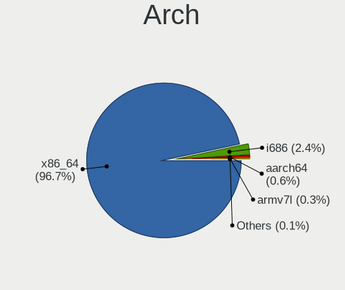
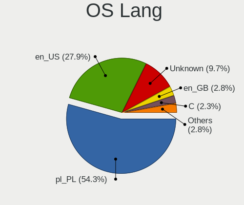
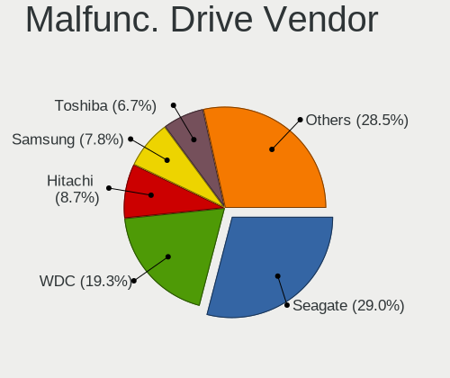
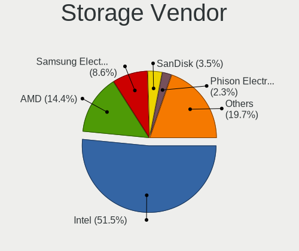
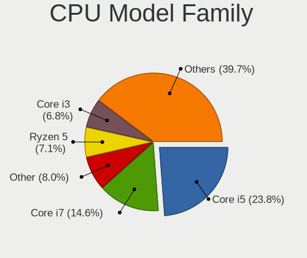
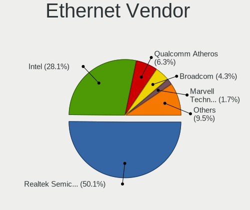
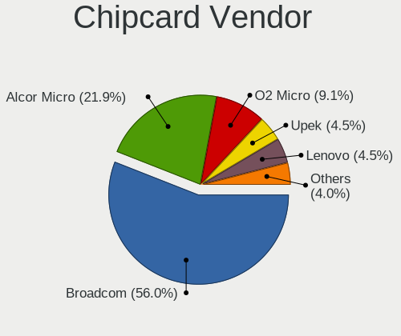

Linux in Poland - Tested Hardware & Statistics
----------------------------------------------

A project to collect tested hardware configurations for Linux in Poland.

Anyone can contribute to this report by the [hw-probe](https://github.com/linuxhw/hw-probe) tool:

    sudo -E hw-probe -all -upload

Please contribute! Especially if your hardware is rare.

This is a report for all computer types. See also reports for [desktops](/Location/Poland/Desktop/README.md) and [notebooks](/Location/Poland/Notebook/README.md).

Contents
--------

* [ Test Cases ](#test-cases)

* [ System ](#system)
  - [ OS                       ](#os)
  - [ OS Family                ](#os-family)
  - [ Kernel                   ](#kernel)
  - [ Kernel Family            ](#kernel-family)
  - [ Kernel Major Ver.        ](#kernel-major-ver)
  - [ Arch                     ](#arch)
  - [ DE                       ](#de)
  - [ Display Server           ](#display-server)
  - [ Display Manager          ](#display-manager)
  - [ OS Lang                  ](#os-lang)
  - [ Boot Mode                ](#boot-mode)
  - [ Filesystem               ](#filesystem)
  - [ Part. scheme             ](#part-scheme)
  - [ Dual Boot with Linux/BSD ](#dual-boot-with-linuxbsd)
  - [ Dual Boot (Win)          ](#dual-boot-win)

* [ Board ](#board)
  - [ Vendor                   ](#vendor)
  - [ Model                    ](#model)
  - [ Model Family             ](#model-family)
  - [ MFG Year                 ](#mfg-year)
  - [ Form Factor              ](#form-factor)
  - [ Secure Boot              ](#secure-boot)
  - [ Coreboot                 ](#coreboot)
  - [ RAM Size                 ](#ram-size)
  - [ RAM Used                 ](#ram-used)
  - [ Total Drives             ](#total-drives)
  - [ Has CD-ROM               ](#has-cd-rom)
  - [ Has Ethernet             ](#has-ethernet)
  - [ Has WiFi                 ](#has-wifi)
  - [ Has Bluetooth            ](#has-bluetooth)

* [ Location ](#location)
  - [ Country                  ](#country)
  - [ City                     ](#city)

* [ Drives ](#drives)
  - [ Drive Vendor             ](#drive-vendor)
  - [ Drive Model              ](#drive-model)
  - [ HDD Vendor               ](#hdd-vendor)
  - [ SSD Vendor               ](#ssd-vendor)
  - [ Drive Kind               ](#drive-kind)
  - [ Drive Connector          ](#drive-connector)
  - [ Drive Size               ](#drive-size)
  - [ Space Total              ](#space-total)
  - [ Space Used               ](#space-used)
  - [ Malfunc. Drives          ](#malfunc-drives)
  - [ Malfunc. Drive Vendor    ](#malfunc-drive-vendor)
  - [ Malfunc. HDD Vendor      ](#malfunc-hdd-vendor)
  - [ Malfunc. Drive Kind      ](#malfunc-drive-kind)
  - [ Failed Drives            ](#failed-drives)
  - [ Failed Drive Vendor      ](#failed-drive-vendor)
  - [ Drive Status             ](#drive-status)

* [ Storage controller ](#storage-controller)
  - [ Storage Vendor           ](#storage-vendor)
  - [ Storage Model            ](#storage-model)
  - [ Storage Kind             ](#storage-kind)

* [ Processor ](#processor)
  - [ CPU Vendor               ](#cpu-vendor)
  - [ CPU Model                ](#cpu-model)
  - [ CPU Model Family         ](#cpu-model-family)
  - [ CPU Cores                ](#cpu-cores)
  - [ CPU Sockets              ](#cpu-sockets)
  - [ CPU Threads              ](#cpu-threads)
  - [ CPU Op-Modes             ](#cpu-op-modes)
  - [ CPU Microcode            ](#cpu-microcode)
  - [ CPU Microarch            ](#cpu-microarch)

* [ Graphics ](#graphics)
  - [ GPU Vendor               ](#gpu-vendor)
  - [ GPU Model                ](#gpu-model)
  - [ GPU Combo                ](#gpu-combo)
  - [ GPU Driver               ](#gpu-driver)
  - [ GPU Memory               ](#gpu-memory)

* [ Monitor ](#monitor)
  - [ Monitor Vendor           ](#monitor-vendor)
  - [ Monitor Model            ](#monitor-model)
  - [ Monitor Resolution       ](#monitor-resolution)
  - [ Monitor Diagonal         ](#monitor-diagonal)
  - [ Monitor Width            ](#monitor-width)
  - [ Aspect Ratio             ](#aspect-ratio)
  - [ Monitor Area             ](#monitor-area)
  - [ Pixel Density            ](#pixel-density)
  - [ Multiple Monitors        ](#multiple-monitors)

* [ Network ](#network)
  - [ Net Controller Vendor    ](#net-controller-vendor)
  - [ Net Controller Model     ](#net-controller-model)
  - [ Wireless Vendor          ](#wireless-vendor)
  - [ Wireless Model           ](#wireless-model)
  - [ Ethernet Vendor          ](#ethernet-vendor)
  - [ Ethernet Model           ](#ethernet-model)
  - [ Net Controller Kind      ](#net-controller-kind)
  - [ Used Controller          ](#used-controller)
  - [ NICs                     ](#nics)
  - [ IPv6                     ](#ipv6)

* [ Bluetooth ](#bluetooth)
  - [ Bluetooth Vendor         ](#bluetooth-vendor)
  - [ Bluetooth Model          ](#bluetooth-model)

* [ Sound ](#sound)
  - [ Sound Vendor             ](#sound-vendor)
  - [ Sound Model              ](#sound-model)

* [ Memory ](#memory)
  - [ Memory Vendor            ](#memory-vendor)
  - [ Memory Model             ](#memory-model)
  - [ Memory Kind              ](#memory-kind)
  - [ Memory Form Factor       ](#memory-form-factor)
  - [ Memory Size              ](#memory-size)
  - [ Memory Speed             ](#memory-speed)

* [ Printers & scanners ](#printers--scanners)
  - [ Printer Vendor           ](#printer-vendor)
  - [ Printer Model            ](#printer-model)
  - [ Scanner Vendor           ](#scanner-vendor)
  - [ Scanner Model            ](#scanner-model)

* [ Camera ](#camera)
  - [ Camera Vendor            ](#camera-vendor)
  - [ Camera Model             ](#camera-model)

* [ Security ](#security)
  - [ Fingerprint Vendor       ](#fingerprint-vendor)
  - [ Fingerprint Model        ](#fingerprint-model)
  - [ Chipcard Vendor          ](#chipcard-vendor)
  - [ Chipcard Model           ](#chipcard-model)

* [ Unsupported ](#unsupported)
  - [ Unsupported Devices      ](#unsupported-devices)
  - [ Unsupported Device Types ](#unsupported-device-types)

Test Cases
----------

Total: 7318

| Vendor        | Model                       | Form-Factor | Probe                                                      | Date         |
|---------------|-----------------------------|-------------|------------------------------------------------------------|--------------|
| Dell          | Latitude 3190               | Notebook    | [59c654b2ec](https://linux-hardware.org/?probe=59c654b2ec) | May 01, 2023 |
| Gigabyte      | AB350-Gaming-CF             | Desktop     | [c03693e806](https://linux-hardware.org/?probe=c03693e806) | May 01, 2023 |
| MSI           | MPG X570 GAMING EDGE WIF... | Desktop     | [2fcc250a35](https://linux-hardware.org/?probe=2fcc250a35) | May 01, 2023 |
| Dell          | XPS 15 9500                 | Notebook    | [93fef964a7](https://linux-hardware.org/?probe=93fef964a7) | Apr 30, 2023 |
| MSI           | B450M PRO-M2                | Desktop     | [b650f0a26e](https://linux-hardware.org/?probe=b650f0a26e) | Apr 30, 2023 |
| Dell          | Latitude XT2                | Notebook    | [3cfd979c60](https://linux-hardware.org/?probe=3cfd979c60) | Apr 30, 2023 |
| Acer          | AO725                       | Notebook    | [03e5f661fb](https://linux-hardware.org/?probe=03e5f661fb) | Apr 30, 2023 |
| ASUSTek       | ROG Strix G513QY_G513QY     | Notebook    | [408aa18a63](https://linux-hardware.org/?probe=408aa18a63) | Apr 30, 2023 |
| Lenovo        | IdeaPad L340-17API 81LY     | Notebook    | [44c60dcec2](https://linux-hardware.org/?probe=44c60dcec2) | Apr 30, 2023 |
| Raspberry ... | Raspberry Pi Zero W Rev ... | Soc         | [ff639a78ec](https://linux-hardware.org/?probe=ff639a78ec) | Apr 30, 2023 |
| Dell          | Inspiron MXC061             | Notebook    | [2d1ab773dd](https://linux-hardware.org/?probe=2d1ab773dd) | Apr 30, 2023 |
| Gigabyte      | X670 AORUS ELITE AX         | Desktop     | [54f8ed91cf](https://linux-hardware.org/?probe=54f8ed91cf) | Apr 30, 2023 |
| ASRock        | Z370 Gaming K6              | Desktop     | [a5ff738639](https://linux-hardware.org/?probe=a5ff738639) | Apr 29, 2023 |
| ASUSTek       | ASUS TUF Gaming A15 FA50... | Notebook    | [7c378d88a2](https://linux-hardware.org/?probe=7c378d88a2) | Apr 29, 2023 |
| MSI           | MPG X570 GAMING PLUS        | Desktop     | [ee996917df](https://linux-hardware.org/?probe=ee996917df) | Apr 29, 2023 |
| ASUSTek       | ASUS TUF Gaming A15 FA50... | Notebook    | [f502c40867](https://linux-hardware.org/?probe=f502c40867) | Apr 29, 2023 |
| Acer          | Aspire V5-552G              | Notebook    | [07c58a5169](https://linux-hardware.org/?probe=07c58a5169) | Apr 29, 2023 |
| Timi          | Redmi Book Pro 15 2022      | Notebook    | [a8adc86550](https://linux-hardware.org/?probe=a8adc86550) | Apr 28, 2023 |
| Acer          | Aspire VX5-591G             | Notebook    | [2461a8058f](https://linux-hardware.org/?probe=2461a8058f) | Apr 28, 2023 |
| Lenovo        | ThinkPad T430 2349HNU       | Notebook    | [f1290d4846](https://linux-hardware.org/?probe=f1290d4846) | Apr 28, 2023 |
| ASRock        | Z170 Extreme4               | Desktop     | [b2c012c1e2](https://linux-hardware.org/?probe=b2c012c1e2) | Apr 27, 2023 |
| ASUSTek       | ASUS TUF Gaming A15 FA50... | Notebook    | [2474e8e580](https://linux-hardware.org/?probe=2474e8e580) | Apr 27, 2023 |
| HP            | 255 G8 Notebook PC          | Notebook    | [adb8f367ea](https://linux-hardware.org/?probe=adb8f367ea) | Apr 27, 2023 |
| HP            | EliteBook 2560p             | Notebook    | [23b5cbfb33](https://linux-hardware.org/?probe=23b5cbfb33) | Apr 27, 2023 |
| Acer          | Aspire 7250                 | Notebook    | [8e8e082e3d](https://linux-hardware.org/?probe=8e8e082e3d) | Apr 26, 2023 |
| Acer          | Aspire 5737Z                | Notebook    | [121eda50b8](https://linux-hardware.org/?probe=121eda50b8) | Apr 26, 2023 |
| ASUSTek       | P5K/EPU                     | Desktop     | [33ef71c7e7](https://linux-hardware.org/?probe=33ef71c7e7) | Apr 26, 2023 |
| ASUSTek       | ROG STRIX X670E-F GAMING... | Desktop     | [f1f2ad2731](https://linux-hardware.org/?probe=f1f2ad2731) | Apr 26, 2023 |
| HP            | EliteBook 840 G2            | Notebook    | [a3065a1b59](https://linux-hardware.org/?probe=a3065a1b59) | Apr 26, 2023 |
| HP            | Pavilion Gaming Laptop 1... | Notebook    | [d8088982c3](https://linux-hardware.org/?probe=d8088982c3) | Apr 26, 2023 |
| HP            | Pavilion Gaming Laptop 1... | Notebook    | [4cffa55fb1](https://linux-hardware.org/?probe=4cffa55fb1) | Apr 26, 2023 |
| HP            | Laptop 15-db1xxx            | Notebook    | [e6380a2186](https://linux-hardware.org/?probe=e6380a2186) | Apr 26, 2023 |
| HP            | Laptop 15                   | Notebook    | [34a2ebf6a1](https://linux-hardware.org/?probe=34a2ebf6a1) | Apr 26, 2023 |
| HP            | Laptop 15-db1xxx            | Notebook    | [872138980a](https://linux-hardware.org/?probe=872138980a) | Apr 26, 2023 |
| HP            | Pavilion Gaming Laptop 1... | Notebook    | [2122bd37a5](https://linux-hardware.org/?probe=2122bd37a5) | Apr 26, 2023 |
| HP            | Pavilion Gaming Laptop 1... | Notebook    | [af7b14d259](https://linux-hardware.org/?probe=af7b14d259) | Apr 26, 2023 |
| HP            | Pavilion Gaming Laptop 1... | Notebook    | [7fbd802154](https://linux-hardware.org/?probe=7fbd802154) | Apr 26, 2023 |
| HP            | Pavilion Gaming Laptop 1... | Notebook    | [ffe6065419](https://linux-hardware.org/?probe=ffe6065419) | Apr 26, 2023 |
| HP            | Pavilion Gaming Laptop 1... | Notebook    | [94ddc76aae](https://linux-hardware.org/?probe=94ddc76aae) | Apr 26, 2023 |
| MSI           | B450M MORTAR MAX            | Desktop     | [856de630ec](https://linux-hardware.org/?probe=856de630ec) | Apr 25, 2023 |
| Dell          | Cherry Trail CR A00         | Mini pc     | [f1fb89d0f7](https://linux-hardware.org/?probe=f1fb89d0f7) | Apr 25, 2023 |
| Dell          | 03NVJ6 A02                  | Desktop     | [74a0632f6e](https://linux-hardware.org/?probe=74a0632f6e) | Apr 25, 2023 |
| Lenovo        | ThinkPad X200 7459KM3       | Notebook    | [cbea785e27](https://linux-hardware.org/?probe=cbea785e27) | Apr 25, 2023 |
| Dell          | Latitude E5470              | Notebook    | [3eb401d939](https://linux-hardware.org/?probe=3eb401d939) | Apr 25, 2023 |
| Dell          | Latitude E5470              | Notebook    | [37fabb89aa](https://linux-hardware.org/?probe=37fabb89aa) | Apr 25, 2023 |
| Lenovo        | G700                        | Notebook    | [75ee4cf99d](https://linux-hardware.org/?probe=75ee4cf99d) | Apr 24, 2023 |
| Lenovo        | ThinkPad E15 Gen 2 20TD0... | Notebook    | [9649423c20](https://linux-hardware.org/?probe=9649423c20) | Apr 24, 2023 |
| Lenovo        | ThinkPad E15 Gen 2 20TD0... | Notebook    | [af486ae4ae](https://linux-hardware.org/?probe=af486ae4ae) | Apr 24, 2023 |
| HP            | ProBook 445 G8 Notebook ... | Notebook    | [de3ad583ab](https://linux-hardware.org/?probe=de3ad583ab) | Apr 24, 2023 |
| Medion        | X681X                       | Notebook    | [d72837ad07](https://linux-hardware.org/?probe=d72837ad07) | Apr 24, 2023 |
| HP            | EliteBook 650 15.6 inch ... | Notebook    | [78686e5784](https://linux-hardware.org/?probe=78686e5784) | Apr 24, 2023 |
| HP            | ENVY x360 Convertible 13... | Convertible | [76b3daef92](https://linux-hardware.org/?probe=76b3daef92) | Apr 24, 2023 |
| Dell          | Vostro 5402                 | Notebook    | [b6cb9c9140](https://linux-hardware.org/?probe=b6cb9c9140) | Apr 24, 2023 |
| Dell          | Latitude 3190               | Notebook    | [2c21a51932](https://linux-hardware.org/?probe=2c21a51932) | Apr 24, 2023 |
| ASUSTek       | M3A78-CM                    | Desktop     | [7bbac9f9bf](https://linux-hardware.org/?probe=7bbac9f9bf) | Apr 24, 2023 |
| Gigabyte      | AB350-Gaming-CF             | Desktop     | [35c362eb4f](https://linux-hardware.org/?probe=35c362eb4f) | Apr 24, 2023 |
| Samsung       | R510/P510                   | Notebook    | [4b58936ad7](https://linux-hardware.org/?probe=4b58936ad7) | Apr 23, 2023 |
| ASUSTek       | M3A78-CM                    | Desktop     | [f98c5f7d2e](https://linux-hardware.org/?probe=f98c5f7d2e) | Apr 23, 2023 |
| Dell          | Inspiron 5559               | Notebook    | [e959cc70fa](https://linux-hardware.org/?probe=e959cc70fa) | Apr 23, 2023 |
| Lenovo        | ThinkPad E14 Gen 4 21E30... | Notebook    | [18306b3af6](https://linux-hardware.org/?probe=18306b3af6) | Apr 23, 2023 |
| Gigabyte      | Z97M-DS3H                   | Desktop     | [652e029529](https://linux-hardware.org/?probe=652e029529) | Apr 23, 2023 |
| Dell          | Venue 11 Pro 7130 vPro      | Notebook    | [bee909cfcd](https://linux-hardware.org/?probe=bee909cfcd) | Apr 23, 2023 |
| Dell          | Venue 11 Pro 7130 vPro      | Notebook    | [c101faa12e](https://linux-hardware.org/?probe=c101faa12e) | Apr 23, 2023 |
| Raspberry ... | Raspberry Pi Zero W Rev ... | Soc         | [1c439a695b](https://linux-hardware.org/?probe=1c439a695b) | Apr 23, 2023 |
| Lenovo        | Z51-70 80K6                 | Notebook    | [3d51a6183c](https://linux-hardware.org/?probe=3d51a6183c) | Apr 23, 2023 |
| Dell          | Precision 7550              | Notebook    | [31830a82c6](https://linux-hardware.org/?probe=31830a82c6) | Apr 22, 2023 |
| Dell          | Latitude D620               | Notebook    | [7b0c5ec6f2](https://linux-hardware.org/?probe=7b0c5ec6f2) | Apr 22, 2023 |
| Lenovo        | Legion Y530-15ICH 81FV      | Notebook    | [510237facd](https://linux-hardware.org/?probe=510237facd) | Apr 22, 2023 |
| Gigabyte      | AORUS 15P XD                | Notebook    | [22925aa0c9](https://linux-hardware.org/?probe=22925aa0c9) | Apr 22, 2023 |
| ASUSTek       | ASUS TUF Dash F15 FX516P... | Notebook    | [c1139db413](https://linux-hardware.org/?probe=c1139db413) | Apr 22, 2023 |
| MSI           | P55-GD65                    | Desktop     | [90cc53b6dd](https://linux-hardware.org/?probe=90cc53b6dd) | Apr 22, 2023 |
| Lenovo        | ThinkPad E15 Gen 4 21E60... | Notebook    | [3056a65306](https://linux-hardware.org/?probe=3056a65306) | Apr 22, 2023 |
| MSI           | B450-A PRO MAX              | Desktop     | [51ef82c2fd](https://linux-hardware.org/?probe=51ef82c2fd) | Apr 21, 2023 |
| Unknown       | Unknown                     | Desktop     | [be207ea29f](https://linux-hardware.org/?probe=be207ea29f) | Apr 21, 2023 |
| Samsung       | 350V5C/351V5C/3540VC/344... | Notebook    | [87d3a8b29f](https://linux-hardware.org/?probe=87d3a8b29f) | Apr 20, 2023 |
| ASUSTek       | ZenBook UX425EA_UX425EA     | Notebook    | [b7f138b04c](https://linux-hardware.org/?probe=b7f138b04c) | Apr 20, 2023 |
| Gigabyte      | Z77-DS3H                    | Desktop     | [cde1ecf1c6](https://linux-hardware.org/?probe=cde1ecf1c6) | Apr 20, 2023 |
| Gigabyte      | Z97M-DS3H                   | Desktop     | [904089ce14](https://linux-hardware.org/?probe=904089ce14) | Apr 20, 2023 |
| Dell          | Precision M6600             | Notebook    | [e71bf9e7bb](https://linux-hardware.org/?probe=e71bf9e7bb) | Apr 20, 2023 |
| ASUSTek       | K50IJ                       | Notebook    | [3b07dc847f](https://linux-hardware.org/?probe=3b07dc847f) | Apr 20, 2023 |
| MSI           | Creator Z17 A12UHST         | Notebook    | [1396746fba](https://linux-hardware.org/?probe=1396746fba) | Apr 20, 2023 |
| HP            | 255 G7 Notebook PC          | Notebook    | [b2f977f4a1](https://linux-hardware.org/?probe=b2f977f4a1) | Apr 19, 2023 |
| Acer          | Aspire A715-71G             | Notebook    | [83b48fff59](https://linux-hardware.org/?probe=83b48fff59) | Apr 19, 2023 |
| Dell          | Latitude 7410               | Notebook    | [36e2aea9ea](https://linux-hardware.org/?probe=36e2aea9ea) | Apr 19, 2023 |
| ASUSTek       | TUF Gaming FX705DT_FX705... | Notebook    | [09a37b3301](https://linux-hardware.org/?probe=09a37b3301) | Apr 19, 2023 |
| Lenovo        | ThinkPad T430 2349HNU       | Notebook    | [1548cc4309](https://linux-hardware.org/?probe=1548cc4309) | Apr 19, 2023 |
| Dell          | Precision M6800             | Notebook    | [b39d3f31df](https://linux-hardware.org/?probe=b39d3f31df) | Apr 18, 2023 |
| Lenovo        | Y50-70 20378                | Notebook    | [af6c719754](https://linux-hardware.org/?probe=af6c719754) | Apr 18, 2023 |
| Gigabyte      | G5 GE                       | Notebook    | [f1baab4be4](https://linux-hardware.org/?probe=f1baab4be4) | Apr 17, 2023 |
| Lenovo        | Legion 5 Pro 16ACH6 82JS    | Notebook    | [a0b6c23c0b](https://linux-hardware.org/?probe=a0b6c23c0b) | Apr 17, 2023 |
| Lenovo        | Legion 5 Pro 16ACH6 82JS    | Notebook    | [35ec02005f](https://linux-hardware.org/?probe=35ec02005f) | Apr 17, 2023 |
| Gigabyte      | G31M-ES2L                   | Desktop     | [0244194778](https://linux-hardware.org/?probe=0244194778) | Apr 17, 2023 |
| Acer          | Swift SFA16-41              | Notebook    | [1232f86e3e](https://linux-hardware.org/?probe=1232f86e3e) | Apr 17, 2023 |
| Dell          | Latitude D830               | Notebook    | [3da091adc2](https://linux-hardware.org/?probe=3da091adc2) | Apr 17, 2023 |
| Dell          | Inspiron 15 7000 Gaming     | Notebook    | [7ca92cfada](https://linux-hardware.org/?probe=7ca92cfada) | Apr 17, 2023 |
| Lenovo        | ThinkPad T480s 20L8SF1X0... | Notebook    | [d567c29052](https://linux-hardware.org/?probe=d567c29052) | Apr 17, 2023 |
| Lenovo        | IdeaPad Z570 HuronRiver ... | Notebook    | [c59c5c0cdf](https://linux-hardware.org/?probe=c59c5c0cdf) | Apr 16, 2023 |
| Lenovo        | IdeaPad Gaming 3 15IAH7 ... | Notebook    | [391b43ba8c](https://linux-hardware.org/?probe=391b43ba8c) | Apr 16, 2023 |
| ASUSTek       | TUF Gaming B550-PLUS WIF... | Desktop     | [c8513ddcf3](https://linux-hardware.org/?probe=c8513ddcf3) | Apr 16, 2023 |
| Dell          | Inspiron 5559               | Notebook    | [b74080b280](https://linux-hardware.org/?probe=b74080b280) | Apr 16, 2023 |
| Raspberry ... | Raspberry Pi Zero W Rev ... | Soc         | [4fad8fc758](https://linux-hardware.org/?probe=4fad8fc758) | Apr 16, 2023 |
| Dell          | Latitude E6330              | Notebook    | [1a75476b96](https://linux-hardware.org/?probe=1a75476b96) | Apr 16, 2023 |
| Acer          | AO722                       | Notebook    | [af4e100c16](https://linux-hardware.org/?probe=af4e100c16) | Apr 15, 2023 |
| Kiano         | Elegance 14.2               | Notebook    | [34062f30df](https://linux-hardware.org/?probe=34062f30df) | Apr 15, 2023 |
| Acer          | Aspire 5336                 | Notebook    | [7613566248](https://linux-hardware.org/?probe=7613566248) | Apr 15, 2023 |
| Lenovo        | ThinkBook 15 G3 ACL 21A4    | Notebook    | [9206720811](https://linux-hardware.org/?probe=9206720811) | Apr 14, 2023 |
| Gigabyte      | Z97X-Gaming 3               | Desktop     | [3c77a2b081](https://linux-hardware.org/?probe=3c77a2b081) | Apr 14, 2023 |
| Valve         | Jupiter                     | Notebook    | [c1558fbc72](https://linux-hardware.org/?probe=c1558fbc72) | Apr 14, 2023 |
| MSI           | B85-G43                     | Desktop     | [0363360efa](https://linux-hardware.org/?probe=0363360efa) | Apr 14, 2023 |
| Lenovo        | Legion 5 15IAH7 82RC        | Notebook    | [9cb53e6d6f](https://linux-hardware.org/?probe=9cb53e6d6f) | Apr 13, 2023 |
| Lenovo        | ThinkBook 15 G3 ACL 21A4    | Notebook    | [9341670151](https://linux-hardware.org/?probe=9341670151) | Apr 13, 2023 |
| Lenovo        | ThinkPad X220 4291AY8       | Notebook    | [b2bc70473d](https://linux-hardware.org/?probe=b2bc70473d) | Apr 13, 2023 |
| Dell          | 0GXM1W A00                  | Desktop     | [f96d907026](https://linux-hardware.org/?probe=f96d907026) | Apr 13, 2023 |
| ASUSTek       | A68HM-K                     | Desktop     | [5586a15d29](https://linux-hardware.org/?probe=5586a15d29) | Apr 13, 2023 |
| Fujitsu Si... | AMILO PRO V3515             | Notebook    | [be2d8594c3](https://linux-hardware.org/?probe=be2d8594c3) | Apr 13, 2023 |
| ASRock        | 970 Pro3 R2.0               | Desktop     | [1d6ace19a5](https://linux-hardware.org/?probe=1d6ace19a5) | Apr 13, 2023 |
| ASRock        | Z170 Extreme4               | Desktop     | [d21971f30f](https://linux-hardware.org/?probe=d21971f30f) | Apr 13, 2023 |
| Dell          | Latitude E6230              | Notebook    | [a7cce7ebde](https://linux-hardware.org/?probe=a7cce7ebde) | Apr 12, 2023 |
| Acer          | WG43M                       | Desktop     | [e22afb229d](https://linux-hardware.org/?probe=e22afb229d) | Apr 12, 2023 |
| Lenovo        | ThinkPad X1 Carbon 3460C... | Notebook    | [f1999ee14e](https://linux-hardware.org/?probe=f1999ee14e) | Apr 11, 2023 |
| HP            | 8158 A01                    | Mini pc     | [a7d7e5c675](https://linux-hardware.org/?probe=a7d7e5c675) | Apr 11, 2023 |
| Gigabyte      | Z97M-DS3H                   | Desktop     | [b85f3476ed](https://linux-hardware.org/?probe=b85f3476ed) | Apr 11, 2023 |
| Dell          | Latitude 7390               | Notebook    | [9361f06955](https://linux-hardware.org/?probe=9361f06955) | Apr 11, 2023 |
| Lenovo        | ThinkPad T480 20L5S12H00    | Notebook    | [c550410c5b](https://linux-hardware.org/?probe=c550410c5b) | Apr 11, 2023 |
| HP            | Pavilion dv7                | Notebook    | [000c77d7d5](https://linux-hardware.org/?probe=000c77d7d5) | Apr 10, 2023 |
| HP            | Pavilion dv7                | Notebook    | [08e5108cda](https://linux-hardware.org/?probe=08e5108cda) | Apr 10, 2023 |
| HP            | 3032h                       | Desktop     | [824604840a](https://linux-hardware.org/?probe=824604840a) | Apr 10, 2023 |
| ASUSTek       | M3A78-CM                    | Desktop     | [001091b5fd](https://linux-hardware.org/?probe=001091b5fd) | Apr 10, 2023 |
| Gigabyte      | AB350-Gaming-CF             | Desktop     | [34f1d57aec](https://linux-hardware.org/?probe=34f1d57aec) | Apr 10, 2023 |
| Lenovo        | ThinkPad T450 20BUS0QT04    | Notebook    | [90d7e2bb21](https://linux-hardware.org/?probe=90d7e2bb21) | Apr 09, 2023 |
| Lenovo        | ThinkPad X220 4291LR6       | Notebook    | [ea86227d59](https://linux-hardware.org/?probe=ea86227d59) | Apr 09, 2023 |
| HUAWEI        | HVY-WXX9                    | Notebook    | [6b6b2a8633](https://linux-hardware.org/?probe=6b6b2a8633) | Apr 09, 2023 |
| HUAWEI        | HVY-WXX9                    | Notebook    | [00489240d2](https://linux-hardware.org/?probe=00489240d2) | Apr 09, 2023 |
| Raspberry ... | Raspberry Pi Zero W Rev ... | Soc         | [6f8748297a](https://linux-hardware.org/?probe=6f8748297a) | Apr 09, 2023 |
| Lenovo        | IdeaPad S540-14IWL 81ND     | Notebook    | [869d7607e9](https://linux-hardware.org/?probe=869d7607e9) | Apr 08, 2023 |
| Acer          | Aspire 5336                 | Notebook    | [6e419f3401](https://linux-hardware.org/?probe=6e419f3401) | Apr 08, 2023 |
| Toshiba       | Satellite L750D             | Notebook    | [d510eabb78](https://linux-hardware.org/?probe=d510eabb78) | Apr 08, 2023 |
| Toshiba       | Satellite L750D             | Notebook    | [3c8c0e7455](https://linux-hardware.org/?probe=3c8c0e7455) | Apr 08, 2023 |
| MSI           | MS-B0A21                    | Desktop     | [93db7f66f1](https://linux-hardware.org/?probe=93db7f66f1) | Apr 08, 2023 |
| Samsung       | 300E4A/300E5A/300E7A        | Notebook    | [370d1404f2](https://linux-hardware.org/?probe=370d1404f2) | Apr 08, 2023 |
| Lenovo        | G50-70 20351                | Notebook    | [b8dd840f5d](https://linux-hardware.org/?probe=b8dd840f5d) | Apr 08, 2023 |
| Samsung       | 400B4C/400B5C/200B4C/200... | Notebook    | [8026ca606e](https://linux-hardware.org/?probe=8026ca606e) | Apr 07, 2023 |
| Dell          | Inspiron 11-3162            | Notebook    | [accdfd2253](https://linux-hardware.org/?probe=accdfd2253) | Apr 07, 2023 |
| Samsung       | 730U3E/740U3E               | Notebook    | [7d4b6838e2](https://linux-hardware.org/?probe=7d4b6838e2) | Apr 07, 2023 |
| HP            | EliteBook 840 G7 Noteboo... | Notebook    | [413528fa5a](https://linux-hardware.org/?probe=413528fa5a) | Apr 07, 2023 |
| MSI           | GP76 Leopard 10UE           | Notebook    | [c7b870bb22](https://linux-hardware.org/?probe=c7b870bb22) | Apr 07, 2023 |
| Toshiba       | Satellite C855-12N          | Notebook    | [69e30b2fd8](https://linux-hardware.org/?probe=69e30b2fd8) | Apr 07, 2023 |
| HP            | 620                         | Notebook    | [2e14b2c046](https://linux-hardware.org/?probe=2e14b2c046) | Apr 07, 2023 |
| ASUSTek       | ASUS TUF Gaming F15 FX50... | Notebook    | [b6f721687e](https://linux-hardware.org/?probe=b6f721687e) | Apr 06, 2023 |
| HP            | ProBook 4740s               | Notebook    | [14fb51de44](https://linux-hardware.org/?probe=14fb51de44) | Apr 06, 2023 |
| ASUSTek       | M3A78-CM                    | Desktop     | [a71051ab5a](https://linux-hardware.org/?probe=a71051ab5a) | Apr 06, 2023 |
| eMachines     | E720 V1.09                  | Notebook    | [278ca903ac](https://linux-hardware.org/?probe=278ca903ac) | Apr 06, 2023 |
| Lenovo        | ThinkPad X1 Carbon Gen 1... | Notebook    | [93cb5f66a1](https://linux-hardware.org/?probe=93cb5f66a1) | Apr 06, 2023 |
| Samsung       | 730U3E/740U3E               | Notebook    | [2be8e6430c](https://linux-hardware.org/?probe=2be8e6430c) | Apr 05, 2023 |
| Kruger&Mat... | KM1406                      | Notebook    | [1b536904d4](https://linux-hardware.org/?probe=1b536904d4) | Apr 05, 2023 |
| ASUSTek       | ROG Strix G513QY_G513QY     | Notebook    | [f1398d5ada](https://linux-hardware.org/?probe=f1398d5ada) | Apr 05, 2023 |
| Toshiba       | Satellite C50-A             | Notebook    | [8e02a6dbed](https://linux-hardware.org/?probe=8e02a6dbed) | Apr 05, 2023 |
| ASRock        | B75 Pro3-M                  | Desktop     | [81b76a458e](https://linux-hardware.org/?probe=81b76a458e) | Apr 05, 2023 |
| Lenovo        | G50-80 80E5                 | Notebook    | [b469666726](https://linux-hardware.org/?probe=b469666726) | Apr 05, 2023 |
| Gigabyte      | B85M-D3H                    | Desktop     | [b9e77efbb1](https://linux-hardware.org/?probe=b9e77efbb1) | Apr 05, 2023 |
| Lenovo        | Legion 5 Pro 16ACH6 82JS    | Notebook    | [56119c4c93](https://linux-hardware.org/?probe=56119c4c93) | Apr 05, 2023 |
| Google        | Cyan                        | Notebook    | [f02aa2a210](https://linux-hardware.org/?probe=f02aa2a210) | Apr 04, 2023 |
| ASUSTek       | ASUS TUF Gaming F15 FX50... | Notebook    | [0c0196b199](https://linux-hardware.org/?probe=0c0196b199) | Apr 04, 2023 |
| Dell          | 0Y2K8N A01                  | Desktop     | [379f9d7af7](https://linux-hardware.org/?probe=379f9d7af7) | Apr 04, 2023 |
| HP            | 82B5                        | All in one  | [59fe255866](https://linux-hardware.org/?probe=59fe255866) | Apr 04, 2023 |
| Gigabyte      | Z97M-DS3H                   | Desktop     | [6e8ca2befa](https://linux-hardware.org/?probe=6e8ca2befa) | Apr 04, 2023 |
| Lenovo        | Legion 5 Pro 16ACH6 82JS    | Notebook    | [04afa2e378](https://linux-hardware.org/?probe=04afa2e378) | Apr 04, 2023 |
| Lenovo        | B50-80 80LT                 | Notebook    | [163bfb5525](https://linux-hardware.org/?probe=163bfb5525) | Apr 03, 2023 |
| MSI           | B360M PRO-VD 2019-01-24     | Desktop     | [64fa944dfd](https://linux-hardware.org/?probe=64fa944dfd) | Apr 03, 2023 |
| HP            | Compaq CQ58                 | Notebook    | [f0026163c3](https://linux-hardware.org/?probe=f0026163c3) | Apr 03, 2023 |
| Lenovo        | ThinkPad E14 Gen 2 20T60... | Notebook    | [71a388a292](https://linux-hardware.org/?probe=71a388a292) | Apr 03, 2023 |
| HP            | Compaq CQ58                 | Notebook    | [7c4676c380](https://linux-hardware.org/?probe=7c4676c380) | Apr 03, 2023 |
| HP            | Stream Notebook             | Notebook    | [27610e0a39](https://linux-hardware.org/?probe=27610e0a39) | Apr 03, 2023 |
| MSI           | PH67A-C43                   | Desktop     | [8e7c8a3d67](https://linux-hardware.org/?probe=8e7c8a3d67) | Apr 03, 2023 |
| Dell          | Latitude 3190               | Notebook    | [a1fa664431](https://linux-hardware.org/?probe=a1fa664431) | Apr 03, 2023 |
| ASUSTek       | M3A78-CM                    | Desktop     | [59bdd9d328](https://linux-hardware.org/?probe=59bdd9d328) | Apr 03, 2023 |
| Gigabyte      | AB350-Gaming-CF             | Desktop     | [79ec23e706](https://linux-hardware.org/?probe=79ec23e706) | Apr 03, 2023 |
| ASUSTek       | TP300LJ                     | Notebook    | [7da5aab332](https://linux-hardware.org/?probe=7da5aab332) | Apr 02, 2023 |
| Gigabyte      | Z97M-DS3H                   | Desktop     | [c98048fb64](https://linux-hardware.org/?probe=c98048fb64) | Apr 02, 2023 |
| MSI           | G41M-P33 Combo              | Desktop     | [0385e01f4d](https://linux-hardware.org/?probe=0385e01f4d) | Apr 02, 2023 |
| MSI           | G41M-P33 Combo              | Desktop     | [20b1ee364f](https://linux-hardware.org/?probe=20b1ee364f) | Apr 02, 2023 |
| Lenovo        | ThinkPad T470 20HES0FA03    | Notebook    | [7274c8222b](https://linux-hardware.org/?probe=7274c8222b) | Apr 02, 2023 |
| ASUSTek       | ROG Rampage VI EXTREME      | Desktop     | [03fe72ba57](https://linux-hardware.org/?probe=03fe72ba57) | Apr 02, 2023 |
| HP            | Spectre x360 Convertible... | Convertible | [60e80d51ab](https://linux-hardware.org/?probe=60e80d51ab) | Apr 02, 2023 |
| Raspberry ... | Raspberry Pi Zero W Rev ... | Soc         | [a51ad3deda](https://linux-hardware.org/?probe=a51ad3deda) | Apr 02, 2023 |
| HP            | ProBook 455 G1              | Notebook    | [869f36fc4c](https://linux-hardware.org/?probe=869f36fc4c) | Apr 01, 2023 |
| MSI           | MPG X570S CARBON MAX WIF... | Desktop     | [b7848305ec](https://linux-hardware.org/?probe=b7848305ec) | Apr 01, 2023 |
| Intel         | DG41RQ AAE54511-203         | Desktop     | [383835a445](https://linux-hardware.org/?probe=383835a445) | Apr 01, 2023 |
| Lenovo        | G560 20042                  | Notebook    | [c5a4783dfb](https://linux-hardware.org/?probe=c5a4783dfb) | Apr 01, 2023 |
| Dell          | 0TTDMJ A00                  | Desktop     | [5d6606235d](https://linux-hardware.org/?probe=5d6606235d) | Apr 01, 2023 |
| Gigabyte      | Z170-HD3 DDR3-CF            | Desktop     | [dff9959cd7](https://linux-hardware.org/?probe=dff9959cd7) | Mar 31, 2023 |
| HP            | Compaq Presario CQ60        | Notebook    | [e5a729243d](https://linux-hardware.org/?probe=e5a729243d) | Mar 31, 2023 |
| Samsung       | 950XED                      | Notebook    | [c3b37a213a](https://linux-hardware.org/?probe=c3b37a213a) | Mar 31, 2023 |
| Gigabyte      | B550 AORUS ELITE V2         | Desktop     | [4d69417ed0](https://linux-hardware.org/?probe=4d69417ed0) | Mar 31, 2023 |
| ASUSTek       | ASUS TUF Gaming F15 FX50... | Notebook    | [e2c6f05595](https://linux-hardware.org/?probe=e2c6f05595) | Mar 31, 2023 |
| HUAWEI        | KPL-W0X                     | Notebook    | [6e93ca4159](https://linux-hardware.org/?probe=6e93ca4159) | Mar 31, 2023 |
| Acer          | TravelMate 8172Z            | Notebook    | [10cc090653](https://linux-hardware.org/?probe=10cc090653) | Mar 31, 2023 |
| Dell          | Latitude D620               | Notebook    | [801ede47a2](https://linux-hardware.org/?probe=801ede47a2) | Mar 31, 2023 |
| Acer          | WG43M                       | Desktop     | [3b626d2ff9](https://linux-hardware.org/?probe=3b626d2ff9) | Mar 31, 2023 |
| ASUSTek       | K53SJ                       | Notebook    | [aa9a729217](https://linux-hardware.org/?probe=aa9a729217) | Mar 30, 2023 |
| Samsung       | 355V4C/356V4C/3445VC/354... | Notebook    | [6b9737a62f](https://linux-hardware.org/?probe=6b9737a62f) | Mar 30, 2023 |
| ASRock        | X670E PG Lightning          | Desktop     | [6078dd3087](https://linux-hardware.org/?probe=6078dd3087) | Mar 30, 2023 |
| HP            | Laptop 15s-fq2xxx           | Notebook    | [f78b6ab8c5](https://linux-hardware.org/?probe=f78b6ab8c5) | Mar 30, 2023 |
| ASUSTek       | M4A77T/USB3                 | Desktop     | [b593e25f2a](https://linux-hardware.org/?probe=b593e25f2a) | Mar 30, 2023 |
| Intel         | DQ45CB E30148-207           | Desktop     | [e47e1626c3](https://linux-hardware.org/?probe=e47e1626c3) | Mar 29, 2023 |
| Dell          | Latitude E6530              | Notebook    | [eb7392d1ae](https://linux-hardware.org/?probe=eb7392d1ae) | Mar 29, 2023 |
| Lenovo        | G570 20079                  | Notebook    | [680c7a04ed](https://linux-hardware.org/?probe=680c7a04ed) | Mar 29, 2023 |
| ASUSTek       | PRIME B360M-C               | Desktop     | [e7b163ea80](https://linux-hardware.org/?probe=e7b163ea80) | Mar 29, 2023 |
| GPD           | G1621-02                    | Notebook    | [2ed8b6c147](https://linux-hardware.org/?probe=2ed8b6c147) | Mar 29, 2023 |
| ASUSTek       | ASUS TUF Gaming A15 FA50... | Notebook    | [fa1a582da6](https://linux-hardware.org/?probe=fa1a582da6) | Mar 29, 2023 |
| Gigabyte      | B450 AORUS ELITE            | Desktop     | [9edda5f374](https://linux-hardware.org/?probe=9edda5f374) | Mar 28, 2023 |
| Gigabyte      | B450 AORUS ELITE            | Desktop     | [c25f99afed](https://linux-hardware.org/?probe=c25f99afed) | Mar 28, 2023 |
| HP            | 250 G6 Notebook PC          | Notebook    | [94cdfc44d1](https://linux-hardware.org/?probe=94cdfc44d1) | Mar 28, 2023 |
| Kiano         | Elegance 14.2               | Notebook    | [ea2013b347](https://linux-hardware.org/?probe=ea2013b347) | Mar 28, 2023 |
| Lenovo        | ThinkPad T470p 20J7S0QK0... | Notebook    | [7f5fb11940](https://linux-hardware.org/?probe=7f5fb11940) | Mar 28, 2023 |
| MSI           | B450 TOMAHAWK MAX           | Notebook    | [856b789461](https://linux-hardware.org/?probe=856b789461) | Mar 28, 2023 |
| Dell          | Latitude 7490               | Notebook    | [41d01ead49](https://linux-hardware.org/?probe=41d01ead49) | Mar 28, 2023 |
| Dell          | 0G261D A00                  | Desktop     | [f63f67f28f](https://linux-hardware.org/?probe=f63f67f28f) | Mar 28, 2023 |
| ASRock        | Z77 Extreme6                | Desktop     | [365cc196f2](https://linux-hardware.org/?probe=365cc196f2) | Mar 27, 2023 |
| Dell          | Inspiron 5735               | Notebook    | [823a6ece98](https://linux-hardware.org/?probe=823a6ece98) | Mar 27, 2023 |
| Lenovo        | ThinkPad X250 20CLS47P00    | Notebook    | [e287203572](https://linux-hardware.org/?probe=e287203572) | Mar 27, 2023 |
| ASUSTek       | ASUS TUF Gaming F15 FX50... | Notebook    | [60012fd503](https://linux-hardware.org/?probe=60012fd503) | Mar 27, 2023 |
| Gigabyte      | H310M H                     | Desktop     | [16ba0fa199](https://linux-hardware.org/?probe=16ba0fa199) | Mar 27, 2023 |
| ASUSTek       | M3A78-CM                    | Desktop     | [7d0c0336c1](https://linux-hardware.org/?probe=7d0c0336c1) | Mar 27, 2023 |
| Dell          | XPS 13 7390                 | Notebook    | [aaeb6059a2](https://linux-hardware.org/?probe=aaeb6059a2) | Mar 27, 2023 |
| HP            | 895D                        | Desktop     | [1cba23395d](https://linux-hardware.org/?probe=1cba23395d) | Mar 27, 2023 |
| Dell          | Precision 7670              | Notebook    | [eece926391](https://linux-hardware.org/?probe=eece926391) | Mar 27, 2023 |
| Dell          | Latitude 3190               | Notebook    | [757f1fc2e7](https://linux-hardware.org/?probe=757f1fc2e7) | Mar 27, 2023 |
| HP            | 1998                        | Desktop     | [2d5e0737e5](https://linux-hardware.org/?probe=2d5e0737e5) | Mar 27, 2023 |
| Dell          | Precision 7670              | Notebook    | [5b8f0590ec](https://linux-hardware.org/?probe=5b8f0590ec) | Mar 27, 2023 |
| ASUSTek       | STRIX X99 GAMING            | Desktop     | [1c37ecb6c7](https://linux-hardware.org/?probe=1c37ecb6c7) | Mar 26, 2023 |
| HP            | ProLiant DL360 G7           | Server      | [4e4f63c868](https://linux-hardware.org/?probe=4e4f63c868) | Mar 26, 2023 |
| Acer          | WG43M                       | Desktop     | [74320e2d13](https://linux-hardware.org/?probe=74320e2d13) | Mar 26, 2023 |
| Lenovo        | ThinkPad T520 4243RP3       | Notebook    | [38fa314d2f](https://linux-hardware.org/?probe=38fa314d2f) | Mar 26, 2023 |
| MSI           | Creator Z16 A11UET          | Notebook    | [0133ab37af](https://linux-hardware.org/?probe=0133ab37af) | Mar 26, 2023 |
| Sony          | VGN-BX61VN                  | Notebook    | [76f62cf9c1](https://linux-hardware.org/?probe=76f62cf9c1) | Mar 26, 2023 |
| Lenovo        | G50-80 80E5                 | Notebook    | [250e0a99d1](https://linux-hardware.org/?probe=250e0a99d1) | Mar 26, 2023 |
| Raspberry ... | Raspberry Pi Zero W Rev ... | Soc         | [45abc5547d](https://linux-hardware.org/?probe=45abc5547d) | Mar 26, 2023 |
| Lenovo        | G510 20238                  | Notebook    | [f406bad420](https://linux-hardware.org/?probe=f406bad420) | Mar 26, 2023 |
| ASUSTek       | PRIME H310-PLUS             | Desktop     | [4fcf740ee9](https://linux-hardware.org/?probe=4fcf740ee9) | Mar 25, 2023 |
| MSI           | B360M PRO-VD 2019-01-24     | Desktop     | [71fc8dc05c](https://linux-hardware.org/?probe=71fc8dc05c) | Mar 25, 2023 |
| Lenovo        | ThinkPad W520 4282PQ7       | Notebook    | [ff42aa158f](https://linux-hardware.org/?probe=ff42aa158f) | Mar 25, 2023 |
| HP            | EliteBook x360 1040 G5      | Convertible | [1301dd9965](https://linux-hardware.org/?probe=1301dd9965) | Mar 25, 2023 |
| HP            | Notebook                    | Notebook    | [7c4088912e](https://linux-hardware.org/?probe=7c4088912e) | Mar 25, 2023 |
| HP            | EliteBook x360 1040 G5      | Convertible | [eaf933f33a](https://linux-hardware.org/?probe=eaf933f33a) | Mar 25, 2023 |
| ASUSTek       | PRIME H310-PLUS             | Desktop     | [caa720b95b](https://linux-hardware.org/?probe=caa720b95b) | Mar 25, 2023 |
| Lenovo        | ThinkPad T480s 20L7S0YA0... | Notebook    | [f4cb79dbf8](https://linux-hardware.org/?probe=f4cb79dbf8) | Mar 25, 2023 |
| Valve         | Jupiter                     | Notebook    | [6a7628c31d](https://linux-hardware.org/?probe=6a7628c31d) | Mar 25, 2023 |
| Gigabyte      | F2A78M-HD2                  | Desktop     | [c7bf2c9968](https://linux-hardware.org/?probe=c7bf2c9968) | Mar 25, 2023 |
| HP            | Pavilion dv6                | Notebook    | [29a94d3d9e](https://linux-hardware.org/?probe=29a94d3d9e) | Mar 25, 2023 |
| HP            | Pavilion dv6                | Notebook    | [c3a6c3f669](https://linux-hardware.org/?probe=c3a6c3f669) | Mar 25, 2023 |
| Samsung       | 950QED                      | Convertible | [14fa80f70c](https://linux-hardware.org/?probe=14fa80f70c) | Mar 25, 2023 |
| Lenovo        | IdeaPad 5 15ALC05 82LN      | Notebook    | [7f32708bde](https://linux-hardware.org/?probe=7f32708bde) | Mar 24, 2023 |
| HP            | Pavilion Notebook           | Notebook    | [446c510c65](https://linux-hardware.org/?probe=446c510c65) | Mar 24, 2023 |
| Toshiba       | Satellite C855-12N          | Notebook    | [cb9692876c](https://linux-hardware.org/?probe=cb9692876c) | Mar 24, 2023 |
| HP            | 304Ah                       | Desktop     | [43990fede2](https://linux-hardware.org/?probe=43990fede2) | Mar 24, 2023 |
| Toshiba       | Satellite Pro A50-C         | Notebook    | [2fe9003124](https://linux-hardware.org/?probe=2fe9003124) | Mar 24, 2023 |
| Toshiba       | Satellite Pro A50-C         | Notebook    | [95c5c45220](https://linux-hardware.org/?probe=95c5c45220) | Mar 24, 2023 |
| MSI           | Creator Z17 A12UHST         | Notebook    | [47814b01b6](https://linux-hardware.org/?probe=47814b01b6) | Mar 24, 2023 |
| Sony          | SVE1512M6ESI                | Notebook    | [db00c70eb7](https://linux-hardware.org/?probe=db00c70eb7) | Mar 24, 2023 |
| ASRock        | B550M Pro4                  | Desktop     | [d18034c36c](https://linux-hardware.org/?probe=d18034c36c) | Mar 24, 2023 |
| Dell          | 0NDYHG A01                  | Desktop     | [93bc601af0](https://linux-hardware.org/?probe=93bc601af0) | Mar 23, 2023 |
| Dell          | Latitude E7450              | Notebook    | [c1e43b6a40](https://linux-hardware.org/?probe=c1e43b6a40) | Mar 23, 2023 |
| Lenovo        | G580                        | Notebook    | [367ed9241a](https://linux-hardware.org/?probe=367ed9241a) | Mar 23, 2023 |
| Dell          | 0DPRKF A01                  | Server      | [fdc74a5707](https://linux-hardware.org/?probe=fdc74a5707) | Mar 23, 2023 |
| HP            | ENVY x360 Convertible 15... | Convertible | [d32ee19009](https://linux-hardware.org/?probe=d32ee19009) | Mar 23, 2023 |
| Lenovo        | G580                        | Notebook    | [6ee526d77a](https://linux-hardware.org/?probe=6ee526d77a) | Mar 22, 2023 |
| Acer          | Aspire VN7-791              | Notebook    | [054efde4e8](https://linux-hardware.org/?probe=054efde4e8) | Mar 22, 2023 |
| Lenovo        | G50-80 80E5                 | Notebook    | [f6ad6626ff](https://linux-hardware.org/?probe=f6ad6626ff) | Mar 22, 2023 |
| HUAWEI        | KPL-W0X                     | Notebook    | [0ae6ab3ff6](https://linux-hardware.org/?probe=0ae6ab3ff6) | Mar 21, 2023 |
| Unknown       | Unknown                     | Notebook    | [31ee1d66d8](https://linux-hardware.org/?probe=31ee1d66d8) | Mar 21, 2023 |
| Gigabyte      | EX38-DS4                    | Desktop     | [6dd3e18637](https://linux-hardware.org/?probe=6dd3e18637) | Mar 21, 2023 |
| HP            | ProBook 445 G8 Notebook ... | Notebook    | [57663c8d60](https://linux-hardware.org/?probe=57663c8d60) | Mar 21, 2023 |
| HP            | ProBook 445 G8 Notebook ... | Notebook    | [f5cbd1977f](https://linux-hardware.org/?probe=f5cbd1977f) | Mar 20, 2023 |
| Gigabyte      | A520I AC                    | Desktop     | [a9e094374a](https://linux-hardware.org/?probe=a9e094374a) | Mar 20, 2023 |
| Dell          | Latitude 3190               | Notebook    | [f4bea67dcc](https://linux-hardware.org/?probe=f4bea67dcc) | Mar 20, 2023 |
| ASUSTek       | Pro WS WRX80E-SAGE SE WI... | Desktop     | [a03658793c](https://linux-hardware.org/?probe=a03658793c) | Mar 20, 2023 |
| ASUSTek       | Pro WS WRX80E-SAGE SE WI... | Desktop     | [6df656c198](https://linux-hardware.org/?probe=6df656c198) | Mar 20, 2023 |
| Gigabyte      | B450M DS3H-CF               | Desktop     | [1bad88b80e](https://linux-hardware.org/?probe=1bad88b80e) | Mar 20, 2023 |
| HP            | EliteBook 830 G5            | Notebook    | [ba804b8e21](https://linux-hardware.org/?probe=ba804b8e21) | Mar 20, 2023 |
| ASUSTek       | M3A78-CM                    | Desktop     | [7b4a68e88a](https://linux-hardware.org/?probe=7b4a68e88a) | Mar 20, 2023 |
| MSI           | B360M PRO-VD 2019-01-24     | Desktop     | [cd708d0e58](https://linux-hardware.org/?probe=cd708d0e58) | Mar 19, 2023 |
| Gigabyte      | B550 AORUS ELITE V2         | Desktop     | [a71c5a4629](https://linux-hardware.org/?probe=a71c5a4629) | Mar 19, 2023 |
| Gigabyte      | B550 AORUS ELITE AX V2      | Desktop     | [888ec192b4](https://linux-hardware.org/?probe=888ec192b4) | Mar 19, 2023 |
| Raspberry ... | Raspberry Pi Zero W Rev ... | Soc         | [efbab00e4b](https://linux-hardware.org/?probe=efbab00e4b) | Mar 19, 2023 |
| Lenovo        | IdeaPad 320-15IAP 80XR      | Notebook    | [919ccc204b](https://linux-hardware.org/?probe=919ccc204b) | Mar 19, 2023 |
| Intel         | DG41RQ AAE54511-203         | Desktop     | [703ea3d03c](https://linux-hardware.org/?probe=703ea3d03c) | Mar 18, 2023 |
| HP            | Pavilion Gaming Laptop 1... | Notebook    | [c89c2e1369](https://linux-hardware.org/?probe=c89c2e1369) | Mar 18, 2023 |
| HP            | Pavilion Gaming Laptop 1... | Notebook    | [31299394e0](https://linux-hardware.org/?probe=31299394e0) | Mar 18, 2023 |
| Fujitsu       | LIFEBOOK AH530              | Notebook    | [e40cf4f577](https://linux-hardware.org/?probe=e40cf4f577) | Mar 18, 2023 |
| Dell          | Venue 11 Pro 7130 MS        | Notebook    | [2a3bb3e212](https://linux-hardware.org/?probe=2a3bb3e212) | Mar 18, 2023 |
| Dell          | Venue 11 Pro 7130 MS        | Notebook    | [56fab2cb17](https://linux-hardware.org/?probe=56fab2cb17) | Mar 18, 2023 |
| Lenovo        | G570 20079                  | Notebook    | [2d7a146140](https://linux-hardware.org/?probe=2d7a146140) | Mar 18, 2023 |
| ASUSTek       | K52Jc                       | Notebook    | [07dc0a0959](https://linux-hardware.org/?probe=07dc0a0959) | Mar 18, 2023 |
| ASUSTek       | K52Jc                       | Notebook    | [f61ec5ce9f](https://linux-hardware.org/?probe=f61ec5ce9f) | Mar 18, 2023 |
| Dell          | Latitude 5420               | Notebook    | [318da7f6c0](https://linux-hardware.org/?probe=318da7f6c0) | Mar 18, 2023 |
| Intel         | DG41RQ AAE54511-203         | Desktop     | [a5775c7491](https://linux-hardware.org/?probe=a5775c7491) | Mar 17, 2023 |
| Intel         | DG41RQ AAE54511-203         | Desktop     | [2a17e297a2](https://linux-hardware.org/?probe=2a17e297a2) | Mar 17, 2023 |
| Toshiba       | QOSMIO X500                 | Notebook    | [2ce878e92e](https://linux-hardware.org/?probe=2ce878e92e) | Mar 17, 2023 |
| Gigabyte      | Z97M-DS3H                   | Desktop     | [96742a0cb2](https://linux-hardware.org/?probe=96742a0cb2) | Mar 17, 2023 |
| Dell          | 0T1D10 A01                  | Desktop     | [c640b09a8b](https://linux-hardware.org/?probe=c640b09a8b) | Mar 17, 2023 |
| Dell          | G5 5590                     | Notebook    | [9686d438e6](https://linux-hardware.org/?probe=9686d438e6) | Mar 17, 2023 |
| Lenovo        | Legion 5 Pro 16ACH6 82JS    | Notebook    | [728c9ad9f5](https://linux-hardware.org/?probe=728c9ad9f5) | Mar 17, 2023 |
| HP            | OMEN by Laptop 15-dc0xxx    | Notebook    | [593bd6b3ac](https://linux-hardware.org/?probe=593bd6b3ac) | Mar 17, 2023 |
| Dell          | Latitude E7440              | Notebook    | [8a6e751b61](https://linux-hardware.org/?probe=8a6e751b61) | Mar 16, 2023 |
| ASRock        | AB350 Pro4                  | Desktop     | [4a452568eb](https://linux-hardware.org/?probe=4a452568eb) | Mar 16, 2023 |
| HP            | Laptop 15-bs0xx             | Notebook    | [f53eccbbe9](https://linux-hardware.org/?probe=f53eccbbe9) | Mar 16, 2023 |
| Dell          | Latitude 5511               | Notebook    | [7444a8c723](https://linux-hardware.org/?probe=7444a8c723) | Mar 16, 2023 |
| HP            | ProLiant DL360 Gen9         | Server      | [e75695c0ea](https://linux-hardware.org/?probe=e75695c0ea) | Mar 16, 2023 |
| HP            | ProLiant DL360 Gen9         | Server      | [d8bdd6ff7c](https://linux-hardware.org/?probe=d8bdd6ff7c) | Mar 16, 2023 |
| Dell          | Latitude D620               | Notebook    | [1731735e10](https://linux-hardware.org/?probe=1731735e10) | Mar 16, 2023 |
| Lenovo        | ThinkPad E15 Gen 4 21E60... | Notebook    | [eb0beb38eb](https://linux-hardware.org/?probe=eb0beb38eb) | Mar 16, 2023 |
| Lenovo        | IdeaPad Y700-15ISK 80NV     | Notebook    | [c54f2ca880](https://linux-hardware.org/?probe=c54f2ca880) | Mar 16, 2023 |
| Sony          | VPCEH1S1E                   | Notebook    | [9e8a96156c](https://linux-hardware.org/?probe=9e8a96156c) | Mar 15, 2023 |
| Lenovo        | ThinkPad T440p 20AWS19P0... | Notebook    | [6a2d338526](https://linux-hardware.org/?probe=6a2d338526) | Mar 15, 2023 |
| Dell          | 03NVJ6 A02                  | Desktop     | [b5281b4ba4](https://linux-hardware.org/?probe=b5281b4ba4) | Mar 15, 2023 |
| ASUSTek       | TUF Gaming FX504GE_FX80G... | Notebook    | [59d7fa9a34](https://linux-hardware.org/?probe=59d7fa9a34) | Mar 15, 2023 |
| Dell          | Latitude 7390               | Notebook    | [7cc6b3a278](https://linux-hardware.org/?probe=7cc6b3a278) | Mar 15, 2023 |
| ASUSTek       | M3A78-CM                    | Desktop     | [8c2507428d](https://linux-hardware.org/?probe=8c2507428d) | Mar 15, 2023 |
| MSI           | B85-G43                     | Desktop     | [d8334d09fa](https://linux-hardware.org/?probe=d8334d09fa) | Mar 15, 2023 |
| Dell          | 0773VG A00                  | Desktop     | [320dab99e7](https://linux-hardware.org/?probe=320dab99e7) | Mar 15, 2023 |
| ASUSTek       | ROG Strix G513RW_G513RW     | Notebook    | [97fe8661ed](https://linux-hardware.org/?probe=97fe8661ed) | Mar 14, 2023 |
| Dell          | 0C96W1 A03                  | Desktop     | [171959ac44](https://linux-hardware.org/?probe=171959ac44) | Mar 14, 2023 |
| Dell          | 0C96W1 A03                  | Desktop     | [9456c9ff8e](https://linux-hardware.org/?probe=9456c9ff8e) | Mar 14, 2023 |
| Kiano         | Elegance 14.2               | Notebook    | [f9ed050c6a](https://linux-hardware.org/?probe=f9ed050c6a) | Mar 14, 2023 |
| Lenovo        | ThinkPad X1 Carbon Gen 9... | Notebook    | [daa3d3869e](https://linux-hardware.org/?probe=daa3d3869e) | Mar 14, 2023 |
| Gigabyte      | P55M-UD2                    | Desktop     | [74cdc2f679](https://linux-hardware.org/?probe=74cdc2f679) | Mar 14, 2023 |
| HP            | ProBook 450 G3              | Notebook    | [d422d0d291](https://linux-hardware.org/?probe=d422d0d291) | Mar 14, 2023 |
| Lenovo        | ThinkPad X301 2776LEG       | Notebook    | [7b0df25d34](https://linux-hardware.org/?probe=7b0df25d34) | Mar 14, 2023 |
| Lenovo        | ThinkPad X301 2776LEG       | Notebook    | [65fe38f62e](https://linux-hardware.org/?probe=65fe38f62e) | Mar 14, 2023 |
| Toshiba       | Satellite L40               | Notebook    | [bfc73429bb](https://linux-hardware.org/?probe=bfc73429bb) | Mar 13, 2023 |
| Samsung       | 300E4A/300E5A/300E7A        | Notebook    | [6c76af84cb](https://linux-hardware.org/?probe=6c76af84cb) | Mar 13, 2023 |
| Acer          | Aspire A315-24P             | Notebook    | [b9cfb4b900](https://linux-hardware.org/?probe=b9cfb4b900) | Mar 13, 2023 |
| Acer          | Aspire A315-24P             | Notebook    | [fba21e619d](https://linux-hardware.org/?probe=fba21e619d) | Mar 13, 2023 |
| HP            | Pavilion dv6                | Notebook    | [f649c78020](https://linux-hardware.org/?probe=f649c78020) | Mar 13, 2023 |
| MSI           | B85-G43                     | Desktop     | [e270b5804a](https://linux-hardware.org/?probe=e270b5804a) | Mar 13, 2023 |
| Lenovo        | ThinkPad E15 Gen 4 21E60... | Notebook    | [bc375a2ddd](https://linux-hardware.org/?probe=bc375a2ddd) | Mar 13, 2023 |
| Dell          | 051FJ8 A02                  | Desktop     | [4c5eee300d](https://linux-hardware.org/?probe=4c5eee300d) | Mar 13, 2023 |
| ASUSTek       | M3A78-CM                    | Desktop     | [a0590e6829](https://linux-hardware.org/?probe=a0590e6829) | Mar 13, 2023 |
| Gigabyte      | X670E AORUS MASTER          | Desktop     | [73d5ba11c5](https://linux-hardware.org/?probe=73d5ba11c5) | Mar 13, 2023 |
| Dell          | Latitude 3190               | Notebook    | [97cc3ffc79](https://linux-hardware.org/?probe=97cc3ffc79) | Mar 13, 2023 |
| Gigabyte      | AB350-Gaming-CF             | Desktop     | [540bfa93eb](https://linux-hardware.org/?probe=540bfa93eb) | Mar 13, 2023 |
| ASUSTek       | ROG STRIX Z490-E GAMING     | Desktop     | [0b0840b785](https://linux-hardware.org/?probe=0b0840b785) | Mar 13, 2023 |
| ASUSTek       | ROG STRIX Z370-F GAMING     | Desktop     | [8f1fe0703b](https://linux-hardware.org/?probe=8f1fe0703b) | Mar 12, 2023 |
| MSI           | A68HM-E33 V2                | Desktop     | [0e2618e3ea](https://linux-hardware.org/?probe=0e2618e3ea) | Mar 12, 2023 |
| ASUSTek       | X551MA                      | Notebook    | [37b002e8ec](https://linux-hardware.org/?probe=37b002e8ec) | Mar 12, 2023 |
| Gigabyte      | B85M-D3H-A                  | Desktop     | [4265744c52](https://linux-hardware.org/?probe=4265744c52) | Mar 12, 2023 |
| Lenovo        | ThinkPad X240 20AMS0XP0S    | Notebook    | [a2ee9a2818](https://linux-hardware.org/?probe=a2ee9a2818) | Mar 12, 2023 |
| ASUSTek       | N550JK                      | Notebook    | [bb5d069d90](https://linux-hardware.org/?probe=bb5d069d90) | Mar 12, 2023 |
| MSI           | MPG X570 GAMING PLUS        | Desktop     | [afe81d4bfa](https://linux-hardware.org/?probe=afe81d4bfa) | Mar 12, 2023 |
| HP            | 213D A01                    | Desktop     | [8c6054a4f7](https://linux-hardware.org/?probe=8c6054a4f7) | Mar 12, 2023 |
| Google        | Electro                     | Notebook    | [86cbc9d907](https://linux-hardware.org/?probe=86cbc9d907) | Mar 12, 2023 |
| Raspberry ... | Raspberry Pi Zero W Rev ... | Soc         | [566beba012](https://linux-hardware.org/?probe=566beba012) | Mar 12, 2023 |
| HP            | 250 G6 Notebook PC          | Notebook    | [d173735b81](https://linux-hardware.org/?probe=d173735b81) | Mar 11, 2023 |
| Dell          | Precision M6600             | Notebook    | [9d5e2f1e01](https://linux-hardware.org/?probe=9d5e2f1e01) | Mar 11, 2023 |
| Acer          | Extensa 5620                | Notebook    | [f95239bf35](https://linux-hardware.org/?probe=f95239bf35) | Mar 11, 2023 |
| Kiano         | Elegance 14.2               | Notebook    | [5714b30108](https://linux-hardware.org/?probe=5714b30108) | Mar 11, 2023 |
| Gigabyte      | B550 AORUS ELITE V2         | Desktop     | [8736fd04a8](https://linux-hardware.org/?probe=8736fd04a8) | Mar 11, 2023 |
| Lenovo        | Legion 5 15ARH05H 82B1      | Notebook    | [82b5297ab8](https://linux-hardware.org/?probe=82b5297ab8) | Mar 11, 2023 |
| MSI           | Z170-A PRO                  | Desktop     | [a83243223a](https://linux-hardware.org/?probe=a83243223a) | Mar 10, 2023 |
| HP            | 0AA0h                       | Desktop     | [f86f0bc187](https://linux-hardware.org/?probe=f86f0bc187) | Mar 10, 2023 |
| Lenovo        | ThinkPad T440p 20AWS19P0... | Notebook    | [44867c946f](https://linux-hardware.org/?probe=44867c946f) | Mar 10, 2023 |
| Dell          | Latitude E6530              | Notebook    | [70b72984bc](https://linux-hardware.org/?probe=70b72984bc) | Mar 10, 2023 |
| Gigabyte      | B450M DS3H-CF               | Desktop     | [bf4c797c87](https://linux-hardware.org/?probe=bf4c797c87) | Mar 10, 2023 |
| Hampoo        | P02BD6_HI-122LP             | Tablet      | [bfd26d4727](https://linux-hardware.org/?probe=bfd26d4727) | Mar 10, 2023 |
| Lenovo        | ThinkPad Z16 Gen 1 21D40... | Notebook    | [2d99e047c9](https://linux-hardware.org/?probe=2d99e047c9) | Mar 10, 2023 |
| Lenovo        | ThinkPad T430 2349HNU       | Notebook    | [99d5f17b22](https://linux-hardware.org/?probe=99d5f17b22) | Mar 09, 2023 |
| HP            | Laptop 15s-eq0xxx           | Notebook    | [7a7e8bc855](https://linux-hardware.org/?probe=7a7e8bc855) | Mar 09, 2023 |
| ASUSTek       | X550CL                      | Notebook    | [9acfcb9b4f](https://linux-hardware.org/?probe=9acfcb9b4f) | Mar 09, 2023 |
| Lenovo        | IdeaPad Y580                | Notebook    | [cc2d7d8a95](https://linux-hardware.org/?probe=cc2d7d8a95) | Mar 09, 2023 |
| Dell          | Latitude E6440              | Notebook    | [b00f44cd46](https://linux-hardware.org/?probe=b00f44cd46) | Mar 09, 2023 |
| Dell          | Latitude E6440              | Notebook    | [3b9229e07a](https://linux-hardware.org/?probe=3b9229e07a) | Mar 09, 2023 |
| HP            | EliteBook 850 G8 Noteboo... | Notebook    | [c50daaf3b9](https://linux-hardware.org/?probe=c50daaf3b9) | Mar 09, 2023 |
| MSI           | A68HM-E33 V2                | Desktop     | [670e89da85](https://linux-hardware.org/?probe=670e89da85) | Mar 09, 2023 |
| HP            | EliteBook 845 G8 Noteboo... | Notebook    | [fdc32a6871](https://linux-hardware.org/?probe=fdc32a6871) | Mar 09, 2023 |
| ASUSTek       | X550CL                      | Notebook    | [21f11cf791](https://linux-hardware.org/?probe=21f11cf791) | Mar 09, 2023 |
| ASUSTek       | A68HM-K                     | Desktop     | [12fa2455f7](https://linux-hardware.org/?probe=12fa2455f7) | Mar 08, 2023 |
| HP            | EliteBook 8570w             | Notebook    | [dfd9b7a9b9](https://linux-hardware.org/?probe=dfd9b7a9b9) | Mar 08, 2023 |
| HP            | ENVY 6                      | Notebook    | [4873f7b85f](https://linux-hardware.org/?probe=4873f7b85f) | Mar 08, 2023 |
| ASRock        | Z370M Pro4                  | Desktop     | [c4bb8436ac](https://linux-hardware.org/?probe=c4bb8436ac) | Mar 08, 2023 |
| Lenovo        | MAHOBAY                     | Desktop     | [c756678fad](https://linux-hardware.org/?probe=c756678fad) | Mar 08, 2023 |
| Lenovo        | ThinkPad T61 7661BM5        | Notebook    | [daf29f1a82](https://linux-hardware.org/?probe=daf29f1a82) | Mar 08, 2023 |
| Dell          | 03NVJ6 A02                  | Desktop     | [34696138fe](https://linux-hardware.org/?probe=34696138fe) | Mar 08, 2023 |
| Lenovo        | IdeaPad 320-15ISK 80XH      | Notebook    | [233722f0e1](https://linux-hardware.org/?probe=233722f0e1) | Mar 07, 2023 |
| ASUSTek       | TUF Gaming B450-PLUS II     | Desktop     | [43a939870d](https://linux-hardware.org/?probe=43a939870d) | Mar 07, 2023 |
| ASUSTek       | TUF Gaming B450-PLUS II     | Desktop     | [f64ba0ea72](https://linux-hardware.org/?probe=f64ba0ea72) | Mar 07, 2023 |
| ASUSTek       | M3A78-CM                    | Desktop     | [397eb062bf](https://linux-hardware.org/?probe=397eb062bf) | Mar 07, 2023 |
| Dell          | 0T1D10 A01                  | Desktop     | [ef67915ff3](https://linux-hardware.org/?probe=ef67915ff3) | Mar 07, 2023 |
| Dell          | Latitude 7290               | Notebook    | [38f12088b2](https://linux-hardware.org/?probe=38f12088b2) | Mar 07, 2023 |
| Gigabyte      | Z97M-DS3H                   | Desktop     | [59cb6854e5](https://linux-hardware.org/?probe=59cb6854e5) | Mar 07, 2023 |
| ASUSTek       | A88XM-E                     | Desktop     | [b809f137cd](https://linux-hardware.org/?probe=b809f137cd) | Mar 07, 2023 |
| Dell          | 0K6VXP A00                  | Mini pc     | [838825a42b](https://linux-hardware.org/?probe=838825a42b) | Mar 06, 2023 |
| Microsoft     | Surface Laptop Go 2         | Tablet      | [f5a1ceaa74](https://linux-hardware.org/?probe=f5a1ceaa74) | Mar 06, 2023 |
| ASUSTek       | M5A97 R2.0                  | Desktop     | [0cda9f83b1](https://linux-hardware.org/?probe=0cda9f83b1) | Mar 06, 2023 |
| HUAWEI        | KPL-W0X                     | Notebook    | [76ebbe553f](https://linux-hardware.org/?probe=76ebbe553f) | Mar 06, 2023 |
| Gigabyte      | AB350-Gaming-CF             | Desktop     | [42edcf638d](https://linux-hardware.org/?probe=42edcf638d) | Mar 06, 2023 |
| Dell          | Latitude 3190               | Notebook    | [a3a4113ab4](https://linux-hardware.org/?probe=a3a4113ab4) | Mar 06, 2023 |
| Lenovo        | 312D SDK0J40697 WIN 3305... | Mini pc     | [31a734c56b](https://linux-hardware.org/?probe=31a734c56b) | Mar 06, 2023 |
| Biostar       | TA780G M2+                  | Desktop     | [f5ddb4d21a](https://linux-hardware.org/?probe=f5ddb4d21a) | Mar 05, 2023 |
| Lenovo        | Legion 5 17ACH6 82K0        | Notebook    | [6db57d4d9f](https://linux-hardware.org/?probe=6db57d4d9f) | Mar 05, 2023 |
| MSI           | B550M PRO                   | Desktop     | [6d904e2413](https://linux-hardware.org/?probe=6d904e2413) | Mar 05, 2023 |
| ASUSTek       | TUF Gaming B550-PLUS        | Desktop     | [91fc2d53f8](https://linux-hardware.org/?probe=91fc2d53f8) | Mar 05, 2023 |
| HP            | 18E5                        | Desktop     | [969462a8a0](https://linux-hardware.org/?probe=969462a8a0) | Mar 05, 2023 |
| Dell          | 03NVJ6 A02                  | Desktop     | [80e769b994](https://linux-hardware.org/?probe=80e769b994) | Mar 05, 2023 |
| ASUSTek       | X551MA                      | Notebook    | [b77e06361b](https://linux-hardware.org/?probe=b77e06361b) | Mar 05, 2023 |
| Lenovo        | ThinkPad T440p 20AWS37F0... | Notebook    | [48677f9f86](https://linux-hardware.org/?probe=48677f9f86) | Mar 05, 2023 |
| IGEL Techn... | H830C                       | Notebook    | [3619b3fcee](https://linux-hardware.org/?probe=3619b3fcee) | Mar 05, 2023 |
| Lenovo        | SHARKBAY 0B98401 WIN        | Desktop     | [92b81bb3a1](https://linux-hardware.org/?probe=92b81bb3a1) | Mar 05, 2023 |
| ASUSTek       | A88XM-E                     | Desktop     | [ea145a8349](https://linux-hardware.org/?probe=ea145a8349) | Mar 05, 2023 |
| ASUSTek       | N71Vg                       | Notebook    | [4d83fda5ba](https://linux-hardware.org/?probe=4d83fda5ba) | Mar 05, 2023 |
| Gigabyte      | PH67A-D3-B3                 | Desktop     | [145a0a3b7d](https://linux-hardware.org/?probe=145a0a3b7d) | Mar 05, 2023 |
| MSI           | B450 TOMAHAWK MAX           | Notebook    | [8b36c984f8](https://linux-hardware.org/?probe=8b36c984f8) | Mar 05, 2023 |
| Lenovo        | IdeaPad L340-15IRH Gamin... | Notebook    | [65006682e6](https://linux-hardware.org/?probe=65006682e6) | Mar 05, 2023 |
| ASUSTek       | TUF Gaming B450-PLUS II     | Desktop     | [d9a9f6b904](https://linux-hardware.org/?probe=d9a9f6b904) | Mar 05, 2023 |
| Raspberry ... | Raspberry Pi Zero W Rev ... | Soc         | [773ac5157e](https://linux-hardware.org/?probe=773ac5157e) | Mar 05, 2023 |
| Lenovo        | MAHOBAY Win8 STD MM DPK ... | Desktop     | [cf87d901a9](https://linux-hardware.org/?probe=cf87d901a9) | Mar 05, 2023 |
| ASUSTek       | PRIME B550M-A               | Desktop     | [5eb43b511f](https://linux-hardware.org/?probe=5eb43b511f) | Mar 05, 2023 |
| ASUSTek       | PRIME B550M-A               | Desktop     | [8db9ca3a4b](https://linux-hardware.org/?probe=8db9ca3a4b) | Mar 05, 2023 |
| ASUSTek       | M3A78-CM                    | Desktop     | [541a6200bc](https://linux-hardware.org/?probe=541a6200bc) | Mar 05, 2023 |
| Gigabyte      | Z97M-DS3H                   | Desktop     | [789ca3b7bd](https://linux-hardware.org/?probe=789ca3b7bd) | Mar 05, 2023 |
| HP            | 15                          | Notebook    | [0efd9be7ae](https://linux-hardware.org/?probe=0efd9be7ae) | Mar 04, 2023 |
| ASUSTek       | TUF Gaming B450-PLUS II     | Desktop     | [241283977d](https://linux-hardware.org/?probe=241283977d) | Mar 04, 2023 |
| HP            | 15                          | Notebook    | [b8a33a3d73](https://linux-hardware.org/?probe=b8a33a3d73) | Mar 04, 2023 |
| Lenovo        | ThinkPad T420 4177R3U       | Notebook    | [525dd38cf1](https://linux-hardware.org/?probe=525dd38cf1) | Mar 04, 2023 |
| Toshiba       | Satellite L40               | Notebook    | [bd108fcfba](https://linux-hardware.org/?probe=bd108fcfba) | Mar 04, 2023 |
| HP            | Notebook                    | Notebook    | [229fbff95c](https://linux-hardware.org/?probe=229fbff95c) | Mar 04, 2023 |
| HUAWEI        | NBLK-WAX9X                  | Notebook    | [afe8ef7318](https://linux-hardware.org/?probe=afe8ef7318) | Mar 04, 2023 |
| HP            | EliteBook 830 G5            | Notebook    | [82acbe37f7](https://linux-hardware.org/?probe=82acbe37f7) | Mar 04, 2023 |
| Dell          | Vostro 3350                 | Notebook    | [1bfad93a1e](https://linux-hardware.org/?probe=1bfad93a1e) | Mar 04, 2023 |
| Dell          | Vostro 3350                 | Notebook    | [f782f8e288](https://linux-hardware.org/?probe=f782f8e288) | Mar 04, 2023 |
| Apple         | MacBookPro8,2               | Notebook    | [0b0c5a6895](https://linux-hardware.org/?probe=0b0c5a6895) | Mar 04, 2023 |
| ASUSTek       | X550CL                      | Notebook    | [c16eae7537](https://linux-hardware.org/?probe=c16eae7537) | Mar 04, 2023 |
| IGEL Techn... | H830C                       | Notebook    | [4625dc0660](https://linux-hardware.org/?probe=4625dc0660) | Mar 04, 2023 |
| Toshiba       | Satellite L40               | Notebook    | [e3f1423c39](https://linux-hardware.org/?probe=e3f1423c39) | Mar 04, 2023 |
| ASUSTek       | VivoBook_ASUSLaptop S540... | Notebook    | [0228fd4ab1](https://linux-hardware.org/?probe=0228fd4ab1) | Mar 04, 2023 |
| Dell          | Latitude 5480               | Notebook    | [4679c9328e](https://linux-hardware.org/?probe=4679c9328e) | Mar 03, 2023 |
| Lenovo        | Y520-15IKBN 80WK            | Notebook    | [9186971572](https://linux-hardware.org/?probe=9186971572) | Mar 03, 2023 |
| ASRock        | Z87 Extreme4                | Desktop     | [d085a259d5](https://linux-hardware.org/?probe=d085a259d5) | Mar 03, 2023 |
| Dell          | 03NVJ6 A01                  | Desktop     | [0e8d1a9e75](https://linux-hardware.org/?probe=0e8d1a9e75) | Mar 03, 2023 |
| Lenovo        | IdeaPad 320-17ABR 80YN      | Notebook    | [25f45efbc1](https://linux-hardware.org/?probe=25f45efbc1) | Mar 03, 2023 |
| ASUSTek       | X551MA                      | Notebook    | [608c8a42da](https://linux-hardware.org/?probe=608c8a42da) | Mar 03, 2023 |
| ASUSTek       | X551MA                      | Notebook    | [fa55d9fb5c](https://linux-hardware.org/?probe=fa55d9fb5c) | Mar 03, 2023 |
| Lenovo        | ThinkPad T480s 20L8S2B50... | Notebook    | [8268a3bbf3](https://linux-hardware.org/?probe=8268a3bbf3) | Mar 03, 2023 |
| ASUSTek       | PRIME H510M-K               | Desktop     | [1a83a85925](https://linux-hardware.org/?probe=1a83a85925) | Mar 03, 2023 |
| Supermicro    | X11SCL-F                    | Server      | [ef92c1fc32](https://linux-hardware.org/?probe=ef92c1fc32) | Mar 03, 2023 |
| Gigabyte      | B550 GAMING X V2            | Desktop     | [a40e18910c](https://linux-hardware.org/?probe=a40e18910c) | Mar 03, 2023 |
| ASUSTek       | N61Vn                       | Notebook    | [9528e36d7b](https://linux-hardware.org/?probe=9528e36d7b) | Mar 03, 2023 |
| ASUSTek       | Maximus VII RANGER          | Desktop     | [3934b91be7](https://linux-hardware.org/?probe=3934b91be7) | Mar 02, 2023 |
| Lenovo        | IdeaPad Gaming 3 15ARH05... | Notebook    | [726752f23a](https://linux-hardware.org/?probe=726752f23a) | Mar 02, 2023 |
| Dell          | 0HFG24 A01                  | Server      | [b53826c91c](https://linux-hardware.org/?probe=b53826c91c) | Mar 02, 2023 |
| Lenovo        | ThinkBook 15 G2 ITL 20VE    | Notebook    | [a5288ab43b](https://linux-hardware.org/?probe=a5288ab43b) | Mar 02, 2023 |
| HP            | ZBook Power G7 Mobile Wo... | Notebook    | [e87ce2454c](https://linux-hardware.org/?probe=e87ce2454c) | Mar 02, 2023 |
| Dell          | Latitude D830               | Notebook    | [83415c82ac](https://linux-hardware.org/?probe=83415c82ac) | Mar 02, 2023 |
| Lenovo        | IdeaPad C340-14IML 81TK     | Convertible | [a79b4ff73c](https://linux-hardware.org/?probe=a79b4ff73c) | Mar 02, 2023 |
| Acer          | Aspire V3-574G              | Notebook    | [e943ab2cde](https://linux-hardware.org/?probe=e943ab2cde) | Mar 01, 2023 |
| Huanan        | X99-F8 NALEX, NALEX         | Desktop     | [ada9b78c86](https://linux-hardware.org/?probe=ada9b78c86) | Mar 01, 2023 |
| Lenovo        | ThinkPad T14 Gen 3 21AH0... | Notebook    | [9b0d952fa9](https://linux-hardware.org/?probe=9b0d952fa9) | Mar 01, 2023 |
| Notebook      | NS50_70MU                   | Notebook    | [18ff6f22a6](https://linux-hardware.org/?probe=18ff6f22a6) | Mar 01, 2023 |
| Dell          | Latitude 7330               | Convertible | [0ad2e974ba](https://linux-hardware.org/?probe=0ad2e974ba) | Mar 01, 2023 |
| Dell          | Latitude 5420               | Notebook    | [0596aff5c4](https://linux-hardware.org/?probe=0596aff5c4) | Feb 28, 2023 |
| Gigabyte      | B450M DS3H-CF               | Desktop     | [52522a762d](https://linux-hardware.org/?probe=52522a762d) | Feb 28, 2023 |
| MSI           | B450M PRO-VDH MAX           | Desktop     | [07bb534dc9](https://linux-hardware.org/?probe=07bb534dc9) | Feb 28, 2023 |
| Lenovo        | Yoga710-14ISK 80TY          | Notebook    | [756e003316](https://linux-hardware.org/?probe=756e003316) | Feb 28, 2023 |
| HP            | ZBook 15u G3                | Notebook    | [9c49a1748b](https://linux-hardware.org/?probe=9c49a1748b) | Feb 28, 2023 |
| Lenovo        | ThinkPad X1 Yoga 1st 20F... | Convertible | [260ece1650](https://linux-hardware.org/?probe=260ece1650) | Feb 28, 2023 |
| Lenovo        | ThinkPad E560 20EV000UUK    | Notebook    | [7060b60651](https://linux-hardware.org/?probe=7060b60651) | Feb 27, 2023 |
| HP            | ProBook 430 G6              | Notebook    | [a184aa7141](https://linux-hardware.org/?probe=a184aa7141) | Feb 27, 2023 |
| Lenovo        | G50-80 80E5                 | Notebook    | [d7bb021829](https://linux-hardware.org/?probe=d7bb021829) | Feb 27, 2023 |
| ASUSTek       | K75VJ                       | Notebook    | [7fc0fff829](https://linux-hardware.org/?probe=7fc0fff829) | Feb 27, 2023 |
| Dell          | Latitude 7390               | Notebook    | [a2167ae72b](https://linux-hardware.org/?probe=a2167ae72b) | Feb 27, 2023 |
| Schenker      | VISION (E22)                | Notebook    | [498444ca02](https://linux-hardware.org/?probe=498444ca02) | Feb 27, 2023 |
| Lenovo        | ThinkPad E15 Gen 2 20T80... | Notebook    | [1ce9430009](https://linux-hardware.org/?probe=1ce9430009) | Feb 27, 2023 |
| HP            | Notebook                    | Notebook    | [a1180ad479](https://linux-hardware.org/?probe=a1180ad479) | Feb 27, 2023 |
| Gigabyte      | A320M-H-CF                  | Desktop     | [409bb06e5e](https://linux-hardware.org/?probe=409bb06e5e) | Feb 27, 2023 |
| HP            | Notebook                    | Notebook    | [ee2645efa8](https://linux-hardware.org/?probe=ee2645efa8) | Feb 27, 2023 |
| Lenovo        | ThinkPad P14s Gen 2a 21A... | Notebook    | [d57bb59dee](https://linux-hardware.org/?probe=d57bb59dee) | Feb 27, 2023 |
| ASUSTek       | K52F                        | Notebook    | [fa30ea101a](https://linux-hardware.org/?probe=fa30ea101a) | Feb 27, 2023 |
| Dell          | Latitude 3190               | Notebook    | [279b385865](https://linux-hardware.org/?probe=279b385865) | Feb 27, 2023 |
| HP            | Notebook                    | Notebook    | [0d838134b7](https://linux-hardware.org/?probe=0d838134b7) | Feb 27, 2023 |
| ASUSTek       | M3A78-CM                    | Desktop     | [aa86292f52](https://linux-hardware.org/?probe=aa86292f52) | Feb 27, 2023 |
| Gigabyte      | AB350-Gaming-CF             | Desktop     | [f8d42c3767](https://linux-hardware.org/?probe=f8d42c3767) | Feb 27, 2023 |
| Gigabyte      | X670E AORUS MASTER          | Desktop     | [589b06afc1](https://linux-hardware.org/?probe=589b06afc1) | Feb 26, 2023 |
| Acer          | Aspire ES1-711              | Notebook    | [8e397cc54f](https://linux-hardware.org/?probe=8e397cc54f) | Feb 26, 2023 |
| Gigabyte      | GA-MA78LMT-US2H             | Desktop     | [df54545112](https://linux-hardware.org/?probe=df54545112) | Feb 26, 2023 |
| Dell          | 0K6VXP A00                  | Mini pc     | [9357168131](https://linux-hardware.org/?probe=9357168131) | Feb 26, 2023 |
| Gigabyte      | MMLP5AP-00                  | Notebook    | [eb5ca5bb8d](https://linux-hardware.org/?probe=eb5ca5bb8d) | Feb 26, 2023 |
| Raspberry ... | Raspberry Pi Zero W Rev ... | Soc         | [f09bf9b926](https://linux-hardware.org/?probe=f09bf9b926) | Feb 26, 2023 |
| ASUSTek       | M3A78-CM                    | Desktop     | [cf1d88a388](https://linux-hardware.org/?probe=cf1d88a388) | Feb 26, 2023 |
| Valve         | Jupiter                     | Notebook    | [f7289abeb1](https://linux-hardware.org/?probe=f7289abeb1) | Feb 26, 2023 |
| Dell          | Latitude D630               | Notebook    | [cfdc009ff1](https://linux-hardware.org/?probe=cfdc009ff1) | Feb 26, 2023 |
| Fujitsu       | D3233-A1 S26361-D3233-A1    | Desktop     | [782598981d](https://linux-hardware.org/?probe=782598981d) | Feb 25, 2023 |
| Gigabyte      | Z690 GAMING X DDR4          | Desktop     | [6a75456290](https://linux-hardware.org/?probe=6a75456290) | Feb 25, 2023 |
| Gigabyte      | Z690 GAMING X DDR4          | Desktop     | [73caef7b95](https://linux-hardware.org/?probe=73caef7b95) | Feb 25, 2023 |
| Acer          | Aspire E5-571G              | Notebook    | [07fe4333eb](https://linux-hardware.org/?probe=07fe4333eb) | Feb 25, 2023 |
| Gigabyte      | G31M-S2L                    | Desktop     | [563101d2b2](https://linux-hardware.org/?probe=563101d2b2) | Feb 25, 2023 |
| Sony          | VGN-FZ31M                   | Notebook    | [6b830e36f1](https://linux-hardware.org/?probe=6b830e36f1) | Feb 25, 2023 |
| MSI           | B350M MORTAR                | Desktop     | [6a7ac3b38b](https://linux-hardware.org/?probe=6a7ac3b38b) | Feb 24, 2023 |
| Gigabyte      | GA-MA78LMT-US2H             | Desktop     | [b2681528bd](https://linux-hardware.org/?probe=b2681528bd) | Feb 24, 2023 |
| ASUSTek       | B150M-A D3                  | Desktop     | [01caadaee0](https://linux-hardware.org/?probe=01caadaee0) | Feb 24, 2023 |
| ASRock        | M3A770DE                    | Desktop     | [b025c7a092](https://linux-hardware.org/?probe=b025c7a092) | Feb 24, 2023 |
| HP            | ZBook 15u G3                | Notebook    | [92879d708d](https://linux-hardware.org/?probe=92879d708d) | Feb 24, 2023 |
| HP            | ZBook 15u G3                | Notebook    | [8a698df80f](https://linux-hardware.org/?probe=8a698df80f) | Feb 24, 2023 |
| HP            | EliteBook 840 G2            | Notebook    | [f1fa3164f9](https://linux-hardware.org/?probe=f1fa3164f9) | Feb 24, 2023 |
| Gigabyte      | B85M-HD3 R4                 | Desktop     | [db83755f3f](https://linux-hardware.org/?probe=db83755f3f) | Feb 24, 2023 |
| ASUSTek       | ROG STRIX Z370-F GAMING     | Desktop     | [79aa51c612](https://linux-hardware.org/?probe=79aa51c612) | Feb 23, 2023 |
| Gigabyte      | Z97-HD3                     | Desktop     | [016a51a4af](https://linux-hardware.org/?probe=016a51a4af) | Feb 23, 2023 |
| Lenovo        | Legion 5 15ARH05H 82B1      | Notebook    | [00591dc764](https://linux-hardware.org/?probe=00591dc764) | Feb 23, 2023 |
| Lenovo        | Legion 5 Pro 16ACH6H 82J... | Notebook    | [a85b9d1452](https://linux-hardware.org/?probe=a85b9d1452) | Feb 23, 2023 |
| MSI           | B450 TOMAHAWK MAX           | Notebook    | [e2cdf5625c](https://linux-hardware.org/?probe=e2cdf5625c) | Feb 23, 2023 |
| Dell          | XPS 9320                    | Notebook    | [94e7c2d282](https://linux-hardware.org/?probe=94e7c2d282) | Feb 23, 2023 |
| MSI           | B450 TOMAHAWK MAX           | Notebook    | [bfbb3aab2c](https://linux-hardware.org/?probe=bfbb3aab2c) | Feb 23, 2023 |
| Gigabyte      | Z97M-DS3H                   | Desktop     | [821d952d15](https://linux-hardware.org/?probe=821d952d15) | Feb 23, 2023 |
| ASUSTek       | 1215B                       | Notebook    | [970d77d150](https://linux-hardware.org/?probe=970d77d150) | Feb 22, 2023 |
| Notebook      | NS50_70MU                   | Notebook    | [a213ec0ba4](https://linux-hardware.org/?probe=a213ec0ba4) | Feb 22, 2023 |
| Apple         | MacBookPro8,1               | Notebook    | [b7071da133](https://linux-hardware.org/?probe=b7071da133) | Feb 22, 2023 |
| Gigabyte      | GA-MA78LMT-US2H             | Desktop     | [39e6d492c4](https://linux-hardware.org/?probe=39e6d492c4) | Feb 22, 2023 |
| Gigabyte      | GA-MA78LMT-US2H             | Desktop     | [40bc5397ea](https://linux-hardware.org/?probe=40bc5397ea) | Feb 22, 2023 |
| ASRock        | Z690 Extreme                | Desktop     | [16e67a28e4](https://linux-hardware.org/?probe=16e67a28e4) | Feb 22, 2023 |
| ASUSTek       | PRIME B550M-A WIFI II       | Desktop     | [cb79c0ad47](https://linux-hardware.org/?probe=cb79c0ad47) | Feb 22, 2023 |
| ASUSTek       | P10S-I Series               | Desktop     | [f2049b8af1](https://linux-hardware.org/?probe=f2049b8af1) | Feb 21, 2023 |
| Dell          | Latitude 5491               | Notebook    | [fd68ba9595](https://linux-hardware.org/?probe=fd68ba9595) | Feb 21, 2023 |
| ASUSTek       | P10S-I Series               | Desktop     | [ec5a8efdcd](https://linux-hardware.org/?probe=ec5a8efdcd) | Feb 21, 2023 |
| Dell          | 0K6VXP A00                  | Mini pc     | [c3ddf6d592](https://linux-hardware.org/?probe=c3ddf6d592) | Feb 21, 2023 |
| Fujitsu       | LIFEBOOK E744               | Notebook    | [bdcee122d3](https://linux-hardware.org/?probe=bdcee122d3) | Feb 21, 2023 |
| Lenovo        | ThinkPad L14 Gen 1 20U50... | Notebook    | [88be67bbc1](https://linux-hardware.org/?probe=88be67bbc1) | Feb 21, 2023 |
| Lenovo        | ThinkPad R61 8933W4S        | Notebook    | [fec1a43d91](https://linux-hardware.org/?probe=fec1a43d91) | Feb 21, 2023 |
| ASRock        | A520M-HVS                   | Desktop     | [cc8628ae2c](https://linux-hardware.org/?probe=cc8628ae2c) | Feb 20, 2023 |
| Dell          | System XPS L502X            | Notebook    | [7352f47bb0](https://linux-hardware.org/?probe=7352f47bb0) | Feb 20, 2023 |
| Lenovo        | ThinkPad T410s 2924W3S      | Notebook    | [24081de7f1](https://linux-hardware.org/?probe=24081de7f1) | Feb 20, 2023 |
| HP            | 620                         | Notebook    | [c3dae62545](https://linux-hardware.org/?probe=c3dae62545) | Feb 20, 2023 |
| Lenovo        | IdeaPad 100S-14IBR 80R9     | Notebook    | [e61bce94ea](https://linux-hardware.org/?probe=e61bce94ea) | Feb 20, 2023 |
| ASUSTek       | PRIME H310M-K R2.0          | Desktop     | [211cd972f0](https://linux-hardware.org/?probe=211cd972f0) | Feb 20, 2023 |
| Acer          | Aspire A515-44              | Notebook    | [5fc82de1e4](https://linux-hardware.org/?probe=5fc82de1e4) | Feb 20, 2023 |
| Dell          | 0K6VXP A00                  | Mini pc     | [a691e5fdbb](https://linux-hardware.org/?probe=a691e5fdbb) | Feb 20, 2023 |
| Fujitsu       | LIFEBOOK E559               | Notebook    | [5e4c3607c7](https://linux-hardware.org/?probe=5e4c3607c7) | Feb 20, 2023 |
| Dell          | Latitude 3190               | Notebook    | [c05229588b](https://linux-hardware.org/?probe=c05229588b) | Feb 20, 2023 |
| Lenovo        | ThinkPad E15 Gen 2 20T80... | Notebook    | [0d1a7d0dbe](https://linux-hardware.org/?probe=0d1a7d0dbe) | Feb 20, 2023 |
| Lenovo        | B570e HuronRiver Platfor... | Notebook    | [3ddfaa902f](https://linux-hardware.org/?probe=3ddfaa902f) | Feb 20, 2023 |
| Acer          | Aspire A515-44              | Notebook    | [14e85e829f](https://linux-hardware.org/?probe=14e85e829f) | Feb 20, 2023 |
| Dell          | Latitude E7270              | Notebook    | [4eb17c846c](https://linux-hardware.org/?probe=4eb17c846c) | Feb 20, 2023 |
| Gigabyte      | AB350-Gaming-CF             | Desktop     | [cc8a99e630](https://linux-hardware.org/?probe=cc8a99e630) | Feb 20, 2023 |
| Lenovo        | G510 20238                  | Notebook    | [7bc24845b3](https://linux-hardware.org/?probe=7bc24845b3) | Feb 20, 2023 |
| Dell          | 0NHNHP A01                  | Server      | [da74244bff](https://linux-hardware.org/?probe=da74244bff) | Feb 19, 2023 |
| Lenovo        | G510 20238                  | Notebook    | [d6f20de9d5](https://linux-hardware.org/?probe=d6f20de9d5) | Feb 19, 2023 |
| ASUSTek       | M3A78-CM                    | Desktop     | [7b0fb49186](https://linux-hardware.org/?probe=7b0fb49186) | Feb 19, 2023 |
| Dell          | Vostro 5502                 | Notebook    | [49252b4695](https://linux-hardware.org/?probe=49252b4695) | Feb 19, 2023 |
| HP            | Unknown                     | Notebook    | [69b276cb01](https://linux-hardware.org/?probe=69b276cb01) | Feb 19, 2023 |
| Gigabyte      | B75M-D2V                    | Desktop     | [fe04dfeaac](https://linux-hardware.org/?probe=fe04dfeaac) | Feb 19, 2023 |
| ASUSTek       | VivoBook_ASUSLaptop M350... | Notebook    | [5300c136fd](https://linux-hardware.org/?probe=5300c136fd) | Feb 19, 2023 |
| Raspberry ... | Raspberry Pi Zero W Rev ... | Soc         | [9d2009fd11](https://linux-hardware.org/?probe=9d2009fd11) | Feb 19, 2023 |
| Lenovo        | Legion 5 Pro 16ACH6 82JS    | Notebook    | [5ff3cab69f](https://linux-hardware.org/?probe=5ff3cab69f) | Feb 19, 2023 |
| Apple         | MacBookAir6,1               | Notebook    | [5cade7cfc3](https://linux-hardware.org/?probe=5cade7cfc3) | Feb 19, 2023 |
| Samsung       | 350V5C/351V5C/3540VC/344... | Notebook    | [238f636180](https://linux-hardware.org/?probe=238f636180) | Feb 18, 2023 |
| Dell          | 0PU052                      | Desktop     | [a460806b91](https://linux-hardware.org/?probe=a460806b91) | Feb 18, 2023 |
| HP            | EliteBook 850 G8 Noteboo... | Notebook    | [9b53b2b842](https://linux-hardware.org/?probe=9b53b2b842) | Feb 18, 2023 |
| Lenovo        | ThinkBook 14 G2 ITL 20VD    | Notebook    | [cdfcc639d3](https://linux-hardware.org/?probe=cdfcc639d3) | Feb 18, 2023 |
| Lenovo        | IdeaPad 100S-14IBR 80R9     | Notebook    | [cbf0e3814c](https://linux-hardware.org/?probe=cbf0e3814c) | Feb 18, 2023 |
| ASUSTek       | ASUS TUF Gaming F15 FX50... | Notebook    | [a424b3aa47](https://linux-hardware.org/?probe=a424b3aa47) | Feb 18, 2023 |
| MSI           | MPG Z390 GAMING EDGE AC     | Desktop     | [28965259ad](https://linux-hardware.org/?probe=28965259ad) | Feb 18, 2023 |
| Dell          | Latitude 3520               | Notebook    | [8df8f4c6fc](https://linux-hardware.org/?probe=8df8f4c6fc) | Feb 18, 2023 |
| Lenovo        | IdeaPad 100-15IBD 80QQ      | Notebook    | [27958da7cc](https://linux-hardware.org/?probe=27958da7cc) | Feb 18, 2023 |
| Lenovo        | Legion 5 Pro 16ACH6 82JS    | Notebook    | [2f3a14eeaa](https://linux-hardware.org/?probe=2f3a14eeaa) | Feb 18, 2023 |
| MSI           | GL65 9SD                    | Notebook    | [a702514760](https://linux-hardware.org/?probe=a702514760) | Feb 17, 2023 |
| Dell          | Inspiron 5570               | Notebook    | [be29883368](https://linux-hardware.org/?probe=be29883368) | Feb 17, 2023 |
| Dell          | Latitude 5491               | Notebook    | [8a3298cdff](https://linux-hardware.org/?probe=8a3298cdff) | Feb 17, 2023 |
| Dell          | Latitude 5511               | Notebook    | [5c3a80271b](https://linux-hardware.org/?probe=5c3a80271b) | Feb 17, 2023 |
| ASUSTek       | ROG Strix G513QY_G513QY     | Notebook    | [4a5c7432ae](https://linux-hardware.org/?probe=4a5c7432ae) | Feb 17, 2023 |
| Dell          | 03NVJ6 A02                  | Desktop     | [5201547dce](https://linux-hardware.org/?probe=5201547dce) | Feb 17, 2023 |
| Dell          | 03NVJ6 A02                  | Desktop     | [a77d2c8a54](https://linux-hardware.org/?probe=a77d2c8a54) | Feb 17, 2023 |
| Gigabyte      | GA-MA790X-UD3P              | Desktop     | [8efdbecd75](https://linux-hardware.org/?probe=8efdbecd75) | Feb 17, 2023 |
| HP            | ZBook Studio G3             | Notebook    | [af86e6cb72](https://linux-hardware.org/?probe=af86e6cb72) | Feb 17, 2023 |
| Lenovo        | ThinkPad T61 7661BM5        | Notebook    | [c829d5ed74](https://linux-hardware.org/?probe=c829d5ed74) | Feb 16, 2023 |
| Apple         | MacBookAir6,1               | Notebook    | [c96e404e3f](https://linux-hardware.org/?probe=c96e404e3f) | Feb 16, 2023 |
| ASRock        | J3355M                      | Desktop     | [9118f960dd](https://linux-hardware.org/?probe=9118f960dd) | Feb 16, 2023 |
| Acer          | One S1003                   | Tablet      | [2d5943e055](https://linux-hardware.org/?probe=2d5943e055) | Feb 16, 2023 |
| Gigabyte      | EP35-DS4                    | Desktop     | [00d960f926](https://linux-hardware.org/?probe=00d960f926) | Feb 16, 2023 |
| Lenovo        | ThinkPad L13 20R30006PB     | Notebook    | [aad1f06bb9](https://linux-hardware.org/?probe=aad1f06bb9) | Feb 16, 2023 |
| Gigabyte      | MZAPLBP-00                  | Desktop     | [b043125d6e](https://linux-hardware.org/?probe=b043125d6e) | Feb 16, 2023 |
| Gigabyte      | GA-MA790XT-UD4P             | Desktop     | [3ce39f40e7](https://linux-hardware.org/?probe=3ce39f40e7) | Feb 16, 2023 |
| MSI           | Creator Z17 A12UHST         | Notebook    | [a70040c510](https://linux-hardware.org/?probe=a70040c510) | Feb 16, 2023 |
| RTD Embedd... | CMA34CR                     | Notebook    | [dd8527bd65](https://linux-hardware.org/?probe=dd8527bd65) | Feb 16, 2023 |
| ASUSTek       | ZenBook UX425EA_UX425EA     | Notebook    | [73787e9141](https://linux-hardware.org/?probe=73787e9141) | Feb 16, 2023 |
| Dell          | Latitude 5480               | Notebook    | [ee1b786fd9](https://linux-hardware.org/?probe=ee1b786fd9) | Feb 15, 2023 |
| Lenovo        | Y50-70 20378                | Notebook    | [09301690c5](https://linux-hardware.org/?probe=09301690c5) | Feb 15, 2023 |
| MSI           | G41M-P33 Combo              | Desktop     | [5a6d751e4b](https://linux-hardware.org/?probe=5a6d751e4b) | Feb 15, 2023 |
| Lenovo        | ThinkBook 15 G3 ACL 21A4    | Notebook    | [74a61dff13](https://linux-hardware.org/?probe=74a61dff13) | Feb 15, 2023 |
| Lenovo        | Legion 5 Pro 16ACH6 82JS    | Notebook    | [b53cdde5a7](https://linux-hardware.org/?probe=b53cdde5a7) | Feb 15, 2023 |
| HP            | EliteBook 650 15.6 inch ... | Notebook    | [2be1a08ef2](https://linux-hardware.org/?probe=2be1a08ef2) | Feb 15, 2023 |
| MSI           | MS-7235                     | Desktop     | [519f3742a3](https://linux-hardware.org/?probe=519f3742a3) | Feb 15, 2023 |
| ASUSTek       | P8H67-M                     | Desktop     | [ae4f47209a](https://linux-hardware.org/?probe=ae4f47209a) | Feb 15, 2023 |
| Gigabyte      | H410M H V3                  | Desktop     | [59f88fb4d0](https://linux-hardware.org/?probe=59f88fb4d0) | Feb 15, 2023 |
| ASUSTek       | P8H67-M                     | Desktop     | [f1c6e21bfb](https://linux-hardware.org/?probe=f1c6e21bfb) | Feb 15, 2023 |
| Dell          | 0GXM1W A00                  | Desktop     | [3ab6d305fc](https://linux-hardware.org/?probe=3ab6d305fc) | Feb 15, 2023 |
| ASUSTek       | M3A78-CM                    | Desktop     | [2c0799202c](https://linux-hardware.org/?probe=2c0799202c) | Feb 15, 2023 |
| GPU Compan... | GWTN141-4                   | Notebook    | [1492f5c475](https://linux-hardware.org/?probe=1492f5c475) | Feb 15, 2023 |
| MSI           | G41M-P33 Combo              | Desktop     | [1161e39e43](https://linux-hardware.org/?probe=1161e39e43) | Feb 15, 2023 |
| Dell          | System XPS L502X            | Notebook    | [2ea016be2a](https://linux-hardware.org/?probe=2ea016be2a) | Feb 14, 2023 |
| Lenovo        | Legion 5 Pro 16ACH6 82JS    | Notebook    | [65a5587c6d](https://linux-hardware.org/?probe=65a5587c6d) | Feb 14, 2023 |
| Gigabyte      | H55M-USB3                   | Desktop     | [08b959d9ec](https://linux-hardware.org/?probe=08b959d9ec) | Feb 14, 2023 |
| Acer          | Aspire A315-35              | Notebook    | [971fa91888](https://linux-hardware.org/?probe=971fa91888) | Feb 14, 2023 |
| Google        | Lillipup                    | Notebook    | [af7451beff](https://linux-hardware.org/?probe=af7451beff) | Feb 14, 2023 |
| Unknown       | Unknown                     | Notebook    | [1f80b65b37](https://linux-hardware.org/?probe=1f80b65b37) | Feb 13, 2023 |
| Unknown       | Unknown                     | Notebook    | [8b28eb095c](https://linux-hardware.org/?probe=8b28eb095c) | Feb 13, 2023 |
| Medion        | Akoya THE TOUCH 10          | Notebook    | [ec6afad108](https://linux-hardware.org/?probe=ec6afad108) | Feb 13, 2023 |
| ASUSTek       | M3A78-CM                    | Desktop     | [e474459ee0](https://linux-hardware.org/?probe=e474459ee0) | Feb 13, 2023 |
| Timi          | TM1613                      | Notebook    | [ce33c5c02e](https://linux-hardware.org/?probe=ce33c5c02e) | Feb 13, 2023 |
| Lenovo        | IdeaPad S210 Touch 20257    | Notebook    | [d132553080](https://linux-hardware.org/?probe=d132553080) | Feb 13, 2023 |
| Dell          | Latitude 5511               | Notebook    | [161095d97a](https://linux-hardware.org/?probe=161095d97a) | Feb 13, 2023 |
| TrekStor      | Surfbook W2                 | Notebook    | [f43f606f80](https://linux-hardware.org/?probe=f43f606f80) | Feb 13, 2023 |
| Dell          | Latitude 3190               | Notebook    | [f2fd97186c](https://linux-hardware.org/?probe=f2fd97186c) | Feb 13, 2023 |
| Gigabyte      | AB350-Gaming-CF             | Desktop     | [7eb2b7e26f](https://linux-hardware.org/?probe=7eb2b7e26f) | Feb 13, 2023 |
| HP            | 3397                        | Desktop     | [83dc4a9ea0](https://linux-hardware.org/?probe=83dc4a9ea0) | Feb 13, 2023 |
| HP            | 3397                        | Desktop     | [cc7019baaa](https://linux-hardware.org/?probe=cc7019baaa) | Feb 13, 2023 |
| ASUSTek       | M3A78-CM                    | Desktop     | [36a0d5221f](https://linux-hardware.org/?probe=36a0d5221f) | Feb 13, 2023 |
| Dell          | Latitude E6420              | Notebook    | [6ffa1ea310](https://linux-hardware.org/?probe=6ffa1ea310) | Feb 12, 2023 |
| ASUSTek       | ASUS TUF Gaming F15 FX50... | Notebook    | [04cfa15383](https://linux-hardware.org/?probe=04cfa15383) | Feb 12, 2023 |
| MSI           | H310M PRO-M2 PLUS           | Desktop     | [45f78c29cb](https://linux-hardware.org/?probe=45f78c29cb) | Feb 12, 2023 |
| Lenovo        | ThinkPad T470s 20HGS1LM0... | Notebook    | [8ee6dd00d1](https://linux-hardware.org/?probe=8ee6dd00d1) | Feb 12, 2023 |
| Raspberry ... | Raspberry Pi Zero W Rev ... | Soc         | [5120a4cdb5](https://linux-hardware.org/?probe=5120a4cdb5) | Feb 12, 2023 |
| HP            | 3397                        | Desktop     | [cc5cdaf09b](https://linux-hardware.org/?probe=cc5cdaf09b) | Feb 12, 2023 |
| ASUSTek       | PRIME H310M-K R2.0          | Desktop     | [ed3233c97b](https://linux-hardware.org/?probe=ed3233c97b) | Feb 11, 2023 |
| HP            | 3397                        | Desktop     | [b22590d882](https://linux-hardware.org/?probe=b22590d882) | Feb 11, 2023 |
| ASUSTek       | VivoBook_ASUSLaptop X412... | Notebook    | [40116058d1](https://linux-hardware.org/?probe=40116058d1) | Feb 11, 2023 |
| ASUSTek       | PRIME H310M-K R2.0          | Desktop     | [2695a9350a](https://linux-hardware.org/?probe=2695a9350a) | Feb 11, 2023 |
| ASUSTek       | VivoBook_ASUSLaptop X412... | Notebook    | [8e00bdf032](https://linux-hardware.org/?probe=8e00bdf032) | Feb 11, 2023 |
| Apple         | MacBookAir5,2               | Notebook    | [4f99163f99](https://linux-hardware.org/?probe=4f99163f99) | Feb 11, 2023 |
| Lenovo        | ThinkPad T430 2347BS4       | Notebook    | [682be07637](https://linux-hardware.org/?probe=682be07637) | Feb 11, 2023 |
| Valve         | Jupiter                     | Notebook    | [081d9e5294](https://linux-hardware.org/?probe=081d9e5294) | Feb 11, 2023 |
| HP            | Spectre x360 Convertible... | Convertible | [d8a854baec](https://linux-hardware.org/?probe=d8a854baec) | Feb 11, 2023 |
| HP            | Spectre x360 Convertible... | Convertible | [6c1d31a394](https://linux-hardware.org/?probe=6c1d31a394) | Feb 10, 2023 |
| HP            | ProBook 430 G3              | Notebook    | [e995a466a1](https://linux-hardware.org/?probe=e995a466a1) | Feb 10, 2023 |
| Dell          | 04YJ19 A00                  | Desktop     | [972fb9a299](https://linux-hardware.org/?probe=972fb9a299) | Feb 10, 2023 |
| Toshiba       | Satellite L750              | Notebook    | [b6239c152e](https://linux-hardware.org/?probe=b6239c152e) | Feb 10, 2023 |
| Acer          | Aspire ES1-111M             | Notebook    | [82eea49fcd](https://linux-hardware.org/?probe=82eea49fcd) | Feb 09, 2023 |
| Acer          | Aspire ES1-111M             | Notebook    | [accbac47d5](https://linux-hardware.org/?probe=accbac47d5) | Feb 09, 2023 |
| Lenovo        | ThinkPad T530 2429MY2       | Notebook    | [9b5ffc7c58](https://linux-hardware.org/?probe=9b5ffc7c58) | Feb 09, 2023 |
| Dell          | 060J9C A00                  | Mini pc     | [38f4064394](https://linux-hardware.org/?probe=38f4064394) | Feb 09, 2023 |
| MSI           | Creator Z17 A12UHST         | Notebook    | [8885828bb8](https://linux-hardware.org/?probe=8885828bb8) | Feb 09, 2023 |
| ASUSTek       | PRIME B450M-A               | Desktop     | [f669c49cf5](https://linux-hardware.org/?probe=f669c49cf5) | Feb 09, 2023 |
| Gigabyte      | X670E AORUS MASTER          | Desktop     | [ddaad5aa0d](https://linux-hardware.org/?probe=ddaad5aa0d) | Feb 09, 2023 |
| Gigabyte      | B660 DS3H AX DDR4           | Desktop     | [73ae27760d](https://linux-hardware.org/?probe=73ae27760d) | Feb 09, 2023 |
| Lenovo        | IdeaPad Z570 HuronRiver ... | Notebook    | [467c3e9149](https://linux-hardware.org/?probe=467c3e9149) | Feb 09, 2023 |
| Intel         | DG31PR AAD97573-301         | Desktop     | [665f8e7d81](https://linux-hardware.org/?probe=665f8e7d81) | Feb 09, 2023 |
| Valve         | Jupiter                     | Notebook    | [26cb195bab](https://linux-hardware.org/?probe=26cb195bab) | Feb 08, 2023 |
| ASUSTek       | M3A78-CM                    | Desktop     | [c71dba27f2](https://linux-hardware.org/?probe=c71dba27f2) | Feb 08, 2023 |
| Dell          | Latitude 3570               | Notebook    | [dc460632ef](https://linux-hardware.org/?probe=dc460632ef) | Feb 08, 2023 |
| Gigabyte      | X670E AORUS MASTER          | Desktop     | [2b4bc22652](https://linux-hardware.org/?probe=2b4bc22652) | Feb 08, 2023 |
| Lenovo        | Yoga 3 Pro-1370 80HE        | Notebook    | [842956e023](https://linux-hardware.org/?probe=842956e023) | Feb 08, 2023 |
| ASRock        | X470 Gaming K4              | Desktop     | [086ea7a0e6](https://linux-hardware.org/?probe=086ea7a0e6) | Feb 08, 2023 |
| ASRock        | B450 Gaming K4              | Desktop     | [dd8fbe3d62](https://linux-hardware.org/?probe=dd8fbe3d62) | Feb 08, 2023 |
| Dell          | 0DR845                      | Desktop     | [537252420b](https://linux-hardware.org/?probe=537252420b) | Feb 07, 2023 |
| Dell          | Latitude E6520              | Notebook    | [c9c89084e8](https://linux-hardware.org/?probe=c9c89084e8) | Feb 07, 2023 |
| Dell          | Latitude E4300              | Notebook    | [aaad0477e4](https://linux-hardware.org/?probe=aaad0477e4) | Feb 07, 2023 |
| Lenovo        | IdeaPad 320-15IKB 81BG      | Notebook    | [307d491fc8](https://linux-hardware.org/?probe=307d491fc8) | Feb 07, 2023 |
| Foxconn       | NT-A2400&NT-A3500 FAB       | Desktop     | [000ed6c589](https://linux-hardware.org/?probe=000ed6c589) | Feb 07, 2023 |
| Intel         | DG31PR AAD97573-301         | Desktop     | [2080f0edf4](https://linux-hardware.org/?probe=2080f0edf4) | Feb 07, 2023 |
| ASUSTek       | PRIME Z490-P                | Desktop     | [be25e0c930](https://linux-hardware.org/?probe=be25e0c930) | Feb 07, 2023 |
| ASUSTek       | PRIME Z490-P                | Desktop     | [d139473252](https://linux-hardware.org/?probe=d139473252) | Feb 07, 2023 |
| Dell          | Latitude 3520               | Notebook    | [d7569fa081](https://linux-hardware.org/?probe=d7569fa081) | Feb 06, 2023 |
| Valve         | Jupiter                     | Notebook    | [edc8beac1f](https://linux-hardware.org/?probe=edc8beac1f) | Feb 06, 2023 |
| Dell          | Latitude 5511               | Notebook    | [57e8ce4f20](https://linux-hardware.org/?probe=57e8ce4f20) | Feb 06, 2023 |
| Dell          | Latitude 3190               | Notebook    | [eafbc050e8](https://linux-hardware.org/?probe=eafbc050e8) | Feb 06, 2023 |
| Huanan        | X99-T8D V1.2                | Desktop     | [cb7e750cee](https://linux-hardware.org/?probe=cb7e750cee) | Feb 05, 2023 |
| HP            | EliteBook 820 G2            | Notebook    | [e8c0f3b7de](https://linux-hardware.org/?probe=e8c0f3b7de) | Feb 05, 2023 |
| MSI           | H410M-A PRO                 | Desktop     | [6ac747c27e](https://linux-hardware.org/?probe=6ac747c27e) | Feb 05, 2023 |
| HP            | EliteBook 820 G2            | Notebook    | [eb5a23a73b](https://linux-hardware.org/?probe=eb5a23a73b) | Feb 05, 2023 |
| Dell          | 02P9X9 A05                  | Server      | [fb8900f061](https://linux-hardware.org/?probe=fb8900f061) | Feb 05, 2023 |
| Dell          | 0PM2CW A02                  | Server      | [9c7291ae7e](https://linux-hardware.org/?probe=9c7291ae7e) | Feb 05, 2023 |
| HP            | 3397                        | Desktop     | [a8f8381e48](https://linux-hardware.org/?probe=a8f8381e48) | Feb 05, 2023 |
| HP            | 3397                        | Desktop     | [c41ab8c19e](https://linux-hardware.org/?probe=c41ab8c19e) | Feb 05, 2023 |
| HP            | 8054                        | Desktop     | [c709653825](https://linux-hardware.org/?probe=c709653825) | Feb 05, 2023 |
| Lenovo        | IdeaPad Y580                | Notebook    | [30d8845f10](https://linux-hardware.org/?probe=30d8845f10) | Feb 05, 2023 |
| Lenovo        | ThinkPad T15 Gen 1 20S6C... | Notebook    | [262dfe3aa9](https://linux-hardware.org/?probe=262dfe3aa9) | Feb 05, 2023 |
| Lenovo        | ThinkBook 14s-IWL 20RM      | Notebook    | [dbef2c679a](https://linux-hardware.org/?probe=dbef2c679a) | Feb 05, 2023 |
| Raspberry ... | Raspberry Pi Zero W Rev ... | Soc         | [0837ce8a0f](https://linux-hardware.org/?probe=0837ce8a0f) | Feb 05, 2023 |
| Dell          | Inspiron 5570               | Notebook    | [eb399b4ffa](https://linux-hardware.org/?probe=eb399b4ffa) | Feb 05, 2023 |
| MSI           | PRO Z690-A DDR4             | Desktop     | [403785d1ec](https://linux-hardware.org/?probe=403785d1ec) | Feb 05, 2023 |
| Lenovo        | ThinkBook 14s-IWL 20RM      | Notebook    | [14fb68ece0](https://linux-hardware.org/?probe=14fb68ece0) | Feb 05, 2023 |
| Fujitsu       | D3403-A1 S26361-D3403-A1    | Desktop     | [854b52f85c](https://linux-hardware.org/?probe=854b52f85c) | Feb 05, 2023 |
| Apple         | MacBookPro8,1               | Notebook    | [d6adca1255](https://linux-hardware.org/?probe=d6adca1255) | Feb 04, 2023 |
| Dell          | Inspiron 5570               | Notebook    | [6e8ab1a5cb](https://linux-hardware.org/?probe=6e8ab1a5cb) | Feb 04, 2023 |
| Apple         | MacBookPro8,3               | Notebook    | [9d397c2187](https://linux-hardware.org/?probe=9d397c2187) | Feb 04, 2023 |
| Apple         | MacBookPro8,3               | Notebook    | [7b676dec23](https://linux-hardware.org/?probe=7b676dec23) | Feb 04, 2023 |
| Acer          | Aspire A515-51G             | Notebook    | [149465f225](https://linux-hardware.org/?probe=149465f225) | Feb 04, 2023 |
| Dell          | Vostro 3550                 | Notebook    | [4f1125bc93](https://linux-hardware.org/?probe=4f1125bc93) | Feb 04, 2023 |
| Lenovo        | G510 20238                  | Notebook    | [a385ff6f36](https://linux-hardware.org/?probe=a385ff6f36) | Feb 04, 2023 |
| Lenovo        | ThinkPad R500 2716W2K       | Notebook    | [a645368e82](https://linux-hardware.org/?probe=a645368e82) | Feb 04, 2023 |
| Foxconn       | 2ABF                        | Desktop     | [54a305f83e](https://linux-hardware.org/?probe=54a305f83e) | Feb 03, 2023 |
| ASUSTek       | VivoBook_ASUS Laptop X50... | Notebook    | [c6dae92093](https://linux-hardware.org/?probe=c6dae92093) | Feb 03, 2023 |
| ASUSTek       | 1101HA                      | Notebook    | [28cb433eb0](https://linux-hardware.org/?probe=28cb433eb0) | Feb 03, 2023 |
| Dell          | Latitude 5480               | Notebook    | [da9f98059c](https://linux-hardware.org/?probe=da9f98059c) | Feb 03, 2023 |
| ASUSTek       | VivoBook_ASUSLaptop X421... | Notebook    | [9c5cfbc1a1](https://linux-hardware.org/?probe=9c5cfbc1a1) | Feb 03, 2023 |
| ASRock        | Z370 Gaming K6              | Desktop     | [203d5736d7](https://linux-hardware.org/?probe=203d5736d7) | Feb 03, 2023 |
| HP            | 212B                        | Desktop     | [f27b5c4aa0](https://linux-hardware.org/?probe=f27b5c4aa0) | Feb 03, 2023 |
| HP            | Unknown                     | Notebook    | [4b28efe30c](https://linux-hardware.org/?probe=4b28efe30c) | Feb 03, 2023 |
| Gigabyte      | F2A68HM-DS2                 | Desktop     | [a4a3ea0e4e](https://linux-hardware.org/?probe=a4a3ea0e4e) | Feb 02, 2023 |
| Samsung       | 530U3C/530U4C/532U3C        | Notebook    | [4b1dc3d64b](https://linux-hardware.org/?probe=4b1dc3d64b) | Feb 02, 2023 |
| Apple         | Mac-942B5BF58194151B        | All in one  | [5ab474163a](https://linux-hardware.org/?probe=5ab474163a) | Feb 02, 2023 |
| Lenovo        | ThinkPad X1 Extreme 20MF... | Notebook    | [1c6ed7ede6](https://linux-hardware.org/?probe=1c6ed7ede6) | Feb 02, 2023 |
| Dell          | Vostro 3580                 | Notebook    | [7efc294bac](https://linux-hardware.org/?probe=7efc294bac) | Feb 02, 2023 |
| MSI           | X99S SLI PLUS               | Desktop     | [6b007d74de](https://linux-hardware.org/?probe=6b007d74de) | Feb 02, 2023 |
| Gigabyte      | B365M DS3H                  | Desktop     | [f04d195965](https://linux-hardware.org/?probe=f04d195965) | Feb 02, 2023 |
| MSI           | GV62 7RD                    | Notebook    | [c22fffb4e9](https://linux-hardware.org/?probe=c22fffb4e9) | Feb 02, 2023 |
| ASUSTek       | P5QPL-AM                    | Desktop     | [c8ee9be68c](https://linux-hardware.org/?probe=c8ee9be68c) | Feb 02, 2023 |
| Lenovo        | Yoga 3 Pro-1370 80HE        | Notebook    | [ac6a930ffc](https://linux-hardware.org/?probe=ac6a930ffc) | Feb 02, 2023 |
| ASUSTek       | B85M-G                      | Desktop     | [de152b340c](https://linux-hardware.org/?probe=de152b340c) | Feb 01, 2023 |
| Dell          | Precision 7540              | Notebook    | [1d0d197808](https://linux-hardware.org/?probe=1d0d197808) | Feb 01, 2023 |
| Gigabyte      | B365M DS3H                  | Desktop     | [d515d5d9f7](https://linux-hardware.org/?probe=d515d5d9f7) | Feb 01, 2023 |
| Dell          | Latitude E7240              | Notebook    | [fe655eca77](https://linux-hardware.org/?probe=fe655eca77) | Jan 31, 2023 |
| Lenovo        | Legion 5 17ACH6H 82JY       | Notebook    | [62f941075c](https://linux-hardware.org/?probe=62f941075c) | Jan 31, 2023 |
| Lenovo        | ThinkPad X1 Extreme 20MF... | Notebook    | [70310e25d1](https://linux-hardware.org/?probe=70310e25d1) | Jan 31, 2023 |
| Gigabyte      | X670 AORUS ELITE AX         | Desktop     | [4e438c4768](https://linux-hardware.org/?probe=4e438c4768) | Jan 31, 2023 |
| Gigabyte      | X670 AORUS ELITE AX         | Desktop     | [66459fc07c](https://linux-hardware.org/?probe=66459fc07c) | Jan 31, 2023 |
| ASUSTek       | Maximus VII GENE            | Desktop     | [c936c07925](https://linux-hardware.org/?probe=c936c07925) | Jan 31, 2023 |
| Dell          | Latitude 5410               | Notebook    | [717012530d](https://linux-hardware.org/?probe=717012530d) | Jan 31, 2023 |
| Unknown       | Unknown                     | Notebook    | [e6c824b966](https://linux-hardware.org/?probe=e6c824b966) | Jan 31, 2023 |
| Gigabyte      | Z97M-DS3H                   | Desktop     | [360dc83e04](https://linux-hardware.org/?probe=360dc83e04) | Jan 31, 2023 |
| Lenovo        | Legion Y530-15ICH 81FV      | Notebook    | [aaaa563786](https://linux-hardware.org/?probe=aaaa563786) | Jan 31, 2023 |
| HP            | Compaq 6730s                | Notebook    | [1b083e5b64](https://linux-hardware.org/?probe=1b083e5b64) | Jan 31, 2023 |
| HP            | Compaq 6730s                | Notebook    | [ced2899d20](https://linux-hardware.org/?probe=ced2899d20) | Jan 31, 2023 |
| HP            | ProBook 650 G1              | Notebook    | [fc09442b7c](https://linux-hardware.org/?probe=fc09442b7c) | Jan 30, 2023 |
| HP            | ProBook 650 G1              | Notebook    | [b78602c91d](https://linux-hardware.org/?probe=b78602c91d) | Jan 30, 2023 |
| Dell          | Inspiron 5485 2n1           | Convertible | [e335e7282d](https://linux-hardware.org/?probe=e335e7282d) | Jan 30, 2023 |
| Dell          | Latitude E5430 non-vPro     | Notebook    | [d1e99e3f04](https://linux-hardware.org/?probe=d1e99e3f04) | Jan 30, 2023 |
| Toshiba       | Satellite P750              | Notebook    | [1cc0f342b5](https://linux-hardware.org/?probe=1cc0f342b5) | Jan 30, 2023 |
| Apple         | MacBookPro5,2               | Notebook    | [4cb11c2a78](https://linux-hardware.org/?probe=4cb11c2a78) | Jan 30, 2023 |
| ASUSTek       | ROG Zephyrus M16 GU603ZX... | Notebook    | [7442c84b55](https://linux-hardware.org/?probe=7442c84b55) | Jan 30, 2023 |
| Dell          | Inspiron 5758               | Notebook    | [de58233dca](https://linux-hardware.org/?probe=de58233dca) | Jan 30, 2023 |
| HP            | ZBook 15u G3                | Notebook    | [7f985597d7](https://linux-hardware.org/?probe=7f985597d7) | Jan 30, 2023 |
| HP            | ZBook 15u G3                | Notebook    | [7a35a6d886](https://linux-hardware.org/?probe=7a35a6d886) | Jan 30, 2023 |
| Dell          | Latitude 5480               | Notebook    | [ee87ac218f](https://linux-hardware.org/?probe=ee87ac218f) | Jan 30, 2023 |
| Dell          | Latitude 5480               | Notebook    | [3cbac640e1](https://linux-hardware.org/?probe=3cbac640e1) | Jan 30, 2023 |
| HP            | 8054                        | Desktop     | [f2367fdcda](https://linux-hardware.org/?probe=f2367fdcda) | Jan 30, 2023 |
| Dell          | Latitude 3190               | Notebook    | [a53530646a](https://linux-hardware.org/?probe=a53530646a) | Jan 30, 2023 |
| Dell          | Latitude E6520              | Notebook    | [81717ed3df](https://linux-hardware.org/?probe=81717ed3df) | Jan 30, 2023 |
| Gigabyte      | AB350-Gaming-CF             | Desktop     | [5a2c721748](https://linux-hardware.org/?probe=5a2c721748) | Jan 30, 2023 |
| Lenovo        | MIIX 320-10ICR 80XF         | Tablet      | [56622f5d6c](https://linux-hardware.org/?probe=56622f5d6c) | Jan 29, 2023 |
| Apple         | MacBookPro11,1              | Notebook    | [e5af375b93](https://linux-hardware.org/?probe=e5af375b93) | Jan 29, 2023 |
| Apple         | MacBookPro11,1              | Notebook    | [41d67fcba8](https://linux-hardware.org/?probe=41d67fcba8) | Jan 29, 2023 |
| Raspberry ... | Raspberry Pi Zero W Rev ... | Soc         | [1a2fb44fac](https://linux-hardware.org/?probe=1a2fb44fac) | Jan 29, 2023 |
| Lenovo        | Legion Y540-15IRH-PG0 81... | Notebook    | [e2fa9aa820](https://linux-hardware.org/?probe=e2fa9aa820) | Jan 29, 2023 |
| ASUSTek       | 1215B                       | Notebook    | [8d26a8d157](https://linux-hardware.org/?probe=8d26a8d157) | Jan 28, 2023 |
| Dell          | 0HY9JP A00                  | Desktop     | [f4aefcd670](https://linux-hardware.org/?probe=f4aefcd670) | Jan 28, 2023 |
| Apple         | Mac-FFE5EF870D7BA81A iMa... | All in one  | [cf4086f3e4](https://linux-hardware.org/?probe=cf4086f3e4) | Jan 28, 2023 |
| Lenovo        | ThinkPad X1 Extreme 20MF... | Notebook    | [fb7b1bdaf5](https://linux-hardware.org/?probe=fb7b1bdaf5) | Jan 27, 2023 |
| Lenovo        | ThinkPad X1 Carbon 3rd 2... | Notebook    | [f6d7ba9d48](https://linux-hardware.org/?probe=f6d7ba9d48) | Jan 27, 2023 |
| ASUSTek       | TUF Gaming X570-PLUS        | Desktop     | [ff5e2b673e](https://linux-hardware.org/?probe=ff5e2b673e) | Jan 27, 2023 |
| HP            | EliteBook 640 14 inch G9... | Notebook    | [bbdf827cef](https://linux-hardware.org/?probe=bbdf827cef) | Jan 27, 2023 |
| ASUSTek       | X540SA                      | Notebook    | [93aed28230](https://linux-hardware.org/?probe=93aed28230) | Jan 27, 2023 |
| ASUSTek       | M3A78-CM                    | Desktop     | [9001ac4e36](https://linux-hardware.org/?probe=9001ac4e36) | Jan 27, 2023 |
| Kruger&Mat... | KM1406                      | Notebook    | [c944e8058f](https://linux-hardware.org/?probe=c944e8058f) | Jan 27, 2023 |
| Samsung       | 350V5C/351V5C/3540VC/344... | Notebook    | [bd7e955a3e](https://linux-hardware.org/?probe=bd7e955a3e) | Jan 27, 2023 |
| Samsung       | 350V5C/351V5C/3540VC/344... | Notebook    | [1f74ea5c27](https://linux-hardware.org/?probe=1f74ea5c27) | Jan 27, 2023 |
| HP            | x2 210 G2                   | Tablet      | [863136882e](https://linux-hardware.org/?probe=863136882e) | Jan 26, 2023 |
| ASUSTek       | ZenBook UX425UA_UM425UA     | Notebook    | [af3748a4f0](https://linux-hardware.org/?probe=af3748a4f0) | Jan 26, 2023 |
| Acer          | Nitro AN517-55              | Notebook    | [7273b8320c](https://linux-hardware.org/?probe=7273b8320c) | Jan 26, 2023 |
| HP            | 8054                        | Desktop     | [864f5f225e](https://linux-hardware.org/?probe=864f5f225e) | Jan 26, 2023 |
| Lenovo        | ThinkPad T440p 20AWS24B0... | Notebook    | [e4ddea6092](https://linux-hardware.org/?probe=e4ddea6092) | Jan 26, 2023 |
| Acer          | Nitro AN517-55              | Notebook    | [2de4e60fef](https://linux-hardware.org/?probe=2de4e60fef) | Jan 26, 2023 |
| HP            | EliteBook Folio 1040 G1     | Notebook    | [4811286faf](https://linux-hardware.org/?probe=4811286faf) | Jan 26, 2023 |
| Dell          | XPS 9320                    | Notebook    | [a1040b4a3f](https://linux-hardware.org/?probe=a1040b4a3f) | Jan 26, 2023 |
| Lenovo        | Legion 5 Pro 16ACH6 82JS    | Notebook    | [26f46d5b40](https://linux-hardware.org/?probe=26f46d5b40) | Jan 25, 2023 |
| Inventec      | D CLASS A02                 | Desktop     | [2e70086887](https://linux-hardware.org/?probe=2e70086887) | Jan 25, 2023 |
| Lenovo        | Legion 5 Pro 16ACH6 82JS    | Notebook    | [f1e6112f8c](https://linux-hardware.org/?probe=f1e6112f8c) | Jan 25, 2023 |
| ASUSTek       | VivoBook_ASUSLaptop X350... | Notebook    | [baae797a05](https://linux-hardware.org/?probe=baae797a05) | Jan 25, 2023 |
| ASUSTek       | VivoBook_ASUSLaptop X350... | Notebook    | [427a7fa0cb](https://linux-hardware.org/?probe=427a7fa0cb) | Jan 25, 2023 |
| Lenovo        | IdeaPad 320-15AST 80XV      | Notebook    | [7fcc3fb992](https://linux-hardware.org/?probe=7fcc3fb992) | Jan 25, 2023 |
| HP            | 3048h                       | Desktop     | [caabf4189f](https://linux-hardware.org/?probe=caabf4189f) | Jan 25, 2023 |
| Samsung       | R710                        | Notebook    | [17a3e2ddd9](https://linux-hardware.org/?probe=17a3e2ddd9) | Jan 25, 2023 |
| Dell          | Latitude E6520              | Notebook    | [baf618d1a1](https://linux-hardware.org/?probe=baf618d1a1) | Jan 25, 2023 |
| ASRock        | 775XFire-VSTA               | Desktop     | [e80788f790](https://linux-hardware.org/?probe=e80788f790) | Jan 24, 2023 |
| Dell          | Latitude E6520              | Notebook    | [615879d5e9](https://linux-hardware.org/?probe=615879d5e9) | Jan 24, 2023 |
| Dell          | Latitude 5420               | Notebook    | [cd6dc3695e](https://linux-hardware.org/?probe=cd6dc3695e) | Jan 24, 2023 |
| Lenovo        | ThinkPad T500 2082BPG       | Notebook    | [08a30fd24c](https://linux-hardware.org/?probe=08a30fd24c) | Jan 24, 2023 |
| Dell          | Latitude E5530 non-vPro     | Notebook    | [5ddcb9f78b](https://linux-hardware.org/?probe=5ddcb9f78b) | Jan 23, 2023 |
| Samsung       | 300E4A/300E5A/300E7A        | Notebook    | [c8ec385a88](https://linux-hardware.org/?probe=c8ec385a88) | Jan 23, 2023 |
| Dell          | Latitude 3190               | Notebook    | [7d38c480af](https://linux-hardware.org/?probe=7d38c480af) | Jan 23, 2023 |
| MSI           | MAG X570 TOMAHAWK WIFI      | Desktop     | [9fcf89ea7c](https://linux-hardware.org/?probe=9fcf89ea7c) | Jan 23, 2023 |
| Dell          | Latitude E6500              | Notebook    | [ba7c36fe15](https://linux-hardware.org/?probe=ba7c36fe15) | Jan 23, 2023 |
| Gigabyte      | GA-970A-UD3                 | Desktop     | [a8d203f94b](https://linux-hardware.org/?probe=a8d203f94b) | Jan 23, 2023 |
| ASRock        | FM2A55M-VG3+                | Desktop     | [c5da4a997d](https://linux-hardware.org/?probe=c5da4a997d) | Jan 23, 2023 |
| MSI           | B150 PC MATE                | Desktop     | [741901eb8f](https://linux-hardware.org/?probe=741901eb8f) | Jan 23, 2023 |
| Lenovo        | ThinkPad R500 2716W2K       | Notebook    | [ffe1ffc80e](https://linux-hardware.org/?probe=ffe1ffc80e) | Jan 23, 2023 |
| Gigabyte      | AB350-Gaming-CF             | Desktop     | [c2f89a9e58](https://linux-hardware.org/?probe=c2f89a9e58) | Jan 23, 2023 |
| MSI           | MPG X570 GAMING PRO CARB... | Desktop     | [3a42df71d0](https://linux-hardware.org/?probe=3a42df71d0) | Jan 22, 2023 |
| ASUSTek       | K30AD_M31AD_M51AD_M32AD     | Desktop     | [076a3479fa](https://linux-hardware.org/?probe=076a3479fa) | Jan 22, 2023 |
| Raspberry ... | Raspberry Pi Zero W Rev ... | Soc         | [f3d47cfb62](https://linux-hardware.org/?probe=f3d47cfb62) | Jan 22, 2023 |
| Gigabyte      | Z97M-DS3H                   | Desktop     | [d251029940](https://linux-hardware.org/?probe=d251029940) | Jan 22, 2023 |
| Dell          | 0KRC95 A02                  | Desktop     | [ef532b60e6](https://linux-hardware.org/?probe=ef532b60e6) | Jan 21, 2023 |
| HP            | OMEN by Laptop 17-ck0xxx    | Notebook    | [d3686f2fc3](https://linux-hardware.org/?probe=d3686f2fc3) | Jan 21, 2023 |
| Dell          | Latitude 9420               | Notebook    | [4b847961df](https://linux-hardware.org/?probe=4b847961df) | Jan 21, 2023 |
| Dell          | Latitude 5501               | Notebook    | [72581be7e7](https://linux-hardware.org/?probe=72581be7e7) | Jan 21, 2023 |
| Lenovo        | G560 20042                  | Notebook    | [9c78155cfe](https://linux-hardware.org/?probe=9c78155cfe) | Jan 20, 2023 |
| Lenovo        | G560 20042                  | Notebook    | [61e3ee0517](https://linux-hardware.org/?probe=61e3ee0517) | Jan 20, 2023 |
| HP            | Pavilion dv5                | Notebook    | [94ba65752b](https://linux-hardware.org/?probe=94ba65752b) | Jan 20, 2023 |
| Acer          | Aspire A114-31              | Notebook    | [b341182acd](https://linux-hardware.org/?probe=b341182acd) | Jan 20, 2023 |
| ASUSTek       | PRIME B360-PLUS             | Desktop     | [9b4b20b28d](https://linux-hardware.org/?probe=9b4b20b28d) | Jan 20, 2023 |
| Lenovo        | ThinkPad P51 20HJS1EJ1B     | Notebook    | [2ac4b56c2f](https://linux-hardware.org/?probe=2ac4b56c2f) | Jan 20, 2023 |
| Gigabyte      | Z97M-DS3H                   | Desktop     | [6c55213012](https://linux-hardware.org/?probe=6c55213012) | Jan 20, 2023 |
| ASUSTek       | M3A78-CM                    | Desktop     | [1f935f0c7b](https://linux-hardware.org/?probe=1f935f0c7b) | Jan 20, 2023 |
| ASUSTek       | ROG Strix G713RM_G713RM     | Notebook    | [844d97dd92](https://linux-hardware.org/?probe=844d97dd92) | Jan 20, 2023 |
| Dell          | Precision M6600             | Notebook    | [4d697ebfd5](https://linux-hardware.org/?probe=4d697ebfd5) | Jan 19, 2023 |
| MSI           | MPG X570 GAMING PLUS        | Desktop     | [6b5c46a680](https://linux-hardware.org/?probe=6b5c46a680) | Jan 19, 2023 |
| Huanan        | X99-TF V2.0                 | Desktop     | [3fa0103359](https://linux-hardware.org/?probe=3fa0103359) | Jan 19, 2023 |
| Dell          | Inspiron 5567               | Notebook    | [a993e95dde](https://linux-hardware.org/?probe=a993e95dde) | Jan 19, 2023 |
| MSI           | Creator Z17 A12UHST         | Notebook    | [1fd7f0acb7](https://linux-hardware.org/?probe=1fd7f0acb7) | Jan 19, 2023 |
| Lenovo        | Legion 5 Pro 16ACH6H 82J... | Notebook    | [16f5041f1d](https://linux-hardware.org/?probe=16f5041f1d) | Jan 19, 2023 |
| ASUSTek       | P5AD2-E-Premium             | Desktop     | [285c0f23f1](https://linux-hardware.org/?probe=285c0f23f1) | Jan 19, 2023 |
| Lenovo        | Z51-70 80K6                 | Notebook    | [90746298fc](https://linux-hardware.org/?probe=90746298fc) | Jan 19, 2023 |
| Acer          | Aspire A114-31              | Notebook    | [30698dacda](https://linux-hardware.org/?probe=30698dacda) | Jan 19, 2023 |
| Dell          | Latitude 9420               | Notebook    | [3fd325486b](https://linux-hardware.org/?probe=3fd325486b) | Jan 18, 2023 |
| Alienware     | M17xR4                      | Notebook    | [5cce1e5932](https://linux-hardware.org/?probe=5cce1e5932) | Jan 18, 2023 |
| Dell          | 0Y3R3K A00                  | Desktop     | [f2164a9c60](https://linux-hardware.org/?probe=f2164a9c60) | Jan 18, 2023 |
| Dell          | Precision 5750              | Notebook    | [592f9624d3](https://linux-hardware.org/?probe=592f9624d3) | Jan 18, 2023 |
| MSI           | GP65 Leopard 10SFK          | Notebook    | [3c09479564](https://linux-hardware.org/?probe=3c09479564) | Jan 18, 2023 |
| Lenovo        | ThinkPad E560 20EV000UUK    | Notebook    | [2ad3913a19](https://linux-hardware.org/?probe=2ad3913a19) | Jan 18, 2023 |
| Lenovo        | ThinkPad E560 20EV000UUK    | Notebook    | [6f463ee96b](https://linux-hardware.org/?probe=6f463ee96b) | Jan 18, 2023 |
| Dell          | Latitude D630               | Notebook    | [0d267a0217](https://linux-hardware.org/?probe=0d267a0217) | Jan 17, 2023 |
| HP            | Pavilion Gaming Notebook    | Notebook    | [03a01ae5f7](https://linux-hardware.org/?probe=03a01ae5f7) | Jan 17, 2023 |
| Lenovo        | ThinkPad E480 20KN0064PB    | Notebook    | [a49c7ed379](https://linux-hardware.org/?probe=a49c7ed379) | Jan 17, 2023 |
| Lenovo        | ThinkPad E480 20KN0064PB    | Notebook    | [9d20f03ffd](https://linux-hardware.org/?probe=9d20f03ffd) | Jan 17, 2023 |
| Lenovo        | IdeaPad Slim 1-14AST-05 ... | Notebook    | [aa6ca0d358](https://linux-hardware.org/?probe=aa6ca0d358) | Jan 17, 2023 |
| ASUSTek       | K53SJ                       | Notebook    | [267ce15a0c](https://linux-hardware.org/?probe=267ce15a0c) | Jan 17, 2023 |
| ASUSTek       | Zenbook UM6702RC_RM6702R... | Notebook    | [21ed6bd75d](https://linux-hardware.org/?probe=21ed6bd75d) | Jan 17, 2023 |
| Dell          | Inspiron 3583               | Notebook    | [79b74ef79b](https://linux-hardware.org/?probe=79b74ef79b) | Jan 16, 2023 |
| ASUSTek       | M2N-SLI DELUXE              | Desktop     | [d31aea19b2](https://linux-hardware.org/?probe=d31aea19b2) | Jan 16, 2023 |
| HP            | OMEN by Laptop 16-c0xxx     | Notebook    | [11ca9b863c](https://linux-hardware.org/?probe=11ca9b863c) | Jan 16, 2023 |
| Dell          | Inspiron 11 - 3147          | Notebook    | [af542a44ad](https://linux-hardware.org/?probe=af542a44ad) | Jan 16, 2023 |
| ASUSTek       | P5K/EPU                     | Desktop     | [c159b4d65b](https://linux-hardware.org/?probe=c159b4d65b) | Jan 16, 2023 |
| Dell          | Latitude 3190               | Notebook    | [96d1e3a219](https://linux-hardware.org/?probe=96d1e3a219) | Jan 16, 2023 |
| Lenovo        | ThinkPad T460s 20FAS5QW0... | Notebook    | [dd953776aa](https://linux-hardware.org/?probe=dd953776aa) | Jan 16, 2023 |
| Gigabyte      | AB350-Gaming-CF             | Desktop     | [94ba7a4ca6](https://linux-hardware.org/?probe=94ba7a4ca6) | Jan 16, 2023 |
| Gigabyte      | B560M DS3H                  | Desktop     | [be77d8e20d](https://linux-hardware.org/?probe=be77d8e20d) | Jan 15, 2023 |
| Lenovo        | ThinkPad T510 4384FF3       | Notebook    | [b62dac21bd](https://linux-hardware.org/?probe=b62dac21bd) | Jan 15, 2023 |
| Raspberry ... | Raspberry Pi Zero W Rev ... | Soc         | [a1c627f81a](https://linux-hardware.org/?probe=a1c627f81a) | Jan 15, 2023 |
| Chuwi         | AeroBook Pro                | Notebook    | [13da35b0f7](https://linux-hardware.org/?probe=13da35b0f7) | Jan 15, 2023 |
| ASUSTek       | X510UQR                     | Notebook    | [2fb1d0a04c](https://linux-hardware.org/?probe=2fb1d0a04c) | Jan 14, 2023 |
| Acer          | AO725                       | Notebook    | [739986d5fa](https://linux-hardware.org/?probe=739986d5fa) | Jan 14, 2023 |
| ASUSTek       | TUF Gaming Z590-PLUS        | Desktop     | [f5499bf32a](https://linux-hardware.org/?probe=f5499bf32a) | Jan 14, 2023 |
| Gigabyte      | Z97M-D3H                    | Desktop     | [305ff29dad](https://linux-hardware.org/?probe=305ff29dad) | Jan 14, 2023 |
| Lenovo        | G585                        | Notebook    | [c7453a5e19](https://linux-hardware.org/?probe=c7453a5e19) | Jan 14, 2023 |
| MSI           | GE70 2QD                    | Notebook    | [5e408d7d3d](https://linux-hardware.org/?probe=5e408d7d3d) | Jan 14, 2023 |
| ASRock        | H110M-HDV R3.0              | Desktop     | [bed628ce8a](https://linux-hardware.org/?probe=bed628ce8a) | Jan 13, 2023 |
| ASRock        | B450 Gaming K4              | Desktop     | [5bcda073b3](https://linux-hardware.org/?probe=5bcda073b3) | Jan 13, 2023 |
| Dell          | Vostro 3550                 | Notebook    | [3f68ef3681](https://linux-hardware.org/?probe=3f68ef3681) | Jan 13, 2023 |
| ASUSTek       | SABERTOOTH 990FX R2.0       | Desktop     | [c1e0fd9216](https://linux-hardware.org/?probe=c1e0fd9216) | Jan 13, 2023 |
| Fujitsu       | D3401-A1 S26361-D3401-A1    | Desktop     | [6cc45bde0b](https://linux-hardware.org/?probe=6cc45bde0b) | Jan 13, 2023 |
| ASUSTek       | Z87-K                       | Desktop     | [61b7459a43](https://linux-hardware.org/?probe=61b7459a43) | Jan 13, 2023 |
| HP            | EliteBook 8570w             | Notebook    | [84035db95c](https://linux-hardware.org/?probe=84035db95c) | Jan 13, 2023 |
| Samsung       | SR700                       | Notebook    | [329a7864c0](https://linux-hardware.org/?probe=329a7864c0) | Jan 13, 2023 |
| HP            | Notebook                    | Notebook    | [3fc38fa55e](https://linux-hardware.org/?probe=3fc38fa55e) | Jan 13, 2023 |
| ASUSTek       | P9X79 DELUXE                | Desktop     | [d73373e8e9](https://linux-hardware.org/?probe=d73373e8e9) | Jan 13, 2023 |
| ASUSTek       | M3A78-CM                    | Desktop     | [eeeb041ca6](https://linux-hardware.org/?probe=eeeb041ca6) | Jan 13, 2023 |
| Kiano         | Elegance 13.3               | Notebook    | [2e77ce51b9](https://linux-hardware.org/?probe=2e77ce51b9) | Jan 13, 2023 |
| Lenovo        | Legion Y540-17IRH 81Q4      | Notebook    | [05899ebb86](https://linux-hardware.org/?probe=05899ebb86) | Jan 13, 2023 |
| ASUSTek       | VivoBook_ASUSLaptop X421... | Notebook    | [4236e82f21](https://linux-hardware.org/?probe=4236e82f21) | Jan 13, 2023 |
| Gigabyte      | Z97M-DS3H                   | Desktop     | [3dcb242fd6](https://linux-hardware.org/?probe=3dcb242fd6) | Jan 12, 2023 |
| HP            | ProBook 450 G6              | Notebook    | [f675188c46](https://linux-hardware.org/?probe=f675188c46) | Jan 12, 2023 |
| MSI           | GE70 2QD                    | Notebook    | [8dce1e9fdd](https://linux-hardware.org/?probe=8dce1e9fdd) | Jan 12, 2023 |
| MSI           | B450M PRO-VDH MAX           | Desktop     | [ffd5ad6744](https://linux-hardware.org/?probe=ffd5ad6744) | Jan 12, 2023 |
| Lenovo        | Legion Y740S-15IMH 81YX     | Notebook    | [b61eb04be5](https://linux-hardware.org/?probe=b61eb04be5) | Jan 11, 2023 |
| MSI           | X470 GAMING PLUS            | Desktop     | [ba153350d8](https://linux-hardware.org/?probe=ba153350d8) | Jan 11, 2023 |
| ASRock        | X300-ITX                    | Desktop     | [9e74676ba4](https://linux-hardware.org/?probe=9e74676ba4) | Jan 11, 2023 |
| ASRockRack    | X470D4U                     | Desktop     | [b60a38ae60](https://linux-hardware.org/?probe=b60a38ae60) | Jan 11, 2023 |
| Gigabyte      | X570 GAMING X               | Desktop     | [204a5e8a8e](https://linux-hardware.org/?probe=204a5e8a8e) | Jan 11, 2023 |
| MSI           | MAG B550 TOMAHAWK           | Desktop     | [366e5b92d7](https://linux-hardware.org/?probe=366e5b92d7) | Jan 11, 2023 |
| Sony          | VPCEJ2S1E                   | Notebook    | [f387a3dcf6](https://linux-hardware.org/?probe=f387a3dcf6) | Jan 11, 2023 |
| MSI           | GL75 9SE                    | Notebook    | [e3478b20bd](https://linux-hardware.org/?probe=e3478b20bd) | Jan 11, 2023 |
| Gigabyte      | B365M DS3H                  | Desktop     | [78153a929d](https://linux-hardware.org/?probe=78153a929d) | Jan 11, 2023 |
| ASUSTek       | PRIME B660M-K D4            | Desktop     | [f3fe7611d3](https://linux-hardware.org/?probe=f3fe7611d3) | Jan 11, 2023 |
| ASUSTek       | 1215N                       | Notebook    | [140d48870a](https://linux-hardware.org/?probe=140d48870a) | Jan 11, 2023 |
| ASUSTek       | 1215N                       | Notebook    | [f6588e6319](https://linux-hardware.org/?probe=f6588e6319) | Jan 11, 2023 |
| ASUSTek       | P5K/EPU                     | Desktop     | [c6ffd59fb2](https://linux-hardware.org/?probe=c6ffd59fb2) | Jan 11, 2023 |
| ASUSTek       | ASUS TUF Gaming F15 FX50... | Notebook    | [b828defe64](https://linux-hardware.org/?probe=b828defe64) | Jan 11, 2023 |
| Dell          | Latitude D630               | Notebook    | [64877fdf78](https://linux-hardware.org/?probe=64877fdf78) | Jan 11, 2023 |
| ASUSTek       | Z97-PRO GAMER               | Desktop     | [a4ab96067d](https://linux-hardware.org/?probe=a4ab96067d) | Jan 10, 2023 |
| ASUSTek       | X550CC                      | Notebook    | [2aa757ef35](https://linux-hardware.org/?probe=2aa757ef35) | Jan 10, 2023 |
| ASUSTek       | PRIME B450-PLUS             | Desktop     | [eefd133e1f](https://linux-hardware.org/?probe=eefd133e1f) | Jan 10, 2023 |
| Samsung       | 550P5C/550P7C               | Notebook    | [33529c6c45](https://linux-hardware.org/?probe=33529c6c45) | Jan 10, 2023 |
| Acer          | Extensa 2540                | Notebook    | [6bddd00c3f](https://linux-hardware.org/?probe=6bddd00c3f) | Jan 10, 2023 |
| MSI           | B450M PRO-VDH MAX           | Desktop     | [b65fef1f25](https://linux-hardware.org/?probe=b65fef1f25) | Jan 10, 2023 |
| Dell          | Latitude E4310              | Notebook    | [1cd2d3300a](https://linux-hardware.org/?probe=1cd2d3300a) | Jan 09, 2023 |
| Dell          | Latitude E5470              | Notebook    | [41c1a02ca6](https://linux-hardware.org/?probe=41c1a02ca6) | Jan 09, 2023 |
| Chuwi         | GemiBook                    | Notebook    | [918dc5f283](https://linux-hardware.org/?probe=918dc5f283) | Jan 09, 2023 |
| Lenovo        | ThinkPad X201 3626D15       | Notebook    | [3d615a1b12](https://linux-hardware.org/?probe=3d615a1b12) | Jan 09, 2023 |
| Dell          | 0MGK50 A02                  | Desktop     | [045695f1d5](https://linux-hardware.org/?probe=045695f1d5) | Jan 09, 2023 |
| Dell          | 088DT1 A00                  | Desktop     | [f7632cc6ba](https://linux-hardware.org/?probe=f7632cc6ba) | Jan 09, 2023 |
| Dell          | Latitude 3190               | Notebook    | [055e045e52](https://linux-hardware.org/?probe=055e045e52) | Jan 09, 2023 |
| Dell          | Latitude 7330               | Convertible | [02cef1bed5](https://linux-hardware.org/?probe=02cef1bed5) | Jan 09, 2023 |
| Gigabyte      | AB350-Gaming-CF             | Desktop     | [aac6fb4537](https://linux-hardware.org/?probe=aac6fb4537) | Jan 09, 2023 |
| MSI           | GT680R/GX680R/GT683R/GT6... | Notebook    | [0b23cb61e0](https://linux-hardware.org/?probe=0b23cb61e0) | Jan 09, 2023 |
| Samsung       | R780/R778                   | Notebook    | [e26d6dd084](https://linux-hardware.org/?probe=e26d6dd084) | Jan 08, 2023 |
| Acer          | Aspire one 1-131            | Notebook    | [06c3411258](https://linux-hardware.org/?probe=06c3411258) | Jan 08, 2023 |
| Lenovo        | G51-35 80M8                 | Notebook    | [fe19098e1d](https://linux-hardware.org/?probe=fe19098e1d) | Jan 08, 2023 |
| Acer          | Aspire A315-41              | Notebook    | [b4ed141fd3](https://linux-hardware.org/?probe=b4ed141fd3) | Jan 08, 2023 |
| Lenovo        | ThinkPad T460 20FMS0BX0T    | Notebook    | [e05bd2254f](https://linux-hardware.org/?probe=e05bd2254f) | Jan 08, 2023 |
| ASUSTek       | ROG Zephyrus G14 GA402RJ... | Notebook    | [de3c61df29](https://linux-hardware.org/?probe=de3c61df29) | Jan 08, 2023 |
| Lenovo        | SKYBAY NOK                  | Desktop     | [9bbe57d371](https://linux-hardware.org/?probe=9bbe57d371) | Jan 08, 2023 |
| HP            | 655                         | Notebook    | [4c7544d7ad](https://linux-hardware.org/?probe=4c7544d7ad) | Jan 08, 2023 |
| Lenovo        | ThinkPad R61 8918DEG        | Notebook    | [1ad8a2f766](https://linux-hardware.org/?probe=1ad8a2f766) | Jan 08, 2023 |
| Raspberry ... | Raspberry Pi Zero W Rev ... | Soc         | [c0c15dd0d0](https://linux-hardware.org/?probe=c0c15dd0d0) | Jan 08, 2023 |
| Raspberry ... | Raspberry Pi 4 Model B R... | Soc         | [459862f611](https://linux-hardware.org/?probe=459862f611) | Jan 08, 2023 |
| ZOTAC         | ZBOX-MI623/MI643 Rev.00     | Mini pc     | [9750302f80](https://linux-hardware.org/?probe=9750302f80) | Jan 07, 2023 |
| HP            | ENVY m6                     | Notebook    | [b5089c7b29](https://linux-hardware.org/?probe=b5089c7b29) | Jan 07, 2023 |
| MSI           | MS-AC7B1 100                | All in one  | [7df138e48a](https://linux-hardware.org/?probe=7df138e48a) | Jan 07, 2023 |
| HP            | ProBook 5330m               | Notebook    | [37416931cd](https://linux-hardware.org/?probe=37416931cd) | Jan 07, 2023 |
| Gigabyte      | B365M DS3H                  | Desktop     | [0f51a2d7d5](https://linux-hardware.org/?probe=0f51a2d7d5) | Jan 07, 2023 |
| Gigabyte      | Z97X-UD5H-BK                | Desktop     | [531eaa88b5](https://linux-hardware.org/?probe=531eaa88b5) | Jan 07, 2023 |
| Dell          | 0J584C A00                  | Desktop     | [c18913a39e](https://linux-hardware.org/?probe=c18913a39e) | Jan 07, 2023 |
| MSI           | Z590 PRO WIFI               | Desktop     | [98af54429b](https://linux-hardware.org/?probe=98af54429b) | Jan 07, 2023 |
| Lenovo        | S145-15API 81UT             | Notebook    | [fafc9e3fb7](https://linux-hardware.org/?probe=fafc9e3fb7) | Jan 07, 2023 |
| Gigabyte      | Z97M-DS3H                   | Desktop     | [fd20c9e982](https://linux-hardware.org/?probe=fd20c9e982) | Jan 07, 2023 |
| Huanan        | X99-F8 NALEX, NALEX         | Desktop     | [e59b16e379](https://linux-hardware.org/?probe=e59b16e379) | Jan 06, 2023 |
| MSI           | A320M-A PRO                 | Desktop     | [e8147a271c](https://linux-hardware.org/?probe=e8147a271c) | Jan 06, 2023 |
| Apple         | MacBookPro9,2               | Notebook    | [e0e6ab58b6](https://linux-hardware.org/?probe=e0e6ab58b6) | Jan 06, 2023 |
| Fujitsu       | D3430-A1 S26361-D3430-A1    | Desktop     | [2df76bde47](https://linux-hardware.org/?probe=2df76bde47) | Jan 06, 2023 |
| Dell          | Latitude E6520              | Notebook    | [96679022de](https://linux-hardware.org/?probe=96679022de) | Jan 06, 2023 |
| MSI           | Creator Z17 A12UHST         | Notebook    | [d0299b2518](https://linux-hardware.org/?probe=d0299b2518) | Jan 06, 2023 |
| Lenovo        | IdeaPad Z570 HuronRiver ... | Notebook    | [c84d3b6b03](https://linux-hardware.org/?probe=c84d3b6b03) | Jan 06, 2023 |
| ASUSTek       | M3A78-CM                    | Desktop     | [bb78c165c7](https://linux-hardware.org/?probe=bb78c165c7) | Jan 06, 2023 |
| Lenovo        | Legion 5 17ACH6 82K0        | Notebook    | [9a108faf93](https://linux-hardware.org/?probe=9a108faf93) | Jan 06, 2023 |
| MSI           | GP76 Leopard 10UE           | Notebook    | [117e9ffed7](https://linux-hardware.org/?probe=117e9ffed7) | Jan 06, 2023 |
| MSI           | GP76 Leopard 10UE           | Notebook    | [cacdaaf5c5](https://linux-hardware.org/?probe=cacdaaf5c5) | Jan 05, 2023 |
| Acer          | NG-A715-72G-70F7            | Notebook    | [bbedda14e5](https://linux-hardware.org/?probe=bbedda14e5) | Jan 05, 2023 |
| Acer          | NG-A715-72G-70F7            | Notebook    | [d2c2a681a2](https://linux-hardware.org/?probe=d2c2a681a2) | Jan 05, 2023 |
| Acer          | Aspire A715-74G             | Notebook    | [e0cf0ea368](https://linux-hardware.org/?probe=e0cf0ea368) | Jan 05, 2023 |
| Dell          | 0Y3R3K A00                  | Desktop     | [8337b0691c](https://linux-hardware.org/?probe=8337b0691c) | Jan 05, 2023 |
| Lenovo        | ThinkPad T460s 20FAS5QW0... | Notebook    | [4853686d6c](https://linux-hardware.org/?probe=4853686d6c) | Jan 05, 2023 |
| ASUSTek       | K55VM                       | Notebook    | [d4d53ed49f](https://linux-hardware.org/?probe=d4d53ed49f) | Jan 04, 2023 |
| ASUSTek       | ASUS TUF Gaming F15 FX50... | Notebook    | [307c51149d](https://linux-hardware.org/?probe=307c51149d) | Jan 03, 2023 |
| Gigabyte      | X570S AORUS MASTER          | Desktop     | [96150fc8a5](https://linux-hardware.org/?probe=96150fc8a5) | Jan 03, 2023 |
| Acer          | Nitro AN515-55              | Notebook    | [c5bc3a8eae](https://linux-hardware.org/?probe=c5bc3a8eae) | Jan 03, 2023 |
| HP            | ProBook 450 15.6 inch G9... | Notebook    | [1a3964dd30](https://linux-hardware.org/?probe=1a3964dd30) | Jan 03, 2023 |
| ASUSTek       | PRIME B350-PLUS             | Desktop     | [5f0eeeb9e7](https://linux-hardware.org/?probe=5f0eeeb9e7) | Jan 03, 2023 |
| Gigabyte      | Z97M-DS3H                   | Desktop     | [bd3d76fa53](https://linux-hardware.org/?probe=bd3d76fa53) | Jan 03, 2023 |
| Dell          | XPS 13 7390                 | Notebook    | [b45f76c172](https://linux-hardware.org/?probe=b45f76c172) | Jan 03, 2023 |
| Lenovo        | ThinkPad T460s 20FAS5QW0... | Notebook    | [373efc41b0](https://linux-hardware.org/?probe=373efc41b0) | Jan 03, 2023 |
| Fujitsu       | LIFEBOOK S751               | Notebook    | [5fbed33610](https://linux-hardware.org/?probe=5fbed33610) | Jan 03, 2023 |
| Lenovo        | IdeaPad S540-14IWL 81ND     | Notebook    | [99ba91623a](https://linux-hardware.org/?probe=99ba91623a) | Jan 02, 2023 |
| HP            | 304Bh                       | Desktop     | [cfe1407faf](https://linux-hardware.org/?probe=cfe1407faf) | Jan 02, 2023 |
| Acer          | Aspire E1-571               | Notebook    | [eb3f1a0f5f](https://linux-hardware.org/?probe=eb3f1a0f5f) | Jan 02, 2023 |
| Dell          | Latitude 3190               | Notebook    | [19f42109a3](https://linux-hardware.org/?probe=19f42109a3) | Jan 02, 2023 |
| MSI           | PE60 6QE                    | Notebook    | [c331237e28](https://linux-hardware.org/?probe=c331237e28) | Jan 02, 2023 |
| Gigabyte      | AB350-Gaming-CF             | Desktop     | [92052e9c47](https://linux-hardware.org/?probe=92052e9c47) | Jan 02, 2023 |
| MSI           | PE60 6QE                    | Notebook    | [1ce680cb4d](https://linux-hardware.org/?probe=1ce680cb4d) | Jan 01, 2023 |
| Gigabyte      | RC14UD                      | Notebook    | [24d32a2b05](https://linux-hardware.org/?probe=24d32a2b05) | Jan 01, 2023 |
| Raspberry ... | Raspberry Pi Zero W Rev ... | Soc         | [8c4c07c555](https://linux-hardware.org/?probe=8c4c07c555) | Jan 01, 2023 |
| MSI           | B250M PRO-VDH               | Desktop     | [0a4b320a9e](https://linux-hardware.org/?probe=0a4b320a9e) | Dec 31, 2022 |
| MSI           | MPG X570 GAMING PRO CARB... | Desktop     | [1347eaedb9](https://linux-hardware.org/?probe=1347eaedb9) | Dec 31, 2022 |
| Lenovo        | ThinkPad R61 8918DEG        | Notebook    | [48c688033a](https://linux-hardware.org/?probe=48c688033a) | Dec 30, 2022 |
| ASRock        | B450M Pro4                  | Desktop     | [4393041949](https://linux-hardware.org/?probe=4393041949) | Dec 30, 2022 |
| ASUSTek       | K72F                        | Notebook    | [f761bf9bd6](https://linux-hardware.org/?probe=f761bf9bd6) | Dec 30, 2022 |
| Lenovo        | ThinkPad R61 8918DEG        | Notebook    | [82cbc15539](https://linux-hardware.org/?probe=82cbc15539) | Dec 30, 2022 |
| ASUSTek       | M3A78-CM                    | Desktop     | [9a05e8c413](https://linux-hardware.org/?probe=9a05e8c413) | Dec 30, 2022 |
| HP            | EliteBook 745 G5            | Notebook    | [d819dbd901](https://linux-hardware.org/?probe=d819dbd901) | Dec 30, 2022 |
| Gigabyte      | H61M-D2H                    | Desktop     | [28aede6faf](https://linux-hardware.org/?probe=28aede6faf) | Dec 29, 2022 |
| HP            | ProBook 450 G7              | Notebook    | [ca7468f975](https://linux-hardware.org/?probe=ca7468f975) | Dec 29, 2022 |
| Gigabyte      | Z97M-DS3H                   | Desktop     | [9b264f00f0](https://linux-hardware.org/?probe=9b264f00f0) | Dec 29, 2022 |
| Acer          | Nitro N50-610               | Desktop     | [fdb09844e9](https://linux-hardware.org/?probe=fdb09844e9) | Dec 29, 2022 |
| Acer          | Nitro N50-610               | Desktop     | [9ff3461c31](https://linux-hardware.org/?probe=9ff3461c31) | Dec 29, 2022 |
| Dell          | Latitude E6420              | Notebook    | [9733c425b6](https://linux-hardware.org/?probe=9733c425b6) | Dec 29, 2022 |
| Lenovo        | Y50-70 20378                | Notebook    | [fe7926d39a](https://linux-hardware.org/?probe=fe7926d39a) | Dec 28, 2022 |
| Dell          | Inspiron 3583               | Notebook    | [41c7a16579](https://linux-hardware.org/?probe=41c7a16579) | Dec 28, 2022 |
| Lenovo        | IdeaPad 3 15ITL6 82H8       | Notebook    | [27e072cb3e](https://linux-hardware.org/?probe=27e072cb3e) | Dec 28, 2022 |
| Lenovo        | Y50-70 20378                | Notebook    | [e232c2de6d](https://linux-hardware.org/?probe=e232c2de6d) | Dec 28, 2022 |
| HP            | EliteBook 745 G3            | Notebook    | [1ca2f43148](https://linux-hardware.org/?probe=1ca2f43148) | Dec 27, 2022 |
| HP            | Pavilion Aero Laptop 13-... | Notebook    | [03cca95360](https://linux-hardware.org/?probe=03cca95360) | Dec 27, 2022 |
| HP            | EliteBook 820 G3            | Notebook    | [95555948a2](https://linux-hardware.org/?probe=95555948a2) | Dec 27, 2022 |
| Raspberry ... | Raspberry Pi Compute Mod... | Soc         | [06cba3f478](https://linux-hardware.org/?probe=06cba3f478) | Dec 27, 2022 |
| Acer          | Nitro AN515-44              | Notebook    | [58b02cceb0](https://linux-hardware.org/?probe=58b02cceb0) | Dec 27, 2022 |
| Gigabyte      | H270-HD3-CF                 | Desktop     | [031a62faa8](https://linux-hardware.org/?probe=031a62faa8) | Dec 27, 2022 |
| ASRock        | Z390M-ITX/ac                | Desktop     | [23d6589918](https://linux-hardware.org/?probe=23d6589918) | Dec 27, 2022 |
| Dell          | Latitude 3190               | Notebook    | [f395b56cec](https://linux-hardware.org/?probe=f395b56cec) | Dec 26, 2022 |
| Gigabyte      | Z97M-DS3H                   | Desktop     | [02f55ff55b](https://linux-hardware.org/?probe=02f55ff55b) | Dec 26, 2022 |
| ASUSTek       | X550LD                      | Notebook    | [e0a09344e0](https://linux-hardware.org/?probe=e0a09344e0) | Dec 26, 2022 |
| Gigabyte      | AB350-Gaming-CF             | Desktop     | [5d2498f405](https://linux-hardware.org/?probe=5d2498f405) | Dec 26, 2022 |
| ASUSTek       | M4A88T-V EVO/USB3           | Desktop     | [05163a2fb9](https://linux-hardware.org/?probe=05163a2fb9) | Dec 26, 2022 |
| ASUSTek       | X550LD                      | Notebook    | [d6948e7207](https://linux-hardware.org/?probe=d6948e7207) | Dec 26, 2022 |
| Raspberry ... | Raspberry Pi Zero W Rev ... | Soc         | [315cef73cd](https://linux-hardware.org/?probe=315cef73cd) | Dec 25, 2022 |
| Acer          | Nitro AN515-31              | Notebook    | [249f50d430](https://linux-hardware.org/?probe=249f50d430) | Dec 25, 2022 |
| Lenovo        | ThinkPad T430 23472Y0       | Notebook    | [4a2d13391c](https://linux-hardware.org/?probe=4a2d13391c) | Dec 25, 2022 |
| Lenovo        | Yoga 7 14ARB7 82QF          | Convertible | [5ca8ddb512](https://linux-hardware.org/?probe=5ca8ddb512) | Dec 24, 2022 |
| Xiaomi        | Pocophone F1 (Tianma)       | Soc         | [85b5b184bb](https://linux-hardware.org/?probe=85b5b184bb) | Dec 24, 2022 |
| GPU Compan... | GWTN141-10                  | Notebook    | [38ed4755c3](https://linux-hardware.org/?probe=38ed4755c3) | Dec 24, 2022 |
| Lenovo        | ThinkBook 14 G2 ITL 20VD    | Notebook    | [af18889189](https://linux-hardware.org/?probe=af18889189) | Dec 23, 2022 |
| ASUSTek       | M2N-SLI DELUXE              | Desktop     | [0836c3b800](https://linux-hardware.org/?probe=0836c3b800) | Dec 23, 2022 |
| MSI           | Z270 TOMAHAWK               | Desktop     | [b721ac26e2](https://linux-hardware.org/?probe=b721ac26e2) | Dec 23, 2022 |
| ASUSTek       | Z170 PRO GAMING             | Desktop     | [c17fe8cbe0](https://linux-hardware.org/?probe=c17fe8cbe0) | Dec 23, 2022 |
| ASUSTek       | M3A78-CM                    | Desktop     | [0277928378](https://linux-hardware.org/?probe=0277928378) | Dec 23, 2022 |
| HP            | 255 G7 Notebook PC          | Notebook    | [5bedf1557b](https://linux-hardware.org/?probe=5bedf1557b) | Dec 23, 2022 |
| ASUSTek       | TUF Gaming B550-PLUS        | Desktop     | [87da3fdf4d](https://linux-hardware.org/?probe=87da3fdf4d) | Dec 23, 2022 |
| Fujitsu       | LIFEBOOK S751               | Notebook    | [f3dc3c0121](https://linux-hardware.org/?probe=f3dc3c0121) | Dec 22, 2022 |
| Lenovo        | ThinkPad L15 Gen 1 20U70... | Notebook    | [bf600b6f1c](https://linux-hardware.org/?probe=bf600b6f1c) | Dec 22, 2022 |
| ASUSTek       | ASUS EXPERTBOOK B7402FEA... | Convertible | [0cb3ccf545](https://linux-hardware.org/?probe=0cb3ccf545) | Dec 21, 2022 |
| Gigabyte      | Z97M-DS3H                   | Desktop     | [9ada5592f6](https://linux-hardware.org/?probe=9ada5592f6) | Dec 21, 2022 |
| Lenovo        | IdeaPad Y510P 20217         | Notebook    | [06d78a17c1](https://linux-hardware.org/?probe=06d78a17c1) | Dec 21, 2022 |
| Dell          | Precision 3520              | Notebook    | [1763494294](https://linux-hardware.org/?probe=1763494294) | Dec 21, 2022 |
| Sony          | SVE1112M1EB                 | Notebook    | [74e100e63b](https://linux-hardware.org/?probe=74e100e63b) | Dec 21, 2022 |
| HP            | 8266                        | Desktop     | [321dbc66bf](https://linux-hardware.org/?probe=321dbc66bf) | Dec 21, 2022 |
| ASUSTek       | N55SF                       | Notebook    | [b1d6a6a73d](https://linux-hardware.org/?probe=b1d6a6a73d) | Dec 21, 2022 |
| ASUSTek       | PRIME X399-A                | Desktop     | [243fccb6fa](https://linux-hardware.org/?probe=243fccb6fa) | Dec 21, 2022 |

...

See full list of test cases in the file [Test_Cases.md](</Location/Poland/All/Test_Cases.md>).

System
------

OS
--

Installed operating systems

| Name               | Computers | Percent |
|--------------------|-----------|---------|
| Ubuntu 20.04       | 584       | 11.43%  |
| OpenMandriva 4.2   | 317       | 6.21%   |
| Ubuntu 18.04       | 280       | 5.48%   |
| OpenMandriva 4.3   | 225       | 4.4%    |
| Ubuntu 22.04       | 213       | 4.17%   |
| Debian 11          | 147       | 2.88%   |
| Arch Rolling       | 120       | 2.35%   |
| ROSA R10           | 98        | 1.92%   |
| OpenMandriva 23.01 | 85        | 1.66%   |
| ROSA R9            | 70        | 1.37%   |
| Linux Mint 20.3    | 70        | 1.37%   |
| ROSA R11           | 69        | 1.35%   |
| Manjaro            | 69        | 1.35%   |
| Arch               | 68        | 1.33%   |
| Zorin 16           | 67        | 1.31%   |
| Linux Mint 20.1    | 66        | 1.29%   |
| Fedora 37          | 66        | 1.29%   |
| ROSA R11.1         | 65        | 1.27%   |
| KDE neon 20.04     | 64        | 1.25%   |
| Fedora 36          | 60        | 1.17%   |
| Ubuntu 20.10       | 56        | 1.1%    |
| Linux Mint 21.1    | 56        | 1.1%    |
| Linux Mint 20.2    | 52        | 1.02%   |
| Ubuntu 21.04       | 50        | 0.98%   |
| Linux Mint 20      | 49        | 0.96%   |
| Ubuntu 19.10       | 48        | 0.94%   |
| Linux Mint 19.3    | 48        | 0.94%   |
| Ubuntu 21.10       | 44        | 0.86%   |
| Ubuntu 22.10       | 43        | 0.84%   |
| Fedora 35          | 43        | 0.84%   |
| ROSA R8            | 42        | 0.82%   |
| OpenMandriva 23.03 | 42        | 0.82%   |
| Fedora 33          | 41        | 0.8%    |
| Pop!_OS 22.04      | 39        | 0.76%   |
| Fedora 34          | 39        | 0.76%   |
| Debian 10          | 39        | 0.76%   |
| Xubuntu 20.04      | 38        | 0.74%   |
| Fedora 32          | 38        | 0.74%   |
| Pop!_OS 20.04      | 37        | 0.72%   |
| Linux Mint 21      | 37        | 0.72%   |

OS Family
---------

OS without a version

| Name          | Computers | Percent |
|---------------|-----------|---------|
| Ubuntu        | 1311      | 27.67%  |
| OpenMandriva  | 688       | 14.52%  |
| Linux Mint    | 391       | 8.25%   |
| ROSA          | 333       | 7.03%   |
| Fedora        | 306       | 6.46%   |
| Debian        | 225       | 4.75%   |
| Manjaro       | 190       | 4.01%   |
| Arch          | 180       | 3.8%    |
| Pop!_OS       | 136       | 2.87%   |
| Zorin         | 106       | 2.24%   |
| Kubuntu       | 93        | 1.96%   |
| KDE neon      | 87        | 1.84%   |
| Xubuntu       | 73        | 1.54%   |
| Kali          | 43        | 0.91%   |
| Gentoo        | 43        | 0.91%   |
| openSUSE      | 40        | 0.84%   |
| Endless       | 36        | 0.76%   |
| Lubuntu       | 35        | 0.74%   |
| ArcoLinux     | 33        | 0.7%    |
| Elementary    | 32        | 0.68%   |
| LMDE          | 25        | 0.53%   |
| EndeavourOS   | 25        | 0.53%   |
| Clear Linux   | 21        | 0.44%   |
| Ubuntu Unity  | 20        | 0.42%   |
| SteamOS       | 18        | 0.38%   |
| BlackPanther  | 18        | 0.38%   |
| Ubuntu MATE   | 16        | 0.34%   |
| MX            | 16        | 0.34%   |
| CentOS        | 14        | 0.3%    |
| Ubuntu Budgie | 12        | 0.25%   |
| Nobara        | 12        | 0.25%   |
| Garuda Linux  | 11        | 0.23%   |
| LinuxFX       | 10        | 0.21%   |
| Raspbian      | 8         | 0.17%   |
| Peppermint    | 8         | 0.17%   |
| NixOS         | 8         | 0.17%   |
| Xero          | 6         | 0.13%   |
| Parrot        | 6         | 0.13%   |
| Linux Lite    | 6         | 0.13%   |
| RHEL          | 5         | 0.11%   |

Kernel
------

Version of the Linux kernel

| Version                         | Computers | Percent |
|---------------------------------|-----------|---------|
| 5.10.14-desktop-1omv4002        | 303       | 5.32%   |
| 5.16.7-desktop-1omv4003         | 208       | 3.65%   |
| 5.4.0-42-generic                | 78        | 1.37%   |
| 6.1.1-desktop-1omv2290          | 76        | 1.33%   |
| 5.15.0-56-generic               | 57        | 1%      |
| 4.9.60-nrj-desktop-1rosa-x86_64 | 54        | 0.95%   |
| 4.9.20-nrj-desktop-1rosa-x86_64 | 53        | 0.93%   |
| 5.15.0-43-generic               | 41        | 0.72%   |
| 5.4.0-26-generic                | 40        | 0.7%    |
| 4.15.0-desktop-45.1rosa-x86_64  | 39        | 0.68%   |
| 5.4.0-52-generic                | 38        | 0.67%   |
| 6.2.6-desktop-1omv2390          | 37        | 0.65%   |
| 5.15.0-58-generic               | 37        | 0.65%   |
| 5.4.0-48-generic                | 36        | 0.63%   |
| 5.15.0-52-generic               | 36        | 0.63%   |
| 5.4.0-58-generic                | 33        | 0.58%   |
| 5.19.0-35-generic               | 33        | 0.58%   |
| 5.4.0-29-generic                | 30        | 0.53%   |
| 5.3.0-46-generic                | 30        | 0.53%   |
| 5.4.0-54-generic                | 28        | 0.49%   |
| 5.13.0-39-generic               | 27        | 0.47%   |
| 5.11.0-37-generic               | 27        | 0.47%   |
| 5.8.0-43-generic                | 26        | 0.46%   |
| 5.4.0-40-generic                | 26        | 0.46%   |
| 5.4.0-37-generic                | 25        | 0.44%   |
| 5.15.0-48-generic               | 25        | 0.44%   |
| 4.1.34-nrj-desktop-2rosa-x86_64 | 24        | 0.42%   |
| 5.4.0-33-generic                | 23        | 0.4%    |
| 5.13.0-27-generic               | 23        | 0.4%    |
| 5.4.0-66-generic                | 22        | 0.39%   |
| 5.3.0-42-generic                | 22        | 0.39%   |
| 5.19.0-32-generic               | 22        | 0.39%   |
| 5.11.0-27-generic               | 22        | 0.39%   |
| 5.0.0-37-generic                | 22        | 0.39%   |
| 5.15.0-60-generic               | 21        | 0.37%   |
| 5.8.0-48-generic                | 20        | 0.35%   |
| 5.4.0-65-generic                | 20        | 0.35%   |
| 5.4.0-56-generic                | 20        | 0.35%   |
| 5.13.0-40-generic               | 20        | 0.35%   |
| 5.10.0-21-amd64                 | 20        | 0.35%   |

Kernel Family
-------------

Linux kernel without a distro release

| Version | Computers | Percent |
|---------|-----------|---------|
| 5.4.0   | 753       | 14.03%  |
| 5.15.0  | 376       | 7.01%   |
| 5.10.14 | 305       | 5.68%   |
| 4.15.0  | 287       | 5.35%   |
| 5.11.0  | 223       | 4.16%   |
| 5.8.0   | 220       | 4.1%    |
| 5.16.7  | 211       | 3.93%   |
| 5.13.0  | 197       | 3.67%   |
| 5.3.0   | 166       | 3.09%   |
| 5.10.0  | 151       | 2.81%   |
| 5.19.0  | 117       | 2.18%   |
| 5.0.0   | 101       | 1.88%   |
| 4.18.0  | 90        | 1.68%   |
| 6.1.1   | 77        | 1.43%   |
| 4.9.60  | 66        | 1.23%   |
| 4.9.20  | 62        | 1.16%   |
| 4.19.0  | 51        | 0.95%   |
| 6.2.6   | 46        | 0.86%   |
| 4.1.34  | 32        | 0.6%    |
| 5.14.0  | 31        | 0.58%   |
| 6.1.0   | 28        | 0.52%   |
| 4.1.38  | 28        | 0.52%   |
| 6.0.0   | 26        | 0.48%   |
| 5.16.13 | 21        | 0.39%   |
| 5.17.5  | 20        | 0.37%   |
| 5.11.12 | 19        | 0.35%   |
| 5.9.0   | 18        | 0.34%   |
| 5.4.32  | 18        | 0.34%   |
| 6.0.12  | 17        | 0.32%   |
| 4.9.76  | 16        | 0.3%    |
| 4.9.155 | 16        | 0.3%    |
| 4.9.124 | 16        | 0.3%    |
| 6.0.7   | 15        | 0.28%   |
| 5.17.0  | 15        | 0.28%   |
| 6.0.8   | 14        | 0.26%   |
| 6.1.12  | 13        | 0.24%   |
| 5.6.0   | 13        | 0.24%   |
| 5.4.83  | 13        | 0.24%   |
| 5.15.12 | 13        | 0.24%   |
| 5.12.4  | 12        | 0.22%   |

Kernel Major Ver.
-----------------

Linux kernel major version

| Version | Computers | Percent |
|---------|-----------|---------|
| 5.4     | 853       | 16.38%  |
| 5.10    | 569       | 10.92%  |
| 5.15    | 517       | 9.93%   |
| 5.16    | 303       | 5.82%   |
| 5.11    | 289       | 5.55%   |
| 4.15    | 287       | 5.51%   |
| 5.8     | 278       | 5.34%   |
| 5.13    | 228       | 4.38%   |
| 6.1     | 194       | 3.72%   |
| 5.3     | 186       | 3.57%   |
| 4.9     | 182       | 3.49%   |
| 5.19    | 175       | 3.36%   |
| 6.0     | 130       | 2.5%    |
| 5.0     | 111       | 2.13%   |
| 6.2     | 103       | 1.98%   |
| 4.18    | 102       | 1.96%   |
| 5.14    | 85        | 1.63%   |
| 5.17    | 79        | 1.52%   |
| 5.9     | 74        | 1.42%   |
| 5.6     | 70        | 1.34%   |
| 5.18    | 69        | 1.32%   |
| 4.19    | 64        | 1.23%   |
| 4.1     | 63        | 1.21%   |
| 5.12    | 60        | 1.15%   |
| 5.5     | 39        | 0.75%   |
| 5.7     | 35        | 0.67%   |
| 4.4     | 17        | 0.33%   |
| 5.1     | 8         | 0.15%   |
| 3.10    | 7         | 0.13%   |
| 5.2     | 5         | 0.1%    |
| 4.20    | 4         | 0.08%   |
| 4.16    | 3         | 0.06%   |
| 4.13    | 3         | 0.06%   |
| 4.8     | 2         | 0.04%   |
| 4.7     | 2         | 0.04%   |
| 4.14    | 2         | 0.04%   |
| 4.12    | 2         | 0.04%   |
| 4.10    | 2         | 0.04%   |
| 3.18    | 2         | 0.04%   |
| 4.17    | 1         | 0.02%   |

Arch
----

OS architecture (x86_64, i586, etc.)

| Name    | Computers | Percent |
|---------|-----------|---------|
| x86_64  | 4368      | 95.73%  |
| i686    | 149       | 3.27%   |
| aarch64 | 24        | 0.53%   |
| armv7l  | 15        | 0.33%   |
| armv8l  | 3         | 0.07%   |
| armv6l  | 2         | 0.04%   |
| ppc64   | 1         | 0.02%   |
| ppc     | 1         | 0.02%   |

DE
--

Desktop Environment

| Name            | Computers | Percent |
|-----------------|-----------|---------|
| GNOME           | 1724      | 35.85%  |
| KDE5            | 1241      | 25.81%  |
| Unknown         | 482       | 10.02%  |
| XFCE            | 332       | 6.9%    |
| X-Cinnamon      | 262       | 5.45%   |
| KDE4            | 177       | 3.68%   |
| KDE             | 126       | 2.62%   |
| MATE            | 118       | 2.45%   |
| Cinnamon        | 66        | 1.37%   |
| LXQt            | 60        | 1.25%   |
| LXDE            | 46        | 0.96%   |
| i3              | 32        | 0.67%   |
| Pantheon        | 31        | 0.64%   |
| Unity           | 23        | 0.48%   |
| Budgie          | 20        | 0.42%   |
| Deepin          | 16        | 0.33%   |
| GNOME Flashback | 11        | 0.23%   |
| GNOME Classic   | 6         | 0.12%   |
| awesome         | 5         | 0.1%    |
| qtile           | 4         | 0.08%   |
| Hyprland        | 4         | 0.08%   |
| sway            | 3         | 0.06%   |
| openbox         | 3         | 0.06%   |
| Fluxbox         | 3         | 0.06%   |
| DWM             | 3         | 0.06%   |
| Trinity         | 2         | 0.04%   |
| icewm           | 2         | 0.04%   |
| xmonad          | 1         | 0.02%   |
| stumpwm         | 1         | 0.02%   |
| ratflow         | 1         | 0.02%   |
| qt5ct           | 1         | 0.02%   |
| jwm             | 1         | 0.02%   |
| GNUstep         | 1         | 0.02%   |
| gnome-xorg      | 1         | 0.02%   |

Display Server
--------------

X11 or Wayland

| Name        | Computers | Percent |
|-------------|-----------|---------|
| X11         | 3753      | 79.78%  |
| Wayland     | 625       | 13.29%  |
| Unknown     | 233       | 4.95%   |
| Tty         | 92        | 1.96%   |
| Unspecified | 1         | 0.02%   |

Display Manager
---------------

SDDM, LightDM, etc.

| Name    | Computers | Percent |
|---------|-----------|---------|
| Unknown | 1972      | 41.26%  |
| SDDM    | 1166      | 24.39%  |
| GDM     | 519       | 10.86%  |
| LightDM | 379       | 7.93%   |
| GDM3    | 379       | 7.93%   |
| KDM     | 187       | 3.91%   |
| TDM     | 152       | 3.18%   |
| XDM     | 10        | 0.21%   |
| SLiM    | 3         | 0.06%   |
| Ly      | 3         | 0.06%   |
| LXDM    | 3         | 0.06%   |
| SLIMSKI | 2         | 0.04%   |
| NODM    | 2         | 0.04%   |
| MDM     | 2         | 0.04%   |
| SU      | 1         | 0.02%   |

OS Lang
-------

Language

| Lang        | Computers | Percent |
|-------------|-----------|---------|
| pl_PL       | 2554      | 53.84%  |
| en_US       | 1206      | 25.42%  |
| Unknown     | 647       | 13.64%  |
| en_GB       | 136       | 2.87%   |
| C           | 86        | 1.81%   |
| ru_RU       | 28        | 0.59%   |
| szl_PL      | 12        | 0.25%   |
| uk_UA       | 9         | 0.19%   |
| de_DE       | 9         | 0.19%   |
| en_CA       | 8         | 0.17%   |
| ru_UA       | 6         | 0.13%   |
| en_IE       | 6         | 0.13%   |
| fr_FR       | 5         | 0.11%   |
| en_AG       | 4         | 0.08%   |
| it_IT       | 3         | 0.06%   |
| en_DK       | 3         | 0.06%   |
| C.UTF8      | 3         | 0.06%   |
| nl_NL       | 2         | 0.04%   |
| hu_HU       | 2         | 0.04%   |
| en_IN       | 2         | 0.04%   |
| sv_SE       | 1         | 0.02%   |
| sk_SK       | 1         | 0.02%   |
| POSIX       | 1         | 0.02%   |
| es_ES       | 1         | 0.02%   |
| es_AR       | 1         | 0.02%   |
| en_US.UTF8  | 1         | 0.02%   |
| en_US.utf-8 | 1         | 0.02%   |
| en_SE       | 1         | 0.02%   |
| en_AU       | 1         | 0.02%   |
| el_GR       | 1         | 0.02%   |
| de_CH       | 1         | 0.02%   |
| af_ZA       | 1         | 0.02%   |
| aa_DJ       | 1         | 0.02%   |

Boot Mode
---------

EFI or BIOS

| Mode | Computers | Percent |
|------|-----------|---------|
| BIOS | 2568      | 55.02%  |
| EFI  | 2099      | 44.98%  |

Filesystem
----------

Type of filesystem

| Type     | Computers | Percent |
|----------|-----------|---------|
| Ext4     | 3221      | 68.14%  |
| Overlay  | 667       | 14.11%  |
| Btrfs    | 398       | 8.42%   |
| Unknown  | 298       | 6.3%    |
| Xfs      | 63        | 1.33%   |
| Zfs      | 30        | 0.63%   |
| F2fs     | 19        | 0.4%    |
| Tmpfs    | 9         | 0.19%   |
| Ext2     | 7         | 0.15%   |
| Ext3     | 6         | 0.13%   |
| Rootfs   | 3         | 0.06%   |
| Jfs      | 2         | 0.04%   |
| XXXXX    | 1         | 0.02%   |
| SquXshfs | 1         | 0.02%   |
| Bcachefs | 1         | 0.02%   |
| Aufs     | 1         | 0.02%   |

Part. scheme
------------

Scheme of partitioning

| Type    | Computers | Percent |
|---------|-----------|---------|
| Unknown | 2193      | 46.46%  |
| GPT     | 1703      | 36.08%  |
| MBR     | 824       | 17.46%  |

Dual Boot with Linux/BSD
------------------------

Hosting more than one Linux/BSD

| Dual boot | Computers | Percent |
|-----------|-----------|---------|
| No        | 3800      | 81.27%  |
| Yes       | 876       | 18.73%  |

Dual Boot (Win)
---------------

Hosting Linux and Windows

| Dual boot | Computers | Percent |
|-----------|-----------|---------|
| No        | 3033      | 65.09%  |
| Yes       | 1627      | 34.91%  |

Board
-----

Vendor
------

Motherboard manufacturer

| Name                    | Computers | Percent |
|-------------------------|-----------|---------|
| Lenovo                  | 805       | 17.68%  |
| Dell                    | 740       | 16.25%  |
| ASUSTek Computer        | 694       | 15.24%  |
| Hewlett-Packard         | 550       | 12.08%  |
| Gigabyte Technology     | 402       | 8.83%   |
| MSI                     | 343       | 7.53%   |
| Acer                    | 198       | 4.35%   |
| ASRock                  | 161       | 3.54%   |
| Samsung Electronics     | 79        | 1.73%   |
| Toshiba                 | 73        | 1.6%    |
| Fujitsu                 | 49        | 1.08%   |
| Apple                   | 40        | 0.88%   |
| Sony                    | 37        | 0.81%   |
| Fujitsu Siemens         | 32        | 0.7%    |
| HUAWEI                  | 29        | 0.64%   |
| Intel                   | 27        | 0.59%   |
| Raspberry Pi Foundation | 22        | 0.48%   |
| Unknown                 | 20        | 0.44%   |
| Valve                   | 14        | 0.31%   |
| Medion                  | 14        | 0.31%   |
| Google                  | 14        | 0.31%   |
| Notebook                | 13        | 0.29%   |
| Foxconn                 | 13        | 0.29%   |
| Packard Bell            | 12        | 0.26%   |
| Kiano                   | 11        | 0.24%   |
| eMachines               | 10        | 0.22%   |
| Timi                    | 8         | 0.18%   |
| AMI                     | 7         | 0.15%   |
| Inventec                | 6         | 0.13%   |
| Huanan                  | 5         | 0.11%   |
| ZOTAC                   | 4         | 0.09%   |
| Supermicro              | 4         | 0.09%   |
| mPTech                  | 4         | 0.09%   |
| Kruger&Matz             | 4         | 0.09%   |
| Gateway                 | 4         | 0.09%   |
| ECS                     | 4         | 0.09%   |
| Alienware               | 4         | 0.09%   |
| sunxi                   | 3         | 0.07%   |
| Nvidia                  | 3         | 0.07%   |
| Hardkernel              | 3         | 0.07%   |

Model
-----

Motherboard model

| Name                                | Computers | Percent |
|-------------------------------------|-----------|---------|
| Unknown                             | 43        | 0.94%   |
| Dell Inspiron 3451                  | 31        | 0.68%   |
| ASUS All Series                     | 30        | 0.66%   |
| Gigabyte B450M DS3H                 | 18        | 0.4%    |
| ASUS SABERTOOTH Z77                 | 18        | 0.4%    |
| MSI MS-7B86                         | 17        | 0.37%   |
| MSI MS-7817                         | 16        | 0.35%   |
| Dell OptiPlex 780                   | 15        | 0.33%   |
| Dell Latitude E6400                 | 15        | 0.33%   |
| Valve Jupiter                       | 14        | 0.31%   |
| Dell Latitude E6540                 | 14        | 0.31%   |
| MSI MS-7C02                         | 12        | 0.26%   |
| Lenovo G50-30 80G0                  | 12        | 0.26%   |
| Dell Latitude 5480                  | 12        | 0.26%   |
| HP Pavilion dv7                     | 11        | 0.24%   |
| Dell OptiPlex 7010                  | 11        | 0.24%   |
| Dell Latitude E6430                 | 11        | 0.24%   |
| Dell Latitude D630                  | 11        | 0.24%   |
| Gigabyte B450 AORUS ELITE           | 10        | 0.22%   |
| Dell Latitude 5490                  | 10        | 0.22%   |
| MSI MS-7C37                         | 9         | 0.2%    |
| MSI MS-7721                         | 9         | 0.2%    |
| Lenovo Legion Y530-15ICH 81FV       | 9         | 0.2%    |
| Gigabyte B85M-D3H                   | 9         | 0.2%    |
| Dell OptiPlex 755                   | 9         | 0.2%    |
| Dell Latitude E7440                 | 9         | 0.2%    |
| Dell Latitude E6420                 | 9         | 0.2%    |
| ASUS X555LJ                         | 9         | 0.2%    |
| ASUS TUF Gaming X570-PLUS           | 9         | 0.2%    |
| MSI MS-7B79                         | 8         | 0.18%   |
| MSI MS-7A38                         | 8         | 0.18%   |
| Lenovo G580 20150                   | 8         | 0.18%   |
| Lenovo G510 20238                   | 8         | 0.18%   |
| HP Pavilion Gaming Laptop 15-ec1xxx | 8         | 0.18%   |
| HP Pavilion dv6                     | 8         | 0.18%   |
| HP Notebook                         | 8         | 0.18%   |
| HP 15                               | 8         | 0.18%   |
| Gigabyte B550 AORUS ELITE V2        | 8         | 0.18%   |
| Dell Latitude E6330                 | 8         | 0.18%   |
| Dell Latitude 5420                  | 8         | 0.18%   |

Model Family
------------

Motherboard model prefix

| Name               | Computers | Percent |
|--------------------|-----------|---------|
| Lenovo ThinkPad    | 336       | 7.38%   |
| Dell Latitude      | 304       | 6.68%   |
| Dell Inspiron      | 154       | 3.38%   |
| Lenovo IdeaPad     | 143       | 3.14%   |
| Acer Aspire        | 119       | 2.61%   |
| Dell OptiPlex      | 99        | 2.17%   |
| HP Pavilion        | 92        | 2.02%   |
| HP EliteBook       | 92        | 2.02%   |
| HP ProBook         | 65        | 1.43%   |
| HP Compaq          | 63        | 1.38%   |
| ASUS PRIME         | 63        | 1.38%   |
| Dell Precision     | 62        | 1.36%   |
| Toshiba Satellite  | 59        | 1.3%    |
| Lenovo Legion      | 51        | 1.12%   |
| ASUS TUF           | 51        | 1.12%   |
| ASUS ROG           | 43        | 0.94%   |
| Unknown            | 43        | 0.94%   |
| Dell Vostro        | 42        | 0.92%   |
| Lenovo ThinkCentre | 39        | 0.86%   |
| ASUS VivoBook      | 36        | 0.79%   |
| HP Laptop          | 33        | 0.72%   |
| Dell XPS           | 30        | 0.66%   |
| ASUS All           | 30        | 0.66%   |
| Gigabyte B450M     | 25        | 0.55%   |
| ASUS ASUS          | 23        | 0.51%   |
| RPi Raspberry      | 22        | 0.48%   |
| Fujitsu LIFEBOOK   | 20        | 0.44%   |
| ASUS SABERTOOTH    | 20        | 0.44%   |
| HP EliteDesk       | 19        | 0.42%   |
| HP 250             | 19        | 0.42%   |
| MSI MS-7B86        | 17        | 0.37%   |
| Lenovo Yoga        | 17        | 0.37%   |
| Fujitsu ESPRIMO    | 17        | 0.37%   |
| MSI MS-7817        | 16        | 0.35%   |
| HP ZBook           | 16        | 0.35%   |
| Lenovo ThinkBook   | 15        | 0.33%   |
| Acer Extensa       | 15        | 0.33%   |
| Valve Jupiter      | 14        | 0.31%   |
| Gigabyte X570      | 14        | 0.31%   |
| Gigabyte B550      | 14        | 0.31%   |

MFG Year
--------

Motherboard manufacture year

| Year    | Computers | Percent |
|---------|-----------|---------|
| 2012    | 395       | 8.67%   |
| 2018    | 387       | 8.5%    |
| 2013    | 377       | 8.28%   |
| 2019    | 365       | 8.01%   |
| 2020    | 339       | 7.44%   |
| 2011    | 339       | 7.44%   |
| 2014    | 288       | 6.32%   |
| 2017    | 272       | 5.97%   |
| 2015    | 258       | 5.67%   |
| 2008    | 254       | 5.58%   |
| 2010    | 236       | 5.18%   |
| 2021    | 221       | 4.85%   |
| 2009    | 209       | 4.59%   |
| 2016    | 200       | 4.39%   |
| 2007    | 191       | 4.19%   |
| 2022    | 90        | 1.98%   |
| 2006    | 76        | 1.67%   |
| Unknown | 35        | 0.77%   |
| 2005    | 10        | 0.22%   |
| 2004    | 6         | 0.13%   |
| 2023    | 5         | 0.11%   |
| 2001    | 1         | 0.02%   |

Form Factor
-----------

Physical design of the computer

| Name           | Computers | Percent |
|----------------|-----------|---------|
| Notebook       | 2718      | 59.68%  |
| Desktop        | 1653      | 36.3%   |
| Convertible    | 51        | 1.12%   |
| System on chip | 37        | 0.81%   |
| Mini pc        | 31        | 0.68%   |
| Server         | 25        | 0.55%   |
| All in one     | 19        | 0.42%   |
| Tablet         | 15        | 0.33%   |
| Phone          | 5         | 0.11%   |

Secure Boot
-----------

Enabled or disabled

| State    | Computers | Percent |
|----------|-----------|---------|
| Disabled | 4315      | 94.15%  |
| Enabled  | 268       | 5.85%   |

Coreboot
--------

Have coreboot on board

| Used | Computers | Percent |
|------|-----------|---------|
| No   | 4537      | 99.63%  |
| Yes  | 17        | 0.37%   |

RAM Size
--------

Total RAM memory

| Size in GB      | Computers | Percent |
|-----------------|-----------|---------|
| 3.01-4.0        | 992       | 21.36%  |
| 4.01-8.0        | 951       | 20.47%  |
| 8.01-16.0       | 850       | 18.3%   |
| 16.01-24.0      | 844       | 18.17%  |
| 32.01-64.0      | 474       | 10.2%   |
| 1.01-2.0        | 192       | 4.13%   |
| 2.01-3.0        | 118       | 2.54%   |
| 64.01-256.0     | 101       | 2.17%   |
| 24.01-32.0      | 78        | 1.68%   |
| 0.51-1.0        | 38        | 0.82%   |
| 0.01-0.5        | 4         | 0.09%   |
| More than 256.0 | 3         | 0.06%   |

RAM Used
--------

Used RAM memory

| Used GB     | Computers | Percent |
|-------------|-----------|---------|
| 1.01-2.0    | 1923      | 37.15%  |
| 2.01-3.0    | 1091      | 21.08%  |
| 4.01-8.0    | 702       | 13.56%  |
| 3.01-4.0    | 591       | 11.42%  |
| 0.51-1.0    | 480       | 9.27%   |
| 8.01-16.0   | 226       | 4.37%   |
| 0.01-0.5    | 93        | 1.8%    |
| 16.01-24.0  | 47        | 0.91%   |
| 24.01-32.0  | 13        | 0.25%   |
| 32.01-64.0  | 4         | 0.08%   |
| Unknown     | 4         | 0.08%   |
| 64.01-256.0 | 2         | 0.04%   |

Total Drives
------------

Number of drives on board

| Drives  | Computers | Percent |
|---------|-----------|---------|
| 1       | 2787      | 58.86%  |
| 2       | 1191      | 25.15%  |
| 3       | 395       | 8.34%   |
| 4       | 160       | 3.38%   |
| 5       | 71        | 1.5%    |
| 0       | 69        | 1.46%   |
| 6       | 29        | 0.61%   |
| 7       | 16        | 0.34%   |
| 8       | 7         | 0.15%   |
| 9       | 3         | 0.06%   |
| 11      | 2         | 0.04%   |
| 10      | 2         | 0.04%   |
| 13      | 1         | 0.02%   |
| 12      | 1         | 0.02%   |
| Unknown | 1         | 0.02%   |

Has CD-ROM
----------

Has CD-ROM on board

| Presented | Computers | Percent |
|-----------|-----------|---------|
| No        | 2607      | 56.48%  |
| Yes       | 2009      | 43.52%  |

Has Ethernet
------------

Has Ethernet on board

| Presented | Computers | Percent |
|-----------|-----------|---------|
| Yes       | 4120      | 90.23%  |
| No        | 446       | 9.77%   |

Has WiFi
--------

Has WiFi module

| Presented | Computers | Percent |
|-----------|-----------|---------|
| Yes       | 3452      | 75.11%  |
| No        | 1144      | 24.89%  |

Has Bluetooth
-------------

Has Bluetooth module

| Presented | Computers | Percent |
|-----------|-----------|---------|
| Yes       | 2592      | 55.98%  |
| No        | 2038      | 44.02%  |

Location
--------

Country
-------

Geographic location (country)

| Country | Computers | Percent |
|---------|-----------|---------|
| Poland  | 4554      | 100%    |

City
----

Geographic location (city)

| City                   | Computers | Percent |
|------------------------|-----------|---------|
| Warsaw                 | 1029      | 20.68%  |
| Krakow                 | 363       | 7.29%   |
| Wroclaw                | 296       | 5.95%   |
| Poznan                 | 248       | 4.98%   |
| Gdansk                 | 153       | 3.07%   |
| Lodz                   | 150       | 3.01%   |
| Katowice               | 130       | 2.61%   |
| Lublin                 | 66        | 1.33%   |
| Gdynia                 | 59        | 1.19%   |
| Szczecin               | 50        | 1%      |
| Bialystok              | 46        | 0.92%   |
| Gliwice                | 42        | 0.84%   |
| Rzeszw               | 40        | 0.8%    |
| Czstochowa           | 40        | 0.8%    |
| Torun                  | 36        | 0.72%   |
| Bydgoszcz              | 34        | 0.68%   |
| Bytom                  | 33        | 0.66%   |
| Ruda lska          | 32        | 0.64%   |
| Sosnowiec              | 26        | 0.52%   |
| Pock                 | 26        | 0.52%   |
| Elblag                 | 25        | 0.5%    |
| Kielce                 | 23        | 0.46%   |
| Bielsko-Biala          | 23        | 0.46%   |
| Olsztyn                | 21        | 0.42%   |
| Strzyzow               | 20        | 0.4%    |
| Rybnik                 | 20        | 0.4%    |
| Chorzw               | 20        | 0.4%    |
| Zabrze                 | 19        | 0.38%   |
| Tarnw                | 19        | 0.38%   |
| Radom                  | 19        | 0.38%   |
| Opole                  | 18        | 0.36%   |
| Siemianowice lskie | 17        | 0.34%   |
| Tychy                  | 16        | 0.32%   |
| Jaworzno               | 14        | 0.28%   |
| Debica                 | 13        | 0.26%   |
| Cieszyn                | 13        | 0.26%   |
| Blizniew               | 13        | 0.26%   |
| Zielona Gra          | 12        | 0.24%   |
| Supsk                | 12        | 0.24%   |
| Piaseczno              | 12        | 0.24%   |

Drives
------

Drive Vendor
------------

Hard drive vendors

| Vendor                    | Computers | Drives | Percent |
|---------------------------|-----------|--------|---------|
| Seagate                   | 960       | 1483   | 14.21%  |
| Samsung Electronics       | 922       | 1413   | 13.65%  |
| WDC                       | 921       | 1401   | 13.63%  |
| GOODRAM                   | 452       | 666    | 6.69%   |
| Toshiba                   | 418       | 629    | 6.19%   |
| Kingston                  | 259       | 371    | 3.83%   |
| Crucial                   | 258       | 419    | 3.82%   |
| A-DATA Technology         | 249       | 341    | 3.69%   |
| SanDisk                   | 246       | 337    | 3.64%   |
| Unknown                   | 244       | 351    | 3.61%   |
| Hitachi                   | 225       | 324    | 3.33%   |
| Intel                     | 170       | 230    | 2.52%   |
| SK hynix                  | 146       | 191    | 2.16%   |
| HGST                      | 105       | 137    | 1.55%   |
| Micron Technology         | 94        | 124    | 1.39%   |
| Patriot                   | 83        | 109    | 1.23%   |
| SPCC                      | 71        | 107    | 1.05%   |
| Plextor                   | 57        | 75     | 0.84%   |
| PNY                       | 51        | 55     | 0.75%   |
| KIOXIA                    | 46        | 52     | 0.68%   |
| XPG                       | 43        | 62     | 0.64%   |
| Phison                    | 39        | 53     | 0.58%   |
| Fujitsu                   | 38        | 42     | 0.56%   |
| Apacer                    | 36        | 59     | 0.53%   |
| OCZ                       | 29        | 32     | 0.43%   |
| Phison Electronics        | 27        | 37     | 0.4%    |
| LITEON                    | 26        | 35     | 0.38%   |
| China                     | 26        | 30     | 0.38%   |
| Corsair                   | 25        | 34     | 0.37%   |
| Transcend                 | 24        | 25     | 0.36%   |
| Silicon Motion            | 23        | 28     | 0.34%   |
| Maxtor                    | 22        | 22     | 0.33%   |
| KIOXIA-EXCERIA            | 19        | 25     | 0.28%   |
| JMicron Technology        | 19        | 23     | 0.28%   |
| ASMT                      | 19        | 20     | 0.28%   |
| Realtek Semiconductor     | 18        | 30     | 0.27%   |
| Micron/Crucial Technology | 18        | 18     | 0.27%   |
| Apple                     | 18        | 22     | 0.27%   |
| Lite-On                   | 17        | 20     | 0.25%   |
| LITEONIT                  | 15        | 17     | 0.22%   |

Drive Model
-----------

Hard drive models

| Model                                             | Computers | Percent |
|---------------------------------------------------|-----------|---------|
| Seagate ST500LT012-1DG142 500GB                   | 64        | 0.86%   |
| Crucial CT500MX500SSD1 500GB                      | 60        | 0.81%   |
| Seagate ST1000LM035-1RK172 970GB                  | 57        | 0.77%   |
| Seagate ST1000LM024 HN-M101MBB 1TB                | 54        | 0.73%   |
| Toshiba HDWD110 1TB                               | 52        | 0.7%    |
| Samsung SSD 850 EVO 250GB                         | 52        | 0.7%    |
| GOODRAM SSD 120GB                                 | 50        | 0.68%   |
| Crucial CT1000MX500SSD1 1TB                       | 44        | 0.59%   |
| GOODRAM SSDPR-CX400-256-G2 256GB                  | 42        | 0.57%   |
| Unknown MMC Card  32GB                            | 40        | 0.54%   |
| Seagate ST500DM002-1BD142 500GB                   | 39        | 0.53%   |
| Samsung SSD 860 EVO 500GB                         | 38        | 0.51%   |
| GOODRAM SSD 240GB                                 | 36        | 0.49%   |
| Kingston SA400S37240G 240GB SSD                   | 35        | 0.47%   |
| GOODRAM SSDPR-CX400-512-G2 512GB                  | 34        | 0.46%   |
| GOODRAM SSDPR-CX400-512 512GB                     | 34        | 0.46%   |
| Samsung SSD 860 EVO 250GB                         | 33        | 0.45%   |
| Unknown MMC Card  64GB                            | 32        | 0.43%   |
| Toshiba MQ01ABD100 1TB                            | 32        | 0.43%   |
| Seagate ST9500325AS 500GB                         | 32        | 0.43%   |
| Samsung NVMe SSD Drive 500GB                      | 32        | 0.43%   |
| Kingston SV300S37A120G 120GB SSD                  | 32        | 0.43%   |
| A-DATA SU800 256GB SSD                            | 30        | 0.41%   |
| Crucial CT240BX500SSD1 240GB                      | 29        | 0.39%   |
| Seagate ST3500418AS 500GB                         | 28        | 0.38%   |
| Seagate ST1000DM010-2EP102 1TB                    | 28        | 0.38%   |
| Seagate ST1000DM003-1ER162 1TB                    | 28        | 0.38%   |
| Samsung NVMe SSD Drive 512GB                      | 28        | 0.38%   |
| Samsung NVMe SSD Controller SM981/PM981/PM983 1TB | 28        | 0.38%   |
| Samsung NVMe SSD Drive 256GB                      | 27        | 0.36%   |
| Patriot Burst 120GB SSD                           | 27        | 0.36%   |
| Intel NVMe SSD Drive 512GB                        | 26        | 0.35%   |
| GOODRAM SSDPR-CX400-256 256GB                     | 26        | 0.35%   |
| Seagate Expansion 4TB                             | 25        | 0.34%   |
| Samsung HD502HJ 500GB                             | 25        | 0.34%   |
| HGST HTS721010A9E630 1TB                          | 25        | 0.34%   |
| GOODRAM SSDPR-CX400-128 128GB                     | 25        | 0.34%   |
| Toshiba MQ01ABF050 500GB                          | 24        | 0.32%   |
| Samsung SSD 980 1TB                               | 24        | 0.32%   |
| Kingston SA400S37480G 480GB SSD                   | 24        | 0.32%   |

HDD Vendor
----------

Hard disk drive vendors

| Vendor              | Computers | Drives | Percent |
|---------------------|-----------|--------|---------|
| Seagate             | 956       | 1475   | 35.93%  |
| WDC                 | 769       | 1185   | 28.9%   |
| Toshiba             | 324       | 510    | 12.18%  |
| Hitachi             | 225       | 324    | 8.46%   |
| Samsung Electronics | 166       | 234    | 6.24%   |
| HGST                | 105       | 137    | 3.95%   |
| Fujitsu             | 38        | 42     | 1.43%   |
| Maxtor              | 20        | 20     | 0.75%   |
| JMicron Technology  | 13        | 16     | 0.49%   |
| Unknown             | 9         | 9      | 0.34%   |
| Apple               | 6         | 6      | 0.23%   |
| ASMT                | 5         | 6      | 0.19%   |
| ASMedia             | 5         | 6      | 0.19%   |
| USB3.0              | 3         | 3      | 0.11%   |
| PHD 3.0             | 2         | 2      | 0.08%   |
| IBM/Hitachi         | 2         | 2      | 0.08%   |
| Unknown             | 2         | 2      | 0.08%   |
| WD MediaMax         | 1         | 2      | 0.04%   |
| Synology            | 1         | 1      | 0.04%   |
| StoreJet            | 1         | 1      | 0.04%   |
| SAGE                | 1         | 1      | 0.04%   |
| MARVELL             | 1         | 1      | 0.04%   |
| LaCie               | 1         | 2      | 0.04%   |
| HPE                 | 1         | 1      | 0.04%   |
| HGST HTS            | 1         | 1      | 0.04%   |
| Hewlett-Packard     | 1         | 1      | 0.04%   |
| ExcelStor           | 1         | 1      | 0.04%   |
| ASMT109x            | 1         | 1      | 0.04%   |

SSD Vendor
----------

Solid state drive vendors

| Vendor              | Computers | Drives | Percent |
|---------------------|-----------|--------|---------|
| GOODRAM             | 442       | 644    | 17.97%  |
| Samsung Electronics | 410       | 576    | 16.67%  |
| Crucial             | 249       | 408    | 10.13%  |
| A-DATA Technology   | 206       | 279    | 8.38%   |
| Kingston            | 187       | 258    | 7.6%    |
| SanDisk             | 161       | 226    | 6.55%   |
| WDC                 | 84        | 98     | 3.42%   |
| Patriot             | 74        | 100    | 3.01%   |
| SPCC                | 64        | 98     | 2.6%    |
| Intel               | 55        | 66     | 2.24%   |
| Micron Technology   | 50        | 65     | 2.03%   |
| Plextor             | 48        | 66     | 1.95%   |
| Toshiba             | 44        | 49     | 1.79%   |
| SK hynix            | 40        | 49     | 1.63%   |
| PNY                 | 38        | 42     | 1.55%   |
| Apacer              | 33        | 56     | 1.34%   |
| OCZ                 | 29        | 32     | 1.18%   |
| LITEON              | 26        | 35     | 1.06%   |
| China               | 25        | 29     | 1.02%   |
| Transcend           | 23        | 24     | 0.94%   |
| LITEONIT            | 15        | 17     | 0.61%   |
| KIOXIA-EXCERIA      | 15        | 20     | 0.61%   |
| ASMT                | 14        | 14     | 0.57%   |
| Apple               | 11        | 11     | 0.45%   |
| Corsair             | 10        | 11     | 0.41%   |
| KingSpec            | 7         | 8      | 0.28%   |
| Intenso             | 7         | 12     | 0.28%   |
| BIWIN               | 5         | 5      | 0.2%    |
| Team                | 4         | 4      | 0.16%   |
| Lexar               | 4         | 4      | 0.16%   |
| Argon               | 4         | 6      | 0.16%   |
| WDC WDS2            | 3         | 3      | 0.12%   |
| POLION              | 3         | 3      | 0.12%   |
| Phison              | 3         | 3      | 0.12%   |
| Gigabyte Technology | 3         | 4      | 0.12%   |
| 2-Power             | 3         | 3      | 0.12%   |
| Unknown             | 3         | 3      | 0.12%   |
| Union Memory        | 2         | 3      | 0.08%   |
| Ramaxel Technology  | 2         | 3      | 0.08%   |
| Netac               | 2         | 3      | 0.08%   |

Drive Kind
----------

HDD or SSD

| Kind    | Computers | Drives | Percent |
|---------|-----------|--------|---------|
| HDD     | 2263      | 3992   | 37.68%  |
| SSD     | 2151      | 3396   | 35.81%  |
| NVMe    | 1288      | 1972   | 21.45%  |
| MMC     | 224       | 318    | 3.73%   |
| Unknown | 80        | 117    | 1.33%   |

Drive Connector
---------------

SATA, SAS, NVMe, etc.

| Type | Computers | Drives | Percent |
|------|-----------|--------|---------|
| SATA | 3548      | 7207   | 67.16%  |
| NVMe | 1287      | 1966   | 24.36%  |
| SAS  | 224       | 304    | 4.24%   |
| MMC  | 224       | 318    | 4.24%   |

Drive Size
----------

Size of hard drive

| Size in TB | Computers | Drives | Percent |
|------------|-----------|--------|---------|
| 0.01-0.5   | 2911      | 4780   | 65.06%  |
| 0.51-1.0   | 1139      | 1822   | 25.46%  |
| 1.01-2.0   | 230       | 366    | 5.14%   |
| 3.01-4.0   | 85        | 155    | 1.9%    |
| 2.01-3.0   | 59        | 155    | 1.32%   |
| 4.01-10.0  | 40        | 85     | 0.89%   |
| 10.01-20.0 | 10        | 25     | 0.22%   |

Space Total
-----------

Amount of disk space available on the file system

| Size in GB     | Computers | Percent |
|----------------|-----------|---------|
| 101-250        | 1365      | 27.6%   |
| 251-500        | 932       | 18.84%  |
| 1-20           | 608       | 12.29%  |
| 501-1000       | 573       | 11.59%  |
| 51-100         | 419       | 8.47%   |
| 1001-2000      | 330       | 6.67%   |
| 21-50          | 245       | 4.95%   |
| Unknown        | 217       | 4.39%   |
| More than 3000 | 147       | 2.97%   |
| 2001-3000      | 110       | 2.22%   |

Space Used
----------

Amount of used disk space

| Used GB        | Computers | Percent |
|----------------|-----------|---------|
| 1-20           | 2118      | 41.55%  |
| 21-50          | 753       | 14.77%  |
| 101-250        | 615       | 12.07%  |
| 51-100         | 565       | 11.08%  |
| 251-500        | 317       | 6.22%   |
| 501-1000       | 265       | 5.2%    |
| Unknown        | 217       | 4.26%   |
| 1001-2000      | 146       | 2.86%   |
| 2001-3000      | 52        | 1.02%   |
| More than 3000 | 48        | 0.94%   |
| 0              | 1         | 0.02%   |

Malfunc. Drives
---------------

Drive models with a malfunction

| Model                                | Computers | Drives | Percent |
|--------------------------------------|-----------|--------|---------|
| Seagate ST9500325AS 500GB            | 14        | 17     | 2.09%   |
| Seagate ST1000LM024 HN-M101MBB 1TB   | 10        | 12     | 1.49%   |
| Seagate ST500LT012-9WS142 500GB      | 9         | 28     | 1.34%   |
| Seagate ST500LT012-1DG142 500GB      | 8         | 11     | 1.19%   |
| Seagate ST3500418AS 500GB            | 8         | 11     | 1.19%   |
| Seagate ST500DM002-1BD142 500GB      | 7         | 7      | 1.04%   |
| SK hynix PC711 HFS512GDE9X073N 512GB | 6         | 7      | 0.9%    |
| Seagate ST1000DM003-9YN162 1TB       | 6         | 6      | 0.9%    |
| HGST HTS545050A7E680 500GB           | 6         | 6      | 0.9%    |
| Kingston SV300S37A120G 120GB SSD     | 5         | 5      | 0.75%   |
| GOODRAM SSD 120GB                    | 5         | 5      | 0.75%   |
| ASMT 2135 500GB SSD                  | 5         | 5      | 0.75%   |
| WDC WD5000BEVT-22ZAT0 500GB          | 4         | 4      | 0.6%    |
| WDC WD10JPVX-22JC3T0 1TB             | 4         | 4      | 0.6%    |
| Toshiba MQ01ABD100 1TB               | 4         | 5      | 0.6%    |
| Seagate ST9500420AS 500GB            | 4         | 4      | 0.6%    |
| Seagate ST9320325AS 320GB            | 4         | 4      | 0.6%    |
| Seagate ST92505610AS 250GB           | 4         | 4      | 0.6%    |
| Seagate ST500LM012 HN-M500MBB 500GB  | 4         | 4      | 0.6%    |
| Seagate ST3320613AS 320GB            | 4         | 4      | 0.6%    |
| Seagate ST1000LM014-1EJ164 1TB       | 4         | 5      | 0.6%    |
| Seagate ST1000DX001-1CM162 1TB       | 4         | 7      | 0.6%    |
| Kingston SA400S37480G 480GB SSD      | 4         | 4      | 0.6%    |
| Hitachi HTS541612J9SA00 120GB        | 4         | 5      | 0.6%    |
| WDC WD3200BPVT-80ZEST0 320GB         | 3         | 3      | 0.45%   |
| Toshiba MK3265GSX 320GB              | 3         | 3      | 0.45%   |
| Toshiba MK1637GSX 160GB              | 3         | 3      | 0.45%   |
| Toshiba MK1246GSX 120GB              | 3         | 3      | 0.45%   |
| Seagate ST9250827AS 250GB            | 3         | 3      | 0.45%   |
| Seagate ST9250410AS 250GB            | 3         | 3      | 0.45%   |
| Seagate ST9250315AS 250GB            | 3         | 3      | 0.45%   |
| Seagate ST9160821AS 160GB            | 3         | 4      | 0.45%   |
| Seagate ST3500312CS 500GB            | 3         | 3      | 0.45%   |
| Seagate ST3320418AS 320GB            | 3         | 3      | 0.45%   |
| Seagate ST3250410AS 250GB            | 3         | 3      | 0.45%   |
| Seagate ST320LT020-9YG142 320GB      | 3         | 3      | 0.45%   |
| Seagate ST31500341AS 1TB             | 3         | 4      | 0.45%   |
| Seagate ST2000DX002-2DV164 2TB       | 3         | 5      | 0.45%   |
| Samsung Electronics HD502HJ 500GB    | 3         | 3      | 0.45%   |
| Samsung Electronics HD321KJ 320GB    | 3         | 3      | 0.45%   |

Malfunc. Drive Vendor
---------------------

Vendors of faulty drives

| Vendor                | Computers | Drives | Percent |
|-----------------------|-----------|--------|---------|
| Seagate               | 189       | 254    | 29.44%  |
| WDC                   | 121       | 176    | 18.85%  |
| Hitachi               | 53        | 68     | 8.26%   |
| Samsung Electronics   | 52        | 59     | 8.1%    |
| Toshiba               | 48        | 59     | 7.48%   |
| A-DATA Technology     | 28        | 31     | 4.36%   |
| SanDisk               | 17        | 20     | 2.65%   |
| HGST                  | 17        | 18     | 2.65%   |
| SK hynix              | 14        | 15     | 2.18%   |
| Kingston              | 14        | 14     | 2.18%   |
| GOODRAM               | 8         | 8      | 1.25%   |
| Fujitsu               | 8         | 10     | 1.25%   |
| Intel                 | 7         | 7      | 1.09%   |
| ASMT                  | 6         | 7      | 0.93%   |
| Micron Technology     | 5         | 5      | 0.78%   |
| Maxtor                | 5         | 5      | 0.78%   |
| LITEON                | 5         | 5      | 0.78%   |
| Crucial               | 5         | 11     | 0.78%   |
| LITEONIT              | 4         | 4      | 0.62%   |
| Apacer                | 4         | 7      | 0.62%   |
| SPCC                  | 3         | 3      | 0.47%   |
| OCZ                   | 3         | 3      | 0.47%   |
| Hewlett-Packard       | 3         | 3      | 0.47%   |
| ASMedia               | 3         | 3      | 0.47%   |
| Patriot               | 2         | 4      | 0.31%   |
| China                 | 2         | 2      | 0.31%   |
| XPG                   | 1         | 1      | 0.16%   |
| WDC WDS2              | 1         | 1      | 0.16%   |
| WD MediaMax           | 1         | 2      | 0.16%   |
| SSSTC                 | 1         | 1      | 0.16%   |
| RENICE                | 1         | 1      | 0.16%   |
| Realtek Semiconductor | 1         | 1      | 0.16%   |
| Plextor               | 1         | 1      | 0.16%   |
| Platinet              | 1         | 1      | 0.16%   |
| Lexar                 | 1         | 1      | 0.16%   |
| Lenovo                | 1         | 1      | 0.16%   |
| KingSpec              | 1         | 1      | 0.16%   |
| KingFast              | 1         | 1      | 0.16%   |
| JMicron Technology    | 1         | 2      | 0.16%   |
| Corsair               | 1         | 2      | 0.16%   |

Malfunc. HDD Vendor
-------------------

Vendors of faulty HDD drives

| Vendor              | Computers | Drives | Percent |
|---------------------|-----------|--------|---------|
| Seagate             | 189       | 254    | 39.21%  |
| WDC                 | 118       | 172    | 24.48%  |
| Hitachi             | 53        | 68     | 11%     |
| Toshiba             | 45        | 56     | 9.34%   |
| Samsung Electronics | 39        | 45     | 8.09%   |
| HGST                | 17        | 18     | 3.53%   |
| Fujitsu             | 8         | 10     | 1.66%   |
| Maxtor              | 5         | 5      | 1.04%   |
| ASMedia             | 3         | 3      | 0.62%   |
| WD MediaMax         | 1         | 2      | 0.21%   |
| JMicron Technology  | 1         | 2      | 0.21%   |
| Hewlett-Packard     | 1         | 1      | 0.21%   |
| ASMT                | 1         | 2      | 0.21%   |
| Unknown             | 1         | 1      | 0.21%   |

Malfunc. Drive Kind
-------------------

Kinds of faulty drives

| Kind | Computers | Drives | Percent |
|------|-----------|--------|---------|
| HDD  | 450       | 639    | 74.01%  |
| SSD  | 134       | 154    | 22.04%  |
| NVMe | 24        | 27     | 3.95%   |

Failed Drives
-------------

Failed drive models

| Model                             | Computers | Drives | Percent |
|-----------------------------------|-----------|--------|---------|
| WDC WD800BEVS-75RST0 80GB         | 1         | 1      | 7.69%   |
| WDC WD3200BEVT-22ZCT0 320GB       | 1         | 1      | 7.69%   |
| WDC WD3200BEKT-75PVMT1 320GB      | 1         | 1      | 7.69%   |
| WDC WD2500BEVS-22UST0 250GB       | 1         | 1      | 7.69%   |
| WDC WD1600AAJS-75M0A0 160GB       | 1         | 1      | 7.69%   |
| Toshiba MK3265GSXN 320GB          | 1         | 1      | 7.69%   |
| Toshiba DT01ACA100 1TB            | 1         | 2      | 7.69%   |
| Seagate ST500DM002-1BC142 500GB   | 1         | 1      | 7.69%   |
| Seagate ST320LT020-9YG142 320GB   | 1         | 1      | 7.69%   |
| Seagate ST31000528AS 1TB          | 1         | 1      | 7.69%   |
| Samsung Electronics HD250HJ 250GB | 1         | 1      | 7.69%   |
| OCZ-AGIL ITY3 64GB SSD            | 1         | 1      | 7.69%   |
| HGST HTS725025A7 250GB            | 1         | 1      | 7.69%   |

Failed Drive Vendor
-------------------

Failed drive vendors

| Vendor              | Computers | Drives | Percent |
|---------------------|-----------|--------|---------|
| WDC                 | 5         | 5      | 38.46%  |
| Seagate             | 3         | 3      | 23.08%  |
| Toshiba             | 2         | 3      | 15.38%  |
| Samsung Electronics | 1         | 1      | 7.69%   |
| OCZ-AGIL            | 1         | 1      | 7.69%   |
| HGST                | 1         | 1      | 7.69%   |

Drive Status
------------

Number of failed and malfunc. drives

| Status   | Computers | Drives | Percent |
|----------|-----------|--------|---------|
| Detected | 2339      | 4913   | 46.61%  |
| Works    | 2073      | 4048   | 41.31%  |
| Malfunc  | 593       | 820    | 11.82%  |
| Failed   | 13        | 14     | 0.26%   |

Storage controller
------------------

Storage Vendor
--------------

Storage controller vendors

| Vendor                           | Computers | Percent |
|----------------------------------|-----------|---------|
| Intel                            | 3164      | 55.22%  |
| AMD                              | 834       | 14.55%  |
| Samsung Electronics              | 421       | 7.35%   |
| SanDisk                          | 161       | 2.81%   |
| Phison Electronics               | 113       | 1.97%   |
| SK hynix                         | 102       | 1.78%   |
| ASMedia Technology               | 98        | 1.71%   |
| JMicron Technology               | 96        | 1.68%   |
| ADATA Technology                 | 90        | 1.57%   |
| Nvidia                           | 89        | 1.55%   |
| Kingston Technology Company      | 84        | 1.47%   |
| Toshiba America Info Systems     | 54        | 0.94%   |
| KIOXIA                           | 53        | 0.92%   |
| Silicon Motion                   | 45        | 0.79%   |
| Micron Technology                | 45        | 0.79%   |
| Marvell Technology Group         | 45        | 0.79%   |
| Realtek Semiconductor            | 31        | 0.54%   |
| Lite-On Technology               | 28        | 0.49%   |
| Micron/Crucial Technology        | 26        | 0.45%   |
| VIA Technologies                 | 22        | 0.38%   |
| LSI Logic / Symbios Logic        | 19        | 0.33%   |
| Union Memory (Shenzhen)          | 16        | 0.28%   |
| Shenzhen Longsys Electronics     | 15        | 0.26%   |
| Silicon Integrated Systems [SiS] | 11        | 0.19%   |
| Solid State Storage Technology   | 9         | 0.16%   |
| Hewlett-Packard                  | 9         | 0.16%   |
| Silicon Image                    | 8         | 0.14%   |
| Broadcom / LSI                   | 8         | 0.14%   |
| Lenovo                           | 7         | 0.12%   |
| MAXIO Technology (Hangzhou)      | 4         | 0.07%   |
| INNOGRIT                         | 3         | 0.05%   |
| Apple                            | 3         | 0.05%   |
| Yangtze Memory Technologies      | 2         | 0.03%   |
| ULi Electronics                  | 2         | 0.03%   |
| Integrated Technology Express    | 2         | 0.03%   |
| Adaptec                          | 2         | 0.03%   |
| Tekram Technology                | 1         | 0.02%   |
| Seagate Technology               | 1         | 0.02%   |
| OCZ Technology Group             | 1         | 0.02%   |
| O2 Micro                         | 1         | 0.02%   |

Storage Model
-------------

Storage controller models

| Model                                                                          | Computers | Percent |
|--------------------------------------------------------------------------------|-----------|---------|
| AMD FCH SATA Controller [AHCI mode]                                            | 545       | 8.05%   |
| Intel 7 Series Chipset Family 6-port SATA Controller [AHCI mode]               | 232       | 3.43%   |
| Samsung NVMe SSD Controller SM981/PM981/PM983                                  | 221       | 3.26%   |
| Intel 8 Series/C220 Series Chipset Family 6-port SATA Controller 1 [AHCI mode] | 217       | 3.2%    |
| Intel Sunrise Point-LP SATA Controller [AHCI mode]                             | 189       | 2.79%   |
| Intel 6 Series/C200 Series Chipset Family 6 port Mobile SATA AHCI Controller   | 167       | 2.47%   |
| Intel 82801 Mobile SATA Controller [RAID mode]                                 | 165       | 2.44%   |
| AMD 400 Series Chipset SATA Controller                                         | 157       | 2.32%   |
| Intel 82801IBM/IEM (ICH9M/ICH9M-E) 4 port SATA Controller [AHCI mode]          | 134       | 1.98%   |
| Intel 8 Series SATA Controller 1 [AHCI mode]                                   | 119       | 1.76%   |
| Intel Q170/Q150/B150/H170/H110/Z170/CM236 Chipset SATA Controller [AHCI Mode]  | 113       | 1.67%   |
| AMD SB7x0/SB8x0/SB9x0 SATA Controller [AHCI mode]                              | 109       | 1.61%   |
| AMD SB7x0/SB8x0/SB9x0 IDE Controller                                           | 108       | 1.59%   |
| Samsung NVMe SSD Controller 980                                                | 107       | 1.58%   |
| Intel 82801HM/HEM (ICH8M/ICH8M-E) IDE Controller                               | 103       | 1.52%   |
| Intel Wildcat Point-LP SATA Controller [AHCI Mode]                             | 99        | 1.46%   |
| Intel Cannon Lake Mobile PCH SATA AHCI Controller                              | 96        | 1.42%   |
| ASMedia ASM1062 Serial ATA Controller                                          | 94        | 1.39%   |
| Intel NM10/ICH7 Family SATA Controller [IDE mode]                              | 92        | 1.36%   |
| Intel 7 Series/C210 Series Chipset Family 6-port SATA Controller [AHCI mode]   | 84        | 1.24%   |
| ADATA XPG SX8200 Pro PCIe Gen3x4 M.2 2280 Solid State Drive                    | 84        | 1.24%   |
| Intel Volume Management Device NVMe RAID Controller                            | 82        | 1.21%   |
| Intel 82801G (ICH7 Family) IDE Controller                                      | 80        | 1.18%   |
| Intel Atom Processor E3800 Series SATA AHCI Controller                         | 78        | 1.15%   |
| Intel 6 Series/C200 Series Chipset Family 6 port Desktop SATA AHCI Controller  | 78        | 1.15%   |
| Intel 82801HM/HEM (ICH8M/ICH8M-E) SATA Controller [AHCI mode]                  | 77        | 1.14%   |
| AMD SB7x0/SB8x0/SB9x0 SATA Controller [IDE mode]                               | 75        | 1.11%   |
| Intel SSD 660P Series                                                          | 72        | 1.06%   |
| Intel HM170/QM170 Chipset SATA Controller [AHCI Mode]                          | 70        | 1.03%   |
| Intel 5 Series/3400 Series Chipset 6 port SATA AHCI Controller                 | 69        | 1.02%   |
| JMicron JMB363 SATA/IDE Controller                                             | 66        | 0.97%   |
| Intel 5 Series/3400 Series Chipset 4 port SATA AHCI Controller                 | 65        | 0.96%   |
| Intel 200 Series PCH SATA controller [AHCI mode]                               | 61        | 0.9%    |
| Intel SATA Controller [RAID mode]                                              | 59        | 0.87%   |
| Phison E12 NVMe Controller                                                     | 54        | 0.8%    |
| Intel Cannon Lake PCH SATA AHCI Controller                                     | 54        | 0.8%    |
| AMD 500 Series Chipset SATA Controller                                         | 52        | 0.77%   |
| Samsung NVMe SSD Controller SM961/PM961/SM963                                  | 46        | 0.68%   |
| SK hynix Gold P31/PC711 NVMe Solid State Drive                                 | 44        | 0.65%   |
| Micron NVMe Storage Controller                                                 | 44        | 0.65%   |

Storage Kind
------------

Kind of storage controller (IDE, SATA, NVMe, SAS, ...)

| Kind | Computers | Percent |
|------|-----------|---------|
| SATA | 3291      | 56.49%  |
| NVMe | 1304      | 22.38%  |
| IDE  | 846       | 14.52%  |
| RAID | 356       | 6.11%   |
| SAS  | 15        | 0.26%   |
| SCSI | 14        | 0.24%   |

Processor
---------

CPU Vendor
----------

Processor vendors

| Vendor       | Computers | Percent |
|--------------|-----------|---------|
| Intel        | 3441      | 75.56%  |
| AMD          | 1066      | 23.41%  |
| ARM          | 40        | 0.88%   |
| QUALCOMM     | 3         | 0.07%   |
| PowerMac11,2 | 1         | 0.02%   |
| PowerBook6,7 | 1         | 0.02%   |
| CentaurHauls | 1         | 0.02%   |
| AppliedMicro | 1         | 0.02%   |

CPU Model
---------

Processor models

| Model                                         | Computers | Percent |
|-----------------------------------------------|-----------|---------|
| Intel Celeron CPU N2840 @ 2.16GHz             | 49        | 1.07%   |
| Intel Core i5-2520M CPU @ 2.50GHz             | 45        | 0.98%   |
| Intel 11th Gen Core i5-1135G7 @ 2.40GHz       | 41        | 0.9%    |
| AMD Ryzen 5 3600 6-Core Processor             | 41        | 0.9%    |
| Intel Core i5-7200U CPU @ 2.50GHz             | 40        | 0.87%   |
| AMD Ryzen 5 3500U with Radeon Vega Mobile Gfx | 37        | 0.81%   |
| Intel Core i5-8250U CPU @ 1.60GHz             | 36        | 0.79%   |
| Intel Core i7-8550U CPU @ 1.80GHz             | 34        | 0.74%   |
| Intel Core i5-8265U CPU @ 1.60GHz             | 34        | 0.74%   |
| Intel Core i5-5200U CPU @ 2.20GHz             | 34        | 0.74%   |
| Intel Core i5-3320M CPU @ 2.60GHz             | 34        | 0.74%   |
| Intel Core 2 Duo CPU E8400 @ 3.00GHz          | 33        | 0.72%   |
| Intel Core i5-6200U CPU @ 2.30GHz             | 32        | 0.7%    |
| Intel Core i7-8750H CPU @ 2.20GHz             | 30        | 0.66%   |
| Intel Core i7-9750H CPU @ 2.60GHz             | 29        | 0.63%   |
| Intel Core i7-8565U CPU @ 1.80GHz             | 28        | 0.61%   |
| Intel Core i7-7700HQ CPU @ 2.80GHz            | 27        | 0.59%   |
| AMD Ryzen 5 4600H with Radeon Graphics        | 27        | 0.59%   |
| AMD Ryzen 5 2600 Six-Core Processor           | 26        | 0.57%   |
| Intel Core i5-3210M CPU @ 2.50GHz             | 25        | 0.55%   |
| Intel Core i5-10210U CPU @ 1.60GHz            | 25        | 0.55%   |
| Intel Core i5-8300H CPU @ 2.30GHz             | 24        | 0.52%   |
| Intel Core i5-3570K CPU @ 3.40GHz             | 23        | 0.5%    |
| Intel Core i5-3470 CPU @ 3.20GHz              | 23        | 0.5%    |
| Intel 11th Gen Core i7-1165G7 @ 2.80GHz       | 23        | 0.5%    |
| Intel Core i7-6700HQ CPU @ 2.60GHz            | 22        | 0.48%   |
| Intel Core i5-5300U CPU @ 2.30GHz             | 22        | 0.48%   |
| Intel Core i5-2400 CPU @ 3.10GHz              | 21        | 0.46%   |
| Intel Core i5 CPU M 520 @ 2.40GHz             | 21        | 0.46%   |
| ARM Processor                                 | 21        | 0.46%   |
| AMD Ryzen 7 5800H with Radeon Graphics        | 21        | 0.46%   |
| Intel Core i7-4790 CPU @ 3.60GHz              | 20        | 0.44%   |
| Intel Core i5-6300U CPU @ 2.40GHz             | 20        | 0.44%   |
| Intel Core i3-5005U CPU @ 2.00GHz             | 20        | 0.44%   |
| Intel Core 2 Duo CPU P8400 @ 2.26GHz          | 20        | 0.44%   |
| AMD Ryzen 7 4800H with Radeon Graphics        | 20        | 0.44%   |
| AMD Ryzen 7 2700X Eight-Core Processor        | 20        | 0.44%   |
| AMD Ryzen 5 1600 Six-Core Processor           | 20        | 0.44%   |
| Intel Pentium Dual-Core CPU T4200 @ 2.00GHz   | 19        | 0.42%   |
| Intel Core i5-4300U CPU @ 1.90GHz             | 19        | 0.42%   |

CPU Model Family
----------------

Processor model prefix

| Model                   | Computers | Percent |
|-------------------------|-----------|---------|
| Intel Core i5           | 1109      | 24.28%  |
| Intel Core i7           | 704       | 15.41%  |
| Intel Core i3           | 323       | 7.07%   |
| Intel Core 2 Duo        | 304       | 6.65%   |
| AMD Ryzen 5             | 294       | 6.44%   |
| Other                   | 220       | 4.82%   |
| Intel Celeron           | 199       | 4.36%   |
| AMD Ryzen 7             | 184       | 4.03%   |
| Intel Pentium           | 129       | 2.82%   |
| Intel Xeon              | 116       | 2.54%   |
| Intel Atom              | 78        | 1.71%   |
| Intel Pentium Dual-Core | 70        | 1.53%   |
| Intel Core 2 Quad       | 62        | 1.36%   |
| AMD Ryzen 9             | 55        | 1.2%    |
| AMD FX                  | 48        | 1.05%   |
| Intel Core 2            | 40        | 0.88%   |
| AMD Phenom II X4        | 37        | 0.81%   |
| AMD Ryzen 3             | 36        | 0.79%   |
| AMD A6                  | 35        | 0.77%   |
| Intel Pentium Dual      | 33        | 0.72%   |
| AMD A8                  | 33        | 0.72%   |
| AMD Athlon 64 X2        | 32        | 0.7%    |
| AMD A10                 | 32        | 0.7%    |
| AMD Athlon II X2        | 27        | 0.59%   |
| AMD A4                  | 19        | 0.42%   |
| Intel Genuine           | 18        | 0.39%   |
| AMD Ryzen 7 PRO         | 18        | 0.39%   |
| AMD Athlon II X4        | 18        | 0.39%   |
| AMD E                   | 17        | 0.37%   |
| Intel Core i9           | 16        | 0.35%   |
| AMD E1                  | 13        | 0.28%   |
| Intel Celeron M         | 11        | 0.24%   |
| ARM BCM                 | 11        | 0.24%   |
| AMD Ryzen Threadripper  | 11        | 0.24%   |
| AMD Athlon              | 10        | 0.22%   |
| AMD Ryzen 5 PRO         | 9         | 0.2%    |
| AMD GX                  | 9         | 0.2%    |
| Intel Pentium M         | 8         | 0.18%   |
| Intel Pentium D         | 8         | 0.18%   |
| AMD Turion 64 X2 Mobile | 8         | 0.18%   |

CPU Cores
---------

Number of processor cores

| Number  | Computers | Percent |
|---------|-----------|---------|
| 2       | 1989      | 43.4%   |
| 4       | 1551      | 33.84%  |
| 6       | 439       | 9.58%   |
| 8       | 275       | 6%      |
| 1       | 106       | 2.31%   |
| 12      | 69        | 1.51%   |
| Unknown | 69        | 1.51%   |
| 16      | 23        | 0.5%    |
| 3       | 23        | 0.5%    |
| 10      | 16        | 0.35%   |
| 14      | 10        | 0.22%   |
| 32      | 3         | 0.07%   |
| 24      | 2         | 0.04%   |
| 20      | 2         | 0.04%   |
| 192     | 1         | 0.02%   |
| 64      | 1         | 0.02%   |
| 48      | 1         | 0.02%   |
| 44      | 1         | 0.02%   |
| 18      | 1         | 0.02%   |
| 5       | 1         | 0.02%   |

CPU Sockets
-----------

Number of sockets

| Number  | Computers | Percent |
|---------|-----------|---------|
| 1       | 4510      | 98.97%  |
| 2       | 41        | 0.9%    |
| Unknown | 5         | 0.11%   |
| 4       | 1         | 0.02%   |

CPU Threads
-----------

Threads per core (Hyper-Threading)

| Number  | Computers | Percent |
|---------|-----------|---------|
| 2       | 2774      | 60.55%  |
| 1       | 1737      | 37.92%  |
| Unknown | 69        | 1.51%   |
| 8       | 1         | 0.02%   |

CPU Op-Modes
------------

CPU Operation Modes (32-bit, 64-bit)

| Op mode        | Computers | Percent |
|----------------|-----------|---------|
| 32-bit, 64-bit | 4428      | 97.02%  |
| Unknown        | 81        | 1.77%   |
| 32-bit         | 53        | 1.16%   |
| 64-bit         | 2         | 0.04%   |

CPU Microcode
-------------

Microcode number

| Number     | Computers | Percent |
|------------|-----------|---------|
| Unknown    | 977       | 20.65%  |
| 0x306a9    | 285       | 6.02%   |
| 0x206a7    | 281       | 5.94%   |
| 0x306c3    | 238       | 5.03%   |
| 0x1067a    | 218       | 4.61%   |
| 0x906ea    | 129       | 2.73%   |
| 0x506e3    | 112       | 2.37%   |
| 0x40651    | 105       | 2.22%   |
| 0x20655    | 91        | 1.92%   |
| 0x806ec    | 88        | 1.86%   |
| 0x6fd      | 88        | 1.86%   |
| 0x30678    | 88        | 1.86%   |
| 0x906e9    | 87        | 1.84%   |
| 0x306d4    | 82        | 1.73%   |
| 0x806c1    | 79        | 1.67%   |
| 0x806ea    | 77        | 1.63%   |
| 0x406e3    | 77        | 1.63%   |
| 0x10676    | 77        | 1.63%   |
| 0x806e9    | 63        | 1.33%   |
| 0x0800820d | 63        | 1.33%   |
| 0x010000c8 | 58        | 1.23%   |
| 0x08701021 | 57        | 1.2%    |
| 0x0a50000c | 52        | 1.1%    |
| 0x6fb      | 45        | 0.95%   |
| 0x06001119 | 41        | 0.87%   |
| 0x08108109 | 36        | 0.76%   |
| 0x20652    | 34        | 0.72%   |
| 0x08600106 | 33        | 0.7%    |
| 0x6f6      | 31        | 0.66%   |
| 0xa0652    | 30        | 0.63%   |
| 0x806eb    | 27        | 0.57%   |
| 0x08701013 | 27        | 0.57%   |
| 0x08108102 | 27        | 0.57%   |
| 0x906ed    | 25        | 0.53%   |
| 0x406c4    | 25        | 0.53%   |
| 0xa0653    | 24        | 0.51%   |
| 0x106e5    | 22        | 0.47%   |
| 0x06000852 | 22        | 0.47%   |
| 0x706e5    | 21        | 0.44%   |
| 0x406c3    | 21        | 0.44%   |

CPU Microarch
-------------

Microarchitecture

| Name             | Computers | Percent |
|------------------|-----------|---------|
| KabyLake         | 634       | 13.88%  |
| Haswell          | 423       | 9.26%   |
| IvyBridge        | 347       | 7.59%   |
| Penryn           | 340       | 7.44%   |
| SandyBridge      | 339       | 7.42%   |
| Skylake          | 239       | 5.23%   |
| Core             | 224       | 4.9%    |
| Zen 2            | 209       | 4.57%   |
| Zen+             | 162       | 3.55%   |
| Westmere         | 161       | 3.52%   |
| Silvermont       | 161       | 3.52%   |
| Unknown          | 132       | 2.89%   |
| K10              | 120       | 2.63%   |
| Broadwell        | 117       | 2.56%   |
| Zen 3            | 115       | 2.52%   |
| TigerLake        | 96        | 2.1%    |
| Zen              | 90        | 1.97%   |
| Piledriver       | 83        | 1.82%   |
| CometLake        | 83        | 1.82%   |
| K8 Hammer        | 63        | 1.38%   |
| IceLake          | 47        | 1.03%   |
| Bobcat           | 44        | 0.96%   |
| Nehalem          | 39        | 0.85%   |
| Alderlake Hybrid | 37        | 0.81%   |
| Bonnell          | 34        | 0.74%   |
| P6               | 32        | 0.7%    |
| Goldmont plus    | 26        | 0.57%   |
| Jaguar           | 25        | 0.55%   |
| Excavator        | 24        | 0.53%   |
| Steamroller      | 23        | 0.5%    |
| Goldmont         | 22        | 0.48%   |
| NetBurst         | 19        | 0.42%   |
| Puma             | 16        | 0.35%   |
| K10 Llano        | 16        | 0.35%   |
| K8 & K10 hybrid  | 14        | 0.31%   |
| Bulldozer        | 12        | 0.26%   |
| Tremont          | 1         | 0.02%   |

Graphics
--------

GPU Vendor
----------

Vendors of graphics cards

| Vendor                           | Computers | Percent |
|----------------------------------|-----------|---------|
| Intel                            | 2571      | 47.25%  |
| Nvidia                           | 1634      | 30.03%  |
| AMD                              | 1202      | 22.09%  |
| Matrox Electronics Systems       | 14        | 0.26%   |
| ASPEED Technology                | 7         | 0.13%   |
| VIA Technologies                 | 6         | 0.11%   |
| Silicon Integrated Systems [SiS] | 6         | 0.11%   |
| S3 Graphics                      | 1         | 0.02%   |

GPU Model
---------

Graphics card models

| Model                                                                                    | Computers | Percent |
|------------------------------------------------------------------------------------------|-----------|---------|
| Intel 2nd Generation Core Processor Family Integrated Graphics Controller                | 271       | 4.79%   |
| Intel 3rd Gen Core processor Graphics Controller                                         | 220       | 3.88%   |
| Intel Haswell-ULT Integrated Graphics Controller                                         | 126       | 2.22%   |
| Intel Mobile 4 Series Chipset Integrated Graphics Controller                             | 107       | 1.89%   |
| Intel CoffeeLake-H GT2 [UHD Graphics 630]                                                | 103       | 1.82%   |
| Intel Atom Processor Z36xxx/Z37xxx Series Graphics & Display                             | 100       | 1.77%   |
| Intel UHD Graphics 620                                                                   | 99        | 1.75%   |
| Intel 4th Gen Core Processor Integrated Graphics Controller                              | 97        | 1.71%   |
| Intel HD Graphics 5500                                                                   | 96        | 1.7%    |
| AMD Ellesmere [Radeon RX 470/480/570/570X/580/580X/590]                                  | 96        | 1.7%    |
| Intel Core Processor Integrated Graphics Controller                                      | 92        | 1.62%   |
| AMD Renoir                                                                               | 91        | 1.61%   |
| Intel TigerLake-LP GT2 [Iris Xe Graphics]                                                | 89        | 1.57%   |
| Intel Xeon E3-1200 v3/4th Gen Core Processor Integrated Graphics Controller              | 87        | 1.54%   |
| Intel HD Graphics 530                                                                    | 87        | 1.54%   |
| Intel Skylake GT2 [HD Graphics 520]                                                      | 86        | 1.52%   |
| AMD Picasso/Raven 2 [Radeon Vega Series / Radeon Vega Mobile Series]                     | 80        | 1.41%   |
| Intel WhiskeyLake-U GT2 [UHD Graphics 620]                                               | 78        | 1.38%   |
| Intel HD Graphics 620                                                                    | 75        | 1.32%   |
| Intel HD Graphics 630                                                                    | 72        | 1.27%   |
| Intel Mobile GM965/GL960 Integrated Graphics Controller (secondary)                      | 71        | 1.25%   |
| Intel Mobile GM965/GL960 Integrated Graphics Controller (primary)                        | 71        | 1.25%   |
| AMD Cezanne [Radeon Vega Series / Radeon Vega Mobile Series]                             | 61        | 1.08%   |
| Intel Atom/Celeron/Pentium Processor x5-E8000/J3xxx/N3xxx Integrated Graphics Controller | 60        | 1.06%   |
| Nvidia GP107M [GeForce GTX 1050 Mobile]                                                  | 52        | 0.92%   |
| Intel CometLake-U GT2 [UHD Graphics]                                                     | 52        | 0.92%   |
| Nvidia GP107 [GeForce GTX 1050 Ti]                                                       | 41        | 0.72%   |
| Nvidia GF117M [GeForce 610M/710M/810M/820M / GT 620M/625M/630M/720M]                     | 41        | 0.72%   |
| Nvidia GP106 [GeForce GTX 1060 6GB]                                                      | 40        | 0.71%   |
| Intel Xeon E3-1200 v2/3rd Gen Core processor Graphics Controller                         | 40        | 0.71%   |
| AMD Raven Ridge [Radeon Vega Series / Radeon Vega Mobile Series]                         | 40        | 0.71%   |
| Intel 4 Series Chipset Integrated Graphics Controller                                    | 39        | 0.69%   |
| AMD Sun XT [Radeon HD 8670A/8670M/8690M / R5 M330 / M430 / Radeon 520 Mobile]            | 39        | 0.69%   |
| Intel Mobile 945GM/GMS/GME, 943/940GML Express Integrated Graphics Controller            | 38        | 0.67%   |
| Intel CometLake-H GT2 [UHD Graphics]                                                     | 36        | 0.64%   |
| Nvidia GT218 [GeForce 210]                                                               | 29        | 0.51%   |
| Nvidia GP108 [GeForce GT 1030]                                                           | 29        | 0.51%   |
| Nvidia GP107M [GeForce GTX 1050 Ti Mobile]                                               | 29        | 0.51%   |
| Nvidia TU117M [GeForce GTX 1650 Mobile / Max-Q]                                          | 28        | 0.49%   |
| Nvidia GM107M [GeForce GTX 960M]                                                         | 28        | 0.49%   |

GPU Combo
---------

Combinations of graphics cards

| Name                     | Computers | Percent |
|--------------------------|-----------|---------|
| 1 x Intel                | 1758      | 38.23%  |
| 1 x Nvidia               | 931       | 20.24%  |
| 1 x AMD                  | 876       | 19.05%  |
| Intel + Nvidia           | 605       | 13.16%  |
| Intel + AMD              | 169       | 3.67%   |
| AMD + Nvidia             | 90        | 1.96%   |
| 2 x AMD                  | 68        | 1.48%   |
| Other                    | 47        | 1.02%   |
| 1 x Matrox               | 14        | 0.3%    |
| 2 x Intel                | 13        | 0.28%   |
| 1 x VIA                  | 6         | 0.13%   |
| 1 x SiS                  | 6         | 0.13%   |
| 2 x Nvidia               | 5         | 0.11%   |
| 1 x ASPEED               | 4         | 0.09%   |
| Nvidia + ASPEED          | 3         | 0.07%   |
| 3 x AMD                  | 2         | 0.04%   |
| 1 x S3 Graphics          | 1         | 0.02%   |
| Intel + AMD + 1 x Nvidia | 1         | 0.02%   |

GPU Driver
----------

Free vs proprietary

| Driver      | Computers | Percent |
|-------------|-----------|---------|
| Free        | 3642      | 78.32%  |
| Proprietary | 803       | 17.27%  |
| Unknown     | 205       | 4.41%   |

GPU Memory
----------

Total video memory

| Size in GB | Computers | Percent |
|------------|-----------|---------|
| Unknown    | 2393      | 50.63%  |
| 1.01-2.0   | 635       | 13.44%  |
| 0.01-0.5   | 604       | 12.78%  |
| 0.51-1.0   | 416       | 8.8%    |
| 3.01-4.0   | 317       | 6.71%   |
| 7.01-8.0   | 180       | 3.81%   |
| 5.01-6.0   | 117       | 2.48%   |
| 8.01-16.0  | 41        | 0.87%   |
| 2.01-3.0   | 17        | 0.36%   |
| 16.01-24.0 | 5         | 0.11%   |
| 4.01-5.0   | 1         | 0.02%   |

Monitor
-------

Monitor Vendor
--------------

Monitor vendors

| Vendor                  | Computers | Percent |
|-------------------------|-----------|---------|
| Samsung Electronics     | 711       | 14.13%  |
| AU Optronics            | 581       | 11.55%  |
| LG Display              | 492       | 9.78%   |
| BOE                     | 370       | 7.35%   |
| Chimei Innolux          | 347       | 6.9%    |
| Dell                    | 304       | 6.04%   |
| Goldstar                | 275       | 5.47%   |
| Iiyama                  | 165       | 3.28%   |
| Philips                 | 163       | 3.24%   |
| Lenovo                  | 127       | 2.52%   |
| BenQ                    | 127       | 2.52%   |
| Hewlett-Packard         | 124       | 2.46%   |
| Acer                    | 120       | 2.38%   |
| Chi Mei Optoelectronics | 110       | 2.19%   |
| AOC                     | 106       | 2.11%   |
| NEC Computers           | 80        | 1.59%   |
| Eizo                    | 78        | 1.55%   |
| Ancor Communications    | 64        | 1.27%   |
| Sharp                   | 51        | 1.01%   |
| LG Philips              | 40        | 0.79%   |
| Sony                    | 36        | 0.72%   |
| PANDA                   | 36        | 0.72%   |
| Fujitsu Siemens         | 34        | 0.68%   |
| LG Electronics          | 33        | 0.66%   |
| InfoVision              | 28        | 0.56%   |
| Apple                   | 28        | 0.56%   |
| ASUSTek Computer        | 25        | 0.5%    |
| Unknown                 | 19        | 0.38%   |
| Toshiba                 | 17        | 0.34%   |
| HannStar                | 16        | 0.32%   |
| MSI                     | 15        | 0.3%    |
| Idek Iiyama             | 15        | 0.3%    |
| CPT                     | 15        | 0.3%    |
| ViewSonic               | 14        | 0.28%   |
| Panasonic               | 14        | 0.28%   |
| Gateway                 | 14        | 0.28%   |
| Belinea                 | 12        | 0.24%   |
| CSO                     | 11        | 0.22%   |
| IBM                     | 10        | 0.2%    |
| Valve                   | 9         | 0.18%   |

Monitor Model
-------------

Monitor models

| Model                                                                    | Computers | Percent |
|--------------------------------------------------------------------------|-----------|---------|
| BOE LCD Monitor BOE0629 1366x768 309x173mm 13.9-inch                     | 31        | 0.59%   |
| AU Optronics LCD Monitor AUO38ED 1920x1080 344x193mm 15.5-inch           | 29        | 0.55%   |
| Samsung Electronics LCD Monitor SEC5441 1366x768 344x194mm 15.5-inch     | 28        | 0.53%   |
| LG Display LCD Monitor LGD02DC 1366x768 344x194mm 15.5-inch              | 24        | 0.46%   |
| LG Display LCD Monitor LGD033A 1366x768 344x194mm 15.5-inch              | 23        | 0.44%   |
| Chimei Innolux LCD Monitor CMN14D4 1920x1080 309x173mm 13.9-inch         | 23        | 0.44%   |
| AU Optronics LCD Monitor AUO21ED 1920x1080 344x193mm 15.5-inch           | 22        | 0.42%   |
| Samsung Electronics LCD Monitor SEC544B 1600x900 310x174mm 14.0-inch     | 19        | 0.36%   |
| Dell U2412M DELA07A 1920x1200 518x324mm 24.1-inch                        | 19        | 0.36%   |
| Goldstar ULTRAWIDE GSM59F1 2560x1080 673x284mm 28.8-inch                 | 18        | 0.34%   |
| Lenovo LCD Monitor LEN40B1 1600x900 345x194mm 15.6-inch                  | 17        | 0.32%   |
| Chi Mei Optoelectronics LCD Monitor CMO15A7 1366x768 344x193mm 15.5-inch | 17        | 0.32%   |
| AU Optronics LCD Monitor AUO403D 1920x1080 309x174mm 14.0-inch           | 17        | 0.32%   |
| Philips PHL 223V5 PHLC0CF 1920x1080 477x268mm 21.5-inch                  | 16        | 0.3%    |
| Goldstar IPS FULLHD GSM5AB8 1920x1080 480x270mm 21.7-inch                | 16        | 0.3%    |
| AU Optronics LCD Monitor AUO26EC 1366x768 344x193mm 15.5-inch            | 15        | 0.29%   |
| Philips 273PQPY PHLC096 1920x1080 597x336mm 27.0-inch                    | 14        | 0.27%   |
| Chimei Innolux LCD Monitor CMN15E7 1920x1080 344x193mm 15.5-inch         | 14        | 0.27%   |
| BOE LCD Monitor BOE06FB 1920x1080 344x194mm 15.5-inch                    | 14        | 0.27%   |
| BOE LCD Monitor BOE0687 1920x1080 344x193mm 15.5-inch                    | 14        | 0.27%   |
| Samsung Electronics C24F390 SAM0D2C 1920x1080 521x293mm 23.5-inch        | 13        | 0.25%   |
| LG Display LCD Monitor LGD0469 1920x1080 382x215mm 17.3-inch             | 13        | 0.25%   |
| Chimei Innolux LCD Monitor CMN15D5 1920x1080 344x193mm 15.5-inch         | 13        | 0.25%   |
| Chimei Innolux LCD Monitor CMN15C4 1920x1080 344x193mm 15.5-inch         | 13        | 0.25%   |
| Philips PHL 243V7 PHLC155 1920x1080 527x296mm 23.8-inch                  | 12        | 0.23%   |
| Chimei Innolux LCD Monitor CMN14C9 1920x1080 309x173mm 13.9-inch         | 12        | 0.23%   |
| AU Optronics LCD Monitor AUO22EC 1366x768 344x193mm 15.5-inch            | 12        | 0.23%   |
| AU Optronics LCD Monitor AUO106C 1366x768 277x156mm 12.5-inch            | 12        | 0.23%   |
| AOC 24P2W1DG5 AOC2402 1920x1080 527x296mm 23.8-inch                      | 12        | 0.23%   |
| Samsung Electronics LCD Monitor SEC3945 1280x800 331x207mm 15.4-inch     | 11        | 0.21%   |
| Chimei Innolux LCD Monitor CMN1521 1920x1080 344x193mm 15.5-inch         | 11        | 0.21%   |
| Chi Mei Optoelectronics LCD Monitor CMO15A3 1366x768 344x193mm 15.5-inch | 11        | 0.21%   |
| AU Optronics LCD Monitor AUO46EC 1366x768 344x193mm 15.5-inch            | 11        | 0.21%   |
| AU Optronics LCD Monitor AUO23EC 1366x768 344x193mm 15.5-inch            | 11        | 0.21%   |
| AU Optronics LCD Monitor AUO213E 1600x900 309x174mm 14.0-inch            | 11        | 0.21%   |
| Samsung Electronics LCD Monitor SDC4852 1366x768 344x194mm 15.5-inch     | 10        | 0.19%   |
| Samsung Electronics C27F390 SAM0D32 1920x1080 598x336mm 27.0-inch        | 10        | 0.19%   |
| Lenovo LCD Monitor LEN4011 1280x800 261x163mm 12.1-inch                  | 10        | 0.19%   |
| Iiyama PL2530H IVM6132 1920x1080 544x303mm 24.5-inch                     | 10        | 0.19%   |
| Goldstar 2D FHD TV GSM59C6 1920x1080 509x286mm 23.0-inch                 | 10        | 0.19%   |

Monitor Resolution
------------------

Monitor screen resolution

| Resolution         | Computers | Percent |
|--------------------|-----------|---------|
| 1920x1080 (FHD)    | 2031      | 42.63%  |
| 1366x768 (WXGA)    | 824       | 17.3%   |
| 1280x1024 (SXGA)   | 217       | 4.55%   |
| 1600x900 (HD+)     | 214       | 4.49%   |
| 3840x2160 (4K)     | 206       | 4.32%   |
| 2560x1440 (QHD)    | 206       | 4.32%   |
| 1280x800 (WXGA)    | 183       | 3.84%   |
| 1680x1050 (WSXGA+) | 174       | 3.65%   |
| 1920x1200 (WUXGA)  | 167       | 3.51%   |
| 1440x900 (WXGA+)   | 136       | 2.85%   |
| Unknown            | 50        | 1.05%   |
| 3440x1440          | 48        | 1.01%   |
| 2560x1080          | 40        | 0.84%   |
| 1024x600           | 26        | 0.55%   |
| 2560x1600          | 24        | 0.5%    |
| 1360x768           | 22        | 0.46%   |
| 1024x768 (XGA)     | 21        | 0.44%   |
| 1600x1200          | 18        | 0.38%   |
| 3840x1080          | 16        | 0.34%   |
| 1920x540           | 11        | 0.23%   |
| 800x1280           | 10        | 0.21%   |
| 3840x2400          | 10        | 0.21%   |
| 2160x1440          | 9         | 0.19%   |
| 2880x1800          | 8         | 0.17%   |
| 3200x1800 (QHD+)   | 7         | 0.15%   |
| 1280x720 (HD)      | 7         | 0.15%   |
| 2288x1287          | 5         | 0.1%    |
| 2048x1152          | 5         | 0.1%    |
| 1680x945           | 4         | 0.08%   |
| 1400x1050          | 4         | 0.08%   |
| 5120x1440          | 3         | 0.06%   |
| 3840x1600          | 3         | 0.06%   |
| 3840x1200          | 3         | 0.06%   |
| 3286x1080          | 3         | 0.06%   |
| 3200x1080          | 3         | 0.06%   |
| 1280x960           | 3         | 0.06%   |
| 1280x768           | 3         | 0.06%   |
| 5760x1080          | 2         | 0.04%   |
| 4480x1440          | 2         | 0.04%   |
| 3600x1080          | 2         | 0.04%   |

Monitor Diagonal
----------------

Diagonal size in inches

| Inches  | Computers | Percent |
|---------|-----------|---------|
| 15      | 1365      | 27.09%  |
| 24      | 398       | 7.9%    |
| 13      | 390       | 7.74%   |
| 14      | 359       | 7.12%   |
| 23      | 342       | 6.79%   |
| 17      | 323       | 6.41%   |
| 21      | 300       | 5.95%   |
| 27      | 299       | 5.93%   |
| Unknown | 259       | 5.14%   |
| 19      | 178       | 3.53%   |
| 12      | 103       | 2.04%   |
| 22      | 102       | 2.02%   |
| 34      | 81        | 1.61%   |
| 18      | 75        | 1.49%   |
| 31      | 56        | 1.11%   |
| 20      | 48        | 0.95%   |
| 11      | 44        | 0.87%   |
| 25      | 33        | 0.65%   |
| 10      | 30        | 0.6%    |
| 84      | 28        | 0.56%   |
| 16      | 28        | 0.56%   |
| 72      | 27        | 0.54%   |
| 40      | 22        | 0.44%   |
| 32      | 22        | 0.44%   |
| 54      | 15        | 0.3%    |
| 48      | 13        | 0.26%   |
| 33      | 10        | 0.2%    |
| 65      | 9         | 0.18%   |
| 28      | 9         | 0.18%   |
| 42      | 8         | 0.16%   |
| 46      | 7         | 0.14%   |
| 7       | 7         | 0.14%   |
| 26      | 6         | 0.12%   |
| 43      | 5         | 0.1%    |
| 37      | 5         | 0.1%    |
| 142     | 4         | 0.08%   |
| 49      | 4         | 0.08%   |
| 39      | 4         | 0.08%   |
| 55      | 3         | 0.06%   |
| 35      | 3         | 0.06%   |

Monitor Width
-------------

Physical width

| Width in mm    | Computers | Percent |
|----------------|-----------|---------|
| 301-350        | 1991      | 40.27%  |
| 501-600        | 990       | 20.02%  |
| 401-500        | 580       | 11.73%  |
| 351-400        | 401       | 8.11%   |
| 201-300        | 348       | 7.04%   |
| Unknown        | 259       | 5.24%   |
| 701-800        | 114       | 2.31%   |
| 601-700        | 87        | 1.76%   |
| 1001-1500      | 58        | 1.17%   |
| 1501-2000      | 55        | 1.11%   |
| 801-900        | 35        | 0.71%   |
| 901-1000       | 13        | 0.26%   |
| 1-100          | 8         | 0.16%   |
| More than 2000 | 4         | 0.08%   |
| 101-200        | 1         | 0.02%   |

Aspect Ratio
------------

Proportional relationship between the width and the height

| Ratio   | Computers | Percent |
|---------|-----------|---------|
| 16/9    | 3212      | 71.03%  |
| 16/10   | 666       | 14.73%  |
| Unknown | 226       | 5%      |
| 5/4     | 202       | 4.47%   |
| 21/9    | 88        | 1.95%   |
| 4/3     | 49        | 1.08%   |
| 3/2     | 49        | 1.08%   |
| 32/9    | 9         | 0.2%    |
| 0.67    | 7         | 0.15%   |
| 6/5     | 5         | 0.11%   |
| 1.00    | 4         | 0.09%   |
| 0.62    | 4         | 0.09%   |
| 0.56    | 1         | 0.02%   |

Monitor Area
------------

Area in inch

| Area in inch | Computers | Percent |
|----------------|-----------|---------|
| 101-110        | 1360      | 27.24%  |
| 201-250        | 879       | 17.6%   |
| 81-90          | 594       | 11.9%   |
| 301-350        | 303       | 6.07%   |
| 151-200        | 300       | 6.01%   |
| Unknown        | 259       | 5.19%   |
| 251-300        | 204       | 4.09%   |
| 121-130        | 186       | 3.73%   |
| 351-500        | 179       | 3.59%   |
| 141-150        | 151       | 3.02%   |
| 71-80          | 146       | 2.92%   |
| More than 1000 | 106       | 2.12%   |
| 61-70          | 100       | 2%      |
| 501-1000       | 57        | 1.14%   |
| 131-140        | 45        | 0.9%    |
| 51-60          | 44        | 0.88%   |
| 41-50          | 30        | 0.6%    |
| 111-120        | 21        | 0.42%   |
| 91-100         | 20        | 0.4%    |
| 1-40           | 9         | 0.18%   |

Pixel Density
-------------

Pixels per inch

| Density       | Computers | Percent |
|---------------|-----------|---------|
| 51-100        | 1689      | 34.85%  |
| 121-160       | 1318      | 27.2%   |
| 101-120       | 1239      | 25.57%  |
| Unknown       | 259       | 5.34%   |
| 161-240       | 184       | 3.8%    |
| 1-50          | 89        | 1.84%   |
| More than 240 | 68        | 1.4%    |

Multiple Monitors
-----------------

Total monitors connected

| Total | Computers | Percent |
|-------|-----------|---------|
| 1     | 3677      | 78.43%  |
| 2     | 703       | 15%     |
| 0     | 190       | 4.05%   |
| 3     | 102       | 2.18%   |
| 4     | 14        | 0.3%    |
| 6     | 1         | 0.02%   |
| 5     | 1         | 0.02%   |

Network
-------

Net Controller Vendor
---------------------

Controller vendors

| Vendor                                 | Computers | Percent |
|----------------------------------------|-----------|---------|
| Realtek Semiconductor                  | 2324      | 32.92%  |
| Intel                                  | 2238      | 31.7%   |
| Qualcomm Atheros                       | 850       | 12.04%  |
| Broadcom                               | 407       | 5.76%   |
| Broadcom Limited                       | 120       | 1.7%    |
| TP-Link                                | 102       | 1.44%   |
| Marvell Technology Group               | 90        | 1.27%   |
| Huawei Technologies                    | 88        | 1.25%   |
| Dell                                   | 78        | 1.1%    |
| Ralink                                 | 70        | 0.99%   |
| Ralink Technology                      | 69        | 0.98%   |
| MediaTek                               | 67        | 0.95%   |
| Nvidia                                 | 62        | 0.88%   |
| Qualcomm Atheros Communications        | 49        | 0.69%   |
| Samsung Electronics                    | 39        | 0.55%   |
| Xiaomi                                 | 33        | 0.47%   |
| Microsoft                              | 29        | 0.41%   |
| Ericsson Business Mobile Networks      | 27        | 0.38%   |
| ASUSTek Computer                       | 26        | 0.37%   |
| Hewlett-Packard                        | 24        | 0.34%   |
| JMicron Technology                     | 17        | 0.24%   |
| Sierra Wireless                        | 16        | 0.23%   |
| Lenovo                                 | 15        | 0.21%   |
| ASIX Electronics                       | 15        | 0.21%   |
| NetGear                                | 12        | 0.17%   |
| VIA Technologies                       | 11        | 0.16%   |
| Motorola PCS                           | 11        | 0.16%   |
| Edimax Technology                      | 11        | 0.16%   |
| Aquantia                               | 11        | 0.16%   |
| DisplayLink                            | 10        | 0.14%   |
| Silicon Integrated Systems [SiS]       | 9         | 0.13%   |
| Fibocom                                | 9         | 0.13%   |
| D-Link                                 | 9         | 0.13%   |
| Qualcomm                               | 8         | 0.11%   |
| ZTE WCDMA Technologies MSM             | 6         | 0.08%   |
| HTC (High Tech Computer)               | 6         | 0.08%   |
| Sony Ericsson Mobile Communications AB | 5         | 0.07%   |
| OnePlus Technology (Shenzhen)          | 5         | 0.07%   |
| Microchip Technology                   | 5         | 0.07%   |
| Sagem                                  | 4         | 0.06%   |

Net Controller Model
--------------------

Controller models

| Model                                                             | Computers | Percent |
|-------------------------------------------------------------------|-----------|---------|
| Realtek RTL8111/8168/8411 PCI Express Gigabit Ethernet Controller | 1685      | 20.38%  |
| Realtek RTL810xE PCI Express Fast Ethernet controller             | 253       | 3.06%   |
| Intel 82579LM Gigabit Network Connection (Lewisville)             | 230       | 2.78%   |
| Intel Wi-Fi 6 AX200                                               | 163       | 1.97%   |
| Intel Wireless 8265 / 8275                                        | 130       | 1.57%   |
| Qualcomm Atheros AR9285 Wireless Network Adapter (PCI-Express)    | 126       | 1.52%   |
| Intel Centrino Advanced-N 6205 [Taylor Peak]                      | 117       | 1.42%   |
| Qualcomm Atheros QCA9565 / AR9565 Wireless Network Adapter        | 111       | 1.34%   |
| Intel Wireless 7260                                               | 109       | 1.32%   |
| Qualcomm Atheros AR9485 Wireless Network Adapter                  | 95        | 1.15%   |
| Intel Wireless 8260                                               | 94        | 1.14%   |
| Intel Cannon Lake PCH CNVi WiFi                                   | 88        | 1.06%   |
| Realtek RTL8153 Gigabit Ethernet Adapter                          | 83        | 1%      |
| Qualcomm Atheros QCA9377 802.11ac Wireless Network Adapter        | 83        | 1%      |
| Realtek RTL8822CE 802.11ac PCIe Wireless Network Adapter          | 79        | 0.96%   |
| Broadcom BCM4313 802.11bgn Wireless Network Adapter               | 77        | 0.93%   |
| Intel Wi-Fi 6 AX201                                               | 76        | 0.92%   |
| Intel I211 Gigabit Network Connection                             | 76        | 0.92%   |
| Intel Wireless 7265                                               | 73        | 0.88%   |
| Intel Ethernet Connection I217-LM                                 | 73        | 0.88%   |
| Intel PRO/Wireless 3945ABG [Golan] Network Connection             | 72        | 0.87%   |
| Realtek RTL8125 2.5GbE Controller                                 | 71        | 0.86%   |
| Intel Wireless 3160                                               | 66        | 0.8%    |
| Intel Ethernet Connection (2) I219-V                              | 59        | 0.71%   |
| Intel Wireless 3165                                               | 58        | 0.7%    |
| Qualcomm Atheros QCA6174 802.11ac Wireless Network Adapter        | 57        | 0.69%   |
| Intel Dual Band Wireless-AC 3168NGW [Stone Peak]                  | 52        | 0.63%   |
| Intel Cannon Point-LP CNVi [Wireless-AC]                          | 52        | 0.63%   |
| Intel 82579V Gigabit Network Connection                           | 52        | 0.63%   |
| Intel 82567LM Gigabit Network Connection                          | 52        | 0.63%   |
| Realtek RTL8821CE 802.11ac PCIe Wireless Network Adapter          | 50        | 0.6%    |
| Realtek RTL8723BE PCIe Wireless Network Adapter                   | 50        | 0.6%    |
| Realtek RTL8188EUS 802.11n Wireless Network Adapter               | 50        | 0.6%    |
| Realtek RTL-8100/8101L/8139 PCI Fast Ethernet Adapter             | 47        | 0.57%   |
| Intel Dual Band Wireless-AC 3165 Plus Bluetooth                   | 47        | 0.57%   |
| Intel Centrino Ultimate-N 6300                                    | 47        | 0.57%   |
| Huawei E353/E3131                                                 | 47        | 0.57%   |
| Broadcom BCM43142 802.11b/g/n                                     | 47        | 0.57%   |
| Intel Comet Lake PCH-LP CNVi WiFi                                 | 45        | 0.54%   |
| Intel Ethernet Connection (4) I219-LM                             | 44        | 0.53%   |

Wireless Vendor
---------------

Wireless vendors

| Vendor                          | Computers | Percent |
|---------------------------------|-----------|---------|
| Intel                           | 1724      | 47.01%  |
| Qualcomm Atheros                | 649       | 17.7%   |
| Realtek Semiconductor           | 459       | 12.52%  |
| Broadcom                        | 242       | 6.6%    |
| TP-Link                         | 97        | 2.65%   |
| Ralink                          | 70        | 1.91%   |
| Ralink Technology               | 69        | 1.88%   |
| MediaTek                        | 63        | 1.72%   |
| Broadcom Limited                | 58        | 1.58%   |
| Qualcomm Atheros Communications | 49        | 1.34%   |
| Dell                            | 48        | 1.31%   |
| Microsoft                       | 29        | 0.79%   |
| ASUSTek Computer                | 26        | 0.71%   |
| Sierra Wireless                 | 11        | 0.3%    |
| Edimax Technology               | 11        | 0.3%    |
| Fibocom                         | 9         | 0.25%   |
| D-Link                          | 9         | 0.25%   |
| NetGear                         | 8         | 0.22%   |
| Hewlett-Packard                 | 6         | 0.16%   |
| Qualcomm                        | 5         | 0.14%   |
| Sagem                           | 4         | 0.11%   |
| D-Link System                   | 3         | 0.08%   |
| Belkin Components               | 3         | 0.08%   |
| ZyXEL Communications            | 2         | 0.05%   |
| ZyDAS                           | 2         | 0.05%   |
| Linksys                         | 2         | 0.05%   |
| Z-Com                           | 1         | 0.03%   |
| Wacom                           | 1         | 0.03%   |
| Tenda                           | 1         | 0.03%   |
| Sweex                           | 1         | 0.03%   |
| Ovislink                        | 1         | 0.03%   |
| Marvell Technology Group        | 1         | 0.03%   |
| IMC Networks                    | 1         | 0.03%   |
| AVM                             | 1         | 0.03%   |
| Accton Technology               | 1         | 0.03%   |

Wireless Model
--------------

Wireless models

| Model                                                                   | Computers | Percent |
|-------------------------------------------------------------------------|-----------|---------|
| Intel Wi-Fi 6 AX200                                                     | 163       | 4.43%   |
| Intel Wireless 8265 / 8275                                              | 130       | 3.54%   |
| Qualcomm Atheros AR9285 Wireless Network Adapter (PCI-Express)          | 126       | 3.43%   |
| Intel Centrino Advanced-N 6205 [Taylor Peak]                            | 117       | 3.18%   |
| Qualcomm Atheros QCA9565 / AR9565 Wireless Network Adapter              | 111       | 3.02%   |
| Intel Wireless 7260                                                     | 109       | 2.96%   |
| Qualcomm Atheros AR9485 Wireless Network Adapter                        | 95        | 2.58%   |
| Intel Wireless 8260                                                     | 94        | 2.56%   |
| Intel Cannon Lake PCH CNVi WiFi                                         | 88        | 2.39%   |
| Qualcomm Atheros QCA9377 802.11ac Wireless Network Adapter              | 83        | 2.26%   |
| Realtek RTL8822CE 802.11ac PCIe Wireless Network Adapter                | 79        | 2.15%   |
| Broadcom BCM4313 802.11bgn Wireless Network Adapter                     | 77        | 2.09%   |
| Intel Wi-Fi 6 AX201                                                     | 76        | 2.07%   |
| Intel Wireless 7265                                                     | 73        | 1.99%   |
| Intel PRO/Wireless 3945ABG [Golan] Network Connection                   | 72        | 1.96%   |
| Intel Wireless 3160                                                     | 66        | 1.79%   |
| Intel Wireless 3165                                                     | 58        | 1.58%   |
| Qualcomm Atheros QCA6174 802.11ac Wireless Network Adapter              | 57        | 1.55%   |
| Intel Dual Band Wireless-AC 3168NGW [Stone Peak]                        | 52        | 1.41%   |
| Intel Cannon Point-LP CNVi [Wireless-AC]                                | 52        | 1.41%   |
| Realtek RTL8821CE 802.11ac PCIe Wireless Network Adapter                | 50        | 1.36%   |
| Realtek RTL8723BE PCIe Wireless Network Adapter                         | 50        | 1.36%   |
| Realtek RTL8188EUS 802.11n Wireless Network Adapter                     | 50        | 1.36%   |
| Intel Dual Band Wireless-AC 3165 Plus Bluetooth                         | 47        | 1.28%   |
| Intel Centrino Ultimate-N 6300                                          | 47        | 1.28%   |
| Broadcom BCM43142 802.11b/g/n                                           | 47        | 1.28%   |
| Intel Comet Lake PCH-LP CNVi WiFi                                       | 45        | 1.22%   |
| Intel WiFi Link 5100                                                    | 42        | 1.14%   |
| Intel Comet Lake PCH CNVi WiFi                                          | 41        | 1.12%   |
| Qualcomm Atheros AR242x / AR542x Wireless Network Adapter (PCI-Express) | 39        | 1.06%   |
| Qualcomm Atheros AR9271 802.11n                                         | 38        | 1.03%   |
| TP-Link TL-WN722N v2/v3 [Realtek RTL8188EUS]                            | 36        | 0.98%   |
| Intel Wireless-AC 9260                                                  | 35        | 0.95%   |
| MediaTek MT7921 802.11ax PCI Express Wireless Network Adapter           | 34        | 0.92%   |
| Intel Centrino Advanced-N 6235                                          | 34        | 0.92%   |
| Intel PRO/Wireless 5100 AGN [Shiloh] Network Connection                 | 33        | 0.9%    |
| Intel Centrino Advanced-N 6200                                          | 33        | 0.9%    |
| Ralink MT7601U Wireless Adapter                                         | 31        | 0.84%   |
| Intel PRO/Wireless 4965 AG or AGN [Kedron] Network Connection           | 31        | 0.84%   |
| Qualcomm Atheros AR928X Wireless Network Adapter (PCI-Express)          | 29        | 0.79%   |

Ethernet Vendor
---------------

Ethernet vendors

| Vendor                                 | Computers | Percent |
|----------------------------------------|-----------|---------|
| Realtek Semiconductor                  | 2140      | 48.94%  |
| Intel                                  | 1225      | 28.01%  |
| Qualcomm Atheros                       | 294       | 6.72%   |
| Broadcom                               | 205       | 4.69%   |
| Marvell Technology Group               | 90        | 2.06%   |
| Broadcom Limited                       | 63        | 1.44%   |
| Nvidia                                 | 62        | 1.42%   |
| Huawei Technologies                    | 58        | 1.33%   |
| Xiaomi                                 | 32        | 0.73%   |
| Samsung Electronics                    | 27        | 0.62%   |
| JMicron Technology                     | 17        | 0.39%   |
| Lenovo                                 | 15        | 0.34%   |
| ASIX Electronics                       | 15        | 0.34%   |
| VIA Technologies                       | 11        | 0.25%   |
| Aquantia                               | 11        | 0.25%   |
| Motorola PCS                           | 10        | 0.23%   |
| DisplayLink                            | 10        | 0.23%   |
| Silicon Integrated Systems [SiS]       | 9         | 0.21%   |
| TP-Link                                | 6         | 0.14%   |
| HTC (High Tech Computer)               | 6         | 0.14%   |
| ZTE WCDMA Technologies MSM             | 5         | 0.11%   |
| Sierra Wireless                        | 5         | 0.11%   |
| Microchip Technology                   | 5         | 0.11%   |
| Sony Ericsson Mobile Communications AB | 4         | 0.09%   |
| NetGear                                | 4         | 0.09%   |
| Hewlett-Packard                        | 4         | 0.09%   |
| Qualcomm                               | 3         | 0.07%   |
| OPPO Electronics                       | 3         | 0.07%   |
| OnePlus Technology (Shenzhen)          | 3         | 0.07%   |
| MediaTek                               | 3         | 0.07%   |
| ICS Advent                             | 3         | 0.07%   |
| Attansic Technology                    | 3         | 0.07%   |
| Apple                                  | 3         | 0.07%   |
| Research In Motion                     | 2         | 0.05%   |
| QLogic                                 | 2         | 0.05%   |
| Google                                 | 2         | 0.05%   |
| 3Com                                   | 2         | 0.05%   |
| QinHeng Electronics                    | 1         | 0.02%   |
| NetXen Incorporated                    | 1         | 0.02%   |
| Mellanox Technologies                  | 1         | 0.02%   |

Ethernet Model
--------------

Ethernet models

| Model                                                             | Computers | Percent |
|-------------------------------------------------------------------|-----------|---------|
| Realtek RTL8111/8168/8411 PCI Express Gigabit Ethernet Controller | 1685      | 37.98%  |
| Realtek RTL810xE PCI Express Fast Ethernet controller             | 253       | 5.7%    |
| Intel 82579LM Gigabit Network Connection (Lewisville)             | 230       | 5.18%   |
| Realtek RTL8153 Gigabit Ethernet Adapter                          | 83        | 1.87%   |
| Intel I211 Gigabit Network Connection                             | 76        | 1.71%   |
| Intel Ethernet Connection I217-LM                                 | 73        | 1.65%   |
| Realtek RTL8125 2.5GbE Controller                                 | 71        | 1.6%    |
| Intel Ethernet Connection (2) I219-V                              | 59        | 1.33%   |
| Intel 82579V Gigabit Network Connection                           | 52        | 1.17%   |
| Intel 82567LM Gigabit Network Connection                          | 52        | 1.17%   |
| Realtek RTL-8100/8101L/8139 PCI Fast Ethernet Adapter             | 47        | 1.06%   |
| Huawei E353/E3131                                                 | 47        | 1.06%   |
| Intel Ethernet Connection (4) I219-LM                             | 44        | 0.99%   |
| Intel Ethernet Connection I218-LM                                 | 43        | 0.97%   |
| Intel 82577LM Gigabit Network Connection                          | 40        | 0.9%    |
| Intel Ethernet Connection (7) I219-V                              | 39        | 0.88%   |
| Intel 82567LM-3 Gigabit Network Connection                        | 39        | 0.88%   |
| Qualcomm Atheros AR8151 v2.0 Gigabit Ethernet                     | 34        | 0.77%   |
| Qualcomm Atheros QCA8171 Gigabit Ethernet                         | 33        | 0.74%   |
| Intel Ethernet Connection (7) I219-LM                             | 33        | 0.74%   |
| Intel Ethernet Connection (2) I219-LM                             | 33        | 0.74%   |
| Qualcomm Atheros QCA8172 Fast Ethernet                            | 32        | 0.72%   |
| Nvidia MCP61 Ethernet                                             | 30        | 0.68%   |
| Intel Ethernet Connection (3) I218-LM                             | 30        | 0.68%   |
| Intel Ethernet Connection (6) I219-V                              | 29        | 0.65%   |
| Intel Ethernet Connection I219-LM                                 | 28        | 0.63%   |
| Qualcomm Atheros AR8121/AR8113/AR8114 Gigabit or Fast Ethernet    | 26        | 0.59%   |
| Qualcomm Atheros Killer E220x Gigabit Ethernet Controller         | 25        | 0.56%   |
| Qualcomm Atheros AR8131 Gigabit Ethernet                          | 25        | 0.56%   |
| Intel Ethernet Controller I225-V                                  | 24        | 0.54%   |
| Xiaomi Mi/Redmi series (RNDIS)                                    | 23        | 0.52%   |
| Samsung Galaxy series, misc. (tethering mode)                     | 23        | 0.52%   |
| Broadcom NetXtreme BCM5761 Gigabit Ethernet PCIe                  | 22        | 0.5%    |
| Broadcom NetLink BCM5787M Gigabit Ethernet PCI Express            | 22        | 0.5%    |
| Intel Ethernet Connection (2) I218-V                              | 20        | 0.45%   |
| Broadcom NetLink BCM57780 Gigabit Ethernet PCIe                   | 20        | 0.45%   |
| Qualcomm Atheros AR8162 Fast Ethernet                             | 19        | 0.43%   |
| Qualcomm Atheros AR8161 Gigabit Ethernet                          | 19        | 0.43%   |
| Intel Ethernet Connection I217-V                                  | 19        | 0.43%   |
| Intel Ethernet Connection (4) I219-V                              | 19        | 0.43%   |

Net Controller Kind
-------------------

Ethernet, WiFi or modem

| Kind     | Computers | Percent |
|----------|-----------|---------|
| Ethernet | 4110      | 53.32%  |
| WiFi     | 3449      | 44.75%  |
| Modem    | 136       | 1.76%   |
| Unknown  | 13        | 0.17%   |

Used Controller
---------------

Currently used network controller

| Kind     | Computers | Percent |
|----------|-----------|---------|
| WiFi     | 2653      | 57.15%  |
| Ethernet | 1986      | 42.78%  |
| Modem    | 2         | 0.04%   |
| Unknown  | 1         | 0.02%   |

NICs
----

Total network controllers on board

| Total | Computers | Percent |
|-------|-----------|---------|
| 2     | 2693      | 58.9%   |
| 1     | 1703      | 37.25%  |
| 0     | 95        | 2.08%   |
| 3     | 58        | 1.27%   |
| 4     | 13        | 0.28%   |
| 5     | 4         | 0.09%   |
| 6     | 2         | 0.04%   |
| 17    | 1         | 0.02%   |
| 10    | 1         | 0.02%   |
| 9     | 1         | 0.02%   |
| 8     | 1         | 0.02%   |

IPv6
----

IPv6 vs IPv4

| Used | Computers | Percent |
|------|-----------|---------|
| No   | 4280      | 93.14%  |
| Yes  | 315       | 6.86%   |

Bluetooth
---------

Bluetooth Vendor
----------------

Controller vendors

| Vendor                          | Computers | Percent |
|---------------------------------|-----------|---------|
| Intel                           | 1202      | 45.77%  |
| Qualcomm Atheros Communications | 244       | 9.29%   |
| Broadcom                        | 182       | 6.93%   |
| Realtek Semiconductor           | 173       | 6.59%   |
| Cambridge Silicon Radio         | 163       | 6.21%   |
| IMC Networks                    | 110       | 4.19%   |
| ASUSTek Computer                | 91        | 3.47%   |
| Dell                            | 86        | 3.27%   |
| Foxconn / Hon Hai               | 71        | 2.7%    |
| Lite-On Technology              | 64        | 2.44%   |
| Hewlett-Packard                 | 60        | 2.28%   |
| Apple                           | 37        | 1.41%   |
| Toshiba                         | 27        | 1.03%   |
| Ralink                          | 20        | 0.76%   |
| Foxconn International           | 16        | 0.61%   |
| Realtek                         | 12        | 0.46%   |
| MediaTek                        | 9         | 0.34%   |
| TP-Link                         | 8         | 0.3%    |
| Integrated System Solution      | 7         | 0.27%   |
| Alps Electric                   | 7         | 0.27%   |
| Chicony Electronics             | 6         | 0.23%   |
| Taiyo Yuden                     | 5         | 0.19%   |
| Edimax Technology               | 5         | 0.19%   |
| Ralink Technology               | 3         | 0.11%   |
| Conwise Technology              | 3         | 0.11%   |
| USI                             | 2         | 0.08%   |
| Opticis                         | 2         | 0.08%   |
| Micro Star International        | 2         | 0.08%   |
| Askey Computer                  | 2         | 0.08%   |
| SINO WEALTH                     | 1         | 0.04%   |
| Logitech                        | 1         | 0.04%   |
| Fujitsu                         | 1         | 0.04%   |
| Creative Technology             | 1         | 0.04%   |
| Belkin Components               | 1         | 0.04%   |
| AboCom Systems                  | 1         | 0.04%   |
| Unknown                         | 1         | 0.04%   |

Bluetooth Model
---------------

Controller models

| Model                                               | Computers | Percent |
|-----------------------------------------------------|-----------|---------|
| Intel Bluetooth wireless interface                  | 520       | 19.79%  |
| Intel AX201 Bluetooth                               | 172       | 6.54%   |
| Cambridge Silicon Radio Bluetooth Dongle (HCI mode) | 163       | 6.2%    |
| Intel AX200 Bluetooth                               | 156       | 5.94%   |
| Intel Bluetooth 9460/9560 Jefferson Peak (JfP)      | 152       | 5.78%   |
| Qualcomm Atheros  Bluetooth Device                  | 124       | 4.72%   |
| Realtek Bluetooth Radio                             | 112       | 4.26%   |
| Intel Centrino Bluetooth Wireless Transceiver       | 58        | 2.21%   |
| Qualcomm Atheros AR3012 Bluetooth 4.0               | 53        | 2.02%   |
| Intel Wireless-AC 3168 Bluetooth                    | 51        | 1.94%   |
| ASUS Broadcom BCM20702A0 Bluetooth                  | 50        | 1.9%    |
| Qualcomm Atheros AR3011 Bluetooth                   | 45        | 1.71%   |
| IMC Networks Bluetooth Radio                        | 44        | 1.67%   |
| Broadcom BCM2045B (BDC-2.1)                         | 38        | 1.45%   |
| Realtek  Bluetooth 4.2 Adapter                      | 35        | 1.33%   |
| HP Bluetooth 2.0 Interface [Broadcom BCM2045]       | 35        | 1.33%   |
| Intel Wireless-AC 9260 Bluetooth Adapter            | 31        | 1.18%   |
| Dell BCM20702A0 Bluetooth Module                    | 28        | 1.07%   |
| Intel Centrino Advanced-N 6230 Bluetooth adapter    | 26        | 0.99%   |
| Broadcom BCM20702 Bluetooth 4.0 [ThinkPad]          | 25        | 0.95%   |
| HP Broadcom 2070 Bluetooth Combo                    | 24        | 0.91%   |
| Dell DW375 Bluetooth Module                         | 23        | 0.88%   |
| IMC Networks Wireless_Device                        | 22        | 0.84%   |
| Ralink RT3290 Bluetooth                             | 20        | 0.76%   |
| Lite-On Bluetooth Device                            | 20        | 0.76%   |
| Intel AX210 Bluetooth                               | 20        | 0.76%   |
| IMC Networks Bluetooth Device                       | 19        | 0.72%   |
| Foxconn / Hon Hai Wireless_Device                   | 18        | 0.68%   |
| Apple Bluetooth Host Controller                     | 18        | 0.68%   |
| Realtek RTL8723B Bluetooth                          | 17        | 0.65%   |
| Intel Bluetooth Device                              | 17        | 0.65%   |
| Broadcom BCM2070 Bluetooth Device                   | 17        | 0.65%   |
| Foxconn International BCM43142A0 Bluetooth module   | 16        | 0.61%   |
| Lite-On Atheros AR3012 Bluetooth                    | 15        | 0.57%   |
| Lite-On Qualcomm Atheros QCA9377 Bluetooth          | 14        | 0.53%   |
| Qualcomm Atheros AR9462 Bluetooth                   | 13        | 0.49%   |
| IMC Networks Atheros AR3012 Bluetooth 4.0 Adapter   | 13        | 0.49%   |
| Broadcom BCM2045 Bluetooth                          | 13        | 0.49%   |
| Foxconn / Hon Hai Broadcom Bluetooth 2.1 Device     | 12        | 0.46%   |
| Foxconn / Hon Hai Bluetooth Device                  | 12        | 0.46%   |

Sound
-----

Sound Vendor
------------

Sound card vendors

| Vendor                               | Computers | Percent |
|--------------------------------------|-----------|---------|
| Intel                                | 3301      | 52.71%  |
| AMD                                  | 1237      | 19.75%  |
| Nvidia                               | 1114      | 17.79%  |
| C-Media Electronics                  | 88        | 1.41%   |
| Creative Labs                        | 82        | 1.31%   |
| Creative Technology                  | 45        | 0.72%   |
| Logitech                             | 26        | 0.42%   |
| Realtek Semiconductor                | 23        | 0.37%   |
| VIA Technologies                     | 21        | 0.34%   |
| Texas Instruments                    | 19        | 0.3%    |
| JMTek                                | 19        | 0.3%    |
| Plantronics                          | 17        | 0.27%   |
| Lenovo                               | 16        | 0.26%   |
| Kingston Technology                  | 15        | 0.24%   |
| SteelSeries ApS                      | 14        | 0.22%   |
| GN Netcom                            | 12        | 0.19%   |
| Generalplus Technology               | 12        | 0.19%   |
| Silicon Integrated Systems [SiS]     | 11        | 0.18%   |
| GYROCOM C&C                          | 11        | 0.18%   |
| Dell                                 | 11        | 0.18%   |
| Hewlett-Packard                      | 8         | 0.13%   |
| BEHRINGER International              | 8         | 0.13%   |
| SAVITECH                             | 7         | 0.11%   |
| Focusrite-Novation                   | 7         | 0.11%   |
| ASUSTek Computer                     | 7         | 0.11%   |
| Samson Technologies                  | 6         | 0.1%    |
| Razer USA                            | 6         | 0.1%    |
| Sony                                 | 5         | 0.08%   |
| AudioQuest                           | 5         | 0.08%   |
| Valve Software                       | 4         | 0.06%   |
| RODE Microphones                     | 4         | 0.06%   |
| M-Audio                              | 4         | 0.06%   |
| USB MICROPHONE                       | 3         | 0.05%   |
| Thesycon Systemsoftware & Consulting | 3         | 0.05%   |
| Sennheiser Communications            | 3         | 0.05%   |
| PreSonus Audio Electronics           | 3         | 0.05%   |
| DSEA A/S                             | 3         | 0.05%   |
| DCMT Technology                      | 3         | 0.05%   |
| Corsair                              | 3         | 0.05%   |
| Cambridge Audio                      | 3         | 0.05%   |

Sound Model
-----------

Sound card models

| Model                                                                      | Computers | Percent |
|----------------------------------------------------------------------------|-----------|---------|
| Intel 7 Series/C216 Chipset Family High Definition Audio Controller        | 369       | 5%      |
| AMD Family 17h/19h HD Audio Controller                                     | 318       | 4.31%   |
| Intel 6 Series/C200 Series Chipset Family High Definition Audio Controller | 293       | 3.97%   |
| Intel Sunrise Point-LP HD Audio                                            | 279       | 3.78%   |
| Intel 8 Series/C220 Series Chipset High Definition Audio Controller        | 233       | 3.16%   |
| Intel 82801I (ICH9 Family) HD Audio Controller                             | 218       | 2.95%   |
| Intel Xeon E3-1200 v3/4th Gen Core Processor HD Audio Controller           | 192       | 2.6%    |
| AMD SBx00 Azalia (Intel HDA)                                               | 185       | 2.51%   |
| Intel Cannon Lake PCH cAVS                                                 | 180       | 2.44%   |
| Intel 5 Series/3400 Series Chipset High Definition Audio                   | 165       | 2.24%   |
| Intel NM10/ICH7 Family High Definition Audio Controller                    | 158       | 2.14%   |
| AMD Starship/Matisse HD Audio Controller                                   | 154       | 2.09%   |
| Intel 100 Series/C230 Series Chipset Family HD Audio Controller            | 147       | 1.99%   |
| AMD FCH Azalia Controller                                                  | 141       | 1.91%   |
| Intel 82801H (ICH8 Family) HD Audio Controller                             | 133       | 1.8%    |
| Intel 8 Series HD Audio Controller                                         | 132       | 1.79%   |
| AMD Renoir Radeon High Definition Audio Controller                         | 132       | 1.79%   |
| Intel Haswell-ULT HD Audio Controller                                      | 130       | 1.76%   |
| AMD Family 17h (Models 00h-0fh) HD Audio Controller                        | 119       | 1.61%   |
| Nvidia GP107GL High Definition Audio Controller                            | 110       | 1.49%   |
| Intel Broadwell-U Audio Controller                                         | 110       | 1.49%   |
| Intel Wildcat Point-LP High Definition Audio Controller                    | 108       | 1.46%   |
| AMD Raven/Raven2/Fenghuang HDMI/DP Audio Controller                        | 108       | 1.46%   |
| AMD Ellesmere HDMI Audio [Radeon RX 470/480 / 570/580/590]                 | 97        | 1.31%   |
| Intel Tiger Lake-LP Smart Sound Technology Audio Controller                | 96        | 1.3%    |
| Nvidia GF108 High Definition Audio Controller                              | 90        | 1.22%   |
| Intel Atom Processor Z36xxx/Z37xxx Series High Definition Audio Controller | 87        | 1.18%   |
| Intel Cannon Point-LP High Definition Audio Controller                     | 79        | 1.07%   |
| AMD Oland/Hainan/Cape Verde/Pitcairn HDMI Audio [Radeon HD 7000 Series]    | 70        | 0.95%   |
| Nvidia GP106 High Definition Audio Controller                              | 69        | 0.94%   |
| Nvidia TU107 GeForce GTX 1650 High Definition Audio Controller             | 67        | 0.91%   |
| Intel 200 Series PCH HD Audio                                              | 66        | 0.89%   |
| Nvidia GK208 HDMI/DP Audio Controller                                      | 60        | 0.81%   |
| Intel CM238 HD Audio Controller                                            | 60        | 0.81%   |
| Nvidia TU116 High Definition Audio Controller                              | 57        | 0.77%   |
| Intel Comet Lake PCH-LP cAVS                                               | 54        | 0.73%   |
| Nvidia High Definition Audio Controller                                    | 53        | 0.72%   |
| Nvidia GP104 High Definition Audio Controller                              | 53        | 0.72%   |
| Nvidia GM107 High Definition Audio Controller [GeForce 940MX]              | 51        | 0.69%   |
| Intel Comet Lake PCH cAVS                                                  | 51        | 0.69%   |

Memory
------

Memory Vendor
-------------

Memory module vendors

| Vendor                       | Computers | Percent |
|------------------------------|-----------|---------|
| Samsung Electronics          | 708       | 20.98%  |
| SK hynix                     | 557       | 16.5%   |
| Kingston                     | 447       | 13.24%  |
| Unknown                      | 397       | 11.76%  |
| Micron Technology            | 281       | 8.33%   |
| GOODRAM                      | 211       | 6.25%   |
| Crucial                      | 153       | 4.53%   |
| G.Skill                      | 92        | 2.73%   |
| Corsair                      | 79        | 2.34%   |
| A-DATA Technology            | 72        | 2.13%   |
| Ramaxel Technology           | 61        | 1.81%   |
| Patriot                      | 54        | 1.6%    |
| Nanya Technology             | 53        | 1.57%   |
| Elpida                       | 48        | 1.42%   |
| Unknown                      | 24        | 0.71%   |
| Wilk                         | 17        | 0.5%    |
| Unknown (ABCD)               | 15        | 0.44%   |
| Qimonda                      | 13        | 0.39%   |
| Apacer                       | 11        | 0.33%   |
| Wilk Elektronik              | 9         | 0.27%   |
| GeIL                         | 9         | 0.27%   |
| ASint Technology             | 9         | 0.27%   |
| 48spaces                     | 5         | 0.15%   |
| Unifosa                      | 4         | 0.12%   |
| Silicon Power                | 4         | 0.12%   |
| Patriot Memory (PDP Systems) | 4         | 0.12%   |
| Team                         | 3         | 0.09%   |
| OCZ                          | 3         | 0.09%   |
| Transcend                    | 2         | 0.06%   |
| Toshiba                      | 2         | 0.06%   |
| SHARETRONIC                  | 2         | 0.06%   |
| PNY                          | 2         | 0.06%   |
| fef5                         | 2         | 0.06%   |
| AMD                          | 2         | 0.06%   |
| Aeneon                       | 2         | 0.06%   |
| Unknown (8A02)               | 1         | 0.03%   |
| Unknown (768A)               | 1         | 0.03%   |
| Unknown (0x7FFF)             | 1         | 0.03%   |
| Unknown (0x0702)             | 1         | 0.03%   |
| tigo                         | 1         | 0.03%   |

Memory Model
------------

Memory module models

| Model                                                   | Computers | Percent |
|---------------------------------------------------------|-----------|---------|
| Samsung RAM M471B5173BH0-YK0 4GB SODIMM DDR3 1600MT/s   | 37        | 1%      |
| Samsung RAM M471B5173DB0-YK0 4GB SODIMM DDR3 1600MT/s   | 34        | 0.92%   |
| SK hynix RAM HMT451S6BFR8A-PB 4GB SODIMM DDR3 1600MT/s  | 31        | 0.84%   |
| Unknown RAM Module 2GB SODIMM DDR2 667MT/s              | 28        | 0.76%   |
| SK hynix RAM HMT451S6AFR8A-PB 4GB SODIMM DDR3 1600MT/s  | 27        | 0.73%   |
| SK hynix RAM HMT41GS6BFR8A-PB 8GB SODIMM DDR3 1600MT/s  | 27        | 0.73%   |
| SK hynix RAM HMA81GS6AFR8N-UH 8GB SODIMM DDR4 2667MT/s  | 27        | 0.73%   |
| Samsung RAM M471B5173QH0-YK0 4GB SODIMM DDR3 1600MT/s   | 27        | 0.73%   |
| SK hynix RAM HMT351S6CFR8C-PB 4GB SODIMM DDR3 1600MT/s  | 25        | 0.68%   |
| GOODRAM RAM GR2666S464L19/16G 16GB SODIMM DDR4 2667MT/s | 25        | 0.68%   |
| Samsung RAM M471B5173EB0-YK0 4GB SODIMM DDR3 1600MT/s   | 24        | 0.65%   |
| Unknown                                                 | 24        | 0.65%   |
| Samsung RAM M471B5273DH0-CH9 4GB SODIMM DDR3 1334MT/s   | 22        | 0.6%    |
| Samsung RAM M471B5273CH0-CH9 4GB SODIMM DDR3 1334MT/s   | 21        | 0.57%   |
| Samsung RAM M471B5773DH0-CH9 2GB SODIMM DDR3 1600MT/s   | 20        | 0.54%   |
| Samsung RAM M471A1G44AB0-CWE 8GB SODIMM DDR4 3200MT/s   | 20        | 0.54%   |
| Kingston RAM 9905403-559.A00LF 8GB DIMM DDR3 1600MT/s   | 19        | 0.51%   |
| Unknown RAM Module 2048MB DIMM 800MT/s                  | 18        | 0.49%   |
| Samsung RAM M471A2K43DB1-CWE 16GB SODIMM DDR4 3200MT/s  | 17        | 0.46%   |
| Patriot RAM 3200 C16 Series 8GB DIMM DDR4 3266MT/s      | 16        | 0.43%   |
| Kingston RAM KHX1600C9S3L/8G 8GB SODIMM DDR3 1600MT/s   | 16        | 0.43%   |
| GOODRAM RAM GR3200S464L22/16G 16GB SODIMM DDR4 3200MT/s | 16        | 0.43%   |
| SK hynix RAM HYMP125S64CP8-S6 2GB SODIMM DDR 800MT/s    | 15        | 0.41%   |
| Samsung RAM M471B5773CHS-CH9 2GB SODIMM DDR3 4199MT/s   | 15        | 0.41%   |
| SK hynix RAM HMA81GS6JJR8N-VK 8GB SODIMM DDR4 2667MT/s  | 14        | 0.38%   |
| Samsung RAM M471B1G73QH0-YK0 8GB SODIMM DDR3 1867MT/s   | 14        | 0.38%   |
| Samsung RAM M471B1G73DB0-YK0 8GB SODIMM DDR3 1600MT/s   | 14        | 0.38%   |
| Samsung RAM M471A1K43CB1-CTD 8GB SODIMM DDR4 2667MT/s   | 14        | 0.38%   |
| Unknown RAM Module 4096MB DIMM 1333MT/s                 | 13        | 0.35%   |
| SK hynix RAM HMA851S6AFR6N-UH 4GB SODIMM DDR4 2667MT/s  | 13        | 0.35%   |
| Samsung RAM M471B5673FH0-CF8 2GB SODIMM DDR3 1067MT/s   | 13        | 0.35%   |
| Samsung RAM M471A5244CB0-CTD 4GB SODIMM DDR4 3266MT/s   | 13        | 0.35%   |
| Micron RAM 4ATF51264HZ-2G6E1 4GB SODIMM DDR4 2667MT/s   | 13        | 0.35%   |
| Kingston RAM KHX2400C14S4/16G 16GB SODIMM DDR4 2667MT/s | 13        | 0.35%   |
| Kingston RAM KHX1600C9D3/4GX 4GB DIMM DDR3 1600MT/s     | 13        | 0.35%   |
| Crucial RAM CT102464BF160B.C16 8GB SODIMM DDR3 1600MT/s | 13        | 0.35%   |
| Unknown RAM Module 2GB DIMM 800MT/s                     | 12        | 0.33%   |
| Unknown RAM Module 2GB DIMM 1333MT/s                    | 12        | 0.33%   |
| Unknown RAM Module 2048MB DIMM 1333MT/s                 | 12        | 0.33%   |
| SK hynix RAM HMT351S6EFR8A-PB 4GB SODIMM DDR3 1600MT/s  | 12        | 0.33%   |

Memory Kind
-----------

Memory module kinds

| Kind    | Computers | Percent |
|---------|-----------|---------|
| DDR4    | 1133      | 39.63%  |
| DDR3    | 1059      | 37.04%  |
| DDR2    | 229       | 8.01%   |
| Unknown | 138       | 4.83%   |
| SDRAM   | 129       | 4.51%   |
| LPDDR4  | 61        | 2.13%   |
| LPDDR3  | 40        | 1.4%    |
| DDR     | 32        | 1.12%   |
| DDR5    | 21        | 0.73%   |
| LPDDR5  | 11        | 0.38%   |
| DRAM    | 6         | 0.21%   |

Memory Form Factor
------------------

Physical design of the memory module

| Name            | Computers | Percent |
|-----------------|-----------|---------|
| SODIMM          | 1699      | 60.46%  |
| DIMM            | 989       | 35.2%   |
| Row Of Chips    | 98        | 3.49%   |
| Chip            | 12        | 0.43%   |
| Unknown         | 8         | 0.28%   |
| RIMM            | 2         | 0.07%   |
| Proprietary Car | 1         | 0.04%   |
| FB-DIMM         | 1         | 0.04%   |

Memory Size
-----------

Memory module size

| Size    | Computers | Percent |
|---------|-----------|---------|
| 8192    | 965       | 30.65%  |
| 4096    | 886       | 28.14%  |
| 2048    | 546       | 17.34%  |
| 16384   | 425       | 13.5%   |
| 1024    | 195       | 6.19%   |
| 32768   | 94        | 2.99%   |
| 512     | 27        | 0.86%   |
| Unknown | 4         | 0.13%   |
| 1536    | 2         | 0.06%   |
| 256     | 2         | 0.06%   |
| 131072  | 1         | 0.03%   |
| 64      | 1         | 0.03%   |

Memory Speed
------------

Memory module speed

| Speed   | Computers | Percent |
|---------|-----------|---------|
| 1600    | 720       | 22.94%  |
| 2667    | 398       | 12.68%  |
| 3200    | 367       | 11.69%  |
| 1333    | 207       | 6.59%   |
| 2400    | 190       | 6.05%   |
| 1334    | 131       | 4.17%   |
| 667     | 127       | 4.05%   |
| 2133    | 124       | 3.95%   |
| 800     | 119       | 3.79%   |
| Unknown | 78        | 2.48%   |
| 3600    | 76        | 2.42%   |
| 1067    | 53        | 1.69%   |
| 4199    | 42        | 1.34%   |
| 1867    | 38        | 1.21%   |
| 533     | 32        | 1.02%   |
| 3266    | 31        | 0.99%   |
| 1066    | 27        | 0.86%   |
| 2048    | 26        | 0.83%   |
| 975     | 25        | 0.8%    |
| 3000    | 22        | 0.7%    |
| 400     | 19        | 0.61%   |
| 4800    | 18        | 0.57%   |
| 4267    | 18        | 0.57%   |
| 3400    | 18        | 0.57%   |
| 1866    | 17        | 0.54%   |
| 3466    | 16        | 0.51%   |
| 3866    | 15        | 0.48%   |
| 2933    | 15        | 0.48%   |
| 3733    | 14        | 0.45%   |
| 1800    | 14        | 0.45%   |
| 2666    | 13        | 0.41%   |
| 6400    | 12        | 0.38%   |
| 8400    | 11        | 0.35%   |
| 333     | 10        | 0.32%   |
| 3800    | 8         | 0.25%   |
| 3066    | 8         | 0.25%   |
| 2866    | 7         | 0.22%   |
| 3933    | 6         | 0.19%   |
| 49926   | 5         | 0.16%   |
| 4266    | 5         | 0.16%   |

Printers & scanners
-------------------

Printer Vendor
--------------

Printer device vendors

| Vendor                | Computers | Percent |
|-----------------------|-----------|---------|
| Hewlett-Packard       | 48        | 45.28%  |
| Samsung Electronics   | 15        | 14.15%  |
| Brother Industries    | 12        | 11.32%  |
| Canon                 | 10        | 9.43%   |
| Seiko Epson           | 7         | 6.6%    |
| Prolific Technology   | 5         | 4.72%   |
| Zebra                 | 3         | 2.83%   |
| Xerox                 | 2         | 1.89%   |
| Lexmark International | 2         | 1.89%   |
| MIIIW                 | 1         | 0.94%   |
| Datamax-O'Neil        | 1         | 0.94%   |

Printer Model
-------------

Printer device models

| Model                                   | Computers | Percent |
|-----------------------------------------|-----------|---------|
| Prolific PL2305 Parallel Port           | 5         | 4.63%   |
| HP LaserJet 1020                        | 4         | 3.7%    |
| Samsung M2020 Series                    | 3         | 2.78%   |
| HP LaserJet P2015 series                | 3         | 2.78%   |
| Canon iP7200 series                     | 3         | 2.78%   |
| Seiko Epson AL-M310DN                   | 2         | 1.85%   |
| Samsung SCX-3400 Series                 | 2         | 1.85%   |
| Samsung ML-216x Series Laser Printer    | 2         | 1.85%   |
| Samsung ML-2010P Mono Laser Printer     | 2         | 1.85%   |
| HP LaserJet P1102                       | 2         | 1.85%   |
| HP LaserJet M14-M17                     | 2         | 1.85%   |
| HP Deskjet F4500 series                 | 2         | 1.85%   |
| HP DeskJet F4100 Printer series         | 2         | 1.85%   |
| HP Deskjet F2280 series                 | 2         | 1.85%   |
| HP DeskJet 845c                         | 2         | 1.85%   |
| HP DeskJet 840c                         | 2         | 1.85%   |
| HP DeskJet 3700 series                  | 2         | 1.85%   |
| HP DeskJet 2620 All-in-One Printer      | 2         | 1.85%   |
| HP Deskjet 2540 series                  | 2         | 1.85%   |
| HP Deskjet 1050 J410                    | 2         | 1.85%   |
| Canon MG5600 series                     | 2         | 1.85%   |
| Canon LiDE 400                          | 2         | 1.85%   |
| Brother DCP-J105                        | 2         | 1.85%   |
| Brother DCP-1610W                       | 2         | 1.85%   |
| Zebra ZTC GX420t                        | 1         | 0.93%   |
| Zebra LP2844 Printer                    | 1         | 0.93%   |
| Zebra LP2824                            | 1         | 0.93%   |
| Xerox WorkCentre PE16                   | 1         | 0.93%   |
| Xerox Phaser 6000B                      | 1         | 0.93%   |
| Seiko Epson Stylus NX230/SX235W Series  | 1         | 0.93%   |
| Seiko Epson L405 Series                 | 1         | 0.93%   |
| Seiko Epson L396 Series                 | 1         | 0.93%   |
| Seiko Epson L3150 Series                | 1         | 0.93%   |
| Seiko Epson L1110 Series                | 1         | 0.93%   |
| Samsung Xerox Phaser 3117 Laser Printer | 1         | 0.93%   |
| Samsung SCX-6545 Series                 | 1         | 0.93%   |
| Samsung SCX-4300 Series                 | 1         | 0.93%   |
| Samsung SCX-4200 series                 | 1         | 0.93%   |
| Samsung ML-3050/ML-3051 Laser Printer   | 1         | 0.93%   |
| Samsung ML-2540 Series Laser Printer    | 1         | 0.93%   |

Scanner Vendor
--------------

Scanner device vendors

| Vendor                      | Computers | Percent |
|-----------------------------|-----------|---------|
| Canon                       | 11        | 61.11%  |
| Seiko Epson                 | 2         | 11.11%  |
| Plustek                     | 2         | 11.11%  |
| Ultima Electronics          | 1         | 5.56%   |
| Microtek International      | 1         | 5.56%   |
| Acer Peripherals (now BenQ) | 1         | 5.56%   |

Scanner Model
-------------

Scanner device models

| Model                                                    | Computers | Percent |
|----------------------------------------------------------|-----------|---------|
| Canon CanoScan LiDE 210                                  | 3         | 16.67%  |
| Canon CanoScan N670U/N676U/LiDE 20                       | 2         | 11.11%  |
| Canon CanoScan LiDE 120                                  | 2         | 11.11%  |
| Canon CanoScan LiDE 110                                  | 2         | 11.11%  |
| Ultima Artec E+ 48U                                      | 1         | 5.56%   |
| Seiko Epson GT-F520/GT-F570 [Perfection 3590 PHOTO]      | 1         | 5.56%   |
| Seiko Epson GT-F500/GT-F550 [Perfection 2480/2580 PHOTO] | 1         | 5.56%   |
| Plustek OpticSlim 1200 Scanner                           | 1         | 5.56%   |
| Plustek OpticPro 1248U Scanner #2                        | 1         | 5.56%   |
| Microtek International USB1200 Scanner                   | 1         | 5.56%   |
| Canon CanoScan N1240U/LiDE 30                            | 1         | 5.56%   |
| Canon CanoScan LIDE 25                                   | 1         | 5.56%   |
| Acer Peripherals (now BenQ) S2W 3300U/4300U              | 1         | 5.56%   |

Camera
------

Camera Vendor
-------------

Camera device vendors

| Vendor                                 | Computers | Percent |
|----------------------------------------|-----------|---------|
| Chicony Electronics                    | 579       | 21.92%  |
| Microdia                               | 264       | 9.99%   |
| IMC Networks                           | 251       | 9.5%    |
| Realtek Semiconductor                  | 227       | 8.59%   |
| Sunplus Innovation Technology          | 134       | 5.07%   |
| Quanta                                 | 119       | 4.5%    |
| Suyin                                  | 112       | 4.24%   |
| Acer                                   | 107       | 4.05%   |
| Logitech                               | 101       | 3.82%   |
| Bison Electronics                      | 92        | 3.48%   |
| Cheng Uei Precision Industry (Foxlink) | 88        | 3.33%   |
| Syntek                                 | 78        | 2.95%   |
| Lite-On Technology                     | 59        | 2.23%   |
| Silicon Motion                         | 55        | 2.08%   |
| Apple                                  | 36        | 1.36%   |
| Creative Technology                    | 34        | 1.29%   |
| Ricoh                                  | 30        | 1.14%   |
| Alcor Micro                            | 29        | 1.1%    |
| Lenovo                                 | 26        | 0.98%   |
| Luxvisions Innotech Limited            | 25        | 0.95%   |
| Z-Star Microelectronics                | 23        | 0.87%   |
| Samsung Electronics                    | 21        | 0.79%   |
| Microsoft                              | 18        | 0.68%   |
| DigiTech                               | 11        | 0.42%   |
| Primax Electronics                     | 9         | 0.34%   |
| Intel                                  | 9         | 0.34%   |
| ALi                                    | 9         | 0.34%   |
| Sonix Technology                       | 8         | 0.3%    |
| Generalplus Technology                 | 8         | 0.3%    |
| Cubeternet                             | 8         | 0.3%    |
| Hewlett-Packard                        | 7         | 0.26%   |
| Jieli Technology                       | 5         | 0.19%   |
| Razer USA                              | 4         | 0.15%   |
| LG Electronics                         | 4         | 0.15%   |
| Importek                               | 4         | 0.15%   |
| GEMBIRD                                | 4         | 0.15%   |
| Aveo Technology                        | 4         | 0.15%   |
| Xiongmai                               | 3         | 0.11%   |
| Trust                                  | 3         | 0.11%   |
| Sunplus Technology                     | 3         | 0.11%   |

Camera Model
------------

Camera device models

| Model                                    | Computers | Percent |
|------------------------------------------|-----------|---------|
| Chicony Integrated Camera                | 113       | 4.26%   |
| Microdia Integrated_Webcam_HD            | 84        | 3.17%   |
| Realtek Integrated_Webcam_HD             | 74        | 2.79%   |
| IMC Networks Integrated Camera           | 69        | 2.6%    |
| IMC Networks USB2.0 HD UVC WebCam        | 62        | 2.34%   |
| Sunplus Integrated_Webcam_HD             | 54        | 2.04%   |
| Chicony Lenovo EasyCamera                | 44        | 1.66%   |
| Chicony HD WebCam                        | 41        | 1.55%   |
| Microdia Integrated Webcam               | 39        | 1.47%   |
| Suyin Integrated_Webcam_HD               | 36        | 1.36%   |
| Acer Lenovo EasyCamera                   | 30        | 1.13%   |
| Syntek Lenovo EasyCamera                 | 29        | 1.09%   |
| Syntek Integrated Camera                 | 29        | 1.09%   |
| Realtek Lenovo EasyCamera                | 28        | 1.06%   |
| Quanta HP TrueVision HD Camera           | 25        | 0.94%   |
| Lite-On Integrated Camera                | 25        | 0.94%   |
| Logitech Webcam C270                     | 23        | 0.87%   |
| Chicony USB2.0 HD UVC WebCam             | 23        | 0.87%   |
| Bison Integrated Camera                  | 23        | 0.87%   |
| Realtek USB Camera                       | 21        | 0.79%   |
| IMC Networks USB2.0 VGA UVC WebCam       | 20        | 0.75%   |
| Chicony HP HD Camera                     | 20        | 0.75%   |
| Suyin Acer/HP Integrated Webcam [CN0314] | 19        | 0.72%   |
| Samsung Galaxy series, misc. (MTP mode)  | 19        | 0.72%   |
| Bison SunplusIT Integrated Camera        | 19        | 0.72%   |
| Acer Integrated Camera                   | 19        | 0.72%   |
| Realtek Integrated Webcam HD             | 18        | 0.68%   |
| Quanta HD User Facing                    | 18        | 0.68%   |
| Creative Live! Cam Sync HD [VF0770]      | 18        | 0.68%   |
| Acer Lenovo Integrated Webcam            | 18        | 0.68%   |
| Realtek Integrated Webcam                | 17        | 0.64%   |
| Microdia Laptop_Integrated_Webcam_HD     | 17        | 0.64%   |
| IMC Networks Integrated Webcam           | 17        | 0.64%   |
| Chicony USB 2.0 Camera                   | 16        | 0.6%    |
| Chicony USB2.0 VGA UVC WebCam            | 15        | 0.57%   |
| Chicony Lenovo Integrated Camera (0.3MP) | 15        | 0.57%   |
| Chicony Integrated Camera (1280x720@30)  | 15        | 0.57%   |
| Logitech HD Pro Webcam C920              | 14        | 0.53%   |
| Lite-On HP HD Camera                     | 14        | 0.53%   |
| Chicony VGA Webcam                       | 14        | 0.53%   |

Security
--------

Fingerprint Vendor
------------------

Fingerprint sensor vendors

| Vendor                             | Computers | Percent |
|------------------------------------|-----------|---------|
| Validity Sensors                   | 189       | 36.35%  |
| Synaptics                          | 126       | 24.23%  |
| Shenzhen Goodix Technology         | 64        | 12.31%  |
| AuthenTec                          | 58        | 11.15%  |
| Upek                               | 36        | 6.92%   |
| Elan Microelectronics              | 17        | 3.27%   |
| LighTuning Technology              | 15        | 2.88%   |
| STMicroelectronics                 | 14        | 2.69%   |
| Realtek USB2.0 Finger Print Bridge | 1         | 0.19%   |

Fingerprint Model
-----------------

Fingerprint sensor models

| Model                                                                      | Computers | Percent |
|----------------------------------------------------------------------------|-----------|---------|
| Synaptics Prometheus MIS Touch Fingerprint Reader                          | 40        | 7.69%   |
| Validity Sensors VFS495 Fingerprint Reader                                 | 38        | 7.31%   |
| Upek Biometric Touchchip/Touchstrip Fingerprint Sensor                     | 35        | 6.73%   |
| Shenzhen Goodix  FingerPrint Device                                        | 34        | 6.54%   |
| Validity Sensors VFS5011 Fingerprint Reader                                | 25        | 4.81%   |
| Shenzhen Goodix Fingerprint Reader                                         | 24        | 4.62%   |
| Validity Sensors VFS 5011 fingerprint sensor                               | 23        | 4.42%   |
| AuthenTec AES2810                                                          | 23        | 4.42%   |
| Synaptics Metallica MIS Touch Fingerprint Reader                           | 22        | 4.23%   |
| AuthenTec AES2501 Fingerprint Sensor                                       | 17        | 3.27%   |
| Validity Sensors VFS451 Fingerprint Reader                                 | 14        | 2.69%   |
| STMicroelectronics Fingerprint Reader                                      | 14        | 2.69%   |
| Validity Sensors VFS491                                                    | 13        | 2.5%    |
| Synaptics  VFS7552 Touch Fingerprint Sensor with PurePrint                 | 13        | 2.5%    |
| Validity Sensors VFS7500 Touch Fingerprint Sensor                          | 12        | 2.31%   |
| Elan ELAN:Fingerprint                                                      | 12        | 2.31%   |
| Validity Sensors Synaptics VFS7552 Touch Fingerprint Sensor with PurePrint | 11        | 2.12%   |
| Validity Sensors Synaptics WBDI                                            | 10        | 1.92%   |
| Validity Sensors VFS101 Fingerprint Reader                                 | 9         | 1.73%   |
| Validity Sensors Fingerprint scanner                                       | 9         | 1.73%   |
| Synaptics  WBDI                                                            | 9         | 1.73%   |
| Validity Sensors VFS471 Fingerprint Reader                                 | 8         | 1.54%   |
| Synaptics  FS7604 Touch Fingerprint Sensor with PurePrint                  | 8         | 1.54%   |
| Synaptics FS7604 Touch Fingerprint Sensor with PurePrint                   | 8         | 1.54%   |
| AuthenTec AES1600                                                          | 7         | 1.35%   |
| Shenzhen Goodix FingerPrint                                                | 6         | 1.15%   |
| LighTuning ES603 Swipe Fingerprint Sensor                                  | 6         | 1.15%   |
| AuthenTec Fingerprint Sensor                                               | 6         | 1.15%   |
| Validity Sensors VFS Fingerprint sensor                                    | 5         | 0.96%   |
| Synaptics WBDI                                                             | 5         | 0.96%   |
| Synaptics UWP WBDI                                                         | 5         | 0.96%   |
| Synaptics Metallica MOH Touch Fingerprint Reader                           | 5         | 0.96%   |
| LighTuning EgisTec Touch Fingerprint Sensor                                | 5         | 0.96%   |
| Validity Sensors VFS301 Fingerprint Reader                                 | 4         | 0.77%   |
| Validity Sensors Swipe Fingerprint Sensor                                  | 4         | 0.77%   |
| LighTuning Fingerprint Reader                                              | 4         | 0.77%   |
| Elan ELAN:ARM-M4                                                           | 4         | 0.77%   |
| AuthenTec AES2550 Fingerprint Sensor                                       | 4         | 0.77%   |
| Synaptics WBDI Device                                                      | 3         | 0.58%   |
| Validity Sensors VFS7552 Touch Fingerprint Sensor                          | 2         | 0.38%   |

Chipcard Vendor
---------------

Chipcard module vendors

| Vendor                    | Computers | Percent |
|---------------------------|-----------|---------|
| Broadcom                  | 219       | 55.73%  |
| Alcor Micro               | 78        | 19.85%  |
| O2 Micro                  | 41        | 10.43%  |
| Upek                      | 20        | 5.09%   |
| Lenovo                    | 20        | 5.09%   |
| Gemalto (was Gemplus)     | 5         | 1.27%   |
| Advanced Card Systems     | 3         | 0.76%   |
| OmniKey                   | 2         | 0.51%   |
| SCM Microsystems          | 1         | 0.25%   |
| Reiner SCT Kartensysteme  | 1         | 0.25%   |
| Clay Logic                | 1         | 0.25%   |
| Cherry                    | 1         | 0.25%   |
| Aladdin Knowledge Systems | 1         | 0.25%   |

Chipcard Model
--------------

Chipcard module models

| Model                                                                        | Computers | Percent |
|------------------------------------------------------------------------------|-----------|---------|
| Alcor Micro AU9540 Smartcard Reader                                          | 75        | 19.08%  |
| Broadcom BCM5880 Secure Applications Processor                               | 68        | 17.3%   |
| Broadcom 5880                                                                | 55        | 13.99%  |
| Broadcom 58200                                                               | 55        | 13.99%  |
| Broadcom BCM5880 Secure Applications Processor with fingerprint swipe sensor | 40        | 10.18%  |
| O2 Micro OZ776 CCID Smartcard Reader                                         | 34        | 8.65%   |
| Upek TouchChip Fingerprint Coprocessor (WBF advanced mode)                   | 20        | 5.09%   |
| Lenovo Integrated Smart Card Reader                                          | 20        | 5.09%   |
| O2 Micro Oz776 SmartCard Reader                                              | 7         | 1.78%   |
| Gemalto (was Gemplus) Compact Smart Card Reader Writer                       | 3         | 0.76%   |
| OmniKey CardMan 3021 / 3121                                                  | 2         | 0.51%   |
| Gemalto (was Gemplus) GemPC Key SmartCard Reader                             | 2         | 0.51%   |
| Alcor Micro Watchdata W 1981                                                 | 2         | 0.51%   |
| Advanced Card Systems ACR39U                                                 | 2         | 0.51%   |
| SCM Microsystems SCR333 SmartCard Reader                                     | 1         | 0.25%   |
| Reiner SCT Kartensysteme cyberJack RFID basis contactless smartcard reader   | 1         | 0.25%   |
| Clay Logic Nitrokey Pro                                                      | 1         | 0.25%   |
| Cherry SmartCard Reader Keyboard KC 1000 SC                                  | 1         | 0.25%   |
| Broadcom BCM5880 Secure Applications Processor with fingerprint touch sensor | 1         | 0.25%   |
| Alcor Micro EMV Smartcard Reader                                             | 1         | 0.25%   |
| Aladdin Knowledge Systems Token JC                                           | 1         | 0.25%   |
| Advanced Card Systems ACR1281 1S Dual Reader                                 | 1         | 0.25%   |

Unsupported
-----------

Unsupported Devices
-------------------

Total unsupported devices on board

| Total | Computers | Percent |
|-------|-----------|---------|
| 0     | 3156      | 67.38%  |
| 1     | 1203      | 25.68%  |
| 2     | 274       | 5.85%   |
| 3     | 40        | 0.85%   |
| 4     | 5         | 0.11%   |
| 7     | 3         | 0.06%   |
| 5     | 2         | 0.04%   |
| 6     | 1         | 0.02%   |

Unsupported Device Types
------------------------

Types of unsupported devices

| Type                     | Computers | Percent |
|--------------------------|-----------|---------|
| Fingerprint reader       | 515       | 27.97%  |
| Graphics card            | 449       | 24.39%  |
| Chipcard                 | 352       | 19.12%  |
| Net/wireless             | 157       | 8.53%   |
| Multimedia controller    | 62        | 3.37%   |
| Storage                  | 50        | 2.72%   |
| Communication controller | 50        | 2.72%   |
| Bluetooth                | 49        | 2.66%   |
| Camera                   | 38        | 2.06%   |
| Unassigned class         | 26        | 1.41%   |
| Sound                    | 22        | 1.2%    |
| Card reader              | 19        | 1.03%   |
| Modem                    | 10        | 0.54%   |
| Net/ethernet             | 8         | 0.43%   |
| Network                  | 7         | 0.38%   |
| Firewire controller      | 7         | 0.38%   |
| Dvb card                 | 6         | 0.33%   |
| Storage/raid             | 4         | 0.22%   |
| Storage/ide              | 4         | 0.22%   |
| Flash memory             | 3         | 0.16%   |
| Wireless                 | 1         | 0.05%   |
| Unclassified device      | 1         | 0.05%   |
| Tv card                  | 1         | 0.05%   |

